# ☑ microservice pattern

**User:** Anonymous  
**Created:** 7/14/2026 21:50:44  
**Updated:** 7/14/2026 22:50:05  
**Exported:** 7/14/2026 22:51:04  
**Link:** [https://chatgpt.com/g/g-p-6a539ddc858881919467b6da20df4567-cheatsheet/c/6a564cb7-358c-83ec-ba79-4b8b3bbbf323](https://chatgpt.com/g/g-p-6a539ddc858881919467b6da20df4567-cheatsheet/c/6a564cb7-358c-83ec-ba79-4b8b3bbbf323)  

## Response:
7/14/2026, 9:52:06 PM

Saya akan buat sebagai peta onboarding praktis, bukan teori microservice umum: fokus ke pola yang benar-benar muncul di Java 17+, Jersey/JAX-RS, MyBatis, PostgreSQL, Camunda, Docker/Kubernetes, dan cloud/on-prem.

## Introduction

**Microservice Pattern** di aplikasi **Java Jersey/JAX-RS** bukan sekadar “pecah aplikasi menjadi banyak service”. Intinya adalah bagaimana membagi kapabilitas bisnis, menjaga ownership data, mengatur komunikasi antar-service, menangani kegagalan terdistribusi, dan tetap membuat sistem bisa dioperasikan di Kubernetes/on-prem/cloud.

Untuk konteks stack Anda, fondasinya adalah:

- **Jakarta RESTful Web Services/JAX-RS** sebagai API standar REST di Java; versi 4.0 adalah release untuk Jakarta EE 11, sementara 5.0 masih under development untuk Jakarta EE 12. ([jakarta.ee](https://jakarta.ee/specifications/restful-ws/))  
- **Jersey** sebagai implementasi JAX-RS/Jakarta REST yang menyediakan extension API dan SPI untuk REST server/client. ([projects.eclipse.org](https://projects.eclipse.org/projects/ee4j.jersey))  
- **MicroProfile 7.1** relevan sebagai referensi capability microservice Java modern: Config, Fault Tolerance, Health, OpenAPI, JWT, REST Client, Telemetry. ([MicroProfile](https://microprofile.io/))  
- Untuk data, pola penting adalah **Database per Service**, **Saga**, **API Composition**, dan **CQRS/materialized view** saat query/transaction melewati batas service. ([microservices.io](https://microservices.io/patterns/data/database-per-service.html))  

---

## Diagram

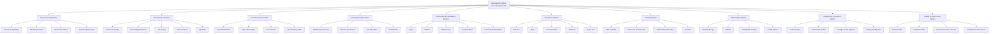

---

## Decomposition Map - Practical Categories / Domain / Skills

| No | Category / Domain | Practical Skills yang Perlu Dikuasai | Implementasi di Java Jersey/JAX-RS | Kenapa Penting |
|---:|---|---|---|---|
| 1 | **Service Decomposition** | Memecah sistem berdasarkan business capability, bounded context, ownership, dan change frequency | Tentukan package/module/service berdasarkan domain: `order-service`, `customer-service`, `billing-service`, bukan sekadar layer teknis | Salah boundary akan membuat microservice berubah menjadi distributed monolith |
| 2 | **Service Boundary & Ownership** | Menentukan siapa pemilik data, API, event, dan business rule | Service hanya expose data lewat REST/event; hindari service lain query langsung ke tabelnya | Menjaga loose coupling dan independent deployability |
| 3 | **Microservice Chassis Pattern** | Membuat template standar service: logging, exception mapping, health, config, tracing, security, HTTP client | Base Jersey app dengan `Application`, `ResourceConfig`, `ContainerRequestFilter`, `ExceptionMapper`, client provider | Agar semua service punya standar operasional yang konsisten |
| 4 | **REST Resource Pattern** | Mendesain resource URI, method semantics, status code, pagination, filtering, sorting | `@Path`, `@GET`, `@POST`, `@PUT`, `@PATCH`, `@DELETE`, `@Produces`, `@Consumes` | API adalah kontrak utama antar-service dan external consumer |
| 5 | **DTO / Representation Pattern** | Pisahkan entity DB, domain model, request DTO, response DTO | `CreateOrderRequest`, `OrderResponse`, `OrderEntity`, mapper manual/MapStruct | Mencegah leak struktur database ke API |
| 6 | **API Versioning Pattern** | URI versioning, header versioning, backward compatibility, deprecation policy | `/api/v1/orders`, media type versioning, OpenAPI per version | Menghindari breaking change ke consumer |
| 7 | **Error Contract Pattern** | Standardisasi error response, validation error, correlation ID, error code | `ExceptionMapper<DomainException>`, `ExceptionMapper<ConstraintViolationException>` | Memudahkan troubleshooting dan integrasi antar-system |
| 8 | **API Gateway Pattern** | Routing, TLS termination, auth delegation, rate limit, aggregation ringan | Service tetap fokus domain; gateway menangani cross-cutting edge concern | Mengurangi duplikasi concern edge di setiap microservice |
| 9 | **Backend for Frontend / BFF** | API khusus per channel: web, mobile, partner, internal admin | BFF memanggil beberapa Jersey service dan membentuk response sesuai UI journey | Menghindari frontend terlalu banyak orchestration API |
| 10 | **Synchronous Communication Pattern** | REST client, timeout, retry, circuit breaker, connection pooling | Jersey Client / MicroProfile REST Client; set connect/read timeout, filter, retry policy | Cocok untuk query cepat, tapi rawan cascading failure |
| 11 | **Asynchronous Communication Pattern** | Queue, event, command, pub/sub, dead-letter handling | RabbitMQ/Kafka-style event publisher/consumer; outbox table + worker | Cocok untuk workflow long-running dan decoupling |
| 12 | **Event-Driven Pattern** | Domain event, integration event, event schema, ordering, replay, idempotent consumer | `OrderCreated`, `PaymentCaptured`, `CaseEscalated`; event stored + published | Mengurangi coupling, tapi butuh governance schema dan observability |
| 13 | **Database per Service Pattern** | Private schema/table/database per service; access via API/event only | PostgreSQL schema per service + DB user grants; MyBatis mapper hanya di owning service | Microservices.io menekankan data service harus private dan diakses via API, bukan langsung dari service lain. ([microservices.io](https://microservices.io/patterns/data/database-per-service.html)) |
| 14 | **Shared Database Anti-Pattern** | Mengenali risiko cross-service join, shared table, shared stored procedure | Hindari `service A` membaca tabel `service B`; ganti dengan API composition/event read model | Shared DB biasanya mempercepat awal, tapi merusak autonomy service |
| 15 | **API Composition Pattern** | Menggabungkan data dari beberapa service di application layer | Aggregator resource: call customer-service + order-service + billing-service | Berguna untuk query lintas-service tanpa join database |
| 16 | **CQRS / Read Model Pattern** | Pisahkan command model dan query model; materialized view untuk query kompleks | PostgreSQL read table/materialized view yang diisi dari event | Cocok untuk reporting, dashboard, search, dan query lintas-domain |
| 17 | **Saga Pattern** | Mengelola transaksi lintas-service dengan step, compensation, state, timeout | Camunda BPMN orchestration atau choreography via event | Microservices.io merekomendasikan Saga untuk transaksi lintas-service ketika database dipisah. ([microservices.io](https://microservices.io/patterns/data/database-per-service.html)) |
| 18 | **Process Orchestration Pattern** | Workflow long-running, human task, retry, escalation, compensation | Camunda process: `reserveInventory → chargePayment → createShipment` | Sangat relevan untuk enforcement lifecycle, case management, approval, dan escalation |
| 19 | **Outbox Pattern** | Atomic write antara database update dan event publishing | Insert domain data + outbox row dalam satu transaksi PostgreSQL; worker publish event | Mencegah data committed tetapi event gagal terkirim |
| 20 | **Inbox / Idempotent Consumer Pattern** | Dedup event/command agar consumer aman terhadap retry | Table `processed_message(id, consumer, processed_at)` | Sistem messaging minimal “at-least-once”; consumer harus idempotent |
| 21 | **Idempotency Key Pattern** | Aman terhadap retry request dari client/gateway | Header `Idempotency-Key`; simpan request key + response/result | Penting untuk POST payment, order creation, case action |
| 22 | **Resilience Pattern** | Timeout, retry with backoff, circuit breaker, fallback, bulkhead | MicroProfile Fault Tolerance menyediakan konsep seperti timeout, retry, fallback, circuit breaker, bulkhead. ([MicroProfile](https://microprofile.io/specifications/fault-tolerance/4-1/?utm_source=chatgpt.com)) | Mencegah satu dependency lambat menjatuhkan seluruh service |
| 23 | **Rate Limiting & Backpressure** | Limit request, queue depth, thread pool isolation, graceful rejection | Gateway limit + service-level semaphore/thread pool | Melindungi database, downstream API, dan worker dari overload |
| 24 | **Health Check Pattern** | Liveness, readiness, startup health | `/health/live`, `/health/ready`; cek DB/downstream hanya di readiness | Kubernetes memakai liveness/readiness/startup probes untuk menentukan restart dan traffic routing container. ([Kubernetes](https://kubernetes.io/docs/concepts/workloads/pods/probes/?utm_source=chatgpt.com)) |
| 25 | **Configuration Pattern** | Externalized config, environment-specific config, config validation | ENV var, mounted config, MicroProfile Config, typed config class | Satu image dapat berjalan di dev/test/prod/on-prem/cloud |
| 26 | **Secret Management Pattern** | DB credential, API token, private key, cert rotation | Kubernetes Secret, cloud secret manager, vault-style injection | Menghindari hardcoded secret di repo atau image |
| 27 | **Security Boundary Pattern** | AuthN/AuthZ, JWT validation, service-to-service trust, object-level authorization | Jersey `ContainerRequestFilter`; policy check di service/domain layer | OWASP API Security 2023 menempatkan Broken Object Level Authorization sebagai risiko utama API. ([OWASP](https://owasp.org/www-project-api-security/?utm_source=chatgpt.com)) |
| 28 | **Observability Pattern** | Logs, metrics, traces, correlation ID, audit trail | SLF4J structured JSON logs, OpenTelemetry Java, trace propagation headers | OpenTelemetry Java mendukung telemetry seperti metrics, logs, dan traces. ([OpenTelemetry](https://opentelemetry.io/docs/languages/java/?utm_source=chatgpt.com)) |
| 29 | **Auditability Pattern** | Audit event, who/what/when/why, before-after state, regulatory traceability | `audit_log`, domain event, immutable append-only log | Krusial untuk regulatory system, enforcement lifecycle, dan case decision defensibility |
| 30 | **Deployment Pattern** | Container image, immutable build, rolling update, rollback, config injection | Dockerfile, Maven build, GitHub Actions, Kubernetes Deployment | Membuat service bisa dipromosikan antar-environment secara repeatable |
| 31 | **Service Discovery Pattern** | Menemukan endpoint service secara dinamis | Kubernetes Service DNS, internal gateway, config-based endpoint | Menghindari hardcoded IP/host antar-service |
| 32 | **Sidecar / Service Mesh Pattern** | mTLS, traffic policy, retries, observability, routing di layer infra | Istio/Linkerd/Envoy sidecar bila organisasi memakai mesh | Berguna, tapi jangan dipakai untuk menutupi desain API/resilience yang buruk |
| 33 | **Contract Testing Pattern** | Memastikan producer dan consumer API tetap compatible | Pact-style CDC, OpenAPI diff, integration tests against mock server | Mengurangi risiko breaking change antar-service |
| 34 | **Integration Testing Pattern** | Test DB, REST API, messaging, containerized dependency | Testcontainers PostgreSQL/RabbitMQ, JerseyTest, mock downstream | Menangkap bug wiring yang tidak terlihat di unit test |
| 35 | **Architecture Governance Pattern** | Standard service template, ADR, API guideline, dependency rule, ownership matrix | ADR per major decision; lint OpenAPI; enforce package boundaries | Tanpa governance, microservice estate cepat menjadi tidak konsisten |
| 36 | **Operational Runbook Pattern** | SOP incident, dashboard, alert, rollback, data repair, replay event | Runbook per service: “DB down”, “event stuck”, “Camunda job retry exhausted” | Microservice yang bagus harus bisa dioperasikan, bukan hanya dikembangkan |

---

## Roadmap Alur Belajar yang Direkomendasikan

| Urutan | Fokus | Output Praktis |
|---:|---|---|
| 1 | **Service boundary & decomposition** | Bisa menentukan batas service berdasarkan domain, data ownership, dan lifecycle change |
| 2 | **Jersey/JAX-RS API pattern** | Bisa membuat REST resource, DTO, error contract, filter, exception mapper |
| 3 | **Data ownership & database per service** | Bisa membedakan private table, schema per service, shared DB anti-pattern |
| 4 | **Communication pattern** | Bisa memilih sync REST, async event, API composition, atau CQRS |
| 5 | **Distributed transaction** | Bisa menerapkan Saga, compensation, idempotency, outbox/inbox |
| 6 | **Resilience & failure handling** | Bisa memasang timeout, retry, circuit breaker, fallback, bulkhead |
| 7 | **Observability & production diagnostics** | Bisa membaca logs, metrics, traces, health checks, correlation ID |
| 8 | **Security & governance** | Bisa enforce JWT, object authorization, secret handling, API governance |
| 9 | **Deployment/runtime** | Bisa menjalankan service via Docker/Kubernetes dengan probes, config, rollback |
| 10 | **Testing strategy** | Bisa membuat unit, integration, contract, and workflow tests |

---

## Rekomendasi Materi Selanjutnya

Lanjut paling tepat: **Microservice Pattern - Seri 1: Service Decomposition, Service Boundary, Bounded Context, dan Database Ownership untuk Java Jersey/JAX-RS Microservice**.

---

**Sources:**

- [Jakarta RESTful Web Services | Jakarta EE | The Eclipse Foundation](https://jakarta.ee/specifications/restful-ws/)
- [Eclipse Jersey | projects.eclipse.org](https://projects.eclipse.org/projects/ee4j.jersey)
- [Home - MicroProfile](https://microprofile.io/)
- [Pattern: Database per service](https://microservices.io/patterns/data/database-per-service.html)
- [Liveness, Readiness, and Startup Probes](https://kubernetes.io/docs/concepts/workloads/pods/probes/?utm_source=chatgpt.com)
- [OWASP API Security Project](https://owasp.org/www-project-api-security/?utm_source=chatgpt.com)
- [Java](https://opentelemetry.io/docs/languages/java/?utm_source=chatgpt.com)

## Response:
7/14/2026, 9:56:54 PM

Total saya rekomendasikan **18 seri** untuk topik **Microservice Pattern in Java Jersey/JAX-RS based microservice application**.

| Seri | Topik |
|---:|---|
| 1 | Service Decomposition, Service Boundary, Bounded Context, dan Ownership |
| 2 | Microservice Chassis Pattern untuk Java Jersey/JAX-RS |
| 3 | REST Resource Design Pattern, DTO, API Contract, dan Error Contract |
| 4 | API Versioning, Backward Compatibility, Deprecation, dan OpenAPI Governance |
| 5 | Synchronous Communication Pattern: REST Client, Timeout, Retry, dan Client Abstraction |
| 6 | Asynchronous Communication Pattern: Queue, Event, Pub/Sub, dan Worker Pattern |
| 7 | API Gateway, BFF, Aggregator, dan Edge Service Pattern |
| 8 | Database per Service, Schema Ownership, Shared DB Anti-Pattern |
| 9 | API Composition, CQRS, Read Model, Materialized View, dan Reporting Query Pattern |
| 10 | Distributed Transaction Pattern: Saga, Compensation, Timeout, dan Failure State |
| 11 | Outbox, Inbox, Idempotency Key, Deduplication, dan Exactly-Once Illusion |
| 12 | Camunda-based Microservice Orchestration Pattern |
| 13 | Resilience Pattern: Circuit Breaker, Bulkhead, Fallback, Rate Limit, Backpressure |
| 14 | Security Pattern: JWT, OAuth2, Service-to-Service Auth, Authorization Boundary |
| 15 | Observability Pattern: Logs, Metrics, Tracing, Correlation ID, Audit Trail |
| 16 | Configuration, Secrets, Environment Parity, dan Runtime Config Pattern |
| 17 | Deployment Pattern: Docker, Kubernetes, Probes, Rolling Update, Rollback |
| 18 | Testing & Governance Pattern: Contract Test, Integration Test, ADR, Runbook |

Jadi total: **18 seri**.

Rekomendasi mulai dari **Seri 1: Service Decomposition, Service Boundary, Bounded Context, dan Ownership**, karena ini fondasi. Kalau boundary salah, pattern lain seperti REST, database, event, saga, dan deployment biasanya ikut kacau.

## Response:
7/14/2026, 9:57:14 PM

Baik, saya mulai dari **Seri 1/18** dan akan menekankan sisi praktis: keputusan boundary, aturan ownership, contoh struktur service, checklist implementasi, dan failure mode yang perlu diwaspadai.

# Microservice Pattern - Seri 1/18  
## Service Decomposition, Service Boundary, Bounded Context, dan Ownership

## Introduction

Pada seri pertama ini, fokusnya adalah **cara menentukan batas microservice yang benar secara praktis**. Ini fondasi paling penting. Kalau boundary salah, pattern lain seperti REST API, database-per-service, event-driven, Saga, Camunda orchestration, observability, dan deployment Kubernetes akan ikut bermasalah.

Microservice secara umum adalah arsitektur yang membagi aplikasi menjadi service yang **loosely coupled** dan **independently deployable**; service biasanya diorganisasi berdasarkan **business capability** dan dimiliki oleh tim tertentu. ([microservices.io](https://microservices.io/?utm_source=chatgpt.com)) Dalam konteks Java Jersey/JAX-RS, boundary itu kemudian muncul sebagai REST resource, DTO contract, MyBatis mapper, database schema, event, configuration, deployment unit, dan ownership operasional.

Jadi pertanyaan utama seri ini bukan:

> “Bagaimana membuat banyak REST API?”

Tetapi:

> “Bagian bisnis mana yang layak menjadi service mandiri, punya data sendiri, punya aturan sendiri, bisa berubah dan di-deploy tanpa merusak service lain?”

---

# 1. Mental Model Praktis

Microservice boundary yang sehat biasanya punya **5 ownership**:

```text
Microservice Boundary =
  Business Capability Ownership
+ Data Ownership
+ API Contract Ownership
+ Runtime Ownership
+ Operational Ownership
```

Artinya satu service seharusnya jelas menjawab:

| Pertanyaan | Jawaban yang Harus Jelas |
|---|---|
| Service ini bertanggung jawab atas capability bisnis apa? | Contoh: Case Intake, Case Investigation, Enforcement Action, Notification |
| Data apa yang dia miliki? | Tabel/schema PostgreSQL yang tidak boleh diakses langsung oleh service lain |
| API/event apa yang dia expose? | REST endpoint, integration event, command |
| Rule bisnis apa yang hidup di dalamnya? | Validation, state transition, eligibility, escalation |
| Siapa yang troubleshoot kalau service ini gagal? | Owner/tim/domain maintainer |

---

# 2. Diagram Decomposition Map

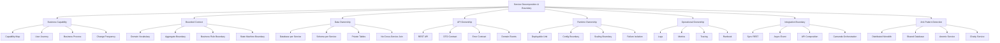

---

# 3. Decomposition Map - Practical Categories / Domain / Skills

| No | Area | Fokus Praktis | Implementasi di Java Jersey/JAX-RS | Output yang Harus Bisa Dibuat |
|---:|---|---|---|---|
| 1 | **Business Capability Mapping** | Memetakan apa yang bisnis lakukan untuk menghasilkan value | Identifikasi calon service dari proses bisnis, bukan dari package teknis | Capability map: `Case Intake`, `Investigation`, `Decisioning`, `Notification`, `Audit` |
| 2 | **Bounded Context** | Menentukan batas istilah, rule, dan model domain | Tiap service punya model sendiri, tidak harus sama dengan service lain | Context map dan glossary domain per service |
| 3 | **Service Candidate Identification** | Menentukan kandidat service awal | Mulai dari domain yang punya lifecycle, data, dan rule sendiri | Daftar kandidat service + alasan |
| 4 | **Ownership Matrix** | Menentukan siapa pemilik data, API, rule, dan operasi | Satu service = satu ownership jelas | Tabel ownership: service, data owner, API owner, operational owner |
| 5 | **Data Ownership** | Menentukan tabel/schema yang private untuk service | MyBatis mapper hanya boleh mengakses schema service sendiri | PostgreSQL schema ownership dan DB grants |
| 6 | **REST Boundary** | Menentukan endpoint yang mewakili capability, bukan tabel | Jersey `@Path`, request DTO, response DTO, exception mapper | API contract per service |
| 7 | **State Boundary** | Menentukan state machine yang hidup dalam service | Enum/state table/domain transition logic | State transition map |
| 8 | **Business Rule Boundary** | Menentukan rule yang tidak boleh tersebar | Validation dan policy check di domain/application layer | Rule catalog per service |
| 9 | **Integration Boundary** | Menentukan kapan pakai REST, event, atau orchestration | Jersey Client, message publisher, Camunda worker/delegate | Integration decision matrix |
| 10 | **Failure Boundary** | Menentukan apa yang terjadi jika dependency gagal | Timeout, fallback, retry limit, compensation | Failure mode table |
| 11 | **Deployment Boundary** | Menentukan apakah service bisa di-deploy sendiri | Maven module, Docker image, Kubernetes Deployment | Deployable service artifact |
| 12 | **Scaling Boundary** | Menentukan apakah service perlu scaling berbeda | Pod replica, HPA, worker pool | Scaling rule per service |
| 13 | **Security Boundary** | Menentukan authorization dan object access boundary | Jersey request filter + domain authorization check | Permission matrix |
| 14 | **Audit Boundary** | Menentukan audit event yang wajib dicatat | Append-only audit table/event | Audit event catalog |
| 15 | **Anti-Corruption Layer** | Melindungi domain dari model eksternal/legacy | Adapter layer, translator DTO, mapper | Adapter package dan translation rules |
| 16 | **Shared Kernel Decision** | Menentukan library bersama yang aman | Common library hanya untuk utility stabil, bukan domain rule | List allowed shared libs |
| 17 | **Service Size Control** | Menentukan kapan service terlalu besar/kecil | Cek cohesion, coupling, ownership, deployability | Boundary review checklist |
| 18 | **Distributed Monolith Detection** | Mendeteksi microservice yang saling tergantung terlalu erat | Analisis call chain, DB access, release dependency | Smell report |

---

# 4. Practical Boundary Heuristics

Gunakan aturan praktis berikut saat menentukan apakah sebuah capability layak menjadi microservice.

## 4.1 Layak Menjadi Service Sendiri Jika

| Sinyal | Contoh |
|---|---|
| Punya lifecycle bisnis sendiri | Case bisa dibuat, diverifikasi, diinvestigasi, dieskalasi, ditutup |
| Punya data ownership jelas | `case`, `case_status_history`, `case_assignment` |
| Punya rule kompleks | Eligibility, SLA, escalation, approval |
| Sering berubah secara independen | Rule investigation berubah tanpa mengubah billing/notification |
| Butuh scaling berbeda | Notification worker butuh scale tinggi, decision service tidak |
| Punya security boundary berbeda | Data investigation hanya boleh diakses role tertentu |
| Punya audit requirement kuat | Semua decision dan transition harus traceable |

## 4.2 Belum Layak Menjadi Service Sendiri Jika

| Sinyal | Risiko |
|---|---|
| Hanya wrapper CRUD atas satu tabel kecil | Service terlalu tipis |
| Selalu dipanggil bersamaan dengan service lain | Distributed monolith |
| Tidak punya ownership data | Cenderung jadi shared database client |
| Tidak bisa deploy independen | Microservice hanya nama |
| Rule bisnisnya milik domain lain | Boundary salah |
| Perlu join langsung ke banyak tabel service lain | Data ownership belum matang |

---

# 5. Contoh Domain Praktis

Misalnya ada sistem regulatory/enforcement case management.

## 5.1 Candidate Services

| Service | Responsibility | Data yang Dimiliki | API/Event |
|---|---|---|---|
| `case-intake-service` | Menerima laporan/case awal | `case_intake`, `intake_attachment`, `intake_validation` | `POST /case-intakes`, event `CaseIntakeSubmitted` |
| `case-management-service` | Mengelola lifecycle case utama | `case`, `case_status_history`, `case_assignment` | `GET /cases/{id}`, `POST /cases/{id}/transition` |
| `investigation-service` | Mengelola investigation activity | `investigation`, `evidence`, `finding` | `POST /investigations`, event `FindingSubmitted` |
| `decision-service` | Mengelola recommendation/decision | `decision`, `decision_reason`, `approval_result` | `POST /decisions`, event `DecisionApproved` |
| `notification-service` | Mengirim email/SMS/webhook | `notification_request`, `delivery_attempt` | event consumer `CaseEscalated` |
| `audit-service` | Menyimpan audit trail lintas-domain | `audit_event` | `POST /audit-events` atau event consumer |
| `document-service` | Mengelola file/attachment | `document_metadata`, `document_access` | `POST /documents`, `GET /documents/{id}` |

Catatan penting: tidak semua ini harus langsung menjadi service fisik. Bisa dimulai sebagai **modular monolith** atau Maven multi-module dulu, lalu diekstrak saat boundary sudah stabil.

---

# 6. Contoh Struktur Implementasi Service

Contoh untuk `case-management-service`.

```text
case-management-service/
├── pom.xml
├── src/main/java/com/company/caseapp/casemanagement/
│   ├── CaseManagementApplication.java
│   │
│   ├── api/
│   │   ├── CaseResource.java
│   │   ├── CaseTransitionResource.java
│   │   ├── dto/
│   │   │   ├── CaseResponse.java
│   │   │   ├── CreateCaseRequest.java
│   │   │   └── TransitionCaseRequest.java
│   │   └── error/
│   │       ├── ApiErrorResponse.java
│   │       └── DomainExceptionMapper.java
│   │
│   ├── application/
│   │   ├── CaseApplicationService.java
│   │   ├── CaseTransitionService.java
│   │   └── CaseQueryService.java
│   │
│   ├── domain/
│   │   ├── Case.java
│   │   ├── CaseStatus.java
│   │   ├── CaseTransitionPolicy.java
│   │   ├── CaseAssignment.java
│   │   └── CaseDomainEvent.java
│   │
│   ├── infrastructure/
│   │   ├── persistence/
│   │   │   ├── CaseMapper.java
│   │   │   ├── CaseRecord.java
│   │   │   └── CaseMapper.xml
│   │   ├── event/
│   │   │   ├── CaseEventPublisher.java
│   │   │   └── OutboxRepository.java
│   │   └── client/
│   │       ├── InvestigationClient.java
│   │       └── DocumentClient.java
│   │
│   └── config/
│       ├── DatabaseConfig.java
│       └── JerseyConfig.java
│
└── src/main/resources/
    ├── db/migration/
    ├── mybatis/
    └── application.properties
```

## Prinsip Struktur

| Layer | Isi | Tidak Boleh Berisi |
|---|---|---|
| `api` | REST resource, DTO, exception mapper | SQL, rule bisnis kompleks |
| `application` | Use case orchestration | Detail HTTP/Jersey low-level |
| `domain` | Entity/domain object, policy, state transition | MyBatis, Jersey annotation |
| `infrastructure` | DB mapper, external client, event publisher | Rule domain utama |
| `config` | Wiring, config, provider | Business logic |

---

# 7. Contoh Jersey Resource Boundary

Jakarta RESTful Web Services menyediakan API untuk membuat web service berbasis REST. ([jakarta.ee](https://jakarta.ee/specifications/restful-ws/4.0/?utm_source=chatgpt.com)) Di service boundary, resource harus merepresentasikan capability, bukan sekadar tabel.

```java
@Path("/cases")
@Produces(MediaType.APPLICATION_JSON)
@Consumes(MediaType.APPLICATION_JSON)
public class CaseResource {

    private final CaseApplicationService caseApplicationService;

    public CaseResource(CaseApplicationService caseApplicationService) {
        this.caseApplicationService = caseApplicationService;
    }

    @POST
    public Response createCase(CreateCaseRequest request,
                               @Context SecurityContext securityContext) {
        CaseResponse response = caseApplicationService.createCase(
            request,
            securityContext.getUserPrincipal().getName()
        );

        return Response
            .status(Response.Status.CREATED)
            .entity(response)
            .build();
    }

    @GET
    @Path("/{caseId}")
    public Response getCase(@PathParam("caseId") String caseId) {
        CaseResponse response = caseApplicationService.getCase(caseId);
        return Response.ok(response).build();
    }

    @POST
    @Path("/{caseId}/transitions")
    public Response transitionCase(@PathParam("caseId") String caseId,
                                   TransitionCaseRequest request,
                                   @Context SecurityContext securityContext) {
        CaseResponse response = caseApplicationService.transitionCase(
            caseId,
            request,
            securityContext.getUserPrincipal().getName()
        );

        return Response.ok(response).build();
    }
}
```

## Kenapa endpoint transition lebih baik daripada update status langsung?

Kurang baik:

```http
PATCH /cases/{id}
{
  "status": "ESCALATED"
}
```

Lebih baik:

```http
POST /cases/{id}/transitions
{
  "action": "ESCALATE",
  "reason": "SLA breached",
  "comment": "No response after 5 business days"
}
```

Alasannya:

| Pendekatan | Masalah |
|---|---|
| Update status langsung | Consumer bisa melewati rule bisnis |
| Transition berbasis action | Service bisa validasi state, role, SLA, reason, audit |
| Domain action eksplisit | Cocok untuk audit dan regulatory defensibility |

---

# 8. Contoh Domain Boundary

```java
public final class Case {

    private final String id;
    private CaseStatus status;
    private String assignedOfficerId;

    public Case(String id, CaseStatus status, String assignedOfficerId) {
        this.id = id;
        this.status = status;
        this.assignedOfficerId = assignedOfficerId;
    }

    public void transition(CaseAction action, CaseTransitionContext context) {
        if (!CaseTransitionPolicy.isAllowed(status, action, context)) {
            throw new InvalidCaseTransitionException(id, status, action);
        }

        this.status = CaseTransitionPolicy.nextStatus(status, action);
    }

    public String id() {
        return id;
    }

    public CaseStatus status() {
        return status;
    }

    public String assignedOfficerId() {
        return assignedOfficerId;
    }
}
```

Contoh policy:

```java
public final class CaseTransitionPolicy {

    private CaseTransitionPolicy() {}

    public static boolean isAllowed(
        CaseStatus currentStatus,
        CaseAction action,
        CaseTransitionContext context
    ) {
        return switch (currentStatus) {
            case DRAFT -> action == CaseAction.SUBMIT;
            case SUBMITTED -> action == CaseAction.ASSIGN;
            case ASSIGNED -> action == CaseAction.START_INVESTIGATION
                          || action == CaseAction.ESCALATE;
            case UNDER_INVESTIGATION -> action == CaseAction.SUBMIT_FINDING
                                      || action == CaseAction.ESCALATE;
            case DECISION_PENDING -> action == CaseAction.APPROVE
                                  || action == CaseAction.REJECT;
            case CLOSED -> false;
        };
    }

    public static CaseStatus nextStatus(CaseStatus currentStatus, CaseAction action) {
        return switch (action) {
            case SUBMIT -> CaseStatus.SUBMITTED;
            case ASSIGN -> CaseStatus.ASSIGNED;
            case START_INVESTIGATION -> CaseStatus.UNDER_INVESTIGATION;
            case SUBMIT_FINDING -> CaseStatus.DECISION_PENDING;
            case APPROVE, REJECT -> CaseStatus.CLOSED;
            case ESCALATE -> CaseStatus.ESCALATED;
        };
    }
}
```

Prinsipnya: **state transition rule jangan ditaruh di resource/controller**. Resource hanya menerima HTTP. Rule bisnis harus hidup di domain/application layer.

---

# 9. Database Ownership Pattern

Pola **Database per Service** menyatakan bahwa persistent data milik sebuah microservice harus private dan hanya dapat diakses melalui API service tersebut; transaksi sebuah service hanya melibatkan databasenya sendiri. ([microservices.io](https://microservices.io/patterns/data/database-per-service.html?utm_source=chatgpt.com))

## Contoh PostgreSQL Schema Ownership

```sql
CREATE SCHEMA case_management;

CREATE TABLE case_management.case_record (
    case_id              UUID PRIMARY KEY,
    case_number          VARCHAR(50) NOT NULL UNIQUE,
    status               VARCHAR(50) NOT NULL,
    assigned_officer_id  UUID NULL,
    created_at           TIMESTAMPTZ NOT NULL DEFAULT now(),
    updated_at           TIMESTAMPTZ NOT NULL DEFAULT now()
);

CREATE TABLE case_management.case_status_history (
    history_id       UUID PRIMARY KEY,
    case_id          UUID NOT NULL,
    from_status      VARCHAR(50),
    to_status        VARCHAR(50) NOT NULL,
    action           VARCHAR(50) NOT NULL,
    reason           TEXT,
    changed_by       UUID NOT NULL,
    changed_at       TIMESTAMPTZ NOT NULL DEFAULT now()
);

CREATE TABLE case_management.outbox_event (
    event_id          UUID PRIMARY KEY,
    aggregate_id      UUID NOT NULL,
    event_type        VARCHAR(100) NOT NULL,
    payload           JSONB NOT NULL,
    status            VARCHAR(30) NOT NULL DEFAULT 'PENDING',
    created_at        TIMESTAMPTZ NOT NULL DEFAULT now(),
    published_at      TIMESTAMPTZ NULL
);
```

## Rule Praktis DB Ownership

| Rule | Penjelasan |
|---|---|
| Service lain tidak boleh query langsung ke schema `case_management` | Harus lewat REST API atau event |
| MyBatis mapper hanya boleh ada di owning service | Mapper service lain tidak boleh refer table ini |
| Foreign key lintas-service sebaiknya dihindari | Pakai logical reference ID |
| Join lintas-service di DB adalah red flag | Gunakan API composition, event read model, atau reporting store |
| Stored procedure lintas-domain harus dihindari | PL/pgSQL boleh, tapi tetap dalam boundary service owner |

---

# 10. Contoh MyBatis Mapper Boundary

```java
public interface CaseMapper {

    CaseRecord findById(@Param("caseId") UUID caseId);

    void insert(CaseRecord record);

    void updateStatus(@Param("caseId") UUID caseId,
                      @Param("status") String status,
                      @Param("updatedAt") OffsetDateTime updatedAt);

    void insertStatusHistory(CaseStatusHistoryRecord record);

    void insertOutboxEvent(OutboxEventRecord record);
}
```

Contoh XML mapper:

```xml
<mapper namespace="com.company.caseapp.casemanagement.infrastructure.persistence.CaseMapper">

    <select id="findById" resultType="CaseRecord">
        SELECT
            case_id,
            case_number,
            status,
            assigned_officer_id,
            created_at,
            updated_at
        FROM case_management.case_record
        WHERE case_id = #{caseId}
    </select>

    <insert id="insert">
        INSERT INTO case_management.case_record (
            case_id,
            case_number,
            status,
            assigned_officer_id,
            created_at,
            updated_at
        ) VALUES (
            #{caseId},
            #{caseNumber},
            #{status},
            #{assignedOfficerId},
            #{createdAt},
            #{updatedAt}
        )
    </insert>

</mapper>
```

Yang penting: mapper ini hanya hidup di `case-management-service`, bukan di `investigation-service`, `decision-service`, atau `notification-service`.

---

# 11. API Ownership vs Data Ownership

Boundary yang sehat membedakan **data internal** dan **contract eksternal**.

## Internal Table

```sql
case_management.case_record
```

Boleh berubah selama tidak merusak API/event contract.

## External API Contract

```http
GET /cases/{caseId}
```

Response:

```json
{
  "caseId": "9cc9c5e3-8d7b-4c74-b3f9-11fcf49b6a61",
  "caseNumber": "CASE-2026-000123",
  "status": "UNDER_INVESTIGATION",
  "assignedOfficerId": "4c35d6d7-d234-4e25-b0ae-7f91d36ce111",
  "createdAt": "2026-07-14T10:00:00Z"
}
```

## Domain Event Contract

```json
{
  "eventId": "0f9c6f26-70ff-45ae-93fd-fb30c62b0101",
  "eventType": "CaseEscalated",
  "eventVersion": 1,
  "occurredAt": "2026-07-14T10:15:00Z",
  "caseId": "9cc9c5e3-8d7b-4c74-b3f9-11fcf49b6a61",
  "reason": "SLA_BREACHED"
}
```

Rule praktis:

| Boleh Diubah Bebas | Harus Dijaga Compatibility |
|---|---|
| Nama kolom internal | REST response field |
| Struktur table internal | Event schema |
| Index internal | Error code |
| Query MyBatis | HTTP status behavior |
| Stored procedure internal | Public API semantic |

---

# 12. Integration Boundary Decision

Gunakan tabel ini saat menentukan hubungan antar-service.

| Kebutuhan | Pattern yang Cocok | Contoh |
|---|---|---|
| Butuh jawaban langsung untuk user request | Sync REST | `case-management-service` call `document-service` untuk metadata |
| Tidak perlu jawaban langsung | Async event | `CaseEscalated` dikonsumsi notification service |
| Workflow panjang multi-step | Camunda orchestration | Assign investigator → collect evidence → decision approval |
| Query lintas-service untuk UI | API Composition/BFF | Dashboard case detail gabung case + investigation + document |
| Reporting berat | Read model/CQRS | Materialized reporting table dari event |
| Integrasi legacy/external | Anti-Corruption Layer | Adapter ke external registry/payment/identity platform |

---

# 13. Contoh Boundary yang Salah vs Benar

## Salah: Service Dipisah Berdasarkan Tabel

```text
case-service
case-status-service
case-assignment-service
case-comment-service
case-document-link-service
```

Masalah:

| Masalah | Dampak |
|---|---|
| Terlalu granular | Banyak network call |
| Rule tersebar | Transition case sulit dijaga |
| Transaction makin rumit | Perlu koordinasi antar-service untuk operasi sederhana |
| High coupling | Semua service berubah bersama |

## Lebih Benar: Service Berdasarkan Capability

```text
case-management-service
investigation-service
decision-service
document-service
notification-service
audit-service
```

Kelebihan:

| Kelebihan | Dampak |
|---|---|
| Boundary mengikuti bisnis | Lebih mudah dipahami stakeholder |
| Rule terkumpul | Lebih defensible |
| Data ownership jelas | Mengurangi coupling |
| Bisa deploy/scale per capability | Lebih cocok untuk microservice |

---

# 14. Practical Checklist: Apakah Boundary Ini Bagus?

Gunakan checklist ini sebelum membuat service baru.

| Checklist | Ya/Tidak |
|---|---|
| Service punya business capability jelas? |  |
| Service punya owner bisnis/teknis jelas? |  |
| Service punya data yang bisa dimiliki sendiri? |  |
| Service bisa expose API/event yang stabil? |  |
| Service bisa deploy tanpa harus deploy service lain? |  |
| Service bisa gagal tanpa menjatuhkan seluruh flow? |  |
| Service punya observability sendiri? |  |
| Service punya security boundary sendiri? |  |
| Service tidak butuh join langsung ke DB service lain? |  |
| Service tidak hanya CRUD wrapper tipis? |  |
| Service tidak terlalu sering harus berubah bersamaan dengan service lain? |  |
| Ada alasan scaling/performance/ownership yang jelas? |  |

Interpretasi:

| Hasil | Kesimpulan |
|---|---|
| Mayoritas “Ya” | Kandidat microservice kuat |
| Banyak “Tidak” | Lebih baik jadi module dulu |
| Banyak dependency sync | Waspada distributed monolith |
| Tidak punya data/rule sendiri | Kemungkinan bukan service mandiri |

---

# 15. Practical Implementation Rules

## 15.1 Rule untuk Package

Gunakan package berdasarkan domain/capability:

```text
com.company.platform.casemanagement
com.company.platform.investigation
com.company.platform.decision
```

Hindari package yang hanya teknis seperti:

```text
com.company.platform.controllers
com.company.platform.services
com.company.platform.repositories
```

Package teknis boleh ada **di dalam** boundary service, bukan sebagai struktur utama seluruh sistem.

---

## 15.2 Rule untuk DTO

DTO tidak boleh reuse entity DB.

Buruk:

```java
public class CaseRecord {
    public UUID caseId;
    public String status;
}
```

Lalu langsung dipakai sebagai API response.

Lebih baik:

```java
public record CaseResponse(
    UUID caseId,
    String caseNumber,
    String status,
    UUID assignedOfficerId,
    OffsetDateTime createdAt
) {}
```

Alasan:

| Kenapa Pisah? | Dampak |
|---|---|
| DB bisa berubah tanpa merusak API | Evolusi internal lebih aman |
| API bisa punya field yang lebih domain-friendly | Consumer lebih stabil |
| Security filtering lebih mudah | Field internal tidak bocor |
| Versioning lebih terkendali | Backward compatibility lebih mudah |

---

## 15.3 Rule untuk Cross-Service Data

Buruk:

```sql
SELECT *
FROM case_management.case_record c
JOIN investigation.investigation i ON i.case_id = c.case_id;
```

Lebih baik:

```text
Option 1: API Composition
BFF/API aggregator call:
- case-management-service
- investigation-service

Option 2: Event-driven Read Model
case-management-service emits CaseCreated
investigation-service emits InvestigationStarted
reporting-service builds read model

Option 3: Dedicated Reporting Store
ETL/event pipeline builds analytics/reporting schema
```

---

# 16. Boundary Failure Modes

| Failure Mode | Gejala | Penyebab | Perbaikan |
|---|---|---|---|
| Distributed Monolith | Semua service harus deploy bareng | Boundary terlalu kecil/tercouple | Gabungkan capability atau ubah contract |
| Shared Database Coupling | Banyak service query tabel yang sama | Data ownership tidak jelas | Enforce schema ownership dan API access |
| Chatty Services | Satu request menghasilkan puluhan call | Boundary terlalu granular | API composition, BFF, read model |
| Anemic Service | Service hanya CRUD tanpa rule | Dipisah berdasarkan table | Gabungkan ke capability owner |
| Rule Duplication | Validation sama muncul di banyak service | Bounded context tidak jelas | Pindahkan rule ke owner service |
| Event Chaos | Banyak event tanpa schema/version | Governance event lemah | Event catalog + versioning |
| Hidden Runtime Coupling | Service gagal kalau dependency lambat | Timeout/retry tidak jelas | Resilience policy per dependency |
| Ownership Ambiguity | Bug dilempar antar tim | Tidak ada owner matrix | Tetapkan ownership eksplisit |

---

# 17. Practical Output untuk Onboarding

Setelah memahami seri ini, Anda seharusnya bisa membuat dokumen seperti ini untuk service nyata.

## Service Boundary Card

```text
Service Name:
  case-management-service

Business Capability:
  Manage case lifecycle from submission to closure.

Owned Data:
  - case_record
  - case_status_history
  - case_assignment
  - case_outbox_event

Main API:
  - POST /cases
  - GET /cases/{caseId}
  - POST /cases/{caseId}/transitions
  - GET /cases/{caseId}/history

Published Events:
  - CaseCreated
  - CaseAssigned
  - CaseEscalated
  - CaseClosed

Consumed Events:
  - FindingSubmitted
  - DecisionApproved

Main Business Rules:
  - Case cannot move to UNDER_INVESTIGATION without assignment.
  - Closed case cannot be modified.
  - Escalation requires reason.
  - Every transition must be audited.

External Dependencies:
  - document-service
  - investigation-service
  - audit-service

Failure Policy:
  - Document metadata unavailable: allow case creation but mark attachment verification pending.
  - Audit failure: block transition or write to local outbox depending on compliance rule.
  - Notification failure: do not rollback case transition; retry asynchronously.

Owner:
  Case Platform Team

Operational Signals:
  - case_transition_success_total
  - case_transition_failed_total
  - case_transition_latency_ms
  - outbox_pending_count
  - invalid_transition_count
```

---

# 18. Mini Exercise Praktis

Untuk onboarding cepat, ambil satu service nyata di perusahaan Anda, lalu jawab:

| Pertanyaan | Jawaban |
|---|---|
| Apa business capability service ini? |  |
| Data apa yang dia miliki? |  |
| Tabel mana yang tidak boleh diakses service lain? |  |
| API utama apa yang dia expose? |  |
| Event apa yang dia publish/consume? |  |
| Rule bisnis apa yang hanya boleh hidup di service ini? |  |
| Dependency downstream apa saja? |  |
| Apa yang terjadi kalau dependency gagal? |  |
| Apakah service ini bisa deploy sendiri? |  |
| Apakah ini benar-benar microservice atau distributed module? |  |

Kalau jawaban banyak kosong, service tersebut belum punya boundary yang matang.

---

# 19. Roadmap Singkat Setelah Seri Ini

| Urutan | Materi | Tujuan |
|---:|---|---|
| 1 | Service Decomposition & Boundary | Menentukan batas service |
| 2 | Microservice Chassis | Membuat template teknis service yang konsisten |
| 3 | REST API Contract | Membuat API yang stabil dan maintainable |
| 4 | Communication Pattern | Memilih REST/event/orchestration |
| 5 | Data & Transaction Pattern | Mengelola consistency antar-service |

---

# Kesimpulan

Boundary microservice yang baik bukan ditentukan oleh jumlah endpoint, jumlah tabel, atau ukuran codebase. Boundary yang baik ditentukan oleh **business capability, data ownership, rule ownership, deployability, failure isolation, dan operational ownership**.

Untuk Java Jersey/JAX-RS microservice, implementasi praktisnya muncul di:

- struktur package,
- REST resource,
- DTO contract,
- MyBatis mapper,
- PostgreSQL schema ownership,
- domain service/policy,
- event contract,
- deployment unit,
- observability,
- dan runbook operasional.

**Seri 1/18 selesai.**

Rekomendasi materi berikutnya: **Seri 2 - Microservice Chassis Pattern untuk Java Jersey/JAX-RS: struktur service standar, Jersey config, filter, exception mapper, health endpoint, config, logging, dan dependency wiring.**

---

**Sources:**

- [What are microservices?](https://microservices.io/?utm_source=chatgpt.com)
- [Jakarta RESTful Web Services 4.0](https://jakarta.ee/specifications/restful-ws/4.0/?utm_source=chatgpt.com)

## Response:
7/14/2026, 9:59:39 PM

Saya lanjut ke **Seri 2/18**. Fokusnya adalah membuat “kerangka standar service” agar setiap microservice Java/Jersey punya bentuk yang konsisten, mudah di-debug, dan siap jalan di Docker/Kubernetes.

# Microservice Pattern - Seri 2/18  
## Microservice Chassis Pattern untuk Java Jersey/JAX-RS

## Introduction

**Microservice Chassis Pattern** adalah pola untuk membuat **kerangka standar** yang dipakai oleh semua microservice agar tidak setiap service mengulang setup dasar dari nol.

Dalam konteks **Java 17+, Jersey/JAX-RS, Maven, MyBatis, PostgreSQL, Docker, Kubernetes**, chassis adalah fondasi teknis yang berisi:

- struktur project,
- dependency Maven,
- Jersey `ResourceConfig`,
- REST resource registration,
- JSON provider,
- validation,
- exception mapper,
- request/response filter,
- correlation ID,
- security filter,
- config loading,
- health endpoint,
- database wiring,
- logging,
- metrics/tracing hook,
- graceful startup/shutdown,
- dan readiness/liveness behavior.

Jakarta RESTful Web Services 4.0 adalah release untuk Jakarta EE 11 dan menyediakan API dasar untuk membangun RESTful web services. ([jakarta.ee](https://jakarta.ee/specifications/restful-ws/4.0/?utm_source=chatgpt.com)) Jersey adalah implementasi JAX-RS/Jakarta REST yang menyediakan mekanisme resource, provider, filter, interceptor, dan extension point untuk aplikasi REST. ([Eclipse EE4J](https://eclipse-ee4j.github.io/jersey.github.io/documentation/latest3x/user-guide.html?utm_source=chatgpt.com)) Untuk capability microservice modern, MicroProfile 7.1 juga relevan karena mencakup Config, Health, OpenAPI, Fault Tolerance, JWT, REST Client, dan Telemetry. ([MicroProfile](https://microprofile.io/?utm_source=chatgpt.com))

---

# 1. Tujuan Microservice Chassis

Tanpa chassis, setiap service biasanya punya gaya sendiri:

```text
service-a punya error format sendiri
service-b logging-nya beda
service-c tidak punya readiness endpoint
service-d tidak punya correlation id
service-e timeout downstream tidak jelas
service-f DB config hardcoded
```

Dengan chassis, semua service punya baseline yang sama:

```text
Every service has:
- consistent Jersey bootstrapping
- standard request/response behavior
- standard error contract
- standard logging and correlation ID
- standard config loading
- standard health check
- standard DB wiring
- standard security hook
- standard Docker/Kubernetes behavior
```

Target praktisnya: ketika engineer baru membuka service apa pun, dia langsung tahu:

| Area | Standar yang Diharapkan |
|---|---|
| Entry point | Ada class aplikasi/config yang jelas |
| API | Resource ada di package `api` |
| Error | Semua exception keluar sebagai error contract standar |
| Logging | Ada `correlationId`, `requestId`, `userId` bila tersedia |
| Config | Tidak hardcoded, berasal dari env/config file/secret |
| DB | Access lewat repository/mapper terisolasi |
| Health | Ada liveness/readiness endpoint |
| Security | AuthN/AuthZ lewat filter/policy |
| Deployment | Docker/Kubernetes punya probe dan config injection |

---

# 2. Diagram Chassis

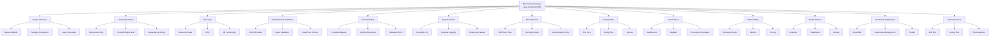

---

# 3. Decomposition Map - Practical Categories / Domain / Skills

| No | Area Chassis | Fokus Praktis | Implementasi di Java/Jersey | Output yang Harus Ada |
|---:|---|---|---|---|
| 1 | **Project Template** | Struktur folder dan package yang konsisten | Maven project dengan package `api`, `application`, `domain`, `infrastructure`, `config` | Skeleton service reusable |
| 2 | **Jersey Bootstrap** | Register resource, provider, filter, mapper | Extend `ResourceConfig` | `JerseyApplicationConfig` |
| 3 | **Dependency Injection** | Wiring service, repository, client, config | HK2/CDI/manual factory tergantung runtime | Object graph jelas |
| 4 | **REST Resource Convention** | Standar endpoint, media type, response | `@Path`, `@GET`, `@POST`, `@Produces`, `@Consumes` | Resource class konsisten |
| 5 | **DTO Convention** | Pisah request/response DTO dari DB entity | Java `record`, DTO package | DTO tidak leak table |
| 6 | **JSON Provider** | Serialization/deserialization stabil | Jackson/JSON-B provider | JSON date/time, enum, null policy jelas |
| 7 | **Validation** | Validasi request sebelum masuk domain | Jakarta Bean Validation + Jersey integration | Error validation standar |
| 8 | **Exception Mapping** | Ubah exception menjadi API error contract | `ExceptionMapper<T>` | Response error konsisten |
| 9 | **Correlation ID Filter** | Trace satu request lintas-service | `ContainerRequestFilter`, `ContainerResponseFilter` | Header `X-Correlation-Id` |
| 10 | **Request Logging Filter** | Log inbound/outbound request | Jersey filter + MDC | Log searchable |
| 11 | **Security Filter** | Validasi JWT/API key/session context | Jersey authentication filter | `SecurityContext` terisi |
| 12 | **Authorization Hook** | Object-level permission check | Policy service di application/domain layer | Permission tidak hanya di endpoint |
| 13 | **Configuration Loader** | Externalized config | Env var, properties, MicroProfile Config | Config immutable saat startup |
| 14 | **Secret Handling** | DB password/token tidak hardcoded | Env/Kubernetes Secret/secret manager | Secret tidak masuk repo |
| 15 | **Database Wiring** | DataSource, pool, MyBatis session/mapper | HikariCP + PostgreSQL + MyBatis | DB access standar |
| 16 | **Transaction Boundary** | Satu use case = satu transaksi lokal | Application service mengontrol transaksi | Tidak ada transaksi tersebar |
| 17 | **Health Endpoint** | Liveness/readiness/startup behavior | `/health/live`, `/health/ready` | Kubernetes bisa route/restart benar |
| 18 | **Metrics Hook** | Latency, count, error, DB pool, downstream call | Micrometer/OpenTelemetry/MicroProfile Metrics-like pattern | Dashboard siap dibuat |
| 19 | **Tracing Hook** | Distributed tracing antar-service | OpenTelemetry Java agent/manual instrumentation | Trace ID propagasi |
| 20 | **OpenAPI Generation** | Dokumentasi API otomatis/terkontrol | MicroProfile OpenAPI atau build-time OpenAPI | Contract bisa direview |
| 21 | **Graceful Shutdown** | Stop menerima traffic sebelum shutdown | Readiness false, drain connection, close pool | Rolling deploy aman |
| 22 | **Docker Runtime** | Build image repeatable | Multi-stage Dockerfile | Image kecil dan predictable |
| 23 | **Kubernetes Runtime** | Deployment, probes, env, secret, resource limit | Deployment YAML/Helm/Kustomize | Service production-ready |
| 24 | **Testing Harness** | Unit, Jersey API test, DB integration test | JUnit, JerseyTest, Testcontainers | Template test siap pakai |
| 25 | **Runbook Baseline** | Cara operasi service | README/runbook | Engineer bisa troubleshoot cepat |

---

# 4. Recommended Project Structure

Struktur praktis untuk satu service:

```text id="6diraj"
case-management-service/
├── pom.xml
├── Dockerfile
├── README.md
├── runbook.md
├── src/
│   ├── main/
│   │   ├── java/com/company/platform/casemanagement/
│   │   │   ├── CaseManagementApplication.java
│   │   │   │
│   │   │   ├── api/
│   │   │   │   ├── resource/
│   │   │   │   │   ├── CaseResource.java
│   │   │   │   │   └── HealthResource.java
│   │   │   │   ├── dto/
│   │   │   │   │   ├── CreateCaseRequest.java
│   │   │   │   │   ├── CaseResponse.java
│   │   │   │   │   └── ErrorResponse.java
│   │   │   │   ├── mapper/
│   │   │   │   │   └── ApiExceptionMapper.java
│   │   │   │   └── filter/
│   │   │   │       ├── CorrelationIdFilter.java
│   │   │   │       ├── RequestLoggingFilter.java
│   │   │   │       └── AuthenticationFilter.java
│   │   │   │
│   │   │   ├── application/
│   │   │   │   ├── CaseApplicationService.java
│   │   │   │   └── CaseQueryService.java
│   │   │   │
│   │   │   ├── domain/
│   │   │   │   ├── Case.java
│   │   │   │   ├── CaseStatus.java
│   │   │   │   └── CaseTransitionPolicy.java
│   │   │   │
│   │   │   ├── infrastructure/
│   │   │   │   ├── persistence/
│   │   │   │   │   ├── CaseMapper.java
│   │   │   │   │   ├── CaseRecord.java
│   │   │   │   │   └── MyBatisFactory.java
│   │   │   │   ├── client/
│   │   │   │   │   └── DocumentServiceClient.java
│   │   │   │   └── telemetry/
│   │   │   │       └── TelemetrySupport.java
│   │   │   │
│   │   │   └── config/
│   │   │       ├── JerseyConfig.java
│   │   │       ├── AppConfig.java
│   │   │       ├── DataSourceConfig.java
│   │   │       └── ObjectMapperConfig.java
│   │   │
│   │   └── resources/
│   │       ├── application.properties
│   │       ├── mybatis-config.xml
│   │       └── db/migration/
│   │
│   └── test/
│       └── java/com/company/platform/casemanagement/
│           ├── api/
│           ├── application/
│           └── infrastructure/
└── k8s/
    ├── deployment.yaml
    ├── service.yaml
    └── configmap.yaml
```

## Struktur package yang disarankan

| Package | Tanggung Jawab | Catatan |
|---|---|---|
| `api.resource` | JAX-RS resource | HTTP concern saja |
| `api.dto` | Request/response contract | Jangan reuse DB entity |
| `api.mapper` | Exception mapper/API mapper | Ubah exception ke error response |
| `api.filter` | Request/response filter | Correlation, auth, logging |
| `application` | Use case orchestration | Transaction boundary biasanya di sini |
| `domain` | Business rule, state, policy | Tidak tahu Jersey/MyBatis |
| `infrastructure.persistence` | MyBatis, DB record, repository | Detail PostgreSQL |
| `infrastructure.client` | Client ke service lain | Timeout/retry policy |
| `config` | Wiring dan config object | Tidak berisi business rule |

---

# 5. Maven Dependency Baseline

Contoh baseline `pom.xml`. Versi dependency sengaja dibuat via property agar mudah dikontrol central.

```xml id="5utdy4"
<project>
    <modelVersion>4.0.0</modelVersion>

    <groupId>com.company.platform</groupId>
    <artifactId>case-management-service</artifactId>
    <version>1.0.0</version>

    <properties>
        <maven.compiler.release>17</maven.compiler.release>

        <jersey.version>${jersey.version}</jersey.version>
        <jackson.version>${jackson.version}</jackson.version>
        <mybatis.version>${mybatis.version}</mybatis.version>
        <postgresql.version>${postgresql.version}</postgresql.version>
        <hikari.version>${hikari.version}</hikari.version>
        <slf4j.version>${slf4j.version}</slf4j.version>
        <logback.version>${logback.version}</logback.version>
        <junit.version>${junit.version}</junit.version>
    </properties>

    <dependencies>
        <!-- Jakarta REST / Jersey -->
        <dependency>
            <groupId>org.glassfish.jersey.core</groupId>
            <artifactId>jersey-server</artifactId>
            <version>${jersey.version}</version>
        </dependency>

        <dependency>
            <groupId>org.glassfish.jersey.containers</groupId>
            <artifactId>jersey-container-servlet-core</artifactId>
            <version>${jersey.version}</version>
        </dependency>

        <dependency>
            <groupId>org.glassfish.jersey.inject</groupId>
            <artifactId>jersey-hk2</artifactId>
            <version>${jersey.version}</version>
        </dependency>

        <dependency>
            <groupId>org.glassfish.jersey.media</groupId>
            <artifactId>jersey-media-json-jackson</artifactId>
            <version>${jersey.version}</version>
        </dependency>

        <!-- Validation -->
        <dependency>
            <groupId>jakarta.validation</groupId>
            <artifactId>jakarta.validation-api</artifactId>
            <version>${jakarta.validation.version}</version>
        </dependency>

        <!-- Persistence -->
        <dependency>
            <groupId>org.mybatis</groupId>
            <artifactId>mybatis</artifactId>
            <version>${mybatis.version}</version>
        </dependency>

        <dependency>
            <groupId>org.postgresql</groupId>
            <artifactId>postgresql</artifactId>
            <version>${postgresql.version}</version>
        </dependency>

        <dependency>
            <groupId>com.zaxxer</groupId>
            <artifactId>HikariCP</artifactId>
            <version>${hikari.version}</version>
        </dependency>

        <!-- Logging -->
        <dependency>
            <groupId>org.slf4j</groupId>
            <artifactId>slf4j-api</artifactId>
            <version>${slf4j.version}</version>
        </dependency>

        <dependency>
            <groupId>ch.qos.logback</groupId>
            <artifactId>logback-classic</artifactId>
            <version>${logback.version}</version>
        </dependency>

        <!-- Test -->
        <dependency>
            <groupId>org.junit.jupiter</groupId>
            <artifactId>junit-jupiter</artifactId>
            <version>${junit.version}</version>
            <scope>test</scope>
        </dependency>
    </dependencies>
</project>
```

## Practical rule

| Rule | Alasan |
|---|---|
| Versi dependency dikontrol via parent/BOM/property | Menghindari drift antar-service |
| Jangan campur `javax.*` dan `jakarta.*` sembarangan | Jakarta EE modern memakai namespace `jakarta.*` |
| Hindari dependency besar di chassis | Semua service akan mewarisi beban dependency |
| Pisahkan dependency domain-specific | Jangan semua service membawa library yang tidak dipakai |
| Chassis boleh jadi template, bukan selalu shared runtime library | Menghindari tight coupling antar-service |

---

# 6. Jersey Bootstrap dengan `ResourceConfig`

Jersey mendukung penggunaan filter, interceptor, dan provider untuk memodifikasi request processing. ([Eclipse EE4J](https://eclipse-ee4j.github.io/jersey.github.io/documentation/latest3x/user-guide.html?utm_source=chatgpt.com)) Dalam chassis, semua resource dan provider standar diregister di satu tempat.

```java id="l8mql0"
package com.company.platform.casemanagement.config;

import com.company.platform.casemanagement.api.filter.AuthenticationFilter;
import com.company.platform.casemanagement.api.filter.CorrelationIdFilter;
import com.company.platform.casemanagement.api.filter.RequestLoggingFilter;
import com.company.platform.casemanagement.api.mapper.ApiExceptionMapper;
import com.company.platform.casemanagement.api.mapper.ValidationExceptionMapper;
import com.company.platform.casemanagement.api.resource.CaseResource;
import com.company.platform.casemanagement.api.resource.HealthResource;
import org.glassfish.jersey.jackson.JacksonFeature;
import org.glassfish.jersey.server.ResourceConfig;

public class JerseyConfig extends ResourceConfig {

    public JerseyConfig() {
        // Resources
        register(CaseResource.class);
        register(HealthResource.class);

        // JSON
        register(JacksonFeature.class);
        register(ObjectMapperProvider.class);

        // Filters
        register(CorrelationIdFilter.class);
        register(RequestLoggingFilter.class);
        register(AuthenticationFilter.class);

        // Exception mappers
        register(ApiExceptionMapper.class);
        register(ValidationExceptionMapper.class);

        // Optional: package scanning if your org prefers convention
        // packages("com.company.platform.casemanagement.api");
    }
}
```

## Register eksplisit vs package scanning

| Approach | Kelebihan | Kekurangan |
|---|---|---|
| Register eksplisit | Sangat jelas, mudah audit | Perlu update manual |
| Package scanning | Praktis untuk banyak resource | Bisa register class yang tidak disengaja |
| Hybrid | Umum dipakai | Butuh convention kuat |

Untuk service enterprise/regulatory, saya cenderung pilih **explicit registration** untuk komponen kritis seperti filter, mapper, dan provider.

---

# 7. Dependency Wiring Praktis

Ada beberapa pilihan wiring:

| Pilihan | Cocok Untuk | Catatan |
|---|---|---|
| Manual factory | Service kecil, kontrol penuh | Verbose tapi eksplisit |
| HK2 Jersey | Jersey-native injection | Cukup umum di Jersey |
| CDI | Kalau runtime Jakarta EE/MicroProfile mendukung | Lebih standard di app server |
| Spring DI | Kalau organisasi memang pakai Spring | Tapi ini bukan stack utama yang disebut |
| Guice | Legacy/custom setup | Perlu standardisasi ekstra |

Contoh manual-ish wiring via binder:

```java id="uayal5"
public class ApplicationBinder extends AbstractBinder {

    @Override
    protected void configure() {
        AppConfig appConfig = AppConfig.loadFromEnvironment();

        DataSource dataSource = DataSourceConfig.createDataSource(appConfig.database());
        MyBatisFactory myBatisFactory = new MyBatisFactory(dataSource);

        bind(appConfig).to(AppConfig.class);
        bind(dataSource).to(DataSource.class);
        bind(myBatisFactory).to(MyBatisFactory.class);

        bind(CaseApplicationService.class).to(CaseApplicationService.class);
        bind(CaseQueryService.class).to(CaseQueryService.class);
    }
}
```

Lalu register:

```java id="czeqya"
public class JerseyConfig extends ResourceConfig {

    public JerseyConfig() {
        register(new ApplicationBinder());

        register(CaseResource.class);
        register(HealthResource.class);
        register(CorrelationIdFilter.class);
        register(ApiExceptionMapper.class);
        register(JacksonFeature.class);
    }
}
```

---

# 8. REST Resource Convention

Resource harus tipis. Jangan taruh logic bisnis di resource.

```java id="h0fc7z"
@Path("/cases")
@Produces(MediaType.APPLICATION_JSON)
@Consumes(MediaType.APPLICATION_JSON)
public class CaseResource {

    private final CaseApplicationService caseApplicationService;

    public CaseResource(CaseApplicationService caseApplicationService) {
        this.caseApplicationService = caseApplicationService;
    }

    @POST
    public Response create(@Valid CreateCaseRequest request,
                           @Context SecurityContext securityContext,
                           @Context HttpHeaders headers) {
        String actor = securityContext.getUserPrincipal().getName();

        CaseResponse response = caseApplicationService.createCase(request, actor);

        return Response.status(Response.Status.CREATED)
            .entity(response)
            .build();
    }

    @GET
    @Path("/{caseId}")
    public Response getById(@PathParam("caseId") UUID caseId,
                            @Context SecurityContext securityContext) {
        CaseResponse response = caseApplicationService.getCase(caseId);
        return Response.ok(response).build();
    }
}
```

## Resource boleh melakukan

| Boleh | Jangan |
|---|---|
| Ambil path/query/header | Query DB langsung |
| Validasi format sederhana | Menjalankan business rule kompleks |
| Panggil application service | Panggil banyak mapper |
| Return HTTP response | Menentukan state transition sendiri |
| Map HTTP concern | Menyimpan audit langsung tanpa use case |

---

# 9. DTO Convention

Gunakan Java `record` untuk DTO immutable.

```java id="iquivp"
public record CreateCaseRequest(
    @NotBlank String caseType,
    @NotBlank String subject,
    @Size(max = 4000) String description,
    List<UUID> documentIds
) {}
```

```java id="yil9p8"
public record CaseResponse(
    UUID caseId,
    String caseNumber,
    String status,
    String subject,
    OffsetDateTime createdAt,
    OffsetDateTime updatedAt
) {}
```

Error response standar:

```java id="5ieext"
public record ApiErrorResponse(
    String errorId,
    String correlationId,
    String code,
    String message,
    int status,
    OffsetDateTime timestamp,
    List<ApiFieldError> fieldErrors
) {}

public record ApiFieldError(
    String field,
    String code,
    String message
) {}
```

## Practical rule DTO

| Rule | Penjelasan |
|---|---|
| Request DTO berbeda dari response DTO | Kebutuhan input dan output berbeda |
| DTO berbeda dari DB record | Mencegah leak schema |
| Field waktu pakai ISO-8601 | Konsisten antar-service |
| Enum external harus stabil | Jangan rename enum sembarangan |
| Tambah field boleh, hapus/rename hati-hati | Backward compatibility |

---

# 10. JSON Provider dan ObjectMapper

```java id="agcwvh"
@Provider
public class ObjectMapperProvider implements ContextResolver<ObjectMapper> {

    private final ObjectMapper objectMapper;

    public ObjectMapperProvider() {
        this.objectMapper = new ObjectMapper()
            .registerModule(new JavaTimeModule())
            .disable(SerializationFeature.WRITE_DATES_AS_TIMESTAMPS)
            .disable(DeserializationFeature.FAIL_ON_UNKNOWN_PROPERTIES);
    }

    @Override
    public ObjectMapper getContext(Class<?> type) {
        return objectMapper;
    }
}
```

## Practical JSON decision

| Decision | Rekomendasi |
|---|---|
| Date/time | ISO-8601 string |
| Unknown input field | Biasanya ignore untuk backward compatibility, kecuali API sangat ketat |
| Null output field | Tentukan standar: include atau exclude |
| Enum | Pakai string stabil |
| Decimal | Pakai `BigDecimal`, jangan `double` untuk uang/nilai presisi |
| Large ID | UUID/string lebih aman untuk API |

---

# 11. Exception Mapper

Exception mapper adalah bagian wajib chassis. Tanpa ini, error response akan tidak konsisten.

```java id="wmmi0l"
@Provider
public class ApiExceptionMapper implements ExceptionMapper<ApplicationException> {

    @Context
    private HttpHeaders headers;

    @Override
    public Response toResponse(ApplicationException exception) {
        String correlationId = CorrelationId.current();

        ApiErrorResponse error = new ApiErrorResponse(
            UUID.randomUUID().toString(),
            correlationId,
            exception.code(),
            exception.getMessage(),
            exception.httpStatus(),
            OffsetDateTime.now(ZoneOffset.UTC),
            List.of()
        );

        return Response.status(exception.httpStatus())
            .type(MediaType.APPLICATION_JSON_TYPE)
            .entity(error)
            .build();
    }
}
```

Contoh base exception:

```java id="30wc8j"
public abstract class ApplicationException extends RuntimeException {

    private final String code;
    private final int httpStatus;

    protected ApplicationException(String code, String message, int httpStatus) {
        super(message);
        this.code = code;
        this.httpStatus = httpStatus;
    }

    public String code() {
        return code;
    }

    public int httpStatus() {
        return httpStatus;
    }
}
```

Contoh domain exception:

```java id="z8f1di"
public class CaseNotFoundException extends ApplicationException {

    public CaseNotFoundException(UUID caseId) {
        super(
            "CASE_NOT_FOUND",
            "Case not found: " + caseId,
            Response.Status.NOT_FOUND.getStatusCode()
        );
    }
}
```

---

# 12. Validation Exception Mapper

```java id="29nwh5"
@Provider
public class ValidationExceptionMapper
    implements ExceptionMapper<ConstraintViolationException> {

    @Override
    public Response toResponse(ConstraintViolationException exception) {
        List<ApiFieldError> fieldErrors = exception.getConstraintViolations()
            .stream()
            .map(violation -> new ApiFieldError(
                violation.getPropertyPath().toString(),
                "VALIDATION_FAILED",
                violation.getMessage()
            ))
            .toList();

        ApiErrorResponse error = new ApiErrorResponse(
            UUID.randomUUID().toString(),
            CorrelationId.current(),
            "REQUEST_VALIDATION_FAILED",
            "Request validation failed",
            400,
            OffsetDateTime.now(ZoneOffset.UTC),
            fieldErrors
        );

        return Response.status(Response.Status.BAD_REQUEST)
            .type(MediaType.APPLICATION_JSON_TYPE)
            .entity(error)
            .build();
    }
}
```

## Error contract rule

| Error Type | HTTP Status | Example Code |
|---|---:|---|
| Validation error | 400 | `REQUEST_VALIDATION_FAILED` |
| Auth missing/invalid | 401 | `UNAUTHENTICATED` |
| Permission denied | 403 | `FORBIDDEN` |
| Resource not found | 404 | `CASE_NOT_FOUND` |
| Conflict/state violation | 409 | `INVALID_CASE_TRANSITION` |
| Rate limit | 429 | `RATE_LIMIT_EXCEEDED` |
| Downstream unavailable | 503 | `DEPENDENCY_UNAVAILABLE` |
| Unexpected error | 500 | `INTERNAL_ERROR` |

---

# 13. Correlation ID Filter

Correlation ID adalah wajib untuk debugging microservice.

```java id="265m97"
@Provider
@Priority(Priorities.AUTHENTICATION - 100)
public class CorrelationIdFilter
    implements ContainerRequestFilter, ContainerResponseFilter {

    public static final String HEADER = "X-Correlation-Id";

    @Override
    public void filter(ContainerRequestContext requestContext) {
        String correlationId = requestContext.getHeaderString(HEADER);

        if (correlationId == null || correlationId.isBlank()) {
            correlationId = UUID.randomUUID().toString();
        }

        CorrelationId.set(correlationId);
        MDC.put("correlationId", correlationId);

        requestContext.setProperty(HEADER, correlationId);
    }

    @Override
    public void filter(ContainerRequestContext requestContext,
                       ContainerResponseContext responseContext) {
        Object correlationId = requestContext.getProperty(HEADER);

        if (correlationId != null) {
            responseContext.getHeaders().putSingle(HEADER, correlationId.toString());
        }

        MDC.remove("correlationId");
        CorrelationId.clear();
    }
}
```

Helper sederhana:

```java id="9pdqf0"
public final class CorrelationId {

    private static final ThreadLocal<String> CURRENT = new ThreadLocal<>();

    private CorrelationId() {}

    public static void set(String correlationId) {
        CURRENT.set(correlationId);
    }

    public static String current() {
        String value = CURRENT.get();
        return value == null ? "unknown" : value;
    }

    public static void clear() {
        CURRENT.remove();
    }
}
```

## Practical note

Untuk request async/reactive, `ThreadLocal` bisa tidak cukup karena execution pindah thread. Untuk Jersey synchronous request biasa, ini masih umum. Kalau service memakai async executor, correlation ID harus dipropagasikan manual atau via telemetry context.

---

# 14. Request Logging Filter

```java id="wz5aqo"
@Provider
public class RequestLoggingFilter
    implements ContainerRequestFilter, ContainerResponseFilter {

    private static final Logger log = LoggerFactory.getLogger(RequestLoggingFilter.class);
    private static final String START_TIME = "requestStartTime";

    @Override
    public void filter(ContainerRequestContext requestContext) {
        requestContext.setProperty(START_TIME, System.nanoTime());

        log.info("http_request_started method={} path={} correlationId={}",
            requestContext.getMethod(),
            requestContext.getUriInfo().getPath(),
            CorrelationId.current()
        );
    }

    @Override
    public void filter(ContainerRequestContext requestContext,
                       ContainerResponseContext responseContext) {
        Long start = (Long) requestContext.getProperty(START_TIME);
        long durationMs = start == null
            ? -1
            : TimeUnit.NANOSECONDS.toMillis(System.nanoTime() - start);

        log.info("http_request_completed method={} path={} status={} durationMs={} correlationId={}",
            requestContext.getMethod(),
            requestContext.getUriInfo().getPath(),
            responseContext.getStatus(),
            durationMs,
            CorrelationId.current()
        );
    }
}
```

## Logging rule

| Do | Avoid |
|---|---|
| Log method, path template, status, duration | Log full PII payload |
| Log correlation ID | Log password/token |
| Log business ID jika aman | Log raw document content |
| Structured JSON logs | Free-text random logs |
| Log error code | Stacktrace untuk expected business error |

---

# 15. Authentication Filter

Jersey documentation menjelaskan custom authentication filter dapat menyiapkan `SecurityContext`, dan filter prioritas authentication membuat filter berjalan lebih awal sebelum resource method. ([Eclipse EE4J](https://eclipse-ee4j.github.io/jersey.github.io/documentation/latest/user-guide.html?utm_source=chatgpt.com))

```java id="21m0r2"
@Provider
@Priority(Priorities.AUTHENTICATION)
public class AuthenticationFilter implements ContainerRequestFilter {

    private final TokenVerifier tokenVerifier;

    public AuthenticationFilter(TokenVerifier tokenVerifier) {
        this.tokenVerifier = tokenVerifier;
    }

    @Override
    public void filter(ContainerRequestContext requestContext) {
        String authorization = requestContext.getHeaderString(HttpHeaders.AUTHORIZATION);

        if (authorization == null || !authorization.startsWith("Bearer ")) {
            abort(requestContext, "UNAUTHENTICATED", "Missing bearer token");
            return;
        }

        String token = authorization.substring("Bearer ".length());
        AuthenticatedUser user = tokenVerifier.verify(token);

        SecurityContext securityContext = new ServiceSecurityContext(
            user,
            requestContext.getSecurityContext().isSecure()
        );

        requestContext.setSecurityContext(securityContext);
    }

    private void abort(ContainerRequestContext context, String code, String message) {
        ApiErrorResponse error = new ApiErrorResponse(
            UUID.randomUUID().toString(),
            CorrelationId.current(),
            code,
            message,
            401,
            OffsetDateTime.now(ZoneOffset.UTC),
            List.of()
        );

        context.abortWith(Response.status(Response.Status.UNAUTHORIZED)
            .type(MediaType.APPLICATION_JSON_TYPE)
            .entity(error)
            .build());
    }
}
```

Practical rule:

| Authentication | Authorization |
|---|---|
| Membuktikan siapa caller | Menentukan apakah caller boleh melakukan action |
| Biasanya di filter | Biasanya di application/domain policy |
| JWT/API key/session | Role, permission, object ownership |
| HTTP concern | Business/security concern |

Jangan hanya mengandalkan role di endpoint. Untuk sistem case/enforcement, sering perlu **object-level authorization**:

```java id="y8x02g"
caseAuthorizationPolicy.assertCanViewCase(user, caseId);
caseAuthorizationPolicy.assertCanTransitionCase(user, case, action);
```

---

# 16. Configuration Loader

Config harus externalized. MicroProfile Config menyediakan API untuk mengambil/inject configuration property values ke aplikasi, terutama untuk microservice. ([openliberty.io](https://openliberty.io/docs/latest/reference/microprofile-config-properties.html?utm_source=chatgpt.com)) Walaupun tidak semua Jersey runtime memakai MicroProfile, prinsipnya sama: config berasal dari environment, file, secret, atau config provider, bukan hardcoded.

Contoh `AppConfig` sederhana:

```java id="khocw8"
public record AppConfig(
    String serviceName,
    int httpPort,
    DatabaseConfig database,
    DownstreamConfig documentService
) {

    public static AppConfig loadFromEnvironment() {
        return new AppConfig(
            env("SERVICE_NAME", "case-management-service"),
            envInt("HTTP_PORT", 8080),
            new DatabaseConfig(
                requiredEnv("DB_URL"),
                requiredEnv("DB_USERNAME"),
                requiredEnv("DB_PASSWORD"),
                envInt("DB_POOL_SIZE", 10)
            ),
            new DownstreamConfig(
                requiredEnv("DOCUMENT_SERVICE_BASE_URL"),
                envInt("DOCUMENT_SERVICE_TIMEOUT_MS", 2000)
            )
        );
    }

    private static String requiredEnv(String key) {
        String value = System.getenv(key);
        if (value == null || value.isBlank()) {
            throw new IllegalStateException("Missing required environment variable: " + key);
        }
        return value;
    }

    private static String env(String key, String defaultValue) {
        String value = System.getenv(key);
        return value == null || value.isBlank() ? defaultValue : value;
    }

    private static int envInt(String key, int defaultValue) {
        String value = System.getenv(key);
        return value == null || value.isBlank() ? defaultValue : Integer.parseInt(value);
    }
}
```

Config object:

```java id="vr75mb"
public record DatabaseConfig(
    String jdbcUrl,
    String username,
    String password,
    int poolSize
) {}

public record DownstreamConfig(
    String baseUrl,
    int timeoutMs
) {}
```

## Config rule

| Rule | Alasan |
|---|---|
| Validate config saat startup | Fail fast lebih baik daripada error runtime |
| Jangan log secret | Menghindari leakage |
| Pisahkan config per environment | Dev/test/prod/on-prem/cloud berbeda |
| Gunakan default hanya untuk non-critical config | DB password tidak boleh default |
| Config immutable setelah startup | Menghindari behavior berubah diam-diam |

---

# 17. Database Wiring dengan HikariCP + MyBatis

```java id="43kfqn"
public final class DataSourceConfig {

    private DataSourceConfig() {}

    public static DataSource createDataSource(DatabaseConfig config) {
        HikariConfig hikari = new HikariConfig();
        hikari.setJdbcUrl(config.jdbcUrl());
        hikari.setUsername(config.username());
        hikari.setPassword(config.password());
        hikari.setMaximumPoolSize(config.poolSize());
        hikari.setPoolName("case-management-db-pool");

        hikari.setConnectionTimeout(3000);
        hikari.setValidationTimeout(1000);
        hikari.setIdleTimeout(600000);
        hikari.setMaxLifetime(1800000);

        return new HikariDataSource(hikari);
    }
}
```

MyBatis factory:

```java id="g1ugab"
public class MyBatisFactory {

    private final SqlSessionFactory sqlSessionFactory;

    public MyBatisFactory(DataSource dataSource) {
        TransactionFactory transactionFactory = new JdbcTransactionFactory();

        Environment environment = new Environment(
            "default",
            transactionFactory,
            dataSource
        );

        org.apache.ibatis.session.Configuration configuration =
            new org.apache.ibatis.session.Configuration(environment);

        configuration.addMapper(CaseMapper.class);

        this.sqlSessionFactory = new SqlSessionFactoryBuilder().build(configuration);
    }

    public <T> T withSession(Function<SqlSession, T> callback) {
        try (SqlSession session = sqlSessionFactory.openSession(false)) {
            try {
                T result = callback.apply(session);
                session.commit();
                return result;
            } catch (RuntimeException e) {
                session.rollback();
                throw e;
            }
        }
    }
}
```

Application service transaction boundary:

```java id="m9wgxs"
public class CaseApplicationService {

    private final MyBatisFactory myBatisFactory;

    public CaseApplicationService(MyBatisFactory myBatisFactory) {
        this.myBatisFactory = myBatisFactory;
    }

    public CaseResponse createCase(CreateCaseRequest request, String actor) {
        return myBatisFactory.withSession(session -> {
            CaseMapper caseMapper = session.getMapper(CaseMapper.class);

            CaseRecord record = CaseRecord.newCase(request, actor);
            caseMapper.insert(record);

            caseMapper.insertStatusHistory(
                CaseStatusHistoryRecord.created(record.caseId(), actor)
            );

            caseMapper.insertOutboxEvent(
                OutboxEventRecord.caseCreated(record.caseId())
            );

            return CaseResponseMapper.fromRecord(record);
        });
    }
}
```

## Practical transaction rule

| Rule | Penjelasan |
|---|---|
| Transaction lokal per service | Jangan buat distributed DB transaction antar-service |
| Application service mengontrol transaction | Resource jangan buka transaction |
| Outbox ditulis dalam transaksi yang sama | Menghindari data-event inconsistency |
| External HTTP call jangan di tengah DB transaction jika bisa dihindari | Mengurangi lock dan partial failure |
| DB timeout harus jelas | Hindari thread menggantung |

---

# 18. Health Endpoint: Liveness vs Readiness vs Startup

Kubernetes mendukung liveness, readiness, dan startup probes; berdasarkan hasil probe, Kubernetes bisa restart container yang unhealthy atau berhenti mengirim traffic ke container yang belum ready. ([Kubernetes](https://kubernetes.io/docs/concepts/workloads/pods/probes/?utm_source=chatgpt.com)) Ini membuat desain health endpoint sangat penting.

## Endpoint yang disarankan

| Endpoint | Tujuan | Cek Apa? |
|---|---|---|
| `/health/live` | Apakah proses masih hidup? | Minimal JVM/app alive |
| `/health/ready` | Apakah service siap menerima traffic? | DB reachable, config valid, dependency kritikal siap |
| `/health/startup` | Apakah startup selesai? | Migration/config/warmup selesai |

Contoh resource:

```java id="4d55l7"
@Path("/health")
@Produces(MediaType.APPLICATION_JSON)
public class HealthResource {

    private final HealthService healthService;

    public HealthResource(HealthService healthService) {
        this.healthService = healthService;
    }

    @GET
    @Path("/live")
    public Response live() {
        return Response.ok(Map.of(
            "status", "UP",
            "check", "liveness"
        )).build();
    }

    @GET
    @Path("/ready")
    public Response ready() {
        HealthStatus status = healthService.readiness();

        if (status.up()) {
            return Response.ok(status).build();
        }

        return Response.status(Response.Status.SERVICE_UNAVAILABLE)
            .entity(status)
            .build();
    }

    @GET
    @Path("/startup")
    public Response startup() {
        HealthStatus status = healthService.startup();

        if (status.up()) {
            return Response.ok(status).build();
        }

        return Response.status(Response.Status.SERVICE_UNAVAILABLE)
            .entity(status)
            .build();
    }
}
```

Health response:

```java id="24ptqg"
public record HealthStatus(
    boolean up,
    String service,
    OffsetDateTime checkedAt,
    Map<String, String> checks
) {}
```

Health service:

```java id="ajsvx0"
public class HealthService {

    private final DataSource dataSource;

    public HealthService(DataSource dataSource) {
        this.dataSource = dataSource;
    }

    public HealthStatus readiness() {
        Map<String, String> checks = new LinkedHashMap<>();

        checks.put("database", checkDatabase());

        boolean up = checks.values().stream().allMatch("UP"::equals);

        return new HealthStatus(
            up,
            "case-management-service",
            OffsetDateTime.now(ZoneOffset.UTC),
            checks
        );
    }

    public HealthStatus startup() {
        return new HealthStatus(
            true,
            "case-management-service",
            OffsetDateTime.now(ZoneOffset.UTC),
            Map.of("startup", "UP")
        );
    }

    private String checkDatabase() {
        try (Connection connection = dataSource.getConnection()) {
            return connection.isValid(1) ? "UP" : "DOWN";
        } catch (SQLException e) {
            return "DOWN";
        }
    }
}
```

## Important practical rule

| Probe | Jangan Salah Pakai |
|---|---|
| Liveness | Jangan cek downstream berat; nanti pod restart padahal dependency yang rusak |
| Readiness | Boleh cek DB/dependency kritikal; kalau down, traffic dihentikan |
| Startup | Berguna untuk app yang lambat start agar tidak dibunuh terlalu cepat |
| Health response | Jangan bocorkan credential/internal stacktrace |

---

# 19. Kubernetes Probe Example

```yaml id="4bhgws"
apiVersion: apps/v1
kind: Deployment
metadata:
  name: case-management-service
spec:
  replicas: 3
  selector:
    matchLabels:
      app: case-management-service
  template:
    metadata:
      labels:
        app: case-management-service
    spec:
      containers:
        - name: case-management-service
          image: registry.example.com/case-management-service:1.0.0
          ports:
            - containerPort: 8080

          env:
            - name: SERVICE_NAME
              value: case-management-service
            - name: DB_URL
              valueFrom:
                secretKeyRef:
                  name: case-management-db
                  key: jdbc-url
            - name: DB_USERNAME
              valueFrom:
                secretKeyRef:
                  name: case-management-db
                  key: username
            - name: DB_PASSWORD
              valueFrom:
                secretKeyRef:
                  name: case-management-db
                  key: password

          startupProbe:
            httpGet:
              path: /health/startup
              port: 8080
            failureThreshold: 30
            periodSeconds: 10

          livenessProbe:
            httpGet:
              path: /health/live
              port: 8080
            initialDelaySeconds: 30
            periodSeconds: 10
            timeoutSeconds: 2
            failureThreshold: 3

          readinessProbe:
            httpGet:
              path: /health/ready
              port: 8080
            initialDelaySeconds: 10
            periodSeconds: 5
            timeoutSeconds: 2
            failureThreshold: 3

          resources:
            requests:
              cpu: "250m"
              memory: "512Mi"
            limits:
              cpu: "1000m"
              memory: "1024Mi"
```

---

# 20. Dockerfile Baseline

```dockerfile id="wzflps"
FROM eclipse-temurin:17-jdk AS build
WORKDIR /app

COPY pom.xml .
COPY src ./src

RUN ./mvnw -B -DskipTests package

FROM eclipse-temurin:17-jre
WORKDIR /app

RUN addgroup --system app && adduser --system --ingroup app app

COPY --from=build /app/target/case-management-service.jar app.jar

USER app

EXPOSE 8080

ENV JAVA_OPTS="-XX:MaxRAMPercentage=75.0"

ENTRYPOINT ["sh", "-c", "java $JAVA_OPTS -jar app.jar"]
```

## Docker rule

| Rule | Alasan |
|---|---|
| Pakai JRE runtime image jika bisa | Image lebih kecil |
| Jangan jalan sebagai root | Security baseline |
| Jangan bake config/secret ke image | Image harus environment-neutral |
| Set JVM memory container-aware | Menghindari OOM |
| Satu image untuk semua environment | Promosi build lebih aman |

---

# 21. Observability Baseline

OpenTelemetry Java mendukung telemetry untuk Java, termasuk traces, metrics, dan logs. ([MicroProfile](https://microprofile.io/?utm_source=chatgpt.com)) Untuk chassis, minimal sediakan hook agar instrumentation mudah dipasang.

## Minimum log fields

| Field | Contoh |
|---|---|
| `timestamp` | `2026-07-14T10:00:00Z` |
| `level` | `INFO` |
| `service` | `case-management-service` |
| `environment` | `prod` |
| `correlationId` | UUID |
| `traceId` | dari OpenTelemetry |
| `spanId` | dari OpenTelemetry |
| `userId` | jika tersedia dan aman |
| `method` | `POST` |
| `path` | `/cases/{caseId}/transitions` |
| `status` | `200` |
| `durationMs` | `42` |
| `errorCode` | `INVALID_CASE_TRANSITION` |

## Minimum metrics

| Metric | Type | Tujuan |
|---|---|---|
| `http_server_requests_total` | Counter | Volume request |
| `http_server_request_duration_ms` | Histogram | Latency |
| `http_server_errors_total` | Counter | Error rate |
| `db_pool_active_connections` | Gauge | Pool saturation |
| `db_query_duration_ms` | Histogram | Query latency |
| `downstream_request_duration_ms` | Histogram | Dependency latency |
| `outbox_pending_total` | Gauge | Event backlog |
| `case_transition_failed_total` | Counter | Domain failure |

---

# 22. OpenAPI Baseline

MicroProfile 7.1 mencakup OpenAPI 4.1, sedangkan REST Client, Config, Fault Tolerance, JWT, dan Health tetap menjadi bagian dari stack MicroProfile 7.1. ([MicroProfile](https://microprofile.io/?utm_source=chatgpt.com)) Untuk chassis, minimal setiap service harus punya API contract yang bisa direview.

Practical rule:

| Rule | Penjelasan |
|---|---|
| OpenAPI generated atau curated | Pilih salah satu, tapi harus konsisten |
| Contract masuk CI | Breaking change harus terlihat |
| Error schema ikut didokumentasikan | Consumer perlu tahu error behavior |
| Security scheme jelas | Bearer JWT/API key/mTLS |
| Versioning jelas | `/v1`, media type, atau strategy organisasi |

---

# 23. Graceful Shutdown Pattern

Masalah umum di Kubernetes rolling deployment:

```text
pod menerima SIGTERM
application masih menerima request
DB pool mulai close
request gagal random
readiness belum false
traffic masih masuk
```

Chassis harus punya behavior:

```text
1. Receive shutdown signal
2. Mark readiness DOWN
3. Stop accepting new work
4. Finish in-flight request within timeout
5. Close DB pool/client/executor
6. Exit
```

Practical implementation tergantung runtime. Minimal:

| Area | Praktik |
|---|---|
| Readiness | Bisa return DOWN saat shutdown mulai |
| Executor | Shutdown graceful |
| DB pool | Close saat app stop |
| Message consumer | Stop consume sebelum close |
| Kubernetes | `terminationGracePeriodSeconds` cukup |
| Long job | Jangan diproses di HTTP thread |

---

# 24. Testing Harness

Chassis harus menyediakan template test.

## Unit test domain

```java id="i5b2se"
class CaseTransitionPolicyTest {

    @Test
    void submittedCaseCanBeAssigned() {
        boolean allowed = CaseTransitionPolicy.isAllowed(
            CaseStatus.SUBMITTED,
            CaseAction.ASSIGN,
            new CaseTransitionContext("officer-1")
        );

        assertTrue(allowed);
    }
}
```

## Resource test idea

```java id="2dl8rm"
class CaseResourceTest {

    @Test
    void createCaseReturnsCreated() {
        // Use JerseyTest or integration test harness
        // POST /cases
        // Assert 201
        // Assert response schema
        // Assert correlation header exists
    }
}
```

## Integration test idea

```text id="3hq6xw"
Start PostgreSQL with Testcontainers
Run migration
Start service test container or JerseyTest
POST /cases
Verify:
- API returns 201
- DB row inserted
- status history inserted
- outbox event inserted
```

## Testing baseline

| Test Type | Fokus |
|---|---|
| Unit test | Domain rule, mapper, utility |
| Resource test | HTTP status, validation, error contract |
| Integration test | DB/MyBatis/migration |
| Contract test | Consumer/producer compatibility |
| Smoke test | Health endpoint and basic API |
| Regression test | Bug-specific case |

---

# 25. Practical Service Chassis Checklist

Gunakan checklist ini untuk review service baru.

| Area | Checklist |
|---|---|
| Project | Struktur package sesuai convention |
| Maven | Dependency controlled via parent/property/BOM |
| Jersey | Resource, provider, filter, mapper registered |
| API | DTO tidak sama dengan DB entity |
| Error | Semua error keluar sebagai `ApiErrorResponse` |
| Validation | Request divalidasi dengan error field-level |
| Logging | Correlation ID muncul di semua log |
| Security | Auth filter mengisi `SecurityContext` |
| Authorization | Object-level permission ada di application/domain |
| Config | Required env divalidasi saat startup |
| Secret | Tidak ada secret di repo/image/log |
| DB | DataSource pool configured |
| MyBatis | Mapper hanya akses schema service sendiri |
| Transaction | Transaction boundary ada di application service |
| Health | `/health/live`, `/health/ready`, `/health/startup` |
| Kubernetes | Probes, resource requests/limits, env/secret |
| Observability | Logs, metrics, tracing hook |
| Shutdown | Readiness down sebelum exit |
| Test | Unit, API, DB integration baseline |
| Runbook | Ada cara debug dan known failure |

---

# 26. Anti-Patterns dalam Chassis

| Anti-Pattern | Gejala | Dampak | Perbaikan |
|---|---|---|---|
| Fat Resource | Resource isi business logic dan SQL | Sulit test, sulit maintain | Pindahkan ke application/domain |
| No Exception Mapper | Error response beda-beda | Consumer bingung | Standard `ApiErrorResponse` |
| Hardcoded Config | URL/secret di code | Tidak portable | Env/config/secret injection |
| No Correlation ID | Debug lintas-service sulit | MTTR tinggi | Wajib request filter |
| Readiness Sama Dengan Liveness | Pod restart saat DB down | Availability buruk | Pisahkan live dan ready |
| Shared Chassis Library Terlalu Gemuk | Semua service tergantung library besar | Upgrade sulit | Chassis sebagai template + small shared libs |
| Over-Scanning Package | Class tidak sengaja ter-register | Behavior tidak terduga | Explicit registration untuk provider kritis |
| DB Transaction di Resource | HTTP layer tahu persistence detail | Coupling tinggi | Transaction di application service |
| External Call dalam Long DB Transaction | Lock lama, partial failure | Performance dan consistency issue | Call sebelum/ sesudah transaksi atau outbox |
| Logging Payload Sensitif | PII/token bocor | Compliance risk | Redaction policy |

---

# 27. Practical Mini Blueprint

Kalau Anda membuat service baru, minimal deliverable-nya:

```text id="71xe4f"
1. pom.xml
2. JerseyConfig
3. Resource class
4. Request/response DTO
5. ApiErrorResponse
6. ExceptionMapper
7. ValidationExceptionMapper
8. CorrelationIdFilter
9. RequestLoggingFilter
10. AuthenticationFilter placeholder
11. AppConfig loader
12. DataSourceConfig
13. MyBatisFactory
14. HealthResource
15. Dockerfile
16. Kubernetes deployment with probes
17. README
18. runbook.md
19. Unit test baseline
20. Integration test baseline
```

---

# 28. Roadmap Praktis Implementasi Chassis

| Step | Aktivitas | Output |
|---:|---|---|
| 1 | Buat Maven skeleton | Service bisa build |
| 2 | Tambahkan Jersey bootstrap | Resource bisa diakses |
| 3 | Tambahkan DTO + JSON provider | API response stabil |
| 4 | Tambahkan validation + exception mapper | Error contract konsisten |
| 5 | Tambahkan correlation ID + request logging | Debug siap |
| 6 | Tambahkan config loader | Environment-ready |
| 7 | Tambahkan DataSource + MyBatis | DB access siap |
| 8 | Tambahkan health endpoint | Kubernetes-ready |
| 9 | Tambahkan Dockerfile + K8s probes | Runtime-ready |
| 10 | Tambahkan test harness | Regression-ready |
| 11 | Tambahkan observability hook | Production diagnostics siap |
| 12 | Tambahkan runbook | Operasional siap |

---

# Kesimpulan

**Microservice Chassis Pattern** adalah standar teknis minimum agar setiap service Java Jersey/JAX-RS punya bentuk yang konsisten dan production-friendly.

Chassis yang baik harus menjawab:

```text
How does this service start?
How does it expose API?
How does it serialize JSON?
How does it validate request?
How does it return errors?
How does it authenticate caller?
How does it load config?
How does it connect to DB?
How does it expose health?
How does it log and trace request?
How does it run in Docker/Kubernetes?
How do we test and troubleshoot it?
```

Untuk onboarding sebagai senior engineer, chassis adalah salah satu area paling cepat memberi leverage karena Anda bisa langsung melihat **kualitas engineering baseline** dari seluruh microservice estate.

**Seri 2/18 selesai.**

Rekomendasi materi berikutnya: **Seri 3 - REST Resource Design Pattern, DTO, API Contract, dan Error Contract untuk Java Jersey/JAX-RS Microservice.**

---

**Sources:**

- [Jakarta RESTful Web Services 4.0](https://jakarta.ee/specifications/restful-ws/4.0/?utm_source=chatgpt.com)
- [Jersey 3.1.1 User Guide](https://eclipse-ee4j.github.io/jersey.github.io/documentation/latest3x/user-guide.html?utm_source=chatgpt.com)
- [MicroProfile: Home](https://microprofile.io/?utm_source=chatgpt.com)
- [MicroProfile Config properties](https://openliberty.io/docs/latest/reference/microprofile-config-properties.html?utm_source=chatgpt.com)
- [Liveness, Readiness, and Startup Probes](https://kubernetes.io/docs/concepts/workloads/pods/probes/?utm_source=chatgpt.com)

## Response:
7/14/2026, 10:03:00 PM

Saya lanjut ke **Seri 3/18**: desain REST resource, DTO, API contract, dan error contract. Bagian ini akan saya buat operasional: naming endpoint, status code, idempotency, versioning awal, validation, dan contoh kode Jersey.

# Microservice Pattern - Seri 3/18  
## REST Resource Design Pattern, DTO, API Contract, dan Error Contract untuk Java Jersey/JAX-RS

## Introduction

Di microservice, **REST API adalah kontrak publik antar-service dan antar-team**. Database, MyBatis mapper, table, index, dan internal domain model boleh berubah; tetapi API contract harus jauh lebih stabil.

Untuk stack Anda, REST layer biasanya dibangun dengan **Jakarta RESTful Web Services/JAX-RS** dan implementasi **Jersey**. Jakarta RESTful Web Services 4.0 adalah release untuk Jakarta EE 11 dan menyediakan foundational API untuk membangun RESTful web services. ([jakarta.ee](https://jakarta.ee/specifications/restful-ws/4.0/?utm_source=chatgpt.com)) Jersey sendiri adalah framework REST/JAX-RS yang menyediakan resource, provider, filter, exception mapping, dan extension point lain untuk aplikasi REST. ([jersey.github.io](https://jersey.github.io/?utm_source=chatgpt.com))

Seri ini fokus ke praktik:

```text
REST Resource Design =
  Resource modeling
+ HTTP method semantics
+ DTO contract
+ Validation
+ Error contract
+ Status code
+ Pagination/filter/sort
+ Idempotency
+ Correlation ID
+ OpenAPI documentation
+ Backward compatibility
```

---

## 1. Diagram

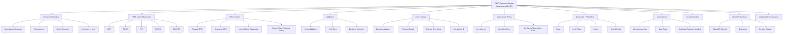

---

## 2. Decomposition Map - Practical Categories / Domain / Skills

| No | Area | Fokus Praktis | Implementasi Jersey/JAX-RS | Output yang Harus Ada |
|---:|---|---|---|---|
| 1 | **Resource Modeling** | Mendesain URI berbasis resource/capability, bukan tabel | `@Path("/cases")`, `@Path("/{caseId}/transitions")` | API resource map |
| 2 | **Collection vs Item Resource** | Bedakan endpoint koleksi dan item | `GET /cases`, `GET /cases/{caseId}` | Endpoint konsisten |
| 3 | **Action Resource** | Untuk command domain yang bukan CRUD biasa | `POST /cases/{caseId}/transitions` | Action eksplisit dan audit-friendly |
| 4 | **HTTP Method Semantics** | Pilih method sesuai intent | `GET`, `POST`, `PUT`, `PATCH`, `DELETE` | API predictable |
| 5 | **Status Code Policy** | Standarisasi status sukses/error | `201`, `204`, `400`, `404`, `409`, `422`, `500` | Status code guideline |
| 6 | **Request DTO** | Input contract khusus command/use case | Java `record`, Jakarta Bean Validation | Request tidak leak DB entity |
| 7 | **Response DTO** | Output contract stabil untuk consumer | Java `record` response | Response versionable |
| 8 | **DTO Mapping** | Convert DTO ↔ domain ↔ DB record | Mapper manual/MapStruct | Boundary bersih |
| 9 | **Validation Contract** | Field validation dan business validation dipisah | `@Valid`, `@NotBlank`, `@Size`, domain policy | Error field-level |
| 10 | **Error Contract** | Error response konsisten dan machine-readable | `ExceptionMapper<T>` | `ApiErrorResponse` / Problem Details |
| 11 | **Problem Details Compatibility** | Struktur error standar berbasis RFC 9457 | `type`, `title`, `status`, `detail`, `instance` | Error interoperable |
| 12 | **Correlation ID** | Trace request lintas-service | Header `X-Correlation-Id` | Debug mudah |
| 13 | **Pagination Pattern** | Batasi query collection | `page/size`, `limit/offset`, cursor | Query aman |
| 14 | **Filter Pattern** | Filter eksplisit dengan whitelist | `?status=OPEN&assignedTo=...` | Tidak expose SQL bebas |
| 15 | **Sort Pattern** | Sort field dikontrol | `?sort=createdAt:desc` | Aman dari SQL injection |
| 16 | **Idempotency Pattern** | Retry POST aman | Header `Idempotency-Key` | Duplicate-safe command |
| 17 | **Optimistic Concurrency** | Hindari lost update | `ETag`, `If-Match`, version field | Update aman |
| 18 | **Security Context Usage** | Authenticated actor masuk ke use case | `@Context SecurityContext` | Audit actor jelas |
| 19 | **OpenAPI Contract** | Dokumentasi dan contract review | OpenAPI 3.1.1 schema | Consumer bisa integrasi |
| 20 | **Backward Compatibility** | Tambah field aman, rename/hapus berisiko | API versioning/deprecation | Upgrade consumer terkendali |

OpenAPI Specification 3.1.1 mendefinisikan interface description standar untuk HTTP API agar manusia dan sistem dapat memahami capability API tanpa perlu membaca source code atau traffic langsung. ([OpenAPI Initiative Publications](https://spec.openapis.org/oas/v3.1.1.html?utm_source=chatgpt.com)) Untuk error response, RFC 9457 mendefinisikan “problem detail” yang membawa detail error secara machine-readable dan menggantikan RFC 7807. ([RFC Editor](https://www.rfc-editor.org/info/rfc9457/?utm_source=chatgpt.com))

---

# 3. Prinsip Utama REST Resource Design

## 3.1 Resource harus berbasis domain, bukan tabel

Buruk:

```http
GET /case_record
POST /case_status_history
POST /case_assignment_table
```

Lebih baik:

```http
GET  /cases
POST /cases
GET  /cases/{caseId}
POST /cases/{caseId}/transitions
GET  /cases/{caseId}/history
POST /cases/{caseId}/assignments
```

Alasannya:

| Desain | Masalah |
|---|---|
| Endpoint berbasis tabel | Schema internal bocor ke consumer |
| Endpoint berbasis domain | Consumer memahami capability bisnis |
| Endpoint action eksplisit | Cocok untuk audit dan business rule |
| Endpoint collection/item jelas | Lebih mudah distandarkan |

---

## 3.2 Resource boleh noun-based, tapi command domain tetap boleh eksplisit

REST sering disederhanakan menjadi “URI harus noun, bukan verb”. Itu berguna, tapi dalam sistem bisnis kompleks, banyak operasi bukan sekadar update field.

Contoh buruk:

```http
PATCH /cases/{caseId}
{
  "status": "ESCALATED"
}
```

Masalahnya: consumer seolah-olah bebas mengubah status.

Lebih baik:

```http
POST /cases/{caseId}/transitions
{
  "action": "ESCALATE",
  "reasonCode": "SLA_BREACHED",
  "comment": "No response after 5 business days"
}
```

Dengan ini, service bisa validasi:

| Rule | Contoh |
|---|---|
| State transition | `ASSIGNED → ESCALATED` boleh, `CLOSED → ESCALATED` tidak |
| Actor permission | Hanya supervisor boleh escalate |
| Required reason | Escalation wajib punya reason |
| Auditability | Action, actor, reason, timestamp tercatat |
| Side effect | Publish `CaseEscalated` event |

---

# 4. HTTP Method Semantics

| Method | Gunakan Untuk | Idempotent? | Contoh |
|---|---|---:|---|
| `GET` | Membaca resource | Ya | `GET /cases/{caseId}` |
| `POST` | Membuat resource atau menjalankan command | Tidak selalu | `POST /cases`, `POST /cases/{id}/transitions` |
| `PUT` | Replace penuh resource dengan known ID | Ya | `PUT /case-labels/{labelId}` |
| `PATCH` | Partial update | Bisa, tergantung desain | `PATCH /cases/{id}/metadata` |
| `DELETE` | Menghapus/cancel resource | Ya secara intent | `DELETE /draft-cases/{id}` |

## Rule praktis

| Situasi | Pilihan |
|---|---|
| Create resource dengan ID dari server | `POST /cases` |
| Create/update resource dengan ID dari client | `PUT /resources/{id}` |
| Operasi domain/action | `POST /resources/{id}/actions` atau sub-resource |
| Update sebagian field teknis | `PATCH /resources/{id}` |
| Transition state penting | Hindari `PATCH status`; gunakan transition command |
| Operasi long-running | `POST` return `202 Accepted` + operation ID |

---

# 5. URI Design Pattern

## 5.1 Collection dan item

```http
GET  /cases
POST /cases
GET  /cases/{caseId}
```

## 5.2 Sub-resource

```http
GET  /cases/{caseId}/history
GET  /cases/{caseId}/documents
POST /cases/{caseId}/assignments
```

## 5.3 Command/action resource

```http
POST /cases/{caseId}/transitions
POST /cases/{caseId}/reopen-requests
POST /cases/{caseId}/escalations
```

## 5.4 Query resource

```http
GET /cases?status=OPEN&assignedTo=me&page=0&size=20
GET /cases/search?keyword=fraud&status=UNDER_INVESTIGATION
```

Untuk search kompleks, `POST /cases/search` kadang lebih praktis jika filter sangat besar, tetapi jangan jadikan semua query sebagai POST tanpa alasan.

---

# 6. Contoh REST Resource Jersey

```java
@Path("/cases")
@Produces(MediaType.APPLICATION_JSON)
@Consumes(MediaType.APPLICATION_JSON)
public class CaseResource {

    private final CaseApplicationService caseApplicationService;
    private final CaseQueryService caseQueryService;

    public CaseResource(
        CaseApplicationService caseApplicationService,
        CaseQueryService caseQueryService
    ) {
        this.caseApplicationService = caseApplicationService;
        this.caseQueryService = caseQueryService;
    }

    @POST
    public Response createCase(
        @Valid CreateCaseRequest request,
        @Context SecurityContext securityContext,
        @Context UriInfo uriInfo
    ) {
        String actorId = securityContext.getUserPrincipal().getName();

        CaseResponse response = caseApplicationService.createCase(request, actorId);

        URI location = uriInfo.getAbsolutePathBuilder()
            .path(response.caseId().toString())
            .build();

        return Response.created(location)
            .entity(response)
            .build();
    }

    @GET
    @Path("/{caseId}")
    public Response getCase(@PathParam("caseId") UUID caseId) {
        CaseResponse response = caseQueryService.getCase(caseId);
        return Response.ok(response).build();
    }

    @GET
    public Response searchCases(
        @QueryParam("status") String status,
        @QueryParam("assignedTo") String assignedTo,
        @DefaultValue("0") @QueryParam("page") int page,
        @DefaultValue("20") @QueryParam("size") int size,
        @DefaultValue("createdAt:desc") @QueryParam("sort") String sort
    ) {
        CaseSearchCriteria criteria = CaseSearchCriteria.of(
            status,
            assignedTo,
            page,
            size,
            sort
        );

        PageResponse<CaseSummaryResponse> response = caseQueryService.search(criteria);
        return Response.ok(response).build();
    }

    @POST
    @Path("/{caseId}/transitions")
    public Response transitionCase(
        @PathParam("caseId") UUID caseId,
        @Valid TransitionCaseRequest request,
        @Context SecurityContext securityContext,
        @HeaderParam("Idempotency-Key") String idempotencyKey
    ) {
        String actorId = securityContext.getUserPrincipal().getName();

        CaseResponse response = caseApplicationService.transitionCase(
            caseId,
            request,
            actorId,
            idempotencyKey
        );

        return Response.ok(response).build();
    }
}
```

Prinsipnya: Jersey resource hanya melakukan **HTTP mapping**, bukan business decision. Business decision tetap di application/domain layer.

---

# 7. DTO Design Pattern

## 7.1 Request DTO

```java
public record CreateCaseRequest(
    @NotBlank(message = "caseType is required")
    String caseType,

    @NotBlank(message = "subject is required")
    @Size(max = 300, message = "subject must not exceed 300 characters")
    String subject,

    @Size(max = 4000, message = "description must not exceed 4000 characters")
    String description,

    List<UUID> documentIds
) {}
```

## 7.2 Response DTO

```java
public record CaseResponse(
    UUID caseId,
    String caseNumber,
    String caseType,
    String subject,
    String status,
    String assignedOfficerId,
    OffsetDateTime createdAt,
    OffsetDateTime updatedAt,
    long version
) {}
```

## 7.3 Command DTO untuk transition

```java
public record TransitionCaseRequest(
    @NotBlank(message = "action is required")
    String action,

    @NotBlank(message = "reasonCode is required")
    String reasonCode,

    @Size(max = 2000, message = "comment must not exceed 2000 characters")
    String comment
) {}
```

## 7.4 Jangan gunakan DB entity sebagai DTO

Buruk:

```java
public class CaseRecord {
    public UUID caseId;
    public String status;
    public String internalRiskScore;
    public String internalWorkflowToken;
}
```

Lalu langsung dikembalikan ke API.

Lebih baik:

```java
public record CaseResponse(
    UUID caseId,
    String caseNumber,
    String status,
    OffsetDateTime createdAt
) {}
```

| Alasan DTO harus dipisah | Dampak |
|---|---|
| DB schema bisa berubah | API tetap stabil |
| Field internal tidak bocor | Security lebih aman |
| Response bisa disusun sesuai kebutuhan consumer | API lebih usable |
| Versioning lebih mudah | Backward compatibility lebih terkendali |

---

# 8. DTO Mapping Pattern

Contoh mapper manual:

```java
public final class CaseApiMapper {

    private CaseApiMapper() {}

    public static CaseResponse toResponse(Case caseDomain) {
        return new CaseResponse(
            caseDomain.id(),
            caseDomain.caseNumber(),
            caseDomain.caseType(),
            caseDomain.subject(),
            caseDomain.status().name(),
            caseDomain.assignedOfficerId(),
            caseDomain.createdAt(),
            caseDomain.updatedAt(),
            caseDomain.version()
        );
    }

    public static CreateCaseCommand toCommand(
        CreateCaseRequest request,
        String actorId
    ) {
        return new CreateCaseCommand(
            request.caseType(),
            request.subject(),
            request.description(),
            request.documentIds() == null ? List.of() : request.documentIds(),
            actorId
        );
    }
}
```

Rule praktis:

| Mapping | Tempat |
|---|---|
| Request DTO → command | API/application boundary |
| Domain → response DTO | API mapper |
| DB record → domain | Repository/persistence mapper |
| Domain → DB record | Repository/persistence mapper |
| External API DTO → internal model | Anti-corruption adapter |

---

# 9. Validation Pattern

Ada dua jenis validation:

| Jenis | Contoh | Lokasi |
|---|---|---|
| Syntactic validation | required, length, format | DTO + Bean Validation |
| Semantic/business validation | transition allowed, actor allowed, SLA breached | Domain/application layer |

## 9.1 Field validation

```java
public record AssignCaseRequest(
    @NotNull(message = "officerId is required")
    UUID officerId,

    @NotBlank(message = "assignmentReason is required")
    String assignmentReason
) {}
```

## 9.2 Business validation

```java
public class CaseApplicationService {

    public CaseResponse assignCase(
        UUID caseId,
        AssignCaseRequest request,
        String actorId
    ) {
        Case caseDomain = caseRepository.findById(caseId)
            .orElseThrow(() -> new CaseNotFoundException(caseId));

        authorizationPolicy.assertCanAssign(actorId, caseDomain);

        if (!caseDomain.canBeAssigned()) {
            throw new InvalidCaseStateException(
                caseId,
                caseDomain.status(),
                "Case cannot be assigned from current status"
            );
        }

        caseDomain.assignTo(request.officerId(), actorId, request.assignmentReason());

        caseRepository.save(caseDomain);

        return CaseApiMapper.toResponse(caseDomain);
    }
}
```

Rule penting: jangan memaksa semua validation di annotation. Banyak rule bisnis butuh data DB, permission, state, atau policy.

---

# 10. Error Contract Pattern

Jersey/JAX-RS mendukung mapping exception ke HTTP response melalui `ExceptionMapper`. Dokumentasi Jersey menjelaskan bahwa JAX-RS dapat melakukan direct mapping dari Java exception ke HTTP error response. ([Eclipse EE4J](https://eclipse-ee4j.github.io/jersey.github.io/documentation/latest/user-guide.html?utm_source=chatgpt.com))

Ada dua pilihan umum:

1. **Custom enterprise error response**
2. **RFC 9457 Problem Details compatible response**

Saya rekomendasikan membuat format internal yang **compatible dengan Problem Details**, tetapi tetap punya field tambahan seperti `code`, `correlationId`, dan `fieldErrors`.

## 10.1 Error response shape

```json
{
  "type": "https://api.company.com/problems/invalid-case-transition",
  "title": "Invalid case transition",
  "status": 409,
  "detail": "Case cannot transition from CLOSED to ESCALATED",
  "instance": "/cases/9cc9c5e3-8d7b-4c74-b3f9-11fcf49b6a61/transitions",
  "code": "INVALID_CASE_TRANSITION",
  "correlationId": "2a4c4f2c-7798-455a-8270-961f0a1e0ed4",
  "timestamp": "2026-07-14T10:15:00Z",
  "fieldErrors": []
}
```

RFC 9457 mendefinisikan format problem detail untuk membawa error detail machine-readable dalam response HTTP API. ([RFC Editor](https://www.rfc-editor.org/info/rfc9457/?utm_source=chatgpt.com))

## 10.2 Java record

```java
public record ApiErrorResponse(
    String type,
    String title,
    int status,
    String detail,
    String instance,
    String code,
    String correlationId,
    OffsetDateTime timestamp,
    List<ApiFieldError> fieldErrors
) {}

public record ApiFieldError(
    String field,
    String code,
    String message
) {}
```

---

# 11. Exception Hierarchy

```java
public abstract class ApplicationException extends RuntimeException {

    private final String code;
    private final String title;
    private final int status;

    protected ApplicationException(
        String code,
        String title,
        String detail,
        int status
    ) {
        super(detail);
        this.code = code;
        this.title = title;
        this.status = status;
    }

    public String code() {
        return code;
    }

    public String title() {
        return title;
    }

    public int status() {
        return status;
    }
}
```

Contoh domain exception:

```java
public class InvalidCaseTransitionException extends ApplicationException {

    public InvalidCaseTransitionException(
        UUID caseId,
        String currentStatus,
        String requestedAction
    ) {
        super(
            "INVALID_CASE_TRANSITION",
            "Invalid case transition",
            "Case " + caseId + " cannot execute action " + requestedAction
                + " from status " + currentStatus,
            Response.Status.CONFLICT.getStatusCode()
        );
    }
}
```

Contoh not found:

```java
public class CaseNotFoundException extends ApplicationException {

    public CaseNotFoundException(UUID caseId) {
        super(
            "CASE_NOT_FOUND",
            "Case not found",
            "Case was not found: " + caseId,
            Response.Status.NOT_FOUND.getStatusCode()
        );
    }
}
```

---

# 12. ExceptionMapper Implementation

```java
@Provider
public class ApplicationExceptionMapper
    implements ExceptionMapper<ApplicationException> {

    @Context
    private UriInfo uriInfo;

    @Override
    public Response toResponse(ApplicationException exception) {
        ApiErrorResponse error = new ApiErrorResponse(
            "https://api.company.com/problems/" + toProblemSlug(exception.code()),
            exception.title(),
            exception.status(),
            exception.getMessage(),
            uriInfo == null ? null : uriInfo.getPath(),
            exception.code(),
            CorrelationId.current(),
            OffsetDateTime.now(ZoneOffset.UTC),
            List.of()
        );

        return Response.status(exception.status())
            .type(MediaType.APPLICATION_JSON_TYPE)
            .entity(error)
            .build();
    }

    private String toProblemSlug(String code) {
        return code.toLowerCase(Locale.ROOT).replace('_', '-');
    }
}
```

Generic fallback:

```java
@Provider
public class UnhandledExceptionMapper implements ExceptionMapper<Throwable> {

    private static final Logger log =
        LoggerFactory.getLogger(UnhandledExceptionMapper.class);

    @Context
    private UriInfo uriInfo;

    @Override
    public Response toResponse(Throwable exception) {
        String errorId = UUID.randomUUID().toString();

        log.error(
            "unhandled_exception errorId={} correlationId={}",
            errorId,
            CorrelationId.current(),
            exception
        );

        ApiErrorResponse error = new ApiErrorResponse(
            "https://api.company.com/problems/internal-error",
            "Internal server error",
            500,
            "An unexpected error occurred",
            uriInfo == null ? null : uriInfo.getPath(),
            "INTERNAL_ERROR",
            CorrelationId.current(),
            OffsetDateTime.now(ZoneOffset.UTC),
            List.of()
        );

        return Response.status(Response.Status.INTERNAL_SERVER_ERROR)
            .type(MediaType.APPLICATION_JSON_TYPE)
            .entity(error)
            .build();
    }
}
```

Practical rule: expected business exception boleh punya detail yang aman; unexpected exception jangan leak stacktrace, SQL, hostname internal, token, atau secret.

---

# 13. Validation Error Mapper

```java
@Provider
public class ConstraintViolationExceptionMapper
    implements ExceptionMapper<ConstraintViolationException> {

    @Context
    private UriInfo uriInfo;

    @Override
    public Response toResponse(ConstraintViolationException exception) {
        List<ApiFieldError> fieldErrors = exception.getConstraintViolations()
            .stream()
            .map(violation -> new ApiFieldError(
                normalizeField(violation.getPropertyPath().toString()),
                "VALIDATION_FAILED",
                violation.getMessage()
            ))
            .toList();

        ApiErrorResponse error = new ApiErrorResponse(
            "https://api.company.com/problems/request-validation-failed",
            "Request validation failed",
            400,
            "One or more request fields are invalid",
            uriInfo == null ? null : uriInfo.getPath(),
            "REQUEST_VALIDATION_FAILED",
            CorrelationId.current(),
            OffsetDateTime.now(ZoneOffset.UTC),
            fieldErrors
        );

        return Response.status(Response.Status.BAD_REQUEST)
            .type(MediaType.APPLICATION_JSON_TYPE)
            .entity(error)
            .build();
    }

    private String normalizeField(String propertyPath) {
        int dot = propertyPath.lastIndexOf('.');
        return dot >= 0 ? propertyPath.substring(dot + 1) : propertyPath;
    }
}
```

---

# 14. Status Code Policy

| Situation | Status | Contoh |
|---|---:|---|
| Create sukses | `201 Created` | `POST /cases` |
| Read sukses | `200 OK` | `GET /cases/{id}` |
| Command sukses dengan response | `200 OK` | transition return updated case |
| Command sukses tanpa body | `204 No Content` | archive/cancel command |
| Async accepted | `202 Accepted` | long-running export |
| Request invalid format/field | `400 Bad Request` | missing required field |
| Unauthenticated | `401 Unauthorized` | token missing/invalid |
| Authenticated tapi forbidden | `403 Forbidden` | tidak punya permission |
| Resource tidak ada | `404 Not Found` | case ID tidak ditemukan |
| State conflict | `409 Conflict` | invalid transition |
| Validation semantic detail | `422 Unprocessable Entity` | request syntactically valid, semantically invalid |
| Rate limited | `429 Too Many Requests` | too many requests |
| Dependency unavailable | `503 Service Unavailable` | downstream unavailable |
| Unexpected server error | `500 Internal Server Error` | bug/unhandled exception |

Practical preference untuk domain workflow:

| Kasus | Status yang Biasanya Cocok |
|---|---:|
| Case tidak ditemukan | `404` |
| Action tidak valid untuk current state | `409` |
| Field request kosong/salah format | `400` |
| Actor tidak boleh melakukan action | `403` |
| Duplicate create karena natural key | `409` |
| Idempotency key replay | `200`/`201` dengan response yang sama |
| Downstream timeout non-critical | bisa tetap `200/202` dengan status pending |
| Downstream critical gagal | `503` atau domain-specific failure |

---

# 15. Pagination, Filtering, Sorting

## 15.1 Response shape

```java
public record PageResponse<T>(
    List<T> items,
    PageMeta meta
) {}

public record PageMeta(
    int page,
    int size,
    long totalItems,
    int totalPages,
    boolean hasNext
) {}
```

Contoh JSON:

```json
{
  "items": [
    {
      "caseId": "9cc9c5e3-8d7b-4c74-b3f9-11fcf49b6a61",
      "caseNumber": "CASE-2026-000123",
      "status": "UNDER_INVESTIGATION"
    }
  ],
  "meta": {
    "page": 0,
    "size": 20,
    "totalItems": 281,
    "totalPages": 15,
    "hasNext": true
  }
}
```

## 15.2 Query DTO

```java
public record CaseSearchCriteria(
    String status,
    String assignedTo,
    int page,
    int size,
    String sortField,
    SortDirection sortDirection
) {
    public static CaseSearchCriteria of(
        String status,
        String assignedTo,
        int page,
        int size,
        String sort
    ) {
        if (page < 0) {
            throw new BadRequestException("page must be >= 0");
        }

        if (size < 1 || size > 100) {
            throw new BadRequestException("size must be between 1 and 100");
        }

        SortSpec sortSpec = SortSpec.parse(sort);

        return new CaseSearchCriteria(
            status,
            assignedTo,
            page,
            size,
            sortSpec.field(),
            sortSpec.direction()
        );
    }
}
```

## 15.3 Sort whitelist

```java
public final class CaseSortWhitelist {

    private static final Map<String, String> ALLOWED_SORT_FIELDS = Map.of(
        "createdAt", "created_at",
        "updatedAt", "updated_at",
        "caseNumber", "case_number",
        "status", "status"
    );

    private CaseSortWhitelist() {}

    public static String toColumn(String apiSortField) {
        String column = ALLOWED_SORT_FIELDS.get(apiSortField);

        if (column == null) {
            throw new BadRequestException("Unsupported sort field: " + apiSortField);
        }

        return column;
    }
}
```

Jangan langsung concat query param ke SQL tanpa whitelist.

---

# 16. MyBatis Query untuk Pagination

```xml
<select id="searchCases" resultType="CaseSummaryRecord">
    SELECT
        case_id,
        case_number,
        status,
        assigned_officer_id,
        created_at,
        updated_at
    FROM case_management.case_record
    WHERE 1 = 1

    <if test="status != null">
        AND status = #{status}
    </if>

    <if test="assignedTo != null">
        AND assigned_officer_id = #{assignedTo}
    </if>

    ORDER BY ${sortColumn} ${sortDirection}
    LIMIT #{limit}
    OFFSET #{offset}
</select>
```

Catatan penting: `${sortColumn}` hanya aman kalau berasal dari whitelist internal, bukan input mentah user. Untuk value biasa gunakan `#{...}`.

---

# 17. Idempotency Pattern untuk POST/Command

POST biasanya tidak idempotent. Namun command penting seperti create case, create payment, submit decision, atau transition case harus aman terhadap retry.

## 17.1 Header

```http
POST /cases
Idempotency-Key: 2e6ecfa5-4d18-42f9-93fb-9132257d328e
```

## 17.2 Table

```sql
CREATE TABLE case_management.idempotency_record (
    idempotency_key      VARCHAR(100) PRIMARY KEY,
    request_hash         VARCHAR(128) NOT NULL,
    response_status      INTEGER NOT NULL,
    response_body        JSONB NOT NULL,
    created_by           VARCHAR(100) NOT NULL,
    created_at           TIMESTAMPTZ NOT NULL DEFAULT now(),
    expires_at           TIMESTAMPTZ NOT NULL
);
```

## 17.3 Behavior

| Scenario | Response |
|---|---|
| First request with key | Execute command, save response |
| Retry same key + same request | Return saved response |
| Same key + different request body | `409 Conflict` |
| Missing key for risky command | Bisa reject `400` atau allow sesuai policy |
| Key expired | Treat as new or reject, tergantung domain |

## 17.4 Pseudocode

```java
public CaseResponse createCase(
    CreateCaseRequest request,
    String actorId,
    String idempotencyKey
) {
    IdempotencyRecord existing = idempotencyRepository.find(idempotencyKey);

    String requestHash = hashRequest(request);

    if (existing != null) {
        if (!existing.requestHash().equals(requestHash)) {
            throw new IdempotencyConflictException(idempotencyKey);
        }

        return existing.responseAs(CaseResponse.class);
    }

    CaseResponse response = doCreateCase(request, actorId);

    idempotencyRepository.save(
        idempotencyKey,
        requestHash,
        201,
        response,
        actorId
    );

    return response;
}
```

---

# 18. Optimistic Concurrency Pattern

Untuk mencegah lost update, gunakan `version` field atau ETag.

## 18.1 Response

```http
GET /cases/{caseId}
ETag: "case-version-7"
```

```json
{
  "caseId": "9cc9c5e3-8d7b-4c74-b3f9-11fcf49b6a61",
  "status": "ASSIGNED",
  "version": 7
}
```

## 18.2 Update

```http
PATCH /cases/{caseId}/metadata
If-Match: "case-version-7"
```

Kalau current version sudah berubah:

```http
412 Precondition Failed
```

atau bisa juga `409 Conflict`, tetapi `412` lebih spesifik untuk precondition header.

## 18.3 SQL

```sql
UPDATE case_management.case_record
SET subject = :subject,
    version = version + 1,
    updated_at = now()
WHERE case_id = :case_id
  AND version = :expected_version;
```

Jika affected row = 0, berarti conflict.

---

# 19. Security Context dan Authorization

Resource boleh mengambil authenticated principal, tetapi permission check jangan berhenti di resource.

```java
@POST
@Path("/{caseId}/transitions")
public Response transitionCase(
    @PathParam("caseId") UUID caseId,
    @Valid TransitionCaseRequest request,
    @Context SecurityContext securityContext
) {
    String actorId = securityContext.getUserPrincipal().getName();

    CaseResponse response = caseApplicationService.transitionCase(
        caseId,
        request,
        actorId
    );

    return Response.ok(response).build();
}
```

Application service:

```java
public CaseResponse transitionCase(
    UUID caseId,
    TransitionCaseRequest request,
    String actorId
) {
    Case caseDomain = caseRepository.findById(caseId)
        .orElseThrow(() -> new CaseNotFoundException(caseId));

    authorizationPolicy.assertCanTransition(actorId, caseDomain, request.action());

    caseDomain.transition(
        CaseAction.valueOf(request.action()),
        request.reasonCode(),
        request.comment(),
        actorId
    );

    caseRepository.save(caseDomain);

    auditPublisher.caseTransitioned(caseDomain, actorId);

    return CaseApiMapper.toResponse(caseDomain);
}
```

Kenapa object-level authorization harus di application/domain?

| Alasan | Contoh |
|---|---|
| Permission bergantung object | Officer hanya boleh lihat case assigned kepadanya |
| Permission bergantung state | Supervisor boleh approve hanya jika `DECISION_PENDING` |
| Permission bergantung organization | Regional officer hanya region tertentu |
| Permission harus diaudit | Denied action perlu tercatat |

---

# 20. OpenAPI Contract Example

OpenAPI Specification adalah standar deskripsi HTTP API yang dapat dipakai untuk discovery, documentation, client generation, testing, dan governance. ([OpenAPI Initiative](https://www.openapis.org/?utm_source=chatgpt.com))

Contoh minimal:

```yaml
openapi: 3.1.1
info:
  title: Case Management API
  version: 1.0.0
paths:
  /cases:
    post:
      summary: Create a case
      operationId: createCase
      parameters:
        - name: Idempotency-Key
          in: header
          required: false
          schema:
            type: string
      requestBody:
        required: true
        content:
          application/json:
            schema:
              $ref: '#/components/schemas/CreateCaseRequest'
      responses:
        '201':
          description: Case created
          content:
            application/json:
              schema:
                $ref: '#/components/schemas/CaseResponse'
        '400':
          description: Request validation failed
          content:
            application/json:
              schema:
                $ref: '#/components/schemas/ApiErrorResponse'
        '409':
          description: Conflict
          content:
            application/json:
              schema:
                $ref: '#/components/schemas/ApiErrorResponse'

  /cases/{caseId}/transitions:
    post:
      summary: Transition a case
      operationId: transitionCase
      parameters:
        - name: caseId
          in: path
          required: true
          schema:
            type: string
            format: uuid
        - name: Idempotency-Key
          in: header
          required: false
          schema:
            type: string
      requestBody:
        required: true
        content:
          application/json:
            schema:
              $ref: '#/components/schemas/TransitionCaseRequest'
      responses:
        '200':
          description: Case transitioned
          content:
            application/json:
              schema:
                $ref: '#/components/schemas/CaseResponse'
        '403':
          description: Forbidden
        '404':
          description: Case not found
        '409':
          description: Invalid transition
```

---

# 21. API Compatibility Rules

| Change | Compatibility |
|---|---|
| Add optional response field | Usually safe |
| Add optional request field | Usually safe |
| Add required request field | Breaking |
| Rename field | Breaking |
| Remove field | Breaking |
| Change enum value name | Breaking |
| Add enum value | Potentially breaking for strict clients |
| Change status code behavior | Potentially breaking |
| Change error code | Breaking for automated consumers |
| Change field type | Breaking |
| Tighten validation | Potentially breaking |
| Loosen validation | Usually safer |

Practical rule: **consumer code often depends on more than schema**. Mereka bisa bergantung pada status code, error code, enum, ordering, null behavior, pagination behavior, dan retry behavior.

---

# 22. API Review Checklist

Gunakan checklist ini sebelum endpoint masuk production.

| Area | Checklist |
|---|---|
| Resource | URI berbasis domain/capability, bukan table |
| Method | HTTP method sesuai intent |
| DTO | Request/response DTO terpisah dari DB entity |
| Validation | Field validation dan business validation jelas |
| Error | Semua error punya code, status, correlation ID |
| Status | Status code konsisten dengan guideline |
| Security | AuthN dan AuthZ jelas |
| Audit | Command penting mencatat actor/reason/time |
| Idempotency | POST/command berisiko punya strategi retry |
| Pagination | Collection endpoint dibatasi |
| Sorting | Sort field whitelist |
| Filtering | Filter tidak expose SQL bebas |
| Compatibility | Tidak ada breaking change tanpa version/deprecation |
| OpenAPI | Schema, example, error response terdokumentasi |
| Observability | Log method/path/status/duration/correlation ID |
| Test | Ada test untuk success, validation, forbidden, not found, conflict |

---

# 23. Anti-Pattern REST API

| Anti-Pattern | Contoh | Dampak | Perbaikan |
|---|---|---|---|
| Table-shaped API | `/case_record` | DB leak | Resource berbasis domain |
| Generic update status | `PATCH {"status":"CLOSED"}` | Rule bisa dilewati | Transition command |
| Fat resource | Resource query DB dan jalankan rule | Sulit test | Application/domain layer |
| DTO = entity | Return `CaseRecord` | Field internal bocor | Separate DTO |
| Error text bebas | `"Something wrong"` | Consumer sulit handle | Error code standar |
| Semua error 500 | Validation jadi server error | Observability kacau | Exception mapper |
| Semua sukses 200 | Create/delete/async tidak jelas | Consumer ambiguity | Status code policy |
| Unbounded list | `GET /cases` tanpa limit | DB overload | Pagination wajib |
| Raw sort SQL | `sort=case_id desc; drop...` | Injection risk | Sort whitelist |
| No idempotency | Retry create menghasilkan duplicate | Data inconsistency | Idempotency key |
| Breaking enum | Rename `OPEN` ke `ACTIVE` | Consumer gagal | Version/deprecation |

---

# 24. Practical Mini Blueprint

Untuk satu endpoint command seperti **transition case**, deliverable minimal:

```text
Endpoint:
  POST /cases/{caseId}/transitions

Request:
  TransitionCaseRequest

Response:
  CaseResponse

Validation:
  - action required
  - reasonCode required
  - comment max length

Business Rules:
  - actor must have permission
  - case must exist
  - transition must be allowed from current state
  - closed case cannot transition

Error Codes:
  - CASE_NOT_FOUND
  - INVALID_CASE_TRANSITION
  - FORBIDDEN
  - REQUEST_VALIDATION_FAILED
  - IDEMPOTENCY_CONFLICT

Audit:
  - actorId
  - caseId
  - fromStatus
  - toStatus
  - reasonCode
  - timestamp
  - correlationId

Idempotency:
  - Header: Idempotency-Key
  - Same key + same request returns same response
  - Same key + different request returns 409

OpenAPI:
  - Path documented
  - Request/response schema documented
  - Error schema documented
  - Examples included

Tests:
  - success transition
  - invalid state transition
  - case not found
  - forbidden actor
  - validation failed
  - idempotency replay
```

---

# 25. Roadmap Singkat Belajar

| Urutan | Fokus | Output Praktis |
|---:|---|---|
| 1 | Resource modeling | Bisa membedakan collection, item, sub-resource, command resource |
| 2 | HTTP method/status policy | Bisa memilih method dan status code yang konsisten |
| 3 | DTO design | Bisa membuat request/response DTO yang tidak leak internal model |
| 4 | Validation/error contract | Bisa membuat validation mapper dan domain exception mapper |
| 5 | Pagination/filter/sort | Bisa membuat collection API yang aman untuk production |
| 6 | Idempotency/concurrency | Bisa membuat command endpoint aman terhadap retry dan lost update |
| 7 | OpenAPI governance | Bisa mendokumentasikan dan mereview API contract |

---

# Kesimpulan

REST API di microservice bukan sekadar controller. Ia adalah **contract boundary** yang menentukan bagaimana service lain, frontend, workflow engine, dan external platform berinteraksi dengan domain Anda.

Untuk Java Jersey/JAX-RS, desain yang baik harus punya:

```text
- Resource URI berbasis domain
- HTTP method semantics yang konsisten
- DTO terpisah dari DB entity
- Validation layer yang jelas
- Error contract machine-readable
- Status code policy
- Pagination/filter/sort aman
- Idempotency untuk command penting
- SecurityContext dan authorization policy
- OpenAPI contract
- Backward compatibility discipline
```

**Seri 3/18 selesai.**

Rekomendasi materi berikutnya: **Seri 4 - API Versioning, Backward Compatibility, Deprecation, dan OpenAPI Governance untuk Java Jersey/JAX-RS Microservice.**

---

**Sources:**

- [Jakarta RESTful Web Services 4.0](https://jakarta.ee/specifications/restful-ws/4.0/?utm_source=chatgpt.com)
- [Eclipse Jersey](https://jersey.github.io/?utm_source=chatgpt.com)
- [OpenAPI Specification v3.1.1](https://spec.openapis.org/oas/v3.1.1.html?utm_source=chatgpt.com)
- [RFC 9457: Problem Details for HTTP APIs](https://www.rfc-editor.org/info/rfc9457/?utm_source=chatgpt.com)
- [Jersey 2.47 User Guide](https://eclipse-ee4j.github.io/jersey.github.io/documentation/latest/user-guide.html?utm_source=chatgpt.com)
- [OpenAPI Initiative – The OpenAPI Initiative provides an open ...](https://www.openapis.org/?utm_source=chatgpt.com)

## Response:
7/14/2026, 10:05:36 PM

Saya lanjut ke **Seri 4/18**. Fokusnya: bagaimana mengelola perubahan API tanpa merusak consumer, termasuk versioning strategy, compatibility rules, deprecation, OpenAPI governance, dan CI guardrail.

# Microservice Pattern - Seri 4/18  
## API Versioning, Backward Compatibility, Deprecation, dan OpenAPI Governance untuk Java Jersey/JAX-RS Microservice

## Introduction

Di microservice estate, API akan terus berubah: field bertambah, rule berubah, endpoint diganti, workflow berkembang, consumer bertambah, dan integrasi eksternal ikut bergantung pada contract lama. Karena itu, **API versioning dan compatibility governance** bukan dokumentasi tambahan, tetapi mekanisme untuk mencegah perubahan kecil di satu service merusak service lain.

Dalam konteks **Java Jersey/JAX-RS**, versi API biasanya muncul di:

```text
URI path
request/response DTO
OpenAPI contract
error contract
status code behavior
event schema
client SDK/generated client
contract test
CI compatibility check
deprecation headers
runbook migration
```

Jakarta RESTful Web Services 4.0 adalah foundational API untuk membangun RESTful web services di Jakarta EE 11, sedangkan OpenAPI Specification 3.1.1 adalah versi terbaru/rekomendasi OpenAPI untuk project baru sejak patch release Oktober 2024. ([jakarta.ee](https://jakarta.ee/specifications/restful-ws/4.0/?utm_source=chatgpt.com))

---

# 1. Mental Model Praktis

API versioning bukan sekadar menambahkan `/v1`.

Model yang lebih benar:

```text
API Evolution =
  Compatibility discipline
+ Explicit versioning strategy
+ Deprecation lifecycle
+ OpenAPI contract governance
+ Automated breaking-change detection
+ Consumer communication
```

Tujuannya:

| Tujuan | Penjelasan Praktis |
|---|---|
| Consumer tidak rusak diam-diam | Breaking change harus terlihat sebelum merge/deploy |
| Service bisa berevolusi | Provider tetap bisa menambah capability baru |
| Upgrade bisa direncanakan | Consumer punya window migrasi |
| Contract bisa diaudit | Perubahan API punya alasan, review, dan history |
| Runtime behavior konsisten | Status code, error code, pagination, enum tidak berubah liar |

OpenAPI mendefinisikan standard description untuk HTTP API sehingga manusia dan tools bisa memahami capability API tanpa membaca source code, dokumentasi manual, atau traffic langsung. ([Swagger](https://swagger.io/specification/?utm_source=chatgpt.com))

---

# 2. Diagram

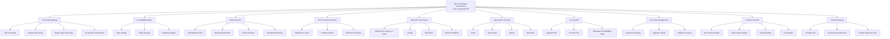

---

# 3. Decomposition Map - Practical Categories / Domain / Skills

| No | Area | Fokus Praktis | Implementasi Java/Jersey | Output yang Harus Ada |
|---:|---|---|---|---|
| 1 | **API Versioning Strategy** | Menentukan cara versioning: URI, header, media type, atau kombinasi | `@Path("/api/v1/cases")`, filter header, OpenAPI per version | Versioning policy |
| 2 | **Major vs Minor API Evolution** | Bedakan breaking change dan additive change | `/v1` tetap kompatibel, `/v2` untuk breaking change | Compatibility matrix |
| 3 | **Backward Compatibility Rule** | Menentukan perubahan mana yang aman/rusak | CI check OpenAPI diff | Breaking-change checklist |
| 4 | **DTO Evolution** | Tambah field tanpa merusak consumer | Java `record`, optional field, defaulting | DTO evolution guide |
| 5 | **Enum Evolution** | Menangani penambahan enum | `UNKNOWN` fallback di client, documented enum | Enum policy |
| 6 | **Error Contract Stability** | Error code tidak berubah sembarangan | RFC 9457-compatible `ApiErrorResponse` | Error catalog |
| 7 | **Status Code Stability** | Hindari perubahan semantic HTTP behavior | Contract test status code | Status policy |
| 8 | **OpenAPI Source of Truth** | Contract tersimpan dan direview | `openapi.yaml` di repo | API contract baseline |
| 9 | **OpenAPI Diff** | Deteksi breaking change otomatis | Maven/GitHub Actions diff | CI gate |
| 10 | **API Linting** | Enforce naming, error schema, pagination, security | Spectral-style linting / internal rules | API style guide |
| 11 | **Deprecation Lifecycle** | Active → Deprecated → Sunset → Removed | Deprecation headers, migration doc | Deprecation plan |
| 12 | **Sunset Management** | Tentukan kapan endpoint benar-benar dimatikan | `Sunset` response header | Sunset schedule |
| 13 | **Consumer Registry** | Tahu siapa memakai endpoint mana | API gateway logs, client ID, service catalog | Impact analysis |
| 14 | **Migration Guide** | Panduan consumer pindah dari v1 ke v2 | Before/after request-response | Migration doc |
| 15 | **Parallel Version Runtime** | Menjalankan v1 dan v2 bersamaan | Package `api.v1`, `api.v2` | Coexistence strategy |
| 16 | **Compatibility Testing** | Test response lama tetap valid | Golden response, consumer contract test | Regression guard |
| 17 | **Release Governance** | Review contract sebelum merge | PR template, ADR, changelog | API review workflow |
| 18 | **Documentation Governance** | API docs selalu sinkron | Generated/curated OpenAPI | Published API docs |
| 19 | **Security Contract Evolution** | Perubahan auth scope/claim dikontrol | Security scheme in OpenAPI | Auth compatibility plan |
| 20 | **Operational Monitoring** | Pantau traffic deprecated API | Metrics per version/endpoint/consumer | Deprecation dashboard |

---

# 4. Strategi Versioning

## 4.1 Pilihan Umum

| Strategy | Contoh | Kelebihan | Kekurangan | Cocok Untuk |
|---|---|---|---|---|
| **URI Path Versioning** | `/api/v1/cases` | Jelas, mudah routing, mudah debug | Versi terlihat di URI | Enterprise/internal microservice estate |
| **Header Versioning** | `API-Version: 1` | URI bersih | Sulit dicoba manual, routing lebih kompleks | Mature API platform |
| **Media Type Versioning** | `Accept: application/vnd.company.case.v1+json` | REST-purist, detail content negotiation | Verbose dan sering kurang praktis | Public API dengan client sophisticated |
| **Query Param Versioning** | `/cases?version=1` | Mudah dicoba | Kurang ideal untuk contract jangka panjang | Temporary/internal only |
| **No Explicit Version** | `/cases` | Simpel | Breaking change sulit dikontrol | Service kecil dengan consumer terbatas |

## 4.2 Rekomendasi Praktis untuk Stack Ini

Untuk **Java Jersey/JAX-RS microservice enterprise**, saya rekomendasikan:

```text
Use URI major versioning:
  /api/v1/...

Keep backward compatibility within the same major version:
  v1 boleh additive, tidak boleh breaking

Create v2 only for breaking changes:
  /api/v2/...

Use OpenAPI per major version:
  openapi-v1.yaml
  openapi-v2.yaml

Use Deprecation/Sunset headers for retirement:
  Deprecation
  Sunset
  Link rel="deprecation"
```

Alasannya:

| Alasan | Dampak |
|---|---|
| Mudah dipahami engineer baru | Debug dan onboarding cepat |
| Mudah di-route via gateway/Kubernetes ingress | Operasional lebih sederhana |
| Mudah publish OpenAPI per version | Contract jelas |
| Mudah menjalankan v1 dan v2 paralel | Migration window lebih aman |
| Cocok untuk BFF, partner API, dan service-to-service | Tidak terlalu “clever” |

---

# 5. API Version ≠ Service Artifact Version

Ini sering tertukar.

| Jenis Versi | Contoh | Makna |
|---|---|---|
| API major version | `/api/v1/cases` | Public contract version |
| Service artifact version | `case-management-service:1.14.3` | Build/deployment version |
| Maven module version | `1.14.3-SNAPSHOT` | Dependency/build lifecycle |
| Docker image tag | `2026.07.14-8f31abc` | Runtime artifact |
| OpenAPI document version | `info.version: 1.3.0` | Contract document revision |
| Event schema version | `eventVersion: 2` | Message schema evolution |

Practical rule:

```text
Jangan naikkan /api/v2 hanya karena service release naik dari 1.14.3 ke 1.15.0.

Naikkan /api/v2 hanya jika ada breaking change pada public contract.
```

---

# 6. Compatibility Classification

## 6.1 Safe Change

| Change | Aman? | Catatan |
|---|---:|---|
| Tambah optional response field | Ya | Consumer lama biasanya ignore |
| Tambah optional request field | Ya | Harus punya default behavior |
| Tambah endpoint baru | Ya | Tidak mengubah endpoint lama |
| Tambah query param optional | Ya | Default tetap behavior lama |
| Tambah error detail tambahan | Ya | Jangan ubah `code` lama |
| Tambah response header baru | Ya | Umumnya aman |
| Perbaiki deskripsi OpenAPI | Ya | Tidak mengubah runtime behavior |

## 6.2 Risky Change

| Change | Risiko | Mitigasi |
|---|---|---|
| Tambah enum value | Client strict bisa gagal | Dokumentasikan `UNKNOWN`/fallback |
| Ubah default pagination size | Client bisa berubah output | Komunikasikan dan test |
| Ubah ordering default | UI/report bisa berubah | Tambahkan explicit sort |
| Perketat validation | Request lama bisa gagal | Deprecate dulu, monitor usage |
| Ubah precision decimal/date | Client parsing bisa gagal | Versioning atau compatibility shim |
| Ubah error message | Human-facing test bisa gagal | Error code harus tetap |

## 6.3 Breaking Change

| Change | Breaking? | Contoh |
|---|---:|---|
| Hapus endpoint | Ya | `DELETE /api/v1/cases/search` |
| Rename endpoint | Ya | `/cases` → `/case-files` |
| Hapus response field | Ya | remove `caseNumber` |
| Rename response field | Ya | `caseId` → `id` |
| Ubah field type | Ya | `caseId: string` → `caseId: object` |
| Tambah required request field | Ya | `priority` wajib untuk create |
| Ubah enum value existing | Ya | `OPEN` → `ACTIVE` |
| Ubah status code semantic | Ya | invalid transition dari `409` jadi `400` |
| Ubah error code | Ya | `CASE_NOT_FOUND` → `NOT_FOUND` |
| Ubah auth requirement/scope | Ya | endpoint lama sekarang butuh role baru |
| Ubah pagination shape | Ya | `items/meta` → raw array |

---

# 7. Implementasi Versioning di Jersey/JAX-RS

## 7.1 Struktur Package

```text
case-management-service/
└── src/main/java/com/company/platform/casemanagement/
    ├── api/
    │   ├── v1/
    │   │   ├── resource/
    │   │   │   └── CaseResourceV1.java
    │   │   ├── dto/
    │   │   │   ├── CreateCaseRequestV1.java
    │   │   │   └── CaseResponseV1.java
    │   │   └── mapper/
    │   │       └── CaseApiMapperV1.java
    │   │
    │   ├── v2/
    │   │   ├── resource/
    │   │   │   └── CaseResourceV2.java
    │   │   ├── dto/
    │   │   │   ├── CreateCaseRequestV2.java
    │   │   │   └── CaseResponseV2.java
    │   │   └── mapper/
    │   │       └── CaseApiMapperV2.java
    │   │
    │   └── common/
    │       ├── ErrorResponse.java
    │       ├── ApiHeaders.java
    │       └── PageResponse.java
    │
    ├── application/
    ├── domain/
    └── infrastructure/
```

Rule praktis:

| Bagian | Boleh Shared? | Catatan |
|---|---:|---|
| Domain model | Ya | Domain tidak seharusnya tahu versi API |
| Application service | Ya | Use case sama, DTO mapping beda |
| DTO v1/v2 | Sebaiknya tidak | Contract harus eksplisit |
| Mapper v1/v2 | Tidak masalah dipisah | Mapping menjaga compatibility |
| Error base shape | Bisa shared | Tapi code/status harus compatible |
| Pagination wrapper | Bisa shared | Selama schema tetap sama |

---

## 7.2 Resource V1

```java
@Path("/api/v1/cases")
@Produces(MediaType.APPLICATION_JSON)
@Consumes(MediaType.APPLICATION_JSON)
public class CaseResourceV1 {

    private final CaseApplicationService caseApplicationService;
    private final CaseQueryService caseQueryService;

    public CaseResourceV1(
        CaseApplicationService caseApplicationService,
        CaseQueryService caseQueryService
    ) {
        this.caseApplicationService = caseApplicationService;
        this.caseQueryService = caseQueryService;
    }

    @POST
    public Response createCase(
        @Valid CreateCaseRequestV1 request,
        @Context SecurityContext securityContext,
        @Context UriInfo uriInfo
    ) {
        String actorId = securityContext.getUserPrincipal().getName();

        CaseCreatedResult result = caseApplicationService.createCase(
            CaseApiMapperV1.toCreateCommand(request, actorId)
        );

        CaseResponseV1 response = CaseApiMapperV1.toResponse(result.case());

        URI location = uriInfo.getAbsolutePathBuilder()
            .path(response.caseId().toString())
            .build();

        return Response.created(location)
            .header("API-Version", "1")
            .entity(response)
            .build();
    }

    @GET
    @Path("/{caseId}")
    public Response getCase(@PathParam("caseId") UUID caseId) {
        Case caseDomain = caseQueryService.getCase(caseId);

        return Response.ok(CaseApiMapperV1.toResponse(caseDomain))
            .header("API-Version", "1")
            .build();
    }
}
```

## 7.3 Resource V2

```java
@Path("/api/v2/cases")
@Produces(MediaType.APPLICATION_JSON)
@Consumes(MediaType.APPLICATION_JSON)
public class CaseResourceV2 {

    private final CaseApplicationService caseApplicationService;
    private final CaseQueryService caseQueryService;

    public CaseResourceV2(
        CaseApplicationService caseApplicationService,
        CaseQueryService caseQueryService
    ) {
        this.caseApplicationService = caseApplicationService;
        this.caseQueryService = caseQueryService;
    }

    @POST
    public Response createCase(
        @Valid CreateCaseRequestV2 request,
        @Context SecurityContext securityContext,
        @Context UriInfo uriInfo
    ) {
        String actorId = securityContext.getUserPrincipal().getName();

        CaseCreatedResult result = caseApplicationService.createCase(
            CaseApiMapperV2.toCreateCommand(request, actorId)
        );

        CaseResponseV2 response = CaseApiMapperV2.toResponse(result.case());

        URI location = uriInfo.getAbsolutePathBuilder()
            .path(response.id().toString())
            .build();

        return Response.created(location)
            .header("API-Version", "2")
            .entity(response)
            .build();
    }

    @GET
    @Path("/{caseId}")
    public Response getCase(@PathParam("caseId") UUID caseId) {
        Case caseDomain = caseQueryService.getCase(caseId);

        return Response.ok(CaseApiMapperV2.toResponse(caseDomain))
            .header("API-Version", "2")
            .build();
    }
}
```

## 7.4 Jersey Config

```java
public class JerseyConfig extends ResourceConfig {

    public JerseyConfig() {
        // v1 resources
        register(CaseResourceV1.class);

        // v2 resources
        register(CaseResourceV2.class);

        // common providers
        register(JacksonFeature.class);
        register(ObjectMapperProvider.class);
        register(CorrelationIdFilter.class);
        register(ApplicationExceptionMapper.class);
        register(ValidationExceptionMapper.class);
    }
}
```

---

# 8. DTO Evolution Example

## 8.1 V1 Response

```java
public record CaseResponseV1(
    UUID caseId,
    String caseNumber,
    String status,
    OffsetDateTime createdAt
) {}
```

JSON:

```json
{
  "caseId": "9cc9c5e3-8d7b-4c74-b3f9-11fcf49b6a61",
  "caseNumber": "CASE-2026-000123",
  "status": "UNDER_INVESTIGATION",
  "createdAt": "2026-07-14T10:00:00Z"
}
```

## 8.2 Safe Additive Change in V1

```java
public record CaseResponseV1(
    UUID caseId,
    String caseNumber,
    String status,
    OffsetDateTime createdAt,
    String assignedOfficerId
) {}
```

Ini umumnya aman karena consumer lama biasanya mengabaikan field tambahan.

## 8.3 Breaking Change yang Butuh V2

```java
public record CaseResponseV2(
    UUID id,
    String number,
    CaseStatusView status,
    OffsetDateTime createdAt,
    OffsetDateTime updatedAt
) {}
```

Ini breaking karena:

| Perubahan | Dampak |
|---|---|
| `caseId` berubah jadi `id` | Client lama gagal parse |
| `caseNumber` berubah jadi `number` | Client lama kehilangan field |
| `status` dari string jadi object/enum view | Type berubah |
| Field baru bisa required | Client contract berubah |

---

# 9. Request DTO Evolution

## 9.1 V1 Request

```java
public record CreateCaseRequestV1(
    @NotBlank String caseType,
    @NotBlank String subject,
    String description
) {}
```

## 9.2 Additive Safe Change

```java
public record CreateCaseRequestV1(
    @NotBlank String caseType,
    @NotBlank String subject,
    String description,
    String priority
) {}
```

Aman hanya jika `priority` optional dan punya default:

```java
public final class CaseApiMapperV1 {

    public static CreateCaseCommand toCreateCommand(
        CreateCaseRequestV1 request,
        String actorId
    ) {
        String priority = request.priority() == null
            ? "NORMAL"
            : request.priority();

        return new CreateCaseCommand(
            request.caseType(),
            request.subject(),
            request.description(),
            priority,
            actorId
        );
    }
}
```

## 9.3 Breaking Change

```java
public record CreateCaseRequestV2(
    @NotBlank String caseType,
    @NotBlank String subject,
    @NotBlank String priority
) {}
```

Karena `priority` sekarang required, request lama bisa gagal. Ini sebaiknya `/api/v2`.

---

# 10. Enum Evolution Policy

Enum adalah sumber breaking change yang sering diremehkan.

## 10.1 Public Enum

```json
{
  "status": "UNDER_INVESTIGATION"
}
```

## 10.2 Risiko Tambah Enum Baru

Tambahan seperti:

```text
REOPENED
PENDING_EXTERNAL_REVIEW
ESCALATED_TO_LEGAL
```

secara schema tampak additive, tetapi client yang strict bisa gagal.

## 10.3 Policy yang Disarankan

| Rule | Penjelasan |
|---|---|
| Jangan rename enum existing | Breaking |
| Jangan hapus enum existing tanpa v2 | Breaking |
| Tambah enum harus diumumkan | Risky |
| Client internal harus punya fallback `UNKNOWN` | Mengurangi parsing failure |
| Enum external harus documented di OpenAPI | Consumer tahu kemungkinan nilai |
| Jangan expose enum internal yang sering berubah | Map ke public status yang stabil |

## 10.4 Public Status Mapping

Internal domain bisa punya status detail:

```text
SUBMITTED
ASSIGNMENT_PENDING
ASSIGNED
INVESTIGATION_STARTED
EVIDENCE_COLLECTION
LEGAL_REVIEW_PENDING
DECISION_PENDING
CLOSED
```

Public API bisa lebih stabil:

```text
OPEN
IN_PROGRESS
PENDING_DECISION
CLOSED
```

Mapper:

```java
public final class CaseStatusViewMapper {

    public static String toPublicStatus(CaseStatus status) {
        return switch (status) {
            case SUBMITTED, ASSIGNMENT_PENDING, ASSIGNED -> "OPEN";
            case INVESTIGATION_STARTED, EVIDENCE_COLLECTION -> "IN_PROGRESS";
            case LEGAL_REVIEW_PENDING, DECISION_PENDING -> "PENDING_DECISION";
            case CLOSED -> "CLOSED";
        };
    }
}
```

---

# 11. Error Contract Versioning

RFC 9457 mendefinisikan Problem Details untuk membawa detail error secara machine-readable dan menggantikan RFC 7807. ([RFC Editor](https://www.rfc-editor.org/info/rfc9457/?utm_source=chatgpt.com))

## 11.1 Stable Error Contract

```json
{
  "type": "https://api.company.com/problems/case-not-found",
  "title": "Case not found",
  "status": 404,
  "detail": "Case was not found",
  "code": "CASE_NOT_FOUND",
  "correlationId": "2a4c4f2c-7798-455a-8270-961f0a1e0ed4",
  "timestamp": "2026-07-14T10:00:00Z",
  "fieldErrors": []
}
```

## 11.2 Error Compatibility Rules

| Change | Compatibility |
|---|---|
| Tambah field baru di error response | Biasanya aman |
| Ubah `detail` text | Biasanya aman, tapi hati-hati test client |
| Ubah `code` | Breaking |
| Ubah `status` | Potentially breaking |
| Ubah `fieldErrors` shape | Breaking |
| Hapus `correlationId` | Breaking untuk troubleshooting |
| Hapus `type`/`title`/`status` | Breaking jika consumer mengikuti Problem Details |

## 11.3 Error Code Catalog

```text
CASE_NOT_FOUND
INVALID_CASE_TRANSITION
CASE_ALREADY_CLOSED
REQUEST_VALIDATION_FAILED
IDEMPOTENCY_CONFLICT
FORBIDDEN
UNAUTHENTICATED
DEPENDENCY_UNAVAILABLE
INTERNAL_ERROR
```

Rule praktis:

```text
Error code adalah machine contract.
Error message adalah human explanation.
Jangan membuat client bergantung pada message text.
```

---

# 12. Deprecation Lifecycle

Deprecation bukan “langsung hapus endpoint”. Lifecycle yang sehat:

```text
Active
  ↓
Deprecated
  ↓
Sunset Scheduled
  ↓
Removed
```

| Stage | Behavior | Consumer Action |
|---|---|---|
| Active | Endpoint didukung penuh | Pakai normal |
| Deprecated | Masih jalan, tidak direkomendasikan | Mulai migrasi |
| Sunset Scheduled | Tanggal mati sudah diumumkan | Migrasi wajib |
| Removed | Endpoint tidak tersedia | Consumer harus sudah pindah |

RFC 9745 mendefinisikan `Deprecation` HTTP response header untuk memberi sinyal bahwa resource akan atau sudah deprecated, sedangkan RFC 8594 mendefinisikan `Sunset` header untuk memberi indikasi kapan URI kemungkinan tidak lagi tersedia. ([IETF Datatracker](https://datatracker.ietf.org/doc/rfc9745/?utm_source=chatgpt.com))

---

# 13. Deprecation Headers di Jersey

## 13.1 Response Header Example

```http
HTTP/1.1 200 OK
API-Version: 1
Deprecation: @1798761600
Sunset: Fri, 31 Dec 2027 23:59:59 GMT
Link: <https://developer.company.com/migration/cases-v1-to-v2>; rel="deprecation"
```

## 13.2 Jersey Filter untuk Deprecated Endpoint

```java
@Provider
public class ApiDeprecationFilter implements ContainerResponseFilter {

    private static final String DEPRECATED_V1_PATH_PREFIX = "api/v1/cases";

    @Override
    public void filter(
        ContainerRequestContext requestContext,
        ContainerResponseContext responseContext
    ) {
        String path = requestContext.getUriInfo().getPath();

        if (path.startsWith(DEPRECATED_V1_PATH_PREFIX)) {
            responseContext.getHeaders().putSingle("Deprecation", "@1798761600");
            responseContext.getHeaders().putSingle(
                "Sunset",
                "Fri, 31 Dec 2027 23:59:59 GMT"
            );
            responseContext.getHeaders().putSingle(
                "Link",
                "<https://developer.company.com/migration/cases-v1-to-v2>; rel=\"deprecation\""
            );
        }
    }
}
```

Register:

```java
public class JerseyConfig extends ResourceConfig {

    public JerseyConfig() {
        register(CaseResourceV1.class);
        register(CaseResourceV2.class);
        register(ApiDeprecationFilter.class);
    }
}
```

Practical note: jangan hanya mengandalkan email/Slack untuk deprecation. Runtime header membuat consumer dan observability tools bisa mendeteksi endpoint deprecated.

---

# 14. OpenAPI Governance

OpenAPI Initiative menekankan OpenAPI sebagai standard formal untuk mendeskripsikan HTTP API, yang dapat dipakai untuk memahami API, menghasilkan client code, membuat test, dan menerapkan design standard. ([OpenAPI Initiative](https://www.openapis.org/?utm_source=chatgpt.com))

## 14.1 Source of Truth Decision

| Approach | Cocok Jika | Risiko |
|---|---|---|
| **Design-first** | API consumer banyak, governance ketat | Spec bisa drift dari code jika tidak dites |
| **Code-first** | Tim ingin cepat dari annotation/source | Spec bisa kurang rapi/kurang domain-driven |
| **Hybrid** | Enterprise umum | Butuh discipline: generated spec tetap direview |

Rekomendasi praktis:

```text
Gunakan OpenAPI sebagai contract source of truth di repo.

Boleh generate dari code, tetapi hasil akhirnya tetap harus:
- disimpan/dipublish
- direview
- dibandingkan dengan baseline
- diuji compatibility-nya di CI
```

## 14.2 Struktur Repo

```text
case-management-service/
├── api-contract/
│   ├── openapi-v1.yaml
│   ├── openapi-v2.yaml
│   └── changelog.md
├── src/
├── pom.xml
└── .github/
    └── workflows/
        └── api-contract-check.yml
```

## 14.3 OpenAPI Info Version

```yaml
openapi: 3.1.1
info:
  title: Case Management API
  version: 1.4.0
  description: API for case lifecycle management.
servers:
  - url: https://api.company.com/api/v1
```

Interpretasi:

| Field | Makna |
|---|---|
| `openapi: 3.1.1` | Versi spesifikasi OpenAPI |
| `info.version: 1.4.0` | Versi dokumen contract |
| `/api/v1` | Major API runtime version |
| Docker image tag | Bukan versi API |

---

# 15. OpenAPI Compatibility Example

## 15.1 V1 Schema

```yaml
components:
  schemas:
    CaseResponse:
      type: object
      required:
        - caseId
        - caseNumber
        - status
        - createdAt
      properties:
        caseId:
          type: string
          format: uuid
        caseNumber:
          type: string
        status:
          type: string
          enum:
            - OPEN
            - IN_PROGRESS
            - CLOSED
        createdAt:
          type: string
          format: date-time
```

## 15.2 Safe Additive Change

```yaml
components:
  schemas:
    CaseResponse:
      type: object
      required:
        - caseId
        - caseNumber
        - status
        - createdAt
      properties:
        caseId:
          type: string
          format: uuid
        caseNumber:
          type: string
        status:
          type: string
          enum:
            - OPEN
            - IN_PROGRESS
            - CLOSED
        createdAt:
          type: string
          format: date-time
        assignedOfficerId:
          type: string
          format: uuid
          nullable: true
```

`assignedOfficerId` tidak masuk `required`, jadi lebih aman.

## 15.3 Breaking Change

```yaml
components:
  schemas:
    CaseResponse:
      type: object
      required:
        - id
        - number
        - lifecycleStatus
      properties:
        id:
          type: string
          format: uuid
        number:
          type: string
        lifecycleStatus:
          type: object
```

Ini breaking karena field lama hilang/berganti nama dan type berubah.

---

# 16. CI Guardrail dengan OpenAPI Diff

Tools seperti `openapi-diff` dapat digunakan di Maven untuk membandingkan dua OpenAPI spec dan bahkan gagal build jika ada backward compatibility break. ([GitHub](https://github.com/OpenAPITools/openapi-diff?utm_source=chatgpt.com))

## 16.1 Maven Concept

```xml
<plugin>
    <groupId>org.openapitools.openapidiff</groupId>
    <artifactId>openapi-diff-maven</artifactId>
    <version>${openapi-diff.version}</version>
    <executions>
        <execution>
            <id>api-compatibility-check</id>
            <phase>verify</phase>
            <goals>
                <goal>diff</goal>
            </goals>
            <configuration>
                <oldSpec>api-contract/baseline/openapi-v1.yaml</oldSpec>
                <newSpec>api-contract/openapi-v1.yaml</newSpec>
                <failOnIncompatible>true</failOnIncompatible>
            </configuration>
        </execution>
    </executions>
</plugin>
```

## 16.2 GitHub Actions Concept

```yaml
name: API Contract Check

on:
  pull_request:
    paths:
      - "api-contract/**"
      - "src/main/java/**"

jobs:
  openapi-compatibility:
    runs-on: ubuntu-latest

    steps:
      - uses: actions/checkout@v4

      - name: Set up Java
        uses: actions/setup-java@v4
        with:
          distribution: temurin
          java-version: "17"

      - name: Build and generate OpenAPI
        run: mvn -B verify

      - name: Check OpenAPI compatibility
        run: mvn -B openapi-diff:diff
```

Practical gate:

| Change Type | CI Result |
|---|---|
| Add optional field | Pass |
| Add endpoint | Pass |
| Remove field | Fail |
| Rename path | Fail |
| Add required request field | Fail |
| Change response type | Fail |
| Change error schema | Fail |

---

# 17. API Linting Rules

Selain diff, lakukan lint terhadap style.

## 17.1 Contoh Rule

| Rule | Rationale |
|---|---|
| Semua endpoint harus punya `operationId` | Memudahkan generated client |
| Semua error response harus memakai `ApiErrorResponse` | Konsisten |
| Semua collection endpoint harus punya pagination | Mencegah query unbounded |
| Semua secured endpoint harus punya security scheme | Auth contract jelas |
| Path harus lowercase dan plural noun | Consistency |
| Tidak boleh expose internal field seperti `workflowToken` | Security |
| Semua enum harus documented | Client tahu nilai |
| Semua date-time pakai `format: date-time` | Parsing konsisten |
| Semua POST command risky harus document `Idempotency-Key` | Retry safety |
| Semua deprecated operation harus punya migration note | Consumer migration |

OpenAPI Learn best practices juga menekankan design-first approach, single source of truth, menyimpan OpenAPI description di source control, dan membuat description tersedia bagi user. ([OpenAPI Documentation](https://learn.openapis.org/best-practices.html?utm_source=chatgpt.com))

---

# 18. Deprecation Plan Template

Gunakan template ini setiap akan deprecate endpoint/field.

```text
Deprecation Plan

API:
  Case Management API

Element:
  GET /api/v1/cases/{caseId}/legacy-summary

Replacement:
  GET /api/v2/cases/{caseId}/summary

Reason:
  v1 legacy summary mixes internal investigation state and public case status.

Deprecation Date:
  2026-09-01

Sunset Date:
  2027-03-01

Affected Consumers:
  - internal-admin-ui
  - case-reporting-service
  - partner-gateway

Compatibility:
  v1 endpoint remains available until sunset date.

Runtime Signal:
  Deprecation header enabled from 2026-09-01.
  Sunset header enabled from 2026-09-01.

Migration Guide:
  https://developer.company.com/migration/case-summary-v1-to-v2

Owner:
  Case Platform Team

Rollback Plan:
  Keep v1 route and mapper behind feature flag for 30 days after sunset.
```

---

# 19. Consumer Registry

Tanpa consumer registry, deprecation akan berisiko karena Anda tidak tahu siapa yang terdampak.

## 19.1 Data yang Perlu Dilacak

| Data | Contoh |
|---|---|
| Consumer name | `internal-admin-ui` |
| Owner/team | `Admin Platform Team` |
| Contact | Slack channel/email |
| API version used | `/api/v1` |
| Endpoint used | `GET /api/v1/cases/{id}` |
| Auth client ID | `admin-ui-client` |
| Traffic volume | 12k request/day |
| Last seen | `2026-07-14` |
| Migration status | Not started / In progress / Done |

## 19.2 Sumber Data

| Sumber | Kegunaan |
|---|---|
| API gateway logs | Siapa memanggil endpoint |
| Auth client ID/JWT audience | Identitas consumer |
| Service mesh telemetry | Service-to-service traffic |
| OpenAPI client registry | Consumer generated client |
| GitHub search | Repo yang memakai endpoint lama |
| Contract test registry | Consumer yang punya test |

---

# 20. Version Routing di API Gateway

Jika pakai gateway:

```text
/api/v1/cases/** → case-management-service v1 route
/api/v2/cases/** → case-management-service v2 route
```

Ada dua model runtime:

| Model | Penjelasan | Kapan Dipakai |
|---|---|---|
| **Same service supports v1 and v2** | Satu deployable punya resource v1 dan v2 | Perubahan hanya DTO/contract |
| **Separate service deployment** | `case-service-v1`, `case-service-v2` | Perubahan besar, runtime/domain berbeda |
| **Gateway transformation** | Gateway adapt v1 ke v2 | Temporary migration only |
| **BFF compatibility layer** | BFF maintain old response | UI migration bertahap |

Rekomendasi praktis:

```text
Jangan terlalu cepat membuat deployment terpisah untuk v1/v2.
Mulai dari resource/DTO/mapper terpisah dalam service yang sama.
Pisahkan deployment hanya jika behavior/runtime/data model v2 benar-benar berbeda.
```

---

# 21. Compatibility Adapter Pattern

Kadang domain model sudah berubah, tetapi v1 harus tetap hidup.

```text
Domain Model New
      ↓
V2 Mapper → CaseResponseV2
      ↓
V1 Compatibility Mapper → CaseResponseV1
```

Contoh:

```java
public final class CaseApiMapperV1 {

    public static CaseResponseV1 toResponse(Case caseDomain) {
        return new CaseResponseV1(
            caseDomain.id(),
            caseDomain.legacyCaseNumber(),
            toLegacyStatus(caseDomain.status()),
            caseDomain.createdAt()
        );
    }

    private static String toLegacyStatus(CaseStatus status) {
        return switch (status) {
            case SUBMITTED, ASSIGNED -> "OPEN";
            case INVESTIGATION_STARTED, EVIDENCE_COLLECTION -> "IN_PROGRESS";
            case CLOSED, ARCHIVED -> "CLOSED";
            case REOPENED -> "OPEN";
        };
    }
}
```

Warning: compatibility mapper jangan menjadi tempat business rule utama. Ia hanya translation layer untuk menjaga contract lama.

---

# 22. Versioning Error Case: Contoh Nyata

## Situasi

V1 endpoint:

```http
POST /api/v1/cases/{caseId}/transitions
```

Request:

```json
{
  "action": "ESCALATE",
  "reason": "SLA_BREACHED"
}
```

V2 ingin mengganti `reason` menjadi structured object:

```json
{
  "action": "ESCALATE",
  "reason": {
    "code": "SLA_BREACHED",
    "description": "No response after SLA threshold"
  }
}
```

## Analisis

| Perubahan | Verdict |
|---|---|
| `reason` string → object | Breaking |
| Client lama akan kirim string | V2 parser bisa gagal |
| OpenAPI schema berubah | Breaking |
| Butuh `/api/v2` | Ya |

## Implementasi Aman

```text
Keep:
  POST /api/v1/cases/{id}/transitions
  request.reason as string

Add:
  POST /api/v2/cases/{id}/transitions
  request.reason as object

Deprecate v1 only after:
  - consumers identified
  - migration guide published
  - traffic v1 monitored
  - sunset date agreed
```

---

# 23. Contract Test Strategy

## 23.1 Provider Contract Test

Provider memastikan API masih memenuhi OpenAPI.

```text
Start service
Call endpoints with sample requests
Validate response against OpenAPI schema
Validate error response shape
Validate required headers
```

## 23.2 Consumer-Driven Contract Test

Consumer menyatakan expectation:

```text
Given case exists
When GET /api/v1/cases/{caseId}
Then response contains:
  caseId
  caseNumber
  status
  createdAt
```

Provider harus memenuhi expectation ini sebelum deploy.

## 23.3 Golden Response Test

Simpan contoh response penting:

```json
{
  "caseId": "9cc9c5e3-8d7b-4c74-b3f9-11fcf49b6a61",
  "caseNumber": "CASE-2026-000123",
  "status": "OPEN",
  "createdAt": "2026-07-14T10:00:00Z"
}
```

Test memastikan shape tidak berubah sembarangan.

---

# 24. Pull Request Checklist untuk API Change

Tambahkan checklist di PR template.

```markdown
## API Change Checklist

- [ ] Does this PR change public REST API behavior?
- [ ] OpenAPI spec updated
- [ ] API changelog updated
- [ ] Backward compatibility assessed
- [ ] No required request field added to existing v1 endpoint
- [ ] No response field removed/renamed from existing v1 endpoint
- [ ] No existing enum value renamed/removed
- [ ] Error code/status compatibility checked
- [ ] Pagination/filter/sort behavior unchanged or documented
- [ ] Contract tests updated
- [ ] OpenAPI diff check passed
- [ ] Deprecation plan added if replacing old endpoint
- [ ] Migration guide added for breaking change
- [ ] Consumers identified if endpoint is deprecated
```

---

# 25. API Changelog Format

```markdown
# Case Management API Changelog

## v1.4.0 - 2026-07-14

### Added
- Added optional `assignedOfficerId` to `CaseResponse`.
- Added `GET /api/v1/cases/{caseId}/history`.

### Changed
- Improved validation message for invalid transition.

### Deprecated
- Deprecated `GET /api/v1/cases/{caseId}/legacy-summary`.
- Replacement: `GET /api/v2/cases/{caseId}/summary`.
- Sunset: 2027-03-01.

### Removed
- None.

### Compatibility
- No breaking changes in `/api/v1`.
```

---

# 26. Practical Governance Workflow

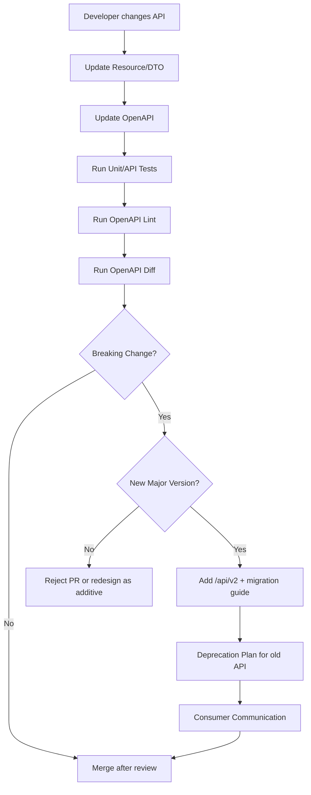

---

# 27. Practical Anti-Patterns

| Anti-Pattern | Gejala | Dampak | Perbaikan |
|---|---|---|---|
| `/v2` untuk setiap release | Semua perubahan jadi versi baru | Version sprawl | Major version hanya untuk breaking change |
| No versioning | API berubah diam-diam | Consumer rusak | Explicit versioning |
| Spec afterthought | OpenAPI tidak sinkron dengan code | Consumer tidak percaya docs | CI contract check |
| Error code berubah | Client automation gagal | Incident integrasi | Error catalog stabil |
| Deprecation tanpa sunset | Endpoint lama hidup selamanya | Maintenance cost tinggi | Timeline jelas |
| Sunset tanpa consumer registry | Consumer mati mendadak | Production incident | Track consumer usage |
| Header-only versioning tanpa tooling | Sulit debug | Operasional berat | URI versioning untuk awal |
| API docs manual saja | Drift cepat | Onboarding lambat | OpenAPI source-controlled |
| Breaking change dianggap “minor” | PR lolos tanpa migrasi | Runtime failure | OpenAPI diff gate |
| Mapper v1 dihapus saat domain berubah | v1 contract rusak | Consumer gagal | Compatibility adapter |

---

# 28. Practical Mini Blueprint

Untuk setiap API baru atau perubahan API, minimal buat:

```text
1. Resource path
2. HTTP method
3. Request DTO
4. Response DTO
5. Error response
6. Status code policy
7. OpenAPI path/schema
8. Compatibility classification:
   - safe
   - risky
   - breaking
9. Test cases:
   - success
   - validation error
   - forbidden
   - not found
   - conflict
10. Changelog entry
11. Consumer impact analysis if breaking/deprecated
12. Migration guide if replacing old contract
```

---

# 29. Roadmap Implementasi di Tim

| Step | Aktivitas | Output |
|---:|---|---|
| 1 | Pilih versioning strategy | URI major versioning policy |
| 2 | Pisahkan package DTO/resource per major version | `api.v1`, `api.v2` |
| 3 | Buat OpenAPI per version | `openapi-v1.yaml`, `openapi-v2.yaml` |
| 4 | Definisikan compatibility matrix | Safe/risky/breaking rules |
| 5 | Tambahkan API changelog | History perubahan contract |
| 6 | Tambahkan OpenAPI lint | Style governance |
| 7 | Tambahkan OpenAPI diff di CI | Breaking-change gate |
| 8 | Buat error code catalog | Stable machine-readable errors |
| 9 | Buat deprecation template | Active/deprecated/sunset lifecycle |
| 10 | Track consumer usage | Impact analysis sebelum sunset |
| 11 | Buat migration guide | Consumer bisa pindah terarah |
| 12 | Monitor deprecated endpoint traffic | Pastikan endpoint lama benar-benar tidak dipakai |

---

# 30. Kesimpulan

API versioning yang baik bukan berarti banyak versi. Justru versi yang baik adalah versi yang **jarang berubah major version** karena tim disiplin menjaga backward compatibility.

Untuk Java Jersey/JAX-RS microservice, praktik yang paling aman:

```text
- Gunakan URI major versioning: /api/v1
- Jaga backward compatibility dalam v1
- Buat /api/v2 hanya untuk breaking change
- Pisahkan DTO/resource/mapper per major version
- Jangan samakan API version dengan service artifact version
- Simpan OpenAPI contract di repo
- Jalankan OpenAPI lint dan diff di CI
- Stabilkan error code dan status behavior
- Gunakan Deprecation dan Sunset header untuk retirement
- Track consumer sebelum endpoint dihapus
```

**Seri 4/18 selesai.**

Rekomendasi materi berikutnya: **Seri 5 - Synchronous Communication Pattern: REST Client, Timeout, Retry, Circuit Breaker, Client Abstraction, dan Failure Handling antar-microservice Java Jersey/JAX-RS.**

---

**Sources:**

- [Jakarta RESTful Web Services 4.0](https://jakarta.ee/specifications/restful-ws/4.0/?utm_source=chatgpt.com)
- [OpenAPI Specification - Version 3.1.0](https://swagger.io/specification/?utm_source=chatgpt.com)
- [RFC 9457: Problem Details for HTTP APIs](https://www.rfc-editor.org/info/rfc9457/?utm_source=chatgpt.com)
- [RFC 9745 - The Deprecation HTTP Response Header Field](https://datatracker.ietf.org/doc/rfc9745/?utm_source=chatgpt.com)
- [OpenAPI Initiative – The OpenAPI Initiative provides an open ...](https://www.openapis.org/?utm_source=chatgpt.com)
- [OpenAPITools/openapi-diff: Utility for comparing two ...](https://github.com/OpenAPITools/openapi-diff?utm_source=chatgpt.com)
- [Best Practices - OpenAPI Documentation](https://learn.openapis.org/best-practices.html?utm_source=chatgpt.com)

## Response:
7/14/2026, 10:08:44 PM

Saya lanjut ke **Seri 5/18**. Fokusnya komunikasi sinkron antar-service: REST client design, timeout, retry, circuit breaker, idempotency, observability, dan cara mencegah cascading failure.

# Microservice Pattern - Seri 5/18  
## Synchronous Communication Pattern: REST Client, Timeout, Retry, Circuit Breaker, Client Abstraction, dan Failure Handling antar-Microservice Java Jersey/JAX-RS

## Introduction

Komunikasi sinkron antar-microservice biasanya terjadi ketika satu service perlu jawaban langsung dari service lain sebelum menyelesaikan request.

Contoh:

```text
case-management-service
  → document-service
  → identity-service
  → authorization-service
  → reference-data-service
```

Dalam Java Jersey/JAX-RS, komunikasi ini lazim dibuat dengan **JAX-RS Client API / Jersey Client**. Jersey Client menyediakan API fluent Java untuk memanggil RESTful web service melalui HTTP dan juga mendukung pluggable connector seperti JDK HTTP URL connection, Apache HTTP Client, Jetty, dan Grizzly. ([Eclipse EE4J](https://eclipse-ee4j.github.io/jersey.github.io/documentation/3.0.0/client.html))

Masalahnya: call sinkron sangat mudah menjadi sumber **cascading failure**.

```text
service A lambat
  ↓
service B thread menunggu
  ↓
service C ikut menunggu
  ↓
connection pool penuh
  ↓
request queue naik
  ↓
seluruh chain gagal
```

Jadi seri ini bukan hanya “cara call REST API”, tetapi bagaimana membuat REST client yang:

```text
bounded
observable
timeout-aware
retry-safe
circuit-breaker protected
idempotency-aware
secure
testable
```

---

# 1. Diagram

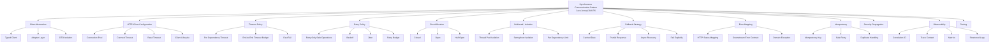

---

# 2. Decomposition Map - Practical Categories / Domain / Skills

| No | Area | Fokus Praktis | Implementasi Java/Jersey | Output yang Harus Ada |
|---:|---|---|---|---|
| 1 | **Client Abstraction** | Jangan panggil Jersey Client langsung dari banyak tempat | `DocumentServiceClient`, `IdentityServiceClient` | Typed client per downstream |
| 2 | **Adapter / Anti-Corruption Layer** | Pisahkan DTO internal dari DTO downstream | Mapper external response → internal model | Domain tidak bocor model service lain |
| 3 | **Client Lifecycle** | Client dibuat reusable, bukan per request | Singleton/shared `Client` | Pool dan resource efisien |
| 4 | **Connection Pooling** | Batasi koneksi ke downstream | Connector config | Tidak overload dependency |
| 5 | **Connect Timeout** | Batas waktu membuka koneksi | Jersey client property / connector config | Tidak menggantung saat host unreachable |
| 6 | **Read Timeout** | Batas waktu menunggu response | Jersey client property / connector config | Tidak menunggu downstream lambat terlalu lama |
| 7 | **Timeout Budget** | Total request upstream harus dibagi ke downstream | Budget per call | Mencegah request melebihi SLA |
| 8 | **Retry Policy** | Retry hanya untuk error transient dan operasi aman | Retry wrapper / MicroProfile FT / Resilience4j | Retry tidak menggandakan side effect |
| 9 | **Backoff & Jitter** | Hindari retry storm | exponential backoff + jitter | Downstream tidak makin overload |
| 10 | **Circuit Breaker** | Stop call sementara saat downstream gagal | MicroProfile FT / Resilience4j | Mencegah cascading failure |
| 11 | **Bulkhead** | Isolasi resource per dependency | semaphore/thread pool | Downstream lambat tidak menghabiskan semua thread |
| 12 | **Fallback** | Response alternatif saat dependency gagal | cached/default/partial response | UX/API tetap terkontrol |
| 13 | **Error Mapping** | Map HTTP/downstream error ke domain exception | `DownstreamExceptionMapper` | Error upstream konsisten |
| 14 | **Idempotency** | POST/command aman terhadap retry | `Idempotency-Key` | Tidak duplicate create/transition |
| 15 | **Correlation Propagation** | Header correlation diteruskan | `X-Correlation-Id` client filter | Debug lintas-service |
| 16 | **Trace Context Propagation** | Distributed tracing antar-service | OpenTelemetry Java agent/manual headers | Trace end-to-end |
| 17 | **Security Propagation** | Token/service credential diteruskan dengan benar | bearer token, client credentials, mTLS | Auth antar-service aman |
| 18 | **Metrics** | Ukur latency/error per dependency | timer/counter per client | Dashboard dependency health |
| 19 | **Testing** | Test success, timeout, retry, 4xx/5xx, fallback | WireMock/Testcontainers/mock server | Client behavior terjamin |
| 20 | **Operational Runbook** | Cara debug downstream failure | runbook per dependency | Incident lebih cepat ditangani |

MicroProfile Fault Tolerance 4.1 mendefinisikan annotation seperti `@Timeout`, `@Retry`, `@CircuitBreaker`, `@Fallback`, `@Bulkhead`, dan `@Asynchronous` sebagai interceptor binding, dengan parameter yang bisa dikonfigurasi secara eksternal. ([Eclipse Downloads](https://download.eclipse.org/microprofile/microprofile-fault-tolerance-4.1/microprofile-fault-tolerance-spec-4.1.html)) Resilience4j juga umum dipakai sebagai library fault tolerance Java yang menyediakan decorator untuk circuit breaker, retry, rate limiter, dan bulkhead. ([GitHub](https://github.com/resilience4j/resilience4j))

---

# 3. Kapan Pakai Sync REST vs Async Event?

Sebelum implementasi client, pastikan memang perlu komunikasi sinkron.

| Kebutuhan | Sync REST Cocok? | Pattern Lebih Cocok |
|---|---:|---|
| User butuh jawaban langsung | Ya | REST |
| Validasi cepat ke reference/identity service | Ya | REST dengan timeout pendek |
| Query data detail untuk halaman UI | Ya, tapi hati-hati fan-out | REST/BFF/API composition |
| Workflow long-running | Tidak ideal | Event/Camunda/Saga |
| Side effect non-critical seperti notification | Tidak | Async event |
| Bulk processing ribuan item | Tidak | Queue/worker |
| Integrasi external lambat/tidak stabil | Hati-hati | Async adapter/outbox |
| Audit event | Tidak perlu sync | Async event/outbox |

Rule praktis:

```text
Gunakan sync REST hanya jika caller benar-benar membutuhkan hasil downstream
untuk menyelesaikan response saat itu juga.
```

---

# 4. Call Chain dan Timeout Budget

Masalah klasik microservice:

```text
Client SLA: 2 detik

API Gateway → case-service → document-service → storage-service
```

Jika setiap hop punya timeout 2 detik, total latency bisa meledak.

## 4.1 Budget yang Lebih Sehat

| Komponen | Budget |
|---|---:|
| Gateway overhead | 100 ms |
| case-service processing | 300 ms |
| document-service call | 500 ms |
| identity-service call | 200 ms |
| DB query | 300 ms |
| Buffer | 600 ms |
| Total | 2000 ms |

## 4.2 Practical Rule

| Rule | Penjelasan |
|---|---|
| Set timeout per dependency | Jangan satu global timeout untuk semua |
| Downstream timeout harus lebih kecil dari upstream timeout | Agar caller masih punya waktu handle fallback |
| Jangan retry melewati total budget | Retry tanpa budget = latency explosion |
| Critical path harus minimal | Hindari fan-out sync berlebihan |
| Call eksternal lebih baik async jika lambat/tidak stabil | Terutama partner/external platform |

---

# 5. Client Abstraction Pattern

Jangan panggil Jersey Client langsung dari resource/application service di banyak tempat.

## Buruk

```java
Response response = client.target(documentUrl)
    .path("/documents/" + documentId)
    .request()
    .get();
```

Masalah:

| Masalah | Dampak |
|---|---|
| URL/path tersebar | Sulit rename/migrate |
| Timeout/retry tidak konsisten | Behavior sulit diprediksi |
| Error mapping berulang | Banyak bug berbeda |
| DTO downstream bocor | Domain coupling |
| Observability tersebar | Sulit debug |

## Lebih Baik

```text
application service
  → DocumentServiceClient interface
      → JerseyDocumentServiceClient implementation
          → Jersey Client
```

Interface:

```java
public interface DocumentServiceClient {

    DocumentMetadata getDocumentMetadata(UUID documentId);

    boolean documentExists(UUID documentId);
}
```

Implementation:

```java
public class JerseyDocumentServiceClient implements DocumentServiceClient {

    private final WebTarget baseTarget;
    private final DownstreamErrorMapper errorMapper;

    public JerseyDocumentServiceClient(
        Client client,
        URI baseUri,
        DownstreamErrorMapper errorMapper
    ) {
        this.baseTarget = client.target(baseUri);
        this.errorMapper = errorMapper;
    }

    @Override
    public DocumentMetadata getDocumentMetadata(UUID documentId) {
        try (Response response = baseTarget
            .path("/api/v1/documents/{documentId}")
            .resolveTemplate("documentId", documentId)
            .request(MediaType.APPLICATION_JSON_TYPE)
            .get()) {

            if (response.getStatusInfo().getFamily()
                == Response.Status.Family.SUCCESSFUL) {
                DocumentMetadataResponse dto =
                    response.readEntity(DocumentMetadataResponse.class);

                return DocumentMetadataMapper.toDomain(dto);
            }

            throw errorMapper.toException("document-service", response);
        }
    }

    @Override
    public boolean documentExists(UUID documentId) {
        try {
            getDocumentMetadata(documentId);
            return true;
        } catch (DownstreamNotFoundException e) {
            return false;
        }
    }
}
```

---

# 6. Jersey Client Configuration

JAX-RS Client API memakai `Client`, `WebTarget`, dan fluent request invocation untuk memanggil HTTP resource; Jersey Client juga memakai extension point JAX-RS seperti filter/provider dan mendukung connector berbeda. ([Eclipse EE4J](https://eclipse-ee4j.github.io/jersey.github.io/documentation/3.0.0/client.html))

## 6.1 Baseline Client Factory

```java
public final class JerseyClientFactory {

    private JerseyClientFactory() {}

    public static Client create(OutboundHttpClientConfig config) {
        ClientConfig clientConfig = new ClientConfig();

        clientConfig.property(
            ClientProperties.CONNECT_TIMEOUT,
            config.connectTimeoutMs()
        );

        clientConfig.property(
            ClientProperties.READ_TIMEOUT,
            config.readTimeoutMs()
        );

        clientConfig.register(JacksonFeature.class);
        clientConfig.register(ObjectMapperProvider.class);
        clientConfig.register(OutboundCorrelationIdFilter.class);
        clientConfig.register(OutboundRequestLoggingFilter.class);

        return ClientBuilder.newBuilder()
            .withConfig(clientConfig)
            .build();
    }
}
```

Config:

```java
public record OutboundHttpClientConfig(
    int connectTimeoutMs,
    int readTimeoutMs,
    int maxConnections,
    int maxConnectionsPerRoute
) {}
```

Catatan: property timeout bisa berbeda tergantung connector Jersey yang digunakan. Kalau tim memakai Apache connector/Jetty connector, pastikan konfigurasi pool dan timeout mengikuti connector tersebut, bukan hanya default JDK connector.

---

# 7. Client Lifecycle

## Salah

```java
public DocumentMetadata getDocumentMetadata(UUID documentId) {
    Client client = ClientBuilder.newClient();
    return client.target(baseUrl)
        .path(...)
        .request()
        .get(DocumentMetadata.class);
}
```

Masalah:

| Masalah | Dampak |
|---|---|
| Client dibuat per request | Overhead tinggi |
| Connection pool tidak efektif | Latency naik |
| Resource leak berisiko | Memory/thread/socket issue |
| Config tidak konsisten | Sulit operasi |

## Benar

```java
public class ClientRegistry implements AutoCloseable {

    private final Client documentClient;
    private final Client identityClient;

    public ClientRegistry(AppConfig config) {
        this.documentClient = JerseyClientFactory.create(config.documentClient());
        this.identityClient = JerseyClientFactory.create(config.identityClient());
    }

    public Client documentClient() {
        return documentClient;
    }

    public Client identityClient() {
        return identityClient;
    }

    @Override
    public void close() {
        documentClient.close();
        identityClient.close();
    }
}
```

Rule:

| Rule | Penjelasan |
|---|---|
| Satu configured client per downstream class/config | Reusable dan observable |
| Close client saat shutdown | Hindari resource leak |
| Pisahkan config per dependency | Timeout document-service beda dengan identity-service |
| Jangan share semua dependency dalam satu generic client tanpa policy | Behavior jadi tidak jelas |

---

# 8. Timeout Policy

Timeout bukan satu angka. Minimal ada:

| Timeout | Arti | Contoh |
|---|---|---:|
| Connect timeout | Waktu membuka koneksi | 200-500 ms internal |
| Read timeout | Waktu menunggu response | 500-2000 ms tergantung use case |
| Request timeout | Total call termasuk retry | 800-2500 ms |
| Pool acquire timeout | Waktu menunggu connection dari pool | 100-300 ms |
| Circuit breaker wait duration | Waktu sebelum half-open | 5-30 detik |

## Rekomendasi Praktis

| Dependency | Connect Timeout | Read Timeout | Retry? |
|---|---:|---:|---|
| Internal reference-data service | 200 ms | 500 ms | Ya, GET only |
| Identity/authz service | 200 ms | 800 ms | Hati-hati |
| Document metadata service | 300 ms | 1000 ms | GET only |
| External partner API | 500-1000 ms | 3000-5000 ms | Biasanya async lebih baik |
| Payment/side-effect command | 300 ms | 2000 ms | Jangan retry tanpa idempotency |

Practical rule:

```text
Timeout harus lebih pendek dari user-facing SLA
dan harus disesuaikan dengan criticality dependency.
```

---

# 9. Retry Policy

Retry harus sangat hati-hati. Retry bisa memperbaiki transient failure, tapi juga bisa memperparah outage.

## 9.1 Retry Cocok Untuk

| Kondisi | Retry? |
|---|---:|
| `GET` idempotent | Biasanya ya |
| `PUT` idempotent | Bisa |
| `DELETE` idempotent secara intent | Bisa, hati-hati |
| `POST` create tanpa idempotency key | Tidak |
| `POST` command dengan idempotency key | Bisa |
| HTTP `408`, `429`, `502`, `503`, `504` | Bisa, tergantung policy |
| HTTP `400`, `401`, `403`, `404`, `409` | Biasanya jangan retry |
| Connection reset/timeout | Bisa, jika operasi aman |
| Validation/business error | Jangan retry |

## 9.2 Retry dengan Backoff dan Jitter

Buruk:

```text
retry immediately 3 times
```

Lebih baik:

```text
retry 1: after 100 ms + jitter
retry 2: after 250 ms + jitter
retry 3: after 500 ms + jitter
stop if total budget exceeded
```

## 9.3 Simple Retry Wrapper

```java
public class RetryExecutor {

    private final int maxAttempts;
    private final Duration initialDelay;
    private final Duration maxDelay;

    public RetryExecutor(int maxAttempts, Duration initialDelay, Duration maxDelay) {
        this.maxAttempts = maxAttempts;
        this.initialDelay = initialDelay;
        this.maxDelay = maxDelay;
    }

    public <T> T execute(Supplier<T> operation, Predicate<Throwable> retryable) {
        int attempt = 1;
        Duration delay = initialDelay;

        while (true) {
            try {
                return operation.get();
            } catch (Throwable ex) {
                if (attempt >= maxAttempts || !retryable.test(ex)) {
                    throw ex;
                }

                sleepWithJitter(delay);
                delay = delay.multipliedBy(2);
                if (delay.compareTo(maxDelay) > 0) {
                    delay = maxDelay;
                }

                attempt++;
            }
        }
    }

    private void sleepWithJitter(Duration delay) {
        long jitterMs = ThreadLocalRandom.current().nextLong(0, 50);
        try {
            Thread.sleep(delay.toMillis() + jitterMs);
        } catch (InterruptedException e) {
            Thread.currentThread().interrupt();
            throw new RuntimeException("Retry interrupted", e);
        }
    }
}
```

Retry predicate:

```java
public final class DownstreamRetryPolicy {

    private DownstreamRetryPolicy() {}

    public static boolean isRetryable(Throwable throwable) {
        if (throwable instanceof DownstreamUnavailableException) {
            return true;
        }

        if (throwable instanceof DownstreamTimeoutException) {
            return true;
        }

        if (throwable instanceof DownstreamRateLimitedException) {
            return true;
        }

        return false;
    }
}
```

---

# 10. Circuit Breaker Pattern

Circuit breaker mencegah service terus memanggil dependency yang sedang gagal.

```text
CLOSED
  normal call

OPEN
  fail fast, jangan call downstream

HALF_OPEN
  coba beberapa request untuk cek recovery
```

## 10.1 Kapan Circuit Breaker Dibutuhkan?

| Kondisi | Circuit Breaker? |
|---|---:|
| Downstream sering timeout | Ya |
| Downstream critical dan bisa overload caller | Ya |
| External API tidak stabil | Ya |
| Local DB call | Biasanya bukan circuit breaker biasa; pakai pool/timeout |
| Pure in-memory validation | Tidak |

## 10.2 MicroProfile Fault Tolerance

Jika runtime Anda mendukung MicroProfile/CDI, annotation bisa dipakai:

```java
@ApplicationScoped
public class DocumentGateway {

    @Inject
    DocumentServiceClient client;

    @Timeout(1000)
    @Retry(maxRetries = 2, delay = 100)
    @CircuitBreaker(
        requestVolumeThreshold = 20,
        failureRatio = 0.5,
        delay = 10000
    )
    @Fallback(fallbackMethod = "fallbackDocumentMetadata")
    public DocumentMetadata getDocumentMetadata(UUID documentId) {
        return client.getDocumentMetadata(documentId);
    }

    public DocumentMetadata fallbackDocumentMetadata(UUID documentId) {
        return DocumentMetadata.unavailable(documentId);
    }
}
```

MicroProfile FT annotations adalah interceptor bindings dan bisa diterapkan pada class atau method bean, dengan dukungan konfigurasi parameter annotation secara eksternal. ([Eclipse Downloads](https://download.eclipse.org/microprofile/microprofile-fault-tolerance-4.1/microprofile-fault-tolerance-spec-4.1.html))

## 10.3 Resilience4j Style

Jika tidak memakai MicroProfile runtime, Resilience4j bisa digunakan sebagai library.

```java
public class ResilientDocumentServiceClient implements DocumentServiceClient {

    private final DocumentServiceClient delegate;
    private final CircuitBreaker circuitBreaker;
    private final Retry retry;
    private final Bulkhead bulkhead;

    public ResilientDocumentServiceClient(DocumentServiceClient delegate) {
        this.delegate = delegate;
        this.circuitBreaker = CircuitBreaker.ofDefaults("document-service");
        this.retry = Retry.ofDefaults("document-service");
        this.bulkhead = Bulkhead.ofDefaults("document-service");
    }

    @Override
    public DocumentMetadata getDocumentMetadata(UUID documentId) {
        Supplier<DocumentMetadata> supplier = () ->
            delegate.getDocumentMetadata(documentId);

        Supplier<DocumentMetadata> decorated = Decorators.ofSupplier(supplier)
            .withBulkhead(bulkhead)
            .withCircuitBreaker(circuitBreaker)
            .withRetry(retry)
            .decorate();

        return decorated.get();
    }

    @Override
    public boolean documentExists(UUID documentId) {
        return getDocumentMetadata(documentId).available();
    }
}
```

Resilience4j menyediakan decorator yang bisa ditumpuk untuk circuit breaker, bulkhead, retry, dan rate limiter. ([GitHub](https://github.com/resilience4j/resilience4j))

---

# 11. Bulkhead Pattern

Bulkhead membatasi resource yang boleh dipakai untuk satu dependency.

Tanpa bulkhead:

```text
100 request thread tersedia
document-service lambat
100 thread habis menunggu document-service
case-service tidak bisa melayani endpoint lain
```

Dengan bulkhead:

```text
document-service max 20 concurrent calls
identity-service max 10 concurrent calls
case-service masih punya thread untuk endpoint lain
```

## 11.1 Semaphore Bulkhead Concept

```java
public class SemaphoreBulkhead {

    private final Semaphore semaphore;

    public SemaphoreBulkhead(int maxConcurrentCalls) {
        this.semaphore = new Semaphore(maxConcurrentCalls);
    }

    public <T> T execute(Supplier<T> supplier) {
        boolean acquired = semaphore.tryAcquire();

        if (!acquired) {
            throw new DownstreamBulkheadFullException("Bulkhead limit reached");
        }

        try {
            return supplier.get();
        } finally {
            semaphore.release();
        }
    }
}
```

## 11.2 Practical Setting

| Dependency | Max Concurrent Calls |
|---|---:|
| identity-service | 10 |
| document-service | 20 |
| notification-service sync API | 5 |
| external partner API | 3 |
| reference-data-service | 30 |

Angka real harus berdasarkan kapasitas downstream, latency, thread pool, traffic, dan SLA.

---

# 12. Fallback Strategy

Fallback bukan berarti selalu return default. Fallback harus domain-aware.

| Scenario | Fallback yang Masuk Akal | Fallback yang Berbahaya |
|---|---|---|
| Reference data gagal | Pakai cache stale dengan flag | Return random default |
| Document metadata gagal | Mark `documentStatus=UNKNOWN` | Anggap document valid |
| Notification API gagal | Queue retry async | Rollback case transition |
| Authorization service gagal | Fail closed | Allow all |
| Fraud/risk check gagal | Pending manual review | Auto approve |
| Audit service gagal | Local outbox/block sesuai compliance | Abaikan audit |

Rule praktis:

```text
Untuk security/compliance decision, fallback biasanya harus fail closed.
Untuk UX/read-only data, fallback bisa stale/partial.
Untuk side effect non-critical, fallback bisa async retry.
```

---

# 13. Error Mapping Pattern

Downstream error tidak boleh bocor mentah ke API upstream.

## 13.1 Downstream Error Mapper

```java
public class DownstreamErrorMapper {

    public RuntimeException toException(String dependency, Response response) {
        int status = response.getStatus();

        String body = safeReadBody(response);

        return switch (status) {
            case 400 -> new DownstreamBadRequestException(dependency, body);
            case 401, 403 -> new DownstreamAuthException(dependency, status);
            case 404 -> new DownstreamNotFoundException(dependency);
            case 408 -> new DownstreamTimeoutException(dependency);
            case 409 -> new DownstreamConflictException(dependency, body);
            case 429 -> new DownstreamRateLimitedException(dependency);
            case 500, 502, 503, 504 ->
                new DownstreamUnavailableException(dependency, status);
            default -> new DownstreamUnexpectedException(dependency, status, body);
        };
    }

    private String safeReadBody(Response response) {
        try {
            if (!response.hasEntity()) {
                return "";
            }
            return response.readEntity(String.class);
        } catch (RuntimeException e) {
            return "";
        }
    }
}
```

## 13.2 Upstream Domain Mapping

```java
public CaseResponse createCase(CreateCaseRequest request, String actorId) {
    if (!documentServiceClient.documentExists(request.documentId())) {
        throw new InvalidCaseDocumentException(request.documentId());
    }

    // continue create case
}
```

Atau untuk dependency non-critical:

```java
try {
    DocumentMetadata metadata =
        documentServiceClient.getDocumentMetadata(request.documentId());

    documentVerificationService.markVerified(metadata);
} catch (DownstreamUnavailableException e) {
    documentVerificationService.markPendingVerification(request.documentId());
}
```

---

# 14. HTTP Status Handling Guideline

| Downstream Status | Caller Interpretation | Retry? | Upstream Response |
|---|---|---:|---|
| `200/201/204` | Success | No | Continue |
| `400` | Caller bug/request invalid | No | Usually `400` or domain error |
| `401/403` | Auth/service credential issue | No | `502/503` internally or `403` if actor issue |
| `404` | Resource missing | No | Domain-specific `404`/`400` |
| `409` | State conflict | No | `409` |
| `408` | Timeout | Maybe | `503` or fallback |
| `429` | Rate limited | Maybe with backoff | `503`/fallback |
| `500` | Downstream bug | Maybe cautiously | `503` |
| `502/503/504` | Dependency unavailable | Maybe | `503`/fallback |

Penting: jangan otomatis pass-through semua status dari downstream. Caller Anda mungkin tidak tahu dependency internal Anda.

---

# 15. Idempotency untuk Sync Command

Jika caller melakukan POST ke downstream dan retry aktif, idempotency wajib.

## 15.1 Outbound Request

```java
public PaymentReservation reservePayment(
    UUID caseId,
    BigDecimal amount,
    String idempotencyKey
) {
    ReservePaymentRequest request =
        new ReservePaymentRequest(caseId, amount);

    try (Response response = baseTarget
        .path("/api/v1/payment-reservations")
        .request(MediaType.APPLICATION_JSON_TYPE)
        .header("Idempotency-Key", idempotencyKey)
        .post(Entity.json(request))) {

        if (response.getStatus() == 201 || response.getStatus() == 200) {
            return response.readEntity(PaymentReservation.class);
        }

        throw errorMapper.toException("payment-service", response);
    }
}
```

## 15.2 Idempotency Key Design

| Use Case | Key |
|---|---|
| Create case | client-provided idempotency key |
| Transition case | `caseId + action + commandId` |
| Reserve payment | `caseId + paymentAttemptId` |
| External submission | generated command ID persisted locally |

Rule:

```text
Retry POST hanya aman kalau downstream mendukung idempotency
atau command secara natural idempotent.
```

---

# 16. Correlation ID Propagation

Inbound correlation ID harus diteruskan ke outbound call.

```java
@Provider
public class OutboundCorrelationIdFilter implements ClientRequestFilter {

    @Override
    public void filter(ClientRequestContext requestContext) {
        requestContext.getHeaders().putSingle(
            "X-Correlation-Id",
            CorrelationId.current()
        );
    }
}
```

Tambahkan juga request ID jika organisasi membedakan:

```text
X-Correlation-Id = sama untuk satu business flow
X-Request-Id     = unik per HTTP request/hop
```

---

# 17. Trace Context Propagation

OpenTelemetry menjelaskan bahwa context propagation memungkinkan traces, metrics, dan logs dikorelasikan lintas service/process boundary; secara default propagator memakai header W3C TraceContext seperti `traceparent`. ([OpenTelemetry](https://opentelemetry.io/docs/concepts/context-propagation/)) OpenTelemetry Java Agent juga bisa melakukan zero-code instrumentation untuk menangkap telemetry di edge aplikasi seperti inbound request, outbound HTTP calls, dan database calls. ([OpenTelemetry](https://opentelemetry.io/docs/zero-code/java/agent/))

Praktisnya:

| Approach | Kapan |
|---|---|
| Java agent | Baseline paling cepat untuk banyak service |
| Manual instrumentation | Untuk span domain penting |
| Client filter manual | Jika library tidak terinstrumentasi |
| Baggage | Hati-hati, jangan masukkan PII/secret |

## Minimum outbound headers

```text
X-Correlation-Id
traceparent
tracestate
Authorization
Idempotency-Key, jika command retryable
```

Jangan propagasikan semua inbound header secara buta. Whitelist header yang aman.

---

# 18. Security Propagation

Ada beberapa model antar-service:

| Model | Contoh | Kapan Cocok |
|---|---|---|
| User token propagation | Forward user JWT | Service perlu user context |
| Token exchange | Tukar user token ke downstream audience | Lebih aman untuk multi-service |
| Client credentials | Service-to-service credential | Background job/internal service |
| mTLS | Mutual TLS antar-service | Service mesh/zero-trust infra |
| API key | Legacy/external API | Kurang ideal untuk internal modern |

## Rule Praktis

| Rule | Penjelasan |
|---|---|
| Jangan forward token ke service yang bukan audience-nya | Risiko security boundary |
| Jangan log Authorization header | Secret leakage |
| Gunakan short-lived credential | Mengurangi blast radius |
| Bedakan actor dan service principal | Audit perlu tahu user dan calling service |
| Fail closed untuk authz dependency | Jangan allow jika authorization tidak bisa diverifikasi |

---

# 19. Client Metrics

Minimal metric per downstream:

| Metric | Label | Tujuan |
|---|---|---|
| `outbound_http_requests_total` | dependency, method, path, status_class | Volume dan error rate |
| `outbound_http_request_duration_ms` | dependency, method, path | Latency |
| `outbound_http_timeouts_total` | dependency | Timeout trend |
| `outbound_http_retries_total` | dependency | Retry pressure |
| `circuit_breaker_state` | dependency | Open/closed state |
| `bulkhead_rejected_total` | dependency | Saturation |
| `downstream_errors_total` | dependency, error_code | Dependency failure |

Log minimal:

```json
{
  "event": "outbound_http_completed",
  "dependency": "document-service",
  "method": "GET",
  "path": "/api/v1/documents/{documentId}",
  "status": 200,
  "durationMs": 83,
  "correlationId": "2a4c4f2c-7798-455a-8270-961f0a1e0ed4"
}
```

---

# 20. Practical Client Implementation Blueprint

## 20.1 Interface

```java
public interface IdentityServiceClient {

    UserProfile getUserProfile(String userId);

    boolean userExists(String userId);
}
```

## 20.2 DTO Downstream

```java
public record UserProfileResponse(
    String userId,
    String displayName,
    String email,
    String status
) {}
```

## 20.3 Internal Model

```java
public record UserProfile(
    String userId,
    String displayName,
    boolean active
) {}
```

## 20.4 Mapper

```java
public final class UserProfileMapper {

    private UserProfileMapper() {}

    public static UserProfile toDomain(UserProfileResponse response) {
        return new UserProfile(
            response.userId(),
            response.displayName(),
            "ACTIVE".equals(response.status())
        );
    }
}
```

## 20.5 Jersey Client

```java
public class JerseyIdentityServiceClient implements IdentityServiceClient {

    private final WebTarget target;
    private final DownstreamErrorMapper errorMapper;

    public JerseyIdentityServiceClient(
        Client client,
        URI baseUri,
        DownstreamErrorMapper errorMapper
    ) {
        this.target = client.target(baseUri);
        this.errorMapper = errorMapper;
    }

    @Override
    public UserProfile getUserProfile(String userId) {
        try (Response response = target
            .path("/api/v1/users/{userId}")
            .resolveTemplate("userId", userId)
            .request(MediaType.APPLICATION_JSON_TYPE)
            .get()) {

            if (response.getStatus() == 200) {
                UserProfileResponse dto =
                    response.readEntity(UserProfileResponse.class);
                return UserProfileMapper.toDomain(dto);
            }

            throw errorMapper.toException("identity-service", response);
        }
    }

    @Override
    public boolean userExists(String userId) {
        try {
            UserProfile profile = getUserProfile(userId);
            return profile.active();
        } catch (DownstreamNotFoundException e) {
            return false;
        }
    }
}
```

## 20.6 Resilient Wrapper

```java
public class ResilientIdentityServiceClient implements IdentityServiceClient {

    private final IdentityServiceClient delegate;
    private final RetryExecutor retryExecutor;
    private final SemaphoreBulkhead bulkhead;

    public ResilientIdentityServiceClient(
        IdentityServiceClient delegate,
        RetryExecutor retryExecutor,
        SemaphoreBulkhead bulkhead
    ) {
        this.delegate = delegate;
        this.retryExecutor = retryExecutor;
        this.bulkhead = bulkhead;
    }

    @Override
    public UserProfile getUserProfile(String userId) {
        return bulkhead.execute(() ->
            retryExecutor.execute(
                () -> delegate.getUserProfile(userId),
                DownstreamRetryPolicy::isRetryable
            )
        );
    }

    @Override
    public boolean userExists(String userId) {
        return getUserProfile(userId).active();
    }
}
```

---

# 21. Fan-Out Pattern dan Risiko

Contoh endpoint:

```text
GET /cases/{caseId}/detail
```

Butuh:

```text
case DB
document-service
investigation-service
decision-service
identity-service
```

Kalau semua dipanggil sequential:

```text
300 ms + 500 ms + 700 ms + 400 ms + 300 ms = 2200 ms
```

Kalau parallel:

```text
max(300, 500, 700, 400, 300) = 700 ms
```

Tapi parallel fan-out punya risiko:

| Risiko | Penjelasan |
|---|---|
| Lebih banyak concurrent outbound call | Downstream pressure naik |
| Error handling lebih kompleks | Partial failure |
| Trace lebih rumit | Butuh observability bagus |
| Timeout budget harus jelas | Jangan tunggu future tanpa batas |
| Thread pool bisa habis | Perlu bulkhead |

Rule:

```text
Fan-out sync boleh untuk read/composition,
tetapi jangan untuk workflow side-effect yang butuh consistency kuat.
```

Untuk query lintas-service yang sering dan berat, lebih baik buat **read model/CQRS** di seri 9.

---

# 22. Parallel Call dengan CompletableFuture

```java
public CaseDetailResponse getCaseDetail(UUID caseId) {
    Case caseDomain = caseRepository.findById(caseId)
        .orElseThrow(() -> new CaseNotFoundException(caseId));

    CompletableFuture<DocumentSummary> documentsFuture =
        CompletableFuture.supplyAsync(
            () -> documentClient.getDocumentSummary(caseId),
            dependencyExecutor
        );

    CompletableFuture<InvestigationSummary> investigationFuture =
        CompletableFuture.supplyAsync(
            () -> investigationClient.getInvestigationSummary(caseId),
            dependencyExecutor
        );

    try {
        CompletableFuture.allOf(documentsFuture, investigationFuture)
            .get(800, TimeUnit.MILLISECONDS);

        return CaseDetailResponse.of(
            caseDomain,
            documentsFuture.join(),
            investigationFuture.join()
        );

    } catch (TimeoutException e) {
        throw new DownstreamTimeoutException("case-detail-composition");
    } catch (InterruptedException e) {
        Thread.currentThread().interrupt();
        throw new RuntimeException("Interrupted while composing case detail", e);
    } catch (ExecutionException e) {
        throw mapCompositionFailure(e.getCause());
    }
}
```

Practical note:

| Rule | Penjelasan |
|---|---|
| Pakai bounded executor | Jangan common pool untuk semua dependency |
| Tetapkan timeout total | Jangan tunggu infinite |
| Propagasi correlation/trace context | Thread berpindah |
| Partial response harus eksplisit | Jangan diam-diam hilangkan data |
| Cancel future jika timeout | Hindari kerja sia-sia |

---

# 23. Configuration per Dependency

```yaml
downstream:
  document-service:
    base-url: http://document-service:8080
    connect-timeout-ms: 300
    read-timeout-ms: 1000
    max-connections: 50
    max-connections-per-route: 20
    retry:
      max-attempts: 2
      initial-delay-ms: 100
      max-delay-ms: 500
    circuit-breaker:
      failure-rate-threshold: 50
      minimum-calls: 20
      open-duration-ms: 10000
    bulkhead:
      max-concurrent-calls: 20

  identity-service:
    base-url: http://identity-service:8080
    connect-timeout-ms: 200
    read-timeout-ms: 700
    max-connections: 30
    max-connections-per-route: 10
    retry:
      max-attempts: 1
    bulkhead:
      max-concurrent-calls: 10
```

Rule:

```text
Jangan satu config global untuk semua downstream.
Setiap dependency punya SLA, kapasitas, dan criticality berbeda.
```

---

# 24. Kubernetes / Runtime Consideration

Sync communication juga dipengaruhi runtime Kubernetes.

| Area | Praktik |
|---|---|
| DNS | Gunakan Kubernetes service DNS, bukan pod IP |
| Readiness | Downstream yang belum ready tidak menerima traffic |
| Liveness | Jangan restart pod hanya karena downstream gagal |
| Resource limit | CPU starvation bisa menyebabkan timeout palsu |
| HPA | Scaling caller bisa overload callee |
| NetworkPolicy | Pastikan service-to-service allowed |
| mTLS/service mesh | Bisa handle TLS/identity/routing, tapi app tetap perlu timeout |
| Rolling deploy | Client harus tahan koneksi reset/retry safe |

Penting: service mesh/gateway tidak menggantikan resilience di aplikasi. Ia membantu, tapi domain decision seperti fallback, idempotency, dan error mapping tetap milik aplikasi.

---

# 25. Testing Strategy

## 25.1 Unit Test Client Mapping

```java
class UserProfileMapperTest {

    @Test
    void mapsActiveUser() {
        UserProfileResponse response =
            new UserProfileResponse("u-1", "Jane Doe", "jane@example.com", "ACTIVE");

        UserProfile profile = UserProfileMapper.toDomain(response);

        assertEquals("u-1", profile.userId());
        assertTrue(profile.active());
    }
}
```

## 25.2 Mock Downstream Test

Test scenario:

| Scenario | Expected |
|---|---|
| Downstream returns 200 | DTO mapped |
| Downstream returns 404 | `DownstreamNotFoundException` |
| Downstream returns 503 | retry/fallback |
| Downstream timeout | timeout exception |
| Invalid JSON | mapping exception |
| Missing field | compatibility behavior |
| Retry on GET timeout | retry count observed |
| No retry on 400 | single call |
| POST without idempotency | no retry |

## 25.3 Contract Test

Pastikan client expectation sesuai OpenAPI downstream:

```text
Given document exists
When GET /api/v1/documents/{documentId}
Then response has:
  documentId
  fileName
  contentType
  status
```

## 25.4 Chaos/Failure Test

| Failure | Tujuan |
|---|---|
| Downstream slow 2s | Timeout bekerja |
| Downstream 503 50% | Retry/circuit breaker bekerja |
| Downstream always down | Circuit open/fail fast |
| Downstream returns malformed JSON | Error mapping aman |
| Connection refused | Connect timeout/retry |
| Rate limit 429 | Backoff atau fail explicit |

---

# 26. Operational Runbook: Downstream Failure

Minimal runbook untuk setiap client:

```text
Dependency:
  document-service

Used by:
  case-management-service

Criticality:
  Medium for create case
  High for document download
  Low for metadata enrichment

Symptoms:
  - outbound_http_timeouts_total{dependency="document-service"} rising
  - circuit_breaker_state{dependency="document-service"} = OPEN
  - case create latency rising
  - pending_document_verification_count rising

Immediate Checks:
  - Is document-service ready?
  - Is error 4xx or 5xx?
  - Is latency or connection failure?
  - Is DNS resolving?
  - Is auth token rejected?
  - Is connection pool saturated?

Mitigation:
  - If non-critical, enable pending verification fallback
  - If critical, fail fast with DEPENDENCY_UNAVAILABLE
  - Reduce retry attempts if downstream overloaded
  - Scale document-service only if bottleneck is capacity
  - Do not blindly scale caller

Recovery:
  - Watch circuit half-open success
  - Drain pending verification queue
  - Review failed commands for replay
```

---

# 27. Practical Anti-Patterns

| Anti-Pattern | Gejala | Dampak | Perbaikan |
|---|---|---|---|
| No timeout | Request menggantung lama | Thread exhaustion | Set connect/read/request timeout |
| Retry everything | 400/403/409 ikut retry | Load naik, bug tersembunyi | Retry hanya transient/safe |
| Retry POST tanpa idempotency | Duplicate side effect | Data inconsistency | Idempotency key |
| No circuit breaker | Downstream outage menjatuhkan caller | Cascading failure | Circuit breaker |
| No bulkhead | Satu dependency lambat menghabiskan semua thread | Service total outage | Per-dependency isolation |
| Pass-through downstream error | Consumer lihat error internal | Contract bocor | Map ke domain/API error |
| Client created per request | Resource overhead | Latency/resource leak | Reuse client |
| Generic client tanpa typed abstraction | Logic tersebar | Sulit test/observe | Typed client per dependency |
| Infinite fan-out | Satu API call memanggil banyak service | Latency tinggi | BFF/read model |
| Fallback allow all | Security bypass | Compliance incident | Fail closed |
| Log token/header sensitif | Secret leak | Security incident | Redaction |
| No metrics per dependency | Sulit tahu dependency mana gagal | MTTR tinggi | Outbound metrics |

---

# 28. Practical Checklist

Gunakan ini saat review REST client antar-service.

| Area | Checklist |
|---|---|
| Client abstraction | Ada interface per downstream |
| DTO isolation | Downstream DTO tidak bocor ke domain |
| Timeout | Connect/read/request timeout jelas |
| Pooling | Connection pool dikonfigurasi |
| Retry | Retry hanya untuk operasi aman/transient |
| Backoff | Retry memakai backoff dan jitter |
| Circuit breaker | Ada untuk dependency rawan gagal |
| Bulkhead | Ada limit concurrent call per dependency |
| Fallback | Domain-aware dan aman |
| Error mapping | HTTP/downstream error dimap ke exception internal |
| Idempotency | POST retryable punya idempotency key |
| Correlation | `X-Correlation-Id` diteruskan |
| Tracing | `traceparent`/OpenTelemetry context terpropagasi |
| Security | Token/service credential benar dan tidak dilog |
| Metrics | Latency/error/retry/circuit per dependency |
| Test | Success, 4xx, 5xx, timeout, retry, fallback |
| Config | Per-dependency config externalized |
| Runbook | Ada diagnosis dan mitigasi |

---

# 29. Practical Decision Matrix

| Pertanyaan | Jika Ya | Jika Tidak |
|---|---|---|
| Apakah caller butuh jawaban langsung? | Sync REST mungkin cocok | Gunakan event/queue |
| Apakah operasi idempotent? | Retry bisa dipertimbangkan | Jangan retry tanpa key |
| Apakah downstream kritikal? | Fail explicit atau fallback aman | Partial response mungkin cukup |
| Apakah dependency lambat/tidak stabil? | Circuit breaker + bulkhead | Timeout tetap wajib |
| Apakah data sering dibaca lintas-service? | Pertimbangkan read model | Sync call masih cukup |
| Apakah call dilakukan dalam DB transaction? | Red flag | Lebih aman di luar transaksi/outbox |
| Apakah fallback bisa melanggar security/compliance? | Fail closed | Fallback allowed |
| Apakah call chain lebih dari 2-3 hop? | Waspada distributed monolith | Masih manageable |

---

# 30. Roadmap Implementasi

| Step | Aktivitas | Output |
|---:|---|---|
| 1 | Inventarisasi downstream dependency | Dependency map |
| 2 | Buat typed client per dependency | `DocumentServiceClient`, `IdentityServiceClient` |
| 3 | Pisahkan DTO downstream dan mapper | Anti-corruption layer |
| 4 | Tambahkan timeout per dependency | Config externalized |
| 5 | Tambahkan error mapper | Consistent exception |
| 6 | Tambahkan correlation + trace propagation | Debug lintas-service |
| 7 | Tambahkan retry hanya untuk safe operation | Retry policy |
| 8 | Tambahkan circuit breaker untuk dependency rawan | Fail-fast protection |
| 9 | Tambahkan bulkhead | Resource isolation |
| 10 | Tambahkan metrics/logging per dependency | Observability |
| 11 | Tambahkan fallback domain-aware | Controlled degradation |
| 12 | Tambahkan tests dan runbook | Production readiness |

---

# Kesimpulan

Synchronous communication antar-microservice harus diperlakukan sebagai **risk boundary**, bukan sekadar HTTP call.

Untuk Java Jersey/JAX-RS microservice, baseline yang sehat adalah:

```text
- typed client per downstream
- DTO isolation dan mapper
- reusable Jersey Client
- connect/read/request timeout
- retry hanya untuk operasi aman
- backoff + jitter
- circuit breaker untuk dependency tidak stabil
- bulkhead untuk isolasi resource
- fallback yang domain-aware
- downstream error mapping
- idempotency untuk POST/command
- correlation ID dan trace propagation
- metrics/logs per dependency
- test untuk timeout, retry, 4xx, 5xx, fallback
```

**Seri 5/18 selesai.**

Rekomendasi materi berikutnya: **Seri 6 - Asynchronous Communication Pattern: Queue, Event, Pub/Sub, Worker Pattern, Dead Letter Queue, dan Event Consumer di Java Jersey/JAX-RS Microservice.**

---

**Sources:**

- [Chapter 5. Client API](https://eclipse-ee4j.github.io/jersey.github.io/documentation/3.0.0/client.html)
- [Microprofile Fault Tolerance](https://download.eclipse.org/microprofile/microprofile-fault-tolerance-4.1/microprofile-fault-tolerance-spec-4.1.html)
- [GitHub - resilience4j/resilience4j: Resilience4j is a fault tolerance library designed for Java8 and functional programming · GitHub](https://github.com/resilience4j/resilience4j)
- [Context propagation | OpenTelemetry](https://opentelemetry.io/docs/concepts/context-propagation/)

## Response:
7/14/2026, 10:11:49 PM

Saya lanjut ke **Seri 6/18**. Fokusnya komunikasi asinkron yang praktis: event/command/message, worker, outbox, consumer idempotent, retry, DLQ, ordering, schema, dan kapan memakai queue dibanding REST.

# Microservice Pattern - Seri 6/18  
## Asynchronous Communication Pattern: Queue, Event, Pub/Sub, Worker, Retry, DLQ, dan Event Consumer di Java Jersey/JAX-RS Microservice

## Introduction

Komunikasi asinkron dipakai ketika sebuah service **tidak perlu menunggu hasil langsung** dari service lain untuk menyelesaikan request. Ini sangat penting di microservice karena tidak semua proses bisnis cocok dipaksa menjadi call REST sinkron.

Contoh:

```text
case-management-service
  menerima transition case
  menyimpan perubahan status
  menulis outbox event CaseEscalated
  mengembalikan response ke caller

worker/outbox-publisher
  publish CaseEscalated ke broker

notification-service
  consume CaseEscalated
  kirim email/SMS/webhook

audit-service
  consume CaseEscalated
  simpan audit trail
```

RabbitMQ adalah message broker yang bisa berjalan di cloud, on-premises, dan local environment, serta mendukung beberapa protokol terbuka seperti AMQP 1.0 dan MQTT 5.0. ([RabbitMQ](https://www.rabbitmq.com/?utm_source=chatgpt.com)) Untuk reliability, RabbitMQ menyediakan konsep **consumer acknowledgements** dan **publisher confirms**; dokumentasinya menjelaskan keduanya sebagai fitur yang terkait dengan data safety antara publisher, broker, dan consumer. ([RabbitMQ](https://www.rabbitmq.com/docs/confirms?utm_source=chatgpt.com))

Dalam konteks Java/Jersey/JAX-RS, asynchronous communication biasanya bukan berada di resource layer. Jersey resource hanya menerima HTTP request. Proses async biasanya hidup di:

```text
application service
outbox table
publisher worker
message consumer
idempotency/inbox table
retry/DLQ handler
```

---

## 1. Diagram

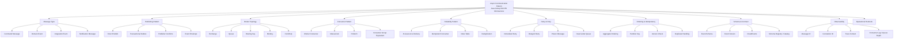

---

## 2. Decomposition Map - Practical Categories / Domain / Skills

| No | Area | Fokus Praktis | Implementasi Java/Jersey/RabbitMQ | Output yang Harus Ada |
|---:|---|---|---|---|
| 1 | **Async vs Sync Decision** | Menentukan kapan pakai event/queue dibanding REST | Decision matrix per use case | Integration decision log |
| 2 | **Command Message** | Instruksi ke service lain untuk melakukan pekerjaan | `SendNotificationCommand`, `GenerateReportCommand` | Command schema |
| 3 | **Domain Event** | Fakta bisnis yang sudah terjadi di owning service | `CaseEscalated`, `DecisionApproved` | Event catalog |
| 4 | **Integration Event** | Event yang sengaja dibuat stabil untuk consumer eksternal/internal | Event envelope + public payload | Stable integration contract |
| 5 | **Broker Topology** | Exchange, queue, routing key, binding | RabbitMQ topic/direct exchange | Topology document |
| 6 | **Transactional Outbox** | Simpan data bisnis dan event dalam satu DB transaction | PostgreSQL `outbox_event` + publisher worker | No lost event after commit |
| 7 | **Publisher Confirms** | Pastikan broker menerima publish | RabbitMQ `confirmSelect`, `waitForConfirms` | Publish reliability |
| 8 | **Consumer Manual Ack** | Ack hanya setelah message berhasil diproses | `basicAck`, `basicNack`, `basicReject` | At-least-once processing |
| 9 | **Prefetch / Backpressure** | Batasi message in-flight per consumer | `basicQos(prefetchCount)` | Consumer tidak overload |
| 10 | **Idempotent Consumer** | Aman terhadap duplicate delivery | `processed_message` / inbox table | Duplicate-safe handler |
| 11 | **Inbox Pattern** | Catat message yang sudah diproses | PostgreSQL inbox/dedup table | Consumer exactly-once illusion |
| 12 | **Retry Strategy** | Bedakan transient vs permanent failure | retry count, delayed retry, DLQ | Controlled recovery |
| 13 | **Dead Letter Queue** | Tangani poison message | DLX/DLQ policy | Message tidak hilang diam-diam |
| 14 | **Ordering Strategy** | Menjaga urutan per aggregate jika dibutuhkan | routing key by `caseId`, version check | No stale update |
| 15 | **Event Schema Versioning** | Evolusi event tanpa merusak consumer | `eventVersion`, additive change | Schema governance |
| 16 | **CloudEvents Envelope** | Format metadata event standar | `id`, `source`, `type`, `time`, `data` | Interoperable event contract |
| 17 | **Security & Privacy** | Hindari PII/secret berlebihan di message | minimal payload, tokenless event | Lower leakage risk |
| 18 | **Observability** | Trace message lifecycle | messageId, correlationId, queue depth | Debug async flow |
| 19 | **Testing** | Test publish, consume, retry, DLQ, duplicate | Testcontainers RabbitMQ + PostgreSQL | Reliable integration tests |
| 20 | **Operational Runbook** | Cara debug queue backlog, poison message, replay | runbook per queue/event | Faster incident response |

CloudEvents adalah spesifikasi untuk mendeskripsikan event data secara umum agar event lebih mudah dipertukarkan lintas service, platform, dan sistem. ([CloudEvents](https://cloudevents.io/?utm_source=chatgpt.com)) Untuk Java microservice yang memakai MicroProfile stack, MicroProfile Reactive Messaging menyediakan model untuk CDI bean yang memproduksi, mengonsumsi, dan memproses message dalam event-driven microservices; versi 3.0.1 berstatus final pada 16 April 2024. ([Eclipse Downloads](https://download.eclipse.org/microprofile/microprofile-reactive-messaging-3.0.1/microprofile-reactive-messaging-spec-3.0.1.html?utm_source=chatgpt.com))

---

# 3. Kapan Pakai Async?

## 3.1 Cocok Pakai Async

| Use Case | Kenapa Async Cocok |
|---|---|
| Notification setelah case escalated | Caller tidak perlu menunggu email terkirim |
| Audit event | Audit bisa diproses reliable via outbox/consumer |
| Report generation | Proses bisa lama |
| File/media processing | CPU/IO heavy dan bisa diantrikan |
| External partner submission | External API bisa lambat/tidak stabil |
| Workflow long-running | Cocok dengan event/Camunda orchestration |
| Data projection/read model | Consumer membangun query model sendiri |
| Retryable side effect | Bisa diulang tanpa blocking user request |

## 3.2 Tidak Selalu Cocok Pakai Async

| Use Case | Kenapa Hati-hati |
|---|---|
| User butuh jawaban langsung | Lebih cocok sync REST |
| Authorization real-time | Biasanya harus sync/fail closed |
| Validation yang menentukan request diterima/tidak | Harus sync di owning service |
| Operasi kecil dan strongly consistent | Async bisa membuat flow terlalu kompleks |
| Query sederhana satu service | REST/DB local query cukup |
| Decision regulatory final | Bisa async orchestration, tapi state/result harus eksplisit |

Rule praktis:

```text
Gunakan async untuk decoupling, latency isolation, retryable side effect,
dan long-running work.

Jangan gunakan async hanya untuk menyembunyikan boundary yang tidak jelas.
```

---

# 4. Message Type: Command vs Event

Ini fondasi yang sering kacau.

## 4.1 Command Message

Command adalah instruksi.

```json
{
  "messageType": "SendCaseEscalationNotification",
  "caseId": "9cc9c5e3-8d7b-4c74-b3f9-11fcf49b6a61",
  "recipientUserId": "user-123",
  "templateCode": "CASE_ESCALATED"
}
```

Ciri command:

| Ciri | Penjelasan |
|---|---|
| Imperative | “Do this” |
| Biasanya punya target consumer | Notification service, report worker |
| Bisa gagal secara business | Recipient tidak valid, template tidak ada |
| Retry perlu idempotency | Jangan kirim email double |
| Biasanya queue-based | Work queue |

## 4.2 Event Message

Event adalah fakta yang sudah terjadi.

```json
{
  "eventType": "CaseEscalated",
  "caseId": "9cc9c5e3-8d7b-4c74-b3f9-11fcf49b6a61",
  "fromStatus": "UNDER_INVESTIGATION",
  "toStatus": "ESCALATED",
  "reasonCode": "SLA_BREACHED"
}
```

Ciri event:

| Ciri | Penjelasan |
|---|---|
| Past tense | “Something happened” |
| Publisher tidak tahu semua consumer | Loose coupling |
| Consumer menentukan aksinya sendiri | Notification, audit, reporting |
| Tidak boleh bergantung pada jumlah consumer | Event fan-out |
| Cocok untuk integration event | Public fact |

## 4.3 Practical Rule

| Kalau Anda Menulis | Kemungkinan |
|---|---|
| `SendEmail` | Command |
| `GenerateInvoice` | Command |
| `CaseCreated` | Event |
| `PaymentCaptured` | Event |
| `DecisionApproved` | Event |
| `EscalateCase` | Command |
| `CaseEscalated` | Event |

---

# 5. Domain Event vs Integration Event

Jangan semua domain event internal langsung dipublish ke luar.

| Jenis | Scope | Contoh | Stabilitas |
|---|---|---|---|
| Domain event | Internal service/domain | `CaseStatusChangedInternally` | Bisa berubah |
| Integration event | Contract antar-service | `CaseEscalated` | Harus stabil |
| Audit event | Compliance/forensic | `CaseTransitionAudited` | Sangat stabil |
| Notification command | Targeted work | `SendNotificationCommand` | Stabil terhadap worker |

Contoh mapping:

```text
Domain event:
  CaseTransitioned(
    internalWorkflowToken,
    previousInternalState,
    nextInternalState,
    transitionPolicyId
  )

Integration event:
  CaseEscalated(
    caseId,
    caseNumber,
    reasonCode,
    occurredAt
  )
```

Practical rule:

```text
Publish event yang consumer butuhkan,
bukan seluruh isi aggregate internal.
```

---

# 6. Broker Topology Pattern

Untuk RabbitMQ, konsep paling umum:

```text
Publisher → Exchange → Binding/Routing Key → Queue → Consumer
```

RabbitMQ documentation menunjukkan work queue dapat dikontrol dengan message acknowledgements dan `prefetch_count`/`basicQos` untuk distribusi kerja, serta durability options agar task bisa survive broker restart. ([RabbitMQ](https://www.rabbitmq.com/tutorials/tutorial-two-python?utm_source=chatgpt.com))

## 6.1 Topology Example

```text
exchange:
  case.events.topic

routing keys:
  case.created
  case.assigned
  case.escalated
  case.closed

queues:
  notification.case-events.q
  audit.case-events.q
  reporting.case-events.q

bindings:
  notification.case-events.q ← case.escalated
  audit.case-events.q        ← case.*
  reporting.case-events.q    ← case.*
```

## 6.2 Diagram

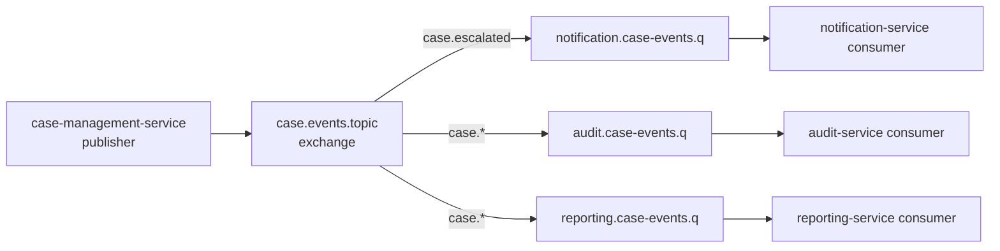

## 6.3 Naming Convention

| Object | Naming |
|---|---|
| Exchange | `<domain>.events.topic` |
| Command exchange | `<domain>.commands.direct` |
| Queue | `<consumer>.<purpose>.q` |
| Retry queue | `<consumer>.<purpose>.retry.q` |
| DLQ | `<consumer>.<purpose>.dlq` |
| Routing key | `<domain>.<event>` |
| Event type | PascalCase: `CaseEscalated` |

Contoh:

```text
case.events.topic
case.commands.direct
notification.case-events.q
notification.case-events.retry.q
notification.case-events.dlq
case.escalated
CaseEscalated
```

---

# 7. Event Envelope

Jangan kirim payload polos tanpa metadata.

## 7.1 Enterprise Envelope

```json
{
  "messageId": "4fb43e7e-3f15-41f5-9d76-4c7e5ab2926e",
  "messageType": "CaseEscalated",
  "messageVersion": 1,
  "source": "case-management-service",
  "occurredAt": "2026-07-14T10:15:00Z",
  "publishedAt": "2026-07-14T10:15:03Z",
  "correlationId": "2a4c4f2c-7798-455a-8270-961f0a1e0ed4",
  "causationId": "9e2f4d1a-c2ea-4d9c-98a7-8fd2ff91fd38",
  "aggregateType": "Case",
  "aggregateId": "9cc9c5e3-8d7b-4c74-b3f9-11fcf49b6a61",
  "data": {
    "caseId": "9cc9c5e3-8d7b-4c74-b3f9-11fcf49b6a61",
    "caseNumber": "CASE-2026-000123",
    "fromStatus": "UNDER_INVESTIGATION",
    "toStatus": "ESCALATED",
    "reasonCode": "SLA_BREACHED"
  }
}
```

## 7.2 CloudEvents-style Envelope

CloudEvents mendefinisikan metadata event standar seperti `id`, `source`, `type`, dan `specversion`; spesifikasinya mendukung JSON event format sebagai format yang wajib didukung oleh implementasi compliant. ([GitHub](https://github.com/cloudevents/spec/blob/main/cloudevents/spec.md?utm_source=chatgpt.com))

```json
{
  "specversion": "1.0",
  "id": "4fb43e7e-3f15-41f5-9d76-4c7e5ab2926e",
  "source": "/services/case-management-service",
  "type": "com.company.case.CaseEscalated.v1",
  "subject": "case/9cc9c5e3-8d7b-4c74-b3f9-11fcf49b6a61",
  "time": "2026-07-14T10:15:03Z",
  "datacontenttype": "application/json",
  "data": {
    "caseId": "9cc9c5e3-8d7b-4c74-b3f9-11fcf49b6a61",
    "caseNumber": "CASE-2026-000123",
    "reasonCode": "SLA_BREACHED"
  }
}
```

## 7.3 Envelope Field Rule

| Field | Wajib? | Fungsi |
|---|---:|---|
| `messageId` / `id` | Ya | Deduplication |
| `messageType` / `type` | Ya | Routing/handling |
| `messageVersion` | Ya | Schema evolution |
| `source` | Ya | Producer identity |
| `occurredAt` / `time` | Ya | Business event time |
| `publishedAt` | Disarankan | Broker publish time |
| `correlationId` | Ya | Trace business flow |
| `causationId` | Disarankan | Event chain debugging |
| `aggregateId` | Ya untuk domain event | Ordering/dedup |
| `data` | Ya | Business payload |

---

# 8. Transactional Outbox Pattern

Problem utama direct publish:

```text
1. Update case status in DB = success
2. Publish CaseEscalated to broker = fail
3. Data sudah berubah, event tidak terkirim
```

Atau kebalikannya:

```text
1. Publish CaseEscalated = success
2. DB transaction rollback
3. Consumer melihat event palsu
```

Solusi: **Transactional Outbox**.

```text
Dalam satu DB transaction:
  update business table
  insert outbox_event

Di luar request transaction:
  publisher worker membaca outbox_event
  publish ke broker
  mark published jika confirm success
```

## 8.1 Diagram

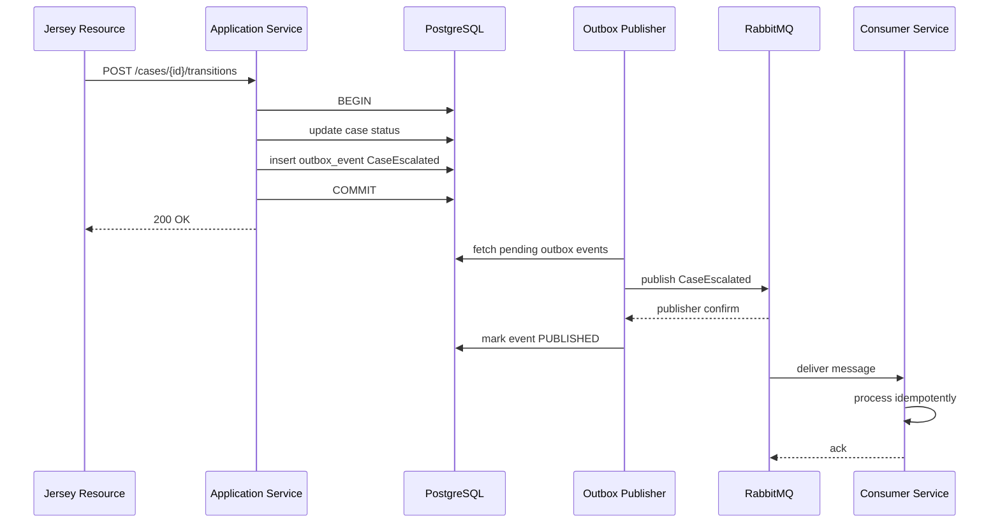

---

# 9. Outbox Table Design

```sql
CREATE TABLE case_management.outbox_event (
    event_id          UUID PRIMARY KEY,
    aggregate_type    VARCHAR(100) NOT NULL,
    aggregate_id      UUID NOT NULL,
    event_type        VARCHAR(150) NOT NULL,
    event_version     INTEGER NOT NULL,
    routing_key       VARCHAR(200) NOT NULL,
    payload           JSONB NOT NULL,
    headers           JSONB NOT NULL DEFAULT '{}'::jsonb,
    status            VARCHAR(30) NOT NULL DEFAULT 'PENDING',
    retry_count       INTEGER NOT NULL DEFAULT 0,
    next_attempt_at   TIMESTAMPTZ NOT NULL DEFAULT now(),
    created_at        TIMESTAMPTZ NOT NULL DEFAULT now(),
    published_at      TIMESTAMPTZ NULL,
    last_error        TEXT NULL
);

CREATE INDEX idx_outbox_pending
ON case_management.outbox_event (status, next_attempt_at, created_at);

CREATE INDEX idx_outbox_aggregate
ON case_management.outbox_event (aggregate_type, aggregate_id, created_at);
```

## Status

| Status | Arti |
|---|---|
| `PENDING` | Belum dipublish |
| `IN_PROGRESS` | Sedang diklaim worker |
| `PUBLISHED` | Sudah confirm dari broker |
| `FAILED_RETRYABLE` | Gagal sementara |
| `FAILED_PERMANENT` | Gagal permanen, perlu manual action |

---

# 10. Application Service Menulis Outbox

```java
public class CaseApplicationService {

    private final MyBatisFactory myBatisFactory;

    public CaseApplicationService(MyBatisFactory myBatisFactory) {
        this.myBatisFactory = myBatisFactory;
    }

    public CaseResponse escalateCase(
        UUID caseId,
        EscalateCaseRequest request,
        String actorId
    ) {
        return myBatisFactory.withSession(session -> {
            CaseMapper caseMapper = session.getMapper(CaseMapper.class);
            OutboxMapper outboxMapper = session.getMapper(OutboxMapper.class);

            CaseRecord caseRecord = caseMapper.findByIdForUpdate(caseId);
            if (caseRecord == null) {
                throw new CaseNotFoundException(caseId);
            }

            Case caseDomain = CaseRecordMapper.toDomain(caseRecord);
            caseDomain.escalate(request.reasonCode(), request.comment(), actorId);

            caseMapper.updateStatus(
                caseId,
                caseDomain.status().name(),
                OffsetDateTime.now(ZoneOffset.UTC)
            );

            caseMapper.insertStatusHistory(
                CaseStatusHistoryRecord.fromTransition(caseDomain, actorId)
            );

            OutboxEventRecord event = OutboxEventRecord.from(
                CaseEscalatedEvent.from(caseDomain, request.reasonCode()),
                CorrelationId.current()
            );

            outboxMapper.insert(event);

            return CaseApiMapper.toResponse(caseDomain);
        });
    }
}
```

Rule penting:

```text
Jangan publish ke broker langsung dari dalam DB transaction.
Tulis outbox dulu, publish belakangan dari worker.
```

---

# 11. Outbox Publisher Worker

RabbitMQ Java client mendukung automatic recovery connection/topology; dokumentasinya menyebut automatic recovery enabled by default sejak Java client 4.0.0, termasuk re-open channels dan restore `basic.qos`, publisher confirms, transaction settings, exchanges, queues, bindings, dan consumers. ([RabbitMQ](https://www.rabbitmq.com/client-libraries/java-api-guide?utm_source=chatgpt.com)) Tetap, aplikasi harus tetap mendesain publish idempotent dan state outbox yang aman.

## 11.1 Publisher Skeleton

```java
public class RabbitMqOutboxPublisher implements Runnable {

    private final OutboxRepository outboxRepository;
    private final Connection connection;
    private final String exchangeName;
    private volatile boolean running = true;

    public RabbitMqOutboxPublisher(
        OutboxRepository outboxRepository,
        Connection connection,
        String exchangeName
    ) {
        this.outboxRepository = outboxRepository;
        this.connection = connection;
        this.exchangeName = exchangeName;
    }

    @Override
    public void run() {
        while (running) {
            List<OutboxEventRecord> events = outboxRepository.claimNextBatch(100);

            if (events.isEmpty()) {
                sleep(500);
                continue;
            }

            for (OutboxEventRecord event : events) {
                publishOne(event);
            }
        }
    }

    private void publishOne(OutboxEventRecord event) {
        try (Channel channel = connection.createChannel()) {
            channel.confirmSelect();

            AMQP.BasicProperties properties = new AMQP.BasicProperties.Builder()
                .messageId(event.eventId().toString())
                .contentType("application/json")
                .deliveryMode(2) // persistent
                .timestamp(Date.from(event.createdAt().toInstant()))
                .headers(Map.of(
                    "correlationId", event.correlationId(),
                    "eventType", event.eventType(),
                    "eventVersion", event.eventVersion()
                ))
                .build();

            channel.basicPublish(
                exchangeName,
                event.routingKey(),
                true,
                properties,
                event.payload().getBytes(StandardCharsets.UTF_8)
            );

            boolean confirmed = channel.waitForConfirms(5000);

            if (confirmed) {
                outboxRepository.markPublished(event.eventId());
            } else {
                outboxRepository.markRetryableFailure(
                    event.eventId(),
                    "Publisher confirm timeout or nack"
                );
            }
        } catch (Exception e) {
            outboxRepository.markRetryableFailure(event.eventId(), e.getMessage());
        }
    }

    public void shutdown() {
        running = false;
    }

    private void sleep(long millis) {
        try {
            Thread.sleep(millis);
        } catch (InterruptedException e) {
            Thread.currentThread().interrupt();
            running = false;
        }
    }
}
```

RabbitMQ publisher confirms are specifically intended to make sure published messages safely reach the broker, and the Java tutorial covers strategies for using them and their trade-offs. ([RabbitMQ](https://www.rabbitmq.com/tutorials/tutorial-seven-java?utm_source=chatgpt.com))

## 11.2 Practical Publisher Rule

| Rule | Penjelasan |
|---|---|
| Enable publisher confirms | Hindari “fire and forget” |
| Persistent message + durable queue | Message survive restart sesuai kebutuhan |
| Mark published hanya setelah confirm | Jangan terlalu cepat update outbox |
| Batch publish untuk throughput | Tapi failure handling lebih kompleks |
| Gunakan retry_count dan next_attempt_at | Hindari hot loop |
| Alert jika pending outbox naik | Indikasi broker/publisher bermasalah |

---

# 12. Consumer Pattern

Consumer harus manual ack setelah berhasil memproses message. RabbitMQ consumers bisa memilih automatic acknowledgement atau manual acknowledgement; manual mode membuat delivery membutuhkan acknowledgement dari client. ([RabbitMQ](https://www.rabbitmq.com/docs/consumers?utm_source=chatgpt.com))

## 12.1 Consumer Skeleton

```java
public class CaseEscalatedConsumer {

    private final Connection connection;
    private final NotificationApplicationService notificationService;
    private final ProcessedMessageRepository processedMessageRepository;
    private final String queueName;

    public CaseEscalatedConsumer(
        Connection connection,
        NotificationApplicationService notificationService,
        ProcessedMessageRepository processedMessageRepository,
        String queueName
    ) {
        this.connection = connection;
        this.notificationService = notificationService;
        this.processedMessageRepository = processedMessageRepository;
        this.queueName = queueName;
    }

    public void start() throws IOException {
        Channel channel = connection.createChannel();

        int prefetchCount = 20;
        channel.basicQos(prefetchCount);

        boolean autoAck = false;

        channel.basicConsume(
            queueName,
            autoAck,
            (consumerTag, delivery) -> handleDelivery(channel, delivery),
            consumerTag -> handleCancel(consumerTag)
        );
    }

    private void handleDelivery(Channel channel, Delivery delivery) throws IOException {
        long deliveryTag = delivery.getEnvelope().getDeliveryTag();

        String messageId = delivery.getProperties().getMessageId();
        String payload = new String(delivery.getBody(), StandardCharsets.UTF_8);

        try {
            if (processedMessageRepository.exists(messageId)) {
                channel.basicAck(deliveryTag, false);
                return;
            }

            CaseEscalatedEvent event = Json.read(payload, CaseEscalatedEvent.class);

            notificationService.handleCaseEscalated(event);

            processedMessageRepository.markProcessed(
                messageId,
                "notification-service",
                OffsetDateTime.now(ZoneOffset.UTC)
            );

            channel.basicAck(deliveryTag, false);

        } catch (RetryableMessageProcessingException e) {
            channel.basicNack(deliveryTag, false, false);

        } catch (PermanentMessageProcessingException e) {
            channel.basicReject(deliveryTag, false);

        } catch (Exception e) {
            channel.basicNack(deliveryTag, false, false);
        }
    }

    private void handleCancel(String consumerTag) {
        // log cancellation and let connection recovery or supervisor restart consumer
    }
}
```

## 12.2 Ack Decision

| Kondisi | Action |
|---|---|
| Message sukses diproses | `basicAck` |
| Duplicate message sudah pernah diproses | `basicAck` |
| Error transient dan ingin DLX/retry | `basicNack(requeue=false)` |
| Error permanent/invalid payload | `basicReject(requeue=false)` |
| Consumer crash sebelum ack | Broker redeliver |
| Jangan proses sekarang tapi ingin requeue immediate | `basicNack(requeue=true)` - hati-hati hot loop |

---

# 13. Inbox / Processed Message Table

Karena sistem messaging umumnya harus diasumsikan **at-least-once**, consumer harus idempotent. Cara praktis: simpan message ID yang sudah diproses.

```sql
CREATE TABLE notification.processed_message (
    message_id       UUID NOT NULL,
    consumer_name    VARCHAR(150) NOT NULL,
    processed_at     TIMESTAMPTZ NOT NULL DEFAULT now(),
    PRIMARY KEY (message_id, consumer_name)
);
```

Jika perlu simpan hasil:

```sql
CREATE TABLE notification.inbox_message (
    message_id       UUID PRIMARY KEY,
    message_type     VARCHAR(150) NOT NULL,
    payload          JSONB NOT NULL,
    status           VARCHAR(30) NOT NULL,
    retry_count      INTEGER NOT NULL DEFAULT 0,
    received_at      TIMESTAMPTZ NOT NULL DEFAULT now(),
    processed_at     TIMESTAMPTZ NULL,
    last_error       TEXT NULL
);
```

## Idempotent Consumer Rule

| Rule | Penjelasan |
|---|---|
| Dedup berdasarkan `messageId` | Jangan berdasarkan payload string |
| Simpan dedup dalam transaksi yang sama dengan side effect lokal | Hindari side effect sukses tapi dedup gagal |
| Handler harus aman dipanggil ulang | Karena duplicate bisa terjadi |
| External side effect butuh idempotency key | Email/payment/webhook bisa double jika tidak dikontrol |
| Jangan ack sebelum local transaction commit | Kalau crash, message hilang tapi data belum masuk |

---

# 14. Consumer Transaction Boundary

Contoh notification handler:

```java
public class NotificationApplicationService {

    private final MyBatisFactory myBatisFactory;
    private final EmailGateway emailGateway;

    public void handleCaseEscalated(CaseEscalatedEvent event) {
        myBatisFactory.withSession(session -> {
            NotificationMapper mapper = session.getMapper(NotificationMapper.class);

            if (mapper.existsByBusinessKey(event.messageId())) {
                return null;
            }

            NotificationRequestRecord record =
                NotificationRequestRecord.fromCaseEscalated(event);

            mapper.insertNotificationRequest(record);

            mapper.insertProcessedMessage(
                event.messageId(),
                "notification-service"
            );

            return null;
        });

        // External side effect can be separate worker,
        // or must use idempotency if done here.
        emailGateway.enqueueSend(event.caseId(), event.reasonCode());
    }
}
```

Lebih aman lagi:

```text
Consumer message
  → save notification_request in DB
  → ack message
Notification sender worker
  → sends email with retry/idempotency
```

Ini mencegah consumer terlalu lama menahan delivery.

---

# 15. Retry Strategy

Jangan semua error diperlakukan sama.

## 15.1 Error Classification

| Error | Jenis | Action |
|---|---|---|
| DB timeout | Transient | Retry |
| Broker connection issue | Transient | Retry/reconnect |
| External email provider 503 | Transient | Retry delayed |
| JSON invalid | Permanent | DLQ |
| Unknown event version | Permanent/unsupported | DLQ |
| Missing required field | Permanent | DLQ |
| Business object not found karena eventual consistency | Transient atau pending | Retry delayed |
| Permission/security failure | Permanent atau alert | DLQ/fail closed |
| Duplicate message | Expected | Ack |

## 15.2 Retry Model

| Model | Kapan Dipakai |
|---|---|
| Immediate retry in-memory | Error sangat singkat, jumlah kecil |
| Broker delayed retry | Delay per attempt |
| Retry queue with TTL | RabbitMQ common pattern |
| Application retry table | Butuh kontrol/audit lebih kuat |
| DLQ after max attempts | Poison message |

## 15.3 Retry Count Header

```text
x-retry-count: 3
x-original-exchange: case.events.topic
x-original-routing-key: case.escalated
```

---

# 16. Dead Letter Queue Pattern

RabbitMQ mendukung dead-lettering: message dari queue bisa dipublish ulang ke exchange lain saat kondisi tertentu terjadi, misalnya rejected/nacked, expired TTL, queue length limit exceeded, atau delivery-limit exceeded untuk quorum queues. ([RabbitMQ](https://www.rabbitmq.com/docs/dlx?utm_source=chatgpt.com)) Untuk quorum queues, RabbitMQ documentation juga menjelaskan dead-lettered messages dapat dipublish ke target queue menggunakan publisher confirms dan baru diack setelahnya. ([RabbitMQ](https://www.rabbitmq.com/docs/quorum-queues?utm_source=chatgpt.com))

## 16.1 Topology

```text
main queue:
  notification.case-events.q

retry queue:
  notification.case-events.retry.q

dead letter queue:
  notification.case-events.dlq

DLX:
  notification.case-events.dlx
```

## 16.2 Diagram

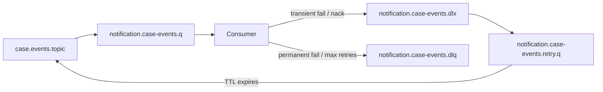

## 16.3 DLQ Message Handling

| DLQ Action | Kapan |
|---|---|
| Inspect payload | Selalu |
| Classify error | transient/permanent/schema/security |
| Fix consumer bug | Jika handler salah |
| Fix bad data | Jika payload butuh koreksi |
| Replay message | Jika aman dan idempotent |
| Archive message | Jika tidak boleh diproses |
| Alert domain owner | Jika regulatory/audit event gagal |

Rule praktis:

```text
DLQ bukan tempat sampah.
DLQ adalah operational queue yang harus dimonitor dan ditindaklanjuti.
```

---

# 17. Ordering Strategy

Message ordering sering disalahpahami.

## 17.1 Pertanyaan yang Harus Dijawab

| Pertanyaan | Contoh |
|---|---|
| Apakah perlu global ordering? | Hampir tidak pernah |
| Apakah perlu ordering per aggregate? | Sering, misalnya per `caseId` |
| Apa yang terjadi jika event datang terlambat? | Version check |
| Apa yang terjadi jika event duplicate? | Dedup |
| Apa yang terjadi jika event hilang? | Reconciliation/replay |

## 17.2 Aggregate Version

Event:

```json
{
  "messageId": "4fb43e7e-3f15-41f5-9d76-4c7e5ab2926e",
  "eventType": "CaseStatusChanged",
  "aggregateId": "9cc9c5e3-8d7b-4c74-b3f9-11fcf49b6a61",
  "aggregateVersion": 7,
  "data": {
    "fromStatus": "ASSIGNED",
    "toStatus": "UNDER_INVESTIGATION"
  }
}
```

Consumer read model:

```sql
CREATE TABLE reporting.case_projection (
    case_id             UUID PRIMARY KEY,
    case_number         VARCHAR(50) NOT NULL,
    status              VARCHAR(50) NOT NULL,
    aggregate_version   BIGINT NOT NULL,
    updated_at          TIMESTAMPTZ NOT NULL
);
```

Update dengan version guard:

```sql
UPDATE reporting.case_projection
SET status = :status,
    aggregate_version = :new_version,
    updated_at = now()
WHERE case_id = :case_id
  AND aggregate_version < :new_version;
```

Jika affected row = 0, event duplicate atau stale.

---

# 18. Event Schema Evolution

## 18.1 Safe Changes

| Change | Aman? |
|---|---:|
| Tambah optional field | Ya |
| Tambah event type baru | Ya |
| Tambah metadata header | Ya |
| Tambah enum value | Risky |
| Ubah field required jadi optional | Biasanya aman |
| Ubah deskripsi/documentation | Aman |

## 18.2 Breaking Changes

| Change | Breaking |
|---|---|
| Rename field | Ya |
| Remove field | Ya |
| Change field type | Ya |
| Change event meaning | Ya |
| Rename event type | Ya |
| Change routing key semantics | Ya |
| Change time format | Ya |
| Change ID format | Ya |

## 18.3 Versioning Rule

```text
CaseEscalated.v1:
  {
    caseId,
    caseNumber,
    reasonCode
  }

CaseEscalated.v2:
  {
    caseId,
    caseNumber,
    reason: {
      code,
      description
    }
  }
```

Consumer bisa support dua versi:

```java
public void handle(EventEnvelope envelope) {
    switch (envelope.messageType()) {
        case "CaseEscalated" -> {
            if (envelope.messageVersion() == 1) {
                handleV1(parseV1(envelope.data()));
            } else if (envelope.messageVersion() == 2) {
                handleV2(parseV2(envelope.data()));
            } else {
                throw new UnsupportedEventVersionException(envelope.messageVersion());
            }
        }
        default -> throw new UnsupportedEventTypeException(envelope.messageType());
    }
}
```

---

# 19. Event Catalog

Minimal dokumentasi untuk setiap event:

```text
Event:
  CaseEscalated

Version:
  1

Owner:
  case-management-service / Case Platform Team

Meaning:
  A case has been escalated from a previous active state.

When Published:
  After case transition transaction commits and outbox publisher succeeds.

Routing Key:
  case.escalated

Schema:
  caseId: UUID
  caseNumber: string
  fromStatus: string
  toStatus: string
  reasonCode: string
  occurredAt: date-time

Ordering Key:
  caseId

Dedup Key:
  messageId

Consumers:
  notification-service
  audit-service
  reporting-service

Compatibility:
  Additive optional fields only in v1.
  Breaking changes require v2.

Replay Safe:
  Yes, consumers must be idempotent.

Security:
  No free-text confidential investigation details in event payload.
```

---

# 20. Security & Privacy in Events

Async message sering tersebar ke banyak consumer. Jangan asal memasukkan semua data.

| Data | Rekomendasi |
|---|---|
| PII | Minimal, hanya jika perlu |
| Secret/token | Jangan pernah |
| Large document content | Jangan di event; kirim reference ID |
| Investigation notes | Hati-hati, bisa confidential |
| Audit reason | Boleh jika memang audit scope |
| User ID | Boleh sesuai policy |
| Email/phone | Biasanya lebih baik consumer fetch jika authorized |
| Internal workflow token | Jangan expose |
| External partner payload mentah | Jangan publish luas |

Rule:

```text
Event adalah contract distribusi.
Semakin banyak data di event, semakin besar blast radius security dan compatibility.
```

---

# 21. Observability untuk Async Flow

Sync tracing mudah karena request-response. Async lebih sulit karena flow terputus.

## 21.1 Metadata yang Wajib Dibawa

| Field | Fungsi |
|---|---|
| `messageId` | Dedup dan audit |
| `correlationId` | Hubungkan dengan original request |
| `causationId` | Hubungkan event penyebab |
| `traceparent` | Distributed tracing |
| `source` | Producer |
| `eventType` | Classification |
| `aggregateId` | Debug per business object |
| `publishedAt` | Publish latency |
| `receivedAt` | Consumer latency |
| `processedAt` | Processing latency |

## 21.2 Metrics

| Metric | Tujuan |
|---|---|
| `outbox_pending_total` | Event belum dipublish |
| `outbox_publish_failed_total` | Broker/publisher issue |
| `outbox_publish_latency_ms` | Delay publish |
| `queue_depth` | Backlog |
| `consumer_processing_duration_ms` | Handler latency |
| `consumer_success_total` | Throughput |
| `consumer_failure_total` | Error rate |
| `consumer_retry_total` | Retry pressure |
| `dlq_depth` | Poison message |
| `message_age_seconds` | Staleness |
| `duplicate_message_total` | Redelivery/dedup frequency |

## 21.3 Logs

```json
{
  "event": "message_consumed",
  "service": "notification-service",
  "queue": "notification.case-events.q",
  "messageId": "4fb43e7e-3f15-41f5-9d76-4c7e5ab2926e",
  "messageType": "CaseEscalated",
  "aggregateId": "9cc9c5e3-8d7b-4c74-b3f9-11fcf49b6a61",
  "correlationId": "2a4c4f2c-7798-455a-8270-961f0a1e0ed4",
  "durationMs": 83,
  "status": "SUCCESS"
}
```

---

# 22. Worker Deployment Pattern

Worker bisa berada dalam service yang sama atau deployment terpisah.

## 22.1 Same Deployment

```text
notification-service
  HTTP API
  message consumer thread
```

Kelebihan:

| Kelebihan | Kekurangan |
|---|---|
| Simpler deploy | API dan worker scaling terikat |
| Shared code/config mudah | Worker overload bisa ganggu API |
| Cocok untuk volume kecil | Shutdown handling lebih kompleks |

## 22.2 Separate Worker Deployment

```text
notification-api
notification-worker
```

Kelebihan:

| Kelebihan | Kekurangan |
|---|---|
| Scaling terpisah | Deployment lebih banyak |
| Resource isolation | Config lebih banyak |
| Worker failure tidak ganggu API | Perlu shared module/contract |
| Cocok volume besar | Operasi lebih kompleks |

Rekomendasi praktis:

```text
Mulai dari same service jika sederhana.
Pisahkan worker deployment jika throughput tinggi, workload berat, atau API latency terganggu.
```

---

# 23. Kubernetes Runtime Consideration

| Area | Praktik |
|---|---|
| Worker replica | Scale berdasarkan queue depth/processing latency |
| Graceful shutdown | Stop consume, finish in-flight, ack/nack benar |
| Readiness | Worker ready jika broker/DB siap |
| Liveness | Jangan restart hanya karena satu message poison |
| Resource limit | CPU/memory worker disesuaikan payload |
| HPA/KEDA | Bisa scale worker berdasarkan queue metrics jika tersedia |
| Config | Queue/exchange name dari config |
| Secret | Broker credential dari secret |
| NetworkPolicy | Izinkan service ke broker |
| Observability | Queue depth dan DLQ wajib dimonitor |

## Shutdown Rule

```text
1. Receive SIGTERM
2. Stop accepting new deliveries / cancel consumer
3. Finish current in-flight messages within timeout
4. Ack successful messages
5. Nack/requeue unfinished messages if needed
6. Close channel/connection
7. Exit
```

---

# 24. Testing Strategy

## 24.1 Unit Test

| Test | Fokus |
|---|---|
| Event mapper | Domain → event payload |
| Envelope builder | metadata lengkap |
| Consumer handler | business logic |
| Idempotency check | duplicate message |
| Error classifier | transient vs permanent |
| Version parser | v1/v2 compatibility |

## 24.2 Integration Test

Gunakan PostgreSQL + RabbitMQ test environment.

```text
Test:
  POST /cases/{id}/transitions
Expect:
  case status updated
  outbox row inserted
  outbox publisher publishes message
  consumer receives message
  processed_message row inserted
```

## 24.3 Failure Test

| Scenario | Expected |
|---|---|
| Broker down saat business transaction commit | Outbox tetap tersimpan |
| Publisher gagal publish | Outbox retry_count naik |
| Consumer crash sebelum ack | Message redelivered |
| Consumer receives duplicate | Ack and skip |
| Invalid JSON | DLQ |
| Unknown event version | DLQ atau unsupported queue |
| DB down in consumer | Nack/retry |
| Poison message | Max retry lalu DLQ |
| Slow consumer | Queue depth naik, alert |
| Replay old message | Version guard mencegah stale overwrite |

---

# 25. Practical Code: Event Envelope Builder

```java
public record EventEnvelope<T>(
    UUID messageId,
    String messageType,
    int messageVersion,
    String source,
    OffsetDateTime occurredAt,
    OffsetDateTime publishedAt,
    String correlationId,
    String causationId,
    String aggregateType,
    UUID aggregateId,
    T data
) {}
```

```java
public final class EventEnvelopeBuilder {

    private EventEnvelopeBuilder() {}

    public static <T> EventEnvelope<T> integrationEvent(
        String messageType,
        int messageVersion,
        String source,
        String aggregateType,
        UUID aggregateId,
        T data,
        OffsetDateTime occurredAt
    ) {
        return new EventEnvelope<>(
            UUID.randomUUID(),
            messageType,
            messageVersion,
            source,
            occurredAt,
            OffsetDateTime.now(ZoneOffset.UTC),
            CorrelationId.current(),
            RequestContext.currentCausationId(),
            aggregateType,
            aggregateId,
            data
        );
    }
}
```

---

# 26. Practical Code: CaseEscalated Event

```java
public record CaseEscalatedEvent(
    UUID caseId,
    String caseNumber,
    String fromStatus,
    String toStatus,
    String reasonCode,
    String escalatedBy,
    OffsetDateTime escalatedAt
) {
    public static CaseEscalatedEvent from(
        Case caseDomain,
        String fromStatus,
        String reasonCode,
        String actorId
    ) {
        return new CaseEscalatedEvent(
            caseDomain.id(),
            caseDomain.caseNumber(),
            fromStatus,
            caseDomain.status().name(),
            reasonCode,
            actorId,
            OffsetDateTime.now(ZoneOffset.UTC)
        );
    }
}
```

Outbox mapping:

```java
public final class OutboxEventRecordFactory {

    public static OutboxEventRecord caseEscalated(
        CaseEscalatedEvent event,
        ObjectMapper objectMapper
    ) {
        EventEnvelope<CaseEscalatedEvent> envelope =
            EventEnvelopeBuilder.integrationEvent(
                "CaseEscalated",
                1,
                "case-management-service",
                "Case",
                event.caseId(),
                event,
                event.escalatedAt()
            );

        return new OutboxEventRecord(
            envelope.messageId(),
            envelope.aggregateType(),
            envelope.aggregateId(),
            envelope.messageType(),
            envelope.messageVersion(),
            "case.escalated",
            toJson(objectMapper, envelope),
            toHeadersJson(envelope),
            "PENDING",
            0,
            OffsetDateTime.now(ZoneOffset.UTC),
            OffsetDateTime.now(ZoneOffset.UTC),
            null,
            null
        );
    }
}
```

---

# 27. Practical Anti-Patterns

| Anti-Pattern | Gejala | Dampak | Perbaikan |
|---|---|---|---|
| Direct publish inside transaction | DB commit dan publish bisa tidak konsisten | Lost/phantom event | Transactional outbox |
| Auto-ack consumer | Message dianggap sukses sebelum diproses | Message loss | Manual ack |
| No idempotency | Duplicate message double side effect | Email/payment/report double | Inbox/dedup table |
| Requeue poison forever | Message yang sama diproses terus | Hot loop, CPU waste | Retry limit + DLQ |
| No DLQ monitoring | DLQ penuh diam-diam | Data/business process stuck | Alert + runbook |
| Payload terlalu besar | Broker memory/storage pressure | Latency dan failure | Kirim reference ID |
| Event bocorkan internal model | Consumer coupling | Breaking change sering | Integration event contract |
| Event tanpa version | Sulit evolusi | Consumer rusak | `eventVersion` |
| Event tanpa correlation ID | Debug sulit | MTTR tinggi | Propagate correlation |
| Queue name random | Operasi sulit | Incident lambat | Naming convention |
| Semua consumer satu queue | Fan-out tidak terjadi | Consumer saling berebut message | Queue per consumer group |
| Synchronous wait after publish | Async jadi sync terselubung | Latency naik | Return accepted/processed state |
| Worker dan API scaling terikat | Worker overload ganggu API | Availability turun | Separate deployment jika perlu |
| Replay tanpa version guard | Old event overwrite new state | Data stale | aggregate version check |

---

# 28. Practical Checklist

| Area | Checklist |
|---|---|
| Async decision | Alasan pakai async jelas |
| Message type | Command vs event tidak dicampur |
| Event owner | Publisher/owner jelas |
| Event schema | Ada version dan catalog |
| Envelope | messageId, source, type, time, correlationId |
| Outbox | Business update + event insert satu transaction |
| Publisher | Publisher confirms aktif |
| Broker topology | Exchange, queue, binding, routing key terdokumentasi |
| Consumer | Manual ack |
| Backpressure | Prefetch/basicQos dikonfigurasi |
| Idempotency | Inbox/processed message table |
| Retry | Error transient/permanent dibedakan |
| DLQ | DLX/DLQ tersedia dan dimonitor |
| Ordering | aggregateId/version strategy |
| Security | Tidak ada secret/PII berlebihan |
| Observability | Queue depth, DLQ depth, processing latency |
| Test | Duplicate, retry, DLQ, broker down, consumer crash |
| Runbook | Replay, inspect DLQ, stuck outbox |

---

# 29. Practical Decision Matrix

| Pertanyaan | Jika Ya | Jika Tidak |
|---|---|---|
| Caller perlu response langsung? | REST sync | Async cocok |
| Side effect bisa diproses belakangan? | Async event/command | Sync mungkin perlu |
| Apakah message bisa diproses ulang? | Idempotent consumer | Tambahkan dedup/idempotency dulu |
| Apakah event dipakai banyak consumer? | Pub/sub event | Command targeted queue |
| Apakah perlu audit kuat? | Outbox + immutable audit | Minimal event biasa |
| Apakah consumer lambat? | Queue + worker scaling | Sync masih bisa |
| Apakah ordering penting per aggregate? | aggregateId/version strategy | Bebas parallel |
| Apakah payload berisi data sensitif? | Minimal payload/reference | Jangan publish luas |
| Apakah error bisa permanen? | DLQ | Retry biasa cukup |
| Apakah external API lambat? | Async adapter | Sync dengan timeout ketat |

---

# 30. Roadmap Implementasi

| Step | Aktivitas | Output |
|---:|---|---|
| 1 | Tentukan use case async | Async decision matrix |
| 2 | Definisikan event/command | Message contract |
| 3 | Buat event envelope | Standard metadata |
| 4 | Desain broker topology | Exchange, queue, routing key |
| 5 | Tambahkan outbox table | Reliable publishing |
| 6 | Ubah application service menulis outbox | Atomic DB + event intent |
| 7 | Buat outbox publisher worker | Publish + confirms |
| 8 | Buat consumer dengan manual ack | Reliable processing |
| 9 | Tambahkan inbox/dedup table | Idempotent consumer |
| 10 | Tambahkan retry/DLQ | Poison message handling |
| 11 | Tambahkan metrics/logging | Observability |
| 12 | Tambahkan integration/failure tests | Production confidence |
| 13 | Buat runbook replay/DLQ/outbox | Operability |

---

# Kesimpulan

Asynchronous communication bukan hanya “pakai queue”. Yang paling penting adalah reliability dan operability:

```text
- message type jelas: command vs event
- event contract stabil
- outbox untuk publish reliability
- publisher confirms untuk broker delivery confidence
- manual ack untuk consumer processing safety
- idempotent consumer untuk duplicate delivery
- retry dan DLQ untuk failure handling
- aggregate version untuk ordering/stale event
- correlation ID dan trace context untuk debugging
- queue depth, DLQ depth, outbox pending untuk monitoring
- runbook untuk replay dan poison message
```

Untuk Java Jersey/JAX-RS microservice, resource layer tetap tipis. Async pattern hidup terutama di application service, outbox publisher, worker consumer, repository, dan operational tooling.

**Seri 6/18 selesai.**

Rekomendasi materi berikutnya: **Seri 7 - API Gateway, BFF, Aggregator, dan Edge Service Pattern untuk Java Jersey/JAX-RS Microservice.**

---

**Sources:**

- [RabbitMQ: One broker to queue them all | RabbitMQ](https://www.rabbitmq.com/?utm_source=chatgpt.com)
- [CloudEvents specification](https://cloudevents.io/?utm_source=chatgpt.com)
- [MicroProfile Reactive Messaging Specification](https://download.eclipse.org/microprofile/microprofile-reactive-messaging-3.0.1/microprofile-reactive-messaging-spec-3.0.1.html?utm_source=chatgpt.com)
- [spec/cloudevents/spec.md at main](https://github.com/cloudevents/spec/blob/main/cloudevents/spec.md?utm_source=chatgpt.com)

## Response:
7/14/2026, 10:15:22 PM

Saya lanjut ke **Seri 7/18**. Fokusnya edge layer yang praktis: API Gateway, BFF, aggregator, routing, auth delegation, rate limit, request shaping, dan kapan logic boleh/tidak boleh ditaruh di gateway.

# Microservice Pattern - Seri 7/18  
## API Gateway, BFF, Aggregator, dan Edge Service Pattern untuk Java Jersey/JAX-RS Microservice

## Introduction

Pada seri ini, fokusnya adalah **edge layer**: lapisan yang berada di depan microservice internal dan menjadi pintu masuk untuk frontend, mobile app, partner API, internal admin UI, atau external system.

Dalam microservice, client jarang ideal jika langsung memanggil banyak service internal:

```text
Frontend
  → case-management-service
  → investigation-service
  → document-service
  → decision-service
  → notification-service
```

Masalahnya:

- terlalu banyak network call dari client,
- client harus tahu topology internal,
- auth/rate limit/logging tersebar,
- perubahan internal service mudah merusak client,
- cross-service response shaping menjadi kacau,
- UI workflow menjadi terlalu tergantung ke detail backend.

**API Gateway Pattern** menyelesaikan ini dengan menyediakan satu entry point ke microservice architecture, sementara **Backend for Frontend / BFF** adalah variasi gateway yang dibuat khusus untuk satu jenis frontend/client. Microservices.io mendeskripsikan API Gateway sebagai entry point untuk client dan menyebut BFF sebagai variasi gateway yang mendukung kebutuhan client tertentu. ([microservices.io](https://microservices.io/patterns/apigateway.html?utm_source=chatgpt.com))

---

# 1. Mental Model Praktis

```text
External Client
  ↓
API Gateway / BFF / Edge Service
  ↓
Internal Microservices
```

Edge layer sebaiknya menangani:

```text
routing
TLS termination
authentication entry point
token validation / token exchange
rate limiting
request normalization
response aggregation
frontend-specific shaping
API version routing
correlation ID
logging / metrics / tracing
basic policy enforcement
```

Tetapi edge layer **tidak boleh menjadi tempat semua business logic utama**.

```text
Gateway/BFF = traffic + composition + client-specific adaptation
Domain Service = business rules + data ownership + state transition
```

---

# 2. Diagram

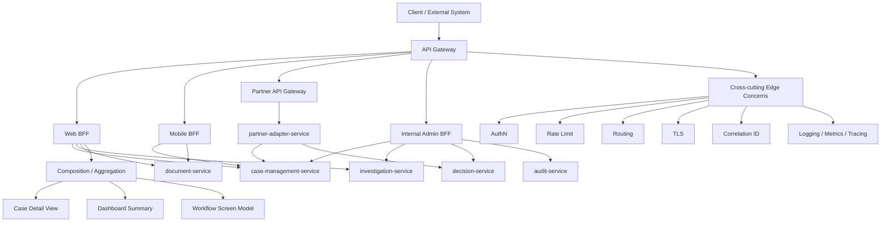

---

# 3. Decomposition Map - Practical Categories / Domain / Skills

| No | Area | Fokus Praktis | Implementasi di Java/Jersey/JAX-RS + Infra | Output yang Harus Ada |
|---:|---|---|---|---|
| 1 | **API Gateway Pattern** | Satu entry point untuk routing traffic ke internal service | Kong, Envoy, NGINX, cloud gateway, Kubernetes Gateway API | Gateway routing map |
| 2 | **BFF Pattern** | API khusus per frontend/client | Java Jersey BFF, Node BFF, atau platform gateway + custom service | Web/mobile/admin API contract |
| 3 | **Aggregator Pattern** | Menggabungkan beberapa service call menjadi satu response | Jersey resource memanggil typed clients | Composite response DTO |
| 4 | **Edge Service** | Service adapter di boundary eksternal | `partner-api-service`, `admin-bff-service` | Edge-specific service |
| 5 | **Routing** | Path/host/header-based routing | Gateway route `/api/v1/cases/**` ke service tertentu | Route catalog |
| 6 | **API Version Routing** | Routing `/api/v1`, `/api/v2` | Gateway route + service resource versioning | Version route policy |
| 7 | **TLS Termination** | HTTPS termination di edge | Gateway/Ingress/Load Balancer | TLS policy |
| 8 | **Authentication at Edge** | Validasi token/session/API key di gateway/BFF | JWT validation, OAuth2/OIDC, mTLS | AuthN flow |
| 9 | **Authorization Boundary** | Bedakan coarse-grained di edge dan object-level di service | Edge scope check + service object check | AuthZ split policy |
| 10 | **Token Exchange / Propagation** | Forward atau exchange credential ke downstream | Bearer token, service token, mTLS | Secure identity propagation |
| 11 | **Rate Limiting** | Lindungi service dari overload/abuse | Envoy/Kong/gateway rate limit | Rate limit policy |
| 12 | **Quota Management** | Limit per tenant/client/partner | Global/local rate limit | Quota table |
| 13 | **Request Normalization** | Header, path, query, correlation ID | Gateway filter / BFF filter | Normalized inbound contract |
| 14 | **Response Shaping** | Bentuk response sesuai client | BFF DTO mapping | Client-specific DTO |
| 15 | **Fan-out Control** | Batasi jumlah downstream calls | Timeout, parallel call, bulkhead | Fan-out budget |
| 16 | **Caching at Edge** | Cache response read-only yang aman | HTTP cache headers, gateway cache, BFF cache | Cache policy |
| 17 | **Circuit Breaking at Edge** | Fail-fast untuk backend yang down | Gateway/service mesh/client resilience | Dependency protection |
| 18 | **Observability at Edge** | Log traffic, latency, client ID, route, status | Gateway metrics + BFF logs/traces | Edge dashboard |
| 19 | **Security Headers** | Tambahkan header security HTTP | HSTS, CSP, X-Content-Type-Options | Header policy |
| 20 | **CORS Policy** | Kontrol browser-origin access | Gateway/BFF CORS config | CORS matrix |
| 21 | **Partner API Facade** | Stabilkan contract untuk partner | Dedicated partner BFF/adapter | External API contract |
| 22 | **Backend Topology Hiding** | Client tidak tahu service internal | Gateway/BFF abstraction | Internal topology protected |
| 23 | **Error Translation** | Ubah error internal ke error client-facing | BFF error mapper | Consistent external error |
| 24 | **Operational Governance** | Route ownership, change control, runbook | API catalog, gateway config PR | Edge runbook |

Kubernetes **Gateway API** adalah official Kubernetes project untuk L4/L7 routing dan menjadi generasi berikutnya dari Ingress; `HTTPRoute` mendefinisikan routing behavior HTTP request dari Gateway listener ke backend service. ([Gateway API](https://gateway-api.sigs.k8s.io/?utm_source=chatgpt.com))

---

# 4. API Gateway vs BFF vs Aggregator vs Edge Service

| Pattern | Tujuan | Biasanya Berisi | Jangan Berisi |
|---|---|---|---|
| **API Gateway** | Entry point dan traffic management | routing, TLS, authN, rate limit, logging | business rule domain kompleks |
| **BFF** | API khusus untuk frontend/client tertentu | response shaping, screen model, composition | ownership data utama |
| **Aggregator** | Gabungkan data dari beberapa service | fan-out, DTO composition, partial response | state transition rule |
| **Edge Service** | Boundary adapter untuk external/partner/internal admin | protocol adaptation, partner contract, mapping | domain truth utama |

## Contoh

```text
API Gateway:
  /api/v1/cases/** → case-management-service
  /api/v1/documents/** → document-service

Web BFF:
  GET /web/cases/{caseId}/detail
  → case-management-service
  → investigation-service
  → document-service

Mobile BFF:
  GET /mobile/cases/{caseId}/summary
  → case-management-service
  → document-service thumbnail only

Partner Edge API:
  POST /partner/v1/case-submissions
  → partner validation
  → case-intake-service
```

---

# 5. Kapan Pakai API Gateway Saja?

API Gateway saja cukup jika kebutuhan utamanya adalah traffic management.

| Kebutuhan | API Gateway Cukup? |
|---|---:|
| Route path ke service | Ya |
| TLS termination | Ya |
| Validate JWT sederhana | Ya |
| Rate limit per client | Ya |
| Add correlation header | Ya |
| Rewrite path sederhana | Ya |
| CORS policy | Ya |
| Static response transform ringan | Mungkin |
| Complex aggregation | Tidak ideal |
| Domain workflow decision | Tidak |
| Object-level authorization | Tidak cukup |
| Client-specific screen model kompleks | Lebih cocok BFF |

Contoh gateway route:

```text
/api/v1/cases/**       → case-management-service
/api/v1/documents/**   → document-service
/api/v1/decisions/**   → decision-service
/api/v1/audit/**       → audit-service
```

---

# 6. Kapan Butuh BFF?

BFF cocok jika client punya kebutuhan bentuk data yang spesifik.

## 6.1 Contoh Web UI

Screen: **Case Detail Page**

Butuh:

```text
case summary
current status
assigned officer
investigation summary
document list
decision status
allowed user actions
audit timeline summary
```

Kalau frontend memanggil semua service langsung:

```text
GET /cases/{id}
GET /investigations?caseId={id}
GET /documents?caseId={id}
GET /decisions?caseId={id}
GET /cases/{id}/allowed-actions
GET /audit?caseId={id}
```

Lebih baik Web BFF:

```http
GET /web/cases/{caseId}/detail
```

Response:

```json
{
  "case": {
    "caseId": "9cc9c5e3-8d7b-4c74-b3f9-11fcf49b6a61",
    "caseNumber": "CASE-2026-000123",
    "status": "UNDER_INVESTIGATION"
  },
  "investigation": {
    "status": "ACTIVE",
    "findingCount": 3
  },
  "documents": [
    {
      "documentId": "b579d39a-9f5e-4ec6-a5c1-d690e35ab9ef",
      "fileName": "evidence.pdf",
      "status": "VERIFIED"
    }
  ],
  "decision": {
    "status": "PENDING"
  },
  "allowedActions": [
    "SUBMIT_FINDING",
    "ESCALATE"
  ]
}
```

## 6.2 BFF Layak Jika

| Sinyal | Penjelasan |
|---|---|
| UI perlu gabungan banyak service | Hindari fan-out dari browser/mobile |
| Web dan mobile butuh response berbeda | Pisahkan Web BFF dan Mobile BFF |
| Partner contract harus stabil | Edge facade melindungi internal API |
| Frontend sering berubah | BFF bisa ikut client lifecycle |
| Internal topology tidak boleh terekspos | BFF menyembunyikan service detail |
| Ada kebutuhan session/cookie/web auth khusus | Web BFF cocok |
| Ada request shaping kompleks | BFF lebih tepat daripada gateway config |

---

# 7. Kapan Jangan Pakai BFF?

| Sinyal | Risiko |
|---|---|
| BFF hanya pass-through semua endpoint | Tidak memberi value |
| BFF mulai menyimpan domain data utama | Ownership kabur |
| Semua business rule dipindah ke BFF | Domain service jadi anemic |
| BFF dipakai untuk bypass authorization service | Security risk |
| BFF membuat transaksi lintas-service sinkron | Distributed monolith |
| Satu BFF untuk semua client dengan banyak branching | BFF menjadi monolith baru |

Rule praktis:

```text
BFF boleh tahu kebutuhan client.
BFF tidak boleh menjadi sumber kebenaran domain.
```

---

# 8. Arsitektur Edge yang Disarankan

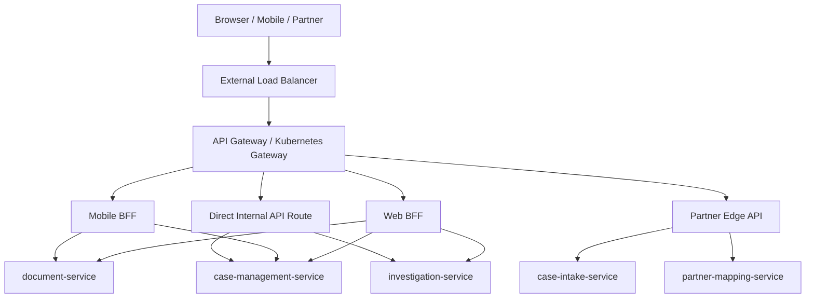

## Pembagian Tanggung Jawab

| Layer | Responsibility |
|---|---|
| Load balancer | External entry, network-level routing, TLS depending architecture |
| API Gateway | HTTP routing, authN, rate limit, traffic policy |
| BFF | Client-specific aggregation/composition |
| Domain service | Business capability, data ownership, state/rule |
| Worker/event service | Async side effect |
| Database | Private per service/schema |

---

# 9. Gateway Routing Example dengan Kubernetes Gateway API

Kubernetes Gateway API memakai resource seperti `Gateway` dan `HTTPRoute` untuk mengatur routing HTTP request dari listener ke backend service. ([Kubernetes](https://kubernetes.io/docs/concepts/services-networking/gateway/?utm_source=chatgpt.com))

Contoh konseptual:

```yaml
apiVersion: gateway.networking.k8s.io/v1
kind: Gateway
metadata:
  name: platform-gateway
spec:
  gatewayClassName: envoy-gateway
  listeners:
    - name: https
      protocol: HTTPS
      port: 443
      hostname: api.company.com
      tls:
        mode: Terminate
        certificateRefs:
          - name: api-company-com-tls
```

```yaml
apiVersion: gateway.networking.k8s.io/v1
kind: HTTPRoute
metadata:
  name: case-api-route
spec:
  parentRefs:
    - name: platform-gateway
  hostnames:
    - api.company.com
  rules:
    - matches:
        - path:
            type: PathPrefix
            value: /api/v1/cases
      backendRefs:
        - name: case-management-service
          port: 8080

    - matches:
        - path:
            type: PathPrefix
            value: /web/cases
      backendRefs:
        - name: web-bff-service
          port: 8080
```

Practical rule:

| Route | Backend |
|---|---|
| `/api/v1/cases/**` | domain service |
| `/web/**` | web BFF |
| `/mobile/**` | mobile BFF |
| `/partner/v1/**` | partner edge service |
| `/internal/**` | internal-only gateway route, protected |

---

# 10. Jersey BFF Project Structure

```text
web-bff-service/
├── pom.xml
├── Dockerfile
├── src/main/java/com/company/platform/webbff/
│   ├── config/
│   │   ├── JerseyConfig.java
│   │   ├── ClientConfig.java
│   │   └── SecurityConfig.java
│   │
│   ├── api/
│   │   ├── CaseDetailResource.java
│   │   ├── DashboardResource.java
│   │   ├── dto/
│   │   │   ├── CaseDetailViewResponse.java
│   │   │   ├── DashboardSummaryResponse.java
│   │   │   └── BffErrorResponse.java
│   │   ├── mapper/
│   │   │   └── BffExceptionMapper.java
│   │   └── filter/
│   │       ├── CorrelationIdFilter.java
│   │       └── BffAuthenticationFilter.java
│   │
│   ├── application/
│   │   ├── CaseDetailCompositionService.java
│   │   └── DashboardCompositionService.java
│   │
│   ├── downstream/
│   │   ├── caseapi/
│   │   │   ├── CaseServiceClient.java
│   │   │   ├── JerseyCaseServiceClient.java
│   │   │   └── dto/
│   │   ├── investigationapi/
│   │   ├── documentapi/
│   │   └── decisionapi/
│   │
│   └── resilience/
│       ├── DownstreamTimeoutPolicy.java
│       ├── BulkheadRegistry.java
│       └── FallbackPolicy.java
```

BFF punya downstream clients, tetapi **tidak punya ownership table domain utama**.

Jika BFF perlu cache:

```text
BFF cache boleh untuk:
  - reference data
  - short-lived UI summary
  - session-specific computed view

BFF cache jangan menjadi:
  - source of truth
  - replacement for domain service data
  - tempat rule domain utama
```

---

# 11. Contoh Jersey BFF Resource

```java
@Path("/web/cases")
@Produces(MediaType.APPLICATION_JSON)
@Consumes(MediaType.APPLICATION_JSON)
public class CaseDetailResource {

    private final CaseDetailCompositionService compositionService;

    public CaseDetailResource(CaseDetailCompositionService compositionService) {
        this.compositionService = compositionService;
    }

    @GET
    @Path("/{caseId}/detail")
    public Response getCaseDetail(
        @PathParam("caseId") UUID caseId,
        @Context SecurityContext securityContext
    ) {
        String actorId = securityContext.getUserPrincipal().getName();

        CaseDetailViewResponse response =
            compositionService.getCaseDetail(caseId, actorId);

        return Response.ok(response).build();
    }
}
```

Resource tetap tipis. Composition logic masuk application layer.

---

# 12. BFF Composition Service

```java
public class CaseDetailCompositionService {

    private final CaseServiceClient caseServiceClient;
    private final InvestigationServiceClient investigationServiceClient;
    private final DocumentServiceClient documentServiceClient;
    private final DecisionServiceClient decisionServiceClient;

    public CaseDetailCompositionService(
        CaseServiceClient caseServiceClient,
        InvestigationServiceClient investigationServiceClient,
        DocumentServiceClient documentServiceClient,
        DecisionServiceClient decisionServiceClient
    ) {
        this.caseServiceClient = caseServiceClient;
        this.investigationServiceClient = investigationServiceClient;
        this.documentServiceClient = documentServiceClient;
        this.decisionServiceClient = decisionServiceClient;
    }

    public CaseDetailViewResponse getCaseDetail(UUID caseId, String actorId) {
        CaseResponse caseResponse = caseServiceClient.getCase(caseId, actorId);

        CompletableFuture<InvestigationSummaryResponse> investigationFuture =
            CompletableFuture.supplyAsync(
                () -> investigationServiceClient.getSummaryByCaseId(caseId, actorId)
            );

        CompletableFuture<List<DocumentSummaryResponse>> documentsFuture =
            CompletableFuture.supplyAsync(
                () -> documentServiceClient.getDocumentsByCaseId(caseId, actorId)
            );

        CompletableFuture<DecisionSummaryResponse> decisionFuture =
            CompletableFuture.supplyAsync(
                () -> decisionServiceClient.getDecisionSummary(caseId, actorId)
            );

        try {
            CompletableFuture.allOf(
                investigationFuture,
                documentsFuture,
                decisionFuture
            ).get(800, TimeUnit.MILLISECONDS);

            return CaseDetailViewResponse.of(
                caseResponse,
                investigationFuture.join(),
                documentsFuture.join(),
                decisionFuture.join()
            );

        } catch (TimeoutException e) {
            return CaseDetailViewResponse.partial(
                caseResponse,
                "Some sections are temporarily unavailable"
            );

        } catch (InterruptedException e) {
            Thread.currentThread().interrupt();
            throw new BffCompositionException("Interrupted while composing case detail", e);

        } catch (ExecutionException e) {
            throw mapCompositionFailure(e.getCause());
        }
    }

    private RuntimeException mapCompositionFailure(Throwable cause) {
        if (cause instanceof DownstreamForbiddenException) {
            return new BffForbiddenException();
        }

        if (cause instanceof DownstreamNotFoundException) {
            return new BffNotFoundException();
        }

        return new BffDependencyException(cause);
    }
}
```

## Practical Notes

| Concern | Rule |
|---|---|
| Parallel fan-out | Gunakan bounded executor, bukan common pool |
| Timeout | Total composition timeout harus jelas |
| Partial response | Harus eksplisit, jangan diam-diam kosong |
| Auth | Actor context tetap diteruskan atau ditukar |
| Error | Jangan bocorkan error internal service mentah |
| Trace | Propagate correlation/trace context ke semua downstream |

---

# 13. Composite DTO

```java
public record CaseDetailViewResponse(
    CaseView caseInfo,
    InvestigationView investigation,
    List<DocumentView> documents,
    DecisionView decision,
    List<String> allowedActions,
    boolean partial,
    String message
) {
    public static CaseDetailViewResponse of(
        CaseResponse caseResponse,
        InvestigationSummaryResponse investigation,
        List<DocumentSummaryResponse> documents,
        DecisionSummaryResponse decision
    ) {
        return new CaseDetailViewResponse(
            CaseView.from(caseResponse),
            InvestigationView.from(investigation),
            documents.stream().map(DocumentView::from).toList(),
            DecisionView.from(decision),
            caseResponse.allowedActions(),
            false,
            null
        );
    }

    public static CaseDetailViewResponse partial(
        CaseResponse caseResponse,
        String message
    ) {
        return new CaseDetailViewResponse(
            CaseView.from(caseResponse),
            null,
            List.of(),
            null,
            caseResponse.allowedActions(),
            true,
            message
        );
    }
}
```

Rule:

```text
BFF DTO adalah contract untuk client.
Jangan expose downstream DTO mentah ke frontend.
```

---

# 14. Aggregator Pattern: Kapan Bagus dan Kapan Berbahaya

## 14.1 Bagus Jika

| Sinyal | Contoh |
|---|---|
| Read-only composition | Case detail page |
| UI membutuhkan screen model | Dashboard |
| Data berasal dari beberapa bounded context | Case + investigation + decision |
| Partial failure bisa diterima | Document section unavailable |
| Latency budget bisa dikontrol | Fan-out 3-5 service max |
| Data tidak perlu strong consistency | Summary/read view |

## 14.2 Berbahaya Jika

| Sinyal | Risiko |
|---|---|
| Aggregator menjalankan command ke banyak service | Distributed transaction terselubung |
| Fan-out terlalu banyak | Latency dan failure probability tinggi |
| Aggregator melakukan join business-critical | Read model mungkin lebih cocok |
| Aggregator menyimpan state utama | Ownership kabur |
| Aggregator butuh rollback multi-service | Saga/Camunda lebih tepat |
| Aggregator dipakai untuk reporting berat | CQRS/materialized view lebih tepat |

---

# 15. Gateway Auth vs Service Auth

Kesalahan umum: menganggap “sudah auth di gateway” berarti service internal tidak perlu authorization.

OWASP API Security 2023 menempatkan **Broken Object Level Authorization** sebagai risiko utama; serangannya sering terjadi ketika attacker memanipulasi object ID pada path/query/header/body untuk mengakses object yang tidak berhak diakses. ([OWASP](https://owasp.org/API-Security/editions/2023/en/0xa1-broken-object-level-authorization/?utm_source=chatgpt.com))

## Split yang Benar

| Layer | Boleh Melakukan | Tidak Cukup Untuk |
|---|---|---|
| Gateway | Validate token, check scope kasar, block unauthenticated | Object-level access |
| BFF | Check client/session context, hide unsupported actions | Final domain authorization |
| Domain service | Object-level authorization, state-based permission | TLS termination/rate limit |
| Database | Row-level protection jika dipakai | Business authorization penuh |

Contoh:

```text
Gateway:
  Is token valid?
  Does token have scope case:read?

BFF:
  Is this web user allowed to access this screen?

case-management-service:
  Can actor X view case Y?
  Is case Y in actor's region/team/assignment?
```

## Practical Rule

```text
Gateway boleh enforce coarse-grained authorization.
Service owner tetap wajib enforce object-level authorization.
```

---

# 16. Token Propagation Pattern

| Pattern | Penjelasan | Kapan Dipakai |
|---|---|---|
| Forward user token | BFF meneruskan token user | Downstream perlu user identity |
| Token exchange | BFF menukar token untuk audience downstream | Security lebih kuat |
| Service token | BFF memakai service credential + actor header | Internal trusted boundary dengan audit |
| mTLS identity | Service identity dari mesh/TLS | Zero-trust/service mesh |
| Session cookie to BFF only | Browser hanya bicara ke BFF | Web security pattern |

## Header yang Umum

```text
Authorization: Bearer <token>
X-Correlation-Id: <correlation-id>
X-Request-Id: <request-id>
X-Actor-Id: <actor-id>          # hanya jika trusted/internal policy mengizinkan
X-Client-Id: <client-id>
traceparent: <w3c-trace-context>
```

Jangan forward semua header inbound secara buta. Gunakan whitelist.

---

# 17. Rate Limiting dan Quota

Rate limiting melindungi platform dari abuse, spike, atau client yang salah konfigurasi. Envoy Gateway mendefinisikan rate limiting sebagai teknik untuk mengontrol jumlah incoming request dalam periode tertentu, baik untuk quota bisnis maupun stabilitas sistem. ([Envoy Gateway](https://gateway.envoyproxy.io/docs/concepts/rate-limiting/?utm_source=chatgpt.com))

## Jenis Rate Limit

| Jenis | Contoh | Kapan |
|---|---|---|
| Per IP | 100 req/min/IP | Public anonymous endpoint |
| Per user | 1000 req/hour/user | Authenticated app |
| Per client app | 10k req/day/client | Partner/internal app |
| Per tenant | 50 req/sec/tenant | SaaS/multi-tenant |
| Per route | `/search` lebih ketat | Endpoint mahal |
| Global | total 1000 req/sec | Proteksi platform |
| Local | per gateway instance | Simpler, less precise |

Envoy Gateway membedakan local limiting yang diterapkan per instance dan global limiting yang dikoordinasikan melalui shared rate limit service. ([Envoy Gateway](https://gateway.envoyproxy.io/latest/concepts/rate-limiting/?utm_source=chatgpt.com))

## Rate Limit Response

```http
HTTP/1.1 429 Too Many Requests
Retry-After: 60
X-RateLimit-Limit: 100
X-RateLimit-Remaining: 0
X-RateLimit-Reset: 1798761600
```

```json
{
  "code": "RATE_LIMIT_EXCEEDED",
  "message": "Too many requests",
  "status": 429,
  "correlationId": "2a4c4f2c-7798-455a-8270-961f0a1e0ed4"
}
```

---

# 18. CORS Policy

CORS sebaiknya dikontrol di gateway/BFF, bukan random di semua service.

| Environment | Allowed Origin |
|---|---|
| Local dev | `http://localhost:3000` |
| Staging | `https://staging-app.company.com` |
| Production web | `https://app.company.com` |
| Partner | Biasanya bukan browser CORS, pakai server-to-server |

Rule:

| Rule | Penjelasan |
|---|---|
| Jangan pakai `*` untuk authenticated API | Risky |
| Whitelist origin | Lebih aman |
| Batasi method | `GET`, `POST`, etc sesuai API |
| Batasi header | Authorization, Content-Type, Correlation ID |
| Jangan expose sensitive response header | Minimal |
| Preflight harus cepat | Jangan terlalu banyak dependency |

---

# 19. Edge Error Translation

Gateway/BFF harus mengubah error internal menjadi error client-facing yang konsisten.

## Downstream Error

```json
{
  "code": "CASE_NOT_FOUND",
  "message": "Case was not found",
  "internalService": "case-management-service",
  "trace": "..."
}
```

## BFF Response

```json
{
  "code": "CASE_NOT_FOUND",
  "message": "Case not found",
  "status": 404,
  "correlationId": "2a4c4f2c-7798-455a-8270-961f0a1e0ed4"
}
```

Rule:

| Jangan Bocorkan | Boleh Tampilkan |
|---|---|
| internal hostname | stable error code |
| SQL error | user-safe message |
| stacktrace | correlation ID |
| downstream topology | status |
| internal token/claim | remediation hint jika aman |

---

# 20. BFF Partial Response Pattern

Untuk screen model, partial response kadang lebih baik daripada gagal total.

## Contoh

```json
{
  "case": {
    "caseId": "9cc9c5e3-8d7b-4c74-b3f9-11fcf49b6a61",
    "status": "UNDER_INVESTIGATION"
  },
  "documents": [],
  "investigation": {
    "status": "ACTIVE"
  },
  "partial": true,
  "warnings": [
    {
      "section": "documents",
      "code": "DOCUMENT_SERVICE_UNAVAILABLE",
      "message": "Document information is temporarily unavailable"
    }
  ]
}
```

## Kapan Partial Boleh?

| Use Case | Partial? |
|---|---:|
| Dashboard summary | Ya |
| Read-only screen | Ya |
| Document preview optional | Ya |
| Authorization decision | Tidak |
| Payment/reservation | Tidak |
| Submit enforcement decision | Tidak |
| Audit compliance write | Tidak |

---

# 21. Edge Caching Pattern

Caching bisa di gateway atau BFF, tetapi harus hati-hati.

| Data | Cache? | TTL |
|---|---:|---:|
| Public reference data | Ya | menit/jam |
| User-specific dashboard | Mungkin | detik/menit |
| Case detail sensitive | Hati-hati | pendek atau no-store |
| Authorization result | Hati-hati | sangat pendek |
| Document metadata | Mungkin | pendek |
| Regulatory decision | Biasanya no-store | - |
| PII-heavy response | Hindari shared cache | - |

HTTP header contoh:

```http
Cache-Control: private, max-age=60
```

Untuk sensitive:

```http
Cache-Control: no-store
```

Rule:

```text
Cache di edge jangan mengalahkan authorization.
Cache key harus memasukkan identity/tenant/context jika response user-specific.
```

---

# 22. Request/Response Transformation

Gateway/BFF boleh melakukan transformasi ringan.

## Boleh

| Transformasi | Contoh |
|---|---|
| Add correlation ID | `X-Correlation-Id` |
| Normalize client header | `X-Client-Id` |
| Rewrite external path ke internal path | `/api/v1/cases` → `/cases` |
| Convert error format | Internal → public |
| Shape response untuk screen | BFF DTO |

## Jangan

| Transformasi | Risiko |
|---|---|
| Mengubah status domain tanpa service owner | Rule bypass |
| Menggabungkan banyak command side-effect | Distributed transaction |
| Menyembunyikan authorization failure | Security issue |
| Rewrite payload kompleks tanpa contract | Debug sulit |
| Menyimpan source of truth | Ownership kabur |

---

# 23. Partner API Edge Pattern

External partner API biasanya butuh contract yang lebih stabil daripada internal API.

```text
Partner
  → partner-edge-service
      → validate partner auth/signature
      → normalize request
      → map partner payload to internal command
      → call case-intake-service
      → return partner-specific response
```

## Kenapa perlu partner-edge-service?

| Alasan | Penjelasan |
|---|---|
| Partner contract beda dari internal contract | Jangan paksa internal service mengikuti partner |
| Security/auth berbeda | API key, mTLS, signature, IP allowlist |
| Rate limit/quota partner | Per partner policy |
| Error format partner-specific | Contract eksternal stabil |
| Mapping field eksternal | Anti-corruption layer |
| Audit external submission | Traceability |

## Contoh Resource

```java
@Path("/partner/v1/case-submissions")
@Produces(MediaType.APPLICATION_JSON)
@Consumes(MediaType.APPLICATION_JSON)
public class PartnerCaseSubmissionResource {

    private final PartnerSubmissionService submissionService;

    @POST
    public Response submit(
        @Valid PartnerCaseSubmissionRequest request,
        @Context SecurityContext securityContext,
        @HeaderParam("X-Partner-Request-Id") String partnerRequestId
    ) {
        PartnerSubmissionResponse response =
            submissionService.submit(request, partnerRequestId, securityContext);

        return Response.status(Response.Status.ACCEPTED)
            .entity(response)
            .build();
    }
}
```

Partner API sering lebih baik return `202 Accepted` jika internal processing async.

---

# 24. Gateway + BFF + Domain Service Responsibility Matrix

| Capability | Gateway | BFF | Domain Service |
|---|---:|---:|---:|
| TLS termination | Ya | Tidak utama | Tidak |
| Path routing | Ya | Tidak utama | Tidak |
| JWT validation | Ya | Bisa | Bisa |
| Object-level authorization | Tidak cukup | Bisa assist | Ya, wajib |
| Rate limit | Ya | Bisa tambahan | Bisa per operation |
| CORS | Ya | Ya | Tidak ideal |
| Response aggregation | Tidak ideal | Ya | Tidak |
| Domain state transition | Tidak | Tidak | Ya |
| Data ownership | Tidak | Tidak | Ya |
| DTO for UI screen | Tidak | Ya | Tidak utama |
| Error translation external | Ya/BFF | Ya | Internal domain error |
| Audit domain decision | Tidak | Bisa forward | Ya |
| Read model query | Tidak | Bisa consume | Domain/reporting service |
| Circuit breaker | Bisa | Ya | Ya |
| Trace/correlation | Ya | Ya | Ya |

---

# 25. Deployment Patterns

## 25.1 Gateway Shared, BFF Per Client

```text
api-gateway
  /web/**     → web-bff
  /mobile/**  → mobile-bff
  /partner/** → partner-edge
  /api/**     → internal/public domain API
```

## 25.2 BFF Per Product Area

```text
case-web-bff
enforcement-web-bff
reporting-web-bff
```

## 25.3 BFF Per Channel

```text
web-bff
mobile-bff
admin-bff
partner-bff
```

## 25.4 Rekomendasi

| Kondisi | Pattern |
|---|---|
| Satu web UI besar | web-bff |
| Mobile punya kebutuhan berbeda | mobile-bff |
| Admin UI punya permission/screen kompleks | admin-bff |
| Partner API external | partner-edge-service |
| Banyak product area besar | BFF per domain/product area |

---

# 26. Observability Edge

Minimal metric gateway/BFF:

| Metric | Label | Tujuan |
|---|---|---|
| `http_requests_total` | route, clientId, status | Traffic volume |
| `http_request_duration_ms` | route, clientId | Latency |
| `rate_limit_rejected_total` | route, clientId | Abuse/quota |
| `auth_failed_total` | reason | Auth issue |
| `bff_composition_duration_ms` | endpoint | Aggregation latency |
| `bff_downstream_call_total` | dependency, status | Dependency health |
| `bff_partial_response_total` | endpoint, section | Degradation |
| `gateway_5xx_total` | route | Gateway/backend issue |

Minimal log:

```json
{
  "event": "edge_request_completed",
  "clientId": "web-ui",
  "route": "/web/cases/{caseId}/detail",
  "method": "GET",
  "status": 200,
  "durationMs": 142,
  "correlationId": "2a4c4f2c-7798-455a-8270-961f0a1e0ed4",
  "userId": "user-123"
}
```

---

# 27. Practical Failure Modes

| Failure Mode | Gejala | Penyebab | Perbaikan |
|---|---|---|---|
| Gateway menjadi bottleneck | Semua traffic lambat | Resource/route/filter berat | Scale gateway, simplify filters |
| BFF menjadi mini-monolith | Semua logic pindah ke BFF | Boundary salah | Pindahkan rule ke domain service |
| Fan-out explosion | 1 request → 20 service calls | Aggregation berlebihan | Read model/CQRS |
| Auth bypass | Internal service percaya gateway saja | No object-level auth | Enforce authz di service |
| Rate limit salah key | Tenant besar kena limit IP shared | Key salah | Rate limit per client/tenant |
| Partial response misleading | UI tampil data kosong tanpa warning | Degradation tidak eksplisit | Add warnings/partial flag |
| Cache data user lain | Cache key tidak include identity | Security bug | Cache private/no-store |
| Partner contract bocor internal | Partner melihat enum/internal field | No edge mapping | Partner facade |
| CORS terlalu longgar | Browser abuse/security risk | `*` + credentials | Whitelist origin |
| Route drift | Gateway config tidak sinkron dengan API | Manual config tanpa review | Route catalog + CI |

---

# 28. Practical Checklist

| Area | Checklist |
|---|---|
| Gateway route | Route jelas per path/host/version |
| BFF need | Ada alasan kuat: composition/client-specific contract |
| AuthN | Token/session validation di edge jelas |
| AuthZ | Object-level tetap di domain service |
| Rate limit | Per client/tenant/route policy |
| CORS | Origin whitelist |
| Headers | Correlation/request/trace propagated |
| Error | Error translation konsisten |
| Timeout | BFF downstream timeout per dependency |
| Fan-out | Jumlah downstream call dibatasi |
| Partial | Partial response eksplisit |
| Cache | Cache policy aman terhadap identity/PII |
| OpenAPI | Gateway/BFF API documented |
| Observability | Metrics/logs/traces per route/client |
| Security | No internal topology leak |
| Deployment | Gateway/BFF scaling terpisah |
| Runbook | Route failure, auth failure, rate limit, partial failure |

---

# 29. Decision Matrix

| Pertanyaan | Jika Ya | Jika Tidak |
|---|---|---|
| Client perlu satu entry point? | API Gateway | Direct internal route mungkin cukup |
| Client butuh response khusus? | BFF | Gateway route cukup |
| Endpoint hanya pass-through? | Gateway | BFF tidak perlu |
| Perlu gabung banyak service untuk screen? | BFF/Aggregator | Domain service langsung |
| Perlu command multi-service? | Saga/Camunda, bukan BFF biasa | BFF boleh read-only composition |
| Partner contract berbeda? | Partner edge service | Internal API bisa expose langsung |
| Auth object-level penting? | Domain service wajib check | Gateway coarse check cukup untuk authN |
| Query lintas-service sering/berat? | CQRS/read model | BFF composition cukup |
| Perlu quota per tenant/client? | Gateway rate limit | Service-level limit cukup |
| Response sensitive/user-specific? | Private/no-store cache | Edge cache boleh |

---

# 30. Roadmap Implementasi

| Step | Aktivitas | Output |
|---:|---|---|
| 1 | Petakan semua client/channel | Web, mobile, admin, partner, internal |
| 2 | Tentukan gateway route map | Path/host/version → backend |
| 3 | Definisikan authN/authZ split | Gateway vs BFF vs service |
| 4 | Tambahkan correlation/trace propagation | Debug end-to-end |
| 5 | Buat BFF hanya untuk use case yang butuh composition | Avoid pass-through BFF |
| 6 | Buat typed downstream clients di BFF | Timeout/error mapping jelas |
| 7 | Tambahkan fan-out budget dan partial response policy | BFF tidak mudah overload |
| 8 | Tambahkan rate limit/quota | Stabilitas edge |
| 9 | Tambahkan CORS/security headers | Browser/API security |
| 10 | Dokumentasikan OpenAPI BFF/partner API | Contract jelas |
| 11 | Tambahkan metrics/logs/traces | Operability |
| 12 | Buat runbook gateway/BFF incident | Debug route/auth/rate-limit/downstream |

---

# Kesimpulan

API Gateway, BFF, Aggregator, dan Edge Service punya fungsi berbeda:

```text
API Gateway:
  entry point, routing, TLS, authN, rate limit, traffic policy

BFF:
  client-specific API, response shaping, screen composition

Aggregator:
  read-only composition across multiple services

Edge Service:
  external/partner/admin boundary adapter

Domain Service:
  business rules, data ownership, object authorization, state transition
```

Untuk Java Jersey/JAX-RS microservice, BFF bisa dibuat sebagai service Jersey biasa, tetapi harus disiplin:

```text
- resource tetap tipis
- composition ada di application layer
- downstream access lewat typed clients
- timeout/fallback/partial response jelas
- auth context dipropagasikan aman
- object-level authorization tetap di domain service
- tidak menyimpan source of truth
- tidak menjadi tempat business rule utama
```

**Seri 7/18 selesai.**

Rekomendasi materi berikutnya: **Seri 8 - Database per Service, Schema Ownership, Shared DB Anti-Pattern, dan Data Boundary untuk Java Jersey/JAX-RS Microservice dengan PostgreSQL/MyBatis.**

---

**Sources:**

- [Pattern: API Gateway / Backends for Frontends](https://microservices.io/patterns/apigateway.html?utm_source=chatgpt.com)
- [Gateway API - Kubernetes](https://gateway-api.sigs.k8s.io/?utm_source=chatgpt.com)
- [Gateway API](https://kubernetes.io/docs/concepts/services-networking/gateway/?utm_source=chatgpt.com)
- [API1:2023 Broken Object Level Authorization](https://owasp.org/API-Security/editions/2023/en/0xa1-broken-object-level-authorization/?utm_source=chatgpt.com)
- [Rate Limiting - Envoy Gateway](https://gateway.envoyproxy.io/docs/concepts/rate-limiting/?utm_source=chatgpt.com)

## Response:
7/14/2026, 10:18:05 PM

Saya lanjut ke **Seri 8/18**. Fokusnya data boundary yang praktis: database-per-service, schema ownership, MyBatis mapper ownership, PostgreSQL grants, anti-pattern shared DB, dan strategi query lintas-service tanpa join langsung.

# Microservice Pattern - Seri 8/18  
## Database per Service, Schema Ownership, Shared DB Anti-Pattern, dan Data Boundary untuk Java Jersey/JAX-RS Microservice dengan PostgreSQL/MyBatis

## Introduction

Di microservice, database bukan hanya tempat menyimpan data. Database adalah bagian dari **service boundary**. Kalau dua service bisa membaca dan menulis tabel yang sama secara bebas, maka walaupun REST API-nya terpisah, sistem itu masih sangat mungkin menjadi **distributed monolith**.

Pola **Database per Service** menyatakan bahwa setiap service memiliki data privatnya sendiri, dan service lain hanya boleh mengakses data tersebut melalui API atau mekanisme messaging/event. Microservices.io juga menyebut **Shared Database** sebagai anti-pattern dan menjelaskan risikonya seperti runtime coupling, lock antar-service, serta kebutuhan storage/access yang berbeda antar-service. ([microservices.io](https://microservices.io/patterns/data/database-per-service.html?utm_source=chatgpt.com))

Dalam konteks stack Anda:

```text
Java Jersey/JAX-RS
  → expose REST API

MyBatis
  → SQL mapper milik service owner

PostgreSQL
  → schema/table/function/view private per service

RabbitMQ/Event/Outbox
  → publish perubahan data

API Composition / CQRS / Read Model
  → solusi query lintas-service tanpa join langsung
```

---

# 1. Mental Model Praktis

```text
Microservice Data Boundary =
  Service owns business capability
+ Service owns schema/tables
+ Service owns MyBatis mapper
+ Service owns migration
+ Service owns read/write rules
+ Other services cannot directly query/write its tables
```

Yang perlu dipahami:

| Konsep | Arti Praktis |
|---|---|
| Database per service | Setiap service punya database/schema/data store privat |
| Schema per service | Dalam satu PostgreSQL instance, tiap service punya schema sendiri |
| Table ownership | Tabel hanya dimiliki dan dimodifikasi oleh owning service |
| Mapper ownership | MyBatis mapper hanya boleh berada di service owner |
| Migration ownership | Liquibase/Flyway migration hanya dijalankan oleh service owner |
| Cross-service query | Tidak boleh langsung join tabel service lain |
| Cross-service transaction | Jangan pakai distributed DB transaction; gunakan Saga/outbox/event |
| Reporting | Gunakan read model, event projection, data warehouse, atau API composition |

---

# 2. Diagram

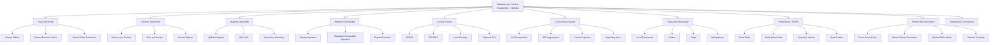

---

# 3. Decomposition Map - Practical Categories / Domain / Skills

| No | Area | Fokus Praktis | Implementasi Java/Jersey/MyBatis/PostgreSQL | Output yang Harus Ada |
|---:|---|---|---|---|
| 1 | **Database per Service** | Data privat per service | DB/schema khusus service | Data ownership policy |
| 2 | **Schema per Service** | Pisahkan object DB per service walau masih satu PostgreSQL instance | `case_management`, `investigation`, `notification` | Schema map |
| 3 | **Role per Service** | DB user khusus service | `case_management_app`, `investigation_app` | Role/grant script |
| 4 | **Table Ownership** | Tabel hanya dimiliki owning service | Service lain tidak punya direct grant | Table owner matrix |
| 5 | **MyBatis Mapper Ownership** | Mapper hanya akses schema sendiri | `CaseMapper` hanya query `case_management.*` | Mapper boundary rule |
| 6 | **Migration Ownership** | Migration dikelola service owner | Flyway/Liquibase per service | Migration folder per service |
| 7 | **Local Transaction Boundary** | Satu use case = satu transaksi lokal | MyBatis `SqlSession` / transaction manager | No distributed DB transaction |
| 8 | **Outbox Pattern** | Data update + event intent atomic | `outbox_event` table di schema service | Reliable event publishing |
| 9 | **Read Model Pattern** | Query lintas-service via projection | `reporting.case_summary_projection` | Query tanpa cross-service join |
| 10 | **API Composition** | Gabung data via API call, bukan DB join | BFF/Aggregator call service owner | Composite response |
| 11 | **CQRS** | Pisahkan command model dan query model | Command service + query projection | Query optimized model |
| 12 | **Shared DB Anti-Pattern Detection** | Deteksi coupling via SQL/grants | Search query lintas schema | Smell report |
| 13 | **Cross-Service Reference** | Simpan ID, bukan FK fisik lintas service | `case_id`, `document_id`, `customer_id` logical reference | Reference policy |
| 14 | **Referential Integrity Strategy** | Jaga consistency tanpa FK lintas service | API validation, event, reconciliation | Consistency plan |
| 15 | **View/Materialized View Governance** | View hanya dalam boundary atau dedicated reporting | PostgreSQL view/matview di owning/reporting schema | View ownership rule |
| 16 | **Function/Procedure Ownership** | PL/pgSQL tidak boleh menjadi shared domain layer lintas-service | Function di schema owner | Function catalog |
| 17 | **Trigger Governance** | Trigger lokal boleh, trigger lintas-service hati-hati | Audit/update timestamp trigger | Trigger policy |
| 18 | **Security / Least Privilege** | DB grants minimal | `GRANT`, `REVOKE`, role separation | DB privilege matrix |
| 19 | **Multi-Tenant Data Control** | Tenant isolation bila diperlukan | tenant column, RLS optional, app-level guard | Tenant access policy |
| 20 | **Operational Governance** | Backup, restore, migration, data repair per service | Runbook DB service | DB runbook |

PostgreSQL mendukung schema sebagai namespace object database, dan dokumentasinya menjelaskan bahwa `CREATE` privilege pada schema diperlukan agar user dapat membuat object di schema orang lain; PostgreSQL juga menyarankan beberapa pola untuk mencabut privilege create pada schema `public` dalam database lama. ([PostgreSQL](https://www.postgresql.org/docs/current/ddl-schemas.html?utm_source=chatgpt.com)) MyBatis sendiri memang berfokus pada SQL mapping; dokumentasinya menyebut mapper XML sebagai tempat mapped statements dan `SqlSession` sebagai interface utama untuk menjalankan command, mendapatkan mapper, dan mengelola transaction. ([mybatis.org](https://mybatis.org/mybatis-3/sqlmap-xml.html?utm_source=chatgpt.com))

---

# 4. Database per Service: Bentuk Implementasi

Ada beberapa level isolasi.

| Model | Contoh | Isolasi | Kapan Cocok |
|---|---|---:|---|
| **Separate physical database** | `case_db`, `investigation_db` | Tinggi | Service kritikal, scaling/storage/security beda |
| **Same DB instance, separate database** | PostgreSQL cluster sama, database beda | Tinggi-menengah | Banyak service, ops masih terkendali |
| **Same database, separate schema** | `case_management.*`, `investigation.*` | Menengah | Enterprise awal migrasi, on-prem constraint |
| **Same schema, table prefix** | `case_*`, `investigation_*` | Rendah | Transitional only |
| **Shared tables** | Semua service query/write tabel sama | Buruk | Anti-pattern |

Untuk onboarding cepat, biasanya organisasi enterprise dengan PostgreSQL memakai model:

```text
same PostgreSQL cluster
  → same database atau database berbeda
  → schema per service
  → role per service
  → grants ketat
```

Ini bukan isolasi sempurna seperti database fisik terpisah, tetapi jauh lebih baik daripada semua service bebas query tabel yang sama.

---

# 5. Contoh Schema Ownership

Misalnya ada beberapa service:

```text
case-management-service
investigation-service
decision-service
document-service
notification-service
audit-service
reporting-service
```

Schema:

```sql
CREATE SCHEMA case_management;
CREATE SCHEMA investigation;
CREATE SCHEMA decisioning;
CREATE SCHEMA document_management;
CREATE SCHEMA notification;
CREATE SCHEMA audit;
CREATE SCHEMA reporting;
```

Owner matrix:

| Service | Schema Owner | Tables | Boleh Diakses Oleh |
|---|---|---|---|
| `case-management-service` | `case_management` | `case_record`, `case_status_history`, `case_assignment`, `outbox_event` | service owner only |
| `investigation-service` | `investigation` | `investigation_record`, `finding`, `evidence` | service owner only |
| `decision-service` | `decisioning` | `decision`, `approval`, `decision_reason` | service owner only |
| `document-service` | `document_management` | `document_metadata`, `document_access` | service owner only |
| `notification-service` | `notification` | `notification_request`, `delivery_attempt` | service owner only |
| `audit-service` | `audit` | `audit_event` | audit service only |
| `reporting-service` | `reporting` | projections/read models | reporting service only |

Rule:

```text
Service boleh punya schema.
Service boleh punya migration.
Service boleh punya mapper.
Service lain tidak boleh membaca/menulis schema tersebut langsung.
```

---

# 6. PostgreSQL Role dan Grant Strategy

PostgreSQL `GRANT` bisa memberikan privilege pada object database seperti table, view, sequence, database, schema, function, procedure, dan lainnya, atau membership pada role. ([PostgreSQL](https://www.postgresql.org/docs/current/sql-grant.html?utm_source=chatgpt.com))

## 6.1 Role per Service

```sql
CREATE ROLE case_management_owner NOLOGIN;
CREATE ROLE case_management_app LOGIN PASSWORD 'replace-with-secret';
CREATE ROLE case_management_migration LOGIN PASSWORD 'replace-with-secret';

GRANT case_management_owner TO case_management_migration;
```

## 6.2 Schema Owner

```sql
CREATE SCHEMA case_management AUTHORIZATION case_management_owner;
```

## 6.3 Application Role Privilege

Application role sebaiknya hanya punya privilege yang dibutuhkan runtime.

```sql
GRANT USAGE ON SCHEMA case_management TO case_management_app;

GRANT SELECT, INSERT, UPDATE, DELETE
ON ALL TABLES IN SCHEMA case_management
TO case_management_app;

GRANT USAGE, SELECT, UPDATE
ON ALL SEQUENCES IN SCHEMA case_management
TO case_management_app;

ALTER DEFAULT PRIVILEGES
FOR ROLE case_management_owner
IN SCHEMA case_management
GRANT SELECT, INSERT, UPDATE, DELETE ON TABLES
TO case_management_app;

ALTER DEFAULT PRIVILEGES
FOR ROLE case_management_owner
IN SCHEMA case_management
GRANT USAGE, SELECT, UPDATE ON SEQUENCES
TO case_management_app;
```

## 6.4 Revoke Public Create

Untuk database lama atau shared environment, hindari semua user bisa membuat object di `public`.

```sql
REVOKE CREATE ON SCHEMA public FROM PUBLIC;
```

PostgreSQL documentation menjelaskan bahwa pada database yang di-upgrade dari PostgreSQL 14 atau lebih lama, semua user bisa punya privilege `CREATE` pada schema `public`, dan beberapa usage pattern menyarankan mencabut privilege itu. ([PostgreSQL](https://www.postgresql.org/docs/current/ddl-schemas.html?utm_source=chatgpt.com))

## 6.5 Jangan Grant Schema Service ke Service Lain

Buruk:

```sql
GRANT SELECT ON ALL TABLES IN SCHEMA case_management TO investigation_app;
```

Ini membuka shared database coupling.

Lebih baik:

```text
investigation-service butuh case info?
  → call case-management-service API
  atau consume CaseCreated/CaseUpdated event
  atau baca reporting/read model yang memang dedicated
```

---

# 7. MyBatis Mapper Ownership

MyBatis mapper adalah batas data access. Dokumentasi MyBatis menekankan mapper XML sebagai tempat mapped statements, dan MyBatis memang didesain untuk fokus pada SQL. ([mybatis.org](https://mybatis.org/mybatis-3/sqlmap-xml.html?utm_source=chatgpt.com)) Karena itu, governance mapper sangat penting.

## 7.1 Benar

Di `case-management-service`:

```java
public interface CaseMapper {

    CaseRecord findById(@Param("caseId") UUID caseId);

    void insert(CaseRecord record);

    void updateStatus(
        @Param("caseId") UUID caseId,
        @Param("status") String status,
        @Param("updatedAt") OffsetDateTime updatedAt
    );
}
```

XML:

```xml
<mapper namespace="com.company.platform.casemanagement.infrastructure.persistence.CaseMapper">

    <select id="findById" resultType="CaseRecord">
        SELECT
            case_id,
            case_number,
            status,
            assigned_officer_id,
            created_at,
            updated_at
        FROM case_management.case_record
        WHERE case_id = #{caseId}
    </select>

    <update id="updateStatus">
        UPDATE case_management.case_record
        SET status = #{status},
            updated_at = #{updatedAt}
        WHERE case_id = #{caseId}
    </update>

</mapper>
```

## 7.2 Salah

Di `investigation-service`:

```xml
<select id="findCase" resultType="CaseRecord">
    SELECT *
    FROM case_management.case_record
    WHERE case_id = #{caseId}
</select>
```

Ini melanggar boundary.

## 7.3 Mapper Boundary Rule

| Rule | Penjelasan |
|---|---|
| Mapper service hanya boleh query schema service sendiri | Ownership jelas |
| Mapper tidak boleh join schema service lain | Hindari runtime coupling |
| Mapper tidak boleh memakai table internal service lain | API/event/read model lebih aman |
| SQL dynamic sort harus whitelist | Hindari SQL injection |
| Function/procedure lintas-schema harus direview | Bisa jadi hidden coupling |
| Mapper XML wajib ikut code review boundary | SQL adalah contract internal yang kuat |

---

# 8. Struktur Persistence Layer

```text
case-management-service/
└── src/main/java/com/company/platform/casemanagement/
    ├── application/
    │   └── CaseApplicationService.java
    ├── domain/
    │   ├── Case.java
    │   └── CaseStatus.java
    └── infrastructure/
        └── persistence/
            ├── CaseMapper.java
            ├── CaseMapper.xml
            ├── CaseRecord.java
            ├── CaseRepository.java
            ├── MyBatisCaseRepository.java
            └── TransactionManager.java
```

## Responsibility

| Component | Isi |
|---|---|
| `CaseMapper` | SQL mapped methods |
| `CaseMapper.xml` | SQL statement |
| `CaseRecord` | DB row representation |
| `CaseRepository` | Domain-facing abstraction |
| `MyBatisCaseRepository` | Mapper-to-domain conversion |
| `TransactionManager` | Local transaction boundary |

---

# 9. Repository Boundary

Jangan biarkan application service terlalu tahu detail SQL.

## 9.1 Interface

```java
public interface CaseRepository {

    Optional<Case> findById(UUID caseId);

    Optional<Case> findByIdForUpdate(UUID caseId);

    void save(Case caseDomain);
}
```

## 9.2 Implementation

```java
public class MyBatisCaseRepository implements CaseRepository {

    private final SqlSession session;

    public MyBatisCaseRepository(SqlSession session) {
        this.session = session;
    }

    @Override
    public Optional<Case> findById(UUID caseId) {
        CaseMapper mapper = session.getMapper(CaseMapper.class);
        CaseRecord record = mapper.findById(caseId);

        return Optional.ofNullable(record)
            .map(CaseRecordMapper::toDomain);
    }

    @Override
    public Optional<Case> findByIdForUpdate(UUID caseId) {
        CaseMapper mapper = session.getMapper(CaseMapper.class);
        CaseRecord record = mapper.findByIdForUpdate(caseId);

        return Optional.ofNullable(record)
            .map(CaseRecordMapper::toDomain);
    }

    @Override
    public void save(Case caseDomain) {
        CaseMapper mapper = session.getMapper(CaseMapper.class);
        mapper.update(CaseRecordMapper.toRecord(caseDomain));
    }
}
```

## 9.3 Application Service

```java
public class CaseApplicationService {

    private final TransactionTemplate transactionTemplate;

    public CaseResponse transitionCase(
        UUID caseId,
        TransitionCaseRequest request,
        String actorId
    ) {
        return transactionTemplate.execute(session -> {
            CaseRepository caseRepository =
                new MyBatisCaseRepository(session);

            Case caseDomain = caseRepository.findByIdForUpdate(caseId)
                .orElseThrow(() -> new CaseNotFoundException(caseId));

            caseDomain.transition(
                CaseAction.valueOf(request.action()),
                request.reasonCode(),
                actorId
            );

            caseRepository.save(caseDomain);

            return CaseApiMapper.toResponse(caseDomain);
        });
    }
}
```

---

# 10. Transaction Boundary

## 10.1 Benar: Local Transaction

```text
case-management-service transaction:
  update case_management.case_record
  insert case_management.case_status_history
  insert case_management.outbox_event
commit
```

## 10.2 Salah: Cross-Service DB Transaction

```text
case-management-service transaction:
  update case_management.case_record
  update investigation.investigation_record
  update decisioning.decision
commit
```

Masalah:

| Masalah | Dampak |
|---|---|
| Service lain kehilangan ownership data | Boundary rusak |
| Migration service lain bisa merusak query | Release coupling |
| Lock lintas-domain | Runtime coupling |
| Rollback rule tidak jelas | Consistency sulit |
| Scaling DB/service makin sulit | Operasional berat |

## 10.3 Rule Transaksi

| Rule | Penjelasan |
|---|---|
| Satu service = satu local transaction | Boundary jelas |
| Cross-service consistency pakai Saga/event | Bukan distributed DB transaction |
| Outbox ditulis dalam transaksi lokal | Reliable publish |
| External REST call jangan di tengah DB transaction jika bisa dihindari | Mengurangi lock dan partial failure |
| Lock row seperlunya | Jangan lock terlalu luas |

---

# 11. Foreign Key Lintas-Service

## 11.1 Masalah FK Lintas-Service

Buruk:

```sql
ALTER TABLE investigation.investigation_record
ADD CONSTRAINT fk_investigation_case
FOREIGN KEY (case_id)
REFERENCES case_management.case_record(case_id);
```

Kenapa bermasalah?

| Masalah | Dampak |
|---|---|
| investigation schema bergantung ke case schema | Coupling migrasi |
| case-management tidak bebas mengubah tabel | Ownership lemah |
| Delete/update policy lintas-service rumit | Operational risk |
| Restore/backup per service sulit | Data lifecycle coupling |

## 11.2 Alternatif

```sql
CREATE TABLE investigation.investigation_record (
    investigation_id UUID PRIMARY KEY,
    case_id          UUID NOT NULL,
    status           VARCHAR(50) NOT NULL,
    created_at       TIMESTAMPTZ NOT NULL DEFAULT now()
);
```

`case_id` adalah logical reference, bukan FK fisik.

Consistency dijaga melalui:

| Strategi | Contoh |
|---|---|
| API validation | investigation-service call case-service saat create investigation |
| Event-driven sync | consume `CaseCreated`, simpan local reference |
| Saga/orchestration | Camunda memastikan case valid sebelum investigation |
| Reconciliation job | Periodic check orphan reference |
| Read model | Reporting projection dari event |

---

# 12. Shared Database Anti-Pattern

Microservices.io menyebut Shared Database sebagai anti-pattern, dan menjelaskan bahwa service yang berbagi database bisa saling mengganggu, misalnya transaksi panjang satu service menahan lock sehingga service lain ikut terblokir. ([microservices.io](https://microservices.io/patterns/data/shared-database.html?utm_source=chatgpt.com))

## 12.1 Bentuk Anti-Pattern

| Anti-Pattern | Contoh |
|---|---|
| Cross-service SELECT | service A membaca tabel service B |
| Cross-service INSERT/UPDATE | service A menulis tabel service B |
| Cross-service JOIN | query join schema A + schema B |
| Shared stored procedure | procedure mengubah banyak domain |
| Shared table | banyak service menulis tabel yang sama |
| Shared migration | satu migration mengubah schema banyak service |
| Shared reporting query di production DB | report join langsung semua schema |
| Shared DB user | semua service pakai user `app_user` |

## 12.2 SQL Smell

```sql
SELECT
    c.case_number,
    i.finding_count,
    d.decision_status
FROM case_management.case_record c
JOIN investigation.investigation_summary i
  ON i.case_id = c.case_id
JOIN decisioning.decision d
  ON d.case_id = c.case_id
WHERE c.status = 'UNDER_INVESTIGATION';
```

Ini mungkin tampak cepat, tapi secara arsitektur membuat query reporting bergantung ke struktur internal tiga service.

## 12.3 Better Options

| Kebutuhan | Solusi |
|---|---|
| UI detail page | BFF/API composition |
| Dashboard frequently accessed | Read model/projection |
| Heavy reporting | Reporting schema/data warehouse |
| Search | Search index dari event |
| Workflow consistency | Saga/Camunda |
| Reference validation | API call/cache/event |

---

# 13. API Composition untuk Query Lintas-Service

Pola API Composition melakukan query dengan memanggil service yang memiliki data lalu melakukan in-memory join/composition. Microservices.io juga menyebut API Composition dan CQRS sebagai pola yang berguna untuk query saat menerapkan Database per Service. ([microservices.io](https://microservices.io/patterns/data/database-per-service.html?utm_source=chatgpt.com))

## Contoh

```text
GET /web/cases/{caseId}/detail

BFF:
  call case-management-service
  call investigation-service
  call document-service
  call decision-service
  compose response
```

Pros:

| Kelebihan | Penjelasan |
|---|---|
| Tidak melanggar DB ownership | Data lewat API owner |
| Cocok untuk read sederhana | Terutama screen detail |
| Response bisa client-specific | BFF shaping |
| Tidak perlu projection pipeline | Lebih cepat implementasi |

Cons:

| Kekurangan | Penjelasan |
|---|---|
| Latency fan-out | Banyak call |
| Partial failure | Perlu policy |
| Tidak cocok untuk report berat | Query banyak data |
| Consistency eventual antar-call | Data bisa sedikit beda waktu |

---

# 14. CQRS / Read Model untuk Query Lintas-Service

Jika query lintas-service sering, berat, atau butuh filtering/sorting kompleks, API composition bisa tidak cukup.

Gunakan read model.

```text
case-management-service publishes CaseCreated/CaseUpdated
investigation-service publishes InvestigationUpdated
decision-service publishes DecisionApproved

reporting-service consumes events
  → update reporting.case_summary_projection

UI/report query:
  SELECT * FROM reporting.case_summary_projection
```

## 14.1 Projection Table

```sql
CREATE TABLE reporting.case_summary_projection (
    case_id                 UUID PRIMARY KEY,
    case_number             VARCHAR(50) NOT NULL,
    case_status             VARCHAR(50) NOT NULL,
    investigation_status    VARCHAR(50),
    finding_count           INTEGER NOT NULL DEFAULT 0,
    decision_status         VARCHAR(50),
    assigned_officer_id     UUID,
    aggregate_version       BIGINT NOT NULL DEFAULT 0,
    updated_at              TIMESTAMPTZ NOT NULL DEFAULT now()
);
```

## 14.2 Consumer Update

```sql
INSERT INTO reporting.case_summary_projection (
    case_id,
    case_number,
    case_status,
    aggregate_version,
    updated_at
)
VALUES (
    :case_id,
    :case_number,
    :case_status,
    :aggregate_version,
    now()
)
ON CONFLICT (case_id)
DO UPDATE SET
    case_number = EXCLUDED.case_number,
    case_status = EXCLUDED.case_status,
    aggregate_version = EXCLUDED.aggregate_version,
    updated_at = now()
WHERE reporting.case_summary_projection.aggregate_version
      < EXCLUDED.aggregate_version;
```

## 14.3 Read Model Rule

| Rule | Penjelasan |
|---|---|
| Read model bukan source of truth | Source tetap service owner |
| Projection boleh denormalized | Optimized untuk query |
| Event consumer harus idempotent | Duplicate safe |
| Gunakan aggregate version | Hindari stale event overwrite |
| Harus ada rebuild/replay plan | Projection bisa rusak |
| Tandai data freshness | `updated_at`, lag metric |

---

# 15. View dan Materialized View Governance

Karena Anda memakai PostgreSQL/PL/pgSQL, view dan materialized view perlu aturan jelas.

## 15.1 View Dalam Schema Owner

Boleh:

```sql
CREATE VIEW case_management.active_cases AS
SELECT
    case_id,
    case_number,
    status,
    assigned_officer_id
FROM case_management.case_record
WHERE status <> 'CLOSED';
```

Karena view ini masih dalam boundary `case_management`.

## 15.2 Cross-Service View

Berbahaya:

```sql
CREATE VIEW reporting.case_investigation_decision_view AS
SELECT
    c.case_id,
    c.case_number,
    i.status AS investigation_status,
    d.status AS decision_status
FROM case_management.case_record c
JOIN investigation.investigation_record i ON i.case_id = c.case_id
JOIN decisioning.decision d ON d.case_id = c.case_id;
```

Ini lebih baik diganti dengan projection table dari event, bukan view langsung ke schema service lain.

## 15.3 Materialized View

Materialized view cocok untuk:

| Use Case | Cocok? |
|---|---:|
| Query lokal dalam schema service | Ya |
| Reporting dari dedicated reporting DB/schema | Ya |
| Join langsung schema banyak service di production DB | Hati-hati / hindari |
| Data snapshot yang bisa stale | Ya |
| Real-time state transition | Tidak |

Rule praktis:

```text
View/materialized view boleh untuk optimization.
Jangan jadikan view lintas schema sebagai cara diam-diam menghapus data boundary.
```

---

# 16. PL/pgSQL Function, Procedure, Trigger Governance

PL/pgSQL powerful, tetapi bisa menjadi tempat business logic tersembunyi.

## 16.1 Function Lokal yang Masuk Akal

```sql
CREATE OR REPLACE FUNCTION case_management.touch_updated_at()
RETURNS trigger
LANGUAGE plpgsql
AS $$
BEGIN
    NEW.updated_at = now();
    RETURN NEW;
END;
$$;

CREATE TRIGGER trg_case_record_updated_at
BEFORE UPDATE ON case_management.case_record
FOR EACH ROW
EXECUTE FUNCTION case_management.touch_updated_at();
```

Ini masih lokal dan teknis.

## 16.2 Function yang Berbahaya

```sql
CREATE OR REPLACE PROCEDURE public.close_case_and_decision(...)
LANGUAGE plpgsql
AS $$
BEGIN
    UPDATE case_management.case_record ...
    UPDATE decisioning.decision ...
    INSERT INTO audit.audit_event ...
END;
$$;
```

Masalah:

| Masalah | Dampak |
|---|---|
| Menulis banyak schema service | Boundary rusak |
| Business flow tersembunyi di DB | Sulit test/review |
| Deployment coupling | Migration lintas-service |
| Observability lemah | Trace application tidak lengkap |
| Rollback dan audit logic tersebar | Compliance risk |

## 16.3 Policy

| DB Object | Boleh Jika | Hindari Jika |
|---|---|---|
| Function | Lokal, deterministic, technical helper | Mengubah banyak domain |
| Procedure | Lokal ke service owner | Orchestrate multi-service process |
| Trigger | audit lokal, updated_at, invariant lokal | Memanggil external system / schema lain |
| View | Dalam boundary schema | Join schema service lain |
| Materialized view | Dedicated reporting/read model | Source of truth |
| Extension | Disetujui platform/DBA | Service install sendiri di prod |

---

# 17. Row-Level Security / Tenant Isolation

PostgreSQL Row Security Policies bisa diterapkan spesifik untuk command, role, atau keduanya; policy bisa berlaku untuk `ALL`, `SELECT`, `INSERT`, `UPDATE`, atau `DELETE`. ([PostgreSQL](https://www.postgresql.org/docs/current/ddl-rowsecurity.html?utm_source=chatgpt.com))

RLS berguna untuk multi-tenant atau additional safety, tetapi jangan dipakai sebagai pengganti desain service authorization.

## 17.1 Contoh Konseptual

```sql
ALTER TABLE case_management.case_record ENABLE ROW LEVEL SECURITY;

CREATE POLICY case_tenant_isolation
ON case_management.case_record
USING (tenant_id = current_setting('app.tenant_id')::uuid);
```

Application harus set tenant context:

```sql
SET LOCAL app.tenant_id = '...';
```

## 17.2 Practical Warning

| Risiko | Penjelasan |
|---|---|
| App lupa set tenant context | Query bisa gagal atau salah |
| Connection pool reuse | Setting harus `SET LOCAL` dalam transaction |
| Debug makin kompleks | Query result dipengaruhi session setting |
| Policy drift | Perlu test dan review |
| Tidak mengganti object-level auth | Domain service tetap wajib check permission |

Gunakan RLS sebagai **defense-in-depth**, bukan satu-satunya authorization.

---

# 18. Migration Ownership

Setiap service owner mengelola migration schema-nya sendiri.

Contoh:

```text
case-management-service/
└── src/main/resources/db/migration/
    ├── V001__create_case_tables.sql
    ├── V002__add_case_assignment.sql
    ├── V003__create_outbox_event.sql
    └── V004__add_case_priority.sql
```

## Migration Rule

| Rule | Penjelasan |
|---|---|
| Migration hanya mengubah schema service sendiri | Boundary |
| Jangan ubah schema service lain | Release coupling |
| Jangan drop/rename kolom yang masih dipakai app lama | Rolling deploy risk |
| Gunakan expand/contract | Backward-compatible migration |
| Migration harus idempotent/teruji | CI/test DB |
| DB user migration berbeda dari app user | Least privilege |
| Backfill besar jangan blocking deploy | Batch job |

---

# 19. Expand/Contract Migration

Untuk rolling deployment, jangan langsung rename/drop.

## 19.1 Salah

```sql
ALTER TABLE case_management.case_record
RENAME COLUMN status TO lifecycle_status;
```

App lama masih memakai `status`, deploy bisa gagal.

## 19.2 Benar: Expand

```sql
ALTER TABLE case_management.case_record
ADD COLUMN lifecycle_status VARCHAR(50);

UPDATE case_management.case_record
SET lifecycle_status = status
WHERE lifecycle_status IS NULL;
```

App versi baru menulis dua kolom sementara:

```text
write status
write lifecycle_status
read lifecycle_status with fallback status
```

## 19.3 Contract

Setelah semua app lama hilang dan data valid:

```sql
ALTER TABLE case_management.case_record
DROP COLUMN status;
```

Rule:

```text
Expand dulu agar app lama dan baru bisa jalan bersamaan.
Contract belakangan setelah aman.
```

---

# 20. Cross-Service Data Reference Pattern

## 20.1 Reference by ID

```sql
CREATE TABLE investigation.investigation_record (
    investigation_id UUID PRIMARY KEY,
    case_id          UUID NOT NULL,
    status           VARCHAR(50) NOT NULL,
    created_at       TIMESTAMPTZ NOT NULL DEFAULT now()
);
```

## 20.2 Optional Snapshot

```sql
CREATE TABLE investigation.investigation_record (
    investigation_id UUID PRIMARY KEY,
    case_id          UUID NOT NULL,
    case_number      VARCHAR(50) NOT NULL,
    case_type        VARCHAR(50) NOT NULL,
    status           VARCHAR(50) NOT NULL
);
```

Snapshot boleh jika:

| Syarat | Penjelasan |
|---|---|
| Field diperlukan untuk local processing | Bukan hanya convenience |
| Ada update strategy | Event refresh / reconciliation |
| Staleness diterima | Snapshot tidak selalu real-time |
| Source jelas | case-management-service tetap source of truth |

---

# 21. Data Repair dan Reconciliation

Karena cross-service consistency biasanya eventual, perlu reconciliation.

## 21.1 Contoh Reconciliation Job

```text
investigation-service:
  find investigations with case snapshot older than 24h
  call case-management-service or read latest CaseUpdated event projection
  update local snapshot
  report missing cases
```

## 21.2 Reconciliation Table

```sql
CREATE TABLE investigation.reconciliation_issue (
    issue_id        UUID PRIMARY KEY,
    issue_type      VARCHAR(100) NOT NULL,
    reference_id    UUID NOT NULL,
    details         JSONB NOT NULL,
    status          VARCHAR(30) NOT NULL DEFAULT 'OPEN',
    detected_at     TIMESTAMPTZ NOT NULL DEFAULT now(),
    resolved_at     TIMESTAMPTZ NULL
);
```

## 21.3 Kapan Dibutuhkan

| Kondisi | Reconciliation Penting? |
|---|---:|
| Event-driven projection | Ya |
| External partner data | Ya |
| Saga multi-step | Ya |
| Strict regulatory reporting | Ya |
| Simple local CRUD | Tidak selalu |

---

# 22. Data Access Decision Matrix

| Kebutuhan | Jangan | Gunakan |
|---|---|---|
| Service A butuh detail object milik Service B | Query tabel B | REST API Service B |
| UI butuh data gabungan 3 service | Browser call 3 service langsung / DB join | BFF/API composition |
| Dashboard butuh filter/sort berat lintas-service | Cross-schema join | Read model/CQRS |
| Audit semua transition | Trigger lintas-schema | Domain event/outbox/audit service |
| Validate reference saat command | FK lintas-service | API call/cache/event snapshot |
| Reporting historis besar | Query production schema service | Data warehouse/reporting pipeline |
| Search full-text lintas-domain | SQL join semua schema | Search index projection |
| Workflow multi-service | Stored procedure lintas schema | Saga/Camunda |

---

# 23. Practical Smell Detection

Cari smell di repo/DB.

## 23.1 SQL Search

```bash
grep -R "case_management\." investigation-service/src/main/resources
grep -R "investigation\." case-management-service/src/main/resources
grep -R "JOIN .*decisioning" */src/main/resources
```

## 23.2 DB Grants Audit

```sql
SELECT
    grantee,
    table_schema,
    table_name,
    privilege_type
FROM information_schema.role_table_grants
WHERE table_schema IN (
    'case_management',
    'investigation',
    'decisioning',
    'document_management'
)
ORDER BY table_schema, table_name, grantee;
```

## 23.3 Function Cross-Schema Search

```sql
SELECT
    n.nspname AS schema_name,
    p.proname AS function_name,
    pg_get_functiondef(p.oid) AS definition
FROM pg_proc p
JOIN pg_namespace n ON n.oid = p.pronamespace
WHERE pg_get_functiondef(p.oid) ILIKE '%case_management.%'
  AND n.nspname <> 'case_management';
```

## 23.4 Red Flag

| Finding | Severity |
|---|---|
| Service app role has grants to another service schema | High |
| Mapper XML references another service schema | High |
| Stored procedure writes multiple service schemas | High |
| Reporting query joins production service schemas | Medium/High |
| Shared `app_user` used by many services | High |
| Migration repo changes multiple schemas | High |
| Foreign key across service schemas | Medium/High |

---

# 24. Practical Implementation Blueprint

## 24.1 Schema

```sql
CREATE SCHEMA case_management AUTHORIZATION case_management_owner;
```

## 24.2 Tables

```sql
CREATE TABLE case_management.case_record (
    case_id             UUID PRIMARY KEY,
    case_number         VARCHAR(50) NOT NULL UNIQUE,
    case_type           VARCHAR(50) NOT NULL,
    status              VARCHAR(50) NOT NULL,
    assigned_officer_id UUID NULL,
    version             BIGINT NOT NULL DEFAULT 0,
    created_at          TIMESTAMPTZ NOT NULL DEFAULT now(),
    updated_at          TIMESTAMPTZ NOT NULL DEFAULT now()
);

CREATE TABLE case_management.case_status_history (
    history_id      UUID PRIMARY KEY,
    case_id         UUID NOT NULL,
    from_status     VARCHAR(50),
    to_status       VARCHAR(50) NOT NULL,
    action          VARCHAR(50) NOT NULL,
    reason_code     VARCHAR(100),
    changed_by      UUID NOT NULL,
    changed_at      TIMESTAMPTZ NOT NULL DEFAULT now()
);

CREATE TABLE case_management.outbox_event (
    event_id          UUID PRIMARY KEY,
    aggregate_type    VARCHAR(100) NOT NULL,
    aggregate_id      UUID NOT NULL,
    event_type        VARCHAR(150) NOT NULL,
    event_version     INTEGER NOT NULL,
    routing_key       VARCHAR(200) NOT NULL,
    payload           JSONB NOT NULL,
    status            VARCHAR(30) NOT NULL DEFAULT 'PENDING',
    retry_count       INTEGER NOT NULL DEFAULT 0,
    next_attempt_at   TIMESTAMPTZ NOT NULL DEFAULT now(),
    created_at        TIMESTAMPTZ NOT NULL DEFAULT now(),
    published_at      TIMESTAMPTZ NULL
);
```

FK lokal masih boleh:

```sql
ALTER TABLE case_management.case_status_history
ADD CONSTRAINT fk_case_status_history_case
FOREIGN KEY (case_id)
REFERENCES case_management.case_record(case_id);
```

FK lintas service tidak.

---

# 25. Practical Checklist

| Area | Checklist |
|---|---|
| Schema | Service punya schema/database sendiri |
| Role | App role per service |
| Grants | Tidak ada grant ke schema service lain |
| Mapper | MyBatis mapper hanya query schema sendiri |
| Migration | Migration hanya ubah schema service sendiri |
| Transaction | Transaksi lokal saja |
| Outbox | Event penting ditulis ke outbox |
| FK | Tidak ada FK lintas-service |
| Join | Tidak ada join lintas-schema service |
| View | View lintas-service tidak dipakai sebagai shortcut |
| Function | PL/pgSQL tidak orchestrate banyak service |
| Reporting | Reporting pakai projection/data warehouse |
| Query lintas-service | API composition/read model |
| Security | Least privilege DB |
| Tenant | Tenant check app-level, RLS optional |
| Reconciliation | Ada untuk eventual consistency |
| Runbook | Backup, restore, migration failure, data repair |

---

# 26. Anti-Patterns dan Perbaikannya

| Anti-Pattern | Gejala | Dampak | Perbaikan |
|---|---|---|---|
| Shared DB User | Semua service pakai `app_user` | Tidak ada boundary | Role per service |
| Cross-Service Mapper | Mapper query schema service lain | Tight coupling | API/event/read model |
| Cross-Service FK | FK dari service A ke table service B | Migration coupling | Logical ID + validation |
| Cross-Schema Stored Procedure | Procedure update banyak domain | Hidden monolith | Saga/Camunda/application orchestration |
| Reporting on Production Tables | Report join semua schema | Load dan coupling | Reporting projection/warehouse |
| Table-Based Service Split | Service per table | Anemic/distributed monolith | Split by capability |
| Shared Audit Trigger | Trigger semua table ke satu schema | Hidden dependency | Event/outbox/audit service |
| Direct DB Access for Speed | “Sementara” query tabel service lain | Permanent coupling | BFF/read model |
| Migration Touches Many Schemas | Satu release ubah banyak owner | Release lockstep | Service-owned migrations |
| View as Integration Contract | Consumer query view internal | Contract kabur | API/OpenAPI/event schema |

---

# 27. Roadmap Implementasi

| Step | Aktivitas | Output |
|---:|---|---|
| 1 | Inventarisasi service dan schema | Service-data ownership map |
| 2 | Buat role per service | App/migration role |
| 3 | Audit grants | Remove cross-service grants |
| 4 | Audit MyBatis mapper | Mapper boundary report |
| 5 | Tetapkan migration ownership | Folder/repo migration per service |
| 6 | Pisahkan transaction boundary | Local transaction only |
| 7 | Tambahkan outbox untuk event penting | Reliable event publish |
| 8 | Hilangkan cross-service FK | Logical reference + validation |
| 9 | Ganti cross-schema join | API composition/read model |
| 10 | Buat reporting projection | Query lintas-service aman |
| 11 | Tambahkan reconciliation job | Eventual consistency safety |
| 12 | Buat DB runbook | Migration, restore, data repair |

---

# 28. Kesimpulan

Database boundary adalah salah satu pembeda utama antara microservice yang sehat dan distributed monolith.

Untuk Java Jersey/JAX-RS + MyBatis + PostgreSQL, prinsip praktisnya:

```text
- Service owns its schema/tables
- Service owns its MyBatis mapper
- Service owns its migration
- Service owns its local transaction
- Other services access data only through API/event/read model
- No cross-service FK
- No cross-service join
- No shared app DB user
- No shared stored procedure for business workflow
- Use outbox for reliable event publishing
- Use API composition for simple cross-service reads
- Use CQRS/read model/reporting store for heavy cross-service queries
```

**Seri 8/18 selesai.**

Rekomendasi materi berikutnya: **Seri 9 - API Composition, CQRS, Read Model, Materialized View, dan Reporting Query Pattern untuk Java Jersey/JAX-RS Microservice dengan PostgreSQL/MyBatis.**

---

**Sources:**

- [Pattern: Database per service](https://microservices.io/patterns/data/database-per-service.html?utm_source=chatgpt.com)
- [Documentation: 18: 5.10. Schemas](https://www.postgresql.org/docs/current/ddl-schemas.html?utm_source=chatgpt.com)
- [MyBatis 3 | Mapper XML Files](https://mybatis.org/mybatis-3/sqlmap-xml.html?utm_source=chatgpt.com)

## Response:
7/14/2026, 10:20:36 PM

Saya lanjut ke **Seri 9/18**. Fokusnya query lintas-service yang praktis: kapan cukup API Composition, kapan harus CQRS/read model, bagaimana projection dibangun dari event, dan bagaimana PostgreSQL materialized view dipakai tanpa melanggar data ownership.

# Microservice Pattern - Seri 9/18  
## API Composition, CQRS, Read Model, Materialized View, dan Reporting Query Pattern untuk Java Jersey/JAX-RS Microservice

## Introduction

Setelah menerapkan **Database per Service**, masalah berikutnya biasanya muncul:

```text
“Kalau tabel tiap service private, bagaimana membuat halaman/detail/report
yang butuh data dari banyak service?”
```

Contoh kebutuhan:

```text
Case Detail Page:
  case-management-service
  investigation-service
  document-service
  decision-service
  audit-service

Dashboard:
  total open case
  overdue case
  finding count
  decision pending
  escalation count

Report:
  case status by region
  investigation aging
  officer workload
  decision SLA
```

Jawaban praktisnya bukan kembali ke **shared database join**, tetapi memilih salah satu pola query lintas-service:

```text
1. API Composition
2. BFF / Aggregator
3. CQRS / Read Model
4. Event Projection
5. Reporting Store
6. Materialized View, dengan boundary yang benar
```

Microservices.io menjelaskan bahwa setelah menerapkan **Database per Service**, query yang membutuhkan data dari banyak service tidak lagi straightforward; salah satu solusi CQRS adalah membuat **view database/read-only replica** yang di-update dari domain event dan dioptimalkan untuk query tertentu. ([microservices.io](https://microservices.io/patterns/data/cqrs.html)) Martin Fowler juga menekankan bahwa CQRS memisahkan model untuk update/write dari model untuk read/query, tetapi memperingatkan bahwa CQRS menambah kompleksitas dan tidak cocok untuk semua sistem. ([martinfowler.com](https://martinfowler.com/bliki/CQRS.html?utm_source=chatgpt.com))

---

# 1. Mental Model Praktis

```text
Cross-Service Query Strategy =
  Start simple with API Composition
  Move to BFF/Aggregator when UI needs screen-specific composition
  Move to CQRS/Read Model when query becomes frequent/heavy/complex
  Move to Reporting Store when analytical/reporting workload grows
```

Prinsip utama:

```text
Command side:
  service owner mengubah data miliknya sendiri

Query side:
  boleh punya model berbeda yang dioptimalkan untuk read

Source of truth:
  tetap service owner, bukan projection/read model
```

---

# 2. Diagram

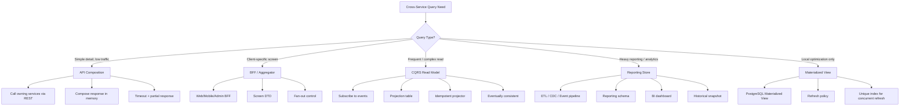

---

# 3. Decomposition Map - Practical Categories / Domain / Skills

| No | Area | Fokus Praktis | Implementasi Java/Jersey/MyBatis/PostgreSQL | Output yang Harus Ada |
|---:|---|---|---|---|
| 1 | **Query Classification** | Bedakan detail query, search, dashboard, reporting, analytics | Query decision matrix | Query catalog |
| 2 | **API Composition** | Gabung data via REST call ke service owner | Jersey BFF/Aggregator + typed clients | Composite DTO |
| 3 | **BFF Aggregation** | Response khusus web/mobile/admin | `web-bff-service`, `admin-bff-service` | Screen model API |
| 4 | **Fan-out Control** | Batasi jumlah downstream call | timeout, bulkhead, parallel call | Fan-out budget |
| 5 | **Partial Response** | Degradasi terkontrol saat dependency gagal | warning/partial flag | Partial response contract |
| 6 | **CQRS** | Pisah command model dan query model | command service + projection service | Command/query split |
| 7 | **Read Model** | Tabel denormalized untuk query tertentu | PostgreSQL projection table | Read-optimized schema |
| 8 | **Event Projection** | Update read model dari event | RabbitMQ consumer + inbox/dedup | Projector worker |
| 9 | **Projection Idempotency** | Aman terhadap duplicate event | `processed_message`, event version guard | Duplicate-safe projection |
| 10 | **Projection Ordering** | Hindari stale event overwrite | `aggregate_version`, `event_sequence` | Ordering policy |
| 11 | **Materialized View** | Optimasi query lokal/reporting | `CREATE MATERIALIZED VIEW`, `REFRESH` | Refresh plan |
| 12 | **Refresh Strategy** | Manual/scheduled/concurrent refresh | `REFRESH MATERIALIZED VIEW [CONCURRENTLY]` | Refresh runbook |
| 13 | **Reporting Store** | Pisah workload report dari OLTP service | reporting schema/database/data warehouse | Reporting boundary |
| 14 | **Search Projection** | Query text/filter kompleks | OpenSearch/Elasticsearch/PostgreSQL FTS | Search index contract |
| 15 | **Data Freshness** | Tampilkan/update freshness dan lag | `last_projected_at`, queue lag metric | Freshness SLA |
| 16 | **Rebuild / Replay** | Bangun ulang projection jika rusak | replay event/outbox/snapshot | Rebuild script |
| 17 | **Reconciliation** | Deteksi projection mismatch | periodic compare/checksum | Reconciliation job |
| 18 | **Security in Query Model** | Jangan bocorkan data lintas tenant/role | tenant column, policy, filtered projection | Access control plan |
| 19 | **Governance** | Read model punya owner dan lifecycle | schema owner, migration owner | Ownership matrix |
| 20 | **Testing** | Test projection, duplicate, stale event, rebuild | integration test RabbitMQ/PostgreSQL | Projection test suite |

---

# 4. Query Classification

Sebelum memilih pattern, klasifikasikan query.

| Query Type | Contoh | Pattern yang Cocok |
|---|---|---|
| Detail sederhana | `GET /cases/{id}/detail` | BFF/API Composition |
| UI screen model | Web/mobile case detail | BFF Aggregator |
| Search/filter banyak data | search case by status, region, officer, SLA | CQRS Read Model/Search Projection |
| Dashboard operational | open case count, overdue count | Read Model |
| Heavy reporting | monthly SLA report, officer workload | Reporting Store |
| Analytics/historical | trend 12 bulan, cohort, compliance metrics | Data warehouse/reporting pipeline |
| Local query optimization | case service query internal active cases | Local view/materialized view |
| Cross-service export | export all case + investigation + decision | Reporting Store / batch projection |

Rule praktis:

```text
Kalau query hanya sesekali dan data sedikit → API Composition.
Kalau query sering, berat, atau butuh filter/sort lintas-service → Read Model.
Kalau workload analitik besar → Reporting Store/Data Warehouse.
```

---

# 5. API Composition Pattern

**API Composition** berarti service aggregator memanggil beberapa service owner melalui API, lalu menyusun response. Pattern ini adalah alternatif CQRS untuk query lintas-service menurut Microservices.io. ([microservices.io](https://microservices.io/patterns/data/cqrs.html))

## 5.1 Contoh Use Case

```http
GET /web/cases/{caseId}/detail
```

Aggregator/BFF call:

```text
case-management-service:
  GET /api/v1/cases/{caseId}

investigation-service:
  GET /api/v1/investigations?caseId={caseId}

document-service:
  GET /api/v1/documents?caseId={caseId}

decision-service:
  GET /api/v1/decisions?caseId={caseId}
```

## 5.2 Composite Response

```json
{
  "case": {
    "caseId": "9cc9c5e3-8d7b-4c74-b3f9-11fcf49b6a61",
    "caseNumber": "CASE-2026-000123",
    "status": "UNDER_INVESTIGATION"
  },
  "investigation": {
    "investigationId": "fbe5f1c1-2b6d-4f2e-a6cd-4915d342189a",
    "status": "ACTIVE",
    "findingCount": 3
  },
  "documents": [
    {
      "documentId": "0c7e32a4-02a1-4a1a-bb98-0f2fc5e7a8bb",
      "fileName": "evidence.pdf",
      "status": "VERIFIED"
    }
  ],
  "decision": {
    "status": "PENDING"
  },
  "partial": false,
  "warnings": []
}
```

## 5.3 Jersey Resource

```java
@Path("/web/cases")
@Produces(MediaType.APPLICATION_JSON)
public class CaseDetailResource {

    private final CaseDetailCompositionService compositionService;

    public CaseDetailResource(CaseDetailCompositionService compositionService) {
        this.compositionService = compositionService;
    }

    @GET
    @Path("/{caseId}/detail")
    public Response getCaseDetail(
        @PathParam("caseId") UUID caseId,
        @Context SecurityContext securityContext
    ) {
        String actorId = securityContext.getUserPrincipal().getName();

        CaseDetailResponse response =
            compositionService.getCaseDetail(caseId, actorId);

        return Response.ok(response).build();
    }
}
```

## 5.4 Composition Service

```java
public class CaseDetailCompositionService {

    private final CaseServiceClient caseClient;
    private final InvestigationServiceClient investigationClient;
    private final DocumentServiceClient documentClient;
    private final DecisionServiceClient decisionClient;
    private final ExecutorService dependencyExecutor;

    public CaseDetailCompositionService(
        CaseServiceClient caseClient,
        InvestigationServiceClient investigationClient,
        DocumentServiceClient documentClient,
        DecisionServiceClient decisionClient,
        ExecutorService dependencyExecutor
    ) {
        this.caseClient = caseClient;
        this.investigationClient = investigationClient;
        this.documentClient = documentClient;
        this.decisionClient = decisionClient;
        this.dependencyExecutor = dependencyExecutor;
    }

    public CaseDetailResponse getCaseDetail(UUID caseId, String actorId) {
        CaseSummary caseSummary = caseClient.getCase(caseId, actorId);

        CompletableFuture<InvestigationSummary> investigationFuture =
            CompletableFuture.supplyAsync(
                () -> investigationClient.getByCaseId(caseId, actorId),
                dependencyExecutor
            );

        CompletableFuture<List<DocumentSummary>> documentsFuture =
            CompletableFuture.supplyAsync(
                () -> documentClient.getByCaseId(caseId, actorId),
                dependencyExecutor
            );

        CompletableFuture<DecisionSummary> decisionFuture =
            CompletableFuture.supplyAsync(
                () -> decisionClient.getByCaseId(caseId, actorId),
                dependencyExecutor
            );

        try {
            CompletableFuture.allOf(
                investigationFuture,
                documentsFuture,
                decisionFuture
            ).get(800, TimeUnit.MILLISECONDS);

            return CaseDetailResponse.complete(
                caseSummary,
                investigationFuture.join(),
                documentsFuture.join(),
                decisionFuture.join()
            );

        } catch (TimeoutException e) {
            return CaseDetailResponse.partial(
                caseSummary,
                List.of("Some sections are temporarily unavailable")
            );

        } catch (InterruptedException e) {
            Thread.currentThread().interrupt();
            throw new CaseDetailCompositionException("Composition interrupted", e);

        } catch (ExecutionException e) {
            throw mapFailure(e.getCause());
        }
    }

    private RuntimeException mapFailure(Throwable cause) {
        if (cause instanceof DownstreamNotFoundException) {
            return new CaseNotFoundException();
        }
        if (cause instanceof DownstreamForbiddenException) {
            return new ForbiddenException();
        }
        return new DependencyUnavailableException(cause);
    }
}
```

## 5.5 API Composition Cocok Jika

| Sinyal | Penjelasan |
|---|---|
| Query detail by ID | Data kecil |
| Fan-out terbatas | 2-5 service call |
| Latency masih masuk SLA | Timeout budget jelas |
| Data boleh slightly inconsistent | Antar-call bisa beda timestamp |
| Partial response bisa diterima | UI bisa tampil warning |
| Tidak butuh sorting/filter lintas-service besar | Query tidak berat |

## 5.6 API Composition Tidak Cocok Jika

| Sinyal | Risiko |
|---|---|
| Query list ribuan record | Fan-out N+1 |
| Sorting/filter lintas-service | Sulit/mahal |
| Dashboard high traffic | Membebani banyak service |
| Reporting besar | Tidak efisien |
| Konsistensi antar-field harus ketat | Data antar-service eventual |
| Call chain panjang | Cascading failure |

---

# 6. Fan-out Budget

Fan-out harus dibatasi.

```text
Request SLA: 1500 ms

BFF local processing: 100 ms
case-service: 250 ms
investigation-service: 400 ms
document-service: 300 ms
decision-service: 300 ms
buffer: 150 ms
```

Kalau parallel, total kira-kira mengikuti call terlama. Kalau sequential, total bisa menjadi penjumlahan semua dependency.

| Rule | Penjelasan |
|---|---|
| Gunakan bounded executor | Jangan pakai common pool tanpa kontrol |
| Timeout total composition | Jangan hanya timeout per client |
| Bulkhead per downstream | Satu service lambat tidak habiskan semua thread |
| Circuit breaker | Fail fast saat dependency down |
| Partial response eksplisit | Jangan return data kosong tanpa warning |
| Trace semua downstream call | Debug fan-out wajib traceable |

---

# 7. Partial Response Pattern

Untuk UI read-only, partial response sering lebih baik daripada gagal total.

```json
{
  "case": {
    "caseId": "9cc9c5e3-8d7b-4c74-b3f9-11fcf49b6a61",
    "status": "UNDER_INVESTIGATION"
  },
  "investigation": null,
  "documents": [],
  "decision": {
    "status": "PENDING"
  },
  "partial": true,
  "warnings": [
    {
      "section": "investigation",
      "code": "INVESTIGATION_SERVICE_TIMEOUT",
      "message": "Investigation data is temporarily unavailable"
    }
  ]
}
```

| Use Case | Partial Response? |
|---|---:|
| Dashboard summary | Ya |
| UI detail read-only | Ya |
| Optional document preview | Ya |
| Authorization decision | Tidak |
| Submit decision | Tidak |
| Payment/reservation | Tidak |
| Regulatory final action | Tidak |

---

# 8. CQRS Pattern

CQRS berarti memisahkan model write/command dari model read/query. Fowler menjelaskan inti CQRS sebagai pemakaian model berbeda untuk update informasi dan membaca informasi, tetapi ia juga memperingatkan bahwa CQRS dapat menambah kompleksitas yang berisiko. ([martinfowler.com](https://martinfowler.com/bliki/CQRS.html?utm_source=chatgpt.com))

Dalam microservice, CQRS sering muncul seperti ini:

```text
Command side:
  case-management-service
    owns case tables
    handles transitions
    publishes events

Query side:
  case-query-service / reporting-service
    owns projection tables
    subscribes to events
    exposes query APIs
```

## 8.1 Diagram CQRS

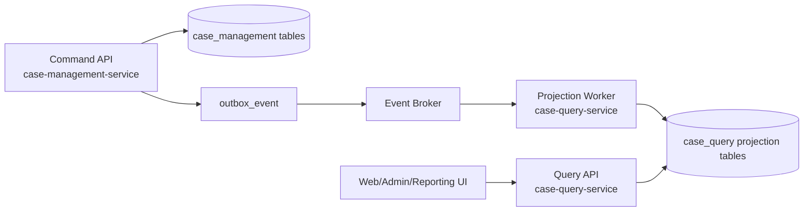

## 8.2 CQRS Cocok Jika

| Sinyal | Contoh |
|---|---|
| Query jauh lebih kompleks daripada write | Dashboard/report/search |
| Read traffic jauh lebih tinggi | Banyak user lihat list/status |
| Query butuh denormalized model | case + investigation + decision |
| Write model harus tetap domain-pure | state transition tidak dicampur report query |
| Perlu performance read tinggi | index khusus, table khusus |
| Perlu eventual consistency acceptable | dashboard boleh lag beberapa detik |
| Perlu banyak view berbeda | operational dashboard, export, admin search |

## 8.3 CQRS Tidak Cocok Jika

| Sinyal | Risiko |
|---|---|
| CRUD sederhana satu service | Overengineering |
| Tim belum siap event/idempotency | Projection sering rusak |
| Data harus selalu strongly consistent | Read model lag tidak diterima |
| Tidak ada kebutuhan read kompleks | Biaya maintenance tidak sepadan |
| Tidak punya observability queue/projection | Sulit operasi |

---

# 9. Read Model Design

Read model adalah schema/tabel yang sengaja didesain untuk query, bukan untuk menjaga invariant domain.

## 9.1 Source Events

```text
CaseCreated
CaseAssigned
CaseStatusChanged
CaseEscalated
InvestigationStarted
FindingSubmitted
DecisionApproved
DocumentAttached
```

## 9.2 Projection Table

```sql
CREATE SCHEMA case_query;

CREATE TABLE case_query.case_search_projection (
    case_id                 UUID PRIMARY KEY,
    case_number             VARCHAR(50) NOT NULL,
    case_type               VARCHAR(50) NOT NULL,
    case_status             VARCHAR(50) NOT NULL,

    assigned_officer_id     UUID NULL,
    assigned_officer_name   VARCHAR(200) NULL,

    investigation_id        UUID NULL,
    investigation_status    VARCHAR(50) NULL,
    finding_count           INTEGER NOT NULL DEFAULT 0,

    decision_id             UUID NULL,
    decision_status         VARCHAR(50) NULL,
    decision_approved_at    TIMESTAMPTZ NULL,

    document_count          INTEGER NOT NULL DEFAULT 0,

    region_code             VARCHAR(50) NULL,
    priority                VARCHAR(50) NULL,
    sla_due_at              TIMESTAMPTZ NULL,
    overdue                 BOOLEAN NOT NULL DEFAULT false,

    case_created_at         TIMESTAMPTZ NOT NULL,
    last_event_id           UUID NULL,
    last_projected_at       TIMESTAMPTZ NOT NULL DEFAULT now()
);

CREATE INDEX idx_case_search_status
ON case_query.case_search_projection (case_status);

CREATE INDEX idx_case_search_assigned_officer
ON case_query.case_search_projection (assigned_officer_id);

CREATE INDEX idx_case_search_overdue
ON case_query.case_search_projection (overdue, sla_due_at);

CREATE INDEX idx_case_search_region_status
ON case_query.case_search_projection (region_code, case_status);
```

## 9.3 Kenapa Denormalized?

| Alasan | Dampak |
|---|---|
| Query cepat | Tidak perlu join banyak service |
| Index sesuai query | Search/dashboard lebih efisien |
| Bentuk sesuai UI/report | Response mapping sederhana |
| Isolasi workload | Domain service tidak terbebani |
| Bisa rebuild | Source event tetap truth |

---

# 10. Projection Worker Pattern

Projection worker mengonsumsi event dan update read model.

```text
Event Broker
  → case-query-projector
    → idempotency check
    → parse event
    → apply projection update
    → mark processed
    → ack
```

## 10.1 Processed Message Table

```sql
CREATE TABLE case_query.processed_message (
    message_id       UUID NOT NULL,
    consumer_name    VARCHAR(150) NOT NULL,
    processed_at     TIMESTAMPTZ NOT NULL DEFAULT now(),
    PRIMARY KEY (message_id, consumer_name)
);
```

## 10.2 Projector Skeleton

```java
public class CaseSearchProjector {

    private final MyBatisFactory myBatisFactory;
    private final ObjectMapper objectMapper;

    public void handle(EventEnvelope envelope) {
        myBatisFactory.withSession(session -> {
            ProcessedMessageMapper processedMapper =
                session.getMapper(ProcessedMessageMapper.class);

            if (processedMapper.exists(
                envelope.messageId(),
                "case-search-projector"
            )) {
                return null;
            }

            switch (envelope.messageType()) {
                case "CaseCreated" -> applyCaseCreated(session, envelope);
                case "CaseStatusChanged" -> applyCaseStatusChanged(session, envelope);
                case "CaseAssigned" -> applyCaseAssigned(session, envelope);
                case "InvestigationStarted" -> applyInvestigationStarted(session, envelope);
                case "FindingSubmitted" -> applyFindingSubmitted(session, envelope);
                case "DecisionApproved" -> applyDecisionApproved(session, envelope);
                case "DocumentAttached" -> applyDocumentAttached(session, envelope);
                default -> throw new UnsupportedEventTypeException(envelope.messageType());
            }

            processedMapper.insert(
                envelope.messageId(),
                "case-search-projector",
                OffsetDateTime.now(ZoneOffset.UTC)
            );

            return null;
        });
    }

    private void applyCaseCreated(SqlSession session, EventEnvelope envelope) {
        CaseCreatedEvent event =
            objectMapper.convertValue(envelope.data(), CaseCreatedEvent.class);

        CaseSearchProjectionMapper mapper =
            session.getMapper(CaseSearchProjectionMapper.class);

        mapper.upsertCaseCreated(event);
    }

    private void applyCaseStatusChanged(SqlSession session, EventEnvelope envelope) {
        CaseStatusChangedEvent event =
            objectMapper.convertValue(envelope.data(), CaseStatusChangedEvent.class);

        CaseSearchProjectionMapper mapper =
            session.getMapper(CaseSearchProjectionMapper.class);

        mapper.updateCaseStatus(event);
    }
}
```

---

# 11. Projection SQL dengan Idempotency dan Upsert

## 11.1 CaseCreated

```xml
<insert id="upsertCaseCreated">
    INSERT INTO case_query.case_search_projection (
        case_id,
        case_number,
        case_type,
        case_status,
        region_code,
        priority,
        case_created_at,
        last_event_id,
        last_projected_at
    )
    VALUES (
        #{caseId},
        #{caseNumber},
        #{caseType},
        #{status},
        #{regionCode},
        #{priority},
        #{createdAt},
        #{eventId},
        now()
    )
    ON CONFLICT (case_id)
    DO UPDATE SET
        case_number = EXCLUDED.case_number,
        case_type = EXCLUDED.case_type,
        case_status = EXCLUDED.case_status,
        region_code = EXCLUDED.region_code,
        priority = EXCLUDED.priority,
        last_event_id = EXCLUDED.last_event_id,
        last_projected_at = now()
</insert>
```

## 11.2 CaseStatusChanged

```xml
<update id="updateCaseStatus">
    UPDATE case_query.case_search_projection
    SET case_status = #{toStatus},
        overdue = #{overdue},
        sla_due_at = #{slaDueAt},
        last_event_id = #{eventId},
        last_projected_at = now()
    WHERE case_id = #{caseId}
</update>
```

## 11.3 FindingSubmitted

```xml
<update id="incrementFindingCount">
    UPDATE case_query.case_search_projection
    SET finding_count = finding_count + 1,
        last_event_id = #{eventId},
        last_projected_at = now()
    WHERE case_id = #{caseId}
</update>
```

---

# 12. Ordering dan Stale Event Protection

Kalau event bisa datang out of order, projection bisa salah.

## 12.1 Tambahkan Aggregate Version

Event:

```json
{
  "messageId": "4fb43e7e-3f15-41f5-9d76-4c7e5ab2926e",
  "messageType": "CaseStatusChanged",
  "aggregateId": "9cc9c5e3-8d7b-4c74-b3f9-11fcf49b6a61",
  "aggregateVersion": 7,
  "data": {
    "caseId": "9cc9c5e3-8d7b-4c74-b3f9-11fcf49b6a61",
    "fromStatus": "ASSIGNED",
    "toStatus": "UNDER_INVESTIGATION"
  }
}
```

Projection table:

```sql
ALTER TABLE case_query.case_search_projection
ADD COLUMN case_aggregate_version BIGINT NOT NULL DEFAULT 0;
```

Update guard:

```sql
UPDATE case_query.case_search_projection
SET case_status = :to_status,
    case_aggregate_version = :aggregate_version,
    last_event_id = :event_id,
    last_projected_at = now()
WHERE case_id = :case_id
  AND case_aggregate_version < :aggregate_version;
```

## 12.2 Event Dari Banyak Aggregate

Kalau projection menerima event dari beberapa service, gunakan version per source/aggregate.

```sql
ALTER TABLE case_query.case_search_projection
ADD COLUMN case_aggregate_version BIGINT NOT NULL DEFAULT 0,
ADD COLUMN investigation_aggregate_version BIGINT NOT NULL DEFAULT 0,
ADD COLUMN decision_aggregate_version BIGINT NOT NULL DEFAULT 0;
```

Rule:

| Event Source | Version Column |
|---|---|
| case-management-service | `case_aggregate_version` |
| investigation-service | `investigation_aggregate_version` |
| decision-service | `decision_aggregate_version` |
| document-service | `document_aggregate_version` |

---

# 13. Query API di Read Model Service

## 13.1 Resource

```java
@Path("/api/v1/case-search")
@Produces(MediaType.APPLICATION_JSON)
public class CaseSearchResource {

    private final CaseSearchQueryService queryService;

    public CaseSearchResource(CaseSearchQueryService queryService) {
        this.queryService = queryService;
    }

    @GET
    public Response search(
        @QueryParam("status") String status,
        @QueryParam("region") String region,
        @QueryParam("assignedOfficerId") UUID assignedOfficerId,
        @QueryParam("overdue") Boolean overdue,
        @DefaultValue("0") @QueryParam("page") int page,
        @DefaultValue("20") @QueryParam("size") int size,
        @DefaultValue("caseCreatedAt:desc") @QueryParam("sort") String sort
    ) {
        CaseSearchCriteria criteria = CaseSearchCriteria.of(
            status,
            region,
            assignedOfficerId,
            overdue,
            page,
            size,
            sort
        );

        PageResponse<CaseSearchResult> result = queryService.search(criteria);

        return Response.ok(result).build();
    }
}
```

## 13.2 MyBatis Query

```xml
<select id="search" resultType="CaseSearchResultRecord">
    SELECT
        case_id,
        case_number,
        case_type,
        case_status,
        assigned_officer_id,
        assigned_officer_name,
        investigation_status,
        finding_count,
        decision_status,
        document_count,
        region_code,
        priority,
        sla_due_at,
        overdue,
        case_created_at,
        last_projected_at
    FROM case_query.case_search_projection
    WHERE 1 = 1

    <if test="status != null">
        AND case_status = #{status}
    </if>

    <if test="region != null">
        AND region_code = #{region}
    </if>

    <if test="assignedOfficerId != null">
        AND assigned_officer_id = #{assignedOfficerId}
    </if>

    <if test="overdue != null">
        AND overdue = #{overdue}
    </if>

    ORDER BY ${sortColumn} ${sortDirection}
    LIMIT #{limit}
    OFFSET #{offset}
</select>
```

`${sortColumn}` harus berasal dari whitelist internal, bukan input mentah user.

---

# 14. Data Freshness

CQRS/read model biasanya **eventually consistent**. Jangan sembunyikan ini.

## 14.1 Response Metadata

```json
{
  "items": [
    {
      "caseId": "9cc9c5e3-8d7b-4c74-b3f9-11fcf49b6a61",
      "caseNumber": "CASE-2026-000123",
      "status": "UNDER_INVESTIGATION",
      "lastProjectedAt": "2026-07-14T10:15:03Z"
    }
  ],
  "meta": {
    "page": 0,
    "size": 20,
    "totalItems": 152,
    "freshness": {
      "lastProjectedAt": "2026-07-14T10:15:03Z",
      "projectionLagSeconds": 4
    }
  }
}
```

## 14.2 Freshness Metrics

| Metric | Arti |
|---|---|
| `projection_lag_seconds` | Selisih event occurred/published dengan projected |
| `queue_depth` | Backlog message |
| `projector_error_total` | Error handler |
| `projector_retry_total` | Retry pressure |
| `last_projected_event_time` | Event terbaru yang berhasil diproses |
| `stale_projection_count` | Row terlalu lama tidak update |

Rule:

```text
Untuk dashboard/report, tampilkan freshness jika data tidak real-time.
Untuk workflow command, jangan gunakan read model sebagai satu-satunya source decision.
```

---

# 15. Materialized View Pattern

PostgreSQL `CREATE MATERIALIZED VIEW` mendefinisikan materialized view dari query; query dijalankan untuk mengisi view saat dibuat, kecuali `WITH NO DATA`, dan bisa di-refresh lagi menggunakan `REFRESH MATERIALIZED VIEW`. ([PostgreSQL](https://www.postgresql.org/docs/current/sql-creatematerializedview.html))

## 15.1 Kapan Materialized View Cocok?

| Use Case | Cocok? |
|---|---:|
| Query berat tapi sumber data masih dalam satu service boundary | Ya |
| Summary lokal dalam schema owner | Ya |
| Reporting schema dedicated | Ya |
| Cross-service production join langsung | Hindari |
| Real-time command decision | Tidak |
| Projection yang perlu incremental per event | Biasanya table projection lebih baik |
| Dashboard yang bisa refresh periodik | Ya |

## 15.2 Local Materialized View dalam Boundary Service

```sql
CREATE MATERIALIZED VIEW case_management.case_status_summary_mv AS
SELECT
    status,
    COUNT(*) AS case_count,
    MIN(created_at) AS oldest_case_created_at,
    MAX(updated_at) AS latest_case_updated_at
FROM case_management.case_record
GROUP BY status
WITH DATA;

CREATE UNIQUE INDEX ux_case_status_summary_mv
ON case_management.case_status_summary_mv (status);
```

Refresh:

```sql
REFRESH MATERIALIZED VIEW CONCURRENTLY case_management.case_status_summary_mv;
```

PostgreSQL `REFRESH MATERIALIZED VIEW` mengganti isi materialized view; opsi `CONCURRENTLY` memungkinkan refresh tanpa mengunci concurrent selects, tetapi hanya boleh dipakai jika materialized view sudah populated dan memiliki setidaknya satu unique index yang memenuhi syarat. ([PostgreSQL](https://www.postgresql.org/docs/current/sql-refreshmaterializedview.html))

## 15.3 Reporting Materialized View

Jika reporting schema memang dedicated dan punya data hasil projection, materialized view boleh digunakan di atas projection.

```sql
CREATE MATERIALIZED VIEW reporting.monthly_case_sla_mv AS
SELECT
    date_trunc('month', case_created_at)::date AS month,
    region_code,
    COUNT(*) AS total_cases,
    COUNT(*) FILTER (WHERE overdue) AS overdue_cases,
    AVG(EXTRACT(EPOCH FROM (decision_approved_at - case_created_at)) / 3600)
        AS avg_decision_hours
FROM reporting.case_lifecycle_projection
GROUP BY date_trunc('month', case_created_at)::date, region_code
WITH DATA;

CREATE UNIQUE INDEX ux_monthly_case_sla_mv
ON reporting.monthly_case_sla_mv (month, region_code);
```

## 15.4 Materialized View Refresh Runbook

| Area | Rule |
|---|---|
| Refresh frequency | Sesuai freshness SLA |
| Concurrent refresh | Gunakan jika query harus tetap available |
| Unique index | Wajib untuk `CONCURRENTLY` |
| Refresh duration | Monitor |
| Refresh failure | Alert |
| Data staleness | Tampilkan last refreshed |
| Ownership | Schema owner jelas |
| Cross-service source | Jangan langsung ke schema service lain kecuali reporting boundary memang disepakati |

---

# 16. Projection Table vs Materialized View

| Aspek | Projection Table | Materialized View |
|---|---|---|
| Update model | Incremental per event | Full refresh query |
| Cocok untuk | Event-driven CQRS | Summary/query optimization |
| Freshness | Near real-time jika consumer cepat | Periodik |
| Write control | Application/projector | DB refresh |
| Duplicate handling | Per event/message ID | Tidak relevan |
| Ordering guard | Bisa pakai aggregate version | Tidak natural |
| Rebuild | Replay event/snapshot | Refresh ulang |
| Query speed | Sangat baik jika indexed | Sangat baik jika indexed |
| Complexity | Higher application complexity | Simpler DB operation |
| Cross-service boundary | Aman jika event-based | Hati-hati jika query direct schema lain |

Rule praktis:

```text
Butuh near real-time dan event-driven update? Gunakan projection table.
Butuh summary periodik dari data yang sudah aman dalam boundary? Gunakan materialized view.
```

---

# 17. Reporting Store Pattern

Reporting store adalah database/schema khusus untuk query/report/analytics, bukan source of truth domain.

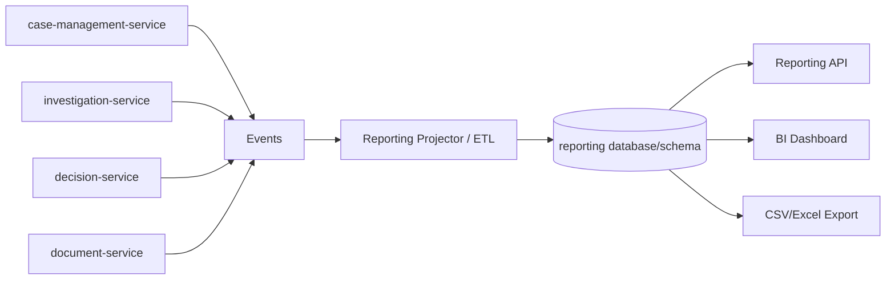

## 17.1 Reporting Store Cocok Jika

| Sinyal | Contoh |
|---|---|
| Report berat dan berkala | monthly compliance report |
| Query lintas banyak domain | case + investigation + decision + audit |
| Butuh historical snapshot | SLA trend per bulan |
| BI tool butuh akses SQL | Metabase/PowerBI/Superset |
| OLTP service tidak boleh terbebani | production isolation |
| Export besar | async report generation |

## 17.2 Reporting Table Example

```sql
CREATE TABLE reporting.case_lifecycle_projection (
    case_id                  UUID PRIMARY KEY,
    case_number              VARCHAR(50) NOT NULL,
    case_type                VARCHAR(50) NOT NULL,
    region_code              VARCHAR(50) NOT NULL,
    priority                 VARCHAR(50) NOT NULL,

    created_at               TIMESTAMPTZ NOT NULL,
    submitted_at             TIMESTAMPTZ NULL,
    assigned_at              TIMESTAMPTZ NULL,
    investigation_started_at TIMESTAMPTZ NULL,
    finding_submitted_at     TIMESTAMPTZ NULL,
    decision_approved_at     TIMESTAMPTZ NULL,
    closed_at                TIMESTAMPTZ NULL,

    current_status           VARCHAR(50) NOT NULL,
    assigned_officer_id      UUID NULL,
    finding_count            INTEGER NOT NULL DEFAULT 0,
    document_count           INTEGER NOT NULL DEFAULT 0,

    sla_due_at               TIMESTAMPTZ NULL,
    overdue                  BOOLEAN NOT NULL DEFAULT false,

    last_projected_at        TIMESTAMPTZ NOT NULL DEFAULT now()
);
```

---

# 18. Search Projection Pattern

Jika query membutuhkan full-text search, fuzzy search, ranking, atau banyak filter kompleks, projection bisa masuk search engine atau PostgreSQL full-text search.

## 18.1 PostgreSQL Search Projection

```sql
ALTER TABLE case_query.case_search_projection
ADD COLUMN search_vector tsvector;

CREATE INDEX idx_case_search_vector
ON case_query.case_search_projection
USING gin(search_vector);
```

Update:

```sql
UPDATE case_query.case_search_projection
SET search_vector =
    to_tsvector(
        'english',
        coalesce(case_number, '') || ' ' ||
        coalesce(case_type, '') || ' ' ||
        coalesce(case_status, '') || ' ' ||
        coalesce(assigned_officer_name, '')
    )
WHERE case_id = :case_id;
```

Search:

```sql
SELECT *
FROM case_query.case_search_projection
WHERE search_vector @@ plainto_tsquery('english', :keyword)
ORDER BY ts_rank(search_vector, plainto_tsquery('english', :keyword)) DESC
LIMIT :limit OFFSET :offset;
```

## 18.2 Search Engine Projection

```text
Event → projector → OpenSearch/Elasticsearch index
```

Cocok jika:

| Need | Contoh |
|---|---|
| Fuzzy search | typo tolerant |
| Ranking | relevance |
| Highlighting | matched snippets |
| Complex filter | nested data |
| Large search traffic | dedicated search infra |

---

# 19. Rebuild / Replay Strategy

Read model bisa rusak. Jadi harus bisa rebuild.

## 19.1 Rebuild Options

| Strategy | Penjelasan |
|---|---|
| Replay all events | Paling audit-friendly jika event lengkap |
| Snapshot + replay recent events | Lebih cepat |
| Bulk API extract from service owners | Jika event history tidak lengkap |
| Database export from owner | Hanya via controlled owner pipeline |
| Recompute materialized view | Untuk matview lokal/reporting |

## 19.2 Rebuild Runbook

```text
1. Stop query traffic or mark projection read-only/degraded.
2. Create new projection table: case_search_projection_rebuild.
3. Replay events from beginning or from snapshot.
4. Validate row count/checksum.
5. Compare sample cases with source services.
6. Swap table/view atomically.
7. Resume query traffic.
8. Monitor projection lag and error rate.
```

## 19.3 Blue-Green Projection Table

```sql
CREATE TABLE case_query.case_search_projection_v2
AS SELECT * FROM case_query.case_search_projection
WITH NO DATA;
```

After rebuild:

```sql
ALTER TABLE case_query.case_search_projection
RENAME TO case_search_projection_old;

ALTER TABLE case_query.case_search_projection_v2
RENAME TO case_search_projection;
```

Dalam production, gunakan transaction/lock strategy yang aman dan diuji.

---

# 20. Reconciliation Pattern

Projection eventual consistency perlu reconciliation.

## 20.1 Reconciliation Check

```text
For each projected case updated in last 24h:
  call case-management-service for canonical status
  compare with projection.case_status
  if mismatch:
    insert reconciliation_issue
```

## 20.2 Issue Table

```sql
CREATE TABLE case_query.reconciliation_issue (
    issue_id        UUID PRIMARY KEY,
    issue_type      VARCHAR(100) NOT NULL,
    aggregate_id    UUID NOT NULL,
    expected_data   JSONB NOT NULL,
    actual_data     JSONB NOT NULL,
    status          VARCHAR(30) NOT NULL DEFAULT 'OPEN',
    detected_at     TIMESTAMPTZ NOT NULL DEFAULT now(),
    resolved_at     TIMESTAMPTZ NULL
);
```

## 20.3 Kapan Wajib?

| Kondisi | Reconciliation |
|---|---:|
| Regulatory/compliance reporting | Wajib |
| Projection dipakai dashboard kritikal | Sangat disarankan |
| Projection dari banyak source event | Disarankan |
| Search index only convenience | Opsional |
| Local materialized view | Biasanya cukup refresh validation |

---

# 21. Security di Query Model

Read model sering menggabungkan banyak data, jadi security harus eksplisit.

## 21.1 Risiko

| Risiko | Contoh |
|---|---|
| Projection berisi data role-restricted | Investigation note muncul di dashboard umum |
| Cross-tenant leakage | Query tidak filter tenant |
| PII menyebar ke reporting | Email/phone masuk projection |
| BI access terlalu luas | Semua analyst lihat sensitive data |
| Cache tidak include user context | User A lihat data user B |

## 21.2 Mitigasi

| Mitigasi | Praktik |
|---|---|
| Minimal payload | Hanya field yang perlu query |
| Tenant column | `tenant_id` wajib di projection |
| Row filtering | query service enforce actor scope |
| Separate projection by audience | admin vs public vs partner |
| Masking | PII masked untuk report |
| Audit query access | log actor/report/export |
| No raw confidential note | simpan reference, bukan content |

Contoh:

```sql
ALTER TABLE case_query.case_search_projection
ADD COLUMN tenant_id UUID NOT NULL,
ADD COLUMN visibility_level VARCHAR(50) NOT NULL DEFAULT 'INTERNAL';
```

Query harus selalu filter:

```sql
WHERE tenant_id = #{tenantId}
  AND region_code IN (...)
```

---

# 22. Ownership Model

Read model harus punya owner. Jangan menjadi “tabel bersama tanpa pemilik”.

| Asset | Owner |
|---|---|
| `case_management.case_record` | case-management-service |
| `investigation.investigation_record` | investigation-service |
| `case_query.case_search_projection` | case-query-service |
| `reporting.case_lifecycle_projection` | reporting-service |
| `reporting.monthly_case_sla_mv` | reporting-service |
| `OpenSearch case index` | case-query/search-service |
| Projector worker | case-query-service |
| Event schema `CaseStatusChanged` | case-management-service |
| Event schema `FindingSubmitted` | investigation-service |

Rule:

```text
Read model boleh punya data gabungan,
tetapi owner dan source-of-truth harus tetap jelas.
```

---

# 23. Testing Strategy

## 23.1 API Composition Tests

| Test | Expected |
|---|---|
| All downstream success | complete response |
| One optional downstream timeout | partial response + warning |
| Required downstream 404 | mapped 404 |
| Downstream 403 | mapped 403 |
| Slow downstream | timeout respected |
| Correlation propagated | header exists in downstream calls |
| Fan-out overload | bulkhead rejects gracefully |

## 23.2 Projection Tests

| Test | Expected |
|---|---|
| `CaseCreated` event | projection row inserted |
| duplicate `CaseCreated` | no duplicate/harmless update |
| stale `CaseStatusChanged` | ignored by version guard |
| unknown event type | DLQ/unsupported |
| unknown event version | DLQ/unsupported |
| missing required field | DLQ |
| event replay | projection deterministic |
| rebuild projection | row count/checksum valid |

## 23.3 Materialized View Tests

| Test | Expected |
|---|---|
| view created | query works |
| refresh succeeds | data updated |
| concurrent refresh with unique index | reads not blocked |
| missing unique index for concurrently | migration/test fails |
| refresh duration high | alert threshold |
| stale data | freshness marker visible |

---

# 24. Observability

## 24.1 API Composition Metrics

| Metric | Tujuan |
|---|---|
| `bff_composition_duration_ms` | total composition latency |
| `bff_downstream_duration_ms` | per downstream latency |
| `bff_partial_response_total` | degradation frequency |
| `bff_downstream_error_total` | dependency failure |
| `bff_fanout_count` | jumlah downstream call per request |
| `bff_timeout_total` | timeout pressure |

## 24.2 Projection Metrics

| Metric | Tujuan |
|---|---|
| `projection_events_processed_total` | throughput |
| `projection_events_failed_total` | failure |
| `projection_lag_seconds` | freshness |
| `projection_duplicate_total` | duplicate event rate |
| `projection_stale_event_total` | out-of-order rate |
| `projection_dlq_depth` | poison message |
| `projection_rebuild_duration_seconds` | rebuild performance |
| `projection_last_success_timestamp` | health |

## 24.3 Materialized View Metrics

| Metric | Tujuan |
|---|---|
| `materialized_view_refresh_duration_seconds` | refresh cost |
| `materialized_view_refresh_failed_total` | refresh failure |
| `materialized_view_last_refresh_timestamp` | freshness |
| `materialized_view_staleness_seconds` | SLA |
| `materialized_view_rows` | volume |

---

# 25. Practical Anti-Patterns

| Anti-Pattern | Gejala | Dampak | Perbaikan |
|---|---|---|---|
| Cross-service SQL join | Query join banyak schema service | Boundary rusak | API Composition / CQRS |
| BFF N+1 calls | List 100 case → 100 calls ke service lain | Latency besar | Read model |
| Read model jadi source of truth | Command pakai projection untuk decision final | Data stale bug | Command service baca source owner |
| Projection tanpa idempotency | Duplicate event double count | Data salah | processed_message + version guard |
| Projection tanpa rebuild | Sekali rusak sulit recover | Manual DB surgery | replay/rebuild runbook |
| Event schema tidak stabil | Consumer sering rusak | Incident integrasi | event versioning/catalog |
| Materialized view direct join schema service lain | Shared DB anti-pattern terselubung | Coupling | Reporting projection dulu |
| Refresh matview tanpa monitor | Data stale diam-diam | Report salah | freshness metric |
| CQRS untuk CRUD sederhana | Overengineering | Maintenance mahal | Direct local query |
| No security filter in read model | Data gabungan bocor | Security incident | tenant/role filter |
| No freshness disclosure | User mengira data real-time | Decision salah | freshness metadata |
| BI langsung ke OLTP schema | OLTP lambat dan boundary bocor | Production risk | reporting store |

---

# 26. Decision Matrix

| Pertanyaan | Pilihan |
|---|---|
| Query hanya detail by ID dan traffic rendah? | API Composition |
| Query untuk screen web/mobile tertentu? | BFF Aggregator |
| Query butuh filter/sort lintas-service? | CQRS Read Model |
| Query sering dipanggil dan butuh latency rendah? | Read Model |
| Query heavy reporting/BI/export? | Reporting Store |
| Query hanya summary lokal dalam satu service? | Local materialized view |
| Data harus real-time untuk command decision? | Query source service, jangan read model |
| Data boleh lag beberapa detik/menit? | Read model/materialized view |
| Perlu full-text/fuzzy search? | Search projection |
| Data sangat sensitive/tenant-specific? | Projection dengan access control ketat atau jangan duplicate |

---

# 27. Practical Implementation Blueprint

## 27.1 Mulai dari API Composition

```text
1. Buat BFF endpoint.
2. Buat typed client ke service owner.
3. Tambahkan timeout, retry terbatas, circuit breaker.
4. Tambahkan partial response jika aman.
5. Monitor fan-out latency dan error.
```

## 27.2 Naik ke CQRS Read Model

```text
Trigger:
  API Composition mulai lambat/mahal/kompleks.

Langkah:
  1. Definisikan query use case.
  2. Desain projection table.
  3. Definisikan source events.
  4. Buat projector worker.
  5. Tambahkan idempotency table.
  6. Tambahkan aggregate version guard.
  7. Buat query API.
  8. Tambahkan freshness metadata.
  9. Tambahkan rebuild/replay runbook.
```

## 27.3 Naik ke Reporting Store

```text
Trigger:
  Query sudah menjadi reporting/analytics workload.

Langkah:
  1. Pisahkan reporting schema/database.
  2. Tentukan ingestion: event, ETL, CDC, export.
  3. Buat lifecycle projection.
  4. Buat aggregate tables/materialized views.
  5. Tambahkan access control BI/report.
  6. Tambahkan refresh/freshness SLA.
```

---

# 28. Roadmap Implementasi Tim

| Step | Aktivitas | Output |
|---:|---|---|
| 1 | Inventarisasi query lintas-service | Query catalog |
| 2 | Klasifikasikan query | detail/search/dashboard/report |
| 3 | Pilih pattern per query | API composition/CQRS/reporting |
| 4 | Buat BFF untuk simple composition | Composite endpoint |
| 5 | Monitor fan-out latency/error | Baseline metrics |
| 6 | Identifikasi query yang perlu read model | Candidate read model list |
| 7 | Definisikan event source | Event catalog |
| 8 | Buat projection schema | Read model migration |
| 9 | Buat projector worker | Event consumer |
| 10 | Tambahkan idempotency/order guard | Reliable projection |
| 11 | Buat query API | Search/dashboard endpoint |
| 12 | Tambahkan freshness/rebuild/reconciliation | Operability |
| 13 | Tambahkan materialized view/reporting jika perlu | Reporting optimization |
| 14 | Dokumentasikan ownership | Read model owner matrix |

---

# 29. Kesimpulan

Setelah **Database per Service**, query lintas-service harus didesain secara sadar. Jangan kembali ke shared DB join hanya karena lebih cepat di awal.

Prinsip praktisnya:

```text
- API Composition untuk query sederhana/detail
- BFF untuk client-specific screen model
- CQRS Read Model untuk query sering, kompleks, atau lintas-service
- Event Projection untuk menjaga read model tetap update
- Materialized View untuk optimasi query lokal/reporting, bukan shortcut shared DB
- Reporting Store untuk workload report/BI/export
- Read model bukan source of truth
- Projection wajib idempotent
- Event ordering/staleness harus dikontrol
- Data freshness harus terlihat
- Rebuild/replay/reconciliation wajib dipikirkan sejak awal
```

Untuk Java Jersey/JAX-RS + MyBatis + PostgreSQL, implementasinya biasanya berupa:

```text
BFF Resource
  → Composition Service
  → Typed REST Clients

atau

Query Resource
  → MyBatis Query Mapper
  → Projection Table

dan

Event Consumer
  → Projector
  → Idempotency Table
  → Projection Table
```

**Seri 9/18 selesai.**

Rekomendasi materi berikutnya: **Seri 10 - Distributed Transaction Pattern: Saga, Compensation, Timeout, Failure State, dan Consistency Boundary untuk Java Jersey/JAX-RS Microservice dengan Camunda/PostgreSQL.**

---

**Sources:**

- [Pattern: Command Query Responsibility Segregation (CQRS)](https://microservices.io/patterns/data/cqrs.html)
- [CQRS](https://martinfowler.com/bliki/CQRS.html?utm_source=chatgpt.com)
- [PostgreSQL: Documentation: 18: CREATE MATERIALIZED VIEW](https://www.postgresql.org/docs/current/sql-creatematerializedview.html)

## Response:
7/14/2026, 10:24:00 PM

Saya lanjut ke **Seri 10/18**. Fokusnya distributed transaction yang praktis: Saga orchestration/choreography, compensation, timeout, failure state, idempotency, outbox, dan bagaimana Camunda bisa dipakai untuk proses long-running.

# Microservice Pattern - Seri 10/18  
## Distributed Transaction Pattern: Saga, Compensation, Timeout, Failure State, dan Consistency Boundary untuk Java Jersey/JAX-RS Microservice dengan Camunda/PostgreSQL

## Introduction

Dalam microservice, transaksi lintas-service **tidak boleh diperlakukan seperti satu transaksi database ACID biasa**. Jika `case-management-service`, `payment-service`, `document-service`, `decision-service`, dan `notification-service` masing-masing punya database sendiri, maka proses bisnis yang melewati banyak service harus dikelola sebagai **serangkaian local transaction**.

Pola yang umum dipakai adalah **Saga Pattern**: setiap step melakukan transaksi lokal pada service pemilik data, lalu memicu step berikutnya; jika step gagal karena alasan bisnis, saga menjalankan **compensating transactions** untuk membalik efek step sebelumnya sejauh memungkinkan. Microservices.io mendefinisikan Saga sebagai sequence of local transactions, dan rollback dilakukan lewat compensation, bukan rollback database global. ([microservices.io](https://microservices.io/patterns/data/saga.html?utm_source=chatgpt.com))

Dalam konteks stack Anda:

```text
Java Jersey/JAX-RS
  → expose command API

PostgreSQL + MyBatis
  → local transaction per service

RabbitMQ / event broker
  → async message/event between services

Camunda 7/8
  → orchestration engine untuk long-running workflow

Outbox / Inbox
  → reliable publish + idempotent consume

Saga State / Process Instance
  → tracking distributed business transaction
```

Camunda relevan karena BPMN menyediakan konstruksi seperti **compensation events**, **error events**, dan **timer events** untuk memodelkan compensation, business error, timeout, escalation, dan proses long-running. Camunda 8 documentation menjelaskan compensation events sebagai mekanisme untuk membalik hasil step yang sudah selesai, error events untuk error BPMN, dan timer events untuk time-based behavior seperti boundary timer. ([Camunda 8 Docs](https://docs.camunda.io/docs/components/modeler/bpmn/compensation-events/?utm_source=chatgpt.com))

---

# 1. Mental Model Praktis

```text
Distributed Transaction in Microservices != one global DB transaction

Distributed Transaction =
  Local transaction in Service A
+ Local transaction in Service B
+ Local transaction in Service C
+ Saga state
+ Compensation logic
+ Timeout handling
+ Retry policy
+ Idempotency
+ Observability
```

Prinsip paling penting:

```text
Setiap service hanya commit/rollback database miliknya sendiri.
Jika proses lintas-service gagal, sistem melakukan compensation,
bukan rollback database global.
```

---

# 2. Diagram

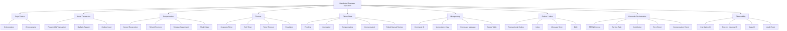

---

# 3. Decomposition Map - Practical Categories / Domain / Skills

| No | Area | Fokus Praktis | Implementasi Java/Jersey/MyBatis/Camunda | Output yang Harus Ada |
|---:|---|---|---|---|
| 1 | **Distributed Transaction Boundary** | Menentukan proses bisnis yang melewati banyak service | Command API + Saga process | Transaction boundary map |
| 2 | **Local Transaction** | Setiap step commit hanya DB service sendiri | MyBatis transaction + PostgreSQL | Local transaction template |
| 3 | **Saga Pattern** | Mengelola sequence local transactions | Camunda BPMN atau event choreography | Saga definition |
| 4 | **Orchestration Saga** | Satu coordinator mengatur step | Camunda process instance | BPMN model |
| 5 | **Choreography Saga** | Service bereaksi via event tanpa coordinator pusat | RabbitMQ events + consumers | Event flow map |
| 6 | **Compensation** | Logical undo untuk step yang sudah sukses | Cancel/reverse command | Compensation catalog |
| 7 | **Timeout Handling** | Step tidak boleh menunggu selamanya | BPMN timer boundary / worker timeout | Timeout policy |
| 8 | **Business Error Handling** | Error domain yang bisa dimodelkan | BPMN error event / domain exception | Business error catalog |
| 9 | **Technical Failure Handling** | Timeout, network error, DB down, external API down | retry, incident, DLQ | Failure handling matrix |
| 10 | **Saga State** | Menyimpan status distributed operation | Camunda process state atau saga table | Saga state model |
| 11 | **Idempotent Command** | Step aman dipanggil ulang | `command_id`, `idempotency_key` | Idempotency table |
| 12 | **Outbox Pattern** | Local data update + event intent atomic | `outbox_event` table | Reliable event publishing |
| 13 | **Inbox Pattern** | Consumer aman dari duplicate message | `processed_message` table | Duplicate-safe consumer |
| 14 | **Retry Policy** | Retry untuk transient failure saja | worker retry/backoff | Retry matrix |
| 15 | **Failure State Design** | Jangan hanya sukses/gagal | `PENDING`, `FAILED_RETRYABLE`, `COMPENSATING`, etc. | State machine |
| 16 | **Manual Recovery** | Incident butuh operator action | Camunda Operate/Cockpit/runbook | Recovery runbook |
| 17 | **Auditability** | Trace who/what/why/when | audit table + event + process variable | Audit trail |
| 18 | **Observability** | Correlate request, saga, process, message | correlation ID, saga ID, trace ID | Dashboard/logging |
| 19 | **Testing** | Test happy path, failure, timeout, compensation, duplicate | integration test + fake workers | Saga test suite |
| 20 | **Governance** | Menentukan kapan pakai Saga vs simple event | decision matrix | Architecture rule |

---

# 4. Kapan Butuh Saga?

Saga diperlukan saat satu business operation melibatkan beberapa service dan tidak bisa diselesaikan dalam satu local transaction.

## Contoh

```text
Submit enforcement decision:
  1. Validate case state
  2. Reserve enforcement number
  3. Generate decision document
  4. Submit approval
  5. Notify officer
  6. Update audit trail
```

Jika step 3 gagal setelah step 1 dan 2 sukses, sistem perlu tahu:

```text
Apakah reservation harus dibatalkan?
Apakah case status harus dikembalikan?
Apakah officer perlu diberi notifikasi failure?
Apakah audit harus mencatat failed attempt?
Apakah proses boleh retry?
Apakah perlu manual review?
```

## Saga Cocok Jika

| Sinyal | Contoh |
|---|---|
| Operasi melewati banyak service | case + document + decision + notification |
| Proses long-running | approval, investigation, external submission |
| Ada step yang bisa gagal setelah step sebelumnya commit | document generated, payment failed |
| Butuh compensation | cancel reservation, refund, release assignment |
| Butuh timeout/escalation | SLA approval lewat 3 hari |
| Butuh human task/manual review | compliance exception |
| Butuh audit trace end-to-end | regulatory defensibility |

## Saga Tidak Perlu Jika

| Sinyal | Alternatif |
|---|---|
| Semua data ada dalam satu service | Local transaction cukup |
| Side effect non-critical | Async event + retry cukup |
| Query/read-only composition | BFF/API composition |
| Command hanya satu service | Local transaction + outbox |
| Workflow terlalu sederhana | Jangan over-engineer dengan BPMN |

---

# 5. Orchestration vs Choreography

## 5.1 Orchestration Saga

Ada coordinator yang mengatur alur.

```text
Camunda Process:
  Start
  → Validate Case
  → Reserve Enforcement Number
  → Generate Document
  → Submit Approval
  → Notify
  → End
```

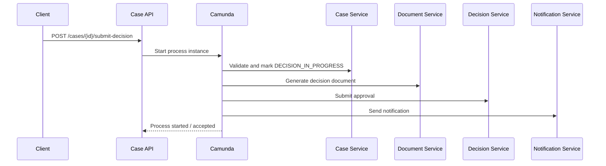

### Kelebihan

| Kelebihan | Penjelasan |
|---|---|
| Flow eksplisit | BPMN mudah dibaca |
| Cocok long-running process | Approval, escalation, timeout |
| Failure state terlihat | Incident/process state jelas |
| Mudah audit | Process instance history |
| Cocok untuk human task | Manual review/approval |
| Compensation bisa dimodelkan | BPMN compensation/error/timer |

### Kekurangan

| Kekurangan | Penjelasan |
|---|---|
| Coordinator menjadi dependency penting | Camunda availability penting |
| Model bisa terlalu kompleks | BPMN bisa jadi spaghetti |
| Perlu governance workflow | Versioning BPMN/process |
| Worker harus idempotent | Job bisa retry/redeliver |
| Boundary tetap harus dijaga | Camunda bukan tempat semua domain rule |

---

## 5.2 Choreography Saga

Tidak ada coordinator pusat. Service publish event, service lain bereaksi.

```text
CaseSubmitted
  → document-service generates document
  → DocumentGenerated
      → decision-service submits approval
      → ApprovalSubmitted
          → notification-service notifies actor
```

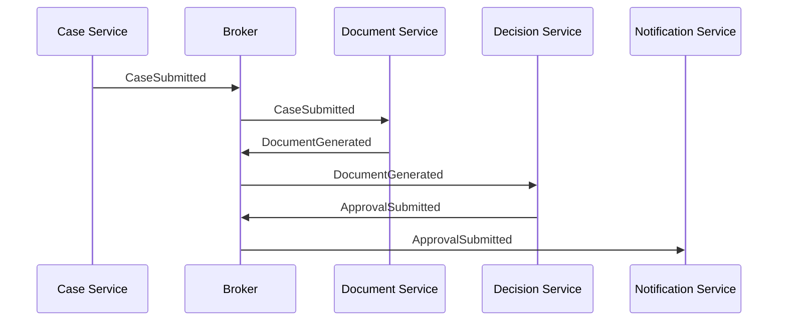

### Kelebihan

| Kelebihan | Penjelasan |
|---|---|
| Loose coupling | Publisher tidak tahu semua consumer |
| Tidak ada central coordinator | Lebih decentralized |
| Cocok event-driven ecosystem | Banyak consumer |
| Service autonomy kuat | Tiap service bereaksi sendiri |

### Kekurangan

| Kekurangan | Penjelasan |
|---|---|
| Flow sulit dilihat | Perlu event tracing bagus |
| Failure handling tersebar | Compensation sulit dilacak |
| Debug end-to-end lebih sulit | Butuh correlation ID kuat |
| Mudah event chaos | Event catalog wajib |
| Tidak ideal untuk approval/human workflow kompleks | Orchestration lebih jelas |

---

## 5.3 Decision Matrix

| Kriteria | Orchestration / Camunda | Choreography / Events |
|---|---|---|
| Long-running workflow | Sangat cocok | Bisa, tapi lebih sulit |
| Human task / approval | Sangat cocok | Tidak ideal |
| SLA timeout/escalation | Sangat cocok | Perlu custom scheduler |
| Flow perlu divisualkan | Sangat cocok | Sulit |
| Banyak independent consumers | Bisa, tapi bukan fokus utama | Sangat cocok |
| Domain event fan-out | Bisa | Sangat cocok |
| Compensation kompleks | Lebih mudah dimodelkan | Sulit tersebar |
| Team autonomy tinggi | Medium | Tinggi |
| Debugging | Process instance membantu | Butuh tracing/event log |
| Governance | BPMN/process governance | Event contract governance |

---

# 6. Contoh Domain: Enforcement Decision Saga

## Use Case

```text
Submit enforcement decision for a case.
```

## Steps

| Step | Service | Local Transaction | Compensation |
|---:|---|---|---|
| 1 | case-management-service | Mark case `DECISION_IN_PROGRESS` | Restore previous status |
| 2 | numbering-service | Reserve enforcement number | Release number reservation |
| 3 | document-service | Generate decision document | Mark document void/cancel |
| 4 | decision-service | Create decision approval record | Cancel approval |
| 5 | notification-service | Send notification | Usually no compensation; maybe send correction |
| 6 | audit-service | Append audit event | Usually append-only; no delete |

Important: audit biasanya **tidak dikompensasi dengan delete**. Audit event justru mencatat bahwa saga gagal/compensated.

---

# 7. Saga State Model

Jangan desain state hanya `SUCCESS/FAILED`.

## 7.1 Recommended State

```text
STARTED
VALIDATING_CASE
CASE_MARKED_IN_PROGRESS
NUMBER_RESERVED
DOCUMENT_GENERATED
APPROVAL_SUBMITTED
NOTIFICATION_SENT
COMPLETED

FAILED_RETRYABLE
FAILED_BUSINESS
COMPENSATING
COMPENSATED
COMPENSATION_FAILED
MANUAL_REVIEW_REQUIRED
CANCELLED
```

## 7.2 Saga State Table jika Tidak Mengandalkan Camunda Saja

Jika memakai Camunda, process state sudah ada di engine. Tetapi sering tetap berguna punya local business saga table untuk query cepat/audit integration.

```sql
CREATE TABLE case_management.decision_submission_saga (
    saga_id             UUID PRIMARY KEY,
    case_id             UUID NOT NULL,
    process_instance_id VARCHAR(100) NULL,
    status              VARCHAR(50) NOT NULL,
    current_step        VARCHAR(100) NOT NULL,
    previous_case_status VARCHAR(50) NULL,

    enforcement_number  VARCHAR(100) NULL,
    document_id         UUID NULL,
    decision_id         UUID NULL,

    retry_count         INTEGER NOT NULL DEFAULT 0,
    last_error_code     VARCHAR(100) NULL,
    last_error_message  TEXT NULL,

    started_by          UUID NOT NULL,
    started_at          TIMESTAMPTZ NOT NULL DEFAULT now(),
    updated_at          TIMESTAMPTZ NOT NULL DEFAULT now(),
    completed_at        TIMESTAMPTZ NULL
);

CREATE INDEX idx_decision_saga_case
ON case_management.decision_submission_saga (case_id);

CREATE INDEX idx_decision_saga_status
ON case_management.decision_submission_saga (status);
```

---

# 8. Jersey API untuk Memulai Saga

Untuk proses long-running, jangan selalu return `200 OK` seolah selesai. Biasanya lebih benar return `202 Accepted`.

```java
@Path("/cases/{caseId}/decision-submissions")
@Produces(MediaType.APPLICATION_JSON)
@Consumes(MediaType.APPLICATION_JSON)
public class DecisionSubmissionResource {

    private final DecisionSubmissionApplicationService applicationService;

    public DecisionSubmissionResource(
        DecisionSubmissionApplicationService applicationService
    ) {
        this.applicationService = applicationService;
    }

    @POST
    public Response submitDecision(
        @PathParam("caseId") UUID caseId,
        @Valid SubmitDecisionRequest request,
        @Context SecurityContext securityContext,
        @HeaderParam("Idempotency-Key") String idempotencyKey,
        @Context UriInfo uriInfo
    ) {
        String actorId = securityContext.getUserPrincipal().getName();

        DecisionSubmissionAccepted response =
            applicationService.startDecisionSubmission(
                caseId,
                request,
                actorId,
                idempotencyKey
            );

        URI location = uriInfo.getBaseUriBuilder()
            .path("/cases/{caseId}/decision-submissions/{sagaId}")
            .resolveTemplate("caseId", caseId)
            .resolveTemplate("sagaId", response.sagaId())
            .build();

        return Response.accepted(response)
            .location(location)
            .build();
    }

    @GET
    @Path("/{sagaId}")
    public Response getSubmissionStatus(
        @PathParam("caseId") UUID caseId,
        @PathParam("sagaId") UUID sagaId
    ) {
        DecisionSubmissionStatusResponse response =
            applicationService.getStatus(caseId, sagaId);

        return Response.ok(response).build();
    }
}
```

Response:

```json
{
  "sagaId": "0d7f37ed-bc2b-4b77-a25c-14694be218da",
  "caseId": "9cc9c5e3-8d7b-4c74-b3f9-11fcf49b6a61",
  "status": "STARTED",
  "statusUrl": "/cases/9cc9c5e3-8d7b-4c74-b3f9-11fcf49b6a61/decision-submissions/0d7f37ed-bc2b-4b77-a25c-14694be218da"
}
```

---

# 9. Start Saga Application Service

```java
public class DecisionSubmissionApplicationService {

    private final TransactionTemplate transactionTemplate;
    private final CamundaProcessClient camundaProcessClient;
    private final IdempotencyRepository idempotencyRepository;

    public DecisionSubmissionAccepted startDecisionSubmission(
        UUID caseId,
        SubmitDecisionRequest request,
        String actorId,
        String idempotencyKey
    ) {
        return transactionTemplate.execute(session -> {
            IdempotencyRecord existing =
                idempotencyRepository.find(session, idempotencyKey);

            if (existing != null) {
                return existing.responseAs(DecisionSubmissionAccepted.class);
            }

            CaseMapper caseMapper = session.getMapper(CaseMapper.class);
            DecisionSubmissionSagaMapper sagaMapper =
                session.getMapper(DecisionSubmissionSagaMapper.class);

            CaseRecord caseRecord = caseMapper.findByIdForUpdate(caseId);
            if (caseRecord == null) {
                throw new CaseNotFoundException(caseId);
            }

            if (!caseRecord.canSubmitDecision()) {
                throw new InvalidCaseStateException(caseId, caseRecord.status());
            }

            UUID sagaId = UUID.randomUUID();

            sagaMapper.insert(new DecisionSubmissionSagaRecord(
                sagaId,
                caseId,
                null,
                "STARTED",
                "START",
                caseRecord.status(),
                null,
                null,
                null,
                0,
                null,
                null,
                UUID.fromString(actorId),
                OffsetDateTime.now(ZoneOffset.UTC),
                OffsetDateTime.now(ZoneOffset.UTC),
                null
            ));

            DecisionSubmissionAccepted accepted =
                new DecisionSubmissionAccepted(
                    sagaId,
                    caseId,
                    "STARTED",
                    "/cases/" + caseId + "/decision-submissions/" + sagaId
                );

            idempotencyRepository.save(
                session,
                idempotencyKey,
                hash(request),
                202,
                accepted,
                actorId
            );

            return accepted;
        }).also(accepted -> {
            camundaProcessClient.startDecisionSubmissionProcess(
                accepted.sagaId(),
                caseId,
                actorId,
                request
            );
        });
    }
}
```

Catatan praktis: jangan abaikan failure saat start Camunda process setelah DB commit. Untuk production-grade, ada dua pilihan lebih kuat:

| Pattern | Penjelasan |
|---|---|
| Start Camunda dulu lalu simpan saga | Bisa punya process tanpa local saga jika DB gagal |
| Simpan saga + outbox command `StartProcess` | Lebih reliable; worker memulai process dari outbox |
| Simpan saga lalu start process sync dengan retry | Simpler, tapi butuh recovery job untuk saga `STARTED` tanpa process |

Rekomendasi: untuk sistem kritikal, gunakan **outbox command untuk start process** atau recovery scanner.

---

# 10. Camunda BPMN Orchestration Model

Contoh BPMN conceptual:

```text
Start
  → Mark Case In Progress
  → Reserve Enforcement Number
  → Generate Decision Document
  → Submit Approval
  → Notify Officer
  → Mark Saga Completed
End

Failure path:
  → Compensation / manual review
```

```mermaid
flowchart LR
    A[Start Decision Submission] --> B[Mark Case In Progress]
    B --> C[Reserve Enforcement Number]
    C --> D[Generate Decision Document]
    D --> E[Submit Approval]
    E --> F[Notify Officer]
    F --> G[Mark Completed]

    C -->|Business Error| X[Compensate Case]
    D -->|Technical Failure Exhausted| Y[Manual Review]
    E -->|Rejected| Z[Compensate Number + Document + Case]

    X --> M[Mark Compensated]
    Y --> N[Incident / Manual Recovery]
    Z --> M
```

## BPMN Element yang Umum Dipakai

| BPMN Element | Use Case |
|---|---|
| Service Task | Call microservice worker/API |
| External Task / Job Worker | Worker Java mengambil job |
| Error Boundary Event | Business error seperti invalid state/rejected |
| Timer Boundary Event | Timeout approval/SLA |
| Compensation Event | Undo step yang sudah selesai |
| Event Subprocess | Global cancel/error handling |
| Exclusive Gateway | Branch berdasarkan result |
| Parallel Gateway | Step bisa jalan paralel |
| User Task | Manual review/approval |
| Message Event | Menunggu callback/external event |

Camunda 8 job worker documentation menjelaskan bahwa jika external system sedang down, retry langsung bisa tidak berhasil dan dapat berujung incident ketika retries habis; dokumentasi juga membahas penggunaan retry backoff. ([Camunda 8 Docs](https://docs.camunda.io/docs/components/concepts/job-workers/?utm_source=chatgpt.com))

---

# 11. Camunda Worker Pattern

## 11.1 Worker Contract

Worker sebaiknya:

```text
- idempotent
- punya timeout jelas
- tidak menahan DB transaction lama
- map business error ke BPMN error
- map technical error ke retry/failure
- mencatat sagaId/processInstanceId/correlationId
```

## 11.2 Camunda 8 Java Worker Example

Konseptual:

```java
public class MarkCaseInProgressWorker {

    private final CaseCommandClient caseCommandClient;

    public void register(ZeebeClient client) {
        client.newWorker()
            .jobType("mark-case-in-progress")
            .handler((jobClient, job) -> {
                Map<String, Object> variables = job.getVariablesAsMap();

                UUID sagaId = UUID.fromString((String) variables.get("sagaId"));
                UUID caseId = UUID.fromString((String) variables.get("caseId"));
                String actorId = (String) variables.get("actorId");

                try {
                    MarkCaseResult result =
                        caseCommandClient.markDecisionInProgress(
                            sagaId,
                            caseId,
                            actorId
                        );

                    jobClient.newCompleteCommand(job.getKey())
                        .variables(Map.of(
                            "previousCaseStatus", result.previousStatus(),
                            "caseStatus", result.currentStatus()
                        ))
                        .send()
                        .join();

                } catch (BusinessRuleViolationException e) {
                    jobClient.newThrowErrorCommand(job.getKey())
                        .errorCode("INVALID_CASE_STATE")
                        .errorMessage(e.getMessage())
                        .send()
                        .join();

                } catch (Exception e) {
                    jobClient.newFailCommand(job.getKey())
                        .retries(job.getRetries() - 1)
                        .errorMessage(e.getMessage())
                        .send()
                        .join();
                }
            })
            .name("mark-case-in-progress-worker")
            .open();
    }
}
```

Important distinction:

| Failure Type | Worker Action | BPMN Handling |
|---|---|---|
| Business error | Throw BPMN error | Boundary error / modeled path |
| Technical transient error | Fail job with retries | Retry/backoff/incident |
| Permanent technical issue | Fail job to incident/manual recovery | Operate/Cockpit/manual fix |
| Duplicate command | Return existing result | Complete job |

---

# 12. Idempotent Worker

Camunda job bisa retry. Network bisa timeout setelah downstream already committed. Karena itu worker harus idempotent.

## 12.1 Command Table

```sql
CREATE TABLE case_management.processed_command (
    command_id       UUID PRIMARY KEY,
    command_type     VARCHAR(100) NOT NULL,
    aggregate_id     UUID NOT NULL,
    request_hash     VARCHAR(128) NOT NULL,
    response_payload JSONB NOT NULL,
    created_at       TIMESTAMPTZ NOT NULL DEFAULT now()
);
```

## 12.2 Idempotent Command Handler

```java
public MarkCaseResult markDecisionInProgress(
    UUID commandId,
    UUID caseId,
    String actorId
) {
    return transactionTemplate.execute(session -> {
        ProcessedCommandMapper commandMapper =
            session.getMapper(ProcessedCommandMapper.class);

        ProcessedCommandRecord existing = commandMapper.findById(commandId);
        if (existing != null) {
            return existing.responseAs(MarkCaseResult.class);
        }

        CaseMapper caseMapper = session.getMapper(CaseMapper.class);
        CaseRecord record = caseMapper.findByIdForUpdate(caseId);

        if (record == null) {
            throw new CaseNotFoundException(caseId);
        }

        String previousStatus = record.status();

        if ("DECISION_IN_PROGRESS".equals(record.status())) {
            MarkCaseResult result = new MarkCaseResult(
                caseId,
                previousStatus,
                record.status()
            );

            commandMapper.insert(commandId, "MARK_CASE_IN_PROGRESS", caseId, result);
            return result;
        }

        if (!record.canMoveToDecisionInProgress()) {
            throw new InvalidCaseStateException(caseId, record.status());
        }

        caseMapper.updateStatus(caseId, "DECISION_IN_PROGRESS");

        MarkCaseResult result = new MarkCaseResult(
            caseId,
            previousStatus,
            "DECISION_IN_PROGRESS"
        );

        commandMapper.insert(commandId, "MARK_CASE_IN_PROGRESS", caseId, result);

        return result;
    });
}
```

Rule:

```text
Setiap worker step yang punya side effect harus punya command ID/idempotency key.
```

---

# 13. Compensation Design

Compensation bukan selalu “undo sempurna”. Dalam banyak domain, compensation adalah **aksi bisnis lanjutan** untuk membawa sistem ke state yang acceptable.

Camunda 8 docs menyebut compensation events membantu membalik langkah yang sudah selesai ketika hasilnya tidak lagi diinginkan dan perlu direverse. ([Camunda 8 Docs](https://docs.camunda.io/docs/components/modeler/bpmn/compensation-events/?utm_source=chatgpt.com))

## 13.1 Compensation Catalog

| Forward Step | Compensation | Catatan |
|---|---|---|
| Mark case `DECISION_IN_PROGRESS` | Restore previous case status | Hanya jika belum ada perubahan lain |
| Reserve number | Release reservation | Jika number belum finalized |
| Generate document | Void/cancel document | Jangan delete jika audit perlu |
| Submit approval | Cancel approval request | Jika belum approved |
| Send notification | Send correction notification | Email tidak bisa “di-delete” dari penerima |
| Append audit | Append compensation audit | Jangan hapus audit |

## 13.2 Compensation Endpoint

```java
@Path("/internal/cases/{caseId}/decision-submission-compensation")
@Produces(MediaType.APPLICATION_JSON)
@Consumes(MediaType.APPLICATION_JSON)
public class DecisionSubmissionCompensationResource {

    private final CaseCompensationService compensationService;

    @POST
    public Response compensateCaseDecisionSubmission(
        @PathParam("caseId") UUID caseId,
        @Valid CompensateCaseDecisionSubmissionRequest request
    ) {
        CompensationResult result =
            compensationService.compensateDecisionSubmission(caseId, request);

        return Response.ok(result).build();
    }
}
```

Request:

```java
public record CompensateCaseDecisionSubmissionRequest(
    UUID sagaId,
    String reasonCode,
    String previousStatus,
    String compensationCommandId
) {}
```

## 13.3 Compensation Service

```java
public class CaseCompensationService {

    private final TransactionTemplate transactionTemplate;

    public CompensationResult compensateDecisionSubmission(
        UUID caseId,
        CompensateCaseDecisionSubmissionRequest request
    ) {
        return transactionTemplate.execute(session -> {
            ProcessedCommandMapper commandMapper =
                session.getMapper(ProcessedCommandMapper.class);

            UUID commandId = UUID.fromString(request.compensationCommandId());

            ProcessedCommandRecord existing = commandMapper.findById(commandId);
            if (existing != null) {
                return existing.responseAs(CompensationResult.class);
            }

            CaseMapper caseMapper = session.getMapper(CaseMapper.class);
            CaseRecord record = caseMapper.findByIdForUpdate(caseId);

            if (record == null) {
                throw new CaseNotFoundException(caseId);
            }

            if ("DECISION_IN_PROGRESS".equals(record.status())) {
                caseMapper.updateStatus(caseId, request.previousStatus());
            }

            caseMapper.insertStatusHistory(
                CaseStatusHistoryRecord.compensated(
                    caseId,
                    record.status(),
                    request.previousStatus(),
                    request.reasonCode()
                )
            );

            CompensationResult result =
                new CompensationResult(caseId, "COMPENSATED");

            commandMapper.insert(
                commandId,
                "COMPENSATE_DECISION_SUBMISSION",
                caseId,
                result
            );

            return result;
        });
    }
}
```

---

# 14. Compensation Caveats

| Caveat | Penjelasan |
|---|---|
| Compensation tidak selalu mengembalikan dunia ke kondisi semula | Email sudah terkirim, external system sudah melihat request |
| Compensation harus idempotent | Bisa dipanggil ulang |
| Compensation harus punya audit trail | Jangan delete history |
| Compensation bisa gagal | Perlu `COMPENSATION_FAILED` / manual review |
| Compensation order penting | Reverse dependency order |
| Compensation tidak boleh melanggar rule baru | State bisa berubah sejak step awal |
| Beberapa step tidak boleh dikompensasi otomatis | Regulatory decision mungkin perlu manual review |

Practical rule:

```text
Jangan desain compensation sebagai SQL rollback.
Desain compensation sebagai business action.
```

---

# 15. Timeout Handling

Timeout ada beberapa jenis.

| Timeout Type | Contoh | Handling |
|---|---|---|
| HTTP timeout | service call > 2s | retry/fail job |
| Worker timeout | job tidak selesai | retry/incident |
| Business timeout | approval lewat 3 hari | escalation |
| SLA timeout | case tidak ditindaklanjuti | notify/escalate |
| External callback timeout | partner tidak callback | cancel/manual review |
| Compensation timeout | compensation stuck | manual intervention |

Camunda timer events digunakan untuk time-based behavior. Non-interrupting boundary timer bisa dipakai untuk notifikasi jika processing terlalu lama, sedangkan interrupting timer bisa mengalihkan flow saat activity melewati batas waktu. ([Camunda 8 Docs](https://docs.camunda.io/docs/components/modeler/bpmn/timer-events/?utm_source=chatgpt.com))

## 15.1 BPMN Timer Example

```text
Submit Approval
  boundary timer: PT72H
    → Escalate to Supervisor
```

```mermaid
flowchart LR
    A[Submit Approval] --> B[Wait for Approval]
    B --> C[Approved]
    B -->|Timer 72h| D[Escalate to Supervisor]
    D --> E[Manual Review]
```

## 15.2 Practical Timeout Policy

| Step | Timeout | Failure Action |
|---|---:|---|
| Mark case in progress | 2s | retry technical |
| Reserve number | 3s | retry then compensate |
| Generate document | 30s | retry async / incident |
| Submit approval | 5s API call, 72h business wait | BPMN timer escalation |
| Notify | 5s | async retry, no rollback |
| Compensation | 10s per command | retry/manual review |

---

# 16. Business Error vs Technical Error

Jangan semua exception diperlakukan sama.

## 16.1 Business Error

Business error berarti proses bisa memilih jalur bisnis lain.

Contoh:

```text
INVALID_CASE_STATE
APPROVAL_REJECTED
DOCUMENT_TEMPLATE_NOT_FOUND
NUMBER_RESERVATION_REJECTED
INSUFFICIENT_PERMISSION
```

Handling:

```text
Throw BPMN error
→ Boundary Error Event
→ Modeled business path
```

Camunda error events digunakan untuk mendefinisikan dan menangkap error BPMN dalam process model. ([Camunda 8 Docs](https://docs.camunda.io/docs/components/modeler/bpmn/error-events/?utm_source=chatgpt.com))

## 16.2 Technical Error

Technical error berarti sistem gagal menjalankan step.

Contoh:

```text
HTTP timeout
DB unavailable
broker unavailable
external API 503
serialization error
worker crash
```

Handling:

```text
Retry with backoff
→ if exhausted, incident / DLQ / manual recovery
```

## 16.3 Decision Table

| Error | Type | BPMN/Worker Action |
|---|---|---|
| Case not found | Business or data integrity issue | BPMN error / fail command |
| Invalid state | Business | BPMN error |
| Approval rejected | Business | BPMN error path |
| HTTP 503 | Technical transient | fail job with retry |
| DB deadlock | Technical transient | retry |
| Invalid event payload | Technical/permanent | DLQ/manual |
| Unknown process variable | Technical bug | incident |
| Compensation failed | Technical/business mixed | retry then manual review |

---

# 17. Failure State Design

## 17.1 Bad State Model

```text
SUCCESS
FAILED
```

Terlalu miskin. Operator tidak tahu apa yang terjadi.

## 17.2 Better State Model

```text
STARTED
STEP_IN_PROGRESS
WAITING_EXTERNAL_CALLBACK
WAITING_APPROVAL
FAILED_RETRYABLE
FAILED_BUSINESS
COMPENSATING
COMPENSATED
COMPENSATION_FAILED
MANUAL_REVIEW_REQUIRED
COMPLETED
CANCELLED
```

## 17.3 Failure Table

```sql
CREATE TABLE case_management.saga_failure_event (
    failure_id       UUID PRIMARY KEY,
    saga_id          UUID NOT NULL,
    case_id          UUID NOT NULL,
    step_name        VARCHAR(100) NOT NULL,
    failure_type     VARCHAR(50) NOT NULL,
    error_code       VARCHAR(100) NOT NULL,
    error_message    TEXT NULL,
    retryable        BOOLEAN NOT NULL,
    occurred_at      TIMESTAMPTZ NOT NULL DEFAULT now(),
    resolved_at      TIMESTAMPTZ NULL
);
```

---

# 18. Outbox + Saga

Saga step sering perlu publish event. Jangan publish event langsung tanpa outbox.

## Example

Dalam local transaction:

```text
decision-service:
  insert decision record
  insert outbox event DecisionSubmitted
  commit
```

Outbox publisher:

```text
publish DecisionSubmitted
mark outbox PUBLISHED
```

Saga/Camunda bisa melanjutkan via:

| Model | Penjelasan |
|---|---|
| Worker completes job after local transaction | Simple orchestration |
| Service publishes event, Camunda catches message | Event-driven orchestration |
| Outbox event triggers next choreographed step | Choreography |

Rule:

```text
Jika local transaction menghasilkan event penting,
event intent harus ditulis dalam transaksi yang sama.
```

---

# 19. Inbox + Saga Consumer

Jika saga step dipicu oleh message/event, consumer harus idempotent.

```sql
CREATE TABLE decisioning.processed_message (
    message_id       UUID NOT NULL,
    consumer_name    VARCHAR(150) NOT NULL,
    processed_at     TIMESTAMPTZ NOT NULL DEFAULT now(),
    PRIMARY KEY (message_id, consumer_name)
);
```

Consumer flow:

```text
receive message
check processed_message
begin transaction
  apply local change
  insert processed_message
  insert outbox event if needed
commit
ack message
```

---

# 20. Camunda Process Variables

Jangan masukkan payload terlalu besar atau data sensitif berlebihan ke process variables.

## Recommended Variables

```json
{
  "sagaId": "0d7f37ed-bc2b-4b77-a25c-14694be218da",
  "caseId": "9cc9c5e3-8d7b-4c74-b3f9-11fcf49b6a61",
  "actorId": "user-123",
  "correlationId": "2a4c4f2c-7798-455a-8270-961f0a1e0ed4",
  "previousCaseStatus": "UNDER_INVESTIGATION",
  "enforcementNumber": "ENF-2026-000123",
  "documentId": "b579d39a-9f5e-4ec6-a5c1-d690e35ab9ef",
  "decisionId": "ad3e20f5-d8b3-4aac-b518-dfd3f0b41abf"
}
```

## Avoid

| Jangan Taruh di Variable | Alasan |
|---|---|
| Full document content | besar/sensitif |
| secret/token | security risk |
| PII berlebihan | compliance risk |
| full domain aggregate | coupling |
| raw external payload besar | storage/debug risk |

Rule:

```text
Process variable sebaiknya reference dan state penting,
bukan dump seluruh payload bisnis.
```

---

# 21. Saga API Status Endpoint

Status endpoint penting untuk proses async.

```java
public record DecisionSubmissionStatusResponse(
    UUID sagaId,
    UUID caseId,
    String status,
    String currentStep,
    String failureCode,
    String failureMessage,
    OffsetDateTime startedAt,
    OffsetDateTime updatedAt,
    OffsetDateTime completedAt
) {}
```

Example response:

```json
{
  "sagaId": "0d7f37ed-bc2b-4b77-a25c-14694be218da",
  "caseId": "9cc9c5e3-8d7b-4c74-b3f9-11fcf49b6a61",
  "status": "WAITING_APPROVAL",
  "currentStep": "SUBMIT_APPROVAL",
  "failureCode": null,
  "failureMessage": null,
  "startedAt": "2026-07-14T10:00:00Z",
  "updatedAt": "2026-07-14T10:03:00Z",
  "completedAt": null
}
```

---

# 22. Manual Recovery Pattern

Tidak semua failure harus otomatis.

## Manual Recovery Cocok Jika

| Kondisi | Contoh |
|---|---|
| Compensation gagal | document void API down |
| Data conflict | case sudah berubah oleh user lain |
| External system inconsistent | partner accepted tapi callback hilang |
| Regulatory decision ambiguous | perlu officer review |
| Retry exhausted | technical issue butuh operator |
| Duplicate uncertain | tidak yakin side effect sudah terjadi |

## Manual Recovery Action

| Action | Contoh |
|---|---|
| Retry step | retry generate document |
| Skip step | notification boleh diskip |
| Compensate | cancel approval |
| Force complete | external already completed |
| Mark manual review | officer investigation |
| Cancel saga | business cancelled |
| Replay message | event lost/retry |

## Runbook Minimal

```text
Saga Recovery Runbook

1. Identify sagaId and processInstanceId.
2. Check current step.
3. Check last error type:
   - business
   - technical
   - timeout
   - compensation
4. Check local service records.
5. Check outbox/inbox/message status.
6. Check downstream side effect:
   - document generated?
   - number reserved?
   - approval submitted?
7. Choose recovery action:
   - retry
   - compensate
   - manual review
   - force complete
8. Append audit event.
9. Monitor process completion.
```

---

# 23. Observability

Distributed transaction tanpa observability akan sulit dioperasikan.

## 23.1 Correlation Keys

| Key | Fungsi |
|---|---|
| `correlationId` | request/business flow tracing |
| `sagaId` | distributed transaction ID |
| `processInstanceId` | Camunda process instance |
| `businessKey` | domain identifier, misalnya `caseId` |
| `messageId` | event/message dedup |
| `commandId` | idempotent command |
| `traceId` | distributed tracing |

## 23.2 Logs

```json
{
  "event": "saga_step_completed",
  "sagaId": "0d7f37ed-bc2b-4b77-a25c-14694be218da",
  "processInstanceId": "2251799813685251",
  "caseId": "9cc9c5e3-8d7b-4c74-b3f9-11fcf49b6a61",
  "step": "GENERATE_DOCUMENT",
  "status": "COMPLETED",
  "durationMs": 1240,
  "correlationId": "2a4c4f2c-7798-455a-8270-961f0a1e0ed4"
}
```

## 23.3 Metrics

| Metric | Tujuan |
|---|---|
| `saga_started_total` | volume |
| `saga_completed_total` | success |
| `saga_failed_total` | failure |
| `saga_compensated_total` | compensation count |
| `saga_compensation_failed_total` | severe failure |
| `saga_duration_seconds` | end-to-end latency |
| `saga_step_duration_seconds` | step latency |
| `saga_step_retry_total` | retry pressure |
| `saga_manual_review_total` | manual workload |
| `camunda_incident_total` | process incidents |
| `outbox_pending_total` | event publish backlog |

---

# 24. Testing Strategy

## 24.1 Test Matrix

| Test Case | Expected |
|---|---|
| Happy path | all steps completed |
| Step 2 business failure | step 1 compensated |
| Step 3 technical timeout then retry success | saga completed |
| Step 3 retry exhausted | incident/manual review |
| Step 4 rejected | compensation steps executed |
| Compensation fails | `COMPENSATION_FAILED` |
| Duplicate worker execution | idempotent same result |
| Duplicate event | inbox skips duplicate |
| Outbox publisher down | local transaction still committed |
| Process restart | saga resumes |
| Callback arrives late | handled idempotently |
| User cancels saga | active step canceled/compensated |

## 24.2 Integration Test Shape

```text
Start test PostgreSQL
Start test broker if needed
Start Camunda test environment or mock process client
Start fake downstream services
POST /cases/{id}/decision-submissions
Assert:
  saga row created
  process started
  step commands executed
  outbox events written
  compensation executed on injected failure
  status endpoint shows expected state
```

## 24.3 Worker Idempotency Test

```text
Given commandId X already processed
When worker receives same job again
Then service returns stored result
And does not duplicate side effect
```

---

# 25. Practical Anti-Patterns

| Anti-Pattern | Gejala | Dampak | Perbaikan |
|---|---|---|---|
| Distributed DB Transaction | Service update banyak DB/schema | tight coupling | Saga/local transaction |
| No Compensation | Step gagal setelah prior commit | stuck/inconsistent | compensation catalog |
| Compensation = DELETE | Menghapus history | audit hilang | append compensating action |
| Worker Not Idempotent | Retry double side effect | duplicate document/payment/email | command ID/idempotency |
| Business Error Treated as Technical Retry | Invalid state diretry terus | incident noise | BPMN error path |
| Technical Error Treated as Business Failure | transient timeout langsung compensate | unnecessary rollback | retry/backoff |
| No Timeout | Process menunggu selamanya | stuck workflow | boundary timer/SLA |
| No Manual Recovery | retry exhausted tidak bisa diperbaiki | stuck incident | runbook/admin action |
| Saga State Too Simple | hanya failed/success | operator bingung | detailed failure states |
| Camunda Holds Domain Logic | BPMN penuh business rule detail | domain leak | rule tetap di service owner |
| Process Variables Too Large | payload besar/sensitif | performance/security risk | store IDs/references |
| No Correlation ID | debug mustahil | MTTR tinggi | propagate sagaId/correlationId |
| Notification Compensation | mencoba “unsend email” | tidak realistis | send correction if needed |
| No Outbox | data commit event hilang | inconsistent downstream | transactional outbox |

---

# 26. Practical Checklist

| Area | Checklist |
|---|---|
| Saga need | Proses memang lintas-service/long-running |
| Boundary | Setiap step adalah local transaction |
| Orchestration/choreography | Pattern dipilih sadar |
| BPMN | Flow, error, timer, compensation jelas |
| Compensation | Ada catalog per step |
| Idempotency | Setiap command punya command ID |
| Outbox | Event/command penting reliable |
| Inbox | Consumer duplicate-safe |
| Timeout | Technical dan business timeout dipisah |
| Retry | Retry hanya transient failure |
| Business error | Dimodelkan sebagai BPMN/domain error |
| Failure state | State cukup detail untuk recovery |
| Manual recovery | Runbook dan admin action tersedia |
| Audit | Semua step/failure/compensation tercatat |
| Observability | sagaId/processInstanceId/correlationId |
| Test | Happy path, failure, retry, compensation, duplicate |
| Security | Process variable tidak bocor secret/PII |

---

# 27. Decision Matrix

| Pertanyaan | Jika Ya | Jika Tidak |
|---|---|---|
| Operasi hanya satu service? | Local transaction | Saga mungkin perlu |
| Operasi lintas banyak service? | Saga | Event biasa cukup |
| Ada human approval/timeout/escalation? | Camunda orchestration | Choreography mungkin cukup |
| Flow perlu divisualkan/audit jelas? | Camunda/BPMN | Event choreography |
| Banyak independent consumer? | Event choreography | Orchestration |
| Perlu compensation berurutan? | Orchestration lebih baik | Choreography bisa |
| Step punya side effect eksternal? | Idempotency + compensation | Local transaction cukup |
| Failure bisa diselesaikan otomatis? | Retry/compensate | Manual review |
| Data harus strongly consistent real-time? | Reconsider boundary/design | Eventual consistency okay |
| Compensation tidak aman otomatis? | Manual review | Automated compensation |

---

# 28. Roadmap Implementasi

| Step | Aktivitas | Output |
|---:|---|---|
| 1 | Identifikasi distributed business operation | Saga candidate list |
| 2 | Pecah menjadi local transaction step | Step map |
| 3 | Tentukan owner service tiap step | Ownership matrix |
| 4 | Tentukan orchestration vs choreography | Architecture decision |
| 5 | Definisikan forward command per step | Command contract |
| 6 | Definisikan compensation per step | Compensation catalog |
| 7 | Tambahkan idempotency command table | Duplicate-safe commands |
| 8 | Tambahkan outbox/inbox | Reliable messaging |
| 9 | Modelkan BPMN jika orchestration | Process definition |
| 10 | Implement worker idempotent | Worker service |
| 11 | Tambahkan timer/error/compensation handling | Failure control |
| 12 | Tambahkan saga status API | Visibility |
| 13 | Tambahkan audit/metrics/logging | Operability |
| 14 | Tambahkan recovery runbook | Manual operation |
| 15 | Tambahkan integration/failure tests | Production readiness |

---

# 29. Kesimpulan

Distributed transaction dalam microservice bukan masalah yang diselesaikan dengan “mencari rollback global”. Solusi praktisnya adalah mendesain proses sebagai **Saga**:

```text
- local transaction per service
- explicit saga state
- idempotent commands
- compensation per step
- retry untuk technical failure
- BPMN error untuk business failure
- timer untuk timeout/SLA
- outbox/inbox untuk reliable messaging
- manual recovery untuk kondisi ambigu
- audit dan observability end-to-end
```

Untuk stack Java Jersey/JAX-RS + MyBatis + PostgreSQL + Camunda, pembagian yang sehat:

```text
Jersey Resource:
  menerima command dan expose status API

Application Service:
  validasi awal, local transaction, saga record, idempotency

Camunda:
  orchestration, timeout, error path, compensation path

Worker:
  menjalankan step idempotent

Service Owner:
  menjaga business rule dan data ownership

Outbox/Inbox:
  menjaga reliability messaging

Runbook:
  menjaga recovery saat failure nyata terjadi
```

**Seri 10/18 selesai.**

Rekomendasi materi berikutnya: **Seri 11 - Outbox, Inbox, Idempotency Key, Deduplication, dan Exactly-Once Illusion untuk Java Jersey/JAX-RS Microservice dengan PostgreSQL/MyBatis/RabbitMQ.**

---

**Sources:**

- [Pattern: Saga](https://microservices.io/patterns/data/saga.html?utm_source=chatgpt.com)
- [Compensation events | Camunda 8 Docs](https://docs.camunda.io/docs/components/modeler/bpmn/compensation-events/?utm_source=chatgpt.com)

## Response:
7/14/2026, 10:28:25 PM

# Microservice Pattern - Seri 11/18  
## Outbox, Inbox, Idempotency Key, Deduplication, dan “Exactly-Once Illusion” untuk Java Jersey/JAX-RS Microservice

## Introduction

Di microservice, kegagalan sering terjadi di “celah” antar-komponen:

```text
DB commit sukses, tetapi publish event gagal.
Event terkirim, tetapi consumer crash sebelum ack.
Client retry POST karena timeout, tetapi request pertama sebenarnya sudah sukses.
Worker retry job, tetapi side effect sudah terlanjur terjadi.
Message broker redeliver message yang sama.
```

Karena itu, sistem production-grade tidak boleh hanya mengandalkan asumsi:

```text
“Request pasti hanya masuk sekali.”
“Message pasti hanya diproses sekali.”
“Kalau timeout berarti operasi gagal.”
“Kalau publish berhasil berarti consumer pasti sukses.”
```

Praktik yang lebih aman adalah mendesain sistem dengan asumsi **at-least-once delivery**, **retry**, **duplicate**, dan **partial failure**. Transactional Outbox menyelesaikan masalah reliable publish tanpa distributed transaction dengan menyimpan perubahan data dan event intent dalam satu transaksi lokal; Microservices.io juga menekankan bahwa message relay dapat menerbitkan message lebih dari sekali sehingga consumer harus idempotent. ([microservices.io](https://microservices.io/patterns/data/transactional-outbox.html?utm_source=chatgpt.com))

Pola **Idempotent Consumer** menyatakan bahwa hasil memproses message yang sama berkali-kali harus sama dengan memprosesnya sekali; ini penting karena broker dengan at-least-once delivery dapat mengirim message yang sama lebih dari satu kali. ([microservices.io](https://microservices.io/patterns/communication-style/idempotent-consumer.html?utm_source=chatgpt.com)) RabbitMQ sendiri menyediakan consumer acknowledgements dan publisher confirms sebagai fitur data safety antara publisher, broker, dan consumer. ([RabbitMQ](https://www.rabbitmq.com/docs/confirms?utm_source=chatgpt.com))

---

# 1. Mental Model Praktis

```text
Exactly-once delivery di distributed system biasanya adalah ilusi operasional.

Yang realistis:
  - at-least-once delivery
  - idempotent producer
  - idempotent consumer
  - deduplication
  - transactional outbox
  - inbox / processed message table
  - idempotency key untuk HTTP command
  - reconciliation dan replay
```

Target arsitektur:

```text
Duplicate boleh terjadi.
Retry boleh terjadi.
Redelivery boleh terjadi.
Timeout boleh ambiguous.

Tetapi:
  side effect tidak boleh double,
  state tidak boleh rusak,
  response retry harus konsisten,
  event tidak boleh hilang diam-diam.
```

---

# 2. Diagram

```mermaid
flowchart TD
    A[Client / Caller] --> B[Jersey Resource]
    B --> C[Application Service]
    C --> D[Idempotency Key Check]
    C --> E[Local DB Transaction]

    E --> F[Business Table]
    E --> G[Outbox Event Table]
    E --> H[Idempotency Record]

    G --> I[Outbox Publisher Worker]
    I --> J[RabbitMQ Exchange]
    J --> K[Consumer Queue]

    K --> L[Consumer Worker]
    L --> M[Inbox / Processed Message Check]
    L --> N[Consumer Local Transaction]
    N --> O[Consumer Business Table]
    N --> P[Processed Message Table]
    N --> Q[Consumer Outbox Event]

    J --> R[Retry / DLQ]
    R --> L

    D --> S[Return Stored Response on Retry]
```

---

# 3. Decomposition Map - Practical Categories / Domain / Skills

| No | Area | Fokus Praktis | Implementasi Java/Jersey/MyBatis/PostgreSQL/RabbitMQ | Output yang Harus Ada |
|---:|---|---|---|---|
| 1 | **Idempotency Key** | Membuat HTTP command aman terhadap retry | Header `Idempotency-Key`, request hash, stored response | Idempotency table |
| 2 | **Request Hashing** | Deteksi key yang sama dipakai untuk payload berbeda | SHA-256 canonical request | Conflict detection |
| 3 | **Stored Response Replay** | Retry mengembalikan response yang sama | Simpan status code + body JSON | Consistent retry behavior |
| 4 | **Transactional Outbox** | Business update + event intent atomic | `outbox_event` table di schema service owner | No lost event after commit |
| 5 | **Outbox Publisher** | Publish event dari outbox ke broker | Worker + publisher confirms | Reliable publish worker |
| 6 | **Publisher Confirm** | Pastikan broker menerima message | RabbitMQ confirm mode | Mark published safely |
| 7 | **Inbox Pattern** | Consumer menyimpan message yang sudah diterima/diproses | `processed_message` / `inbox_message` | Duplicate-safe consumer |
| 8 | **Idempotent Consumer** | Proses message duplicate tanpa side effect double | Unique key, upsert, business key | Consumer safety |
| 9 | **Deduplication** | Hindari double process berdasarkan ID/business key | Unique constraint, `ON CONFLICT` | Dedup rule |
| 10 | **Command Idempotency** | Worker/Saga command aman dipanggil ulang | `command_id`, `processed_command` | Idempotent worker |
| 11 | **Event Idempotency** | Event duplicate tidak menggandakan projection/counter | `message_id`, aggregate version | Projection safety |
| 12 | **Exactly-Once Illusion** | Memahami batasan “exactly once” | At-least-once + idempotency | Engineering principle |
| 13 | **Retry Safety** | Retry hanya aman jika operation idempotent | Retry matrix | Safe retry policy |
| 14 | **DLQ Handling** | Poison message tidak looping selamanya | DLQ + runbook | Operational recovery |
| 15 | **Reconciliation** | Memperbaiki mismatch karena failure edge case | periodic checker | Data repair plan |
| 16 | **Replay** | Memproses ulang event/message dengan aman | idempotent replay | Replay runbook |
| 17 | **Observability** | Trace duplicate/retry/outbox/inbox | metrics + logs | Reliability dashboard |
| 18 | **Retention & Cleanup** | Membersihkan idempotency/outbox/inbox lama | TTL/archive job | Storage control |
| 19 | **Testing** | Test duplicate, retry, crash, redelivery | integration/failure tests | Reliability test suite |
| 20 | **Governance** | Standardisasi header, table, status, error | platform convention | Reliability guideline |

PostgreSQL `INSERT ... ON CONFLICT` dapat dipakai untuk mengambil aksi alternatif saat terjadi unique/exclusion constraint conflict, sehingga sangat berguna untuk deduplication dan idempotency berbasis unique key. ([PostgreSQL](https://www.postgresql.org/docs/current/sql-insert.html?utm_source=chatgpt.com)) Stripe juga mendokumentasikan praktik idempotent request: client mengirim key unik, server mengenali retry, lalu request dengan key yang sama mengembalikan hasil request pertama; Stripe menyarankan key acak seperti UUID dan menghindari data sensitif sebagai key. ([Stripe Docs](https://docs.stripe.com/api/idempotent_requests?utm_source=chatgpt.com))

---

# 4. Problem yang Ingin Diselesaikan

## 4.1 Duplicate HTTP Request

```text
Client POST /cases
  timeout di sisi client
Client retry POST /cases
  server membuat case kedua
```

Solusi:

```text
Idempotency-Key
  → same key + same payload = return same response
  → same key + different payload = 409 conflict
```

---

## 4.2 Lost Event

```text
Service update DB sukses
Publish event ke RabbitMQ gagal
Consumer tidak pernah tahu data berubah
```

Solusi:

```text
Transactional Outbox
  → update business table dan insert outbox_event dalam satu DB transaction
  → publisher worker publish belakangan
```

---

## 4.3 Duplicate Message Processing

```text
Consumer proses message sukses
Consumer crash sebelum basicAck
Broker redeliver message
Consumer proses ulang
Side effect double
```

Solusi:

```text
Inbox / processed_message table
  → messageId dicatat
  → duplicate di-ack dan skip
```

---

## 4.4 Ambiguous Timeout

```text
Caller call payment-service
payment-service sukses reserve payment
response timeout di caller
caller retry
payment reserved dua kali
```

Solusi:

```text
Command idempotency key
  → reservePayment(commandId)
  → same commandId returns same reservation
```

---

# 5. Idempotency Key untuk HTTP Command

Idempotency key cocok untuk endpoint command yang punya side effect.

## 5.1 Endpoint yang Perlu Idempotency

| Endpoint | Perlu? | Alasan |
|---|---:|---|
| `POST /cases` | Ya | Create bisa duplicate |
| `POST /cases/{id}/transitions` | Ya | Retry transition bisa double audit/event |
| `POST /documents` | Ya | Upload metadata bisa double |
| `POST /payments/reservations` | Ya | Side effect finansial |
| `POST /decision-submissions` | Ya | Start saga bisa double |
| `GET /cases/{id}` | Tidak | GET harus safe/read-only |
| `PUT /resources/{id}` | Biasanya tidak wajib | PUT natural idempotent jika desain benar |
| `DELETE /drafts/{id}` | Biasanya tidak wajib | Delete bisa idempotent by intent |

## 5.2 Header

```http
POST /api/v1/cases
Idempotency-Key: 7d0ef91a-8224-4e43-b6f1-26d71c90e1f4
Content-Type: application/json
```

## 5.3 Behavior

| Scenario | Response |
|---|---|
| First request, key baru | Execute command, simpan response |
| Retry same key + same request hash | Return stored response |
| Same key + different request hash | `409 IDEMPOTENCY_CONFLICT` |
| Key sedang diproses oleh request lain | `409` / `425` / retry-after policy |
| Key expired/pruned | Bisa treat as new atau reject, tergantung policy |
| Missing key untuk risky command | `400 IDEMPOTENCY_KEY_REQUIRED` |

---

# 6. Idempotency Table Design

```sql
CREATE TABLE case_management.idempotency_record (
    idempotency_key     VARCHAR(255) PRIMARY KEY,
    request_method      VARCHAR(10) NOT NULL,
    request_path        VARCHAR(500) NOT NULL,
    request_hash        VARCHAR(128) NOT NULL,

    response_status     INTEGER NULL,
    response_body       JSONB NULL,

    state               VARCHAR(30) NOT NULL,
    locked_until        TIMESTAMPTZ NULL,

    created_by          VARCHAR(100) NOT NULL,
    created_at          TIMESTAMPTZ NOT NULL DEFAULT now(),
    completed_at        TIMESTAMPTZ NULL,
    expires_at          TIMESTAMPTZ NOT NULL
);

CREATE INDEX idx_idempotency_expires_at
ON case_management.idempotency_record (expires_at);

CREATE INDEX idx_idempotency_state
ON case_management.idempotency_record (state);
```

## State

| State | Arti |
|---|---|
| `PROCESSING` | Request pertama sedang berjalan |
| `COMPLETED` | Response sudah disimpan |
| `FAILED_RETRYABLE` | Request gagal transient; policy bisa retry |
| `FAILED_FINAL` | Request gagal final dan response error disimpan |
| `EXPIRED` | Secara logical tidak boleh dipakai lagi |

---

# 7. Request Hashing

Idempotency key saja tidak cukup. Key yang sama tidak boleh dipakai untuk request berbeda.

## 7.1 Canonical Request

```text
hash input:
  HTTP method
  canonical path
  canonical query
  canonical JSON body
  actor/client/tenant scope jika perlu
```

## 7.2 Java Utility

```java
public final class IdempotencyHasher {

    private static final ObjectMapper OBJECT_MAPPER = new ObjectMapper()
        .configure(SerializationFeature.ORDER_MAP_ENTRIES_BY_KEYS, true);

    private IdempotencyHasher() {}

    public static String hashRequest(
        String method,
        String path,
        Object requestBody,
        String actorId
    ) {
        try {
            String canonicalBody = OBJECT_MAPPER.writeValueAsString(requestBody);

            String raw = method + "\n"
                + path + "\n"
                + actorId + "\n"
                + canonicalBody;

            MessageDigest digest = MessageDigest.getInstance("SHA-256");
            byte[] hash = digest.digest(raw.getBytes(StandardCharsets.UTF_8));

            return HexFormat.of().formatHex(hash);
        } catch (Exception e) {
            throw new IllegalStateException("Unable to hash idempotency request", e);
        }
    }
}
```

## 7.3 Practical Rule

| Rule | Penjelasan |
|---|---|
| Jangan hash raw JSON string langsung jika field order bisa berubah | Canonicalize dulu |
| Masukkan path/method | Key sama untuk endpoint berbeda harus conflict |
| Masukkan tenant/account/client scope | Hindari collision lintas tenant |
| Jangan masukkan data volatile seperti timestamp client jika tidak perlu | Retry bisa hash berbeda |
| Jangan gunakan email/PII sebagai idempotency key | Security/privacy risk |

---

# 8. Jersey Resource dengan Idempotency Key

```java
@Path("/api/v1/cases")
@Produces(MediaType.APPLICATION_JSON)
@Consumes(MediaType.APPLICATION_JSON)
public class CaseResource {

    private final CaseApplicationService applicationService;

    public CaseResource(CaseApplicationService applicationService) {
        this.applicationService = applicationService;
    }

    @POST
    public Response createCase(
        @Valid CreateCaseRequest request,
        @HeaderParam("Idempotency-Key") String idempotencyKey,
        @Context SecurityContext securityContext,
        @Context UriInfo uriInfo
    ) {
        if (idempotencyKey == null || idempotencyKey.isBlank()) {
            throw new IdempotencyKeyRequiredException();
        }

        String actorId = securityContext.getUserPrincipal().getName();

        IdempotentResult<CaseResponse> result =
            applicationService.createCase(
                request,
                actorId,
                idempotencyKey,
                uriInfo.getPath()
            );

        Response.ResponseBuilder builder = Response
            .status(result.status())
            .entity(result.body());

        if (result.replayed()) {
            builder.header("Idempotency-Replayed", "true");
        }

        return builder.build();
    }
}
```

Response replay:

```http
HTTP/1.1 201 Created
Idempotency-Replayed: true
```

---

# 9. Application Service dengan Idempotency

```java
public class CaseApplicationService {

    private final TransactionTemplate transactionTemplate;
    private final ObjectMapper objectMapper;

    public IdempotentResult<CaseResponse> createCase(
        CreateCaseRequest request,
        String actorId,
        String idempotencyKey,
        String requestPath
    ) {
        String requestHash = IdempotencyHasher.hashRequest(
            "POST",
            requestPath,
            request,
            actorId
        );

        return transactionTemplate.execute(session -> {
            IdempotencyMapper idempotencyMapper =
                session.getMapper(IdempotencyMapper.class);

            IdempotencyRecord existing =
                idempotencyMapper.findForUpdate(idempotencyKey);

            if (existing != null) {
                return handleExisting(existing, requestHash);
            }

            idempotencyMapper.insertProcessing(
                idempotencyKey,
                "POST",
                requestPath,
                requestHash,
                actorId,
                OffsetDateTime.now(ZoneOffset.UTC).plusHours(24)
            );

            CaseMapper caseMapper = session.getMapper(CaseMapper.class);
            OutboxMapper outboxMapper = session.getMapper(OutboxMapper.class);

            CaseRecord caseRecord = CaseRecord.newCase(request, actorId);

            caseMapper.insert(caseRecord);
            caseMapper.insertStatusHistory(
                CaseStatusHistoryRecord.created(caseRecord.caseId(), actorId)
            );

            OutboxEventRecord outboxEvent =
                OutboxEventRecord.caseCreated(caseRecord);

            outboxMapper.insert(outboxEvent);

            CaseResponse response = CaseApiMapper.toResponse(caseRecord);

            idempotencyMapper.markCompleted(
                idempotencyKey,
                201,
                toJson(response),
                OffsetDateTime.now(ZoneOffset.UTC)
            );

            return new IdempotentResult<>(201, response, false);
        });
    }

    private IdempotentResult<CaseResponse> handleExisting(
        IdempotencyRecord existing,
        String requestHash
    ) {
        if (!existing.requestHash().equals(requestHash)) {
            throw new IdempotencyConflictException(existing.idempotencyKey());
        }

        if ("COMPLETED".equals(existing.state())) {
            CaseResponse response =
                fromJson(existing.responseBody(), CaseResponse.class);

            return new IdempotentResult<>(
                existing.responseStatus(),
                response,
                true
            );
        }

        if ("PROCESSING".equals(existing.state())) {
            throw new IdempotencyRequestInProgressException();
        }

        throw new IdempotencyInvalidStateException(existing.state());
    }

    private String toJson(Object value) {
        try {
            return objectMapper.writeValueAsString(value);
        } catch (JsonProcessingException e) {
            throw new IllegalStateException(e);
        }
    }

    private <T> T fromJson(String json, Class<T> type) {
        try {
            return objectMapper.readValue(json, type);
        } catch (JsonProcessingException e) {
            throw new IllegalStateException(e);
        }
    }
}
```

Result record:

```java
public record IdempotentResult<T>(
    int status,
    T body,
    boolean replayed
) {}
```

---

# 10. MyBatis Mapper untuk Idempotency

```java
public interface IdempotencyMapper {

    IdempotencyRecord findForUpdate(@Param("idempotencyKey") String idempotencyKey);

    void insertProcessing(
        @Param("idempotencyKey") String idempotencyKey,
        @Param("method") String method,
        @Param("path") String path,
        @Param("requestHash") String requestHash,
        @Param("createdBy") String createdBy,
        @Param("expiresAt") OffsetDateTime expiresAt
    );

    void markCompleted(
        @Param("idempotencyKey") String idempotencyKey,
        @Param("responseStatus") int responseStatus,
        @Param("responseBody") String responseBody,
        @Param("completedAt") OffsetDateTime completedAt
    );
}
```

XML:

```xml
<mapper namespace="com.company.platform.casemanagement.infrastructure.persistence.IdempotencyMapper">

    <select id="findForUpdate" resultType="IdempotencyRecord">
        SELECT
            idempotency_key,
            request_method,
            request_path,
            request_hash,
            response_status,
            response_body::text AS response_body,
            state,
            locked_until,
            created_by,
            created_at,
            completed_at,
            expires_at
        FROM case_management.idempotency_record
        WHERE idempotency_key = #{idempotencyKey}
        FOR UPDATE
    </select>

    <insert id="insertProcessing">
        INSERT INTO case_management.idempotency_record (
            idempotency_key,
            request_method,
            request_path,
            request_hash,
            state,
            created_by,
            expires_at
        ) VALUES (
            #{idempotencyKey},
            #{method},
            #{path},
            #{requestHash},
            'PROCESSING',
            #{createdBy},
            #{expiresAt}
        )
    </insert>

    <update id="markCompleted">
        UPDATE case_management.idempotency_record
        SET state = 'COMPLETED',
            response_status = #{responseStatus},
            response_body = #{responseBody}::jsonb,
            completed_at = #{completedAt}
        WHERE idempotency_key = #{idempotencyKey}
    </update>

</mapper>
```

---

# 11. Transactional Outbox Pattern

Transactional Outbox menyelesaikan masalah:

```text
Business data committed, tetapi event gagal publish.
```

Dengan outbox:

```text
Dalam satu transaksi lokal:
  update business table
  insert outbox_event
commit

Worker terpisah:
  read pending outbox
  publish ke RabbitMQ
  mark published setelah confirm
```

Microservices.io menjelaskan bahwa Transactional Outbox memastikan message dikirim jika database update berhasil, tanpa memakai distributed transaction seperti 2PC. ([microservices.io](https://microservices.io/patterns/data/transactional-outbox.html?utm_source=chatgpt.com))

---

# 12. Outbox Table Design

```sql
CREATE TABLE case_management.outbox_event (
    event_id          UUID PRIMARY KEY,
    aggregate_type    VARCHAR(100) NOT NULL,
    aggregate_id      UUID NOT NULL,
    aggregate_version BIGINT NULL,

    event_type        VARCHAR(150) NOT NULL,
    event_version     INTEGER NOT NULL,
    routing_key       VARCHAR(200) NOT NULL,

    payload           JSONB NOT NULL,
    headers           JSONB NOT NULL DEFAULT '{}'::jsonb,

    status            VARCHAR(30) NOT NULL DEFAULT 'PENDING',
    retry_count       INTEGER NOT NULL DEFAULT 0,
    next_attempt_at   TIMESTAMPTZ NOT NULL DEFAULT now(),

    locked_by         VARCHAR(100) NULL,
    locked_until      TIMESTAMPTZ NULL,

    created_at        TIMESTAMPTZ NOT NULL DEFAULT now(),
    published_at      TIMESTAMPTZ NULL,
    last_error        TEXT NULL
);

CREATE INDEX idx_outbox_pending
ON case_management.outbox_event (status, next_attempt_at, created_at);

CREATE INDEX idx_outbox_locked_until
ON case_management.outbox_event (locked_until);

CREATE INDEX idx_outbox_aggregate
ON case_management.outbox_event (aggregate_type, aggregate_id, created_at);
```

## Status

| Status | Arti |
|---|---|
| `PENDING` | Siap dipublish |
| `IN_PROGRESS` | Sedang diklaim publisher |
| `PUBLISHED` | Sudah diterima broker |
| `FAILED_RETRYABLE` | Gagal sementara |
| `FAILED_PERMANENT` | Gagal permanen |
| `DEAD` | Tidak akan dipublish otomatis |

---

# 13. Claim Outbox Batch dengan PostgreSQL

Gunakan locking agar beberapa publisher worker tidak memproses row yang sama.

```sql
WITH candidate AS (
    SELECT event_id
    FROM case_management.outbox_event
    WHERE status IN ('PENDING', 'FAILED_RETRYABLE')
      AND next_attempt_at <= now()
      AND (locked_until IS NULL OR locked_until < now())
    ORDER BY created_at
    LIMIT #{limit}
    FOR UPDATE SKIP LOCKED
)
UPDATE case_management.outbox_event o
SET status = 'IN_PROGRESS',
    locked_by = #{workerId},
    locked_until = now() + interval '30 seconds'
FROM candidate c
WHERE o.event_id = c.event_id
RETURNING
    o.event_id,
    o.aggregate_type,
    o.aggregate_id,
    o.event_type,
    o.event_version,
    o.routing_key,
    o.payload::text AS payload,
    o.headers::text AS headers,
    o.retry_count,
    o.created_at;
```

Rule:

| Rule | Penjelasan |
|---|---|
| Gunakan `FOR UPDATE SKIP LOCKED` | Worker paralel tidak saling tunggu |
| Pakai `locked_until` | Recovery jika worker crash |
| Batch kecil dulu | Lebih mudah observability dan retry |
| Order by created_at | Menjaga rough ordering |
| Jangan mark published sebelum broker confirm | Hindari lost event |

---

# 14. Outbox Publisher dengan RabbitMQ Publisher Confirm

RabbitMQ publisher confirms memungkinkan publisher melacak message yang sudah diterima broker. ([RabbitMQ](https://www.rabbitmq.com/docs/publishers?utm_source=chatgpt.com))

```java
public class RabbitMqOutboxPublisher implements Runnable {

    private final OutboxRepository outboxRepository;
    private final Connection connection;
    private final String exchangeName;
    private final String workerId;
    private volatile boolean running = true;

    @Override
    public void run() {
        while (running) {
            List<OutboxEventRecord> events =
                outboxRepository.claimNextBatch(workerId, 100);

            if (events.isEmpty()) {
                sleep(500);
                continue;
            }

            for (OutboxEventRecord event : events) {
                publishOne(event);
            }
        }
    }

    private void publishOne(OutboxEventRecord event) {
        try (Channel channel = connection.createChannel()) {
            channel.confirmSelect();

            AMQP.BasicProperties properties =
                new AMQP.BasicProperties.Builder()
                    .messageId(event.eventId().toString())
                    .contentType("application/json")
                    .deliveryMode(2)
                    .timestamp(Date.from(event.createdAt().toInstant()))
                    .headers(Map.of(
                        "eventType", event.eventType(),
                        "eventVersion", event.eventVersion(),
                        "correlationId", event.correlationId()
                    ))
                    .build();

            channel.basicPublish(
                exchangeName,
                event.routingKey(),
                true,
                properties,
                event.payload().getBytes(StandardCharsets.UTF_8)
            );

            boolean confirmed = channel.waitForConfirms(5000);

            if (confirmed) {
                outboxRepository.markPublished(event.eventId());
            } else {
                outboxRepository.markRetryableFailure(
                    event.eventId(),
                    "Publisher confirm timeout or nack"
                );
            }

        } catch (Exception e) {
            outboxRepository.markRetryableFailure(
                event.eventId(),
                e.getMessage()
            );
        }
    }

    public void shutdown() {
        running = false;
    }

    private void sleep(long millis) {
        try {
            Thread.sleep(millis);
        } catch (InterruptedException e) {
            Thread.currentThread().interrupt();
            running = false;
        }
    }
}
```

## Publisher Failure Matrix

| Failure | Mark Outbox |
|---|---|
| Broker unavailable | `FAILED_RETRYABLE`, next attempt with backoff |
| Confirm timeout | `FAILED_RETRYABLE` |
| Exchange missing | `FAILED_PERMANENT` atau infra incident |
| Serialization error | `FAILED_PERMANENT` |
| Network error after broker accepted | Ambiguous; retry may duplicate, consumer must idempotent |
| Worker crash after publish before mark published | Event may publish again; consumer must idempotent |

---

# 15. Why Consumer Must Be Idempotent

Outbox publisher bisa publish duplicate jika:

```text
1. Publisher publish event.
2. Broker menerima event.
3. Publisher crash sebelum mark PUBLISHED.
4. Worker restart.
5. Event dipublish ulang.
```

Consumer juga bisa menerima duplicate jika:

```text
1. Consumer proses message sukses.
2. Consumer crash sebelum ack.
3. Broker redeliver.
4. Consumer menerima message yang sama lagi.
```

Jadi duplicate bukan bug aneh; duplicate adalah konsekuensi normal dari reliable distributed processing.

---

# 16. Inbox / Processed Message Pattern

## 16.1 Processed Message Table

```sql
CREATE TABLE notification.processed_message (
    message_id       UUID NOT NULL,
    consumer_name    VARCHAR(150) NOT NULL,
    processed_at     TIMESTAMPTZ NOT NULL DEFAULT now(),
    PRIMARY KEY (message_id, consumer_name)
);
```

## 16.2 Inbox Table untuk Audit/Retry Lebih Kaya

```sql
CREATE TABLE notification.inbox_message (
    message_id       UUID PRIMARY KEY,
    message_type     VARCHAR(150) NOT NULL,
    message_version  INTEGER NOT NULL,
    source           VARCHAR(150) NOT NULL,
    aggregate_type   VARCHAR(100) NULL,
    aggregate_id     UUID NULL,

    payload          JSONB NOT NULL,
    headers          JSONB NOT NULL DEFAULT '{}'::jsonb,

    status           VARCHAR(30) NOT NULL DEFAULT 'RECEIVED',
    retry_count      INTEGER NOT NULL DEFAULT 0,
    received_at      TIMESTAMPTZ NOT NULL DEFAULT now(),
    processed_at     TIMESTAMPTZ NULL,
    last_error       TEXT NULL
);

CREATE INDEX idx_inbox_status
ON notification.inbox_message (status, received_at);
```

## Pilih yang Mana?

| Pattern | Cocok Jika |
|---|---|
| `processed_message` sederhana | Consumer langsung proses dan butuh dedup saja |
| `inbox_message` lengkap | Butuh audit, manual retry, staged processing, debug payload |
| Dua-duanya | Consumer critical/high-volume dengan observability kuat |

---

# 17. Consumer Manual Ack + Inbox

RabbitMQ consumer acknowledgements memungkinkan consumer mengonfirmasi bahwa message sudah diterima dan diproses; ini berbeda dari auto-ack yang menganggap message sukses terlalu awal. ([RabbitMQ](https://www.rabbitmq.com/docs/confirms?utm_source=chatgpt.com))

```java
public class CaseEscalatedConsumer {

    private final Connection connection;
    private final NotificationApplicationService notificationService;
    private final String queueName;

    public void start() throws IOException {
        Channel channel = connection.createChannel();

        channel.basicQos(20);

        boolean autoAck = false;

        channel.basicConsume(
            queueName,
            autoAck,
            (consumerTag, delivery) -> handle(channel, delivery),
            consumerTag -> logConsumerCancelled(consumerTag)
        );
    }

    private void handle(Channel channel, Delivery delivery) throws IOException {
        long deliveryTag = delivery.getEnvelope().getDeliveryTag();

        String messageId = delivery.getProperties().getMessageId();
        String payload = new String(delivery.getBody(), StandardCharsets.UTF_8);

        try {
            notificationService.handleCaseEscalated(messageId, payload);

            channel.basicAck(deliveryTag, false);

        } catch (DuplicateMessageException e) {
            channel.basicAck(deliveryTag, false);

        } catch (RetryableProcessingException e) {
            channel.basicNack(deliveryTag, false, false);

        } catch (PermanentProcessingException e) {
            channel.basicReject(deliveryTag, false);

        } catch (Exception e) {
            channel.basicNack(deliveryTag, false, false);
        }
    }
}
```

Rule:

```text
Ack hanya setelah local transaction consumer commit.
Kalau ack dulu lalu DB commit gagal, message hilang tapi data belum berubah.
```

---

# 18. Idempotent Consumer Application Service

```java
public class NotificationApplicationService {

    private final TransactionTemplate transactionTemplate;
    private final ObjectMapper objectMapper;

    public void handleCaseEscalated(String messageId, String payload) {
        transactionTemplate.execute(session -> {
            ProcessedMessageMapper processedMapper =
                session.getMapper(ProcessedMessageMapper.class);

            if (processedMapper.exists(
                UUID.fromString(messageId),
                "notification-case-escalated-consumer"
            )) {
                throw new DuplicateMessageException(messageId);
            }

            EventEnvelope<CaseEscalatedEvent> envelope =
                parseEnvelope(payload);

            NotificationMapper notificationMapper =
                session.getMapper(NotificationMapper.class);

            NotificationRequestRecord request =
                NotificationRequestRecord.fromCaseEscalated(envelope);

            notificationMapper.insertIfAbsent(request);

            processedMapper.insert(
                UUID.fromString(messageId),
                "notification-case-escalated-consumer",
                OffsetDateTime.now(ZoneOffset.UTC)
            );

            return null;
        });
    }

    private EventEnvelope<CaseEscalatedEvent> parseEnvelope(String payload) {
        try {
            JavaType type = objectMapper.getTypeFactory()
                .constructParametricType(
                    EventEnvelope.class,
                    CaseEscalatedEvent.class
                );

            return objectMapper.readValue(payload, type);
        } catch (Exception e) {
            throw new PermanentProcessingException("Invalid event payload", e);
        }
    }
}
```

---

# 19. Dedup dengan Unique Constraint

Idempotency sebaiknya tidak hanya dicek di application code; enforce juga di database.

## 19.1 Notification Business Key

```sql
CREATE TABLE notification.notification_request (
    notification_id      UUID PRIMARY KEY,
    business_key         VARCHAR(255) NOT NULL UNIQUE,
    notification_type    VARCHAR(100) NOT NULL,
    recipient_user_id    UUID NOT NULL,
    payload              JSONB NOT NULL,
    status               VARCHAR(30) NOT NULL,
    created_at           TIMESTAMPTZ NOT NULL DEFAULT now()
);
```

Business key:

```text
CASE_ESCALATED:<caseId>:<eventId>
```

atau jika event replay tidak boleh membuat notification kedua:

```text
CASE_ESCALATED:<caseId>:<reasonCode>
```

## 19.2 Insert If Absent

```sql
INSERT INTO notification.notification_request (
    notification_id,
    business_key,
    notification_type,
    recipient_user_id,
    payload,
    status
)
VALUES (
    :notification_id,
    :business_key,
    :notification_type,
    :recipient_user_id,
    :payload::jsonb,
    'PENDING'
)
ON CONFLICT (business_key)
DO NOTHING;
```

`ON CONFLICT DO NOTHING` berguna untuk duplicate-safe insert berbasis unique constraint. ([PostgreSQL](https://www.postgresql.org/docs/current/sql-insert.html?utm_source=chatgpt.com))

---

# 20. Processed Message Insert Pattern

Ada dua pendekatan.

## 20.1 Check Then Insert

```text
SELECT exists(message_id)
if exists: skip
process
INSERT processed_message
```

Kelemahan: dalam concurrency tinggi, race condition bisa terjadi jika tidak ada unique constraint dan transaksi benar.

## 20.2 Insert First

Lebih aman untuk dedup:

```sql
INSERT INTO notification.processed_message (
    message_id,
    consumer_name,
    processed_at
)
VALUES (
    :message_id,
    :consumer_name,
    now()
)
ON CONFLICT DO NOTHING;
```

Lalu cek affected rows:

| Affected Rows | Arti |
|---:|---|
| 1 | Message baru, lanjut proses |
| 0 | Duplicate, skip dan ack |

Namun, jika insert processed dulu lalu processing gagal, message bisa dianggap processed padahal side effect belum selesai. Jadi pilih urutan sesuai kebutuhan.

## 20.3 Rekomendasi Aman

Untuk side effect lokal dalam DB yang sama:

```text
begin transaction
  check processed_message FOR UPDATE / insert marker with status PROCESSING
  process local changes
  mark processed COMPLETED
commit
ack
```

Jika pakai status:

```sql
CREATE TABLE notification.processed_message (
    message_id       UUID NOT NULL,
    consumer_name    VARCHAR(150) NOT NULL,
    status           VARCHAR(30) NOT NULL,
    processed_at     TIMESTAMPTZ NULL,
    last_error       TEXT NULL,
    PRIMARY KEY (message_id, consumer_name)
);
```

---

# 21. Command Idempotency untuk Worker / Saga

HTTP idempotency key untuk client. Command idempotency untuk internal worker/saga.

## 21.1 Table

```sql
CREATE TABLE case_management.processed_command (
    command_id        UUID PRIMARY KEY,
    command_type      VARCHAR(100) NOT NULL,
    aggregate_type    VARCHAR(100) NOT NULL,
    aggregate_id      UUID NOT NULL,
    request_hash      VARCHAR(128) NOT NULL,
    response_payload  JSONB NOT NULL,
    created_at        TIMESTAMPTZ NOT NULL DEFAULT now()
);

CREATE INDEX idx_processed_command_aggregate
ON case_management.processed_command (aggregate_type, aggregate_id);
```

## 21.2 Use Case

```text
Camunda worker calls:
  MarkCaseInProgress(commandId, caseId)

Worker timeout:
  Camunda retries same job

Service receives same commandId:
  return stored response
  do not update status/history twice
```

## 21.3 Handler

```java
public MarkCaseResult markDecisionInProgress(
    UUID commandId,
    UUID caseId,
    String actorId
) {
    String requestHash = hash(commandId, caseId, actorId);

    return transactionTemplate.execute(session -> {
        ProcessedCommandMapper commandMapper =
            session.getMapper(ProcessedCommandMapper.class);

        ProcessedCommandRecord existing = commandMapper.findById(commandId);

        if (existing != null) {
            if (!existing.requestHash().equals(requestHash)) {
                throw new IdempotencyConflictException(commandId.toString());
            }
            return existing.responseAs(MarkCaseResult.class);
        }

        CaseMapper caseMapper = session.getMapper(CaseMapper.class);
        CaseRecord record = caseMapper.findByIdForUpdate(caseId);

        if (record == null) {
            throw new CaseNotFoundException(caseId);
        }

        String previousStatus = record.status();

        if (!"DECISION_IN_PROGRESS".equals(record.status())) {
            caseMapper.updateStatus(caseId, "DECISION_IN_PROGRESS");
            caseMapper.insertStatusHistory(
                CaseStatusHistoryRecord.transition(
                    caseId,
                    previousStatus,
                    "DECISION_IN_PROGRESS",
                    actorId
                )
            );
        }

        MarkCaseResult result =
            new MarkCaseResult(caseId, previousStatus, "DECISION_IN_PROGRESS");

        commandMapper.insert(
            commandId,
            "MARK_CASE_DECISION_IN_PROGRESS",
            "Case",
            caseId,
            requestHash,
            toJson(result)
        );

        return result;
    });
}
```

---

# 22. Event Projection Deduplication

Read model projection juga harus idempotent.

## 22.1 Problem

```text
CaseStatusChanged aggregateVersion=7 diproses dua kali.
finding_count bertambah dua kali.
status overwrite oleh event lama.
```

## 22.2 Solution

Gunakan:

```text
messageId dedup
aggregateVersion guard
source-specific version
```

Projection table:

```sql
CREATE TABLE case_query.case_projection (
    case_id                    UUID PRIMARY KEY,
    case_number                VARCHAR(50) NOT NULL,
    case_status                VARCHAR(50) NOT NULL,
    finding_count              INTEGER NOT NULL DEFAULT 0,

    case_aggregate_version     BIGINT NOT NULL DEFAULT 0,
    investigation_version      BIGINT NOT NULL DEFAULT 0,

    last_projected_at          TIMESTAMPTZ NOT NULL DEFAULT now()
);
```

Status update:

```sql
UPDATE case_query.case_projection
SET case_status = :to_status,
    case_aggregate_version = :aggregate_version,
    last_projected_at = now()
WHERE case_id = :case_id
  AND case_aggregate_version < :aggregate_version;
```

Increment counter harus hati-hati. Jika `FindingSubmitted` duplicate, jangan increment lagi. Dedup message dulu dalam transaction yang sama.

---

# 23. Exactly-Once Illusion

“Exactly once” sering disalahpahami. Dalam praktik microservice dengan DB + broker + HTTP + worker:

```text
Network bisa timeout.
Publisher bisa crash.
Consumer bisa crash.
Broker bisa redeliver.
Caller bisa retry.
DB commit dan message ack tidak atomic satu sama lain.
```

Yang bisa dibuat adalah **observable exactly-once effect**:

```text
Message boleh dikirim lebih dari sekali.
Consumer boleh dipanggil lebih dari sekali.
Request boleh di-retry.

Tetapi hasil bisnisnya seperti diproses sekali.
```

## Caranya

| Problem | Practical Protection |
|---|---|
| Duplicate HTTP POST | Idempotency key |
| Duplicate event publish | Consumer idempotent |
| Consumer crash before ack | Inbox/processed message |
| Worker retry | Command ID |
| Counter double increment | Dedup + unique business key |
| Stale event overwrite | Aggregate version guard |
| Lost event | Transactional outbox |
| Poison message | DLQ |
| Ambiguous external side effect | External idempotency key + reconciliation |

---

# 24. Retry Safety Matrix

| Operation | Retry Aman? | Syarat |
|---|---:|---|
| `GET /cases/{id}` | Ya | Read-only |
| `POST /cases` | Ya | Idempotency-Key |
| `POST /cases/{id}/transitions` | Ya | Idempotency-Key / command ID |
| Publish outbox event | Ya | Consumer idempotent |
| Consume event | Ya | Inbox/dedup |
| Send email | Hati-hati | business key / delivery dedup |
| Reserve payment | Ya | provider idempotency key |
| Generate document | Ya | document generation command ID |
| Increment counter | Hati-hati | message dedup first |
| External partner submit | Hati-hati | partner idempotency + reconciliation |

---

# 25. Retention dan Cleanup

Idempotency/outbox/inbox table bisa tumbuh besar.

## 25.1 Cleanup Policy

| Table | Retention |
|---|---|
| `idempotency_record` | 24 jam, 7 hari, atau sesuai client retry SLA |
| `outbox_event PUBLISHED` | 7-30 hari, atau archive |
| `processed_message` | Sesuai replay window |
| `inbox_message COMPLETED` | Sesuai audit/debug need |
| `processed_command` | Sesuai saga/job retry window |
| DLQ | Sampai resolved/archive |

Stripe mendokumentasikan bahwa idempotency key dapat dihapus otomatis setelah minimal 24 jam pada API v1 mereka, dan key yang dipakai ulang setelah pruning dianggap sebagai request baru. Ini contoh useful retention policy, tetapi sistem enterprise perlu menyesuaikan dengan retry/replay SLA sendiri. ([Stripe Docs](https://docs.stripe.com/api/idempotent_requests?utm_source=chatgpt.com))

## 25.2 Cleanup Job

```sql
DELETE FROM case_management.idempotency_record
WHERE expires_at < now()
  AND state IN ('COMPLETED', 'FAILED_FINAL');
```

Untuk outbox, lebih baik archive dulu jika audit penting:

```sql
INSERT INTO case_management.outbox_event_archive
SELECT *
FROM case_management.outbox_event
WHERE status = 'PUBLISHED'
  AND published_at < now() - interval '30 days';

DELETE FROM case_management.outbox_event
WHERE status = 'PUBLISHED'
  AND published_at < now() - interval '30 days';
```

---

# 26. Observability

## 26.1 Metrics

| Metric | Tujuan |
|---|---|
| `idempotency_replay_total` | Berapa banyak retry yang berhasil replay |
| `idempotency_conflict_total` | Key reuse dengan payload berbeda |
| `idempotency_in_progress_total` | Concurrent duplicate request |
| `outbox_pending_total` | Event belum dipublish |
| `outbox_publish_failed_total` | Broker/publisher problem |
| `outbox_oldest_pending_age_seconds` | Stuck outbox |
| `inbox_duplicate_total` | Duplicate/redelivery rate |
| `consumer_processed_total` | Throughput consumer |
| `consumer_processing_failed_total` | Failure consumer |
| `dlq_depth` | Poison message |
| `processed_command_replay_total` | Worker retry dedup |
| `projection_stale_event_total` | Out-of-order event |

## 26.2 Logs

```json
{
  "event": "idempotency_replayed",
  "service": "case-management-service",
  "idempotencyKey": "7d0ef91a-8224-4e43-b6f1-26d71c90e1f4",
  "method": "POST",
  "path": "/api/v1/cases",
  "status": 201,
  "correlationId": "2a4c4f2c-7798-455a-8270-961f0a1e0ed4"
}
```

```json
{
  "event": "outbox_published",
  "service": "case-management-service",
  "eventId": "4fb43e7e-3f15-41f5-9d76-4c7e5ab2926e",
  "eventType": "CaseCreated",
  "routingKey": "case.created",
  "retryCount": 0,
  "durationMs": 42,
  "correlationId": "2a4c4f2c-7798-455a-8270-961f0a1e0ed4"
}
```

```json
{
  "event": "message_duplicate_skipped",
  "service": "notification-service",
  "messageId": "4fb43e7e-3f15-41f5-9d76-4c7e5ab2926e",
  "consumer": "notification-case-escalated-consumer",
  "queue": "notification.case-events.q",
  "correlationId": "2a4c4f2c-7798-455a-8270-961f0a1e0ed4"
}
```

---

# 27. Testing Strategy

## 27.1 HTTP Idempotency Tests

| Test | Expected |
|---|---|
| First POST with key | command executed, response stored |
| Retry same key same payload | same response, no duplicate row |
| Same key different payload | `409 IDEMPOTENCY_CONFLICT` |
| Missing key for risky command | `400 IDEMPOTENCY_KEY_REQUIRED` |
| Concurrent same key | one succeeds, other gets replay/in-progress |
| Server crash after DB commit | retry returns stored result or recovery handles |
| Expired key | policy-based new/reject |

## 27.2 Outbox Tests

| Test | Expected |
|---|---|
| Business transaction success | outbox row inserted |
| Business transaction rollback | no outbox row |
| Broker down | outbox remains retryable |
| Publisher confirm success | mark `PUBLISHED` |
| Publisher crash after publish before mark | duplicate possible, consumer dedups |
| Multiple publishers | no duplicate claim via lock |
| Old pending event | alert via oldest age metric |

## 27.3 Inbox/Consumer Tests

| Test | Expected |
|---|---|
| Message first delivery | process + insert processed |
| Duplicate message | skip + ack |
| Consumer crash before ack | redelivery, no double side effect |
| Invalid payload | DLQ |
| Retryable DB error | nack/retry |
| Duplicate event with counter update | counter not double increment |
| Stale aggregate version | ignored |

---

# 28. Operational Runbook

## 28.1 Outbox Stuck

```text
Symptoms:
  outbox_pending_total rising
  oldest pending age high
  no published events

Check:
  broker connectivity
  exchange/routing key exists
  publisher worker alive
  DB locks on outbox_event
  failed_permanent rows
  last_error

Actions:
  restart publisher worker
  fix topology/config
  mark retryable after fixing issue
  replay pending outbox
  avoid manual delete unless audited
```

## 28.2 Duplicate Spike

```text
Symptoms:
  inbox_duplicate_total rising
  processed_command_replay_total rising

Check:
  broker redelivery
  consumer crash/restart loop
  ack after commit behavior
  publisher crash after publish
  slow consumer causing timeout
  network instability

Actions:
  verify idempotency working
  inspect consumer errors
  fix ack/transaction order
  scale consumer if backlog
```

## 28.3 Idempotency Conflict

```text
Symptoms:
  idempotency_conflict_total rising

Check:
  client reuses same key for different request
  client generates key per session instead of per operation
  hash includes unstable fields
  proxy retries with modified payload

Actions:
  return 409 with clear error
  educate client integration
  review request hash canonicalization
```

---

# 29. Practical Anti-Patterns

| Anti-Pattern | Gejala | Dampak | Perbaikan |
|---|---|---|---|
| Publish event langsung setelah DB commit | Event bisa hilang | Downstream stale | Transactional outbox |
| Mark outbox published sebelum confirm | Event bisa hilang | Silent data inconsistency | Publisher confirms |
| Auto-ack consumer | Message hilang saat consumer gagal | Data loss | Manual ack after commit |
| No inbox/dedup | Duplicate side effect | Double email/payment/counter | Processed message table |
| Retry POST tanpa idempotency | Duplicate resource | Data kacau | Idempotency-Key |
| Idempotency key tanpa request hash | Key sama payload beda diterima | Wrong response/data | Request hash conflict |
| Idempotency record tidak simpan response | Retry behavior berubah | Client confusion | Store status + body |
| Processed message insert sebelum side effect tanpa status | False processed | Message skipped incorrectly | Processing/completed state |
| Counter increment tanpa dedup | Double count | Report salah | Dedup before increment |
| DLQ tidak dimonitor | Poison message diam | Business stuck | DLQ alert/runbook |
| Retention tidak ada | Table tumbuh tanpa batas | DB bloat | Cleanup/archive |
| Menganggap exactly-once delivery | Desain rapuh | Incident saat duplicate | At-least-once + idempotency |

---

# 30. Practical Checklist

| Area | Checklist |
|---|---|
| HTTP command | Risky POST punya `Idempotency-Key` |
| Key scope | Key scoped by method/path/actor/tenant |
| Request hash | Payload mismatch menghasilkan conflict |
| Stored response | Status code + body disimpan |
| DB transaction | Idempotency + business + outbox atomic jika perlu |
| Outbox | Event penting ditulis ke outbox |
| Publisher | Publisher confirms aktif |
| Locking | Outbox batch pakai safe claim/lock |
| Consumer | Manual ack setelah commit |
| Inbox | Duplicate message dideteksi |
| DB constraints | Unique constraints enforce dedup |
| Worker command | Internal command punya `commandId` |
| Projection | Message dedup + aggregate version guard |
| Retry | Retry hanya untuk operation aman |
| DLQ | Poison message punya runbook |
| Cleanup | Retention/archive terdefinisi |
| Observability | Metrics/logs untuk replay, duplicate, pending |
| Tests | Duplicate, timeout, crash, redelivery diuji |

---

# 31. Decision Matrix

| Pertanyaan | Pattern |
|---|---|
| Client bisa retry POST? | Idempotency-Key |
| Service update DB dan publish event? | Transactional Outbox |
| Consumer bisa menerima message duplicate? | Inbox / processed_message |
| Worker/Saga job bisa retry? | Command idempotency |
| Event update projection/counter? | Dedup + aggregate version |
| Broker publish perlu reliability? | Publisher confirms |
| Consumer processing perlu reliability? | Manual ack |
| Message invalid/permanent failure? | DLQ |
| Data bisa mismatch karena edge failure? | Reconciliation |
| Perlu replay event? | Idempotent consumer wajib |

---

# 32. Roadmap Implementasi

| Step | Aktivitas | Output |
|---:|---|---|
| 1 | Identifikasi semua command POST risky | Idempotency candidate list |
| 2 | Definisikan idempotency header policy | `Idempotency-Key` standard |
| 3 | Buat `idempotency_record` table | HTTP retry safety |
| 4 | Implement request hashing + stored response | Replay deterministic |
| 5 | Tambahkan outbox table per service owner | Reliable event intent |
| 6 | Ubah application service menulis outbox dalam transaksi | Atomic DB + event |
| 7 | Implement outbox publisher + confirms | Reliable broker publish |
| 8 | Tambahkan inbox/processed message table di consumer | Duplicate-safe consume |
| 9 | Tambahkan manual ack after commit | No message loss |
| 10 | Tambahkan command idempotency untuk worker/Saga | Retry-safe worker |
| 11 | Tambahkan dedup/version guard di projection | Read model correctness |
| 12 | Tambahkan DLQ + runbook | Poison message recovery |
| 13 | Tambahkan metrics/logs/alerts | Operability |
| 14 | Tambahkan cleanup/archive | Storage control |
| 15 | Tambahkan failure/integration tests | Production confidence |

---

# Kesimpulan

Untuk microservice production-grade, jangan mengejar “exactly-once delivery” secara naif. Yang lebih praktis dan bisa dioperasikan adalah:

```text
At-least-once delivery
+ idempotency key
+ transactional outbox
+ publisher confirms
+ manual ack
+ inbox / processed message
+ deduplication
+ unique constraints
+ command ID
+ aggregate version guard
+ DLQ
+ reconciliation
= effectively-once business effect
```

Untuk Java Jersey/JAX-RS + MyBatis + PostgreSQL + RabbitMQ, implementasi minimal yang sehat:

```text
HTTP command:
  Idempotency-Key + request hash + stored response

Business transaction:
  update domain table + insert outbox_event

Publisher:
  claim outbox + publish + confirm + mark published

Consumer:
  manual ack + processed_message + local transaction

Worker/Saga:
  commandId + processed_command

Projection:
  messageId dedup + aggregateVersion guard
```

**Seri 11/18 selesai.**

Rekomendasi materi berikutnya: **Seri 12 - Camunda-based Microservice Orchestration Pattern: BPMN, Job Worker, External Task, Error Event, Timer, Compensation, dan Integration Boundary.**

---

**Sources:**

- [Pattern: Transactional outbox](https://microservices.io/patterns/data/transactional-outbox.html?utm_source=chatgpt.com)
- [Consumer Acknowledgements and Publisher Confirms](https://www.rabbitmq.com/docs/confirms?utm_source=chatgpt.com)
- [Documentation: 18: INSERT](https://www.postgresql.org/docs/current/sql-insert.html?utm_source=chatgpt.com)
- [Idempotent requests | Stripe API Reference](https://docs.stripe.com/api/idempotent_requests?utm_source=chatgpt.com)

## Response:
7/14/2026, 10:31:11 PM

Saya lanjut ke **Seri 12/18**. Fokusnya Camunda sebagai orchestration layer: BPMN boundary, job worker/external task, error/timer/compensation, process variable, retry/incident, dan integrasi yang tetap menjaga ownership microservice.

# Microservice Pattern - Seri 12/18  
## Camunda-based Microservice Orchestration Pattern: BPMN, Job Worker, External Task, Error Event, Timer, Compensation, dan Integration Boundary

## Introduction

**Camunda-based Microservice Orchestration Pattern** digunakan ketika proses bisnis terlalu panjang, terlalu stateful, atau terlalu kompleks jika hanya diatur dengan REST call atau event choreography biasa.

Contoh proses yang cocok:

```text id="8uq719"
Case Submitted
  → Validate case
  → Assign officer
  → Start investigation
  → Wait for finding
  → Submit decision
  → Wait for approval
  → Generate document
  → Notify parties
  → Close case
```

Camunda membantu karena proses bisnis bisa dimodelkan sebagai **BPMN process** yang eksplisit: ada service task, user task, message event, timer event, error event, compensation, subprocess, gateway, dan process instance state. Camunda 8 documentation menampilkan BPMN coverage untuk elemen-elemen yang didukung, termasuk service task, user task, receive/send task, business rule task, gateways, subprocesses, event subprocess, multi-instance, dan compensation marker. ([docs.camunda.io](https://docs.camunda.io/docs/components/modeler/bpmn/bpmn-coverage/))

Namun, aturan paling penting:

```text id="g1j391"
Camunda mengorkestrasi workflow.
Microservice tetap memiliki business rule dan data ownership.
```

Jangan jadikan BPMN sebagai tempat semua business logic detail. BPMN sebaiknya menyatakan **alur proses**, sedangkan rule seperti validasi state, permission, transition, persistence, dan audit tetap berada di service owner.

---

# 1. Mental Model Praktis

```text id="98cdg2"
Camunda Orchestration =
  BPMN process as workflow state machine
+ Job workers / external tasks as integration points
+ Local transaction inside each microservice
+ BPMN error for business deviation
+ Retry / incident for technical failure
+ Timer event for timeout/SLA
+ Compensation for business undo
+ Correlation ID / business key / process instance ID for traceability
```

Dalam microservice architecture:

```text id="psjml4"
Jersey Resource:
  menerima HTTP command

Application Service:
  validasi awal dan start process / update local state

Camunda:
  menyimpan dan menjalankan process state

Job Worker / External Task Worker:
  menjalankan task tertentu secara idempotent

Domain Service:
  tetap source of truth untuk data dan business rule
```

---

# 2. Diagram

```mermaid id="scb1a8"
flowchart TD
    A[Client / API Caller] --> B[Jersey Resource]
    B --> C[Application Service]
    C --> D[Start Camunda Process]
    D --> E[BPMN Process Instance]

    E --> F[Service Task: Validate Case]
    E --> G[Service Task: Assign Officer]
    E --> H[User Task: Review Finding]
    E --> I[Timer Event: SLA Timeout]
    E --> J[Message Event: Finding Submitted]
    E --> K[Error Event: Business Error]
    E --> L[Compensation Event]
    E --> M[End Event]

    F --> N[Job Worker / External Task Worker]
    G --> N
    N --> O[Microservice API / Application Service]
    O --> P[(Service-owned PostgreSQL)]
    O --> Q[Outbox Event]

    Q --> R[Broker / Event Bus]
    R --> S[Other Consumers]

    E --> T[Operate / Cockpit / Monitoring]
    O --> U[Logs / Metrics / Traces]
```

---

# 3. Decomposition Map - Practical Categories / Domain / Skills

| No | Area | Fokus Praktis | Implementasi Java/Jersey/Camunda | Output yang Harus Ada |
|---:|---|---|---|---|
| 1 | **Process Boundary** | Menentukan proses mana yang layak masuk Camunda | Candidate workflow analysis | Process candidate list |
| 2 | **BPMN Modeling** | Memodelkan alur bisnis long-running | BPMN diagram: tasks, gateways, events | BPMN process definition |
| 3 | **Business Key** | Mengikat process instance ke domain object | `caseId`, `sagaId`, `decisionSubmissionId` | Business key policy |
| 4 | **Process Variables** | Menyimpan state minimum yang dibutuhkan process | ID/reference/status, bukan full payload | Variable contract |
| 5 | **Service Task** | Step otomatis yang dikerjakan worker | Camunda 8 job worker / Camunda 7 external task | Worker contract |
| 6 | **Job Worker Pattern** | Worker mengambil job dan complete/fail/throw error | Zeebe Java client / Camunda client | Idempotent worker |
| 7 | **External Task Pattern** | Camunda 7 worker fetch-and-lock task | External task client | External worker implementation |
| 8 | **User Task** | Human approval/review/manual action | Camunda user task / custom task UI | Human task contract |
| 9 | **Message Event** | Menunggu external callback/event | Correlation by business key/message name | Message correlation design |
| 10 | **Timer Event** | Timeout, SLA, escalation | Boundary timer / intermediate timer | Timeout policy |
| 11 | **Error Event** | Business deviation yang dimodelkan | BPMN error + boundary event | Business error catalog |
| 12 | **Technical Failure** | Timeout, unavailable service, bug | job failure, retry, incident | Technical retry policy |
| 13 | **Compensation** | Reverse/undo business effect | BPMN compensation + compensation endpoint | Compensation catalog |
| 14 | **Call Activity / Subprocess** | Memecah proses besar menjadi reusable sub-process | BPMN call activity/subprocess | Modular process design |
| 15 | **Multi-Instance** | Proses batch/parallel atas banyak item | Parallel/sequential multi-instance | Batch orchestration |
| 16 | **DMN / Decision Rule** | Rule decision yang eksplisit dan terkontrol | DMN decision table jika dipakai | Decision table governance |
| 17 | **Integration Boundary** | Worker tidak boleh bypass service ownership | Worker call service API/application service | Boundary rule |
| 18 | **Idempotency** | Worker aman terhadap retry/redelivery | `commandId`, `processed_command` | Idempotent command handler |
| 19 | **Outbox/Inbox** | Reliable event from service and duplicate-safe consume | PostgreSQL outbox/inbox | Reliability pattern |
| 20 | **Observability** | Trace process, worker, service, message | `processInstanceId`, `sagaId`, `correlationId` | End-to-end tracing |
| 21 | **Versioning** | BPMN/process evolution tanpa merusak instance aktif | process versioning/migration strategy | Versioning policy |
| 22 | **Operational Recovery** | Retry, resolve incident, manual repair | Operate/Cockpit/runbook | Recovery runbook |
| 23 | **Testing** | Test BPMN happy path/failure/timeout | unit + integration + mocked worker | Process test suite |
| 24 | **Governance** | Cegah BPMN menjadi spaghetti/orchestration monolith | modeling guideline, review checklist | BPMN governance |

---

# 4. Kapan Pakai Camunda?

Camunda cocok jika proses bisnis punya state, waktu, manusia, event, atau failure path yang eksplisit.

## 4.1 Cocok Pakai Camunda

| Sinyal | Contoh |
|---|---|
| Proses long-running | Investigation berjalan berhari-hari |
| Ada human approval/review | Supervisor approval, legal review |
| Ada SLA/timeout/escalation | Review harus selesai 3 hari |
| Ada callback/event eksternal | Partner mengirim response belakangan |
| Ada compensation | Cancel reservation, void document |
| Flow perlu terlihat oleh business/ops | Operate/Cockpit/process audit |
| Banyak step lintas-service | Case + document + decision + notification |
| Failure recovery butuh operator | Incident/manual intervention |
| Workflow punya banyak branch | Rejected, approved, escalated, cancelled |
| Audit defensibility penting | Regulatory/compliance process |

## 4.2 Tidak Perlu Camunda

| Sinyal | Alternatif |
|---|---|
| Single-service CRUD | Local transaction |
| Simple async side effect | Outbox + queue worker |
| Simple REST composition | BFF/API composition |
| Stateless calculation | Pure Java service |
| Query/reporting | CQRS/read model |
| One-step command | Jersey resource + application service |
| Event fan-out tanpa central flow | Choreography/event-driven pattern |

Rule praktis:

```text id="zo0jig"
Gunakan Camunda untuk process state dan orchestration.
Jangan gunakan Camunda hanya karena semua async job ingin “kelihatan”.
```

---

# 5. Camunda 7 vs Camunda 8 - Praktis untuk Engineer

Karena banyak enterprise masih punya Camunda 7 tetapi mulai mengadopsi Camunda 8, penting membedakan model integrasinya.

| Area | Camunda 7 | Camunda 8 |
|---|---|---|
| Engine style | Traditional process engine | Zeebe-based orchestration engine |
| Worker pattern umum | Java Delegate / External Task | Job Worker |
| Externalized worker | External Task fetch-and-lock | Job Worker subscribes/activates jobs |
| Operational tool | Cockpit | Operate |
| Human task | Tasklist | Tasklist / Camunda user tasks |
| Failure model | failed job / incident / external task retries | job retries / incident |
| Best fit | Existing BPM platform, embedded/deployed engine patterns | Cloud-native orchestration, distributed workers |
| Migration | Butuh assessment khusus | Tidak semua model otomatis kompatibel |

Untuk Camunda 8, dokumentasi Java job worker menjelaskan bahwa worker dapat membatasi jumlah job aktif dengan `maxJobsActive`, dan bila worker memblokir lebih lama dari deadline job, job akan timeout di broker dan bisa dikirim lagi. ([docs.camunda.io](https://docs.camunda.io/docs/apis-tools/java-client/job-worker/)) Untuk Camunda 7 external task client, `handleFailure` menerima jumlah retries dan retry timeout; jika retries diset ke 0, incident dibuat dan task tidak bisa di-fetch lagi sampai retries dinaikkan. ([docs.camunda.org](https://docs.camunda.org/javadoc/camunda-bpm-platform/7.15/org/camunda/bpm/client/task/ExternalTaskService.html?utm_source=chatgpt.com))

---

# 6. Process Boundary Design

Sebelum menggambar BPMN, tentukan boundary.

## 6.1 Pertanyaan Wajib

| Pertanyaan | Contoh Jawaban |
|---|---|
| Process ini milik domain apa? | Case Management |
| Business object utamanya apa? | Case |
| Business key-nya apa? | `caseId` atau `decisionSubmissionId` |
| Apa start command-nya? | `SubmitDecision` |
| Apa end state-nya? | `COMPLETED`, `REJECTED`, `CANCELLED`, `FAILED_MANUAL_REVIEW` |
| Step mana yang local transaction? | Mark status, reserve number, generate document |
| Step mana yang human task? | Supervisor review |
| Step mana yang external callback? | Partner response |
| Step mana yang perlu timeout? | Approval wait > 72h |
| Step mana yang perlu compensation? | Number reservation, generated document |
| Service mana owner tiap data? | Case service, Document service, Decision service |

## 6.2 Process Boundary Card

```text id="eglqe9"
Process:
  Decision Submission Process

Owner:
  Case Platform Team

Business Key:
  decisionSubmissionId

Primary Domain Object:
  caseId

Start Event:
  POST /cases/{caseId}/decision-submissions

End States:
  COMPLETED
  REJECTED
  CANCELLED
  MANUAL_REVIEW_REQUIRED

Major Steps:
  1. Validate case
  2. Mark decision in progress
  3. Reserve enforcement number
  4. Generate decision document
  5. Submit approval
  6. Wait for approval
  7. Notify parties
  8. Close process

Timeouts:
  approval wait = 72h
  document generation = technical retry, then incident

Compensation:
  release enforcement number
  void generated document
  restore case status if safe

Observability:
  sagaId
  processInstanceId
  caseId
  correlationId
```

---

# 7. BPMN Modeling Pattern

## 7.1 Recommended High-Level BPMN

```mermaid id="bx4uq2"
flowchart LR
    A[Start: Decision Submission Requested] --> B[Validate Case]
    B --> C{Valid?}
    C -->|No| X[End: Rejected]
    C -->|Yes| D[Mark Case In Progress]
    D --> E[Reserve Enforcement Number]
    E --> F[Generate Decision Document]
    F --> G[Submit Approval]
    G --> H[User Task: Review Decision]
    H --> I{Approved?}
    I -->|No| J[Compensate]
    I -->|Yes| K[Publish Decision Approved]
    K --> L[Notify Parties]
    L --> M[End: Completed]
    J --> N[End: Compensated]
```

## 7.2 Modeling Rules

| Rule | Penjelasan |
|---|---|
| BPMN task name harus business-readable | “Generate Decision Document”, bukan “Call API 3” |
| Jangan masukkan detail SQL/mapper di BPMN | Itu milik service |
| Service task harus punya owner worker jelas | Job type/topic jelas |
| Gateway condition harus sederhana | Business rule kompleks tetap di service/DMN |
| Error path harus eksplisit | Jangan hanya incident untuk business rejection |
| Timer harus diberi nama SLA jelas | “Approval overdue after 72h” |
| Compensation harus dipikirkan saat model dibuat | Jangan ditambah belakangan saat incident |

---

# 8. Service Task vs User Task vs Message Event

| BPMN Element | Gunakan Untuk | Contoh |
|---|---|---|
| **Service Task** | Automated work by system/worker | Generate document, reserve number |
| **User Task** | Work by human assisted by task system | Supervisor review |
| **Message Catch Event** | Menunggu message/callback eksternal | Partner response received |
| **Timer Event** | Wait until date/duration | SLA timeout |
| **Error Boundary Event** | Business error dari task | Invalid case state |
| **Compensation Event** | Undo/reverse previous completed work | Release reserved number |
| **Call Activity** | Reuse subprocess | Document generation subprocess |
| **Event Subprocess** | Cross-cutting event handling | Cancel process, global timeout |

Camunda 8 user task documentation menyatakan user task digunakan untuk memodelkan pekerjaan manusia yang dibantu workflow engine atau software application; ketika instance mencapai user task, process berhenti dan menunggu task selesai. ([docs.camunda.io](https://docs.camunda.io/docs/components/modeler/bpmn/user-tasks/))

---

# 9. Job Worker Pattern - Camunda 8

Dalam Camunda 8, service task biasanya dieksekusi oleh **job worker**. Worker mengambil job berdasarkan `type`, menjalankan logic, lalu mengirim command untuk complete/fail/throw error.

## 9.1 Job Type Naming

| BPMN Task | Job Type |
|---|---|
| Validate Case | `case.validate` |
| Mark Case In Progress | `case.mark-decision-in-progress` |
| Reserve Enforcement Number | `numbering.reserve-enforcement-number` |
| Generate Document | `document.generate-decision-document` |
| Submit Approval | `decision.submit-approval` |
| Notify Parties | `notification.send-decision-notification` |

Rule:

```text id="7cv2t6"
Job type harus stabil dan business-readable.
Jangan pakai nama class Java sebagai contract BPMN.
```

## 9.2 Worker Skeleton

```java id="7nd721"
public final class MarkCaseInProgressWorker {

    private final ZeebeClient zeebeClient;
    private final CaseCommandService caseCommandService;

    public void start() {
        zeebeClient
            .newWorker()
            .jobType("case.mark-decision-in-progress")
            .handler((client, job) -> {
                Map<String, Object> variables = job.getVariablesAsMap();

                UUID commandId = UUID.fromString(job.getElementInstanceKey() + "");
                UUID caseId = UUID.fromString((String) variables.get("caseId"));
                UUID sagaId = UUID.fromString((String) variables.get("sagaId"));
                String actorId = (String) variables.get("actorId");

                try {
                    MarkCaseResult result =
                        caseCommandService.markDecisionInProgress(
                            commandId,
                            sagaId,
                            caseId,
                            actorId
                        );

                    client.newCompleteCommand(job.getKey())
                        .variables(Map.of(
                            "previousCaseStatus", result.previousStatus(),
                            "currentCaseStatus", result.currentStatus()
                        ))
                        .send()
                        .join();

                } catch (InvalidCaseStateException e) {
                    client.newThrowErrorCommand(job.getKey())
                        .errorCode("INVALID_CASE_STATE")
                        .errorMessage(e.getMessage())
                        .send()
                        .join();

                } catch (Exception e) {
                    int remainingRetries = Math.max(job.getRetries() - 1, 0);

                    client.newFailCommand(job.getKey())
                        .retries(remainingRetries)
                        .errorMessage(e.getMessage())
                        .send()
                        .join();
                }
            })
            .name("mark-case-in-progress-worker")
            .maxJobsActive(32)
            .open();
    }
}
```

## 9.3 Practical Worker Rules

| Rule | Penjelasan |
|---|---|
| Worker harus idempotent | Job bisa retry/time out |
| Worker jangan simpan business rule utama sendiri | Call application/domain service owner |
| Worker jangan membuka transaksi lintas-service | Local transaction saja |
| Worker jangan menaruh payload besar ke process variable | Simpan ID/reference |
| Worker harus distinguish business vs technical failure | BPMN error vs retry/incident |
| Worker harus log `processInstanceId`, `jobKey`, `sagaId`, `caseId` | Debuggability |
| `maxJobsActive` harus disesuaikan workload/memory | Camunda docs menyebut ini dapat membatasi memory usage worker. ([docs.camunda.io](https://docs.camunda.io/docs/apis-tools/java-client/job-worker/)) |

---

# 10. External Task Pattern - Camunda 7

Jika perusahaan masih memakai Camunda 7, pola umum untuk microservice adalah **External Task Pattern**.

```text id="k6gf1w"
Camunda 7 engine:
  creates external task topic

Worker service:
  fetchAndLock(topic)
  process task
  complete / handleFailure / handleBpmnError
```

## 10.1 External Task Worker Concept

```java id="wwhd6z"
public final class MarkCaseInProgressExternalTaskHandler
    implements ExternalTaskHandler {

    private final CaseCommandService caseCommandService;

    @Override
    public void execute(
        ExternalTask externalTask,
        ExternalTaskService externalTaskService
    ) {
        String caseId = externalTask.getVariable("caseId");
        String sagaId = externalTask.getVariable("sagaId");
        String actorId = externalTask.getVariable("actorId");

        try {
            MarkCaseResult result =
                caseCommandService.markDecisionInProgress(
                    UUID.fromString(externalTask.getId()),
                    UUID.fromString(sagaId),
                    UUID.fromString(caseId),
                    actorId
                );

            externalTaskService.complete(
                externalTask,
                Map.of(
                    "previousCaseStatus", result.previousStatus(),
                    "currentCaseStatus", result.currentStatus()
                )
            );

        } catch (InvalidCaseStateException e) {
            externalTaskService.handleBpmnError(
                externalTask,
                "INVALID_CASE_STATE",
                e.getMessage()
            );

        } catch (Exception e) {
            Integer retries = externalTask.getRetries();
            int remainingRetries = retries == null ? 2 : Math.max(retries - 1, 0);

            externalTaskService.handleFailure(
                externalTask,
                "MARK_CASE_FAILED",
                e.getMessage(),
                remainingRetries,
                60_000L
            );
        }
    }
}
```

Camunda 7 external task failure handling allows reporting a failure with retries and retry timeout; retries of `0` create an incident and the task cannot be fetched again until retries are increased. ([docs.camunda.org](https://docs.camunda.org/javadoc/camunda-bpm-platform/7.15/org/camunda/bpm/client/task/ExternalTaskService.html?utm_source=chatgpt.com))

---

# 11. Business Error vs Technical Failure

Ini salah satu hal paling penting.

## 11.1 Business Error

Business error adalah deviation yang memang dikenal domain.

Contoh:

```text id="219ti6"
INVALID_CASE_STATE
APPROVAL_REJECTED
DOCUMENT_TEMPLATE_NOT_FOUND
INSUFFICIENT_PERMISSION
CASE_ALREADY_CLOSED
```

Handling:

```text id="7wv4q4"
Worker throws BPMN error
→ Boundary error event catches it
→ Process follows modeled business path
```

Camunda 8 docs menyatakan BPMN error event memungkinkan process model bereaksi terhadap error dalam task; error memiliki `errorCode` yang dipakai untuk menentukan catch event mana yang menangkap thrown error. ([docs.camunda.io](https://docs.camunda.io/docs/components/modeler/bpmn/error-events/))

## 11.2 Technical Failure

Technical failure adalah kegagalan sistem/infrastruktur.

Contoh:

```text id="zgou9p"
HTTP timeout
PostgreSQL unavailable
RabbitMQ unavailable
Camunda gateway unavailable
JSON serialization bug
service returns 503
```

Handling:

```text id="b9pld5"
Worker fail job
→ retry/backoff
→ incident if retries exhausted
→ operator resolves incident/manual recovery
```

Camunda best-practices documentation membedakan error yang dimodelkan dalam process dari masalah teknis; BPMN error yang tidak ditangani dapat mengakhiri process instance, bukan otomatis membuat incident, sehingga business error sebaiknya dimodelkan dan ditangani secara eksplisit. ([docs.camunda.io](https://docs.camunda.io/docs/components/best-practices/development/dealing-with-problems-and-exceptions/))

## 11.3 Decision Table

| Failure | Type | Worker Action | BPMN Result |
|---|---|---|---|
| Case already closed | Business | Throw BPMN error | Rejected path |
| Approval rejected | Business | Throw BPMN error | Compensation/rejected path |
| Template missing but user can fix | Business/manual | Throw BPMN error | User task/manual correction |
| Document service timeout | Technical | Fail job | Retry/incident |
| PostgreSQL deadlock | Technical transient | Fail/retry | Retry |
| Invalid process variable | Technical bug | Fail job | Incident |
| Unknown event version | Technical/permanent | Fail/DLQ/manual | Incident/manual |
| Compensation failed | Mixed | Fail job | Retry then manual recovery |

---

# 12. Timer Event Pattern

Timer dipakai untuk SLA, delay, retry business wait, escalation, dan timeout.

Camunda timer event docs menjelaskan timer events untuk time-based behavior; boundary timer bisa interrupting atau non-interrupting, misalnya untuk mengalihkan proses jika aktivitas melebihi batas waktu atau menambahkan notifikasi tanpa menghentikan aktivitas. ([docs.camunda.io](https://docs.camunda.io/docs/components/best-practices/development/dealing-with-problems-and-exceptions/?utm_source=chatgpt.com))

## 12.1 Contoh Timer Use Case

| Use Case | BPMN Pattern |
|---|---|
| Approval harus selesai 72 jam | Boundary timer on user task |
| Reminder setiap 24 jam | Non-interrupting boundary timer |
| Wait until scheduled review date | Intermediate timer catch |
| Escalate overdue case | Timer event → escalation task |
| Cancel external wait after timeout | Interrupting boundary timer |
| Polling tidak direkomendasikan | Prefer message event/callback jika bisa |

## 12.2 Diagram

```mermaid id="ho2qt1"
flowchart LR
    A[User Task: Review Decision] --> B{Approved?}
    B -->|Yes| C[Continue Process]
    B -->|No| D[Reject]

    A -->|Non-interrupting Timer: 24h| E[Send Reminder]
    A -->|Interrupting Timer: 72h| F[Escalate to Supervisor]
```

## 12.3 Practical Timer Rules

| Rule | Penjelasan |
|---|---|
| Timer duration harus business-readable | `PT72H`, `P3D`, due date variable |
| Bedakan reminder dan timeout | Non-interrupting vs interrupting |
| Timer jangan dipakai untuk polling agresif | Bisa membebani engine |
| Timer harus punya owner/action | Reminder, escalation, cancel |
| Timer event harus masuk monitoring | SLA breach visible |
| Timezone dan calendar policy harus jelas | Business day vs calendar day |

---

# 13. Message Event dan Correlation

Message event dipakai saat process menunggu external event/callback.

Contoh:

```text id="y4sypx"
Process submit document to external partner
  → Wait for PartnerResponseReceived message
```

## 13.1 Correlation Keys

| Key | Fungsi |
|---|---|
| `businessKey` | Domain object/process identifier |
| `caseId` | Primary domain object |
| `sagaId` | Saga/process tracking |
| `partnerRequestId` | External callback correlation |
| `messageName` | BPMN message type |
| `correlationId` | Observability flow |

## 13.2 Design

```text id="v47cme"
Outbound:
  partnerRequestId generated
  stored locally
  sent to partner
  process waits for message: PartnerDecisionReceived

Inbound callback:
  POST /partner/callbacks/decision
  validate signature
  find partnerRequestId
  correlate message to Camunda process
```

## 13.3 Callback Resource

```java id="bmhgn9"
@Path("/partner/callbacks/decision")
@Produces(MediaType.APPLICATION_JSON)
@Consumes(MediaType.APPLICATION_JSON)
public class PartnerDecisionCallbackResource {

    private final PartnerDecisionCallbackService callbackService;

    @POST
    public Response receiveCallback(
        @Valid PartnerDecisionCallbackRequest request,
        @HeaderParam("X-Partner-Signature") String signature
    ) {
        callbackService.handleCallback(request, signature);
        return Response.accepted().build();
    }
}
```

## 13.4 Callback Handling Rule

| Rule | Penjelasan |
|---|---|
| Validate partner signature/auth | Jangan langsung correlate message |
| Idempotent callback | Partner bisa retry |
| Store callback before correlation if critical | Avoid lost callback |
| Correlate by stable business key | `partnerRequestId`, not random UI data |
| Handle late callback | Process may already timeout/cancel |
| Audit callback | External integration trace |

---

# 14. Compensation Pattern

Compensation dipakai untuk “logical undo” dari step yang sudah selesai. Camunda compensation events mendukung proses membalik hasil step yang sudah selesai ketika hasilnya tidak lagi diinginkan. ([docs.camunda.io](https://docs.camunda.io/docs/components/best-practices/development/dealing-with-problems-and-exceptions/?utm_source=chatgpt.com))

## 14.1 Compensation Catalog

| Completed Step | Compensation | Catatan |
|---|---|---|
| Mark case decision in progress | Restore previous case status | Hanya jika safe |
| Reserve enforcement number | Release reservation | Jika belum final |
| Generate document | Void document | Jangan delete audit evidence |
| Submit approval | Cancel approval | Jika belum approved |
| Notify officer | Send correction | Email tidak bisa di-unsend |
| Write audit event | Append compensation audit | Jangan hapus audit |

## 14.2 Compensation Rules

| Rule | Penjelasan |
|---|---|
| Compensation harus idempotent | Bisa dipanggil ulang |
| Compensation bukan SQL rollback | Ini business action |
| Compensation harus punya audit | Siapa/kenapa/kapan |
| Compensation bisa gagal | Perlu `COMPENSATION_FAILED` |
| Compensation order biasanya reverse | Undo step terakhir dulu |
| Tidak semua step otomatis dikompensasi | Beberapa butuh manual review |

## 14.3 Example Compensation Endpoint

```java id="6a4pak"
@Path("/internal/cases/{caseId}/compensations/decision-submission")
@Produces(MediaType.APPLICATION_JSON)
@Consumes(MediaType.APPLICATION_JSON)
public class DecisionSubmissionCompensationResource {

    private final CaseCompensationService compensationService;

    @POST
    public Response compensate(
        @PathParam("caseId") UUID caseId,
        @Valid CompensateDecisionSubmissionRequest request
    ) {
        CompensationResult result =
            compensationService.compensateDecisionSubmission(caseId, request);

        return Response.ok(result).build();
    }
}
```

---

# 15. Process Variables Contract

Process variables adalah contract antara BPMN dan worker. Jangan sembarangan.

## 15.1 Recommended Variables

```json id="32lie4"
{
  "sagaId": "0d7f37ed-bc2b-4b77-a25c-14694be218da",
  "caseId": "9cc9c5e3-8d7b-4c74-b3f9-11fcf49b6a61",
  "decisionSubmissionId": "3f51d382-4ac3-4b9f-8091-7eaf5989fc48",
  "actorId": "user-123",
  "correlationId": "2a4c4f2c-7798-455a-8270-961f0a1e0ed4",
  "previousCaseStatus": "UNDER_INVESTIGATION",
  "documentId": "6f82db0e-5c14-493b-99bc-36ac41fc70a5",
  "approvalId": "a6f5e225-f9cb-46a3-a761-7342a5372c6d"
}
```

## 15.2 Avoid

| Jangan Simpan | Kenapa |
|---|---|
| Full document binary/base64 | besar, lambat, sensitif |
| JWT/token/secret | security risk |
| Full domain aggregate | coupling dan stale data |
| Semua request body mentah | process variable bloat |
| PII berlebihan | compliance risk |
| SQL result besar | engine storage/performance risk |
| Internal DB primary keys dari banyak service tanpa context | sulit audit |

## 15.3 Variable Governance

| Rule | Penjelasan |
|---|---|
| Variable harus punya owner | Siapa yang set dan siapa yang consume |
| Nama variable stabil | Worker bergantung pada nama |
| Gunakan ID/reference | Detail ambil dari service owner |
| Hindari variable global berlebihan | Scope variable ke subprocess/task jika bisa |
| Document variable contract | Seperti API contract |
| Jangan overload satu variable | `status` ambigu; gunakan `caseStatus`, `approvalStatus` |

---

# 16. Integration Boundary: Worker Jangan Bypass Service

Worker sering menggoda engineer untuk langsung query DB service lain karena “lebih cepat”. Jangan.

## 16.1 Salah

```text id="xdn5ep"
document-worker
  → query case_management.case_record langsung
```

## 16.2 Benar

```text id="37l1d4"
document-worker
  → call case-management-service API
  atau receive variable/reference yang cukup
  atau consume read model yang memang dedicated
```

## 16.3 Rule

| Rule | Penjelasan |
|---|---|
| Worker adalah integration adapter | Bukan domain owner |
| Worker call service owner | API/application service tetap boundary |
| Worker tidak join DB lintas-service | Hindari shared DB anti-pattern |
| Worker step harus idempotent | Job retry bisa terjadi |
| Worker tidak boleh menyimpan state authoritative process di memory | Gunakan DB/Camunda/process state |
| Worker harus punya timeout/retry policy | Avoid stuck job |

---

# 17. Idempotent Job Worker

Karena job bisa retry, command ke service harus idempotent.

## 17.1 Processed Command Table

```sql id="mm5l9f"
CREATE TABLE case_management.processed_command (
    command_id        UUID PRIMARY KEY,
    command_type      VARCHAR(100) NOT NULL,
    aggregate_type    VARCHAR(100) NOT NULL,
    aggregate_id      UUID NOT NULL,
    request_hash      VARCHAR(128) NOT NULL,
    response_payload  JSONB NOT NULL,
    created_at        TIMESTAMPTZ NOT NULL DEFAULT now()
);
```

## 17.2 Command Handler

```java id="66qz60"
public MarkCaseResult markDecisionInProgress(
    UUID commandId,
    UUID sagaId,
    UUID caseId,
    String actorId
) {
    String requestHash = hash("MARK_DECISION_IN_PROGRESS", sagaId, caseId, actorId);

    return transactionTemplate.execute(session -> {
        ProcessedCommandMapper commandMapper =
            session.getMapper(ProcessedCommandMapper.class);

        ProcessedCommandRecord existing = commandMapper.findById(commandId);
        if (existing != null) {
            if (!existing.requestHash().equals(requestHash)) {
                throw new IdempotencyConflictException(commandId.toString());
            }

            return existing.responseAs(MarkCaseResult.class);
        }

        CaseMapper caseMapper = session.getMapper(CaseMapper.class);

        CaseRecord record = caseMapper.findByIdForUpdate(caseId);
        if (record == null) {
            throw new CaseNotFoundException(caseId);
        }

        String previousStatus = record.status();

        if (!"DECISION_IN_PROGRESS".equals(record.status())) {
            if (!record.canMoveToDecisionInProgress()) {
                throw new InvalidCaseStateException(caseId, record.status());
            }

            caseMapper.updateStatus(caseId, "DECISION_IN_PROGRESS");
            caseMapper.insertStatusHistory(
                CaseStatusHistoryRecord.transition(
                    caseId,
                    previousStatus,
                    "DECISION_IN_PROGRESS",
                    actorId
                )
            );
        }

        MarkCaseResult result =
            new MarkCaseResult(caseId, previousStatus, "DECISION_IN_PROGRESS");

        commandMapper.insert(
            commandId,
            "MARK_DECISION_IN_PROGRESS",
            "Case",
            caseId,
            requestHash,
            Json.toJson(result)
        );

        return result;
    });
}
```

---

# 18. Retry Policy dan Incident Handling

## 18.1 Retry Layer

| Layer | Contoh |
|---|---|
| Worker client retry | Worker fail job and let engine retry |
| HTTP client retry | Worker call downstream with retry for transient failure |
| Application retry | Retry business command if safe |
| Outbox retry | Event publish retry |
| Manual retry | Operator resolves incident/retries step |

## 18.2 Practical Retry Policy

| Failure | Retry? | Catatan |
|---|---:|---|
| HTTP 503 | Ya | transient |
| HTTP timeout | Ya | if idempotent |
| DB deadlock | Ya | local retry |
| Invalid case state | Tidak | business error |
| Approval rejected | Tidak | business path |
| Template missing | Tergantung | business/manual |
| Serialization bug | Tidak sampai code fixed | incident |
| Auth failure | Tidak | config/security issue |
| Rate limit | Ya dengan backoff | respect retry-after |

## 18.3 Incident Rules

| Rule | Penjelasan |
|---|---|
| Incident bukan end state bisnis | Ini operational failure |
| Incident harus punya runbook | Operator tahu langkah recovery |
| Error message harus actionable | Jangan hanya `NullPointerException` |
| Incident harus punya correlation keys | `caseId`, `sagaId`, `processInstanceId` |
| Jangan auto-retry selamanya | Bisa membuat retry storm |
| Business rejection jangan jadi incident | Modelkan dengan BPMN error |

---

# 19. Human Task Pattern

Human task dipakai saat manusia harus mengambil keputusan.

## 19.1 Use Case

```text id="8rmah1"
User Task:
  Review Decision

Assignee:
  supervisor assigned by region/role

Due Date:
  72 hours after submission

Form:
  approve / reject / request changes

Output Variables:
  approvalDecision
  approvalComment
  approvedBy
  approvedAt
```

Camunda 8 user task supports assignments, scheduling, task updates, variable mappings, and forms; assignment can specify assignee, candidate users, and candidate groups. ([docs.camunda.io](https://docs.camunda.io/docs/components/modeler/bpmn/user-tasks/))

## 19.2 User Task Output

```json id="56ssuj"
{
  "approvalDecision": "APPROVED",
  "approvalComment": "Approved with minor remarks",
  "approvedBy": "supervisor-123",
  "approvedAt": "2026-07-14T10:00:00Z"
}
```

## 19.3 Practical Rules

| Rule | Penjelasan |
|---|---|
| Human decision harus diaudit | actor, timestamp, reason |
| Task assignment harus eksplisit | assignee/candidate group |
| Due date/follow-up date harus jelas | SLA monitoring |
| User task form harus versioned | Form berubah bisa pengaruhi process |
| Authorization tetap penting | Task visibility ≠ domain authorization |
| Jangan simpan confidential notes sembarangan | Masking/access control |

---

# 20. DMN dan Business Rule

DMN bisa dipakai untuk decision table yang eksplisit, misalnya routing approval level.

## 20.1 Cocok untuk DMN

| Rule | Contoh |
|---|---|
| Decision table stabil | priority routing |
| Business ingin review rule | approval level matrix |
| Rule banyak kombinasi | case type + risk + region |
| Output sederhana | `approvalLevel`, `slaDuration` |

## 20.2 Tidak Cocok untuk DMN

| Rule | Kenapa |
|---|---|
| Rule butuh banyak DB query kompleks | Lebih baik domain service |
| Rule sangat teknis | Java/service config |
| Rule sering butuh side effect | DMN should be pure decision |
| Rule butuh authorization object-level kompleks | Domain authorization policy |

## 20.3 Practical Rule

```text id="646diq"
DMN boleh menentukan keputusan.
Domain service tetap mengeksekusi side effect dan menjaga invariant.
```

---

# 21. Process Versioning

BPMN process bisa berubah. Instance lama mungkin masih berjalan.

## 21.1 Change Types

| Change | Risiko |
|---|---|
| Rename job type | Worker lama tidak mengambil job |
| Rename process variable | Worker/gateway condition rusak |
| Hapus task aktif | Instance migration sulit |
| Ubah gateway condition | Behavior berubah |
| Tambah optional task baru | Biasanya aman untuk new instances |
| Ubah error code | Boundary event bisa tidak menangkap |
| Ubah message name/correlation key | Callback gagal correlate |
| Ubah form binding | Human task behavior berubah |

## 21.2 Versioning Policy

| Rule | Penjelasan |
|---|---|
| Treat BPMN as contract | Worker dan process saling bergantung |
| Job type stable | Jangan rename sembarangan |
| Variable contract documented | Worker API internal |
| New process version for new behavior | Jangan ubah instance aktif tanpa plan |
| Migration plan untuk long-running instances | Jika perlu |
| Changelog BPMN | Sama seperti API changelog |
| Test process version | Happy path dan failure path |

---

# 22. Camunda-based Service Structure

```text id="gbrahd"
decision-orchestration-service/
├── pom.xml
├── src/main/java/com/company/platform/orchestration/
│   ├── api/
│   │   ├── DecisionSubmissionResource.java
│   │   └── ProcessStatusResource.java
│   │
│   ├── application/
│   │   ├── DecisionSubmissionApplicationService.java
│   │   └── ProcessStatusQueryService.java
│   │
│   ├── camunda/
│   │   ├── CamundaProcessClient.java
│   │   ├── ProcessVariableMapper.java
│   │   └── ProcessConstants.java
│   │
│   ├── worker/
│   │   ├── MarkCaseInProgressWorker.java
│   │   ├── ReserveNumberWorker.java
│   │   ├── GenerateDocumentWorker.java
│   │   ├── SubmitApprovalWorker.java
│   │   └── NotifyPartiesWorker.java
│   │
│   ├── downstream/
│   │   ├── CaseServiceClient.java
│   │   ├── DocumentServiceClient.java
│   │   ├── DecisionServiceClient.java
│   │   └── NotificationServiceClient.java
│   │
│   ├── reliability/
│   │   ├── CommandIdGenerator.java
│   │   ├── IdempotencySupport.java
│   │   └── RetryPolicy.java
│   │
│   └── config/
│       ├── JerseyConfig.java
│       ├── WorkerConfig.java
│       └── CamundaClientConfig.java
│
└── src/main/resources/
    ├── bpmn/
    │   └── decision-submission.bpmn
    └── application.properties
```

## Struktur Alternatif

| Model | Kapan |
|---|---|
| Worker di orchestration service | Jika orchestration team central |
| Worker di owning service | Jika service owner ingin control penuh |
| Worker deployment terpisah | Jika workload tinggi/scale berbeda |
| API dan worker satu deployment | Simple start |
| API dan worker terpisah | Better isolation untuk production |

Rekomendasi praktis:

```text id="hlh1ug"
Untuk production, worker yang melakukan side effect domain sebaiknya dekat dengan service owner,
atau minimal memanggil API/application service owner secara eksplisit.
```

---

# 23. Starting Process dari Jersey API

## 23.1 Resource

```java id="7m66hi"
@Path("/api/v1/cases/{caseId}/decision-submissions")
@Produces(MediaType.APPLICATION_JSON)
@Consumes(MediaType.APPLICATION_JSON)
public class DecisionSubmissionResource {

    private final DecisionSubmissionApplicationService applicationService;

    public DecisionSubmissionResource(
        DecisionSubmissionApplicationService applicationService
    ) {
        this.applicationService = applicationService;
    }

    @POST
    public Response start(
        @PathParam("caseId") UUID caseId,
        @Valid SubmitDecisionRequest request,
        @HeaderParam("Idempotency-Key") String idempotencyKey,
        @Context SecurityContext securityContext,
        @Context UriInfo uriInfo
    ) {
        String actorId = securityContext.getUserPrincipal().getName();

        DecisionSubmissionAccepted response =
            applicationService.start(caseId, request, actorId, idempotencyKey);

        URI statusUri = uriInfo.getBaseUriBuilder()
            .path("/api/v1/decision-submissions/{sagaId}")
            .resolveTemplate("sagaId", response.sagaId())
            .build();

        return Response.accepted(response)
            .location(statusUri)
            .build();
    }
}
```

## 23.2 Application Service

```java id="o14ltl"
public class DecisionSubmissionApplicationService {

    private final CamundaProcessClient processClient;
    private final IdempotencyService idempotencyService;
    private final SagaRepository sagaRepository;

    public DecisionSubmissionAccepted start(
        UUID caseId,
        SubmitDecisionRequest request,
        String actorId,
        String idempotencyKey
    ) {
        return idempotencyService.execute(
            idempotencyKey,
            "POST",
            "/cases/" + caseId + "/decision-submissions",
            request,
            actorId,
            () -> {
                UUID sagaId = UUID.randomUUID();

                sagaRepository.createStartedSaga(
                    sagaId,
                    caseId,
                    actorId,
                    "DECISION_SUBMISSION"
                );

                String processInstanceId =
                    processClient.startDecisionSubmissionProcess(
                        sagaId,
                        caseId,
                        actorId,
                        CorrelationId.current()
                    );

                sagaRepository.attachProcessInstanceId(sagaId, processInstanceId);

                return new DecisionSubmissionAccepted(
                    sagaId,
                    caseId,
                    processInstanceId,
                    "STARTED"
                );
            }
        );
    }
}
```

## 23.3 Production Reliability Note

Start process + local DB state bisa punya partial failure. Untuk critical system, gunakan salah satu:

| Pattern | Penjelasan |
|---|---|
| Local saga row + outbox `StartProcessCommand` | Worker start process reliably |
| Camunda process starts first + service stores state idempotently | Perlu recovery jika DB gagal |
| Recovery scanner | Cari saga `STARTED` tanpa `processInstanceId` |
| Idempotent start by business key | Hindari double process |

---

# 24. Status API untuk Process

Jangan paksa caller menunggu proses selesai. Expose status.

```java id="uywqog"
@Path("/api/v1/decision-submissions")
@Produces(MediaType.APPLICATION_JSON)
public class DecisionSubmissionStatusResource {

    private final DecisionSubmissionStatusService statusService;

    @GET
    @Path("/{sagaId}")
    public Response getStatus(@PathParam("sagaId") UUID sagaId) {
        DecisionSubmissionStatusResponse response =
            statusService.getStatus(sagaId);

        return Response.ok(response).build();
    }
}
```

Response:

```json id="6g4xob"
{
  "sagaId": "0d7f37ed-bc2b-4b77-a25c-14694be218da",
  "caseId": "9cc9c5e3-8d7b-4c74-b3f9-11fcf49b6a61",
  "processInstanceId": "2251799813685251",
  "status": "WAITING_APPROVAL",
  "currentStep": "Review Decision",
  "startedAt": "2026-07-14T09:00:00Z",
  "updatedAt": "2026-07-14T09:12:00Z",
  "completedAt": null,
  "failure": null
}
```

---

# 25. Observability

## 25.1 Correlation Fields

| Field | Fungsi |
|---|---|
| `correlationId` | request/business trace |
| `traceId` | distributed tracing |
| `processInstanceId` | Camunda instance |
| `processDefinitionId` | process version/debug |
| `sagaId` | business transaction ID |
| `caseId` | domain object |
| `jobKey` / external task ID | task execution |
| `workerName` | worker owner |
| `messageId` | async message |
| `commandId` | idempotency |

## 25.2 Minimal Logs

```json id="9kbhpw"
{
  "event": "camunda_job_completed",
  "worker": "generate-decision-document-worker",
  "jobType": "document.generate-decision-document",
  "processInstanceId": "2251799813685251",
  "sagaId": "0d7f37ed-bc2b-4b77-a25c-14694be218da",
  "caseId": "9cc9c5e3-8d7b-4c74-b3f9-11fcf49b6a61",
  "durationMs": 842,
  "correlationId": "2a4c4f2c-7798-455a-8270-961f0a1e0ed4"
}
```

## 25.3 Metrics

| Metric | Tujuan |
|---|---|
| `process_started_total` | volume process |
| `process_completed_total` | success |
| `process_failed_total` | failure |
| `process_duration_seconds` | end-to-end process duration |
| `worker_jobs_activated_total` | worker load |
| `worker_jobs_completed_total` | worker success |
| `worker_jobs_failed_total` | worker failures |
| `worker_job_duration_seconds` | task latency |
| `bpmn_error_total` | business deviations |
| `incident_total` | technical incidents |
| `timer_triggered_total` | timeout/escalation |
| `compensation_started_total` | compensation flow |
| `compensation_failed_total` | serious recovery issue |

---

# 26. Testing Strategy

## 26.1 Test BPMN Happy Path

```text id="uq28wu"
Given valid case
When decision submission started
Then process:
  validates case
  marks case in progress
  reserves number
  generates document
  creates approval task
  completes after approval
```

## 26.2 Test Failure Path

| Test | Expected |
|---|---|
| Invalid case state | BPMN error path |
| Document service timeout | job retry |
| Retries exhausted | incident/manual recovery |
| Approval rejected | compensation path |
| Approval timeout | escalation path |
| Duplicate worker execution | idempotent response |
| Late callback after timeout | handled safely |
| Compensation failure | `COMPENSATION_FAILED` / manual review |
| Process variable missing | incident/test failure |
| BPMN version update | old process instance still safe |

## 26.3 Testing Layers

| Layer | Test |
|---|---|
| BPMN model | Path coverage |
| Worker unit | variable parsing, business vs technical error |
| Application service | idempotent command/local transaction |
| Integration | Camunda + service + DB |
| Failure | timeout, retry, incident, compensation |
| Contract | process variable and job type contract |
| End-to-end | API starts process and status endpoint updates |

---

# 27. Operational Runbook

## 27.1 Incident Runbook

```text id="c18xf3"
Incident: generate-decision-document failed

1. Identify:
   - processInstanceId
   - sagaId
   - caseId
   - jobType
   - workerName
   - error message

2. Classify:
   - business error?
   - technical transient?
   - code/config bug?
   - downstream outage?
   - data issue?

3. Check:
   - document-service health
   - worker logs
   - command idempotency table
   - outbox/inbox status
   - process variables

4. Recovery:
   - fix data/config
   - retry job / resolve incident
   - compensate if process no longer valid
   - move to manual review if ambiguous

5. Audit:
   - record recovery action
   - link incident to ticket
   - document root cause
```

## 27.2 Process Stuck Runbook

```text id="h9nydo"
Symptoms:
  process waiting too long
  status = WAITING_APPROVAL
  timer not triggered
  message correlation not happening

Checks:
  user task assignment
  dueDate/followUpDate
  timer expression
  message name/correlation key
  callback endpoint logs
  partnerRequestId mapping

Actions:
  complete task manually if approved
  correlate missing message if valid
  trigger escalation
  cancel/compensate if expired
```

---

# 28. Practical Anti-Patterns

| Anti-Pattern | Gejala | Dampak | Perbaikan |
|---|---|---|---|
| BPMN as God Service | Semua rule pindah ke BPMN | Domain logic bocor | Rule tetap di service owner |
| Worker query DB service lain | Worker join schema lain | Shared DB coupling | Call owner API/application service |
| Non-idempotent worker | Retry double side effect | Data rusak | command ID / processed command |
| Business error as incident | Invalid state menjadi retry teknis | Incident noise | BPMN error event |
| Technical failure as BPMN rejection | Timeout dianggap rejected | Salah business outcome | job retry/incident |
| Huge process variables | Payload besar/sensitif | Performance/security issue | Store references |
| No status API | Client bingung proses async | Poor UX/ops | Expose status endpoint |
| No timer for waiting state | Process menunggu selamanya | Stuck process | boundary/intermediate timer |
| Compensation not modeled | Failure path manual chaotic | Recovery sulit | Compensation catalog |
| Rename job type casually | Worker tidak pick job | Stuck jobs | Versioning policy |
| One giant BPMN | Sulit dibaca/test | BPMN spaghetti | Subprocess/call activity |
| No process observability | Incident sulit | High MTTR | logs/metrics/correlation |
| User task without auth governance | Wrong user can approve | Security risk | assignment + domain auth |

---

# 29. Practical Checklist

| Area | Checklist |
|---|---|
| Process candidate | Memang long-running/lintas-service/human/SLA |
| Owner | Process owner jelas |
| Business key | `caseId`/`sagaId`/business key jelas |
| BPMN readability | Task/gateway/event business-readable |
| Job type | Stable dan documented |
| Worker | Idempotent |
| Business error | BPMN error code/catalog |
| Technical failure | Retry/incident policy |
| Timer | SLA/timeout/reminder jelas |
| User task | Assignment, due date, form, authorization |
| Compensation | Catalog dan endpoint idempotent |
| Variables | Minimal, stable, tidak sensitif |
| Integration | Worker call service owner |
| Outbox/inbox | Reliable async integration |
| Status API | Caller bisa cek process state |
| Versioning | BPMN/job/variable compatibility |
| Observability | processInstanceId, sagaId, correlationId |
| Testing | Happy path, error path, timeout, compensation |
| Runbook | Incident/manual recovery tersedia |

---

# 30. Decision Matrix

| Pertanyaan | Jika Ya | Jika Tidak |
|---|---|---|
| Proses long-running? | Camunda cocok | Local transaction/event cukup |
| Ada human task? | Camunda user task | Worker/event biasa cukup |
| Ada SLA timeout/escalation? | Timer event | Retry biasa cukup |
| Ada compensation kompleks? | BPMN compensation/orchestration | Choreography mungkin cukup |
| Flow perlu divisualkan untuk ops/business? | BPMN | Code orchestration cukup |
| Banyak independent consumer hanya perlu event? | Event choreography | Camunda tidak wajib |
| Step membutuhkan strict domain rule? | Service owner tetap rule owner | Jangan taruh di BPMN |
| Worker bisa retry? | Wajib idempotent | Tetap desain safe |
| Business error dikenal? | BPMN error path | Technical incident |
| External callback dibutuhkan? | Message event/correlation | Service task langsung |

---

# 31. Roadmap Implementasi

| Step | Aktivitas | Output |
|---:|---|---|
| 1 | Identifikasi workflow kandidat | Candidate process list |
| 2 | Buat process boundary card | Owner, business key, start/end states |
| 3 | Modelkan BPMN high-level | Happy path + major branches |
| 4 | Definisikan job types | Worker contract |
| 5 | Definisikan process variables | Variable contract |
| 6 | Implement start process API | Jersey resource + application service |
| 7 | Implement idempotent workers | Command ID + local transaction |
| 8 | Tambahkan BPMN error paths | Business error catalog |
| 9 | Tambahkan timer/SLA handling | Timeout/escalation |
| 10 | Tambahkan compensation | Compensation endpoints/catalog |
| 11 | Tambahkan status API | Process visibility |
| 12 | Tambahkan logs/metrics/tracing | Observability |
| 13 | Tambahkan tests | Happy/failure/timeout/compensation |
| 14 | Tambahkan runbook | Incident/manual recovery |
| 15 | Tambahkan versioning governance | BPMN/job/variable changelog |

---

# Kesimpulan

Camunda sangat berguna untuk microservice orchestration jika dipakai sebagai **workflow state machine**, bukan sebagai pengganti service ownership.

Prinsip praktisnya:

```text id="sjhxd6"
- BPMN memodelkan alur bisnis
- service owner tetap memegang data dan rule
- worker harus idempotent
- business error dimodelkan dengan BPMN error
- technical failure ditangani dengan retry/incident
- timer dipakai untuk SLA dan waiting timeout
- compensation adalah business action, bukan SQL rollback
- process variables harus minimal dan stabil
- status API harus tersedia untuk async workflow
- observability harus menghubungkan processInstanceId, sagaId, caseId, correlationId
```

Untuk Java Jersey/JAX-RS + PostgreSQL/MyBatis + Camunda, desain production-ready biasanya terdiri dari:

```text id="ty8snw"
Jersey API:
  start process + expose status

Camunda BPMN:
  orchestrate process, timers, errors, compensation

Worker:
  execute job idempotently

Service owner:
  validate rule and commit local transaction

Outbox/Inbox:
  reliable async integration

Runbook:
  recover incident and stuck process
```

**Seri 12/18 selesai.**

Rekomendasi materi berikutnya: **Seri 13 - Resilience Pattern: Circuit Breaker, Bulkhead, Fallback, Rate Limit, Backpressure, Timeout Budget, dan Cascading Failure Prevention untuk Java Jersey/JAX-RS Microservice.**

---

**Sources:**

- [BPMN coverage | Camunda 8 Docs](https://docs.camunda.io/docs/components/modeler/bpmn/bpmn-coverage/)
- [ExternalTaskService (Camunda Platform Javadocs 7.15.19 ...](https://docs.camunda.org/javadoc/camunda-bpm-platform/7.15/org/camunda/bpm/client/task/ExternalTaskService.html?utm_source=chatgpt.com)

## Response:
7/14/2026, 10:34:25 PM

Saya lanjut ke **Seri 13/18**. Fokusnya resilience practical: timeout budget, circuit breaker, bulkhead, fallback, rate limit, backpressure, load shedding, dan cara mencegah cascading failure di runtime Kubernetes/microservice.

# Microservice Pattern - Seri 13/18  
## Resilience Pattern: Circuit Breaker, Bulkhead, Fallback, Rate Limit, Backpressure, Timeout Budget, dan Cascading Failure Prevention

## Introduction

Resilience bukan berarti “service tidak pernah gagal”. Resilience berarti ketika dependency lambat, database penuh, broker backlog, network bermasalah, atau downstream outage, service tetap bisa:

```text id="jt587x"
fail fast,
degrade gracefully,
melindungi resource sendiri,
mencegah cascading failure,
memberi sinyal operasional yang jelas,
dan pulih tanpa data corruption.
```

Dalam Java Jersey/JAX-RS microservice, resilience biasanya muncul di beberapa layer:

```text id="j2w69u"
HTTP inbound:
  rate limit, load shedding, request timeout, queue limit

HTTP outbound:
  timeout, retry, circuit breaker, bulkhead, fallback

Database:
  connection pool limit, query timeout, transaction timeout

Messaging:
  prefetch, consumer concurrency, retry, DLQ, backpressure

Kubernetes:
  readiness, liveness, startup probes, resource requests/limits

Application:
  idempotency, outbox/inbox, failure state, partial response
```

MicroProfile Fault Tolerance 4.1 mendefinisikan fault tolerance policy seperti `@Timeout`, `@Retry`, `@Fallback`, `@CircuitBreaker`, `@Bulkhead`, dan `@Asynchronous`. ([MicroProfile](https://microprofile.io/specifications/fault-tolerance/4-1/?utm_source=chatgpt.com)) Resilience4j juga menyediakan decorator untuk Java seperti CircuitBreaker, RateLimiter, Retry, dan Bulkhead yang bisa ditumpuk sesuai kebutuhan. ([GitHub](https://github.com/resilience4j/resilience4j?utm_source=chatgpt.com))

---

# 1. Mental Model Praktis

```text id="vyg4ot"
Resilience =
  Timeouts
+ Bounded concurrency
+ Bounded queues
+ Safe retry
+ Circuit breaker
+ Bulkhead isolation
+ Fallback / graceful degradation
+ Rate limiting
+ Backpressure
+ Load shedding
+ Health signaling
+ Observability
```

Tujuan utamanya:

```text id="j6byit"
Jangan biarkan satu dependency lambat menjatuhkan seluruh service.
Jangan biarkan retry memperparah outage.
Jangan biarkan queue tumbuh tanpa batas.
Jangan biarkan thread/connection pool habis diam-diam.
```

---

# 2. Diagram

```mermaid id="q8vilu"
flowchart TD
    A[Resilience Pattern<br/>Java Jersey/JAX-RS Microservice] --> B[Timeout Budget]
    A --> C[Retry Policy]
    A --> D[Circuit Breaker]
    A --> E[Bulkhead]
    A --> F[Fallback]
    A --> G[Rate Limit]
    A --> H[Backpressure]
    A --> I[Load Shedding]
    A --> J[Health Signaling]
    A --> K[Observability]
    A --> L[Testing & Chaos]

    B --> B1[Connect Timeout]
    B --> B2[Read Timeout]
    B --> B3[Request Timeout]
    B --> B4[Transaction Timeout]

    C --> C1[Retry Only Transient]
    C --> C2[Backoff]
    C --> C3[Jitter]
    C --> C4[Retry Budget]

    D --> D1[Closed]
    D --> D2[Open]
    D --> D3[Half Open]
    D --> D4[Fail Fast]

    E --> E1[Semaphore]
    E --> E2[Thread Pool]
    E --> E3[Per Dependency Isolation]

    F --> F1[Cached Data]
    F --> F2[Partial Response]
    F --> F3[Default Safe Value]
    F --> F4[Async Recovery]

    G --> G1[Per Client]
    G --> G2[Per Tenant]
    G --> G3[Per Route]
    G --> G4[Global / Local]

    H --> H1[Queue Limit]
    H --> H2[Prefetch]
    H --> H3[Consumer Concurrency]
    H --> H4[Reject / 429 / 503]

    I --> I1[Fail Fast]
    I --> I2[Reject New Work]
    I --> I3[Priority Traffic]
    I --> I4[Brownout Mode]

    J --> J1[Liveness]
    J --> J2[Readiness]
    J --> J3[Startup]
```

---

# 3. Decomposition Map - Practical Categories / Domain / Skills

| No | Area | Fokus Praktis | Implementasi Java/Jersey/Kubernetes | Output yang Harus Ada |
|---:|---|---|---|---|
| 1 | **Timeout Budget** | Batas waktu end-to-end dan per dependency | Jersey client timeout, DB query timeout | Timeout matrix |
| 2 | **Retry Policy** | Retry hanya transient dan idempotent | Retry wrapper / MicroProfile FT / Resilience4j | Retry matrix |
| 3 | **Backoff & Jitter** | Hindari retry storm | exponential backoff + random jitter | Retry config |
| 4 | **Circuit Breaker** | Stop call ke dependency yang sedang gagal | Resilience4j / MicroProfile `@CircuitBreaker` | Breaker config per dependency |
| 5 | **Bulkhead** | Isolasi resource per dependency/use case | semaphore/thread pool limit | Bulkhead limits |
| 6 | **Fallback** | Degradasi terkontrol saat dependency gagal | cache, partial response, async fallback | Fallback policy |
| 7 | **Rate Limiting** | Batasi request masuk | API Gateway/Envoy/Kong/app filter | Rate limit policy |
| 8 | **Backpressure** | Sinyal overload ke caller/producer | `429`, `503`, queue reject, RabbitMQ prefetch | Backpressure strategy |
| 9 | **Load Shedding** | Tolak pekerjaan saat overload | reject low-priority request | Load shedding rule |
| 10 | **Queue Boundaries** | Hindari unbounded queue | bounded executor, bounded broker consumer | Queue limit config |
| 11 | **Connection Pool Protection** | Lindungi DB/downstream pool | Hikari max pool, HTTP pool | Pool sizing guide |
| 12 | **Thread Pool Isolation** | Hindari thread starvation | bounded executor per workload | Executor config |
| 13 | **Graceful Degradation** | Tetap melayani sebagian fungsi | partial response, stale cache | Degradation mode |
| 14 | **Health Signaling** | Sinyal ke Kubernetes/gateway | readiness/liveness/startup | Health endpoint policy |
| 15 | **Cascading Failure Prevention** | Cegah failure chain | timeout + bulkhead + breaker + rate limit | Failure containment design |
| 16 | **Brownout Mode** | Matikan fitur non-critical sementara | feature flag/degraded mode | Brownout playbook |
| 17 | **Priority Handling** | Prioritaskan traffic penting | separate route/queue/pool | Priority policy |
| 18 | **Observability** | Ukur latency/error/saturation | metrics, logs, traces | Resilience dashboard |
| 19 | **Chaos/Failure Testing** | Uji timeout, outage, slow dependency | WireMock, Toxiproxy, chaos test | Failure test suite |
| 20 | **Operational Runbook** | Cara mitigasi saat overload/outage | runbook per dependency | Incident playbook |

Kubernetes menggunakan liveness, readiness, dan startup probes untuk memonitor container; berdasarkan hasil probe, Kubernetes dapat restart container yang unhealthy atau berhenti mengirim traffic ke container yang belum ready. ([Kubernetes](https://kubernetes.io/docs/concepts/workloads/pods/probes/?utm_source=chatgpt.com))

---

# 4. Cascading Failure: Masalah Utama

Contoh:

```text id="m6kkvo"
document-service lambat
  ↓
case-management-service menunggu document-service
  ↓
thread pool case-management penuh
  ↓
request baru ikut queue
  ↓
DB connection tertahan lebih lama
  ↓
API gateway timeout
  ↓
client retry
  ↓
traffic bertambah
  ↓
semua service ikut lambat
```

## Root Causes

| Penyebab | Dampak |
|---|---|
| Tidak ada timeout | Thread menggantung |
| Retry terlalu agresif | Downstream makin overload |
| Tidak ada circuit breaker | Caller tetap memukul dependency down |
| Tidak ada bulkhead | Satu dependency menghabiskan semua thread |
| Queue tidak dibatasi | Memory naik, latency meledak |
| Connection pool terlalu besar | DB overload |
| Readiness salah | Pod tetap menerima traffic saat tidak siap |
| Health check terlalu berat | Health check ikut memperparah overload |
| Fallback tidak jelas | Semua error jadi 500 |
| Client retry tanpa idempotency | Duplicate side effect |

---

# 5. Timeout Budget Pattern

Timeout harus didesain dari **SLA end-to-end**, bukan asal pasang angka.

## 5.1 Example

```text id="th5rie"
Client-facing SLA:
  2000 ms

Budget:
  Gateway overhead: 100 ms
  Authentication: 150 ms
  case-service local processing: 300 ms
  DB query: 300 ms
  document-service call: 500 ms
  decision-service call: 400 ms
  buffer: 250 ms
```

## 5.2 Timeout Matrix

| Dependency / Operation | Connect Timeout | Read Timeout | Total Budget | Retry |
|---|---:|---:|---:|---|
| PostgreSQL local query | - | query timeout 500 ms | 700 ms | DB deadlock only |
| `identity-service` | 200 ms | 500 ms | 700 ms | 1 retry for transient |
| `document-service` metadata | 300 ms | 800 ms | 1000 ms | GET only |
| `decision-service` command | 300 ms | 1200 ms | 1500 ms | only with idempotency |
| External partner API | 1000 ms | 5000 ms | async preferred | cautious |
| RabbitMQ publish confirm | - | 3000-5000 ms | 5000 ms | outbox retry |

## 5.3 Practical Rules

| Rule | Penjelasan |
|---|---|
| Downstream timeout < upstream timeout | Caller masih punya waktu fallback |
| Retry harus masuk timeout budget | Jangan membuat total latency meledak |
| Timeout per dependency berbeda | Identity, DB, external partner berbeda |
| Jangan set timeout terlalu tinggi untuk internal service | Lebih baik fail fast |
| Query timeout DB wajib | Hindari query menggantung |
| HTTP client timeout wajib | Default sering tidak aman |
| Worker timeout harus lebih kecil dari job timeout | Hindari duplicate job karena worker terlalu lama |

---

# 6. Retry Policy Pattern

Retry membantu untuk transient failure, tetapi bisa memperparah outage.

## 6.1 Retry Cocok Jika

| Kondisi | Retry? |
|---|---:|
| `GET` idempotent timeout | Ya |
| `PUT` idempotent timeout | Bisa |
| `POST` dengan idempotency key | Bisa |
| DB deadlock | Bisa |
| HTTP `502/503/504` | Bisa, terbatas |
| HTTP `429` | Bisa dengan `Retry-After` |
| Connection reset | Bisa |
| Broker publish fail | Ya via outbox retry |

## 6.2 Jangan Retry Jika

| Kondisi | Alasan |
|---|---|
| HTTP `400` | request salah |
| HTTP `401/403` | auth problem |
| HTTP `404` untuk resource lookup | biasanya final |
| HTTP `409` business conflict | state conflict |
| Validation error | final |
| Business rule violation | final |
| POST tanpa idempotency | risiko double side effect |
| Circuit breaker open | harus fail fast |
| Bulkhead full | retry langsung memperparah overload |

## 6.3 Backoff + Jitter

Buruk:

```text id="1zi33l"
retry immediately 3 times
```

Lebih baik:

```text id="66h22i"
attempt 1: now
attempt 2: 100 ms + jitter
attempt 3: 250 ms + jitter
attempt 4: 500 ms + jitter
stop if total budget exceeded
```

## 6.4 Simple Retry Executor

```java id="09j74p"
public class RetryExecutor {

    private final int maxAttempts;
    private final Duration initialDelay;
    private final Duration maxDelay;

    public RetryExecutor(int maxAttempts, Duration initialDelay, Duration maxDelay) {
        this.maxAttempts = maxAttempts;
        this.initialDelay = initialDelay;
        this.maxDelay = maxDelay;
    }

    public <T> T execute(Supplier<T> operation, Predicate<Throwable> retryable) {
        int attempt = 1;
        Duration delay = initialDelay;

        while (true) {
            try {
                return operation.get();
            } catch (Throwable error) {
                if (attempt >= maxAttempts || !retryable.test(error)) {
                    throw error;
                }

                sleepWithJitter(delay);

                delay = delay.multipliedBy(2);
                if (delay.compareTo(maxDelay) > 0) {
                    delay = maxDelay;
                }

                attempt++;
            }
        }
    }

    private void sleepWithJitter(Duration delay) {
        long jitterMs = ThreadLocalRandom.current().nextLong(0, 75);

        try {
            Thread.sleep(delay.toMillis() + jitterMs);
        } catch (InterruptedException e) {
            Thread.currentThread().interrupt();
            throw new RetryInterruptedException(e);
        }
    }
}
```

---

# 7. Circuit Breaker Pattern

Circuit breaker mencegah service terus memanggil dependency yang sedang gagal.

```text id="8gv69r"
CLOSED:
  call normal

OPEN:
  fail fast, tidak call downstream

HALF_OPEN:
  allow limited trial requests
  if success → CLOSED
  if fail → OPEN
```

## 7.1 Kapan Butuh Circuit Breaker?

| Kondisi | Circuit Breaker? |
|---|---:|
| Downstream HTTP service sering timeout | Ya |
| External API tidak stabil | Ya |
| Service dependency critical dan bisa lambat | Ya |
| Cache/optional dependency | Ya, dengan fallback |
| Local in-memory operation | Tidak |
| PostgreSQL local DB | Biasanya gunakan pool/query timeout/readiness, bukan breaker utama |
| Message publish via outbox | Retry/backoff lebih penting, breaker bisa optional |

## 7.2 Resilience4j Example

Resilience4j menyediakan decorator yang bisa ditumpuk untuk CircuitBreaker, RateLimiter, Retry, dan Bulkhead. ([GitHub](https://github.com/resilience4j/resilience4j?utm_source=chatgpt.com))

```java id="n7qldh"
public class ResilientDocumentServiceClient implements DocumentServiceClient {

    private final DocumentServiceClient delegate;
    private final CircuitBreaker circuitBreaker;
    private final Retry retry;
    private final Bulkhead bulkhead;

    public ResilientDocumentServiceClient(DocumentServiceClient delegate) {
        this.delegate = delegate;

        this.circuitBreaker = CircuitBreaker.of(
            "document-service",
            CircuitBreakerConfig.custom()
                .failureRateThreshold(50)
                .slowCallRateThreshold(50)
                .slowCallDurationThreshold(Duration.ofMillis(800))
                .minimumNumberOfCalls(20)
                .slidingWindowSize(50)
                .waitDurationInOpenState(Duration.ofSeconds(15))
                .permittedNumberOfCallsInHalfOpenState(5)
                .build()
        );

        this.retry = Retry.of(
            "document-service",
            RetryConfig.custom()
                .maxAttempts(2)
                .waitDuration(Duration.ofMillis(100))
                .retryExceptions(
                    DownstreamTimeoutException.class,
                    DownstreamUnavailableException.class
                )
                .ignoreExceptions(
                    DownstreamBadRequestException.class,
                    DownstreamForbiddenException.class,
                    DownstreamNotFoundException.class
                )
                .build()
        );

        this.bulkhead = Bulkhead.of(
            "document-service",
            BulkheadConfig.custom()
                .maxConcurrentCalls(20)
                .maxWaitDuration(Duration.ofMillis(50))
                .build()
        );
    }

    @Override
    public DocumentMetadata getDocumentMetadata(UUID documentId) {
        Supplier<DocumentMetadata> supplier =
            () -> delegate.getDocumentMetadata(documentId);

        Supplier<DocumentMetadata> decorated = Decorators.ofSupplier(supplier)
            .withBulkhead(bulkhead)
            .withCircuitBreaker(circuitBreaker)
            .withRetry(retry)
            .decorate();

        try {
            return decorated.get();
        } catch (CallNotPermittedException e) {
            throw new DependencyCircuitOpenException("document-service", e);
        }
    }
}
```

## 7.3 Practical Breaker Settings

| Setting | Starting Point |
|---|---:|
| sliding window size | 50-100 calls |
| minimum calls | 20 |
| failure rate threshold | 50% |
| slow call threshold | 500-2000 ms, sesuai dependency |
| slow call rate threshold | 50% |
| open duration | 10-30s |
| half-open permitted calls | 3-10 |

Jangan copy angka ini mentah-mentah. Sesuaikan dengan traffic, SLA, dan criticality dependency.

---

# 8. Bulkhead Pattern

Bulkhead mengisolasi resource agar satu dependency lambat tidak menghabiskan semua resource service.

## 8.1 Tanpa Bulkhead

```text id="56w7yz"
HTTP worker threads: 100

document-service lambat
100 thread menunggu document-service
endpoint lain ikut mati
```

## 8.2 Dengan Bulkhead

```text id="8cc8t6"
document-service max concurrent calls: 20
identity-service max concurrent calls: 10
decision-service max concurrent calls: 15

Jika document-service lambat:
  hanya 20 slot yang habis,
  service masih melayani endpoint lain.
```

## 8.3 Semaphore Bulkhead

```java id="4lbrr1"
public class SemaphoreBulkhead {

    private final Semaphore semaphore;
    private final String name;

    public SemaphoreBulkhead(String name, int maxConcurrentCalls) {
        this.name = name;
        this.semaphore = new Semaphore(maxConcurrentCalls);
    }

    public <T> T execute(Supplier<T> operation) {
        boolean acquired = semaphore.tryAcquire();

        if (!acquired) {
            throw new BulkheadFullException(name);
        }

        try {
            return operation.get();
        } finally {
            semaphore.release();
        }
    }
}
```

## 8.4 Bulkhead Sizing

| Dependency | Max Concurrent Calls | Reason |
|---|---:|---|
| `identity-service` | 10 | critical, fast, protect auth dependency |
| `document-service` metadata | 20 | medium latency |
| `decision-service` command | 10 | command path, protect side effects |
| external partner | 3-5 | slow/unreliable |
| email provider | 5 | async worker preferred |
| reporting export | 2 | heavy workload |

---

# 9. Fallback Pattern

Fallback harus domain-aware. Fallback yang salah bisa lebih berbahaya daripada error.

## 9.1 Good Fallback

| Scenario | Fallback |
|---|---|
| Reference data unavailable | stale cache with warning |
| Optional document preview unavailable | partial response |
| Dashboard metric delayed | show last known data + freshness |
| Notification service unavailable | enqueue retry async |
| Search index unavailable | return degraded error or fallback simple DB query if safe |
| External enrichment unavailable | mark enrichment pending |

## 9.2 Dangerous Fallback

| Scenario | Dangerous Fallback |
|---|---|
| Authorization service down | allow all |
| Payment reservation timeout | assume paid |
| Risk check unavailable | auto approve |
| Audit service unavailable | silently skip audit |
| Case state lookup failed | assume transition allowed |
| Identity validation failed | assume user active |

## 9.3 Fallback Example: Partial Response

```java id="fe6lgr"
public CaseDetailResponse getCaseDetail(UUID caseId, String actorId) {
    CaseSummary caseSummary = caseClient.getCase(caseId, actorId);

    try {
        List<DocumentSummary> documents =
            documentClient.getDocumentsByCaseId(caseId, actorId);

        return CaseDetailResponse.complete(caseSummary, documents);

    } catch (DependencyCircuitOpenException | DownstreamTimeoutException e) {
        return CaseDetailResponse.partial(
            caseSummary,
            List.of(new Warning(
                "DOCUMENTS_UNAVAILABLE",
                "Document information is temporarily unavailable"
            ))
        );
    }
}
```

## 9.4 Rule

```text id="32z33l"
Fallback boleh untuk read-only/optional/degraded UX.
Fallback untuk security/compliance/financial decision biasanya harus fail closed.
```

---

# 10. Rate Limiting Pattern

Rate limit melindungi platform dari traffic berlebih, abuse, bug client, dan overload. Envoy Gateway mendokumentasikan rate limiting sebagai fitur untuk membatasi jumlah request masuk berdasarkan atribut traffic; Envoy Gateway juga membedakan local rate limit per instance dan global rate limit melalui shared rate limit service. ([Envoy Gateway](https://gateway.envoyproxy.io/docs/tasks/traffic/local-rate-limit/?utm_source=chatgpt.com))

## 10.1 Jenis Rate Limit

| Type | Contoh | Layer |
|---|---|---|
| Per IP | 100 req/min/IP | Gateway |
| Per client ID | 1000 req/min/client | Gateway |
| Per tenant | 500 req/min/tenant | Gateway/app |
| Per user | 100 req/min/user | Gateway/BFF |
| Per route | `/search` 20 req/min | Gateway/app |
| Global | 10k req/sec seluruh platform | Gateway |
| Local | 100 req/sec per instance | Gateway/service |
| Worker rate | 20 jobs/sec | Worker/consumer |

## 10.2 Response

```http id="5nyves"
HTTP/1.1 429 Too Many Requests
Retry-After: 60
X-RateLimit-Limit: 100
X-RateLimit-Remaining: 0
X-RateLimit-Reset: 1798761600
```

```json id="z8jazf"
{
  "code": "RATE_LIMIT_EXCEEDED",
  "message": "Too many requests",
  "status": 429,
  "correlationId": "2a4c4f2c-7798-455a-8270-961f0a1e0ed4"
}
```

## 10.3 Where to Apply?

| Layer | Cocok Untuk |
|---|---|
| API Gateway | IP/client/tenant/route limit |
| BFF | user/session/screen-specific limit |
| Domain service | expensive command protection |
| Worker | external provider rate control |
| DB | connection/query concurrency limit |
| Broker consumer | prefetch/concurrency limit |

---

# 11. Backpressure Pattern

Backpressure berarti service memberi sinyal bahwa ia tidak sanggup menerima beban lebih.

## 11.1 Bentuk Backpressure

| Layer | Signal |
|---|---|
| HTTP API | `429 Too Many Requests` |
| HTTP API overload | `503 Service Unavailable` + `Retry-After` |
| Queue producer | reject publish / slow producer |
| RabbitMQ consumer | reduce prefetch / concurrency |
| Executor | reject task when queue full |
| DB | pool acquire timeout |
| Kubernetes | readiness false |
| Gateway | rate limit / circuit break route |

## 11.2 Bounded Executor

```java id="byl5mm"
public final class BoundedExecutorFactory {

    public static ExecutorService create(
        String name,
        int threads,
        int queueCapacity
    ) {
        BlockingQueue<Runnable> queue = new ArrayBlockingQueue<>(queueCapacity);

        ThreadFactory threadFactory = runnable -> {
            Thread thread = new Thread(runnable);
            thread.setName(name + "-" + thread.threadId());
            return thread;
        };

        RejectedExecutionHandler rejectionHandler = (task, executor) -> {
            throw new ServiceOverloadedException(
                "Executor queue is full: " + name
            );
        };

        return new ThreadPoolExecutor(
            threads,
            threads,
            0L,
            TimeUnit.MILLISECONDS,
            queue,
            threadFactory,
            rejectionHandler
        );
    }
}
```

## 11.3 Jersey Exception Mapper for Overload

```java id="9htagh"
@Provider
public class ServiceOverloadedExceptionMapper
    implements ExceptionMapper<ServiceOverloadedException> {

    @Override
    public Response toResponse(ServiceOverloadedException exception) {
        ApiErrorResponse error = new ApiErrorResponse(
            "SERVICE_OVERLOADED",
            "Service is temporarily overloaded",
            503,
            CorrelationId.current()
        );

        return Response.status(Response.Status.SERVICE_UNAVAILABLE)
            .header("Retry-After", "5")
            .type(MediaType.APPLICATION_JSON_TYPE)
            .entity(error)
            .build();
    }
}
```

---

# 12. Load Shedding Pattern

Load shedding adalah menolak pekerjaan baru agar sistem tetap hidup.

## 12.1 Kapan Load Shedding?

| Signal | Action |
|---|---|
| request queue penuh | reject new request |
| DB pool saturated | reject non-critical endpoint |
| CPU high sustained | reduce expensive operation |
| downstream circuit open | fail fast |
| broker backlog tinggi | slow producer / reject optional command |
| memory pressure | reject large upload/export |
| error rate tinggi | brownout optional features |

## 12.2 Priority-Based Load Shedding

| Priority | Example | Behavior During Overload |
|---|---|---|
| P0 | health, auth critical, case transition critical | keep |
| P1 | normal user command | keep with limit |
| P2 | dashboard detail | degrade/partial |
| P3 | export/report | reject or async only |
| P4 | enrichment/preview/recommendation | disable |

## 12.3 Brownout Mode

Brownout berarti mematikan fitur non-critical sementara.

```text id="b39vvk"
During overload:
  disable document preview
  disable dashboard expensive counts
  disable real-time enrichment
  force exports to async queue
  return stale reference data
```

---

# 13. Database Resilience

Database sering menjadi shared bottleneck walau schema per service sudah terpisah.

## 13.1 DB Protection Checklist

| Area | Praktik |
|---|---|
| Connection pool max | Jangan terlalu besar |
| Connection timeout | Fail fast saat pool penuh |
| Query timeout | Hindari query menggantung |
| Transaction timeout | Hindari lock lama |
| Slow query log | Detect bad query |
| Index review | Untuk endpoint high traffic |
| Pagination wajib | Hindari unbounded query |
| Batch size | Jangan proses jutaan row satu transaction |
| Circuit? | Biasanya readiness/timeout/pool lebih tepat |
| Backpressure | Pool acquire timeout → 503/429 |

## 13.2 Hikari Example

```java id="4w9ybx"
public static DataSource createDataSource(DatabaseConfig config) {
    HikariConfig hikari = new HikariConfig();

    hikari.setJdbcUrl(config.jdbcUrl());
    hikari.setUsername(config.username());
    hikari.setPassword(config.password());

    hikari.setMaximumPoolSize(config.maxPoolSize());
    hikari.setMinimumIdle(config.minimumIdle());

    hikari.setConnectionTimeout(3000);
    hikari.setValidationTimeout(1000);
    hikari.setIdleTimeout(600000);
    hikari.setMaxLifetime(1800000);

    hikari.setPoolName("case-management-db-pool");

    return new HikariDataSource(hikari);
}
```

## 13.3 Pool Sizing Rule

```text id="xz4o2l"
Connection pool terlalu kecil:
  request menunggu pool

Connection pool terlalu besar:
  DB overload, context switching, lock pressure

Pool sizing harus melihat:
  DB capacity,
  query latency,
  replica count,
  workload concurrency,
  transaction duration.
```

---

# 14. Messaging Resilience

Untuk RabbitMQ/worker:

| Area | Praktik |
|---|---|
| Manual ack | Ack setelah commit |
| Prefetch | Batasi in-flight message |
| Consumer concurrency | Sesuaikan DB/downstream capacity |
| Retry queue | Hindari hot loop |
| DLQ | Poison message tidak memblokir queue |
| Idempotency | Duplicate-safe |
| Outbox | Publish reliable |
| Backpressure | Kurangi producer/consumer rate |
| Queue depth alert | Monitor backlog |
| Message age alert | Monitor staleness |

## 14.1 RabbitMQ Prefetch

```java id="dt1i17"
Channel channel = connection.createChannel();

int prefetchCount = 20;
channel.basicQos(prefetchCount);

boolean autoAck = false;

channel.basicConsume(
    "notification.case-events.q",
    autoAck,
    (consumerTag, delivery) -> handleDelivery(channel, delivery),
    consumerTag -> handleCancel(consumerTag)
);
```

Rule:

```text id="nzcz7c"
Prefetch terlalu besar:
  consumer mengambil terlalu banyak message,
  memory naik,
  processing tidak fair,
  redelivery lebih berat saat crash.

Prefetch terlalu kecil:
  throughput rendah.
```

---

# 15. Kubernetes Health Signaling

Kubernetes probes membantu orchestrator memahami apakah container hidup, sudah siap menerima traffic, atau masih startup. Kubernetes dapat restart container unhealthy dan berhenti mengirim traffic ke container yang belum ready. ([Kubernetes](https://kubernetes.io/docs/concepts/workloads/pods/probes/?utm_source=chatgpt.com))

## 15.1 Liveness vs Readiness vs Startup

| Probe | Tujuan | Cek Apa? | Jangan Cek Apa? |
|---|---|---|---|
| Liveness | Apakah proses masih hidup? | JVM/app loop alive | Downstream DB/service berat |
| Readiness | Apakah siap terima traffic? | DB/pool/config critical ready, overloaded state | Semua dependency non-critical |
| Startup | Apakah app selesai startup? | migration/warmup complete | Long periodic dependency |

## 15.2 Health Resource

```java id="gt6068"
@Path("/health")
@Produces(MediaType.APPLICATION_JSON)
public class HealthResource {

    private final HealthService healthService;

    @GET
    @Path("/live")
    public Response live() {
        return Response.ok(Map.of("status", "UP")).build();
    }

    @GET
    @Path("/ready")
    public Response ready() {
        HealthStatus status = healthService.readiness();

        if (status.up()) {
            return Response.ok(status).build();
        }

        return Response.status(Response.Status.SERVICE_UNAVAILABLE)
            .entity(status)
            .build();
    }

    @GET
    @Path("/startup")
    public Response startup() {
        HealthStatus status = healthService.startup();

        if (status.up()) {
            return Response.ok(status).build();
        }

        return Response.status(Response.Status.SERVICE_UNAVAILABLE)
            .entity(status)
            .build();
    }
}
```

## 15.3 Readiness Should Include Overload?

Ya, untuk beberapa kondisi.

```text id="ktjstj"
readiness DOWN if:
  DB critical unavailable
  required config invalid
  app is draining/shutting down
  worker is not ready and service depends on it
  severe overload and cannot accept traffic safely
```

Tapi hati-hati: readiness flapping bisa menyebabkan traffic berpindah-pindah dan memperparah situasi.

---

# 16. Kubernetes Probe YAML

```yaml id="a350ji"
apiVersion: apps/v1
kind: Deployment
metadata:
  name: case-management-service
spec:
  replicas: 3
  selector:
    matchLabels:
      app: case-management-service
  template:
    metadata:
      labels:
        app: case-management-service
    spec:
      containers:
        - name: case-management-service
          image: registry.example.com/case-management-service:1.0.0
          ports:
            - containerPort: 8080

          startupProbe:
            httpGet:
              path: /health/startup
              port: 8080
            failureThreshold: 30
            periodSeconds: 10

          livenessProbe:
            httpGet:
              path: /health/live
              port: 8080
            initialDelaySeconds: 30
            periodSeconds: 10
            timeoutSeconds: 2
            failureThreshold: 3

          readinessProbe:
            httpGet:
              path: /health/ready
              port: 8080
            initialDelaySeconds: 10
            periodSeconds: 5
            timeoutSeconds: 2
            failureThreshold: 3

          resources:
            requests:
              cpu: "250m"
              memory: "512Mi"
            limits:
              cpu: "1000m"
              memory: "1024Mi"
```

---

# 17. Combining Patterns Correctly

Resilience pattern bisa saling memperkuat, tetapi juga bisa konflik.

## 17.1 Correct Combination

```text id="4fq2v8"
Timeout
  + Bulkhead
  + Circuit Breaker
  + Safe Retry with backoff
  + Fallback
```

## 17.2 Dangerous Combination

| Combination | Masalah |
|---|---|
| Retry tanpa timeout | request menggantung lama |
| Retry tanpa idempotency | duplicate side effect |
| Retry sebelum bulkhead | retry menghabiskan slot |
| Circuit breaker tanpa fallback | semua jadi 500 tanpa degraded plan |
| Bulkhead queue terlalu besar | latency tinggi, memory naik |
| Readiness cek semua downstream | pod flap saat dependency optional down |
| Rate limit tanpa client key benar | tenant/user salah terkena limit |
| Fallback allow all | security/compliance incident |

## 17.3 Practical Order

Untuk outbound call:

```text id="y26c16"
1. Bulkhead acquire
2. Circuit breaker permission
3. Timeout-bound operation
4. Retry only if safe and budget remains
5. Fallback if domain-safe
6. Record metrics/logs
```

---

# 18. Resilience4j Decorator Blueprint

```java id="f1vwn4"
public class ResiliencePolicy<T> {

    private final Bulkhead bulkhead;
    private final CircuitBreaker circuitBreaker;
    private final Retry retry;

    public ResiliencePolicy(
        Bulkhead bulkhead,
        CircuitBreaker circuitBreaker,
        Retry retry
    ) {
        this.bulkhead = bulkhead;
        this.circuitBreaker = circuitBreaker;
        this.retry = retry;
    }

    public T execute(Supplier<T> supplier, Function<Throwable, T> fallback) {
        Supplier<T> decorated = Decorators.ofSupplier(supplier)
            .withBulkhead(bulkhead)
            .withCircuitBreaker(circuitBreaker)
            .withRetry(retry)
            .decorate();

        try {
            return decorated.get();
        } catch (Throwable error) {
            return fallback.apply(error);
        }
    }
}
```

Usage:

```java id="r3m4rg"
public DocumentSummary getDocumentSummary(UUID caseId) {
    return documentPolicy.execute(
        () -> documentClient.getSummary(caseId),
        error -> DocumentSummary.unavailable(caseId)
    );
}
```

---

# 19. MicroProfile Fault Tolerance Example

Jika runtime Anda memakai MicroProfile-compatible environment, annotation bisa dipakai.

```java id="prij82"
@ApplicationScoped
public class DocumentGateway {

    @Inject
    DocumentServiceClient documentServiceClient;

    @Timeout(800)
    @Retry(maxRetries = 1, delay = 100)
    @CircuitBreaker(
        requestVolumeThreshold = 20,
        failureRatio = 0.5,
        delay = 10000
    )
    @Bulkhead(value = 20, waitingTaskQueue = 5)
    @Fallback(fallbackMethod = "fallbackSummary")
    public DocumentSummary getDocumentSummary(UUID caseId) {
        return documentServiceClient.getSummary(caseId);
    }

    public DocumentSummary fallbackSummary(UUID caseId) {
        return DocumentSummary.unavailable(caseId);
    }
}
```

MicroProfile Fault Tolerance memisahkan execution logic dari fault tolerance execution policy melalui annotation seperti Timeout, Retry, Fallback, CircuitBreaker, Bulkhead, dan Asynchronous. ([MicroProfile](https://microprofile.io/specifications/fault-tolerance/4-1/?utm_source=chatgpt.com))

---

# 20. API-Level Rate Limit / Backpressure Filter

Jika perlu rate limit sederhana di aplikasi, bisa dibuat filter. Untuk production large-scale, lebih baik gateway/rate-limit service.

```java id="nv7x6e"
@Provider
@Priority(Priorities.AUTHORIZATION)
public class SimpleRateLimitFilter implements ContainerRequestFilter {

    private final RateLimitService rateLimitService;

    public SimpleRateLimitFilter(RateLimitService rateLimitService) {
        this.rateLimitService = rateLimitService;
    }

    @Override
    public void filter(ContainerRequestContext requestContext) {
        String clientId = requestContext.getHeaderString("X-Client-Id");
        String path = requestContext.getUriInfo().getPath();

        RateLimitDecision decision = rateLimitService.allow(clientId, path);

        if (!decision.allowed()) {
            ApiErrorResponse error = new ApiErrorResponse(
                "RATE_LIMIT_EXCEEDED",
                "Too many requests",
                429,
                CorrelationId.current()
            );

            requestContext.abortWith(
                Response.status(429)
                    .header("Retry-After", decision.retryAfterSeconds())
                    .type(MediaType.APPLICATION_JSON_TYPE)
                    .entity(error)
                    .build()
            );
        }
    }
}
```

---

# 21. Graceful Shutdown

Saat pod menerima SIGTERM, jangan langsung mati.

```text id="8dxuac"
1. Mark readiness DOWN
2. Stop accepting new work
3. Stop consuming new messages
4. Finish in-flight request/message within timeout
5. Ack/nack messages correctly
6. Flush logs/metrics
7. Close DB pool and HTTP clients
8. Exit
```

## Practical Kubernetes

```yaml id="ckq0hh"
terminationGracePeriodSeconds: 45
```

Jika worker memproses message lama, grace period harus disesuaikan atau worker harus bisa nack/requeue pekerjaan yang belum selesai.

---

# 22. Observability: Resilience Dashboard

## 22.1 Inbound Metrics

| Metric | Tujuan |
|---|---|
| `http_server_requests_total` | traffic volume |
| `http_server_request_duration_ms` | latency |
| `http_server_errors_total` | error |
| `http_server_rejected_total` | load shedding |
| `rate_limit_rejected_total` | rate limit |
| `request_queue_depth` | overload signal |
| `active_requests` | concurrency |

## 22.2 Outbound Metrics

| Metric | Tujuan |
|---|---|
| `outbound_request_duration_ms` | dependency latency |
| `outbound_errors_total` | dependency failure |
| `outbound_timeouts_total` | timeout |
| `outbound_retries_total` | retry pressure |
| `circuit_breaker_state` | breaker open/closed |
| `circuit_breaker_calls_total` | allowed/rejected |
| `bulkhead_available_concurrent_calls` | capacity |
| `bulkhead_rejected_total` | saturation |

## 22.3 DB Metrics

| Metric | Tujuan |
|---|---|
| `db_pool_active_connections` | pool usage |
| `db_pool_idle_connections` | idle |
| `db_pool_pending_threads` | waiting for connection |
| `db_query_duration_ms` | query latency |
| `db_transaction_duration_ms` | long transaction |
| `db_deadlock_total` | contention |

## 22.4 Messaging Metrics

| Metric | Tujuan |
|---|---|
| `queue_depth` | backlog |
| `message_age_seconds` | staleness |
| `consumer_processing_duration_ms` | consumer latency |
| `consumer_failure_total` | failure |
| `dlq_depth` | poison |
| `outbox_pending_total` | publish backlog |

---

# 23. Alerting Rules

| Alert | Example Threshold |
|---|---|
| High 5xx | > 5% for 5 minutes |
| High p95 latency | > SLA for 10 minutes |
| Circuit breaker open | any critical dependency open > 2 minutes |
| Bulkhead rejected | > 1% calls rejected |
| DB pool pending | > 0 sustained |
| Outbox oldest pending | > 5 minutes |
| Queue depth high | beyond processing capacity |
| DLQ depth | > 0 for critical queue |
| Readiness flapping | pod ready/unready frequently |
| Rate limit spike | anomaly by client/tenant |
| Retry storm | retry count grows faster than request count |

---

# 24. Failure Testing / Chaos Testing

## 24.1 Test Scenarios

| Scenario | Expected |
|---|---|
| Downstream sleeps 5 seconds | caller times out |
| Downstream returns 503 | retry limited, then fallback/fail |
| Downstream always down | circuit opens |
| Circuit open | fail fast, no downstream call |
| Bulkhead full | request rejected quickly |
| DB pool exhausted | service returns 503/overload |
| Broker unavailable | outbox pending grows, no data loss |
| Consumer crash before ack | message redelivered, idempotent |
| Queue backlog high | consumer scales or backpressure |
| Liveness endpoint OK but readiness DOWN | pod not routed traffic |
| CPU throttling | latency/timeout alert |
| External API rate limit | backoff and respect retry-after |

## 24.2 Tools

| Tool | Use |
|---|---|
| WireMock | fake HTTP downstream |
| Toxiproxy | latency, timeout, connection reset |
| Testcontainers | PostgreSQL/RabbitMQ integration |
| Kubernetes fault injection | pod kill, network policy |
| Load test | saturation threshold |
| Chaos Mesh/Litmus | Kubernetes chaos, if approved |

---

# 25. Practical Resilience Config Example

```yaml id="em3tmg"
resilience:
  downstream:
    document-service:
      connect-timeout-ms: 300
      read-timeout-ms: 800
      retry:
        max-attempts: 2
        initial-delay-ms: 100
        max-delay-ms: 300
        jitter-ms: 75
      circuit-breaker:
        sliding-window-size: 50
        minimum-number-of-calls: 20
        failure-rate-threshold: 50
        slow-call-duration-threshold-ms: 800
        slow-call-rate-threshold: 50
        wait-duration-open-state-ms: 15000
        half-open-permitted-calls: 5
      bulkhead:
        max-concurrent-calls: 20
        max-wait-ms: 50
      fallback:
        strategy: PARTIAL_RESPONSE

    identity-service:
      connect-timeout-ms: 200
      read-timeout-ms: 500
      retry:
        max-attempts: 1
      circuit-breaker:
        sliding-window-size: 50
        minimum-number-of-calls: 20
        failure-rate-threshold: 40
      bulkhead:
        max-concurrent-calls: 10
      fallback:
        strategy: FAIL_CLOSED

  inbound:
    request-timeout-ms: 2000
    max-active-requests: 200
    max-request-queue: 100
    overload-response: 503
```

---

# 26. Resilience Decision Matrix

| Pertanyaan | Pattern |
|---|---|
| Dependency bisa lambat? | Timeout |
| Dependency sering transient fail? | Retry with backoff |
| Dependency down berkelanjutan? | Circuit breaker |
| Satu dependency bisa habiskan semua thread? | Bulkhead |
| Caller/client terlalu banyak request? | Rate limit |
| Service overload? | Backpressure/load shedding |
| Optional data gagal? | Fallback/partial response |
| Security/auth dependency gagal? | Fail closed |
| Queue backlog tinggi? | Consumer scaling/backpressure |
| DB pool penuh? | Query optimization/pool sizing/load shedding |
| Process long-running? | Async/Saga/Camunda |
| Retry bisa double side effect? | Idempotency key/command ID |

---

# 27. Practical Anti-Patterns

| Anti-Pattern | Gejala | Dampak | Perbaikan |
|---|---|---|---|
| No Timeout | thread menggantung | cascading failure | set timeout everywhere |
| Retry Everything | 400/403/409 ikut retry | retry storm | retry only transient |
| Retry POST Without Idempotency | duplicate side effect | data corruption | idempotency key |
| No Bulkhead | one dependency kills service | total outage | per-dependency isolation |
| Circuit Breaker Without Metrics | breaker open tidak terlihat | hidden outage | dashboard/alert |
| Fallback Allow All | security bypass | incident compliance | fail closed |
| Unbounded Executor Queue | latency/memory explosion | OOM | bounded queue |
| DB Pool Too Large | DB overload | worse latency | pool sizing |
| Readiness Checks Optional Downstream | pod flap | unstable routing | readiness only critical |
| Liveness Checks DB | pod restart loop | outage amplification | liveness lightweight |
| Rate Limit by IP Only | shared NAT tenant issue | unfair throttling | client/tenant key |
| DLQ Not Monitored | business stuck | hidden failure | alert + runbook |
| Brownout Not Planned | manual panic during incident | inconsistent behavior | documented brownout mode |

---

# 28. Practical Checklist

| Area | Checklist |
|---|---|
| Timeout | Semua HTTP/DB/broker call punya timeout |
| Retry | Retry matrix jelas |
| Idempotency | Retry side-effect command aman |
| Circuit Breaker | Dependency rawan dilindungi breaker |
| Bulkhead | Dependency lambat diisolasi |
| Fallback | Fallback domain-safe |
| Rate Limit | Gateway/app limit per route/client/tenant |
| Backpressure | Overload memberi `429`/`503`/queue reject |
| Executor | Bounded thread pool dan queue |
| DB | Pool/query/transaction timeout |
| Messaging | Prefetch, DLQ, retry, idempotency |
| Kubernetes | Liveness/readiness/startup benar |
| Shutdown | Graceful drain |
| Observability | Metrics/logs/traces lengkap |
| Alerts | Saturation, breaker, backlog, DLQ |
| Testing | Slow/down dependency, retry, breaker, overload |
| Runbook | Mitigasi per dependency dan brownout |

---

# 29. Roadmap Implementasi

| Step | Aktivitas | Output |
|---:|---|---|
| 1 | Inventarisasi dependency dan endpoint kritikal | Dependency map |
| 2 | Definisikan SLA dan timeout budget | Timeout matrix |
| 3 | Tambahkan HTTP client timeout | Safer outbound calls |
| 4 | Tambahkan retry policy terbatas | Safe retry |
| 5 | Tambahkan circuit breaker dependency rawan | Fail fast |
| 6 | Tambahkan bulkhead per dependency | Isolation |
| 7 | Tambahkan fallback/partial response policy | Graceful degradation |
| 8 | Tambahkan rate limit di gateway/app | Inbound protection |
| 9 | Tambahkan bounded executor/backpressure | Overload control |
| 10 | Review DB pool/query timeout | DB resilience |
| 11 | Review RabbitMQ prefetch/DLQ/outbox | Messaging resilience |
| 12 | Perbaiki Kubernetes health probes | Correct traffic routing |
| 13 | Tambahkan metrics/alerts | Observability |
| 14 | Buat chaos/failure test suite | Confidence |
| 15 | Buat runbook brownout/overload | Operational readiness |

---

# Kesimpulan

Resilience pattern adalah kombinasi banyak guardrail, bukan satu library.

Untuk Java Jersey/JAX-RS microservice, baseline yang sehat:

```text id="t9e7rx"
- timeout di semua call
- retry hanya transient dan idempotent
- circuit breaker untuk dependency yang rawan gagal
- bulkhead untuk isolasi resource
- fallback yang domain-safe
- rate limit untuk inbound protection
- backpressure saat overload
- load shedding untuk menjaga service tetap hidup
- bounded queues/thread pools
- DB pool dan query timeout
- RabbitMQ prefetch, DLQ, outbox/inbox
- Kubernetes liveness/readiness/startup probe yang benar
- observability untuk latency, saturation, retry, breaker, backlog
```

**Seri 13/18 selesai.**

Rekomendasi materi berikutnya: **Seri 14 - Security Pattern: JWT, OAuth2/OIDC, Service-to-Service Auth, Authorization Boundary, Object-Level Authorization, dan Secrets Handling untuk Java Jersey/JAX-RS Microservice.**

---

**Sources:**

- [MicroProfile Fault Tolerance 4.1](https://microprofile.io/specifications/fault-tolerance/4-1/?utm_source=chatgpt.com)
- [Resilience4j is a fault tolerance library designed for Java8 ...](https://github.com/resilience4j/resilience4j?utm_source=chatgpt.com)
- [Liveness, Readiness, and Startup Probes](https://kubernetes.io/docs/concepts/workloads/pods/probes/?utm_source=chatgpt.com)
- [Local Rate Limit - Envoy Gateway](https://gateway.envoyproxy.io/docs/tasks/traffic/local-rate-limit/?utm_source=chatgpt.com)

## Response:
7/14/2026, 10:36:56 PM

# Microservice Pattern - Seri 14/18  
## Security Pattern: JWT, OAuth2/OIDC, Service-to-Service Auth, Authorization Boundary, Object-Level Authorization, dan Secrets Handling

## Introduction

Security di microservice bukan hanya “pasang JWT filter”. Security harus didesain sebagai **boundary berlapis**:

```text id="ac74rg"
API Gateway / Edge:
  authentication entry point, TLS, rate limit, coarse scope check

Jersey/JAX-RS Service:
  token validation, request identity, method/resource protection

Application Service:
  object-level authorization, business permission, audit

Domain Layer:
  state-based rule and invariant

Infrastructure:
  secrets, DB grants, service credentials, mTLS, Kubernetes policy
```

JWT adalah format claims yang compact untuk dibawa di HTTP Authorization header atau lokasi lain; JWT dapat berupa signed JWS atau encrypted JWE. ([IETF Datatracker](https://datatracker.ietf.org/doc/html/rfc7519?utm_source=chatgpt.com)) OpenID Connect adalah identity layer di atas OAuth 2.0 untuk authentication dan user claims, sedangkan OAuth 2.0 lebih berfokus pada authorization/delegated access. ([openid.net](https://openid.net/specs/openid-connect-core-1_0.html?utm_source=chatgpt.com)) OAuth 2.0 Security Best Current Practice RFC 9700 memperbarui dan memperluas security guidance OAuth 2.0 serta mendeprecate mode operasi yang dianggap kurang aman. ([IETF Datatracker](https://datatracker.ietf.org/doc/rfc9700/?utm_source=chatgpt.com))

---

# 1. Mental Model Praktis

```text id="2ns9wh"
Authentication:
  Who are you?

Authorization:
  What are you allowed to do?

Object-Level Authorization:
  Are you allowed to access this specific object?

Service-to-Service Auth:
  Is this calling service trusted and authorized?

Secrets Handling:
  How do services securely obtain credentials/keys?

Audit:
  Who did what, to which object, when, and why?
```

Prinsip penting:

```text id="udxuvr"
JWT valid ≠ user boleh akses semua data.
Scope valid ≠ user boleh akses object tertentu.
Gateway authenticated ≠ service boleh skip authorization.
Internal traffic ≠ automatically trusted.
```

OWASP API Security 2023 menempatkan **Broken Object Level Authorization** sebagai risiko utama API; serangan umumnya terjadi dengan memanipulasi object ID di path, query, header, atau body untuk mengakses object yang tidak berhak diakses. ([OWASP Foundation](https://owasp.org/API-Security/editions/2023/en/0xa1-broken-object-level-authorization/?utm_source=chatgpt.com))

---

# 2. Diagram

```mermaid id="c4cghx"
flowchart TD
    A[Client / Service Caller] --> B[API Gateway / BFF]
    B --> C[Jersey/JAX-RS Resource]
    C --> D[Authentication Filter]
    D --> E[SecurityContext]
    E --> F[Application Service]
    F --> G[Authorization Policy]
    G --> H[Domain Object / Aggregate]
    F --> I[Audit Logger]
    F --> J[Repository / MyBatis]
    J --> K[(PostgreSQL)]

    B --> L[Rate Limit / TLS / Coarse Scope]
    D --> M[JWT Validation]
    M --> M1[Signature]
    M --> M2[Issuer]
    M --> M3[Audience]
    M --> M4[Expiration]
    M --> M5[Scopes/Roles]
    M --> M6[JWK Rotation]

    G --> G1[Object-Level Access]
    G --> G2[Role/Permission]
    G --> G3[Tenant/Region]
    G --> G4[State-Based Rule]
    G --> G5[Policy Decision]

    A --> N[Service-to-Service Auth]
    N --> N1[Client Credentials]
    N --> N2[Token Exchange]
    N --> N3[mTLS]
    N --> N4[Service Account]

    O[Secrets Handling] --> O1[Kubernetes Secret]
    O --> O2[Cloud Secret Manager]
    O --> O3[Vault]
    O --> O4[Rotation]
    O --> O5[No Secret in Git]
```

---

# 3. Decomposition Map - Practical Categories / Domain / Skills

| No | Area | Fokus Praktis | Implementasi Java/Jersey/JAX-RS | Output yang Harus Ada |
|---:|---|---|---|---|
| 1 | **Authentication Boundary** | Validasi identitas caller | JWT/OIDC validation filter | AuthN policy |
| 2 | **OAuth2/OIDC Flow Awareness** | Paham access token, ID token, refresh token | OIDC provider, authorization server | Token usage guideline |
| 3 | **JWT Validation** | Validasi signature, issuer, audience, expiry | JWK set + JWT verifier | JWT verifier |
| 4 | **Claims Mapping** | Map claim ke principal, roles, scopes, tenant | `SecurityContext`, custom principal | Principal model |
| 5 | **Jersey Security Filter** | Authenticate sebelum resource dieksekusi | `ContainerRequestFilter` | Auth filter |
| 6 | **SecurityContext Usage** | Expose caller identity ke resource/application | `@Context SecurityContext` | Request identity |
| 7 | **Authorization Boundary** | Pisahkan coarse-grained dan object-level authorization | Gateway scope + service policy | Authorization design |
| 8 | **Object-Level Authorization** | Cek akses terhadap object spesifik | `CaseAuthorizationPolicy` | BOLA protection |
| 9 | **Method-Level Permission** | Cek action-level permission | `canView`, `canTransition`, `canApprove` | Permission catalog |
| 10 | **Tenant/Region Boundary** | Cegah cross-tenant/cross-region access | tenant claim + DB predicate | Tenant isolation rule |
| 11 | **Service-to-Service Auth** | Auth antar service internal | client credentials, mTLS, service token | S2S policy |
| 12 | **Token Propagation** | Meneruskan atau menukar token dengan aman | bearer forwarding/token exchange | Token propagation rule |
| 13 | **Secrets Handling** | Simpan credential/key dengan aman | Kubernetes Secret/Vault/cloud secret manager | Secret lifecycle |
| 14 | **Key Rotation** | Rotasi signing key/API key/DB password | JWK rotation, secret versioning | Rotation runbook |
| 15 | **Least Privilege** | Role/service hanya punya akses minimum | DB grants, IAM, scope | Privilege matrix |
| 16 | **Audit Trail** | Catat security-sensitive action | audit event/table/outbox | Audit contract |
| 17 | **Secure Error Handling** | Jangan bocorkan detail internal/security | exception mapper | Safe error contract |
| 18 | **Security Headers** | Proteksi web/API edge | HSTS, CSP, no-store | Header policy |
| 19 | **CORS Policy** | Batasi browser origins | Gateway/BFF/Jersey CORS filter | CORS matrix |
| 20 | **Testing Security** | Test authn/authz/BOLA/token failure | unit/integration/security tests | Security test suite |
| 21 | **Observability** | Monitor auth failure, forbidden, suspicious access | logs/metrics/audit | Security dashboard |
| 22 | **Incident Response** | Handle leaked token/secret/key | revoke/rotate/audit | Incident runbook |

---

# 4. Authentication vs Authorization

| Konsep | Pertanyaan | Contoh |
|---|---|---|
| Authentication | Siapa caller ini? | user `u-123`, service `web-bff` |
| Authorization | Apa yang boleh dilakukan caller? | `case:read`, `case:transition` |
| Object-level authorization | Apakah caller boleh akses object ini? | boleh lihat `caseId=abc`? |
| State-based authorization | Apakah action boleh pada state ini? | boleh approve case `CLOSED`? |
| Tenant/region authorization | Apakah caller berada di tenant/region yang benar? | tenant A tidak boleh akses tenant B |
| Service authorization | Apakah service A boleh call service B? | `case-service` boleh call `document-service` |

Contoh penting:

```text id="s6jfpt"
User punya scope:
  case:read

Tetapi user tetap tidak boleh:
  GET /cases/{caseId}
jika caseId itu bukan miliknya, bukan regionnya, atau tidak sesuai policy.
```

---

# 5. OAuth2/OIDC/JWT: Pemakaian Praktis

## 5.1 Token Types

| Token | Dipakai Untuk | Jangan Dipakai Untuk |
|---|---|---|
| **ID Token** | Authentication, informasi login user ke client | Authorization ke API backend |
| **Access Token** | Authorization ke API/resource server | Menampilkan profile user di frontend tanpa validasi |
| **Refresh Token** | Mendapat access token baru | Dikirim ke resource API |
| **Service Token** | Service-to-service call | Menggantikan user authorization tanpa audit |
| **API Key** | Legacy/partner identification | Fine-grained user authorization |

OpenID Connect Core mendefinisikan authentication di atas OAuth 2.0 dan penggunaan claims untuk menyampaikan informasi end-user. ([openid.net](https://openid.net/specs/openid-connect-core-1_0.html?utm_source=chatgpt.com)) Untuk API backend, umumnya resource server memvalidasi **access token**, bukan ID token.

## 5.2 JWT Validation Checklist

JWT validation minimal:

```text id="xqhwp9"
- token exists
- token format valid
- signature valid
- algorithm allowed
- issuer trusted
- audience matches this API
- not expired
- not used before not-before
- scopes/roles sufficient
- tenant/client claim present if required
- JWK key resolved and cache handled safely
```

OWASP REST Security Cheat Sheet menekankan bahwa JWT berisi claims yang bisa dipakai untuk access control decisions, tetapi integrity token harus dilindungi dengan signature atau MAC. ([OWASP Cheat Sheet Series](https://cheatsheetseries.owasp.org/cheatsheets/REST_Security_Cheat_Sheet.html?utm_source=chatgpt.com))

---

# 6. JWT Claims Design

Contoh access token claims:

```json id="aftrtj"
{
  "iss": "https://identity.company.com",
  "sub": "user-123",
  "aud": "case-management-api",
  "exp": 1798761600,
  "iat": 1798758000,
  "nbf": 1798758000,
  "jti": "b2f51b24-6ef7-4c44-a7e9-e8c59f1ef828",
  "client_id": "web-bff",
  "tenant_id": "tenant-001",
  "region": "ID-JK",
  "scope": "case:read case:transition",
  "roles": ["CASE_OFFICER"]
}
```

## 6.1 Claim Meaning

| Claim | Fungsi |
|---|---|
| `iss` | issuer token |
| `sub` | subject/user identity |
| `aud` | intended API audience |
| `exp` | expiry |
| `nbf` | not valid before |
| `iat` | issued at |
| `jti` | token identifier |
| `client_id` | client application |
| `tenant_id` | tenant boundary |
| `scope` | delegated permissions |
| `roles` | role mapping |
| `region` | regional authorization context |

## 6.2 Jangan Simpan Ini di JWT Jika Tidak Perlu

| Data | Alasan |
|---|---|
| Secret/API key/password | token bisa bocor |
| PII berlebihan | privacy/compliance risk |
| Permission object-level detail besar | token bloat/stale |
| Internal DB IDs tanpa konteks | coupling |
| Data yang sering berubah | claim stale sampai token expire |
| Full user profile | unnecessary exposure |

---

# 7. Jersey Authentication Filter

## 7.1 Filter Skeleton

```java id="a2yimx"
@Provider
@Priority(Priorities.AUTHENTICATION)
public class JwtAuthenticationFilter implements ContainerRequestFilter {

    private final JwtVerifier jwtVerifier;

    public JwtAuthenticationFilter(JwtVerifier jwtVerifier) {
        this.jwtVerifier = jwtVerifier;
    }

    @Override
    public void filter(ContainerRequestContext requestContext) {
        String authorization = requestContext.getHeaderString(HttpHeaders.AUTHORIZATION);

        if (authorization == null || !authorization.startsWith("Bearer ")) {
            abortUnauthorized(requestContext, "Missing bearer token");
            return;
        }

        String token = authorization.substring("Bearer ".length());

        try {
            AuthenticatedPrincipal principal = jwtVerifier.verify(token);

            SecurityContext original = requestContext.getSecurityContext();

            requestContext.setSecurityContext(
                new ServiceSecurityContext(
                    principal,
                    original == null ? false : original.isSecure()
                )
            );

        } catch (TokenExpiredException e) {
            abortUnauthorized(requestContext, "Token expired");

        } catch (InvalidTokenException e) {
            abortUnauthorized(requestContext, "Invalid token");
        }
    }

    private void abortUnauthorized(
        ContainerRequestContext requestContext,
        String message
    ) {
        ApiErrorResponse error = new ApiErrorResponse(
            "UNAUTHENTICATED",
            message,
            401,
            CorrelationId.current()
        );

        requestContext.abortWith(
            Response.status(Response.Status.UNAUTHORIZED)
                .type(MediaType.APPLICATION_JSON_TYPE)
                .entity(error)
                .build()
        );
    }
}
```

## 7.2 SecurityContext

```java id="okfxfg"
public class ServiceSecurityContext implements SecurityContext {

    private final AuthenticatedPrincipal principal;
    private final boolean secure;

    public ServiceSecurityContext(
        AuthenticatedPrincipal principal,
        boolean secure
    ) {
        this.principal = principal;
        this.secure = secure;
    }

    @Override
    public Principal getUserPrincipal() {
        return principal;
    }

    @Override
    public boolean isUserInRole(String role) {
        return principal.roles().contains(role);
    }

    @Override
    public boolean isSecure() {
        return secure;
    }

    @Override
    public String getAuthenticationScheme() {
        return "Bearer";
    }
}
```

## 7.3 Principal Model

```java id="p7k9je"
public record AuthenticatedPrincipal(
    String subject,
    String clientId,
    String tenantId,
    String region,
    Set<String> scopes,
    Set<String> roles,
    String tokenId
) implements Principal {

    @Override
    public String getName() {
        return subject;
    }

    public boolean hasScope(String scope) {
        return scopes.contains(scope);
    }

    public boolean hasRole(String role) {
        return roles.contains(role);
    }
}
```

---

# 8. JWT Verifier

Contoh konseptual verifier. Detail library bisa memakai Nimbus JOSE JWT, auth provider SDK, atau API Gateway introspection sesuai standar perusahaan.

```java id="mkbfxp"
public class JwtVerifier {

    private final String expectedIssuer;
    private final String expectedAudience;
    private final JwkKeyResolver jwkKeyResolver;
    private final Set<String> allowedAlgorithms = Set.of("RS256", "ES256");

    public AuthenticatedPrincipal verify(String token) {
        DecodedJwt decoded = JwtParser.parse(token);

        if (!allowedAlgorithms.contains(decoded.algorithm())) {
            throw new InvalidTokenException("Unsupported JWT algorithm");
        }

        PublicKey publicKey = jwkKeyResolver.resolve(decoded.keyId());

        if (!JwtSignature.verify(token, publicKey)) {
            throw new InvalidTokenException("Invalid JWT signature");
        }

        if (!expectedIssuer.equals(decoded.issuer())) {
            throw new InvalidTokenException("Invalid issuer");
        }

        if (!decoded.audiences().contains(expectedAudience)) {
            throw new InvalidTokenException("Invalid audience");
        }

        Instant now = Instant.now();

        if (decoded.expiresAt().isBefore(now)) {
            throw new TokenExpiredException();
        }

        if (decoded.notBefore() != null && decoded.notBefore().isAfter(now)) {
            throw new InvalidTokenException("Token not active yet");
        }

        return new AuthenticatedPrincipal(
            decoded.subject(),
            decoded.clientId(),
            decoded.tenantId(),
            decoded.region(),
            decoded.scopes(),
            decoded.roles(),
            decoded.jwtId()
        );
    }
}
```

## Practical Rules

| Rule | Penjelasan |
|---|---|
| Allowlist algorithm | Jangan menerima `none` atau algorithm tak dikenal |
| Validate `iss` | Token harus dari issuer trusted |
| Validate `aud` | Token harus ditujukan ke API ini |
| Validate `exp`/`nbf` | Hindari token expired/not-yet-valid |
| Validate signature | Jangan decode-only |
| Cache JWK dengan TTL | Hindari call issuer setiap request |
| Support key rotation | `kid` dan JWKS refresh |
| Jangan log raw token | Secret leakage |

---

# 9. Scope dan Role Design

## 9.1 Scope

Scope cocok untuk permission berbasis API capability:

```text id="5p020f"
case:read
case:create
case:transition
case:approve
document:read
document:upload
audit:read
```

## 9.2 Role

Role cocok untuk grouping business responsibility:

```text id="cam9g1"
CASE_OFFICER
CASE_SUPERVISOR
INVESTIGATOR
DECISION_APPROVER
AUDITOR
ADMIN
```

## 9.3 Permission Mapping

| Action | Required Scope | Role | Additional Object Check |
|---|---|---|---|
| View case | `case:read` | officer/supervisor/auditor | case region/team/assignment |
| Create case | `case:create` | officer | tenant allowed |
| Transition case | `case:transition` | officer/supervisor | allowed state + assignment |
| Approve decision | `case:approve` | supervisor/approver | not same creator, region allowed |
| View audit | `audit:read` | auditor/admin | tenant/region |

Practical rule:

```text id="nt3ax3"
Scope/role menjawab “boleh melakukan jenis aksi ini?”
Object-level policy menjawab “boleh melakukan aksi ini pada object ini?”
```

---

# 10. Authorization Boundary

## 10.1 Layered Authorization

| Layer | Authorization yang Cocok |
|---|---|
| Gateway | coarse scope, client allowlist, tenant route |
| BFF | screen-level capability, UI action filtering |
| Jersey Resource | required scope/method guard |
| Application Service | object-level authorization |
| Domain | state transition invariant |
| DB | least privilege, optional tenant/RLS defense-in-depth |

## 10.2 Jangan Hanya di Gateway

Salah:

```text id="gdokuk"
Gateway validates JWT + scope case:read
case-service returns any caseId requested
```

Benar:

```text id="isj60w"
Gateway validates JWT + scope case:read
case-service validates:
  user tenant
  region
  assignment
  case visibility
  role-specific rule
```

---

# 11. Object-Level Authorization Pattern

## 11.1 Resource

```java id="k1we6p"
@GET
@Path("/{caseId}")
public Response getCase(
    @PathParam("caseId") UUID caseId,
    @Context SecurityContext securityContext
) {
    AuthenticatedPrincipal principal =
        (AuthenticatedPrincipal) securityContext.getUserPrincipal();

    CaseResponse response = caseQueryService.getCase(caseId, principal);

    return Response.ok(response).build();
}
```

## 11.2 Application Service

```java id="c7cn8y"
public class CaseQueryService {

    private final CaseRepository caseRepository;
    private final CaseAuthorizationPolicy authorizationPolicy;

    public CaseResponse getCase(
        UUID caseId,
        AuthenticatedPrincipal principal
    ) {
        Case caseDomain = caseRepository.findById(caseId)
            .orElseThrow(() -> new CaseNotFoundException(caseId));

        authorizationPolicy.assertCanViewCase(principal, caseDomain);

        return CaseApiMapper.toResponse(caseDomain);
    }
}
```

## 11.3 Authorization Policy

```java id="5rv6nq"
public class CaseAuthorizationPolicy {

    public void assertCanViewCase(
        AuthenticatedPrincipal principal,
        Case caseDomain
    ) {
        if (!principal.hasScope("case:read")) {
            throw new ForbiddenException("Missing scope case:read");
        }

        if (!caseDomain.tenantId().equals(principal.tenantId())) {
            throw new ForbiddenException("Cross-tenant access denied");
        }

        if (principal.hasRole("AUDITOR")) {
            assertAuditorCanView(principal, caseDomain);
            return;
        }

        if (principal.hasRole("CASE_SUPERVISOR")) {
            assertSameRegion(principal, caseDomain);
            return;
        }

        if (principal.hasRole("CASE_OFFICER")) {
            assertAssignedOfficer(principal, caseDomain);
            return;
        }

        throw new ForbiddenException("User is not allowed to view this case");
    }

    public void assertCanTransitionCase(
        AuthenticatedPrincipal principal,
        Case caseDomain,
        CaseAction action
    ) {
        if (!principal.hasScope("case:transition")) {
            throw new ForbiddenException("Missing scope case:transition");
        }

        if (!caseDomain.tenantId().equals(principal.tenantId())) {
            throw new ForbiddenException("Cross-tenant access denied");
        }

        if (!caseDomain.isAssignedTo(principal.subject())
            && !principal.hasRole("CASE_SUPERVISOR")) {
            throw new ForbiddenException("Only assigned officer or supervisor can transition case");
        }

        if (!caseDomain.canPerform(action)) {
            throw new InvalidCaseStateException(caseDomain.id(), caseDomain.status());
        }
    }

    private void assertSameRegion(
        AuthenticatedPrincipal principal,
        Case caseDomain
    ) {
        if (!caseDomain.region().equals(principal.region())) {
            throw new ForbiddenException("Region access denied");
        }
    }

    private void assertAssignedOfficer(
        AuthenticatedPrincipal principal,
        Case caseDomain
    ) {
        if (!caseDomain.isAssignedTo(principal.subject())) {
            throw new ForbiddenException("Case assignment access denied");
        }
    }

    private void assertAuditorCanView(
        AuthenticatedPrincipal principal,
        Case caseDomain
    ) {
        if (!principal.hasScope("audit:read") && caseDomain.isRestricted()) {
            throw new ForbiddenException("Restricted case access denied");
        }
    }
}
```

---

# 12. BOLA Test Cases

Karena BOLA sering terjadi ketika object ID dimanipulasi, test harus eksplisit. ([OWASP Foundation](https://owasp.org/API-Security/editions/2023/en/0xa1-broken-object-level-authorization/?utm_source=chatgpt.com))

| Test | Expected |
|---|---|
| User A reads own assigned case | `200` |
| User A reads User B assigned case | `403` or `404` by policy |
| Officer from region X reads region Y case | `403` |
| Tenant A reads tenant B case | `403` |
| User with `case:read` but no assignment | `403` |
| Supervisor same region reads case | `200` |
| Auditor reads allowed case | `200` |
| Auditor reads restricted case without scope | `403` |
| User transitions unassigned case | `403` |
| User transitions closed case | `409` |

## 12.1 Example Test

```java id="xlmc53"
class CaseAuthorizationPolicyTest {

    private final CaseAuthorizationPolicy policy = new CaseAuthorizationPolicy();

    @Test
    void officerCannotViewCaseAssignedToAnotherOfficer() {
        AuthenticatedPrincipal principal = new AuthenticatedPrincipal(
            "officer-1",
            "web-bff",
            "tenant-001",
            "ID-JK",
            Set.of("case:read"),
            Set.of("CASE_OFFICER"),
            "token-1"
        );

        Case caseDomain = CaseFixture.assignedCase(
            "tenant-001",
            "ID-JK",
            "officer-2"
        );

        assertThrows(
            ForbiddenException.class,
            () -> policy.assertCanViewCase(principal, caseDomain)
        );
    }
}
```

---

# 13. 403 vs 404 Policy

Ketika user tidak boleh akses object, pilih apakah response `403` atau `404`.

| Policy | Kapan |
|---|---|
| `403 Forbidden` | User tahu object mungkin ada, tetapi tidak berhak |
| `404 Not Found` | Ingin menyembunyikan keberadaan object |
| Konsisten per domain | Jangan random antar endpoint |

Contoh:

```text id="jlpd0o"
Internal admin API:
  403 lebih berguna untuk debugging/audit.

Public/partner API:
  404 bisa dipakai untuk mencegah object enumeration.
```

Tetap log/audit internal harus mencatat alasan sebenarnya.

---

# 14. Service-to-Service Authentication

Service internal juga harus diautentikasi.

## 14.1 Options

| Pattern | Kapan Cocok |
|---|---|
| OAuth2 client credentials | Service-to-service API call |
| Token exchange | User context perlu diturunkan ke downstream audience |
| mTLS | Strong service identity at transport layer |
| Service mesh identity | Platform-managed mTLS/identity |
| Signed internal JWT | Internal platform with key management |
| API key | Legacy/partner/simple integration, kurang ideal untuk internal modern |

## 14.2 Client Credentials Flow

```text id="s07t08"
case-management-service
  → obtains service access token as client
  → calls document-service
  → document-service validates token audience/scope/client_id
```

Token claims contoh:

```json id="l51ijr"
{
  "iss": "https://identity.company.com",
  "sub": "service-account:case-management-service",
  "aud": "document-service-api",
  "client_id": "case-management-service",
  "scope": "document:read document:metadata",
  "exp": 1798761600
}
```

## 14.3 S2S Authorization Policy

| Caller | Target | Allowed Scope |
|---|---|---|
| `web-bff` | `case-management-service` | `case:read`, `case:create`, `case:transition` |
| `case-management-service` | `document-service` | `document:metadata:read` |
| `case-management-service` | `notification-service` | `notification:send` |
| `decision-orchestration-service` | `decision-service` | `decision:submit` |
| `reporting-service` | `case-query-service` | `case-search:read` |

---

# 15. Token Propagation

Ada beberapa model.

## 15.1 Forward User Token

```text id="5yxeli"
BFF receives user token
BFF forwards same token to downstream
```

Kelebihan: downstream tahu user langsung.  
Risiko: token audience mungkin bukan untuk downstream; token bisa tersebar terlalu luas.

## 15.2 Token Exchange

```text id="ku182a"
BFF receives user token
BFF exchanges token for downstream audience
BFF calls service with exchanged token
```

Lebih aman karena audience sesuai target API.

## 15.3 Service Token + Actor Context

```text id="aqh5vz"
BFF calls service using service token
adds actor context in trusted header or body
service validates service identity and actor context
```

Hati-hati: trusted actor header hanya boleh diterima dari caller terpercaya dan jaringan/identity yang tervalidasi.

## 15.4 Practical Decision

| Scenario | Rekomendasi |
|---|---|
| User-facing API internal | token exchange jika tersedia |
| Simple internal service call | client credentials |
| Need user audit | service token + actor context, atau exchanged delegated token |
| Zero-trust service mesh | mTLS + JWT/scope |
| Partner external | partner-specific auth, mTLS/API signature |

---

# 16. Authorization Header Propagation

Outbound client filter:

```java id="y0noai"
@Provider
public class OutboundAuthFilter implements ClientRequestFilter {

    private final ServiceTokenProvider serviceTokenProvider;

    public OutboundAuthFilter(ServiceTokenProvider serviceTokenProvider) {
        this.serviceTokenProvider = serviceTokenProvider;
    }

    @Override
    public void filter(ClientRequestContext requestContext) {
        String audience = resolveAudience(requestContext.getUri());

        String token = serviceTokenProvider.getToken(audience);

        requestContext.getHeaders().putSingle(
            HttpHeaders.AUTHORIZATION,
            "Bearer " + token
        );

        requestContext.getHeaders().putSingle(
            "X-Correlation-Id",
            CorrelationId.current()
        );
    }

    private String resolveAudience(URI uri) {
        // map host/service name to token audience
        return "document-service-api";
    }
}
```

Practical rules:

| Rule | Penjelasan |
|---|---|
| Jangan forward semua inbound header | whitelist only |
| Jangan log Authorization header | secret leakage |
| Audience harus sesuai downstream | token tidak reusable sembarangan |
| Token cache harus menghormati expiry | jangan pakai expired token |
| Handle token provider outage | fail closed untuk critical auth |
| Trace actor dan service caller | audit perlu dua-duanya |

---

# 17. Secrets Handling

Secrets mencakup:

```text id="8q51cq"
DB password
OAuth client secret
JWT signing/private key
API key
RabbitMQ credential
TLS private key
encryption key
cloud IAM credential
webhook signing secret
```

OWASP Secrets Management Cheat Sheet menekankan kebutuhan central storage, provisioning, auditing, rotation, dan management secrets untuk mengontrol akses dan mencegah leak/compromise. ([OWASP Cheat Sheet Series](https://cheatsheetseries.owasp.org/cheatsheets/Secrets_Management_Cheat_Sheet.html?utm_source=chatgpt.com))

## 17.1 Jangan

| Jangan | Kenapa |
|---|---|
| Commit secret ke Git | leak permanen |
| Hardcode secret di Java | sulit rotate |
| Simpan secret di Docker image | image tersebar |
| Log secret/env lengkap | leak via logs |
| Share secret antar banyak service | sulit attribution |
| Gunakan long-lived secret tanpa rotasi | blast radius besar |
| Beri semua pod akses semua secret | privilege berlebihan |

## 17.2 Boleh / Disarankan

| Praktik | Penjelasan |
|---|---|
| Secret manager terpusat | Vault/AWS/Azure/GCP/K8s External Secret |
| Secret per service | attribution jelas |
| Short-lived credential | lower blast radius |
| Rotation runbook | siap saat leak |
| Least privilege | service hanya dapat secret yang diperlukan |
| Secret scanning di CI | deteksi commit secret |
| Encryption at rest | khususnya etcd/secret store |
| Access audit | siapa membaca secret |

---

# 18. Kubernetes Secrets Caveat

Kubernetes Secrets secara default disimpan tidak terenkripsi di etcd; siapa pun yang punya API access untuk membaca Secret, atau akses etcd, dapat mengambil atau memodifikasinya. Kubernetes juga memperingatkan bahwa siapa pun yang bisa membuat Pod di namespace dapat secara tidak langsung membaca Secret di namespace tersebut. ([Kubernetes](https://kubernetes.io/docs/concepts/configuration/secret/?utm_source=chatgpt.com))

## 18.1 Practical Kubernetes Secret Rules

| Rule | Penjelasan |
|---|---|
| Enable encryption at rest for Secrets | lindungi etcd |
| Restrict RBAC access to Secrets | least privilege |
| Jangan beri pod akses secret yang tidak perlu | secret per service |
| Jangan expose secret via logs | env dump berbahaya |
| Prefer mounted files untuk beberapa secret | lebih mudah rotate dibanding env, tergantung app |
| Gunakan External Secrets/CSI driver jika tersedia | integrate cloud/Vault secret manager |
| Rotate secret berkala | siap incident |
| Separate namespace carefully | namespace bukan security boundary penuh jika RBAC longgar |

## 18.2 Kubernetes Secret YAML Example

```yaml id="f9z4tx"
apiVersion: v1
kind: Secret
metadata:
  name: case-management-db-secret
type: Opaque
stringData:
  DB_USERNAME: case_management_app
  DB_PASSWORD: replace-with-secret-manager-value
```

Deployment:

```yaml id="593lqs"
env:
  - name: DB_USERNAME
    valueFrom:
      secretKeyRef:
        name: case-management-db-secret
        key: DB_USERNAME
  - name: DB_PASSWORD
    valueFrom:
      secretKeyRef:
        name: case-management-db-secret
        key: DB_PASSWORD
```

---

# 19. Secret Rotation Pattern

## 19.1 Rotation Steps

```text id="83g40d"
1. Create new secret version.
2. Allow both old and new secret temporarily if needed.
3. Deploy service using new secret.
4. Verify traffic success.
5. Revoke old secret.
6. Monitor auth failures.
7. Audit usage of old secret.
```

## 19.2 DB Password Rotation

| Step | Action |
|---:|---|
| 1 | Create new DB role password or new role |
| 2 | Update secret manager/K8s secret |
| 3 | Restart/rollout service pods |
| 4 | Verify new connections |
| 5 | Revoke old credential |
| 6 | Monitor connection/auth errors |

## 19.3 JWT Signing Key Rotation

| Step | Action |
|---:|---|
| 1 | Add new signing key to JWKS |
| 2 | Start signing new tokens with new `kid` |
| 3 | Resource servers refresh JWKS |
| 4 | Keep old key until old tokens expire |
| 5 | Remove old key |
| 6 | Monitor invalid signature errors |

---

# 20. Secure Error Handling

## 20.1 Authentication Failure

```json id="vrcd3w"
{
  "code": "UNAUTHENTICATED",
  "message": "Authentication is required",
  "status": 401,
  "correlationId": "2a4c4f2c-7798-455a-8270-961f0a1e0ed4"
}
```

## 20.2 Authorization Failure

```json id="cfkdf6"
{
  "code": "FORBIDDEN",
  "message": "You are not allowed to perform this action",
  "status": 403,
  "correlationId": "2a4c4f2c-7798-455a-8270-961f0a1e0ed4"
}
```

## 20.3 Jangan Bocorkan

| Jangan Bocorkan | Contoh |
|---|---|
| token validation detail sensitif | “signature key id xyz leaked” |
| internal roles/scopes detail berlebihan | “missing internal role SUPER_ADMIN_DB” |
| SQL query/schema | “select from case_management...” |
| stacktrace | Java exception raw |
| auth provider config | issuer discovery internals |
| secret name/value | `DB_PASSWORD` |

---

# 21. Audit Trail

Security-sensitive action harus diaudit.

## 21.1 Audit Event Fields

```json id="vwh624"
{
  "auditId": "c4f060d2-0ae2-46c7-bc4b-2bce9bcff3a8",
  "eventType": "CASE_TRANSITIONED",
  "actorId": "user-123",
  "actorType": "USER",
  "clientId": "web-bff",
  "tenantId": "tenant-001",
  "objectType": "Case",
  "objectId": "9cc9c5e3-8d7b-4c74-b3f9-11fcf49b6a61",
  "action": "ESCALATE",
  "decision": "ALLOW",
  "reasonCode": "SLA_BREACHED",
  "sourceIp": "203.0.113.10",
  "correlationId": "2a4c4f2c-7798-455a-8270-961f0a1e0ed4",
  "occurredAt": "2026-07-14T10:00:00Z"
}
```

## 21.2 Audit What?

| Event | Audit? |
|---|---:|
| login/session event | Ya, biasanya identity provider |
| failed auth | Ya, aggregate/suspicious |
| forbidden object access | Ya |
| case create/transition/approve | Ya |
| permission change | Ya |
| secret rotation | Ya |
| admin action | Ya |
| report export | Ya |
| bulk data read | Ya |
| health check | Tidak perlu detail |
| normal read detail | tergantung compliance/sensitivity |

---

# 22. CORS dan Security Headers

## 22.1 CORS

| Rule | Penjelasan |
|---|---|
| Jangan `*` untuk authenticated API | risk |
| Whitelist origin per environment | prod/staging/dev |
| Batasi methods | GET/POST/PATCH sesuai kebutuhan |
| Batasi headers | Authorization, Content-Type, Correlation ID |
| Preflight harus cepat | jangan call DB |
| Partner server-to-server biasanya tidak butuh CORS | CORS hanya browser security model |

## 22.2 Security Headers

| Header | Tujuan |
|---|---|
| `Strict-Transport-Security` | enforce HTTPS |
| `Cache-Control: no-store` | sensitive response tidak dicache |
| `X-Content-Type-Options: nosniff` | cegah MIME sniffing |
| `Content-Security-Policy` | penting untuk web/BFF |
| `Referrer-Policy` | kurangi leakage URL |
| `X-Frame-Options` / CSP frame-ancestors | clickjacking protection |

Untuk pure API, beberapa header lebih relevan di gateway/BFF dibanding service internal.

---

# 23. PostgreSQL / DB Security Boundary

Security tidak berhenti di API.

## 23.1 DB Role per Service

```sql id="9ihxir"
CREATE ROLE case_management_app LOGIN PASSWORD 'replace-with-secret';
GRANT USAGE ON SCHEMA case_management TO case_management_app;
GRANT SELECT, INSERT, UPDATE, DELETE
ON ALL TABLES IN SCHEMA case_management
TO case_management_app;
```

Jangan pakai satu shared `app_user` untuk semua service.

## 23.2 Least Privilege

| Role | Privilege |
|---|---|
| app runtime role | DML minimum schema sendiri |
| migration role | DDL schema sendiri |
| reporting role | read-only reporting schema |
| admin/breakglass | restricted, audited |
| other service role | no direct access ke schema ini |

## 23.3 Optional RLS

PostgreSQL Row Level Security bisa menjadi defense-in-depth untuk tenant isolation, tetapi tetap jangan menggantikan application-level object authorization.

---

# 24. Security Testing Strategy

## 24.1 Authentication Tests

| Test | Expected |
|---|---|
| No token | `401` |
| Malformed token | `401` |
| Expired token | `401` |
| Invalid signature | `401` |
| Wrong issuer | `401` |
| Wrong audience | `401` |
| Unsupported algorithm | `401` |
| Missing required claim | `401` |
| Valid token | request continues |

## 24.2 Authorization Tests

| Test | Expected |
|---|---|
| Missing scope | `403` |
| Wrong role | `403` |
| Cross-tenant object | `403`/`404` |
| Cross-region object | `403` |
| Unassigned officer accesses case | `403` |
| Supervisor same region accesses case | `200` |
| Closed case transition | `409` |
| Same user approves own restricted decision | `403` if segregation-of-duty policy |
| Service token with wrong audience | `401` |
| Service token missing scope | `403` |

## 24.3 Secrets Tests

| Test | Expected |
|---|---|
| No secret in repo | secret scan pass |
| App starts without required secret | fail fast |
| Secret rotated | app reload/restart works |
| Old secret revoked | no service still uses it |
| Logs do not contain secret | redaction verified |

---

# 25. Observability

## 25.1 Metrics

| Metric | Tujuan |
|---|---|
| `auth_token_missing_total` | missing token |
| `auth_token_invalid_total` | invalid signature/issuer/audience |
| `auth_token_expired_total` | expired tokens |
| `authorization_forbidden_total` | denied access |
| `bola_denied_total` | object-level denied |
| `scope_denied_total` | missing scope |
| `service_auth_failed_total` | S2S auth failure |
| `secret_rotation_total` | rotation event |
| `suspicious_object_access_total` | anomaly |
| `audit_events_written_total` | audit pipeline health |

## 25.2 Logs

```json id="x7gpk2"
{
  "event": "authorization_denied",
  "service": "case-management-service",
  "actorId": "user-123",
  "clientId": "web-bff",
  "tenantId": "tenant-001",
  "objectType": "Case",
  "objectId": "9cc9c5e3-8d7b-4c74-b3f9-11fcf49b6a61",
  "action": "VIEW",
  "reason": "CASE_ASSIGNMENT_ACCESS_DENIED",
  "correlationId": "2a4c4f2c-7798-455a-8270-961f0a1e0ed4"
}
```

Jangan log token, secret, password, private key, atau sensitive payload.

---

# 26. Security Incident Runbook

## 26.1 Leaked JWT Signing Key

```text id="u0x93i"
1. Stop using compromised signing key.
2. Add new signing key.
3. Rotate JWKS.
4. Reduce/expire existing tokens if possible.
5. Revoke sessions/refresh tokens if needed.
6. Search logs for suspicious access.
7. Monitor invalid signature and auth failures.
8. Post-incident: root cause and secret scanning.
```

## 26.2 Leaked OAuth Client Secret / API Key

```text id="lhvrvb"
1. Disable or rotate client secret/API key.
2. Identify affected client/service.
3. Redeploy service with new secret.
4. Audit access during exposure window.
5. Tighten least privilege/scope.
6. Add detection if missing.
```

## 26.3 BOLA Incident

```text id="tidc5x"
1. Identify endpoint and object type.
2. Pull audit/logs by objectId and actorId.
3. Determine exposure scope.
4. Hotfix object-level authorization.
5. Add regression tests.
6. Review similar endpoints.
7. Notify compliance/security as required.
```

---

# 27. Practical Anti-Patterns

| Anti-Pattern | Gejala | Dampak | Perbaikan |
|---|---|---|---|
| Decode JWT tanpa verify signature | token palsu diterima | account compromise | verify signature/JWK |
| Tidak validate audience | token untuk API lain diterima | confused deputy | validate `aud` |
| Gateway-only authz | service return object sembarang | BOLA | object-level policy |
| Role-only access | semua officer bisa lihat semua case | over-permission | tenant/region/assignment check |
| Forward all headers | token/header bocor | security leak | whitelist headers |
| Log Authorization header | token leaked | account takeover | redact |
| Secret di Git/Docker image | credential leaked | incident | secret manager/scanning |
| Shared DB user | service bisa akses semua schema | boundary broken | role per service |
| Long-lived service secret | blast radius besar | compromise | rotation/short-lived |
| Fallback allow all | auth bypass | compliance issue | fail closed |
| Missing audit for admin action | tidak ada trace | compliance risk | audit event |
| CORS `*` with credentials | browser exposure | data leak | whitelist origin |
| Token claims terlalu besar/sensitif | privacy/token bloat | data exposure | minimal claims |
| No key rotation plan | old compromised key aktif | extended risk | rotation runbook |

---

# 28. Practical Checklist

| Area | Checklist |
|---|---|
| JWT | signature, issuer, audience, expiry validated |
| Algorithm | allowlist algorithm |
| JWK | cache + rotation strategy |
| Resource | uses `SecurityContext` |
| Scope | endpoint requires correct scope |
| Role | role mapped clearly |
| Object authorization | policy checks tenant/region/assignment/state |
| BOLA tests | negative tests for cross-object access |
| S2S auth | service token/mTLS/client credentials |
| Token propagation | no blind forwarding |
| Secrets | no secrets in Git/image/log |
| Rotation | runbook for DB/API/JWT keys |
| DB | role per service, least privilege |
| CORS | whitelist origin |
| Error | no internal/security leak |
| Audit | security-sensitive actions logged |
| Observability | auth/authz/security metrics |
| Incident | runbook for leak/BOLA/key compromise |

---

# 29. Roadmap Implementasi

| Step | Aktivitas | Output |
|---:|---|---|
| 1 | Petakan endpoint dan required scope | Endpoint-scope matrix |
| 2 | Buat JWT validation filter | Authentication baseline |
| 3 | Definisikan principal model | Claims → identity context |
| 4 | Implement object-level authorization policy | BOLA protection |
| 5 | Tambahkan tests negative authz | Security regression suite |
| 6 | Definisikan S2S auth model | Client credentials/token exchange/mTLS |
| 7 | Tambahkan outbound auth filter | Secure service calls |
| 8 | Audit token propagation | No blind forwarding |
| 9 | Audit secrets | No hardcoded/Git/image/log secret |
| 10 | Implement secret manager/K8s secret policy | Secret lifecycle |
| 11 | Tambahkan audit trail | Security/action trace |
| 12 | Tambahkan metrics/logs | Security observability |
| 13 | Tambahkan incident runbook | Security response readiness |
| 14 | Review gateway/BFF/service boundary | Layered security design |

---

# Kesimpulan

Security pattern untuk microservice tidak cukup dengan “validasi JWT”. Baseline yang sehat adalah:

```text id="s8l9wd"
- JWT access token divalidasi penuh
- issuer, audience, expiry, signature, algorithm dicek
- scope/role dipakai untuk coarse permission
- object-level authorization wajib di service owner
- tenant/region/assignment/state dicek di application/domain layer
- service-to-service auth eksplisit
- token propagation tidak dilakukan secara buta
- secrets tidak ada di Git, image, atau log
- secret/key rotation punya runbook
- DB role least privilege per service
- audit trail untuk action penting
- error response tidak bocorkan detail internal
- BOLA regression tests wajib
```

Untuk Java Jersey/JAX-RS microservice, bentuk praktisnya:

```text id="3vgx5v"
ContainerRequestFilter:
  validate token and set SecurityContext

Resource:
  extract principal and call application service

Application Service:
  load object and call AuthorizationPolicy

AuthorizationPolicy:
  check scope, role, tenant, region, assignment, state

Repository:
  access only owned schema

Audit:
  record decision/action with actor, object, reason, correlationId
```

**Seri 14/18 selesai.**

Rekomendasi materi berikutnya: **Seri 15 - Observability Pattern: Logs, Metrics, Tracing, Correlation ID, Audit Trail, Health Check, dan Production Diagnostics untuk Java Jersey/JAX-RS Microservice.**

---

**Sources:**

- [RFC 7519 - JSON Web Token (JWT)](https://datatracker.ietf.org/doc/html/rfc7519?utm_source=chatgpt.com)
- [OpenID Connect Core 1.0 incorporating errata set 2](https://openid.net/specs/openid-connect-core-1_0.html?utm_source=chatgpt.com)
- [API1:2023 Broken Object Level Authorization](https://owasp.org/API-Security/editions/2023/en/0xa1-broken-object-level-authorization/?utm_source=chatgpt.com)
- [REST Security - OWASP Cheat Sheet Series](https://cheatsheetseries.owasp.org/cheatsheets/REST_Security_Cheat_Sheet.html?utm_source=chatgpt.com)
- [Secrets](https://kubernetes.io/docs/concepts/configuration/secret/?utm_source=chatgpt.com)

## Response:
7/14/2026, 10:39:59 PM

Saya lanjut ke **Seri 15/18**. Fokusnya observability yang practical: structured logs, metrics, tracing, correlation ID, audit trail, health checks, dashboard, alert, dan cara diagnosa incident production.

# Microservice Pattern - Seri 15/18  
## Observability Pattern: Logs, Metrics, Tracing, Correlation ID, Audit Trail, Health Check, dan Production Diagnostics untuk Java Jersey/JAX-RS Microservice

## Introduction

Observability adalah kemampuan untuk memahami apa yang terjadi di production dari luar sistem, tanpa harus masuk ke server dan membaca kode satu per satu.

Dalam microservice, observability wajib karena satu request bisa melewati banyak komponen:

```text id="oc6nmz"
Client
  → API Gateway
  → BFF
  → case-management-service
  → PostgreSQL
  → document-service
  → RabbitMQ
  → notification-service
  → Camunda worker
  → audit-service
```

OpenTelemetry adalah framework observability open source untuk cloud-native software yang menyediakan API, SDK, agent, dan collector untuk menangkap telemetry seperti traces, metrics, dan logs. Untuk Java, OpenTelemetry menyediakan dokumentasi khusus untuk menghasilkan dan mengumpulkan telemetry data dari aplikasi Java. ([OpenTelemetry](https://opentelemetry.io/?utm_source=chatgpt.com))

Target praktis observability:

```text id="yl7lpv"
Ketika incident terjadi, engineer bisa cepat menjawab:

- request mana yang gagal?
- user/client/tenant mana yang terdampak?
- service mana yang lambat?
- dependency mana yang error?
- query DB mana yang bottleneck?
- message mana yang stuck?
- process Camunda mana yang incident?
- apakah error karena auth, validation, DB, downstream, atau bug?
```

---

# 1. Mental Model Praktis

```text id="5n5pzc"
Observability =
  Structured Logs
+ Metrics
+ Distributed Tracing
+ Correlation ID
+ Audit Trail
+ Health Checks
+ Dashboards
+ Alerts
+ Runbooks
```

Perbedaan singkat:

| Area | Fungsi |
|---|---|
| **Logs** | Menjawab “apa yang terjadi pada request/event ini?” |
| **Metrics** | Menjawab “seberapa sering, seberapa lambat, seberapa banyak?” |
| **Tracing** | Menjawab “request ini lewat service mana saja?” |
| **Correlation ID** | Menghubungkan log antar-service untuk satu business flow |
| **Audit Trail** | Menjawab “siapa melakukan apa, kapan, ke object apa, dan kenapa?” |
| **Health Check** | Memberi sinyal readiness/liveness ke orchestrator |
| **Alert** | Memberi tahu saat kondisi melewati threshold |
| **Runbook** | Panduan tindakan saat alert/incident |

---

# 2. Diagram

```mermaid id="lj6pjh"
flowchart TD
    A[Observability Pattern<br/>Java Jersey/JAX-RS Microservice] --> B[Structured Logs]
    A --> C[Metrics]
    A --> D[Distributed Tracing]
    A --> E[Correlation ID]
    A --> F[Audit Trail]
    A --> G[Health Checks]
    A --> H[Dashboards]
    A --> I[Alerts]
    A --> J[Production Diagnostics]

    B --> B1[JSON Logs]
    B --> B2[MDC]
    B --> B3[Request Log]
    B --> B4[Error Log]

    C --> C1[HTTP Metrics]
    C --> C2[DB Metrics]
    C --> C3[Outbound Metrics]
    C --> C4[Messaging Metrics]
    C --> C5[Business Metrics]

    D --> D1[Trace ID]
    D --> D2[Span ID]
    D --> D3[traceparent]
    D --> D4[Service Map]

    E --> E1[X-Correlation-Id]
    E --> E2[X-Request-Id]
    E --> E3[Saga ID]
    E --> E4[Process Instance ID]

    F --> F1[Security Audit]
    F --> F2[Business Audit]
    F --> F3[Compliance Audit]

    G --> G1[Liveness]
    G --> G2[Readiness]
    G --> G3[Startup]

    J --> J1[Latency Diagnosis]
    J --> J2[Error Diagnosis]
    J --> J3[DB Diagnosis]
    J --> J4[Queue Diagnosis]
    J --> J5[Camunda Diagnosis]
```

---

# 3. Decomposition Map - Practical Categories / Domain / Skills

| No | Area | Fokus Praktis | Implementasi Java/Jersey/JAX-RS | Output yang Harus Ada |
|---:|---|---|---|---|
| 1 | **Structured Logging** | Log berbentuk JSON dan mudah dicari | SLF4J + Logback JSON encoder | Standard log schema |
| 2 | **MDC Context** | Inject correlation/user/request context ke semua log | `MDC.put(...)`, filter cleanup | MDC convention |
| 3 | **Request Logging Filter** | Log inbound HTTP request/response | `ContainerRequestFilter`, `ContainerResponseFilter` | Access log |
| 4 | **Correlation ID** | Hubungkan log lintas-service | `X-Correlation-Id` | Correlation propagation |
| 5 | **Request ID** | Unique ID per HTTP hop | `X-Request-Id` | Per-hop debugging |
| 6 | **Distributed Tracing** | Lihat call chain antar-service | OpenTelemetry Java Agent/SDK | Trace dashboard |
| 7 | **Trace Context Propagation** | Propagasi trace antar-service | `traceparent`, `tracestate` | W3C Trace Context |
| 8 | **HTTP Metrics** | Latency, throughput, error rate API | timers/counters | RED metrics |
| 9 | **DB Metrics** | Pool, query latency, transaction duration | Hikari metrics, query timing | DB dashboard |
| 10 | **Outbound Metrics** | Latency/error dependency | per client dependency metrics | Dependency dashboard |
| 11 | **Messaging Metrics** | Queue depth, DLQ, consumer lag | RabbitMQ + app metrics | Messaging dashboard |
| 12 | **Camunda Metrics** | Process started/completed/incident/job failure | worker metrics + engine metrics | Workflow dashboard |
| 13 | **Business Metrics** | Domain KPI operasional | case created, transition failed, SLA breach | Business ops dashboard |
| 14 | **Audit Trail** | Immutable security/business event | audit table/outbox/event | Audit schema |
| 15 | **Health Checks** | Liveness/readiness/startup | `/health/live`, `/health/ready`, `/health/startup` | Probe endpoints |
| 16 | **Alerting** | Alert berbasis symptom dan saturation | SLO/error budget/threshold | Alert rules |
| 17 | **Dashboards** | Dashboard service dan dependency | Grafana/APM/Prometheus-style | Operational dashboard |
| 18 | **Log Redaction** | Hindari PII/secret/token leakage | sanitizer/log policy | Redaction policy |
| 19 | **Sampling** | Kontrol volume trace/log | trace sampling | Sampling policy |
| 20 | **Runbook Diagnostics** | Panduan debug incident | runbook per symptom | Incident playbook |

OpenTelemetry Java Agent dapat melakukan zero-code instrumentation dengan memasang Java agent JAR ke aplikasi Java 8+, dan dapat menangkap telemetry di edge aplikasi seperti inbound request, outbound HTTP call, dan database call. ([OpenTelemetry](https://opentelemetry.io/docs/zero-code/java/agent/?utm_source=chatgpt.com))

---

# 4. Structured Logging Pattern

## 4.1 Kenapa Structured Log?

Buruk:

```text id="4g3d1x"
Case transition failed for user user-123
```

Lebih baik:

```json id="27k0qh"
{
  "timestamp": "2026-07-14T10:00:00Z",
  "level": "WARN",
  "service": "case-management-service",
  "event": "case_transition_failed",
  "caseId": "9cc9c5e3-8d7b-4c74-b3f9-11fcf49b6a61",
  "action": "ESCALATE",
  "errorCode": "INVALID_CASE_TRANSITION",
  "httpStatus": 409,
  "actorId": "user-123",
  "tenantId": "tenant-001",
  "correlationId": "2a4c4f2c-7798-455a-8270-961f0a1e0ed4",
  "traceId": "0af7651916cd43dd8448eb211c80319c",
  "durationMs": 42
}
```

## 4.2 Standard Log Fields

| Field | Wajib? | Fungsi |
|---|---:|---|
| `timestamp` | Ya | waktu event |
| `level` | Ya | INFO/WARN/ERROR |
| `service` | Ya | nama service |
| `environment` | Ya | dev/staging/prod |
| `event` | Ya | nama event log |
| `correlationId` | Ya | business/request flow |
| `traceId` | Ya jika tracing aktif | distributed trace |
| `spanId` | Ya jika tracing aktif | span saat ini |
| `requestId` | Disarankan | per-hop request |
| `actorId` | Jika ada user | audit/debug |
| `clientId` | Jika ada client app | caller identity |
| `tenantId` | Jika multi-tenant | tenant boundary |
| `httpMethod` | Untuk HTTP | request method |
| `httpPath` | Untuk HTTP | route/path template |
| `httpStatus` | Untuk HTTP | status |
| `durationMs` | Ya untuk operation | latency |
| `errorCode` | Jika error | machine-readable error |
| `exceptionClass` | Jika error | diagnosis |
| `messageId` | Untuk event | dedup/debug |
| `sagaId` | Untuk saga | process tracking |
| `processInstanceId` | Untuk Camunda | workflow tracking |

---

# 5. MDC Pattern di Java

MDC membantu otomatis menyisipkan context ke semua log dalam thread request.

## 5.1 Correlation Filter

```java id="5xwgua"
@Provider
@Priority(Priorities.AUTHENTICATION - 100)
public class CorrelationIdFilter
    implements ContainerRequestFilter, ContainerResponseFilter {

    public static final String CORRELATION_ID_HEADER = "X-Correlation-Id";
    public static final String REQUEST_ID_HEADER = "X-Request-Id";

    @Override
    public void filter(ContainerRequestContext requestContext) {
        String correlationId = requestContext.getHeaderString(CORRELATION_ID_HEADER);

        if (correlationId == null || correlationId.isBlank()) {
            correlationId = UUID.randomUUID().toString();
        }

        String requestId = UUID.randomUUID().toString();

        CorrelationContext.setCorrelationId(correlationId);
        CorrelationContext.setRequestId(requestId);

        MDC.put("correlationId", correlationId);
        MDC.put("requestId", requestId);
        MDC.put("httpMethod", requestContext.getMethod());
        MDC.put("httpPath", requestContext.getUriInfo().getPath());
    }

    @Override
    public void filter(
        ContainerRequestContext requestContext,
        ContainerResponseContext responseContext
    ) {
        responseContext.getHeaders().putSingle(
            CORRELATION_ID_HEADER,
            CorrelationContext.correlationId()
        );

        responseContext.getHeaders().putSingle(
            REQUEST_ID_HEADER,
            CorrelationContext.requestId()
        );

        MDC.clear();
        CorrelationContext.clear();
    }
}
```

## 5.2 Correlation Context

```java id="qyaiqq"
public final class CorrelationContext {

    private static final ThreadLocal<String> CORRELATION_ID = new ThreadLocal<>();
    private static final ThreadLocal<String> REQUEST_ID = new ThreadLocal<>();

    private CorrelationContext() {}

    public static void setCorrelationId(String correlationId) {
        CORRELATION_ID.set(correlationId);
    }

    public static void setRequestId(String requestId) {
        REQUEST_ID.set(requestId);
    }

    public static String correlationId() {
        return CORRELATION_ID.get();
    }

    public static String requestId() {
        return REQUEST_ID.get();
    }

    public static void clear() {
        CORRELATION_ID.remove();
        REQUEST_ID.remove();
    }
}
```

## 5.3 Important Warning

ThreadLocal/MDC aman untuk request synchronous biasa. Jika memakai `CompletableFuture`, custom executor, async worker, reactive runtime, atau message consumer, context harus dipropagasikan manual atau lewat instrumentation.

---

# 6. Request Logging Filter

```java id="zlh9ak"
@Provider
@Priority(Priorities.USER)
public class RequestLoggingFilter
    implements ContainerRequestFilter, ContainerResponseFilter {

    private static final Logger log =
        LoggerFactory.getLogger(RequestLoggingFilter.class);

    private static final String START_TIME_PROPERTY = "requestStartTime";

    @Override
    public void filter(ContainerRequestContext requestContext) {
        requestContext.setProperty(
            START_TIME_PROPERTY,
            System.nanoTime()
        );
    }

    @Override
    public void filter(
        ContainerRequestContext requestContext,
        ContainerResponseContext responseContext
    ) {
        long start = (long) requestContext.getProperty(START_TIME_PROPERTY);
        long durationMs = TimeUnit.NANOSECONDS.toMillis(System.nanoTime() - start);

        String path = requestContext.getUriInfo().getPath();
        String method = requestContext.getMethod();
        int status = responseContext.getStatus();

        log.info(
            "http_request_completed method={} path={} status={} durationMs={} correlationId={}",
            method,
            path,
            status,
            durationMs,
            CorrelationContext.correlationId()
        );
    }
}
```

## Logging Rules

| Log Ini | Jangan Log Ini |
|---|---|
| method/path template/status/duration | raw password/token |
| correlation ID/request ID | Authorization header |
| error code | full PII payload |
| case ID / business ID jika aman | document binary/base64 |
| dependency name | credit card/secret |
| queue name/message ID | SQL with sensitive params |
| processInstanceId/sagaId | private key/API key |

---

# 7. Distributed Tracing Pattern

Distributed tracing menunjukkan perjalanan request antar-service dalam bentuk trace dan span.

```text id="z06biz"
Trace:
  GET /web/cases/{caseId}/detail

Spans:
  web-bff inbound
  → case-service GET /cases/{id}
  → investigation-service GET /investigations
  → document-service GET /documents
  → PostgreSQL query
```

W3C Trace Context mendefinisikan HTTP headers dan value format untuk propagasi context tracing antar-service, termasuk kemampuan mengidentifikasi request individual dalam distributed system. ([W3C](https://www.w3.org/TR/trace-context/?utm_source=chatgpt.com)) OpenTelemetry context propagation secara default memakai header yang ditentukan oleh W3C TraceContext specification. ([OpenTelemetry](https://opentelemetry.io/docs/concepts/context-propagation/?utm_source=chatgpt.com))

## 7.1 Headers

```text id="fx62vn"
traceparent: 00-0af7651916cd43dd8448eb211c80319c-b7ad6b7169203331-01
tracestate: vendor-specific-state
```

Tambahkan juga:

```text id="k4i5q9"
X-Correlation-Id: 2a4c4f2c-7798-455a-8270-961f0a1e0ed4
```

## 7.2 Trace vs Correlation ID

| Field | Fungsi |
|---|---|
| `traceId` | technical distributed trace ID |
| `spanId` | unit operation dalam trace |
| `correlationId` | business/request flow ID lintas log/event/process |
| `requestId` | unique ID per HTTP hop |
| `sagaId` | distributed transaction ID |
| `messageId` | event/message ID |

Practical rule:

```text id="jq2sh1"
Trace ID bagus untuk APM/tracing tool.
Correlation ID bagus untuk log search dan business flow.
Gunakan keduanya.
```

---

# 8. OpenTelemetry Java Setup Pattern

## 8.1 Zero-Code Java Agent

Jalankan aplikasi dengan Java agent:

```bash id="pgzl7j"
java \
  -javaagent:/otel/opentelemetry-javaagent.jar \
  -Dotel.service.name=case-management-service \
  -Dotel.resource.attributes=deployment.environment=prod,service.version=1.14.3 \
  -Dotel.exporter.otlp.endpoint=http://otel-collector:4317 \
  -jar app.jar
```

OpenTelemetry Java Agent dapat menangkap inbound request, outbound HTTP calls, database calls, dan library populer tanpa perubahan kode besar. ([OpenTelemetry](https://opentelemetry.io/docs/zero-code/java/agent/?utm_source=chatgpt.com))

## 8.2 Kubernetes Env Example

```yaml id="tq3uoj"
env:
  - name: JAVA_TOOL_OPTIONS
    value: >-
      -javaagent:/otel/opentelemetry-javaagent.jar
      -Dotel.service.name=case-management-service
      -Dotel.resource.attributes=deployment.environment=prod,service.version=1.14.3
      -Dotel.exporter.otlp.endpoint=http://otel-collector:4317
```

## 8.3 Manual Span untuk Business Operation

```java id="ijy7js"
public class CaseApplicationService {

    private final Tracer tracer;

    public CaseResponse transitionCase(
        UUID caseId,
        TransitionCaseRequest request,
        AuthenticatedPrincipal principal
    ) {
        Span span = tracer.spanBuilder("case.transition")
            .setAttribute("case.id", caseId.toString())
            .setAttribute("case.action", request.action())
            .setAttribute("actor.id", principal.subject())
            .startSpan();

        try (Scope ignored = span.makeCurrent()) {
            CaseResponse response = doTransition(caseId, request, principal);

            span.setAttribute("case.transition.status", "success");

            return response;

        } catch (Exception e) {
            span.recordException(e);
            span.setAttribute("case.transition.status", "failed");
            throw e;

        } finally {
            span.end();
        }
    }
}
```

Manual span cocok untuk operation bisnis penting seperti transition case, submit decision, generate document, publish outbox, atau process Camunda job.

---

# 9. MicroProfile Telemetry

Jika runtime Anda memakai MicroProfile, MicroProfile Telemetry 2.1 adalah rilis minor yang align dengan OpenTelemetry 1.48.0. ([MicroProfile](https://microprofile.io/specifications/telemetry/2-1/?utm_source=chatgpt.com)) Spesifikasi MicroProfile Telemetry mengadopsi OpenTelemetry dari CNCF dan mencakup tracing, logging, metrics, dan baggage support. ([GitHub](https://github.com/microprofile/microprofile-telemetry?utm_source=chatgpt.com))

Practical use:

| Scenario | Approach |
|---|---|
| Runtime MicroProfile-compatible | MicroProfile Telemetry |
| Plain Jersey/Tomcat/Jetty | OpenTelemetry Java Agent |
| Need custom domain spans | OpenTelemetry API manual instrumentation |
| Need vendor-neutral collection | OpenTelemetry Collector |
| Need quick first step | Java Agent + structured logs |

---

# 10. Metrics Pattern

Metrics menjawab pertanyaan kuantitatif:

```text id="8fqk4w"
Berapa request per detik?
Berapa p95 latency?
Berapa error rate?
Berapa DB pool active?
Berapa outbox pending?
Berapa queue depth?
Berapa Camunda incident?
```

## 10.1 RED Metrics untuk HTTP API

| Metric | Meaning |
|---|---|
| **Rate** | request per second |
| **Errors** | error count/rate |
| **Duration** | latency distribution |

Contoh metric:

```text id="q5gf79"
http_server_requests_total{service,method,path,status}
http_server_request_duration_seconds_bucket{service,method,path}
http_server_errors_total{service,path,error_code}
```

## 10.2 USE Metrics untuk Resource

| Metric | Meaning |
|---|---|
| **Utilization** | resource busy percentage |
| **Saturation** | queued/waiting work |
| **Errors** | failures |

Contoh:

```text id="t5h5x6"
db_pool_active_connections
db_pool_pending_threads
executor_queue_size
executor_rejected_total
rabbitmq_queue_depth
```

---

# 11. Metrics yang Wajib untuk Java Jersey Microservice

## 11.1 HTTP Inbound

| Metric | Label |
|---|---|
| `http_server_requests_total` | method, path, status |
| `http_server_request_duration_seconds` | method, path |
| `http_server_errors_total` | path, errorCode |
| `http_server_active_requests` | path |
| `http_server_rejected_total` | reason |

## 11.2 Outbound HTTP

| Metric | Label |
|---|---|
| `outbound_http_requests_total` | dependency, method, path, status |
| `outbound_http_request_duration_seconds` | dependency, path |
| `outbound_http_timeouts_total` | dependency |
| `outbound_http_retries_total` | dependency |
| `outbound_http_circuit_open_total` | dependency |
| `outbound_http_bulkhead_rejected_total` | dependency |

## 11.3 Database

| Metric | Label |
|---|---|
| `db_pool_active_connections` | pool |
| `db_pool_idle_connections` | pool |
| `db_pool_pending_threads` | pool |
| `db_query_duration_seconds` | queryName |
| `db_transaction_duration_seconds` | useCase |
| `db_deadlock_total` | schema/service |

## 11.4 Messaging

| Metric | Label |
|---|---|
| `outbox_pending_total` | service |
| `outbox_oldest_pending_age_seconds` | service |
| `outbox_publish_failed_total` | eventType |
| `consumer_processed_total` | queue, messageType |
| `consumer_failed_total` | queue, errorCode |
| `consumer_duplicate_total` | queue |
| `dlq_depth` | queue |
| `message_processing_duration_seconds` | queue, messageType |

## 11.5 Camunda / Workflow

| Metric | Label |
|---|---|
| `process_started_total` | processDefinition |
| `process_completed_total` | processDefinition |
| `process_failed_total` | processDefinition |
| `process_duration_seconds` | processDefinition |
| `worker_job_completed_total` | jobType |
| `worker_job_failed_total` | jobType |
| `worker_job_duration_seconds` | jobType |
| `camunda_incident_total` | processDefinition, jobType |
| `timer_triggered_total` | timerName |

## 11.6 Business Metrics

| Metric | Label |
|---|---|
| `case_created_total` | caseType, region |
| `case_transition_total` | fromStatus, toStatus, action |
| `case_transition_failed_total` | action, errorCode |
| `case_sla_breached_total` | region, caseType |
| `decision_submission_started_total` | region |
| `decision_submission_failed_total` | errorCode |
| `document_generation_failed_total` | templateCode |

---

# 12. Avoid High-Cardinality Metrics

Jangan jadikan field unik sebagai label metric.

## Buruk

```text id="3k5ryj"
http_server_request_duration_seconds{caseId="9cc9..."}
```

## Lebih Baik

```text id="w7oz7e"
http_server_request_duration_seconds{path="/cases/{caseId}",status="200"}
```

| Jangan Jadi Label | Boleh Jadi Log/Trace Attribute |
|---|---|
| `caseId` | Ya |
| `userId` | Ya, hati-hati privacy |
| `email` | Sebaiknya tidak |
| `requestId` | Log saja |
| `messageId` | Log/trace |
| raw error message | Log sanitized |
| SQL text full | Log controlled |

Rule:

```text id="cz7tsb"
Metric label harus low-cardinality.
ID unik masuk log atau trace, bukan label metric.
```

---

# 13. Audit Trail Pattern

Audit berbeda dari log.

| Log | Audit |
|---|---|
| Untuk debugging/operasi | Untuk accountability/compliance |
| Bisa sampling/rotation pendek | Retention lebih panjang |
| Boleh teknis | Business/security meaning |
| Tidak selalu immutable | Seharusnya append-only |
| Bisa verbose | Harus terstruktur dan akurat |

## 13.1 Audit Event Schema

```sql id="5y6s3z"
CREATE TABLE audit.audit_event (
    audit_id        UUID PRIMARY KEY,
    event_type      VARCHAR(150) NOT NULL,
    actor_id        VARCHAR(150) NULL,
    actor_type      VARCHAR(50) NOT NULL,
    client_id       VARCHAR(150) NULL,
    tenant_id       VARCHAR(100) NULL,

    object_type     VARCHAR(100) NOT NULL,
    object_id       VARCHAR(150) NOT NULL,
    action          VARCHAR(100) NOT NULL,
    decision        VARCHAR(50) NULL,
    reason_code     VARCHAR(100) NULL,

    source_service  VARCHAR(150) NOT NULL,
    source_ip       VARCHAR(100) NULL,
    correlation_id  VARCHAR(100) NOT NULL,
    trace_id        VARCHAR(100) NULL,

    metadata        JSONB NOT NULL DEFAULT '{}'::jsonb,
    occurred_at     TIMESTAMPTZ NOT NULL
);

CREATE INDEX idx_audit_object
ON audit.audit_event (object_type, object_id, occurred_at);

CREATE INDEX idx_audit_actor
ON audit.audit_event (actor_id, occurred_at);

CREATE INDEX idx_audit_correlation
ON audit.audit_event (correlation_id);
```

## 13.2 Audit Event JSON

```json id="smqjpy"
{
  "auditId": "bc8f2f10-17f1-4ff6-ae57-6d354ae6a11fc",
  "eventType": "CASE_TRANSITIONED",
  "actorId": "user-123",
  "actorType": "USER",
  "clientId": "web-bff",
  "tenantId": "tenant-001",
  "objectType": "Case",
  "objectId": "9cc9c5e3-8d7b-4c74-b3f9-11fcf49b6a61",
  "action": "ESCALATE",
  "decision": "ALLOW",
  "reasonCode": "SLA_BREACHED",
  "sourceService": "case-management-service",
  "correlationId": "2a4c4f2c-7798-455a-8270-961f0a1e0ed4",
  "occurredAt": "2026-07-14T10:00:00Z"
}
```

## 13.3 Audit What?

| Event | Audit? |
|---|---:|
| login/logout | Ya, biasanya identity provider |
| failed authorization | Ya |
| view sensitive record | Tergantung compliance |
| create/update/delete case | Ya |
| case transition | Ya |
| decision approval/rejection | Ya |
| export report | Ya |
| permission/role change | Ya |
| secret rotation | Ya |
| health check | Tidak |
| simple public reference read | Biasanya tidak |

---

# 14. Health Check Pattern

Kubernetes memiliki liveness, readiness, dan startup probes; liveness digunakan untuk menentukan kapan container harus direstart, readiness untuk menentukan apakah Pod siap menerima traffic, dan startup untuk memberi waktu startup aplikasi sebelum probe lain berlaku. ([Kubernetes](https://kubernetes.io/docs/concepts/workloads/pods/probes/?utm_source=chatgpt.com))

## 14.1 Endpoint Standard

```text id="6daf3h"
/health/live
/health/ready
/health/startup
```

## 14.2 Meaning

| Endpoint | Tujuan | Cek |
|---|---|---|
| `/health/live` | Apakah process masih hidup? | minimal app alive |
| `/health/ready` | Apakah siap menerima traffic? | DB critical, config, readiness internal |
| `/health/startup` | Apakah startup selesai? | migration/warmup/config loaded |

## 14.3 Jangan Salah

| Salah | Dampak |
|---|---|
| Liveness cek DB | DB down → semua pod restart loop |
| Readiness cek optional dependency | pod flap saat dependency optional down |
| Health endpoint query berat | health check memperparah overload |
| Health response bocorkan secret | security risk |
| Semua health selalu `UP` | Kubernetes tidak bisa route dengan benar |

## 14.4 Jersey Health Resource

```java id="y22z3u"
@Path("/health")
@Produces(MediaType.APPLICATION_JSON)
public class HealthResource {

    private final HealthService healthService;

    public HealthResource(HealthService healthService) {
        this.healthService = healthService;
    }

    @GET
    @Path("/live")
    public Response live() {
        return Response.ok(new HealthStatus("UP", Map.of())).build();
    }

    @GET
    @Path("/ready")
    public Response ready() {
        HealthStatus status = healthService.readiness();

        if ("UP".equals(status.status())) {
            return Response.ok(status).build();
        }

        return Response.status(Response.Status.SERVICE_UNAVAILABLE)
            .entity(status)
            .build();
    }

    @GET
    @Path("/startup")
    public Response startup() {
        HealthStatus status = healthService.startup();

        if ("UP".equals(status.status())) {
            return Response.ok(status).build();
        }

        return Response.status(Response.Status.SERVICE_UNAVAILABLE)
            .entity(status)
            .build();
    }
}
```

```java id="u96m7b"
public record HealthStatus(
    String status,
    Map<String, String> checks
) {}
```

## 14.5 Kubernetes Probe

```yaml id="qq5my1"
startupProbe:
  httpGet:
    path: /health/startup
    port: 8080
  failureThreshold: 30
  periodSeconds: 10

livenessProbe:
  httpGet:
    path: /health/live
    port: 8080
  initialDelaySeconds: 30
  periodSeconds: 10
  timeoutSeconds: 2
  failureThreshold: 3

readinessProbe:
  httpGet:
    path: /health/ready
    port: 8080
  initialDelaySeconds: 10
  periodSeconds: 5
  timeoutSeconds: 2
  failureThreshold: 3
```

---

# 15. Dashboard Pattern

## 15.1 Service Overview Dashboard

Minimal panel:

```text id="9xaevv"
- Request rate
- Error rate
- p50/p95/p99 latency
- 4xx vs 5xx
- Top error codes
- Active requests
- Pod CPU/memory
- Restart count
- Readiness status
```

## 15.2 Dependency Dashboard

```text id="xq80u3"
- outbound latency by dependency
- outbound error rate by dependency
- timeout count
- retry count
- circuit breaker state
- bulkhead rejected
```

## 15.3 Database Dashboard

```text id="6aq2sv"
- active connections
- idle connections
- pending threads
- query latency
- slow queries
- transaction duration
- deadlocks
- lock wait
```

## 15.4 Messaging Dashboard

```text id="g1axcx"
- queue depth
- message age
- consumer rate
- consumer failure rate
- retry rate
- DLQ depth
- outbox pending
- oldest outbox age
```

## 15.5 Camunda Dashboard

```text id="29vddd"
- process started/completed
- process duration
- active instances
- incidents
- failed jobs
- job worker latency
- timer triggered
- manual task aging
```

## 15.6 Business Operations Dashboard

```text id="9tfz5w"
- case created total
- case by status
- SLA breached case
- decision submission success/failure
- document generation failure
- notification delivery failure
- audit write failure
```

---

# 16. Alerting Pattern

Alert harus actionable. Jangan alert untuk semua noise.

## 16.1 Good Alert

| Alert | Kenapa Bagus |
|---|---|
| p95 latency above SLO for 10 minutes | user impact |
| 5xx rate > threshold | service failure |
| DB pool pending threads sustained | saturation |
| circuit breaker open for critical dependency | dependency impact |
| DLQ depth > 0 for critical queue | message stuck |
| outbox oldest pending > 5 minutes | event not published |
| Camunda incident count > 0 | process stuck |
| readiness flapping | deployment/runtime problem |

## 16.2 Bad Alert

| Alert | Masalah |
|---|---|
| any single 500 | too noisy |
| CPU > 70% once | not actionable |
| every 404 | user/client noise |
| queue depth > 0 | normal in async |
| every retry | retry can be normal |
| health check single failure | transient |

## 16.3 Alert Template

```text id="6krd2z"
Alert:
  OutboxOldestPendingTooHigh

Condition:
  outbox_oldest_pending_age_seconds > 300 for 5 minutes

Impact:
  Downstream consumers may not receive domain events.

First Checks:
  - Is RabbitMQ reachable?
  - Is outbox publisher running?
  - Are exchange/routing keys valid?
  - Are outbox rows FAILED_PERMANENT?
  - Is DB lock blocking outbox claim?

Runbook:
  link-to-runbook
```

---

# 17. Production Diagnostics Playbook

## 17.1 Symptom: API Latency Tinggi

Check order:

```text id="o7hiwc"
1. Is latency high for all endpoints or one endpoint?
2. Check p95/p99 by path.
3. Check outbound dependency latency.
4. Check DB query duration and pool pending.
5. Check CPU throttling/memory GC.
6. Check retry/circuit breaker metrics.
7. Check queue/executor saturation.
8. Check recent deployment/config change.
```

Likely causes:

| Finding | Likely Cause |
|---|---|
| all endpoints slow | CPU/memory/DB/global dependency |
| one endpoint slow | query/client call/business logic |
| DB pool pending | connection pool saturated |
| outbound document slow | downstream issue |
| retries spike | transient dependency issue |
| GC pause high | JVM memory/GC issue |
| readiness flapping | pod/runtime instability |

---

## 17.2 Symptom: Error Rate Naik

Check:

```text id="0712bj"
1. Split 4xx vs 5xx.
2. Group by errorCode.
3. Check recent deployment.
4. Check exception class.
5. Check dependency status.
6. Check auth/permission failure pattern.
7. Check DB/broker connectivity.
8. Check DLQ/outbox.
```

Interpretasi:

| Error | Diagnosis |
|---|---|
| `REQUEST_VALIDATION_FAILED` naik | client/input change |
| `UNAUTHENTICATED` naik | token/session/provider issue |
| `FORBIDDEN` naik | permission/policy/client misuse |
| `DEPENDENCY_UNAVAILABLE` naik | downstream issue |
| `DB_TIMEOUT` naik | DB saturation/query |
| `INTERNAL_ERROR` naik | bug/regression |
| `IDEMPOTENCY_CONFLICT` naik | client retry/key misuse |

---

## 17.3 Symptom: Queue Backlog Naik

Check:

```text id="pb0zk4"
1. Is producer rate higher than consumer rate?
2. Are consumers running?
3. Are consumers failing/retrying?
4. Is DB/downstream slow in consumer?
5. Is prefetch/concurrency too low?
6. Is there a poison message?
7. Is DLQ increasing?
8. Is message age above SLA?
```

Mitigation:

| Cause | Action |
|---|---|
| consumer down | restart/fix deployment |
| consumer slow | scale consumers, optimize downstream |
| poison message | route to DLQ/fix parser |
| DB bottleneck | reduce concurrency or tune DB |
| producer spike | apply backpressure/rate limit |
| downstream unavailable | pause/slow consumer if needed |

---

## 17.4 Symptom: Camunda Incident

Check:

```text id="z60pjo"
1. processInstanceId
2. processDefinition/version
3. failed job type
4. worker logs
5. retries exhausted?
6. business error or technical error?
7. process variables valid?
8. downstream dependency status?
9. idempotency/command table state?
10. compensation needed?
```

Recovery:

| Situation | Action |
|---|---|
| transient dependency fixed | retry/resolve incident |
| bad process variable | repair variable if policy allows |
| worker bug | deploy fix then retry |
| business invalid state | move to modeled error/manual review |
| compensation failed | manual compensation/runbook |
| duplicate command | verify idempotency result |

---

# 18. Log Redaction and Privacy

Observability bisa menjadi sumber data leak jika salah.

## Jangan Log

```text id="yj3xfv"
Authorization header
JWT token
password
API key
refresh token
private key
DB password
credit card / payment sensitive data
full document content
large PII payload
face/biometric raw data
confidential notes
```

## Safe Logging

| Sensitive Input | Log Instead |
|---|---|
| email | hash/masked email |
| phone | masked |
| document ID | ID only, not content |
| JWT | token `jti` only |
| user | user ID if allowed |
| payload | field count/type, not raw body |
| SQL params | sanitized query name |

---

# 19. Sampling Policy

Trace/log volume bisa besar.

## 19.1 Trace Sampling

| Strategy | Kapan |
|---|---|
| Always sample errors | Semua error penting |
| Sample low percentage success | Kontrol volume |
| Sample high latency | Diagnosis performance |
| Sample specific tenant/client temporarily | Incident investigation |
| Sample critical workflows | Saga/payment/decision |

## 19.2 Log Sampling

| Log Type | Sampling |
|---|---|
| ERROR | no sampling |
| WARN | hati-hati, biasanya no/low sampling |
| INFO request complete | bisa sampling jika traffic besar |
| DEBUG | off di production kecuali targeted |
| Audit | jangan sampling |
| Security denied | biasanya jangan sampling, bisa aggregate |

Rule:

```text id="tx00af"
Audit tidak boleh disampling.
Error penting sebaiknya tidak disampling.
Success trace boleh disampling.
```

---

# 20. OpenTelemetry Collector Pattern

Arsitektur umum:

```text id="vd64w2"
Application
  → OpenTelemetry Java Agent/SDK
  → OpenTelemetry Collector
  → Backend:
      tracing backend
      metrics backend
      logs backend
```

Keuntungan collector:

| Keuntungan | Penjelasan |
|---|---|
| Vendor-neutral | aplikasi tidak hardcode vendor |
| Central config | processor/exporter dikelola platform |
| Batching/retry/export | lebih efisien |
| Redaction/filtering | bisa di pipeline |
| Multi-backend export | traces/metrics/logs ke backend berbeda |

OpenTelemetry menyediakan APIs, libraries, agents, dan collector services sebagai satu set untuk menangkap telemetry dari aplikasi. ([OpenTelemetry](https://opentelemetry.io/?utm_source=chatgpt.com))

---

# 21. Practical Code: Outbound Client Metrics

```java id="88jps6"
public class InstrumentedDocumentServiceClient implements DocumentServiceClient {

    private final DocumentServiceClient delegate;
    private final MetricsRecorder metricsRecorder;

    public DocumentMetadata getDocumentMetadata(UUID documentId) {
        long start = System.nanoTime();

        try {
            DocumentMetadata result = delegate.getDocumentMetadata(documentId);

            metricsRecorder.recordOutboundSuccess(
                "document-service",
                "GET",
                "/api/v1/documents/{documentId}",
                elapsedMs(start)
            );

            return result;

        } catch (RuntimeException e) {
            metricsRecorder.recordOutboundFailure(
                "document-service",
                "GET",
                "/api/v1/documents/{documentId}",
                e.getClass().getSimpleName(),
                elapsedMs(start)
            );

            throw e;
        }
    }

    private long elapsedMs(long start) {
        return TimeUnit.NANOSECONDS.toMillis(System.nanoTime() - start);
    }
}
```

---

# 22. Practical Code: Audit Publisher via Outbox

```java id="akj85p"
public class AuditService {

    private final OutboxMapper outboxMapper;

    public void recordCaseTransitionAudit(
        SqlSession session,
        Case caseDomain,
        String actorId,
        String action,
        String reasonCode
    ) {
        AuditEvent event = new AuditEvent(
            UUID.randomUUID(),
            "CASE_TRANSITIONED",
            actorId,
            "USER",
            caseDomain.tenantId(),
            "Case",
            caseDomain.id().toString(),
            action,
            "ALLOW",
            reasonCode,
            "case-management-service",
            CorrelationContext.correlationId(),
            OffsetDateTime.now(ZoneOffset.UTC)
        );

        outboxMapper.insert(
            OutboxEventRecord.auditEvent(event)
        );
    }
}
```

Audit event bisa ditulis lokal atau dipublish via outbox ke audit-service, tergantung arsitektur. Untuk audit kritikal, hindari fire-and-forget tanpa reliability.

---

# 23. Observability Checklist per Endpoint

Contoh endpoint:

```http id="bmbguw"
POST /api/v1/cases/{caseId}/transitions
```

Checklist:

| Area | Ada? |
|---|---|
| Request log dengan method/path/status/duration | Ya |
| Correlation ID di request dan response | Ya |
| Trace span `case.transition` | Ya |
| Error code machine-readable | Ya |
| Business metrics `case_transition_total` | Ya |
| Failure metrics `case_transition_failed_total` | Ya |
| Audit event untuk transition | Ya |
| DB transaction duration | Ya |
| Outbox insert/publish metrics | Ya |
| Security authorization denied log | Ya |
| No sensitive payload logging | Ya |
| Dashboard panel | Ya |
| Alert untuk failure spike | Ya |
| Runbook untuk failure | Ya |

---

# 24. Practical Anti-Patterns

| Anti-Pattern | Gejala | Dampak | Perbaikan |
|---|---|---|---|
| Plain text random logs | susah search | slow debugging | structured JSON logs |
| No correlation ID | log antar-service tidak nyambung | MTTR tinggi | correlation filter |
| Trace without logs | trace ada tapi detail minim | diagnosis parsial | trace + structured logs |
| Metrics with high-cardinality labels | metrics backend overload | mahal/lambat | low-cardinality labels |
| Audit mixed with app logs only | audit sulit dipercaya | compliance issue | audit schema/event |
| Log raw request body | PII/secret leak | security incident | redaction policy |
| Health check terlalu berat | probe memperparah overload | restart/flapping | lightweight probes |
| Liveness depends on DB | DB issue → restart storm | outage amplification | liveness minimal |
| No DLQ/outbox metrics | async failure tersembunyi | data stuck | messaging dashboard |
| No runbook | alert tidak actionable | slow recovery | runbook per alert |
| No business metrics | tech OK tapi bisnis gagal | blind spot | domain KPI metrics |
| No sampling policy | cost/volume besar | observability overload | sampling rules |
| Logs not tied to deployment version | sulit correlate regression | slow RCA | service.version attribute |

---

# 25. Practical Checklist

| Area | Checklist |
|---|---|
| Logs | JSON structured logs |
| MDC | correlationId/requestId/actor/tenant |
| HTTP filter | request completion logs |
| Error logs | errorCode + exception + correlationId |
| Trace | OpenTelemetry Java agent/SDK |
| Propagation | `traceparent` + `X-Correlation-Id` |
| Metrics | HTTP, DB, outbound, messaging, business |
| Audit | security/business critical events |
| Health | live/ready/startup endpoints |
| Dashboard | service, dependency, DB, messaging, business |
| Alert | actionable symptom-based alert |
| Redaction | no secrets/PII/token in logs |
| Sampling | trace/log sampling policy |
| Async | messageId/correlationId in logs |
| Camunda | processInstanceId/sagaId/jobType tracked |
| Runbook | latency/error/queue/Camunda incident |
| Version | service version in telemetry |

---

# 26. Roadmap Implementasi

| Step | Aktivitas | Output |
|---:|---|---|
| 1 | Standarkan log schema | JSON log convention |
| 2 | Tambahkan correlation/request ID filter | End-to-end log linking |
| 3 | Tambahkan request logging filter | HTTP access log |
| 4 | Pasang OpenTelemetry Java Agent | Baseline tracing |
| 5 | Propagasikan trace/correlation outbound | Distributed trace |
| 6 | Tambahkan HTTP metrics | RED dashboard |
| 7 | Tambahkan DB/outbound metrics | Dependency dashboard |
| 8 | Tambahkan messaging/outbox/DLQ metrics | Async dashboard |
| 9 | Tambahkan audit event | Compliance/security trace |
| 10 | Implement health endpoints | Kubernetes probes |
| 11 | Buat dashboard service | Operational visibility |
| 12 | Buat alert rules | Incident detection |
| 13 | Buat runbooks | Incident response |
| 14 | Tambahkan redaction/sampling policy | Safe/cost-controlled telemetry |
| 15 | Tambahkan business metrics | Domain operations visibility |

---

# Kesimpulan

Observability yang baik membuat microservice bisa dioperasikan, bukan hanya bisa dijalankan.

Baseline praktis untuk Java Jersey/JAX-RS microservice:

```text id="0s7lj4"
- structured JSON logs
- MDC correlationId/requestId
- request/response logging filter
- OpenTelemetry tracing
- W3C traceparent propagation
- metrics untuk HTTP, DB, outbound, messaging, Camunda, business KPI
- audit trail untuk security/business action penting
- health endpoint live/ready/startup
- dashboard service/dependency/DB/messaging/workflow
- alert yang actionable
- runbook diagnosis production
- redaction dan sampling policy
```

**Seri 15/18 selesai.**

Rekomendasi materi berikutnya: **Seri 16 - Configuration, Secrets, Environment Parity, dan Runtime Config Pattern untuk Java Jersey/JAX-RS Microservice di Docker/Kubernetes/On-Prem/AWS/Azure.**

---

**Sources:**

- [OpenTelemetry](https://opentelemetry.io/?utm_source=chatgpt.com)
- [Trace Context](https://www.w3.org/TR/trace-context/?utm_source=chatgpt.com)
- [MicroProfile Telemetry 2.1](https://microprofile.io/specifications/telemetry/2-1/?utm_source=chatgpt.com)
- [microprofile telemetry](https://github.com/microprofile/microprofile-telemetry?utm_source=chatgpt.com)
- [Liveness, Readiness, and Startup Probes](https://kubernetes.io/docs/concepts/workloads/pods/probes/?utm_source=chatgpt.com)

## Response:
7/14/2026, 10:42:22 PM

# Microservice Pattern - Seri 16/18  
## Configuration, Secrets, Environment Parity, dan Runtime Config Pattern untuk Java Jersey/JAX-RS Microservice di Docker/Kubernetes/On-Prem/AWS/Azure

## Introduction

Configuration adalah salah satu area yang sering terlihat sederhana, tetapi sangat menentukan apakah microservice bisa berjalan aman dan konsisten di banyak environment:

```text id="i621g2"
local
dev
test
staging
pre-prod
production
on-prem
AWS
Azure
```

Dalam microservice modern, konfigurasi sebaiknya tidak di-hardcode di source code atau Docker image. Twelve-Factor App menyarankan config disimpan di environment, karena config berbeda antar-deploy dan mudah berubah tanpa mengubah code. ([12factor.net](https://12factor.net/config?utm_source=chatgpt.com))

Untuk Java microservice, MicroProfile Config 3.1 mendefinisikan sistem konfigurasi yang fleksibel dan extensible untuk aplikasi, termasuk pemanfaatan banyak sumber konfigurasi. ([download.eclipse.org](https://download.eclipse.org/microprofile/microprofile-config-3.1/microprofile-config-spec-3.1.html)) Di Kubernetes, aplikasi bisa menerima konfigurasi melalui environment variables, `envFrom`, mounted ConfigMap, mounted Secret, atau integrasi secret manager eksternal. Kubernetes juga memperingatkan bahwa Secret perlu dilindungi dengan encryption at rest, RBAC least privilege, dan pembatasan akses. ([kubernetes.io](https://kubernetes.io/docs/concepts/configuration/secret/?utm_source=chatgpt.com))

---

# 1. Mental Model Praktis

```text id="ryrb9u"
Configuration =
  non-secret values
  behavior switches
  endpoint URLs
  timeout/retry settings
  feature flags
  runtime limits
  environment identity

Secrets =
  passwords
  API keys
  OAuth client secrets
  private keys
  certificates
  DB credentials
  broker credentials
```

Prinsip paling penting:

```text id="5jaf1y"
Build once, deploy many.
Image Docker yang sama harus bisa jalan di dev/staging/prod
dengan konfigurasi berbeda dari environment/runtime, bukan rebuild image.
```

---

# 2. Diagram

```mermaid id="zyssdb"
flowchart TD
    A[Configuration & Secrets Pattern<br/>Java Jersey/JAX-RS Microservice] --> B[Config Source]
    A --> C[Secret Source]
    A --> D[Runtime Loading]
    A --> E[Validation]
    A --> F[Environment Parity]
    A --> G[Deployment Injection]
    A --> H[Rotation]
    A --> I[Observability]
    A --> J[Governance]

    B --> B1[Env Vars]
    B --> B2[Properties/YAML]
    B --> B3[ConfigMap]
    B --> B4[Command Args]
    B --> B5[Feature Flag Service]

    C --> C1[Kubernetes Secret]
    C --> C2[AWS Secrets Manager]
    C --> C3[Azure Key Vault]
    C --> C4[HashiCorp Vault]
    C --> C5[Mounted Secret File]

    D --> D1[AppConfig]
    D --> D2[MicroProfile Config]
    D --> D3[Manual Loader]
    D --> D4[Hot Reload?]

    E --> E1[Fail Fast]
    E --> E2[Required Config]
    E --> E3[Range Check]
    E --> E4[URL/Duration Parse]

    F --> F1[Same Image]
    F --> F2[Same Config Keys]
    F --> F3[Different Values]
    F --> F4[Parity Checks]

    G --> G1[Docker Env]
    G --> G2[K8s ConfigMap]
    G --> G3[K8s Secret]
    G --> G4[Helm/Kustomize]
    G --> G5[On-Prem Systemd]

    H --> H1[DB Password Rotation]
    H --> H2[API Key Rotation]
    H --> H3[JWK Rotation]
    H --> H4[Certificate Rotation]

    I --> I1[Config Version]
    I --> I2[Safe Config Dump]
    I --> I3[Startup Logs]
    I --> I4[Config Drift Alert]
```

---

# 3. Decomposition Map - Practical Categories / Domain / Skills

| No | Area | Fokus Praktis | Implementasi Java/Docker/Kubernetes | Output yang Harus Ada |
|---:|---|---|---|
| 1 | **Config Classification** | Bedakan config, secret, feature flag, runtime state | Config inventory | Config catalog |
| 2 | **Externalized Config** | Config tidak hardcoded di code/image | env vars, ConfigMap, property file | External config policy |
| 3 | **Secret Management** | Secret tidak di Git/image/log | K8s Secret, AWS Secrets Manager, Azure Key Vault, Vault | Secret lifecycle |
| 4 | **Typed AppConfig** | Config dibaca ke typed object | Java records/classes | `AppConfig` model |
| 5 | **Fail-Fast Validation** | App gagal startup jika config invalid | validation at boot | Config validator |
| 6 | **Environment Parity** | Key sama di semua env, value berbeda | config template + checks | Env parity matrix |
| 7 | **Runtime Config Injection** | Inject config saat deploy | Docker env, K8s env/envFrom/volume | Deployment manifest |
| 8 | **ConfigMap Usage** | Non-secret config di Kubernetes | `ConfigMap` | ConfigMap standard |
| 9 | **Secret Usage** | Secret di Kubernetes atau secret manager | `Secret`, CSI, external secret | Secret injection standard |
| 10 | **Sensitive Logging Control** | Jangan log secret/raw env | config redaction | Safe startup log |
| 11 | **Config Versioning** | Track config change | GitOps/Helm/Kustomize/version label | Config change history |
| 12 | **Feature Flag** | Toggle behavior tanpa redeploy | env/config/flag service | Feature flag policy |
| 13 | **Dynamic Config** | Config berubah tanpa restart jika aman | MicroProfile dynamic source / reload strategy | Reload policy |
| 14 | **Secret Rotation** | Rotasi credential tanpa outage | dual credential/restart/refresh | Rotation runbook |
| 15 | **Cloud Secret Integration** | AWS/Azure managed secret | AWS Secrets Manager/Azure Key Vault | Cloud integration guide |
| 16 | **On-Prem Config** | Deploy di VM/on-prem | systemd env file, mounted config | On-prem runbook |
| 17 | **Config Testing** | Test missing/invalid config | unit/integration startup test | Config test suite |
| 18 | **Drift Detection** | Deteksi config beda antar env | diff/checksum/policy | Drift report |
| 19 | **Least Privilege Config Access** | Service hanya akses secret miliknya | IAM/RBAC/K8s SA | Access matrix |
| 20 | **Operational Diagnostics** | Debug config issue dengan aman | safe config endpoint/log | Diagnostics checklist |

---

# 4. Config vs Secret vs Feature Flag

| Jenis | Contoh | Boleh di ConfigMap? | Boleh di Secret? | Boleh di Git? |
|---|---|---:|---:|---:|
| Non-secret config | `HTTP_PORT=8080` | Ya | Tidak perlu | Ya, sebagai template |
| Endpoint URL | `DOCUMENT_SERVICE_URL` | Ya | Tidak perlu | Ya, template |
| Timeout/retry | `DOCUMENT_TIMEOUT_MS=800` | Ya | Tidak perlu | Ya |
| Feature flag | `ENABLE_PARTIAL_RESPONSE=true` | Ya | Tidak perlu | Ya |
| DB username | `DB_USERNAME` | Kadang non-secret, tapi biasanya secret | Ya | Tidak |
| DB password | `DB_PASSWORD` | Tidak | Ya | Tidak |
| OAuth client secret | `OIDC_CLIENT_SECRET` | Tidak | Ya | Tidak |
| JWT private key | `JWT_PRIVATE_KEY` | Tidak | Ya/HSM/KMS | Tidak |
| API key | `PARTNER_API_KEY` | Tidak | Ya | Tidak |
| TLS private key | private key file | Tidak | Ya/cert manager | Tidak |

Rule:

```text id="tbglgq"
Config boleh terlihat oleh engineer yang punya akses repo/deployment.
Secret tidak boleh.
```

---

# 5. AppConfig Typed Object

Jangan biarkan config tersebar sebagai `System.getenv()` di banyak class.

## 5.1 AppConfig Model

```java id="7onj06"
public record AppConfig(
    String serviceName,
    String environment,
    int httpPort,
    DatabaseConfig database,
    DownstreamConfig documentService,
    DownstreamConfig identityService,
    RabbitMqConfig rabbitMq,
    SecurityConfig security,
    FeatureFlags featureFlags
) {}
```

```java id="fpqixm"
public record DatabaseConfig(
    String jdbcUrl,
    String username,
    String password,
    int maxPoolSize,
    Duration connectionTimeout,
    Duration queryTimeout
) {}
```

```java id="n3418t"
public record DownstreamConfig(
    URI baseUrl,
    Duration connectTimeout,
    Duration readTimeout,
    int maxRetries,
    int maxConcurrentCalls
) {}
```

```java id="ydbcut"
public record RabbitMqConfig(
    String host,
    int port,
    String username,
    String password,
    String virtualHost,
    String exchangeName
) {}
```

```java id="ue2hml"
public record SecurityConfig(
    URI issuer,
    String audience,
    URI jwksUri,
    Duration jwksCacheTtl
) {}
```

```java id="6wl8jy"
public record FeatureFlags(
    boolean partialCaseDetailEnabled,
    boolean asyncNotificationEnabled,
    boolean strictAuthorizationEnabled
) {}
```

## 5.2 Kenapa Typed Config?

| Alasan | Manfaat |
|---|---|
| Parse sekali di startup | Error cepat |
| Validasi terpusat | Tidak ada config invalid tersebar |
| Mudah test | Unit test config loader |
| Mudah audit | Config catalog jelas |
| Aman untuk redaction | Secret bisa disembunyikan |
| Refactor mudah | Tidak banyak string key liar |

---

# 6. Manual Config Loader

Jika belum memakai MicroProfile Config/Spring, buat loader sederhana.

```java id="bcxmus"
public final class AppConfigLoader {

    private AppConfigLoader() {}

    public static AppConfig load() {
        AppConfig config = new AppConfig(
            required("SERVICE_NAME"),
            required("ENVIRONMENT"),
            intValue("HTTP_PORT", 8080),

            new DatabaseConfig(
                required("DB_JDBC_URL"),
                required("DB_USERNAME"),
                required("DB_PASSWORD"),
                intValue("DB_MAX_POOL_SIZE", 10),
                durationMs("DB_CONNECTION_TIMEOUT_MS", 3000),
                durationMs("DB_QUERY_TIMEOUT_MS", 1000)
            ),

            new DownstreamConfig(
                uri("DOCUMENT_SERVICE_BASE_URL"),
                durationMs("DOCUMENT_SERVICE_CONNECT_TIMEOUT_MS", 300),
                durationMs("DOCUMENT_SERVICE_READ_TIMEOUT_MS", 800),
                intValue("DOCUMENT_SERVICE_MAX_RETRIES", 1),
                intValue("DOCUMENT_SERVICE_MAX_CONCURRENT_CALLS", 20)
            ),

            new DownstreamConfig(
                uri("IDENTITY_SERVICE_BASE_URL"),
                durationMs("IDENTITY_SERVICE_CONNECT_TIMEOUT_MS", 200),
                durationMs("IDENTITY_SERVICE_READ_TIMEOUT_MS", 500),
                intValue("IDENTITY_SERVICE_MAX_RETRIES", 0),
                intValue("IDENTITY_SERVICE_MAX_CONCURRENT_CALLS", 10)
            ),

            new RabbitMqConfig(
                required("RABBITMQ_HOST"),
                intValue("RABBITMQ_PORT", 5672),
                required("RABBITMQ_USERNAME"),
                required("RABBITMQ_PASSWORD"),
                value("RABBITMQ_VHOST", "/"),
                required("RABBITMQ_EXCHANGE")
            ),

            new SecurityConfig(
                uri("OIDC_ISSUER"),
                required("OIDC_AUDIENCE"),
                uri("OIDC_JWKS_URI"),
                durationSeconds("OIDC_JWKS_CACHE_TTL_SECONDS", 300)
            ),

            new FeatureFlags(
                boolValue("FEATURE_PARTIAL_CASE_DETAIL", true),
                boolValue("FEATURE_ASYNC_NOTIFICATION", true),
                boolValue("FEATURE_STRICT_AUTHORIZATION", true)
            )
        );

        AppConfigValidator.validate(config);

        return config;
    }

    private static String required(String key) {
        String value = System.getenv(key);
        if (value == null || value.isBlank()) {
            throw new InvalidConfigurationException("Missing required config: " + key);
        }
        return value;
    }

    private static String value(String key, String defaultValue) {
        String value = System.getenv(key);
        return value == null || value.isBlank() ? defaultValue : value;
    }

    private static int intValue(String key, int defaultValue) {
        String value = System.getenv(key);
        return value == null || value.isBlank()
            ? defaultValue
            : Integer.parseInt(value);
    }

    private static boolean boolValue(String key, boolean defaultValue) {
        String value = System.getenv(key);
        return value == null || value.isBlank()
            ? defaultValue
            : Boolean.parseBoolean(value);
    }

    private static Duration durationMs(String key, long defaultMs) {
        return Duration.ofMillis(intValue(key, (int) defaultMs));
    }

    private static Duration durationSeconds(String key, long defaultSeconds) {
        return Duration.ofSeconds(intValue(key, (int) defaultSeconds));
    }

    private static URI uri(String key) {
        return URI.create(required(key));
    }
}
```

---

# 7. Config Validation

## 7.1 Validator

```java id="k68n3q"
public final class AppConfigValidator {

    private AppConfigValidator() {}

    public static void validate(AppConfig config) {
        requireIn(config.environment(), Set.of("local", "dev", "test", "staging", "prod"),
            "ENVIRONMENT");

        requireRange(config.httpPort(), 1, 65535, "HTTP_PORT");

        requirePositive(config.database().maxPoolSize(), "DB_MAX_POOL_SIZE");
        requirePositive(config.database().connectionTimeout(), "DB_CONNECTION_TIMEOUT_MS");
        requirePositive(config.database().queryTimeout(), "DB_QUERY_TIMEOUT_MS");

        requireHttpUri(config.documentService().baseUrl(), "DOCUMENT_SERVICE_BASE_URL");
        requireHttpUri(config.identityService().baseUrl(), "IDENTITY_SERVICE_BASE_URL");

        requirePositive(config.documentService().connectTimeout(),
            "DOCUMENT_SERVICE_CONNECT_TIMEOUT_MS");
        requirePositive(config.documentService().readTimeout(),
            "DOCUMENT_SERVICE_READ_TIMEOUT_MS");

        requireRange(config.rabbitMq().port(), 1, 65535, "RABBITMQ_PORT");

        requireHttpUri(config.security().issuer(), "OIDC_ISSUER");
        requireHttpUri(config.security().jwksUri(), "OIDC_JWKS_URI");
    }

    private static void requireIn(String value, Set<String> allowed, String key) {
        if (!allowed.contains(value)) {
            throw new InvalidConfigurationException(
                key + " must be one of " + allowed + ", got " + value
            );
        }
    }

    private static void requireRange(int value, int min, int max, String key) {
        if (value < min || value > max) {
            throw new InvalidConfigurationException(
                key + " must be between " + min + " and " + max
            );
        }
    }

    private static void requirePositive(Duration duration, String key) {
        if (duration.isZero() || duration.isNegative()) {
            throw new InvalidConfigurationException(key + " must be positive");
        }
    }

    private static void requirePositive(int value, String key) {
        if (value <= 0) {
            throw new InvalidConfigurationException(key + " must be positive");
        }
    }

    private static void requireHttpUri(URI uri, String key) {
        if (!"http".equals(uri.getScheme()) && !"https".equals(uri.getScheme())) {
            throw new InvalidConfigurationException(
                key + " must use http or https"
            );
        }
    }
}
```

## 7.2 Fail Fast Rule

| Config Problem | Startup Behavior |
|---|---|
| Missing DB URL | fail startup |
| Invalid timeout number | fail startup |
| Unknown environment name | fail startup |
| Feature flag unknown | fail startup or warn, depending policy |
| Secret missing | fail startup |
| Optional URL missing | disable feature explicitly |
| Invalid OIDC issuer/JWKS | fail startup |
| DB unavailable at startup | readiness down; startup policy depends migration/warmup |

---

# 8. MicroProfile Config Pattern

Jika runtime mendukung MicroProfile, gunakan MicroProfile Config agar config source lebih standar. Open Liberty docs menyebut MicroProfile Config menyediakan mekanisme unified untuk mengakses konfigurasi dari banyak sources. ([openliberty.io](https://openliberty.io/docs/latest/reference/feature/mpConfig-3.1.html?utm_source=chatgpt.com))

## 8.1 Inject Config

```java id="l2hplk"
@ApplicationScoped
public class DocumentClientConfig {

    @Inject
    @ConfigProperty(name = "document.service.base-url")
    URI baseUrl;

    @Inject
    @ConfigProperty(name = "document.service.connect-timeout-ms", defaultValue = "300")
    int connectTimeoutMs;

    @Inject
    @ConfigProperty(name = "document.service.read-timeout-ms", defaultValue = "800")
    int readTimeoutMs;
}
```

## 8.2 Programmatic Config

```java id="xce8ao"
Config config = ConfigProvider.getConfig();

String serviceName = config.getValue("service.name", String.class);
int httpPort = config.getOptionalValue("http.port", Integer.class)
    .orElse(8080);
```

## 8.3 Practical Rule

| Rule | Penjelasan |
|---|---|
| Tetap gunakan typed config object | Jangan inject string config di semua tempat |
| Gunakan default hanya untuk non-critical value | Secret/URL critical harus required |
| Validasi di startup | Jangan baru error saat request |
| Dokumentasikan semua key | Config catalog |
| Hindari dynamic reload untuk semua config | Tidak semua aman diubah runtime |

---

# 9. Kubernetes ConfigMap

ConfigMap cocok untuk non-secret configuration.

## 9.1 ConfigMap Example

```yaml id="dvhxll"
apiVersion: v1
kind: ConfigMap
metadata:
  name: case-management-config
data:
  SERVICE_NAME: "case-management-service"
  ENVIRONMENT: "staging"
  HTTP_PORT: "8080"

  DOCUMENT_SERVICE_BASE_URL: "http://document-service:8080"
  DOCUMENT_SERVICE_CONNECT_TIMEOUT_MS: "300"
  DOCUMENT_SERVICE_READ_TIMEOUT_MS: "800"
  DOCUMENT_SERVICE_MAX_RETRIES: "1"
  DOCUMENT_SERVICE_MAX_CONCURRENT_CALLS: "20"

  IDENTITY_SERVICE_BASE_URL: "http://identity-service:8080"
  IDENTITY_SERVICE_CONNECT_TIMEOUT_MS: "200"
  IDENTITY_SERVICE_READ_TIMEOUT_MS: "500"

  RABBITMQ_HOST: "rabbitmq"
  RABBITMQ_PORT: "5672"
  RABBITMQ_EXCHANGE: "case.events.topic"

  OIDC_ISSUER: "https://identity.company.com"
  OIDC_AUDIENCE: "case-management-api"
  OIDC_JWKS_URI: "https://identity.company.com/.well-known/jwks.json"

  FEATURE_PARTIAL_CASE_DETAIL: "true"
  FEATURE_ASYNC_NOTIFICATION: "true"
```

## 9.2 Inject via envFrom

```yaml id="aufzlb"
envFrom:
  - configMapRef:
      name: case-management-config
```

Kubernetes docs show containers can define environment variables using `env` or `envFrom`; the two fields have different effects. ([kubernetes.io](https://kubernetes.io/docs/tasks/inject-data-application/define-environment-variable-container/?utm_source=chatgpt.com))

## 9.3 Inject Single Key

```yaml id="9e2duh"
env:
  - name: DOCUMENT_SERVICE_BASE_URL
    valueFrom:
      configMapKeyRef:
        name: case-management-config
        key: DOCUMENT_SERVICE_BASE_URL
```

## ConfigMap Rules

| Rule | Penjelasan |
|---|---|
| Jangan taruh secret di ConfigMap | ConfigMap bukan secret store |
| Jangan terlalu banyak file config environment-specific di image | image harus sama |
| Key harus konsisten antar env | value boleh beda |
| Perubahan env var butuh restart pod | env var tidak auto-update dalam proses |
| Mounted ConfigMap file bisa update, tapi app harus reload | tidak otomatis dipakai app |
| ConfigMap harus dikelola via GitOps/Helm/Kustomize | change control |

---

# 10. Kubernetes Secret

Secret cocok untuk credential dan key, tetapi tetap perlu proteksi ekstra.

Kubernetes memperingatkan bahwa Secret perlu encryption at rest, RBAC least privilege, serta pembatasan akses karena siapa pun yang bisa membaca Secret atau membuat Pod di namespace bisa memperoleh Secret secara langsung/tidak langsung. ([kubernetes.io](https://kubernetes.io/docs/concepts/configuration/secret/?utm_source=chatgpt.com))

## 10.1 Secret Example

```yaml id="xgm07p"
apiVersion: v1
kind: Secret
metadata:
  name: case-management-secret
type: Opaque
stringData:
  DB_USERNAME: "case_management_app"
  DB_PASSWORD: "replace-with-secret-manager-value"
  RABBITMQ_USERNAME: "case_management"
  RABBITMQ_PASSWORD: "replace-with-secret-manager-value"
  OIDC_CLIENT_SECRET: "replace-with-secret-manager-value"
```

## 10.2 Inject via envFrom

```yaml id="749gfd"
envFrom:
  - secretRef:
      name: case-management-secret
```

## 10.3 Mounted Secret File

```yaml id="rg3hck"
volumeMounts:
  - name: oidc-client-secret
    mountPath: "/etc/secrets/oidc"
    readOnly: true

volumes:
  - name: oidc-client-secret
    secret:
      secretName: case-management-secret
      items:
        - key: OIDC_CLIENT_SECRET
          path: client-secret
```

## Secret Rules

| Rule | Penjelasan |
|---|---|
| Enable encryption at rest | lindungi etcd |
| Limit RBAC access | least privilege |
| Secret per service | jangan satu secret global |
| Jangan log env | raw env bisa mengandung secret |
| Jangan gunakan `kubectl describe pod` output sembarang | env references bisa terlihat |
| Rotate secret berkala | planned + emergency |
| Prefer external secret manager untuk cloud | better lifecycle/audit/rotation |
| Jangan commit manifest Secret berisi value asli | gunakan sealed/external secret |

Kubernetes menyediakan panduan untuk encryption of API data at rest, termasuk resource seperti Secrets yang disimpan di etcd. ([kubernetes.io](https://kubernetes.io/docs/tasks/administer-cluster/encrypt-data/?utm_source=chatgpt.com))

---

# 11. Deployment YAML Baseline

```yaml id="l5npbq"
apiVersion: apps/v1
kind: Deployment
metadata:
  name: case-management-service
spec:
  replicas: 3
  selector:
    matchLabels:
      app: case-management-service
  template:
    metadata:
      labels:
        app: case-management-service
    spec:
      serviceAccountName: case-management-service
      containers:
        - name: case-management-service
          image: registry.company.com/case-management-service:1.14.3
          ports:
            - containerPort: 8080

          envFrom:
            - configMapRef:
                name: case-management-config
            - secretRef:
                name: case-management-secret

          env:
            - name: JAVA_OPTS
              value: "-XX:MaxRAMPercentage=75.0"

          readinessProbe:
            httpGet:
              path: /health/ready
              port: 8080

          livenessProbe:
            httpGet:
              path: /health/live
              port: 8080

          resources:
            requests:
              cpu: "250m"
              memory: "512Mi"
            limits:
              cpu: "1000m"
              memory: "1024Mi"
```

---

# 12. Environment Parity Pattern

Environment parity berarti struktur key config sama di semua environment.

## 12.1 Matrix

| Config Key | Local | Dev | Staging | Prod |
|---|---|---|---|---|
| `SERVICE_NAME` | same | same | same | same |
| `ENVIRONMENT` | local | dev | staging | prod |
| `HTTP_PORT` | 8080 | 8080 | 8080 | 8080 |
| `DB_JDBC_URL` | local PG | dev PG | staging PG | prod PG |
| `DOCUMENT_SERVICE_BASE_URL` | local/mock | dev svc | staging svc | prod svc |
| `OIDC_ISSUER` | local issuer | dev issuer | staging issuer | prod issuer |
| `FEATURE_STRICT_AUTHORIZATION` | true/false | true | true | true |

## 12.2 Anti-Pattern

```text id="f2qtg9"
local pakai application-local.properties
dev pakai env vars
staging pakai config map
prod pakai mounted file
key berbeda semua
```

Dampak:

| Dampak | Masalah |
|---|---|
| Bug hanya muncul di prod | config path beda |
| Onboarding lambat | engineer tidak tahu key mana |
| CI tidak mendeteksi missing config | parity lemah |
| Deployment sulit | banyak special case |

## 12.3 Better

```text id="i65qn1"
Same config keys everywhere.
Different values per environment.
Same Docker image.
Same startup validation.
```

---

# 13. Docker Configuration

## 13.1 Dockerfile

```dockerfile id="vjm7xk"
FROM eclipse-temurin:17-jre

WORKDIR /app

COPY target/case-management-service.jar /app/app.jar

RUN addgroup --system app && adduser --system --ingroup app app
USER app

ENV JAVA_OPTS="-XX:MaxRAMPercentage=75.0"

EXPOSE 8080

ENTRYPOINT ["sh", "-c", "java $JAVA_OPTS -jar /app/app.jar"]
```

## 13.2 Run Local

```bash id="ox7z0z"
docker run --rm \
  -e SERVICE_NAME=case-management-service \
  -e ENVIRONMENT=local \
  -e HTTP_PORT=8080 \
  -e DB_JDBC_URL=jdbc:postgresql://host.docker.internal:5432/case_db \
  -e DB_USERNAME=case_management_app \
  -e DB_PASSWORD=local-password \
  -e DOCUMENT_SERVICE_BASE_URL=http://host.docker.internal:8081 \
  -e IDENTITY_SERVICE_BASE_URL=http://host.docker.internal:8082 \
  -p 8080:8080 \
  registry.company.com/case-management-service:1.14.3
```

## Docker Rules

| Rule | Penjelasan |
|---|---|
| Jangan bake config prod di image | image bisa bocor |
| Jangan bake secret di image | secret permanent |
| Gunakan env/runtime injection | deploy fleksibel |
| Same image for all env | environment parity |
| Version image immutable | tag semver/SHA |
| No config mutation inside container | immutable runtime |

---

# 14. On-Prem Configuration Pattern

Untuk VM/on-prem tanpa Kubernetes:

## 14.1 systemd env file

```text id="z3pyt4"
/etc/case-management-service/case-management.env
```

```bash id="yhamtq"
SERVICE_NAME=case-management-service
ENVIRONMENT=prod
HTTP_PORT=8080
DB_JDBC_URL=jdbc:postgresql://db.company.local:5432/case_db
DB_USERNAME=case_management_app
DB_PASSWORD=replace-with-secret-from-vault
DOCUMENT_SERVICE_BASE_URL=http://document-service.company.local:8080
OIDC_ISSUER=https://identity.company.com
OIDC_AUDIENCE=case-management-api
OIDC_JWKS_URI=https://identity.company.com/.well-known/jwks.json
```

## 14.2 systemd service

```ini id="zzs15a"
[Unit]
Description=Case Management Service
After=network.target

[Service]
User=caseapp
WorkingDirectory=/opt/case-management-service
EnvironmentFile=/etc/case-management-service/case-management.env
ExecStart=/usr/bin/java -XX:MaxRAMPercentage=75.0 -jar app.jar
Restart=always
RestartSec=5

[Install]
WantedBy=multi-user.target
```

## On-Prem Rules

| Rule | Penjelasan |
|---|---|
| File permission ketat | secret env file tidak world-readable |
| Secret dari vault jika ada | jangan plain file jika bisa |
| Restart service saat env berubah | env read at process start |
| Config backup jangan bocor secret | mask/secure |
| Audit config change | siapa mengubah kapan |
| Same keys as Kubernetes | environment parity |

---

# 15. AWS Secrets Manager Pattern

AWS Secrets Manager documentation menjelaskan bahwa service ini membantu membuat, mengelola, mengambil, dan merotasi secrets. ([docs.aws.amazon.com](https://docs.aws.amazon.com/secretsmanager/)) AWS juga menjelaskan rotation sebagai proses memperbarui secret secara berkala, termasuk memperbarui credential di secret dan database/service terkait. ([docs.aws.amazon.com](https://docs.aws.amazon.com/secretsmanager/latest/userguide/rotating-secrets.html?utm_source=chatgpt.com))

## 15.1 Common Patterns

| Pattern | Penjelasan |
|---|---|
| App fetches secret at startup | simple, but app needs AWS IAM |
| External Secrets Operator syncs to K8s Secret | app remains K8s-native |
| CSI driver mounts secret | secret as file |
| Sidecar/agent | less common |
| IAM role for service account | avoid static AWS keys in pod |

## 15.2 Secret JSON

```json id="5ofzqu"
{
  "username": "case_management_app",
  "password": "prod-password",
  "jdbcUrl": "jdbc:postgresql://prod-db:5432/case_db"
}
```

## 15.3 Practical Rotation Strategy

| Rotation Type | Approach |
|---|---|
| DB credential | dual user/password or managed rotation |
| API key | provider supports old+new during transition |
| OAuth client secret | add new secret, deploy, revoke old |
| RabbitMQ credential | create new user/permission, deploy, revoke old |
| JWT signing key | JWKS multiple keys until old tokens expire |

---

# 16. Azure Key Vault Pattern

Azure Key Vault is used to create and maintain keys that access and encrypt cloud resources, apps, and solutions. ([learn.microsoft.com](https://learn.microsoft.com/en-us/azure/key-vault/)) Azure Key Vault secrets documentation states secrets are encrypted at rest using a hierarchy of encryption keys, with keys protected by FIPS-validated modules. ([learn.microsoft.com](https://learn.microsoft.com/en-us/azure/key-vault/secrets/about-secrets?utm_source=chatgpt.com))

## 16.1 Common Patterns

| Pattern | Penjelasan |
|---|---|
| App fetches from Key Vault using managed identity | no static credential |
| CSI driver mounts Key Vault secret | secret as mounted file |
| External secret sync | Key Vault → K8s Secret |
| App Configuration + Key Vault reference | useful for Azure-native apps |

## 16.2 Practical Rules

| Rule | Penjelasan |
|---|---|
| Use managed identity where possible | no client secret in pod |
| Limit Key Vault access policy/RBAC | least privilege |
| Version secrets | rollback/rotation |
| Monitor secret access logs | detect suspicious access |
| Avoid secret in env if rotation without restart required | mounted/SDK can be better |
| Define rotation runbook | planned and emergency |

---

# 17. Config Source Precedence

Config source precedence harus jelas.

Example precedence:

```text id="8o0o6k"
1. Command line / system properties
2. Environment variables
3. Mounted secret/config files
4. application.properties default
5. hardcoded safe defaults
```

## Rule

| Rule | Penjelasan |
|---|---|
| Jangan banyak source tanpa precedence jelas | debug sulit |
| Secret source harus override placeholder | secret asli dari runtime |
| Defaults hanya untuk local/non-critical | prod critical config required |
| Startup log tampilkan source dan masked value | diagnosis aman |
| Document precedence | engineer tahu sumber final value |

---

# 18. Safe Config Logging

Saat startup, log config summary, tetapi mask secret.

## 18.1 Safe Startup Log

```json id="2dhw7b"
{
  "event": "config_loaded",
  "service": "case-management-service",
  "environment": "staging",
  "httpPort": 8080,
  "database": {
    "jdbcUrl": "jdbc:postgresql://staging-db:5432/case_db",
    "username": "case_management_app",
    "password": "***",
    "maxPoolSize": 10
  },
  "documentService": {
    "baseUrl": "http://document-service:8080",
    "connectTimeoutMs": 300,
    "readTimeoutMs": 800
  },
  "features": {
    "partialCaseDetailEnabled": true,
    "asyncNotificationEnabled": true
  }
}
```

## 18.2 Redaction Utility

```java id="1xluj5"
public final class ConfigRedactor {

    private static final Set<String> SECRET_WORDS = Set.of(
        "password",
        "secret",
        "token",
        "key",
        "credential",
        "private"
    );

    private ConfigRedactor() {}

    public static String redact(String key, String value) {
        String lower = key.toLowerCase(Locale.ROOT);

        boolean sensitive = SECRET_WORDS.stream().anyMatch(lower::contains);

        if (sensitive) {
            return "***";
        }

        return value;
    }
}
```

Rule:

```text id="mu25kt"
Startup config log harus membantu debug,
tetapi tidak boleh membocorkan credential.
```

---

# 19. Feature Flag Pattern

Feature flag membantu mengubah behavior tanpa redeploy, tetapi bisa jadi sumber kompleksitas.

## 19.1 Jenis Feature Flag

| Type | Contoh | Cleanup |
|---|---|---|
| Release flag | enable new endpoint | hapus setelah rollout |
| Ops flag | disable expensive dashboard | simpan jika berguna |
| Permission flag | enable strict auth | hati-hati |
| Experiment flag | A/B behavior | butuh analytics |
| Kill switch | disable external integration | penting untuk incident |

## 19.2 Simple Config-Based Feature Flag

```java id="syqv92"
public class CaseDetailService {

    private final FeatureFlags featureFlags;

    public CaseDetailResponse getCaseDetail(UUID caseId) {
        if (!featureFlags.partialCaseDetailEnabled()) {
            return strictCaseDetail(caseId);
        }

        return partialCapableCaseDetail(caseId);
    }
}
```

## 19.3 Feature Flag Rules

| Rule | Penjelasan |
|---|---|
| Flag harus punya owner | siapa bertanggung jawab |
| Flag harus punya expiry/cleanup | hindari permanent branching |
| Security-critical flag hati-hati | jangan bisa mematikan auth tanpa kontrol |
| Log flag state saat startup | diagnosis |
| Audit perubahan flag prod | compliance |
| Dynamic flag harus thread-safe | concurrency |
| Test both paths | flag on/off |

---

# 20. Dynamic Config / Hot Reload

Tidak semua config aman diubah runtime.

## 20.1 Aman untuk Dynamic Reload

| Config | Dynamic? |
|---|---:|
| feature flag non-critical | Ya |
| log level | Ya |
| rate limit threshold | Bisa |
| timeout kecil adjustment | Bisa, jika client wrapper mendukung |
| circuit breaker threshold | Bisa |
| cache TTL | Bisa |

## 20.2 Sebaiknya Restart

| Config | Kenapa |
|---|---|
| DB JDBC URL | pool recreation |
| DB username/password | connection lifecycle/rotation complexity |
| server port | process binding |
| OIDC issuer/audience | security critical |
| RabbitMQ host/vhost | connection recreation |
| TLS cert/private key | depends runtime support |
| schema/migration config | startup only |

MicroProfile Config notes that some data sources may change dynamically and changed values can be fed into clients without restarting under certain circumstances. ([microprofile.io](https://microprofile.io/specifications/microprofile-config-2/?utm_source=chatgpt.com)) Tetapi keputusan hot reload tetap harus dilihat per config; reload config security/connection secara salah bisa menyebabkan outage atau bypass.

---

# 21. Secret Rotation Without Outage

## 21.1 General Pattern

```text id="a4jy5e"
1. Create new secret value.
2. Allow both old and new credentials temporarily if system supports it.
3. Roll out application with new secret.
4. Verify new connections/calls.
5. Revoke old secret.
6. Monitor auth failures.
7. Update runbook and audit record.
```

## 21.2 DB Password Rotation

Pattern aman:

```text id="794sdh"
Option A: dual DB users
  old user remains active
  create new user/password
  grant same privileges
  deploy app with new user
  revoke old user after rollout

Option B: same user password rotate
  requires careful connection pool restart
  can break old pods if not coordinated
```

## 21.3 OAuth Client Secret Rotation

```text id="my2w55"
1. Add secondary client secret in identity provider.
2. Update app secret.
3. Roll deployment.
4. Verify token acquisition.
5. Remove old secret.
```

## 21.4 JWK/JWT Key Rotation

```text id="zq3j7s"
1. Publish new public key in JWKS.
2. Sign new tokens with new key ID.
3. Keep old public key until old tokens expire.
4. Remove old key.
```

---

# 22. Config Testing Strategy

## 22.1 Unit Tests

| Test | Expected |
|---|---|
| Missing required DB URL | throws `InvalidConfigurationException` |
| Invalid port | fails validation |
| Negative timeout | fails validation |
| Unknown environment | fails validation |
| Secret redaction | masks password/token |
| Feature flag default | expected default |
| URI parse invalid | fails startup |

## 22.2 Integration Tests

| Test | Expected |
|---|---|
| Container starts with local env | app ready |
| Missing secret in K8s manifest | readiness/startup fails |
| ConfigMap value changed + restart | app picks new value |
| Secret rotated + restart | app connects successfully |
| Wrong OIDC issuer | auth fails safely |
| Wrong DB password | readiness down, liveness up |
| Invalid downstream URL | startup fail or readiness down based policy |

---

# 23. Config Drift Detection

Drift terjadi saat environment punya key/value yang tidak sesuai standar.

## 23.1 What to Compare

| Compare | Example |
|---|---|
| config keys | staging missing `OIDC_AUDIENCE` |
| config schema | prod has unknown key |
| timeout policy | prod timeout too high |
| feature flags | staging/prod mismatch expected |
| secret age | DB password older than policy |
| image tag vs config | config incompatible with app version |
| route URLs | wrong downstream service URL |

## 23.2 Practical Drift Report

```text id="5idzx6"
Service:
  case-management-service

Environment:
  staging vs prod

Missing in staging:
  FEATURE_STRICT_AUTHORIZATION

Extra in prod:
  LEGACY_DOCUMENT_URL

Mismatch:
  DOCUMENT_SERVICE_READ_TIMEOUT_MS
    staging: 800
    prod: 5000
    policy: max 1500
```

---

# 24. Config Catalog Template

```text id="2tc3gy"
Key:
  DOCUMENT_SERVICE_READ_TIMEOUT_MS

Type:
  integer milliseconds

Secret:
  no

Required:
  yes

Default:
  800

Allowed Range:
  100 - 1500

Environment Overrides:
  local: 3000
  dev: 1000
  staging: 800
  prod: 800

Owner:
  Case Platform Team

Used By:
  DocumentServiceClient

Change Risk:
  medium

Reload:
  restart required

Description:
  Maximum time waiting for document-service response.
```

---

# 25. Operational Diagnostics

## 25.1 Symptom: Service Fails Startup

Check:

```text id="mp1rua"
1. Startup logs for config validation error.
2. Missing env var?
3. Secret not mounted?
4. ConfigMap key typo?
5. Invalid URI/duration/number?
6. Wrong environment value?
7. Permission denied reading mounted secret?
8. Secret manager access denied?
```

## 25.2 Symptom: Service Ready = Down

Check:

```text id="mr6xzw"
1. DB credential valid?
2. DB URL reachable?
3. Required downstream health?
4. Broker credential valid?
5. OIDC JWKS reachable?
6. App in draining mode?
7. Config says wrong environment?
```

## 25.3 Symptom: Works in Staging, Fails in Prod

Check:

```text id="rha7mz"
1. Compare config keys.
2. Compare timeouts.
3. Compare feature flags.
4. Compare secret versions.
5. Compare issuer/audience.
6. Compare service URLs.
7. Compare network policy/firewall.
8. Compare DB grants.
```

---

# 26. Practical Anti-Patterns

| Anti-Pattern | Gejala | Dampak | Perbaikan |
|---|---|---|---|
| Hardcoded prod URL | local/staging call prod | incident | external config |
| Secret in Git | credential leak | security incident | secret manager/scanner |
| Secret in Docker image | permanent leak | rebuild/revoke | runtime injection |
| One `.properties` per env inside image | rebuild per env | drift | same image + env config |
| Config accessed via `System.getenv` everywhere | no validation | runtime bugs | typed AppConfig |
| No startup validation | error muncul saat request | incident | fail fast |
| Log all env vars | secret leak | security incident | redaction |
| Same DB user all services | boundary broken | lateral movement | role per service |
| Manual prod config changes | drift | hard RCA | GitOps/change control |
| Feature flags never removed | code complexity | bugs | flag lifecycle |
| Hot reload critical secret carelessly | inconsistent state | auth outage | rotation runbook |
| K8s Secret assumed fully safe | RBAC/etcd leak risk | secret exposure | encryption/RBAC/external secret |
| Config key differs per env | parity broken | prod-only bugs | config catalog |

---

# 27. Practical Checklist

| Area | Checklist |
|---|---|
| Config classification | config vs secret vs flag jelas |
| Externalization | no hardcoded env-specific value |
| Same image | build once deploy many |
| Typed config | `AppConfig` model |
| Validation | fail fast at startup |
| Secret handling | no secret in Git/image/log |
| K8s ConfigMap | only non-secret |
| K8s Secret | RBAC/encryption/access restricted |
| Cloud secret | AWS/Azure/Vault integration if available |
| Env parity | same keys across env |
| Runtime reload | only safe configs dynamic |
| Rotation | DB/API/OAuth/JWT runbook |
| Redaction | safe config logs |
| Testing | missing/invalid config tests |
| Drift detection | compare env config |
| Observability | config version and safe summary |
| On-prem | systemd/env file permissions |
| Governance | owner/change control per key |

---

# 28. Decision Matrix

| Pertanyaan | Rekomendasi |
|---|---|
| Nilai config non-secret? | ConfigMap/env/property |
| Nilai secret? | Secret manager/K8s Secret |
| Perlu rotation/audit kuat? | AWS Secrets Manager/Azure Key Vault/Vault |
| Running in Kubernetes? | ConfigMap + Secret + service account/RBAC |
| Running on-prem VM? | systemd env file + Vault/file permission |
| Perlu value berubah tanpa restart? | feature flag/dynamic config, hati-hati |
| Config critical untuk security? | required + fail fast |
| Downstream URL beda per env? | same key, different value |
| Secret perlu dibaca app langsung dari cloud? | managed identity/IAM role |
| Tim pakai MicroProfile runtime? | MicroProfile Config |
| Plain Jersey runtime? | typed manual loader or config library |
| Banyak config drift? | config catalog + GitOps + validation |

---

# 29. Roadmap Implementasi

| Step | Aktivitas | Output |
|---:|---|---|
| 1 | Inventarisasi semua config dan secret | Config catalog |
| 2 | Klasifikasikan config/secret/flag | Classification matrix |
| 3 | Buat typed `AppConfig` | Central config model |
| 4 | Tambahkan startup validation | Fail-fast config |
| 5 | Hilangkan hardcoded env-specific values | Externalized config |
| 6 | Buat ConfigMap untuk non-secret | Kubernetes config |
| 7 | Buat Secret/external secret untuk credential | Secret injection |
| 8 | Tambahkan safe startup config log | Diagnostics tanpa leak |
| 9 | Standarkan env parity | Same keys across env |
| 10 | Tambahkan config tests | Missing/invalid detection |
| 11 | Buat secret rotation runbook | Planned/emergency rotation |
| 12 | Tambahkan drift detection | Env consistency |
| 13 | Integrasikan cloud secret manager jika tersedia | AWS/Azure/on-prem strategy |
| 14 | Buat governance/change control | Config ownership |

---

# Kesimpulan

Configuration dan secrets management yang baik membuat microservice lebih aman, portable, dan mudah dioperasikan.

Baseline praktis untuk Java Jersey/JAX-RS microservice:

```text id="kwiml5"
- Build once, deploy many
- Config externalized dari environment/runtime
- Secret tidak pernah di Git, Docker image, atau log
- Typed AppConfig, bukan System.getenv tersebar
- Validasi config saat startup
- ConfigMap untuk non-secret
- Secret manager/K8s Secret untuk secret
- Environment parity: key sama, value berbeda
- Secret rotation punya runbook
- Dynamic reload hanya untuk config yang aman
- Safe config logging dengan redaction
- Config drift detection antar environment
```

Untuk Docker/Kubernetes/on-prem/AWS/Azure:

```text id="l24m7e"
Docker:
  runtime env injection

Kubernetes:
  ConfigMap + Secret + RBAC + encryption at rest

AWS:
  Secrets Manager + IAM role/service account integration

Azure:
  Key Vault + managed identity

On-prem:
  Vault/systemd env file + strict file permission
```

**Seri 16/18 selesai.**

Rekomendasi materi berikutnya: **Seri 17 - Deployment Pattern: Docker, Kubernetes, Probes, Rolling Update, Rollback, Resource Limits, dan Runtime Hardening untuk Java Jersey/JAX-RS Microservice.**

## Response:
7/14/2026, 10:44:56 PM

# Microservice Pattern - Seri 17/18  
## Deployment Pattern: Docker, Kubernetes, Probes, Rolling Update, Rollback, Resource Limits, dan Runtime Hardening untuk Java Jersey/JAX-RS Microservice

## Introduction

Deployment pattern adalah cara membuat microservice **bisa dirilis, dijalankan, di-scale, di-rollback, dan dioperasikan dengan aman** di runtime seperti Docker, Kubernetes, on-prem, AWS, atau Azure.

Untuk Java Jersey/JAX-RS microservice, deployment bukan hanya:

```text id="v3n8o1"
mvn package
docker build
kubectl apply
```

Deployment yang production-ready harus mencakup:

```text id="451syq"
- Docker image yang kecil, aman, dan reproducible
- config/secret injection dari runtime
- JVM memory yang container-aware
- health probes yang benar
- resource requests/limits
- rolling update yang aman
- rollback yang cepat
- graceful shutdown
- security context
- observability
- deployment checklist dan runbook
```

Docker multi-stage build memungkinkan build memakai satu image untuk compile/test/package dan image runtime terpisah untuk final artifact, sehingga final image lebih kecil dan tidak membawa development/debugging tools. ([Docker Documentation](https://docs.docker.com/get-started/docker-concepts/building-images/multi-stage-builds/?utm_source=chatgpt.com)) Kubernetes Deployment mendukung update aplikasi secara deklaratif, termasuk rollout dan rollback, sementara RollingUpdate memungkinkan beberapa versi aplikasi berjalan bersamaan selama update. ([Kubernetes](https://kubernetes.io/docs/concepts/workloads/controllers/deployment/?utm_source=chatgpt.com))

---

# 1. Mental Model Praktis

```text id="ooq8ax"
Deployment Pattern =
  Build Artifact
+ Container Image
+ Runtime Config
+ Kubernetes Deployment
+ Health Probes
+ Resource Management
+ Release Strategy
+ Rollback Strategy
+ Runtime Security
+ Observability
```

Prinsip paling penting:

```text id="0jzqah"
Build once, deploy many.
Release small.
Probe correctly.
Rollback fast.
Run as non-root.
Do not bake secrets.
Make failure visible.
```

---

# 2. Diagram

```mermaid id="qsn57a"
flowchart TD
    A[Java Jersey/JAX-RS Microservice Deployment] --> B[Build]
    A --> C[Docker Image]
    A --> D[Runtime Config]
    A --> E[Kubernetes Deployment]
    A --> F[Health Probes]
    A --> G[Resource Management]
    A --> H[Release Strategy]
    A --> I[Rollback]
    A --> J[Runtime Hardening]
    A --> K[Observability]

    B --> B1[Maven Package]
    B --> B2[Unit Test]
    B --> B3[Integration Test]
    B --> B4[SBOM/Scan]

    C --> C1[Multi-stage Build]
    C --> C2[Non-root User]
    C --> C3[JRE Runtime]
    C --> C4[Immutable Image]

    D --> D1[ConfigMap]
    D --> D2[Secret]
    D --> D3[Env Vars]
    D --> D4[Mounted Files]

    E --> E1[Deployment]
    E --> E2[Service]
    E --> E3[Ingress/Gateway]
    E --> E4[HPA]

    F --> F1[Startup Probe]
    F --> F2[Liveness Probe]
    F --> F3[Readiness Probe]

    G --> G1[CPU Request/Limit]
    G --> G2[Memory Request/Limit]
    G --> G3[JVM MaxRAMPercentage]
    G --> G4[DB Pool Sizing]

    H --> H1[Rolling Update]
    H --> H2[Canary]
    H --> H3[Blue Green]
    H --> H4[Feature Flag]

    J --> J1[Security Context]
    J --> J2[Read-only Root FS]
    J --> J3[Drop Capabilities]
    J --> J4[NetworkPolicy]
```

---

# 3. Decomposition Map - Practical Categories / Domain / Skills

| No | Area | Fokus Praktis | Implementasi Docker/Kubernetes/Java | Output yang Harus Ada |
|---:|---|---|---|---|
| 1 | **Build Artifact** | Membuat JAR yang siap runtime | Maven package, tests, dependency management | Release artifact |
| 2 | **Docker Multi-stage Build** | Final image kecil dan aman | build stage + runtime stage | Dockerfile |
| 3 | **Image Tagging** | Trace versi release | semver, git SHA, build number | Tag policy |
| 4 | **Image Scanning** | Deteksi CVE/dependency issue | Trivy/Grype/vendor scanner | Scan report |
| 5 | **SBOM** | Software bill of materials | CycloneDX/Syft | SBOM artifact |
| 6 | **Runtime Config** | Inject config dari runtime | ConfigMap/env/Secret | Deployment config |
| 7 | **Kubernetes Deployment** | Menjalankan replica service | `Deployment` manifest | Deployment YAML |
| 8 | **Kubernetes Service** | Stable DNS/load balancing internal | `Service` ClusterIP | Service YAML |
| 9 | **Gateway/Ingress Route** | Expose API | Gateway API/Ingress | Route manifest |
| 10 | **Startup Probe** | App butuh waktu startup | `/health/startup` | Startup probe config |
| 11 | **Liveness Probe** | Restart jika app stuck | `/health/live` | Liveness probe config |
| 12 | **Readiness Probe** | Traffic hanya ke pod ready | `/health/ready` | Readiness probe config |
| 13 | **Rolling Update** | Release tanpa downtime | `maxSurge`, `maxUnavailable` | Rollout strategy |
| 14 | **Rollback** | Kembali ke versi sebelumnya | `kubectl rollout undo`, GitOps revert | Rollback runbook |
| 15 | **Resource Requests/Limits** | Scheduling dan resource guardrail | CPU/memory request/limit | Resource policy |
| 16 | **JVM Container Tuning** | JVM sesuai memory container | `MaxRAMPercentage`, GC logs | JVM runtime config |
| 17 | **Graceful Shutdown** | Drain request/message saat SIGTERM | readiness down, shutdown hook | Shutdown policy |
| 18 | **Security Context** | Non-root, no privilege escalation | `runAsNonRoot`, capabilities | Runtime hardening |
| 19 | **Read-only Root FS** | Prevent runtime mutation | `readOnlyRootFilesystem` | Filesystem policy |
| 20 | **NetworkPolicy** | Batasi komunikasi antar-service | K8s NetworkPolicy | Network boundary |
| 21 | **HPA** | Scale berdasarkan load | HorizontalPodAutoscaler | Autoscaling rule |
| 22 | **PDB** | Menjaga availability saat disruption | PodDisruptionBudget | Availability guardrail |
| 23 | **Observability** | Logs/metrics/traces/version | OpenTelemetry, labels | Deployment dashboard |
| 24 | **Release Checklist** | Cegah deploy asal | pre/post deploy checks | Release checklist |

Kubernetes liveness probe digunakan untuk menentukan kapan container perlu direstart, readiness probe menentukan apakah Pod siap menerima traffic, dan startup probe memberi waktu startup sebelum probe lain aktif. ([Kubernetes](https://kubernetes.io/docs/concepts/workloads/pods/probes/?utm_source=chatgpt.com)) Kubernetes security context mendefinisikan privilege dan access control untuk Pod/container, termasuk apakah container berjalan privileged atau unprivileged. ([Kubernetes](https://kubernetes.io/docs/tasks/configure-pod-container/security-context/?utm_source=chatgpt.com))

---

# 4. Docker Image Pattern

## 4.1 Dockerfile Baseline

```dockerfile id="c4a1f2"
# ---------- Build stage ----------
FROM eclipse-temurin:17-jdk AS build

WORKDIR /workspace

COPY .mvn/ .mvn/
COPY mvnw pom.xml ./
RUN ./mvnw -B -q dependency:go-offline

COPY src/ src/
RUN ./mvnw -B -q clean package -DskipTests

# ---------- Runtime stage ----------
FROM eclipse-temurin:17-jre

WORKDIR /app

RUN addgroup --system app && adduser --system --ingroup app app

COPY --from=build /workspace/target/case-management-service.jar /app/app.jar

RUN chown -R app:app /app

USER app

ENV JAVA_OPTS="-XX:MaxRAMPercentage=75.0 -XX:+ExitOnOutOfMemoryError"

EXPOSE 8080

ENTRYPOINT ["sh", "-c", "java $JAVA_OPTS -jar /app/app.jar"]
```

Docker merekomendasikan multi-stage build untuk memisahkan build environment dari final output agar image akhir hanya berisi file yang dibutuhkan untuk runtime. ([Docker Documentation](https://docs.docker.com/build/building/best-practices/?utm_source=chatgpt.com))

## 4.2 Dockerfile Rules

| Rule | Penjelasan |
|---|---|
| Gunakan multi-stage build | Build tools tidak ikut runtime |
| Runtime image pakai JRE jika cukup | Image lebih kecil |
| Jangan run sebagai root | Security hardening |
| Jangan bake secret | Secret inject runtime |
| Jangan bake environment-specific config | Same image all env |
| Pin base image version | Lebih reproducible |
| Tambahkan `ExitOnOutOfMemoryError` | JVM keluar saat OOM |
| Gunakan `.dockerignore` | Jangan copy target/log/secret |
| Build artifact immutable | Tag dengan version/SHA |
| Scan image | Deteksi CVE |

---

# 5. `.dockerignore`

```text id="w7f6zn"
.git
.github
target
*.log
.env
.env.*
docker-compose.override.yml
.idea
.vscode
node_modules
tmp
secrets
*.pem
*.key
```

Rule:

```text id="qf0eid"
Jangan pernah biarkan file secret, key, .env, atau local artifact ikut build context Docker.
```

---

# 6. Image Tagging Strategy

## 6.1 Recommended Tags

```text id="t3lbpk"
registry.company.com/case-management-service:1.14.3
registry.company.com/case-management-service:1.14.3-20260714.1530
registry.company.com/case-management-service:git-a1b2c3d
registry.company.com/case-management-service:sha256-...
```

## 6.2 Jangan Pakai Ini untuk Prod

```text id="yrrweb"
latest
dev
staging
prod
```

Masalah: tag mutable membuat rollback dan audit sulit.

## 6.3 Tag Policy

| Tag | Use |
|---|---|
| Semver | human readable release |
| Git SHA | exact source traceability |
| Build number | CI trace |
| Digest | immutable deployment |
| `latest` | local/dev only, jangan prod |

---

# 7. Build Pipeline Baseline

```text id="a5ab11"
1. Checkout source
2. Setup Java 17+
3. Maven validate
4. Unit test
5. Integration test
6. Static analysis
7. Dependency vulnerability scan
8. Build JAR
9. Build Docker image
10. Image scan
11. Generate SBOM
12. Push image
13. Deploy to dev/staging
14. Smoke test
15. Promote to production
```

## Maven Command

```bash id="o644pf"
./mvnw -B clean verify
```

## Docker Build

```bash id="suekjy"
docker build \
  -t registry.company.com/case-management-service:1.14.3 \
  -t registry.company.com/case-management-service:git-a1b2c3d \
  .
```

---

# 8. Kubernetes Deployment Baseline

```yaml id="hgvktx"
apiVersion: apps/v1
kind: Deployment
metadata:
  name: case-management-service
  labels:
    app: case-management-service
    app.kubernetes.io/name: case-management-service
    app.kubernetes.io/version: "1.14.3"
spec:
  replicas: 3
  revisionHistoryLimit: 5
  selector:
    matchLabels:
      app: case-management-service
  strategy:
    type: RollingUpdate
    rollingUpdate:
      maxSurge: 1
      maxUnavailable: 0
  template:
    metadata:
      labels:
        app: case-management-service
        app.kubernetes.io/name: case-management-service
        app.kubernetes.io/version: "1.14.3"
    spec:
      serviceAccountName: case-management-service
      terminationGracePeriodSeconds: 45
      containers:
        - name: case-management-service
          image: registry.company.com/case-management-service:1.14.3
          imagePullPolicy: IfNotPresent
          ports:
            - name: http
              containerPort: 8080

          envFrom:
            - configMapRef:
                name: case-management-config
            - secretRef:
                name: case-management-secret

          env:
            - name: JAVA_OPTS
              value: >-
                -XX:MaxRAMPercentage=75.0
                -XX:+ExitOnOutOfMemoryError
                -Dfile.encoding=UTF-8

          startupProbe:
            httpGet:
              path: /health/startup
              port: http
            failureThreshold: 30
            periodSeconds: 10
            timeoutSeconds: 2

          livenessProbe:
            httpGet:
              path: /health/live
              port: http
            initialDelaySeconds: 30
            periodSeconds: 10
            timeoutSeconds: 2
            failureThreshold: 3

          readinessProbe:
            httpGet:
              path: /health/ready
              port: http
            initialDelaySeconds: 10
            periodSeconds: 5
            timeoutSeconds: 2
            failureThreshold: 3

          resources:
            requests:
              cpu: "250m"
              memory: "512Mi"
            limits:
              cpu: "1000m"
              memory: "1024Mi"

          securityContext:
            allowPrivilegeEscalation: false
            readOnlyRootFilesystem: true
            runAsNonRoot: true
            runAsUser: 10001
            runAsGroup: 10001
            capabilities:
              drop:
                - ALL
```

---

# 9. Kubernetes Service

```yaml id="g9o0z6"
apiVersion: v1
kind: Service
metadata:
  name: case-management-service
  labels:
    app: case-management-service
spec:
  type: ClusterIP
  selector:
    app: case-management-service
  ports:
    - name: http
      port: 8080
      targetPort: http
```

Service memberi stable DNS internal:

```text id="ap9d12"
http://case-management-service:8080
```

---

# 10. Gateway / HTTPRoute Example

Jika memakai Kubernetes Gateway API:

```yaml id="n7z1sj"
apiVersion: gateway.networking.k8s.io/v1
kind: HTTPRoute
metadata:
  name: case-management-route
spec:
  parentRefs:
    - name: platform-gateway
  hostnames:
    - api.company.com
  rules:
    - matches:
        - path:
            type: PathPrefix
            value: /api/v1/cases
      backendRefs:
        - name: case-management-service
          port: 8080
```

Gateway API adalah official Kubernetes project untuk L4/L7 routing, dan `HTTPRoute` mendefinisikan routing HTTP request dari Gateway listener ke backend service. ([Kubernetes](https://kubernetes.io/docs/home/?utm_source=chatgpt.com))

---

# 11. Health Probes Design

## 11.1 Liveness

Liveness harus ringan.

```text id="yy9ag3"
/health/live
```

Cek:

```text id="kqmhix"
- JVM process alive
- app loop not deadlocked
```

Jangan cek:

```text id="0unys8"
- PostgreSQL
- RabbitMQ
- downstream service
- external partner API
```

Karena jika DB down lalu liveness gagal, Kubernetes bisa restart semua pod dan memperparah outage.

---

## 11.2 Readiness

Readiness menentukan apakah pod menerima traffic.

```text id="vr9sqf"
/health/ready
```

Cek:

```text id="nih9pb"
- config valid
- DB critical reachable
- app not draining
- required internal dependency ready if absolutely critical
- severe overload state if policy requires
```

Jangan terlalu banyak cek optional dependency.

---

## 11.3 Startup

Startup probe dipakai untuk app yang butuh waktu start.

```text id="lv4xv0"
/health/startup
```

Cek:

```text id="ck79du"
- app initialized
- config loaded
- migrations/warmup if part of startup
```

---

# 12. Health Resource Example

```java id="sr7bhn"
@Path("/health")
@Produces(MediaType.APPLICATION_JSON)
public class HealthResource {

    private final HealthService healthService;

    public HealthResource(HealthService healthService) {
        this.healthService = healthService;
    }

    @GET
    @Path("/live")
    public Response live() {
        return Response.ok(Map.of("status", "UP")).build();
    }

    @GET
    @Path("/ready")
    public Response ready() {
        HealthStatus status = healthService.readiness();

        if (status.up()) {
            return Response.ok(status).build();
        }

        return Response.status(Response.Status.SERVICE_UNAVAILABLE)
            .entity(status)
            .build();
    }

    @GET
    @Path("/startup")
    public Response startup() {
        HealthStatus status = healthService.startup();

        if (status.up()) {
            return Response.ok(status).build();
        }

        return Response.status(Response.Status.SERVICE_UNAVAILABLE)
            .entity(status)
            .build();
    }
}
```

```java id="z081n0"
public record HealthStatus(
    boolean up,
    Map<String, String> checks
) {}
```

---

# 13. Rolling Update Pattern

Rolling update mengganti Pod lama dengan Pod baru secara bertahap. Kubernetes tutorial menyebut rolling update memungkinkan update Deployment berlangsung tanpa downtime dengan mengganti Pod secara incremental. ([Kubernetes](https://kubernetes.io/docs/tutorials/kubernetes-basics/update/update-intro/?utm_source=chatgpt.com))

## 13.1 Deployment Strategy

```yaml id="j5l35i"
strategy:
  type: RollingUpdate
  rollingUpdate:
    maxSurge: 1
    maxUnavailable: 0
```

## 13.2 Arti

| Field | Arti |
|---|---|
| `maxSurge: 1` | boleh tambah 1 pod baru di atas desired replica |
| `maxUnavailable: 0` | jangan kurangi availability selama rollout |
| readiness probe | pod baru hanya dapat traffic jika ready |
| terminationGracePeriod | pod lama diberi waktu drain |

## 13.3 Rolling Update Checklist

| Checklist | Kenapa |
|---|---|
| Readiness probe benar | pod baru tidak menerima traffic terlalu cepat |
| App backward-compatible dengan DB | rolling update menjalankan versi lama+baru bersamaan |
| API backward-compatible | client tidak rusak |
| Config tersedia sebelum rollout | pod tidak CrashLoop |
| Resource cukup untuk surge | cluster bisa menjalankan pod tambahan |
| Observability per version | bisa bandingkan old vs new |
| Rollback plan jelas | jika error naik |

---

# 14. Rollback Pattern

Rollback harus cepat dan aman.

## 14.1 Command

```bash id="lhw9ge"
kubectl rollout status deployment/case-management-service
kubectl rollout history deployment/case-management-service
kubectl rollout undo deployment/case-management-service
```

Rollback ke revision tertentu:

```bash id="dx3cie"
kubectl rollout undo deployment/case-management-service --to-revision=3
```

## 14.2 GitOps Rollback

Jika memakai GitOps:

```text id="gz1eho"
revert manifest image tag
merge PR
controller syncs cluster
```

## 14.3 Rollback Checklist

| Area | Aman? |
|---|---|
| DB migration backward-compatible? | wajib |
| Config old version masih tersedia? | wajib |
| API old version masih compatible? | wajib |
| Event schema masih compatible? | wajib |
| Feature flag bisa dimatikan? | sangat membantu |
| New data masih bisa dibaca old app? | wajib |
| Rollback tidak menghapus data? | wajib |

---

# 15. Database Migration + Rolling Deploy

Masalah besar: app lama dan app baru bisa berjalan bersamaan.

## 15.1 Anti-Pattern

```sql id="aadprm"
ALTER TABLE case_management.case_record
RENAME COLUMN status TO lifecycle_status;
```

App lama masih mencari `status`, langsung rusak.

## 15.2 Expand/Contract

### Expand

```sql id="kxfbgg"
ALTER TABLE case_management.case_record
ADD COLUMN lifecycle_status VARCHAR(50);

UPDATE case_management.case_record
SET lifecycle_status = status
WHERE lifecycle_status IS NULL;
```

App baru:

```text id="hfpovt"
read lifecycle_status fallback status
write both status and lifecycle_status
```

### Contract

Setelah semua app lama hilang:

```sql id="5lzzql"
ALTER TABLE case_management.case_record
DROP COLUMN status;
```

## 15.3 Migration Rules

| Rule | Penjelasan |
|---|---|
| Migration harus backward-compatible | rolling update aman |
| Jangan drop/rename langsung | old pod masih jalan |
| Backfill besar jangan blocking deploy | batch job |
| Contract dilakukan release terpisah | setelah aman |
| Rollback harus dipikirkan sebelum deploy | bukan setelah incident |
| Migration owner service sendiri | data boundary |

---

# 16. Resource Requests dan Limits

Kubernetes HorizontalPodAutoscaler mendefinisikan horizontal scaling sebagai menambah atau mengurangi jumlah Pod untuk menyesuaikan kapasitas dengan demand. ([Kubernetes](https://kubernetes.io/docs/concepts/workloads/autoscaling/horizontal-pod-autoscale/?utm_source=chatgpt.com)) Supaya scheduling dan scaling bekerja baik, requests/limits harus realistis.

## 16.1 Example

```yaml id="gy2suk"
resources:
  requests:
    cpu: "250m"
    memory: "512Mi"
  limits:
    cpu: "1000m"
    memory: "1024Mi"
```

## 16.2 Meaning

| Field | Meaning |
|---|---|
| CPU request | CPU minimum untuk scheduling |
| Memory request | memory minimum untuk scheduling |
| CPU limit | CPU maksimum sebelum throttling |
| Memory limit | memory maksimum sebelum OOMKill |
| JVM heap | harus lebih kecil dari container memory |

## 16.3 Java Memory Rule

Jika limit memory 1024Mi:

```text id="p1usak"
Container memory:
  1024Mi

JVM heap:
  MaxRAMPercentage=75%
  kira-kira 768Mi

Sisa:
  metaspace
  thread stack
  direct buffer
  native memory
  agent overhead
```

Jangan set heap = container limit penuh.

---

# 17. JVM Runtime Config untuk Container

```yaml id="zexr39"
env:
  - name: JAVA_OPTS
    value: >-
      -XX:MaxRAMPercentage=75.0
      -XX:+ExitOnOutOfMemoryError
      -Dfile.encoding=UTF-8
      -Duser.timezone=UTC
```

## 17.1 JVM Container Checklist

| Area | Praktik |
|---|---|
| Heap | `MaxRAMPercentage`, bukan hardcoded terlalu besar |
| OOM | `ExitOnOutOfMemoryError` agar container restart |
| Timezone | gunakan UTC untuk backend |
| Encoding | UTF-8 |
| GC logs | aktifkan jika platform mengumpulkan logs |
| Thread count | perhatikan stack memory |
| Direct memory | perhatikan HTTP client/Netty/IO |
| OpenTelemetry agent | hitung overhead |

## 17.2 GC Log Example

```text id="rdz5h0"
-Xlog:gc*:stdout:time,level,tags
```

Tambahkan jika log volume dan platform siap.

---

# 18. Graceful Shutdown Pattern

Saat Pod dihentikan, Kubernetes mengirim SIGTERM dan menunggu `terminationGracePeriodSeconds`.

## 18.1 Desired Flow

```text id="mxel9j"
1. Receive SIGTERM
2. Mark readiness DOWN
3. Stop accepting new HTTP requests
4. Stop consuming new messages
5. Finish in-flight HTTP requests
6. Finish or nack/requeue in-flight messages
7. Flush outbox/logs/metrics if needed
8. Close DB pool and HTTP clients
9. Exit before grace period ends
```

## 18.2 Java Shutdown Hook

```java id="u3wvxr"
public final class GracefulShutdown {

    private final AtomicBoolean shuttingDown = new AtomicBoolean(false);
    private final ExecutorService workerExecutor;
    private final HikariDataSource dataSource;
    private final Client httpClient;

    public void register() {
        Runtime.getRuntime().addShutdownHook(new Thread(() -> {
            shuttingDown.set(true);

            workerExecutor.shutdown();

            try {
                if (!workerExecutor.awaitTermination(30, TimeUnit.SECONDS)) {
                    workerExecutor.shutdownNow();
                }
            } catch (InterruptedException e) {
                Thread.currentThread().interrupt();
                workerExecutor.shutdownNow();
            }

            httpClient.close();
            dataSource.close();
        }));
    }

    public boolean shuttingDown() {
        return shuttingDown.get();
    }
}
```

Readiness should return down when draining:

```java id="fwbwqe"
if (gracefulShutdown.shuttingDown()) {
    return new HealthStatus(false, Map.of("draining", "true"));
}
```

---

# 19. Runtime Security Hardening

## 19.1 Security Context

```yaml id="ng3325"
securityContext:
  allowPrivilegeEscalation: false
  readOnlyRootFilesystem: true
  runAsNonRoot: true
  runAsUser: 10001
  runAsGroup: 10001
  capabilities:
    drop:
      - ALL
```

Kubernetes security context mencakup pengaturan privilege/access control seperti running as privileged/unprivileged, UID/GID, Linux capabilities, dan lainnya. ([Kubernetes](https://kubernetes.io/docs/tasks/configure-pod-container/security-context/?utm_source=chatgpt.com))

## 19.2 Pod Security Context

```yaml id="ksyjm0"
spec:
  securityContext:
    seccompProfile:
      type: RuntimeDefault
```

## 19.3 Runtime Hardening Checklist

| Control | Praktik |
|---|---|
| Non-root | `runAsNonRoot: true` |
| UID explicit | `runAsUser: 10001` |
| No privilege escalation | `allowPrivilegeEscalation: false` |
| Drop capabilities | drop `ALL` |
| Read-only root FS | true jika app mendukung |
| Writable temp dir | mount `emptyDir` ke `/tmp` jika perlu |
| Seccomp | `RuntimeDefault` |
| No hostPath | hindari |
| No privileged pod | hindari |
| Secret least privilege | hanya secret service ini |
| NetworkPolicy | batasi egress/ingress |

## 19.4 If Read-only Root FS Needs `/tmp`

```yaml id="g3yzjz"
volumeMounts:
  - name: tmp
    mountPath: /tmp

volumes:
  - name: tmp
    emptyDir: {}
```

---

# 20. NetworkPolicy Pattern

Default Kubernetes network sering terlalu terbuka jika tidak ada policy.

## 20.1 Example Egress Policy

```yaml id="9wq850"
apiVersion: networking.k8s.io/v1
kind: NetworkPolicy
metadata:
  name: case-management-egress
spec:
  podSelector:
    matchLabels:
      app: case-management-service
  policyTypes:
    - Egress
  egress:
    - to:
        - podSelector:
            matchLabels:
              app: document-service
      ports:
        - protocol: TCP
          port: 8080
    - to:
        - podSelector:
            matchLabels:
              app: rabbitmq
      ports:
        - protocol: TCP
          port: 5672
```

## 20.2 Policy Rules

| Rule | Penjelasan |
|---|---|
| Allow only required egress | least privilege network |
| Allow gateway ingress only | internal service tidak public |
| DB access only from owner service | data boundary |
| Broker access from publisher/consumer | not all pods |
| DNS allowance if needed | don’t break name resolution |
| Test policy in staging | avoid accidental outage |

---

# 21. HPA Pattern

HorizontalPodAutoscaler menyesuaikan jumlah Pod untuk workload seperti Deployment berdasarkan demand. ([Kubernetes](https://kubernetes.io/docs/concepts/workloads/autoscaling/horizontal-pod-autoscale/?utm_source=chatgpt.com))

## 21.1 Example

```yaml id="i01ot9"
apiVersion: autoscaling/v2
kind: HorizontalPodAutoscaler
metadata:
  name: case-management-service
spec:
  scaleTargetRef:
    apiVersion: apps/v1
    kind: Deployment
    name: case-management-service
  minReplicas: 3
  maxReplicas: 10
  metrics:
    - type: Resource
      resource:
        name: cpu
        target:
          type: Utilization
          averageUtilization: 70
```

## 21.2 HPA Caveats

| Caveat | Penjelasan |
|---|---|
| Scaling caller can overload callee | downstream capacity tetap batas |
| DB pool total naik saat replica naik | DB bisa overload |
| CPU metric tidak cukup untuk IO-bound app | perlu custom metrics |
| Scale down bisa menghentikan workers | graceful shutdown penting |
| Startup time mempengaruhi scaling | startup probe benar |

## 21.3 DB Pool + Replica Calculation

```text id="e2e9pq"
replicas = 5
DB pool per pod = 20
total possible DB connections = 100
```

Pastikan DB memang mampu.

---

# 22. PodDisruptionBudget

PDB membantu menjaga minimum availability saat voluntary disruption.

```yaml id="r36d9r"
apiVersion: policy/v1
kind: PodDisruptionBudget
metadata:
  name: case-management-pdb
spec:
  minAvailable: 2
  selector:
    matchLabels:
      app: case-management-service
```

Gunakan untuk service yang punya beberapa replica dan perlu tetap available saat node maintenance/eviction.

---

# 23. Release Strategy

## 23.1 Rolling Update

| Cocok Untuk | Catatan |
|---|---|
| mayoritas service stateless | default Kubernetes |
| perubahan backward-compatible | wajib |
| API/schema compatible | wajib |

## 23.2 Canary

```text id="2u7gjp"
5% traffic → new version
monitor error/latency
increase 25% → 50% → 100%
```

Cocok jika risk tinggi dan gateway/service mesh mendukung traffic splitting.

## 23.3 Blue-Green

```text id="l0r4gc"
blue = old
green = new
switch traffic all at once after validation
```

Cocok jika perlu rollback sangat cepat, tetapi butuh kapasitas ganda.

## 23.4 Feature Flag

```text id="4wf95b"
deploy code disabled
enable feature gradually
disable if issue
```

Cocok untuk perubahan behavior yang bisa di-toggle.

---

# 24. Pre-Deploy Checklist

| Area | Check |
|---|---|
| Unit tests | pass |
| Integration tests | pass |
| Contract tests | pass |
| Migration | backward-compatible |
| Config | keys available |
| Secret | available and valid |
| Image scan | acceptable |
| SBOM | generated |
| Resource | requests/limits set |
| Probes | configured |
| Logs/metrics/traces | version included |
| Rollback | old version can run with new DB |
| Feature flag | default safe |
| Runbook | updated |
| Owner | on-call aware |

---

# 25. Post-Deploy Verification

```text id="q8pkuu"
1. Rollout status complete
2. All pods ready
3. No CrashLoopBackOff
4. Error rate normal
5. p95 latency normal
6. DB pool normal
7. Outbox pending normal
8. Queue depth normal
9. Camunda incident normal
10. Business metric normal
11. Logs no new exception spike
12. Smoke test critical endpoint
```

Commands:

```bash id="47ybvd"
kubectl rollout status deployment/case-management-service
kubectl get pods -l app=case-management-service
kubectl describe deployment case-management-service
kubectl logs -l app=case-management-service --tail=100
```

---

# 26. Rollback Runbook

```text id="dm2dve"
Rollback Trigger:
  5xx > threshold
  p95 latency above SLO
  critical business flow failing
  Camunda incidents spike
  DB errors spike
  security bug

Steps:
  1. Confirm issue is release-related.
  2. Check migration compatibility.
  3. Disable feature flag if possible.
  4. Rollback deployment image.
  5. Monitor rollout status.
  6. Verify pods ready.
  7. Run smoke test.
  8. Monitor error/latency/business metrics.
  9. Create incident/RCA ticket.
```

Command:

```bash id="qdbp5u"
kubectl rollout undo deployment/case-management-service
```

---

# 27. Deployment Failure Modes

| Failure Mode | Gejala | Penyebab | Perbaikan |
|---|---|---|---|
| CrashLoopBackOff | pod restart terus | config missing, secret invalid, startup error | check logs/config |
| ImagePullBackOff | image tidak bisa di-pull | tag salah, registry auth | fix image/ref secret |
| Readiness never ready | pod running tapi no traffic | DB/config/health fail | check ready endpoint |
| Liveness restart loop | pod restart periodik | liveness terlalu berat/salah | simplify liveness |
| OOMKilled | pod mati karena memory | heap too high, leak, limit kecil | tune JVM/memory |
| CPU throttling | latency naik | CPU limit terlalu ketat | adjust limit/request |
| 5xx after rollout | app bug/config/downstream | regression | rollback/feature off |
| Migration breaks old pod | old version error | non-compatible migration | expand/contract |
| Surge unschedulable | rollout stuck | cluster resource kurang | reduce surge/add capacity |
| Permission denied `/tmp` | read-only FS | app butuh temp write | mount emptyDir `/tmp` |
| Cannot read secret | RBAC/secret missing | wrong ref/name | fix manifest/RBAC |
| HPA overload DB | replica naik, DB pool total naik | pool sizing | tune pool/HPA |

---

# 28. Observability for Deployment

Tambahkan label/attribute versi:

```yaml id="okbj2g"
metadata:
  labels:
    app.kubernetes.io/name: case-management-service
    app.kubernetes.io/version: "1.14.3"
    app.kubernetes.io/part-of: case-platform
```

OpenTelemetry resource attributes:

```text id="du7wlo"
service.name=case-management-service
service.version=1.14.3
deployment.environment=prod
```

## Deployment Dashboard

| Panel | Tujuan |
|---|---|
| error rate by version | deteksi regression |
| latency by version | bandingkan old/new |
| pod readiness by version | rollout health |
| restart count | crash |
| memory/CPU by version | resource regression |
| DB errors after deploy | migration/config issue |
| business KPI after deploy | domain regression |

---

# 29. On-Prem Deployment Notes

Tidak semua runtime Kubernetes. Untuk on-prem VM:

| Area | Praktik |
|---|---|
| Process manager | systemd |
| Config | env file dengan permission ketat |
| Secret | Vault/secure file |
| Health | HTTP health endpoint + monitoring |
| Logs | stdout/filebeat/journald |
| Rollout | blue-green VM, systemd restart, load balancer drain |
| Rollback | previous JAR symlink |
| Runtime user | non-root Linux user |
| Resource | cgroup/systemd limits |
| Shutdown | SIGTERM graceful |
| Observability | OpenTelemetry agent/collector |

Systemd example:

```ini id="divfrk"
[Service]
User=caseapp
WorkingDirectory=/opt/case-management-service/current
EnvironmentFile=/etc/case-management-service/case-management.env
ExecStart=/usr/bin/java $JAVA_OPTS -jar app.jar
Restart=always
RestartSec=5
TimeoutStopSec=45
```

---

# 30. Practical Anti-Patterns

| Anti-Pattern | Gejala | Dampak | Perbaikan |
|---|---|---|---|
| `latest` tag in prod | versi tidak jelas | rollback sulit | immutable tag/digest |
| Secret baked in image | credential leak | security incident | runtime secret |
| Run container as root | high blast radius | security risk | non-root user |
| No readiness probe | bad pod gets traffic | 5xx during rollout | readiness endpoint |
| Liveness checks DB | DB outage restart storm | outage amplification | lightweight liveness |
| No resource limits | noisy neighbor | unstable cluster | requests/limits |
| Heap equals container limit | OOMKilled | outage | MaxRAMPercentage |
| Non-compatible migration | old/new conflict | rollout failure | expand/contract |
| No graceful shutdown | dropped requests/messages | data inconsistency | drain/shutdown hook |
| No rollback test | rollback fails during incident | long outage | rollback drill |
| Read-only FS without `/tmp` | app fails | CrashLoop | mount tmp |
| HPA without DB capacity review | DB overload | cascading failure | pool/replica calculation |
| No version label | hard to diagnose regression | slow RCA | labels/otel attrs |
| Manual kubectl hotfix | config drift | audit gap | GitOps/change control |

---

# 31. Practical Checklist

| Area | Checklist |
|---|---|
| Docker | multi-stage build |
| Image | immutable tag/SHA |
| Runtime user | non-root |
| Secrets | not baked into image |
| Config | runtime injected |
| Deployment | replicas >= 2/3 for HA |
| Service | ClusterIP stable |
| Route | Gateway/Ingress configured |
| Startup probe | configured if slow startup |
| Liveness | lightweight |
| Readiness | accurate |
| Resources | requests/limits |
| JVM | container memory tuned |
| Rolling update | maxSurge/maxUnavailable set |
| Migration | backward-compatible |
| Shutdown | graceful |
| Security | securityContext hardened |
| Network | NetworkPolicy if available |
| Autoscaling | HPA with capacity review |
| PDB | for critical HA service |
| Observability | version labels/logs/metrics/traces |
| Rollback | documented and tested |

---

# 32. Roadmap Implementasi

| Step | Aktivitas | Output |
|---:|---|---|
| 1 | Buat Dockerfile multi-stage | smaller secure image |
| 2 | Tambahkan non-root runtime user | container hardening |
| 3 | Standarkan image tag | traceable release |
| 4 | Tambahkan image scan + SBOM | supply chain visibility |
| 5 | Buat Deployment/Service manifest | Kubernetes runtime |
| 6 | Tambahkan ConfigMap/Secret injection | externalized config |
| 7 | Implement health endpoints | live/ready/startup |
| 8 | Tambahkan probes | safe rollout |
| 9 | Set resource requests/limits | stable scheduling |
| 10 | Tune JVM memory | avoid OOM |
| 11 | Tambahkan graceful shutdown | safe termination |
| 12 | Tambahkan securityContext | runtime hardening |
| 13 | Tambahkan rolling update strategy | zero/low downtime |
| 14 | Buat rollback runbook | recovery readiness |
| 15 | Tambahkan HPA/PDB jika perlu | scaling/availability |
| 16 | Tambahkan deployment dashboard | release observability |

---

# Kesimpulan

Deployment pattern yang sehat membuat Java Jersey/JAX-RS microservice tidak hanya bisa dijalankan, tetapi juga bisa dirilis dan dipulihkan dengan aman.

Baseline praktisnya:

```text id="t0c7cq"
- Docker multi-stage build
- final image kecil dan non-root
- no secret/config baked into image
- immutable image tag
- Kubernetes Deployment + Service + route
- startup/liveness/readiness probes benar
- rolling update dengan maxUnavailable=0 untuk critical service
- rollback runbook
- resource requests/limits
- JVM container memory tuning
- graceful shutdown
- securityContext hardened
- NetworkPolicy jika tersedia
- HPA/PDB dengan capacity planning
- observability by version
```

Untuk production, deployment harus selalu dipikirkan bersama:

```text id="jdjb4q"
API compatibility
DB migration compatibility
config/secret readiness
health probes
resource capacity
rollback safety
observability
```

**Seri 17/18 selesai.**

Rekomendasi materi berikutnya: **Seri 18 - Testing & Governance Pattern: Contract Test, Integration Test, Architecture Test, ADR, Runbook, Production Readiness Review, dan Microservice Governance untuk Java Jersey/JAX-RS Microservice.**

---

**Sources:**

- [Multi-stage builds](https://docs.docker.com/get-started/docker-concepts/building-images/multi-stage-builds/?utm_source=chatgpt.com)
- [Deployments](https://kubernetes.io/docs/concepts/workloads/controllers/deployment/?utm_source=chatgpt.com)

## Response:
7/14/2026, 10:47:27 PM

Saya lanjut ke **Seri 18/18**. Ini penutup seri: testing dan governance praktis agar microservice tetap maintainable—contract test, integration test, architecture test, ADR, runbook, readiness review, dan guardrail CI/CD.

# Microservice Pattern - Seri 18/18  
## Testing & Governance Pattern: Contract Test, Integration Test, Architecture Test, ADR, Runbook, Production Readiness Review, dan Microservice Governance

## Introduction

Seri terakhir ini fokus ke hal yang sering menentukan kualitas microservice dalam jangka panjang: **testing strategy dan governance**.

Microservice yang terlihat rapi di awal bisa cepat rusak jika tidak ada guardrail:

```text
- API berubah tanpa backward compatibility
- event schema berubah dan consumer rusak
- service mulai query schema service lain
- resource layer langsung akses MyBatis mapper
- retry ditambahkan tanpa idempotency
- migration breaking saat rolling deploy
- endpoint baru tidak punya authz test
- runbook tidak ada saat incident
- keputusan arsitektur hilang setelah engineer pindah tim
```

Testing dan governance bukan sekadar “tambah unit test”. Targetnya adalah membuat arsitektur tetap sehat meskipun service, team, dependency, dan deployment terus berubah.

Untuk contract testing, Pact mendeskripsikan dirinya sebagai **code-first consumer-driven contract testing tool**; contract dibuat dari automated consumer tests dan hanya perilaku provider yang benar-benar dipakai consumer yang diuji. ([docs.pact.io](https://docs.pact.io/?utm_source=chatgpt.com)) Untuk integration testing, Testcontainers for Java menyediakan lightweight, throwaway instances untuk dependency seperti database, message broker, browser, atau apa pun yang bisa berjalan dalam Docker container. ([java.testcontainers.org](https://java.testcontainers.org/?utm_source=chatgpt.com)) Untuk architecture testing, ArchUnit bisa mengecek dependencies antar-package/class, layer, slices, cyclic dependency, dan rule arsitektur lain lewat unit test Java biasa. ([ArchUnit](https://www.archunit.org/?utm_source=chatgpt.com))

---

# 1. Mental Model Praktis

```text
Testing & Governance =
  Unit Test
+ Resource/API Test
+ Integration Test
+ Contract Test
+ Architecture Test
+ Migration Test
+ Security Test
+ Resilience Test
+ Performance/Smoke Test
+ CI Quality Gate
+ ADR
+ Runbook
+ Production Readiness Review
+ Ownership & Catalog Governance
```

Prinsip penting:

```text
Test behavior.
Protect contracts.
Automate architecture rules.
Document decisions.
Make production readiness explicit.
Make incident recovery repeatable.
```

---

# 2. Diagram

```mermaid
flowchart TD
    A[Testing & Governance Pattern<br/>Java Jersey/JAX-RS Microservice] --> B[Testing Strategy]
    A --> C[Contract Governance]
    A --> D[Architecture Governance]
    A --> E[Operational Governance]
    A --> F[CI/CD Quality Gates]
    A --> G[Production Readiness]

    B --> B1[Unit Test]
    B --> B2[Resource/API Test]
    B --> B3[Integration Test]
    B --> B4[Contract Test]
    B --> B5[Migration Test]
    B --> B6[Security Test]
    B --> B7[Resilience Test]
    B --> B8[Performance/Smoke Test]

    C --> C1[OpenAPI Contract]
    C --> C2[Pact Consumer Contract]
    C --> C3[Provider Verification]
    C --> C4[Event Schema Contract]
    C --> C5[Backward Compatibility]

    D --> D1[Package Rules]
    D --> D2[Layer Rules]
    D --> D3[No Cross-Service DB Access]
    D --> D4[No Cyclic Dependency]
    D --> D5[ADR]

    E --> E1[Runbook]
    E --> E2[Alert Definition]
    E --> E3[Dashboard]
    E --> E4[Incident Recovery]
    E --> E5[Service Ownership]

    F --> F1[Maven Verify]
    F --> F2[OpenAPI Diff]
    F --> F3[ArchUnit]
    F --> F4[Image Scan]
    F --> F5[SBOM]
    F --> F6[Smoke Test]

    G --> G1[Checklist]
    G --> G2[Risk Review]
    G --> G3[Rollback Plan]
    G --> G4[SLO/SLI]
    G --> G5[Security Review]
```

---

# 3. Decomposition Map - Practical Categories / Domain / Skills

| No | Area | Fokus Praktis | Implementasi Java/Jersey/MyBatis/K8s | Output yang Harus Ada |
|---:|---|---|---|---|
| 1 | **Unit Test** | Test domain rule dan application logic cepat | JUnit 5, AssertJ/Mockito | Unit test suite |
| 2 | **Resource/API Test** | Test Jersey resource, validation, error mapper | JerseyTest / integration-style HTTP test | API behavior test |
| 3 | **MyBatis Integration Test** | Test SQL mapper terhadap PostgreSQL asli | Testcontainers PostgreSQL | Mapper test |
| 4 | **Database Migration Test** | Validasi Flyway/Liquibase migration | Testcontainers + migration runner | Migration safety |
| 5 | **Contract Test** | Pastikan provider tidak merusak consumer | Pact / OpenAPI contract | Contract suite |
| 6 | **OpenAPI Governance** | API spec sebagai contract formal | OpenAPI 3.x + lint/diff | API contract gate |
| 7 | **Event Contract Test** | Pastikan event schema kompatibel | JSON Schema/Avro/CloudEvents style | Event contract |
| 8 | **Architecture Test** | Guardrail layer/package dependency | ArchUnit | Architecture test |
| 9 | **Security Test** | AuthN/AuthZ/BOLA/tenant isolation | negative tests | Security regression |
| 10 | **Resilience Test** | Timeout/retry/circuit/failure behavior | WireMock/Toxiproxy/Testcontainers | Failure test |
| 11 | **Smoke Test** | Validasi deployment minimal | post-deploy HTTP checks | Smoke script |
| 12 | **Performance Test** | Baseline throughput/latency | k6/Gatling/JMeter | Performance baseline |
| 13 | **CI Quality Gate** | Block PR/release kalau guardrail gagal | GitHub Actions/Maven pipeline | CI gate |
| 14 | **ADR** | Dokumentasi keputusan arsitektur | Markdown ADR | Decision log |
| 15 | **Runbook** | Panduan operasional saat incident | Markdown/wiki/on-call doc | Runbook catalog |
| 16 | **Service Catalog** | Metadata ownership, API, repo, dashboard | Backstage/internal catalog | Service ownership |
| 17 | **Production Readiness Review** | Review sebelum go-live | checklist + evidence | PRR signoff |
| 18 | **Definition of Done** | Standar selesai untuk perubahan | PR checklist | Engineering standard |
| 19 | **Governance Automation** | Rule otomatis, bukan meeting manual | tests/lint/diff/scans | Guardrail automation |
| 20 | **Continuous Improvement** | RCA, postmortem, debt tracking | incident review | Improvement backlog |

OpenAPI Specification mendefinisikan standard language-agnostic untuk mendeskripsikan HTTP APIs, sehingga manusia maupun komputer dapat memahami capability service tanpa membaca source code atau traffic langsung. ([OpenAPI Initiative Publications](https://spec.openapis.org/oas/v3.2.0.html?utm_source=chatgpt.com)) ADR membantu mencatat satu keputusan arsitektur beserta rationale, trade-off, dan konsekuensinya; kumpulan ADR menjadi decision log proyek. ([Architectural Decision Records](https://adr.github.io/?utm_source=chatgpt.com))

---

# 4. Testing Portfolio untuk Microservice

Jangan hanya punya satu jenis test. Setiap jenis test menjaga risiko yang berbeda.

| Test Type | Risiko yang Dijaga | Cepat/Lambat | Contoh |
|---|---|---:|---|
| Unit test | Domain rule salah | Cepat | status transition policy |
| Resource/API test | HTTP behavior salah | Cepat-menengah | validation, error response |
| Mapper integration test | SQL/MyBatis salah | Menengah | query PostgreSQL |
| Migration test | DB migration breaking | Menengah | Flyway/Liquibase test |
| Contract test | Provider merusak consumer | Menengah | Pact/OpenAPI |
| Event contract test | Event change merusak consumer | Menengah | JSON schema compatibility |
| Architecture test | Layer boundary rusak | Cepat | ArchUnit |
| Security test | BOLA/authz regression | Cepat-menengah | cross-tenant denied |
| Resilience test | Timeout/retry/fallback salah | Menengah | downstream timeout |
| E2E test | Flow kritikal gagal | Lambat | submit decision process |
| Smoke test | Deployment rusak | Cepat | `/health/ready`, critical endpoint |
| Load/performance test | Capacity tidak cukup | Lambat | p95 latency baseline |

Rule praktis:

```text
Semakin tinggi level test, semakin sedikit jumlahnya.
Semakin dekat ke domain rule, semakin banyak dan cepat test-nya.
```

---

# 5. Recommended Test Pyramid untuk Jersey/JAX-RS Microservice

```text
             E2E / Workflow Tests
          Smoke / Deployment Tests
       Contract Tests / API Compatibility
    Integration Tests: PostgreSQL/RabbitMQ/Camunda
 Resource/API Tests: Jersey + validation + mapper
 Unit Tests: Domain, policy, application service
Architecture Tests: Layering, dependency, boundaries
```

Catatan penting:

```text
Architecture tests bisa berjalan cepat seperti unit test,
tetapi nilainya besar karena mencegah arsitektur membusuk diam-diam.
```

---

# 6. Unit Test Pattern

Unit test fokus pada rule yang tidak perlu dependency external.

## 6.1 Contoh Domain Rule

```java
public class Case {

    private final UUID caseId;
    private CaseStatus status;
    private String assignedOfficerId;

    public void transition(CaseAction action, String actorId) {
        if (action == CaseAction.ESCALATE) {
            if (status != CaseStatus.UNDER_INVESTIGATION) {
                throw new InvalidCaseTransitionException(status, action);
            }

            status = CaseStatus.ESCALATED;
            return;
        }

        throw new UnsupportedCaseActionException(action);
    }
}
```

## 6.2 Unit Test

```java
class CaseTransitionTest {

    @Test
    void shouldEscalateCaseWhenUnderInvestigation() {
        Case caseDomain = CaseFixture.underInvestigation();

        caseDomain.transition(CaseAction.ESCALATE, "officer-123");

        assertThat(caseDomain.status()).isEqualTo(CaseStatus.ESCALATED);
    }

    @Test
    void shouldRejectEscalateWhenCaseAlreadyClosed() {
        Case caseDomain = CaseFixture.closed();

        assertThatThrownBy(() ->
            caseDomain.transition(CaseAction.ESCALATE, "officer-123")
        ).isInstanceOf(InvalidCaseTransitionException.class);
    }
}
```

## 6.3 Unit Test Targets

| Area | Contoh Test |
|---|---|
| Domain transition | allowed/disallowed state |
| Authorization policy | tenant/region/assignment |
| Idempotency hash | same request same hash |
| DTO mapper | domain → response |
| Error mapper helper | exception → error code |
| Retry classifier | 503 retryable, 400 not retryable |
| Event builder | correct event type/version |
| Config validator | invalid timeout fails |

---

# 7. Jersey Resource/API Test Pattern

Resource test memvalidasi behavior HTTP:

```text
- path
- method
- status code
- JSON response
- validation
- auth context
- exception mapper
```

## 7.1 Example

```java
class CaseResourceTest extends JerseyTest {

    @Override
    protected Application configure() {
        ResourceConfig config = new ResourceConfig();

        CaseApplicationService applicationService =
            mock(CaseApplicationService.class);

        config.register(new CaseResource(applicationService));
        config.register(ValidationExceptionMapper.class);
        config.register(ApiExceptionMapper.class);
        config.register(JacksonFeature.class);

        return config;
    }

    @Test
    void shouldReturnBadRequestWhenRequiredFieldMissing() {
        Response response = target("/api/v1/cases")
            .request()
            .post(Entity.json("""
                {
                  "caseType": ""
                }
                """));

        assertThat(response.getStatus()).isEqualTo(400);

        ApiErrorResponse body = response.readEntity(ApiErrorResponse.class);

        assertThat(body.code()).isEqualTo("VALIDATION_FAILED");
    }
}
```

## 7.2 Resource Test Checklist

| Behavior | Test |
|---|---|
| valid request | `200/201/202` |
| validation error | `400` |
| missing auth | `401` |
| forbidden action | `403` |
| object not found | `404` |
| invalid state | `409` |
| idempotency conflict | `409` |
| unsupported media type | `415` |
| error response has `correlationId` | yes |
| no stacktrace leaked | yes |

---

# 8. MyBatis + PostgreSQL Integration Test

Test SQL mapper harus memakai database yang mendekati production. Testcontainers cocok karena menyediakan disposable PostgreSQL container untuk integration tests. Testcontainers for Java mendukung JUnit tests dengan lightweight throwaway instances untuk database dan dependency lain yang berjalan di Docker. ([java.testcontainers.org](https://java.testcontainers.org/?utm_source=chatgpt.com))

## 8.1 Testcontainers PostgreSQL

```java
@Testcontainers
class CaseMapperIntegrationTest {

    @Container
    static PostgreSQLContainer<?> postgres =
        new PostgreSQLContainer<>("postgres:16")
            .withDatabaseName("case_test")
            .withUsername("test")
            .withPassword("test");

    private SqlSessionFactory sqlSessionFactory;

    @BeforeEach
    void setUp() {
        MigrationRunner.run(
            postgres.getJdbcUrl(),
            postgres.getUsername(),
            postgres.getPassword()
        );

        sqlSessionFactory = MyBatisTestFactory.create(
            postgres.getJdbcUrl(),
            postgres.getUsername(),
            postgres.getPassword()
        );
    }

    @Test
    void shouldInsertAndFindCaseById() {
        try (SqlSession session = sqlSessionFactory.openSession(false)) {
            CaseMapper mapper = session.getMapper(CaseMapper.class);

            UUID caseId = UUID.randomUUID();

            mapper.insert(new CaseRecord(
                caseId,
                "CASE-2026-000123",
                "UNDER_INVESTIGATION",
                OffsetDateTime.now()
            ));

            session.commit();

            CaseRecord found = mapper.findById(caseId);

            assertThat(found).isNotNull();
            assertThat(found.caseNumber()).isEqualTo("CASE-2026-000123");
        }
    }
}
```

## 8.2 MyBatis Integration Test Targets

| Area | Test |
|---|---|
| insert/update/select mapper | SQL valid |
| dynamic SQL | filters/sort/pagination |
| optimistic locking | version conflict |
| transaction rollback | data not persisted |
| JSONB mapping | payload read/write |
| timestamp/timezone | UTC handling |
| unique constraint | duplicate rejected |
| index-sensitive query | query plan review for critical query |
| schema ownership | mapper only query own schema |

---

# 9. Database Migration Test

Migration test mencegah deploy gagal karena DDL salah.

## 9.1 What to Test

| Test | Expected |
|---|---|
| empty DB → latest migration | success |
| current prod-like schema → latest migration | success |
| rollback compatibility | old app still works if needed |
| expand/contract flow | rolling deploy safe |
| required grants | app role can access required tables |
| migration idempotency where expected | no accidental duplicate |
| seed/reference data | inserted correctly |
| materialized view/index creation | success |

## 9.2 Migration Test Shape

```java
@Testcontainers
class MigrationTest {

    @Container
    static PostgreSQLContainer<?> postgres =
        new PostgreSQLContainer<>("postgres:16")
            .withDatabaseName("migration_test")
            .withUsername("test")
            .withPassword("test");

    @Test
    void shouldApplyAllMigrationsOnEmptyDatabase() {
        MigrationResult result = MigrationRunner.run(
            postgres.getJdbcUrl(),
            postgres.getUsername(),
            postgres.getPassword()
        );

        assertThat(result.success()).isTrue();
        assertThat(result.currentVersion()).isEqualTo("018");
    }

    @Test
    void appRoleShouldHaveRuntimePrivilegesOnly() {
        PrivilegeReport report = DbPrivilegeInspector.inspect(
            postgres.getJdbcUrl(),
            "case_management_app"
        );

        assertThat(report.canSelect("case_management.case_record")).isTrue();
        assertThat(report.canCreateTable("case_management")).isFalse();
        assertThat(report.canSelect("investigation.investigation_record")).isFalse();
    }
}
```

---

# 10. Contract Test Pattern

Contract test menjaga agar perubahan provider tidak merusak consumer.

## 10.1 Dua Jenis Contract

| Jenis | Cocok Untuk | Contoh |
|---|---|---|
| **Consumer-driven contract** | Consumer sudah jelas dan critical | Pact |
| **Provider/API contract** | Public/internal API spec sebagai source of truth | OpenAPI |

Pact consumer-driven contract test biasanya dimulai dari consumer tests yang menghasilkan contract, lalu provider memverifikasi apakah masih memenuhi contract itu. Pact docs menekankan bahwa hanya bagian komunikasi yang benar-benar dipakai consumer yang diuji, sehingga provider tetap bebas mengubah behavior yang tidak dipakai consumer. ([docs.pact.io](https://docs.pact.io/?utm_source=chatgpt.com))

---

# 11. OpenAPI Contract Governance

OpenAPI cocok sebagai formal API contract. OpenAPI Initiative menyatakan OpenAPI Specifications menyediakan formal standard untuk mendeskripsikan HTTP APIs, yang bisa dipakai untuk memahami API, generate client code, create tests, dan apply design standards. ([openapis.org](https://www.openapis.org/?utm_source=chatgpt.com))

## 11.1 OpenAPI Contract Checklist

| Area | Rule |
|---|---|
| path | stable and versioned |
| method | correct HTTP semantics |
| request schema | required fields explicit |
| response schema | success and error documented |
| error format | consistent error contract |
| auth | security scheme documented |
| examples | representative |
| pagination | standardized |
| idempotency | header documented for risky POST |
| deprecation | documented |
| compatibility | checked in CI |

## 11.2 Breaking Change Examples

| Change | Breaking? |
|---|---:|
| remove endpoint | Ya |
| rename response field | Ya |
| remove enum value | Bisa breaking |
| make optional field required | Ya |
| change field type | Ya |
| remove error code | Bisa breaking |
| add optional response field | Biasanya tidak |
| add new endpoint | Tidak |
| add optional request field | Tidak |
| add enum value | Bisa risky untuk strict clients |

---

# 12. Pact Consumer Test Concept

Consumer test mendefinisikan ekspektasi consumer terhadap provider.

```java
@ExtendWith(PactConsumerTestExt.class)
class DocumentServiceClientPactTest {

    @Pact(consumer = "case-management-service", provider = "document-service")
    RequestResponsePact documentMetadataContract(PactDslWithProvider builder) {
        return builder
            .given("document exists")
            .uponReceiving("request for document metadata")
                .path("/api/v1/documents/0c7e32a4-02a1-4a1a-bb98-0f2fc5e7a8bb")
                .method("GET")
                .headers("Authorization", "Bearer test-token")
            .willRespondWith()
                .status(200)
                .headers("Content-Type", "application/json")
                .body("""
                    {
                      "documentId": "0c7e32a4-02a1-4a1a-bb98-0f2fc5e7a8bb",
                      "fileName": "evidence.pdf",
                      "status": "VERIFIED"
                    }
                    """)
            .toPact();
    }

    @Test
    @PactTestFor(pactMethod = "documentMetadataContract")
    void shouldParseDocumentMetadata(MockServer mockServer) {
        DocumentServiceClient client =
            new JerseyDocumentServiceClient(mockServer.getUrl());

        DocumentMetadata metadata = client.getDocumentMetadata(
            UUID.fromString("0c7e32a4-02a1-4a1a-bb98-0f2fc5e7a8bb")
        );

        assertThat(metadata.fileName()).isEqualTo("evidence.pdf");
        assertThat(metadata.status()).isEqualTo("VERIFIED");
    }
}
```

## 12.1 Provider Verification

Provider verification memastikan provider masih memenuhi pact dari consumer.

```text
document-service CI:
  pull pact contracts
  start provider
  verify interactions
  fail build if provider breaks consumer expectation
```

---

# 13. Event Contract Test

Event juga contract. Jangan ubah event sembarangan.

## 13.1 Event Contract Example

```json
{
  "eventType": "CaseStatusChanged",
  "eventVersion": 1,
  "schema": {
    "type": "object",
    "required": [
      "caseId",
      "fromStatus",
      "toStatus",
      "changedAt"
    ],
    "properties": {
      "caseId": {
        "type": "string",
        "format": "uuid"
      },
      "fromStatus": {
        "type": "string"
      },
      "toStatus": {
        "type": "string"
      },
      "changedAt": {
        "type": "string",
        "format": "date-time"
      }
    }
  }
}
```

## 13.2 Event Compatibility Rules

| Change | Compatibility |
|---|---|
| add optional field | safe |
| add required field | breaking |
| remove field | breaking |
| rename field | breaking |
| change type | breaking |
| add enum value | risky |
| change meaning | breaking, even if schema same |
| change event name | breaking |
| change routing key | breaking |

## 13.3 Event Contract Test Targets

| Test | Expected |
|---|---|
| producer event matches schema | pass |
| consumer handles known version | pass |
| consumer rejects unknown required change | controlled failure |
| optional new field ignored | pass |
| duplicate event safe | pass |
| stale event version handled | pass |
| DLQ for invalid payload | pass |

---

# 14. Architecture Test Pattern dengan ArchUnit

ArchUnit bisa mengecek arsitektur Java melalui test biasa, termasuk dependency antar-package, layer, dan cyclic dependency. ([ArchUnit](https://www.archunit.org/?utm_source=chatgpt.com))

## 14.1 Package Rule

```java
@AnalyzeClasses(packages = "com.company.platform.casemanagement")
class ArchitectureTest {

    @ArchTest
    static final ArchRule domain_should_not_depend_on_infrastructure =
        noClasses()
            .that()
            .resideInAPackage("..domain..")
            .should()
            .dependOnClassesThat()
            .resideInAnyPackage("..infrastructure..", "..api..", "..config..");

    @ArchTest
    static final ArchRule api_should_not_access_mybatis_mapper_directly =
        noClasses()
            .that()
            .resideInAPackage("..api..")
            .should()
            .dependOnClassesThat()
            .resideInAPackage("..infrastructure.persistence..");

    @ArchTest
    static final ArchRule application_should_not_depend_on_jersey =
        noClasses()
            .that()
            .resideInAPackage("..application..")
            .should()
            .dependOnClassesThat()
            .resideInAnyPackage("org.glassfish.jersey..", "jakarta.ws.rs..");
}
```

## 14.2 Layered Architecture Rule

```java
@ArchTest
static final ArchRule layered_architecture_should_be_respected =
    layeredArchitecture()
        .consideringAllDependencies()
        .layer("API").definedBy("..api..")
        .layer("Application").definedBy("..application..")
        .layer("Domain").definedBy("..domain..")
        .layer("Infrastructure").definedBy("..infrastructure..")
        .whereLayer("API").mayNotBeAccessedByAnyLayer()
        .whereLayer("Application").mayOnlyBeAccessedByLayers("API", "Infrastructure")
        .whereLayer("Domain").mayOnlyBeAccessedByLayers("Application", "Infrastructure")
        .whereLayer("Infrastructure").mayNotBeAccessedByLayers("Domain");
```

## 14.3 Practical Architecture Rules

| Rule | Why |
|---|---|
| Domain tidak depend ke Jersey/MyBatis | domain tetap pure |
| API resource tidak langsung akses mapper | thin controller |
| Application tidak depend ke HTTP request/response | use case reusable |
| Mapper hanya di infrastructure | persistence boundary |
| Tidak ada cyclic package dependency | maintainability |
| No class in service A references schema/package service B | boundary |
| No direct `System.getenv` outside config package | config governance |
| No logging of sensitive headers | security |
| No repository in API package | layering |

---

# 15. Security Regression Tests

Security harus punya negative tests, bukan hanya happy path.

## 15.1 Authentication Tests

| Test | Expected |
|---|---|
| no token | `401` |
| malformed token | `401` |
| expired token | `401` |
| wrong issuer | `401` |
| wrong audience | `401` |
| missing required claim | `401` |
| valid token | allowed to proceed |

## 15.2 Authorization / BOLA Tests

| Test | Expected |
|---|---|
| user reads own assigned case | `200` |
| user reads other officer case | `403/404` |
| tenant A reads tenant B case | `403/404` |
| missing scope | `403` |
| role not allowed | `403` |
| transition invalid state | `409` |
| service token wrong audience | `401` |
| service token missing scope | `403` |

OWASP API Security 2023 identifies Broken Object Level Authorization as a top API risk; testing object-ID manipulation is therefore a critical regression suite for microservices that expose object identifiers in URLs or payloads. ([Architectural Decision Records](https://adr.github.io/?utm_source=chatgpt.com))

---

# 16. Resilience / Failure Tests

## 16.1 What to Test

| Scenario | Expected |
|---|---|
| downstream timeout | timeout applied |
| downstream 503 | retry limited |
| retry exhausted | fallback or controlled error |
| circuit breaker open | fail fast |
| bulkhead full | reject quickly |
| RabbitMQ down | outbox pending, no data loss |
| consumer crash before ack | message redelivered, idempotent |
| DB deadlock | retry if configured |
| slow DB query | query timeout |
| Camunda worker failure | retry/incident |
| compensation failure | manual recovery state |

## 16.2 Failure Test Tools

| Tool | Use |
|---|---|
| WireMock | fake downstream HTTP |
| Toxiproxy | latency/network failure |
| Testcontainers | PostgreSQL/RabbitMQ real dependency |
| Camunda test utilities / mocked client | workflow path |
| Kubernetes staging chaos | pod kill/network policy |
| k6/Gatling | load and performance baseline |

---

# 17. Smoke Test Pattern

Smoke test dijalankan setelah deploy untuk memastikan service minimal hidup.

## 17.1 Smoke Test Checklist

```text
1. GET /health/live returns 200
2. GET /health/ready returns 200
3. OpenAPI endpoint reachable if exposed
4. critical GET endpoint works
5. critical POST dry-run/test command works if safe
6. DB connectivity OK
7. auth protected endpoint rejects missing token
8. auth protected endpoint accepts valid test token
9. outbox publisher running if service publishes events
10. no new 5xx spike after deploy
```

## 17.2 Shell Example

```bash
#!/usr/bin/env bash
set -euo pipefail

BASE_URL="${BASE_URL:?BASE_URL is required}"

curl -fsS "$BASE_URL/health/live" >/dev/null
curl -fsS "$BASE_URL/health/ready" >/dev/null

STATUS=$(curl -s -o /tmp/response.json -w "%{http_code}" \
  "$BASE_URL/api/v1/cases/non-existing-id")

if [[ "$STATUS" != "401" && "$STATUS" != "404" ]]; then
  echo "Unexpected status: $STATUS"
  cat /tmp/response.json
  exit 1
fi

echo "Smoke test passed"
```

---

# 18. CI/CD Quality Gates

## 18.1 Recommended Gates

| Stage | Gate |
|---|---|
| PR | unit test |
| PR | architecture test |
| PR | API contract diff |
| PR | security test |
| PR | migration test |
| PR | dependency scan |
| merge | integration tests |
| build | image scan |
| build | SBOM generated |
| deploy dev | smoke test |
| deploy staging | contract/provider verification |
| deploy prod | approval + smoke + monitoring |

## 18.2 GitHub Actions Skeleton

```yaml
name: CI

on:
  pull_request:
  push:
    branches:
      - main

jobs:
  verify:
    runs-on: ubuntu-latest

    steps:
      - uses: actions/checkout@v4

      - name: Setup Java
        uses: actions/setup-java@v4
        with:
          distribution: temurin
          java-version: '17'
          cache: maven

      - name: Maven Verify
        run: ./mvnw -B clean verify

      - name: Run Architecture Tests
        run: ./mvnw -B -Dtest=*ArchitectureTest test

      - name: Build Docker Image
        run: docker build -t case-management-service:${{ github.sha }} .

      - name: Smoke Test Container
        run: |
          docker run -d --name app -p 8080:8080 \
            -e SERVICE_NAME=case-management-service \
            -e ENVIRONMENT=test \
            case-management-service:${{ github.sha }}
          sleep 10
          curl -f http://localhost:8080/health/live
```

---

# 19. Definition of Done untuk Microservice Change

Sebuah change belum “done” hanya karena code compile.

## 19.1 DoD Checklist

| Area | Done Jika |
|---|---|
| Unit test | domain/application logic covered |
| API test | endpoint behavior covered |
| Contract | OpenAPI/Pact updated and verified |
| DB migration | backward-compatible and tested |
| Security | authz/BOLA negative tests added |
| Observability | logs/metrics/traces added |
| Resilience | timeout/retry/fallback considered |
| Config | new config documented and validated |
| Deployment | resource/probe impact checked |
| Runbook | updated if operational behavior changes |
| ADR | added if architecture decision significant |
| Rollback | rollback strategy understood |

---

# 20. ADR Pattern

ADR membantu onboarding dan menjaga memori arsitektur.

ADR site menjelaskan ADR sebagai catatan satu keputusan arsitektur beserta rationale, trade-off, dan konsekuensinya; kumpulan ADR menjadi decision log proyek. ([Architectural Decision Records](https://adr.github.io/?utm_source=chatgpt.com)) MADR adalah template Markdown yang streamlined untuk mencatat keputusan arsitektur signifikan secara terstruktur. ([Architectural Decision Records](https://adr.github.io/madr/?utm_source=chatgpt.com))

## 20.1 Kapan Buat ADR?

| Decision | ADR? |
|---|---:|
| memilih Camunda orchestration vs choreography | Ya |
| memilih database per service schema strategy | Ya |
| memilih outbox/inbox implementation | Ya |
| memilih JWT validation library | Bisa |
| menambah endpoint sederhana | Tidak selalu |
| memilih event schema versioning policy | Ya |
| memilih deployment strategy canary/rolling | Ya |
| memilih PostgreSQL RLS untuk tenant | Ya |
| memilih direct DB access lintas service | Harusnya ADR dan biasanya ditolak |

## 20.2 ADR Template

```markdown
# ADR-0007: Use Transactional Outbox for Domain Event Publishing

## Status

Accepted

## Context

case-management-service needs to update PostgreSQL state and publish domain events
to RabbitMQ. Publishing directly after DB commit can lose events if the process
crashes between commit and publish.

## Decision

We will use a transactional outbox table inside each service-owned schema.
Application services will write business data and outbox_event rows in the same
local transaction. A publisher worker will publish pending rows and mark them
published after broker confirmation.

## Consequences

Positive:
- no lost event after local DB commit
- no distributed transaction required
- replay and operational visibility are possible

Negative:
- additional table and publisher worker
- consumers must be idempotent because duplicate publish is possible
- outbox backlog must be monitored

## Alternatives Considered

1. Publish directly after DB commit
2. Use distributed transaction / 2PC
3. Use CDC from database log

## Links

- service: case-management-service
- related runbook: outbox-stuck-runbook.md
```

---

# 21. Runbook Pattern

Runbook adalah panduan operasional saat sesuatu rusak.

Google SRE Workbook membahas alerting berdasarkan SLO dan menekankan konfigurasi alert yang meaningful/actionable, termasuk trade-off precision, recall, detection time, dan reset time. ([Google SRE](https://sre.google/workbook/alerting-on-slos/?utm_source=chatgpt.com)) Runbook sebaiknya mengikuti prinsip yang sama: alert harus punya tindakan jelas.

## 21.1 Runbook Template

```markdown
# Runbook: Outbox Pending Too High

## Alert

outbox_oldest_pending_age_seconds > 300 for 5 minutes

## Impact

Domain events may not reach downstream consumers.
Read models, notifications, audit pipelines, or integrations may become stale.

## First Checks

1. Check RabbitMQ availability.
2. Check outbox publisher pod status.
3. Check latest publisher logs.
4. Check outbox_event rows with FAILED_RETRYABLE or FAILED_PERMANENT.
5. Check exchange/routing key configuration.
6. Check DB locks on outbox_event table.

## Diagnostic Queries

```sql
SELECT status, count(*)
FROM case_management.outbox_event
GROUP BY status;

SELECT event_id, event_type, retry_count, last_error, created_at
FROM case_management.outbox_event
WHERE status IN ('PENDING', 'FAILED_RETRYABLE', 'FAILED_PERMANENT')
ORDER BY created_at
LIMIT 20;
```

## Recovery Actions

1. If RabbitMQ is down, wait/fix broker and monitor retry.
2. If publisher is down, restart deployment.
3. If config is wrong, rollback or hotfix config.
4. If FAILED_PERMANENT due to bad payload, move to manual review.
5. Do not delete outbox rows without audit approval.

## Escalation

- Platform team if broker issue.
- Service owner if payload/schema issue.
- Incident commander if business impact > threshold.

## Post-Recovery

- Confirm outbox pending age returns to normal.
- Confirm downstream consumers catch up.
- Create RCA if user/business impact occurred.
```

---

# 22. Production Readiness Review / PRR

Production Readiness Review memastikan service siap sebelum go-live.

## 22.1 PRR Checklist

| Area | Question | Evidence |
|---|---|---|
| Ownership | Siapa owner service? | service catalog |
| API | OpenAPI tersedia? | spec link |
| Contract | Consumer/provider tested? | CI result |
| Data | Schema owner jelas? | DB ownership doc |
| Migration | Rolling safe? | migration test |
| Security | AuthN/AuthZ/BOLA tested? | test report |
| Secrets | secret manager/rotation? | runbook |
| Resilience | timeout/retry/breaker? | config |
| Observability | dashboard/logs/traces? | dashboard link |
| Alert | actionable alerts? | alert rules |
| Runbook | incident runbook ada? | docs link |
| Deployment | probes/resource/rollback? | manifest |
| Scale | capacity tested? | load test result |
| DR/Backup | data recovery plan? | backup runbook |
| Compliance | audit trail if needed? | audit evidence |

## 22.2 PRR Outcome

```text
Approved:
  ready to production

Approved with risk:
  can deploy with tracked follow-up

Blocked:
  missing critical production guardrail
```

---

# 23. Service Catalog Governance

Setiap service harus punya metadata standar.

```yaml
service:
  name: case-management-service
  owner: case-platform-team
  tier: critical
  repository: github.com/company/case-management-service
  runtime: java-17
  framework: jersey-jaxrs
  database:
    type: postgresql
    schema: case_management
  api:
    openapi: ./docs/openapi.yaml
  events:
    publishes:
      - CaseCreated
      - CaseStatusChanged
    consumes:
      - OfficerAssigned
  dashboards:
    service: https://observability/company/case-management
  alerts:
    - CaseManagementHighErrorRate
    - OutboxOldestPendingTooHigh
  runbooks:
    - docs/runbooks/outbox-stuck.md
    - docs/runbooks/db-pool-saturation.md
  slos:
    availability: 99.9
    latency_p95_ms: 500
```

## 23.1 Service Catalog Fields

| Field | Why |
|---|---|
| owner | escalation |
| repo | code location |
| API spec | contract |
| database schema | ownership |
| events | integration map |
| dashboard | observability |
| alerts | operations |
| runbook | incident handling |
| SLO | reliability target |
| dependencies | blast radius |
| deployment | runtime |

---

# 24. Governance Automation

Governance yang hanya berupa meeting mudah dilupakan. Automate sebanyak mungkin.

| Governance Rule | Automation |
|---|---|
| API breaking change blocked | OpenAPI diff in CI |
| Pact verification required | provider CI |
| Domain cannot depend on infrastructure | ArchUnit |
| API resource cannot access mapper | ArchUnit |
| No cross-schema SQL | grep/static SQL scanner |
| Migration must apply cleanly | Testcontainers migration test |
| Secret not committed | secret scanning |
| Docker image vulnerabilities | image scan |
| SBOM required | CI artifact |
| Runbook required for new alert | PR checklist |
| ADR required for major decision | PR template |
| Config key documented | config catalog check |
| New endpoint has authz test | PR checklist/test naming |

---

# 25. Pull Request Template

```markdown
## Summary

What changed?

## Type of Change

- [ ] API change
- [ ] DB migration
- [ ] Event schema change
- [ ] Security/authz change
- [ ] Resilience/config change
- [ ] Deployment/runtime change
- [ ] Internal refactor

## Testing

- [ ] Unit tests added/updated
- [ ] Resource/API tests added/updated
- [ ] Integration tests added/updated
- [ ] Contract tests added/updated
- [ ] Architecture tests pass
- [ ] Security negative tests added/updated
- [ ] Migration tested

## Compatibility

- [ ] Backward-compatible API
- [ ] Backward-compatible DB migration
- [ ] Event schema compatible
- [ ] Rollback considered

## Observability

- [ ] Logs updated
- [ ] Metrics updated
- [ ] Tracing considered
- [ ] Dashboard/alert impact considered

## Operations

- [ ] Config documented
- [ ] Secret impact reviewed
- [ ] Runbook updated if needed
- [ ] ADR added if architecture decision significant
```

---

# 26. Microservice Governance Board - Practical, Not Bureaucratic

Governance bukan berarti semua perubahan harus menunggu komite besar. Yang perlu dijaga adalah guardrail.

## 26.1 Lightweight Review Areas

| Area | Review By |
|---|---|
| API breaking change | service owner + consumer representative |
| DB boundary exception | architecture/platform owner |
| security-sensitive change | security reviewer |
| major workflow change | domain owner + platform |
| deployment/runtime change | platform/SRE |
| event schema breaking change | consumers + producer owner |
| ADR significant decision | team lead/senior engineer |

## 26.2 Governance Principle

```text
Default: automate and delegate.
Escalate only high-impact architecture/security/reliability decisions.
```

---

# 27. Production Diagnostics as Testable Requirement

Setiap fitur penting harus bisa didiagnosa.

## 27.1 Diagnostic Requirement Example

Feature:

```text
POST /cases/{caseId}/decision-submissions
```

Diagnostics required:

| Requirement | Evidence |
|---|---|
| log contains `caseId`, `sagaId`, `correlationId` | structured log |
| trace spans each worker step | tracing dashboard |
| metric counts started/completed/failed | metrics |
| status endpoint exists | API |
| Camunda incident linked to saga | process variable |
| runbook exists | docs |
| failed step recoverable | manual recovery docs |
| audit event written | audit table/event |

---

# 28. Testing Matrix Template

```text
Feature:
  Case Transition

Unit Tests:
  - allowed transition
  - invalid transition
  - authorization policy

Resource Tests:
  - valid POST returns 200
  - invalid body returns 400
  - missing token returns 401
  - forbidden returns 403
  - invalid state returns 409

Integration Tests:
  - MyBatis update status
  - insert history
  - insert outbox event in same transaction
  - rollback prevents history/outbox

Contract Tests:
  - OpenAPI updated
  - consumer pact verified if used

Security Tests:
  - officer cannot transition unassigned case
  - cross-tenant denied

Resilience Tests:
  - duplicate Idempotency-Key returns same response
  - outbox publisher failure does not rollback business transaction

Observability:
  - metric case_transition_total incremented
  - audit event written
  - correlationId in logs
```

---

# 29. Practical Anti-Patterns

| Anti-Pattern | Gejala | Dampak | Perbaikan |
|---|---|---|---|
| Only unit tests | SQL/API/deployment rusak | false confidence | add integration/contract/smoke |
| Only E2E tests | lambat/flaky | slow feedback | more lower-level tests |
| No contract tests | consumer break unnoticed | integration incident | Pact/OpenAPI diff |
| No migration tests | deploy fails in prod | outage | Testcontainers migration test |
| No architecture tests | layer boundary erodes | distributed monolith | ArchUnit |
| No authz negative tests | BOLA regression | security incident | object-level tests |
| Manual governance only | rules forgotten | inconsistent quality | automate gates |
| ADR never written | decisions lost | onboarding slow | ADR required for major decisions |
| Runbook after incident only | slow recovery | high MTTR | runbook before production |
| Test uses H2 for PostgreSQL behavior | SQL mismatch | prod-only bug | Testcontainers PostgreSQL |
| Contract updated without consumer | breaking change hidden | consumer failure | provider verification |
| No smoke test after deploy | broken deploy unnoticed | incident | post-deploy smoke |
| Metrics no business KPI | tech green, business broken | blind spot | domain metrics |
| PRR as checkbox only | risks ignored | production surprises | evidence-based PRR |

---

# 30. Practical Checklist

| Area | Checklist |
|---|---|
| Unit | domain/application rule covered |
| API | resource/validation/error mapper covered |
| Integration | PostgreSQL/MyBatis tested |
| Migration | migration applies cleanly |
| Contract | OpenAPI/Pact checked |
| Event | event schema compatibility checked |
| Architecture | ArchUnit rules pass |
| Security | AuthN/AuthZ/BOLA negative tests |
| Resilience | timeout/retry/idempotency/fallback tested |
| Deployment | smoke test exists |
| Performance | baseline for critical endpoint |
| CI | tests/scans/diff automated |
| ADR | significant decisions documented |
| Runbook | alerts have action guide |
| Catalog | service owner/spec/dashboard/runbook listed |
| PRR | production readiness evidence reviewed |
| Governance | automated guardrails over manual approval |

---

# 31. Roadmap Implementasi

| Step | Aktivitas | Output |
|---:|---|---|
| 1 | Inventarisasi test yang sudah ada | Test coverage map |
| 2 | Tambahkan unit test domain critical | Fast feedback |
| 3 | Tambahkan Jersey resource/API tests | HTTP behavior safety |
| 4 | Tambahkan Testcontainers PostgreSQL tests | SQL/migration safety |
| 5 | Tambahkan OpenAPI contract gate | API compatibility |
| 6 | Tambahkan Pact untuk critical consumers | Consumer safety |
| 7 | Tambahkan event schema tests | Event compatibility |
| 8 | Tambahkan ArchUnit rules | Architecture guardrail |
| 9 | Tambahkan security negative tests | BOLA/authz safety |
| 10 | Tambahkan resilience/failure tests | Production failure safety |
| 11 | Tambahkan smoke test post-deploy | Deployment confidence |
| 12 | Tambahkan PR template quality checklist | Review consistency |
| 13 | Tambahkan ADR process | Decision log |
| 14 | Tambahkan runbook untuk critical alerts | Operational readiness |
| 15 | Tambahkan PRR checklist | Production gate |
| 16 | Automate quality gates in CI/CD | Sustainable governance |

---

# Kesimpulan

Testing dan governance adalah pagar pengaman agar microservice tidak berubah menjadi distributed monolith, tidak merusak consumer, dan tetap bisa dioperasikan saat production failure.

Baseline praktis untuk Java Jersey/JAX-RS microservice:

```text
- Unit test untuk domain dan policy
- Jersey resource test untuk HTTP behavior
- Testcontainers PostgreSQL untuk MyBatis dan migration
- Contract test untuk API/provider-consumer safety
- Event schema compatibility test
- ArchUnit untuk menjaga layer boundary
- Security negative tests untuk BOLA/tenant/scope
- Resilience tests untuk timeout/retry/idempotency
- Smoke test untuk deployment
- CI quality gates
- ADR untuk keputusan signifikan
- Runbook untuk alert dan incident
- Production Readiness Review sebelum go-live
- Service catalog untuk ownership dan operability
```

Dengan ini, microservice tidak hanya “jalan”, tetapi juga:

```text
- maintainable
- testable
- observable
- secure
- evolvable
- recoverable
- governable
```

**Seri 18/18 selesai. Seluruh seri “Microservice Pattern in Java Jersey/JAX-RS based microservice application” sudah selesai.**

Rekomendasi lanjutan setelah seri ini: buat **hands-on blueprint service** dari awal sampai production-ready, misalnya `case-management-service`, berisi package structure, Maven setup, Jersey resources, MyBatis mapper, PostgreSQL migration, outbox/inbox, Dockerfile, Kubernetes manifest, tests, ADR, dan runbook.

---

**Sources:**

- [Pact Docs: Introduction](https://docs.pact.io/?utm_source=chatgpt.com)
- [Testcontainers for Java](https://java.testcontainers.org/?utm_source=chatgpt.com)
- [ArchUnit: Unit test your Java architecture](https://www.archunit.org/?utm_source=chatgpt.com)
- [OpenAPI Specification v3.2.0](https://spec.openapis.org/oas/v3.2.0.html?utm_source=chatgpt.com)
- [Architectural Decision Records (ADRs) | Architectural ...](https://adr.github.io/?utm_source=chatgpt.com)
- [OpenAPI Initiative – The OpenAPI Initiative provides an open ...](https://www.openapis.org/?utm_source=chatgpt.com)
- [Chapter 5 - Alerting on SLOs](https://sre.google/workbook/alerting-on-slos/?utm_source=chatgpt.com)


---
Powered by [ChatGPT Exporter](https://www.chatgptexporter.com)