# ☑ payment pattern

**User:** Anonymous  
**Created:** 7/14/2026 22:10:08  
**Updated:** 7/14/2026 23:11:48  
**Exported:** 7/14/2026 23:13:06  
**Link:** [https://chatgpt.com/g/g-p-6a539ddc858881919467b6da20df4567-cheatsheet/c/6a565131-6b38-83ec-a99b-d59455ab60fb](https://chatgpt.com/g/g-p-6a539ddc858881919467b6da20df4567-cheatsheet/c/6a565131-6b38-83ec-a99b-d59455ab60fb)  

## Response:
7/14/2026, 10:11:04 PM

Saya akan susun ini sebagai peta kemampuan praktis untuk payment domain + integration pattern, bukan sekadar daftar gateway. Saya akan cek sumber resmi terlebih dahulu untuk bagian yang mudah berubah seperti PCI DSS, idempotency, webhook, dan standar API/error handling.

Iya, kita fokuskan ini sebagai **payment-specific decomposition**, bukan mengulang “integration pattern” umum. Dalam payment system, problem utamanya bukan sekadar “call payment gateway”, tetapi **menjaga state uang tetap benar** ketika terjadi retry, timeout, duplicate webhook, partial failure, settlement delay, refund, dispute, reconciliation, dan audit.

Beberapa baseline yang perlu dipegang: PCI DSS versi terbaru yang relevan saat ini adalah **PCI DSS v4.0.1**, dipublikasikan oleh PCI SSC sebagai revisi terbatas tanpa penambahan/penghapusan requirement dibanding v4.0. ([PCI Perspectives](https://blog.pcisecuritystandards.org/just-published-pci-dss-v4-0-1?utm_source=chatgpt.com)) Untuk integrasi API modern, Jakarta REST/JAX-RS memakai resource class dan annotation seperti `@Path`, `@GET`, `@POST`, dan lain-lain untuk membangun endpoint REST. ([Jakarta EE](https://jakarta.ee/learn/docs/jakartaee-tutorial/current/websvcs/rest/rest.html?utm_source=chatgpt.com)) Dalam payment integration, idempotency dan webhook verification adalah fondasi: Stripe mendokumentasikan idempotent request untuk retry aman, sedangkan webhook dari PSP seperti Stripe, PayPal, dan Adyen perlu diverifikasi signature/HMAC/certificate sesuai mekanisme masing-masing. ([Stripe Docs](https://docs.stripe.com/api/idempotent_requests?utm_source=chatgpt.com))

---

# Decomposition Map - Payment Management & Integration Pattern

## 1. Introduction

**Payment management** dalam Java Jersey/JAX-RS based microservice biasanya mencakup:

- menerima payment request dari order/billing/subscription service,
- membuat payment intent/order/authorization ke PSP,
- menerima webhook/callback asynchronous,
- menjaga payment state machine,
- melakukan capture, void, refund, retry, reconciliation,
- mencatat ledger/audit trail,
- memenuhi security/compliance,
- menyediakan observability dan operational tooling.

Hal yang sering salah dipahami: **payment bukan CRUD**. Payment lebih tepat dipandang sebagai **distributed financial workflow**. Satu transaksi bisa melewati banyak state, melibatkan pihak eksternal, dan hasil final sering datang lewat webhook, bukan dari response HTTP awal.

Core design principle:

> **Internal source of truth harus berupa payment state + ledger + audit event yang deterministik, bukan response terakhir dari gateway.**

---

## 2. Diagram

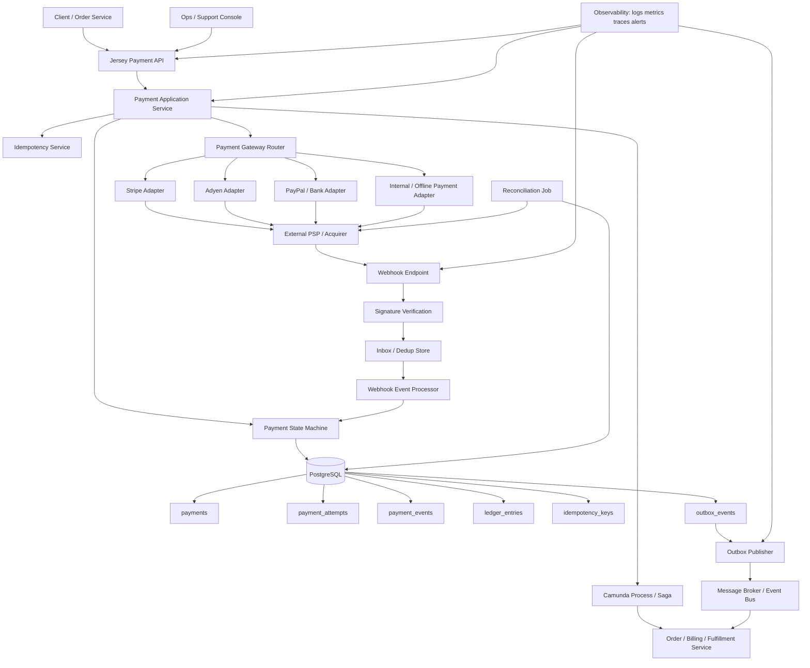
```mermaid
flowchart TD
    A[Client / Order Service] --> B[Jersey Payment API]
    B --> C[Payment Application Service]

    C --> D[Payment State Machine]
    C --> E[Idempotency Service]
    C --> F[Payment Gateway Router]

    F --> G1[Stripe Adapter]
    F --> G2[Adyen Adapter]
    F --> G3[PayPal / Bank Adapter]
    F --> G4[Internal / Offline Payment Adapter]

    G1 --> H[External PSP / Acquirer]
    G2 --> H
    G3 --> H
    G4 --> H

    H --> I[Webhook Endpoint]
    I --> J[Signature Verification]
    J --> K[Inbox / Dedup Store]
    K --> L[Webhook Event Processor]
    L --> D

    D --> M[(PostgreSQL)]
    M --> M1[payments]
    M --> M2[payment_attempts]
    M --> M3[payment_events]
    M --> M4[ledger_entries]
    M --> M5[idempotency_keys]
    M --> M6[outbox_events]

    C --> N[Camunda Process / Saga]
    N --> O[Order / Billing / Fulfillment Service]

    M6 --> P[Outbox Publisher]
    P --> Q[Message Broker / Event Bus]
    Q --> O

    R[Reconciliation Job] --> M
    R --> H

    S[Ops / Support Console] --> B
    T[Observability: logs metrics traces alerts] --> B
    T --> C
    T --> I
    T --> P
```

---

## 3. Decomposition Map dalam Tabel

| No | Area / Skill Domain | Fokus Praktis | Implementasi di Java Jersey/JAX-RS Microservice | Risiko yang Harus Dijaga |
|---:|---|---|---|---|
| 1 | **Payment Domain Modeling** | Memahami konsep `payment`, `payment attempt`, `authorization`, `capture`, `refund`, `void`, `settlement`, `chargeback`, `dispute`. | Buat entity terpisah: `Payment`, `PaymentAttempt`, `PaymentEvent`, `Refund`, `LedgerEntry`. Jangan campur semua ke satu table. | Model terlalu sederhana → sulit handle retry, partial capture, refund sebagian, dispute, dan audit. |
| 2 | **Payment State Machine** | Mendesain lifecycle payment yang eksplisit. | Enum state seperti `INITIATED`, `REQUIRES_ACTION`, `AUTHORIZED`, `CAPTURED`, `FAILED`, `CANCELLED`, `REFUNDED`, `PARTIALLY_REFUNDED`, `DISPUTED`. | State lompat sembarangan, double capture, refund sebelum capture, status internal berbeda dari PSP. |
| 3 | **Money Representation** | Menyimpan amount secara aman. | Gunakan integer minor unit seperti `amount_minor BIGINT`, `currency CHAR(3)`, bukan `double`. ISO 4217 mendefinisikan currency code dan hubungan minor unit untuk currency yang memilikinya. ([ISO](https://www.iso.org/iso-4217-currency-codes.html?utm_source=chatgpt.com)) | Floating point error, salah decimal currency, rounding mismatch, reconciliation gagal. |
| 4 | **Currency & Minor Unit Handling** | Menangani USD, IDR, JPY, currency zero-decimal, gateway-specific decimal rule. | Buat `CurrencyMetadataService`; validasi amount sebelum call PSP. Stripe, misalnya, memakai positive integer dalam smallest currency unit untuk PaymentIntent amount. ([Stripe Docs](https://docs.stripe.com/api/payment_intents/object?utm_source=chatgpt.com)) | Salah kirim IDR/JPY/ISK minor unit; amount di gateway tidak sama dengan invoice. |
| 5 | **Payment API Design** | Mendesain REST endpoint untuk create/authorize/capture/refund/status. | Jersey resource: `POST /payments`, `POST /payments/{id}/capture`, `POST /payments/{id}/refunds`, `GET /payments/{id}`. Jakarta REST memakai annotation resource/method untuk expose REST endpoint. ([Jakarta EE](https://jakarta.ee/learn/docs/jakartaee-tutorial/current/websvcs/rest/rest.html?utm_source=chatgpt.com)) | Endpoint terlalu gateway-specific; sulit multi-PSP; breaking change ke consumer internal. |
| 6 | **Idempotency Pattern** | Mencegah double charge saat client retry. | Header `Idempotency-Key`; table `idempotency_keys`; simpan request hash, response snapshot, status processing. Stripe mendukung idempotency untuk retry aman tanpa melakukan operasi yang sama dua kali. ([Stripe Docs](https://docs.stripe.com/api/idempotent_requests?utm_source=chatgpt.com)) | Timeout lalu retry menghasilkan dua payment attempt atau dua charge. |
| 7 | **Gateway Adapter Pattern** | Memisahkan domain payment dari detail PSP. | Interface `PaymentGatewayClient`; implementation `StripeGatewayClient`, `AdyenGatewayClient`, `BankTransferGatewayClient`. | Domain service tercampur payload vendor; vendor migration mahal. |
| 8 | **Gateway Routing** | Menentukan PSP berdasarkan merchant, country, currency, payment method, failover. | `PaymentGatewayRouter` membaca config dari DB/feature flag/config map. | Routing tidak deterministic; payment create di PSP A tapi webhook masuk PSP B tidak terhubung. |
| 9 | **Authorization vs Capture** | Memahami perbedaan reserve funds vs settle funds. | Support flow: `authorizeOnly`, `captureLater`, `autoCapture`. Cocok untuk order yang butuh fulfilment dulu. | Capture order yang belum valid; auth expired; double capture. |
| 10 | **Synchronous Call Handling** | Memproses response awal dari PSP. | HTTP client dengan timeout, retry policy terbatas, circuit breaker, structured error mapping. | Menganggap HTTP 200 sebagai payment final padahal status final bisa datang lewat webhook. |
| 11 | **Webhook Endpoint** | Menerima event asynchronous dari PSP. | `POST /webhooks/{provider}`; simpan raw payload; verify signature; dedup event; process async. PayPal menjelaskan webhook sebagai HTTPS POST dari PayPal ke endpoint server saat event terjadi. ([PayPal Developer](https://developer.paypal.com/api/rest/webhooks/?utm_source=chatgpt.com)) | Duplicate webhook, fake webhook, out-of-order event, processing lambat bikin PSP retry. |
| 12 | **Webhook Signature Verification** | Memastikan event benar dari PSP. | Stripe: raw body + signature header + endpoint secret; Adyen: HMAC key; PayPal: signature verification dengan header/certificate/verify endpoint. ([Stripe Docs](https://docs.stripe.com/webhooks?utm_source=chatgpt.com)) | Webhook spoofing; attacker mengubah status payment menjadi paid. |
| 13 | **Inbox / Dedup Pattern** | Menjamin event eksternal diproses sekali secara efektif. | Table `payment_inbox_events(provider, event_id, received_at, processed_at, status)` dengan unique constraint. | PSP mengirim event sama berkali-kali → ledger/status berubah berulang. |
| 14 | **Transactional Outbox Pattern** | Menjamin perubahan DB dan publish event internal tetap konsisten. | Setelah update payment state, insert `outbox_events` dalam transaksi DB yang sama; worker publish ke broker. AWS menjelaskan outbox untuk mengatasi dual-write antara database write dan message/event notification. ([AWS Documentation](https://docs.aws.amazon.com/prescriptive-guidance/latest/cloud-design-patterns/transactional-outbox.html?utm_source=chatgpt.com)) | Payment sukses di DB tapi event ke order/billing hilang; atau event terkirim padahal DB rollback. |
| 15 | **Payment Ledger** | Mencatat dampak finansial secara append-only. | `ledger_entries` dengan debit/credit, amount, currency, reference id, event id, created_at. | Hanya menyimpan status akhir tanpa jejak finansial; audit dan reconciliation sulit. |
| 16 | **Reconciliation** | Mencocokkan data internal dengan statement/report PSP/bank. | Scheduled job ambil settlement report, compare by PSP reference, amount, currency, fee, net settlement. | Internal “paid” tetapi PSP gagal settle; refund/dispute tidak tercermin. |
| 17 | **Refund Management** | Full/partial refund, multiple refund, refund status async. | `POST /payments/{id}/refunds`; refund punya state sendiri: `REQUESTED`, `SUCCEEDED`, `FAILED`, `CANCELLED`. | Refund double, refund melebihi captured amount, refund sukses di PSP tapi internal gagal update. |
| 18 | **Dispute / Chargeback Handling** | Menangani lifecycle sengketa pembayaran. | Webhook event mapping ke `DISPUTE_OPENED`, `DISPUTE_WON`, `DISPUTE_LOST`; attach evidence metadata. | Operasional tidak sadar dispute; revenue overstated. |
| 19 | **Error Mapping & Problem Details** | Menyediakan error API yang konsisten. | Mapping PSP error ke internal error code: `PAYMENT_DECLINED`, `INSUFFICIENT_FUNDS`, `THREE_DS_REQUIRED`, `GATEWAY_TIMEOUT`. RFC 9457 mendefinisikan Problem Details untuk membawa error detail machine-readable di HTTP API. ([RFC Editor](https://www.rfc-editor.org/info/rfc9457/?utm_source=chatgpt.com)) | Consumer bergantung pada raw vendor error; sulit observability dan retry decision. |
| 20 | **Retry Strategy** | Membedakan retry teknis vs retry bisnis. | Retry network timeout dengan idempotency; jangan retry hard decline; scheduled retry untuk pending/unknown. | Retry asal-asalan → duplicate charge, fraud signal, rate limit, bad customer experience. |
| 21 | **Unknown / Pending State Handling** | Mengelola kondisi “tidak tahu” setelah timeout. | State `UNKNOWN` atau `PENDING_CONFIRMATION`; query PSP by reference; tunggu webhook. | Mengubah timeout menjadi failed padahal payment berhasil. |
| 22 | **Database Transaction & Locking** | Menjaga consistency saat concurrent request/webhook. | PostgreSQL transaction, unique constraint, optimistic locking `version`, `SELECT ... FOR UPDATE` untuk update state kritikal. PostgreSQL current docs menjelaskan empat isolation level dapat diminta, tetapi internalnya tiga level berbeda karena MVCC. ([PostgreSQL](https://www.postgresql.org/docs/current/transaction-iso.html?utm_source=chatgpt.com)) | Race antara user retry, webhook, refund, dan reconciliation. |
| 23 | **MyBatis Persistence Mapping** | Mapping query payment yang eksplisit dan audit-friendly. | Mapper XML/annotation untuk insert payment, update state with version, insert event, insert ledger. | Hidden ORM behavior; update tanpa version check; sulit trace query. |
| 24 | **Camunda Saga / Process Orchestration** | Mengorkestrasi payment dalam order lifecycle. | BPMN: reserve order → create payment → wait webhook → capture → notify fulfilment → compensate/refund. | Payment logic tersebar di service tanpa workflow visibility. |
| 25 | **3DS / Strong Customer Authentication Flow** | Menangani payment yang butuh customer action. | State `REQUIRES_ACTION`; return redirect/action payload ke frontend; resume via webhook/callback. | Payment dianggap failed padahal menunggu challenge. |
| 26 | **Tokenization & Stored Payment Method** | Menyimpan reference, bukan card data. | Simpan `payment_method_token`, `customer_token`, `provider_customer_id`; hindari PAN/CVV. | Scope PCI membesar; data sensitif bocor. |
| 27 | **PCI DSS & Security Boundary** | Menentukan apakah service menyentuh cardholder data. | Ideal: hosted checkout/payment page/tokenization by PSP; service hanya menerima token/reference. PCI DSS v4.0.1 adalah revisi terkini PCI DSS dari PCI SSC. ([PCI Perspectives](https://blog.pcisecuritystandards.org/just-published-pci-dss-v4-0-1?utm_source=chatgpt.com)) | Tanpa sadar menyimpan PAN/CVV di log, DB, APM, atau payload audit. |
| 28 | **Secrets & Key Management** | Mengelola API key, webhook secret, HMAC key. | Kubernetes secret/external secret manager; rotation; separate test/live key; least privilege. | Secret bocor di GitHub, log, container image, config map. |
| 29 | **Observability** | Melacak payment end-to-end. | Correlation ID, payment ID, provider reference, structured logs, metrics: success rate, pending age, webhook lag, reconciliation mismatch. | Incident sulit dianalisis; support tidak bisa menjawab “kenapa order belum paid?”. |
| 30 | **Operational Console / Backoffice** | Membantu support dan finance. | Endpoint/admin UI untuk payment timeline, retry webhook, manual reconcile, refund request, export report. | Engineer harus query DB manual; risiko human error tinggi. |
| 31 | **Testing Strategy** | Menguji happy path, timeout, duplicate webhook, out-of-order event, refund, reconciliation. | Unit test state transition, contract test adapter, Testcontainers PostgreSQL, PSP sandbox, replay webhook fixture. | Test hanya mock happy path; bug muncul di production. |
| 32 | **Local Development & Sandbox** | Simulasi PSP secara aman. | Docker compose: app + PostgreSQL + mock PSP + webhook simulator. | Developer sulit reproduce issue webhook/retry. |
| 33 | **Kubernetes Deployment** | Menjalankan API, worker, scheduler secara terpisah. | Deployment terpisah: `payment-api`, `webhook-consumer`, `outbox-publisher`, `reconciliation-job`. | Worker autoscaling salah; job double-run; webhook endpoint tidak resilient. |
| 34 | **Cloud / On-Prem Connectivity** | Menghubungkan service ke PSP dari environment berbeda. | Egress allowlist, proxy, TLS, DNS, NAT gateway, certificate truststore. | Payment gagal hanya di on-prem karena egress/firewall/cert issue. |
| 35 | **Provider API Versioning** | Mengontrol perubahan kontrak PSP. | Pin API version bila provider mendukung; regression test sebelum upgrade. Stripe menyarankan API versioning untuk menguji versi baru sebelum commit upgrade. ([Stripe Docs](https://docs.stripe.com/api/versioning?utm_source=chatgpt.com)) | PSP upgrade mengubah payload/error/status tanpa terdeteksi. |
| 36 | **Settlement & Fee Accounting** | Menghitung gross, fee, tax, net settlement. | `payment_amount`, `fee_amount`, `net_amount`, `settlement_currency`, `exchange_rate`. | Finance report tidak cocok dengan bank statement. |
| 37 | **Multi-Tenant / Merchant Config** | Mendukung banyak merchant/business unit. | Merchant config: provider account, currency, allowed payment methods, webhook secret, settlement account. | Payment merchant A masuk akun merchant B. |
| 38 | **Fraud & Risk Signal Integration** | Menghubungkan payment dengan risk engine. | Pre-auth risk check, post-payment fraud event, rule engine, manual review queue. | Fraud decision datang terlambat; order sudah fulfilled. |
| 39 | **Data Retention & Audit** | Menentukan data apa disimpan dan berapa lama. | Append-only event, redaction policy, PII masking, immutable audit trail. | Audit gagal; data sensitif tersimpan terlalu lama. |
| 40 | **Incident & Recovery Playbook** | Menangani payment outage. | Playbook: PSP down, webhook backlog, duplicate charge, reconciliation mismatch, secret rotation. | Tim panik saat payment stuck; recovery manual tanpa kontrol. |

---

## 4. Mental Model Praktis

Payment service sebaiknya dipandang sebagai gabungan dari 5 lapisan:

```text
1. API Layer
   - Jersey resource
   - request validation
   - idempotency key
   - error response

2. Application / Orchestration Layer
   - payment use case
   - state transition
   - gateway routing
   - Camunda saga

3. Integration Layer
   - PSP adapter
   - webhook receiver
   - signature verification
   - retry/circuit breaker

4. Persistence & Financial Truth Layer
   - payment table
   - attempt table
   - event table
   - ledger table
   - inbox/outbox table

5. Operations & Compliance Layer
   - reconciliation
   - audit
   - monitoring
   - support console
   - PCI/security boundary
```

Kunci praktisnya: **jangan membuat payment service yang hanya “proxy ke gateway”**. Payment service harus menjadi **stateful financial control point**.

---

## 5. Recommended Table Design Awal

Minimal schema konseptual:

| Table | Fungsi |
|---|---|
| `payments` | Aggregate utama payment internal. |
| `payment_attempts` | Setiap percobaan charge/authorization ke PSP. |
| `payment_events` | Timeline event internal dan external. |
| `payment_inbox_events` | Dedup webhook/event masuk. |
| `payment_outbox_events` | Event keluar untuk order/billing/fulfillment. |
| `refunds` | Refund request dan statusnya. |
| `ledger_entries` | Catatan finansial append-only. |
| `idempotency_keys` | Mencegah duplicate operation dari retry. |
| `provider_references` | Mapping internal ID ke PSP object/reference ID. |
| `reconciliation_runs` | Riwayat proses rekonsiliasi. |
| `reconciliation_items` | Item mismatch/success dari settlement report. |

---

## 6. Payment State Transition Contoh

```text
INITIATED
  -> REQUIRES_ACTION
  -> AUTHORIZED
  -> CAPTURED
  -> PARTIALLY_REFUNDED
  -> REFUNDED

INITIATED
  -> FAILED

AUTHORIZED
  -> VOIDED

CAPTURED
  -> DISPUTED
  -> CHARGEBACK_LOST / CHARGEBACK_WON
```

Invariant penting:

| Invariant | Penjelasan |
|---|---|
| Captured amount tidak boleh melebihi authorized amount. |
| Refunded amount tidak boleh melebihi captured amount. |
| Satu idempotency key hanya boleh menghasilkan satu logical operation. |
| Webhook duplicate tidak boleh menghasilkan ledger entry duplicate. |
| Payment final state tidak boleh mundur sembarangan. |
| Semua perubahan finansial harus punya event/audit trail. |
| Provider reference harus unik per provider/environment. |

---

## 7. Roadmap Alur Belajar Singkat

| Tahap | Fokus | Target Praktis |
|---:|---|---|
| 1 | **Payment Domain Basics** | Pahami authorization, capture, refund, void, settlement, dispute, chargeback. |
| 2 | **Payment State Machine** | Buat state transition table + invariant. |
| 3 | **Jersey API Design** | Implement endpoint create payment, get status, capture, refund. |
| 4 | **Idempotency & Retry** | Implement `Idempotency-Key` dengan PostgreSQL unique constraint. |
| 5 | **Gateway Adapter** | Buat interface PSP adapter + mock provider. |
| 6 | **Webhook Processing** | Implement raw payload storage, signature verification, inbox dedup. |
| 7 | **Outbox & Event Publishing** | Publish `PaymentCaptured`, `PaymentFailed`, `RefundSucceeded` secara reliable. |
| 8 | **Ledger & Reconciliation** | Buat append-only ledger dan job reconcile dari provider report. |
| 9 | **Camunda Saga** | Orchestrate order → payment → fulfillment → compensation. |
| 10 | **Security & Compliance** | Tokenization, PCI boundary, secrets rotation, masking log. |
| 11 | **Production Readiness** | Observability, alert, runbook, replay webhook, support tooling. |

---

## Rekomendasi Materi Selanjutnya

Materi paling natural berikutnya adalah:

**“Payment Management Series 1 - Payment Domain Model, State Machine, and Database Schema Design in Java Jersey/JAX-RS + PostgreSQL/MyBatis.”**

Itu akan menjadi fondasi sebelum masuk ke adapter PSP, webhook, idempotency, outbox, Camunda saga, dan reconciliation.

---

**Sources:**

- [Just Published: PCI DSS v4.0.1](https://blog.pcisecuritystandards.org/just-published-pci-dss-v4-0-1?utm_source=chatgpt.com)
- [Building RESTful Web Services with Jakarta REST](https://jakarta.ee/learn/docs/jakartaee-tutorial/current/websvcs/rest/rest.html?utm_source=chatgpt.com)
- [Idempotent requests | Stripe API Reference](https://docs.stripe.com/api/idempotent_requests?utm_source=chatgpt.com)
- [ISO 4217 — Currency codes](https://www.iso.org/iso-4217-currency-codes.html?utm_source=chatgpt.com)
- [Webhooks guide](https://developer.paypal.com/api/rest/webhooks/?utm_source=chatgpt.com)
- [Transactional outbox pattern - AWS Prescriptive Guidance](https://docs.aws.amazon.com/prescriptive-guidance/latest/cloud-design-patterns/transactional-outbox.html?utm_source=chatgpt.com)
- [RFC 9457: Problem Details for HTTP APIs](https://www.rfc-editor.org/info/rfc9457/?utm_source=chatgpt.com)
- [Documentation: 18: 13.2. Transaction Isolation](https://www.postgresql.org/docs/current/transaction-iso.html?utm_source=chatgpt.com)

## Response:
7/14/2026, 10:13:21 PM

Total saya rekomendasikan **18 seri** untuk **Payment Management & Integration Pattern** agar praktis, runtut, dan tidak terlalu dangkal.

| Seri | Materi |
|---:|---|
| 1 | Payment Domain Model, State Machine, dan Invariant |
| 2 | Database Schema Design: payments, attempts, events, refunds, ledger |
| 3 | Jersey/JAX-RS Payment API Design |
| 4 | Idempotency Key, Duplicate Prevention, dan Safe Retry |
| 5 | Payment Gateway Adapter Pattern |
| 6 | Multi-Provider Routing dan Provider Abstraction |
| 7 | Authorization, Capture, Void, dan Settlement Flow |
| 8 | Webhook Receiver, Signature Verification, dan Inbox Dedup |
| 9 | Outbox Pattern dan Event Publishing ke Order/Billing/Fulfillment |
| 10 | Refund Management: Full, Partial, Async Refund |
| 11 | Dispute, Chargeback, dan Evidence Workflow |
| 12 | Payment Ledger dan Financial Audit Trail |
| 13 | Reconciliation dengan PSP/Bank/Settlement Report |
| 14 | Camunda Saga untuk Payment-Oriented Workflow |
| 15 | Error Mapping, Timeout, Unknown State, dan Recovery Pattern |
| 16 | Security, Tokenization, Secrets, PCI Boundary, dan Sensitive Data Handling |
| 17 | Observability, Monitoring, Alerting, Support Console, dan Runbook |
| 18 | Testing Strategy, Sandbox, Mock PSP, Testcontainers, dan Production Readiness |

Urutan ini saya sarankan karena payment harus dimulai dari **domain correctness dan state machine**, baru masuk ke **integration**, lalu **operational reliability**.

## Response:
7/14/2026, 10:13:52 PM

Saya mulai dari **Seri 1/18**: domain model, state machine, dan invariant payment. Fokusnya praktis: bagaimana memodelkan payment agar aman terhadap retry, webhook duplicate, partial failure, refund, dan audit.

# Payment Management & Integration Pattern  
## Seri 1/18 - Payment Domain Model, State Machine, dan Invariant

Seri pertama ini membahas fondasi paling penting: **bagaimana memodelkan payment secara benar sebelum masuk ke gateway integration, webhook, retry, Camunda saga, refund, reconciliation, dan audit**.

Payment bukan CRUD biasa. Payment adalah **stateful financial workflow** yang harus tahan terhadap:

- retry dari client,
- timeout ke payment gateway,
- webhook yang datang berkanda,
- webhook yang datang terlambat,
- status eksternal yang belum final,
- refund sebagian,
- capture sebagian,
- dispute/chargeback,
- mismatch antara internal system dan settlement report.

Dalam Jakarta REST/JAX-RS, endpoint payment tetap bisa diekspos sebagai resource HTTP menggunakan annotation seperti `@Path`, `@GET`, dan `@POST`, tetapi domain internalnya harus dimodelkan sebagai **state machine**, bukan sekadar table `payment_status`. Jakarta REST sendiri memang dirancang untuk membuat RESTful resource berbasis Java annotation. ([Jakarta EE](https://jakarta.ee/learn/docs/jakartaee-tutorial/current/websvcs/rest/rest.html))

---

# 1. Mental Model

Payment service sebaiknya dipandang seperti ini:

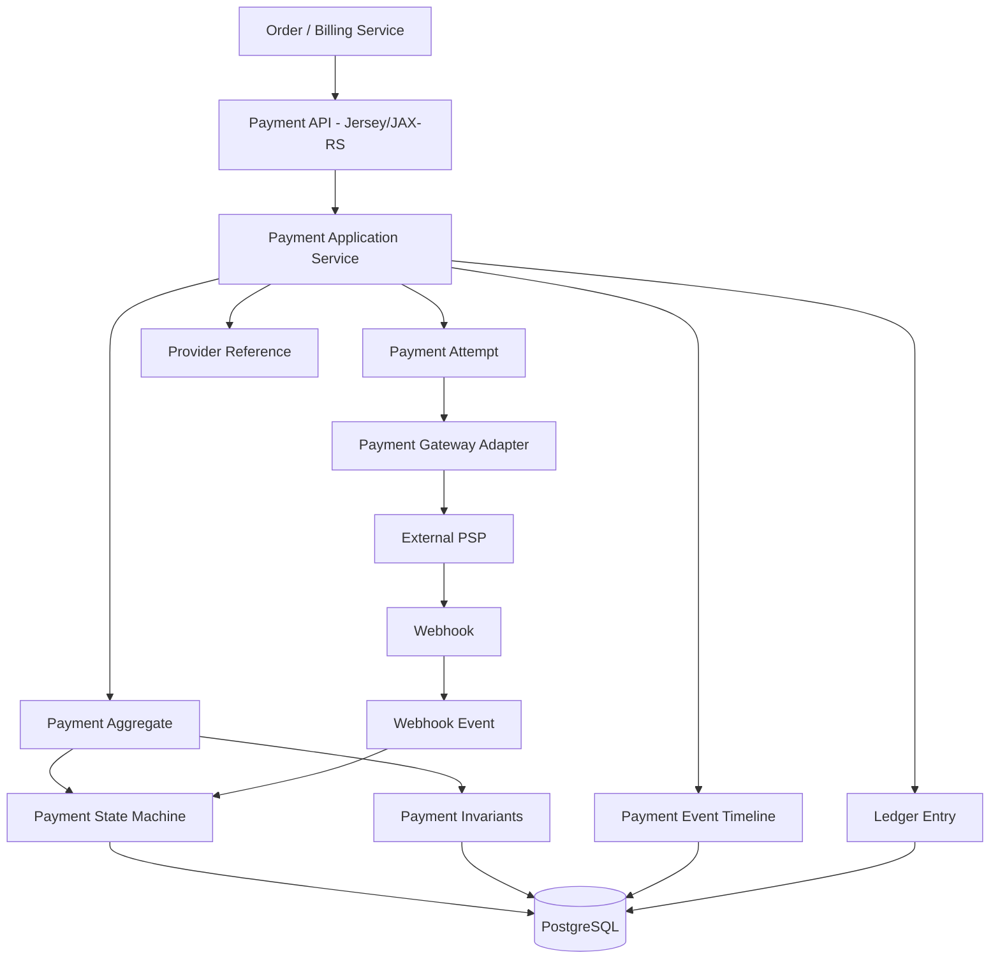
```mermaid id="k8y6x3"
flowchart TD
    A[Order / Billing Service] --> B[Payment API - Jersey/JAX-RS]
    B --> C[Payment Application Service]

    C --> D[Payment Aggregate]
    D --> E[Payment State Machine]
    D --> F[Payment Invariants]

    C --> G[Payment Attempt]
    C --> H[Provider Reference]
    C --> I[Payment Event Timeline]
    C --> J[Ledger Entry]

    G --> K[Payment Gateway Adapter]
    K --> L[External PSP]

    L --> M[Webhook]
    M --> N[Webhook Event]
    N --> E

    E --> O[(PostgreSQL)]
    F --> O
    I --> O
    J --> O
```

Core idea:

> **Payment aggregate menyimpan niat bisnis internal. Payment attempt menyimpan percobaan teknis ke gateway. Payment event menyimpan timeline. Ledger menyimpan efek finansial.**

Jangan gabungkan semuanya ke satu object/table karena lifecycle-nya berbeda.

---

# 2. Komponen Domain Utama

| Komponen | Fungsi | Contoh Field Penting |
|---|---|---|
| `Payment` | Aggregate utama pembayaran internal. | `payment_id`, `order_id`, `amount`, `currency`, `status`, `version` |
| `PaymentAttempt` | Percobaan melakukan authorization/charge ke provider. | `attempt_id`, `payment_id`, `provider`, `provider_payment_id`, `status` |
| `PaymentEvent` | Timeline event internal/eksternal. | `event_id`, `payment_id`, `event_type`, `source`, `payload`, `created_at` |
| `ProviderReference` | Mapping ID internal ke ID provider. | `provider`, `provider_payment_id`, `provider_charge_id` |
| `Refund` | Refund sebagai lifecycle terpisah. | `refund_id`, `payment_id`, `amount`, `status` |
| `LedgerEntry` | Catatan finansial append-only. | `entry_id`, `payment_id`, `direction`, `amount`, `currency`, `reference_type` |
| `IdempotencyRecord` | Pencegah duplicate request. | `idempotency_key`, `request_hash`, `response_snapshot`, `status` |

---

# 3. Payment Status - Vendor-Neutral Model

Payment provider punya istilah sendiri-sendiri. Contoh: Stripe `PaymentIntent` punya status untuk menunjukkan apakah payment butuh payment method, confirmation, customer action, sedang processing, butuh capture, sukses, atau canceled. Stripe juga menekankan bahwa webhook bisa digunakan untuk memantau perubahan status payment. ([Stripe Docs](https://docs.stripe.com/payments/payment-intents/verifying-status))

Tetapi internal system jangan terlalu bergantung pada enum vendor. Buat enum internal yang stabil.

```java
public enum PaymentStatus {
    INITIATED,

    REQUIRES_ACTION,
    AUTHORIZATION_PENDING,
    AUTHORIZED,

    CAPTURE_PENDING,
    CAPTURED,
    PARTIALLY_CAPTURED,

    FAILED,
    CANCELLED,
    EXPIRED,

    REFUND_PENDING,
    PARTIALLY_REFUNDED,
    REFUNDED,

    DISPUTED,
    CHARGEBACK_WON,
    CHARGEBACK_LOST,

    UNKNOWN
}
```

## Kenapa perlu `UNKNOWN`?

Karena dalam payment, **timeout bukan berarti gagal**.

Contoh:

```text
Service call ke PSP timeout.
Kemungkinan sebenarnya:
1. PSP tidak menerima request.
2. PSP menerima request tapi response gagal balik.
3. PSP berhasil charge customer.
4. PSP masih processing.
```

Kalau langsung set `FAILED`, bisa salah. State yang lebih aman adalah:

```text
AUTHORIZATION_PENDING / CAPTURE_PENDING / UNKNOWN
```

Lalu lakukan:

- query by provider reference,
- tunggu webhook,
- jalankan reconciliation job.

---

# 4. Payment State Machine

## 4.1 Main Flow

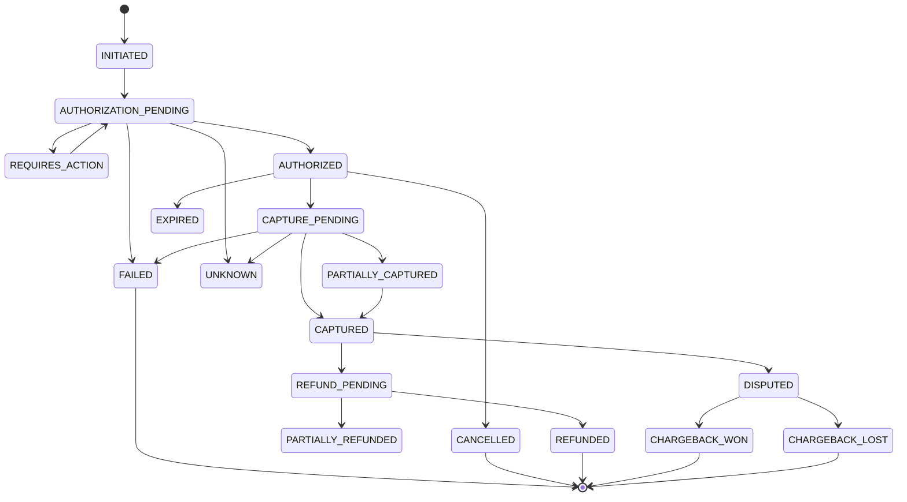
```mermaid id="9crrtf"
stateDiagram-v2
    [*] --> INITIATED

    INITIATED --> AUTHORIZATION_PENDING
    AUTHORIZATION_PENDING --> REQUIRES_ACTION
    REQUIRES_ACTION --> AUTHORIZATION_PENDING

    AUTHORIZATION_PENDING --> AUTHORIZED
    AUTHORIZATION_PENDING --> FAILED
    AUTHORIZATION_PENDING --> UNKNOWN

    AUTHORIZED --> CAPTURE_PENDING
    AUTHORIZED --> CANCELLED
    AUTHORIZED --> EXPIRED

    CAPTURE_PENDING --> CAPTURED
    CAPTURE_PENDING --> PARTIALLY_CAPTURED
    CAPTURE_PENDING --> FAILED
    CAPTURE_PENDING --> UNKNOWN

    PARTIALLY_CAPTURED --> CAPTURED
    CAPTURED --> REFUND_PENDING
    REFUND_PENDING --> PARTIALLY_REFUNDED
    REFUND_PENDING --> REFUNDED

    CAPTURED --> DISPUTED
    DISPUTED --> CHARGEBACK_WON
    DISPUTED --> CHARGEBACK_LOST

    FAILED --> [*]
    CANCELLED --> [*]
    REFUNDED --> [*]
    CHARGEBACK_WON --> [*]
    CHARGEBACK_LOST --> [*]
```

## 4.2 Practical Rule

Jangan izinkan update status sembarangan seperti ini:

```sql
UPDATE payments SET status = 'CAPTURED' WHERE payment_id = ?;
```

Lebih aman:

```sql
UPDATE payments
SET status = 'CAPTURED',
    captured_amount_minor = captured_amount_minor + #{capturedAmountMinor},
    version = version + 1,
    updated_at = now()
WHERE payment_id = #{paymentId}
  AND status IN ('CAPTURE_PENDING', 'PARTIALLY_CAPTURED', 'AUTHORIZED')
  AND version = #{version};
```

Kalau `row_count = 0`, berarti ada kemungkinan:

- state sudah berubah oleh webhook,
- request duplicate,
- version stale,
- transition tidak valid.

---

# 5. Amount dan Currency

Untuk payment, hindari `double` dan `float`.

PostgreSQL mendokumentasikan bahwa floating point bersifat inexact, dan untuk exact storage/calculation seperti monetary amount, gunakan `numeric`. ([PostgreSQL](https://www.postgresql.org/docs/7.2/datatype.html))

Dalam integrasi PSP, umum juga memakai **minor unit integer**. Stripe, misalnya, mendefinisikan `amount` sebagai positive integer dalam smallest currency unit, seperti `100` untuk USD 1.00 atau `100` untuk JPY 100 karena JPY zero-decimal. ([Stripe Docs](https://docs.stripe.com/api/payment_intents/object))

## Rekomendasi Praktis

Untuk payment core table:

```sql
amount_minor BIGINT NOT NULL,
currency CHAR(3) NOT NULL
```

Contoh:

| Currency | Human Amount | Stored Amount |
|---|---:|---:|
| USD | 10.50 | 1050 |
| IDR | 10,000 | 10000 |
| JPY | 100 | 100 |
| EUR | 19.99 | 1999 |

Tambahkan currency metadata service:

```java
public record Money(long amountMinor, String currency) {
    public Money {
        if (amountMinor < 0) {
            throw new IllegalArgumentException("amountMinor must not be negative");
        }
        if (currency == null || currency.length() != 3) {
            throw new IllegalArgumentException("currency must be ISO-4217 alpha-3 code");
        }
        currency = currency.toUpperCase();
    }

    public boolean isZero() {
        return amountMinor == 0;
    }
}
```

---

# 6. Domain Object Praktis

## 6.1 Payment Aggregate

```java
import java.time.Instant;
import java.util.UUID;

public class Payment {

    private UUID paymentId;
    private String orderId;
    private Money authorizedAmount;
    private Money capturedAmount;
    private Money refundedAmount;
    private PaymentStatus status;
    private long version;
    private Instant createdAt;
    private Instant updatedAt;

    public Payment(
            UUID paymentId,
            String orderId,
            Money authorizedAmount,
            PaymentStatus status
    ) {
        this.paymentId = paymentId;
        this.orderId = orderId;
        this.authorizedAmount = authorizedAmount;
        this.capturedAmount = new Money(0, authorizedAmount.currency());
        this.refundedAmount = new Money(0, authorizedAmount.currency());
        this.status = status;
        this.version = 0;
        this.createdAt = Instant.now();
        this.updatedAt = Instant.now();
    }

    public void markAuthorized(Money amount) {
        requireStatus(PaymentStatus.AUTHORIZATION_PENDING, PaymentStatus.REQUIRES_ACTION, PaymentStatus.UNKNOWN);
        requireSameCurrency(amount);

        if (amount.amountMinor() <= 0) {
            throw new IllegalStateException("authorized amount must be positive");
        }

        this.authorizedAmount = amount;
        this.status = PaymentStatus.AUTHORIZED;
        touch();
    }

    public void markCaptured(Money amount) {
        requireStatus(PaymentStatus.AUTHORIZED, PaymentStatus.CAPTURE_PENDING, PaymentStatus.PARTIALLY_CAPTURED, PaymentStatus.UNKNOWN);
        requireSameCurrency(amount);

        long newCaptured = this.capturedAmount.amountMinor() + amount.amountMinor();

        if (newCaptured > this.authorizedAmount.amountMinor()) {
            throw new IllegalStateException("captured amount exceeds authorized amount");
        }

        this.capturedAmount = new Money(newCaptured, amount.currency());
        this.status = newCaptured == this.authorizedAmount.amountMinor()
                ? PaymentStatus.CAPTURED
                : PaymentStatus.PARTIALLY_CAPTURED;

        touch();
    }

    public void markRefunded(Money amount) {
        requireStatus(PaymentStatus.CAPTURED, PaymentStatus.PARTIALLY_REFUNDED, PaymentStatus.REFUND_PENDING);
        requireSameCurrency(amount);

        long newRefunded = this.refundedAmount.amountMinor() + amount.amountMinor();

        if (newRefunded > this.capturedAmount.amountMinor()) {
            throw new IllegalStateException("refunded amount exceeds captured amount");
        }

        this.refundedAmount = new Money(newRefunded, amount.currency());
        this.status = newRefunded == this.capturedAmount.amountMinor()
                ? PaymentStatus.REFUNDED
                : PaymentStatus.PARTIALLY_REFUNDED;

        touch();
    }

    public void markFailed() {
        requireStatus(PaymentStatus.INITIATED, PaymentStatus.AUTHORIZATION_PENDING, PaymentStatus.CAPTURE_PENDING, PaymentStatus.UNKNOWN);
        this.status = PaymentStatus.FAILED;
        touch();
    }

    private void requireStatus(PaymentStatus... allowed) {
        for (PaymentStatus candidate : allowed) {
            if (this.status == candidate) {
                return;
            }
        }
        throw new IllegalStateException("Invalid payment transition from " + this.status);
    }

    private void requireSameCurrency(Money amount) {
        if (!this.authorizedAmount.currency().equals(amount.currency())) {
            throw new IllegalStateException("currency mismatch");
        }
    }

    private void touch() {
        this.updatedAt = Instant.now();
    }
}
```

---

# 7. Invariant Payment yang Wajib Ada

Invariant adalah aturan yang **tidak boleh dilanggar dalam kondisi apa pun**.

| No | Invariant | Kenapa Penting |
|---:|---|---|
| 1 | `captured_amount <= authorized_amount` | Mencegah capture melebihi auth. |
| 2 | `refunded_amount <= captured_amount` | Mencegah refund lebih besar dari uang yang diterima. |
| 3 | `currency` payment tidak berubah setelah dibuat. | Mencegah mismatch accounting. |
| 4 | Satu `provider_payment_id` hanya boleh map ke satu `payment_id`. | Mencegah webhook salah apply ke payment lain. |
| 5 | Satu webhook event hanya boleh diproses sekali secara efektif. | Mencegah double ledger/update. |
| 6 | Final state tidak boleh mundur ke non-final state tanpa proses eksplisit. | Mencegah status korup akibat late webhook. |
| 7 | Semua perubahan finansial harus menghasilkan `payment_event`. | Untuk audit dan debugging. |
| 8 | Semua efek finansial harus menghasilkan `ledger_entry`. | Untuk reconciliation. |
| 9 | Retry harus memakai idempotency key. | Mencegah double charge. |
| 10 | Timeout tidak otomatis berarti failed. | Mencegah salah status ketika PSP sebenarnya sukses. |

---

# 8. PostgreSQL Schema Awal

## 8.1 `payments`

```sql
CREATE TABLE payments (
    payment_id UUID PRIMARY KEY,
    order_id VARCHAR(100) NOT NULL,

    amount_minor BIGINT NOT NULL,
    currency CHAR(3) NOT NULL,

    authorized_amount_minor BIGINT NOT NULL DEFAULT 0,
    captured_amount_minor BIGINT NOT NULL DEFAULT 0,
    refunded_amount_minor BIGINT NOT NULL DEFAULT 0,

    status VARCHAR(40) NOT NULL,

    provider VARCHAR(50),
    provider_payment_id VARCHAR(200),

    version BIGINT NOT NULL DEFAULT 0,

    created_at TIMESTAMPTZ NOT NULL DEFAULT now(),
    updated_at TIMESTAMPTZ NOT NULL DEFAULT now(),

    CONSTRAINT chk_payment_amount_non_negative
        CHECK (amount_minor >= 0),

    CONSTRAINT chk_authorized_amount_non_negative
        CHECK (authorized_amount_minor >= 0),

    CONSTRAINT chk_captured_amount_valid
        CHECK (captured_amount_minor >= 0 AND captured_amount_minor <= authorized_amount_minor),

    CONSTRAINT chk_refunded_amount_valid
        CHECK (refunded_amount_minor >= 0 AND refunded_amount_minor <= captured_amount_minor),

    CONSTRAINT chk_currency_uppercase
        CHECK (currency = upper(currency))
);

CREATE UNIQUE INDEX ux_payments_provider_payment
ON payments(provider, provider_payment_id)
WHERE provider IS NOT NULL AND provider_payment_id IS NOT NULL;

CREATE INDEX ix_payments_order_id
ON payments(order_id);

CREATE INDEX ix_payments_status
ON payments(status);
```

## 8.2 `payment_attempts`

```sql
CREATE TABLE payment_attempts (
    attempt_id UUID PRIMARY KEY,
    payment_id UUID NOT NULL REFERENCES payments(payment_id),

    provider VARCHAR(50) NOT NULL,
    provider_payment_id VARCHAR(200),
    provider_charge_id VARCHAR(200),

    attempt_type VARCHAR(40) NOT NULL,
    status VARCHAR(40) NOT NULL,

    request_hash VARCHAR(128),
    failure_code VARCHAR(100),
    failure_message TEXT,

    created_at TIMESTAMPTZ NOT NULL DEFAULT now(),
    updated_at TIMESTAMPTZ NOT NULL DEFAULT now()
);

CREATE INDEX ix_payment_attempts_payment_id
ON payment_attempts(payment_id);

CREATE INDEX ix_payment_attempts_provider_ref
ON payment_attempts(provider, provider_payment_id);
```

## 8.3 `payment_events`

```sql
CREATE TABLE payment_events (
    event_id UUID PRIMARY KEY,
    payment_id UUID NOT NULL REFERENCES payments(payment_id),

    event_type VARCHAR(80) NOT NULL,
    source VARCHAR(40) NOT NULL,
    provider VARCHAR(50),
    provider_event_id VARCHAR(200),

    payload JSONB,
    created_at TIMESTAMPTZ NOT NULL DEFAULT now()
);

CREATE UNIQUE INDEX ux_payment_events_provider_event
ON payment_events(provider, provider_event_id)
WHERE provider IS NOT NULL AND provider_event_id IS NOT NULL;

CREATE INDEX ix_payment_events_payment_id
ON payment_events(payment_id);
```

## 8.4 `ledger_entries`

```sql
CREATE TABLE ledger_entries (
    ledger_entry_id UUID PRIMARY KEY,
    payment_id UUID NOT NULL REFERENCES payments(payment_id),

    entry_type VARCHAR(50) NOT NULL,
    direction VARCHAR(10) NOT NULL,

    amount_minor BIGINT NOT NULL,
    currency CHAR(3) NOT NULL,

    reference_type VARCHAR(50) NOT NULL,
    reference_id VARCHAR(100) NOT NULL,

    created_at TIMESTAMPTZ NOT NULL DEFAULT now(),

    CONSTRAINT chk_ledger_amount_positive
        CHECK (amount_minor > 0),

    CONSTRAINT chk_ledger_direction
        CHECK (direction IN ('DEBIT', 'CREDIT'))
);

CREATE UNIQUE INDEX ux_ledger_reference
ON ledger_entries(reference_type, reference_id, entry_type);
```

---

# 9. MyBatis Mapper Praktis

## 9.1 Update State dengan Optimistic Locking

```xml
<update id="markAuthorized">
    UPDATE payments
    SET status = 'AUTHORIZED',
        authorized_amount_minor = #{authorizedAmountMinor},
        provider = #{provider},
        provider_payment_id = #{providerPaymentId},
        version = version + 1,
        updated_at = now()
    WHERE payment_id = #{paymentId}
      AND status IN ('INITIATED', 'AUTHORIZATION_PENDING', 'REQUIRES_ACTION', 'UNKNOWN')
      AND version = #{version}
</update>
```

## 9.2 Capture dengan Guard Amount

```xml
<update id="addCapturedAmount">
    UPDATE payments
    SET captured_amount_minor = captured_amount_minor + #{captureAmountMinor},
        status = CASE
            WHEN captured_amount_minor + #{captureAmountMinor} = authorized_amount_minor
                THEN 'CAPTURED'
            ELSE 'PARTIALLY_CAPTURED'
        END,
        version = version + 1,
        updated_at = now()
    WHERE payment_id = #{paymentId}
      AND status IN ('AUTHORIZED', 'CAPTURE_PENDING', 'PARTIALLY_CAPTURED', 'UNKNOWN')
      AND captured_amount_minor + #{captureAmountMinor} <= authorized_amount_minor
      AND version = #{version}
</update>
```

## 9.3 Insert Event

```xml
<insert id="insertPaymentEvent">
    INSERT INTO payment_events (
        event_id,
        payment_id,
        event_type,
        source,
        provider,
        provider_event_id,
        payload,
        created_at
    ) VALUES (
        #{eventId},
        #{paymentId},
        #{eventType},
        #{source},
        #{provider},
        #{providerEventId},
        CAST(#{payloadJson} AS jsonb),
        now()
    )
</insert>
```

Practical note:

> Untuk operasi finansial, jangan hanya update `payments`. Selalu insert `payment_events` dalam transaksi yang sama.

---

# 10. Jersey/JAX-RS API Skeleton

```java
import jakarta.ws.rs.*;
import jakarta.ws.rs.core.MediaType;
import jakarta.ws.rs.core.Response;
import java.net.URI;
import java.util.UUID;

@Path("/payments")
@Consumes(MediaType.APPLICATION_JSON)
@Produces(MediaType.APPLICATION_JSON)
public class PaymentResource {

    private final PaymentApplicationService paymentService;

    public PaymentResource(PaymentApplicationService paymentService) {
        this.paymentService = paymentService;
    }

    @POST
    public Response createPayment(
            @HeaderParam("Idempotency-Key") String idempotencyKey,
            CreatePaymentRequest request
    ) {
        PaymentResponse response = paymentService.createPayment(idempotencyKey, request);

        return Response
                .created(URI.create("/payments/" + response.paymentId()))
                .entity(response)
                .build();
    }

    @GET
    @Path("/{paymentId}")
    public Response getPayment(@PathParam("paymentId") UUID paymentId) {
        PaymentResponse response = paymentService.getPayment(paymentId);
        return Response.ok(response).build();
    }

    @POST
    @Path("/{paymentId}/capture")
    public Response capturePayment(
            @HeaderParam("Idempotency-Key") String idempotencyKey,
            @PathParam("paymentId") UUID paymentId,
            CapturePaymentRequest request
    ) {
        PaymentResponse response = paymentService.capturePayment(idempotencyKey, paymentId, request);
        return Response.ok(response).build();
    }

    @POST
    @Path("/{paymentId}/refunds")
    public Response refundPayment(
            @HeaderParam("Idempotency-Key") String idempotencyKey,
            @PathParam("paymentId") UUID paymentId,
            RefundPaymentRequest request
    ) {
        RefundResponse response = paymentService.refundPayment(idempotencyKey, paymentId, request);
        return Response.accepted(response).build();
    }
}
```

---

# 11. Request DTO

```java
public record CreatePaymentRequest(
        String orderId,
        long amountMinor,
        String currency,
        String paymentMethodType,
        boolean captureImmediately
) {}
```

```java
public record CapturePaymentRequest(
        long amountMinor
) {}
```

```java
public record RefundPaymentRequest(
        long amountMinor,
        String reason
) {}
```

---

# 12. Application Service Flow

## 12.1 Create Payment

```text
POST /payments
  1. Validate request.
  2. Validate Idempotency-Key.
  3. Check duplicate order/payment rule.
  4. Insert payments with INITIATED.
  5. Insert payment_attempts.
  6. Call gateway adapter.
  7. Map provider response to internal state.
  8. Insert payment_events.
  9. Return response.
```

## 12.2 Capture Payment

```text
POST /payments/{id}/capture
  1. Validate Idempotency-Key.
  2. Load payment with lock/version.
  3. Ensure status AUTHORIZED or PARTIALLY_CAPTURED.
  4. Ensure capture amount <= remaining authorized amount.
  5. Call provider capture API.
  6. If success/pending, update state.
  7. Insert payment_event.
  8. Insert ledger_entry if financially captured.
```

## 12.3 Refund Payment

```text
POST /payments/{id}/refunds
  1. Validate payment captured.
  2. Ensure refund amount <= remaining captured amount.
  3. Create refund record.
  4. Call provider refund API.
  5. Set refund PENDING/SUCCEEDED depending provider response.
  6. Later confirm via webhook/reconciliation.
```

Adyen, misalnya, mendukung capture penuh maupun partial capture, dan multiple partial captures dapat menghasilkan multiple webhook, satu untuk tiap capture request. Refund juga diinformasikan melalui webhook. Ini memperkuat kebutuhan desain event-driven dan idempotent processing. ([Adyen Docs](https://docs.adyen.com/issuing/payment-stages))

---

# 13. Transition Table Praktis

| Current State | Event | Next State | Valid? | Notes |
|---|---|---|---|---|
| `INITIATED` | `AUTH_REQUESTED` | `AUTHORIZATION_PENDING` | Ya | Setelah request ke PSP dibuat. |
| `AUTHORIZATION_PENDING` | `CUSTOMER_ACTION_REQUIRED` | `REQUIRES_ACTION` | Ya | 3DS/redirect/challenge. |
| `REQUIRES_ACTION` | `CUSTOMER_ACTION_COMPLETED` | `AUTHORIZATION_PENDING` | Ya | Tunggu final PSP result. |
| `AUTHORIZATION_PENDING` | `AUTH_SUCCEEDED` | `AUTHORIZED` | Ya | Bisa capture nanti. |
| `AUTHORIZATION_PENDING` | `PAYMENT_SUCCEEDED_AUTO_CAPTURE` | `CAPTURED` | Ya | Untuk flow auto-capture. |
| `AUTHORIZATION_PENDING` | `AUTH_FAILED` | `FAILED` | Ya | Hard decline atau rejected. |
| `AUTHORIZED` | `CAPTURE_REQUESTED` | `CAPTURE_PENDING` | Ya | Capture async. |
| `CAPTURE_PENDING` | `CAPTURE_SUCCEEDED_FULL` | `CAPTURED` | Ya | Full capture. |
| `CAPTURE_PENDING` | `CAPTURE_SUCCEEDED_PARTIAL` | `PARTIALLY_CAPTURED` | Ya | Partial capture. |
| `PARTIALLY_CAPTURED` | `CAPTURE_SUCCEEDED_FULL` | `CAPTURED` | Ya | Sisa amount dicapture. |
| `AUTHORIZED` | `AUTH_CANCELLED` | `CANCELLED` | Ya | Void/cancel sebelum capture. |
| `CAPTURED` | `REFUND_REQUESTED` | `REFUND_PENDING` | Ya | Refund async. |
| `REFUND_PENDING` | `REFUND_SUCCEEDED_PARTIAL` | `PARTIALLY_REFUNDED` | Ya | Partial refund. |
| `REFUND_PENDING` | `REFUND_SUCCEEDED_FULL` | `REFUNDED` | Ya | Full refund. |
| `CAPTURED` | `DISPUTE_OPENED` | `DISPUTED` | Ya | Chargeback/dispute lifecycle. |
| `FAILED` | `CAPTURE_SUCCEEDED` | ? | Tidak langsung | Harus investigasi, jangan overwrite otomatis. |
| `REFUNDED` | `CAPTURE_SUCCEEDED` | ? | Tidak | Late webhook harus diabaikan atau masuk exception queue. |

---

# 14. Anti-Pattern yang Harus Dihindari

| Anti-Pattern | Kenapa Berbahaya | Solusi |
|---|---|---|
| Satu table `payments` berisi semua hal. | Attempt, event, refund, ledger bercampur. | Pisahkan aggregate, attempt, event, ledger. |
| Status hanya `PAID` / `FAILED`. | Tidak cukup untuk pending, auth-only, partial capture, refund. | Gunakan state machine eksplisit. |
| Timeout dianggap failed. | Bisa menyebabkan order unpaid padahal customer sudah ter-charge. | Gunakan `UNKNOWN` / `PENDING_CONFIRMATION`. |
| Webhook langsung update status tanpa dedup. | Duplicate webhook bisa double update. | Gunakan inbox table + unique event id. |
| Tidak ada ledger. | Finance dan audit sulit. | Append-only ledger. |
| Simpan amount sebagai `double`. | Rounding error. | Gunakan `BIGINT amount_minor` atau `NUMERIC`. |
| Pakai raw provider status di seluruh service. | Vendor lock-in dan sulit multi-provider. | Map ke internal enum. |
| Update status tanpa version check. | Race condition. | Optimistic locking atau row lock. |
| Refund hanya update payment status. | Partial/multiple refund tidak bisa dilacak. | Buat `refunds` sebagai entity sendiri. |
| Tidak menyimpan raw event payload. | Sulit debugging/replay. | Simpan raw payload di `payment_events`/`inbox`. |

---

# 15. Checklist Implementasi Seri 1

Gunakan checklist ini saat mulai membuat payment module.

## Domain

- [ ] Ada `PaymentStatus` internal.
- [ ] Ada transition table yang eksplisit.
- [ ] Ada invariant amount.
- [ ] Ada pemisahan `Payment`, `PaymentAttempt`, `PaymentEvent`, `Refund`, `LedgerEntry`.
- [ ] Ada field `version` untuk optimistic locking.
- [ ] Ada konsep `UNKNOWN` / `PENDING`.

## Database

- [ ] Amount disimpan sebagai `amount_minor BIGINT` atau `NUMERIC`, bukan floating point.
- [ ] Currency disimpan sebagai `CHAR(3)`.
- [ ] Ada check constraint untuk amount.
- [ ] Ada unique constraint untuk provider reference.
- [ ] Ada audit event table.
- [ ] Ada ledger table append-only.

## API

- [ ] `POST /payments`
- [ ] `GET /payments/{paymentId}`
- [ ] `POST /payments/{paymentId}/capture`
- [ ] `POST /payments/{paymentId}/refunds`
- [ ] Semua mutating endpoint menerima `Idempotency-Key`.
- [ ] Error response tidak expose raw PSP error sembarangan.

## Failure Handling

- [ ] Timeout tidak langsung `FAILED`.
- [ ] Late webhook tidak overwrite final state sembarangan.
- [ ] Duplicate webhook tidak membuat double ledger.
- [ ] Concurrent capture/refund dicegah dengan locking/version.
- [ ] Semua state transition tercatat sebagai event.

---

# 16. Exercise Praktis

Untuk benar-benar menguasai seri ini, buat mini module lokal:

```text
payment-service/
  src/main/java/com/company/payment/
    api/
      PaymentResource.java
    application/
      PaymentApplicationService.java
    domain/
      Payment.java
      PaymentStatus.java
      Money.java
      PaymentEvent.java
      PaymentAttempt.java
      Refund.java
      LedgerEntry.java
    infrastructure/
      persistence/
        PaymentMapper.java
        PaymentMapper.xml
```

Target exercise:

1. Buat `POST /payments`.
2. Simpan payment dengan status `INITIATED`.
3. Simulasikan provider response:
   - success authorization,
   - requires action,
   - failed,
   - timeout.
4. Update status melalui method domain, bukan langsung assign enum.
5. Tambahkan test untuk invalid transition:
   - refund sebelum capture,
   - capture lebih besar dari authorized amount,
   - currency mismatch,
   - duplicate provider reference.

---

# 17. Ringkasan

Di seri ini, fondasi yang harus diingat:

```text
Payment bukan CRUD.
Payment adalah state machine + financial invariant + event timeline.
```

Desain yang sehat:

```text
Payment = niat bisnis internal
PaymentAttempt = percobaan teknis ke provider
PaymentEvent = timeline/audit
LedgerEntry = efek finansial
Refund = lifecycle tersendiri
ProviderReference = mapping ke PSP
```

Kalau fondasi ini benar, seri berikutnya seperti idempotency, webhook, gateway adapter, Camunda saga, dan reconciliation akan jauh lebih mudah.

---

## Seri 1/18 selesai

Rekomendasi lanjut ke:

**Seri 2/18 - Database Schema Design: payments, attempts, events, refunds, ledger, idempotency, inbox, dan outbox untuk Payment Service.**

---

**Sources:**

- [Building RESTful Web Services with Jakarta REST :: Jakarta EE Tutorial :: Jakarta EE Documentation](https://jakarta.ee/learn/docs/jakartaee-tutorial/current/websvcs/rest/rest.html)
- [docs.stripe.com](https://docs.stripe.com/payments/payment-intents/verifying-status)
- [PostgreSQL: Documentation: 7.2: Data Types](https://www.postgresql.org/docs/7.2/datatype.html)
- [Payment stages | Adyen Docs](https://docs.adyen.com/issuing/payment-stages)

## Response:
7/14/2026, 10:16:01 PM

Saya lanjutkan ke **Seri 2/18**. Fokusnya kali ini bukan teori domain lagi, tetapi rancangan schema PostgreSQL yang bisa langsung dipakai sebagai baseline implementasi payment service.

# Payment Management & Integration Pattern  
## Seri 2/18 - Database Schema Design: `payments`, `attempts`, `events`, `refunds`, `ledger`, `idempotency`, `inbox`, dan `outbox`

Seri ini fokus pada **rancangan database PostgreSQL** untuk payment service berbasis **Java Jersey/JAX-RS + MyBatis**.

Targetnya bukan sekadar “punya tabel payment”, tetapi punya schema yang tahan terhadap:

- retry request,
- duplicate payment,
- timeout ke PSP,
- webhook duplicate,
- webhook out-of-order,
- partial capture,
- partial refund,
- dispute,
- audit,
- reconciliation,
- event publishing yang reliable.

PostgreSQL mendukung constraint seperti `PRIMARY KEY`, `FOREIGN KEY`, `UNIQUE`, dan `CHECK`, yang sangat penting untuk menjaga invariant payment di level database, bukan hanya di Java code. ([PostgreSQL](https://www.postgresql.org/docs/current/ddl-constraints.html?utm_source=chatgpt.com)) MyBatis juga cocok untuk model seperti ini karena memang menyediakan mapping SQL eksplisit melalui XML/annotation untuk `select`, `insert`, `update`, dan `delete`, sehingga kita bisa mengontrol query finansial secara detail. ([mybatis.org](https://mybatis.org/mybatis-3/?utm_source=chatgpt.com))

---

# 1. Introduction

Untuk payment system, database bukan hanya tempat menyimpan status akhir.

Database harus menjadi:

```text
1. Source of truth untuk payment state.
2. Audit trail untuk semua perubahan.
3. Deduplication layer untuk retry dan webhook.
4. Financial record untuk ledger.
5. Recovery point saat integration failure.
6. Bridge untuk event-driven architecture melalui outbox.
```

Desain yang buruk biasanya seperti ini:

```text
payments
- id
- order_id
- amount
- status
```

Itu terlalu dangkal.

Desain yang lebih aman:

```text
payments
payment_attempts
payment_events
refunds
ledger_entries
idempotency_keys
payment_inbox_events
payment_outbox_events
reconciliation_runs
reconciliation_items
```

---

# 2. Diagram Database Model

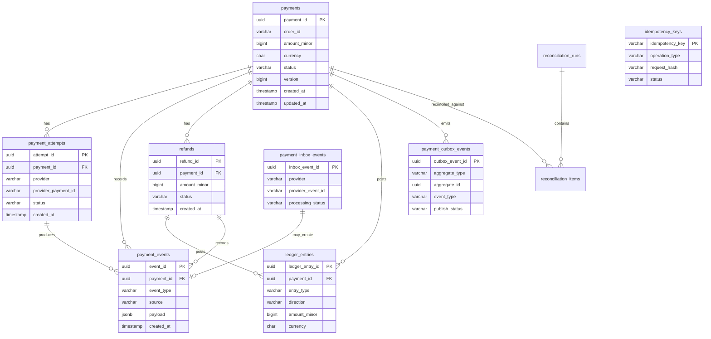
```mermaid
erDiagram
    payments ||--o{ payment_attempts : has
    payments ||--o{ payment_events : records
    payments ||--o{ refunds : has
    payments ||--o{ ledger_entries : posts
    payments ||--o{ payment_outbox_events : emits

    payment_attempts ||--o{ payment_events : produces
    refunds ||--o{ ledger_entries : posts
    refunds ||--o{ payment_events : records

    payment_inbox_events ||--o| payment_events : may_create
    reconciliation_runs ||--o{ reconciliation_items : contains
    payments ||--o{ reconciliation_items : reconciled_against

    payments {
        uuid payment_id PK
        varchar order_id
        bigint amount_minor
        char currency
        varchar status
        bigint version
        timestamp created_at
        timestamp updated_at
    }

    payment_attempts {
        uuid attempt_id PK
        uuid payment_id FK
        varchar provider
        varchar provider_payment_id
        varchar status
        timestamp created_at
    }

    payment_events {
        uuid event_id PK
        uuid payment_id FK
        varchar event_type
        varchar source
        jsonb payload
        timestamp created_at
    }

    refunds {
        uuid refund_id PK
        uuid payment_id FK
        bigint amount_minor
        varchar status
        timestamp created_at
    }

    ledger_entries {
        uuid ledger_entry_id PK
        uuid payment_id FK
        varchar entry_type
        varchar direction
        bigint amount_minor
        char currency
    }

    idempotency_keys {
        varchar idempotency_key PK
        varchar operation_type
        varchar request_hash
        varchar status
    }

    payment_inbox_events {
        uuid inbox_event_id PK
        varchar provider
        varchar provider_event_id
        varchar processing_status
    }

    payment_outbox_events {
        uuid outbox_event_id PK
        varchar aggregate_type
        uuid aggregate_id
        varchar event_type
        varchar publish_status
    }
```

---

# 3. Practical Table Decomposition

| No | Table | Fungsi Praktis | Kenapa Dipisah |
|---:|---|---|---|
| 1 | `payments` | Aggregate utama payment internal. | Menyimpan niat bisnis dan state utama. |
| 2 | `payment_attempts` | Satu atau lebih percobaan ke PSP. | Payment bisa retry atau pindah provider. |
| 3 | `payment_events` | Timeline perubahan state. | Untuk audit, debugging, replay analysis. |
| 4 | `refunds` | Lifecycle refund. | Refund bisa partial, multiple, async. |
| 5 | `ledger_entries` | Catatan finansial append-only. | Untuk audit dan reconciliation. |
| 6 | `idempotency_keys` | Dedup request dari client/internal service. | Mencegah double charge akibat retry. |
| 7 | `payment_inbox_events` | Dedup webhook/event masuk. | Mencegah duplicate webhook diproses dua kali. |
| 8 | `payment_outbox_events` | Reliable event publishing. | Mencegah DB update sukses tapi event hilang. |
| 9 | `reconciliation_runs` | Batch rekonsiliasi dengan PSP/bank. | Tracking proses reconcile. |
| 10 | `reconciliation_items` | Detail item reconcile. | Menyimpan match/mismatch per transaksi. |

---

# 4. Naming dan Convention

Gunakan convention yang konsisten.

| Area | Rekomendasi |
|---|---|
| Primary key | `payment_id`, `attempt_id`, `refund_id`, bukan generic `id`. |
| Amount | `amount_minor BIGINT`, bukan `double`. |
| Currency | `currency CHAR(3)` uppercase. |
| Status | `VARCHAR(40)` atau PostgreSQL enum. Untuk enterprise, `VARCHAR` lebih fleksibel untuk migration. |
| Timestamp | `TIMESTAMPTZ`, bukan `TIMESTAMP` biasa. |
| Payload vendor | `JSONB`, bukan raw `TEXT`, kecuali untuk raw signature verification. |
| Audit | Jangan update event/ledger; gunakan append-only. |
| Versioning | `version BIGINT` untuk optimistic locking. |

PostgreSQL menyediakan `jsonb` untuk menyimpan data JSON yang bisa di-index. Dokumentasi PostgreSQL juga menjelaskan bahwa GIN index dapat digunakan untuk mencari key/value dalam banyak dokumen `jsonb`. ([PostgreSQL](https://www.postgresql.org/docs/current/datatype-json.html?utm_source=chatgpt.com))

---

# 5. Schema Detail

## 5.1 Table `payments`

Table ini adalah aggregate utama.

```sql
CREATE TABLE payments (
    payment_id UUID PRIMARY KEY,

    order_id VARCHAR(100) NOT NULL,
    customer_id VARCHAR(100),
    merchant_id VARCHAR(100),

    amount_minor BIGINT NOT NULL,
    currency CHAR(3) NOT NULL,

    authorized_amount_minor BIGINT NOT NULL DEFAULT 0,
    captured_amount_minor BIGINT NOT NULL DEFAULT 0,
    refunded_amount_minor BIGINT NOT NULL DEFAULT 0,

    status VARCHAR(40) NOT NULL,

    provider VARCHAR(50),
    provider_payment_id VARCHAR(200),

    capture_mode VARCHAR(30) NOT NULL DEFAULT 'AUTO',
    payment_method_type VARCHAR(50),

    failure_code VARCHAR(100),
    failure_message TEXT,

    metadata JSONB,

    version BIGINT NOT NULL DEFAULT 0,

    created_at TIMESTAMPTZ NOT NULL DEFAULT now(),
    updated_at TIMESTAMPTZ NOT NULL DEFAULT now(),

    CONSTRAINT chk_payments_amount_non_negative
        CHECK (amount_minor >= 0),

    CONSTRAINT chk_payments_authorized_non_negative
        CHECK (authorized_amount_minor >= 0),

    CONSTRAINT chk_payments_captured_valid
        CHECK (
            captured_amount_minor >= 0
            AND captured_amount_minor <= authorized_amount_minor
        ),

    CONSTRAINT chk_payments_refunded_valid
        CHECK (
            refunded_amount_minor >= 0
            AND refunded_amount_minor <= captured_amount_minor
        ),

    CONSTRAINT chk_payments_currency_uppercase
        CHECK (currency = upper(currency)),

    CONSTRAINT chk_payments_capture_mode
        CHECK (capture_mode IN ('AUTO', 'MANUAL'))
);
```

Indexes:

```sql
CREATE INDEX ix_payments_order_id
ON payments(order_id);

CREATE INDEX ix_payments_customer_id
ON payments(customer_id);

CREATE INDEX ix_payments_merchant_id
ON payments merchant_id;

CREATE INDEX ix_payments_status
ON payments(status);

CREATE INDEX ix_payments_created_at
ON payments(created_at);

CREATE UNIQUE INDEX ux_payments_provider_payment_id
ON payments(provider, provider_payment_id)
WHERE provider IS NOT NULL
  AND provider_payment_id IS NOT NULL;

CREATE INDEX ix_payments_metadata_gin
ON payments USING GIN(metadata);
```

Catatan: ada typo kecil yang harus diperbaiki di index `merchant_id`.

Versi benar:

```sql
CREATE INDEX ix_payments_merchant_id
ON payments(merchant_id);
```

### Practical Usage

`payments` menjawab pertanyaan seperti:

```sql
SELECT *
FROM payments
WHERE payment_id = '...';
```

```sql
SELECT *
FROM payments
WHERE order_id = 'ORD-123';
```

```sql
SELECT status, count(*)
FROM payments
WHERE created_at >= now() - interval '1 day'
GROUP BY status;
```

---

## 5.2 Table `payment_attempts`

Satu payment bisa punya beberapa attempt.

Contoh kasus:

```text
Attempt 1: call PSP timeout.
Attempt 2: query status PSP.
Attempt 3: retry authorization dengan idempotency key sama.
Attempt 4: fallback provider, jika business rule mengizinkan.
```

Schema:

```sql
CREATE TABLE payment_attempts (
    attempt_id UUID PRIMARY KEY,
    payment_id UUID NOT NULL REFERENCES payments(payment_id),

    attempt_type VARCHAR(40) NOT NULL,
    provider VARCHAR(50) NOT NULL,

    provider_payment_id VARCHAR(200),
    provider_charge_id VARCHAR(200),
    provider_request_id VARCHAR(200),

    status VARCHAR(40) NOT NULL,

    amount_minor BIGINT NOT NULL,
    currency CHAR(3) NOT NULL,

    request_hash VARCHAR(128),
    request_payload JSONB,
    response_payload JSONB,

    failure_code VARCHAR(100),
    failure_message TEXT,

    started_at TIMESTAMPTZ NOT NULL DEFAULT now(),
    completed_at TIMESTAMPTZ,

    created_at TIMESTAMPTZ NOT NULL DEFAULT now(),
    updated_at TIMESTAMPTZ NOT NULL DEFAULT now(),

    CONSTRAINT chk_payment_attempts_type
        CHECK (attempt_type IN (
            'AUTHORIZE',
            'CAPTURE',
            'SALE',
            'VOID',
            'REFUND',
            'QUERY_STATUS'
        )),

    CONSTRAINT chk_payment_attempts_amount_positive
        CHECK (amount_minor > 0),

    CONSTRAINT chk_payment_attempts_currency_uppercase
        CHECK (currency = upper(currency))
);
```

Indexes:

```sql
CREATE INDEX ix_payment_attempts_payment_id
ON payment_attempts(payment_id);

CREATE INDEX ix_payment_attempts_provider_payment_id
ON payment_attempts(provider, provider_payment_id);

CREATE INDEX ix_payment_attempts_status
ON payment_attempts(status);

CREATE INDEX ix_payment_attempts_started_at
ON payment_attempts(started_at);

CREATE INDEX ix_payment_attempts_request_payload_gin
ON payment_attempts USING GIN(request_payload);

CREATE INDEX ix_payment_attempts_response_payload_gin
ON payment_attempts USING GIN(response_payload);
```

### Practical Usage

Cari semua attempt untuk satu payment:

```sql
SELECT *
FROM payment_attempts
WHERE payment_id = :payment_id
ORDER BY started_at ASC;
```

Cari attempt yang stuck:

```sql
SELECT *
FROM payment_attempts
WHERE status IN ('PENDING', 'UNKNOWN')
  AND started_at < now() - interval '15 minutes';
```

---

## 5.3 Table `payment_events`

Ini adalah timeline audit.

Event tidak boleh dipakai hanya untuk “nice to have”. Dalam payment, event adalah alat utama untuk investigasi.

Schema:

```sql
CREATE TABLE payment_events (
    event_id UUID PRIMARY KEY,
    payment_id UUID NOT NULL REFERENCES payments(payment_id),

    attempt_id UUID REFERENCES payment_attempts(attempt_id),
    refund_id UUID,

    event_type VARCHAR(80) NOT NULL,
    source VARCHAR(40) NOT NULL,

    provider VARCHAR(50),
    provider_event_id VARCHAR(200),

    old_status VARCHAR(40),
    new_status VARCHAR(40),

    payload JSONB,
    raw_payload TEXT,

    created_by VARCHAR(100),
    created_at TIMESTAMPTZ NOT NULL DEFAULT now(),

    CONSTRAINT chk_payment_events_source
        CHECK (source IN (
            'API',
            'PROVIDER_RESPONSE',
            'WEBHOOK',
            'RECONCILIATION',
            'SYSTEM_JOB',
            'ADMIN'
        ))
);
```

Indexes:

```sql
CREATE INDEX ix_payment_events_payment_id
ON payment_events(payment_id);

CREATE INDEX ix_payment_events_attempt_id
ON payment_events(attempt_id);

CREATE INDEX ix_payment_events_refund_id
ON payment_events(refund_id);

CREATE INDEX ix_payment_events_event_type
ON payment_events(event_type);

CREATE INDEX ix_payment_events_created_at
ON payment_events(created_at);

CREATE UNIQUE INDEX ux_payment_events_provider_event
ON payment_events(provider, provider_event_id)
WHERE provider IS NOT NULL
  AND provider_event_id IS NOT NULL;

CREATE INDEX ix_payment_events_payload_gin
ON payment_events USING GIN(payload);
```

### Practical Usage

Payment timeline:

```sql
SELECT event_type,
       source,
       old_status,
       new_status,
       created_at
FROM payment_events
WHERE payment_id = :payment_id
ORDER BY created_at ASC;
```

Cari webhook duplicate:

```sql
SELECT provider, provider_event_id, count(*)
FROM payment_events
WHERE provider_event_id IS NOT NULL
GROUP BY provider, provider_event_id
HAVING count(*) > 1;
```

---

## 5.4 Table `refunds`

Refund harus punya lifecycle sendiri.

Jangan hanya menambah `refund_status` di `payments`.

Alasannya:

```text
1 payment bisa punya banyak refund.
1 refund bisa pending.
1 refund bisa gagal.
1 refund bisa sukses sebagian tergantung provider.
Refund bisa dikonfirmasi lewat webhook.
Refund bisa muncul di settlement report.
```

Schema:

```sql
CREATE TABLE refunds (
    refund_id UUID PRIMARY KEY,
    payment_id UUID NOT NULL REFERENCES payments(payment_id),

    provider VARCHAR(50),
    provider_refund_id VARCHAR(200),

    amount_minor BIGINT NOT NULL,
    currency CHAR(3) NOT NULL,

    status VARCHAR(40) NOT NULL,
    reason VARCHAR(200),

    requested_by VARCHAR(100),
    approved_by VARCHAR(100),

    request_payload JSONB,
    response_payload JSONB,

    failure_code VARCHAR(100),
    failure_message TEXT,

    created_at TIMESTAMPTZ NOT NULL DEFAULT now(),
    updated_at TIMESTAMPTZ NOT NULL DEFAULT now(),

    CONSTRAINT chk_refunds_amount_positive
        CHECK (amount_minor > 0),

    CONSTRAINT chk_refunds_currency_uppercase
        CHECK (currency = upper(currency))
);
```

Indexes:

```sql
CREATE INDEX ix_refunds_payment_id
ON refunds(payment_id);

CREATE INDEX ix_refunds_status
ON refunds(status);

CREATE INDEX ix_refunds_created_at
ON refunds(created_at);

CREATE UNIQUE INDEX ux_refunds_provider_refund_id
ON refunds(provider, provider_refund_id)
WHERE provider IS NOT NULL
  AND provider_refund_id IS NOT NULL;
```

### Practical Usage

Hitung total refund sukses:

```sql
SELECT COALESCE(sum(amount_minor), 0) AS refunded_amount_minor
FROM refunds
WHERE payment_id = :payment_id
  AND status IN ('SUCCEEDED', 'PARTIALLY_SUCCEEDED');
```

Cek refund yang masih pending:

```sql
SELECT *
FROM refunds
WHERE status IN ('REQUESTED', 'PENDING')
  AND created_at < now() - interval '30 minutes';
```

---

## 5.5 Table `ledger_entries`

Ledger adalah catatan finansial append-only.

Pola praktis:

```text
CAPTURE_SUCCEEDED  -> CREDIT platform/merchant receivable
REFUND_SUCCEEDED   -> DEBIT platform/merchant receivable
CHARGEBACK_LOST    -> DEBIT platform/merchant receivable
FEE_CHARGED        -> DEBIT fee account
SETTLEMENT_PAID    -> CREDIT bank settlement
```

Schema sederhana:

```sql
CREATE TABLE ledger_entries (
    ledger_entry_id UUID PRIMARY KEY,
    payment_id UUID NOT NULL REFERENCES payments(payment_id),
    refund_id UUID REFERENCES refunds(refund_id),

    entry_type VARCHAR(60) NOT NULL,
    direction VARCHAR(10) NOT NULL,

    amount_minor BIGINT NOT NULL,
    currency CHAR(3) NOT NULL,

    account_code VARCHAR(80) NOT NULL,

    reference_type VARCHAR(60) NOT NULL,
    reference_id VARCHAR(120) NOT NULL,

    description TEXT,

    created_at TIMESTAMPTZ NOT NULL DEFAULT now(),

    CONSTRAINT chk_ledger_entries_amount_positive
        CHECK (amount_minor > 0),

    CONSTRAINT chk_ledger_entries_direction
        CHECK (direction IN ('DEBIT', 'CREDIT')),

    CONSTRAINT chk_ledger_entries_currency_uppercase
        CHECK (currency = upper(currency))
);
```

Indexes:

```sql
CREATE INDEX ix_ledger_entries_payment_id
ON ledger_entries(payment_id);

CREATE INDEX ix_ledger_entries_refund_id
ON ledger_entries(refund_id);

CREATE INDEX ix_ledger_entries_entry_type
ON ledger_entries(entry_type);

CREATE INDEX ix_ledger_entries_created_at
ON ledger_entries(created_at);

CREATE UNIQUE INDEX ux_ledger_entries_reference
ON ledger_entries(reference_type, reference_id, entry_type);
```

### Practical Usage

Ledger timeline untuk satu payment:

```sql
SELECT entry_type,
       direction,
       amount_minor,
       currency,
       account_code,
       reference_type,
       reference_id,
       created_at
FROM ledger_entries
WHERE payment_id = :payment_id
ORDER BY created_at ASC;
```

Cek balance kasar per payment:

```sql
SELECT payment_id,
       currency,
       sum(
           CASE
               WHEN direction = 'CREDIT' THEN amount_minor
               WHEN direction = 'DEBIT' THEN -amount_minor
           END
       ) AS balance_minor
FROM ledger_entries
WHERE payment_id = :payment_id
GROUP BY payment_id, currency;
```

---

## 5.6 Table `idempotency_keys`

Idempotency mencegah operasi yang sama dijalankan dua kali.

Contoh:

```text
Client call POST /payments.
Network timeout.
Client retry dengan Idempotency-Key sama.
Service harus return response yang sama atau status operation yang sama.
Bukan create payment baru.
```

Schema:

```sql
CREATE TABLE idempotency_keys (
    idempotency_key VARCHAR(200) PRIMARY KEY,

    operation_type VARCHAR(80) NOT NULL,
    operation_key VARCHAR(200),

    request_hash VARCHAR(128) NOT NULL,

    status VARCHAR(40) NOT NULL,

    response_status_code INTEGER,
    response_body JSONB,

    locked_until TIMESTAMPTZ,
    created_at TIMESTAMPTZ NOT NULL DEFAULT now(),
    updated_at TIMESTAMPTZ NOT NULL DEFAULT now(),

    CONSTRAINT chk_idempotency_keys_status
        CHECK (status IN (
            'PROCESSING',
            'SUCCEEDED',
            'FAILED',
            'EXPIRED'
        ))
);
```

Indexes:

```sql
CREATE INDEX ix_idempotency_keys_operation
ON idempotency_keys(operation_type, operation_key);

CREATE INDEX ix_idempotency_keys_status
ON idempotency_keys(status);

CREATE INDEX ix_idempotency_keys_locked_until
ON idempotency_keys(locked_until);

CREATE INDEX ix_idempotency_keys_created_at
ON idempotency_keys(created_at);
```

### Practical Usage

Insert idempotency key:

```sql
INSERT INTO idempotency_keys (
    idempotency_key,
    operation_type,
    operation_key,
    request_hash,
    status,
    locked_until
)
VALUES (
    :idempotency_key,
    :operation_type,
    :operation_key,
    :request_hash,
    'PROCESSING',
    now() + interval '5 minutes'
)
ON CONFLICT (idempotency_key) DO NOTHING;
```

Kalau insert berhasil, request pertama boleh lanjut.

Kalau insert gagal, load record existing:

```sql
SELECT *
FROM idempotency_keys
WHERE idempotency_key = :idempotency_key;
```

Decision:

| Existing Status | Action |
|---|---|
| `PROCESSING` | Return `409 Conflict` atau tunggu sebentar, tergantung API design. |
| `SUCCEEDED` | Return cached response. |
| `FAILED` | Return cached failure, kecuali policy mengizinkan retry. |
| `EXPIRED` | Bisa reject atau create key baru tergantung retention policy. |

---

## 5.7 Table `payment_inbox_events`

Inbox dipakai untuk dedup webhook/event masuk.

Webhook provider sering bisa dikirim lebih dari sekali. Maka dedup harus terjadi sebelum state transition.

Schema:

```sql
CREATE TABLE payment_inbox_events (
    inbox_event_id UUID PRIMARY KEY,

    provider VARCHAR(50) NOT NULL,
    provider_event_id VARCHAR(200) NOT NULL,

    event_type VARCHAR(100),
    provider_payment_id VARCHAR(200),
    provider_refund_id VARCHAR(200),

    raw_payload TEXT NOT NULL,
    parsed_payload JSONB,

    signature_header TEXT,
    verified BOOLEAN NOT NULL DEFAULT false,

    processing_status VARCHAR(40) NOT NULL DEFAULT 'RECEIVED',
    processing_attempts INTEGER NOT NULL DEFAULT 0,

    last_error TEXT,

    received_at TIMESTAMPTZ NOT NULL DEFAULT now(),
    processed_at TIMESTAMPTZ,

    CONSTRAINT chk_payment_inbox_processing_status
        CHECK (processing_status IN (
            'RECEIVED',
            'PROCESSING',
            'PROCESSED',
            'DUPLICATE',
            'FAILED',
            'IGNORED'
        ))
);
```

Indexes:

```sql
CREATE UNIQUE INDEX ux_payment_inbox_provider_event
ON payment_inbox_events(provider, provider_event_id);

CREATE INDEX ix_payment_inbox_provider_payment
ON payment_inbox_events(provider, provider_payment_id);

CREATE INDEX ix_payment_inbox_processing_status
ON payment_inbox_events(processing_status);

CREATE INDEX ix_payment_inbox_received_at
ON payment_inbox_events(received_at);

CREATE INDEX ix_payment_inbox_payload_gin
ON payment_inbox_events USING GIN(parsed_payload);
```

### Practical Usage

Insert webhook:

```sql
INSERT INTO payment_inbox_events (
    inbox_event_id,
    provider,
    provider_event_id,
    event_type,
    provider_payment_id,
    raw_payload,
    parsed_payload,
    signature_header,
    verified,
    processing_status
)
VALUES (
    :inbox_event_id,
    :provider,
    :provider_event_id,
    :event_type,
    :provider_payment_id,
    :raw_payload,
    CAST(:parsed_payload AS jsonb),
    :signature_header,
    :verified,
    'RECEIVED'
)
ON CONFLICT (provider, provider_event_id)
DO UPDATE SET
    processing_status = 'DUPLICATE';
```

Namun hati-hati: `DO UPDATE SET processing_status = 'DUPLICATE'` bisa merusak status original kalau event pertama sudah `PROCESSED`. Alternatif lebih aman:

```sql
INSERT INTO payment_inbox_events (
    inbox_event_id,
    provider,
    provider_event_id,
    raw_payload,
    verified,
    processing_status
)
VALUES (
    :inbox_event_id,
    :provider,
    :provider_event_id,
    :raw_payload,
    :verified,
    'RECEIVED'
)
ON CONFLICT (provider, provider_event_id)
DO NOTHING;
```

Lalu kalau affected row `0`, anggap duplicate dan return HTTP 200 ke provider.

---

## 5.8 Table `payment_outbox_events`

Outbox menyelesaikan masalah dual-write:

```text
1. Update payment status di DB.
2. Publish event ke broker.

Kalau step 1 sukses tapi step 2 gagal, service lain tidak tahu payment sudah berubah.
Kalau step 2 sukses tapi step 1 rollback, service lain menerima event palsu.
```

Solusinya: insert event outbox di transaksi DB yang sama dengan update payment.

Schema:

```sql
CREATE TABLE payment_outbox_events (
    outbox_event_id UUID PRIMARY KEY,

    aggregate_type VARCHAR(80) NOT NULL,
    aggregate_id UUID NOT NULL,

    event_type VARCHAR(100) NOT NULL,
    event_version INTEGER NOT NULL DEFAULT 1,

    payload JSONB NOT NULL,

    publish_status VARCHAR(40) NOT NULL DEFAULT 'PENDING',
    publish_attempts INTEGER NOT NULL DEFAULT 0,

    next_attempt_at TIMESTAMPTZ NOT NULL DEFAULT now(),
    published_at TIMESTAMPTZ,

    last_error TEXT,

    created_at TIMESTAMPTZ NOT NULL DEFAULT now(),

    CONSTRAINT chk_payment_outbox_publish_status
        CHECK (publish_status IN (
            'PENDING',
            'PROCESSING',
            'PUBLISHED',
            'FAILED',
            'DEAD_LETTER'
        ))
);
```

Indexes:

```sql
CREATE INDEX ix_payment_outbox_pending
ON payment_outbox_events(publish_status, next_attempt_at);

CREATE INDEX ix_payment_outbox_aggregate
ON payment_outbox_events(aggregate_type, aggregate_id);

CREATE INDEX ix_payment_outbox_event_type
ON payment_outbox_events(event_type);

CREATE INDEX ix_payment_outbox_created_at
ON payment_outbox_events(created_at);
```

### Practical Usage

Ambil event outbox untuk dipublish:

```sql
SELECT *
FROM payment_outbox_events
WHERE publish_status = 'PENDING'
  AND next_attempt_at <= now()
ORDER BY created_at ASC
LIMIT 100
FOR UPDATE SKIP LOCKED;
```

`FOR UPDATE` berguna saat beberapa worker mengambil row yang sama. PostgreSQL menjelaskan explicit locking seperti row-level lock untuk mengontrol transaksi yang melakukan update/delete/select-for-update pada row yang sama. ([PostgreSQL](https://www.postgresql.org/docs/current/explicit-locking.html?utm_source=chatgpt.com))

---

## 5.9 Table `reconciliation_runs`

Reconciliation biasanya jalan batch.

Schema:

```sql
CREATE TABLE reconciliation_runs (
    reconciliation_run_id UUID PRIMARY KEY,

    provider VARCHAR(50) NOT NULL,
    report_type VARCHAR(80) NOT NULL,

    report_date DATE NOT NULL,
    report_file_name VARCHAR(255),

    status VARCHAR(40) NOT NULL,

    total_items INTEGER NOT NULL DEFAULT 0,
    matched_items INTEGER NOT NULL DEFAULT 0,
    mismatched_items INTEGER NOT NULL DEFAULT 0,
    missing_internal_items INTEGER NOT NULL DEFAULT 0,
    missing_provider_items INTEGER NOT NULL DEFAULT 0,

    started_at TIMESTAMPTZ NOT NULL DEFAULT now(),
    completed_at TIMESTAMPTZ,

    created_at TIMESTAMPTZ NOT NULL DEFAULT now(),

    CONSTRAINT chk_reconciliation_runs_status
        CHECK (status IN (
            'STARTED',
            'COMPLETED',
            'FAILED',
            'PARTIAL'
        ))
);
```

Indexes:

```sql
CREATE INDEX ix_reconciliation_runs_provider_date
ON reconciliation_runs(provider, report_date);

CREATE INDEX ix_reconciliation_runs_status
ON reconciliation_runs(status);
```

---

## 5.10 Table `reconciliation_items`

Schema:

```sql
CREATE TABLE reconciliation_items (
    reconciliation_item_id UUID PRIMARY KEY,
    reconciliation_run_id UUID NOT NULL
        REFERENCES reconciliation_runs(reconciliation_run_id),

    payment_id UUID REFERENCES payments(payment_id),
    refund_id UUID REFERENCES refunds(refund_id),

    provider VARCHAR(50) NOT NULL,
    provider_payment_id VARCHAR(200),
    provider_refund_id VARCHAR(200),

    item_type VARCHAR(80) NOT NULL,
    match_status VARCHAR(40) NOT NULL,

    internal_amount_minor BIGINT,
    provider_amount_minor BIGINT,
    currency CHAR(3),

    difference_minor BIGINT,

    details JSONB,

    created_at TIMESTAMPTZ NOT NULL DEFAULT now(),

    CONSTRAINT chk_reconciliation_items_match_status
        CHECK (match_status IN (
            'MATCHED',
            'AMOUNT_MISMATCH',
            'STATUS_MISMATCH',
            'MISSING_INTERNAL',
            'MISSING_PROVIDER',
            'DUPLICATE',
            'IGNORED'
        ))
);
```

Indexes:

```sql
CREATE INDEX ix_reconciliation_items_run_id
ON reconciliation_items(reconciliation_run_id);

CREATE INDEX ix_reconciliation_items_payment_id
ON reconciliation_items(payment_id);

CREATE INDEX ix_reconciliation_items_refund_id
ON reconciliation_items(refund_id);

CREATE INDEX ix_reconciliation_items_match_status
ON reconciliation_items(match_status);

CREATE INDEX ix_reconciliation_items_provider_payment
ON reconciliation_items(provider, provider_payment_id);
```

---

# 6. Transaction Boundary yang Disarankan

## 6.1 Create Payment Transaction

```text
BEGIN
  1. Insert idempotency key PROCESSING.
  2. Insert payments INITIATED.
  3. Insert payment_attempts AUTHORIZE/SALE PENDING.
  4. Insert payment_events PAYMENT_INITIATED.
COMMIT

Call PSP

BEGIN
  5. Update payment status based on PSP response.
  6. Update payment_attempt status.
  7. Insert payment_events PROVIDER_RESPONSE_RECEIVED.
  8. Insert ledger_entries if financially captured.
  9. Insert payment_outbox_events PaymentAuthorized/PaymentCaptured.
  10. Update idempotency key SUCCEEDED with response snapshot.
COMMIT
```

Kenapa call PSP tidak di dalam transaksi DB panjang?

Karena external call bisa lambat atau timeout. Kalau transaksi DB dibuka terlalu lama, row/table bisa terkunci lebih lama dan throughput turun. Untuk update kritikal, gunakan transaksi pendek dengan optimistic locking atau row lock.

PostgreSQL sendiri menyediakan beberapa isolation level, tetapi dokumentasi menjelaskan bahwa secara internal hanya tiga level berbeda yang diimplementasikan karena MVCC; ini penting saat kita merancang transaksi payment yang harus sadar race condition. ([PostgreSQL](https://www.postgresql.org/docs/current/transaction-iso.html?utm_source=chatgpt.com))

---

# 7. Optimistic Locking Pattern

Field:

```sql
version BIGINT NOT NULL DEFAULT 0
```

Update:

```sql
UPDATE payments
SET status = :new_status,
    version = version + 1,
    updated_at = now()
WHERE payment_id = :payment_id
  AND status = :expected_status
  AND version = :expected_version;
```

Kalau affected row `0`, jangan langsung anggap error teknis. Kemungkinan:

| Kemungkinan | Makna |
|---|---|
| Payment tidak ditemukan | Return 404. |
| Version berubah | Ada concurrent update. Reload state. |
| Status sudah berubah | Webhook/retry/admin sudah memproses. |
| Transition tidak valid | Return domain error. |

---

# 8. Row Locking Pattern untuk Critical Flow

Untuk operasi seperti capture/refund, kadang lebih aman lock row dulu.

```sql
SELECT *
FROM payments
WHERE payment_id = :payment_id
FOR UPDATE;
```

Lalu validasi:

```text
1. status boleh capture?
2. remaining authorized amount cukup?
3. remaining refundable amount cukup?
4. currency sama?
5. belum ada duplicate request?
```

Gunakan transaksi singkat:

```text
BEGIN
  SELECT payment FOR UPDATE
  validate
  insert attempt
  mark CAPTURE_PENDING
  insert event
COMMIT

Call PSP outside transaction

BEGIN
  SELECT payment FOR UPDATE
  apply provider result
  insert event
  insert ledger
  insert outbox
COMMIT
```

---

# 9. MyBatis Mapper Design

## 9.1 Interface

```java
public interface PaymentMapper {

    int insertPayment(PaymentRecord payment);

    PaymentRecord findPaymentById(UUID paymentId);

    PaymentRecord findPaymentByIdForUpdate(UUID paymentId);

    int updatePaymentState(UpdatePaymentStateCommand command);

    int addCapturedAmount(AddCapturedAmountCommand command);

    int addRefundedAmount(AddRefundedAmountCommand command);

    int insertPaymentAttempt(PaymentAttemptRecord attempt);

    int updatePaymentAttempt(PaymentAttemptUpdateCommand command);

    int insertPaymentEvent(PaymentEventRecord event);

    int insertLedgerEntry(LedgerEntryRecord entry);

    int insertOutboxEvent(OutboxEventRecord event);
}
```

## 9.2 `select ... for update`

```xml
<select id="findPaymentByIdForUpdate" resultMap="PaymentResultMap">
    SELECT
        payment_id,
        order_id,
        customer_id,
        merchant_id,
        amount_minor,
        currency,
        authorized_amount_minor,
        captured_amount_minor,
        refunded_amount_minor,
        status,
        provider,
        provider_payment_id,
        capture_mode,
        payment_method_type,
        failure_code,
        failure_message,
        metadata,
        version,
        created_at,
        updated_at
    FROM payments
    WHERE payment_id = #{paymentId}
    FOR UPDATE
</select>
```

## 9.3 Insert Payment

```xml
<insert id="insertPayment">
    INSERT INTO payments (
        payment_id,
        order_id,
        customer_id,
        merchant_id,
        amount_minor,
        currency,
        authorized_amount_minor,
        captured_amount_minor,
        refunded_amount_minor,
        status,
        capture_mode,
        payment_method_type,
        metadata,
        version,
        created_at,
        updated_at
    ) VALUES (
        #{paymentId},
        #{orderId},
        #{customerId},
        #{merchantId},
        #{amountMinor},
        #{currency},
        #{authorizedAmountMinor},
        #{capturedAmountMinor},
        #{refundedAmountMinor},
        #{status},
        #{captureMode},
        #{paymentMethodType},
        CAST(#{metadataJson} AS jsonb),
        0,
        now(),
        now()
    )
</insert>
```

## 9.4 Update Capture Amount

```xml
<update id="addCapturedAmount">
    UPDATE payments
    SET captured_amount_minor = captured_amount_minor + #{captureAmountMinor},
        status = CASE
            WHEN captured_amount_minor + #{captureAmountMinor} = authorized_amount_minor
                THEN 'CAPTURED'
            ELSE 'PARTIALLY_CAPTURED'
        END,
        version = version + 1,
        updated_at = now()
    WHERE payment_id = #{paymentId}
      AND status IN ('AUTHORIZED', 'CAPTURE_PENDING', 'PARTIALLY_CAPTURED', 'UNKNOWN')
      AND captured_amount_minor + #{captureAmountMinor} <= authorized_amount_minor
      AND currency = #{currency}
      AND version = #{version}
</update>
```

## 9.5 Insert Event

```xml
<insert id="insertPaymentEvent">
    INSERT INTO payment_events (
        event_id,
        payment_id,
        attempt_id,
        refund_id,
        event_type,
        source,
        provider,
        provider_event_id,
        old_status,
        new_status,
        payload,
        raw_payload,
        created_by,
        created_at
    ) VALUES (
        #{eventId},
        #{paymentId},
        #{attemptId},
        #{refundId},
        #{eventType},
        #{source},
        #{provider},
        #{providerEventId},
        #{oldStatus},
        #{newStatus},
        CAST(#{payloadJson} AS jsonb),
        #{rawPayload},
        #{createdBy},
        now()
    )
</insert>
```

MyBatis XML mapper memang menyediakan elemen mapped statement seperti `insert`, `update`, `delete`, dan `select`, sehingga pola SQL eksplisit seperti di atas natural untuk MyBatis-based application. ([mybatis.org](https://mybatis.org/mybatis-3/sqlmap-xml.html?utm_source=chatgpt.com))

---

# 10. Payment Operation Transaction Patterns

## 10.1 Create Payment

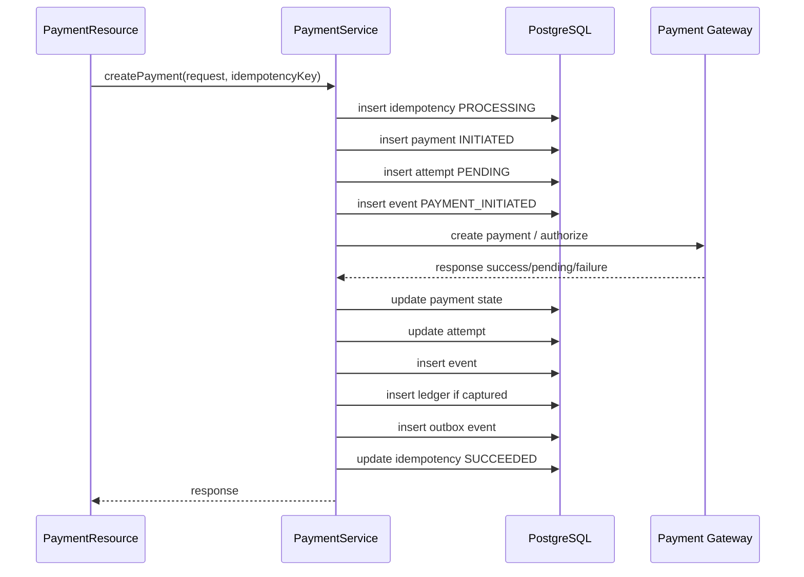
```mermaid
sequenceDiagram
    participant API as PaymentResource
    participant SVC as PaymentService
    participant DB as PostgreSQL
    participant PSP as Payment Gateway

    API->>SVC: createPayment(request, idempotencyKey)
    SVC->>DB: insert idempotency PROCESSING
    SVC->>DB: insert payment INITIATED
    SVC->>DB: insert attempt PENDING
    SVC->>DB: insert event PAYMENT_INITIATED
    SVC->>PSP: create payment / authorize
    PSP-->>SVC: response success/pending/failure
    SVC->>DB: update payment state
    SVC->>DB: update attempt
    SVC->>DB: insert event
    SVC->>DB: insert ledger if captured
    SVC->>DB: insert outbox event
    SVC->>DB: update idempotency SUCCEEDED
    SVC-->>API: response
```

## 10.2 Webhook Processing

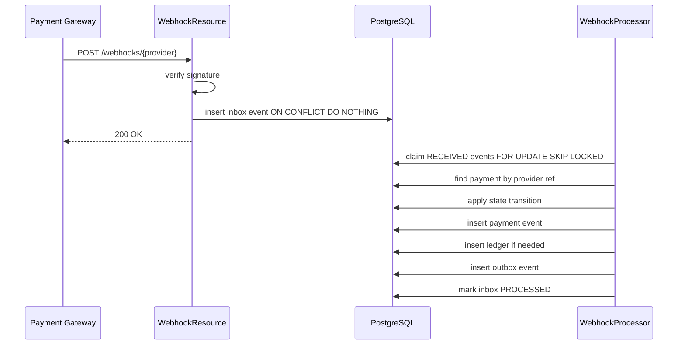
```mermaid
sequenceDiagram
    participant PSP as Payment Gateway
    participant WH as WebhookResource
    participant DB as PostgreSQL
    participant Worker as WebhookProcessor

    PSP->>WH: POST /webhooks/{provider}
    WH->>WH: verify signature
    WH->>DB: insert inbox event ON CONFLICT DO NOTHING
    WH-->>PSP: 200 OK

    Worker->>DB: claim RECEIVED events FOR UPDATE SKIP LOCKED
    Worker->>DB: find payment by provider ref
    Worker->>DB: apply state transition
    Worker->>DB: insert payment event
    Worker->>DB: insert ledger if needed
    Worker->>DB: insert outbox event
    Worker->>DB: mark inbox PROCESSED
```

## 10.3 Outbox Publishing

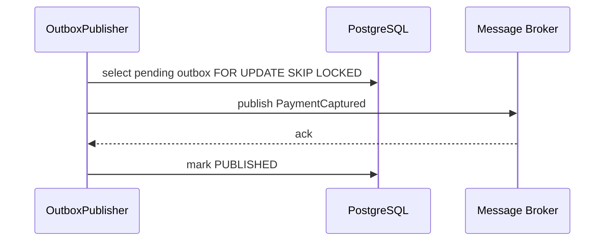
```mermaid
sequenceDiagram
    participant Worker as OutboxPublisher
    participant DB as PostgreSQL
    participant Broker as Message Broker

    Worker->>DB: select pending outbox FOR UPDATE SKIP LOCKED
    Worker->>Broker: publish PaymentCaptured
    Broker-->>Worker: ack
    Worker->>DB: mark PUBLISHED
```

---

# 11. Constraint vs Application Validation

Gunakan keduanya.

| Rule | Java Validation | DB Constraint |
|---|---|---|
| Amount tidak negatif | Ya | Ya |
| Currency uppercase | Ya | Ya |
| Captured <= authorized | Ya | Ya |
| Refunded <= captured | Ya | Ya |
| Provider ref unique | Ya | Ya |
| Webhook event unique | Ya | Ya |
| Valid transition | Ya | Sebagian, via SQL WHERE condition |
| Idempotency duplicate | Ya | Ya, primary key |
| Ledger append-only | Ya | Bisa diperkuat via privilege/trigger |

Prinsipnya:

```text
Application menjaga behavior.
Database menjaga invariant.
```

---

# 12. View untuk Operasional

Agar support/ops tidak query banyak table manual, buat view.

## 12.1 Payment Summary View

```sql
CREATE VIEW v_payment_summary AS
SELECT
    p.payment_id,
    p.order_id,
    p.customer_id,
    p.merchant_id,
    p.amount_minor,
    p.currency,
    p.authorized_amount_minor,
    p.captured_amount_minor,
    p.refunded_amount_minor,
    p.status,
    p.provider,
    p.provider_payment_id,
    p.created_at,
    p.updated_at,

    (
        SELECT count(*)
        FROM payment_attempts pa
        WHERE pa.payment_id = p.payment_id
    ) AS attempt_count,

    (
        SELECT count(*)
        FROM refunds r
        WHERE r.payment_id = p.payment_id
    ) AS refund_count,

    (
        SELECT max(pe.created_at)
        FROM payment_events pe
        WHERE pe.payment_id = p.payment_id
    ) AS last_event_at

FROM payments p;
```

## 12.2 Stuck Payment View

```sql
CREATE VIEW v_stuck_payments AS
SELECT *
FROM payments
WHERE status IN (
    'AUTHORIZATION_PENDING',
    'CAPTURE_PENDING',
    'REFUND_PENDING',
    'UNKNOWN'
)
AND updated_at < now() - interval '15 minutes';
```

## 12.3 Reconciliation Mismatch View

```sql
CREATE VIEW v_reconciliation_mismatches AS
SELECT
    ri.reconciliation_item_id,
    ri.reconciliation_run_id,
    ri.payment_id,
    ri.refund_id,
    ri.provider,
    ri.provider_payment_id,
    ri.provider_refund_id,
    ri.item_type,
    ri.match_status,
    ri.internal_amount_minor,
    ri.provider_amount_minor,
    ri.difference_minor,
    ri.currency,
    ri.created_at
FROM reconciliation_items ri
WHERE ri.match_status <> 'MATCHED';
```

---

# 13. Materialized View untuk Reporting

Untuk dashboard volume besar, gunakan materialized view.

```sql
CREATE MATERIALIZED VIEW mv_daily_payment_metrics AS
SELECT
    date_trunc('day', created_at)::date AS payment_date,
    merchant_id,
    currency,
    status,
    count(*) AS payment_count,
    sum(amount_minor) AS total_amount_minor,
    sum(captured_amount_minor) AS total_captured_minor,
    sum(refunded_amount_minor) AS total_refunded_minor
FROM payments
GROUP BY
    date_trunc('day', created_at)::date,
    merchant_id,
    currency,
    status;
```

Refresh:

```sql
REFRESH MATERIALIZED VIEW mv_daily_payment_metrics;
```

Untuk production, biasanya refresh dijalankan oleh scheduler atau job terpisah, bukan setiap request API.

---

# 14. Trigger untuk `updated_at`

Optional, tapi praktis.

```sql
CREATE OR REPLACE FUNCTION set_updated_at()
RETURNS trigger AS $$
BEGIN
    NEW.updated_at = now();
    RETURN NEW;
END;
$$ LANGUAGE plpgsql;
```

Apply ke table:

```sql
CREATE TRIGGER trg_payments_updated_at
BEFORE UPDATE ON payments
FOR EACH ROW
EXECUTE FUNCTION set_updated_at();

CREATE TRIGGER trg_payment_attempts_updated_at
BEFORE UPDATE ON payment_attempts
FOR EACH ROW
EXECUTE FUNCTION set_updated_at();

CREATE TRIGGER trg_refunds_updated_at
BEFORE UPDATE ON refunds
FOR EACH ROW
EXECUTE FUNCTION set_updated_at();
```

Practical note:

```text
Trigger bagus untuk konsistensi timestamp.
Tapi jangan sembunyikan business logic payment besar di trigger.
Business transition tetap di Java domain/application service.
```

---

# 15. Partitioning Consideration

Untuk payment skala besar, table ini bisa tumbuh sangat cepat:

```text
payment_events
payment_inbox_events
payment_outbox_events
ledger_entries
```

Strategi awal:

| Table | Candidate Partition |
|---|---|
| `payment_events` | Monthly by `created_at` |
| `payment_inbox_events` | Monthly by `received_at` |
| `payment_outbox_events` | Monthly by `created_at` |
| `ledger_entries` | Monthly/quarterly by `created_at` |
| `reconciliation_items` | By `reconciliation_run_id` atau date |

Namun jangan langsung over-engineer. Mulai dengan index yang benar, monitor growth, lalu partition saat data volume dan query pattern sudah jelas.

---

# 16. Data Retention Praktis

Payment data biasanya punya kebutuhan audit dan compliance. Retention harus ditentukan bersama finance, security, legal, dan compliance.

Baseline teknis:

| Data | Retention Direction |
|---|---|
| `payments` | Long retention. |
| `payment_events` | Long retention, minimal untuk audit lifecycle. |
| `ledger_entries` | Long retention, append-only. |
| `payment_inbox_events.raw_payload` | Bisa lebih pendek jika payload besar/sensitif. |
| `payment_outbox_events` | Bisa archive setelah published dan aman. |
| `idempotency_keys` | Bisa TTL, misalnya beberapa hari/bulan tergantung API contract. |
| `reconciliation_items` | Long enough untuk audit finance. |

---

# 17. Security Notes untuk Schema

Payment schema tidak boleh menyimpan:

```text
- PAN / full card number
- CVV
- raw magnetic stripe data
- sensitive authentication data
- plaintext secret/API key
```

Yang boleh disimpan biasanya:

```text
- provider_customer_id
- provider_payment_method_id
- last4 jika memang diperlukan dan diizinkan policy
- card brand jika diperlukan
- expiry month/year jika diperlukan dan sesuai compliance boundary
- token/reference dari PSP
```

Tambahkan masking di log dan payload.

Contoh kolom aman:

```sql
ALTER TABLE payments
ADD COLUMN payment_method_fingerprint VARCHAR(200);

ALTER TABLE payments
ADD COLUMN payment_method_display VARCHAR(80);
```

Contoh isi:

```text
VISA **** 4242
BANK_TRANSFER BCA
EWALLET GOPAY
```

---

# 18. Migration Strategy dengan Flyway/Liquibase

Karena stack Anda juga menyentuh migration, payment schema harus dibuat secara bertahap.

Contoh urutan migration:

```text
V001__create_payments.sql
V002__create_payment_attempts.sql
V003__create_payment_events.sql
V004__create_refunds.sql
V005__create_ledger_entries.sql
V006__create_idempotency_keys.sql
V007__create_payment_inbox_events.sql
V008__create_payment_outbox_events.sql
V009__create_reconciliation_tables.sql
V010__create_payment_views.sql
V011__create_updated_at_triggers.sql
```

Rule migration praktis:

| Rule | Penjelasan |
|---|---|
| Jangan drop kolom langsung. | Gunakan expand-contract migration. |
| Tambahkan kolom nullable dulu. | Backfill, lalu set `NOT NULL`. |
| Index besar dibuat hati-hati. | Di PostgreSQL production, pertimbangkan `CREATE INDEX CONCURRENTLY`. |
| Hindari enum DB terlalu awal. | `VARCHAR + CHECK` sering lebih mudah diubah. |
| Simpan migration irreversible dengan hati-hati. | Payment data sulit diperbaiki jika rusak. |

---

# 19. Example End-to-End Insert Flow

## 19.1 Create Payment Initial DB Write

```sql
BEGIN;

INSERT INTO idempotency_keys (
    idempotency_key,
    operation_type,
    operation_key,
    request_hash,
    status,
    locked_until
)
VALUES (
    'idem-123',
    'CREATE_PAYMENT',
    'ORD-123',
    'sha256:abc',
    'PROCESSING',
    now() + interval '5 minutes'
);

INSERT INTO payments (
    payment_id,
    order_id,
    customer_id,
    merchant_id,
    amount_minor,
    currency,
    authorized_amount_minor,
    captured_amount_minor,
    refunded_amount_minor,
    status,
    capture_mode,
    payment_method_type
)
VALUES (
    '00000000-0000-0000-0000-000000000001',
    'ORD-123',
    'CUST-456',
    'MRC-001',
    100000,
    'IDR',
    0,
    0,
    0,
    'INITIATED',
    'AUTO',
    'CARD'
);

INSERT INTO payment_events (
    event_id,
    payment_id,
    event_type,
    source,
    old_status,
    new_status,
    payload
)
VALUES (
    '00000000-0000-0000-0000-000000000101',
    '00000000-0000-0000-0000-000000000001',
    'PAYMENT_INITIATED',
    'API',
    NULL,
    'INITIATED',
    '{"orderId":"ORD-123"}'
);

COMMIT;
```

## 19.2 Provider Success Response

```sql
BEGIN;

UPDATE payments
SET status = 'CAPTURED',
    provider = 'STRIPE',
    provider_payment_id = 'pi_123',
    authorized_amount_minor = 100000,
    captured_amount_minor = 100000,
    version = version + 1,
    updated_at = now()
WHERE payment_id = '00000000-0000-0000-0000-000000000001'
  AND status IN ('INITIATED', 'AUTHORIZATION_PENDING', 'UNKNOWN');

INSERT INTO payment_events (
    event_id,
    payment_id,
    event_type,
    source,
    provider,
    provider_event_id,
    old_status,
    new_status,
    payload
)
VALUES (
    '00000000-0000-0000-0000-000000000102',
    '00000000-0000-0000-0000-000000000001',
    'PAYMENT_CAPTURED',
    'PROVIDER_RESPONSE',
    'STRIPE',
    NULL,
    'INITIATED',
    'CAPTURED',
    '{"providerPaymentId":"pi_123"}'
);

INSERT INTO ledger_entries (
    ledger_entry_id,
    payment_id,
    entry_type,
    direction,
    amount_minor,
    currency,
    account_code,
    reference_type,
    reference_id,
    description
)
VALUES (
    '00000000-0000-0000-0000-000000000201',
    '00000000-0000-0000-0000-000000000001',
    'PAYMENT_CAPTURED',
    'CREDIT',
    100000,
    'IDR',
    'MERCHANT_RECEIVABLE',
    'PROVIDER_PAYMENT',
    'pi_123',
    'Payment captured from provider'
);

INSERT INTO payment_outbox_events (
    outbox_event_id,
    aggregate_type,
    aggregate_id,
    event_type,
    event_version,
    payload,
    publish_status
)
VALUES (
    '00000000-0000-0000-0000-000000000301',
    'PAYMENT',
    '00000000-0000-0000-0000-000000000001',
    'PaymentCaptured',
    1,
    '{"paymentId":"00000000-0000-0000-0000-000000000001","orderId":"ORD-123","amountMinor":100000,"currency":"IDR"}',
    'PENDING'
);

UPDATE idempotency_keys
SET status = 'SUCCEEDED',
    response_status_code = 201,
    response_body = '{"paymentId":"00000000-0000-0000-0000-000000000001","status":"CAPTURED"}',
    updated_at = now()
WHERE idempotency_key = 'idem-123';

COMMIT;
```

---

# 20. Common Failure Model dan Schema Support

| Failure | Table yang Membantu | Strategy |
|---|---|---|
| Client retry create payment | `idempotency_keys` | Return cached response. |
| PSP timeout | `payment_attempts`, `payments.UNKNOWN` | Query status / wait webhook. |
| Duplicate webhook | `payment_inbox_events` | `UNIQUE(provider, provider_event_id)`. |
| Webhook out-of-order | `payment_events`, state transition guard | Ignore or exception queue. |
| Event publish gagal | `payment_outbox_events` | Retry publisher. |
| Refund double | `refunds`, idempotency | Unique operation key + amount guard. |
| Ledger duplicate | `ledger_entries` | Unique reference. |
| Reconciliation mismatch | `reconciliation_items` | Investigate and repair. |
| Concurrent capture | `payments.version`, `FOR UPDATE` | One transition wins. |
| Provider migration | `provider`, `provider_payment_id` | Adapter-neutral schema. |

---

# 21. Practical Checklist

## Core Tables

- [ ] `payments`
- [ ] `payment_attempts`
- [ ] `payment_events`
- [ ] `refunds`
- [ ] `ledger_entries`
- [ ] `idempotency_keys`
- [ ] `payment_inbox_events`
- [ ] `payment_outbox_events`
- [ ] `reconciliation_runs`
- [ ] `reconciliation_items`

## Constraints

- [ ] `captured_amount_minor <= authorized_amount_minor`
- [ ] `refunded_amount_minor <= captured_amount_minor`
- [ ] `amount_minor >= 0`
- [ ] `currency = upper(currency)`
- [ ] unique provider payment reference
- [ ] unique provider refund reference
- [ ] unique provider webhook event
- [ ] unique ledger reference
- [ ] idempotency key primary key

## Indexes

- [ ] `payment_id`
- [ ] `order_id`
- [ ] `provider_payment_id`
- [ ] `status`
- [ ] `created_at`
- [ ] `publish_status, next_attempt_at`
- [ ] `processing_status`
- [ ] GIN index untuk `JSONB` bila query payload memang dibutuhkan

## Operational Views

- [ ] `v_payment_summary`
- [ ] `v_stuck_payments`
- [ ] `v_reconciliation_mismatches`
- [ ] optional `mv_daily_payment_metrics`

---

# 22. Exercise Praktis

Buat migration lokal:

```text
payment-service/
  db/
    migration/
      V001__create_payments.sql
      V002__create_payment_attempts.sql
      V003__create_payment_events.sql
      V004__create_refunds.sql
      V005__create_ledger_entries.sql
      V006__create_idempotency_keys.sql
      V007__create_payment_inbox_events.sql
      V008__create_payment_outbox_events.sql
      V009__create_reconciliation_tables.sql
      V010__create_payment_views.sql
```

Lalu buat test dengan Testcontainers PostgreSQL:

```text
1. Insert payment valid.
2. Insert payment dengan currency lowercase harus gagal.
3. Capture amount > authorized amount harus gagal.
4. Refund amount > captured amount harus gagal.
5. Duplicate provider_payment_id harus gagal.
6. Duplicate provider_event_id di inbox harus tidak diproses dua kali.
7. Duplicate ledger reference harus gagal.
8. Outbox worker dengan dua thread tidak boleh publish event sama dua kali.
```

---

# 23. Roadmap Singkat Setelah Seri Ini

| Urutan | Materi Berikutnya | Kenapa Setelah Schema |
|---:|---|---|
| 3 | Jersey/JAX-RS Payment API Design | API harus mengikuti schema dan domain invariant. |
| 4 | Idempotency Key & Safe Retry | Table sudah ada, tinggal behavior. |
| 5 | Payment Gateway Adapter Pattern | Provider integration butuh persistence attempt/event. |
| 8 | Webhook Receiver & Inbox Dedup | Inbox schema sudah siap. |
| 9 | Outbox Pattern & Event Publishing | Outbox schema sudah siap. |
| 13 | Reconciliation | Reconciliation table sudah disiapkan. |

---

# Ringkasan

Schema payment yang aman minimal harus punya:

```text
payments
payment_attempts
payment_events
refunds
ledger_entries
idempotency_keys
payment_inbox_events
payment_outbox_events
reconciliation_runs
reconciliation_items
```

Prinsip desainnya:

```text
payments           = state utama
payment_attempts   = percobaan teknis ke provider
payment_events     = audit timeline
refunds            = lifecycle refund
ledger_entries     = catatan finansial append-only
idempotency_keys   = dedup client/internal retry
inbox_events       = dedup webhook masuk
outbox_events      = reliable publish event keluar
reconciliation_*   = kontrol finance dan settlement
```

Kalau schema ini benar, payment service jauh lebih siap menghadapi retry, webhook duplicate, audit, refund, dispute, dan reconciliation.

---

## Seri 2/18 selesai

Rekomendasi lanjut ke:

**Seri 3/18 - Jersey/JAX-RS Payment API Design: endpoint, DTO, validation, response contract, error model, dan API lifecycle untuk payment service.**

---

**Sources:**

- [Documentation: 18: 5.5. Constraints](https://www.postgresql.org/docs/current/ddl-constraints.html?utm_source=chatgpt.com)
- [MyBatis 3 | Introduction](https://mybatis.org/mybatis-3/?utm_source=chatgpt.com)

## Response:
7/14/2026, 10:18:32 PM

Saya lanjutkan ke **Seri 3/18**: desain API Jersey/JAX-RS untuk payment. Fokusnya endpoint contract, DTO, validation, idempotency header, response shape, dan error model yang aman dipakai antar-service.

# Payment Management & Integration Pattern  
## Seri 3/18 - Jersey/JAX-RS Payment API Design

Seri ini membahas **desain API payment service** untuk aplikasi **Java Jersey/JAX-RS**, dengan fokus praktis pada endpoint, DTO, validation, response contract, error model, idempotency, dan operational usability.

Core idea:

```text
Payment API bukan sekadar endpoint CRUD.
Payment API adalah command boundary untuk operasi finansial yang harus idempotent, auditable, traceable, dan state-aware.
```

Jakarta REST/JAX-RS menyediakan annotation seperti `@Path`, `@GET`, `@POST`, `@Consumes`, dan `@Produces` untuk membuat RESTful resource berbasis Java. Jakarta REST juga mendukung request method designator untuk HTTP method umum seperti GET, POST, PUT, DELETE, dan HEAD. ([Jakarta EE](https://jakarta.ee/learn/docs/jakartaee-tutorial/current/websvcs/rest/rest.html?utm_source=chatgpt.com))

---

# 1. API Design Principle

Untuk payment service, desain API harus mengikuti beberapa prinsip:

| Prinsip | Penjelasan Praktis |
|---|---|
| **Command-oriented for money movement** | `capture`, `refund`, `void` lebih aman sebagai command endpoint, bukan update field status biasa. |
| **Idempotent mutating API** | Semua endpoint yang bisa membuat efek finansial harus memakai `Idempotency-Key`. |
| **State-aware** | API harus menolak operasi yang tidak valid untuk state saat ini. |
| **Provider-neutral** | Consumer internal tidak boleh bergantung pada detail Stripe/Adyen/PayPal/etc. |
| **Audit-friendly** | Response harus punya `paymentId`, `status`, `amount`, `currency`, `providerReference`, dan `traceId`. |
| **Error contract stable** | Jangan expose raw provider error sebagai contract utama. |
| **Async-ready** | Payment bisa `PENDING`, `REQUIRES_ACTION`, `UNKNOWN`, bukan hanya `SUCCESS` / `FAILED`. |

---

# 2. High-Level API Diagram

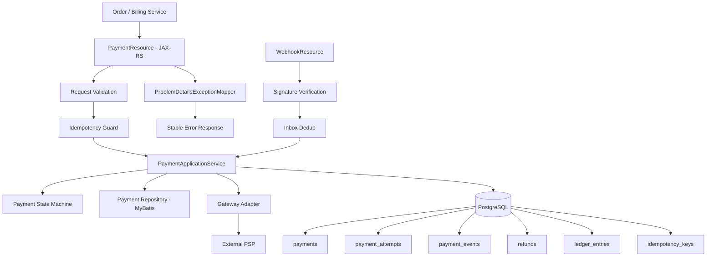
```mermaid
flowchart TD
    A[Order / Billing Service] --> B[PaymentResource - JAX-RS]
    B --> C[Request Validation]
    C --> D[Idempotency Guard]
    D --> E[PaymentApplicationService]

    E --> F[Payment State Machine]
    E --> G[Payment Repository - MyBatis]
    E --> H[Gateway Adapter]

    H --> I[External PSP]

    E --> J[(PostgreSQL)]
    J --> J1[payments]
    J --> J2[payment_attempts]
    J --> J3[payment_events]
    J --> J4[refunds]
    J --> J5[ledger_entries]
    J --> J6[idempotency_keys]

    B --> K[ProblemDetailsExceptionMapper]
    K --> L[Stable Error Response]

    M[WebhookResource] --> N[Signature Verification]
    N --> O[Inbox Dedup]
    O --> E
```

---

# 3. API Resource Boundary

Pisahkan API berdasarkan responsibility.

```text
/payment API
  - dipakai oleh internal services / frontend backend
  - create, authorize, capture, refund, void, get status

/webhook API
  - dipanggil oleh external PSP
  - signature verification
  - raw payload preservation
  - inbox dedup

/admin/support API
  - dipakai internal ops/support
  - timeline, retry webhook, reconciliation investigation

/reporting API
  - dipakai finance/BI/internal dashboard
  - summary, mismatch, settlement status
```

Dalam seri ini kita fokus ke **Payment API utama**. Webhook akan dibahas detail di Seri 8.

---

# 4. Recommended Endpoint Map

| No | Endpoint | Method | Idempotency Required | Fungsi |
|---:|---|---|---|---|
| 1 | `/payments` | `POST` | Ya | Create payment / sale / authorization. |
| 2 | `/payments/{paymentId}` | `GET` | Tidak | Ambil status payment. |
| 3 | `/payments/{paymentId}/authorize` | `POST` | Ya | Authorization manual jika create belum langsung authorize. |
| 4 | `/payments/{paymentId}/capture` | `POST` | Ya | Capture full/partial payment. |
| 5 | `/payments/{paymentId}/void` | `POST` | Ya | Void/cancel authorization sebelum capture. |
| 6 | `/payments/{paymentId}/refunds` | `POST` | Ya | Create refund full/partial. |
| 7 | `/payments/{paymentId}/refunds` | `GET` | Tidak | List refund untuk payment. |
| 8 | `/refunds/{refundId}` | `GET` | Tidak | Ambil status refund. |
| 9 | `/payments/{paymentId}/timeline` | `GET` | Tidak | Timeline event payment untuk support/debug. |
| 10 | `/payments/search` | `GET` | Tidak | Search payment by order/customer/provider/status. |
| 11 | `/webhooks/{provider}` | `POST` | Tidak | Webhook PSP; dedup pakai provider event id, bukan client idempotency key. |
| 12 | `/payments/{paymentId}/actions/retry-status-check` | `POST` | Ya/Admin only | Manual/admin trigger untuk query status ke PSP. |

Catatan penting: `capture`, `refund`, dan `void` saya desain sebagai `POST` command endpoint karena operasi tersebut menciptakan side effect finansial. Safe retry-nya bukan karena HTTP method-nya idempotent, tetapi karena **application-level idempotency key**.

Stripe mendokumentasikan idempotency key untuk mengenali retry request dan mengembalikan hasil request pertama untuk key yang sama; Adyen juga mendukung idempotency supaya retry tidak menduplikasi operasi; PayPal memakai `PayPal-Request-Id` untuk REST POST idempotency. ([Stripe Docs](https://docs.stripe.com/api/idempotent_requests?utm_source=chatgpt.com))

---

# 5. Endpoint Detail

## 5.1 `POST /payments`

Digunakan untuk membuat payment baru.

### Request Headers

| Header | Required | Contoh | Fungsi |
|---|---:|---|---|
| `Idempotency-Key` | Ya | `9f5b8b1d-...` | Mencegah duplicate payment saat retry. |
| `X-Correlation-Id` | Disarankan | `corr-123` | Trace end-to-end antar service. |
| `X-Request-Id` | Disarankan | `req-123` | Trace request spesifik. |
| `Content-Type` | Ya | `application/json` | Payload JSON. |
| `Accept` | Disarankan | `application/json` | Response JSON. |

### Request Body

```json
{
  "orderId": "ORD-2026-0001",
  "customerId": "CUST-1001",
  "merchantId": "MRC-001",
  "amountMinor": 150000,
  "currency": "IDR",
  "captureMode": "AUTO",
  "paymentMethod": {
    "type": "CARD_TOKEN",
    "token": "pm_tok_abc123"
  },
  "metadata": {
    "channel": "WEB",
    "cartId": "CART-7788"
  }
}
```

### Response `201 Created`

```json
{
  "paymentId": "2ef2e8b4-3a10-40a7-a0d1-6a0c5e596b6e",
  "orderId": "ORD-2026-0001",
  "amountMinor": 150000,
  "currency": "IDR",
  "status": "CAPTURED",
  "captureMode": "AUTO",
  "provider": "STRIPE",
  "providerPaymentId": "pi_xxx",
  "requiresAction": false,
  "nextAction": null,
  "createdAt": "2026-07-14T14:20:00Z",
  "updatedAt": "2026-07-14T14:20:03Z",
  "traceId": "corr-123"
}
```

---

## 5.2 `GET /payments/{paymentId}`

Mengambil status payment internal.

Response:

```json
{
  "paymentId": "2ef2e8b4-3a10-40a7-a0d1-6a0c5e596b6e",
  "orderId": "ORD-2026-0001",
  "amountMinor": 150000,
  "currency": "IDR",
  "authorizedAmountMinor": 150000,
  "capturedAmountMinor": 150000,
  "refundedAmountMinor": 0,
  "status": "CAPTURED",
  "provider": "STRIPE",
  "providerPaymentId": "pi_xxx",
  "createdAt": "2026-07-14T14:20:00Z",
  "updatedAt": "2026-07-14T14:20:03Z"
}
```

---

## 5.3 `POST /payments/{paymentId}/capture`

Untuk manual capture atau partial capture.

Request:

```json
{
  "amountMinor": 100000,
  "reason": "ORDER_READY_TO_FULFILL"
}
```

Response:

```json
{
  "paymentId": "2ef2e8b4-3a10-40a7-a0d1-6a0c5e596b6e",
  "status": "PARTIALLY_CAPTURED",
  "authorizedAmountMinor": 150000,
  "capturedAmountMinor": 100000,
  "remainingCapturableAmountMinor": 50000,
  "currency": "IDR"
}
```

Validasi domain:

```text
payment.status harus AUTHORIZED / PARTIALLY_CAPTURED / CAPTURE_PENDING
capture amount > 0
captured_amount + capture_amount <= authorized_amount
currency payment tidak berubah
Idempotency-Key wajib
```

---

## 5.4 `POST /payments/{paymentId}/refunds`

Untuk full atau partial refund.

Request:

```json
{
  "amountMinor": 50000,
  "reason": "CUSTOMER_REQUEST",
  "requestedBy": "support-agent-001"
}
```

Response `202 Accepted` jika refund async:

```json
{
  "refundId": "61f1d2ae-8a8a-4059-8d8f-7de43b777af6",
  "paymentId": "2ef2e8b4-3a10-40a7-a0d1-6a0c5e596b6e",
  "amountMinor": 50000,
  "currency": "IDR",
  "status": "PENDING",
  "reason": "CUSTOMER_REQUEST",
  "createdAt": "2026-07-14T14:25:00Z"
}
```

Validasi domain:

```text
payment.status harus CAPTURED / PARTIALLY_REFUNDED
refund amount > 0
refunded_amount + refund_amount <= captured_amount
Idempotency-Key wajib
```

---

## 5.5 `POST /payments/{paymentId}/void`

Untuk membatalkan authorization sebelum capture.

Request:

```json
{
  "reason": "ORDER_CANCELLED"
}
```

Response:

```json
{
  "paymentId": "2ef2e8b4-3a10-40a7-a0d1-6a0c5e596b6e",
  "status": "CANCELLED",
  "voidedAt": "2026-07-14T14:30:00Z"
}
```

Validasi domain:

```text
payment.status harus AUTHORIZED / AUTHORIZATION_PENDING
captured_amount harus 0
Idempotency-Key wajib
```

---

# 6. DTO Design dengan Jakarta Validation

Jakarta Bean Validation memungkinkan constraint dideklarasikan memakai annotation pada field, method, class, parameter, atau constructor; built-in constraints tersedia di package `jakarta.validation.constraints`. ([Jakarta EE](https://jakarta.ee/learn/docs/jakartaee-tutorial/current/beanvalidation/bean-validation/bean-validation.html?utm_source=chatgpt.com))

## 6.1 Create Payment Request

```java
package com.company.payment.api.dto;

import jakarta.validation.Valid;
import jakarta.validation.constraints.NotBlank;
import jakarta.validation.constraints.NotNull;
import jakarta.validation.constraints.Positive;
import jakarta.validation.constraints.Pattern;
import java.util.Map;

public record CreatePaymentRequest(

        @NotBlank
        String orderId,

        @NotBlank
        String customerId,

        @NotBlank
        String merchantId,

        @Positive
        long amountMinor,

        @NotBlank
        @Pattern(regexp = "^[A-Z]{3}$")
        String currency,

        @NotNull
        CaptureMode captureMode,

        @NotNull
        @Valid
        PaymentMethodRequest paymentMethod,

        Map<String, Object> metadata
) {}
```

```java
package com.company.payment.api.dto;

public enum CaptureMode {
    AUTO,
    MANUAL
}
```

```java
package com.company.payment.api.dto;

import jakarta.validation.constraints.NotBlank;
import jakarta.validation.constraints.NotNull;

public record PaymentMethodRequest(

        @NotNull
        PaymentMethodType type,

        @NotBlank
        String token
) {}
```

```java
package com.company.payment.api.dto;

public enum PaymentMethodType {
    CARD_TOKEN,
    BANK_TRANSFER,
    EWALLET,
    VIRTUAL_ACCOUNT,
    QRIS,
    DIRECT_DEBIT
}
```

Practical note:

```text
DTO API boleh berbeda dari domain object.
DTO menerima input.
Domain object menjaga invariant.
Mapper mengubah DTO -> command -> domain.
```

---

## 6.2 Capture Request

```java
package com.company.payment.api.dto;

import jakarta.validation.constraints.NotBlank;
import jakarta.validation.constraints.Positive;

public record CapturePaymentRequest(

        @Positive
        long amountMinor,

        @NotBlank
        String reason
) {}
```

---

## 6.3 Refund Request

```java
package com.company.payment.api.dto;

import jakarta.validation.constraints.NotBlank;
import jakarta.validation.constraints.Positive;

public record RefundPaymentRequest(

        @Positive
        long amountMinor,

        @NotBlank
        String reason,

        @NotBlank
        String requestedBy
) {}
```

---

# 7. Response DTO Design

## 7.1 Payment Response

```java
package com.company.payment.api.dto;

import java.time.Instant;
import java.util.Map;
import java.util.UUID;

public record PaymentResponse(
        UUID paymentId,
        String orderId,
        String customerId,
        String merchantId,

        long amountMinor,
        String currency,

        long authorizedAmountMinor,
        long capturedAmountMinor,
        long refundedAmountMinor,

        String status,
        String captureMode,

        String provider,
        String providerPaymentId,

        boolean requiresAction,
        NextActionResponse nextAction,

        Map<String, Object> metadata,

        Instant createdAt,
        Instant updatedAt,

        String traceId
) {}
```

## 7.2 Next Action Response

Dipakai untuk 3DS, redirect, QR payment, bank transfer instruction, dan sejenisnya.

```java
package com.company.payment.api.dto;

import java.time.Instant;
import java.util.Map;

public record NextActionResponse(
        String type,
        String redirectUrl,
        String qrContent,
        String instructionText,
        Instant expiresAt,
        Map<String, Object> providerData
) {}
```

Contoh response payment yang butuh customer action:

```json
{
  "paymentId": "2ef2e8b4-3a10-40a7-a0d1-6a0c5e596b6e",
  "status": "REQUIRES_ACTION",
  "requiresAction": true,
  "nextAction": {
    "type": "REDIRECT",
    "redirectUrl": "https://issuer.example/challenge",
    "expiresAt": "2026-07-14T14:40:00Z"
  }
}
```

---

# 8. Jersey Resource Implementation

```java
package com.company.payment.api;

import com.company.payment.api.dto.*;
import com.company.payment.application.PaymentApplicationService;
import jakarta.validation.Valid;
import jakarta.ws.rs.*;
import jakarta.ws.rs.core.MediaType;
import jakarta.ws.rs.core.Response;

import java.net.URI;
import java.util.UUID;

@Path("/payments")
@Consumes(MediaType.APPLICATION_JSON)
@Produces(MediaType.APPLICATION_JSON)
public class PaymentResource {

    private final PaymentApplicationService paymentService;

    public PaymentResource(PaymentApplicationService paymentService) {
        this.paymentService = paymentService;
    }

    @POST
    public Response createPayment(
            @HeaderParam("Idempotency-Key") String idempotencyKey,
            @HeaderParam("X-Correlation-Id") String correlationId,
            @Valid CreatePaymentRequest request
    ) {
        PaymentResponse response = paymentService.createPayment(
                idempotencyKey,
                correlationId,
                request
        );

        return Response
                .created(URI.create("/payments/" + response.paymentId()))
                .entity(response)
                .build();
    }

    @GET
    @Path("/{paymentId}")
    public Response getPayment(
            @PathParam("paymentId") UUID paymentId,
            @HeaderParam("X-Correlation-Id") String correlationId
    ) {
        PaymentResponse response = paymentService.getPayment(paymentId, correlationId);
        return Response.ok(response).build();
    }

    @POST
    @Path("/{paymentId}/capture")
    public Response capturePayment(
            @PathParam("paymentId") UUID paymentId,
            @HeaderParam("Idempotency-Key") String idempotencyKey,
            @HeaderParam("X-Correlation-Id") String correlationId,
            @Valid CapturePaymentRequest request
    ) {
        PaymentResponse response = paymentService.capturePayment(
                paymentId,
                idempotencyKey,
                correlationId,
                request
        );

        return Response.ok(response).build();
    }

    @POST
    @Path("/{paymentId}/void")
    public Response voidPayment(
            @PathParam("paymentId") UUID paymentId,
            @HeaderParam("Idempotency-Key") String idempotencyKey,
            @HeaderParam("X-Correlation-Id") String correlationId,
            @Valid VoidPaymentRequest request
    ) {
        PaymentResponse response = paymentService.voidPayment(
                paymentId,
                idempotencyKey,
                correlationId,
                request
        );

        return Response.ok(response).build();
    }

    @POST
    @Path("/{paymentId}/refunds")
    public Response refundPayment(
            @PathParam("paymentId") UUID paymentId,
            @HeaderParam("Idempotency-Key") String idempotencyKey,
            @HeaderParam("X-Correlation-Id") String correlationId,
            @Valid RefundPaymentRequest request
    ) {
        RefundResponse response = paymentService.refundPayment(
                paymentId,
                idempotencyKey,
                correlationId,
                request
        );

        return Response
                .accepted(response)
                .build();
    }

    @GET
    @Path("/{paymentId}/timeline")
    public Response getPaymentTimeline(
            @PathParam("paymentId") UUID paymentId,
            @HeaderParam("X-Correlation-Id") String correlationId
    ) {
        PaymentTimelineResponse response = paymentService.getTimeline(paymentId, correlationId);
        return Response.ok(response).build();
    }
}
```

---

# 9. Application Command Layer

Jangan langsung lempar DTO ke domain atau repository. Buat command object agar boundary jelas.

```java
package com.company.payment.application.command;

import java.util.Map;

public record CreatePaymentCommand(
        String idempotencyKey,
        String correlationId,
        String orderId,
        String customerId,
        String merchantId,
        long amountMinor,
        String currency,
        String captureMode,
        String paymentMethodType,
        String paymentMethodToken,
        Map<String, Object> metadata
) {}
```

Mapper dari DTO ke command:

```java
package com.company.payment.api.mapper;

import com.company.payment.api.dto.CreatePaymentRequest;
import com.company.payment.application.command.CreatePaymentCommand;

public final class PaymentApiMapper {

    private PaymentApiMapper() {}

    public static CreatePaymentCommand toCommand(
            String idempotencyKey,
            String correlationId,
            CreatePaymentRequest request
    ) {
        return new CreatePaymentCommand(
                idempotencyKey,
                correlationId,
                request.orderId(),
                request.customerId(),
                request.merchantId(),
                request.amountMinor(),
                request.currency(),
                request.captureMode().name(),
                request.paymentMethod().type().name(),
                request.paymentMethod().token(),
                request.metadata()
        );
    }
}
```

Manfaat:

```text
API DTO bisa berubah tanpa langsung merusak domain.
Application command bisa dipakai juga oleh worker/Camunda/internal job.
```

---

# 10. Required Headers Policy

Untuk payment, buat policy eksplisit.

| Endpoint Type | `Idempotency-Key` | `X-Correlation-Id` | Reason |
|---|---:|---:|---|
| `POST /payments` | Required | Recommended/Generated | Bisa create charge. |
| `POST /capture` | Required | Recommended/Generated | Bisa capture uang. |
| `POST /refunds` | Required | Recommended/Generated | Bisa mengembalikan uang. |
| `POST /void` | Required | Recommended/Generated | Mengubah state authorization. |
| `GET` endpoints | Not required | Recommended/Generated | Read-only. |
| `POST /webhooks/{provider}` | Not required | Generated | Dedup dari provider event id. |

Header validation bisa dilakukan di filter atau di service.

---

# 11. Idempotency API Behavior

## 11.1 Rule

Untuk mutating payment API:

```text
Same Idempotency-Key + same request hash
  -> return same logical result.

Same Idempotency-Key + different request hash
  -> reject with IDEMPOTENCY_KEY_REUSED_WITH_DIFFERENT_REQUEST.

No Idempotency-Key
  -> reject with 400 or 422 depending API convention.
```

## 11.2 Response Cases

| Case | HTTP | Response |
|---|---:|---|
| First request accepted | `201` / `200` / `202` | Normal response. |
| Same key, same payload, already succeeded | Same as first result | Cached response. |
| Same key, same payload, still processing | `409 Conflict` or `202 Accepted` | Operation in progress. |
| Same key, different payload | `409 Conflict` | Key reused incorrectly. |
| Missing key for mutating operation | `400 Bad Request` or `422 Unprocessable Content` | Contract violation. |

RFC 9110 defines the status code space and status code classes; it also includes `422 Unprocessable Content` for content that is syntactically valid but semantically unprocessable. ([IETF Datatracker](https://datatracker.ietf.org/doc/html/rfc9110?utm_source=chatgpt.com))

---

# 12. Error Model dengan RFC 9457 Problem Details

Gunakan stable error response. RFC 9457 mendefinisikan “problem detail” untuk membawa detail error yang machine-readable dalam HTTP API dan menggantikan RFC 7807. ([RFC Editor](https://www.rfc-editor.org/info/rfc9457/?utm_source=chatgpt.com))

## 12.1 Standard Problem Response

```json
{
  "type": "https://api.company.internal/problems/payment-invalid-state",
  "title": "Invalid payment state",
  "status": 409,
  "detail": "Payment cannot be captured because current status is FAILED.",
  "instance": "/payments/2ef2e8b4-3a10-40a7-a0d1-6a0c5e596b6e/capture",
  "errorCode": "PAYMENT_INVALID_STATE",
  "traceId": "corr-123",
  "paymentId": "2ef2e8b4-3a10-40a7-a0d1-6a0c5e596b6e"
}
```

## 12.2 Internal Error Codes

| Error Code | HTTP | Kapan Dipakai |
|---|---:|---|
| `PAYMENT_NOT_FOUND` | `404` | Payment ID tidak ditemukan. |
| `PAYMENT_INVALID_STATE` | `409` | Operasi tidak valid untuk state saat ini. |
| `PAYMENT_AMOUNT_EXCEEDS_AUTHORIZED` | `422` | Capture melebihi authorized amount. |
| `PAYMENT_REFUND_EXCEEDS_CAPTURED` | `422` | Refund melebihi captured amount. |
| `PAYMENT_CURRENCY_MISMATCH` | `422` | Currency tidak cocok. |
| `IDEMPOTENCY_KEY_REQUIRED` | `400` | Mutating endpoint tanpa idempotency key. |
| `IDEMPOTENCY_KEY_REUSED_WITH_DIFFERENT_REQUEST` | `409` | Key sama, payload beda. |
| `PAYMENT_PROVIDER_TIMEOUT` | `504` atau `202/UNKNOWN` | Provider timeout; tergantung apakah operasi diterima internal. |
| `PAYMENT_PROVIDER_UNAVAILABLE` | `503` | PSP unavailable. |
| `PAYMENT_DECLINED` | `402` atau `422` | Payment declined. `402` historically exists, tapi banyak API tetap memilih `422`. |
| `VALIDATION_FAILED` | `400` / `422` | Request tidak valid. |
| `UNAUTHORIZED` | `401` | Missing/invalid auth. |
| `FORBIDDEN` | `403` | Tidak punya permission. |

Practical recommendation:

```text
Gunakan HTTP status untuk kategori umum.
Gunakan errorCode untuk decision logic client.
Jangan biarkan client parsing provider raw message.
```

---

# 13. Exception Mapper

```java
package com.company.payment.api.error;

import jakarta.ws.rs.core.Context;
import jakarta.ws.rs.core.Response;
import jakarta.ws.rs.core.UriInfo;
import jakarta.ws.rs.ext.ExceptionMapper;
import jakarta.ws.rs.ext.Provider;

@Provider
public class PaymentExceptionMapper implements ExceptionMapper<PaymentException> {

    @Context
    private UriInfo uriInfo;

    @Override
    public Response toResponse(PaymentException exception) {
        ProblemDetails body = new ProblemDetails(
                exception.type(),
                exception.title(),
                exception.httpStatus(),
                exception.getMessage(),
                uriInfo.getPath(),
                exception.errorCode(),
                exception.traceId(),
                exception.context()
        );

        return Response
                .status(exception.httpStatus())
                .type("application/problem+json")
                .entity(body)
                .build();
    }
}
```

```java
package com.company.payment.api.error;

import java.util.Map;

public record ProblemDetails(
        String type,
        String title,
        int status,
        String detail,
        String instance,
        String errorCode,
        String traceId,
        Map<String, Object> context
) {}
```

Domain exception:

```java
package com.company.payment.api.error;

import java.util.Map;

public class PaymentException extends RuntimeException {

    private final String type;
    private final String title;
    private final int httpStatus;
    private final String errorCode;
    private final String traceId;
    private final Map<String, Object> context;

    public PaymentException(
            String type,
            String title,
            int httpStatus,
            String errorCode,
            String message,
            String traceId,
            Map<String, Object> context
    ) {
        super(message);
        this.type = type;
        this.title = title;
        this.httpStatus = httpStatus;
        this.errorCode = errorCode;
        this.traceId = traceId;
        this.context = context;
    }

    public String type() {
        return type;
    }

    public String title() {
        return title;
    }

    public int httpStatus() {
        return httpStatus;
    }

    public String errorCode() {
        return errorCode;
    }

    public String traceId() {
        return traceId;
    }

    public Map<String, Object> context() {
        return context;
    }
}
```

---

# 14. Validation Error Mapper

Untuk Bean Validation error:

```java
package com.company.payment.api.error;

import jakarta.validation.ConstraintViolation;
import jakarta.validation.ConstraintViolationException;
import jakarta.ws.rs.core.Response;
import jakarta.ws.rs.ext.ExceptionMapper;
import jakarta.ws.rs.ext.Provider;

import java.util.List;
import java.util.Map;

@Provider
public class ConstraintViolationExceptionMapper
        implements ExceptionMapper<ConstraintViolationException> {

    @Override
    public Response toResponse(ConstraintViolationException exception) {
        List<Map<String, Object>> violations = exception.getConstraintViolations()
                .stream()
                .map(this::toViolation)
                .toList();

        ProblemDetails body = new ProblemDetails(
                "https://api.company.internal/problems/validation-failed",
                "Validation failed",
                422,
                "Request body contains invalid fields.",
                null,
                "VALIDATION_FAILED",
                null,
                Map.of("violations", violations)
        );

        return Response
                .status(422)
                .type("application/problem+json")
                .entity(body)
                .build();
    }

    private Map<String, Object> toViolation(ConstraintViolation<?> violation) {
        return Map.of(
                "field", violation.getPropertyPath().toString(),
                "message", violation.getMessage(),
                "invalidValue", String.valueOf(violation.getInvalidValue())
        );
    }
}
```

Contoh response:

```json
{
  "type": "https://api.company.internal/problems/validation-failed",
  "title": "Validation failed",
  "status": 422,
  "detail": "Request body contains invalid fields.",
  "errorCode": "VALIDATION_FAILED",
  "context": {
    "violations": [
      {
        "field": "amountMinor",
        "message": "must be greater than 0",
        "invalidValue": "0"
      },
      {
        "field": "currency",
        "message": "must match ^[A-Z]{3}$",
        "invalidValue": "idr"
      }
    ]
  }
}
```

---

# 15. Correlation ID Filter

Payment debugging sangat bergantung pada traceability.

```java
package com.company.payment.api.filter;

import jakarta.ws.rs.container.ContainerRequestContext;
import jakarta.ws.rs.container.ContainerRequestFilter;
import jakarta.ws.rs.container.ContainerResponseContext;
import jakarta.ws.rs.container.ContainerResponseFilter;
import jakarta.ws.rs.ext.Provider;

import java.io.IOException;
import java.util.UUID;

@Provider
public class CorrelationIdFilter implements ContainerRequestFilter, ContainerResponseFilter {

    public static final String CORRELATION_ID_HEADER = "X-Correlation-Id";
    public static final String REQUEST_PROPERTY = "correlationId";

    @Override
    public void filter(ContainerRequestContext requestContext) throws IOException {
        String correlationId = requestContext.getHeaderString(CORRELATION_ID_HEADER);

        if (correlationId == null || correlationId.isBlank()) {
            correlationId = UUID.randomUUID().toString();
        }

        requestContext.setProperty(REQUEST_PROPERTY, correlationId);
    }

    @Override
    public void filter(
            ContainerRequestContext requestContext,
            ContainerResponseContext responseContext
    ) throws IOException {
        Object correlationId = requestContext.getProperty(REQUEST_PROPERTY);

        if (correlationId != null) {
            responseContext.getHeaders().putSingle(CORRELATION_ID_HEADER, correlationId.toString());
        }
    }
}
```

Practical usage:

```text
Log semua operasi payment dengan:
- correlationId
- requestId
- paymentId
- orderId
- provider
- providerPaymentId
- idempotencyKey hash, bukan full raw key jika dianggap sensitif
```

---

# 16. Idempotency Guard Filter

Bisa dibuat filter untuk memastikan header ada di mutating endpoint.

```java
package com.company.payment.api.filter;

import jakarta.annotation.Priority;
import jakarta.ws.rs.Priorities;
import jakarta.ws.rs.container.ContainerRequestContext;
import jakarta.ws.rs.container.ContainerRequestFilter;
import jakarta.ws.rs.core.Response;
import jakarta.ws.rs.ext.Provider;

import java.io.IOException;
import java.util.Set;

@Provider
@Priority(Priorities.AUTHORIZATION)
public class IdempotencyRequiredFilter implements ContainerRequestFilter {

    private static final String IDEMPOTENCY_KEY = "Idempotency-Key";

    private static final Set<String> MUTATING_METHODS = Set.of("POST", "PUT", "PATCH", "DELETE");

    @Override
    public void filter(ContainerRequestContext context) throws IOException {
        String path = context.getUriInfo().getPath();
        String method = context.getMethod();

        if (!requiresIdempotency(method, path)) {
            return;
        }

        String key = context.getHeaderString(IDEMPOTENCY_KEY);

        if (key == null || key.isBlank()) {
            context.abortWith(Response
                    .status(Response.Status.BAD_REQUEST)
                    .type("application/problem+json")
                    .entity(new ProblemDetails(
                            "https://api.company.internal/problems/idempotency-key-required",
                            "Idempotency key required",
                            400,
                            "Idempotency-Key header is required for mutating payment operations.",
                            "/" + path,
                            "IDEMPOTENCY_KEY_REQUIRED",
                            null,
                            null
                    ))
                    .build());
        }
    }

    private boolean requiresIdempotency(String method, String path) {
        if (!MUTATING_METHODS.contains(method)) {
            return false;
        }

        if (path.startsWith("webhooks/")) {
            return false;
        }

        return path.equals("payments")
                || path.matches("payments/[^/]+/capture")
                || path.matches("payments/[^/]+/refunds")
                || path.matches("payments/[^/]+/void")
                || path.matches("payments/[^/]+/authorize");
    }
}
```

Catatan praktis:

```text
Filter hanya enforce keberadaan header.
Dedup logic tetap di IdempotencyService karena perlu akses DB dan request hash.
```

---

# 17. API Status Code Convention

| Scenario | Recommended HTTP | Body Status |
|---|---:|---|
| Payment created and final captured | `201 Created` | `CAPTURED` |
| Payment created but waiting action | `201 Created` | `REQUIRES_ACTION` |
| Payment accepted but async pending | `202 Accepted` | `AUTHORIZATION_PENDING` / `CAPTURE_PENDING` |
| Read payment success | `200 OK` | Current status |
| Capture success | `200 OK` | `CAPTURED` / `PARTIALLY_CAPTURED` |
| Refund request accepted async | `202 Accepted` | `PENDING` |
| Void success | `200 OK` | `CANCELLED` |
| Validation error | `422 Unprocessable Content` | Problem details |
| Missing idempotency key | `400 Bad Request` | Problem details |
| Invalid state transition | `409 Conflict` | Problem details |
| Provider unavailable | `503 Service Unavailable` | Problem details |
| Provider timeout but internal operation accepted | `202 Accepted` | `UNKNOWN` / `PENDING_CONFIRMATION` |
| Provider timeout before operation known | `504 Gateway Timeout` | Problem details or pending response depending design |

Important:

```text
Jangan gunakan HTTP 200 + body status FAILED untuk semua kasus.
HTTP status harus memberi sinyal transport/API-level.
Payment status memberi sinyal domain-level.
```

---

# 18. Search API Design

Untuk support dan internal service lookup.

```http
GET /payments/search?orderId=ORD-2026-0001
GET /payments/search?customerId=CUST-1001&status=CAPTURED
GET /payments/search?provider=STRIPE&providerPaymentId=pi_xxx
GET /payments/search?createdFrom=2026-07-01T00:00:00Z&createdTo=2026-07-14T23:59:59Z
```

Response:

```json
{
  "items": [
    {
      "paymentId": "2ef2e8b4-3a10-40a7-a0d1-6a0c5e596b6e",
      "orderId": "ORD-2026-0001",
      "amountMinor": 150000,
      "currency": "IDR",
      "status": "CAPTURED",
      "createdAt": "2026-07-14T14:20:00Z"
    }
  ],
  "page": {
    "limit": 50,
    "nextCursor": "eyJjcmVhdGVkQXQiOiIyMDI2LTA3LTE0VDE0OjIwOjAwWiJ9"
  }
}
```

Practical recommendation:

```text
Gunakan cursor pagination untuk payment/event table besar.
Hindari offset pagination untuk data finansial dengan volume besar karena makin mahal saat offset besar.
```

---

# 19. Timeline API

Endpoint:

```http
GET /payments/{paymentId}/timeline
```

Response:

```json
{
  "paymentId": "2ef2e8b4-3a10-40a7-a0d1-6a0c5e596b6e",
  "events": [
    {
      "eventType": "PAYMENT_INITIATED",
      "source": "API",
      "oldStatus": null,
      "newStatus": "INITIATED",
      "createdAt": "2026-07-14T14:20:00Z"
    },
    {
      "eventType": "PROVIDER_RESPONSE_RECEIVED",
      "source": "PROVIDER_RESPONSE",
      "oldStatus": "INITIATED",
      "newStatus": "CAPTURED",
      "createdAt": "2026-07-14T14:20:03Z"
    }
  ]
}
```

Manfaat praktis:

```text
Support bisa menjawab:
- payment dibuat kapan?
- call provider sukses/gagal?
- webhook masuk kapan?
- status berubah dari apa ke apa?
- siapa melakukan refund?
- reconciliation memperbaiki status kapan?
```

---

# 20. Security Boundary API

Payment API harus menghindari menerima atau mengembalikan data sensitif yang tidak perlu.

## Jangan desain request seperti ini

```json
{
  "cardNumber": "4111111111111111",
  "cvv": "123",
  "expiryMonth": "12",
  "expiryYear": "2030"
}
```

## Lebih aman

```json
{
  "paymentMethod": {
    "type": "CARD_TOKEN",
    "token": "pm_tok_abc123"
  }
}
```

Practical rule:

```text
Payment service sebaiknya menerima token/reference dari payment page/PSP/tokenization service.
Jangan jadikan payment API sebagai collector raw card data kecuali memang scope PCI, kontrol, dan compliance sudah disiapkan.
```

---

# 21. API Versioning

Minimal:

```text
/api/v1/payments
```

Atau via routing internal/API gateway.

Practical versioning rule:

| Change | Butuh Version Baru? |
|---|---:|
| Tambah optional response field | Tidak |
| Tambah optional request field | Tidak |
| Rename field | Ya |
| Hapus field | Ya |
| Ubah enum meaning | Ya |
| Ubah status transition semantics | Ya |
| Ubah error code contract | Biasanya ya |
| Ubah required field | Ya |

---

# 22. API Consumer Contract

Payment API consumer harus paham bahwa response awal belum tentu final.

| Status | Consumer Action |
|---|---|
| `CAPTURED` | Order boleh lanjut fulfilment. |
| `AUTHORIZED` | Order boleh reserve stock, capture nanti. |
| `REQUIRES_ACTION` | Arahkan customer ke `nextAction`. |
| `AUTHORIZATION_PENDING` | Tunggu webhook/poll status. |
| `CAPTURE_PENDING` | Jangan fulfil sampai captured final, kecuali business rule mengizinkan. |
| `FAILED` | Tawarkan retry/payment method lain. |
| `UNKNOWN` | Jangan langsung cancel; tunggu recovery/reconciliation. |
| `REFUNDED` | Update order/finance. |

---

# 23. Anti-Pattern API

| Anti-Pattern | Kenapa Buruk | Solusi |
|---|---|---|
| `PUT /payments/{id}` untuk ubah status bebas | Consumer bisa memaksa state invalid. | Gunakan command endpoint: capture/refund/void. |
| Tidak wajibkan `Idempotency-Key` | Retry bisa double charge/refund. | Enforce di filter/service. |
| Response hanya `{ "success": true }` | Tidak cukup untuk async state. | Return full payment status. |
| Expose raw PSP status ke consumer | Vendor lock-in dan semantics bocor. | Map ke internal status. |
| Semua error `500` | Client tidak bisa membedakan validation/state/provider. | Gunakan Problem Details + errorCode. |
| Timeout langsung response `FAILED` | Bisa salah jika provider sebenarnya berhasil. | Return `UNKNOWN` / pending confirmation. |
| Webhook endpoint share contract dengan internal API | Security dan semantics beda. | Pisahkan `/webhooks/{provider}`. |
| Refund sebagai `PATCH /payments/{id}` | Refund punya lifecycle sendiri. | `POST /payments/{id}/refunds`. |
| Tidak ada timeline endpoint | Support harus query DB manual. | Sediakan `/timeline`. |

---

# 24. Minimal Package Structure

```text
payment-service/
  src/main/java/com/company/payment/
    api/
      PaymentResource.java
      RefundResource.java
      WebhookResource.java
      AdminPaymentResource.java

    api/dto/
      CreatePaymentRequest.java
      CapturePaymentRequest.java
      RefundPaymentRequest.java
      PaymentResponse.java
      RefundResponse.java
      ProblemDetails.java

    api/error/
      PaymentExceptionMapper.java
      ConstraintViolationExceptionMapper.java

    api/filter/
      CorrelationIdFilter.java
      IdempotencyRequiredFilter.java

    api/mapper/
      PaymentApiMapper.java

    application/
      PaymentApplicationService.java
      IdempotencyService.java

    application/command/
      CreatePaymentCommand.java
      CapturePaymentCommand.java
      RefundPaymentCommand.java
      VoidPaymentCommand.java

    domain/
      Payment.java
      PaymentStatus.java
      Money.java
      PaymentEvent.java
      Refund.java

    infrastructure/
      persistence/
        PaymentMapper.java
        PaymentMapper.xml
```

---

# 25. Practical Test Cases

## API Contract Tests

| Test | Expected |
|---|---|
| `POST /payments` tanpa `Idempotency-Key` | `400 IDEMPOTENCY_KEY_REQUIRED` |
| `POST /payments` dengan `amountMinor = 0` | `422 VALIDATION_FAILED` |
| `POST /payments` dengan `currency = "idr"` | `422 VALIDATION_FAILED` |
| Retry `POST /payments` dengan key sama dan body sama | Return response yang sama. |
| Retry key sama tapi body beda | `409 IDEMPOTENCY_KEY_REUSED_WITH_DIFFERENT_REQUEST` |
| Capture payment yang sudah `FAILED` | `409 PAYMENT_INVALID_STATE` |
| Refund lebih besar dari captured amount | `422 PAYMENT_REFUND_EXCEEDS_CAPTURED` |
| Get unknown payment ID | `404 PAYMENT_NOT_FOUND` |
| Provider timeout setelah request diterima | Return `UNKNOWN` atau `PENDING_CONFIRMATION`, bukan asal `FAILED`. |
| Timeline payment | Event terurut ascending. |

---

# 26. Example cURL

## Create Payment

```bash
curl -X POST http://localhost:8080/payments \
  -H "Content-Type: application/json" \
  -H "Accept: application/json" \
  -H "Idempotency-Key: 9f5b8b1d-1234-4567-8901-abcdefabcdef" \
  -H "X-Correlation-Id: corr-local-001" \
  -d '{
    "orderId": "ORD-2026-0001",
    "customerId": "CUST-1001",
    "merchantId": "MRC-001",
    "amountMinor": 150000,
    "currency": "IDR",
    "captureMode": "AUTO",
    "paymentMethod": {
      "type": "CARD_TOKEN",
      "token": "pm_tok_abc123"
    },
    "metadata": {
      "channel": "WEB"
    }
  }'
```

## Capture Payment

```bash
curl -X POST http://localhost:8080/payments/2ef2e8b4-3a10-40a7-a0d1-6a0c5e596b6e/capture \
  -H "Content-Type: application/json" \
  -H "Idempotency-Key: capture-2ef2e8b4-001" \
  -H "X-Correlation-Id: corr-local-002" \
  -d '{
    "amountMinor": 150000,
    "reason": "ORDER_READY_TO_FULFILL"
  }'
```

## Refund Payment

```bash
curl -X POST http://localhost:8080/payments/2ef2e8b4-3a10-40a7-a0d1-6a0c5e596b6e/refunds \
  -H "Content-Type: application/json" \
  -H "Idempotency-Key: refund-2ef2e8b4-001" \
  -H "X-Correlation-Id: corr-local-003" \
  -d '{
    "amountMinor": 50000,
    "reason": "CUSTOMER_REQUEST",
    "requestedBy": "support-agent-001"
  }'
```

---

# 27. Implementation Checklist

## Endpoint

- [ ] `POST /payments`
- [ ] `GET /payments/{paymentId}`
- [ ] `POST /payments/{paymentId}/capture`
- [ ] `POST /payments/{paymentId}/void`
- [ ] `POST /payments/{paymentId}/refunds`
- [ ] `GET /payments/{paymentId}/refunds`
- [ ] `GET /refunds/{refundId}`
- [ ] `GET /payments/{paymentId}/timeline`
- [ ] `GET /payments/search`

## Headers

- [ ] `Idempotency-Key` wajib untuk mutating endpoint.
- [ ] `X-Correlation-Id` diterima atau dibuat otomatis.
- [ ] Response mengembalikan `X-Correlation-Id`.
- [ ] Jangan log full sensitive token/API secret.

## DTO & Validation

- [ ] Amount `@Positive`.
- [ ] Currency `^[A-Z]{3}$`.
- [ ] Required fields `@NotBlank` / `@NotNull`.
- [ ] Nested DTO pakai `@Valid`.
- [ ] Validation error distandardisasi.

## Error Model

- [ ] Gunakan `application/problem+json`.
- [ ] Ada stable `errorCode`.
- [ ] Ada `traceId`.
- [ ] Provider raw error tidak menjadi public contract utama.
- [ ] Invalid state memakai `409`.
- [ ] Semantic validation memakai `422` atau convention lain yang konsisten.

## Domain Safety

- [ ] API tidak bisa update status sembarangan.
- [ ] Capture/refund/void lewat command method.
- [ ] Timeout tidak otomatis `FAILED`.
- [ ] Response mendukung `PENDING`, `REQUIRES_ACTION`, dan `UNKNOWN`.

---

# 28. Exercise Praktis

Buat minimal API module:

```text
1. Implement PaymentResource.
2. Implement DTO + Jakarta Validation.
3. Implement CorrelationIdFilter.
4. Implement IdempotencyRequiredFilter.
5. Implement ProblemDetails response.
6. Implement dummy PaymentApplicationService.
7. Buat integration test dengan JerseyTest atau test HTTP biasa.
```

Test minimal:

```text
POST /payments tanpa Idempotency-Key -> 400
POST /payments amount 0 -> 422
POST /payments valid -> 201
GET /payments/{id} -> 200
POST /payments/{id}/capture status invalid -> 409
POST /payments/{id}/refunds amount invalid -> 422
```

---

# Ringkasan

Payment API yang baik punya karakter berikut:

```text
1. Command endpoint untuk operasi finansial.
2. Idempotency wajib untuk mutating request.
3. DTO tervalidasi dengan jelas.
4. Response membawa domain status, bukan sekadar success boolean.
5. Error memakai stable problem details.
6. Correlation ID selalu ada.
7. API tidak expose detail vendor secara berlebihan.
8. Async state seperti PENDING, REQUIRES_ACTION, UNKNOWN dianggap first-class.
```

Desain API yang benar membuat seri berikutnya lebih mudah, terutama idempotency, gateway adapter, webhook, outbox, dan Camunda saga.

---

## Seri 3/18 selesai

Rekomendasi lanjut ke:

**Seri 4/18 - Idempotency Key, Duplicate Prevention, dan Safe Retry untuk Payment API di Java Jersey/JAX-RS + PostgreSQL/MyBatis.**

---

**Sources:**

- [Building RESTful Web Services with Jakarta REST](https://jakarta.ee/learn/docs/jakartaee-tutorial/current/websvcs/rest/rest.html?utm_source=chatgpt.com)
- [Idempotent requests | Stripe API Reference](https://docs.stripe.com/api/idempotent_requests?utm_source=chatgpt.com)
- [RFC 9110 - HTTP Semantics](https://datatracker.ietf.org/doc/html/rfc9110?utm_source=chatgpt.com)
- [RFC 9457: Problem Details for HTTP APIs](https://www.rfc-editor.org/info/rfc9457/?utm_source=chatgpt.com)

## Response:
7/14/2026, 10:22:14 PM

Saya lanjut ke **Seri 4/18**. Fokusnya sekarang sangat praktis: bagaimana membuat mutating Payment API aman saat client retry, network timeout, double-click, worker retry, atau service upstream mengirim request yang sama berkali-kali.

# Payment Management & Integration Pattern  
## Seri 4/18 - Idempotency Key, Duplicate Prevention, dan Safe Retry

Seri ini membahas salah satu bagian paling kritikal dalam payment system: **bagaimana memastikan retry tidak menyebabkan double charge, double capture, double refund, atau duplicate state transition**.

Core problem-nya:

```text
Client / upstream service mengirim request payment.
Network timeout terjadi.
Client tidak tahu apakah payment sudah diproses atau belum.
Client retry.
Tanpa idempotency, retry bisa membuat charge kedua.
```

Idempotency bukan hanya “pakai UUID di header”. Idempotency harus mencakup:

```text
1. Request identity
2. Request hash
3. Operation scope
4. Locking/concurrency control
5. Response caching
6. Expiry/retention policy
7. Provider idempotency propagation
8. Recovery saat PROCESSING stuck
```

Stripe mendokumentasikan bahwa idempotency bekerja dengan menyimpan status code dan body dari request pertama untuk idempotency key tertentu, lalu subsequent request dengan key sama mengembalikan hasil yang sama. Stripe juga menyarankan key unik seperti UUID v4 dan menghindari data sensitif sebagai idempotency key. ([Stripe Docs](https://docs.stripe.com/api/idempotent_requests?utm_source=chatgpt.com)) Adyen mendukung idempotency untuk retry API request agar operasi yang sama hanya dilakukan sekali; Adyen memakai header `idempotency-key`, menyarankan UUID, dan menyimpan key minimal 7 hari di company account scope. ([Adyen Docs](https://docs.adyen.com/development-resources/api-idempotency)) PayPal memakai `PayPal-Request-Id` untuk REST API `POST` idempotency dan memperingatkan bahwa tanpa header tersebut request dapat terduplikasi. ([PayPal Developer](https://developer.paypal.com/api/rest/reference/idempotency/))

---

# 1. Introduction

Dalam payment service, idempotency wajib untuk endpoint yang memiliki **financial side effect**:

| Endpoint | Kenapa Wajib Idempotent |
|---|---|
| `POST /payments` | Bisa membuat payment/charge baru. |
| `POST /payments/{id}/authorize` | Bisa reserve dana customer. |
| `POST /payments/{id}/capture` | Bisa memindahkan dana. |
| `POST /payments/{id}/refunds` | Bisa mengembalikan dana. |
| `POST /payments/{id}/void` | Bisa membatalkan authorization. |
| Admin retry/recovery endpoint | Bisa memicu provider call atau state transition. |

Idempotency bukan untuk menggantikan domain invariant. Idempotency hanya memastikan **logical operation yang sama tidak dieksekusi berkali-kali**. Domain invariant tetap wajib menjaga hal seperti:

```text
captured_amount <= authorized_amount
refunded_amount <= captured_amount
currency tidak berubah
final state tidak mundur sembarangan
```

---

# 2. Diagram Besar

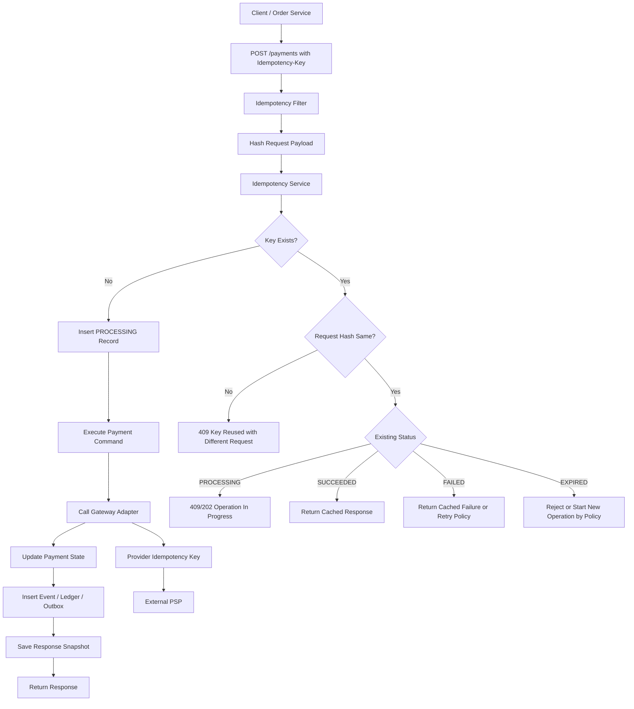
```mermaid
flowchart TD
    A[Client / Order Service] --> B[POST /payments with Idempotency-Key]
    B --> C[Idempotency Filter]
    C --> D[Hash Request Payload]
    D --> E[Idempotency Service]

    E --> F{Key Exists?}

    F -->|No| G[Insert PROCESSING Record]
    G --> H[Execute Payment Command]
    H --> I[Call Gateway Adapter]
    I --> J[Update Payment State]
    J --> K[Insert Event / Ledger / Outbox]
    K --> L[Save Response Snapshot]
    L --> M[Return Response]

    F -->|Yes| N{Request Hash Same?}
    N -->|No| O[409 Key Reused with Different Request]
    N -->|Yes| P{Existing Status}

    P -->|PROCESSING| Q[409/202 Operation In Progress]
    P -->|SUCCEEDED| R[Return Cached Response]
    P -->|FAILED| S[Return Cached Failure or Retry Policy]
    P -->|EXPIRED| T[Reject or Start New Operation by Policy]

    I --> U[Provider Idempotency Key]
    U --> V[External PSP]
```

---

# 3. Scope Idempotency yang Benar

Kesalahan umum: memakai `idempotency_key` global tanpa operation scope.

Lebih aman:

```text
idempotency_key + operation_type + operation_key
```

Contoh:

| Operation | `operation_type` | `operation_key` | Contoh |
|---|---|---|---|
| Create payment | `CREATE_PAYMENT` | `orderId` atau generated logical key | `ORD-123` |
| Capture payment | `CAPTURE_PAYMENT` | `paymentId` | `pay_123` |
| Refund payment | `CREATE_REFUND` | `paymentId` atau `refundRequestId` | `pay_123` |
| Void payment | `VOID_PAYMENT` | `paymentId` | `pay_123` |
| Query provider status | `QUERY_PROVIDER_STATUS` | `paymentId` | `pay_123` |

Kenapa perlu scope?

```text
Idempotency-Key "abc" untuk create payment
tidak boleh bentrok dengan
Idempotency-Key "abc" untuk refund payment.
```

Ada dua pilihan desain:

## Pilihan A - Global Key

```sql
PRIMARY KEY (idempotency_key)
```

Sederhana, tetapi client harus menjamin key unik untuk semua operasi.

## Pilihan B - Scoped Key

```sql
UNIQUE (operation_type, idempotency_key)
```

Lebih fleksibel dan biasanya lebih cocok untuk internal microservice.

Rekomendasi praktis untuk enterprise internal payment service:

```text
Gunakan scoped key:
(operation_type, idempotency_key)
```

---

# 4. Schema `idempotency_keys`

Versi yang lebih production-ready:

```sql
CREATE TABLE idempotency_keys (
    idempotency_record_id UUID PRIMARY KEY,

    operation_type VARCHAR(80) NOT NULL,
    operation_key VARCHAR(200),
    idempotency_key VARCHAR(200) NOT NULL,

    request_method VARCHAR(20) NOT NULL,
    request_path VARCHAR(500) NOT NULL,
    request_hash VARCHAR(128) NOT NULL,

    status VARCHAR(40) NOT NULL,

    response_status_code INTEGER,
    response_body JSONB,
    response_headers JSONB,

    payment_id UUID,
    refund_id UUID,

    locked_until TIMESTAMPTZ,
    expires_at TIMESTAMPTZ NOT NULL,

    created_at TIMESTAMPTZ NOT NULL DEFAULT now(),
    updated_at TIMESTAMPTZ NOT NULL DEFAULT now(),

    CONSTRAINT chk_idempotency_status
        CHECK (status IN (
            'PROCESSING',
            'SUCCEEDED',
            'FAILED',
            'EXPIRED'
        )),

    CONSTRAINT chk_idempotency_key_not_blank
        CHECK (length(trim(idempotency_key)) > 0)
);
```

Indexes:

```sql
CREATE UNIQUE INDEX ux_idempotency_operation_key
ON idempotency_keys(operation_type, idempotency_key);

CREATE INDEX ix_idempotency_operation_lookup
ON idempotency_keys(operation_type, operation_key);

CREATE INDEX ix_idempotency_status
ON idempotency_keys(status);

CREATE INDEX ix_idempotency_locked_until
ON idempotency_keys(locked_until);

CREATE INDEX ix_idempotency_expires_at
ON idempotency_keys(expires_at);

CREATE INDEX ix_idempotency_payment_id
ON idempotency_keys(payment_id);

CREATE INDEX ix_idempotency_refund_id
ON idempotency_keys(refund_id);
```

PostgreSQL `INSERT ... ON CONFLICT` dapat dipakai untuk menangani unique conflict; dokumentasinya menjelaskan bahwa `ON CONFLICT DO NOTHING` menghindari insert saat konflik, sedangkan `ON CONFLICT DO UPDATE` melakukan update terhadap row existing. PostgreSQL juga menyatakan `ON CONFLICT DO UPDATE` menjamin outcome atomic insert-or-update dalam kondisi high concurrency. ([PostgreSQL](https://www.postgresql.org/docs/current/sql-insert.html))

---

# 5. Status Lifecycle Idempotency

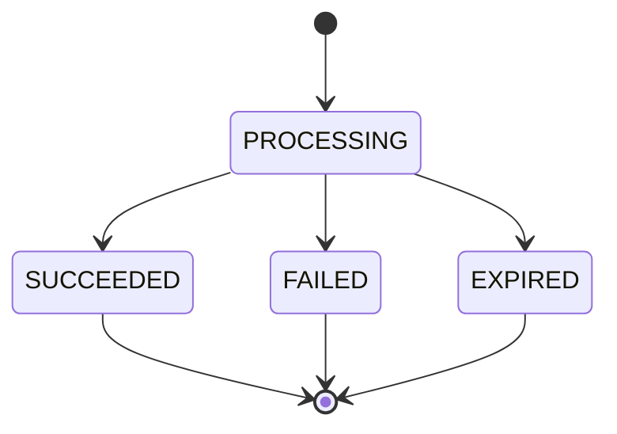
```mermaid
stateDiagram-v2
    [*] --> PROCESSING
    PROCESSING --> SUCCEEDED
    PROCESSING --> FAILED
    PROCESSING --> EXPIRED

    SUCCEEDED --> [*]
    FAILED --> [*]
    EXPIRED --> [*]
```

Makna tiap status:

| Status | Arti | Behavior saat Retry |
|---|---|---|
| `PROCESSING` | Request pertama sedang diproses atau stuck. | Return `409 Conflict`, `202 Accepted`, atau recover jika lock expired. |
| `SUCCEEDED` | Request pertama selesai sukses. | Return cached response. |
| `FAILED` | Request pertama selesai gagal. | Return cached failure, kecuali policy mengizinkan reprocess. |
| `EXPIRED` | Key sudah di luar retention. | Reject atau perlakukan sebagai request baru sesuai policy. |

Rekomendasi awal:

```text
PROCESSING + locked_until belum lewat
  -> 409 OPERATION_ALREADY_PROCESSING

PROCESSING + locked_until lewat
  -> recovery path: query payment/refund by operation_key, jangan asal execute ulang

SUCCEEDED
  -> return cached response

FAILED
  -> return cached failure untuk deterministic failure
  -> untuk transient failure, sebaiknya tidak mark FAILED permanen terlalu cepat
```

---

# 6. Request Hash

Idempotency key yang sama hanya boleh dipakai untuk request yang sama secara semantik.

Contoh berbahaya:

```text
Request 1:
Idempotency-Key: abc
amountMinor: 100000

Request 2:
Idempotency-Key: abc
amountMinor: 900000
```

Harus ditolak.

## 6.1 Canonical Request Hash

Jangan hash raw JSON string langsung tanpa canonicalization, karena ini bisa berbeda hanya karena urutan field.

```json
{"amountMinor":100000,"currency":"IDR"}
```

dan

```json
{"currency":"IDR","amountMinor":100000}
```

secara semantik sama.

Praktisnya, buat canonical form:

```text
method + path template + normalized body + selected headers
```

Contoh:

```text
POST
/payments
{"amountMinor":100000,"captureMode":"AUTO","currency":"IDR","merchantId":"MRC-001","orderId":"ORD-123","paymentMethod":{"type":"CARD_TOKEN","token":"<redacted-or-hashed>"}}
```

Lalu hash pakai SHA-256.

---

# 7. Java Request Hash Utility

Contoh memakai Jackson:

```java
package com.company.payment.application.idempotency;

import com.fasterxml.jackson.databind.JsonNode;
import com.fasterxml.jackson.databind.ObjectMapper;
import com.fasterxml.jackson.databind.SerializationFeature;

import java.nio.charset.StandardCharsets;
import java.security.MessageDigest;
import java.util.HexFormat;

public final class RequestHashCalculator {

    private final ObjectMapper objectMapper;

    public RequestHashCalculator(ObjectMapper objectMapper) {
        this.objectMapper = objectMapper.copy()
                .configure(SerializationFeature.ORDER_MAP_ENTRIES_BY_KEYS, true);
    }

    public String calculate(
            String method,
            String pathTemplate,
            Object requestBody
    ) {
        try {
            JsonNode tree = objectMapper.valueToTree(requestBody);
            String canonicalBody = objectMapper.writeValueAsString(tree);

            String canonicalRequest = method.toUpperCase()
                    + "\n"
                    + pathTemplate
                    + "\n"
                    + canonicalBody;

            MessageDigest digest = MessageDigest.getInstance("SHA-256");
            byte[] hash = digest.digest(canonicalRequest.getBytes(StandardCharsets.UTF_8));

            return "sha256:" + HexFormat.of().formatHex(hash);
        } catch (Exception e) {
            throw new IllegalStateException("Failed to calculate request hash", e);
        }
    }
}
```

Catatan praktis:

```text
Jangan masukkan raw card/token/sensitive data ke string log.
Untuk hash, boleh memasukkan token jika tidak dilog.
Untuk audit/log, simpan hash payload, bukan full sensitive payload.
```

---

# 8. Idempotency Decision Matrix

| Existing Record | Request Hash | Lock | Action |
|---|---|---|---|
| Tidak ada | - | - | Insert `PROCESSING`, jalankan command. |
| Ada `PROCESSING` | Sama | Belum expired | Return `409 OPERATION_ALREADY_PROCESSING` atau `202`. |
| Ada `PROCESSING` | Sama | Expired | Masuk recovery path. |
| Ada `PROCESSING` | Beda | Apa pun | Return `409 IDEMPOTENCY_KEY_REUSED_WITH_DIFFERENT_REQUEST`. |
| Ada `SUCCEEDED` | Sama | - | Return cached response. |
| Ada `SUCCEEDED` | Beda | - | Return `409`. |
| Ada `FAILED` | Sama | - | Return cached failure atau retry by policy. |
| Ada `FAILED` | Beda | - | Return `409`. |
| Ada `EXPIRED` | Sama/Beda | - | Reject atau require new key. |

Rekomendasi praktis:

```text
Jangan otomatis re-execute provider call hanya karena status PROCESSING expired.
Selalu cek payment/refund/attempt state lebih dulu.
```

---

# 9. MyBatis Mapper untuk Idempotency

## 9.1 Record

```java
package com.company.payment.infrastructure.persistence.idempotency;

import java.time.Instant;
import java.util.UUID;

public record IdempotencyRecord(
        UUID idempotencyRecordId,
        String operationType,
        String operationKey,
        String idempotencyKey,
        String requestMethod,
        String requestPath,
        String requestHash,
        String status,
        Integer responseStatusCode,
        String responseBodyJson,
        String responseHeadersJson,
        UUID paymentId,
        UUID refundId,
        Instant lockedUntil,
        Instant expiresAt,
        Instant createdAt,
        Instant updatedAt
) {}
```

## 9.2 Mapper Interface

```java
package com.company.payment.infrastructure.persistence.idempotency;

import org.apache.ibatis.annotations.Param;

import java.util.Optional;

public interface IdempotencyMapper {

    int insertProcessing(IdempotencyInsertCommand command);

    Optional<IdempotencyRecord> findByOperationAndKey(
            @Param("operationType") String operationType,
            @Param("idempotencyKey") String idempotencyKey
    );

    Optional<IdempotencyRecord> findByOperationAndKeyForUpdate(
            @Param("operationType") String operationType,
            @Param("idempotencyKey") String idempotencyKey
    );

    int markSucceeded(IdempotencyCompleteCommand command);

    int markFailed(IdempotencyCompleteCommand command);

    int markExpired(
            @Param("operationType") String operationType,
            @Param("idempotencyKey") String idempotencyKey
    );
}
```

## 9.3 Insert Processing

```xml
<insert id="insertProcessing">
    INSERT INTO idempotency_keys (
        idempotency_record_id,
        operation_type,
        operation_key,
        idempotency_key,
        request_method,
        request_path,
        request_hash,
        status,
        locked_until,
        expires_at,
        created_at,
        updated_at
    ) VALUES (
        #{idempotencyRecordId},
        #{operationType},
        #{operationKey},
        #{idempotencyKey},
        #{requestMethod},
        #{requestPath},
        #{requestHash},
        'PROCESSING',
        #{lockedUntil},
        #{expiresAt},
        now(),
        now()
    )
    ON CONFLICT (operation_type, idempotency_key)
    DO NOTHING
</insert>
```

## 9.4 Find for Update

```xml
<select id="findByOperationAndKeyForUpdate" resultMap="IdempotencyResultMap">
    SELECT
        idempotency_record_id,
        operation_type,
        operation_key,
        idempotency_key,
        request_method,
        request_path,
        request_hash,
        status,
        response_status_code,
        response_body,
        response_headers,
        payment_id,
        refund_id,
        locked_until,
        expires_at,
        created_at,
        updated_at
    FROM idempotency_keys
    WHERE operation_type = #{operationType}
      AND idempotency_key = #{idempotencyKey}
    FOR UPDATE
</select>
```

## 9.5 Mark Succeeded

```xml
<update id="markSucceeded">
    UPDATE idempotency_keys
    SET status = 'SUCCEEDED',
        response_status_code = #{responseStatusCode},
        response_body = CAST(#{responseBodyJson} AS jsonb),
        response_headers = CAST(#{responseHeadersJson} AS jsonb),
        payment_id = #{paymentId},
        refund_id = #{refundId},
        locked_until = NULL,
        updated_at = now()
    WHERE operation_type = #{operationType}
      AND idempotency_key = #{idempotencyKey}
      AND request_hash = #{requestHash}
      AND status = 'PROCESSING'
</update>
```

## 9.6 Mark Failed

```xml
<update id="markFailed">
    UPDATE idempotency_keys
    SET status = 'FAILED',
        response_status_code = #{responseStatusCode},
        response_body = CAST(#{responseBodyJson} AS jsonb),
        response_headers = CAST(#{responseHeadersJson} AS jsonb),
        payment_id = #{paymentId},
        refund_id = #{refundId},
        locked_until = NULL,
        updated_at = now()
    WHERE operation_type = #{operationType}
      AND idempotency_key = #{idempotencyKey}
      AND request_hash = #{requestHash}
      AND status = 'PROCESSING'
</update>
```

---

# 10. Idempotency Service Design

## 10.1 Result Type

```java
package com.company.payment.application.idempotency;

public sealed interface IdempotencyDecision
        permits IdempotencyDecision.Execute,
                IdempotencyDecision.ReturnCached,
                IdempotencyDecision.Processing,
                IdempotencyDecision.Conflict,
                IdempotencyDecision.Recover {

    record Execute() implements IdempotencyDecision {}

    record ReturnCached(
            int statusCode,
            String responseBodyJson,
            String responseHeadersJson
    ) implements IdempotencyDecision {}

    record Processing() implements IdempotencyDecision {}

    record Conflict(String message) implements IdempotencyDecision {}

    record Recover() implements IdempotencyDecision {}
}
```

## 10.2 Service

```java
package com.company.payment.application.idempotency;

import com.company.payment.infrastructure.persistence.idempotency.IdempotencyInsertCommand;
import com.company.payment.infrastructure.persistence.idempotency.IdempotencyMapper;
import com.company.payment.infrastructure.persistence.idempotency.IdempotencyRecord;

import java.time.Clock;
import java.time.Duration;
import java.time.Instant;
import java.util.UUID;

public class IdempotencyService {

    private final IdempotencyMapper mapper;
    private final Clock clock;
    private final Duration processingLockTtl;
    private final Duration keyRetentionTtl;

    public IdempotencyService(
            IdempotencyMapper mapper,
            Clock clock,
            Duration processingLockTtl,
            Duration keyRetentionTtl
    ) {
        this.mapper = mapper;
        this.clock = clock;
        this.processingLockTtl = processingLockTtl;
        this.keyRetentionTtl = keyRetentionTtl;
    }

    public IdempotencyDecision begin(
            String operationType,
            String operationKey,
            String idempotencyKey,
            String method,
            String path,
            String requestHash
    ) {
        validateKey(idempotencyKey);

        Instant now = Instant.now(clock);

        IdempotencyInsertCommand insert = new IdempotencyInsertCommand(
                UUID.randomUUID(),
                operationType,
                operationKey,
                idempotencyKey,
                method,
                path,
                requestHash,
                now.plus(processingLockTtl),
                now.plus(keyRetentionTtl)
        );

        int inserted = mapper.insertProcessing(insert);

        if (inserted == 1) {
            return new IdempotencyDecision.Execute();
        }

        IdempotencyRecord existing = mapper
                .findByOperationAndKey(operationType, idempotencyKey)
                .orElseThrow(() -> new IllegalStateException("Idempotency record disappeared"));

        if (!existing.requestHash().equals(requestHash)) {
            return new IdempotencyDecision.Conflict(
                    "Idempotency key was reused with a different request"
            );
        }

        return switch (existing.status()) {
            case "SUCCEEDED" -> new IdempotencyDecision.ReturnCached(
                    existing.responseStatusCode(),
                    existing.responseBodyJson(),
                    existing.responseHeadersJson()
            );
            case "FAILED" -> new IdempotencyDecision.ReturnCached(
                    existing.responseStatusCode(),
                    existing.responseBodyJson(),
                    existing.responseHeadersJson()
            );
            case "PROCESSING" -> {
                if (existing.lockedUntil() != null && existing.lockedUntil().isBefore(now)) {
                    yield new IdempotencyDecision.Recover();
                }
                yield new IdempotencyDecision.Processing();
            }
            case "EXPIRED" -> new IdempotencyDecision.Conflict(
                    "Idempotency key has expired; use a new key"
            );
            default -> throw new IllegalStateException("Unknown idempotency status: " + existing.status());
        };
    }

    private void validateKey(String idempotencyKey) {
        if (idempotencyKey == null || idempotencyKey.isBlank()) {
            throw new IdempotencyException("IDEMPOTENCY_KEY_REQUIRED");
        }

        if (idempotencyKey.length() > 200) {
            throw new IdempotencyException("IDEMPOTENCY_KEY_TOO_LONG");
        }

        if (idempotencyKey.contains("\n") || idempotencyKey.contains("\r")) {
            throw new IdempotencyException("IDEMPOTENCY_KEY_INVALID");
        }
    }
}
```

---

# 11. Integrasi di `PaymentApplicationService`

## 11.1 Create Payment Flow

```java
package com.company.payment.application;

import com.company.payment.api.dto.CreatePaymentRequest;
import com.company.payment.api.dto.PaymentResponse;
import com.company.payment.application.idempotency.*;

public class PaymentApplicationService {

    private final IdempotencyService idempotencyService;
    private final RequestHashCalculator requestHashCalculator;
    private final PaymentCommandExecutor commandExecutor;
    private final CachedResponseMapper cachedResponseMapper;

    public PaymentResponse createPayment(
            String idempotencyKey,
            String correlationId,
            CreatePaymentRequest request
    ) {
        String requestHash = requestHashCalculator.calculate(
                "POST",
                "/payments",
                request
        );

        IdempotencyDecision decision = idempotencyService.begin(
                "CREATE_PAYMENT",
                request.orderId(),
                idempotencyKey,
                "POST",
                "/payments",
                requestHash
        );

        if (decision instanceof IdempotencyDecision.ReturnCached cached) {
            return cachedResponseMapper.toPaymentResponse(cached.responseBodyJson());
        }

        if (decision instanceof IdempotencyDecision.Processing) {
            throw PaymentErrors.operationAlreadyProcessing(correlationId);
        }

        if (decision instanceof IdempotencyDecision.Conflict conflict) {
            throw PaymentErrors.idempotencyConflict(conflict.message(), correlationId);
        }

        if (decision instanceof IdempotencyDecision.Recover) {
            return recoverCreatePayment(request.orderId(), idempotencyKey, correlationId);
        }

        return commandExecutor.executeCreatePayment(
                idempotencyKey,
                correlationId,
                request,
                requestHash
        );
    }

    private PaymentResponse recoverCreatePayment(
            String orderId,
            String idempotencyKey,
            String correlationId
    ) {
        /*
         * Recovery rule:
         * 1. Look up payment by orderId / operationKey.
         * 2. If payment exists and is terminal or pending, return current state and complete idempotency record.
         * 3. If no payment exists, decide whether to allow re-execute.
         * 4. Never blindly call provider again without checking internal state.
         */
        throw PaymentErrors.operationRecoveryRequired(correlationId);
    }
}
```

---

# 12. Critical Transaction Pattern

Ada dua pilihan:

## Option A - Idempotency Record dan Payment Creation dalam Satu Transaksi

```text
BEGIN
  insert idempotency PROCESSING
  insert payment INITIATED
  insert event PAYMENT_INITIATED
COMMIT

call provider

BEGIN
  update payment
  insert attempt/event/ledger/outbox
  update idempotency SUCCEEDED
COMMIT
```

Ini praktis dan aman.

## Option B - Idempotency Insert Dulu, Lalu Command Transaction

```text
BEGIN
  insert idempotency PROCESSING
COMMIT

BEGIN
  insert payment INITIATED
  insert event
COMMIT

call provider

BEGIN
  update payment
  update idempotency
COMMIT
```

Lebih sederhana memisahkan ownership, tetapi ada window di mana idempotency sudah `PROCESSING` sementara payment belum dibuat. Recovery harus lebih cermat.

Rekomendasi:

```text
Untuk create payment, gunakan satu transaksi pendek untuk:
- insert idempotency PROCESSING
- insert payment INITIATED
- insert event PAYMENT_INITIATED

Lalu external PSP call di luar transaksi DB panjang.
```

---

# 13. Provider Idempotency Propagation

Internal idempotency key dan provider idempotency key perlu dihubungkan.

Contoh:

```text
Internal:
operation_type = CREATE_PAYMENT
idempotency_key = idem-abc

Provider:
Stripe Idempotency-Key = idem-abc atau derived key
Adyen idempotency-key = idem-abc atau derived key
PayPal PayPal-Request-Id = idem-abc atau derived key
```

Namun sebaiknya jangan selalu kirim raw internal key apa adanya ke provider. Buat derived key yang stabil dan tidak mengandung data sensitif:

```text
provider_idempotency_key =
  hash(provider + ":" + environment + ":" + operation_type + ":" + internal_idempotency_key)
```

Contoh utility:

```java
package com.company.payment.application.idempotency;

import java.nio.charset.StandardCharsets;
import java.security.MessageDigest;
import java.util.HexFormat;

public final class ProviderIdempotencyKeyFactory {

    private ProviderIdempotencyKeyFactory() {}

    public static String create(
            String provider,
            String environment,
            String operationType,
            String internalIdempotencyKey
    ) {
        try {
            String raw = provider + ":" + environment + ":" + operationType + ":" + internalIdempotencyKey;
            byte[] digest = MessageDigest
                    .getInstance("SHA-256")
                    .digest(raw.getBytes(StandardCharsets.UTF_8));

            return HexFormat.of().formatHex(digest).substring(0, 48);
        } catch (Exception e) {
            throw new IllegalStateException("Failed to create provider idempotency key", e);
        }
    }
}
```

Kenapa perlu derived key?

| Alasan | Penjelasan |
|---|---|
| Avoid leaking internal keys | Internal key bisa punya format atau metadata internal. |
| Provider length limit | Adyen menyebut idempotency key maksimum 64 karakter. ([Adyen Docs](https://docs.adyen.com/development-resources/api-idempotency)) |
| Scope jelas | Provider/environment/operation bisa masuk hash. |
| Aman untuk multi-provider | Key yang sama tidak bentrok lintas provider. |

---

# 14. Gateway Client Example

```java
package com.company.payment.infrastructure.gateway;

public interface PaymentGatewayClient {

    GatewayPaymentResult createPayment(GatewayCreatePaymentRequest request);

    GatewayCaptureResult capturePayment(GatewayCaptureRequest request);

    GatewayRefundResult refundPayment(GatewayRefundRequest request);
}
```

Request ke provider:

```java
package com.company.payment.infrastructure.gateway;

public record GatewayCreatePaymentRequest(
        String providerIdempotencyKey,
        String merchantId,
        long amountMinor,
        String currency,
        String paymentMethodToken,
        boolean captureImmediately
) {}
```

HTTP call pseudo-code:

```java
package com.company.payment.infrastructure.gateway.stripe;

import com.company.payment.infrastructure.gateway.GatewayCreatePaymentRequest;
import com.company.payment.infrastructure.gateway.GatewayPaymentResult;

public class StripeGatewayClient implements PaymentGatewayClient {

    private final HttpClientWrapper http;

    @Override
    public GatewayPaymentResult createPayment(GatewayCreatePaymentRequest request) {
        return http.post("/v1/payment_intents")
                .header("Idempotency-Key", request.providerIdempotencyKey())
                .jsonBody(mapToStripePayload(request))
                .execute(GatewayPaymentResult.class);
    }
}
```

Provider-specific header harus mengikuti provider masing-masing: Stripe memakai `Idempotency-Key`, Adyen memakai `idempotency-key`, sedangkan PayPal memakai `PayPal-Request-Id` untuk REST POST idempotency. ([Stripe Docs](https://docs.stripe.com/api/idempotent_requests?utm_source=chatgpt.com))

---

# 15. Safe Retry Pattern

Retry hanya aman jika memenuhi syarat:

```text
1. Same operation
2. Same idempotency key
3. Same request hash
4. Same provider idempotency key
5. Domain state masih mengizinkan
6. Retry error tergolong transient
```

## 15.1 Retryable vs Non-Retryable

| Error | Retry? | Catatan |
|---|---:|---|
| Network timeout | Ya, dengan idempotency. | Jangan ubah payment ke `FAILED` langsung. |
| HTTP 502/503/504 dari PSP | Ya, terbatas. | Backoff + idempotency. |
| Connection refused | Ya, terbatas. | Circuit breaker bisa aktif. |
| Rate limit | Ya, setelah delay. | Perhatikan provider policy. |
| Card declined | Tidak | Business failure, bukan transient. |
| Insufficient funds | Tidak langsung | Customer perlu action/metode lain. |
| Invalid API key | Tidak | Config/security issue. |
| Invalid request payload | Tidak | Bug internal/contract. |
| Currency unsupported | Tidak | Config/routing issue. |
| Duplicate provider request | Jangan blindly retry | Query status by provider reference. |

---

# 16. Timeout Handling

Timeout adalah kasus paling berbahaya.

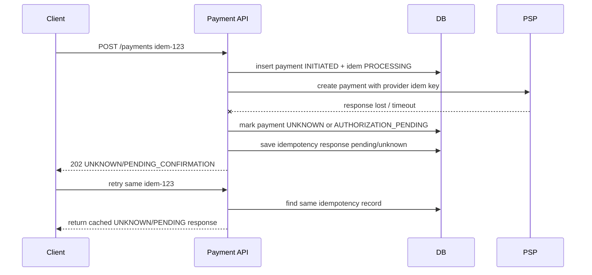
```mermaid
sequenceDiagram
    participant C as Client
    participant API as Payment API
    participant DB as DB
    participant PSP as PSP

    C->>API: POST /payments idem-123
    API->>DB: insert payment INITIATED + idem PROCESSING
    API->>PSP: create payment with provider idem key
    PSP--xAPI: response lost / timeout
    API->>DB: mark payment UNKNOWN or AUTHORIZATION_PENDING
    API->>DB: save idempotency response pending/unknown
    API-->>C: 202 UNKNOWN/PENDING_CONFIRMATION

    C->>API: retry same idem-123
    API->>DB: find same idempotency record
    API-->>C: return cached UNKNOWN/PENDING response
```

Jangan lakukan ini:

```text
Timeout -> mark FAILED
```

Lebih aman:

```text
Timeout -> UNKNOWN / PENDING_CONFIRMATION
```

Lalu recovery:

```text
1. Query provider by provider reference jika ada.
2. Tunggu webhook.
3. Reconcile lewat settlement/report.
4. Jangan membuat charge baru sampai status lama jelas.
```

---

# 17. Response Caching Policy

Untuk `SUCCEEDED`, simpan response snapshot.

```json
{
  "paymentId": "b0d1e3cc-1df0-4d4d-bab4-991ea6f1a9f0",
  "orderId": "ORD-123",
  "status": "CAPTURED",
  "amountMinor": 100000,
  "currency": "IDR"
}
```

Untuk `FAILED`, simpan response jika failure deterministic.

Contoh deterministic:

```text
VALIDATION_FAILED
PAYMENT_INVALID_STATE
PAYMENT_AMOUNT_EXCEEDS_AUTHORIZED
IDEMPOTENCY_KEY_REUSED_WITH_DIFFERENT_REQUEST
```

Contoh transient:

```text
PROVIDER_TIMEOUT
PROVIDER_UNAVAILABLE
DATABASE_DEADLOCK
```

Rekomendasi:

| Failure Type | Simpan sebagai `FAILED` Idempotency? |
|---|---:|
| Validation error sebelum side effect | Boleh, tapi banyak sistem tidak menyimpan. |
| Invalid state | Boleh. |
| Provider hard decline | Boleh, jika sudah pasti. |
| Provider timeout | Jangan final failed; simpan pending/unknown response atau recovery-needed. |
| Internal crash saat processing | Tetap `PROCESSING` sampai recovery. |

---

# 18. API Behavior Examples

## 18.1 First Create Payment

Request:

```http
POST /payments
Idempotency-Key: idem-001
Content-Type: application/json
```

Response:

```json
{
  "paymentId": "pay-001",
  "status": "CAPTURED",
  "amountMinor": 100000,
  "currency": "IDR"
}
```

DB:

```text
idempotency_keys:
operation_type = CREATE_PAYMENT
idempotency_key = idem-001
request_hash = sha256:abc
status = SUCCEEDED
response_status_code = 201
```

## 18.2 Retry Same Key Same Payload

Response harus sama secara logical:

```json
{
  "paymentId": "pay-001",
  "status": "CAPTURED",
  "amountMinor": 100000,
  "currency": "IDR"
}
```

Tidak boleh create `pay-002`.

## 18.3 Same Key Different Payload

Request kedua:

```json
{
  "orderId": "ORD-123",
  "amountMinor": 999000,
  "currency": "IDR"
}
```

Response:

```json
{
  "type": "https://api.company.internal/problems/idempotency-key-conflict",
  "title": "Idempotency key conflict",
  "status": 409,
  "detail": "Idempotency key was reused with a different request.",
  "errorCode": "IDEMPOTENCY_KEY_REUSED_WITH_DIFFERENT_REQUEST",
  "traceId": "corr-001"
}
```

---

# 19. Handling Concurrent Same-Key Requests

Dua request bisa masuk bersamaan:

```text
T1: POST /payments Idempotency-Key: abc
T2: POST /payments Idempotency-Key: abc
```

Dengan unique index:

```sql
CREATE UNIQUE INDEX ux_idempotency_operation_key
ON idempotency_keys(operation_type, idempotency_key);
```

Hanya satu yang berhasil insert `PROCESSING`.

Request kedua akan:

```text
insert affected rows = 0
load existing record
if PROCESSING -> return 409/202
```

Jangan biarkan dua thread sama-sama call PSP.

---

# 20. Should We Return `409` or `202` for Processing?

Ada dua style.

## Option A - `409 Conflict`

```json
{
  "errorCode": "OPERATION_ALREADY_PROCESSING",
  "detail": "A request with the same idempotency key is still processing."
}
```

Cocok jika client sebaiknya retry nanti.

## Option B - `202 Accepted`

```json
{
  "operationStatus": "PROCESSING",
  "paymentId": "pay-001",
  "retryAfterSeconds": 3
}
```

Cocok jika sistem punya operation tracking.

Rekomendasi praktis:

```text
Untuk internal microservice:
- 409 untuk duplicate concurrent request yang belum selesai.
- Sertakan Retry-After jika cocok.

Untuk async payment operation:
- 202 jika operation sudah diterima dan punya paymentId/status yang bisa dipoll.
```

---

# 21. `operation_key` untuk Create Payment

Idempotency key mencegah duplicate request, tetapi tidak selalu cukup mencegah duplicate payment untuk order yang sama.

Contoh:

```text
Client salah generate dua idempotency key berbeda:
Request A: orderId ORD-123, Idempotency-Key abc
Request B: orderId ORD-123, Idempotency-Key xyz
```

Kalau business rule menyatakan satu order hanya boleh punya satu active payment, tambahkan unique constraint atau business guard.

Contoh:

```sql
CREATE UNIQUE INDEX ux_payments_order_active
ON payments(order_id)
WHERE status IN (
    'INITIATED',
    'REQUIRES_ACTION',
    'AUTHORIZATION_PENDING',
    'AUTHORIZED',
    'CAPTURE_PENDING',
    'CAPTURED',
    'PARTIALLY_CAPTURED',
    'UNKNOWN'
);
```

Catatan:

```text
Unique order payment rule tergantung domain.
Subscription, split payment, partial payment, atau retry dengan payment method baru bisa butuh model berbeda.
```

Untuk domain yang mendukung multiple attempts di satu order, lebih baik:

```text
orders punya payment_session_id
payment_session punya banyak payment_attempts
hanya satu successful captured payment per payable item
```

---

# 22. Refund Idempotency

Refund lebih sensitif karena user support/admin sering klik ulang.

Endpoint:

```http
POST /payments/{paymentId}/refunds
Idempotency-Key: refund-abc
```

Operation scope:

```text
operation_type = CREATE_REFUND
operation_key = paymentId
idempotency_key = refund-abc
request_hash = hash(amount + reason + paymentId)
```

Tambahkan juga optional client-generated refund request id:

```json
{
  "refundRequestId": "rrq-2026-00001",
  "amountMinor": 50000,
  "reason": "CUSTOMER_REQUEST"
}
```

Constraint:

```sql
CREATE UNIQUE INDEX ux_refunds_payment_refund_request
ON refunds(payment_id, refund_request_id)
WHERE refund_request_id IS NOT NULL;
```

Refund invariant:

```sql
UPDATE payments
SET refunded_amount_minor = refunded_amount_minor + #{refundAmountMinor},
    status = CASE
        WHEN refunded_amount_minor + #{refundAmountMinor} = captured_amount_minor
            THEN 'REFUNDED'
        ELSE 'PARTIALLY_REFUNDED'
    END,
    version = version + 1,
    updated_at = now()
WHERE payment_id = #{paymentId}
  AND status IN ('CAPTURED', 'PARTIALLY_REFUNDED')
  AND refunded_amount_minor + #{refundAmountMinor} <= captured_amount_minor
  AND version = #{version};
```

Idempotency mencegah request duplicate. SQL guard mencegah refund melebihi captured amount. Keduanya diperlukan.

---

# 23. Capture Idempotency

Partial capture perlu idempotency ekstra hati-hati.

Contoh:

```text
Authorized amount = 100000
Capture request 1 = 40000, key cap-1
Capture request 2 = 40000, key cap-1 retry
```

Harus menghasilkan satu capture 40000.

Tapi:

```text
Capture request 1 = 40000, key cap-1
Capture request 2 = 40000, key cap-2
```

Bisa valid jika memang business ingin capture dua kali 40000.

Maka idempotency key harus merepresentasikan **logical capture command**, bukan hanya amount.

Praktis:

```json
{
  "captureRequestId": "capreq-ORD-123-shipment-1",
  "amountMinor": 40000,
  "reason": "SHIPMENT_1_READY"
}
```

Constraint:

```sql
ALTER TABLE payment_attempts
ADD COLUMN client_operation_id VARCHAR(200);

CREATE UNIQUE INDEX ux_payment_attempts_client_operation
ON payment_attempts(payment_id, attempt_type, client_operation_id)
WHERE client_operation_id IS NOT NULL;
```

---

# 24. Stuck `PROCESSING` Recovery

Skenario:

```text
1. Insert idempotency PROCESSING.
2. Insert payment INITIATED.
3. Service crash sebelum mark SUCCEEDED/FAILED.
```

Retry akan melihat `PROCESSING` tapi `locked_until` sudah lewat.

Recovery algorithm:

```text
Given operation_type + operation_key + idempotency_key:

1. Load idempotency record FOR UPDATE.
2. Verify request_hash same.
3. Check related payment/refund by operation_key.
4. If payment exists:
   a. If terminal or pending known -> build response from current state.
   b. Mark idempotency SUCCEEDED with reconstructed response.
   c. Return response.
5. If payment does not exist:
   a. If no provider call could have happened -> allow re-execute.
   b. If uncertain -> create manual recovery task / return 409 recovery required.
6. Never blindly issue a second provider charge if previous call may have reached PSP.
```

Pseudo-code:

```java
public PaymentResponse recoverCreatePayment(
        String operationKey,
        String idempotencyKey,
        String requestHash,
        String correlationId
) {
    IdempotencyRecord record = idempotencyMapper
            .findByOperationAndKeyForUpdate("CREATE_PAYMENT", idempotencyKey)
            .orElseThrow();

    if (!record.requestHash().equals(requestHash)) {
        throw PaymentErrors.idempotencyConflict(
                "Idempotency key was reused with a different request",
                correlationId
        );
    }

    return paymentRepository.findByOrderId(operationKey)
            .map(payment -> {
                PaymentResponse response = paymentResponseMapper.fromPayment(payment, correlationId);
                idempotencyMapper.markSucceeded(toCompleteCommand(record, response));
                return response;
            })
            .orElseThrow(() -> PaymentErrors.operationRecoveryRequired(correlationId));
}
```

---

# 25. Idempotency + Outbox

Saat operation sukses, lakukan dalam satu transaksi:

```text
BEGIN
  update payment state
  insert payment_event
  insert ledger_entry
  insert outbox_event
  update idempotency_keys -> SUCCEEDED with response snapshot
COMMIT
```

Kenapa?

Kalau idempotency sudah `SUCCEEDED`, tapi outbox belum dibuat, retry akan return cached success sementara service lain tidak pernah menerima event.

Rule:

```text
Idempotency success harus mencerminkan bahwa semua side effect internal yang wajib sudah durable.
```

---

# 26. Idempotency + Webhook

Webhook biasanya **tidak memakai client Idempotency-Key**.

Webhook dedup memakai:

```text
provider + provider_event_id
```

Tetapi webhook processing tetap harus idempotent.

Contoh duplicate webhook:

```text
provider = STRIPE
provider_event_id = evt_123
```

Constraint:

```sql
CREATE UNIQUE INDEX ux_payment_inbox_provider_event
ON payment_inbox_events(provider, provider_event_id);
```

Webhook processing harus menjaga:

```text
1. Insert inbox event ON CONFLICT DO NOTHING.
2. If duplicate, return 200 to provider.
3. State transition guarded.
4. Ledger reference unique.
5. Outbox event unique/dedup if needed.
```

Jangan campur `idempotency_keys` untuk internal API dengan `payment_inbox_events` untuk webhook. Mereka mirip, tapi scope dan source-nya berbeda.

---

# 27. Retry Backoff Policy

Contoh policy untuk provider call:

| Attempt | Delay |
|---:|---:|
| 1 | Immediate |
| 2 | 200 ms |
| 3 | 1 s |
| 4 | 5 s |
| 5 | Stop / async recovery |

Jangan terlalu agresif karena PSP bisa rate-limit.

Pseudo-code:

```java
public GatewayPaymentResult callWithRetry(GatewayCreatePaymentRequest request) {
    int maxAttempts = 3;

    for (int attempt = 1; attempt <= maxAttempts; attempt++) {
        try {
            return gatewayClient.createPayment(request);
        } catch (GatewayTimeoutException | GatewayUnavailableException e) {
            if (attempt == maxAttempts) {
                throw e;
            }
            sleep(backoff(attempt));
        } catch (GatewayBusinessDeclineException e) {
            throw e;
        }
    }

    throw new IllegalStateException("unreachable");
}
```

Important:

```text
Retry provider call harus selalu memakai provider idempotency key yang sama.
```

---

# 28. Idempotency Key Generation Guidance

Client/upstream service sebaiknya generate key per logical operation.

Contoh:

```text
UUID v4 random:
7b6e6ef1-5864-4d68-9128-c64045f1f8b3
```

Atau deterministic logical key:

```text
order:ORD-123:create-payment:v1
payment:pay-123:capture:shipment-1:v1
payment:pay-123:refund:case-456:v1
```

Trade-off:

| Key Type | Pros | Cons |
|---|---|---|
| Random UUID | Collision rendah, aman. | Client harus menyimpan untuk retry. |
| Deterministic | Mudah recreate saat retry. | Harus hati-hati agar tidak bocor data sensitif dan tidak reuse untuk operasi berbeda. |
| Business ID | Mudah trace. | Bisa berisi PII/order sensitive; risiko key reuse. |

Rekomendasi:

```text
Internal service:
- boleh deterministic tapi jangan mengandung PII.
- sertakan operation type/version.

External/public client:
- gunakan UUID v4/random high entropy.
```

---

# 29. Security Considerations

Jangan gunakan data sensitif sebagai idempotency key.

Hindari:

```text
customer-email@example.com
card-last4-4242
phone-number
national-id
```

Lebih aman:

```text
random UUID
hash dari logical operation
opaque request id
```

Stripe secara eksplisit menyarankan menghindari data sensitif seperti email address atau personal identifier sebagai idempotency key. ([Stripe Docs](https://docs.stripe.com/api/idempotent_requests?utm_source=chatgpt.com))

Logging:

```text
Log:
- idempotency_key_hash
- operation_type
- operation_key
- request_hash
- status

Jangan log:
- raw payment token
- raw card data
- raw sensitive personal identifier
```

---

# 30. API Error Contract

## 30.1 Missing Key

```json
{
  "type": "https://api.company.internal/problems/idempotency-key-required",
  "title": "Idempotency key required",
  "status": 400,
  "detail": "Idempotency-Key header is required for this payment operation.",
  "errorCode": "IDEMPOTENCY_KEY_REQUIRED",
  "traceId": "corr-123"
}
```

## 30.2 Reused Key with Different Request

```json
{
  "type": "https://api.company.internal/problems/idempotency-key-conflict",
  "title": "Idempotency key conflict",
  "status": 409,
  "detail": "The same Idempotency-Key was used with a different request payload.",
  "errorCode": "IDEMPOTENCY_KEY_REUSED_WITH_DIFFERENT_REQUEST",
  "traceId": "corr-123"
}
```

## 30.3 Operation Still Processing

```json
{
  "type": "https://api.company.internal/problems/operation-processing",
  "title": "Operation still processing",
  "status": 409,
  "detail": "A request with the same Idempotency-Key is still being processed.",
  "errorCode": "OPERATION_ALREADY_PROCESSING",
  "traceId": "corr-123",
  "retryAfterSeconds": 3
}
```

## 30.4 Recovery Required

```json
{
  "type": "https://api.company.internal/problems/operation-recovery-required",
  "title": "Operation recovery required",
  "status": 409,
  "detail": "The previous operation did not complete cleanly and requires recovery before it can be retried.",
  "errorCode": "OPERATION_RECOVERY_REQUIRED",
  "traceId": "corr-123"
}
```

---

# 31. Practical Implementation Flow per Endpoint

## 31.1 `POST /payments`

```text
1. Validate Idempotency-Key exists.
2. Calculate request hash.
3. IdempotencyService.begin(CREATE_PAYMENT, orderId, key, hash).
4. If cached -> return cached.
5. If processing -> 409/202.
6. If conflict -> 409.
7. If execute:
   a. insert payment INITIATED
   b. insert attempt
   c. call PSP with provider idempotency key
   d. update state
   e. insert event/ledger/outbox
   f. mark idempotency SUCCEEDED with response
8. If timeout:
   a. mark payment UNKNOWN/PENDING_CONFIRMATION
   b. save response snapshot as pending
   c. do not create second payment
```

## 31.2 `POST /payments/{id}/capture`

```text
1. operation_type = CAPTURE_PAYMENT
2. operation_key = paymentId
3. hash includes amountMinor + captureRequestId + reason
4. lock payment row
5. validate remaining capturable amount
6. create capture attempt
7. call PSP with provider idempotency key
8. update captured amount with SQL guard
9. insert ledger/outbox
10. cache response
```

## 31.3 `POST /payments/{id}/refunds`

```text
1. operation_type = CREATE_REFUND
2. operation_key = paymentId
3. hash includes amountMinor + refundRequestId + reason
4. lock payment row
5. validate remaining refundable amount
6. insert refund PENDING
7. call PSP with provider idempotency key
8. update refund/payment state if immediate
9. insert event/ledger/outbox
10. cache response
```

---

# 32. Testing Strategy

## 32.1 Unit Tests

| Test | Expected |
|---|---|
| Missing key | Throw `IDEMPOTENCY_KEY_REQUIRED`. |
| Same key same hash succeeded | Return cached response. |
| Same key different hash | Conflict. |
| Processing not expired | Operation already processing. |
| Processing expired | Recovery path. |
| Failed deterministic | Return cached failure. |
| Expired key | Reject or new operation by policy. |

## 32.2 Integration Tests with PostgreSQL

Gunakan Testcontainers.

```text
1. Two concurrent insertProcessing same key -> only one succeeds.
2. Retry same key same payload -> cached response.
3. Retry same key different payload -> 409.
4. Crash simulation after idempotency PROCESSING before payment insert -> recovery required.
5. Crash simulation after payment insert before idempotency success -> recovery reconstructs response.
6. Provider timeout -> payment UNKNOWN, retry returns same UNKNOWN.
7. Duplicate refund request -> only one refund row.
8. Duplicate capture request -> only one capture attempt for same client_operation_id.
```

## 32.3 Concurrency Test Pseudo-code

```java
@Test
void concurrentSameIdempotencyKeyOnlyExecutesOnce() throws Exception {
    String key = "idem-" + UUID.randomUUID();

    int threadCount = 20;
    ExecutorService executor = Executors.newFixedThreadPool(threadCount);
    CountDownLatch ready = new CountDownLatch(threadCount);
    CountDownLatch start = new CountDownLatch(1);

    List<Future<PaymentResponse>> futures = new ArrayList<>();

    for (int i = 0; i < threadCount; i++) {
        futures.add(executor.submit(() -> {
            ready.countDown();
            start.await();

            return paymentClient.createPayment(
                    key,
                    new CreatePaymentRequest(
                            "ORD-123",
                            "CUST-1",
                            "MRC-1",
                            100000,
                            "IDR",
                            CaptureMode.AUTO,
                            new PaymentMethodRequest(PaymentMethodType.CARD_TOKEN, "pm_tok"),
                            Map.of()
                    )
            );
        }));
    }

    ready.await();
    start.countDown();

    List<PaymentResponse> responses = new ArrayList<>();
    for (Future<PaymentResponse> future : futures) {
        try {
            responses.add(future.get());
        } catch (ExecutionException ignored) {
            // Some requests may receive OPERATION_ALREADY_PROCESSING depending API policy.
        }
    }

    assertThat(paymentRepository.countByOrderId("ORD-123")).isEqualTo(1);
    assertThat(gatewayMock.countCreatePaymentCalls()).isEqualTo(1);
}
```

---

# 33. Common Anti-Patterns

| Anti-Pattern | Bahaya | Solusi |
|---|---|---|
| Idempotency key hanya dicek di memory | Hilang saat restart; tidak aman multi-pod. | Simpan di PostgreSQL/Redis durable sesuai kebutuhan. |
| Tidak menyimpan request hash | Key sama bisa dipakai untuk amount berbeda. | Simpan canonical request hash. |
| Tidak cache response | Retry menghasilkan response berbeda/membingungkan. | Simpan response snapshot. |
| Lock terlalu lama sambil call PSP | DB contention tinggi. | Transaksi pendek; call PSP di luar transaksi panjang. |
| Timeout dianggap failed | Bisa salah jika PSP berhasil. | Gunakan `UNKNOWN`/pending + recovery. |
| Provider retry tanpa idempotency key sama | Bisa double charge di PSP. | Propagate provider idempotency key. |
| Idempotency key global tanpa scope | Bentrok antar operasi. | Gunakan `operation_type + key`. |
| Webhook pakai same idempotency table | Source dan semantics beda. | Gunakan inbox dedup. |
| Tidak punya recovery untuk `PROCESSING` stuck | Retry selamanya gagal. | Gunakan `locked_until` + recovery algorithm. |
| Menghapus key terlalu cepat | Client retry telat bisa duplicate. | Retention sesuai API contract dan provider behavior. |

---

# 34. Observability untuk Idempotency

Metrics yang wajib:

| Metric | Fungsi |
|---|---|
| `idempotency.begin.total` | Jumlah request mutating dengan idempotency. |
| `idempotency.cache_hit.total` | Retry yang mendapat cached response. |
| `idempotency.conflict.total` | Key reused dengan payload beda. |
| `idempotency.processing.total` | Request duplicate saat masih processing. |
| `idempotency.recovery.total` | Stuck processing yang masuk recovery. |
| `idempotency.expired.total` | Key expired. |
| `provider.retry.total` | Retry ke PSP. |
| `provider.timeout.total` | Timeout provider. |
| `payment.unknown.total` | Payment masuk unknown/pending confirmation. |

Structured log minimal:

```json
{
  "event": "idempotency_decision",
  "operationType": "CREATE_PAYMENT",
  "operationKey": "ORD-123",
  "idempotencyKeyHash": "sha256:...",
  "requestHash": "sha256:...",
  "decision": "RETURN_CACHED",
  "paymentId": "pay-123",
  "traceId": "corr-123"
}
```

---

# 35. Retention Policy

Provider punya retention berbeda. Stripe API v1 idempotency key dapat dipangkas otomatis setelah setidaknya 24 jam, sedangkan Stripe API v2 mendefinisikan replay dalam 30 hari untuk request yang memenuhi scope tertentu; Adyen menyimpan idempotency key minimal 7 hari; PayPal menyatakan server menyimpan `PayPal-Request-Id` untuk suatu periode waktu dan durasinya bergantung API terkait. ([Stripe Docs](https://docs.stripe.com/api/idempotent_requests?utm_source=chatgpt.com))

Untuk internal payment service, rekomendasi awal:

| Operation | Retention |
|---|---:|
| Create payment | 30-90 hari |
| Capture | 30-90 hari |
| Refund | 90-180 hari |
| Void | 30-90 hari |
| Admin recovery | 90-180 hari |

Kenapa lebih lama dari provider?

```text
Internal retry, support investigation, audit, dan reconciliation sering butuh horizon lebih panjang dari provider idempotency cache.
```

Expired job:

```sql
UPDATE idempotency_keys
SET status = 'EXPIRED',
    updated_at = now()
WHERE status IN ('SUCCEEDED', 'FAILED')
  AND expires_at < now();
```

Atau archive:

```text
Move old idempotency records to archive table before deletion.
```

---

# 36. Minimal End-to-End Example

## First Request

```bash
curl -X POST http://localhost:8080/payments \
  -H "Content-Type: application/json" \
  -H "Idempotency-Key: idem-create-ord-123-v1" \
  -H "X-Correlation-Id: corr-001" \
  -d '{
    "orderId": "ORD-123",
    "customerId": "CUST-1",
    "merchantId": "MRC-1",
    "amountMinor": 100000,
    "currency": "IDR",
    "captureMode": "AUTO",
    "paymentMethod": {
      "type": "CARD_TOKEN",
      "token": "pm_tok_abc"
    }
  }'
```

Response:

```json
{
  "paymentId": "f6ca2d13-1d94-4d9d-a736-e6c520cfbdbc",
  "orderId": "ORD-123",
  "status": "CAPTURED",
  "amountMinor": 100000,
  "currency": "IDR"
}
```

## Retry Same Request

```bash
curl -X POST http://localhost:8080/payments \
  -H "Content-Type: application/json" \
  -H "Idempotency-Key: idem-create-ord-123-v1" \
  -H "X-Correlation-Id: corr-002" \
  -d '{
    "orderId": "ORD-123",
    "customerId": "CUST-1",
    "merchantId": "MRC-1",
    "amountMinor": 100000,
    "currency": "IDR",
    "captureMode": "AUTO",
    "paymentMethod": {
      "type": "CARD_TOKEN",
      "token": "pm_tok_abc"
    }
  }'
```

Expected:

```text
No new payment.
No new provider charge.
Return cached payment response.
```

---

# 37. Implementation Checklist

## API

- [ ] Mutating endpoint wajib `Idempotency-Key`.
- [ ] Header length divalidasi.
- [ ] Header tidak boleh mengandung newline/control character.
- [ ] Same key + different request hash → `409`.
- [ ] Same key + same request + success → cached response.
- [ ] Same key + same request + processing → `409`/`202`.
- [ ] Error response memakai stable `errorCode`.

## Database

- [ ] Ada table `idempotency_keys`.
- [ ] Unique index `(operation_type, idempotency_key)`.
- [ ] Ada `request_hash`.
- [ ] Ada `response_status_code`.
- [ ] Ada `response_body`.
- [ ] Ada `locked_until`.
- [ ] Ada `expires_at`.
- [ ] Ada relation optional ke `payment_id` / `refund_id`.

## Provider

- [ ] Provider call menerima derived idempotency key.
- [ ] Retry provider memakai key yang sama.
- [ ] Timeout tidak membuat duplicate provider call tanpa status check.
- [ ] Provider idempotency behavior didokumentasikan per adapter.

## Recovery

- [ ] `PROCESSING` stuck punya recovery path.
- [ ] Recovery cek internal payment/refund dulu.
- [ ] Recovery tidak blindly call PSP ulang.
- [ ] Ada metric dan alert untuk stuck processing.

## Testing

- [ ] Concurrent same key.
- [ ] Same key different payload.
- [ ] Provider timeout.
- [ ] Crash after idempotency insert.
- [ ] Crash after payment insert.
- [ ] Duplicate refund.
- [ ] Duplicate capture.
- [ ] Cached response correctness.

---

# 38. Ringkasan

Idempotency dalam payment service harus dilihat sebagai **financial safety mechanism**, bukan sekadar header.

Desain yang benar:

```text
Idempotency-Key
+ operation_type
+ operation_key
+ request_hash
+ durable PROCESSING lock
+ provider idempotency propagation
+ response snapshot
+ recovery path
```

Aturan paling penting:

```text
Retry boleh terjadi.
Side effect finansial tidak boleh dobel.
Timeout tidak boleh langsung dianggap gagal.
Same key dengan payload beda harus ditolak.
Webhook dedup berbeda dari API idempotency.
```

---

## Seri 4/18 selesai

Rekomendasi lanjut ke:

**Seri 5/18 - Payment Gateway Adapter Pattern: desain interface provider-neutral, Stripe/Adyen/PayPal-style adapter, mapping request/response, timeout handling, dan provider abstraction di Java Jersey/JAX-RS microservice.**

---

**Sources:**

- [Idempotent requests | Stripe API Reference](https://docs.stripe.com/api/idempotent_requests?utm_source=chatgpt.com)
- [API idempotency | Adyen Docs](https://docs.adyen.com/development-resources/api-idempotency)
- [Idempotency](https://developer.paypal.com/api/rest/reference/idempotency/)
- [PostgreSQL: Documentation: 18: INSERT](https://www.postgresql.org/docs/current/sql-insert.html)

## Response:
7/14/2026, 10:26:15 PM

Saya lanjut ke **Seri 5/18**: Payment Gateway Adapter Pattern. Fokusnya membuat integrasi PSP tetap vendor-neutral, mudah diganti, aman untuk retry/idempotency, dan tidak mencemari domain payment dengan payload provider.

# Payment Management & Integration Pattern  
## Seri 5/18 - Payment Gateway Adapter Pattern

Seri ini fokus ke **Payment Gateway Adapter Pattern**: bagaimana membuat integrasi PSP/payment gateway seperti Stripe, Adyen, PayPal, bank transfer, virtual account, QRIS, atau provider lokal tetap **terisolasi dari domain payment internal**.

Core idea:

```text id="tgxpqm"
Payment domain tidak boleh tahu detail payload Stripe, Adyen, PayPal, atau provider lain.
Domain hanya tahu konsep bisnis:
authorize, capture, void, refund, query status.
```

Provider punya istilah, status, header, error code, idempotency behavior, webhook payload, dan retry behavior yang berbeda-beda. Misalnya Stripe `PaymentIntent` punya status seperti `requires_payment_method`, `requires_confirmation`, `requires_action`, `processing`, `requires_capture`, `canceled`, dan `succeeded`; Stripe juga memakai idempotency key untuk retry aman. ([Stripe Docs](https://docs.stripe.com/api/payment_intents/object?utm_source=chatgpt.com)) Adyen memakai `resultCode` untuk menunjukkan current status payment, tetapi dokumentasinya mengingatkan bahwa status payment bisa berubah setelah result code awal diterima, sehingga order management sebaiknya tidak hanya bergantung pada response awal. ([Adyen Docs](https://docs.adyen.com/online-payments/build-your-integration/payment-result-codes?utm_source=chatgpt.com)) PayPal Payments API mendukung operasi authorize, capture authorized payment, refund captured payment, dan show payment information; untuk idempotency REST POST, PayPal memakai header `PayPal-Request-Id`. ([PayPal Developer](https://developer.paypal.com/docs/api/payments/v2/?utm_source=chatgpt.com))

---

# 1. Introduction

Tanpa adapter pattern, payment service biasanya berubah menjadi seperti ini:

```text id="0dnwk8"
PaymentService
  -> if provider == STRIPE, build Stripe payload
  -> if provider == ADYEN, build Adyen payload
  -> if provider == PAYPAL, build PayPal payload
  -> map raw status everywhere
  -> map raw error everywhere
  -> leak provider-specific field to domain/API
```

Itu cepat rusak ketika:

- provider bertambah,
- provider diganti,
- payload API provider berubah,
- ada routing multi-provider,
- ada fallback provider,
- butuh sandbox/mock PSP,
- butuh test tanpa memanggil provider asli,
- butuh normalize error dan status.

Desain yang lebih sehat:

```text id="qg1iki"
PaymentApplicationService
  -> PaymentGatewayRouter
  -> PaymentGatewayClient interface
  -> StripePaymentGatewayClient
  -> AdyenPaymentGatewayClient
  -> PayPalPaymentGatewayClient
  -> MockPaymentGatewayClient
```

Jersey/JAX-RS tetap menjadi boundary API internal service. Untuk call keluar ke provider, Jakarta REST juga menyediakan client API untuk mengakses REST resource dari aplikasi Java. ([Jakarta EE](https://jakarta.ee/learn/docs/jakartaee-tutorial/current/websvcs/rest-client/rest-client.html?utm_source=chatgpt.com))

---

# 2. Diagram Architecture

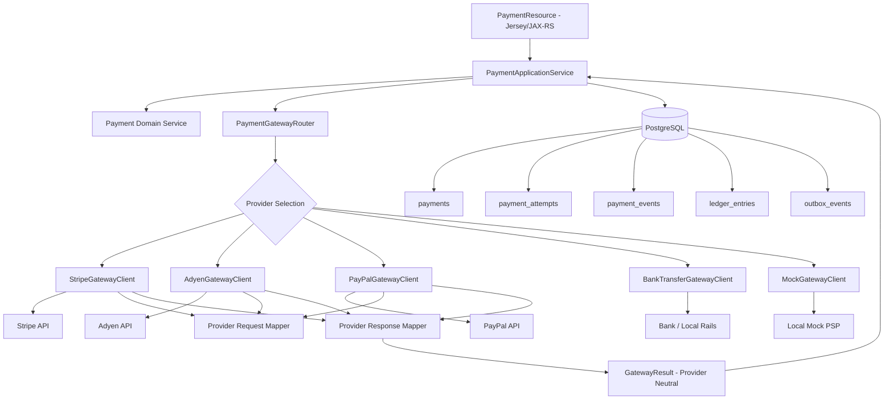
```mermaid id="vg06co"
flowchart TD
    A[PaymentResource - Jersey/JAX-RS] --> B[PaymentApplicationService]

    B --> C[Payment Domain Service]
    B --> D[PaymentGatewayRouter]

    D --> E{Provider Selection}

    E --> F[StripeGatewayClient]
    E --> G[AdyenGatewayClient]
    E --> H[PayPalGatewayClient]
    E --> I[BankTransferGatewayClient]
    E --> J[MockGatewayClient]

    F --> K[Stripe API]
    G --> L[Adyen API]
    H --> M[PayPal API]
    I --> N[Bank / Local Rails]
    J --> O[Local Mock PSP]

    F --> P[Provider Request Mapper]
    G --> P
    H --> P

    F --> Q[Provider Response Mapper]
    G --> Q
    H --> Q

    Q --> R[GatewayResult - Provider Neutral]
    R --> B

    B --> S[(PostgreSQL)]
    S --> S1[payments]
    S --> S2[payment_attempts]
    S --> S3[payment_events]
    S --> S4[ledger_entries]
    S --> S5[outbox_events]
```

---

# 3. Practical Decomposition Table

| No | Area | Fokus Praktis | Output Implementasi |
|---:|---|---|---|
| 1 | Provider-neutral interface | Abstraksi operasi payment umum. | `PaymentGatewayClient` |
| 2 | Provider request model | Request internal yang tidak bocor vendor. | `GatewayAuthorizeRequest`, `GatewayCaptureRequest`, `GatewayRefundRequest` |
| 3 | Provider result model | Response internal yang stabil. | `GatewayPaymentResult`, `GatewayRefundResult` |
| 4 | Provider adapter | Implementasi per PSP. | `StripeGatewayClient`, `AdyenGatewayClient`, `PayPalGatewayClient` |
| 5 | Request mapper | Mapping internal request → provider payload. | `StripeRequestMapper`, `AdyenRequestMapper` |
| 6 | Response mapper | Mapping provider response → internal result. | `StripeResponseMapper`, `AdyenResponseMapper` |
| 7 | Error mapper | Mapping provider error → internal error code. | `GatewayErrorMapper` |
| 8 | Status mapper | Mapping provider status → internal status. | `GatewayStatusMapper` |
| 9 | Capability model | Mengetahui fitur provider. | `GatewayCapabilities` |
| 10 | Routing | Pilih provider berdasarkan merchant/currency/method. | `PaymentGatewayRouter` |
| 11 | Idempotency propagation | Kirim derived idempotency key ke provider. | `ProviderIdempotencyKeyFactory` |
| 12 | Timeout handling | Bedakan timeout, decline, invalid request, provider down. | `GatewayException` hierarchy |
| 13 | Observability | Log, metric, trace per provider call. | structured log + metrics |
| 14 | Sandbox/mock | Test tanpa provider asli. | `MockPaymentGatewayClient` |
| 15 | Contract testing | Pastikan adapter mapping benar. | fixture-based tests |

---

# 4. Adapter Boundary

Payment application layer hanya boleh melihat interface seperti ini:

```java id="r6a5er"
package com.company.payment.gateway;

public interface PaymentGatewayClient {

    GatewayAuthorizeResult authorize(GatewayAuthorizeRequest request);

    GatewayCaptureResult capture(GatewayCaptureRequest request);

    GatewayVoidResult voidAuthorization(GatewayVoidRequest request);

    GatewayRefundResult refund(GatewayRefundRequest request);

    GatewayPaymentStatusResult getPaymentStatus(GatewayPaymentStatusRequest request);

    GatewayRefundStatusResult getRefundStatus(GatewayRefundStatusRequest request);

    GatewayCapabilities capabilities();
}
```

Catatan desain:

```text id="4rnuvj"
Interface ini tidak menyebut Stripe PaymentIntent,
Adyen pspReference,
atau PayPal authorization_id sebagai first-class domain.
Semua detail vendor masuk ke providerReference / providerMetadata.
```

---

# 5. Provider-neutral Request Model

## 5.1 Authorize Request

```java id="h14jc2"
package com.company.payment.gateway.model;

import java.util.Map;
import java.util.UUID;

public record GatewayAuthorizeRequest(
        UUID paymentId,
        String orderId,
        String merchantId,
        long amountMinor,
        String currency,
        String paymentMethodType,
        String paymentMethodToken,
        boolean captureImmediately,
        String providerIdempotencyKey,
        String correlationId,
        Map<String, Object> metadata
) {}
```

## 5.2 Capture Request

```java id="5luoip"
package com.company.payment.gateway.model;

import java.util.Map;
import java.util.UUID;

public record GatewayCaptureRequest(
        UUID paymentId,
        String providerPaymentId,
        String providerAuthorizationId,
        long amountMinor,
        String currency,
        String providerIdempotencyKey,
        String correlationId,
        Map<String, Object> metadata
) {}
```

## 5.3 Void Request

```java id="gzk0w7"
package com.company.payment.gateway.model;

import java.util.Map;
import java.util.UUID;

public record GatewayVoidRequest(
        UUID paymentId,
        String providerPaymentId,
        String providerAuthorizationId,
        String reason,
        String providerIdempotencyKey,
        String correlationId,
        Map<String, Object> metadata
) {}
```

## 5.4 Refund Request

```java id="p4dt4l"
package com.company.payment.gateway.model;

import java.util.Map;
import java.util.UUID;

public record GatewayRefundRequest(
        UUID paymentId,
        UUID refundId,
        String providerPaymentId,
        String providerCaptureId,
        long amountMinor,
        String currency,
        String reason,
        String providerIdempotencyKey,
        String correlationId,
        Map<String, Object> metadata
) {}
```

---

# 6. Provider-neutral Result Model

## 6.1 Gateway Payment Status

```java id="w87kdn"
package com.company.payment.gateway.model;

public enum GatewayPaymentStatus {
    AUTHORIZATION_PENDING,
    REQUIRES_ACTION,
    AUTHORIZED,
    CAPTURE_PENDING,
    CAPTURED,
    FAILED,
    CANCELLED,
    UNKNOWN
}
```

## 6.2 Gateway Authorize Result

```java id="7fi76a"
package com.company.payment.gateway.model;

import java.time.Instant;
import java.util.Map;

public record GatewayAuthorizeResult(
        String provider,
        String providerPaymentId,
        String providerAuthorizationId,
        String providerChargeId,

        GatewayPaymentStatus status,

        long authorizedAmountMinor,
        long capturedAmountMinor,
        String currency,

        boolean requiresAction,
        GatewayNextAction nextAction,

        String rawProviderStatus,
        String providerRequestId,
        Map<String, Object> providerMetadata,

        Instant providerCreatedAt
) {}
```

## 6.3 Next Action

```java id="224jth"
package com.company.payment.gateway.model;

import java.time.Instant;
import java.util.Map;

public record GatewayNextAction(
        String type,
        String redirectUrl,
        String qrContent,
        String instructionText,
        Instant expiresAt,
        Map<String, Object> rawData
) {}
```

## 6.4 Capture Result

```java id="ved311"
package com.company.payment.gateway.model;

import java.time.Instant;
import java.util.Map;

public record GatewayCaptureResult(
        String provider,
        String providerPaymentId,
        String providerCaptureId,
        GatewayPaymentStatus status,
        long capturedAmountMinor,
        String currency,
        String rawProviderStatus,
        String providerRequestId,
        Map<String, Object> providerMetadata,
        Instant capturedAt
) {}
```

## 6.5 Refund Result

```java id="dveom0"
package com.company.payment.gateway.model;

import java.time.Instant;
import java.util.Map;

public record GatewayRefundResult(
        String provider,
        String providerPaymentId,
        String providerRefundId,
        GatewayRefundStatus status,
        long refundedAmountMinor,
        String currency,
        String rawProviderStatus,
        String providerRequestId,
        Map<String, Object> providerMetadata,
        Instant refundedAt
) {}
```

```java id="krq19x"
package com.company.payment.gateway.model;

public enum GatewayRefundStatus {
    PENDING,
    SUCCEEDED,
    FAILED,
    CANCELLED,
    UNKNOWN
}
```

---

# 7. Status Mapping Strategy

Jangan pakai provider status langsung di `payments.status`.

Gunakan mapping eksplisit.

## 7.1 Stripe Mapping Example

Stripe `PaymentIntent` status mencakup `requires_payment_method`, `requires_confirmation`, `requires_action`, `processing`, `requires_capture`, `canceled`, dan `succeeded`; untuk manual capture, Stripe menyatakan capture dilakukan terhadap PaymentIntent yang statusnya `requires_capture`. ([Stripe Docs](https://docs.stripe.com/api/payment_intents/object?utm_source=chatgpt.com))

| Stripe Status | Internal Gateway Status | Payment Domain Status |
|---|---|---|
| `requires_payment_method` | `FAILED` atau `AUTHORIZATION_PENDING` tergantung context | `FAILED` / `AUTHORIZATION_PENDING` |
| `requires_confirmation` | `AUTHORIZATION_PENDING` | `AUTHORIZATION_PENDING` |
| `requires_action` | `REQUIRES_ACTION` | `REQUIRES_ACTION` |
| `processing` | `AUTHORIZATION_PENDING` / `CAPTURE_PENDING` | `AUTHORIZATION_PENDING` / `CAPTURE_PENDING` |
| `requires_capture` | `AUTHORIZED` | `AUTHORIZED` |
| `succeeded` | `CAPTURED` | `CAPTURED` |
| `canceled` | `CANCELLED` | `CANCELLED` |

## 7.2 Adyen Mapping Example

Adyen `resultCode` menunjukkan current status payment, tetapi status bisa berubah setelah response awal; Adyen merekomendasikan agar result code tidak langsung dipakai untuk update order management sebagai final truth. ([Adyen Docs](https://docs.adyen.com/online-payments/build-your-integration/payment-result-codes?utm_source=chatgpt.com))

| Adyen Result Code | Internal Gateway Status | Notes |
|---|---|---|
| `Authorised` | `AUTHORIZED` atau `CAPTURED` tergantung capture mode | Perlu lihat capture mode. |
| `Received` | `AUTHORIZATION_PENDING` | Payment diterima, belum final. |
| `Pending` | `AUTHORIZATION_PENDING` | Tunggu webhook/status update. |
| `PresentToShopper` | `REQUIRES_ACTION` | Ada instruksi/action ke shopper. |
| `RedirectShopper` | `REQUIRES_ACTION` | Redirect flow. |
| `Refused` | `FAILED` | Decline/failure. |
| `Cancelled` | `CANCELLED` | Cancelled. |
| Unknown/new code | `UNKNOWN` | Jangan drop; masuk exception/monitoring. |

## 7.3 PayPal Mapping Example

PayPal Payments API menyediakan operasi authorize, capture, refund, dan show payment information; PayPal Orders API juga membedakan order dengan `intent=AUTHORIZE` dan `intent=CAPTURE`. ([PayPal Developer](https://developer.paypal.com/docs/api/payments/v2/?utm_source=chatgpt.com))

| PayPal Concept | Internal Gateway Status | Notes |
|---|---|---|
| Authorization created | `AUTHORIZED` | Capture later. |
| Capture completed | `CAPTURED` | Funds captured. |
| Capture pending | `CAPTURE_PENDING` | Tunggu final status. |
| Authorization voided | `CANCELLED` | Void/cancel auth. |
| Refund completed | `SUCCEEDED` refund status | Refund lifecycle terpisah. |
| Provider timeout | `UNKNOWN` | Query status / webhook / reconciliation. |

---

# 8. Gateway Capabilities

Tidak semua provider mendukung kemampuan yang sama.

```java id="v9xbo3"
package com.company.payment.gateway.model;

import java.util.Set;

public record GatewayCapabilities(
        String provider,
        Set<String> supportedCurrencies,
        Set<String> supportedPaymentMethodTypes,
        boolean supportsAuthorizeOnly,
        boolean supportsManualCapture,
        boolean supportsPartialCapture,
        boolean supportsMultiplePartialCapture,
        boolean supportsVoid,
        boolean supportsRefund,
        boolean supportsPartialRefund,
        boolean supportsWebhook,
        boolean supportsIdempotency,
        boolean supportsStatusQuery
) {}
```

Contoh:

```java id="feges5"
public final class StripeGatewayCapabilities {

    public static GatewayCapabilities capabilities() {
        return new GatewayCapabilities(
                "STRIPE",
                Set.of("USD", "EUR", "IDR"),
                Set.of("CARD_TOKEN", "EWALLET"),
                true,
                true,
                true,
                false,
                true,
                true,
                true,
                true,
                true,
                true
        );
    }
}
```

Catatan:

```text id="95qoyt"
Jangan hardcode capabilities tanpa verifikasi provider dan merchant account config.
Capabilities sering tergantung country, currency, payment method, merchant setup, dan contract.
```

---

# 9. Payment Gateway Router

Router bertugas memilih provider.

```java id="0slz0a"
package com.company.payment.gateway;

import com.company.payment.gateway.model.GatewayAuthorizeRequest;

public interface PaymentGatewayRouter {

    PaymentGatewayClient routeForAuthorize(GatewayAuthorizeRequest request);

    PaymentGatewayClient routeForCapture(String provider);

    PaymentGatewayClient routeForRefund(String provider);

    PaymentGatewayClient routeForStatusQuery(String provider);
}
```

Implementasi sederhana:

```java id="06jf3l"
package com.company.payment.gateway.routing;

import com.company.payment.gateway.PaymentGatewayClient;
import com.company.payment.gateway.PaymentGatewayRouter;
import com.company.payment.gateway.model.GatewayAuthorizeRequest;

import java.util.Map;

public class ConfigBasedPaymentGatewayRouter implements PaymentGatewayRouter {

    private final Map<String, PaymentGatewayClient> clients;
    private final MerchantPaymentConfigRepository configRepository;

    public ConfigBasedPaymentGatewayRouter(
            Map<String, PaymentGatewayClient> clients,
            MerchantPaymentConfigRepository configRepository
    ) {
        this.clients = clients;
        this.configRepository = configRepository;
    }

    @Override
    public PaymentGatewayClient routeForAuthorize(GatewayAuthorizeRequest request) {
        MerchantPaymentConfig config = configRepository.findByMerchantId(request.merchantId());

        String provider = config.selectProvider(
                request.currency(),
                request.paymentMethodType(),
                request.captureImmediately()
        );

        PaymentGatewayClient client = clients.get(provider);

        if (client == null) {
            throw new IllegalStateException("No payment gateway client registered for provider: " + provider);
        }

        validateCapability(client, request);

        return client;
    }

    @Override
    public PaymentGatewayClient routeForCapture(String provider) {
        return getRequired(provider);
    }

    @Override
    public PaymentGatewayClient routeForRefund(String provider) {
        return getRequired(provider);
    }

    @Override
    public PaymentGatewayClient routeForStatusQuery(String provider) {
        return getRequired(provider);
    }

    private PaymentGatewayClient getRequired(String provider) {
        PaymentGatewayClient client = clients.get(provider);
        if (client == null) {
            throw new IllegalStateException("Unknown payment provider: " + provider);
        }
        return client;
    }

    private void validateCapability(PaymentGatewayClient client, GatewayAuthorizeRequest request) {
        var capabilities = client.capabilities();

        if (!capabilities.supportedCurrencies().contains(request.currency())) {
            throw new IllegalStateException("Provider does not support currency: " + request.currency());
        }

        if (!capabilities.supportedPaymentMethodTypes().contains(request.paymentMethodType())) {
            throw new IllegalStateException("Provider does not support payment method: " + request.paymentMethodType());
        }

        if (!request.captureImmediately() && !capabilities.supportsManualCapture()) {
            throw new IllegalStateException("Provider does not support manual capture");
        }
    }
}
```

---

# 10. Provider Client Skeleton

## 10.1 Common HTTP Wrapper

Jangan menyebar HTTP code di semua adapter. Buat wrapper.

```java id="5okn5u"
package com.company.payment.gateway.http;

import java.time.Duration;
import java.util.Map;

public interface GatewayHttpClient {

    GatewayHttpResponse post(
            String provider,
            String url,
            Map<String, String> headers,
            String body,
            Duration timeout
    );

    GatewayHttpResponse get(
            String provider,
            String url,
            Map<String, String> headers,
            Duration timeout
    );
}
```

```java id="xrpwqa"
package com.company.payment.gateway.http;

import java.util.Map;

public record GatewayHttpResponse(
        int statusCode,
        Map<String, String> headers,
        String body
) {
    public boolean is2xx() {
        return statusCode >= 200 && statusCode < 300;
    }

    public boolean is5xx() {
        return statusCode >= 500 && statusCode < 600;
    }

    public boolean is4xx() {
        return statusCode >= 400 && statusCode < 500;
    }
}
```

---

## 10.2 Stripe Gateway Client Skeleton

```java id="t6qc28"
package com.company.payment.gateway.stripe;

import com.company.payment.gateway.PaymentGatewayClient;
import com.company.payment.gateway.http.GatewayHttpClient;
import com.company.payment.gateway.model.*;

import java.time.Duration;
import java.util.Map;

public class StripeGatewayClient implements PaymentGatewayClient {

    private static final String PROVIDER = "STRIPE";

    private final GatewayHttpClient httpClient;
    private final StripeRequestMapper requestMapper;
    private final StripeResponseMapper responseMapper;
    private final StripeErrorMapper errorMapper;
    private final StripeConfig config;

    public StripeGatewayClient(
            GatewayHttpClient httpClient,
            StripeRequestMapper requestMapper,
            StripeResponseMapper responseMapper,
            StripeErrorMapper errorMapper,
            StripeConfig config
    ) {
        this.httpClient = httpClient;
        this.requestMapper = requestMapper;
        this.responseMapper = responseMapper;
        this.errorMapper = errorMapper;
        this.config = config;
    }

    @Override
    public GatewayAuthorizeResult authorize(GatewayAuthorizeRequest request) {
        String body = requestMapper.toCreatePaymentIntentPayload(request);

        var response = httpClient.post(
                PROVIDER,
                config.baseUrl() + "/v1/payment_intents",
                Map.of(
                        "Authorization", "Bearer " + config.apiKey(),
                        "Idempotency-Key", request.providerIdempotencyKey(),
                        "Content-Type", "application/x-www-form-urlencoded"
                ),
                body,
                Duration.ofSeconds(10)
        );

        if (!response.is2xx()) {
            throw errorMapper.toException(response);
        }

        return responseMapper.toAuthorizeResult(response.body());
    }

    @Override
    public GatewayCaptureResult capture(GatewayCaptureRequest request) {
        String body = requestMapper.toCapturePaymentIntentPayload(request);

        var response = httpClient.post(
                PROVIDER,
                config.baseUrl() + "/v1/payment_intents/" + request.providerPaymentId() + "/capture",
                Map.of(
                        "Authorization", "Bearer " + config.apiKey(),
                        "Idempotency-Key", request.providerIdempotencyKey(),
                        "Content-Type", "application/x-www-form-urlencoded"
                ),
                body,
                Duration.ofSeconds(10)
        );

        if (!response.is2xx()) {
            throw errorMapper.toException(response);
        }

        return responseMapper.toCaptureResult(response.body());
    }

    @Override
    public GatewayVoidResult voidAuthorization(GatewayVoidRequest request) {
        String body = requestMapper.toCancelPaymentIntentPayload(request);

        var response = httpClient.post(
                PROVIDER,
                config.baseUrl() + "/v1/payment_intents/" + request.providerPaymentId() + "/cancel",
                Map.of(
                        "Authorization", "Bearer " + config.apiKey(),
                        "Idempotency-Key", request.providerIdempotencyKey(),
                        "Content-Type", "application/x-www-form-urlencoded"
                ),
                body,
                Duration.ofSeconds(10)
        );

        if (!response.is2xx()) {
            throw errorMapper.toException(response);
        }

        return responseMapper.toVoidResult(response.body());
    }

    @Override
    public GatewayRefundResult refund(GatewayRefundRequest request) {
        String body = requestMapper.toRefundPayload(request);

        var response = httpClient.post(
                PROVIDER,
                config.baseUrl() + "/v1/refunds",
                Map.of(
                        "Authorization", "Bearer " + config.apiKey(),
                        "Idempotency-Key", request.providerIdempotencyKey(),
                        "Content-Type", "application/x-www-form-urlencoded"
                ),
                body,
                Duration.ofSeconds(10)
        );

        if (!response.is2xx()) {
            throw errorMapper.toException(response);
        }

        return responseMapper.toRefundResult(response.body());
    }

    @Override
    public GatewayPaymentStatusResult getPaymentStatus(GatewayPaymentStatusRequest request) {
        var response = httpClient.get(
                PROVIDER,
                config.baseUrl() + "/v1/payment_intents/" + request.providerPaymentId(),
                Map.of("Authorization", "Bearer " + config.apiKey()),
                Duration.ofSeconds(10)
        );

        if (!response.is2xx()) {
            throw errorMapper.toException(response);
        }

        return responseMapper.toPaymentStatusResult(response.body());
    }

    @Override
    public GatewayRefundStatusResult getRefundStatus(GatewayRefundStatusRequest request) {
        throw new UnsupportedOperationException("Not implemented yet");
    }

    @Override
    public GatewayCapabilities capabilities() {
        return StripeGatewayCapabilities.capabilities();
    }
}
```

Stripe manual capture flow uses `capture_method=manual` style behavior, where successful payment can move to `requires_capture` and capture is done later on the uncaptured PaymentIntent. ([Stripe Docs](https://docs.stripe.com/payments/place-a-hold-on-a-payment-method?utm_source=chatgpt.com))

---

## 10.3 Adyen Gateway Client Skeleton

Adyen uses an idempotency header named `idempotency-key`, and Adyen documents that keys are checked for uniqueness at company account scope and are valid for at least 7 days after first submission. ([Adyen Docs](https://docs.adyen.com/development-resources/api-idempotency?utm_source=chatgpt.com))

```java id="a20avm"
package com.company.payment.gateway.adyen;

import com.company.payment.gateway.PaymentGatewayClient;
import com.company.payment.gateway.http.GatewayHttpClient;
import com.company.payment.gateway.model.*;

import java.time.Duration;
import java.util.Map;

public class AdyenGatewayClient implements PaymentGatewayClient {

    private static final String PROVIDER = "ADYEN";

    private final GatewayHttpClient httpClient;
    private final AdyenRequestMapper requestMapper;
    private final AdyenResponseMapper responseMapper;
    private final AdyenErrorMapper errorMapper;
    private final AdyenConfig config;

    public AdyenGatewayClient(
            GatewayHttpClient httpClient,
            AdyenRequestMapper requestMapper,
            AdyenResponseMapper responseMapper,
            AdyenErrorMapper errorMapper,
            AdyenConfig config
    ) {
        this.httpClient = httpClient;
        this.requestMapper = requestMapper;
        this.responseMapper = responseMapper;
        this.errorMapper = errorMapper;
        this.config = config;
    }

    @Override
    public GatewayAuthorizeResult authorize(GatewayAuthorizeRequest request) {
        String body = requestMapper.toPaymentsPayload(request);

        var response = httpClient.post(
                PROVIDER,
                config.checkoutBaseUrl() + "/v71/payments",
                Map.of(
                        "x-api-key", config.apiKey(),
                        "idempotency-key", request.providerIdempotencyKey(),
                        "Content-Type", "application/json"
                ),
                body,
                Duration.ofSeconds(10)
        );

        if (!response.is2xx()) {
            throw errorMapper.toException(response);
        }

        return responseMapper.toAuthorizeResult(response.body(), request.captureImmediately());
    }

    @Override
    public GatewayCaptureResult capture(GatewayCaptureRequest request) {
        String body = requestMapper.toCapturePayload(request);

        var response = httpClient.post(
                PROVIDER,
                config.paymentsBaseUrl() + "/v71/payments/" + request.providerPaymentId() + "/captures",
                Map.of(
                        "x-api-key", config.apiKey(),
                        "idempotency-key", request.providerIdempotencyKey(),
                        "Content-Type", "application/json"
                ),
                body,
                Duration.ofSeconds(10)
        );

        if (!response.is2xx()) {
            throw errorMapper.toException(response);
        }

        return responseMapper.toCaptureResult(response.body());
    }

    @Override
    public GatewayRefundResult refund(GatewayRefundRequest request) {
        String body = requestMapper.toRefundPayload(request);

        var response = httpClient.post(
                PROVIDER,
                config.paymentsBaseUrl() + "/v71/payments/" + request.providerPaymentId() + "/refunds",
                Map.of(
                        "x-api-key", config.apiKey(),
                        "idempotency-key", request.providerIdempotencyKey(),
                        "Content-Type", "application/json"
                ),
                body,
                Duration.ofSeconds(10)
        );

        if (!response.is2xx()) {
            throw errorMapper.toException(response);
        }

        return responseMapper.toRefundResult(response.body());
    }

    @Override
    public GatewayVoidResult voidAuthorization(GatewayVoidRequest request) {
        throw new UnsupportedOperationException("Void not implemented yet for Adyen adapter");
    }

    @Override
    public GatewayPaymentStatusResult getPaymentStatus(GatewayPaymentStatusRequest request) {
        throw new UnsupportedOperationException("Status query not implemented yet for Adyen adapter");
    }

    @Override
    public GatewayRefundStatusResult getRefundStatus(GatewayRefundStatusRequest request) {
        throw new UnsupportedOperationException("Refund status query not implemented yet for Adyen adapter");
    }

    @Override
    public GatewayCapabilities capabilities() {
        return AdyenGatewayCapabilities.capabilities();
    }
}
```

Catatan penting:

```text id="1s4unq"
Jangan menganggap semua endpoint/path Adyen sama untuk semua integration type.
Adyen punya Checkout API, Payments API, Management API, Terminal API, dan konfigurasi merchant yang memengaruhi behavior.
Adapter harus dipisah per integration style bila perlu.
```

---

## 10.4 PayPal Gateway Client Skeleton

PayPal REST API uses OAuth 2.0 access tokens and JSON responses; for idempotent REST POST calls, PayPal uses the `PayPal-Request-Id` request header. ([PayPal Developer](https://developer.paypal.com/api/rest/?utm_source=chatgpt.com))

```java id="mxs7fj"
package com.company.payment.gateway.paypal;

import com.company.payment.gateway.PaymentGatewayClient;
import com.company.payment.gateway.http.GatewayHttpClient;
import com.company.payment.gateway.model.*;

import java.time.Duration;
import java.util.Map;

public class PayPalGatewayClient implements PaymentGatewayClient {

    private static final String PROVIDER = "PAYPAL";

    private final GatewayHttpClient httpClient;
    private final PayPalAccessTokenProvider tokenProvider;
    private final PayPalRequestMapper requestMapper;
    private final PayPalResponseMapper responseMapper;
    private final PayPalErrorMapper errorMapper;
    private final PayPalConfig config;

    public PayPalGatewayClient(
            GatewayHttpClient httpClient,
            PayPalAccessTokenProvider tokenProvider,
            PayPalRequestMapper requestMapper,
            PayPalResponseMapper responseMapper,
            PayPalErrorMapper errorMapper,
            PayPalConfig config
    ) {
        this.httpClient = httpClient;
        this.tokenProvider = tokenProvider;
        this.requestMapper = requestMapper;
        this.responseMapper = responseMapper;
        this.errorMapper = errorMapper;
        this.config = config;
    }

    @Override
    public GatewayAuthorizeResult authorize(GatewayAuthorizeRequest request) {
        String accessToken = tokenProvider.getAccessToken();
        String body = requestMapper.toCreateOrderPayload(request, "AUTHORIZE");

        var createOrderResponse = httpClient.post(
                PROVIDER,
                config.baseUrl() + "/v2/checkout/orders",
                Map.of(
                        "Authorization", "Bearer " + accessToken,
                        "PayPal-Request-Id", request.providerIdempotencyKey(),
                        "Content-Type", "application/json"
                ),
                body,
                Duration.ofSeconds(10)
        );

        if (!createOrderResponse.is2xx()) {
            throw errorMapper.toException(createOrderResponse);
        }

        return responseMapper.toAuthorizeResult(createOrderResponse.body());
    }

    @Override
    public GatewayCaptureResult capture(GatewayCaptureRequest request) {
        String accessToken = tokenProvider.getAccessToken();

        var response = httpClient.post(
                PROVIDER,
                config.baseUrl() + "/v2/payments/authorizations/"
                        + request.providerAuthorizationId()
                        + "/capture",
                Map.of(
                        "Authorization", "Bearer " + accessToken,
                        "PayPal-Request-Id", request.providerIdempotencyKey(),
                        "Content-Type", "application/json"
                ),
                "{}",
                Duration.ofSeconds(10)
        );

        if (!response.is2xx()) {
            throw errorMapper.toException(response);
        }

        return responseMapper.toCaptureResult(response.body());
    }

    @Override
    public GatewayRefundResult refund(GatewayRefundRequest request) {
        String accessToken = tokenProvider.getAccessToken();
        String body = requestMapper.toRefundPayload(request);

        var response = httpClient.post(
                PROVIDER,
                config.baseUrl() + "/v2/payments/captures/"
                        + request.providerCaptureId()
                        + "/refund",
                Map.of(
                        "Authorization", "Bearer " + accessToken,
                        "PayPal-Request-Id", request.providerIdempotencyKey(),
                        "Content-Type", "application/json"
                ),
                body,
                Duration.ofSeconds(10)
        );

        if (!response.is2xx()) {
            throw errorMapper.toException(response);
        }

        return responseMapper.toRefundResult(response.body());
    }

    @Override
    public GatewayVoidResult voidAuthorization(GatewayVoidRequest request) {
        String accessToken = tokenProvider.getAccessToken();

        var response = httpClient.post(
                PROVIDER,
                config.baseUrl() + "/v2/payments/authorizations/"
                        + request.providerAuthorizationId()
                        + "/void",
                Map.of(
                        "Authorization", "Bearer " + accessToken,
                        "PayPal-Request-Id", request.providerIdempotencyKey(),
                        "Content-Type", "application/json"
                ),
                "{}",
                Duration.ofSeconds(10)
        );

        if (!response.is2xx()) {
            throw errorMapper.toException(response);
        }

        return responseMapper.toVoidResult(response.body());
    }

    @Override
    public GatewayPaymentStatusResult getPaymentStatus(GatewayPaymentStatusRequest request) {
        throw new UnsupportedOperationException("Not implemented yet");
    }

    @Override
    public GatewayRefundStatusResult getRefundStatus(GatewayRefundStatusRequest request) {
        throw new UnsupportedOperationException("Not implemented yet");
    }

    @Override
    public GatewayCapabilities capabilities() {
        return PayPalGatewayCapabilities.capabilities();
    }
}
```

---

# 11. Request Mapper Example

## 11.1 Stripe Request Mapper

```java id="hmqbzi"
package com.company.payment.gateway.stripe;

import com.company.payment.gateway.model.GatewayAuthorizeRequest;
import com.company.payment.gateway.model.GatewayCaptureRequest;
import com.company.payment.gateway.model.GatewayRefundRequest;

import java.net.URLEncoder;
import java.nio.charset.StandardCharsets;
import java.util.LinkedHashMap;
import java.util.Map;
import java.util.stream.Collectors;

public class StripeRequestMapper {

    public String toCreatePaymentIntentPayload(GatewayAuthorizeRequest request) {
        Map<String, String> form = new LinkedHashMap<>();

        form.put("amount", String.valueOf(request.amountMinor()));
        form.put("currency", request.currency().toLowerCase());
        form.put("payment_method", request.paymentMethodToken());
        form.put("confirm", "true");
        form.put("capture_method", request.captureImmediately() ? "automatic" : "manual");
        form.put("metadata[payment_id]", request.paymentId().toString());
        form.put("metadata[order_id]", request.orderId());
        form.put("metadata[merchant_id]", request.merchantId());

        return toFormUrlEncoded(form);
    }

    public String toCapturePaymentIntentPayload(GatewayCaptureRequest request) {
        Map<String, String> form = new LinkedHashMap<>();
        form.put("amount_to_capture", String.valueOf(request.amountMinor()));
        return toFormUrlEncoded(form);
    }

    public String toRefundPayload(GatewayRefundRequest request) {
        Map<String, String> form = new LinkedHashMap<>();
        form.put("payment_intent", request.providerPaymentId());
        form.put("amount", String.valueOf(request.amountMinor()));
        form.put("metadata[payment_id]", request.paymentId().toString());
        form.put("metadata[refund_id]", request.refundId().toString());
        return toFormUrlEncoded(form);
    }

    public String toCancelPaymentIntentPayload(com.company.payment.gateway.model.GatewayVoidRequest request) {
        Map<String, String> form = new LinkedHashMap<>();
        form.put("cancellation_reason", "requested_by_customer");
        return toFormUrlEncoded(form);
    }

    private String toFormUrlEncoded(Map<String, String> form) {
        return form.entrySet()
                .stream()
                .map(e -> encode(e.getKey()) + "=" + encode(e.getValue()))
                .collect(Collectors.joining("&"));
    }

    private String encode(String value) {
        return URLEncoder.encode(value, StandardCharsets.UTF_8);
    }
}
```

## 11.2 Adyen Request Mapper

```java id="xqxchc"
package com.company.payment.gateway.adyen;

import com.company.payment.gateway.model.GatewayAuthorizeRequest;
import com.company.payment.gateway.model.GatewayCaptureRequest;
import com.company.payment.gateway.model.GatewayRefundRequest;
import com.fasterxml.jackson.databind.ObjectMapper;

import java.util.Map;

public class AdyenRequestMapper {

    private final ObjectMapper objectMapper;
    private final AdyenConfig config;

    public AdyenRequestMapper(ObjectMapper objectMapper, AdyenConfig config) {
        this.objectMapper = objectMapper;
        this.config = config;
    }

    public String toPaymentsPayload(GatewayAuthorizeRequest request) {
        return writeJson(Map.of(
                "merchantAccount", config.merchantAccount(),
                "reference", request.paymentId().toString(),
                "amount", Map.of(
                        "currency", request.currency(),
                        "value", request.amountMinor()
                ),
                "paymentMethod", Map.of(
                        "type", request.paymentMethodType(),
                        "storedPaymentMethodId", request.paymentMethodToken()
                ),
                "shopperReference", request.orderId(),
                "captureDelayHours", request.captureImmediately() ? 0 : 999
        ));
    }

    public String toCapturePayload(GatewayCaptureRequest request) {
        return writeJson(Map.of(
                "merchantAccount", config.merchantAccount(),
                "amount", Map.of(
                        "currency", request.currency(),
                        "value", request.amountMinor()
                ),
                "reference", request.paymentId().toString()
        ));
    }

    public String toRefundPayload(GatewayRefundRequest request) {
        return writeJson(Map.of(
                "merchantAccount", config.merchantAccount(),
                "amount", Map.of(
                        "currency", request.currency(),
                        "value", request.amountMinor()
                ),
                "reference", request.refundId().toString()
        ));
    }

    private String writeJson(Object payload) {
        try {
            return objectMapper.writeValueAsString(payload);
        } catch (Exception e) {
            throw new IllegalStateException("Failed to serialize Adyen payload", e);
        }
    }
}
```

Catatan:

```text id="oo2rlr"
Payload Adyen di atas adalah skeleton konseptual.
Dalam real implementation, field paymentMethod, shopperInteraction, returnUrl, browserInfo, recurringProcessingModel, dan storePaymentMethod sangat tergantung integration type.
```

---

# 12. Response Mapper Example

## 12.1 Stripe Response Mapper

```java id="ut1vp4"
package com.company.payment.gateway.stripe;

import com.company.payment.gateway.model.*;
import com.fasterxml.jackson.databind.JsonNode;
import com.fasterxml.jackson.databind.ObjectMapper;

import java.time.Instant;
import java.util.Map;

public class StripeResponseMapper {

    private final ObjectMapper objectMapper;

    public StripeResponseMapper(ObjectMapper objectMapper) {
        this.objectMapper = objectMapper;
    }

    public GatewayAuthorizeResult toAuthorizeResult(String body) {
        JsonNode root = read(body);

        String status = root.path("status").asText();
        GatewayPaymentStatus mappedStatus = mapPaymentIntentStatus(status);

        return new GatewayAuthorizeResult(
                "STRIPE",
                root.path("id").asText(null),
                null,
                root.path("latest_charge").asText(null),
                mappedStatus,
                root.path("amount").asLong(0),
                mappedStatus == GatewayPaymentStatus.CAPTURED ? root.path("amount_received").asLong(0) : 0,
                root.path("currency").asText("").toUpperCase(),
                mappedStatus == GatewayPaymentStatus.REQUIRES_ACTION,
                mapNextAction(root.path("next_action")),
                status,
                root.path("request_id").asText(null),
                Map.of("rawObjectType", root.path("object").asText(null)),
                Instant.now()
        );
    }

    public GatewayCaptureResult toCaptureResult(String body) {
        JsonNode root = read(body);

        String status = root.path("status").asText();
        GatewayPaymentStatus mappedStatus = mapPaymentIntentStatus(status);

        return new GatewayCaptureResult(
                "STRIPE",
                root.path("id").asText(null),
                root.path("latest_charge").asText(null),
                mappedStatus,
                root.path("amount_received").asLong(0),
                root.path("currency").asText("").toUpperCase(),
                status,
                root.path("request_id").asText(null),
                Map.of(),
                Instant.now()
        );
    }

    public GatewayRefundResult toRefundResult(String body) {
        JsonNode root = read(body);
        String status = root.path("status").asText();

        return new GatewayRefundResult(
                "STRIPE",
                root.path("payment_intent").asText(null),
                root.path("id").asText(null),
                mapRefundStatus(status),
                root.path("amount").asLong(0),
                root.path("currency").asText("").toUpperCase(),
                status,
                root.path("request_id").asText(null),
                Map.of(),
                Instant.now()
        );
    }

    public GatewayVoidResult toVoidResult(String body) {
        JsonNode root = read(body);

        return new GatewayVoidResult(
                "STRIPE",
                root.path("id").asText(null),
                GatewayPaymentStatus.CANCELLED,
                root.path("status").asText(),
                Map.of(),
                Instant.now()
        );
    }

    public GatewayPaymentStatusResult toPaymentStatusResult(String body) {
        JsonNode root = read(body);
        String status = root.path("status").asText();

        return new GatewayPaymentStatusResult(
                "STRIPE",
                root.path("id").asText(null),
                mapPaymentIntentStatus(status),
                status,
                root.path("amount").asLong(0),
                root.path("amount_received").asLong(0),
                root.path("currency").asText("").toUpperCase(),
                Map.of()
        );
    }

    private GatewayPaymentStatus mapPaymentIntentStatus(String status) {
        return switch (status) {
            case "requires_action" -> GatewayPaymentStatus.REQUIRES_ACTION;
            case "requires_capture" -> GatewayPaymentStatus.AUTHORIZED;
            case "succeeded" -> GatewayPaymentStatus.CAPTURED;
            case "canceled" -> GatewayPaymentStatus.CANCELLED;
            case "processing", "requires_confirmation" -> GatewayPaymentStatus.AUTHORIZATION_PENDING;
            case "requires_payment_method" -> GatewayPaymentStatus.FAILED;
            default -> GatewayPaymentStatus.UNKNOWN;
        };
    }

    private GatewayRefundStatus mapRefundStatus(String status) {
        return switch (status) {
            case "succeeded" -> GatewayRefundStatus.SUCCEEDED;
            case "failed" -> GatewayRefundStatus.FAILED;
            case "canceled" -> GatewayRefundStatus.CANCELLED;
            case "pending" -> GatewayRefundStatus.PENDING;
            default -> GatewayRefundStatus.UNKNOWN;
        };
    }

    private GatewayNextAction mapNextAction(JsonNode nextAction) {
        if (nextAction == null || nextAction.isMissingNode() || nextAction.isNull()) {
            return null;
        }

        return new GatewayNextAction(
                nextAction.path("type").asText(null),
                nextAction.path("redirect_to_url").path("url").asText(null),
                null,
                null,
                null,
                Map.of()
        );
    }

    private JsonNode read(String body) {
        try {
            return objectMapper.readTree(body);
        } catch (Exception e) {
            throw new IllegalStateException("Failed to parse Stripe response", e);
        }
    }
}
```

---

# 13. Error Handling Model

Provider error jangan langsung dilempar sebagai raw message.

Buat hierarchy:

```java id="o9rb8q"
package com.company.payment.gateway.error;

public abstract class GatewayException extends RuntimeException {

    private final String provider;
    private final String providerErrorCode;
    private final String providerRequestId;
    private final boolean retryable;

    protected GatewayException(
            String message,
            String provider,
            String providerErrorCode,
            String providerRequestId,
            boolean retryable
    ) {
        super(message);
        this.provider = provider;
        this.providerErrorCode = providerErrorCode;
        this.providerRequestId = providerRequestId;
        this.retryable = retryable;
    }

    public String provider() {
        return provider;
    }

    public String providerErrorCode() {
        return providerErrorCode;
    }

    public String providerRequestId() {
        return providerRequestId;
    }

    public boolean retryable() {
        return retryable;
    }
}
```

```java id="0mfm2t"
package com.company.payment.gateway.error;

public class GatewayTimeoutException extends GatewayException {
    public GatewayTimeoutException(String provider, String providerRequestId) {
        super("Payment provider timeout", provider, "TIMEOUT", providerRequestId, true);
    }
}
```

```java id="xk8q85"
package com.company.payment.gateway.error;

public class GatewayUnavailableException extends GatewayException {
    public GatewayUnavailableException(String provider, String providerErrorCode, String providerRequestId) {
        super("Payment provider unavailable", provider, providerErrorCode, providerRequestId, true);
    }
}
```

```java id="ndrm95"
package com.company.payment.gateway.error;

public class GatewayDeclinedException extends GatewayException {
    public GatewayDeclinedException(String provider, String providerErrorCode, String providerRequestId, String message) {
        super(message, provider, providerErrorCode, providerRequestId, false);
    }
}
```

```java id="gc6wv7"
package com.company.payment.gateway.error;

public class GatewayInvalidRequestException extends GatewayException {
    public GatewayInvalidRequestException(String provider, String providerErrorCode, String providerRequestId, String message) {
        super(message, provider, providerErrorCode, providerRequestId, false);
    }
}
```

```java id="s4vlro"
package com.company.payment.gateway.error;

public class GatewayUnknownException extends GatewayException {
    public GatewayUnknownException(String provider, String providerErrorCode, String providerRequestId, String message) {
        super(message, provider, providerErrorCode, providerRequestId, false);
    }
}
```

---

# 14. Error Mapping Table

| Provider Error Type | Internal Gateway Exception | Retry? | Payment State |
|---|---|---:|---|
| Network timeout | `GatewayTimeoutException` | Ya, with same idempotency key | `UNKNOWN` / `PENDING_CONFIRMATION` |
| HTTP 502/503/504 | `GatewayUnavailableException` | Ya, limited | `UNKNOWN` / `PENDING_CONFIRMATION` |
| Rate limit | `GatewayUnavailableException` or `GatewayRateLimitException` | Ya, delayed | Keep pending |
| Card declined | `GatewayDeclinedException` | Tidak | `FAILED` |
| Insufficient funds | `GatewayDeclinedException` | Tidak langsung | `FAILED` / customer action |
| Invalid API key | `GatewayInvalidRequestException` or config exception | Tidak | Internal incident |
| Invalid payload | `GatewayInvalidRequestException` | Tidak | Internal bug/config |
| Unknown provider status | `GatewayUnknownException` | Tidak langsung | `UNKNOWN` |
| Duplicate provider request | Depends | Query status | Keep current state |

PayPal explicitly says calls that fail with network timeouts or HTTP 500 can be retried while the server stores the `PayPal-Request-Id`; this is the kind of provider behavior that adapter retry policy should encode, not scatter in domain code. ([PayPal Developer](https://developer.paypal.com/api/rest/requests/?utm_source=chatgpt.com))

---

# 15. Adapter Result Handling in Application Service

```java id="qvvcgh"
public PaymentResponse authorizePayment(CreatePaymentCommand command) {
    Payment payment = paymentRepository.createInitiated(command);

    String providerIdempotencyKey = providerIdempotencyKeyFactory.create(
            payment.providerCandidate(),
            environment,
            "AUTHORIZE",
            command.idempotencyKey()
    );

    GatewayAuthorizeRequest gatewayRequest = new GatewayAuthorizeRequest(
            payment.paymentId(),
            payment.orderId(),
            payment.merchantId(),
            payment.amountMinor(),
            payment.currency(),
            command.paymentMethodType(),
            command.paymentMethodToken(),
            command.captureImmediately(),
            providerIdempotencyKey,
            command.correlationId(),
            command.metadata()
    );

    PaymentGatewayClient gatewayClient = gatewayRouter.routeForAuthorize(gatewayRequest);

    try {
        GatewayAuthorizeResult result = gatewayClient.authorize(gatewayRequest);

        return transactionTemplate.execute(() -> {
            paymentRepository.applyGatewayAuthorizeResult(payment.paymentId(), result);
            paymentEventRepository.insertProviderResponseEvent(payment.paymentId(), result);

            if (result.status() == GatewayPaymentStatus.CAPTURED) {
                ledgerRepository.insertPaymentCaptured(payment.paymentId(), result);
                outboxRepository.insertPaymentCapturedEvent(payment.paymentId(), result);
            }

            return paymentResponseMapper.fromGatewayResult(payment.paymentId(), result);
        });

    } catch (GatewayTimeoutException e) {
        return transactionTemplate.execute(() -> {
            paymentRepository.markUnknown(payment.paymentId(), e.provider(), e.providerRequestId());
            paymentEventRepository.insertGatewayTimeoutEvent(payment.paymentId(), e);
            outboxRepository.insertPaymentPendingConfirmationEvent(payment.paymentId());

            return paymentResponseMapper.pendingConfirmation(payment.paymentId(), command.correlationId());
        });

    } catch (GatewayDeclinedException e) {
        return transactionTemplate.execute(() -> {
            paymentRepository.markFailed(payment.paymentId(), e.providerErrorCode(), e.getMessage());
            paymentEventRepository.insertGatewayDeclinedEvent(payment.paymentId(), e);
            outboxRepository.insertPaymentFailedEvent(payment.paymentId());

            return paymentResponseMapper.failed(payment.paymentId(), command.correlationId());
        });
    }
}
```

Practical rule:

```text id="73gfas"
Adapter hanya mengembalikan result/error provider-neutral.
Application service yang memutuskan update DB, event, ledger, dan outbox.
```

---

# 16. Timeout and Unknown State

Timeout dari adapter harus menghasilkan exception yang jelas:

```java id="94pu72"
try {
    return gatewayClient.authorize(request);
} catch (GatewayTimeoutException e) {
    // Do not mark FAILED directly.
    // Mark UNKNOWN/PENDING_CONFIRMATION and schedule status query.
}
```

Jangan lakukan:

```java id="xgqbrs"
catch (Exception e) {
    payment.status = FAILED;
}
```

Karena timeout bisa berarti provider sudah menerima request dan payment berhasil, tetapi response hilang.

---

# 17. Mock Gateway Client

Mock adapter penting untuk local development, test, dan chaos simulation.

```java id="dyxid0"
package com.company.payment.gateway.mock;

import com.company.payment.gateway.PaymentGatewayClient;
import com.company.payment.gateway.model.*;

import java.time.Instant;
import java.util.Map;
import java.util.Set;
import java.util.UUID;

public class MockPaymentGatewayClient implements PaymentGatewayClient {

    @Override
    public GatewayAuthorizeResult authorize(GatewayAuthorizeRequest request) {
        String scenario = String.valueOf(request.metadata().getOrDefault("mockScenario", "CAPTURED"));

        return switch (scenario) {
            case "REQUIRES_ACTION" -> requiresAction(request);
            case "AUTHORIZED" -> authorized(request);
            case "FAILED" -> failed(request);
            case "TIMEOUT" -> throw new com.company.payment.gateway.error.GatewayTimeoutException("MOCK", null);
            default -> captured(request);
        };
    }

    private GatewayAuthorizeResult captured(GatewayAuthorizeRequest request) {
        return new GatewayAuthorizeResult(
                "MOCK",
                "mock_pi_" + request.paymentId(),
                "mock_auth_" + request.paymentId(),
                "mock_charge_" + request.paymentId(),
                GatewayPaymentStatus.CAPTURED,
                request.amountMinor(),
                request.amountMinor(),
                request.currency(),
                false,
                null,
                "mock_captured",
                UUID.randomUUID().toString(),
                Map.of(),
                Instant.now()
        );
    }

    private GatewayAuthorizeResult authorized(GatewayAuthorizeRequest request) {
        return new GatewayAuthorizeResult(
                "MOCK",
                "mock_pi_" + request.paymentId(),
                "mock_auth_" + request.paymentId(),
                null,
                GatewayPaymentStatus.AUTHORIZED,
                request.amountMinor(),
                0,
                request.currency(),
                false,
                null,
                "mock_authorized",
                UUID.randomUUID().toString(),
                Map.of(),
                Instant.now()
        );
    }

    private GatewayAuthorizeResult requiresAction(GatewayAuthorizeRequest request) {
        return new GatewayAuthorizeResult(
                "MOCK",
                "mock_pi_" + request.paymentId(),
                null,
                null,
                GatewayPaymentStatus.REQUIRES_ACTION,
                request.amountMinor(),
                0,
                request.currency(),
                true,
                new GatewayNextAction(
                        "REDIRECT",
                        "http://localhost:8080/mock-psp/challenge/" + request.paymentId(),
                        null,
                        null,
                        Instant.now().plusSeconds(900),
                        Map.of()
                ),
                "mock_requires_action",
                UUID.randomUUID().toString(),
                Map.of(),
                Instant.now()
        );
    }

    private GatewayAuthorizeResult failed(GatewayAuthorizeRequest request) {
        return new GatewayAuthorizeResult(
                "MOCK",
                "mock_pi_" + request.paymentId(),
                null,
                null,
                GatewayPaymentStatus.FAILED,
                0,
                0,
                request.currency(),
                false,
                null,
                "mock_failed",
                UUID.randomUUID().toString(),
                Map.of("failureCode", "MOCK_DECLINED"),
                Instant.now()
        );
    }

    @Override
    public GatewayCaptureResult capture(GatewayCaptureRequest request) {
        return new GatewayCaptureResult(
                "MOCK",
                request.providerPaymentId(),
                "mock_capture_" + request.paymentId(),
                GatewayPaymentStatus.CAPTURED,
                request.amountMinor(),
                request.currency(),
                "mock_capture_succeeded",
                UUID.randomUUID().toString(),
                Map.of(),
                Instant.now()
        );
    }

    @Override
    public GatewayRefundResult refund(GatewayRefundRequest request) {
        return new GatewayRefundResult(
                "MOCK",
                request.providerPaymentId(),
                "mock_refund_" + request.refundId(),
                GatewayRefundStatus.SUCCEEDED,
                request.amountMinor(),
                request.currency(),
                "mock_refund_succeeded",
                UUID.randomUUID().toString(),
                Map.of(),
                Instant.now()
        );
    }

    @Override
    public GatewayVoidResult voidAuthorization(GatewayVoidRequest request) {
        return new GatewayVoidResult(
                "MOCK",
                request.providerPaymentId(),
                GatewayPaymentStatus.CANCELLED,
                "mock_voided",
                Map.of(),
                Instant.now()
        );
    }

    @Override
    public GatewayPaymentStatusResult getPaymentStatus(GatewayPaymentStatusRequest request) {
        return new GatewayPaymentStatusResult(
                "MOCK",
                request.providerPaymentId(),
                GatewayPaymentStatus.CAPTURED,
                "mock_captured",
                1000,
                1000,
                "IDR",
                Map.of()
        );
    }

    @Override
    public GatewayRefundStatusResult getRefundStatus(GatewayRefundStatusRequest request) {
        return new GatewayRefundStatusResult(
                "MOCK",
                request.providerRefundId(),
                GatewayRefundStatus.SUCCEEDED,
                "mock_refund_succeeded",
                Map.of()
        );
    }

    @Override
    public GatewayCapabilities capabilities() {
        return new GatewayCapabilities(
                "MOCK",
                Set.of("IDR", "USD", "EUR"),
                Set.of("CARD_TOKEN", "BANK_TRANSFER", "EWALLET", "QRIS"),
                true,
                true,
                true,
                true,
                true,
                true,
                true,
                true,
                true,
                true
        );
    }
}
```

---

# 18. Provider Configuration

Jangan hardcode secret/config di code.

```java id="c3axks"
package com.company.payment.gateway.config;

public record ProviderConfig(
        String provider,
        String environment,
        String baseUrl,
        String apiKeySecretRef,
        String merchantAccount,
        int connectTimeoutMillis,
        int readTimeoutMillis,
        int maxRetryAttempts,
        boolean enabled
) {}
```

Contoh YAML:

```yaml id="ko5ece"
payment:
  gateways:
    stripe:
      enabled: true
      environment: sandbox
      base-url: https://api.stripe.com
      api-key-secret-ref: payment/stripe/api-key
      connect-timeout-millis: 2000
      read-timeout-millis: 10000
      max-retry-attempts: 2

    adyen:
      enabled: true
      environment: test
      checkout-base-url: https://checkout-test.adyen.com
      payments-base-url: https://pal-test.adyen.com
      api-key-secret-ref: payment/adyen/api-key
      merchant-account: YOUR_MERCHANT
      connect-timeout-millis: 2000
      read-timeout-millis: 10000
      max-retry-attempts: 2

    paypal:
      enabled: true
      environment: sandbox
      base-url: https://api-m.sandbox.paypal.com
      client-id-secret-ref: payment/paypal/client-id
      client-secret-secret-ref: payment/paypal/client-secret
      connect-timeout-millis: 2000
      read-timeout-millis: 10000
      max-retry-attempts: 2
```

---

# 19. Package Structure

```text id="y86l7t"
payment-service/
  src/main/java/com/company/payment/
    gateway/
      PaymentGatewayClient.java
      PaymentGatewayRouter.java

      model/
        GatewayAuthorizeRequest.java
        GatewayAuthorizeResult.java
        GatewayCaptureRequest.java
        GatewayCaptureResult.java
        GatewayRefundRequest.java
        GatewayRefundResult.java
        GatewayPaymentStatus.java
        GatewayRefundStatus.java
        GatewayCapabilities.java
        GatewayNextAction.java

      error/
        GatewayException.java
        GatewayTimeoutException.java
        GatewayUnavailableException.java
        GatewayDeclinedException.java
        GatewayInvalidRequestException.java
        GatewayUnknownException.java

      http/
        GatewayHttpClient.java
        GatewayHttpResponse.java
        JdkGatewayHttpClient.java

      routing/
        ConfigBasedPaymentGatewayRouter.java
        MerchantPaymentConfig.java
        MerchantPaymentConfigRepository.java

      stripe/
        StripeGatewayClient.java
        StripeRequestMapper.java
        StripeResponseMapper.java
        StripeErrorMapper.java
        StripeConfig.java
        StripeGatewayCapabilities.java

      adyen/
        AdyenGatewayClient.java
        AdyenRequestMapper.java
        AdyenResponseMapper.java
        AdyenErrorMapper.java
        AdyenConfig.java
        AdyenGatewayCapabilities.java

      paypal/
        PayPalGatewayClient.java
        PayPalRequestMapper.java
        PayPalResponseMapper.java
        PayPalErrorMapper.java
        PayPalAccessTokenProvider.java
        PayPalConfig.java

      mock/
        MockPaymentGatewayClient.java
```

---

# 20. Adapter Testing Strategy

## 20.1 Unit Test: Status Mapper

```java id="lrqt3h"
@Test
void stripeRequiresCaptureMapsToAuthorized() {
    StripeResponseMapper mapper = new StripeResponseMapper(new ObjectMapper());

    GatewayPaymentStatus status = mapper.mapPaymentIntentStatusForTest("requires_capture");

    assertThat(status).isEqualTo(GatewayPaymentStatus.AUTHORIZED);
}
```

## 20.2 Fixture-based Response Test

```text id="w53up6"
src/test/resources/provider-fixtures/
  stripe/
    payment_intent_succeeded.json
    payment_intent_requires_action.json
    payment_intent_requires_capture.json
    payment_intent_canceled.json
    error_card_declined.json

  adyen/
    payments_authorised.json
    payments_redirect_shopper.json
    payments_refused.json
    payments_pending.json

  paypal/
    authorization_created.json
    capture_completed.json
    refund_completed.json
```

Test:

```java id="knd5g0"
@Test
void stripeSucceededFixtureMapsToCaptured() throws Exception {
    String json = Files.readString(Path.of(
            "src/test/resources/provider-fixtures/stripe/payment_intent_succeeded.json"
    ));

    GatewayAuthorizeResult result = mapper.toAuthorizeResult(json);

    assertThat(result.status()).isEqualTo(GatewayPaymentStatus.CAPTURED);
    assertThat(result.providerPaymentId()).isNotBlank();
}
```

## 20.3 HTTP Contract Test

Gunakan mock server seperti WireMock atau mock HTTP server:

```text id="qvyra2"
1. Assert adapter sends correct idempotency header.
2. Assert adapter sends correct authorization header.
3. Assert timeout maps to GatewayTimeoutException.
4. Assert 5xx maps to GatewayUnavailableException.
5. Assert provider decline maps to GatewayDeclinedException.
6. Assert unknown status maps to UNKNOWN, not FAILED.
```

## 20.4 Integration Sandbox Test

```text id="sp1lxu"
1. Create sandbox payment.
2. Manual capture flow.
3. Refund flow.
4. Provider timeout simulation, if available.
5. Webhook replay.
6. Invalid API key.
7. Unsupported currency.
```

---

# 21. Practical Failure Scenarios

| Scenario | Expected Adapter Behavior | Expected Application Behavior |
|---|---|---|
| Provider returns success captured | Map to `GatewayPaymentStatus.CAPTURED` | Update payment `CAPTURED`, insert ledger/outbox. |
| Provider requires action | Map to `REQUIRES_ACTION` + `nextAction` | Return action to consumer. |
| Provider manual auth success | Map to `AUTHORIZED` | Wait capture command. |
| Provider 3DS pending | Map to `REQUIRES_ACTION` / `AUTHORIZATION_PENDING` | Wait callback/webhook. |
| Provider timeout | Throw `GatewayTimeoutException` | Mark `UNKNOWN` / pending confirmation. |
| Provider 503 | Throw retryable exception | Retry limited or mark pending. |
| Provider decline | Throw `GatewayDeclinedException` or result `FAILED` | Mark payment `FAILED`. |
| Provider unknown status | Map `UNKNOWN` | Alert + status query. |
| Provider duplicate request response | Map by provider semantics | Query status if needed. |
| Provider response missing required fields | Throw mapping exception | Mark attempt failed/internal error, not payment failed blindly. |

---

# 22. Anti-Pattern

| Anti-Pattern | Kenapa Berbahaya | Solusi |
|---|---|---|
| Domain service build raw Stripe/Adyen payload | Domain jadi vendor-coupled. | Provider-specific mapper. |
| Provider status disimpan langsung sebagai internal status | Multi-provider sulit. | Explicit status mapping. |
| Semua provider error dianggap `FAILED` | Timeout/5xx bisa sebenarnya sukses. | Error hierarchy + unknown state. |
| Idempotency key tidak dikirim ke provider | Retry internal bisa tetap duplicate di PSP. | Derived provider idempotency key. |
| Provider router hardcode di `if/else` besar | Sulit maintain saat provider bertambah. | Registry/map-based router. |
| Tidak punya mock PSP | Testing lambat dan rapuh. | `MockPaymentGatewayClient`. |
| Tidak menyimpan raw provider status | Debugging sulit. | Simpan `rawProviderStatus` di attempt/event. |
| Tidak menyimpan provider request id | Sulit support ke PSP. | Simpan provider request/reference ID. |
| Adapter update database langsung | Responsibility bocor. | Adapter hanya return result; app service update DB. |
| Unknown provider status dianggap failed | Bisa salah secara finansial. | Map ke `UNKNOWN` dan alert. |

---

# 23. Implementation Checklist

## Interface

- [ ] Ada `PaymentGatewayClient`.
- [ ] Ada method `authorize`, `capture`, `voidAuthorization`, `refund`, `getPaymentStatus`.
- [ ] Ada `GatewayCapabilities`.
- [ ] Tidak ada class provider-specific di domain layer.

## Request / Response

- [ ] Request model provider-neutral.
- [ ] Result model provider-neutral.
- [ ] Semua result menyimpan `rawProviderStatus`.
- [ ] Semua result menyimpan provider reference.
- [ ] Response mapper punya fallback `UNKNOWN`.

## Error

- [ ] Timeout tidak jadi `FAILED`.
- [ ] 5xx provider dianggap retryable.
- [ ] Decline dianggap non-retryable.
- [ ] Invalid config/API key jadi incident.
- [ ] Unknown error tidak silently swallowed.

## Idempotency

- [ ] Provider idempotency key dikirim untuk mutating call.
- [ ] Provider key derived dari internal key.
- [ ] Retry provider memakai key yang sama.
- [ ] Header provider sesuai provider: Stripe `Idempotency-Key`, Adyen `idempotency-key`, PayPal `PayPal-Request-Id`.

## Routing

- [ ] Routing berdasarkan merchant/currency/payment method.
- [ ] Capability dicek sebelum provider call.
- [ ] Provider disabled tidak boleh dipilih.
- [ ] Capture/refund memakai provider yang sama dengan original payment.

## Testing

- [ ] Fixture test per provider status.
- [ ] HTTP contract test header/payload.
- [ ] Timeout test.
- [ ] Decline test.
- [ ] Unknown status test.
- [ ] Mock provider untuk local dev.

---

# 24. Exercise Praktis

Buat adapter mini dengan 2 provider:

```text id="s8biu1"
1. MockPaymentGatewayClient
2. StripeGatewayClient skeleton
```

Target:

```text id="aa31ge"
POST /payments
  -> PaymentApplicationService
  -> PaymentGatewayRouter
  -> Mock/Stripe adapter
  -> GatewayAuthorizeResult
  -> update payments/payment_attempts/payment_events
```

Test minimal:

```text id="gkvzk6"
1. mockScenario=CAPTURED -> payment CAPTURED.
2. mockScenario=AUTHORIZED -> payment AUTHORIZED.
3. mockScenario=REQUIRES_ACTION -> payment REQUIRES_ACTION + nextAction.
4. mockScenario=FAILED -> payment FAILED.
5. mockScenario=TIMEOUT -> payment UNKNOWN.
6. duplicate retry uses same provider idempotency key.
7. unknown raw provider status maps to UNKNOWN.
```

---

# 25. Ringkasan

Payment Gateway Adapter Pattern membuat payment service tetap sehat karena:

```text id="h6b6gd"
1. Domain tidak tercemar vendor payload.
2. Provider bisa diganti/ditambah tanpa rewrite payment logic.
3. Status mapping eksplisit.
4. Error handling konsisten.
5. Retry dan idempotency bisa distandarkan.
6. Mock/sandbox testing lebih mudah.
7. Multi-provider routing lebih aman.
```

Prinsip paling penting:

```text id="uep7wi"
Adapter tidak boleh menentukan business truth sendirian.
Adapter hanya menerjemahkan request/response provider.
PaymentApplicationService tetap menjadi pemilik state transition, event, ledger, dan outbox.
```

---

## Seri 5/18 selesai

Rekomendasi lanjut ke:

**Seri 6/18 - Multi-Provider Routing dan Provider Abstraction: merchant config, currency/payment-method routing, failover rule, provider capability, fallback risk, dan deterministic routing untuk payment service.**

---

**Sources:**

- [The PaymentIntent object | Stripe API Reference](https://docs.stripe.com/api/payment_intents/object?utm_source=chatgpt.com)
- [Result codes](https://docs.adyen.com/online-payments/build-your-integration/payment-result-codes?utm_source=chatgpt.com)
- [Payments](https://developer.paypal.com/docs/api/payments/v2/?utm_source=chatgpt.com)
- [Accessing REST Resources with the Jakarta REST Client API](https://jakarta.ee/learn/docs/jakartaee-tutorial/current/websvcs/rest-client/rest-client.html?utm_source=chatgpt.com)

## Response:
7/14/2026, 10:30:47 PM

# Payment Management & Integration Pattern  
## Seri 6/18 - Multi-Provider Routing dan Provider Abstraction

Seri ini fokus pada **cara memilih payment provider secara deterministic** dalam payment service berbasis **Java Jersey/JAX-RS + PostgreSQL/MyBatis**.

Masalah yang ingin diselesaikan:

```text
Untuk payment request tertentu, provider mana yang harus dipakai?

Stripe?
Adyen?
PayPal?
Bank transfer provider lokal?
Virtual account provider?
QRIS provider?
Mock provider?
Fallback provider?
```

Routing payment tidak boleh asal `if currency == IDR then provider A`. Dalam production, pemilihan provider harus mempertimbangkan:

- merchant,
- country,
- currency,
- payment method,
- capture mode,
- provider capability,
- provider health,
- contract/commercial rule,
- risk/fraud rule,
- settlement preference,
- failover policy,
- deterministic repeatability.

Provider juga punya cakupan dan constraint berbeda. Stripe mendokumentasikan kategori payment method seperti cards, bank debits, bank redirects, bank transfers, BNPL, real-time payments, vouchers, dan wallets; Stripe juga menyediakan daftar supported currencies dan aturan formatting/limit per currency. ([Stripe Docs](https://docs.stripe.com/payments/payment-methods/overview?utm_source=chatgpt.com)) Adyen menyediakan halaman payment methods untuk online integration seperti Drop-in, Components, dan API-only, sedangkan PayPal REST API memakai OAuth 2.0 access token dan JSON response. ([Adyen Docs](https://docs.adyen.com/payment-methods?utm_source=chatgpt.com))

---

# 1. Core Principle

```text
Payment routing harus deterministic untuk satu logical payment operation.
```

Artinya:

```text
Create payment pakai provider A.
Capture harus tetap ke provider A.
Refund harus tetap ke provider A.
Webhook provider A harus resolve ke payment yang dibuat lewat provider A.
Reconciliation juga harus memakai reference provider A.
```

Routing hanya boleh terjadi pada fase awal seperti:

```text
CREATE_PAYMENT / AUTHORIZE / SALE
```

Setelah payment punya provider reference, operasi berikutnya harus mengikuti provider original.

---

# 2. Diagram

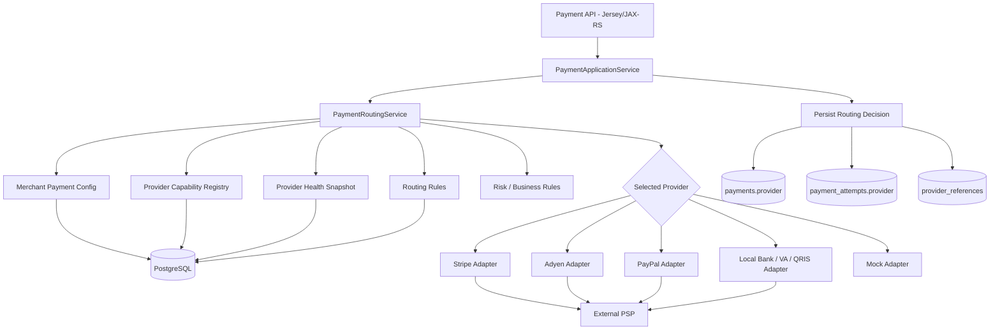
```mermaid
flowchart TD
    A[Payment API - Jersey/JAX-RS] --> B[PaymentApplicationService]

    B --> C[PaymentRoutingService]
    C --> D[Merchant Payment Config]
    C --> E[Provider Capability Registry]
    C --> F[Provider Health Snapshot]
    C --> G[Routing Rules]
    C --> H[Risk / Business Rules]

    D --> I[(PostgreSQL)]
    E --> I
    F --> I
    G --> I

    C --> J{Selected Provider}

    J --> K[Stripe Adapter]
    J --> L[Adyen Adapter]
    J --> M[PayPal Adapter]
    J --> N[Local Bank / VA / QRIS Adapter]
    J --> O[Mock Adapter]

    K --> P[External PSP]
    L --> P
    M --> P
    N --> P

    B --> Q[Persist Routing Decision]
    Q --> R[(payments.provider)]
    Q --> S[(payment_attempts.provider)]
    Q --> T[(provider_references)]
```

---

# 3. Decomposition Map

| No | Area | Fokus Praktis | Output Implementasi |
|---:|---|---|---|
| 1 | **Provider Registry** | Daftar provider yang tersedia dan enabled. | `PaymentProviderRegistry` |
| 2 | **Provider Capability** | Fitur provider: currency, method, auth/capture/refund. | `GatewayCapabilities` |
| 3 | **Merchant Config** | Provider mana yang boleh dipakai merchant tertentu. | `merchant_payment_configs` |
| 4 | **Routing Rule** | Rule pemilihan provider berdasarkan condition. | `payment_routing_rules` |
| 5 | **Deterministic Routing** | Satu payment operation harus memilih provider secara repeatable. | `PaymentRoutingDecision` |
| 6 | **Provider Health** | Hindari provider yang down/degraded. | `provider_health_status` |
| 7 | **Fallback Policy** | Kapan boleh fallback ke provider lain. | `fallback_allowed`, `fallback_strategy` |
| 8 | **Provider Stickiness** | Capture/refund/status query harus pakai provider original. | `payments.provider` |
| 9 | **Routing Audit** | Kenapa provider X dipilih. | `payment_routing_decisions` |
| 10 | **Config Versioning** | Routing rule berubah tanpa merusak payment lama. | `config_version` |
| 11 | **Risk-Aware Routing** | Routing berdasarkan risk, country, BIN, fraud score. | `RoutingContext` |
| 12 | **Commercial Routing** | Routing berdasarkan fee, settlement, FX, contract. | priority/scoring rule |
| 13 | **Testing & Simulation** | Simulasi rule tanpa real PSP call. | routing dry-run endpoint/test |
| 14 | **Operational Override** | Disable provider, force provider, maintenance mode. | admin config/feature flag |
| 15 | **Observability** | Metric success/decline/latency per provider. | dashboard + alert |

---

# 4. Routing Input Model

Routing tidak boleh hanya menerima `currency`. Minimal perlu context.

```java
package com.company.payment.routing;

import java.util.Map;

public record PaymentRoutingContext(
        String merchantId,
        String customerId,
        String orderId,

        long amountMinor,
        String currency,

        String paymentMethodType,
        String customerCountry,
        String billingCountry,
        String issuerCountry,

        boolean captureImmediately,
        boolean recurring,
        boolean offSession,

        String channel,
        String environment,

        Integer riskScore,
        Map<String, Object> metadata
) {}
```

Contoh context:

```json
{
  "merchantId": "MRC-001",
  "orderId": "ORD-2026-1001",
  "amountMinor": 250000,
  "currency": "IDR",
  "paymentMethodType": "CARD_TOKEN",
  "customerCountry": "ID",
  "billingCountry": "ID",
  "captureImmediately": true,
  "channel": "WEB",
  "environment": "PROD",
  "riskScore": 42
}
```

---

# 5. Routing Decision Model

Routing decision harus disimpan, bukan hanya dihitung lalu dilupakan.

```java
package com.company.payment.routing;

import java.time.Instant;
import java.util.List;
import java.util.Map;
import java.util.UUID;

public record PaymentRoutingDecision(
        UUID decisionId,
        UUID paymentId,

        String selectedProvider,
        String selectedProviderAccount,

        String routingRuleId,
        String routingRuleVersion,

        String decisionReason,
        List<String> evaluatedProviders,
        List<String> rejectedProviders,

        boolean fallbackUsed,
        String fallbackFromProvider,

        Map<String, Object> decisionAttributes,

        Instant decidedAt
) {}
```

Kenapa perlu disimpan?

```text
1. Debugging: kenapa payment ini masuk provider A?
2. Audit: rule apa yang aktif saat payment dibuat?
3. Reconciliation: provider original harus diketahui.
4. Incident: apakah payment gagal karena routing buruk?
5. Rollback: perubahan rule baru tidak boleh mengubah payment lama.
```

---

# 6. Database Schema

## 6.1 `payment_providers`

```sql
CREATE TABLE payment_providers (
    provider_code VARCHAR(50) PRIMARY KEY,

    display_name VARCHAR(100) NOT NULL,
    provider_type VARCHAR(50) NOT NULL,

    enabled BOOLEAN NOT NULL DEFAULT true,
    environment VARCHAR(20) NOT NULL,

    supports_authorize BOOLEAN NOT NULL DEFAULT false,
    supports_capture BOOLEAN NOT NULL DEFAULT false,
    supports_partial_capture BOOLEAN NOT NULL DEFAULT false,
    supports_void BOOLEAN NOT NULL DEFAULT false,
    supports_refund BOOLEAN NOT NULL DEFAULT false,
    supports_partial_refund BOOLEAN NOT NULL DEFAULT false,
    supports_webhook BOOLEAN NOT NULL DEFAULT false,
    supports_status_query BOOLEAN NOT NULL DEFAULT false,
    supports_idempotency BOOLEAN NOT NULL DEFAULT false,

    created_at TIMESTAMPTZ NOT NULL DEFAULT now(),
    updated_at TIMESTAMPTZ NOT NULL DEFAULT now(),

    CONSTRAINT chk_payment_providers_type
        CHECK (provider_type IN (
            'CARD_PROCESSOR',
            'WALLET',
            'BANK_TRANSFER',
            'VIRTUAL_ACCOUNT',
            'QR_PAYMENT',
            'PAYPAL',
            'MOCK'
        )),

    CONSTRAINT chk_payment_providers_environment
        CHECK (environment IN ('LOCAL', 'SANDBOX', 'STAGING', 'PROD'))
);
```

---

## 6.2 `provider_supported_currencies`

```sql
CREATE TABLE provider_supported_currencies (
    provider_code VARCHAR(50) NOT NULL
        REFERENCES payment_providers(provider_code),

    currency CHAR(3) NOT NULL,

    min_amount_minor BIGINT,
    max_amount_minor BIGINT,

    enabled BOOLEAN NOT NULL DEFAULT true,

    created_at TIMESTAMPTZ NOT NULL DEFAULT now(),

    PRIMARY KEY (provider_code, currency),

    CONSTRAINT chk_provider_currency_uppercase
        CHECK (currency = upper(currency))
);
```

---

## 6.3 `provider_supported_payment_methods`

```sql
CREATE TABLE provider_supported_payment_methods (
    provider_code VARCHAR(50) NOT NULL
        REFERENCES payment_providers(provider_code),

    payment_method_type VARCHAR(50) NOT NULL,

    country_code CHAR(2),
    currency CHAR(3),

    enabled BOOLEAN NOT NULL DEFAULT true,

    created_at TIMESTAMPTZ NOT NULL DEFAULT now(),

    PRIMARY KEY (
        provider_code,
        payment_method_type,
        country_code,
        currency
    )
);
```

Catatan praktis:

```text
Provider capability bisa berbeda berdasarkan country/currency/method.
Jangan hanya simpan satu boolean global: supports_card = true.
```

---

## 6.4 `merchant_payment_configs`

```sql
CREATE TABLE merchant_payment_configs (
    merchant_id VARCHAR(100) NOT NULL,
    provider_code VARCHAR(50) NOT NULL
        REFERENCES payment_providers(provider_code),

    provider_account_id VARCHAR(200),

    priority INTEGER NOT NULL DEFAULT 100,
    enabled BOOLEAN NOT NULL DEFAULT true,

    settlement_currency CHAR(3),
    merchant_country CHAR(2),

    config_version INTEGER NOT NULL DEFAULT 1,

    created_at TIMESTAMPTZ NOT NULL DEFAULT now(),
    updated_at TIMESTAMPTZ NOT NULL DEFAULT now(),

    PRIMARY KEY (merchant_id, provider_code, config_version)
);
```

---

## 6.5 `payment_routing_rules`

```sql
CREATE TABLE payment_routing_rules (
    routing_rule_id UUID PRIMARY KEY,

    rule_name VARCHAR(120) NOT NULL,
    rule_version INTEGER NOT NULL DEFAULT 1,

    merchant_id VARCHAR(100),
    provider_code VARCHAR(50) NOT NULL
        REFERENCES payment_providers(provider_code),

    payment_method_type VARCHAR(50),
    currency CHAR(3),
    customer_country CHAR(2),
    min_amount_minor BIGINT,
    max_amount_minor BIGINT,

    capture_mode VARCHAR(30),
    channel VARCHAR(50),

    priority INTEGER NOT NULL DEFAULT 100,
    enabled BOOLEAN NOT NULL DEFAULT true,

    fallback_allowed BOOLEAN NOT NULL DEFAULT false,

    valid_from TIMESTAMPTZ NOT NULL DEFAULT now(),
    valid_until TIMESTAMPTZ,

    created_at TIMESTAMPTZ NOT NULL DEFAULT now(),

    CONSTRAINT chk_payment_routing_rule_capture_mode
        CHECK (
            capture_mode IS NULL
            OR capture_mode IN ('AUTO', 'MANUAL')
        )
);
```

Index:

```sql
CREATE INDEX ix_payment_routing_rules_lookup
ON payment_routing_rules (
    enabled,
    merchant_id,
    payment_method_type,
    currency,
    customer_country,
    priority
);

CREATE INDEX ix_payment_routing_rules_validity
ON payment_routing_rules(valid_from, valid_until);
```

---

## 6.6 `payment_routing_decisions`

```sql
CREATE TABLE payment_routing_decisions (
    decision_id UUID PRIMARY KEY,

    payment_id UUID NOT NULL REFERENCES payments(payment_id),

    selected_provider VARCHAR(50) NOT NULL,
    selected_provider_account VARCHAR(200),

    routing_rule_id UUID,
    routing_rule_version INTEGER,

    decision_reason TEXT NOT NULL,

    evaluated_providers JSONB,
    rejected_providers JSONB,
    decision_attributes JSONB,

    fallback_used BOOLEAN NOT NULL DEFAULT false,
    fallback_from_provider VARCHAR(50),

    decided_at TIMESTAMPTZ NOT NULL DEFAULT now()
);

CREATE UNIQUE INDEX ux_payment_routing_decisions_payment
ON payment_routing_decisions(payment_id);

CREATE INDEX ix_payment_routing_decisions_provider
ON payment_routing_decisions(selected_provider);

CREATE INDEX ix_payment_routing_decisions_decided_at
ON payment_routing_decisions(decided_at);
```

---

## 6.7 `provider_health_status`

```sql
CREATE TABLE provider_health_status (
    provider_code VARCHAR(50) PRIMARY KEY
        REFERENCES payment_providers(provider_code),

    health_status VARCHAR(30) NOT NULL,

    last_success_at TIMESTAMPTZ,
    last_failure_at TIMESTAMPTZ,

    recent_success_rate NUMERIC(6, 3),
    recent_timeout_rate NUMERIC(6, 3),
    recent_p95_latency_ms INTEGER,

    manually_disabled BOOLEAN NOT NULL DEFAULT false,
    disabled_reason TEXT,

    updated_at TIMESTAMPTZ NOT NULL DEFAULT now(),

    CONSTRAINT chk_provider_health_status
        CHECK (health_status IN (
            'HEALTHY',
            'DEGRADED',
            'UNHEALTHY',
            'MAINTENANCE',
            'UNKNOWN'
        ))
);
```

---

# 7. Routing Algorithm

## 7.1 High-Level Flow

```text
1. Build PaymentRoutingContext.
2. Load merchant provider config.
3. Load enabled provider capabilities.
4. Filter provider by:
   - enabled
   - environment
   - merchant allowed provider
   - currency
   - payment method
   - country
   - amount range
   - capture capability
   - refund/capture support if needed
5. Check provider health.
6. Apply routing rules by priority.
7. Apply tie-breaker deterministically.
8. Persist routing decision.
9. Use selected provider adapter.
```

---

## 7.2 Routing Decision Tree

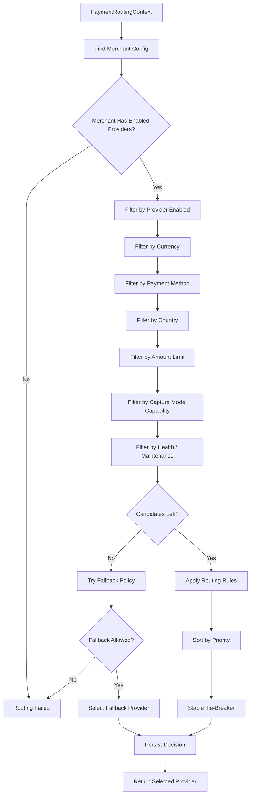
```mermaid
flowchart TD
    A[PaymentRoutingContext] --> B[Find Merchant Config]
    B --> C{Merchant Has Enabled Providers?}

    C -->|No| Z[Routing Failed]

    C -->|Yes| D[Filter by Provider Enabled]
    D --> E[Filter by Currency]
    E --> F[Filter by Payment Method]
    F --> G[Filter by Country]
    G --> H[Filter by Amount Limit]
    H --> I[Filter by Capture Mode Capability]
    I --> J[Filter by Health / Maintenance]

    J --> K{Candidates Left?}
    K -->|No| L[Try Fallback Policy]
    L --> M{Fallback Allowed?}
    M -->|No| Z
    M -->|Yes| N[Select Fallback Provider]

    K -->|Yes| O[Apply Routing Rules]
    O --> P[Sort by Priority]
    P --> Q[Stable Tie-Breaker]
    Q --> R[Persist Decision]
    N --> R
    R --> S[Return Selected Provider]
```

---

# 8. Java Model: Capability

```java
package com.company.payment.routing;

import java.util.Set;

public record ProviderCapability(
        String providerCode,

        Set<String> supportedCurrencies,
        Set<String> supportedPaymentMethodTypes,
        Set<String> supportedCountries,

        boolean supportsAuthorize,
        boolean supportsCapture,
        boolean supportsPartialCapture,
        boolean supportsVoid,
        boolean supportsRefund,
        boolean supportsPartialRefund,
        boolean supportsWebhook,
        boolean supportsStatusQuery,
        boolean supportsIdempotency,

        boolean enabled
) {
    public boolean supportsCurrency(String currency) {
        return supportedCurrencies.contains(currency);
    }

    public boolean supportsPaymentMethod(String paymentMethodType) {
        return supportedPaymentMethodTypes.contains(paymentMethodType);
    }

    public boolean supportsCountry(String country) {
        return country == null || supportedCountries.isEmpty() || supportedCountries.contains(country);
    }
}
```

---

# 9. Java Model: Provider Health

```java
package com.company.payment.routing;

public record ProviderHealth(
        String providerCode,
        ProviderHealthStatus status,
        boolean manuallyDisabled,
        double recentSuccessRate,
        double recentTimeoutRate,
        Integer recentP95LatencyMs
) {
    public boolean canAcceptNewPayment() {
        return !manuallyDisabled
                && (status == ProviderHealthStatus.HEALTHY
                || status == ProviderHealthStatus.DEGRADED);
    }
}
```

```java
package com.company.payment.routing;

public enum ProviderHealthStatus {
    HEALTHY,
    DEGRADED,
    UNHEALTHY,
    MAINTENANCE,
    UNKNOWN
}
```

Practical rule:

```text
DEGRADED boleh menerima traffic terbatas.
UNHEALTHY dan MAINTENANCE tidak boleh menerima payment baru.
Capture/refund existing payment tetap perlu policy khusus karena harus ke provider original.
```

---

# 10. Routing Service Interface

```java
package com.company.payment.routing;

import java.util.UUID;

public interface PaymentRoutingService {

    PaymentRoutingDecision selectProviderForCreatePayment(
            UUID paymentId,
            PaymentRoutingContext context
    );

    String providerForExistingPayment(UUID paymentId);

    PaymentRoutingDecision dryRun(PaymentRoutingContext context);
}
```

`dryRun` berguna untuk:

```text
1. Testing rule baru.
2. Admin console.
3. Validasi config sebelum deploy.
4. Incident investigation.
```

---

# 11. Routing Service Implementation

```java
package com.company.payment.routing;

import java.time.Instant;
import java.util.Comparator;
import java.util.List;
import java.util.UUID;

public class DefaultPaymentRoutingService implements PaymentRoutingService {

    private final MerchantPaymentConfigRepository merchantConfigRepository;
    private final ProviderCapabilityRepository capabilityRepository;
    private final ProviderHealthRepository healthRepository;
    private final PaymentRoutingRuleRepository ruleRepository;
    private final PaymentRoutingDecisionRepository decisionRepository;

    public DefaultPaymentRoutingService(
            MerchantPaymentConfigRepository merchantConfigRepository,
            ProviderCapabilityRepository capabilityRepository,
            ProviderHealthRepository healthRepository,
            PaymentRoutingRuleRepository ruleRepository,
            PaymentRoutingDecisionRepository decisionRepository
    ) {
        this.merchantConfigRepository = merchantConfigRepository;
        this.capabilityRepository = capabilityRepository;
        this.healthRepository = healthRepository;
        this.ruleRepository = ruleRepository;
        this.decisionRepository = decisionRepository;
    }

    @Override
    public PaymentRoutingDecision selectProviderForCreatePayment(
            UUID paymentId,
            PaymentRoutingContext context
    ) {
        List<MerchantProviderConfig> merchantProviders =
                merchantConfigRepository.findEnabledByMerchantId(context.merchantId());

        if (merchantProviders.isEmpty()) {
            throw new PaymentRoutingException(
                    "NO_MERCHANT_PROVIDER_CONFIG",
                    "No enabled payment provider configured for merchant"
            );
        }

        List<ProviderCandidate> candidates = merchantProviders.stream()
                .map(config -> buildCandidate(config, context))
                .filter(candidate -> candidate.isProviderEnabled())
                .filter(candidate -> candidate.supportsCurrency(context.currency()))
                .filter(candidate -> candidate.supportsPaymentMethod(context.paymentMethodType()))
                .filter(candidate -> candidate.supportsCountry(context.customerCountry()))
                .filter(candidate -> candidate.supportsCaptureMode(context.captureImmediately()))
                .filter(candidate -> candidate.isAmountWithinLimit(context.amountMinor()))
                .filter(candidate -> candidate.canAcceptNewPayment())
                .toList();

        if (candidates.isEmpty()) {
            throw new PaymentRoutingException(
                    "NO_ELIGIBLE_PROVIDER",
                    "No eligible payment provider found for this payment context"
            );
        }

        List<PaymentRoutingRule> matchingRules =
                ruleRepository.findMatchingRules(context);

        ProviderCandidate selected = selectByRuleAndPriority(candidates, matchingRules, context);

        PaymentRoutingDecision decision = new PaymentRoutingDecision(
                UUID.randomUUID(),
                paymentId,
                selected.providerCode(),
                selected.providerAccountId(),
                selected.matchedRuleId(),
                selected.matchedRuleVersion(),
                selected.decisionReason(),
                candidates.stream().map(ProviderCandidate::providerCode).toList(),
                List.of(),
                false,
                null,
                selected.decisionAttributes(),
                Instant.now()
        );

        decisionRepository.insert(decision);

        return decision;
    }

    @Override
    public String providerForExistingPayment(UUID paymentId) {
        return decisionRepository.findByPaymentId(paymentId)
                .map(PaymentRoutingDecision::selectedProvider)
                .orElseThrow(() -> new PaymentRoutingException(
                        "ROUTING_DECISION_NOT_FOUND",
                        "Routing decision not found for payment"
                ));
    }

    @Override
    public PaymentRoutingDecision dryRun(PaymentRoutingContext context) {
        UUID fakePaymentId = UUID.randomUUID();

        /*
         * In real implementation, do not insert decision.
         * Return computed decision only.
         */
        throw new UnsupportedOperationException("Implement dry-run without persistence");
    }

    private ProviderCandidate buildCandidate(
            MerchantProviderConfig config,
            PaymentRoutingContext context
    ) {
        ProviderCapability capability =
                capabilityRepository.findByProviderCode(config.providerCode());

        ProviderHealth health =
                healthRepository.findByProviderCode(config.providerCode());

        return ProviderCandidate.from(config, capability, health, context);
    }

    private ProviderCandidate selectByRuleAndPriority(
            List<ProviderCandidate> candidates,
            List<PaymentRoutingRule> rules,
            PaymentRoutingContext context
    ) {
        for (PaymentRoutingRule rule : rules.stream()
                .sorted(Comparator.comparingInt(PaymentRoutingRule::priority))
                .toList()) {

            for (ProviderCandidate candidate : candidates) {
                if (candidate.providerCode().equals(rule.providerCode())) {
                    return candidate.withMatchedRule(rule);
                }
            }
        }

        return candidates.stream()
                .sorted(
                        Comparator
                                .comparingInt(ProviderCandidate::merchantPriority)
                                .thenComparing(ProviderCandidate::providerCode)
                )
                .findFirst()
                .orElseThrow();
    }
}
```

---

# 12. Provider Candidate

```java
package com.company.payment.routing;

import java.util.Map;
import java.util.UUID;

public record ProviderCandidate(
        String providerCode,
        String providerAccountId,

        int merchantPriority,

        ProviderCapability capability,
        ProviderHealth health,

        String matchedRuleId,
        Integer matchedRuleVersion,
        String decisionReason,

        Long minAmountMinor,
        Long maxAmountMinor,

        Map<String, Object> decisionAttributes
) {
    public static ProviderCandidate from(
            MerchantProviderConfig config,
            ProviderCapability capability,
            ProviderHealth health,
            PaymentRoutingContext context
    ) {
        return new ProviderCandidate(
                config.providerCode(),
                config.providerAccountId(),
                config.priority(),
                capability,
                health,
                null,
                null,
                "Selected by merchant priority and capability match",
                config.minAmountMinor(),
                config.maxAmountMinor(),
                Map.of(
                        "merchantId", context.merchantId(),
                        "currency", context.currency(),
                        "paymentMethodType", context.paymentMethodType()
                )
        );
    }

    public boolean isProviderEnabled() {
        return capability.enabled();
    }

    public boolean supportsCurrency(String currency) {
        return capability.supportsCurrency(currency);
    }

    public boolean supportsPaymentMethod(String paymentMethodType) {
        return capability.supportsPaymentMethod(paymentMethodType);
    }

    public boolean supportsCountry(String country) {
        return capability.supportsCountry(country);
    }

    public boolean supportsCaptureMode(boolean captureImmediately) {
        if (captureImmediately) {
            return capability.supportsCapture();
        }
        return capability.supportsAuthorize() && capability.supportsCapture();
    }

    public boolean isAmountWithinLimit(long amountMinor) {
        if (minAmountMinor != null && amountMinor < minAmountMinor) {
            return false;
        }
        if (maxAmountMinor != null && amountMinor > maxAmountMinor) {
            return false;
        }
        return true;
    }

    public boolean canAcceptNewPayment() {
        return health.canAcceptNewPayment();
    }

    public ProviderCandidate withMatchedRule(PaymentRoutingRule rule) {
        return new ProviderCandidate(
                providerCode,
                providerAccountId,
                merchantPriority,
                capability,
                health,
                rule.routingRuleId().toString(),
                rule.ruleVersion(),
                "Selected by routing rule: " + rule.ruleName(),
                minAmountMinor,
                maxAmountMinor,
                decisionAttributes
        );
    }
}
```

---

# 13. Routing Rule Matching

```java
package com.company.payment.routing;

import java.util.UUID;

public record PaymentRoutingRule(
        UUID routingRuleId,
        String ruleName,
        int ruleVersion,

        String merchantId,
        String providerCode,
        String paymentMethodType,
        String currency,
        String customerCountry,

        Long minAmountMinor,
        Long maxAmountMinor,

        String captureMode,
        String channel,

        int priority,
        boolean fallbackAllowed
) {
    public boolean matches(PaymentRoutingContext context) {
        return matchesNullable(merchantId, context.merchantId())
                && matchesNullable(paymentMethodType, context.paymentMethodType())
                && matchesNullable(currency, context.currency())
                && matchesNullable(customerCountry, context.customerCountry())
                && matchesAmount(context.amountMinor())
                && matchesCaptureMode(context.captureImmediately())
                && matchesNullable(channel, context.channel());
    }

    private boolean matchesNullable(String ruleValue, String actualValue) {
        return ruleValue == null || ruleValue.equals(actualValue);
    }

    private boolean matchesAmount(long amountMinor) {
        if (minAmountMinor != null && amountMinor < minAmountMinor) {
            return false;
        }
        if (maxAmountMinor != null && amountMinor > maxAmountMinor) {
            return false;
        }
        return true;
    }

    private boolean matchesCaptureMode(boolean captureImmediately) {
        if (captureMode == null) {
            return true;
        }

        String actual = captureImmediately ? "AUTO" : "MANUAL";
        return captureMode.equals(actual);
    }
}
```

---

# 14. MyBatis Mapper

## 14.1 Routing Rule Query

```xml
<select id="findMatchingRules" resultMap="PaymentRoutingRuleResultMap">
    SELECT
        routing_rule_id,
        rule_name,
        rule_version,
        merchant_id,
        provider_code,
        payment_method_type,
        currency,
        customer_country,
        min_amount_minor,
        max_amount_minor,
        capture_mode,
        channel,
        priority,
        fallback_allowed
    FROM payment_routing_rules
    WHERE enabled = true
      AND valid_from <= now()
      AND (valid_until IS NULL OR valid_until > now())

      AND (merchant_id IS NULL OR merchant_id = #{merchantId})
      AND (payment_method_type IS NULL OR payment_method_type = #{paymentMethodType})
      AND (currency IS NULL OR currency = #{currency})
      AND (customer_country IS NULL OR customer_country = #{customerCountry})
      AND (channel IS NULL OR channel = #{channel})

      AND (min_amount_minor IS NULL OR min_amount_minor <= #{amountMinor})
      AND (max_amount_minor IS NULL OR max_amount_minor >= #{amountMinor})

      AND (
          capture_mode IS NULL
          OR capture_mode = CASE
              WHEN #{captureImmediately} = true THEN 'AUTO'
              ELSE 'MANUAL'
          END
      )
    ORDER BY priority ASC, rule_name ASC
</select>
```

---

## 14.2 Insert Routing Decision

```xml
<insert id="insertRoutingDecision">
    INSERT INTO payment_routing_decisions (
        decision_id,
        payment_id,
        selected_provider,
        selected_provider_account,
        routing_rule_id,
        routing_rule_version,
        decision_reason,
        evaluated_providers,
        rejected_providers,
        decision_attributes,
        fallback_used,
        fallback_from_provider,
        decided_at
    ) VALUES (
        #{decisionId},
        #{paymentId},
        #{selectedProvider},
        #{selectedProviderAccount},
        #{routingRuleId},
        #{routingRuleVersion},
        #{decisionReason},
        CAST(#{evaluatedProvidersJson} AS jsonb),
        CAST(#{rejectedProvidersJson} AS jsonb),
        CAST(#{decisionAttributesJson} AS jsonb),
        #{fallbackUsed},
        #{fallbackFromProvider},
        #{decidedAt}
    )
</insert>
```

---

## 14.3 Existing Payment Provider Lookup

```xml
<select id="findProviderByPaymentId" resultType="string">
    SELECT selected_provider
    FROM payment_routing_decisions
    WHERE payment_id = #{paymentId}
</select>
```

Capture/refund/status query harus memakai lookup ini, bukan routing ulang.

---

# 15. Payment Application Service Integration

## 15.1 Create Payment

```java
public PaymentResponse createPayment(CreatePaymentCommand command) {
    UUID paymentId = UUID.randomUUID();

    PaymentRoutingContext routingContext = new PaymentRoutingContext(
            command.merchantId(),
            command.customerId(),
            command.orderId(),
            command.amountMinor(),
            command.currency(),
            command.paymentMethodType(),
            command.customerCountry(),
            command.billingCountry(),
            command.issuerCountry(),
            command.captureImmediately(),
            command.recurring(),
            command.offSession(),
            command.channel(),
            command.environment(),
            command.riskScore(),
            command.metadata()
    );

    PaymentRoutingDecision routingDecision =
            routingService.selectProviderForCreatePayment(paymentId, routingContext);

    PaymentGatewayClient gatewayClient =
            gatewayRegistry.getRequired(routingDecision.selectedProvider());

    paymentRepository.insertInitiatedPayment(
            paymentId,
            command,
            routingDecision.selectedProvider(),
            routingDecision.selectedProviderAccount()
    );

    GatewayAuthorizeRequest gatewayRequest = gatewayRequestFactory.createAuthorizeRequest(
            paymentId,
            command,
            routingDecision
    );

    GatewayAuthorizeResult result = gatewayClient.authorize(gatewayRequest);

    return paymentResultApplier.applyAuthorizeResult(paymentId, result);
}
```

---

## 15.2 Capture Existing Payment

```java
public PaymentResponse capturePayment(CapturePaymentCommand command) {
    Payment payment = paymentRepository.findByIdForUpdate(command.paymentId());

    String provider = routingService.providerForExistingPayment(command.paymentId());

    PaymentGatewayClient gatewayClient = gatewayRegistry.getRequired(provider);

    GatewayCaptureRequest gatewayRequest = gatewayRequestFactory.createCaptureRequest(
            payment,
            command
    );

    GatewayCaptureResult result = gatewayClient.capture(gatewayRequest);

    return paymentResultApplier.applyCaptureResult(payment.paymentId(), result);
}
```

Important:

```text
Capture tidak boleh routing ulang.
Refund tidak boleh routing ulang.
Void tidak boleh routing ulang.
Status query tidak boleh routing ulang.
```

---

# 16. Failover vs Fallback

Ini bagian yang sering salah.

## 16.1 Fallback Sebelum Provider Call

Aman jika provider belum menerima request.

```text
Provider A down sebelum call dibuat.
Routing memilih Provider B.
Aman.
```

## 16.2 Fallback Setelah Timeout

Berbahaya.

```text
Call ke Provider A timeout.
Mungkin Provider A berhasil charge.
Lalu sistem fallback ke Provider B.
Customer bisa ter-charge dua kali.
```

Rule:

```text
Kalau request sudah dikirim ke provider dan status tidak jelas,
jangan fallback ke provider lain untuk logical payment yang sama.
Masuk UNKNOWN / PENDING_CONFIRMATION dulu.
```

## 16.3 Fallback Matrix

| Kondisi | Boleh Fallback? | Penjelasan |
|---|---:|---|
| Provider disabled sebelum call | Ya | Belum ada side effect. |
| Provider health `UNHEALTHY` sebelum call | Ya | Belum ada side effect. |
| Capability tidak cocok | Ya | Provider tidak eligible. |
| Provider reject karena invalid config | Tidak otomatis | Ini incident/config issue. |
| Provider hard decline kartu | Tidak | Decline adalah business result. |
| Network timeout setelah request dikirim | Tidak langsung | Status unknown. |
| HTTP 500 setelah request dikirim | Hati-hati | Query status dulu jika possible. |
| Rate limit sebelum request accepted | Mungkin | Tergantung provider semantics. |
| Webhook terlambat | Tidak | Tunggu/reconcile. |
| Capture gagal di provider original | Tidak ke provider lain | Capture harus ke provider original. |
| Refund gagal di provider original | Tidak ke provider lain | Refund harus ke provider original. |

PayPal secara eksplisit mendokumentasikan retry untuk network timeout atau HTTP 500 dengan `PayPal-Request-Id` selama server masih menyimpan ID tersebut; pola ini memperkuat prinsip bahwa retry harus memakai idempotency terhadap provider yang sama, bukan langsung pindah provider. ([PayPal Developer](https://developer.paypal.com/api/rest/requests/?utm_source=chatgpt.com))

---

# 17. Deterministic Tie-Breaker

Jika dua provider sama-sama eligible, jangan pilih random tanpa audit.

Contoh buruk:

```java
return candidates.get(new Random().nextInt(candidates.size()));
```

Masalah:

```text
Retry request bisa pilih provider berbeda.
Debugging sulit.
A/B routing tidak terkontrol.
```

Lebih baik:

```java
private ProviderCandidate stableTieBreaker(
        List<ProviderCandidate> candidates,
        PaymentRoutingContext context
) {
    return candidates.stream()
            .sorted(
                    Comparator
                            .comparingInt(ProviderCandidate::merchantPriority)
                            .thenComparing(candidate -> stableHashScore(
                                    context.orderId(),
                                    candidate.providerCode()
                            ))
                            .thenComparing(ProviderCandidate::providerCode)
            )
            .findFirst()
            .orElseThrow();
}

private int stableHashScore(String key, String providerCode) {
    return Math.abs((key + ":" + providerCode).hashCode());
}
```

Untuk weighted routing:

```text
Gunakan deterministic weighted bucket berdasarkan orderId/paymentId hash.
Jangan random per request.
```

---

# 18. Weighted Routing

Weighted routing berguna untuk:

```text
1. Gradual migration provider.
2. A/B test provider.
3. Cost optimization.
4. Success-rate optimization.
5. Load sharing.
```

Contoh rule:

| Provider | Weight |
|---|---:|
| STRIPE | 70 |
| ADYEN | 30 |

Deterministic bucket:

```java
public String selectWeightedProvider(
        String stableKey,
        List<WeightedProvider> providers
) {
    int totalWeight = providers.stream()
            .mapToInt(WeightedProvider::weight)
            .sum();

    int bucket = Math.floorMod(stableKey.hashCode(), totalWeight);

    int cumulative = 0;
    for (WeightedProvider provider : providers) {
        cumulative += provider.weight();
        if (bucket < cumulative) {
            return provider.providerCode();
        }
    }

    throw new IllegalStateException("No provider selected");
}
```

Important:

```text
Stable key sebaiknya paymentId/orderId.
Jangan pakai current timestamp.
Jangan pakai requestId karena retry bisa berubah.
```

---

# 19. Provider Health Strategy

Provider health tidak boleh hanya berdasarkan ping endpoint.

Gunakan signal:

| Signal | Penjelasan |
|---|---|
| Success rate | Payment sukses per provider dalam window tertentu. |
| Timeout rate | Timeout meningkat → provider degraded. |
| 5xx rate | Provider/server issue. |
| p95/p99 latency | Latency naik → customer impact. |
| Webhook lag | Provider lambat kirim event. |
| Reconciliation mismatch | Provider data tidak cocok dengan internal. |
| Manual override | Ops disable provider. |

Health update bisa dari:

```text
1. Metrics pipeline.
2. Scheduled job.
3. Admin console.
4. Incident automation.
5. Circuit breaker state.
```

---

# 20. Circuit Breaker Interaction

Circuit breaker berguna, tetapi payment perlu hati-hati.

```text
Circuit breaker open sebelum request dikirim
  -> provider dianggap unavailable, boleh routing ke provider lain.

Circuit breaker timeout setelah request dikirim
  -> payment status unknown, jangan fallback langsung.
```

Practical rule:

```text
Routing service hanya boleh menggunakan circuit breaker state untuk pre-call decision.
Application service tetap harus handle post-call timeout sebagai UNKNOWN.
```

---

# 21. Merchant Config Example

```json
{
  "merchantId": "MRC-001",
  "providers": [
    {
      "providerCode": "ADYEN",
      "providerAccountId": "adyen-merchant-main",
      "priority": 10,
      "enabled": true,
      "supportedCurrencies": ["IDR", "SGD", "USD"],
      "supportedPaymentMethods": ["CARD_TOKEN", "EWALLET", "QRIS"]
    },
    {
      "providerCode": "STRIPE",
      "providerAccountId": "stripe-account-main",
      "priority": 20,
      "enabled": true,
      "supportedCurrencies": ["USD", "EUR", "SGD"],
      "supportedPaymentMethods": ["CARD_TOKEN", "WALLET"]
    },
    {
      "providerCode": "PAYPAL",
      "providerAccountId": "paypal-business-main",
      "priority": 30,
      "enabled": true,
      "supportedCurrencies": ["USD", "EUR"],
      "supportedPaymentMethods": ["PAYPAL"]
    }
  ]
}
```

---

# 22. Routing Rule Examples

## 22.1 Route IDR QRIS to Local Provider

```sql
INSERT INTO payment_routing_rules (
    routing_rule_id,
    rule_name,
    rule_version,
    merchant_id,
    provider_code,
    payment_method_type,
    currency,
    customer_country,
    priority,
    enabled,
    fallback_allowed
)
VALUES (
    gen_random_uuid(),
    'IDR QRIS to local QR provider',
    1,
    'MRC-001',
    'LOCAL_QRIS',
    'QRIS',
    'IDR',
    'ID',
    10,
    true,
    false
);
```

## 22.2 Route USD Card to Stripe

```sql
INSERT INTO payment_routing_rules (
    routing_rule_id,
    rule_name,
    rule_version,
    merchant_id,
    provider_code,
    payment_method_type,
    currency,
    priority,
    enabled,
    fallback_allowed
)
VALUES (
    gen_random_uuid(),
    'USD card to Stripe',
    1,
    'MRC-001',
    'STRIPE',
    'CARD_TOKEN',
    'USD',
    20,
    true,
    true
);
```

## 22.3 Manual Capture to Provider Supporting Auth/Capture

```sql
INSERT INTO payment_routing_rules (
    routing_rule_id,
    rule_name,
    rule_version,
    merchant_id,
    provider_code,
    payment_method_type,
    capture_mode,
    priority,
    enabled,
    fallback_allowed
)
VALUES (
    gen_random_uuid(),
    'Manual capture card routing',
    1,
    'MRC-001',
    'ADYEN',
    'CARD_TOKEN',
    'MANUAL',
    15,
    true,
    false
);
```

---

# 23. Routing Error Model

Gunakan error code yang stabil.

| Error Code | HTTP | Kapan |
|---|---:|---|
| `NO_MERCHANT_PROVIDER_CONFIG` | `422` / `409` | Merchant belum punya provider config. |
| `NO_ELIGIBLE_PROVIDER` | `422` / `503` | Tidak ada provider cocok. |
| `PROVIDER_DISABLED` | `503` | Provider dimatikan manual. |
| `PROVIDER_UNHEALTHY` | `503` | Semua provider eligible tidak sehat. |
| `PROVIDER_CAPABILITY_MISMATCH` | `422` | Provider tidak support currency/method/capture mode. |
| `ROUTING_DECISION_NOT_FOUND` | `500` / `409` | Existing payment tidak punya routing decision. |
| `ROUTING_CONFIG_CONFLICT` | `500` / admin error | Rule ambigu atau invalid. |
| `FALLBACK_NOT_ALLOWED` | `409` | Provider gagal tapi fallback tidak aman. |

Contoh response:

```json
{
  "type": "https://api.company.internal/problems/no-eligible-payment-provider",
  "title": "No eligible payment provider",
  "status": 422,
  "detail": "No enabled provider supports CARD_TOKEN with currency IDR for merchant MRC-001.",
  "errorCode": "NO_ELIGIBLE_PROVIDER",
  "traceId": "corr-123"
}
```

---

# 24. Observability

Metric routing yang penting:

| Metric | Fungsi |
|---|---|
| `payment.routing.decision.total` | Total keputusan routing. |
| `payment.routing.provider.selected.total` | Provider yang terpilih. |
| `payment.routing.no_eligible_provider.total` | Config/capability gap. |
| `payment.routing.fallback.total` | Fallback sebelum call. |
| `payment.routing.provider_disabled.total` | Provider disabled. |
| `payment.routing.provider_unhealthy.total` | Provider unhealthy. |
| `payment.provider.success_rate` | Success rate per provider. |
| `payment.provider.decline_rate` | Decline rate per provider. |
| `payment.provider.timeout_rate` | Timeout per provider. |
| `payment.provider.latency.p95` | Latency provider. |

Structured log:

```json
{
  "event": "payment_routing_decision",
  "paymentId": "7b6e6ef1-5864-4d68-9128-c64045f1f8b3",
  "merchantId": "MRC-001",
  "orderId": "ORD-2026-1001",
  "currency": "IDR",
  "paymentMethodType": "CARD_TOKEN",
  "selectedProvider": "ADYEN",
  "routingRuleId": "8fdfc9bc-fb70-43ec-b76f-e144c506c2b0",
  "decisionReason": "Selected by routing rule: Manual capture card routing",
  "traceId": "corr-123"
}
```

---

# 25. Admin / Support API

Routing butuh operational tooling.

## 25.1 Dry Run Routing

```http
POST /admin/payment-routing/dry-run
```

Request:

```json
{
  "merchantId": "MRC-001",
  "amountMinor": 250000,
  "currency": "IDR",
  "paymentMethodType": "CARD_TOKEN",
  "customerCountry": "ID",
  "captureImmediately": true,
  "channel": "WEB"
}
```

Response:

```json
{
  "selectedProvider": "ADYEN",
  "decisionReason": "Selected by merchant priority and capability match",
  "evaluatedProviders": ["ADYEN", "STRIPE", "PAYPAL"],
  "rejectedProviders": [
    {
      "provider": "PAYPAL",
      "reason": "Payment method CARD_TOKEN not supported for this merchant config"
    },
    {
      "provider": "STRIPE",
      "reason": "Currency IDR not enabled for merchant MRC-001"
    }
  ]
}
```

## 25.2 Disable Provider

```http
POST /admin/payment-providers/{providerCode}/disable
```

Request:

```json
{
  "reason": "Provider timeout rate above threshold",
  "disabledBy": "ops-user-001"
}
```

## 25.3 Enable Provider

```http
POST /admin/payment-providers/{providerCode}/enable
```

---

# 26. Testing Strategy

## 26.1 Unit Test Routing Filter

| Test | Expected |
|---|---|
| Merchant without config | `NO_MERCHANT_PROVIDER_CONFIG` |
| Provider disabled | Provider rejected |
| Currency unsupported | Provider rejected |
| Payment method unsupported | Provider rejected |
| Manual capture but provider does not support capture | Provider rejected |
| Provider unhealthy | Provider rejected for new payment |
| Multiple eligible providers | Lowest priority wins |
| Same order/payment context | Same provider selected |
| Existing payment capture | Uses original provider |
| Timeout after provider call | No fallback, status unknown |

## 26.2 Example Unit Test

```java
@Test
void shouldSelectProviderByPriorityWhenMultipleEligible() {
    PaymentRoutingContext context = new PaymentRoutingContext(
            "MRC-001",
            "CUST-001",
            "ORD-001",
            100000,
            "IDR",
            "CARD_TOKEN",
            "ID",
            "ID",
            "ID",
            true,
            false,
            false,
            "WEB",
            "PROD",
            20,
            Map.of()
    );

    PaymentRoutingDecision decision =
            routingService.selectProviderForCreatePayment(UUID.randomUUID(), context);

    assertThat(decision.selectedProvider()).isEqualTo("ADYEN");
}
```

## 26.3 Integration Test with PostgreSQL

```text
1. Insert provider configs.
2. Insert capabilities.
3. Insert merchant configs.
4. Insert routing rules.
5. Call routing service.
6. Verify decision persisted.
7. Verify capture/refund lookup uses persisted provider.
```

---

# 27. Common Anti-Pattern

| Anti-Pattern | Kenapa Buruk | Solusi |
|---|---|---|
| Routing ulang saat capture/refund | Bisa call provider berbeda dari original payment. | Persist routing decision. |
| Random provider per request | Retry bisa pilih provider berbeda. | Stable deterministic routing. |
| Fallback setelah timeout | Bisa double charge. | Mark `UNKNOWN`, query provider. |
| Provider capability hardcoded di service | Sulit update. | Capability registry/config. |
| Tidak ada routing audit | Sulit debug kenapa provider dipilih. | `payment_routing_decisions`. |
| Satu config global untuk semua merchant | Merchant/account/country berbeda. | Merchant-specific config. |
| Health check hanya ping | Ping sehat tidak berarti payment sukses. | Pakai success/timeout/latency/payment metrics. |
| Semua decline dianggap provider buruk | Decline bisa karena kartu/customer. | Pisahkan decline vs provider error. |
| Rule ambigu tanpa priority | Provider selection tidak predictable. | Priority + deterministic tie-breaker. |
| Config berubah tanpa version | Payment lama sulit diaudit. | Rule/config versioning. |

---

# 28. Implementation Checklist

## Routing Core

- [ ] Ada `PaymentRoutingContext`.
- [ ] Ada `PaymentRoutingDecision`.
- [ ] Routing decision dipersist.
- [ ] Create payment melakukan routing satu kali.
- [ ] Capture/refund/void/status query memakai provider original.

## Provider Config

- [ ] Ada provider registry.
- [ ] Ada merchant provider config.
- [ ] Ada capability per provider.
- [ ] Ada currency/method/country support.
- [ ] Ada provider account mapping.

## Safety

- [ ] Provider disabled tidak menerima payment baru.
- [ ] Provider unhealthy tidak menerima payment baru.
- [ ] Timeout setelah provider call tidak fallback langsung.
- [ ] Same logical payment tidak bisa pindah provider tanpa recovery manual.
- [ ] Fallback hanya sebelum provider side effect.

## Observability

- [ ] Log routing decision.
- [ ] Metric selected provider.
- [ ] Metric no eligible provider.
- [ ] Metric fallback.
- [ ] Metric provider health.

## Testing

- [ ] Test capability filtering.
- [ ] Test merchant config.
- [ ] Test routing priority.
- [ ] Test deterministic tie-breaker.
- [ ] Test provider disabled.
- [ ] Test existing payment stickiness.
- [ ] Test unsafe fallback prevention.

---

# 29. Exercise Praktis

Buat module berikut:

```text
payment-service/
  routing/
    PaymentRoutingContext.java
    PaymentRoutingDecision.java
    PaymentRoutingService.java
    DefaultPaymentRoutingService.java
    ProviderCapability.java
    ProviderHealth.java
    ProviderCandidate.java
    PaymentRoutingRule.java

  persistence/
    PaymentRoutingMapper.java
    PaymentRoutingMapper.xml
```

Target implementasi:

```text
1. Seed provider: STRIPE, ADYEN, PAYPAL, MOCK.
2. Seed capability currency/method per provider.
3. Seed merchant config MRC-001.
4. Seed routing rule:
   - IDR CARD_TOKEN -> ADYEN
   - USD CARD_TOKEN -> STRIPE
   - PAYPAL method -> PAYPAL
   - LOCAL test -> MOCK
5. Implement dry-run routing.
6. Persist routing decision saat create payment.
7. Capture/refund mengambil provider dari routing decision.
```

Test wajib:

```text
1. IDR + CARD_TOKEN memilih ADYEN.
2. USD + CARD_TOKEN memilih STRIPE.
3. PAYPAL method memilih PAYPAL.
4. Provider disabled membuat provider tidak dipilih.
5. Manual capture hanya memilih provider yang support auth/capture.
6. Retry create payment menghasilkan provider yang sama.
7. Capture existing payment tidak routing ulang.
8. Timeout provider tidak fallback ke provider lain.
```

---

# 30. Ringkasan

Multi-provider routing adalah **control plane** untuk payment service.

Prinsip utamanya:

```text
1. Routing hanya untuk payment baru.
2. Existing payment harus stick ke provider original.
3. Provider selection harus deterministic.
4. Capability dan merchant config harus eksplisit.
5. Health boleh mempengaruhi pre-call routing.
6. Timeout post-call tidak boleh langsung fallback.
7. Semua routing decision harus diaudit.
```

Kalau routing salah, efeknya bukan sekadar request gagal. Efeknya bisa berupa:

```text
- double charge,
- refund ke provider salah,
- reconciliation mismatch,
- webhook tidak bisa dimap,
- audit trail rusak,
- customer dispute,
- financial loss.
```

---

## Seri 6/18 selesai

Rekomendasi lanjut ke:

**Seri 7/18 - Authorization, Capture, Void, dan Settlement Flow: desain payment lifecycle untuk auth-only, auto-capture, manual capture, partial capture, void, settlement, dan failure handling.**

---

**Sources:**

- [Supported payment methods](https://docs.stripe.com/payments/payment-methods/overview?utm_source=chatgpt.com)
- [Payment methods](https://docs.adyen.com/payment-methods?utm_source=chatgpt.com)
- [API requests](https://developer.paypal.com/api/rest/requests/?utm_source=chatgpt.com)

## Response:
7/14/2026, 10:35:04 PM

Saya lanjut ke **Seri 7/18**: authorization, capture, void, dan settlement flow. Ini bagian lifecycle uang: kapan dana hanya di-hold, kapan benar-benar dicapture, kapan auth harus dibatalkan, dan bagaimana status settlement tidak disamakan dengan payment captured.

# Payment Management & Integration Pattern  
## Seri 7/18 - Authorization, Capture, Void, dan Settlement Flow

Seri ini fokus pada **lifecycle uang** dalam payment service: kapan dana hanya di-*hold*, kapan benar-benar di-*capture*, kapan authorization harus di-*void*, dan kenapa **captured ≠ settled ≠ paid out to bank**.

Core idea:

```text
Authorization = dana di-reserve / di-hold
Capture       = dana benar-benar ditagihkan / dipindahkan
Void          = membatalkan authorization sebelum capture
Settlement    = dana masuk ke balance/settlement provider
Payout        = dana ditransfer dari provider ke rekening merchant
```

Dalam Stripe, separate authorization dan capture dilakukan dengan `capture_method=manual`, yang menginstruksikan Stripe untuk mengotorisasi amount tetapi tidak langsung melakukan capture. ([Stripe Docs](https://docs.stripe.com/payments/place-a-hold-on-a-payment-method?utm_source=chatgpt.com)) Adyen juga mendokumentasikan manual capture sebagai cara untuk settle funds saat fulfillment/order shipped, dan mendukung flow seperti authorization adjustment serta partial authorization. ([Adyen Docs](https://docs.adyen.com/online-payments/capture?utm_source=chatgpt.com)) PayPal Checkout mendukung model two-step authorize-and-capture; authorization menempatkan hold pada dana buyer dan dokumentasi PayPal menyebut authorization valid selama 29 hari. ([PayPal Developer](https://developer.paypal.com/docs/checkout/standard/customize/authorization/?utm_source=chatgpt.com))

---

# 1. Mental Model

Payment lifecycle jangan diperlakukan sebagai satu status sederhana `PAID`.

Lebih tepat:

```text
Customer agrees to pay
  -> Authorization requested
  -> Authorization approved
  -> Business validates fulfillment
  -> Capture requested
  -> Capture confirmed
  -> Funds settle in provider balance
  -> Payout sent to merchant bank
  -> Reconciliation confirms actual money movement
```

Dalam sistem internal:

```text
AUTHORIZED  belum tentu uang sudah diterima.
CAPTURED    belum tentu uang sudah masuk rekening bank.
SETTLED     belum tentu sudah paid out.
PAID_OUT    baru berarti payout masuk rekening merchant, jika data payout sudah cocok.
```

Stripe menjelaskan settlement time sebagai waktu antara payment/funding transaction dibuat sampai funds tersedia di Stripe balance, dan settlement timing dapat bervariasi berdasarkan negara serta payment method. ([Stripe Docs](https://docs.stripe.com/payments/balances?utm_source=chatgpt.com))

---

# 2. Diagram Lifecycle

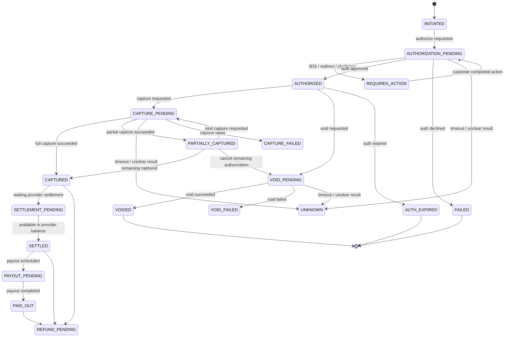
```mermaid
stateDiagram-v2
    [*] --> INITIATED

    INITIATED --> AUTHORIZATION_PENDING: authorize requested
    AUTHORIZATION_PENDING --> REQUIRES_ACTION: 3DS / redirect / challenge
    REQUIRES_ACTION --> AUTHORIZATION_PENDING: customer completed action

    AUTHORIZATION_PENDING --> AUTHORIZED: auth approved
    AUTHORIZATION_PENDING --> FAILED: auth declined
    AUTHORIZATION_PENDING --> UNKNOWN: timeout / unclear result

    AUTHORIZED --> CAPTURE_PENDING: capture requested
    AUTHORIZED --> VOID_PENDING: void requested
    AUTHORIZED --> AUTH_EXPIRED: auth expired

    CAPTURE_PENDING --> CAPTURED: full capture succeeded
    CAPTURE_PENDING --> PARTIALLY_CAPTURED: partial capture succeeded
    CAPTURE_PENDING --> UNKNOWN: timeout / unclear result
    CAPTURE_PENDING --> CAPTURE_FAILED: capture failed

    PARTIALLY_CAPTURED --> CAPTURE_PENDING: next capture requested
    PARTIALLY_CAPTURED --> CAPTURED: remaining captured
    PARTIALLY_CAPTURED --> VOID_PENDING: cancel remaining authorization

    VOID_PENDING --> VOIDED: void succeeded
    VOID_PENDING --> VOID_FAILED: void failed
    VOID_PENDING --> UNKNOWN: timeout / unclear result

    CAPTURED --> SETTLEMENT_PENDING: waiting provider settlement
    SETTLEMENT_PENDING --> SETTLED: available in provider balance
    SETTLED --> PAYOUT_PENDING: payout scheduled
    PAYOUT_PENDING --> PAID_OUT: payout completed

    CAPTURED --> REFUND_PENDING
    SETTLED --> REFUND_PENDING
    PAID_OUT --> REFUND_PENDING

    FAILED --> [*]
    VOIDED --> [*]
    AUTH_EXPIRED --> [*]
```

---

# 3. Decomposition Map

| No | Area | Fokus Praktis | Output Implementasi |
|---:|---|---|---|
| 1 | **Authorization Flow** | Reserve dana tanpa langsung capture. | `authorizePayment()` |
| 2 | **Auto-Capture Flow** | Authorize + capture langsung. | `captureMode=AUTO` |
| 3 | **Manual Capture Flow** | Capture setelah order siap fulfilled. | `captureMode=MANUAL` |
| 4 | **Partial Capture** | Capture sebagian amount. | `captured_amount_minor` incremental |
| 5 | **Multiple Capture** | Beberapa capture untuk satu authorization jika provider mendukung. | `payment_captures` / `payment_attempts` |
| 6 | **Void Authorization** | Cancel authorization sebelum capture. | `voidAuthorization()` |
| 7 | **Authorization Expiry** | Auth hold bisa expire. | scheduled expiry job |
| 8 | **Settlement Tracking** | Track funds available di provider balance. | `settlements` / `settlement_items` |
| 9 | **Payout Tracking** | Track transfer provider ke bank. | `payouts` / `payout_items` |
| 10 | **Ledger Posting** | Catat efek finansial per lifecycle. | `ledger_entries` |
| 11 | **Invariant Enforcement** | Cegah capture/refund invalid. | DB constraint + domain validation |
| 12 | **Provider Mapping** | Map Stripe/Adyen/PayPal status ke internal. | `GatewayStatusMapper` |
| 13 | **Timeout Handling** | Jangan mark failed sembarangan. | `UNKNOWN` / status query |
| 14 | **Webhook Confirmation** | Capture/settlement/refund bisa async. | inbox dedup + event processor |
| 15 | **Reconciliation** | Cocokkan captured/settled/paid out. | reconciliation job |

---

# 4. Authorization vs Capture vs Settlement

| Concept | Makna | Apakah Dana Sudah Diterima Merchant? | Contoh Internal Status |
|---|---|---:|---|
| Authorization | Issuer/provider menyetujui dan menahan dana. | Belum | `AUTHORIZED` |
| Capture | Merchant meminta dana ditagihkan/dipindahkan. | Belum tentu masuk rekening | `CAPTURED` |
| Settlement | Dana tersedia di provider/acquirer balance. | Hampir, tapi belum tentu payout bank | `SETTLED` |
| Payout | Provider transfer dana ke rekening merchant. | Ya, setelah bank statement cocok | `PAID_OUT` |
| Void | Auth dibatalkan sebelum capture. | Tidak | `VOIDED` |
| Refund | Dana dikembalikan setelah capture. | Mengurangi receivable/balance | `REFUNDED` / `PARTIALLY_REFUNDED` |

Adyen menjelaskan capture sebagai tahap ketika authorized amount dikurangkan dari balance account, dan partial capture dapat membuat sisa amount yang belum dicapture masih bisa expire atau dibatalkan. ([Adyen Docs](https://docs.adyen.com/issuing/payment-stages?utm_source=chatgpt.com))

---

# 5. Recommended Internal Status

Untuk seri ini, status payment bisa diperluas seperti berikut:

```java
public enum PaymentStatus {
    INITIATED,

    AUTHORIZATION_PENDING,
    REQUIRES_ACTION,
    AUTHORIZED,
    AUTH_EXPIRED,

    CAPTURE_PENDING,
    PARTIALLY_CAPTURED,
    CAPTURED,
    CAPTURE_FAILED,

    VOID_PENDING,
    VOIDED,
    VOID_FAILED,

    SETTLEMENT_PENDING,
    SETTLED,

    PAYOUT_PENDING,
    PAID_OUT,

    REFUND_PENDING,
    PARTIALLY_REFUNDED,
    REFUNDED,

    FAILED,
    CANCELLED,
    UNKNOWN
}
```

Catatan praktis:

```text
Untuk banyak aplikasi, status utama payment cukup sampai CAPTURED.
Settlement dan payout bisa dikelola di aggregate/reporting terpisah.

Tapi untuk payment-heavy / finance-sensitive platform,
SETTLEMENT dan PAYOUT sebaiknya dimodelkan eksplisit.
```

---

# 6. Recommended Tables Tambahan

Di seri sebelumnya kita sudah punya:

```text
payments
payment_attempts
payment_events
refunds
ledger_entries
idempotency_keys
payment_inbox_events
payment_outbox_events
reconciliation_runs
reconciliation_items
```

Untuk lifecycle authorization/capture/settlement yang lebih rapi, tambahkan:

```text
payment_authorizations
payment_captures
payment_voids
settlements
settlement_items
payouts
payout_items
```

---

## 6.1 `payment_authorizations`

```sql
CREATE TABLE payment_authorizations (
    authorization_id UUID PRIMARY KEY,
    payment_id UUID NOT NULL REFERENCES payments(payment_id),

    provider VARCHAR(50) NOT NULL,
    provider_authorization_id VARCHAR(200),
    provider_payment_id VARCHAR(200),

    authorized_amount_minor BIGINT NOT NULL,
    currency CHAR(3) NOT NULL,

    status VARCHAR(40) NOT NULL,

    expires_at TIMESTAMPTZ,
    authorized_at TIMESTAMPTZ,
    voided_at TIMESTAMPTZ,

    request_payload JSONB,
    response_payload JSONB,

    created_at TIMESTAMPTZ NOT NULL DEFAULT now(),
    updated_at TIMESTAMPTZ NOT NULL DEFAULT now(),

    CONSTRAINT chk_payment_authorizations_amount_positive
        CHECK (authorized_amount_minor > 0),

    CONSTRAINT chk_payment_authorizations_currency_uppercase
        CHECK (currency = upper(currency)),

    CONSTRAINT chk_payment_authorizations_status
        CHECK (status IN (
            'PENDING',
            'AUTHORIZED',
            'REQUIRES_ACTION',
            'FAILED',
            'VOIDED',
            'EXPIRED',
            'UNKNOWN'
        ))
);

CREATE INDEX ix_payment_authorizations_payment_id
ON payment_authorizations(payment_id);

CREATE UNIQUE INDEX ux_payment_authorizations_provider_auth
ON payment_authorizations(provider, provider_authorization_id)
WHERE provider_authorization_id IS NOT NULL;
```

---

## 6.2 `payment_captures`

Capture sebaiknya entity sendiri karena bisa partial/multiple.

```sql
CREATE TABLE payment_captures (
    capture_id UUID PRIMARY KEY,
    payment_id UUID NOT NULL REFERENCES payments(payment_id),
    authorization_id UUID REFERENCES payment_authorizations(authorization_id),

    provider VARCHAR(50) NOT NULL,
    provider_capture_id VARCHAR(200),
    provider_payment_id VARCHAR(200),

    capture_request_id VARCHAR(200),

    amount_minor BIGINT NOT NULL,
    currency CHAR(3) NOT NULL,

    status VARCHAR(40) NOT NULL,

    captured_at TIMESTAMPTZ,
    settled_at TIMESTAMPTZ,

    request_payload JSONB,
    response_payload JSONB,

    failure_code VARCHAR(100),
    failure_message TEXT,

    created_at TIMESTAMPTZ NOT NULL DEFAULT now(),
    updated_at TIMESTAMPTZ NOT NULL DEFAULT now(),

    CONSTRAINT chk_payment_captures_amount_positive
        CHECK (amount_minor > 0),

    CONSTRAINT chk_payment_captures_currency_uppercase
        CHECK (currency = upper(currency)),

    CONSTRAINT chk_payment_captures_status
        CHECK (status IN (
            'REQUESTED',
            'PENDING',
            'SUCCEEDED',
            'FAILED',
            'CANCELLED',
            'UNKNOWN'
        ))
);

CREATE INDEX ix_payment_captures_payment_id
ON payment_captures(payment_id);

CREATE INDEX ix_payment_captures_authorization_id
ON payment_captures(authorization_id);

CREATE UNIQUE INDEX ux_payment_captures_provider_capture
ON payment_captures(provider, provider_capture_id)
WHERE provider_capture_id IS NOT NULL;

CREATE UNIQUE INDEX ux_payment_captures_request_id
ON payment_captures(payment_id, capture_request_id)
WHERE capture_request_id IS NOT NULL;
```

---

## 6.3 `payment_voids`

```sql
CREATE TABLE payment_voids (
    void_id UUID PRIMARY KEY,
    payment_id UUID NOT NULL REFERENCES payments(payment_id),
    authorization_id UUID REFERENCES payment_authorizations(authorization_id),

    provider VARCHAR(50) NOT NULL,
    provider_void_id VARCHAR(200),
    provider_authorization_id VARCHAR(200),

    void_request_id VARCHAR(200),

    status VARCHAR(40) NOT NULL,
    reason VARCHAR(200),

    voided_at TIMESTAMPTZ,

    request_payload JSONB,
    response_payload JSONB,

    failure_code VARCHAR(100),
    failure_message TEXT,

    created_at TIMESTAMPTZ NOT NULL DEFAULT now(),
    updated_at TIMESTAMPTZ NOT NULL DEFAULT now(),

    CONSTRAINT chk_payment_voids_status
        CHECK (status IN (
            'REQUESTED',
            'PENDING',
            'SUCCEEDED',
            'FAILED',
            'UNKNOWN'
        ))
);

CREATE INDEX ix_payment_voids_payment_id
ON payment_voids(payment_id);

CREATE UNIQUE INDEX ux_payment_voids_request_id
ON payment_voids(payment_id, void_request_id)
WHERE void_request_id IS NOT NULL;
```

PayPal’s void endpoint cancels an authorized payment by authorization ID, and PayPal notes that an authorized payment that has been fully captured cannot be voided. ([Paypal Docs](https://docs.paypal.ai/reference/api/rest/authorizations/void-authorized-payment?utm_source=chatgpt.com))

---

## 6.4 `settlements`

Settlement adalah batch/record dari provider yang menjelaskan dana sudah tersedia/settled.

```sql
CREATE TABLE settlements (
    settlement_id UUID PRIMARY KEY,

    provider VARCHAR(50) NOT NULL,
    provider_settlement_id VARCHAR(200),

    settlement_date DATE NOT NULL,
    settlement_currency CHAR(3) NOT NULL,

    gross_amount_minor BIGINT NOT NULL DEFAULT 0,
    fee_amount_minor BIGINT NOT NULL DEFAULT 0,
    net_amount_minor BIGINT NOT NULL DEFAULT 0,

    status VARCHAR(40) NOT NULL,

    report_file_name VARCHAR(255),
    raw_report_metadata JSONB,

    created_at TIMESTAMPTZ NOT NULL DEFAULT now(),
    updated_at TIMESTAMPTZ NOT NULL DEFAULT now(),

    CONSTRAINT chk_settlements_currency_uppercase
        CHECK (settlement_currency = upper(settlement_currency)),

    CONSTRAINT chk_settlements_status
        CHECK (status IN (
            'RECEIVED',
            'PROCESSING',
            'RECONCILED',
            'FAILED',
            'PARTIAL'
        ))
);

CREATE UNIQUE INDEX ux_settlements_provider_settlement
ON settlements(provider, provider_settlement_id)
WHERE provider_settlement_id IS NOT NULL;
```

---

## 6.5 `settlement_items`

```sql
CREATE TABLE settlement_items (
    settlement_item_id UUID PRIMARY KEY,
    settlement_id UUID NOT NULL REFERENCES settlements(settlement_id),

    payment_id UUID REFERENCES payments(payment_id),
    capture_id UUID REFERENCES payment_captures(capture_id),
    refund_id UUID REFERENCES refunds(refund_id),

    provider VARCHAR(50) NOT NULL,
    provider_payment_id VARCHAR(200),
    provider_capture_id VARCHAR(200),
    provider_refund_id VARCHAR(200),

    item_type VARCHAR(60) NOT NULL,

    gross_amount_minor BIGINT NOT NULL DEFAULT 0,
    fee_amount_minor BIGINT NOT NULL DEFAULT 0,
    net_amount_minor BIGINT NOT NULL DEFAULT 0,
    currency CHAR(3) NOT NULL,

    settlement_status VARCHAR(40) NOT NULL,

    raw_item JSONB,

    created_at TIMESTAMPTZ NOT NULL DEFAULT now(),

    CONSTRAINT chk_settlement_items_type
        CHECK (item_type IN (
            'CAPTURE',
            'REFUND',
            'CHARGEBACK',
            'FEE',
            'ADJUSTMENT',
            'PAYOUT'
        )),

    CONSTRAINT chk_settlement_items_currency_uppercase
        CHECK (currency = upper(currency))
);

CREATE INDEX ix_settlement_items_payment_id
ON settlement_items(payment_id);

CREATE INDEX ix_settlement_items_capture_id
ON settlement_items(capture_id);

CREATE INDEX ix_settlement_items_refund_id
ON settlement_items(refund_id);

CREATE INDEX ix_settlement_items_provider_refs
ON settlement_items(provider, provider_payment_id, provider_capture_id);
```

Stripe’s payout reconciliation report groups transactions included in settlement batches by reporting category, which is the type of information this kind of table is meant to normalize internally. ([Stripe Docs](https://docs.stripe.com/reports/payout-reconciliation?utm_source=chatgpt.com))

---

# 7. Flow 1 - Auto-Capture

Auto-capture cocok jika bisnis langsung fulfill setelah payment sukses.

Contoh:

```text
Customer checkout
  -> authorize + capture immediately
  -> payment CAPTURED
  -> order can proceed
```

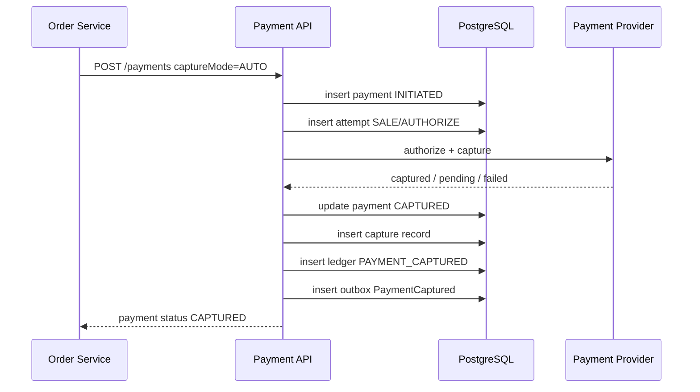
```mermaid
sequenceDiagram
    participant Order as Order Service
    participant API as Payment API
    participant DB as PostgreSQL
    participant PSP as Payment Provider

    Order->>API: POST /payments captureMode=AUTO
    API->>DB: insert payment INITIATED
    API->>DB: insert attempt SALE/AUTHORIZE
    API->>PSP: authorize + capture
    PSP-->>API: captured / pending / failed
    API->>DB: update payment CAPTURED
    API->>DB: insert capture record
    API->>DB: insert ledger PAYMENT_CAPTURED
    API->>DB: insert outbox PaymentCaptured
    API-->>Order: payment status CAPTURED
```

## Implementation Rule

```text
AUTO capture:
- Jika provider response final captured -> CAPTURED
- Jika provider response pending -> CAPTURE_PENDING / UNKNOWN
- Jika requires action -> REQUIRES_ACTION
- Jika decline -> FAILED
```

---

# 8. Flow 2 - Manual Capture

Manual capture cocok untuk:

```text
- stock harus dicek dulu
- booking/travel/hotel/rental
- order butuh fraud review
- shipment partial
- CPQ/order management dengan fulfilment bertahap
- high-value order
```

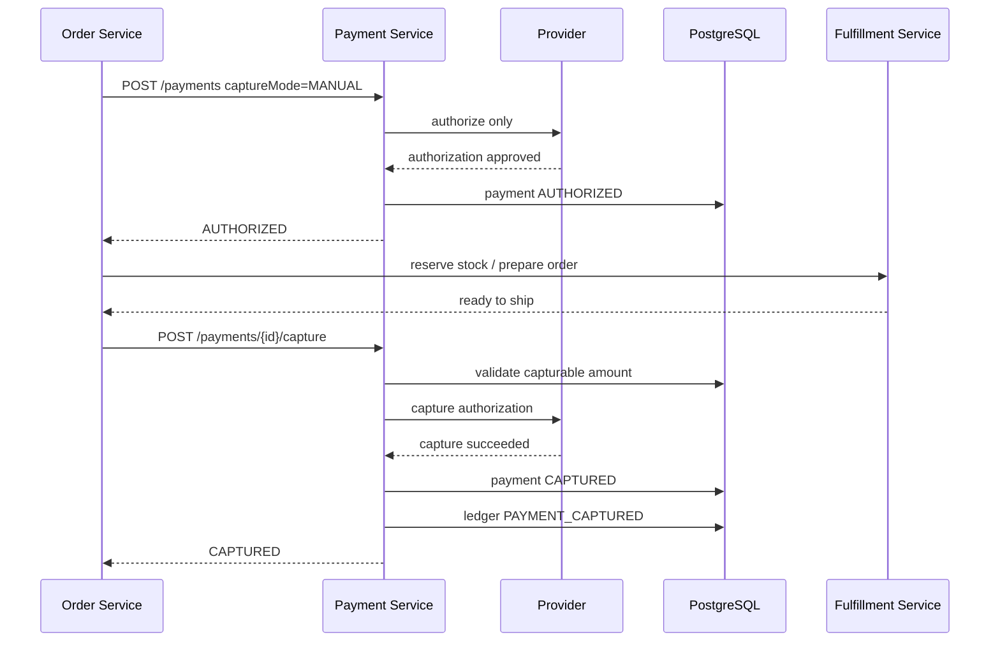
```mermaid
sequenceDiagram
    participant Order as Order Service
    participant Pay as Payment Service
    participant PSP as Provider
    participant DB as PostgreSQL
    participant Fulfill as Fulfillment Service

    Order->>Pay: POST /payments captureMode=MANUAL
    Pay->>PSP: authorize only
    PSP-->>Pay: authorization approved
    Pay->>DB: payment AUTHORIZED
    Pay-->>Order: AUTHORIZED

    Order->>Fulfill: reserve stock / prepare order
    Fulfill-->>Order: ready to ship

    Order->>Pay: POST /payments/{id}/capture
    Pay->>DB: validate capturable amount
    Pay->>PSP: capture authorization
    PSP-->>Pay: capture succeeded
    Pay->>DB: payment CAPTURED
    Pay->>DB: ledger PAYMENT_CAPTURED
    Pay-->>Order: CAPTURED
```

Stripe supports placing a hold on a payment method and capturing later with `capture_method=manual`. ([Stripe Docs](https://docs.stripe.com/payments/place-a-hold-on-a-payment-method?utm_source=chatgpt.com)) PayPal describes authorize-and-capture as useful when a task must be completed before finalizing the payment, such as verifying stock. ([PayPal Developer](https://developer.paypal.com/docs/checkout/standard/customize/authorization/?utm_source=chatgpt.com))

---

# 9. Flow 3 - Partial Capture

Partial capture berarti hanya sebagian authorized amount yang dicapture.

Contoh:

```text
Authorized amount = 1,000,000 IDR
Shipment 1 capture = 400,000 IDR
Shipment 2 capture = 300,000 IDR
Remaining 300,000 IDR void/release
```

Adyen documents partial capture by specifying a value less than the authorized amount; the remainder is released back to the shopper in the POS capture flow, and its issuing/payment-stage docs describe partial captures with remaining authorized amount possibly expiring or being canceled. ([Adyen Docs](https://docs.adyen.com/point-of-sale/capturing-payments?utm_source=chatgpt.com)) Stripe also documents multicapture for PaymentIntents when manual capture is used and when payment method support is available. ([Stripe Docs](https://docs.stripe.com/payments/multicapture?platform=web&ui=elements&utm_source=chatgpt.com))

## Partial Capture State

```text
AUTHORIZED
  -> PARTIALLY_CAPTURED
  -> PARTIALLY_CAPTURED
  -> CAPTURED

or

AUTHORIZED
  -> PARTIALLY_CAPTURED
  -> VOIDED remaining amount
```

## SQL Guard

```sql
UPDATE payments
SET captured_amount_minor = captured_amount_minor + #{captureAmountMinor},
    status = CASE
        WHEN captured_amount_minor + #{captureAmountMinor} = authorized_amount_minor
            THEN 'CAPTURED'
        ELSE 'PARTIALLY_CAPTURED'
    END,
    version = version + 1,
    updated_at = now()
WHERE payment_id = #{paymentId}
  AND status IN ('AUTHORIZED', 'PARTIALLY_CAPTURED', 'CAPTURE_PENDING', 'UNKNOWN')
  AND captured_amount_minor + #{captureAmountMinor} <= authorized_amount_minor
  AND currency = #{currency}
  AND version = #{version};
```

Invariant:

```text
sum(successful captures) <= authorized amount
```

---

# 10. Flow 4 - Void Authorization

Void dilakukan jika authorization sudah berhasil tetapi order tidak jadi dicapture.

Contoh:

```text
Order canceled
Stock unavailable
Fraud rejected
Customer failed verification
Manual review failed
```

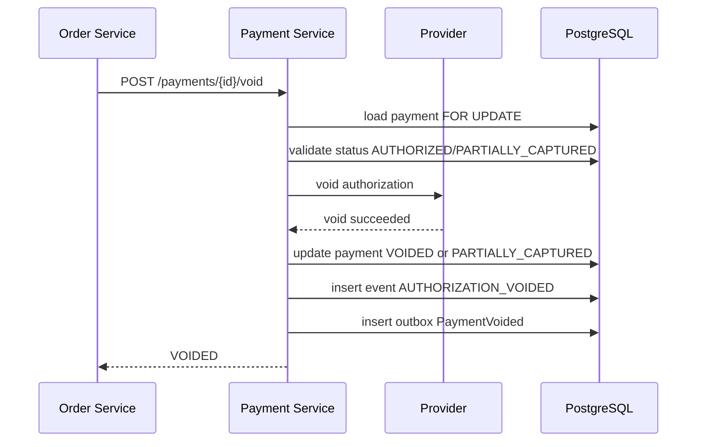
```mermaid
sequenceDiagram
    participant Order as Order Service
    participant Pay as Payment Service
    participant PSP as Provider
    participant DB as PostgreSQL

    Order->>Pay: POST /payments/{id}/void
    Pay->>DB: load payment FOR UPDATE
    Pay->>DB: validate status AUTHORIZED/PARTIALLY_CAPTURED
    Pay->>PSP: void authorization
    PSP-->>Pay: void succeeded
    Pay->>DB: update payment VOIDED or PARTIALLY_CAPTURED
    Pay->>DB: insert event AUTHORIZATION_VOIDED
    Pay->>DB: insert outbox PaymentVoided
    Pay-->>Order: VOIDED
```

Void rule:

| Current State | Void Allowed? | Notes |
|---|---:|---|
| `AUTHORIZED` | Ya | Cancel full authorization. |
| `PARTIALLY_CAPTURED` | Mungkin | Void remaining authorization jika provider mendukung. |
| `CAPTURED` | Tidak | Gunakan refund, bukan void. |
| `FAILED` | Tidak | Tidak ada auth valid. |
| `AUTH_EXPIRED` | Tidak perlu | Auth sudah expired. |
| `VOIDED` | Idempotent success | Return existing result. |

---

# 11. Domain Service Design

## 11.1 Payment Aggregate Method

```java
public class Payment {

    private UUID paymentId;
    private long authorizedAmountMinor;
    private long capturedAmountMinor;
    private long refundedAmountMinor;
    private String currency;
    private PaymentStatus status;
    private long version;

    public void markAuthorized(long amountMinor, String currency) {
        requireStatus(
                PaymentStatus.AUTHORIZATION_PENDING,
                PaymentStatus.REQUIRES_ACTION,
                PaymentStatus.UNKNOWN
        );

        requireSameCurrency(currency);
        requirePositive(amountMinor);

        this.authorizedAmountMinor = amountMinor;
        this.status = PaymentStatus.AUTHORIZED;
    }

    public void markCapturePending(long amountMinor, String currency) {
        requireStatus(
                PaymentStatus.AUTHORIZED,
                PaymentStatus.PARTIALLY_CAPTURED,
                PaymentStatus.UNKNOWN
        );

        requireSameCurrency(currency);
        requirePositive(amountMinor);

        if (capturedAmountMinor + amountMinor > authorizedAmountMinor) {
            throw new IllegalStateException("capture amount exceeds authorized amount");
        }

        this.status = PaymentStatus.CAPTURE_PENDING;
    }

    public void applyCaptureSucceeded(long amountMinor, String currency) {
        requireStatus(
                PaymentStatus.AUTHORIZED,
                PaymentStatus.CAPTURE_PENDING,
                PaymentStatus.PARTIALLY_CAPTURED,
                PaymentStatus.UNKNOWN
        );

        requireSameCurrency(currency);
        requirePositive(amountMinor);

        long newCapturedAmount = capturedAmountMinor + amountMinor;

        if (newCapturedAmount > authorizedAmountMinor) {
            throw new IllegalStateException("captured amount exceeds authorized amount");
        }

        this.capturedAmountMinor = newCapturedAmount;
        this.status = newCapturedAmount == authorizedAmountMinor
                ? PaymentStatus.CAPTURED
                : PaymentStatus.PARTIALLY_CAPTURED;
    }

    public void markVoided() {
        requireStatus(PaymentStatus.AUTHORIZED, PaymentStatus.VOID_PENDING);

        if (capturedAmountMinor > 0) {
            throw new IllegalStateException("fully voiding a partially captured payment is not allowed");
        }

        this.status = PaymentStatus.VOIDED;
    }

    public void markUnknown() {
        if (isFinal()) {
            return;
        }
        this.status = PaymentStatus.UNKNOWN;
    }

    private boolean isFinal() {
        return status == PaymentStatus.CAPTURED
                || status == PaymentStatus.VOIDED
                || status == PaymentStatus.FAILED
                || status == PaymentStatus.REFUNDED;
    }

    private void requireSameCurrency(String currency) {
        if (!this.currency.equals(currency)) {
            throw new IllegalStateException("currency mismatch");
        }
    }

    private void requirePositive(long amountMinor) {
        if (amountMinor <= 0) {
            throw new IllegalStateException("amount must be positive");
        }
    }

    private void requireStatus(PaymentStatus... allowedStatuses) {
        for (PaymentStatus allowed : allowedStatuses) {
            if (this.status == allowed) {
                return;
            }
        }
        throw new IllegalStateException("invalid state transition from " + status);
    }
}
```

---

# 12. Application Service: Authorize

```java
public PaymentResponse authorizePayment(CreatePaymentCommand command) {
    UUID paymentId = UUID.randomUUID();

    return transactionTemplate.execute(() -> {
        paymentRepository.insertPaymentInitiated(paymentId, command);
        paymentEventRepository.insertPaymentInitiated(paymentId, command);
        return paymentId;
    }).let(createdPaymentId -> {
        GatewayAuthorizeRequest gatewayRequest =
                gatewayRequestFactory.createAuthorizeRequest(createdPaymentId, command);

        try {
            GatewayAuthorizeResult result =
                    gatewayRouter.routeForAuthorize(gatewayRequest)
                            .authorize(gatewayRequest);

            return transactionTemplate.execute(() -> {
                paymentRepository.applyAuthorizeResult(createdPaymentId, result);
                authorizationRepository.insertAuthorization(createdPaymentId, result);
                paymentEventRepository.insertAuthorizeResultEvent(createdPaymentId, result);

                if (result.status() == GatewayPaymentStatus.CAPTURED) {
                    captureRepository.insertCaptureFromAuthorizeResult(createdPaymentId, result);
                    ledgerRepository.insertPaymentCaptured(createdPaymentId, result);
                    outboxRepository.insertPaymentCaptured(createdPaymentId, result);
                }

                return paymentResponseMapper.fromPaymentId(createdPaymentId);
            });

        } catch (GatewayTimeoutException timeout) {
            return transactionTemplate.execute(() -> {
                paymentRepository.markUnknown(createdPaymentId);
                paymentEventRepository.insertGatewayTimeoutEvent(createdPaymentId, timeout);
                outboxRepository.insertPaymentPendingConfirmation(createdPaymentId);
                return paymentResponseMapper.fromPaymentId(createdPaymentId);
            });
        }
    });
}
```

Catatan: contoh di atas pseudo-code Java-style; di implementasi nyata, hindari method non-Java seperti `.let()` kecuali Anda membuat helper sendiri.

---

# 13. Application Service: Capture

```java
public PaymentResponse capturePayment(CapturePaymentCommand command) {
    Payment payment = transactionTemplate.execute(() -> {
        Payment locked = paymentRepository.findByIdForUpdate(command.paymentId());

        paymentDomainService.validateCaptureAllowed(
                locked,
                command.amountMinor(),
                command.currency()
        );

        captureRepository.insertCaptureRequested(
                command.captureId(),
                command.paymentId(),
                command.captureRequestId(),
                command.amountMinor(),
                command.currency()
        );

        paymentRepository.markCapturePending(
                command.paymentId(),
                locked.version()
        );

        paymentEventRepository.insertCaptureRequested(command);

        return locked;
    });

    GatewayCaptureRequest gatewayRequest =
            gatewayRequestFactory.createCaptureRequest(payment, command);

    try {
        GatewayCaptureResult result =
                gatewayRegistry.getRequired(payment.provider())
                        .capture(gatewayRequest);

        return transactionTemplate.execute(() -> {
            Payment locked = paymentRepository.findByIdForUpdate(command.paymentId());

            int updated = paymentRepository.addCapturedAmount(
                    command.paymentId(),
                    result.capturedAmountMinor(),
                    result.currency(),
                    locked.version()
            );

            if (updated != 1) {
                throw new ConcurrentPaymentUpdateException(command.paymentId());
            }

            captureRepository.markCaptureSucceeded(
                    command.captureId(),
                    result.providerCaptureId(),
                    result
            );

            paymentEventRepository.insertCaptureSucceeded(command.paymentId(), result);

            ledgerRepository.insertPaymentCaptured(
                    command.paymentId(),
                    command.captureId(),
                    result.capturedAmountMinor(),
                    result.currency(),
                    result.providerCaptureId()
            );

            outboxRepository.insertPaymentCaptured(command.paymentId(), result);

            return paymentResponseMapper.fromPaymentId(command.paymentId());
        });

    } catch (GatewayTimeoutException timeout) {
        return transactionTemplate.execute(() -> {
            captureRepository.markCaptureUnknown(command.captureId(), timeout);
            paymentRepository.markUnknown(command.paymentId());
            paymentEventRepository.insertCaptureTimeout(command.paymentId(), timeout);
            outboxRepository.insertPaymentPendingConfirmation(command.paymentId());
            return paymentResponseMapper.fromPaymentId(command.paymentId());
        });
    }
}
```

Important:

```text
Capture request dibuat dulu sebagai record internal.
Provider timeout tidak boleh menghapus capture request.
Recovery akan query provider dengan provider reference/idempotency key.
```

---

# 14. Application Service: Void

```java
public PaymentResponse voidAuthorization(VoidPaymentCommand command) {
    Payment payment = transactionTemplate.execute(() -> {
        Payment locked = paymentRepository.findByIdForUpdate(command.paymentId());

        paymentDomainService.validateVoidAllowed(locked);

        voidRepository.insertVoidRequested(
                command.voidId(),
                command.paymentId(),
                command.voidRequestId(),
                command.reason()
        );

        paymentRepository.markVoidPending(command.paymentId(), locked.version());
        paymentEventRepository.insertVoidRequested(command);

        return locked;
    });

    GatewayVoidRequest gatewayRequest =
            gatewayRequestFactory.createVoidRequest(payment, command);

    try {
        GatewayVoidResult result =
                gatewayRegistry.getRequired(payment.provider())
                        .voidAuthorization(gatewayRequest);

        return transactionTemplate.execute(() -> {
            paymentRepository.markVoided(command.paymentId());
            voidRepository.markVoidSucceeded(command.voidId(), result);
            paymentEventRepository.insertVoidSucceeded(command.paymentId(), result);
            outboxRepository.insertPaymentVoided(command.paymentId(), result);

            return paymentResponseMapper.fromPaymentId(command.paymentId());
        });

    } catch (GatewayTimeoutException timeout) {
        return transactionTemplate.execute(() -> {
            voidRepository.markVoidUnknown(command.voidId(), timeout);
            paymentRepository.markUnknown(command.paymentId());
            paymentEventRepository.insertVoidTimeout(command.paymentId(), timeout);

            return paymentResponseMapper.fromPaymentId(command.paymentId());
        });
    }
}
```

---

# 15. API Design

## 15.1 Authorize / Create Payment

```http
POST /payments
Idempotency-Key: create-ord-123-v1
Content-Type: application/json
```

```json
{
  "orderId": "ORD-123",
  "customerId": "CUST-001",
  "merchantId": "MRC-001",
  "amountMinor": 1000000,
  "currency": "IDR",
  "captureMode": "MANUAL",
  "paymentMethod": {
    "type": "CARD_TOKEN",
    "token": "pm_tok_abc"
  }
}
```

Response:

```json
{
  "paymentId": "0d675590-f9f3-4f97-9f77-34983fca2faa",
  "orderId": "ORD-123",
  "status": "AUTHORIZED",
  "authorizedAmountMinor": 1000000,
  "capturedAmountMinor": 0,
  "currency": "IDR",
  "captureMode": "MANUAL"
}
```

---

## 15.2 Capture

```http
POST /payments/{paymentId}/capture
Idempotency-Key: capture-shipment-1
Content-Type: application/json
```

```json
{
  "captureRequestId": "shipment-1",
  "amountMinor": 400000,
  "currency": "IDR",
  "reason": "SHIPMENT_1_READY"
}
```

Response:

```json
{
  "paymentId": "0d675590-f9f3-4f97-9f77-34983fca2faa",
  "status": "PARTIALLY_CAPTURED",
  "authorizedAmountMinor": 1000000,
  "capturedAmountMinor": 400000,
  "remainingCapturableAmountMinor": 600000,
  "currency": "IDR"
}
```

---

## 15.3 Void

```http
POST /payments/{paymentId}/void
Idempotency-Key: void-ord-123-v1
Content-Type: application/json
```

```json
{
  "voidRequestId": "void-ord-123",
  "reason": "ORDER_CANCELLED"
}
```

Response:

```json
{
  "paymentId": "0d675590-f9f3-4f97-9f77-34983fca2faa",
  "status": "VOIDED",
  "voidedAt": "2026-07-14T15:30:00Z"
}
```

---

# 16. Ledger Posting

Payment ledger harus membedakan authorization dan capture.

Authorization biasanya bukan revenue/receivable final. Capture adalah event finansial yang lebih kuat.

| Event | Ledger Entry? | Direction | Notes |
|---|---:|---|---|
| Authorization approved | Optional memo ledger | None / reserved | Bisa dicatat sebagai reserved, bukan revenue. |
| Capture succeeded | Ya | CREDIT | Merchant receivable/payment captured. |
| Partial capture | Ya | CREDIT | Per capture amount. |
| Void succeeded | Optional | Release reserve | Tidak ada revenue. |
| Settlement received | Ya | CREDIT/DEBIT adjustment | Sesuaikan gross/fee/net. |
| Fee charged | Ya | DEBIT | Provider/acquirer fee. |
| Payout completed | Ya | CREDIT bank / debit provider balance | Tergantung chart of accounts. |
| Refund succeeded | Ya | DEBIT | Mengurangi receivable/revenue. |

Contoh ledger capture:

```sql
INSERT INTO ledger_entries (
    ledger_entry_id,
    payment_id,
    capture_id,
    entry_type,
    direction,
    amount_minor,
    currency,
    account_code,
    reference_type,
    reference_id,
    description
)
VALUES (
    gen_random_uuid(),
    #{paymentId},
    #{captureId},
    'PAYMENT_CAPTURED',
    'CREDIT',
    #{amountMinor},
    #{currency},
    'MERCHANT_RECEIVABLE',
    'PROVIDER_CAPTURE',
    #{providerCaptureId},
    'Payment capture succeeded'
);
```

---

# 17. Settlement Flow

Payment captured belum tentu langsung settled.

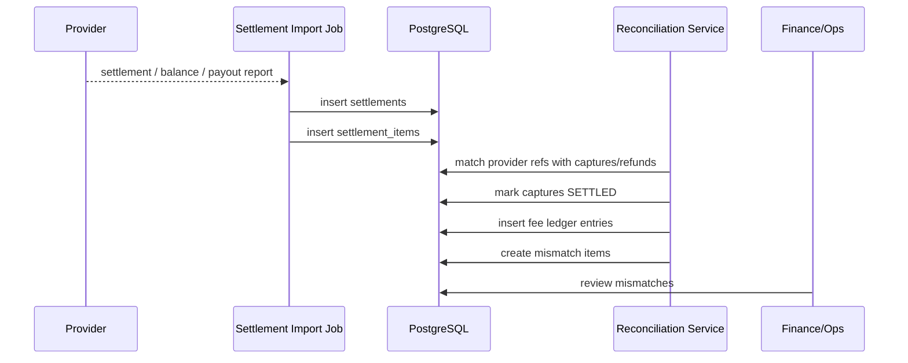
```mermaid
sequenceDiagram
    participant PSP as Provider
    participant Job as Settlement Import Job
    participant DB as PostgreSQL
    participant Recon as Reconciliation Service
    participant Finance as Finance/Ops

    PSP-->>Job: settlement / balance / payout report
    Job->>DB: insert settlements
    Job->>DB: insert settlement_items
    Recon->>DB: match provider refs with captures/refunds
    Recon->>DB: mark captures SETTLED
    Recon->>DB: insert fee ledger entries
    Recon->>DB: create mismatch items
    Finance->>DB: review mismatches
```

Stripe’s Balance summary report is described as similar to a bank statement and provides itemized CSV export of transaction history, which is the type of artifact commonly used for reconciliation. ([Stripe Docs](https://docs.stripe.com/reports/balance?utm_source=chatgpt.com)) Stripe also documents payout reconciliation for matching payouts received in a bank account with transactions included in the payout. ([Stripe Docs](https://docs.stripe.com/payouts/reconciliation?utm_source=chatgpt.com))

---

# 18. Settlement Status Model

```java
public enum SettlementStatus {
    NOT_APPLICABLE,
    SETTLEMENT_PENDING,
    SETTLED,
    PAYOUT_PENDING,
    PAID_OUT,
    SETTLEMENT_FAILED,
    RECONCILIATION_MISMATCH
}
```

Untuk payment aggregate, jangan terlalu cepat mencampur status operasional dengan settlement status.

Lebih baik:

```text
payments.status = CAPTURED
payments.settlement_status = SETTLEMENT_PENDING
```

atau table terpisah:

```text
payment_captures.status = SUCCEEDED
payment_captures.settlement_status = SETTLED
```

---

# 19. Authorization Expiry Job

Authorization punya masa berlaku. PayPal menyebut authorization hold valid selama 29 hari; provider/card network lain bisa punya window berbeda tergantung payment method, region, merchant category, dan provider policy. ([PayPal Developer](https://developer.paypal.com/docs/checkout/standard/customize/authorization/?utm_source=chatgpt.com))

Job internal:

```text
Every 15 minutes / hourly:
  1. Find AUTHORIZED payments with expires_at < now().
  2. Query provider if needed.
  3. If still uncaptured and expired, mark AUTH_EXPIRED.
  4. Insert payment_event AUTHORIZATION_EXPIRED.
  5. Insert outbox PaymentAuthorizationExpired.
  6. Notify order service.
```

SQL:

```sql
SELECT *
FROM payments p
JOIN payment_authorizations a
  ON a.payment_id = p.payment_id
WHERE p.status = 'AUTHORIZED'
  AND a.expires_at IS NOT NULL
  AND a.expires_at < now()
FOR UPDATE SKIP LOCKED;
```

Application action:

```text
If order still needs payment:
  -> ask customer to pay again
  -> create new payment authorization
  -> do not try capture expired auth blindly
```

---

# 20. Invariants

| Invariant | Penjelasan |
|---|---|
| `captured_amount_minor <= authorized_amount_minor` | Tidak boleh capture lebih dari auth. |
| `refunded_amount_minor <= captured_amount_minor` | Tidak boleh refund lebih dari captured. |
| `sum(successful captures) = payments.captured_amount_minor` | Aggregate harus cocok dengan detail capture. |
| `capture.currency = payment.currency` | Currency tidak boleh berubah. |
| `void` hanya sebelum full capture | Fully captured payment harus refund, bukan void. |
| `capture` harus ke provider original | Jangan routing ulang. |
| `refund` harus ke provider original | Refund harus refer provider capture/payment original. |
| `settled_amount` tidak boleh dianggap sama dengan `captured_amount` sebelum report provider masuk. | Captured dan settled berbeda. |
| `paid_out` harus berdasar payout/bank reconciliation. | Jangan set paid out dari capture response. |
| Timeout tidak final. | Masuk `UNKNOWN` / recovery. |

---

# 21. Provider Mapping Examples

## 21.1 Stripe

| Stripe Concept | Internal Meaning |
|---|---|
| `capture_method=manual` | Authorize now, capture later. |
| `requires_capture` | `AUTHORIZED` |
| `succeeded` | `CAPTURED` |
| `canceled` | `VOIDED` / `CANCELLED` |
| `processing` | `AUTHORIZATION_PENDING` / `CAPTURE_PENDING` |
| Balance/payout report | Settlement/payout reconciliation source |

Stripe documents `capture_method=manual` for separate authorization and capture, and a PaymentIntent that requires capture is part of the manual capture flow. ([Stripe Docs](https://docs.stripe.com/payments/place-a-hold-on-a-payment-method?utm_source=chatgpt.com))

## 21.2 Adyen

| Adyen Concept | Internal Meaning |
|---|---|
| Authorisation | `AUTHORIZED` |
| Manual capture | `CAPTURE_PENDING` → `CAPTURED` |
| Partial capture | `PARTIALLY_CAPTURED` |
| Cancel/void remaining | `VOIDED` / remaining auth released |
| Settlement report | `SETTLED` / reconciliation |

Adyen’s capture docs describe manual capture and partial capture support, with `/capture` requiring merchant account, capture amount, and original authorization reference in classic recurring example. ([Adyen Docs](https://docs.adyen.com/online-payments/capture?utm_source=chatgpt.com))

## 21.3 PayPal

| PayPal Concept | Internal Meaning |
|---|---|
| Authorize order/payment | `AUTHORIZED` |
| Capture authorization | `CAPTURED` |
| Void authorization | `VOIDED` |
| Refund capture | Refund lifecycle |
| Authorization valid window | `expires_at` handling |

PayPal Payments v2 exposes capture authorized payment and refund captured payment operations, and PayPal’s authorize/capture guide describes the 2-step model. ([PayPal Developer](https://developer.paypal.com/docs/api/payments/v2/?utm_source=chatgpt.com))

---

# 22. Failure Handling Matrix

| Scenario | Internal State | Action |
|---|---|---|
| Authorization approved | `AUTHORIZED` | Wait capture or auto-capture. |
| Authorization requires 3DS | `REQUIRES_ACTION` | Return `nextAction`. |
| Authorization declined | `FAILED` | Notify order/payment method retry. |
| Authorization timeout | `UNKNOWN` | Query provider / wait webhook. |
| Capture requested | `CAPTURE_PENDING` | Await provider response/webhook. |
| Capture success full | `CAPTURED` | Ledger + outbox. |
| Capture success partial | `PARTIALLY_CAPTURED` | Ledger per capture. |
| Capture timeout | `UNKNOWN` | Query provider; do not duplicate capture blindly. |
| Void success | `VOIDED` | Notify order. |
| Void timeout | `UNKNOWN` | Query provider; avoid capture until clear. |
| Auth expired | `AUTH_EXPIRED` | Require new payment. |
| Settlement report missing capture | `RECONCILIATION_MISMATCH` | Finance investigation. |
| Capture exists but payout missing | `PAYOUT_PENDING` / mismatch | Reconcile payout report. |

---

# 23. MyBatis Mapper Examples

## 23.1 Insert Capture Requested

```xml
<insert id="insertCaptureRequested">
    INSERT INTO payment_captures (
        capture_id,
        payment_id,
        authorization_id,
        provider,
        provider_payment_id,
        capture_request_id,
        amount_minor,
        currency,
        status,
        created_at,
        updated_at
    ) VALUES (
        #{captureId},
        #{paymentId},
        #{authorizationId},
        #{provider},
        #{providerPaymentId},
        #{captureRequestId},
        #{amountMinor},
        #{currency},
        'REQUESTED',
        now(),
        now()
    )
</insert>
```

## 23.2 Mark Capture Succeeded

```xml
<update id="markCaptureSucceeded">
    UPDATE payment_captures
    SET status = 'SUCCEEDED',
        provider_capture_id = #{providerCaptureId},
        response_payload = CAST(#{responsePayloadJson} AS jsonb),
        captured_at = now(),
        updated_at = now()
    WHERE capture_id = #{captureId}
      AND status IN ('REQUESTED', 'PENDING', 'UNKNOWN')
</update>
```

## 23.3 Mark Payment Captured Amount

```xml
<update id="addCapturedAmount">
    UPDATE payments
    SET captured_amount_minor = captured_amount_minor + #{amountMinor},
        status = CASE
            WHEN captured_amount_minor + #{amountMinor} = authorized_amount_minor
                THEN 'CAPTURED'
            ELSE 'PARTIALLY_CAPTURED'
        END,
        version = version + 1,
        updated_at = now()
    WHERE payment_id = #{paymentId}
      AND status IN ('AUTHORIZED', 'CAPTURE_PENDING', 'PARTIALLY_CAPTURED', 'UNKNOWN')
      AND currency = #{currency}
      AND captured_amount_minor + #{amountMinor} <= authorized_amount_minor
      AND version = #{version}
</update>
```

## 23.4 Mark Void Succeeded

```xml
<update id="markPaymentVoided">
    UPDATE payments
    SET status = 'VOIDED',
        version = version + 1,
        updated_at = now()
    WHERE payment_id = #{paymentId}
      AND status IN ('AUTHORIZED', 'VOID_PENDING', 'UNKNOWN')
      AND captured_amount_minor = 0
      AND version = #{version}
</update>
```

---

# 24. API Error Codes

| Error Code | HTTP | Kapan |
|---|---:|---|
| `PAYMENT_NOT_AUTHORIZED` | `409` | Capture sebelum auth. |
| `PAYMENT_ALREADY_CAPTURED` | `409` | Capture duplicate full amount. |
| `CAPTURE_AMOUNT_EXCEEDS_AUTHORIZED` | `422` | Capture > remaining authorized. |
| `CAPTURE_NOT_SUPPORTED` | `422` | Provider/payment method tidak support manual capture. |
| `PARTIAL_CAPTURE_NOT_SUPPORTED` | `422` | Provider tidak support partial capture. |
| `AUTHORIZATION_EXPIRED` | `409` | Auth sudah expired. |
| `PAYMENT_CANNOT_BE_VOIDED` | `409` | Payment sudah captured/failed/refunded. |
| `VOID_AFTER_CAPTURE_NOT_ALLOWED` | `409` | Void fully captured payment. |
| `SETTLEMENT_NOT_FOUND` | `404` | Settlement report/item tidak ditemukan. |
| `PAYMENT_STATUS_UNKNOWN` | `202` / `409` | Status butuh recovery. |

Contoh:

```json
{
  "type": "https://api.company.internal/problems/capture-amount-exceeds-authorized",
  "title": "Capture amount exceeds authorized amount",
  "status": 422,
  "detail": "Requested capture amount exceeds remaining authorized amount.",
  "errorCode": "CAPTURE_AMOUNT_EXCEEDS_AUTHORIZED",
  "paymentId": "0d675590-f9f3-4f97-9f77-34983fca2faa",
  "traceId": "corr-123"
}
```

---

# 25. Camunda Integration Point

Manual capture sering cocok diorkestrasi dengan Camunda.

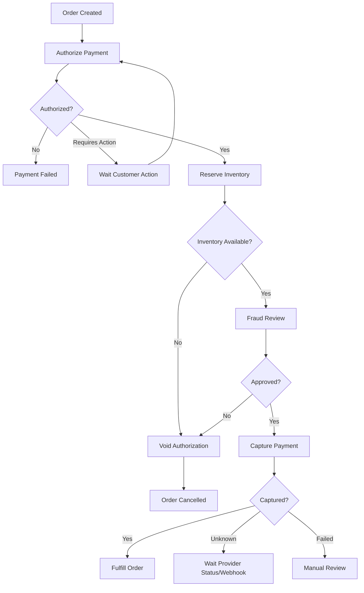
```mermaid
flowchart TD
    A[Order Created] --> B[Authorize Payment]
    B --> C{Authorized?}

    C -->|No| D[Payment Failed]
    C -->|Requires Action| E[Wait Customer Action]
    E --> B

    C -->|Yes| F[Reserve Inventory]
    F --> G{Inventory Available?}

    G -->|No| H[Void Authorization]
    H --> I[Order Cancelled]

    G -->|Yes| J[Fraud Review]
    J --> K{Approved?}

    K -->|No| H
    K -->|Yes| L[Capture Payment]

    L --> M{Captured?}
    M -->|Yes| N[Fulfill Order]
    M -->|Unknown| O[Wait Provider Status/Webhook]
    M -->|Failed| P[Manual Review]
```

Rule praktis:

```text
Camunda orchestrates business workflow.
Payment service owns payment state transition and financial invariant.
```

---

# 26. Observability

Metric wajib:

| Metric | Fungsi |
|---|---|
| `payment.authorization.requested.total` | Jumlah auth request. |
| `payment.authorization.approved.total` | Auth approved. |
| `payment.authorization.declined.total` | Auth decline. |
| `payment.authorization.expired.total` | Auth expired. |
| `payment.capture.requested.total` | Capture requested. |
| `payment.capture.succeeded.total` | Capture success. |
| `payment.capture.failed.total` | Capture failed. |
| `payment.capture.unknown.total` | Capture timeout/unknown. |
| `payment.void.requested.total` | Void requested. |
| `payment.void.succeeded.total` | Void success. |
| `payment.settlement.pending.total` | Captured but not settled. |
| `payment.settlement.mismatch.total` | Settlement mismatch. |
| `payment.payout.pending.total` | Settled but payout pending. |

Structured log:

```json
{
  "event": "payment_capture_succeeded",
  "paymentId": "0d675590-f9f3-4f97-9f77-34983fca2faa",
  "captureId": "d4c54a9e-1d66-4f0f-b2f8-64833d9a7e6c",
  "provider": "ADYEN",
  "providerPaymentId": "psp-123",
  "providerCaptureId": "cap-456",
  "amountMinor": 400000,
  "currency": "IDR",
  "status": "PARTIALLY_CAPTURED",
  "traceId": "corr-123"
}
```

---

# 27. Testing Strategy

## 27.1 Unit Tests

| Test | Expected |
|---|---|
| Capture before authorization | Reject. |
| Capture full authorized amount | `CAPTURED`. |
| Capture partial amount | `PARTIALLY_CAPTURED`. |
| Capture amount > authorized | Reject. |
| Second capture exceeds remaining amount | Reject. |
| Void authorized payment | `VOIDED`. |
| Void captured payment | Reject. |
| Timeout during capture | `UNKNOWN`, not `FAILED`. |
| Auth expiry job | `AUTH_EXPIRED`. |
| Settlement item matches capture | Mark settled. |
| Settlement amount mismatch | Create reconciliation mismatch. |

## 27.2 Integration Tests

```text
1. Create manual capture payment.
2. Mock provider returns AUTHORIZED.
3. Capture partial amount.
4. Verify payment_captures row.
5. Verify payments.captured_amount_minor updated.
6. Verify ledger entry inserted.
7. Verify outbox event inserted.
8. Capture remaining amount.
9. Verify status CAPTURED.
10. Import settlement report.
11. Verify capture marked SETTLED.
```

## 27.3 Concurrency Tests

```text
Scenario:
Authorized amount = 100000
Two concurrent capture requests = 70000 each

Expected:
Only one succeeds.
Second fails due to remaining authorized amount guard.
captured_amount_minor <= authorized_amount_minor always true.
```

---

# 28. Common Anti-Patterns

| Anti-Pattern | Kenapa Berbahaya | Solusi |
|---|---|---|
| Menganggap `AUTHORIZED` sebagai `PAID` | Dana belum diterima. | Fulfillment besar tunggu capture. |
| Menganggap `CAPTURED` sebagai settled bank money | Settlement/payout bisa delay/fail. | Track settlement/payout. |
| Void setelah capture | Salah operation; harus refund. | Enforce state guard. |
| Capture retry tanpa idempotency | Bisa double capture. | Capture request ID + idempotency. |
| Partial capture tanpa detail table | Sulit audit. | `payment_captures`. |
| Auth expiry tidak dimonitor | Capture bisa gagal telat. | expiry job. |
| Timeout capture langsung failed | Provider mungkin sudah capture. | `UNKNOWN` + query status. |
| Capture/refund routing ulang | Provider salah. | Provider stickiness. |
| Settlement dicampur payment event biasa | Finance sulit reconcile. | settlement tables. |
| Tidak bedakan gross/fee/net | Accounting tidak cocok. | settlement item + ledger fee. |

---

# 29. Implementation Checklist

## Authorization

- [ ] Support `captureMode=AUTO`.
- [ ] Support `captureMode=MANUAL`.
- [ ] Simpan `payment_authorizations`.
- [ ] Simpan `expires_at` jika provider memberi/aturan internal tahu.
- [ ] Handle `REQUIRES_ACTION`.
- [ ] Timeout masuk `UNKNOWN`.

## Capture

- [ ] Endpoint `POST /payments/{paymentId}/capture`.
- [ ] Wajib `Idempotency-Key`.
- [ ] Optional `captureRequestId`.
- [ ] Simpan `payment_captures`.
- [ ] Enforce `captured <= authorized`.
- [ ] Support partial capture hanya jika provider mendukung.
- [ ] Insert ledger + outbox saat success.

## Void

- [ ] Endpoint `POST /payments/{paymentId}/void`.
- [ ] Void hanya sebelum full capture.
- [ ] Simpan `payment_voids`.
- [ ] Timeout void masuk `UNKNOWN`.
- [ ] Duplicate void idempotent.

## Settlement

- [ ] Ada `settlements`.
- [ ] Ada `settlement_items`.
- [ ] Track gross/fee/net.
- [ ] Match provider references dengan captures/refunds.
- [ ] Create mismatch items.
- [ ] Jangan set paid out tanpa payout/bank evidence.

## Operations

- [ ] Expiry job untuk authorization.
- [ ] Status query recovery job.
- [ ] Settlement import job.
- [ ] Payout reconciliation job.
- [ ] Alerts untuk capture unknown, auth expiring soon, settlement mismatch.

---

# 30. Exercise Praktis

Buat mini lifecycle module:

```text
payment-service/
  domain/
    Payment.java
    PaymentStatus.java
    Authorization.java
    Capture.java
    VoidAuthorization.java
    Settlement.java

  application/
    AuthorizePaymentUseCase.java
    CapturePaymentUseCase.java
    VoidAuthorizationUseCase.java
    AuthorizationExpiryJob.java
    SettlementImportJob.java

  infrastructure/persistence/
    PaymentAuthorizationMapper.java
    PaymentCaptureMapper.java
    PaymentVoidMapper.java
    SettlementMapper.java
```

Target skenario:

```text
1. Create payment captureMode=MANUAL.
2. Mock provider returns AUTHORIZED.
3. Capture 40% amount.
4. Verify status PARTIALLY_CAPTURED.
5. Capture remaining 60%.
6. Verify status CAPTURED.
7. Try void after full capture -> rejected.
8. Create another manual payment.
9. Void before capture -> VOIDED.
10. Simulate capture timeout -> UNKNOWN.
11. Query mock provider -> CAPTURED.
12. Import settlement item -> SETTLED.
```

---

# Ringkasan

Authorization, capture, void, dan settlement harus dimodelkan sebagai lifecycle yang berbeda:

```text
Authorization = hold/reserve
Capture       = financial charge/money movement begins
Void          = release hold before capture
Settlement    = provider/acquirer confirms funds availability
Payout        = funds reach merchant bank
```

Prinsip penting:

```text
1. Jangan anggap AUTHORIZED sebagai PAID.
2. Jangan anggap CAPTURED sebagai PAID_OUT.
3. Capture harus idempotent.
4. Partial capture perlu detail table.
5. Void hanya sebelum full capture.
6. Timeout masuk UNKNOWN, bukan FAILED.
7. Settlement dan payout butuh reconciliation.
```

---

## Seri 7/18 selesai

Rekomendasi lanjut ke:

**Seri 8/18 - Webhook Receiver, Signature Verification, dan Inbox Dedup: desain endpoint webhook provider, raw payload handling, signature validation, duplicate prevention, out-of-order event handling, dan async event processor.**

---

**Sources:**

- [Place a hold on a payment method](https://docs.stripe.com/payments/place-a-hold-on-a-payment-method?utm_source=chatgpt.com)
- [Capture](https://docs.adyen.com/online-payments/capture?utm_source=chatgpt.com)
- [Authorize a payment and capture funds later](https://developer.paypal.com/docs/checkout/standard/customize/authorization/?utm_source=chatgpt.com)
- [Void authorized payment - Paypal Docs](https://docs.paypal.ai/reference/api/rest/authorizations/void-authorized-payment?utm_source=chatgpt.com)

## Response:
7/14/2026, 10:37:38 PM

Saya lanjut ke **Seri 8/18**: webhook receiver, signature verification, dan inbox dedup. Fokusnya membuat endpoint webhook aman, cepat mengembalikan response ke provider, tahan duplicate/out-of-order event, dan tidak langsung merusak state payment.

# Payment Management & Integration Pattern  
## Seri 8/18 - Webhook Receiver, Signature Verification, dan Inbox Dedup

Seri ini membahas salah satu bagian paling rawan dalam payment integration: **webhook**.

Webhook adalah jalur utama bagi provider untuk memberi tahu perubahan status payment secara asynchronous. Dalam payment system, response awal dari provider sering belum final. Status final bisa datang lewat webhook beberapa detik, menit, bahkan jam kemudian.

Core idea:

```text id="vjuqul"
Webhook endpoint jangan langsung dianggap sebagai business logic endpoint.
Webhook endpoint adalah ingestion layer:
  1. receive raw payload
  2. verify authenticity
  3. deduplicate
  4. persist
  5. return fast
  6. process asynchronously
```

Stripe mewajibkan penggunaan **raw request body** untuk signature verification; perubahan apa pun terhadap body sebelum verifikasi bisa membuat signature verification gagal. ([Stripe Docs](https://docs.stripe.com/webhooks?utm_source=chatgpt.com)) Adyen mendukung HMAC signature untuk webhook dan HMAC key harus disimpan aman di sistem penerima. ([Adyen Docs](https://docs.adyen.com/development-resources/webhooks/secure-webhooks/verify-hmac-signatures?utm_source=chatgpt.com)) PayPal mendokumentasikan verifikasi webhook melalui signature/certificate headers atau dengan mengirim data webhook ke verify signature endpoint PayPal. ([PayPal Developer](https://developer.paypal.com/api/rest/webhooks/?utm_source=chatgpt.com))

---

# 1. Introduction

Payment webhook harus didesain untuk menghadapi:

```text id="s2rcrj"
1. Duplicate webhook
2. Out-of-order webhook
3. Late webhook
4. Fake/spoofed webhook
5. Invalid signature
6. Webhook retry dari provider
7. Provider timeout saat menunggu response
8. Payload schema berubah
9. Event tidak bisa dimap ke payment internal
10. Event sukses tapi state internal sudah final
```

Kesalahan umum:

```text id="s2lgws"
Provider webhook masuk
  -> langsung update payments.status
  -> langsung insert ledger
  -> response lama
  -> kalau gagal, provider retry
  -> duplicate event bikin double ledger
```

Desain yang lebih aman:

```text id="rx9io2"
WebhookResource
  -> baca raw body
  -> verify signature
  -> parse minimal metadata
  -> insert inbox event with unique(provider, provider_event_id)
  -> return 200/202 fast
  -> async worker process inbox event
  -> state transition guarded
  -> ledger/outbox idempotent
```

---

# 2. Diagram

```mermaid id="kdi1gv"
flowchart TD
    A[Payment Provider Webhook] --> B[WebhookResource - Jersey/JAX-RS]

    B --> C[Read Raw Body]
    C --> D[Signature Verification]
    D --> E{Valid Signature?}

    E -->|No| F[Reject 400/401]
    E -->|Yes| G[Extract Provider Event ID]

    G --> H[Insert payment_inbox_events]
    H --> I{Duplicate?}

    I -->|Yes| J[Return 200 OK]
    I -->|No| K[Return 200/202 Quickly]

    K --> L[Webhook Processor Worker]
    J --> L

    L --> M[Claim Inbox Event FOR UPDATE SKIP LOCKED]
    M --> N[Parse Provider Payload]
    N --> O[Resolve Payment by Provider Reference]
    O --> P{Payment Found?}

    P -->|No| Q[Mark NEEDS_INVESTIGATION]
    P -->|Yes| R[Map Provider Event to Internal Event]

    R --> S[Validate State Transition]
    S --> T{Valid Transition?}

    T -->|No| U[Ignore / Exception Queue]
    T -->|Yes| V[Update Payment State]

    V --> W[Insert Payment Event]
    W --> X[Insert Ledger if Financial]
    X --> Y[Insert Outbox Event]
    Y --> Z[Mark Inbox PROCESSED]
```

---

# 3. Practical Decomposition Map

| No | Area | Fokus Praktis | Output Implementasi |
|---:|---|---|---|
| 1 | **Webhook Endpoint** | Endpoint provider-specific. | `POST /webhooks/{provider}` |
| 2 | **Raw Body Handling** | Baca payload sebelum JSON mapping. | `InputStream` / `byte[] rawBody` |
| 3 | **Signature Verification** | Validasi authenticity/integrity. | `WebhookSignatureVerifier` |
| 4 | **Provider Header Extraction** | Ambil signature, event id, timestamp, cert URL. | `WebhookHeaders` |
| 5 | **Inbox Dedup** | Cegah event sama diproses dua kali. | `payment_inbox_events` |
| 6 | **Fast ACK** | Return cepat ke provider. | `200 OK` setelah persist aman |
| 7 | **Async Processor** | Proses event di worker. | `WebhookProcessor` |
| 8 | **Event Mapping** | Map provider event → internal event. | `ProviderWebhookMapper` |
| 9 | **Payment Resolution** | Cari payment/refund/capture internal dari provider reference. | `PaymentReferenceResolver` |
| 10 | **State Guard** | Cegah late/out-of-order event merusak status. | `PaymentStateTransitionService` |
| 11 | **Ledger Idempotency** | Cegah double ledger dari duplicate event. | unique ledger reference |
| 12 | **Outbox Publishing** | Publish internal event reliable. | `payment_outbox_events` |
| 13 | **Retry / DLQ** | Event gagal diproses bisa retry. | status `FAILED`, `DEAD_LETTER` |
| 14 | **Observability** | Monitor lag/failure/invalid signature. | metrics/logs |
| 15 | **Replay Tooling** | Reprocess event untuk recovery. | admin replay endpoint |

---

# 4. Webhook Endpoint Design

Gunakan endpoint provider-specific:

```text id="1onxb1"
POST /webhooks/stripe
POST /webhooks/adyen
POST /webhooks/paypal
POST /webhooks/mock
```

Atau generic:

```text id="xnap13"
POST /webhooks/{provider}
```

Rekomendasi praktis:

```text id="ufyhhf"
Gunakan /webhooks/{provider}, tapi internal handler tetap provider-specific.
```

Kenapa?

```text id="934qpy"
1. Signature verification berbeda per provider.
2. Header berbeda per provider.
3. Event id path berbeda.
4. Payload schema berbeda.
5. Response expectation bisa berbeda.
```

---

# 5. Important: Raw Body First

Jangan biarkan framework otomatis parse JSON sebelum signature verification, terutama untuk provider seperti Stripe.

Stripe mensyaratkan raw body request untuk signature verification dan memperingatkan bahwa manipulasi body oleh framework bisa membuat verification gagal. ([Stripe Docs](https://docs.stripe.com/webhooks?utm_source=chatgpt.com)) Jakarta REST/JAX-RS memakai `MessageBodyReader` untuk memetakan HTTP request entity body ke method parameter, sehingga untuk webhook yang butuh raw body, lebih aman menerima `InputStream`/`byte[]` atau `String` raw body dan mengontrol parsing sendiri setelah signature verification. ([jakarta.ee](https://jakarta.ee/learn/docs/jakartaee-tutorial/current/websvcs/rest/rest.html?utm_source=chatgpt.com))

Contoh buruk:

```java id="um3ihn"
@POST
@Path("/webhooks/stripe")
public Response handleStripeWebhook(StripeWebhookEvent event) {
    // Body sudah diparse, raw body hilang/berubah.
}
```

Contoh lebih aman:

```java id="qv16gi"
@POST
@Path("/webhooks/{provider}")
@Consumes(MediaType.APPLICATION_JSON)
public Response receiveWebhook(
        @PathParam("provider") String provider,
        @Context HttpHeaders headers,
        InputStream inputStream
) {
    byte[] rawBody = inputStream.readAllBytes();

    // verify signature using rawBody
    // parse JSON only after signature verification
}
```

---

# 6. Webhook Resource Skeleton

```java id="wir6ww"
package com.company.payment.api.webhook;

import com.company.payment.application.webhook.WebhookIngestionService;
import jakarta.ws.rs.*;
import jakarta.ws.rs.core.*;

import java.io.InputStream;

@Path("/webhooks")
public class WebhookResource {

    private final WebhookIngestionService ingestionService;

    public WebhookResource(WebhookIngestionService ingestionService) {
        this.ingestionService = ingestionService;
    }

    @POST
    @Path("/{provider}")
    @Consumes(MediaType.APPLICATION_JSON)
    @Produces(MediaType.APPLICATION_JSON)
    public Response receiveWebhook(
            @PathParam("provider") String provider,
            @Context HttpHeaders headers,
            @Context UriInfo uriInfo,
            InputStream requestBody
    ) {
        try {
            byte[] rawBody = requestBody.readAllBytes();

            WebhookIngestionResult result = ingestionService.ingest(
                    provider,
                    toHeaderMap(headers),
                    rawBody,
                    uriInfo.getRequestUri().toString()
            );

            /*
             * Return 200 even for duplicate valid event,
             * so provider does not keep retrying.
             */
            return Response.ok(new WebhookAckResponse(
                    result.inboxEventId(),
                    result.status()
            )).build();

        } catch (InvalidWebhookSignatureException e) {
            return Response.status(Response.Status.UNAUTHORIZED)
                    .entity(new WebhookAckResponse(null, "INVALID_SIGNATURE"))
                    .build();

        } catch (Exception e) {
            /*
             * Be careful:
             * If DB persist failed, return 500 so provider retries.
             * If processing failed after persist, return 200 and let worker retry.
             */
            return Response.serverError()
                    .entity(new WebhookAckResponse(null, "INGESTION_FAILED"))
                    .build();
        }
    }

    private java.util.Map<String, java.util.List<String>> toHeaderMap(HttpHeaders headers) {
        return headers.getRequestHeaders();
    }
}
```

```java id="hbit5f"
package com.company.payment.api.webhook;

import java.util.UUID;

public record WebhookAckResponse(
        UUID inboxEventId,
        String status
) {}
```

---

# 7. Ingestion vs Processing

Pisahkan dua fase:

```text id="1efzjk"
Ingestion:
  - raw body
  - verify signature
  - parse minimal event metadata
  - insert inbox
  - return response

Processing:
  - parse full payload
  - map provider event
  - resolve payment/refund/capture
  - apply state transition
  - insert ledger/outbox
  - mark processed
```

Alasan:

| Alasan | Penjelasan |
|---|---|
| Fast provider ACK | Provider tidak menunggu business logic panjang. |
| Retry internal controlled | Kalau business processing gagal, worker retry sendiri. |
| Dedup reliable | Event sudah durable sebelum diproses. |
| Debugging mudah | Raw payload tersimpan. |
| Replay bisa dilakukan | Admin bisa reprocess event. |

---

# 8. `payment_inbox_events` Schema

Gunakan schema yang cukup lengkap.

```sql id="ax9wfl"
CREATE TABLE payment_inbox_events (
    inbox_event_id UUID PRIMARY KEY,

    provider VARCHAR(50) NOT NULL,
    provider_event_id VARCHAR(200) NOT NULL,

    event_type VARCHAR(120),
    event_created_at TIMESTAMPTZ,

    provider_payment_id VARCHAR(200),
    provider_authorization_id VARCHAR(200),
    provider_capture_id VARCHAR(200),
    provider_refund_id VARCHAR(200),

    raw_payload TEXT NOT NULL,
    parsed_payload JSONB,

    signature_headers JSONB,
    signature_valid BOOLEAN NOT NULL DEFAULT false,

    processing_status VARCHAR(40) NOT NULL DEFAULT 'RECEIVED',
    processing_attempts INTEGER NOT NULL DEFAULT 0,

    locked_until TIMESTAMPTZ,
    next_attempt_at TIMESTAMPTZ NOT NULL DEFAULT now(),

    last_error_code VARCHAR(100),
    last_error_message TEXT,

    received_at TIMESTAMPTZ NOT NULL DEFAULT now(),
    processed_at TIMESTAMPTZ,

    CONSTRAINT chk_payment_inbox_processing_status
        CHECK (processing_status IN (
            'RECEIVED',
            'PROCESSING',
            'PROCESSED',
            'DUPLICATE',
            'IGNORED',
            'FAILED',
            'DEAD_LETTER',
            'NEEDS_INVESTIGATION'
        ))
);
```

Indexes:

```sql id="7n7xvg"
CREATE UNIQUE INDEX ux_payment_inbox_provider_event
ON payment_inbox_events(provider, provider_event_id);

CREATE INDEX ix_payment_inbox_status_next_attempt
ON payment_inbox_events(processing_status, next_attempt_at);

CREATE INDEX ix_payment_inbox_provider_payment
ON payment_inbox_events(provider, provider_payment_id);

CREATE INDEX ix_payment_inbox_provider_capture
ON payment_inbox_events(provider, provider_capture_id);

CREATE INDEX ix_payment_inbox_provider_refund
ON payment_inbox_events(provider, provider_refund_id);

CREATE INDEX ix_payment_inbox_received_at
ON payment_inbox_events(received_at);

CREATE INDEX ix_payment_inbox_payload_gin
ON payment_inbox_events USING GIN(parsed_payload);
```

---

# 9. Insert Inbox Dedup Pattern

Gunakan unique constraint:

```sql id="roa85p"
CREATE UNIQUE INDEX ux_payment_inbox_provider_event
ON payment_inbox_events(provider, provider_event_id);
```

Insert:

```sql id="t8vlyv"
INSERT INTO payment_inbox_events (
    inbox_event_id,
    provider,
    provider_event_id,
    event_type,
    event_created_at,
    provider_payment_id,
    provider_capture_id,
    provider_refund_id,
    raw_payload,
    parsed_payload,
    signature_headers,
    signature_valid,
    processing_status,
    received_at
) VALUES (
    #{inboxEventId},
    #{provider},
    #{providerEventId},
    #{eventType},
    #{eventCreatedAt},
    #{providerPaymentId},
    #{providerCaptureId},
    #{providerRefundId},
    #{rawPayload},
    CAST(#{parsedPayloadJson} AS jsonb),
    CAST(#{signatureHeadersJson} AS jsonb),
    true,
    'RECEIVED',
    now()
)
ON CONFLICT (provider, provider_event_id)
DO NOTHING;
```

Decision:

| Affected Row | Meaning | Response ke Provider |
|---:|---|---|
| `1` | Event baru disimpan. | `200 OK` |
| `0` | Duplicate event. | `200 OK` |

Kenapa duplicate juga `200 OK`?

```text id="jklkus"
Karena kalau return error, provider akan retry lagi.
Duplicate valid event bukan error ingestion.
```

---

# 10. Signature Verification Interface

```java id="3gldek"
package com.company.payment.webhook.security;

import java.util.List;
import java.util.Map;

public interface WebhookSignatureVerifier {

    boolean supports(String provider);

    WebhookVerificationResult verify(
            Map<String, List<String>> headers,
            byte[] rawBody,
            String endpointUri
    );
}
```

```java id="gejg2k"
package com.company.payment.webhook.security;

import java.util.Map;

public record WebhookVerificationResult(
        boolean valid,
        String provider,
        String failureReason,
        Map<String, Object> verificationMetadata
) {}
```

Registry:

```java id="vdann0"
package com.company.payment.webhook.security;

import java.util.List;
import java.util.Map;

public class WebhookSignatureVerifierRegistry {

    private final List<WebhookSignatureVerifier> verifiers;

    public WebhookSignatureVerifierRegistry(List<WebhookSignatureVerifier> verifiers) {
        this.verifiers = verifiers;
    }

    public WebhookVerificationResult verify(
            String provider,
            Map<String, List<String>> headers,
            byte[] rawBody,
            String endpointUri
    ) {
        return verifiers.stream()
                .filter(v -> v.supports(provider))
                .findFirst()
                .orElseThrow(() -> new IllegalArgumentException("Unsupported webhook provider: " + provider))
                .verify(headers, rawBody, endpointUri);
    }
}
```

---

# 11. Stripe Signature Verification

Stripe webhook verification membutuhkan:

```text id="d78eas"
1. raw request body
2. Stripe-Signature header
3. endpoint signing secret
```

Stripe secara eksplisit mengingatkan bahwa raw body harus tidak dimanipulasi framework sebelum signature verification. ([Stripe Docs](https://docs.stripe.com/webhooks?utm_source=chatgpt.com))

Contoh skeleton:

```java id="1pgdts"
package com.company.payment.webhook.security.stripe;

import com.company.payment.webhook.security.WebhookSignatureVerifier;
import com.company.payment.webhook.security.WebhookVerificationResult;
import com.stripe.exception.SignatureVerificationException;
import com.stripe.net.Webhook;

import java.nio.charset.StandardCharsets;
import java.util.List;
import java.util.Map;

public class StripeWebhookSignatureVerifier implements WebhookSignatureVerifier {

    private final StripeWebhookSecretResolver secretResolver;

    public StripeWebhookSignatureVerifier(StripeWebhookSecretResolver secretResolver) {
        this.secretResolver = secretResolver;
    }

    @Override
    public boolean supports(String provider) {
        return "stripe".equalsIgnoreCase(provider) || "STRIPE".equalsIgnoreCase(provider);
    }

    @Override
    public WebhookVerificationResult verify(
            Map<String, List<String>> headers,
            byte[] rawBody,
            String endpointUri
    ) {
        String signature = firstHeader(headers, "Stripe-Signature");
        String endpointSecret = secretResolver.resolve(endpointUri);

        if (signature == null || signature.isBlank()) {
            return invalid("Missing Stripe-Signature header");
        }

        try {
            String payload = new String(rawBody, StandardCharsets.UTF_8);

            Webhook.constructEvent(
                    payload,
                    signature,
                    endpointSecret
            );

            return new WebhookVerificationResult(
                    true,
                    "STRIPE",
                    null,
                    Map.of("signatureHeaderPresent", true)
            );

        } catch (SignatureVerificationException e) {
            return invalid("Stripe signature verification failed");
        }
    }

    private WebhookVerificationResult invalid(String reason) {
        return new WebhookVerificationResult(
                false,
                "STRIPE",
                reason,
                Map.of()
        );
    }

    private String firstHeader(Map<String, List<String>> headers, String name) {
        for (Map.Entry<String, List<String>> entry : headers.entrySet()) {
            if (entry.getKey().equalsIgnoreCase(name)) {
                return entry.getValue().isEmpty() ? null : entry.getValue().get(0);
            }
        }
        return null;
    }
}
```

Practical note:

```text id="ynuxqx"
Stripe endpoint secret berbeda antara:
- Dashboard webhook endpoint
- Stripe CLI local forwarding
- Environment sandbox/prod
```

Stripe signature troubleshooting docs juga menekankan penggunaan endpoint secret yang benar dan raw request body yang tidak berubah. ([Stripe Docs](https://docs.stripe.com/webhooks/signature?utm_source=chatgpt.com))

---

# 12. Adyen HMAC Verification

Adyen menggunakan HMAC signature untuk webhook. HMAC key dibuat/diatur di Customer Area pada konfigurasi webhook, lalu webhook event ditandatangani dengan key tersebut. ([Adyen Docs](https://docs.adyen.com/development-resources/webhooks/secure-webhooks/verify-hmac-signatures?utm_source=chatgpt.com))

Adyen punya format signature tergantung webhook type. Untuk standard notifications lama, HMAC biasanya dihitung dari string field notification item; untuk webhooks yang lebih baru, struktur bisa berbeda. Karena itu, buat verifier provider-specific dan jangan generalisasi terlalu cepat.

Skeleton konseptual:

```java id="d0w146"
package com.company.payment.webhook.security.adyen;

import com.company.payment.webhook.security.WebhookSignatureVerifier;
import com.company.payment.webhook.security.WebhookVerificationResult;
import com.fasterxml.jackson.databind.JsonNode;
import com.fasterxml.jackson.databind.ObjectMapper;

import javax.crypto.Mac;
import javax.crypto.spec.SecretKeySpec;
import java.nio.charset.StandardCharsets;
import java.security.MessageDigest;
import java.util.Base64;
import java.util.List;
import java.util.Map;

public class AdyenWebhookSignatureVerifier implements WebhookSignatureVerifier {

    private final ObjectMapper objectMapper;
    private final AdyenHmacKeyResolver keyResolver;

    public AdyenWebhookSignatureVerifier(
            ObjectMapper objectMapper,
            AdyenHmacKeyResolver keyResolver
    ) {
        this.objectMapper = objectMapper;
        this.keyResolver = keyResolver;
    }

    @Override
    public boolean supports(String provider) {
        return "adyen".equalsIgnoreCase(provider) || "ADYEN".equalsIgnoreCase(provider);
    }

    @Override
    public WebhookVerificationResult verify(
            Map<String, List<String>> headers,
            byte[] rawBody,
            String endpointUri
    ) {
        try {
            JsonNode root = objectMapper.readTree(rawBody);

            /*
             * This is provider-schema dependent.
             * For Adyen standard notifications, signature is often inside:
             * notificationItems[0].NotificationRequestItem.additionalData.hmacSignature
             */
            String receivedSignature = extractHmacSignature(root);

            if (receivedSignature == null || receivedSignature.isBlank()) {
                return invalid("Missing Adyen HMAC signature");
            }

            String dataToSign = buildAdyenDataToSign(root);
            String hmacKey = keyResolver.resolve(endpointUri, root);

            String computedSignature = hmacSha256Base64(dataToSign, hmacKey);

            boolean valid = MessageDigest.isEqual(
                    computedSignature.getBytes(StandardCharsets.UTF_8),
                    receivedSignature.getBytes(StandardCharsets.UTF_8)
            );

            if (!valid) {
                return invalid("Adyen HMAC signature verification failed");
            }

            return new WebhookVerificationResult(
                    true,
                    "ADYEN",
                    null,
                    Map.of("hmacSignaturePresent", true)
            );

        } catch (Exception e) {
            return invalid("Adyen HMAC verification error");
        }
    }

    private String extractHmacSignature(JsonNode root) {
        JsonNode notificationItem = root
                .path("notificationItems")
                .path(0)
                .path("NotificationRequestItem");

        return notificationItem
                .path("additionalData")
                .path("hmacSignature")
                .asText(null);
    }

    private String buildAdyenDataToSign(JsonNode root) {
        /*
         * Implement exactly according to Adyen webhook type documentation.
         * Do not invent ordering. Different Adyen webhook families may differ.
         */
        JsonNode item = root
                .path("notificationItems")
                .path(0)
                .path("NotificationRequestItem");

        return escape(item.path("pspReference").asText(""))
                + ":"
                + escape(item.path("originalReference").asText(""))
                + ":"
                + escape(item.path("merchantAccountCode").asText(""))
                + ":"
                + escape(item.path("merchantReference").asText(""))
                + ":"
                + escape(item.path("amount").path("value").asText(""))
                + ":"
                + escape(item.path("amount").path("currency").asText(""))
                + ":"
                + escape(item.path("eventCode").asText(""))
                + ":"
                + escape(item.path("success").asText(""));
    }

    private String escape(String value) {
        return value
                .replace("\\", "\\\\")
                .replace(":", "\\:");
    }

    private String hmacSha256Base64(String data, String key) throws Exception {
        Mac mac = Mac.getInstance("HmacSHA256");
        mac.init(new SecretKeySpec(hexToBytes(key), "HmacSHA256"));
        byte[] rawHmac = mac.doFinal(data.getBytes(StandardCharsets.UTF_8));
        return Base64.getEncoder().encodeToString(rawHmac);
    }

    private byte[] hexToBytes(String hex) {
        int len = hex.length();
        byte[] result = new byte[len / 2];

        for (int i = 0; i < len; i += 2) {
            result[i / 2] = (byte) Integer.parseInt(hex.substring(i, i + 2), 16);
        }

        return result;
    }

    private WebhookVerificationResult invalid(String reason) {
        return new WebhookVerificationResult(
                false,
                "ADYEN",
                reason,
                Map.of()
        );
    }
}
```

Practical warning:

```text id="2qq882"
Untuk Adyen, implementasi HMAC harus mengikuti webhook type yang Anda aktifkan.
Jangan copy format standard notification jika integration Anda memakai webhook family lain.
```

---

# 13. PayPal Webhook Verification

PayPal webhook verification bisa dilakukan dengan dua pendekatan:

```text id="xdsqug"
1. Verifikasi signature sendiri memakai certificate/header.
2. Kirim webhook ID, body, dan header ke PayPal verify signature endpoint.
```

PayPal mendokumentasikan bahwa verification dapat dilakukan dengan menghitung CRC32 dan memverifikasi signature, atau mem-post message, webhook ID, dan header information ke endpoint PayPal untuk diverifikasi. ([PayPal Developer](https://developer.paypal.com/api/rest/webhooks/?utm_source=chatgpt.com)) Dokumentasi PayPal webhook API juga memuat header seperti `PAYPAL-CERT-URL`, `PAYPAL-TRANSMISSION-ID`, dan `PAYPAL-TRANSMISSION-SIG` untuk signature verification. ([PayPal Developer](https://developer.paypal.com/docs/api/webhooks/v1/?utm_source=chatgpt.com))

Skeleton via PayPal verify endpoint:

```java id="0ip6ad"
package com.company.payment.webhook.security.paypal;

import com.company.payment.webhook.security.WebhookSignatureVerifier;
import com.company.payment.webhook.security.WebhookVerificationResult;
import com.fasterxml.jackson.databind.ObjectMapper;

import java.util.List;
import java.util.Map;

public class PayPalWebhookSignatureVerifier implements WebhookSignatureVerifier {

    private final ObjectMapper objectMapper;
    private final PayPalVerifySignatureClient verifyClient;
    private final PayPalWebhookIdResolver webhookIdResolver;

    public PayPalWebhookSignatureVerifier(
            ObjectMapper objectMapper,
            PayPalVerifySignatureClient verifyClient,
            PayPalWebhookIdResolver webhookIdResolver
    ) {
        this.objectMapper = objectMapper;
        this.verifyClient = verifyClient;
        this.webhookIdResolver = webhookIdResolver;
    }

    @Override
    public boolean supports(String provider) {
        return "paypal".equalsIgnoreCase(provider) || "PAYPAL".equalsIgnoreCase(provider);
    }

    @Override
    public WebhookVerificationResult verify(
            Map<String, List<String>> headers,
            byte[] rawBody,
            String endpointUri
    ) {
        try {
            String webhookId = webhookIdResolver.resolve(endpointUri);

            PayPalVerifyWebhookSignatureRequest request =
                    new PayPalVerifyWebhookSignatureRequest(
                            firstHeader(headers, "PAYPAL-AUTH-ALGO"),
                            firstHeader(headers, "PAYPAL-CERT-URL"),
                            firstHeader(headers, "PAYPAL-TRANSMISSION-ID"),
                            firstHeader(headers, "PAYPAL-TRANSMISSION-SIG"),
                            firstHeader(headers, "PAYPAL-TRANSMISSION-TIME"),
                            webhookId,
                            objectMapper.readTree(rawBody)
                    );

            boolean verified = verifyClient.verify(request);

            if (!verified) {
                return invalid("PayPal webhook signature verification failed");
            }

            return new WebhookVerificationResult(
                    true,
                    "PAYPAL",
                    null,
                    Map.of("verificationMode", "PAYPAL_VERIFY_ENDPOINT")
            );

        } catch (Exception e) {
            return invalid("PayPal webhook verification error");
        }
    }

    private String firstHeader(Map<String, List<String>> headers, String name) {
        for (Map.Entry<String, List<String>> entry : headers.entrySet()) {
            if (entry.getKey().equalsIgnoreCase(name)) {
                return entry.getValue().isEmpty() ? null : entry.getValue().get(0);
            }
        }
        return null;
    }

    private WebhookVerificationResult invalid(String reason) {
        return new WebhookVerificationResult(
                false,
                "PAYPAL",
                reason,
                Map.of()
        );
    }
}
```

Trade-off:

| Mode | Kelebihan | Kekurangan |
|---|---|---|
| Verify sendiri | Tidak bergantung call balik ke PayPal. | Implementasi crypto/cert lebih kompleks. |
| Verify endpoint PayPal | Lebih sederhana. | Ada latency dan dependency external saat webhook masuk. |

Rekomendasi praktis awal:

```text id="cp640c"
Untuk fase awal, gunakan verify endpoint PayPal agar correctness lebih mudah.
Untuk high-throughput/latency-sensitive, evaluasi local verification + cert caching.
```

---

# 14. Webhook Metadata Extraction

Setelah signature valid, parse minimal metadata.

```java id="mj4jxl"
package com.company.payment.webhook;

import java.time.Instant;
import java.util.Map;

public record WebhookEnvelope(
        String provider,
        String providerEventId,
        String eventType,
        Instant eventCreatedAt,

        String providerPaymentId,
        String providerAuthorizationId,
        String providerCaptureId,
        String providerRefundId,

        byte[] rawBody,
        Map<String, Object> parsedPayload,
        Map<String, Object> signatureMetadata
) {}
```

Interface:

```java id="22akxd"
package com.company.payment.webhook;

public interface WebhookEnvelopeParser {

    boolean supports(String provider);

    WebhookEnvelope parse(String provider, byte[] rawBody, WebhookSignatureContext signatureContext);
}
```

Provider-specific parser:

```text id="nl6x8m"
Stripe:
  event.id
  event.type
  event.created
  event.data.object.id

Adyen:
  pspReference
  originalReference
  eventCode
  merchantReference
  success

PayPal:
  event.id
  event.event_type
  event.create_time
  event.resource.id
```

---

# 15. Ingestion Service

```java id="x8bbvr"
package com.company.payment.application.webhook;

import com.company.payment.webhook.*;
import com.company.payment.webhook.security.*;

import java.nio.charset.StandardCharsets;
import java.util.List;
import java.util.Map;
import java.util.UUID;

public class WebhookIngestionService {

    private final WebhookSignatureVerifierRegistry verifierRegistry;
    private final WebhookEnvelopeParserRegistry parserRegistry;
    private final PaymentInboxEventRepository inboxRepository;
    private final JsonSerializer jsonSerializer;

    public WebhookIngestionService(
            WebhookSignatureVerifierRegistry verifierRegistry,
            WebhookEnvelopeParserRegistry parserRegistry,
            PaymentInboxEventRepository inboxRepository,
            JsonSerializer jsonSerializer
    ) {
        this.verifierRegistry = verifierRegistry;
        this.parserRegistry = parserRegistry;
        this.inboxRepository = inboxRepository;
        this.jsonSerializer = jsonSerializer;
    }

    public WebhookIngestionResult ingest(
            String provider,
            Map<String, List<String>> headers,
            byte[] rawBody,
            String endpointUri
    ) {
        WebhookVerificationResult verification =
                verifierRegistry.verify(provider, headers, rawBody, endpointUri);

        if (!verification.valid()) {
            throw new InvalidWebhookSignatureException(
                    provider,
                    verification.failureReason()
            );
        }

        WebhookEnvelope envelope =
                parserRegistry.parse(provider, rawBody, new WebhookSignatureContext(
                        verification.verificationMetadata()
                ));

        UUID inboxEventId = UUID.randomUUID();

        PaymentInboxEventRecord record = new PaymentInboxEventRecord(
                inboxEventId,
                envelope.provider(),
                envelope.providerEventId(),
                envelope.eventType(),
                envelope.eventCreatedAt(),
                envelope.providerPaymentId(),
                envelope.providerAuthorizationId(),
                envelope.providerCaptureId(),
                envelope.providerRefundId(),
                new String(rawBody, StandardCharsets.UTF_8),
                jsonSerializer.toJson(envelope.parsedPayload()),
                jsonSerializer.toJson(headers),
                true
        );

        int inserted = inboxRepository.insertIfAbsent(record);

        if (inserted == 0) {
            return new WebhookIngestionResult(null, "DUPLICATE");
        }

        return new WebhookIngestionResult(inboxEventId, "RECEIVED");
    }
}
```

```java id="zlcj7c"
package com.company.payment.application.webhook;

import java.util.UUID;

public record WebhookIngestionResult(
        UUID inboxEventId,
        String status
) {}
```

---

# 16. Worker Claim Pattern

Webhook processor harus aman untuk multi-worker/multi-pod.

Gunakan:

```sql id="km0nsd"
SELECT *
FROM payment_inbox_events
WHERE processing_status IN ('RECEIVED', 'FAILED')
  AND next_attempt_at <= now()
ORDER BY received_at ASC
LIMIT #{limit}
FOR UPDATE SKIP LOCKED;
```

Lalu mark processing:

```sql id="u6ng13"
UPDATE payment_inbox_events
SET processing_status = 'PROCESSING',
    processing_attempts = processing_attempts + 1,
    locked_until = now() + interval '5 minutes',
    last_error_code = NULL,
    last_error_message = NULL
WHERE inbox_event_id = #{inboxEventId}
  AND processing_status IN ('RECEIVED', 'FAILED');
```

PostgreSQL `FOR UPDATE SKIP LOCKED` sering dipakai untuk worker queue karena worker lain akan melewati row yang sedang terkunci. Ini cocok untuk inbox/outbox worker agar event tidak diklaim dua worker sekaligus.

---

# 17. Webhook Processor Skeleton

```java id="9kvkgq"
package com.company.payment.application.webhook;

import java.util.List;

public class WebhookProcessorWorker {

    private final PaymentInboxEventRepository inboxRepository;
    private final WebhookEventProcessor processor;
    private final TransactionTemplate transactionTemplate;

    public void processBatch(int batchSize) {
        List<PaymentInboxEventRecord> events =
                transactionTemplate.execute(() -> inboxRepository.claimNextBatch(batchSize));

        for (PaymentInboxEventRecord event : events) {
            processSingle(event);
        }
    }

    private void processSingle(PaymentInboxEventRecord event) {
        try {
            transactionTemplate.execute(() -> {
                processor.process(event);
                inboxRepository.markProcessed(event.inboxEventId());
                return null;
            });

        } catch (RecoverableWebhookProcessingException e) {
            transactionTemplate.execute(() -> {
                inboxRepository.markFailedForRetry(
                        event.inboxEventId(),
                        e.errorCode(),
                        e.getMessage(),
                        e.nextAttemptAt()
                );
                return null;
            });

        } catch (NonRecoverableWebhookProcessingException e) {
            transactionTemplate.execute(() -> {
                inboxRepository.markDeadLetter(
                        event.inboxEventId(),
                        e.errorCode(),
                        e.getMessage()
                );
                return null;
            });
        }
    }
}
```

---

# 18. Event Processor

```java id="uqzu1x"
package com.company.payment.application.webhook;

public class WebhookEventProcessor {

    private final ProviderWebhookEventMapperRegistry mapperRegistry;
    private final PaymentReferenceResolver referenceResolver;
    private final PaymentStateTransitionService transitionService;
    private final PaymentEventRepository paymentEventRepository;
    private final LedgerRepository ledgerRepository;
    private final OutboxRepository outboxRepository;

    public void process(PaymentInboxEventRecord inboxEvent) {
        ProviderWebhookEvent mappedEvent =
                mapperRegistry.map(inboxEvent.provider(), inboxEvent.parsedPayloadJson());

        PaymentReference reference =
                referenceResolver.resolve(mappedEvent);

        if (reference.notFound()) {
            throw new RecoverableWebhookProcessingException(
                    "PAYMENT_REFERENCE_NOT_FOUND",
                    "Payment reference not found for webhook event",
                    mappedEvent.retryLater()
            );
        }

        TransitionResult result =
                transitionService.applyProviderEvent(reference.paymentId(), mappedEvent);

        if (result.ignored()) {
            paymentEventRepository.insertIgnoredWebhookEvent(
                    reference.paymentId(),
                    inboxEvent,
                    mappedEvent,
                    result.reason()
            );
            return;
        }

        paymentEventRepository.insertPaymentEvent(
                reference.paymentId(),
                inboxEvent,
                mappedEvent,
                result.oldStatus(),
                result.newStatus()
        );

        if (result.requiresLedgerEntry()) {
            ledgerRepository.insertIfAbsent(result.ledgerEntry());
        }

        if (result.requiresOutboxEvent()) {
            outboxRepository.insert(result.outboxEvent());
        }
    }
}
```

---

# 19. Provider Event Mapping

Internal event model:

```java id="qfx6b3"
package com.company.payment.webhook.mapping;

import java.time.Instant;
import java.util.Map;

public record ProviderWebhookEvent(
        String provider,
        String providerEventId,
        String eventType,

        ProviderWebhookEventCategory category,

        String providerPaymentId,
        String providerAuthorizationId,
        String providerCaptureId,
        String providerRefundId,

        long amountMinor,
        String currency,

        boolean success,
        String rawStatus,
        Instant eventCreatedAt,

        Map<String, Object> rawData
) {
    public boolean retryLater() {
        return category == ProviderWebhookEventCategory.PAYMENT_PENDING
                || category == ProviderWebhookEventCategory.UNKNOWN;
    }
}
```

```java id="q5hmw7"
package com.company.payment.webhook.mapping;

public enum ProviderWebhookEventCategory {
    PAYMENT_AUTHORIZED,
    PAYMENT_CAPTURED,
    PAYMENT_FAILED,
    PAYMENT_CANCELLED,

    CAPTURE_SUCCEEDED,
    CAPTURE_FAILED,

    REFUND_SUCCEEDED,
    REFUND_FAILED,

    DISPUTE_OPENED,
    DISPUTE_WON,
    DISPUTE_LOST,

    SETTLEMENT_RECEIVED,
    PAYOUT_PAID,

    PAYMENT_PENDING,
    UNKNOWN
}
```

Mapping table contoh:

| Provider Event | Internal Category | Notes |
|---|---|---|
| Stripe `payment_intent.succeeded` | `PAYMENT_CAPTURED` | Auto-capture success. |
| Stripe `payment_intent.payment_failed` | `PAYMENT_FAILED` | Payment failed. |
| Stripe `payment_intent.canceled` | `PAYMENT_CANCELLED` | Cancelled/voided. |
| Stripe `charge.refunded` | `REFUND_SUCCEEDED` | Refund event. |
| Adyen `AUTHORISATION` success true | `PAYMENT_AUTHORIZED` | Depends capture mode. |
| Adyen `CAPTURE` success true | `CAPTURE_SUCCEEDED` | Capture confirmed. |
| Adyen `REFUND` success true | `REFUND_SUCCEEDED` | Refund confirmed. |
| PayPal capture completed event | `CAPTURE_SUCCEEDED` | Capture lifecycle. |
| PayPal refund completed event | `REFUND_SUCCEEDED` | Refund lifecycle. |

Catatan penting:

```text id="zl5h0r"
Event mapping harus provider-specific dan version-aware.
Jangan pakai string matching longgar tanpa fixture tests.
```

---

# 20. Payment Reference Resolution

Webhook harus resolve ke internal entity.

Urutan resolusi:

```text id="1i0rud"
1. provider + provider_payment_id -> payments
2. provider + provider_authorization_id -> payment_authorizations
3. provider + provider_capture_id -> payment_captures
4. provider + provider_refund_id -> refunds
5. merchantReference / metadata[payment_id] -> payments
6. if not found -> NEEDS_INVESTIGATION or retry later
```

Repository:

```java id="0xhyuy"
package com.company.payment.application.webhook;

public interface PaymentReferenceResolver {

    PaymentReference resolve(ProviderWebhookEvent event);
}
```

```java id="kuaf38"
package com.company.payment.application.webhook;

import java.util.UUID;

public record PaymentReference(
        UUID paymentId,
        UUID authorizationId,
        UUID captureId,
        UUID refundId,
        boolean found
) {
    public static PaymentReference notFound() {
        return new PaymentReference(null, null, null, null, false);
    }

    public boolean notFound() {
        return !found;
    }
}
```

SQL examples:

```sql id="p9oy7u"
SELECT payment_id
FROM payments
WHERE provider = #{provider}
  AND provider_payment_id = #{providerPaymentId};
```

```sql id="2d198i"
SELECT payment_id, capture_id
FROM payment_captures
WHERE provider = #{provider}
  AND provider_capture_id = #{providerCaptureId};
```

```sql id="1cu1h5"
SELECT payment_id, refund_id
FROM refunds
WHERE provider = #{provider}
  AND provider_refund_id = #{providerRefundId};
```

---

# 21. Out-of-Order Event Handling

Webhook bisa datang tidak sesuai urutan.

Contoh:

```text id="wwn5a7"
1. CAPTURE_SUCCEEDED webhook datang dulu
2. AUTHORIZED webhook datang belakangan
```

Kalau late `AUTHORIZED` overwrite `CAPTURED`, status rusak.

Gunakan transition guard.

```java id="nejrkm"
public TransitionResult applyProviderEvent(UUID paymentId, ProviderWebhookEvent event) {
    Payment payment = paymentRepository.findByIdForUpdate(paymentId);

    return switch (event.category()) {
        case PAYMENT_AUTHORIZED -> applyAuthorized(payment, event);
        case PAYMENT_CAPTURED, CAPTURE_SUCCEEDED -> applyCaptured(payment, event);
        case PAYMENT_FAILED -> applyFailed(payment, event);
        case REFUND_SUCCEEDED -> applyRefundSucceeded(payment, event);
        default -> TransitionResult.ignored("Unsupported event category");
    };
}

private TransitionResult applyAuthorized(Payment payment, ProviderWebhookEvent event) {
    if (payment.status() == PaymentStatus.CAPTURED
            || payment.status() == PaymentStatus.PARTIALLY_CAPTURED
            || payment.status() == PaymentStatus.REFUNDED) {
        return TransitionResult.ignored(
                "Late authorization event ignored because payment is already financially advanced"
        );
    }

    if (payment.status() == PaymentStatus.AUTHORIZED) {
        return TransitionResult.ignored("Duplicate authorization event");
    }

    paymentRepository.markAuthorized(payment.paymentId(), event.amountMinor(), event.currency());
    return TransitionResult.updated(payment.status(), PaymentStatus.AUTHORIZED);
}
```

---

# 22. State Transition Guard Matrix

| Current State | Incoming Event | Action |
|---|---|---|
| `AUTHORIZATION_PENDING` | `PAYMENT_AUTHORIZED` | Mark `AUTHORIZED`. |
| `REQUIRES_ACTION` | `PAYMENT_AUTHORIZED` | Mark `AUTHORIZED`. |
| `AUTHORIZED` | `PAYMENT_AUTHORIZED` | Ignore duplicate. |
| `CAPTURED` | `PAYMENT_AUTHORIZED` | Ignore late event. |
| `AUTHORIZED` | `CAPTURE_SUCCEEDED` | Mark `CAPTURED`/`PARTIALLY_CAPTURED`. |
| `CAPTURE_PENDING` | `CAPTURE_SUCCEEDED` | Mark captured. |
| `UNKNOWN` | `CAPTURE_SUCCEEDED` | Mark captured if amount valid. |
| `FAILED` | `CAPTURE_SUCCEEDED` | Needs investigation, do not blindly overwrite. |
| `CAPTURED` | `PAYMENT_FAILED` | Ignore or investigate; do not downgrade. |
| `REFUNDED` | `CAPTURE_SUCCEEDED` | Ignore/investigate. |
| `CAPTURED` | `REFUND_SUCCEEDED` | Apply refund. |
| `PARTIALLY_REFUNDED` | `REFUND_SUCCEEDED` | Apply incremental refund. |
| `FAILED` | `REFUND_SUCCEEDED` | Needs investigation. |

Practical rule:

```text id="272i5k"
Late event boleh disimpan sebagai audit event,
tapi tidak boleh otomatis downgrade state final.
```

---

# 23. Ledger Idempotency

Duplicate webhook tidak boleh membuat duplicate ledger entry.

Gunakan unique reference:

```sql id="i5c31b"
CREATE UNIQUE INDEX ux_ledger_entries_reference
ON ledger_entries(reference_type, reference_id, entry_type);
```

Contoh:

```text id="pylhat"
reference_type = PROVIDER_CAPTURE
reference_id   = stripe_charge_123 / adyen_psp_capture_123
entry_type     = PAYMENT_CAPTURED
```

Insert:

```sql id="s5mawv"
INSERT INTO ledger_entries (
    ledger_entry_id,
    payment_id,
    entry_type,
    direction,
    amount_minor,
    currency,
    account_code,
    reference_type,
    reference_id,
    description
)
VALUES (
    #{ledgerEntryId},
    #{paymentId},
    #{entryType},
    #{direction},
    #{amountMinor},
    #{currency},
    #{accountCode},
    #{referenceType},
    #{referenceId},
    #{description}
)
ON CONFLICT (reference_type, reference_id, entry_type)
DO NOTHING;
```

---

# 24. Webhook Response Codes

| Scenario | Response | Reason |
|---|---:|---|
| Signature valid, new event persisted | `200 OK` | Provider tidak perlu retry. |
| Signature valid, duplicate event | `200 OK` | Duplicate bukan ingestion error. |
| Signature invalid | `400` / `401` | Jangan persist sebagai valid event. |
| Unsupported provider | `404` / `400` | Misconfiguration. |
| Cannot read body | `400` | Bad request. |
| DB unavailable before persist | `500` | Provider harus retry. |
| Business processing later fails | `200` dari ingestion | Worker retry internal. |
| Event type unknown but persisted | `200` | Mark ignored/unknown internally. |

Catatan:

```text id="94d40h"
Jangan return 500 hanya karena business transition gagal setelah event berhasil dipersist.
Kalau event sudah durable, recovery menjadi tanggung jawab internal worker.
```

---

# 25. Handling Unknown Event Types

Provider bisa menambah event baru.

Jangan crash seluruh webhook system.

```text id="b7if5s"
Unknown event:
  -> signature valid
  -> insert inbox
  -> processor marks IGNORED or NEEDS_INVESTIGATION
  -> alert if event type important/unrecognized
```

Mapping:

```java id="27ey5v"
default -> new ProviderWebhookEvent(
        provider,
        providerEventId,
        eventType,
        ProviderWebhookEventCategory.UNKNOWN,
        providerPaymentId,
        null,
        null,
        null,
        0,
        null,
        false,
        rawStatus,
        eventCreatedAt,
        rawData
);
```

---

# 26. Retry and Dead Letter

Processor retry policy:

| Attempt | Delay |
|---:|---:|
| 1 | immediate |
| 2 | 1 minute |
| 3 | 5 minutes |
| 4 | 15 minutes |
| 5 | 1 hour |
| >5 | dead letter / investigation |

SQL update failed:

```sql id="5zd2gy"
UPDATE payment_inbox_events
SET processing_status = 'FAILED',
    last_error_code = #{errorCode},
    last_error_message = #{errorMessage},
    next_attempt_at = #{nextAttemptAt},
    locked_until = NULL,
    updated_at = now()
WHERE inbox_event_id = #{inboxEventId};
```

Dead letter:

```sql id="j75z4v"
UPDATE payment_inbox_events
SET processing_status = 'DEAD_LETTER',
    last_error_code = #{errorCode},
    last_error_message = #{errorMessage},
    locked_until = NULL,
    updated_at = now()
WHERE inbox_event_id = #{inboxEventId};
```

Kapan `NEEDS_INVESTIGATION`?

```text id="m2i089"
- provider reference tidak ditemukan setelah beberapa retry
- event contradicts final state
- amount mismatch
- currency mismatch
- provider event says captured but internal payment failed
```

---

# 27. Replay Webhook

Ops/support perlu replay.

Endpoint admin:

```http id="z75x1k"
POST /admin/webhooks/inbox/{inboxEventId}/replay
```

Rule:

```text id="q6vu3h"
Replay tidak boleh bypass dedup/transition guard.
Replay hanya mengubah status inbox agar diproses ulang.
Ledger/outbox tetap idempotent.
```

SQL:

```sql id="m2zx84"
UPDATE payment_inbox_events
SET processing_status = 'RECEIVED',
    next_attempt_at = now(),
    locked_until = NULL,
    last_error_code = NULL,
    last_error_message = NULL,
    updated_at = now()
WHERE inbox_event_id = #{inboxEventId}
  AND processing_status IN ('FAILED', 'DEAD_LETTER', 'NEEDS_INVESTIGATION', 'IGNORED');
```

Audit:

```text id="58fwry"
Simpan siapa yang replay, kapan, alasan, dan correlationId.
```

---

# 28. Security Checklist

| Area | Checklist |
|---|---|
| Raw body | Jangan parse sebelum signature verification. |
| Signature | Verify per provider. |
| Secret | Webhook secret/HMAC key disimpan di secret manager. |
| Rotation | Support multiple active secrets saat rotation. |
| Timestamp | Jika provider punya timestamp tolerance, enforce replay protection. |
| Headers | Simpan signature headers untuk audit, tapi jangan log secret. |
| TLS | Webhook endpoint wajib HTTPS di production. |
| IP allowlist | Optional defense-in-depth; jangan gantikan signature verification. |
| Payload | Jangan percaya field amount/status tanpa signature valid. |
| Logging | Jangan log payload penuh jika mengandung PII/sensitive data. |
| Replay attack | Signature timestamp + dedup provider event id. |
| Unknown event | Persist + mark ignored/investigation, bukan crash. |

---

# 29. Secret Rotation Pattern

Webhook secret bisa diganti.

Support:

```text id="tt4ib3"
active secrets:
  - current
  - previous during grace period
```

Verifier mencoba semua active secret:

```java id="qo5544"
for (String secret : secretResolver.resolveActiveSecrets(provider, endpointUri)) {
    if (verifyWithSecret(secret, headers, rawBody)) {
        return valid(secret.fingerprint());
    }
}
return invalid();
```

Simpan fingerprint, bukan secret:

```json id="8p25dl"
{
  "secretFingerprint": "sha256:8ab1...",
  "verifiedAt": "2026-07-14T15:00:00Z"
}
```

---

# 30. Observability

Metrics wajib:

| Metric | Fungsi |
|---|---|
| `webhook.received.total` | Jumlah webhook diterima per provider. |
| `webhook.signature.invalid.total` | Signature invalid. |
| `webhook.duplicate.total` | Duplicate event. |
| `webhook.ingestion.failed.total` | Gagal persist. |
| `webhook.processing.succeeded.total` | Processing sukses. |
| `webhook.processing.failed.total` | Processing gagal retry. |
| `webhook.dead_letter.total` | Dead letter. |
| `webhook.needs_investigation.total` | Manual investigation. |
| `webhook.processing.lag.seconds` | Selisih received_at sampai processed_at. |
| `webhook.provider.event_age.seconds` | Selisih provider event time sampai received_at. |

Structured log:

```json id="f2s9qw"
{
  "event": "webhook_ingested",
  "provider": "STRIPE",
  "providerEventId": "evt_123",
  "eventType": "payment_intent.succeeded",
  "providerPaymentId": "pi_123",
  "inboxEventId": "0f5e3c63-64ee-41a7-a9bc-5017c9465eb3",
  "duplicate": false,
  "signatureValid": true,
  "traceId": "corr-123"
}
```

Alert:

```text id="gglyye"
- invalid signature spike
- dead letter > threshold
- processing lag > SLA
- unknown event type spike
- reference not found spike
- duplicate webhook spike abnormal
```

---

# 31. Testing Strategy

## 31.1 Unit Tests

| Test | Expected |
|---|---|
| Valid Stripe signature | Accepted. |
| Stripe body changed after signing | Rejected. |
| Missing signature header | Rejected. |
| Valid Adyen HMAC | Accepted. |
| Invalid Adyen HMAC | Rejected. |
| PayPal verify endpoint returns success | Accepted. |
| Duplicate provider event id | Insert affected row `0`, return 200. |
| Unknown event type | Persist, mark ignored/unknown. |
| Late authorized event after captured | Ignored, no downgrade. |
| Duplicate capture webhook | No duplicate ledger. |

## 31.2 Integration Tests

```text id="a165p3"
1. Start PostgreSQL Testcontainers.
2. POST valid webhook raw payload.
3. Verify inbox row inserted.
4. POST same event again.
5. Verify only one inbox row.
6. Run worker.
7. Verify payment status updated.
8. Verify payment_event inserted.
9. Verify ledger inserted once.
10. Run worker/replay again.
11. Verify ledger still once.
```

## 31.3 Fixture Directory

```text id="9t5c1j"
src/test/resources/webhook-fixtures/
  stripe/
    payment_intent_succeeded.json
    payment_intent_payment_failed.json
    charge_refunded.json
    signature_headers.json

  adyen/
    authorisation_success.json
    capture_success.json
    refund_success.json
    hmac_headers.json

  paypal/
    payment_capture_completed.json
    refund_completed.json
    verify_signature_success.json
```

---

# 32. Local Development

Gunakan mock provider/webhook simulator.

```text id="4l0109"
docker-compose:
  - payment-service
  - postgres
  - mock-payment-provider
  - webhook-simulator
```

Webhook simulator features:

```text id="13mbt6"
1. Send payment captured event.
2. Send duplicate event.
3. Send out-of-order event.
4. Send invalid signature.
5. Send unknown event type.
6. Delay event delivery.
7. Replay event by providerEventId.
```

---

# 33. Common Anti-Patterns

| Anti-Pattern | Kenapa Berbahaya | Solusi |
|---|---|---|
| Parse JSON sebelum verify signature | Raw body berubah, signature gagal/invalid trust. | Verify raw body dulu. |
| Webhook langsung update payment tanpa inbox | Duplicate event bisa double update. | Inbox dedup. |
| Return 500 setelah event sudah tersimpan | Provider retry terus, duplicate bertambah. | Return 200 setelah durable persist. |
| Tidak simpan raw payload | Tidak bisa audit/replay. | Simpan raw payload. |
| Tidak simpan provider event id | Tidak bisa dedup. | Unique provider + event id. |
| Late event overwrite final status | State rusak. | Transition guard. |
| Ledger insert tanpa unique reference | Duplicate ledger. | Unique ledger reference. |
| Tidak support secret rotation | Rotation downtime. | Active current + previous secret. |
| Semua unknown event di-drop | Event penting bisa hilang. | Persist + ignored/investigation. |
| Webhook processing sync panjang | Provider timeout dan retry. | Async worker. |
| Menganggap IP allowlist cukup | IP bisa berubah/kurang reliable. | Signature verification wajib. |

---

# 34. Implementation Checklist

## Endpoint

- [ ] `POST /webhooks/{provider}`.
- [ ] Baca raw body sebagai `byte[]`.
- [ ] Jangan bind langsung ke provider DTO sebelum verification.
- [ ] Return cepat setelah inbox insert.
- [ ] Duplicate valid event return `200 OK`.

## Security

- [ ] Stripe raw body + `Stripe-Signature` + endpoint secret.
- [ ] Adyen HMAC verification sesuai webhook type.
- [ ] PayPal signature verification via endpoint atau local cert verification.
- [ ] Secrets di secret manager.
- [ ] Support secret rotation.
- [ ] Invalid signature tidak diproses.

## Inbox

- [ ] Table `payment_inbox_events`.
- [ ] Unique `(provider, provider_event_id)`.
- [ ] Simpan raw payload.
- [ ] Simpan parsed payload.
- [ ] Simpan signature headers metadata.
- [ ] Ada status `RECEIVED`, `PROCESSING`, `PROCESSED`, `FAILED`, `DEAD_LETTER`.

## Worker

- [ ] Claim pakai `FOR UPDATE SKIP LOCKED`.
- [ ] Map provider event ke internal event.
- [ ] Resolve payment/refund/capture.
- [ ] Apply state transition guard.
- [ ] Insert payment event.
- [ ] Insert ledger idempotently.
- [ ] Insert outbox event.
- [ ] Mark processed.

## Failure Handling

- [ ] Reference not found → retry/needs investigation.
- [ ] Unknown event type → ignored/investigation, bukan crash.
- [ ] Duplicate event → no-op.
- [ ] Out-of-order event → guarded.
- [ ] Late event → audit only/no downgrade.
- [ ] Processing failure → retry with backoff.
- [ ] Max attempts → dead letter.

## Observability

- [ ] Metrics invalid signature.
- [ ] Metrics duplicate.
- [ ] Metrics processing lag.
- [ ] Metrics dead letter.
- [ ] Logs provider event id.
- [ ] Admin replay endpoint.

---

# 35. Exercise Praktis

Buat module:

```text id="haionv"
payment-service/
  api/webhook/
    WebhookResource.java

  application/webhook/
    WebhookIngestionService.java
    WebhookProcessorWorker.java
    WebhookEventProcessor.java

  webhook/security/
    WebhookSignatureVerifier.java
    StripeWebhookSignatureVerifier.java
    AdyenWebhookSignatureVerifier.java
    PayPalWebhookSignatureVerifier.java

  webhook/parser/
    WebhookEnvelopeParser.java
    StripeWebhookEnvelopeParser.java
    AdyenWebhookEnvelopeParser.java
    PayPalWebhookEnvelopeParser.java

  webhook/mapping/
    ProviderWebhookEvent.java
    ProviderWebhookEventMapper.java

  infrastructure/persistence/
    PaymentInboxEventMapper.java
    PaymentInboxEventMapper.xml
```

Target test:

```text id="yrj6zd"
1. Valid webhook inserts inbox event.
2. Invalid signature rejected.
3. Duplicate webhook returns 200 and does not insert second row.
4. Worker processes CAPTURE_SUCCEEDED event.
5. Duplicate process does not create duplicate ledger.
6. Late AUTHORIZED after CAPTURED is ignored.
7. Unknown event type marked IGNORED.
8. Reference not found goes to FAILED retry, then NEEDS_INVESTIGATION.
9. Replay failed event processes successfully.
10. Processing lag metric emitted.
```

---

# Ringkasan

Webhook payment harus didesain sebagai **durable asynchronous ingestion pipeline**, bukan sekadar REST callback biasa.

Prinsip utamanya:

```text id="2gaed7"
1. Verify signature before trust.
2. Use raw body for providers that require it.
3. Persist valid webhook before business processing.
4. Dedup by provider + provider_event_id.
5. Return fast to provider.
6. Process asynchronously.
7. Guard state transitions.
8. Make ledger/outbox idempotent.
9. Support retry, dead letter, and replay.
10. Never let late webhook downgrade financial truth.
```

Dengan desain ini, payment service akan tahan terhadap duplicate webhook, fake webhook, provider retry, out-of-order event, dan partial failure.

---

## Seri 8/18 selesai

Rekomendasi lanjut ke:

**Seri 9/18 - Outbox Pattern dan Event Publishing ke Order/Billing/Fulfillment: desain reliable event publishing setelah payment state berubah, event schema, ordering, retry publisher, idempotent consumer, dan failure recovery.**

---

**Sources:**

- [Receive Stripe events in your webhook endpoint](https://docs.stripe.com/webhooks?utm_source=chatgpt.com)
- [Verify HMAC signatures](https://docs.adyen.com/development-resources/webhooks/secure-webhooks/verify-hmac-signatures?utm_source=chatgpt.com)
- [Webhooks overview](https://developer.paypal.com/api/rest/webhooks/?utm_source=chatgpt.com)
- [Building RESTful Web Services with Jakarta REST](https://jakarta.ee/learn/docs/jakartaee-tutorial/current/websvcs/rest/rest.html?utm_source=chatgpt.com)

## Response:
7/14/2026, 10:42:06 PM

Saya lanjut ke **Seri 9/18**: Outbox Pattern dan event publishing. Fokusnya memastikan perubahan status payment, ledger, dan event ke Order/Billing/Fulfillment tidak mengalami dual-write failure.

# Payment Management & Integration Pattern  
## Seri 9/18 - Outbox Pattern dan Event Publishing ke Order/Billing/Fulfillment

Seri ini fokus pada **reliable event publishing** setelah payment state berubah.

Masalah utamanya disebut **dual-write problem**:

```text id="r6wcnf"
Payment service update database:
  payments.status = CAPTURED

Lalu payment service publish event:
  PaymentCaptured -> Order/Billing/Fulfillment

Apa yang terjadi kalau DB update sukses, tapi publish event gagal?
```

Tanpa outbox, sistem bisa masuk kondisi berbahaya:

```text id="pz1z40"
Payment sudah CAPTURED di database,
tetapi Order Service tidak pernah menerima PaymentCaptured.
Order tetap unpaid.
Fulfillment tidak jalan.
Billing tidak update.
Customer sudah ter-charge.
```

Transactional Outbox menyelesaikan problem ini dengan cara menyimpan **business state change** dan **event yang harus dipublish** dalam transaksi database yang sama. AWS Prescriptive Guidance menjelaskan outbox pattern sebagai solusi untuk dual-write issue ketika satu operasi harus menulis ke database dan mengirim message/event notification ke sistem lain. ([AWS Documentation](https://docs.aws.amazon.com/prescriptive-guidance/latest/cloud-design-patterns/transactional-outbox.html?utm_source=chatgpt.com)) Microservices.io juga mendeskripsikan transactional outbox sebagai pattern ketika service perlu update aggregate di database dan publish message/event tanpa memakai distributed transaction. ([microservices.io](https://microservices.io/patterns/data/transactional-outbox.html?utm_source=chatgpt.com))

---

# 1. Introduction

Payment service tidak boleh hanya mengubah status internal. Ia harus memberi tahu service lain:

| Payment Event | Consumer Umum | Dampak |
|---|---|---|
| `PaymentAuthorized` | Order, Fulfillment | Order boleh reserve stock / continue workflow. |
| `PaymentRequiresAction` | Checkout/UI, Order | Customer perlu 3DS/redirect/action. |
| `PaymentCaptured` | Order, Billing, Fulfillment, Notification | Order boleh diproses/fulfilled. |
| `PaymentFailed` | Order, Checkout, Notification | Order unpaid / retry payment. |
| `PaymentVoided` | Order, Inventory | Release order/reservation. |
| `RefundRequested` | Order, Support, Billing | Refund sedang diproses. |
| `RefundSucceeded` | Order, Billing, Notification | Order/refund state update. |
| `DisputeOpened` | Risk, Support, Billing | Case/evidence workflow. |
| `PaymentSettlementMatched` | Finance | Reconciliation matched. |
| `PaymentReconciliationMismatch` | Finance/Ops | Investigation needed. |

Problemnya: publish event ke broker tidak bisa dijadikan satu transaksi ACID dengan PostgreSQL biasa.

Maka pola yang aman:

```text id="ld1w1t"
BEGIN
  update payments
  insert payment_events
  insert ledger_entries
  insert payment_outbox_events
COMMIT

OutboxPublisher later:
  select pending outbox
  publish to broker
  mark published
```

Debezium Outbox Event Router juga menjelaskan outbox pattern sebagai cara aman dan reliable untuk bertukar data antar microservice dengan menghindari inconsistency antara state internal service di database dan event yang dikonsumsi service lain. ([Debezium](https://debezium.io/documentation/reference/stable/transformations/outbox-event-router.html?utm_source=chatgpt.com))

---

# 2. Diagram

```mermaid id="v9gm24"
flowchart TD
    A[Payment API / Webhook Processor] --> B[PaymentApplicationService]

    B --> C[PostgreSQL Transaction]
    C --> D[Update payments]
    C --> E[Insert payment_events]
    C --> F[Insert ledger_entries]
    C --> G[Insert payment_outbox_events]

    G --> H[(payment_outbox_events)]

    H --> I[Outbox Publisher Worker]
    I --> J[Claim events FOR UPDATE SKIP LOCKED]
    J --> K[Publish to Broker]
    K --> L{Publish Success?}

    L -->|Yes| M[Mark PUBLISHED]
    L -->|No Retryable| N[Mark FAILED with next_attempt_at]
    L -->|No Non-retryable| O[Mark DEAD_LETTER]

    K --> P[Message Broker / Event Bus]

    P --> Q[Order Service]
    P --> R[Billing Service]
    P --> S[Fulfillment Service]
    P --> T[Notification Service]
    P --> U[Finance / Reconciliation Service]

    Q --> V[Consumer Inbox / Idempotent Consumer]
    R --> V
    S --> V
```

---

# 3. Kenapa Payment Butuh Outbox?

Tanpa outbox, biasanya ada dua pilihan buruk.

## 3.1 DB dulu, lalu publish event

```java id="n06srs"
paymentRepository.markCaptured(paymentId);
broker.publish(new PaymentCaptured(paymentId));
```

Failure:

```text id="haue8n"
DB update sukses.
Service crash sebelum broker.publish.
Payment CAPTURED tapi event hilang.
```

## 3.2 Publish event dulu, lalu DB

```java id="jgdv2j"
broker.publish(new PaymentCaptured(paymentId));
paymentRepository.markCaptured(paymentId);
```

Failure:

```text id="nzj2jd"
Event terkirim.
DB rollback/gagal.
Consumer mengira payment captured padahal tidak.
```

Outbox memperbaiki ini:

```text id="fcryz5"
DB state dan outbox event ditulis dalam transaksi yang sama.
Kalau commit sukses, event pasti bisa dipublish nanti.
Kalau rollback, event tidak ada.
```

---

# 4. Decomposition Map

| No | Area | Fokus Praktis | Output Implementasi |
|---:|---|---|---|
| 1 | **Outbox Table** | Menyimpan event yang harus dipublish. | `payment_outbox_events` |
| 2 | **Transactional Write** | Update payment + insert outbox dalam satu DB transaction. | `PaymentResultApplier` |
| 3 | **Event Schema** | Contract event untuk consumer. | `PaymentCapturedEvent`, etc. |
| 4 | **Publisher Worker** | Publish pending events ke broker. | `OutboxPublisherWorker` |
| 5 | **Claiming Strategy** | Multi-worker safe processing. | `FOR UPDATE SKIP LOCKED` |
| 6 | **Retry Policy** | Retry publish failure. | `next_attempt_at`, `publish_attempts` |
| 7 | **Dead Letter** | Event yang gagal terus dipisahkan. | `DEAD_LETTER` status |
| 8 | **Ordering** | Event order per aggregate. | `aggregate_id`, `sequence_no` |
| 9 | **Idempotent Consumer** | Consumer tahan duplicate event. | consumer inbox |
| 10 | **Event Versioning** | Contract bisa evolve. | `event_version`, schema version |
| 11 | **Payload Design** | Snapshot vs reference. | event payload JSON |
| 12 | **Broker Abstraction** | Kafka/RabbitMQ/EventBridge/etc. | `EventPublisher` interface |
| 13 | **CDC Alternative** | Debezium tailing outbox table. | CDC connector |
| 14 | **Observability** | Lag, failure, DLQ, publish count. | metrics/logs |
| 15 | **Replay / Repair** | Re-publish event aman. | admin replay endpoint |

---

# 5. Outbox Table Design

```sql id="w0z1um"
CREATE TABLE payment_outbox_events (
    outbox_event_id UUID PRIMARY KEY,

    aggregate_type VARCHAR(80) NOT NULL,
    aggregate_id UUID NOT NULL,

    aggregate_version BIGINT,
    aggregate_sequence BIGINT,

    event_type VARCHAR(120) NOT NULL,
    event_version INTEGER NOT NULL DEFAULT 1,

    event_key VARCHAR(200) NOT NULL,

    destination_topic VARCHAR(200) NOT NULL,

    payload JSONB NOT NULL,
    headers JSONB,

    publish_status VARCHAR(40) NOT NULL DEFAULT 'PENDING',
    publish_attempts INTEGER NOT NULL DEFAULT 0,

    next_attempt_at TIMESTAMPTZ NOT NULL DEFAULT now(),
    locked_until TIMESTAMPTZ,

    published_at TIMESTAMPTZ,

    last_error_code VARCHAR(100),
    last_error_message TEXT,

    created_at TIMESTAMPTZ NOT NULL DEFAULT now(),
    updated_at TIMESTAMPTZ NOT NULL DEFAULT now(),

    CONSTRAINT chk_payment_outbox_status
        CHECK (publish_status IN (
            'PENDING',
            'PROCESSING',
            'PUBLISHED',
            'FAILED',
            'DEAD_LETTER'
        ))
);
```

Indexes:

```sql id="u5avzx"
CREATE INDEX ix_payment_outbox_pending
ON payment_outbox_events(publish_status, next_attempt_at);

CREATE INDEX ix_payment_outbox_aggregate
ON payment_outbox_events(aggregate_type, aggregate_id, aggregate_sequence);

CREATE INDEX ix_payment_outbox_event_type
ON payment_outbox_events(event_type);

CREATE INDEX ix_payment_outbox_created_at
ON payment_outbox_events(created_at);

CREATE UNIQUE INDEX ux_payment_outbox_event_key
ON payment_outbox_events(event_key);
```

## Field penting

| Field | Fungsi |
|---|---|
| `outbox_event_id` | ID unik event. |
| `aggregate_type` | Contoh: `PAYMENT`, `REFUND`, `DISPUTE`. |
| `aggregate_id` | Biasanya `payment_id` atau `refund_id`. |
| `aggregate_version` | Version aggregate saat event dibuat. |
| `aggregate_sequence` | Sequence per aggregate untuk ordering. |
| `event_type` | Contoh `PaymentCaptured`. |
| `event_version` | Versi schema event. |
| `event_key` | Key idempotency event; bisa dipakai broker key. |
| `destination_topic` | Target topic/exchange/event bus. |
| `payload` | Isi event. |
| `headers` | Metadata: traceId, correlationId, schema version. |
| `publish_status` | Lifecycle publish. |
| `next_attempt_at` | Retry schedule. |
| `published_at` | Waktu publish sukses. |

---

# 6. Outbox Status Lifecycle

```mermaid id="e65x1p"
stateDiagram-v2
    [*] --> PENDING

    PENDING --> PROCESSING: claimed by worker
    FAILED --> PROCESSING: retry

    PROCESSING --> PUBLISHED: broker ack
    PROCESSING --> FAILED: retryable failure
    PROCESSING --> DEAD_LETTER: non-retryable/max attempts

    PUBLISHED --> [*]
    DEAD_LETTER --> PENDING: manual replay
```

Rule:

| Status | Arti |
|---|---|
| `PENDING` | Event siap dipublish. |
| `PROCESSING` | Event sedang dipublish worker. |
| `PUBLISHED` | Broker ack sukses. |
| `FAILED` | Publish gagal, akan retry. |
| `DEAD_LETTER` | Gagal terlalu sering / butuh manual intervention. |

---

# 7. Transactional Write Pattern

Saat payment captured:

```text id="lkbm2u"
BEGIN
  1. update payments -> CAPTURED
  2. insert payment_events -> PAYMENT_CAPTURED
  3. insert ledger_entries -> PAYMENT_CAPTURED
  4. insert payment_outbox_events -> PaymentCaptured
COMMIT
```

Contoh SQL konseptual:

```sql id="sewly3"
BEGIN;

UPDATE payments
SET status = 'CAPTURED',
    captured_amount_minor = captured_amount_minor + :amount_minor,
    version = version + 1,
    updated_at = now()
WHERE payment_id = :payment_id
  AND captured_amount_minor + :amount_minor <= authorized_amount_minor
  AND version = :version;

INSERT INTO payment_events (
    event_id,
    payment_id,
    event_type,
    source,
    old_status,
    new_status,
    payload,
    created_at
)
VALUES (
    gen_random_uuid(),
    :payment_id,
    'PAYMENT_CAPTURED',
    'PROVIDER_RESPONSE',
    :old_status,
    'CAPTURED',
    :event_payload::jsonb,
    now()
);

INSERT INTO ledger_entries (
    ledger_entry_id,
    payment_id,
    entry_type,
    direction,
    amount_minor,
    currency,
    account_code,
    reference_type,
    reference_id,
    description
)
VALUES (
    gen_random_uuid(),
    :payment_id,
    'PAYMENT_CAPTURED',
    'CREDIT',
    :amount_minor,
    :currency,
    'MERCHANT_RECEIVABLE',
    'PROVIDER_CAPTURE',
    :provider_capture_id,
    'Payment captured'
)
ON CONFLICT (reference_type, reference_id, entry_type)
DO NOTHING;

INSERT INTO payment_outbox_events (
    outbox_event_id,
    aggregate_type,
    aggregate_id,
    aggregate_version,
    aggregate_sequence,
    event_type,
    event_version,
    event_key,
    destination_topic,
    payload,
    headers,
    publish_status
)
VALUES (
    gen_random_uuid(),
    'PAYMENT',
    :payment_id,
    :new_version,
    :aggregate_sequence,
    'PaymentCaptured',
    1,
    :event_key,
    'payment.events',
    :outbox_payload::jsonb,
    :headers::jsonb,
    'PENDING'
);

COMMIT;
```

Prinsipnya:

```text id="nlc8dl"
Kalau payment status commit, outbox event ikut commit.
Kalau payment rollback, outbox event juga rollback.
```

---

# 8. Event Type yang Direkomendasikan

| Event Type | Kapan Dibuat | Consumer |
|---|---|---|
| `PaymentInitiated` | Payment record dibuat. | Analytics, Order optional |
| `PaymentRequiresAction` | 3DS/redirect/customer action required. | Checkout, Order |
| `PaymentAuthorized` | Auth approved. | Order, Fulfillment |
| `PaymentAuthorizationExpired` | Auth expired. | Order, Notification |
| `PaymentCaptureRequested` | Capture diminta. | Ops/Analytics optional |
| `PaymentCaptured` | Capture sukses. | Order, Billing, Fulfillment |
| `PaymentPartiallyCaptured` | Partial capture sukses. | Order, Billing |
| `PaymentFailed` | Payment failed. | Order, Notification |
| `PaymentVoided` | Auth voided. | Order, Inventory |
| `RefundRequested` | Refund dibuat. | Support, Billing |
| `RefundSucceeded` | Refund sukses. | Order, Billing, Notification |
| `RefundFailed` | Refund gagal. | Support, Billing |
| `DisputeOpened` | Chargeback/dispute masuk. | Risk, Support |
| `PaymentSettlementMatched` | Settlement cocok. | Finance |
| `PaymentReconciliationMismatch` | Reconciliation mismatch. | Finance/Ops |

---

# 9. Event Payload Design

Ada dua gaya:

## 9.1 Thin Event / Reference Event

```json id="c927u2"
{
  "eventId": "2c575283-21ea-4e25-9d03-92c4f142bb43",
  "eventType": "PaymentCaptured",
  "eventVersion": 1,
  "occurredAt": "2026-07-14T16:00:00Z",
  "paymentId": "6e3a9e6f-2505-4d58-a8a4-9f552c061d4f",
  "orderId": "ORD-123"
}
```

Kelebihan:

```text id="h7xx0a"
Payload kecil.
Consumer fetch detail jika perlu.
```

Kekurangan:

```text id="usol5p"
Consumer harus call balik Payment Service.
Lebih coupling.
Lebih lambat.
Bisa gagal kalau payment service down.
```

## 9.2 Rich Event / Snapshot Event

```json id="noebt4"
{
  "eventId": "2c575283-21ea-4e25-9d03-92c4f142bb43",
  "eventType": "PaymentCaptured",
  "eventVersion": 1,
  "occurredAt": "2026-07-14T16:00:00Z",
  "payment": {
    "paymentId": "6e3a9e6f-2505-4d58-a8a4-9f552c061d4f",
    "orderId": "ORD-123",
    "merchantId": "MRC-001",
    "customerId": "CUST-001",
    "status": "CAPTURED",
    "amountMinor": 100000,
    "currency": "IDR",
    "authorizedAmountMinor": 100000,
    "capturedAmountMinor": 100000,
    "refundedAmountMinor": 0,
    "provider": "ADYEN",
    "providerPaymentId": "psp_123"
  },
  "capture": {
    "captureId": "a4dd2c7c-ea0d-4dd5-a438-5451852d1f07",
    "amountMinor": 100000,
    "currency": "IDR",
    "providerCaptureId": "cap_123",
    "capturedAt": "2026-07-14T16:00:00Z"
  }
}
```

Kelebihan:

```text id="0i2tpy"
Consumer lebih mandiri.
Mengurangi synchronous call antar-service.
Lebih cocok untuk event-driven system.
```

Kekurangan:

```text id="n1r59a"
Payload lebih besar.
Schema evolution harus disiplin.
Jangan masukkan data sensitif.
```

Rekomendasi untuk payment:

```text id="a90aoq"
Gunakan rich event terbatas:
cukup detail untuk consumer mengambil keputusan,
tanpa raw provider payload dan tanpa sensitive data.
```

---

# 10. Standard Event Envelope

Gunakan envelope konsisten.

```json id="svkogm"
{
  "eventId": "2c575283-21ea-4e25-9d03-92c4f142bb43",
  "eventType": "PaymentCaptured",
  "eventVersion": 1,
  "aggregateType": "PAYMENT",
  "aggregateId": "6e3a9e6f-2505-4d58-a8a4-9f552c061d4f",
  "aggregateVersion": 12,
  "aggregateSequence": 8,
  "occurredAt": "2026-07-14T16:00:00Z",
  "producer": "payment-service",
  "correlationId": "corr-123",
  "causationId": "webhook-evt-123",
  "idempotencyKey": "capture-shipment-1",
  "payload": {}
}
```

Field penting:

| Field | Fungsi |
|---|---|
| `eventId` | Dedup consumer. |
| `eventType` | Routing/handling consumer. |
| `eventVersion` | Schema evolution. |
| `aggregateId` | Ordering per payment. |
| `aggregateVersion` | Version saat event dibuat. |
| `aggregateSequence` | Urutan event per aggregate. |
| `correlationId` | Trace across services. |
| `causationId` | Event/request yang menyebabkan event ini. |
| `payload` | Data domain. |

---

# 11. Java Event Model

```java id="kaapau"
package com.company.payment.outbox;

import java.time.Instant;
import java.util.Map;
import java.util.UUID;

public record DomainEventEnvelope<T>(
        UUID eventId,
        String eventType,
        int eventVersion,

        String aggregateType,
        UUID aggregateId,
        Long aggregateVersion,
        Long aggregateSequence,

        Instant occurredAt,

        String producer,
        String correlationId,
        String causationId,
        String idempotencyKey,

        T payload,

        Map<String, Object> metadata
) {}
```

Payment captured payload:

```java id="wmsu2i"
package com.company.payment.events;

import java.time.Instant;
import java.util.UUID;

public record PaymentCapturedPayload(
        UUID paymentId,
        String orderId,
        String merchantId,
        String customerId,

        long amountMinor,
        String currency,

        long authorizedAmountMinor,
        long capturedAmountMinor,
        long refundedAmountMinor,

        String provider,
        String providerPaymentId,

        UUID captureId,
        long captureAmountMinor,
        String providerCaptureId,
        Instant capturedAt
) {}
```

---

# 12. Outbox Event Factory

```java id="7tszbe"
package com.company.payment.outbox;

import com.company.payment.events.PaymentCapturedPayload;

import java.time.Clock;
import java.time.Instant;
import java.util.Map;
import java.util.UUID;

public class PaymentOutboxEventFactory {

    private final Clock clock;

    public PaymentOutboxEventFactory(Clock clock) {
        this.clock = clock;
    }

    public DomainEventEnvelope<PaymentCapturedPayload> paymentCaptured(
            UUID eventId,
            UUID paymentId,
            long aggregateVersion,
            long aggregateSequence,
            String correlationId,
            String causationId,
            String idempotencyKey,
            PaymentCapturedPayload payload
    ) {
        return new DomainEventEnvelope<>(
                eventId,
                "PaymentCaptured",
                1,
                "PAYMENT",
                paymentId,
                aggregateVersion,
                aggregateSequence,
                Instant.now(clock),
                "payment-service",
                correlationId,
                causationId,
                idempotencyKey,
                payload,
                Map.of(
                        "schema", "payment.events.PaymentCaptured.v1",
                        "contentType", "application/json"
                )
        );
    }
}
```

---

# 13. Insert Outbox dari Application Service

```java id="d4kxf9"
public PaymentResponse applyCaptureSucceeded(
        UUID paymentId,
        GatewayCaptureResult result,
        String correlationId,
        String causationId,
        String idempotencyKey
) {
    return transactionTemplate.execute(() -> {
        PaymentRecord payment = paymentMapper.findByIdForUpdate(paymentId);

        paymentMapper.addCapturedAmount(
                paymentId,
                result.capturedAmountMinor(),
                result.currency(),
                payment.version()
        );

        CaptureRecord capture = captureMapper.markSucceededAndReturn(
                paymentId,
                result.providerCaptureId(),
                result.capturedAmountMinor()
        );

        ledgerMapper.insertPaymentCapturedIfAbsent(
                paymentId,
                capture.captureId(),
                result.providerCaptureId(),
                result.capturedAmountMinor(),
                result.currency()
        );

        long nextSequence = outboxMapper.nextAggregateSequence("PAYMENT", paymentId);

        PaymentCapturedPayload payload = new PaymentCapturedPayload(
                paymentId,
                payment.orderId(),
                payment.merchantId(),
                payment.customerId(),
                payment.amountMinor(),
                payment.currency(),
                payment.authorizedAmountMinor(),
                payment.capturedAmountMinor() + result.capturedAmountMinor(),
                payment.refundedAmountMinor(),
                payment.provider(),
                payment.providerPaymentId(),
                capture.captureId(),
                result.capturedAmountMinor(),
                result.providerCaptureId(),
                result.capturedAt()
        );

        DomainEventEnvelope<PaymentCapturedPayload> event =
                outboxEventFactory.paymentCaptured(
                        UUID.randomUUID(),
                        paymentId,
                        payment.version() + 1,
                        nextSequence,
                        correlationId,
                        causationId,
                        idempotencyKey,
                        payload
                );

        outboxMapper.insert(eventToRecord(event, "payment.events"));

        return paymentResponseMapper.fromPaymentId(paymentId);
    });
}
```

---

# 14. Aggregate Sequence

Ordering event payment penting.

Contoh urutan:

```text id="r4rm5u"
1 PaymentInitiated
2 PaymentAuthorized
3 PaymentCaptureRequested
4 PaymentCaptured
5 RefundRequested
6 RefundSucceeded
```

Gunakan sequence per aggregate:

```sql id="o7wx4k"
CREATE TABLE aggregate_event_sequences (
    aggregate_type VARCHAR(80) NOT NULL,
    aggregate_id UUID NOT NULL,
    next_sequence BIGINT NOT NULL DEFAULT 1,

    PRIMARY KEY (aggregate_type, aggregate_id)
);
```

Ambil sequence:

```sql id="z3qzo0"
INSERT INTO aggregate_event_sequences (
    aggregate_type,
    aggregate_id,
    next_sequence
)
VALUES (
    #{aggregateType},
    #{aggregateId},
    2
)
ON CONFLICT (aggregate_type, aggregate_id)
DO UPDATE SET next_sequence = aggregate_event_sequences.next_sequence + 1
RETURNING next_sequence - 1 AS allocated_sequence;
```

Atau gunakan `payments.version` sebagai ordering surrogate jika setiap state transition increment version.

Practical note:

```text id="6ep90t"
Ordering global sulit dan sering tidak perlu.
Ordering per aggregate/payment biasanya cukup.
```

---

# 15. Outbox Publisher Worker

## 15.1 Claim Batch

```sql id="weobvr"
SELECT *
FROM payment_outbox_events
WHERE publish_status IN ('PENDING', 'FAILED')
  AND next_attempt_at <= now()
ORDER BY created_at ASC
LIMIT #{limit}
FOR UPDATE SKIP LOCKED;
```

Mark processing:

```sql id="bjvyxs"
UPDATE payment_outbox_events
SET publish_status = 'PROCESSING',
    publish_attempts = publish_attempts + 1,
    locked_until = now() + interval '5 minutes',
    updated_at = now()
WHERE outbox_event_id = #{outboxEventId}
  AND publish_status IN ('PENDING', 'FAILED');
```

Microservices.io describes polling publisher as a pattern where a publisher polls the outbox table for unpublished messages and then publishes them; it also notes this works with any SQL database, while ordering can be tricky. ([microservices.io](https://microservices.io/patterns/data/polling-publisher.html?utm_source=chatgpt.com))

---

## 15.2 Worker Skeleton

```java id="lqk7e0"
package com.company.payment.outbox;

import java.util.List;

public class OutboxPublisherWorker {

    private final OutboxRepository outboxRepository;
    private final EventPublisher eventPublisher;
    private final OutboxRetryPolicy retryPolicy;
    private final TransactionTemplate transactionTemplate;

    public void publishBatch(int batchSize) {
        List<OutboxEventRecord> events =
                transactionTemplate.execute(() -> outboxRepository.claimNextBatch(batchSize));

        for (OutboxEventRecord event : events) {
            publishSingle(event);
        }
    }

    private void publishSingle(OutboxEventRecord event) {
        try {
            eventPublisher.publish(toMessage(event));

            transactionTemplate.execute(() -> {
                outboxRepository.markPublished(event.outboxEventId());
                return null;
            });

        } catch (RetryablePublishException e) {
            transactionTemplate.execute(() -> {
                outboxRepository.markFailedForRetry(
                        event.outboxEventId(),
                        e.errorCode(),
                        e.getMessage(),
                        retryPolicy.nextAttemptAt(event.publishAttempts())
                );
                return null;
            });

        } catch (NonRetryablePublishException e) {
            transactionTemplate.execute(() -> {
                outboxRepository.markDeadLetter(
                        event.outboxEventId(),
                        e.errorCode(),
                        e.getMessage()
                );
                return null;
            });
        }
    }

    private BrokerMessage toMessage(OutboxEventRecord event) {
        return new BrokerMessage(
                event.destinationTopic(),
                event.eventKey(),
                event.payloadJson(),
                event.headersJson()
        );
    }
}
```

---

# 16. Event Publisher Interface

Supaya bisa pakai Kafka/RabbitMQ/EventBridge/internal broker tanpa bocor ke domain.

```java id="8kwmig"
package com.company.payment.outbox;

public interface EventPublisher {

    void publish(BrokerMessage message);
}
```

```java id="j8xr64"
package com.company.payment.outbox;

public record BrokerMessage(
        String topic,
        String key,
        String payloadJson,
        String headersJson
) {}
```

---

# 17. Kafka Publisher Example

```java id="bpf3rc"
package com.company.payment.outbox.kafka;

import com.company.payment.outbox.*;
import org.apache.kafka.clients.producer.KafkaProducer;
import org.apache.kafka.clients.producer.ProducerRecord;

import java.nio.charset.StandardCharsets;

public class KafkaEventPublisher implements EventPublisher {

    private final KafkaProducer<String, String> producer;

    public KafkaEventPublisher(KafkaProducer<String, String> producer) {
        this.producer = producer;
    }

    @Override
    public void publish(BrokerMessage message) {
        try {
            ProducerRecord<String, String> record = new ProducerRecord<>(
                    message.topic(),
                    message.key(),
                    message.payloadJson()
            );

            record.headers().add(
                    "x-event-key",
                    message.key().getBytes(StandardCharsets.UTF_8)
            );

            if (message.headersJson() != null) {
                record.headers().add(
                        "x-event-headers-json",
                        message.headersJson().getBytes(StandardCharsets.UTF_8)
                );
            }

            producer.send(record).get();

        } catch (Exception e) {
            throw new RetryablePublishException(
                    "KAFKA_PUBLISH_FAILED",
                    "Failed to publish event to Kafka",
                    e
            );
        }
    }
}
```

Kafka delivery semantics are nuanced: Confluent documentation notes that by default Kafka provides at-least-once delivery, and exactly-once semantics require producer/consumer configuration such as transactions and idempotence. ([Confluent Documentation](https://docs.confluent.io/kafka/design/delivery-semantics.html?utm_source=chatgpt.com))

Important practical point:

```text id="6v0y3b"
Outbox publisher + normal broker usually gives at-least-once delivery.
Consumer must be idempotent.
Do not assume exactly-once end-to-end just because outbox exists.
```

---

# 18. RabbitMQ Publisher Example

```java id="vdook2"
package com.company.payment.outbox.rabbitmq;

import com.company.payment.outbox.*;
import com.rabbitmq.client.Channel;
import com.rabbitmq.client.AMQP;

import java.nio.charset.StandardCharsets;
import java.util.Map;

public class RabbitMqEventPublisher implements EventPublisher {

    private final Channel channel;
    private final String exchangeName;

    public RabbitMqEventPublisher(Channel channel, String exchangeName) {
        this.channel = channel;
        this.exchangeName = exchangeName;
    }

    @Override
    public void publish(BrokerMessage message) {
        try {
            AMQP.BasicProperties properties = new AMQP.BasicProperties.Builder()
                    .contentType("application/json")
                    .messageId(message.key())
                    .headers(Map.of(
                            "x-event-key", message.key(),
                            "x-event-headers-json", message.headersJson()
                    ))
                    .deliveryMode(2)
                    .build();

            channel.basicPublish(
                    exchangeName,
                    message.topic(),
                    properties,
                    message.payloadJson().getBytes(StandardCharsets.UTF_8)
            );

        } catch (Exception e) {
            throw new RetryablePublishException(
                    "RABBITMQ_PUBLISH_FAILED",
                    "Failed to publish event to RabbitMQ",
                    e
            );
        }
    }
}
```

---

# 19. Retry Policy

```java id="psh7ch"
package com.company.payment.outbox;

import java.time.Clock;
import java.time.Instant;
import java.time.Duration;

public class OutboxRetryPolicy {

    private final Clock clock;

    public OutboxRetryPolicy(Clock clock) {
        this.clock = clock;
    }

    public Instant nextAttemptAt(int attempts) {
        Duration delay = switch (attempts) {
            case 0, 1 -> Duration.ofSeconds(10);
            case 2 -> Duration.ofMinutes(1);
            case 3 -> Duration.ofMinutes(5);
            case 4 -> Duration.ofMinutes(15);
            default -> Duration.ofHours(1);
        };

        return Instant.now(clock).plus(delay);
    }

    public boolean shouldDeadLetter(int attempts) {
        return attempts >= 10;
    }
}
```

SQL mark failed:

```sql id="xaodyj"
UPDATE payment_outbox_events
SET publish_status = 'FAILED',
    last_error_code = #{errorCode},
    last_error_message = #{errorMessage},
    next_attempt_at = #{nextAttemptAt},
    locked_until = NULL,
    updated_at = now()
WHERE outbox_event_id = #{outboxEventId};
```

Mark published:

```sql id="n49893"
UPDATE payment_outbox_events
SET publish_status = 'PUBLISHED',
    published_at = now(),
    locked_until = NULL,
    updated_at = now()
WHERE outbox_event_id = #{outboxEventId};
```

Dead letter:

```sql id="ovp88u"
UPDATE payment_outbox_events
SET publish_status = 'DEAD_LETTER',
    last_error_code = #{errorCode},
    last_error_message = #{errorMessage},
    locked_until = NULL,
    updated_at = now()
WHERE outbox_event_id = #{outboxEventId};
```

---

# 20. Handling Worker Crash

Skenario:

```text id="fkkn6l"
Worker claim event -> status PROCESSING
Worker publish ke broker sukses
Worker crash sebelum mark PUBLISHED
```

Akibat:

```text id="pn1uw9"
Event mungkin sudah terkirim.
DB masih PROCESSING.
Recovery akan publish ulang.
Consumer bisa menerima duplicate.
```

Solusi:

```text id="y9qihs"
1. Outbox publisher boleh publish duplicate.
2. Event punya eventId/eventKey stabil.
3. Consumer wajib idempotent.
4. PROCESSING stuck dikembalikan ke FAILED/PENDING setelah locked_until lewat.
```

Recovery query:

```sql id="y1oryw"
UPDATE payment_outbox_events
SET publish_status = 'FAILED',
    next_attempt_at = now(),
    locked_until = NULL,
    last_error_code = 'PROCESSING_LOCK_EXPIRED',
    last_error_message = 'Outbox event processing lock expired'
WHERE publish_status = 'PROCESSING'
  AND locked_until < now();
```

---

# 21. Idempotent Consumer Pattern

Karena delivery at-least-once, consumer harus dedup.

Consumer table:

```sql id="qpkbi3"
CREATE TABLE consumed_events (
    consumer_name VARCHAR(100) NOT NULL,
    event_id UUID NOT NULL,

    event_type VARCHAR(120) NOT NULL,
    aggregate_type VARCHAR(80) NOT NULL,
    aggregate_id UUID NOT NULL,

    processed_at TIMESTAMPTZ NOT NULL DEFAULT now(),

    PRIMARY KEY (consumer_name, event_id)
);
```

Consumer flow:

```text id="7n6jux"
BEGIN
  insert consumed_events(consumer_name, event_id)
  if conflict -> duplicate, skip
  apply business update
COMMIT
```

SQL:

```sql id="mmx0ve"
INSERT INTO consumed_events (
    consumer_name,
    event_id,
    event_type,
    aggregate_type,
    aggregate_id
)
VALUES (
    #{consumerName},
    #{eventId},
    #{eventType},
    #{aggregateType},
    #{aggregateId}
)
ON CONFLICT (consumer_name, event_id)
DO NOTHING;
```

If affected row `0`:

```text id="01xhxk"
Event already processed.
Return success/no-op.
```

---

# 22. Consumer Example: Order Service

When `PaymentCaptured` received:

```text id="x4nm3v"
1. Dedup event_id.
2. Load order by orderId.
3. If order already PAID -> no-op.
4. If amount/currency match payable amount -> mark PAID.
5. Emit OrderPaymentConfirmed if needed.
6. If mismatch -> mark payment mismatch / investigation.
```

Pseudo-code:

```java id="jwfwnm"
public void handlePaymentCaptured(DomainEventEnvelope<PaymentCapturedPayload> event) {
    transactionTemplate.execute(() -> {
        int inserted = consumedEventRepository.insertIfAbsent(
                "order-service",
                event.eventId(),
                event.eventType(),
                event.aggregateType(),
                event.aggregateId()
        );

        if (inserted == 0) {
            return null;
        }

        PaymentCapturedPayload payload = event.payload();

        Order order = orderRepository.findByOrderIdForUpdate(payload.orderId());

        if (order.status() == OrderStatus.PAID) {
            return null;
        }

        if (order.payableAmountMinor() != payload.capturedAmountMinor()
                || !order.currency().equals(payload.currency())) {
            orderRepository.markPaymentMismatch(
                    order.orderId(),
                    payload.paymentId(),
                    payload.capturedAmountMinor(),
                    payload.currency()
            );
            return null;
        }

        orderRepository.markPaid(order.orderId(), payload.paymentId());

        return null;
    });
}
```

---

# 23. Ordering Strategy

Outbox tidak otomatis menjamin consumer menerima event dalam urutan benar, terutama jika:

```text id="mx0czr"
- banyak publisher worker
- broker punya banyak partition/queue
- retry membuat event lama dipublish setelah event baru
```

Strategi:

| Strategy | Penjelasan |
|---|---|
| Key by `aggregateId` | Kafka partition sama untuk satu payment. |
| Use `aggregateSequence` | Consumer bisa detect gap/out-of-order. |
| Single worker per aggregate | Sulit, jarang perlu. |
| Consumer state guard | Jangan downgrade state. |
| Retry delayed events | Consumer bisa buffer/ignore sesuai rule. |

Kafka key:

```text id="8msqwy"
message.key = paymentId
```

Event header:

```json id="tr4pzh"
{
  "aggregateSequence": 8
}
```

Consumer guard:

```text id="w74k3a"
If received sequence <= last_processed_sequence:
  duplicate/late -> ignore

If received sequence > last_processed_sequence + 1:
  gap detected -> retry/delay/investigate
```

Consumer sequence table:

```sql id="8spn7r"
CREATE TABLE consumer_aggregate_positions (
    consumer_name VARCHAR(100) NOT NULL,
    aggregate_type VARCHAR(80) NOT NULL,
    aggregate_id UUID NOT NULL,
    last_sequence BIGINT NOT NULL,

    updated_at TIMESTAMPTZ NOT NULL DEFAULT now(),

    PRIMARY KEY (consumer_name, aggregate_type, aggregate_id)
);
```

---

# 24. Outbox Publishing Modes

Ada dua pendekatan utama.

## 24.1 Polling Publisher

Worker query outbox table.

```text id="tc6ydr"
Payment Service Worker
  -> SELECT pending outbox
  -> publish broker
  -> mark published
```

Kelebihan:

| Kelebihan |
|---|
| Mudah dipahami. |
| Tidak butuh CDC infrastructure. |
| Bisa jalan di on-prem sederhana. |
| Cocok untuk PostgreSQL + Kubernetes worker. |

Kekurangan:

| Kekurangan |
|---|
| Polling overhead. |
| Ordering tricky. |
| Tuning batch/lock/retry perlu hati-hati. |
| Risiko publish duplicate tetap ada. |

## 24.2 Transaction Log Tailing / CDC

CDC membaca WAL/binlog lalu publish.

```text id="qshco6"
PostgreSQL WAL
  -> Debezium connector
  -> Outbox Event Router
  -> Kafka topic
```

Microservices.io menjelaskan transaction log tailing sebagai mekanisme untuk membaca database transaction log dan publish setiap message/event yang dimasukkan ke outbox ke message broker, dengan PostgreSQL WAL sebagai salah satu sumber log. ([microservices.io](https://microservices.io/patterns/data/transaction-log-tailing.html?utm_source=chatgpt.com)) Debezium sendiri adalah platform CDC yang menangkap perubahan row-level dari database dan stream perubahan tersebut; halaman Debezium menyebut latest stable saat hasil pencarian ini adalah 3.6. ([Debezium](https://debezium.io/?utm_source=chatgpt.com))

Kelebihan:

| Kelebihan |
|---|
| Near real-time. |
| Tidak perlu polling manual. |
| Cocok untuk Kafka ecosystem. |
| Mengurangi beban worker custom. |

Kekurangan:

| Kekurangan |
|---|
| Butuh Kafka Connect/Debezium infra. |
| Operasional lebih kompleks. |
| Schema/event router harus dikonfigurasi benar. |
| Debugging CDC pipeline butuh skill khusus. |

Rekomendasi praktis:

```text id="4ekc1l"
Awal implementasi:
  gunakan polling publisher.

Jika volume tinggi / Kafka sudah mature:
  evaluasi Debezium Outbox Event Router.
```

---

# 25. Debezium Outbox Event Router Shape

Debezium Outbox Event Router umumnya mengharapkan outbox table dengan field seperti aggregate id/type, event type, payload, dan id. Dokumentasi Debezium menjelaskan connector dapat menangkap perubahan di outbox table, menerapkan outbox event router single message transformation, dan route record ke topic tertentu. ([Debezium](https://debezium.io/documentation/reference/stable/transformations/outbox-event-router.html?utm_source=chatgpt.com))

Contoh schema yang CDC-friendly:

```sql id="ecz0uq"
CREATE TABLE payment_outbox_events (
    id UUID PRIMARY KEY,
    aggregatetype VARCHAR(255) NOT NULL,
    aggregateid VARCHAR(255) NOT NULL,
    type VARCHAR(255) NOT NULL,
    payload JSONB NOT NULL,
    timestamp TIMESTAMPTZ NOT NULL DEFAULT now()
);
```

Namun untuk aplikasi payment enterprise, schema operational yang lebih kaya sering tetap berguna. Bisa dibuat view/table khusus CDC jika perlu.

---

# 26. Event Versioning

Event schema akan berubah.

Rule:

| Change | Compatible? | Cara |
|---|---:|---|
| Tambah optional field | Ya | Same version atau minor version. |
| Hapus field | Tidak | New version. |
| Rename field | Tidak | New version. |
| Ubah makna enum | Tidak | New version. |
| Ubah type amount | Tidak | New version. |
| Tambah event type baru | Ya, jika consumer ignore unknown. | Document contract. |

Event version:

```json id="l9ly8k"
{
  "eventType": "PaymentCaptured",
  "eventVersion": 2
}
```

Consumer harus:

```text id="fzrvrz"
- ignore unknown fields
- reject/park unsupported major version
- never crash entire consumer group for one unknown event
```

---

# 27. Event Payload: Sensitive Data Rules

Payment event tidak boleh membawa:

```text id="9jjyhb"
- raw card number
- CVV
- full payment token jika sensitive
- raw provider payload
- secret/API key
- excessive PII
```

Boleh membawa:

```text id="u8dj1s"
- paymentId
- orderId
- merchantId
- customerId jika internal dan allowed
- amountMinor
- currency
- status
- provider code
- provider reference id jika non-sensitive
- captureId/refundId
- occurredAt
```

Practical rule:

```text id="bl4hwk"
Outbox event adalah integration contract.
Jangan jadikan event sebagai dump database row atau raw PSP response.
```

---

# 28. Topics / Routing Keys

Contoh topic design:

| Topic / Routing Key | Event |
|---|---|
| `payment.events` | Semua payment domain event. |
| `payment.captured` | Hanya captured event. |
| `payment.refund.events` | Refund events. |
| `payment.dispute.events` | Dispute events. |
| `payment.reconciliation.events` | Settlement/reconciliation events. |

Rekomendasi:

```text id="c2gwck"
Untuk awal:
  payment.events dengan eventType di envelope.

Untuk volume/ownership besar:
  pisahkan topic per bounded stream.
```

Kafka key:

```text id="lz57b9"
key = paymentId
```

RabbitMQ routing key:

```text id="xsxvxx"
payment.captured
payment.refund.succeeded
payment.failed
```

---

# 29. Outbox Mapper MyBatis

## 29.1 Interface

```java id="2a82a5"
package com.company.payment.infrastructure.persistence.outbox;

import java.util.List;
import java.util.UUID;

public interface PaymentOutboxMapper {

    int insert(OutboxEventRecord record);

    Long nextAggregateSequence(String aggregateType, UUID aggregateId);

    List<OutboxEventRecord> claimNextBatch(int limit);

    int markPublished(UUID outboxEventId);

    int markFailedForRetry(OutboxRetryUpdate update);

    int markDeadLetter(OutboxDeadLetterUpdate update);

    int releaseExpiredProcessingLocks();
}
```

## 29.2 Insert

```xml id="b4hcrc"
<insert id="insert">
    INSERT INTO payment_outbox_events (
        outbox_event_id,
        aggregate_type,
        aggregate_id,
        aggregate_version,
        aggregate_sequence,
        event_type,
        event_version,
        event_key,
        destination_topic,
        payload,
        headers,
        publish_status,
        next_attempt_at,
        created_at,
        updated_at
    ) VALUES (
        #{outboxEventId},
        #{aggregateType},
        #{aggregateId},
        #{aggregateVersion},
        #{aggregateSequence},
        #{eventType},
        #{eventVersion},
        #{eventKey},
        #{destinationTopic},
        CAST(#{payloadJson} AS jsonb),
        CAST(#{headersJson} AS jsonb),
        'PENDING',
        now(),
        now(),
        now()
    )
</insert>
```

## 29.3 Claim Batch

```xml id="r5sasz"
<select id="claimNextBatch" resultMap="OutboxEventResultMap">
    SELECT
        outbox_event_id,
        aggregate_type,
        aggregate_id,
        aggregate_version,
        aggregate_sequence,
        event_type,
        event_version,
        event_key,
        destination_topic,
        payload,
        headers,
        publish_status,
        publish_attempts,
        next_attempt_at,
        locked_until,
        created_at,
        updated_at
    FROM payment_outbox_events
    WHERE publish_status IN ('PENDING', 'FAILED')
      AND next_attempt_at <= now()
    ORDER BY created_at ASC
    LIMIT #{limit}
    FOR UPDATE SKIP LOCKED
</select>
```

Di service, setelah select dalam transaksi yang sama, mark rows sebagai `PROCESSING`.

```xml id="rksgt0"
<update id="markProcessing">
    UPDATE payment_outbox_events
    SET publish_status = 'PROCESSING',
        publish_attempts = publish_attempts + 1,
        locked_until = now() + interval '5 minutes',
        updated_at = now()
    WHERE outbox_event_id = #{outboxEventId}
      AND publish_status IN ('PENDING', 'FAILED')
</update>
```

---

# 30. Admin Operations

## 30.1 List Dead Letter Events

```http id="5erbal"
GET /admin/payment-outbox?status=DEAD_LETTER&limit=50
```

## 30.2 Replay Event

```http id="ybd2qf"
POST /admin/payment-outbox/{outboxEventId}/replay
```

SQL:

```sql id="fabnai"
UPDATE payment_outbox_events
SET publish_status = 'PENDING',
    next_attempt_at = now(),
    locked_until = NULL,
    last_error_code = NULL,
    last_error_message = NULL,
    updated_at = now()
WHERE outbox_event_id = #{outboxEventId}
  AND publish_status IN ('FAILED', 'DEAD_LETTER');
```

## 30.3 Force Dead Letter

```http id="dcklze"
POST /admin/payment-outbox/{outboxEventId}/dead-letter
```

Use case:

```text id="a7rh7k"
- payload invalid
- bad event version
- destination topic removed
- known poisoned message
```

---

# 31. Observability

Metrics wajib:

| Metric | Fungsi |
|---|---|
| `outbox.events.created.total` | Event dibuat. |
| `outbox.events.published.total` | Event publish sukses. |
| `outbox.events.failed.total` | Publish failure. |
| `outbox.events.dead_letter.total` | Dead letter count. |
| `outbox.pending.count` | Backlog. |
| `outbox.processing.count` | Sedang diproses. |
| `outbox.lag.seconds` | `now - created_at` untuk pending tertua. |
| `outbox.publish.latency.ms` | Latency publish broker. |
| `outbox.retry.count` | Retry attempts. |
| `consumer.duplicate_event.total` | Duplicate di consumer. |

Structured log:

```json id="m4je1n"
{
  "event": "outbox_published",
  "outboxEventId": "2c575283-21ea-4e25-9d03-92c4f142bb43",
  "eventType": "PaymentCaptured",
  "aggregateType": "PAYMENT",
  "aggregateId": "6e3a9e6f-2505-4d58-a8a4-9f552c061d4f",
  "aggregateSequence": 8,
  "destinationTopic": "payment.events",
  "eventKey": "payment:6e3a9e6f-2505-4d58-a8a4-9f552c061d4f:seq:8",
  "publishAttempts": 1,
  "traceId": "corr-123"
}
```

Alerts:

```text id="h9c96x"
- pending count too high
- oldest pending event age > SLA
- dead letter count > 0
- publish failure rate spike
- processing locks expired repeatedly
- consumer duplicate spike
```

---

# 32. Failure Handling Matrix

| Failure | Outbox Behavior | Consumer Requirement |
|---|---|---|
| DB update rollback | Outbox event rollback too. | No event consumed. |
| DB update commit, publisher down | Event remains pending. | Later publish. |
| Broker publish fails | Mark failed retry. | No impact yet. |
| Broker publish succeeds, worker crash before mark published | Event may republish. | Dedup by eventId. |
| Consumer crashes after processing before ack | Broker redelivery. | Dedup by consumed_events. |
| Event out of order | Consumer guard by sequence/state. | Ignore/retry/park. |
| Payload schema unsupported | Dead letter or schema error. | Consumer must not crash globally. |
| Topic misconfigured | Publisher retry/dead letter. | Ops alert. |
| Outbox backlog large | Scale workers / fix broker. | Monitor lag. |

---

# 33. Testing Strategy

## 33.1 Unit Tests

| Test | Expected |
|---|---|
| Payment captured inserts outbox in same transaction | Outbox row exists after commit. |
| Payment capture rollback | No outbox row. |
| Event key duplicate | Insert rejected/no duplicate. |
| Publisher success | Mark `PUBLISHED`. |
| Publisher retryable failure | Mark `FAILED`, set `next_attempt_at`. |
| Publisher non-retryable failure | Mark `DEAD_LETTER`. |
| Expired processing lock | Reset to retryable status. |
| Replay dead letter | Back to `PENDING`. |

## 33.2 Integration Tests

```text id="q5y2ed"
1. Start PostgreSQL Testcontainers.
2. Capture payment inside transaction.
3. Assert payment status CAPTURED.
4. Assert ledger entry exists.
5. Assert outbox event PENDING.
6. Run outbox publisher with mock broker success.
7. Assert outbox PUBLISHED.
8. Run publisher again.
9. Assert no duplicate publish for PUBLISHED event.
```

## 33.3 Crash Simulation

```text id="j10f75"
Scenario:
1. Claim event PROCESSING.
2. Publish to mock broker.
3. Simulate crash before mark PUBLISHED.
4. Expire processing lock.
5. Publisher retries.
6. Broker receives same event twice.
7. Consumer dedup processes once.
```

Expected:

```text id="0kg6z0"
Duplicate delivery possible.
Duplicate business effect impossible.
```

---

# 34. Common Anti-Patterns

| Anti-Pattern | Kenapa Berbahaya | Solusi |
|---|---|---|
| Publish broker langsung dalam payment transaction | Broker bukan bagian dari DB transaction. | Insert outbox row. |
| Update DB lalu publish tanpa outbox | Event bisa hilang. | Transactional outbox. |
| Mark outbox published sebelum broker ack | Event bisa hilang. | Mark after ack. |
| Menganggap outbox = exactly once end-to-end | Salah; duplicate masih mungkin. | Idempotent consumer. |
| Tidak ada eventId | Consumer sulit dedup. | Stable eventId. |
| Tidak ada aggregate key | Ordering sulit. | Key by paymentId. |
| Payload berisi raw provider response | Sensitive/coupling. | Contract event. |
| Tidak ada dead letter | Poison event retry selamanya. | DLQ/dead letter state. |
| Tidak monitor backlog | Event delay tidak terlihat. | Lag metrics. |
| Consumer tidak idempotent | Duplicate event bikin double action. | Consumer inbox. |

---

# 35. Implementation Checklist

## Producer Side

- [ ] `payment_outbox_events` table.
- [ ] Insert outbox dalam transaksi yang sama dengan payment update.
- [ ] Event envelope punya `eventId`, `eventType`, `eventVersion`.
- [ ] Event punya `aggregateId`, `aggregateSequence`.
- [ ] Payload tidak mengandung sensitive data.
- [ ] Unique `event_key`.
- [ ] Payment captured/refunded/failed/voided menghasilkan event.

## Publisher

- [ ] Worker claim pakai `FOR UPDATE SKIP LOCKED`.
- [ ] Mark `PROCESSING`.
- [ ] Publish ke broker.
- [ ] Mark `PUBLISHED` setelah ack.
- [ ] Retry failure dengan backoff.
- [ ] Dead letter setelah max attempts.
- [ ] Release expired processing locks.
- [ ] Admin replay endpoint.

## Consumer

- [ ] Consumer dedup by `eventId`.
- [ ] Consumer state guard.
- [ ] Consumer handles out-of-order event.
- [ ] Consumer ignores unknown optional fields.
- [ ] Consumer handles unsupported event version safely.
- [ ] Consumer logs correlationId/causationId.

## Observability

- [ ] Pending count.
- [ ] Oldest pending age.
- [ ] Publish success/failure.
- [ ] Dead letter alert.
- [ ] Consumer duplicate metric.
- [ ] End-to-end event lag.

---

# 36. Exercise Praktis

Buat module:

```text id="jsqwou"
payment-service/
  outbox/
    DomainEventEnvelope.java
    PaymentOutboxEventFactory.java
    EventPublisher.java
    BrokerMessage.java
    OutboxPublisherWorker.java
    OutboxRetryPolicy.java

  events/
    PaymentCapturedPayload.java
    PaymentFailedPayload.java
    RefundSucceededPayload.java

  infrastructure/persistence/outbox/
    PaymentOutboxMapper.java
    PaymentOutboxMapper.xml
    OutboxEventRecord.java
```

Target:

```text id="79c3ui"
1. Saat payment CAPTURED, insert outbox PaymentCaptured.
2. Saat payment FAILED, insert outbox PaymentFailed.
3. Saat refund SUCCEEDED, insert outbox RefundSucceeded.
4. Worker publish event ke mock broker.
5. Mark published.
6. Simulasi broker down -> failed retry.
7. Simulasi max retry -> dead letter.
8. Replay dead letter.
9. Consumer mock dedup eventId.
10. Crash simulation publish duplicate tapi consumer hanya apply sekali.
```

---

# 37. Ringkasan

Outbox Pattern adalah fondasi reliable event publishing untuk payment service.

Prinsip utamanya:

```text id="k0agzc"
1. Payment state update dan outbox insert harus satu transaksi.
2. Publisher terpisah membaca outbox dan publish ke broker.
3. Delivery biasanya at-least-once.
4. Consumer wajib idempotent.
5. Event harus punya ID, version, aggregateId, sequence, correlationId.
6. Ordering dijaga per aggregate, bukan global.
7. Retry/dead-letter/replay wajib ada.
8. Jangan publish raw provider payload.
```

Dengan outbox, payment service bisa menghindari kondisi paling berbahaya:

```text id="lmbe8h"
Customer sudah ter-charge,
payment DB sudah CAPTURED,
tapi Order/Billing/Fulfillment tidak pernah tahu.
```

---

## Seri 9/18 selesai

Rekomendasi lanjut ke:

**Seri 10/18 - Refund Management: full refund, partial refund, multiple refund, refund idempotency, async refund webhook, ledger posting, reconciliation, dan support workflow.**

---

**Sources:**

- [Transactional outbox pattern - AWS Prescriptive Guidance](https://docs.aws.amazon.com/prescriptive-guidance/latest/cloud-design-patterns/transactional-outbox.html?utm_source=chatgpt.com)
- [Pattern: Transactional outbox](https://microservices.io/patterns/data/transactional-outbox.html?utm_source=chatgpt.com)
- [Outbox Event Router](https://debezium.io/documentation/reference/stable/transformations/outbox-event-router.html?utm_source=chatgpt.com)
- [Message Delivery Guarantees for Apache Kafka](https://docs.confluent.io/kafka/design/delivery-semantics.html?utm_source=chatgpt.com)

## Response:
7/14/2026, 10:44:42 PM

Saya lanjut ke **Seri 10/18**: Refund Management. Fokusnya full/partial/multiple refund, idempotency refund, webhook async, ledger, reconciliation, dan workflow support/approval.

# Payment Management & Integration Pattern  
## Seri 10/18 - Refund Management: Full, Partial, Multiple Refund, Async Webhook, Ledger, dan Reconciliation

Seri ini fokus pada **refund lifecycle** dalam payment service berbasis **Java Jersey/JAX-RS + PostgreSQL/MyBatis**.

Refund terlihat sederhana dari sisi user: “kembalikan uang customer”. Tetapi dari sisi sistem, refund adalah workflow finansial yang harus aman terhadap:

```text
1. duplicate refund request
2. support agent klik dua kali
3. partial refund berkali-kali
4. refund request diterima provider tapi hasilnya async
5. refund webhook terlambat atau duplicate
6. refund gagal karena capture belum settled / provider rule
7. refund melebihi captured amount
8. refund setelah chargeback/dispute
9. mismatch settlement/reconciliation
10. audit dan approval requirement
```

Stripe mendukung refund terhadap charge yang sudah dibuat dan dokumentasi create refund menyebut partial refund dapat dilakukan dengan menentukan amount, bahkan dapat dilakukan beberapa kali selama total refund tidak melebihi charge. ([Stripe Docs](https://docs.stripe.com/api/refunds?utm_source=chatgpt.com)) Adyen menjelaskan refund request bisa memerlukan beberapa jam untuk diproses dan outcome dapat dikonfirmasi lewat webhook seperti `REFUND_FAILED`, sedangkan untuk beberapa flow outcome refund memang diinformasikan secara asynchronous melalui webhook. ([Adyen Docs](https://docs.adyen.com/online-payments/refund?utm_source=chatgpt.com)) PayPal Payments API menyediakan endpoint refund captured payment; full refund dapat memakai empty payload, sedangkan partial refund menyertakan `amount` object. ([PayPal Developer](https://developer.paypal.com/docs/api/payments/v2/?utm_source=chatgpt.com))

---

# 1. Mental Model

Refund jangan diperlakukan sebagai sekadar update:

```sql
UPDATE payments SET status = 'REFUNDED';
```

Itu terlalu berbahaya.

Model yang lebih benar:

```text
Payment
  -> has many Refunds

Refund
  -> has its own lifecycle
  -> has provider reference
  -> has idempotency key
  -> has event timeline
  -> has ledger impact
  -> has reconciliation status
```

Satu payment bisa punya:

```text
captured amount = 1,000,000 IDR

refund #1 = 200,000 IDR
refund #2 = 300,000 IDR
refund #3 = 500,000 IDR

total refunded = 1,000,000 IDR
payment status = REFUNDED
```

Atau:

```text
captured amount = 1,000,000 IDR

refund #1 = 250,000 IDR

total refunded = 250,000 IDR
payment status = PARTIALLY_REFUNDED
```

---

# 2. Diagram Refund Lifecycle

```mermaid
stateDiagram-v2
    [*] --> REQUESTED

    REQUESTED --> APPROVAL_PENDING: approval required
    APPROVAL_PENDING --> APPROVED: approved
    APPROVAL_PENDING --> REJECTED: rejected

    REQUESTED --> PROVIDER_PENDING: sent to provider
    APPROVED --> PROVIDER_PENDING: sent to provider

    PROVIDER_PENDING --> SUCCEEDED: provider response/webhook success
    PROVIDER_PENDING --> FAILED: provider response/webhook failed
    PROVIDER_PENDING --> UNKNOWN: timeout/unclear provider result

    UNKNOWN --> SUCCEEDED: status query/webhook confirms success
    UNKNOWN --> FAILED: status query/webhook confirms failure
    UNKNOWN --> NEEDS_INVESTIGATION: cannot determine

    FAILED --> RETRY_PENDING: retry allowed
    RETRY_PENDING --> PROVIDER_PENDING: retry sent

    SUCCEEDED --> SETTLEMENT_PENDING: waiting settlement/report
    SETTLEMENT_PENDING --> RECONCILED: matched in report
    SETTLEMENT_PENDING --> RECONCILIATION_MISMATCH: mismatch

    REJECTED --> [*]
    SUCCEEDED --> [*]
    RECONCILED --> [*]
```

---

# 3. Decomposition Map

| No | Area | Fokus Praktis | Output Implementasi |
|---:|---|---|---|
| 1 | **Refund Domain Model** | Refund sebagai entity sendiri. | `Refund`, `RefundStatus` |
| 2 | **Full Refund** | Refund seluruh captured amount tersisa. | `refundFullPayment()` |
| 3 | **Partial Refund** | Refund sebagian amount. | `refundPartialPayment()` |
| 4 | **Multiple Refund** | Banyak refund untuk satu payment. | `refunds` table + invariant total |
| 5 | **Refund Idempotency** | Cegah double refund. | `Idempotency-Key`, `refundRequestId` |
| 6 | **Approval Workflow** | Approval untuk high-value/manual refund. | status `APPROVAL_PENDING` |
| 7 | **Provider Adapter** | Call PSP refund API. | `GatewayRefundRequest` |
| 8 | **Async Refund Outcome** | Provider bisa pending/async. | webhook `REFUND_SUCCEEDED/FAILED` |
| 9 | **Refund Webhook Mapping** | Map provider refund event. | `ProviderWebhookEventCategory.REFUND_*` |
| 10 | **Ledger Posting** | Catat financial reversal. | `ledger_entries` debit |
| 11 | **Payment Aggregate Update** | Update `refunded_amount_minor`. | guarded SQL |
| 12 | **Outbox Event** | Notify order/billing/support. | `RefundSucceeded`, `RefundFailed` |
| 13 | **Reconciliation** | Cocokkan refund dengan settlement/provider report. | `reconciliation_items` |
| 14 | **Support Console** | Support bisa request/refund/retry/replay. | admin/support endpoint |
| 15 | **Audit & Compliance** | Reason, actor, approval, trace. | `refund_events`/`payment_events` |

---

# 4. Refund Types

| Type | Makna | Contoh |
|---|---|---|
| **Full Refund** | Mengembalikan semua captured amount yang belum direfund. | Customer cancel seluruh order. |
| **Partial Refund** | Mengembalikan sebagian captured amount. | Item tertentu tidak tersedia. |
| **Multiple Partial Refund** | Beberapa refund bertahap. | Shipment/item berbeda. |
| **Goodwill Refund** | Refund karena gesture support. | Kompensasi customer. |
| **Manual Refund** | Refund dibuat support/admin. | Case handling. |
| **Automated Refund** | Refund dari workflow order/cancel/failure. | Auto refund ketika order gagal fulfilled. |
| **Dispute-related Refund** | Refund karena dispute/chargeback prevention. | Avoid chargeback. |
| **Unreferenced Refund** | Refund tidak langsung terkait original payment; provider-specific dan lebih risk-sensitive. | Tidak selalu didukung/diizinkan. |

Rekomendasi awal untuk microservice payment:

```text
Mulai dari referenced refund saja:
refund harus terkait payment/capture internal yang sudah CAPTURED.
```

---

# 5. Refund Status Model

```java
package com.company.payment.domain.refund;

public enum RefundStatus {
    REQUESTED,

    APPROVAL_PENDING,
    APPROVED,
    REJECTED,

    PROVIDER_PENDING,

    SUCCEEDED,
    FAILED,
    UNKNOWN,

    RETRY_PENDING,
    NEEDS_INVESTIGATION,

    SETTLEMENT_PENDING,
    RECONCILED,
    RECONCILIATION_MISMATCH,

    CANCELLED
}
```

Mapping ke payment status:

| Refund State | Payment State Impact |
|---|---|
| `REQUESTED` | Payment tetap `CAPTURED` / `PARTIALLY_REFUNDED`. |
| `PROVIDER_PENDING` | Payment bisa `REFUND_PENDING`. |
| `SUCCEEDED` partial | Payment `PARTIALLY_REFUNDED`. |
| `SUCCEEDED` full remaining | Payment `REFUNDED`. |
| `FAILED` | Payment kembali ke prior captured/refunded state. |
| `UNKNOWN` | Payment `REFUND_PENDING` atau `UNKNOWN`, tergantung design. |
| `RECONCILED` | Payment status tidak harus berubah; reconciliation status berubah. |

---

# 6. Database Schema

## 6.1 `refunds`

```sql
CREATE TABLE refunds (
    refund_id UUID PRIMARY KEY,
    payment_id UUID NOT NULL REFERENCES payments(payment_id),

    refund_request_id VARCHAR(200),

    provider VARCHAR(50) NOT NULL,
    provider_payment_id VARCHAR(200),
    provider_capture_id VARCHAR(200),
    provider_refund_id VARCHAR(200),

    amount_minor BIGINT NOT NULL,
    currency CHAR(3) NOT NULL,

    status VARCHAR(40) NOT NULL,

    reason_code VARCHAR(80) NOT NULL,
    reason_detail TEXT,

    requested_by VARCHAR(100),
    approved_by VARCHAR(100),
    rejected_by VARCHAR(100),

    requested_at TIMESTAMPTZ NOT NULL DEFAULT now(),
    approved_at TIMESTAMPTZ,
    rejected_at TIMESTAMPTZ,

    sent_to_provider_at TIMESTAMPTZ,
    succeeded_at TIMESTAMPTZ,
    failed_at TIMESTAMPTZ,

    failure_code VARCHAR(100),
    failure_message TEXT,

    idempotency_key VARCHAR(200),
    provider_idempotency_key VARCHAR(200),

    request_payload JSONB,
    response_payload JSONB,

    reconciliation_status VARCHAR(40) NOT NULL DEFAULT 'NOT_RECONCILED',

    version BIGINT NOT NULL DEFAULT 0,

    created_at TIMESTAMPTZ NOT NULL DEFAULT now(),
    updated_at TIMESTAMPTZ NOT NULL DEFAULT now(),

    CONSTRAINT chk_refunds_amount_positive
        CHECK (amount_minor > 0),

    CONSTRAINT chk_refunds_currency_uppercase
        CHECK (currency = upper(currency)),

    CONSTRAINT chk_refunds_status
        CHECK (status IN (
            'REQUESTED',
            'APPROVAL_PENDING',
            'APPROVED',
            'REJECTED',
            'PROVIDER_PENDING',
            'SUCCEEDED',
            'FAILED',
            'UNKNOWN',
            'RETRY_PENDING',
            'NEEDS_INVESTIGATION',
            'SETTLEMENT_PENDING',
            'RECONCILED',
            'RECONCILIATION_MISMATCH',
            'CANCELLED'
        )),

    CONSTRAINT chk_refunds_reconciliation_status
        CHECK (reconciliation_status IN (
            'NOT_RECONCILED',
            'PENDING',
            'MATCHED',
            'MISMATCH',
            'MISSING_PROVIDER',
            'MISSING_INTERNAL'
        ))
);
```

Indexes:

```sql
CREATE INDEX ix_refunds_payment_id
ON refunds(payment_id);

CREATE INDEX ix_refunds_status
ON refunds(status);

CREATE INDEX ix_refunds_provider_refund
ON refunds(provider, provider_refund_id);

CREATE INDEX ix_refunds_provider_payment
ON refunds(provider, provider_payment_id);

CREATE UNIQUE INDEX ux_refunds_provider_refund
ON refunds(provider, provider_refund_id)
WHERE provider_refund_id IS NOT NULL;

CREATE UNIQUE INDEX ux_refunds_payment_request
ON refunds(payment_id, refund_request_id)
WHERE refund_request_id IS NOT NULL;

CREATE INDEX ix_refunds_requested_at
ON refunds(requested_at);
```

## 6.2 Why `refund_request_id`?

`Idempotency-Key` biasanya dari HTTP/request layer. `refund_request_id` adalah business/client operation id.

Contoh:

```text
refundRequestId = "case-123-item-456-refund"
Idempotency-Key = "7433c529-01bb-46a8-9fb2-78ce88bb3d84"
```

Manfaat:

```text
1. Support/admin retry tetap bisa trace refund business intent.
2. Capture/refund operation dedup tidak hanya bergantung HTTP header.
3. Batch/Camunda job bisa memakai deterministic business operation id.
```

---

# 7. Optional: `refund_events`

Bisa pakai `payment_events`, tetapi jika refund workflow kompleks, table khusus membantu.

```sql
CREATE TABLE refund_events (
    refund_event_id UUID PRIMARY KEY,
    refund_id UUID NOT NULL REFERENCES refunds(refund_id),
    payment_id UUID NOT NULL REFERENCES payments(payment_id),

    event_type VARCHAR(100) NOT NULL,
    source VARCHAR(50) NOT NULL,

    old_status VARCHAR(40),
    new_status VARCHAR(40),

    provider VARCHAR(50),
    provider_event_id VARCHAR(200),

    payload JSONB,
    raw_payload TEXT,

    created_by VARCHAR(100),
    created_at TIMESTAMPTZ NOT NULL DEFAULT now(),

    CONSTRAINT chk_refund_events_source
        CHECK (source IN (
            'API',
            'ADMIN',
            'SYSTEM_JOB',
            'PROVIDER_RESPONSE',
            'WEBHOOK',
            'RECONCILIATION',
            'CAMUNDA'
        ))
);

CREATE INDEX ix_refund_events_refund_id
ON refund_events(refund_id);

CREATE INDEX ix_refund_events_payment_id
ON refund_events(payment_id);

CREATE UNIQUE INDEX ux_refund_events_provider_event
ON refund_events(provider, provider_event_id)
WHERE provider IS NOT NULL AND provider_event_id IS NOT NULL;
```

---

# 8. Refund Invariants

Refund invariants wajib dijaga di Java dan SQL.

| Invariant | Penjelasan |
|---|---|
| `refund.amount_minor > 0` | Refund tidak boleh nol/negatif. |
| `refund.currency = payment.currency` | Currency harus sama. |
| `sum(successful refunds) <= captured_amount` | Tidak boleh refund lebih dari captured amount. |
| Pending refund juga perlu dihitung dalam hold calculation. | Cegah dua pending refund yang totalnya melebihi captured. |
| Refund hanya untuk payment yang sudah captured/partially captured. | Jangan refund authorization-only. |
| Fully refunded payment tidak bisa direfund lagi. | No over-refund. |
| Duplicate `refundRequestId` tidak boleh membuat refund kedua. | Business dedup. |
| Duplicate provider refund webhook tidak boleh double update/ledger. | Webhook dedup. |
| Refund succeeded harus menghasilkan ledger entry. | Audit finance. |
| Refund failed tidak boleh menambah `refunded_amount_minor`. | State correctness. |

Important nuance:

```text
Jangan hanya cek successful refund.
Cek juga pending/provider_pending refund agar concurrent refund tidak overbook refundable amount.
```

---

# 9. Refundable Amount Calculation

```sql
SELECT
    p.payment_id,
    p.captured_amount_minor,
    p.refunded_amount_minor,

    COALESCE(SUM(
        CASE
            WHEN r.status IN (
                'REQUESTED',
                'APPROVAL_PENDING',
                'APPROVED',
                'PROVIDER_PENDING',
                'UNKNOWN',
                'RETRY_PENDING'
            )
            THEN r.amount_minor
            ELSE 0
        END
    ), 0) AS pending_refund_amount_minor,

    p.captured_amount_minor
      - p.refunded_amount_minor
      - COALESCE(SUM(
            CASE
                WHEN r.status IN (
                    'REQUESTED',
                    'APPROVAL_PENDING',
                    'APPROVED',
                    'PROVIDER_PENDING',
                    'UNKNOWN',
                    'RETRY_PENDING'
                )
                THEN r.amount_minor
                ELSE 0
            END
        ), 0) AS available_refundable_amount_minor

FROM payments p
LEFT JOIN refunds r
  ON r.payment_id = p.payment_id
WHERE p.payment_id = #{paymentId}
GROUP BY
    p.payment_id,
    p.captured_amount_minor,
    p.refunded_amount_minor;
```

Rule:

```text
available_refundable_amount_minor harus >= requested refund amount.
```

---

# 10. API Design

## 10.1 Create Refund

```http
POST /payments/{paymentId}/refunds
Idempotency-Key: refund-case-123-item-456-v1
Content-Type: application/json
```

Request:

```json
{
  "refundRequestId": "case-123-item-456-refund",
  "amountMinor": 250000,
  "currency": "IDR",
  "reasonCode": "ITEM_UNAVAILABLE",
  "reasonDetail": "Item SKU-456 is unavailable after order confirmation.",
  "requestedBy": "support-agent-001"
}
```

Response `202 Accepted` jika async:

```json
{
  "refundId": "3ae3fa22-f72b-42a0-aac8-d8ebf2a6550b",
  "paymentId": "de004e58-7e62-4a8c-8fc0-d5a0b5db1b7a",
  "amountMinor": 250000,
  "currency": "IDR",
  "status": "PROVIDER_PENDING",
  "reasonCode": "ITEM_UNAVAILABLE",
  "createdAt": "2026-07-14T16:45:00Z"
}
```

Response `200 OK` jika provider langsung sukses:

```json
{
  "refundId": "3ae3fa22-f72b-42a0-aac8-d8ebf2a6550b",
  "paymentId": "de004e58-7e62-4a8c-8fc0-d5a0b5db1b7a",
  "amountMinor": 250000,
  "currency": "IDR",
  "status": "SUCCEEDED",
  "provider": "STRIPE",
  "providerRefundId": "re_123",
  "succeededAt": "2026-07-14T16:45:03Z"
}
```

## 10.2 Full Refund Convenience Endpoint

Boleh ada:

```http
POST /payments/{paymentId}/refunds/full
```

Tetapi secara internal tetap dihitung menjadi amount tertentu:

```text
amount = captured_amount - refunded_amount - pending_refund_amount
```

Rekomendasi:

```text
Endpoint umum POST /payments/{paymentId}/refunds lebih fleksibel.
Full refund bisa amount omitted hanya jika API contract jelas.
```

---

# 11. DTO

```java
package com.company.payment.api.dto;

import jakarta.validation.constraints.NotBlank;
import jakarta.validation.constraints.Pattern;
import jakarta.validation.constraints.Positive;

public record CreateRefundRequest(

        @NotBlank
        String refundRequestId,

        @Positive
        long amountMinor,

        @NotBlank
        @Pattern(regexp = "^[A-Z]{3}$")
        String currency,

        @NotBlank
        String reasonCode,

        String reasonDetail,

        @NotBlank
        String requestedBy
) {}
```

```java
package com.company.payment.api.dto;

import java.time.Instant;
import java.util.UUID;

public record RefundResponse(
        UUID refundId,
        UUID paymentId,

        long amountMinor,
        String currency,

        String status,
        String reasonCode,

        String provider,
        String providerRefundId,

        Instant requestedAt,
        Instant succeededAt,
        Instant failedAt,

        String failureCode,
        String failureMessage,

        String traceId
) {}
```

---

# 12. Jersey Resource

```java
package com.company.payment.api;

import com.company.payment.api.dto.CreateRefundRequest;
import com.company.payment.api.dto.RefundResponse;
import com.company.payment.application.RefundApplicationService;
import jakarta.validation.Valid;
import jakarta.ws.rs.*;
import jakarta.ws.rs.core.MediaType;
import jakarta.ws.rs.core.Response;

import java.util.UUID;

@Path("/payments/{paymentId}/refunds")
@Consumes(MediaType.APPLICATION_JSON)
@Produces(MediaType.APPLICATION_JSON)
public class RefundResource {

    private final RefundApplicationService refundService;

    public RefundResource(RefundApplicationService refundService) {
        this.refundService = refundService;
    }

    @POST
    public Response createRefund(
            @PathParam("paymentId") UUID paymentId,
            @HeaderParam("Idempotency-Key") String idempotencyKey,
            @HeaderParam("X-Correlation-Id") String correlationId,
            @Valid CreateRefundRequest request
    ) {
        RefundResponse response = refundService.createRefund(
                paymentId,
                idempotencyKey,
                correlationId,
                request
        );

        if ("SUCCEEDED".equals(response.status())) {
            return Response.ok(response).build();
        }

        return Response.accepted(response).build();
    }

    @GET
    public Response listRefunds(
            @PathParam("paymentId") UUID paymentId
    ) {
        return Response.ok(refundService.listRefunds(paymentId)).build();
    }
}
```

Separate read endpoint:

```java
@Path("/refunds")
@Produces(MediaType.APPLICATION_JSON)
public class RefundLookupResource {

    private final RefundApplicationService refundService;

    public RefundLookupResource(RefundApplicationService refundService) {
        this.refundService = refundService;
    }

    @GET
    @Path("/{refundId}")
    public Response getRefund(@PathParam("refundId") UUID refundId) {
        return Response.ok(refundService.getRefund(refundId)).build();
    }
}
```

---

# 13. Refund Application Flow

```mermaid
sequenceDiagram
    participant API as RefundResource
    participant SVC as RefundApplicationService
    participant DB as PostgreSQL
    participant PSP as Payment Provider
    participant WH as Webhook Processor
    participant OB as Outbox Publisher

    API->>SVC: POST refund with Idempotency-Key
    SVC->>DB: idempotency begin
    SVC->>DB: lock payment
    SVC->>DB: calculate available refundable amount
    SVC->>DB: insert refund REQUESTED/PROVIDER_PENDING
    SVC->>DB: insert refund event
    SVC->>PSP: create refund with provider idempotency key
    PSP-->>SVC: accepted/succeeded/failed/timeout

    alt provider immediate success
        SVC->>DB: mark refund SUCCEEDED
        SVC->>DB: update payment refunded amount
        SVC->>DB: insert ledger refund
        SVC->>DB: insert outbox RefundSucceeded
    else provider accepted async
        SVC->>DB: mark refund PROVIDER_PENDING
        SVC->>DB: insert outbox RefundRequested
    else timeout
        SVC->>DB: mark refund UNKNOWN
        SVC->>DB: insert event RefundUnknown
    end

    PSP-->>WH: refund webhook
    WH->>DB: inbox dedup
    WH->>DB: mark refund SUCCEEDED/FAILED
    WH->>DB: ledger/outbox if success
    OB->>OB: publish RefundSucceeded/RefundFailed
```

---

# 14. Service Implementation Skeleton

```java
package com.company.payment.application;

import com.company.payment.api.dto.CreateRefundRequest;
import com.company.payment.api.dto.RefundResponse;

import java.util.UUID;

public class RefundApplicationService {

    private final IdempotencyService idempotencyService;
    private final RequestHashCalculator requestHashCalculator;
    private final PaymentRepository paymentRepository;
    private final RefundRepository refundRepository;
    private final PaymentGatewayRegistry gatewayRegistry;
    private final GatewayRequestFactory gatewayRequestFactory;
    private final RefundResultApplier refundResultApplier;
    private final TransactionTemplate transactionTemplate;

    public RefundResponse createRefund(
            UUID paymentId,
            String idempotencyKey,
            String correlationId,
            CreateRefundRequest request
    ) {
        String requestHash = requestHashCalculator.calculate(
                "POST",
                "/payments/{paymentId}/refunds",
                request
        );

        IdempotencyDecision decision = idempotencyService.begin(
                "CREATE_REFUND",
                paymentId.toString(),
                idempotencyKey,
                "POST",
                "/payments/{paymentId}/refunds",
                requestHash
        );

        if (decision instanceof IdempotencyDecision.ReturnCached cached) {
            return RefundResponseMapper.fromJson(cached.responseBodyJson());
        }

        if (decision instanceof IdempotencyDecision.Processing) {
            throw PaymentErrors.operationAlreadyProcessing(correlationId);
        }

        if (decision instanceof IdempotencyDecision.Conflict conflict) {
            throw PaymentErrors.idempotencyConflict(conflict.message(), correlationId);
        }

        RefundPreparation prepared = transactionTemplate.execute(() -> {
            PaymentRecord payment = paymentRepository.findByIdForUpdate(paymentId);

            validateRefundAllowed(payment, request);

            long availableRefundableAmount =
                    refundRepository.calculateAvailableRefundableAmount(paymentId);

            if (request.amountMinor() > availableRefundableAmount) {
                throw PaymentErrors.refundExceedsCapturedAmount(paymentId, correlationId);
            }

            UUID refundId = UUID.randomUUID();

            RefundRecord refund = refundRepository.insertProviderPending(
                    refundId,
                    payment,
                    request,
                    idempotencyKey,
                    buildProviderIdempotencyKey(payment.provider(), idempotencyKey)
            );

            refundRepository.insertRefundEvent(
                    refundId,
                    paymentId,
                    "REFUND_REQUESTED",
                    null,
                    "PROVIDER_PENDING",
                    correlationId
            );

            return new RefundPreparation(payment, refund);
        });

        PaymentGatewayClient gateway =
                gatewayRegistry.getRequired(prepared.payment().provider());

        GatewayRefundRequest gatewayRequest =
                gatewayRequestFactory.createRefundRequest(prepared.payment(), prepared.refund());

        try {
            GatewayRefundResult result = gateway.refund(gatewayRequest);

            RefundResponse response = refundResultApplier.applyProviderRefundResult(
                    prepared.payment(),
                    prepared.refund(),
                    result,
                    correlationId,
                    idempotencyKey,
                    requestHash
            );

            return response;

        } catch (GatewayTimeoutException e) {
            return transactionTemplate.execute(() -> {
                refundRepository.markUnknown(prepared.refund().refundId(), e);
                refundRepository.insertRefundEvent(
                        prepared.refund().refundId(),
                        paymentId,
                        "REFUND_PROVIDER_TIMEOUT",
                        "PROVIDER_PENDING",
                        "UNKNOWN",
                        correlationId
                );

                RefundResponse response =
                        RefundResponseMapper.unknown(prepared.refund(), correlationId);

                idempotencyService.markSucceeded(
                        "CREATE_REFUND",
                        idempotencyKey,
                        requestHash,
                        202,
                        response
                );

                return response;
            });

        } catch (GatewayDeclinedException | GatewayInvalidRequestException e) {
            return transactionTemplate.execute(() -> {
                refundRepository.markFailed(prepared.refund().refundId(), e);
                refundRepository.insertRefundEvent(
                        prepared.refund().refundId(),
                        paymentId,
                        "REFUND_FAILED",
                        "PROVIDER_PENDING",
                        "FAILED",
                        correlationId
                );

                RefundResponse response =
                        RefundResponseMapper.failed(prepared.refund(), e, correlationId);

                idempotencyService.markSucceeded(
                        "CREATE_REFUND",
                        idempotencyKey,
                        requestHash,
                        200,
                        response
                );

                return response;
            });
        }
    }

    private void validateRefundAllowed(PaymentRecord payment, CreateRefundRequest request) {
        if (!payment.currency().equals(request.currency())) {
            throw PaymentErrors.currencyMismatch(payment.paymentId(), payment.currency(), request.currency());
        }

        if (payment.capturedAmountMinor() <= 0) {
            throw PaymentErrors.paymentNotCaptured(payment.paymentId());
        }

        if (payment.status().equals("REFUNDED")) {
            throw PaymentErrors.paymentAlreadyRefunded(payment.paymentId());
        }

        if (payment.status().equals("DISPUTED")) {
            /*
             * Domain-dependent:
             * Some orgs disallow refund during active dispute,
             * others allow it with special approval.
             */
            throw PaymentErrors.paymentInDispute(payment.paymentId());
        }
    }
}
```

---

# 15. Applying Refund Result

```java
package com.company.payment.application.refund;

public class RefundResultApplier {

    private final TransactionTemplate transactionTemplate;
    private final PaymentRepository paymentRepository;
    private final RefundRepository refundRepository;
    private final LedgerRepository ledgerRepository;
    private final OutboxRepository outboxRepository;
    private final IdempotencyService idempotencyService;

    public RefundResponse applyProviderRefundResult(
            PaymentRecord payment,
            RefundRecord refund,
            GatewayRefundResult result,
            String correlationId,
            String idempotencyKey,
            String requestHash
    ) {
        return transactionTemplate.execute(() -> {
            if (result.status() == GatewayRefundStatus.SUCCEEDED) {
                applyRefundSucceeded(payment, refund, result, correlationId);
                RefundResponse response = RefundResponseMapper.succeeded(refund, result, correlationId);

                idempotencyService.markSucceeded(
                        "CREATE_REFUND",
                        idempotencyKey,
                        requestHash,
                        200,
                        response
                );

                return response;
            }

            if (result.status() == GatewayRefundStatus.PENDING
                    || result.status() == GatewayRefundStatus.UNKNOWN) {
                refundRepository.markProviderPending(
                        refund.refundId(),
                        result.providerRefundId(),
                        result.rawProviderStatus()
                );

                RefundResponse response = RefundResponseMapper.pending(refund, result, correlationId);

                idempotencyService.markSucceeded(
                        "CREATE_REFUND",
                        idempotencyKey,
                        requestHash,
                        202,
                        response
                );

                return response;
            }

            if (result.status() == GatewayRefundStatus.FAILED) {
                refundRepository.markFailed(
                        refund.refundId(),
                        result.rawProviderStatus(),
                        "Provider refund failed"
                );

                outboxRepository.insertRefundFailed(payment.paymentId(), refund.refundId(), correlationId);

                RefundResponse response = RefundResponseMapper.failed(refund, result, correlationId);

                idempotencyService.markSucceeded(
                        "CREATE_REFUND",
                        idempotencyKey,
                        requestHash,
                        200,
                        response
                );

                return response;
            }

            throw new IllegalStateException("Unsupported refund result: " + result.status());
        });
    }

    private void applyRefundSucceeded(
            PaymentRecord payment,
            RefundRecord refund,
            GatewayRefundResult result,
            String correlationId
    ) {
        refundRepository.markSucceeded(
                refund.refundId(),
                result.providerRefundId(),
                result.refundedAmountMinor(),
                result.rawProviderStatus()
        );

        int updated = paymentRepository.addRefundedAmount(
                payment.paymentId(),
                result.refundedAmountMinor(),
                result.currency(),
                payment.version()
        );

        if (updated != 1) {
            throw new ConcurrentPaymentUpdateException(payment.paymentId());
        }

        ledgerRepository.insertRefundSucceededIfAbsent(
                payment.paymentId(),
                refund.refundId(),
                result.providerRefundId(),
                result.refundedAmountMinor(),
                result.currency()
        );

        outboxRepository.insertRefundSucceeded(
                payment.paymentId(),
                refund.refundId(),
                result.refundedAmountMinor(),
                result.currency(),
                correlationId
        );
    }
}
```

---

# 16. SQL Guard: Update Payment Refunded Amount

```xml
<update id="addRefundedAmount">
    UPDATE payments
    SET refunded_amount_minor = refunded_amount_minor + #{refundAmountMinor},
        status = CASE
            WHEN refunded_amount_minor + #{refundAmountMinor} = captured_amount_minor
                THEN 'REFUNDED'
            ELSE 'PARTIALLY_REFUNDED'
        END,
        version = version + 1,
        updated_at = now()
    WHERE payment_id = #{paymentId}
      AND status IN ('CAPTURED', 'PARTIALLY_REFUNDED', 'REFUND_PENDING', 'UNKNOWN')
      AND currency = #{currency}
      AND refunded_amount_minor + #{refundAmountMinor} <= captured_amount_minor
      AND version = #{version}
</update>
```

Important:

```text
Refund success webhook juga harus memakai SQL guard ini.
Jangan update refunded_amount langsung tanpa amount boundary.
```

---

# 17. Ledger Posting untuk Refund

Refund adalah reversal dari capture.

Contoh ledger sederhana:

```sql
INSERT INTO ledger_entries (
    ledger_entry_id,
    payment_id,
    refund_id,
    entry_type,
    direction,
    amount_minor,
    currency,
    account_code,
    reference_type,
    reference_id,
    description,
    created_at
)
VALUES (
    gen_random_uuid(),
    #{paymentId},
    #{refundId},
    'REFUND_SUCCEEDED',
    'DEBIT',
    #{amountMinor},
    #{currency},
    'MERCHANT_RECEIVABLE',
    'PROVIDER_REFUND',
    #{providerRefundId},
    'Refund succeeded',
    now()
)
ON CONFLICT (reference_type, reference_id, entry_type)
DO NOTHING;
```

Why `ON CONFLICT DO NOTHING`?

```text
Refund webhook bisa duplicate.
Replay bisa terjadi.
Worker crash bisa reprocess.
Ledger tidak boleh double.
```

---

# 18. Provider Adapter: Refund Request

Provider-neutral request:

```java
package com.company.payment.gateway.model;

import java.util.Map;
import java.util.UUID;

public record GatewayRefundRequest(
        UUID paymentId,
        UUID refundId,

        String providerPaymentId,
        String providerCaptureId,

        long amountMinor,
        String currency,

        String reasonCode,
        String reasonDetail,

        String providerIdempotencyKey,
        String correlationId,

        Map<String, Object> metadata
) {}
```

Result:

```java
package com.company.payment.gateway.model;

import java.time.Instant;
import java.util.Map;

public record GatewayRefundResult(
        String provider,
        String providerPaymentId,
        String providerCaptureId,
        String providerRefundId,

        GatewayRefundStatus status,

        long refundedAmountMinor,
        String currency,

        String rawProviderStatus,
        String providerRequestId,
        Map<String, Object> providerMetadata,

        Instant refundedAt
) {}
```

```java
public enum GatewayRefundStatus {
    PENDING,
    SUCCEEDED,
    FAILED,
    CANCELLED,
    UNKNOWN
}
```

---

# 19. Provider Behavior Examples

## 19.1 Stripe

Stripe refund can be created for a PaymentIntent or charge depending integration, and refund amount is optional; if amount is omitted, Stripe refunds the full charge, while specifying amount enables partial refund. Stripe docs also state partial refunds can be performed multiple times until fully refunded. ([Stripe Docs](https://docs.stripe.com/api/refunds/create?utm_source=chatgpt.com))

Internal mapping:

| Stripe Refund Status | Internal `GatewayRefundStatus` |
|---|---|
| `pending` | `PENDING` |
| `requires_action` if applicable/provider-specific | `PENDING` / `UNKNOWN` |
| `succeeded` | `SUCCEEDED` |
| `failed` | `FAILED` |
| `canceled` | `CANCELLED` |
| unknown/new | `UNKNOWN` |

## 19.2 Adyen

Adyen refund may not be final synchronously. Their docs say refund request processing can take several hours, and outcome can be signaled by webhook such as `REFUND_FAILED`; Terminal API refund docs also say refund outcome is usually asynchronous through webhook. ([Adyen Docs](https://docs.adyen.com/online-payments/refund?utm_source=chatgpt.com))

Internal mapping:

| Adyen Event | Internal |
|---|---|
| refund API accepted | `PROVIDER_PENDING` |
| `REFUND` success true | `SUCCEEDED` |
| `REFUND_FAILED` | `FAILED` |
| unknown outcome | `UNKNOWN` / retry status query |

## 19.3 PayPal

PayPal Payments API refund captured payment allows full refund with empty payload and partial refund with amount object. ([PayPal Developer](https://developer.paypal.com/docs/api/payments/v2/?utm_source=chatgpt.com))

Internal mapping:

| PayPal Refund Response | Internal |
|---|---|
| completed/succeeded | `SUCCEEDED` |
| pending | `PENDING` |
| failed/denied | `FAILED` |
| no clear response due timeout | `UNKNOWN` |

---

# 20. Refund Webhook Handling

Webhook event should not directly add refunded amount without guards.

Flow:

```text
1. Webhook inbox dedup by provider_event_id.
2. Map provider refund event to internal event.
3. Resolve refund by provider_refund_id or provider_payment_id + amount/reference.
4. Lock refund row.
5. If refund already SUCCEEDED -> ignore duplicate.
6. If event says success:
   a. mark refund SUCCEEDED
   b. update payments.refunded_amount_minor with SQL guard
   c. insert ledger if absent
   d. insert outbox RefundSucceeded
7. If event says failure:
   a. mark refund FAILED
   b. release pending refund hold
   c. insert outbox RefundFailed
```

Pseudo-code:

```java
public void applyRefundWebhook(ProviderWebhookEvent event) {
    RefundRecord refund = refundRepository.findByProviderRefundIdForUpdate(
            event.provider(),
            event.providerRefundId()
    );

    if (refund == null) {
        throw new RecoverableWebhookProcessingException(
                "REFUND_REFERENCE_NOT_FOUND",
                "Refund not found for provider refund id",
                nextAttemptAt()
        );
    }

    if (refund.status().equals("SUCCEEDED")) {
        refundEventRepository.insertIgnoredDuplicate(refund.refundId(), event);
        return;
    }

    PaymentRecord payment = paymentRepository.findByIdForUpdate(refund.paymentId());

    if (event.category() == ProviderWebhookEventCategory.REFUND_SUCCEEDED) {
        refundResultApplier.applyWebhookRefundSucceeded(payment, refund, event);
        return;
    }

    if (event.category() == ProviderWebhookEventCategory.REFUND_FAILED) {
        refundResultApplier.applyWebhookRefundFailed(payment, refund, event);
        return;
    }

    refundEventRepository.insertIgnoredUnknown(refund.refundId(), event);
}
```

---

# 21. Refund Pending Hold

A subtle but important issue:

```text
Payment captured = 1,000,000
No successful refund yet.

Two agents concurrently request refund:
A = 700,000
B = 700,000
```

If you check only `refunded_amount_minor`, both pass. Later both succeed → over-refund.

Solution:

```text
Available refundable amount =
captured_amount
- successful_refunded_amount
- pending_refund_amount
```

Statuses counted as pending:

```text
REQUESTED
APPROVAL_PENDING
APPROVED
PROVIDER_PENDING
UNKNOWN
RETRY_PENDING
```

When refund fails/rejected/cancelled:

```text
pending hold is released automatically because status no longer counted.
```

---

# 22. Approval Workflow

Refund approval is domain-dependent. Common policy:

| Condition | Approval Required? |
|---|---:|
| Low amount refund | No |
| High amount refund | Yes |
| Refund after X days | Yes |
| Refund for disputed payment | Yes |
| Goodwill refund | Yes |
| Automated order cancellation refund | Maybe no |
| Multiple refund exceeding threshold | Yes |

Example policy:

```java
public class RefundApprovalPolicy {

    public boolean requiresApproval(
            PaymentRecord payment,
            CreateRefundRequest request,
            long previousRefundAmountMinor
    ) {
        if (request.amountMinor() >= 5_000_000) {
            return true;
        }

        if ("GOODWILL".equals(request.reasonCode())) {
            return true;
        }

        if ("DISPUTED".equals(payment.status())) {
            return true;
        }

        long totalRefundAfterRequest =
                previousRefundAmountMinor + request.amountMinor();

        return totalRefundAfterRequest > payment.capturedAmountMinor() * 80 / 100;
    }
}
```

If approval required:

```text
1. Insert refund APPROVAL_PENDING.
2. Do not call provider yet.
3. Outbox RefundApprovalRequested.
4. Support/manager approves.
5. Then call provider refund API.
```

---

# 23. Admin Approval Endpoints

```http
POST /admin/refunds/{refundId}/approve
```

Request:

```json
{
  "approvedBy": "manager-001",
  "approvalNote": "Customer returned item and refund is valid."
}
```

```http
POST /admin/refunds/{refundId}/reject
```

Request:

```json
{
  "rejectedBy": "manager-001",
  "rejectionReason": "Refund request amount does not match returned item."
}
```

Implementation rule:

```text
Approval changes refund status only.
Provider call should be done by application service/job after APPROVED,
with idempotency and provider idempotency key.
```

---

# 24. Refund Retry Policy

Retry only safe if:

```text
1. same refund_id
2. same provider idempotency key
3. same amount/currency
4. previous provider result is UNKNOWN or retryable failure
5. refund has not already SUCCEEDED
```

Retry unsafe if:

```text
- provider might have accepted original refund but response lost
- provider idempotency retention expired
- provider refund id unknown and provider lacks status lookup
```

Retry matrix:

| Scenario | Retry? | Action |
|---|---:|---|
| Network timeout before provider request sent | Yes | Send original request. |
| Timeout after request sent | Not blindly | Query status / wait webhook. |
| Provider 502/503 | Yes, same provider idempotency key | Limited retry. |
| Provider hard failure invalid amount | No | Mark failed/config issue. |
| Provider says already refunded | Resolve | Query provider/reference, update internal if needed. |
| Refund unknown for too long | Manual investigation | Avoid duplicate refund. |

---

# 25. Reconciliation for Refund

Refund success from provider response/webhook is not the end. Finance may still need settlement/report confirmation.

Reconciliation matches:

```text
internal refund:
  provider
  provider_refund_id
  provider_payment_id
  amount
  currency

provider report item:
  refund reference
  original payment reference
  amount
  currency
  fee if any
  date
```

Possible statuses:

| Match Status | Meaning |
|---|---|
| `MATCHED` | Internal refund exists and provider report confirms. |
| `AMOUNT_MISMATCH` | Amount differs. |
| `CURRENCY_MISMATCH` | Currency differs. |
| `MISSING_PROVIDER` | Internal refund succeeded but not in provider report. |
| `MISSING_INTERNAL` | Provider report has refund not known internally. |
| `DUPLICATE` | Duplicate provider item/reference. |
| `STATUS_MISMATCH` | Internal status and provider status differ. |

SQL insert reconciliation item:

```sql
INSERT INTO reconciliation_items (
    reconciliation_item_id,
    reconciliation_run_id,
    payment_id,
    refund_id,
    provider,
    provider_payment_id,
    provider_refund_id,
    item_type,
    match_status,
    internal_amount_minor,
    provider_amount_minor,
    currency,
    difference_minor,
    details,
    created_at
)
VALUES (
    gen_random_uuid(),
    #{reconciliationRunId},
    #{paymentId},
    #{refundId},
    #{provider},
    #{providerPaymentId},
    #{providerRefundId},
    'REFUND',
    #{matchStatus},
    #{internalAmountMinor},
    #{providerAmountMinor},
    #{currency},
    #{differenceMinor},
    CAST(#{detailsJson} AS jsonb),
    now()
);
```

---

# 26. Outbox Events for Refund

Recommended events:

| Event | When |
|---|---|
| `RefundRequested` | Refund request created. |
| `RefundApprovalRequested` | Approval needed. |
| `RefundApproved` | Manager approved. |
| `RefundRejected` | Manager rejected. |
| `RefundProviderPending` | Provider accepted but outcome pending. |
| `RefundSucceeded` | Provider confirmed success. |
| `RefundFailed` | Provider confirmed failure. |
| `RefundNeedsInvestigation` | Status unclear too long. |
| `RefundReconciled` | Refund matched in report. |
| `RefundReconciliationMismatch` | Refund mismatch found. |

Payload example:

```json
{
  "eventId": "d9579f92-d17f-40e0-bc78-812e2bf4a5fb",
  "eventType": "RefundSucceeded",
  "eventVersion": 1,
  "aggregateType": "REFUND",
  "aggregateId": "3ae3fa22-f72b-42a0-aac8-d8ebf2a6550b",
  "occurredAt": "2026-07-14T16:50:00Z",
  "producer": "payment-service",
  "correlationId": "corr-123",
  "payload": {
    "refundId": "3ae3fa22-f72b-42a0-aac8-d8ebf2a6550b",
    "paymentId": "de004e58-7e62-4a8c-8fc0-d5a0b5db1b7a",
    "orderId": "ORD-123",
    "amountMinor": 250000,
    "currency": "IDR",
    "provider": "ADYEN",
    "providerRefundId": "refund-psp-123",
    "reasonCode": "ITEM_UNAVAILABLE",
    "succeededAt": "2026-07-14T16:49:58Z"
  }
}
```

---

# 27. MyBatis Mapper Examples

## 27.1 Insert Refund Pending

```xml
<insert id="insertRefund">
    INSERT INTO refunds (
        refund_id,
        payment_id,
        refund_request_id,
        provider,
        provider_payment_id,
        provider_capture_id,
        amount_minor,
        currency,
        status,
        reason_code,
        reason_detail,
        requested_by,
        idempotency_key,
        provider_idempotency_key,
        requested_at,
        created_at,
        updated_at
    ) VALUES (
        #{refundId},
        #{paymentId},
        #{refundRequestId},
        #{provider},
        #{providerPaymentId},
        #{providerCaptureId},
        #{amountMinor},
        #{currency},
        #{status},
        #{reasonCode},
        #{reasonDetail},
        #{requestedBy},
        #{idempotencyKey},
        #{providerIdempotencyKey},
        now(),
        now(),
        now()
    )
</insert>
```

## 27.2 Find Refund for Update

```xml
<select id="findRefundByIdForUpdate" resultMap="RefundResultMap">
    SELECT
        refund_id,
        payment_id,
        refund_request_id,
        provider,
        provider_payment_id,
        provider_capture_id,
        provider_refund_id,
        amount_minor,
        currency,
        status,
        reason_code,
        reason_detail,
        requested_by,
        approved_by,
        idempotency_key,
        provider_idempotency_key,
        version,
        created_at,
        updated_at
    FROM refunds
    WHERE refund_id = #{refundId}
    FOR UPDATE
</select>
```

## 27.3 Mark Refund Succeeded

```xml
<update id="markRefundSucceeded">
    UPDATE refunds
    SET status = 'SUCCEEDED',
        provider_refund_id = #{providerRefundId},
        response_payload = CAST(#{responsePayloadJson} AS jsonb),
        succeeded_at = now(),
        version = version + 1,
        updated_at = now()
    WHERE refund_id = #{refundId}
      AND status IN ('REQUESTED', 'APPROVED', 'PROVIDER_PENDING', 'UNKNOWN', 'RETRY_PENDING')
      AND version = #{version}
</update>
```

## 27.4 Mark Refund Failed

```xml
<update id="markRefundFailed">
    UPDATE refunds
    SET status = 'FAILED',
        failure_code = #{failureCode},
        failure_message = #{failureMessage},
        response_payload = CAST(#{responsePayloadJson} AS jsonb),
        failed_at = now(),
        version = version + 1,
        updated_at = now()
    WHERE refund_id = #{refundId}
      AND status IN ('REQUESTED', 'APPROVED', 'PROVIDER_PENDING', 'UNKNOWN', 'RETRY_PENDING')
      AND version = #{version}
</update>
```

---

# 28. Error Codes

| Error Code | HTTP | Meaning |
|---|---:|---|
| `PAYMENT_NOT_FOUND` | 404 | Payment tidak ada. |
| `PAYMENT_NOT_CAPTURED` | 409 | Payment belum captured. |
| `PAYMENT_ALREADY_REFUNDED` | 409 | Tidak ada remaining refundable amount. |
| `REFUND_AMOUNT_EXCEEDS_CAPTURED` | 422 | Amount melebihi captured/refundable amount. |
| `REFUND_CURRENCY_MISMATCH` | 422 | Currency beda. |
| `REFUND_DUPLICATE_REQUEST` | 409 | `refundRequestId` duplicate. |
| `REFUND_IDEMPOTENCY_CONFLICT` | 409 | Key sama payload beda. |
| `REFUND_REQUIRES_APPROVAL` | 202 | Refund dibuat tapi menunggu approval. |
| `REFUND_PROVIDER_TIMEOUT` | 202 | Provider status unclear. |
| `REFUND_PROVIDER_FAILED` | 409/422 | Provider menolak refund. |
| `REFUND_IN_DISPUTE_NOT_ALLOWED` | 409 | Refund saat dispute tidak diizinkan policy. |
| `REFUND_NEEDS_INVESTIGATION` | 409 | Recovery manual diperlukan. |

Example:

```json
{
  "type": "https://api.company.internal/problems/refund-amount-exceeds-captured",
  "title": "Refund amount exceeds refundable amount",
  "status": 422,
  "detail": "Requested refund amount exceeds available refundable amount.",
  "errorCode": "REFUND_AMOUNT_EXCEEDS_CAPTURED",
  "paymentId": "de004e58-7e62-4a8c-8fc0-d5a0b5db1b7a",
  "traceId": "corr-123"
}
```

---

# 29. Refund and Dispute Interaction

Refund saat dispute aktif perlu policy jelas.

Possible policy:

| Payment/Dispute State | Refund Allowed? | Notes |
|---|---:|---|
| No dispute | Yes | Normal. |
| Dispute opened | Usually restricted | Bisa double loss jika refund + chargeback. |
| Chargeback lost | Usually no normal refund | Dana sudah reversed via chargeback. |
| Chargeback won | Maybe | Business decision. |
| Pre-dispute alert | Maybe yes | Refund might prevent dispute escalation. |

Rule praktis:

```text
Jika payment status DISPUTED,
jangan auto-refund tanpa approval/risk policy.
```

---

# 30. Support Console Requirements

Refund biasanya dipakai oleh support/ops.

Support UI harus menampilkan:

```text
1. captured amount
2. already refunded amount
3. pending refund amount
4. available refundable amount
5. refund history
6. provider refund status
7. refund reason
8. requested by / approved by
9. related order items
10. timeline webhook/provider response
11. reconciliation status
12. retry/replay actions
```

Admin actions:

| Action | Guard |
|---|---|
| Create refund | Permission + amount guard. |
| Approve refund | Manager role. |
| Reject refund | Manager role. |
| Retry unknown refund | Same provider idempotency key. |
| Replay refund webhook | Idempotent processing. |
| Mark needs investigation | Ops role. |
| Export refund report | Finance role. |

---

# 31. Observability

Metrics:

| Metric | Function |
|---|---|
| `refund.requested.total` | Refund requests. |
| `refund.approval_pending.total` | Approval queue volume. |
| `refund.provider_pending.total` | Pending provider outcome. |
| `refund.succeeded.total` | Successful refunds. |
| `refund.failed.total` | Failed refunds. |
| `refund.unknown.total` | Unknown refunds. |
| `refund.amount.total` | Refunded amount by currency/provider. |
| `refund.processing.lag.seconds` | Request to success/fail. |
| `refund.webhook.lag.seconds` | Provider event to processed. |
| `refund.reconciliation_mismatch.total` | Finance mismatch. |
| `refund.duplicate_request.total` | Duplicate/idempotency hits. |

Structured log:

```json
{
  "event": "refund_succeeded",
  "refundId": "3ae3fa22-f72b-42a0-aac8-d8ebf2a6550b",
  "paymentId": "de004e58-7e62-4a8c-8fc0-d5a0b5db1b7a",
  "orderId": "ORD-123",
  "provider": "ADYEN",
  "providerRefundId": "refund-psp-123",
  "amountMinor": 250000,
  "currency": "IDR",
  "reasonCode": "ITEM_UNAVAILABLE",
  "traceId": "corr-123"
}
```

Alerts:

```text
- refund unknown too long
- refund provider pending > SLA
- refund failure spike
- refund amount mismatch
- refund webhook reference not found
- refund approval queue aging
- refund duplicate spike
```

---

# 32. Testing Strategy

## 32.1 Unit Tests

| Test | Expected |
|---|---|
| Refund before capture | Rejected. |
| Refund amount zero | Validation failed. |
| Refund currency mismatch | Rejected. |
| Full refund success | Payment `REFUNDED`. |
| Partial refund success | Payment `PARTIALLY_REFUNDED`. |
| Multiple partial refunds | Total <= captured. |
| Refund exceeds captured | Rejected. |
| Concurrent refund overbooking | Only valid amount accepted. |
| Duplicate refundRequestId | No second refund. |
| Same idempotency key same payload | Cached response. |
| Same idempotency key different payload | Conflict. |
| Provider timeout | Refund `UNKNOWN`, not failed. |
| Duplicate refund webhook | Ledger once. |
| Refund failed webhook | Pending hold released. |

## 32.2 Integration Tests

```text
1. Create captured payment 1,000,000 IDR.
2. Create refund 250,000 IDR.
3. Mock provider returns pending.
4. Verify refund PROVIDER_PENDING.
5. Send refund succeeded webhook.
6. Verify refund SUCCEEDED.
7. Verify payments.refunded_amount_minor = 250,000.
8. Verify payment status PARTIALLY_REFUNDED.
9. Verify ledger REFUND_SUCCEEDED once.
10. Send duplicate webhook.
11. Verify ledger still once.
12. Create remaining refund 750,000.
13. Verify payment status REFUNDED.
```

## 32.3 Concurrency Test

```text
Payment captured = 1,000,000
Two concurrent refund requests = 700,000 each

Expected:
- one accepted
- one rejected because available refundable amount is reduced by pending refund
- total successful + pending refund never > captured amount
```

---

# 33. Common Anti-Patterns

| Anti-Pattern | Kenapa Berbahaya | Solusi |
|---|---|---|
| Refund hanya update `payments.status` | Tidak bisa partial/multiple/audit. | Refund entity sendiri. |
| Hanya cek `refunded_amount`, abaikan pending refund | Concurrent over-refund. | Hitung pending hold. |
| Refund tanpa idempotency | Double refund saat retry. | `Idempotency-Key` + `refundRequestId`. |
| Timeout dianggap failed | Provider bisa sudah menerima refund. | `UNKNOWN` + query/webhook. |
| Webhook duplicate double ledger | Financial record dobel. | unique ledger reference. |
| Refund saat dispute tanpa policy | Bisa double loss. | Approval/risk policy. |
| Tidak ada approval untuk high-value refund | Abuse/human error. | Approval workflow. |
| Tidak simpan reason/actor | Audit lemah. | `reason_code`, `requested_by`, `approved_by`. |
| Provider status disimpan mentah sebagai internal status | Vendor coupling. | Status mapper. |
| Tidak reconcile refund | Finance mismatch terlambat. | Reconciliation job. |

---

# 34. Implementation Checklist

## Domain

- [ ] Refund entity sendiri.
- [ ] Refund status lifecycle.
- [ ] Full refund.
- [ ] Partial refund.
- [ ] Multiple refund.
- [ ] Refund approval policy.
- [ ] Refund/dispute policy.

## API

- [ ] `POST /payments/{paymentId}/refunds`.
- [ ] `GET /payments/{paymentId}/refunds`.
- [ ] `GET /refunds/{refundId}`.
- [ ] Admin approve/reject endpoint.
- [ ] Wajib `Idempotency-Key`.
- [ ] Stable error code.

## Database

- [ ] `refunds` table.
- [ ] Optional `refund_events`.
- [ ] Unique `payment_id + refund_request_id`.
- [ ] Unique `provider + provider_refund_id`.
- [ ] SQL guard for refunded amount.
- [ ] Pending refund calculation.

## Provider

- [ ] `GatewayRefundRequest`.
- [ ] `GatewayRefundResult`.
- [ ] Provider idempotency key.
- [ ] Timeout → `UNKNOWN`.
- [ ] Provider pending → `PROVIDER_PENDING`.
- [ ] Webhook success/failure processing.

## Ledger & Outbox

- [ ] Refund success ledger entry.
- [ ] Ledger unique reference.
- [ ] `RefundRequested` outbox.
- [ ] `RefundSucceeded` outbox.
- [ ] `RefundFailed` outbox.

## Ops

- [ ] Refund retry policy.
- [ ] Refund unknown recovery.
- [ ] Refund webhook replay.
- [ ] Refund reconciliation.
- [ ] Support console visibility.
- [ ] Metrics and alerts.

---

# 35. Exercise Praktis

Buat module:

```text
payment-service/
  domain/refund/
    Refund.java
    RefundStatus.java
    RefundPolicy.java
    RefundApprovalPolicy.java

  application/refund/
    RefundApplicationService.java
    RefundResultApplier.java
    RefundWebhookHandler.java
    RefundReconciliationService.java

  api/
    RefundResource.java
    AdminRefundResource.java

  infrastructure/persistence/
    RefundMapper.java
    RefundMapper.xml
```

Target skenario:

```text
1. Payment captured 1,000,000 IDR.
2. Refund 250,000 IDR -> provider pending.
3. Refund webhook success -> PARTIALLY_REFUNDED.
4. Duplicate webhook -> no duplicate ledger.
5. Refund 750,000 IDR -> REFUNDED.
6. Try refund 1 IDR again -> rejected.
7. Concurrent refund 700,000 + 700,000 -> one rejected.
8. Provider timeout -> refund UNKNOWN.
9. Recovery query confirms success -> SUCCEEDED.
10. High-value refund -> APPROVAL_PENDING.
11. Manager approve -> provider call.
12. Reconciliation report confirms refund -> RECONCILED.
```

---

# Ringkasan

Refund adalah financial workflow tersendiri, bukan sekadar update status payment.

Prinsip utama:

```text
1. Refund harus punya entity dan lifecycle sendiri.
2. Full, partial, dan multiple refund harus didukung dengan invariant.
3. Total successful + pending refund tidak boleh melebihi captured amount.
4. Refund harus idempotent.
5. Timeout refund tidak berarti failed.
6. Provider outcome bisa async lewat webhook.
7. Refund success harus membuat ledger entry.
8. Refund event harus dipublish via outbox.
9. Refund harus masuk reconciliation.
10. High-value/risky refund perlu approval workflow.
```

Dengan desain ini, refund service tahan terhadap duplicate request, duplicate webhook, partial refund, provider timeout, audit, dan finance reconciliation.

---

## Seri 10/18 selesai

Rekomendasi lanjut ke:

**Seri 11/18 - Dispute, Chargeback, dan Evidence Workflow: lifecycle dispute, webhook dispute, chargeback accounting, evidence submission, deadline management, risk/support workflow, dan integration dengan payment state.**

---

**Sources:**

- [Refunds | Stripe API Reference](https://docs.stripe.com/api/refunds?utm_source=chatgpt.com)
- [Refund](https://docs.adyen.com/online-payments/refund?utm_source=chatgpt.com)
- [Payments](https://developer.paypal.com/docs/api/payments/v2/?utm_source=chatgpt.com)

## Response:
7/14/2026, 10:47:11 PM

Saya lanjut ke **Seri 11/18**: Dispute, Chargeback, dan Evidence Workflow. Fokusnya lifecycle sengketa pembayaran, deadline evidence, dampak accounting/ledger, webhook provider, dan workflow support/risk agar tidak salah refund atau kehilangan hak representment.

# Payment Management & Integration Pattern  
## Seri 11/18 - Dispute, Chargeback, dan Evidence Workflow

Seri ini fokus pada **dispute/chargeback lifecycle** dalam payment service berbasis **Java Jersey/JAX-RS + PostgreSQL/MyBatis**.

Dispute bukan refund biasa. Refund adalah merchant mengembalikan dana secara sadar. Dispute/chargeback adalah customer/cardholder atau issuer menantang transaksi melalui payment network/provider. Jika merchant kalah, dana bisa ditarik balik, fee bisa dikenakan, dan ratio chargeback bisa memengaruhi risiko merchant.

Stripe mendukung pengelolaan dispute lewat API untuk upload evidence, respond to disputes, dan menerima dispute events lewat webhook. Dispute object Stripe juga memiliki `evidence_details` termasuk deadline `due_by`. ([Stripe Docs](https://docs.stripe.com/disputes/api?utm_source=chatgpt.com)) Adyen menyediakan Disputes API untuk retrieve defense reasons, supply/delete defense documents, accept dispute, dan defend dispute; Adyen juga mengirim webhook saat payment disputed agar staff bisa menangani chargeback/pending chargeback. ([Adyen Docs](https://docs.adyen.com/risk-management/disputes-api/disputes-api-reference?utm_source=chatgpt.com)) PayPal Customer Disputes API menyediakan mekanisme provide evidence atau appeal dispute, termasuk proof of delivery/proof of refund atau notes/logs, dan PayPal mendokumentasikan lifecycle stage seperti Inquiry, Claim, dan Settlement. ([PayPal Developer](https://developer.paypal.com/docs/api/customer-disputes/v1/?utm_source=chatgpt.com))

---

# 1. Mental Model

Dispute harus dimodelkan sebagai workflow tersendiri:

```text
Payment CAPTURED
  -> Customer disputes transaction
  -> Provider sends dispute webhook
  -> Merchant decides accept or defend
  -> Evidence collected
  -> Evidence submitted before deadline
  -> Provider/network reviews
  -> Merchant wins or loses
  -> Ledger/accounting adjusted
  -> Finance reconciliation confirms
```

Jangan samakan dispute dengan refund.

| Konsep | Makna | Efek Finansial |
|---|---|---|
| Refund | Merchant mengembalikan dana secara sukarela. | Merchant debit/refund. |
| Dispute | Customer/issuer menantang transaksi. | Dana bisa ditahan/ditarik balik. |
| Chargeback | Reversal dana akibat dispute formal. | Merchant kehilangan captured amount + fee. |
| Representment/Defense | Merchant melawan dispute dengan evidence. | Bisa recover dana jika menang. |
| Pre-dispute/inquiry | Tahap awal sebelum chargeback formal. | Bisa diselesaikan dengan refund/evidence/resolution. |

Core rule:

```text
Dispute tidak boleh otomatis dianggap refund.
Refund saat dispute aktif harus policy-based karena bisa menyebabkan double loss.
```

---

# 2. Diagram Lifecycle

```mermaid
stateDiagram-v2
    [*] --> OPENED

    OPENED --> NEEDS_REVIEW: webhook received
    NEEDS_REVIEW --> ACCEPTED: merchant accepts dispute
    NEEDS_REVIEW --> EVIDENCE_REQUIRED: merchant decides to defend

    EVIDENCE_REQUIRED --> EVIDENCE_COLLECTING
    EVIDENCE_COLLECTING --> EVIDENCE_READY
    EVIDENCE_READY --> EVIDENCE_SUBMITTED

    EVIDENCE_REQUIRED --> EXPIRED: deadline missed
    EVIDENCE_COLLECTING --> EXPIRED: deadline missed
    EVIDENCE_READY --> EXPIRED: deadline missed

    EVIDENCE_SUBMITTED --> UNDER_REVIEW

    UNDER_REVIEW --> WON: merchant wins
    UNDER_REVIEW --> LOST: merchant loses
    UNDER_REVIEW --> PARTIALLY_WON: partial outcome

    ACCEPTED --> LOST
    EXPIRED --> LOST

    WON --> RECONCILED
    LOST --> RECONCILED
    PARTIALLY_WON --> RECONCILED

    RECONCILED --> [*]
```

---

# 3. Decomposition Map

| No | Area | Fokus Praktis | Output Implementasi |
|---:|---|---|---|
| 1 | **Dispute Domain Model** | Dispute sebagai aggregate/entity sendiri. | `Dispute`, `DisputeStatus` |
| 2 | **Provider Dispute Webhook** | Terima event dispute dari PSP. | `DISPUTE_OPENED`, `DISPUTE_UPDATED` |
| 3 | **Payment Linkage** | Map dispute ke payment/capture/refund. | `provider_payment_id`, `provider_charge_id` |
| 4 | **Reason Code Mapping** | Normalize reason provider/network. | `DisputeReasonCode` |
| 5 | **Deadline Management** | Evidence due date, SLA, reminders. | `evidence_due_at`, scheduled job |
| 6 | **Accept vs Defend Decision** | Merchant/risk/support decision. | `acceptDispute()`, `defendDispute()` |
| 7 | **Evidence Collection** | Proof delivery, logs, invoice, customer comms. | `dispute_evidence_documents` |
| 8 | **Evidence Submission** | Submit evidence ke provider. | `GatewayDisputeClient` |
| 9 | **Evidence Versioning** | Evidence bisa draft/final/submitted. | `evidence_version` |
| 10 | **Chargeback Ledger** | Financial reversal dan fee. | `ledger_entries` |
| 11 | **Dispute Outcome** | Won/lost/partial. | `DISPUTE_WON`, `DISPUTE_LOST` |
| 12 | **Outbox Events** | Notify risk/support/billing/order. | `DisputeOpened`, `DisputeLost` |
| 13 | **Reconciliation** | Match dispute/chargeback/report. | `reconciliation_items` |
| 14 | **Support Workflow** | Case assignment, comments, due alerts. | support/admin API |
| 15 | **Risk Analytics** | Chargeback ratio, reason trends. | dashboard/metrics |

---

# 4. Dispute Status Model

```java
package com.company.payment.domain.dispute;

public enum DisputeStatus {
    OPENED,

    NEEDS_REVIEW,

    ACCEPTED,

    EVIDENCE_REQUIRED,
    EVIDENCE_COLLECTING,
    EVIDENCE_READY,
    EVIDENCE_SUBMITTED,

    UNDER_REVIEW,

    WON,
    LOST,
    PARTIALLY_WON,

    EXPIRED,

    CANCELLED,

    NEEDS_INVESTIGATION,

    RECONCILED,
    RECONCILIATION_MISMATCH
}
```

Practical note:

```text
Status dispute jangan dicampur langsung ke PaymentStatus.
Payment bisa tetap CAPTURED, tetapi dispute_status = OPENED/LOST/WON.
```

Untuk payment aggregate, bisa gunakan field ringkas:

```text
payments.dispute_status = NONE / OPENED / WON / LOST / PARTIALLY_WON
```

Atau lebih bersih: semua detail ada di table `disputes`.

---

# 5. Dispute Reason Normalization

Provider punya reason code berbeda. Internal system sebaiknya punya reason normalized.

```java
package com.company.payment.domain.dispute;

public enum DisputeReasonCategory {
    FRAUD,
    PRODUCT_NOT_RECEIVED,
    PRODUCT_UNACCEPTABLE,
    DUPLICATE_CHARGE,
    SUBSCRIPTION_CANCELLED,
    CREDIT_NOT_PROCESSED,
    AUTHORIZATION_ISSUE,
    PROCESSING_ERROR,
    CUSTOMER_RECOGNITION,
    OTHER,
    UNKNOWN
}
```

Mapping provider-specific:

| Provider Reason | Internal Category |
|---|---|
| Fraudulent / unauthorized | `FRAUD` |
| Product not received | `PRODUCT_NOT_RECEIVED` |
| Product unacceptable / not as described | `PRODUCT_UNACCEPTABLE` |
| Duplicate processing | `DUPLICATE_CHARGE` |
| Subscription canceled | `SUBSCRIPTION_CANCELLED` |
| Credit not processed | `CREDIT_NOT_PROCESSED` |
| Authorization issue | `AUTHORIZATION_ISSUE` |
| Unknown/new provider reason | `UNKNOWN` |

Store both:

```text
raw_provider_reason_code
normalized_reason_category
```

Jangan hanya simpan normalized reason karena saat support bicara dengan PSP/acquirer, raw reason code tetap dibutuhkan.

---

# 6. Database Schema

## 6.1 `disputes`

```sql
CREATE TABLE disputes (
    dispute_id UUID PRIMARY KEY,

    payment_id UUID NOT NULL REFERENCES payments(payment_id),
    capture_id UUID,
    refund_id UUID,

    provider VARCHAR(50) NOT NULL,
    provider_dispute_id VARCHAR(200) NOT NULL,
    provider_payment_id VARCHAR(200),
    provider_charge_id VARCHAR(200),
    provider_capture_id VARCHAR(200),

    status VARCHAR(50) NOT NULL,

    raw_reason_code VARCHAR(120),
    reason_category VARCHAR(80) NOT NULL DEFAULT 'UNKNOWN',

    disputed_amount_minor BIGINT NOT NULL,
    currency CHAR(3) NOT NULL,

    chargeback_fee_amount_minor BIGINT NOT NULL DEFAULT 0,
    chargeback_fee_currency CHAR(3),

    evidence_due_at TIMESTAMPTZ,
    opened_at TIMESTAMPTZ NOT NULL,
    submitted_at TIMESTAMPTZ,
    resolved_at TIMESTAMPTZ,

    outcome VARCHAR(40),

    assigned_to VARCHAR(100),
    priority VARCHAR(30) NOT NULL DEFAULT 'NORMAL',

    accepted_by VARCHAR(100),
    accepted_at TIMESTAMPTZ,

    defense_decision_by VARCHAR(100),
    defense_decision_at TIMESTAMPTZ,

    provider_payload JSONB,

    reconciliation_status VARCHAR(40) NOT NULL DEFAULT 'NOT_RECONCILED',

    version BIGINT NOT NULL DEFAULT 0,

    created_at TIMESTAMPTZ NOT NULL DEFAULT now(),
    updated_at TIMESTAMPTZ NOT NULL DEFAULT now(),

    CONSTRAINT chk_disputes_amount_positive
        CHECK (disputed_amount_minor > 0),

    CONSTRAINT chk_disputes_currency_uppercase
        CHECK (currency = upper(currency)),

    CONSTRAINT chk_disputes_status
        CHECK (status IN (
            'OPENED',
            'NEEDS_REVIEW',
            'ACCEPTED',
            'EVIDENCE_REQUIRED',
            'EVIDENCE_COLLECTING',
            'EVIDENCE_READY',
            'EVIDENCE_SUBMITTED',
            'UNDER_REVIEW',
            'WON',
            'LOST',
            'PARTIALLY_WON',
            'EXPIRED',
            'CANCELLED',
            'NEEDS_INVESTIGATION',
            'RECONCILED',
            'RECONCILIATION_MISMATCH'
        )),

    CONSTRAINT chk_disputes_outcome
        CHECK (
            outcome IS NULL
            OR outcome IN ('WON', 'LOST', 'PARTIALLY_WON', 'CANCELLED', 'UNKNOWN')
        ),

    CONSTRAINT chk_disputes_reconciliation_status
        CHECK (reconciliation_status IN (
            'NOT_RECONCILED',
            'PENDING',
            'MATCHED',
            'MISMATCH',
            'MISSING_PROVIDER',
            'MISSING_INTERNAL'
        ))
);
```

Indexes:

```sql
CREATE UNIQUE INDEX ux_disputes_provider_dispute
ON disputes(provider, provider_dispute_id);

CREATE INDEX ix_disputes_payment_id
ON disputes(payment_id);

CREATE INDEX ix_disputes_status
ON disputes(status);

CREATE INDEX ix_disputes_evidence_due_at
ON disputes(evidence_due_at);

CREATE INDEX ix_disputes_provider_payment
ON disputes(provider, provider_payment_id);

CREATE INDEX ix_disputes_opened_at
ON disputes(opened_at);

CREATE INDEX ix_disputes_assigned_to
ON disputes(assigned_to);
```

---

## 6.2 `dispute_events`

```sql
CREATE TABLE dispute_events (
    dispute_event_id UUID PRIMARY KEY,
    dispute_id UUID NOT NULL REFERENCES disputes(dispute_id),
    payment_id UUID NOT NULL REFERENCES payments(payment_id),

    event_type VARCHAR(100) NOT NULL,
    source VARCHAR(50) NOT NULL,

    old_status VARCHAR(50),
    new_status VARCHAR(50),

    provider VARCHAR(50),
    provider_event_id VARCHAR(200),

    payload JSONB,
    raw_payload TEXT,

    created_by VARCHAR(100),
    created_at TIMESTAMPTZ NOT NULL DEFAULT now(),

    CONSTRAINT chk_dispute_events_source
        CHECK (source IN (
            'WEBHOOK',
            'API',
            'ADMIN',
            'SYSTEM_JOB',
            'PROVIDER_RESPONSE',
            'RECONCILIATION',
            'CAMUNDA'
        ))
);

CREATE INDEX ix_dispute_events_dispute_id
ON dispute_events(dispute_id);

CREATE INDEX ix_dispute_events_payment_id
ON dispute_events(payment_id);

CREATE UNIQUE INDEX ux_dispute_events_provider_event
ON dispute_events(provider, provider_event_id)
WHERE provider IS NOT NULL AND provider_event_id IS NOT NULL;
```

---

## 6.3 `dispute_evidence_documents`

Evidence bisa berupa file, URL, generated PDF, logs snapshot, delivery proof, invoice, communication transcript, refund proof, dan lain-lain.

```sql
CREATE TABLE dispute_evidence_documents (
    evidence_document_id UUID PRIMARY KEY,
    dispute_id UUID NOT NULL REFERENCES disputes(dispute_id),

    document_type VARCHAR(80) NOT NULL,

    storage_provider VARCHAR(50) NOT NULL,
    storage_key VARCHAR(500) NOT NULL,

    file_name VARCHAR(255),
    content_type VARCHAR(120),
    size_bytes BIGINT,

    checksum_sha256 VARCHAR(128),

    status VARCHAR(40) NOT NULL DEFAULT 'DRAFT',

    uploaded_by VARCHAR(100),
    uploaded_at TIMESTAMPTZ NOT NULL DEFAULT now(),

    submitted_to_provider BOOLEAN NOT NULL DEFAULT false,
    submitted_at TIMESTAMPTZ,

    provider_document_id VARCHAR(200),

    metadata JSONB,

    CONSTRAINT chk_evidence_documents_status
        CHECK (status IN (
            'DRAFT',
            'READY',
            'SUBMITTED',
            'REJECTED',
            'DELETED'
        ))
);
```

Indexes:

```sql
CREATE INDEX ix_dispute_evidence_documents_dispute_id
ON dispute_evidence_documents(dispute_id);

CREATE INDEX ix_dispute_evidence_documents_status
ON dispute_evidence_documents(status);

CREATE UNIQUE INDEX ux_dispute_evidence_documents_provider_doc
ON dispute_evidence_documents(provider_document_id)
WHERE provider_document_id IS NOT NULL;
```

---

## 6.4 `dispute_evidence_submissions`

Satu dispute bisa punya draft evidence dan submission attempt.

```sql
CREATE TABLE dispute_evidence_submissions (
    evidence_submission_id UUID PRIMARY KEY,
    dispute_id UUID NOT NULL REFERENCES disputes(dispute_id),

    submission_version INTEGER NOT NULL,

    status VARCHAR(40) NOT NULL,

    submitted_by VARCHAR(100),
    submitted_at TIMESTAMPTZ,

    provider_submission_id VARCHAR(200),
    provider_response JSONB,

    failure_code VARCHAR(100),
    failure_message TEXT,

    created_at TIMESTAMPTZ NOT NULL DEFAULT now(),
    updated_at TIMESTAMPTZ NOT NULL DEFAULT now(),

    CONSTRAINT chk_evidence_submissions_status
        CHECK (status IN (
            'DRAFT',
            'SUBMITTING',
            'SUBMITTED',
            'FAILED',
            'REJECTED',
            'EXPIRED'
        ))
);

CREATE UNIQUE INDEX ux_dispute_evidence_submission_version
ON dispute_evidence_submissions(dispute_id, submission_version);
```

---

## 6.5 `dispute_tasks`

Untuk support/risk workflow.

```sql
CREATE TABLE dispute_tasks (
    dispute_task_id UUID PRIMARY KEY,
    dispute_id UUID NOT NULL REFERENCES disputes(dispute_id),

    task_type VARCHAR(80) NOT NULL,
    status VARCHAR(40) NOT NULL,

    assigned_to VARCHAR(100),
    due_at TIMESTAMPTZ,

    title VARCHAR(200) NOT NULL,
    description TEXT,

    completed_by VARCHAR(100),
    completed_at TIMESTAMPTZ,

    created_at TIMESTAMPTZ NOT NULL DEFAULT now(),
    updated_at TIMESTAMPTZ NOT NULL DEFAULT now(),

    CONSTRAINT chk_dispute_tasks_status
        CHECK (status IN (
            'OPEN',
            'IN_PROGRESS',
            'COMPLETED',
            'CANCELLED',
            'OVERDUE'
        ))
);

CREATE INDEX ix_dispute_tasks_dispute_id
ON dispute_tasks(dispute_id);

CREATE INDEX ix_dispute_tasks_assigned_to_status
ON dispute_tasks(assigned_to, status);

CREATE INDEX ix_dispute_tasks_due_at
ON dispute_tasks(due_at);
```

---

# 7. Provider Webhook Handling

Dispute biasanya masuk lewat webhook.

Flow:

```text
1. Provider sends dispute webhook.
2. Webhook endpoint verifies signature.
3. Inbox dedup stores raw payload.
4. Worker maps provider dispute event.
5. Resolve payment/capture by provider refs.
6. Insert/update dispute.
7. Insert dispute_event.
8. Insert ledger hold/chargeback entry if financial impact occurred.
9. Insert outbox event DisputeOpened.
10. Create support/risk task.
```

Provider differences:

| Provider | Dispute Integration Notes |
|---|---|
| Stripe | Dispute API supports upload evidence, respond to disputes, and dispute webhook events; `evidence_details.due_by` provides deadline. ([Stripe Docs](https://docs.stripe.com/disputes/api?utm_source=chatgpt.com)) |
| Adyen | Disputes API can automate retrieval of defense reasons, supply/delete defense docs, and accept/defend disputes; dispute webhooks notify payment disputed events. ([Adyen Docs](https://docs.adyen.com/risk-management/disputes-api/disputes-api-reference?utm_source=chatgpt.com)) |
| PayPal | Customer Disputes API supports providing evidence/appeal, and PayPal documents dispute lifecycle stages such as Inquiry, Claim, and Settlement. ([PayPal Developer](https://developer.paypal.com/docs/api/customer-disputes/v1/?utm_source=chatgpt.com)) |

---

# 8. Provider Event Mapping

Internal event model:

```java
package com.company.payment.dispute;

import java.time.Instant;
import java.util.Map;

public record ProviderDisputeEvent(
        String provider,
        String providerEventId,
        String providerDisputeId,

        String providerPaymentId,
        String providerChargeId,
        String providerCaptureId,

        String rawEventType,
        String rawStatus,
        String rawReasonCode,
        DisputeReasonCategory reasonCategory,

        long disputedAmountMinor,
        String currency,

        Instant openedAt,
        Instant evidenceDueAt,
        Instant eventCreatedAt,

        ProviderDisputeEventCategory category,

        Map<String, Object> rawData
) {}
```

```java
package com.company.payment.dispute;

public enum ProviderDisputeEventCategory {
    DISPUTE_OPENED,
    DISPUTE_UPDATED,
    EVIDENCE_REQUIRED,
    EVIDENCE_SUBMITTED,
    DISPUTE_WON,
    DISPUTE_LOST,
    DISPUTE_CANCELLED,
    DISPUTE_EXPIRED,
    UNKNOWN
}
```

Mapping example:

| Provider Event | Internal Category |
|---|---|
| Stripe `charge.dispute.created` | `DISPUTE_OPENED` |
| Stripe `charge.dispute.updated` | `DISPUTE_UPDATED` |
| Stripe `charge.dispute.closed` | `DISPUTE_WON` / `DISPUTE_LOST` depending status/outcome |
| Adyen pending chargeback / chargeback event | `DISPUTE_OPENED` / `EVIDENCE_REQUIRED` |
| Adyen chargeback reversed | `DISPUTE_WON` |
| PayPal dispute created/updated | `DISPUTE_OPENED` / `DISPUTE_UPDATED` |
| Unknown provider event | `UNKNOWN` |

Practical rule:

```text
Unknown dispute event harus disimpan dan diberi alert.
Jangan drop karena provider bisa menambah status/event baru.
```

---

# 9. Dispute Reference Resolution

Urutan lookup:

```text
1. provider + provider_dispute_id -> disputes
2. provider + provider_charge_id -> payment_captures/payments
3. provider + provider_payment_id -> payments
4. provider + provider_capture_id -> payment_captures
5. metadata/payment_id jika provider payload menyimpan internal ref
6. kalau tidak ketemu -> NEEDS_INVESTIGATION
```

SQL examples:

```sql
SELECT *
FROM disputes
WHERE provider = #{provider}
  AND provider_dispute_id = #{providerDisputeId}
FOR UPDATE;
```

```sql
SELECT payment_id
FROM payments
WHERE provider = #{provider}
  AND provider_payment_id = #{providerPaymentId};
```

```sql
SELECT payment_id, capture_id
FROM payment_captures
WHERE provider = #{provider}
  AND provider_capture_id = #{providerCaptureId};
```

---

# 10. Dispute Webhook Processor Skeleton

```java
package com.company.payment.application.dispute;

public class DisputeWebhookHandler {

    private final ProviderDisputeEventMapperRegistry mapperRegistry;
    private final DisputeRepository disputeRepository;
    private final PaymentRepository paymentRepository;
    private final DisputeTaskRepository taskRepository;
    private final LedgerRepository ledgerRepository;
    private final OutboxRepository outboxRepository;

    public void handle(PaymentInboxEventRecord inboxEvent) {
        ProviderDisputeEvent event =
                mapperRegistry.map(inboxEvent.provider(), inboxEvent.parsedPayloadJson());

        if (event.category() == ProviderDisputeEventCategory.UNKNOWN) {
            markUnknownDisputeEvent(inboxEvent, event);
            return;
        }

        DisputeRecord existing =
                disputeRepository.findByProviderDisputeIdForUpdate(
                        event.provider(),
                        event.providerDisputeId()
                );

        if (existing == null) {
            createDisputeFromProviderEvent(inboxEvent, event);
            return;
        }

        applyDisputeUpdate(existing, inboxEvent, event);
    }

    private void createDisputeFromProviderEvent(
            PaymentInboxEventRecord inboxEvent,
            ProviderDisputeEvent event
    ) {
        PaymentRecord payment = paymentRepository
                .findByProviderRefs(event.provider(), event.providerPaymentId(), event.providerChargeId())
                .orElseThrow(() -> new RecoverableWebhookProcessingException(
                        "PAYMENT_REFERENCE_NOT_FOUND",
                        "Payment not found for dispute event",
                        RetrySchedule.inMinutes(5)
                ));

        DisputeRecord dispute = disputeRepository.insertOpened(
                payment.paymentId(),
                event
        );

        disputeRepository.insertDisputeEvent(
                dispute.disputeId(),
                payment.paymentId(),
                "DISPUTE_OPENED",
                "WEBHOOK",
                null,
                dispute.status(),
                inboxEvent.providerEventId(),
                inboxEvent.rawPayload()
        );

        paymentRepository.markDisputed(payment.paymentId());

        taskRepository.createEvidenceReviewTask(
                dispute.disputeId(),
                event.evidenceDueAt()
        );

        outboxRepository.insertDisputeOpened(
                payment.paymentId(),
                dispute.disputeId(),
                event
        );

        /*
         * Ledger impact depends on provider/network event:
         * some disputes immediately debit/hold amount,
         * others are inquiry/pre-dispute with no immediate financial impact.
         */
        if (shouldPostChargebackHold(event)) {
            ledgerRepository.insertChargebackHoldIfAbsent(
                    payment.paymentId(),
                    dispute.disputeId(),
                    event.providerDisputeId(),
                    event.disputedAmountMinor(),
                    event.currency()
            );
        }
    }

    private void applyDisputeUpdate(
            DisputeRecord dispute,
            PaymentInboxEventRecord inboxEvent,
            ProviderDisputeEvent event
    ) {
        switch (event.category()) {
            case DISPUTE_WON -> applyWon(dispute, inboxEvent, event);
            case DISPUTE_LOST -> applyLost(dispute, inboxEvent, event);
            case EVIDENCE_REQUIRED, DISPUTE_UPDATED -> applyUpdated(dispute, inboxEvent, event);
            case DISPUTE_CANCELLED -> applyCancelled(dispute, inboxEvent, event);
            default -> markUnknownDisputeEvent(inboxEvent, event);
        }
    }
}
```

---

# 11. Accept vs Defend Decision

Ketika dispute masuk, merchant biasanya punya pilihan:

```text
Accept:
  - merchant tidak melawan dispute
  - sering berarti merchant menerima loss

Defend:
  - merchant submit evidence
  - provider/network review
  - merchant bisa menang/kalah
```

Decision matrix:

| Kondisi | Rekomendasi |
|---|---|
| Amount kecil, evidence mahal | Accept mungkin lebih ekonomis. |
| Fraud jelas, liability shift tidak ada | Accept atau no contest. |
| Proof delivery kuat | Defend. |
| Digital goods punya usage logs kuat | Defend. |
| Customer sudah refunded | Submit refund proof / accept depending provider. |
| Deadline sangat dekat dan evidence belum siap | Escalate priority. |
| Dispute reason duplicate charge | Defend jika ada proof single charge/refund. |
| Subscription canceled | Defend hanya jika ada clear terms + usage + cancellation timeline. |

---

# 12. API Design

## 12.1 List Disputes

```http
GET /disputes?status=NEEDS_REVIEW&assignedTo=support-agent-001
```

Response:

```json
{
  "items": [
    {
      "disputeId": "6a464a65-2709-49f4-900b-37c6149438de",
      "paymentId": "b1806219-220c-4a25-ad4e-33b233143c0a",
      "provider": "STRIPE",
      "providerDisputeId": "dp_123",
      "status": "NEEDS_REVIEW",
      "reasonCategory": "PRODUCT_NOT_RECEIVED",
      "disputedAmountMinor": 500000,
      "currency": "IDR",
      "evidenceDueAt": "2026-07-20T23:59:59Z",
      "assignedTo": "support-agent-001"
    }
  ]
}
```

---

## 12.2 Get Dispute Detail

```http
GET /disputes/{disputeId}
```

Should include:

```text
- dispute summary
- payment summary
- order/customer refs
- reason
- deadline
- timeline
- evidence docs
- ledger impact
- provider raw refs
- recommended actions
```

---

## 12.3 Accept Dispute

```http
POST /disputes/{disputeId}/accept
Idempotency-Key: accept-dispute-123-v1
```

Request:

```json
{
  "acceptedBy": "risk-manager-001",
  "reason": "Evidence insufficient and amount below defense threshold."
}
```

Internal flow:

```text
1. Lock dispute.
2. Validate status defendable/needs review.
3. Call provider accept dispute API if applicable.
4. Mark ACCEPTED.
5. Insert dispute_event.
6. Insert ledger if provider outcome means financial loss.
7. Insert outbox DisputeAccepted.
```

---

## 12.4 Decide to Defend

```http
POST /disputes/{disputeId}/defend
Idempotency-Key: defend-dispute-123-v1
```

Request:

```json
{
  "defenseDecisionBy": "risk-manager-001",
  "strategy": "PROOF_OF_DELIVERY_AND_CUSTOMER_COMMUNICATION",
  "note": "Delivery confirmed and customer used service."
}
```

Internal status:

```text
NEEDS_REVIEW -> EVIDENCE_REQUIRED / EVIDENCE_COLLECTING
```

---

## 12.5 Upload Evidence Metadata

Actual file upload can be separate storage flow.

```http
POST /disputes/{disputeId}/evidence-documents
```

Request:

```json
{
  "documentType": "PROOF_OF_DELIVERY",
  "storageProvider": "S3",
  "storageKey": "disputes/6a46/proof-delivery.pdf",
  "fileName": "proof-delivery.pdf",
  "contentType": "application/pdf",
  "checksumSha256": "sha256:abc..."
}
```

---

## 12.6 Submit Evidence

```http
POST /disputes/{disputeId}/submit-evidence
Idempotency-Key: submit-evidence-123-v1
```

Request:

```json
{
  "submittedBy": "risk-agent-001",
  "submissionNote": "Submitting proof of delivery, invoice, and customer communication."
}
```

Internal flow:

```text
1. Lock dispute.
2. Validate evidence due_at not passed.
3. Validate required evidence docs ready.
4. Build provider-specific evidence payload.
5. Upload/supply documents if provider requires.
6. Submit/respond via provider API.
7. Mark EVIDENCE_SUBMITTED / UNDER_REVIEW.
8. Insert event/outbox.
```

---

# 13. Evidence Types

Evidence required depends on reason/provider/network. Common types:

| Evidence Type | Example |
|---|---|
| `PROOF_OF_DELIVERY` | Shipping tracking, delivery confirmation. |
| `PROOF_OF_SERVICE` | Service usage logs, completion logs. |
| `CUSTOMER_COMMUNICATION` | Email/chat transcript. |
| `INVOICE` | Invoice/order detail. |
| `REFUND_PROOF` | Refund ID, date, amount. |
| `TERMS_ACCEPTANCE` | Terms and conditions accepted timestamp/IP/version. |
| `AUTHENTICATION_PROOF` | 3DS/frictionless/challenge result, device info. |
| `CUSTOMER_IDENTITY` | Account history, login/session evidence. |
| `DUPLICATE_CHARGE_PROOF` | Evidence charges were distinct or one reversed. |
| `CANCELLATION_POLICY` | Subscription terms and cancellation timestamp. |

Practical rule:

```text
Evidence package harus dibangun dari source internal yang bisa diaudit:
order, fulfillment, delivery, usage logs, customer support, refund records, auth/3DS logs.
```

---

# 14. Evidence Completeness Checklist

| Reason Category | Evidence yang Biasanya Dibutuhkan |
|---|---|
| `FRAUD` | 3DS/authentication proof, device/IP/account history, CVV/AVS result if available, customer usage. |
| `PRODUCT_NOT_RECEIVED` | Tracking number, delivery confirmation, address match, carrier proof. |
| `PRODUCT_UNACCEPTABLE` | Product description, communication, refund/return policy, photos/logs. |
| `DUPLICATE_CHARGE` | Order IDs, charge IDs, timestamps, refund proof if duplicate was reversed. |
| `SUBSCRIPTION_CANCELLED` | Terms accepted, billing schedule, cancellation logs, usage after billing. |
| `CREDIT_NOT_PROCESSED` | Refund proof or explanation why refund not due. |
| `CUSTOMER_RECOGNITION` | Merchant descriptor explanation, invoice, customer account/order detail. |

---

# 15. Deadline Management

Stripe exposes evidence deadline via `evidence_details.due_by` on dispute data. ([Stripe Docs](https://docs.stripe.com/disputes/api?utm_source=chatgpt.com)) Adyen dispute docs emphasize acting on dispute webhooks so staff can take appropriate action, and the Disputes API can automate dispute handling as soon as disputes are initiated. ([Adyen Docs](https://docs.adyen.com/risk-management/disputes-api/disputes-api-reference?utm_source=chatgpt.com))

Scheduled job:

```text
Every hour:
  1. Find open disputes with evidence_due_at within 72h/48h/24h/6h.
  2. Create/refresh tasks.
  3. Send reminders to assignee/team.
  4. Escalate high amount disputes.
  5. Mark EXPIRED if deadline passed and not submitted.
```

SQL:

```sql
SELECT *
FROM disputes
WHERE status IN (
    'NEEDS_REVIEW',
    'EVIDENCE_REQUIRED',
    'EVIDENCE_COLLECTING',
    'EVIDENCE_READY'
)
AND evidence_due_at IS NOT NULL
AND evidence_due_at <= now() + interval '24 hours'
ORDER BY evidence_due_at ASC;
```

Mark expired:

```sql
UPDATE disputes
SET status = 'EXPIRED',
    version = version + 1,
    updated_at = now()
WHERE dispute_id = #{disputeId}
  AND status IN (
      'NEEDS_REVIEW',
      'EVIDENCE_REQUIRED',
      'EVIDENCE_COLLECTING',
      'EVIDENCE_READY'
  )
  AND evidence_due_at < now()
  AND version = #{version};
```

---

# 16. Provider Dispute Adapter

Provider-neutral interface:

```java
package com.company.payment.gateway.dispute;

public interface PaymentDisputeGatewayClient {

    GatewayDisputeDetails getDispute(GatewayGetDisputeRequest request);

    GatewayAcceptDisputeResult acceptDispute(GatewayAcceptDisputeRequest request);

    GatewaySupplyEvidenceResult supplyEvidence(GatewaySupplyEvidenceRequest request);

    GatewaySubmitEvidenceResult submitEvidence(GatewaySubmitEvidenceRequest request);

    GatewayDisputeCapabilities capabilities();
}
```

Request models:

```java
package com.company.payment.gateway.dispute;

import java.util.UUID;

public record GatewaySubmitEvidenceRequest(
        UUID disputeId,
        String providerDisputeId,
        String providerPaymentId,
        String providerIdempotencyKey,
        String correlationId
) {}
```

```java
package com.company.payment.gateway.dispute;

import java.util.List;
import java.util.UUID;

public record GatewaySupplyEvidenceRequest(
        UUID disputeId,
        String providerDisputeId,
        List<GatewayEvidenceDocument> documents,
        String notes,
        String providerIdempotencyKey,
        String correlationId
) {}
```

```java
package com.company.payment.gateway.dispute;

public record GatewayEvidenceDocument(
        String documentType,
        String fileName,
        String contentType,
        byte[] content,
        String checksumSha256
) {}
```

Result:

```java
package com.company.payment.gateway.dispute;

public record GatewaySubmitEvidenceResult(
        String provider,
        String providerDisputeId,
        String providerSubmissionId,
        String rawProviderStatus,
        boolean accepted,
        String providerRequestId
) {}
```

---

# 17. Evidence Submission Service Skeleton

```java
package com.company.payment.application.dispute;

public class DisputeEvidenceSubmissionService {

    private final DisputeRepository disputeRepository;
    private final EvidenceDocumentRepository evidenceRepository;
    private final PaymentDisputeGatewayRegistry gatewayRegistry;
    private final OutboxRepository outboxRepository;
    private final TransactionTemplate transactionTemplate;

    public DisputeResponse submitEvidence(
            UUID disputeId,
            String idempotencyKey,
            String correlationId,
            SubmitEvidenceRequest request
    ) {
        DisputePreparation preparation = transactionTemplate.execute(() -> {
            DisputeRecord dispute = disputeRepository.findByIdForUpdate(disputeId);

            validateCanSubmitEvidence(dispute);

            List<EvidenceDocumentRecord> documents =
                    evidenceRepository.findReadyDocuments(disputeId);

            validateEvidenceCompleteness(dispute, documents);

            UUID submissionId = UUID.randomUUID();

            disputeRepository.insertEvidenceSubmissionDraft(
                    submissionId,
                    disputeId,
                    nextSubmissionVersion(disputeId),
                    request.submittedBy()
            );

            disputeRepository.markSubmittingEvidence(
                    disputeId,
                    dispute.version()
            );

            disputeRepository.insertDisputeEvent(
                    disputeId,
                    dispute.paymentId(),
                    "EVIDENCE_SUBMITTING",
                    "API",
                    dispute.status(),
                    "EVIDENCE_SUBMITTED",
                    request.submittedBy()
            );

            return new DisputePreparation(dispute, documents, submissionId);
        });

        PaymentDisputeGatewayClient gateway =
                gatewayRegistry.getRequired(preparation.dispute().provider());

        try {
            GatewaySupplyEvidenceResult supplyResult =
                    gateway.supplyEvidence(buildSupplyEvidenceRequest(preparation, idempotencyKey, correlationId));

            GatewaySubmitEvidenceResult submitResult =
                    gateway.submitEvidence(buildSubmitEvidenceRequest(preparation, idempotencyKey, correlationId));

            return transactionTemplate.execute(() -> {
                disputeRepository.markEvidenceSubmitted(
                        disputeId,
                        preparation.submissionId(),
                        submitResult.providerSubmissionId(),
                        submitResult.rawProviderStatus()
                );

                evidenceRepository.markSubmitted(disputeId);

                outboxRepository.insertDisputeEvidenceSubmitted(
                        preparation.dispute().paymentId(),
                        disputeId,
                        correlationId
                );

                return disputeRepository.getResponse(disputeId);
            });

        } catch (GatewayTimeoutException e) {
            return transactionTemplate.execute(() -> {
                disputeRepository.markNeedsInvestigation(
                        disputeId,
                        "EVIDENCE_SUBMISSION_TIMEOUT",
                        e.getMessage()
                );

                outboxRepository.insertDisputeNeedsInvestigation(
                        preparation.dispute().paymentId(),
                        disputeId,
                        correlationId
                );

                return disputeRepository.getResponse(disputeId);
            });
        }
    }

    private void validateCanSubmitEvidence(DisputeRecord dispute) {
        if (dispute.evidenceDueAt() != null && dispute.evidenceDueAt().isBefore(Instant.now())) {
            throw DisputeErrors.evidenceDeadlinePassed(dispute.disputeId());
        }

        if (!Set.of(
                "EVIDENCE_REQUIRED",
                "EVIDENCE_COLLECTING",
                "EVIDENCE_READY"
        ).contains(dispute.status())) {
            throw DisputeErrors.invalidDisputeState(dispute.disputeId(), dispute.status());
        }
    }
}
```

---

# 18. Accept Dispute Service Skeleton

```java
package com.company.payment.application.dispute;

public class AcceptDisputeService {

    private final DisputeRepository disputeRepository;
    private final PaymentDisputeGatewayRegistry gatewayRegistry;
    private final LedgerRepository ledgerRepository;
    private final OutboxRepository outboxRepository;
    private final TransactionTemplate transactionTemplate;

    public DisputeResponse acceptDispute(
            UUID disputeId,
            String idempotencyKey,
            String correlationId,
            AcceptDisputeRequest request
    ) {
        DisputeRecord dispute = disputeRepository.findByIdForUpdate(disputeId);

        validateCanAccept(dispute);

        PaymentDisputeGatewayClient gateway =
                gatewayRegistry.getRequired(dispute.provider());

        GatewayAcceptDisputeResult result = gateway.acceptDispute(
                new GatewayAcceptDisputeRequest(
                        dispute.disputeId(),
                        dispute.providerDisputeId(),
                        buildProviderIdempotencyKey(dispute.provider(), idempotencyKey),
                        correlationId
                )
        );

        return transactionTemplate.execute(() -> {
            DisputeRecord locked = disputeRepository.findByIdForUpdate(disputeId);

            disputeRepository.markAccepted(
                    disputeId,
                    request.acceptedBy(),
                    request.reason(),
                    locked.version()
            );

            disputeRepository.insertDisputeEvent(
                    disputeId,
                    locked.paymentId(),
                    "DISPUTE_ACCEPTED",
                    "API",
                    locked.status(),
                    "ACCEPTED",
                    request.acceptedBy()
            );

            /*
             * Financial ledger impact might already be posted when chargeback opened.
             * If not, post loss here depending provider semantics.
             */
            ledgerRepository.insertDisputeAcceptedIfNeeded(locked);

            outboxRepository.insertDisputeAccepted(
                    locked.paymentId(),
                    disputeId,
                    correlationId
            );

            return disputeRepository.getResponse(disputeId);
        });
    }

    private void validateCanAccept(DisputeRecord dispute) {
        if (!Set.of("NEEDS_REVIEW", "EVIDENCE_REQUIRED", "EVIDENCE_COLLECTING").contains(dispute.status())) {
            throw DisputeErrors.invalidDisputeState(dispute.disputeId(), dispute.status());
        }
    }
}
```

---

# 19. Ledger / Accounting Model

Dispute accounting depends on provider/network event timing. Common ledger events:

| Event | Ledger Entry | Direction | Notes |
|---|---|---|---|
| Dispute opened with funds withdrawn/held | `CHARGEBACK_HOLD` or `CHARGEBACK_DEBIT` | DEBIT | Depends whether provider debits immediately. |
| Chargeback fee charged | `CHARGEBACK_FEE` | DEBIT | Fee may be separate line item. |
| Dispute won | `CHARGEBACK_REVERSAL` | CREDIT | Recover disputed amount. |
| Dispute lost | `CHARGEBACK_LOST` | DEBIT or finalize previous hold | Loss finalization. |
| Partial win | Credit/debit net adjustment | Mixed | Depends outcome. |
| Evidence submission fee | Optional | DEBIT | Provider-specific. |

Example ledger for chargeback loss:

```sql
INSERT INTO ledger_entries (
    ledger_entry_id,
    payment_id,
    entry_type,
    direction,
    amount_minor,
    currency,
    account_code,
    reference_type,
    reference_id,
    description,
    created_at
)
VALUES (
    gen_random_uuid(),
    #{paymentId},
    'CHARGEBACK_LOST',
    'DEBIT',
    #{disputedAmountMinor},
    #{currency},
    'MERCHANT_RECEIVABLE',
    'PROVIDER_DISPUTE',
    #{providerDisputeId},
    'Chargeback lost',
    now()
)
ON CONFLICT (reference_type, reference_id, entry_type)
DO NOTHING;
```

Chargeback fee:

```sql
INSERT INTO ledger_entries (
    ledger_entry_id,
    payment_id,
    entry_type,
    direction,
    amount_minor,
    currency,
    account_code,
    reference_type,
    reference_id,
    description,
    created_at
)
VALUES (
    gen_random_uuid(),
    #{paymentId},
    'CHARGEBACK_FEE',
    'DEBIT',
    #{feeAmountMinor},
    #{feeCurrency},
    'PAYMENT_PROVIDER_FEES',
    'PROVIDER_DISPUTE_FEE',
    #{providerDisputeId},
    'Chargeback fee',
    now()
)
ON CONFLICT (reference_type, reference_id, entry_type)
DO NOTHING;
```

Dispute won reversal:

```sql
INSERT INTO ledger_entries (
    ledger_entry_id,
    payment_id,
    entry_type,
    direction,
    amount_minor,
    currency,
    account_code,
    reference_type,
    reference_id,
    description,
    created_at
)
VALUES (
    gen_random_uuid(),
    #{paymentId},
    'CHARGEBACK_WON_REVERSAL',
    'CREDIT',
    #{recoveredAmountMinor},
    #{currency},
    'MERCHANT_RECEIVABLE',
    'PROVIDER_DISPUTE',
    #{providerDisputeId},
    'Chargeback won reversal',
    now()
)
ON CONFLICT (reference_type, reference_id, entry_type)
DO NOTHING;
```

---

# 20. Payment State Interaction

Payment status and dispute outcome should be consistent but not over-simplified.

| Payment Status | Dispute Status | Meaning |
|---|---|---|
| `CAPTURED` | none | Normal captured payment. |
| `CAPTURED` | `OPENED` | Payment captured but disputed. |
| `DISPUTED` | `EVIDENCE_REQUIRED` | Active dispute workflow. |
| `DISPUTED` | `UNDER_REVIEW` | Evidence submitted; waiting outcome. |
| `CAPTURED` or `DISPUTED` | `WON` | Merchant won; payment can be considered retained. |
| `CHARGEBACK_LOST` | `LOST` | Funds lost. |
| `PARTIALLY_CHARGEBACK_LOST` | `PARTIALLY_WON` | Partial recovery/loss. |

Recommendation:

```text
Do not overwrite payment CAPTURED to REFUNDED when dispute opens.
Use dispute-specific state and ledger impact.
```

Possible `PaymentStatus` additions:

```java
public enum PaymentStatus {
    CAPTURED,
    PARTIALLY_REFUNDED,
    REFUNDED,

    DISPUTED,
    CHARGEBACK_WON,
    CHARGEBACK_LOST,
    PARTIALLY_CHARGEBACK_LOST
}
```

Or keep:

```text
payments.status = CAPTURED
payments.dispute_status = OPENED/LOST/WON
```

For clarity in enterprise systems, a separate `dispute_status` field is often cleaner.

---

# 21. Refund During Dispute Policy

Refund during active dispute is high-risk.

Policy examples:

| Condition | Allowed? | Reason |
|---|---:|---|
| Dispute not opened | Yes | Normal refund. |
| Inquiry/pre-dispute only | Maybe | Refund can resolve inquiry depending provider. |
| Formal chargeback opened | Usually restricted | Avoid refund + chargeback double loss. |
| Evidence already submitted | Usually no auto-refund | Could undermine defense. |
| Dispute lost | No normal refund for same amount | Funds already reversed. |
| Dispute won | Maybe | Business goodwill decision. |

Implementation:

```java
public class RefundDisputePolicy {

    public void validateRefundAllowed(PaymentRecord payment, Optional<DisputeRecord> activeDispute) {
        if (activeDispute.isEmpty()) {
            return;
        }

        DisputeRecord dispute = activeDispute.get();

        if (Set.of(
                "OPENED",
                "NEEDS_REVIEW",
                "EVIDENCE_REQUIRED",
                "EVIDENCE_COLLECTING",
                "EVIDENCE_SUBMITTED",
                "UNDER_REVIEW"
        ).contains(dispute.status())) {
            throw PaymentErrors.refundBlockedByActiveDispute(payment.paymentId(), dispute.disputeId());
        }

        if ("LOST".equals(dispute.status())) {
            throw PaymentErrors.refundBlockedByChargebackLost(payment.paymentId(), dispute.disputeId());
        }
    }
}
```

---

# 22. Outbox Events

Recommended dispute outbox events:

| Event | Consumer |
|---|---|
| `DisputeOpened` | Risk, Support, Order, Billing |
| `DisputeNeedsEvidence` | Support/Risk |
| `DisputeEvidenceSubmitted` | Risk, Audit |
| `DisputeAccepted` | Billing, Finance |
| `DisputeWon` | Billing, Finance |
| `DisputeLost` | Billing, Finance, Risk |
| `DisputeExpired` | Risk, Support |
| `DisputeNeedsInvestigation` | Ops |
| `ChargebackFeePosted` | Finance |
| `DisputeReconciled` | Finance |

Example event:

```json
{
  "eventId": "6f59e3bb-6b96-4d97-a5e0-f96c5d2fa19d",
  "eventType": "DisputeOpened",
  "eventVersion": 1,
  "aggregateType": "DISPUTE",
  "aggregateId": "6a464a65-2709-49f4-900b-37c6149438de",
  "occurredAt": "2026-07-14T17:30:00Z",
  "producer": "payment-service",
  "correlationId": "corr-123",
  "payload": {
    "disputeId": "6a464a65-2709-49f4-900b-37c6149438de",
    "paymentId": "b1806219-220c-4a25-ad4e-33b233143c0a",
    "orderId": "ORD-123",
    "provider": "STRIPE",
    "providerDisputeId": "dp_123",
    "reasonCategory": "PRODUCT_NOT_RECEIVED",
    "disputedAmountMinor": 500000,
    "currency": "IDR",
    "evidenceDueAt": "2026-07-20T23:59:59Z"
  }
}
```

---

# 23. Reconciliation

Dispute reconciliation must match provider reports/balance transactions with internal dispute ledger.

Reconciliation keys:

```text
provider
provider_dispute_id
provider_payment_id
provider_charge_id
amount
currency
fee
event date
```

Statuses:

| Match Status | Meaning |
|---|---|
| `MATCHED` | Internal dispute matches provider report. |
| `AMOUNT_MISMATCH` | Disputed amount differs. |
| `FEE_MISMATCH` | Chargeback fee differs. |
| `MISSING_INTERNAL` | Provider reports dispute not known internally. |
| `MISSING_PROVIDER` | Internal dispute not found in provider report. |
| `STATUS_MISMATCH` | Internal won/lost differs from provider. |
| `DUPLICATE` | Duplicate dispute/report item. |

Insert item:

```sql
INSERT INTO reconciliation_items (
    reconciliation_item_id,
    reconciliation_run_id,
    payment_id,
    provider,
    provider_payment_id,
    item_type,
    match_status,
    internal_amount_minor,
    provider_amount_minor,
    currency,
    difference_minor,
    details,
    created_at
)
VALUES (
    gen_random_uuid(),
    #{reconciliationRunId},
    #{paymentId},
    #{provider},
    #{providerPaymentId},
    'DISPUTE',
    #{matchStatus},
    #{internalAmountMinor},
    #{providerAmountMinor},
    #{currency},
    #{differenceMinor},
    CAST(#{detailsJson} AS jsonb),
    now()
);
```

---

# 24. Support/Risk Console Requirements

A usable dispute console should show:

```text
1. Dispute ID and provider dispute ID
2. Payment/order/customer summary
3. Disputed amount and currency
4. Reason category and raw reason code
5. Evidence deadline countdown
6. Current status
7. Assigned owner
8. Recommended evidence checklist
9. Uploaded evidence documents
10. Provider communication/status
11. Timeline of dispute events
12. Ledger impact
13. Refund history
14. Delivery/fulfillment proof
15. Customer communication
16. Submit/accept/assign/escalate actions
```

Actions:

| Action | Guard |
|---|---|
| Assign dispute | Support/risk role. |
| Accept dispute | Risk manager or policy. |
| Decide defend | Risk/support role. |
| Upload evidence | Assigned staff. |
| Submit evidence | Permission + before deadline. |
| Mark needs investigation | Ops/risk. |
| Replay webhook | Ops role. |
| Export evidence packet | Audit/risk role. |

---

# 25. Camunda Workflow Example

Dispute workflow is a good Camunda use case.

```mermaid
flowchart TD
    A[Dispute Opened Webhook] --> B[Create Dispute Case]
    B --> C[Assign Risk/Support Owner]
    C --> D{Auto Accept?}

    D -->|Yes| E[Accept Dispute]
    E --> F[Post Loss Ledger / Notify Finance]

    D -->|No| G[Collect Evidence]
    G --> H{Evidence Complete?}

    H -->|No| I[Reminder / Escalation]
    I --> G

    H -->|Yes| J[Submit Evidence]
    J --> K[Wait Provider Outcome]

    K --> L{Outcome}
    L -->|Won| M[Post Recovery Ledger]
    L -->|Lost| N[Finalize Chargeback Loss]
    L -->|Partial| O[Post Partial Adjustment]
    L -->|Timeout/Unknown| P[Needs Investigation]

    M --> Q[Reconcile]
    N --> Q
    O --> Q
```

Boundary:

```text
Camunda orchestrates support/risk workflow.
Payment service owns dispute state, ledger, provider integration, and invariants.
```

---

# 26. MyBatis Mapper Examples

## 26.1 Insert Dispute

```xml
<insert id="insertDispute">
    INSERT INTO disputes (
        dispute_id,
        payment_id,
        capture_id,
        provider,
        provider_dispute_id,
        provider_payment_id,
        provider_charge_id,
        provider_capture_id,
        status,
        raw_reason_code,
        reason_category,
        disputed_amount_minor,
        currency,
        chargeback_fee_amount_minor,
        chargeback_fee_currency,
        evidence_due_at,
        opened_at,
        provider_payload,
        created_at,
        updated_at
    ) VALUES (
        #{disputeId},
        #{paymentId},
        #{captureId},
        #{provider},
        #{providerDisputeId},
        #{providerPaymentId},
        #{providerChargeId},
        #{providerCaptureId},
        #{status},
        #{rawReasonCode},
        #{reasonCategory},
        #{disputedAmountMinor},
        #{currency},
        #{chargebackFeeAmountMinor},
        #{chargebackFeeCurrency},
        #{evidenceDueAt},
        #{openedAt},
        CAST(#{providerPayloadJson} AS jsonb),
        now(),
        now()
    )
</insert>
```

## 26.2 Mark Evidence Submitted

```xml
<update id="markEvidenceSubmitted">
    UPDATE disputes
    SET status = 'EVIDENCE_SUBMITTED',
        submitted_at = now(),
        version = version + 1,
        updated_at = now()
    WHERE dispute_id = #{disputeId}
      AND status IN ('EVIDENCE_REQUIRED', 'EVIDENCE_COLLECTING', 'EVIDENCE_READY')
      AND (evidence_due_at IS NULL OR evidence_due_at > now())
      AND version = #{version}
</update>
```

## 26.3 Mark Dispute Won

```xml
<update id="markDisputeWon">
    UPDATE disputes
    SET status = 'WON',
        outcome = 'WON',
        resolved_at = now(),
        version = version + 1,
        updated_at = now()
    WHERE dispute_id = #{disputeId}
      AND status IN ('EVIDENCE_SUBMITTED', 'UNDER_REVIEW', 'NEEDS_REVIEW')
      AND version = #{version}
</update>
```

## 26.4 Mark Dispute Lost

```xml
<update id="markDisputeLost">
    UPDATE disputes
    SET status = 'LOST',
        outcome = 'LOST',
        resolved_at = now(),
        version = version + 1,
        updated_at = now()
    WHERE dispute_id = #{disputeId}
      AND status IN (
          'OPENED',
          'NEEDS_REVIEW',
          'ACCEPTED',
          'EVIDENCE_REQUIRED',
          'EVIDENCE_COLLECTING',
          'EVIDENCE_SUBMITTED',
          'UNDER_REVIEW',
          'EXPIRED'
      )
      AND version = #{version}
</update>
```

---

# 27. Error Codes

| Error Code | HTTP | Meaning |
|---|---:|---|
| `DISPUTE_NOT_FOUND` | 404 | Dispute tidak ditemukan. |
| `DISPUTE_INVALID_STATE` | 409 | Action tidak valid untuk status sekarang. |
| `DISPUTE_EVIDENCE_DEADLINE_PASSED` | 409 | Evidence sudah melewati deadline. |
| `DISPUTE_EVIDENCE_INCOMPLETE` | 422 | Evidence wajib belum lengkap. |
| `DISPUTE_ALREADY_ACCEPTED` | 409 | Dispute sudah accepted. |
| `DISPUTE_ALREADY_SUBMITTED` | 409 | Evidence sudah submitted. |
| `DISPUTE_NOT_DEFENDABLE` | 422 | Provider/dispute type tidak bisa defend. |
| `DISPUTE_PROVIDER_TIMEOUT` | 202/409 | Provider response tidak jelas. |
| `DISPUTE_REFERENCE_NOT_FOUND` | 409 | Payment/capture reference tidak ditemukan. |
| `REFUND_BLOCKED_BY_ACTIVE_DISPUTE` | 409 | Refund tidak boleh saat dispute aktif. |

Example:

```json
{
  "type": "https://api.company.internal/problems/dispute-evidence-deadline-passed",
  "title": "Dispute evidence deadline passed",
  "status": 409,
  "detail": "Evidence can no longer be submitted because the provider deadline has passed.",
  "errorCode": "DISPUTE_EVIDENCE_DEADLINE_PASSED",
  "disputeId": "6a464a65-2709-49f4-900b-37c6149438de",
  "traceId": "corr-123"
}
```

---

# 28. Observability

Metrics:

| Metric | Fungsi |
|---|---|
| `dispute.opened.total` | Jumlah dispute masuk. |
| `dispute.amount.total` | Amount disputed per provider/currency. |
| `dispute.evidence_due_soon.total` | Dispute dekat deadline. |
| `dispute.evidence_submitted.total` | Evidence submitted. |
| `dispute.accepted.total` | Dispute accepted. |
| `dispute.won.total` | Merchant won. |
| `dispute.lost.total` | Merchant lost. |
| `dispute.win_rate` | Won / submitted. |
| `dispute.deadline_missed.total` | Evidence deadline missed. |
| `dispute.needs_investigation.total` | Manual review needed. |
| `chargeback.fee.total` | Fees. |
| `chargeback.loss.total` | Loss amount. |
| `dispute.webhook.reference_not_found.total` | Mapping failure. |

Structured log:

```json
{
  "event": "dispute_opened",
  "disputeId": "6a464a65-2709-49f4-900b-37c6149438de",
  "paymentId": "b1806219-220c-4a25-ad4e-33b233143c0a",
  "provider": "STRIPE",
  "providerDisputeId": "dp_123",
  "reasonCategory": "PRODUCT_NOT_RECEIVED",
  "disputedAmountMinor": 500000,
  "currency": "IDR",
  "evidenceDueAt": "2026-07-20T23:59:59Z",
  "traceId": "corr-123"
}
```

Alerts:

```text
- dispute deadline within 24h with no evidence
- lost dispute spike
- chargeback ratio spike
- reference not found spike
- evidence submission failure
- chargeback fee spike
- provider dispute webhook lag
```

---

# 29. Testing Strategy

## 29.1 Unit Tests

| Test | Expected |
|---|---|
| Dispute webhook creates dispute | `OPENED` / `NEEDS_REVIEW`. |
| Duplicate dispute webhook | No duplicate dispute. |
| Dispute links to payment by provider refs | Correct `payment_id`. |
| Unknown provider dispute reason | `UNKNOWN`, not crash. |
| Accept dispute invalid state | Rejected. |
| Submit evidence after deadline | Rejected. |
| Evidence incomplete | Rejected. |
| Submit evidence success | `EVIDENCE_SUBMITTED`. |
| Dispute won webhook | `WON` + recovery ledger. |
| Dispute lost webhook | `LOST` + chargeback loss ledger. |
| Refund during active dispute | Blocked by policy. |
| Duplicate outcome webhook | Ledger once. |

## 29.2 Integration Tests

```text
1. Create captured payment.
2. Send provider dispute opened webhook.
3. Verify dispute row created.
4. Verify payment dispute status updated.
5. Verify task created.
6. Upload evidence documents.
7. Submit evidence via mock provider.
8. Verify dispute EVIDENCE_SUBMITTED.
9. Send dispute won webhook.
10. Verify dispute WON.
11. Verify outbox DisputeWon.
12. Verify ledger reversal posted once.
13. Replay won webhook.
14. Verify ledger still once.
```

## 29.3 Deadline Test

```text
1. Create dispute with evidence_due_at = now + 1 hour.
2. Run reminder job.
3. Verify escalation task.
4. Move clock past due_at.
5. Run expiry job.
6. Verify dispute EXPIRED.
7. Submit evidence should fail.
```

---

# 30. Common Anti-Patterns

| Anti-Pattern | Kenapa Berbahaya | Solusi |
|---|---|---|
| Treat dispute as refund | Bisa salah accounting dan double loss. | Dispute entity sendiri. |
| Tidak simpan evidence deadline | Miss deadline, otomatis kalah. | `evidence_due_at` + reminders. |
| Tidak simpan raw reason/provider status | Sulit defend dengan PSP. | Store raw + normalized reason. |
| Refund otomatis saat dispute masuk | Bisa refund + chargeback. | Refund-dispute policy. |
| Late webhook overwrite outcome | State rusak. | Transition guard. |
| Duplicate outcome webhook double ledger | Accounting dobel. | Unique ledger reference. |
| Evidence file tidak versioned/audited | Sulit audit. | Evidence document/submission tables. |
| Tidak ada assigned owner | Dispute tidak tertangani. | Task/workflow. |
| Tidak ada outbox event | Risk/support/billing tidak tahu. | Outbox. |
| Tidak reconcile chargeback fee | Finance mismatch. | Reconciliation items. |

---

# 31. Implementation Checklist

## Domain

- [ ] `Dispute` entity.
- [ ] `DisputeStatus`.
- [ ] `DisputeReasonCategory`.
- [ ] Accept/defend/evidence lifecycle.
- [ ] Dispute/payment/refund policy.

## Database

- [ ] `disputes`.
- [ ] `dispute_events`.
- [ ] `dispute_evidence_documents`.
- [ ] `dispute_evidence_submissions`.
- [ ] `dispute_tasks`.
- [ ] Unique provider dispute id.
- [ ] Deadline index.
- [ ] Ledger unique references.

## Webhook

- [ ] Map dispute webhook provider-specific.
- [ ] Dedup via inbox.
- [ ] Resolve payment/capture.
- [ ] Create/update dispute.
- [ ] Outbox `DisputeOpened`.
- [ ] Ledger hold/loss/reversal where appropriate.

## Evidence

- [ ] Evidence document upload/metadata.
- [ ] Evidence completeness validation.
- [ ] Evidence submit API.
- [ ] Provider dispute adapter.
- [ ] Deadline guard.
- [ ] Submission retry/timeout handling.

## Operations

- [ ] Support/risk assignment.
- [ ] Reminder/escalation job.
- [ ] Admin accept/defend/submit.
- [ ] Replay webhook.
- [ ] Metrics and alerts.
- [ ] Reconciliation for chargeback/fee/reversal.

---

# 32. Exercise Praktis

Buat module:

```text
payment-service/
  domain/dispute/
    Dispute.java
    DisputeStatus.java
    DisputeReasonCategory.java
    DisputePolicy.java

  application/dispute/
    DisputeWebhookHandler.java
    DisputeEvidenceSubmissionService.java
    AcceptDisputeService.java
    DisputeDeadlineJob.java
    DisputeReconciliationService.java

  gateway/dispute/
    PaymentDisputeGatewayClient.java
    StripeDisputeGatewayClient.java
    AdyenDisputeGatewayClient.java
    PayPalDisputeGatewayClient.java
    MockDisputeGatewayClient.java

  api/
    DisputeResource.java
    AdminDisputeResource.java

  infrastructure/persistence/
    DisputeMapper.java
    DisputeMapper.xml
    DisputeEvidenceMapper.java
    DisputeTaskMapper.java
```

Target skenario:

```text
1. Payment CAPTURED.
2. Receive dispute opened webhook.
3. Create dispute NEEDS_REVIEW.
4. Create support task.
5. Upload evidence documents.
6. Decide defend.
7. Submit evidence before due date.
8. Provider returns under review.
9. Receive dispute won webhook.
10. Post recovery ledger.
11. Publish DisputeWon outbox.
12. Replay duplicate webhook; ledger remains once.
13. Create another dispute and miss deadline.
14. Mark EXPIRED then LOST.
15. Verify refund blocked while dispute active.
```

---

# Ringkasan

Dispute/chargeback adalah workflow finansial dan operasional yang berbeda dari refund.

Prinsip utama:

```text
1. Dispute harus punya entity dan lifecycle sendiri.
2. Provider webhook dispute harus dedup dan diproses async.
3. Reason code harus disimpan raw + normalized.
4. Evidence deadline adalah data kritikal.
5. Accept vs defend harus policy-based.
6. Evidence documents harus auditable.
7. Refund saat dispute aktif harus dibatasi.
8. Outcome won/lost harus memengaruhi ledger.
9. Dispute events harus dipublish via outbox.
10. Chargeback/fee/outcome harus direconcile.
```

Dengan desain ini, payment service tidak hanya “tahu ada chargeback”, tetapi bisa mengelola dispute secara operasional: assignment, evidence, deadline, provider submission, outcome, ledger, dan reconciliation.

---

## Seri 11/18 selesai

Rekomendasi lanjut ke:

**Seri 12/18 - Payment Ledger dan Financial Audit Trail: append-only ledger, double-entry-ish model, payment/refund/dispute posting, immutable audit, reconciliation support, dan reporting finance.**

---

**Sources:**

- [Use the API to respond to disputes](https://docs.stripe.com/disputes/api?utm_source=chatgpt.com)
- [Disputes API reference](https://docs.adyen.com/risk-management/disputes-api/disputes-api-reference?utm_source=chatgpt.com)
- [Disputes](https://developer.paypal.com/docs/api/customer-disputes/v1/?utm_source=chatgpt.com)

## Response:
7/14/2026, 10:49:59 PM

# Payment Management & Integration Pattern  
## Seri 12/18 - Payment Ledger dan Financial Audit Trail

Seri ini fokus pada **payment ledger** dan **financial audit trail** untuk payment service berbasis **Java Jersey/JAX-RS + PostgreSQL/MyBatis**.

Core idea:

```text id="zneqhs"
Payment status menjawab: “apa state transaksi?”
Ledger menjawab: “apa dampak finansial dari transaksi?”
Audit trail menjawab: “siapa/apa yang mengubah apa, kapan, dan kenapa?”
```

Provider besar juga memodelkan pergerakan dana sebagai transaction/balance movement. Stripe, misalnya, mendokumentasikan **Balance Transactions** sebagai record dana yang masuk atau keluar dari Stripe account balance, dan menyebut balance transactions sebagai starting point untuk reporting balance activity. ([Stripe Docs](https://docs.stripe.com/api/balance_transactions?utm_source=chatgpt.com)) Adyen menyediakan **Payment accounting report** untuk lifecycle status changes, events, modifications, cost/status matching, dan invoice reconciliation. ([Adyen Docs](https://docs.adyen.com/reporting/invoice-reconciliation/payment-accounting-report?utm_source=chatgpt.com)) PayPal menyediakan Transaction Search API untuk mengambil histori transaksi PayPal account. ([PayPal Developer](https://developer.paypal.com/docs/api/transaction-search/v1/?utm_source=chatgpt.com))

---

# 1. Mental Model

Payment service minimal punya 3 layer data finansial:

```text id="w9mo7s"
1. Operational State
   payments.status, refunds.status, disputes.status

2. Financial Ledger
   ledger_entries, account_code, debit/credit, amount, reference

3. Audit Trail
   payment_events, refund_events, dispute_events, immutable action/event history
```

Contoh:

```text id="bixg18"
Payment CAPTURED 100,000 IDR
  -> payment.status = CAPTURED
  -> ledger entry PAYMENT_CAPTURED CREDIT 100,000
  -> payment event PAYMENT_CAPTURED
  -> outbox PaymentCaptured
```

Refund:

```text id="dhb2b2"
Refund SUCCEEDED 25,000 IDR
  -> refund.status = SUCCEEDED
  -> payment.refunded_amount_minor += 25,000
  -> ledger entry REFUND_SUCCEEDED DEBIT 25,000
  -> refund event REFUND_SUCCEEDED
  -> outbox RefundSucceeded
```

Chargeback lost:

```text id="vaos8n"
Dispute LOST 100,000 IDR
  -> dispute.status = LOST
  -> ledger entry CHARGEBACK_LOST DEBIT 100,000
  -> optional ledger entry CHARGEBACK_FEE DEBIT fee
  -> dispute event DISPUTE_LOST
  -> outbox DisputeLost
```

---

# 2. Diagram

```mermaid id="vfdvt4"
flowchart TD
    A[Payment State Change] --> B[Application Service Transaction]

    B --> C[Update Aggregate State]
    C --> C1[payments]
    C --> C2[refunds]
    C --> C3[disputes]
    C --> C4[payment_captures]

    B --> D[Insert Audit Event]
    D --> D1[payment_events]
    D --> D2[refund_events]
    D --> D3[dispute_events]

    B --> E[Insert Ledger Entry]
    E --> E1[ledger_entries]
    E --> E2[ledger_batches optional]
    E --> E3[ledger_accounts]

    B --> F[Insert Outbox Event]
    F --> F1[payment_outbox_events]

    E1 --> G[Reconciliation]
    G --> G1[Stripe Balance Transactions]
    G --> G2[Adyen Settlement / Accounting Report]
    G --> G3[PayPal Transaction Report]
    G --> G4[Bank Statement]

    G --> H[Finance Reporting]
    H --> H1[Gross Volume]
    H --> H2[Refunds]
    H --> H3[Fees]
    H --> H4[Chargebacks]
    H --> H5[Net Settlement]
```

---

# 3. Decomposition Map

| No | Area | Fokus Praktis | Output Implementasi |
|---:|---|---|---|
| 1 | **Ledger Entry Model** | Catatan finansial append-only. | `ledger_entries` |
| 2 | **Ledger Account Model** | Kode akun internal untuk receivable, fees, refunds, settlement. | `ledger_accounts` |
| 3 | **Debit/Credit Direction** | Direction finansial internal. | `DEBIT`, `CREDIT` |
| 4 | **Reference Idempotency** | Cegah double ledger. | unique `reference_type + reference_id + entry_type` |
| 5 | **Payment Posting** | Ledger saat capture. | `PAYMENT_CAPTURED` |
| 6 | **Refund Posting** | Ledger saat refund sukses. | `REFUND_SUCCEEDED` |
| 7 | **Dispute Posting** | Ledger saat chargeback/fee/reversal. | `CHARGEBACK_LOST`, `CHARGEBACK_FEE` |
| 8 | **Settlement Posting** | Ledger saat settlement report masuk. | `SETTLEMENT_RECEIVED`, `FEE_CHARGED` |
| 9 | **Payout Posting** | Ledger saat provider payout ke bank. | `PAYOUT_PAID` |
| 10 | **Audit Event** | Timeline immutable domain event. | `payment_events`, `refund_events`, `dispute_events` |
| 11 | **Immutable Guard** | Mencegah update/delete ledger. | DB privilege/trigger/policy |
| 12 | **Reversal Pattern** | Koreksi pakai reversal, bukan update. | `REVERSAL` entries |
| 13 | **Reconciliation Support** | Cocokkan provider report dengan ledger. | `reconciliation_items` |
| 14 | **Reporting Views** | Finance dashboard/reporting. | `v_ledger_summary`, materialized view |
| 15 | **Operational Investigation** | Trace from ledger → payment/refund/dispute/event. | reference fields |

---

# 4. Ledger vs Event vs Outbox

| Data | Tujuan | Boleh Diubah? | Consumer |
|---|---|---:|---|
| `payments.status` | State operasional saat ini. | Ya, melalui valid transition. | API/service internal. |
| `payment_events` | Timeline audit state transition. | Tidak seharusnya. | Support/audit/debug. |
| `ledger_entries` | Dampak finansial append-only. | Tidak. | Finance/reconciliation/reporting. |
| `payment_outbox_events` | Event integration ke service lain. | Status publish boleh berubah. | Broker/consumer. |

Prinsip:

```text id="pu2jaj"
Event menjelaskan “apa yang terjadi”.
Ledger menjelaskan “dampak finansialnya”.
Outbox menjelaskan “apa yang harus diberitahu ke sistem lain”.
```

---

# 5. Ledger Model: Simple vs Double-Entry-ish

## 5.1 Simple Ledger

Satu event finansial = satu row ledger.

```text id="fbf8ys"
PAYMENT_CAPTURED CREDIT 100,000 MERCHANT_RECEIVABLE
REFUND_SUCCEEDED  DEBIT   25,000 MERCHANT_RECEIVABLE
FEE_CHARGED       DEBIT    2,500 PAYMENT_PROVIDER_FEES
```

Kelebihan:

```text id="s2bn7l"
Mudah dipahami.
Cukup untuk audit payment operational.
Cepat diimplementasikan.
```

Kekurangan:

```text id="to0oeb"
Tidak benar-benar balanced secara accounting.
Finance mungkin tetap perlu mapping ke GL/accounting system.
```

## 5.2 Double-Entry-ish Ledger

Satu event finansial menghasilkan minimal dua sisi.

Contoh capture:

```text id="xodnxt"
DEBIT  PSP_CLEARING_RECEIVABLE 100,000
CREDIT CUSTOMER_PAYMENT_REVENUE_OR_LIABILITY 100,000
```

Refund:

```text id="c2n2ed"
DEBIT  REFUND_EXPENSE_OR_REVENUE_REVERSAL 25,000
CREDIT PSP_CLEARING_RECEIVABLE             25,000
```

Fee:

```text id="q9bobv"
DEBIT  PAYMENT_PROVIDER_FEES 2,500
CREDIT PSP_CLEARING_RECEIVABLE 2,500
```

Kelebihan:

```text id="v743su"
Lebih dekat ke accounting.
Setiap batch bisa dicek balance debit = credit.
Lebih mudah masuk finance/GL.
```

Kekurangan:

```text id="a8wi05"
Butuh desain chart of accounts.
Butuh alignment dengan finance.
Lebih kompleks.
```

Rekomendasi praktis:

```text id="qsx4jk"
Untuk payment microservice:
mulai dengan simple append-only ledger yang punya account_code jelas.

Untuk finance-grade platform:
gunakan double-entry-ish ledger atau export ke accounting system yang melakukan double-entry final.
```

---

# 6. Recommended Ledger Accounts

Contoh `account_code` internal:

| Account Code | Fungsi |
|---|---|
| `MERCHANT_RECEIVABLE` | Piutang/receivable dari payment captured. |
| `PSP_CLEARING` | Balance/clearing di provider. |
| `PAYMENT_PROVIDER_FEES` | Fee PSP/acquirer. |
| `REFUND_PAYABLE` | Kewajiban refund. |
| `CHARGEBACK_LOSS` | Kerugian chargeback. |
| `CHARGEBACK_FEES` | Fee chargeback/dispute. |
| `SETTLEMENT_RECEIVED` | Dana settled/available. |
| `PAYOUT_TO_BANK` | Dana payout ke rekening bank. |
| `BANK_CASH` | Dana aktual di bank. |
| `FX_GAIN_LOSS` | Selisih kurs jika multi-currency. |
| `ADJUSTMENT` | Koreksi/adjustment manual terkontrol. |

Table:

```sql id="lvdm5q"
CREATE TABLE ledger_accounts (
    account_code VARCHAR(80) PRIMARY KEY,
    account_name VARCHAR(200) NOT NULL,
    account_type VARCHAR(40) NOT NULL,

    enabled BOOLEAN NOT NULL DEFAULT true,

    created_at TIMESTAMPTZ NOT NULL DEFAULT now(),
    updated_at TIMESTAMPTZ NOT NULL DEFAULT now(),

    CONSTRAINT chk_ledger_account_type
        CHECK (account_type IN (
            'ASSET',
            'LIABILITY',
            'REVENUE',
            'EXPENSE',
            'CLEARING',
            'CONTRA_REVENUE',
            'ADJUSTMENT'
        ))
);
```

Seed:

```sql id="rfpyva"
INSERT INTO ledger_accounts (
    account_code,
    account_name,
    account_type
)
VALUES
    ('MERCHANT_RECEIVABLE', 'Merchant Receivable', 'ASSET'),
    ('PSP_CLEARING', 'Payment Provider Clearing', 'CLEARING'),
    ('PAYMENT_PROVIDER_FEES', 'Payment Provider Fees', 'EXPENSE'),
    ('REFUND_PAYABLE', 'Refund Payable', 'LIABILITY'),
    ('CHARGEBACK_LOSS', 'Chargeback Loss', 'EXPENSE'),
    ('CHARGEBACK_FEES', 'Chargeback Fees', 'EXPENSE'),
    ('SETTLEMENT_RECEIVED', 'Settlement Received', 'ASSET'),
    ('PAYOUT_TO_BANK', 'Payout To Bank', 'ASSET'),
    ('BANK_CASH', 'Bank Cash', 'ASSET'),
    ('FX_GAIN_LOSS', 'FX Gain Loss', 'ADJUSTMENT'),
    ('ADJUSTMENT', 'Manual Adjustment', 'ADJUSTMENT');
```

---

# 7. `ledger_entries` Schema

Versi simple tapi production-friendly:

```sql id="tnl873"
CREATE TABLE ledger_entries (
    ledger_entry_id UUID PRIMARY KEY,

    ledger_batch_id UUID,

    payment_id UUID REFERENCES payments(payment_id),
    capture_id UUID,
    refund_id UUID REFERENCES refunds(refund_id),
    dispute_id UUID,

    provider VARCHAR(50),
    merchant_id VARCHAR(100),
    customer_id VARCHAR(100),
    order_id VARCHAR(100),

    entry_type VARCHAR(80) NOT NULL,
    direction VARCHAR(10) NOT NULL,

    account_code VARCHAR(80) NOT NULL REFERENCES ledger_accounts(account_code),

    amount_minor BIGINT NOT NULL,
    currency CHAR(3) NOT NULL,

    exchange_rate NUMERIC(20, 10),
    functional_amount_minor BIGINT,
    functional_currency CHAR(3),

    reference_type VARCHAR(80) NOT NULL,
    reference_id VARCHAR(200) NOT NULL,

    provider_reference_id VARCHAR(200),

    description TEXT,

    event_source VARCHAR(50) NOT NULL,
    event_id UUID,

    reversal_of_ledger_entry_id UUID REFERENCES ledger_entries(ledger_entry_id),
    reversed BOOLEAN NOT NULL DEFAULT false,

    metadata JSONB,

    created_at TIMESTAMPTZ NOT NULL DEFAULT now(),
    created_by VARCHAR(100) NOT NULL DEFAULT 'system',

    CONSTRAINT chk_ledger_entries_direction
        CHECK (direction IN ('DEBIT', 'CREDIT')),

    CONSTRAINT chk_ledger_entries_amount_positive
        CHECK (amount_minor > 0),

    CONSTRAINT chk_ledger_entries_currency_uppercase
        CHECK (currency = upper(currency)),

    CONSTRAINT chk_ledger_entries_functional_currency_uppercase
        CHECK (
            functional_currency IS NULL
            OR functional_currency = upper(functional_currency)
        ),

    CONSTRAINT chk_ledger_entries_event_source
        CHECK (event_source IN (
            'API',
            'PROVIDER_RESPONSE',
            'WEBHOOK',
            'RECONCILIATION',
            'SYSTEM_JOB',
            'ADMIN',
            'CAMUNDA'
        ))
);
```

Indexes:

```sql id="qymy8s"
CREATE INDEX ix_ledger_entries_payment_id
ON ledger_entries(payment_id);

CREATE INDEX ix_ledger_entries_capture_id
ON ledger_entries(capture_id);

CREATE INDEX ix_ledger_entries_refund_id
ON ledger_entries(refund_id);

CREATE INDEX ix_ledger_entries_dispute_id
ON ledger_entries(dispute_id);

CREATE INDEX ix_ledger_entries_order_id
ON ledger_entries(order_id);

CREATE INDEX ix_ledger_entries_account_currency
ON ledger_entries(account_code, currency);

CREATE INDEX ix_ledger_entries_entry_type
ON ledger_entries(entry_type);

CREATE INDEX ix_ledger_entries_created_at
ON ledger_entries(created_at);

CREATE INDEX ix_ledger_entries_provider_reference
ON ledger_entries(provider, provider_reference_id);

CREATE UNIQUE INDEX ux_ledger_entries_reference
ON ledger_entries(reference_type, reference_id, entry_type);

CREATE INDEX ix_ledger_entries_metadata_gin
ON ledger_entries USING GIN(metadata);
```

---

# 8. Immutable Ledger Guard

Ledger idealnya append-only.

```text id="t65fve"
Jangan UPDATE amount.
Jangan DELETE row.
Kalau salah, buat reversal entry.
```

PostgreSQL mendukung trigger yang dapat dieksekusi sebelum/sesudah `INSERT`, `UPDATE`, `DELETE`, atau `TRUNCATE`; ini bisa dipakai sebagai defense-in-depth untuk mencegah perubahan ledger di luar flow resmi. ([PostgreSQL](https://www.postgresql.org/docs/current/trigger-definition.html?utm_source=chatgpt.com))

Trigger untuk block update/delete:

```sql id="jvd5lz"
CREATE OR REPLACE FUNCTION prevent_ledger_mutation()
RETURNS trigger AS $$
BEGIN
    RAISE EXCEPTION 'ledger_entries is append-only; update/delete is not allowed';
END;
$$ LANGUAGE plpgsql;
```

Apply:

```sql id="xtc1k1"
CREATE TRIGGER trg_prevent_ledger_update
BEFORE UPDATE ON ledger_entries
FOR EACH ROW
EXECUTE FUNCTION prevent_ledger_mutation();

CREATE TRIGGER trg_prevent_ledger_delete
BEFORE DELETE ON ledger_entries
FOR EACH ROW
EXECUTE FUNCTION prevent_ledger_mutation();
```

Catatan praktis:

```text id="99ybe4"
Trigger append-only bagus sebagai safety net.
Tetapi tetap atur DB privileges:
aplikasi normal hanya boleh INSERT/SELECT ledger,
bukan UPDATE/DELETE.
```

---

# 9. Reversal Pattern

Jika ledger salah, jangan update/delete.

Buat reversal.

Original:

```text id="4mpqjz"
ledger_entry_id = L1
entry_type = PAYMENT_CAPTURED
direction = CREDIT
amount = 100,000
```

Correction:

```text id="to3h02"
ledger_entry_id = L2
entry_type = PAYMENT_CAPTURED_REVERSAL
direction = DEBIT
amount = 100,000
reversal_of_ledger_entry_id = L1
```

SQL:

```sql id="217dnh"
INSERT INTO ledger_entries (
    ledger_entry_id,
    payment_id,
    entry_type,
    direction,
    account_code,
    amount_minor,
    currency,
    reference_type,
    reference_id,
    description,
    event_source,
    reversal_of_ledger_entry_id,
    created_by
)
SELECT
    gen_random_uuid(),
    payment_id,
    entry_type || '_REVERSAL',
    CASE
        WHEN direction = 'DEBIT' THEN 'CREDIT'
        ELSE 'DEBIT'
    END,
    account_code,
    amount_minor,
    currency,
    'LEDGER_REVERSAL',
    ledger_entry_id::text,
    'Reversal of ledger entry ' || ledger_entry_id,
    'ADMIN',
    ledger_entry_id,
    #{createdBy}
FROM ledger_entries
WHERE ledger_entry_id = #{ledgerEntryId};
```

Mark original reversed? Since update is blocked, either:

1. allow limited update only for `reversed = true`, or  
2. infer reversed by querying reversal rows.

Rekomendasi untuk strict immutable:

```text id="0wgrco"
Jangan update original row.
Gunakan view untuk menentukan apakah ledger entry sudah reversed.
```

View:

```sql id="cqiiaj"
CREATE VIEW v_ledger_entries_with_reversal_status AS
SELECT
    le.*,
    EXISTS (
        SELECT 1
        FROM ledger_entries r
        WHERE r.reversal_of_ledger_entry_id = le.ledger_entry_id
    ) AS has_reversal
FROM ledger_entries le;
```

---

# 10. Ledger Posting Rules

## 10.1 Payment Captured

Simple ledger:

```sql id="au3f7b"
INSERT INTO ledger_entries (
    ledger_entry_id,
    payment_id,
    capture_id,
    provider,
    merchant_id,
    customer_id,
    order_id,
    entry_type,
    direction,
    account_code,
    amount_minor,
    currency,
    reference_type,
    reference_id,
    provider_reference_id,
    description,
    event_source,
    event_id,
    created_by
)
VALUES (
    gen_random_uuid(),
    #{paymentId},
    #{captureId},
    #{provider},
    #{merchantId},
    #{customerId},
    #{orderId},
    'PAYMENT_CAPTURED',
    'CREDIT',
    'MERCHANT_RECEIVABLE',
    #{amountMinor},
    #{currency},
    'PROVIDER_CAPTURE',
    #{providerCaptureId},
    #{providerCaptureId},
    'Payment captured',
    #{eventSource},
    #{eventId},
    'payment-service'
)
ON CONFLICT (reference_type, reference_id, entry_type)
DO NOTHING;
```

## 10.2 Refund Succeeded

```sql id="u9opgv"
INSERT INTO ledger_entries (
    ledger_entry_id,
    payment_id,
    refund_id,
    provider,
    merchant_id,
    customer_id,
    order_id,
    entry_type,
    direction,
    account_code,
    amount_minor,
    currency,
    reference_type,
    reference_id,
    provider_reference_id,
    description,
    event_source,
    event_id,
    created_by
)
VALUES (
    gen_random_uuid(),
    #{paymentId},
    #{refundId},
    #{provider},
    #{merchantId},
    #{customerId},
    #{orderId},
    'REFUND_SUCCEEDED',
    'DEBIT',
    'MERCHANT_RECEIVABLE',
    #{amountMinor},
    #{currency},
    'PROVIDER_REFUND',
    #{providerRefundId},
    #{providerRefundId},
    'Refund succeeded',
    #{eventSource},
    #{eventId},
    'payment-service'
)
ON CONFLICT (reference_type, reference_id, entry_type)
DO NOTHING;
```

## 10.3 Provider Fee Charged

```sql id="agp5ol"
INSERT INTO ledger_entries (
    ledger_entry_id,
    payment_id,
    provider,
    merchant_id,
    order_id,
    entry_type,
    direction,
    account_code,
    amount_minor,
    currency,
    reference_type,
    reference_id,
    provider_reference_id,
    description,
    event_source,
    created_by
)
VALUES (
    gen_random_uuid(),
    #{paymentId},
    #{provider},
    #{merchantId},
    #{orderId},
    'PROVIDER_FEE_CHARGED',
    'DEBIT',
    'PAYMENT_PROVIDER_FEES',
    #{feeAmountMinor},
    #{currency},
    'PROVIDER_BALANCE_TRANSACTION',
    #{providerBalanceTransactionId},
    #{providerBalanceTransactionId},
    'Payment provider fee charged',
    'RECONCILIATION',
    'payment-service'
)
ON CONFLICT (reference_type, reference_id, entry_type)
DO NOTHING;
```

## 10.4 Chargeback Lost

```sql id="w6b24f"
INSERT INTO ledger_entries (
    ledger_entry_id,
    payment_id,
    dispute_id,
    provider,
    merchant_id,
    order_id,
    entry_type,
    direction,
    account_code,
    amount_minor,
    currency,
    reference_type,
    reference_id,
    provider_reference_id,
    description,
    event_source,
    created_by
)
VALUES (
    gen_random_uuid(),
    #{paymentId},
    #{disputeId},
    #{provider},
    #{merchantId},
    #{orderId},
    'CHARGEBACK_LOST',
    'DEBIT',
    'CHARGEBACK_LOSS',
    #{amountMinor},
    #{currency},
    'PROVIDER_DISPUTE',
    #{providerDisputeId},
    #{providerDisputeId},
    'Chargeback lost',
    'WEBHOOK',
    'payment-service'
)
ON CONFLICT (reference_type, reference_id, entry_type)
DO NOTHING;
```

## 10.5 Chargeback Won Reversal

```sql id="m0ccms"
INSERT INTO ledger_entries (
    ledger_entry_id,
    payment_id,
    dispute_id,
    provider,
    merchant_id,
    order_id,
    entry_type,
    direction,
    account_code,
    amount_minor,
    currency,
    reference_type,
    reference_id,
    provider_reference_id,
    description,
    event_source,
    created_by
)
VALUES (
    gen_random_uuid(),
    #{paymentId},
    #{disputeId},
    #{provider},
    #{merchantId},
    #{orderId},
    'CHARGEBACK_WON_REVERSAL',
    'CREDIT',
    'CHARGEBACK_LOSS',
    #{amountMinor},
    #{currency},
    'PROVIDER_DISPUTE_REVERSAL',
    #{providerDisputeId},
    #{providerDisputeId},
    'Chargeback won reversal',
    'WEBHOOK',
    'payment-service'
)
ON CONFLICT (reference_type, reference_id, entry_type)
DO NOTHING;
```

---

# 11. Double-Entry-ish Batch Model

Jika ingin lebih accounting-ready, tambahkan batch/header.

## 11.1 `ledger_batches`

```sql id="cw64eb"
CREATE TABLE ledger_batches (
    ledger_batch_id UUID PRIMARY KEY,

    batch_type VARCHAR(80) NOT NULL,
    source VARCHAR(50) NOT NULL,

    reference_type VARCHAR(80) NOT NULL,
    reference_id VARCHAR(200) NOT NULL,

    payment_id UUID REFERENCES payments(payment_id),
    refund_id UUID REFERENCES refunds(refund_id),
    dispute_id UUID,

    currency CHAR(3) NOT NULL,

    total_debit_minor BIGINT NOT NULL DEFAULT 0,
    total_credit_minor BIGINT NOT NULL DEFAULT 0,

    balanced BOOLEAN NOT NULL DEFAULT false,

    created_at TIMESTAMPTZ NOT NULL DEFAULT now(),
    created_by VARCHAR(100) NOT NULL DEFAULT 'system',

    CONSTRAINT chk_ledger_batches_currency_uppercase
        CHECK (currency = upper(currency)),

    CONSTRAINT chk_ledger_batches_source
        CHECK (source IN (
            'API',
            'PROVIDER_RESPONSE',
            'WEBHOOK',
            'RECONCILIATION',
            'SYSTEM_JOB',
            'ADMIN'
        ))
);

CREATE UNIQUE INDEX ux_ledger_batches_reference
ON ledger_batches(reference_type, reference_id, batch_type);
```

## 11.2 Balanced Constraint via Application

Karena entries dimasukkan sebagai beberapa row, validasi balance lebih mudah di application transaction:

```text id="rarydj"
sum(DEBIT) == sum(CREDIT)
```

Pseudo-code:

```java id="nzyqq7"
public void postBatch(LedgerBatchCommand command) {
    long totalDebit = command.entries().stream()
            .filter(e -> e.direction() == Direction.DEBIT)
            .mapToLong(LedgerEntryCommand::amountMinor)
            .sum();

    long totalCredit = command.entries().stream()
            .filter(e -> e.direction() == Direction.CREDIT)
            .mapToLong(LedgerEntryCommand::amountMinor)
            .sum();

    if (totalDebit != totalCredit) {
        throw new IllegalArgumentException("Ledger batch is not balanced");
    }

    transactionTemplate.execute(() -> {
        ledgerBatchMapper.insert(command.batch());
        for (LedgerEntryCommand entry : command.entries()) {
            ledgerEntryMapper.insert(entry);
        }
        ledgerBatchMapper.markBalanced(command.batchId(), totalDebit, totalCredit);
        return null;
    });
}
```

---

# 12. Ledger Service Design

```java id="1u8m0q"
package com.company.payment.application.ledger;

public interface LedgerPostingService {

    void postPaymentCaptured(PaymentCapturedLedgerCommand command);

    void postRefundSucceeded(RefundSucceededLedgerCommand command);

    void postProviderFeeCharged(ProviderFeeLedgerCommand command);

    void postChargebackLost(ChargebackLostLedgerCommand command);

    void postChargebackWonReversal(ChargebackWonLedgerCommand command);

    void postSettlementReceived(SettlementLedgerCommand command);

    void postPayoutPaid(PayoutLedgerCommand command);

    void postManualAdjustment(ManualAdjustmentLedgerCommand command);
}
```

Implementation should be idempotent:

```java id="gcm4fo"
public class DefaultLedgerPostingService implements LedgerPostingService {

    private final LedgerEntryMapper ledgerEntryMapper;

    @Override
    public void postPaymentCaptured(PaymentCapturedLedgerCommand command) {
        LedgerEntryRecord entry = LedgerEntryRecord.builder()
                .ledgerEntryId(UUID.randomUUID())
                .paymentId(command.paymentId())
                .captureId(command.captureId())
                .provider(command.provider())
                .merchantId(command.merchantId())
                .customerId(command.customerId())
                .orderId(command.orderId())
                .entryType("PAYMENT_CAPTURED")
                .direction("CREDIT")
                .accountCode("MERCHANT_RECEIVABLE")
                .amountMinor(command.amountMinor())
                .currency(command.currency())
                .referenceType("PROVIDER_CAPTURE")
                .referenceId(command.providerCaptureId())
                .providerReferenceId(command.providerCaptureId())
                .description("Payment captured")
                .eventSource(command.eventSource())
                .eventId(command.eventId())
                .createdBy("payment-service")
                .build();

        ledgerEntryMapper.insertIfAbsent(entry);
    }
}
```

---

# 13. MyBatis Mapper

## 13.1 Interface

```java id="nlt00y"
package com.company.payment.infrastructure.persistence.ledger;

import java.util.List;
import java.util.UUID;

public interface LedgerEntryMapper {

    int insertIfAbsent(LedgerEntryRecord record);

    List<LedgerEntryRecord> findByPaymentId(UUID paymentId);

    List<LedgerEntryRecord> findByRefundId(UUID refundId);

    List<LedgerEntryRecord> findByDisputeId(UUID disputeId);

    List<LedgerEntryRecord> findByReference(String referenceType, String referenceId);

    LedgerSummaryRecord summarizeByPaymentId(UUID paymentId);
}
```

## 13.2 Insert If Absent

```xml id="rr36a1"
<insert id="insertIfAbsent">
    INSERT INTO ledger_entries (
        ledger_entry_id,
        ledger_batch_id,
        payment_id,
        capture_id,
        refund_id,
        dispute_id,
        provider,
        merchant_id,
        customer_id,
        order_id,
        entry_type,
        direction,
        account_code,
        amount_minor,
        currency,
        exchange_rate,
        functional_amount_minor,
        functional_currency,
        reference_type,
        reference_id,
        provider_reference_id,
        description,
        event_source,
        event_id,
        metadata,
        created_at,
        created_by
    ) VALUES (
        #{ledgerEntryId},
        #{ledgerBatchId},
        #{paymentId},
        #{captureId},
        #{refundId},
        #{disputeId},
        #{provider},
        #{merchantId},
        #{customerId},
        #{orderId},
        #{entryType},
        #{direction},
        #{accountCode},
        #{amountMinor},
        #{currency},
        #{exchangeRate},
        #{functionalAmountMinor},
        #{functionalCurrency},
        #{referenceType},
        #{referenceId},
        #{providerReferenceId},
        #{description},
        #{eventSource},
        #{eventId},
        CAST(#{metadataJson} AS jsonb),
        now(),
        #{createdBy}
    )
    ON CONFLICT (reference_type, reference_id, entry_type)
    DO NOTHING
</insert>
```

## 13.3 Payment Ledger Timeline

```xml id="qd2yj1"
<select id="findByPaymentId" resultMap="LedgerEntryResultMap">
    SELECT
        ledger_entry_id,
        ledger_batch_id,
        payment_id,
        capture_id,
        refund_id,
        dispute_id,
        provider,
        merchant_id,
        customer_id,
        order_id,
        entry_type,
        direction,
        account_code,
        amount_minor,
        currency,
        reference_type,
        reference_id,
        provider_reference_id,
        description,
        event_source,
        event_id,
        created_at,
        created_by
    FROM ledger_entries
    WHERE payment_id = #{paymentId}
    ORDER BY created_at ASC, ledger_entry_id ASC
</select>
```

## 13.4 Summary by Payment

```xml id="uqb03t"
<select id="summarizeByPaymentId" resultMap="LedgerSummaryResultMap">
    SELECT
        payment_id,
        currency,
        SUM(CASE WHEN entry_type = 'PAYMENT_CAPTURED' THEN amount_minor ELSE 0 END)
            AS captured_minor,
        SUM(CASE WHEN entry_type = 'REFUND_SUCCEEDED' THEN amount_minor ELSE 0 END)
            AS refunded_minor,
        SUM(CASE WHEN entry_type = 'PROVIDER_FEE_CHARGED' THEN amount_minor ELSE 0 END)
            AS fee_minor,
        SUM(CASE WHEN entry_type = 'CHARGEBACK_LOST' THEN amount_minor ELSE 0 END)
            AS chargeback_lost_minor,
        SUM(CASE WHEN entry_type = 'CHARGEBACK_WON_REVERSAL' THEN amount_minor ELSE 0 END)
            AS chargeback_recovered_minor
    FROM ledger_entries
    WHERE payment_id = #{paymentId}
    GROUP BY payment_id, currency
</select>
```

---

# 14. Audit Trail Design

Ledger is financial. Audit events are behavioral/operational.

`payment_events` should capture:

```text id="zbyjgv"
- state transition
- source
- old status
- new status
- provider event id
- raw/parsed metadata
- actor
- timestamp
```

Example:

```sql id="a1a273"
CREATE TABLE payment_events (
    event_id UUID PRIMARY KEY,
    payment_id UUID NOT NULL REFERENCES payments(payment_id),

    event_type VARCHAR(100) NOT NULL,
    source VARCHAR(50) NOT NULL,

    old_status VARCHAR(50),
    new_status VARCHAR(50),

    provider VARCHAR(50),
    provider_event_id VARCHAR(200),

    request_id VARCHAR(100),
    correlation_id VARCHAR(100),
    causation_id VARCHAR(100),

    payload JSONB,
    raw_payload TEXT,

    created_by VARCHAR(100) NOT NULL DEFAULT 'system',
    created_at TIMESTAMPTZ NOT NULL DEFAULT now(),

    CONSTRAINT chk_payment_events_source
        CHECK (source IN (
            'API',
            'PROVIDER_RESPONSE',
            'WEBHOOK',
            'RECONCILIATION',
            'SYSTEM_JOB',
            'ADMIN',
            'CAMUNDA'
        ))
);
```

Indexes:

```sql id="t7kamo"
CREATE INDEX ix_payment_events_payment_id
ON payment_events(payment_id);

CREATE INDEX ix_payment_events_type
ON payment_events(event_type);

CREATE INDEX ix_payment_events_created_at
ON payment_events(created_at);

CREATE UNIQUE INDEX ux_payment_events_provider_event
ON payment_events(provider, provider_event_id)
WHERE provider IS NOT NULL AND provider_event_id IS NOT NULL;
```

---

# 15. Audit Event Examples

| Event Type | Source | Meaning |
|---|---|---|
| `PAYMENT_INITIATED` | API | Payment dibuat. |
| `PAYMENT_AUTHORIZED` | PROVIDER_RESPONSE/WEBHOOK | Auth sukses. |
| `PAYMENT_CAPTURED` | PROVIDER_RESPONSE/WEBHOOK | Capture sukses. |
| `PAYMENT_CAPTURE_UNKNOWN` | PROVIDER_RESPONSE | Timeout/unclear. |
| `REFUND_REQUESTED` | API/ADMIN/CAMUNDA | Refund diminta. |
| `REFUND_SUCCEEDED` | PROVIDER_RESPONSE/WEBHOOK | Refund sukses. |
| `DISPUTE_OPENED` | WEBHOOK | Dispute masuk. |
| `DISPUTE_EVIDENCE_SUBMITTED` | API/PROVIDER_RESPONSE | Evidence submitted. |
| `RECONCILIATION_MATCHED` | RECONCILIATION | Provider report matched. |
| `MANUAL_ADJUSTMENT_CREATED` | ADMIN | Adjustment manual. |

Practical rule:

```text id="k926hk"
Ledger entries tidak menggantikan audit events.
Audit events menjelaskan konteks dan actor.
Ledger entries menjelaskan amount/account/reference.
```

---

# 16. Manual Adjustment

Manual adjustment harus sangat dibatasi.

Use case:

```text id="5zj8bh"
- provider report correction
- migration data repair
- finance-approved adjustment
- reconciliation mismatch resolution
```

Schema:

```sql id="2kntc2"
CREATE TABLE ledger_adjustments (
    ledger_adjustment_id UUID PRIMARY KEY,

    payment_id UUID REFERENCES payments(payment_id),
    refund_id UUID REFERENCES refunds(refund_id),
    dispute_id UUID,

    reason_code VARCHAR(100) NOT NULL,
    reason_detail TEXT NOT NULL,

    requested_by VARCHAR(100) NOT NULL,
    approved_by VARCHAR(100),
    approved_at TIMESTAMPTZ,

    status VARCHAR(40) NOT NULL,

    created_at TIMESTAMPTZ NOT NULL DEFAULT now(),

    CONSTRAINT chk_ledger_adjustments_status
        CHECK (status IN (
            'REQUESTED',
            'APPROVED',
            'REJECTED',
            'POSTED',
            'CANCELLED'
        ))
);
```

Rules:

```text id="594kuz"
1. No direct ledger update.
2. Adjustment requires reason.
3. High-value adjustment requires approval.
4. Adjustment posts new ledger entry.
5. Adjustment must be auditable.
```

---

# 17. Reconciliation Support

Ledger must reconcile against provider financial records.

Provider sources:

| Provider | Useful Source |
|---|---|
| Stripe | Balance Transactions / Balance reports. |
| Adyen | Settlement details report, Payment accounting report. |
| PayPal | Transaction Search API / Transaction Detail Report. |

Stripe Balance report returns complete transaction history for reconciliation, and Stripe Balance Transactions represent funds moving through the account. ([Stripe Docs](https://docs.stripe.com/reports/report-types/balance?utm_source=chatgpt.com)) Adyen Settlement Details Report is transaction-level and includes settled/paid out payments and balance movements, while Adyen Payment Accounting Report includes lifecycle status changes, events, and modifications for transactions. ([Adyen Docs](https://docs.adyen.com/reporting/settlement-reconciliation/transaction-level/settlement-details-report?utm_source=chatgpt.com)) PayPal Transaction Detail Report provides detailed transaction data including debits, credits, and payments for a defined recent period. ([PayPal Developer](https://developer.paypal.com/docs/reports/sftp-reports/transaction-detail/?utm_source=chatgpt.com))

Reconciliation keys:

```text id="gks9gf"
provider
provider_payment_id
provider_capture_id
provider_refund_id
provider_dispute_id
provider_balance_transaction_id
amount
currency
event type
event date
```

---

# 18. Reconciliation Views

## 18.1 Ledger Summary by Payment

```sql id="hrah3t"
CREATE VIEW v_payment_ledger_summary AS
SELECT
    payment_id,
    currency,

    SUM(CASE
        WHEN entry_type = 'PAYMENT_CAPTURED' THEN amount_minor
        ELSE 0
    END) AS captured_minor,

    SUM(CASE
        WHEN entry_type = 'REFUND_SUCCEEDED' THEN amount_minor
        ELSE 0
    END) AS refunded_minor,

    SUM(CASE
        WHEN entry_type = 'PROVIDER_FEE_CHARGED' THEN amount_minor
        ELSE 0
    END) AS provider_fee_minor,

    SUM(CASE
        WHEN entry_type = 'CHARGEBACK_LOST' THEN amount_minor
        ELSE 0
    END) AS chargeback_lost_minor,

    SUM(CASE
        WHEN entry_type = 'CHARGEBACK_WON_REVERSAL' THEN amount_minor
        ELSE 0
    END) AS chargeback_recovered_minor

FROM ledger_entries
GROUP BY payment_id, currency;
```

## 18.2 Payment vs Ledger Consistency

```sql id="pzsskp"
CREATE VIEW v_payment_ledger_consistency AS
SELECT
    p.payment_id,
    p.currency,

    p.captured_amount_minor AS payment_captured_minor,
    COALESCE(s.captured_minor, 0) AS ledger_captured_minor,

    p.refunded_amount_minor AS payment_refunded_minor,
    COALESCE(s.refunded_minor, 0) AS ledger_refunded_minor,

    CASE
        WHEN p.captured_amount_minor = COALESCE(s.captured_minor, 0)
         AND p.refunded_amount_minor = COALESCE(s.refunded_minor, 0)
        THEN 'MATCHED'
        ELSE 'MISMATCH'
    END AS consistency_status

FROM payments p
LEFT JOIN v_payment_ledger_summary s
  ON s.payment_id = p.payment_id
 AND s.currency = p.currency;
```

## 18.3 Daily Ledger Summary

```sql id="o5wkp6"
CREATE MATERIALIZED VIEW mv_daily_ledger_summary AS
SELECT
    date_trunc('day', created_at)::date AS ledger_date,
    provider,
    merchant_id,
    account_code,
    entry_type,
    direction,
    currency,
    COUNT(*) AS entry_count,
    SUM(amount_minor) AS total_amount_minor
FROM ledger_entries
GROUP BY
    date_trunc('day', created_at)::date,
    provider,
    merchant_id,
    account_code,
    entry_type,
    direction,
    currency;
```

Refresh:

```sql id="2uisn9"
REFRESH MATERIALIZED VIEW mv_daily_ledger_summary;
```

---

# 19. Ledger Consistency Jobs

Scheduled checks:

```text id="o2x8il"
1. Payment captured amount = sum successful captures ledger.
2. Payment refunded amount = sum successful refund ledger.
3. Ledger entries have valid account_code.
4. Duplicate provider reference impossible.
5. Provider report item matched to ledger.
6. Settlement net = gross - fee - refund - dispute adjustments.
7. No pending reconciliation older than SLA.
```

Example query: captured mismatch.

```sql id="fvwc43"
SELECT *
FROM v_payment_ledger_consistency
WHERE consistency_status = 'MISMATCH';
```

Query duplicate financial references:

```sql id="e6c99n"
SELECT
    reference_type,
    reference_id,
    entry_type,
    COUNT(*)
FROM ledger_entries
GROUP BY reference_type, reference_id, entry_type
HAVING COUNT(*) > 1;
```

---

# 20. Multi-Currency Handling

Never use `double` for money.

Use:

```text id="ab6ze1"
amount_minor BIGINT
currency CHAR(3)
```

For multi-currency reporting:

```text id="3f6kiw"
amount_minor             = original transaction currency
currency                 = original ISO-like currency code
exchange_rate            = provider/accounting FX rate
functional_amount_minor  = company reporting currency amount
functional_currency      = company reporting currency
```

Example:

```text id="g0sw5b"
Payment captured:
100.00 USD -> amount_minor = 10000, currency = USD

Functional reporting:
1,600,000 IDR -> functional_amount_minor = 1600000, functional_currency = IDR
```

Caution:

```text id="qcxa7n"
Provider FX amount, accounting FX amount, and bank FX amount can differ.
Store source and timestamp of exchange rate if you report functional currency.
```

---

# 21. Provider Balance Transaction Mapping

Use provider balance/settlement/report records to enrich ledger.

Example provider financial transaction table:

```sql id="714p3u"
CREATE TABLE provider_financial_transactions (
    provider_financial_transaction_id UUID PRIMARY KEY,

    provider VARCHAR(50) NOT NULL,
    provider_transaction_id VARCHAR(200) NOT NULL,

    provider_payment_id VARCHAR(200),
    provider_capture_id VARCHAR(200),
    provider_refund_id VARCHAR(200),
    provider_dispute_id VARCHAR(200),

    transaction_type VARCHAR(100) NOT NULL,

    gross_amount_minor BIGINT,
    fee_amount_minor BIGINT,
    net_amount_minor BIGINT,
    currency CHAR(3) NOT NULL,

    available_on DATE,
    reporting_category VARCHAR(100),

    raw_payload JSONB,

    imported_at TIMESTAMPTZ NOT NULL DEFAULT now(),

    CONSTRAINT chk_provider_financial_tx_currency_uppercase
        CHECK (currency = upper(currency))
);

CREATE UNIQUE INDEX ux_provider_financial_transactions
ON provider_financial_transactions(provider, provider_transaction_id);

CREATE INDEX ix_provider_financial_tx_payment
ON provider_financial_transactions(provider, provider_payment_id);

CREATE INDEX ix_provider_financial_tx_refund
ON provider_financial_transactions(provider, provider_refund_id);

CREATE INDEX ix_provider_financial_tx_dispute
ON provider_financial_transactions(provider, provider_dispute_id);
```

---

# 22. Ledger Posting from Reconciliation

When provider report arrives:

```text id="qysnyw"
1. Import provider financial transactions.
2. Match to payment/refund/dispute.
3. If fee appears, post PROVIDER_FEE_CHARGED.
4. If settlement appears, post SETTLEMENT_RECEIVED.
5. If payout appears, post PAYOUT_PAID.
6. Create reconciliation item.
```

Important:

```text id="n0vi6i"
Do not use provider reports to blindly overwrite payment state.
Use reports to reconcile and post financial settlement/fee entries.
```

---

# 23. Audit Trail Query Patterns

## 23.1 Full Payment Investigation

```sql id="58dy1h"
SELECT 'payment_event' AS source,
       event_type,
       old_status,
       new_status,
       created_at,
       created_by
FROM payment_events
WHERE payment_id = #{paymentId}

UNION ALL

SELECT 'ledger_entry' AS source,
       entry_type AS event_type,
       NULL AS old_status,
       direction || ' ' || account_code AS new_status,
       created_at,
       created_by
FROM ledger_entries
WHERE payment_id = #{paymentId}

ORDER BY created_at ASC;
```

## 23.2 Finance View Per Order

```sql id="7rvsxv"
SELECT
    order_id,
    currency,
    SUM(CASE WHEN entry_type = 'PAYMENT_CAPTURED' THEN amount_minor ELSE 0 END) AS captured,
    SUM(CASE WHEN entry_type = 'REFUND_SUCCEEDED' THEN amount_minor ELSE 0 END) AS refunded,
    SUM(CASE WHEN entry_type = 'PROVIDER_FEE_CHARGED' THEN amount_minor ELSE 0 END) AS fees,
    SUM(CASE WHEN entry_type = 'CHARGEBACK_LOST' THEN amount_minor ELSE 0 END) AS chargeback_loss
FROM ledger_entries
WHERE order_id = #{orderId}
GROUP BY order_id, currency;
```

---

# 24. API Design

## 24.1 Get Payment Ledger

```http id="cvv50h"
GET /payments/{paymentId}/ledger
```

Response:

```json id="5p86dy"
{
  "paymentId": "b1806219-220c-4a25-ad4e-33b233143c0a",
  "currency": "IDR",
  "entries": [
    {
      "ledgerEntryId": "85b6e967-5abd-4afd-af6a-8fe5f4d18cd0",
      "entryType": "PAYMENT_CAPTURED",
      "direction": "CREDIT",
      "accountCode": "MERCHANT_RECEIVABLE",
      "amountMinor": 1000000,
      "currency": "IDR",
      "referenceType": "PROVIDER_CAPTURE",
      "referenceId": "cap_123",
      "createdAt": "2026-07-14T18:00:00Z"
    },
    {
      "ledgerEntryId": "d42b10ca-d0ca-4a44-a4e5-e2d70c8fd1cd",
      "entryType": "REFUND_SUCCEEDED",
      "direction": "DEBIT",
      "accountCode": "MERCHANT_RECEIVABLE",
      "amountMinor": 250000,
      "currency": "IDR",
      "referenceType": "PROVIDER_REFUND",
      "referenceId": "refund_123",
      "createdAt": "2026-07-14T18:10:00Z"
    }
  ],
  "summary": {
    "capturedMinor": 1000000,
    "refundedMinor": 250000,
    "providerFeeMinor": 0,
    "chargebackLostMinor": 0
  }
}
```

## 24.2 Get Ledger by Reference

```http id="c9cajk"
GET /ledger-entries?referenceType=PROVIDER_REFUND&referenceId=refund_123
```

## 24.3 Finance Daily Summary

```http id="2keb9p"
GET /finance/ledger-summary/daily?date=2026-07-14&merchantId=MRC-001
```

---

# 25. Security and Access Control

Ledger API harus restricted.

| Endpoint | Role |
|---|---|
| `GET /payments/{id}/ledger` | Support senior / finance / audit |
| `GET /finance/ledger-summary` | Finance |
| Manual adjustment | Finance approver + audit role |
| Reversal | Restricted admin + approval |
| Export ledger | Finance/audit only |
| Raw provider financial data | Finance/ops only |

Practical rule:

```text id="x75z46"
Support boleh melihat ringkasan finansial.
Finance/audit boleh melihat ledger detail.
Hanya role terbatas yang boleh membuat adjustment.
```

---

# 26. Data Retention

Ledger dan audit trail biasanya punya retention panjang.

Practical direction:

| Data | Retention Direction |
|---|---|
| `ledger_entries` | Long retention, archive carefully. |
| `payment_events` | Long retention for audit/debug. |
| `provider_financial_transactions` | Long enough for reconciliation/audit. |
| raw webhook payload | Retention depends sensitivity and compliance. |
| raw provider report files | Store with access control. |
| manual adjustments | Long retention. |
| evidence documents | Depends dispute/compliance/legal policy. |

---

# 27. Observability

Metrics:

| Metric | Fungsi |
|---|---|
| `ledger.entries.created.total` | Jumlah ledger entry dibuat. |
| `ledger.entry.duplicate.total` | Duplicate prevented by unique ref. |
| `ledger.payment_captured.amount` | Captured amount by provider/currency. |
| `ledger.refund.amount` | Refund amount. |
| `ledger.fee.amount` | Provider fee amount. |
| `ledger.chargeback.loss.amount` | Chargeback loss amount. |
| `ledger.consistency.mismatch.total` | Payment vs ledger mismatch. |
| `ledger.reconciliation.unmatched.total` | Provider report unmatched. |
| `ledger.adjustment.created.total` | Manual adjustments. |
| `ledger.reversal.created.total` | Reversal count. |

Structured log:

```json id="v7idsn"
{
  "event": "ledger_entry_created",
  "ledgerEntryId": "85b6e967-5abd-4afd-af6a-8fe5f4d18cd0",
  "paymentId": "b1806219-220c-4a25-ad4e-33b233143c0a",
  "entryType": "PAYMENT_CAPTURED",
  "direction": "CREDIT",
  "accountCode": "MERCHANT_RECEIVABLE",
  "amountMinor": 1000000,
  "currency": "IDR",
  "referenceType": "PROVIDER_CAPTURE",
  "referenceId": "cap_123",
  "traceId": "corr-123"
}
```

Alerts:

```text id="b689nm"
- ledger consistency mismatch
- duplicate ledger reference attempt spike
- reconciliation unmatched older than SLA
- manual adjustment created
- reversal created
- provider fee mismatch spike
- chargeback loss spike
```

---

# 28. Testing Strategy

## 28.1 Unit Tests

| Test | Expected |
|---|---|
| Payment captured posts ledger | `PAYMENT_CAPTURED CREDIT`. |
| Duplicate capture event | Only one ledger entry. |
| Refund succeeded posts ledger | `REFUND_SUCCEEDED DEBIT`. |
| Duplicate refund webhook | Ledger once. |
| Chargeback lost posts ledger | `CHARGEBACK_LOST DEBIT`. |
| Chargeback won posts reversal | `CHARGEBACK_WON_REVERSAL CREDIT`. |
| Provider fee report posts fee | `PROVIDER_FEE_CHARGED DEBIT`. |
| Ledger reversal creates opposite direction | Original unchanged. |
| Direct update ledger blocked | Trigger/permission rejects. |
| Payment vs ledger mismatch detected | Consistency view flags mismatch. |

## 28.2 Integration Tests

```text id="jpt8j0"
1. Create payment captured 1,000,000 IDR.
2. Verify payment status CAPTURED.
3. Verify ledger PAYMENT_CAPTURED exists.
4. Send duplicate capture webhook.
5. Verify ledger still one PAYMENT_CAPTURED.
6. Create refund 250,000.
7. Verify ledger REFUND_SUCCEEDED.
8. Send provider fee report 25,000.
9. Verify ledger PROVIDER_FEE_CHARGED.
10. Create dispute lost 1,000,000.
11. Verify CHARGEBACK_LOST.
12. Run consistency view.
13. Verify expected summaries.
```

## 28.3 Mutation Protection Test

```text id="t4dgxe"
1. Insert ledger entry.
2. Try UPDATE amount.
3. Expect exception.
4. Try DELETE row.
5. Expect exception.
6. Create reversal.
7. Verify original remains.
8. Verify reversal exists.
```

---

# 29. Common Anti-Patterns

| Anti-Pattern | Kenapa Berbahaya | Solusi |
|---|---|---|
| Ledger pakai update/delete | Audit hilang. | Append-only + reversal. |
| Ledger dibuat dari status API saja | Financial impact bisa async dari webhook/report. | Post from confirmed financial events. |
| Duplicate webhook double ledger | Finance overstatement. | Unique financial reference. |
| Tidak simpan provider reference | Reconciliation sulit. | `reference_type`, `reference_id`, `provider_reference_id`. |
| Tidak bedakan captured vs settled vs payout | Finance salah baca cash. | Separate entry types. |
| Event audit dianggap ledger | Tidak cukup untuk finance. | Ledger entries terpisah. |
| Raw provider payload jadi ledger | Coupled dan sensitif. | Normalize fields + metadata terbatas. |
| Manual correction update row | Audit rusak. | Adjustment/reversal flow. |
| Tidak ada consistency check | Mismatch terlambat. | Views/jobs. |
| No access control | Data finansial terekspos. | Role-based API. |

---

# 30. Implementation Checklist

## Ledger Core

- [ ] `ledger_accounts`.
- [ ] `ledger_entries`.
- [ ] Unique `reference_type + reference_id + entry_type`.
- [ ] Append-only guard.
- [ ] Reversal pattern.
- [ ] Account code taxonomy.
- [ ] Payment/refund/dispute/settlement entry types.

## Posting

- [ ] Capture posts `PAYMENT_CAPTURED`.
- [ ] Refund posts `REFUND_SUCCEEDED`.
- [ ] Fee report posts `PROVIDER_FEE_CHARGED`.
- [ ] Chargeback lost posts `CHARGEBACK_LOST`.
- [ ] Chargeback won posts `CHARGEBACK_WON_REVERSAL`.
- [ ] Settlement posts `SETTLEMENT_RECEIVED`.
- [ ] Payout posts `PAYOUT_PAID`.
- [ ] Manual adjustment requires approval.

## Audit

- [ ] `payment_events`.
- [ ] `refund_events`.
- [ ] `dispute_events`.
- [ ] Correlation ID.
- [ ] Causation ID.
- [ ] Actor/source.
- [ ] Old/new status.
- [ ] Raw provider event reference.

## Reconciliation

- [ ] Provider financial transactions import.
- [ ] Match provider refs to ledger.
- [ ] Mismatch items.
- [ ] Finance summary views.
- [ ] Daily materialized views.
- [ ] Consistency check jobs.

## Operations

- [ ] Ledger read API.
- [ ] Finance summary API.
- [ ] Adjustment workflow.
- [ ] Reversal workflow.
- [ ] Metrics and alerts.
- [ ] Retention/archive plan.

---

# 31. Exercise Praktis

Buat module:

```text id="3k2b70"
payment-service/
  domain/ledger/
    LedgerEntry.java
    LedgerAccount.java
    LedgerEntryType.java
    LedgerDirection.java
    LedgerPostingPolicy.java

  application/ledger/
    LedgerPostingService.java
    LedgerReversalService.java
    LedgerConsistencyCheckJob.java
    LedgerReportingService.java

  infrastructure/persistence/ledger/
    LedgerEntryMapper.java
    LedgerEntryMapper.xml
    LedgerAccountMapper.java

  api/
    LedgerResource.java
    FinanceLedgerResource.java
```

Target skenario:

```text id="9a32lh"
1. Payment captured 1,000,000 IDR.
2. Ledger PAYMENT_CAPTURED CREDIT created.
3. Duplicate capture event does not create duplicate ledger.
4. Refund 250,000 IDR.
5. Ledger REFUND_SUCCEEDED DEBIT created.
6. Provider fee 25,000 IDR imported from report.
7. Ledger PROVIDER_FEE_CHARGED DEBIT created.
8. Dispute lost 1,000,000 IDR.
9. Ledger CHARGEBACK_LOST DEBIT created.
10. Dispute won reversal.
11. Ledger CHARGEBACK_WON_REVERSAL CREDIT created.
12. Try update ledger amount; blocked.
13. Create manual approved adjustment.
14. Run payment ledger summary.
15. Run payment-vs-ledger consistency view.
```

---

# Ringkasan

Payment ledger adalah fondasi audit dan finance correctness.

Prinsip utama:

```text id="tgowh5"
1. Ledger harus append-only.
2. Koreksi memakai reversal/adjustment, bukan update/delete.
3. Setiap financial event harus punya unique reference.
4. Capture, refund, fee, chargeback, settlement, payout harus dibedakan.
5. Ledger tidak menggantikan audit events.
6. Audit events tidak menggantikan ledger.
7. Provider reports harus direconcile ke ledger.
8. Consumer/outbox boleh duplicate, ledger tidak boleh double-post.
9. Access ledger harus restricted.
10. Finance-grade system butuh consistency checks dan reporting views.
```

Dengan desain ini, payment service bisa menjawab pertanyaan penting:

```text id="s0l4ku"
- Uang masuk dari mana?
- Uang keluar karena apa?
- Fee provider berapa?
- Refund mana yang sudah sukses?
- Chargeback mana yang jadi loss?
- Settlement mana yang sudah cocok?
- Siapa/apa yang membuat adjustment?
- Apakah payment state cocok dengan ledger?
```

---

## Seri 12/18 selesai

Rekomendasi lanjut ke:

**Seri 13/18 - Settlement, Reconciliation, dan Provider Report Ingestion: import report Stripe/Adyen/PayPal, matching payment/refund/dispute, mismatch handling, settlement/payout lifecycle, dan finance dashboard.**

---

**Sources:**

- [Balance Transactions | Stripe API Reference](https://docs.stripe.com/api/balance_transactions?utm_source=chatgpt.com)
- [Payment accounting report](https://docs.adyen.com/reporting/invoice-reconciliation/payment-accounting-report?utm_source=chatgpt.com)
- [Transaction Search](https://developer.paypal.com/docs/api/transaction-search/v1/?utm_source=chatgpt.com)
- [Documentation: 18: 37.1. Overview of Trigger Behavior](https://www.postgresql.org/docs/current/trigger-definition.html?utm_source=chatgpt.com)

## Response:
7/14/2026, 10:52:51 PM

Saya lanjut ke **Seri 13/18**: Settlement, Reconciliation, dan Provider Report Ingestion. Fokusnya import report provider, matching payment/refund/dispute/fee, mismatch handling, settlement/payout lifecycle, dan dashboard finance.

# Payment Management & Integration Pattern  
## Seri 13/18 - Settlement, Reconciliation, dan Provider Report Ingestion

Seri ini fokus pada **settlement dan reconciliation**: bagaimana payment service mengimpor report dari PSP/bank, mencocokkan payment/refund/dispute/fee internal dengan data provider, mendeteksi mismatch, dan menyiapkan dashboard finance.

Core idea:

```text id="6gkl4z"
CAPTURED bukan berarti uang sudah masuk bank.
SETTLED bukan berarti semua fee/refund/chargeback sudah cocok.
PAID_OUT bukan berarti bank statement sudah reconcile.

Karena itu payment service butuh settlement + reconciliation pipeline.
```

Stripe menyediakan payout reconciliation report untuk melihat transaksi yang termasuk dalam payout dan mengelompokkannya berdasarkan reporting category; Stripe Balance summary report juga menyediakan CSV itemized export dari transaction history untuk reconcile Stripe balance. ([Stripe Docs](https://docs.stripe.com/reports/payout-reconciliation?utm_source=chatgpt.com)) Adyen Settlement details report adalah transaction-level report yang berisi payment yang sudah settled dan paid out, termasuk cost per transaction untuk reconciliation; Adyen Payment accounting report berisi lifecycle status changes, events, dan modifications untuk transaksi, termasuk cost/status matching dan invoice reconciliation. ([Adyen Docs](https://docs.adyen.com/reporting/settlement-reconciliation/transaction-level/settlement-details-report?utm_source=chatgpt.com)) PayPal Transaction Search API dipakai untuk mengambil histori transaksi PayPal account. ([PayPal Developer](https://developer.paypal.com/docs/transaction-search/?utm_source=chatgpt.com))

---

# 1. Mental Model

Ada 5 layer yang harus dibedakan:

```text id="0gvh2r"
1. Payment state
   AUTHORIZED / CAPTURED / REFUNDED / DISPUTED

2. Ledger
   PAYMENT_CAPTURED / REFUND_SUCCEEDED / FEE_CHARGED / CHARGEBACK_LOST

3. Provider financial transaction
   balance transaction / settlement report item / PayPal transaction

4. Settlement / payout batch
   batch provider yang menjelaskan dana settled / paid out

5. Bank reconciliation
   bukti dana masuk rekening bank
```

Contoh flow:

```text id="m7g21w"
Payment CAPTURED 100,000 IDR
  -> ledger PAYMENT_CAPTURED 100,000
  -> later provider report says:
       gross = 100,000
       fee   = 2,900
       net   = 97,100
       payout_batch = BATCH-001
  -> post ledger PROVIDER_FEE_CHARGED 2,900
  -> mark settlement item MATCHED
  -> later bank statement shows 97,100 received
  -> mark payout/bank reconciliation MATCHED
```

---

# 2. Diagram

```mermaid id="q0hyuy"
flowchart TD
    A[Provider Report Source] --> A1[Stripe Balance / Payout Report]
    A --> A2[Adyen Settlement Details / Payment Accounting Report]
    A --> A3[PayPal Transaction Search / Report]
    A --> A4[Bank Statement]

    A1 --> B[Report Ingestion Job]
    A2 --> B
    A3 --> B
    A4 --> B

    B --> C[Raw Report Storage]
    B --> D[Staging Tables]

    D --> E[Normalize Provider Financial Transactions]
    E --> F[(provider_financial_transactions)]

    F --> G[Reconciliation Engine]

    G --> H[Match Payments]
    G --> I[Match Captures]
    G --> J[Match Refunds]
    G --> K[Match Disputes / Chargebacks]
    G --> L[Match Fees]
    G --> M[Match Payouts]

    H --> N[(reconciliation_items)]
    I --> N
    J --> N
    K --> N
    L --> N
    M --> N

    N --> O[Ledger Posting]
    O --> O1[PROVIDER_FEE_CHARGED]
    O --> O2[SETTLEMENT_RECEIVED]
    O --> O3[PAYOUT_PAID]
    O --> O4[CHARGEBACK_FEE]
    O --> O5[ADJUSTMENT]

    N --> P[Finance Dashboard]
    P --> P1[Matched]
    P --> P2[Mismatched]
    P --> P3[Missing Internal]
    P --> P4[Missing Provider]
    P --> P5[Unreconciled Aging]
```

---

# 3. Decomposition Map

| No | Area | Fokus Praktis | Output Implementasi |
|---:|---|---|---|
| 1 | **Report Source Registry** | Definisi report provider dan tipe file/API. | `provider_report_sources` |
| 2 | **Report Run** | Satu proses import report. | `provider_report_import_runs` |
| 3 | **Raw Report Storage** | Simpan file mentah untuk audit/replay. | object storage + metadata |
| 4 | **Staging Import** | Load CSV/JSON ke staging table. | `provider_report_staging_*` |
| 5 | **Normalization** | Ubah report provider-specific menjadi canonical financial transaction. | `provider_financial_transactions` |
| 6 | **Payment Matching** | Cocokkan provider payment/capture dengan internal capture. | provider refs |
| 7 | **Refund Matching** | Cocokkan refund report dengan `refunds`. | provider_refund_id |
| 8 | **Dispute Matching** | Cocokkan chargeback/dispute/fee. | provider_dispute_id |
| 9 | **Fee Matching** | Post provider fee ke ledger. | `PROVIDER_FEE_CHARGED` |
| 10 | **Settlement Batch** | Group by payout/settlement batch. | `settlements`, `settlement_items` |
| 11 | **Payout Matching** | Cocokkan provider payout dengan bank statement. | `payouts`, `bank_statement_lines` |
| 12 | **Mismatch Handling** | Amount/currency/status/ref mismatch. | `reconciliation_items` |
| 13 | **Ledger Posting** | Post fee/settlement/payout/adjustment. | `ledger_entries` |
| 14 | **Replay/Reprocess** | Re-run report import safely. | idempotent import |
| 15 | **Finance Dashboard** | Matched %, aging, fee, net settlement. | views/materialized views |

---

# 4. Key Distinctions

| Concept | Meaning | Source |
|---|---|---|
| `CAPTURED` | Provider/payment method says capture succeeded. | API response/webhook. |
| `SETTLED` | Provider report says funds are settled/available/included in settlement batch. | Provider settlement/balance report. |
| `PAYOUT_PAID` | Provider says payout to merchant bank was sent/completed. | Provider payout report/API. |
| `BANK_MATCHED` | Bank statement confirms money arrived. | Bank statement import. |
| `RECONCILED` | Internal record matches provider/bank evidence. | Reconciliation engine. |

Practical rule:

```text id="bw5124"
Jangan mengubah payment CAPTURED menjadi PAID_OUT hanya dari capture webhook.
Settlement dan payout harus berdasarkan provider report/payout/bank evidence.
```

---

# 5. Provider Report Sources

## 5.1 Stripe

Useful sources:

| Source | Use |
|---|---|
| Balance Transactions | Canonical movement of funds in Stripe balance. |
| Balance Summary Report | Monthly/end-period reconciliation. |
| Payout Reconciliation Report | Transactions included in a payout. |
| Fees Report | Detailed fee analysis. |

Stripe Balance Transactions merepresentasikan dana yang masuk/keluar dari Stripe account balance; payout reconciliation report menunjukkan transaksi yang termasuk dalam payout/batch. ([Stripe Docs](https://docs.stripe.com/reports/payout-reconciliation?utm_source=chatgpt.com))

## 5.2 Adyen

Useful sources:

| Source | Use |
|---|---|
| Settlement Details Report | Transaction-level settled/paid out payments and costs. |
| Payment Accounting Report | Lifecycle status changes, events, modifications, invoice reconciliation. |
| Other finance reports | Depending Adyen setup/platform. |

Adyen Settlement Details Report mencakup payment yang sudah settled dan paid out, sedangkan Payment Accounting Report mencakup lifecycle changes/events/modifications serta cost/status matching. ([Adyen Docs](https://docs.adyen.com/reporting/settlement-reconciliation/transaction-level/settlement-details-report?utm_source=chatgpt.com))

## 5.3 PayPal

Useful sources:

| Source | Use |
|---|---|
| Transaction Search API | Transaction history. |
| Transaction Detail Report | Detailed debits/credits/payments depending reporting setup. |
| Dispute/Refund APIs | Detailed operational follow-up. |

PayPal Transaction Search API dipakai untuk mendapatkan histori transaksi PayPal account. ([PayPal Developer](https://developer.paypal.com/docs/transaction-search/?utm_source=chatgpt.com))

---

# 6. Canonical Data Model

Agar provider-specific report tidak bocor ke seluruh sistem, normalize ke canonical table:

```text id="4o3hgh"
provider report row
  -> provider_financial_transactions
  -> reconciliation_items
  -> ledger_entries if needed
```

Canonical financial transaction harus bisa mewakili:

```text id="bc1s71"
- capture/sale
- refund
- chargeback
- chargeback fee
- provider fee
- adjustment
- settlement
- payout
- reserve/hold/release
- FX conversion
```

---

# 7. Database Schema

## 7.1 `provider_report_sources`

```sql id="jyvpv1"
CREATE TABLE provider_report_sources (
    report_source_id UUID PRIMARY KEY,

    provider VARCHAR(50) NOT NULL,
    report_type VARCHAR(100) NOT NULL,

    source_mode VARCHAR(40) NOT NULL,
    file_format VARCHAR(40),

    enabled BOOLEAN NOT NULL DEFAULT true,

    schedule_cron VARCHAR(100),
    timezone VARCHAR(80),

    config JSONB,

    created_at TIMESTAMPTZ NOT NULL DEFAULT now(),
    updated_at TIMESTAMPTZ NOT NULL DEFAULT now(),

    CONSTRAINT chk_provider_report_source_mode
        CHECK (source_mode IN ('API', 'SFTP', 'OBJECT_STORAGE', 'MANUAL_UPLOAD')),

    CONSTRAINT chk_provider_report_file_format
        CHECK (
            file_format IS NULL
            OR file_format IN ('CSV', 'TSV', 'JSON', 'NDJSON', 'XML', 'XLSX')
        )
);

CREATE UNIQUE INDEX ux_provider_report_source
ON provider_report_sources(provider, report_type, source_mode);
```

---

## 7.2 `provider_report_import_runs`

```sql id="vlca1s"
CREATE TABLE provider_report_import_runs (
    import_run_id UUID PRIMARY KEY,

    report_source_id UUID REFERENCES provider_report_sources(report_source_id),

    provider VARCHAR(50) NOT NULL,
    report_type VARCHAR(100) NOT NULL,

    report_period_start TIMESTAMPTZ,
    report_period_end TIMESTAMPTZ,

    source_file_name VARCHAR(500),
    source_file_uri TEXT,
    source_file_checksum_sha256 VARCHAR(128),

    import_status VARCHAR(40) NOT NULL,

    total_rows INTEGER NOT NULL DEFAULT 0,
    imported_rows INTEGER NOT NULL DEFAULT 0,
    rejected_rows INTEGER NOT NULL DEFAULT 0,
    duplicate_rows INTEGER NOT NULL DEFAULT 0,

    started_at TIMESTAMPTZ NOT NULL DEFAULT now(),
    finished_at TIMESTAMPTZ,

    error_code VARCHAR(100),
    error_message TEXT,

    created_by VARCHAR(100) NOT NULL DEFAULT 'system',

    CONSTRAINT chk_provider_report_import_status
        CHECK (import_status IN (
            'STARTED',
            'RAW_STORED',
            'STAGED',
            'NORMALIZED',
            'RECONCILED',
            'FAILED',
            'PARTIAL',
            'CANCELLED'
        ))
);

CREATE INDEX ix_provider_report_import_runs_provider_type
ON provider_report_import_runs(provider, report_type);

CREATE INDEX ix_provider_report_import_runs_status
ON provider_report_import_runs(import_status);

CREATE UNIQUE INDEX ux_provider_report_file_checksum
ON provider_report_import_runs(provider, report_type, source_file_checksum_sha256)
WHERE source_file_checksum_sha256 IS NOT NULL;
```

---

## 7.3 Generic staging table

Untuk fleksibilitas awal, simpan raw row sebagai JSONB.

```sql id="fgtbn4"
CREATE TABLE provider_report_staging_rows (
    staging_row_id UUID PRIMARY KEY,
    import_run_id UUID NOT NULL REFERENCES provider_report_import_runs(import_run_id),

    provider VARCHAR(50) NOT NULL,
    report_type VARCHAR(100) NOT NULL,

    row_number INTEGER NOT NULL,

    raw_row JSONB NOT NULL,

    normalized BOOLEAN NOT NULL DEFAULT false,
    rejected BOOLEAN NOT NULL DEFAULT false,

    rejection_code VARCHAR(100),
    rejection_message TEXT,

    created_at TIMESTAMPTZ NOT NULL DEFAULT now(),

    CONSTRAINT ux_provider_report_staging_row UNIQUE (import_run_id, row_number)
);

CREATE INDEX ix_provider_report_staging_import
ON provider_report_staging_rows(import_run_id);

CREATE INDEX ix_provider_report_staging_raw_gin
ON provider_report_staging_rows USING GIN(raw_row);
```

Kelebihan staging generic:

```text id="98p2ap"
1. Bisa menerima banyak format provider.
2. Replay normalization mudah.
3. Debug row-level import lebih gampang.
4. Tidak perlu ubah schema setiap provider menambah kolom.
```

Kekurangan:

```text id="dlj0dw"
1. Query raw JSONB bisa lebih lambat.
2. Validasi tipe data harus di application.
3. Untuk volume tinggi, staging typed table bisa lebih efisien.
```

---

## 7.4 `provider_financial_transactions`

Ini canonical normalized table.

```sql id="bq597w"
CREATE TABLE provider_financial_transactions (
    provider_financial_transaction_id UUID PRIMARY KEY,

    import_run_id UUID REFERENCES provider_report_import_runs(import_run_id),
    staging_row_id UUID REFERENCES provider_report_staging_rows(staging_row_id),

    provider VARCHAR(50) NOT NULL,

    provider_transaction_id VARCHAR(250) NOT NULL,

    provider_batch_id VARCHAR(250),
    provider_payout_id VARCHAR(250),

    provider_payment_id VARCHAR(250),
    provider_authorization_id VARCHAR(250),
    provider_capture_id VARCHAR(250),
    provider_refund_id VARCHAR(250),
    provider_dispute_id VARCHAR(250),
    provider_balance_transaction_id VARCHAR(250),

    merchant_id VARCHAR(100),
    provider_merchant_account VARCHAR(200),

    transaction_type VARCHAR(100) NOT NULL,
    reporting_category VARCHAR(120),

    gross_amount_minor BIGINT NOT NULL DEFAULT 0,
    fee_amount_minor BIGINT NOT NULL DEFAULT 0,
    net_amount_minor BIGINT NOT NULL DEFAULT 0,

    currency CHAR(3) NOT NULL,

    exchange_rate NUMERIC(20, 10),
    functional_gross_amount_minor BIGINT,
    functional_fee_amount_minor BIGINT,
    functional_net_amount_minor BIGINT,
    functional_currency CHAR(3),

    transaction_created_at TIMESTAMPTZ,
    available_on DATE,
    settled_at TIMESTAMPTZ,
    paid_out_at TIMESTAMPTZ,

    raw_status VARCHAR(100),
    raw_type VARCHAR(100),
    raw_category VARCHAR(100),

    raw_payload JSONB,

    reconciliation_status VARCHAR(40) NOT NULL DEFAULT 'UNRECONCILED',

    created_at TIMESTAMPTZ NOT NULL DEFAULT now(),

    CONSTRAINT chk_provider_fin_tx_currency_uppercase
        CHECK (currency = upper(currency)),

    CONSTRAINT chk_provider_fin_tx_func_currency_uppercase
        CHECK (
            functional_currency IS NULL
            OR functional_currency = upper(functional_currency)
        ),

    CONSTRAINT chk_provider_fin_tx_recon_status
        CHECK (reconciliation_status IN (
            'UNRECONCILED',
            'MATCHED',
            'MISMATCH',
            'IGNORED',
            'NEEDS_INVESTIGATION'
        ))
);

CREATE UNIQUE INDEX ux_provider_financial_transactions_provider_tx
ON provider_financial_transactions(provider, provider_transaction_id);

CREATE INDEX ix_provider_fin_tx_payment
ON provider_financial_transactions(provider, provider_payment_id);

CREATE INDEX ix_provider_fin_tx_capture
ON provider_financial_transactions(provider, provider_capture_id);

CREATE INDEX ix_provider_fin_tx_refund
ON provider_financial_transactions(provider, provider_refund_id);

CREATE INDEX ix_provider_fin_tx_dispute
ON provider_financial_transactions(provider, provider_dispute_id);

CREATE INDEX ix_provider_fin_tx_batch
ON provider_financial_transactions(provider, provider_batch_id);

CREATE INDEX ix_provider_fin_tx_payout
ON provider_financial_transactions(provider, provider_payout_id);

CREATE INDEX ix_provider_fin_tx_recon_status
ON provider_financial_transactions(reconciliation_status);

CREATE INDEX ix_provider_fin_tx_created
ON provider_financial_transactions(transaction_created_at);
```

---

## 7.5 `settlements`

```sql id="m1o1s5"
CREATE TABLE settlements (
    settlement_id UUID PRIMARY KEY,

    provider VARCHAR(50) NOT NULL,
    provider_batch_id VARCHAR(250) NOT NULL,

    merchant_id VARCHAR(100),
    provider_merchant_account VARCHAR(200),

    settlement_currency CHAR(3) NOT NULL,

    gross_amount_minor BIGINT NOT NULL DEFAULT 0,
    fee_amount_minor BIGINT NOT NULL DEFAULT 0,
    refund_amount_minor BIGINT NOT NULL DEFAULT 0,
    chargeback_amount_minor BIGINT NOT NULL DEFAULT 0,
    adjustment_amount_minor BIGINT NOT NULL DEFAULT 0,
    net_amount_minor BIGINT NOT NULL DEFAULT 0,

    settlement_status VARCHAR(40) NOT NULL,

    settlement_date DATE,
    paid_out_at TIMESTAMPTZ,

    provider_payout_id VARCHAR(250),

    import_run_id UUID REFERENCES provider_report_import_runs(import_run_id),

    created_at TIMESTAMPTZ NOT NULL DEFAULT now(),
    updated_at TIMESTAMPTZ NOT NULL DEFAULT now(),

    CONSTRAINT chk_settlements_currency_uppercase
        CHECK (settlement_currency = upper(settlement_currency)),

    CONSTRAINT chk_settlements_status
        CHECK (settlement_status IN (
            'RECEIVED',
            'PROCESSING',
            'RECONCILED',
            'PARTIAL',
            'MISMATCH',
            'FAILED',
            'PAID_OUT',
            'BANK_MATCHED'
        ))
);

CREATE UNIQUE INDEX ux_settlements_provider_batch
ON settlements(provider, provider_batch_id);

CREATE INDEX ix_settlements_provider_payout
ON settlements(provider, provider_payout_id);

CREATE INDEX ix_settlements_status
ON settlements(settlement_status);

CREATE INDEX ix_settlements_date
ON settlements(settlement_date);
```

---

## 7.6 `settlement_items`

```sql id="4obxgy"
CREATE TABLE settlement_items (
    settlement_item_id UUID PRIMARY KEY,

    settlement_id UUID NOT NULL REFERENCES settlements(settlement_id),
    provider_financial_transaction_id UUID
        REFERENCES provider_financial_transactions(provider_financial_transaction_id),

    payment_id UUID REFERENCES payments(payment_id),
    capture_id UUID,
    refund_id UUID REFERENCES refunds(refund_id),
    dispute_id UUID,

    provider VARCHAR(50) NOT NULL,

    provider_transaction_id VARCHAR(250) NOT NULL,
    provider_payment_id VARCHAR(250),
    provider_capture_id VARCHAR(250),
    provider_refund_id VARCHAR(250),
    provider_dispute_id VARCHAR(250),

    item_type VARCHAR(80) NOT NULL,

    gross_amount_minor BIGINT NOT NULL DEFAULT 0,
    fee_amount_minor BIGINT NOT NULL DEFAULT 0,
    net_amount_minor BIGINT NOT NULL DEFAULT 0,
    currency CHAR(3) NOT NULL,

    match_status VARCHAR(40) NOT NULL,

    match_reason TEXT,
    difference_minor BIGINT NOT NULL DEFAULT 0,

    raw_payload JSONB,

    created_at TIMESTAMPTZ NOT NULL DEFAULT now(),

    CONSTRAINT chk_settlement_items_type
        CHECK (item_type IN (
            'CAPTURE',
            'REFUND',
            'FEE',
            'CHARGEBACK',
            'CHARGEBACK_FEE',
            'ADJUSTMENT',
            'PAYOUT',
            'RESERVE',
            'RESERVE_RELEASE',
            'UNKNOWN'
        )),

    CONSTRAINT chk_settlement_items_match_status
        CHECK (match_status IN (
            'MATCHED',
            'AMOUNT_MISMATCH',
            'CURRENCY_MISMATCH',
            'STATUS_MISMATCH',
            'MISSING_INTERNAL',
            'MISSING_PROVIDER',
            'DUPLICATE',
            'IGNORED',
            'NEEDS_INVESTIGATION'
        ))
);

CREATE INDEX ix_settlement_items_settlement
ON settlement_items(settlement_id);

CREATE INDEX ix_settlement_items_payment
ON settlement_items(payment_id);

CREATE INDEX ix_settlement_items_refund
ON settlement_items(refund_id);

CREATE INDEX ix_settlement_items_dispute
ON settlement_items(dispute_id);

CREATE INDEX ix_settlement_items_provider_tx
ON settlement_items(provider, provider_transaction_id);

CREATE INDEX ix_settlement_items_match_status
ON settlement_items(match_status);
```

---

## 7.7 `reconciliation_runs`

```sql id="6rjzda"
CREATE TABLE reconciliation_runs (
    reconciliation_run_id UUID PRIMARY KEY,

    provider VARCHAR(50) NOT NULL,
    reconciliation_type VARCHAR(80) NOT NULL,

    period_start TIMESTAMPTZ,
    period_end TIMESTAMPTZ,

    import_run_id UUID REFERENCES provider_report_import_runs(import_run_id),

    status VARCHAR(40) NOT NULL,

    total_items INTEGER NOT NULL DEFAULT 0,
    matched_items INTEGER NOT NULL DEFAULT 0,
    mismatch_items INTEGER NOT NULL DEFAULT 0,
    missing_internal_items INTEGER NOT NULL DEFAULT 0,
    missing_provider_items INTEGER NOT NULL DEFAULT 0,
    ignored_items INTEGER NOT NULL DEFAULT 0,

    started_at TIMESTAMPTZ NOT NULL DEFAULT now(),
    finished_at TIMESTAMPTZ,

    error_code VARCHAR(100),
    error_message TEXT,

    created_by VARCHAR(100) NOT NULL DEFAULT 'system',

    CONSTRAINT chk_reconciliation_run_type
        CHECK (reconciliation_type IN (
            'PAYMENT_CAPTURE',
            'REFUND',
            'DISPUTE',
            'FEE',
            'SETTLEMENT',
            'PAYOUT',
            'BANK',
            'FULL_PROVIDER_REPORT'
        )),

    CONSTRAINT chk_reconciliation_run_status
        CHECK (status IN (
            'STARTED',
            'PROCESSING',
            'COMPLETED',
            'COMPLETED_WITH_MISMATCH',
            'FAILED',
            'CANCELLED'
        ))
);

CREATE INDEX ix_reconciliation_runs_provider_type
ON reconciliation_runs(provider, reconciliation_type);

CREATE INDEX ix_reconciliation_runs_status
ON reconciliation_runs(status);
```

---

## 7.8 `reconciliation_items`

```sql id="mdhpg6"
CREATE TABLE reconciliation_items (
    reconciliation_item_id UUID PRIMARY KEY,

    reconciliation_run_id UUID NOT NULL
        REFERENCES reconciliation_runs(reconciliation_run_id),

    provider_financial_transaction_id UUID
        REFERENCES provider_financial_transactions(provider_financial_transaction_id),

    payment_id UUID REFERENCES payments(payment_id),
    capture_id UUID,
    refund_id UUID REFERENCES refunds(refund_id),
    dispute_id UUID,

    provider VARCHAR(50) NOT NULL,

    provider_transaction_id VARCHAR(250),
    provider_payment_id VARCHAR(250),
    provider_capture_id VARCHAR(250),
    provider_refund_id VARCHAR(250),
    provider_dispute_id VARCHAR(250),

    item_type VARCHAR(80) NOT NULL,

    match_status VARCHAR(40) NOT NULL,

    internal_amount_minor BIGINT,
    provider_amount_minor BIGINT,
    difference_minor BIGINT,

    internal_currency CHAR(3),
    provider_currency CHAR(3),

    internal_status VARCHAR(80),
    provider_status VARCHAR(80),

    reason_code VARCHAR(100),
    reason_detail TEXT,

    resolved BOOLEAN NOT NULL DEFAULT false,
    resolved_by VARCHAR(100),
    resolved_at TIMESTAMPTZ,
    resolution_note TEXT,

    created_at TIMESTAMPTZ NOT NULL DEFAULT now(),

    CONSTRAINT chk_reconciliation_items_match_status
        CHECK (match_status IN (
            'MATCHED',
            'AMOUNT_MISMATCH',
            'CURRENCY_MISMATCH',
            'STATUS_MISMATCH',
            'MISSING_INTERNAL',
            'MISSING_PROVIDER',
            'DUPLICATE',
            'IGNORED',
            'NEEDS_INVESTIGATION'
        ))
);

CREATE INDEX ix_reconciliation_items_run
ON reconciliation_items(reconciliation_run_id);

CREATE INDEX ix_reconciliation_items_payment
ON reconciliation_items(payment_id);

CREATE INDEX ix_reconciliation_items_match_status
ON reconciliation_items(match_status);

CREATE INDEX ix_reconciliation_items_resolved
ON reconciliation_items(resolved);
```

---

# 8. Import Pipeline

```mermaid id="l7l6ko"
sequenceDiagram
    participant Job as Report Import Job
    participant PSP as Provider/API/SFTP
    participant Store as Object Storage
    participant DB as PostgreSQL
    participant Recon as Reconciliation Engine
    participant Ledger as Ledger Service

    Job->>PSP: download/fetch report
    Job->>Store: store raw file
    Job->>DB: create import_run STARTED/RAW_STORED
    Job->>DB: load rows into staging
    Job->>DB: mark import_run STAGED

    Job->>DB: normalize staging -> provider_financial_transactions
    Job->>DB: mark import_run NORMALIZED

    Recon->>DB: create reconciliation_run
    Recon->>DB: match provider tx to internal payments/refunds/disputes
    Recon->>DB: insert reconciliation_items
    Recon->>Ledger: post fees/settlement/payout if matched
    Recon->>DB: update statuses
    Recon->>DB: mark reconciliation completed
```

---

# 9. CSV Import Strategy

Untuk report CSV besar, gunakan staging approach.

PostgreSQL `COPY` memindahkan data antara table dan file; `COPY FROM` membaca file ke table, dan `COPY TO` menulis table/query ke file. ([PostgreSQL](https://www.postgresql.org/docs/current/sql-copy.html?utm_source=chatgpt.com)) Untuk RDS atau environment tanpa server-side file access, `psql \copy` bisa memuat CSV dari client workstation ke database setelah table dibuat. ([AWS Documentation](https://docs.aws.amazon.com/AmazonRDS/latest/UserGuide/PostgreSQL.Procedural.Importing.Copy.html?utm_source=chatgpt.com))

Practical approach:

```text id="xsy6ob"
Small/medium report:
  Java parser -> batch insert staging rows

Large report:
  load file to staging using COPY/\copy or bulk-loader process

Always:
  raw file stored first
  staging rows inserted
  normalization idempotent
```

---

# 10. Java Import Interfaces

```java id="17c7b1"
package com.company.payment.reconciliation.importer;

public interface ProviderReportImporter {

    boolean supports(String provider, String reportType);

    ProviderReportImportResult importReport(ProviderReportImportCommand command);
}
```

```java id="7xjmkj"
package com.company.payment.reconciliation.importer;

import java.time.Instant;
import java.util.UUID;

public record ProviderReportImportCommand(
        UUID reportSourceId,
        String provider,
        String reportType,
        Instant periodStart,
        Instant periodEnd,
        String sourceFileUri,
        String requestedBy
) {}
```

```java id="oflp6o"
package com.company.payment.reconciliation.importer;

import java.util.UUID;

public record ProviderReportImportResult(
        UUID importRunId,
        String provider,
        String reportType,
        int totalRows,
        int importedRows,
        int rejectedRows,
        String status
) {}
```

---

# 11. Normalizer Interface

```java id="b9rzpw"
package com.company.payment.reconciliation.normalizer;

public interface ProviderFinancialTransactionNormalizer {

    boolean supports(String provider, String reportType);

    ProviderFinancialTransaction normalize(ProviderReportStagingRow row);
}
```

Canonical model:

```java id="ixqwls"
package com.company.payment.reconciliation.model;

import java.time.Instant;
import java.time.LocalDate;
import java.util.Map;
import java.util.UUID;

public record ProviderFinancialTransaction(
        UUID providerFinancialTransactionId,
        UUID importRunId,
        UUID stagingRowId,

        String provider,
        String providerTransactionId,

        String providerBatchId,
        String providerPayoutId,

        String providerPaymentId,
        String providerAuthorizationId,
        String providerCaptureId,
        String providerRefundId,
        String providerDisputeId,
        String providerBalanceTransactionId,

        String merchantId,
        String providerMerchantAccount,

        ProviderFinancialTransactionType transactionType,
        String reportingCategory,

        long grossAmountMinor,
        long feeAmountMinor,
        long netAmountMinor,
        String currency,

        Instant transactionCreatedAt,
        LocalDate availableOn,
        Instant settledAt,
        Instant paidOutAt,

        String rawStatus,
        String rawType,
        String rawCategory,

        Map<String, Object> rawPayload
) {}
```

```java id="mw100c"
package com.company.payment.reconciliation.model;

public enum ProviderFinancialTransactionType {
    CAPTURE,
    REFUND,
    FEE,
    CHARGEBACK,
    CHARGEBACK_FEE,
    CHARGEBACK_REVERSAL,
    PAYOUT,
    ADJUSTMENT,
    RESERVE,
    RESERVE_RELEASE,
    FX,
    UNKNOWN
}
```

---

# 12. Provider-Specific Normalization Examples

## 12.1 Stripe

Stripe balance/payout rows often need mapping by:

```text id="i8ui1d"
- balance transaction id
- source id
- reporting category
- amount
- fee
- net
- currency
- available_on
- payout id
```

Canonical mapping example:

| Stripe-like Field | Canonical Field |
|---|---|
| `balance_transaction_id` | `provider_balance_transaction_id`, `provider_transaction_id` |
| `source_id` | `provider_payment_id` / `provider_refund_id` depending category |
| `reporting_category` | `reporting_category` |
| `gross` / `amount` | `gross_amount_minor` |
| `fee` | `fee_amount_minor` |
| `net` | `net_amount_minor` |
| `currency` | `currency` |
| `available_on` | `available_on` |
| `payout_id` | `provider_payout_id` |

Stripe docs say payout reconciliation report shows transactions included in payout batches and groups them by reporting category. ([Stripe Docs](https://docs.stripe.com/reports/payout-reconciliation?utm_source=chatgpt.com))

## 12.2 Adyen

Adyen Settlement Details Report is transaction-level and includes settled/paid out payments plus cost details, useful for transaction-level reconciliation. ([Adyen Docs](https://docs.adyen.com/reporting/settlement-reconciliation/transaction-level/settlement-details-report?utm_source=chatgpt.com))

Canonical mapping example:

| Adyen-like Field | Canonical Field |
|---|---|
| PSP reference | `provider_payment_id` / `provider_transaction_id` |
| Merchant reference | internal lookup fallback |
| Record type | `transaction_type` |
| Gross debit/credit | `gross_amount_minor` |
| Commission/markup/scheme fees | `fee_amount_minor` |
| Net debit/credit | `net_amount_minor` |
| Batch number | `provider_batch_id` |
| Booking date / timezone date | `settled_at` / `transaction_created_at` |

## 12.3 PayPal

PayPal Transaction Search API returns PayPal account transaction history; depending fields, normalize transaction ID, event code/type, gross/fee/net, currency, and related transaction info. ([PayPal Developer](https://developer.paypal.com/docs/transaction-search/?utm_source=chatgpt.com))

Canonical mapping example:

| PayPal-like Field | Canonical Field |
|---|---|
| Transaction ID | `provider_transaction_id` |
| Transaction event code/type | `transaction_type`, `raw_type` |
| Gross amount | `gross_amount_minor` |
| Fee amount | `fee_amount_minor` |
| Net amount | `net_amount_minor` |
| Currency | `currency` |
| Transaction updated date | `transaction_created_at` |
| Payer/payee refs | metadata |

---

# 13. Matching Algorithm

## 13.1 Matching Priority

```text id="4qaf8g"
1. Exact provider specific ID
   provider_refund_id, provider_capture_id, provider_dispute_id

2. Provider payment/charge ID
   provider_payment_id / provider_charge_id

3. Merchant/internal reference
   payment_id in metadata, merchantReference, orderId

4. Composite fallback
   provider + amount + currency + approximate date + merchant account

5. Manual investigation
```

Never rely on amount/date alone unless marked low-confidence.

---

## 13.2 Capture Match

```text id="n10ocr"
Provider item type = CAPTURE / SALE / CHARGE

Match:
  provider + provider_capture_id -> payment_captures
  OR provider + provider_payment_id -> payments
  AND amount/currency must match
```

SQL example:

```sql id="v9qi6t"
SELECT
    p.payment_id,
    c.capture_id,
    c.amount_minor,
    c.currency,
    c.status
FROM payment_captures c
JOIN payments p ON p.payment_id = c.payment_id
WHERE c.provider = #{provider}
  AND (
        c.provider_capture_id = #{providerCaptureId}
        OR p.provider_payment_id = #{providerPaymentId}
      )
LIMIT 1;
```

Match status rules:

| Internal | Provider | Result |
|---|---|---|
| capture exists, amount/currency equal | capture row | `MATCHED` |
| capture exists, amount differs | provider row | `AMOUNT_MISMATCH` |
| capture exists, currency differs | provider row | `CURRENCY_MISMATCH` |
| provider capture exists, no internal | provider row | `MISSING_INTERNAL` |
| internal capture no provider report after SLA | internal row | `MISSING_PROVIDER` |

---

## 13.3 Refund Match

```text id="ssdesy"
Provider item type = REFUND

Match:
  provider + provider_refund_id -> refunds
  fallback provider_payment_id + amount + date
```

Important:

```text id="ggtukf"
Fallback refund matching by amount/date is risky if multiple partial refunds have same amount.
Prefer provider_refund_id or explicit reference stored in provider metadata.
```

---

## 13.4 Fee Match

Fee can be attached to:

```text id="ktpc1y"
- payment/capture
- refund
- dispute/chargeback
- payout
- account-level adjustment
```

Fee posting rule:

```text id="89fmw1"
If provider report has fee and fee ledger does not exist:
  post PROVIDER_FEE_CHARGED
  reference_type = PROVIDER_FINANCIAL_TRANSACTION
  reference_id = provider_transaction_id
```

---

## 13.5 Dispute/Chargeback Match

```text id="9uxurh"
Provider item type = CHARGEBACK / DISPUTE / CHARGEBACK_FEE

Match:
  provider + provider_dispute_id -> disputes
  provider + provider_payment_id/charge_id -> payment
```

Rules:

| Provider Item | Ledger |
|---|---|
| chargeback debit | `CHARGEBACK_LOST` or `CHARGEBACK_HOLD` |
| chargeback fee | `CHARGEBACK_FEE` |
| chargeback reversal/won | `CHARGEBACK_WON_REVERSAL` |

---

# 14. Reconciliation Engine Skeleton

```java id="m8ym5r"
package com.company.payment.reconciliation;

public interface ReconciliationEngine {

    ReconciliationResult reconcile(ReconciliationCommand command);
}
```

```java id="uhkbaw"
package com.company.payment.reconciliation;

import java.time.Instant;
import java.util.UUID;

public record ReconciliationCommand(
        UUID importRunId,
        String provider,
        String reconciliationType,
        Instant periodStart,
        Instant periodEnd,
        String requestedBy
) {}
```

```java id="hpm9rc"
package com.company.payment.reconciliation;

import java.util.UUID;

public record ReconciliationResult(
        UUID reconciliationRunId,
        int totalItems,
        int matchedItems,
        int mismatchItems,
        int missingInternalItems,
        int missingProviderItems,
        String status
) {}
```

Implementation:

```java id="czk6to"
package com.company.payment.reconciliation;

import java.util.List;
import java.util.UUID;

public class DefaultReconciliationEngine implements ReconciliationEngine {

    private final ProviderFinancialTransactionRepository providerTxRepository;
    private final InternalPaymentMatcher paymentMatcher;
    private final InternalRefundMatcher refundMatcher;
    private final InternalDisputeMatcher disputeMatcher;
    private final ReconciliationItemRepository reconciliationItemRepository;
    private final LedgerPostingService ledgerPostingService;
    private final SettlementService settlementService;
    private final TransactionTemplate transactionTemplate;

    @Override
    public ReconciliationResult reconcile(ReconciliationCommand command) {
        UUID runId = UUID.randomUUID();

        transactionTemplate.execute(() -> {
            reconciliationItemRepository.createRun(runId, command);
            return null;
        });

        List<ProviderFinancialTransaction> transactions =
                providerTxRepository.findUnreconciledByImportRun(command.importRunId());

        ReconciliationCounters counters = new ReconciliationCounters();

        for (ProviderFinancialTransaction tx : transactions) {
            transactionTemplate.execute(() -> {
                ReconciliationDecision decision = reconcileSingle(runId, tx);

                reconciliationItemRepository.insert(decision.toItem());
                providerTxRepository.updateReconciliationStatus(
                        tx.providerFinancialTransactionId(),
                        decision.providerTxStatus()
                );

                if (decision.shouldPostLedger()) {
                    ledgerPostingService.postFromReconciliation(decision);
                }

                if (decision.shouldUpdateSettlement()) {
                    settlementService.applyTransaction(decision);
                }

                counters.increment(decision.matchStatus());

                return null;
            });
        }

        return transactionTemplate.execute(() -> {
            reconciliationItemRepository.completeRun(runId, counters);
            return counters.toResult(runId);
        });
    }

    private ReconciliationDecision reconcileSingle(
            UUID runId,
            ProviderFinancialTransaction tx
    ) {
        return switch (tx.transactionType()) {
            case CAPTURE -> paymentMatcher.matchCapture(runId, tx);
            case REFUND -> refundMatcher.matchRefund(runId, tx);
            case CHARGEBACK, CHARGEBACK_FEE, CHARGEBACK_REVERSAL ->
                    disputeMatcher.matchDispute(runId, tx);
            case FEE -> paymentMatcher.matchFee(runId, tx);
            case PAYOUT -> paymentMatcher.matchPayout(runId, tx);
            case ADJUSTMENT, RESERVE, RESERVE_RELEASE, FX, UNKNOWN ->
                    ReconciliationDecision.needsInvestigation(runId, tx, "Unsupported or unknown transaction type");
        };
    }
}
```

---

# 15. Reconciliation Decision

```java id="ptko3t"
package com.company.payment.reconciliation;

import java.util.UUID;

public record ReconciliationDecision(
        UUID reconciliationRunId,
        UUID providerFinancialTransactionId,

        UUID paymentId,
        UUID captureId,
        UUID refundId,
        UUID disputeId,

        String provider,
        String providerTransactionId,

        String itemType,
        String matchStatus,

        Long internalAmountMinor,
        Long providerAmountMinor,
        Long differenceMinor,

        String internalCurrency,
        String providerCurrency,

        String internalStatus,
        String providerStatus,

        String reasonCode,
        String reasonDetail,

        boolean shouldPostLedger,
        boolean shouldUpdateSettlement
) {
    public String providerTxStatus() {
        return switch (matchStatus) {
            case "MATCHED" -> "MATCHED";
            case "IGNORED" -> "IGNORED";
            default -> "MISMATCH";
        };
    }
}
```

---

# 16. Matching Implementation Example: Refund

```java id="821uf4"
package com.company.payment.reconciliation.matching;

public class InternalRefundMatcher {

    private final RefundRepository refundRepository;

    public ReconciliationDecision matchRefund(
            UUID reconciliationRunId,
            ProviderFinancialTransaction tx
    ) {
        RefundRecord refund = refundRepository
                .findByProviderRefundId(tx.provider(), tx.providerRefundId())
                .orElse(null);

        if (refund == null) {
            return ReconciliationDecisionFactory.missingInternal(
                    reconciliationRunId,
                    tx,
                    "REFUND",
                    "Provider refund not found internally"
            );
        }

        if (!refund.currency().equals(tx.currency())) {
            return ReconciliationDecisionFactory.currencyMismatch(
                    reconciliationRunId,
                    tx,
                    refund.paymentId(),
                    null,
                    refund.refundId(),
                    null,
                    refund.amountMinor(),
                    tx.grossAmountMinor(),
                    refund.currency(),
                    tx.currency()
            );
        }

        long providerRefundAmount = Math.abs(tx.grossAmountMinor());

        if (refund.amountMinor() != providerRefundAmount) {
            return ReconciliationDecisionFactory.amountMismatch(
                    reconciliationRunId,
                    tx,
                    refund.paymentId(),
                    null,
                    refund.refundId(),
                    null,
                    refund.amountMinor(),
                    providerRefundAmount,
                    refund.currency()
            );
        }

        if (!"SUCCEEDED".equals(refund.status())) {
            return ReconciliationDecisionFactory.statusMismatch(
                    reconciliationRunId,
                    tx,
                    refund.paymentId(),
                    null,
                    refund.refundId(),
                    null,
                    refund.status(),
                    tx.rawStatus()
            );
        }

        return ReconciliationDecisionFactory.matched(
                reconciliationRunId,
                tx,
                refund.paymentId(),
                null,
                refund.refundId(),
                null,
                "REFUND",
                refund.amountMinor(),
                providerRefundAmount,
                refund.currency(),
                true
        );
    }
}
```

---

# 17. Missing Provider Detection

Provider report import only detects rows that exist in provider report. You also need internal records that should appear but do not.

Example:

```text id="3q6ehy"
Internal capture succeeded 3 days ago.
Provider settlement report for that period is imported.
No provider row found.
=> MISSING_PROVIDER
```

SQL:

```sql id="2q8fln"
SELECT
    c.capture_id,
    c.payment_id,
    c.provider,
    c.provider_capture_id,
    c.amount_minor,
    c.currency,
    c.captured_at
FROM payment_captures c
LEFT JOIN provider_financial_transactions pft
  ON pft.provider = c.provider
 AND (
      pft.provider_capture_id = c.provider_capture_id
      OR pft.provider_payment_id = c.provider_payment_id
 )
WHERE c.status = 'SUCCEEDED'
  AND c.captured_at < now() - interval '2 days'
  AND pft.provider_financial_transaction_id IS NULL;
```

Caution:

```text id="rh7k3p"
Settlement delay berbeda per provider/payment method/country.
SLA missing provider harus configurable per provider/currency/payment method.
```

---

# 18. Ledger Posting from Reconciliation

## 18.1 Provider Fee

```java id="38aw7q"
public void postProviderFeeIfNeeded(ProviderFinancialTransaction tx, UUID paymentId) {
    if (tx.feeAmountMinor() == 0) {
        return;
    }

    ledgerPostingService.postProviderFeeCharged(new ProviderFeeLedgerCommand(
            paymentId,
            tx.provider(),
            tx.providerTransactionId(),
            Math.abs(tx.feeAmountMinor()),
            tx.currency(),
            "PROVIDER_FINANCIAL_TRANSACTION",
            tx.providerTransactionId(),
            "RECONCILIATION"
    ));
}
```

SQL:

```sql id="c7t2ds"
INSERT INTO ledger_entries (
    ledger_entry_id,
    payment_id,
    provider,
    entry_type,
    direction,
    account_code,
    amount_minor,
    currency,
    reference_type,
    reference_id,
    provider_reference_id,
    description,
    event_source,
    created_by
)
VALUES (
    gen_random_uuid(),
    #{paymentId},
    #{provider},
    'PROVIDER_FEE_CHARGED',
    'DEBIT',
    'PAYMENT_PROVIDER_FEES',
    #{feeAmountMinor},
    #{currency},
    'PROVIDER_FINANCIAL_TRANSACTION',
    #{providerTransactionId},
    #{providerTransactionId},
    'Provider fee charged from reconciliation report',
    'RECONCILIATION',
    'payment-service'
)
ON CONFLICT (reference_type, reference_id, entry_type)
DO NOTHING;
```

## 18.2 Settlement Received

```sql id="u4mg9e"
INSERT INTO ledger_entries (
    ledger_entry_id,
    provider,
    merchant_id,
    entry_type,
    direction,
    account_code,
    amount_minor,
    currency,
    reference_type,
    reference_id,
    provider_reference_id,
    description,
    event_source,
    created_by
)
VALUES (
    gen_random_uuid(),
    #{provider},
    #{merchantId},
    'SETTLEMENT_RECEIVED',
    'CREDIT',
    'SETTLEMENT_RECEIVED',
    #{netAmountMinor},
    #{currency},
    'PROVIDER_SETTLEMENT_BATCH',
    #{providerBatchId},
    #{providerBatchId},
    'Provider settlement received',
    'RECONCILIATION',
    'payment-service'
)
ON CONFLICT (reference_type, reference_id, entry_type)
DO NOTHING;
```

## 18.3 Payout Paid

```sql id="n835zy"
INSERT INTO ledger_entries (
    ledger_entry_id,
    provider,
    merchant_id,
    entry_type,
    direction,
    account_code,
    amount_minor,
    currency,
    reference_type,
    reference_id,
    provider_reference_id,
    description,
    event_source,
    created_by
)
VALUES (
    gen_random_uuid(),
    #{provider},
    #{merchantId},
    'PAYOUT_PAID',
    'CREDIT',
    'PAYOUT_TO_BANK',
    #{payoutAmountMinor},
    #{currency},
    'PROVIDER_PAYOUT',
    #{providerPayoutId},
    #{providerPayoutId},
    'Provider payout paid',
    'RECONCILIATION',
    'payment-service'
)
ON CONFLICT (reference_type, reference_id, entry_type)
DO NOTHING;
```

---

# 19. Settlement Aggregation

After normalizing provider transactions, aggregate by provider batch/payout.

```sql id="5sgl8g"
INSERT INTO settlements (
    settlement_id,
    provider,
    provider_batch_id,
    merchant_id,
    provider_merchant_account,
    settlement_currency,
    gross_amount_minor,
    fee_amount_minor,
    refund_amount_minor,
    chargeback_amount_minor,
    adjustment_amount_minor,
    net_amount_minor,
    settlement_status,
    settlement_date,
    provider_payout_id,
    import_run_id
)
SELECT
    gen_random_uuid(),
    provider,
    provider_batch_id,
    merchant_id,
    provider_merchant_account,
    currency,

    SUM(CASE WHEN transaction_type = 'CAPTURE' THEN gross_amount_minor ELSE 0 END),
    SUM(ABS(fee_amount_minor)),
    SUM(CASE WHEN transaction_type = 'REFUND' THEN ABS(gross_amount_minor) ELSE 0 END),
    SUM(CASE WHEN transaction_type IN ('CHARGEBACK', 'CHARGEBACK_FEE') THEN ABS(gross_amount_minor) ELSE 0 END),
    SUM(CASE WHEN transaction_type = 'ADJUSTMENT' THEN net_amount_minor ELSE 0 END),
    SUM(net_amount_minor),

    'RECEIVED',
    MAX(available_on),
    MAX(provider_payout_id),
    #{importRunId}
FROM provider_financial_transactions
WHERE import_run_id = #{importRunId}
  AND provider_batch_id IS NOT NULL
GROUP BY
    provider,
    provider_batch_id,
    merchant_id,
    provider_merchant_account,
    currency
ON CONFLICT (provider, provider_batch_id)
DO NOTHING;
```

---

# 20. Bank Statement Matching

Provider payout says:

```text id="biysrx"
provider_payout_id = po_123
net_amount = 97,100 IDR
paid_out_at = 2026-07-15
```

Bank statement says:

```text id="c92uny"
date = 2026-07-16
amount = 97,100 IDR
description contains provider payout reference
```

Bank statement table:

```sql id="h6srh6"
CREATE TABLE bank_statement_lines (
    bank_statement_line_id UUID PRIMARY KEY,

    bank_account_id VARCHAR(100) NOT NULL,

    statement_date DATE NOT NULL,
    transaction_at TIMESTAMPTZ,

    amount_minor BIGINT NOT NULL,
    currency CHAR(3) NOT NULL,

    direction VARCHAR(10) NOT NULL,
    description TEXT,

    bank_reference_id VARCHAR(250),
    counterparty_name VARCHAR(250),

    raw_payload JSONB,

    reconciliation_status VARCHAR(40) NOT NULL DEFAULT 'UNRECONCILED',

    created_at TIMESTAMPTZ NOT NULL DEFAULT now(),

    CONSTRAINT chk_bank_statement_direction
        CHECK (direction IN ('DEBIT', 'CREDIT')),

    CONSTRAINT chk_bank_statement_currency_uppercase
        CHECK (currency = upper(currency))
);

CREATE INDEX ix_bank_statement_lines_amount_date
ON bank_statement_lines(currency, amount_minor, statement_date);

CREATE INDEX ix_bank_statement_lines_reference
ON bank_statement_lines(bank_reference_id);

CREATE INDEX ix_bank_statement_lines_recon
ON bank_statement_lines(reconciliation_status);
```

Payout matching:

```text id="5cxw9h"
1. Exact provider payout reference in bank description/reference
2. Amount/currency equal
3. Date within expected window
4. If multiple candidates -> manual review
```

---

# 21. API Design

## 21.1 Trigger Import

```http id="5z8kct"
POST /admin/reconciliation/import-runs
```

Request:

```json id="x73hbj"
{
  "provider": "STRIPE",
  "reportType": "PAYOUT_RECONCILIATION",
  "sourceMode": "OBJECT_STORAGE",
  "sourceFileUri": "s3://finance-reports/stripe/payout-2026-07-14.csv",
  "periodStart": "2026-07-14T00:00:00Z",
  "periodEnd": "2026-07-15T00:00:00Z"
}
```

Response:

```json id="xkf8jd"
{
  "importRunId": "d1d98791-9d5a-4063-83af-4e68f4f9b914",
  "provider": "STRIPE",
  "reportType": "PAYOUT_RECONCILIATION",
  "status": "STARTED"
}
```

---

## 21.2 Trigger Reconciliation

```http id="qwyzd0"
POST /admin/reconciliation/runs
```

Request:

```json id="zfmh12"
{
  "importRunId": "d1d98791-9d5a-4063-83af-4e68f4f9b914",
  "provider": "STRIPE",
  "reconciliationType": "FULL_PROVIDER_REPORT",
  "periodStart": "2026-07-14T00:00:00Z",
  "periodEnd": "2026-07-15T00:00:00Z"
}
```

Response:

```json id="ew1zvw"
{
  "reconciliationRunId": "df7d6b1e-6334-4055-9348-105ab672e235",
  "status": "PROCESSING"
}
```

---

## 21.3 List Mismatches

```http id="gh8fpo"
GET /admin/reconciliation/items?matchStatus=AMOUNT_MISMATCH&resolved=false
```

Response:

```json id="bg8rhj"
{
  "items": [
    {
      "reconciliationItemId": "9d6d7280-2f74-41d7-8d42-bb3a12d8df57",
      "provider": "ADYEN",
      "itemType": "REFUND",
      "matchStatus": "AMOUNT_MISMATCH",
      "paymentId": "6c3eb64b-9496-4c44-b41f-0ac661b86f9d",
      "refundId": "c9e7a0f9-0aa8-48c1-8191-61e02bd635e8",
      "internalAmountMinor": 250000,
      "providerAmountMinor": 249000,
      "differenceMinor": -1000,
      "currency": "IDR",
      "reasonDetail": "Provider refund amount differs from internal refund amount."
    }
  ]
}
```

---

## 21.4 Resolve Reconciliation Item

```http id="lj8vf6"
POST /admin/reconciliation/items/{reconciliationItemId}/resolve
```

Request:

```json id="ze61qj"
{
  "resolvedBy": "finance-user-001",
  "resolutionCode": "PROVIDER_FEE_INCLUDED",
  "resolutionNote": "Difference is provider fee included in provider net amount; fee ledger posted separately."
}
```

---

# 22. MyBatis Mapper Examples

## 22.1 Insert Provider Financial Transaction

```xml id="ro860b"
<insert id="insertProviderFinancialTransaction">
    INSERT INTO provider_financial_transactions (
        provider_financial_transaction_id,
        import_run_id,
        staging_row_id,
        provider,
        provider_transaction_id,
        provider_batch_id,
        provider_payout_id,
        provider_payment_id,
        provider_authorization_id,
        provider_capture_id,
        provider_refund_id,
        provider_dispute_id,
        provider_balance_transaction_id,
        merchant_id,
        provider_merchant_account,
        transaction_type,
        reporting_category,
        gross_amount_minor,
        fee_amount_minor,
        net_amount_minor,
        currency,
        transaction_created_at,
        available_on,
        settled_at,
        paid_out_at,
        raw_status,
        raw_type,
        raw_category,
        raw_payload
    ) VALUES (
        #{providerFinancialTransactionId},
        #{importRunId},
        #{stagingRowId},
        #{provider},
        #{providerTransactionId},
        #{providerBatchId},
        #{providerPayoutId},
        #{providerPaymentId},
        #{providerAuthorizationId},
        #{providerCaptureId},
        #{providerRefundId},
        #{providerDisputeId},
        #{providerBalanceTransactionId},
        #{merchantId},
        #{providerMerchantAccount},
        #{transactionType},
        #{reportingCategory},
        #{grossAmountMinor},
        #{feeAmountMinor},
        #{netAmountMinor},
        #{currency},
        #{transactionCreatedAt},
        #{availableOn},
        #{settledAt},
        #{paidOutAt},
        #{rawStatus},
        #{rawType},
        #{rawCategory},
        CAST(#{rawPayloadJson} AS jsonb)
    )
    ON CONFLICT (provider, provider_transaction_id)
    DO NOTHING
</insert>
```

## 22.2 Insert Reconciliation Item

```xml id="al6osk"
<insert id="insertReconciliationItem">
    INSERT INTO reconciliation_items (
        reconciliation_item_id,
        reconciliation_run_id,
        provider_financial_transaction_id,
        payment_id,
        capture_id,
        refund_id,
        dispute_id,
        provider,
        provider_transaction_id,
        provider_payment_id,
        provider_capture_id,
        provider_refund_id,
        provider_dispute_id,
        item_type,
        match_status,
        internal_amount_minor,
        provider_amount_minor,
        difference_minor,
        internal_currency,
        provider_currency,
        internal_status,
        provider_status,
        reason_code,
        reason_detail
    ) VALUES (
        #{reconciliationItemId},
        #{reconciliationRunId},
        #{providerFinancialTransactionId},
        #{paymentId},
        #{captureId},
        #{refundId},
        #{disputeId},
        #{provider},
        #{providerTransactionId},
        #{providerPaymentId},
        #{providerCaptureId},
        #{providerRefundId},
        #{providerDisputeId},
        #{itemType},
        #{matchStatus},
        #{internalAmountMinor},
        #{providerAmountMinor},
        #{differenceMinor},
        #{internalCurrency},
        #{providerCurrency},
        #{internalStatus},
        #{providerStatus},
        #{reasonCode},
        #{reasonDetail}
    )
</insert>
```

## 22.3 Find Unreconciled Provider Transactions

```xml id="vm3gkt"
<select id="findUnreconciledByImportRun" resultMap="ProviderFinancialTransactionResultMap">
    SELECT
        provider_financial_transaction_id,
        import_run_id,
        provider,
        provider_transaction_id,
        provider_batch_id,
        provider_payout_id,
        provider_payment_id,
        provider_capture_id,
        provider_refund_id,
        provider_dispute_id,
        transaction_type,
        reporting_category,
        gross_amount_minor,
        fee_amount_minor,
        net_amount_minor,
        currency,
        transaction_created_at,
        available_on,
        raw_status,
        raw_type,
        raw_category,
        raw_payload
    FROM provider_financial_transactions
    WHERE import_run_id = #{importRunId}
      AND reconciliation_status = 'UNRECONCILED'
    ORDER BY transaction_created_at ASC NULLS LAST,
             provider_financial_transaction_id ASC
</select>
```

---

# 23. Mismatch Types and Actions

| Mismatch | Meaning | Action |
|---|---|---|
| `AMOUNT_MISMATCH` | Internal amount differs from provider. | Check fee/net/gross interpretation, partial capture/refund, FX. |
| `CURRENCY_MISMATCH` | Currency differs. | Check provider settlement currency vs transaction currency. |
| `STATUS_MISMATCH` | Internal says pending/failed, provider says settled/succeeded. | Update internal via recovery if provider is source of truth. |
| `MISSING_INTERNAL` | Provider has transaction, internal does not. | Investigate missing webhook/API record, possible manual/provider-side operation. |
| `MISSING_PROVIDER` | Internal success not found in provider report after SLA. | Wait more, query provider, investigate settlement delay. |
| `DUPLICATE` | Duplicate provider ref or duplicate internal record. | Fix data/model; ensure unique constraints. |
| `IGNORED` | Non-financial or irrelevant row. | Document ignore rule. |
| `NEEDS_INVESTIGATION` | Ambiguous. | Finance/Ops manual case. |

---

# 24. Reconciliation Resolution Workflow

```mermaid id="9v8nnv"
flowchart TD
    A[Mismatch Item Created] --> B[Finance Review Queue]
    B --> C{Mismatch Type}

    C -->|Amount Mismatch| D[Check Gross/Fee/Net/FX]
    C -->|Missing Internal| E[Search Provider Reference / Webhook Inbox]
    C -->|Missing Provider| F[Query Provider API / Wait SLA]
    C -->|Status Mismatch| G[Run Recovery / Status Query]
    C -->|Currency Mismatch| H[Check Settlement Currency / FX]

    D --> I{Resolved?}
    E --> I
    F --> I
    G --> I
    H --> I

    I -->|Yes| J[Mark Resolved]
    I -->|Requires Adjustment| K[Create Ledger Adjustment]
    I -->|Provider Issue| L[Escalate to PSP]
    I -->|Internal Bug| M[Bug / Data Fix]
```

---

# 25. Dashboard Views

## 25.1 Reconciliation Summary

```sql id="jk5k5t"
CREATE VIEW v_reconciliation_run_summary AS
SELECT
    reconciliation_run_id,
    provider,
    reconciliation_type,
    status,
    total_items,
    matched_items,
    mismatch_items,
    missing_internal_items,
    missing_provider_items,
    ignored_items,
    started_at,
    finished_at,
    CASE
        WHEN total_items = 0 THEN 0
        ELSE ROUND((matched_items::numeric / total_items::numeric) * 100, 2)
    END AS match_rate_percent
FROM reconciliation_runs;
```

## 25.2 Open Mismatch Aging

```sql id="c47jvm"
CREATE VIEW v_open_reconciliation_mismatch_aging AS
SELECT
    provider,
    item_type,
    match_status,
    COUNT(*) AS item_count,
    MIN(created_at) AS oldest_created_at,
    MAX(now() - created_at) AS max_age
FROM reconciliation_items
WHERE resolved = false
  AND match_status <> 'MATCHED'
GROUP BY provider, item_type, match_status;
```

## 25.3 Daily Net Settlement

```sql id="f99f8l"
CREATE MATERIALIZED VIEW mv_daily_provider_settlement AS
SELECT
    settlement_date,
    provider,
    merchant_id,
    settlement_currency AS currency,
    COUNT(*) AS settlement_count,
    SUM(gross_amount_minor) AS gross_amount_minor,
    SUM(fee_amount_minor) AS fee_amount_minor,
    SUM(refund_amount_minor) AS refund_amount_minor,
    SUM(chargeback_amount_minor) AS chargeback_amount_minor,
    SUM(adjustment_amount_minor) AS adjustment_amount_minor,
    SUM(net_amount_minor) AS net_amount_minor
FROM settlements
GROUP BY
    settlement_date,
    provider,
    merchant_id,
    settlement_currency;
```

---

# 26. Operational Jobs

| Job | Frequency | Function |
|---|---:|---|
| Report discovery/download | daily/hourly | Fetch provider reports/API. |
| Raw storage checksum job | per import | Ensure file not duplicate/corrupt. |
| Staging import | per report | Load rows. |
| Normalization job | per import | Convert provider rows to canonical tx. |
| Reconciliation job | per import or schedule | Match provider tx to internal. |
| Missing provider detector | daily | Internal success not found in provider report. |
| Ledger fee posting job | during reconciliation | Post fee entries. |
| Settlement aggregation job | per import | Create settlement batches/items. |
| Payout-bank matching job | daily | Match payouts to bank statement. |
| Mismatch aging alert job | hourly/daily | Alert unresolved mismatch. |

---

# 27. Idempotency and Replay

Report import must be idempotent.

Mechanisms:

```text id="r32kgy"
1. raw file checksum unique per provider/report type
2. unique provider_transaction_id
3. staging unique import_run + row_number
4. ledger unique reference
5. reconciliation item can be re-created per run, but provider tx status must be handled carefully
```

Replay options:

| Replay Type | Description |
|---|---|
| Re-run normalization | Same staging rows → canonical tx upsert/no duplicate. |
| Re-run reconciliation | Create new reconciliation run, compare again. |
| Re-post ledger | Safe due unique ledger reference. |
| Re-import same file | Should be rejected as duplicate unless force allowed. |
| Force re-import | New run with same checksum allowed only with admin flag and reason. |

---

# 28. Error Codes

| Error Code | HTTP / Status | Meaning |
|---|---:|---|
| `REPORT_SOURCE_NOT_FOUND` | 404 | Report source config missing. |
| `REPORT_FILE_DUPLICATE` | 409 | Same checksum already imported. |
| `REPORT_FILE_UNSUPPORTED_FORMAT` | 422 | Format unsupported. |
| `REPORT_PARSE_FAILED` | FAILED | CSV/JSON parse error. |
| `REPORT_NORMALIZATION_FAILED` | PARTIAL/FAILED | Row cannot normalize. |
| `RECONCILIATION_MATCH_FAILED` | PARTIAL | Matching engine error. |
| `RECONCILIATION_AMOUNT_MISMATCH` | item | Amount mismatch. |
| `RECONCILIATION_MISSING_INTERNAL` | item | Provider tx not found internally. |
| `RECONCILIATION_MISSING_PROVIDER` | item | Internal tx missing provider evidence. |
| `BANK_PAYOUT_MATCH_FAILED` | item | Provider payout not matched to bank line. |

---

# 29. Observability

Metrics:

| Metric | Function |
|---|---|
| `report_import.started.total` | Import started. |
| `report_import.failed.total` | Import failed. |
| `report_import.rows.total` | Rows processed. |
| `report_import.rows.rejected.total` | Bad rows. |
| `provider_financial_transactions.created.total` | Canonical transactions created. |
| `reconciliation.run.total` | Runs. |
| `reconciliation.items.matched.total` | Matched items. |
| `reconciliation.items.mismatch.total` | Mismatches. |
| `reconciliation.items.missing_internal.total` | Provider-only tx. |
| `reconciliation.items.missing_provider.total` | Internal-only tx. |
| `reconciliation.match_rate.percent` | Match rate. |
| `reconciliation.open_mismatch.count` | Open cases. |
| `settlement.net_amount` | Net settlement by provider/currency. |
| `provider_fee.amount` | Fees by provider/currency. |
| `payout.bank_match_rate.percent` | Payout-bank match rate. |

Structured log:

```json id="ll08pf"
{
  "event": "reconciliation_item_created",
  "reconciliationRunId": "df7d6b1e-6334-4055-9348-105ab672e235",
  "provider": "ADYEN",
  "providerTransactionId": "psp-transaction-123",
  "itemType": "REFUND",
  "matchStatus": "AMOUNT_MISMATCH",
  "internalAmountMinor": 250000,
  "providerAmountMinor": 249000,
  "currency": "IDR",
  "traceId": "corr-123"
}
```

Alerts:

```text id="o2ifii"
- report import failed
- rejected rows > threshold
- match rate below threshold
- open mismatch older than SLA
- missing internal spike
- missing provider spike
- fee amount spike
- payout-bank unmatched older than SLA
```

---

# 30. Testing Strategy

## 30.1 Unit Tests

| Test | Expected |
|---|---|
| Normalize Stripe capture row | canonical `CAPTURE`. |
| Normalize Adyen refund row | canonical `REFUND`. |
| Normalize PayPal transaction row | canonical tx with amount/currency. |
| Duplicate provider transaction | no duplicate. |
| Capture amount matched | `MATCHED`. |
| Refund amount mismatch | `AMOUNT_MISMATCH`. |
| Currency mismatch | `CURRENCY_MISMATCH`. |
| Provider refund no internal record | `MISSING_INTERNAL`. |
| Internal capture not in report after SLA | `MISSING_PROVIDER`. |
| Fee item posts ledger once | one `PROVIDER_FEE_CHARGED`. |
| Re-run reconciliation | no duplicate ledger. |

## 30.2 Integration Tests

```text id="m57dor"
1. Create payment CAPTURED 1,000,000 IDR.
2. Create refund SUCCEEDED 250,000 IDR.
3. Import provider report:
   - capture 1,000,000
   - fee 29,000
   - refund 250,000
   - net 721,000
4. Normalize report rows.
5. Run reconciliation.
6. Verify capture MATCHED.
7. Verify refund MATCHED.
8. Verify fee ledger posted once.
9. Verify settlement net amount.
10. Re-run same import/reconciliation.
11. Verify no duplicate provider tx/ledger.
```

## 30.3 Mismatch Tests

```text id="kmrrrh"
1. Provider amount differs -> AMOUNT_MISMATCH.
2. Provider currency differs -> CURRENCY_MISMATCH.
3. Provider has refund unknown internally -> MISSING_INTERNAL.
4. Internal capture older than SLA not in provider report -> MISSING_PROVIDER.
5. Duplicate provider transaction ID -> duplicate ignored/rejected.
6. Bad CSV row -> rejected row, import PARTIAL.
```

---

# 31. Common Anti-Patterns

| Anti-Pattern | Kenapa Berbahaya | Solusi |
|---|---|---|
| Menganggap capture webhook cukup untuk finance | Fee/settlement/payout belum terbukti. | Provider report reconciliation. |
| Menggabungkan gross/net/fee tanpa jelas | Finance salah hitung. | Simpan gross, fee, net terpisah. |
| Tidak simpan raw report | Tidak bisa audit/replay. | Store raw file + checksum. |
| Import langsung ke final tanpa staging | Sulit debug bad rows. | Staging table. |
| Matching pakai amount/date saja | False match tinggi. | Provider refs first. |
| Tidak idempotent import | Duplicate report double ledger. | checksum + unique provider tx. |
| Fee ledger dipost tiap run | Fee dobel. | unique ledger reference. |
| Mismatch tidak punya workflow | Finance backlog tidak selesai. | reconciliation_items + resolve. |
| Tidak monitor match rate | Masalah provider/config terlambat. | Dashboard + alert. |
| Bank payout tidak direconcile | Cash belum terbukti masuk. | bank statement matching. |

---

# 32. Implementation Checklist

## Import

- [ ] `provider_report_sources`.
- [ ] `provider_report_import_runs`.
- [ ] Raw file/object storage.
- [ ] File checksum.
- [ ] Staging rows.
- [ ] Row-level rejection.
- [ ] Idempotent re-import policy.

## Normalization

- [ ] `provider_financial_transactions`.
- [ ] Stripe normalizer.
- [ ] Adyen normalizer.
- [ ] PayPal normalizer.
- [ ] Canonical transaction types.
- [ ] Gross/fee/net separation.
- [ ] Provider references preserved.

## Reconciliation

- [ ] `reconciliation_runs`.
- [ ] `reconciliation_items`.
- [ ] Capture matcher.
- [ ] Refund matcher.
- [ ] Dispute matcher.
- [ ] Fee matcher.
- [ ] Missing provider detector.
- [ ] Mismatch resolution workflow.

## Settlement/Payout

- [ ] `settlements`.
- [ ] `settlement_items`.
- [ ] Settlement aggregation.
- [ ] Payout extraction.
- [ ] Bank statement import.
- [ ] Payout-bank matching.

## Ledger

- [ ] Fee ledger posting.
- [ ] Settlement ledger posting.
- [ ] Payout ledger posting.
- [ ] Chargeback fee posting.
- [ ] Unique ledger reference.
- [ ] No duplicate ledger on replay.

## Dashboard/Ops

- [ ] Match rate.
- [ ] Open mismatch aging.
- [ ] Provider fee summary.
- [ ] Daily net settlement.
- [ ] Import failure alert.
- [ ] Reconciliation SLA alert.
- [ ] Admin resolve endpoint.

---

# 33. Exercise Praktis

Buat module:

```text id="8l1jwl"
payment-service/
  reconciliation/
    ProviderReportImporter.java
    ProviderFinancialTransactionNormalizer.java
    ReconciliationEngine.java
    ReconciliationDecision.java

  reconciliation/importer/
    CsvReportImporter.java
    StripeReportImporter.java
    AdyenReportImporter.java
    PayPalTransactionImporter.java

  reconciliation/normalizer/
    StripeFinancialTransactionNormalizer.java
    AdyenFinancialTransactionNormalizer.java
    PayPalFinancialTransactionNormalizer.java

  reconciliation/matching/
    InternalPaymentMatcher.java
    InternalRefundMatcher.java
    InternalDisputeMatcher.java
    FeeMatcher.java
    PayoutMatcher.java

  application/settlement/
    SettlementAggregationService.java
    BankPayoutMatchingService.java

  infrastructure/persistence/reconciliation/
    ProviderReportImportMapper.java
    ProviderFinancialTransactionMapper.java
    ReconciliationMapper.java
    SettlementMapper.java
```

Target skenario:

```text id="mpmx47"
1. Payment CAPTURED 1,000,000 IDR.
2. Refund SUCCEEDED 250,000 IDR.
3. Import CSV provider berisi:
   - capture gross 1,000,000 fee 29,000 net 971,000
   - refund gross -250,000 fee 0 net -250,000
   - payout net 721,000
4. Normalize to provider_financial_transactions.
5. Reconcile capture -> MATCHED.
6. Reconcile refund -> MATCHED.
7. Post provider fee ledger 29,000 once.
8. Create settlement batch net 721,000.
9. Import bank statement 721,000.
10. Match payout to bank line.
11. Re-run import/reconciliation.
12. Verify no duplicate tx/ledger.
13. Change provider refund amount to 249,000 in test fixture.
14. Verify AMOUNT_MISMATCH created.
```

---

# Ringkasan

Settlement dan reconciliation adalah jembatan antara **payment operational state** dan **finance truth**.

Prinsip utama:

```text id="5qrpbx"
1. CAPTURED bukan SETTLED.
2. SETTLED bukan BANK_MATCHED.
3. Provider report harus diimport, distage, dinormalisasi, lalu direconcile.
4. Matching harus mengutamakan provider reference, bukan amount/date saja.
5. Gross, fee, dan net harus disimpan terpisah.
6. Ledger posting dari report harus idempotent.
7. Mismatch harus menjadi workflow, bukan hanya log error.
8. Raw report wajib disimpan untuk audit/replay.
9. Reconciliation harus bisa diulang tanpa double ledger.
10. Finance dashboard harus menunjukkan match rate, open mismatch, fee, settlement, dan payout-bank match.
```

Dengan desain ini, payment service bisa menjawab:

```text id="xbjx85"
- Payment mana yang sudah capture tapi belum muncul di provider report?
- Refund mana yang provider amount-nya beda?
- Fee provider berapa per merchant/currency?
- Settlement batch mana yang belum cocok?
- Payout mana yang belum masuk bank?
- Mismatch mana yang belum diselesaikan finance?
```

---

## Seri 13/18 selesai

Rekomendasi lanjut ke:

**Seri 14/18 - Camunda Saga untuk Payment-Oriented Workflow: orchestration order-payment-fulfillment, compensation, wait webhook, timeout boundary event, retry, human task, dan integration dengan payment state machine.**

---

**Sources:**

- [Payout reconciliation report](https://docs.stripe.com/reports/payout-reconciliation?utm_source=chatgpt.com)
- [Settlement details report](https://docs.adyen.com/reporting/settlement-reconciliation/transaction-level/settlement-details-report?utm_source=chatgpt.com)
- [Transaction Search API Integration Guide](https://developer.paypal.com/docs/transaction-search/?utm_source=chatgpt.com)
- [Documentation: 18: COPY](https://www.postgresql.org/docs/current/sql-copy.html?utm_source=chatgpt.com)
- [Using the \copy command to import data to a table on a ...](https://docs.aws.amazon.com/AmazonRDS/latest/UserGuide/PostgreSQL.Procedural.Importing.Copy.html?utm_source=chatgpt.com)

## Response:
7/14/2026, 10:55:55 PM

Saya lanjut ke **Seri 14/18**: Camunda Saga untuk payment-oriented workflow. Fokusnya orchestration order-payment-fulfillment, compensation, wait webhook, timeout boundary event, retry, human task, dan sinkronisasi dengan payment state machine.

# Payment Management & Integration Pattern  
## Seri 14/18 - Camunda Saga untuk Payment-Oriented Workflow

Seri ini fokus pada **Camunda Saga** untuk workflow payment yang melibatkan banyak domain: **Order → Payment → Fraud/Risk → Inventory/Fulfillment → Billing → Refund/Void/Dispute**.

Core idea:

```text id="8xk7zz"
Payment service tetap pemilik state machine dan financial invariant.
Camunda hanya mengorkestrasi business process lintas service.
```

Dalam payment-oriented workflow, Camunda cocok untuk:

```text id="v52he9"
1. Mengatur urutan step bisnis lintas service.
2. Menunggu webhook / event async dari payment provider.
3. Menangani timeout order/payment/fulfillment.
4. Menjalankan compensation seperti void authorization atau refund.
5. Membuka human task untuk fraud review, refund approval, dispute evidence.
6. Memonitor incident workflow yang butuh intervensi manual.
```

Di Camunda 8, message correlation memakai **message name + correlation key** untuk mencocokkan message ke process instance yang sedang menunggu; jika tidak ada subscription yang cocok, message dapat discard. Ini penting untuk payment webhook karena webhook bisa datang sebelum process mencapai waiting state. ([docs.camunda.io](https://docs.camunda.io/docs/components/concepts/messages/?utm_source=chatgpt.com)) Timer event di Camunda 8 mendukung timer start event, intermediate timer catch event, dan interrupting/non-interrupting boundary timer event; ini sangat berguna untuk auth expiry, payment timeout, SLA fraud review, dan dispute deadline. ([docs.camunda.io](https://docs.camunda.io/docs/components/modeler/bpmn/timer-events/?utm_source=chatgpt.com)) Compensation event digunakan untuk “undo” step yang sudah berhasil tetapi hasilnya tidak lagi diinginkan, misalnya void auth setelah inventory gagal atau refund setelah fulfillment gagal. ([docs.camunda.io](https://docs.camunda.io/docs/components/modeler/bpmn/compensation-events/?utm_source=chatgpt.com))

---

# 1. Mental Model

Jangan membuat Camunda sebagai pemilik financial truth.

Desain yang sehat:

```text id="8n61nm"
Camunda Process:
  - tahu business flow
  - tahu step mana berikutnya
  - tahu kapan wait/timeout/compensate
  - tahu kapan human task perlu dibuat

Payment Service:
  - tahu payment state machine
  - tahu idempotency
  - tahu provider adapter
  - tahu ledger
  - tahu refund/dispute/reconciliation
```

Contoh:

```text id="cm6zju"
Camunda: "Capture payment sekarang karena order siap fulfill."
Payment Service: "Capture valid atau tidak? Amount tersisa cukup? Provider original apa? Ledger/outbox apa yang harus dibuat?"
```

---

# 2. Payment-Oriented Saga Diagram

```mermaid id="oo933f"
flowchart TD
    A[Order Created] --> B[Start Payment-Oriented Saga]

    B --> C[Create / Authorize Payment]
    C --> D{Payment Result}

    D -->|Requires Action| E[Wait Customer Action / Webhook]
    E --> F{Action Completed?}
    F -->|Yes| C
    F -->|Timeout| G[Cancel Order / Expire Payment]

    D -->|Authorized| H[Reserve Inventory]
    D -->|Captured| I[Proceed to Fulfillment]
    D -->|Failed| J[Mark Order Payment Failed]

    H --> K{Inventory Reserved?}
    K -->|Yes| L[Fraud / Risk Review]
    K -->|No| M[Void Authorization]
    M --> N[Cancel Order]

    L --> O{Fraud Approved?}
    O -->|Yes| P[Capture Payment]
    O -->|Manual Review| Q[Human Task: Fraud Review]
    O -->|Rejected| M

    Q --> O

    P --> R{Capture Result}
    R -->|Captured| I
    R -->|Unknown| S[Wait Payment Status Webhook / Query]
    R -->|Failed| T[Manual Investigation]

    S --> U{Final Status?}
    U -->|Captured| I
    U -->|Failed| T
    U -->|Timeout| T

    I --> V[Fulfill Order]
    V --> W{Fulfillment Result}

    W -->|Success| X[Order Completed]
    W -->|Failure After Capture| Y[Create Refund]
    Y --> Z[Order Compensation Completed]
```

---

# 3. Practical Decomposition Map

| No | Area | Fokus Praktis | Output Implementasi |
|---:|---|---|---|
| 1 | **Saga Boundary** | Apa yang diorkestrasi Camunda vs Payment Service. | process contract |
| 2 | **Process Variables** | Data minimal untuk routing workflow. | `paymentId`, `orderId`, `paymentStatus` |
| 3 | **Start Process** | Mulai saga dari Order Service / Payment API. | `startPaymentSaga()` |
| 4 | **Payment Worker** | Worker memanggil Payment Service. | `AuthorizePaymentWorker`, `CapturePaymentWorker` |
| 5 | **Message Correlation** | Webhook/payment event melanjutkan process. | `PaymentCapturedMessage` |
| 6 | **Wait State** | Menunggu 3DS, capture webhook, refund webhook. | message catch / receive task |
| 7 | **Timeout Boundary** | Timer untuk auth/payment/customer action. | boundary timer |
| 8 | **Compensation** | Void/refund/release inventory. | compensation task |
| 9 | **Human Task** | Fraud review, refund approval, dispute evidence. | user task / tasklist |
| 10 | **Retry Semantics** | Bedakan technical retry vs business retry. | job retries + BPMN error |
| 11 | **Incident Handling** | Worker retries habis → incident. | Operate/Cockpit playbook |
| 12 | **Idempotent Workers** | Worker boleh dipanggil ulang. | operation idempotency key |
| 13 | **Outbox Integration** | Payment events memicu process correlation. | outbox → Camunda message |
| 14 | **Process Versioning** | Running instance harus aman saat BPMN berubah. | version strategy |
| 15 | **Observability** | Trace order/payment/process. | correlation IDs, metrics |

---

# 4. Saga Boundary: Apa yang Tidak Boleh Dipindahkan ke Camunda

Jangan menaruh business invariant payment di BPMN.

| Logic | Tempat yang Benar |
|---|---|
| `captured_amount <= authorized_amount` | Payment domain/service |
| idempotency key validation | Payment service |
| provider routing | Payment service |
| provider retry/timeout mapping | Payment gateway adapter/application |
| ledger posting | Payment service |
| refund amount guard | Payment service |
| webhook signature verification | Payment service |
| dispute/chargeback ledger | Payment service |
| order-payment-fulfillment orchestration | Camunda |
| fraud review wait/approval | Camunda + Risk/Support service |
| timeout waiting customer action | Camunda |
| compensation sequence | Camunda orchestration, action executed by services |

Rule:

```text id="h97z2x"
BPMN boleh menentukan “kapan capture/refund/void dipanggil”.
BPMN tidak boleh menentukan “apakah amount capture/refund valid secara finansial”.
```

---

# 5. Recommended Process Variables

Jangan menyimpan raw provider payload besar di Camunda variables. Simpan reference dan summary.

```json id="boqtv8"
{
  "sagaId": "saga-ord-123",
  "orderId": "ORD-123",
  "paymentId": "b1806219-220c-4a25-ad4e-33b233143c0a",
  "merchantId": "MRC-001",
  "customerId": "CUST-001",

  "amountMinor": 1000000,
  "currency": "IDR",

  "captureMode": "MANUAL",
  "paymentStatus": "AUTHORIZED",

  "inventoryReserved": false,
  "fraudReviewRequired": false,
  "fraudDecision": null,

  "correlationKey": "ORD-123",
  "correlationId": "corr-123",

  "paymentAttemptCount": 1,
  "captureAttemptCount": 0,

  "requiresAction": false,
  "customerActionExpiresAt": null,

  "compensationReason": null
}
```

Practical rule:

```text id="1iqk1r"
Camunda variables harus cukup untuk menggerakkan process,
bukan menjadi database kedua untuk payment/order.
```

---

# 6. Process Key dan Correlation Key

Recommended correlation key:

```text id="46n6gi"
orderId untuk order-level saga
paymentId untuk payment-level wait
refundId untuk refund wait
disputeId untuk dispute workflow
```

Untuk payment saga order-level:

```text id="ve6y49"
process business key / correlation key = orderId
```

Untuk menunggu payment webhook:

```text id="2m1yyj"
messageName = PaymentCaptured
correlationKey = paymentId
```

Camunda 8 message subscription dibuka ketika process instance mencapai message catch event, dan correlation key dievaluasi saat message catch event aktif; subscription tersebut tidak otomatis berubah jika variable yang direferensikan berubah setelahnya. ([docs.camunda.io](https://docs.camunda.io/docs/components/concepts/messages/?utm_source=chatgpt.com))

Important:

```text id="dod1e2"
Pastikan variable paymentId sudah ada sebelum process masuk message catch event yang memakai paymentId sebagai correlation key.
```

---

# 7. BPMN Pattern 1 - Manual Capture Order Flow

```mermaid id="bs7sxe"
flowchart TD
    A((Start: OrderCreated)) --> B[Authorize Payment]
    B --> C{Payment Authorized?}

    C -->|No: Failed| D[Mark Order Payment Failed]
    C -->|Requires Action| E[Wait Customer Action]
    E --> F{Action Completed?}
    F -->|Yes| B
    F -->|Timeout| G[Cancel Payment / Cancel Order]

    C -->|Yes| H[Reserve Inventory]
    H --> I{Inventory Reserved?}

    I -->|No| J[Void Authorization]
    J --> K[Cancel Order]

    I -->|Yes| L[Risk Review Decision]
    L --> M{Risk Approved?}

    M -->|No| J
    M -->|Manual Review| N[Human Task: Fraud Review]
    N --> L

    M -->|Yes| O[Capture Payment]
    O --> P{Capture Result}

    P -->|Captured| Q[Fulfill Order]
    P -->|Unknown| R[Wait Payment Captured/Failed Message]
    P -->|Failed| S[Manual Investigation]

    R --> T{Final?}
    T -->|Captured| Q
    T -->|Failed| S
    T -->|Timeout| S

    Q --> U{Fulfillment Success?}
    U -->|Yes| V((End: Completed))
    U -->|No| W[Refund Payment]
    W --> X((End: Compensated))
```

---

# 8. BPMN Pattern 2 - Auto-Capture Checkout Flow

```mermaid id="nad9p2"
flowchart TD
    A((Start Checkout)) --> B[Create Payment Auto Capture]
    B --> C{Payment Status}

    C -->|Captured| D[Confirm Order]
    C -->|Requires Action| E[Wait Customer Action]
    C -->|Failed| F[Reject Checkout]
    C -->|Unknown| G[Wait Provider Webhook]

    E --> H{Action Result}
    H -->|Captured| D
    H -->|Failed| F
    H -->|Timeout| I[Expire Checkout]

    G --> J{Webhook Result}
    J -->|Captured| D
    J -->|Failed| F
    J -->|Timeout| K[Manual Review]

    D --> L[Publish Order Confirmed]
    L --> M((End))
```

Auto-capture flow biasanya lebih pendek, tetapi tetap perlu wait state untuk `REQUIRES_ACTION` dan `UNKNOWN`.

---

# 9. BPMN Pattern 3 - Compensation Flow

Compensation dipakai saat step sebelumnya berhasil, tetapi step berikutnya gagal.

Contoh:

```text id="k28lr4"
1. Authorization berhasil.
2. Inventory reservation gagal.
3. Saga harus void authorization.

Atau:

1. Capture berhasil.
2. Fulfillment gagal permanen.
3. Saga harus refund payment.
```

Camunda compensation event memang digunakan untuk undo step yang sudah berhasil, dan compensation handler bertugas mengembalikan efek dari activity yang dikompensasi. ([docs.camunda.io](https://docs.camunda.io/docs/components/modeler/bpmn/compensation-events/?utm_source=chatgpt.com))

```mermaid id="sezmsk"
flowchart TD
    A[Authorize Payment] --> B[Reserve Inventory]
    B --> C{Inventory Result}

    C -->|Success| D[Capture Payment]
    C -->|Failure| E[Compensate: Void Authorization]

    D --> F[Fulfill Order]
    F --> G{Fulfillment Result}

    G -->|Success| H((Completed))
    G -->|Failure| I[Compensate: Refund Payment]
```

Practical warning:

```text id="sqc6qa"
Compensation action harus tetap idempotent.
Camunda bisa retry worker; worker crash bisa menyebabkan action dipanggil ulang.
Payment service harus memastikan duplicate void/refund tidak membuat efek dobel.
```

---

# 10. BPMN Pattern 4 - Wait Webhook / Message Correlation

Payment webhook tidak boleh langsung mengubah Camunda process tanpa melalui payment service.

Recommended flow:

```text id="jrrs9v"
Provider Webhook
  -> Payment Webhook Endpoint
  -> Verify signature
  -> Inbox dedup
  -> Update payment state
  -> Insert outbox PaymentCaptured / PaymentFailed
  -> Outbox publisher publishes internal event
  -> Camunda correlation worker publishes message to process
```

Diagram:

```mermaid id="kbmhnd"
flowchart TD
    A[Provider Webhook] --> B[Payment Webhook Endpoint]
    B --> C[Inbox Dedup]
    C --> D[Payment State Transition]
    D --> E[Outbox PaymentCaptured]
    E --> F[Internal Event Broker]
    F --> G[Camunda Correlation Worker]
    G --> H[Publish Message: PaymentCaptured]
    H --> I[Camunda Process Waiting]
```

Why not direct provider webhook → Camunda?

```text id="9m95pe"
Karena provider webhook perlu signature verification, dedup, state guard, ledger, dan financial audit.
Camunda tidak boleh menjadi webhook trust boundary untuk PSP.
```

---

# 11. Camunda 8 Message Correlation Worker

Gunakan wrapper agar Payment Service tidak tergantung langsung pada client API di semua tempat.

```java id="gg5dd2"
package com.company.payment.workflow;

import java.util.Map;

public interface WorkflowMessagePublisher {

    void publishMessage(
            String messageName,
            String correlationKey,
            Map<String, Object> variables,
            String messageId,
            long timeToLiveMillis
    );
}
```

Camunda 8-style implementation konseptual:

```java id="dkv5lx"
package com.company.payment.workflow.camunda8;

import com.company.payment.workflow.WorkflowMessagePublisher;
import io.camunda.zeebe.client.ZeebeClient;

import java.time.Duration;
import java.util.Map;

public class Camunda8WorkflowMessagePublisher implements WorkflowMessagePublisher {

    private final ZeebeClient client;

    public Camunda8WorkflowMessagePublisher(ZeebeClient client) {
        this.client = client;
    }

    @Override
    public void publishMessage(
            String messageName,
            String correlationKey,
            Map<String, Object> variables,
            String messageId,
            long timeToLiveMillis
    ) {
        client.newPublishMessageCommand()
                .messageName(messageName)
                .correlationKey(correlationKey)
                .messageId(messageId)
                .timeToLive(Duration.ofMillis(timeToLiveMillis))
                .variables(variables)
                .send()
                .join();
    }
}
```

Practical rules:

```text id="nkheeg"
1. messageName harus sama dengan BPMN message.
2. correlationKey harus sama dengan process variable yang dipakai di catch event.
3. messageId sebaiknya eventId/outboxEventId untuk dedup.
4. timeToLive harus disesuaikan dengan race condition: message bisa datang sebelum subscription aktif.
```

Camunda 8 documentation menyatakan message akan correlated jika message name dan correlation key cocok dengan subscription; jika tidak ada subscription yang proper, message bisa discard. ([docs.camunda.io](https://docs.camunda.io/docs/components/concepts/messages/?utm_source=chatgpt.com))

---

# 12. Race Condition: Webhook Datang Sebelum Process Wait

Problem:

```text id="go3akr"
1. Process call Create Payment.
2. Provider langsung kirim webhook PaymentCaptured.
3. Payment service publish Camunda message.
4. Process belum sampai message catch event.
5. Message tidak correlated / hilang.
6. Process menunggu selamanya.
```

Mitigasi:

| Strategi | Penjelasan |
|---|---|
| Message TTL | Publish message dengan TTL cukup panjang jika engine mendukung. |
| Event buffering | Internal outbox/event store tetap sumber kebenaran. |
| Status check before wait | Sebelum masuk wait state, worker query payment status. |
| Timeout boundary | Jika message tidak datang, process query status. |
| Idempotent correlation | Duplicate message aman. |
| Process variable readiness | Pastikan `paymentId`/correlation key sudah set sebelum wait. |

Recommended BPMN pattern:

```text id="y6pbhv"
After Create Payment:
  if result is final -> continue
  if pending/unknown -> wait message
  before wait, set paymentId correlation variable
  boundary timer -> query payment status
```

---

# 13. Timer Boundary for Payment Timeout

Boundary timer berguna untuk:

```text id="223e34"
- customer action timeout
- authorization expiry
- provider webhook timeout
- fraud review SLA
- refund pending too long
- dispute evidence due soon
```

Camunda 8 timer event docs mencakup intermediate timer catch event dan interrupting/non-interrupting boundary timer event, sehingga timer bisa dipakai baik sebagai waiting step maupun SLA branch pada activity. ([docs.camunda.io](https://docs.camunda.io/docs/components/modeler/bpmn/timer-events/?utm_source=chatgpt.com))

Example:

```mermaid id="i0u63r"
flowchart TD
    A[Wait Payment Captured Message] --> B{Message Received?}
    B -->|PaymentCaptured| C[Continue Fulfillment]
    B -->|PaymentFailed| D[Manual Review / Cancel]

    A -. boundary timer 15m .-> E[Query Payment Status]
    E --> F{Status?}
    F -->|Captured| C
    F -->|Failed| D
    F -->|Still Unknown| G[Create Incident / Human Task]
```

Practical rule:

```text id="xl98np"
Timer should not assume payment failed.
Timer should trigger status query or manual investigation.
```

---

# 14. Worker Design

Workers should call services through stable APIs, not directly mutate database tables unless they are inside the same bounded context and intentionally designed that way.

Worker categories:

| Worker | Responsibility |
|---|---|
| `AuthorizePaymentWorker` | Call Payment Service create/authorize endpoint/use case. |
| `CapturePaymentWorker` | Call capture endpoint/use case. |
| `VoidAuthorizationWorker` | Compensation for authorized but unfulfilled order. |
| `RefundPaymentWorker` | Compensation after captured payment. |
| `ReserveInventoryWorker` | Call inventory service. |
| `ReleaseInventoryWorker` | Compensation inventory. |
| `FraudDecisionWorker` | Call risk engine. |
| `CreateSupportTaskWorker` | Create manual review/support task. |
| `QueryPaymentStatusWorker` | Recovery when message/webhook timeout. |
| `CorrelatePaymentEventWorker` | Publish Camunda message from payment outbox/broker event. |

---

# 15. Idempotent Worker Rule

Every worker that calls side-effecting service must have stable operation id.

Example operation IDs:

```text id="ygnkkv"
authorizePayment:
  operationId = "authorize:" + orderId

capturePayment:
  operationId = "capture:" + paymentId + ":" + fulfillmentId

voidAuthorization:
  operationId = "void:" + paymentId + ":" + sagaId

refundPayment:
  operationId = "refund:" + paymentId + ":" + compensationReason + ":" + sagaId

reserveInventory:
  operationId = "reserve:" + orderId

releaseInventory:
  operationId = "release:" + orderId
```

Use operation ID as:

```text id="7s9imh"
- HTTP Idempotency-Key
- payment refundRequestId / captureRequestId
- worker log key
- audit causationId
```

---

# 16. Camunda 8 Job Worker Retry

Camunda 8 job workers can fail jobs with retry backoff; retry backoff is useful when an external system is down because immediate retries can exhaust retries and create incidents. ([docs.camunda.io](https://docs.camunda.io/docs/components/concepts/job-workers/?utm_source=chatgpt.com)) Camunda incidents are created when a job fails and no retries remain; resolving job-related incidents can involve fixing variables, increasing retries, and marking the incident as resolved. ([docs.camunda.io](https://docs.camunda.io/docs/components/concepts/incidents/?utm_source=chatgpt.com))

Worker pseudo-code:

```java id="wedu18"
public class CapturePaymentJobHandler {

    private final PaymentClient paymentClient;

    public Map<String, Object> handle(JobContext job) {
        String paymentId = job.getVariable("paymentId");
        String orderId = job.getVariable("orderId");
        String fulfillmentId = job.getVariable("fulfillmentId");
        long amountMinor = job.getVariable("amountMinor");
        String currency = job.getVariable("currency");

        String idempotencyKey =
                "capture:" + paymentId + ":" + fulfillmentId;

        try {
            PaymentResponse response = paymentClient.capture(
                    paymentId,
                    amountMinor,
                    currency,
                    idempotencyKey
            );

            return Map.of(
                    "paymentStatus", response.status(),
                    "captureId", response.captureId(),
                    "paymentCaptured", "CAPTURED".equals(response.status())
            );

        } catch (PaymentBusinessException e) {
            /*
             * Business error should be modeled in BPMN,
             * not retried forever as technical incident.
             */
            throw new BpmnBusinessError(
                    e.errorCode(),
                    e.getMessage()
            );

        } catch (TemporaryInfrastructureException e) {
            /*
             * Technical error:
             * fail job with retries/backoff.
             */
            throw new RetryableWorkerException(
                    "PAYMENT_CAPTURE_TEMPORARY_FAILURE",
                    e
            );
        }
    }
}
```

Practical mapping:

| Error Type | Camunda Treatment |
|---|---|
| Payment declined | BPMN business path: `PaymentFailed`. |
| Capture amount invalid | BPMN error / incident depending cause. |
| Payment service 503 | technical retry with backoff. |
| Provider timeout but Payment Service returns `UNKNOWN` | continue to wait/query path, not worker retry forever. |
| Bug/null variable | incident. |
| Fraud rejected | business path. |

---

# 17. Camunda 7 External Task Retry

Jika masih memakai Camunda 7 external tasks, worker bertanggung jawab report failure dengan jumlah retries dan retry timeout. Camunda 7 ExternalTaskService `handleFailure` menerima retries dan retry timeout; jika retries diset ke 0, incident dibuat. ([Camunda Documentation](https://docs.camunda.org/javadoc/camunda-bpm-platform/7.15/org/camunda/bpm/client/task/ExternalTaskService.html?utm_source=chatgpt.com))

Camunda 7-style pseudo-code:

```java id="vb4yo4"
client.subscribe("capture-payment")
        .lockDuration(30_000)
        .handler((externalTask, externalTaskService) -> {
            String paymentId = externalTask.getVariable("paymentId");
            String fulfillmentId = externalTask.getVariable("fulfillmentId");

            String idempotencyKey = "capture:" + paymentId + ":" + fulfillmentId;

            try {
                PaymentResponse response = paymentClient.capture(
                        paymentId,
                        externalTask.getVariable("amountMinor"),
                        externalTask.getVariable("currency"),
                        idempotencyKey
                );

                Map<String, Object> variables = Map.of(
                        "paymentStatus", response.status(),
                        "captureId", response.captureId()
                );

                externalTaskService.complete(externalTask, variables);

            } catch (TemporaryInfrastructureException e) {
                Integer currentRetries = externalTask.getRetries();
                int retriesLeft = currentRetries == null ? 3 : currentRetries - 1;
                long retryTimeoutMillis = 60_000;

                externalTaskService.handleFailure(
                        externalTask,
                        "Temporary payment capture failure",
                        e.getMessage(),
                        retriesLeft,
                        retryTimeoutMillis
                );

            } catch (PaymentBusinessException e) {
                externalTaskService.handleBpmnError(
                        externalTask,
                        e.errorCode(),
                        e.getMessage()
                );
            }
        })
        .open();
```

---

# 18. Business Error vs Technical Error

Ini sangat penting.

| Scenario | Type | BPMN Handling |
|---|---|---|
| Card declined | Business result | Gateway path to payment failed. |
| Fraud rejected | Business result | Route to cancel/void. |
| Inventory unavailable | Business result | Compensation void authorization. |
| Customer action timeout | Business timeout | Timer branch. |
| Payment service unavailable | Technical error | Job retry/backoff. |
| DB unavailable | Technical error | Job retry/incident. |
| Worker code bug | Technical error | Incident. |
| Invalid process variable | Model/data error | Incident or validation task. |
| Provider timeout mapped as `UNKNOWN` | Business uncertainty | Wait message/query status path. |

Camunda 8 error events are for deviations from the default scenario that the process model should react to; this fits business exceptions, while technical failures usually use job retries/incidents. ([docs.camunda.io](https://docs.camunda.io/docs/components/modeler/bpmn/error-events/?utm_source=chatgpt.com))

Practical rule:

```text id="3r8b82"
Jangan model semua hal sebagai incident.
Jangan juga model semua hal sebagai BPMN error.
Business result masuk BPMN path.
Technical failure masuk retry/incident.
```

---

# 19. Process State vs Payment State

Do not duplicate full payment state machine in BPMN.

Use summary status:

```text id="d2re1t"
paymentStatus:
  INITIATED
  REQUIRES_ACTION
  AUTHORIZED
  CAPTURED
  FAILED
  UNKNOWN
  REFUNDED
```

When detailed decision needed, query Payment Service:

```http id="gi40y6"
GET /payments/{paymentId}
```

Example process decision:

```text id="gyv0d6"
if paymentStatus == AUTHORIZED:
  continue inventory/fraud/manual capture

if paymentStatus == CAPTURED:
  continue fulfillment

if paymentStatus == UNKNOWN:
  wait webhook or query status

if paymentStatus == FAILED:
  mark order payment failed
```

---

# 20. Payment Saga Tables

Selain Camunda runtime, simpan mapping internal agar gampang trace.

## 20.1 `payment_saga_instances`

```sql id="ssqmnb"
CREATE TABLE payment_saga_instances (
    saga_instance_id UUID PRIMARY KEY,

    process_engine VARCHAR(30) NOT NULL,
    process_definition_key VARCHAR(200) NOT NULL,
    process_instance_key VARCHAR(200) NOT NULL,

    order_id VARCHAR(100) NOT NULL,
    payment_id UUID,
    refund_id UUID,
    dispute_id UUID,

    saga_type VARCHAR(80) NOT NULL,
    saga_status VARCHAR(50) NOT NULL,

    correlation_key VARCHAR(200) NOT NULL,
    correlation_id VARCHAR(100),

    started_at TIMESTAMPTZ NOT NULL DEFAULT now(),
    completed_at TIMESTAMPTZ,

    last_known_activity VARCHAR(200),
    last_error_code VARCHAR(100),
    last_error_message TEXT,

    variables_snapshot JSONB,

    created_at TIMESTAMPTZ NOT NULL DEFAULT now(),
    updated_at TIMESTAMPTZ NOT NULL DEFAULT now(),

    CONSTRAINT chk_payment_saga_engine
        CHECK (process_engine IN ('CAMUNDA_7', 'CAMUNDA_8')),

    CONSTRAINT chk_payment_saga_status
        CHECK (saga_status IN (
            'STARTED',
            'RUNNING',
            'WAITING',
            'COMPLETED',
            'COMPENSATED',
            'FAILED',
            'CANCELLED',
            'INCIDENT',
            'NEEDS_INVESTIGATION'
        ))
);
```

Indexes:

```sql id="ksetc9"
CREATE UNIQUE INDEX ux_payment_saga_process_instance
ON payment_saga_instances(process_engine, process_instance_key);

CREATE INDEX ix_payment_saga_order
ON payment_saga_instances(order_id);

CREATE INDEX ix_payment_saga_payment
ON payment_saga_instances(payment_id);

CREATE INDEX ix_payment_saga_status
ON payment_saga_instances(saga_status);
```

## 20.2 `payment_saga_events`

```sql id="9jpye6"
CREATE TABLE payment_saga_events (
    saga_event_id UUID PRIMARY KEY,
    saga_instance_id UUID NOT NULL REFERENCES payment_saga_instances(saga_instance_id),

    event_type VARCHAR(100) NOT NULL,
    activity_id VARCHAR(200),
    activity_name VARCHAR(200),

    old_status VARCHAR(50),
    new_status VARCHAR(50),

    payload JSONB,

    created_at TIMESTAMPTZ NOT NULL DEFAULT now(),
    created_by VARCHAR(100) NOT NULL DEFAULT 'system'
);

CREATE INDEX ix_payment_saga_events_instance
ON payment_saga_events(saga_instance_id);

CREATE INDEX ix_payment_saga_events_created
ON payment_saga_events(created_at);
```

---

# 21. Starting a Saga

Interface:

```java id="5wufz0"
package com.company.payment.workflow;

import java.util.Map;

public interface WorkflowProcessStarter {

    WorkflowProcessInstance startProcess(
            String processDefinitionKey,
            String businessKey,
            Map<String, Object> variables
    );
}
```

Camunda 8-style conceptual implementation:

```java id="t7dch5"
package com.company.payment.workflow.camunda8;

import com.company.payment.workflow.WorkflowProcessInstance;
import com.company.payment.workflow.WorkflowProcessStarter;
import io.camunda.zeebe.client.ZeebeClient;

import java.util.Map;

public class Camunda8ProcessStarter implements WorkflowProcessStarter {

    private final ZeebeClient client;

    public Camunda8ProcessStarter(ZeebeClient client) {
        this.client = client;
    }

    @Override
    public WorkflowProcessInstance startProcess(
            String processDefinitionKey,
            String businessKey,
            Map<String, Object> variables
    ) {
        var event = client.newCreateInstanceCommand()
                .bpmnProcessId(processDefinitionKey)
                .latestVersion()
                .variables(variables)
                .send()
                .join();

        return new WorkflowProcessInstance(
                "CAMUNDA_8",
                processDefinitionKey,
                String.valueOf(event.getProcessInstanceKey()),
                businessKey
        );
    }
}
```

Service:

```java id="9q6tsd"
public StartPaymentSagaResponse startOrderPaymentSaga(StartOrderPaymentSagaCommand command) {
    String businessKey = command.orderId();

    Map<String, Object> variables = Map.of(
            "sagaId", UUID.randomUUID().toString(),
            "orderId", command.orderId(),
            "merchantId", command.merchantId(),
            "customerId", command.customerId(),
            "amountMinor", command.amountMinor(),
            "currency", command.currency(),
            "captureMode", command.captureMode(),
            "correlationKey", command.orderId(),
            "correlationId", command.correlationId()
    );

    WorkflowProcessInstance instance =
            workflowProcessStarter.startProcess(
                    "order-payment-saga",
                    businessKey,
                    variables
            );

    sagaRepository.insertStarted(instance, command);

    return new StartPaymentSagaResponse(
            instance.processInstanceKey(),
            businessKey,
            "STARTED"
    );
}
```

---

# 22. Worker: Authorize Payment

```java id="6c7x2e"
package com.company.payment.workflow.worker;

public class AuthorizePaymentWorker {

    private final PaymentClient paymentClient;

    public Map<String, Object> execute(Map<String, Object> variables) {
        String orderId = (String) variables.get("orderId");
        String merchantId = (String) variables.get("merchantId");
        long amountMinor = ((Number) variables.get("amountMinor")).longValue();
        String currency = (String) variables.get("currency");
        String captureMode = (String) variables.get("captureMode");
        String correlationId = (String) variables.get("correlationId");

        String idempotencyKey = "authorize:" + orderId;

        PaymentResponse response = paymentClient.createPayment(
                new CreatePaymentRequest(
                        orderId,
                        merchantId,
                        amountMinor,
                        currency,
                        captureMode
                ),
                idempotencyKey,
                correlationId
        );

        return Map.of(
                "paymentId", response.paymentId().toString(),
                "paymentStatus", response.status(),
                "requiresAction", response.requiresAction(),
                "nextActionUrl", response.nextActionUrl(),
                "customerActionExpiresAt", response.customerActionExpiresAt()
        );
    }
}
```

Worker output branches:

| Payment Response | BPMN Next |
|---|---|
| `AUTHORIZED` | Reserve inventory. |
| `CAPTURED` | Fulfill order. |
| `REQUIRES_ACTION` | Wait customer action. |
| `FAILED` | Mark order payment failed. |
| `UNKNOWN` | Wait webhook/query status. |

---

# 23. Worker: Capture Payment

```java id="cimzlb"
package com.company.payment.workflow.worker;

public class CapturePaymentWorker {

    private final PaymentClient paymentClient;

    public Map<String, Object> execute(Map<String, Object> variables) {
        String paymentId = (String) variables.get("paymentId");
        String orderId = (String) variables.get("orderId");
        String fulfillmentId = (String) variables.getOrDefault("fulfillmentId", orderId);
        long amountMinor = ((Number) variables.get("amountMinor")).longValue();
        String currency = (String) variables.get("currency");
        String correlationId = (String) variables.get("correlationId");

        String idempotencyKey = "capture:" + paymentId + ":" + fulfillmentId;

        PaymentResponse response = paymentClient.capturePayment(
                paymentId,
                amountMinor,
                currency,
                idempotencyKey,
                correlationId
        );

        return Map.of(
                "paymentStatus", response.status(),
                "captureId", response.captureId(),
                "capturedAmountMinor", response.capturedAmountMinor(),
                "captureResultKnown", !"UNKNOWN".equals(response.status())
        );
    }
}
```

---

# 24. Worker: Void Authorization Compensation

```java id="yljnzl"
package com.company.payment.workflow.worker;

public class VoidAuthorizationWorker {

    private final PaymentClient paymentClient;

    public Map<String, Object> execute(Map<String, Object> variables) {
        String paymentId = (String) variables.get("paymentId");
        String sagaId = (String) variables.get("sagaId");
        String correlationId = (String) variables.get("correlationId");

        String idempotencyKey = "void:" + paymentId + ":" + sagaId;

        PaymentResponse response = paymentClient.voidAuthorization(
                paymentId,
                "ORDER_COMPENSATION",
                idempotencyKey,
                correlationId
        );

        return Map.of(
                "paymentStatus", response.status(),
                "voidCompleted", "VOIDED".equals(response.status())
        );
    }
}
```

Rule:

```text id="h3xrc3"
Void worker tidak boleh mencoba void jika payment sudah captured.
Payment Service akan reject dan BPMN harus route ke refund/manual investigation sesuai status.
```

---

# 25. Worker: Refund Compensation

```java id="m28lo9"
package com.company.payment.workflow.worker;

public class RefundPaymentWorker {

    private final PaymentClient paymentClient;

    public Map<String, Object> execute(Map<String, Object> variables) {
        String paymentId = (String) variables.get("paymentId");
        String orderId = (String) variables.get("orderId");
        String sagaId = (String) variables.get("sagaId");
        long amountMinor = ((Number) variables.get("amountMinor")).longValue();
        String currency = (String) variables.get("currency");
        String correlationId = (String) variables.get("correlationId");

        String refundRequestId = "compensation:" + orderId + ":" + sagaId;
        String idempotencyKey = "refund:" + paymentId + ":" + refundRequestId;

        RefundResponse response = paymentClient.createRefund(
                paymentId,
                new CreateRefundRequest(
                        refundRequestId,
                        amountMinor,
                        currency,
                        "FULFILLMENT_FAILED",
                        "Refund due to fulfillment failure",
                        "camunda-saga"
                ),
                idempotencyKey,
                correlationId
        );

        return Map.of(
                "refundId", response.refundId().toString(),
                "refundStatus", response.status()
        );
    }
}
```

---

# 26. Message Correlation from Payment Outbox

Consumer listens to payment events and correlates Camunda process.

```java id="kfvbwe"
package com.company.payment.workflow.correlation;

public class PaymentEventToWorkflowCorrelationHandler {

    private final WorkflowMessagePublisher workflowMessagePublisher;

    public void handle(DomainEventEnvelope<PaymentEventPayload> event) {
        PaymentEventPayload payload = event.payload();

        String messageName = switch (event.eventType()) {
            case "PaymentCaptured" -> "PaymentCaptured";
            case "PaymentFailed" -> "PaymentFailed";
            case "PaymentAuthorized" -> "PaymentAuthorized";
            case "RefundSucceeded" -> "RefundSucceeded";
            case "RefundFailed" -> "RefundFailed";
            default -> null;
        };

        if (messageName == null) {
            return;
        }

        String correlationKey = payload.paymentId().toString();

        workflowMessagePublisher.publishMessage(
                messageName,
                correlationKey,
                Map.of(
                        "paymentId", payload.paymentId().toString(),
                        "paymentStatus", payload.status(),
                        "eventId", event.eventId().toString(),
                        "occurredAt", event.occurredAt().toString()
                ),
                event.eventId().toString(),
                15 * 60 * 1000L
        );
    }
}
```

---

# 27. Idempotency for Correlation

Correlation can be duplicate.

Use `messageId = eventId` or outbox event ID.

Store correlation attempts:

```sql id="acdlwh"
CREATE TABLE workflow_message_correlations (
    workflow_message_correlation_id UUID PRIMARY KEY,

    event_id UUID NOT NULL,
    event_type VARCHAR(120) NOT NULL,

    message_name VARCHAR(120) NOT NULL,
    correlation_key VARCHAR(200) NOT NULL,

    process_engine VARCHAR(30) NOT NULL,

    correlation_status VARCHAR(40) NOT NULL,

    attempt_count INTEGER NOT NULL DEFAULT 0,

    last_error_code VARCHAR(100),
    last_error_message TEXT,

    correlated_at TIMESTAMPTZ,
    created_at TIMESTAMPTZ NOT NULL DEFAULT now(),

    CONSTRAINT chk_workflow_msg_corr_status
        CHECK (correlation_status IN (
            'PENDING',
            'CORRELATED',
            'FAILED',
            'IGNORED',
            'DEAD_LETTER'
        ))
);

CREATE UNIQUE INDEX ux_workflow_message_correlations_event
ON workflow_message_correlations(event_id, message_name, correlation_key);
```

---

# 28. Human Task Patterns

Payment workflows often need human tasks:

| Human Task | Trigger |
|---|---|
| Fraud review | Risk engine says manual review. |
| Payment unknown investigation | Provider status unclear after timeout. |
| Refund approval | Amount high / reason risky. |
| Dispute evidence collection | Dispute opened. |
| Reconciliation mismatch review | Amount/status mismatch. |
| Manual adjustment approval | Finance correction. |

BPMN example:

```mermaid id="q7vu7z"
flowchart TD
    A[Risk Decision] --> B{Risk Result}
    B -->|Approved| C[Capture Payment]
    B -->|Rejected| D[Void Authorization]
    B -->|Manual Review| E[User Task: Fraud Review]
    E --> F{Reviewer Decision}
    F -->|Approve| C
    F -->|Reject| D
```

Practical rule:

```text id="x27yfi"
Human task result harus ditulis kembali ke domain service jika memengaruhi financial action.
Jangan hanya update Camunda variable tanpa audit domain.
```

---

# 29. Timeout and Recovery Patterns

## 29.1 Customer Action Timeout

```text id="pkf2zk"
Payment requires 3DS/customer action.
Process waits for PaymentAuthorized/PaymentCaptured.
Boundary timer expires.
Process calls payment service expire/cancel.
Order is cancelled.
```

## 29.2 Capture Unknown Timeout

```text id="vctbfu"
Capture call returns UNKNOWN.
Process waits PaymentCaptured/PaymentFailed.
Boundary timer expires.
Process calls QueryPaymentStatus.
If still unknown -> human investigation.
```

## 29.3 Refund Pending Timeout

```text id="jba40c"
Refund provider pending.
Process waits RefundSucceeded/RefundFailed.
Timer expires.
Query refund status.
If still pending -> support task.
```

Important:

```text id="o0kubq"
Timeout path should query source of truth.
Timeout path should not assume failure.
```

---

# 30. Recommended BPMN Error Codes

| Error Code | Meaning | BPMN Route |
|---|---|---|
| `PAYMENT_FAILED` | Payment business failure. | Cancel/failed order. |
| `PAYMENT_REQUIRES_ACTION` | Customer action needed. | Wait action. |
| `PAYMENT_UNKNOWN` | Provider result unclear. | Wait/query/manual review. |
| `CAPTURE_FAILED` | Capture rejected/failed. | Manual review/cancel. |
| `INVENTORY_UNAVAILABLE` | Cannot reserve inventory. | Void authorization. |
| `FRAUD_REJECTED` | Risk rejected. | Void authorization. |
| `REFUND_REQUIRES_APPROVAL` | Refund needs approval. | Human task. |
| `REFUND_UNKNOWN` | Refund status unclear. | Wait/query. |
| `DISPUTE_EVIDENCE_DEADLINE_PASSED` | Cannot submit evidence. | Escalation/loss handling. |

---

# 31. Process Versioning Strategy

Payment saga process can change, but running instances may continue with old model.

Practical strategy:

| Change | Strategy |
|---|---|
| Add optional variable | Usually safe. |
| Rename variable | Risky; version process. |
| Change correlation key | Very risky; version process carefully. |
| Change message name | Risky; support old + new during migration. |
| Add compensation branch | Validate active instances. |
| Change worker topic/type | Deploy workers before process. |
| Remove task used by active instances | Avoid unless no active instances. |
| Change SLA timers | New version; decide whether migrate existing. |

Recommended:

```text id="7eqj5n"
Use explicit processDefinitionKey version naming for major changes:
order-payment-saga-v1
order-payment-saga-v2
```

---

# 32. Deployment Architecture

```mermaid id="fajife"
flowchart TD
    A[Payment Service - Jersey/JAX-RS] --> B[PostgreSQL]
    A --> C[Outbox Publisher]
    A --> D[Payment Workers]

    D --> E[Camunda 8 / Zeebe]
    F[Order Service] --> E
    G[Inventory Service] --> E
    H[Risk Service] --> E
    I[Fulfillment Service] --> E

    C --> J[Event Broker]
    J --> K[Workflow Correlation Worker]
    K --> E

    E --> L[Operate / Tasklist]
    M[Support/Risk Users] --> L
```

Runtime components:

| Component | Responsibility |
|---|---|
| Payment Service | State/ledger/idempotency/provider integration. |
| Camunda Engine | Workflow orchestration. |
| Workers | Execute service tasks. |
| Correlation Worker | Convert domain events to Camunda messages. |
| Outbox Publisher | Publish domain events. |
| Tasklist/Operate/Cockpit | Human tasks/incidents. |
| PostgreSQL | Payment state + audit + ledger + saga mapping. |

---

# 33. Kubernetes Considerations

| Concern | Recommendation |
|---|---|
| Worker replicas | Multiple replicas okay if workers idempotent. |
| Job timeout | Longer than expected execution; avoid premature retry. |
| Graceful shutdown | Stop accepting new jobs, complete/fail current jobs. |
| Readiness | Worker ready only if dependencies available. |
| Secrets | Camunda credentials via secret manager/Kubernetes Secret. |
| Network | Payment workers need outbound to Camunda and service APIs. |
| Observability | Include processInstanceKey, paymentId, orderId in logs. |
| Scaling | Scale workers by job backlog and external service capacity. |

Camunda 8 performance guidance notes job timeout should be longer than average worker execution time; otherwise workers may time out while still working. ([Camunda](https://camunda.com/blog/2025/01/performance-tuning-camunda-8/?utm_source=chatgpt.com))

---

# 34. Observability

## 34.1 Metrics

| Metric | Fungsi |
|---|---|
| `payment_saga.started.total` | Saga started. |
| `payment_saga.completed.total` | Saga completed. |
| `payment_saga.compensated.total` | Saga compensated. |
| `payment_saga.failed.total` | Failed saga. |
| `payment_saga.incident.total` | Incidents. |
| `payment_saga.waiting_payment.total` | Waiting payment webhook. |
| `payment_saga.waiting_refund.total` | Waiting refund. |
| `payment_saga.timeout.total` | Timer timeout branches. |
| `payment_worker.execution.duration` | Worker duration. |
| `payment_worker.failure.total` | Worker failure by type. |
| `workflow_message.correlation.failed.total` | Message correlation failures. |
| `workflow_message.correlation.lag.seconds` | Event occurred → process correlated. |

## 34.2 Structured Log

```json id="7m2w7k"
{
  "event": "payment_saga_activity_completed",
  "sagaId": "saga-ord-123",
  "processInstanceKey": "2251799813685250",
  "activityId": "capture-payment",
  "orderId": "ORD-123",
  "paymentId": "b1806219-220c-4a25-ad4e-33b233143c0a",
  "paymentStatus": "CAPTURED",
  "correlationId": "corr-123"
}
```

## 34.3 Alerts

```text id="3n6x9r"
- saga incident count > threshold
- payment wait timeout spike
- capture worker failure spike
- correlation failures > 0
- human task SLA overdue
- compensation failure
- stuck process instance older than SLA
```

---

# 35. Testing Strategy

## 35.1 Unit Tests

| Test | Expected |
|---|---|
| Authorize worker with `AUTHORIZED` | Variables include `paymentId`, `paymentStatus=AUTHORIZED`. |
| Authorize worker with `REQUIRES_ACTION` | Routes to wait customer action. |
| Capture worker duplicate execution | Same idempotency key; no double capture. |
| Void compensation duplicate execution | No duplicate void effect. |
| Refund compensation duplicate execution | No duplicate refund. |
| Payment event correlation | Publishes message with paymentId correlation key. |
| Unknown payment event | Ignored or routed to investigation. |
| Business error | BPMN error path, not technical retry. |
| Temporary infra error | Job retry/backoff. |
| Timer timeout | Queries Payment Service, not auto-failed. |

## 35.2 Integration Tests

```text id="r9s8rx"
1. Start saga for order ORD-123.
2. Authorize payment returns AUTHORIZED.
3. Inventory reserved.
4. Fraud approved.
5. Capture payment returns UNKNOWN.
6. Process waits PaymentCaptured.
7. Send PaymentCaptured internal event.
8. Correlation worker publishes Camunda message.
9. Process continues to fulfillment.
10. Fulfillment success.
11. Saga completes.
```

## 35.3 Compensation Test

```text id="ghtfn7"
1. Start saga.
2. Authorize payment returns AUTHORIZED.
3. Inventory reservation fails.
4. Saga invokes VoidAuthorizationWorker.
5. Payment becomes VOIDED.
6. Order cancelled.
7. Saga ends COMPENSATED.
8. Re-run void worker.
9. Payment remains VOIDED; no duplicate side effect.
```

## 35.4 Race Condition Test

```text id="l9fvvf"
1. PaymentCaptured event published before process reaches wait state.
2. Message TTL or event buffer prevents loss.
3. Process reaches wait state.
4. Message correlates or timer query detects CAPTURED.
5. Saga continues.
```

---

# 36. Anti-Patterns

| Anti-Pattern | Kenapa Berbahaya | Solusi |
|---|---|---|
| Camunda langsung menerima PSP webhook | Bypass signature/dedup/ledger. | Webhook → Payment Service → Outbox → Camunda message. |
| BPMN menyimpan raw payment provider payload | Variable bloat/sensitive data. | Store refs only. |
| BPMN jadi payment state machine penuh | Duplikasi logic dan invariant bocor. | Payment service owns state. |
| Worker tidak idempotent | Retry bisa double capture/refund. | Stable idempotency key. |
| Timeout dianggap gagal | Payment provider bisa sudah sukses. | Query status/wait webhook. |
| Semua error jadi incident | Business flow macet. | Business error path. |
| Semua error jadi BPMN branch | Technical bug tersembunyi. | Technical retry/incident. |
| Compensation tidak idempotent | Duplicate side effects. | Payment service guards. |
| Correlation key berubah setelah wait aktif | Message tidak match. | Set key before wait. |
| Tidak ada saga mapping table | Sulit trace/debug. | `payment_saga_instances`. |
| Deploy BPMN sebelum worker siap | Incidents. | Deploy workers first or backward compatible. |
| Tidak monitor stuck wait state | Process menggantung. | timer + SLA alert. |

---

# 37. Implementation Checklist

## BPMN Design

- [ ] Process `order-payment-saga`.
- [ ] Explicit branches: authorized, captured, failed, requires action, unknown.
- [ ] Wait message for async payment result.
- [ ] Timer boundary for wait states.
- [ ] Compensation for void/refund/release inventory.
- [ ] Human task for fraud/manual investigation.
- [ ] Business errors modeled as BPMN paths.
- [ ] Technical errors use retry/incident.

## Payment Integration

- [ ] Payment service remains source of truth.
- [ ] Camunda workers call Payment Service APIs/use cases.
- [ ] Workers use stable idempotency keys.
- [ ] Webhook goes through Payment Service.
- [ ] Payment outbox events drive Camunda messages.
- [ ] Correlation key set before wait.

## Persistence

- [ ] `payment_saga_instances`.
- [ ] `payment_saga_events`.
- [ ] `workflow_message_correlations`.
- [ ] Trace `orderId`, `paymentId`, `processInstanceKey`.
- [ ] Variables snapshot for investigation.

## Workers

- [ ] Authorize worker.
- [ ] Capture worker.
- [ ] Void compensation worker.
- [ ] Refund compensation worker.
- [ ] Query payment status worker.
- [ ] Correlation worker.
- [ ] Human task completion handler.
- [ ] Retry/backoff policy.

## Ops

- [ ] Incident playbook.
- [ ] Stuck process dashboard.
- [ ] Payment wait timeout alert.
- [ ] Worker failure metrics.
- [ ] Correlation failure metrics.
- [ ] Compensation failure alert.
- [ ] Process version migration policy.

---

# 38. Exercise Praktis

Buat module:

```text id="htffh6"
payment-service/
  workflow/
    WorkflowProcessStarter.java
    WorkflowMessagePublisher.java
    WorkflowProcessInstance.java

  workflow/camunda8/
    Camunda8ProcessStarter.java
    Camunda8WorkflowMessagePublisher.java

  workflow/worker/
    AuthorizePaymentWorker.java
    CapturePaymentWorker.java
    VoidAuthorizationWorker.java
    RefundPaymentWorker.java
    QueryPaymentStatusWorker.java

  workflow/correlation/
    PaymentEventToWorkflowCorrelationHandler.java

  infrastructure/persistence/workflow/
    PaymentSagaMapper.java
    WorkflowMessageCorrelationMapper.java

  api/admin/
    PaymentSagaAdminResource.java
```

Target BPMN:

```text id="625joc"
order-payment-saga:
  Start OrderCreated
  Authorize Payment
  Gateway payment result
  Wait Customer Action if required
  Reserve Inventory
  Fraud Review / Human Task if needed
  Capture Payment
  Wait PaymentCaptured if UNKNOWN
  Fulfill Order
  Refund compensation if fulfillment fails
  Void compensation if inventory/fraud fails before capture
  End Completed / Compensated / Failed
```

Target test:

```text id="efm0hh"
1. AUTHORIZED -> inventory success -> fraud approved -> CAPTURED -> fulfillment success.
2. AUTHORIZED -> inventory failed -> VOIDED.
3. AUTHORIZED -> fraud rejected -> VOIDED.
4. CAPTURED -> fulfillment failed -> refund created.
5. Capture UNKNOWN -> wait message -> PaymentCaptured continues.
6. Customer action timeout -> cancel/expire payment.
7. Duplicate capture worker execution -> only one capture.
8. Duplicate refund compensation -> only one refund.
9. PaymentCaptured event before wait -> handled via TTL/status query.
10. Technical worker failure -> retry/incident.
```

---

# Ringkasan

Camunda Saga untuk payment bukan pengganti payment state machine. Camunda adalah **orchestrator** untuk proses bisnis lintas service.

Prinsip utama:

```text id="78f6rl"
1. Payment Service tetap source of truth untuk state, ledger, idempotency, provider integration.
2. Camunda mengatur order-payment-fulfillment workflow.
3. Webhook provider harus masuk Payment Service dulu, bukan langsung Camunda.
4. Payment outbox event bisa dikorelasikan ke Camunda message.
5. Wait state harus punya timeout dan recovery query.
6. Compensation harus idempotent: void/refund/release inventory.
7. Business error masuk BPMN path.
8. Technical error masuk retry/incident.
9. Workers wajib idempotent.
10. Correlation key harus stabil dan sudah ada sebelum wait state.
```

Dengan desain ini, saga bisa tahan terhadap provider async webhook, worker retry, duplicate event, timeout, compensation, human review, dan incident recovery.

---

## Seri 14/18 selesai

Rekomendasi lanjut ke:

**Seri 15/18 - Error Mapping, Timeout, Unknown State, dan Recovery Pattern: desain error taxonomy, provider timeout handling, pending-confirmation state, status query job, retry safety, manual investigation, dan incident playbook.**

---

**Sources:**

- [Messages | Camunda 8 Docs](https://docs.camunda.io/docs/components/concepts/messages/?utm_source=chatgpt.com)
- [ExternalTaskService (Camunda Platform Javadocs 7.15.19 ...](https://docs.camunda.org/javadoc/camunda-bpm-platform/7.15/org/camunda/bpm/client/task/ExternalTaskService.html?utm_source=chatgpt.com)
- [Performance Tuning in Camunda 8](https://camunda.com/blog/2025/01/performance-tuning-camunda-8/?utm_source=chatgpt.com)

## Response:
7/14/2026, 10:58:56 PM

Saya lanjut ke **Seri 15/18**: Error Mapping, Timeout, Unknown State, dan Recovery Pattern. Fokusnya taxonomy error, safe retry, pending-confirmation, status query job, manual investigation, dan playbook incident agar payment tidak salah ditandai failed/success.

# Payment Management & Integration Pattern  
## Seri 15/18 - Error Mapping, Timeout, Unknown State, dan Recovery Pattern

Seri ini fokus pada bagian yang paling sering membuat payment system **salah secara finansial**: error handling.

Core idea:

```text id="7sgpp6"
Dalam payment system:
timeout ≠ failed
HTTP 500 ≠ failed
provider unavailable ≠ payment failed
webhook terlambat ≠ payment gagal
unknown state ≠ boleh retry sembarangan
```

Payment operation adalah side-effect finansial. Jika request ke provider timeout, bisa saja provider **sudah menerima request dan memproses charge/capture/refund**, tetapi response tidak sampai ke service kita. Karena itu Stripe, PayPal, dan Adyen sama-sama menekankan idempotency untuk retry aman: Stripe mendukung idempotency untuk retry request tanpa menjalankan operasi yang sama dua kali, PayPal menyebut idempotent call dapat diretry saat network timeout atau HTTP 5xx selama server masih menyimpan ID, dan Adyen menyatakan idempotency memungkinkan retry beberapa kali sambil memastikan action hanya dilakukan sekali. ([Stripe Docs](https://docs.stripe.com/api/idempotent_requests?utm_source=chatgpt.com))

Untuk API error contract internal, gunakan format yang stabil dan machine-readable. RFC 9457 mendefinisikan Problem Details untuk membawa detail error machine-readable dalam response HTTP API dan menggantikan RFC 7807. ([RFC Editor](https://www.rfc-editor.org/info/rfc9457/?utm_source=chatgpt.com))

---

# 1. Mental Model

Payment error handling harus menjawab 4 pertanyaan:

```text id="v1iqkv"
1. Apakah provider menerima request?
2. Apakah provider mengeksekusi side effect?
3. Apakah hasilnya final?
4. Apakah aman untuk retry?
```

Jangan mulai dari:

```text id="07y10o"
HTTP status apa?
```

Mulai dari:

```text id="ndy3x4"
Financial side effect-nya known atau unknown?
```

Contoh:

```text id="t8tpip"
POST /capture ke PSP
  -> client timeout after 10 seconds

Kemungkinan:
  1. PSP tidak pernah menerima request.
  2. PSP menerima request, tetapi belum memproses.
  3. PSP menerima request dan capture sukses.
  4. PSP menerima request dan capture gagal.
  5. PSP memproses tetapi response hilang.
```

Karena itu status internal yang benar biasanya:

```text id="esppzv"
CAPTURE_PENDING / UNKNOWN / PENDING_CONFIRMATION
```

Bukan langsung:

```text id="osmq7g"
FAILED
```

---

# 2. Diagram Recovery Flow

```mermaid id="cckd7a"
flowchart TD
    A[Payment Operation: authorize/capture/refund/void] --> B[Call Provider with Idempotency Key]

    B --> C{Provider Response}

    C -->|Success Final| D[Apply Success State]
    C -->|Business Failure / Decline| E[Apply Failed State]
    C -->|Requires Action| F[Apply Requires Action]
    C -->|Accepted / Pending| G[Apply Pending State]
    C -->|Timeout / Network Error| H[Apply UNKNOWN / Pending Confirmation]
    C -->|5xx / Provider Unavailable| I[Retry or UNKNOWN]
    C -->|Invalid Request / Config Error| J[Incident / Failed Attempt]

    H --> K[Recovery Scheduler]
    I --> K
    G --> K

    K --> L[Query Provider Status]
    L --> M{Status Result}

    M -->|Captured / Authorized / Refunded| N[Apply Success Idempotently]
    M -->|Failed / Declined| O[Apply Failure Idempotently]
    M -->|Still Pending| P[Retry Later]
    M -->|Not Found| Q[Investigate / Retry Original If Safe]
    M -->|Ambiguous| R[Needs Investigation]

    N --> S[Ledger + Outbox]
    O --> T[Outbox Failure Event]
    R --> U[Manual Investigation Queue]
```

---

# 3. Decomposition Map

| No | Area | Fokus Praktis | Output Implementasi |
|---:|---|---|---|
| 1 | **Error Taxonomy** | Klasifikasi error provider/internal. | `PaymentErrorCategory` |
| 2 | **Provider Error Mapping** | Map Stripe/Adyen/PayPal error ke internal code. | `GatewayErrorMapper` |
| 3 | **Problem Details Contract** | Error API stabil. | `application/problem+json` |
| 4 | **Timeout Handling** | Timeout menjadi unknown/pending, bukan failed. | `PaymentStatus.UNKNOWN` |
| 5 | **Safe Retry** | Retry hanya dengan idempotency key sama. | retry policy |
| 6 | **Provider Idempotency** | Propagate provider-specific idempotency header. | `ProviderIdempotencyKeyFactory` |
| 7 | **Unknown State Recovery** | Query provider/webhook/reconciliation. | `PaymentRecoveryJob` |
| 8 | **Status Query Pattern** | Query status by provider reference. | `GatewayStatusQueryClient` |
| 9 | **Attempt Tracking** | Semua provider call dicatat. | `payment_attempts` |
| 10 | **Error Persistence** | Simpan failure code/message/retryability. | `payment_operation_failures` |
| 11 | **Manual Investigation** | Case untuk ambiguous state. | `payment_investigation_cases` |
| 12 | **Retry Backoff** | Exponential/fixed backoff dengan cap. | `next_attempt_at` |
| 13 | **Circuit Breaker Awareness** | Provider down tidak bikin double charge. | pre-call only |
| 14 | **Incident Playbook** | Runbook untuk stuck/unknown/mismatch. | ops procedure |
| 15 | **Observability** | Metric unknown, timeout, recovery success. | dashboard/alert |

---

# 4. Error Taxonomy

Jangan hanya punya `Exception`.

Gunakan taxonomy yang memisahkan **business result**, **technical failure**, dan **financial uncertainty**.

```java id="1wj4h2"
package com.company.payment.error;

public enum PaymentErrorCategory {
    VALIDATION_ERROR,

    BUSINESS_DECLINE,
    BUSINESS_RULE_VIOLATION,
    INVALID_STATE,

    PROVIDER_DECLINE,
    PROVIDER_INVALID_REQUEST,
    PROVIDER_AUTHENTICATION_ERROR,
    PROVIDER_AUTHORIZATION_ERROR,
    PROVIDER_RATE_LIMIT,
    PROVIDER_UNAVAILABLE,
    PROVIDER_TIMEOUT,
    PROVIDER_UNKNOWN_RESPONSE,
    PROVIDER_SCHEMA_ERROR,

    NETWORK_ERROR,
    INTERNAL_ERROR,
    DATABASE_ERROR,
    CONFIGURATION_ERROR,

    IDEMPOTENCY_CONFLICT,
    CONCURRENT_MODIFICATION,

    UNKNOWN_FINANCIAL_STATE,
    NEEDS_INVESTIGATION
}
```

Mapping konseptual:

| Category | Retry? | Payment State | Notes |
|---|---:|---|---|
| `VALIDATION_ERROR` | Tidak | unchanged | Request client salah. |
| `BUSINESS_DECLINE` | Tidak langsung | `FAILED` | Customer/card/payment method declined. |
| `INVALID_STATE` | Tidak | unchanged | Capture before auth, refund before capture. |
| `PROVIDER_TIMEOUT` | Tidak blindly | `UNKNOWN` / pending | Query provider/wait webhook. |
| `PROVIDER_UNAVAILABLE` | Mungkin | pending/unknown | Retry jika side effect belum terjadi atau idempotent. |
| `PROVIDER_RATE_LIMIT` | Ya delayed | pending | Backoff. |
| `PROVIDER_INVALID_REQUEST` | Tidak | attempt failed / incident | Bug/config/mapping. |
| `PROVIDER_AUTHENTICATION_ERROR` | Tidak | incident | Secret/API key issue. |
| `NETWORK_ERROR` | Depends | unknown | Jika request mungkin terkirim, treat unknown. |
| `IDEMPOTENCY_CONFLICT` | Tidak | unchanged | Same key different payload. |
| `CONCURRENT_MODIFICATION` | Mungkin | unchanged | Reload state and retry command logic. |
| `UNKNOWN_FINANCIAL_STATE` | Recovery | `UNKNOWN` | Status query / investigation. |

---

# 5. Payment Status for Uncertainty

Tambahkan state yang eksplisit.

```java id="9fzay0"
public enum PaymentStatus {
    INITIATED,

    AUTHORIZATION_PENDING,
    REQUIRES_ACTION,
    AUTHORIZED,

    CAPTURE_PENDING,
    CAPTURED,
    PARTIALLY_CAPTURED,

    REFUND_PENDING,
    PARTIALLY_REFUNDED,
    REFUNDED,

    VOID_PENDING,
    VOIDED,

    FAILED,
    CANCELLED,

    UNKNOWN,
    NEEDS_INVESTIGATION
}
```

Untuk operation-level status:

```java id="fig3s9"
public enum PaymentOperationStatus {
    REQUESTED,
    SENT_TO_PROVIDER,
    PROVIDER_ACCEPTED,
    SUCCEEDED,
    FAILED,
    TIMEOUT,
    UNKNOWN,
    RETRY_SCHEDULED,
    NEEDS_INVESTIGATION
}
```

Rule:

```text id="woj0i3"
Payment status menunjukkan state aggregate.
Operation status menunjukkan state attempt/call/recovery.
```

Contoh:

```text id="dqo3xr"
payment.status = UNKNOWN
payment_attempt.status = TIMEOUT
payment_recovery.status = SCHEDULED
```

---

# 6. Error Mapping Table

## 6.1 Internal API Error Codes

| Error Code | HTTP | Category | Retry? | Notes |
|---|---:|---|---:|---|
| `PAYMENT_NOT_FOUND` | 404 | validation/domain | No | Payment ID tidak ada. |
| `PAYMENT_INVALID_STATE` | 409 | invalid state | No | Operation tidak valid untuk current state. |
| `PAYMENT_AMOUNT_EXCEEDS_AUTHORIZED` | 422 | business rule | No | Capture > authorized. |
| `PAYMENT_REFUND_EXCEEDS_CAPTURED` | 422 | business rule | No | Refund > captured. |
| `PAYMENT_CURRENCY_MISMATCH` | 422 | validation | No | Currency beda. |
| `IDEMPOTENCY_KEY_REQUIRED` | 400 | validation | No | Mutating endpoint tanpa key. |
| `IDEMPOTENCY_KEY_CONFLICT` | 409 | idempotency | No | Key sama, payload beda. |
| `PAYMENT_PROVIDER_DECLINED` | 402/422 | provider decline | No | Business decline. |
| `PAYMENT_PROVIDER_TIMEOUT` | 202/504 | financial uncertainty | Recovery | Jangan mark failed. |
| `PAYMENT_PROVIDER_UNAVAILABLE` | 503 | technical | Yes | Retry/backoff. |
| `PAYMENT_PROVIDER_RATE_LIMITED` | 429/503 | technical | Yes delayed | Backoff. |
| `PAYMENT_PROVIDER_INVALID_REQUEST` | 502/500 | mapping/config | No | Internal bug/config. |
| `PAYMENT_STATUS_UNKNOWN` | 202/409 | uncertainty | Recovery | Query provider. |
| `PAYMENT_NEEDS_INVESTIGATION` | 409 | investigation | Manual | Ambiguous/contradictory. |
| `PAYMENT_CONCURRENT_MODIFICATION` | 409 | concurrency | Maybe | Reload/retry. |

Note:

```text id="shfm8e"
HTTP status bukan satu-satunya contract.
errorCode adalah contract utama untuk consumer logic.
```

---

# 7. Problem Details Response

Gunakan RFC 9457 style response.

```json id="278zq4"
{
  "type": "https://api.company.internal/problems/payment-provider-timeout",
  "title": "Payment provider timeout",
  "status": 202,
  "detail": "The provider result is unknown. The payment has been moved to pending confirmation and will be recovered asynchronously.",
  "instance": "/payments/6e3a9e6f-2505-4d58-a8a4-9f552c061d4f",
  "errorCode": "PAYMENT_PROVIDER_TIMEOUT",
  "paymentId": "6e3a9e6f-2505-4d58-a8a4-9f552c061d4f",
  "paymentStatus": "UNKNOWN",
  "retryable": false,
  "recoveryScheduled": true,
  "traceId": "corr-123"
}
```

RFC 9457 mendefinisikan problem detail sebagai format machine-readable untuk error HTTP API sehingga API tidak perlu membuat format error baru untuk setiap error. ([RFC Editor](https://www.rfc-editor.org/info/rfc9457/?utm_source=chatgpt.com))

Java record:

```java id="pbwjtc"
package com.company.payment.api.error;

import java.util.Map;

public record ProblemDetails(
        String type,
        String title,
        int status,
        String detail,
        String instance,
        String errorCode,
        String traceId,
        Map<String, Object> context
) {}
```

Exception mapper:

```java id="nvovmn"
package com.company.payment.api.error;

import jakarta.ws.rs.core.MediaType;
import jakarta.ws.rs.core.Response;
import jakarta.ws.rs.ext.ExceptionMapper;

public class PaymentExceptionMapper implements ExceptionMapper<PaymentException> {

    @Override
    public Response toResponse(PaymentException exception) {
        ProblemDetails problem = new ProblemDetails(
                exception.type(),
                exception.title(),
                exception.httpStatus(),
                exception.getMessage(),
                exception.instance(),
                exception.errorCode(),
                exception.traceId(),
                exception.context()
        );

        return Response.status(exception.httpStatus())
                .type("application/problem+json")
                .entity(problem)
                .build();
    }
}
```

---

# 8. Provider Exception Hierarchy

```java id="ph44xh"
package com.company.payment.gateway.error;

public abstract class GatewayException extends RuntimeException {

    private final String provider;
    private final String providerErrorCode;
    private final String providerRequestId;
    private final boolean retryable;
    private final boolean financialStateUnknown;

    protected GatewayException(
            String message,
            String provider,
            String providerErrorCode,
            String providerRequestId,
            boolean retryable,
            boolean financialStateUnknown
    ) {
        super(message);
        this.provider = provider;
        this.providerErrorCode = providerErrorCode;
        this.providerRequestId = providerRequestId;
        this.retryable = retryable;
        this.financialStateUnknown = financialStateUnknown;
    }

    public String provider() {
        return provider;
    }

    public String providerErrorCode() {
        return providerErrorCode;
    }

    public String providerRequestId() {
        return providerRequestId;
    }

    public boolean retryable() {
        return retryable;
    }

    public boolean financialStateUnknown() {
        return financialStateUnknown;
    }
}
```

Specific exceptions:

```java id="seku7v"
public class GatewayTimeoutException extends GatewayException {
    public GatewayTimeoutException(String provider, String providerRequestId) {
        super(
                "Payment provider timeout",
                provider,
                "TIMEOUT",
                providerRequestId,
                true,
                true
        );
    }
}
```

```java id="4tcj45"
public class GatewayUnavailableException extends GatewayException {
    public GatewayUnavailableException(String provider, String providerErrorCode, String providerRequestId) {
        super(
                "Payment provider unavailable",
                provider,
                providerErrorCode,
                providerRequestId,
                true,
                true
        );
    }
}
```

```java id="d8rzic"
public class GatewayDeclinedException extends GatewayException {
    public GatewayDeclinedException(
            String provider,
            String providerErrorCode,
            String providerRequestId,
            String message
    ) {
        super(
                message,
                provider,
                providerErrorCode,
                providerRequestId,
                false,
                false
        );
    }
}
```

```java id="9sngso"
public class GatewayInvalidRequestException extends GatewayException {
    public GatewayInvalidRequestException(
            String provider,
            String providerErrorCode,
            String providerRequestId,
            String message
    ) {
        super(
                message,
                provider,
                providerErrorCode,
                providerRequestId,
                false,
                false
        );
    }
}
```

```java id="d9ruay"
public class GatewayUnknownResponseException extends GatewayException {
    public GatewayUnknownResponseException(
            String provider,
            String providerErrorCode,
            String providerRequestId,
            String message
    ) {
        super(
                message,
                provider,
                providerErrorCode,
                providerRequestId,
                false,
                true
        );
    }
}
```

---

# 9. Timeout Handling Pattern

## 9.1 Bad Pattern

```java id="x1spug"
try {
    gateway.capture(request);
} catch (Exception e) {
    paymentRepository.markFailed(paymentId);
}
```

Kenapa salah?

```text id="34lnu7"
Karena exception bisa terjadi setelah provider menerima request.
Jika capture sebenarnya sukses, kita baru saja menandai payment FAILED padahal customer sudah ter-charge.
```

## 9.2 Correct Pattern

```java id="rcp9il"
try {
    GatewayCaptureResult result = gateway.capture(request);
    applyCaptureResult(paymentId, result);

} catch (GatewayTimeoutException e) {
    markCaptureUnknownAndScheduleRecovery(paymentId, captureId, e);

} catch (GatewayUnavailableException e) {
    markCaptureUnknownOrRetrySafely(paymentId, captureId, e);

} catch (GatewayDeclinedException e) {
    markCaptureFailed(paymentId, captureId, e);

} catch (GatewayInvalidRequestException e) {
    markAttemptFailedAndCreateIncident(paymentId, captureId, e);
}
```

## 9.3 Application Service Example

```java id="fecqif"
public PaymentResponse capturePayment(CapturePaymentCommand command) {
    CapturePreparation preparation = transactionTemplate.execute(() -> {
        PaymentRecord payment = paymentRepository.findByIdForUpdate(command.paymentId());

        validateCaptureAllowed(payment, command);

        CaptureRecord capture = captureRepository.insertCaptureRequested(
                command.captureId(),
                payment,
                command
        );

        paymentRepository.markCapturePending(payment.paymentId(), payment.version());

        paymentEventRepository.insertPaymentEvent(
                payment.paymentId(),
                "CAPTURE_REQUESTED",
                payment.status(),
                "CAPTURE_PENDING",
                command.correlationId()
        );

        return new CapturePreparation(payment, capture);
    });

    GatewayCaptureRequest gatewayRequest =
            gatewayRequestFactory.createCaptureRequest(
                    preparation.payment(),
                    preparation.capture(),
                    command
            );

    try {
        GatewayCaptureResult result =
                gatewayRegistry.getRequired(preparation.payment().provider())
                        .capture(gatewayRequest);

        return captureResultApplier.applySuccessOrPending(
                preparation,
                result,
                command.correlationId()
        );

    } catch (GatewayTimeoutException e) {
        return transactionTemplate.execute(() -> {
            captureRepository.markUnknown(preparation.capture().captureId(), e);
            paymentRepository.markUnknown(preparation.payment().paymentId());
            recoveryRepository.scheduleRecovery(
                    PaymentRecoveryRequest.forCapture(
                            preparation.payment().paymentId(),
                            preparation.capture().captureId(),
                            e.provider(),
                            e.providerRequestId()
                    )
            );

            paymentEventRepository.insertPaymentEvent(
                    preparation.payment().paymentId(),
                    "CAPTURE_TIMEOUT_UNKNOWN",
                    "CAPTURE_PENDING",
                    "UNKNOWN",
                    command.correlationId()
            );

            outboxRepository.insertPaymentPendingConfirmation(
                    preparation.payment().paymentId(),
                    "CAPTURE_TIMEOUT",
                    command.correlationId()
            );

            return paymentResponseMapper.pendingConfirmation(
                    preparation.payment().paymentId(),
                    command.correlationId()
            );
        });
    }
}
```

---

# 10. Safe Retry Rules

Provider retry harus mengikuti aturan ini:

```text id="fvypw1"
1. Mutating operation harus punya idempotency key.
2. Retry mutating operation harus memakai key yang sama.
3. Retry tidak boleh mengganti amount/currency/provider reference.
4. Retry tidak boleh pindah provider setelah request mungkin terkirim.
5. Jika result unknown, prioritaskan status query/wait webhook.
6. Jika provider idempotency retention expired, escalate investigation.
```

PayPal secara eksplisit menyatakan idempotent calls dapat diretry saat network timeout atau HTTP 5xx selama server menyimpan ID; Adyen menyatakan idempotency membantu menghindari unwanted duplication saat failure dan retry; Stripe mendukung idempotency untuk safely retry write requests. ([PayPal Developer](https://developer.paypal.com/api/rest/reference/idempotency/?utm_source=chatgpt.com))

---

# 11. Provider Idempotency Key Factory

Internal idempotency key jangan selalu dikirim mentah ke provider. Buat derived key yang stabil dan ter-scope.

```java id="wnsuwy"
package com.company.payment.idempotency;

import java.nio.charset.StandardCharsets;
import java.security.MessageDigest;
import java.util.HexFormat;

public class ProviderIdempotencyKeyFactory {

    public String create(
            String environment,
            String provider,
            String operationType,
            String internalIdempotencyKey
    ) {
        String raw = environment + ":" + provider + ":" + operationType + ":" + internalIdempotencyKey;
        return sha256(raw).substring(0, 48);
    }

    private String sha256(String value) {
        try {
            MessageDigest digest = MessageDigest.getInstance("SHA-256");
            byte[] hash = digest.digest(value.getBytes(StandardCharsets.UTF_8));
            return HexFormat.of().formatHex(hash);
        } catch (Exception e) {
            throw new IllegalStateException("Failed to build provider idempotency key", e);
        }
    }
}
```

Example:

```text id="uw2h8p"
internal idempotency key:
  capture:payment-123:shipment-1

provider idempotency key:
  sha256(PROD:ADYEN:CAPTURE:capture:payment-123:shipment-1)
```

Header mapping:

| Provider | Header |
|---|---|
| Stripe | `Idempotency-Key` |
| Adyen | `idempotency-key` |
| PayPal | `PayPal-Request-Id` |

PayPal documents `PayPal-Request-Id` as a unique user-generated ID for REST API POST calls to enforce idempotency; Adyen and Stripe document provider-specific idempotency headers/behavior for safe retries. ([PayPal Developer](https://developer.paypal.com/api/rest/requests/?utm_source=chatgpt.com))

---

# 12. Recovery Database Schema

## 12.1 `payment_recovery_requests`

```sql id="50nx6s"
CREATE TABLE payment_recovery_requests (
    recovery_request_id UUID PRIMARY KEY,

    payment_id UUID NOT NULL REFERENCES payments(payment_id),
    capture_id UUID,
    refund_id UUID REFERENCES refunds(refund_id),
    dispute_id UUID,

    provider VARCHAR(50) NOT NULL,

    recovery_type VARCHAR(80) NOT NULL,

    provider_payment_id VARCHAR(200),
    provider_authorization_id VARCHAR(200),
    provider_capture_id VARCHAR(200),
    provider_refund_id VARCHAR(200),
    provider_request_id VARCHAR(200),

    original_operation_type VARCHAR(80) NOT NULL,
    original_idempotency_key VARCHAR(200),
    provider_idempotency_key VARCHAR(200),

    status VARCHAR(40) NOT NULL,

    attempt_count INTEGER NOT NULL DEFAULT 0,
    max_attempts INTEGER NOT NULL DEFAULT 10,

    next_attempt_at TIMESTAMPTZ NOT NULL DEFAULT now(),
    locked_until TIMESTAMPTZ,

    last_error_code VARCHAR(100),
    last_error_message TEXT,

    resolved_at TIMESTAMPTZ,
    resolution_status VARCHAR(80),
    resolution_detail TEXT,

    created_at TIMESTAMPTZ NOT NULL DEFAULT now(),
    updated_at TIMESTAMPTZ NOT NULL DEFAULT now(),

    CONSTRAINT chk_payment_recovery_type
        CHECK (recovery_type IN (
            'AUTHORIZE_STATUS_QUERY',
            'CAPTURE_STATUS_QUERY',
            'REFUND_STATUS_QUERY',
            'VOID_STATUS_QUERY',
            'PAYMENT_STATUS_QUERY',
            'WEBHOOK_WAIT',
            'RECONCILIATION_WAIT',
            'MANUAL_INVESTIGATION'
        )),

    CONSTRAINT chk_payment_recovery_status
        CHECK (status IN (
            'SCHEDULED',
            'PROCESSING',
            'RETRY_WAIT',
            'RESOLVED',
            'FAILED',
            'NEEDS_INVESTIGATION',
            'CANCELLED'
        ))
);
```

Indexes:

```sql id="jqk0i5"
CREATE INDEX ix_payment_recovery_due
ON payment_recovery_requests(status, next_attempt_at);

CREATE INDEX ix_payment_recovery_payment
ON payment_recovery_requests(payment_id);

CREATE INDEX ix_payment_recovery_capture
ON payment_recovery_requests(capture_id);

CREATE INDEX ix_payment_recovery_refund
ON payment_recovery_requests(refund_id);

CREATE INDEX ix_payment_recovery_provider_refs
ON payment_recovery_requests(provider, provider_payment_id, provider_capture_id, provider_refund_id);
```

Unique guard:

```sql id="u7w6lj"
CREATE UNIQUE INDEX ux_payment_recovery_active_operation
ON payment_recovery_requests(payment_id, original_operation_type, original_idempotency_key)
WHERE status IN ('SCHEDULED', 'PROCESSING', 'RETRY_WAIT');
```

---

## 12.2 `payment_investigation_cases`

```sql id="z81ife"
CREATE TABLE payment_investigation_cases (
    investigation_case_id UUID PRIMARY KEY,

    payment_id UUID NOT NULL REFERENCES payments(payment_id),
    capture_id UUID,
    refund_id UUID REFERENCES refunds(refund_id),
    dispute_id UUID,

    case_type VARCHAR(80) NOT NULL,
    severity VARCHAR(30) NOT NULL,

    status VARCHAR(40) NOT NULL,

    reason_code VARCHAR(100) NOT NULL,
    reason_detail TEXT NOT NULL,

    provider VARCHAR(50),
    provider_payment_id VARCHAR(200),
    provider_capture_id VARCHAR(200),
    provider_refund_id VARCHAR(200),
    provider_request_id VARCHAR(200),

    assigned_to VARCHAR(100),

    opened_at TIMESTAMPTZ NOT NULL DEFAULT now(),
    resolved_at TIMESTAMPTZ,

    resolved_by VARCHAR(100),
    resolution_code VARCHAR(100),
    resolution_note TEXT,

    created_at TIMESTAMPTZ NOT NULL DEFAULT now(),
    updated_at TIMESTAMPTZ NOT NULL DEFAULT now(),

    CONSTRAINT chk_investigation_status
        CHECK (status IN (
            'OPEN',
            'IN_PROGRESS',
            'WAITING_PROVIDER',
            'WAITING_INTERNAL',
            'RESOLVED',
            'CANCELLED'
        )),

    CONSTRAINT chk_investigation_severity
        CHECK (severity IN ('LOW', 'MEDIUM', 'HIGH', 'CRITICAL'))
);
```

---

# 13. Recovery Job Pattern

## 13.1 Claim Due Recovery Requests

```sql id="b8fo8r"
SELECT *
FROM payment_recovery_requests
WHERE status IN ('SCHEDULED', 'RETRY_WAIT')
  AND next_attempt_at <= now()
ORDER BY next_attempt_at ASC, created_at ASC
LIMIT #{limit}
FOR UPDATE SKIP LOCKED;
```

Mark processing:

```sql id="ko4mrp"
UPDATE payment_recovery_requests
SET status = 'PROCESSING',
    attempt_count = attempt_count + 1,
    locked_until = now() + interval '5 minutes',
    updated_at = now()
WHERE recovery_request_id = #{recoveryRequestId}
  AND status IN ('SCHEDULED', 'RETRY_WAIT');
```

## 13.2 Recovery Worker Skeleton

```java id="wkeejp"
package com.company.payment.recovery;

import java.util.List;

public class PaymentRecoveryWorker {

    private final PaymentRecoveryRepository recoveryRepository;
    private final PaymentRecoveryProcessor recoveryProcessor;
    private final TransactionTemplate transactionTemplate;

    public void processBatch(int limit) {
        List<PaymentRecoveryRequest> requests =
                transactionTemplate.execute(() -> recoveryRepository.claimDue(limit));

        for (PaymentRecoveryRequest request : requests) {
            processSingle(request);
        }
    }

    private void processSingle(PaymentRecoveryRequest request) {
        try {
            RecoveryResult result = recoveryProcessor.process(request);

            transactionTemplate.execute(() -> {
                recoveryRepository.markResolved(
                        request.recoveryRequestId(),
                        result.resolutionStatus(),
                        result.resolutionDetail()
                );
                return null;
            });

        } catch (RecoverableRecoveryException e) {
            transactionTemplate.execute(() -> {
                recoveryRepository.markRetryWait(
                        request.recoveryRequestId(),
                        e.errorCode(),
                        e.getMessage(),
                        e.nextAttemptAt()
                );
                return null;
            });

        } catch (NeedsInvestigationException e) {
            transactionTemplate.execute(() -> {
                recoveryRepository.markNeedsInvestigation(
                        request.recoveryRequestId(),
                        e.errorCode(),
                        e.getMessage()
                );

                investigationRepository.openIfAbsent(
                        e.toInvestigationCase()
                );

                return null;
            });
        }
    }
}
```

---

# 14. Recovery Processor

```java id="wmcrmv"
package com.company.payment.recovery;

public class PaymentRecoveryProcessor {

    private final PaymentGatewayRegistry gatewayRegistry;
    private final PaymentRepository paymentRepository;
    private final CaptureRepository captureRepository;
    private final RefundRepository refundRepository;
    private final LedgerPostingService ledgerPostingService;
    private final OutboxRepository outboxRepository;
    private final PaymentEventRepository paymentEventRepository;

    public RecoveryResult process(PaymentRecoveryRequest request) {
        return switch (request.recoveryType()) {
            case "CAPTURE_STATUS_QUERY" -> recoverCapture(request);
            case "REFUND_STATUS_QUERY" -> recoverRefund(request);
            case "AUTHORIZE_STATUS_QUERY" -> recoverAuthorization(request);
            case "VOID_STATUS_QUERY" -> recoverVoid(request);
            case "PAYMENT_STATUS_QUERY" -> recoverPayment(request);
            default -> throw new NeedsInvestigationException(
                    "UNSUPPORTED_RECOVERY_TYPE",
                    "Unsupported recovery type: " + request.recoveryType(),
                    request
            );
        };
    }

    private RecoveryResult recoverCapture(PaymentRecoveryRequest request) {
        PaymentGatewayClient gateway =
                gatewayRegistry.getRequired(request.provider());

        GatewayPaymentStatusResult status =
                gateway.getPaymentStatus(new GatewayPaymentStatusRequest(
                        request.paymentId(),
                        request.providerPaymentId(),
                        request.providerCaptureId(),
                        request.providerRequestId()
                ));

        if (status.status() == GatewayPaymentStatus.CAPTURED) {
            applyCaptureRecovered(request, status);
            return RecoveryResult.resolved("CAPTURED", "Provider confirmed capture");
        }

        if (status.status() == GatewayPaymentStatus.FAILED) {
            applyCaptureFailedRecovered(request, status);
            return RecoveryResult.resolved("FAILED", "Provider confirmed capture failed");
        }

        if (status.status() == GatewayPaymentStatus.AUTHORIZATION_PENDING
                || status.status() == GatewayPaymentStatus.CAPTURE_PENDING
                || status.status() == GatewayPaymentStatus.UNKNOWN) {
            throw RecoverableRecoveryException.retryLater(
                    "PROVIDER_STATUS_STILL_PENDING",
                    "Provider status is still pending/unknown",
                    RecoveryBackoff.next(request.attemptCount())
            );
        }

        throw new NeedsInvestigationException(
                "UNEXPECTED_PROVIDER_STATUS",
                "Unexpected provider status during capture recovery: " + status.status(),
                request
        );
    }

    private void applyCaptureRecovered(
            PaymentRecoveryRequest request,
            GatewayPaymentStatusResult status
    ) {
        PaymentRecord payment = paymentRepository.findByIdForUpdate(request.paymentId());

        int updated = paymentRepository.addCapturedAmount(
                request.paymentId(),
                status.capturedAmountMinor(),
                status.currency(),
                payment.version()
        );

        if (updated != 1) {
            throw new NeedsInvestigationException(
                    "CAPTURE_RECOVERY_UPDATE_FAILED",
                    "Could not apply recovered capture due to state/version/amount guard",
                    request
            );
        }

        captureRepository.markRecoveredSucceeded(
                request.captureId(),
                status.providerCaptureId(),
                status.capturedAmountMinor(),
                status.currency()
        );

        ledgerPostingService.postPaymentCaptured(
                PaymentCapturedLedgerCommand.fromRecovery(request, status)
        );

        paymentEventRepository.insertPaymentEvent(
                request.paymentId(),
                "CAPTURE_RECOVERED_SUCCEEDED",
                payment.status(),
                "CAPTURED",
                "recovery-job"
        );

        outboxRepository.insertPaymentCaptured(
                request.paymentId(),
                request.captureId(),
                "recovery-job"
        );
    }
}
```

---

# 15. Recovery Result Matrix

| Original Operation | Unknown Cause | First Recovery Action | If Provider Success | If Provider Failed | If Still Unknown |
|---|---|---|---|---|---|
| Authorize | timeout | query payment/auth status | `AUTHORIZED` / `CAPTURED` | `FAILED` | retry then investigation |
| Capture | timeout | query payment/capture status | `CAPTURED` | `CAPTURE_FAILED` | retry then investigation |
| Refund | timeout | query refund status | `REFUND_SUCCEEDED` | `REFUND_FAILED` | retry then investigation |
| Void | timeout | query auth/void status | `VOIDED` | `VOID_FAILED` | retry then investigation |
| Webhook missing | no event | query provider + reconciliation wait | apply final | apply final | wait/report/investigate |
| Reconciliation missing | report absent | wait settlement SLA | reconcile | mismatch | investigation |

---

# 16. Retry Policy

```java id="0z5ehm"
package com.company.payment.recovery;

import java.time.Duration;
import java.time.Instant;

public class RecoveryBackoff {

    public static Instant next(int attemptCount) {
        Duration delay = switch (attemptCount) {
            case 0, 1 -> Duration.ofMinutes(1);
            case 2 -> Duration.ofMinutes(5);
            case 3 -> Duration.ofMinutes(15);
            case 4 -> Duration.ofMinutes(30);
            case 5 -> Duration.ofHours(1);
            case 6 -> Duration.ofHours(3);
            default -> Duration.ofHours(6);
        };

        return Instant.now().plus(delay);
    }

    public static boolean shouldEscalate(int attemptCount) {
        return attemptCount >= 10;
    }
}
```

Rule:

```text id="0de719"
Recovery retry adalah status query retry.
Bukan selalu original mutating operation retry.
```

---

# 17. When to Retry Original Mutating Request

Retry original mutating request hanya aman jika:

```text id="aehhqa"
1. Provider supports idempotency for that operation.
2. Same provider idempotency key is available.
3. Same payload is guaranteed.
4. Same provider is used.
5. Provider retention window for idempotency key is still valid.
6. There is no provider reference indicating operation already succeeded differently.
```

Prefer:

```text id="eq1c8o"
query status first
```

Before:

```text id="87jdfk"
send original mutating request again
```

Practical decision table:

| Condition | Retry Original Call? | Better Action |
|---|---:|---|
| Connection failed before bytes sent | Maybe | Retry same idempotency key. |
| Timeout after request sent | Not first | Query status/wait webhook. |
| HTTP 500 with provider request id | Usually query/retry same key | Provider-specific. |
| HTTP 429 | Delayed retry same key | Respect backoff. |
| Provider says duplicate/idempotency conflict | No | Fetch original result/status. |
| Idempotency key expired | No blindly | Investigation. |
| Payload changed | No | Reject conflict. |
| Provider changed | No | Stick original provider. |

---

# 18. Circuit Breaker Interaction

Circuit breaker hanya boleh memengaruhi **pre-call decision**.

```text id="wbp5yb"
Before sending request:
  circuit breaker open -> do not call provider, route/fail before side effect.

After request sent and timeout:
  circuit breaker state does not prove payment failed.
  mark UNKNOWN and recover.
```

Bad:

```text id="ko28w9"
Provider call timeout.
Circuit breaker opens.
System marks all pending operations failed.
```

Correct:

```text id="6y3x0d"
Provider call timeout.
Mark affected operation UNKNOWN.
Stop new calls while circuit open.
Recover existing unknown operations via query/webhook/reconciliation.
```

---

# 19. Provider Error Mapper Example

```java id="57fi6t"
package com.company.payment.gateway.error;

public interface GatewayErrorMapper {

    GatewayException toException(GatewayHttpResponse response);

    GatewayException toNetworkException(Exception exception, String provider);
}
```

Stripe-like mapper:

```java id="vj179b"
public class StripeErrorMapper implements GatewayErrorMapper {

    @Override
    public GatewayException toException(GatewayHttpResponse response) {
        int status = response.statusCode();

        String providerRequestId = response.headers().get("Request-Id");
        String errorCode = extractErrorCode(response.body());
        String message = extractMessage(response.body());

        if (status == 402) {
            return new GatewayDeclinedException(
                    "STRIPE",
                    errorCode,
                    providerRequestId,
                    message
            );
        }

        if (status == 400 || status == 404) {
            return new GatewayInvalidRequestException(
                    "STRIPE",
                    errorCode,
                    providerRequestId,
                    message
            );
        }

        if (status == 401 || status == 403) {
            return new GatewayInvalidRequestException(
                    "STRIPE",
                    "AUTHENTICATION_OR_AUTHORIZATION_ERROR",
                    providerRequestId,
                    message
            );
        }

        if (status == 409 || status == 429 || status >= 500) {
            return new GatewayUnavailableException(
                    "STRIPE",
                    errorCode,
                    providerRequestId
            );
        }

        return new GatewayUnknownResponseException(
                "STRIPE",
                errorCode,
                providerRequestId,
                "Unexpected provider response: " + status
        );
    }

    @Override
    public GatewayException toNetworkException(Exception exception, String provider) {
        if (exception instanceof java.net.SocketTimeoutException) {
            return new GatewayTimeoutException(provider, null);
        }

        return new GatewayUnavailableException(
                provider,
                "NETWORK_ERROR",
                null
        );
    }
}
```

Important:

```text id="f1wtrv"
HTTP 409/429/5xx treatment must be provider-specific.
Do not blindly generalize all providers.
```

---

# 20. API Response Semantics for Unknown State

When operation result unknown, API can return:

```http id="q4ev8h"
202 Accepted
```

With body:

```json id="0aqeca"
{
  "paymentId": "6e3a9e6f-2505-4d58-a8a4-9f552c061d4f",
  "status": "UNKNOWN",
  "operationStatus": "PENDING_CONFIRMATION",
  "message": "The provider result is unknown. The system will recover using provider status query, webhook, or reconciliation.",
  "recovery": {
    "scheduled": true,
    "nextAttemptAt": "2026-07-14T19:05:00Z"
  },
  "traceId": "corr-123"
}
```

Why not `500`?

```text id="wlsz7x"
Because the payment service accepted the command and persisted a durable recovery plan.
The provider result is unknown, but internal service did not simply fail.
```

When to use `504`?

```text id="djy93k"
If the service could not persist operation/recovery state,
or API contract says synchronous operation failed before durable acceptance.
```

Practical recommendation:

```text id="79ut4e"
For payment command:
if internal DB persisted operation + recovery scheduled,
return 202 with UNKNOWN/PENDING_CONFIRMATION.
```

---

# 21. Handling Provider `Not Found` During Recovery

Provider status query returns not found.

Interpretation depends on provider and reference.

| Scenario | Meaning | Action |
|---|---|---|
| Query by provider payment ID, not found | Request may not have reached provider. | If safe, retry original idempotent request or investigate. |
| Query by provider request ID, not found | Provider may not expose request lookup. | Retry/wait. |
| Query by idempotency key, not supported | Cannot conclude. | Use payment ref/webhook/reconciliation. |
| Internal has provider payment ID but provider says not found | Serious mismatch. | Needs investigation. |
| Provider environment mismatch | Config issue. | Incident. |

Rule:

```text id="a477b6"
Provider not found does not automatically mean internal failed.
Check environment, provider account, reference type, and timing.
```

---

# 22. Handling Contradictory Events

Example:

```text id="7pjnm0"
Internal payment status = FAILED
Webhook says CAPTURED
```

Do not blindly overwrite if it violates model.

Process:

```text id="go8k1f"
1. Insert webhook/audit event.
2. Check if transition is allowed.
3. If financial success after failed:
   - mark NEEDS_INVESTIGATION
   - optionally move to CAPTURED only through recovery policy
   - post ledger if provider evidence is trusted and amount valid
4. Alert ops/finance.
```

State guard table:

| Current | Incoming | Action |
|---|---|---|
| `UNKNOWN` | `CAPTURED` | Apply captured if amount valid. |
| `CAPTURE_PENDING` | `CAPTURED` | Apply captured. |
| `FAILED` | `CAPTURED` | Investigation / controlled recovery. |
| `CAPTURED` | `FAILED` | Ignore late failure / investigation. |
| `REFUNDED` | `CAPTURED` | Ignore/investigate. |
| `VOIDED` | `CAPTURED` | Critical investigation. |

---

# 23. Manual Investigation Case Workflow

Create case when:

```text id="zkwnpp"
1. Unknown state persists beyond max attempts.
2. Provider reports success but internal state is failed/cancelled.
3. Provider reports amount/currency mismatch.
4. Provider reference not found after SLA.
5. Duplicate provider references appear.
6. Recovery query returns contradictory statuses.
7. Idempotency retention expired before status resolved.
```

Case severity:

| Severity | Example |
|---|---|
| LOW | Status pending under normal SLA. |
| MEDIUM | Refund pending longer than expected. |
| HIGH | Capture unknown for high-value order. |
| CRITICAL | Possible double charge / internal failed but provider captured. |

Admin actions:

```text id="sr93yl"
- Query provider manually
- Attach provider evidence
- Mark recovered as captured/refunded/failed
- Create ledger adjustment/reversal if approved
- Retry correlation/outbox/webhook processing
- Close case with resolution note
```

---

# 24. Admin Recovery APIs

## 24.1 List Unknown Payments

```http id="kmx4qx"
GET /admin/payments?status=UNKNOWN&olderThanMinutes=15
```

## 24.2 Trigger Status Query

```http id="2r4lfr"
POST /admin/payments/{paymentId}/recovery/query-status
```

Request:

```json id="w00oxq"
{
  "requestedBy": "ops-user-001",
  "reason": "Payment stuck in UNKNOWN for 30 minutes."
}
```

## 24.3 Resolve Investigation

```http id="b0ckxp"
POST /admin/payment-investigations/{caseId}/resolve
```

Request:

```json id="lmhj4h"
{
  "resolvedBy": "finance-ops-001",
  "resolutionCode": "PROVIDER_CONFIRMED_CAPTURED",
  "resolutionNote": "Provider dashboard confirms capture cap_123 for 100000 IDR.",
  "applyAction": "MARK_PAYMENT_CAPTURED"
}
```

Guard:

```text id="w2s7n0"
Manual resolution that changes financial state must require elevated role and create audit + ledger/outbox if needed.
```

---

# 25. MyBatis Mapper Examples

## 25.1 Insert Recovery Request

```xml id="7w2xfn"
<insert id="insertRecoveryRequest">
    INSERT INTO payment_recovery_requests (
        recovery_request_id,
        payment_id,
        capture_id,
        refund_id,
        provider,
        recovery_type,
        provider_payment_id,
        provider_authorization_id,
        provider_capture_id,
        provider_refund_id,
        provider_request_id,
        original_operation_type,
        original_idempotency_key,
        provider_idempotency_key,
        status,
        next_attempt_at,
        created_at,
        updated_at
    ) VALUES (
        #{recoveryRequestId},
        #{paymentId},
        #{captureId},
        #{refundId},
        #{provider},
        #{recoveryType},
        #{providerPaymentId},
        #{providerAuthorizationId},
        #{providerCaptureId},
        #{providerRefundId},
        #{providerRequestId},
        #{originalOperationType},
        #{originalIdempotencyKey},
        #{providerIdempotencyKey},
        'SCHEDULED',
        #{nextAttemptAt},
        now(),
        now()
    )
    ON CONFLICT ON CONSTRAINT ux_payment_recovery_active_operation
    DO NOTHING
</insert>
```

PostgreSQL syntax note: partial unique indexes are not constraints, so in real PostgreSQL use explicit `ON CONFLICT` columns only if supported by matching unique constraint/index inference; otherwise perform guarded insert with `WHERE NOT EXISTS`.

Safer pattern:

```xml id="95h2l6"
<insert id="insertRecoveryRequestIfAbsent">
    INSERT INTO payment_recovery_requests (
        recovery_request_id,
        payment_id,
        capture_id,
        refund_id,
        provider,
        recovery_type,
        provider_payment_id,
        provider_capture_id,
        provider_refund_id,
        provider_request_id,
        original_operation_type,
        original_idempotency_key,
        provider_idempotency_key,
        status,
        next_attempt_at,
        created_at,
        updated_at
    )
    SELECT
        #{recoveryRequestId},
        #{paymentId},
        #{captureId},
        #{refundId},
        #{provider},
        #{recoveryType},
        #{providerPaymentId},
        #{providerCaptureId},
        #{providerRefundId},
        #{providerRequestId},
        #{originalOperationType},
        #{originalIdempotencyKey},
        #{providerIdempotencyKey},
        'SCHEDULED',
        #{nextAttemptAt},
        now(),
        now()
    WHERE NOT EXISTS (
        SELECT 1
        FROM payment_recovery_requests
        WHERE payment_id = #{paymentId}
          AND original_operation_type = #{originalOperationType}
          AND original_idempotency_key = #{originalIdempotencyKey}
          AND status IN ('SCHEDULED', 'PROCESSING', 'RETRY_WAIT')
    )
</insert>
```

## 25.2 Claim Recovery Batch

```xml id="nl7toe"
<select id="claimDueRecoveryRequests" resultMap="PaymentRecoveryRequestResultMap">
    SELECT
        recovery_request_id,
        payment_id,
        capture_id,
        refund_id,
        provider,
        recovery_type,
        provider_payment_id,
        provider_capture_id,
        provider_refund_id,
        provider_request_id,
        original_operation_type,
        original_idempotency_key,
        provider_idempotency_key,
        status,
        attempt_count,
        max_attempts,
        next_attempt_at,
        locked_until
    FROM payment_recovery_requests
    WHERE status IN ('SCHEDULED', 'RETRY_WAIT')
      AND next_attempt_at <= now()
    ORDER BY next_attempt_at ASC, created_at ASC
    LIMIT #{limit}
    FOR UPDATE SKIP LOCKED
</select>
```

## 25.3 Mark Retry

```xml id="tpsk6a"
<update id="markRetryWait">
    UPDATE payment_recovery_requests
    SET status = 'RETRY_WAIT',
        next_attempt_at = #{nextAttemptAt},
        locked_until = NULL,
        last_error_code = #{errorCode},
        last_error_message = #{errorMessage},
        updated_at = now()
    WHERE recovery_request_id = #{recoveryRequestId}
      AND status = 'PROCESSING'
</update>
```

## 25.4 Mark Resolved

```xml id="lc23mt"
<update id="markResolved">
    UPDATE payment_recovery_requests
    SET status = 'RESOLVED',
        resolved_at = now(),
        resolution_status = #{resolutionStatus},
        resolution_detail = #{resolutionDetail},
        locked_until = NULL,
        updated_at = now()
    WHERE recovery_request_id = #{recoveryRequestId}
      AND status = 'PROCESSING'
</update>
```

---

# 26. Observability

## 26.1 Metrics

| Metric | Fungsi |
|---|---|
| `payment.provider.timeout.total` | Timeout provider by provider/operation. |
| `payment.unknown.total` | Payment masuk UNKNOWN. |
| `payment.recovery.scheduled.total` | Recovery request dibuat. |
| `payment.recovery.resolved.total` | Recovery berhasil resolve. |
| `payment.recovery.failed.total` | Recovery gagal. |
| `payment.recovery.needs_investigation.total` | Escalation manual. |
| `payment.recovery.lag.seconds` | Unknown → resolved duration. |
| `payment.provider.decline.total` | Business decline. |
| `payment.provider.unavailable.total` | Provider unavailable/5xx. |
| `payment.idempotency.conflict.total` | Idempotency conflict. |
| `payment.contradictory_event.total` | Event bertentangan dengan state. |
| `payment.manual_resolution.total` | Manual financial resolution. |

## 26.2 Structured Log

```json id="23v441"
{
  "event": "payment_capture_timeout",
  "paymentId": "6e3a9e6f-2505-4d58-a8a4-9f552c061d4f",
  "captureId": "c3b277ad-5751-4b03-b633-86b2190d846c",
  "provider": "ADYEN",
  "providerRequestId": "req-123",
  "providerPaymentId": "psp-456",
  "operationType": "CAPTURE",
  "paymentStatus": "UNKNOWN",
  "recoveryScheduled": true,
  "nextAttemptAt": "2026-07-14T19:05:00Z",
  "traceId": "corr-123"
}
```

## 26.3 Alerts

```text id="1spoo6"
- provider timeout spike
- unknown payment older than SLA
- recovery failure spike
- needs investigation count > threshold
- contradictory provider event detected
- idempotency conflict spike
- provider auth/config errors
- unknown high-value payment
- manual resolution created
```

---

# 27. Incident Playbook

## 27.1 Provider Timeout Spike

```text id="ief07c"
Symptoms:
  - payment.provider.timeout.total spike
  - payment.unknown.total rising
  - outbox PaymentPendingConfirmation rising

Immediate action:
  1. Stop unsafe fallback to other providers.
  2. Check provider status dashboard.
  3. Confirm circuit breaker pre-call behavior.
  4. Scale recovery workers carefully.
  5. Monitor duplicate provider operations.
  6. Communicate pending payment status to Order/Support.
```

## 27.2 Unknown Payments Older Than SLA

```text id="k0rtv2"
Action:
  1. Query provider by payment/capture/refund refs.
  2. Check webhook inbox for unprocessed events.
  3. Check outbox publishing lag.
  4. Check reconciliation/provider report.
  5. Open investigation case if still ambiguous.
```

## 27.3 Internal Failed but Provider Captured

```text id="0idj4c"
Severity:
  CRITICAL

Action:
  1. Stop automatic refund/void for that payment.
  2. Lock payment investigation.
  3. Verify provider dashboard/report.
  4. If captured is confirmed:
       - apply controlled recovery to CAPTURED
       - post ledger if absent
       - publish PaymentCaptured
       - notify order/billing/support
  5. Create root cause ticket.
```

## 27.4 Possible Double Capture

```text id="gn7ypo"
Action:
  1. Search provider captures by payment/order/idempotency keys.
  2. Compare internal payment_captures.
  3. Check duplicate idempotency keys/payload mismatch.
  4. If duplicate provider capture confirmed:
       - create refund/adjustment workflow
       - notify support
       - reconcile ledger
```

---

# 28. Testing Strategy

## 28.1 Unit Tests

| Test | Expected |
|---|---|
| Provider timeout during capture | Payment `UNKNOWN`, recovery scheduled. |
| Provider decline during authorize | Payment `FAILED`. |
| Provider invalid request | Attempt failed, incident/investigation. |
| Provider 5xx | Retry/backoff or unknown based on operation phase. |
| Same idempotency key same payload | Cached response. |
| Same idempotency key different payload | Conflict. |
| Recovery query returns captured | Payment `CAPTURED`, ledger/outbox once. |
| Recovery query returns failed | Capture failed, outbox failure. |
| Recovery query still pending | retry scheduled. |
| Max recovery attempts exceeded | investigation case opened. |
| Contradictory captured after failed | needs investigation / controlled recovery. |
| Duplicate recovery worker run | no duplicate ledger/outbox. |

## 28.2 Integration Tests

```text id="t2zezl"
1. Create AUTHORIZED payment.
2. Capture call to mock provider times out.
3. Verify payment UNKNOWN.
4. Verify payment_recovery_requests row.
5. Recovery query mock provider returns CAPTURED.
6. Verify payment CAPTURED.
7. Verify ledger PAYMENT_CAPTURED once.
8. Verify outbox PaymentCaptured once.
9. Re-run recovery.
10. Verify no duplicate ledger/outbox.
```

## 28.3 Chaos Tests

```text id="luu8rc"
1. Provider timeout after receiving request.
2. Provider returns 500 then later webhook success.
3. Provider webhook arrives before API response.
4. Recovery worker crashes after applying ledger but before mark resolved.
5. Outbox publisher delayed.
6. DB deadlock during state transition.
7. Duplicate capture command with same idempotency key.
8. Duplicate capture command with different idempotency key.
```

---

# 29. Common Anti-Patterns

| Anti-Pattern | Kenapa Berbahaya | Solusi |
|---|---|---|
| Timeout → FAILED | Bisa salah karena provider mungkin sukses. | `UNKNOWN` + recovery. |
| Retry mutating call dengan key baru | Bisa double charge/refund. | Same provider idempotency key. |
| Fallback provider setelah timeout | Bisa double charge di provider A dan B. | Stick provider, query status. |
| Semua provider error jadi 500 | Consumer tidak tahu action. | Stable errorCode + Problem Details. |
| Tidak simpan provider request ID | Support/recovery sulit. | Store in attempt/recovery. |
| Tidak ada recovery job | UNKNOWN menumpuk. | Scheduled recovery. |
| Recovery langsung update tanpa guard | State/ledger rusak. | Domain + SQL guards. |
| Duplicate recovery double ledger | Finance dobel. | unique ledger reference. |
| Unknown state tidak terlihat ops | Incident terlambat. | metrics + investigation cases. |
| Manual fix tanpa audit | Compliance/audit gagal. | investigation + adjustment workflow. |

---

# 30. Implementation Checklist

## Error Contract

- [ ] `PaymentErrorCategory`.
- [ ] Stable internal `errorCode`.
- [ ] RFC 9457-style Problem Details.
- [ ] Exception mapper.
- [ ] Provider error mapper per PSP.
- [ ] Retryable vs non-retryable flag.
- [ ] `financialStateUnknown` flag.

## Timeout Handling

- [ ] Timeout does not mark payment failed.
- [ ] Unknown/pending-confirmation status.
- [ ] Recovery request inserted.
- [ ] Payment event inserted.
- [ ] Outbox pending confirmation inserted.
- [ ] Consumer/order gets clear pending status.

## Retry Safety

- [ ] Idempotency key required for mutating API.
- [ ] Provider idempotency key derived and stored.
- [ ] Same payload enforced.
- [ ] Same provider enforced.
- [ ] No fallback after post-call timeout.
- [ ] Retry original call only if safe.

## Recovery

- [ ] `payment_recovery_requests`.
- [ ] Recovery worker with backoff.
- [ ] Status query adapters.
- [ ] Webhook + reconciliation as recovery sources.
- [ ] Max attempts escalation.
- [ ] `payment_investigation_cases`.

## Financial Integrity

- [ ] Recovery applies state through domain guards.
- [ ] Ledger insert idempotent.
- [ ] Outbox insert idempotent.
- [ ] Contradictory event handling.
- [ ] Manual resolution audit.

## Operations

- [ ] Unknown dashboard.
- [ ] Recovery lag dashboard.
- [ ] Provider timeout dashboard.
- [ ] Investigation queue.
- [ ] Incident playbooks.
- [ ] Admin recovery APIs.

---

# 31. Exercise Praktis

Buat module:

```text id="srsou2"
payment-service/
  error/
    PaymentErrorCategory.java
    PaymentException.java
    PaymentErrors.java

  gateway/error/
    GatewayException.java
    GatewayTimeoutException.java
    GatewayUnavailableException.java
    GatewayDeclinedException.java
    GatewayInvalidRequestException.java
    GatewayUnknownResponseException.java
    GatewayErrorMapper.java

  recovery/
    PaymentRecoveryRequest.java
    PaymentRecoveryWorker.java
    PaymentRecoveryProcessor.java
    RecoveryBackoff.java
    RecoveryResult.java

  application/
    CaptureResultApplier.java
    RefundResultApplier.java
    PaymentStatusRecoveryService.java

  infrastructure/persistence/recovery/
    PaymentRecoveryMapper.java
    PaymentRecoveryMapper.xml
    PaymentInvestigationMapper.java

  api/admin/
    PaymentRecoveryAdminResource.java
```

Target skenario:

```text id="mfsieb"
1. Authorize timeout -> payment UNKNOWN + recovery scheduled.
2. Recovery query returns AUTHORIZED -> payment AUTHORIZED.
3. Capture timeout -> payment UNKNOWN + capture recovery.
4. Recovery query returns CAPTURED -> payment CAPTURED + ledger/outbox once.
5. Refund timeout -> refund UNKNOWN + recovery.
6. Recovery query returns refund SUCCEEDED -> refund SUCCEEDED + payment PARTIALLY_REFUNDED.
7. Provider declined -> payment FAILED, no recovery.
8. Provider invalid request -> incident/investigation.
9. Same idempotency key different payload -> 409.
10. Provider captured after internal failed -> investigation case.
11. Recovery attempts exceed max -> NEEDS_INVESTIGATION.
12. Manual resolution applies controlled correction with audit.
```

---

# Ringkasan

Error handling payment harus financial-aware.

Prinsip utama:

```text id="6w73xm"
1. Timeout bukan failed.
2. 5xx bukan failed.
3. Unknown state harus dimodelkan eksplisit.
4. Mutating retry harus memakai idempotency key yang sama.
5. Jangan fallback provider setelah request mungkin terkirim.
6. Provider error harus dimapping ke taxonomy internal.
7. API error contract harus stabil dan machine-readable.
8. Recovery harus memakai status query, webhook, dan reconciliation.
9. Ledger/outbox saat recovery harus idempotent.
10. Unknown yang tidak resolve harus masuk manual investigation.
```

Dengan desain ini, payment service tidak panik saat provider timeout. Ia menyimpan state yang jujur:

```text id="d3ew6u"
Saya belum tahu hasil finansialnya.
Saya sudah jadwalkan recovery.
Saya tidak akan menandai failed/success tanpa bukti.
```

---

## Seri 15/18 selesai

Rekomendasi lanjut ke:

**Seri 16/18 - Security, Tokenization, Secrets, PCI Boundary, dan Sensitive Data Handling: desain boundary agar service tidak menyimpan PAN/CVV, tokenized payment method, secret rotation, webhook secret, KMS/Vault, masking log, dan secure operational access.**

---

**Sources:**

- [Idempotent requests | Stripe API Reference](https://docs.stripe.com/api/idempotent_requests?utm_source=chatgpt.com)
- [RFC 9457: Problem Details for HTTP APIs](https://www.rfc-editor.org/info/rfc9457/?utm_source=chatgpt.com)
- [Idempotency](https://developer.paypal.com/api/rest/reference/idempotency/?utm_source=chatgpt.com)

## Response:
7/14/2026, 11:01:42 PM

# Payment Management & Integration Pattern  
## Seri 16/18 - Security, Tokenization, Secrets, PCI Boundary, dan Sensitive Data Handling

Seri ini fokus pada **security boundary** payment service: bagaimana service Java Jersey/JAX-RS tidak berubah menjadi sistem penyimpan data kartu, tidak membocorkan token/secret, tetap aman terhadap webhook spoofing, dan punya desain operasional yang sesuai untuk lingkungan **PostgreSQL, Docker, Kubernetes, On-Prem/AWS/Azure**.

Core idea:

```text id="63bw5e"
Payment service yang sehat tidak menyimpan PAN/CVV.
Payment service menyimpan token/reference, state, ledger, audit, dan provider reference.
```

PCI DSS berlaku untuk entitas yang menyimpan, memproses, atau mentransmisikan cardholder data atau sensitive authentication data, dan PCI DSS v4.0.1 adalah revisi terbatas dari v4.0 yang memperbaiki/menjelaskan requirement tanpa menambah atau menghapus requirement. ([PCI Security Standards Council](https://www.pcisecuritystandards.org/standards/pci-dss/?utm_source=chatgpt.com))

---

# 1. Mental Model

Security boundary payment service harus jelas:

```text id="uyxwq4"
Customer Browser / Mobile App
  -> PSP-hosted page / SDK / tokenization component
  -> returns payment_method_token
  -> Backend Payment Service receives token only
  -> Payment Service calls PSP using token
  -> Payment Service stores provider refs, not raw card data
```

Yang boleh masuk payment service:

```text id="p5i0cq"
paymentMethodToken
providerPaymentMethodId
providerCustomerId
last4
brand
expiryMonth/year jika allowed
billing country
fingerprint/reference
```

Yang tidak boleh masuk payment service biasa:

```text id="a9n9d3"
PAN / full card number
CVV / CVC
magnetic stripe data
PIN / PIN block
raw 3DS cryptogram jika tidak perlu
raw sensitive authentication data
```

PCI SSC secara eksplisit menyatakan CVC/CVV tidak boleh disimpan untuk card-on-file atau recurring transaction setelah authorization; nilai tersebut tidak dibutuhkan untuk recurring dan penyimpanannya dilarang. ([blog.pcisecuritystandards.org](https://blog.pcisecuritystandards.org/faq-can-cvc-be-stored-for-card-on-file-or-recurring-transactions?utm_source=chatgpt.com))

---

# 2. Security Boundary Diagram

```mermaid id="ai29xf"
flowchart TD
    A[Customer Browser/Mobile] --> B[PSP Hosted Page / SDK / Tokenization]
    B --> C[Payment Method Token]

    C --> D[Backend Payment Service - Jersey/JAX-RS]

    D --> E[Payment Domain State]
    D --> F[Provider Adapter]
    D --> G[PostgreSQL]

    G --> G1[payments]
    G --> G2[payment_attempts]
    G --> G3[payment_events]
    G --> G4[ledger_entries]
    G --> G5[payment_method_tokens]
    G --> G6[secret_references]

    F --> H[PSP API]

    I[Secrets Manager / Vault / KMS] --> D
    J[Webhook Provider] --> K[Webhook Endpoint]
    K --> L[Signature Verification]
    L --> M[Inbox Dedup]

    D -. never stores .-> N[PAN/CVV/SAD]
```

---

# 3. Practical Decomposition Map

| No | Area | Fokus Praktis | Output Implementasi |
|---:|---|---|---|
| 1 | **PCI Boundary** | Tentukan service mana yang masuk/keluar CDE. | data-flow diagram |
| 2 | **Tokenization** | Backend hanya menerima token/reference. | `PaymentMethodToken` |
| 3 | **Sensitive Data Classification** | Pisahkan PAN/CVV/token/reference/PII. | data classification table |
| 4 | **No PAN/CVV Storage** | Guard agar field sensitif tidak masuk DB/log. | validation + scanner |
| 5 | **Provider Vault** | Simpan kartu di vault PSP, bukan DB internal. | provider customer/payment method refs |
| 6 | **Secrets Management** | API key, webhook secret, DB password. | Vault/Secrets Manager/K8s integration |
| 7 | **KMS / Envelope Encryption** | Enkripsi field sensitif yang masih perlu disimpan. | encryption service |
| 8 | **Webhook Security** | Signature, timestamp, secret rotation. | verifier per provider |
| 9 | **Log Masking** | Jangan log token/secret/card/PII. | logging filter |
| 10 | **Database Security** | Least privilege, encryption, audit, RLS jika perlu. | roles + grants |
| 11 | **Kubernetes Secret Hardening** | Encryption at rest, RBAC, external secrets. | secret policy |
| 12 | **Access Control** | Admin/support/finance role separation. | RBAC/ABAC |
| 13 | **Operational Breakglass** | Controlled emergency access. | approval + audit |
| 14 | **Secret Rotation** | Rotate PSP keys/webhook secrets/DB creds. | rotation runbook/job |
| 15 | **Security Testing** | SAST/DAST/secret scan/log scan. | CI policy |

---

# 4. Data Classification

| Data | Example | Sensitivity | Store di Payment Service? | Notes |
|---|---|---:|---:|---|
| PAN / full card number | `4111111111111111` | Critical | Tidak | Hindari masuk backend. |
| CVV/CVC | `123` | Critical/SAD | Tidak | Tidak boleh disimpan post-auth. |
| Magnetic stripe / PIN | track data/PIN block | Critical/SAD | Tidak | Jangan masuk service. |
| PSP payment token | `pm_xxx`, `tok_xxx` | Sensitive | Ya, terbatas | Treat as sensitive credential-like reference. |
| Provider payment ID | `pi_xxx`, `pspReference` | Sensitive operational | Ya | Needed for reconciliation/webhook. |
| Last4 | `4242` | Low/medium | Ya jika allowed | Masked display only. |
| Brand | `VISA` | Low | Ya | Non-sensitive-ish. |
| Expiry month/year | `12/2030` | Medium | Ya jika allowed | Avoid unnecessary exposure. |
| Customer email/name | PII | Medium/high | Minimal | Follow privacy/data retention. |
| Billing address | PII | Medium/high | Minimal | Store only if needed. |
| API keys | PSP secret key | Secret | Secret manager only | Not DB/configmap/plain env if avoidable. |
| Webhook secret | `whsec_xxx` | Secret | Secret manager only | Support rotation. |
| Raw provider payload | JSON webhook/API response | Mixed | Limited retention | Redact/tokenize sensitive fields. |

Practical rule:

```text id="8xhmlo"
Kalau data tidak diperlukan untuk state, ledger, reconciliation, audit, atau support,
jangan simpan.
```

---

# 5. PCI Boundary Strategy

## 5.1 Target Boundary yang Disarankan

Untuk microservice backend biasa:

```text id="1by9yf"
Browser/Mobile collects card data using PSP SDK/hosted page.
Backend receives only token.
Backend never sees PAN/CVV.
```

Stripe mendokumentasikan pendekatan vault/tokenization untuk menyimpan card details di Stripe PCI-compliant vault lalu menggunakan token/reference; PayPal Payment Method Tokens API juga memakai permanent token untuk payment method yang disimpan di vault, walaupun PayPal mencatat penggunaan card payment method token API dapat membutuhkan SAQ D PCI compliance tergantung flow. ([Stripe Docs](https://docs.stripe.com/payments/vault-and-forward?utm_source=chatgpt.com))

## 5.2 Boundary Table

| Component | Should See PAN/CVV? | CDE Impact |
|---|---:|---|
| Browser/mobile PSP SDK | Ya, controlled by PSP integration | Depends integration model |
| Payment Service backend | Tidak | Ideally reduced scope |
| Order Service | Tidak | Out of payment sensitive boundary |
| Billing Service | Tidak | Receives payment events, not card data |
| Fulfillment Service | Tidak | No payment method data |
| Support UI | Tidak | Only masked last4/provider refs |
| PostgreSQL payment DB | Tidak | Stores token/reference/ledger |
| Logs/Tracing/APM | Tidak | Must be masked |
| Data warehouse | Tidak | No raw token/secrets/PAN |

---

# 6. Tokenization Model

## 6.1 Payment Method Token Table

```sql id="m3dvew"
CREATE TABLE payment_method_tokens (
    payment_method_token_id UUID PRIMARY KEY,

    customer_id VARCHAR(100) NOT NULL,
    merchant_id VARCHAR(100) NOT NULL,

    provider VARCHAR(50) NOT NULL,
    provider_customer_id VARCHAR(200),
    provider_payment_method_id VARCHAR(200) NOT NULL,

    payment_method_type VARCHAR(50) NOT NULL,

    card_brand VARCHAR(40),
    card_last4 CHAR(4),
    card_exp_month INTEGER,
    card_exp_year INTEGER,
    card_country CHAR(2),

    token_status VARCHAR(40) NOT NULL DEFAULT 'ACTIVE',

    reusable BOOLEAN NOT NULL DEFAULT false,
    off_session_allowed BOOLEAN NOT NULL DEFAULT false,

    fingerprint_hash VARCHAR(128),

    metadata JSONB,

    created_at TIMESTAMPTZ NOT NULL DEFAULT now(),
    updated_at TIMESTAMPTZ NOT NULL DEFAULT now(),

    CONSTRAINT chk_payment_method_type
        CHECK (payment_method_type IN (
            'CARD_TOKEN',
            'PAYPAL',
            'BANK_ACCOUNT_TOKEN',
            'EWALLET',
            'VIRTUAL_ACCOUNT',
            'QRIS',
            'DIRECT_DEBIT',
            'OTHER'
        )),

    CONSTRAINT chk_payment_method_token_status
        CHECK (token_status IN (
            'ACTIVE',
            'EXPIRED',
            'REVOKED',
            'FAILED',
            'DELETED'
        )),

    CONSTRAINT chk_card_exp_month
        CHECK (card_exp_month IS NULL OR card_exp_month BETWEEN 1 AND 12)
);
```

Indexes:

```sql id="tq6v8t"
CREATE UNIQUE INDEX ux_payment_method_provider_method
ON payment_method_tokens(provider, provider_payment_method_id);

CREATE INDEX ix_payment_method_customer
ON payment_method_tokens(customer_id);

CREATE INDEX ix_payment_method_merchant
ON payment_method_tokens(merchant_id);

CREATE INDEX ix_payment_method_status
ON payment_method_tokens(token_status);
```

Important:

```text id="tqhvqp"
provider_payment_method_id masih sensitive.
Jangan expose penuh ke frontend/support kalau tidak perlu.
```

---

## 6.2 DTO: Safe Payment Method Request

```java id="hsus0w"
package com.company.payment.api.dto;

import jakarta.validation.constraints.NotBlank;
import jakarta.validation.constraints.NotNull;

public record PaymentMethodRequest(

        @NotNull
        PaymentMethodType type,

        @NotBlank
        String provider,

        @NotBlank
        String paymentMethodToken,

        String providerCustomerId
) {}
```

```java id="k16qlw"
public enum PaymentMethodType {
    CARD_TOKEN,
    PAYPAL,
    BANK_ACCOUNT_TOKEN,
    EWALLET,
    VIRTUAL_ACCOUNT,
    QRIS,
    DIRECT_DEBIT
}
```

Bad DTO:

```java id="0jz4p3"
public record BadCardRequest(
        String cardNumber,
        String cvv,
        String expiryMonth,
        String expiryYear
) {}
```

Rule:

```text id="nvnv5b"
Jangan punya DTO backend yang menerima cardNumber/cvv kecuali service memang dirancang sebagai PCI-scoped card collection service.
```

---

# 7. PAN/CVV Guard

Tambahkan defense-in-depth untuk menolak payload yang mengandung field berbahaya.

```java id="jrd3hx"
package com.company.payment.security;

import com.fasterxml.jackson.databind.JsonNode;
import com.fasterxml.jackson.databind.ObjectMapper;

import java.util.Set;

public class SensitivePaymentFieldGuard {

    private static final Set<String> FORBIDDEN_FIELD_NAMES = Set.of(
            "cardNumber",
            "pan",
            "primaryAccountNumber",
            "cvv",
            "cvc",
            "securityCode",
            "cardVerificationValue",
            "trackData",
            "pin",
            "pinBlock"
    );

    private final ObjectMapper objectMapper;

    public SensitivePaymentFieldGuard(ObjectMapper objectMapper) {
        this.objectMapper = objectMapper;
    }

    public void rejectForbiddenFields(byte[] rawBody) {
        try {
            JsonNode root = objectMapper.readTree(rawBody);
            scan(root, "$");
        } catch (ForbiddenSensitiveFieldException e) {
            throw e;
        } catch (Exception e) {
            /*
             * Let normal JSON validation handle malformed body.
             */
        }
    }

    private void scan(JsonNode node, String path) {
        if (node == null) {
            return;
        }

        if (node.isObject()) {
            node.fields().forEachRemaining(entry -> {
                String fieldName = entry.getKey();

                if (FORBIDDEN_FIELD_NAMES.contains(fieldName)) {
                    throw new ForbiddenSensitiveFieldException(
                            "Forbidden sensitive payment field detected at " + path + "." + fieldName
                    );
                }

                scan(entry.getValue(), path + "." + fieldName);
            });
        }

        if (node.isArray()) {
            for (int i = 0; i < node.size(); i++) {
                scan(node.get(i), path + "[" + i + "]");
            }
        }
    }
}
```

Jersey filter:

```java id="fn038v"
package com.company.payment.api.filter;

import com.company.payment.security.SensitivePaymentFieldGuard;
import jakarta.ws.rs.container.ContainerRequestContext;
import jakarta.ws.rs.container.ContainerRequestFilter;

import java.io.ByteArrayInputStream;

public class SensitivePaymentFieldFilter implements ContainerRequestFilter {

    private final SensitivePaymentFieldGuard guard;

    public SensitivePaymentFieldFilter(SensitivePaymentFieldGuard guard) {
        this.guard = guard;
    }

    @Override
    public void filter(ContainerRequestContext requestContext) throws java.io.IOException {
        if (!shouldInspect(requestContext)) {
            return;
        }

        byte[] body = requestContext.getEntityStream().readAllBytes();

        guard.rejectForbiddenFields(body);

        requestContext.setEntityStream(new ByteArrayInputStream(body));
    }

    private boolean shouldInspect(ContainerRequestContext requestContext) {
        String path = requestContext.getUriInfo().getPath();
        return path.startsWith("payments")
                || path.startsWith("payment-methods")
                || path.startsWith("refunds");
    }
}
```

---

# 8. Log Masking

OWASP Logging Cheat Sheet memberi panduan logging aplikasi, terutama security logging, dan pada payment service logging harus didesain agar tidak mengeluarkan secret/card/PII ke log, APM, traces, atau exception. ([OWASP Cheat Sheet Series](https://cheatsheetseries.owasp.org/cheatsheets/Logging_Cheat_Sheet.html?utm_source=chatgpt.com))

## 8.1 Sensitive Key Masker

```java id="nsfdt3"
package com.company.payment.logging;

import java.util.Set;
import java.util.regex.Pattern;

public class SensitiveLogMasker {

    private static final Set<String> SENSITIVE_KEYS = Set.of(
            "authorization",
            "apiKey",
            "secretKey",
            "webhookSecret",
            "idempotencyKey",
            "paymentMethodToken",
            "providerPaymentMethodId",
            "cardNumber",
            "pan",
            "cvv",
            "cvc",
            "accessToken",
            "refreshToken",
            "password"
    );

    private static final Pattern POSSIBLE_PAN =
            Pattern.compile("\\b\\d{13,19}\\b");

    public String mask(String input) {
        if (input == null) {
            return null;
        }

        String masked = input;

        for (String key : SENSITIVE_KEYS) {
            masked = masked.replaceAll(
                    "(?i)(\"" + key + "\"\\s*:\\s*\")[^\"]+(\")",
                    "$1***MASKED***$2"
            );
        }

        masked = POSSIBLE_PAN.matcher(masked).replaceAll("***POSSIBLE_PAN_MASKED***");

        return masked;
    }
}
```

## 8.2 Logging Policy

| Data | Log? | Format |
|---|---:|---|
| `paymentId` | Ya | full UUID |
| `orderId` | Ya | full/internal |
| `provider` | Ya | full |
| `providerPaymentId` | Terbatas | mask middle |
| `paymentMethodToken` | Tidak | fingerprint/hash only |
| `Idempotency-Key` | Tidak full | hash/fingerprint |
| PSP API key | Tidak | never |
| Webhook secret | Tidak | never |
| PAN/CVV | Tidak | reject + alert |
| Raw provider payload | Tidak full | redacted snapshot |
| Customer email | Terbatas | hash/masked |
| Customer name/address | Tidak by default | only secured audit view |

---

# 9. Secret Management

Secrets yang umum:

```text id="qc8ney"
- PSP API secret key
- PSP webhook signing secret / HMAC key
- database password
- broker password
- Camunda client credentials
- KMS key alias/reference
- mTLS private key
- OAuth client secret
```

Jangan simpan secret di:

```text id="ob8n1i"
- GitHub repository
- Maven resource file
- Docker image layer
- plain ConfigMap
- application.properties committed to Git
- logs/error message
- database table biasa
```

AWS Secrets Manager mendukung automatic rotation; rotation berarti memperbarui credential di secret dan di database/service target. ([AWS Documentation](https://docs.aws.amazon.com/secretsmanager/latest/userguide/rotating-secrets.html?utm_source=chatgpt.com))

---

# 10. Secret Reference Pattern

Di DB, simpan reference, bukan secret value.

```sql id="f0azmv"
CREATE TABLE payment_provider_secret_refs (
    secret_ref_id UUID PRIMARY KEY,

    provider VARCHAR(50) NOT NULL,
    environment VARCHAR(30) NOT NULL,

    secret_type VARCHAR(80) NOT NULL,

    secret_manager VARCHAR(50) NOT NULL,
    secret_name VARCHAR(300) NOT NULL,
    secret_version VARCHAR(100),

    active BOOLEAN NOT NULL DEFAULT true,

    created_at TIMESTAMPTZ NOT NULL DEFAULT now(),
    updated_at TIMESTAMPTZ NOT NULL DEFAULT now(),

    CONSTRAINT chk_payment_provider_secret_type
        CHECK (secret_type IN (
            'API_KEY',
            'WEBHOOK_SECRET',
            'HMAC_KEY',
            'OAUTH_CLIENT_SECRET',
            'MTLS_PRIVATE_KEY',
            'BASIC_AUTH_PASSWORD'
        )),

    CONSTRAINT chk_secret_manager
        CHECK (secret_manager IN (
            'AWS_SECRETS_MANAGER',
            'AZURE_KEY_VAULT',
            'HASHICORP_VAULT',
            'KUBERNETES_SECRET',
            'ON_PREM_HSM'
        ))
);

CREATE UNIQUE INDEX ux_payment_provider_secret_active
ON payment_provider_secret_refs(provider, environment, secret_type)
WHERE active = true;
```

Java resolver:

```java id="7wc7qc"
package com.company.payment.security.secret;

public interface SecretResolver {

    SecretValue resolve(SecretReference reference);

    java.util.List<SecretValue> resolveActiveSecrets(
            String provider,
            String environment,
            String secretType
    );
}
```

```java id="2ez5w2"
package com.company.payment.security.secret;

import java.time.Instant;

public record SecretValue(
        String value,
        String version,
        String fingerprint,
        Instant loadedAt
) {}
```

Fingerprint:

```text id="y0qfvq"
fingerprint = sha256(secret value)
```

Log only:

```text id="grkbgx"
fingerprint prefix
secret version
secret name/reference
```

Never log:

```text id="fn8d40"
secret value
```

---

# 11. Kubernetes Secret Hardening

Kubernetes documentation warns that Secrets are stored unencrypted in etcd by default and recommends enabling encryption at rest; anyone with API access, etcd access, or permission to create pods in a namespace can potentially access secrets in that namespace. ([Kubernetes](https://kubernetes.io/docs/concepts/configuration/secret/?utm_source=chatgpt.com))

Practical Kubernetes policy:

| Area | Recommendation |
|---|---|
| Secret storage | Enable encryption at rest for Kubernetes Secrets. |
| RBAC | Least privilege; app service account reads only required secrets. |
| Namespace | Separate payment namespace from generic workloads. |
| Pod creation | Restrict who can create pods in payment namespace. |
| Env vars | Prefer mounted files or external secret injection where practical. |
| Rotation | Use external secrets operator / CSI driver / secret manager integration. |
| Logging | Never dump env vars. |
| Image | Do not bake secrets into Docker images. |
| CI/CD | Use masked secrets and OIDC/short-lived credentials. |

---

# 12. KMS / Envelope Encryption

Jika harus menyimpan field sensitif non-card, gunakan application-level encryption dengan KMS/envelope encryption.

AWS KMS docs menjelaskan envelope encryption sebagai praktik mengenkripsi plaintext data dengan data key, lalu mengenkripsi data key tersebut di bawah key lain. ([AWS Documentation](https://docs.aws.amazon.com/kms/latest/developerguide/kms-cryptography.html?utm_source=chatgpt.com))

## 12.1 Use Case

Boleh dipertimbangkan untuk:

```text id="j18o4n"
- provider access token cache
- bank account reference metadata
- sensitive customer payment metadata
- uploaded dispute evidence metadata
- raw provider payload subset yang harus disimpan
```

Tetap jangan gunakan ini sebagai alasan menyimpan PAN/CVV jika tidak perlu.

## 12.2 Encrypted Field Table Pattern

```sql id="gx9bqa"
CREATE TABLE secure_payment_metadata (
    secure_metadata_id UUID PRIMARY KEY,

    payment_id UUID REFERENCES payments(payment_id),

    data_classification VARCHAR(80) NOT NULL,

    ciphertext BYTEA NOT NULL,
    encrypted_data_key BYTEA NOT NULL,

    encryption_key_ref VARCHAR(300) NOT NULL,
    encryption_algorithm VARCHAR(80) NOT NULL,

    aad_context JSONB,

    created_at TIMESTAMPTZ NOT NULL DEFAULT now(),
    created_by VARCHAR(100) NOT NULL DEFAULT 'system',

    CONSTRAINT chk_secure_metadata_classification
        CHECK (data_classification IN (
            'SENSITIVE_PROVIDER_METADATA',
            'SENSITIVE_CUSTOMER_METADATA',
            'DISPUTE_EVIDENCE_METADATA',
            'BANK_METADATA'
        ))
);
```

Encryption interface:

```java id="j2c0cg"
package com.company.payment.security.crypto;

public interface FieldEncryptionService {

    EncryptedValue encrypt(
            String plaintext,
            EncryptionContext context
    );

    String decrypt(
            EncryptedValue encryptedValue,
            EncryptionContext context
    );
}
```

```java id="v2wfjh"
package com.company.payment.security.crypto;

import java.util.Map;

public record EncryptionContext(
        String keyRef,
        Map<String, String> aad
) {}
```

```java id="v99yc6"
package com.company.payment.security.crypto;

public record EncryptedValue(
        byte[] ciphertext,
        byte[] encryptedDataKey,
        String keyRef,
        String algorithm
) {}
```

AAD examples:

```text id="i2z1lr"
paymentId
merchantId
fieldName
environment
```

---

# 13. Webhook Secret Rotation

Webhook verifier harus support multiple active secrets.

Reason:

```text id="txzg6w"
Saat rotation, provider bisa mengirim event yang ditandatangani dengan secret lama atau baru selama overlap window.
```

Pattern:

```java id="pv610n"
public class RotatingWebhookSecretVerifier {

    private final WebhookSignatureAlgorithm algorithm;
    private final SecretResolver secretResolver;

    public VerificationResult verify(
            String provider,
            String environment,
            byte[] rawBody,
            String signatureHeader
    ) {
        java.util.List<SecretValue> activeSecrets =
                secretResolver.resolveActiveSecrets(
                        provider,
                        environment,
                        "WEBHOOK_SECRET"
                );

        for (SecretValue secret : activeSecrets) {
            if (algorithm.verify(rawBody, signatureHeader, secret.value())) {
                return VerificationResult.valid(secret.version(), secret.fingerprint());
            }
        }

        return VerificationResult.invalid("No active webhook secret matched");
    }
}
```

Rotation runbook:

```text id="mn90ux"
1. Add new secret version as active-next.
2. Configure provider to sign with new secret.
3. Keep old secret active during grace window.
4. Monitor invalid signature metric.
5. Disable old secret after grace window.
6. Audit rotation event.
```

---

# 14. API Key Rotation

Provider API key rotation pattern:

```text id="u5r4dc"
1. Store new key in secret manager.
2. Deploy config with new secret version reference.
3. Support dual-key if provider allows.
4. Health check provider API using new key.
5. Shift traffic.
6. Revoke old key.
7. Audit.
```

If provider does not support dual active keys:

```text id="eft8d1"
Use maintenance window or rapid coordinated cutover.
Prepare rollback if new key fails.
```

Application caching rule:

```text id="i5qjoq"
Cache secrets briefly.
Refresh on version change or TTL.
Do not require service restart for every rotation if possible.
```

---

# 15. Database Security

PostgreSQL should use least privilege roles.

Example roles:

```text id="njux94"
payment_app_rw
payment_app_readonly
payment_migration
payment_finance_read
payment_support_read
payment_admin_ops
```

Grant style:

```sql id="k5vn6v"
CREATE ROLE payment_app_rw LOGIN PASSWORD '...';

GRANT USAGE ON SCHEMA public TO payment_app_rw;

GRANT SELECT, INSERT, UPDATE ON payments TO payment_app_rw;
GRANT SELECT, INSERT, UPDATE ON refunds TO payment_app_rw;
GRANT SELECT, INSERT, UPDATE ON disputes TO payment_app_rw;

GRANT SELECT, INSERT ON ledger_entries TO payment_app_rw;
REVOKE UPDATE, DELETE ON ledger_entries FROM payment_app_rw;

GRANT SELECT, INSERT, UPDATE ON payment_outbox_events TO payment_app_rw;
GRANT SELECT, INSERT, UPDATE ON payment_inbox_events TO payment_app_rw;
```

For migration:

```text id="fg61xd"
Migration role may create/alter schema.
Runtime app role should not own schema.
```

For ledger:

```text id="z17ts4"
Runtime app can INSERT ledger.
Runtime app cannot UPDATE/DELETE ledger.
```

---

# 16. Row-Level and Column-Level Access

Support UI tidak harus melihat semua kolom.

Views:

```sql id="2q180h"
CREATE VIEW v_support_payment_summary AS
SELECT
    payment_id,
    order_id,
    customer_id,
    merchant_id,
    status,
    amount_minor,
    currency,
    provider,
    provider_payment_id,
    created_at,
    updated_at
FROM payments;
```

Masked payment method view:

```sql id="jlfpsx"
CREATE VIEW v_support_payment_methods AS
SELECT
    payment_method_token_id,
    customer_id,
    merchant_id,
    provider,
    payment_method_type,
    card_brand,
    CASE
        WHEN card_last4 IS NULL THEN NULL
        ELSE '****' || card_last4
    END AS masked_card,
    token_status,
    reusable,
    created_at
FROM payment_method_tokens;
```

Do not expose:

```text id="fsxw2f"
provider_payment_method_id full
token value
secret ref internals
raw payload
encrypted metadata
```

---

# 17. Secure Jersey Filters

## 17.1 Security Headers Filter

```java id="2c5gag"
package com.company.payment.api.filter;

import jakarta.ws.rs.container.ContainerRequestContext;
import jakarta.ws.rs.container.ContainerResponseContext;
import jakarta.ws.rs.container.ContainerResponseFilter;

public class SecurityHeadersFilter implements ContainerResponseFilter {

    @Override
    public void filter(
            ContainerRequestContext requestContext,
            ContainerResponseContext responseContext
    ) {
        responseContext.getHeaders().putSingle("X-Content-Type-Options", "nosniff");
        responseContext.getHeaders().putSingle("X-Frame-Options", "DENY");
        responseContext.getHeaders().putSingle("Referrer-Policy", "no-referrer");
        responseContext.getHeaders().putSingle("Cache-Control", "no-store");
    }
}
```

## 17.2 No-Store for Payment Responses

```text id="3gqrfp"
Payment API responses should not be cached by proxies/browser unless explicitly safe.
```

---

# 18. Authorization Model

Role separation:

| Role | Can Do |
|---|---|
| `PAYMENT_READ` | View payment summary. |
| `PAYMENT_OPERATE` | Retry safe recovery/status query. |
| `REFUND_CREATE` | Create low-risk refund. |
| `REFUND_APPROVE` | Approve high-value refund. |
| `DISPUTE_MANAGE` | Upload/submit evidence. |
| `FINANCE_READ` | Read ledger/reconciliation. |
| `FINANCE_ADJUST` | Request adjustment. |
| `FINANCE_APPROVE` | Approve adjustment/reversal. |
| `SECRET_ADMIN` | Rotate secret references, not read values. |
| `BREAKGLASS_ADMIN` | Emergency access with audit. |

Authorization guard example:

```java id="4s3zfg"
public class PaymentAuthorizationService {

    public void requirePermission(UserPrincipal user, String permission) {
        if (!user.permissions().contains(permission)) {
            throw new ForbiddenException("Missing permission: " + permission);
        }
    }

    public void requireMerchantAccess(UserPrincipal user, String merchantId) {
        if (!user.allowedMerchantIds().contains(merchantId)) {
            throw new ForbiddenException("Merchant access denied");
        }
    }
}
```

---

# 19. Secure Admin Actions

Admin actions with financial impact:

```text id="7y75xj"
- manual mark captured
- manual refund retry
- manual recovery resolution
- ledger adjustment
- ledger reversal
- secret reference update
- provider disable/enable
- webhook replay
```

Must have:

```text id="9ne7ap"
1. role check
2. reason code
3. reason detail
4. actor
5. approval if high risk
6. audit event
7. immutable log
8. correlation ID
```

Audit table:

```sql id="mt2sxs"
CREATE TABLE security_audit_events (
    security_audit_event_id UUID PRIMARY KEY,

    actor_id VARCHAR(100) NOT NULL,
    actor_type VARCHAR(40) NOT NULL,

    action VARCHAR(120) NOT NULL,
    resource_type VARCHAR(80) NOT NULL,
    resource_id VARCHAR(200) NOT NULL,

    permission VARCHAR(120),
    decision VARCHAR(40) NOT NULL,

    reason_code VARCHAR(100),
    reason_detail TEXT,

    ip_address INET,
    user_agent TEXT,

    correlation_id VARCHAR(100),

    metadata JSONB,

    created_at TIMESTAMPTZ NOT NULL DEFAULT now(),

    CONSTRAINT chk_security_audit_actor_type
        CHECK (actor_type IN ('USER', 'SERVICE', 'SYSTEM')),

    CONSTRAINT chk_security_audit_decision
        CHECK (decision IN ('ALLOWED', 'DENIED', 'APPROVED', 'REJECTED'))
);
```

---

# 20. Webhook Security Recap

Webhook endpoint must:

```text id="pd5jq0"
1. read raw body
2. verify signature before trust
3. support secret rotation
4. validate timestamp/replay tolerance if provider supports timestamp
5. dedup provider_event_id
6. store raw payload only after valid signature
7. return fast after durable persistence
8. never trust amount/status without signature
```

Stripe requires raw request body for webhook signature verification; Adyen supports HMAC signatures for webhook events; PayPal webhook verification can use signature/certificate headers or verify endpoint. ([Stripe Docs](https://docs.stripe.com/security?utm_source=chatgpt.com))

---

# 21. Data Retention and Deletion

Retention policy:

| Data | Suggested Direction |
|---|---|
| PAN/CVV | Never store. |
| PSP token/reference | Keep while active and needed. |
| Expired token | Revoke/delete/anonymize after policy window. |
| Payment state | Keep for business/audit/legal retention. |
| Ledger | Long retention; append-only. |
| Raw webhook payload | Shorter retention; redact if possible. |
| Provider report files | Finance/audit retention. |
| Support audit | Long retention. |
| Dispute evidence | Legal/compliance retention; access restricted. |
| Logs | Short/medium; no sensitive data. |

Deletion approach:

```text id="8wj6xs"
Delete or anonymize PII fields where legally required.
Do not break financial ledger integrity.
Use reference-preserving anonymization if ledger/reporting must remain.
```

---

# 22. Secure Outbox/Event Payload

Payment events must not leak sensitive data.

Allowed:

```json id="sl72sb"
{
  "paymentId": "uuid",
  "orderId": "ORD-123",
  "merchantId": "MRC-001",
  "amountMinor": 100000,
  "currency": "IDR",
  "status": "CAPTURED",
  "provider": "ADYEN",
  "providerPaymentIdMasked": "psp_***123",
  "card": {
    "brand": "VISA",
    "last4": "4242"
  }
}
```

Forbidden:

```json id="jbzelm"
{
  "cardNumber": "4111111111111111",
  "cvv": "123",
  "paymentMethodToken": "full-token-value",
  "providerSecretKey": "sk_live_xxx",
  "rawProviderPayload": {}
}
```

Practical rule:

```text id="t6vq9x"
Outbox event is a data distribution mechanism.
Treat it as a public internal contract, not a secure vault.
```

---

# 23. CI/CD Security Gates

Recommended gates for GitHub/GitHub Actions:

| Gate | Purpose |
|---|---|
| Secret scanning | Prevent API keys committed. |
| Dependency scanning | Detect vulnerable libraries. |
| SAST | Detect code-level security issues. |
| IaC scanning | K8s/Terraform secret/RBAC issues. |
| Container image scan | Base image/dependency CVEs. |
| License scan | Compliance. |
| Test log scan | Prevent PAN/CVV/token in test logs. |
| Migration review | Prevent sensitive columns. |

Example forbidden migration check:

```text id="vw8aoz"
Reject migration if new column name matches:
card_number
pan
cvv
cvc
track_data
pin_block
secret_key
```

---

# 24. Secure Configuration Files

Bad:

```properties id="315ndn"
stripe.secretKey=sk_live_...
adyen.apiKey=...
db.password=...
```

Better:

```properties id="50z3kb"
stripe.secretRef=aws-secrets-manager:/prod/payment/stripe/api-key
adyen.secretRef=aws-secrets-manager:/prod/payment/adyen/api-key
db.secretRef=aws-secrets-manager:/prod/payment/db
```

Or environment reference:

```yaml id="c61414"
payment:
  providers:
    stripe:
      api-key-secret-ref: prod/payment/stripe/api-key
      webhook-secret-ref: prod/payment/stripe/webhook-secret
```

---

# 25. Docker Image Security

Checklist:

```text id="r7fitn"
1. Do not bake secrets into image.
2. Use minimal base image.
3. Run as non-root user.
4. Read-only root filesystem if possible.
5. Drop Linux capabilities unless needed.
6. Pin base image digest for high assurance.
7. Scan image in CI.
8. Do not include debug tools in prod image unless controlled.
9. Do not include test fixtures containing fake-but-realistic PAN in prod image.
```

Dockerfile example:

```dockerfile id="w35390"
FROM eclipse-temurin:21-jre-alpine

RUN addgroup -S app && adduser -S app -G app

WORKDIR /app

COPY target/payment-service.jar /app/payment-service.jar

USER app

EXPOSE 8080

ENTRYPOINT ["java", "-jar", "/app/payment-service.jar"]
```

---

# 26. Kubernetes Deployment Security

Example hardening:

```yaml id="ctohxv"
apiVersion: apps/v1
kind: Deployment
metadata:
  name: payment-service
spec:
  template:
    spec:
      serviceAccountName: payment-service
      containers:
        - name: payment-service
          image: registry.example.com/payment-service:1.0.0
          securityContext:
            runAsNonRoot: true
            allowPrivilegeEscalation: false
            readOnlyRootFilesystem: true
            capabilities:
              drop: ["ALL"]
          env:
            - name: PAYMENT_CONFIG_PROFILE
              value: "prod"
          volumeMounts:
            - name: tmp
              mountPath: /tmp
      volumes:
        - name: tmp
          emptyDir: {}
```

Network policy direction:

```text id="li0f75"
Payment service should only talk to:
- PostgreSQL
- broker
- PSP endpoints
- secret manager / vault
- Camunda if used
- observability endpoints
```

---

# 27. Security Error Handling

Do not expose sensitive details.

Bad:

```json id="ysqk49"
{
  "error": "Stripe key sk_live_xxx invalid"
}
```

Better:

```json id="zmu3uy"
{
  "type": "https://api.company.internal/problems/provider-authentication-failed",
  "title": "Payment provider authentication failed",
  "status": 503,
  "detail": "Payment provider authentication failed. The incident has been recorded.",
  "errorCode": "PAYMENT_PROVIDER_AUTHENTICATION_FAILED",
  "traceId": "corr-123"
}
```

Internal log:

```json id="0sm1ef"
{
  "event": "provider_authentication_failed",
  "provider": "STRIPE",
  "secretRef": "prod/payment/stripe/api-key",
  "secretVersion": "v12",
  "secretFingerprintPrefix": "ab12cd",
  "traceId": "corr-123"
}
```

---

# 28. Security Testing

## 28.1 Unit Tests

| Test | Expected |
|---|---|
| Request contains `cardNumber` | Rejected. |
| Request contains `cvv` | Rejected. |
| Log masker sees PAN-like digits | Masked. |
| Token in DTO logging | Masked. |
| ProblemDetails does not include secret | Safe. |
| Webhook verifies with current secret | Accepted. |
| Webhook verifies with previous active secret | Accepted during rotation. |
| Webhook invalid signature | Rejected. |
| Unauthorized refund approval | 403. |
| Support view hides token/provider method ID | Masked. |
| Ledger update attempt | Rejected. |

## 28.2 Integration Tests

```text id="lz8r3m"
1. POST /payments with paymentMethodToken -> accepted.
2. POST /payments with cardNumber/cvv -> rejected.
3. Verify DB has no cardNumber/cvv columns.
4. Verify logs contain no raw token/PAN.
5. Rotate webhook secret current+previous.
6. Send webhook signed with old secret -> accepted.
7. Disable old secret.
8. Send webhook signed with old secret -> rejected.
9. Access ledger as support role -> restricted.
10. Access ledger as finance role -> allowed.
```

## 28.3 CI Scans

```text id="4rqm6e"
1. Secret scan repository.
2. Scan application.properties/yaml for secret-like values.
3. Scan SQL migrations for forbidden sensitive column names.
4. Scan test logs for PAN-like patterns.
5. Scan Docker image.
6. Scan Kubernetes manifests for insecure securityContext/RBAC.
```

---

# 29. Common Anti-Patterns

| Anti-Pattern | Kenapa Berbahaya | Solusi |
|---|---|---|
| Backend menerima card number/CVV | PCI scope besar dan risiko tinggi. | PSP SDK/hosted tokenization. |
| Simpan PSP token seperti data biasa | Token bisa disalahgunakan. | Treat as sensitive, mask/encrypt where needed. |
| Secret di application.properties | Bocor via Git/image/log. | Secret manager/ref only. |
| Kubernetes Secret dianggap aman karena base64 | Base64 bukan encryption; etcd default unencrypted. | Encryption at rest + RBAC + external secrets. |
| Log raw request/response provider | Bisa bocor token/PII/secret. | Redaction/masking. |
| Webhook tanpa signature verification | Bisa spoof payment status. | Verify raw body signature. |
| Rotation butuh restart/manual deploy | Risky saat incident. | Secret resolver + version/TTL refresh. |
| Support bisa lihat raw provider payload | PII/token leakage. | Masked views + role control. |
| Manual recovery tanpa approval/audit | Compliance gap. | approval + immutable audit. |
| Outbox membawa raw provider payload | Data tersebar ke banyak consumer. | Contract payload minimal. |
| Runtime DB user bisa update ledger | Audit bisa dirusak. | Revoke update/delete + trigger. |
| Semua admin punya akses secret value | Insider risk. | Secret reference admin, not secret read. |

---

# 30. Implementation Checklist

## PCI Boundary

- [ ] Data-flow diagram card/payment method.
- [ ] Backend tidak menerima PAN/CVV.
- [ ] PSP SDK/hosted/tokenization flow.
- [ ] Payment DTO hanya token/reference.
- [ ] DB migration guard untuk forbidden fields.
- [ ] Logs/traces/APM no PAN/CVV/token/secret.
- [ ] Raw provider payload retention/redaction policy.

## Tokenization

- [ ] `payment_method_tokens` table.
- [ ] Store provider payment method reference.
- [ ] Store masked last4/brand only if needed.
- [ ] Token status lifecycle.
- [ ] Token revoke/delete flow.
- [ ] Token not exposed in outbox/support UI.

## Secrets

- [ ] Secret manager integration.
- [ ] DB stores secret references only.
- [ ] Secret resolver with cache TTL.
- [ ] API key rotation runbook.
- [ ] Webhook secret rotation with current+previous.
- [ ] K8s secrets encrypted at rest.
- [ ] Least privilege secret access.

## Encryption

- [ ] KMS/Vault design.
- [ ] Envelope encryption for sensitive non-card metadata.
- [ ] AAD context.
- [ ] Key rotation plan.
- [ ] Decrypt access audited.
- [ ] No PAN/CVV encryption workaround unless formally PCI-scoped.

## Access Control

- [ ] Role/permission matrix.
- [ ] Merchant-level access control.
- [ ] Support masked views.
- [ ] Finance ledger views.
- [ ] Admin action audit.
- [ ] Breakglass process.

## Webhook/API

- [ ] Raw body verification.
- [ ] Signature/timestamp validation.
- [ ] Inbox dedup.
- [ ] ProblemDetails without secret.
- [ ] Security headers.
- [ ] No-store payment responses.

## CI/CD/Ops

- [ ] Secret scanning.
- [ ] Dependency/container scanning.
- [ ] IaC/K8s scanning.
- [ ] Test log scan.
- [ ] Forbidden migration scanner.
- [ ] Security metrics/alerts.
- [ ] Incident playbook for key leak.

---

# 31. Exercise Praktis

Buat module:

```text id="2ke99g"
payment-service/
  security/
    SensitivePaymentFieldGuard.java
    SensitiveLogMasker.java
    PaymentDataClassifier.java

  security/secret/
    SecretResolver.java
    SecretReference.java
    SecretValue.java
    AwsSecretsManagerSecretResolver.java
    VaultSecretResolver.java
    RotatingSecretResolver.java

  security/crypto/
    FieldEncryptionService.java
    KmsEnvelopeEncryptionService.java
    EncryptionContext.java
    EncryptedValue.java

  api/filter/
    SensitivePaymentFieldFilter.java
    SecurityHeadersFilter.java

  domain/paymentmethod/
    PaymentMethodToken.java
    PaymentMethodTokenStatus.java

  infrastructure/persistence/
    PaymentMethodTokenMapper.java
    PaymentMethodTokenMapper.xml
    SecurityAuditEventMapper.java
```

Target skenario:

```text id="1g2f08"
1. POST /payments dengan paymentMethodToken berhasil.
2. POST /payments dengan cardNumber/cvv ditolak.
3. Simpan provider payment method token/reference.
4. Support API hanya menampilkan brand + ****last4.
5. Log masker menyamarkan token, idempotency key, possible PAN.
6. Webhook verifier menerima current secret.
7. Webhook verifier menerima previous secret selama rotation.
8. Setelah old secret disabled, webhook lama ditolak.
9. Secret resolver mengambil secret dari secret manager via reference.
10. Payment event/outbox tidak membawa token/raw provider payload.
11. Finance role bisa baca ledger; support role hanya summary.
12. SQL migration dengan column `cvv` gagal di CI scanner.
```

---

# Ringkasan

Security payment service dimulai dari boundary yang benar:

```text id="fkbge1"
Jangan biarkan backend melihat PAN/CVV.
Jangan simpan secret di config/repo/image.
Jangan log token/secret/raw payload.
Jangan percaya webhook tanpa signature.
Jangan expose ledger/adjustment/admin action tanpa role dan audit.
```

Prinsip utama:

```text id="3rffqp"
1. Gunakan PSP tokenization/hosted SDK agar backend hanya menerima token.
2. Jangan simpan PAN/CVV/SAD.
3. Treat payment token/provider reference as sensitive.
4. Secret value tinggal di secret manager, DB hanya menyimpan reference.
5. Support secret rotation tanpa downtime besar.
6. Kubernetes Secrets perlu encryption-at-rest dan RBAC ketat.
7. Gunakan KMS/envelope encryption untuk sensitive non-card metadata jika perlu.
8. Mask log, trace, error response, and outbox payload.
9. Webhook harus signature-verified dengan raw body.
10. Semua admin/finance/security action harus auditable.
```

Dengan desain ini, payment service tetap bisa menjalankan payment lifecycle penuh-authorization, capture, refund, dispute, ledger, reconciliation-tanpa berubah menjadi penyimpan data kartu yang berisiko tinggi.

---

## Seri 16/18 selesai

Rekomendasi lanjut ke:

**Seri 17/18 - Observability, Monitoring, Alerting, Support Console, dan Runbook: metric payment, tracing, structured logs, SLO/SLA, dashboard, alert, admin/support console, dan incident playbook untuk payment operations.**

---

**Sources:**

- [Data Security Standard (PCI DSS)](https://www.pcisecuritystandards.org/standards/pci-dss/?utm_source=chatgpt.com)
- [FAQ: Can card verification codes/values be stored for card-on ...](https://blog.pcisecuritystandards.org/faq-can-cvc-be-stored-for-card-on-file-or-recurring-transactions?utm_source=chatgpt.com)
- [Forward card details to third-party API endpoints](https://docs.stripe.com/payments/vault-and-forward?utm_source=chatgpt.com)
- [Logging - OWASP Cheat Sheet Series](https://cheatsheetseries.owasp.org/cheatsheets/Logging_Cheat_Sheet.html?utm_source=chatgpt.com)
- [Rotate AWS Secrets Manager secrets](https://docs.aws.amazon.com/secretsmanager/latest/userguide/rotating-secrets.html?utm_source=chatgpt.com)
- [Secrets](https://kubernetes.io/docs/concepts/configuration/secret/?utm_source=chatgpt.com)

## Response:
7/14/2026, 11:04:36 PM

Saya lanjut ke **Seri 17/18**: Observability, Monitoring, Alerting, Support Console, dan Runbook. Fokusnya membuat payment operation bisa dipantau, ditelusuri, di-alert, dan ditangani support/ops tanpa langsung masuk database.

# Payment Management & Integration Pattern  
## Seri 17/18 - Observability, Monitoring, Alerting, Support Console, dan Runbook

Seri ini fokus pada membuat payment service **mudah dipantau, ditelusuri, di-alert, dan dioperasikan** ketika terjadi masalah seperti provider timeout, webhook delay, refund pending, outbox stuck, settlement mismatch, atau possible double charge.

Core idea:

```text
Payment operation harus observable dari 5 sudut:

1. Customer impact
2. Payment state
3. Provider interaction
4. Financial correctness
5. Operational recovery
```

OpenTelemetry adalah framework observability vendor-neutral untuk menghasilkan, mengumpulkan, memproses, dan mengekspor telemetry seperti **traces, metrics, dan logs**. Ini cocok sebagai standar instrumentation untuk Java/JAX-RS microservice modern. ([OpenTelemetry](https://opentelemetry.io/docs/?utm_source=chatgpt.com)) Prometheus alerting memakai alerting rules berbasis PromQL, lalu Alertmanager mengelola routing, silencing, inhibition, aggregation, dan notifikasi. ([Prometheus](https://prometheus.io/docs/prometheus/latest/configuration/alerting_rules/?utm_source=chatgpt.com)) Google SRE menekankan monitoring yang actionable dan SLO-based alerting agar alert benar-benar mewakili ancaman terhadap reliability/user impact, bukan sekadar noise internal. ([Google SRE](https://sre.google/sre-book/monitoring-distributed-systems/?utm_source=chatgpt.com))

---

# 1. Mental Model Observability Payment

Payment system tidak cukup hanya punya log error.

Harus bisa menjawab:

```text
1. Customer terkena dampak atau tidak?
2. Payment stuck di state apa?
3. Provider mana yang bermasalah?
4. Operation mana yang timeout?
5. Webhook masuk atau belum?
6. Inbox/outbox stuck atau tidak?
7. Ledger sudah terposting atau belum?
8. Refund/dispute/settlement mismatch atau tidak?
9. Apakah ada risiko double charge/refund?
10. Apa action support/ops berikutnya?
```

Dalam payment domain, observability harus menggabungkan:

```text
metrics  -> apa yang sedang naik/turun/anomali?
logs     -> event spesifik apa yang terjadi?
traces   -> request ini lewat service/provider mana saja?
audit    -> siapa/apa mengubah state?
ledger   -> dampak finansialnya apa?
runbook  -> apa tindakan manusia/ops?
```

---

# 2. Diagram Observability Architecture

```mermaid
flowchart TD
    A[Payment Service - Jersey/JAX-RS] --> B[OpenTelemetry SDK/Agent]
    A --> C[Structured Logs]
    A --> D[Business Metrics]
    A --> E[Audit Events]
    A --> F[Ledger Entries]

    B --> G[OpenTelemetry Collector]
    C --> G
    D --> G

    G --> H[Metrics Backend: Prometheus]
    G --> I[Tracing Backend: Tempo/Jaeger/etc]
    G --> J[Logs Backend: Loki/ELK/etc]

    H --> K[Grafana Dashboards]
    I --> K
    J --> K

    H --> L[Alertmanager]
    L --> M[On-call / Slack / Pager / Email]

    A --> N[PostgreSQL]
    N --> O[Support Console]
    N --> P[Finance Console]
    N --> Q[Admin Recovery Console]

    O --> R[Runbooks]
    P --> R
    Q --> R
```

Grafana exemplars dapat menghubungkan tren metric latency/error dengan trace spesifik yang menyebabkan latency tinggi, sehingga investigasi bisa bergerak dari dashboard metric ke trace konkret lebih cepat. ([Grafana Labs](https://grafana.com/docs/grafana/latest/fundamentals/exemplars/?utm_source=chatgpt.com))

---

# 3. Decomposition Map

| No | Area | Fokus Praktis | Output Implementasi |
|---:|---|---|---|
| 1 | **Business Metrics** | Status payment/refund/dispute/settlement. | Prometheus counters/gauges/histograms |
| 2 | **Provider Metrics** | Latency/error/rate-limit per PSP. | `payment_provider_*` metrics |
| 3 | **State Metrics** | Stuck/unknown/pending states. | gauges by status/age |
| 4 | **Webhook Metrics** | received/dedup/invalid signature/lag. | webhook dashboard |
| 5 | **Inbox/Outbox Metrics** | backlog, oldest pending, dead letter. | worker dashboard |
| 6 | **Ledger Metrics** | captured/refunded/fee/chargeback totals. | finance metrics |
| 7 | **Reconciliation Metrics** | match rate, mismatch aging. | finance dashboard |
| 8 | **Tracing** | API → DB → provider → outbox flow. | OpenTelemetry spans |
| 9 | **Structured Logging** | Searchable payment lifecycle logs. | JSON logs |
| 10 | **Correlation IDs** | Trace across Order/Payment/Provider/Camunda. | `traceId`, `correlationId`, `paymentId` |
| 11 | **Alerting** | User-impacting and finance-risk alerts. | Prometheus rules |
| 12 | **SLO/SLA** | Target availability/latency/recovery. | SLO dashboard |
| 13 | **Support Console** | Safe read/action UI for support. | payment timeline/retry/replay |
| 14 | **Runbooks** | Actionable incident handling. | provider timeout, webhook stuck, mismatch |
| 15 | **Operational Audit** | Who did what and why. | admin action audit |

---

# 4. Golden Signals untuk Payment Service

Untuk generic service, golden signals biasanya latency, traffic, errors, saturation. Untuk payment, tambahkan **financial correctness** dan **recovery health**.

| Signal | Payment Interpretation |
|---|---|
| Traffic | Jumlah create/authorize/capture/refund/webhook/reconciliation request. |
| Latency | API latency, provider latency, webhook processing lag. |
| Errors | Provider decline, provider timeout, invalid state, idempotency conflict. |
| Saturation | DB pool, worker backlog, inbox/outbox queue, thread pool. |
| Financial correctness | Ledger mismatch, duplicate prevention, reconciliation mismatch. |
| Recovery health | Unknown payments, recovery lag, investigation cases. |

---

# 5. Metric Naming Convention

Gunakan naming yang konsisten:

```text
payment_<domain>_<measurement>_<unit>
```

Contoh:

```text
payment_api_requests_total
payment_provider_requests_total
payment_provider_request_duration_seconds
payment_webhook_received_total
payment_outbox_pending_count
payment_recovery_lag_seconds
payment_reconciliation_match_rate
```

Label yang disarankan:

```text
provider
operation
status
error_code
payment_method_type
currency
merchant_id
environment
```

Hati-hati cardinality:

```text
Jangan gunakan paymentId, orderId, refundId, providerRequestId sebagai metric label.
Gunakan data itu di logs/traces, bukan metrics.
```

---

# 6. Core Metrics - API Layer

| Metric | Type | Labels | Fungsi |
|---|---|---|---|
| `payment_api_requests_total` | Counter | `method`, `path`, `status` | Traffic API. |
| `payment_api_request_duration_seconds` | Histogram | `method`, `path` | Latency API. |
| `payment_api_errors_total` | Counter | `error_code`, `path` | API errors. |
| `payment_idempotency_conflicts_total` | Counter | `operation` | Same key different payload. |
| `payment_invalid_state_total` | Counter | `operation`, `current_status` | Operation invalid. |
| `payment_concurrent_modification_total` | Counter | `operation` | Optimistic lock/concurrency. |

Prometheus histogram cocok untuk distribusi latency karena dapat dihitung dalam quantile/rate di PromQL, sedangkan counter cocok untuk jumlah event monoton seperti request/error count. Alerting rules Prometheus dapat memakai ekspresi PromQL atas metric seperti ini. ([Prometheus](https://prometheus.io/docs/prometheus/latest/configuration/alerting_rules/?utm_source=chatgpt.com))

---

# 7. Core Metrics - Payment Lifecycle

| Metric | Type | Labels | Fungsi |
|---|---|---|---|
| `payment_created_total` | Counter | `provider`, `currency` | Payment created. |
| `payment_authorized_total` | Counter | `provider`, `currency` | Auth success. |
| `payment_authorization_failed_total` | Counter | `provider`, `error_code` | Auth failed. |
| `payment_capture_requested_total` | Counter | `provider`, `currency` | Capture requested. |
| `payment_captured_total` | Counter | `provider`, `currency` | Capture success. |
| `payment_capture_failed_total` | Counter | `provider`, `error_code` | Capture failed. |
| `payment_unknown_total` | Counter | `provider`, `operation` | Moved to UNKNOWN. |
| `payment_status_current_count` | Gauge | `status`, `provider` | Current status distribution. |
| `payment_stuck_count` | Gauge | `status`, `age_bucket` | Stuck payment count. |

Important dashboard questions:

```text
1. Apakah UNKNOWN naik?
2. Apakah CAPTURE_FAILED naik?
3. Apakah REQUIRES_ACTION completion turun?
4. Apakah AUTHORIZED tapi belum captured menumpuk?
5. Apakah provider tertentu punya failure spike?
```

---

# 8. Core Metrics - Provider Adapter

| Metric | Type | Labels | Fungsi |
|---|---|---|---|
| `payment_provider_requests_total` | Counter | `provider`, `operation`, `result` | Provider call volume/result. |
| `payment_provider_request_duration_seconds` | Histogram | `provider`, `operation` | Provider latency. |
| `payment_provider_timeout_total` | Counter | `provider`, `operation` | Timeout. |
| `payment_provider_unavailable_total` | Counter | `provider`, `operation` | 5xx/network unavailable. |
| `payment_provider_decline_total` | Counter | `provider`, `decline_code` | Business decline. |
| `payment_provider_rate_limited_total` | Counter | `provider` | Rate limit. |
| `payment_provider_circuit_open` | Gauge | `provider`, `operation` | Circuit breaker open/closed. |
| `payment_provider_unknown_response_total` | Counter | `provider`, `operation` | Unknown schema/status. |

Alert yang berguna:

```text
Provider timeout spike
Provider latency p95/p99 naik
Provider 5xx naik
Provider decline spike abnormal
Rate limit spike
```

---

# 9. Core Metrics - Webhook

| Metric | Type | Labels | Fungsi |
|---|---|---|---|
| `payment_webhook_received_total` | Counter | `provider`, `event_type` | Webhook received. |
| `payment_webhook_signature_invalid_total` | Counter | `provider` | Possible spoof/misconfig. |
| `payment_webhook_duplicate_total` | Counter | `provider`, `event_type` | Duplicate provider webhook. |
| `payment_webhook_ingestion_failed_total` | Counter | `provider`, `error_code` | Failed before inbox. |
| `payment_webhook_processing_success_total` | Counter | `provider`, `event_type` | Processed success. |
| `payment_webhook_processing_failed_total` | Counter | `provider`, `error_code` | Processing failed. |
| `payment_webhook_dead_letter_total` | Counter | `provider`, `event_type` | DLQ/dead letter. |
| `payment_webhook_processing_lag_seconds` | Histogram/Gauge | `provider`, `event_type` | Received → processed. |
| `payment_webhook_event_age_seconds` | Histogram | `provider`, `event_type` | Provider event time → received. |

Critical alerts:

```text
1. Invalid signature spike.
2. Webhook dead letter > 0.
3. Webhook processing lag > SLA.
4. Reference not found spike.
5. No webhook received for provider while payment volume exists.
```

---

# 10. Core Metrics - Inbox / Outbox

| Metric | Type | Labels | Fungsi |
|---|---|---|---|
| `payment_inbox_pending_count` | Gauge | `provider` | Inbox backlog. |
| `payment_inbox_oldest_pending_age_seconds` | Gauge | `provider` | Oldest unprocessed webhook. |
| `payment_inbox_dead_letter_count` | Gauge | `provider` | Dead letter backlog. |
| `payment_outbox_pending_count` | Gauge | `event_type`, `destination` | Outbox backlog. |
| `payment_outbox_oldest_pending_age_seconds` | Gauge | `destination` | Oldest unpublished event. |
| `payment_outbox_published_total` | Counter | `event_type`, `destination` | Published events. |
| `payment_outbox_publish_failed_total` | Counter | `destination`, `error_code` | Publish failed. |
| `payment_outbox_dead_letter_count` | Gauge | `event_type` | DLQ. |

Runbook-first alerts:

```text
Outbox pending age > 5 minutes
Inbox pending age > 2 minutes
Outbox dead letter > 0
Inbox dead letter > 0
```

---

# 11. Core Metrics - Refund, Dispute, Settlement

## Refund

| Metric | Type | Labels |
|---|---|---|
| `payment_refund_requested_total` | Counter | `provider`, `currency`, `reason_code` |
| `payment_refund_succeeded_total` | Counter | `provider`, `currency` |
| `payment_refund_failed_total` | Counter | `provider`, `error_code` |
| `payment_refund_unknown_total` | Counter | `provider` |
| `payment_refund_pending_count` | Gauge | `provider`, `age_bucket` |
| `payment_refund_amount_minor_total` | Counter | `provider`, `currency` |

## Dispute

| Metric | Type | Labels |
|---|---|---|
| `payment_dispute_opened_total` | Counter | `provider`, `reason_category` |
| `payment_dispute_won_total` | Counter | `provider` |
| `payment_dispute_lost_total` | Counter | `provider` |
| `payment_dispute_evidence_due_soon_count` | Gauge | `provider`, `due_bucket` |
| `payment_chargeback_loss_amount_minor_total` | Counter | `provider`, `currency` |
| `payment_chargeback_fee_amount_minor_total` | Counter | `provider`, `currency` |

## Reconciliation

| Metric | Type | Labels |
|---|---|---|
| `payment_reconciliation_run_total` | Counter | `provider`, `type`, `status` |
| `payment_reconciliation_match_rate` | Gauge | `provider`, `type` |
| `payment_reconciliation_mismatch_count` | Gauge | `provider`, `match_status` |
| `payment_reconciliation_open_mismatch_age_seconds` | Gauge | `provider`, `match_status` |
| `payment_provider_report_import_failed_total` | Counter | `provider`, `report_type` |
| `payment_settlement_net_amount_minor_total` | Counter | `provider`, `currency` |

---

# 12. OpenTelemetry Tracing Design

Trace harus menjawab:

```text
Request payment ini lewat mana saja?
DB query mana yang lambat?
Provider call mana yang timeout?
Outbox event dibuat atau tidak?
Webhook event ini mengubah payment apa?
```

OpenTelemetry mendukung telemetry signals seperti traces, metrics, dan logs; tracing merepresentasikan perjalanan request/event melalui distributed system. ([OpenTelemetry](https://opentelemetry.io/docs/concepts/signals/?utm_source=chatgpt.com))

Recommended spans:

```text
HTTP POST /payments
  PaymentApplicationService.createPayment
    IdempotencyService.begin
    PaymentRepository.insert
    PaymentGatewayRouter.route
    StripeGatewayClient.authorize
      HTTP POST provider
    PaymentResultApplier.apply
    LedgerPostingService.post
    OutboxRepository.insert
```

Webhook trace:

```text
HTTP POST /webhooks/{provider}
  WebhookSignatureVerifier.verify
  InboxRepository.insertIfAbsent
  WebhookProcessor.process
    ProviderWebhookMapper.map
    PaymentReferenceResolver.resolve
    PaymentStateTransitionService.apply
    LedgerPostingService.post
    OutboxRepository.insert
```

---

# 13. Span Attributes

Gunakan attributes yang aman dan rendah cardinality.

Recommended:

```text
payment.provider
payment.operation
payment.status
payment.error_code
payment.currency
payment.capture_mode
payment.method_type
payment.webhook.event_type
payment.recovery.type
```

Avoid:

```text
card number
CVV
full token
secret
raw provider payload
customer full address
```

For IDs, acceptable in traces if access restricted:

```text
payment.id
order.id
refund.id
dispute.id
correlation.id
provider.request_id
```

But jangan jadikan ID unik sebagai metric label.

---

# 14. Structured Logging Standard

Gunakan JSON logs.

```json
{
  "timestamp": "2026-07-14T20:10:00Z",
  "level": "INFO",
  "service": "payment-service",
  "event": "payment_capture_succeeded",
  "paymentId": "6e3a9e6f-2505-4d58-a8a4-9f552c061d4f",
  "captureId": "e7d0edc5-7f9a-466a-a7e6-d7c9b5078a50",
  "orderId": "ORD-123",
  "provider": "ADYEN",
  "operation": "CAPTURE",
  "amountMinor": 1000000,
  "currency": "IDR",
  "oldStatus": "CAPTURE_PENDING",
  "newStatus": "CAPTURED",
  "correlationId": "corr-123",
  "traceId": "trace-abc",
  "spanId": "span-def"
}
```

Standard fields:

| Field | Notes |
|---|---|
| `event` | Machine-readable event name. |
| `paymentId` | Trace domain object. |
| `orderId` | Connect to order domain. |
| `provider` | PSP. |
| `operation` | AUTHORIZE/CAPTURE/REFUND/etc. |
| `oldStatus`, `newStatus` | State transition. |
| `errorCode` | Stable internal error. |
| `providerRequestId` | Helpful for PSP support. |
| `correlationId` | Cross-service tracking. |
| `traceId`, `spanId` | Distributed tracing. |

OWASP Logging Cheat Sheet provides practical guidance for application/security logging; for payment service, logs must be useful for investigation without exposing secrets, PAN/CVV, or sensitive payloads. ([Google SRE](https://sre.google/sre-book/monitoring-distributed-systems/?utm_source=chatgpt.com))

---

# 15. Correlation ID Strategy

Headers:

```text
X-Correlation-Id
X-Request-Id
Idempotency-Key
traceparent
```

Propagation:

```text
Order Service
  -> Payment Service
  -> Provider Adapter
  -> DB audit event
  -> Outbox event
  -> Order/Billing/Fulfillment consumer
  -> Camunda process
```

Rules:

```text
1. If inbound X-Correlation-Id exists, propagate it.
2. If missing, generate one.
3. Store correlationId in payment_events/refund_events/dispute_events.
4. Include correlationId in outbox event envelope.
5. Include provider request ID when provider returns it.
6. Do not log full Idempotency-Key; log fingerprint/hash.
```

---

# 16. Prometheus Alert Rule Examples

## 16.1 Provider Timeout Spike

```yaml
groups:
  - name: payment-provider-alerts
    rules:
      - alert: PaymentProviderTimeoutSpike
        expr: |
          sum by (provider, operation) (
            rate(payment_provider_timeout_total[5m])
          ) > 0.5
        for: 10m
        labels:
          severity: warning
          service: payment-service
        annotations:
          summary: "Payment provider timeout spike"
          description: "Provider {{ $labels.provider }} operation {{ $labels.operation }} has high timeout rate."
```

## 16.2 Unknown Payment Aging

```yaml
groups:
  - name: payment-state-alerts
    rules:
      - alert: PaymentUnknownOlderThanSla
        expr: |
          payment_stuck_count{status="UNKNOWN",age_bucket=">15m"} > 0
        for: 5m
        labels:
          severity: critical
          service: payment-service
        annotations:
          summary: "Payment stuck in UNKNOWN"
          description: "There are payments stuck in UNKNOWN for more than 15 minutes."
```

## 16.3 Outbox Stuck

```yaml
groups:
  - name: payment-outbox-alerts
    rules:
      - alert: PaymentOutboxOldestPendingTooOld
        expr: |
          payment_outbox_oldest_pending_age_seconds > 300
        for: 5m
        labels:
          severity: critical
          service: payment-service
        annotations:
          summary: "Payment outbox pending event too old"
          description: "Oldest pending outbox event is older than 5 minutes."
```

## 16.4 Webhook Invalid Signature Spike

```yaml
groups:
  - name: payment-webhook-alerts
    rules:
      - alert: PaymentWebhookInvalidSignatureSpike
        expr: |
          sum by (provider) (
            rate(payment_webhook_signature_invalid_total[5m])
          ) > 0.1
        for: 5m
        labels:
          severity: warning
          service: payment-service
        annotations:
          summary: "Invalid payment webhook signatures"
          description: "Invalid webhook signatures increased for provider {{ $labels.provider }}."
```

Prometheus alert rules define alert conditions in PromQL, while Alertmanager handles deduplication/routing/silencing/grouping of firing alerts. ([Prometheus](https://prometheus.io/docs/prometheus/latest/configuration/alerting_rules/?utm_source=chatgpt.com))

---

# 17. SLO/SLA untuk Payment

SLO harus dipisahkan antara **API availability**, **provider dependency**, dan **financial recovery**.

| SLO | Example Target |
|---|---|
| Payment API availability | 99.9% monthly successful non-provider-failure responses. |
| Create payment API latency | p95 < 500ms excluding provider call, or p95 < 3s including provider. |
| Provider capture latency | p95 < provider-specific threshold. |
| Webhook ingestion durability | 99.99% valid webhooks persisted. |
| Webhook processing lag | p95 processed < 60s. |
| Outbox publish lag | p95 published < 60s. |
| Unknown recovery | 95% unknown payments resolved < 15 minutes. |
| Reconciliation completion | Daily provider report reconciled by T+1. |
| Support investigation | Critical possible double charge triaged < 15 minutes. |

Google SRE workbook explains alerting on SLOs as a way to turn SLOs into actionable alerts when error budget is threatened; SLI metrics should be prominent in service dashboards. ([Google SRE](https://sre.google/workbook/alerting-on-slos/?utm_source=chatgpt.com))

---

# 18. Dashboard Layout

## 18.1 Payment Executive Dashboard

Sections:

```text
1. Payment volume by status/provider/currency
2. Authorization success rate
3. Capture success rate
4. Refund success rate
5. Provider latency p50/p95/p99
6. Unknown payments count and aging
7. Outbox/inbox backlog
8. Reconciliation match rate
9. Chargeback/dispute trend
10. Critical alerts
```

## 18.2 Provider Health Dashboard

```text
Provider: Stripe / Adyen / PayPal / Bank

- request volume
- latency p50/p95/p99
- timeout rate
- 5xx rate
- rate limit rate
- decline rate
- circuit breaker state
- webhook lag
- reconciliation mismatch count
```

## 18.3 Payment Operations Dashboard

```text
- UNKNOWN by age
- CAPTURE_PENDING by age
- REFUND_PENDING by age
- webhook dead letter
- recovery scheduled/failed
- investigation cases
- manual resolutions
- duplicate idempotency conflicts
```

## 18.4 Finance Dashboard

```text
- captured amount
- refunded amount
- provider fees
- chargeback loss
- settlement net amount
- reconciliation match rate
- open mismatches by age
- payouts not bank matched
```

---

# 19. Support Console Design

Support console harus **safe**, bukan UI untuk langsung edit database.

## 19.1 Payment Summary Page

Display:

```text
paymentId
orderId
customerId masked/limited
merchantId
status
amount/currency
authorized/captured/refunded amount
provider
providerPaymentId masked
capture mode
created/updated timestamps
current risk flags
```

## 19.2 Timeline

Gabungkan:

```text
payment_events
refund_events
dispute_events
webhook inbox refs
outbox event refs
ledger entries summary
recovery attempts
admin actions
```

Example timeline:

```text
20:00 PAYMENT_INITIATED by API
20:00 AUTHORIZATION_PENDING
20:00 PROVIDER_TIMEOUT -> UNKNOWN
20:01 RECOVERY_SCHEDULED
20:02 WEBHOOK_RECEIVED payment_intent.succeeded
20:02 PAYMENT_CAPTURED by WEBHOOK
20:02 LEDGER PAYMENT_CAPTURED posted
20:02 OUTBOX PaymentCaptured created
20:03 OUTBOX published
```

## 19.3 Safe Actions

| Action | Role | Guard |
|---|---|---|
| Query provider status | Payment ops | No financial mutation unless confirmed. |
| Replay webhook | Ops | Idempotent inbox processing. |
| Replay outbox | Ops | Idempotent consumer expected. |
| Create refund | Support/Refund role | Amount guard + idempotency. |
| Approve refund | Manager | Approval policy. |
| Open investigation | Ops/support | Audit reason required. |
| Resolve investigation | Finance/Ops elevated | Approval + audit + ledger guard. |
| View ledger | Finance/support senior | Read-only. |
| Export timeline | Support/finance | Redacted data. |

## 19.4 Dangerous Actions Requiring Approval

```text
manual mark captured
manual mark refunded
ledger adjustment
ledger reversal
force close reconciliation mismatch
disable provider
rotate secret reference
```

---

# 20. Support Console API Examples

## 20.1 Get Payment Investigation View

```http
GET /admin/payments/{paymentId}/investigation-view
```

Response shape:

```json
{
  "payment": {
    "paymentId": "6e3a9e6f-2505-4d58-a8a4-9f552c061d4f",
    "orderId": "ORD-123",
    "status": "UNKNOWN",
    "provider": "ADYEN",
    "amountMinor": 1000000,
    "currency": "IDR"
  },
  "amounts": {
    "authorizedAmountMinor": 1000000,
    "capturedAmountMinor": 0,
    "refundedAmountMinor": 0
  },
  "openRecovery": [
    {
      "recoveryType": "CAPTURE_STATUS_QUERY",
      "status": "RETRY_WAIT",
      "attemptCount": 3,
      "nextAttemptAt": "2026-07-14T20:20:00Z"
    }
  ],
  "latestEvents": [],
  "ledgerSummary": {},
  "recommendedActions": [
    "QUERY_PROVIDER_STATUS",
    "CHECK_WEBHOOK_INBOX",
    "OPEN_INVESTIGATION_CASE"
  ]
}
```

## 20.2 Replay Outbox

```http
POST /admin/payment-outbox/{outboxEventId}/replay
```

Request:

```json
{
  "requestedBy": "ops-user-001",
  "reasonCode": "BROKER_OUTAGE_RECOVERY",
  "reasonDetail": "Event was dead-lettered during broker outage."
}
```

## 20.3 Query Provider Status

```http
POST /admin/payments/{paymentId}/actions/query-provider-status
```

Request:

```json
{
  "requestedBy": "ops-user-001",
  "reasonCode": "UNKNOWN_PAYMENT_RECOVERY",
  "reasonDetail": "Payment has been UNKNOWN for more than 15 minutes."
}
```

---

# 21. Runbook 1 - Provider Timeout Spike

## Symptoms

```text
payment_provider_timeout_total naik
payment_unknown_total naik
payment_provider_request_duration_seconds p95/p99 naik
provider circuit breaker mulai open
support reports payment pending
```

## Immediate Action

```text
1. Check provider status page / PSP dashboard.
2. Check provider-specific timeout by operation.
3. Stop unsafe provider fallback after post-call timeout.
4. Confirm new payment calls are using idempotency key.
5. Confirm UNKNOWN payments have recovery requests.
6. Check webhook inbox lag.
7. Check outbox lag to Order/Billing.
8. Communicate “pending confirmation” status to support/order.
```

## Do Not

```text
- Do not mark timeout payments as FAILED.
- Do not retry capture/refund with new idempotency key.
- Do not route same payment to another provider after unknown.
- Do not bulk refund unknown payments.
```

## Recovery

```text
1. Run recovery query job.
2. Wait for webhook if provider says async.
3. Reconcile provider report if still ambiguous.
4. Open high-value cases manually.
5. Resolve with audit/ledger/outbox if confirmed.
```

---

# 22. Runbook 2 - Webhook Processing Stuck

## Symptoms

```text
payment_inbox_pending_count rising
payment_inbox_oldest_pending_age_seconds > SLA
payment_webhook_processing_failed_total rising
payment_webhook_dead_letter_count > 0
```

## Action

```text
1. Check DB connectivity and worker pods.
2. Check inbox worker logs by provider/event_type.
3. Inspect first failed/dead-letter event.
4. Verify payload parser/mapping version.
5. Check reference resolution: provider_payment_id/provider_refund_id.
6. Replay after fix.
7. Confirm ledger/outbox not duplicated.
```

## Common Causes

```text
provider added new event schema
reference not found due missing provider ID
DB lock/contention
bug in state transition guard
invalid payload parser
```

---

# 23. Runbook 3 - Outbox Backlog

## Symptoms

```text
payment_outbox_pending_count rising
payment_outbox_oldest_pending_age_seconds high
Order/Billing/Fulfillment not receiving payment events
```

## Action

```text
1. Check broker availability.
2. Check outbox publisher worker health.
3. Check destination topic/exchange config.
4. Check publish error code.
5. Scale workers carefully if broker healthy.
6. Replay dead-letter events after fix.
7. Verify consumers are idempotent.
```

## Risk

```text
Payment state may be correct internally,
but downstream Order/Billing/Fulfillment may be stale.
```

---

# 24. Runbook 4 - Possible Double Charge

## Symptoms

```text
customer complaint double charge
provider report has two captures
ledger duplicate attempt alert
same order has multiple payment refs
idempotency conflicts or missing keys
```

## Action

```text
1. Search by orderId, customerId, amount, provider refs.
2. Check idempotency keys and payment_attempts.
3. Check provider dashboard for capture IDs.
4. Check ledger entries.
5. Check if both captures are internal-known or one is missing internal.
6. Open CRITICAL investigation case.
7. If duplicate confirmed:
   - create controlled refund
   - post ledger correctly
   - notify support/order/billing
8. Create RCA ticket.
```

## Do Not

```text
Do not manually delete one payment.
Do not edit ledger.
Do not refund until provider evidence is clear.
```

---

# 25. Runbook 5 - Reconciliation Mismatch Spike

## Symptoms

```text
payment_reconciliation_match_rate drops
payment_reconciliation_mismatch_count rises
missing_internal spike
amount_mismatch spike
fee mismatch spike
```

## Action

```text
1. Check provider report format changed.
2. Check normalizer mapping.
3. Check gross/fee/net interpretation.
4. Check currency/minor unit conversion.
5. Check import duplicate/rejected rows.
6. Check provider account/merchant config.
7. Pause auto-adjustments.
8. Reprocess report after mapper fix.
9. Create finance communication.
```

---

# 26. Java Instrumentation Sketch

## 26.1 Metrics Interface

```java
package com.company.payment.observability;

import java.time.Duration;
import java.util.Map;

public interface PaymentMetrics {

    void incrementCounter(String name, Map<String, String> labels);

    void recordDuration(String name, Duration duration, Map<String, String> labels);

    void setGauge(String name, double value, Map<String, String> labels);
}
```

## 26.2 Provider Call Instrumentation

```java
package com.company.payment.gateway;

import com.company.payment.observability.PaymentMetrics;

import java.time.Duration;
import java.time.Instant;
import java.util.Map;

public class InstrumentedPaymentGatewayClient implements PaymentGatewayClient {

    private final PaymentGatewayClient delegate;
    private final PaymentMetrics metrics;

    public InstrumentedPaymentGatewayClient(
            PaymentGatewayClient delegate,
            PaymentMetrics metrics
    ) {
        this.delegate = delegate;
        this.metrics = metrics;
    }

    @Override
    public GatewayCaptureResult capture(GatewayCaptureRequest request) {
        Instant start = Instant.now();

        Map<String, String> labels = Map.of(
                "provider", request.provider(),
                "operation", "CAPTURE"
        );

        metrics.incrementCounter(
                "payment_provider_requests_total",
                with(labels, "result", "started")
        );

        try {
            GatewayCaptureResult result = delegate.capture(request);

            metrics.incrementCounter(
                    "payment_provider_requests_total",
                    with(labels, "result", result.status().name())
            );

            return result;

        } catch (GatewayTimeoutException e) {
            metrics.incrementCounter(
                    "payment_provider_timeout_total",
                    labels
            );
            throw e;

        } catch (GatewayException e) {
            metrics.incrementCounter(
                    "payment_provider_requests_total",
                    with(labels, "result", e.getClass().getSimpleName())
            );
            throw e;

        } finally {
            metrics.recordDuration(
                    "payment_provider_request_duration_seconds",
                    Duration.between(start, Instant.now()),
                    labels
            );
        }
    }

    private Map<String, String> with(
            Map<String, String> labels,
            String key,
            String value
    ) {
        java.util.HashMap<String, String> copy = new java.util.HashMap<>(labels);
        copy.put(key, value);
        return copy;
    }
}
```

---

# 27. Support Views / SQL

## 27.1 Stuck Payments

```sql
CREATE VIEW v_stuck_payments AS
SELECT
    payment_id,
    order_id,
    provider,
    status,
    amount_minor,
    currency,
    created_at,
    updated_at,
    now() - updated_at AS age
FROM payments
WHERE status IN (
    'UNKNOWN',
    'AUTHORIZATION_PENDING',
    'CAPTURE_PENDING',
    'REFUND_PENDING'
)
AND updated_at < now() - interval '10 minutes';
```

## 27.2 Outbox Health

```sql
CREATE VIEW v_payment_outbox_health AS
SELECT
    publish_status,
    event_type,
    destination_topic,
    COUNT(*) AS event_count,
    MIN(created_at) AS oldest_created_at,
    MAX(now() - created_at) AS max_age
FROM payment_outbox_events
WHERE publish_status IN ('PENDING', 'FAILED', 'DEAD_LETTER')
GROUP BY publish_status, event_type, destination_topic;
```

## 27.3 Inbox Health

```sql
CREATE VIEW v_payment_inbox_health AS
SELECT
    provider,
    processing_status,
    event_type,
    COUNT(*) AS event_count,
    MIN(received_at) AS oldest_received_at,
    MAX(now() - received_at) AS max_age
FROM payment_inbox_events
WHERE processing_status IN ('RECEIVED', 'FAILED', 'DEAD_LETTER', 'NEEDS_INVESTIGATION')
GROUP BY provider, processing_status, event_type;
```

## 27.4 Open Reconciliation Mismatch

```sql
CREATE VIEW v_open_reconciliation_mismatches AS
SELECT
    provider,
    item_type,
    match_status,
    COUNT(*) AS item_count,
    MIN(created_at) AS oldest_created_at,
    MAX(now() - created_at) AS max_age
FROM reconciliation_items
WHERE resolved = false
  AND match_status <> 'MATCHED'
GROUP BY provider, item_type, match_status;
```

---

# 28. Operational Audit

Admin/support actions need immutable audit.

```sql
CREATE TABLE payment_admin_actions (
    admin_action_id UUID PRIMARY KEY,

    actor_id VARCHAR(100) NOT NULL,
    actor_role VARCHAR(100) NOT NULL,

    action_type VARCHAR(100) NOT NULL,

    payment_id UUID,
    refund_id UUID,
    dispute_id UUID,
    reconciliation_item_id UUID,

    reason_code VARCHAR(100) NOT NULL,
    reason_detail TEXT NOT NULL,

    old_value JSONB,
    new_value JSONB,

    approval_required BOOLEAN NOT NULL DEFAULT false,
    approved_by VARCHAR(100),
    approved_at TIMESTAMPTZ,

    correlation_id VARCHAR(100),

    created_at TIMESTAMPTZ NOT NULL DEFAULT now()
);

CREATE INDEX ix_payment_admin_actions_payment
ON payment_admin_actions(payment_id);

CREATE INDEX ix_payment_admin_actions_actor
ON payment_admin_actions(actor_id);

CREATE INDEX ix_payment_admin_actions_created
ON payment_admin_actions(created_at);
```

Actions to audit:

```text
QUERY_PROVIDER_STATUS
REPLAY_WEBHOOK
REPLAY_OUTBOX
CREATE_REFUND
APPROVE_REFUND
RESOLVE_INVESTIGATION
CREATE_LEDGER_ADJUSTMENT
APPROVE_LEDGER_ADJUSTMENT
RESOLVE_RECONCILIATION_ITEM
DISABLE_PROVIDER
ENABLE_PROVIDER
```

---

# 29. Alert Design: Good vs Bad

## Bad Alerts

```text
CPU > 80%
DB connection > 80%
Provider latency high
Webhook failures exist
```

These can be useful as dashboard signals, but often not enough as paging alerts.

## Better Alerts

```text
Payment API success rate below SLO
UNKNOWN payments older than 15 minutes
Outbox events older than 5 minutes
Webhook dead letter > 0
Possible double charge detected
Reconciliation match rate below threshold
Critical provider timeout spike affecting captures
Refund pending older than provider SLA
```

Google SRE emphasizes alerting that is actionable and tied to meaningful reliability impact; SLO-based alerting helps reduce noise and focus on significant events. ([Google SRE](https://sre.google/sre-book/monitoring-distributed-systems/?utm_source=chatgpt.com))

---

# 30. Testing Strategy

## 30.1 Unit Tests

| Test | Expected |
|---|---|
| Provider timeout increments metric | `payment_provider_timeout_total`. |
| Capture success logs structured event | Contains paymentId/status/provider, no token. |
| Webhook duplicate increments metric | `payment_webhook_duplicate_total`. |
| Outbox pending view calculates age | Correct max age. |
| Error response includes traceId | ProblemDetails has traceId. |
| Metrics labels do not include paymentId | Cardinality safe. |
| Log masker removes sensitive fields | Token/PAN/CVV masked. |
| Recovery creates admin-visible timeline | Timeline includes recovery event. |

## 30.2 Integration Tests

```text
1. Simulate capture timeout.
2. Verify payment UNKNOWN.
3. Verify recovery metric/log/event.
4. Run recovery to success.
5. Verify trace/log correlation.
6. Verify ledger/outbox entries visible in support timeline.
7. Simulate outbox publisher down.
8. Verify outbox backlog metric and alert condition.
9. Restore publisher.
10. Verify backlog clears.
```

## 30.3 Observability Regression Tests

```text
1. No metric with paymentId/orderId/refundId labels.
2. No logs contain PAN/CVV/token.
3. Every payment state transition emits audit event.
4. Every provider call has provider/operation/result metric.
5. Every webhook ingestion has received/dedup/processing metrics.
6. Every alert has runbook link.
```

---

# 31. Common Anti-Patterns

| Anti-Pattern | Kenapa Berbahaya | Solusi |
|---|---|---|
| Monitoring hanya HTTP 500 | Payment timeout/unknown bisa tidak 500. | Domain metrics. |
| Metrics label pakai paymentId | Cardinality meledak. | IDs di logs/traces. |
| Alert provider latency saja | Bisa noisy. | Alert user/financial impact. |
| No webhook lag metric | Async stuck tidak terlihat. | webhook processing lag. |
| No outbox backlog alert | Downstream tidak tahu payment captured. | outbox pending age. |
| Support langsung query/edit DB | Risky dan tidak auditable. | support console. |
| Runbook tidak jelas | On-call bingung. | alert links to runbook. |
| Logs berisi token/raw payload | Security incident. | masking/redaction. |
| UNKNOWN tidak punya dashboard | Payment stuck terlambat diketahui. | unknown aging dashboard. |
| Reconciliation hanya batch manual | Finance issue terlambat. | automated metrics + mismatch workflow. |
| Semua alert page on-call | Alert fatigue. | severity/actionability tiers. |

---

# 32. Implementation Checklist

## Metrics

- [ ] API request/latency/error.
- [ ] Provider latency/error/timeout/rate-limit.
- [ ] Payment status current count.
- [ ] UNKNOWN/stuck payment count.
- [ ] Webhook received/invalid/duplicate/lag.
- [ ] Inbox/outbox pending/dead-letter/oldest age.
- [ ] Refund pending/success/failure.
- [ ] Dispute opened/won/lost/due soon.
- [ ] Reconciliation match rate/mismatch aging.
- [ ] Ledger/fee/chargeback amount metrics.

## Logs/Tracing

- [ ] JSON structured logs.
- [ ] Correlation ID propagation.
- [ ] Trace ID/span ID in logs.
- [ ] Provider request ID captured.
- [ ] Sensitive data masked.
- [ ] OpenTelemetry instrumentation.
- [ ] Trace important spans: API, DB, provider, outbox, webhook.

## Alerts

- [ ] Provider timeout spike.
- [ ] Payment UNKNOWN older than SLA.
- [ ] Webhook dead letter.
- [ ] Inbox lag.
- [ ] Outbox lag.
- [ ] Recovery failure.
- [ ] Possible double charge.
- [ ] Reconciliation match rate drop.
- [ ] Refund pending too long.
- [ ] Dispute evidence due soon.

## Support Console

- [ ] Payment summary.
- [ ] Payment timeline.
- [ ] Ledger summary.
- [ ] Refund/dispute history.
- [ ] Webhook inbox view.
- [ ] Outbox view.
- [ ] Recovery attempts.
- [ ] Safe actions with audit.
- [ ] Role-based access.

## Runbooks

- [ ] Provider timeout spike.
- [ ] Webhook stuck.
- [ ] Outbox backlog.
- [ ] Unknown payment aging.
- [ ] Possible double charge.
- [ ] Refund pending.
- [ ] Dispute deadline.
- [ ] Reconciliation mismatch.
- [ ] Secret/key incident.

---

# 33. Exercise Praktis

Buat module:

```text
payment-service/
  observability/
    PaymentMetrics.java
    PaymentTracing.java
    PaymentStructuredLogger.java
    CorrelationIdFilter.java
    ProviderCallMetricsDecorator.java

  support/
    PaymentInvestigationService.java
    PaymentTimelineService.java
    SupportActionService.java
    RunbookLinkResolver.java

  api/admin/
    PaymentSupportResource.java
    PaymentOutboxAdminResource.java
    PaymentInboxAdminResource.java
    PaymentRecoveryAdminResource.java
    PaymentReconciliationAdminResource.java

  infrastructure/persistence/support/
    PaymentTimelineMapper.java
    PaymentAdminActionMapper.java
```

Target skenario:

```text
1. Capture timeout emits metric/log/trace and schedules recovery.
2. Payment UNKNOWN appears in support console.
3. Recovery query succeeds and timeline shows full path.
4. Webhook duplicate increments duplicate metric but does not duplicate ledger.
5. Outbox publisher down creates backlog metric and alert.
6. Support replays outbox with audit reason.
7. Reconciliation mismatch appears in finance dashboard.
8. Possible double charge opens critical investigation case.
9. Logs contain no PAN/CVV/token.
10. Dashboard shows provider latency, unknown count, outbox lag, and match rate.
```

---

# Ringkasan

Payment observability harus memantau bukan hanya aplikasi, tetapi juga **financial workflow**.

Prinsip utama:

```text
1. Metrics untuk trend dan alert.
2. Logs untuk investigasi event spesifik.
3. Traces untuk flow lintas service/provider.
4. Audit events untuk state transition dan admin action.
5. Ledger untuk financial truth.
6. Dashboard harus domain-specific: payment, webhook, outbox, refund, dispute, reconciliation.
7. Alert harus actionable dan punya runbook.
8. Support console harus menggantikan direct DB access.
9. UNKNOWN, dead letter, mismatch, dan possible double charge harus terlihat cepat.
10. Jangan pernah mengorbankan security observability: no PAN/CVV/token/secret in logs/events.
```

Dengan desain ini, saat payment incident terjadi, tim bisa bergerak dari:

```text
Alert -> Dashboard -> Trace/Logs -> Support Console -> Runbook -> Safe Action -> Audit Trail
```

bukan dari:

```text
Customer complaint -> grep logs manual -> query DB langsung -> tebak provider state
```

---

## Seri 17/18 selesai

Rekomendasi lanjut ke:

**Seri 18/18 - Testing Strategy, Sandbox, Mock PSP, Testcontainers, dan Production Readiness: unit/integration/contract/e2e/chaos testing, provider sandbox strategy, webhook simulator, Testcontainers PostgreSQL, readiness checklist, dan go-live playbook.**

---

**Sources:**

- [Documentation](https://opentelemetry.io/docs/?utm_source=chatgpt.com)
- [Alerting rules](https://prometheus.io/docs/prometheus/latest/configuration/alerting_rules/?utm_source=chatgpt.com)
- [Chapter 6 - Monitoring Distributed Systems](https://sre.google/sre-book/monitoring-distributed-systems/?utm_source=chatgpt.com)
- [Introduction to exemplars | Grafana documentation](https://grafana.com/docs/grafana/latest/fundamentals/exemplars/?utm_source=chatgpt.com)

## Response:
7/14/2026, 11:09:29 PM

# Payment Management & Integration Pattern  
## Seri 18/18 - Testing Strategy, Sandbox, Mock PSP, Testcontainers, dan Production Readiness

Seri terakhir ini fokus pada **testing dan production readiness** untuk payment service berbasis **Java Jersey/JAX-RS + PostgreSQL/MyBatis**.

Core idea:

```text id="uy7dvm"
Payment testing tidak cukup hanya unit test.
Payment testing harus membuktikan:

1. Tidak double charge.
2. Tidak double refund.
3. Timeout tidak salah dianggap failed.
4. Webhook duplicate/out-of-order aman.
5. Ledger tidak double-post.
6. Outbox tidak kehilangan event.
7. Reconciliation bisa menemukan mismatch.
8. Production go-live punya rollback dan runbook.
```

Stripe menyediakan test mode/sandbox dan Stripe CLI untuk testing webhook secara lokal; Stripe CLI dapat menjalankan trigger event sandbox dan membantu menguji webhook integration. ([Stripe Docs](https://docs.stripe.com/webhooks?utm_source=chatgpt.com)) Adyen menyediakan test cards dan merekomendasikan pengujian full integration, termasuk client-side dan server-side, sebelum menerima live payment. ([Adyen Docs](https://docs.adyen.com/development-resources/test-cards-and-credentials/test-card-numbers?utm_source=chatgpt.com)) PayPal sandbox adalah virtual testing environment yang mensimulasikan production tanpa menyentuh live account. ([PayPal Developer](https://developer.paypal.com/tools/sandbox/?utm_source=chatgpt.com)) Testcontainers Java mendukung JUnit tests dengan lightweight throwaway instances untuk dependency seperti PostgreSQL, sehingga integration test bisa memakai dependency yang mirip production. ([java.testcontainers.org](https://java.testcontainers.org/modules/databases/postgres/?utm_source=chatgpt.com))

---

# 1. Mental Model Testing Payment

Payment test harus dibagi berdasarkan risiko:

```text id="wk562i"
1. Domain correctness
   State transition, amount guard, invariant.

2. Persistence correctness
   SQL guard, locking, unique constraint, transaction boundary.

3. Integration correctness
   Provider adapter mapping, webhook, outbox, reconciliation.

4. Operational correctness
   Retry, timeout, recovery, dead letter, replay.

5. Financial correctness
   Ledger, settlement, refund, chargeback, reconciliation.

6. Security correctness
   No PAN/CVV, signature verification, secret masking.

7. Production readiness
   Go-live checklist, rollback, monitoring, runbook.
```

Payment bug yang paling mahal biasanya bukan `NullPointerException`, tapi:

```text id="ueey5u"
- duplicate charge
- refund lebih dari captured amount
- payment captured tapi order tidak tahu
- provider webhook invalid diterima
- ledger dobel
- settlement mismatch tidak terdeteksi
- unknown state dibiarkan berhari-hari
```

---

# 2. Testing Pyramid untuk Payment

```mermaid id="e3hgc2"
flowchart TD
    A[Production Readiness / Go-Live Simulation] --> B[E2E Sandbox Tests]
    B --> C[Provider Contract / Adapter Tests]
    C --> D[Integration Tests with Testcontainers]
    D --> E[Component Tests with Mock PSP]
    E --> F[Domain Unit Tests]
    F --> G[Static/Security/Schema Tests]
```

Rekomendasi proporsi:

| Layer | Banyaknya | Kecepatan | Tujuan |
|---|---:|---:|---|
| Domain unit tests | Banyak | Cepat | Invariant/state machine. |
| Mapper/adapter tests | Banyak | Cepat-menengah | Provider mapping. |
| DB integration tests | Sedang | Menengah | PostgreSQL/MyBatis/locking. |
| Component tests | Sedang | Menengah | API + mock PSP + webhook. |
| E2E sandbox tests | Sedikit | Lambat | Validate real PSP assumptions. |
| Chaos/recovery tests | Sedikit-terarah | Lambat | Timeout/crash/duplicate safety. |
| Production readiness drills | Release-based | Manual/automated | Go-live confidence. |

---

# 3. Decomposition Map

| No | Area | Fokus Praktis | Output Implementasi |
|---:|---|---|---|
| 1 | **Domain Unit Test** | State machine, invariant, amount guard. | JUnit tests |
| 2 | **MyBatis/PostgreSQL Test** | SQL guard, unique index, locking. | Testcontainers PostgreSQL |
| 3 | **Jersey API Test** | Request/response, validation, error contract. | API component test |
| 4 | **Mock PSP** | Simulasi provider success/decline/timeout/webhook. | WireMock/custom mock server |
| 5 | **Provider Adapter Contract Test** | Mapping payload/status/error provider. | fixtures |
| 6 | **Webhook Test** | Signature, dedup, out-of-order, replay. | webhook simulator |
| 7 | **Idempotency Test** | Same key same result, same key diff payload conflict. | concurrent test |
| 8 | **Outbox Test** | Durable event, duplicate publish, worker crash. | broker/mock test |
| 9 | **Ledger Test** | No double-post, reversal, consistency. | DB + domain test |
| 10 | **Recovery Test** | Timeout → UNKNOWN → status query recovery. | mock PSP + job |
| 11 | **Refund/Dispute Test** | Partial/multiple refund, chargeback outcome. | flow tests |
| 12 | **Reconciliation Test** | Import report, normalize, match/mismatch. | CSV fixture tests |
| 13 | **Security Test** | No PAN/CVV, log masking, webhook secret rotation. | security regression |
| 14 | **Performance/Load Test** | Throughput, p95 latency, worker backlog. | k6/JMeter/Gatling |
| 15 | **Go-Live Checklist** | Production readiness evidence. | release gate |

---

# 4. Test Categories and Target Coverage

| Category | Critical Scenarios |
|---|---|
| Authorization | approved, declined, requires action, timeout, provider 5xx. |
| Capture | full capture, partial capture, duplicate capture, timeout, amount exceeds auth. |
| Void | void authorized, void after capture rejected, timeout recovery. |
| Refund | full refund, partial refund, multiple refund, over-refund rejected, duplicate refund. |
| Webhook | valid signature, invalid signature, duplicate, out-of-order, unknown event type. |
| Ledger | capture/refund/dispute/fee posting once, duplicate ignored, reversal. |
| Outbox | event inserted with state change, publisher retry, duplicate delivery. |
| Recovery | unknown state query, max attempts, manual investigation. |
| Reconciliation | matched, amount mismatch, missing internal, missing provider, fee posting. |
| Security | PAN/CVV rejected, token masked, secret not logged, authz enforced. |
| Operational | stuck inbox/outbox, dead letter replay, provider timeout spike. |

---

# 5. Domain Unit Tests

## 5.1 Payment State Machine

```java id="mmsv1l"
class PaymentStateMachineTest {

    @Test
    void authorizedPaymentCanBeCaptured() {
        Payment payment = Payment.authorized(
                UUID.randomUUID(),
                Money.ofMinor(100_000, "IDR")
        );

        payment.applyCaptureSucceeded(
                UUID.randomUUID(),
                Money.ofMinor(100_000, "IDR")
        );

        assertEquals(PaymentStatus.CAPTURED, payment.status());
        assertEquals(100_000, payment.capturedAmount().amountMinor());
    }

    @Test
    void failedPaymentCannotBeCaptured() {
        Payment payment = Payment.failed(
                UUID.randomUUID(),
                Money.ofMinor(100_000, "IDR")
        );

        assertThrows(InvalidPaymentStateException.class, () ->
                payment.applyCaptureSucceeded(
                        UUID.randomUUID(),
                        Money.ofMinor(100_000, "IDR")
                )
        );
    }

    @Test
    void captureCannotExceedAuthorizedAmount() {
        Payment payment = Payment.authorized(
                UUID.randomUUID(),
                Money.ofMinor(100_000, "IDR")
        );

        assertThrows(AmountExceededException.class, () ->
                payment.applyCaptureSucceeded(
                        UUID.randomUUID(),
                        Money.ofMinor(120_000, "IDR")
                )
        );
    }
}
```

## 5.2 Refund Invariants

```java id="k7br6z"
class RefundPolicyTest {

    @Test
    void partialRefundAllowedUpToCapturedAmount() {
        Payment payment = Payment.captured(
                UUID.randomUUID(),
                Money.ofMinor(1_000_000, "IDR")
        );

        RefundPolicy.validateRefundAllowed(
                payment,
                Money.ofMinor(250_000, "IDR"),
                0
        );

        assertTrue(true);
    }

    @Test
    void refundCannotExceedAvailableRefundableAmount() {
        Payment payment = Payment.captured(
                UUID.randomUUID(),
                Money.ofMinor(1_000_000, "IDR")
        );

        assertThrows(RefundAmountExceededException.class, () ->
                RefundPolicy.validateRefundAllowed(
                        payment,
                        Money.ofMinor(800_000, "IDR"),
                        300_000
                )
        );
    }
}
```

Domain tests harus sangat cepat dan tidak bergantung database/provider.

---

# 6. PostgreSQL/MyBatis Integration Tests with Testcontainers

Testcontainers Postgres module memungkinkan test Java menjalankan PostgreSQL container instance secara programmatic, cocok untuk menguji SQL asli, constraint, index, transaction, dan MyBatis mapper. ([java.testcontainers.org](https://java.testcontainers.org/modules/databases/postgres/?utm_source=chatgpt.com))

## 6.1 Maven Dependencies

```xml id="hc0qyv"
<dependencies>
    <dependency>
        <groupId>org.testcontainers</groupId>
        <artifactId>postgresql</artifactId>
        <version>${testcontainers.version}</version>
        <scope>test</scope>
    </dependency>

    <dependency>
        <groupId>org.testcontainers</groupId>
        <artifactId>junit-jupiter</artifactId>
        <version>${testcontainers.version}</version>
        <scope>test</scope>
    </dependency>

    <dependency>
        <groupId>org.junit.jupiter</groupId>
        <artifactId>junit-jupiter</artifactId>
        <version>${junit.jupiter.version}</version>
        <scope>test</scope>
    </dependency>
</dependencies>
```

## 6.2 Base Test

```java id="b6i8p9"
@Testcontainers
abstract class PostgreSqlIntegrationTest {

    @Container
    static PostgreSQLContainer<?> postgres =
            new PostgreSQLContainer<>("postgres:16-alpine")
                    .withDatabaseName("payment_test")
                    .withUsername("payment")
                    .withPassword("payment");

    @BeforeAll
    static void migrate() {
        String jdbcUrl = postgres.getJdbcUrl();
        String username = postgres.getUsername();
        String password = postgres.getPassword();

        MigrationRunner.run(jdbcUrl, username, password);
        MyBatisTestSessionFactory.init(jdbcUrl, username, password);
    }
}
```

## 6.3 SQL Guard Test

```java id="4f8d9o"
class PaymentCaptureMapperTest extends PostgreSqlIntegrationTest {

    @Test
    void concurrentCapturesCannotExceedAuthorizedAmount() throws Exception {
        UUID paymentId = fixture.insertAuthorizedPayment(100_000, "IDR");

        ExecutorService executor = Executors.newFixedThreadPool(2);

        Callable<Integer> capture70k = () ->
                transactionTemplate.execute(() ->
                        paymentMapper.addCapturedAmount(
                                paymentId,
                                70_000,
                                "IDR",
                                paymentMapper.findVersion(paymentId)
                        )
                );

        Future<Integer> first = executor.submit(capture70k);
        Future<Integer> second = executor.submit(capture70k);

        int updatedRows = first.get() + second.get();

        PaymentRecord payment = paymentMapper.findById(paymentId);

        assertEquals(1, updatedRows);
        assertEquals(70_000, payment.capturedAmountMinor());
    }
}
```

Critical DB tests:

```text id="044umu"
1. Unique provider refs.
2. Unique idempotency key.
3. Unique ledger reference.
4. Refund pending hold.
5. Outbox claim with SKIP LOCKED.
6. Inbox duplicate ON CONFLICT.
7. Ledger update/delete trigger blocked.
8. Optimistic lock version guard.
9. Transaction rollback removes outbox event.
10. Recovery request active uniqueness.
```

---

# 7. Jersey API Component Tests

Test API contract:

```text id="ynpim3"
- validation error
- Problem Details response
- idempotency header required
- duplicate idempotency returns cached response
- conflict key same key different payload
- sensitive field rejected
- correlation ID returned/propagated
```

Example:

```java id="dvfzcf"
class PaymentResourceTest {

    @Test
    void createPaymentRequiresIdempotencyKey() {
        Response response = target("/payments")
                .request()
                .post(Entity.json("""
                    {
                      "orderId": "ORD-123",
                      "amountMinor": 100000,
                      "currency": "IDR",
                      "paymentMethod": {
                        "type": "CARD_TOKEN",
                        "provider": "STRIPE",
                        "paymentMethodToken": "pm_test_123"
                      }
                    }
                """));

        assertEquals(400, response.getStatus());

        ProblemDetails problem = response.readEntity(ProblemDetails.class);

        assertEquals("IDEMPOTENCY_KEY_REQUIRED", problem.errorCode());
    }

    @Test
    void createPaymentRejectsCardNumberAndCvv() {
        Response response = target("/payments")
                .request()
                .header("Idempotency-Key", "test-key-1")
                .post(Entity.json("""
                    {
                      "orderId": "ORD-123",
                      "amountMinor": 100000,
                      "currency": "IDR",
                      "cardNumber": "4111111111111111",
                      "cvv": "123"
                    }
                """));

        assertEquals(400, response.getStatus());

        ProblemDetails problem = response.readEntity(ProblemDetails.class);

        assertEquals("SENSITIVE_PAYMENT_FIELD_FORBIDDEN", problem.errorCode());
    }
}
```

---

# 8. Mock PSP Strategy

Mock PSP harus bisa mensimulasikan behavior buruk provider, bukan hanya success.

## 8.1 Mock PSP Scenarios

| Scenario | Use |
|---|---|
| `AUTHORIZED` | Normal manual capture auth. |
| `CAPTURED` | Auto-capture success. |
| `REQUIRES_ACTION` | 3DS/customer action. |
| `DECLINED` | Business decline. |
| `TIMEOUT_BEFORE_ACCEPT` | Request not accepted. |
| `TIMEOUT_AFTER_ACCEPT` | Provider accepts side-effect but response lost. |
| `PENDING_THEN_WEBHOOK_SUCCESS` | Async final success. |
| `PENDING_THEN_WEBHOOK_FAILED` | Async final failure. |
| `DUPLICATE_WEBHOOK` | Provider retries webhook. |
| `OUT_OF_ORDER_WEBHOOK` | Captured before authorized event. |
| `UNKNOWN_STATUS` | New provider status. |
| `INVALID_SIGNATURE` | Security test. |
| `RATE_LIMIT` | Backoff test. |
| `PROVIDER_5XX` | Retry/recovery test. |

## 8.2 Mock PSP API

```http id="wqu5qq"
POST /mock-psp/config/scenario
```

```json id="vxwpmx"
{
  "provider": "MOCK",
  "operation": "CAPTURE",
  "paymentId": "payment-123",
  "scenario": "TIMEOUT_AFTER_ACCEPT",
  "finalStatus": "CAPTURED",
  "webhookDelayMillis": 5000
}
```

## 8.3 Mock PSP Response Example

```java id="bipujl"
public class MockPaymentProviderServer {

    private final Map<String, MockScenario> scenarios = new ConcurrentHashMap<>();

    public GatewayCaptureResult capture(GatewayCaptureRequest request) {
        MockScenario scenario = scenarios.getOrDefault(
                request.paymentId().toString(),
                MockScenario.captured()
        );

        return switch (scenario.type()) {
            case CAPTURED -> GatewayCaptureResult.succeeded(
                    "MOCK",
                    request.providerPaymentId(),
                    "mock_cap_" + request.captureId(),
                    request.amountMinor(),
                    request.currency()
            );

            case DECLINED -> throw new GatewayDeclinedException(
                    "MOCK",
                    "card_declined",
                    "mock_req_123",
                    "Mock card declined"
            );

            case TIMEOUT_AFTER_ACCEPT -> {
                scheduleWebhook(
                        request.paymentId(),
                        "payment.captured",
                        scenario.webhookDelayMillis()
                );
                throw new GatewayTimeoutException("MOCK", "mock_req_timeout");
            }

            case PROVIDER_5XX -> throw new GatewayUnavailableException(
                    "MOCK",
                    "provider_5xx",
                    "mock_req_5xx"
            );
        };
    }
}
```

---

# 9. Provider Sandbox Strategy

## 9.1 Stripe

Use cases:

```text id="vrd902"
1. Test mode payments.
2. Test cards.
3. Stripe CLI webhook forwarding.
4. Stripe CLI trigger events.
5. Idempotency retry behavior.
```

Stripe CLI can be used to test webhook integrations and trigger sandbox events locally. ([Stripe Docs](https://docs.stripe.com/stripe-cli?utm_source=chatgpt.com))

Example local webhook flow:

```bash id="wf5v2l"
stripe listen --forward-to localhost:8080/webhooks/stripe
stripe trigger payment_intent.succeeded
```

## 9.2 Adyen

Use cases:

```text id="4pua03"
1. Test cards.
2. Payment result mapping.
3. Manual/auto capture.
4. Refund/cancel modification.
5. Webhook/HMAC verification.
```

Adyen docs provide test card numbers and recommend testing full client-side and server-side integration before going live. ([Adyen Docs](https://docs.adyen.com/development-resources/test-cards-and-credentials/test-card-numbers?utm_source=chatgpt.com))

## 9.3 PayPal

Use cases:

```text id="ezmuxu"
1. Sandbox personal and business accounts.
2. Checkout/order/capture.
3. Refund capture.
4. Webhook verification.
5. Transaction history/report behavior.
```

PayPal sandbox simulates production-like transactions without touching live accounts, and PayPal developer accounts can include personal and business sandbox accounts for buyer/seller flows. ([PayPal Developer](https://developer.paypal.com/tools/sandbox/?utm_source=chatgpt.com))

---

# 10. Provider Contract Tests

Contract tests validate adapter mapping against fixture payloads.

Directory:

```text id="7q2gr3"
src/test/resources/provider-fixtures/
  stripe/
    payment_intent_requires_capture.json
    payment_intent_succeeded.json
    payment_intent_payment_failed.json
    refund_succeeded.json
    dispute_created.json
    error_card_declined.json
    error_rate_limit.json

  adyen/
    authorisation_success.json
    authorisation_refused.json
    capture_success_webhook.json
    refund_failed_webhook.json
    settlement_report_row.json

  paypal/
    capture_completed.json
    capture_pending.json
    refund_completed.json
    dispute_created.json
    verify_webhook_signature_success.json
```

Example:

```java id="ug8qzd"
class StripeResponseMapperTest {

    private final StripeResponseMapper mapper = new StripeResponseMapper();

    @Test
    void mapsRequiresCaptureToAuthorized() {
        String json = fixture("stripe/payment_intent_requires_capture.json");

        GatewayAuthorizeResult result = mapper.mapAuthorize(json);

        assertEquals(GatewayPaymentStatus.AUTHORIZED, result.status());
        assertEquals("requires_capture", result.rawProviderStatus());
    }

    @Test
    void mapsSucceededToCaptured() {
        String json = fixture("stripe/payment_intent_succeeded.json");

        GatewayAuthorizeResult result = mapper.mapAuthorize(json);

        assertEquals(GatewayPaymentStatus.CAPTURED, result.status());
    }
}
```

Contract test principle:

```text id="gxg92p"
Provider fixture harus disimpan.
Mapping provider status baru harus menambah fixture/test.
Unknown status harus fail safe ke UNKNOWN, bukan captured/failed sembarangan.
```

---

# 11. Webhook Testing

## 11.1 Required Tests

| Test | Expected |
|---|---|
| Valid signature | Inbox row inserted. |
| Invalid signature | Rejected; no valid inbox processing. |
| Body mutated after signing | Rejected. |
| Duplicate provider event | One inbox row / duplicate ack. |
| Duplicate processing | No duplicate state/ledger/outbox. |
| Out-of-order captured then authorized | State remains correct. |
| Unknown event type | Stored and ignored/investigated. |
| Reference not found | Retry/pending correlation. |
| Dead letter | Event visible and replayable. |
| Replay | Idempotent processing. |

## 11.2 Webhook Simulator

```java id="wfbp95"
public class WebhookSimulator {

    public void sendStripePaymentCaptured(
            URI webhookEndpoint,
            String providerEventId,
            String providerPaymentId,
            String signingSecret
    ) {
        String payload = """
            {
              "id": "%s",
              "type": "payment_intent.succeeded",
              "data": {
                "object": {
                  "id": "%s",
                  "status": "succeeded",
                  "amount": 100000,
                  "currency": "idr"
                }
              }
            }
            """.formatted(providerEventId, providerPaymentId);

        String signature = StripeTestSignature.sign(payload, signingSecret);

        httpClient.post(
                webhookEndpoint,
                payload,
                Map.of("Stripe-Signature", signature)
        );
    }
}
```

---

# 12. Idempotency and Concurrency Tests

Critical scenarios:

```text id="fjdyo9"
1. Same idempotency key + same payload -> same response.
2. Same idempotency key + different payload -> 409 conflict.
3. Concurrent same key -> only one executes provider call.
4. Concurrent different keys same order -> business duplicate prevention.
5. Concurrent partial capture -> sum <= authorized.
6. Concurrent refund -> successful + pending <= captured.
7. Worker retry after crash -> no duplicate ledger/outbox.
```

Example:

```java id="2q6ywi"
@Test
void concurrentSameIdempotencyKeyOnlyCallsProviderOnce() throws Exception {
    mockProvider.resetCallCount();

    String key = "create-payment-ORD-123";

    Callable<PaymentResponse> call = () ->
            paymentClient.createPayment(createPaymentRequest(), key);

    ExecutorService executor = Executors.newFixedThreadPool(5);

    List<Future<PaymentResponse>> futures = IntStream.range(0, 5)
            .mapToObj(i -> executor.submit(call))
            .toList();

    for (Future<PaymentResponse> future : futures) {
        assertEquals("CAPTURED", future.get().status());
    }

    assertEquals(1, mockProvider.authorizeCallCount());
}
```

---

# 13. Outbox Reliability Tests

## 13.1 Transaction Rollback

```text id="gzdmpl"
If payment update rolls back, outbox event must not exist.
```

## 13.2 Publisher Crash

```text id="p4azjw"
1. Claim outbox event.
2. Publish to broker.
3. Crash before mark PUBLISHED.
4. Release expired lock.
5. Re-publish same event.
6. Consumer receives duplicate.
7. Consumer applies once.
```

## 13.3 Test

```java id="3sxcid"
@Test
void publisherCrashCanDuplicateDeliveryButConsumerIsIdempotent() {
    UUID outboxEventId = fixture.insertPaymentCapturedOutbox();

    outboxWorker.claimAndPublishButCrashBeforeMarkPublished(outboxEventId);

    assertEquals(1, broker.publishedMessages().size());

    outboxRepository.releaseExpiredProcessingLocks();

    outboxWorker.publishBatch(10);

    assertEquals(2, broker.publishedMessages().size());

    orderConsumer.consumeAll(broker.publishedMessages());

    assertEquals(1, orderRepository.paymentConfirmedCount("ORD-123"));
}
```

---

# 14. Ledger Tests

Ledger tests wajib membuktikan:

```text id="sf1t89"
1. Capture posts ledger once.
2. Refund posts ledger once.
3. Dispute lost posts ledger once.
4. Provider fee posts ledger once.
5. Duplicate webhook/recovery does not double-post.
6. Ledger update/delete blocked.
7. Reversal creates opposite entry.
8. Payment vs ledger consistency view catches mismatch.
```

Example:

```java id="i2cl6a"
@Test
void duplicateRefundWebhookDoesNotDoublePostLedger() {
    UUID paymentId = fixture.insertCapturedPayment(1_000_000, "IDR");
    UUID refundId = fixture.insertRefundProviderPending(paymentId, 250_000, "IDR", "refund_123");

    webhookSimulator.sendRefundSucceeded("evt_1", "refund_123");
    webhookSimulator.sendRefundSucceeded("evt_1", "refund_123");

    List<LedgerEntryRecord> entries =
            ledgerMapper.findByReference("PROVIDER_REFUND", "refund_123");

    assertEquals(1, entries.size());
    assertEquals("REFUND_SUCCEEDED", entries.get(0).entryType());
}
```

---

# 15. Recovery and Chaos Tests

## 15.1 Timeout After Accept

```text id="1o5cad"
Mock PSP:
  capture request accepted internally
  response times out
  webhook arrives later as captured

Expected:
  payment UNKNOWN first
  recovery scheduled
  webhook/recovery marks CAPTURED
  ledger/outbox once
```

## 15.2 Recovery Worker Crash

```text id="6b9hn3"
1. Recovery query confirms captured.
2. Payment update succeeds.
3. Ledger insert succeeds.
4. Worker crashes before recovery marked resolved.
5. Worker retries.
6. No duplicate ledger/outbox.
7. Recovery eventually resolved.
```

## 15.3 Provider 5xx Spike

```text id="w1k7v5"
1. Mock provider returns 5xx for capture.
2. Circuit breaker opens for new calls.
3. In-flight unknown operations recover via query/webhook.
4. No fallback to other provider after timeout.
```

Chaos test result should be judged by invariant:

```text id="49bv57"
No double financial side-effect.
No lost durable event.
No incorrect final state without evidence.
```

---

# 16. Reconciliation Tests

Use CSV/JSON report fixtures.

```text id="9ccx5m"
src/test/resources/reconciliation/
  provider-report-matched.csv
  provider-report-amount-mismatch.csv
  provider-report-missing-internal.csv
  provider-report-fee.csv
  provider-report-payout.csv
```

Test cases:

| Scenario | Expected |
|---|---|
| Capture report matches internal | `MATCHED`. |
| Refund report matches internal | `MATCHED`. |
| Provider amount differs | `AMOUNT_MISMATCH`. |
| Provider currency differs | `CURRENCY_MISMATCH`. |
| Provider tx unknown internally | `MISSING_INTERNAL`. |
| Internal tx absent from report after SLA | `MISSING_PROVIDER`. |
| Fee row exists | ledger `PROVIDER_FEE_CHARGED` once. |
| Re-import same report | no duplicate tx/ledger. |
| Bad row | rejected row + partial import. |

Example:

```java id="52dy82"
@Test
void providerFeePostsLedgerOnlyOnceAcrossReconciliationReplay() {
    UUID paymentId = fixture.insertCapturedPaymentWithProviderRef(
            "STRIPE",
            "pi_123",
            1_000_000,
            "IDR"
    );

    UUID importRunId = reportImporter.importCsv("reconciliation/provider-report-fee.csv");

    reconciliationEngine.reconcile(importRunId);
    reconciliationEngine.reconcile(importRunId);

    List<LedgerEntryRecord> feeEntries =
            ledgerMapper.findByReference(
                    "PROVIDER_FINANCIAL_TRANSACTION",
                    "txn_fee_123"
            );

    assertEquals(1, feeEntries.size());
    assertEquals("PROVIDER_FEE_CHARGED", feeEntries.get(0).entryType());
}
```

---

# 17. Security Regression Tests

## 17.1 Forbidden Fields

```java id="1sivnb"
@Test
void paymentApiRejectsCvvAndPan() {
    Response response = paymentApi.postPayment("""
        {
          "orderId": "ORD-123",
          "amountMinor": 100000,
          "currency": "IDR",
          "pan": "4111111111111111",
          "cvv": "123"
        }
        """);

    assertEquals(400, response.status());
    assertEquals("SENSITIVE_PAYMENT_FIELD_FORBIDDEN", response.errorCode());
}
```

## 17.2 Log Scan

```java id="eorczf"
@Test
void logsDoNotContainPanCvvOrToken() {
    paymentApi.postPayment(validTokenPaymentRequest());

    String logs = testLogCollector.readAll();

    assertFalse(logs.contains("4111111111111111"));
    assertFalse(logs.contains("\"cvv\""));
    assertFalse(logs.contains("pm_test_full_token_value"));
}
```

## 17.3 Webhook Secret Rotation

```java id="ol0a12"
@Test
void webhookAcceptsOldAndNewSecretDuringRotation() {
    secretStore.activate("stripe_webhook_current", "whsec_new");
    secretStore.activate("stripe_webhook_previous", "whsec_old");

    assertEquals(200, webhookClient.sendStripeWebhookSignedWith("whsec_old").status());
    assertEquals(200, webhookClient.sendStripeWebhookSignedWith("whsec_new").status());

    secretStore.deactivate("stripe_webhook_previous");

    assertEquals(401, webhookClient.sendStripeWebhookSignedWith("whsec_old").status());
}
```

---

# 18. Performance and Load Testing

Payment load test harus realistis.

## 18.1 What to Load Test

| Area | Target |
|---|---|
| Payment create API | Throughput and latency. |
| Capture API | DB lock/SQL guard. |
| Webhook ingestion | Burst from provider retry. |
| Webhook processing | Inbox worker throughput. |
| Outbox publishing | Event backlog clearance. |
| Recovery worker | Unknown payment batch. |
| Reconciliation import | Large CSV/report. |
| Support search | Investigation dashboard queries. |

## 18.2 Avoid Dangerous Live Provider Load

```text id="5qjv2g"
Do not load test against live PSP with real money.
Use mock PSP or official sandbox within provider rate limits.
```

## 18.3 Load Test Acceptance Example

```text id="za9g4k"
Payment API:
  p95 < 500ms excluding provider
  p99 < 1s excluding provider
  error rate < 0.1%

Webhook ingestion:
  500 events/sec burst
  p95 persist < 200ms
  no duplicate state/ledger

Outbox:
  backlog clears < 2 minutes after broker recovery

Recovery:
  10,000 unknown payments processed with no duplicate ledger
```

---

# 19. Test Data Strategy

Use deterministic test IDs:

```text id="5vcrtz"
orderId = ORD-TST-0001
paymentId = fixed UUID when possible
refundRequestId = refund-test-001
idempotencyKey = test:create-payment:ORD-TST-0001
providerPaymentId = psp_test_0001
```

Test data matrix:

| Dimension | Values |
|---|---|
| Currency | IDR, USD, EUR, JPY |
| Amount | small, normal, high, zero invalid, overflow guard |
| Capture mode | AUTO, MANUAL |
| Provider | MOCK, STRIPE, ADYEN, PAYPAL |
| Payment method | CARD_TOKEN, PAYPAL, EWALLET, QR, BANK |
| Outcome | success, declined, pending, timeout, unknown |
| Webhook | normal, duplicate, out-of-order, late, invalid |
| Refund | full, partial, multiple, over-refund |
| Dispute | opened, evidence submitted, won, lost |
| Reconciliation | matched, missing, mismatch |

---

# 20. CI Pipeline

Recommended stages:

```mermaid id="khnv1t"
flowchart LR
    A[Compile] --> B[Unit Tests]
    B --> C[Static Analysis / SAST]
    C --> D[Secret Scan]
    D --> E[DB Migration Validate]
    E --> F[Integration Tests - Testcontainers]
    F --> G[Component Tests - Mock PSP]
    G --> H[Contract Fixture Tests]
    H --> I[Container Build]
    I --> J[Container Scan]
    J --> K[Deploy to Test Env]
    K --> L[E2E Sandbox Smoke]
    L --> M[Release Candidate]
```

Gates:

```text id="5drta0"
1. Unit tests pass.
2. Integration tests pass.
3. Migration validates against clean DB and previous DB.
4. No forbidden sensitive column names.
5. No secrets in repo.
6. Contract fixtures pass.
7. Container vulnerability threshold accepted.
8. Sandbox smoke pass for providers enabled.
```

---

# 21. Database Migration Testing

Must test:

```text id="mmwtbw"
1. Clean install migration.
2. Upgrade from previous version.
3. Rollback strategy if supported.
4. Expand-contract compatibility.
5. Large table migration performance.
6. Index creation impact.
7. Backfill idempotency.
8. Constraint validation.
```

Example migration test:

```java id="jgwx5m"
@Test
void migrationFromPreviousVersionPreservesLedgerImmutability() {
    Database db = fixture.startDatabaseAtVersion("V017");

    fixture.insertPaymentAndLedgerRows(db);

    MigrationRunner.migrateToLatest(db);

    assertThrows(SQLException.class, () ->
            db.execute("UPDATE ledger_entries SET amount_minor = 1")
    );
}
```

---

# 22. Production Readiness Checklist

## 22.1 Functional

- [ ] Create payment works.
- [ ] Authorization works.
- [ ] Capture works.
- [ ] Void works.
- [ ] Refund full/partial works.
- [ ] Webhook valid/duplicate/out-of-order works.
- [ ] Outbox publishes events.
- [ ] Ledger posts once.
- [ ] Recovery handles timeout.
- [ ] Reconciliation import works.
- [ ] Support console basic flow works.

## 22.2 Provider

- [ ] Sandbox credentials validated.
- [ ] Live credentials stored in secret manager.
- [ ] Webhook endpoints configured.
- [ ] Webhook signing secrets configured.
- [ ] Provider idempotency headers implemented.
- [ ] Provider account/merchant config validated.
- [ ] Provider routing rules validated.
- [ ] Provider rate limits understood.
- [ ] Provider status dashboard/runbook linked.
- [ ] Test cards/scenarios executed.

## 22.3 Security

- [ ] No PAN/CVV backend fields.
- [ ] Sensitive field guard enabled.
- [ ] Logs redacted.
- [ ] Secrets not in repo/image/configmap.
- [ ] K8s secrets/RBAC hardened.
- [ ] Webhook signature verification enabled.
- [ ] Admin endpoints RBAC-protected.
- [ ] Ledger update/delete blocked.
- [ ] Security audit events enabled.
- [ ] Breakglass process documented.

## 22.4 Observability

- [ ] Metrics emitted.
- [ ] Logs structured.
- [ ] Trace correlation working.
- [ ] Dashboards created.
- [ ] Alerts configured.
- [ ] Runbook links included.
- [ ] On-call notified/tested.
- [ ] Unknown payment dashboard.
- [ ] Inbox/outbox dashboard.
- [ ] Reconciliation dashboard.

## 22.5 Reliability

- [ ] Idempotency tested.
- [ ] DB transaction boundaries reviewed.
- [ ] Outbox retry/dead-letter tested.
- [ ] Inbox retry/dead-letter tested.
- [ ] Recovery worker tested.
- [ ] Circuit breaker behavior tested.
- [ ] Provider timeout tested.
- [ ] Worker crash tested.
- [ ] Backpressure limits configured.
- [ ] Rollback plan ready.

---

# 23. Go-Live Playbook

## 23.1 Before Go-Live

```text id="p0r59l"
1. Freeze provider config.
2. Validate live secret references.
3. Confirm webhook endpoints reachable from provider.
4. Confirm allowlist/network/TLS if applicable.
5. Run live zero-value/non-financial health check if provider supports.
6. Run sandbox final smoke.
7. Enable dashboard and alerts.
8. Confirm support console access.
9. Confirm finance reconciliation owner.
10. Confirm rollback and provider disable switch.
```

## 23.2 Go-Live Day

```text id="bjke5r"
1. Enable provider for small merchant/cohort.
2. Route low percentage traffic.
3. Watch provider latency/timeout.
4. Watch unknown payment count.
5. Watch webhook ingestion and processing.
6. Watch outbox publishing.
7. Watch support complaints.
8. Check first captured payment ledger.
9. Check first refund if applicable.
10. Check first settlement/reconciliation when report arrives.
```

## 23.3 Ramp-Up

```text id="qhjs9a"
1% traffic -> 5% -> 10% -> 25% -> 50% -> 100%

At each step:
  - no unknown spike
  - no duplicate charge
  - webhook lag healthy
  - outbox lag healthy
  - provider errors acceptable
  - support/finance no blocker
```

## 23.4 Rollback

Rollback options:

| Problem | Rollback |
|---|---|
| Provider timeout spike | Disable new routing to provider; recover unknowns. |
| Webhook bug | Pause processing, keep ingestion, deploy fix, replay. |
| Outbox bug | Pause publisher, fix, replay. |
| Ledger bug | Stop financial operations if severe, create adjustment/reversal plan. |
| Refund bug | Disable refund endpoint except admin/manual. |
| Security leak | Rotate keys, disable affected endpoint, incident process. |
| Reconciliation parser bug | Stop auto-resolution/fee posting, reprocess reports after fix. |

---

# 24. Release Readiness Evidence

For senior/team lead level, do not just say “tested”. Produce evidence:

```text id="3v9p72"
1. Test run report.
2. Coverage report for critical domain.
3. Provider sandbox smoke results.
4. Migration test result.
5. Security scan result.
6. Load test summary.
7. Chaos/recovery test summary.
8. Dashboard screenshots/links.
9. Alert rule list.
10. Runbook links.
11. Known limitations.
12. Rollback plan.
```

---

# 25. Production Smoke Tests

After deployment:

```text id="5ihjgh"
1. Health endpoint.
2. DB connectivity.
3. Secret resolver can load provider refs.
4. Provider auth lightweight check.
5. Webhook endpoint signature test if provider/tool supports.
6. Outbox worker healthy.
7. Inbox worker healthy.
8. Recovery worker healthy.
9. Metrics scraping works.
10. Logs/traces visible.
```

Do not perform real-money charge unless approved.

---

# 26. Known Limitations Template

Before production, document known gaps.

```text id="vp5ev6"
Known limitations:
1. PayPal dispute automation not enabled in v1.
2. Reconciliation supports capture/refund/fee, but not reserve release yet.
3. Bank statement matching manual for first month.
4. Multi-currency FX reporting uses provider FX only.
5. Refund approval workflow enabled only for manual refunds > threshold.
6. Provider failover disabled after payment creation by design.
```

This avoids hidden assumptions.

---

# 27. Final Production Readiness Scorecard

| Area | Status | Evidence |
|---|---|---|
| Domain invariants | PASS/FAIL | Unit test report |
| DB constraints | PASS/FAIL | Testcontainers report |
| Provider adapter | PASS/FAIL | Fixture contract tests |
| Webhook | PASS/FAIL | Signature/dedup tests |
| Idempotency | PASS/FAIL | Concurrency tests |
| Ledger | PASS/FAIL | Ledger tests |
| Outbox | PASS/FAIL | Crash/replay tests |
| Recovery | PASS/FAIL | Timeout chaos tests |
| Reconciliation | PASS/FAIL | Report fixture tests |
| Security | PASS/FAIL | Secret/PAN/log scan |
| Observability | PASS/FAIL | Dashboard/alert validation |
| Runbook | PASS/FAIL | On-call review |
| Rollback | PASS/FAIL | Rollback procedure tested |

Release rule:

```text id="yl6v8p"
No go-live if:
- idempotency tests fail
- ledger duplicate test fails
- webhook signature test fails
- timeout recovery test fails
- outbox durability test fails
- PAN/CVV rejection/log masking fails
```

---

# 28. Common Anti-Patterns

| Anti-Pattern | Kenapa Berbahaya | Solusi |
|---|---|---|
| Hanya unit test happy path | Duplicate/timeout bugs tidak terlihat. | Add failure/chaos tests. |
| Test pakai H2 untuk PostgreSQL logic | SQL behavior beda. | Testcontainers PostgreSQL. |
| Mock provider selalu success | Tidak melatih recovery. | Mock PSP scenario engine. |
| Sandbox dianggap production-like penuh | Sandbox tidak mencakup semua edge cases. | Combine sandbox + mock chaos. |
| Tidak simpan provider fixtures | Provider mapping regressions. | Fixture contract tests. |
| Tidak test duplicate webhook | Double ledger/refund. | Webhook dedup tests. |
| Tidak test concurrent refund/capture | Over-capture/over-refund. | Concurrent DB tests. |
| Tidak test outbox crash | Event loss/duplicate. | Crash simulation. |
| Tidak test log masking | Security incident. | Log scan tests. |
| Go-live tanpa runbook | Incident lambat. | Readiness gate. |

---

# 29. Implementation Checklist

## Test Modules

- [ ] `payment-domain-test`.
- [ ] `payment-persistence-test`.
- [ ] `payment-api-component-test`.
- [ ] `payment-provider-contract-test`.
- [ ] `payment-webhook-test`.
- [ ] `payment-outbox-test`.
- [ ] `payment-recovery-test`.
- [ ] `payment-reconciliation-test`.
- [ ] `payment-security-test`.
- [ ] `payment-production-readiness-test`.

## Tooling

- [ ] JUnit 5.
- [ ] Testcontainers PostgreSQL.
- [ ] Mock PSP/WireMock/custom server.
- [ ] Provider fixture loader.
- [ ] Webhook signature simulator.
- [ ] Test data builder.
- [ ] Log collector/assertion.
- [ ] Migration runner.
- [ ] CI secret scanner.
- [ ] Container scanner.

## Must-Pass Scenarios

- [ ] Same idempotency key same payload.
- [ ] Same idempotency key different payload.
- [ ] Concurrent capture.
- [ ] Concurrent refund.
- [ ] Provider timeout after accept.
- [ ] Webhook duplicate.
- [ ] Webhook out-of-order.
- [ ] Outbox crash after publish.
- [ ] Recovery applies success once.
- [ ] Ledger immutable.
- [ ] Reconciliation amount mismatch.
- [ ] PAN/CVV rejected.
- [ ] Log masking.

---

# 30. Exercise Praktis

Buat test suite:

```text id="4z1mp3"
payment-service/
  src/test/java/
    domain/
      PaymentStateMachineTest.java
      RefundPolicyTest.java
      DisputePolicyTest.java

    persistence/
      PaymentMapperIT.java
      RefundMapperIT.java
      LedgerMapperIT.java
      OutboxMapperIT.java
      InboxMapperIT.java

    api/
      PaymentResourceTest.java
      RefundResourceTest.java
      WebhookResourceTest.java

    provider/
      StripeResponseMapperTest.java
      AdyenResponseMapperTest.java
      PayPalResponseMapperTest.java
      MockPspScenarioTest.java

    workflow/
      OutboxPublisherCrashTest.java
      PaymentRecoveryWorkerTest.java
      WebhookReplayTest.java

    reconciliation/
      ProviderReportImportTest.java
      ReconciliationEngineTest.java

    security/
      SensitiveFieldGuardTest.java
      LogMaskingTest.java
      WebhookSecretRotationTest.java
```

Target akhir:

```text id="v4rl7p"
1. Semua critical tests pass di CI.
2. Testcontainers memakai PostgreSQL asli.
3. Mock PSP punya scenario timeout, duplicate webhook, out-of-order.
4. Sandbox smoke untuk provider yang enabled.
5. Reconciliation fixture tests pass.
6. Security/log scan pass.
7. Load smoke pass.
8. Dashboard dan alert tervalidasi.
9. Runbook tersedia.
10. Go-live scorecard PASS.
```

---

# Ringkasan Seri 18

Testing payment service harus membuktikan **financial safety**, bukan sekadar code coverage.

Prinsip utama:

```text id="b297sq"
1. Test state machine dan financial invariant.
2. Test PostgreSQL constraint/locking dengan Testcontainers.
3. Test provider adapter dengan fixture contract.
4. Test webhook signature, duplicate, out-of-order, replay.
5. Test idempotency dan concurrency.
6. Test outbox crash dan duplicate delivery.
7. Test ledger no double-post.
8. Test timeout → UNKNOWN → recovery.
9. Test reconciliation matched/mismatch.
10. Test security: no PAN/CVV, no secret/token in logs.
11. Sandbox test provider asli, tetapi jangan hanya bergantung pada sandbox.
12. Go-live harus punya readiness scorecard, dashboard, alert, runbook, dan rollback.
```

Dengan strategi ini, tim tidak hanya yakin bahwa payment API “jalan”, tetapi juga yakin bahwa sistem aman saat menghadapi kondisi production nyata:

```text id="3eb3zo"
provider timeout,
webhook duplicate,
worker crash,
broker down,
concurrent refund,
settlement mismatch,
dan customer complaint double charge.
```

---

## Seri 18/18 selesai

Seluruh seri **Payment Management & Integration Pattern in Java Jersey/JAX-RS based microservice application** sudah selesai.

Urutan seri yang sudah selesai:

```text id="gva4ew"
1. Payment Domain Model, State Machine, dan Invariant
2. Database Schema Design: payments, attempts, events, refunds, ledger
3. Jersey/JAX-RS Payment API Design
4. Idempotency Key, Duplicate Prevention, dan Safe Retry
5. Payment Gateway Adapter Pattern
6. Multi-Provider Routing dan Provider Abstraction
7. Authorization, Capture, Void, dan Settlement Flow
8. Webhook Receiver, Signature Verification, dan Inbox Dedup
9. Outbox Pattern dan Event Publishing ke Order/Billing/Fulfillment
10. Refund Management: Full, Partial, Async Refund
11. Dispute, Chargeback, dan Evidence Workflow
12. Payment Ledger dan Financial Audit Trail
13. Reconciliation dengan PSP/Bank/Settlement Report
14. Camunda Saga untuk Payment-Oriented Workflow
15. Error Mapping, Timeout, Unknown State, dan Recovery Pattern
16. Security, Tokenization, Secrets, PCI Boundary, dan Sensitive Data Handling
17. Observability, Monitoring, Alerting, Support Console, dan Runbook
18. Testing Strategy, Sandbox, Mock PSP, Testcontainers, dan Production Readiness
```

Rekomendasi materi lanjutan setelah seri ini:

**buat end-to-end blueprint mini-project Payment Service**, berisi package structure, database migration order, core API, worker, mock PSP, Testcontainers setup, dan production readiness checklist yang bisa langsung dijadikan referensi onboarding/practice project.

---

**Sources:**

- [Receive Stripe events in your webhook endpoint](https://docs.stripe.com/webhooks?utm_source=chatgpt.com)
- [Test card numbers](https://docs.adyen.com/development-resources/test-cards-and-credentials/test-card-numbers?utm_source=chatgpt.com)
- [PayPal sandbox testing guide](https://developer.paypal.com/tools/sandbox/?utm_source=chatgpt.com)
- [Postgres Module](https://java.testcontainers.org/modules/databases/postgres/?utm_source=chatgpt.com)


---
Powered by [ChatGPT Exporter](https://www.chatgptexporter.com)