# postgresql-graph

**User:** Anonymous  
**Created:** 7/15/2026 19:52:41  
**Updated:** 7/15/2026 21:21:48  
**Exported:** 7/15/2026 21:26:22  
**Link:** [https://chatgpt.com/g/g-p-6a539ddc858881919467b6da20df4567-cheatsheet/c/6a578294-0988-83ec-82f1-3c9122dd4c2d](https://chatgpt.com/g/g-p-6a539ddc858881919467b6da20df4567-cheatsheet/c/6a578294-0988-83ec-82f1-3c9122dd4c2d)  

## Response:
7/15/2026, 7:53:17 PM

Saya akan validasi dulu status PostgreSQL 19 dan fitur graph-related yang benar-benar tersedia, lalu menyusun map dengan asumsi praktis untuk PostgreSQL sebagai graph-capable database, bukan native graph database.

## Introduction

Untuk **PostgreSQL 19 as graph database**, framing yang tepat adalah: **PostgreSQL 19 bukan native graph database**, tetapi mulai PostgreSQL 19 tersedia dukungan **SQL/PGQ / Property Graph Query** untuk mengekspos data relasional sebagai **property graph** dan men-query-nya dengan graph pattern matching. Data tetap berada di tabel biasa, sedangkan `CREATE PROPERTY GRAPH` bertindak seperti definisi logical/read-only graph view, bukan materialisasi graph fisik. ([PostgreSQL](https://www.postgresql.org/docs/19/ddl-property-graphs.html))

Catatan penting: per **15 Juli 2026**, PostgreSQL 19 masih status **Beta / development version**, bukan versi production-stable. Beta 1 diumumkan pada **4 Juni 2026**, dan rilis final direncanakan sekitar **September/Oktober 2026**. Jadi untuk production onboarding, pelajari fiturnya sekarang, tetapi jangan treat PG19 beta sebagai baseline production sampai GA/stabil. ([PostgreSQL](https://www.postgresql.org/about/news/postgresql-19-beta-1-released-3313/))

Graph di PostgreSQL 19 paling cocok untuk use case seperti:

- relationship-heavy business data;
- case-management lifecycle graph;
- account/person/entity relationship;
- fraud/risk relationship;
- dependency graph;
- approval/escalation chain;
- ownership/control structure;
- knowledge graph ringan;
- graph query di atas data OLTP yang sudah ada.

---

## Diagram

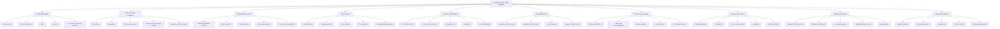

---

## Tabular Decomposition Map

| Area | Skill / Domain | Inti yang Perlu Dikuasai | Practical Focus untuk Senior Engineer |
|---|---|---|---|
| 1 | **PostgreSQL 19 status & compatibility** | Pahami bahwa PG19 masih beta/development per Juli 2026. Jangan desain production rollout tanpa validasi GA, extension compatibility, driver compatibility, migration path. | Bedakan **learning target** vs **production baseline**. Untuk production, tetap cek versi supported yang dipakai perusahaan. |
| 2 | **Graph database mental model** | Graph terdiri dari **vertex/node**, **edge/relationship**, **label**, dan **property**. Di PostgreSQL 19, semua edge bersifat directed dalam property graph model. ([PostgreSQL](https://www.postgresql.org/docs/19/ddl-property-graphs.html)) | Cocokkan model ini ke domain: case, party, account, document, task, process instance, enforcement action, approval chain. |
| 3 | **Relational-to-graph modeling** | Data graph tetap disimpan di tabel biasa; vertex biasanya entity table, edge biasanya relationship/junction table. PostgreSQL docs mencontohkan table vertex seperti `customers`, `orders`, `products`, dan edge table seperti `customer_orders`, `order_items`. ([PostgreSQL](https://www.postgresql.org/docs/19/ddl-property-graphs.html)) | Desain edge table dengan `source_id`, `target_id`, `relationship_type`, `valid_from`, `valid_to`, `metadata`, dan audit fields. |
| 4 | **Identity design** | `CREATE PROPERTY GRAPH` bisa memakai primary key default, atau explicit `KEY (...)` untuk vertex/edge. Edge memakai source/destination reference ke vertex table. ([PostgreSQL](https://www.postgresql.org/docs/19/sql-create-property-graph.html)) | Pastikan setiap vertex dan edge punya stable identity. Hindari graph model yang bergantung pada natural key yang mudah berubah. |
| 5 | **SQL/PGQ / Property Graph Query** | PG19 memperkenalkan SQL/PGQ untuk property graph. Graph didefinisikan sebagai read-only view di atas relational tables dan bisa dikombinasikan dengan SQL biasa. ([PostgreSQL](https://www.postgresql.org/docs/19/ddl-property-graphs.html)) | Ini area inti untuk PG19 graph: `CREATE PROPERTY GRAPH`, `GRAPH_TABLE`, `MATCH`, `COLUMNS`. |
| 6 | **`CREATE PROPERTY GRAPH`** | Mendefinisikan vertex/node tables dan edge/relationship tables. Tidak mematerialisasi graph secara fisik; mirip `CREATE VIEW`. ([PostgreSQL](https://www.postgresql.org/docs/19/sql-create-property-graph.html)) | Gunakan untuk membuat logical graph façade di atas OLTP schema yang sudah ada. |
| 7 | **Labels & properties** | Label dapat mengganti nama tabel agar lebih graph-friendly, misalnya `customers LABEL customer`, `customer_orders LABEL has_placed`. Properties dapat berasal dari kolom atau expression. ([PostgreSQL](https://www.postgresql.org/docs/19/ddl-property-graphs.html)) | Buat label domain-oriented: `person`, `case`, `account`, `owns`, `approved_by`, `related_to`, `escalated_to`. |
| 8 | **`GRAPH_TABLE`** | Graph query dilakukan di dalam `GRAPH_TABLE`, yang menghasilkan computed table dan dapat di-join/filter/order seperti query SQL biasa. ([PostgreSQL](https://www.postgresql.org/docs/19/queries-graph.html)) | Sangat berguna untuk microservice API karena output tetap tabular dan mudah dimapping ke DTO/MyBatis. |
| 9 | **Graph pattern matching** | Pattern seperti `(IS person)-[IS has]->(IS account)` digunakan untuk mencari node dan edge dengan label tertentu. Direction bisa `->`, `<-`, atau undirected-style `-`. ([PostgreSQL](https://www.postgresql.org/docs/19/queries-graph.html)) | Kuasai pattern untuk relationship discovery: “siapa terkait ke account ini?”, “case mana yang terhubung ke entity ini?”, “approval chain lewat siapa?”. |
| 10 | **Graph + SQL composition** | Karena `GRAPH_TABLE` berlaku seperti table expression, hasil graph dapat digabung dengan relational filter, join, aggregate, authorization filter, dan reporting query. ([PostgreSQL](https://www.postgresql.org/docs/19/queries-graph.html)) | Ini pembeda utama PostgreSQL dibanding native graph DB: graph query tetap dekat dengan SQL, transaction, constraints, reporting, dan existing schema. |
| 11 | **Recursive CTE fallback** | Sebelum atau selain SQL/PGQ, PostgreSQL mendukung `WITH RECURSIVE` untuk traversal hierarki/tree. Recursive query dievaluasi secara iteratif menggunakan working table. ([PostgreSQL](https://www.postgresql.org/docs/current/queries-with.html)) | Tetap wajib dikuasai karena production system lama mungkin belum PG19, atau graph query tertentu lebih mudah dikontrol dengan recursive SQL. |
| 12 | **Traversal control** | Depth limit, cycle prevention, visited-path tracking, direction control, dan termination condition. | Wajib untuk mencegah query runaway, especially di domain relationship-heavy seperti case management, account linkage, fraud graph. |
| 13 | **Hierarchy-specific modeling** | Untuk tree/hierarchy murni, `ltree` bisa lebih sederhana daripada full graph. PostgreSQL `ltree` merepresentasikan label path untuk struktur tree-like dan menyediakan pencarian path hierarchy. ([PostgreSQL](https://www.postgresql.org/docs/current/ltree.html?utm_source=chatgpt.com)) | Cocok untuk org chart, category tree, folder tree, delegation hierarchy, location hierarchy. Tidak ideal untuk arbitrary cyclic graph. |
| 14 | **Apache AGE / openCypher path** | Apache AGE adalah extension PostgreSQL untuk graph database capability dan mendukung graph query modeling di atas PostgreSQL. Dokumentasi Apache menyebut AGE memberi graph data processing dan analytics capability untuk relational databases. ([Apache AGE](https://age.apache.org/)) | Pertimbangkan AGE jika tim butuh Cypher-like query, graph write model, atau lebih dekat ke pengalaman Neo4j-style. Validasi compatibility dengan versi PostgreSQL yang dipakai. |
| 15 | **pgRouting / network graph** | pgRouting memperluas PostGIS/PostgreSQL untuk routing dan network analysis, termasuk shortest path, A*, Dijkstra family, driving distance, TSP, dan lain-lain. ([GitHub](https://github.com/pgRouting/pgrouting/?utm_source=chatgpt.com)) | Cocok untuk network/routing graph, bukan general enterprise relationship graph. |
| 16 | **Knowledge graph + vector hybrid** | Graph dapat dikombinasikan dengan full-text/vector search untuk GraphRAG atau semantic relationship discovery. pgvector menyimpan vector embedding di PostgreSQL dan mendukung exact/approximate nearest neighbor search. ([GitHub](https://github.com/pgvector/pgvector?utm_source=chatgpt.com)) | Useful untuk enterprise knowledge search: entity graph + document embedding + access control dalam satu database boundary. |
| 17 | **Indexing strategy** | Index edge source, edge destination, relationship type, temporal columns, tenant id, and high-selectivity properties. | Untuk graph traversal, bottleneck sering muncul di edge lookup. Minimal: `(source_id)`, `(target_id)`, `(source_id, relationship_type)`, `(target_id, relationship_type)`. |
| 18 | **Query planning & join explosion** | Graph pattern bisa berubah menjadi join kompleks. PostgreSQL 19 juga membawa beberapa improvement planner/executor, tetapi graph query tetap perlu diuji dengan `EXPLAIN`. ([PostgreSQL](https://www.postgresql.org/about/news/postgresql-19-beta-1-released-3313/)) | Tetapkan max depth, selective predicates, bounded traversal, dan avoid unbounded “find everything connected to everything” API. |
| 19 | **Temporal graph** | Banyak relationship enterprise bersifat historis: valid from/to, effective date, revoked date, superseded relationship. | Sangat penting untuk regulatory defensibility: query “relationship at decision time”, bukan hanya current state. |
| 20 | **Security & tenant isolation** | Karena property graph membaca base relation, permission terhadap base relation tetap relevan. PostgreSQL docs menyebut akses base relation di bawah `GRAPH_TABLE` ditentukan oleh permission user yang menjalankan query. ([PostgreSQL](https://www.postgresql.org/docs/19/sql-create-property-graph.html)) | Pastikan RLS/tenant filtering tidak bocor ketika graph query menggabungkan banyak node/edge. |
| 21 | **Data integrity invariants** | FK, uniqueness, no invalid edge, no dangling relationship, no duplicate semantic edge, no forbidden cycle. | Implementasikan dengan FK, unique constraints, exclusion constraints, trigger, atau validation job. |
| 22 | **API design for graph query** | Expose graph traversal via safe API: `GET /entities/{id}/relationships?depth=2&type=...`, `GET /cases/{id}/impact-graph`. | Jangan expose raw graph query dari client. Berikan parameter terbatas: root node, edge type, direction, depth, date, tenant scope. |
| 23 | **MyBatis integration** | Karena `GRAPH_TABLE` menghasilkan rowset, integrasi MyBatis tetap mirip SQL SELECT biasa. | Buat mapper untuk projection DTO: node summary, edge summary, path summary, impacted entity list. |
| 24 | **Testing graph behavior** | Test invariant, traversal correctness, cycle behavior, depth limit, authorization boundary, and temporal correctness. | Gunakan fixture graph kecil yang jelas: diamond graph, cycle graph, disconnected graph, cross-tenant graph, expired edge graph. |
| 25 | **Observability & operations** | Monitor slow graph queries, edge table growth, index bloat, recursive query duration, and API depth usage. | Tambahkan query tags, logs, `EXPLAIN` baselines, pg_stat_statements, timeout, and circuit breaker at service layer. |
| 26 | **Migration strategy** | Dari existing relational schema ke graph view: mulai dari edge table eksplisit, tambah indexes, lalu definisikan property graph. | Hindari big-bang redesign. Treat graph sebagai read/query façade dulu, bukan mengganti OLTP model. |

---

## Practical Mental Model

Untuk PostgreSQL 19, pikirkan graph database dalam 3 layer:

```text
Layer 1 - Physical storage
Regular PostgreSQL tables:
- person
- account
- case
- document
- relationship_edge

Layer 2 - Logical graph façade
CREATE PROPERTY GRAPH:
- vertex tables = person/account/case/document
- edge tables = ownership/approval/related_to/escalated_to

Layer 3 - Query interface
GRAPH_TABLE + MATCH:
- find connected entities
- find relationship chains
- find impacted cases
- find approval path
- find suspicious relationship pattern
```

Jangan mulai dari “PostgreSQL menggantikan Neo4j”. Mulai dari: **PostgreSQL 19 memberi graph query capability di atas relational data yang sudah ACID, audited, constrained, dan familiar untuk enterprise system**.

---

## Roadmap Alur Belajar Singkat

| Urutan | Fokus Belajar | Target Praktis |
|---:|---|---|
| 1 | Graph fundamentals | Bisa membedakan node, edge, label, property, path, traversal, cycle. |
| 2 | Relational graph modeling | Bisa mendesain vertex table dan edge table dengan PK/FK yang benar. |
| 3 | PostgreSQL 19 SQL/PGQ | Kuasai `CREATE PROPERTY GRAPH`, `GRAPH_TABLE`, `MATCH`, `COLUMNS`. |
| 4 | Recursive CTE | Kuasai fallback traversal untuk hierarchy, dependency, dan legacy PostgreSQL. |
| 5 | Indexing & performance | Bisa membaca `EXPLAIN`, mengontrol depth, dan mencegah join explosion. |
| 6 | Temporal & security graph | Bisa query relationship “as of date” dan menjaga tenant/RLS boundary. |
| 7 | Java/Jersey/MyBatis integration | Bisa expose graph query sebagai controlled REST API dan map hasil ke DTO. |
| 8 | Extension decision | Tahu kapan cukup SQL/PGQ, kapan butuh Apache AGE, pgRouting, ltree, atau pgvector hybrid. |

---

## Rekomendasi materi berikutnya

Lanjutkan dengan:

**Cheatsheet PostgreSQL 19 SQL/PGQ: `CREATE PROPERTY GRAPH`, `GRAPH_TABLE`, `MATCH`, labels, properties, pattern query, dan contoh schema enterprise case-management dengan MyBatis/Jersey integration.**

---

**Sources:**

- [PostgreSQL: Documentation: 19: 5.15. Property Graphs](https://www.postgresql.org/docs/19/ddl-property-graphs.html)
- [Apache AGE](https://age.apache.org/)
- [pgRouting - Routing on PostgreSQL](https://github.com/pgRouting/pgrouting/?utm_source=chatgpt.com)

## Response:
7/15/2026, 7:54:45 PM

Total saya rekomendasikan **12 seri** untuk materi **PostgreSQL 19 for Graph Database**.

| Seri | Materi |
|---:|---|
| 1 | Graph Database Fundamentals for PostgreSQL Engineers |
| 2 | Relational-to-Graph Modeling: Vertex, Edge, Label, Property |
| 3 | PostgreSQL 19 SQL/PGQ Overview: Concept, Scope, Limitations |
| 4 | `CREATE PROPERTY GRAPH` Deep Dive |
| 5 | `GRAPH_TABLE`, `MATCH`, Pattern Query, and Projection |
| 6 | Multi-hop Traversal, Path Query, Direction, and Cycle Handling |
| 7 | Recursive CTE as Graph Traversal Fallback |
| 8 | Temporal Graph Modeling: Valid-time, History, Auditability |
| 9 | Indexing, Query Planning, and Performance Tuning for Graph Queries |
| 10 | Security, Tenant Isolation, RLS, and Data Governance in Graph Query |
| 11 | Java/Jersey/MyBatis Integration for Graph Query APIs |
| 12 | Extension Decision Map: SQL/PGQ vs Apache AGE vs ltree vs pgRouting vs pgvector Hybrid |

Jadi formatnya: **Seri 1/12 sampai Seri 12/12**.

Rekomendasi mulai dari **Seri 1 — Graph Database Fundamentals for PostgreSQL Engineers**.

## Response:
7/15/2026, 7:58:46 PM

Saya mulai dari **Seri 1/12** dan akan menjaga pola tiap seri tetap praktis: konsep minimum, model implementasi, contoh penggunaan, guardrail production, dan checklist.

# Seri 1/12 - Graph Database Fundamentals for PostgreSQL Engineers

## 1. Posisi Seri Ini

Seri ini membangun fondasi praktis sebelum masuk ke SQL/PGQ PostgreSQL 19. Fokusnya bukan teori graph akademis, tetapi bagaimana engineer backend memahami **kapan data perlu dipikirkan sebagai graph**, bagaimana memodelkannya di PostgreSQL, dan apa konsekuensinya ke query, API, performance, dan governance.

Catatan penting: **PostgreSQL 19 masih versi development/beta per dokumentasi resmi saat ini**, dan PostgreSQL sendiri menyarankan agar beta tidak dijalankan di production. Namun PostgreSQL 19 sudah memperkenalkan dukungan **SQL/PGQ**, yaitu property graph query berbasis standar SQL. ([PostgreSQL](https://www.postgresql.org/about/news/postgresql-19-beta-1-released-3313/))

---

## 2. Inti Mental Model

Dalam PostgreSQL 19, graph bukan berarti data disimpan seperti native graph database. Data tetap berada di tabel PostgreSQL biasa. Property graph didefinisikan sebagai semacam **read-only graph view** di atas tabel relational, lalu bisa di-query dengan graph pattern matching. ([PostgreSQL](https://www.postgresql.org/docs/19/ddl-property-graphs.html))

Model dasarnya:

```text
Graph = Vertex + Edge + Label + Property

Vertex / Node  = entity
Edge           = relationship antar entity
Label          = tipe/kategori entity atau relationship
Property       = atribut dari node atau edge
Path           = rangkaian node-edge-node-edge-node
Traversal      = proses menelusuri relationship
```

Contoh domain enterprise:

```text
Case ──involves──> Party ──owns──> Account
Case ──has───────> Document
Case ──assigned_to──> Officer
Case ──escalated_to──> EnforcementAction
```

Dalam PostgreSQL property graph, graph terdiri dari **vertices** dan **edges**; setiap edge punya source dan destination, sehingga edge dalam model ini bersifat directed. Vertex dan edge dapat memiliki label dan properties. ([PostgreSQL](https://www.postgresql.org/docs/19/ddl-property-graphs.html))

---

## 3. Diagram Praktis

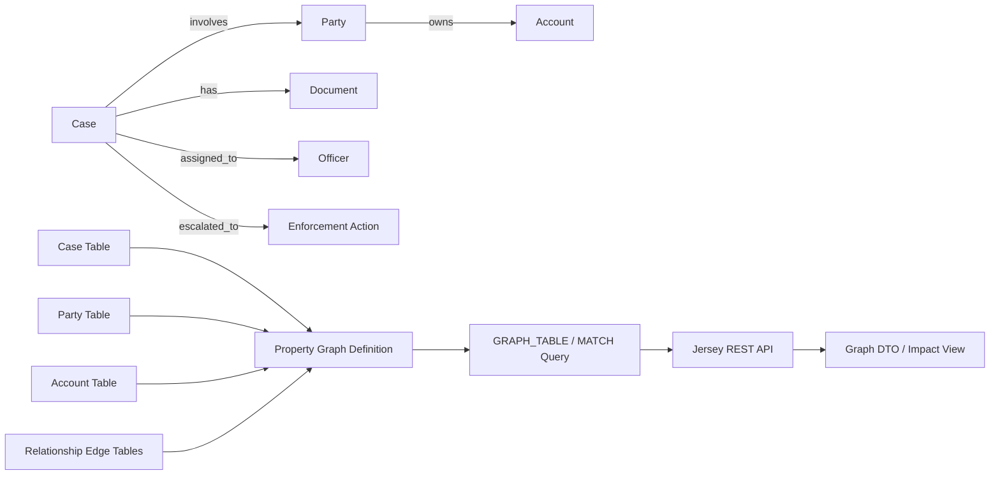

Makna praktisnya:

```text
Physical layer:
- PostgreSQL tables

Logical graph layer:
- CREATE PROPERTY GRAPH

Query layer:
- GRAPH_TABLE + MATCH

Application layer:
- Jersey endpoint + MyBatis mapper + DTO projection
```

---

## 4. Kapan Data Perlu Dipikirkan sebagai Graph?

Gunakan graph thinking ketika pertanyaan utama bukan sekadar “ambil row berdasarkan ID”, tetapi:

| Pertanyaan | Tanda Graph Problem |
|---|---|
| “Entity ini terhubung ke siapa saja?” | Relationship discovery |
| “Ada rantai relasi sampai berapa level?” | Multi-hop traversal |
| “Case ini berdampak ke account/dokumen/orang mana?” | Impact analysis |
| “Siapa beneficial owner dari account ini?” | Ownership chain |
| “Apakah ada circular relationship?” | Cycle detection |
| “Approval ini melewati siapa saja?” | Path reconstruction |
| “Dokumen ini dipakai di case mana saja?” | Reverse traversal |
| “Relasi ini berlaku saat keputusan dibuat?” | Temporal graph |

Jangan memakai graph hanya karena data punya banyak tabel. Graph berguna ketika **relationship adalah first-class business concept**.

---

## 5. Graph vs Relational: Cara Berpikir yang Benar

### Relational Thinking

```sql
SELECT *
FROM cases c
JOIN case_parties cp ON cp.case_id = c.case_id
JOIN parties p ON p.party_id = cp.party_id
WHERE c.case_id = :caseId;
```

Cocok untuk:

```text
- query langsung
- join yang fixed
- reporting tabular
- lookup by key
- transactional update
```

### Graph Thinking

```text
Find:
Case -> Party -> Account -> Other Case -> Enforcement Action
```

Cocok untuk:

```text
- relationship exploration
- impact graph
- ownership network
- suspicious connection
- dependency chain
- approval/escalation route
```

Perbedaan utamanya:

| Relational Query | Graph Query |
|---|---|
| Struktur join sudah diketahui | Struktur hubungan yang ingin dicari lebih penting |
| Fokus row/table | Fokus node/edge/path |
| Query biasanya fixed-depth | Sering perlu multi-hop traversal |
| Cocok untuk OLTP/reporting | Cocok untuk relationship discovery |
| Constraint kuat via PK/FK | Constraint tetap perlu, graph hanya view/query model |

---

## 6. Elemen Graph dalam PostgreSQL

| Graph Concept | PostgreSQL Implementation | Contoh |
|---|---|---|
| Vertex / Node | Table entity | `cases`, `parties`, `accounts`, `documents` |
| Edge | Relationship table | `case_parties`, `party_accounts`, `case_documents` |
| Label | Alias/kategori di property graph | `case_node`, `party`, `account`, `involves`, `owns` |
| Property | Column/expression yang diekspos | `status`, `role`, `valid_from`, `risk_score` |
| Path | Hasil traversal node-edge-node | `case -> party -> account` |
| Traversal | Pattern matching / recursive query | `MATCH (...)` atau `WITH RECURSIVE` |

PostgreSQL 19 `CREATE PROPERTY GRAPH` mendefinisikan graph dari vertex table dan edge table. Dokumentasi resminya menyatakan bahwa data graph tetap disimpan di regular tables, dan property graph tidak mematerialisasi graph secara fisik; ia mirip view yang dipakai saat query. ([PostgreSQL](https://www.postgresql.org/docs/19/sql-create-property-graph.html))

---

## 7. Contoh Domain Model Praktis

Misalnya ada regulatory case management system.

### Entity Tables

```sql
CREATE TABLE cases (
    case_id      bigint PRIMARY KEY,
    case_no      text NOT NULL UNIQUE,
    status       text NOT NULL,
    risk_level   text NOT NULL,
    created_at   timestamptz NOT NULL DEFAULT now()
);

CREATE TABLE parties (
    party_id     bigint PRIMARY KEY,
    party_name   text NOT NULL,
    party_type   text NOT NULL, -- PERSON, COMPANY, AGENCY
    risk_score   numeric(5,2)
);

CREATE TABLE accounts (
    account_id   bigint PRIMARY KEY,
    account_no   text NOT NULL UNIQUE,
    account_type text NOT NULL,
    status       text NOT NULL
);
```

### Edge Tables

```sql
CREATE TABLE case_parties (
    case_party_id bigint PRIMARY KEY,
    case_id       bigint NOT NULL REFERENCES cases(case_id),
    party_id      bigint NOT NULL REFERENCES parties(party_id),
    role          text NOT NULL, -- SUBJECT, REPORTER, WITNESS, OWNER
    valid_from    date NOT NULL,
    valid_to      date,
    created_at    timestamptz NOT NULL DEFAULT now(),

    CONSTRAINT uq_case_party_role
        UNIQUE (case_id, party_id, role, valid_from)
);

CREATE TABLE party_accounts (
    party_account_id bigint PRIMARY KEY,
    party_id         bigint NOT NULL REFERENCES parties(party_id),
    account_id       bigint NOT NULL REFERENCES accounts(account_id),
    ownership_type   text NOT NULL, -- OWNER, SIGNATORY, BENEFICIARY
    valid_from       date NOT NULL,
    valid_to         date,
    created_at       timestamptz NOT NULL DEFAULT now(),

    CONSTRAINT uq_party_account_ownership
        UNIQUE (party_id, account_id, ownership_type, valid_from)
);
```

Prinsip penting:

```text
Entity table = node
Relationship table = edge
FK = graph connectivity
Edge attributes = relationship properties
```

---

## 8. Contoh Property Graph di PostgreSQL 19

Contoh berikut adalah model awal untuk membaca graph dari tabel relational.

```sql
CREATE PROPERTY GRAPH compliance_graph
    VERTEX TABLES (
        cases
            LABEL case_node
            PROPERTIES (case_id, case_no, status, risk_level),

        parties
            LABEL party
            PROPERTIES (party_id, party_name, party_type, risk_score),

        accounts
            LABEL account
            PROPERTIES (account_id, account_no, account_type, status)
    )
    EDGE TABLES (
        case_parties
            KEY (case_party_id)
            SOURCE KEY (case_id) REFERENCES cases (case_id)
            DESTINATION KEY (party_id) REFERENCES parties (party_id)
            LABEL involves
            PROPERTIES (role, valid_from, valid_to),

        party_accounts
            KEY (party_account_id)
            SOURCE KEY (party_id) REFERENCES parties (party_id)
            DESTINATION KEY (account_id) REFERENCES accounts (account_id)
            LABEL owns
            PROPERTIES (ownership_type, valid_from, valid_to)
    );
```

Yang perlu dipahami:

```text
cases          = vertex table
parties        = vertex table
accounts       = vertex table
case_parties   = edge table
party_accounts = edge table

case_parties:
cases -> parties

party_accounts:
parties -> accounts
```

PostgreSQL mendukung `VERTEX`/`NODE` dan `EDGE`/`RELATIONSHIP` sebagai sinonim dalam `CREATE PROPERTY GRAPH`; vertex dan edge table dapat diberi `KEY`, `SOURCE`, `DESTINATION`, label, dan properties. ([PostgreSQL](https://www.postgresql.org/docs/19/sql-create-property-graph.html))

---

## 9. Contoh Query Praktis

Misalnya ingin mencari account yang terkait dengan sebuah case lewat party.

```sql
SELECT *
FROM GRAPH_TABLE (
    compliance_graph
    MATCH
        (c IS case_node)-[cp IS involves]->(p IS party)-[pa IS owns]->(a IS account)
    WHERE
        c.case_id = 1001
    COLUMNS (
        c.case_id AS case_id,
        c.case_no AS case_no,
        p.party_id AS party_id,
        p.party_name AS party_name,
        cp.role AS party_role,
        a.account_id AS account_id,
        a.account_no AS account_no,
        pa.ownership_type AS ownership_type
    )
);
```

Hasil yang diharapkan:

| case_id | case_no | party_id | party_name | party_role | account_id | account_no | ownership_type |
|---:|---|---:|---|---|---:|---|---|
| 1001 | CASE-2026-001 | 2001 | PT Alpha | SUBJECT | 3001 | ACC-7788 | OWNER |
| 1001 | CASE-2026-001 | 2002 | Budi | BENEFICIARY | 3002 | ACC-8899 | SIGNATORY |

Makna business-nya:

```text
Untuk case tertentu, cari parties yang involved,
lalu dari parties tersebut cari account yang mereka miliki/kuasai.
```

Ini lebih natural dibaca sebagai graph:

```text
Case -> Party -> Account
```

daripada sekadar join teknis.

---

## 10. Practical Rule: Jangan Expose Raw Graph Query ke API

Untuk microservice Jersey/JAX-RS, jangan membuat endpoint seperti ini:

```text
POST /graph/query
body: "MATCH ..."
```

Itu berisiko:

```text
- query tidak bounded
- authorization sulit dikontrol
- raw query injection
- runaway traversal
- sulit observability
- sulit audit
```

Lebih aman expose query intent:

```text
GET /cases/{caseId}/related-accounts?depth=2
GET /parties/{partyId}/relationship-summary
GET /accounts/{accountId}/linked-cases
GET /cases/{caseId}/impact-graph
```

Contoh DTO-oriented API:

```java
@Path("/cases")
public class CaseGraphResource {

    private final CaseGraphService caseGraphService;

    @GET
    @Path("/{caseId}/related-accounts")
    @Produces(MediaType.APPLICATION_JSON)
    public Response getRelatedAccounts(
            @PathParam("caseId") long caseId,
            @QueryParam("asOfDate") LocalDate asOfDate,
            @DefaultValue("2") @QueryParam("depth") int depth
    ) {
        if (depth < 1 || depth > 3) {
            return Response.status(Response.Status.BAD_REQUEST)
                    .entity("depth must be between 1 and 3")
                    .build();
        }

        var result = caseGraphService.findRelatedAccounts(caseId, asOfDate, depth);
        return Response.ok(result).build();
    }
}
```

Prinsip:

```text
Client memilih intent.
Server memilih graph query.
```

---

## 11. Practical Indexing Minimum

Untuk edge table, minimal index harus mendukung traversal dua arah.

```sql
CREATE INDEX idx_case_parties_case_id
    ON case_parties (case_id);

CREATE INDEX idx_case_parties_party_id
    ON case_parties (party_id);

CREATE INDEX idx_case_parties_case_role
    ON case_parties (case_id, role);

CREATE INDEX idx_party_accounts_party_id
    ON party_accounts (party_id);

CREATE INDEX idx_party_accounts_account_id
    ON party_accounts (account_id);

CREATE INDEX idx_party_accounts_party_ownership
    ON party_accounts (party_id, ownership_type);
```

Untuk temporal graph:

```sql
CREATE INDEX idx_case_parties_validity
    ON case_parties (case_id, valid_from, valid_to);

CREATE INDEX idx_party_accounts_validity
    ON party_accounts (party_id, valid_from, valid_to);
```

Kenapa ini penting?

```text
Traversal graph biasanya dimulai dari node tertentu,
lalu lookup edge berdasarkan source atau destination.
Jika edge table besar dan tidak terindeks, query graph akan cepat mahal.
```

---

## 12. Invariant yang Harus Dijaga

Graph yang buruk biasanya bukan karena syntax query, tetapi karena relationship data tidak punya invariant.

| Invariant | Kenapa Penting | Implementasi |
|---|---|---|
| Tidak ada dangling edge | Edge harus selalu menunjuk node valid | FK |
| Edge punya identity | Relationship harus bisa diaudit | PK edge table |
| Duplicate semantic edge dicegah | Hindari relasi ganda tidak sengaja | Unique constraint |
| Relationship punya tipe jelas | Query tidak ambiguous | `relationship_type` / label |
| Relationship punya validity | Penting untuk historical truth | `valid_from`, `valid_to` |
| Cross-tenant leak dicegah | Security boundary | `tenant_id`, RLS, service filter |
| Depth dibatasi | Hindari runaway traversal | API validation |
| Cycle dipahami | Hindari infinite traversal | cycle detection / max depth |

---

## 13. Common Mistakes

| Mistake | Dampak | Cara Benar |
|---|---|---|
| Menganggap PostgreSQL 19 sama dengan Neo4j | Ekspektasi salah | Treat SQL/PGQ sebagai graph query di atas relational data |
| Edge table tidak punya PK | Sulit audit dan debug | Selalu beri edge identity |
| Edge hanya many-to-many tanpa metadata | Relationship miskin konteks | Tambahkan role, validity, source system, audit |
| Tidak ada index source/destination | Traversal lambat | Index source dan destination |
| API membebaskan depth | Query bisa runaway | Batasi depth |
| Semua relationship dimasukkan ke satu tabel generik | Query kacau, constraint lemah | Pisahkan edge table penting atau gunakan type dengan disiplin |
| Tidak memikirkan temporal state | Historical query salah | Gunakan valid-time edge |
| Tidak test cycle | Traversal bisa salah | Fixture cycle wajib ada |

---

## 14. Checklist Praktis Seri 1

Sebelum masuk ke seri berikutnya, pastikan bisa menjawab ini:

```text
[ ] Apa beda node dan edge?
[ ] Apa beda label dan property?
[ ] Apa beda graph query dan relational join?
[ ] Kapan graph lebih cocok daripada join biasa?
[ ] Bagaimana table entity berubah menjadi vertex?
[ ] Bagaimana relationship table berubah menjadi edge?
[ ] Kenapa edge table perlu PK, FK, type, validity, audit field?
[ ] Kenapa graph query harus dibatasi depth?
[ ] Kenapa PostgreSQL 19 graph adalah logical graph, bukan native graph storage?
[ ] Bagaimana expose graph query dengan REST API yang aman?
```

---

## 15. Mini Exercise

Ambil satu domain dari sistem perusahaan, lalu petakan seperti ini:

```text
Node:
- Case
- Party
- Account
- Document
- Officer

Edge:
- Case involves Party
- Party owns Account
- Case has Document
- Case assigned_to Officer
- Case escalated_to EnforcementAction

Pertanyaan graph:
- Account apa saja yang terkait ke case ini?
- Party mana yang muncul di lebih dari satu case?
- Case mana yang terhubung ke account yang sama?
- Officer mana yang menangani case dengan party yang sama?
- Relationship mana yang berlaku pada tanggal keputusan dibuat?
```

Kalau exercise ini bisa dibuat, berarti graph mental model sudah mulai terbentuk.

---

## Status Seri

**Seri 1/12 selesai.**

Seri berikutnya yang direkomendasikan:

**Seri 2/12 - Relational-to-Graph Modeling: Vertex, Edge, Label, Property**

Fokus berikutnya akan lebih implementatif: desain tabel node/edge, edge table pattern, generic vs typed edge, temporal relationship, constraint, indexing, dan contoh schema enterprise-grade PostgreSQL.

---

**Sources:**

- [PostgreSQL: PostgreSQL 19 Beta 1 Released!](https://www.postgresql.org/about/news/postgresql-19-beta-1-released-3313/)

## Response:
7/15/2026, 8:58:48 PM

Saya lanjut ke **Seri 2/12**. Fokusnya kali ini practical modeling: bagaimana menerjemahkan schema PostgreSQL biasa menjadi graph yang rapi, aman, dan tetap maintainable untuk sistem enterprise.

# Seri 2/12 - Relational-to-Graph Modeling: Vertex, Edge, Label, Property

## 1. Tujuan Seri Ini

Seri ini menjawab pertanyaan praktis:

> “Kalau data saya sekarang ada di tabel PostgreSQL biasa, bagaimana cara memodelkannya supaya bisa dipakai sebagai graph database-style model di PostgreSQL 19?”

PostgreSQL 19 mendukung **SQL Property Graph Queries / SQL/PGQ**, dan property graph diproses seperti view di atas data relational; data tetap berada di tabel PostgreSQL, lalu diekspos sebagai graph untuk query pattern matching. ([PostgreSQL](https://www.postgresql.org/docs/19/ddl-property-graphs.html?utm_source=chatgpt.com))

Jadi fokus kita bukan mengganti relational model, tetapi membuat **relational schema yang graph-ready**.

---

## 2. Mental Model Praktis

```text id="b930bm"
Relational world:
Table + PK + FK + Join

Graph world:
Vertex + Edge + Label + Property + Path

PostgreSQL 19 world:
Table tetap table,
tetapi table tertentu dipetakan menjadi vertex,
relationship table dipetakan menjadi edge,
lalu didefinisikan dengan CREATE PROPERTY GRAPH.
```

PostgreSQL `CREATE PROPERTY GRAPH` mendefinisikan property graph dari vertex table dan edge table. Graph definition tidak mematerialisasi graph secara fisik; ia mencatat struktur graph yang dipakai saat query, mirip konsep view. ([PostgreSQL](https://www.postgresql.org/docs/19/sql-create-property-graph.html?utm_source=chatgpt.com))

---

## 3. Diagram Relational-to-Graph

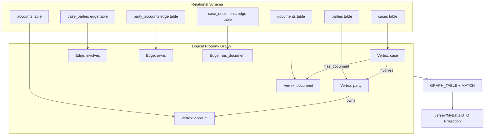

---

## 4. Mapping Dasar

| Relational Concept | Graph Concept | PostgreSQL 19 Implementation | Contoh |
|---|---|---|---|
| Entity table | Vertex / Node | `VERTEX TABLES` | `cases`, `parties`, `accounts` |
| Relationship table | Edge | `EDGE TABLES` | `case_parties`, `party_accounts` |
| Table alias | Element alias | Alias dalam property graph | `cases AS case_vertex` |
| Business type | Label | `LABEL case_node` | `party`, `account`, `owns` |
| Column | Property | `PROPERTIES (...)` | `status`, `risk_score`, `valid_from` |
| Primary key | Element key | `KEY (...)`, default ke PK | `case_id`, `party_id` |
| FK source | Edge source | `SOURCE KEY (...) REFERENCES ...` | `case_id -> cases.case_id` |
| FK destination | Edge destination | `DESTINATION KEY (...) REFERENCES ...` | `party_id -> parties.party_id` |

Dalam PostgreSQL 19, key untuk vertex/edge dapat didefinisikan eksplisit dengan `KEY (...)`, dan jika tidak diberikan biasanya default ke primary key. Edge table juga mendefinisikan source dan destination untuk menghubungkan vertex. ([PostgreSQL](https://www.postgresql.org/docs/19/sql-create-property-graph.html?utm_source=chatgpt.com))

---

# 5. Pattern 1 - Typed Vertex Tables

Typed vertex table berarti setiap tipe entity penting punya tabel sendiri.

Contoh:

```sql id="fq3wno"
CREATE TABLE cases (
    case_id       bigint PRIMARY KEY,
    tenant_id     bigint NOT NULL,
    case_no       text NOT NULL,
    case_type     text NOT NULL,
    status        text NOT NULL,
    risk_level    text NOT NULL,
    created_at    timestamptz NOT NULL DEFAULT now(),
    updated_at    timestamptz NOT NULL DEFAULT now(),

    CONSTRAINT uq_cases_tenant_case_no
        UNIQUE (tenant_id, case_no)
);

CREATE TABLE parties (
    party_id      bigint PRIMARY KEY,
    tenant_id     bigint NOT NULL,
    party_name    text NOT NULL,
    party_type    text NOT NULL, -- PERSON, COMPANY, AGENCY
    risk_score    numeric(5,2),
    created_at    timestamptz NOT NULL DEFAULT now(),

    CONSTRAINT ck_parties_party_type
        CHECK (party_type IN ('PERSON', 'COMPANY', 'AGENCY'))
);

CREATE TABLE accounts (
    account_id    bigint PRIMARY KEY,
    tenant_id     bigint NOT NULL,
    account_no    text NOT NULL,
    account_type  text NOT NULL,
    status        text NOT NULL,
    created_at    timestamptz NOT NULL DEFAULT now(),

    CONSTRAINT uq_accounts_tenant_account_no
        UNIQUE (tenant_id, account_no)
);
```

## Kapan typed vertex table cocok?

| Cocok Jika | Alasan |
|---|---|
| Entity punya lifecycle sendiri | `case`, `party`, `account`, `document` biasanya punya workflow/status sendiri |
| Entity punya banyak atribut spesifik | Avoid satu tabel `nodes` yang terlalu generik |
| Butuh FK, constraint, RLS, audit kuat | Enterprise system butuh integrity kuat |
| Ada API/resource sendiri | `/cases`, `/parties`, `/accounts` |
| Ada ownership data jelas | Setiap entity punya bounded aggregate sendiri |

## Kelebihan

```text id="5lwbck"
+ Strong schema
+ FK dan constraint jelas
+ Mudah diintegrasikan dengan existing OLTP
+ Cocok untuk MyBatis mapper biasa
+ Mudah diaudit
+ Mudah dibuat REST resource
```

## Kekurangan

```text id="kdcxba"
- Schema lebih banyak
- Tambah vertex type berarti tambah table
- Query graph lintas banyak table bisa lebih kompleks
```

Untuk enterprise backend, ini biasanya default terbaik.

---

# 6. Pattern 2 - Typed Edge Tables

Typed edge table berarti setiap relationship penting punya tabel sendiri.

Contoh:

```sql id="z2ra5q"
CREATE TABLE case_parties (
    case_party_id bigint PRIMARY KEY,
    tenant_id     bigint NOT NULL,

    case_id       bigint NOT NULL REFERENCES cases(case_id),
    party_id      bigint NOT NULL REFERENCES parties(party_id),

    role          text NOT NULL, -- SUBJECT, WITNESS, REPORTER, BENEFICIARY
    valid_from    date NOT NULL,
    valid_to      date,

    source_system text NOT NULL DEFAULT 'CASE_MGMT',
    created_by    text NOT NULL,
    created_at    timestamptz NOT NULL DEFAULT now(),

    CONSTRAINT ck_case_parties_role
        CHECK (role IN ('SUBJECT', 'WITNESS', 'REPORTER', 'BENEFICIARY')),

    CONSTRAINT ck_case_parties_validity
        CHECK (valid_to IS NULL OR valid_to >= valid_from),

    CONSTRAINT uq_case_party_role_validity
        UNIQUE (tenant_id, case_id, party_id, role, valid_from)
);

CREATE TABLE party_accounts (
    party_account_id bigint PRIMARY KEY,
    tenant_id        bigint NOT NULL,

    party_id         bigint NOT NULL REFERENCES parties(party_id),
    account_id       bigint NOT NULL REFERENCES accounts(account_id),

    ownership_type   text NOT NULL, -- OWNER, SIGNATORY, BENEFICIAL_OWNER
    ownership_pct    numeric(5,2),
    valid_from       date NOT NULL,
    valid_to         date,

    created_by       text NOT NULL,
    created_at       timestamptz NOT NULL DEFAULT now(),

    CONSTRAINT ck_party_accounts_ownership_type
        CHECK (ownership_type IN ('OWNER', 'SIGNATORY', 'BENEFICIAL_OWNER')),

    CONSTRAINT ck_party_accounts_ownership_pct
        CHECK (ownership_pct IS NULL OR ownership_pct BETWEEN 0 AND 100),

    CONSTRAINT ck_party_accounts_validity
        CHECK (valid_to IS NULL OR valid_to >= valid_from),

    CONSTRAINT uq_party_account_ownership_validity
        UNIQUE (tenant_id, party_id, account_id, ownership_type, valid_from)
);
```

## Prinsip Edge Table yang Baik

Edge table jangan hanya berisi dua FK.

Minimal production-grade edge table:

```text id="9drh0i"
edge_id
tenant_id
source_entity_id
destination_entity_id
relationship_type / role
valid_from
valid_to
created_by
created_at
source_system
metadata / reason / evidence reference
```

## Edge adalah business fact

Contoh:

```text id="xg78wc"
Budi owns Account A
```

Itu bukan sekadar join. Itu business fact yang perlu:

```text id="vuvxp2"
- siapa yang membuat relasi?
- kapan berlaku?
- kapan berakhir?
- berasal dari sistem mana?
- apakah verified?
- apakah ada dokumen pendukung?
- apakah relasi ini masih aktif?
```

---

# 7. Pattern 3 - Generic Edge Table

Kadang ada kebutuhan menyimpan banyak jenis relationship yang tidak stabil.

Contoh:

```sql id="pvllre"
CREATE TABLE entity_relationships (
    relationship_id       bigint PRIMARY KEY,
    tenant_id             bigint NOT NULL,

    source_entity_type    text NOT NULL,
    source_entity_id      bigint NOT NULL,

    target_entity_type    text NOT NULL,
    target_entity_id      bigint NOT NULL,

    relationship_type     text NOT NULL,
    direction             text NOT NULL DEFAULT 'DIRECTED',

    valid_from            date NOT NULL,
    valid_to              date,

    confidence_score      numeric(5,2),
    evidence_ref          text,
    metadata              jsonb NOT NULL DEFAULT '{}'::jsonb,

    created_by            text NOT NULL,
    created_at            timestamptz NOT NULL DEFAULT now(),

    CONSTRAINT ck_entity_relationship_direction
        CHECK (direction IN ('DIRECTED', 'UNDIRECTED')),

    CONSTRAINT ck_entity_relationship_validity
        CHECK (valid_to IS NULL OR valid_to >= valid_from)
);
```

## Kelebihan generic edge

```text id="vwdx5z"
+ Fleksibel
+ Cepat menambah relationship type
+ Cocok untuk exploratory graph
+ Cocok untuk inferred relationship
+ Cocok untuk knowledge graph ringan
```

## Kekurangan generic edge

```text id="ao9o77"
- FK sulit atau tidak langsung
- Constraint lebih lemah
- Query lebih rawan salah
- Performance perlu disiplin index
- Validasi business rule pindah ke aplikasi/trigger
- Lebih sulit diaudit secara domain-specific
```

## Kapan generic edge boleh dipakai?

| Boleh Dipakai Jika | Contoh |
|---|---|
| Relationship type sering berubah | knowledge graph, investigation notes |
| Data berasal dari inference | fraud signal, similarity link |
| Relasi lintas entity sangat banyak | party-document-account-case-officer |
| Tidak semua relationship pantas dibuat tabel fisik | weak signal, soft link |
| Digunakan sebagai secondary graph layer | bukan source of truth utama |

## Kapan jangan dipakai?

| Hindari Jika | Kenapa |
|---|---|
| Relationship adalah core business fact | Constraint harus kuat |
| Butuh FK kuat ke entity spesifik | Generic table melemahkan referential integrity |
| Regulatory/audit defensibility tinggi | Domain-specific evidence lebih jelas di typed edge |
| Query utama sangat sering | Typed edge lebih mudah dioptimalkan |
| Ada workflow/lifecycle di relationship | Lebih cocok tabel khusus |

---

# 8. Pattern 4 - Hybrid Edge Model

Untuk enterprise system, pola terbaik sering kali hybrid.

```text id="xv8dui"
Typed edge table:
- case_parties
- party_accounts
- case_documents
- case_assignments

Generic edge table:
- inferred_relationships
- investigation_links
- similarity_links
- weak_signals
- manual_notes_links
```

## Rekomendasi praktis

| Relationship Type | Model |
|---|---|
| Legal ownership | Typed edge |
| Case involves party | Typed edge |
| Case has document | Typed edge |
| Officer assigned to case | Typed edge |
| Party similar to another party | Generic edge |
| Document mentions party | Generic edge atau derived edge |
| Possible fraud link | Generic edge dengan confidence score |
| Temporary investigation link | Generic edge |
| Workflow escalation | Typed edge kalau penting secara audit |

Hybrid memberi balance:

```text id="av7jfs"
Strong integrity untuk relationship penting.
Flexibility untuk relationship eksploratif.
```

---

# 9. Vertex Modeling Checklist

Saat membuat vertex table, pastikan ada:

| Field | Wajib? | Catatan |
|---|---:|---|
| Stable primary key | Ya | Jangan bergantung pada mutable natural key |
| Tenant/org boundary | Biasanya ya | Penting untuk SaaS/internal multi-unit |
| Business identifier | Ya | `case_no`, `account_no`, `party_ref` |
| Type/category | Sering | `party_type`, `case_type` |
| Status/lifecycle | Sering | `ACTIVE`, `CLOSED`, `SUSPENDED` |
| Audit columns | Ya | `created_at`, `updated_at`, `created_by` |
| Soft delete marker | Opsional | Hati-hati untuk graph traversal |
| Versioning | Opsional | Berguna untuk audit/event sourcing |

Contoh vertex production-style:

```sql id="zfn47h"
CREATE TABLE documents (
    document_id     bigint PRIMARY KEY,
    tenant_id       bigint NOT NULL,
    document_no     text NOT NULL,
    document_type   text NOT NULL,
    status          text NOT NULL,
    storage_ref     text NOT NULL,
    checksum_sha256 text,
    created_by      text NOT NULL,
    created_at      timestamptz NOT NULL DEFAULT now(),

    CONSTRAINT uq_documents_tenant_document_no
        UNIQUE (tenant_id, document_no),

    CONSTRAINT ck_documents_status
        CHECK (status IN ('DRAFT', 'VERIFIED', 'ARCHIVED', 'REVOKED'))
);
```

---

# 10. Edge Modeling Checklist

Saat membuat edge table, pastikan ada:

| Field | Wajib? | Catatan |
|---|---:|---|
| Edge primary key | Ya | Edge harus bisa direferensikan |
| Source FK | Ya | Node asal |
| Destination FK | Ya | Node tujuan |
| Relationship label/type | Ya | Jangan ambiguous |
| Direction semantics | Ya | Source dan destination harus bermakna |
| Validity period | Sangat disarankan | Untuk historical query |
| Tenant boundary | Sangat disarankan | Hindari cross-tenant leakage |
| Created by/source system | Ya | Auditability |
| Evidence reference | Untuk regulated domain | Dokumen/sumber fakta |
| Confidence score | Untuk inferred relationship | Jangan campur verified vs inferred |
| Unique semantic constraint | Ya | Cegah duplicate relationship |

Contoh edge dengan evidence:

```sql id="ml2nlr"
CREATE TABLE case_documents (
    case_document_id bigint PRIMARY KEY,
    tenant_id        bigint NOT NULL,

    case_id          bigint NOT NULL REFERENCES cases(case_id),
    document_id      bigint NOT NULL REFERENCES documents(document_id),

    relation_type    text NOT NULL, -- EVIDENCE, SUPPORTING_DOC, DECISION_DOC
    valid_from       date NOT NULL,
    valid_to         date,

    added_by         text NOT NULL,
    added_reason     text,
    created_at       timestamptz NOT NULL DEFAULT now(),

    CONSTRAINT ck_case_documents_relation_type
        CHECK (relation_type IN ('EVIDENCE', 'SUPPORTING_DOC', 'DECISION_DOC')),

    CONSTRAINT ck_case_documents_validity
        CHECK (valid_to IS NULL OR valid_to >= valid_from),

    CONSTRAINT uq_case_document_relation
        UNIQUE (tenant_id, case_id, document_id, relation_type, valid_from)
);
```

---

# 11. Direction Design

Dalam PostgreSQL property graph model, edge memiliki source dan destination, sehingga semua edge secara model adalah directed. Query pattern tetap bisa mencari arah tertentu, arah sebaliknya, atau kedua arah dengan syntax pattern graph. ([PostgreSQL](https://www.postgresql.org/docs/19/ddl-property-graphs.html?utm_source=chatgpt.com))

Contoh direction:

| Relationship | Source | Destination | Label |
|---|---|---|---|
| Case involves Party | `cases` | `parties` | `involves` |
| Party owns Account | `parties` | `accounts` | `owns` |
| Case has Document | `cases` | `documents` | `has_document` |
| Officer assigned to Case | `officers` atau `cases` | tergantung pertanyaan utama | `assigned_to` |
| Case escalated to Action | `cases` | `enforcement_actions` | `escalated_to` |

## Rule of thumb

Pilih direction berdasarkan **narasi business paling natural**.

```text id="r9uu3c"
Case involves Party
Party owns Account
Case has Document
Case escalated_to EnforcementAction
Officer handles Case
```

Jangan pilih direction hanya berdasarkan urutan FK di tabel.

---

# 12. Label Design

Label adalah nama graph-facing untuk vertex/edge. Label bisa lebih domain-friendly daripada nama tabel.

PostgreSQL mendukung label dan properties pada element table; label default bisa berasal dari alias table, tetapi juga dapat diberi nama eksplisit. Label tidak harus unik di seluruh graph, dan label yang sama dapat diberikan pada element berbeda jika memang berguna. ([PostgreSQL](https://www.postgresql.org/docs/19/sql-create-property-graph.html?utm_source=chatgpt.com))

| Table | Label yang Direkomendasikan | Kenapa |
|---|---|---|
| `cases` | `case_node` | Hindari bentrok dengan reserved/common word |
| `parties` | `party` | Domain-friendly |
| `accounts` | `account` | Domain-friendly |
| `documents` | `document` | Domain-friendly |
| `case_parties` | `involves` | Verb-like relationship |
| `party_accounts` | `owns` | Verb-like relationship |
| `case_documents` | `has_document` | Jelas dan eksplisit |

## Naming guideline

```text id="42wys4"
Vertex label:
- noun
- singular
- domain-friendly

Edge label:
- verb phrase
- directional
- business-readable
```

Contoh baik:

```text id="f5zukj"
party
account
document
case_node

involves
owns
assigned_to
has_document
escalated_to
approved_by
supersedes
```

Contoh buruk:

```text id="oyk3pi"
tbl_cp
rel1
node_data
edge_data
x_link
mapping
```

---

# 13. Property Design

Property adalah atribut yang diekspos ke graph query.

Contoh:

```sql id="rxzife"
PROPERTIES (
    case_id,
    case_no,
    status,
    risk_level
)
```

Jangan expose semua kolom secara otomatis kecuali memang aman. `CREATE PROPERTY GRAPH` mendukung opsi properties seperti `PROPERTIES (...)`, `PROPERTIES ALL COLUMNS`, dan `NO PROPERTIES`, tetapi untuk enterprise API lebih aman memilih property secara eksplisit. ([CYBERTEC PostgreSQL | Services & Support](https://www.cybertec-postgresql.com/en/handling-graphs-with-sql-pgq-in-postgresql/?utm_source=chatgpt.com))

## Property selection rule

| Jenis Kolom | Expose sebagai Property? | Catatan |
|---|---:|---|
| Business ID | Ya | `case_no`, `account_no` |
| Status | Ya | Berguna untuk filter |
| Type/category | Ya | Berguna untuk pattern filter |
| Risk score | Ya, jika authorised | Sensitif |
| Audit metadata | Kadang | Useful untuk investigation |
| Internal technical column | Tidak | Jangan expose sembarang |
| Secret/token/checksum | Tidak | Security risk |
| Large JSON payload | Hindari | Berat untuk query |
| PII | Hati-hati | Perlu masking/RLS/API control |

## Practical recommendation

```text id="l7pbxo"
Expose property yang:
- dipakai untuk filter,
- dipakai untuk projection API,
- aman secara security,
- stabil secara schema,
- meaningful secara domain.
```

---

# 14. Contoh Full Schema Enterprise Mini

## Vertex tables

```sql id="pqkkgn"
CREATE TABLE officers (
    officer_id   bigint PRIMARY KEY,
    tenant_id    bigint NOT NULL,
    officer_code text NOT NULL,
    full_name    text NOT NULL,
    unit_code    text NOT NULL,
    active       boolean NOT NULL DEFAULT true,

    CONSTRAINT uq_officers_tenant_code
        UNIQUE (tenant_id, officer_code)
);

CREATE TABLE enforcement_actions (
    action_id    bigint PRIMARY KEY,
    tenant_id    bigint NOT NULL,
    action_no    text NOT NULL,
    action_type  text NOT NULL,
    status       text NOT NULL,
    issued_at    timestamptz,

    CONSTRAINT uq_enforcement_actions_tenant_no
        UNIQUE (tenant_id, action_no)
);
```

## Edge tables

```sql id="oyyet1"
CREATE TABLE case_assignments (
    case_assignment_id bigint PRIMARY KEY,
    tenant_id          bigint NOT NULL,

    case_id            bigint NOT NULL REFERENCES cases(case_id),
    officer_id         bigint NOT NULL REFERENCES officers(officer_id),

    assignment_role    text NOT NULL, -- OWNER, REVIEWER, APPROVER
    assigned_from      timestamptz NOT NULL,
    assigned_to        timestamptz,

    assigned_by        text NOT NULL,
    created_at         timestamptz NOT NULL DEFAULT now(),

    CONSTRAINT ck_case_assignments_role
        CHECK (assignment_role IN ('OWNER', 'REVIEWER', 'APPROVER')),

    CONSTRAINT ck_case_assignments_period
        CHECK (assigned_to IS NULL OR assigned_to >= assigned_from)
);

CREATE TABLE case_enforcement_actions (
    case_action_id bigint PRIMARY KEY,
    tenant_id      bigint NOT NULL,

    case_id        bigint NOT NULL REFERENCES cases(case_id),
    action_id      bigint NOT NULL REFERENCES enforcement_actions(action_id),

    relation_type  text NOT NULL, -- RESULTED_IN, SUPERSEDED_BY, RELATED_TO
    created_by     text NOT NULL,
    created_at     timestamptz NOT NULL DEFAULT now(),

    CONSTRAINT ck_case_action_relation_type
        CHECK (relation_type IN ('RESULTED_IN', 'SUPERSEDED_BY', 'RELATED_TO')),

    CONSTRAINT uq_case_action_relation
        UNIQUE (tenant_id, case_id, action_id, relation_type)
);
```

---

# 15. Contoh `CREATE PROPERTY GRAPH`

```sql id="zfvnoe"
CREATE PROPERTY GRAPH compliance_graph
    VERTEX TABLES (
        cases
            LABEL case_node
            PROPERTIES (
                case_id,
                tenant_id,
                case_no,
                case_type,
                status,
                risk_level,
                created_at
            ),

        parties
            LABEL party
            PROPERTIES (
                party_id,
                tenant_id,
                party_name,
                party_type,
                risk_score
            ),

        accounts
            LABEL account
            PROPERTIES (
                account_id,
                tenant_id,
                account_no,
                account_type,
                status
            ),

        documents
            LABEL document
            PROPERTIES (
                document_id,
                tenant_id,
                document_no,
                document_type,
                status
            ),

        officers
            LABEL officer
            PROPERTIES (
                officer_id,
                tenant_id,
                officer_code,
                full_name,
                unit_code,
                active
            ),

        enforcement_actions
            LABEL enforcement_action
            PROPERTIES (
                action_id,
                tenant_id,
                action_no,
                action_type,
                status,
                issued_at
            )
    )
    EDGE TABLES (
        case_parties
            KEY (case_party_id)
            SOURCE KEY (case_id) REFERENCES cases (case_id)
            DESTINATION KEY (party_id) REFERENCES parties (party_id)
            LABEL involves
            PROPERTIES (
                role,
                valid_from,
                valid_to,
                source_system,
                created_at
            ),

        party_accounts
            KEY (party_account_id)
            SOURCE KEY (party_id) REFERENCES parties (party_id)
            DESTINATION KEY (account_id) REFERENCES accounts (account_id)
            LABEL owns
            PROPERTIES (
                ownership_type,
                ownership_pct,
                valid_from,
                valid_to,
                created_at
            ),

        case_documents
            KEY (case_document_id)
            SOURCE KEY (case_id) REFERENCES cases (case_id)
            DESTINATION KEY (document_id) REFERENCES documents (document_id)
            LABEL has_document
            PROPERTIES (
                relation_type,
                valid_from,
                valid_to,
                added_reason,
                created_at
            ),

        case_assignments
            KEY (case_assignment_id)
            SOURCE KEY (case_id) REFERENCES cases (case_id)
            DESTINATION KEY (officer_id) REFERENCES officers (officer_id)
            LABEL assigned_to
            PROPERTIES (
                assignment_role,
                assigned_from,
                assigned_to,
                assigned_by
            ),

        case_enforcement_actions
            KEY (case_action_id)
            SOURCE KEY (case_id) REFERENCES cases (case_id)
            DESTINATION KEY (action_id) REFERENCES enforcement_actions (action_id)
            LABEL resulted_in
            PROPERTIES (
                relation_type,
                created_by,
                created_at
            )
    );
```

`GRAPH_TABLE` kemudian digunakan di `FROM` clause dan menghasilkan computed table yang bisa diberi alias, di-join dengan tabel lain, difilter, di-order, dan diproyeksikan seperti SQL table expression biasa. ([PostgreSQL](https://www.postgresql.org/docs/19/queries-graph.html?utm_source=chatgpt.com))

---

# 16. Contoh Query: Case Impact Graph

Cari party, account, document, officer, dan enforcement action yang terkait dengan sebuah case.

```sql id="bl13my"
SELECT *
FROM GRAPH_TABLE (
    compliance_graph
    MATCH
        (c IS case_node)-[e]->(x)
    WHERE
        c.case_id = 1001
    COLUMNS (
        c.case_id AS case_id,
        c.case_no AS case_no,

        e AS edge_element,
        x AS target_element
    )
);
```

Untuk production API, biasanya jangan return raw element. Lebih baik buat query spesifik per pattern.

Contoh: related accounts melalui party.

```sql id="ysglkp"
SELECT *
FROM GRAPH_TABLE (
    compliance_graph
    MATCH
        (c IS case_node)-[cp IS involves]->(p IS party)-[pa IS owns]->(a IS account)
    WHERE
        c.case_id = 1001
        AND c.tenant_id = 10
    COLUMNS (
        c.case_id AS case_id,
        c.case_no AS case_no,

        p.party_id AS party_id,
        p.party_name AS party_name,
        p.party_type AS party_type,
        cp.role AS party_role,

        a.account_id AS account_id,
        a.account_no AS account_no,
        a.status AS account_status,
        pa.ownership_type AS ownership_type,
        pa.ownership_pct AS ownership_pct
    )
);
```

Pattern seperti `(IS person)-[IS has]->(IS account)` adalah bentuk graph pattern PostgreSQL 19 untuk mencocokkan vertex dan edge berdasarkan label, sedangkan variabel di pattern dapat dipakai dalam `COLUMNS` untuk menghasilkan output tabular. ([PostgreSQL](https://www.postgresql.org/docs/19/queries-graph.html?utm_source=chatgpt.com))

---

# 17. Indexing Praktis untuk Graph-Ready Schema

Graph traversal biasanya mahal di edge lookup. Jadi edge source/destination harus terindeks.

```sql id="ejkfzm"
-- case -> party
CREATE INDEX idx_case_parties_tenant_case
    ON case_parties (tenant_id, case_id);

CREATE INDEX idx_case_parties_tenant_party
    ON case_parties (tenant_id, party_id);

CREATE INDEX idx_case_parties_tenant_case_role
    ON case_parties (tenant_id, case_id, role);

-- party -> account
CREATE INDEX idx_party_accounts_tenant_party
    ON party_accounts (tenant_id, party_id);

CREATE INDEX idx_party_accounts_tenant_account
    ON party_accounts (tenant_id, account_id);

CREATE INDEX idx_party_accounts_tenant_party_ownership
    ON party_accounts (tenant_id, party_id, ownership_type);

-- case -> document
CREATE INDEX idx_case_documents_tenant_case
    ON case_documents (tenant_id, case_id);

CREATE INDEX idx_case_documents_tenant_document
    ON case_documents (tenant_id, document_id);

-- case -> officer
CREATE INDEX idx_case_assignments_tenant_case
    ON case_assignments (tenant_id, case_id);

CREATE INDEX idx_case_assignments_tenant_officer
    ON case_assignments (tenant_id, officer_id);
```

Untuk temporal relationship:

```sql id="i7yzwq"
CREATE INDEX idx_case_parties_temporal
    ON case_parties (tenant_id, case_id, valid_from, valid_to);

CREATE INDEX idx_party_accounts_temporal
    ON party_accounts (tenant_id, party_id, valid_from, valid_to);

CREATE INDEX idx_case_assignments_temporal
    ON case_assignments (tenant_id, case_id, assigned_from, assigned_to);
```

Rule praktis:

```text id="xehz7n"
Untuk setiap edge table:
- index source
- index destination
- index tenant + source
- index tenant + destination
- index source + relationship filter
- index temporal field jika query "as of date" penting
```

---

# 18. Tenant-Aware Graph Modeling

Ini penting untuk enterprise system.

Jangan hanya mengandalkan `case_id`, `party_id`, dan `account_id`. Sertakan `tenant_id` di vertex dan edge, lalu enforce consistency.

Contoh constraint tambahan:

```sql id="k4i2km"
-- Minimal logical guard melalui composite uniqueness.
ALTER TABLE cases
    ADD CONSTRAINT uq_cases_tenant_case_id
    UNIQUE (tenant_id, case_id);

ALTER TABLE parties
    ADD CONSTRAINT uq_parties_tenant_party_id
    UNIQUE (tenant_id, party_id);

ALTER TABLE case_parties
    ADD CONSTRAINT fk_case_parties_case_tenant
    FOREIGN KEY (tenant_id, case_id)
    REFERENCES cases (tenant_id, case_id);

ALTER TABLE case_parties
    ADD CONSTRAINT fk_case_parties_party_tenant
    FOREIGN KEY (tenant_id, party_id)
    REFERENCES parties (tenant_id, party_id);
```

Kenapa ini penting?

```text id="fgts6h"
Tanpa tenant-aware FK,
edge bisa tidak sengaja menghubungkan node dari tenant berbeda.
Dalam graph traversal, satu edge bocor bisa menyebar ke banyak hasil.
```

---

# 19. Temporal Graph Modeling

Relationship jarang bersifat timeless.

Contoh:

```text id="iqor8a"
Party A owned Account X from 2024-01-01 to 2025-03-31.
Party B owned Account X from 2025-04-01 onward.
```

Kalau hanya menyimpan current owner, maka query historis akan salah.

## Query current relationship

```sql id="xsj5sn"
SELECT *
FROM party_accounts
WHERE tenant_id = :tenantId
  AND party_id = :partyId
  AND valid_from <= CURRENT_DATE
  AND (valid_to IS NULL OR valid_to >= CURRENT_DATE);
```

## Query as-of relationship

```sql id="ojux8h"
SELECT *
FROM party_accounts
WHERE tenant_id = :tenantId
  AND party_id = :partyId
  AND valid_from <= :asOfDate
  AND (valid_to IS NULL OR valid_to >= :asOfDate);
```

## Graph query dengan as-of date

```sql id="mhhx2u"
SELECT *
FROM GRAPH_TABLE (
    compliance_graph
    MATCH
        (c IS case_node)-[cp IS involves]->(p IS party)-[pa IS owns]->(a IS account)
    WHERE
        c.case_id = 1001
        AND c.tenant_id = 10
        AND cp.valid_from <= DATE '2026-07-15'
        AND (cp.valid_to IS NULL OR cp.valid_to >= DATE '2026-07-15')
        AND pa.valid_from <= DATE '2026-07-15'
        AND (pa.valid_to IS NULL OR pa.valid_to >= DATE '2026-07-15')
    COLUMNS (
        c.case_no AS case_no,
        p.party_name AS party_name,
        a.account_no AS account_no,
        pa.ownership_type AS ownership_type
    )
);
```

Untuk regulatory/case-management system, **as-of graph query** sering lebih defensible daripada current-state query.

---

# 20. Anti-Pattern: Semua Jadi Generic Node dan Generic Edge

Model seperti ini terlihat fleksibel:

```sql id="lmiuuf"
CREATE TABLE graph_nodes (
    node_id bigint PRIMARY KEY,
    node_type text NOT NULL,
    payload jsonb NOT NULL
);

CREATE TABLE graph_edges (
    edge_id bigint PRIMARY KEY,
    source_node_id bigint NOT NULL REFERENCES graph_nodes(node_id),
    target_node_id bigint NOT NULL REFERENCES graph_nodes(node_id),
    edge_type text NOT NULL,
    payload jsonb NOT NULL
);
```

Tapi untuk enterprise OLTP, ini sering bermasalah.

| Masalah | Dampak |
|---|---|
| Constraint domain lemah | Banyak validasi pindah ke aplikasi |
| Query property jadi JSON-heavy | Indexing lebih rumit |
| API tidak jelas | Semua jadi generic |
| Migration sulit dikontrol | Schema governance melemah |
| Audit kurang domain-specific | Relationship business sulit dibuktikan |
| MyBatis mapping kurang nyaman | DTO jadi raw/dynamic |

Gunakan model ini hanya untuk **secondary graph layer**, bukan primary transactional schema.

---

# 21. Good Model vs Bad Model

## Bad model

```text id="uolxci"
graph_edges:
- source_id
- target_id
- type
- json_payload
```

Masalah:

```text id="ioexyp"
- source/target tidak jelas entity apa
- tidak ada FK kuat
- tidak ada validity
- tidak ada evidence
- tidak ada tenant guard
- tidak ada semantic uniqueness
```

## Good model

```text id="071ex2"
party_accounts:
- party_account_id
- tenant_id
- party_id FK
- account_id FK
- ownership_type
- ownership_pct
- valid_from
- valid_to
- created_by
- source_system
- evidence_document_id
- unique tenant + party + account + ownership_type + valid_from
```

Kelebihan:

```text id="4df8ws"
- kuat secara relational
- jelas secara graph
- aman untuk audit
- mudah di-query
- mudah di-map ke DTO
- mudah dioptimalkan dengan index
```

---

# 22. MyBatis-Oriented Query Projection

Karena `GRAPH_TABLE` menghasilkan rowset, mapping ke MyBatis relatif natural.

Contoh DTO:

```java id="p312re"
public record RelatedAccountGraphRow(
        long caseId,
        String caseNo,
        long partyId,
        String partyName,
        String partyType,
        String partyRole,
        long accountId,
        String accountNo,
        String accountStatus,
        String ownershipType,
        BigDecimal ownershipPct
) {}
```

Contoh mapper method:

```java id="fwsagw"
public interface CaseGraphMapper {

    List<RelatedAccountGraphRow> findRelatedAccounts(
            @Param("tenantId") long tenantId,
            @Param("caseId") long caseId,
            @Param("asOfDate") LocalDate asOfDate
    );
}
```

Contoh MyBatis XML:

```xml id="wrpeqh"
<select id="findRelatedAccounts" resultType="com.acme.casegraph.RelatedAccountGraphRow">
    SELECT *
    FROM GRAPH_TABLE (
        compliance_graph
        MATCH
            (c IS case_node)-[cp IS involves]->(p IS party)-[pa IS owns]->(a IS account)
        WHERE
            c.tenant_id = #{tenantId}
            AND c.case_id = #{caseId}

            AND cp.valid_from &lt;= #{asOfDate}
            AND (cp.valid_to IS NULL OR cp.valid_to &gt;= #{asOfDate})

            AND pa.valid_from &lt;= #{asOfDate}
            AND (pa.valid_to IS NULL OR pa.valid_to &gt;= #{asOfDate})

        COLUMNS (
            c.case_id AS "caseId",
            c.case_no AS "caseNo",

            p.party_id AS "partyId",
            p.party_name AS "partyName",
            p.party_type AS "partyType",
            cp.role AS "partyRole",

            a.account_id AS "accountId",
            a.account_no AS "accountNo",
            a.status AS "accountStatus",
            pa.ownership_type AS "ownershipType",
            pa.ownership_pct AS "ownershipPct"
        )
    )
</select>
```

Catatan praktis:

```text id="u26xji"
- Jangan return graph raw object ke API.
- Return projection DTO yang jelas.
- Selalu filter tenant.
- Selalu batasi traversal.
- Selalu gunakan query intent-specific.
```

---

# 23. Jersey API Boundary

Contoh resource:

```java id="dtwclg"
@Path("/cases/{caseId}/graph")
@Produces(MediaType.APPLICATION_JSON)
public class CaseGraphResource {

    private final CaseGraphService caseGraphService;

    @GET
    @Path("/related-accounts")
    public Response getRelatedAccounts(
            @PathParam("caseId") long caseId,
            @QueryParam("asOfDate") LocalDate asOfDate
    ) {
        LocalDate effectiveDate = asOfDate != null ? asOfDate : LocalDate.now();

        var rows = caseGraphService.findRelatedAccounts(caseId, effectiveDate);

        return Response.ok(rows).build();
    }
}
```

Service layer guardrail:

```java id="i0q1yw"
public List<RelatedAccountGraphRow> findRelatedAccounts(long caseId, LocalDate asOfDate) {
    long tenantId = tenantContext.requiredTenantId();

    caseAccessPolicy.assertCanReadCase(tenantId, caseId);

    return caseGraphMapper.findRelatedAccounts(tenantId, caseId, asOfDate);
}
```

Rule:

```text id="406jvp"
Authorization dilakukan sebelum graph traversal.
Tenant filter tetap masuk ke SQL.
API hanya expose business intent, bukan raw graph query.
```

---

# 24. Practical Decision Matrix

| Kebutuhan | Model yang Disarankan |
|---|---|
| Relationship core dan audited | Typed edge table |
| Relationship temporary/manual/inferred | Generic edge table |
| Banyak entity dengan lifecycle berbeda | Typed vertex table |
| Tree/hierarchy sederhana | Relational adjacency list atau `ltree`, bukan full graph dulu |
| Ownership/account/case relationship | Typed edge |
| Fraud signal/weak relationship | Generic edge + confidence |
| Graph query read-only di atas OLTP | PostgreSQL 19 SQL/PGQ |
| Query graph harus update-native seperti graph DB | Evaluasi extension/native graph DB |
| REST API enterprise | Intent-specific endpoint + DTO projection |

---

# 25. Practical Checklist

Sebelum mendefinisikan `CREATE PROPERTY GRAPH`, validasi ini:

```text id="fq6495"
[ ] Apakah setiap vertex punya stable primary key?
[ ] Apakah setiap edge punya primary key sendiri?
[ ] Apakah source dan destination edge jelas secara business?
[ ] Apakah edge punya relationship type/role yang meaningful?
[ ] Apakah edge punya validity period jika historis penting?
[ ] Apakah tenant boundary ada di vertex dan edge?
[ ] Apakah cross-tenant edge mustahil secara constraint?
[ ] Apakah duplicate semantic edge dicegah?
[ ] Apakah source/destination edge sudah di-index?
[ ] Apakah property yang diekspos aman dan tidak berlebihan?
[ ] Apakah label menggunakan noun untuk vertex dan verb untuk edge?
[ ] Apakah API akan expose intent, bukan raw graph query?
```

---

# 26. Mini Exercise

Ambil satu domain nyata di sistem Anda, lalu isi template berikut:

```text id="uip30h"
Vertex:
1. cases
2. parties
3. accounts
4. documents
5. officers
6. enforcement_actions

Typed edges:
1. case_parties: cases -> parties
2. party_accounts: parties -> accounts
3. case_documents: cases -> documents
4. case_assignments: cases -> officers
5. case_enforcement_actions: cases -> enforcement_actions

Generic edges:
1. inferred_relationships
2. investigation_links
3. similarity_links

Pertanyaan graph:
1. Account apa saja yang terkait dengan case?
2. Party mana yang muncul di beberapa case?
3. Officer mana yang pernah menangani case terkait party yang sama?
4. Dokumen mana yang menjadi evidence di beberapa case?
5. Relasi apa yang valid pada tanggal keputusan dibuat?
```

---

# Status Seri

**Seri 2/12 selesai.**

Seri berikutnya:

**Seri 3/12 - PostgreSQL 19 SQL/PGQ Overview: Concept, Scope, Limitations**

Fokus berikutnya: apa itu SQL/PGQ di PostgreSQL 19, apa yang benar-benar didukung, bagaimana `CREATE PROPERTY GRAPH` dan `GRAPH_TABLE` bekerja secara konseptual, serta batasan praktis dibanding native graph database.

---

**Sources:**

- [Documentation: 19: 5.15. Property Graphs](https://www.postgresql.org/docs/19/ddl-property-graphs.html?utm_source=chatgpt.com)
- [Handling graphs with SQL/PGQ in PostgreSQL](https://www.cybertec-postgresql.com/en/handling-graphs-with-sql-pgq-in-postgresql/?utm_source=chatgpt.com)

## Response:
7/15/2026, 9:01:03 PM

Saya lanjut ke **Seri 3/12**. Bagian ini akan membatasi ekspektasi: apa yang benar-benar diberikan SQL/PGQ PostgreSQL 19, apa yang belum, dan bagaimana memakainya secara aman di arsitektur Java/Jersey/MyBatis.

# Seri 3/12 - PostgreSQL 19 SQL/PGQ Overview: Concept, Scope, Limitations

## 1. Tujuan Seri Ini

Seri ini menjawab:

> “Apa sebenarnya SQL/PGQ di PostgreSQL 19, apa yang bisa dipakai secara praktis, dan apa batasannya dibanding native graph database?”

Ringkasnya: **PostgreSQL 19 menambahkan SQL/PGQ**, yaitu kemampuan mendefinisikan **property graph** di atas tabel relational, lalu men-query graph tersebut memakai `GRAPH_TABLE` dan graph pattern matching. Data tetap berada di tabel PostgreSQL biasa; property graph adalah logical/read-only graph view di atas relational tables, bukan storage graph native. ([PostgreSQL](https://www.postgresql.org/docs/19/ddl-property-graphs.html))

Catatan versi: dokumentasi PostgreSQL 19 saat ini ditandai sebagai **development / unsupported version**, dan PostgreSQL 19 Beta 1 diumumkan pada **4 Juni 2026**. Jadi materi ini bagus untuk onboarding dan prototyping, tetapi production adoption tetap harus menunggu versi yang officially supported di environment perusahaan. ([PostgreSQL](https://www.postgresql.org/docs/19/ddl-property-graphs.html))

---

## 2. Mental Model SQL/PGQ

```text
SQL/PGQ = SQL Property Graph Queries

Relational tables tetap menjadi source of truth.
Property graph menjadi semantic graph layer.
GRAPH_TABLE menjadi query interface.
MATCH menjadi graph pattern matching syntax.
COLUMNS mengubah hasil graph menjadi rowset tabular.
```

Diagramnya:

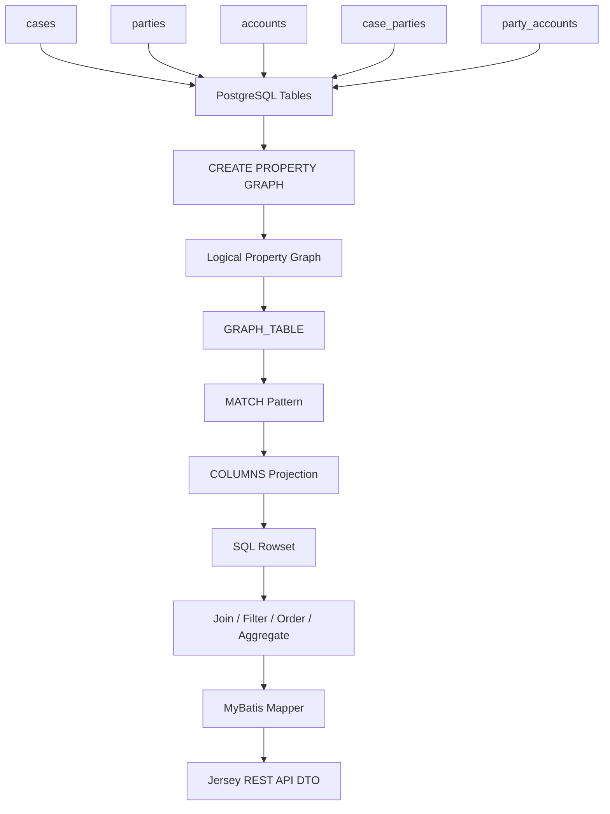

PostgreSQL docs menjelaskan bahwa `GRAPH_TABLE` menghasilkan computed table; hasilnya dapat diberi alias, di-join dengan tabel lain, difilter, diurutkan, dan dipakai seperti elemen `FROM` lain dalam SQL. ([PostgreSQL](https://www.postgresql.org/docs/19/queries-graph.html))

---

## 3. Komponen Utama SQL/PGQ PostgreSQL 19

| Komponen | Fungsi | Practical Meaning |
|---|---|---|
| `CREATE PROPERTY GRAPH` | Mendefinisikan graph dari tabel, view, foreign table, dan table-like object | Membuat logical graph façade di atas schema yang sudah ada |
| `ALTER PROPERTY GRAPH` | Mengubah definisi graph | Menambah/menghapus vertex table, edge table, label, property |
| `DROP PROPERTY GRAPH` | Menghapus definisi graph | Tidak menghapus base table |
| `GRAPH_TABLE` | Query graph di dalam `SELECT` | Menghasilkan rowset tabular |
| `MATCH` | Menulis graph pattern | Mencari node-edge-node relationship |
| `COLUMNS` | Memproyeksikan hasil graph ke kolom SQL | Cocok untuk MyBatis DTO |
| Vertex / Node table | Table yang menjadi node | `cases`, `parties`, `accounts` |
| Edge / Relationship table | Table yang menjadi relationship | `case_parties`, `party_accounts` |
| Label | Nama graph-facing untuk node/edge | `case_node`, `party`, `owns`, `involves` |
| Property | Kolom/expression yang diekspos ke graph | `case_no`, `status`, `valid_from` |

`CREATE PROPERTY GRAPH` menyimpan definisi struktur graph, tidak mematerialisasi graph secara fisik; ia mirip `CREATE VIEW` dalam arti struktur tersebut dipakai saat query. ([PostgreSQL](https://www.postgresql.org/docs/19/sql-create-property-graph.html))

---

## 4. Apa yang SQL/PGQ Berikan?

SQL/PGQ di PostgreSQL 19 memberi kemampuan ini:

| Capability | Ada? | Penjelasan Praktis |
|---|---:|---|
| Mendefinisikan graph di atas tabel relational | Ya | Dengan `CREATE PROPERTY GRAPH` |
| Vertex dan edge dari table biasa | Ya | Setiap vertex/edge corresponds to a table |
| Label pada vertex/edge | Ya | Bisa explicit atau default |
| Property pada vertex/edge | Ya | Bisa all columns atau selected expressions |
| Pattern matching node-edge-node | Ya | Dengan `MATCH` |
| Directed edge traversal | Ya | Pattern bisa `->`, `<-`, atau dua arah |
| Menghasilkan hasil tabular | Ya | Dengan `COLUMNS` |
| Digabung dengan SQL biasa | Ya | Karena `GRAPH_TABLE` dipakai di `FROM` |
| Menggunakan PK/FK relational sebagai identity/connectivity | Ya | Key default dapat berasal dari primary key dan foreign key |
| Native graph physical storage | Tidak | Data tetap relational |
| Cypher language | Tidak | Ini SQL/PGQ, bukan Cypher |
| Graph write/update language | Bukan fokus utama PG19 SQL/PGQ | Update tetap dilakukan ke base table |
| Built-in graph algorithms lengkap | Tidak sebagai core SQL/PGQ | Untuk routing/shortest path biasanya evaluasi extension seperti pgRouting |
| Pengganti total Neo4j | Tidak | Lebih tepat disebut graph query layer di PostgreSQL |

Dokumentasi PostgreSQL menyebut property graph terdiri dari vertices dan edges, memiliki labels dan properties, dan edge memiliki source serta destination sehingga model edge bersifat directed. ([PostgreSQL](https://www.postgresql.org/docs/19/ddl-property-graphs.html))

---

## 5. Struktur Dasar `CREATE PROPERTY GRAPH`

Template konseptual:

```sql id="f2s18z"
CREATE PROPERTY GRAPH graph_name
    VERTEX TABLES (
        vertex_table_1
            LABEL vertex_label_1
            PROPERTIES (...),

        vertex_table_2
            LABEL vertex_label_2
            PROPERTIES (...)
    )
    EDGE TABLES (
        edge_table_1
            KEY (edge_id)
            SOURCE KEY (source_id) REFERENCES vertex_table_1 (id)
            DESTINATION KEY (target_id) REFERENCES vertex_table_2 (id)
            LABEL edge_label_1
            PROPERTIES (...)
    );
```

Dalam syntax PostgreSQL 19, vertex/edge table bisa diberi `KEY`, edge bisa mendefinisikan `SOURCE KEY` dan `DESTINATION KEY`, dan label/properties dapat dikontrol eksplisit. Kalau key tidak diberikan, default-nya dapat berasal dari primary key; untuk edge source/destination, foreign key yang ada dapat dipakai secara default. ([PostgreSQL](https://www.postgresql.org/docs/19/sql-create-property-graph.html))

---

## 6. Contoh Minimal: Case → Party → Account

### Base Tables

```sql id="dch2ap"
CREATE TABLE cases (
    case_id    bigint PRIMARY KEY,
    tenant_id  bigint NOT NULL,
    case_no    text NOT NULL,
    status     text NOT NULL,
    risk_level text NOT NULL
);

CREATE TABLE parties (
    party_id    bigint PRIMARY KEY,
    tenant_id   bigint NOT NULL,
    party_name  text NOT NULL,
    party_type  text NOT NULL,
    risk_score  numeric(5,2)
);

CREATE TABLE accounts (
    account_id   bigint PRIMARY KEY,
    tenant_id    bigint NOT NULL,
    account_no   text NOT NULL,
    status       text NOT NULL
);

CREATE TABLE case_parties (
    case_party_id bigint PRIMARY KEY,
    tenant_id     bigint NOT NULL,
    case_id       bigint NOT NULL REFERENCES cases(case_id),
    party_id      bigint NOT NULL REFERENCES parties(party_id),
    role          text NOT NULL,
    valid_from    date NOT NULL,
    valid_to      date
);

CREATE TABLE party_accounts (
    party_account_id bigint PRIMARY KEY,
    tenant_id        bigint NOT NULL,
    party_id         bigint NOT NULL REFERENCES parties(party_id),
    account_id       bigint NOT NULL REFERENCES accounts(account_id),
    ownership_type   text NOT NULL,
    valid_from       date NOT NULL,
    valid_to         date
);
```

### Property Graph Definition

```sql id="mpxxdu"
CREATE PROPERTY GRAPH compliance_graph
    VERTEX TABLES (
        cases
            LABEL case_node
            PROPERTIES (
                case_id,
                tenant_id,
                case_no,
                status,
                risk_level
            ),

        parties
            LABEL party
            PROPERTIES (
                party_id,
                tenant_id,
                party_name,
                party_type,
                risk_score
            ),

        accounts
            LABEL account
            PROPERTIES (
                account_id,
                tenant_id,
                account_no,
                status
            )
    )
    EDGE TABLES (
        case_parties
            KEY (case_party_id)
            SOURCE KEY (case_id) REFERENCES cases (case_id)
            DESTINATION KEY (party_id) REFERENCES parties (party_id)
            LABEL involves
            PROPERTIES (
                role,
                valid_from,
                valid_to
            ),

        party_accounts
            KEY (party_account_id)
            SOURCE KEY (party_id) REFERENCES parties (party_id)
            DESTINATION KEY (account_id) REFERENCES accounts (account_id)
            LABEL owns
            PROPERTIES (
                ownership_type,
                valid_from,
                valid_to
            )
    );
```

---

## 7. Struktur Dasar `GRAPH_TABLE`

Template:

```sql id="uu2gw8"
SELECT *
FROM GRAPH_TABLE (
    graph_name
    MATCH
        graph_pattern
    COLUMNS (
        projected_expression AS column_name
    )
);
```

Menurut dokumentasi PostgreSQL, `GRAPH_TABLE` terdiri dari nama graph, keyword `MATCH`, graph pattern expression, keyword `COLUMNS`, dan daftar kolom hasil. ([PostgreSQL](https://www.postgresql.org/docs/19/queries-graph.html))

Contoh:

```sql id="b233rl"
SELECT *
FROM GRAPH_TABLE (
    compliance_graph
    MATCH
        (c IS case_node)-[cp IS involves]->(p IS party)-[pa IS owns]->(a IS account)
    WHERE
        c.case_id = 1001
        AND c.tenant_id = 10
    COLUMNS (
        c.case_id AS case_id,
        c.case_no AS case_no,
        p.party_id AS party_id,
        p.party_name AS party_name,
        cp.role AS party_role,
        a.account_id AS account_id,
        a.account_no AS account_no,
        pa.ownership_type AS ownership_type
    )
);
```

Makna pattern:

```text
(c IS case_node)
    -[cp IS involves]->
(p IS party)
    -[pa IS owns]->
(a IS account)
```

Artinya:

```text
Cari case,
lalu edge involves ke party,
lalu edge owns ke account,
lalu project hasilnya menjadi kolom SQL.
```

---

## 8. Graph Pattern Syntax yang Perlu Dikuasai

| Pattern | Arti |
|---|---|
| `()` | Any vertex |
| `(IS party)` | Vertex dengan label `party` |
| `()-[]->()` | Any directed edge dari kiri ke kanan |
| `(IS party)-[IS owns]->(IS account)` | Party owns account |
| `(IS account)<-[IS owns]-(IS party)` | Reverse direction |
| `(IS party)-[IS related_to]-(IS party)` | Match edge dua arah |
| `(IS account|document)` | Match beberapa label dengan OR semantics |
| `(p IS party)` | Bind vertex ke variable `p` |
| `[e IS owns]` | Bind edge ke variable `e` |

Dokumentasi PostgreSQL menunjukkan pattern seperti `(IS person)-[IS has]->(IS account)`, arah reverse dengan `<-`, dan matching dua arah dengan `-[]-`; graph pattern variable dapat dipakai untuk mengambil property values di `COLUMNS`. ([PostgreSQL](https://www.postgresql.org/docs/19/queries-graph.html))

---

## 9. SQL/PGQ vs Recursive CTE

SQL/PGQ bukan berarti `WITH RECURSIVE` tidak perlu lagi. Keduanya punya tempat.

| Kebutuhan | SQL/PGQ | Recursive CTE |
|---|---:|---:|
| Query relationship pattern fixed | Sangat cocok | Bisa, tapi verbose |
| Query tabular join biasa | Bisa digabung | Sangat cocok |
| Hierarchy/tree traversal | Bisa | Sangat cocok |
| Custom visited path/cycle control | Tergantung fitur/pattern | Sangat fleksibel |
| Legacy PostgreSQL sebelum 19 | Tidak tersedia | Tersedia |
| Query business graph yang readable | Sangat cocok | Bisa menjadi sulit dibaca |
| Fine-grained procedural traversal control | Terbatas | Lebih kuat |
| Production predictable plan | Perlu benchmark | Lebih familiar bagi banyak DBA |

Practical rule:

```text
Gunakan SQL/PGQ untuk pattern graph yang readable.
Gunakan recursive CTE untuk traversal yang butuh kontrol eksplisit.
Gunakan keduanya sesuai kebutuhan, bukan saling menggantikan mutlak.
```

---

## 10. Scope PostgreSQL 19 SQL/PGQ

### Cocok untuk

| Use Case | Kenapa Cocok |
|---|---|
| Relationship discovery | Pattern node-edge-node natural |
| Case impact graph | `case -> party -> account -> other_case` |
| Ownership chain sederhana | Pattern query lebih readable |
| Approval/escalation relationship | Edge direction jelas |
| Dependency graph | Service/module/process dependency |
| Regulatory traceability | Edge dengan validity dan evidence |
| Graph query di atas OLTP schema | Data tidak perlu disinkron ke DB lain |
| API projection | `GRAPH_TABLE` menghasilkan rowset |

### Kurang cocok untuk

| Use Case | Kenapa Kurang Cocok |
|---|---|
| Massive graph algorithm workload | SQL/PGQ bukan graph analytics engine lengkap |
| Real-time deep graph traversal tidak terbatas | Risiko join/path explosion |
| Native Cypher ecosystem | PostgreSQL SQL/PGQ bukan Cypher |
| Graph sebagai primary write model | Write tetap ke base relational table |
| Social-network-scale traversal | Perlu benchmark serius atau engine khusus |
| Shortest path/routing-heavy | Lebih cocok pgRouting atau graph-specific tool |
| Highly dynamic schema-less graph | Typed relational schema bisa terasa kaku |

---

## 11. Batasan Penting yang Harus Dipahami

## 11.1 Bukan Native Graph Storage

PostgreSQL docs secara eksplisit membedakan SQL/PGQ dengan native graph database: data aktual masih berada di tables/table-like objects, lalu diekspos sebagai graph. ([PostgreSQL](https://www.postgresql.org/docs/19/ddl-property-graphs.html))

Implikasi:

```text
Graph query tetap memakai planner/executor PostgreSQL.
Performance sangat dipengaruhi table design, FK, index, statistics, dan selectivity.
```

---

## 11.2 Graph Definition Bukan Materialized Graph

`CREATE PROPERTY GRAPH` tidak membuat copy fisik graph. Ia hanya menyimpan definisi yang dipakai saat query. ([PostgreSQL](https://www.postgresql.org/docs/19/sql-create-property-graph.html))

Implikasi:

```text
+ Tidak ada sync problem antara relational table dan graph.
+ Perubahan base table langsung terlihat ke graph query.
- Tidak ada graph-specific physical layout otomatis.
- Index tetap harus dibuat pada base table.
```

---

## 11.3 Permission Tetap Bergantung Base Relation

User yang menjalankan `GRAPH_TABLE` harus punya permission relevan pada property graph dan base relation yang mendasarinya. ([PostgreSQL](https://www.postgresql.org/docs/19/sql-create-property-graph.html))

Implikasi production:

```text
Jangan anggap property graph menjadi security boundary penuh.
Tetap desain privilege, RLS, tenant filter, dan API authorization dengan serius.
```

---

## 11.4 Label dan Property Harus Konsisten

PostgreSQL punya consistency checks: label yang sama pada element berbeda harus punya jumlah/nama properties yang sama, dan property dengan nama sama harus punya data type yang sama. ([PostgreSQL](https://www.postgresql.org/docs/19/sql-create-property-graph.html))

Implikasi:

```text
Jangan sembarang reuse label seperti "entity" untuk banyak table
kalau property shape-nya berbeda.
```

Contoh buruk:

```sql id="kaejwx"
-- Bermasalah secara desain karena label entity punya property shape berbeda.
CREATE PROPERTY GRAPH bad_graph
    VERTEX TABLES (
        cases LABEL entity PROPERTIES (case_id, case_no),
        accounts LABEL entity PROPERTIES (account_id, account_no, status)
    )
    EDGE TABLES (...);
```

Lebih aman:

```sql id="a0sk30"
CREATE PROPERTY GRAPH better_graph
    VERTEX TABLES (
        cases LABEL case_node PROPERTIES (case_id, case_no, status),
        accounts LABEL account PROPERTIES (account_id, account_no, status)
    )
    EDGE TABLES (...);
```

---

## 12. Practical Architecture Placement

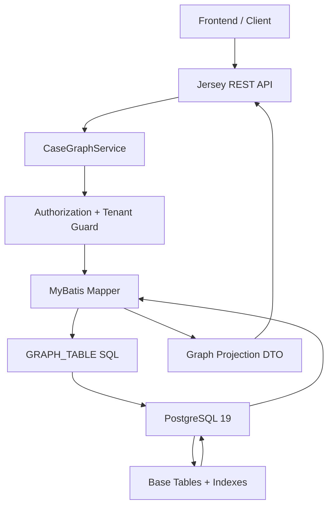

Rule arsitektur:

```text
Client tidak mengirim MATCH query.
Client mengirim business intent.
Service memilih query.
Mapper menjalankan parameterized SQL.
Database mengevaluasi GRAPH_TABLE.
API mengembalikan DTO yang bounded.
```

---

## 13. Practical API Design

### Jangan expose raw graph query

```http id="bpkd3z"
POST /graph/query
Content-Type: application/json

{
  "query": "MATCH (a)-[]->(b) ..."
}
```

Masalah:

```text
- raw query injection risk
- authorization sulit
- query cost tidak bounded
- sulit audit
- sulit observability
- user bisa membuat traversal mahal
```

### Expose intent-specific graph endpoint

```http id="p3obdj"
GET /cases/{caseId}/related-accounts?asOfDate=2026-07-15
GET /parties/{partyId}/linked-cases?depth=2
GET /accounts/{accountId}/relationship-summary
GET /cases/{caseId}/impact-graph?includeDocuments=true
```

### Jersey Resource

```java id="f8a07a"
@Path("/cases/{caseId}/graph")
@Produces(MediaType.APPLICATION_JSON)
public class CaseGraphResource {

    private final CaseGraphService service;

    public CaseGraphResource(CaseGraphService service) {
        this.service = service;
    }

    @GET
    @Path("/related-accounts")
    public Response relatedAccounts(
            @PathParam("caseId") long caseId,
            @QueryParam("asOfDate") LocalDate asOfDate
    ) {
        LocalDate effectiveDate = asOfDate != null ? asOfDate : LocalDate.now();

        List<RelatedAccountDto> result =
                service.findRelatedAccounts(caseId, effectiveDate);

        return Response.ok(result).build();
    }
}
```

### Service Guardrail

```java id="roio5h"
public final class CaseGraphService {

    private final TenantContext tenantContext;
    private final CaseAccessPolicy accessPolicy;
    private final CaseGraphMapper mapper;

    public List<RelatedAccountDto> findRelatedAccounts(long caseId, LocalDate asOfDate) {
        long tenantId = tenantContext.requiredTenantId();

        accessPolicy.assertCanReadCase(tenantId, caseId);

        return mapper.findRelatedAccounts(tenantId, caseId, asOfDate);
    }
}
```

---

## 14. MyBatis Mapper Pattern

DTO:

```java id="h5wgoz"
public record RelatedAccountDto(
        long caseId,
        String caseNo,
        long partyId,
        String partyName,
        String partyRole,
        long accountId,
        String accountNo,
        String ownershipType
) {}
```

Mapper interface:

```java id="xy2ge6"
public interface CaseGraphMapper {

    List<RelatedAccountDto> findRelatedAccounts(
            @Param("tenantId") long tenantId,
            @Param("caseId") long caseId,
            @Param("asOfDate") LocalDate asOfDate
    );
}
```

Mapper XML:

```xml id="qk40au"
<select id="findRelatedAccounts" resultType="com.acme.graph.RelatedAccountDto">
    SELECT *
    FROM GRAPH_TABLE (
        compliance_graph
        MATCH
            (c IS case_node)-[cp IS involves]->(p IS party)-[pa IS owns]->(a IS account)
        WHERE
            c.tenant_id = #{tenantId}
            AND c.case_id = #{caseId}

            AND cp.valid_from &lt;= #{asOfDate}
            AND (cp.valid_to IS NULL OR cp.valid_to &gt;= #{asOfDate})

            AND pa.valid_from &lt;= #{asOfDate}
            AND (pa.valid_to IS NULL OR pa.valid_to &gt;= #{asOfDate})

        COLUMNS (
            c.case_id AS "caseId",
            c.case_no AS "caseNo",

            p.party_id AS "partyId",
            p.party_name AS "partyName",

            cp.role AS "partyRole",

            a.account_id AS "accountId",
            a.account_no AS "accountNo",

            pa.ownership_type AS "ownershipType"
        )
    )
</select>
```

Practical note:

```text
GRAPH_TABLE tetap diperlakukan sebagai SELECT rowset.
Jadi MyBatis mapping lebih dekat ke normal SELECT daripada graph object mapping.
```

---

## 15. Indexing untuk SQL/PGQ

Karena property graph tidak materialized secara fisik, index tetap dibuat pada base tables. Ini konsekuensi langsung dari model PostgreSQL 19 yang menyimpan data graph dalam regular tables dan menggunakan graph definition sebagai struktur query. ([PostgreSQL](https://www.postgresql.org/docs/19/sql-create-property-graph.html))

Minimum index untuk contoh di atas:

```sql id="h7x6pm"
CREATE INDEX idx_cases_tenant_case
    ON cases (tenant_id, case_id);

CREATE INDEX idx_case_parties_tenant_case
    ON case_parties (tenant_id, case_id);

CREATE INDEX idx_case_parties_tenant_party
    ON case_parties (tenant_id, party_id);

CREATE INDEX idx_case_parties_tenant_case_validity
    ON case_parties (tenant_id, case_id, valid_from, valid_to);

CREATE INDEX idx_party_accounts_tenant_party
    ON party_accounts (tenant_id, party_id);

CREATE INDEX idx_party_accounts_tenant_account
    ON party_accounts (tenant_id, account_id);

CREATE INDEX idx_party_accounts_tenant_party_validity
    ON party_accounts (tenant_id, party_id, valid_from, valid_to);
```

Rule:

```text
Untuk setiap edge table:
1. index tenant + source
2. index tenant + destination
3. index tenant + source + relationship filter
4. index tenant + source + temporal validity jika query as-of-date
5. index destination juga jika reverse traversal sering dilakukan
```

---

## 16. Query Safety Pattern

Graph query bisa mahal karena path matching dapat memperbanyak kombinasi. Karena itu, gunakan guardrail.

| Guardrail | Implementasi |
|---|---|
| Root node wajib | `case_id = #{caseId}` |
| Tenant wajib | `tenant_id = #{tenantId}` |
| Depth dibatasi | API max depth, misalnya 1-3 |
| Edge type eksplisit | `IS involves`, `IS owns` |
| Temporal filter | `valid_from <= asOfDate` |
| Projection terbatas | Jangan `SELECT *` untuk API |
| Timeout | `statement_timeout` atau connection pool policy |
| Observability | log query name, tenant, depth, row count |
| Pagination | Untuk relationship list besar |
| Explain baseline | Simpan expected plan untuk query penting |

Contoh bad pattern:

```sql id="s14fvc"
SELECT *
FROM GRAPH_TABLE (
    compliance_graph
    MATCH
        (a)-[]->(b)-[]->(c)-[]->(d)
    COLUMNS (
        a AS a,
        b AS b,
        c AS c,
        d AS d
    )
);
```

Masalah:

```text
Tidak ada root.
Tidak ada tenant filter.
Tidak ada label.
Tidak ada bounded business intent.
Output raw element.
```

Contoh safer pattern:

```sql id="th8kgz"
SELECT *
FROM GRAPH_TABLE (
    compliance_graph
    MATCH
        (c IS case_node)-[cp IS involves]->(p IS party)-[pa IS owns]->(a IS account)
    WHERE
        c.tenant_id = #{tenantId}
        AND c.case_id = #{caseId}
        AND cp.valid_from <= #{asOfDate}
        AND (cp.valid_to IS NULL OR cp.valid_to >= #{asOfDate})
        AND pa.valid_from <= #{asOfDate}
        AND (pa.valid_to IS NULL OR pa.valid_to >= #{asOfDate})
    COLUMNS (
        c.case_no AS case_no,
        p.party_name AS party_name,
        a.account_no AS account_no,
        pa.ownership_type AS ownership_type
    )
);
```

---

## 17. SQL/PGQ dalam Migration Lifecycle

Karena property graph adalah database object, kelola dengan migration tool seperti Flyway/Liquibase.

### Flyway-style

```text
V2026_07_15_001__create_graph_base_tables.sql
V2026_07_15_002__create_compliance_property_graph.sql
V2026_07_15_003__add_graph_indexes.sql
```

### Liquibase-style conceptual changeset

```xml id="gblg31"
<changeSet id="2026-07-15-create-compliance-graph" author="platform">
    <sql>
        CREATE PROPERTY GRAPH compliance_graph
            VERTEX TABLES (
                cases LABEL case_node PROPERTIES (
                    case_id,
                    tenant_id,
                    case_no,
                    status,
                    risk_level
                ),
                parties LABEL party PROPERTIES (
                    party_id,
                    tenant_id,
                    party_name,
                    party_type,
                    risk_score
                )
            )
            EDGE TABLES (
                case_parties
                    KEY (case_party_id)
                    SOURCE KEY (case_id) REFERENCES cases (case_id)
                    DESTINATION KEY (party_id) REFERENCES parties (party_id)
                    LABEL involves
                    PROPERTIES (
                        role,
                        valid_from,
                        valid_to
                    )
            );
    </sql>
</changeSet>
```

Practical caution:

```text
Pastikan migration tool dan PostgreSQL JDBC driver yang dipakai perusahaan sudah kompatibel dengan PostgreSQL 19 sebelum menjadikan SQL/PGQ bagian dari delivery pipeline.
```

---

## 18. Evolving Property Graph

PostgreSQL 19 menyediakan `ALTER PROPERTY GRAPH` untuk menambah atau menghapus vertex/edge table, menambah/menghapus label, menambah/menghapus properties, rename, owner change, dan schema move. ([PostgreSQL](https://www.postgresql.org/docs/19/sql-alter-property-graph.html))

Contoh:

```sql id="t72tz9"
ALTER PROPERTY GRAPH compliance_graph ADD
    VERTEX TABLES (
        documents
            LABEL document
            PROPERTIES (
                document_id,
                tenant_id,
                document_no,
                document_type,
                status
            )
    );
```

Tambah edge:

```sql id="zdkrhy"
ALTER PROPERTY GRAPH compliance_graph ADD
    EDGE TABLES (
        case_documents
            KEY (case_document_id)
            SOURCE KEY (case_id) REFERENCES cases (case_id)
            DESTINATION KEY (document_id) REFERENCES documents (document_id)
            LABEL has_document
            PROPERTIES (
                relation_type,
                valid_from,
                valid_to
            )
    );
```

Practical migration rule:

```text
Tambahkan base table dan constraint dulu.
Tambahkan index.
Backfill data.
Validasi data quality.
Baru expose ke property graph.
```

---

## 19. Production Readiness Checklist

Untuk PG19 SQL/PGQ, checklist-nya:

```text
[ ] PostgreSQL version sudah production-supported di organisasi.
[ ] JDBC driver, pool, migration tool, backup tool kompatibel.
[ ] Property graph dikelola via migration.
[ ] Base tables punya PK/FK kuat.
[ ] Edge tables punya source/destination index.
[ ] Tenant filter wajib di semua graph query.
[ ] Authorization dilakukan sebelum query.
[ ] RLS/permission model sudah dites.
[ ] Query punya root node.
[ ] Depth atau pattern complexity dibatasi.
[ ] EXPLAIN baseline dibuat untuk query penting.
[ ] statement_timeout diset untuk API workload.
[ ] DTO projection eksplisit, bukan raw graph element.
[ ] Test data mencakup cycle, disconnected graph, duplicate relationship, expired edge.
[ ] Observability mencatat query name, duration, row count, tenant, depth.
```

---

## 20. Kapan Memakai SQL/PGQ vs Alternatif?

| Pilihan | Gunakan Ketika |
|---|---|
| PostgreSQL 19 SQL/PGQ | Data sudah relational, butuh graph query readable, graph mostly read/query façade |
| Recursive CTE | Butuh traversal yang sangat eksplisit, legacy PostgreSQL, hierarchy, custom path/cycle logic |
| Apache AGE | Butuh Cypher-like experience dan graph extension layer |
| `ltree` | Struktur tree/hierarchy murni, bukan arbitrary cyclic graph |
| pgRouting | Network/routing/shortest-path problem |
| pgvector + graph | Semantic search + relationship context |
| Native graph DB | Graph adalah primary model, traversal sangat dalam, graph algorithms dominan, schema sangat dynamic |

Decision rule:

```text
Jika source of truth tetap PostgreSQL OLTP,
mulai dari SQL/PGQ atau recursive CTE.

Jika relationship query mulai menjadi core workload berat,
benchmark dulu sebelum memutuskan tetap PostgreSQL atau split ke graph-native system.
```

---

## 21. Mini Exercise

Buat property graph kecil untuk domain berikut:

```text
Node:
- cases
- parties
- accounts
- officers

Edges:
- case_parties: case -> party
- party_accounts: party -> account
- case_assignments: case -> officer
```

Lalu buat 3 query:

```text
1. Cari account yang terkait dengan case tertentu.
2. Cari officer yang menangani case dengan high-risk party.
3. Cari party yang muncul di lebih dari satu case.
```

Target belajar:

```text
[ ] Bisa mendefinisikan vertex table.
[ ] Bisa mendefinisikan edge table.
[ ] Bisa menulis MATCH pattern 1-hop.
[ ] Bisa menulis MATCH pattern 2-hop.
[ ] Bisa memproyeksikan hasil ke COLUMNS.
[ ] Bisa menambahkan tenant dan as-of-date filter.
```

---

## 22. Ringkasan Seri 3

SQL/PGQ di PostgreSQL 19 adalah **graph query layer di atas relational data**. Ia sangat menarik untuk enterprise system karena tidak memaksa data keluar dari PostgreSQL, tetap bisa memakai constraint, transaction, SQL ecosystem, dan MyBatis-friendly rowset. Namun ia bukan native graph storage, bukan Cypher, bukan graph algorithm engine lengkap, dan bukan alasan untuk membuka raw graph query ke client.

Pola praktis terbaik:

```text
Relational schema kuat
+ typed vertex/edge modeling
+ CREATE PROPERTY GRAPH
+ GRAPH_TABLE query
+ intent-specific API
+ MyBatis DTO projection
+ strict tenant/security guardrail
+ index + EXPLAIN discipline
```

---

## Status Seri

**Seri 3/12 selesai.**

Seri berikutnya:

**Seri 4/12 - `CREATE PROPERTY GRAPH` Deep Dive**

Fokus berikutnya: syntax detail, vertex/edge aliases, key handling, label/property design, consistency rules, schema evolution, migration strategy, dan contoh `CREATE PROPERTY GRAPH` enterprise-grade yang lebih lengkap.

---

**Sources:**

- [PostgreSQL: Documentation: 19: 5.15. Property Graphs](https://www.postgresql.org/docs/19/ddl-property-graphs.html)

## Response:
7/15/2026, 9:03:00 PM

Saya lanjut ke **Seri 4/12**. Kali ini masuk ke detail `CREATE PROPERTY GRAPH`: syntax, desain label/property, key source-destination, migration, dan pola enterprise-ready.

# Seri 4/12 - `CREATE PROPERTY GRAPH` Deep Dive

## 1. Tujuan Seri Ini

Seri ini fokus ke implementasi praktis **`CREATE PROPERTY GRAPH`** di PostgreSQL 19: bagaimana mendefinisikan vertex, edge, label, property, key, source/destination, dan bagaimana menjaga definisi graph tetap aman untuk enterprise schema.

Framing penting: `CREATE PROPERTY GRAPH` **tidak memindahkan data ke storage graph baru**. PostgreSQL mendefinisikan property graph di atas regular tables, views, foreign tables, atau object table-like lain; setiap vertex atau edge mengacu ke satu table-like object. Graph tersebut kemudian bisa di-query memakai `GRAPH_TABLE`. ([PostgreSQL](https://www.postgresql.org/docs/19/sql-create-property-graph.html?utm_source=chatgpt.com))

---

## 2. Mental Model

```text
CREATE PROPERTY GRAPH = metadata graph layer

Base table:
- cases
- parties
- accounts
- case_parties
- party_accounts

Graph definition:
- cases          => vertex label case_node
- parties        => vertex label party
- accounts       => vertex label account
- case_parties   => edge label involves
- party_accounts => edge label owns

Query:
- GRAPH_TABLE(compliance_graph MATCH ...)
```

Secara praktis:

```text
Relational table tetap source of truth.
Property graph hanya memberi cara graph-style untuk membaca relationship.
Update/insert/delete tetap dilakukan ke base table.
```

---

## 3. Diagram

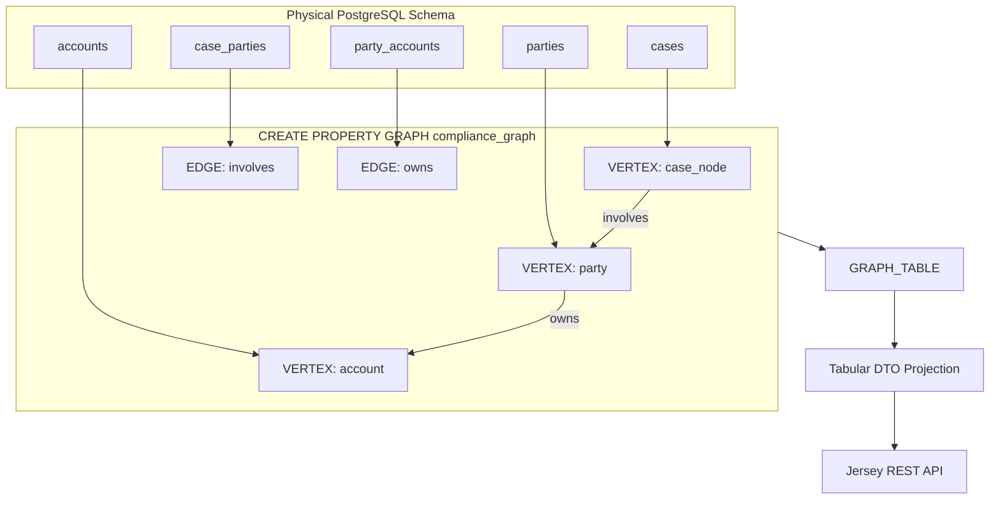

---

## 4. Syntax Skeleton

Bentuk umum:

```sql
CREATE PROPERTY GRAPH graph_name
    VERTEX TABLES (
        vertex_table_name
            [KEY (...)]
            [LABEL label_name]
            [PROPERTIES (...)]
    )
    EDGE TABLES (
        edge_table_name
            [KEY (...)]
            SOURCE KEY (...) REFERENCES source_vertex_table (...)
            DESTINATION KEY (...) REFERENCES destination_vertex_table (...)
            [LABEL edge_label]
            [PROPERTIES (...)]
    );
```

Dalam PostgreSQL 19, `CREATE PROPERTY GRAPH` mendefinisikan graph yang terdiri dari vertices dan edges; keduanya disebut elements, dan masing-masing dapat punya labels serta properties. Data graph tetap berasal dari regular tables atau object sejenis, bukan dari storage graph terpisah. ([PostgreSQL](https://www.postgresql.org/docs/19/sql-create-property-graph.html?utm_source=chatgpt.com))

---

# 5. Enterprise Example: Compliance Case Graph

Kita pakai domain yang umum untuk case-management / regulatory system.

## 5.1 Vertex Tables

```sql
CREATE TABLE cases (
    case_id      bigint PRIMARY KEY,
    tenant_id    bigint NOT NULL,
    case_no      text NOT NULL,
    case_type    text NOT NULL,
    status       text NOT NULL,
    risk_level   text NOT NULL,
    created_at   timestamptz NOT NULL DEFAULT now(),

    CONSTRAINT uq_cases_tenant_case_no
        UNIQUE (tenant_id, case_no)
);

CREATE TABLE parties (
    party_id     bigint PRIMARY KEY,
    tenant_id    bigint NOT NULL,
    party_name   text NOT NULL,
    party_type   text NOT NULL,
    risk_score   numeric(5,2),
    created_at   timestamptz NOT NULL DEFAULT now(),

    CONSTRAINT ck_parties_party_type
        CHECK (party_type IN ('PERSON', 'COMPANY', 'AGENCY'))
);

CREATE TABLE accounts (
    account_id   bigint PRIMARY KEY,
    tenant_id    bigint NOT NULL,
    account_no   text NOT NULL,
    account_type text NOT NULL,
    status       text NOT NULL,
    created_at   timestamptz NOT NULL DEFAULT now(),

    CONSTRAINT uq_accounts_tenant_account_no
        UNIQUE (tenant_id, account_no)
);
```

## 5.2 Edge Tables

```sql
CREATE TABLE case_parties (
    case_party_id bigint PRIMARY KEY,
    tenant_id     bigint NOT NULL,

    case_id       bigint NOT NULL REFERENCES cases(case_id),
    party_id      bigint NOT NULL REFERENCES parties(party_id),

    role          text NOT NULL,
    valid_from    date NOT NULL,
    valid_to      date,

    source_system text NOT NULL DEFAULT 'CASE_MGMT',
    created_by    text NOT NULL,
    created_at    timestamptz NOT NULL DEFAULT now(),

    CONSTRAINT ck_case_parties_role
        CHECK (role IN ('SUBJECT', 'WITNESS', 'REPORTER', 'BENEFICIARY')),

    CONSTRAINT ck_case_parties_validity
        CHECK (valid_to IS NULL OR valid_to >= valid_from),

    CONSTRAINT uq_case_party_role_validity
        UNIQUE (tenant_id, case_id, party_id, role, valid_from)
);

CREATE TABLE party_accounts (
    party_account_id bigint PRIMARY KEY,
    tenant_id        bigint NOT NULL,

    party_id         bigint NOT NULL REFERENCES parties(party_id),
    account_id       bigint NOT NULL REFERENCES accounts(account_id),

    ownership_type   text NOT NULL,
    ownership_pct    numeric(5,2),
    valid_from       date NOT NULL,
    valid_to         date,

    evidence_ref     text,
    created_by       text NOT NULL,
    created_at       timestamptz NOT NULL DEFAULT now(),

    CONSTRAINT ck_party_accounts_ownership_type
        CHECK (ownership_type IN ('OWNER', 'SIGNATORY', 'BENEFICIAL_OWNER')),

    CONSTRAINT ck_party_accounts_ownership_pct
        CHECK (ownership_pct IS NULL OR ownership_pct BETWEEN 0 AND 100),

    CONSTRAINT ck_party_accounts_validity
        CHECK (valid_to IS NULL OR valid_to >= valid_from),

    CONSTRAINT uq_party_account_ownership_validity
        UNIQUE (tenant_id, party_id, account_id, ownership_type, valid_from)
);
```

---

# 6. Basic `CREATE PROPERTY GRAPH`

```sql
CREATE PROPERTY GRAPH compliance_graph
    VERTEX TABLES (
        cases
            LABEL case_node
            PROPERTIES (
                case_id,
                tenant_id,
                case_no,
                case_type,
                status,
                risk_level,
                created_at
            ),

        parties
            LABEL party
            PROPERTIES (
                party_id,
                tenant_id,
                party_name,
                party_type,
                risk_score
            ),

        accounts
            LABEL account
            PROPERTIES (
                account_id,
                tenant_id,
                account_no,
                account_type,
                status
            )
    )
    EDGE TABLES (
        case_parties
            KEY (case_party_id)
            SOURCE KEY (case_id) REFERENCES cases (case_id)
            DESTINATION KEY (party_id) REFERENCES parties (party_id)
            LABEL involves
            PROPERTIES (
                role,
                valid_from,
                valid_to,
                source_system,
                created_at
            ),

        party_accounts
            KEY (party_account_id)
            SOURCE KEY (party_id) REFERENCES parties (party_id)
            DESTINATION KEY (account_id) REFERENCES accounts (account_id)
            LABEL owns
            PROPERTIES (
                ownership_type,
                ownership_pct,
                valid_from,
                valid_to,
                evidence_ref,
                created_at
            )
    );
```

PostgreSQL memungkinkan vertex/edge table diberi `KEY`, edge table diberi `SOURCE KEY` dan `DESTINATION KEY`, serta label dan properties dapat didefinisikan eksplisit. Jika key tidak diberikan, PostgreSQL dapat memakai primary key sebagai default; untuk source/destination edge, foreign key yang tersedia dapat dipakai sebagai dasar inference, tetapi untuk schema enterprise lebih aman mendefinisikannya eksplisit. ([PostgreSQL](https://www.postgresql.org/docs/19/sql-create-property-graph.html?utm_source=chatgpt.com))

---

# 7. Anatomy: Bagian-Bagian Penting

## 7.1 Graph Name

```sql
CREATE PROPERTY GRAPH compliance_graph
```

Gunakan nama yang domain-oriented.

| Nama | Kualitas |
|---|---|
| `compliance_graph` | Bagus |
| `case_relationship_graph` | Bagus |
| `investigation_graph` | Bagus |
| `graph1` | Buruk |
| `test_graph` | Buruk untuk production |
| `pg_graph` | Terlalu generic |

Rekomendasi:

```text
<domain>_graph
<bounded_context>_graph
<capability>_graph
```

Contoh:

```text
compliance_graph
case_management_graph
risk_relationship_graph
document_evidence_graph
```

---

## 7.2 `VERTEX TABLES`

Vertex table adalah table yang berperan sebagai node.

```sql
VERTEX TABLES (
    cases LABEL case_node PROPERTIES (...),
    parties LABEL party PROPERTIES (...),
    accounts LABEL account PROPERTIES (...)
)
```

Rule praktis:

```text
Gunakan entity table yang punya identity dan lifecycle jelas sebagai vertex.
```

Contoh vertex yang bagus:

| Table | Kenapa Cocok Jadi Vertex |
|---|---|
| `cases` | Entity utama workflow |
| `parties` | Entity yang bisa muncul di banyak case/account |
| `accounts` | Entity yang punya hubungan ownership/signatory |
| `documents` | Evidence/referensi lintas case |
| `officers` | Actor internal |
| `enforcement_actions` | Outcome / action entity |

Contoh table yang biasanya **tidak** perlu jadi vertex:

| Table | Kenapa |
|---|---|
| `case_status_history` | Lebih cocok property/history table |
| `audit_log` | Event log, bukan business node utama |
| `lookup_role_type` | Reference data |
| `outbox_events` | Messaging infrastructure |
| `api_request_log` | Observability/logging |

---

## 7.3 `EDGE TABLES`

Edge table merepresentasikan relationship antar vertex.

```sql
EDGE TABLES (
    case_parties
        KEY (case_party_id)
        SOURCE KEY (case_id) REFERENCES cases (case_id)
        DESTINATION KEY (party_id) REFERENCES parties (party_id)
        LABEL involves
        PROPERTIES (...)
)
```

Rule praktis:

```text
Edge table harus merepresentasikan business fact, bukan sekadar join teknis.
```

Contoh edge yang bagus:

| Edge Table | Source | Destination | Label |
|---|---|---|---|
| `case_parties` | `cases` | `parties` | `involves` |
| `party_accounts` | `parties` | `accounts` | `owns` |
| `case_documents` | `cases` | `documents` | `has_document` |
| `case_assignments` | `cases` | `officers` | `assigned_to` |
| `case_enforcement_actions` | `cases` | `enforcement_actions` | `resulted_in` |

---

# 8. Key Design

## 8.1 Vertex Key

Jika vertex table punya primary key:

```sql
CREATE TABLE cases (
    case_id bigint PRIMARY KEY,
    ...
);
```

Anda bisa tetap eksplisit:

```sql
cases
    KEY (case_id)
    LABEL case_node
    PROPERTIES (...)
```

Walaupun PostgreSQL bisa memakai primary key sebagai default, explicit key lebih readable dan mengurangi ambiguity saat schema bertambah kompleks. ([PostgreSQL](https://www.postgresql.org/docs/19/sql-create-property-graph.html?utm_source=chatgpt.com))

Practical recommendation:

```sql
cases
    KEY (case_id)
    LABEL case_node
    PROPERTIES (...)
```

## 8.2 Edge Key

Selalu beri edge primary key sendiri.

```sql
case_parties
    KEY (case_party_id)
```

Jangan hanya mengandalkan composite source/destination sebagai identity.

Buruk:

```sql
-- Hindari sebagai satu-satunya identity edge
KEY (case_id, party_id)
```

Lebih baik:

```sql
KEY (case_party_id)
```

Alasannya:

```text
Relationship bisa berubah role.
Relationship bisa punya validity period.
Relationship bisa punya evidence.
Relationship bisa perlu audit.
Relationship bisa perlu direferensikan dari table lain.
```

## 8.3 Source and Destination Key

```sql
SOURCE KEY (case_id) REFERENCES cases (case_id)
DESTINATION KEY (party_id) REFERENCES parties (party_id)
```

Makna:

```text
case_parties.case_id  -> cases.case_id
case_parties.party_id -> parties.party_id

Graph direction:
case_node -> involves -> party
```

Direction bukan sekadar teknis. Direction harus mengikuti kalimat domain.

```text
Case involves Party
Party owns Account
Case has Document
Officer handles Case
Case resulted_in EnforcementAction
```

---

# 9. Label Design Deep Dive

Label adalah nama graph-facing untuk vertex/edge. Dokumentasi PostgreSQL menunjukkan vertex dan edge dapat diberi label, dan label/property inilah yang kemudian dipakai dalam pattern matching `GRAPH_TABLE`. ([PostgreSQL](https://www.postgresql.org/docs/19/sql-create-property-graph.html?utm_source=chatgpt.com))

## 9.1 Vertex Label

Vertex label sebaiknya noun/singular.

```sql
cases LABEL case_node
parties LABEL party
accounts LABEL account
documents LABEL document
```

Kenapa `case_node`, bukan `case`?

```text
case adalah kata umum/reserved-like dalam banyak konteks SQL/programming.
case_node lebih aman dan jelas.
```

## 9.2 Edge Label

Edge label sebaiknya verb atau verb phrase.

```sql
case_parties LABEL involves
party_accounts LABEL owns
case_documents LABEL has_document
case_assignments LABEL assigned_to
case_enforcement_actions LABEL resulted_in
```

## 9.3 Multiple Labels

PostgreSQL property graph mendukung label pada elements; contoh resmi PostgreSQL menunjukkan satu vertex table dapat diberi lebih dari satu label, misalnya `employees LABEL employee LABEL person`. ([PostgreSQL](https://www.postgresql.org/docs/19/ddl-property-graphs.html?utm_source=chatgpt.com))

Contoh praktis:

```sql
parties
    LABEL party
    LABEL regulated_entity
    PROPERTIES (
        party_id,
        tenant_id,
        party_name,
        party_type,
        risk_score
    )
```

Kapan multiple label berguna?

| Situasi | Contoh |
|---|---|
| Entity punya kategori umum dan spesifik | `party`, `regulated_entity` |
| Query kadang butuh abstraksi | Semua `person` dari `customers` dan `employees` |
| Domain punya supertype | `document`, `evidence_item` |
| API punya query broad category | semua `actor`, semua `asset` |

Tetapi jangan berlebihan. Label yang terlalu banyak membuat pattern query susah distandardisasi.

---

# 10. Property Design Deep Dive

Properties adalah kolom/expression yang diekspos ke graph query.

```sql
PROPERTIES (
    case_id,
    tenant_id,
    case_no,
    status,
    risk_level
)
```

PostgreSQL mendukung pengaturan properties dalam definisi property graph; contoh dokumentasi menunjukkan property dapat dipilih eksplisit dan bahkan dapat memakai alias expression seperti `employee_name AS name`. ([PostgreSQL](https://www.postgresql.org/docs/19/ddl-property-graphs.html?utm_source=chatgpt.com))

## 10.1 Pilih Property Secara Eksplisit

Lebih aman:

```sql
PROPERTIES (
    case_id,
    tenant_id,
    case_no,
    status,
    risk_level
)
```

Hindari default expose semua kolom untuk enterprise API.

```sql
-- Hindari untuk schema sensitif
PROPERTIES ALL COLUMNS
```

Alasannya:

```text
Bisa mengekspos PII.
Bisa mengekspos internal technical fields.
Bisa mengekspos secret/reference yang tidak perlu.
Bisa membuat graph contract berubah saat table ditambah kolom.
```

## 10.2 Property yang Umumnya Layak Diekspos

| Property | Kenapa |
|---|---|
| Business identifier | Untuk output API |
| Status | Untuk filter |
| Type/category | Untuk pattern filter |
| Risk level / score | Untuk risk graph |
| Validity date | Untuk temporal graph |
| Tenant id | Untuk guardrail |
| Created timestamp | Untuk audit/debug ringan |

## 10.3 Property yang Harus Dihindari

| Property | Risiko |
|---|---|
| Password/token/secret | Security leak |
| Full raw payload JSON | Query berat dan contract tidak stabil |
| PII sensitif | Perlu masking/authorization |
| Internal storage path | Security/infrastructure leak |
| Large text/blob | Berat untuk graph traversal |
| Debug-only field | Noise dan contract tidak jelas |

## 10.4 Property Alias

Contoh:

```sql
parties
    LABEL party
    PROPERTIES (
        party_id,
        party_name AS name,
        party_type AS type,
        risk_score
    )
```

Gunakan alias jika ingin graph property lebih konsisten lintas vertex.

Contoh multiple vertex dengan property `name`:

```sql
VERTEX TABLES (
    parties
        LABEL party
        PROPERTIES (
            party_id AS id,
            party_name AS name
        ),

    officers
        LABEL officer
        PROPERTIES (
            officer_id AS id,
            full_name AS name
        )
)
```

Practical warning:

```text
Alias bagus untuk query readability,
tetapi jangan sampai menghilangkan konteks domain penting.
```

---

# 11. Consistency Rules yang Sering Terlupakan

PostgreSQL melakukan consistency check terhadap label dan properties. Dokumentasi menyebut bahwa label yang sama pada beberapa element harus konsisten dalam jumlah/nama property, dan property dengan nama sama harus punya tipe data yang sama. ([PostgreSQL](https://www.postgresql.org/docs/19/sql-create-property-graph.html?utm_source=chatgpt.com))

## 11.1 Contoh Buruk

```sql
CREATE PROPERTY GRAPH bad_graph
    VERTEX TABLES (
        cases
            LABEL entity
            PROPERTIES (
                case_id AS id,
                case_no AS name,
                status
            ),

        accounts
            LABEL entity
            PROPERTIES (
                account_id AS id,
                account_no AS name
            )
    );
```

Masalah:

```text
Label entity dipakai oleh cases dan accounts,
tetapi property shape berbeda.
cases punya status, accounts tidak.
```

## 11.2 Contoh Lebih Baik

```sql
CREATE PROPERTY GRAPH better_graph
    VERTEX TABLES (
        cases
            LABEL case_node
            PROPERTIES (
                case_id AS id,
                case_no AS name,
                status
            ),

        accounts
            LABEL account
            PROPERTIES (
                account_id AS id,
                account_no AS name,
                status
            )
    );
```

Atau jika memang ingin shared label:

```sql
CREATE PROPERTY GRAPH entity_graph
    VERTEX TABLES (
        cases
            LABEL entity
            PROPERTIES (
                case_id AS id,
                case_no AS name,
                status
            ),

        accounts
            LABEL entity
            PROPERTIES (
                account_id AS id,
                account_no AS name,
                status
            )
    );
```

Pastikan shape property sama.

---

# 12. Tenant-Aware Property Graph

Untuk enterprise system, tenant boundary harus masuk ke base schema dan graph properties.

```sql
cases
    KEY (case_id)
    LABEL case_node
    PROPERTIES (
        case_id,
        tenant_id,
        case_no,
        status,
        risk_level
    )
```

Kenapa `tenant_id` perlu jadi property?

```text
Karena GRAPH_TABLE query perlu filter tenant.
Tanpa tenant property, service layer sulit memastikan traversal tidak cross-tenant.
```

Contoh query:

```sql
SELECT *
FROM GRAPH_TABLE (
    compliance_graph
    MATCH
        (c IS case_node)-[cp IS involves]->(p IS party)
    WHERE
        c.tenant_id = #{tenantId}
        AND p.tenant_id = #{tenantId}
        AND c.case_id = #{caseId}
    COLUMNS (
        c.case_id AS case_id,
        c.case_no AS case_no,
        p.party_id AS party_id,
        p.party_name AS party_name,
        cp.role AS role
    )
);
```

Practical rule:

```text
Tenant filter jangan hanya di root node.
Filter juga target node/edge jika schema memungkinkan cross-tenant bug.
```

---

# 13. Composite Key dan Tenant-Safe FK

Untuk mencegah edge cross-tenant, gunakan composite uniqueness dan FK tenant-aware.

```sql
ALTER TABLE cases
    ADD CONSTRAINT uq_cases_tenant_case_id
    UNIQUE (tenant_id, case_id);

ALTER TABLE parties
    ADD CONSTRAINT uq_parties_tenant_party_id
    UNIQUE (tenant_id, party_id);

ALTER TABLE case_parties
    ADD CONSTRAINT fk_case_parties_case_tenant
    FOREIGN KEY (tenant_id, case_id)
    REFERENCES cases (tenant_id, case_id);

ALTER TABLE case_parties
    ADD CONSTRAINT fk_case_parties_party_tenant
    FOREIGN KEY (tenant_id, party_id)
    REFERENCES parties (tenant_id, party_id);
```

Lalu property graph tetap bisa mengacu ke logical source/destination:

```sql
case_parties
    KEY (case_party_id)
    SOURCE KEY (case_id) REFERENCES cases (case_id)
    DESTINATION KEY (party_id) REFERENCES parties (party_id)
    LABEL involves
    PROPERTIES (
        tenant_id,
        role,
        valid_from,
        valid_to
    )
```

Catatan:

```text
Tenant-aware integrity dijaga di relational constraints.
Graph definition membuat relationship readable.
```

---

# 14. Temporal Property Graph

Edge relationship biasanya historis.

```sql
party_accounts
    KEY (party_account_id)
    SOURCE KEY (party_id) REFERENCES parties (party_id)
    DESTINATION KEY (account_id) REFERENCES accounts (account_id)
    LABEL owns
    PROPERTIES (
        tenant_id,
        ownership_type,
        ownership_pct,
        valid_from,
        valid_to
    )
```

Query as-of-date:

```sql
SELECT *
FROM GRAPH_TABLE (
    compliance_graph
    MATCH
        (p IS party)-[pa IS owns]->(a IS account)
    WHERE
        p.tenant_id = #{tenantId}
        AND p.party_id = #{partyId}
        AND pa.valid_from <= #{asOfDate}
        AND (pa.valid_to IS NULL OR pa.valid_to >= #{asOfDate})
    COLUMNS (
        p.party_id AS party_id,
        p.party_name AS party_name,
        a.account_id AS account_id,
        a.account_no AS account_no,
        pa.ownership_type AS ownership_type,
        pa.ownership_pct AS ownership_pct
    )
);
```

Production rule:

```text
Untuk regulated/case-management domain,
selalu tanyakan: query ini current-state atau as-of decision date?
```

---

# 15. Schema Placement

Gunakan schema khusus untuk graph object jika organisasi punya banyak domain.

```sql
CREATE SCHEMA graph;

CREATE PROPERTY GRAPH graph.compliance_graph
    VERTEX TABLES (
        public.cases
            LABEL case_node
            PROPERTIES (
                case_id,
                tenant_id,
                case_no,
                status
            )
    );
```

Naming pattern:

```text
graph.compliance_graph
graph.investigation_graph
graph.risk_graph
graph.document_evidence_graph
```

Keuntungan:

```text
Graph object mudah ditemukan.
Privilege bisa dipisahkan.
Migration lebih rapi.
Ownership lebih jelas.
```

---

# 16. View sebagai Vertex/Edge Source

Karena PostgreSQL property graph dapat menggunakan regular tables, views, foreign tables, dan sejenisnya sebagai sumber data, Anda bisa memakai view untuk membuat graph-facing shape yang lebih aman. ([PostgreSQL](https://www.postgresql.org/docs/19/sql-create-property-graph.html?utm_source=chatgpt.com))

Contoh view untuk masking:

```sql
CREATE VIEW graph_party_view AS
SELECT
    party_id,
    tenant_id,
    party_name,
    party_type,
    risk_score
FROM parties
WHERE deleted_at IS NULL;
```

Lalu:

```sql
CREATE PROPERTY GRAPH compliance_graph
    VERTEX TABLES (
        graph_party_view
            KEY (party_id)
            LABEL party
            PROPERTIES (
                party_id,
                tenant_id,
                party_name,
                party_type,
                risk_score
            )
    );
```

Kapan view berguna?

| Kebutuhan | Manfaat View |
|---|---|
| Masking kolom sensitif | Jangan expose raw table |
| Filter soft-deleted row | Graph hanya melihat row aktif |
| Normalize property alias | Graph contract lebih stabil |
| Join ringan untuk computed property | Graph property lebih domain-friendly |
| Backward compatibility | Table fisik bisa berubah, view tetap stabil |

Caution:

```text
View bisa membuat query plan lebih kompleks.
Tetap benchmark GRAPH_TABLE query dengan EXPLAIN.
```

---

# 17. Migration Strategy

Karena property graph adalah database object, kelola via Flyway/Liquibase.

## 17.1 Urutan Migration yang Aman

```text
1. Create/alter base tables.
2. Add PK/FK/check/unique constraints.
3. Add source/destination indexes.
4. Backfill data.
5. Validate data quality.
6. Create property graph.
7. Add read-only API query.
8. Add performance baseline.
```

## 17.2 Flyway Naming

```text
V2026_07_15_001__create_case_graph_base_tables.sql
V2026_07_15_002__create_case_graph_constraints.sql
V2026_07_15_003__create_case_graph_indexes.sql
V2026_07_15_004__create_compliance_property_graph.sql
V2026_07_15_005__add_case_graph_query_test_fixtures.sql
```

## 17.3 Liquibase SQL Changeset

```xml
<changeSet id="2026-07-15-004-create-compliance-property-graph" author="platform">
    <sql>
        CREATE PROPERTY GRAPH compliance_graph
            VERTEX TABLES (
                cases
                    LABEL case_node
                    PROPERTIES (
                        case_id,
                        tenant_id,
                        case_no,
                        case_type,
                        status,
                        risk_level
                    ),

                parties
                    LABEL party
                    PROPERTIES (
                        party_id,
                        tenant_id,
                        party_name,
                        party_type,
                        risk_score
                    ),

                accounts
                    LABEL account
                    PROPERTIES (
                        account_id,
                        tenant_id,
                        account_no,
                        account_type,
                        status
                    )
            )
            EDGE TABLES (
                case_parties
                    KEY (case_party_id)
                    SOURCE KEY (case_id) REFERENCES cases (case_id)
                    DESTINATION KEY (party_id) REFERENCES parties (party_id)
                    LABEL involves
                    PROPERTIES (
                        tenant_id,
                        role,
                        valid_from,
                        valid_to
                    ),

                party_accounts
                    KEY (party_account_id)
                    SOURCE KEY (party_id) REFERENCES parties (party_id)
                    DESTINATION KEY (account_id) REFERENCES accounts (account_id)
                    LABEL owns
                    PROPERTIES (
                        tenant_id,
                        ownership_type,
                        ownership_pct,
                        valid_from,
                        valid_to
                    )
            );
    </sql>
</changeSet>
```

---

# 18. Altering Property Graph

PostgreSQL 19 menyediakan `ALTER PROPERTY GRAPH` untuk mengubah definisi graph: menambah/menghapus vertex atau edge table, menambah/menghapus label, menambah/menghapus properties, mengganti owner, rename, dan memindahkan schema. ([PostgreSQL](https://www.postgresql.org/docs/19/sql-alter-property-graph.html?utm_source=chatgpt.com))

## 18.1 Add Vertex Table

```sql
ALTER PROPERTY GRAPH compliance_graph ADD
    VERTEX TABLES (
        documents
            LABEL document
            PROPERTIES (
                document_id,
                tenant_id,
                document_no,
                document_type,
                status
            )
    );
```

## 18.2 Add Edge Table

```sql
ALTER PROPERTY GRAPH compliance_graph ADD
    EDGE TABLES (
        case_documents
            KEY (case_document_id)
            SOURCE KEY (case_id) REFERENCES cases (case_id)
            DESTINATION KEY (document_id) REFERENCES documents (document_id)
            LABEL has_document
            PROPERTIES (
                tenant_id,
                relation_type,
                valid_from,
                valid_to
            )
    );
```

## 18.3 Add Label

```sql
ALTER PROPERTY GRAPH compliance_graph
    ALTER VERTEX TABLE parties
    ADD LABEL regulated_entity
    PROPERTIES (
        party_id,
        tenant_id,
        party_name,
        party_type,
        risk_score
    );
```

## 18.4 Add Property

```sql
ALTER PROPERTY GRAPH compliance_graph
    ALTER VERTEX TABLE cases
    ALTER LABEL case_node
    ADD PROPERTIES (
        priority
    );
```

Practical rule:

```text
Jangan asal ALTER graph karena API DTO/query bisa ikut berubah.
Treat property graph definition as API contract.
```

---

# 19. Drop / Replace Strategy

Untuk graph yang dipakai API production, hati-hati dengan destructive change.

## Aman

```sql
ALTER PROPERTY GRAPH compliance_graph ADD ...
```

## Berisiko

```sql
DROP PROPERTY GRAPH compliance_graph;
CREATE PROPERTY GRAPH compliance_graph ...
```

Masalahnya:

```text
Query API bisa gagal saat deployment window.
Privilege/ownership bisa reset.
Migration rollback lebih sulit.
Dependent object bisa terdampak.
```

Lebih aman untuk perubahan besar:

```text
1. Create graph v2.
2. Deploy API yang bisa membaca v1/v2.
3. Migrate query.
4. Validasi output.
5. Drop v1 setelah tidak dipakai.
```

Contoh:

```sql
CREATE PROPERTY GRAPH compliance_graph_v2
    VERTEX TABLES (...)
    EDGE TABLES (...);
```

---

# 20. Indexes yang Harus Mendahului Graph

Karena graph definition tidak membuat physical graph index otomatis, index tetap ada di base table. Dokumentasi dan penjelasan PostgreSQL SQL/PGQ menekankan bahwa property graph berada di atas relational model dan data tidak disalin ke tempat lain. ([PostgreSQL](https://www.postgresql.org/docs/19/sql-create-property-graph.html?utm_source=chatgpt.com))

```sql
CREATE INDEX idx_cases_tenant_case
    ON cases (tenant_id, case_id);

CREATE INDEX idx_parties_tenant_party
    ON parties (tenant_id, party_id);

CREATE INDEX idx_accounts_tenant_account
    ON accounts (tenant_id, account_id);

CREATE INDEX idx_case_parties_tenant_case
    ON case_parties (tenant_id, case_id);

CREATE INDEX idx_case_parties_tenant_party
    ON case_parties (tenant_id, party_id);

CREATE INDEX idx_case_parties_tenant_case_role
    ON case_parties (tenant_id, case_id, role);

CREATE INDEX idx_party_accounts_tenant_party
    ON party_accounts (tenant_id, party_id);

CREATE INDEX idx_party_accounts_tenant_account
    ON party_accounts (tenant_id, account_id);

CREATE INDEX idx_party_accounts_tenant_party_ownership
    ON party_accounts (tenant_id, party_id, ownership_type);
```

Temporal indexes:

```sql
CREATE INDEX idx_case_parties_tenant_case_validity
    ON case_parties (tenant_id, case_id, valid_from, valid_to);

CREATE INDEX idx_party_accounts_tenant_party_validity
    ON party_accounts (tenant_id, party_id, valid_from, valid_to);
```

Rule:

```text
Untuk setiap edge table:
- index tenant + source
- index tenant + destination
- index tenant + source + edge filter
- index temporal validity jika as-of-date query penting
```

---

# 21. Validation Queries Setelah Create Graph

Setelah `CREATE PROPERTY GRAPH`, jangan langsung expose API. Jalankan query validasi.

## 21.1 1-hop validation

```sql
SELECT *
FROM GRAPH_TABLE (
    compliance_graph
    MATCH
        (c IS case_node)-[cp IS involves]->(p IS party)
    WHERE
        c.tenant_id = 10
        AND c.case_id = 1001
    COLUMNS (
        c.case_id AS case_id,
        c.case_no AS case_no,
        p.party_id AS party_id,
        p.party_name AS party_name,
        cp.role AS role
    )
);
```

## 21.2 2-hop validation

```sql
SELECT *
FROM GRAPH_TABLE (
    compliance_graph
    MATCH
        (c IS case_node)-[cp IS involves]->(p IS party)-[pa IS owns]->(a IS account)
    WHERE
        c.tenant_id = 10
        AND c.case_id = 1001
    COLUMNS (
        c.case_no AS case_no,
        p.party_name AS party_name,
        a.account_no AS account_no,
        pa.ownership_type AS ownership_type
    )
);
```

`GRAPH_TABLE` berisi nama graph, `MATCH`, graph pattern expression, lalu `COLUMNS` untuk daftar kolom hasil; hasilnya dapat diperlakukan seperti table expression dalam query SQL biasa. ([PostgreSQL](https://www.postgresql.org/docs/19/queries-graph.html?utm_source=chatgpt.com))

## 21.3 Reverse traversal validation

```sql
SELECT *
FROM GRAPH_TABLE (
    compliance_graph
    MATCH
        (a IS account)<-[pa IS owns]-(p IS party)<-[cp IS involves]-(c IS case_node)
    WHERE
        a.tenant_id = 10
        AND a.account_id = 3001
    COLUMNS (
        a.account_no AS account_no,
        p.party_name AS party_name,
        c.case_no AS case_no,
        cp.role AS party_role
    )
);
```

---

# 22. MyBatis Integration Pattern

Karena `GRAPH_TABLE` menghasilkan rowset, MyBatis mapping tetap seperti query `SELECT`.

## 22.1 DTO

```java
public record CaseRelatedAccountRow(
        long caseId,
        String caseNo,
        long partyId,
        String partyName,
        String partyRole,
        long accountId,
        String accountNo,
        String ownershipType,
        BigDecimal ownershipPct
) {}
```

## 22.2 Mapper Interface

```java
public interface CaseGraphMapper {

    List<CaseRelatedAccountRow> findRelatedAccounts(
            @Param("tenantId") long tenantId,
            @Param("caseId") long caseId,
            @Param("asOfDate") LocalDate asOfDate
    );
}
```

## 22.3 Mapper XML

```xml
<select id="findRelatedAccounts"
        resultType="com.acme.graph.CaseRelatedAccountRow">
    SELECT *
    FROM GRAPH_TABLE (
        compliance_graph
        MATCH
            (c IS case_node)-[cp IS involves]->(p IS party)-[pa IS owns]->(a IS account)
        WHERE
            c.tenant_id = #{tenantId}
            AND p.tenant_id = #{tenantId}
            AND a.tenant_id = #{tenantId}
            AND c.case_id = #{caseId}

            AND cp.valid_from &lt;= #{asOfDate}
            AND (cp.valid_to IS NULL OR cp.valid_to &gt;= #{asOfDate})

            AND pa.valid_from &lt;= #{asOfDate}
            AND (pa.valid_to IS NULL OR pa.valid_to &gt;= #{asOfDate})

        COLUMNS (
            c.case_id AS "caseId",
            c.case_no AS "caseNo",

            p.party_id AS "partyId",
            p.party_name AS "partyName",

            cp.role AS "partyRole",

            a.account_id AS "accountId",
            a.account_no AS "accountNo",

            pa.ownership_type AS "ownershipType",
            pa.ownership_pct AS "ownershipPct"
        )
    )
</select>
```

Practical notes:

```text
Gunakan parameter binding.
Jangan string-concat MATCH query.
Jangan expose raw graph query dari request body.
Jangan SELECT raw graph element untuk public API.
```

---

# 23. Jersey API Boundary

```java
@Path("/cases/{caseId}/graph")
@Produces(MediaType.APPLICATION_JSON)
public class CaseGraphResource {

    private final CaseGraphService service;

    public CaseGraphResource(CaseGraphService service) {
        this.service = service;
    }

    @GET
    @Path("/related-accounts")
    public Response relatedAccounts(
            @PathParam("caseId") long caseId,
            @QueryParam("asOfDate") LocalDate asOfDate
    ) {
        LocalDate effectiveDate = asOfDate != null
                ? asOfDate
                : LocalDate.now();

        List<CaseRelatedAccountRow> rows =
                service.findRelatedAccounts(caseId, effectiveDate);

        return Response.ok(rows).build();
    }
}
```

Service guardrail:

```java
public final class CaseGraphService {

    private final TenantContext tenantContext;
    private final CaseAccessPolicy accessPolicy;
    private final CaseGraphMapper mapper;

    public List<CaseRelatedAccountRow> findRelatedAccounts(
            long caseId,
            LocalDate asOfDate
    ) {
        long tenantId = tenantContext.requiredTenantId();

        accessPolicy.assertCanReadCase(tenantId, caseId);

        return mapper.findRelatedAccounts(
                tenantId,
                caseId,
                asOfDate
        );
    }
}
```

Rule:

```text
Authorization sebelum graph traversal.
Tenant tetap difilter di SQL.
API hanya expose business intent.
```

---

# 24. Common Mistakes

| Mistake | Dampak | Solusi |
|---|---|---|
| Tidak mendefinisikan `KEY` eksplisit | Ambigu saat schema kompleks | Gunakan `KEY (...)` |
| Edge tidak punya PK sendiri | Sulit audit dan referensi | Tambahkan `edge_id` |
| Source/destination tidak natural secara domain | Query sulit dibaca | Gunakan business sentence |
| Label terlalu generic | Pattern ambiguity | Gunakan label domain |
| `PROPERTIES ALL COLUMNS` sembarangan | Data leak / unstable contract | Pilih property eksplisit |
| Tidak memasukkan `tenant_id` | Graph query rawan bocor | Tambahkan sebagai property dan filter |
| Tidak ada index edge source/destination | Traversal lambat | Index source & destination |
| Graph object tidak dimigration-kan | Drift antar environment | Kelola via Flyway/Liquibase |
| Mengubah graph seperti internal detail | API rusak diam-diam | Treat as contract |
| Expose raw query ke client | Security/performance risk | Intent-specific endpoints |

---

# 25. Production Checklist

```text
[ ] Base vertex tables punya stable PK.
[ ] Edge tables punya PK sendiri.
[ ] Source/destination edge jelas secara business.
[ ] FK relational sudah kuat.
[ ] Cross-tenant edge dicegah dengan constraint.
[ ] Label vertex pakai noun/singular.
[ ] Label edge pakai verb/verb phrase.
[ ] Properties dipilih eksplisit.
[ ] PII/secret/internal fields tidak diekspos.
[ ] tenant_id tersedia untuk filter.
[ ] valid_from/valid_to tersedia untuk temporal edge.
[ ] Source/destination edge indexes sudah dibuat.
[ ] Query validation 1-hop, 2-hop, reverse traversal sudah dijalankan.
[ ] EXPLAIN baseline dibuat untuk query penting.
[ ] Graph definition dikelola via migration.
[ ] API memakai DTO projection, bukan raw graph object.
[ ] Tidak ada endpoint raw MATCH query.
```

---

# 26. Mini Exercise

Buat tambahan node dan edge berikut:

```text
Vertex:
- documents
- officers
- enforcement_actions

Edges:
- case_documents: cases -> documents
- case_assignments: cases -> officers
- case_enforcement_actions: cases -> enforcement_actions
```

Lalu tambahkan ke `compliance_graph` dengan `ALTER PROPERTY GRAPH`.

Target hasil:

```text
Case -> Document
Case -> Officer
Case -> EnforcementAction
```

Validasi dengan 3 query:

```text
1. Semua dokumen evidence untuk case tertentu.
2. Officer aktif yang assigned ke case tertentu.
3. Enforcement action yang dihasilkan dari case tertentu.
```

---

## Status Seri

**Seri 4/12 selesai.**

Seri berikutnya:

**Seri 5/12 - `GRAPH_TABLE`, `MATCH`, Pattern Query, and Projection**

Fokus berikutnya: cara menulis query graph praktis, pattern 1-hop/2-hop/reverse traversal, projection ke DTO, filter temporal, tenant guard, dan contoh MyBatis mapper production-style.

---

**Sources:**

- [Documentation: 19: CREATE PROPERTY GRAPH](https://www.postgresql.org/docs/19/sql-create-property-graph.html?utm_source=chatgpt.com)

## Response:
7/15/2026, 9:05:04 PM

Saya lanjut ke **Seri 5/12**. Fokusnya sekarang query praktis: `GRAPH_TABLE`, `MATCH`, pola traversal, projection ke DTO, filter aman, dan integrasi MyBatis.

# Seri 5/12 - `GRAPH_TABLE`, `MATCH`, Pattern Query, and Projection

## 1. Tujuan Seri Ini

Seri ini fokus pada penggunaan praktis **`GRAPH_TABLE`** dan **`MATCH`** di PostgreSQL 19 untuk membaca relationship graph dari schema relational yang sudah didefinisikan sebagai property graph.

Intinya:

```text
CREATE PROPERTY GRAPH = definisi graph
GRAPH_TABLE           = cara query graph
MATCH                 = pattern relationship yang dicari
COLUMNS               = projection hasil graph menjadi rowset SQL
```

PostgreSQL 19 menjelaskan bahwa `GRAPH_TABLE` bekerja seperti elemen `FROM` yang menghasilkan computed table; hasilnya bisa diberi alias, di-join, difilter, diurutkan, dan dipakai seperti table expression SQL biasa. Struktur `GRAPH_TABLE` terdiri dari nama graph, `MATCH`, graph pattern expression, lalu `COLUMNS`. ([PostgreSQL](https://www.postgresql.org/docs/19/queries-graph.html))

---

## 2. Mental Model

```text
GRAPH_TABLE (
    <graph_name>
    MATCH
        <graph_pattern>
    COLUMNS (
        <projection>
    )
)
```

Bayangkan `GRAPH_TABLE` sebagai adapter:

```text
Graph pattern
    ↓
PostgreSQL planner/executor
    ↓
SQL rowset
    ↓
MyBatis result mapping
    ↓
Jersey REST DTO
```

PostgreSQL property graph tetap menyimpan data di tabel biasa; property graph hanyalah logical graph view di atas relational tables. Graph query dan relational query memakai infrastruktur planning/execution PostgreSQL yang sama, dan bisa dikombinasikan dalam satu query. ([PostgreSQL](https://www.postgresql.org/docs/19/ddl-property-graphs.html))

---

## 3. Diagram

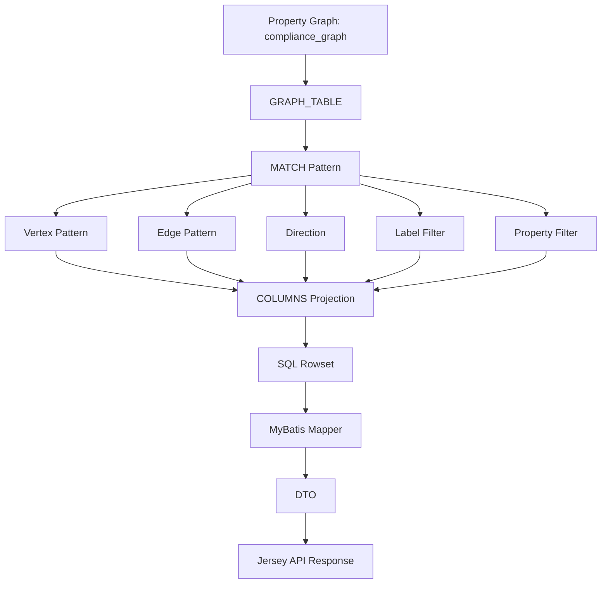

---

## 4. Base Schema yang Dipakai

Kita lanjut memakai schema dari seri sebelumnya.

```sql
CREATE TABLE cases (
    case_id      bigint PRIMARY KEY,
    tenant_id    bigint NOT NULL,
    case_no      text NOT NULL,
    case_type    text NOT NULL,
    status       text NOT NULL,
    risk_level   text NOT NULL,
    created_at   timestamptz NOT NULL DEFAULT now()
);

CREATE TABLE parties (
    party_id     bigint PRIMARY KEY,
    tenant_id    bigint NOT NULL,
    party_name   text NOT NULL,
    party_type   text NOT NULL,
    risk_score   numeric(5,2)
);

CREATE TABLE accounts (
    account_id   bigint PRIMARY KEY,
    tenant_id    bigint NOT NULL,
    account_no   text NOT NULL,
    account_type text NOT NULL,
    status       text NOT NULL
);

CREATE TABLE case_parties (
    case_party_id bigint PRIMARY KEY,
    tenant_id     bigint NOT NULL,
    case_id       bigint NOT NULL REFERENCES cases(case_id),
    party_id      bigint NOT NULL REFERENCES parties(party_id),
    role          text NOT NULL,
    valid_from    date NOT NULL,
    valid_to      date
);

CREATE TABLE party_accounts (
    party_account_id bigint PRIMARY KEY,
    tenant_id        bigint NOT NULL,
    party_id         bigint NOT NULL REFERENCES parties(party_id),
    account_id       bigint NOT NULL REFERENCES accounts(account_id),
    ownership_type   text NOT NULL,
    ownership_pct    numeric(5,2),
    valid_from       date NOT NULL,
    valid_to         date
);
```

Property graph:

```sql
CREATE PROPERTY GRAPH compliance_graph
    VERTEX TABLES (
        cases
            KEY (case_id)
            LABEL case_node
            PROPERTIES (
                case_id,
                tenant_id,
                case_no,
                case_type,
                status,
                risk_level,
                created_at
            ),

        parties
            KEY (party_id)
            LABEL party
            PROPERTIES (
                party_id,
                tenant_id,
                party_name,
                party_type,
                risk_score
            ),

        accounts
            KEY (account_id)
            LABEL account
            PROPERTIES (
                account_id,
                tenant_id,
                account_no,
                account_type,
                status
            )
    )
    EDGE TABLES (
        case_parties
            KEY (case_party_id)
            SOURCE KEY (case_id) REFERENCES cases (case_id)
            DESTINATION KEY (party_id) REFERENCES parties (party_id)
            LABEL involves
            PROPERTIES (
                tenant_id,
                role,
                valid_from,
                valid_to
            ),

        party_accounts
            KEY (party_account_id)
            SOURCE KEY (party_id) REFERENCES parties (party_id)
            DESTINATION KEY (account_id) REFERENCES accounts (account_id)
            LABEL owns
            PROPERTIES (
                tenant_id,
                ownership_type,
                ownership_pct,
                valid_from,
                valid_to
            )
    );
```

`CREATE PROPERTY GRAPH` mendefinisikan vertex dan edge dengan label/properties, dan PostgreSQL menyatakan data graph tetap berada di regular tables, views, foreign tables, atau object sejenis. Definisi property graph tidak mematerialisasi graph secara fisik, sehingga index dan constraint tetap harus dirancang di base table. ([PostgreSQL](https://www.postgresql.org/docs/19/sql-create-property-graph.html))

---

# 5. Anatomy `GRAPH_TABLE`

## 5.1 Bentuk Umum

```sql
SELECT *
FROM GRAPH_TABLE (
    compliance_graph
    MATCH
        (c IS case_node)-[cp IS involves]->(p IS party)
    COLUMNS (
        c.case_id AS case_id,
        c.case_no AS case_no,
        p.party_id AS party_id,
        p.party_name AS party_name,
        cp.role AS role
    )
);
```

Bagian-bagiannya:

| Bagian | Fungsi |
|---|---|
| `compliance_graph` | Nama property graph |
| `MATCH` | Mulai graph pattern |
| `(c IS case_node)` | Vertex pattern: node case |
| `[cp IS involves]` | Edge pattern: relationship involves |
| `(p IS party)` | Vertex pattern: node party |
| `->` | Arah edge dari case ke party |
| `COLUMNS` | Projection hasil ke rowset SQL |
| `c.case_no AS case_no` | Ambil property dari graph variable |

PostgreSQL mendefinisikan graph pattern sebagai path: sequence vertex dan edge yang dimulai dan diakhiri dengan vertex, serta alternating antara vertex dan edge. Pattern paling sederhana adalah `()` untuk satu vertex, dan `()-[]->()` untuk dua vertex yang dihubungkan satu edge. ([PostgreSQL](https://www.postgresql.org/docs/19/queries-graph.html))

---

# 6. Pattern 1 - Match Semua Case Node

Query paling sederhana: ambil semua vertex dengan label `case_node`.

```sql
SELECT *
FROM GRAPH_TABLE (
    compliance_graph
    MATCH
        (c IS case_node)
    COLUMNS (
        c.case_id AS case_id,
        c.tenant_id AS tenant_id,
        c.case_no AS case_no,
        c.status AS status,
        c.risk_level AS risk_level
    )
);
```

Practical use:

```text
- validasi graph definition
- smoke test setelah migration
- cek property projection
- dasar mapping DTO sederhana
```

Production warning:

```text
Jangan expose query seperti ini langsung ke API tanpa pagination, tenant filter, dan authorization.
```

Versi lebih aman:

```sql
SELECT *
FROM GRAPH_TABLE (
    compliance_graph
    MATCH
        (c IS case_node)
    WHERE
        c.tenant_id = #{tenantId}
        AND c.status = 'OPEN'
    COLUMNS (
        c.case_id AS case_id,
        c.case_no AS case_no,
        c.status AS status,
        c.risk_level AS risk_level
    )
)
ORDER BY case_id
LIMIT #{limit}
OFFSET #{offset};
```

---

# 7. Pattern 2 - 1-Hop Traversal: Case → Party

Cari parties yang terlibat dalam sebuah case.

```sql
SELECT *
FROM GRAPH_TABLE (
    compliance_graph
    MATCH
        (c IS case_node)-[cp IS involves]->(p IS party)
    WHERE
        c.tenant_id = #{tenantId}
        AND p.tenant_id = #{tenantId}
        AND cp.tenant_id = #{tenantId}
        AND c.case_id = #{caseId}
    COLUMNS (
        c.case_id AS case_id,
        c.case_no AS case_no,

        cp.role AS party_role,
        cp.valid_from AS valid_from,
        cp.valid_to AS valid_to,

        p.party_id AS party_id,
        p.party_name AS party_name,
        p.party_type AS party_type,
        p.risk_score AS risk_score
    )
);
```

Makna graph:

```text
Case --involves--> Party
```

Makna business:

```text
Untuk case tertentu, cari semua party yang terlibat beserta role-nya.
```

Kenapa ini bagus?

```text
- query relationship lebih readable
- edge property seperti role/validity ikut terbaca
- output tetap tabular
- mudah dimapping ke MyBatis DTO
```

---

# 8. Pattern 3 - 2-Hop Traversal: Case → Party → Account

Cari account yang terkait dengan sebuah case melalui party.

```sql
SELECT *
FROM GRAPH_TABLE (
    compliance_graph
    MATCH
        (c IS case_node)-[cp IS involves]->(p IS party)-[pa IS owns]->(a IS account)
    WHERE
        c.tenant_id = #{tenantId}
        AND p.tenant_id = #{tenantId}
        AND a.tenant_id = #{tenantId}
        AND cp.tenant_id = #{tenantId}
        AND pa.tenant_id = #{tenantId}
        AND c.case_id = #{caseId}
    COLUMNS (
        c.case_id AS case_id,
        c.case_no AS case_no,

        p.party_id AS party_id,
        p.party_name AS party_name,
        p.party_type AS party_type,
        cp.role AS party_role,

        a.account_id AS account_id,
        a.account_no AS account_no,
        a.account_type AS account_type,
        a.status AS account_status,

        pa.ownership_type AS ownership_type,
        pa.ownership_pct AS ownership_pct
    )
);
```

Graph shape:

```text
Case -> Party -> Account
```

Contoh response DTO:

```json
[
  {
    "caseId": 1001,
    "caseNo": "CASE-2026-001",
    "partyId": 2001,
    "partyName": "PT Alpha",
    "partyType": "COMPANY",
    "partyRole": "SUBJECT",
    "accountId": 3001,
    "accountNo": "ACC-7788",
    "accountType": "CORPORATE",
    "accountStatus": "ACTIVE",
    "ownershipType": "OWNER",
    "ownershipPct": 75.00
  }
]
```

Practical API:

```http
GET /cases/{caseId}/graph/related-accounts?asOfDate=2026-07-15
```

---

# 9. Pattern 4 - Reverse Traversal: Account ← Party ← Case

Cari case yang terkait dengan sebuah account.

```sql
SELECT *
FROM GRAPH_TABLE (
    compliance_graph
    MATCH
        (a IS account)<-[pa IS owns]-(p IS party)<-[cp IS involves]-(c IS case_node)
    WHERE
        a.tenant_id = #{tenantId}
        AND p.tenant_id = #{tenantId}
        AND c.tenant_id = #{tenantId}
        AND a.account_id = #{accountId}
    COLUMNS (
        a.account_id AS account_id,
        a.account_no AS account_no,

        p.party_id AS party_id,
        p.party_name AS party_name,
        pa.ownership_type AS ownership_type,

        c.case_id AS case_id,
        c.case_no AS case_no,
        c.status AS case_status,
        cp.role AS party_role_in_case
    )
);
```

Graph shape:

```text
Account <- Party <- Case
```

PostgreSQL graph pattern mendukung arah edge dari kiri ke kanan dengan `->`, arah sebaliknya dengan `<-`, dan matching dua arah dengan edge undirected-style seperti `-[]-`. ([PostgreSQL](https://www.postgresql.org/docs/19/queries-graph.html))

Use case:

```text
- Account ini muncul di case mana saja?
- Apakah account ini terkait ke high-risk case?
- Party mana yang menjadi bridge antara account dan case?
```

---

# 10. Pattern 5 - Two-Way Match: Party - Party

Misalnya ada table tambahan `party_relationships`.

```sql
CREATE TABLE party_relationships (
    party_relationship_id bigint PRIMARY KEY,
    tenant_id             bigint NOT NULL,

    party_id              bigint NOT NULL REFERENCES parties(party_id),
    related_party_id      bigint NOT NULL REFERENCES parties(party_id),

    relationship_type     text NOT NULL,
    valid_from            date NOT NULL,
    valid_to              date,

    created_at            timestamptz NOT NULL DEFAULT now()
);
```

Tambahkan ke graph:

```sql
ALTER PROPERTY GRAPH compliance_graph ADD
    EDGE TABLES (
        party_relationships
            KEY (party_relationship_id)
            SOURCE KEY (party_id) REFERENCES parties (party_id)
            DESTINATION KEY (related_party_id) REFERENCES parties (party_id)
            LABEL related_to
            PROPERTIES (
                tenant_id,
                relationship_type,
                valid_from,
                valid_to
            )
    );
```

Query dua arah:

```sql
SELECT *
FROM GRAPH_TABLE (
    compliance_graph
    MATCH
        (p1 IS party)-[r IS related_to]-(p2 IS party)
    WHERE
        p1.tenant_id = #{tenantId}
        AND p2.tenant_id = #{tenantId}
        AND r.tenant_id = #{tenantId}
        AND p1.party_id = #{partyId}
    COLUMNS (
        p1.party_id AS source_party_id,
        p1.party_name AS source_party_name,

        r.relationship_type AS relationship_type,

        p2.party_id AS related_party_id,
        p2.party_name AS related_party_name
    )
);
```

Makna:

```text
Cari relationship party ke party, tidak peduli edge disimpan dari p1 ke p2 atau p2 ke p1.
```

Gunakan hati-hati:

```text
- bagus untuk friendship/association
- kurang bagus untuk relationship yang direction-nya legally meaningful
- bisa menghasilkan duplicate semantic result jika data menyimpan dua arah sekaligus
```

---

# 11. Pattern 6 - Multiple Label Match

PostgreSQL graph pattern bisa mencocokkan beberapa label memakai OR semantics, misalnya `(IS account|creditcard)` pada dokumentasi. ([PostgreSQL](https://www.postgresql.org/docs/19/queries-graph.html))

Contoh enterprise:

```sql
-- Misalnya nanti ada vertex label account dan document
SELECT *
FROM GRAPH_TABLE (
    compliance_graph
    MATCH
        (c IS case_node)-[e]->(x IS account|document)
    WHERE
        c.tenant_id = #{tenantId}
        AND c.case_id = #{caseId}
    COLUMNS (
        c.case_no AS case_no,
        x AS target_element
    )
);
```

Namun untuk production API, lebih baik jangan return raw element `x` jika DTO contract harus stabil.

Lebih aman buat query terpisah:

```text
GET /cases/{caseId}/related-accounts
GET /cases/{caseId}/documents
```

atau buat projection eksplisit yang diseragamkan:

```sql
SELECT *
FROM GRAPH_TABLE (
    compliance_graph
    MATCH
        (c IS case_node)-[e]->(x IS account|document)
    WHERE
        c.tenant_id = #{tenantId}
        AND c.case_id = #{caseId}
    COLUMNS (
        c.case_id AS root_case_id,
        c.case_no AS root_case_no,

        e AS relationship_element,
        x AS target_element
    )
);
```

Practical caution:

```text
Multiple-label match bagus untuk exploration/internal tooling.
Untuk external API, query spesifik per relationship biasanya lebih aman.
```

---

# 12. Pattern 7 - Element Pattern `WHERE`

PostgreSQL docs menunjukkan `WHERE` bisa digunakan di dalam element pattern untuk memfilter match, misalnya `(IS person)-[IS has]->(a IS account WHERE a.type = 'savings')`. ([PostgreSQL](https://www.postgresql.org/docs/19/queries-graph.html))

Contoh: hanya account aktif.

```sql
SELECT *
FROM GRAPH_TABLE (
    compliance_graph
    MATCH
        (c IS case_node)
            -[cp IS involves]->
        (p IS party)
            -[pa IS owns]->
        (a IS account WHERE a.status = 'ACTIVE')
    WHERE
        c.tenant_id = #{tenantId}
        AND c.case_id = #{caseId}
    COLUMNS (
        c.case_no AS case_no,
        p.party_name AS party_name,
        a.account_no AS account_no,
        a.status AS account_status,
        pa.ownership_type AS ownership_type
    )
);
```

Alternatif: filter di global `WHERE`.

```sql
SELECT *
FROM GRAPH_TABLE (
    compliance_graph
    MATCH
        (c IS case_node)-[cp IS involves]->(p IS party)-[pa IS owns]->(a IS account)
    WHERE
        c.tenant_id = #{tenantId}
        AND c.case_id = #{caseId}
        AND a.status = 'ACTIVE'
    COLUMNS (
        c.case_no AS case_no,
        p.party_name AS party_name,
        a.account_no AS account_no,
        a.status AS account_status,
        pa.ownership_type AS ownership_type
    )
);
```

Practical preference:

| Filter Style | Cocok Untuk |
|---|---|
| Element pattern `WHERE` | Filter yang melekat ke node/edge tertentu |
| Global `WHERE` | Filter multi-element, tenant, temporal, root condition |
| Outer SQL `WHERE` | Filter hasil projection setelah `GRAPH_TABLE` |

Untuk readability enterprise, saya biasanya pakai:

```text
- global WHERE untuk tenant/root/asOfDate
- element WHERE untuk filter yang sangat lokal dan jelas
```

---

# 13. Pattern 8 - Temporal Graph Query

Query relationship yang valid pada tanggal tertentu.

```sql
SELECT *
FROM GRAPH_TABLE (
    compliance_graph
    MATCH
        (c IS case_node)-[cp IS involves]->(p IS party)-[pa IS owns]->(a IS account)
    WHERE
        c.tenant_id = #{tenantId}
        AND p.tenant_id = #{tenantId}
        AND a.tenant_id = #{tenantId}
        AND cp.tenant_id = #{tenantId}
        AND pa.tenant_id = #{tenantId}

        AND c.case_id = #{caseId}

        AND cp.valid_from <= #{asOfDate}
        AND (cp.valid_to IS NULL OR cp.valid_to >= #{asOfDate})

        AND pa.valid_from <= #{asOfDate}
        AND (pa.valid_to IS NULL OR pa.valid_to >= #{asOfDate})

    COLUMNS (
        c.case_id AS case_id,
        c.case_no AS case_no,

        p.party_id AS party_id,
        p.party_name AS party_name,
        cp.role AS party_role,

        a.account_id AS account_id,
        a.account_no AS account_no,
        pa.ownership_type AS ownership_type,
        pa.ownership_pct AS ownership_pct
    )
);
```

Ini penting untuk regulatory system.

```text
Current graph:
- relasi yang berlaku sekarang

As-of graph:
- relasi yang berlaku saat keputusan / kejadian / enforcement action dibuat
```

Kesalahan umum:

```text
Mengambil current relationship untuk menjelaskan keputusan historis.
```

Dalam sistem case-management atau enforcement lifecycle, ini bisa menjadi masalah defensibility.

---

# 14. Pattern 9 - Graph Query + SQL Join

Karena `GRAPH_TABLE` menghasilkan table expression, hasilnya bisa di-join dengan tabel biasa. PostgreSQL docs menyebut hasil `GRAPH_TABLE` dapat diberi alias, di-join dengan table lain, difilter, diurutkan, dan sebagainya. ([PostgreSQL](https://www.postgresql.org/docs/19/queries-graph.html))

Misalnya ada table risk assessment:

```sql
CREATE TABLE party_risk_assessments (
    assessment_id bigint PRIMARY KEY,
    tenant_id     bigint NOT NULL,
    party_id      bigint NOT NULL REFERENCES parties(party_id),
    risk_band     text NOT NULL,
    assessed_at   timestamptz NOT NULL
);
```

Query:

```sql
SELECT
    g.case_id,
    g.case_no,
    g.party_id,
    g.party_name,
    g.account_id,
    g.account_no,
    r.risk_band,
    r.assessed_at
FROM GRAPH_TABLE (
    compliance_graph
    MATCH
        (c IS case_node)-[cp IS involves]->(p IS party)-[pa IS owns]->(a IS account)
    WHERE
        c.tenant_id = #{tenantId}
        AND c.case_id = #{caseId}
    COLUMNS (
        c.case_id AS case_id,
        c.case_no AS case_no,
        p.party_id AS party_id,
        p.party_name AS party_name,
        a.account_id AS account_id,
        a.account_no AS account_no
    )
) AS g
LEFT JOIN party_risk_assessments r
    ON r.tenant_id = #{tenantId}
   AND r.party_id = g.party_id
ORDER BY r.assessed_at DESC;
```

Practical use:

```text
- graph untuk relationship discovery
- SQL join untuk enrichment
- output tetap satu DTO
```

---

# 15. Pattern 10 - Aggregation di Atas Graph Result

Cari party yang muncul di banyak case.

```sql
SELECT
    party_id,
    party_name,
    COUNT(DISTINCT case_id) AS case_count
FROM GRAPH_TABLE (
    compliance_graph
    MATCH
        (c IS case_node)-[cp IS involves]->(p IS party)
    WHERE
        c.tenant_id = #{tenantId}
        AND p.tenant_id = #{tenantId}
        AND cp.tenant_id = #{tenantId}
    COLUMNS (
        c.case_id AS case_id,
        p.party_id AS party_id,
        p.party_name AS party_name
    )
) AS g
GROUP BY
    party_id,
    party_name
HAVING
    COUNT(DISTINCT case_id) >= #{minCaseCount}
ORDER BY
    case_count DESC,
    party_name ASC;
```

Use case:

```text
- party muncul di banyak case
- account dipakai oleh banyak party
- officer menangani case terkait party yang sama
- document dipakai sebagai evidence di banyak case
```

---

# 16. Pattern 11 - Duplicate Relationship Detection

Cari duplicate semantic edge di base table, bukan hanya graph query.

```sql
SELECT
    tenant_id,
    case_id,
    party_id,
    role,
    valid_from,
    COUNT(*) AS duplicate_count
FROM case_parties
GROUP BY
    tenant_id,
    case_id,
    party_id,
    role,
    valid_from
HAVING COUNT(*) > 1;
```

Kenapa bukan hanya pakai `GRAPH_TABLE`?

```text
Karena data quality invariant sebaiknya dicek langsung pada source table.
Graph query bagus untuk consumption.
Integrity check tetap lebih jelas di relational layer.
```

Tambahkan unique constraint:

```sql
ALTER TABLE case_parties
ADD CONSTRAINT uq_case_party_role_validity
UNIQUE (tenant_id, case_id, party_id, role, valid_from);
```

---

# 17. Pattern 12 - Graph Query untuk Impact View

Impact view biasanya gabungan beberapa graph query, bukan satu query super-kompleks.

Misalnya endpoint:

```http
GET /cases/{caseId}/graph/impact?asOfDate=2026-07-15
```

Response:

```json
{
  "caseId": 1001,
  "caseNo": "CASE-2026-001",
  "parties": [],
  "accounts": [],
  "documents": [],
  "officers": [],
  "enforcementActions": []
}
```

Approach yang lebih maintainable:

```text
1. Query case parties
2. Query related accounts
3. Query documents
4. Query officers
5. Query enforcement actions
6. Compose response di service layer
```

Jangan terlalu cepat membuat satu query graph raksasa:

```text
Case -> Party -> Account -> Other Case -> Document -> Officer -> Action
```

Risiko:

```text
- row multiplication
- hard-to-debug output
- duplicate DTO assembly
- query plan sulit diprediksi
- pagination hampir mustahil
```

---

# 18. MyBatis Mapper XML - Production Style

DTO:

```java
public record RelatedAccountGraphRow(
        long caseId,
        String caseNo,
        long partyId,
        String partyName,
        String partyType,
        String partyRole,
        long accountId,
        String accountNo,
        String accountType,
        String accountStatus,
        String ownershipType,
        BigDecimal ownershipPct
) {}
```

Mapper interface:

```java
public interface CaseGraphMapper {

    List<RelatedAccountGraphRow> findRelatedAccounts(
            @Param("tenantId") long tenantId,
            @Param("caseId") long caseId,
            @Param("asOfDate") LocalDate asOfDate,
            @Param("includeClosedAccounts") boolean includeClosedAccounts
    );
}
```

Mapper XML:

```xml
<select id="findRelatedAccounts"
        resultType="com.acme.casegraph.RelatedAccountGraphRow">
    SELECT *
    FROM GRAPH_TABLE (
        compliance_graph
        MATCH
            (c IS case_node)-[cp IS involves]->(p IS party)-[pa IS owns]->(a IS account)
        WHERE
            c.tenant_id = #{tenantId}
            AND p.tenant_id = #{tenantId}
            AND a.tenant_id = #{tenantId}
            AND cp.tenant_id = #{tenantId}
            AND pa.tenant_id = #{tenantId}

            AND c.case_id = #{caseId}

            AND cp.valid_from &lt;= #{asOfDate}
            AND (cp.valid_to IS NULL OR cp.valid_to &gt;= #{asOfDate})

            AND pa.valid_from &lt;= #{asOfDate}
            AND (pa.valid_to IS NULL OR pa.valid_to &gt;= #{asOfDate})

            <if test="!includeClosedAccounts">
                AND a.status != 'CLOSED'
            </if>

        COLUMNS (
            c.case_id AS "caseId",
            c.case_no AS "caseNo",

            p.party_id AS "partyId",
            p.party_name AS "partyName",
            p.party_type AS "partyType",

            cp.role AS "partyRole",

            a.account_id AS "accountId",
            a.account_no AS "accountNo",
            a.account_type AS "accountType",
            a.status AS "accountStatus",

            pa.ownership_type AS "ownershipType",
            pa.ownership_pct AS "ownershipPct"
        )
    )
    ORDER BY
        "partyName",
        "accountNo"
</select>
```

Catatan MyBatis:

```text
- Gunakan parameter binding #{...}
- Hindari ${...} untuk graph pattern / label / property
- Dynamic SQL boleh untuk filter value, bukan untuk menyusun query graph mentah dari client
- Alias COLUMNS harus konsisten dengan Java record/property name
```

---

# 19. Jersey Endpoint + Service Guardrail

Resource:

```java
@Path("/cases/{caseId}/graph")
@Produces(MediaType.APPLICATION_JSON)
public class CaseGraphResource {

    private final CaseGraphService service;

    public CaseGraphResource(CaseGraphService service) {
        this.service = service;
    }

    @GET
    @Path("/related-accounts")
    public Response getRelatedAccounts(
            @PathParam("caseId") long caseId,
            @QueryParam("asOfDate") LocalDate asOfDate,
            @DefaultValue("false")
            @QueryParam("includeClosedAccounts") boolean includeClosedAccounts
    ) {
        LocalDate effectiveDate = asOfDate != null
                ? asOfDate
                : LocalDate.now();

        List<RelatedAccountGraphRow> rows =
                service.findRelatedAccounts(
                        caseId,
                        effectiveDate,
                        includeClosedAccounts
                );

        return Response.ok(rows).build();
    }
}
```

Service:

```java
public final class CaseGraphService {

    private final TenantContext tenantContext;
    private final CaseAccessPolicy accessPolicy;
    private final CaseGraphMapper mapper;

    public List<RelatedAccountGraphRow> findRelatedAccounts(
            long caseId,
            LocalDate asOfDate,
            boolean includeClosedAccounts
    ) {
        long tenantId = tenantContext.requiredTenantId();

        accessPolicy.assertCanReadCase(tenantId, caseId);

        return mapper.findRelatedAccounts(
                tenantId,
                caseId,
                asOfDate,
                includeClosedAccounts
        );
    }
}
```

Practical invariant:

```text
Authorization sebelum traversal.
Tenant filter tetap masuk query.
As-of-date eksplisit.
Result DTO jelas.
Client tidak mengirim MATCH.
```

---

# 20. Query Safety Checklist

Untuk setiap `GRAPH_TABLE` query yang masuk service production:

```text
[ ] Ada root node filter, misalnya case_id/account_id/party_id.
[ ] Ada tenant filter.
[ ] Ada label eksplisit untuk vertex.
[ ] Ada label eksplisit untuk edge.
[ ] Ada temporal filter jika relationship historis.
[ ] Tidak memakai raw graph element sebagai public API output.
[ ] Projection eksplisit via COLUMNS.
[ ] Ada LIMIT/pagination jika hasil bisa besar.
[ ] Tidak ada dynamic graph pattern dari request body.
[ ] Query diuji dengan EXPLAIN.
[ ] Edge source/destination sudah terindeks.
[ ] Query punya timeout.
[ ] Row count dicatat di observability.
```

---

# 21. Performance Guardrail

Karena property graph tidak mematerialisasi storage graph fisik, performance tergantung base table, index, statistics, dan selectivity. PostgreSQL juga menyatakan graph query dan relational query memakai planning/execution infrastructure yang sama. ([PostgreSQL](https://www.postgresql.org/docs/19/ddl-property-graphs.html))

Minimum index:

```sql
CREATE INDEX idx_cases_tenant_case
    ON cases (tenant_id, case_id);

CREATE INDEX idx_parties_tenant_party
    ON parties (tenant_id, party_id);

CREATE INDEX idx_accounts_tenant_account
    ON accounts (tenant_id, account_id);

CREATE INDEX idx_case_parties_tenant_case
    ON case_parties (tenant_id, case_id);

CREATE INDEX idx_case_parties_tenant_party
    ON case_parties (tenant_id, party_id);

CREATE INDEX idx_party_accounts_tenant_party
    ON party_accounts (tenant_id, party_id);

CREATE INDEX idx_party_accounts_tenant_account
    ON party_accounts (tenant_id, account_id);
```

Untuk temporal:

```sql
CREATE INDEX idx_case_parties_case_validity
    ON case_parties (tenant_id, case_id, valid_from, valid_to);

CREATE INDEX idx_party_accounts_party_validity
    ON party_accounts (tenant_id, party_id, valid_from, valid_to);
```

Practical tuning:

```text
- Mulai dari root node paling selektif.
- Hindari pattern tanpa label.
- Hindari pattern tanpa tenant.
- Hindari traversal terlalu panjang dalam satu query.
- Pecah impact view besar menjadi beberapa query bounded.
- Jalankan EXPLAIN ANALYZE di data yang mendekati production.
```

---

# 22. Bad Query vs Good Query

## Bad Query

```sql
SELECT *
FROM GRAPH_TABLE (
    compliance_graph
    MATCH
        (a)-[]->(b)-[]->(c)
    COLUMNS (
        a AS a,
        b AS b,
        c AS c
    )
);
```

Masalah:

```text
- tidak ada label
- tidak ada root
- tidak ada tenant
- tidak ada edge type
- output raw graph element
- potensi row explosion
- tidak jelas business intent-nya
```

## Good Query

```sql
SELECT *
FROM GRAPH_TABLE (
    compliance_graph
    MATCH
        (c IS case_node)-[cp IS involves]->(p IS party)-[pa IS owns]->(a IS account)
    WHERE
        c.tenant_id = #{tenantId}
        AND p.tenant_id = #{tenantId}
        AND a.tenant_id = #{tenantId}
        AND c.case_id = #{caseId}
        AND cp.valid_from <= #{asOfDate}
        AND (cp.valid_to IS NULL OR cp.valid_to >= #{asOfDate})
        AND pa.valid_from <= #{asOfDate}
        AND (pa.valid_to IS NULL OR pa.valid_to >= #{asOfDate})
    COLUMNS (
        c.case_no AS case_no,
        p.party_name AS party_name,
        cp.role AS party_role,
        a.account_no AS account_no,
        pa.ownership_type AS ownership_type
    )
);
```

Kelebihan:

```text
- business intent jelas
- traversal bounded
- tenant-safe
- temporal-safe
- projection stabil
- MyBatis-friendly
```

---

# 23. Practical Query Catalog

| Query Intent | Pattern | API Candidate |
|---|---|---|
| Case parties | `Case -> Party` | `GET /cases/{id}/graph/parties` |
| Case related accounts | `Case -> Party -> Account` | `GET /cases/{id}/graph/related-accounts` |
| Account linked cases | `Account <- Party <- Case` | `GET /accounts/{id}/graph/linked-cases` |
| Party linked accounts | `Party -> Account` | `GET /parties/{id}/graph/accounts` |
| Party linked cases | `Party <- Case` | `GET /parties/{id}/graph/cases` |
| Party-to-party relation | `Party - Party` | `GET /parties/{id}/graph/related-parties` |
| Multi-case party | Aggregate `Case -> Party` | `GET /graph/parties/repeated-in-cases` |
| High-risk linked account | `Case -> Party -> Account` + risk filter | `GET /cases/{id}/graph/risk-exposure` |

---

# 24. Mini Exercise

Buat 5 query berikut:

```text
1. Case -> Party
   Cari semua party dalam satu case.

2. Case -> Party -> Account
   Cari semua account terkait case.

3. Account <- Party <- Case
   Cari semua case yang terkait account.

4. Party -> Account
   Cari semua account aktif milik party pada asOfDate tertentu.

5. Aggregate Case -> Party
   Cari party yang muncul di minimal 3 case.
```

Tambahkan guardrail:

```text
[ ] tenant_id
[ ] asOfDate untuk edge temporal
[ ] explicit label
[ ] explicit COLUMNS projection
[ ] ORDER BY stabil
[ ] mapping DTO
```

---

# 25. Ringkasan Seri 5

`GRAPH_TABLE` adalah jembatan dari graph pattern ke SQL rowset. `MATCH` mendeskripsikan relationship yang dicari, sedangkan `COLUMNS` mengubah hasil menjadi kolom yang bisa di-mapping oleh MyBatis dan dikembalikan oleh Jersey REST API. PostgreSQL mendukung vertex pattern, edge pattern, direction `->` / `<-` / dua arah, label matching, variable binding, dan filtering. ([PostgreSQL](https://www.postgresql.org/docs/19/queries-graph.html))

Pola production yang aman:

```text
Intent-specific API
→ Service authorization
→ Parameterized MyBatis query
→ GRAPH_TABLE with explicit MATCH
→ tenant + temporal filter
→ COLUMNS DTO projection
→ bounded response
```

---

## Status Seri

**Seri 5/12 selesai.**

Seri berikutnya:

**Seri 6/12 - Multi-hop Traversal, Path Query, Direction, and Cycle Handling**

Fokus berikutnya: traversal lebih dari 2-hop, kontrol arah, path explosion, cycle risk, depth limit, kapan memakai SQL/PGQ dan kapan fallback ke `WITH RECURSIVE`.

---

**Sources:**

- [PostgreSQL: Documentation: 19: 7.9. Graph Queries](https://www.postgresql.org/docs/19/queries-graph.html)

## Response:
7/15/2026, 9:07:26 PM

Saya lanjut ke **Seri 6/12**. Seri ini akan fokus pada traversal yang mulai berisiko: multi-hop, arah edge, path explosion, cycle, depth limit, dan fallback ke recursive CTE saat kontrol eksplisit lebih penting.

# Seri 6/12 - Multi-hop Traversal, Path Query, Direction, and Cycle Handling

## 1. Tujuan Seri Ini

Seri ini fokus pada bagian graph query yang paling sering menimbulkan masalah production:

```text
- traversal lebih dari 2-hop
- arah edge
- reverse traversal
- query path relationship
- row explosion
- cycle
- depth limit
- kapan pakai SQL/PGQ
- kapan fallback ke WITH RECURSIVE
```

PostgreSQL 19 mendefinisikan property graph sebagai **read-only view di atas relational tables**, dan graph query tetap memakai query planning/execution infrastructure PostgreSQL yang sama dengan relational query. Artinya, graph traversal tetap harus diperlakukan seperti query SQL serius: butuh root filter, label eksplisit, index, limit, dan observability. ([PostgreSQL](https://www.postgresql.org/docs/19/ddl-property-graphs.html))

Catatan versi tetap berlaku: dokumentasi PostgreSQL 19 saat ini ditandai sebagai **unsupported development version**, jadi materi ini tepat untuk onboarding/prototyping, sementara production adoption harus mengikuti versi PostgreSQL yang resmi didukung organisasi. ([PostgreSQL](https://www.postgresql.org/docs/19/ddl-property-graphs.html))

---

## 2. Mental Model Multi-hop Traversal

Multi-hop traversal berarti mencari hubungan yang melewati beberapa edge.

```text
1-hop:
Case -> Party

2-hop:
Case -> Party -> Account

3-hop:
Case -> Party -> Account -> Other Party

4-hop:
Case -> Party -> Account -> Other Party -> Other Case
```

Dalam PostgreSQL 19, graph pattern adalah sequence vertex dan edge yang dimulai dan diakhiri dengan vertex serta bergantian antara vertex dan edge. Pattern sederhana seperti `()` mencocokkan satu vertex, sedangkan `()-[]->()` mencocokkan dua vertex yang terhubung oleh satu edge. ([PostgreSQL](https://www.postgresql.org/docs/19/queries-graph.html))

---

## 3. Diagram Multi-hop

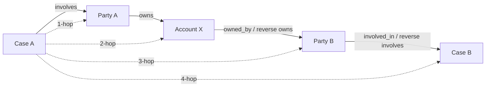

Makna business:

```text
Case A terkait ke Party A.
Party A memiliki Account X.
Account X juga dimiliki/dikuasai Party B.
Party B muncul di Case B.

Jadi Case A dan Case B terhubung melalui shared account.
```

---

## 4. Syntax Direction yang Harus Dikuasai

PostgreSQL graph pattern mendukung arah edge kiri-ke-kanan, arah sebaliknya, dan match dua arah. Dokumentasi PostgreSQL menunjukkan pattern seperti `(IS person)-[IS has]->(IS account)`, reverse dengan `<-`, dan dua arah dengan `-[IS is_friend_of]-`; dua arah berarti edge di salah satu arah dapat match. ([PostgreSQL](https://www.postgresql.org/docs/19/queries-graph.html))

| Pattern | Makna |
|---|---|
| `(a)-[e]->(b)` | Edge dari `a` ke `b` |
| `(a)<-[e]-(b)` | Edge dari `b` ke `a` |
| `(a)-[e]-(b)` | Edge arah mana pun |
| `(c IS case_node)-[cp IS involves]->(p IS party)` | Case involves party |
| `(a IS account)<-[pa IS owns]-(p IS party)` | Party owns account, dibaca dari account ke party |
| `(p1 IS party)-[r IS related_to]-(p2 IS party)` | Party related to party, arah tidak dipedulikan |

Rule praktis:

```text
Gunakan directed traversal jika relationship punya makna hukum/domain.
Gunakan bidirectional traversal hanya untuk relationship simetris atau exploratory.
```

---

## 5. Schema Tambahan untuk Contoh Multi-hop

Agar contoh lebih realistic, tambahkan party-to-party relationship.

```sql
CREATE TABLE party_relationships (
    party_relationship_id bigint PRIMARY KEY,
    tenant_id             bigint NOT NULL,

    party_id              bigint NOT NULL REFERENCES parties(party_id),
    related_party_id      bigint NOT NULL REFERENCES parties(party_id),

    relationship_type     text NOT NULL, -- DIRECTOR_OF, FAMILY_OF, AFFILIATE_OF, REPRESENTS
    valid_from            date NOT NULL,
    valid_to              date,

    confidence_score      numeric(5,2),
    source_system         text NOT NULL DEFAULT 'CASE_MGMT',
    created_by            text NOT NULL,
    created_at            timestamptz NOT NULL DEFAULT now(),

    CONSTRAINT ck_party_relationship_type
        CHECK (relationship_type IN (
            'DIRECTOR_OF',
            'FAMILY_OF',
            'AFFILIATE_OF',
            'REPRESENTS'
        )),

    CONSTRAINT ck_party_relationship_validity
        CHECK (valid_to IS NULL OR valid_to >= valid_from),

    CONSTRAINT uq_party_relationship_validity
        UNIQUE (
            tenant_id,
            party_id,
            related_party_id,
            relationship_type,
            valid_from
        )
);
```

Tambahkan edge ke property graph:

```sql
ALTER PROPERTY GRAPH compliance_graph ADD
    EDGE TABLES (
        party_relationships
            KEY (party_relationship_id)
            SOURCE KEY (party_id) REFERENCES parties (party_id)
            DESTINATION KEY (related_party_id) REFERENCES parties (party_id)
            LABEL related_to
            PROPERTIES (
                tenant_id,
                relationship_type,
                valid_from,
                valid_to,
                confidence_score,
                source_system
            )
    );
```

---

## 6. Pattern 1 - 3-hop: Case → Party → Account ← Other Party

Use case:

> Dari satu case, cari party lain yang terhubung melalui account yang sama.

Graph shape:

```text
Case -> Party -> Account <- Other Party
```

Query:

```sql
SELECT *
FROM GRAPH_TABLE (
    compliance_graph
    MATCH
        (c IS case_node WHERE c.tenant_id = #{tenantId} AND c.case_id = #{caseId})
            -[cp IS involves]->
        (p IS party WHERE p.tenant_id = #{tenantId})
            -[pa IS owns]->
        (a IS account WHERE a.tenant_id = #{tenantId})
            <-[pa2 IS owns]-
        (p2 IS party WHERE p2.tenant_id = #{tenantId})
    COLUMNS (
        c.case_id AS "caseId",
        c.case_no AS "caseNo",

        p.party_id AS "sourcePartyId",
        p.party_name AS "sourcePartyName",

        a.account_id AS "accountId",
        a.account_no AS "accountNo",

        p2.party_id AS "otherPartyId",
        p2.party_name AS "otherPartyName",

        pa.ownership_type AS "sourceOwnershipType",
        pa2.ownership_type AS "otherOwnershipType"
    )
) AS g
WHERE g."sourcePartyId" <> g."otherPartyId"
ORDER BY
    g."accountNo",
    g."otherPartyName";
```

Catatan syntax: dokumentasi PostgreSQL 19 menunjukkan bahwa filter dapat diletakkan di dalam element pattern melalui `WHERE`, dan `GRAPH_TABLE` menghasilkan computed table yang bisa difilter lagi oleh outer SQL. ([PostgreSQL](https://www.postgresql.org/docs/19/queries-graph.html))

Practical use:

```text
- shared account detection
- beneficial owner discovery
- indirect relationship finding
- suspicious linkage
- case impact enrichment
```

---

## 7. Pattern 2 - 4-hop: Case → Party → Account ← Party ← Case

Use case:

> Cari case lain yang terhubung ke case ini melalui account yang sama.

Graph shape:

```text
Case A -> Party A -> Account X <- Party B <- Case B
```

Query:

```sql
SELECT *
FROM GRAPH_TABLE (
    compliance_graph
    MATCH
        (c1 IS case_node WHERE c1.tenant_id = #{tenantId} AND c1.case_id = #{caseId})
            -[cp1 IS involves]->
        (p1 IS party WHERE p1.tenant_id = #{tenantId})
            -[pa1 IS owns]->
        (a IS account WHERE a.tenant_id = #{tenantId})
            <-[pa2 IS owns]-
        (p2 IS party WHERE p2.tenant_id = #{tenantId})
            <-[cp2 IS involves]-
        (c2 IS case_node WHERE c2.tenant_id = #{tenantId})
    COLUMNS (
        c1.case_id AS "rootCaseId",
        c1.case_no AS "rootCaseNo",

        p1.party_id AS "rootPartyId",
        p1.party_name AS "rootPartyName",

        a.account_id AS "sharedAccountId",
        a.account_no AS "sharedAccountNo",

        p2.party_id AS "linkedPartyId",
        p2.party_name AS "linkedPartyName",

        c2.case_id AS "linkedCaseId",
        c2.case_no AS "linkedCaseNo",
        c2.status AS "linkedCaseStatus"
    )
) AS g
WHERE g."rootCaseId" <> g."linkedCaseId"
ORDER BY
    g."sharedAccountNo",
    g."linkedCaseNo";
```

Kenapa outer `WHERE` dipakai?

```text
GRAPH_TABLE menghasilkan rowset.
Setelah menjadi rowset, kita bisa melakukan filter tambahan seperti SQL biasa.
Ini berguna untuk membuang self-match atau duplicate projection.
```

---

## 8. Pattern 3 - Party Relationship Chain

Use case:

> Cari party yang terkait langsung dengan party dalam case tertentu.

Graph shape:

```text
Case -> Party - related_to - Other Party
```

Query:

```sql
SELECT *
FROM GRAPH_TABLE (
    compliance_graph
    MATCH
        (c IS case_node WHERE c.tenant_id = #{tenantId} AND c.case_id = #{caseId})
            -[cp IS involves]->
        (p IS party WHERE p.tenant_id = #{tenantId})
            -[r IS related_to]-
        (p2 IS party WHERE p2.tenant_id = #{tenantId})
    COLUMNS (
        c.case_id AS "caseId",
        c.case_no AS "caseNo",

        p.party_id AS "partyId",
        p.party_name AS "partyName",

        r.relationship_type AS "relationshipType",
        r.confidence_score AS "confidenceScore",

        p2.party_id AS "relatedPartyId",
        p2.party_name AS "relatedPartyName"
    )
) AS g
WHERE g."partyId" <> g."relatedPartyId"
ORDER BY
    g."relationshipType",
    g."relatedPartyName";
```

Gunakan bidirectional `-[r IS related_to]-` hanya jika arah relationship memang tidak menentukan hasil. Untuk relationship seperti `DIRECTOR_OF`, `REPRESENTS`, atau `OWNS`, arah biasanya penting secara domain, jadi lebih aman query secara directed.

---

## 9. Pattern 4 - Temporal Multi-hop

Use case:

> Cari linked cases yang valid pada tanggal keputusan.

Graph shape:

```text
Case -> Party -> Account <- Party <- Case
```

Dengan valid-time filter pada semua edge temporal:

```sql
SELECT *
FROM GRAPH_TABLE (
    compliance_graph
    MATCH
        (c1 IS case_node WHERE c1.tenant_id = #{tenantId} AND c1.case_id = #{caseId})
            -[cp1 IS involves WHERE
                cp1.tenant_id = #{tenantId}
                AND cp1.valid_from <= #{asOfDate}
                AND (cp1.valid_to IS NULL OR cp1.valid_to >= #{asOfDate})
            ]->
        (p1 IS party WHERE p1.tenant_id = #{tenantId})
            -[pa1 IS owns WHERE
                pa1.tenant_id = #{tenantId}
                AND pa1.valid_from <= #{asOfDate}
                AND (pa1.valid_to IS NULL OR pa1.valid_to >= #{asOfDate})
            ]->
        (a IS account WHERE a.tenant_id = #{tenantId})
            <-[pa2 IS owns WHERE
                pa2.tenant_id = #{tenantId}
                AND pa2.valid_from <= #{asOfDate}
                AND (pa2.valid_to IS NULL OR pa2.valid_to >= #{asOfDate})
            ]-
        (p2 IS party WHERE p2.tenant_id = #{tenantId})
            <-[cp2 IS involves WHERE
                cp2.tenant_id = #{tenantId}
                AND cp2.valid_from <= #{asOfDate}
                AND (cp2.valid_to IS NULL OR cp2.valid_to >= #{asOfDate})
            ]-
        (c2 IS case_node WHERE c2.tenant_id = #{tenantId})
    COLUMNS (
        c1.case_id AS "rootCaseId",
        c1.case_no AS "rootCaseNo",
        a.account_no AS "sharedAccountNo",
        p2.party_id AS "linkedPartyId",
        p2.party_name AS "linkedPartyName",
        c2.case_id AS "linkedCaseId",
        c2.case_no AS "linkedCaseNo"
    )
) AS g
WHERE g."rootCaseId" <> g."linkedCaseId"
ORDER BY
    g."sharedAccountNo",
    g."linkedCaseNo";
```

Practical rule:

```text
Untuk regulated domain, graph query harus eksplisit:
- current relationship
- as-of-date relationship
- historical relationship range

Jangan campur ketiganya.
```

---

## 10. Path Explosion: Masalah Utama Multi-hop

Path explosion terjadi ketika setiap hop memperbanyak jumlah kombinasi.

Contoh sederhana:

```text
Case punya 20 parties.
Setiap party punya 10 accounts.
Setiap account punya 5 other parties.
Setiap other party muncul di 8 cases.

20 × 10 × 5 × 8 = 8.000 candidate rows
```

Kalau ditambah documents/officers/actions, hasil bisa melonjak cepat.

| Penyebab | Dampak |
|---|---|
| Pattern terlalu panjang | Join combination membesar |
| Tidak ada root filter | Full graph scan |
| Tidak ada tenant filter | Cross-domain result besar |
| Edge label tidak eksplisit | Semua relationship ikut match |
| Bidirectional edge sembarangan | Candidate path dobel |
| Tidak ada temporal filter | Historical edges ikut semua |
| Tidak ada deduplication | Response duplicate |
| Tidak ada limit/pagination | API overload |

---

## 11. Guardrail Multi-hop Query

Untuk setiap multi-hop query, wajib ada guardrail berikut:

```text
[ ] Root node filter
[ ] Tenant filter di node dan edge
[ ] Edge label eksplisit
[ ] Vertex label eksplisit
[ ] Temporal filter untuk edge historis
[ ] Self-match exclusion jika perlu
[ ] Deduplication jika response berbasis entity, bukan path
[ ] ORDER BY stabil
[ ] LIMIT/pagination untuk list besar
[ ] Query timeout
[ ] EXPLAIN baseline
```

Contoh dedup linked case:

```sql
SELECT DISTINCT
    g."linkedCaseId",
    g."linkedCaseNo",
    g."linkedCaseStatus"
FROM GRAPH_TABLE (
    compliance_graph
    MATCH
        (c1 IS case_node WHERE c1.tenant_id = #{tenantId} AND c1.case_id = #{caseId})
            -[cp1 IS involves]->
        (p1 IS party WHERE p1.tenant_id = #{tenantId})
            -[pa1 IS owns]->
        (a IS account WHERE a.tenant_id = #{tenantId})
            <-[pa2 IS owns]-
        (p2 IS party WHERE p2.tenant_id = #{tenantId})
            <-[cp2 IS involves]-
        (c2 IS case_node WHERE c2.tenant_id = #{tenantId})
    COLUMNS (
        c1.case_id AS "rootCaseId",
        c2.case_id AS "linkedCaseId",
        c2.case_no AS "linkedCaseNo",
        c2.status AS "linkedCaseStatus"
    )
) AS g
WHERE g."rootCaseId" <> g."linkedCaseId"
ORDER BY
    g."linkedCaseNo"
LIMIT #{limit}
OFFSET #{offset};
```

---

## 12. Entity Result vs Path Result

Ini penting secara API design.

### Entity result

```text
Pertanyaan:
Case apa saja yang terkait?

Output:
- caseId
- caseNo
- status
```

Biasanya perlu `DISTINCT`.

### Path result

```text
Pertanyaan:
Melalui path apa case ini terkait?

Output:
Case A -> Party A -> Account X -> Party B -> Case B
```

Biasanya tidak boleh `DISTINCT` sembarangan karena path detail penting.

| Tipe Output | Gunakan Untuk | Risiko |
|---|---|---|
| Entity result | Summary/list API | Kehilangan alasan hubungan |
| Path result | Investigation/audit UI | Row bisa banyak |
| Aggregated result | Dashboard/risk scoring | Perlu definisi aggregation jelas |
| Graph DTO | Visualization | Harus batasi node/edge count |

Practical endpoint split:

```http
GET /cases/{caseId}/graph/linked-cases
GET /cases/{caseId}/graph/linked-case-paths
GET /cases/{caseId}/graph/relationship-summary
```

Jangan campur semua dalam satu endpoint.

---

## 13. Cycle: Apa Masalahnya?

Cycle terjadi jika traversal bisa kembali ke node yang sudah dikunjungi.

Contoh:

```text
Party A related_to Party B
Party B related_to Party C
Party C related_to Party A
```

Atau:

```text
Case A -> Party A -> Account X -> Party B -> Case A
```

Dalam query fixed pattern 3-hop atau 4-hop, cycle tidak membuat infinite loop karena pattern panjangnya tetap. Masalahnya adalah duplicate path, self-match, dan combinatorial explosion. Infinite loop lebih relevan ketika Anda memakai recursive traversal seperti `WITH RECURSIVE`.

PostgreSQL documentation untuk recursive query menekankan bahwa recursive part harus akhirnya berhenti; kalau tidak, query bisa loop indefinitely. PostgreSQL juga mendokumentasikan cara cycle detection dengan path array atau `CYCLE` clause. ([PostgreSQL](https://www.postgresql.org/docs/current/queries-with.html))

---

## 14. SQL/PGQ Fixed Multi-hop vs Recursive Traversal

Berdasarkan dokumentasi PostgreSQL 19 yang tersedia, contoh graph pattern yang didokumentasikan berfokus pada path pattern eksplisit seperti vertex-edge-vertex, direction, label, variable binding, dan element-level `WHERE`. Untuk traversal depth dinamis seperti “cari sampai kedalaman N” dengan cycle control eksplisit, fallback yang lebih predictable adalah `WITH RECURSIVE`. ([PostgreSQL](https://www.postgresql.org/docs/19/queries-graph.html))

| Kebutuhan | Lebih Cocok |
|---|---|
| 1-hop / 2-hop / 3-hop fixed business query | `GRAPH_TABLE` |
| Pattern readable seperti `Case -> Party -> Account` | `GRAPH_TABLE` |
| Output MyBatis DTO tabular | `GRAPH_TABLE` |
| Traversal depth parameterized | `WITH RECURSIVE` |
| Cycle detection eksplisit | `WITH RECURSIVE` |
| Path accumulation | `WITH RECURSIVE` |
| DFS/BFS ordering | `WITH RECURSIVE` |
| Graph exploration API internal | Recursive + strict guardrail |
| Public API bounded | Fixed `GRAPH_TABLE` pattern |

Decision rule:

```text
Jika path shape sudah jelas secara business, gunakan GRAPH_TABLE.
Jika depth berubah-ubah dan perlu visited-path control, gunakan WITH RECURSIVE.
```

---

## 15. Recursive CTE untuk Dynamic Depth Traversal

Misalnya kita punya generic edge table untuk exploratory relationship.

```sql
CREATE TABLE entity_relationships (
    relationship_id       bigint PRIMARY KEY,
    tenant_id             bigint NOT NULL,

    source_entity_type    text NOT NULL,
    source_entity_id      bigint NOT NULL,

    target_entity_type    text NOT NULL,
    target_entity_id      bigint NOT NULL,

    relationship_type     text NOT NULL,
    valid_from            date NOT NULL,
    valid_to              date,

    created_at            timestamptz NOT NULL DEFAULT now()
);
```

Index minimum:

```sql
CREATE INDEX idx_entity_rel_source
    ON entity_relationships (
        tenant_id,
        source_entity_type,
        source_entity_id,
        relationship_type
    );

CREATE INDEX idx_entity_rel_target
    ON entity_relationships (
        tenant_id,
        target_entity_type,
        target_entity_id,
        relationship_type
    );
```

Traversal outbound sampai depth tertentu:

```sql
WITH RECURSIVE relationship_walk AS (
    SELECT
        er.relationship_id,
        er.source_entity_type,
        er.source_entity_id,
        er.target_entity_type,
        er.target_entity_id,
        er.relationship_type,
        1 AS depth,
        ARRAY[
            er.source_entity_type || ':' || er.source_entity_id::text,
            er.target_entity_type || ':' || er.target_entity_id::text
        ] AS path,
        false AS is_cycle
    FROM entity_relationships er
    WHERE er.tenant_id = #{tenantId}
      AND er.source_entity_type = #{rootEntityType}
      AND er.source_entity_id = #{rootEntityId}
      AND er.valid_from <= #{asOfDate}
      AND (er.valid_to IS NULL OR er.valid_to >= #{asOfDate})

    UNION ALL

    SELECT
        er.relationship_id,
        er.source_entity_type,
        er.source_entity_id,
        er.target_entity_type,
        er.target_entity_id,
        er.relationship_type,
        rw.depth + 1 AS depth,
        rw.path || (er.target_entity_type || ':' || er.target_entity_id::text) AS path,
        (er.target_entity_type || ':' || er.target_entity_id::text) = ANY(rw.path) AS is_cycle
    FROM relationship_walk rw
    JOIN entity_relationships er
      ON er.tenant_id = #{tenantId}
     AND er.source_entity_type = rw.target_entity_type
     AND er.source_entity_id = rw.target_entity_id
     AND er.valid_from <= #{asOfDate}
     AND (er.valid_to IS NULL OR er.valid_to >= #{asOfDate})
    WHERE rw.depth < #{maxDepth}
      AND NOT rw.is_cycle
)
SELECT *
FROM relationship_walk
WHERE NOT is_cycle
ORDER BY
    depth,
    target_entity_type,
    target_entity_id;
```

PostgreSQL docs menunjukkan cycle detection manual dengan array path dan `is_cycle`, lalu menjelaskan bahwa path array juga berguna untuk merepresentasikan rute yang sudah ditempuh. ([PostgreSQL](https://www.postgresql.org/docs/current/queries-with.html))

---

## 16. Recursive CTE dengan `CYCLE` Clause

PostgreSQL menyediakan syntax `CYCLE` untuk menyederhanakan cycle detection pada recursive query; clause ini menambahkan kolom cycle flag dan path secara implisit ke output CTE. ([PostgreSQL](https://www.postgresql.org/docs/current/queries-with.html))

Contoh konseptual untuk edge table sederhana:

```sql
WITH RECURSIVE relationship_walk (
    source_entity_type,
    source_entity_id,
    target_entity_type,
    target_entity_id,
    relationship_type,
    depth
) AS (
    SELECT
        er.source_entity_type,
        er.source_entity_id,
        er.target_entity_type,
        er.target_entity_id,
        er.relationship_type,
        1 AS depth
    FROM entity_relationships er
    WHERE er.tenant_id = #{tenantId}
      AND er.source_entity_type = #{rootEntityType}
      AND er.source_entity_id = #{rootEntityId}

    UNION ALL

    SELECT
        er.source_entity_type,
        er.source_entity_id,
        er.target_entity_type,
        er.target_entity_id,
        er.relationship_type,
        rw.depth + 1
    FROM relationship_walk rw
    JOIN entity_relationships er
      ON er.tenant_id = #{tenantId}
     AND er.source_entity_type = rw.target_entity_type
     AND er.source_entity_id = rw.target_entity_id
    WHERE rw.depth < #{maxDepth}
)
CYCLE target_entity_type, target_entity_id
    SET is_cycle
    USING path
SELECT *
FROM relationship_walk
WHERE NOT is_cycle
ORDER BY
    depth,
    target_entity_type,
    target_entity_id;
```

Practical note:

```text
Gunakan manual path array jika butuh format path sendiri.
Gunakan CYCLE clause jika ingin syntax lebih ringkas dan standar.
```

---

## 17. Depth-first vs Breadth-first

Untuk traversal hierarki/dependency, kadang Anda perlu urutan hasil.

PostgreSQL mendokumentasikan `SEARCH DEPTH FIRST` dan `SEARCH BREADTH FIRST` untuk recursive CTE; clause tersebut membuat kolom ordering yang bisa dipakai di `ORDER BY`. PostgreSQL juga mengingatkan bahwa order evaluasi internal tidak sebaiknya dijadikan kontrak output tanpa ordering eksplisit. ([PostgreSQL](https://www.postgresql.org/docs/current/queries-with.html))

Contoh:

```sql
WITH RECURSIVE relationship_walk (
    source_entity_type,
    source_entity_id,
    target_entity_type,
    target_entity_id,
    depth
) AS (
    SELECT
        er.source_entity_type,
        er.source_entity_id,
        er.target_entity_type,
        er.target_entity_id,
        1 AS depth
    FROM entity_relationships er
    WHERE er.tenant_id = #{tenantId}
      AND er.source_entity_type = #{rootEntityType}
      AND er.source_entity_id = #{rootEntityId}

    UNION ALL

    SELECT
        er.source_entity_type,
        er.source_entity_id,
        er.target_entity_type,
        er.target_entity_id,
        rw.depth + 1
    FROM relationship_walk rw
    JOIN entity_relationships er
      ON er.tenant_id = #{tenantId}
     AND er.source_entity_type = rw.target_entity_type
     AND er.source_entity_id = rw.target_entity_id
    WHERE rw.depth < #{maxDepth}
)
SEARCH BREADTH FIRST BY target_entity_type, target_entity_id SET order_col
CYCLE target_entity_type, target_entity_id SET is_cycle USING path
SELECT *
FROM relationship_walk
WHERE NOT is_cycle
ORDER BY order_col;
```

Use case:

| Search Mode | Cocok Untuk |
|---|---|
| Breadth-first | Tampilkan relasi terdekat dulu |
| Depth-first | Tampilkan satu chain sampai ujung |
| Ordered by path | Audit/explain relationship chain |
| Ordered by depth + risk | Risk investigation |

---

## 18. MyBatis Pattern untuk Recursive Traversal

DTO:

```java
public record RelationshipWalkRow(
        String sourceEntityType,
        long sourceEntityId,
        String targetEntityType,
        long targetEntityId,
        String relationshipType,
        int depth,
        boolean cycle
) {}
```

Mapper:

```java
public interface RelationshipGraphMapper {

    List<RelationshipWalkRow> walkRelationships(
            @Param("tenantId") long tenantId,
            @Param("rootEntityType") String rootEntityType,
            @Param("rootEntityId") long rootEntityId,
            @Param("asOfDate") LocalDate asOfDate,
            @Param("maxDepth") int maxDepth
    );
}
```

MyBatis XML:

```xml
<select id="walkRelationships"
        resultType="com.acme.graph.RelationshipWalkRow">
    WITH RECURSIVE relationship_walk AS (
        SELECT
            er.relationship_id,
            er.source_entity_type AS "sourceEntityType",
            er.source_entity_id AS "sourceEntityId",
            er.target_entity_type AS "targetEntityType",
            er.target_entity_id AS "targetEntityId",
            er.relationship_type AS "relationshipType",
            1 AS "depth",
            ARRAY[
                er.source_entity_type || ':' || er.source_entity_id::text,
                er.target_entity_type || ':' || er.target_entity_id::text
            ] AS path,
            false AS "cycle"
        FROM entity_relationships er
        WHERE er.tenant_id = #{tenantId}
          AND er.source_entity_type = #{rootEntityType}
          AND er.source_entity_id = #{rootEntityId}
          AND er.valid_from &lt;= #{asOfDate}
          AND (er.valid_to IS NULL OR er.valid_to &gt;= #{asOfDate})

        UNION ALL

        SELECT
            er.relationship_id,
            er.source_entity_type AS "sourceEntityType",
            er.source_entity_id AS "sourceEntityId",
            er.target_entity_type AS "targetEntityType",
            er.target_entity_id AS "targetEntityId",
            er.relationship_type AS "relationshipType",
            rw."depth" + 1 AS "depth",
            rw.path || (er.target_entity_type || ':' || er.target_entity_id::text) AS path,
            (er.target_entity_type || ':' || er.target_entity_id::text) = ANY(rw.path) AS "cycle"
        FROM relationship_walk rw
        JOIN entity_relationships er
          ON er.tenant_id = #{tenantId}
         AND er.source_entity_type = rw."targetEntityType"
         AND er.source_entity_id = rw."targetEntityId"
         AND er.valid_from &lt;= #{asOfDate}
         AND (er.valid_to IS NULL OR er.valid_to &gt;= #{asOfDate})
        WHERE rw."depth" &lt; #{maxDepth}
          AND NOT rw."cycle"
    )
    SELECT
        "sourceEntityType",
        "sourceEntityId",
        "targetEntityType",
        "targetEntityId",
        "relationshipType",
        "depth",
        "cycle"
    FROM relationship_walk
    WHERE NOT "cycle"
    ORDER BY
        "depth",
        "targetEntityType",
        "targetEntityId"
</select>
```

Service guardrail:

```java
public List<RelationshipWalkRow> walkRelationships(
        String rootEntityType,
        long rootEntityId,
        LocalDate asOfDate,
        int requestedDepth
) {
    int maxDepth = Math.min(Math.max(requestedDepth, 1), 4);
    long tenantId = tenantContext.requiredTenantId();

    graphAccessPolicy.assertCanInspectEntity(
            tenantId,
            rootEntityType,
            rootEntityId
    );

    return mapper.walkRelationships(
            tenantId,
            rootEntityType,
            rootEntityId,
            asOfDate,
            maxDepth
    );
}
```

Rule:

```text
Depth dari client tidak boleh langsung dipercaya.
Clamp maxDepth di service layer.
```

---

## 19. Jersey API Design untuk Multi-hop

Jangan expose API seperti ini:

```http
POST /graph/query
{
  "match": "(a)-[]->(b)-[]->(c)-[]->(d)"
}
```

Lebih aman:

```http
GET /cases/{caseId}/graph/linked-cases?asOfDate=2026-07-15
GET /cases/{caseId}/graph/shared-account-paths?asOfDate=2026-07-15
GET /entities/{entityType}/{entityId}/graph/walk?maxDepth=3&asOfDate=2026-07-15
```

Resource:

```java
@Path("/entities/{entityType}/{entityId}/graph")
@Produces(MediaType.APPLICATION_JSON)
public class EntityGraphResource {

    private final RelationshipGraphService service;

    @GET
    @Path("/walk")
    public Response walk(
            @PathParam("entityType") String entityType,
            @PathParam("entityId") long entityId,
            @QueryParam("asOfDate") LocalDate asOfDate,
            @DefaultValue("2") @QueryParam("maxDepth") int maxDepth
    ) {
        LocalDate effectiveDate = asOfDate != null
                ? asOfDate
                : LocalDate.now();

        var result = service.walkRelationships(
                entityType,
                entityId,
                effectiveDate,
                maxDepth
        );

        return Response.ok(result).build();
    }
}
```

Whitelist entity type:

```java
public enum GraphEntityType {
    CASE,
    PARTY,
    ACCOUNT,
    DOCUMENT,
    OFFICER,
    ENFORCEMENT_ACTION;

    public static GraphEntityType fromApiValue(String value) {
        return Arrays.stream(values())
                .filter(v -> v.name().equalsIgnoreCase(value))
                .findFirst()
                .orElseThrow(() -> new BadRequestException("Unsupported entityType"));
    }
}
```

---

## 20. Performance Indexes untuk Multi-hop

Untuk typed edges:

```sql
CREATE INDEX idx_case_parties_tenant_case_valid
    ON case_parties (tenant_id, case_id, valid_from, valid_to);

CREATE INDEX idx_case_parties_tenant_party_valid
    ON case_parties (tenant_id, party_id, valid_from, valid_to);

CREATE INDEX idx_party_accounts_tenant_party_valid
    ON party_accounts (tenant_id, party_id, valid_from, valid_to);

CREATE INDEX idx_party_accounts_tenant_account_valid
    ON party_accounts (tenant_id, account_id, valid_from, valid_to);

CREATE INDEX idx_party_relationships_source_valid
    ON party_relationships (tenant_id, party_id, relationship_type, valid_from, valid_to);

CREATE INDEX idx_party_relationships_target_valid
    ON party_relationships (tenant_id, related_party_id, relationship_type, valid_from, valid_to);
```

Untuk generic edge:

```sql
CREATE INDEX idx_entity_relationships_outbound
    ON entity_relationships (
        tenant_id,
        source_entity_type,
        source_entity_id,
        relationship_type,
        valid_from,
        valid_to
    );

CREATE INDEX idx_entity_relationships_inbound
    ON entity_relationships (
        tenant_id,
        target_entity_type,
        target_entity_id,
        relationship_type,
        valid_from,
        valid_to
    );
```

Index rule:

```text
Traversal maju:
tenant + source

Traversal balik:
tenant + destination

Traversal typed:
tenant + source + relationship_type

Traversal temporal:
tenant + source + valid_from + valid_to
```

---

## 21. Observability untuk Graph Traversal

Graph traversal perlu telemetry khusus.

Log minimal:

```text
graph.queryName
tenantId
rootEntityType
rootEntityId
maxDepth
asOfDate
durationMs
rowCount
pathCount
truncated
timeout
```

Contoh structured log:

```json
{
  "event": "graph_query_completed",
  "queryName": "case_linked_cases_by_shared_account",
  "tenantId": 10,
  "rootEntityType": "CASE",
  "rootEntityId": 1001,
  "maxDepth": 4,
  "asOfDate": "2026-07-15",
  "durationMs": 84,
  "rowCount": 37,
  "truncated": false
}
```

Metrics:

```text
graph_query_duration_seconds
graph_query_rows_total
graph_query_timeout_total
graph_query_depth_requested
graph_query_truncated_total
```

Alert kandidat:

```text
- p95 duration naik
- timeout meningkat
- row count melonjak
- depth=4 terlalu sering
- satu tenant mendominasi graph workload
```

---

## 22. Testing Strategy

Fixture graph minimal:

```text
A. Linear graph
Case1 -> Party1 -> Account1

B. Branching graph
Case1 -> Party1 -> Account1
Case1 -> Party2 -> Account2

C. Shared account graph
Case1 -> Party1 -> Account1 <- Party2 <- Case2

D. Cycle graph
Party1 -> Party2 -> Party3 -> Party1

E. Cross-tenant graph attempt
Tenant10 Case -> Tenant20 Party

F. Expired edge graph
Party1 owns Account1 only until 2025-12-31
```

Test cases:

| Test | Expected |
|---|---|
| 1-hop case parties | Return only parties in tenant |
| 2-hop related accounts | Return valid accounts |
| 4-hop linked cases | Exclude root case |
| Temporal as-of date | Exclude expired edge |
| Cycle traversal | Does not loop |
| Max depth clamp | Requested 10 becomes allowed max |
| Cross-tenant edge | Not returned or constraint failure |
| Duplicate path | Dedup only if endpoint promises entity result |

---

## 23. Common Mistakes

| Mistake | Dampak | Solusi |
|---|---|---|
| Multi-hop tanpa root | Full graph scan | Wajib root ID |
| Bidirectional edge sembarangan | Duplicate / false positive | Gunakan directed jika semantics penting |
| Depth dari client tidak dibatasi | Query mahal | Clamp depth |
| Semua result dianggap entity result | Kehilangan path evidence | Pisahkan entity vs path endpoint |
| `DISTINCT` sembarangan | Menghapus path penting | Pakai hanya untuk summary |
| Tidak test cycle | Recursive query bisa loop | Path array atau `CYCLE` |
| Tidak filter temporal | Historical truth salah | As-of-date filter |
| Tidak log row count | Spike tidak terlihat | Observability |
| Tidak ada timeout | API thread bisa tertahan | statement timeout |
| Query graph terlalu besar | Plan sulit diprediksi | Pecah menjadi query bounded |

---

## 24. Practical Decision Matrix

| Query Intent | Gunakan | Catatan |
|---|---|---|
| Case parties | `GRAPH_TABLE` 1-hop | Simple |
| Case related accounts | `GRAPH_TABLE` 2-hop | Sangat cocok |
| Linked cases via shared account | `GRAPH_TABLE` 4-hop | Bounded, masih masuk akal |
| Entity relationship walk depth N | Recursive CTE | Depth dinamis |
| Detect cycle | Recursive CTE + `CYCLE` | Kontrol eksplisit |
| Get all connected components | Jangan expose via API biasa | Offline/batch lebih cocok |
| Investigation path evidence | Path result endpoint | Bounded depth |
| Dashboard summary | Aggregate over graph result | Dedup jelas |
| Graph visualization | Compose node/edge DTO | Limit node/edge count |

---

## 25. Mini Exercise

Buat 4 query berikut:

```text
1. Shared account parties
   Case -> Party -> Account <- Other Party

2. Linked cases through shared account
   Case -> Party -> Account <- Party <- Case

3. Related parties through party_relationships
   Case -> Party - related_to - Party

4. Dynamic relationship walk
   entity_relationships recursive CTE sampai maxDepth=3
```

Tambahkan guardrail:

```text
[ ] tenant filter
[ ] asOfDate filter
[ ] exclude self-match
[ ] explicit labels
[ ] ORDER BY stabil
[ ] LIMIT untuk endpoint list
[ ] cycle handling untuk recursive traversal
[ ] structured log fields
```

---

## 26. Ringkasan Seri 6

Multi-hop traversal adalah titik ketika graph query mulai berguna, tetapi juga mulai berbahaya. Untuk pattern yang fixed dan business-readable, seperti `Case -> Party -> Account <- Party <- Case`, gunakan `GRAPH_TABLE`. Untuk traversal depth dinamis, path accumulation, DFS/BFS ordering, dan cycle detection eksplisit, gunakan `WITH RECURSIVE` dengan path array atau `CYCLE` clause. PostgreSQL mendukung `SEARCH` untuk depth/breadth-first ordering dan `CYCLE` untuk cycle detection pada recursive CTE. ([PostgreSQL](https://www.postgresql.org/docs/current/queries-with.html))

Pola production yang aman:

```text
Fixed relationship pattern
→ GRAPH_TABLE

Dynamic depth traversal
→ WITH RECURSIVE

Public API
→ bounded intent-specific endpoint

Internal investigation API
→ maxDepth + timeout + audit log + pagination
```

---

## Status Seri

**Seri 6/12 selesai.**

Seri berikutnya:

**Seri 7/12 - Recursive CTE as Graph Traversal Fallback**

Fokus berikutnya: desain traversal dengan `WITH RECURSIVE`, adjacency list, generic edge table, depth control, cycle detection, path reconstruction, breadth/depth ordering, pagination, dan MyBatis/Jersey integration production-style.

---

**Sources:**

- [PostgreSQL: Documentation: 19: 5.15. Property Graphs](https://www.postgresql.org/docs/19/ddl-property-graphs.html)

## Response:
7/15/2026, 9:10:00 PM

Saya lanjut ke **Seri 7/12**. Bagian ini akan lebih banyak memakai SQL praktis karena recursive CTE adalah fallback penting saat traversal butuh depth dinamis, cycle control, dan path reconstruction.

# Seri 7/12 - Recursive CTE as Graph Traversal Fallback

## 1. Tujuan Seri Ini

Seri ini membahas **`WITH RECURSIVE` sebagai fallback graph traversal** ketika `GRAPH_TABLE` / SQL/PGQ tidak cukup fleksibel.

Gunakan `GRAPH_TABLE` ketika pattern graph sudah fixed:

```text
Case -> Party -> Account
Case -> Party -> Account <- Party <- Case
```

Gunakan `WITH RECURSIVE` ketika butuh:

```text
- traversal depth dinamis
- maxDepth dari API
- cycle detection eksplisit
- path reconstruction
- visited-node tracking
- breadth-first / depth-first ordering
- graph walk dari generic edge table
- fallback untuk PostgreSQL sebelum 19
```

PostgreSQL documentation menjelaskan bahwa recursive query ditulis dengan `WITH RECURSIVE`, tetapi secara internal dievaluasi secara iteratif menggunakan working table sampai tidak ada row baru yang dihasilkan. Ini penting karena recursive traversal harus punya termination condition yang jelas. ([PostgreSQL](https://www.postgresql.org/docs/current/queries-with.html?utm_source=chatgpt.com))

Catatan versi: PostgreSQL 19 saat ini masih beta/development; SQL/PGQ di PostgreSQL 19 adalah property graph sebagai read-only view di atas relational tables. Jadi recursive CTE tetap penting untuk production system yang belum memakai PostgreSQL 19 atau ketika kontrol traversal lebih penting daripada syntax graph pattern. ([PostgreSQL](https://www.postgresql.org/docs/19/ddl-property-graphs.html?utm_source=chatgpt.com))

---

## 2. Mental Model Recursive CTE untuk Graph

Recursive CTE bekerja seperti loop SQL.

```text
Anchor query:
  ambil edge pertama dari root node

Recursive query:
  dari target node sebelumnya,
  cari edge berikutnya

Termination:
  stop jika depth mencapai maxDepth,
  atau tidak ada edge lagi,
  atau cycle terdeteksi
```

Bentuk umum:

```sql
WITH RECURSIVE walk AS (
    -- anchor query
    SELECT ...
    FROM edges
    WHERE source = :root

    UNION ALL

    -- recursive query
    SELECT ...
    FROM walk w
    JOIN edges e
      ON e.source = w.target
    WHERE w.depth < :maxDepth
)
SELECT *
FROM walk;
```

---

## 3. Diagram

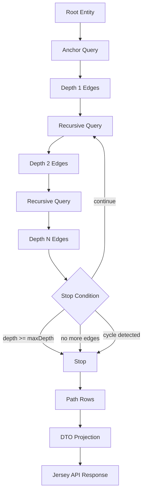

---

## 4. Kapan Recursive CTE Lebih Tepat daripada `GRAPH_TABLE`

| Kebutuhan | `GRAPH_TABLE` | Recursive CTE |
|---|---:|---:|
| 1-hop / 2-hop fixed query | Bagus | Bisa |
| Business-readable graph pattern | Bagus | Lebih verbose |
| Depth ditentukan saat runtime | Terbatas | Sangat cocok |
| Cycle detection eksplisit | Terbatas | Sangat cocok |
| Path accumulation | Terbatas | Sangat cocok |
| DFS/BFS ordering | Tidak utama | Didukung via `SEARCH` |
| Legacy PostgreSQL sebelum 19 | Tidak | Cocok |
| Generic edge table | Bisa, tapi awkward | Cocok |
| API `/walk?maxDepth=3` | Kurang natural | Cocok |
| Investigation path tracing | Bisa untuk fixed path | Cocok untuk eksplorasi bounded |

Rule praktis:

```text
Jika bentuk path sudah diketahui → GRAPH_TABLE.
Jika traversal perlu berjalan sampai depth N → WITH RECURSIVE.
```

---

# 5. Generic Edge Table untuk Graph Walk

Untuk recursive traversal, biasanya kita butuh table edge generik.

```sql
CREATE TABLE entity_relationships (
    relationship_id       bigint PRIMARY KEY,
    tenant_id             bigint NOT NULL,

    source_entity_type    text NOT NULL,
    source_entity_id      bigint NOT NULL,

    target_entity_type    text NOT NULL,
    target_entity_id      bigint NOT NULL,

    relationship_type     text NOT NULL,

    valid_from            date NOT NULL,
    valid_to              date,

    confidence_score      numeric(5,2),
    evidence_ref          text,

    created_by            text NOT NULL,
    created_at            timestamptz NOT NULL DEFAULT now(),

    CONSTRAINT ck_entity_relationship_validity
        CHECK (valid_to IS NULL OR valid_to >= valid_from)
);
```

Contoh data:

```text
CASE:1001  --INVOLVES-->  PARTY:2001
PARTY:2001 --OWNS----->   ACCOUNT:3001
ACCOUNT:3001 --LINKED_TO--> ACCOUNT:3002
ACCOUNT:3002 --OWNED_BY--> PARTY:2002
PARTY:2002 --INVOLVED_IN--> CASE:1002
```

---

## 6. Index Minimum untuk Recursive Traversal

Traversal maju butuh lookup dari source ke target.

```sql
CREATE INDEX idx_entity_relationships_outbound
    ON entity_relationships (
        tenant_id,
        source_entity_type,
        source_entity_id,
        relationship_type,
        valid_from,
        valid_to
    );
```

Traversal balik butuh lookup dari target ke source.

```sql
CREATE INDEX idx_entity_relationships_inbound
    ON entity_relationships (
        tenant_id,
        target_entity_type,
        target_entity_id,
        relationship_type,
        valid_from,
        valid_to
    );
```

Kalau relationship type sangat selective, index ini penting:

```sql
CREATE INDEX idx_entity_relationships_type_source
    ON entity_relationships (
        tenant_id,
        relationship_type,
        source_entity_type,
        source_entity_id
    );
```

Rule praktis:

```text
Outbound traversal:
tenant + source_entity_type + source_entity_id

Inbound traversal:
tenant + target_entity_type + target_entity_id

Typed traversal:
tenant + relationship_type + source/destination

Temporal traversal:
valid_from + valid_to harus ikut diperhatikan
```

---

# 7. Pattern 1 - Outbound Walk sampai `maxDepth`

Use case:

> Dari satu entity, cari semua entity yang bisa dicapai secara outbound sampai depth tertentu.

```sql
WITH RECURSIVE relationship_walk AS (
    SELECT
        er.relationship_id,
        er.source_entity_type,
        er.source_entity_id,
        er.target_entity_type,
        er.target_entity_id,
        er.relationship_type,
        1 AS depth,

        ARRAY[
            er.source_entity_type || ':' || er.source_entity_id::text,
            er.target_entity_type || ':' || er.target_entity_id::text
        ] AS path,

        false AS is_cycle
    FROM entity_relationships er
    WHERE er.tenant_id = #{tenantId}
      AND er.source_entity_type = #{rootEntityType}
      AND er.source_entity_id = #{rootEntityId}
      AND er.valid_from <= #{asOfDate}
      AND (er.valid_to IS NULL OR er.valid_to >= #{asOfDate})

    UNION ALL

    SELECT
        er.relationship_id,
        er.source_entity_type,
        er.source_entity_id,
        er.target_entity_type,
        er.target_entity_id,
        er.relationship_type,
        rw.depth + 1 AS depth,

        rw.path || (
            er.target_entity_type || ':' || er.target_entity_id::text
        ) AS path,

        (
            er.target_entity_type || ':' || er.target_entity_id::text
        ) = ANY(rw.path) AS is_cycle
    FROM relationship_walk rw
    JOIN entity_relationships er
      ON er.tenant_id = #{tenantId}
     AND er.source_entity_type = rw.target_entity_type
     AND er.source_entity_id = rw.target_entity_id
     AND er.valid_from <= #{asOfDate}
     AND (er.valid_to IS NULL OR er.valid_to >= #{asOfDate})
    WHERE rw.depth < #{maxDepth}
      AND NOT rw.is_cycle
)
SELECT
    relationship_id,
    source_entity_type,
    source_entity_id,
    target_entity_type,
    target_entity_id,
    relationship_type,
    depth,
    path,
    is_cycle
FROM relationship_walk
WHERE NOT is_cycle
ORDER BY
    depth,
    target_entity_type,
    target_entity_id;
```

PostgreSQL documentation menunjukkan teknik cycle detection manual dengan menyimpan path array dan mengecek apakah node berikutnya sudah ada di path. ([PostgreSQL](https://www.postgresql.org/docs/current/queries-with.html?utm_source=chatgpt.com))

---

# 8. Pattern 2 - Inbound Walk

Use case:

> Dari satu entity, cari semua entity yang menunjuk ke entity tersebut.

Contoh pertanyaan:

```text
Account ini muncul dari party/case/dokumen mana saja?
Case ini direferensikan oleh enforcement action mana?
Document ini dipakai oleh case mana?
```

Query inbound:

```sql
WITH RECURSIVE relationship_walk AS (
    SELECT
        er.relationship_id,
        er.source_entity_type,
        er.source_entity_id,
        er.target_entity_type,
        er.target_entity_id,
        er.relationship_type,
        1 AS depth,

        ARRAY[
            er.target_entity_type || ':' || er.target_entity_id::text,
            er.source_entity_type || ':' || er.source_entity_id::text
        ] AS path,

        false AS is_cycle
    FROM entity_relationships er
    WHERE er.tenant_id = #{tenantId}
      AND er.target_entity_type = #{rootEntityType}
      AND er.target_entity_id = #{rootEntityId}
      AND er.valid_from <= #{asOfDate}
      AND (er.valid_to IS NULL OR er.valid_to >= #{asOfDate})

    UNION ALL

    SELECT
        er.relationship_id,
        er.source_entity_type,
        er.source_entity_id,
        er.target_entity_type,
        er.target_entity_id,
        er.relationship_type,
        rw.depth + 1,

        rw.path || (
            er.source_entity_type || ':' || er.source_entity_id::text
        ),

        (
            er.source_entity_type || ':' || er.source_entity_id::text
        ) = ANY(rw.path)
    FROM relationship_walk rw
    JOIN entity_relationships er
      ON er.tenant_id = #{tenantId}
     AND er.target_entity_type = rw.source_entity_type
     AND er.target_entity_id = rw.source_entity_id
     AND er.valid_from <= #{asOfDate}
     AND (er.valid_to IS NULL OR er.valid_to >= #{asOfDate})
    WHERE rw.depth < #{maxDepth}
      AND NOT rw.is_cycle
)
SELECT *
FROM relationship_walk
WHERE NOT is_cycle
ORDER BY
    depth,
    source_entity_type,
    source_entity_id;
```

---

# 9. Pattern 3 - Bidirectional Walk

Use case:

> Cari connected neighborhood dari satu entity, baik incoming maupun outgoing.

Ini berguna untuk investigation graph, tapi lebih berisiko karena branching factor lebih besar.

Pertama normalisasi edge dua arah dengan CTE.

```sql
WITH RECURSIVE normalized_edges AS (
    SELECT
        relationship_id,
        tenant_id,
        source_entity_type,
        source_entity_id,
        target_entity_type,
        target_entity_id,
        relationship_type,
        valid_from,
        valid_to
    FROM entity_relationships
    WHERE tenant_id = #{tenantId}
      AND valid_from <= #{asOfDate}
      AND (valid_to IS NULL OR valid_to >= #{asOfDate})

    UNION ALL

    SELECT
        relationship_id,
        tenant_id,
        target_entity_type AS source_entity_type,
        target_entity_id AS source_entity_id,
        source_entity_type AS target_entity_type,
        source_entity_id AS target_entity_id,
        relationship_type,
        valid_from,
        valid_to
    FROM entity_relationships
    WHERE tenant_id = #{tenantId}
      AND valid_from <= #{asOfDate}
      AND (valid_to IS NULL OR valid_to >= #{asOfDate})
),
relationship_walk AS (
    SELECT
        ne.relationship_id,
        ne.source_entity_type,
        ne.source_entity_id,
        ne.target_entity_type,
        ne.target_entity_id,
        ne.relationship_type,
        1 AS depth,

        ARRAY[
            ne.source_entity_type || ':' || ne.source_entity_id::text,
            ne.target_entity_type || ':' || ne.target_entity_id::text
        ] AS path,

        false AS is_cycle
    FROM normalized_edges ne
    WHERE ne.source_entity_type = #{rootEntityType}
      AND ne.source_entity_id = #{rootEntityId}

    UNION ALL

    SELECT
        ne.relationship_id,
        ne.source_entity_type,
        ne.source_entity_id,
        ne.target_entity_type,
        ne.target_entity_id,
        ne.relationship_type,
        rw.depth + 1,

        rw.path || (
            ne.target_entity_type || ':' || ne.target_entity_id::text
        ),

        (
            ne.target_entity_type || ':' || ne.target_entity_id::text
        ) = ANY(rw.path)
    FROM relationship_walk rw
    JOIN normalized_edges ne
      ON ne.source_entity_type = rw.target_entity_type
     AND ne.source_entity_id = rw.target_entity_id
    WHERE rw.depth < #{maxDepth}
      AND NOT rw.is_cycle
)
SELECT *
FROM relationship_walk
WHERE NOT is_cycle
ORDER BY
    depth,
    target_entity_type,
    target_entity_id;
```

Practical warning:

```text
Bidirectional traversal cepat membesar.
Batasi maxDepth lebih rendah, misalnya 2 atau 3.
```

---

# 10. Pattern 4 - Relationship Type Whitelist

Jangan biarkan client mengirim arbitrary relationship type tanpa validasi.

Contoh whitelist di SQL:

```sql
AND er.relationship_type = ANY(#{relationshipTypes})
```

Namun di MyBatis, array binding bisa bergantung pada setup. Alternatif aman:

```xml
<if test="relationshipTypes != null and relationshipTypes.size() > 0">
    AND er.relationship_type IN
    <foreach collection="relationshipTypes"
             item="type"
             open="("
             separator=","
             close=")">
        #{type}
    </foreach>
</if>
```

Service layer tetap harus whitelist:

```java
private static final Set<String> ALLOWED_RELATIONSHIP_TYPES = Set.of(
        "INVOLVES",
        "OWNS",
        "HAS_DOCUMENT",
        "ASSIGNED_TO",
        "RESULTED_IN",
        "RELATED_TO"
);

private List<String> validateRelationshipTypes(List<String> requestedTypes) {
    if (requestedTypes == null || requestedTypes.isEmpty()) {
        return List.of("INVOLVES", "OWNS", "HAS_DOCUMENT");
    }

    for (String type : requestedTypes) {
        if (!ALLOWED_RELATIONSHIP_TYPES.contains(type)) {
            throw new BadRequestException("Unsupported relationship type: " + type);
        }
    }

    return requestedTypes;
}
```

Rule:

```text
Client boleh memilih dari daftar relationship type yang dikenal.
Client tidak boleh menentukan SQL fragment.
```

---

# 11. Pattern 5 - Depth Clamp

Depth dari API tidak boleh langsung dipakai.

```java
private int normalizeDepth(int requestedDepth) {
    if (requestedDepth < 1) {
        return 1;
    }

    return Math.min(requestedDepth, 4);
}
```

Policy praktis:

| API | Max Depth |
|---|---:|
| Public business API | 2 |
| Internal case investigation | 3 |
| Admin/debug API | 4 |
| Offline/batch analysis | 5+ dengan job control |
| Unbounded traversal | Hindari |

Alasannya sederhana:

```text
Setiap hop bisa mengalikan jumlah path.
Depth kecil pun bisa menghasilkan ribuan row jika branching factor besar.
```

---

# 12. Pattern 6 - Entity Result vs Path Result

Recursive traversal menghasilkan path. Tapi API mungkin hanya perlu unique entity.

## 12.1 Path result

```sql
SELECT
    target_entity_type,
    target_entity_id,
    relationship_type,
    depth,
    path
FROM relationship_walk
WHERE NOT is_cycle
ORDER BY depth;
```

Cocok untuk:

```text
- investigation
- audit trail
- explain why entity is related
- graph visualization
```

## 12.2 Entity result

```sql
SELECT DISTINCT ON (
    target_entity_type,
    target_entity_id
)
    target_entity_type,
    target_entity_id,
    MIN(depth) OVER (
        PARTITION BY target_entity_type, target_entity_id
    ) AS nearest_depth
FROM relationship_walk
WHERE NOT is_cycle
ORDER BY
    target_entity_type,
    target_entity_id,
    depth;
```

Cocok untuk:

```text
- summary list
- linked entity count
- deduplicated response
```

## 12.3 Path count per entity

```sql
SELECT
    target_entity_type,
    target_entity_id,
    MIN(depth) AS nearest_depth,
    COUNT(*) AS path_count
FROM relationship_walk
WHERE NOT is_cycle
GROUP BY
    target_entity_type,
    target_entity_id
ORDER BY
    nearest_depth,
    path_count DESC;
```

Cocok untuk:

```text
- risk scoring
- relationship strength
- repeated connection detection
```

---

# 13. Pattern 7 - Cycle Detection dengan `CYCLE`

Selain manual path array, PostgreSQL menyediakan `CYCLE` clause untuk recursive query. Dokumentasi PostgreSQL menjelaskan bahwa `CYCLE` dapat menandai cycle dan menyimpan path traversal, sehingga query tidak perlu menulis array tracking secara manual. ([PostgreSQL](https://www.postgresql.org/docs/current/queries-with.html?utm_source=chatgpt.com))

Contoh:

```sql
WITH RECURSIVE relationship_walk (
    source_entity_type,
    source_entity_id,
    target_entity_type,
    target_entity_id,
    relationship_type,
    depth
) AS (
    SELECT
        er.source_entity_type,
        er.source_entity_id,
        er.target_entity_type,
        er.target_entity_id,
        er.relationship_type,
        1 AS depth
    FROM entity_relationships er
    WHERE er.tenant_id = #{tenantId}
      AND er.source_entity_type = #{rootEntityType}
      AND er.source_entity_id = #{rootEntityId}

    UNION ALL

    SELECT
        er.source_entity_type,
        er.source_entity_id,
        er.target_entity_type,
        er.target_entity_id,
        er.relationship_type,
        rw.depth + 1
    FROM relationship_walk rw
    JOIN entity_relationships er
      ON er.tenant_id = #{tenantId}
     AND er.source_entity_type = rw.target_entity_type
     AND er.source_entity_id = rw.target_entity_id
    WHERE rw.depth < #{maxDepth}
)
CYCLE target_entity_type, target_entity_id
    SET is_cycle
    USING traversal_path
SELECT *
FROM relationship_walk
WHERE NOT is_cycle
ORDER BY depth;
```

Gunakan `CYCLE` ketika:

```text
- butuh syntax lebih ringkas
- cycle detection cukup berbasis node identity
- tidak butuh custom path format kompleks
```

Gunakan manual path array ketika:

```text
- butuh path string khusus
- butuh gabungan entity type + id
- butuh path untuk DTO/debug
- butuh kontrol penuh atas visited node definition
```

---

# 14. Pattern 8 - Breadth-first dan Depth-first Ordering

PostgreSQL mendukung `SEARCH DEPTH FIRST` dan `SEARCH BREADTH FIRST` pada recursive query untuk menghasilkan ordering column. Dokumentasi PostgreSQL juga mengingatkan bahwa order evaluasi internal tidak boleh dianggap sebagai kontrak output; gunakan explicit ordering. ([PostgreSQL](https://www.postgresql.org/docs/current/queries-with.html?utm_source=chatgpt.com))

## Breadth-first

Cocok untuk menampilkan relasi terdekat dulu.

```sql
WITH RECURSIVE relationship_walk (
    source_entity_type,
    source_entity_id,
    target_entity_type,
    target_entity_id,
    depth
) AS (
    SELECT
        er.source_entity_type,
        er.source_entity_id,
        er.target_entity_type,
        er.target_entity_id,
        1 AS depth
    FROM entity_relationships er
    WHERE er.tenant_id = #{tenantId}
      AND er.source_entity_type = #{rootEntityType}
      AND er.source_entity_id = #{rootEntityId}

    UNION ALL

    SELECT
        er.source_entity_type,
        er.source_entity_id,
        er.target_entity_type,
        er.target_entity_id,
        rw.depth + 1
    FROM relationship_walk rw
    JOIN entity_relationships er
      ON er.tenant_id = #{tenantId}
     AND er.source_entity_type = rw.target_entity_type
     AND er.source_entity_id = rw.target_entity_id
    WHERE rw.depth < #{maxDepth}
)
SEARCH BREADTH FIRST BY target_entity_type, target_entity_id SET order_col
CYCLE target_entity_type, target_entity_id SET is_cycle USING path
SELECT *
FROM relationship_walk
WHERE NOT is_cycle
ORDER BY order_col;
```

## Depth-first

Cocok untuk menelusuri satu chain sampai ujung.

```sql
WITH RECURSIVE relationship_walk (
    source_entity_type,
    source_entity_id,
    target_entity_type,
    target_entity_id,
    depth
) AS (
    SELECT
        er.source_entity_type,
        er.source_entity_id,
        er.target_entity_type,
        er.target_entity_id,
        1 AS depth
    FROM entity_relationships er
    WHERE er.tenant_id = #{tenantId}
      AND er.source_entity_type = #{rootEntityType}
      AND er.source_entity_id = #{rootEntityId}

    UNION ALL

    SELECT
        er.source_entity_type,
        er.source_entity_id,
        er.target_entity_type,
        er.target_entity_id,
        rw.depth + 1
    FROM relationship_walk rw
    JOIN entity_relationships er
      ON er.tenant_id = #{tenantId}
     AND er.source_entity_type = rw.target_entity_type
     AND er.source_entity_id = rw.target_entity_id
    WHERE rw.depth < #{maxDepth}
)
SEARCH DEPTH FIRST BY target_entity_type, target_entity_id SET order_col
CYCLE target_entity_type, target_entity_id SET is_cycle USING path
SELECT *
FROM relationship_walk
WHERE NOT is_cycle
ORDER BY order_col;
```

---

# 15. Pattern 9 - Recursive Traversal dengan Materialized Boundary

Untuk graph besar, kadang jangan traverse langsung dari full table. Buat candidate edge subset dulu.

```sql
WITH RECURSIVE candidate_edges AS MATERIALIZED (
    SELECT *
    FROM entity_relationships
    WHERE tenant_id = #{tenantId}
      AND relationship_type IN ('INVOLVES', 'OWNS', 'RELATED_TO')
      AND valid_from <= #{asOfDate}
      AND (valid_to IS NULL OR valid_to >= #{asOfDate})
),
relationship_walk AS (
    SELECT
        ce.relationship_id,
        ce.source_entity_type,
        ce.source_entity_id,
        ce.target_entity_type,
        ce.target_entity_id,
        ce.relationship_type,
        1 AS depth,
        ARRAY[
            ce.source_entity_type || ':' || ce.source_entity_id::text,
            ce.target_entity_type || ':' || ce.target_entity_id::text
        ] AS path,
        false AS is_cycle
    FROM candidate_edges ce
    WHERE ce.source_entity_type = #{rootEntityType}
      AND ce.source_entity_id = #{rootEntityId}

    UNION ALL

    SELECT
        ce.relationship_id,
        ce.source_entity_type,
        ce.source_entity_id,
        ce.target_entity_type,
        ce.target_entity_id,
        ce.relationship_type,
        rw.depth + 1,
        rw.path || (ce.target_entity_type || ':' || ce.target_entity_id::text),
        (ce.target_entity_type || ':' || ce.target_entity_id::text) = ANY(rw.path)
    FROM relationship_walk rw
    JOIN candidate_edges ce
      ON ce.source_entity_type = rw.target_entity_type
     AND ce.source_entity_id = rw.target_entity_id
    WHERE rw.depth < #{maxDepth}
      AND NOT rw.is_cycle
)
SELECT *
FROM relationship_walk
WHERE NOT is_cycle;
```

Practical note:

```text
MATERIALIZED bisa membantu jika subset edge ingin dihitung sekali,
tetapi tidak selalu lebih cepat.
Selalu bandingkan dengan EXPLAIN ANALYZE.
```

---

# 16. MyBatis Production Pattern

## 16.1 DTO untuk Path Result

```java
public record RelationshipPathRow(
        long relationshipId,
        String sourceEntityType,
        long sourceEntityId,
        String targetEntityType,
        long targetEntityId,
        String relationshipType,
        int depth,
        List<String> path,
        boolean cycle
) {}
```

## 16.2 Mapper Interface

```java
public interface EntityRelationshipMapper {

    List<RelationshipPathRow> walkOutbound(
            @Param("tenantId") long tenantId,
            @Param("rootEntityType") String rootEntityType,
            @Param("rootEntityId") long rootEntityId,
            @Param("relationshipTypes") List<String> relationshipTypes,
            @Param("asOfDate") LocalDate asOfDate,
            @Param("maxDepth") int maxDepth,
            @Param("limit") int limit
    );
}
```

## 16.3 Mapper XML

```xml
<select id="walkOutbound"
        resultType="com.acme.graph.RelationshipPathRow">
    WITH RECURSIVE relationship_walk AS (
        SELECT
            er.relationship_id AS "relationshipId",
            er.source_entity_type AS "sourceEntityType",
            er.source_entity_id AS "sourceEntityId",
            er.target_entity_type AS "targetEntityType",
            er.target_entity_id AS "targetEntityId",
            er.relationship_type AS "relationshipType",
            1 AS "depth",

            ARRAY[
                er.source_entity_type || ':' || er.source_entity_id::text,
                er.target_entity_type || ':' || er.target_entity_id::text
            ] AS "path",

            false AS "cycle"
        FROM entity_relationships er
        WHERE er.tenant_id = #{tenantId}
          AND er.source_entity_type = #{rootEntityType}
          AND er.source_entity_id = #{rootEntityId}
          AND er.valid_from &lt;= #{asOfDate}
          AND (er.valid_to IS NULL OR er.valid_to &gt;= #{asOfDate})

          <if test="relationshipTypes != null and relationshipTypes.size() > 0">
              AND er.relationship_type IN
              <foreach collection="relationshipTypes"
                       item="type"
                       open="("
                       separator=","
                       close=")">
                  #{type}
              </foreach>
          </if>

        UNION ALL

        SELECT
            er.relationship_id AS "relationshipId",
            er.source_entity_type AS "sourceEntityType",
            er.source_entity_id AS "sourceEntityId",
            er.target_entity_type AS "targetEntityType",
            er.target_entity_id AS "targetEntityId",
            er.relationship_type AS "relationshipType",
            rw."depth" + 1 AS "depth",

            rw."path" || (
                er.target_entity_type || ':' || er.target_entity_id::text
            ) AS "path",

            (
                er.target_entity_type || ':' || er.target_entity_id::text
            ) = ANY(rw."path") AS "cycle"
        FROM relationship_walk rw
        JOIN entity_relationships er
          ON er.tenant_id = #{tenantId}
         AND er.source_entity_type = rw."targetEntityType"
         AND er.source_entity_id = rw."targetEntityId"
         AND er.valid_from &lt;= #{asOfDate}
         AND (er.valid_to IS NULL OR er.valid_to &gt;= #{asOfDate})

        <if test="relationshipTypes != null and relationshipTypes.size() > 0">
            AND er.relationship_type IN
            <foreach collection="relationshipTypes"
                     item="type"
                     open="("
                     separator=","
                     close=")">
                #{type}
            </foreach>
        </if>

        WHERE rw."depth" &lt; #{maxDepth}
          AND NOT rw."cycle"
    )
    SELECT
        "relationshipId",
        "sourceEntityType",
        "sourceEntityId",
        "targetEntityType",
        "targetEntityId",
        "relationshipType",
        "depth",
        "path",
        "cycle"
    FROM relationship_walk
    WHERE NOT "cycle"
    ORDER BY
        "depth",
        "targetEntityType",
        "targetEntityId"
    LIMIT #{limit}
</select>
```

Catatan MyBatis:

```text
- Gunakan #{...}, bukan ${...}.
- Dynamic SQL hanya untuk value list yang divalidasi.
- Jangan izinkan client mengirim SQL fragment.
- Limit harus selalu ada untuk endpoint eksploratif.
```

---

# 17. Jersey API Pattern

## 17.1 Endpoint

```java
@Path("/entities/{entityType}/{entityId}/graph")
@Produces(MediaType.APPLICATION_JSON)
public class EntityGraphResource {

    private final EntityGraphService service;

    @GET
    @Path("/walk")
    public Response walk(
            @PathParam("entityType") String entityType,
            @PathParam("entityId") long entityId,
            @QueryParam("relationshipType") List<String> relationshipTypes,
            @QueryParam("asOfDate") LocalDate asOfDate,
            @DefaultValue("2") @QueryParam("maxDepth") int maxDepth,
            @DefaultValue("100") @QueryParam("limit") int limit
    ) {
        var result = service.walk(
                entityType,
                entityId,
                relationshipTypes,
                asOfDate,
                maxDepth,
                limit
        );

        return Response.ok(result).build();
    }
}
```

## 17.2 Service Guardrail

```java
public final class EntityGraphService {

    private static final int MAX_ALLOWED_DEPTH = 4;
    private static final int MAX_ALLOWED_LIMIT = 500;

    private final TenantContext tenantContext;
    private final GraphAccessPolicy graphAccessPolicy;
    private final EntityRelationshipMapper mapper;

    public List<RelationshipPathRow> walk(
            String entityType,
            long entityId,
            List<String> relationshipTypes,
            LocalDate asOfDate,
            int requestedDepth,
            int requestedLimit
    ) {
        long tenantId = tenantContext.requiredTenantId();

        GraphEntityType validatedEntityType =
                GraphEntityType.fromApiValue(entityType);

        List<String> validatedRelationshipTypes =
                validateRelationshipTypes(relationshipTypes);

        int maxDepth = Math.min(
                Math.max(requestedDepth, 1),
                MAX_ALLOWED_DEPTH
        );

        int limit = Math.min(
                Math.max(requestedLimit, 1),
                MAX_ALLOWED_LIMIT
        );

        LocalDate effectiveDate = asOfDate != null
                ? asOfDate
                : LocalDate.now();

        graphAccessPolicy.assertCanInspectEntity(
                tenantId,
                validatedEntityType.name(),
                entityId
        );

        return mapper.walkOutbound(
                tenantId,
                validatedEntityType.name(),
                entityId,
                validatedRelationshipTypes,
                effectiveDate,
                maxDepth,
                limit
        );
    }
}
```

---

# 18. API Response Design

## Path response

```json
{
  "root": {
    "entityType": "CASE",
    "entityId": 1001
  },
  "asOfDate": "2026-07-15",
  "maxDepth": 3,
  "paths": [
    {
      "depth": 1,
      "relationshipType": "INVOLVES",
      "source": {
        "entityType": "CASE",
        "entityId": 1001
      },
      "target": {
        "entityType": "PARTY",
        "entityId": 2001
      },
      "path": [
        "CASE:1001",
        "PARTY:2001"
      ]
    },
    {
      "depth": 2,
      "relationshipType": "OWNS",
      "source": {
        "entityType": "PARTY",
        "entityId": 2001
      },
      "target": {
        "entityType": "ACCOUNT",
        "entityId": 3001
      },
      "path": [
        "CASE:1001",
        "PARTY:2001",
        "ACCOUNT:3001"
      ]
    }
  ],
  "truncated": false
}
```

Practical fields:

| Field | Kenapa Penting |
|---|---|
| `root` | Audit origin |
| `asOfDate` | Temporal defensibility |
| `maxDepth` | Query boundary |
| `paths` | Explainability |
| `depth` | Ordering / nearest relationship |
| `relationshipType` | Business semantics |
| `path` | Investigation trace |
| `truncated` | Honest API behavior |

---

# 19. Timeout dan Transaction Safety

Graph traversal endpoint harus punya timeout.

## Option 1 - Per transaction

```sql
SET LOCAL statement_timeout = '3s';
```

Dalam service transaction:

```java
public List<RelationshipPathRow> walk(...) {
    jdbcTemplate.execute("SET LOCAL statement_timeout = '3s'");
    return mapper.walkOutbound(...);
}
```

## Option 2 - Connection pool / role-level

```sql
ALTER ROLE app_user SET statement_timeout = '5s';
```

Practical recommendation:

```text
Untuk API interactive, pakai timeout pendek.
Untuk batch/offline graph analysis, gunakan worker/job dengan timeout lebih panjang dan resource isolation.
```

---

# 20. Observability

Setiap recursive traversal perlu structured log.

```json
{
  "event": "graph_walk_completed",
  "queryName": "entity_relationship_walk_outbound",
  "tenantId": 10,
  "rootEntityType": "CASE",
  "rootEntityId": 1001,
  "maxDepth": 3,
  "relationshipTypes": ["INVOLVES", "OWNS"],
  "asOfDate": "2026-07-15",
  "durationMs": 78,
  "rowCount": 143,
  "limit": 200,
  "truncated": false
}
```

Metric minimum:

```text
graph_walk_duration_seconds
graph_walk_rows_total
graph_walk_timeout_total
graph_walk_depth_requested
graph_walk_truncated_total
graph_walk_cycle_detected_total
```

Alert yang masuk akal:

```text
- p95 graph_walk_duration naik
- timeout meningkat
- average row count melonjak
- depth=4 dipakai terlalu sering
- satu tenant menghasilkan traversal tidak normal
```

---

# 21. Testing Strategy

Buat fixture graph kecil tapi mencakup edge cases.

```text
Fixture A - linear path
CASE:1 -> PARTY:1 -> ACCOUNT:1

Fixture B - branching path
CASE:1 -> PARTY:1
CASE:1 -> PARTY:2
PARTY:1 -> ACCOUNT:1
PARTY:2 -> ACCOUNT:2

Fixture C - shared node
CASE:1 -> PARTY:1 -> ACCOUNT:1
CASE:2 -> PARTY:2 -> ACCOUNT:1

Fixture D - cycle
PARTY:1 -> PARTY:2
PARTY:2 -> PARTY:3
PARTY:3 -> PARTY:1

Fixture E - expired edge
PARTY:1 -> ACCOUNT:1 valid_to = 2025-12-31

Fixture F - cross tenant
TENANT 10 CASE -> TENANT 20 PARTY
```

Test checklist:

```text
[ ] maxDepth=1 hanya return depth 1.
[ ] maxDepth=2 return depth 1 dan 2.
[ ] cycle tidak menyebabkan infinite recursion.
[ ] expired edge tidak muncul pada asOfDate setelah valid_to.
[ ] cross-tenant edge tidak muncul.
[ ] relationship type filter bekerja.
[ ] limit diterapkan.
[ ] path berisi urutan node yang benar.
[ ] nearest entity dedup tidak menghapus path result.
[ ] timeout dikonfigurasi untuk query berat.
```

---

# 22. Common Mistakes

| Mistake | Dampak | Solusi |
|---|---|---|
| Tidak ada `maxDepth` | Traversal runaway | Wajib depth limit |
| Tidak ada cycle detection | Query bisa loop / membesar | Path array atau `CYCLE` |
| Bidirectional default | Path explosion | Outbound sebagai default |
| Tidak ada tenant filter | Data leak | Tenant di setiap anchor/recursive step |
| Relationship type bebas dari client | Query tidak terkendali | Whitelist |
| Tidak ada temporal filter | Historical result salah | `asOfDate` wajib untuk edge temporal |
| Tidak ada limit | API response besar | Limit + truncated flag |
| `DISTINCT` sembarangan | Path evidence hilang | Pisahkan path vs entity result |
| Tidak ada index outbound/inbound | Recursive join lambat | Index source/target |
| Tidak ada observability | Sulit debug spike | Structured logs + metrics |

---

# 23. Practical Decision Matrix

| Skenario | Rekomendasi |
|---|---|
| Case → Party → Account fixed | `GRAPH_TABLE` |
| Case linked to other cases via shared account | `GRAPH_TABLE` fixed 4-hop |
| Entity walk sampai depth N | Recursive CTE |
| Need cycle detection | Recursive CTE + path/CYCLE |
| Need BFS/DFS ordering | Recursive CTE + `SEARCH` |
| Need graph visualization kecil | Recursive CTE + node/edge DTO |
| Need full connected component | Offline batch, bukan API langsung |
| Need shortest path/routing | Evaluasi pgRouting atau graph engine |
| Need Cypher-like graph API | Evaluasi Apache AGE/native graph DB |

---

# 24. Production Checklist

```text
[ ] Edge table punya outbound index.
[ ] Edge table punya inbound index.
[ ] Recursive anchor punya root filter.
[ ] Recursive part punya tenant filter.
[ ] Recursive part punya maxDepth.
[ ] Recursive part punya cycle detection.
[ ] Relationship type divalidasi.
[ ] asOfDate digunakan untuk temporal edge.
[ ] API punya limit dan truncated flag.
[ ] Query punya statement_timeout.
[ ] Path result dan entity result dipisahkan.
[ ] DTO tidak expose raw SQL/internal field.
[ ] EXPLAIN ANALYZE dilakukan di dataset realistis.
[ ] Structured log mencatat depth, rowCount, duration.
```

---

## Status Seri

**Seri 7/12 selesai.**

Seri berikutnya:

**Seri 8/12 - Temporal Graph Modeling: Valid-time, History, Auditability**

Fokus berikutnya: desain graph historis, `valid_from` / `valid_to`, current graph vs as-of graph, audit defensibility, evidence-backed relationship, temporal index, constraint anti-overlap, dan contoh query enterprise-grade.

---

**Sources:**

- [18: 7.8. WITH Queries (Common Table Expressions)](https://www.postgresql.org/docs/current/queries-with.html?utm_source=chatgpt.com)

## Response:
7/15/2026, 9:12:10 PM

Saya lanjut ke **Seri 8/12**. Fokusnya temporal graph: relasi yang berubah dari waktu ke waktu, audit trail, query “as-of date”, dan cara menjaga hasil tetap defensible.

# Seri 8/12 - Temporal Graph Modeling: Valid-time, History, Auditability

## 1. Tujuan Seri Ini

Seri ini membahas **temporal graph modeling**: bagaimana memodelkan relationship graph yang berubah dari waktu ke waktu.

Dalam sistem enterprise/regulatory/case-management, relationship jarang bersifat statis. Contoh:

```text
Party A owns Account X dari 2024-01-01 sampai 2025-03-31.
Party B owns Account X mulai 2025-04-01.
Case C melibatkan Party A saat keputusan dibuat pada 2025-02-15.
```

Kalau query graph hanya melihat **current state**, hasilnya bisa salah untuk audit historis.

PostgreSQL 19 SQL/PGQ mendefinisikan property graph sebagai **read-only view di atas relational tables**, sehingga temporal correctness tetap harus didesain di base tables: edge table, validity columns, constraints, indexes, dan query filter. ([PostgreSQL](https://www.postgresql.org/docs/19/ddl-property-graphs.html?utm_source=chatgpt.com))

---

## 2. Mental Model Temporal Graph

Graph biasa bertanya:

```text
Entity ini terhubung ke entity apa?
```

Temporal graph bertanya:

```text
Entity ini terhubung ke entity apa pada waktu tertentu?
Entity ini pernah terhubung ke entity apa?
Relationship ini berlaku sejak kapan sampai kapan?
Relationship mana yang aktif saat keputusan dibuat?
```

Perbedaan penting:

| Model | Pertanyaan |
|---|---|
| Current graph | Relasi yang berlaku sekarang |
| As-of graph | Relasi yang berlaku pada tanggal tertentu |
| Historical graph | Semua relasi yang pernah berlaku |
| Audit graph | Relasi + sumber/evidence + siapa/kapan membuat perubahan |
| Decision-time graph | Relasi yang berlaku saat keputusan/proses tertentu dibuat |

---

## 3. Diagram

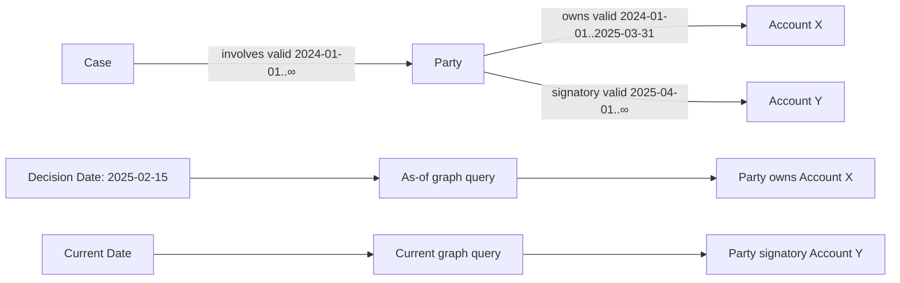

Intinya:

```text
Query graph tanpa waktu = berisiko salah untuk kasus historis.

Query graph dengan asOfDate = lebih defensible.
```

---

## 4. Kenapa Temporal Graph Penting?

| Problem | Risiko Kalau Tidak Temporal |
|---|---|
| Ownership berubah | Keputusan historis terlihat salah |
| Officer assignment berubah | Audit “siapa menangani case” salah |
| Party role berubah | Subject/witness/beneficiary bisa tertukar |
| Document revoked | Evidence yang sudah tidak valid bisa ikut dipakai |
| Case merged/superseded | Impact graph bisa menyesatkan |
| Enforcement action berubah status | Lifecycle trace tidak konsisten |
| Cross-entity relationship diperbarui | Current graph tidak mewakili historical truth |

Untuk sistem enforcement/case lifecycle, temporal graph bukan fitur tambahan. Ia adalah bagian dari **regulatory defensibility**.

---

# 5. Valid-time vs Transaction-time

Temporal modeling minimal perlu membedakan dua jenis waktu.

| Jenis Waktu | Makna | Contoh Kolom |
|---|---|---|
| Valid-time | Kapan fakta business berlaku di dunia nyata/domain | `valid_from`, `valid_to` |
| Transaction-time | Kapan database mengetahui/mencatat fakta itu | `created_at`, `updated_at`, `revoked_at` |

Contoh:

```text
Pada 2026-07-15, officer memasukkan data bahwa Party A sudah menjadi owner sejak 2026-01-01.

valid_from = 2026-01-01
created_at = 2026-07-15
```

Keduanya berbeda dan sama-sama penting.

---

## 6. Minimal Temporal Edge Table

Edge table production-grade sebaiknya tidak hanya menyimpan source dan target.

```sql id="temporal_edge_basic"
CREATE TABLE party_accounts (
    party_account_id bigint PRIMARY KEY,
    tenant_id        bigint NOT NULL,

    party_id         bigint NOT NULL REFERENCES parties(party_id),
    account_id       bigint NOT NULL REFERENCES accounts(account_id),

    ownership_type   text NOT NULL,
    ownership_pct    numeric(5,2),

    valid_from       date NOT NULL,
    valid_to         date,

    evidence_ref     text,
    source_system    text NOT NULL DEFAULT 'CASE_MGMT',

    created_by       text NOT NULL,
    created_at       timestamptz NOT NULL DEFAULT now(),

    revoked_by       text,
    revoked_at       timestamptz,

    CONSTRAINT ck_party_accounts_ownership_type
        CHECK (ownership_type IN ('OWNER', 'SIGNATORY', 'BENEFICIAL_OWNER')),

    CONSTRAINT ck_party_accounts_ownership_pct
        CHECK (ownership_pct IS NULL OR ownership_pct BETWEEN 0 AND 100),

    CONSTRAINT ck_party_accounts_validity
        CHECK (valid_to IS NULL OR valid_to >= valid_from)
);
```

Prinsip:

```text
valid_from / valid_to = business validity
created_at / revoked_at = database/audit lifecycle
evidence_ref = dasar pembuktian relationship
```

---

# 7. Current Relationship Query

Current graph berarti relationship yang berlaku hari ini.

```sql id="current_relationship"
SELECT *
FROM party_accounts
WHERE tenant_id = #{tenantId}
  AND party_id = #{partyId}
  AND valid_from <= CURRENT_DATE
  AND (valid_to IS NULL OR valid_to >= CURRENT_DATE);
```

Untuk graph query:

```sql id="current_graph_query"
SELECT *
FROM GRAPH_TABLE (
    compliance_graph
    MATCH
        (p IS party)-[pa IS owns]->(a IS account)
    WHERE
        p.tenant_id = #{tenantId}
        AND a.tenant_id = #{tenantId}
        AND pa.tenant_id = #{tenantId}

        AND p.party_id = #{partyId}

        AND pa.valid_from <= CURRENT_DATE
        AND (pa.valid_to IS NULL OR pa.valid_to >= CURRENT_DATE)

    COLUMNS (
        p.party_id AS "partyId",
        p.party_name AS "partyName",

        a.account_id AS "accountId",
        a.account_no AS "accountNo",

        pa.ownership_type AS "ownershipType",
        pa.ownership_pct AS "ownershipPct",
        pa.valid_from AS "validFrom",
        pa.valid_to AS "validTo"
    )
);
```

`GRAPH_TABLE` menghasilkan table expression, sehingga hasil graph dapat diproyeksikan ke kolom dengan `COLUMNS` dan dipakai seperti rowset SQL biasa. ([PostgreSQL](https://www.postgresql.org/docs/19/ddl-property-graphs.html?utm_source=chatgpt.com))

---

# 8. As-of Relationship Query

As-of graph berarti relationship yang berlaku pada tanggal tertentu.

```sql id="asof_relationship"
SELECT *
FROM party_accounts
WHERE tenant_id = #{tenantId}
  AND party_id = #{partyId}
  AND valid_from <= #{asOfDate}
  AND (valid_to IS NULL OR valid_to >= #{asOfDate});
```

Graph query:

```sql id="asof_graph_query"
SELECT *
FROM GRAPH_TABLE (
    compliance_graph
    MATCH
        (c IS case_node)-[cp IS involves]->(p IS party)-[pa IS owns]->(a IS account)
    WHERE
        c.tenant_id = #{tenantId}
        AND p.tenant_id = #{tenantId}
        AND a.tenant_id = #{tenantId}
        AND cp.tenant_id = #{tenantId}
        AND pa.tenant_id = #{tenantId}

        AND c.case_id = #{caseId}

        AND cp.valid_from <= #{asOfDate}
        AND (cp.valid_to IS NULL OR cp.valid_to >= #{asOfDate})

        AND pa.valid_from <= #{asOfDate}
        AND (pa.valid_to IS NULL OR pa.valid_to >= #{asOfDate})

    COLUMNS (
        c.case_id AS "caseId",
        c.case_no AS "caseNo",

        p.party_id AS "partyId",
        p.party_name AS "partyName",
        cp.role AS "partyRole",

        a.account_id AS "accountId",
        a.account_no AS "accountNo",
        pa.ownership_type AS "ownershipType",
        pa.ownership_pct AS "ownershipPct",

        cp.valid_from AS "casePartyValidFrom",
        cp.valid_to AS "casePartyValidTo",
        pa.valid_from AS "ownershipValidFrom",
        pa.valid_to AS "ownershipValidTo"
    )
);
```

Practical rule:

```text
Untuk API graph yang dipakai menjelaskan keputusan historis,
asOfDate sebaiknya wajib atau default ke decisionDate, bukan LocalDate.now().
```

---

# 9. Historical Relationship Query

Historical query mengambil semua relationship yang pernah berlaku.

```sql id="historical_relationship"
SELECT *
FROM party_accounts
WHERE tenant_id = #{tenantId}
  AND party_id = #{partyId}
ORDER BY
    valid_from,
    valid_to NULLS LAST;
```

Graph query historical:

```sql id="historical_graph"
SELECT *
FROM GRAPH_TABLE (
    compliance_graph
    MATCH
        (p IS party)-[pa IS owns]->(a IS account)
    WHERE
        p.tenant_id = #{tenantId}
        AND a.tenant_id = #{tenantId}
        AND pa.tenant_id = #{tenantId}
        AND p.party_id = #{partyId}
    COLUMNS (
        p.party_id AS "partyId",
        p.party_name AS "partyName",

        a.account_id AS "accountId",
        a.account_no AS "accountNo",

        pa.ownership_type AS "ownershipType",
        pa.ownership_pct AS "ownershipPct",
        pa.valid_from AS "validFrom",
        pa.valid_to AS "validTo"
    )
)
ORDER BY
    "validFrom",
    "validTo" NULLS LAST;
```

Gunakan untuk:

```text
- audit history
- relationship timeline
- investigation trail
- dispute resolution
- explaining past decision basis
```

---

# 10. Open-ended Validity

Biasanya `valid_to IS NULL` berarti relationship masih berlaku.

```text
valid_from = 2026-01-01
valid_to   = NULL
```

Makna:

```text
Valid sejak 2026-01-01 sampai belum diketahui/tidak berakhir.
```

Query pattern:

```sql id="open_ended_validity"
AND valid_from <= #{asOfDate}
AND (valid_to IS NULL OR valid_to >= #{asOfDate})
```

Alternatif lebih advanced adalah memakai range types seperti `daterange` atau `tstzrange`. PostgreSQL range types mendukung interval nilai, dan exclusion constraints dapat dipakai untuk aturan seperti non-overlapping interval. ([PostgreSQL](https://www.postgresql.org/docs/current/rangetypes.html?utm_source=chatgpt.com))

---

# 11. Range Type untuk Validity Period

Alih-alih `valid_from` dan `valid_to` terpisah, bisa gunakan generated range column.

```sql id="range_validity"
CREATE EXTENSION IF NOT EXISTS btree_gist;

ALTER TABLE party_accounts
ADD COLUMN valid_period daterange
GENERATED ALWAYS AS (
    daterange(valid_from, COALESCE(valid_to + 1, 'infinity'::date), '[)')
) STORED;
```

Kenapa `+ 1`?

```text
Jika valid_to disimpan sebagai inclusive date,
maka daterange '[)' butuh upper bound exclusive.
```

Contoh:

```text
valid_from = 2026-01-01
valid_to   = 2026-01-31

daterange = [2026-01-01, 2026-02-01)
```

As-of query:

```sql id="range_asof_query"
SELECT *
FROM party_accounts
WHERE tenant_id = #{tenantId}
  AND party_id = #{partyId}
  AND valid_period @> #{asOfDate}::date;
```

Range types cocok ketika sistem banyak melakukan query interval dan perlu constraint overlap yang kuat. PostgreSQL documentation menjelaskan range types serta penggunaan exclusion constraints untuk mencegah overlap. ([PostgreSQL](https://www.postgresql.org/docs/current/rangetypes.html?utm_source=chatgpt.com))

---

# 12. Mencegah Overlap Relationship

Misalnya rule business:

```text
Satu party tidak boleh punya dua active OWNER relationship
ke account yang sama dengan ownership_type yang sama
pada periode yang overlap.
```

Gunakan exclusion constraint.

```sql id="exclude_overlap"
CREATE EXTENSION IF NOT EXISTS btree_gist;

ALTER TABLE party_accounts
ADD COLUMN valid_period daterange
GENERATED ALWAYS AS (
    daterange(valid_from, COALESCE(valid_to + 1, 'infinity'::date), '[)')
) STORED;

ALTER TABLE party_accounts
ADD CONSTRAINT ex_party_account_no_overlap
EXCLUDE USING gist (
    tenant_id WITH =,
    party_id WITH =,
    account_id WITH =,
    ownership_type WITH =,
    valid_period WITH &&
);
```

Makna:

```text
Untuk tenant + party + account + ownership_type yang sama,
valid_period tidak boleh overlap.
```

PostgreSQL exclusion constraints bisa digunakan bersama range types untuk membatasi interval yang overlap, misalnya mencegah double-booking atau periode yang bertabrakan. ([PostgreSQL](https://www.postgresql.org/docs/current/rangetypes.html?utm_source=chatgpt.com))

---

# 13. Overlap Detection Query

Sebelum menambahkan constraint, cek data kotor.

```sql id="overlap_detection"
SELECT
    a.party_account_id AS id1,
    b.party_account_id AS id2,
    a.tenant_id,
    a.party_id,
    a.account_id,
    a.ownership_type,
    a.valid_from AS id1_valid_from,
    a.valid_to AS id1_valid_to,
    b.valid_from AS id2_valid_from,
    b.valid_to AS id2_valid_to
FROM party_accounts a
JOIN party_accounts b
  ON b.tenant_id = a.tenant_id
 AND b.party_id = a.party_id
 AND b.account_id = a.account_id
 AND b.ownership_type = a.ownership_type
 AND b.party_account_id > a.party_account_id
WHERE daterange(a.valid_from, COALESCE(a.valid_to + 1, 'infinity'::date), '[)')
   && daterange(b.valid_from, COALESCE(b.valid_to + 1, 'infinity'::date), '[)');
```

Jika hasil query tidak kosong, constraint overlap akan gagal saat ditambahkan.

---

# 14. Temporal Edge Update Pattern

Jangan update relationship lama secara destructive.

## Salah

```sql id="bad_update"
UPDATE party_accounts
SET account_id = #{newAccountId}
WHERE party_account_id = #{partyAccountId};
```

Masalah:

```text
Menghapus historical truth.
Audit menjadi lemah.
Keputusan lama tidak bisa direkonstruksi.
```

## Benar: close old relationship, insert new relationship

```sql id="temporal_update"
BEGIN;

UPDATE party_accounts
SET
    valid_to = #{newValidFrom}::date - INTERVAL '1 day',
    revoked_by = #{actor},
    revoked_at = now()
WHERE party_account_id = #{oldPartyAccountId}
  AND tenant_id = #{tenantId}
  AND valid_to IS NULL;

INSERT INTO party_accounts (
    party_account_id,
    tenant_id,
    party_id,
    account_id,
    ownership_type,
    ownership_pct,
    valid_from,
    valid_to,
    evidence_ref,
    source_system,
    created_by,
    created_at
)
VALUES (
    nextval('party_account_seq'),
    #{tenantId},
    #{partyId},
    #{newAccountId},
    #{ownershipType},
    #{ownershipPct},
    #{newValidFrom},
    NULL,
    #{evidenceRef},
    #{sourceSystem},
    #{actor},
    now()
);

COMMIT;
```

Practical invariant:

```text
History is append/close, not overwrite.
```

---

# 15. Evidence-backed Relationship

Untuk audit, edge perlu punya evidence.

```sql id="evidence_table"
CREATE TABLE relationship_evidence (
    evidence_id      bigint PRIMARY KEY,
    tenant_id        bigint NOT NULL,

    evidence_type    text NOT NULL, -- DOCUMENT, DECLARATION, SYSTEM_IMPORT, MANUAL_REVIEW
    evidence_ref     text NOT NULL,
    evidence_summary text,

    captured_by      text NOT NULL,
    captured_at      timestamptz NOT NULL DEFAULT now(),

    CONSTRAINT ck_relationship_evidence_type
        CHECK (evidence_type IN (
            'DOCUMENT',
            'DECLARATION',
            'SYSTEM_IMPORT',
            'MANUAL_REVIEW'
        ))
);
```

Edge reference:

```sql id="edge_evidence_ref"
ALTER TABLE party_accounts
ADD COLUMN evidence_id bigint REFERENCES relationship_evidence(evidence_id);
```

Graph property:

```sql id="graph_evidence_property"
party_accounts
    KEY (party_account_id)
    SOURCE KEY (party_id) REFERENCES parties (party_id)
    DESTINATION KEY (account_id) REFERENCES accounts (account_id)
    LABEL owns
    PROPERTIES (
        tenant_id,
        ownership_type,
        ownership_pct,
        valid_from,
        valid_to,
        evidence_id,
        source_system,
        created_at
    )
```

Query dengan evidence enrichment:

```sql id="graph_evidence_query"
SELECT
    g.*,
    ev.evidence_type,
    ev.evidence_ref,
    ev.evidence_summary
FROM GRAPH_TABLE (
    compliance_graph
    MATCH
        (p IS party)-[pa IS owns]->(a IS account)
    WHERE
        p.tenant_id = #{tenantId}
        AND a.tenant_id = #{tenantId}
        AND pa.tenant_id = #{tenantId}
        AND p.party_id = #{partyId}
        AND pa.valid_from <= #{asOfDate}
        AND (pa.valid_to IS NULL OR pa.valid_to >= #{asOfDate})
    COLUMNS (
        p.party_id AS "partyId",
        p.party_name AS "partyName",
        a.account_id AS "accountId",
        a.account_no AS "accountNo",
        pa.ownership_type AS "ownershipType",
        pa.ownership_pct AS "ownershipPct",
        pa.evidence_id AS "evidenceId"
    )
) AS g
LEFT JOIN relationship_evidence ev
  ON ev.tenant_id = #{tenantId}
 AND ev.evidence_id = g."evidenceId";
```

---

# 16. Decision-time Graph

Dalam regulatory system, decision biasanya punya timestamp.

```sql id="case_decision"
CREATE TABLE case_decisions (
    decision_id     bigint PRIMARY KEY,
    tenant_id       bigint NOT NULL,
    case_id         bigint NOT NULL REFERENCES cases(case_id),

    decision_type   text NOT NULL,
    decision_status text NOT NULL,
    decided_at      timestamptz NOT NULL,
    decided_by      text NOT NULL,

    decision_reason text,
    created_at      timestamptz NOT NULL DEFAULT now()
);
```

Query graph berdasarkan `decided_at::date`:

```sql id="decision_time_graph"
SELECT
    d.decision_id,
    d.decision_type,
    d.decided_at,
    g.*
FROM case_decisions d
JOIN LATERAL (
    SELECT *
    FROM GRAPH_TABLE (
        compliance_graph
        MATCH
            (c IS case_node)-[cp IS involves]->(p IS party)-[pa IS owns]->(a IS account)
        WHERE
            c.tenant_id = d.tenant_id
            AND p.tenant_id = d.tenant_id
            AND a.tenant_id = d.tenant_id
            AND cp.tenant_id = d.tenant_id
            AND pa.tenant_id = d.tenant_id

            AND c.case_id = d.case_id

            AND cp.valid_from <= d.decided_at::date
            AND (cp.valid_to IS NULL OR cp.valid_to >= d.decided_at::date)

            AND pa.valid_from <= d.decided_at::date
            AND (pa.valid_to IS NULL OR pa.valid_to >= d.decided_at::date)

        COLUMNS (
            c.case_id AS "caseId",
            c.case_no AS "caseNo",

            p.party_id AS "partyId",
            p.party_name AS "partyName",
            cp.role AS "partyRole",

            a.account_id AS "accountId",
            a.account_no AS "accountNo",
            pa.ownership_type AS "ownershipType"
        )
    )
) AS g ON true
WHERE d.tenant_id = #{tenantId}
  AND d.decision_id = #{decisionId};
```

Ini menjawab:

```text
Relasi apa yang terlihat oleh sistem pada saat keputusan dibuat?
```

---

# 17. Audit Snapshot vs Recomputed Graph

Ada dua strategi untuk audit.

## A. Recomputed as-of graph

```text
Saat audit diminta, query ulang graph dengan asOfDate.
```

Kelebihan:

```text
+ Tidak perlu menyimpan snapshot besar
+ Selalu mengikuti data historis yang sudah dibetulkan
+ Lebih hemat storage
```

Risiko:

```text
- Jika historical data berubah, hasil audit bisa berubah
- Harus sangat yakin validity/evidence immutable
```

## B. Decision snapshot

```text
Saat keputusan dibuat, simpan snapshot graph yang dipakai.
```

Contoh:

```sql id="decision_snapshot"
CREATE TABLE case_decision_graph_snapshots (
    snapshot_id    bigint PRIMARY KEY,
    tenant_id      bigint NOT NULL,
    decision_id    bigint NOT NULL REFERENCES case_decisions(decision_id),

    graph_name     text NOT NULL,
    as_of_date     date NOT NULL,
    snapshot_json  jsonb NOT NULL,

    created_at     timestamptz NOT NULL DEFAULT now()
);
```

Kelebihan:

```text
+ Audit sangat kuat
+ Bisa membuktikan “apa yang sistem lihat saat itu”
+ Tidak berubah walaupun data historis diperbaiki
```

Risiko:

```text
- Storage bertambah
- Snapshot schema perlu versioning
- Perlu governance untuk PII/security
```

Rekomendasi praktis:

| Use Case | Strategi |
|---|---|
| Query operasional biasa | Recomputed as-of graph |
| Keputusan kritis/regulatory | Decision snapshot |
| Investigation internal | Recomputed + evidence |
| Dispute/legal defensibility | Snapshot + evidence + query version |

---

# 18. Query Versioning

Karena graph query bisa berubah, simpan versi query/logika.

```sql id="query_version"
CREATE TABLE graph_query_versions (
    graph_query_version_id bigint PRIMARY KEY,
    query_name             text NOT NULL,
    version                text NOT NULL,
    graph_name             text NOT NULL,
    query_hash             text NOT NULL,
    description            text,
    active_from            timestamptz NOT NULL,
    active_to              timestamptz,

    CONSTRAINT uq_graph_query_version
        UNIQUE (query_name, version)
);
```

Saat membuat snapshot:

```sql id="snapshot_version"
ALTER TABLE case_decision_graph_snapshots
ADD COLUMN graph_query_version_id bigint
REFERENCES graph_query_versions(graph_query_version_id);
```

Kenapa penting?

```text
Kalau query graph berubah dari v1 ke v2,
audit harus tahu keputusan lama memakai query logic versi mana.
```

---

# 19. Temporal Indexing Strategy

Index minimal untuk temporal graph:

```sql id="temporal_indexes"
CREATE INDEX idx_case_parties_tenant_case_validity
    ON case_parties (
        tenant_id,
        case_id,
        valid_from,
        valid_to
    );

CREATE INDEX idx_case_parties_tenant_party_validity
    ON case_parties (
        tenant_id,
        party_id,
        valid_from,
        valid_to
    );

CREATE INDEX idx_party_accounts_tenant_party_validity
    ON party_accounts (
        tenant_id,
        party_id,
        valid_from,
        valid_to
    );

CREATE INDEX idx_party_accounts_tenant_account_validity
    ON party_accounts (
        tenant_id,
        account_id,
        valid_from,
        valid_to
    );
```

Jika memakai range column:

```sql id="temporal_gist_indexes"
CREATE INDEX idx_party_accounts_valid_period_gist
    ON party_accounts
    USING gist (
        tenant_id,
        party_id,
        account_id,
        ownership_type,
        valid_period
    );
```

Catatan: GiST dengan scalar columns seperti `tenant_id` membutuhkan operator class yang sesuai; extension `btree_gist` sering digunakan untuk membuat tipe scalar bisa ikut exclusion/GiST pattern. PostgreSQL range documentation menunjukkan exclusion constraints dan range overlap sebagai pola umum untuk non-overlapping interval. ([PostgreSQL](https://www.postgresql.org/docs/current/rangetypes.html?utm_source=chatgpt.com))

---

# 20. MyBatis Mapper: As-of Graph

DTO:

```java id="asof_dto"
public record CaseRelatedAccountAsOfRow(
        long caseId,
        String caseNo,

        long partyId,
        String partyName,
        String partyRole,

        long accountId,
        String accountNo,
        String ownershipType,
        BigDecimal ownershipPct,

        LocalDate casePartyValidFrom,
        LocalDate casePartyValidTo,
        LocalDate ownershipValidFrom,
        LocalDate ownershipValidTo
) {}
```

Mapper interface:

```java id="asof_mapper"
public interface TemporalCaseGraphMapper {

    List<CaseRelatedAccountAsOfRow> findRelatedAccountsAsOf(
            @Param("tenantId") long tenantId,
            @Param("caseId") long caseId,
            @Param("asOfDate") LocalDate asOfDate
    );
}
```

Mapper XML:

```xml id="asof_mapper_xml"
<select id="findRelatedAccountsAsOf"
        resultType="com.acme.graph.CaseRelatedAccountAsOfRow">
    SELECT *
    FROM GRAPH_TABLE (
        compliance_graph
        MATCH
            (c IS case_node)-[cp IS involves]->(p IS party)-[pa IS owns]->(a IS account)
        WHERE
            c.tenant_id = #{tenantId}
            AND p.tenant_id = #{tenantId}
            AND a.tenant_id = #{tenantId}
            AND cp.tenant_id = #{tenantId}
            AND pa.tenant_id = #{tenantId}

            AND c.case_id = #{caseId}

            AND cp.valid_from &lt;= #{asOfDate}
            AND (cp.valid_to IS NULL OR cp.valid_to &gt;= #{asOfDate})

            AND pa.valid_from &lt;= #{asOfDate}
            AND (pa.valid_to IS NULL OR pa.valid_to &gt;= #{asOfDate})

        COLUMNS (
            c.case_id AS "caseId",
            c.case_no AS "caseNo",

            p.party_id AS "partyId",
            p.party_name AS "partyName",
            cp.role AS "partyRole",

            a.account_id AS "accountId",
            a.account_no AS "accountNo",

            pa.ownership_type AS "ownershipType",
            pa.ownership_pct AS "ownershipPct",

            cp.valid_from AS "casePartyValidFrom",
            cp.valid_to AS "casePartyValidTo",

            pa.valid_from AS "ownershipValidFrom",
            pa.valid_to AS "ownershipValidTo"
        )
    )
    ORDER BY
        "partyName",
        "accountNo"
</select>
```

---

# 21. Jersey API Design

## Endpoint untuk current graph

```http
GET /cases/{caseId}/graph/related-accounts/current
```

## Endpoint untuk as-of graph

```http
GET /cases/{caseId}/graph/related-accounts?asOfDate=2026-07-15
```

## Endpoint untuk decision-time graph

```http
GET /case-decisions/{decisionId}/graph/related-accounts
```

Resource:

```java id="temporal_resource"
@Path("/cases/{caseId}/graph")
@Produces(MediaType.APPLICATION_JSON)
public class TemporalCaseGraphResource {

    private final TemporalCaseGraphService service;

    @GET
    @Path("/related-accounts")
    public Response relatedAccountsAsOf(
            @PathParam("caseId") long caseId,
            @QueryParam("asOfDate") LocalDate asOfDate
    ) {
        if (asOfDate == null) {
            throw new BadRequestException("asOfDate is required for temporal graph query");
        }

        var result = service.findRelatedAccountsAsOf(caseId, asOfDate);
        return Response.ok(result).build();
    }
}
```

Service:

```java id="temporal_service"
public final class TemporalCaseGraphService {

    private final TenantContext tenantContext;
    private final CaseAccessPolicy accessPolicy;
    private final TemporalCaseGraphMapper mapper;

    public List<CaseRelatedAccountAsOfRow> findRelatedAccountsAsOf(
            long caseId,
            LocalDate asOfDate
    ) {
        long tenantId = tenantContext.requiredTenantId();

        accessPolicy.assertCanReadCase(tenantId, caseId);

        return mapper.findRelatedAccountsAsOf(
                tenantId,
                caseId,
                asOfDate
        );
    }
}
```

Practical choice:

```text
Untuk API audit/regulatory, lebih baik asOfDate wajib.
Untuk API operational dashboard, boleh default ke current date.
```

---

# 22. Temporal Recursive CTE

Kalau traversal depth dinamis, filter validity harus ada di anchor dan recursive step.

```sql id="temporal_recursive"
WITH RECURSIVE relationship_walk AS (
    SELECT
        er.relationship_id,
        er.source_entity_type,
        er.source_entity_id,
        er.target_entity_type,
        er.target_entity_id,
        er.relationship_type,
        er.valid_from,
        er.valid_to,
        1 AS depth,
        ARRAY[
            er.source_entity_type || ':' || er.source_entity_id::text,
            er.target_entity_type || ':' || er.target_entity_id::text
        ] AS path,
        false AS is_cycle
    FROM entity_relationships er
    WHERE er.tenant_id = #{tenantId}
      AND er.source_entity_type = #{rootEntityType}
      AND er.source_entity_id = #{rootEntityId}
      AND er.valid_from <= #{asOfDate}
      AND (er.valid_to IS NULL OR er.valid_to >= #{asOfDate})

    UNION ALL

    SELECT
        er.relationship_id,
        er.source_entity_type,
        er.source_entity_id,
        er.target_entity_type,
        er.target_entity_id,
        er.relationship_type,
        er.valid_from,
        er.valid_to,
        rw.depth + 1,
        rw.path || (er.target_entity_type || ':' || er.target_entity_id::text),
        (er.target_entity_type || ':' || er.target_entity_id::text) = ANY(rw.path)
    FROM relationship_walk rw
    JOIN entity_relationships er
      ON er.tenant_id = #{tenantId}
     AND er.source_entity_type = rw.target_entity_type
     AND er.source_entity_id = rw.target_entity_id
     AND er.valid_from <= #{asOfDate}
     AND (er.valid_to IS NULL OR er.valid_to >= #{asOfDate})
    WHERE rw.depth < #{maxDepth}
      AND NOT rw.is_cycle
)
SELECT *
FROM relationship_walk
WHERE NOT is_cycle
ORDER BY
    depth,
    target_entity_type,
    target_entity_id;
```

PostgreSQL recursive queries support cycle handling through manual path tracking or the `CYCLE` clause, and recursive queries are evaluated iteratively until the working table produces no more rows. ([PostgreSQL](https://www.postgresql.org/docs/current/queries-with.html?utm_source=chatgpt.com))

---

# 23. Temporal Data Quality Checks

## 23.1 Missing validity

```sql id="missing_validity"
SELECT *
FROM party_accounts
WHERE valid_from IS NULL;
```

## 23.2 Invalid period

```sql id="invalid_period"
SELECT *
FROM party_accounts
WHERE valid_to IS NOT NULL
  AND valid_to < valid_from;
```

## 23.3 Active duplicate current relationship

```sql id="duplicate_current"
SELECT
    tenant_id,
    party_id,
    account_id,
    ownership_type,
    COUNT(*) AS active_count
FROM party_accounts
WHERE valid_from <= CURRENT_DATE
  AND (valid_to IS NULL OR valid_to >= CURRENT_DATE)
GROUP BY
    tenant_id,
    party_id,
    account_id,
    ownership_type
HAVING COUNT(*) > 1;
```

## 23.4 Overlap

```sql id="overlap_quality"
SELECT
    a.party_account_id AS id1,
    b.party_account_id AS id2,
    a.tenant_id,
    a.party_id,
    a.account_id,
    a.ownership_type
FROM party_accounts a
JOIN party_accounts b
  ON b.tenant_id = a.tenant_id
 AND b.party_id = a.party_id
 AND b.account_id = a.account_id
 AND b.ownership_type = a.ownership_type
 AND b.party_account_id > a.party_account_id
WHERE daterange(a.valid_from, COALESCE(a.valid_to + 1, 'infinity'::date), '[)')
   && daterange(b.valid_from, COALESCE(b.valid_to + 1, 'infinity'::date), '[)');
```

---

# 24. Temporal Graph Testing Strategy

Fixture minimal:

```text
A. Current active edge
Party1 owns Account1 from 2026-01-01 to NULL.

B. Expired edge
Party1 owns Account2 from 2025-01-01 to 2025-12-31.

C. Future edge
Party1 owns Account3 from 2027-01-01 to NULL.

D. Ownership transfer
Party1 owns Account4 from 2025-01-01 to 2025-06-30.
Party2 owns Account4 from 2025-07-01 to NULL.

E. Overlap invalid data
Party1 owns Account5 from 2025-01-01 to 2025-12-31.
Party1 owns Account5 from 2025-06-01 to 2026-01-31.

F. Decision-time case
Decision at 2025-05-01 should see old owner, not new owner.
```

Test checklist:

```text
[ ] Current query returns only active edges.
[ ] As-of date before valid_from returns nothing.
[ ] As-of date inside period returns edge.
[ ] As-of date after valid_to excludes edge.
[ ] Ownership transfer returns correct owner per date.
[ ] Overlap constraint rejects invalid insert.
[ ] Decision-time query uses decision date, not current date.
[ ] Evidence is included for audit query.
[ ] Snapshot preserves output even if base data later changes.
```

---

# 25. Common Mistakes

| Mistake | Dampak | Solusi |
|---|---|---|
| Memakai current graph untuk audit historis | Hasil salah | Gunakan asOfDate/decisionDate |
| Update edge secara overwrite | History hilang | Close old edge + insert new edge |
| Tidak ada `valid_from` | Tidak bisa query as-of | Validity wajib |
| `valid_to` tanpa convention | Ambigu inclusive/exclusive | Tetapkan convention |
| Overlap relationship dibiarkan | Multiple truth | Exclusion constraint / validation |
| Tidak menyimpan evidence | Audit lemah | Evidence table/ref |
| Snapshot tidak versioned | Sulit audit query lama | Simpan query version |
| Graph query tidak memfilter edge temporal | Relasi expired ikut muncul | Filter semua temporal edge |
| Default `asOfDate = now()` untuk audit | Keputusan historis salah | Pakai decision date |
| Tidak ada temporal index | Query lambat | Index validity/range |

---

# 26. Practical Decision Matrix

| Kebutuhan | Rekomendasi |
|---|---|
| Operational current relationship | `valid_from <= CURRENT_DATE AND valid_to IS NULL/after current` |
| Historical decision explanation | `asOfDate = decisionDate` |
| Audit legal defensibility | Decision snapshot + evidence + query version |
| Prevent overlapping validity | Range type + exclusion constraint |
| Soft correction of wrong data | Insert correction event / close old period, jangan overwrite diam-diam |
| Graph traversal sampai depth N | Recursive CTE + temporal filter |
| PostgreSQL 19 SQL/PGQ fixed pattern | `GRAPH_TABLE` + temporal edge filters |
| High-risk relationship changes | Store evidence and actor metadata |

---

# 27. Production Checklist

```text
[ ] Semua edge penting punya valid_from.
[ ] valid_to convention jelas: inclusive atau exclusive.
[ ] Current query dan as-of query dipisahkan.
[ ] Decision-time graph memakai decision timestamp/date.
[ ] Historical edge tidak dioverwrite.
[ ] Relationship closure dan new insert dilakukan dalam satu transaction.
[ ] Overlap dicegah dengan constraint atau validation job.
[ ] Evidence reference tersedia untuk edge yang regulated.
[ ] Query version disimpan untuk snapshot/audit.
[ ] Temporal index tersedia di source/destination edge.
[ ] Graph query memfilter temporal condition di semua edge.
[ ] Recursive traversal juga memfilter temporal condition di anchor dan recursive part.
[ ] Test fixture mencakup expired, future, transfer, overlap, decision-time.
```

---

## Status Seri

**Seri 8/12 selesai.**

Seri berikutnya:

**Seri 9/12 - Indexing, Query Planning, and Performance Tuning for Graph Queries**

Fokus berikutnya: indexing source/destination edge, composite index, temporal/range index, `EXPLAIN ANALYZE`, join/path explosion, statistics, query timeout, pagination, materialized views/cache, dan performance guardrail untuk `GRAPH_TABLE` + recursive traversal.

---

**Sources:**

- [PostgreSQL: Documentation: 19: 5.15. Property Graphs](https://www.postgresql.org/docs/19/ddl-property-graphs.html?utm_source=chatgpt.com)

## Response:
7/15/2026, 9:13:52 PM

Saya lanjut ke **Seri 9/12**. Bagian ini akan fokus ke performance: index edge, planner behavior, `EXPLAIN`, path explosion, timeout, pagination, dan kapan perlu cache/materialized projection.

# Seri 9/12 - Indexing, Query Planning, and Performance Tuning for Graph Queries

## 1. Tujuan Seri Ini

Seri ini fokus pada sisi performance untuk **PostgreSQL 19 graph query**:

```text
- index untuk vertex dan edge table
- source/destination edge lookup
- temporal index
- partial index
- extended statistics
- EXPLAIN / EXPLAIN ANALYZE
- path explosion
- pagination
- timeout
- materialized projection/cache
- observability
```

Prinsip utama: di PostgreSQL 19, property graph adalah **read-only view di atas relational tables**, dan data graph tetap disimpan di regular tables/views/foreign tables. Jadi performance graph query sangat bergantung pada desain base table, index, statistics, dan bentuk query. ([PostgreSQL](https://www.postgresql.org/docs/19/ddl-property-graphs.html?utm_source=chatgpt.com))

---

## 2. Mental Model Performance

```text
GRAPH_TABLE tidak otomatis membuat storage graph khusus.

Performance graph query =
    quality of base schema
  + quality of edge indexes
  + selectivity of root filter
  + temporal predicate design
  + planner statistics
  + bounded traversal
  + query timeout
  + observability
```

Diagramnya:

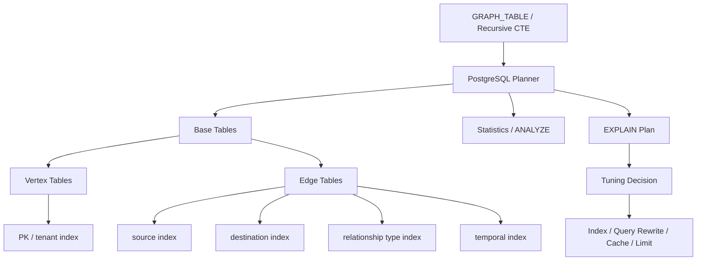

---

## 3. Kenapa Graph Query Bisa Mahal?

Graph query terlihat elegan:

```sql
MATCH
    (c IS case_node)-[cp IS involves]->(p IS party)-[pa IS owns]->(a IS account)
```

Tetapi secara fisik, PostgreSQL tetap harus melakukan operasi relational di baliknya. `GRAPH_TABLE` menghasilkan table expression yang bisa di-join, difilter, diurutkan, dan dipakai seperti query SQL biasa. ([PostgreSQL](https://www.postgresql.org/docs/19/queries-graph.html?utm_source=chatgpt.com))

Secara praktis, pattern di atas mirip:

```text
cases
JOIN case_parties
JOIN parties
JOIN party_accounts
JOIN accounts
```

Masalah muncul ketika:

```text
- root node tidak selective
- edge table sangat besar
- source/destination tidak terindeks
- temporal predicate tidak efisien
- relationship type terlalu generic
- traversal terlalu panjang
- bidirectional traversal dipakai sembarangan
- hasil path dikembalikan mentah tanpa limit
```

---

# 4. Performance Rule of Thumb

| Rule | Penjelasan |
|---|---|
| Mulai dari root yang paling selective | `case_id`, `party_id`, `account_id`, bukan scan semua node |
| Filter tenant sedini mungkin | Multi-tenant graph tanpa tenant filter sangat berbahaya |
| Edge source harus di-index | Traversal maju butuh lookup source |
| Edge destination harus di-index | Reverse traversal butuh lookup destination |
| Edge type harus selective | `relationship_type` membantu mengurangi candidate edge |
| Temporal predicate harus konsisten | `valid_from <= asOfDate AND valid_to >= asOfDate` |
| Hindari traversal unbounded | Setiap hop bisa mengalikan jumlah path |
| Jangan return raw graph besar | Project DTO yang jelas |
| Gunakan `EXPLAIN ANALYZE` | Plan yang “terlihat masuk akal” belum tentu cepat |
| Monitor query nyata | `pg_stat_statements` membantu melihat planning/execution statistics server-wide ([PostgreSQL](https://www.postgresql.org/docs/current/pgstatstatements.html?utm_source=chatgpt.com)) |

---

# 5. Baseline Schema

Kita pakai contoh utama:

```sql
CREATE TABLE cases (
    case_id      bigint PRIMARY KEY,
    tenant_id    bigint NOT NULL,
    case_no      text NOT NULL,
    status       text NOT NULL,
    risk_level   text NOT NULL
);

CREATE TABLE parties (
    party_id     bigint PRIMARY KEY,
    tenant_id    bigint NOT NULL,
    party_name   text NOT NULL,
    party_type   text NOT NULL,
    risk_score   numeric(5,2)
);

CREATE TABLE accounts (
    account_id   bigint PRIMARY KEY,
    tenant_id    bigint NOT NULL,
    account_no   text NOT NULL,
    status       text NOT NULL
);

CREATE TABLE case_parties (
    case_party_id bigint PRIMARY KEY,
    tenant_id     bigint NOT NULL,
    case_id       bigint NOT NULL REFERENCES cases(case_id),
    party_id      bigint NOT NULL REFERENCES parties(party_id),
    role          text NOT NULL,
    valid_from    date NOT NULL,
    valid_to      date
);

CREATE TABLE party_accounts (
    party_account_id bigint PRIMARY KEY,
    tenant_id        bigint NOT NULL,
    party_id         bigint NOT NULL REFERENCES parties(party_id),
    account_id       bigint NOT NULL REFERENCES accounts(account_id),
    ownership_type   text NOT NULL,
    ownership_pct    numeric(5,2),
    valid_from       date NOT NULL,
    valid_to         date
);
```

---

# 6. Indexing Layer 1 - Vertex Lookup Indexes

Vertex table biasanya sudah punya primary key. Tetapi untuk multi-tenant query, sering perlu composite index.

```sql
CREATE INDEX idx_cases_tenant_case
    ON cases (tenant_id, case_id);

CREATE INDEX idx_parties_tenant_party
    ON parties (tenant_id, party_id);

CREATE INDEX idx_accounts_tenant_account
    ON accounts (tenant_id, account_id);
```

Untuk lookup by business key:

```sql
CREATE INDEX idx_cases_tenant_case_no
    ON cases (tenant_id, case_no);

CREATE INDEX idx_accounts_tenant_account_no
    ON accounts (tenant_id, account_no);
```

Practical rule:

```text
Primary key cukup untuk lookup global.
Composite tenant + id lebih aman untuk multi-tenant workload.
Business key index berguna untuk API yang menerima caseNo/accountNo.
```

---

# 7. Indexing Layer 2 - Edge Source Index

Traversal maju:

```text
Case -> Party
Party -> Account
```

Butuh index source.

```sql
CREATE INDEX idx_case_parties_tenant_case
    ON case_parties (tenant_id, case_id);

CREATE INDEX idx_party_accounts_tenant_party
    ON party_accounts (tenant_id, party_id);
```

Untuk query:

```sql
SELECT *
FROM GRAPH_TABLE (
    compliance_graph
    MATCH
        (c IS case_node)-[cp IS involves]->(p IS party)-[pa IS owns]->(a IS account)
    WHERE
        c.tenant_id = #{tenantId}
        AND c.case_id = #{caseId}
    COLUMNS (
        c.case_no AS "caseNo",
        p.party_name AS "partyName",
        a.account_no AS "accountNo"
    )
);
```

Index yang dipakai idealnya:

```text
cases: tenant_id + case_id
case_parties: tenant_id + case_id
party_accounts: tenant_id + party_id
accounts: tenant_id + account_id / PK
```

---

# 8. Indexing Layer 3 - Edge Destination Index

Reverse traversal:

```text
Account <- Party <- Case
```

Butuh index destination.

```sql
CREATE INDEX idx_case_parties_tenant_party
    ON case_parties (tenant_id, party_id);

CREATE INDEX idx_party_accounts_tenant_account
    ON party_accounts (tenant_id, account_id);
```

Query:

```sql
SELECT *
FROM GRAPH_TABLE (
    compliance_graph
    MATCH
        (a IS account)<-[pa IS owns]-(p IS party)<-[cp IS involves]-(c IS case_node)
    WHERE
        a.tenant_id = #{tenantId}
        AND a.account_id = #{accountId}
    COLUMNS (
        a.account_no AS "accountNo",
        p.party_name AS "partyName",
        c.case_no AS "caseNo"
    )
);
```

Tanpa destination index, query reverse graph sering berubah menjadi scan edge table besar.

---

# 9. Indexing Layer 4 - Relationship Type / Role Index

Jika edge punya role/type yang sering dipakai untuk filter, masukkan ke index.

```sql
CREATE INDEX idx_case_parties_tenant_case_role
    ON case_parties (tenant_id, case_id, role);

CREATE INDEX idx_party_accounts_tenant_party_ownership
    ON party_accounts (tenant_id, party_id, ownership_type);
```

Contoh query:

```sql
SELECT *
FROM GRAPH_TABLE (
    compliance_graph
    MATCH
        (c IS case_node)-[cp IS involves]->(p IS party)
    WHERE
        c.tenant_id = #{tenantId}
        AND c.case_id = #{caseId}
        AND cp.role = 'SUBJECT'
    COLUMNS (
        c.case_no AS "caseNo",
        p.party_id AS "partyId",
        p.party_name AS "partyName",
        cp.role AS "role"
    )
);
```

Rule:

```text
Jika filter selalu:
tenant_id + source_id + role

maka index:
(tenant_id, source_id, role)
```

---

# 10. Indexing Layer 5 - Temporal Index

Untuk as-of query:

```sql
AND cp.valid_from <= #{asOfDate}
AND (cp.valid_to IS NULL OR cp.valid_to >= #{asOfDate})
```

Index dasar:

```sql
CREATE INDEX idx_case_parties_tenant_case_validity
    ON case_parties (tenant_id, case_id, valid_from, valid_to);

CREATE INDEX idx_party_accounts_tenant_party_validity
    ON party_accounts (tenant_id, party_id, valid_from, valid_to);
```

Untuk reverse temporal traversal:

```sql
CREATE INDEX idx_case_parties_tenant_party_validity
    ON case_parties (tenant_id, party_id, valid_from, valid_to);

CREATE INDEX idx_party_accounts_tenant_account_validity
    ON party_accounts (tenant_id, account_id, valid_from, valid_to);
```

Practical note:

```text
Temporal predicate dengan valid_to IS NULL sering perlu tuning khusus,
karena open-ended relationship biasanya dominan.
```

---

# 11. Partial Index untuk Current Relationship

Jika banyak query hanya mengambil active/current relationship, partial index bisa membantu. PostgreSQL partial index adalah index pada subset table yang ditentukan oleh predicate `WHERE`. ([PostgreSQL](https://www.postgresql.org/docs/current/indexes-partial.html?utm_source=chatgpt.com))

Contoh current edge dengan convention `valid_to IS NULL` berarti masih aktif:

```sql
CREATE INDEX idx_party_accounts_current_by_party
    ON party_accounts (tenant_id, party_id, ownership_type, account_id)
    WHERE valid_to IS NULL;

CREATE INDEX idx_case_parties_current_by_case
    ON case_parties (tenant_id, case_id, role, party_id)
    WHERE valid_to IS NULL;
```

Query yang cocok:

```sql
SELECT *
FROM party_accounts
WHERE tenant_id = #{tenantId}
  AND party_id = #{partyId}
  AND ownership_type = 'OWNER'
  AND valid_to IS NULL;
```

Caution:

```text
Partial index hanya membantu jika query predicate kompatibel dengan predicate index.
Jika query memakai valid_to >= CURRENT_DATE, index WHERE valid_to IS NULL saja belum tentu cukup.
```

---

# 12. Range Index untuk Temporal Validity

Jika temporal workload berat, pertimbangkan `daterange` atau `tstzrange`.

```sql
CREATE EXTENSION IF NOT EXISTS btree_gist;

ALTER TABLE party_accounts
ADD COLUMN valid_period daterange
GENERATED ALWAYS AS (
    daterange(valid_from, COALESCE(valid_to + 1, 'infinity'::date), '[)')
) STORED;

CREATE INDEX idx_party_accounts_valid_period_gist
    ON party_accounts
    USING gist (tenant_id, party_id, valid_period);
```

Query:

```sql
SELECT *
FROM party_accounts
WHERE tenant_id = #{tenantId}
  AND party_id = #{partyId}
  AND valid_period @> #{asOfDate}::date;
```

PostgreSQL range types mendukung operasi interval seperti containment dan overlap; range types juga sering dipakai bersama GiST/exclusion constraints untuk model periode waktu. ([PostgreSQL](https://www.postgresql.org/docs/current/sql-createstatistics.html?utm_source=chatgpt.com))

---

# 13. Composite Index Design Pattern

## 13.1 Forward traversal index

```sql
CREATE INDEX idx_edge_forward
    ON edge_table (
        tenant_id,
        source_id,
        relationship_type,
        valid_from,
        valid_to,
        target_id
    );
```

## 13.2 Reverse traversal index

```sql
CREATE INDEX idx_edge_reverse
    ON edge_table (
        tenant_id,
        target_id,
        relationship_type,
        valid_from,
        valid_to,
        source_id
    );
```

## 13.3 Why include target/source at the end?

```text
Untuk covering-ish access pattern:
- filter pakai tenant/source/type/validity
- output butuh target_id
```

PostgreSQL B-tree index bisa membantu lookup cepat, tetapi index juga menambah overhead write dan storage. PostgreSQL documentation mengingatkan index harus digunakan secara sensible karena walaupun mempercepat retrieval, index menambah overhead database secara keseluruhan. ([PostgreSQL](https://www.postgresql.org/docs/current/indexes.html?utm_source=chatgpt.com))

---

# 14. Jangan Over-index Semua Edge

Index bukan gratis.

Over-indexing menyebabkan:

```text
- insert/update/delete edge lebih lambat
- storage membesar
- vacuum/index maintenance lebih berat
- planner punya terlalu banyak pilihan
- migration lebih lambat
```

Minimum untuk setiap typed edge:

```text
1. tenant + source
2. tenant + destination
3. tenant + source + relationship filter
4. tenant + destination + relationship filter, jika reverse traversal sering
5. temporal variant hanya jika as-of query sering
```

Mulai dari workload nyata, bukan dari semua kemungkinan query.

---

# 15. `EXPLAIN` dan `EXPLAIN ANALYZE`

PostgreSQL memakai planner untuk memilih plan yang dianggap paling murah; `EXPLAIN` menunjukkan query plan yang dipilih. PostgreSQL documentation menyebut pilihan plan sangat penting untuk performance, dan `EXPLAIN` adalah tool dasar untuk memahami plan tersebut. ([PostgreSQL](https://www.postgresql.org/docs/current/using-explain.html?utm_source=chatgpt.com))

Gunakan:

```sql
EXPLAIN
SELECT *
FROM GRAPH_TABLE (...);
```

Untuk eksekusi aktual:

```sql
EXPLAIN (ANALYZE, BUFFERS, VERBOSE)
SELECT *
FROM GRAPH_TABLE (...);
```

`EXPLAIN ANALYZE` benar-benar menjalankan statement dan menambahkan statistik runtime aktual. Untuk query write, ini berarti statement benar-benar dieksekusi, jadi hati-hati; untuk SELECT graph query biasanya aman jika tidak ada side effect. ([PostgreSQL](https://www.postgresql.org/docs/current/sql-explain.html?utm_source=chatgpt.com))

---

# 16. Apa yang Dilihat di Plan?

Saat membaca plan, fokus pada:

| Signal | Arti |
|---|---|
| `Seq Scan` pada edge besar | Kemungkinan index kurang/kurang selective |
| `Nested Loop` dengan row besar | Bisa mahal jika outer rows banyak |
| `Hash Join` besar | Bisa memory-heavy |
| Actual rows jauh dari estimated rows | Statistics kurang bagus |
| Buffers read tinggi | Banyak I/O |
| Sort besar | Perlu index/order rewrite/pagination |
| Execution time tinggi | Query perlu dibatasi/rewrite/cache |
| Rows removed by filter tinggi | Predicate terlambat atau index tidak cocok |

Contoh smell:

```text
estimated rows = 10
actual rows    = 100000
```

Makna praktis:

```text
Planner salah mengestimasi cardinality.
Cek statistics, data skew, extended statistics, atau query rewrite.
```

---

# 17. `ANALYZE` dan Planner Statistics

`ANALYZE` mengumpulkan statistik isi table dan menyimpannya agar query planner dapat memilih execution plan yang efisien. ([PostgreSQL](https://www.postgresql.org/docs/current/sql-analyze.html?utm_source=chatgpt.com))

Jalankan setelah bulk load/backfill edge:

```sql
ANALYZE cases;
ANALYZE parties;
ANALYZE accounts;
ANALYZE case_parties;
ANALYZE party_accounts;
```

Untuk table edge besar:

```sql
ALTER TABLE case_parties
    ALTER COLUMN case_id SET STATISTICS 1000;

ALTER TABLE party_accounts
    ALTER COLUMN party_id SET STATISTICS 1000;

ANALYZE case_parties;
ANALYZE party_accounts;
```

Gunakan ini saat:

```text
- planner sering salah estimate
- edge distribution skewed
- beberapa party/account punya relationship sangat banyak
- tenant size sangat bervariasi
```

---

# 18. Extended Statistics

Jika kolom sangat berkorelasi, index saja belum cukup. PostgreSQL `CREATE STATISTICS` membuat extended statistics object untuk table, foreign table, atau materialized view; data statistiknya dikumpulkan oleh `ANALYZE`. ([PostgreSQL](https://www.postgresql.org/docs/current/sql-createstatistics.html?utm_source=chatgpt.com))

Contoh correlation:

```text
tenant_id + case_id
tenant_id + party_id
tenant_id + relationship_type
```

Buat statistics:

```sql
CREATE STATISTICS stat_case_parties_tenant_case_role
    ON tenant_id, case_id, role
    FROM case_parties;

CREATE STATISTICS stat_party_accounts_tenant_party_type
    ON tenant_id, party_id, ownership_type
    FROM party_accounts;

ANALYZE case_parties;
ANALYZE party_accounts;
```

Practical use:

```text
Extended statistics membantu planner memahami kombinasi kolom,
terutama saat selectivity gabungan tidak bisa ditebak dari statistik kolom individual.
```

---

# 19. Path Explosion Estimation

Sebelum menulis query 4-hop, estimasi branching factor.

```sql
-- Rata-rata party per case
SELECT
    percentile_disc(0.5) WITHIN GROUP (ORDER BY party_count) AS p50,
    percentile_disc(0.9) WITHIN GROUP (ORDER BY party_count) AS p90,
    percentile_disc(0.99) WITHIN GROUP (ORDER BY party_count) AS p99
FROM (
    SELECT tenant_id, case_id, COUNT(*) AS party_count
    FROM case_parties
    GROUP BY tenant_id, case_id
) x;
```

```sql
-- Rata-rata account per party
SELECT
    percentile_disc(0.5) WITHIN GROUP (ORDER BY account_count) AS p50,
    percentile_disc(0.9) WITHIN GROUP (ORDER BY account_count) AS p90,
    percentile_disc(0.99) WITHIN GROUP (ORDER BY account_count) AS p99
FROM (
    SELECT tenant_id, party_id, COUNT(*) AS account_count
    FROM party_accounts
    GROUP BY tenant_id, party_id
) x;
```

Jika p99 tinggi, multi-hop query perlu guardrail lebih ketat.

Contoh:

```text
p99 party per case    = 80
p99 account per party = 50
p99 party per account = 30

Case -> Party -> Account <- Party
80 × 50 × 30 = 120.000 candidate paths
```

---

# 20. Query Rewrite: Pecah Query Besar

Bad pattern:

```text
Satu query:
Case -> Party -> Account <- Party <- Case -> Document -> Officer
```

Risiko:

```text
- row multiplication
- sulit pagination
- sulit explain
- sulit map DTO
- planner bisa memilih plan buruk
```

Lebih aman:

```text
Query 1: Case -> Party
Query 2: Party -> Account
Query 3: Account <- Party
Query 4: Party <- Case
Query 5: Compose graph response di service
```

Untuk API impact view:

```java
public CaseImpactGraph getImpactGraph(long caseId, LocalDate asOfDate) {
    var parties = mapper.findCaseParties(tenantId, caseId, asOfDate);
    var accounts = mapper.findAccountsForParties(tenantId, partyIds(parties), asOfDate);
    var linkedCases = mapper.findCasesForAccounts(tenantId, accountIds(accounts), asOfDate);

    return assembler.toImpactGraph(caseId, parties, accounts, linkedCases);
}
```

Trade-off:

| One Big Query | Several Bounded Queries |
|---|---|
| Satu roundtrip | Lebih banyak roundtrip |
| Bisa row explosion | Lebih mudah dibatasi |
| Sulit debug | Lebih observable |
| Sulit pagination | Lebih mudah pagination |
| Bisa optimal untuk kecil | Lebih stabil untuk besar |

---

# 21. Pagination Strategy

Graph path result tidak selalu cocok dengan offset pagination.

## Offset pagination

```sql
ORDER BY "linkedCaseNo"
LIMIT #{limit}
OFFSET #{offset}
```

Cocok untuk:

```text
- list kecil
- admin UI
- simple sorted entity result
```

Masalah:

```text
OFFSET besar tetap mahal.
Data berubah bisa menyebabkan hasil bergeser.
```

## Keyset pagination

```sql
WHERE (
    g."linkedCaseNo",
    g."linkedCaseId"
) > (
    #{lastCaseNo},
    #{lastCaseId}
)
ORDER BY
    g."linkedCaseNo",
    g."linkedCaseId"
LIMIT #{limit};
```

Cocok untuk:

```text
- linked entity list besar
- stable ordering
- production API
```

Untuk path result, keyset lebih sulit karena path identity perlu jelas. Gunakan:

```text
depth + targetEntityType + targetEntityId + relationshipId
```

---

# 22. Limit dan Truncation Flag

Jangan hanya `LIMIT` tanpa memberi tahu client bahwa hasil terpotong.

Pattern:

```sql
WITH result AS (
    SELECT *
    FROM GRAPH_TABLE (...)
    ORDER BY "depth", "targetId"
    LIMIT #{limitPlusOne}
)
SELECT *
FROM result;
```

Service:

```java
int limitPlusOne = limit + 1;
List<Row> rows = mapper.query(..., limitPlusOne);

boolean truncated = rows.size() > limit;
List<Row> pageRows = truncated ? rows.subList(0, limit) : rows;
```

Response:

```json
{
  "items": [],
  "limit": 100,
  "truncated": true
}
```

Ini penting untuk graph API karena hasil bisa melonjak akibat branching.

---

# 23. Statement Timeout

Untuk workload API, set timeout.

```sql
SET LOCAL statement_timeout = '3s';
```

Role-level:

```sql
ALTER ROLE app_user SET statement_timeout = '5s';
```

Service-level pattern:

```java
@Transactional
public List<GraphRow> queryGraph(...) {
    jdbcTemplate.execute("SET LOCAL statement_timeout = '3s'");
    return mapper.findRelatedAccounts(...);
}
```

Rule:

```text
Interactive API:
1-5 detik, tergantung SLA.

Internal investigation:
5-15 detik, tetap bounded.

Batch/offline:
gunakan worker terpisah, bukan request thread.
```

---

# 24. Recursive CTE Performance Guardrail

Untuk recursive traversal:

```sql
WITH RECURSIVE relationship_walk AS (
    ...
)
SELECT *
FROM relationship_walk
LIMIT #{limit};
```

Jangan hanya limit final jika recursive step sudah menghasilkan banyak row. Tetap wajib:

```text
- maxDepth
- tenant filter
- relationship type filter
- cycle detection
- candidate edge subset
```

Contoh:

```sql
WHERE rw.depth < #{maxDepth}
  AND NOT rw.is_cycle
```

PostgreSQL recursive query dievaluasi secara iteratif sampai working table kosong; kalau termination condition buruk, query bisa sangat mahal atau tidak selesai secara praktis. ([PostgreSQL](https://www.postgresql.org/docs/current/planner-stats.html?utm_source=chatgpt.com))

---

# 25. Materialized Projection untuk Query Berat

Jika query graph tertentu sering dipakai dan datanya tidak harus real-time, gunakan materialized projection.

PostgreSQL materialized view menyimpan hasil query dalam bentuk table-like dan dapat di-refresh kemudian; berbeda dari view biasa yang tidak menyimpan hasil. ([PostgreSQL](https://www.postgresql.org/docs/current/rules-materializedviews.html?utm_source=chatgpt.com))

Contoh: precompute case related accounts current.

```sql
CREATE MATERIALIZED VIEW mv_case_related_accounts_current AS
SELECT
    cp.tenant_id,
    cp.case_id,
    cp.party_id,
    pa.account_id,
    cp.role,
    pa.ownership_type,
    pa.ownership_pct
FROM case_parties cp
JOIN party_accounts pa
  ON pa.tenant_id = cp.tenant_id
 AND pa.party_id = cp.party_id
WHERE cp.valid_to IS NULL
  AND pa.valid_to IS NULL;

CREATE INDEX idx_mv_case_related_accounts_current
    ON mv_case_related_accounts_current (tenant_id, case_id);
```

Refresh:

```sql
REFRESH MATERIALIZED VIEW mv_case_related_accounts_current;
```

`REFRESH MATERIALIZED VIEW` mengganti isi materialized view dengan menjalankan ulang query backing-nya. ([PostgreSQL](https://www.postgresql.org/docs/current/sql-refreshmaterializedview.html?utm_source=chatgpt.com))

Gunakan untuk:

```text
- dashboard
- frequently accessed summary
- current graph snapshot
- risk exposure precomputation
- nightly/near-real-time batch
```

Jangan gunakan untuk:

```text
- strict real-time decision
- high-frequency writes tanpa refresh strategy
- audit snapshot yang harus immutable
```

---

# 26. Cache di Application Layer

Selain materialized view, bisa cache DTO hasil graph query.

Candidate cache key:

```text
tenantId
queryName
rootEntityType
rootEntityId
asOfDate
depth
relationshipTypes
```

Contoh key:

```text
graph:tenant:10:case:1001:related-accounts:asof:2026-07-15:v3
```

Invalidation options:

| Strategy | Cocok Untuk |
|---|---|
| TTL pendek | Query mahal tapi toleransi stale rendah |
| Event-driven invalidation | Edge update menghasilkan cache eviction |
| Versioned cache | Query logic berubah |
| No cache | Audit/decision critical |

Practical rule:

```text
Cache boleh untuk read acceleration.
Audit/decision critical tetap butuh source-of-truth query atau immutable snapshot.
```

---

# 27. `pg_stat_statements` untuk Monitoring Query Nyata

Aktifkan dan gunakan `pg_stat_statements` untuk melihat query graph mana yang paling mahal. Modul ini menyediakan statistik planning dan execution untuk SQL statements yang dijalankan server. ([PostgreSQL](https://www.postgresql.org/docs/current/pgstatstatements.html?utm_source=chatgpt.com))

Contoh query:

```sql
SELECT
    query,
    calls,
    total_exec_time,
    mean_exec_time,
    rows
FROM pg_stat_statements
WHERE query ILIKE '%GRAPH_TABLE%'
   OR query ILIKE '%WITH RECURSIVE%'
ORDER BY total_exec_time DESC
LIMIT 20;
```

Yang dicari:

```text
- query graph dengan total_exec_time tinggi
- mean_exec_time tinggi
- rows terlalu besar
- calls terlalu banyak
- query pattern tidak bounded
```

---

# 28. Observability dari Application Layer

Selain database monitoring, log dari service layer harus menyertakan domain metadata.

```json
{
  "event": "graph_query_completed",
  "queryName": "case_related_accounts_as_of",
  "tenantId": 10,
  "rootEntityType": "CASE",
  "rootEntityId": 1001,
  "asOfDate": "2026-07-15",
  "depth": 2,
  "durationMs": 87,
  "rowCount": 42,
  "limit": 100,
  "truncated": false,
  "timeout": false
}
```

Metric minimum:

```text
graph_query_duration_seconds
graph_query_rows_total
graph_query_timeout_total
graph_query_truncated_total
graph_query_depth_requested
graph_query_errors_total
```

Label cardinality warning:

```text
Jangan jadikan caseId/accountId sebagai metric label.
Gunakan di log, bukan metric label.
```

---

# 29. Performance Testing Dataset

Jangan test graph query hanya dengan 10 row.

Buat fixture scale:

| Dataset | Isi |
|---|---|
| Tiny | 10 cases, 20 parties, 20 accounts |
| Small | 1k cases, 5k parties, 10k accounts |
| Medium | 100k cases, 1M edges |
| Skewed | 1 party punya 50k relationships |
| Temporal-heavy | Banyak historical edges |
| Cross-tenant | Banyak tenant kecil + beberapa tenant besar |
| Worst-case | Dense relationships, high branching |

Benchmark query:

```text
1. Case -> Party
2. Case -> Party -> Account
3. Account <- Party <- Case
4. Case -> Party -> Account <- Party <- Case
5. Recursive walk depth 3
6. Current graph query
7. As-of graph query
```

---

# 30. MyBatis Performance Pattern

## Mapper method

```java
public interface CaseGraphMapper {

    List<RelatedAccountRow> findRelatedAccountsAsOf(
            @Param("tenantId") long tenantId,
            @Param("caseId") long caseId,
            @Param("asOfDate") LocalDate asOfDate,
            @Param("limit") int limit
    );
}
```

## XML

```xml
<select id="findRelatedAccountsAsOf"
        resultType="com.acme.graph.RelatedAccountRow">
    SELECT *
    FROM GRAPH_TABLE (
        compliance_graph
        MATCH
            (c IS case_node)-[cp IS involves]->(p IS party)-[pa IS owns]->(a IS account)
        WHERE
            c.tenant_id = #{tenantId}
            AND p.tenant_id = #{tenantId}
            AND a.tenant_id = #{tenantId}
            AND cp.tenant_id = #{tenantId}
            AND pa.tenant_id = #{tenantId}

            AND c.case_id = #{caseId}

            AND cp.valid_from &lt;= #{asOfDate}
            AND (cp.valid_to IS NULL OR cp.valid_to &gt;= #{asOfDate})

            AND pa.valid_from &lt;= #{asOfDate}
            AND (pa.valid_to IS NULL OR pa.valid_to &gt;= #{asOfDate})

        COLUMNS (
            c.case_id AS "caseId",
            c.case_no AS "caseNo",
            p.party_id AS "partyId",
            p.party_name AS "partyName",
            a.account_id AS "accountId",
            a.account_no AS "accountNo",
            pa.ownership_type AS "ownershipType"
        )
    )
    ORDER BY
        "partyName",
        "accountNo"
    LIMIT #{limit}
</select>
```

Service clamp:

```java
int safeLimit = Math.min(Math.max(requestedLimit, 1), 500);
```

---

# 31. Tuning Workflow

Gunakan workflow ini setiap query graph baru masuk production.

```text
1. Define query intent
2. Confirm root filter
3. Confirm tenant filter
4. Estimate branching factor
5. Add source/destination indexes
6. Add temporal/type indexes if needed
7. Run ANALYZE after load
8. EXPLAIN query
9. EXPLAIN ANALYZE on realistic data
10. Check estimated vs actual rows
11. Add extended statistics if needed
12. Add timeout/limit
13. Add observability
14. Load test with skewed dataset
15. Decide direct query vs materialized projection/cache
```

---

# 32. Common Performance Mistakes

| Mistake | Dampak | Solusi |
|---|---|---|
| Tidak ada root filter | Full graph scan | Wajib root ID |
| Tidak ada tenant filter | Data leak + scan besar | Tenant di semua node/edge |
| Hanya punya source index | Reverse traversal lambat | Tambahkan destination index |
| Tidak ada temporal index | As-of query lambat | Index validity/range |
| `valid_to IS NULL` dominan tapi tidak partial index | Current query lambat | Partial index current |
| Query 5-hop untuk API biasa | Row explosion | Pecah query / max depth |
| `DISTINCT` setelah row explosion | Mahal | Kurangi candidate lebih awal |
| Offset besar | Lambat | Keyset pagination |
| Tidak `ANALYZE` setelah backfill | Planner salah | Run ANALYZE |
| Tidak monitor `pg_stat_statements` | Query mahal tidak terlihat | Aktifkan monitoring |
| Materialized view tanpa refresh plan | Data stale | Definisikan refresh SLA |

---

# 33. Production Checklist

```text
[ ] Setiap vertex lookup punya PK dan tenant index.
[ ] Setiap edge punya tenant + source index.
[ ] Setiap edge punya tenant + destination index.
[ ] Edge type/role filter punya composite index jika sering dipakai.
[ ] Temporal query punya validity/range index.
[ ] Current relationship punya partial index jika workload dominan.
[ ] Query graph punya root filter.
[ ] Query graph punya tenant filter di node dan edge.
[ ] Query graph punya LIMIT/pagination.
[ ] Query graph punya statement_timeout.
[ ] Query graph sudah diuji dengan EXPLAIN ANALYZE.
[ ] Estimated rows vs actual rows dicek.
[ ] ANALYZE dijalankan setelah bulk load/backfill.
[ ] Extended statistics dibuat untuk kolom berkorelasi.
[ ] Path explosion diestimasi dengan p90/p99 branching.
[ ] Query berat dievaluasi untuk materialized view/cache.
[ ] pg_stat_statements memonitor query graph.
[ ] Application logs punya queryName, duration, rowCount, depth, truncated.
```

---

## Status Seri

**Seri 9/12 selesai.**

Seri berikutnya:

**Seri 10/12 - Security, Tenant Isolation, RLS, and Data Governance in Graph Query**

Fokus berikutnya: tenant boundary, RLS, privilege model property graph/base table, authorization sebelum traversal, data masking, PII exposure, audit log, anti-cross-tenant edge, dan safe API design untuk graph query.

---

**Sources:**

- [PostgreSQL: Documentation: 19: 5.15. Property Graphs](https://www.postgresql.org/docs/19/ddl-property-graphs.html?utm_source=chatgpt.com)

## Response:
7/15/2026, 9:15:44 PM

# Seri 10/12 - Security, Tenant Isolation, RLS, and Data Governance in Graph Query

## 1. Tujuan Seri Ini

Seri ini membahas aspek keamanan untuk **PostgreSQL 19 graph query**:

```text
- tenant isolation
- role/privilege model
- Row-Level Security / RLS
- base table permission
- graph object permission
- security boundary antara API, service, MyBatis, dan database
- data masking
- PII exposure
- auditability
- anti-cross-tenant edge
- safe graph API design
```

Inti pentingnya: **property graph bukan security boundary otomatis**. PostgreSQL 19 property graph adalah definisi graph di atas regular tables/views/foreign tables; setiap vertex atau edge tetap berasal dari object relational. Karena itu, security tetap harus dijaga di **base table**, **view**, **role**, **RLS**, **API authorization**, dan **query guardrail**. ([PostgreSQL](https://www.postgresql.org/docs/19/sql-create-property-graph.html?utm_source=chatgpt.com))

---

## 2. Mental Model Security

```text
Client
  ↓
Jersey Resource
  ↓
Authorization Policy
  ↓
Service Layer Tenant Context
  ↓
MyBatis Parameterized Query
  ↓
GRAPH_TABLE / Recursive CTE
  ↓
PostgreSQL Role / RLS / Privileges
  ↓
Base Tables
```

Diagram:

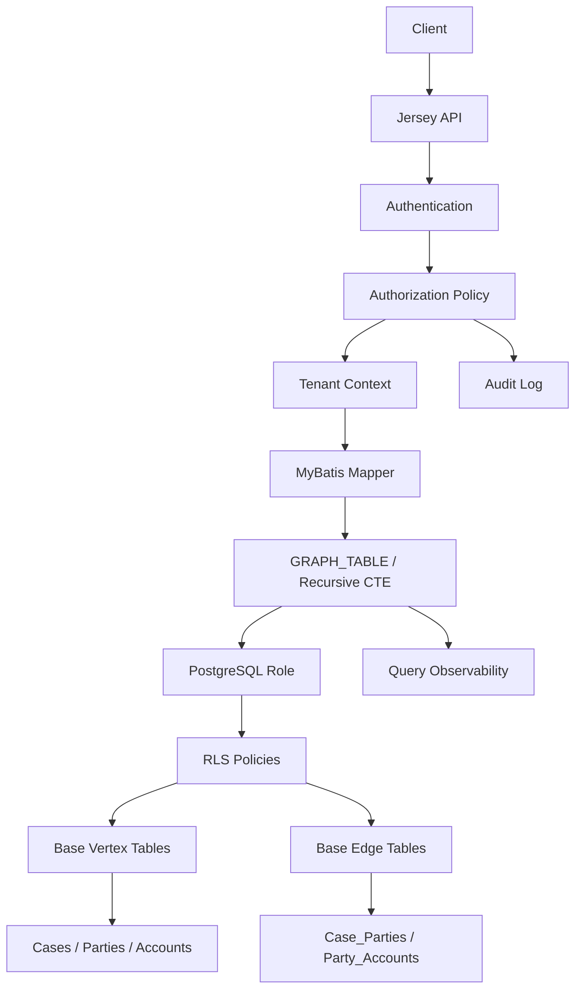

Rule utama:

```text
Graph query harus aman di dua lapis:
1. Application-layer authorization.
2. Database-layer isolation.
```

Jangan mengandalkan salah satu saja.

---

## 3. Threat Model untuk Graph Query

Graph query punya risiko khusus karena satu traversal bisa membuka banyak entity.

| Threat | Contoh | Dampak |
|---|---|---|
| Cross-tenant edge | Case tenant A menunjuk Party tenant B | Data leak lintas tenant |
| Over-broad traversal | Client minta depth besar | Data exposure + performance issue |
| Raw graph query exposure | Client mengirim `MATCH` arbitrary | SQL/query injection, exfiltration |
| PII over-projection | `PROPERTIES ALL COLUMNS` | Sensitive field bocor |
| Reverse traversal abuse | Account → Party → Case | User melihat case yang tidak berhak |
| Weak RLS | Filter tenant hanya di root | Target node/edge bocor |
| Generic edge abuse | `entity_relationships` terlalu bebas | Relationship tidak terkontrol |
| Audit gap | Query graph tidak dilog | Sulit investigasi incident |
| Privilege overgrant | App role bisa baca semua base table | Defense-in-depth lemah |
| Insecure view owner | View/RLS dievaluasi sebagai owner, bukan invoker | Policy bisa tidak sesuai ekspektasi |

---

# 4. Security Principle untuk PostgreSQL Graph

## 4.1 Defense in Depth

```text
Jangan hanya mengandalkan API.
Jangan hanya mengandalkan RLS.
Gunakan keduanya.
```

Layer yang direkomendasikan:

| Layer | Tanggung Jawab |
|---|---|
| API gateway/auth | Authentication |
| Jersey resource | Input validation |
| Service layer | Authorization dan tenant context |
| MyBatis | Parameterized query |
| PostgreSQL role | Least privilege |
| RLS | Row isolation |
| Constraints | Cegah invalid/cross-tenant edge |
| Audit log | Traceability |
| Observability | Detect abuse/performance anomaly |

---

## 4.2 Least Privilege

PostgreSQL menggunakan model privilege berbasis role, dan `GRANT` dipakai untuk memberikan privilege terhadap object database seperti table, view, sequence, schema, dan lainnya. ([PostgreSQL](https://www.postgresql.org/docs/current/sql-grant.html?utm_source=chatgpt.com))

Praktisnya:

```text
App role tidak perlu superuser.
App role tidak perlu schema owner.
App role tidak perlu akses semua table.
App role hanya perlu akses object yang memang dipakai API.
```

---

## 4.3 No Raw Graph Query from Client

Jangan expose endpoint seperti:

```http
POST /graph/query
Content-Type: application/json

{
  "match": "(a)-[]->(b)-[]->(c)",
  "columns": ["a", "b", "c"]
}
```

Masalah:

```text
- client bisa membuat traversal mahal
- authorization sulit
- tenant filter bisa terlewat
- raw graph pattern injection
- audit intent tidak jelas
- output bisa bocor
```

Gunakan endpoint berbasis intent:

```http
GET /cases/{caseId}/graph/related-accounts?asOfDate=2026-07-15
GET /accounts/{accountId}/graph/linked-cases?asOfDate=2026-07-15
GET /entities/{entityType}/{entityId}/graph/walk?maxDepth=2
```

---

# 5. Tenant Isolation: Prinsip Dasar

Multi-tenant graph harus memenuhi invariant:

```text
Satu tenant tidak boleh melihat node, edge, path, aggregate, atau existence signal milik tenant lain.
```

Ini berarti bukan hanya row output yang tidak boleh bocor. Bahkan informasi seperti “ada relasi tapi disembunyikan” juga harus dihindari jika sensitive.

## Tenant field wajib ada di:

```text
- vertex tables
- edge tables
- generic relationship tables
- evidence tables
- audit tables
- snapshot tables
- materialized projections
```

Contoh:

```sql
CREATE TABLE cases (
    case_id   bigint PRIMARY KEY,
    tenant_id bigint NOT NULL,
    case_no   text NOT NULL,
    status    text NOT NULL
);

CREATE TABLE parties (
    party_id  bigint PRIMARY KEY,
    tenant_id bigint NOT NULL,
    name      text NOT NULL
);

CREATE TABLE case_parties (
    case_party_id bigint PRIMARY KEY,
    tenant_id     bigint NOT NULL,
    case_id       bigint NOT NULL,
    party_id      bigint NOT NULL
);
```

---

# 6. Cegah Cross-Tenant Edge dengan Constraint

Filter query saja tidak cukup. Cross-tenant edge harus dibuat **tidak mungkin** secara constraint.

## 6.1 Composite Unique di Vertex

```sql
ALTER TABLE cases
    ADD CONSTRAINT uq_cases_tenant_case_id
    UNIQUE (tenant_id, case_id);

ALTER TABLE parties
    ADD CONSTRAINT uq_parties_tenant_party_id
    UNIQUE (tenant_id, party_id);
```

## 6.2 Tenant-Aware FK di Edge

```sql
ALTER TABLE case_parties
    ADD CONSTRAINT fk_case_parties_case_tenant
    FOREIGN KEY (tenant_id, case_id)
    REFERENCES cases (tenant_id, case_id);

ALTER TABLE case_parties
    ADD CONSTRAINT fk_case_parties_party_tenant
    FOREIGN KEY (tenant_id, party_id)
    REFERENCES parties (tenant_id, party_id);
```

Dengan ini, `case_parties.tenant_id = 10` tidak bisa menunjuk `parties.tenant_id = 20`.

Practical invariant:

```text
Graph traversal aman dimulai dari data yang secara relational sudah tidak bisa cross-tenant.
```

---

# 7. Tenant Filter di `GRAPH_TABLE`

Walaupun constraint sudah ada, tetap filter tenant di query.

```sql
SELECT *
FROM GRAPH_TABLE (
    compliance_graph
    MATCH
        (c IS case_node)-[cp IS involves]->(p IS party)-[pa IS owns]->(a IS account)
    WHERE
        c.tenant_id = #{tenantId}
        AND p.tenant_id = #{tenantId}
        AND a.tenant_id = #{tenantId}
        AND cp.tenant_id = #{tenantId}
        AND pa.tenant_id = #{tenantId}
        AND c.case_id = #{caseId}
    COLUMNS (
        c.case_id AS "caseId",
        c.case_no AS "caseNo",
        p.party_id AS "partyId",
        p.party_name AS "partyName",
        a.account_id AS "accountId",
        a.account_no AS "accountNo",
        pa.ownership_type AS "ownershipType"
    )
);
```

Kenapa filter semua node/edge?

```text
Karena graph traversal memperbanyak hasil.
Satu filter yang terlewat dapat menjadi leakage path.
```

---

# 8. Row-Level Security / RLS

PostgreSQL Row-Level Security memungkinkan policy yang mengontrol row mana yang boleh terlihat atau dimodifikasi oleh role tertentu. RLS dapat berlaku spesifik untuk command, role, atau keduanya; policy bisa untuk `ALL`, `SELECT`, `INSERT`, `UPDATE`, atau `DELETE`. ([PostgreSQL](https://www.postgresql.org/docs/current/ddl-rowsecurity.html?utm_source=chatgpt.com))

## 8.1 Enable RLS

```sql
ALTER TABLE cases ENABLE ROW LEVEL SECURITY;
ALTER TABLE parties ENABLE ROW LEVEL SECURITY;
ALTER TABLE accounts ENABLE ROW LEVEL SECURITY;
ALTER TABLE case_parties ENABLE ROW LEVEL SECURITY;
ALTER TABLE party_accounts ENABLE ROW LEVEL SECURITY;
```

## 8.2 Tenant Context via Session Setting

Gunakan custom setting:

```sql
SELECT set_config('app.tenant_id', '10', true);
```

Policy:

```sql
CREATE POLICY cases_tenant_isolation
ON cases
FOR SELECT
USING (
    tenant_id = current_setting('app.tenant_id')::bigint
);

CREATE POLICY parties_tenant_isolation
ON parties
FOR SELECT
USING (
    tenant_id = current_setting('app.tenant_id')::bigint
);

CREATE POLICY accounts_tenant_isolation
ON accounts
FOR SELECT
USING (
    tenant_id = current_setting('app.tenant_id')::bigint
);

CREATE POLICY case_parties_tenant_isolation
ON case_parties
FOR SELECT
USING (
    tenant_id = current_setting('app.tenant_id')::bigint
);

CREATE POLICY party_accounts_tenant_isolation
ON party_accounts
FOR SELECT
USING (
    tenant_id = current_setting('app.tenant_id')::bigint
);
```

Practical note:

```text
RLS bukan pengganti tenant filter di query.
RLS adalah safety net tambahan.
```

---

# 9. RLS untuk Write Operation

Untuk write, gunakan `WITH CHECK`.

```sql
CREATE POLICY case_parties_insert_tenant_check
ON case_parties
FOR INSERT
WITH CHECK (
    tenant_id = current_setting('app.tenant_id')::bigint
);
```

Untuk update:

```sql
CREATE POLICY case_parties_update_tenant_check
ON case_parties
FOR UPDATE
USING (
    tenant_id = current_setting('app.tenant_id')::bigint
)
WITH CHECK (
    tenant_id = current_setting('app.tenant_id')::bigint
);
```

Makna:

```text
USING       = row mana yang boleh disentuh.
WITH CHECK = row hasil insert/update harus memenuhi policy.
```

RLS di PostgreSQL bekerja untuk membatasi row yang bisa diakses sesuai policy; untuk command update/insert, policy `USING` dan `WITH CHECK` penting agar user tidak bisa membuat atau memindahkan row keluar dari tenant boundary. ([PostgreSQL](https://www.postgresql.org/docs/current/ddl-rowsecurity.html?utm_source=chatgpt.com))

---

# 10. Service Layer Tenant Context

Dalam Java, tenant context harus diset sebelum query.

Contoh dengan transaction:

```java
public final class TenantSessionConfigurer {

    private final SqlSessionTemplate sqlSessionTemplate;

    public void setTenant(long tenantId) {
        sqlSessionTemplate.getConnection()
                .prepareStatement("SELECT set_config('app.tenant_id', ?, true)");
    }
}
```

Lebih umum dengan JDBC:

```java
public final class TenantContextSqlConfigurer {

    private final JdbcTemplate jdbcTemplate;

    public void applyTenant(long tenantId) {
        jdbcTemplate.update(
                "SELECT set_config('app.tenant_id', ?, true)",
                String.valueOf(tenantId)
        );
    }
}
```

Service pattern:

```java
@Transactional(readOnly = true)
public List<RelatedAccountRow> findRelatedAccounts(
        long caseId,
        LocalDate asOfDate
) {
    long tenantId = tenantContext.requiredTenantId();

    jdbcTemplate.update(
            "SELECT set_config('app.tenant_id', ?, true)",
            String.valueOf(tenantId)
    );

    accessPolicy.assertCanReadCase(tenantId, caseId);

    return mapper.findRelatedAccounts(tenantId, caseId, asOfDate);
}
```

Practical warning:

```text
Pastikan setting tenant scoped ke transaction, bukan bocor ke connection pool.
Gunakan SET LOCAL atau set_config(..., true) dalam transaction.
```

---

# 11. Privilege Model untuk Graph Object dan Base Table

Karena property graph membaca base relation, privilege ke base object tetap penting. PostgreSQL documentation untuk `CREATE PROPERTY GRAPH` menyatakan bahwa property graph didefinisikan atas tables/views/foreign tables dan tiap vertex/edge correspond ke table-like object. ([PostgreSQL](https://www.postgresql.org/docs/19/sql-create-property-graph.html?utm_source=chatgpt.com))

Practical role split:

```sql
CREATE ROLE app_graph_reader NOLOGIN;
CREATE ROLE app_user LOGIN PASSWORD '...';

GRANT app_graph_reader TO app_user;
```

Grant schema usage:

```sql
GRANT USAGE ON SCHEMA public TO app_graph_reader;
GRANT USAGE ON SCHEMA graph TO app_graph_reader;
```

Grant select minimal:

```sql
GRANT SELECT ON cases TO app_graph_reader;
GRANT SELECT ON parties TO app_graph_reader;
GRANT SELECT ON accounts TO app_graph_reader;
GRANT SELECT ON case_parties TO app_graph_reader;
GRANT SELECT ON party_accounts TO app_graph_reader;
```

Jangan:

```sql
GRANT ALL ON ALL TABLES IN SCHEMA public TO app_user;
```

Masalah:

```text
- terlalu luas
- raw table access terbuka
- future table otomatis berisiko
- audit privilege sulit
```

---

# 12. Column Exposure dan PII

Graph query sering memakai `PROPERTIES`. Jangan expose semua kolom sembarangan.

Buruk:

```sql
PROPERTIES ALL COLUMNS
```

Risiko:

```text
- PII bocor
- internal metadata bocor
- secret/reference bocor
- graph contract berubah saat table ditambah kolom
```

Lebih aman:

```sql
parties
    KEY (party_id)
    LABEL party
    PROPERTIES (
        party_id,
        tenant_id,
        party_name,
        party_type,
        risk_score
    )
```

Jika butuh masking, buat view.

```sql
CREATE VIEW graph_parties_safe AS
SELECT
    party_id,
    tenant_id,
    party_name,
    party_type,
    risk_score
FROM parties
WHERE deleted_at IS NULL;
```

Lalu property graph pakai view:

```sql
CREATE PROPERTY GRAPH compliance_graph
    VERTEX TABLES (
        graph_parties_safe
            KEY (party_id)
            LABEL party
            PROPERTIES (
                party_id,
                tenant_id,
                party_name,
                party_type,
                risk_score
            )
    );
```

---

# 13. View Security: `security_invoker`

Jika property graph dibuat di atas view, pahami mode security view.

PostgreSQL `CREATE VIEW` documentation menyebut bahwa jika base relation punya RLS, secara default policy view owner yang digunakan; jika view memakai `security_invoker = true`, maka policy dan permission invoking user yang digunakan seolah-olah base relation direferensikan langsung. ([PostgreSQL](https://www.postgresql.org/docs/current/sql-createview.html?utm_source=chatgpt.com))

Contoh:

```sql
CREATE VIEW graph_parties_safe
WITH (security_invoker = true) AS
SELECT
    party_id,
    tenant_id,
    party_name,
    party_type,
    risk_score
FROM parties
WHERE deleted_at IS NULL;
```

Gunakan `security_invoker = true` jika:

```text
- ingin RLS invoker tetap berlaku
- app role harus diperlakukan sebagai caller
- view tidak boleh menjadi bypass security
```

Caution:

```text
View bisa membantu masking,
tetapi salah konfigurasi view owner/security bisa membuat policy tidak sesuai ekspektasi.
```

---

# 14. Security Barrier View

Untuk view yang digunakan sebagai security boundary, PostgreSQL menyarankan `security_barrier` agar mencegah kondisi tertentu di mana predicate dari user bisa dipush down melewati boundary keamanan. Dokumentasi PostgreSQL rules/privileges menyebut `security_barrier` perlu diterapkan jika view perlu menyediakan row-level security. ([PostgreSQL](https://www.postgresql.org/docs/current/rules-privileges.html?utm_source=chatgpt.com))

Contoh:

```sql
CREATE VIEW graph_parties_secure
WITH (
    security_barrier = true,
    security_invoker = true
) AS
SELECT
    party_id,
    tenant_id,
    party_name,
    party_type,
    risk_score
FROM parties
WHERE deleted_at IS NULL;
```

Gunakan untuk:

```text
- masking sensitive fields
- filtering rows sebelum graph exposure
- membuat graph-facing projection yang lebih aman
```

---

# 15. API Authorization Sebelum Traversal

Jangan langsung query graph lalu filter hasilnya.

Buruk:

```java
var rows = mapper.findLinkedCases(tenantId, caseId, asOfDate);
return rows.stream()
        .filter(row -> accessPolicy.canReadCase(row.linkedCaseId()))
        .toList();
```

Masalah:

```text
- database sudah membaca data yang mungkin tidak authorized
- timing/count side-channel tetap mungkin
- log/metrics mungkin sudah berisi data sensitive
- performance terbuang
```

Lebih baik:

```java
accessPolicy.assertCanReadCase(tenantId, caseId);
var rows = mapper.findLinkedCases(tenantId, caseId, asOfDate);
```

Untuk linked result, ada dua pilihan:

## Option A - SQL join ke entitlement table

```sql
SELECT *
FROM GRAPH_TABLE (
    compliance_graph
    MATCH
        (c1 IS case_node)-[cp1 IS involves]->(p IS party)<-[cp2 IS involves]-(c2 IS case_node)
    WHERE
        c1.tenant_id = #{tenantId}
        AND c2.tenant_id = #{tenantId}
        AND c1.case_id = #{caseId}
    COLUMNS (
        c2.case_id AS "linkedCaseId",
        c2.case_no AS "linkedCaseNo"
    )
) AS g
JOIN user_case_access uca
  ON uca.tenant_id = #{tenantId}
 AND uca.case_id = g."linkedCaseId"
 AND uca.user_id = #{userId};
```

## Option B - Use RLS on `cases`

Kalau RLS sudah memfilter `cases`, graph query harus hanya melihat case yang authorized.

Practical recommendation:

```text
Untuk sistem high-stakes, kombinasikan:
- access check root entity di service
- SQL/RLS filtering untuk linked entity
```

---

# 16. Safe Recursive CTE dengan Security

Generic edge table sangat rawan. Jangan biarkan traversal melewati relationship type yang tidak authorized.

```sql
WITH RECURSIVE relationship_walk AS (
    SELECT
        er.relationship_id,
        er.source_entity_type,
        er.source_entity_id,
        er.target_entity_type,
        er.target_entity_id,
        er.relationship_type,
        1 AS depth,
        ARRAY[
            er.source_entity_type || ':' || er.source_entity_id::text,
            er.target_entity_type || ':' || er.target_entity_id::text
        ] AS path,
        false AS is_cycle
    FROM entity_relationships er
    WHERE er.tenant_id = #{tenantId}
      AND er.source_entity_type = #{rootEntityType}
      AND er.source_entity_id = #{rootEntityId}
      AND er.relationship_type IN
      <foreach collection="relationshipTypes"
               item="type"
               open="("
               separator=","
               close=")">
          #{type}
      </foreach>

    UNION ALL

    SELECT
        er.relationship_id,
        er.source_entity_type,
        er.source_entity_id,
        er.target_entity_type,
        er.target_entity_id,
        er.relationship_type,
        rw.depth + 1,
        rw.path || (er.target_entity_type || ':' || er.target_entity_id::text),
        (er.target_entity_type || ':' || er.target_entity_id::text) = ANY(rw.path)
    FROM relationship_walk rw
    JOIN entity_relationships er
      ON er.tenant_id = #{tenantId}
     AND er.source_entity_type = rw.target_entity_type
     AND er.source_entity_id = rw.target_entity_id
    WHERE rw.depth < #{maxDepth}
      AND NOT rw.is_cycle
      AND er.relationship_type IN
      <foreach collection="relationshipTypes"
               item="type"
               open="("
               separator=","
               close=")">
          #{type}
      </foreach>
)
SELECT *
FROM relationship_walk
WHERE NOT is_cycle
LIMIT #{limit};
```

Service validation:

```java
private static final Set<String> ALLOWED_RELATIONSHIP_TYPES = Set.of(
        "INVOLVES",
        "OWNS",
        "HAS_DOCUMENT",
        "ASSIGNED_TO",
        "RESULTED_IN"
);

private List<String> validateRelationshipTypes(List<String> requested) {
    if (requested == null || requested.isEmpty()) {
        return List.of("INVOLVES", "OWNS");
    }

    for (String type : requested) {
        if (!ALLOWED_RELATIONSHIP_TYPES.contains(type)) {
            throw new BadRequestException("Unsupported relationship type");
        }
    }

    return requested;
}
```

---

# 17. Prevent Existence Leakage

Graph query bisa membocorkan existence.

Contoh:

```http
GET /accounts/3001/graph/linked-cases
```

Jika user tidak boleh tahu account 3001 ada, jangan response:

```json
{
  "items": []
}
```

karena bisa berbeda dari account tidak ada/unauthorized.

Gunakan response policy:

| Kondisi | Response |
|---|---|
| Entity tidak ada | 404 |
| Entity ada tapi unauthorized | 404 atau 403 sesuai policy |
| Authorized tapi no relationship | 200 dengan empty list |
| Query terlalu luas | 400 |
| Query valid tapi truncated | 200 dengan `truncated=true` |

Untuk high-security system, sering gunakan:

```text
Unauthorized dan not found sama-sama 404
```

agar existence tidak bocor.

---

# 18. Data Masking untuk Graph DTO

Jangan expose semua property mentah.

Internal row:

```java
public record PartyInternalRow(
        long partyId,
        String partyName,
        String partyType,
        BigDecimal riskScore,
        String taxId,
        String nationalId
) {}
```

External DTO:

```java
public record PartyGraphDto(
        long partyId,
        String displayName,
        String partyType,
        String riskBand
) {}
```

Mapper:

```java
public PartyGraphDto toDto(PartyInternalRow row, UserContext user) {
    return new PartyGraphDto(
            row.partyId(),
            maskNameIfNeeded(row.partyName(), user),
            row.partyType(),
            riskBand(row.riskScore())
    );
}
```

Rule:

```text
Graph DTO bukan mirror database row.
Graph DTO adalah authorized projection.
```

---

# 19. Audit Log untuk Graph Query

Graph query, terutama investigation/relationship traversal, harus diaudit.

```sql
CREATE TABLE graph_access_audit (
    audit_id          bigint PRIMARY KEY,
    tenant_id         bigint NOT NULL,

    actor_user_id     text NOT NULL,
    actor_role        text NOT NULL,

    query_name        text NOT NULL,
    root_entity_type  text NOT NULL,
    root_entity_id    bigint NOT NULL,

    as_of_date        date,
    max_depth         integer,
    relationship_types text[],

    row_count         integer NOT NULL,
    truncated         boolean NOT NULL,

    purpose           text NOT NULL,
    request_id        text NOT NULL,

    accessed_at       timestamptz NOT NULL DEFAULT now()
);
```

Insert after query:

```java
auditRepository.recordGraphAccess(
        tenantId,
        user.id(),
        user.role(),
        "case_linked_cases",
        "CASE",
        caseId,
        asOfDate,
        maxDepth,
        relationshipTypes,
        rows.size(),
        truncated,
        purpose,
        requestId
);
```

Practical fields:

| Field | Kenapa |
|---|---|
| actor | Siapa yang akses |
| purpose | Alasan akses |
| root entity | Titik awal traversal |
| query name | Intent query |
| depth | Scope traversal |
| relationship types | Scope semantic |
| row count | Exposure size |
| truncated | Apakah hasil dibatasi |
| request id | Traceability |

---

# 20. Purpose-Based Access Control

Untuk graph query, role saja kadang tidak cukup. User bisa punya akses ke case, tetapi belum tentu boleh menjalankan broad relationship exploration.

Contoh purpose:

```text
CASE_REVIEW
ENFORCEMENT_DECISION
AUDIT_INVESTIGATION
SUPERVISORY_REVIEW
DEBUG_SUPPORT
```

Service check:

```java
public void assertCanRunGraphQuery(
        UserContext user,
        long tenantId,
        String queryName,
        String purpose
) {
    if (!policyEngine.isAllowed(user, tenantId, queryName, purpose)) {
        throw new ForbiddenException("Not allowed to run graph query for purpose");
    }
}
```

Query audit harus menyimpan purpose.

```text
Graph traversal sering lebih sensitif daripada single-entity read.
```

---

# 21. Materialized View / Cache Security

Jika memakai materialized view untuk graph projection, tenant dan authorization tetap wajib.

```sql
CREATE MATERIALIZED VIEW mv_case_related_accounts_current AS
SELECT
    cp.tenant_id,
    cp.case_id,
    cp.party_id,
    pa.account_id,
    cp.role,
    pa.ownership_type
FROM case_parties cp
JOIN party_accounts pa
  ON pa.tenant_id = cp.tenant_id
 AND pa.party_id = cp.party_id
WHERE cp.valid_to IS NULL
  AND pa.valid_to IS NULL;
```

Index:

```sql
CREATE INDEX idx_mv_case_related_accounts_current
    ON mv_case_related_accounts_current (tenant_id, case_id);
```

Query:

```sql
SELECT *
FROM mv_case_related_accounts_current
WHERE tenant_id = #{tenantId}
  AND case_id = #{caseId};
```

Risk:

```text
Materialized view bisa menjadi bypass jika:
- tidak punya tenant_id
- tidak punya RLS
- grant terlalu luas
- refresh menghasilkan data cross-tenant
```

Jika perlu, enable RLS juga pada materialized projection table-like object atau expose melalui secure view.

---

# 22. Secure API Pattern

## Resource

```java
@Path("/cases/{caseId}/graph")
@Produces(MediaType.APPLICATION_JSON)
public class SecureCaseGraphResource {

    private final SecureCaseGraphService service;

    @GET
    @Path("/linked-cases")
    public Response linkedCases(
            @PathParam("caseId") long caseId,
            @QueryParam("asOfDate") LocalDate asOfDate,
            @DefaultValue("2") @QueryParam("maxDepth") int maxDepth,
            @QueryParam("purpose") String purpose
    ) {
        var result = service.findLinkedCases(
                caseId,
                asOfDate,
                maxDepth,
                purpose
        );

        return Response.ok(result).build();
    }
}
```

## Service

```java
public final class SecureCaseGraphService {

    private static final int MAX_DEPTH = 3;

    private final TenantContext tenantContext;
    private final UserContext userContext;
    private final GraphAccessPolicy graphAccessPolicy;
    private final SecureCaseGraphMapper mapper;
    private final GraphAuditRepository auditRepository;

    @Transactional(readOnly = true)
    public LinkedCasesResponse findLinkedCases(
            long caseId,
            LocalDate asOfDate,
            int requestedDepth,
            String purpose
    ) {
        long tenantId = tenantContext.requiredTenantId();
        User user = userContext.requiredUser();

        int maxDepth = Math.min(Math.max(requestedDepth, 1), MAX_DEPTH);
        LocalDate effectiveDate = asOfDate != null ? asOfDate : LocalDate.now();

        graphAccessPolicy.assertCanReadCase(user, tenantId, caseId);
        graphAccessPolicy.assertCanRunGraphQuery(
                user,
                tenantId,
                "case_linked_cases",
                purpose
        );

        jdbcTemplate.update(
                "SELECT set_config('app.tenant_id', ?, true)",
                String.valueOf(tenantId)
        );

        int limit = 101;
        var rows = mapper.findLinkedCases(
                tenantId,
                caseId,
                effectiveDate,
                maxDepth,
                limit
        );

        boolean truncated = rows.size() > 100;
        var responseRows = truncated ? rows.subList(0, 100) : rows;

        auditRepository.recordGraphAccess(
                tenantId,
                user.id(),
                user.role(),
                "case_linked_cases",
                "CASE",
                caseId,
                effectiveDate,
                maxDepth,
                List.of("INVOLVES", "OWNS"),
                responseRows.size(),
                truncated,
                purpose,
                requestContext.requestId()
        );

        return new LinkedCasesResponse(responseRows, truncated);
    }
}
```

---

# 23. Secure MyBatis Query

```xml
<select id="findLinkedCases"
        resultType="com.acme.graph.LinkedCaseRow">
    SELECT DISTINCT
        g."linkedCaseId",
        g."linkedCaseNo",
        g."linkedCaseStatus"
    FROM GRAPH_TABLE (
        compliance_graph
        MATCH
            (c1 IS case_node)-[cp1 IS involves]->(p1 IS party)-[pa1 IS owns]->(a IS account)
                <-[pa2 IS owns]-(p2 IS party)<-[cp2 IS involves]-(c2 IS case_node)
        WHERE
            c1.tenant_id = #{tenantId}
            AND p1.tenant_id = #{tenantId}
            AND a.tenant_id = #{tenantId}
            AND p2.tenant_id = #{tenantId}
            AND c2.tenant_id = #{tenantId}

            AND cp1.tenant_id = #{tenantId}
            AND pa1.tenant_id = #{tenantId}
            AND pa2.tenant_id = #{tenantId}
            AND cp2.tenant_id = #{tenantId}

            AND c1.case_id = #{caseId}
            AND c1.case_id <> c2.case_id

            AND cp1.valid_from &lt;= #{asOfDate}
            AND (cp1.valid_to IS NULL OR cp1.valid_to &gt;= #{asOfDate})

            AND pa1.valid_from &lt;= #{asOfDate}
            AND (pa1.valid_to IS NULL OR pa1.valid_to &gt;= #{asOfDate})

            AND pa2.valid_from &lt;= #{asOfDate}
            AND (pa2.valid_to IS NULL OR pa2.valid_to &gt;= #{asOfDate})

            AND cp2.valid_from &lt;= #{asOfDate}
            AND (cp2.valid_to IS NULL OR cp2.valid_to &gt;= #{asOfDate})

        COLUMNS (
            c2.case_id AS "linkedCaseId",
            c2.case_no AS "linkedCaseNo",
            c2.status AS "linkedCaseStatus"
        )
    ) AS g
    JOIN user_case_access uca
      ON uca.tenant_id = #{tenantId}
     AND uca.case_id = g."linkedCaseId"
     AND uca.user_id = #{userId}
    ORDER BY
        g."linkedCaseNo"
    LIMIT #{limit}
</select>
```

Catatan: tambahkan `userId` sebagai parameter jika pakai entitlement join.

---

# 24. Governance untuk Property Graph Definition

Property graph definition harus diperlakukan sebagai contract.

Governance checklist:

```text
[ ] Siapa owner graph object?
[ ] Siapa boleh ALTER PROPERTY GRAPH?
[ ] Apakah setiap property sudah direview untuk PII?
[ ] Apakah setiap label punya business meaning?
[ ] Apakah setiap edge punya source/destination yang benar?
[ ] Apakah graph definition dikelola via migration?
[ ] Apakah perubahan graph memerlukan review security?
[ ] Apakah API DTO berubah jika property berubah?
[ ] Apakah query version disimpan untuk audit?
```

Jangan biarkan developer menambah property sembarangan:

```sql
ALTER PROPERTY GRAPH compliance_graph
ALTER VERTEX TABLE parties
ALTER LABEL party
ADD PROPERTIES (national_id);
```

Itu bisa menjadi data leak jika tidak direview.

---

# 25. Security Test Fixtures

Buat fixture khusus security.

```text
Tenant 10:
- Case 1001
- Party 2001
- Account 3001
- Edge Case1001 -> Party2001
- Edge Party2001 -> Account3001

Tenant 20:
- Case 9001
- Party 9002
- Account 9003
- Edge Case9001 -> Party9002
- Edge Party9002 -> Account9003

Invalid attempt:
- Edge tenant 10 Case1001 -> Tenant20 Party9002
```

Test wajib:

| Test | Expected |
|---|---|
| Tenant 10 tidak melihat Tenant 20 | No rows |
| Cross-tenant edge insert | FK/constraint failure |
| RLS tenant 10 | Hanya tenant 10 rows |
| Graph query root tenant 10 | Tidak return target tenant 20 |
| Unauthorized case | 403/404 |
| User tanpa purpose | Denied |
| Depth terlalu besar | Clamped/rejected |
| Unsupported relationship type | 400 |
| PII property tidak ada di response | Pass |
| Audit log created | Pass |
| Materialized view tenant filter | Pass |
| Recursive query respects tenant | Pass |

---

# 26. Common Security Mistakes

| Mistake | Dampak | Solusi |
|---|---|---|
| Filter tenant hanya di root node | Target node bocor | Filter semua node/edge |
| Tidak ada tenant-aware FK | Cross-tenant edge bisa masuk | Composite FK |
| Raw `MATCH` dari client | Query abuse | Intent-specific endpoint |
| `PROPERTIES ALL COLUMNS` | PII/data leak | Explicit properties |
| Graph DTO mirror table | Sensitive fields keluar | Authorized DTO projection |
| RLS tidak diuji dengan graph query | False sense of security | Test via app role |
| View tanpa memahami security invoker | Policy bypass | `security_invoker=true` jika perlu |
| Materialized view tanpa tenant | Data leak | Tenant column + RLS/filter |
| Tidak audit graph access | Sulit incident review | Graph access audit |
| Relationship type bebas | Traversal melebar | Whitelist |
| Max depth tidak dibatasi | Exposure/performance risk | Clamp/reject |
| `GRANT ALL` ke app role | Privilege terlalu luas | Least privilege |

---

# 27. Practical Decision Matrix

| Kebutuhan | Rekomendasi |
|---|---|
| Multi-tenant graph query | Tenant column di semua vertex/edge + tenant-aware FK |
| Defense-in-depth | Query tenant filter + RLS |
| PII masking | Explicit properties atau secure view |
| View over sensitive table | `security_invoker=true`, pertimbangkan `security_barrier` |
| External API | Intent-specific endpoint |
| Internal investigation | Purpose-based access + audit |
| Generic recursive walk | Relationship whitelist + depth clamp |
| High-stakes audit | Snapshot + query version + evidence |
| Linked entity authorization | Join entitlement table atau RLS |
| Cache/materialized projection | Tenant-safe projection + restricted grants |

---

# 28. Production Checklist

```text
[ ] App role bukan superuser.
[ ] App role tidak memiliki GRANT ALL global.
[ ] Base vertex/edge table punya tenant_id.
[ ] Edge table punya tenant-aware FK ke source dan destination.
[ ] RLS enabled untuk table sensitif.
[ ] RLS policy mencakup SELECT/INSERT/UPDATE sesuai kebutuhan.
[ ] Tenant context diset dengan SET LOCAL / set_config(..., true) dalam transaction.
[ ] GRAPH_TABLE query filter tenant di semua node dan edge.
[ ] Recursive CTE filter tenant di anchor dan recursive step.
[ ] Relationship type divalidasi/whitelist.
[ ] Max depth diclamp.
[ ] Limit dan truncated flag tersedia.
[ ] Raw graph query tidak diexpose ke client.
[ ] Property graph tidak expose PII/internal fields.
[ ] View security mode sudah dipahami dan dites.
[ ] Materialized projections punya tenant filter/RLS.
[ ] Root entity authorization dilakukan sebelum traversal.
[ ] Linked entity authorization dilakukan via entitlement join/RLS jika perlu.
[ ] Graph access audit log dibuat.
[ ] Security fixture cross-tenant diuji otomatis.
[ ] Migration graph definition melalui review security.
```

---

## Status Seri

**Seri 10/12 selesai.**

Seri berikutnya:

**Seri 11/12 - Java/Jersey/MyBatis Integration for Graph Query APIs**

Fokus berikutnya: desain endpoint graph API, DTO projection, MyBatis mapper XML untuk `GRAPH_TABLE` dan recursive CTE, transaction/tenant context, error handling, pagination, timeout, observability, dan safe API contract.

---

**Sources:**

- [Documentation: 19: CREATE PROPERTY GRAPH](https://www.postgresql.org/docs/19/sql-create-property-graph.html?utm_source=chatgpt.com)

## Response:
7/15/2026, 9:17:36 PM

Saya lanjut ke **Seri 11/12**. Fokus kali ini integrasi application layer: endpoint Jersey yang aman, MyBatis mapper untuk `GRAPH_TABLE`/recursive CTE, tenant context, timeout, pagination, DTO, dan observability.

# Seri 11/12 - Java/Jersey/MyBatis Integration for Graph Query APIs

## 1. Tujuan Seri Ini

Seri ini fokus pada integrasi **PostgreSQL 19 graph query** ke aplikasi **Java SE 17+, Jersey/Jakarta REST, dan MyBatis**.

Target praktisnya:

```text id="y9jemu"
- Mendesain endpoint graph API yang aman.
- Menjalankan GRAPH_TABLE via MyBatis.
- Menjalankan recursive CTE via MyBatis.
- Mengelola tenant context per transaction.
- Menambahkan timeout.
- Mengembalikan DTO yang stabil.
- Menangani pagination/truncation.
- Menambahkan observability dan audit.
```

PostgreSQL 19 menyediakan `CREATE PROPERTY GRAPH` dan `GRAPH_TABLE`; `GRAPH_TABLE` terdiri dari nama graph, `MATCH`, graph pattern expression, lalu `COLUMNS` untuk projection hasil query graph menjadi rowset SQL. Ini cocok untuk MyBatis karena hasil akhirnya tetap berbentuk baris/kolom. ([PostgreSQL](https://www.postgresql.org/docs/19/sql-create-property-graph.html?utm_source=chatgpt.com))

---

## 2. Posisi Integration Layer

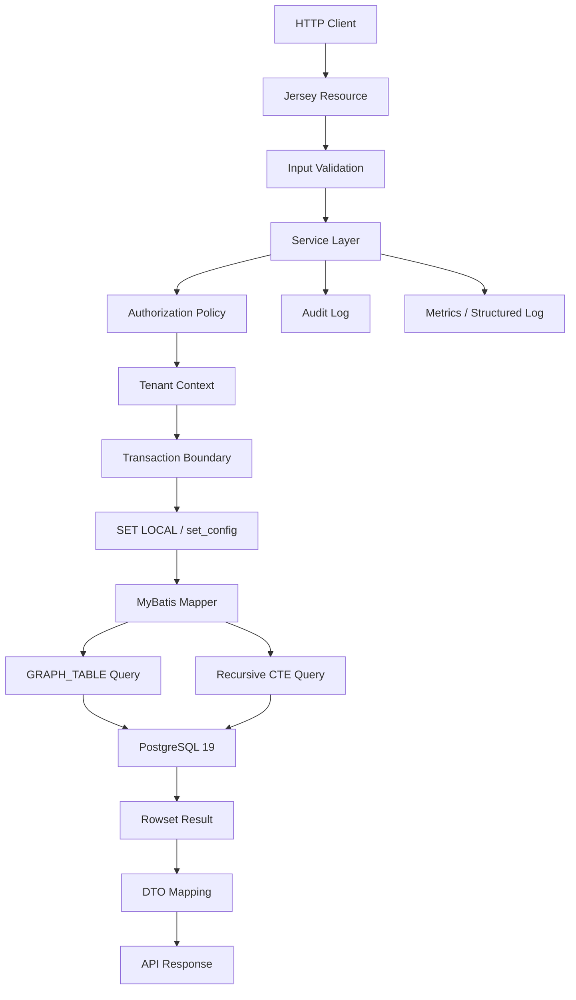

Prinsip arsitekturnya:

```text id="7hyhsq"
Client tidak mengirim raw MATCH.
Client mengirim business intent.
Service melakukan authorization dan tenant guard.
MyBatis menjalankan parameterized SQL.
PostgreSQL mengembalikan rowset.
API mengembalikan DTO stabil.
```

---

## 3. API Contract Design

Jangan mulai dari endpoint generik seperti:

```http id="bad_graph_endpoint"
POST /graph/query
{
  "match": "(a)-[]->(b)"
}
```

Lebih aman membuat endpoint berbasis intent:

```http id="safe_graph_endpoints"
GET /cases/{caseId}/graph/parties?asOfDate=2026-07-15

GET /cases/{caseId}/graph/related-accounts?asOfDate=2026-07-15&limit=100

GET /accounts/{accountId}/graph/linked-cases?asOfDate=2026-07-15&limit=100

GET /entities/{entityType}/{entityId}/graph/walk?maxDepth=2&relationshipType=INVOLVES&relationshipType=OWNS
```

Jersey/JAX-RS menggunakan annotation seperti `@Path`, HTTP method annotation, `@Produces`, `@PathParam`, dan `@QueryParam` untuk membuat resource REST. Dokumentasi Jersey menjelaskan penggunaan annotation JAX-RS untuk membuat RESTful resource berbasis Java object. ([Eclipse EE4J](https://eclipse-ee4j.github.io/jersey.github.io/documentation/latest31x/jaxrs-resources.html?utm_source=chatgpt.com))

---

# 4. Package Structure yang Direkomendasikan

```text id="package_structure"
com.acme.casegraph
├── api
│   ├── CaseGraphResource.java
│   ├── EntityGraphResource.java
│   └── dto
│       ├── CasePartyDto.java
│       ├── RelatedAccountDto.java
│       ├── LinkedCaseDto.java
│       └── GraphWalkResponse.java
├── service
│   ├── CaseGraphService.java
│   ├── EntityGraphService.java
│   ├── GraphAccessPolicy.java
│   └── GraphQueryLimiter.java
├── persistence
│   ├── CaseGraphMapper.java
│   ├── EntityRelationshipMapper.java
│   └── typehandler
│       └── StringArrayTypeHandler.java
├── domain
│   ├── GraphEntityType.java
│   ├── GraphRelationshipType.java
│   └── GraphQueryName.java
├── audit
│   ├── GraphAccessAuditRepository.java
│   └── GraphAccessAuditEvent.java
└── observability
    ├── GraphQueryMetrics.java
    └── GraphQueryLogger.java
```

Kenapa dipisah seperti ini?

| Layer | Tanggung Jawab |
|---|---|
| `api` | HTTP contract, validation ringan |
| `service` | authorization, tenant, transaction, orchestration |
| `persistence` | SQL/MyBatis |
| `domain` | enum/type aman untuk entity/relationship/query name |
| `audit` | audit access graph |
| `observability` | log/metric query graph |

---

# 5. DTO Design

Jangan return raw graph element. Return DTO yang sesuai kebutuhan API.

## 5.1 Case Party DTO

```java id="case_party_dto"
public record CasePartyDto(
        long caseId,
        String caseNo,
        long partyId,
        String partyName,
        String partyType,
        String partyRole,
        BigDecimal riskScore,
        LocalDate validFrom,
        LocalDate validTo
) {}
```

## 5.2 Related Account DTO

```java id="related_account_dto"
public record RelatedAccountDto(
        long caseId,
        String caseNo,

        long partyId,
        String partyName,
        String partyRole,

        long accountId,
        String accountNo,
        String accountStatus,

        String ownershipType,
        BigDecimal ownershipPct,

        LocalDate ownershipValidFrom,
        LocalDate ownershipValidTo
) {}
```

## 5.3 Linked Case DTO

```java id="linked_case_dto"
public record LinkedCaseDto(
        long linkedCaseId,
        String linkedCaseNo,
        String linkedCaseStatus,
        long bridgePartyId,
        String bridgePartyName,
        long sharedAccountId,
        String sharedAccountNo
) {}
```

## 5.4 Graph Walk DTO

```java id="graph_walk_dto"
public record GraphWalkPathDto(
        String sourceEntityType,
        long sourceEntityId,
        String targetEntityType,
        long targetEntityId,
        String relationshipType,
        int depth,
        List<String> path
) {}

public record GraphWalkResponse(
        String rootEntityType,
        long rootEntityId,
        LocalDate asOfDate,
        int maxDepth,
        List<GraphWalkPathDto> paths,
        boolean truncated
) {}
```

Rule:

```text id="yt23z5"
DTO adalah authorized projection.
DTO bukan mirror dari table.
DTO bukan raw graph object.
```

---

# 6. Domain Enum untuk Input Safety

## 6.1 Entity Type

```java id="graph_entity_type"
public enum GraphEntityType {
    CASE,
    PARTY,
    ACCOUNT,
    DOCUMENT,
    OFFICER,
    ENFORCEMENT_ACTION;

    public static GraphEntityType fromApiValue(String value) {
        for (GraphEntityType type : values()) {
            if (type.name().equalsIgnoreCase(value)) {
                return type;
            }
        }
        throw new BadRequestException("Unsupported entityType");
    }
}
```

## 6.2 Relationship Type

```java id="graph_relationship_type"
public enum GraphRelationshipType {
    INVOLVES,
    OWNS,
    HAS_DOCUMENT,
    ASSIGNED_TO,
    RESULTED_IN,
    RELATED_TO;

    public static GraphRelationshipType fromApiValue(String value) {
        for (GraphRelationshipType type : values()) {
            if (type.name().equalsIgnoreCase(value)) {
                return type;
            }
        }
        throw new BadRequestException("Unsupported relationshipType");
    }
}
```

Kenapa ini penting?

```text id="dbxk1c"
Graph traversal sangat mudah melebar.
Entity type dan relationship type dari client harus di-whitelist.
```

---

# 7. Jersey Resource: Case Graph API

```java id="case_graph_resource"
@Path("/cases/{caseId}/graph")
@Produces(MediaType.APPLICATION_JSON)
public class CaseGraphResource {

    private final CaseGraphService service;

    public CaseGraphResource(CaseGraphService service) {
        this.service = service;
    }

    @GET
    @Path("/parties")
    public Response parties(
            @PathParam("caseId") long caseId,
            @QueryParam("asOfDate") LocalDate asOfDate,
            @DefaultValue("100") @QueryParam("limit") int limit
    ) {
        var result = service.findCaseParties(caseId, asOfDate, limit);
        return Response.ok(result).build();
    }

    @GET
    @Path("/related-accounts")
    public Response relatedAccounts(
            @PathParam("caseId") long caseId,
            @QueryParam("asOfDate") LocalDate asOfDate,
            @DefaultValue("100") @QueryParam("limit") int limit
    ) {
        var result = service.findRelatedAccounts(caseId, asOfDate, limit);
        return Response.ok(result).build();
    }

    @GET
    @Path("/linked-cases")
    public Response linkedCases(
            @PathParam("caseId") long caseId,
            @QueryParam("asOfDate") LocalDate asOfDate,
            @DefaultValue("100") @QueryParam("limit") int limit
    ) {
        var result = service.findLinkedCases(caseId, asOfDate, limit);
        return Response.ok(result).build();
    }
}
```

Practical note:

```text id="nzx7fc"
Resource layer tidak boleh berisi SQL logic.
Resource layer tidak boleh melakukan authorization kompleks.
Resource layer hanya parse request dan delegasi ke service.
```

---

# 8. Service Layer Guardrail

```java id="case_graph_service"
public final class CaseGraphService {

    private static final int MAX_LIMIT = 500;

    private final TenantContext tenantContext;
    private final UserContext userContext;
    private final GraphAccessPolicy accessPolicy;
    private final CaseGraphMapper mapper;
    private final GraphAccessAuditRepository auditRepository;
    private final JdbcTemplate jdbcTemplate;

    public List<RelatedAccountDto> findRelatedAccounts(
            long caseId,
            LocalDate asOfDate,
            int requestedLimit
    ) {
        long tenantId = tenantContext.requiredTenantId();
        User user = userContext.requiredUser();

        LocalDate effectiveDate = requireAsOfDate(asOfDate);
        int limit = clampLimit(requestedLimit);

        accessPolicy.assertCanReadCase(user, tenantId, caseId);
        accessPolicy.assertCanRunGraphQuery(
                user,
                tenantId,
                "case_related_accounts"
        );

        applyTenantContext(tenantId);
        applyStatementTimeout("3s");

        int limitPlusOne = limit + 1;

        long startNanos = System.nanoTime();
        List<RelatedAccountDto> rows = mapper.findRelatedAccountsAsOf(
                tenantId,
                caseId,
                effectiveDate,
                limitPlusOne
        );

        boolean truncated = rows.size() > limit;
        List<RelatedAccountDto> responseRows =
                truncated ? rows.subList(0, limit) : rows;

        auditRepository.recordGraphAccess(
                tenantId,
                user.id(),
                "case_related_accounts",
                "CASE",
                caseId,
                effectiveDate,
                2,
                responseRows.size(),
                truncated
        );

        logGraphQuery(
                "case_related_accounts",
                tenantId,
                caseId,
                effectiveDate,
                responseRows.size(),
                truncated,
                startNanos
        );

        return responseRows;
    }

    private LocalDate requireAsOfDate(LocalDate asOfDate) {
        if (asOfDate == null) {
            throw new BadRequestException("asOfDate is required");
        }
        return asOfDate;
    }

    private int clampLimit(int requestedLimit) {
        if (requestedLimit < 1) {
            return 1;
        }
        return Math.min(requestedLimit, MAX_LIMIT);
    }

    private void applyTenantContext(long tenantId) {
        jdbcTemplate.update(
                "SELECT set_config('app.tenant_id', ?, true)",
                String.valueOf(tenantId)
        );
    }

    private void applyStatementTimeout(String timeout) {
        jdbcTemplate.update("SET LOCAL statement_timeout = '" + timeout + "'");
    }

    private void logGraphQuery(
            String queryName,
            long tenantId,
            long rootId,
            LocalDate asOfDate,
            int rowCount,
            boolean truncated,
            long startNanos
    ) {
        long durationMs =
                TimeUnit.NANOSECONDS.toMillis(System.nanoTime() - startNanos);

        // structured logger in real implementation
        System.out.printf(
                "graphQuery=%s tenantId=%d rootId=%d asOfDate=%s rowCount=%d truncated=%s durationMs=%d%n",
                queryName,
                tenantId,
                rootId,
                asOfDate,
                rowCount,
                truncated,
                durationMs
        );
    }
}
```

PostgreSQL `SET` changes runtime configuration parameters for the current session; use transaction-scoped settings carefully with pooled connections. `statement_timeout` is a client connection default parameter and PostgreSQL documentation specifically warns against setting it globally in `postgresql.conf` because it affects all sessions. ([PostgreSQL](https://www.postgresql.org/docs/current/sql-set.html?utm_source=chatgpt.com))

---

# 9. Catatan Penting: `SET LOCAL` dan Connection Pool

Untuk aplikasi dengan connection pool:

```text id="xinoku"
SET biasa bisa bocor ke session berikutnya jika connection dikembalikan ke pool.
SET LOCAL hanya berlaku selama transaction.
set_config(..., true) juga scoped ke current transaction.
```

Pattern aman:

```java id="transaction_scoped_context"
@Transactional(readOnly = true)
public List<RelatedAccountDto> findRelatedAccounts(...) {
    applyTenantContext(tenantId);
    applyStatementTimeout("3s");
    return mapper.findRelatedAccountsAsOf(...);
}
```

Gunakan transaction boundary agar setting runtime tidak bocor.

---

# 10. MyBatis Mapper: `GRAPH_TABLE` 1-hop

MyBatis mendukung mapper XML dengan `select`, `resultType`, dan `resultMap`; dokumentasinya menjelaskan bahwa `resultMap` sangat kuat untuk mapping kompleks, dan `resultType` dapat dipakai untuk mapping sederhana, tetapi `resultType` dan `resultMap` tidak dipakai bersamaan. ([MyBatis](https://mybatis.org/mybatis-3/sqlmap-xml.html?utm_source=chatgpt.com))

## Mapper Interface

```java id="case_graph_mapper_interface"
public interface CaseGraphMapper {

    List<CasePartyDto> findCasePartiesAsOf(
            @Param("tenantId") long tenantId,
            @Param("caseId") long caseId,
            @Param("asOfDate") LocalDate asOfDate,
            @Param("limit") int limit
    );

    List<RelatedAccountDto> findRelatedAccountsAsOf(
            @Param("tenantId") long tenantId,
            @Param("caseId") long caseId,
            @Param("asOfDate") LocalDate asOfDate,
            @Param("limit") int limit
    );

    List<LinkedCaseDto> findLinkedCasesAsOf(
            @Param("tenantId") long tenantId,
            @Param("caseId") long caseId,
            @Param("asOfDate") LocalDate asOfDate,
            @Param("limit") int limit
    );
}
```

## XML: Case → Party

```xml id="case_party_graph_table_xml"
<select id="findCasePartiesAsOf"
        resultType="com.acme.casegraph.api.dto.CasePartyDto">
    SELECT *
    FROM GRAPH_TABLE (
        compliance_graph
        MATCH
            (c IS case_node)-[cp IS involves]->(p IS party)
        WHERE
            c.tenant_id = #{tenantId}
            AND p.tenant_id = #{tenantId}
            AND cp.tenant_id = #{tenantId}

            AND c.case_id = #{caseId}

            AND cp.valid_from &lt;= #{asOfDate}
            AND (cp.valid_to IS NULL OR cp.valid_to &gt;= #{asOfDate})

        COLUMNS (
            c.case_id AS "caseId",
            c.case_no AS "caseNo",

            p.party_id AS "partyId",
            p.party_name AS "partyName",
            p.party_type AS "partyType",
            p.risk_score AS "riskScore",

            cp.role AS "partyRole",
            cp.valid_from AS "validFrom",
            cp.valid_to AS "validTo"
        )
    )
    ORDER BY
        "partyRole",
        "partyName"
    LIMIT #{limit}
</select>
```

Practical notes:

```text id="lr5lna"
Alias COLUMNS disesuaikan dengan Java record field.
Gunakan #{...}, bukan ${...}.
Tenant filter tetap dikirim walaupun RLS aktif.
```

---

# 11. MyBatis Mapper: `GRAPH_TABLE` 2-hop

## XML: Case → Party → Account

```xml id="related_account_graph_table_xml"
<select id="findRelatedAccountsAsOf"
        resultType="com.acme.casegraph.api.dto.RelatedAccountDto">
    SELECT *
    FROM GRAPH_TABLE (
        compliance_graph
        MATCH
            (c IS case_node)-[cp IS involves]->(p IS party)-[pa IS owns]->(a IS account)
        WHERE
            c.tenant_id = #{tenantId}
            AND p.tenant_id = #{tenantId}
            AND a.tenant_id = #{tenantId}
            AND cp.tenant_id = #{tenantId}
            AND pa.tenant_id = #{tenantId}

            AND c.case_id = #{caseId}

            AND cp.valid_from &lt;= #{asOfDate}
            AND (cp.valid_to IS NULL OR cp.valid_to &gt;= #{asOfDate})

            AND pa.valid_from &lt;= #{asOfDate}
            AND (pa.valid_to IS NULL OR pa.valid_to &gt;= #{asOfDate})

        COLUMNS (
            c.case_id AS "caseId",
            c.case_no AS "caseNo",

            p.party_id AS "partyId",
            p.party_name AS "partyName",
            cp.role AS "partyRole",

            a.account_id AS "accountId",
            a.account_no AS "accountNo",
            a.status AS "accountStatus",

            pa.ownership_type AS "ownershipType",
            pa.ownership_pct AS "ownershipPct",
            pa.valid_from AS "ownershipValidFrom",
            pa.valid_to AS "ownershipValidTo"
        )
    )
    ORDER BY
        "partyName",
        "accountNo"
    LIMIT #{limit}
</select>
```

Graph query ini tetap berbentuk `SELECT`, sehingga dari sisi MyBatis ia diperlakukan seperti query SQL biasa. `GRAPH_TABLE` sendiri menghasilkan rowset dari graph pattern dan `COLUMNS` projection. ([PostgreSQL](https://www.postgresql.org/docs/19/queries-graph.html?utm_source=chatgpt.com))

---

# 12. MyBatis Mapper: 4-hop Linked Cases

## XML: Case → Party → Account ← Party ← Case

```xml id="linked_cases_graph_table_xml"
<select id="findLinkedCasesAsOf"
        resultType="com.acme.casegraph.api.dto.LinkedCaseDto">
    SELECT DISTINCT
        g."linkedCaseId",
        g."linkedCaseNo",
        g."linkedCaseStatus",
        g."bridgePartyId",
        g."bridgePartyName",
        g."sharedAccountId",
        g."sharedAccountNo"
    FROM GRAPH_TABLE (
        compliance_graph
        MATCH
            (c1 IS case_node)-[cp1 IS involves]->(p1 IS party)-[pa1 IS owns]->(a IS account)
                <-[pa2 IS owns]-(p2 IS party)<-[cp2 IS involves]-(c2 IS case_node)
        WHERE
            c1.tenant_id = #{tenantId}
            AND p1.tenant_id = #{tenantId}
            AND a.tenant_id = #{tenantId}
            AND p2.tenant_id = #{tenantId}
            AND c2.tenant_id = #{tenantId}

            AND cp1.tenant_id = #{tenantId}
            AND pa1.tenant_id = #{tenantId}
            AND pa2.tenant_id = #{tenantId}
            AND cp2.tenant_id = #{tenantId}

            AND c1.case_id = #{caseId}
            AND c1.case_id &lt;&gt; c2.case_id

            AND cp1.valid_from &lt;= #{asOfDate}
            AND (cp1.valid_to IS NULL OR cp1.valid_to &gt;= #{asOfDate})

            AND pa1.valid_from &lt;= #{asOfDate}
            AND (pa1.valid_to IS NULL OR pa1.valid_to &gt;= #{asOfDate})

            AND pa2.valid_from &lt;= #{asOfDate}
            AND (pa2.valid_to IS NULL OR pa2.valid_to &gt;= #{asOfDate})

            AND cp2.valid_from &lt;= #{asOfDate}
            AND (cp2.valid_to IS NULL OR cp2.valid_to &gt;= #{asOfDate})

        COLUMNS (
            c2.case_id AS "linkedCaseId",
            c2.case_no AS "linkedCaseNo",
            c2.status AS "linkedCaseStatus",

            p2.party_id AS "bridgePartyId",
            p2.party_name AS "bridgePartyName",

            a.account_id AS "sharedAccountId",
            a.account_no AS "sharedAccountNo"
        )
    ) AS g
    ORDER BY
        g."linkedCaseNo",
        g."bridgePartyName"
    LIMIT #{limit}
</select>
```

Practical warning:

```text id="8oun3a"
4-hop query bisa menghasilkan banyak path.
Gunakan DISTINCT hanya untuk entity-summary endpoint.
Untuk investigation path endpoint, jangan DISTINCT path evidence.
```

---

# 13. MyBatis Dynamic SQL untuk Relationship Type Whitelist

MyBatis menyediakan dynamic SQL element seperti `if`, `choose`, `trim`, dan `foreach`; `foreach` umum dipakai untuk membuat daftar `IN (...)` secara aman dari collection parameter. ([MyBatis](https://mybatis.org/mybatis-3/dynamic-sql.html?utm_source=chatgpt.com))

Contoh recursive CTE dengan `relationshipTypes`:

```xml id="relationship_types_foreach"
<if test="relationshipTypes != null and relationshipTypes.size() > 0">
    AND er.relationship_type IN
    <foreach collection="relationshipTypes"
             item="type"
             open="("
             separator=","
             close=")">
        #{type}
    </foreach>
</if>
```

Rule:

```text id="f7jszk"
Dynamic SQL boleh untuk value list yang sudah divalidasi.
Dynamic SQL tidak boleh untuk menyusun raw SQL fragment dari client.
```

---

# 14. MyBatis Mapper: Recursive CTE Graph Walk

## Mapper Interface

```java id="entity_relationship_mapper_interface"
public interface EntityRelationshipMapper {

    List<GraphWalkPathDto> walkOutbound(
            @Param("tenantId") long tenantId,
            @Param("rootEntityType") String rootEntityType,
            @Param("rootEntityId") long rootEntityId,
            @Param("relationshipTypes") List<String> relationshipTypes,
            @Param("asOfDate") LocalDate asOfDate,
            @Param("maxDepth") int maxDepth,
            @Param("limit") int limit
    );
}
```

## XML

```xml id="recursive_cte_graph_walk_xml"
<select id="walkOutbound"
        resultType="com.acme.casegraph.api.dto.GraphWalkPathDto">
    WITH RECURSIVE relationship_walk AS (
        SELECT
            er.source_entity_type AS "sourceEntityType",
            er.source_entity_id AS "sourceEntityId",
            er.target_entity_type AS "targetEntityType",
            er.target_entity_id AS "targetEntityId",
            er.relationship_type AS "relationshipType",
            1 AS "depth",

            ARRAY[
                er.source_entity_type || ':' || er.source_entity_id::text,
                er.target_entity_type || ':' || er.target_entity_id::text
            ] AS "path",

            false AS "cycle"
        FROM entity_relationships er
        WHERE er.tenant_id = #{tenantId}
          AND er.source_entity_type = #{rootEntityType}
          AND er.source_entity_id = #{rootEntityId}
          AND er.valid_from &lt;= #{asOfDate}
          AND (er.valid_to IS NULL OR er.valid_to &gt;= #{asOfDate})

          <if test="relationshipTypes != null and relationshipTypes.size() > 0">
              AND er.relationship_type IN
              <foreach collection="relationshipTypes"
                       item="type"
                       open="("
                       separator=","
                       close=")">
                  #{type}
              </foreach>
          </if>

        UNION ALL

        SELECT
            er.source_entity_type AS "sourceEntityType",
            er.source_entity_id AS "sourceEntityId",
            er.target_entity_type AS "targetEntityType",
            er.target_entity_id AS "targetEntityId",
            er.relationship_type AS "relationshipType",
            rw."depth" + 1 AS "depth",

            rw."path" || (
                er.target_entity_type || ':' || er.target_entity_id::text
            ) AS "path",

            (
                er.target_entity_type || ':' || er.target_entity_id::text
            ) = ANY(rw."path") AS "cycle"
        FROM relationship_walk rw
        JOIN entity_relationships er
          ON er.tenant_id = #{tenantId}
         AND er.source_entity_type = rw."targetEntityType"
         AND er.source_entity_id = rw."targetEntityId"
         AND er.valid_from &lt;= #{asOfDate}
         AND (er.valid_to IS NULL OR er.valid_to &gt;= #{asOfDate})

        <if test="relationshipTypes != null and relationshipTypes.size() > 0">
            AND er.relationship_type IN
            <foreach collection="relationshipTypes"
                     item="type"
                     open="("
                     separator=","
                     close=")">
                #{type}
            </foreach>
        </if>

        WHERE rw."depth" &lt; #{maxDepth}
          AND NOT rw."cycle"
    )
    SELECT
        "sourceEntityType",
        "sourceEntityId",
        "targetEntityType",
        "targetEntityId",
        "relationshipType",
        "depth",
        "path"
    FROM relationship_walk
    WHERE NOT "cycle"
    ORDER BY
        "depth",
        "targetEntityType",
        "targetEntityId"
    LIMIT #{limit}
</select>
```

---

# 15. TypeHandler untuk PostgreSQL Array Path

Jika mapping `text[]` ke `List<String>` tidak langsung cocok di setup MyBatis/JDBC Anda, buat TypeHandler.

```java id="string_array_type_handler"
@MappedJdbcTypes(JdbcType.ARRAY)
@MappedTypes(List.class)
public final class StringArrayTypeHandler extends BaseTypeHandler<List<String>> {

    @Override
    public void setNonNullParameter(
            PreparedStatement ps,
            int i,
            List<String> parameter,
            JdbcType jdbcType
    ) throws SQLException {
        Array array = ps.getConnection()
                .createArrayOf("text", parameter.toArray());
        ps.setArray(i, array);
    }

    @Override
    public List<String> getNullableResult(ResultSet rs, String columnName)
            throws SQLException {
        return toList(rs.getArray(columnName));
    }

    @Override
    public List<String> getNullableResult(ResultSet rs, int columnIndex)
            throws SQLException {
        return toList(rs.getArray(columnIndex));
    }

    @Override
    public List<String> getNullableResult(CallableStatement cs, int columnIndex)
            throws SQLException {
        return toList(cs.getArray(columnIndex));
    }

    private List<String> toList(Array array) throws SQLException {
        if (array == null) {
            return List.of();
        }

        Object raw = array.getArray();
        if (raw instanceof String[] values) {
            return List.of(values);
        }

        Object[] values = (Object[]) raw;
        return Arrays.stream(values)
                .map(String::valueOf)
                .toList();
    }
}
```

MyBatis configuration can register type handlers and other settings that materially affect mapper behavior. ([MyBatis](https://mybatis.org/mybatis-3/configuration.html?utm_source=chatgpt.com))

---

# 16. ResultMap untuk Mapping Lebih Eksplisit

Untuk DTO sederhana, `resultType` cukup. Untuk mapping lebih kompleks, gunakan `resultMap`.

```xml id="related_account_result_map"
<resultMap id="RelatedAccountMap"
           type="com.acme.casegraph.api.dto.RelatedAccountDto">
    <constructor>
        <arg column="caseId" javaType="long"/>
        <arg column="caseNo" javaType="string"/>
        <arg column="partyId" javaType="long"/>
        <arg column="partyName" javaType="string"/>
        <arg column="partyRole" javaType="string"/>
        <arg column="accountId" javaType="long"/>
        <arg column="accountNo" javaType="string"/>
        <arg column="accountStatus" javaType="string"/>
        <arg column="ownershipType" javaType="string"/>
        <arg column="ownershipPct" javaType="java.math.BigDecimal"/>
        <arg column="ownershipValidFrom" javaType="java.time.LocalDate"/>
        <arg column="ownershipValidTo" javaType="java.time.LocalDate"/>
    </constructor>
</resultMap>

<select id="findRelatedAccountsAsOf"
        resultMap="RelatedAccountMap">
    SELECT *
    FROM GRAPH_TABLE (
        compliance_graph
        MATCH
            (c IS case_node)-[cp IS involves]->(p IS party)-[pa IS owns]->(a IS account)
        WHERE
            c.tenant_id = #{tenantId}
            AND c.case_id = #{caseId}
        COLUMNS (
            c.case_id AS "caseId",
            c.case_no AS "caseNo",
            p.party_id AS "partyId",
            p.party_name AS "partyName",
            cp.role AS "partyRole",
            a.account_id AS "accountId",
            a.account_no AS "accountNo",
            a.status AS "accountStatus",
            pa.ownership_type AS "ownershipType",
            pa.ownership_pct AS "ownershipPct",
            pa.valid_from AS "ownershipValidFrom",
            pa.valid_to AS "ownershipValidTo"
        )
    )
</select>
```

Use `resultMap` when constructor mapping, nested mapping, or custom type handling becomes important; keep `resultType` for straightforward projection. ([MyBatis](https://mybatis.org/mybatis-3/sqlmap-xml.html?utm_source=chatgpt.com))

---

# 17. Entity Graph Resource untuk Recursive Walk

```java id="entity_graph_resource"
@Path("/entities/{entityType}/{entityId}/graph")
@Produces(MediaType.APPLICATION_JSON)
public class EntityGraphResource {

    private final EntityGraphService service;

    public EntityGraphResource(EntityGraphService service) {
        this.service = service;
    }

    @GET
    @Path("/walk")
    public Response walk(
            @PathParam("entityType") String entityType,
            @PathParam("entityId") long entityId,
            @QueryParam("relationshipType") List<String> relationshipTypes,
            @QueryParam("asOfDate") LocalDate asOfDate,
            @DefaultValue("2") @QueryParam("maxDepth") int maxDepth,
            @DefaultValue("100") @QueryParam("limit") int limit
    ) {
        GraphWalkResponse response = service.walk(
                entityType,
                entityId,
                relationshipTypes,
                asOfDate,
                maxDepth,
                limit
        );

        return Response.ok(response).build();
    }
}
```

---

# 18. Entity Graph Service

```java id="entity_graph_service"
public final class EntityGraphService {

    private static final int MAX_DEPTH = 4;
    private static final int MAX_LIMIT = 500;

    private final TenantContext tenantContext;
    private final UserContext userContext;
    private final GraphAccessPolicy accessPolicy;
    private final EntityRelationshipMapper mapper;
    private final JdbcTemplate jdbcTemplate;

    @Transactional(readOnly = true)
    public GraphWalkResponse walk(
            String entityTypeValue,
            long entityId,
            List<String> relationshipTypeValues,
            LocalDate asOfDate,
            int requestedDepth,
            int requestedLimit
    ) {
        long tenantId = tenantContext.requiredTenantId();
        User user = userContext.requiredUser();

        GraphEntityType entityType =
                GraphEntityType.fromApiValue(entityTypeValue);

        List<String> relationshipTypes =
                normalizeRelationshipTypes(relationshipTypeValues);

        LocalDate effectiveDate = requireAsOfDate(asOfDate);
        int maxDepth = clamp(requestedDepth, 1, MAX_DEPTH);
        int limit = clamp(requestedLimit, 1, MAX_LIMIT);

        accessPolicy.assertCanInspectEntity(
                user,
                tenantId,
                entityType,
                entityId
        );

        accessPolicy.assertCanRunGraphQuery(
                user,
                tenantId,
                "entity_graph_walk"
        );

        applyTenantContext(tenantId);
        applyStatementTimeout("5s");

        int limitPlusOne = limit + 1;

        List<GraphWalkPathDto> rows = mapper.walkOutbound(
                tenantId,
                entityType.name(),
                entityId,
                relationshipTypes,
                effectiveDate,
                maxDepth,
                limitPlusOne
        );

        boolean truncated = rows.size() > limit;
        List<GraphWalkPathDto> responseRows =
                truncated ? rows.subList(0, limit) : rows;

        return new GraphWalkResponse(
                entityType.name(),
                entityId,
                effectiveDate,
                maxDepth,
                responseRows,
                truncated
        );
    }

    private List<String> normalizeRelationshipTypes(List<String> values) {
        if (values == null || values.isEmpty()) {
            return List.of("INVOLVES", "OWNS");
        }

        return values.stream()
                .map(GraphRelationshipType::fromApiValue)
                .map(Enum::name)
                .distinct()
                .toList();
    }

    private LocalDate requireAsOfDate(LocalDate asOfDate) {
        if (asOfDate == null) {
            throw new BadRequestException("asOfDate is required");
        }
        return asOfDate;
    }

    private int clamp(int value, int min, int max) {
        return Math.min(Math.max(value, min), max);
    }

    private void applyTenantContext(long tenantId) {
        jdbcTemplate.update(
                "SELECT set_config('app.tenant_id', ?, true)",
                String.valueOf(tenantId)
        );
    }

    private void applyStatementTimeout(String timeout) {
        jdbcTemplate.update("SET LOCAL statement_timeout = '" + timeout + "'");
    }
}
```

---

# 19. Tenant Context + RLS Integration

PostgreSQL Row-Level Security policies can restrict which rows are visible or modifiable, with `USING` and `WITH CHECK` expressions controlling selected and modified rows. ([PostgreSQL](https://www.postgresql.org/docs/current/ddl-rowsecurity.html?utm_source=chatgpt.com))

RLS policy example:

```sql id="rls_policy_example"
ALTER TABLE cases ENABLE ROW LEVEL SECURITY;
ALTER TABLE parties ENABLE ROW LEVEL SECURITY;
ALTER TABLE accounts ENABLE ROW LEVEL SECURITY;
ALTER TABLE case_parties ENABLE ROW LEVEL SECURITY;
ALTER TABLE party_accounts ENABLE ROW LEVEL SECURITY;

CREATE POLICY cases_tenant_select
ON cases
FOR SELECT
USING (
    tenant_id = current_setting('app.tenant_id')::bigint
);

CREATE POLICY case_parties_tenant_select
ON case_parties
FOR SELECT
USING (
    tenant_id = current_setting('app.tenant_id')::bigint
);
```

Service still passes `tenantId` into SQL:

```text id="w0ovm7"
RLS = safety net.
SQL tenant filter = explicit query guardrail.
Application authorization = business access control.
```

---

# 20. Error Handling

## 20.1 API Error Model

```java id="api_error_model"
public record ApiError(
        String code,
        String message,
        String requestId
) {}
```

## 20.2 Exception Mapper

```java id="api_exception_mapper"
@Provider
public final class ApiExceptionMapper implements ExceptionMapper<Throwable> {

    @Context
    HttpHeaders headers;

    @Override
    public Response toResponse(Throwable exception) {
        if (exception instanceof BadRequestException) {
            return error(Response.Status.BAD_REQUEST, "BAD_REQUEST", exception.getMessage());
        }

        if (exception instanceof ForbiddenException) {
            return error(Response.Status.FORBIDDEN, "FORBIDDEN", "Access denied");
        }

        if (isQueryTimeout(exception)) {
            return error(Response.Status.REQUEST_TIMEOUT, "QUERY_TIMEOUT", "Graph query timed out");
        }

        return error(Response.Status.INTERNAL_SERVER_ERROR, "INTERNAL_ERROR", "Unexpected error");
    }

    private Response error(Response.Status status, String code, String message) {
        return Response.status(status)
                .type(MediaType.APPLICATION_JSON_TYPE)
                .entity(new ApiError(code, message, RequestId.current()))
                .build();
    }

    private boolean isQueryTimeout(Throwable ex) {
        Throwable current = ex;
        while (current != null) {
            if (current.getMessage() != null
                    && current.getMessage().contains("statement timeout")) {
                return true;
            }
            current = current.getCause();
        }
        return false;
    }
}
```

Practical HTTP mapping:

| Situation | HTTP |
|---|---:|
| Invalid entity type | 400 |
| Invalid relationship type | 400 |
| Missing `asOfDate` for audit graph | 400 |
| Unauthorized root entity | 403 or 404 policy-dependent |
| Query timeout | 408 or 503 depending platform standard |
| Result truncated | 200 + `truncated=true` |
| Unsupported graph query | 400 |
| Internal SQL error | 500 |

---

# 21. Response Wrapper untuk Pagination/Truncation

```java id="graph_page_response"
public record GraphPageResponse<T>(
        List<T> items,
        int limit,
        boolean truncated
) {}
```

Usage:

```java id="graph_page_usage"
return new GraphPageResponse<>(
        responseRows,
        limit,
        truncated
);
```

JSON:

```json id="graph_page_json"
{
  "items": [],
  "limit": 100,
  "truncated": false
}
```

Kenapa penting?

```text id="6j60v4"
Graph result bisa meledak karena branching.
Client harus tahu apakah response complete atau dipotong.
```

---

# 22. Observability

## 22.1 Structured Log

```java id="graph_structured_log"
public void logGraphQueryCompleted(
        String queryName,
        long tenantId,
        String rootEntityType,
        long rootEntityId,
        LocalDate asOfDate,
        int depth,
        int rowCount,
        boolean truncated,
        long durationMs
) {
    logger.info(
            "event=graph_query_completed queryName={} tenantId={} rootEntityType={} rootEntityId={} asOfDate={} depth={} rowCount={} truncated={} durationMs={}",
            queryName,
            tenantId,
            rootEntityType,
            rootEntityId,
            asOfDate,
            depth,
            rowCount,
            truncated,
            durationMs
    );
}
```

## 22.2 Metrics

```text id="graph_metrics"
graph_query_duration_seconds
graph_query_rows_total
graph_query_timeout_total
graph_query_truncated_total
graph_query_depth_requested
graph_query_errors_total
```

Label yang aman:

```text id="safe_metric_labels"
queryName
entityType
resultStatus
```

Jangan jadikan ini metric label:

```text id="bad_metric_labels"
tenantId
caseId
accountId
partyId
userId
```

Karena cardinality tinggi dan berisiko data exposure di monitoring.

---

# 23. Audit Repository

```java id="graph_audit_repository"
public final class GraphAccessAuditRepository {

    private final JdbcTemplate jdbcTemplate;

    public void recordGraphAccess(
            long tenantId,
            String actorUserId,
            String queryName,
            String rootEntityType,
            long rootEntityId,
            LocalDate asOfDate,
            int maxDepth,
            int rowCount,
            boolean truncated
    ) {
        jdbcTemplate.update("""
            INSERT INTO graph_access_audit (
                audit_id,
                tenant_id,
                actor_user_id,
                query_name,
                root_entity_type,
                root_entity_id,
                as_of_date,
                max_depth,
                row_count,
                truncated,
                accessed_at
            )
            VALUES (
                nextval('graph_access_audit_seq'),
                ?, ?, ?, ?, ?, ?, ?, ?, ?, now()
            )
            """,
            tenantId,
            actorUserId,
            queryName,
            rootEntityType,
            rootEntityId,
            asOfDate,
            maxDepth,
            rowCount,
            truncated
        );
    }
}
```

Audit table:

```sql id="graph_access_audit_table"
CREATE TABLE graph_access_audit (
    audit_id          bigint PRIMARY KEY,
    tenant_id         bigint NOT NULL,

    actor_user_id     text NOT NULL,
    query_name        text NOT NULL,

    root_entity_type  text NOT NULL,
    root_entity_id    bigint NOT NULL,

    as_of_date        date,
    max_depth         integer,
    row_count         integer NOT NULL,
    truncated         boolean NOT NULL,

    accessed_at       timestamptz NOT NULL DEFAULT now()
);
```

---

# 24. Integration Test Strategy

## 24.1 Test Data Fixture

```text id="integration_fixture"
Tenant 10:
- Case 1001
- Party 2001
- Account 3001
- CaseParty 1001 -> 2001
- PartyAccount 2001 -> 3001

Tenant 20:
- Case 9001
- Party 9001
- Account 9001
```

## 24.2 Tests

| Test | Expected |
|---|---|
| `GET /cases/1001/graph/parties` | returns only tenant 10 parties |
| Missing `asOfDate` | 400 |
| Unsupported relationship type | 400 |
| `limit=999999` | clamped to max |
| Graph query result size > limit | `truncated=true` |
| Unauthorized case | 403/404 |
| Cross-tenant relationship | not returned |
| Expired edge | not returned for later `asOfDate` |
| Recursive cycle | no infinite loop |
| Query timeout | mapped to API error |
| Audit record | inserted |
| Tenant context | set inside transaction |

---

# 25. Contract Test untuk DTO Stability

Graph query sering berubah. Test DTO contract agar API tidak berubah diam-diam.

```java id="dto_contract_test"
@Test
void relatedAccountsResponseContract() {
    RelatedAccountDto dto = new RelatedAccountDto(
            1001L,
            "CASE-2026-001",
            2001L,
            "PT Alpha",
            "SUBJECT",
            3001L,
            "ACC-7788",
            "ACTIVE",
            "OWNER",
            new BigDecimal("75.00"),
            LocalDate.parse("2026-01-01"),
            null
    );

    String json = objectMapper.writeValueAsString(dto);

    assertThat(json).contains("\"caseId\":1001");
    assertThat(json).contains("\"caseNo\":\"CASE-2026-001\"");
    assertThat(json).contains("\"ownershipType\":\"OWNER\"");
}
```

Practical rule:

```text id="ltxwn5"
Property graph definition boleh berubah.
API contract tidak boleh berubah tanpa versioning.
```

---

# 26. API Versioning

Jika query logic atau response shape berubah signifikan:

```http id="api_versioning"
GET /v1/cases/{caseId}/graph/related-accounts
GET /v2/cases/{caseId}/graph/related-accounts
```

Atau version via media type:

```http id="api_media_type_version"
Accept: application/vnd.acme.case-graph.v2+json
```

Kapan versioning perlu?

| Perubahan | Perlu Version? |
|---|---:|
| Tambah optional field | Kadang tidak |
| Rename field | Ya |
| Ubah semantics `asOfDate` | Ya |
| Ubah dedup/entity vs path semantics | Ya |
| Ubah default relationship type | Ya |
| Ubah max depth default | Biasanya ya |
| Tambah endpoint baru | Tidak selalu |

---

# 27. Transaction Boundary Pattern

Recommended:

```java id="transaction_boundary_pattern"
@Transactional(readOnly = true)
public GraphPageResponse<RelatedAccountDto> findRelatedAccounts(...) {
    applyTenantContext(tenantId);
    applyStatementTimeout("3s");
    accessPolicy.assertCanReadCase(...);
    var rows = mapper.findRelatedAccountsAsOf(...);
    auditRepository.recordGraphAccess(...);
    return response;
}
```

Caution:

```text id="h3g675"
Jika audit insert dilakukan dalam readOnly transaction,
beberapa transaction manager/database setup bisa menolak write.
```

Alternative:

```text id="audit_after_query"
1. Read graph in read-only transaction.
2. Record audit in separate write transaction.
```

Tetapi high-stakes audit sebaiknya memastikan audit tetap dicatat walaupun response gagal setelah query.

---

# 28. Query Name Registry

Buat enum agar observability dan audit konsisten.

```java id="graph_query_name"
public enum GraphQueryName {
    CASE_PARTIES("case_parties", 1),
    CASE_RELATED_ACCOUNTS("case_related_accounts", 2),
    CASE_LINKED_CASES("case_linked_cases", 4),
    ENTITY_GRAPH_WALK("entity_graph_walk", -1);

    private final String value;
    private final int fixedDepth;

    GraphQueryName(String value, int fixedDepth) {
        this.value = value;
        this.fixedDepth = fixedDepth;
    }

    public String value() {
        return value;
    }

    public int fixedDepth() {
        return fixedDepth;
    }
}
```

Gunakan di:

```text id="query_registry_usage"
- structured log
- audit table
- metrics
- access policy
- documentation
- performance baseline
```

---

# 29. Performance Baseline per Mapper

Untuk setiap mapper query, simpan baseline:

```text id="performance_baseline"
Query name:
  case_related_accounts

Expected root:
  tenant_id + case_id

Expected max rows:
  p95 < 100
  p99 < 500

Expected duration:
  p95 < 200ms
  p99 < 1s

Indexes:
  cases(tenant_id, case_id)
  case_parties(tenant_id, case_id, valid_from, valid_to)
  party_accounts(tenant_id, party_id, valid_from, valid_to)
  accounts(tenant_id, account_id)

Required guardrails:
  tenant filter
  asOfDate
  limit
  statement_timeout
```

Ini memudahkan review PR: query graph tidak boleh masuk tanpa baseline.

---

# 30. Common Integration Mistakes

| Mistake | Dampak | Solusi |
|---|---|---|
| Expose raw `MATCH` | Security/performance risk | Intent-specific endpoint |
| DTO mirror table | PII/internal leak | Authorized DTO |
| Tidak clamp `limit` | Response besar | Max limit |
| Tidak clamp `maxDepth` | Traversal runaway | Max depth |
| Tenant context tidak transaction-scoped | Tenant leak via pool | `SET LOCAL` / `set_config(..., true)` dalam transaction |
| RLS dianggap cukup | Business authorization lemah | Service policy + RLS |
| MyBatis pakai `${}` untuk input | Injection risk | Gunakan `#{}` |
| `DISTINCT` sembarang | Path evidence hilang | Pisahkan summary vs path endpoint |
| Audit tidak dicatat | Investigation gap | Audit repository |
| Metrics label pakai ID | Cardinality tinggi | ID di log, bukan metric label |
| Timeout global di PostgreSQL config | Semua session terdampak | Set per role/session/transaction |
| Query graph tanpa test fixture cycle | Risiko recursion problem | Cycle tests |

---

# 31. Production Checklist

```text id="seri_11_checklist"
[ ] Endpoint berbasis business intent, bukan raw query.
[ ] Resource layer hanya parsing dan delegasi.
[ ] Service layer melakukan authorization.
[ ] Tenant context diambil dari trusted context.
[ ] Tenant context diset transaction-scoped.
[ ] SQL tetap menerima tenantId sebagai parameter eksplisit.
[ ] RLS tersedia sebagai defense-in-depth.
[ ] `asOfDate` wajib untuk query audit/historical.
[ ] `limit` diclamp.
[ ] `maxDepth` diclamp.
[ ] Relationship/entity type di-whitelist.
[ ] MyBatis memakai `#{}`.
[ ] Dynamic SQL hanya untuk value list tervalidasi.
[ ] DTO projection eksplisit.
[ ] `resultMap` dipakai jika mapping kompleks.
[ ] Timeout diset untuk query graph.
[ ] Truncation flag dikembalikan.
[ ] Query audit dicatat.
[ ] Structured log punya queryName, duration, rowCount, truncated.
[ ] Metrics tidak memakai high-cardinality labels.
[ ] Integration tests mencakup tenant, expired edge, cycle, timeout, unauthorized access.
[ ] API contract test tersedia.
```

---

## Status Seri

**Seri 11/12 selesai.**

Seri terakhir:

**Seri 12/12 - Extension Decision Map: SQL/PGQ vs Apache AGE vs ltree vs pgRouting vs pgvector Hybrid**

Fokus terakhir: kapan cukup memakai PostgreSQL 19 SQL/PGQ, kapan gunakan recursive CTE, kapan cocok memakai Apache AGE/Cypher-like graph, kapan `ltree`, kapan pgRouting, kapan pgvector hybrid, dan bagaimana membuat decision matrix untuk enterprise architecture.

---

**Sources:**

- [Documentation: 19: CREATE PROPERTY GRAPH](https://www.postgresql.org/docs/19/sql-create-property-graph.html?utm_source=chatgpt.com)
- [Chapter 3. JAX-RS Application, Resources and Sub- ...](https://eclipse-ee4j.github.io/jersey.github.io/documentation/latest31x/jaxrs-resources.html?utm_source=chatgpt.com)
- [MyBatis 3 | Mapper XML Files](https://mybatis.org/mybatis-3/sqlmap-xml.html?utm_source=chatgpt.com)

## Response:
7/15/2026, 9:19:52 PM

Saya lanjut ke **Seri 12/12**, seri penutup. Fokusnya adalah decision map: kapan pakai SQL/PGQ PostgreSQL 19, kapan cukup recursive CTE, dan kapan perlu extension/tool lain.

# Seri 12/12 - Extension Decision Map: SQL/PGQ vs Apache AGE vs `ltree` vs pgRouting vs pgvector Hybrid

## 1. Tujuan Seri Ini

Seri terakhir ini menjawab pertanyaan arsitektural:

> “Untuk kebutuhan graph di PostgreSQL, kapan cukup memakai PostgreSQL 19 SQL/PGQ, kapan pakai recursive CTE, kapan perlu Apache AGE, `ltree`, pgRouting, atau pgvector hybrid?”

Kesimpulan utamanya: **PostgreSQL 19 SQL/PGQ cocok sebagai graph query layer di atas relational data**, bukan sebagai pengganti semua graph database. PostgreSQL mendefinisikan property graph sebagai semacam read-only view di atas relational tables, dan `CREATE PROPERTY GRAPH` / `GRAPH_TABLE` dipakai untuk mendefinisikan dan men-query graph pattern dari data table biasa. ([PostgreSQL](https://www.postgresql.org/docs/19/ddl-property-graphs.html?utm_source=chatgpt.com))

---

## 2. Decision Diagram

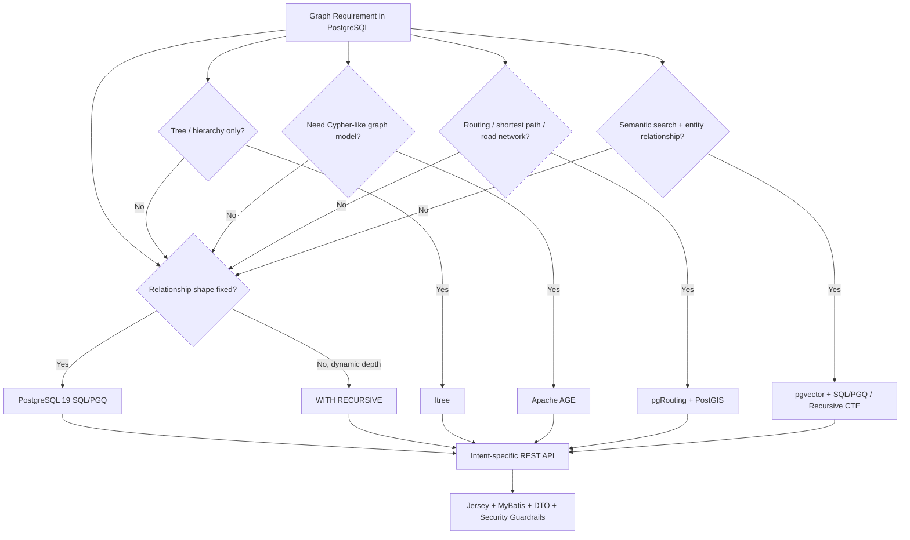

---

## 3. Baseline Pilihan

| Pilihan | Cocok Untuk | Jangan Dipakai Untuk |
|---|---|---|
| **PostgreSQL 19 SQL/PGQ** | Fixed graph pattern di atas relational schema: `Case -> Party -> Account`, impact graph, relationship discovery terbatas | Deep traversal dinamis, graph algorithm berat, Cypher ecosystem |
| **`WITH RECURSIVE`** | Traversal depth dinamis, path reconstruction, cycle detection, fallback untuk PostgreSQL sebelum SQL/PGQ | Query graph yang pattern-nya fixed dan ingin readability tinggi |
| **Apache AGE** | Butuh graph extension di PostgreSQL dan query style openCypher/Cypher-like | Jika data utama tetap relational dan query graph masih sederhana |
| **`ltree`** | Tree/hierarchy path: org chart, folder tree, category tree, delegation tree | Arbitrary cyclic graph, many-to-many relationship network |
| **pgRouting** | Routing/network analysis berbasis PostGIS/PostgreSQL, shortest path, road/network graph | General enterprise relationship graph |
| **pgvector hybrid** | Semantic search + graph context, GraphRAG, knowledge graph ringan, document/entity similarity | Murni relationship traversal tanpa kebutuhan embedding/search semantic |

Apache AGE adalah extension PostgreSQL yang menambahkan kapabilitas graph database di atas PostgreSQL dan mendukung pendekatan graph query yang terinspirasi openCypher; `ltree` adalah extension PostgreSQL untuk data hierarchical tree-like; pgRouting memperluas PostGIS/PostgreSQL untuk routing dan network analysis; pgvector adalah extension untuk vector similarity search di PostgreSQL. ([GitHub](https://github.com/apache/age?utm_source=chatgpt.com))

---

# 4. Option 1 - PostgreSQL 19 SQL/PGQ

## 4.1 Kapan Dipakai

Gunakan SQL/PGQ ketika data sudah ada di relational tables dan kebutuhan graph berupa pattern yang relatif fixed.

Contoh:

```text id="pgq_good_cases"
Case -> Party
Case -> Party -> Account
Account <- Party <- Case
Case -> Party -> Account <- Party <- Case
Case -> Document
Case -> Officer
Case -> EnforcementAction
```

PostgreSQL 19 `CREATE PROPERTY GRAPH` mendefinisikan graph yang terdiri dari vertices dan edges, masing-masing punya labels dan properties, dan graph tersebut dapat di-query memakai `GRAPH_TABLE` dengan path matching syntax; data graph tetap berada di regular tables/views/foreign tables. ([PostgreSQL](https://www.postgresql.org/docs/19/sql-create-property-graph.html?utm_source=chatgpt.com))

## 4.2 Practical Fit

| Kriteria | SQL/PGQ Cocok? |
|---|---:|
| Source of truth tetap PostgreSQL relational | Ya |
| Query graph mostly read/query | Ya |
| Pattern traversal fixed | Ya |
| Output perlu MyBatis DTO rowset | Ya |
| Butuh join dengan SQL biasa | Ya |
| Butuh graph write model native | Tidak |
| Butuh Cypher | Tidak |
| Butuh graph algorithms lengkap | Tidak |
| Butuh deep traversal dinamis | Terbatas |

## 4.3 Contoh Query

```sql id="pgq_case_related_accounts"
SELECT *
FROM GRAPH_TABLE (
    compliance_graph
    MATCH
        (c IS case_node)-[cp IS involves]->(p IS party)-[pa IS owns]->(a IS account)
    WHERE
        c.tenant_id = #{tenantId}
        AND p.tenant_id = #{tenantId}
        AND a.tenant_id = #{tenantId}
        AND cp.tenant_id = #{tenantId}
        AND pa.tenant_id = #{tenantId}

        AND c.case_id = #{caseId}

        AND cp.valid_from <= #{asOfDate}
        AND (cp.valid_to IS NULL OR cp.valid_to >= #{asOfDate})

        AND pa.valid_from <= #{asOfDate}
        AND (pa.valid_to IS NULL OR pa.valid_to >= #{asOfDate})

    COLUMNS (
        c.case_id AS "caseId",
        c.case_no AS "caseNo",

        p.party_id AS "partyId",
        p.party_name AS "partyName",
        cp.role AS "partyRole",

        a.account_id AS "accountId",
        a.account_no AS "accountNo",
        pa.ownership_type AS "ownershipType"
    )
)
ORDER BY
    "partyName",
    "accountNo"
LIMIT #{limit};
```

## 4.4 Production Rule

```text id="pgq_production_rule"
Gunakan SQL/PGQ sebagai graph-facing query layer,
bukan sebagai alasan untuk melemahkan relational schema.

Tetap butuh:
- PK/FK
- tenant-aware FK
- source/destination index
- temporal filter
- RLS/security
- bounded API
- EXPLAIN baseline
```

---

# 5. Option 2 - `WITH RECURSIVE`

## 5.1 Kapan Dipakai

Gunakan `WITH RECURSIVE` ketika traversal depth perlu dinamis atau perlu cycle/path control eksplisit.

Contoh:

```text id="recursive_good_cases"
- /entities/{type}/{id}/graph/walk?maxDepth=3
- cari semua dependency sampai depth N
- cari path hierarchy
- detect cycle
- reconstruct path
- traversal generic edge table
```

PostgreSQL recursive CTE dievaluasi secara iteratif: anchor query menghasilkan working table awal, recursive term dijalankan berulang sampai tidak ada row baru; PostgreSQL juga mendukung `SEARCH` untuk ordering depth/breadth-first dan `CYCLE` untuk cycle detection. ([PostgreSQL](https://www.postgresql.org/docs/current/queries-with.html?utm_source=chatgpt.com))

## 5.2 Practical Fit

| Kriteria | Recursive CTE Cocok? |
|---|---:|
| Depth runtime parameter | Ya |
| Cycle detection eksplisit | Ya |
| Path array / path reconstruction | Ya |
| Generic edge table | Ya |
| PostgreSQL sebelum 19 | Ya |
| Query readability graph-style | Kurang |
| Fixed business pattern sederhana | Bisa, tapi verbose |
| Heavy graph algorithm | Terbatas |

## 5.3 Contoh Recursive Walk

```sql id="recursive_walk_final"
WITH RECURSIVE relationship_walk AS (
    SELECT
        er.relationship_id,
        er.source_entity_type,
        er.source_entity_id,
        er.target_entity_type,
        er.target_entity_id,
        er.relationship_type,
        1 AS depth,
        ARRAY[
            er.source_entity_type || ':' || er.source_entity_id::text,
            er.target_entity_type || ':' || er.target_entity_id::text
        ] AS path,
        false AS is_cycle
    FROM entity_relationships er
    WHERE er.tenant_id = #{tenantId}
      AND er.source_entity_type = #{rootEntityType}
      AND er.source_entity_id = #{rootEntityId}
      AND er.valid_from <= #{asOfDate}
      AND (er.valid_to IS NULL OR er.valid_to >= #{asOfDate})

    UNION ALL

    SELECT
        er.relationship_id,
        er.source_entity_type,
        er.source_entity_id,
        er.target_entity_type,
        er.target_entity_id,
        er.relationship_type,
        rw.depth + 1,
        rw.path || (er.target_entity_type || ':' || er.target_entity_id::text),
        (er.target_entity_type || ':' || er.target_entity_id::text) = ANY(rw.path)
    FROM relationship_walk rw
    JOIN entity_relationships er
      ON er.tenant_id = #{tenantId}
     AND er.source_entity_type = rw.target_entity_type
     AND er.source_entity_id = rw.target_entity_id
     AND er.valid_from <= #{asOfDate}
     AND (er.valid_to IS NULL OR er.valid_to >= #{asOfDate})
    WHERE rw.depth < #{maxDepth}
      AND NOT rw.is_cycle
)
SELECT *
FROM relationship_walk
WHERE NOT is_cycle
ORDER BY
    depth,
    target_entity_type,
    target_entity_id
LIMIT #{limit};
```

## 5.4 Production Rule

```text id="recursive_production_rule"
Recursive CTE wajib punya:
- root filter
- tenant filter
- maxDepth
- cycle handling
- relationship type whitelist
- temporal filter
- limit
- timeout
```

---

# 6. Option 3 - Apache AGE

## 6.1 Kapan Dipakai

Apache AGE cocok jika tim benar-benar membutuhkan **graph extension** di PostgreSQL dan ingin query graph dengan pendekatan openCypher/Cypher-like, bukan hanya SQL pattern matching. Apache AGE dideskripsikan sebagai extension PostgreSQL yang memungkinkan penggunaan graph database di atas relational database, dan dokumentasi/overview AGE menyebut goal-nya adalah memberi akses graph database functionality untuk pengguna Postgres. ([GitHub](https://github.com/apache/age?utm_source=chatgpt.com))

## 6.2 Cocok Untuk

```text id="age_good_cases"
- Tim sudah familiar dengan Cypher/openCypher.
- Graph menjadi domain query utama.
- Banyak query graph eksploratif.
- Relationship model lebih natural sebagai graph-native.
- Perlu memisahkan graph model dari relational OLTP schema.
```

## 6.3 Kurang Cocok Jika

```text id="age_bad_cases"
- Query hanya Case -> Party -> Account.
- Data utama tetap relational dan strongly constrained.
- Tim DBA/platform belum support extension AGE.
- Production environment managed cloud belum mengizinkan extension.
- Requirement audit lebih nyaman dengan relational FK/constraint.
```

## 6.4 Decision Rule

```text id="age_decision_rule"
Jika kebutuhan graph masih fixed, bounded, dan dekat dengan relational schema,
mulai dari SQL/PGQ atau recursive CTE.

Jika kebutuhan graph query makin eksploratif, Cypher-like, dan graph menjadi domain utama,
baru evaluasi Apache AGE.
```

---

# 7. Option 4 - `ltree`

## 7.1 Kapan Dipakai

Gunakan `ltree` untuk struktur **tree/hierarchy**, bukan arbitrary graph. PostgreSQL `ltree` menyediakan data type untuk merepresentasikan label path dalam struktur hierarchical tree-like dan menyediakan fasilitas pencarian label tree. ([PostgreSQL](https://www.postgresql.org/docs/current/ltree.html?utm_source=chatgpt.com))

## 7.2 Cocok Untuk

```text id="ltree_good_cases"
- Organization hierarchy
- Folder hierarchy
- Product/category tree
- Region/location hierarchy
- Delegation hierarchy
- Process taxonomy
- Regulatory classification tree
```

## 7.3 Tidak Cocok Untuk

```text id="ltree_bad_cases"
- Many-to-many relationship graph
- Cyclic graph
- Party owns account
- Case linked to party linked to account linked to other case
- Fraud/investigation graph
```

## 7.4 Contoh

```sql id="ltree_example"
CREATE EXTENSION IF NOT EXISTS ltree;

CREATE TABLE organization_units (
    unit_id     bigint PRIMARY KEY,
    tenant_id   bigint NOT NULL,
    unit_code   text NOT NULL,
    unit_name   text NOT NULL,
    path        ltree NOT NULL
);

CREATE INDEX idx_organization_units_path
    ON organization_units
    USING gist (path);
```

Query descendants:

```sql id="ltree_descendants"
SELECT *
FROM organization_units
WHERE tenant_id = #{tenantId}
  AND path <@ 'head_office.enforcement';
```

Query ancestors:

```sql id="ltree_ancestors"
SELECT *
FROM organization_units
WHERE tenant_id = #{tenantId}
  AND path @> 'head_office.enforcement.region_1.team_a';
```

## 7.5 Decision Rule

```text id="ltree_decision_rule"
Kalau model hanya satu parent ke banyak child dan path hierarchy penting,
pakai ltree.

Kalau node bisa punya banyak relationship lintas domain dan cycle,
jangan pakai ltree sebagai graph utama.
```

---

# 8. Option 5 - pgRouting

## 8.1 Kapan Dipakai

pgRouting cocok untuk **routing dan network analysis**, khususnya bersama PostGIS. pgRouting memperluas PostGIS/PostgreSQL untuk menyediakan routing geospatial dan network analysis; contoh kemampuan umum termasuk shortest path seperti Dijkstra dalam directed/non-directed graph. ([GitHub](https://github.com/pgrouting/pgrouting?utm_source=chatgpt.com))

## 8.2 Cocok Untuk

```text id="pgrouting_good_cases"
- Road network
- Delivery route
- Utility network
- Shortest path
- Service coverage
- Network distance
- Route optimization
- Geospatial graph analysis
```

## 8.3 Tidak Cocok Untuk

```text id="pgrouting_bad_cases"
- General regulatory relationship graph
- Case-party-account relationship
- Ownership graph
- Approval graph
- Document evidence graph
```

## 8.4 Decision Rule

```text id="pgrouting_decision_rule"
Jika problem-nya routing/network path dengan cost, distance, geospatial edge,
evaluasi pgRouting.

Jika problem-nya entity relationship discovery,
pakai SQL/PGQ, recursive CTE, atau Apache AGE.
```

---

# 9. Option 6 - pgvector Hybrid

## 9.1 Kapan Dipakai

pgvector cocok ketika graph perlu digabungkan dengan **semantic search / embeddings**. pgvector adalah extension PostgreSQL untuk vector similarity search, mendukung exact dan approximate nearest neighbor search serta beberapa distance metrics seperti L2, inner product, cosine, L1, Hamming, dan Jaccard. ([GitHub](https://github.com/pgvector/pgvector?utm_source=chatgpt.com))

## 9.2 Cocok Untuk

```text id="pgvector_good_cases"
- GraphRAG
- Enterprise knowledge graph ringan
- Similar document discovery
- Similar case discovery
- Entity resolution support
- Semantic relationship suggestion
- Search documents lalu expand relationship graph
```

## 9.3 Hybrid Pattern

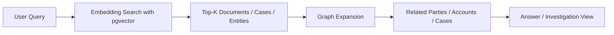

## 9.4 Contoh Schema

```sql id="pgvector_schema_example"
CREATE EXTENSION IF NOT EXISTS vector;

CREATE TABLE case_documents_embeddings (
    document_id bigint PRIMARY KEY,
    tenant_id   bigint NOT NULL,
    case_id     bigint NOT NULL,
    content_ref text NOT NULL,
    embedding   vector(1536)
);
```

Vector search:

```sql id="pgvector_search_example"
SELECT
    document_id,
    case_id,
    content_ref
FROM case_documents_embeddings
WHERE tenant_id = #{tenantId}
ORDER BY embedding <=> #{queryEmbedding}
LIMIT 20;
```

Lalu expand graph:

```sql id="pgvector_graph_expand"
SELECT *
FROM GRAPH_TABLE (
    compliance_graph
    MATCH
        (c IS case_node)-[cp IS involves]->(p IS party)
    WHERE
        c.tenant_id = #{tenantId}
        AND c.case_id = ANY(#{caseIds})
    COLUMNS (
        c.case_id AS "caseId",
        c.case_no AS "caseNo",
        p.party_id AS "partyId",
        p.party_name AS "partyName",
        cp.role AS "partyRole"
    )
);
```

## 9.5 Decision Rule

```text id="pgvector_decision_rule"
Gunakan pgvector ketika pertanyaan awal berbasis semantic similarity.

Gunakan SQL/PGQ/recursive CTE ketika pertanyaan berikutnya berbasis relationship expansion.
```

---

# 10. Full Decision Matrix

| Requirement | Pilihan Utama | Alternatif | Catatan |
|---|---|---|---|
| Case → Party → Account | SQL/PGQ | SQL join biasa | Pattern fixed, graph-readable |
| Account ← Party ← Case | SQL/PGQ | SQL join biasa | Reverse traversal bounded |
| Linked cases via shared account | SQL/PGQ | Recursive CTE | 4-hop fixed masih feasible |
| Entity walk sampai depth N | Recursive CTE | Apache AGE | Butuh maxDepth/cycle/path |
| Cycle detection eksplisit | Recursive CTE | Apache AGE | PostgreSQL CTE mendukung cycle handling |
| Org hierarchy | `ltree` | Recursive CTE | Tree path lebih natural |
| Category/folder tree | `ltree` | adjacency list | Jangan overkill graph |
| Road/route shortest path | pgRouting | external routing engine | Network graph dengan cost |
| Cypher-like graph query | Apache AGE | native graph DB | Evaluasi support extension |
| Knowledge graph + semantic search | pgvector + SQL/PGQ | vector DB + graph DB | Hybrid retrieval |
| Strict OLTP + audit | SQL/PGQ over relational | recursive CTE | FK/constraint tetap kuat |
| Heavy graph algorithms | Graph-native / specialized | pgRouting untuk routing | PostgreSQL bukan graph analytics engine lengkap |
| Current operational graph | SQL/PGQ + indexes | materialized view | Bounded query |
| Historical/as-of graph | SQL/PGQ + temporal edge | recursive CTE | Validity filter wajib |
| Graph dashboard summary | materialized view | cache | Refresh policy penting |

---

# 11. Enterprise Architecture Decision Flow

```text id="enterprise_decision_flow"
Step 1 - Apakah ini benar graph problem?
Jika hanya lookup/reporting biasa, pakai SQL join biasa.

Step 2 - Apakah relationship pattern fixed?
Jika ya, pakai SQL/PGQ.

Step 3 - Apakah depth dinamis/cycle/path reconstruction?
Jika ya, pakai WITH RECURSIVE.

Step 4 - Apakah datanya tree/hierarchy?
Jika ya, pakai ltree.

Step 5 - Apakah routing/network cost/geospatial?
Jika ya, pakai pgRouting + PostGIS.

Step 6 - Apakah butuh Cypher-like graph database behavior?
Jika ya, evaluasi Apache AGE atau graph-native DB.

Step 7 - Apakah butuh semantic search?
Jika ya, kombinasikan pgvector + graph expansion.

Step 8 - Apakah query berat dan sering?
Jika ya, pertimbangkan materialized view/cache.

Step 9 - Apakah audit/high-stakes?
Jika ya, simpan evidence, query version, dan snapshot jika perlu.
```

---

# 12. Recommended Default untuk Tech Stack Anda

Untuk stack **Java SE 17+, Jersey, MyBatis, PostgreSQL, PL/pgSQL, Docker/Kubernetes, on-prem/AWS/Azure**, default yang paling aman:

```text id="recommended_stack_default"
1. Relational schema tetap source of truth.
2. Typed vertex/edge table untuk relationship penting.
3. SQL/PGQ untuk fixed graph query.
4. Recursive CTE untuk dynamic graph walk.
5. ltree untuk pure hierarchy.
6. pgvector untuk semantic search + graph expansion.
7. pgRouting hanya untuk geospatial/network routing.
8. Apache AGE dievaluasi jika graph workload makin dominan.
```

Kenapa ini paling aman?

```text id="recommended_stack_reason"
- Tetap dekat dengan PostgreSQL yang sudah ada.
- MyBatis mapping tetap rowset-friendly.
- Jersey API bisa dibuat intent-specific.
- Relational constraint tetap kuat.
- Security/RLS/tenant model tetap jelas.
- Extension tambahan hanya dipakai jika problem-nya memang cocok.
```

---

# 13. Practical Architecture Blueprint

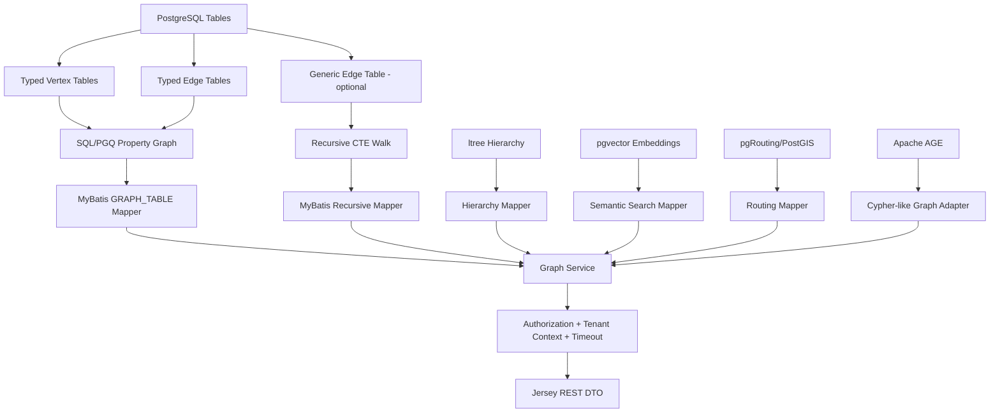

---

# 14. Java Integration Decision Pattern

## 14.1 Interface per Query Family

```java id="graph_query_ports"
public interface CaseGraphQueryPort {
    List<RelatedAccountDto> findRelatedAccounts(
            long tenantId,
            long caseId,
            LocalDate asOfDate,
            int limit
    );
}

public interface EntityGraphWalkPort {
    List<GraphWalkPathDto> walk(
            long tenantId,
            GraphEntityType rootType,
            long rootId,
            List<GraphRelationshipType> relationshipTypes,
            LocalDate asOfDate,
            int maxDepth,
            int limit
    );
}

public interface HierarchyQueryPort {
    List<HierarchyNodeDto> descendants(
            long tenantId,
            String rootPath
    );
}

public interface SemanticGraphSearchPort {
    List<GraphSearchResultDto> searchAndExpand(
            long tenantId,
            float[] queryEmbedding,
            int topK
    );
}
```

## 14.2 Why Ports?

```text id="why_ports"
Agar API/service tidak peduli apakah implementation memakai:
- SQL/PGQ
- recursive CTE
- ltree
- pgvector
- Apache AGE
- pgRouting

Service tetap bicara dalam business intent.
```

---

# 15. Decision Anti-Patterns

| Anti-pattern | Kenapa Buruk | Solusi |
|---|---|---|
| Semua graph problem langsung pakai Apache AGE | Extension dan model bertambah sebelum perlu | Mulai dari SQL/PGQ/recursive jika cukup |
| Semua hierarchy dibuat property graph | Overkill | Pakai `ltree` untuk tree |
| Semua traversal pakai recursive CTE | Query verbose dan rawan bug | Pakai SQL/PGQ untuk fixed pattern |
| Semua search pakai vector | Relationship exact bisa hilang | Vector untuk semantic candidate, graph untuk exact relation |
| Routing pakai generic graph table | Algoritma routing/cost tidak natural | Gunakan pgRouting |
| Raw query API | Security/performance risk | Intent-specific API |
| Mengganti OLTP schema jadi generic node/edge semua | Constraint lemah | Typed relational core + graph façade |
| Extension tanpa platform review | Deployability risk | Validasi managed service/on-prem support |
| No benchmark | Salah pilih teknologi | POC dengan data realistis |

---

# 16. Extension Adoption Checklist

Sebelum memakai extension baru:

```text id="extension_adoption_checklist"
[ ] Apakah extension tersedia di on-prem environment?
[ ] Apakah extension tersedia di AWS/Azure managed PostgreSQL yang dipakai?
[ ] Apakah versi extension kompatibel dengan PostgreSQL version target?
[ ] Apakah backup/restore mendukung extension ini?
[ ] Apakah migration tool bisa mengelola CREATE EXTENSION?
[ ] Apakah security team menyetujui extension?
[ ] Apakah DBA/platform team bisa operate extension?
[ ] Apakah ada observability/performance baseline?
[ ] Apakah ada fallback jika extension tidak tersedia?
[ ] Apakah API abstraction tidak bocor implementation detail?
```

Ini penting karena **on-prem, AWS, dan Azure** sering punya perbedaan dukungan extension, permission `CREATE EXTENSION`, versi PostgreSQL, dan proses approval internal.

---

# 17. Benchmark Plan Sebelum Memutuskan

Gunakan benchmark yang sama untuk beberapa pilihan.

## Dataset

```text id="benchmark_dataset"
- 100k cases
- 500k parties
- 1M accounts
- 5M case_parties edges
- 3M party_accounts edges
- skewed tenant sizes
- temporal edges
- high-degree party/account
```

## Query

```text id="benchmark_queries"
1. Case -> Party
2. Case -> Party -> Account
3. Account <- Party <- Case
4. Case -> Party -> Account <- Party <- Case
5. Dynamic graph walk depth 3
6. Current relationship query
7. As-of relationship query
8. Semantic search top-K then graph expansion
9. Hierarchy descendants query
10. Route shortest path, jika domain routing ada
```

## Metrics

```text id="benchmark_metrics"
- p50/p95/p99 latency
- rows returned
- buffers read/hit
- timeout rate
- memory usage
- index size
- write overhead
- operational complexity
- developer ergonomics
```

---

# 18. Practical Choice by Domain

| Domain Problem | Recommended Tool |
|---|---|
| Case impact graph | SQL/PGQ |
| Case linked accounts | SQL/PGQ |
| Account linked cases | SQL/PGQ |
| Entity relationship walk | Recursive CTE |
| Investigation graph neighborhood | Recursive CTE, possibly SQL/PGQ for fixed slices |
| Party hierarchy / org unit hierarchy | `ltree` |
| Delegation tree | `ltree` or recursive CTE |
| Road/branch route | pgRouting |
| Knowledge search | pgvector + SQL/PGQ |
| Similar case discovery | pgvector + SQL/PGQ |
| Graph-native exploration | Apache AGE |
| Regulatory audit relationship | SQL/PGQ + temporal edge + evidence/snapshot |
| Real-time deep graph algorithm | Evaluate graph-native/specialized engine |

---

# 19. Recommended Implementation Roadmap

## Phase 1 - Relational Graph-Ready Schema

```text id="phase_1"
- Define vertex tables.
- Define typed edge tables.
- Add tenant-aware FK.
- Add valid_from/valid_to.
- Add source/destination indexes.
- Add data quality constraints.
```

## Phase 2 - SQL/PGQ Fixed Queries

```text id="phase_2"
- CREATE PROPERTY GRAPH.
- Add GRAPH_TABLE queries for top use cases.
- Map with MyBatis DTO.
- Expose intent-specific Jersey endpoint.
- Add tenant/security guardrails.
```

## Phase 3 - Recursive Traversal

```text id="phase_3"
- Add generic relationship table if needed.
- Implement recursive CTE walk.
- Add maxDepth, cycle detection, relationship whitelist.
- Add graph walk API for internal investigation.
```

## Phase 4 - Specialized Extensions

```text id="phase_4"
- ltree for hierarchy.
- pgvector for semantic search.
- pgRouting for routing/network.
- Apache AGE only if graph workload demands Cypher-like behavior.
```

## Phase 5 - Governance & Operations

```text id="phase_5"
- Query audit.
- Query versioning.
- Performance baseline.
- pg_stat_statements monitoring.
- Security review for graph properties.
- Contract tests.
- Snapshot strategy for high-stakes decisions.
```

---

# 20. Final Decision Summary

```text id="final_decision_summary"
Default:
  PostgreSQL 19 SQL/PGQ for fixed, bounded, relational-backed graph query.

Fallback:
  WITH RECURSIVE for dynamic depth, cycle handling, and path reconstruction.

Hierarchy:
  ltree.

Routing/network:
  pgRouting + PostGIS.

Semantic search + graph expansion:
  pgvector + SQL/PGQ / recursive CTE.

Cypher-like graph extension:
  Apache AGE, only after platform and workload validation.

Graph-native external DB:
  Consider only if graph becomes dominant workload and PostgreSQL-based approach is proven insufficient.
```

---

# 21. Final Production Guardrail

Apa pun pilihan teknologinya, jangan kompromi pada hal ini:

```text id="production_guardrail_final"
[ ] Business intent endpoint, bukan raw query endpoint.
[ ] Tenant isolation di schema, query, dan RLS.
[ ] Edge source/destination indexes.
[ ] Temporal validity untuk relationship historis.
[ ] Max depth untuk traversal.
[ ] Cycle detection untuk recursive query.
[ ] Query timeout.
[ ] Limit + truncated flag.
[ ] DTO projection eksplisit.
[ ] Audit graph access.
[ ] Performance baseline dengan EXPLAIN.
[ ] Extension support divalidasi di target platform.
```

---

## Status Seri

**Seri 12/12 selesai.**

**Seluruh seri PostgreSQL 19 for Graph Database selesai.**

Total seri yang sudah selesai:

```text id="series_done"
1/12  Graph Database Fundamentals for PostgreSQL Engineers
2/12  Relational-to-Graph Modeling: Vertex, Edge, Label, Property
3/12  PostgreSQL 19 SQL/PGQ Overview: Concept, Scope, Limitations
4/12  CREATE PROPERTY GRAPH Deep Dive
5/12  GRAPH_TABLE, MATCH, Pattern Query, and Projection
6/12  Multi-hop Traversal, Path Query, Direction, and Cycle Handling
7/12  Recursive CTE as Graph Traversal Fallback
8/12  Temporal Graph Modeling: Valid-time, History, Auditability
9/12  Indexing, Query Planning, and Performance Tuning for Graph Queries
10/12 Security, Tenant Isolation, RLS, and Data Governance in Graph Query
11/12 Java/Jersey/MyBatis Integration for Graph Query APIs
12/12 Extension Decision Map: SQL/PGQ vs Apache AGE vs ltree vs pgRouting vs pgvector Hybrid
```

## Rekomendasi Materi Berikutnya

Materi lanjutan yang tidak mengulang seri ini:

**PostgreSQL Graph Query Cookbook for Regulatory Case Management** - kumpulan query siap pakai untuk case impact graph, linked cases, beneficial ownership chain, evidence graph, temporal decision graph, suspicious relationship detection, dan MyBatis mapper production-style.

---

**Sources:**

- [PostgreSQL: Documentation: 19: 5.15. Property Graphs](https://www.postgresql.org/docs/19/ddl-property-graphs.html?utm_source=chatgpt.com)
- [apache/age: Graph database optimized for fast analysis ...](https://github.com/apache/age?utm_source=chatgpt.com)


---
Powered by [ChatGPT Exporter](https://www.chatgptexporter.com)