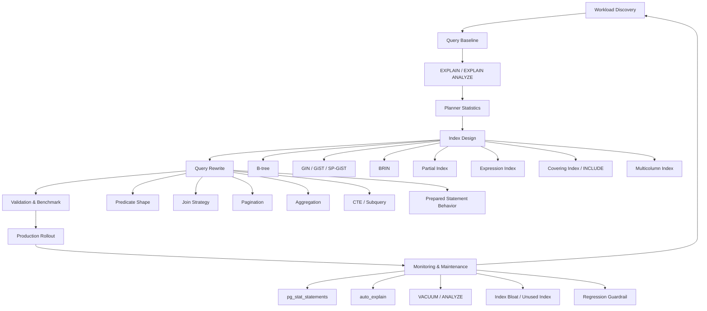
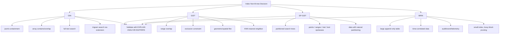
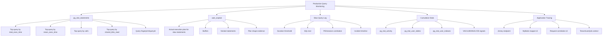
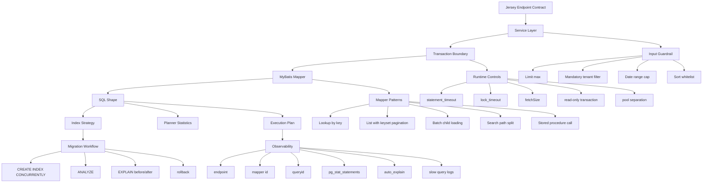

# postgresql-indexing

**User:** Anonymous  
**Created:** 7/16/2026 7:14:01  
**Updated:** 7/16/2026 7:54:12  
**Exported:** 7/16/2026 7:54:22  
**Link:** [https://chatgpt.com/g/g-p-6a539ddc858881919467b6da20df4567-cheatsheet/c/6a582243-0018-83ec-a280-e5f4f84e718a](https://chatgpt.com/g/g-p-6a539ddc858881919467b6da20df4567-cheatsheet/c/6a582243-0018-83ec-a280-e5f4f84e718a)  

## Response:
7/16/2026, 7:14:24 AM

Saya akan susun sebagai peta onboarding praktis, bukan teori indeks semata: dari membaca plan, memilih index, memperbaiki query, sampai guardrail produksi. Saya akan cek dokumentasi PostgreSQL resmi terbaru dulu supaya tidak mengandalkan ingatan versi lama.

## Introduction

**PostgreSQL indexing and query optimization** adalah skill untuk menjawab pertanyaan praktis: *kenapa query lambat, apakah index yang ada benar-benar dipakai, index apa yang seharusnya dibuat, dan bagaimana memastikan perubahan aman di production.*

Basis versi: dokumentasi `current` PostgreSQL saat ini merujuk ke **PostgreSQL 18**, sementara **PostgreSQL 19 masih beta** per 4 Juni 2026 dan rilis mayor berikutnya direncanakan September 2026. Jadi untuk production onboarding, gunakan PostgreSQL 18/17/16 sebagai baseline stabil, dan treat PostgreSQL 19 sebagai preview. ([PostgreSQL](https://www.postgresql.org/docs/?utm_source=chatgpt.com))

Secara praktis, skill ini bukan hanya `CREATE INDEX`. Siklusnya adalah:

> **observe workload → baca execution plan → pahami planner statistics → desain index → rewrite query → validasi dengan EXPLAIN ANALYZE → monitor dampak produksi**

PostgreSQL menyediakan beberapa index type: **B-tree, Hash, GiST, SP-GiST, GIN, BRIN**, dan extension seperti `bloom`; default `CREATE INDEX` adalah **B-tree**, yang cocok untuk banyak kasus umum. ([PostgreSQL](https://www.postgresql.org/docs/current/indexes-types.html?utm_source=chatgpt.com))

---

## Diagram



---

## Tabular Decomposition Map

| Area | Practical skill | Yang perlu dikuasai | Output praktis |
|---|---|---|---|
| **1. Workload discovery** | Menemukan query yang benar-benar perlu dioptimasi | Jangan mulai dari tebakan. Mulai dari query paling mahal: latency tinggi, call count tinggi, buffer read tinggi, atau query yang mengunci flow bisnis | Daftar top query berdasarkan dampak |
| **2. `pg_stat_statements`** | Membaca aggregate SQL workload | `pg_stat_statements` melacak planning/execution statistics untuk statement SQL yang dijalankan server | Ranking query by total time, mean time, calls, rows, shared blocks ([PostgreSQL](https://www.postgresql.org/docs/current/pgstatstatements.html?utm_source=chatgpt.com)) |
| **3. Slow-query plan capture** | Menangkap plan lambat di environment nyata | Gunakan `auto_explain` untuk log execution plan query lambat otomatis; berguna saat sulit mereproduksi query manual | Evidence plan dari production/staging ([PostgreSQL](https://www.postgresql.org/docs/current/auto-explain.html?utm_source=chatgpt.com)) |
| **4. EXPLAIN fundamentals** | Membaca plan node | Pahami `Seq Scan`, `Index Scan`, `Index Only Scan`, `Bitmap Index Scan`, `Nested Loop`, `Hash Join`, `Merge Join`, `Sort`, `Aggregate` | Bisa menjelaskan *kenapa planner memilih plan itu* |
| **5. EXPLAIN ANALYZE** | Membandingkan estimasi vs realita | `EXPLAIN ANALYZE` benar-benar mengeksekusi statement dan menampilkan actual runtime serta row count per node | Tahu apakah problemnya salah index, salah statistik, join explosion, sort spill, atau data skew ([PostgreSQL](https://www.postgresql.org/docs/current/sql-explain.html?utm_source=chatgpt.com)) |
| **6. Buffer analysis** | Membaca I/O behavior | `EXPLAIN` punya opsi `BUFFERS` untuk melihat buffer hit, read, dirtied, written pada node plan | Membedakan CPU-bound vs I/O-bound query ([PostgreSQL](https://www.postgresql.org/docs/current/using-explain.html?utm_source=chatgpt.com)) |
| **7. Planner statistics** | Memahami kenapa planner salah prediksi | `ANALYZE` mengumpulkan statistik isi tabel dan planner memakai statistik itu untuk memilih plan | Tahu kapan perlu `ANALYZE`, tuning statistics target, atau extended statistics ([PostgreSQL](https://www.postgresql.org/docs/current/sql-analyze.html?utm_source=chatgpt.com)) |
| **8. Extended statistics** | Memperbaiki estimasi kolom berkorelasi | PostgreSQL mendukung multivariate/extended statistics, tapi tidak otomatis untuk semua kombinasi kolom karena kombinasinya sangat banyak | `CREATE STATISTICS` untuk dependency, MCV, ndistinct pada kolom penting ([PostgreSQL](https://www.postgresql.org/docs/current/planner-stats.html?utm_source=chatgpt.com)) |
| **9. B-tree index** | Index default untuk equality/range/order | Cocok untuk `=`, range, sorting, prefix pattern tertentu, FK lookup, unique constraint | Index utama untuk OLTP lookup dan join |
| **10. Multicolumn index** | Mendesain urutan kolom index | Kuasai prinsip kolom equality dulu, lalu range/order; pahami kapan `(a,b)` bisa membantu dan kapan tidak | Index composite yang sesuai predicate nyata |
| **11. Index for `ORDER BY`** | Menghindari sort mahal | Index bisa membantu ordering jika urutan kolom dan direction sesuai pola query | Query list page lebih stabil tanpa sort besar |
| **12. Covering index / `INCLUDE`** | Mengurangi heap access | Index-only scan butuh index method yang mendukung dan visibility map yang memungkinkan; B-tree mendukung index-only scan | Query read-heavy bisa dilayani dari index saja pada kondisi tertentu ([PostgreSQL](https://www.postgresql.org/docs/current/indexes-index-only-scans.html?utm_source=chatgpt.com)) |
| **13. Partial index** | Index subset data | Cocok untuk data aktif, status tertentu, soft delete, tenant tertentu, atau queue state tertentu | Index kecil, selektif, dan murah dirawat |
| **14. Expression index** | Index hasil ekspresi | Untuk query seperti `lower(email)`, normalisasi kode, date bucket, JSON expression, computed predicate | Query tidak perlu scan karena fungsi di predicate |
| **15. GIN index** | Index inverted untuk array/jsonb/full-text-like lookup | Berguna untuk containment/search pada struktur multi-value; GIN tidak mendukung index-only scan karena entry biasanya menyimpan bagian nilai, bukan nilai utuh | Index untuk `jsonb`, array, dan search-style predicates ([PostgreSQL](https://www.postgresql.org/docs/current/indexes-index-only-scans.html?utm_source=chatgpt.com)) |
| **16. GiST / SP-GiST** | Index untuk data non-linear | Relevan untuk geospatial, range, nearest-neighbor, tree/partitioned search structures | Dipakai saat operator class memang cocok |
| **17. BRIN index** | Index ringan untuk tabel sangat besar yang terurut fisik | Cocok untuk append-only/time-correlated data seperti event log, audit log, telemetry | Index sangat kecil untuk scan range besar |
| **18. Hash index** | Equality-only indexing | PostgreSQL punya Hash index, tapi B-tree tetap default umum. Hash dipertimbangkan hanya untuk kasus equality spesifik setelah benchmark | Pilihan khusus, bukan default reflex |
| **19. Operator class & collation** | Memastikan operator bisa memakai index | Index hanya berguna kalau operator/predicate compatible dengan operator class dan collation | Menghindari index tidak terpakai karena mismatch operator |
| **20. Query predicate shaping** | Membuat query “index-friendly” | Hindari fungsi di kolom tanpa expression index, implicit cast, wildcard depan, OR kompleks, dan predicate yang tidak sargable | Query lebih mudah dioptimasi planner |
| **21. Join optimization** | Mengurangi join explosion | Pahami join order, cardinality, FK index, selective predicate, join key type consistency | Join besar tidak berubah menjadi nested-loop disaster |
| **22. Pagination optimization** | Menghindari offset besar | `OFFSET` besar makin mahal; keyset pagination biasanya lebih stabil untuk list besar | Pagination production-grade untuk API Jersey |
| **23. Aggregation optimization** | Mengoptimasi `GROUP BY`, `DISTINCT`, aggregate | Pahami hash aggregate vs sort aggregate, pre-filtering, partial aggregate, materialized summary | Report/query dashboard lebih stabil |
| **24. CTE/subquery behavior** | Menulis query modular tanpa merusak plan | CTE berguna untuk struktur query; tetap validasi apakah bentuknya membantu atau menghambat pushdown/optimization | Query kompleks tetap readable dan performant |
| **25. Prepared statement behavior** | Memahami generic vs custom plan | Prepared statement bisa memakai generic atau custom plan; generic menghemat planning, tetapi bisa buruk jika plan ideal sangat bergantung pada parameter | Penting untuk JDBC/MyBatis query dengan parameter skew ([PostgreSQL](https://www.postgresql.org/docs/current/sql-prepare.html?utm_source=chatgpt.com)) |
| **26. Planner cost parameters** | Mengerti kapan tuning config masuk akal | Parameter seperti CPU cost, parallel cost, dan cache assumption memengaruhi pilihan planner; jangan ubah global config sebelum bukti kuat | Tuning infra-aware, bukan trial-error ([PostgreSQL](https://www.postgresql.org/docs/current/runtime-config-query.html?utm_source=chatgpt.com)) |
| **27. Parallel query** | Menilai kapan parallelism membantu | Berguna untuk scan/aggregate besar, tetapi tidak selalu cocok untuk OLTP latency kecil | Query batch/report bisa lebih cepat tanpa merusak OLTP |
| **28. JIT awareness** | Menilai JIT untuk query mahal | PostgreSQL memutuskan JIT berdasarkan estimated query cost dibanding setting seperti `jit_above_cost` | Tahu kapan JIT membantu analytical query dan kapan overhead tidak worth it ([PostgreSQL](https://www.postgresql.org/docs/current/jit-decision.html?utm_source=chatgpt.com)) |
| **29. Index maintenance** | Menjaga index tetap sehat | Index mempercepat read tapi menambah biaya write, storage, vacuum, dan bloat risk | Kebijakan drop unused index, rebuild, concurrent index |
| **30. `VACUUM` / `ANALYZE` operations** | Menjaga visibility dan statistik | `VACUUM ANALYZE` memperbarui statistik planner; `VACUUM` juga berhubungan dengan visibility map yang penting untuk index-only scan | Planner tetap akurat dan index-only scan lebih mungkin efektif ([PostgreSQL](https://www.postgresql.org/docs/current/sql-vacuum.html?utm_source=chatgpt.com)) |
| **31. Regression guardrail** | Mencegah optimasi merusak workload lain | Setiap index baru harus divalidasi terhadap read benefit, write overhead, lock behavior, migration risk, dan rollback | Review checklist sebelum deploy |
| **32. Java/Jersey/MyBatis integration** | Menghubungkan SQL optimization ke aplikasi | Mapping query MyBatis, parameter binding, transaction boundary, connection pool, query timeout, fetch size, pagination contract | Optimasi tidak berhenti di database, tapi nyambung ke service behavior |

---

## Mental Model Praktis

Optimasi PostgreSQL biasanya gagal karena tim langsung membuat index tanpa menjawab empat pertanyaan dasar:

```text
1. Query apa yang lambat?
2. Lambat karena scan, join, sort, aggregate, lock, atau I/O?
3. Planner salah prediksi atau index memang tidak cocok?
4. Perubahan index/query memperbaiki query target tanpa merusak write path?
```

`EXPLAIN` menunjukkan plan yang dibuat planner, termasuk cara tabel discan dan join algorithm yang dipilih. `EXPLAIN ANALYZE` menambahkan actual execution data, sehingga inti debugging adalah membandingkan **estimated rows/cost** vs **actual rows/time/buffers**. ([PostgreSQL](https://www.postgresql.org/docs/current/sql-explain.html?utm_source=chatgpt.com))

---

## Roadmap Belajar yang Direkomendasikan

### Fase 1 - Query Plan Literacy

Mulai dari membaca `EXPLAIN`, `EXPLAIN ANALYZE`, `BUFFERS`, row estimate, actual rows, loop count, dan node paling mahal. Targetnya: bisa menjawab *query ini lambat di node mana dan kenapa*.

### Fase 2 - Core Index Design

Pelajari B-tree, composite index, index untuk `WHERE`, `JOIN`, `ORDER BY`, partial index, expression index, dan covering index. Targetnya: bisa mendesain index dari pola query nyata, bukan dari nama kolom yang “kelihatannya penting”.

### Fase 3 - Statistics & Planner Accuracy

Masuk ke `ANALYZE`, `default_statistics_target`, per-column statistics, extended statistics, data skew, parameter-sensitive query, dan generic/custom prepared plan. Ini penting untuk MyBatis/JDBC karena banyak query diparameterisasi.

### Fase 4 - Query Rewrite Patterns

Latih rewrite untuk predicate, join, pagination, aggregate, CTE/subquery, `EXISTS` vs `IN`, anti-join, batch query, dan avoiding N+1. Targetnya: bisa memperbaiki SQL tanpa selalu menambah index.

### Fase 5 - Production Operations

Pelajari `pg_stat_statements`, `auto_explain`, slow query log, unused index detection, index bloat, `CREATE INDEX CONCURRENTLY`, migration rollback, vacuum/analyze policy, dan benchmark sebelum/sesudah.

### Fase 6 - Java/Jersey/MyBatis Integration

Hubungkan query optimization dengan repository/mapper design: parameter binding, dynamic SQL, fetch size, timeout, pagination API contract, transaction scope, connection pool pressure, dan observability per endpoint.

---

## Rekomendasi materi selanjutnya

Lanjut paling cocok: **Seri Practical PostgreSQL Indexing & Query Optimization** dengan urutan:

1. Plan Reading: `EXPLAIN`, `ANALYZE`, `BUFFERS`, row estimate vs actual  
2. B-tree, Composite Index, Partial Index, Expression Index  
3. GIN/GiST/SP-GiST/BRIN: kapan dipakai dan kapan jangan  
4. Query Rewrite Patterns untuk OLTP API  
5. Planner Statistics, Extended Statistics, Data Skew  
6. Production Monitoring: `pg_stat_statements`, `auto_explain`, slow query logs  
7. Index Maintenance, Bloat, `VACUUM`, `ANALYZE`, concurrent index rollout  
8. Java/Jersey/MyBatis Integration Pattern untuk optimized PostgreSQL queries

---

**Sources:**

- [PostgreSQL: Documentation](https://www.postgresql.org/docs/?utm_source=chatgpt.com)

## Response:
7/16/2026, 7:15:50 AM

Total **8 seri**.

1. Plan Reading: `EXPLAIN`, `ANALYZE`, `BUFFERS`, estimate vs actual  
2. B-tree, Composite Index, Partial Index, Expression Index  
3. GIN / GiST / SP-GiST / BRIN: kapan dipakai dan kapan jangan  
4. Query Rewrite Patterns untuk OLTP API  
5. Planner Statistics, Extended Statistics, Data Skew  
6. Production Monitoring: `pg_stat_statements`, `auto_explain`, slow query logs  
7. Index Maintenance, Bloat, `VACUUM`, `ANALYZE`, concurrent index rollout  
8. Java / Jersey / MyBatis Integration Pattern untuk optimized PostgreSQL queries

## Response:
7/16/2026, 7:16:04 AM

Saya akan mulai dari **Seri 1/8**, fokus ke kemampuan membaca execution plan sampai bisa mengambil keputusan praktis: query lambat karena scan, join, sort, estimasi salah, atau I/O. Materi akan dibuat sebagai cheatsheet implementatif dan saya akan tandai progres seri.

# Seri 1/8 - Practical Plan Reading: `EXPLAIN`, `ANALYZE`, `BUFFERS`, Estimate vs Actual

Tujuan seri ini: membuat Anda bisa **membaca execution plan PostgreSQL secara praktis**, lalu menyimpulkan akar masalah query lambat sebelum buru-buru membuat index.

PostgreSQL planner memilih execution plan berdasarkan struktur query, statistik data, estimasi row count, dan cost model. `EXPLAIN` menampilkan rencana eksekusi, sedangkan `EXPLAIN ANALYZE` benar-benar menjalankan statement dan menambahkan runtime aktual. Karena itu, untuk query `INSERT`, `UPDATE`, atau `DELETE`, gunakan transaksi lalu `ROLLBACK` saat hanya ingin observasi. ([PostgreSQL](https://www.postgresql.org/docs/current/sql-explain.html?utm_source=chatgpt.com))

---

## 1. Mental Model Utama

Jangan membaca execution plan sebagai “apakah pakai index atau tidak”. Pertanyaan yang benar:

```text
1. Node mana yang paling mahal secara aktual?
2. Estimasi row PostgreSQL akurat atau meleset?
3. Query lambat karena scan, join, sort, aggregate, lock, atau I/O?
4. Index tidak ada, index tidak cocok, atau planner tidak percaya index itu murah?
5. Apakah query shape dari aplikasi membantu planner atau malah menghambat?
```

Index bukan selalu solusi. Kadang masalahnya adalah statistik lama, predicate tidak selektif, join menghasilkan ledakan row, `ORDER BY` memicu sort besar, pagination memakai `OFFSET` besar, atau prepared statement memakai plan yang tidak cocok untuk parameter tertentu.

---

## 2. Command Dasar yang Wajib Dikuasai

### 2.1 `EXPLAIN`

Gunakan untuk melihat rencana tanpa menjalankan query:

```sql
EXPLAIN
SELECT *
FROM case_file
WHERE tenant_id = 'T001'
  AND status = 'OPEN'
ORDER BY created_at DESC
LIMIT 50;
```

Output ini menjawab: PostgreSQL berencana scan apa, join apa, sort apa, dan berapa estimasi row/cost.

---

### 2.2 `EXPLAIN ANALYZE`

Gunakan untuk membandingkan rencana dengan real execution:

```sql
EXPLAIN ANALYZE
SELECT *
FROM case_file
WHERE tenant_id = 'T001'
  AND status = 'OPEN'
ORDER BY created_at DESC
LIMIT 50;
```

`ANALYZE` menyebabkan statement benar-benar dieksekusi dan menambahkan actual runtime statistics ke output. ([PostgreSQL](https://www.postgresql.org/docs/current/sql-explain.html?utm_source=chatgpt.com))

---

### 2.3 `EXPLAIN (ANALYZE, BUFFERS)`

Ini mode paling berguna untuk tuning praktis:

```sql
EXPLAIN (ANALYZE, BUFFERS)
SELECT *
FROM case_file
WHERE tenant_id = 'T001'
  AND status = 'OPEN'
ORDER BY created_at DESC
LIMIT 50;
```

`BUFFERS` menampilkan aktivitas buffer seperti hit, read, dirtied, dan written; ini membantu membedakan apakah query lambat karena CPU/planner shape atau karena I/O. Dalam PostgreSQL current docs, `ANALYZE` juga secara implisit mengaktifkan `BUFFERS`, kecuali dimatikan eksplisit. ([PostgreSQL](https://www.postgresql.org/docs/current/using-explain.html?utm_source=chatgpt.com))

---

### 2.4 Mode Aman untuk `UPDATE` / `DELETE`

Karena `EXPLAIN ANALYZE` menjalankan statement, jangan langsung menjalankan ini di production untuk write query tanpa proteksi.

Gunakan pola:

```sql
BEGIN;

EXPLAIN (ANALYZE, BUFFERS)
UPDATE case_file
SET status = 'ESCALATED'
WHERE tenant_id = 'T001'
  AND status = 'OPEN'
  AND priority = 'HIGH';

ROLLBACK;
```

Dengan begitu, efek perubahan data dibatalkan, tetapi Anda tetap mendapat actual execution plan.

---

## 3. Anatomi Execution Plan

Contoh ilustratif:

```sql
EXPLAIN (ANALYZE, BUFFERS)
SELECT id, case_no, status, created_at
FROM case_file
WHERE tenant_id = 'T001'
  AND status = 'OPEN'
ORDER BY created_at DESC
LIMIT 50;
```

Output ilustratif:

```text
Limit  (cost=15200.30..15200.42 rows=50 width=48)
       (actual time=184.221..184.235 rows=50 loops=1)
  Buffers: shared hit=1200 read=8400
  ->  Sort  (cost=15200.30..15375.20 rows=69960 width=48)
            (actual time=184.219..184.226 rows=50 loops=1)
        Sort Key: created_at DESC
        Sort Method: top-N heapsort  Memory: 32kB
        Buffers: shared hit=1200 read=8400
        ->  Seq Scan on case_file
              (cost=0.00..12876.00 rows=69960 width=48)
              (actual time=0.090..169.512 rows=71230 loops=1)
              Filter: ((tenant_id = 'T001') AND (status = 'OPEN'))
              Rows Removed by Filter: 928770
              Buffers: shared hit=1200 read=8400
Planning Time: 0.420 ms
Execution Time: 184.280 ms
```

Cara membacanya:

| Bagian | Makna praktis |
|---|---|
| `Seq Scan on case_file` | PostgreSQL membaca tabel secara sequential. Belum tentu salah, tapi perlu dicek apakah jumlah row besar dan filter selektif. |
| `Rows Removed by Filter: 928770` | Banyak row dibaca lalu dibuang. Ini sering sinyal index/predicate tidak optimal. |
| `actual rows=71230` | Setelah filter, masih ada 71 ribu row kandidat. |
| `Sort Key: created_at DESC` | PostgreSQL harus sorting hasil filter. |
| `LIMIT 50` | Hanya butuh 50 row, tapi database membaca dan menyortir jauh lebih banyak. |
| `Buffers read=8400` | Banyak page dibaca dari disk/storage, indikasi I/O pressure. |
| `Execution Time: 184 ms` | Runtime aktual total query. |
| `cost=...` | Estimasi internal planner, bukan milidetik. Jangan bandingkan cost langsung dengan waktu. |

Diagnosis praktis:

```text
Problem utama:
- Query butuh 50 row terbaru.
- Tetapi PostgreSQL membaca banyak row OPEN milik tenant.
- Lalu melakukan sort berdasarkan created_at DESC.
- Kandidat solusi kemungkinan index composite yang align dengan WHERE + ORDER BY.
```

Index detailnya masuk Seri 2, tapi dari plan ini Anda sudah tahu arah masalahnya.

---

## 4. Field Penting dalam Plan

### 4.1 `cost`

Contoh:

```text
cost=0.43..832.10
```

Artinya:

| Komponen | Makna |
|---|---|
| `startup cost` | Biaya sebelum node bisa menghasilkan row pertama |
| `total cost` | Estimasi biaya untuk menghasilkan semua row dari node tersebut |

Cost adalah angka estimasi internal planner, bukan waktu aktual. Gunakan untuk memahami pilihan planner, bukan sebagai SLA latency.

---

### 4.2 `rows`

Contoh:

```text
rows=1000
actual rows=50000
```

Ini sinyal penting. Jika estimasi dan aktual sangat berbeda, planner mungkin memilih plan buruk.

Rule praktis:

| Perbandingan | Interpretasi |
|---|---|
| Estimate dekat dengan actual | Statistik cukup baik |
| Estimate jauh lebih kecil | Planner meremehkan jumlah data; sering menyebabkan nested loop buruk |
| Estimate jauh lebih besar | Planner mengira query besar padahal kecil; bisa menghindari index yang seharusnya bagus |

PostgreSQL menggunakan statistik hasil `ANALYZE` untuk membantu planner memilih execution plan. ([PostgreSQL](https://www.postgresql.org/docs/current/sql-analyze.html?utm_source=chatgpt.com))

---

### 4.3 `loops`

Contoh:

```text
actual time=0.010..0.050 rows=1 loops=10000
```

`loops=10000` berarti node itu dijalankan 10 ribu kali. Ini sering muncul di nested loop.

Bahaya umum:

```text
Satu index lookup cepat x 100.000 loop = query tetap lambat.
```

Jangan hanya lihat `actual time` per loop; lihat kombinasi `actual time`, `rows`, dan `loops`.

---

### 4.4 `Buffers`

Contoh:

```text
Buffers: shared hit=15000 read=9000 dirtied=20 written=5
```

Makna praktis:

| Buffer metric | Arti |
|---|---|
| `shared hit` | Data ditemukan di PostgreSQL shared buffer |
| `shared read` | Data harus dibaca dari storage/OS cache path |
| `dirtied` | Page dimodifikasi |
| `written` | Page ditulis keluar |

`BUFFERS` penting karena dua query dengan waktu sama bisa punya profil berbeda: satu CPU-bound, satu I/O-bound.

---

### 4.5 `Rows Removed by Filter`

Contoh:

```text
Rows Removed by Filter: 928770
```

Artinya database membaca banyak row, lalu filter dilakukan setelah row ditemukan.

Sinyal praktis:

| Kondisi | Kemungkinan masalah |
|---|---|
| Rows removed sangat besar pada `Seq Scan` | Index/predicate tidak efektif |
| Rows removed besar setelah `Index Scan` | Index hanya membantu sebagian predicate |
| Rows removed besar di join filter | Join condition/filter perlu ditinjau ulang |

---

### 4.6 `Sort Method`

Contoh:

```text
Sort Method: quicksort  Memory: 2048kB
```

Atau:

```text
Sort Method: external merge  Disk: 512MB
```

Interpretasi:

| Sort method | Makna |
|---|---|
| `quicksort` / memory | Sort terjadi di memory |
| `top-N heapsort` | Sort untuk `ORDER BY ... LIMIT`, biasanya lebih ringan |
| `external merge Disk` | Sort spill ke disk; ini sering mahal |

Jika sort spill ke disk, solusi bisa berupa index yang mendukung ordering, query rewrite, menaikkan `work_mem` secara scoped, atau mengurangi row sebelum sort.

---

## 5. Node Plan yang Sering Muncul

### 5.1 `Seq Scan`

```text
Seq Scan on case_file
```

Sequential scan membaca tabel secara berurutan.

Bukan selalu buruk. Bisa benar jika:

```text
- Tabel kecil
- Predicate tidak selektif
- Query memang butuh mayoritas row
- Index lookup lebih mahal daripada scan linear
```

Buruk jika:

```text
- Tabel besar
- Query hanya butuh sedikit row
- Banyak row removed by filter
- Query endpoint OLTP dipanggil sering
```

---

### 5.2 `Index Scan`

```text
Index Scan using idx_case_file_tenant_status on case_file
```

Index dipakai untuk menemukan row, lalu PostgreSQL masih perlu mengambil data dari heap/table.

Cek:

```text
- Apakah row yang diambil sedikit?
- Apakah masih banyak Rows Removed by Filter?
- Apakah random heap access terlalu banyak?
```

---

### 5.3 `Index Only Scan`

```text
Index Only Scan using idx_case_file_covering on case_file
```

Ideal untuk read-heavy query tertentu karena data bisa diambil dari index tanpa selalu membaca heap. Namun efektivitasnya tergantung visibility map; PostgreSQL harus memastikan tuple terlihat oleh transaksi saat ini. Dokumentasi PostgreSQL menjelaskan bahwa index-only scan membutuhkan index yang mendukung mekanisme ini dan kondisi visibility yang memungkinkan. ([Cambridge Dictionary](https://dictionary.cambridge.org/dictionary/english/using?utm_source=chatgpt.com))

Cek field:

```text
Heap Fetches: 0
```

Jika `Heap Fetches` tinggi, index-only scan tidak sepenuhnya “only”.

---

### 5.4 `Bitmap Index Scan` + `Bitmap Heap Scan`

Contoh:

```text
Bitmap Heap Scan on case_file
  Recheck Cond: ...
  -> Bitmap Index Scan on idx_case_file_status
```

Ini sering dipakai ketika PostgreSQL mengambil banyak row via index, lalu mengunjungi heap secara lebih teratur.

Biasanya muncul saat:

```text
- Predicate cukup selektif, tapi hasilnya tidak sangat kecil
- Beberapa index digabungkan
- Query mengambil cukup banyak row sehingga pure Index Scan kurang efisien
```

---

### 5.5 `Nested Loop`

```text
Nested Loop
```

Bagus jika outer row kecil dan inner lookup cepat.

Bahaya jika estimasi outer row salah.

Contoh smell:

```text
Nested Loop
  actual rows=500000 loops=1
  -> outer node actual rows=100000
  -> inner index scan loops=100000
```

Ini sering berarti planner mengira outer kecil, tetapi aktualnya besar.

---

### 5.6 `Hash Join`

```text
Hash Join
```

Umumnya cocok untuk join besar dengan equality condition. Salah satu sisi dibangun sebagai hash table, sisi lain melakukan probe.

Cek:

```text
- Hash table muat memory atau spill?
- Jumlah row build side masuk akal?
- Join key type sama atau ada implicit cast?
```

---

### 5.7 `Merge Join`

```text
Merge Join
```

Cocok jika dua input sudah sorted atau bisa disortir dengan biaya masuk akal.

Cek:

```text
- Apakah ada Sort tambahan?
- Apakah index bisa menyediakan ordering?
```

---

### 5.8 `Aggregate`

Contoh:

```text
HashAggregate
GroupAggregate
```

Interpretasi:

| Node | Biasanya terjadi saat |
|---|---|
| `HashAggregate` | PostgreSQL membangun hash table untuk group |
| `GroupAggregate` | Input sudah sorted atau perlu sort dulu |
| `Finalize Aggregate` | Parallel aggregate |

Smell:

```text
- Aggregate menerima terlalu banyak row
- Filter seharusnya dilakukan lebih awal
- Sort sebelum aggregate spill ke disk
```

---

## 6. Checklist Membaca Plan

Gunakan urutan ini setiap kali review query lambat.

### Langkah 1 - Ambil plan yang benar

```sql
EXPLAIN (ANALYZE, BUFFERS, VERBOSE)
SELECT ...
```

Untuk query yang sangat sering dipakai aplikasi, jalankan dengan parameter realistis, bukan parameter dummy.

---

### Langkah 2 - Lihat total execution time

```text
Execution Time: 184.280 ms
```

Tentukan dulu apakah query ini benar-benar problem untuk konteksnya.

Rule praktis:

| Jenis query | Batas kasar yang perlu dicurigai |
|---|---|
| OLTP lookup by ID | > 10-30 ms perlu dicek |
| List endpoint dengan filter | > 50-150 ms perlu dicek |
| Dashboard/report interactive | > 500 ms perlu dicek |
| Batch/report background | Tergantung SLA batch |

Angka ini bukan hukum mutlak. Gunakan SLA aplikasi dan frekuensi call.

---

### Langkah 3 - Cari node paling mahal

Jangan hanya lihat node pertama. Cari:

```text
- actual time besar
- rows besar
- loops besar
- buffers read besar
- sort disk
- hash spill
```

---

### Langkah 4 - Bandingkan estimate vs actual

Contoh buruk:

```text
rows=10 actual rows=50000
```

Ini sering akar masalah. Planner salah prediksi, lalu memilih join/index strategy yang salah.

Kemungkinan penyebab:

```text
- Statistik stale
- Data skew
- Korelasi antar kolom tidak tertangkap
- Predicate kompleks
- Parameter prepared statement
- Distribusi tenant tidak merata
```

---

### Langkah 5 - Cek scan strategy

Tanya:

```text
Apakah Seq Scan masuk akal?
Apakah Index Scan mengambil terlalu banyak row?
Apakah Bitmap Scan lebih cocok?
Apakah Index Only Scan masih banyak heap fetch?
```

---

### Langkah 6 - Cek join strategy

Tanya:

```text
Apakah Nested Loop dieksekusi terlalu banyak?
Apakah Hash Join membangun hash dari sisi yang terlalu besar?
Apakah Merge Join butuh sort mahal?
Apakah join key punya tipe data sama?
```

---

### Langkah 7 - Cek sort dan aggregate

Tanya:

```text
Apakah ORDER BY bisa didukung index?
Apakah LIMIT tetap membaca terlalu banyak row?
Apakah GROUP BY dilakukan setelah join explosion?
Apakah sort spill ke disk?
```

---

### Langkah 8 - Cek I/O dengan `BUFFERS`

Tanya:

```text
shared read tinggi? Query I/O-bound.
shared hit tinggi tapi lambat? Bisa CPU-bound, join explosion, sort, aggregate.
dirtied/written tinggi? Query write-heavy atau memicu page modification.
```

---

## 7. Pattern Diagnosis Cepat

### Pattern A - Seq Scan besar + Rows Removed besar

```text
Seq Scan on case_file
Rows Removed by Filter: 5,000,000
```

Kemungkinan:

```text
- Missing index
- Predicate tidak cocok dengan index
- Function/cast membuat index tidak usable
- Query terlalu broad
```

Aksi awal:

```sql
-- cek cardinality
SELECT tenant_id, status, count(*)
FROM case_file
GROUP BY tenant_id, status
ORDER BY count(*) DESC
LIMIT 20;
```

---

### Pattern B - Index Scan tapi tetap lambat

```text
Index Scan using idx_case_status
actual rows=300000
```

Kemungkinan:

```text
- Index terlalu tidak selektif
- Kolom urutan composite index salah
- Query butuh banyak heap fetch
- Perlu partial/covering/composite index
```

Aksi awal:

```sql
-- cek selectivity predicate
SELECT count(*) AS total,
       count(*) FILTER (WHERE status = 'OPEN') AS open_count
FROM case_file;
```

---

### Pattern C - Estimate sangat meleset

```text
rows=50 actual rows=200000
```

Kemungkinan:

```text
- Statistik stale
- Data skew per tenant/status
- Korelasi antar kolom
- Parameter query tidak representatif
```

Aksi awal:

```sql
ANALYZE case_file;
```

Lalu ulangi:

```sql
EXPLAIN (ANALYZE, BUFFERS)
SELECT ...
```

`ANALYZE` mengumpulkan statistik isi tabel dan planner memakai statistik itu untuk menentukan execution plan yang efisien. ([PostgreSQL](https://www.postgresql.org/docs/current/sql-analyze.html?utm_source=chatgpt.com))

---

### Pattern D - Nested Loop explosion

```text
Nested Loop
  -> actual rows=100000
  -> Index Scan ... loops=100000
```

Kemungkinan:

```text
- Planner mengira outer side kecil
- Join predicate kurang selektif
- Missing index pada join key
- Filter terlambat diterapkan
```

Aksi awal:

```sql
-- cek jumlah row sebelum join
SELECT count(*)
FROM case_file cf
WHERE cf.tenant_id = 'T001'
  AND cf.status = 'OPEN';
```

---

### Pattern E - Sort spill ke disk

```text
Sort Method: external merge  Disk: 1024MB
```

Kemungkinan:

```text
- Row terlalu banyak sebelum sort
- work_mem tidak cukup untuk query ini
- ORDER BY tidak didukung index
- Pagination buruk
```

Aksi awal:

```sql
EXPLAIN (ANALYZE, BUFFERS)
SELECT ...
ORDER BY created_at DESC
LIMIT 50;
```

Lihat apakah database tetap membaca ribuan/jutaan row sebelum limit.

---

### Pattern F - Query cepat sendiri, lambat di aplikasi

Kemungkinan:

```text
- MyBatis fetch size terlalu besar/kecil
- N+1 query dari mapper
- Connection pool wait
- Transaction terlalu panjang
- Query pakai parameter berbeda dari test manual
- Prepared statement memilih generic plan yang buruk
```

Untuk PostgreSQL prepared statement, planner dapat memakai custom atau generic plan; generic plan mengurangi planning overhead tetapi bisa tidak ideal bila parameter sangat memengaruhi selectivity. 

---

## 8. Practical Lab: Case Management Query

### 8.1 Schema sederhana

```sql
CREATE TABLE case_file (
    id              bigint GENERATED ALWAYS AS IDENTITY PRIMARY KEY,
    tenant_id       text NOT NULL,
    case_no         text NOT NULL,
    status          text NOT NULL,
    priority        text NOT NULL,
    assigned_user_id bigint,
    created_at      timestamptz NOT NULL DEFAULT now(),
    updated_at      timestamptz NOT NULL DEFAULT now()
);

CREATE TABLE case_event (
    id          bigint GENERATED ALWAYS AS IDENTITY PRIMARY KEY,
    case_id     bigint NOT NULL REFERENCES case_file(id),
    event_type  text NOT NULL,
    payload     jsonb NOT NULL DEFAULT '{}'::jsonb,
    created_at  timestamptz NOT NULL DEFAULT now()
);
```

---

### 8.2 Query target

```sql
SELECT cf.id, cf.case_no, cf.status, cf.priority, cf.created_at
FROM case_file cf
WHERE cf.tenant_id = :tenantId
  AND cf.status = 'OPEN'
ORDER BY cf.created_at DESC
LIMIT 50;
```

Di MyBatis, query ini biasanya berbentuk:

```xml
<select id="findOpenCases" resultType="CaseSummary">
  SELECT cf.id, cf.case_no, cf.status, cf.priority, cf.created_at
  FROM case_file cf
  WHERE cf.tenant_id = #{tenantId}
    AND cf.status = 'OPEN'
  ORDER BY cf.created_at DESC
  LIMIT #{limit}
</select>
```

---

### 8.3 Plan buruk yang mungkin muncul

```text
Limit
  -> Sort
       Sort Key: created_at DESC
       -> Seq Scan on case_file
            Filter: ((tenant_id = $1) AND (status = 'OPEN'))
            Rows Removed by Filter: 900000
```

Diagnosis:

```text
Query hanya butuh 50 case terbaru,
tetapi database membaca banyak row dulu,
lalu menyortir kandidat,
baru mengambil 50.
```

Root cause candidate:

```text
- Tidak ada index yang align dengan tenant_id + status + created_at DESC.
- Atau index ada, tapi planner menganggap filter tidak selektif.
- Atau statistik tidak akurat.
```

---

### 8.4 Cara investigasi sebelum membuat index

```sql
-- 1. Berapa distribusi status per tenant?
SELECT tenant_id, status, count(*)
FROM case_file
GROUP BY tenant_id, status
ORDER BY count(*) DESC
LIMIT 20;

-- 2. Berapa banyak OPEN case untuk tenant target?
SELECT count(*)
FROM case_file
WHERE tenant_id = 'T001'
  AND status = 'OPEN';

-- 3. Apakah created_at punya distribusi yang masuk akal?
SELECT min(created_at), max(created_at), count(*)
FROM case_file
WHERE tenant_id = 'T001'
  AND status = 'OPEN';

-- 4. Refresh statistik untuk tabel target
ANALYZE case_file;

-- 5. Ulangi plan
EXPLAIN (ANALYZE, BUFFERS)
SELECT cf.id, cf.case_no, cf.status, cf.priority, cf.created_at
FROM case_file cf
WHERE cf.tenant_id = 'T001'
  AND cf.status = 'OPEN'
ORDER BY cf.created_at DESC
LIMIT 50;
```

Belum perlu langsung `CREATE INDEX`. Seri 1 fokus memastikan diagnosis valid.

---

## 9. Practical Lab: Join Query

### 9.1 Query target

```sql
SELECT cf.id, cf.case_no, ce.event_type, ce.created_at
FROM case_file cf
JOIN case_event ce ON ce.case_id = cf.id
WHERE cf.tenant_id = :tenantId
  AND cf.status = 'OPEN'
  AND ce.event_type = 'ESCALATION_CREATED'
ORDER BY ce.created_at DESC
LIMIT 100;
```

---

### 9.2 Plan smell

```text
Nested Loop
  -> Seq Scan on case_file
       Filter: tenant_id = 'T001' AND status = 'OPEN'
  -> Index Scan on case_event_case_id_idx
       Index Cond: case_id = cf.id
       Filter: event_type = 'ESCALATION_CREATED'
       Rows Removed by Filter: 20
```

Masalahnya bukan hanya “pakai index atau tidak”. Bisa jadi:

```text
- case_file menghasilkan terlalu banyak row.
- Untuk setiap case, PostgreSQL mencari event.
- Banyak event ditemukan lalu dibuang karena event_type tidak cocok.
- loops pada inner index scan sangat tinggi.
```

Investigasi:

```sql
-- jumlah case kandidat
SELECT count(*)
FROM case_file
WHERE tenant_id = 'T001'
  AND status = 'OPEN';

-- jumlah event escalation
SELECT count(*)
FROM case_event
WHERE event_type = 'ESCALATION_CREATED';

-- distribusi event per case
SELECT case_id, count(*)
FROM case_event
GROUP BY case_id
ORDER BY count(*) DESC
LIMIT 20;
```

---

## 10. Practical Lab: Aggregate Query

### 10.1 Query target

```sql
SELECT status, priority, count(*)
FROM case_file
WHERE tenant_id = :tenantId
  AND created_at >= now() - interval '30 days'
GROUP BY status, priority;
```

---

### 10.2 Plan smell

```text
HashAggregate
  Group Key: status, priority
  -> Seq Scan on case_file
       Filter: tenant_id = 'T001' AND created_at >= ...
       Rows Removed by Filter: 3000000
```

Diagnosis:

```text
- Aggregate bukan akar awal.
- Problem utama adalah input ke aggregate terlalu besar.
- Filter tenant/date tidak cukup terbantu.
```

Investigasi:

```sql
SELECT count(*)
FROM case_file
WHERE tenant_id = 'T001'
  AND created_at >= now() - interval '30 days';

SELECT tenant_id, count(*)
FROM case_file
WHERE created_at >= now() - interval '30 days'
GROUP BY tenant_id
ORDER BY count(*) DESC;
```

---

## 11. Production-Safe Workflow

Gunakan flow ini sebelum merge perubahan query/index.

```text
1. Ambil query nyata dari aplikasi atau pg_stat_statements.
2. Jalankan EXPLAIN tanpa ANALYZE untuk melihat shape awal.
3. Jalankan EXPLAIN (ANALYZE, BUFFERS) di staging dengan data representatif.
4. Catat:
   - execution time
   - planning time
   - scan type
   - join type
   - rows estimate vs actual
   - buffers hit/read
   - sort/hash spill
5. Buat hipotesis akar masalah.
6. Baru usulkan rewrite query atau index.
7. Ulangi EXPLAIN ANALYZE.
8. Bandingkan before/after.
9. Cek dampak write path dan index maintenance.
10. Deploy dengan rollback plan.
```

Untuk menangkap plan query lambat tanpa menjalankan `EXPLAIN` manual, PostgreSQL menyediakan extension `auto_explain` yang dapat log execution plan statement lambat secara otomatis. Ini berguna untuk aplikasi besar yang sulit direproduksi query-nya secara manual. ([PostgreSQL](https://www.postgresql.org/docs/current/auto-explain.html?utm_source=chatgpt.com))

---

## 12. Template Review Query

Gunakan template ini saat code review MyBatis mapper atau SQL migration.

```text
Query name:
Endpoint / job:
Frequency:
Expected rows returned:
Expected rows scanned:
SLA:
Tables involved:
Current indexes:
Plan command used:
Execution time:
Planning time:
Top expensive node:
Scan type:
Join type:
Sort / aggregate:
Estimate vs actual mismatch:
Buffers hit:
Buffers read:
Rows removed by filter:
Risk:
Recommendation:
```

Contoh pengisian:

```text
Query name:
findOpenCases

Endpoint / job:
GET /cases?status=OPEN

Frequency:
High, called by case dashboard

Expected rows returned:
50

Expected rows scanned:
Ideally close to 50-500, not hundreds of thousands

SLA:
<100 ms p95

Top expensive node:
Seq Scan + Sort

Problem:
Database scans many tenant/status rows, sorts by created_at, then limits to 50.

Recommendation:
Validate cardinality and statistics first.
If confirmed, design composite index in Seri 2.
```

---

## 13. Anti-Pattern Saat Membaca Plan

| Anti-pattern | Kenapa berbahaya |
|---|---|
| “Query lambat, tambahkan index” | Bisa menambah write overhead tanpa memperbaiki root cause |
| “Seq Scan pasti salah” | Seq scan bisa benar untuk tabel kecil atau filter tidak selektif |
| “Index Scan pasti bagus” | Index scan bisa buruk jika mengambil terlalu banyak heap row |
| “Cost sama dengan ms” | Cost adalah estimasi internal, bukan waktu aktual |
| “Test pakai parameter dummy” | Parameter realistis penting, terutama untuk tenant/data skew |
| “Hanya lihat Execution Time” | Tanpa buffers/rows/loops, root cause bisa salah |
| “Optimasi satu query, lupa write path” | Index baru memperlambat insert/update/delete dan menambah storage |
| “EXPLAIN ANALYZE update langsung di production” | Statement write benar-benar dieksekusi; gunakan transaksi dan rollback |

---

## 14. Cheat Commands

### Basic plan

```sql
EXPLAIN
SELECT ...;
```

### Actual runtime

```sql
EXPLAIN ANALYZE
SELECT ...;
```

### Recommended tuning mode

```sql
EXPLAIN (ANALYZE, BUFFERS, VERBOSE)
SELECT ...;
```

### Safer write analysis

```sql
BEGIN;

EXPLAIN (ANALYZE, BUFFERS)
DELETE FROM case_event
WHERE created_at < now() - interval '2 years';

ROLLBACK;
```

### Refresh statistics

```sql
ANALYZE case_file;
```

### Inspect table/index activity

```sql
SELECT relname,
       seq_scan,
       seq_tup_read,
       idx_scan,
       idx_tup_fetch,
       n_live_tup,
       n_dead_tup,
       last_vacuum,
       last_autovacuum,
       last_analyze,
       last_autoanalyze
FROM pg_stat_user_tables
WHERE relname = 'case_file';
```

PostgreSQL cumulative statistics system mencatat aktivitas server, termasuk akses table/index, jumlah row, serta informasi vacuum/analyze. ([PostgreSQL](https://www.postgresql.org/docs/current/monitoring-stats.html?utm_source=chatgpt.com))

---

## 15. Decision Tree Praktis

```text
Query lambat?
│
├─ Apakah EXPLAIN ANALYZE menunjukkan Seq Scan besar?
│  ├─ Ya → cek selectivity predicate, statistics, candidate index
│  └─ Tidak
│
├─ Apakah estimate rows jauh dari actual rows?
│  ├─ Ya → ANALYZE, cek data skew, extended statistics
│  └─ Tidak
│
├─ Apakah Nested Loop punya loops sangat besar?
│  ├─ Ya → cek join cardinality, join key index, filter pushdown
│  └─ Tidak
│
├─ Apakah Sort spill ke disk?
│  ├─ Ya → cek ORDER BY, LIMIT, row sebelum sort, work_mem scoped
│  └─ Tidak
│
├─ Apakah Buffers read tinggi?
│  ├─ Ya → I/O-bound, cek index/selectivity/cache/partitioning
│  └─ Tidak
│
├─ Apakah Buffers hit tinggi tapi tetap lambat?
│  ├─ Ya → CPU-bound, join/aggregate/sort/query shape
│  └─ Tidak
│
└─ Apakah cepat di DB tapi lambat di aplikasi?
   ├─ Ya → cek MyBatis mapping, fetch size, connection pool, transaction, N+1
   └─ Tidak → cek locking, network, concurrent workload
```

---

## 16. Output yang Harus Anda Bisa Hasilkan Setelah Seri Ini

Setelah membaca Seri 1, Anda harus bisa menulis diagnosis seperti ini:

```text
Query dashboard OPEN cases lambat bukan karena PostgreSQL tidak memakai index secara umum,
tetapi karena plan melakukan Seq Scan pada case_file, membuang 900k row via filter,
lalu melakukan Sort untuk ORDER BY created_at DESC sebelum LIMIT 50.

Estimate rows cukup dekat dengan actual, jadi masalah utama kemungkinan bukan statistik stale.
Arah perbaikan: index composite yang align dengan tenant_id, status, created_at DESC,
atau rewrite query/pagination tergantung access pattern.
Validasi lanjut di Seri 2.
```

Atau:

```text
Query join escalation lambat karena Nested Loop menjalankan inner index scan ribuan kali.
Planner memperkirakan outer rows kecil, tetapi actual rows jauh lebih besar.
Arah perbaikan: refresh statistics, cek skew tenant/status, cek index pada join/filter,
dan pertimbangkan rewrite agar filter event_type lebih awal.
```

---

# Status Seri

**Seri 1/8 selesai** - Practical Plan Reading: `EXPLAIN`, `ANALYZE`, `BUFFERS`, estimate vs actual.

## Rekomendasi materi selanjutnya

Lanjut ke **Seri 2/8 - B-tree, Composite Index, Partial Index, Expression Index**.

Fokus berikutnya: cara mendesain index dari pola query nyata, khususnya untuk kombinasi:

```text
WHERE tenant_id = ?
AND status = ?
ORDER BY created_at DESC
LIMIT ?
```

dan bagaimana memvalidasi apakah index tersebut benar-benar dipakai, selektif, dan aman untuk production.

---

**Sources:**

- [PostgreSQL: Documentation: 18: EXPLAIN](https://www.postgresql.org/docs/current/sql-explain.html?utm_source=chatgpt.com)
- [USING | English meaning - Cambridge Dictionary](https://dictionary.cambridge.org/dictionary/english/using?utm_source=chatgpt.com)

## Response:
7/16/2026, 7:17:57 AM

Saya lanjut ke **Seri 2/8**. Fokusnya bukan daftar jenis index saja, tapi pola desain index yang langsung bisa dipakai untuk query API: filter, sort, pagination, uniqueness, soft delete, dan multitenancy.

# Seri 2/8 - Practical Index Design: B-tree, Composite Index, Partial Index, Expression Index

Tujuan seri ini: Anda bisa mendesain index PostgreSQL dari **query pattern nyata**, bukan sekadar “tambahkan index di kolom yang sering dipakai”.

Fokus praktisnya:

```text
1. Query mana yang layak diberi index?
2. Kolom apa yang masuk index?
3. Urutan kolomnya bagaimana?
4. Kapan pakai partial index?
5. Kapan pakai expression index?
6. Kapan pakai covering index / INCLUDE?
7. Bagaimana validasi bahwa index benar-benar membantu?
8. Bagaimana rollout aman di production?
```

PostgreSQL menyediakan beberapa index type seperti **B-tree, Hash, GiST, SP-GiST, GIN, BRIN**, dan extension `bloom`; default `CREATE INDEX` adalah **B-tree**, yang cocok untuk mayoritas kasus umum seperti equality, range, dan sorted access. ([PostgreSQL](https://www.postgresql.org/docs/current/indexes-types.html?utm_source=chatgpt.com))

---

## 1. Mental Model Index

Index bukan “mempercepat tabel”. Index mempercepat **access path tertentu**.

Query ini:

```sql
SELECT id, case_no, status, created_at
FROM case_file
WHERE tenant_id = 'T001'
  AND status = 'OPEN'
ORDER BY created_at DESC
LIMIT 50;
```

tidak hanya butuh index pada `tenant_id` atau `status`. Query ini punya pola:

```text
Filter:
  tenant_id = ?
  status = ?

Order:
  created_at DESC

Limit:
  50
```

Index yang masuk akal harus mengikuti pola tersebut:

```sql
CREATE INDEX CONCURRENTLY idx_case_file_tenant_status_created_desc
ON case_file (tenant_id, status, created_at DESC);
```

Dengan index ini, PostgreSQL berpotensi:

```text
1. Masuk ke subset tenant_id tertentu.
2. Masuk ke subset status tertentu.
3. Membaca row sudah dalam urutan created_at DESC.
4. Berhenti lebih cepat saat LIMIT 50 terpenuhi.
```

Inilah inti desain index: **align index dengan WHERE + JOIN + ORDER BY + LIMIT**.

---

## 2. Baseline Table untuk Contoh

Kita gunakan model case management agar relevan untuk enterprise application.

```sql
CREATE TABLE case_file (
    id                bigint GENERATED ALWAYS AS IDENTITY PRIMARY KEY,
    tenant_id         text NOT NULL,
    case_no           text NOT NULL,
    external_ref      text,
    status            text NOT NULL,
    priority          text NOT NULL,
    assigned_user_id  bigint,
    customer_id       bigint,
    created_at        timestamptz NOT NULL DEFAULT now(),
    updated_at        timestamptz NOT NULL DEFAULT now(),
    closed_at         timestamptz,
    deleted_at        timestamptz
);

CREATE TABLE case_event (
    id          bigint GENERATED ALWAYS AS IDENTITY PRIMARY KEY,
    case_id     bigint NOT NULL REFERENCES case_file(id),
    event_type  text NOT NULL,
    actor_id    bigint,
    payload     jsonb NOT NULL DEFAULT '{}'::jsonb,
    created_at  timestamptz NOT NULL DEFAULT now()
);
```

Baseline primary key:

```sql
ALTER TABLE case_file
ADD CONSTRAINT case_file_case_no_tenant_uk
UNIQUE (tenant_id, case_no);
```

Unique constraint biasanya diimplementasikan dengan unique index B-tree. Dokumentasi PostgreSQL menjelaskan bahwa unique index dapat dipakai untuk memastikan tidak ada row berbeda dengan nilai indexed yang sama; primary key dan unique constraint memakai mekanisme index untuk enforcement. ([PostgreSQL](https://www.postgresql.org/docs/current/indexes-unique.html?utm_source=chatgpt.com))

---

## 3. B-tree Index

### 3.1 Kapan B-tree Cocok

B-tree adalah default dan paling sering benar untuk query OLTP.

Cocok untuk:

```text
= 
< 
<=
>
>=
BETWEEN
IN
IS NULL / IS NOT NULL
ORDER BY
prefix LIKE, misalnya name LIKE 'ABC%'
```

PostgreSQL planner akan mempertimbangkan B-tree untuk equality/range comparison seperti `<`, `<=`, `=`, `>=`, `>`, juga untuk bentuk seperti `BETWEEN` dan `IN`; B-tree juga dapat membantu output terurut. ([PostgreSQL](https://www.postgresql.org/docs/current/indexes-types.html?utm_source=chatgpt.com))

---

### 3.2 B-tree untuk Lookup by ID / Natural Key

Query:

```sql
SELECT *
FROM case_file
WHERE tenant_id = :tenantId
  AND case_no = :caseNo;
```

Index:

```sql
CREATE UNIQUE INDEX CONCURRENTLY idx_case_file_tenant_case_no
ON case_file (tenant_id, case_no);
```

MyBatis mapper:

```xml
<select id="findByCaseNo" resultType="CaseFile">
  SELECT id, tenant_id, case_no, status, priority, created_at, updated_at
  FROM case_file
  WHERE tenant_id = #{tenantId}
    AND case_no = #{caseNo}
</select>
```

Expected plan shape:

```text
Index Scan using idx_case_file_tenant_case_no on case_file
  Index Cond: ((tenant_id = ?) AND (case_no = ?))
```

Practical note:

```text
Kalau tenant_id selalu ada di query, letakkan tenant_id sebagai leading column.
Ini membantu isolasi access path per tenant.
```

---

## 4. Composite / Multicolumn Index

### 4.1 Prinsip Urutan Kolom

Rule praktis untuk B-tree composite index:

```text
1. Equality columns dulu.
2. Lalu range column.
3. Lalu ORDER BY column.
4. INCLUDE hanya untuk kolom output, bukan filter utama.
```

Dokumentasi PostgreSQL menjelaskan bahwa multicolumn B-tree index paling efisien ketika ada constraint pada leading/leftmost columns; equality pada kolom awal plus inequality pada kolom pertama yang tidak equality akan membatasi bagian index yang discan. Constraint di kolom kanan tetap bisa dicek di index, tetapi tidak selalu mengurangi range scan index. ([PostgreSQL](https://www.postgresql.org/docs/current/indexes-multicolumn.html?utm_source=chatgpt.com))

---

### 4.2 Pattern: Tenant + Status + Latest Cases

Query:

```sql
SELECT id, case_no, priority, created_at
FROM case_file
WHERE tenant_id = :tenantId
  AND status = 'OPEN'
ORDER BY created_at DESC
LIMIT 50;
```

Index:

```sql
CREATE INDEX CONCURRENTLY idx_case_file_open_latest
ON case_file (tenant_id, status, created_at DESC);
```

Expected improvement:

```text
Before:
Seq Scan → Filter → Sort → Limit

After:
Index Scan → Limit
```

Expected plan:

```text
Limit
  -> Index Scan using idx_case_file_open_latest on case_file
       Index Cond: ((tenant_id = ?) AND (status = 'OPEN'))
```

PostgreSQL dapat memakai B-tree index untuk mengembalikan data dalam urutan tertentu sehingga `ORDER BY` tidak perlu sort terpisah; dari index type bawaan, hanya B-tree yang dapat menghasilkan sorted output. ([PostgreSQL](https://www.postgresql.org/docs/current/indexes-ordering.html?utm_source=chatgpt.com))

---

### 4.3 Kenapa Bukan Index Terpisah?

Misalnya:

```sql
CREATE INDEX idx_case_file_tenant ON case_file (tenant_id);
CREATE INDEX idx_case_file_status ON case_file (status);
CREATE INDEX idx_case_file_created ON case_file (created_at DESC);
```

Ini tidak selalu sebaik composite index.

Alasannya:

```text
- PostgreSQL mungkin menggabungkan index via BitmapAnd, tetapi hasilnya belum otomatis ordered.
- ORDER BY created_at DESC masih bisa butuh Sort.
- LIMIT 50 tidak selalu bisa berhenti cepat.
- status biasanya low-cardinality, jadi index status sering kurang selektif.
```

Composite index lebih cocok jika query pattern stabil dan sering dipakai.

---

### 4.4 Pattern: Assigned User Inbox

Query:

```sql
SELECT id, case_no, priority, updated_at
FROM case_file
WHERE tenant_id = :tenantId
  AND assigned_user_id = :userId
  AND status IN ('OPEN', 'IN_REVIEW')
ORDER BY updated_at DESC
LIMIT 100;
```

Candidate index:

```sql
CREATE INDEX CONCURRENTLY idx_case_file_user_worklist
ON case_file (tenant_id, assigned_user_id, status, updated_at DESC);
```

Kenapa urutannya begitu?

```text
tenant_id          = equality, selalu ada
assigned_user_id   = equality, sangat selektif untuk inbox user
status             = equality-like via IN
updated_at DESC    = ordering
```

Alternatif jika `status` tidak terlalu selektif dan ordering lebih penting:

```sql
CREATE INDEX CONCURRENTLY idx_case_file_user_worklist_v2
ON case_file (tenant_id, assigned_user_id, updated_at DESC);
```

Validasi keduanya dengan `EXPLAIN (ANALYZE, BUFFERS)`, jangan pilih dari teori saja.

---

## 5. Partial Index

Partial index adalah index hanya untuk subset row yang memenuhi predicate tertentu. Ini berguna ketika workload sering menargetkan subset yang jauh lebih kecil dari seluruh tabel, misalnya active case, soft-delete, pending job, atau status tertentu. ([PostgreSQL](https://www.postgresql.org/docs/current/indexes-partial.html?utm_source=chatgpt.com))

### 5.1 Pattern: Soft Delete

Query aplikasi selalu menambahkan:

```sql
WHERE deleted_at IS NULL
```

Query:

```sql
SELECT id, case_no, status, created_at
FROM case_file
WHERE tenant_id = :tenantId
  AND deleted_at IS NULL
  AND status = 'OPEN'
ORDER BY created_at DESC
LIMIT 50;
```

Index:

```sql
CREATE INDEX CONCURRENTLY idx_case_file_active_open_latest
ON case_file (tenant_id, status, created_at DESC)
WHERE deleted_at IS NULL;
```

Keuntungan:

```text
- Index lebih kecil.
- Write maintenance lebih ringan dibanding index semua row.
- Query active data lebih cepat.
- Cocok jika deleted/archived data jarang diakses.
```

Expected plan:

```text
Index Scan using idx_case_file_active_open_latest
  Index Cond: ((tenant_id = ?) AND (status = 'OPEN'))
```

Syarat penting:

```text
Predicate query harus match / imply predicate partial index.
Kalau query lupa menambahkan deleted_at IS NULL, index partial ini tidak eligible.
```

---

### 5.2 Pattern: Queue / Work Item

Misalnya tabel job:

```sql
CREATE TABLE outbound_job (
    id            bigint GENERATED ALWAYS AS IDENTITY PRIMARY KEY,
    tenant_id     text NOT NULL,
    job_type      text NOT NULL,
    status        text NOT NULL,
    available_at  timestamptz NOT NULL,
    locked_at     timestamptz,
    locked_by     text,
    retry_count   int NOT NULL DEFAULT 0,
    created_at    timestamptz NOT NULL DEFAULT now()
);
```

Worker query:

```sql
SELECT id
FROM outbound_job
WHERE status = 'READY'
  AND available_at <= now()
ORDER BY available_at ASC
LIMIT 100
FOR UPDATE SKIP LOCKED;
```

Index:

```sql
CREATE INDEX CONCURRENTLY idx_outbound_job_ready_available
ON outbound_job (available_at ASC)
WHERE status = 'READY';
```

Kenapa partial?

```text
Worker hanya mengambil READY job.
FAILED, DONE, CANCELLED tidak perlu masuk hot index.
```

Untuk multitenant worker:

```sql
CREATE INDEX CONCURRENTLY idx_outbound_job_tenant_ready_available
ON outbound_job (tenant_id, available_at ASC)
WHERE status = 'READY';
```

---

### 5.3 Pattern: Unique Active Business Key

Requirement:

```text
Dalam satu tenant, external_ref harus unik untuk case aktif.
Tapi kalau case sudah soft-deleted, external_ref boleh dipakai ulang.
```

Index:

```sql
CREATE UNIQUE INDEX CONCURRENTLY idx_case_file_active_external_ref_uk
ON case_file (tenant_id, external_ref)
WHERE deleted_at IS NULL
  AND external_ref IS NOT NULL;
```

Use case:

```sql
INSERT INTO case_file (
    tenant_id, case_no, external_ref, status, priority
)
VALUES (
    :tenantId, :caseNo, :externalRef, 'OPEN', 'NORMAL'
);
```

Manfaat:

```text
- Constraint bisnis ditegakkan di database.
- Aman dari race condition antar service instance.
- Lebih kuat daripada hanya validasi aplikasi.
```

---

## 6. Expression Index

Expression index adalah index atas hasil ekspresi, bukan hanya kolom mentah. PostgreSQL mendukung index column berupa fungsi atau scalar expression dari satu atau lebih kolom. ([PostgreSQL](https://www.postgresql.org/docs/current/indexes-expressional.html?utm_source=chatgpt.com))

### 6.1 Pattern: Case-insensitive Email / Reference

Query:

```sql
SELECT id, case_no
FROM case_file
WHERE tenant_id = :tenantId
  AND lower(external_ref) = lower(:externalRef)
  AND deleted_at IS NULL;
```

Tanpa expression index, fungsi `lower(external_ref)` bisa membuat index biasa pada `external_ref` tidak membantu.

Index:

```sql
CREATE INDEX CONCURRENTLY idx_case_file_lower_external_ref_active
ON case_file (tenant_id, lower(external_ref))
WHERE deleted_at IS NULL
  AND external_ref IS NOT NULL;
```

Query sebaiknya konsisten:

```sql
SELECT id, case_no
FROM case_file
WHERE tenant_id = :tenantId
  AND lower(external_ref) = lower(:externalRef)
  AND deleted_at IS NULL;
```

---

### 6.2 Pattern: Date Bucket

Query reporting ringan:

```sql
SELECT date_trunc('day', created_at) AS day_bucket,
       count(*)
FROM case_file
WHERE tenant_id = :tenantId
  AND date_trunc('day', created_at) = :day
GROUP BY day_bucket;
```

Expression index:

```sql
CREATE INDEX CONCURRENTLY idx_case_file_created_day
ON case_file (tenant_id, date_trunc('day', created_at));
```

Namun untuk OLTP, biasanya lebih baik rewrite menjadi range:

```sql
SELECT count(*)
FROM case_file
WHERE tenant_id = :tenantId
  AND created_at >= :dayStart
  AND created_at < :dayEnd;
```

Dengan index:

```sql
CREATE INDEX CONCURRENTLY idx_case_file_tenant_created
ON case_file (tenant_id, created_at);
```

Practical rule:

```text
Jangan buru-buru expression index kalau query bisa diubah menjadi range predicate yang lebih natural.
```

---

### 6.3 Pattern: Normalized Case Number

Kalau input case number sering memiliki spasi/case berbeda:

```sql
SELECT id
FROM case_file
WHERE tenant_id = :tenantId
  AND upper(trim(case_no)) = upper(trim(:caseNo));
```

Index:

```sql
CREATE INDEX CONCURRENTLY idx_case_file_normalized_case_no
ON case_file (tenant_id, upper(trim(case_no)));
```

Tapi lebih production-grade jika normalisasi dilakukan saat write:

```sql
ALTER TABLE case_file
ADD COLUMN normalized_case_no text;

CREATE UNIQUE INDEX CONCURRENTLY idx_case_file_tenant_normalized_case_no_uk
ON case_file (tenant_id, normalized_case_no);
```

Practical recommendation:

```text
Untuk field bisnis penting, lebih baik simpan normalized value eksplisit.
Expression index cocok, tapi generated/normalized column sering lebih mudah diobservasi dan direview.
```

---

## 7. Covering Index / `INCLUDE`

Covering index memungkinkan query mengambil kolom output dari index tanpa harus selalu mengunjungi heap, sehingga bisa menghasilkan `Index Only Scan` jika kondisi visibility mendukung. PostgreSQL mendukung index-only scan yang bisa menjawab query dari index saja; covering index dibuat dengan menambahkan payload column via `INCLUDE`. ([PostgreSQL](https://www.postgresql.org/docs/current/indexes-index-only-scans.html?utm_source=chatgpt.com))

### 7.1 Pattern: Dashboard Summary

Query:

```sql
SELECT id, case_no, priority, created_at
FROM case_file
WHERE tenant_id = :tenantId
  AND status = 'OPEN'
ORDER BY created_at DESC
LIMIT 50;
```

Index biasa:

```sql
CREATE INDEX CONCURRENTLY idx_case_file_open_latest
ON case_file (tenant_id, status, created_at DESC);
```

Covering index:

```sql
CREATE INDEX CONCURRENTLY idx_case_file_open_latest_cover
ON case_file (tenant_id, status, created_at DESC)
INCLUDE (id, case_no, priority);
```

Expected plan:

```text
Limit
  -> Index Only Scan using idx_case_file_open_latest_cover on case_file
```

Cek:

```text
Heap Fetches: 0
```

Jika `Heap Fetches` tinggi, index-only scan masih harus banyak cek heap.

---

### 7.2 Jangan Overuse `INCLUDE`

`INCLUDE` bukan tempat menaruh semua kolom response.

Bad idea:

```sql
CREATE INDEX CONCURRENTLY idx_case_file_bad_cover
ON case_file (tenant_id, status, created_at DESC)
INCLUDE (
    id, case_no, priority, assigned_user_id,
    customer_id, external_ref, updated_at, closed_at
);
```

Risiko:

```text
- Index membesar.
- Insert/update lebih mahal.
- Cache pressure naik.
- Bloat risk naik.
- Benefit index-only scan bisa hilang kalau table sering berubah.
```

Rule praktis:

```text
INCLUDE hanya untuk kolom kecil, sering dibaca, jarang berubah, dan benar-benar menghindari heap fetch pada query hot path.
```

---

## 8. Index untuk `ORDER BY`

### 8.1 Query Latest

```sql
SELECT id, case_no, created_at
FROM case_file
WHERE tenant_id = :tenantId
ORDER BY created_at DESC
LIMIT 50;
```

Index:

```sql
CREATE INDEX CONCURRENTLY idx_case_file_tenant_created_desc
ON case_file (tenant_id, created_at DESC);
```

Expected plan:

```text
Limit
  -> Index Scan using idx_case_file_tenant_created_desc
```

Tanpa index ordering, plan bisa menjadi:

```text
Seq Scan / Bitmap Heap Scan
  -> Sort
  -> Limit
```

---

### 8.2 Mixed Direction

Query:

```sql
SELECT id, priority, created_at
FROM case_file
WHERE tenant_id = :tenantId
ORDER BY priority ASC, created_at DESC
LIMIT 100;
```

Index:

```sql
CREATE INDEX CONCURRENTLY idx_case_file_priority_created
ON case_file (tenant_id, priority ASC, created_at DESC);
```

Practical note:

```text
Direction ASC/DESC penting untuk ORDER BY multi-column.
Untuk single-column B-tree, backward scan bisa membantu.
Untuk kombinasi arah berbeda, definisikan sesuai query pattern.
```

---

## 9. Index untuk JOIN

### 9.1 Foreign Key Lookup

Query:

```sql
SELECT ce.id, ce.event_type, ce.created_at
FROM case_event ce
WHERE ce.case_id = :caseId
ORDER BY ce.created_at DESC
LIMIT 100;
```

Index:

```sql
CREATE INDEX CONCURRENTLY idx_case_event_case_created_desc
ON case_event (case_id, created_at DESC);
```

Kenapa bukan hanya `case_id`?

```text
Karena query tidak hanya filter by case_id, tapi juga ORDER BY created_at DESC LIMIT 100.
```

---

### 9.2 Join + Filter Event Type

Query:

```sql
SELECT cf.id, cf.case_no, ce.event_type, ce.created_at
FROM case_file cf
JOIN case_event ce ON ce.case_id = cf.id
WHERE cf.tenant_id = :tenantId
  AND cf.status = 'OPEN'
  AND ce.event_type = 'ESCALATION_CREATED'
ORDER BY ce.created_at DESC
LIMIT 100;
```

Candidate indexes:

```sql
CREATE INDEX CONCURRENTLY idx_case_file_tenant_status_id
ON case_file (tenant_id, status, id);

CREATE INDEX CONCURRENTLY idx_case_event_type_created_case
ON case_event (event_type, created_at DESC, case_id);
```

Atau jika query lebih sering mengambil event per case:

```sql
CREATE INDEX CONCURRENTLY idx_case_event_case_type_created
ON case_event (case_id, event_type, created_at DESC);
```

Cara memilih:

```text
Jika driving table adalah case_event by event_type + latest:
  pakai (event_type, created_at DESC, case_id)

Jika driving table adalah case_file lalu ambil events per case:
  pakai (case_id, event_type, created_at DESC)
```

Validasi dengan `EXPLAIN (ANALYZE, BUFFERS)`.

---

## 10. Index untuk Pagination

### 10.1 Offset Pagination

Query:

```sql
SELECT id, case_no, created_at
FROM case_file
WHERE tenant_id = :tenantId
ORDER BY created_at DESC, id DESC
LIMIT 50 OFFSET 50000;
```

Index:

```sql
CREATE INDEX CONCURRENTLY idx_case_file_tenant_created_id_desc
ON case_file (tenant_id, created_at DESC, id DESC);
```

Index membantu ordering, tetapi `OFFSET 50000` tetap membuat database melewati banyak row.

---

### 10.2 Keyset Pagination

Query page pertama:

```sql
SELECT id, case_no, created_at
FROM case_file
WHERE tenant_id = :tenantId
ORDER BY created_at DESC, id DESC
LIMIT 50;
```

Query page berikutnya:

```sql
SELECT id, case_no, created_at
FROM case_file
WHERE tenant_id = :tenantId
  AND (created_at, id) < (:lastCreatedAt, :lastId)
ORDER BY created_at DESC, id DESC
LIMIT 50;
```

Index:

```sql
CREATE INDEX CONCURRENTLY idx_case_file_tenant_created_id_desc
ON case_file (tenant_id, created_at DESC, id DESC);
```

MyBatis mapper:

```xml
<select id="findCasesPageAfter" resultType="CaseSummary">
  SELECT id, case_no, created_at
  FROM case_file
  WHERE tenant_id = #{tenantId}
  <if test="lastCreatedAt != null and lastId != null">
    AND (created_at, id) &lt; (#{lastCreatedAt}, #{lastId})
  </if>
  ORDER BY created_at DESC, id DESC
  LIMIT #{limit}
</select>
```

Practical note:

```text
Tambahkan id sebagai tie-breaker agar ordering stabil ketika banyak row punya created_at sama.
```

---

## 11. Index untuk Search Prefix

Query:

```sql
SELECT id, case_no
FROM case_file
WHERE tenant_id = :tenantId
  AND case_no LIKE 'CASE-2026-%'
ORDER BY case_no
LIMIT 50;
```

Index umum:

```sql
CREATE INDEX CONCURRENTLY idx_case_file_tenant_case_no
ON case_file (tenant_id, case_no);
```

Untuk collation tertentu, prefix pattern matching bisa butuh operator class khusus seperti `text_pattern_ops`.

```sql
CREATE INDEX CONCURRENTLY idx_case_file_case_no_pattern
ON case_file (case_no text_pattern_ops);
```

B-tree dapat dipakai untuk pattern matching seperti `LIKE 'foo%'`, tetapi bukan `LIKE '%bar'`; dokumentasi PostgreSQL juga mencatat bahwa database non-C locale mungkin membutuhkan operator class khusus untuk pattern matching. ([PostgreSQL](https://www.postgresql.org/docs/current/indexes-types.html?utm_source=chatgpt.com))

Untuk contains search:

```sql
WHERE case_no LIKE '%2026%'
```

B-tree bukan pilihan utama. Itu masuk ke seri GIN/trigram/search, bukan Seri 2.

---

## 12. Index dan MyBatis Dynamic SQL

### 12.1 Problem Dynamic Filter

Mapper:

```xml
<select id="searchCases" resultType="CaseSummary">
  SELECT id, case_no, status, priority, created_at
  FROM case_file
  WHERE tenant_id = #{tenantId}
  <if test="status != null">
    AND status = #{status}
  </if>
  <if test="priority != null">
    AND priority = #{priority}
  </if>
  <if test="assignedUserId != null">
    AND assigned_user_id = #{assignedUserId}
  </if>
  ORDER BY created_at DESC
  LIMIT #{limit}
</select>
```

Jangan buat semua kombinasi index secara membabi buta.

Kemungkinan kombinasi:

```text
tenant_id + status + created_at
tenant_id + priority + created_at
tenant_id + assigned_user_id + created_at
tenant_id + status + priority + created_at
tenant_id + status + assigned_user_id + created_at
...
```

Ini bisa meledak.

---

### 12.2 Strategy Praktis

Pilih berdasarkan query pattern yang benar-benar hot:

```text
1. Dashboard global tenant:
   tenant_id + created_at DESC

2. Status queue:
   tenant_id + status + created_at DESC

3. User inbox:
   tenant_id + assigned_user_id + status + updated_at DESC

4. Business lookup:
   tenant_id + case_no unique

5. Active-only workload:
   partial index WHERE deleted_at IS NULL
```

Index set awal:

```sql
CREATE UNIQUE INDEX CONCURRENTLY idx_case_file_tenant_case_no_uk
ON case_file (tenant_id, case_no);

CREATE INDEX CONCURRENTLY idx_case_file_tenant_latest
ON case_file (tenant_id, created_at DESC)
WHERE deleted_at IS NULL;

CREATE INDEX CONCURRENTLY idx_case_file_tenant_status_latest
ON case_file (tenant_id, status, created_at DESC)
WHERE deleted_at IS NULL;

CREATE INDEX CONCURRENTLY idx_case_file_user_worklist
ON case_file (tenant_id, assigned_user_id, status, updated_at DESC)
WHERE deleted_at IS NULL;
```

---

## 13. Validasi Index dengan `EXPLAIN`

### 13.1 Before

```sql
EXPLAIN (ANALYZE, BUFFERS)
SELECT id, case_no, priority, created_at
FROM case_file
WHERE tenant_id = 'T001'
  AND status = 'OPEN'
  AND deleted_at IS NULL
ORDER BY created_at DESC
LIMIT 50;
```

Plan buruk:

```text
Limit
  -> Sort
       Sort Key: created_at DESC
       -> Seq Scan on case_file
            Filter: ((tenant_id = 'T001') AND (status = 'OPEN') AND (deleted_at IS NULL))
            Rows Removed by Filter: 950000
```

---

### 13.2 Create Index

```sql
CREATE INDEX CONCURRENTLY idx_case_file_active_status_latest
ON case_file (tenant_id, status, created_at DESC)
WHERE deleted_at IS NULL;
```

`CREATE INDEX CONCURRENTLY` dibuat untuk membangun index tanpa mengunci write normal seperti build index biasa, tetapi prosesnya lebih mahal dan punya batasan operasional. Dokumentasi `CREATE INDEX` juga mencatat concurrent builds didukung untuk expression index dan partial index. ([PostgreSQL](https://www.postgresql.org/docs/current/sql-createindex.html?utm_source=chatgpt.com))

---

### 13.3 After

```sql
EXPLAIN (ANALYZE, BUFFERS)
SELECT id, case_no, priority, created_at
FROM case_file
WHERE tenant_id = 'T001'
  AND status = 'OPEN'
  AND deleted_at IS NULL
ORDER BY created_at DESC
LIMIT 50;
```

Plan yang diharapkan:

```text
Limit
  -> Index Scan using idx_case_file_active_status_latest on case_file
       Index Cond: ((tenant_id = 'T001') AND (status = 'OPEN'))
```

Checklist validasi:

```text
- Execution Time turun?
- Buffers read turun?
- Rows Removed by Filter turun?
- Sort node hilang?
- Planning Time masih masuk akal?
- Query lain tidak terkena regression?
```

---

## 14. Production Rollout Pattern

### 14.1 Jangan Buat Index Biasa di Tabel Besar Saat Traffic

Hindari:

```sql
CREATE INDEX idx_case_file_active_status_latest
ON case_file (tenant_id, status, created_at DESC)
WHERE deleted_at IS NULL;
```

Untuk tabel besar, gunakan:

```sql
CREATE INDEX CONCURRENTLY idx_case_file_active_status_latest
ON case_file (tenant_id, status, created_at DESC)
WHERE deleted_at IS NULL;
```

Catatan penting:

```text
- CREATE INDEX CONCURRENTLY lebih aman untuk write availability.
- Durasi bisa lebih lama.
- Perlu monitor progress.
- Jangan digabung sembarangan dalam migration transaction jika tool migration membungkus semua statement.
```

---

### 14.2 Monitor Progress

```sql
SELECT *
FROM pg_stat_progress_create_index;
```

---

### 14.3 Setelah Index Jadi, Refresh Statistik

```sql
ANALYZE case_file;
```

Lalu validasi plan:

```sql
EXPLAIN (ANALYZE, BUFFERS)
SELECT ...
```

---

### 14.4 Rollback

Kalau index tidak membantu:

```sql
DROP INDEX CONCURRENTLY IF EXISTS idx_case_file_active_status_latest;
```

---

## 15. Anti-Pattern Index Design

| Anti-pattern | Kenapa buruk | Alternatif |
|---|---|---|
| Index semua kolom di `WHERE` | Bisa meledak jumlah index | Prioritaskan hot query |
| Index single-column terlalu banyak | Planner belum tentu bisa pakai optimal | Composite index untuk query pattern stabil |
| `status` single-column index | Low-cardinality, sering tidak selektif | Gabungkan dengan tenant/date atau partial index |
| `created_at` single-column index untuk tenant query | Tidak membatasi tenant | `(tenant_id, created_at DESC)` |
| Composite index salah urutan | Leading column tidak sesuai predicate | Equality dulu, range/order setelahnya |
| Covering index terlalu gemuk | Write overhead dan cache pressure | `INCLUDE` hanya kolom kecil/hot |
| Partial index tapi query tidak punya predicate | Index tidak eligible | Pastikan mapper selalu menyertakan predicate |
| Expression index untuk problem yang bisa di-normalize | Sulit enforce konsistensi | Simpan normalized/generated column |
| Membuat index tanpa before/after plan | Tidak ada bukti | Selalu capture `EXPLAIN ANALYZE BUFFERS` |
| Index baru tanpa cek write cost | Bisa memperlambat insert/update | Review write path dan table churn |

---

## 16. Practical Decision Matrix

| Query pattern | Candidate index |
|---|---|
| Lookup by tenant + case number | `(tenant_id, case_no)` unique |
| Latest cases per tenant | `(tenant_id, created_at DESC)` |
| Latest open cases per tenant | `(tenant_id, status, created_at DESC)` |
| Active latest open cases | `(tenant_id, status, created_at DESC) WHERE deleted_at IS NULL` |
| User worklist | `(tenant_id, assigned_user_id, status, updated_at DESC) WHERE deleted_at IS NULL` |
| Event timeline per case | `(case_id, created_at DESC)` |
| Latest event by type | `(event_type, created_at DESC, case_id)` |
| Case-insensitive external reference | `(tenant_id, lower(external_ref)) WHERE deleted_at IS NULL` |
| Keyset pagination | `(tenant_id, created_at DESC, id DESC)` |
| Active unique external reference | unique `(tenant_id, external_ref) WHERE deleted_at IS NULL AND external_ref IS NOT NULL` |

---

## 17. Review Checklist Sebelum Menambah Index

Gunakan ini di PR review SQL migration.

```text
Index name:
Target table:
Target query / endpoint:
Query frequency:
Expected cardinality:
Before plan:
After plan:
Execution time before:
Execution time after:
Buffers before:
Buffers after:
Rows removed before:
Rows removed after:
Sort removed?
Heap fetch reduced?
Index size estimate:
Write path affected:
Partial predicate safe?
Rollback command:
```

Contoh:

```text
Index name:
idx_case_file_active_status_latest

Target query:
GET /cases?status=OPEN

Before:
Seq Scan + Sort, 950k rows removed

After:
Index Scan, no Sort, LIMIT stops early

Risk:
Additional write overhead on active case insert/update.
Partial predicate requires deleted_at IS NULL in query.

Rollback:
DROP INDEX CONCURRENTLY IF EXISTS idx_case_file_active_status_latest;
```

---

## 18. MyBatis Mapper Guardrail

Pastikan mapper query benar-benar match index.

### Good

```xml
<select id="findOpenCases" resultType="CaseSummary">
  SELECT id, case_no, priority, created_at
  FROM case_file
  WHERE tenant_id = #{tenantId}
    AND status = 'OPEN'
    AND deleted_at IS NULL
  ORDER BY created_at DESC
  LIMIT #{limit}
</select>
```

Cocok dengan:

```sql
CREATE INDEX CONCURRENTLY idx_case_file_active_status_latest
ON case_file (tenant_id, status, created_at DESC)
WHERE deleted_at IS NULL;
```

---

### Bad

```xml
<select id="findOpenCases" resultType="CaseSummary">
  SELECT id, case_no, priority, created_at
  FROM case_file
  WHERE tenant_id = #{tenantId}
    AND status = 'OPEN'
  ORDER BY created_at DESC
  LIMIT #{limit}
</select>
```

Masalah:

```text
Mapper lupa deleted_at IS NULL.
Partial index WHERE deleted_at IS NULL tidak bisa dipakai dengan aman.
```

---

### Bad: Function tanpa Expression Index

```xml
<select id="findByExternalRef" resultType="CaseSummary">
  SELECT id, case_no
  FROM case_file
  WHERE tenant_id = #{tenantId}
    AND lower(external_ref) = lower(#{externalRef})
    AND deleted_at IS NULL
</select>
```

Kalau tidak ada expression index, ini bisa scan besar.

Tambahkan:

```sql
CREATE INDEX CONCURRENTLY idx_case_file_lower_external_ref_active
ON case_file (tenant_id, lower(external_ref))
WHERE deleted_at IS NULL;
```

---

## 19. Mini Lab

### Step 1 - Jalankan query target

```sql
EXPLAIN (ANALYZE, BUFFERS)
SELECT id, case_no, priority, created_at
FROM case_file
WHERE tenant_id = 'T001'
  AND status = 'OPEN'
  AND deleted_at IS NULL
ORDER BY created_at DESC
LIMIT 50;
```

### Step 2 - Buat index

```sql
CREATE INDEX CONCURRENTLY idx_case_file_active_status_latest
ON case_file (tenant_id, status, created_at DESC)
WHERE deleted_at IS NULL;
```

### Step 3 - Refresh statistics

```sql
ANALYZE case_file;
```

### Step 4 - Re-run plan

```sql
EXPLAIN (ANALYZE, BUFFERS)
SELECT id, case_no, priority, created_at
FROM case_file
WHERE tenant_id = 'T001'
  AND status = 'OPEN'
  AND deleted_at IS NULL
ORDER BY created_at DESC
LIMIT 50;
```

### Step 5 - Catat before/after

```text
Before execution time:
After execution time:

Before buffers read:
After buffers read:

Before plan shape:
After plan shape:

Sort removed:
Rows removed by filter reduced:
Index size:
```

---

## 20. Ringkasan Praktis

```text
B-tree:
  Default untuk equality, range, ORDER BY, LIMIT.

Composite index:
  Gunakan untuk query pattern stabil.
  Equality columns di depan, lalu range/order.

Partial index:
  Gunakan untuk subset hot: active rows, READY jobs, OPEN cases, soft-delete.

Expression index:
  Gunakan jika query memakai fungsi/ekspresi yang tidak bisa dihindari.

Covering index / INCLUDE:
  Gunakan untuk query read-heavy dengan kolom output kecil dan stabil.

Production:
  Gunakan CREATE INDEX CONCURRENTLY untuk tabel besar.
  Selalu validasi dengan EXPLAIN (ANALYZE, BUFFERS).
```

---

# Status Seri

**Seri 2/8 selesai** - B-tree, Composite Index, Partial Index, Expression Index.

## Rekomendasi materi selanjutnya

Lanjut ke **Seri 3/8 - GIN / GiST / SP-GiST / BRIN: kapan dipakai dan kapan jangan**.

Fokus berikutnya:

```text
1. GIN untuk jsonb, array, full-text/trigram-style lookup
2. GiST untuk range, geometric, exclusion constraint
3. SP-GiST untuk partitioned search structure tertentu
4. BRIN untuk append-only/time-correlated large table
5. Kenapa index non-B-tree bukan pengganti B-tree
6. Cara validasi dengan EXPLAIN ANALYZE
7. Pattern penggunaan di Java/Jersey/MyBatis service
```

---

**Sources:**

- [PostgreSQL: Documentation: 18: 11.2. Index Types](https://www.postgresql.org/docs/current/indexes-types.html?utm_source=chatgpt.com)

## Response:
7/16/2026, 7:26:34 AM

Saya lanjut ke **Seri 3/8**. Di seri ini saya akan bedakan index non-B-tree berdasarkan problem nyata: JSON/array search, range/geospatial, exclusion constraint, dan tabel besar append-only/time-correlated.

# Seri 3/8 - GIN / GiST / SP-GiST / BRIN: Kapan Dipakai dan Kapan Jangan

Tujuan seri ini: Anda bisa memilih **index non-B-tree** secara praktis, bukan karena “fiturnya keren”, tapi karena query pattern memang cocok.

PostgreSQL menyediakan beberapa index type: **B-tree, Hash, GiST, SP-GiST, GIN, BRIN**, serta extension seperti `bloom`; default `CREATE INDEX` adalah **B-tree**, sedangkan index lain dipilih eksplisit dengan `USING <index_type>`. Ini penting: **GIN/GiST/SP-GiST/BRIN bukan pengganti umum B-tree**, melainkan access method untuk bentuk data dan operator tertentu. ([PostgreSQL](https://www.postgresql.org/docs/current/indexes-types.html?utm_source=chatgpt.com))

---

## 1. Mental Model Cepat

```text
B-tree   -> equality, range, ORDER BY, LIMIT, join key umum
GIN      -> "value contains element/key/token?" untuk jsonb, array, text search
GiST     -> range overlap, nearest-neighbor, geometric, exclusion constraint
SP-GiST  -> space-partitioned data: point, range, text prefix/radix-like workloads tertentu
BRIN     -> tabel sangat besar, data physically correlated, append-only/time-series/log
```

Rule praktis:

```text
Kalau query masih bentuk:
WHERE tenant_id = ?
AND status = ?
ORDER BY created_at DESC
LIMIT 50

=> default pikirkan B-tree composite dulu.

Kalau query bentuk:
payload @> '{"risk":"HIGH"}'
tags @> ARRAY['fraud']
search_vector @@ plainto_tsquery(...)
valid_period && tstzrange(...)
created_at BETWEEN ... pada tabel append-only sangat besar

=> baru pertimbangkan GIN/GiST/SP-GiST/BRIN.
```

---

## 2. Decomposition Map



---

## 3. Decision Table

| Index type | Best for | Common operators / workload | Jangan dipakai kalau |
|---|---|---|---|
| **GIN** | Composite/multi-value data | `jsonb @>`, array contains/overlap, full-text search | Query hanya equality/range sederhana |
| **GiST** | Generalized tree search | range overlap, geometric, exclusion constraint, nearest-neighbor | Query OLTP biasa lebih cocok B-tree |
| **SP-GiST** | Space-partitioned search | point/range/inet/text operator classes tertentu | Anda tidak tahu operator class yang dibutuhkan |
| **BRIN** | Huge physically correlated table | time-series, audit log, append-only event table | Data acak/tidak berkorelasi dengan physical storage |
| **B-tree** | Default OLTP index | equality, range, ordering, join key | Data multi-value/containment/search khusus |

---

# Bagian A - GIN Index

## 4. Apa itu GIN?

GIN berarti **Generalized Inverted Index**. Dokumentasi PostgreSQL menjelaskan bahwa GIN dirancang untuk kasus ketika nilai yang diindex adalah **composite values**, dan query perlu mencari **element values** di dalam composite item tersebut, misalnya dokumen yang mengandung kata tertentu. ([PostgreSQL](https://www.postgresql.org/docs/current/gin.html?utm_source=chatgpt.com))

Mental model:

```text
Row:
  id = 10
  tags = ['fraud', 'urgent', 'kyc']

GIN index:
  'fraud'  -> row 10
  'urgent' -> row 10
  'kyc'    -> row 10
```

Jadi GIN bagus untuk pertanyaan:

```text
"row mana yang mengandung key/value/token/element ini?"
```

Bukan untuk:

```text
"row terbaru untuk tenant X urut created_at desc limit 50"
```

---

## 5. GIN untuk `jsonb`

### 5.1 Contoh Table

```sql
CREATE TABLE case_event (
    id          bigint GENERATED ALWAYS AS IDENTITY PRIMARY KEY,
    case_id     bigint NOT NULL,
    tenant_id   text NOT NULL,
    event_type  text NOT NULL,
    payload     jsonb NOT NULL DEFAULT '{}'::jsonb,
    created_at  timestamptz NOT NULL DEFAULT now()
);
```

Contoh payload:

```json
{
  "risk": "HIGH",
  "channel": "PORTAL",
  "flags": ["PEP", "SANCTION_MATCH"],
  "assignee": {
    "team": "ENFORCEMENT",
    "region": "APAC"
  }
}
```

Query:

```sql
SELECT id, case_id, event_type, created_at
FROM case_event
WHERE payload @> '{"risk": "HIGH"}'::jsonb;
```

Index:

```sql
CREATE INDEX CONCURRENTLY idx_case_event_payload_gin
ON case_event
USING gin (payload);
```

PostgreSQL docs menyatakan GIN index dapat dipakai untuk mencari keys atau key/value pairs secara efisien di banyak dokumen `jsonb`, dan tersedia dua operator class GIN untuk `jsonb`: default `jsonb_ops` dan `jsonb_path_ops`. ([PostgreSQL](https://www.postgresql.org/docs/current/datatype-json.html?utm_source=chatgpt.com))

---

## 6. `jsonb_ops` vs `jsonb_path_ops`

### 6.1 Default `jsonb_ops`

```sql
CREATE INDEX CONCURRENTLY idx_case_event_payload_gin_ops
ON case_event
USING gin (payload jsonb_ops);
```

Cocok untuk query umum yang memakai operator `jsonb` beragam.

Contoh:

```sql
-- contains key
SELECT *
FROM case_event
WHERE payload ? 'risk';

-- contains any key
SELECT *
FROM case_event
WHERE payload ?| ARRAY['risk', 'channel'];

-- contains all keys
SELECT *
FROM case_event
WHERE payload ?& ARRAY['risk', 'channel'];

-- contains structure
SELECT *
FROM case_event
WHERE payload @> '{"risk":"HIGH"}'::jsonb;
```

---

### 6.2 `jsonb_path_ops`

```sql
CREATE INDEX CONCURRENTLY idx_case_event_payload_gin_path
ON case_event
USING gin (payload jsonb_path_ops);
```

Biasanya lebih cocok kalau workload utama adalah containment:

```sql
WHERE payload @> '{"risk":"HIGH", "channel":"PORTAL"}'::jsonb
```

Practical trade-off:

| Operator class | Kelebihan | Kekurangan |
|---|---|---|
| `jsonb_ops` | Lebih fleksibel untuk banyak operator | Index bisa lebih besar |
| `jsonb_path_ops` | Sering lebih kecil/efisien untuk containment | Tidak mendukung semua operator `jsonb` yang didukung default |

Gunakan `jsonb_path_ops` hanya jika query pattern jelas dominan `@>` containment. Kalau workload masih berubah-ubah, mulai dari default `jsonb_ops`.

---

## 7. Pattern: Event Search by JSON Metadata

Query API:

```http
GET /cases/events?risk=HIGH&channel=PORTAL
```

Mapper MyBatis:

```xml
<select id="searchEventsByPayload" resultType="CaseEvent">
  SELECT id, case_id, event_type, payload, created_at
  FROM case_event
  WHERE tenant_id = #{tenantId}
    AND payload @> CAST(#{payloadFilter} AS jsonb)
  ORDER BY created_at DESC
  LIMIT #{limit}
</select>
```

Index pertama:

```sql
CREATE INDEX CONCURRENTLY idx_case_event_payload_gin
ON case_event
USING gin (payload);
```

Masalah: GIN membantu `payload @> ...`, tapi tidak otomatis menyelesaikan `tenant_id` dan `ORDER BY created_at DESC`.

Biasanya Anda juga butuh B-tree:

```sql
CREATE INDEX CONCURRENTLY idx_case_event_tenant_created_desc
ON case_event (tenant_id, created_at DESC);
```

Atau desain ulang query jika search JSON sangat selektif.

Validasi:

```sql
EXPLAIN (ANALYZE, BUFFERS)
SELECT id, case_id, event_type, payload, created_at
FROM case_event
WHERE tenant_id = 'T001'
  AND payload @> '{"risk":"HIGH","channel":"PORTAL"}'::jsonb
ORDER BY created_at DESC
LIMIT 100;
```

Plan yang mungkin muncul:

```text
Bitmap Heap Scan on case_event
  Recheck Cond: (payload @> '{"risk":"HIGH","channel":"PORTAL"}')
  Filter: tenant_id = 'T001'
  -> Bitmap Index Scan on idx_case_event_payload_gin
```

Diagnosis:

```text
GIN membantu filter payload.
Tapi kalau masih banyak row tenant lain masuk lalu dibuang, tenant filtering belum optimal.
```

---

## 8. Pattern: Generated Column Lebih Baik daripada JSON GIN

Kalau field JSON sering dipakai sebagai filter utama, pertimbangkan ekstraksi ke kolom biasa.

Daripada terus query:

```sql
WHERE payload @> '{"risk":"HIGH"}'::jsonb
```

Buat kolom eksplisit:

```sql
ALTER TABLE case_event
ADD COLUMN risk_level text;

UPDATE case_event
SET risk_level = payload ->> 'risk';

CREATE INDEX CONCURRENTLY idx_case_event_tenant_risk_created
ON case_event (tenant_id, risk_level, created_at DESC);
```

Query:

```sql
SELECT id, case_id, event_type, created_at
FROM case_event
WHERE tenant_id = :tenantId
  AND risk_level = :riskLevel
ORDER BY created_at DESC
LIMIT :limit;
```

Rule praktis:

```text
JSONB GIN bagus untuk fleksibilitas.
Kolom eksplisit + B-tree bagus untuk hot path stabil.
```

Untuk sistem enterprise/case management, field yang sudah menjadi bagian dari workflow, SLA, routing, escalation, atau authorization sebaiknya **jangan dikubur di JSON**.

---

## 9. GIN untuk Array

Table:

```sql
CREATE TABLE case_file (
    id          bigint GENERATED ALWAYS AS IDENTITY PRIMARY KEY,
    tenant_id   text NOT NULL,
    case_no     text NOT NULL,
    tags        text[] NOT NULL DEFAULT '{}',
    created_at  timestamptz NOT NULL DEFAULT now()
);
```

Query:

```sql
SELECT id, case_no, tags
FROM case_file
WHERE tags @> ARRAY['fraud'];
```

Index:

```sql
CREATE INDEX CONCURRENTLY idx_case_file_tags_gin
ON case_file
USING gin (tags);
```

Contoh operator:

```sql
-- contains all
WHERE tags @> ARRAY['fraud', 'urgent']

-- overlap
WHERE tags && ARRAY['fraud', 'aml']

-- contained by
WHERE tags <@ ARRAY['fraud', 'urgent', 'kyc']
```

Practical note:

```text
GIN array cocok untuk tags/labels fleksibel.
Tapi untuk taxonomy bisnis yang stabil dan relasional, join table sering lebih defensible.
```

---

## 10. GIN untuk Full Text Search

Contoh:

```sql
CREATE TABLE case_note (
    id          bigint GENERATED ALWAYS AS IDENTITY PRIMARY KEY,
    case_id     bigint NOT NULL,
    tenant_id   text NOT NULL,
    note_text   text NOT NULL,
    created_at  timestamptz NOT NULL DEFAULT now()
);
```

Index langsung:

```sql
CREATE INDEX CONCURRENTLY idx_case_note_fts_gin
ON case_note
USING gin (to_tsvector('english', note_text));
```

Query:

```sql
SELECT id, case_id, note_text
FROM case_note
WHERE to_tsvector('english', note_text) @@ plainto_tsquery('english', :q)
LIMIT 50;
```

Lebih production-grade:

```sql
ALTER TABLE case_note
ADD COLUMN note_search tsvector;

UPDATE case_note
SET note_search = to_tsvector('english', note_text);

CREATE INDEX CONCURRENTLY idx_case_note_search_gin
ON case_note
USING gin (note_search);
```

Query:

```sql
SELECT id, case_id, note_text
FROM case_note
WHERE tenant_id = :tenantId
  AND note_search @@ plainto_tsquery('english', :q)
ORDER BY created_at DESC
LIMIT :limit;
```

Catatan praktis:

```text
Full text search dengan GIN membantu matching teks.
Tapi ranking, tenant filter, permission filter, dan ordering tetap perlu desain query/index tambahan.
```

---

## 11. GIN Anti-Pattern

| Anti-pattern | Kenapa buruk |
|---|---|
| Semua metadata dimasukkan ke `jsonb`, lalu berharap GIN menyelesaikan semua | Query hot path jadi sulit dioptimasi dan sulit enforce constraint |
| GIN untuk query equality biasa | B-tree lebih sederhana dan sering lebih cepat |
| GIN pada JSON besar yang sering update | Write amplification dan pending list/maintenance bisa mahal |
| Tidak membatasi tenant sebelum search | Bisa scan candidate lintas tenant terlalu besar |
| Tidak membandingkan `jsonb_ops` vs `jsonb_path_ops` | Bisa memilih operator class yang salah |
| Menganggap GIN menghilangkan kebutuhan schema design | GIN adalah alat search, bukan pengganti model data |

---

# Bagian B - GiST Index

## 12. Apa itu GiST?

GiST adalah **Generalized Search Tree**, framework index untuk berbagai struktur pencarian. Dokumentasi PostgreSQL menjelaskan GiST sebagai mekanisme extensible dengan operator class yang menentukan correctness dan efficiency index. ([PostgreSQL](https://www.postgresql.org/docs/current/gist.html?utm_source=chatgpt.com))

Dalam praktik, GiST sering muncul untuk:

```text
- range types
- geometric/spatial-like data
- nearest-neighbor search
- exclusion constraint
```

---

## 13. GiST untuk Range Overlap

Contoh: case assignment window.

```sql
CREATE TABLE officer_assignment (
    id          bigint GENERATED ALWAYS AS IDENTITY PRIMARY KEY,
    officer_id  bigint NOT NULL,
    tenant_id   text NOT NULL,
    valid_time  tstzrange NOT NULL,
    case_id     bigint NOT NULL
);
```

Query:

```sql
SELECT *
FROM officer_assignment
WHERE officer_id = :officerId
  AND valid_time && tstzrange(:fromTime, :toTime, '[)');
```

Index:

```sql
CREATE INDEX CONCURRENTLY idx_officer_assignment_valid_time_gist
ON officer_assignment
USING gist (valid_time);
```

Operator `&&` berarti overlap untuk range types.

Untuk gabungan equality + range, Anda mungkin butuh extension `btree_gist` agar tipe scalar seperti `officer_id` bisa ikut dalam GiST composite index:

```sql
CREATE EXTENSION IF NOT EXISTS btree_gist;

CREATE INDEX CONCURRENTLY idx_officer_assignment_officer_time_gist
ON officer_assignment
USING gist (officer_id, valid_time);
```

---

## 14. GiST untuk Exclusion Constraint

Use case:

```text
Satu officer tidak boleh punya dua active assignment yang waktunya overlap.
```

Constraint:

```sql
CREATE EXTENSION IF NOT EXISTS btree_gist;

ALTER TABLE officer_assignment
ADD CONSTRAINT officer_assignment_no_overlap
EXCLUDE USING gist (
    officer_id WITH =,
    valid_time WITH &&
);
```

Ini jauh lebih aman daripada validasi aplikasi karena mencegah race condition antar transaksi/service instance.

Pattern enterprise:

```text
Kalau rule berbunyi:
"tidak boleh ada dua row dengan dimensi X sama dan range waktunya overlap"

=> pikirkan GiST exclusion constraint.
```

---

## 15. GiST untuk Range Query SLA / Validity

Contoh: policy versioning.

```sql
CREATE TABLE policy_rule_version (
    id            bigint GENERATED ALWAYS AS IDENTITY PRIMARY KEY,
    tenant_id     text NOT NULL,
    rule_code     text NOT NULL,
    effective_at  tstzrange NOT NULL,
    payload       jsonb NOT NULL
);
```

Requirement:

```text
Untuk tenant + rule_code tertentu, tidak boleh ada dua versi rule yang effective_at-nya overlap.
```

Constraint:

```sql
CREATE EXTENSION IF NOT EXISTS btree_gist;

ALTER TABLE policy_rule_version
ADD CONSTRAINT policy_rule_version_no_overlap
EXCLUDE USING gist (
    tenant_id WITH =,
    rule_code WITH =,
    effective_at WITH &&
);
```

Query runtime:

```sql
SELECT *
FROM policy_rule_version
WHERE tenant_id = :tenantId
  AND rule_code = :ruleCode
  AND effective_at @> :timestamp::timestamptz;
```

Candidate index:

```sql
CREATE INDEX CONCURRENTLY idx_policy_rule_effective_gist
ON policy_rule_version
USING gist (tenant_id, rule_code, effective_at);
```

---

## 16. GiST Anti-Pattern

| Anti-pattern | Kenapa buruk |
|---|---|
| GiST dipakai untuk equality biasa | B-tree biasanya lebih tepat |
| Exclusion rule dicek manual di aplikasi | Race condition sangat mungkin |
| Range disimpan sebagai `start_at`, `end_at` saja tanpa range type | Query overlap dan constraint jadi lebih rumit |
| Tidak install `btree_gist` saat butuh scalar equality dalam GiST | Composite GiST equality bisa tidak tersedia untuk tipe scalar tertentu |
| Menggunakan GiST tanpa tahu operator yang ingin dioptimasi | GiST bergantung operator class |

---

# Bagian C - SP-GiST Index

## 17. Apa itu SP-GiST?

SP-GiST berarti **space-partitioned GiST**. Dokumentasi PostgreSQL menyatakan SP-GiST mendukung **partitioned search trees**, yang memfasilitasi implementasi berbagai struktur data non-balanced seperti quadtrees, k-d trees, dan radix trees. ([PostgreSQL](https://www.postgresql.org/docs/current/spgist.html?utm_source=chatgpt.com))

Mental model:

```text
GiST:
  generalized balanced tree abstraction

SP-GiST:
  partitioned search space
  cocok untuk data yang secara natural bisa dipartisi
```

---

## 18. Kapan SP-GiST Dipertimbangkan?

SP-GiST biasanya lebih specialized. Pertimbangkan kalau:

```text
- Operator class untuk tipe data Anda memang mendukung SP-GiST.
- Data punya natural partitioning.
- Query shape cocok dengan operator class tersebut.
- Benchmark menunjukkan lebih baik dari GiST/B-tree.
```

Contoh area:

```text
- point data
- inet/cidr-like lookup
- range tertentu
- text prefix dengan operator class tertentu
```

Namun untuk mayoritas OLTP API, SP-GiST jarang menjadi pilihan pertama.

---

## 19. SP-GiST Practical Example: Network/IP Lookup

Misalnya ada allowlist CIDR:

```sql
CREATE TABLE access_network_rule (
    id          bigint GENERATED ALWAYS AS IDENTITY PRIMARY KEY,
    tenant_id   text NOT NULL,
    cidr_block  inet NOT NULL,
    action      text NOT NULL,
    created_at  timestamptz NOT NULL DEFAULT now()
);
```

Index candidate:

```sql
CREATE INDEX CONCURRENTLY idx_access_network_rule_cidr_spgist
ON access_network_rule
USING spgist (cidr_block);
```

Query:

```sql
SELECT *
FROM access_network_rule
WHERE cidr_block >>= :clientIp::inet;
```

Practical reminder:

```text
Jangan copy index SP-GiST tanpa cek operator dan data type.
Selalu validasi dengan EXPLAIN ANALYZE.
```

---

## 20. SP-GiST Anti-Pattern

| Anti-pattern | Kenapa buruk |
|---|---|
| Memilih SP-GiST karena “lebih advanced” | Belum tentu cocok dengan operator/data |
| Tidak mengecek operator class | Index bisa tidak dipakai |
| Tidak benchmark vs GiST/B-tree | Pilihan terbaik sangat workload-specific |
| Dipakai untuk query tenant/status biasa | B-tree composite lebih tepat |

---

# Bagian D - BRIN Index

## 21. Apa itu BRIN?

BRIN berarti **Block Range Index**. BRIN menyimpan ringkasan per range block, bukan entry per row seperti B-tree. Dokumentasi PostgreSQL menjelaskan BRIN operator class seperti `minmax`, `inclusion`, `bloom`, dan `minmax-multi`; `minmax` menyimpan nilai minimum/maksimum per block range, sedangkan `bloom` membuat Bloom filter untuk nilai dalam range. ([PostgreSQL](https://www.postgresql.org/docs/current/brin.html?utm_source=chatgpt.com))

Mental model:

```text
B-tree:
  nilai -> row location

BRIN:
  block range 1 -> min/max created_at
  block range 2 -> min/max created_at
  block range 3 -> min/max created_at
```

BRIN bagus jika data **physically correlated** dengan kolom yang dicari.

Contoh ideal:

```text
audit_log.created_at bertambah seiring insert.
Row lama berada di block lama.
Row baru berada di block baru.
Query by date range bisa skip banyak block.
```

---

## 22. BRIN untuk Audit/Event Log

Table:

```sql
CREATE TABLE audit_log (
    id          bigint GENERATED ALWAYS AS IDENTITY PRIMARY KEY,
    tenant_id   text NOT NULL,
    actor_id    bigint,
    action      text NOT NULL,
    entity_type text NOT NULL,
    entity_id   text NOT NULL,
    payload     jsonb NOT NULL DEFAULT '{}'::jsonb,
    created_at  timestamptz NOT NULL DEFAULT now()
);
```

Query:

```sql
SELECT *
FROM audit_log
WHERE created_at >= :fromTime
  AND created_at < :toTime
ORDER BY created_at;
```

Index:

```sql
CREATE INDEX CONCURRENTLY idx_audit_log_created_brin
ON audit_log
USING brin (created_at);
```

Untuk tabel sangat besar, index BRIN bisa jauh lebih kecil dari B-tree, tetapi hasil scan bersifat block pruning, bukan precise lookup.

---

## 23. BRIN dengan `pages_per_range`

Default `pages_per_range` belum tentu optimal.

```sql
CREATE INDEX CONCURRENTLY idx_audit_log_created_brin_ppr_64
ON audit_log
USING brin (created_at)
WITH (pages_per_range = 64);
```

Trade-off:

| `pages_per_range` | Efek |
|---|---|
| Lebih kecil | Summary lebih granular, index lebih besar, pruning lebih presisi |
| Lebih besar | Index lebih kecil, pruning lebih kasar |

Validasi dengan:

```sql
EXPLAIN (ANALYZE, BUFFERS)
SELECT *
FROM audit_log
WHERE created_at >= now() - interval '1 day'
  AND created_at < now();
```

Perhatikan:

```text
- Buffers read turun?
- Banyak lossy block recheck?
- Execution time membaik?
```

---

## 24. BRIN untuk Multitenant Audit: Hati-Hati

Query:

```sql
SELECT *
FROM audit_log
WHERE tenant_id = :tenantId
  AND created_at >= :fromTime
  AND created_at < :toTime
ORDER BY created_at;
```

Candidate:

```sql
CREATE INDEX CONCURRENTLY idx_audit_log_created_brin
ON audit_log
USING brin (created_at);
```

BRIN membantu date pruning, tetapi tidak ideal untuk `tenant_id` jika tenant tersebar acak di block.

Alternatif:

```sql
CREATE INDEX CONCURRENTLY idx_audit_log_tenant_created_btree
ON audit_log (tenant_id, created_at DESC);
```

Decision:

```text
Jika query selalu tenant-specific dan range kecil:
  B-tree composite mungkin lebih baik.

Jika query sering range waktu besar di tabel raksasa:
  BRIN bisa lebih hemat.

Jika tabel dipartisi by time:
  partition pruning + BRIN per partition bisa efektif.
```

---

## 25. BRIN untuk Append-only Case Event

Table besar:

```sql
CREATE TABLE case_event (
    id          bigint GENERATED ALWAYS AS IDENTITY PRIMARY KEY,
    tenant_id   text NOT NULL,
    case_id     bigint NOT NULL,
    event_type  text NOT NULL,
    created_at  timestamptz NOT NULL DEFAULT now(),
    payload     jsonb NOT NULL DEFAULT '{}'::jsonb
);
```

Index kombinasi:

```sql
-- timeline per case, OLTP lookup
CREATE INDEX CONCURRENTLY idx_case_event_case_created_desc
ON case_event (case_id, created_at DESC);

-- broad time-range scan, audit/report
CREATE INDEX CONCURRENTLY idx_case_event_created_brin
ON case_event USING brin (created_at);
```

Practical note:

```text
Tidak harus memilih satu index untuk semua query.
B-tree melayani lookup per case.
BRIN melayani time-range scan besar.
GIN mungkin melayani payload search.
Tapi setiap index menambah write/storage cost.
```

---

## 26. BRIN Anti-Pattern

| Anti-pattern | Kenapa buruk |
|---|---|
| BRIN untuk tabel kecil | B-tree atau seq scan cukup |
| BRIN untuk data acak | Block summary tidak bisa prune efektif |
| BRIN untuk exact lookup by ID | B-tree primary key lebih tepat |
| BRIN tanpa cek correlation | Bisa terlihat murah tapi tidak membantu |
| Terlalu banyak BRIN tanpa query range nyata | Tetap ada maintenance cost |
| Menganggap BRIN menggantikan partitioning | BRIN dan partitioning saling melengkapi, bukan substitusi penuh |

---

# Bagian E - Kombinasi Index dalam Query Nyata

## 27. Query: Search Event JSON + Tenant + Latest

```sql
SELECT id, case_id, event_type, payload, created_at
FROM case_event
WHERE tenant_id = :tenantId
  AND payload @> '{"risk":"HIGH"}'::jsonb
ORDER BY created_at DESC
LIMIT 100;
```

Candidate indexes:

```sql
CREATE INDEX CONCURRENTLY idx_case_event_payload_gin
ON case_event USING gin (payload);

CREATE INDEX CONCURRENTLY idx_case_event_tenant_created_desc
ON case_event (tenant_id, created_at DESC);
```

Kemungkinan plan:

```text
Bitmap Index Scan on idx_case_event_payload_gin
Bitmap Heap Scan
Filter tenant_id
Sort created_at
Limit
```

Atau:

```text
Index Scan on idx_case_event_tenant_created_desc
Filter payload @> ...
Stop after enough matching rows
```

Mana yang lebih baik bergantung selectivity:

| Kondisi | Kemungkinan lebih baik |
|---|---|
| `payload @> risk=HIGH` sangat selektif | GIN dulu |
| Tenant kecil dan latest limit kecil | B-tree tenant/created dulu |
| Banyak tenant dan risk umum | Butuh desain ulang / generated column |
| Query sangat hot | Extract JSON key ke kolom biasa |

---

## 28. Query: Active Rule by Validity Range

```sql
SELECT *
FROM policy_rule_version
WHERE tenant_id = :tenantId
  AND rule_code = :ruleCode
  AND effective_at @> now();
```

Candidate:

```sql
CREATE EXTENSION IF NOT EXISTS btree_gist;

CREATE INDEX CONCURRENTLY idx_policy_rule_active_gist
ON policy_rule_version
USING gist (tenant_id, rule_code, effective_at);
```

Jika rule_code lookup sangat sering dan jumlah version per rule kecil, B-tree + range filter juga bisa cukup:

```sql
CREATE INDEX CONCURRENTLY idx_policy_rule_tenant_rule
ON policy_rule_version (tenant_id, rule_code);
```

Lalu validasi.

Practical principle:

```text
GiST bagus untuk range semantics.
Tapi kalau kandidat row setelah tenant_id + rule_code cuma sedikit, B-tree biasa bisa lebih sederhana.
```

---

## 29. Query: Audit Log Time Range

```sql
SELECT id, actor_id, action, created_at
FROM audit_log
WHERE created_at >= :fromTime
  AND created_at < :toTime
ORDER BY created_at;
```

Candidate:

```sql
CREATE INDEX CONCURRENTLY idx_audit_log_created_brin
ON audit_log USING brin (created_at);
```

Kalau query sering:

```sql
WHERE tenant_id = :tenantId
  AND created_at >= :fromTime
  AND created_at < :toTime
```

Pertimbangkan:

```sql
CREATE INDEX CONCURRENTLY idx_audit_log_tenant_created
ON audit_log (tenant_id, created_at DESC);
```

Decision praktis:

```text
BRIN:
  bagus untuk range waktu besar dan tabel sangat besar.

B-tree:
  bagus untuk tenant-specific lookup dan pagination.

Partition by time:
  bagus jika retention, archival, dan query pruning penting.
```

---

# Bagian F - Java / Jersey / MyBatis Usage Pattern

## 30. Jangan Sembunyikan Query Shape dari Database

Bad mapper:

```xml
<select id="searchEvents" resultType="CaseEvent">
  SELECT id, case_id, event_type, payload, created_at
  FROM case_event
  WHERE tenant_id = #{tenantId}
    AND payload::text LIKE CONCAT('%', #{keyword}, '%')
  ORDER BY created_at DESC
  LIMIT #{limit}
</select>
```

Masalah:

```text
- Cast jsonb ke text merusak peluang index jsonb.
- LIKE contains tidak cocok dengan GIN jsonb.
- Query sulit diprediksi.
```

Better:

```xml
<select id="searchEventsByPayload" resultType="CaseEvent">
  SELECT id, case_id, event_type, payload, created_at
  FROM case_event
  WHERE tenant_id = #{tenantId}
    AND payload @> CAST(#{payloadFilterJson} AS jsonb)
  ORDER BY created_at DESC
  LIMIT #{limit}
</select>
```

Index:

```sql
CREATE INDEX CONCURRENTLY idx_case_event_payload_gin
ON case_event USING gin (payload);
```

---

## 31. Jangan Pakai JSON Search untuk Field Workflow Stabil

Bad API design:

```json
{
  "payload": {
    "status": "OPEN",
    "priority": "HIGH",
    "assignedUserId": 1001
  }
}
```

Lalu query:

```sql
WHERE payload @> '{"status":"OPEN","priority":"HIGH"}'
```

Better table design:

```sql
CREATE TABLE case_file (
    id                bigint GENERATED ALWAYS AS IDENTITY PRIMARY KEY,
    tenant_id         text NOT NULL,
    status            text NOT NULL,
    priority          text NOT NULL,
    assigned_user_id  bigint,
    payload           jsonb NOT NULL DEFAULT '{}'::jsonb,
    created_at        timestamptz NOT NULL DEFAULT now()
);

CREATE INDEX CONCURRENTLY idx_case_file_worklist
ON case_file (tenant_id, assigned_user_id, status, priority, created_at DESC);
```

Rule:

```text
Workflow-driving fields => typed columns + B-tree.
Flexible metadata/search fields => jsonb + GIN.
```

---

## 32. MyBatis Type Handling untuk JSONB

Pastikan binding JSON tidak menjadi string comparison.

Contoh mapper:

```xml
<select id="searchByPayload" resultType="CaseEvent">
  SELECT id, case_id, event_type, payload, created_at
  FROM case_event
  WHERE tenant_id = #{tenantId}
    AND payload @> CAST(#{payloadFilter} AS jsonb)
  LIMIT #{limit}
</select>
```

Java DTO input:

```java
public record EventPayloadFilter(
    String risk,
    String channel
) {}
```

Application layer membuat JSON filter:

```java
String payloadFilter = objectMapper.writeValueAsString(
    Map.of(
        "risk", request.risk(),
        "channel", request.channel()
    )
);
```

Jangan concat manual:

```java
// Bad
String filter = "{\"risk\":\"" + risk + "\"}";
```

Gunakan JSON serializer agar escaping aman.

---

## 33. Repository-Level Guardrail

Contoh repository method:

```java
public List<CaseEvent> searchHighRiskEvents(
        String tenantId,
        String risk,
        int limit
) {
    if (limit <= 0 || limit > 500) {
        throw new IllegalArgumentException("limit out of range");
    }

    String payloadFilter = json.writeValueAsString(Map.of("risk", risk));

    return mapper.searchEventsByPayload(tenantId, payloadFilter, limit);
}
```

Kenapa penting:

```text
- LIMIT wajib dibatasi.
- JSON filter harus valid.
- Query shape stabil.
- Tidak memberi user kemampuan arbitrary JSON path/filter liar tanpa kontrol.
```

---

# Bagian G - Validation Workflow

## 34. Validasi GIN

```sql
EXPLAIN (ANALYZE, BUFFERS)
SELECT id, case_id, event_type
FROM case_event
WHERE payload @> '{"risk":"HIGH"}'::jsonb;
```

Cari:

```text
Bitmap Index Scan on idx_case_event_payload_gin
Bitmap Heap Scan
Recheck Cond
```

Kalau tetap `Seq Scan`, cek:

```text
- Apakah operator cocok dengan index?
- Apakah query terlalu tidak selektif?
- Apakah table kecil?
- Apakah statistik belum update?
- Apakah cast/operator membuat index tidak eligible?
```

---

## 35. Validasi GiST

```sql
EXPLAIN (ANALYZE, BUFFERS)
SELECT *
FROM officer_assignment
WHERE valid_time && tstzrange(
    '2026-07-01 00:00:00+00',
    '2026-08-01 00:00:00+00',
    '[)'
);
```

Cari:

```text
Index Scan using ... gist
Index Cond: (valid_time && ...)
```

Kalau tidak dipakai:

```text
- Operator tidak cocok?
- Data terlalu kecil?
- Predicate terlalu broad?
- Perlu composite dengan btree_gist?
```

---

## 36. Validasi BRIN

```sql
EXPLAIN (ANALYZE, BUFFERS)
SELECT *
FROM audit_log
WHERE created_at >= '2026-07-01 00:00:00+00'
  AND created_at <  '2026-07-02 00:00:00+00';
```

Cari:

```text
Bitmap Index Scan on idx_audit_log_created_brin
Bitmap Heap Scan
Rows Removed by Index Recheck
Buffers
```

BRIN sering lossy. Yang penting:

```text
- Buffers jauh lebih rendah daripada seq scan penuh.
- Execution time membaik untuk range realistis.
- Recheck tidak terlalu besar.
```

---

# Bagian H - Operational Concerns

## 37. Index Build

Untuk tabel besar:

```sql
CREATE INDEX CONCURRENTLY idx_case_event_payload_gin
ON case_event USING gin (payload);
```

Lalu:

```sql
ANALYZE case_event;
```

Cek progress:

```sql
SELECT *
FROM pg_stat_progress_create_index;
```

---

## 38. Index Size Check

```sql
SELECT
    schemaname,
    tablename,
    indexname,
    pg_size_pretty(pg_relation_size(indexrelid)) AS index_size
FROM pg_stat_user_indexes
WHERE tablename IN ('case_event', 'audit_log', 'case_file')
ORDER BY pg_relation_size(indexrelid) DESC;
```

---

## 39. Index Usage Check

```sql
SELECT
    schemaname,
    relname AS table_name,
    indexrelname AS index_name,
    idx_scan,
    idx_tup_read,
    idx_tup_fetch,
    pg_size_pretty(pg_relation_size(indexrelid)) AS index_size
FROM pg_stat_user_indexes
WHERE relname = 'case_event'
ORDER BY idx_scan ASC;
```

Interpretasi:

```text
idx_scan rendah:
  belum tentu unused; mungkin index baru, query jarang, atau statistik reset.

idx_scan tinggi tapi query tetap lambat:
  index dipakai tapi belum tentu efektif.

index besar + idx_scan nol lama:
  kandidat review/drop setelah validasi workload.
```

---

## 40. Write Cost

Setiap index menambah biaya:

```text
INSERT:
  harus menulis entry index baru.

UPDATE:
  bisa memperbarui index jika indexed column berubah.

DELETE:
  meninggalkan dead entries sampai vacuum cleanup.

VACUUM:
  harus memproses table dan index.

Storage/cache:
  index besar menekan cache.
```

GIN pada JSON/array besar bisa lebih mahal daripada B-tree sederhana. BRIN relatif kecil, tetapi hanya cocok jika block pruning efektif.

---

# Bagian I - Cheat Sheet Pemilihan

## 41. Pilih Berdasarkan Query

| Query | Index candidate |
|---|---|
| `WHERE tenant_id=? AND status=? ORDER BY created_at DESC LIMIT ?` | B-tree `(tenant_id, status, created_at DESC)` |
| `WHERE payload @> '{"risk":"HIGH"}'` | GIN `(payload)` |
| `WHERE tags @> ARRAY['fraud']` | GIN `(tags)` |
| `WHERE search_vector @@ plainto_tsquery(?)` | GIN `(search_vector)` |
| `WHERE valid_time && tstzrange(...)` | GiST `(valid_time)` |
| No-overlap rule on time range | GiST exclusion constraint |
| Huge audit table by `created_at` range | BRIN `(created_at)` |
| Tenant-specific audit pagination | B-tree `(tenant_id, created_at DESC)` |
| JSON field becomes workflow-critical | Extract column + B-tree |
| `LIKE '%keyword%'` | Not B-tree; consider trigram/FTS depending semantics |
| `LIKE 'ABC%'` | B-tree may help, sometimes pattern operator class needed |

---

## 42. Common Production Patterns

### Pattern 1 - Flexible metadata search

```sql
CREATE INDEX CONCURRENTLY idx_case_event_payload_gin
ON case_event USING gin (payload);
```

Use for:

```sql
WHERE payload @> '{"risk":"HIGH"}'::jsonb
```

---

### Pattern 2 - Hot workflow field extracted from JSON

```sql
ALTER TABLE case_event
ADD COLUMN risk_level text;

CREATE INDEX CONCURRENTLY idx_case_event_tenant_risk_created
ON case_event (tenant_id, risk_level, created_at DESC);
```

Use for:

```sql
WHERE tenant_id = ?
  AND risk_level = ?
ORDER BY created_at DESC
LIMIT ?
```

---

### Pattern 3 - Validity interval

```sql
CREATE INDEX CONCURRENTLY idx_policy_effective_gist
ON policy_rule_version
USING gist (effective_at);
```

Use for:

```sql
WHERE effective_at @> now()
```

---

### Pattern 4 - No-overlap business invariant

```sql
CREATE EXTENSION IF NOT EXISTS btree_gist;

ALTER TABLE policy_rule_version
ADD CONSTRAINT policy_rule_no_overlap
EXCLUDE USING gist (
    tenant_id WITH =,
    rule_code WITH =,
    effective_at WITH &&
);
```

Use for:

```text
Prevent overlapping effective versions per tenant/rule.
```

---

### Pattern 5 - Huge append-only audit log

```sql
CREATE INDEX CONCURRENTLY idx_audit_log_created_brin
ON audit_log USING brin (created_at);
```

Use for:

```sql
WHERE created_at >= ?
  AND created_at < ?
```

---

# 43. Anti-Pattern Besar

| Anti-pattern | Perbaikan |
|---|---|
| Semua field bisnis dimasukkan ke JSONB | Kolom typed untuk field workflow-critical |
| GIN dipakai untuk query ordered list | B-tree untuk ordering/pagination |
| BRIN dipakai untuk tenant lookup kecil | B-tree composite |
| GiST dipakai tanpa range/spatial/exclusion semantics | B-tree atau desain query lain |
| SP-GiST dipakai tanpa benchmark | Validasi operator class dan workload |
| Index dibuat tanpa `EXPLAIN ANALYZE BUFFERS` before/after | Wajib capture evidence |
| Terlalu banyak index “just in case” | Index budget berdasarkan hot workload |
| Tidak cek write overhead | Review insert/update/delete/vacuum impact |
| Tidak cek index size | Monitor `pg_relation_size` |
| Tidak cek actual usage | Monitor `pg_stat_user_indexes` |

---

# 44. Practical Review Checklist

Gunakan ini sebelum membuat GIN/GiST/SP-GiST/BRIN.

```text
Target query:
Endpoint/job:
Table size:
Write frequency:
Read frequency:
Predicate/operator:
Expected rows returned:
Expected rows scanned:
Current plan:
Candidate index type:
Why not B-tree:
Operator class:
Index size estimate:
Before execution time:
After execution time:
Before buffers:
After buffers:
Rows removed/rechecked:
Write impact:
Rollback command:
```

Contoh:

```text
Target query:
Search case_event by payload risk=HIGH

Endpoint:
GET /case-events/search

Predicate:
payload @> '{"risk":"HIGH"}'

Candidate:
GIN on payload

Why not B-tree:
payload is jsonb composite value; query searches key/value inside document

Risk:
GIN index can be large and expensive on frequent payload updates

Validation:
EXPLAIN ANALYZE BUFFERS before/after
```

---

# 45. Ringkasan Praktis

```text
GIN:
  Untuk composite/multi-value lookup:
  jsonb, array, full-text search.
  Bagus untuk "contains".

GiST:
  Untuk generalized range/spatial/search semantics.
  Sangat berguna untuk exclusion constraint.

SP-GiST:
  Untuk partitioned search space.
  Specialized; gunakan jika operator class dan benchmark mendukung.

BRIN:
  Untuk tabel sangat besar dengan physical correlation.
  Sangat cocok untuk append-only time range scan.

B-tree tetap default:
  Untuk equality, range, join, ORDER BY, LIMIT, keyset pagination.
```

---

# Status Seri

**Seri 3/8 selesai** - GIN / GiST / SP-GiST / BRIN: kapan dipakai dan kapan jangan.

## Rekomendasi materi selanjutnya

Lanjut ke **Seri 4/8 - Query Rewrite Patterns untuk OLTP API**.

Fokus berikutnya:

```text
1. Rewrite predicate agar index-friendly
2. Menghindari function/cast di indexed column
3. EXISTS vs IN vs JOIN
4. Anti-join: NOT EXISTS vs NOT IN
5. Keyset pagination vs OFFSET
6. Query batching untuk menghindari N+1 MyBatis
7. CTE/subquery rewrite
8. Aggregate pre-filtering
9. JSON query rewrite
10. Production pattern untuk Jersey/MyBatis endpoint
```

---

**Sources:**

- [PostgreSQL: Documentation: 18: 11.2. Index Types](https://www.postgresql.org/docs/current/indexes-types.html?utm_source=chatgpt.com)

## Response:
7/16/2026, 7:29:39 AM

# Seri 4/8 - Query Rewrite Patterns untuk OLTP API

Tujuan seri ini: Anda bisa memperbaiki performa query **tanpa selalu menambah index**. Banyak query lambat bukan karena index tidak ada, tetapi karena bentuk SQL membuat planner sulit memakai index, membaca terlalu banyak row, melakukan sort besar, join explosion, atau pagination mahal.

Fokus praktis:

```text id="h0f3ry"
1. Rewrite predicate agar index-friendly
2. Menghindari function/cast di indexed column
3. EXISTS vs IN vs JOIN
4. NOT EXISTS vs NOT IN
5. Keyset pagination vs OFFSET
6. Query batching untuk menghindari N+1 di MyBatis
7. CTE/subquery rewrite
8. Aggregate pre-filtering
9. JSON query rewrite
10. Pattern produksi untuk Jersey/MyBatis endpoint
```

Catatan versi: rujukan teknis di seri ini memakai dokumentasi **PostgreSQL 18 current docs**.

---

## 1. Mental Model Query Rewrite

Query rewrite bukan “membuat SQL lebih pendek”. Query rewrite berarti mengubah bentuk query agar:

```text id="x3qn6l"
- filter bisa dieksekusi lebih awal
- index bisa dipakai
- row yang masuk join lebih sedikit
- sort/aggregate menerima input lebih kecil
- pagination tidak membaca halaman-halaman lama
- semantik null tetap benar
- query aplikasi stabil dan mudah diobservasi
```

Prinsip utamanya:

```text id="0tm4fb"
Buat database menemukan row yang tepat secepat mungkin,
dengan jumlah row kandidat sekecil mungkin,
dalam urutan yang sudah mendekati kebutuhan output.
```

---

# A. Predicate Rewrite

## 2. Hindari Function di Indexed Column

### Bad

```sql id="qol4bk"
SELECT id, case_no
FROM case_file
WHERE lower(case_no) = lower(:caseNo);
```

Masalah:

```text id="k88hrm"
Index biasa pada case_no tidak otomatis cocok untuk lower(case_no).
```

### Option 1 - Expression Index

```sql id="dmg7zu"
CREATE INDEX CONCURRENTLY idx_case_file_lower_case_no
ON case_file (lower(case_no));
```

Query tetap:

```sql id="7qh4pn"
SELECT id, case_no
FROM case_file
WHERE lower(case_no) = lower(:caseNo);
```

PostgreSQL `CREATE INDEX` mendukung index field berupa expression dari satu atau lebih kolom; contoh resmi menyebut index pada `upper(col)` agar clause `WHERE upper(col) = 'JIM'` bisa memakai index. ([PostgreSQL](https://www.postgresql.org/docs/current/sql-createindex.html))

### Option 2 - Normalized Column

Lebih production-grade untuk business key:

```sql id="atc1r5"
ALTER TABLE case_file
ADD COLUMN normalized_case_no text;

CREATE UNIQUE INDEX CONCURRENTLY idx_case_file_tenant_norm_case_no_uk
ON case_file (tenant_id, normalized_case_no);
```

Query:

```sql id="2wpkh6"
SELECT id, case_no
FROM case_file
WHERE tenant_id = :tenantId
  AND normalized_case_no = :normalizedCaseNo;
```

Practical rule:

```text id="lgmr1m"
Kalau field adalah business key stabil:
  simpan normalized column.

Kalau transformasi jarang dan lokal:
  expression index cukup.
```

---

## 3. Hindari Cast di Kolom

### Bad

```sql id="6t5gev"
SELECT id, case_no
FROM case_file
WHERE id::text = :idText;
```

Masalah:

```text id="3tcf6x"
Kolom id di-cast menjadi text.
Index bigint primary key tidak dipakai secara natural.
```

### Good

```sql id="gz67z4"
SELECT id, case_no
FROM case_file
WHERE id = CAST(:idText AS bigint);
```

Lebih baik lagi: binding parameter dari Java sudah `Long`, bukan `String`.

MyBatis:

```xml id="f4dsry"
<select id="findById" resultType="CaseFile">
  SELECT id, tenant_id, case_no, status, created_at
  FROM case_file
  WHERE id = #{id, jdbcType=BIGINT}
</select>
```

Java:

```java id="vye2ns"
CaseFile findById(@Param("id") long id);
```

Rule:

```text id="ymmlsu"
Cast parameter, bukan kolom.
Lebih baik lagi, bind parameter dengan tipe Java/JDBC yang benar.
```

---

## 4. Rewrite Date Predicate

### Bad

```sql id="x0icvu"
SELECT count(*)
FROM case_file
WHERE date(created_at) = DATE '2026-07-16';
```

Masalah:

```text id="r74a7n"
Function date(created_at) diterapkan ke kolom.
Index pada created_at tidak natural dipakai.
```

### Good

```sql id="rm0olf"
SELECT count(*)
FROM case_file
WHERE created_at >= TIMESTAMPTZ '2026-07-16 00:00:00+08'
  AND created_at <  TIMESTAMPTZ '2026-07-17 00:00:00+08';
```

Index:

```sql id="zpr5cw"
CREATE INDEX CONCURRENTLY idx_case_file_created_at
ON case_file (created_at);
```

Untuk multitenant:

```sql id="0v3zfc"
CREATE INDEX CONCURRENTLY idx_case_file_tenant_created_at
ON case_file (tenant_id, created_at);
```

MyBatis:

```xml id="f3whcb"
<select id="countCreatedInRange" resultType="long">
  SELECT count(*)
  FROM case_file
  WHERE tenant_id = #{tenantId}
    AND created_at &gt;= #{fromInclusive}
    AND created_at &lt; #{toExclusive}
</select>
```

Practical rule:

```text id="4g1a88"
Untuk tanggal, gunakan half-open interval:
[start, end)
```

---

## 5. Hindari Leading Wildcard

### Bad

```sql id="hfeaiq"
SELECT id, case_no
FROM case_file
WHERE case_no LIKE '%' || :keyword || '%';
```

B-tree tidak cocok untuk contains search seperti ini.

### Good untuk prefix search

```sql id="n8n9is"
SELECT id, case_no
FROM case_file
WHERE tenant_id = :tenantId
  AND case_no LIKE :prefix || '%'
ORDER BY case_no
LIMIT :limit;
```

Index:

```sql id="k4g7o7"
CREATE INDEX CONCURRENTLY idx_case_file_tenant_case_no
ON case_file (tenant_id, case_no);
```

Untuk contains search, gunakan strategi berbeda: full-text search, trigram, atau search service, tergantung kebutuhan semantics. Jangan pura-pura B-tree menyelesaikan `%keyword%`.

---

# B. Boolean Logic Rewrite

## 6. OR yang Membunuh Selectivity

### Bad

```sql id="d2h1sr"
SELECT id, case_no, status, created_at
FROM case_file
WHERE tenant_id = :tenantId
  AND (status = 'OPEN' OR assigned_user_id = :userId)
ORDER BY created_at DESC
LIMIT 100;
```

Masalah:

```text id="snkjr5"
Satu query menggabungkan dua access pattern berbeda:
- status queue
- assigned user inbox
```

### Option 1 - Split dengan `UNION ALL`

```sql id="7gh9u7"
(
  SELECT id, case_no, status, created_at
  FROM case_file
  WHERE tenant_id = :tenantId
    AND status = 'OPEN'
  ORDER BY created_at DESC
  LIMIT 100
)
UNION ALL
(
  SELECT id, case_no, status, created_at
  FROM case_file
  WHERE tenant_id = :tenantId
    AND assigned_user_id = :userId
    AND status <> 'OPEN'
  ORDER BY created_at DESC
  LIMIT 100
)
ORDER BY created_at DESC
LIMIT 100;
```

Candidate indexes:

```sql id="9zlx15"
CREATE INDEX CONCURRENTLY idx_case_file_tenant_status_created
ON case_file (tenant_id, status, created_at DESC);

CREATE INDEX CONCURRENTLY idx_case_file_tenant_user_created
ON case_file (tenant_id, assigned_user_id, created_at DESC);
```

Kenapa `status <> 'OPEN'` di branch kedua?

```text id="qy1m48"
Agar tidak duplicate row jika case OPEN juga assigned ke user tersebut.
```

Gunakan `UNION`, bukan `UNION ALL`, jika deduplication memang diperlukan. Namun `UNION` punya biaya dedup/sort/hash; jangan pakai default tanpa alasan.

---

## 7. Optional Filter di MyBatis

### Problem

```xml id="cqlb4n"
<select id="searchCases" resultType="CaseSummary">
  SELECT id, case_no, status, priority, created_at
  FROM case_file
  WHERE tenant_id = #{tenantId}
    AND (#{status} IS NULL OR status = #{status})
    AND (#{priority} IS NULL OR priority = #{priority})
  ORDER BY created_at DESC
  LIMIT #{limit}
</select>
```

Masalah:

```text id="nklklv"
Pattern OR parameter-null membuat predicate kurang jelas.
Planner bisa sulit memilih index terbaik.
```

### Better Dynamic SQL

```xml id="xu0m56"
<select id="searchCases" resultType="CaseSummary">
  SELECT id, case_no, status, priority, created_at
  FROM case_file
  WHERE tenant_id = #{tenantId}
  <if test="status != null">
    AND status = #{status}
  </if>
  <if test="priority != null">
    AND priority = #{priority}
  </if>
  ORDER BY created_at DESC
  LIMIT #{limit}
</select>
```

Practical rule:

```text id="m1od43"
Jangan encode optional filter sebagai OR parameter-null.
Bangun SQL shape yang berbeda sesuai filter yang benar-benar aktif.
```

---

# C. `EXISTS`, `IN`, `JOIN`

## 8. Gunakan `EXISTS` untuk Semi-Join

Requirement:

```text id="jzkmif"
Ambil case yang punya minimal satu escalation event.
```

### Risky JOIN

```sql id="8jtpxe"
SELECT cf.id, cf.case_no
FROM case_file cf
JOIN case_event ce ON ce.case_id = cf.id
WHERE cf.tenant_id = :tenantId
  AND ce.event_type = 'ESCALATION_CREATED';
```

Masalah:

```text id="u8fpwu"
Jika satu case punya banyak escalation event,
case_file bisa muncul berkali-kali.
Biasanya developer lalu menambahkan DISTINCT,
yang menambah biaya.
```

### Better: `EXISTS`

```sql id="swfns5"
SELECT cf.id, cf.case_no
FROM case_file cf
WHERE cf.tenant_id = :tenantId
  AND EXISTS (
      SELECT 1
      FROM case_event ce
      WHERE ce.case_id = cf.id
        AND ce.event_type = 'ESCALATION_CREATED'
  );
```

PostgreSQL mendefinisikan `EXISTS` sebagai true jika subquery mengembalikan minimal satu row; subquery biasanya hanya dijalankan sejauh cukup untuk menentukan apakah ada row, dan output list subquery umumnya tidak penting. ([PostgreSQL](https://www.postgresql.org/docs/current/functions-subquery.html))

Index:

```sql id="mm5dob"
CREATE INDEX CONCURRENTLY idx_case_event_case_type
ON case_event (case_id, event_type);
```

Rule:

```text id="9hwyc8"
Kalau pertanyaannya "apakah ada child row?",
pakai EXISTS, bukan JOIN + DISTINCT.
```

---

## 9. `IN` untuk List Parameter Kecil

Query:

```sql id="qf1kdn"
SELECT id, case_no, status
FROM case_file
WHERE tenant_id = :tenantId
  AND status IN ('OPEN', 'IN_REVIEW', 'ESCALATED')
ORDER BY updated_at DESC
LIMIT 100;
```

Ini wajar.

Index:

```sql id="ku58df"
CREATE INDEX CONCURRENTLY idx_case_file_tenant_status_updated
ON case_file (tenant_id, status, updated_at DESC);
```

Untuk list parameter dari aplikasi, batasi ukuran list.

MyBatis:

```xml id="asaw6r"
<select id="findByStatuses" resultType="CaseSummary">
  SELECT id, case_no, status, updated_at
  FROM case_file
  WHERE tenant_id = #{tenantId}
    AND status IN
    <foreach collection="statuses" item="status" open="(" separator="," close=")">
      #{status}
    </foreach>
  ORDER BY updated_at DESC
  LIMIT #{limit}
</select>
```

Guardrail Java:

```java id="vw9t89"
if (statuses == null || statuses.isEmpty()) {
    return List.of();
}
if (statuses.size() > 20) {
    throw new IllegalArgumentException("too many statuses");
}
```

---

## 10. `NOT EXISTS` vs `NOT IN`

Requirement:

```text id="xmeq9v"
Ambil case yang belum punya final decision event.
```

### Avoid: `NOT IN`

```sql id="tm7x45"
SELECT cf.id, cf.case_no
FROM case_file cf
WHERE cf.tenant_id = :tenantId
  AND cf.id NOT IN (
      SELECT ce.case_id
      FROM case_event ce
      WHERE ce.event_type = 'FINAL_DECISION_CREATED'
  );
```

Masalah: `NOT IN` punya semantics null yang sering menjebak. Dokumentasi PostgreSQL menyatakan jika ekspresi kiri null, atau tidak ada nilai kanan yang sama tetapi setidaknya satu row kanan menghasilkan null, hasil `NOT IN` adalah null, bukan true. ([PostgreSQL](https://www.postgresql.org/docs/current/functions-subquery.html))

### Better: `NOT EXISTS`

```sql id="r6sul2"
SELECT cf.id, cf.case_no
FROM case_file cf
WHERE cf.tenant_id = :tenantId
  AND NOT EXISTS (
      SELECT 1
      FROM case_event ce
      WHERE ce.case_id = cf.id
        AND ce.event_type = 'FINAL_DECISION_CREATED'
  );
```

Index:

```sql id="0gt0q5"
CREATE INDEX CONCURRENTLY idx_case_event_case_type
ON case_event (case_id, event_type);
```

Rule:

```text id="y6njsy"
Untuk anti-join, default pilih NOT EXISTS.
Gunakan NOT IN hanya kalau benar-benar paham null semantics dan kolom subquery dijamin NOT NULL.
```

---

# D. Pagination Rewrite

## 11. Problem `OFFSET`

### Bad untuk page dalam

```sql id="jh8pyk"
SELECT id, case_no, created_at
FROM case_file
WHERE tenant_id = :tenantId
ORDER BY created_at DESC
LIMIT 50 OFFSET 50000;
```

PostgreSQL mendefinisikan `OFFSET` sebagai jumlah row yang dilewati sebelum mulai mengembalikan row; saat `LIMIT` dan `OFFSET` dipakai bersama, row `OFFSET` dilewati dulu baru row `LIMIT` dihitung. Dokumentasi juga menyarankan `ORDER BY` yang menghasilkan urutan unik agar subset hasil stabil. ([PostgreSQL](https://www.postgresql.org/docs/current/sql-select.html))

Masalah praktis:

```text id="2sdlkt"
OFFSET 50000 berarti database tetap harus berjalan melewati 50.000 row sebelumnya.
Makin dalam page, makin mahal.
```

---

## 12. Keyset Pagination

### Page pertama

```sql id="uijy6q"
SELECT id, case_no, created_at
FROM case_file
WHERE tenant_id = :tenantId
ORDER BY created_at DESC, id DESC
LIMIT :limit;
```

### Page berikutnya

```sql id="dq1c63"
SELECT id, case_no, created_at
FROM case_file
WHERE tenant_id = :tenantId
  AND (created_at, id) < (:lastCreatedAt, :lastId)
ORDER BY created_at DESC, id DESC
LIMIT :limit;
```

PostgreSQL mendukung row constructor comparison seperti `(created_at, id) < (...)`; row comparison membandingkan elemen dari kiri ke kanan untuk operator `<`, `<=`, `>`, dan `>=`. ([PostgreSQL](https://www.postgresql.org/docs/current/functions-comparisons.html))

Index:

```sql id="f6ptj3"
CREATE INDEX CONCURRENTLY idx_case_file_tenant_created_id_desc
ON case_file (tenant_id, created_at DESC, id DESC);
```

MyBatis:

```xml id="iz13ry"
<select id="findPageAfter" resultType="CaseSummary">
  SELECT id, case_no, created_at
  FROM case_file
  WHERE tenant_id = #{tenantId}
  <if test="lastCreatedAt != null and lastId != null">
    AND (created_at, id) &lt; (#{lastCreatedAt}, #{lastId})
  </if>
  ORDER BY created_at DESC, id DESC
  LIMIT #{limit}
</select>
```

Response cursor:

```java id="8k7iz9"
public record CasePageResponse(
    List<CaseSummary> items,
    Cursor nextCursor
) {}

public record Cursor(
    OffsetDateTime lastCreatedAt,
    long lastId
) {}
```

Rule:

```text id="cucmk7"
Untuk list API besar:
  hindari deep OFFSET.
  gunakan keyset pagination dengan tie-breaker unik.
```

---

# E. Join Rewrite

## 13. Filter Before Join

### Bad

```sql id="03n7k0"
SELECT cf.id, cf.case_no, ce.event_type
FROM case_file cf
JOIN case_event ce ON ce.case_id = cf.id
WHERE cf.tenant_id = :tenantId
  AND ce.event_type = 'ESCALATION_CREATED'
  AND cf.status = 'OPEN';
```

SQL-nya tidak selalu buruk, tetapi jika plan menunjukkan join besar sebelum filter efektif, rewrite bisa membantu memperjelas candidate set.

### Better dengan subquery kandidat

```sql id="sg5dq8"
SELECT cf.id, cf.case_no, ce.event_type
FROM (
    SELECT id, case_no
    FROM case_file
    WHERE tenant_id = :tenantId
      AND status = 'OPEN'
) cf
JOIN case_event ce ON ce.case_id = cf.id
WHERE ce.event_type = 'ESCALATION_CREATED';
```

Candidate indexes:

```sql id="fh2r8v"
CREATE INDEX CONCURRENTLY idx_case_file_tenant_status_id
ON case_file (tenant_id, status, id);

CREATE INDEX CONCURRENTLY idx_case_event_case_type
ON case_event (case_id, event_type);
```

Practical note:

```text id="644tnj"
Rewrite ini tidak selalu mengubah plan,
karena optimizer bisa melakukan transformasi sendiri.
Tetapi berguna untuk memaksa cara berpikir:
kurangi candidate case dulu, baru join event.
```

---

## 14. Ambil Latest Child per Parent

Requirement:

```text id="5xkrl0"
Untuk setiap case, ambil event terakhir.
```

### Bad: correlated subquery berkali-kali tanpa index tepat

```sql id="ebhss7"
SELECT cf.id,
       cf.case_no,
       (
         SELECT ce.event_type
         FROM case_event ce
         WHERE ce.case_id = cf.id
         ORDER BY ce.created_at DESC
         LIMIT 1
       ) AS latest_event_type
FROM case_file cf
WHERE cf.tenant_id = :tenantId
LIMIT 100;
```

Ini bisa baik jika ada index tepat:

```sql id="syvt3d"
CREATE INDEX CONCURRENTLY idx_case_event_case_created_desc
ON case_event (case_id, created_at DESC);
```

Jika tidak, bisa menjadi N lookup mahal.

### Option: `LEFT JOIN LATERAL`

```sql id="92sq1w"
SELECT cf.id,
       cf.case_no,
       latest.event_type,
       latest.created_at AS latest_event_at
FROM case_file cf
LEFT JOIN LATERAL (
    SELECT ce.event_type, ce.created_at
    FROM case_event ce
    WHERE ce.case_id = cf.id
    ORDER BY ce.created_at DESC
    LIMIT 1
) latest ON true
WHERE cf.tenant_id = :tenantId
ORDER BY cf.created_at DESC
LIMIT 100;
```

Index:

```sql id="azq1w6"
CREATE INDEX CONCURRENTLY idx_case_file_tenant_created
ON case_file (tenant_id, created_at DESC);

CREATE INDEX CONCURRENTLY idx_case_event_case_created
ON case_event (case_id, created_at DESC);
```

Rule:

```text id="1pnorw"
Latest child per parent butuh index:
(child_fk, child_order DESC)
```

---

## 15. `DISTINCT ON` untuk Latest per Group

PostgreSQL punya `DISTINCT ON`.

```sql id="z5pcxz"
SELECT DISTINCT ON (ce.case_id)
       ce.case_id,
       ce.event_type,
       ce.created_at
FROM case_event ce
WHERE ce.case_id = ANY(:caseIds)
ORDER BY ce.case_id, ce.created_at DESC;
```

Dokumentasi PostgreSQL menyatakan `DISTINCT ON` mempertahankan row pertama untuk setiap group expression, tetapi row “pertama” tidak dapat diprediksi kecuali `ORDER BY` dipakai untuk menentukan prioritas; expression `DISTINCT ON` juga harus match leftmost `ORDER BY`. ([PostgreSQL](https://www.postgresql.org/docs/current/sql-select.html))

Index:

```sql id="p2tgbr"
CREATE INDEX CONCURRENTLY idx_case_event_case_created_desc
ON case_event (case_id, created_at DESC);
```

Practical use:

```text id="0trn54"
Bagus untuk batching:
- ambil 100 case
- ambil latest event untuk 100 case tersebut dalam 1 query
```

---

# F. Menghindari N+1 Query di MyBatis

## 16. N+1 Anti-Pattern

Java service:

```java id="jzd0dd"
List<CaseSummary> cases = caseMapper.findOpenCases(tenantId, 100);

for (CaseSummary c : cases) {
    List<CaseEvent> events = eventMapper.findLatestEvents(c.id(), 5);
    c.setEvents(events);
}
```

Masalah:

```text id="fbfun8"
1 query untuk case
+ 100 query untuk events
= 101 round-trip
```

---

## 17. Batch Query dengan `ANY`

Step 1 - ambil cases:

```sql id="zj79ug"
SELECT id, case_no, status, created_at
FROM case_file
WHERE tenant_id = :tenantId
  AND status = 'OPEN'
ORDER BY created_at DESC
LIMIT :limit;
```

Step 2 - ambil events untuk semua case:

```sql id="aj5ccv"
SELECT case_id, id, event_type, created_at
FROM case_event
WHERE case_id = ANY(:caseIds)
ORDER BY case_id, created_at DESC;
```

Index:

```sql id="t984r6"
CREATE INDEX CONCURRENTLY idx_case_event_case_created
ON case_event (case_id, created_at DESC);
```

MyBatis XML dengan array PostgreSQL bisa bervariasi tergantung type handler. Versi aman lintas setup adalah `IN` dengan `<foreach>` untuk batch kecil-terkontrol:

```xml id="on2pve"
<select id="findEventsForCases" resultType="CaseEvent">
  SELECT case_id, id, event_type, created_at
  FROM case_event
  WHERE case_id IN
  <foreach collection="caseIds" item="caseId" open="(" separator="," close=")">
    #{caseId}
  </foreach>
  ORDER BY case_id, created_at DESC
</select>
```

Guardrail:

```java id="634sn4"
if (caseIds.size() > 500) {
    throw new IllegalArgumentException("too many case ids");
}
```

---

## 18. Batch Latest Event dengan Window Function

```sql id="ab6p6m"
SELECT *
FROM (
    SELECT ce.case_id,
           ce.id,
           ce.event_type,
           ce.created_at,
           row_number() OVER (
               PARTITION BY ce.case_id
               ORDER BY ce.created_at DESC
           ) AS rn
    FROM case_event ce
    WHERE ce.case_id IN (...)
) x
WHERE x.rn <= 5
ORDER BY x.case_id, x.created_at DESC;
```

Index:

```sql id="4innz8"
CREATE INDEX CONCURRENTLY idx_case_event_case_created_desc
ON case_event (case_id, created_at DESC);
```

Pattern:

```text id="hzk375"
Top-N child per parent:
- small parent set: window function or lateral
- one parent: simple WHERE case_id ORDER BY LIMIT
- large analytical result: consider precomputed summary/materialized view
```

---

# G. CTE / Subquery Rewrite

## 19. CTE untuk Readability, Bukan Selalu Performance

CTE membuat query kompleks menjadi beberapa bagian yang lebih mudah dibaca; PostgreSQL mendeskripsikan `WITH` sebagai auxiliary statements untuk satu query, dan bisa berupa `SELECT`, `INSERT`, `UPDATE`, `DELETE`, atau `MERGE`. ([PostgreSQL](https://www.postgresql.org/docs/current/queries-with.html))

### Good: Candidate Set Dulu

```sql id="bg5rem"
WITH candidate_cases AS (
    SELECT id, case_no, created_at
    FROM case_file
    WHERE tenant_id = :tenantId
      AND status = 'OPEN'
    ORDER BY created_at DESC
    LIMIT 100
)
SELECT cc.id,
       cc.case_no,
       ce.event_type,
       ce.created_at AS event_created_at
FROM candidate_cases cc
LEFT JOIN LATERAL (
    SELECT event_type, created_at
    FROM case_event ce
    WHERE ce.case_id = cc.id
    ORDER BY created_at DESC
    LIMIT 1
) ce ON true
ORDER BY cc.created_at DESC;
```

Manfaat:

```text id="r2eysl"
- Batasi case dulu.
- Join event hanya untuk 100 case.
- Query lebih sesuai kebutuhan endpoint list.
```

---

## 20. CTE Materialization Awareness

PostgreSQL memiliki konsep materialization untuk CTE, dan dokumentasi bagian `WITH` memiliki subbagian khusus tentang **Common Table Expression Materialization**. Untuk query performa-sensitif, jangan menganggap CTE selalu inline atau selalu materialized; validasi dengan `EXPLAIN (ANALYZE, BUFFERS)`. ([PostgreSQL](https://www.postgresql.org/docs/current/queries-with.html))

Practical approach:

```sql id="u1qxi1"
EXPLAIN (ANALYZE, BUFFERS)
WITH candidate_cases AS (
    SELECT ...
)
SELECT ...
```

Cek apakah:

```text id="0h6d70"
- CTE menghasilkan terlalu banyak row
- filter dari outer query terdorong masuk atau tidak
- materialization membuat intermediate result besar
```

Rule:

```text id="ybzelt"
Gunakan CTE untuk clarity.
Untuk hot query, tetap validasi plan.
```

---

# H. Aggregate Rewrite

## 21. Aggregate Setelah Join Explosion

### Bad

```sql id="ux1uxv"
SELECT cf.status,
       count(*)
FROM case_file cf
JOIN case_event ce ON ce.case_id = cf.id
WHERE cf.tenant_id = :tenantId
  AND ce.created_at >= :fromTime
GROUP BY cf.status;
```

Masalah:

```text id="vkjvcf"
Jika satu case punya banyak events,
count(*) menghitung event rows, bukan case rows.
Join bisa membesar sebelum aggregate.
```

### Better jika ingin jumlah case yang punya event

```sql id="wy7tfz"
SELECT cf.status,
       count(*) AS case_count
FROM case_file cf
WHERE cf.tenant_id = :tenantId
  AND EXISTS (
      SELECT 1
      FROM case_event ce
      WHERE ce.case_id = cf.id
        AND ce.created_at >= :fromTime
  )
GROUP BY cf.status;
```

Index:

```sql id="7hoaji"
CREATE INDEX CONCURRENTLY idx_case_event_case_created
ON case_event (case_id, created_at DESC);
```

---

## 22. Pre-Aggregate Child Table

Jika memang ingin hitung event per status:

```sql id="rqxi5v"
WITH event_counts AS (
    SELECT ce.case_id,
           count(*) AS event_count
    FROM case_event ce
    WHERE ce.created_at >= :fromTime
    GROUP BY ce.case_id
)
SELECT cf.status,
       sum(ec.event_count) AS total_events
FROM event_counts ec
JOIN case_file cf ON cf.id = ec.case_id
WHERE cf.tenant_id = :tenantId
GROUP BY cf.status;
```

Manfaat:

```text id="tunwmf"
- case_event difilter dan di-aggregate dulu.
- join membawa row per case, bukan row per event.
```

Tapi validasi plan tetap wajib. Jika `fromTime` sangat broad, pre-aggregate bisa tetap besar.

---

# I. JSON Query Rewrite

## 23. JSON untuk Metadata, Kolom untuk Workflow

### Bad

```sql id="n0ceq7"
SELECT id, case_no
FROM case_file
WHERE payload @> '{"status":"OPEN","priority":"HIGH"}'::jsonb
ORDER BY created_at DESC
LIMIT 100;
```

Masalah:

```text id="4n5bdy"
status dan priority adalah workflow field.
Kalau dikubur di JSON, index dan constraint bisnis lebih sulit.
```

### Good

```sql id="0s7d43"
SELECT id, case_no
FROM case_file
WHERE tenant_id = :tenantId
  AND status = 'OPEN'
  AND priority = 'HIGH'
ORDER BY created_at DESC
LIMIT 100;
```

Index:

```sql id="03w4wr"
CREATE INDEX CONCURRENTLY idx_case_file_tenant_status_priority_created
ON case_file (tenant_id, status, priority, created_at DESC);
```

Rule:

```text id="a62lb6"
Field yang memengaruhi:
- state machine
- authorization
- SLA
- routing
- escalation
- reporting utama

sebaiknya menjadi typed column.
```

---

## 24. JSON Filter dengan Extracted Column

Jika awalnya sudah telanjur JSON:

```sql id="am6cgq"
ALTER TABLE case_event
ADD COLUMN risk_level text;

UPDATE case_event
SET risk_level = payload ->> 'risk';

CREATE INDEX CONCURRENTLY idx_case_event_tenant_risk_created
ON case_event (tenant_id, risk_level, created_at DESC);
```

Query rewrite:

```sql id="4ui64b"
SELECT id, case_id, event_type, created_at
FROM case_event
WHERE tenant_id = :tenantId
  AND risk_level = :riskLevel
ORDER BY created_at DESC
LIMIT :limit;
```

Lebih baik daripada hot query:

```sql id="f2aggz"
WHERE payload @> '{"risk":"HIGH"}'
```

jika `risk` sudah menjadi filter utama aplikasi.

---

# J. Locking / Queue Query Rewrite

## 25. Worker Queue dengan `SKIP LOCKED`

Query worker:

```sql id="q5ncyh"
SELECT id
FROM outbound_job
WHERE status = 'READY'
  AND available_at <= now()
ORDER BY available_at ASC
LIMIT 100
FOR UPDATE SKIP LOCKED;
```

Index:

```sql id="zokmsz"
CREATE INDEX CONCURRENTLY idx_outbound_job_ready_available
ON outbound_job (available_at ASC)
WHERE status = 'READY';
```

PostgreSQL `SELECT` docs menjelaskan bahwa jika `LIMIT` digunakan dengan locking clause, locking berhenti setelah cukup row dikembalikan untuk memenuhi limit, tetapi row yang dilewati oleh `OFFSET` tetap akan terkunci. Ini alasan tambahan mengapa queue worker sebaiknya tidak memakai deep offset. ([PostgreSQL](https://www.postgresql.org/docs/current/sql-select.html))

Worker transaction pattern:

```sql id="c7vzwb"
BEGIN;

SELECT id
FROM outbound_job
WHERE status = 'READY'
  AND available_at <= now()
ORDER BY available_at ASC
LIMIT 100
FOR UPDATE SKIP LOCKED;

UPDATE outbound_job
SET status = 'PROCESSING',
    locked_at = now(),
    locked_by = :workerId
WHERE id = ANY(:ids);

COMMIT;
```

Better single statement:

```sql id="onm7hs"
WITH picked AS (
    SELECT id
    FROM outbound_job
    WHERE status = 'READY'
      AND available_at <= now()
    ORDER BY available_at ASC
    LIMIT 100
    FOR UPDATE SKIP LOCKED
)
UPDATE outbound_job j
SET status = 'PROCESSING',
    locked_at = now(),
    locked_by = :workerId
FROM picked
WHERE j.id = picked.id
RETURNING j.id, j.job_type, j.payload;
```

---

# K. MyBatis Production Patterns

## 26. Stabilkan Query Shape

Bad dynamic SQL:

```xml id="lm7w9d"
<select id="search" resultType="CaseSummary">
  SELECT *
  FROM case_file
  WHERE 1 = 1
  <if test="tenantId != null">
    AND tenant_id = #{tenantId}
  </if>
  <if test="q != null">
    AND (
      case_no LIKE '%' || #{q} || '%'
      OR external_ref LIKE '%' || #{q} || '%'
    )
  </if>
</select>
```

Masalah:

```text id="kp20uh"
- tenantId optional padahal harus mandatory
- SELECT *
- contains LIKE
- OR multi-field
- query shape liar
- sulit index
```

Better endpoint-specific mapper:

```xml id="yqopzj"
<select id="findLatestCases" resultType="CaseSummary">
  SELECT id, case_no, status, priority, created_at
  FROM case_file
  WHERE tenant_id = #{tenantId}
    AND deleted_at IS NULL
  ORDER BY created_at DESC, id DESC
  LIMIT #{limit}
</select>
```

```xml id="01vjx5"
<select id="findByCaseNoPrefix" resultType="CaseSummary">
  SELECT id, case_no, status, priority, created_at
  FROM case_file
  WHERE tenant_id = #{tenantId}
    AND case_no LIKE #{prefixLike}
    AND deleted_at IS NULL
  ORDER BY case_no ASC
  LIMIT #{limit}
</select>
```

Rule:

```text id="4ycphr"
Satu search endpoint boleh punya beberapa query path internal.
Jangan paksa semua kebutuhan masuk satu SQL monster.
```

---

## 27. Limit Guardrail di Service Layer

```java id="1a4q3p"
public int normalizeLimit(Integer requestedLimit) {
    if (requestedLimit == null) {
        return 50;
    }
    if (requestedLimit < 1) {
        return 50;
    }
    return Math.min(requestedLimit, 500);
}
```

Jangan biarkan user mengirim:

```http id="okyl7k"
GET /cases?limit=100000
```

lalu database harus sort/return ratusan ribu row.

---

## 28. Query Timeout

Jangan hanya mengandalkan tuning SQL. Tambahkan timeout di statement/session layer sesuai stack Anda.

Contoh MyBatis mapper-level biasanya via driver/pool/config, bukan selalu XML langsung. Di level SQL PostgreSQL, untuk investigasi atau safety session:

```sql id="2dcm6s"
SET LOCAL statement_timeout = '3s';
```

Pattern service transaction:

```sql id="dq3s7u"
BEGIN;
SET LOCAL statement_timeout = '3s';

SELECT ...

COMMIT;
```

Rule:

```text id="qlndd4"
Optimasi query mengurangi latency normal.
Timeout membatasi blast radius saat plan/regression buruk.
```

---

# L. Validation Workflow

## 29. Before/After Plan

Untuk setiap rewrite, capture:

```sql id="tkwx7g"
EXPLAIN (ANALYZE, BUFFERS)
SELECT ...
```

Bandingkan:

```text id="5pvq84"
- Execution Time
- Planning Time
- Buffers hit/read
- Rows Removed by Filter
- Sort Method
- Join type
- loops
- estimated rows vs actual rows
```

Template:

```text id="kmwpdy"
Rewrite:
Old SQL:
New SQL:
Target endpoint:
Index dependency:
Before execution time:
After execution time:
Before buffers read:
After buffers read:
Before plan shape:
After plan shape:
Semantic risk:
Rollback:
```

---

## 30. Semantic Regression Checklist

Query lebih cepat tapi salah adalah bug paling mahal.

Cek:

```text id="c3eacp"
- Apakah duplicate row berubah?
- Apakah null handling berubah?
- Apakah LEFT JOIN berubah menjadi INNER JOIN tanpa sadar?
- Apakah NOT IN diganti NOT EXISTS dengan condition setara?
- Apakah pagination order deterministic?
- Apakah timezone range benar?
- Apakah LIMIT diterapkan sebelum/ setelah join sesuai kebutuhan?
- Apakah authorization/tenant filter tetap mandatory?
```

---

# M. Rewrite Cheat Sheet

| Problem | Bad pattern | Better pattern |
|---|---|---|
| Case-insensitive lookup | `lower(col) = lower(?)` tanpa expression index | normalized column atau expression index |
| Date filter | `date(created_at) = ?` | `created_at >= ? AND created_at < ?` |
| ID lookup | `id::text = ?` | `id = CAST(? AS bigint)` atau bind `Long` |
| Optional filter | `(? IS NULL OR status = ?)` | dynamic SQL yang hanya menambahkan predicate aktif |
| Existence check | `JOIN + DISTINCT` | `EXISTS` |
| Anti-join | `NOT IN (subquery)` | `NOT EXISTS` |
| Deep pagination | `LIMIT 50 OFFSET 50000` | keyset pagination |
| Latest child | N+1 query | batch query, `LATERAL`, atau `DISTINCT ON` |
| JSON workflow field | `payload @> '{"status":"OPEN"}'` | typed column + B-tree |
| Queue worker | offset-based polling | `FOR UPDATE SKIP LOCKED LIMIT` |
| Broad aggregate | join lalu group | filter/pre-aggregate dulu |
| Search all fields | one SQL monster | endpoint-specific query paths |

---

# N. Practical Lab

## Lab 1 - Rewrite Date Filter

Before:

```sql id="2u3r9c"
EXPLAIN (ANALYZE, BUFFERS)
SELECT count(*)
FROM case_file
WHERE tenant_id = 'T001'
  AND date(created_at) = DATE '2026-07-16';
```

After:

```sql id="0c5lcb"
EXPLAIN (ANALYZE, BUFFERS)
SELECT count(*)
FROM case_file
WHERE tenant_id = 'T001'
  AND created_at >= TIMESTAMPTZ '2026-07-16 00:00:00+08'
  AND created_at <  TIMESTAMPTZ '2026-07-17 00:00:00+08';
```

Index:

```sql id="kvkxgt"
CREATE INDEX CONCURRENTLY idx_case_file_tenant_created
ON case_file (tenant_id, created_at);
```

Expected improvement:

```text id="7z53nj"
Seq Scan / filter besar
menjadi
Index Scan / Bitmap Index Scan dengan range condition
```

---

## Lab 2 - Rewrite `JOIN + DISTINCT` ke `EXISTS`

Before:

```sql id="z2oq3x"
EXPLAIN (ANALYZE, BUFFERS)
SELECT DISTINCT cf.id, cf.case_no
FROM case_file cf
JOIN case_event ce ON ce.case_id = cf.id
WHERE cf.tenant_id = 'T001'
  AND ce.event_type = 'ESCALATION_CREATED';
```

After:

```sql id="dsysee"
EXPLAIN (ANALYZE, BUFFERS)
SELECT cf.id, cf.case_no
FROM case_file cf
WHERE cf.tenant_id = 'T001'
  AND EXISTS (
      SELECT 1
      FROM case_event ce
      WHERE ce.case_id = cf.id
        AND ce.event_type = 'ESCALATION_CREATED'
  );
```

Index:

```sql id="eckjou"
CREATE INDEX CONCURRENTLY idx_case_event_case_type
ON case_event (case_id, event_type);
```

Expected improvement:

```text id="d7lbvj"
Lebih sedikit duplicate intermediate row.
DISTINCT/sort/hash dedup bisa hilang.
```

---

## Lab 3 - Rewrite Offset ke Keyset

Before:

```sql id="tordln"
EXPLAIN (ANALYZE, BUFFERS)
SELECT id, case_no, created_at
FROM case_file
WHERE tenant_id = 'T001'
ORDER BY created_at DESC, id DESC
LIMIT 50 OFFSET 50000;
```

After:

```sql id="anlz1j"
EXPLAIN (ANALYZE, BUFFERS)
SELECT id, case_no, created_at
FROM case_file
WHERE tenant_id = 'T001'
  AND (created_at, id) < (
      TIMESTAMPTZ '2026-07-16 12:00:00+08',
      987654321
  )
ORDER BY created_at DESC, id DESC
LIMIT 50;
```

Index:

```sql id="r179qb"
CREATE INDEX CONCURRENTLY idx_case_file_tenant_created_id_desc
ON case_file (tenant_id, created_at DESC, id DESC);
```

Expected improvement:

```text id="r1adml"
Tidak perlu melewati 50.000 row lama.
Index bisa langsung lanjut dari cursor.
```

---

# O. Ringkasan Praktis

```text id="qcum3f"
Rewrite query sebelum menambah index secara membabi buta.

Predicate:
  jangan function/cast indexed column.
  cast parameter atau pakai normalized/expression index.

Join:
  EXISTS untuk existence.
  NOT EXISTS untuk anti-join.
  JOIN hanya jika memang butuh data child.

Pagination:
  OFFSET mudah tapi mahal untuk page dalam.
  Keyset lebih stabil untuk OLTP list besar.

MyBatis:
  hindari OR parameter-null.
  gunakan dynamic SQL yang membentuk predicate aktif.
  batch query untuk hindari N+1.

JSON:
  flexible metadata boleh di JSON.
  workflow-critical field harus typed column.

Validation:
  selalu EXPLAIN ANALYZE BUFFERS before/after.
```

---

# Status Seri

**Seri 4/8 selesai** - Query Rewrite Patterns untuk OLTP API.

## Rekomendasi materi selanjutnya

Lanjut ke **Seri 5/8 - Planner Statistics, Extended Statistics, Data Skew**.

Fokus berikutnya:

```text id="fnr8k6"
1. Kenapa planner salah memilih plan
2. Estimate rows vs actual rows
3. ANALYZE dan autovacuum/analyze
4. default_statistics_target dan per-column statistics
5. Extended statistics: dependencies, ndistinct, MCV
6. Data skew per tenant/status
7. Parameter-sensitive query di JDBC/MyBatis
8. Generic plan vs custom plan
9. Cara membuktikan problem statistik dengan EXPLAIN
```

---

**Sources:**

- [PostgreSQL: Documentation: 18: CREATE INDEX](https://www.postgresql.org/docs/current/sql-createindex.html)

## Response:
7/16/2026, 7:31:43 AM

Saya lanjut ke **Seri 5/8**. Fokusnya: ketika index dan query terlihat benar, tetapi planner tetap memilih plan buruk karena statistik, skew data, atau prepared statement dari JDBC/MyBatis.

# Seri 5/8 - Planner Statistics, Extended Statistics, Data Skew

Tujuan seri ini: Anda bisa mendiagnosis kasus ketika **index sudah ada, query sudah cukup benar, tetapi planner PostgreSQL tetap memilih plan buruk** karena estimasi row salah, statistik kurang detail, data skew, korelasi antar kolom, atau prepared statement dari JDBC/MyBatis.

PostgreSQL planner sangat bergantung pada statistik. `ANALYZE` mengumpulkan statistik isi tabel dan menyimpannya di catalog; planner kemudian memakai statistik itu untuk menentukan execution plan yang dianggap paling efisien. ([PostgreSQL](https://www.postgresql.org/docs/current/sql-analyze.html?utm_source=chatgpt.com))

---

## 1. Mental Model

```text
Query lambat bukan selalu karena index tidak ada.

Kadang akar masalahnya:
- planner mengira hasil filter kecil, padahal besar
- planner mengira hasil filter besar, padahal kecil
- planner mengira kolom A dan B independen, padahal berkorelasi
- planner tidak tahu tenant tertentu punya data jauh lebih besar
- planner memakai generic prepared plan yang tidak cocok untuk parameter tertentu
```

Contoh sederhana:

```sql
SELECT id, case_no, status, created_at
FROM case_file
WHERE tenant_id = 'BIG_TENANT'
  AND status = 'OPEN'
ORDER BY created_at DESC
LIMIT 50;
```

Kalau `BIG_TENANT` punya 80% data tabel, tetapi planner mengira semua tenant relatif merata, plan yang dipilih bisa salah.

---

## 2. Gejala Utama: Estimate vs Actual Meleset

Contoh plan buruk:

```text
Nested Loop  (cost=0.85..102.12 rows=20)
             (actual time=0.050..4500.000 rows=250000 loops=1)
```

Yang berbahaya bukan hanya runtime `4500 ms`, tetapi ini:

```text
estimated rows = 20
actual rows    = 250000
```

Artinya planner mengambil keputusan berdasarkan asumsi yang salah.

Rule praktis:

| Estimate vs actual | Interpretasi |
|---|---|
| `rows=100`, actual `rows=120` | Normal |
| `rows=100`, actual `rows=2,000` | Perlu dicek |
| `rows=100`, actual `rows=500,000` | Statistik/skew/correlation problem kuat |
| `rows=500,000`, actual `rows=100` | Planner bisa menghindari index yang sebenarnya bagus |

---

## 3. Statistik Dasar PostgreSQL

PostgreSQL menyimpan statistik seperti nilai paling umum, histogram, null fraction, distinct count, dan correlation. Jumlah detail statistik bisa dinaikkan per kolom memakai `ALTER TABLE ... SET STATISTICS`, atau global lewat `default_statistics_target`; default-nya saat ini 100 entries. Menaikkan target bisa memperbaiki estimasi untuk distribusi tidak regular, tetapi menambah storage statistik dan waktu `ANALYZE`. ([PostgreSQL](https://www.postgresql.org/docs/current/planner-stats.html))

Cek statistik kolom:

```sql
SELECT
    schemaname,
    tablename,
    attname,
    null_frac,
    n_distinct,
    most_common_vals,
    most_common_freqs,
    histogram_bounds,
    correlation
FROM pg_stats
WHERE schemaname = 'public'
  AND tablename = 'case_file'
  AND attname IN ('tenant_id', 'status', 'priority', 'created_at');
```

Interpretasi praktis:

| Field | Makna |
|---|---|
| `null_frac` | Persentase nilai NULL |
| `n_distinct` | Estimasi jumlah distinct value |
| `most_common_vals` | Nilai yang paling sering muncul |
| `most_common_freqs` | Frekuensi nilai paling umum |
| `histogram_bounds` | Distribusi nilai non-MCV |
| `correlation` | Korelasi antara urutan fisik tabel dan nilai kolom |

---

## 4. `ANALYZE`

### Kapan menjalankan manual `ANALYZE`

```sql
ANALYZE case_file;
```

Jalankan setelah:

```text
- bulk insert besar
- bulk update status
- restore database
- migration data
- backfill kolom
- create index penting
- distribusi data berubah drastis
```

Untuk tabel spesifik:

```sql
ANALYZE case_file;
ANALYZE case_event;
```

Untuk kolom spesifik:

```sql
ANALYZE case_file (tenant_id, status, created_at);
```

Catatan: `ANALYZE` mengumpulkan statistik planner, bukan memperbaiki bloat. Untuk dead tuples dan space cleanup, masuk area `VACUUM`.

---

## 5. Cek Apakah Tabel Sudah Dianalisis

```sql
SELECT
    relname,
    n_live_tup,
    n_dead_tup,
    last_analyze,
    last_autoanalyze,
    analyze_count,
    autoanalyze_count
FROM pg_stat_user_tables
WHERE relname IN ('case_file', 'case_event', 'audit_log')
ORDER BY relname;
```

Interpretasi:

| Kondisi | Makna |
|---|---|
| `last_analyze` / `last_autoanalyze` NULL | Belum pernah dianalisis sejak statistik reset |
| `n_live_tup` besar tapi analyze lama | Statistik mungkin stale |
| `n_dead_tup` tinggi | Perlu cek vacuum/autovacuum juga |
| `autoanalyze_count` tidak naik | Autovacuum/analyze threshold mungkin tidak tercapai atau bermasalah |

PostgreSQL cumulative statistics system mencatat aktivitas server termasuk table/index access, jumlah row, serta informasi vacuum/analyze. ([PostgreSQL](https://www.postgresql.org/docs/current/monitoring-stats.html?utm_source=chatgpt.com))

---

## 6. Menaikkan Statistics Target

### Problem

Query:

```sql
SELECT id, case_no
FROM case_file
WHERE tenant_id = 'T001'
  AND status = 'OPEN';
```

Jika `tenant_id` punya distribusi sangat tidak rata, default statistics target bisa tidak cukup untuk menangkap tenant besar/kecil yang penting.

### Per-column statistics target

```sql
ALTER TABLE case_file
ALTER COLUMN tenant_id SET STATISTICS 1000;

ALTER TABLE case_file
ALTER COLUMN status SET STATISTICS 1000;

ANALYZE case_file;
```

`ALTER TABLE ... SET STATISTICS` mengatur target statistik per kolom untuk operasi `ANALYZE` berikutnya; target dapat diset dalam range 0 sampai 10000. ([PostgreSQL](https://www.postgresql.org/docs/current/sql-altertable.html?utm_source=chatgpt.com))

### Jangan naikkan global sembarangan

Hindari langsung:

```sql
ALTER SYSTEM SET default_statistics_target = 1000;
```

Lebih aman:

```text
Naikkan hanya kolom yang terbukti bermasalah:
- tenant_id
- status
- priority
- created_at
- event_type
- risk_level
```

---

## 7. Data Skew

Data skew berarti distribusi data tidak rata.

Contoh:

```text
Tenant A: 80 juta rows
Tenant B: 100 ribu rows
Tenant C: 5 ribu rows
```

Query yang sama bisa butuh plan berbeda:

```sql
SELECT *
FROM case_file
WHERE tenant_id = :tenantId
  AND status = 'OPEN'
ORDER BY created_at DESC
LIMIT 50;
```

Untuk tenant kecil, index scan sangat ideal.

Untuk tenant besar, planner mungkin perlu strategi berbeda tergantung selectivity `status`, ordering, dan limit.

---

## 8. Deteksi Data Skew

### Skew tenant

```sql
SELECT tenant_id, count(*) AS row_count
FROM case_file
GROUP BY tenant_id
ORDER BY row_count DESC
LIMIT 20;
```

### Skew status per tenant

```sql
SELECT tenant_id, status, count(*) AS row_count
FROM case_file
GROUP BY tenant_id, status
ORDER BY row_count DESC
LIMIT 50;
```

### Skew event type

```sql
SELECT event_type, count(*) AS row_count
FROM case_event
GROUP BY event_type
ORDER BY row_count DESC;
```

### Skew by time

```sql
SELECT date_trunc('month', created_at) AS month_bucket,
       count(*) AS row_count
FROM case_file
GROUP BY month_bucket
ORDER BY month_bucket DESC;
```

---

## 9. Correlation Problem Antar Kolom

Planner default sering memperkirakan selectivity beberapa predicate dengan asumsi independen.

Contoh:

```sql
SELECT *
FROM case_file
WHERE status = 'CLOSED'
  AND closed_at IS NULL;
```

Secara bisnis, ini mungkin hampir mustahil.

Atau:

```sql
SELECT *
FROM case_file
WHERE tenant_id = 'T001'
  AND assigned_user_id = 1001;
```

`assigned_user_id` mungkin sangat bergantung pada `tenant_id`.

Tanpa statistik multikolom, planner bisa salah memperkirakan jumlah row.

---

# Extended Statistics

## 10. Apa itu Extended Statistics?

Extended statistics dibuat dengan `CREATE STATISTICS`. Objek statistiknya hanya menyatakan minat untuk mengumpulkan statistik; data aktual dikumpulkan oleh `ANALYZE`, baik manual maupun auto-analyze. PostgreSQL mendukung extended statistics seperti functional dependencies, multivariate n-distinct, dan multivariate MCV lists. ([PostgreSQL](https://www.postgresql.org/docs/current/planner-stats.html))

Format dasar:

```sql
CREATE STATISTICS stats_name
ON column_a, column_b
FROM table_name;

ANALYZE table_name;
```

Dengan jenis eksplisit:

```sql
CREATE STATISTICS stats_case_tenant_status_mcv
    (mcv)
ON tenant_id, status
FROM case_file;

ANALYZE case_file;
```

---

## 11. `dependencies`

Gunakan saat satu kolom sangat menentukan kolom lain.

Contoh bisnis:

```text
tenant_id menentukan region
case_no menentukan tenant_id
status menentukan closed_at pattern
```

Command:

```sql
CREATE STATISTICS stats_case_tenant_region_dep
    (dependencies)
ON tenant_id, region
FROM case_file;

ANALYZE case_file;
```

PostgreSQL menyarankan membuat `dependencies` hanya untuk grup kolom yang berkorelasi kuat, karena ada overhead di `ANALYZE` dan query planning. Functional dependency juga terutama diterapkan untuk equality conditions sederhana dan `IN` dengan constant values; bukan untuk range, `LIKE`, atau kondisi kompleks. ([PostgreSQL](https://www.postgresql.org/docs/current/planner-stats.html))

Use case:

```sql
SELECT *
FROM case_file
WHERE tenant_id = 'T001'
  AND region = 'APAC';
```

Kalau `tenant_id = T001` hampir selalu berarti `region = APAC`, planner tidak seharusnya mengalikan selectivity seolah dua predicate independen.

---

## 12. `ndistinct`

Gunakan saat estimasi jumlah kombinasi distinct untuk `GROUP BY` atau aggregate salah.

Query:

```sql
SELECT tenant_id, status, count(*)
FROM case_file
GROUP BY tenant_id, status;
```

Command:

```sql
CREATE STATISTICS stats_case_tenant_status_nd
    (ndistinct)
ON tenant_id, status
FROM case_file;

ANALYZE case_file;
```

PostgreSQL menjelaskan bahwa single-column statistics hanya menyimpan distinct count per kolom; estimasi distinct count untuk kombinasi beberapa kolom bisa sering salah, dan `ndistinct` extended statistics membantu kasus seperti `GROUP BY a, b`. ([PostgreSQL](https://www.postgresql.org/docs/current/planner-stats.html))

---

## 13. `mcv` - Most Common Values Multikolom

Gunakan saat kombinasi nilai tertentu sangat umum.

Contoh:

```text
tenant_id = 'GOV_BIG'
status = 'OPEN'
priority = 'HIGH'
```

mungkin jauh lebih sering daripada asumsi independen.

Command:

```sql
CREATE STATISTICS stats_case_tenant_status_priority_mcv
    (mcv)
ON tenant_id, status, priority
FROM case_file;

ANALYZE case_file;
```

PostgreSQL menjelaskan bahwa MCV list per kolom bisa akurat untuk kolom individual, tetapi query dengan beberapa kondisi kolom tetap bisa salah estimasi; multivariate MCV lists dibuat untuk memperbaiki estimasi kombinasi kolom yang umum. ([PostgreSQL](https://www.postgresql.org/docs/current/planner-stats.html))

Query target:

```sql
SELECT id, case_no
FROM case_file
WHERE tenant_id = 'GOV_BIG'
  AND status = 'OPEN'
  AND priority = 'HIGH';
```

---

## 14. Cek Extended Statistics yang Ada

```sql
SELECT
    s.stxname,
    s.stxnamespace::regnamespace AS schema_name,
    s.stxrelid::regclass AS table_name,
    s.stxkeys,
    s.stxkind,
    s.stxstattarget
FROM pg_statistic_ext s
WHERE s.stxrelid = 'case_file'::regclass
ORDER BY s.stxname;
```

Untuk MCV detail:

```sql
SELECT
    s.stxname,
    m.*
FROM pg_statistic_ext s
JOIN pg_statistic_ext_data d
  ON d.stxoid = s.oid,
LATERAL pg_mcv_list_items(d.stxdmcv) m
WHERE s.stxname = 'stats_case_tenant_status_priority_mcv';
```

Catalog `pg_statistic_ext_data` menyimpan data untuk extended planner statistics yang didefinisikan di `pg_statistic_ext`. ([PostgreSQL](https://www.postgresql.org/docs/current/catalog-pg-statistic-ext-data.html?utm_source=chatgpt.com))

---

# Parameter-Sensitive Query

## 15. Problem: Query Sama, Parameter Beda, Plan Ideal Beda

Contoh query MyBatis:

```xml
<select id="findOpenCases" resultType="CaseSummary">
  SELECT id, case_no, status, created_at
  FROM case_file
  WHERE tenant_id = #{tenantId}
    AND status = 'OPEN'
  ORDER BY created_at DESC
  LIMIT #{limit}
</select>
```

Tenant kecil:

```text
tenant_id = SMALL_TENANT
OPEN rows = 100
```

Tenant besar:

```text
tenant_id = BIG_TENANT
OPEN rows = 20,000,000
```

Plan ideal bisa berbeda. Inilah yang sering muncul di sistem multitenant.

---

## 16. Prepared Statement: Generic vs Custom Plan

Prepared statement PostgreSQL bisa dijalankan dengan **generic plan** atau **custom plan**. Generic plan sama untuk semua eksekusi; custom plan dibuat dengan mempertimbangkan nilai parameter saat eksekusi. Generic plan menghemat planning overhead, tetapi custom plan bisa jauh lebih efisien jika nilai parameter sangat memengaruhi plan terbaik. ([PostgreSQL](https://www.postgresql.org/docs/current/sql-prepare.html))

PostgreSQL default `plan_cache_mode = auto`: beberapa eksekusi awal memakai custom plan, lalu PostgreSQL membandingkan estimasi generic plan dengan rata-rata custom plan dan memutuskan apakah generic plan cukup baik untuk dipakai berikutnya. ([PostgreSQL](https://www.postgresql.org/docs/current/sql-prepare.html))

---

## 17. Mendeteksi Generic vs Custom Plan

Dengan SQL manual:

```sql
PREPARE find_open_cases(text) AS
SELECT id, case_no, status, created_at
FROM case_file
WHERE tenant_id = $1
  AND status = 'OPEN'
ORDER BY created_at DESC
LIMIT 50;
```

Cek plan untuk tenant kecil:

```sql
EXPLAIN (ANALYZE, BUFFERS)
EXECUTE find_open_cases('SMALL_TENANT');
```

Cek plan untuk tenant besar:

```sql
EXPLAIN (ANALYZE, BUFFERS)
EXECUTE find_open_cases('BIG_TENANT');
```

Menurut dokumentasi, jika generic plan dipakai, plan akan berisi simbol parameter seperti `$1`; jika custom plan dipakai, nilai parameter aktual akan muncul di plan. ([PostgreSQL](https://www.postgresql.org/docs/current/sql-prepare.html))

---

## 18. `plan_cache_mode`

Untuk investigasi session-level:

```sql
SET plan_cache_mode = force_custom_plan;

EXPLAIN (ANALYZE, BUFFERS)
EXECUTE find_open_cases('BIG_TENANT');
```

Bandingkan dengan:

```sql
SET plan_cache_mode = force_generic_plan;

EXPLAIN (ANALYZE, BUFFERS)
EXECUTE find_open_cases('BIG_TENANT');
```

`plan_cache_mode` punya nilai `auto`, `force_custom_plan`, dan `force_generic_plan`; setting ini dipertimbangkan saat cached plan dieksekusi, bukan saat statement diprepare. ([PostgreSQL](https://www.postgresql.org/docs/current/runtime-config-query.html))

Practical warning:

```text
Jangan langsung set force_custom_plan global.
Gunakan untuk diagnosis, lalu cari solusi yang lebih spesifik:
- rewrite query
- statistics improvement
- separate query path
- JDBC driver prepare threshold tuning
- endpoint-specific SQL
```

---

# Practical Diagnosis Workflow

## 19. Workflow Diagnosis Estimate Problem

```text
1. Ambil query nyata dari pg_stat_statements/log/aplikasi.
2. Jalankan EXPLAIN (ANALYZE, BUFFERS) dengan parameter realistis.
3. Bandingkan estimated rows vs actual rows per node.
4. Jika meleset besar, cek:
   - last_analyze / last_autoanalyze
   - pg_stats untuk kolom predicate
   - distribusi tenant/status/event_type
   - korelasi antar kolom
   - generic vs custom plan
5. Jalankan ANALYZE manual.
6. Jika belum cukup:
   - naikkan statistics target kolom tertentu
   - buat extended statistics
   - rewrite query agar predicate lebih jelas
7. Validasi ulang plan.
```

---

## 20. Template Before/After

```text
Query:
Endpoint:
Parameter tested:
Tenant size:
Current index:
Before plan:
Before estimated rows:
Before actual rows:
Before execution time:
Before buffers read:

Action:
- ANALYZE?
- SET STATISTICS?
- CREATE STATISTICS?
- query rewrite?
- custom/generic plan test?

After plan:
After estimated rows:
After actual rows:
After execution time:
After buffers read:

Conclusion:
```

---

# Practical Labs

## Lab 1 - Statistik Stale Setelah Bulk Load

### Problem

Setelah bulk load 50 juta `case_event`, query jadi lambat.

### Diagnosis

```sql
SELECT
    relname,
    n_live_tup,
    last_analyze,
    last_autoanalyze
FROM pg_stat_user_tables
WHERE relname = 'case_event';
```

Jalankan plan:

```sql
EXPLAIN (ANALYZE, BUFFERS)
SELECT id, case_id, event_type, created_at
FROM case_event
WHERE event_type = 'ESCALATION_CREATED'
ORDER BY created_at DESC
LIMIT 100;
```

### Fix awal

```sql
ANALYZE case_event;
```

Ulangi:

```sql
EXPLAIN (ANALYZE, BUFFERS)
SELECT id, case_id, event_type, created_at
FROM case_event
WHERE event_type = 'ESCALATION_CREATED'
ORDER BY created_at DESC
LIMIT 100;
```

Kalau estimasi membaik, akar masalahnya statistik stale.

---

## Lab 2 - Tenant Skew

### Query

```sql
EXPLAIN (ANALYZE, BUFFERS)
SELECT id, case_no, status, created_at
FROM case_file
WHERE tenant_id = 'BIG_TENANT'
  AND status = 'OPEN'
ORDER BY created_at DESC
LIMIT 50;
```

### Cek distribusi

```sql
SELECT tenant_id, count(*) AS row_count
FROM case_file
GROUP BY tenant_id
ORDER BY row_count DESC
LIMIT 20;
```

```sql
SELECT tenant_id, status, count(*) AS row_count
FROM case_file
GROUP BY tenant_id, status
ORDER BY row_count DESC
LIMIT 50;
```

### Naikkan statistik

```sql
ALTER TABLE case_file
ALTER COLUMN tenant_id SET STATISTICS 1000;

ALTER TABLE case_file
ALTER COLUMN status SET STATISTICS 1000;

ANALYZE case_file;
```

### Jika kombinasi tenant/status yang bermasalah

```sql
CREATE STATISTICS stats_case_tenant_status_mcv
    (mcv)
ON tenant_id, status
FROM case_file;

ANALYZE case_file;
```

Validasi ulang:

```sql
EXPLAIN (ANALYZE, BUFFERS)
SELECT id, case_no, status, created_at
FROM case_file
WHERE tenant_id = 'BIG_TENANT'
  AND status = 'OPEN'
ORDER BY created_at DESC
LIMIT 50;
```

---

## Lab 3 - Correlated Columns

### Query

```sql
EXPLAIN (ANALYZE, BUFFERS)
SELECT id, case_no
FROM case_file
WHERE tenant_id = 'T001'
  AND assigned_user_id = 1001
  AND status = 'OPEN';
```

### Cek korelasi bisnis

```sql
SELECT tenant_id, assigned_user_id, count(*)
FROM case_file
GROUP BY tenant_id, assigned_user_id
ORDER BY count(*) DESC
LIMIT 50;
```

### Extended statistics

```sql
CREATE STATISTICS stats_case_tenant_user_status_mcv
    (mcv)
ON tenant_id, assigned_user_id, status
FROM case_file;

ANALYZE case_file;
```

Validasi:

```sql
EXPLAIN (ANALYZE, BUFFERS)
SELECT id, case_no
FROM case_file
WHERE tenant_id = 'T001'
  AND assigned_user_id = 1001
  AND status = 'OPEN';
```

---

## Lab 4 - `GROUP BY` Salah Estimasi

### Query

```sql
EXPLAIN (ANALYZE, BUFFERS)
SELECT tenant_id, status, priority, count(*)
FROM case_file
GROUP BY tenant_id, status, priority;
```

Jika planner salah memperkirakan jumlah group, hash aggregate/sort aggregate bisa buruk.

### Fix

```sql
CREATE STATISTICS stats_case_group_nd
    (ndistinct)
ON tenant_id, status, priority
FROM case_file;

ANALYZE case_file;
```

Validasi ulang.

---

## Lab 5 - Prepared Statement Generic Plan

### Prepare

```sql
PREPARE find_cases(text) AS
SELECT id, case_no, status, created_at
FROM case_file
WHERE tenant_id = $1
  AND status = 'OPEN'
ORDER BY created_at DESC
LIMIT 50;
```

### Bandingkan tenant kecil vs besar

```sql
EXPLAIN (ANALYZE, BUFFERS)
EXECUTE find_cases('SMALL_TENANT');

EXPLAIN (ANALYZE, BUFFERS)
EXECUTE find_cases('BIG_TENANT');
```

### Paksa custom untuk diagnosis

```sql
SET plan_cache_mode = force_custom_plan;

EXPLAIN (ANALYZE, BUFFERS)
EXECUTE find_cases('BIG_TENANT');
```

### Paksa generic untuk diagnosis

```sql
SET plan_cache_mode = force_generic_plan;

EXPLAIN (ANALYZE, BUFFERS)
EXECUTE find_cases('BIG_TENANT');
```

Kesimpulan yang dicari:

```text
Jika custom plan jauh lebih cepat daripada generic plan,
masalahnya bukan hanya index/statistik,
tetapi parameter-sensitive planning.
```

---

# Java / Jersey / MyBatis Practical Notes

## 21. Kenapa Ini Relevan untuk MyBatis

MyBatis biasanya menghasilkan SQL parameterized:

```xml
<select id="findCases" resultType="CaseSummary">
  SELECT id, case_no, status, created_at
  FROM case_file
  WHERE tenant_id = #{tenantId}
    AND status = #{status}
  ORDER BY created_at DESC
  LIMIT #{limit}
</select>
```

Di PostgreSQL, parameterized/prepared execution bisa memunculkan custom/generic plan behavior. Kalau distribusi parameter sangat skew, satu generic plan bisa tidak ideal untuk semua tenant/status.

---

## 22. Guardrail di Application Layer

### Pisahkan query path untuk hot case

Daripada satu mapper generic:

```xml
<select id="searchCases" resultType="CaseSummary">
  SELECT id, case_no, status, created_at
  FROM case_file
  WHERE tenant_id = #{tenantId}
  <if test="status != null">
    AND status = #{status}
  </if>
  ORDER BY created_at DESC
  LIMIT #{limit}
</select>
```

Buat query eksplisit untuk hot path:

```xml
<select id="findOpenCases" resultType="CaseSummary">
  SELECT id, case_no, status, created_at
  FROM case_file
  WHERE tenant_id = #{tenantId}
    AND status = 'OPEN'
  ORDER BY created_at DESC
  LIMIT #{limit}
</select>
```

```xml
<select id="findClosedCases" resultType="CaseSummary">
  SELECT id, case_no, status, closed_at
  FROM case_file
  WHERE tenant_id = #{tenantId}
    AND status = 'CLOSED'
  ORDER BY closed_at DESC
  LIMIT #{limit}
</select>
```

Manfaat:

```text
- SQL shape lebih stabil
- index lebih jelas
- plan lebih mudah divalidasi
- statistik extended bisa ditargetkan
```

---

## 23. Avoid “One Search Mapper to Rule Them All”

Bad:

```xml
<select id="searchEverything" resultType="CaseSummary">
  SELECT *
  FROM case_file
  WHERE tenant_id = #{tenantId}
    AND (#{status} IS NULL OR status = #{status})
    AND (#{priority} IS NULL OR priority = #{priority})
    AND (#{assignedUserId} IS NULL OR assigned_user_id = #{assignedUserId})
    AND (#{fromDate} IS NULL OR created_at >= #{fromDate})
    AND (#{toDate} IS NULL OR created_at < #{toDate})
  ORDER BY created_at DESC
  LIMIT #{limit}
</select>
```

Lebih baik:

```text
- mapper khusus latest cases
- mapper khusus user worklist
- mapper khusus status queue
- mapper khusus business lookup
- mapper khusus report/export
```

Karena tiap mapper punya statistics/index/query-shape yang lebih jelas.

---

# Anti-Pattern

| Anti-pattern | Kenapa buruk | Alternatif |
|---|---|---|
| Melihat `Execution Time` saja | Tidak tahu planner salah estimasi atau tidak | Bandingkan estimated vs actual rows |
| Langsung tambah index saat plan buruk | Bisa akar masalahnya statistik | Cek `ANALYZE`, `pg_stats`, data skew |
| Naikkan `default_statistics_target` global | Overhead seluruh database | Naikkan per kolom yang bermasalah |
| Extended statistics untuk semua kombinasi | Menambah overhead analyze/planning | Hanya untuk kolom yang sering muncul bersama |
| Mengabaikan tenant skew | Plan bagus untuk tenant kecil bisa buruk untuk tenant besar | Test parameter realistis |
| Memakai generic search mapper | Query shape liar dan susah dioptimasi | Endpoint-specific SQL |
| Mengabaikan prepared plan behavior | Generic plan bisa buruk untuk parameter skew | Bandingkan custom vs generic saat diagnosis |
| Mengandalkan auto-analyze setelah bulk load | Bisa terlambat atau threshold belum cocok | Manual `ANALYZE` setelah operasi besar |

---

# Decision Matrix

| Gejala | Kemungkinan penyebab | Aksi |
|---|---|---|
| Estimate jauh lebih kecil dari actual | Statistik stale / skew / correlation | `ANALYZE`, cek `pg_stats`, extended stats |
| Estimate jauh lebih besar dari actual | Histogram/MCV kurang detail | Naikkan statistics target |
| Query tenant besar lambat, tenant kecil cepat | Tenant skew | Test tenant besar/kecil, MCV stats |
| `GROUP BY a,b,c` estimasi group salah | Distinct combination salah | `CREATE STATISTICS ... (ndistinct)` |
| Predicate `a=? AND b=?` salah estimasi | Kolom berkorelasi | `dependencies` atau `mcv` |
| Prepared query kadang lambat | Generic plan tidak cocok | Test `force_custom_plan` vs `force_generic_plan` |
| Setelah bulk import query lambat | Statistik belum update | Manual `ANALYZE` |
| Planner tidak pakai index baru | Statistik belum tahu distribusi terbaru | `ANALYZE`, validasi selectivity |

---

# Checklist PR / Incident Review

```text
Query:
Endpoint/job:
Table:
Parameters tested:
Is parameter realistic?
Tenant size:
Current plan:
Estimated rows:
Actual rows:
Mismatch ratio:
Last analyze:
Last autoanalyze:
Relevant pg_stats checked:
Data skew checked:
Column correlation suspected:
Extended statistics needed:
Prepared/generic plan tested:
Action taken:
After plan:
After estimate vs actual:
After execution time:
Risk:
Rollback:
```

---

# Ringkasan Praktis

```text
Planner statistics adalah fondasi query optimization.

Kalau estimated rows jauh dari actual rows:
  jangan langsung tambah index.
  cek statistik, skew, correlation, prepared plan.

Gunakan:
  ANALYZE
  ALTER TABLE ... SET STATISTICS
  CREATE STATISTICS ... (dependencies)
  CREATE STATISTICS ... (ndistinct)
  CREATE STATISTICS ... (mcv)

Untuk sistem multitenant:
  selalu test tenant kecil, tenant medium, tenant besar.
  satu query shape bisa punya plan ideal berbeda tergantung parameter.

Untuk MyBatis/JDBC:
  parameterized SQL bagus untuk safety,
  tapi prepared/generic plan behavior harus dipahami saat data skew tinggi.
```

---

# Status Seri

**Seri 5/8 selesai** - Planner Statistics, Extended Statistics, Data Skew.

## Rekomendasi materi selanjutnya

Lanjut ke **Seri 6/8 - Production Monitoring: `pg_stat_statements`, `auto_explain`, slow query logs**.

Fokus berikutnya:

```text
1. Cara menemukan top query by total time, mean time, calls, dan I/O
2. Setup dan penggunaan pg_stat_statements
3. Setup auto_explain untuk menangkap plan query lambat
4. Slow query log PostgreSQL
5. Membaca queryid dan fingerprint query
6. Monitoring table/index activity
7. Dashboard query performance untuk service Jersey/MyBatis
8. Incident workflow saat query regression terjadi
```

---

**Sources:**

- [Documentation: 18: ANALYZE](https://www.postgresql.org/docs/current/sql-analyze.html?utm_source=chatgpt.com)

## Response:
7/16/2026, 7:33:16 AM

Saya lanjut ke **Seri 6/8**. Fokusnya sekarang bergeser dari “mengoptimasi satu query” ke “menemukan query bermasalah secara sistematis di production/staging” dengan bukti.

# Seri 6/8 - Production Monitoring: `pg_stat_statements`, `auto_explain`, Slow Query Logs

Tujuan seri ini: Anda bisa menemukan, membuktikan, dan memprioritaskan query PostgreSQL yang bermasalah di production/staging tanpa menebak-nebak.

Di seri sebelumnya kita membaca satu execution plan. Di seri ini kita naik level:

```text id="7se4ki"
Dari:
  "Query ini lambat, kenapa?"

Menjadi:
  "Query mana yang paling berdampak ke sistem,
   seberapa sering terjadi,
   berapa total cost-nya,
   endpoint mana yang memanggilnya,
   dan plan buruknya seperti apa?"
```

PostgreSQL menyediakan beberapa sumber observability penting: `pg_stat_statements` untuk statistik agregat SQL, `auto_explain` untuk log execution plan query lambat, logging duration untuk slow query log, serta cumulative statistics views seperti `pg_stat_activity`, `pg_stat_user_tables`, dan `pg_stat_user_indexes`. `pg_stat_statements` secara resmi melacak planning dan execution statistics dari SQL statements yang dijalankan server. ([PostgreSQL](https://www.postgresql.org/docs/current/pgstatstatements.html?utm_source=chatgpt.com))

---

## 1. Mental Model Monitoring Query

Query optimization production tidak dimulai dari “saya lihat query ini lambat”. Mulainya dari ranking dampak:

```text id="k6wms4"
Impact = frequency × latency × I/O × business criticality
```

Contoh:

```text id="qqrz6i"
Query A:
  mean time = 2s
  calls = 10/day
  total time = 20s/day

Query B:
  mean time = 80ms
  calls = 2,000,000/day
  total time = 160,000s/day

Query B lebih penting untuk diinvestigasi dulu.
```

Monitoring harus menjawab lima pertanyaan:

```text id="2md79t"
1. Query apa yang paling mahal secara total?
2. Query apa yang paling lambat secara rata-rata/p95?
3. Query apa yang paling sering dipanggil?
4. Query apa yang paling banyak membaca block?
5. Query lambat itu berasal dari endpoint/job/service mana?
```

---

## 2. Tooling Map



---

# A. `pg_stat_statements`

## 3. Apa itu `pg_stat_statements`

`pg_stat_statements` adalah extension PostgreSQL yang menyimpan statistik agregat untuk statement SQL yang dijalankan server. Ini bukan log per-eksekusi, melainkan ringkasan per normalized query/fingerprint: jumlah calls, waktu total, waktu rata-rata, row, block hit/read, dan metrik lain. ([PostgreSQL](https://www.postgresql.org/docs/current/pgstatstatements.html?utm_source=chatgpt.com))

Gunanya:

```text id="psil8n"
- Menemukan query paling mahal by total time
- Menemukan query paling lambat by mean time
- Menemukan query paling sering
- Menemukan query paling I/O-heavy
- Melihat efek sebelum/sesudah deployment
```

---

## 4. Enable `pg_stat_statements`

Biasanya perlu konfigurasi server:

```conf id="bo8loh"
shared_preload_libraries = 'pg_stat_statements'
```

Lalu restart PostgreSQL.

Kemudian di database:

```sql id="1xkt7k"
CREATE EXTENSION IF NOT EXISTS pg_stat_statements;
```

Rekomendasi konfigurasi awal:

```conf id="n5t162"
pg_stat_statements.max = 10000
pg_stat_statements.track = all
pg_stat_statements.track_planning = on
```

Catatan:

```text id="xrg8c1"
- shared_preload_libraries butuh restart.
- CREATE EXTENSION dilakukan per database.
- track_planning menambah visibility planning time, tapi ada overhead.
- Sesuaikan dengan policy DBA/SRE internal.
```

---

## 5. Query: Top SQL by Total Time

```sql id="koc7xh"
SELECT
    queryid,
    calls,
    round(total_exec_time::numeric, 2) AS total_exec_ms,
    round(mean_exec_time::numeric, 2) AS mean_exec_ms,
    round(max_exec_time::numeric, 2) AS max_exec_ms,
    rows,
    shared_blks_hit,
    shared_blks_read,
    temp_blks_read,
    temp_blks_written,
    query
FROM pg_stat_statements
ORDER BY total_exec_time DESC
LIMIT 20;
```

Interpretasi:

| Kolom | Makna praktis |
|---|---|
| `calls` | Berapa kali query dipanggil |
| `total_exec_time` | Total waktu execution; bagus untuk prioritas dampak |
| `mean_exec_time` | Rata-rata waktu per call |
| `max_exec_time` | Worst observed execution |
| `rows` | Total row returned/affected |
| `shared_blks_hit` | Block ditemukan di shared buffer |
| `shared_blks_read` | Block dibaca dari storage/OS cache path |
| `temp_blks_read/written` | Indikasi sort/hash spill ke temporary file |
| `query` | Normalized SQL text |

---

## 6. Query: Top SQL by Mean Time

```sql id="b0z4wi"
SELECT
    queryid,
    calls,
    round(mean_exec_time::numeric, 2) AS mean_exec_ms,
    round(total_exec_time::numeric, 2) AS total_exec_ms,
    round(max_exec_time::numeric, 2) AS max_exec_ms,
    rows,
    query
FROM pg_stat_statements
WHERE calls >= 10
ORDER BY mean_exec_time DESC
LIMIT 20;
```

Kenapa `calls >= 10`?

```text id="rizzxu"
Agar satu query langka yang kebetulan lambat tidak langsung mendominasi ranking.
Untuk incident tertentu, filter ini bisa dihapus.
```

---

## 7. Query: Top SQL by I/O

```sql id="kw0m3u"
SELECT
    queryid,
    calls,
    shared_blks_read,
    shared_blks_hit,
    round(
      shared_blks_read::numeric / NULLIF(calls, 0),
      2
    ) AS reads_per_call,
    round(mean_exec_time::numeric, 2) AS mean_exec_ms,
    query
FROM pg_stat_statements
ORDER BY shared_blks_read DESC
LIMIT 20;
```

Gunakan ini saat:

```text id="kz9hgh"
- storage latency naik
- buffer cache pressure naik
- query lambat hanya saat cold cache
- AWS/Azure disk IOPS terlihat tinggi
```

---

## 8. Query: Temp Spill Candidate

```sql id="b9v5dz"
SELECT
    queryid,
    calls,
    temp_blks_read,
    temp_blks_written,
    round(mean_exec_time::numeric, 2) AS mean_exec_ms,
    query
FROM pg_stat_statements
WHERE temp_blks_read > 0
   OR temp_blks_written > 0
ORDER BY (temp_blks_read + temp_blks_written) DESC
LIMIT 20;
```

Interpretasi:

```text id="q6w8s2"
Temp blocks tinggi biasanya mengarah ke:
- sort spill
- hash join spill
- hash aggregate spill
- work_mem tidak cukup untuk query shape tertentu
- row input terlalu besar sebelum sort/aggregate
```

Solusinya bukan selalu menaikkan `work_mem` global. Sering lebih baik:

```text id="qx5yon"
- filter lebih awal
- index untuk ORDER BY
- aggregate pre-filter
- batasi result set
- scoped SET LOCAL work_mem untuk job tertentu
```

---

## 9. Query: Calls Tinggi tapi Mean Rendah

```sql id="3ac6dl"
SELECT
    queryid,
    calls,
    round(mean_exec_time::numeric, 4) AS mean_exec_ms,
    round(total_exec_time::numeric, 2) AS total_exec_ms,
    rows,
    query
FROM pg_stat_statements
ORDER BY calls DESC
LIMIT 20;
```

Gunakan untuk menemukan:

```text id="9e27ym"
- N+1 query dari MyBatis
- lookup kecil yang dipanggil terlalu sering
- query cache candidate
- endpoint yang melakukan loop DB
```

Contoh smell:

```text id="7oxjdv"
SELECT * FROM case_event WHERE case_id = ?
calls = 5,000,000/day
mean = 1.2ms
total = sangat besar
```

Diagnosis:

```text id="8od07v"
Bukan query tunggalnya lambat.
Masalahnya call pattern aplikasi.
Solusi: batch query, join/lateral, cache, atau reshape endpoint.
```

---

## 10. Reset Statistik dengan Hati-hati

Untuk mengukur sebelum/sesudah deployment, Anda bisa reset:

```sql id="9aap9u"
SELECT pg_stat_statements_reset();
```

Tapi jangan sembarangan di production shared environment.

Pattern lebih aman:

```text id="an4z7l"
1. Snapshot pg_stat_statements ke tabel observability.
2. Deploy.
3. Snapshot lagi setelah window tertentu.
4. Bandingkan delta.
```

Contoh snapshot:

```sql id="ahqo4h"
CREATE TABLE IF NOT EXISTS perf_pg_stat_statements_snapshot (
    captured_at timestamptz NOT NULL DEFAULT now(),
    queryid bigint,
    calls bigint,
    total_exec_time double precision,
    mean_exec_time double precision,
    max_exec_time double precision,
    rows bigint,
    shared_blks_hit bigint,
    shared_blks_read bigint,
    temp_blks_read bigint,
    temp_blks_written bigint,
    query text
);
```

```sql id="o36pme"
INSERT INTO perf_pg_stat_statements_snapshot (
    queryid,
    calls,
    total_exec_time,
    mean_exec_time,
    max_exec_time,
    rows,
    shared_blks_hit,
    shared_blks_read,
    temp_blks_read,
    temp_blks_written,
    query
)
SELECT
    queryid,
    calls,
    total_exec_time,
    mean_exec_time,
    max_exec_time,
    rows,
    shared_blks_hit,
    shared_blks_read,
    temp_blks_read,
    temp_blks_written,
    query
FROM pg_stat_statements;
```

---

## 11. Query ID dan Fingerprint

`queryid` penting untuk menghubungkan:

```text id="eak9uo"
- pg_stat_statements
- EXPLAIN output
- logs
- application traces
- before/after release comparison
```

PostgreSQL runtime statistics docs menyatakan query identifiers bisa ditampilkan di `pg_stat_activity`, melalui `EXPLAIN`, atau dimunculkan di log jika dikonfigurasi lewat `log_line_prefix`; `pg_stat_statements` juga membutuhkan query identifier dihitung. ([PostgreSQL](https://www.postgresql.org/docs/current/runtime-config-statistics.html?utm_source=chatgpt.com))

Cek setting:

```sql id="0l7hvs"
SHOW compute_query_id;
```

Set jika diperlukan:

```conf id="hau1vi"
compute_query_id = on
```

---

# B. `auto_explain`

## 12. Apa itu `auto_explain`

`auto_explain` adalah module PostgreSQL untuk log execution plan statement lambat secara otomatis, tanpa harus menjalankan `EXPLAIN` manual. Ini sangat berguna untuk melacak query tidak optimal di aplikasi besar. ([PostgreSQL](https://www.postgresql.org/docs/current/auto-explain.html?utm_source=chatgpt.com))

Perbedaan dengan `pg_stat_statements`:

| Tool | Kegunaan |
|---|---|
| `pg_stat_statements` | Ranking query secara agregat |
| `auto_explain` | Bukti plan aktual untuk query lambat |
| Slow query log | Timeline statement lambat |
| App tracing | Menghubungkan query ke endpoint/user/tenant/job |

---

## 13. Enable `auto_explain`

Session-level untuk investigasi:

```sql id="mlta57"
LOAD 'auto_explain';

SET auto_explain.log_min_duration = '500ms';
SET auto_explain.log_analyze = on;
SET auto_explain.log_buffers = on;
SET auto_explain.log_verbose = on;
SET auto_explain.log_nested_statements = on;
```

Untuk server-level, biasanya lewat config:

```conf id="0of7rj"
shared_preload_libraries = 'pg_stat_statements,auto_explain'

auto_explain.log_min_duration = '500ms'
auto_explain.log_analyze = on
auto_explain.log_buffers = on
auto_explain.log_verbose = on
auto_explain.log_nested_statements = on
```

Catatan penting:

```text id="j3s1n9"
- log_analyze menjalankan instrumentation runtime dan punya overhead.
- Jangan aktifkan threshold terlalu rendah di production tanpa kontrol.
- Gunakan sampling/window tertentu untuk incident.
- Pastikan log volume tidak meledak.
```

---

## 14. Konfigurasi `auto_explain` yang Praktis

### Staging / performance test

```conf id="d55bhz"
auto_explain.log_min_duration = '100ms'
auto_explain.log_analyze = on
auto_explain.log_buffers = on
auto_explain.log_verbose = on
auto_explain.log_nested_statements = on
auto_explain.log_timing = on
```

### Production conservative

```conf id="kdq5qa"
auto_explain.log_min_duration = '1000ms'
auto_explain.log_analyze = on
auto_explain.log_buffers = on
auto_explain.log_verbose = off
auto_explain.log_nested_statements = on
auto_explain.log_timing = off
```

Kenapa `log_timing = off` bisa dipertimbangkan?

```text id="ftz2qb"
Timing per-node bisa menambah overhead pada sebagian sistem.
Buffers + row count sering cukup untuk diagnosis awal.
```

---

## 15. Apa yang Dicari dari `auto_explain`

Saat plan muncul di log, cari:

```text id="lcbe8v"
- Seq Scan besar
- Rows Removed by Filter besar
- Nested Loop dengan loops tinggi
- Sort Method external merge / Disk
- Hash batch/spill
- Estimate rows vs actual rows meleset
- Buffers read tinggi
- Query text dan parameter/context aplikasi
```

Contoh smell:

```text id="mv0mnl"
Nested Loop
  -> Index Scan ... actual rows=100000
  -> Index Scan ... loops=100000
```

Diagnosis:

```text id="fofnpf"
Akar problem kemungkinan:
- planner salah estimasi outer rows
- join key/index tidak cocok
- filter terlalu terlambat
- data skew
```

---

# C. Slow Query Logs

## 16. `log_min_duration_statement`

PostgreSQL logging config memiliki `log_min_duration_statement` untuk mencatat statement yang durasinya mencapai threshold tertentu; `-1` menonaktifkan, `0` mencatat semua statement, dan nilai positif mencatat statement dengan durasi minimal nilai tersebut. ([PostgreSQL](https://www.postgresql.org/docs/current/runtime-config-logging.html?utm_source=chatgpt.com))

Contoh:

```conf id="wzjzhv"
log_min_duration_statement = '500ms'
```

Untuk investigasi singkat di session:

```sql id="ru5p6p"
SET log_min_duration_statement = '250ms';
```

Untuk production awal:

```text id="ti30ji"
OLTP service:
  500ms atau 1000ms sebagai starting point konservatif

Batch/reporting DB:
  threshold bisa lebih tinggi

Incident window:
  threshold bisa diturunkan sementara
```

---

## 17. `log_line_prefix`

Agar logs bisa dikorelasikan dengan session, database, user, application, dan query id, atur `log_line_prefix`.

Contoh:

```conf id="lv4rci"
log_line_prefix = '%m [%p] user=%u db=%d app=%a client=%h queryid=%Q '
```

PostgreSQL docs merekomendasikan logging PID atau session ID di `log_line_prefix` agar statement message dapat dikaitkan dengan duration log message melalui process/session identifier. ([PostgreSQL](https://www.postgresql.org/docs/current/runtime-config-logging.html?utm_source=chatgpt.com))

Komponen praktis:

| Token | Kegunaan |
|---|---|
| `%m` | timestamp |
| `%p` | process id |
| `%u` | database user |
| `%d` | database |
| `%a` | application_name |
| `%h` | client host |
| `%Q` | query identifier, jika tersedia |

---

## 18. Set `application_name` dari Service

Di JDBC URL:

```properties id="gi0yu3"
jdbc:postgresql://db-host:5432/appdb?ApplicationName=case-service
```

Untuk service berbeda:

```properties id="eutfzt"
jdbc:postgresql://db-host:5432/appdb?ApplicationName=case-service-api
jdbc:postgresql://db-host:5432/appdb?ApplicationName=case-worker
jdbc:postgresql://db-host:5432/appdb?ApplicationName=case-report
```

Lebih advanced: set per request/transaction untuk debugging terbatas.

```sql id="5r3onz"
SET LOCAL application_name = 'case-service-api GET /cases';
```

Catatan:

```text id="zoycgs"
Jangan set application_name terlalu high-cardinality secara permanen
misalnya berisi request id unik untuk semua query.
Itu bisa membuat observability sulit dibaca.
Gunakan correlation id di app logs/tracing.
```

---

# D. `pg_stat_activity`

## 19. Melihat Query Aktif

`pg_stat_activity` memiliki satu row per server process dan menampilkan informasi aktivitas proses tersebut. ([PostgreSQL](https://www.postgresql.org/docs/current/monitoring-stats.html?utm_source=chatgpt.com))

Query:

```sql id="zaa4bt"
SELECT
    pid,
    now() - query_start AS running_for,
    usename,
    datname,
    application_name,
    client_addr,
    wait_event_type,
    wait_event,
    state,
    query
FROM pg_stat_activity
WHERE state <> 'idle'
ORDER BY running_for DESC;
```

Gunakan saat:

```text id="q6c43i"
- incident latency naik
- connection pool penuh
- ada query menggantung
- lock wait
- batch job mengganggu OLTP
```

---

## 20. Mendeteksi Lock Wait

```sql id="c3ys3b"
SELECT
    a.pid,
    now() - a.query_start AS running_for,
    a.application_name,
    a.wait_event_type,
    a.wait_event,
    a.state,
    a.query
FROM pg_stat_activity a
WHERE a.wait_event_type = 'Lock'
ORDER BY running_for DESC;
```

Untuk melihat blocker:

```sql id="jk3rnt"
SELECT
    blocked.pid AS blocked_pid,
    blocked.query AS blocked_query,
    blocker.pid AS blocker_pid,
    blocker.query AS blocker_query,
    now() - blocked.query_start AS blocked_for
FROM pg_stat_activity blocked
JOIN pg_locks blocked_locks
  ON blocked_locks.pid = blocked.pid
JOIN pg_locks blocker_locks
  ON blocker_locks.locktype = blocked_locks.locktype
 AND blocker_locks.database IS NOT DISTINCT FROM blocked_locks.database
 AND blocker_locks.relation IS NOT DISTINCT FROM blocked_locks.relation
 AND blocker_locks.page IS NOT DISTINCT FROM blocked_locks.page
 AND blocker_locks.tuple IS NOT DISTINCT FROM blocked_locks.tuple
 AND blocker_locks.virtualxid IS NOT DISTINCT FROM blocked_locks.virtualxid
 AND blocker_locks.transactionid IS NOT DISTINCT FROM blocked_locks.transactionid
 AND blocker_locks.classid IS NOT DISTINCT FROM blocked_locks.classid
 AND blocker_locks.objid IS NOT DISTINCT FROM blocked_locks.objid
 AND blocker_locks.objsubid IS NOT DISTINCT FROM blocked_locks.objsubid
 AND blocker_locks.pid <> blocked_locks.pid
JOIN pg_stat_activity blocker
  ON blocker.pid = blocker_locks.pid
WHERE NOT blocked_locks.granted
  AND blocker_locks.granted;
```

Practical note:

```text id="pvq5po"
Query lambat bukan selalu query plan.
Kadang lambat karena menunggu lock, connection, atau I/O.
```

---

# E. Table & Index Activity

## 21. Table Activity

```sql id="yif2dr"
SELECT
    relname,
    seq_scan,
    seq_tup_read,
    idx_scan,
    idx_tup_fetch,
    n_tup_ins,
    n_tup_upd,
    n_tup_del,
    n_live_tup,
    n_dead_tup,
    last_vacuum,
    last_autovacuum,
    last_analyze,
    last_autoanalyze
FROM pg_stat_user_tables
ORDER BY seq_tup_read DESC
LIMIT 20;
```

PostgreSQL cumulative statistics dapat melacak table/index access dalam block dan row terms, jumlah row, serta vacuum/analyze information. ([PostgreSQL](https://www.postgresql.org/docs/current/monitoring-stats.html?utm_source=chatgpt.com))

Interpretasi:

| Metric | Makna |
|---|---|
| `seq_scan` | Berapa kali sequential scan |
| `seq_tup_read` | Jumlah tuple dibaca via sequential scan |
| `idx_scan` | Berapa kali index scan |
| `idx_tup_fetch` | Tuple diambil via index |
| `n_dead_tup` | Estimasi dead tuples |
| `last_autoanalyze` | Kapan auto analyze terakhir |
| `last_autovacuum` | Kapan autovacuum terakhir |

---

## 22. Index Usage

```sql id="3lzyh1"
SELECT
    schemaname,
    relname AS table_name,
    indexrelname AS index_name,
    idx_scan,
    idx_tup_read,
    idx_tup_fetch,
    pg_size_pretty(pg_relation_size(indexrelid)) AS index_size
FROM pg_stat_user_indexes
ORDER BY idx_scan ASC, pg_relation_size(indexrelid) DESC
LIMIT 50;
```

Interpretasi hati-hati:

```text id="yoxfeo"
idx_scan = 0 bukan otomatis drop.
Bisa jadi:
- index baru dibuat
- workload belum lewat
- statistik baru reset
- index dipakai untuk constraint
- index dipakai hanya saat incident/rare query
```

Cek constraint dependency sebelum drop:

```sql id="ihs82y"
SELECT
    conname,
    contype,
    conrelid::regclass AS table_name,
    conindid::regclass AS index_name
FROM pg_constraint
WHERE conindid <> 0
ORDER BY table_name, conname;
```

---

## 23. Index Size Ranking

```sql id="m932jt"
SELECT
    schemaname,
    tablename,
    indexname,
    pg_size_pretty(pg_relation_size(indexrelid)) AS index_size,
    idx_scan
FROM pg_stat_user_indexes
ORDER BY pg_relation_size(indexrelid) DESC
LIMIT 30;
```

Use case:

```text id="netv86"
- mencari index besar yang jarang dipakai
- mengurangi cache pressure
- review index hasil eksperimen lama
- audit migration yang menambah index terlalu banyak
```

---

# F. Progress Monitoring

## 24. Monitor `CREATE INDEX`

```sql id="vi3g9q"
SELECT
    pid,
    datname,
    relid::regclass AS table_name,
    index_relid::regclass AS index_name,
    phase,
    lockers_total,
    lockers_done,
    blocks_total,
    blocks_done,
    tuples_total,
    tuples_done
FROM pg_stat_progress_create_index;
```

Gunakan saat menjalankan:

```sql id="1zaj2l"
CREATE INDEX CONCURRENTLY idx_case_file_tenant_status_created
ON case_file (tenant_id, status, created_at DESC);
```

Ini penting untuk on-prem dan cloud managed PostgreSQL karena index build di tabel besar bisa lama dan harus dimonitor.

---

## 25. Monitor Vacuum

```sql id="3n78tp"
SELECT
    pid,
    datname,
    relid::regclass AS table_name,
    phase,
    heap_blks_total,
    heap_blks_scanned,
    heap_blks_vacuumed,
    index_vacuum_count,
    max_dead_tuples,
    num_dead_tuples
FROM pg_stat_progress_vacuum;
```

Use case:

```text id="49gizf"
- query melambat karena bloat/dead tuples
- autovacuum tertinggal
- index-only scan tidak efektif
- write-heavy table membesar
```

Autovacuum/analyze threshold dan scale factor memengaruhi kapan vacuum/analyze otomatis dipicu; parameter seperti `autovacuum_analyze_threshold` dan `autovacuum_analyze_scale_factor` menentukan kapan `ANALYZE` otomatis terjadi. ([PostgreSQL](https://www.postgresql.org/docs/current/runtime-config-vacuum.html?utm_source=chatgpt.com))

---

# G. Dashboard Query Performance

## 26. Minimal KPI untuk PostgreSQL Query Monitoring

| KPI | Sumber | Tujuan |
|---|---|---|
| Top query by total exec time | `pg_stat_statements` | Prioritas dampak |
| Top query by mean exec time | `pg_stat_statements` | Query latency tinggi |
| Top query by calls | `pg_stat_statements` | N+1 / excessive query |
| Top query by shared blocks read | `pg_stat_statements` | I/O-heavy query |
| Temp blocks written | `pg_stat_statements` | Sort/hash spill |
| Active long-running query | `pg_stat_activity` | Incident runtime |
| Lock waits | `pg_stat_activity`, `pg_locks` | Blocking diagnosis |
| Table seq scan volume | `pg_stat_user_tables` | Missing/wrong index signal |
| Index usage and size | `pg_stat_user_indexes` | Unused/expensive index review |
| Last analyze/autovacuum | `pg_stat_user_tables` | Stats/vacuum health |

---

## 27. Snapshot Table untuk Dashboard

```sql id="9plko6"
CREATE TABLE IF NOT EXISTS perf_query_snapshot (
    captured_at timestamptz NOT NULL DEFAULT now(),
    service_name text,
    queryid bigint,
    calls bigint,
    total_exec_time double precision,
    mean_exec_time double precision,
    max_exec_time double precision,
    rows bigint,
    shared_blks_hit bigint,
    shared_blks_read bigint,
    temp_blks_read bigint,
    temp_blks_written bigint,
    query text
);
```

Snapshot job:

```sql id="r3t7u3"
INSERT INTO perf_query_snapshot (
    service_name,
    queryid,
    calls,
    total_exec_time,
    mean_exec_time,
    max_exec_time,
    rows,
    shared_blks_hit,
    shared_blks_read,
    temp_blks_read,
    temp_blks_written,
    query
)
SELECT
    current_setting('application_name', true) AS service_name,
    queryid,
    calls,
    total_exec_time,
    mean_exec_time,
    max_exec_time,
    rows,
    shared_blks_hit,
    shared_blks_read,
    temp_blks_read,
    temp_blks_written,
    query
FROM pg_stat_statements;
```

Practical note:

```text id="4kg4gp"
Untuk dashboard serius, lebih baik hitung delta antar snapshot,
bukan membaca nilai cumulative mentah.
```

---

# H. Incident Workflow

## 28. Saat Latency API Naik

Workflow praktis:

```text id="0rn5b7"
1. Cek apakah DB query aktif menumpuk.
2. Cek pg_stat_activity untuk long-running query dan lock wait.
3. Cek pg_stat_statements top query by total/mean time.
4. Cek apakah queryid berubah setelah deployment.
5. Ambil SQL normalized dan contoh parameter realistis.
6. Reproduce di staging dengan EXPLAIN ANALYZE BUFFERS.
7. Jika tidak bisa reproduce, aktifkan auto_explain threshold konservatif.
8. Korelasikan dengan endpoint, mapper, tenant, dan release.
9. Tentukan root cause:
   - plan regression
   - missing/wrong index
   - stale stats
   - data skew
   - lock contention
   - N+1
   - temp spill
   - vacuum/bloat
10. Terapkan fix dengan rollback plan.
```

---

## 29. Incident SQL Pack

### Active long query

```sql id="ljn2yq"
SELECT
    pid,
    now() - query_start AS running_for,
    application_name,
    wait_event_type,
    wait_event,
    state,
    query
FROM pg_stat_activity
WHERE state <> 'idle'
ORDER BY running_for DESC
LIMIT 20;
```

### Top aggregate offender

```sql id="po6d4d"
SELECT
    queryid,
    calls,
    round(total_exec_time::numeric, 2) AS total_ms,
    round(mean_exec_time::numeric, 2) AS mean_ms,
    round(max_exec_time::numeric, 2) AS max_ms,
    shared_blks_read,
    temp_blks_written,
    query
FROM pg_stat_statements
ORDER BY total_exec_time DESC
LIMIT 10;
```

### Top I/O offender

```sql id="2k62ct"
SELECT
    queryid,
    calls,
    shared_blks_read,
    round(shared_blks_read::numeric / NULLIF(calls, 0), 2) AS read_per_call,
    query
FROM pg_stat_statements
ORDER BY shared_blks_read DESC
LIMIT 10;
```

### Top temp spill

```sql id="f7zrnb"
SELECT
    queryid,
    calls,
    temp_blks_read,
    temp_blks_written,
    query
FROM pg_stat_statements
WHERE temp_blks_read > 0
   OR temp_blks_written > 0
ORDER BY temp_blks_read + temp_blks_written DESC
LIMIT 10;
```

---

# I. Java / Jersey / MyBatis Integration

## 30. Tambahkan Mapper ID ke Observability

PostgreSQL hanya melihat SQL. Aplikasi tahu endpoint dan mapper.

Contoh logging wrapper di repository layer:

```java id="ccwml9"
public final class QueryLogContext {
    public static void withMapper(String mapperId, Runnable action) {
        MDC.put("db.mapper", mapperId);
        try {
            action.run();
        } finally {
            MDC.remove("db.mapper");
        }
    }
}
```

Usage:

```java id="7nqifp"
QueryLogContext.withMapper("CaseMapper.findOpenCases", () -> {
    caseMapper.findOpenCases(tenantId, limit);
});
```

Log app minimal:

```text id="6twxm5"
request_id=...
endpoint=GET /cases
tenant_id=T001
mapper=CaseMapper.findOpenCases
duration_ms=...
db_queryid=...
```

Kalau belum bisa mendapatkan `queryid` langsung dari JDBC, tetap log:

```text id="j2pknf"
- endpoint
- mapper id
- SQL template name
- tenant id category, bukan selalu raw tenant sensitif
- duration
- rows returned
```

---

## 31. Set `application_name` per Pool

HikariCP example:

```properties id="3ogyvf"
jdbcUrl=jdbc:postgresql://db-host:5432/appdb?ApplicationName=case-service-api
```

Worker:

```properties id="mpmii8"
jdbcUrl=jdbc:postgresql://db-host:5432/appdb?ApplicationName=case-service-worker
```

Reporting job:

```properties id="0oqsf2"
jdbcUrl=jdbc:postgresql://db-host:5432/appdb?ApplicationName=case-report-job
```

Manfaat:

```text id="dkpmk9"
pg_stat_activity dan logs bisa membedakan:
- API traffic
- worker traffic
- reporting/batch traffic
```

---

## 32. MyBatis SQL Comment Tagging

Beberapa tim menambahkan SQL comment:

```xml id="khftjz"
<select id="findOpenCases" resultType="CaseSummary">
  /* mapper=CaseMapper.findOpenCases endpoint=GET /cases */
  SELECT id, case_no, status, created_at
  FROM case_file
  WHERE tenant_id = #{tenantId}
    AND status = 'OPEN'
  ORDER BY created_at DESC
  LIMIT #{limit}
</select>
```

Manfaat:

```text id="1kwwqv"
- slow query log lebih mudah dikaitkan ke mapper
- auto_explain log lebih mudah dibaca
```

Risiko:

```text id="qdx45l"
- komentar high-cardinality dapat memecah fingerprint/query normalization pada sebagian tooling
- jangan masukkan request id unik di SQL comment
- jangan masukkan PII/secrets
```

Safe comment:

```text id="3jjk4s"
mapper id, service name, stable operation name
```

Unsafe comment:

```text id="tdp77d"
user id, token, raw request id, full tenant secret, payload PII
```

---

# J. Cloud / On-Prem Notes

## 33. AWS / Azure / On-Prem

Prinsipnya sama, tetapi cara akses config berbeda:

| Environment | Catatan |
|---|---|
| On-prem PostgreSQL | Bisa ubah `postgresql.conf`, restart, akses log langsung |
| AWS RDS/Aurora PostgreSQL | Gunakan parameter group untuk config; akses log lewat console/CloudWatch tergantung setup |
| Azure Database for PostgreSQL | Gunakan server parameters dan diagnostic settings |
| Kubernetes self-hosted | ConfigMap/Secret/Helm values; logs lewat stdout/sidecar/agent |
| VM Linux | systemd/journal atau file log tergantung logging collector |

Practical rule:

```text id="ll75nx"
Jangan desain monitoring hanya berdasarkan SQL.
Pastikan path log dan metrics masuk ke observability platform:
- CloudWatch / Azure Monitor
- Prometheus / Grafana
- ELK / OpenSearch
- Datadog / New Relic / pganalyze / vendor internal
```

---

# K. Alerting Strategy

## 34. Alert yang Berguna

| Alert | Sumber | Kenapa berguna |
|---|---|---|
| Long-running active query > N minutes | `pg_stat_activity` | Menangkap query/job menggantung |
| Lock wait > N seconds | `pg_stat_activity`, `pg_locks` | Menangkap blocking incident |
| Temp blocks spike | `pg_stat_statements` delta | Sort/hash spill regression |
| Shared block reads spike | `pg_stat_statements` delta | I/O regression |
| Calls spike for same query | `pg_stat_statements` delta | N+1 atau traffic abnormal |
| Mean exec time regression | `pg_stat_statements` delta | Plan/index/statistics issue |
| Autoanalyze stale | `pg_stat_user_tables` | Statistik stale |
| Dead tuples high | `pg_stat_user_tables` | Vacuum/bloat risk |
| Index build running long | `pg_stat_progress_create_index` | Migration risk |

---

## 35. Alert yang Sering Noisy

| Alert | Kenapa noisy |
|---|---|
| Any sequential scan | Seq scan bisa benar untuk tabel kecil/broad query |
| Any query > 100ms | Tergantung endpoint/job/SLA |
| Any index with idx_scan = 0 | Bisa index baru/constraint/rare workload |
| Any high shared hit | Hit tinggi belum tentu buruk |
| Any high total time | Bisa memang batch job expected |

Lebih baik alert berdasarkan:

```text id="qpcmul"
- regression dari baseline
- endpoint criticality
- duration sustained
- tenant impact
- resource saturation
```

---

# L. Production Checklist

## 36. Baseline Setup

```text id="2f76re"
Database:
  [ ] pg_stat_statements enabled
  [ ] compute_query_id enabled/auto
  [ ] log_min_duration_statement configured
  [ ] log_line_prefix includes pid/app/db/user/queryid if possible
  [ ] auto_explain available for incident/staging
  [ ] pg_stat_activity visible to DBA/SRE role
  [ ] pg_stat_user_tables/indexes dashboarded

Application:
  [ ] application_name set per service/pool
  [ ] mapper id logged
  [ ] endpoint logged
  [ ] tenant context categorized
  [ ] query timeout configured
  [ ] request correlation id available
  [ ] batch/report jobs separated from API pool if possible
```

---

## 37. Query Regression Review

```text id="k6f65g"
When:
  after release / migration / index change / data backfill

Check:
  [ ] Top total_exec_time before/after
  [ ] Top mean_exec_time before/after
  [ ] Top shared_blks_read before/after
  [ ] Top temp_blks_written before/after
  [ ] New queryid appeared?
  [ ] Old queryid disappeared?
  [ ] Calls changed unexpectedly?
  [ ] Mean time changed > threshold?
  [ ] Endpoint/mapper owner identified?
```

---

## 38. Safe Investigation Procedure

```text id="doq0u4"
1. Jangan langsung kill query kecuali impact jelas.
2. Cek apakah query menunggu lock atau benar-benar running.
3. Cek application_name dan client_addr.
4. Cek endpoint/job owner.
5. Ambil query text dan queryid.
6. Jika write query, hati-hati dengan rollback/side effect.
7. Jika perlu cancel, gunakan pg_cancel_backend dulu.
8. Jika terpaksa terminate connection, gunakan pg_terminate_backend dengan approval sesuai SOP.
```

Commands:

```sql id="4o3h36"
SELECT pg_cancel_backend(:pid);
```

```sql id="5b9zr7"
SELECT pg_terminate_backend(:pid);
```

Practical difference:

```text id="s0wkh8"
pg_cancel_backend:
  membatalkan query aktif.

pg_terminate_backend:
  memutus session/backend.
  lebih disruptif.
```

---

# M. Common Anti-Patterns

| Anti-pattern | Dampak | Alternatif |
|---|---|---|
| Tidak enable `pg_stat_statements` | Tidak tahu query top offender | Enable sejak awal |
| Hanya mengandalkan slow query log | Query sering tapi “cukup cepat” tidak terlihat sebagai total impact | Pakai total_exec_time/calls |
| `auto_explain` threshold terlalu rendah | Log volume dan overhead tinggi | Aktifkan konservatif/windowed |
| SQL comment berisi request ID unik | Fingerprint/log bloat | Stable mapper/operation name |
| Semua service pakai application_name sama | Sulit membedakan API vs worker | App name per pool/service |
| Melihat query tanpa parameter realistis | Diagnosis salah | Reproduce dengan tenant/status nyata |
| Reset stats tanpa snapshot | Hilang baseline | Snapshot dulu |
| Alert `idx_scan=0` lalu drop index | Bisa drop constraint/rare critical index | Audit dependency dan workload |
| Menganggap query lambat = bad plan | Bisa lock wait, pool wait, I/O, network | Cek wait_event dan app tracing |

---

# N. Practical Mini-Lab

## Lab 1 - Enable dan Ranking Query

```sql id="6dsk9n"
CREATE EXTENSION IF NOT EXISTS pg_stat_statements;
```

```sql id="pcrqh8"
SELECT
    queryid,
    calls,
    round(total_exec_time::numeric, 2) AS total_ms,
    round(mean_exec_time::numeric, 2) AS mean_ms,
    shared_blks_read,
    temp_blks_written,
    query
FROM pg_stat_statements
ORDER BY total_exec_time DESC
LIMIT 10;
```

Output yang harus Anda bisa tulis:

```text id="76wgy9"
Top offender bukan query paling lambat per call,
tetapi query dengan total_exec_time terbesar.
Query ini dipanggil sangat sering oleh endpoint X,
dan shared_blks_read tinggi, sehingga kandidat I/O-heavy.
```

---

## Lab 2 - Capture Plan dengan `auto_explain`

Session test:

```sql id="kmqh55"
LOAD 'auto_explain';

SET auto_explain.log_min_duration = '100ms';
SET auto_explain.log_analyze = on;
SET auto_explain.log_buffers = on;
SET auto_explain.log_nested_statements = on;

SELECT ...
```

Baca log dan cari:

```text id="sp2yxz"
- actual rows vs estimated rows
- buffers
- sort/hash spill
- nested loop loops
```

---

## Lab 3 - Deteksi N+1

```sql id="7ymxqk"
SELECT
    queryid,
    calls,
    round(mean_exec_time::numeric, 4) AS mean_ms,
    round(total_exec_time::numeric, 2) AS total_ms,
    query
FROM pg_stat_statements
ORDER BY calls DESC
LIMIT 20;
```

Diagnosis yang diharapkan:

```text id="6a27dx"
Query per-case event lookup dipanggil jutaan kali.
Mean rendah, tetapi total besar.
Kemungkinan N+1 dari MyBatis mapper.
Solusi: batch query / LATERAL / DISTINCT ON / endpoint reshape.
```

---

# O. Ringkasan Praktis

```text id="tef9y4"
pg_stat_statements:
  ranking query berdasarkan impact agregat.

auto_explain:
  bukti execution plan aktual untuk query lambat.

slow query log:
  timeline statement lambat.

pg_stat_activity:
  query aktif, lock wait, wait event, session context.

pg_stat_user_tables/indexes:
  table/index behavior, scan pattern, vacuum/analyze signal.

Application observability:
  endpoint + mapper + tenant category + request id diperlukan
  agar SQL bisa dikaitkan ke kode.
```

---

# Status Seri

**Seri 6/8 selesai** - Production Monitoring: `pg_stat_statements`, `auto_explain`, slow query logs.

## Rekomendasi materi selanjutnya

Lanjut ke **Seri 7/8 - Index Maintenance, Bloat, `VACUUM`, `ANALYZE`, Concurrent Index Rollout**.

Fokus berikutnya:

```text id="vq6xzg"
1. Kenapa index bisa membesar/bloat
2. Dead tuples, MVCC, VACUUM, ANALYZE
3. Autovacuum tuning per table
4. Index-only scan dan visibility map
5. REINDEX vs DROP/CREATE INDEX
6. CREATE INDEX CONCURRENTLY dan DROP INDEX CONCURRENTLY
7. Rollout migration aman di production
8. Checklist sebelum drop unused index
9. Maintenance pattern untuk tabel OLTP, audit log, event log
```

---

**Sources:**

- [F.32. pg_stat_statements — track statistics of SQL planning ...](https://www.postgresql.org/docs/current/pgstatstatements.html?utm_source=chatgpt.com)

## Response:
7/16/2026, 7:41:24 AM

# Seri 7/8 - Index Maintenance, Bloat, `VACUUM`, `ANALYZE`, Concurrent Index Rollout

Tujuan seri ini: Anda bisa menjaga index PostgreSQL tetap sehat di production, memahami hubungan **MVCC → dead tuples → vacuum → visibility map → index-only scan**, dan menjalankan perubahan index dengan risiko operasional rendah.

Di seri sebelumnya kita membahas cara menemukan query bermasalah. Di seri ini kita bahas sisi operasionalnya:

```text id="ioi1i0"
1. Kenapa tabel dan index bisa membesar
2. Apa beda VACUUM, ANALYZE, VACUUM FULL, REINDEX
3. Kapan pakai CREATE INDEX CONCURRENTLY
4. Kapan pakai REINDEX CONCURRENTLY
5. Bagaimana mendeteksi unused index
6. Bagaimana rollout/drop index dengan aman
7. Bagaimana maintenance berbeda untuk OLTP, event log, audit log, dan queue table
```

PostgreSQL routine vacuuming punya beberapa tujuan utama: reclaim atau reuse space dari updated/deleted rows, memperbarui statistik planner, memperbarui visibility map yang membantu index-only scan, dan mencegah transaction ID wraparound. ([PostgreSQL](https://www.postgresql.org/docs/current/routine-vacuuming.html?utm_source=chatgpt.com))

---

## 1. Mental Model: Kenapa Bloat Terjadi

PostgreSQL memakai MVCC. Saat row di-`UPDATE` atau di-`DELETE`, versi lama tidak langsung hilang secara fisik. Row lama menjadi **dead tuple** dan baru bisa dibersihkan ketika sudah tidak dibutuhkan transaksi lain.

```text id="4sp0ua"
UPDATE row:
  bukan overwrite langsung
  tetapi membuat versi row baru
  versi lama menjadi dead tuple setelah tidak visible

DELETE row:
  row ditandai deleted
  physical space baru bisa direuse setelah VACUUM

Index:
  entry index untuk versi lama juga bisa tertinggal sampai cleanup
```

Dampaknya:

```text id="0r3u44"
- table size membesar
- index size membesar
- query membaca lebih banyak page
- cache pressure naik
- vacuum butuh kerja lebih berat
- index-only scan bisa kurang efektif
```

Bloat bukan selalu “bug”; itu konsekuensi normal MVCC. Yang berbahaya adalah bloat tidak terkendali.

---

## 2. Istilah Penting

| Istilah | Makna praktis |
|---|---|
| **Live tuple** | Row version yang masih valid |
| **Dead tuple** | Row version lama yang bisa dibersihkan setelah aman |
| **Bloat** | Space ekstra yang masih tertahan akibat dead tuples, page fragmentation, atau index growth |
| **VACUUM** | Membersihkan dead tuples agar space bisa direuse |
| **ANALYZE** | Mengumpulkan statistik untuk planner |
| **Autovacuum** | Background process yang otomatis menjalankan vacuum/analyze |
| **Visibility map** | Struktur yang menandai page yang seluruh tuple-nya visible; penting untuk index-only scan |
| **REINDEX** | Membangun ulang index |
| **VACUUM FULL** | Menulis ulang tabel secara penuh untuk mengembalikan space ke OS; lebih blocking |
| **CREATE INDEX CONCURRENTLY** | Membuat index dengan blocking write yang jauh lebih rendah |
| **DROP INDEX CONCURRENTLY** | Drop index dengan lock yang lebih ringan daripada drop biasa |

---

# A. `VACUUM` dan `ANALYZE`

## 3. `VACUUM` Biasa

```sql id="ns194n"
VACUUM case_file;
```

Fungsi praktis:

```text id="tejd3o"
- membersihkan dead tuples
- membuat space bisa dipakai ulang oleh table yang sama
- membantu visibility map
- tidak selalu mengembalikan file size ke OS
```

PostgreSQL documentation menjelaskan bahwa standard `VACUUM` bisa dijalankan paralel dengan operasi database normal, tetapi tidak mengembalikan space ke operating system dalam banyak kasus; space tersebut dibuat tersedia untuk reuse di tabel yang sama. ([PostgreSQL](https://www.postgresql.org/docs/current/routine-vacuuming.html?utm_source=chatgpt.com))

---

## 4. `ANALYZE`

```sql id="59ezgd"
ANALYZE case_file;
```

Fungsi praktis:

```text id="7vo8gv"
- memperbarui statistik planner
- membantu estimasi row count
- membantu planner memilih index/join/sort strategy
```

Jalankan setelah:

```text id="gt5mw5"
- bulk insert
- bulk update
- data migration
- backfill kolom baru
- perubahan distribusi tenant/status/event_type
- create index penting dan ingin validasi plan
```

---

## 5. `VACUUM ANALYZE`

```sql id="8obrop"
VACUUM ANALYZE case_file;
```

Ini menjalankan vacuum dan update statistik.

Gunakan setelah operasi data besar seperti:

```text id="07ia4f"
- delete/archive jutaan row
- update status massal
- migration yang mengubah distribusi data
- batch import besar
```

Tapi jangan menjadikannya obat universal. Kalau problemnya index bloat parah, `VACUUM ANALYZE` mungkin belum cukup.

---

## 6. `VACUUM FULL`

```sql id="ba0p2u"
VACUUM FULL case_file;
```

`VACUUM FULL` menulis ulang tabel ke file baru yang compact dan bisa mengembalikan space ke OS, tetapi membutuhkan lock yang jauh lebih berat. Dokumentasi PostgreSQL menjelaskan bahwa `VACUUM FULL` dapat reclaim lebih banyak space, tetapi jauh lebih lambat dan memerlukan exclusive lock pada setiap table yang diproses. ([PostgreSQL](https://www.postgresql.org/docs/current/routine-vacuuming.html?utm_source=chatgpt.com))

Gunakan hanya jika:

```text id="u5glp2"
- tabel mengalami bloat ekstrem
- space disk harus dikembalikan ke OS
- ada maintenance window
- aplikasi bisa menerima blocking/readonly/downtime sesuai SOP
```

Untuk production OLTP, jangan pakai `VACUUM FULL` sebagai rutinitas harian tanpa desain maintenance window.

---

# B. Autovacuum

## 7. Kenapa Autovacuum Penting

Autovacuum adalah safety net PostgreSQL untuk:

```text id="bgjopo"
- membersihkan dead tuples
- menjaga statistik planner cukup fresh
- mencegah transaction ID wraparound
```

Autovacuum bukan optional di production. Jika dimatikan atau tertinggal jauh, efeknya bisa serius:

```text id="x4zm5i"
- table/index bloat
- query makin lambat
- planner pakai statistik stale
- transaction ID wraparound risk
```

---

## 8. Cek Status Autovacuum/Analyze

```sql id="r3skak"
SELECT
    relname,
    n_live_tup,
    n_dead_tup,
    last_vacuum,
    last_autovacuum,
    last_analyze,
    last_autoanalyze,
    vacuum_count,
    autovacuum_count,
    analyze_count,
    autoanalyze_count
FROM pg_stat_user_tables
ORDER BY n_dead_tup DESC
LIMIT 30;
```

Interpretasi:

| Gejala | Kemungkinan |
|---|---|
| `n_dead_tup` tinggi | vacuum tertinggal atau churn tinggi |
| `last_autovacuum` lama | threshold belum tercapai atau autovacuum tidak mampu mengejar |
| `last_autoanalyze` lama | statistik mungkin stale |
| `autovacuum_count` tinggi terus | tabel hot/update-heavy |
| `n_dead_tup` naik terus | autovacuum under-provisioned |

---

## 9. Autovacuum Per Table Tuning

Global config sering tidak cukup. Untuk table hot, set per table.

Contoh queue table:

```sql id="1y6vum"
ALTER TABLE outbound_job SET (
    autovacuum_vacuum_scale_factor = 0.02,
    autovacuum_vacuum_threshold = 1000,
    autovacuum_analyze_scale_factor = 0.01,
    autovacuum_analyze_threshold = 1000
);
```

Contoh high-churn case table:

```sql id="jlnfyy"
ALTER TABLE case_file SET (
    autovacuum_vacuum_scale_factor = 0.05,
    autovacuum_vacuum_threshold = 5000,
    autovacuum_analyze_scale_factor = 0.02,
    autovacuum_analyze_threshold = 5000
);
```

Autovacuum/analyze threshold dikontrol oleh kombinasi threshold dan scale factor; parameter seperti `autovacuum_analyze_threshold` dan `autovacuum_analyze_scale_factor` menentukan kapan auto-analyze terjadi. ([PostgreSQL](https://www.postgresql.org/docs/current/routine-vacuuming.html?utm_source=chatgpt.com))

---

## 10. Jangan Set Scale Factor Sama untuk Semua Table

Masalah umum:

```text id="o2gzr7"
Table kecil:
  scale factor default mungkin cukup.

Table 500 juta row:
  scale factor 0.2 berarti perlu perubahan sangat besar
  sebelum autovacuum/analyze terpicu.
```

Untuk tabel besar, scale factor sering perlu lebih kecil.

Contoh:

```sql id="odg5zc"
ALTER TABLE audit_log SET (
    autovacuum_analyze_scale_factor = 0.01,
    autovacuum_analyze_threshold = 50000
);
```

---

# C. Visibility Map dan Index-Only Scan

## 11. Kenapa `VACUUM` Berhubungan dengan Index-Only Scan

Index-only scan bisa cepat karena PostgreSQL dapat menjawab query dari index tanpa membaca heap, tetapi PostgreSQL tetap harus memastikan row visible bagi transaksi saat ini. Visibility map membantu menentukan page mana yang semua tuple-nya visible.

Routine vacuuming docs menyebut salah satu tujuan vacuum adalah memperbarui visibility map, yang mempercepat index-only scan. ([PostgreSQL](https://www.postgresql.org/docs/current/routine-vacuuming.html?utm_source=chatgpt.com))

Contoh plan:

```text id="w4d0zo"
Index Only Scan using idx_case_file_open_latest_cover on case_file
  Heap Fetches: 0
```

Jika:

```text id="bkgeqq"
Heap Fetches: 50000
```

maka index-only scan masih sering perlu cek heap.

---

## 12. Cek Efektivitas Index-Only Scan

```sql id="9329by"
EXPLAIN (ANALYZE, BUFFERS)
SELECT id, case_no, priority, created_at
FROM case_file
WHERE tenant_id = 'T001'
  AND status = 'OPEN'
  AND deleted_at IS NULL
ORDER BY created_at DESC
LIMIT 50;
```

Perhatikan:

```text id="ugtcwd"
- apakah plan Index Only Scan?
- berapa Heap Fetches?
- apakah buffers heap masih tinggi?
```

Jika heap fetch tinggi:

```text id="hop0jc"
Kemungkinan:
- table sering update
- visibility map belum cukup updated
- autovacuum tertinggal
- query memakai kolom yang tidak covered oleh index
```

---

# D. Index Bloat dan Rebuild

## 13. Kenapa Index Bisa Bloat

Index bloat terjadi saat index menyimpan banyak entry/page yang tidak lagi efisien karena:

```text id="1fue6k"
- update/delete tinggi
- key update pada indexed column
- monotonically growing key dengan split pattern tertentu
- long-running transaction menahan cleanup
- autovacuum tertinggal
- massive delete tidak diikuti maintenance
```

Gejala:

```text id="qbwmyj"
- index size jauh lebih besar dari table expectation
- query index scan makin banyak buffer
- write latency naik
- vacuum makin berat
- cache hit ratio turun
```

---

## 14. Cek Index Size dan Usage

```sql id="pabgio"
SELECT
    schemaname,
    relname AS table_name,
    indexrelname AS index_name,
    idx_scan,
    idx_tup_read,
    idx_tup_fetch,
    pg_size_pretty(pg_relation_size(indexrelid)) AS index_size
FROM pg_stat_user_indexes
ORDER BY pg_relation_size(indexrelid) DESC
LIMIT 30;
```

Gabungkan dengan table size:

```sql id="169nax"
SELECT
    c.relname,
    pg_size_pretty(pg_total_relation_size(c.oid)) AS total_size,
    pg_size_pretty(pg_relation_size(c.oid)) AS table_size,
    pg_size_pretty(pg_indexes_size(c.oid)) AS indexes_size
FROM pg_class c
JOIN pg_namespace n ON n.oid = c.relnamespace
WHERE n.nspname = 'public'
  AND c.relkind = 'r'
ORDER BY pg_total_relation_size(c.oid) DESC
LIMIT 30;
```

Interpretasi:

```text id="ar2a18"
indexes_size lebih besar dari table_size tidak selalu salah,
tapi perlu review jika:
- index banyak
- idx_scan rendah
- write-heavy table
- query latency memburuk
```

---

## 15. `REINDEX`

```sql id="h3ybvg"
REINDEX INDEX idx_case_file_active_status_latest;
```

`REINDEX` membangun ulang index dari data yang ada. Gunakan jika:

```text id="o8zcbx"
- index bloat parah
- index corrupt/suspect
- index tidak efisien setelah churn besar
- perlu compact index tanpa mengubah definisi
```

Namun `REINDEX` biasa dapat mengambil lock yang mengganggu. Untuk production, sering lebih aman:

```sql id="qp6qep"
REINDEX INDEX CONCURRENTLY idx_case_file_active_status_latest;
```

Dokumentasi PostgreSQL menjelaskan proses `REINDEX CONCURRENTLY` membangun index baru sementara dalam beberapa tahap agar index tetap tersedia untuk operasi lain selama rebuild, dengan beberapa transaksi internal. ([PostgreSQL](https://www.postgresql.org/docs/current/sql-reindex.html?utm_source=chatgpt.com))

---

## 16. `REINDEX CONCURRENTLY` vs Drop/Create

| Opsi | Cocok untuk | Risiko |
|---|---|---|
| `REINDEX INDEX` | Maintenance window, index kecil | Lock lebih mengganggu |
| `REINDEX INDEX CONCURRENTLY` | Production index rebuild | Lebih lama, butuh extra disk |
| `DROP INDEX` + `CREATE INDEX` | Non-critical index, window aman | Ada periode index hilang |
| `CREATE INDEX CONCURRENTLY` baru + swap/drop lama | Mengubah definisi index | Butuh validasi dan disk ekstra |

---

# E. Concurrent Index Rollout

## 17. `CREATE INDEX CONCURRENTLY`

Untuk tabel besar production, hindari:

```sql id="t54g7b"
CREATE INDEX idx_case_file_tenant_status_created
ON case_file (tenant_id, status, created_at DESC);
```

Gunakan:

```sql id="nssz2d"
CREATE INDEX CONCURRENTLY idx_case_file_tenant_status_created
ON case_file (tenant_id, status, created_at DESC);
```

`CREATE INDEX CONCURRENTLY` mengurangi blocking terhadap write normal dibanding index build biasa, tetapi lebih lama dan punya batasan operasional. Dokumentasi locking PostgreSQL juga mencatat `CREATE INDEX CONCURRENTLY` mengambil lock mode `SHARE UPDATE EXCLUSIVE`, yang melindungi tabel dari perubahan schema tertentu dan vacuum tertentu, tetapi bukan lock paling berat seperti `ACCESS EXCLUSIVE`. ([PostgreSQL](https://www.postgresql.org/docs/current/explicit-locking.html?utm_source=chatgpt.com))

---

## 18. Migration Tool Warning

Banyak migration tool membungkus migration dalam transaction.

Masalah:

```sql id="oofr59"
BEGIN;
CREATE INDEX CONCURRENTLY idx_case_file_tenant_status_created
ON case_file (tenant_id, status, created_at DESC);
COMMIT;
```

`CREATE INDEX CONCURRENTLY` tidak boleh dijalankan di dalam transaction block eksplisit. Jadi migration tool perlu mode non-transactional untuk migration ini.

Pattern:

```text id="ve3r4w"
Migration file khusus:
  transactional = false

SQL:
  CREATE INDEX CONCURRENTLY IF NOT EXISTS ...
```

---

## 19. Monitor Progress Create Index

```sql id="5ezwfs"
SELECT
    pid,
    datname,
    relid::regclass AS table_name,
    index_relid::regclass AS index_name,
    phase,
    lockers_total,
    lockers_done,
    blocks_total,
    blocks_done,
    tuples_total,
    tuples_done
FROM pg_stat_progress_create_index;
```

Progress reporting tersedia untuk beberapa command termasuk `ANALYZE`, `CREATE INDEX`, dan `VACUUM`. ([PostgreSQL](https://www.postgresql.org/docs/current/progress-reporting.html?utm_source=chatgpt.com))

---

## 20. Setelah Index Dibuat

Jangan berhenti setelah index sukses dibuat.

Checklist:

```sql id="cog1vw"
ANALYZE case_file;
```

Validasi:

```sql id="dhufnx"
EXPLAIN (ANALYZE, BUFFERS)
SELECT id, case_no, status, created_at
FROM case_file
WHERE tenant_id = 'T001'
  AND status = 'OPEN'
ORDER BY created_at DESC
LIMIT 50;
```

Cek:

```text id="ta4ojm"
- index dipakai?
- sort hilang?
- buffers turun?
- execution time turun?
- write latency berubah?
- index size masuk akal?
```

---

## 21. Failed Concurrent Index

Kadang `CREATE INDEX CONCURRENTLY` gagal dan meninggalkan invalid index.

Cek:

```sql id="hvxhll"
SELECT
    c.relname AS index_name,
    i.indisvalid,
    i.indisready,
    i.indislive,
    t.relname AS table_name
FROM pg_index i
JOIN pg_class c ON c.oid = i.indexrelid
JOIN pg_class t ON t.oid = i.indrelid
WHERE NOT i.indisvalid
   OR NOT i.indisready;
```

Drop invalid index:

```sql id="1191an"
DROP INDEX CONCURRENTLY IF EXISTS idx_case_file_tenant_status_created;
```

Lalu ulangi build setelah root cause jelas.

---

# F. Drop Index dengan Aman

## 22. Jangan Drop Berdasarkan `idx_scan = 0` Saja

`idx_scan = 0` bisa berarti:

```text id="4s1jil"
- statistik baru reset
- index baru dibuat
- workload belum lewat
- index dipakai untuk constraint
- index dipakai untuk rare critical path
- standby/read replica punya workload berbeda
```

Sebelum drop, cek:

```sql id="f9383f"
SELECT
    conname,
    contype,
    conrelid::regclass AS table_name,
    conindid::regclass AS index_name
FROM pg_constraint
WHERE conindid = 'idx_name_here'::regclass;
```

Cek definisi:

```sql id="3ppxxk"
SELECT
    indexname,
    indexdef
FROM pg_indexes
WHERE indexname = 'idx_name_here';
```

---

## 23. Candidate Unused Index Review

```sql id="oldd12"
SELECT
    s.schemaname,
    s.relname AS table_name,
    s.indexrelname AS index_name,
    s.idx_scan,
    pg_size_pretty(pg_relation_size(s.indexrelid)) AS index_size,
    i.indisunique,
    i.indisprimary,
    i.indisvalid
FROM pg_stat_user_indexes s
JOIN pg_index i ON i.indexrelid = s.indexrelid
WHERE s.idx_scan = 0
  AND NOT i.indisunique
  AND NOT i.indisprimary
ORDER BY pg_relation_size(s.indexrelid) DESC;
```

Review manual:

```text id="o4whyo"
1. Apakah index constraint?
2. Apakah index partial untuk rare path?
3. Apakah index dipakai report bulanan?
4. Apakah ada read replica workload?
5. Apakah statistik baru reset?
6. Apakah deployment baru butuh index ini?
7. Apakah ada query plan historis yang memakainya?
```

---

## 24. `DROP INDEX CONCURRENTLY`

```sql id="9o6a97"
DROP INDEX CONCURRENTLY IF EXISTS idx_case_file_old_unused;
```

Gunakan untuk mengurangi blocking. Sama seperti create concurrently, ini punya batasan transaction; jangan bungkus di transaction block migration biasa.

Rollback jika ternyata diperlukan:

```sql id="sdgn9r"
CREATE INDEX CONCURRENTLY idx_case_file_old_unused
ON case_file (...);
```

Simpan definisi index sebelum drop.

---

# G. Maintenance per Tipe Table

## 25. OLTP Table: `case_file`

Karakter:

```text id="0toqsl"
- banyak read endpoint
- update status/assignment
- partial index active data
- query by tenant/status/user/date
```

Maintenance:

```sql id="4cow8p"
ALTER TABLE case_file SET (
    autovacuum_vacuum_scale_factor = 0.05,
    autovacuum_vacuum_threshold = 5000,
    autovacuum_analyze_scale_factor = 0.02,
    autovacuum_analyze_threshold = 5000
);
```

Index strategy:

```sql id="i35ezv"
CREATE INDEX CONCURRENTLY idx_case_file_active_status_latest
ON case_file (tenant_id, status, created_at DESC)
WHERE deleted_at IS NULL;

CREATE INDEX CONCURRENTLY idx_case_file_user_worklist
ON case_file (tenant_id, assigned_user_id, status, updated_at DESC)
WHERE deleted_at IS NULL;
```

Risiko:

```text id="f15ssq"
- update status mengubah indexed columns
- update assignment mengubah user worklist index
- partial index predicate berubah saat soft delete
```

---

## 26. Event Log Table: `case_event`

Karakter:

```text id="82e7hr"
- append-heavy
- jarang update
- query by case_id timeline
- query by event_type
- kadang JSON payload search
```

Maintenance:

```sql id="1m7n42"
ALTER TABLE case_event SET (
    autovacuum_vacuum_scale_factor = 0.10,
    autovacuum_analyze_scale_factor = 0.02,
    autovacuum_analyze_threshold = 10000
);
```

Index strategy:

```sql id="71zwog"
CREATE INDEX CONCURRENTLY idx_case_event_case_created
ON case_event (case_id, created_at DESC);

CREATE INDEX CONCURRENTLY idx_case_event_type_created
ON case_event (event_type, created_at DESC);

CREATE INDEX CONCURRENTLY idx_case_event_payload_gin
ON case_event USING gin (payload);
```

Risiko:

```text id="06nlw0"
GIN payload index bisa besar.
Jika payload sering update, write cost tinggi.
Jika field JSON menjadi hot path, ekstrak ke kolom.
```

---

## 27. Audit Log Table: `audit_log`

Karakter:

```text id="dh40au"
- append-only
- sangat besar
- retention/archive penting
- query by time range
```

Index strategy:

```sql id="57xur5"
CREATE INDEX CONCURRENTLY idx_audit_log_created_brin
ON audit_log USING brin (created_at);

CREATE INDEX CONCURRENTLY idx_audit_log_tenant_created
ON audit_log (tenant_id, created_at DESC);
```

Maintenance:

```text id="q802r7"
- pertimbangkan partition by time
- drop partition lama lebih baik daripada DELETE massal
- BRIN cocok jika created_at physically correlated
- analyze setelah bulk load/partition attach
```

Jika retention memakai delete massal:

```sql id="ny4805"
DELETE FROM audit_log
WHERE created_at < now() - interval '2 years';
```

maka risiko bloat tinggi. Lebih baik desain partitioning retention:

```text id="8pyrw0"
DROP TABLE audit_log_2024_01;
```

daripada delete jutaan row rutin.

---

## 28. Queue Table: `outbound_job`

Karakter:

```text id="9glq61"
- status sering berubah
- worker polling
- FOR UPDATE SKIP LOCKED
- dead tuples bisa cepat naik
```

Index:

```sql id="ye3ntr"
CREATE INDEX CONCURRENTLY idx_outbound_job_ready_available
ON outbound_job (available_at ASC)
WHERE status = 'READY';
```

Autovacuum agresif:

```sql id="k4qu69"
ALTER TABLE outbound_job SET (
    autovacuum_vacuum_scale_factor = 0.01,
    autovacuum_vacuum_threshold = 500,
    autovacuum_analyze_scale_factor = 0.01,
    autovacuum_analyze_threshold = 500
);
```

Practical warning:

```text id="8yrrgo"
Queue table adalah bloat magnet.
Kalau job selesai tetap disimpan lama di table yang sama,
partial index READY memang kecil,
tetapi table heap tetap bisa membesar.
Pertimbangkan archive table atau partitioning.
```

---

# H. Fillfactor dan HOT Update

## 29. Fillfactor

Fillfactor menyisakan ruang kosong di page untuk update berikutnya.

Contoh table yang sering update:

```sql id="n0wtgj"
ALTER TABLE case_file SET (fillfactor = 80);
```

Untuk index B-tree tertentu:

```sql id="hhqdiv"
CREATE INDEX CONCURRENTLY idx_case_file_user_worklist
ON case_file (tenant_id, assigned_user_id, status, updated_at DESC)
WITH (fillfactor = 90)
WHERE deleted_at IS NULL;
```

Practical meaning:

```text id="kmda48"
fillfactor lebih rendah:
  lebih banyak ruang kosong
  update bisa lebih mudah tetap di page
  table/index lebih besar sejak awal

fillfactor terlalu tinggi:
  lebih compact
  tapi update-heavy table bisa lebih cepat split/bloat
```

Gunakan hanya setelah ada bukti churn/bloat, bukan default semua table.

---

## 30. HOT Update Awareness

HOT update bisa terjadi saat update tidak mengubah indexed columns dan versi row baru bisa ditempatkan di page yang sama. Jika Anda mengindex terlalu banyak kolom yang sering berubah, update akan lebih sering menyentuh index.

Contoh buruk:

```sql id="5sqwcf"
CREATE INDEX CONCURRENTLY idx_case_file_everything
ON case_file (
    tenant_id,
    status,
    priority,
    assigned_user_id,
    updated_at,
    last_viewed_at
);
```

Jika `last_viewed_at` berubah sering, index ikut churn.

Rule:

```text id="v3xez7"
Jangan index kolom volatile kecuali query hot path benar-benar membutuhkannya.
```

---

# I. Production Rollout Pattern

## 31. Menambah Index Baru

Checklist:

```text id="xasbkf"
Before:
  [ ] Query target jelas
  [ ] Before EXPLAIN ANALYZE BUFFERS ada
  [ ] Index definition reviewed
  [ ] Write overhead dipertimbangkan
  [ ] Disk space cukup untuk build
  [ ] Migration non-transactional jika CONCURRENTLY
  [ ] Rollback command disiapkan

During:
  [ ] Monitor pg_stat_progress_create_index
  [ ] Monitor locks
  [ ] Monitor disk
  [ ] Monitor replication lag jika ada
  [ ] Monitor app latency

After:
  [ ] ANALYZE table
  [ ] After EXPLAIN ANALYZE BUFFERS
  [ ] Cek pg_stat_user_indexes usage
  [ ] Cek write latency
  [ ] Dokumentasikan query/index relationship
```

SQL rollout:

```sql id="nhvgey"
CREATE INDEX CONCURRENTLY IF NOT EXISTS idx_case_file_active_status_latest
ON case_file (tenant_id, status, created_at DESC)
WHERE deleted_at IS NULL;

ANALYZE case_file;
```

---

## 32. Mengganti Index Definisi

Misalnya index lama:

```sql id="zr7sti"
CREATE INDEX idx_case_file_status_latest
ON case_file (tenant_id, status, created_at DESC);
```

Ternyata semua query active-only:

```sql id="v83yxf"
WHERE deleted_at IS NULL
```

Buat index baru dulu:

```sql id="ifzbe8"
CREATE INDEX CONCURRENTLY idx_case_file_active_status_latest
ON case_file (tenant_id, status, created_at DESC)
WHERE deleted_at IS NULL;
```

Validasi query memakai index baru:

```sql id="0waf2y"
EXPLAIN (ANALYZE, BUFFERS)
SELECT id, case_no, status, created_at
FROM case_file
WHERE tenant_id = 'T001'
  AND status = 'OPEN'
  AND deleted_at IS NULL
ORDER BY created_at DESC
LIMIT 50;
```

Setelah monitoring cukup:

```sql id="20dr0b"
DROP INDEX CONCURRENTLY IF EXISTS idx_case_file_status_latest;
```

---

## 33. Rollback Strategy

Untuk setiap migration index, simpan rollback:

```text id="1ads7o"
Forward:
  CREATE INDEX CONCURRENTLY idx_new ...

Rollback:
  DROP INDEX CONCURRENTLY IF EXISTS idx_new;
```

Untuk drop old index:

```text id="t4ddrr"
Forward:
  DROP INDEX CONCURRENTLY idx_old;

Rollback:
  CREATE INDEX CONCURRENTLY idx_old ON ...
```

Jangan drop index lama sebelum:

```text id="hnry5a"
- index baru valid
- query plan confirmed
- monitoring window cukup
- tidak ada rare workload yang butuh index lama
```

---

# J. Monitoring Pack untuk Maintenance

## 34. Dead Tuple Watch

```sql id="65rfr0"
SELECT
    relname,
    n_live_tup,
    n_dead_tup,
    round(
      n_dead_tup::numeric / NULLIF(n_live_tup + n_dead_tup, 0) * 100,
      2
    ) AS dead_pct,
    last_autovacuum,
    last_autoanalyze
FROM pg_stat_user_tables
ORDER BY dead_pct DESC NULLS LAST
LIMIT 30;
```

---

## 35. Top Table Size

```sql id="pjqslz"
SELECT
    n.nspname AS schema_name,
    c.relname AS table_name,
    pg_size_pretty(pg_relation_size(c.oid)) AS table_size,
    pg_size_pretty(pg_indexes_size(c.oid)) AS indexes_size,
    pg_size_pretty(pg_total_relation_size(c.oid)) AS total_size
FROM pg_class c
JOIN pg_namespace n ON n.oid = c.relnamespace
WHERE c.relkind = 'r'
  AND n.nspname NOT IN ('pg_catalog', 'information_schema')
ORDER BY pg_total_relation_size(c.oid) DESC
LIMIT 30;
```

---

## 36. Low-Usage Large Index

```sql id="woc1o9"
SELECT
    s.schemaname,
    s.relname AS table_name,
    s.indexrelname AS index_name,
    s.idx_scan,
    pg_size_pretty(pg_relation_size(s.indexrelid)) AS index_size,
    i.indisunique,
    i.indisprimary
FROM pg_stat_user_indexes s
JOIN pg_index i ON i.indexrelid = s.indexrelid
WHERE NOT i.indisprimary
ORDER BY pg_relation_size(s.indexrelid) DESC, s.idx_scan ASC
LIMIT 50;
```

---

## 37. Invalid Index

```sql id="n1uw4k"
SELECT
    c.relname AS index_name,
    t.relname AS table_name,
    i.indisvalid,
    i.indisready,
    i.indislive
FROM pg_index i
JOIN pg_class c ON c.oid = i.indexrelid
JOIN pg_class t ON t.oid = i.indrelid
WHERE NOT i.indisvalid
   OR NOT i.indisready
   OR NOT i.indislive;
```

---

## 38. Long Transaction yang Menghambat Vacuum

```sql id="c0is65"
SELECT
    pid,
    usename,
    application_name,
    state,
    now() - xact_start AS xact_age,
    wait_event_type,
    wait_event,
    query
FROM pg_stat_activity
WHERE xact_start IS NOT NULL
ORDER BY xact_start ASC
LIMIT 20;
```

Long-running transaction bisa menahan dead tuple cleanup karena versi lama masih mungkin dibutuhkan.

---

# K. MyBatis / Jersey Production Integration

## 39. Index-Aware Mapper Review

Setiap mapper hot path harus punya catatan index target.

Contoh mapper:

```xml id="oep05c"
<select id="findOpenCases" resultType="CaseSummary">
  SELECT id, case_no, status, priority, created_at
  FROM case_file
  WHERE tenant_id = #{tenantId}
    AND status = 'OPEN'
    AND deleted_at IS NULL
  ORDER BY created_at DESC
  LIMIT #{limit}
</select>
```

Dokumentasi internal yang seharusnya menyertai:

```text id="0zaqqd"
Mapper:
  CaseMapper.findOpenCases

Target index:
  idx_case_file_active_status_latest

Index definition:
  (tenant_id, status, created_at DESC)
  WHERE deleted_at IS NULL

Reason:
  tenant/status filter + latest order + active-only partial predicate

Validation:
  EXPLAIN ANALYZE BUFFERS on BIG_TENANT and SMALL_TENANT
```

---

## 40. Avoid Index-Churn dari Field Volatile

Bad query design:

```xml id="7fk3i9"
<select id="findRecentlyViewedCases" resultType="CaseSummary">
  SELECT id, case_no, last_viewed_at
  FROM case_file
  WHERE tenant_id = #{tenantId}
  ORDER BY last_viewed_at DESC
  LIMIT #{limit}
</select>
```

Kalau `last_viewed_at` diupdate setiap user membuka case, index:

```sql id="xy924f"
CREATE INDEX CONCURRENTLY idx_case_file_last_viewed
ON case_file (tenant_id, last_viewed_at DESC);
```

bisa sangat mahal.

Alternatif desain:

```text id="jrrdiv"
- simpan view activity di table terpisah
- aggregate async
- cache recent viewed per user
- index hanya jika fitur benar-benar hot dan SLA membutuhkan
```

---

## 41. Query Timeout dan Maintenance

Saat menjalankan maintenance dari aplikasi/job, set timeout berbeda.

OLTP transaction:

```sql id="b6o6hx"
SET LOCAL statement_timeout = '2s';
```

Maintenance job:

```sql id="33c782"
SET LOCAL statement_timeout = '30min';
```

Migration index:

```text id="6umdtj"
Jangan rely hanya pada statement_timeout default API.
Migration runner harus punya policy sendiri.
```

---

# L. Anti-Pattern

| Anti-pattern | Dampak | Alternatif |
|---|---|---|
| Menganggap `VACUUM` mengembalikan disk space ke OS | Salah ekspektasi | Gunakan `VACUUM FULL` hanya di window, atau redesign retention |
| Menjalankan `VACUUM FULL` sembarangan | Blocking besar | Standard vacuum/autovacuum, partitioning, reindex concurrently |
| Drop index karena `idx_scan = 0` | Bisa merusak rare/constraint workload | Review dependency dan workload history |
| `CREATE INDEX` biasa di tabel besar production | Blocking risk | `CREATE INDEX CONCURRENTLY` |
| `CREATE INDEX CONCURRENTLY` dalam migration transaction | Gagal | Non-transactional migration |
| Menambahkan covering index terlalu gemuk | Write/storage/cache cost naik | `INCLUDE` hanya kolom kecil/hot |
| Index kolom yang sering update | HOT update berkurang, index churn | Hindari index volatile columns |
| Tidak monitor disk saat reindex/create index | Disk penuh | Capacity check sebelum maintenance |
| Autovacuum default untuk semua table besar | Vacuum/analyze bisa terlambat | Per-table tuning |
| Delete retention jutaan row rutin | Bloat tinggi | Time partitioning dan drop partition |

---

# M. Decision Matrix

| Masalah | Aksi awal | Aksi lanjutan |
|---|---|---|
| Statistik stale | `ANALYZE table` | Per-column stats / extended stats |
| Dead tuples tinggi | `VACUUM table` | Tune autovacuum per table |
| Disk space tidak kembali setelah delete | Normal untuk vacuum biasa | Partitioning atau `VACUUM FULL` window |
| Index besar dan query lambat | Cek usage/plan/buffers | `REINDEX CONCURRENTLY` |
| Index unused besar | Audit dependency/workload | `DROP INDEX CONCURRENTLY` |
| Need new index production | `CREATE INDEX CONCURRENTLY` | `ANALYZE` + validate plan |
| Queue table bloat | Aggressive autovacuum | Archive/partition completed jobs |
| Audit delete retention mahal | Avoid massive delete | Partition by time |
| Index-only scan heap fetch tinggi | Check vacuum/visibility | Tune autovacuum, reduce updates |
| Write latency naik setelah index baru | Review index cost | Drop/replace index |

---

# N. Practical Lab

## Lab 1 - Detect Table with Dead Tuples

```sql id="7e4c91"
SELECT
    relname,
    n_live_tup,
    n_dead_tup,
    last_autovacuum,
    last_autoanalyze
FROM pg_stat_user_tables
ORDER BY n_dead_tup DESC
LIMIT 10;
```

Expected diagnosis:

```text id="a54i8p"
outbound_job memiliki dead tuples tinggi.
Karena status sering berubah, autovacuum perlu lebih agresif.
```

Fix:

```sql id="buac18"
ALTER TABLE outbound_job SET (
    autovacuum_vacuum_scale_factor = 0.01,
    autovacuum_vacuum_threshold = 500
);
```

---

## Lab 2 - Add Index Safely

```sql id="uqnmxe"
CREATE INDEX CONCURRENTLY IF NOT EXISTS idx_case_file_active_status_latest
ON case_file (tenant_id, status, created_at DESC)
WHERE deleted_at IS NULL;
```

Monitor:

```sql id="p1s6gt"
SELECT *
FROM pg_stat_progress_create_index;
```

After:

```sql id="w1xur4"
ANALYZE case_file;
```

Validate:

```sql id="2kp0dk"
EXPLAIN (ANALYZE, BUFFERS)
SELECT id, case_no, status, created_at
FROM case_file
WHERE tenant_id = 'T001'
  AND status = 'OPEN'
  AND deleted_at IS NULL
ORDER BY created_at DESC
LIMIT 50;
```

---

## Lab 3 - Review Unused Index

```sql id="7xv9ux"
SELECT
    s.relname AS table_name,
    s.indexrelname AS index_name,
    s.idx_scan,
    pg_size_pretty(pg_relation_size(s.indexrelid)) AS index_size,
    i.indisunique,
    i.indisprimary
FROM pg_stat_user_indexes s
JOIN pg_index i ON i.indexrelid = s.indexrelid
WHERE s.idx_scan = 0
  AND NOT i.indisprimary
ORDER BY pg_relation_size(s.indexrelid) DESC;
```

Before drop:

```sql id="r4xedx"
SELECT
    conname,
    contype,
    conindid::regclass AS index_name
FROM pg_constraint
WHERE conindid = 'idx_candidate'::regclass;
```

Drop safely:

```sql id="fmkdjd"
DROP INDEX CONCURRENTLY IF EXISTS idx_candidate;
```

---

## Lab 4 - Reindex Concurrently

```sql id="o5z762"
REINDEX INDEX CONCURRENTLY idx_case_file_active_status_latest;
```

Monitor locks/activity:

```sql id="y0yr33"
SELECT
    pid,
    now() - query_start AS running_for,
    wait_event_type,
    wait_event,
    query
FROM pg_stat_activity
WHERE state <> 'idle'
ORDER BY running_for DESC;
```

---

# O. Ringkasan Praktis

```text id="h8mt0a"
VACUUM:
  membersihkan dead tuples dan memungkinkan space direuse.
  tidak selalu mengembalikan disk space ke OS.

ANALYZE:
  memperbarui statistik planner.

VACUUM FULL:
  compact table dan bisa return disk space,
  tetapi blocking dan perlu maintenance window.

Autovacuum:
  wajib sehat.
  tuning per table penting untuk table besar/high-churn.

Index bloat:
  muncul dari update/delete/churn.
  monitor size, usage, buffers, dan query plan.

CREATE INDEX CONCURRENTLY:
  default aman untuk index baru di tabel besar production,
  tetapi jangan dalam transaction block.

REINDEX CONCURRENTLY:
  pilihan production untuk rebuild index bloat tanpa downtime besar.

DROP INDEX CONCURRENTLY:
  gunakan setelah audit dependency dan workload.
```

---

# Status Seri

**Seri 7/8 selesai** - Index Maintenance, Bloat, `VACUUM`, `ANALYZE`, Concurrent Index Rollout.

## Rekomendasi materi selanjutnya

Lanjut ke **Seri 8/8 - Java / Jersey / MyBatis Integration Pattern untuk Optimized PostgreSQL Queries**.

Fokus terakhir:

```text id="fe0sja"
1. Query contract per endpoint
2. Mapper design yang index-aware
3. Pagination API contract
4. Timeout, fetch size, transaction boundary
5. Avoid N+1 dengan batch query
6. Observability: endpoint → mapper → SQL → queryid
7. Migration workflow untuk index
8. Production checklist untuk query performance regression
```

---

**Sources:**

- [Documentation: 18: 24.1. Routine Vacuuming](https://www.postgresql.org/docs/current/routine-vacuuming.html?utm_source=chatgpt.com)

## Response:
7/16/2026, 7:44:18 AM

Saya lanjut ke **Seri 8/8**, seri penutup. Fokusnya mengikat semua materi database ke implementasi service: kontrak endpoint, mapper MyBatis, timeout, pagination, observability, migration, dan checklist regression.

# Seri 8/8 - Java / Jersey / MyBatis Integration Pattern untuk Optimized PostgreSQL Queries

Tujuan seri terakhir ini: mengikat semua skill PostgreSQL indexing/query optimization ke implementasi nyata di **Java 17+, Jersey/JAX-RS, MyBatis, PostgreSQL, Linux/Docker/Kubernetes, On-Prem/AWS/Azure**.

Intinya: optimasi query bukan hanya urusan DBA. Di service Java, performa query dipengaruhi oleh:

```text id="n6s7t9"
Endpoint contract
→ Service boundary
→ Transaction boundary
→ MyBatis mapper SQL
→ Parameter binding
→ Pagination design
→ Fetch size / timeout
→ Index-aware query shape
→ Observability
→ Migration workflow
→ Regression guardrail
```

MyBatis memang didesain untuk custom SQL, stored procedures, dan advanced mappings; mapper XML adalah tempat utama statement SQL didefinisikan, termasuk `select`, `insert`, `update`, `delete`, result mapping, dan parameter mapping. ([MyBatis](https://mybatis.org/mybatis-3/sqlmap-xml.html?utm_source=chatgpt.com))

---

## 1. Mental Model Integration

Jangan berpikir:

```text id="3lq4za"
"SQL lambat, berarti database problem."
```

Lebih tepat:

```text id="o4d91p"
"Endpoint menghasilkan query shape tertentu.
Query shape itu membutuhkan index/statistik/transaction behavior tertentu.
Jika endpoint contract buruk, SQL dan index ikut buruk."
```

Contoh:

```http id="zvjc38"
GET /cases?page=10000&size=100
```

Ini terlihat seperti API design biasa, tetapi di database bisa menjadi:

```sql id="m99zqa"
ORDER BY created_at DESC
LIMIT 100 OFFSET 999900;
```

Masalahnya bukan PostgreSQL saja. Masalahnya adalah **API pagination contract**.

---

## 2. Integration Decomposition Map



---

# A. Endpoint Contract yang Database-Friendly

## 3. Mandatory Tenant Filter

Untuk sistem multitenant, endpoint list/search harus selalu membawa tenant context dari auth/session, bukan dari input bebas.

### Bad

```http id="lv7kdf"
GET /cases?status=OPEN
```

SQL:

```sql id="563wtj"
SELECT id, case_no, status, created_at
FROM case_file
WHERE status = 'OPEN'
ORDER BY created_at DESC
LIMIT 100;
```

Masalah:

```text id="nssjdf"
- Scan lintas tenant.
- Index tenant-aware tidak bisa dimanfaatkan.
- Risiko data isolation bug.
- Query cardinality jauh lebih besar.
```

### Good

```http id="fb0tak"
GET /cases?status=OPEN&limit=100
```

Service mengambil tenant dari security context:

```java id="87p0sv"
String tenantId = securityContext.tenantId();
```

SQL:

```sql id="9i0dhf"
SELECT id, case_no, status, created_at
FROM case_file
WHERE tenant_id = #{tenantId}
  AND status = 'OPEN'
ORDER BY created_at DESC
LIMIT #{limit};
```

Index:

```sql id="xilkv3"
CREATE INDEX CONCURRENTLY idx_case_file_tenant_status_created
ON case_file (tenant_id, status, created_at DESC);
```

Rule:

```text id="pycflm"
Tenant filter adalah invariant, bukan optional filter.
```

---

## 4. Limit Guardrail

Jangan biarkan client menentukan result size tanpa batas.

### Jersey resource

```java id="wbma7t"
@Path("/cases")
@Produces(MediaType.APPLICATION_JSON)
public class CaseResource {
    private final CaseService caseService;

    @GET
    public Response findCases(
            @QueryParam("status") String status,
            @QueryParam("limit") Integer requestedLimit,
            @QueryParam("cursor") String cursor
    ) {
        int limit = LimitPolicy.normalize(requestedLimit, 50, 500);

        CasePageResponse response = caseService.findCases(
                status,
                cursor,
                limit
        );

        return Response.ok(response).build();
    }
}
```

### Limit policy

```java id="v2on5f"
public final class LimitPolicy {
    private LimitPolicy() {}

    public static int normalize(Integer requested, int defaultValue, int maxValue) {
        if (requested == null || requested <= 0) {
            return defaultValue;
        }
        return Math.min(requested, maxValue);
    }
}
```

Production rule:

```text id="6ka7mk"
Setiap endpoint list wajib punya:
- default limit
- max limit
- deterministic ordering
- pagination strategy
```

---

## 5. Sort Whitelist

Jangan langsung mapping query param ke `ORDER BY`.

### Bad

```java id="9g08y7"
String sql = "ORDER BY " + request.getSort();
```

Masalah:

```text id="uedjmb"
- SQL injection risk
- planner/index tidak predictable
- user bisa sort kolom volatile/mahal
```

### Good

```java id="oi52ki"
public enum CaseSort {
    CREATED_DESC("created_at DESC, id DESC"),
    UPDATED_DESC("updated_at DESC, id DESC"),
    PRIORITY_ASC_CREATED_DESC("priority ASC, created_at DESC, id DESC");

    private final String orderBySql;

    CaseSort(String orderBySql) {
        this.orderBySql = orderBySql;
    }

    public String orderBySql() {
        return orderBySql;
    }
}
```

Mapper harus tetap hati-hati jika memakai `${}` di MyBatis karena itu text substitution, bukan bind parameter. Gunakan hanya dari enum internal, bukan input mentah.

```xml id="u4mvlg"
<select id="findCases" resultType="CaseSummary">
  SELECT id, case_no, status, priority, created_at, updated_at
  FROM case_file
  WHERE tenant_id = #{tenantId}
    AND deleted_at IS NULL
  ORDER BY ${orderBySql}
  LIMIT #{limit}
</select>
```

Rule:

```text id="257fk6"
ORDER BY dinamis hanya boleh dari whitelist internal.
```

---

# B. Pagination Contract

## 6. Hindari Deep Offset untuk OLTP

### Bad API

```http id="u4uzq8"
GET /cases?page=10000&size=100
```

SQL:

```sql id="5iaxn6"
SELECT id, case_no, created_at
FROM case_file
WHERE tenant_id = #{tenantId}
ORDER BY created_at DESC
LIMIT #{limit}
OFFSET #{offset};
```

`OFFSET` membuat row dilewati dulu sebelum row `LIMIT` dikembalikan; untuk page dalam, database tetap harus berjalan melewati banyak row. PostgreSQL docs juga menekankan pentingnya `ORDER BY` yang deterministik ketika memakai `LIMIT/OFFSET`. ([PostgreSQL](https://www.postgresql.org/docs/current/sql-explain.html?utm_source=chatgpt.com))

---

## 7. Keyset Pagination Contract

### API

```http id="di2wxg"
GET /cases?limit=50
GET /cases?limit=50&afterCreatedAt=2026-07-16T10:00:00+08:00&afterId=123456
```

### SQL page pertama

```sql id="rnv1tq"
SELECT id, case_no, status, created_at
FROM case_file
WHERE tenant_id = #{tenantId}
  AND deleted_at IS NULL
ORDER BY created_at DESC, id DESC
LIMIT #{limit};
```

### SQL page berikutnya

```sql id="b0r152"
SELECT id, case_no, status, created_at
FROM case_file
WHERE tenant_id = #{tenantId}
  AND deleted_at IS NULL
  AND (created_at, id) < (#{afterCreatedAt}, #{afterId})
ORDER BY created_at DESC, id DESC
LIMIT #{limit};
```

Index:

```sql id="11q3di"
CREATE INDEX CONCURRENTLY idx_case_file_active_tenant_created_id
ON case_file (tenant_id, created_at DESC, id DESC)
WHERE deleted_at IS NULL;
```

### MyBatis mapper

```xml id="lbe96m"
<select id="findCasesPage" resultMap="CaseSummaryMap">
  SELECT id, case_no, status, priority, created_at
  FROM case_file
  WHERE tenant_id = #{tenantId}
    AND deleted_at IS NULL
  <if test="afterCreatedAt != null and afterId != null">
    AND (created_at, id) &lt; (#{afterCreatedAt}, #{afterId})
  </if>
  ORDER BY created_at DESC, id DESC
  LIMIT #{limit}
</select>
```

### DTO

```java id="2au8mu"
public record CasePageRequest(
        OffsetDateTime afterCreatedAt,
        Long afterId,
        Integer limit
) {}

public record CasePageResponse(
        List<CaseSummary> items,
        CaseCursor nextCursor
) {}

public record CaseCursor(
        OffsetDateTime createdAt,
        long id
) {}
```

Rule:

```text id="rc4s9y"
Untuk list besar dan endpoint OLTP:
  gunakan keyset pagination.
Untuk admin/report dengan kebutuhan random page:
  pisahkan query path dan SLA.
```

---

# C. MyBatis Mapper Design yang Index-Aware

## 8. Setiap Mapper Hot Path Harus Punya Target Index

Contoh mapper:

```xml id="avf453"
<select id="findOpenCases" resultMap="CaseSummaryMap">
  SELECT id, case_no, status, priority, created_at
  FROM case_file
  WHERE tenant_id = #{tenantId}
    AND status = 'OPEN'
    AND deleted_at IS NULL
  ORDER BY created_at DESC, id DESC
  LIMIT #{limit}
</select>
```

Target index:

```sql id="ay725c"
CREATE INDEX CONCURRENTLY idx_case_file_open_active_latest
ON case_file (tenant_id, status, created_at DESC, id DESC)
WHERE deleted_at IS NULL;
```

Dokumentasi internal mapper:

```text id="8h9hrh"
Mapper:
  CaseMapper.findOpenCases

Target endpoint:
  GET /cases?status=OPEN

Target index:
  idx_case_file_open_active_latest

SQL shape:
  tenant_id equality
  status equality
  partial predicate deleted_at IS NULL
  order created_at desc, id desc
  limit bounded

Validation:
  EXPLAIN ANALYZE BUFFERS for small, medium, big tenant
```

---

## 9. Jangan Pakai Satu Mapper untuk Semua Search

### Bad

```xml id="usdgdx"
<select id="searchCases" resultMap="CaseSummaryMap">
  SELECT id, case_no, status, priority, assigned_user_id, created_at
  FROM case_file
  WHERE tenant_id = #{tenantId}
    AND deleted_at IS NULL
  <if test="status != null">
    AND status = #{status}
  </if>
  <if test="priority != null">
    AND priority = #{priority}
  </if>
  <if test="assignedUserId != null">
    AND assigned_user_id = #{assignedUserId}
  </if>
  <if test="fromCreatedAt != null">
    AND created_at &gt;= #{fromCreatedAt}
  </if>
  ORDER BY created_at DESC
  LIMIT #{limit}
</select>
```

Masalah:

```text id="2k2k2q"
- Query shape terlalu banyak kombinasi.
- Index strategy tidak jelas.
- Testing EXPLAIN sulit.
- Planner bisa punya estimate berbeda untuk tiap kombinasi.
```

### Better: query path eksplisit

```xml id="6lp1xj"
<select id="findLatestCases" resultMap="CaseSummaryMap">
  SELECT id, case_no, status, priority, created_at
  FROM case_file
  WHERE tenant_id = #{tenantId}
    AND deleted_at IS NULL
  ORDER BY created_at DESC, id DESC
  LIMIT #{limit}
</select>
```

```xml id="qg92q7"
<select id="findOpenCases" resultMap="CaseSummaryMap">
  SELECT id, case_no, status, priority, created_at
  FROM case_file
  WHERE tenant_id = #{tenantId}
    AND status = 'OPEN'
    AND deleted_at IS NULL
  ORDER BY created_at DESC, id DESC
  LIMIT #{limit}
</select>
```

```xml id="r8a7jg"
<select id="findUserWorklist" resultMap="CaseSummaryMap">
  SELECT id, case_no, status, priority, assigned_user_id, updated_at
  FROM case_file
  WHERE tenant_id = #{tenantId}
    AND assigned_user_id = #{assignedUserId}
    AND status IN ('OPEN', 'IN_REVIEW')
    AND deleted_at IS NULL
  ORDER BY updated_at DESC, id DESC
  LIMIT #{limit}
</select>
```

Index set:

```sql id="phhby6"
CREATE INDEX CONCURRENTLY idx_case_file_latest_active
ON case_file (tenant_id, created_at DESC, id DESC)
WHERE deleted_at IS NULL;

CREATE INDEX CONCURRENTLY idx_case_file_open_active_latest
ON case_file (tenant_id, status, created_at DESC, id DESC)
WHERE deleted_at IS NULL;

CREATE INDEX CONCURRENTLY idx_case_file_user_worklist
ON case_file (tenant_id, assigned_user_id, status, updated_at DESC, id DESC)
WHERE deleted_at IS NULL;
```

Rule:

```text id="v3i13i"
Lebih baik punya beberapa mapper kecil yang index-aware
daripada satu mapper dinamis yang sulit diprediksi.
```

---

## 10. MyBatis `fetchSize` dan `timeout`

MyBatis mapped statements mendukung atribut seperti `fetchSize` dan `timeout` pada statement XML; `fetchSize` memberi hint jumlah row yang diambil per batch dari driver, sedangkan `timeout` memberi batas waktu driver menunggu statement selesai. ([MyBatis](https://mybatis.org/mybatis-3/sqlmap-xml.html?utm_source=chatgpt.com))

Contoh:

```xml id="8qj0cy"
<select id="streamAuditLogs"
        resultMap="AuditLogMap"
        fetchSize="1000"
        timeout="60">
  SELECT id, tenant_id, actor_id, action, entity_type, entity_id, created_at
  FROM audit_log
  WHERE tenant_id = #{tenantId}
    AND created_at &gt;= #{fromTime}
    AND created_at &lt; #{toTime}
  ORDER BY created_at ASC
</select>
```

Namun untuk PostgreSQL JDBC, cursor-style fetching membutuhkan `fetchSize` dan autocommit dimatikan; dokumentasi pgJDBC menyatakan setting fetch size mengaktifkan cursor mode, dan contoh resminya mematikan autocommit sebelum `setFetchSize`. ([pgJDBC](https://jdbc.postgresql.org/documentation/query/?utm_source=chatgpt.com))

Practical meaning:

```text id="udgqna"
fetchSize berguna untuk result besar/report/export.
Untuk endpoint OLTP kecil dengan LIMIT 50/100,
fetchSize biasanya bukan bottleneck utama.
```

---

# D. Transaction Boundary

## 11. Jangan Transaction Terlalu Lebar

### Bad

```java id="32jars"
public CaseDetailResponse getCaseDetail(String caseNo) {
    transaction.begin();

    CaseFile caseFile = caseMapper.findByCaseNo(caseNo);
    List<CaseEvent> events = eventMapper.findEvents(caseFile.id());
    ExternalProfile profile = externalClient.getProfile(caseFile.customerId());

    transaction.commit();

    return assemble(caseFile, events, profile);
}
```

Masalah:

```text id="dxnhvl"
- DB transaction terbuka saat call external service.
- Snapshot/lock/resource lebih lama.
- Vacuum cleanup bisa tertahan jika transaksi panjang.
- Connection pool lebih cepat habis.
```

### Good

```java id="zklh73"
public CaseDetailResponse getCaseDetail(String caseNo) {
    CaseData data = transactionTemplate.readOnly(() -> {
        CaseFile caseFile = caseMapper.findByCaseNo(caseNo);
        List<CaseEvent> events = eventMapper.findLatestEvents(caseFile.id(), 100);
        return new CaseData(caseFile, events);
    });

    ExternalProfile profile = externalClient.getProfile(data.caseFile().customerId());

    return assemble(data, profile);
}
```

Rule:

```text id="8imq1x"
DB transaction hanya membungkus operasi DB yang perlu konsisten bersama.
Jangan menahan transaksi saat network call eksternal.
```

---

## 12. Read-only Transaction

Untuk query-only service:

```sql id="5i2j8l"
BEGIN READ ONLY;

SELECT ...

COMMIT;
```

Atau via transaction manager Java jika tersedia.

Manfaat:

```text id="fvfnkw"
- Menyatakan intention secara eksplisit.
- Mengurangi risiko accidental write.
- Membantu routing ke read replica jika platform mendukung.
```

Catatan: read-only transaction bukan otomatis membuat query cepat. Query shape dan index tetap menentukan performa.

---

## 13. Timeout Layering

Gunakan timeout berlapis:

```text id="s36rj3"
HTTP request timeout
→ service method deadline
→ transaction timeout
→ JDBC/MyBatis statement timeout
→ PostgreSQL statement_timeout
→ lock_timeout
```

PostgreSQL `statement_timeout` membatalkan statement yang berjalan lebih lama dari batas; `lock_timeout` hanya berlaku saat menunggu lock, dan dokumentasi PostgreSQL mencatat bahwa menyetel `lock_timeout` sama atau lebih besar dari `statement_timeout` biasanya tidak berguna karena statement timeout akan terpenuhi lebih dulu. ([PostgreSQL](https://www.postgresql.org/docs/current/runtime-config-client.html?utm_source=chatgpt.com))

Contoh session/transaction scoped:

```sql id="ra1usu"
BEGIN;

SET LOCAL statement_timeout = '2s';
SET LOCAL lock_timeout = '500ms';

SELECT ...

COMMIT;
```

Pattern:

```text id="nm68sk"
OLTP endpoint:
  statement_timeout rendah, misalnya 1-5s sesuai SLA.

Report/export:
  timeout lebih panjang, pool terpisah, endpoint/job terpisah.

Migration:
  timeout dan lock policy berbeda dari API.
```

---

# E. Avoid N+1 Query

## 14. N+1 di Service Layer

### Bad

```java id="fu9x88"
List<CaseSummary> cases = caseMapper.findOpenCases(tenantId, 100);

for (CaseSummary c : cases) {
    List<CaseEvent> events = eventMapper.findLatestEvents(c.id(), 5);
    c.attachEvents(events);
}
```

Masalah:

```text id="cc7hqk"
1 query case
+ 100 query event
= 101 round-trip
```

`pg_stat_statements` akan memperlihatkan query event kecil dengan `calls` sangat tinggi.

---

## 15. Batch Load Child Rows

### Mapper 1 - parent

```xml id="3io70a"
<select id="findOpenCases" resultMap="CaseSummaryMap">
  SELECT id, case_no, status, priority, created_at
  FROM case_file
  WHERE tenant_id = #{tenantId}
    AND status = 'OPEN'
    AND deleted_at IS NULL
  ORDER BY created_at DESC, id DESC
  LIMIT #{limit}
</select>
```

### Mapper 2 - child batch

```xml id="50hph4"
<select id="findEventsForCases" resultMap="CaseEventMap">
  SELECT case_id, id, event_type, created_at
  FROM case_event
  WHERE case_id IN
  <foreach collection="caseIds" item="caseId" open="(" separator="," close=")">
    #{caseId}
  </foreach>
  ORDER BY case_id ASC, created_at DESC
</select>
```

Index:

```sql id="21ukxq"
CREATE INDEX CONCURRENTLY idx_case_event_case_created
ON case_event (case_id, created_at DESC);
```

Service:

```java id="q8h1wu"
public List<CaseSummary> findOpenCasesWithEvents(String tenantId, int limit) {
    List<CaseSummary> cases = caseMapper.findOpenCases(tenantId, limit);

    if (cases.isEmpty()) {
        return cases;
    }

    List<Long> caseIds = cases.stream()
            .map(CaseSummary::id)
            .toList();

    if (caseIds.size() > 500) {
        throw new IllegalStateException("case batch too large");
    }

    List<CaseEvent> events = eventMapper.findEventsForCases(caseIds);
    Map<Long, List<CaseEvent>> eventsByCaseId = events.stream()
            .collect(Collectors.groupingBy(CaseEvent::caseId));

    return cases.stream()
            .map(c -> c.withEvents(eventsByCaseId.getOrDefault(c.id(), List.of())))
            .toList();
}
```

Rule:

```text id="2w22ot"
Batch child loading untuk list endpoint.
Single child lookup hanya untuk detail endpoint.
```

---

## 16. Latest Child Per Parent

Jika hanya butuh event terakhir:

```xml id="j5bnmi"
<select id="findLatestEventsForCases" resultMap="CaseEventMap">
  SELECT DISTINCT ON (case_id)
         case_id, id, event_type, created_at
  FROM case_event
  WHERE case_id IN
  <foreach collection="caseIds" item="caseId" open="(" separator="," close=")">
    #{caseId}
  </foreach>
  ORDER BY case_id, created_at DESC
</select>
```

Index:

```sql id="re43xr"
CREATE INDEX CONCURRENTLY idx_case_event_case_created_desc
ON case_event (case_id, created_at DESC);
```

PostgreSQL `DISTINCT ON` mempertahankan row pertama per group expression, dan row pertama harus ditentukan dengan `ORDER BY` yang tepat agar hasil deterministik. ([PostgreSQL](https://www.postgresql.org/docs/current/sql-explain.html?utm_source=chatgpt.com))

---

# F. Query Timeout, Fetch Size, Result Size

## 17. Endpoint Category Policy

| Endpoint type | Limit | Timeout | Fetch size | Pool |
|---|---:|---:|---:|---|
| Lookup by ID/key | 1 | rendah | default | API pool |
| List OLTP | 50-500 | rendah | default | API pool |
| Detail with children | bounded | rendah-medium | default | API pool |
| Export/report | thousands+ | medium-long | set fetchSize | report pool |
| Batch worker | bounded batch | medium | maybe fetchSize | worker pool |
| Maintenance/migration | N/A | special | N/A | admin/migration |

Rule:

```text id="zrj8hq"
Jangan jalankan export/report besar di pool yang sama dengan API OLTP
jika workload bisa menghabiskan connection, memory, atau I/O.
```

---

## 18. Streaming Export Pattern

Jersey endpoint untuk export sebaiknya bukan mengambil semua row ke memory.

Pseudo-pattern:

```java id="biirlv"
@GET
@Path("/audit/export")
@Produces("text/csv")
public StreamingOutput exportAudit(
        @QueryParam("from") OffsetDateTime from,
        @QueryParam("to") OffsetDateTime to
) {
    return output -> auditExportService.writeCsv(from, to, output);
}
```

Service:

```java id="sptp3x"
public void writeCsv(
        OffsetDateTime from,
        OffsetDateTime to,
        OutputStream output
) {
    validateRange(from, to);

    transactionTemplate.readOnly(() -> {
        auditMapper.streamAuditLogs(from, to, row -> {
            csvWriter.write(output, row);
        });
        return null;
    });
}
```

Mapper-level considerations:

```text id="hhm3un"
- Use fetchSize for large result.
- Ensure transaction remains open while streaming cursor.
- Set clear timeout.
- Cap date range.
- Prefer report pool, not API pool.
```

---

# G. JSONB Integration Pattern

## 19. Jangan Query JSON dengan String Contains

### Bad

```xml id="jibgra"
<select id="searchEvents" resultMap="CaseEventMap">
  SELECT id, case_id, payload, created_at
  FROM case_event
  WHERE payload::text LIKE '%' || #{keyword} || '%'
  LIMIT #{limit}
</select>
```

Masalah:

```text id="ihr9ma"
- Tidak menggunakan JSONB operator.
- Index GIN jsonb tidak membantu.
- Semantik search tidak jelas.
```

### Good untuk containment

```xml id="zy1v5f"
<select id="searchEventsByPayload" resultMap="CaseEventMap">
  SELECT id, case_id, event_type, payload, created_at
  FROM case_event
  WHERE tenant_id = #{tenantId}
    AND payload @> CAST(#{payloadFilterJson} AS jsonb)
  ORDER BY created_at DESC
  LIMIT #{limit}
</select>
```

Index:

```sql id="3kd49o"
CREATE INDEX CONCURRENTLY idx_case_event_payload_gin
ON case_event USING gin (payload);
```

Application:

```java id="c4flsf"
String payloadFilterJson = objectMapper.writeValueAsString(
        Map.of("risk", riskLevel)
);
```

Rule:

```text id="aokafi"
JSONB search harus memakai operator JSONB.
Field workflow-hot lebih baik dipromosikan ke kolom typed.
```

---

## 20. Promote Hot JSON Field

Jika query ini sering:

```sql id="3wrxjo"
WHERE payload @> '{"risk":"HIGH"}'
```

dan `risk` memengaruhi workflow, buat kolom:

```sql id="w6ro3w"
ALTER TABLE case_event
ADD COLUMN risk_level text;

UPDATE case_event
SET risk_level = payload ->> 'risk';

CREATE INDEX CONCURRENTLY idx_case_event_tenant_risk_created
ON case_event (tenant_id, risk_level, created_at DESC);
```

Mapper:

```xml id="m6mru4"
<select id="findEventsByRisk" resultMap="CaseEventMap">
  SELECT id, case_id, event_type, risk_level, created_at
  FROM case_event
  WHERE tenant_id = #{tenantId}
    AND risk_level = #{riskLevel}
  ORDER BY created_at DESC
  LIMIT #{limit}
</select>
```

---

# H. Stored Procedure / PL/pgSQL Call Pattern

## 21. Kapan Stored Procedure Masuk Akal

Stored procedure/function masuk akal untuk:

```text id="p2o6g3"
- operasi state transition yang harus atomic
- enforcement invariant dekat data
- batch mutation kecil-terkontrol
- audit insert + state update dalam satu boundary
- logic yang perlu lock ordering ketat
```

Tidak ideal untuk:

```text id="80f6ul"
- menyembunyikan query lambat dari observability
- business logic besar yang sulit dites
- looping procedural yang seharusnya set-based SQL
```

---

## 22. Function untuk State Transition

SQL:

```sql id="50vqt8"
CREATE OR REPLACE FUNCTION escalate_case(
    p_tenant_id text,
    p_case_id bigint,
    p_actor_id bigint,
    p_reason text
)
RETURNS void
LANGUAGE plpgsql
AS $$
BEGIN
    UPDATE case_file
    SET status = 'ESCALATED',
        updated_at = now()
    WHERE tenant_id = p_tenant_id
      AND id = p_case_id
      AND status = 'OPEN';

    IF NOT FOUND THEN
        RAISE EXCEPTION 'case not found or not open: tenant=%, case_id=%',
            p_tenant_id, p_case_id;
    END IF;

    INSERT INTO case_event (
        tenant_id,
        case_id,
        event_type,
        actor_id,
        payload,
        created_at
    )
    VALUES (
        p_tenant_id,
        p_case_id,
        'CASE_ESCALATED',
        p_actor_id,
        jsonb_build_object('reason', p_reason),
        now()
    );
END;
$$;
```

MyBatis call:

```xml id="ujiy33"
<update id="escalateCase">
  SELECT escalate_case(
    #{tenantId},
    #{caseId},
    #{actorId},
    #{reason}
  )
</update>
```

Index dependencies:

```sql id="3k6r1n"
CREATE INDEX CONCURRENTLY idx_case_file_tenant_id_status
ON case_file (tenant_id, id, status);

CREATE INDEX CONCURRENTLY idx_case_event_case_created
ON case_event (case_id, created_at DESC);
```

Rule:

```text id="y3mwti"
Stored procedure tetap butuh EXPLAIN/monitoring.
Jangan anggap PL/pgSQL otomatis cepat.
```

---

# I. Observability: Endpoint → Mapper → SQL → QueryID

## 23. Minimal Correlation

Setiap slow query harus bisa dijawab:

```text id="iu0bfv"
Endpoint mana?
Mapper mana?
Service mana?
Tenant kategori apa?
Queryid apa?
Release version apa?
Parameter shape apa?
```

PostgreSQL menyediakan `queryid` di beberapa tempat jika query identifier dihitung; `pg_stat_statements` juga memakai query identifier untuk statistik query. ([PostgreSQL](https://www.postgresql.org/docs/current/sql-explain.html?utm_source=chatgpt.com))

---

## 24. Stable SQL Comment

Mapper:

```xml id="2ey3cd"
<select id="findOpenCases" resultMap="CaseSummaryMap">
  /* app=case-service mapper=CaseMapper.findOpenCases */
  SELECT id, case_no, status, priority, created_at
  FROM case_file
  WHERE tenant_id = #{tenantId}
    AND status = 'OPEN'
    AND deleted_at IS NULL
  ORDER BY created_at DESC, id DESC
  LIMIT #{limit}
</select>
```

Good comment:

```text id="y8hsla"
- stable app name
- mapper id
- operation name
```

Bad comment:

```text id="5d7s2f"
- request id unik
- raw tenant id jika sensitif
- user id
- token
- PII
```

---

## 25. `application_name`

JDBC URL:

```properties id="0r7z5r"
jdbc:postgresql://db-host:5432/appdb?ApplicationName=case-service-api
```

Worker:

```properties id="nr9ti5"
jdbc:postgresql://db-host:5432/appdb?ApplicationName=case-service-worker
```

Report:

```properties id="l2w9uj"
jdbc:postgresql://db-host:5432/appdb?ApplicationName=case-report-job
```

Manfaat:

```text id="lq9b14"
- pg_stat_activity bisa membedakan API/worker/report
- slow query log lebih mudah dianalisis
- incident owner lebih cepat ditemukan
```

---

## 26. Application Log Context

```java id="fj8upm"
public final class DbOperationContext implements AutoCloseable {
    public DbOperationContext(String mapperId) {
        MDC.put("db.mapper", mapperId);
    }

    @Override
    public void close() {
        MDC.remove("db.mapper");
    }

    public static DbOperationContext mapper(String mapperId) {
        return new DbOperationContext(mapperId);
    }
}
```

Usage:

```java id="v2yffy"
try (var ignored = DbOperationContext.mapper("CaseMapper.findOpenCases")) {
    return caseMapper.findOpenCases(tenantId, limit);
}
```

Log fields:

```text id="eeyc96"
request_id
endpoint
service
mapper
tenant_category
duration_ms
rows_returned
release_version
```

---

# J. Migration Workflow untuk Index

## 27. Index Migration Template

Setiap index migration harus punya:

```text id="f83o3z"
1. Target query / endpoint
2. Before EXPLAIN ANALYZE BUFFERS
3. Index DDL
4. Rollback DDL
5. Migration transaction mode
6. Disk capacity estimate
7. Lock risk
8. Validation SQL
9. After EXPLAIN ANALYZE BUFFERS
10. Monitoring window
```

PostgreSQL `CREATE INDEX` mendukung `CONCURRENTLY`; ini penting untuk tabel besar karena index build biasa dapat lebih mengganggu write traffic. ([PostgreSQL](https://www.postgresql.org/docs/current/sql-createindex.html?utm_source=chatgpt.com))

---

## 28. Migration Example

Forward:

```sql id="jghwys"
CREATE INDEX CONCURRENTLY IF NOT EXISTS idx_case_file_open_active_latest
ON case_file (tenant_id, status, created_at DESC, id DESC)
WHERE deleted_at IS NULL;
```

Post-migration:

```sql id="j59xfl"
ANALYZE case_file;
```

Validation:

```sql id="b6c44y"
EXPLAIN (ANALYZE, BUFFERS)
SELECT id, case_no, status, priority, created_at
FROM case_file
WHERE tenant_id = 'T001'
  AND status = 'OPEN'
  AND deleted_at IS NULL
ORDER BY created_at DESC, id DESC
LIMIT 50;
```

Rollback:

```sql id="p7w78v"
DROP INDEX CONCURRENTLY IF EXISTS idx_case_file_open_active_latest;
```

Important:

```text id="yeja8g"
CREATE INDEX CONCURRENTLY dan DROP INDEX CONCURRENTLY jangan dijalankan dalam transaction block eksplisit.
Pastikan migration tool mendukung non-transactional migration.
```

---

# K. Regression Guardrail

## 29. PR Checklist untuk Mapper Baru

```text id="7nmkrd"
Mapper:
  [ ] Nama mapper jelas
  [ ] Endpoint/job owner jelas
  [ ] Tenant filter mandatory
  [ ] SELECT * tidak digunakan untuk hot path
  [ ] LIMIT bounded
  [ ] ORDER BY deterministic
  [ ] Pagination strategy jelas
  [ ] Optional filters tidak memakai OR parameter-null
  [ ] Function/cast tidak diterapkan ke indexed column
  [ ] Tidak ada N+1 pattern
  [ ] Target index disebutkan
  [ ] EXPLAIN ANALYZE BUFFERS dilampirkan untuk data realistis
  [ ] Small/medium/big tenant diuji jika multitenant
  [ ] Timeout/fetchSize sesuai endpoint category
  [ ] Mapper id observable di log
```

---

## 30. PR Checklist untuk Index Baru

```text id="n5u9bj"
Index:
  [ ] Query target jelas
  [ ] Index bukan duplikat index existing
  [ ] Kolom urutan sesuai predicate/order
  [ ] Partial predicate match dengan mapper
  [ ] INCLUDE tidak berlebihan
  [ ] Write overhead dipertimbangkan
  [ ] CREATE INDEX CONCURRENTLY untuk table besar
  [ ] Rollback DROP INDEX CONCURRENTLY ada
  [ ] ANALYZE setelah create index
  [ ] Monitoring pg_stat_user_indexes direncanakan
```

---

## 31. Release Regression Check

Sebelum/ setelah release:

```sql id="djv0st"
SELECT
    queryid,
    calls,
    round(total_exec_time::numeric, 2) AS total_ms,
    round(mean_exec_time::numeric, 2) AS mean_ms,
    shared_blks_read,
    temp_blks_written,
    query
FROM pg_stat_statements
ORDER BY total_exec_time DESC
LIMIT 20;
```

Bandingkan:

```text id="5lbymw"
- queryid baru muncul?
- calls naik tajam?
- mean time naik?
- shared_blks_read naik?
- temp_blks_written naik?
- query lama berubah SQL shape?
```

---

# L. Concrete End-to-End Example

## 32. Requirement

```text id="d6b7lq"
Endpoint:
  GET /cases/open

Behavior:
  Return latest open active cases for current tenant.

SLA:
  p95 < 100 ms

Pagination:
  keyset

Limit:
  default 50, max 200
```

---

## 33. API DTO

```java id="pz74mc"
public record OpenCasesRequest(
        OffsetDateTime afterCreatedAt,
        Long afterId,
        Integer limit
) {}

public record OpenCasesResponse(
        List<CaseSummary> items,
        CaseCursor nextCursor
) {}

public record CaseCursor(
        OffsetDateTime createdAt,
        long id
) {}
```

---

## 34. Jersey Resource

```java id="caohk9"
@Path("/cases/open")
@Produces(MediaType.APPLICATION_JSON)
public class OpenCaseResource {
    private final CaseService caseService;
    private final SecurityContextProvider security;

    @GET
    public Response findOpenCases(
            @QueryParam("afterCreatedAt") String afterCreatedAtRaw,
            @QueryParam("afterId") Long afterId,
            @QueryParam("limit") Integer requestedLimit
    ) {
        String tenantId = security.currentTenantId();

        OffsetDateTime afterCreatedAt = afterCreatedAtRaw == null
                ? null
                : OffsetDateTime.parse(afterCreatedAtRaw);

        int limit = LimitPolicy.normalize(requestedLimit, 50, 200);

        OpenCasesResponse response = caseService.findOpenCases(
                tenantId,
                new OpenCasesRequest(afterCreatedAt, afterId, limit)
        );

        return Response.ok(response).build();
    }
}
```

---

## 35. Service Layer

```java id="edbhb4"
public class CaseService {
    private final CaseMapper caseMapper;

    public OpenCasesResponse findOpenCases(
            String tenantId,
            OpenCasesRequest request
    ) {
        if ((request.afterCreatedAt() == null) != (request.afterId() == null)) {
            throw new IllegalArgumentException("cursor is incomplete");
        }

        List<CaseSummary> items;

        try (var ignored = DbOperationContext.mapper("CaseMapper.findOpenCasesPage")) {
            items = caseMapper.findOpenCasesPage(
                    tenantId,
                    request.afterCreatedAt(),
                    request.afterId(),
                    request.limit()
            );
        }

        CaseCursor nextCursor = items.isEmpty()
                ? null
                : toCursor(items.get(items.size() - 1));

        return new OpenCasesResponse(items, nextCursor);
    }

    private CaseCursor toCursor(CaseSummary last) {
        return new CaseCursor(last.createdAt(), last.id());
    }
}
```

---

## 36. MyBatis Mapper Interface

```java id="vq2ahm"
public interface CaseMapper {
    List<CaseSummary> findOpenCasesPage(
            @Param("tenantId") String tenantId,
            @Param("afterCreatedAt") OffsetDateTime afterCreatedAt,
            @Param("afterId") Long afterId,
            @Param("limit") int limit
    );
}
```

---

## 37. MyBatis XML

```xml id="y973ai"
<resultMap id="CaseSummaryMap" type="com.example.caseapp.CaseSummary">
  <id property="id" column="id"/>
  <result property="caseNo" column="case_no"/>
  <result property="status" column="status"/>
  <result property="priority" column="priority"/>
  <result property="createdAt" column="created_at"/>
</resultMap>

<select id="findOpenCasesPage"
        resultMap="CaseSummaryMap"
        timeout="2">
  /* app=case-service mapper=CaseMapper.findOpenCasesPage */
  SELECT id, case_no, status, priority, created_at
  FROM case_file
  WHERE tenant_id = #{tenantId}
    AND status = 'OPEN'
    AND deleted_at IS NULL
  <if test="afterCreatedAt != null and afterId != null">
    AND (created_at, id) &lt; (#{afterCreatedAt}, #{afterId})
  </if>
  ORDER BY created_at DESC, id DESC
  LIMIT #{limit}
</select>
```

---

## 38. Index

```sql id="ms83lx"
CREATE INDEX CONCURRENTLY IF NOT EXISTS idx_case_file_open_active_latest
ON case_file (tenant_id, status, created_at DESC, id DESC)
WHERE deleted_at IS NULL;
```

---

## 39. Validation

```sql id="85d4ke"
EXPLAIN (ANALYZE, BUFFERS)
SELECT id, case_no, status, priority, created_at
FROM case_file
WHERE tenant_id = 'BIG_TENANT'
  AND status = 'OPEN'
  AND deleted_at IS NULL
ORDER BY created_at DESC, id DESC
LIMIT 50;
```

Expected shape:

```text id="90ae7i"
Limit
  -> Index Scan using idx_case_file_open_active_latest
       Index Cond: ((tenant_id = 'BIG_TENANT') AND (status = 'OPEN'))
```

PostgreSQL `EXPLAIN ANALYZE` benar-benar mengeksekusi statement, dan opsi seperti `BUFFERS` membantu melihat penggunaan buffer; gunakan hati-hati untuk statement write karena efeknya benar-benar terjadi kecuali dibungkus transaksi lalu rollback. ([PostgreSQL](https://www.postgresql.org/docs/current/sql-explain.html?utm_source=chatgpt.com))

---

# M. Anti-Pattern Integration

| Anti-pattern | Dampak | Alternatif |
|---|---|---|
| Endpoint list tanpa limit max | Query/result tidak terkendali | Default + max limit |
| Deep offset pagination | Makin lambat semakin jauh page | Keyset pagination |
| Tenant filter optional | Scan besar + data isolation risk | Tenant dari auth context mandatory |
| One generic search mapper | Query shape liar | Mapper per hot access pattern |
| `SELECT *` di hot path | I/O dan mapping berlebih | Select kolom yang dibutuhkan |
| Sort field bebas dari user | SQL injection + index mismatch | Sort whitelist |
| N+1 child loading | Calls tinggi, latency total besar | Batch loading / lateral / distinct on |
| JSON text search via `payload::text LIKE` | Index JSONB tidak efektif | JSONB operator / extracted column |
| Transaction mencakup external call | Connection/lock/snapshot tertahan | DB transaction pendek |
| Export besar di API pool | API starvation | Report pool + streaming |
| Index migration transactional dengan `CONCURRENTLY` | Migration gagal | Non-transactional migration |
| SQL comment high-cardinality | Fingerprint/log berantakan | Stable mapper comment |

---

# N. Final Production Checklist

## 40. Endpoint

```text id="wvmj1j"
[ ] Tenant context mandatory
[ ] Limit bounded
[ ] Pagination strategy jelas
[ ] ORDER BY deterministic
[ ] Sort whitelist
[ ] Date range bounded untuk report/export
[ ] Response tidak memaksa load child unbounded
```

## 41. Service

```text id="3jwsb3"
[ ] Transaction pendek
[ ] Tidak ada external call di dalam DB transaction
[ ] Read-only transaction untuk read path
[ ] Timeout sesuai endpoint category
[ ] Batch child loading
[ ] Guardrail untuk IN-list size
[ ] Pool API/worker/report dipisah jika perlu
```

## 42. MyBatis

```text id="i1p6i7"
[ ] Mapper SQL eksplisit
[ ] Tidak pakai OR parameter-null untuk optional filter
[ ] Tidak cast/function indexed column tanpa expression index
[ ] resultMap/resultType tepat
[ ] fetchSize hanya untuk streaming/large result
[ ] timeout diset untuk hot path
[ ] SQL comment stable untuk mapper id
```

## 43. PostgreSQL

```text id="3bdy9f"
[ ] Target index jelas
[ ] EXPLAIN ANALYZE BUFFERS before/after
[ ] pg_stat_statements enabled
[ ] auto_explain siap untuk incident/staging
[ ] slow query log threshold masuk akal
[ ] application_name diset
[ ] ANALYZE setelah bulk load/index migration
[ ] CREATE INDEX CONCURRENTLY untuk table besar
[ ] Drop index setelah audit dependency/workload
```

---

# O. Ringkasan Praktis

```text id="5ei10q"
Optimized PostgreSQL query di Java/Jersey/MyBatis bukan hanya SQL tuning.

Endpoint contract menentukan query shape.
Query shape menentukan index.
Index menentukan plan.
Plan menentukan latency/I/O.
Observability menentukan apakah kita bisa membuktikan masalah.
Migration workflow menentukan apakah fix aman di production.

Untuk OLTP service:
  mandatory tenant filter
  bounded limit
  keyset pagination
  mapper spesifik per access pattern
  index-aware SQL
  short transaction
  timeout
  observability endpoint→mapper→queryid
```

---

# Status Seri

**Seri 8/8 selesai** - Java / Jersey / MyBatis Integration Pattern untuk Optimized PostgreSQL Queries.

## Seri “PostgreSQL Indexing and Query Optimization” selesai semua

Total: **8/8 seri selesai**.

1. Practical Plan Reading: `EXPLAIN`, `ANALYZE`, `BUFFERS`, estimate vs actual  
2. B-tree, Composite Index, Partial Index, Expression Index  
3. GIN / GiST / SP-GiST / BRIN: kapan dipakai dan kapan jangan  
4. Query Rewrite Patterns untuk OLTP API  
5. Planner Statistics, Extended Statistics, Data Skew  
6. Production Monitoring: `pg_stat_statements`, `auto_explain`, slow query logs  
7. Index Maintenance, Bloat, `VACUUM`, `ANALYZE`, Concurrent Index Rollout  
8. Java / Jersey / MyBatis Integration Pattern untuk Optimized PostgreSQL Queries  

## Rekomendasi materi selanjutnya

Lanjut paling relevan: **Cheatsheet PostgreSQL Indexing & Query Optimization - available commands, catalog/views, EXPLAIN options, index DDL patterns, monitoring SQL, maintenance SQL, MyBatis/Jersey integration checklist**.

---

**Sources:**

- [MyBatis 3 | Mapper XML Files](https://mybatis.org/mybatis-3/sqlmap-xml.html?utm_source=chatgpt.com)
- [PostgreSQL: Documentation: 18: EXPLAIN](https://www.postgresql.org/docs/current/sql-explain.html?utm_source=chatgpt.com)
- [Issuing a Query and Processing the Result](https://jdbc.postgresql.org/documentation/query/?utm_source=chatgpt.com)

## Response:
7/16/2026, 7:52:46 AM

Saya akan buat cheatsheet penutup yang langsung siap dipakai sebagai referensi kerja: command, view/catalog, SQL snippet, DDL pattern, monitoring query, dan checklist integrasi Java/Jersey/MyBatis.

# Cheatsheet PostgreSQL Indexing & Query Optimization  
## Commands, Catalog/Views, DDL Patterns, Monitoring SQL, Maintenance SQL, Java/Jersey/MyBatis Checklist

Cheatsheet ini untuk dipakai saat **review query**, **incident latency**, **PR mapper MyBatis**, **migration index**, dan **production performance regression**.

Basis rujukan: PostgreSQL current docs saat ini berada di dokumentasi **PostgreSQL 18**; `EXPLAIN ANALYZE` benar-benar mengeksekusi statement, jadi untuk `UPDATE/DELETE/INSERT` gunakan transaksi dan `ROLLBACK` saat hanya ingin observasi. `BUFFERS` membantu melihat penggunaan buffer/I/O pada plan. ([PostgreSQL](https://www.postgresql.org/docs/current/sql-explain.html?utm_source=chatgpt.com))

---

# 1. EXPLAIN Cheatsheet

## 1.1 Command utama

```sql
-- Lihat rencana tanpa menjalankan query
EXPLAIN
SELECT ...;

-- Jalankan query dan tampilkan runtime aktual
EXPLAIN ANALYZE
SELECT ...;

-- Mode tuning paling sering dipakai
EXPLAIN (ANALYZE, BUFFERS)
SELECT ...;

-- Tambahkan detail node/kolom/output
EXPLAIN (ANALYZE, BUFFERS, VERBOSE)
SELECT ...;

-- Format JSON untuk tooling/automation
EXPLAIN (ANALYZE, BUFFERS, FORMAT JSON)
SELECT ...;
```

## 1.2 Safe mode untuk write query

```sql
BEGIN;

EXPLAIN (ANALYZE, BUFFERS)
UPDATE case_file
SET status = 'ESCALATED'
WHERE tenant_id = 'T001'
  AND status = 'OPEN'
  AND priority = 'HIGH';

ROLLBACK;
```

## 1.3 Field penting dalam plan

| Field | Makna praktis |
|---|---|
| `cost=..` | Estimasi planner, bukan milidetik |
| `rows=..` | Estimasi jumlah row |
| `actual rows=..` | Jumlah row aktual |
| `loops=..` | Berapa kali node dijalankan |
| `Rows Removed by Filter` | Banyak row dibaca lalu dibuang |
| `Buffers: shared hit/read` | Indikasi cache hit vs read dari storage/OS path |
| `Sort Method: external merge Disk` | Sort spill ke disk |
| `Heap Fetches` | Pada index-only scan, menunjukkan berapa kali tetap perlu baca heap |
| `Planning Time` | Waktu planning |
| `Execution Time` | Waktu execution aktual |

## 1.4 Diagnosis cepat dari plan

| Gejala | Kemungkinan akar masalah |
|---|---|
| `Seq Scan` besar + rows removed tinggi | Missing/wrong index, predicate tidak selektif, function/cast di kolom |
| `Index Scan` tapi lambat | Index tidak selektif, heap fetch tinggi, composite order salah |
| Estimate jauh dari actual | Statistik stale, skew, correlation antar kolom, generic plan |
| `Nested Loop` dengan loops besar | Join explosion, salah estimasi outer rows |
| Sort spill ke disk | ORDER BY tidak didukung index, input terlalu besar, `work_mem` kurang |
| Buffers read tinggi | I/O-bound |
| Buffers hit tinggi tapi lambat | CPU-bound, join/sort/aggregate besar |
| Cepat di DB tapi lambat di app | N+1, fetch size, pool wait, transaction panjang |

---

# 2. Index DDL Patterns

PostgreSQL menyediakan index type seperti **B-tree, Hash, GiST, SP-GiST, GIN, BRIN**, dan extension `bloom`; default `CREATE INDEX` adalah B-tree. `CREATE INDEX` juga mendukung pattern seperti expression index, partial index, `INCLUDE`, dan `CONCURRENTLY`. ([PostgreSQL](https://www.postgresql.org/docs/current/indexes-types.html?utm_source=chatgpt.com))

## 2.1 B-tree basic

```sql
CREATE INDEX CONCURRENTLY idx_case_file_tenant
ON case_file (tenant_id);
```

Use case:

```sql
WHERE tenant_id = ?
```

## 2.2 Composite index untuk filter + order + limit

```sql
CREATE INDEX CONCURRENTLY idx_case_file_open_latest
ON case_file (tenant_id, status, created_at DESC);
```

Use case:

```sql
SELECT id, case_no, status, created_at
FROM case_file
WHERE tenant_id = ?
  AND status = 'OPEN'
ORDER BY created_at DESC
LIMIT 50;
```

Rule praktis:

```text
Equality columns dulu:
  tenant_id, status

Lalu ordering/range:
  created_at DESC
```

## 2.3 Composite index dengan tie-breaker keyset pagination

```sql
CREATE INDEX CONCURRENTLY idx_case_file_tenant_created_id_desc
ON case_file (tenant_id, created_at DESC, id DESC);
```

Use case:

```sql
WHERE tenant_id = ?
  AND (created_at, id) < (?, ?)
ORDER BY created_at DESC, id DESC
LIMIT 50;
```

## 2.4 Partial index

```sql
CREATE INDEX CONCURRENTLY idx_case_file_active_open_latest
ON case_file (tenant_id, status, created_at DESC)
WHERE deleted_at IS NULL;
```

Use case:

```sql
WHERE tenant_id = ?
  AND status = 'OPEN'
  AND deleted_at IS NULL
ORDER BY created_at DESC
LIMIT 50;
```

Rule:

```text
Query harus mengandung predicate yang match:
  deleted_at IS NULL

Kalau mapper lupa predicate tersebut,
partial index tidak eligible.
```

## 2.5 Unique partial index untuk active business key

```sql
CREATE UNIQUE INDEX CONCURRENTLY idx_case_file_active_external_ref_uk
ON case_file (tenant_id, external_ref)
WHERE deleted_at IS NULL
  AND external_ref IS NOT NULL;
```

Use case:

```text
external_ref unik per tenant hanya untuk row aktif.
```

## 2.6 Expression index

```sql
CREATE INDEX CONCURRENTLY idx_case_file_lower_external_ref
ON case_file (tenant_id, lower(external_ref))
WHERE deleted_at IS NULL;
```

Use case:

```sql
WHERE tenant_id = ?
  AND lower(external_ref) = lower(?)
  AND deleted_at IS NULL
```

Better alternative untuk hot business key:

```sql
ALTER TABLE case_file
ADD COLUMN normalized_external_ref text;

CREATE INDEX CONCURRENTLY idx_case_file_norm_external_ref
ON case_file (tenant_id, normalized_external_ref)
WHERE deleted_at IS NULL;
```

## 2.7 Covering index / `INCLUDE`

```sql
CREATE INDEX CONCURRENTLY idx_case_file_open_latest_cover
ON case_file (tenant_id, status, created_at DESC)
INCLUDE (id, case_no, priority);
```

Use case:

```sql
SELECT id, case_no, priority, created_at
FROM case_file
WHERE tenant_id = ?
  AND status = 'OPEN'
ORDER BY created_at DESC
LIMIT 50;
```

`INCLUDE` dapat membantu index-only scan karena kolom output tersedia dari index, tetapi efektivitas index-only scan juga bergantung pada visibility map. ([PostgreSQL](https://www.postgresql.org/docs/current/indexes-index-only-scans.html?utm_source=chatgpt.com))

Rule:

```text
INCLUDE hanya untuk kolom kecil, sering dibaca, dan jarang berubah.
Jangan jadikan INCLUDE sebagai “SELECT * di index”.
```

---

# 3. Specialized Index Patterns

## 3.1 GIN untuk JSONB containment

```sql
CREATE INDEX CONCURRENTLY idx_case_event_payload_gin
ON case_event
USING gin (payload);
```

Use case:

```sql
WHERE payload @> '{"risk":"HIGH"}'::jsonb
```

## 3.2 GIN `jsonb_path_ops`

```sql
CREATE INDEX CONCURRENTLY idx_case_event_payload_path_gin
ON case_event
USING gin (payload jsonb_path_ops);
```

Use when:

```text
Query dominan memakai jsonb containment:
  payload @> ...
```

## 3.3 GIN untuk array tags

```sql
CREATE INDEX CONCURRENTLY idx_case_file_tags_gin
ON case_file
USING gin (tags);
```

Use case:

```sql
WHERE tags @> ARRAY['fraud']
WHERE tags && ARRAY['fraud', 'aml']
```

## 3.4 GIN untuk full-text search

```sql
ALTER TABLE case_note
ADD COLUMN note_search tsvector;

UPDATE case_note
SET note_search = to_tsvector('english', note_text);

CREATE INDEX CONCURRENTLY idx_case_note_search_gin
ON case_note
USING gin (note_search);
```

Use case:

```sql
WHERE note_search @@ plainto_tsquery('english', ?)
```

## 3.5 GiST untuk range overlap

```sql
CREATE INDEX CONCURRENTLY idx_assignment_valid_time_gist
ON officer_assignment
USING gist (valid_time);
```

Use case:

```sql
WHERE valid_time && tstzrange(:fromTime, :toTime, '[)')
```

## 3.6 GiST exclusion constraint

```sql
CREATE EXTENSION IF NOT EXISTS btree_gist;

ALTER TABLE officer_assignment
ADD CONSTRAINT officer_assignment_no_overlap
EXCLUDE USING gist (
    officer_id WITH =,
    valid_time WITH &&
);
```

Use case:

```text
Satu officer tidak boleh punya assignment yang waktunya overlap.
```

## 3.7 BRIN untuk append-only time range table

```sql
CREATE INDEX CONCURRENTLY idx_audit_log_created_brin
ON audit_log
USING brin (created_at);
```

Use case:

```sql
WHERE created_at >= ?
  AND created_at < ?
```

BRIN cocok untuk tabel sangat besar yang data fisiknya berkorelasi dengan kolom, misalnya `created_at` pada audit/event log append-only.

---

# 4. Statistics & Planner Cheatsheet

## 4.1 Manual `ANALYZE`

```sql
ANALYZE case_file;
ANALYZE case_event;
```

`ANALYZE` mengumpulkan statistik tabel untuk membantu planner memilih plan; `VACUUM ANALYZE` menjalankan vacuum lalu analyze. ([PostgreSQL](https://www.postgresql.org/docs/current/sql-analyze.html?utm_source=chatgpt.com))

## 4.2 Per-column statistics target

```sql
ALTER TABLE case_file
ALTER COLUMN tenant_id SET STATISTICS 1000;

ALTER TABLE case_file
ALTER COLUMN status SET STATISTICS 1000;

ANALYZE case_file;
```

Use when:

```text
Estimate vs actual rows meleset besar
karena distribusi tenant/status/event_type skew.
```

## 4.3 Extended statistics: MCV

```sql
CREATE STATISTICS stats_case_tenant_status_mcv
    (mcv)
ON tenant_id, status
FROM case_file;

ANALYZE case_file;
```

Use when:

```sql
WHERE tenant_id = ?
  AND status = ?
```

dan kombinasi tenant/status sangat tidak merata.

## 4.4 Extended statistics: dependencies

```sql
CREATE STATISTICS stats_case_tenant_region_dep
    (dependencies)
ON tenant_id, region
FROM case_file;

ANALYZE case_file;
```

Use when:

```text
Kolom A sangat menentukan kolom B.
```

## 4.5 Extended statistics: ndistinct

```sql
CREATE STATISTICS stats_case_group_nd
    (ndistinct)
ON tenant_id, status, priority
FROM case_file;

ANALYZE case_file;
```

Use when:

```sql
GROUP BY tenant_id, status, priority
```

salah estimasi jumlah group.

## 4.6 Inspect `pg_stats`

```sql
SELECT
    schemaname,
    tablename,
    attname,
    null_frac,
    n_distinct,
    most_common_vals,
    most_common_freqs,
    histogram_bounds,
    correlation
FROM pg_stats
WHERE schemaname = 'public'
  AND tablename = 'case_file'
  AND attname IN ('tenant_id', 'status', 'priority', 'created_at');
```

---

# 5. Catalog & Monitoring Views

PostgreSQL cumulative statistics system mencatat aktivitas server, termasuk akses tabel/index, row counts, vacuum/analyze activity, dan statistik lain yang penting untuk observability. ([PostgreSQL](https://www.postgresql.org/docs/current/monitoring-stats.html?utm_source=chatgpt.com))

## 5.1 Query aktif

```sql
SELECT
    pid,
    now() - query_start AS running_for,
    usename,
    datname,
    application_name,
    client_addr,
    wait_event_type,
    wait_event,
    state,
    query
FROM pg_stat_activity
WHERE state <> 'idle'
ORDER BY running_for DESC;
```

## 5.2 Lock wait

```sql
SELECT
    pid,
    now() - query_start AS running_for,
    application_name,
    wait_event_type,
    wait_event,
    state,
    query
FROM pg_stat_activity
WHERE wait_event_type = 'Lock'
ORDER BY running_for DESC;
```

## 5.3 Table activity

```sql
SELECT
    relname,
    seq_scan,
    seq_tup_read,
    idx_scan,
    idx_tup_fetch,
    n_tup_ins,
    n_tup_upd,
    n_tup_del,
    n_live_tup,
    n_dead_tup,
    last_vacuum,
    last_autovacuum,
    last_analyze,
    last_autoanalyze
FROM pg_stat_user_tables
ORDER BY seq_tup_read DESC
LIMIT 30;
```

## 5.4 Dead tuple watch

```sql
SELECT
    relname,
    n_live_tup,
    n_dead_tup,
    round(
      n_dead_tup::numeric / NULLIF(n_live_tup + n_dead_tup, 0) * 100,
      2
    ) AS dead_pct,
    last_autovacuum,
    last_autoanalyze
FROM pg_stat_user_tables
ORDER BY dead_pct DESC NULLS LAST
LIMIT 30;
```

## 5.5 Index usage

```sql
SELECT
    schemaname,
    relname AS table_name,
    indexrelname AS index_name,
    idx_scan,
    idx_tup_read,
    idx_tup_fetch,
    pg_size_pretty(pg_relation_size(indexrelid)) AS index_size
FROM pg_stat_user_indexes
ORDER BY idx_scan ASC, pg_relation_size(indexrelid) DESC
LIMIT 50;
```

## 5.6 Index size ranking

```sql
SELECT
    schemaname,
    relname AS table_name,
    indexrelname AS index_name,
    idx_scan,
    pg_size_pretty(pg_relation_size(indexrelid)) AS index_size
FROM pg_stat_user_indexes
ORDER BY pg_relation_size(indexrelid) DESC
LIMIT 30;
```

## 5.7 Table vs index size

```sql
SELECT
    c.relname AS table_name,
    pg_size_pretty(pg_relation_size(c.oid)) AS table_size,
    pg_size_pretty(pg_indexes_size(c.oid)) AS indexes_size,
    pg_size_pretty(pg_total_relation_size(c.oid)) AS total_size
FROM pg_class c
JOIN pg_namespace n ON n.oid = c.relnamespace
WHERE n.nspname = 'public'
  AND c.relkind = 'r'
ORDER BY pg_total_relation_size(c.oid) DESC
LIMIT 30;
```

## 5.8 Invalid index

```sql
SELECT
    c.relname AS index_name,
    t.relname AS table_name,
    i.indisvalid,
    i.indisready,
    i.indislive
FROM pg_index i
JOIN pg_class c ON c.oid = i.indexrelid
JOIN pg_class t ON t.oid = i.indrelid
WHERE NOT i.indisvalid
   OR NOT i.indisready
   OR NOT i.indislive;
```

## 5.9 Constraint dependency sebelum drop index

```sql
SELECT
    conname,
    contype,
    conrelid::regclass AS table_name,
    conindid::regclass AS index_name
FROM pg_constraint
WHERE conindid <> 0
ORDER BY table_name, conname;
```

---

# 6. `pg_stat_statements` Cheatsheet

`pg_stat_statements` melacak statistik planning dan execution statement SQL yang dijalankan server. Gunakan ini sebagai sumber utama untuk ranking query berdasarkan dampak agregat. ([PostgreSQL](https://www.postgresql.org/docs/current/pgstatstatements.html?utm_source=chatgpt.com))

## 6.1 Enable

```conf
shared_preload_libraries = 'pg_stat_statements'
```

```sql
CREATE EXTENSION IF NOT EXISTS pg_stat_statements;
```

Recommended starting config:

```conf
pg_stat_statements.max = 10000
pg_stat_statements.track = all
pg_stat_statements.track_planning = on
compute_query_id = on
```

## 6.2 Top query by total execution time

```sql
SELECT
    queryid,
    calls,
    round(total_exec_time::numeric, 2) AS total_exec_ms,
    round(mean_exec_time::numeric, 2) AS mean_exec_ms,
    round(max_exec_time::numeric, 2) AS max_exec_ms,
    rows,
    shared_blks_hit,
    shared_blks_read,
    temp_blks_read,
    temp_blks_written,
    query
FROM pg_stat_statements
ORDER BY total_exec_time DESC
LIMIT 20;
```

## 6.3 Top query by mean latency

```sql
SELECT
    queryid,
    calls,
    round(mean_exec_time::numeric, 2) AS mean_exec_ms,
    round(total_exec_time::numeric, 2) AS total_exec_ms,
    round(max_exec_time::numeric, 2) AS max_exec_ms,
    rows,
    query
FROM pg_stat_statements
WHERE calls >= 10
ORDER BY mean_exec_time DESC
LIMIT 20;
```

## 6.4 Top query by calls

```sql
SELECT
    queryid,
    calls,
    round(mean_exec_time::numeric, 4) AS mean_exec_ms,
    round(total_exec_time::numeric, 2) AS total_exec_ms,
    rows,
    query
FROM pg_stat_statements
ORDER BY calls DESC
LIMIT 20;
```

Good for:

```text
N+1 detection
excessive small lookup
mapper called too often
```

## 6.5 Top query by I/O

```sql
SELECT
    queryid,
    calls,
    shared_blks_read,
    shared_blks_hit,
    round(shared_blks_read::numeric / NULLIF(calls, 0), 2) AS reads_per_call,
    round(mean_exec_time::numeric, 2) AS mean_exec_ms,
    query
FROM pg_stat_statements
ORDER BY shared_blks_read DESC
LIMIT 20;
```

## 6.6 Temp spill candidate

```sql
SELECT
    queryid,
    calls,
    temp_blks_read,
    temp_blks_written,
    round(mean_exec_time::numeric, 2) AS mean_exec_ms,
    query
FROM pg_stat_statements
WHERE temp_blks_read > 0
   OR temp_blks_written > 0
ORDER BY (temp_blks_read + temp_blks_written) DESC
LIMIT 20;
```

## 6.7 Reset stats

```sql
SELECT pg_stat_statements_reset();
```

Production warning:

```text
Jangan reset tanpa snapshot kalau masih butuh baseline.
```

---

# 7. `auto_explain` Cheatsheet

`auto_explain` dapat log execution plan statement lambat secara otomatis; opsi seperti `log_buffers`, `log_timing`, dan `log_verbose` berhubungan dengan opsi `EXPLAIN`. `log_timing` dapat menambah overhead pada sebagian sistem, sehingga bisa dimatikan saat hanya butuh row count dan bukan timing per node. ([PostgreSQL](https://www.postgresql.org/docs/current/auto-explain.html?utm_source=chatgpt.com))

## 7.1 Session-level investigation

```sql
LOAD 'auto_explain';

SET auto_explain.log_min_duration = '500ms';
SET auto_explain.log_analyze = on;
SET auto_explain.log_buffers = on;
SET auto_explain.log_verbose = on;
SET auto_explain.log_nested_statements = on;
```

## 7.2 Production conservative config

```conf
shared_preload_libraries = 'pg_stat_statements,auto_explain'

auto_explain.log_min_duration = '1000ms'
auto_explain.log_analyze = on
auto_explain.log_buffers = on
auto_explain.log_verbose = off
auto_explain.log_nested_statements = on
auto_explain.log_timing = off
```

## 7.3 Cari ini di output `auto_explain`

```text
Seq Scan besar
Rows Removed by Filter besar
Nested Loop loops tinggi
Sort external merge Disk
Hash batch/spill
Estimate vs actual meleset
Buffers read tinggi
```

---

# 8. Slow Query Log Cheatsheet

## 8.1 Duration threshold

```conf
log_min_duration_statement = '500ms'
```

## 8.2 Useful log prefix

```conf
log_line_prefix = '%m [%p] user=%u db=%d app=%a client=%h queryid=%Q '
```

## 8.3 `application_name`

JDBC URL:

```properties
jdbc:postgresql://db-host:5432/appdb?ApplicationName=case-service-api
```

Worker:

```properties
jdbc:postgresql://db-host:5432/appdb?ApplicationName=case-service-worker
```

Report:

```properties
jdbc:postgresql://db-host:5432/appdb?ApplicationName=case-report-job
```

---

# 9. Maintenance SQL Cheatsheet

Routine vacuuming berguna untuk reclaim/reuse space dari updated/deleted rows, memperbarui statistik planner, memperbarui visibility map untuk index-only scan, dan mencegah transaction ID wraparound. Visibility map memungkinkan PostgreSQL melewati heap fetch pada index-only scan ketika page diketahui visible untuk semua transaksi. ([PostgreSQL](https://www.postgresql.org/docs/current/routine-vacuuming.html?utm_source=chatgpt.com))

## 9.1 VACUUM

```sql
VACUUM case_file;
```

## 9.2 ANALYZE

```sql
ANALYZE case_file;
```

## 9.3 VACUUM ANALYZE

```sql
VACUUM ANALYZE case_file;
```

## 9.4 VACUUM VERBOSE

```sql
VACUUM (VERBOSE, ANALYZE) case_file;
```

## 9.5 REINDEX

```sql
REINDEX INDEX idx_case_file_open_latest;
```

## 9.6 REINDEX CONCURRENTLY

```sql
REINDEX INDEX CONCURRENTLY idx_case_file_open_latest;
```

Jika concurrent index build gagal, PostgreSQL dapat meninggalkan invalid index; `REINDEX` dapat dipakai untuk membangun ulang index, termasuk invalid index dalam konteks tertentu. ([PostgreSQL](https://www.postgresql.org/docs/current/sql-reindex.html?utm_source=chatgpt.com))

## 9.7 CREATE INDEX progress

```sql
SELECT
    pid,
    datname,
    relid::regclass AS table_name,
    index_relid::regclass AS index_name,
    phase,
    lockers_total,
    lockers_done,
    blocks_total,
    blocks_done,
    tuples_total,
    tuples_done
FROM pg_stat_progress_create_index;
```

PostgreSQL menyediakan progress reporting untuk `CREATE INDEX`, termasuk fase khusus saat `CREATE INDEX CONCURRENTLY` melakukan validasi index. ([PostgreSQL](https://www.postgresql.org/docs/current/progress-reporting.html?utm_source=chatgpt.com))

## 9.8 VACUUM progress

```sql
SELECT
    pid,
    datname,
    relid::regclass AS table_name,
    phase,
    heap_blks_total,
    heap_blks_scanned,
    heap_blks_vacuumed,
    index_vacuum_count,
    max_dead_tuples,
    num_dead_tuples
FROM pg_stat_progress_vacuum;
```

## 9.9 Per-table autovacuum tuning

High-churn queue table:

```sql
ALTER TABLE outbound_job SET (
    autovacuum_vacuum_scale_factor = 0.01,
    autovacuum_vacuum_threshold = 500,
    autovacuum_analyze_scale_factor = 0.01,
    autovacuum_analyze_threshold = 500
);
```

Large OLTP table:

```sql
ALTER TABLE case_file SET (
    autovacuum_vacuum_scale_factor = 0.05,
    autovacuum_vacuum_threshold = 5000,
    autovacuum_analyze_scale_factor = 0.02,
    autovacuum_analyze_threshold = 5000
);
```

---

# 10. Safe Index Rollout

## 10.1 Add index safely

```sql
CREATE INDEX CONCURRENTLY IF NOT EXISTS idx_case_file_open_active_latest
ON case_file (tenant_id, status, created_at DESC, id DESC)
WHERE deleted_at IS NULL;
```

Then:

```sql
ANALYZE case_file;
```

Validate:

```sql
EXPLAIN (ANALYZE, BUFFERS)
SELECT id, case_no, status, priority, created_at
FROM case_file
WHERE tenant_id = 'T001'
  AND status = 'OPEN'
  AND deleted_at IS NULL
ORDER BY created_at DESC, id DESC
LIMIT 50;
```

## 10.2 Drop index safely

```sql
DROP INDEX CONCURRENTLY IF EXISTS idx_case_file_old_unused;
```

Before drop:

```sql
SELECT
    conname,
    contype,
    conrelid::regclass AS table_name,
    conindid::regclass AS index_name
FROM pg_constraint
WHERE conindid = 'idx_case_file_old_unused'::regclass;
```

## 10.3 Migration warning

```text
CREATE INDEX CONCURRENTLY
DROP INDEX CONCURRENTLY

jangan dijalankan di dalam transaction block eksplisit.
Pastikan migration tool mendukung non-transactional migration.
```

---

# 11. Query Rewrite Cheatsheet

| Problem | Bad | Better |
|---|---|---|
| Case-insensitive lookup | `lower(col) = lower(?)` tanpa expression index | normalized column atau expression index |
| Date filter | `date(created_at) = ?` | `created_at >= ? AND created_at < ?` |
| ID lookup | `id::text = ?` | `id = CAST(? AS bigint)` atau bind `Long` |
| Optional filter | `(? IS NULL OR status = ?)` | MyBatis dynamic SQL dengan predicate aktif |
| Existence check | `JOIN + DISTINCT` | `EXISTS` |
| Anti-join | `NOT IN` | `NOT EXISTS` |
| Deep pagination | `LIMIT/OFFSET` besar | keyset pagination |
| Latest child | N+1 query | batch query, `LATERAL`, `DISTINCT ON` |
| JSON text search | `payload::text LIKE '%x%'` | JSONB operator, FTS, trigram, atau extracted column |
| Queue worker | offset polling | `FOR UPDATE SKIP LOCKED LIMIT` |

---

# 12. MyBatis/Jersey Integration Cheatsheet

MyBatis mapper XML mendukung statement attributes seperti `timeout`, `fetchSize`, `statementType`, `resultMap`, `resultType`, dan lainnya. `timeout` adalah batas tunggu driver dalam detik, sedangkan `fetchSize` adalah hint agar driver mengambil hasil dalam batch sejumlah row tertentu. ([MyBatis](https://mybatis.org/mybatis-3/sqlmap-xml.html?utm_source=chatgpt.com))

## 12.1 Index-aware mapper

```xml
<select id="findOpenCasesPage"
        resultMap="CaseSummaryMap"
        timeout="2">
  /* app=case-service mapper=CaseMapper.findOpenCasesPage */
  SELECT id, case_no, status, priority, created_at
  FROM case_file
  WHERE tenant_id = #{tenantId}
    AND status = 'OPEN'
    AND deleted_at IS NULL
  <if test="afterCreatedAt != null and afterId != null">
    AND (created_at, id) &lt; (#{afterCreatedAt}, #{afterId})
  </if>
  ORDER BY created_at DESC, id DESC
  LIMIT #{limit}
</select>
```

Target index:

```sql
CREATE INDEX CONCURRENTLY idx_case_file_open_active_latest
ON case_file (tenant_id, status, created_at DESC, id DESC)
WHERE deleted_at IS NULL;
```

## 12.2 Limit policy

```java
public final class LimitPolicy {
    private LimitPolicy() {}

    public static int normalize(Integer requested, int defaultValue, int maxValue) {
        if (requested == null || requested <= 0) {
            return defaultValue;
        }
        return Math.min(requested, maxValue);
    }
}
```

## 12.3 Keyset pagination DTO

```java
public record CasePageRequest(
        OffsetDateTime afterCreatedAt,
        Long afterId,
        Integer limit
) {}

public record CaseCursor(
        OffsetDateTime createdAt,
        long id
) {}
```

## 12.4 Batch child loading, avoid N+1

```xml
<select id="findEventsForCases" resultMap="CaseEventMap">
  SELECT case_id, id, event_type, created_at
  FROM case_event
  WHERE case_id IN
  <foreach collection="caseIds" item="caseId" open="(" separator="," close=")">
    #{caseId}
  </foreach>
  ORDER BY case_id ASC, created_at DESC
</select>
```

Guardrail:

```java
if (caseIds.size() > 500) {
    throw new IllegalArgumentException("too many case ids");
}
```

Index:

```sql
CREATE INDEX CONCURRENTLY idx_case_event_case_created
ON case_event (case_id, created_at DESC);
```

## 12.5 Fetch size untuk export/report

```xml
<select id="streamAuditLogs"
        resultMap="AuditLogMap"
        fetchSize="1000"
        timeout="60">
  SELECT id, tenant_id, actor_id, action, entity_type, entity_id, created_at
  FROM audit_log
  WHERE tenant_id = #{tenantId}
    AND created_at &gt;= #{fromTime}
    AND created_at &lt; #{toTime}
  ORDER BY created_at ASC
</select>
```

Untuk PostgreSQL JDBC, cursor-style fetching membutuhkan connection tidak dalam autocommit mode; backend menutup cursor di akhir transaction, sehingga autocommit membuat cursor tertutup sebelum batch berikutnya bisa diambil. ([pgJDBC](https://jdbc.postgresql.org/documentation/query/?utm_source=chatgpt.com))

## 12.6 Timeout layering

PostgreSQL `statement_timeout` membatalkan statement yang berjalan terlalu lama; `lock_timeout` hanya berlaku saat menunggu lock, dan tidak berguna diset sama atau lebih besar dari `statement_timeout` karena statement timeout akan lebih dulu terpenuhi. ([PostgreSQL](https://www.postgresql.org/docs/current/runtime-config-client.html?utm_source=chatgpt.com))

```sql
BEGIN;

SET LOCAL statement_timeout = '2s';
SET LOCAL lock_timeout = '500ms';

SELECT ...

COMMIT;
```

---

# 13. PR Review Checklist

## 13.1 Mapper baru

```text
[ ] Endpoint/job owner jelas
[ ] Tenant filter mandatory
[ ] SELECT * tidak dipakai di hot path
[ ] LIMIT bounded
[ ] ORDER BY deterministic
[ ] Pagination strategy jelas
[ ] Optional filter tidak pakai OR parameter-null
[ ] Tidak ada function/cast di indexed column tanpa expression index
[ ] Tidak ada N+1 pattern
[ ] Target index disebutkan
[ ] EXPLAIN ANALYZE BUFFERS dilampirkan
[ ] Diuji dengan tenant kecil/medium/besar
[ ] Timeout/fetchSize sesuai endpoint category
[ ] Mapper id observable di log
```

## 13.2 Index baru

```text
[ ] Query target jelas
[ ] Before plan ada
[ ] After plan ada
[ ] Index bukan duplikat
[ ] Kolom urutan sesuai predicate/order
[ ] Partial predicate match dengan mapper
[ ] INCLUDE tidak berlebihan
[ ] Write overhead dipertimbangkan
[ ] CREATE INDEX CONCURRENTLY untuk table besar
[ ] Rollback DROP INDEX CONCURRENTLY ada
[ ] ANALYZE setelah create index
[ ] Monitoring pg_stat_user_indexes direncanakan
```

## 13.3 Incident review

```text
[ ] Top query by total_exec_time
[ ] Top query by mean_exec_time
[ ] Top query by calls
[ ] Top query by shared_blks_read
[ ] Temp spill candidate
[ ] Active long query
[ ] Lock wait
[ ] Last analyze/autovacuum
[ ] Estimate vs actual rows
[ ] Endpoint/mapper owner
[ ] Release version
[ ] Tenant/data skew
[ ] Rollback/fix path
```

---

# 14. Anti-Pattern Final

| Anti-pattern | Dampak |
|---|---|
| Index semua kolom “just in case” | Write overhead, cache pressure, bloat |
| `SELECT *` di hot endpoint | I/O dan mapping berlebihan |
| Deep `OFFSET` | Latency makin buruk saat page makin dalam |
| Satu mapper search untuk semua kombinasi filter | Query shape liar, index strategy tidak jelas |
| `payload::text LIKE` untuk JSONB | GIN JSONB tidak efektif |
| Drop index hanya karena `idx_scan = 0` | Bisa merusak rare/constraint workload |
| `CREATE INDEX` biasa di table besar production | Blocking risk |
| `CREATE INDEX CONCURRENTLY` dalam transaction migration | Migration gagal |
| Tidak `ANALYZE` setelah bulk load/index migration | Planner pakai statistik stale |
| External API call di dalam DB transaction | Connection/snapshot/lock tertahan |
| Report/export besar di API pool | API starvation |
| SQL comment berisi request id/user id | Fingerprint/log bloat dan risk data exposure |

---

# 15. One-Page Operational Flow

```text
Saat query lambat:
  1. Cek pg_stat_activity: running atau lock wait?
  2. Cek pg_stat_statements: total time, mean time, calls, I/O.
  3. Ambil SQL + endpoint/mapper owner.
  4. Reproduce dengan parameter realistis.
  5. Jalankan EXPLAIN (ANALYZE, BUFFERS).
  6. Cek estimate vs actual.
  7. Cek scan/join/sort/aggregate/buffers.
  8. Cek index existing.
  9. Cek statistics/analyze/skew.
 10. Pilih fix:
     - rewrite query
     - add/change index
     - ANALYZE / extended stats
     - fix N+1
     - tune transaction/timeout/fetch size
 11. Validate before/after.
 12. Deploy dengan rollback.
 13. Monitor pg_stat_statements delta.
```

---

# Cheatsheet selesai

Rekomendasi materi selanjutnya yang paling relevan:

**PostgreSQL Partitioning & Retention Strategy for Enterprise Case Management** - practical series tentang range/list/hash partitioning, partition pruning, audit/event retention, archive strategy, `DROP PARTITION` vs massive delete, index per partition, MyBatis query pattern, dan operational rollout di Kubernetes/on-prem/cloud.

---

**Sources:**

- [Documentation: 18: EXPLAIN](https://www.postgresql.org/docs/current/sql-explain.html?utm_source=chatgpt.com)
- [MyBatis 3 | Mapper XML Files](https://mybatis.org/mybatis-3/sqlmap-xml.html?utm_source=chatgpt.com)
- [Issuing a Query and Processing the Result](https://jdbc.postgresql.org/documentation/query/?utm_source=chatgpt.com)


---
Powered by [ChatGPT Exporter](https://www.chatgptexporter.com)