# postgresql-olap

**User:** Anonymous  
**Created:** 7/15/2026 19:36:03  
**Updated:** 7/15/2026 20:29:42  
**Exported:** 7/15/2026 21:24:12  
**Link:** [https://chatgpt.com/g/g-p-6a539ddc858881919467b6da20df4567-cheatsheet/c/6a577e9b-ee18-83ec-ad19-2101eb656f40](https://chatgpt.com/g/g-p-6a539ddc858881919467b6da20df4567-cheatsheet/c/6a577e9b-ee18-83ec-ad19-2101eb656f40)  

## Response:
7/15/2026, 7:37:07 PM

Saya akan buat map ini sebagai fondasi OLAP PostgreSQL, bukan mengulang migration/PLpgSQL/MyBatis yang sudah pernah dibahas. Fokusnya: analytical workload, modeling, query planning, partitioning, indexing, aggregation, maintenance, dan operasional production.

Iya. Berikut **Decomposition Map of practical categories/domain/skills under PostgreSQL for OLAP**.

Basis versi: saya gunakan **PostgreSQL 18 current documentation** sebagai baseline karena dokumentasi resmi saat ini menunjuk ke PostgreSQL 18.4; PostgreSQL 19 masih beta per informasi resmi, jadi belum saya jadikan baseline production. PostgreSQL 18 juga membawa peningkatan yang relevan untuk workload analytical seperti asynchronous I/O untuk sequential scan, bitmap heap scan, vacuum, dan operasi lain. ([PostgreSQL](https://www.postgresql.org/docs/current/index.html?utm_source=chatgpt.com))

---

# 1. Introduction

**PostgreSQL for OLAP** berarti menggunakan PostgreSQL bukan hanya sebagai transactional database, tetapi sebagai analytical engine untuk query seperti:

- dashboard/reporting
- aggregation besar
- time-series analysis
- cohort/funnel/reporting periodik
- dimensional query
- materialized summary
- audit/operational analytics
- regulatory/management reporting
- near-real-time analytical projection dari OLTP data

Namun perlu framing yang benar: PostgreSQL adalah **row-oriented relational database**, bukan pure columnar MPP warehouse secara default. Jadi PostgreSQL cocok untuk OLAP skala kecil-menengah sampai cukup besar jika desain tabel, partitioning, indexing, statistics, materialized view, query plan, memory, vacuum, dan workload isolation-nya benar. Untuk skala sangat besar, mixed workload berat, atau ad-hoc analytics masif, biasanya perlu kombinasi dengan read replica, extension, FDW, external warehouse, atau pipeline khusus.

Dalam konteks microservice/Jersey/MyBatis/Camunda/PostgreSQL, PostgreSQL OLAP biasanya muncul dalam 4 bentuk:

| Bentuk | Contoh |
|---|---|
| **Operational reporting** | report status case, SLA, aging, backlog |
| **Analytical projection** | tabel summary dari event/state transition |
| **Regulatory dashboard** | compliance metric, enforcement lifecycle KPI |
| **Data mart ringan** | fact/dimension schema di PostgreSQL |

---

# 2. Diagram

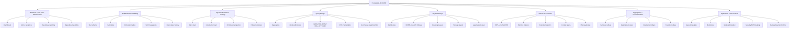

---

# 3. Tabular Decomposition Map

| No | Domain / Skill | Apa yang perlu dikuasai | Practical usage di OLAP PostgreSQL | Failure mode yang harus diwaspadai |
|---:|---|---|---|---|
| 1 | **OLAP workload classification** | Bedakan dashboard, scheduled report, ad-hoc query, regulatory export, dan operational analytics | Menentukan apakah cukup pakai query langsung, materialized view, summary table, atau dedicated data mart | Semua report ditembak langsung ke tabel OLTP; latency naik dan transaksi terganggu |
| 2 | **OLTP vs OLAP boundary** | Pisahkan read path transactional dan analytical | Read replica, reporting schema, projection table, atau database terpisah | Satu database dipakai untuk semua query berat tanpa isolation |
| 3 | **Dimensional modeling** | Fact table, dimension table, grain, measure, surrogate key, natural key | Membuat `fact_case_event`, `dim_office`, `dim_status`, `dim_time`, `fact_sla` | Grain tidak jelas; metric double count |
| 4 | **Fact table design** | Append-heavy event/fact design, immutable history, additive/semi-additive measure | Cocok untuk case lifecycle, SLA aging, transition history, audit event | Update-heavy analytical table membuat bloat dan vacuum pressure |
| 5 | **Dimension design** | Small dimension, lookup, hierarchy, denormalized dimension | Region, unit kerja, officer, status, violation type, product type | Join terlalu banyak ke normalized OLTP tables |
| 6 | **Slowly Changing Dimension / snapshot** | SCD Type 1/2, effective date, historical attribute | Report “status saat kejadian”, bukan status terbaru saja | Historical report berubah setelah master data berubah |
| 7 | **Time dimension & calendar logic** | Date spine, business day, holiday, fiscal period, reporting period | SLA, aging bucket, monthly/quarterly reporting | Query business-day calculation berat dan inkonsisten |
| 8 | **Partitioning strategy** | Range/list/hash partition, partition key, pruning, lifecycle retention | Partition fact table berdasarkan `event_date`, `created_at`, `reporting_month`, atau tenant besar | Terlalu banyak partition kecil, salah partition key, pruning tidak aktif |
| 9 | **Partition maintenance** | Attach/detach partition, rolling window, archive/drop old partition | Fast retention dan data lifecycle untuk analytical fact besar | Delete massal di tabel besar, menyebabkan bloat |
| 10 | **Indexing for analytics** | B-tree, BRIN, GIN, GiST, covering index, partial index | B-tree untuk join/filter selektif; BRIN untuk tabel besar append-only by time; GIN untuk JSONB/search tertentu | Over-indexing memperlambat load; index tidak sesuai query pattern |
| 11 | **BRIN index skill** | Block-range index untuk data naturally ordered | Sangat berguna untuk fact table besar yang ordered by timestamp/id | Data tidak ter-cluster; BRIN jadi kurang efektif |
| 12 | **Covering / index-only scan** | `INCLUDE`, visibility map, index-only read | Query dashboard bisa ambil kolom dari index tanpa heap access | Ekspektasi index-only scan gagal karena table sering berubah/vacuum kurang |
| 13 | **Query planner literacy** | Cost, cardinality, join order, scan type, sort, hash aggregate | Membaca kenapa query dashboard lambat | Menebak-nebak tuning tanpa `EXPLAIN ANALYZE` |
| 14 | **EXPLAIN / EXPLAIN ANALYZE** | Actual vs estimated rows, loops, buffers, timing, sort spill | Diagnosis query berat sebelum menambah index/materialized view | Hanya melihat duration, tidak membaca plan |
| 15 | **Planner statistics** | `ANALYZE`, statistics target, histogram, MCV, null fraction | Membantu planner memilih join/scan yang benar | Statistik stale setelah bulk load |
| 16 | **Extended statistics** | Dependency, ndistinct, MCV multi-column | Penting untuk filter kombinasi: tenant + status + period + region | Planner salah estimasi karena korelasi antar kolom tidak diketahui |
| 17 | **Parallel query** | Parallel seq scan, parallel aggregate, parallel hash join, worker config | Mempercepat scan/aggregate besar | Parallelism tidak muncul karena config, function volatility, query shape, atau ukuran data |
| 18 | **Aggregation design** | `GROUP BY`, filtered aggregate, ordered aggregate, approximate strategy | KPI, count case, sum amount, SLA breach rate | Aggregate langsung dari raw event terlalu berat untuk dashboard real-time |
| 19 | **Advanced OLAP SQL** | Window functions, `ROLLUP`, `CUBE`, `GROUPING SETS`, percentile, ranking | Running total, cohort, top-N per group, aging, period comparison | Query benar tapi sangat mahal karena sort/window besar |
| 20 | **Window function optimization** | Partition/order key, sort reuse, frame definition | `lag/lead`, lifecycle transition, time-to-resolution, ranking | Window over unbounded large partition tanpa filter |
| 21 | **CTE/temp table staging** | CTE materialization behavior, temp table, intermediate result | Memecah analytical query kompleks menjadi tahap yang bisa di-debug | CTE dipakai sebagai “magic performance fix” tanpa membaca plan |
| 22 | **Materialized view** | `CREATE MATERIALIZED VIEW`, indexing MV, refresh strategy | Precompute dashboard/report yang mahal | `REFRESH MATERIALIZED VIEW` full refresh terlalu lama atau blocking |
| 23 | **Summary / aggregate tables** | Manual rollup harian/bulanan, incremental aggregation | Lebih fleksibel daripada MV untuk incremental reporting | Rollup tidak idempotent; duplicate aggregation |
| 24 | **Incremental refresh design** | Watermark, last processed id/time, upsert summary, late-arriving event | Near-real-time OLAP dari event/state changes | Missing data karena watermark salah; late event tidak dikoreksi |
| 25 | **Data ingestion for OLAP** | `COPY`, batch insert, staging table, merge/upsert, validation | Load besar lebih efisien daripada row-by-row insert | MyBatis batch salah setting; commit terlalu sering |
| 26 | **JSONB analytics boundary** | JSONB extraction, generated column, GIN index | Analisis attribute semi-structured dari event payload | Semua metric dihitung dari JSONB mentah; query lambat dan fragile |
| 27 | **Generated columns / derived columns** | Store derived fields untuk filter/join umum | Extract `case_type`, `event_month`, `sla_bucket` | Logic derived tersebar di banyak query |
| 28 | **Storage & bloat management** | VACUUM, autovacuum, freeze, fillfactor, table rewrite | Menjaga fact/reporting table tetap sehat | Update/delete massal membuat table/index bloat |
| 29 | **Memory tuning for analytics** | `work_mem`, sort/hash aggregate memory, temp file spill | Mengurangi disk spill untuk sort/hash besar | Naikkan `work_mem` global terlalu besar lalu OOM saat concurrency tinggi |
| 30 | **I/O tuning** | Sequential scan, bitmap scan, cache, temp files, checkpoint impact | Analytical query sering I/O-heavy | Storage lambat, temp dir penuh, checkpoint spike |
| 31 | **Workload isolation** | Read replica, reporting DB, connection pool limit, statement timeout | Melindungi OLTP dari report berat | Query BI tidak dibatasi dan menghabiskan worker/connection |
| 32 | **Monitoring OLAP workload** | `pg_stat_statements`, cumulative stats, slow query log, temp file log | Menemukan query paling mahal, most frequent, most I/O-heavy | Optimasi query yang salah karena tidak berbasis evidence |
| 33 | **Security for analytical access** | Schema privilege, view-based access, RLS, masking, column restriction | Report user hanya lihat data sesuai otorisasi | OLAP bypass aturan security aplikasi |
| 34 | **Regulatory defensibility** | Metric definition, lineage, reproducibility, snapshot period, audit trail | Report bisa dijelaskan: data source, cutoff, logic, version | Angka dashboard berubah tanpa jejak definisi |
| 35 | **Backup, retention, archive** | Partition detach, archive table, cold storage, PITR consideration | Retensi data historis tanpa membebani active dataset | Data regulatory terhapus karena dianggap “old data” |
| 36 | **Extension/ecosystem awareness** | FDW, partition helper, time-series/columnar/distributed options bila dipakai | Menentukan kapan core PostgreSQL cukup dan kapan perlu extension/warehouse | Memaksa PostgreSQL core untuk workload MPP/columnar ekstrem |

Catatan teknis penting: PostgreSQL mendukung declarative table partitioning; ini krusial untuk fact table besar dan retention berbasis waktu. ([PostgreSQL](https://www.postgresql.org/docs/current/ddl-partitioning.html?utm_source=chatgpt.com)) Materialized view di PostgreSQL menyimpan hasil query seperti table-like object, sehingga cocok untuk precomputed analytical result. ([PostgreSQL](https://www.postgresql.org/docs/current/rules-materializedviews.html?utm_source=chatgpt.com)) Window functions tersedia untuk kalkulasi lintas row yang masih mempertahankan identitas row, cocok untuk ranking, running total, lifecycle interval, dan perbandingan antar event. ([PostgreSQL](https://www.postgresql.org/docs/current/tutorial-window.html?utm_source=chatgpt.com))

Untuk performance, PostgreSQL menyediakan beberapa tipe index seperti B-tree, Hash, GiST, SP-GiST, GIN, BRIN, dan bloom extension; pemilihan index harus mengikuti bentuk predicate dan distribusi data, bukan sekadar “tambahkan index”. ([PostgreSQL](https://www.postgresql.org/docs/current/indexes-types.html?utm_source=chatgpt.com)) PostgreSQL juga mendukung parallel plan seperti parallel sequential scan, parallel bitmap heap scan, dan parallel btree index scan, yang sangat relevan untuk scan/aggregate besar. ([PostgreSQL](https://www.postgresql.org/docs/current/parallel-plans.html?utm_source=chatgpt.com))

---

# 4. Practical Skill Grouping

## A. Analytical Modeling Layer

Fokus: bagaimana data disusun supaya query OLAP stabil, cepat, dan defensible.

| Skill | Output praktis |
|---|---|
| Grain definition | Satu row mewakili apa: event, case snapshot, transaction, daily aggregate |
| Fact/dimension modeling | Schema reporting yang tidak terlalu join-heavy |
| Snapshot strategy | Historical report tidak berubah ketika master/current state berubah |
| Metric dictionary | Definisi KPI eksplisit dan reproducible |
| Time/calendar model | SLA, aging, business day, fiscal/reporting period konsisten |

Contoh grain yang bagus:

```sql
-- one row = one case state transition event
fact_case_transition(
  transition_id,
  case_id,
  previous_state,
  next_state,
  transition_at,
  office_id,
  officer_id,
  violation_type_id,
  amount,
  tenant_id
)
```

Contoh grain yang berbahaya:

```text
one row = "case information for report"
```

Kenapa berbahaya? Karena tidak jelas apakah row itu current state, event, snapshot, atau aggregate.

---

## B. Physical Design Layer

Fokus: membuat PostgreSQL bisa membaca data besar secara efisien.

| Skill | Pattern |
|---|---|
| Partitioning | `PARTITION BY RANGE (event_date)` untuk fact besar |
| BRIN index | Tabel append-only/time-ordered |
| B-tree index | Join key, selective filter, lookup dimension |
| Partial index | Filter umum seperti active/reportable/current period |
| Covering index | Dashboard query kecil tapi sering |
| Materialized view | Query mahal yang hasilnya reusable |
| Summary table | Incremental rollup yang perlu kontrol penuh |

PostgreSQL planner sangat bergantung pada statistik; `ANALYZE` mengumpulkan statistik table yang kemudian dipakai planner untuk menentukan plan paling efisien. ([PostgreSQL](https://www.postgresql.org/docs/current/sql-analyze.html?utm_source=chatgpt.com)) Untuk korelasi multi-kolom, PostgreSQL juga menyediakan extended statistics melalui `CREATE STATISTICS`. ([PostgreSQL](https://www.postgresql.org/docs/current/sql-createstatistics.html?utm_source=chatgpt.com))

---

## C. Query Engineering Layer

Fokus: menulis SQL analytical yang benar dan bisa dijalankan dengan plan bagus.

| Skill | Contoh use case |
|---|---|
| Aggregation | KPI count/sum/rate |
| Filtered aggregate | `count(*) filter (where status = 'OPEN')` |
| Window function | `lag`, `lead`, `rank`, moving average |
| CTE | Query decomposition |
| GROUPING SETS | Multi-level report dalam satu query |
| Percentile | SLA percentile, response time distribution |
| Anti-join/semi-join | Data completeness, missing event detection |
| Time bucketing | Daily/monthly/quarterly trend |

`EXPLAIN` adalah alat utama untuk melihat query plan yang dibuat planner; PostgreSQL menekankan bahwa pemilihan plan yang tepat sangat penting untuk performa query. ([PostgreSQL](https://www.postgresql.org/docs/current/using-explain.html?utm_source=chatgpt.com))

---

## D. Refresh & Serving Layer

Fokus: bagaimana hasil analytical tersedia tanpa membebani raw table terus-menerus.

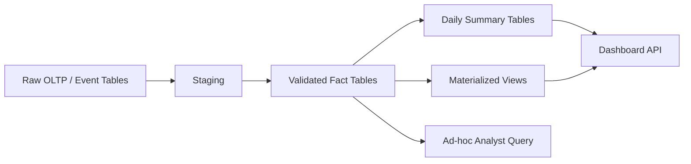

| Pattern | Cocok untuk | Catatan |
|---|---|---|
| Direct query | Dataset kecil, query jarang | Mulai dari sini untuk validasi |
| Materialized view | Query mahal, refresh periodik | Perlu index dan refresh strategy |
| Summary table | Dashboard high traffic | Bisa incremental dan idempotent |
| Snapshot table | Regulatory cutoff report | Cocok untuk auditability |
| Read replica | Query berat yang tidak boleh ganggu OLTP | Tetap perlu query governance |
| Export pipeline | Long-running analysis | Jangan semua lewat API sync |

---

## E. Production Operations Layer

Fokus: OLAP query biasanya lebih berat, jadi operational guardrail wajib.

| Area | Yang perlu dipasang |
|---|---|
| Query safety | `statement_timeout`, `idle_in_transaction_session_timeout` |
| Pool isolation | Pool khusus reporting vs OLTP |
| Observability | `pg_stat_statements`, slow query log, temp file log |
| Maintenance | autovacuum tuning, analyze schedule, reindex bila perlu |
| Capacity | CPU, memory, IOPS, temp disk |
| Governance | metric ownership, lineage, report cutoff |
| Security | view/schema privilege, RLS jika perlu |

`pg_stat_statements` adalah extension resmi untuk tracking planning dan execution statistics dari SQL statement, sangat berguna untuk menemukan query OLAP paling mahal. ([PostgreSQL](https://www.postgresql.org/docs/current/pgstatstatements.html?utm_source=chatgpt.com)) PostgreSQL cumulative statistics system juga menyediakan data aktivitas server, table/index access, vacuum/analyze, dan timing I/O bila tracking diaktifkan. ([PostgreSQL](https://www.postgresql.org/docs/current/monitoring-stats.html?utm_source=chatgpt.com))

---

# 5. Recommended Learning Roadmap

## Phase 1 - Foundation: OLAP mindset di PostgreSQL

1. Pahami perbedaan OLTP vs OLAP.
2. Definisikan grain, metric, dimension, dan reporting period.
3. Latihan membuat fact table dari event/state transition.
4. Biasakan semua metric punya definisi eksplisit.

## Phase 2 - Analytical SQL

1. Kuasai aggregate, filtered aggregate, window function.
2. Gunakan CTE/temp table untuk query decomposition.
3. Pelajari `GROUPING SETS`, `ROLLUP`, dan `CUBE`.
4. Latihan query KPI: backlog, throughput, aging, SLA breach, transition duration.

## Phase 3 - Physical Design

1. Desain partitioning by time.
2. Pilih index sesuai query pattern: B-tree, BRIN, partial, covering.
3. Buat materialized view dan summary table.
4. Pahami trade-off refresh full vs incremental.

## Phase 4 - Performance & Planner

1. Wajib baca `EXPLAIN ANALYZE`.
2. Bandingkan estimated rows vs actual rows.
3. Pelajari statistics, extended statistics, dan analyze.
4. Pahami sort/hash spill, parallel query, dan memory impact.

## Phase 5 - Production OLAP

1. Pisahkan workload OLTP dan reporting.
2. Pasang monitoring query berat.
3. Atur timeout, pool, read replica, dan refresh window.
4. Buat metric lineage dan audit trail untuk report penting.

---

# 6. Rekomendasi Seri Lanjutan

Saya rekomendasikan seri lanjutannya seperti ini:

| Seri | Topik |
|---:|---|
| 1 | PostgreSQL OLAP Mental Model: OLTP vs OLAP, workload classification, reporting architecture |
| 2 | Dimensional Modeling in PostgreSQL: fact, dimension, grain, snapshot, SCD |
| 3 | Analytical SQL: aggregate, filtered aggregate, window functions, grouping sets |
| 4 | Partitioning Strategy for OLAP Fact Tables |
| 5 | Indexing Strategy for OLAP: B-tree, BRIN, GIN, partial, covering index |
| 6 | Materialized Views, Summary Tables, and Incremental Rollup |
| 7 | Query Planner, EXPLAIN ANALYZE, Statistics, Extended Statistics |
| 8 | Parallel Query, Memory, Sort/Hash Spill, and I/O Tuning |
| 9 | Data Loading Pattern: staging, COPY, batch insert, validation, watermark |
| 10 | Dashboard/API Serving Pattern from PostgreSQL OLAP |
| 11 | Regulatory Reporting: snapshot, cutoff, lineage, reconciliation, auditability |
| 12 | Production Operations: monitoring, vacuum/analyze, bloat, read replica, workload isolation |

Rekomendasi materi selanjutnya: **Seri 1 - PostgreSQL OLAP Mental Model: OLTP vs OLAP, workload classification, reporting architecture**.

---

**Sources:**

- [PostgreSQL 18.4 Documentation](https://www.postgresql.org/docs/current/index.html?utm_source=chatgpt.com)

## Response:
7/15/2026, 7:55:47 PM

Siap. Saya tambahkan **1 seri terakhir** sehingga total menjadi **13 seri**.

| Seri | Topik |
|---:|---|
| 1 | PostgreSQL OLAP Mental Model: OLTP vs OLAP, workload classification, reporting architecture |
| 2 | Dimensional Modeling in PostgreSQL: fact, dimension, grain, snapshot, SCD |
| 3 | Analytical SQL: aggregate, filtered aggregate, window functions, grouping sets |
| 4 | Partitioning Strategy for OLAP Fact Tables |
| 5 | Indexing Strategy for OLAP: B-tree, BRIN, GIN, partial, covering index |
| 6 | Materialized Views, Summary Tables, and Incremental Rollup |
| 7 | Query Planner, EXPLAIN ANALYZE, Statistics, Extended Statistics |
| 8 | Parallel Query, Memory, Sort/Hash Spill, and I/O Tuning |
| 9 | Data Loading Pattern: staging, COPY, batch insert, validation, watermark |
| 10 | Dashboard/API Serving Pattern from PostgreSQL OLAP |
| 11 | Regulatory Reporting: snapshot, cutoff, lineage, reconciliation, auditability |
| 12 | Production Operations: monitoring, vacuum/analyze, bloat, read replica, workload isolation |
| 13 | **Java/Jersey/MyBatis Integration Pattern for PostgreSQL OLAP** |

Mulai dari **Seri 1/13**.

---

# Seri 1/13 - PostgreSQL OLAP Mental Model: OLTP vs OLAP, Workload Classification, Reporting Architecture

## 1. Tujuan Seri Ini

Seri ini membangun fondasi praktis: **kapan PostgreSQL layak dipakai untuk OLAP, bagaimana membedakan query OLTP vs OLAP, dan bagaimana merancang jalur reporting agar tidak merusak performa transaksi utama**.

PostgreSQL bisa menangani banyak analytical workload, tetapi harus dipakai dengan model yang benar. PostgreSQL menyediakan fitur penting untuk workload analitis seperti partitioning, materialized view, berbagai index type, EXPLAIN, statistics, dan monitoring query melalui `pg_stat_statements`. Partitioning memungkinkan table dibagi menjadi partition berdasarkan key tertentu, materialized view menyimpan hasil query dalam bentuk table-like relation, dan `EXPLAIN` menampilkan execution plan yang dibuat planner. ([PostgreSQL](https://www.postgresql.org/docs/current/ddl-partitioning.html?utm_source=chatgpt.com))

---

# 2. Mental Model: OLTP vs OLAP

## OLTP

**OLTP** adalah jalur transaksi utama.

Contoh:

```text
Create case
Update case status
Assign officer
Approve decision
Insert audit log
Submit enforcement action
```

Karakteristik:

| Aspek | OLTP |
|---|---|
| Query shape | Short, selective, indexed lookup |
| Data access | Beberapa row spesifik |
| Latency target | Rendah dan stabil |
| Write pattern | Insert/update/delete sering |
| Risk utama | Lock, contention, slow transaction |
| Contoh query | `select * from case where case_id = ?` |

## OLAP

**OLAP** adalah jalur analitis/reporting.

Contoh:

```text
Monthly backlog by office
SLA breach percentage by case type
Average transition duration by state
Aging bucket per region
Regulatory report per quarter
```

Karakteristik:

| Aspek | OLAP |
|---|---|
| Query shape | Scan, join, aggregate, sort |
| Data access | Banyak row |
| Latency target | Bisa lebih longgar, tapi predictable |
| Write pattern | Append/batch/refresh |
| Risk utama | CPU/IO/memory pressure |
| Contoh query | `group by office_id, status, month` |

---

# 3. Kesalahan Umum Saat Memakai PostgreSQL untuk OLAP

Kesalahan paling umum bukan karena PostgreSQL “tidak kuat”, tetapi karena **query reporting ditembak langsung ke model OLTP**.

## Anti-pattern

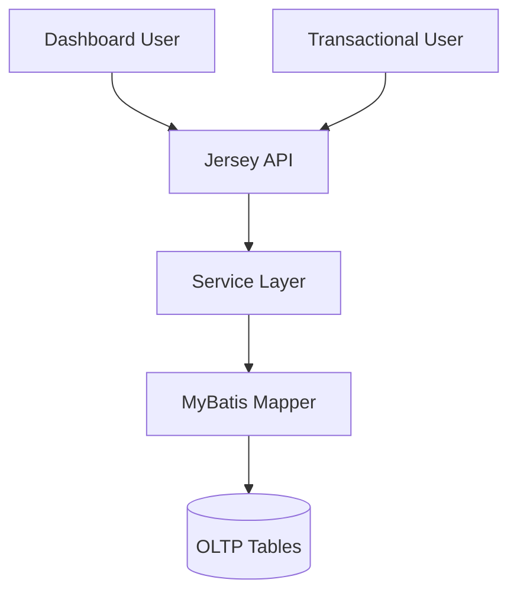

Masalah:

| Masalah | Dampak |
|---|---|
| Dashboard query scan jutaan row dari OLTP table | Transaksi utama ikut lambat |
| Join langsung ke banyak normalized table | Query kompleks, plan tidak stabil |
| Tidak ada pre-aggregation | Setiap refresh dashboard hitung ulang dari raw data |
| Tidak ada timeout/pool isolation | Report bisa menghabiskan koneksi |
| Metric logic tersebar di banyak query | Angka dashboard tidak konsisten |

---

# 4. Correct Mental Model

OLAP sebaiknya diperlakukan sebagai **read model** atau **analytical projection**, bukan sekadar query bebas ke OLTP schema.

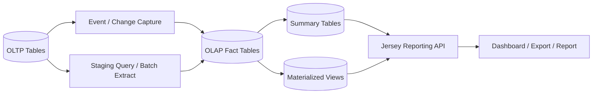

Prinsipnya:

| Prinsip | Maksud praktis |
|---|---|
| Separate read shape | Struktur data OLAP mengikuti bentuk report, bukan bentuk transaksi |
| Precompute expensive logic | Hitungan mahal dipindah ke summary/materialized view |
| Preserve history | Report historis tidak bergantung pada current state saja |
| Bound query cost | Query API punya limit, timeout, pagination, dan filter wajib |
| Make metrics defensible | Definisi angka bisa diaudit dan direkonsiliasi |

---

# 5. Workload Classification

Sebelum membuat tabel atau query OLAP, klasifikasikan dulu tipe workload-nya.

## A. Dashboard Operational

Contoh:

```text
Open cases today
Backlog by status
SLA breach count
Cases by office
```

Pattern yang cocok:

| Pattern | Penjelasan |
|---|---|
| Summary table | Untuk KPI yang sering dibaca |
| Materialized view | Untuk query kompleks tapi refresh periodik |
| Covering index | Untuk lookup dashboard kecil |
| Cache optional | Kalau angka toleran delay |

## B. Scheduled Report

Contoh:

```text
Monthly enforcement report
Quarterly compliance report
Daily SLA report
```

Pattern yang cocok:

| Pattern | Penjelasan |
|---|---|
| Snapshot table | Simpan hasil pada cutoff waktu tertentu |
| Batch job | Generate report di window tertentu |
| Export table | Menyimpan output final untuk download |
| Reconciliation log | Menjelaskan source count vs output count |

## C. Ad-hoc Analytics

Contoh:

```text
Cari pola keterlambatan per region
Compare officer workload
Analyze transition bottleneck
```

Pattern yang cocok:

| Pattern | Penjelasan |
|---|---|
| Read replica | Jangan ganggu primary OLTP |
| Analyst schema | Batasi akses ke curated data |
| Statement timeout | Mencegah query liar |
| Sample/extract table | Untuk eksplorasi berat |

## D. Regulatory / Audit Report

Contoh:

```text
Report per tanggal cutoff
Historical state of case
Evidence of SLA calculation
Trace source event
```

Pattern yang cocok:

| Pattern | Penjelasan |
|---|---|
| Immutable fact table | Event tidak diubah sembarangan |
| Snapshot table | Angka final per period |
| Metric versioning | Definisi metric punya versi |
| Lineage table | Menyimpan asal data dan proses hitung |

---

# 6. Practical Decision Matrix

Gunakan matrix ini untuk menentukan arsitektur awal.

| Kondisi | Jangan langsung pakai | Lebih cocok pakai |
|---|---|---|
| Query report sering dibuka dashboard | Raw OLTP query | Summary table / materialized view |
| Query butuh historical state | Current OLTP table | Event fact / snapshot table |
| Query aggregate jutaan row | API sync langsung | Pre-aggregation |
| Query user bisa pilih filter bebas | Dynamic SQL tanpa guardrail | Filter whitelist + limit + timeout |
| Report harus reproducible | Query current table | Snapshot + cutoff + metric version |
| Data besar append-only by time | Satu table besar tanpa partition | Time-based partition |
| Banyak query time-range besar | B-tree semua kolom | BRIN untuk timestamp ordered fact table |
| Query unpredictable/ad-hoc | Primary DB | Read replica / reporting DB |

BRIN index didesain untuk table sangat besar ketika kolom tertentu memiliki korelasi natural dengan lokasi fisik row, misalnya fact table append-only berdasarkan timestamp. ([PostgreSQL](https://www.postgresql.org/docs/current/brin.html?utm_source=chatgpt.com))

---

# 7. Reporting Architecture Patterns

## Pattern 1 - Direct Query to OLTP

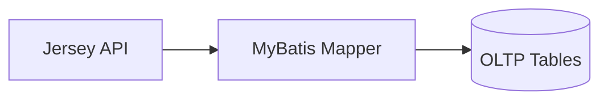

Cocok untuk:

| Cocok | Tidak cocok |
|---|---|
| Dataset kecil | Aggregate besar |
| Query jarang | Dashboard high traffic |
| Filter sangat selektif | Join banyak table |
| Internal admin sederhana | Regulatory reporting |

Contoh aman:

```sql id="cx323e"
select
    c.case_id,
    c.status,
    c.created_at,
    c.assigned_officer_id
from enforcement_case c
where c.case_id = #{caseId};
```

Contoh berbahaya:

```sql id="py3rtb"
select
    o.office_name,
    c.status,
    count(*) as total
from enforcement_case c
join office o on o.office_id = c.office_id
join case_event e on e.case_id = c.case_id
where c.created_at >= #{fromDate}
  and c.created_at < #{toDate}
group by o.office_name, c.status;
```

Query kedua bisa benar secara fungsional, tetapi jika dipakai dashboard berkali-kali, dia akan membebani table transaksi.

---

## Pattern 2 - Reporting View

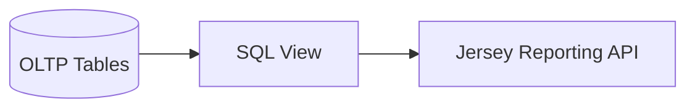

Cocok untuk:

| Cocok | Tidak cocok |
|---|---|
| Standardisasi join | Query mahal |
| Security abstraction | Data besar |
| Satu definisi field | Dashboard high-frequency |

View membantu menyederhanakan akses, tetapi view biasa tidak menyimpan hasil. PostgreSQL view pada dasarnya adalah relation tanpa storage aktual dengan rule `ON SELECT`, sehingga query tetap dieksekusi ke underlying table. ([PostgreSQL](https://www.postgresql.org/docs/current/rules-views.html?utm_source=chatgpt.com))

Contoh:

```sql id="nxei8l"
create view reporting.v_case_current as
select
    c.case_id,
    c.case_number,
    c.status,
    c.office_id,
    o.office_name,
    c.created_at,
    c.updated_at
from app.enforcement_case c
join master.office o on o.office_id = c.office_id;
```

Gunakan untuk:

```text
standardisasi field
menghindari join logic duplikat
security boundary sederhana
```

Jangan anggap view sebagai performance optimization otomatis.

---

## Pattern 3 - Materialized View

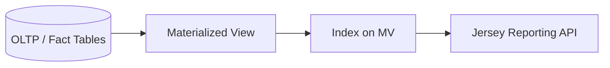

Materialized view cocok ketika query mahal tetapi hasilnya bisa di-refresh periodik. PostgreSQL materialized view menyimpan hasil query dalam bentuk table-like, dan `CREATE MATERIALIZED VIEW` menjalankan query untuk mengisi hasil saat dibuat. ([PostgreSQL](https://www.postgresql.org/docs/current/rules-materializedviews.html?utm_source=chatgpt.com))

Contoh:

```sql id="chptgd"
create materialized view reporting.mv_case_backlog_daily as
select
    date_trunc('day', c.created_at)::date as report_date,
    c.office_id,
    c.status,
    count(*) as total_cases
from app.enforcement_case c
where c.status in ('OPEN', 'IN_REVIEW', 'ESCALATED')
group by
    date_trunc('day', c.created_at)::date,
    c.office_id,
    c.status;
```

Index materialized view:

```sql id="v49y3m"
create index idx_mv_case_backlog_daily_lookup
on reporting.mv_case_backlog_daily (report_date, office_id, status);
```

Refresh:

```sql id="m2t13m"
refresh materialized view reporting.mv_case_backlog_daily;
```

Practical warning:

| Risiko | Mitigasi |
|---|---|
| Refresh lama | Refresh di off-peak window |
| Data stale | Tampilkan `last_refreshed_at` |
| Tidak incremental by default | Pakai summary table jika perlu incremental |
| Query MV tetap lambat | Index materialized view sesuai access pattern |

---

## Pattern 4 - Summary Table

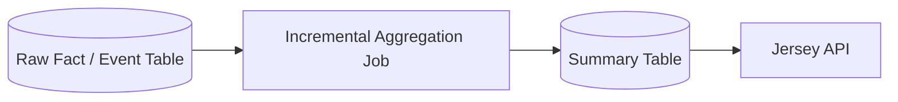

Ini biasanya pattern paling praktis untuk dashboard production.

Contoh summary table:

```sql id="iu1six"
create table reporting.case_status_daily_summary (
    report_date date not null,
    office_id bigint not null,
    status text not null,
    total_cases bigint not null,
    calculated_at timestamptz not null default now(),
    metric_version text not null default 'case_status_daily:v1',
    primary key (report_date, office_id, status)
);
```

Upsert incremental:

```sql id="ge6ojx"
insert into reporting.case_status_daily_summary (
    report_date,
    office_id,
    status,
    total_cases,
    calculated_at,
    metric_version
)
select
    #{reportDate}::date as report_date,
    c.office_id,
    c.status,
    count(*) as total_cases,
    now() as calculated_at,
    'case_status_daily:v1' as metric_version
from app.enforcement_case c
where c.created_at >= #{reportDate}::date
  and c.created_at < (#{reportDate}::date + interval '1 day')
group by c.office_id, c.status
on conflict (report_date, office_id, status)
do update set
    total_cases = excluded.total_cases,
    calculated_at = excluded.calculated_at,
    metric_version = excluded.metric_version;
```

Kenapa summary table sering lebih baik daripada materialized view?

| Summary table | Materialized view |
|---|---|
| Bisa incremental | Biasanya full refresh |
| Bisa simpan metadata kalkulasi | Bisa, tapi lebih natural di table |
| Bisa idempotent per period | Refresh seluruh result |
| Cocok untuk dashboard high traffic | Cocok untuk periodic precompute |

---

## Pattern 5 - Snapshot Report Table

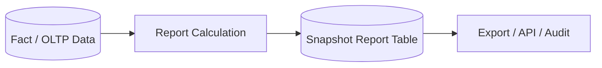

Cocok untuk regulatory report.

Contoh:

```sql id="zntg72"
create table reporting.regulatory_case_snapshot (
    report_period text not null,
    cutoff_at timestamptz not null,
    case_id bigint not null,
    office_id bigint not null,
    status_at_cutoff text not null,
    sla_bucket text not null,
    age_days integer not null,
    source_metric_version text not null,
    generated_at timestamptz not null default now(),
    primary key (report_period, case_id)
);
```

Prinsip:

| Prinsip | Praktik |
|---|---|
| Cutoff eksplisit | Simpan `cutoff_at` |
| Metric version eksplisit | Simpan `source_metric_version` |
| Reproducible | Jangan bergantung pada current mutable state |
| Audit-friendly | Simpan source count dan generated timestamp |

---

# 8. Practical API Boundary untuk Jersey

Untuk OLAP, API tidak boleh terlalu bebas.

## Anti-pattern API

```http id="bg6jq4"
GET /reports/cases?sql=select+...
```

Atau:

```http id="r3vmj8"
GET /reports/cases?from=2020-01-01&to=2026-12-31&groupBy=anything&sort=anything
```

Masalah:

| Masalah | Dampak |
|---|---|
| Filter terlalu bebas | Query plan tidak predictable |
| Range terlalu panjang | Full scan besar |
| Grouping arbitrary | Index/precompute tidak berguna |
| Tidak ada limit | Response besar |
| Tidak ada timeout | Resource exhaustion |

## Pattern API yang lebih aman

```http id="mxbrvr"
GET /reports/case-backlog-daily?from=2026-01-01&to=2026-01-31&officeId=10
```

Atau:

```http id="oypcu9"
GET /reports/case-status-summary?period=2026-01&officeId=10
```

Desain resource:

```java id="zvc5h0"
@Path("/reports/case-status-summary")
@Produces(MediaType.APPLICATION_JSON)
public class CaseStatusSummaryResource {

    private final CaseStatusSummaryService service;

    @GET
    public Response getSummary(
            @QueryParam("period") String period,
            @QueryParam("officeId") Long officeId
    ) {
        CaseStatusSummaryResponse response =
                service.getSummary(period, officeId);

        return Response.ok(response).build();
    }
}
```

Jersey adalah implementasi Jakarta REST; resource JAX-RS/Jakarta REST umumnya berupa class Java ber-annotation seperti `@Path`, `@GET`, `@Produces`, dan parameter annotations. Dokumentasi Jersey 3.x juga mencakup resource class, HTTP method annotations, parameter annotations, injection, dan runtime deployment. ([eclipse-ee4j.github.io](https://eclipse-ee4j.github.io/jersey.github.io/documentation/latest31x/index.html?utm_source=chatgpt.com))

---

# 9. Practical MyBatis Boundary

Untuk OLAP, MyBatis sebaiknya dipakai sebagai **SQL mapper eksplisit**, bukan ORM abstrak.

MyBatis `resultMap` adalah mekanisme penting untuk mapping `ResultSet` ke object, sementara dynamic SQL mendukung elemen seperti `if`, `choose`, `trim`, dan `foreach`. Ini cocok untuk query reporting yang butuh filter terkontrol, bukan query bebas dari user. ([mybatis.org](https://mybatis.org/mybatis-3/sqlmap-xml.html?utm_source=chatgpt.com))

## Mapper Interface

```java id="ahfjed"
public interface CaseStatusSummaryMapper {

    List<CaseStatusSummaryRow> findDailySummary(
            @Param("fromDate") LocalDate fromDate,
            @Param("toDate") LocalDate toDate,
            @Param("officeId") Long officeId
    );
}
```

## Mapper XML

```xml id="brd1dk"
<select id="findDailySummary" resultMap="CaseStatusSummaryRowMap">
    select
        report_date,
        office_id,
        status,
        total_cases,
        calculated_at,
        metric_version
    from reporting.case_status_daily_summary
    where report_date >= #{fromDate}
      and report_date < #{toDate}
    <if test="officeId != null">
      and office_id = #{officeId}
    </if>
    order by report_date, office_id, status
</select>

<resultMap id="CaseStatusSummaryRowMap"
           type="com.company.reporting.CaseStatusSummaryRow">
    <result property="reportDate" column="report_date"/>
    <result property="officeId" column="office_id"/>
    <result property="status" column="status"/>
    <result property="totalCases" column="total_cases"/>
    <result property="calculatedAt" column="calculated_at"/>
    <result property="metricVersion" column="metric_version"/>
</resultMap>
```

Practical rule:

| Rule | Penjelasan |
|---|---|
| Jangan expose arbitrary SQL | Semua query harus whitelist |
| Jangan dynamic `ORDER BY` raw | Pakai enum mapping |
| Jangan filter range tanpa batas | Validasi max range di service |
| Jangan map report besar ke object kompleks | Gunakan DTO flat |
| Jangan query raw fact untuk dashboard | Query summary/MV dulu |

---

# 10. Service Guardrail Praktis

OLAP API butuh validasi yang lebih ketat daripada CRUD API.

```java id="j7g2vu"
public CaseStatusSummaryResponse getSummary(String period, Long officeId) {
    YearMonth ym = parsePeriod(period);

    LocalDate from = ym.atDay(1);
    LocalDate to = ym.plusMonths(1).atDay(1);

    if (officeId == null) {
        throw new BadRequestException("officeId is required for this report");
    }

    List<CaseStatusSummaryRow> rows =
            mapper.findDailySummary(from, to, officeId);

    return CaseStatusSummaryResponse.from(rows);
}
```

Guardrail minimal:

| Guardrail | Contoh |
|---|---|
| Required period | `period=2026-01` |
| Max date range | Maksimal 31/90/365 hari tergantung endpoint |
| Required dimension | `officeId`, `regionId`, atau `tenantId` |
| Enum whitelist | `groupBy=status|office|month` |
| Pagination/export split | API JSON kecil, export async/batch |
| Timeout | DB/session/API timeout |
| Observability | log query name, period, row count, duration |

---

# 11. Query Cost Boundary

Untuk setiap endpoint OLAP, tentukan **cost contract**.

Contoh:

| Endpoint | Source | Max range | Expected rows | Refresh model |
|---|---|---:|---:|---|
| `/reports/case-status-summary` | summary table | 1 bulan | < 1.000 | daily/hourly |
| `/reports/sla-breach` | materialized view | 1 quarter | < 10.000 | hourly |
| `/reports/case-export` | snapshot table | 1 period | file export | batch |
| `/reports/ad-hoc/case-events` | read replica fact table | 7 hari | paginated | live |

Jangan publish endpoint OLAP sebelum jelas:

```text
source table/view
filter wajib
range maksimal
expected cardinality
index yang mendukung
timeout
refresh/staleness rule
owner metric
```

---

# 12. Minimal Production Checklist

## Database

| Checklist | Status |
|---|---|
| Query utama sudah dicek dengan `EXPLAIN ANALYZE` | Wajib |
| Source menggunakan summary/MV/snapshot jika high traffic | Wajib |
| Index sesuai filter endpoint | Wajib |
| Statistik table fresh setelah load/refresh | Wajib |
| Query tidak scan OLTP besar saat jam sibuk | Wajib |
| `pg_stat_statements` aktif untuk observability | Direkomendasikan |
| Slow query dan temp file logging disiapkan | Direkomendasikan |

`pg_stat_statements` menyediakan tracking planning dan execution statistics untuk SQL statement yang dijalankan server, sehingga sangat berguna untuk mengidentifikasi query reporting paling mahal. ([PostgreSQL](https://www.postgresql.org/docs/current/pgstatstatements.html?utm_source=chatgpt.com)) PostgreSQL cumulative statistics juga mencatat akses table/index, jumlah row, vacuum/analyze, dan informasi aktivitas lain yang berguna untuk operasi database. ([PostgreSQL](https://www.postgresql.org/docs/current/monitoring-stats.html?utm_source=chatgpt.com))

## Application

| Checklist | Status |
|---|---|
| Endpoint reporting punya request DTO/validator | Wajib |
| Date range dibatasi | Wajib |
| Dynamic grouping/sorting memakai whitelist | Wajib |
| Response DTO flat dan stabil | Wajib |
| Export besar tidak lewat request sync biasa | Wajib |
| Pool reporting dipisah dari pool OLTP jika traffic besar | Direkomendasikan |
| Metric metadata ditampilkan | Direkomendasikan |

---

# 13. Practical Example: End-to-End Mini Design

## Use Case

> Dashboard ingin menampilkan jumlah case per status per hari untuk satu office dalam satu bulan.

## Jangan mulai dari query raw OLTP

```sql id="gem7ja"
select
    date_trunc('day', created_at)::date as report_date,
    office_id,
    status,
    count(*) as total_cases
from app.enforcement_case
where created_at >= #{fromDate}
  and created_at < #{toDate}
  and office_id = #{officeId}
group by 1, 2, 3;
```

Query ini boleh untuk validasi awal, tapi jangan langsung jadi endpoint dashboard high traffic.

## Buat summary table

```sql id="d6nscv"
create table reporting.case_status_daily_summary (
    report_date date not null,
    office_id bigint not null,
    status text not null,
    total_cases bigint not null,
    calculated_at timestamptz not null default now(),
    metric_version text not null,
    primary key (report_date, office_id, status)
);
```

## Query endpoint hanya baca summary

```sql id="vztc34"
select
    report_date,
    office_id,
    status,
    total_cases,
    calculated_at,
    metric_version
from reporting.case_status_daily_summary
where report_date >= #{fromDate}
  and report_date < #{toDate}
  and office_id = #{officeId}
order by report_date, status;
```

## API response sertakan metadata

```json id="o2bzfu"
{
  "period": "2026-01",
  "officeId": 10,
  "metricVersion": "case_status_daily:v1",
  "lastCalculatedAt": "2026-01-31T23:30:00Z",
  "data": [
    {
      "date": "2026-01-01",
      "status": "OPEN",
      "totalCases": 120
    }
  ]
}
```

Kenapa metadata penting?

| Metadata | Fungsi |
|---|---|
| `metricVersion` | Menjelaskan definisi angka |
| `lastCalculatedAt` | Menjelaskan freshness |
| `period` | Menjelaskan boundary data |
| `officeId` | Menjelaskan scope |
| `source` optional | Mendukung auditability |

---

# 14. Anti-pattern Checklist

Hindari ini sejak awal:

| Anti-pattern | Kenapa buruk |
|---|---|
| Report query langsung join 8 tabel OLTP | Plan tidak stabil dan berat |
| Semua filter optional | Query bisa berubah jadi full scan |
| Dynamic SQL menerima raw column name dari request | SQL injection/logical injection risk |
| API export jutaan row sync | Timeout dan memory pressure |
| Tidak ada metric version | Angka sulit diaudit |
| Tidak ada cutoff time | Report historis berubah-ubah |
| Tidak ada `EXPLAIN ANALYZE` sebelum publish | Optimasi berdasarkan asumsi |
| Tidak ada owner metric | Definisi angka diperdebatkan saat audit |
| Dashboard refresh tiap 5 detik ke raw table | Database jadi bottleneck aplikasi |

---

# 15. Ringkasan Seri 1

PostgreSQL bisa dipakai untuk OLAP dengan baik jika desainnya bukan sekadar “query besar ke tabel OLTP”. Mental model yang benar:

```text
OLTP table
  -> event/fact/snapshot/reporting schema
  -> summary/materialized view
  -> controlled API
  -> dashboard/report/export
```

Keputusan praktis paling penting:

| Pertanyaan | Jawaban desain |
|---|---|
| Apakah report sering dibuka? | Pakai summary/MV |
| Apakah harus historis? | Pakai event fact/snapshot |
| Apakah query berat? | Precompute |
| Apakah user filter bebas? | Batasi dengan whitelist |
| Apakah report audit/regulatory? | Simpan cutoff, metric version, lineage |
| Apakah query mengganggu transaksi? | Pisahkan workload/read replica/pool |

---

# Status

**Seri 1/13 selesai.**

Rekomendasi materi selanjutnya: **Seri 2/13 - Dimensional Modeling in PostgreSQL: fact, dimension, grain, snapshot, SCD**.

---

**Sources:**

- [Documentation: 18: 5.12. Table Partitioning](https://www.postgresql.org/docs/current/ddl-partitioning.html?utm_source=chatgpt.com)
- [Jersey 3.1.11 User Guide](https://eclipse-ee4j.github.io/jersey.github.io/documentation/latest31x/index.html?utm_source=chatgpt.com)
- [MyBatis 3 | Mapper XML Files](https://mybatis.org/mybatis-3/sqlmap-xml.html?utm_source=chatgpt.com)

## Response:
7/15/2026, 7:58:58 PM

Lanjut ke **Seri 2/13**. Fokusnya saya arahkan ke desain praktis: grain, fact, dimension, snapshot, dan SCD untuk reporting yang stabil serta bisa dipertanggungjawabkan.

# Seri 2/13 - Dimensional Modeling in PostgreSQL: Fact, Dimension, Grain, Snapshot, SCD

Seri ini fokus ke **cara mendesain model OLAP di PostgreSQL** supaya reporting tidak sekadar query besar ke tabel OLTP, tetapi punya struktur data yang stabil, cepat, dan bisa diaudit.

Target praktisnya:

```text
raw OLTP tables / events
  -> analytical grain
  -> fact tables
  -> dimension tables
  -> snapshot / summary / materialized view
  -> Jersey reporting API
```

PostgreSQL menyediakan fondasi relasional yang cocok untuk model seperti ini: table, constraint, foreign key, partitioning, index, materialized view, dan query planner. Foreign key di PostgreSQL memastikan nilai pada kolom tertentu cocok dengan row di tabel lain, sedangkan materialized view menyimpan hasil query dalam bentuk table-like sehingga bisa dipakai untuk precomputed analytical result. ([PostgreSQL](https://www.postgresql.org/docs/current/ddl-constraints.html?utm_source=chatgpt.com))

---

## 1. Mental Model

Dalam OLAP, kesalahan paling berbahaya biasanya bukan SQL-nya, tetapi **grain yang tidak jelas**.

**Grain** menjawab:

> Satu row di tabel ini merepresentasikan apa?

Contoh grain yang jelas:

| Table | Grain |
|---|---|
| `fact_case_transition` | Satu row = satu perpindahan status case |
| `fact_case_daily_snapshot` | Satu row = satu case pada satu tanggal snapshot |
| `fact_sla_measurement` | Satu row = satu pengukuran SLA untuk satu case |
| `summary_case_status_daily` | Satu row = total case per tanggal, office, status |

Contoh grain yang buruk:

```text
Satu row = data case untuk report
```

Itu buruk karena tidak jelas apakah row tersebut adalah current state, historical event, snapshot harian, atau aggregate.

---

## 2. Diagram Model OLAP PostgreSQL

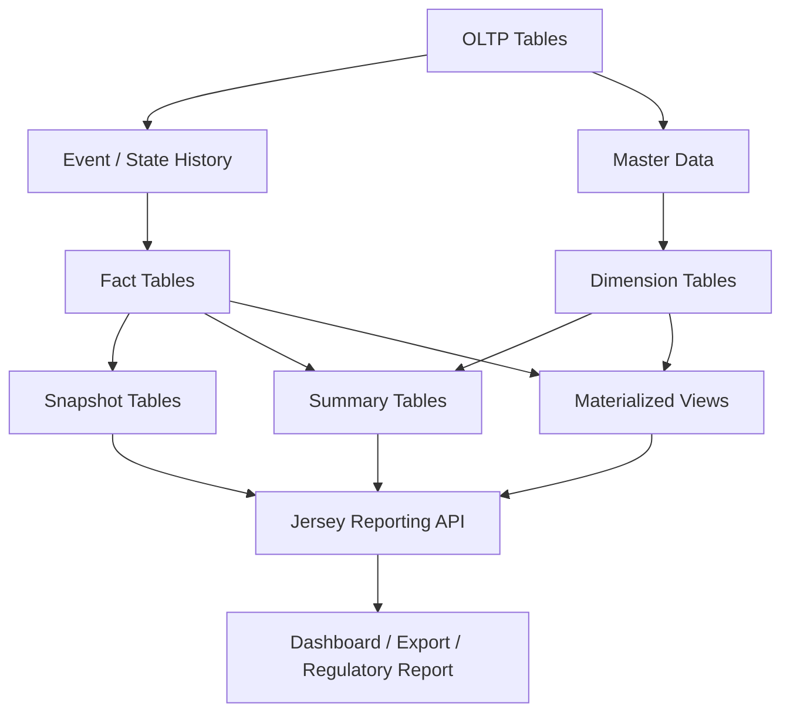

---

# 3. Core Components

## A. Fact Table

**Fact table** menyimpan event, measurement, transaction, atau snapshot yang ingin dianalisis.

Contoh:

```text
case created
case assigned
case escalated
case approved
case closed
SLA breached
penalty issued
```

Fact table biasanya besar, append-heavy, dan sering dipartition berdasarkan waktu. Declarative partitioning di PostgreSQL memungkinkan table dibagi menjadi partition, dan partitioned table memiliki kolom yang sama pada parent dan partitions. ([PostgreSQL](https://www.postgresql.org/docs/current/ddl-partitioning.html?utm_source=chatgpt.com))

---

## B. Dimension Table

**Dimension table** menyimpan konteks untuk membaca fact.

Contoh:

```text
office
region
case type
violation type
status
officer
calendar date
tenant
organization unit
```

Dimension biasanya lebih kecil, lebih stabil, dan digunakan untuk filter/grouping.

---

## C. Snapshot Table

Snapshot menyimpan kondisi pada titik waktu tertentu.

Contoh:

```text
status case per akhir hari
status case per akhir bulan
regulatory cutoff per quarter
officer workload per tanggal tertentu
```

Snapshot penting untuk report yang harus reproducible.

---

## D. SCD - Slowly Changing Dimension

SCD dipakai saat dimension berubah, tetapi report historis harus tetap benar.

Contoh:

```text
office berubah region
officer pindah unit
case type direklasifikasi
organization hierarchy berubah
```

Tanpa SCD, report historis bisa berubah ketika master data berubah.

---

# 4. Fact Table Types

| Type | Grain | Cocok untuk | Contoh |
|---|---|---|---|
| **Transaction fact** | Satu transaksi/business event | Data finansial, penalty, payment | `fact_penalty_payment` |
| **Event fact** | Satu domain event | Case lifecycle, audit event | `fact_case_transition` |
| **Periodic snapshot fact** | Satu entity per periode | Daily/monthly state | `fact_case_daily_snapshot` |
| **Accumulating snapshot fact** | Satu process instance dengan milestone columns | Lifecycle end-to-end | `fact_case_lifecycle` |
| **Factless fact** | Kejadian tanpa numeric measure | Assignment, attendance, violation occurrence | `fact_case_assignment` |
| **Aggregate fact / summary** | Satu aggregate result per dimension combination | Dashboard high traffic | `summary_case_status_daily` |

---

# 5. Practical Example Domain

Kita pakai contoh regulatory/enforcement lifecycle.

```text
Case dibuat
  -> Assigned
  -> In Review
  -> Escalated
  -> Decision Issued
  -> Closed
```

Pertanyaan OLAP:

| Pertanyaan | Model yang cocok |
|---|---|
| Berapa case open per hari? | Daily snapshot / summary |
| Berapa lama dari assigned ke closed? | Event fact / accumulating snapshot |
| Berapa SLA breach per office? | SLA fact + office dimension |
| Berapa backlog per region? | Daily snapshot + office/region dimension |
| Bagaimana trend escalation per bulan? | Event fact + time dimension |
| Apa status case pada cutoff report? | Regulatory snapshot |

---

# 6. Recommended Schema Layout

Pisahkan schema agar batas OLTP dan OLAP jelas.

```sql
create schema if not exists app;
create schema if not exists master;
create schema if not exists reporting;
create schema if not exists mart;
```

| Schema | Fungsi |
|---|---|
| `app` | Tabel OLTP aplikasi |
| `master` | Master/reference data |
| `reporting` | Summary, snapshot, materialized view |
| `mart` | Fact/dimension analytical model |

Ini bukan aturan wajib, tapi sangat membantu governance.

---

# 7. Dimension Design

## 7.1 `dim_date`

Untuk OLAP, date dimension sangat berguna karena banyak report memakai hari kerja, bulan, quarter, fiscal period, dan holiday.

```sql
create table mart.dim_date (
    date_key integer primary key,          -- 20260715
    calendar_date date not null unique,
    year integer not null,
    quarter integer not null,
    month integer not null,
    month_name text not null,
    day_of_month integer not null,
    day_of_week integer not null,
    is_weekend boolean not null,
    is_business_day boolean not null,
    fiscal_year integer,
    fiscal_period integer
);
```

Contoh query populate sederhana:

```sql
insert into mart.dim_date (
    date_key,
    calendar_date,
    year,
    quarter,
    month,
    month_name,
    day_of_month,
    day_of_week,
    is_weekend,
    is_business_day,
    fiscal_year,
    fiscal_period
)
select
    to_char(d::date, 'YYYYMMDD')::integer as date_key,
    d::date as calendar_date,
    extract(year from d)::integer,
    extract(quarter from d)::integer,
    extract(month from d)::integer,
    to_char(d, 'Month'),
    extract(day from d)::integer,
    extract(isodow from d)::integer,
    extract(isodow from d)::integer in (6, 7),
    extract(isodow from d)::integer not in (6, 7),
    extract(year from d)::integer,
    extract(month from d)::integer
from generate_series(
    date '2020-01-01',
    date '2035-12-31',
    interval '1 day'
) d;
```

**Practical rule:** jangan hitung business day logic di banyak query report secara ad-hoc. Simpan di `dim_date`.

---

## 7.2 `dim_office`

```sql
create table mart.dim_office (
    office_key bigint generated always as identity primary key,
    office_id bigint not null,
    office_code text not null,
    office_name text not null,
    region_code text not null,
    region_name text not null,
    effective_from date not null,
    effective_to date,
    is_current boolean not null default true,
    source_updated_at timestamptz,
    unique (office_id, effective_from)
);
```

PostgreSQL `CREATE TABLE` mendukung definisi column, constraint, identity column, dan berbagai opsi storage yang menjadi fondasi desain table seperti ini. ([PostgreSQL](https://www.postgresql.org/docs/current/sql-createtable.html?utm_source=chatgpt.com))

Kenapa pakai `office_key` dan bukan hanya `office_id`?

| Key | Fungsi |
|---|---|
| `office_id` | Natural/business key dari sistem asal |
| `office_key` | Surrogate key untuk versi historis dimension |
| `effective_from/effective_to` | Menentukan validitas historis |
| `is_current` | Memudahkan lookup current dimension |

---

## 7.3 `dim_case_status`

```sql
create table mart.dim_case_status (
    status_key smallint generated always as identity primary key,
    status_code text not null unique,
    status_name text not null,
    status_group text not null,
    lifecycle_order integer not null,
    is_terminal boolean not null default false
);
```

Contoh data:

```sql
insert into mart.dim_case_status (
    status_code,
    status_name,
    status_group,
    lifecycle_order,
    is_terminal
)
values
    ('OPEN', 'Open', 'ACTIVE', 10, false),
    ('ASSIGNED', 'Assigned', 'ACTIVE', 20, false),
    ('IN_REVIEW', 'In Review', 'ACTIVE', 30, false),
    ('ESCALATED', 'Escalated', 'ACTIVE', 40, false),
    ('DECISION_ISSUED', 'Decision Issued', 'DECISION', 50, false),
    ('CLOSED', 'Closed', 'CLOSED', 90, true);
```

---

# 8. Fact Table Design

## 8.1 Event Fact: `fact_case_transition`

Ini cocok untuk lifecycle/state-machine analysis.

```sql
create table mart.fact_case_transition (
    transition_id bigint not null,
    case_id bigint not null,
    case_number text not null,

    from_status_key smallint,
    to_status_key smallint not null,

    office_key bigint not null,
    violation_type_key bigint,
    officer_key bigint,

    transition_at timestamptz not null,
    transition_date_key integer not null,

    duration_from_previous_seconds bigint,
    is_sla_breached boolean,

    source_event_id text not null,
    source_system text not null,
    loaded_at timestamptz not null default now(),

    primary key (transition_id, transition_at)
) partition by range (transition_at);
```

Kenapa primary key memakai `transition_at` juga? Pada partitioned table PostgreSQL, constraint pada parent partitioned table memiliki batasan tertentu terkait partitioning; desain key di fact partitioned table sebaiknya memasukkan partition key jika constraint uniqueness diterapkan di parent. Ini menghindari desain constraint yang tidak bisa dijaga lintas partition dengan benar. ([PostgreSQL](https://www.postgresql.org/docs/current/sql-altertable.html?utm_source=chatgpt.com))

Partition contoh:

```sql
create table mart.fact_case_transition_2026_01
partition of mart.fact_case_transition
for values from ('2026-01-01') to ('2026-02-01');

create table mart.fact_case_transition_2026_02
partition of mart.fact_case_transition
for values from ('2026-02-01') to ('2026-03-01');
```

Foreign key optional:

```sql
alter table mart.fact_case_transition
add constraint fk_fact_case_transition_to_status
foreign key (to_status_key)
references mart.dim_case_status(status_key);

alter table mart.fact_case_transition
add constraint fk_fact_case_transition_office
foreign key (office_key)
references mart.dim_office(office_key);

alter table mart.fact_case_transition
add constraint fk_fact_case_transition_date
foreign key (transition_date_key)
references mart.dim_date(date_key);
```

**Catatan praktis:** foreign key pada fact table besar bisa membantu data quality, tetapi bisa menambah cost load. Untuk volume tinggi, beberapa tim memilih validasi di staging + reconciliation, lalu constraint hanya di dimension/reference tertentu.

---

## 8.2 Periodic Snapshot: `fact_case_daily_snapshot`

Cocok untuk backlog, aging, SLA state, dan report cutoff harian.

```sql
create table mart.fact_case_daily_snapshot (
    snapshot_date date not null,
    snapshot_date_key integer not null,

    case_id bigint not null,
    case_number text not null,

    status_key smallint not null,
    office_key bigint not null,
    officer_key bigint,
    violation_type_key bigint,

    opened_at timestamptz not null,
    closed_at timestamptz,
    age_days integer not null,
    sla_bucket text not null,
    is_sla_breached boolean not null,

    metric_version text not null,
    loaded_at timestamptz not null default now(),

    primary key (snapshot_date, case_id)
) partition by range (snapshot_date);
```

Partition:

```sql
create table mart.fact_case_daily_snapshot_2026_01
partition of mart.fact_case_daily_snapshot
for values from ('2026-01-01') to ('2026-02-01');
```

Index untuk dashboard:

```sql
create index idx_case_daily_snapshot_office_status
on mart.fact_case_daily_snapshot_2026_01 (
    snapshot_date,
    office_key,
    status_key
);
```

PostgreSQL mendukung index dengan opsi seperti partial index melalui `WHERE`, dan partial index berguna ketika hanya subset data tertentu yang sering dicari. ([PostgreSQL](https://www.postgresql.org/docs/current/sql-createindex.html?utm_source=chatgpt.com))

---

## 8.3 Accumulating Snapshot: `fact_case_lifecycle`

Cocok untuk tracking milestone end-to-end.

```sql
create table mart.fact_case_lifecycle (
    case_id bigint primary key,
    case_number text not null,

    office_key bigint not null,
    violation_type_key bigint,

    created_at timestamptz not null,
    assigned_at timestamptz,
    review_started_at timestamptz,
    escalated_at timestamptz,
    decision_issued_at timestamptz,
    closed_at timestamptz,

    created_to_assigned_seconds bigint,
    assigned_to_review_seconds bigint,
    review_to_decision_seconds bigint,
    total_resolution_seconds bigint,

    current_status_key smallint not null,
    is_closed boolean not null default false,
    is_sla_breached boolean,

    last_event_at timestamptz not null,
    updated_at timestamptz not null default now()
);
```

Trade-off:

| Kelebihan | Kekurangan |
|---|---|
| Query lifecycle cepat | Table update-heavy |
| Mudah hitung duration antar milestone | Tidak se-immutable event fact |
| Cocok untuk API dashboard | Butuh logic upsert yang benar |

---

# 9. SCD Pattern

## 9.1 SCD Type 1 - Overwrite

Cocok jika historis tidak penting.

```sql
update mart.dim_case_type
set
    case_type_name = #{newName},
    updated_at = now()
where case_type_id = #{caseTypeId};
```

Gunakan untuk:

```text
typo label
display name
non-regulatory attribute
```

Jangan gunakan untuk:

```text
office-region history
officer-unit history
policy classification history
```

---

## 9.2 SCD Type 2 - Historical Versioning

Cocok untuk report historis.

Contoh perubahan office pindah region:

```sql
-- close current version
update mart.dim_office
set
    effective_to = #{changeDate}::date - interval '1 day',
    is_current = false
where office_id = #{officeId}
  and is_current = true;

-- insert new version
insert into mart.dim_office (
    office_id,
    office_code,
    office_name,
    region_code,
    region_name,
    effective_from,
    effective_to,
    is_current,
    source_updated_at
)
values (
    #{officeId},
    #{officeCode},
    #{officeName},
    #{newRegionCode},
    #{newRegionName},
    #{changeDate},
    null,
    true,
    now()
);
```

Lookup dimension key saat load fact:

```sql
select office_key
from mart.dim_office
where office_id = #{officeId}
  and #{eventDate}::date >= effective_from
  and (
      effective_to is null
      or #{eventDate}::date <= effective_to
  );
```

Practical invariant:

```text
Untuk satu business key, hanya boleh ada satu row current.
Untuk satu tanggal event, hanya boleh match satu versi dimension.
Tidak boleh ada effective period overlap.
```

Partial unique index untuk current row:

```sql
create unique index uq_dim_office_current
on mart.dim_office (office_id)
where is_current = true;
```

Partial index di PostgreSQL menyimpan hanya row yang memenuhi predicate, sehingga cocok untuk constraint atau lookup khusus subset seperti `is_current = true`. ([PostgreSQL](https://www.postgresql.org/docs/current/indexes-partial.html?utm_source=chatgpt.com))

---

# 10. Snapshot Design

## 10.1 Daily Snapshot

Daily snapshot menjawab:

```text
Pada tanggal X, kondisi case seperti apa?
```

Contoh load snapshot:

```sql
insert into mart.fact_case_daily_snapshot (
    snapshot_date,
    snapshot_date_key,
    case_id,
    case_number,
    status_key,
    office_key,
    officer_key,
    violation_type_key,
    opened_at,
    closed_at,
    age_days,
    sla_bucket,
    is_sla_breached,
    metric_version
)
select
    #{snapshotDate}::date as snapshot_date,
    to_char(#{snapshotDate}::date, 'YYYYMMDD')::integer as snapshot_date_key,
    c.case_id,
    c.case_number,
    s.status_key,
    o.office_key,
    null as officer_key,
    null as violation_type_key,
    c.created_at as opened_at,
    c.closed_at,
    (#{snapshotDate}::date - c.created_at::date)::integer as age_days,
    case
        when (#{snapshotDate}::date - c.created_at::date) <= 7 then '0-7'
        when (#{snapshotDate}::date - c.created_at::date) <= 30 then '8-30'
        when (#{snapshotDate}::date - c.created_at::date) <= 90 then '31-90'
        else '90+'
    end as sla_bucket,
    (#{snapshotDate}::date - c.created_at::date) > 30 as is_sla_breached,
    'case_daily_snapshot:v1' as metric_version
from app.enforcement_case c
join mart.dim_case_status s
    on s.status_code = c.status
join mart.dim_office o
    on o.office_id = c.office_id
   and #{snapshotDate}::date >= o.effective_from
   and (o.effective_to is null or #{snapshotDate}::date <= o.effective_to)
where c.created_at < #{snapshotDate}::date + interval '1 day'
  and (c.closed_at is null or c.closed_at >= #{snapshotDate}::date);
```

---

## 10.2 Regulatory Cutoff Snapshot

Regulatory snapshot berbeda dari dashboard snapshot. Regulatory snapshot harus bisa dipertanggungjawabkan.

```sql
create table reporting.regulatory_case_cutoff_snapshot (
    report_id text not null,
    report_period text not null,
    cutoff_at timestamptz not null,

    case_id bigint not null,
    case_number text not null,
    office_key bigint not null,
    status_key smallint not null,

    age_days integer not null,
    sla_bucket text not null,
    is_sla_breached boolean not null,

    metric_version text not null,
    source_query_version text not null,
    generated_at timestamptz not null default now(),

    primary key (report_id, case_id)
);
```

Tambahkan reconciliation table:

```sql
create table reporting.regulatory_report_reconciliation (
    report_id text primary key,
    report_period text not null,
    cutoff_at timestamptz not null,
    source_case_count bigint not null,
    snapshot_case_count bigint not null,
    excluded_case_count bigint not null,
    metric_version text not null,
    generated_at timestamptz not null default now(),
    generated_by text not null
);
```

Ini penting karena report regulatory biasanya perlu menjawab:

```text
Angka ini dihitung kapan?
Source data apa?
Ada berapa row input?
Ada berapa row output?
Definisi metric versi berapa?
Siapa/apa job yang generate?
```

---

# 11. Summary Table dari Fact/Snapshot

Setelah fact/snapshot siap, dashboard sebaiknya membaca summary.

```sql
create table reporting.summary_case_status_daily (
    report_date date not null,
    office_key bigint not null,
    status_key smallint not null,
    total_cases bigint not null,
    breached_cases bigint not null,
    calculated_at timestamptz not null default now(),
    metric_version text not null,
    primary key (report_date, office_key, status_key)
);
```

Load summary dari snapshot:

```sql
insert into reporting.summary_case_status_daily (
    report_date,
    office_key,
    status_key,
    total_cases,
    breached_cases,
    metric_version
)
select
    snapshot_date,
    office_key,
    status_key,
    count(*) as total_cases,
    count(*) filter (where is_sla_breached) as breached_cases,
    'summary_case_status_daily:v1' as metric_version
from mart.fact_case_daily_snapshot
where snapshot_date = #{snapshotDate}
group by snapshot_date, office_key, status_key
on conflict (report_date, office_key, status_key)
do update set
    total_cases = excluded.total_cases,
    breached_cases = excluded.breached_cases,
    calculated_at = now(),
    metric_version = excluded.metric_version;
```

---

# 12. Materialized View Alternative

Untuk report yang query-nya mahal tapi refresh periodik cukup, gunakan materialized view.

```sql
create materialized view reporting.mv_case_backlog_by_region_month as
select
    date_trunc('month', f.snapshot_date)::date as report_month,
    o.region_code,
    o.region_name,
    s.status_code,
    count(*) as total_cases,
    count(*) filter (where f.is_sla_breached) as breached_cases
from mart.fact_case_daily_snapshot f
join mart.dim_office o on o.office_key = f.office_key
join mart.dim_case_status s on s.status_key = f.status_key
group by
    date_trunc('month', f.snapshot_date)::date,
    o.region_code,
    o.region_name,
    s.status_code;
```

Index materialized view:

```sql
create index idx_mv_case_backlog_region_month
on reporting.mv_case_backlog_by_region_month (
    report_month,
    region_code,
    status_code
);
```

Refresh:

```sql
refresh materialized view reporting.mv_case_backlog_by_region_month;
```

PostgreSQL `CREATE MATERIALIZED VIEW` menyimpan query untuk bisa di-refresh kemudian, sedangkan `REFRESH MATERIALIZED VIEW` mengganti isi materialized view dengan hasil query yang baru. ([PostgreSQL](https://www.postgresql.org/docs/current/sql-creatematerializedview.html?utm_source=chatgpt.com))

---

# 13. Star Schema vs Wide Reporting Table

## Star Schema

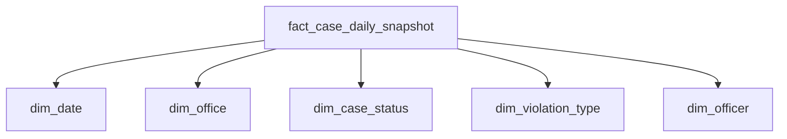

Kelebihan:

| Kelebihan | Penjelasan |
|---|---|
| Reusable dimensions | Office/status/date dipakai banyak fact |
| Historical correctness | SCD bisa dikontrol |
| Metric lebih konsisten | Fact dan dimension jelas |
| Cocok untuk banyak report | Flexible untuk aggregate |

Kekurangan:

| Kekurangan | Mitigasi |
|---|---|
| Join lebih banyak | Summary/MV untuk serving |
| Butuh ETL/load discipline | Buat staging dan validation |
| Lebih kompleks dari query OLTP | Dokumentasikan grain dan metric |

## Wide Reporting Table

```text
reporting.case_daily_report_flat
```

Kelebihan:

| Kelebihan | Penjelasan |
|---|---|
| Query API sederhana | Tidak perlu banyak join |
| Cepat untuk dashboard | Cocok sebagai serving table |
| Mudah diexport | CSV/report langsung |

Kekurangan:

| Kekurangan | Risiko |
|---|---|
| Duplikasi data | Storage lebih besar |
| Perubahan dimension sulit | Perlu regenerate |
| Banyak variasi report | Bisa meledak jumlah table |

**Practical recommendation:** gunakan star schema untuk analytical foundation, lalu buat wide summary/materialized view untuk serving API.

---

# 14. Data Quality Invariants

Untuk OLAP, invariant harus eksplisit.

## Grain Invariant

```text
fact_case_transition:
Tidak boleh ada dua row dengan source_event_id yang sama.
```

```sql
create unique index uq_fact_case_transition_source_event
on mart.fact_case_transition_2026_01 (source_event_id);
```

## SCD Invariant

```text
Satu office_id hanya boleh punya satu current dimension.
```

```sql
create unique index uq_dim_office_one_current
on mart.dim_office (office_id)
where is_current = true;
```

## Snapshot Invariant

```text
Satu case hanya boleh punya satu snapshot per tanggal.
```

```sql
alter table mart.fact_case_daily_snapshot
add constraint uq_case_daily_snapshot
unique (snapshot_date, case_id);
```

## Summary Invariant

```text
Satu combination report_date + office + status hanya punya satu aggregate row.
```

```sql
alter table reporting.summary_case_status_daily
add constraint pk_summary_case_status_daily
primary key (report_date, office_key, status_key);
```

---

# 15. Indexing untuk Model Dimensional

## Dimension Current Lookup

```sql
create unique index uq_dim_office_current_lookup
on mart.dim_office (office_id)
where is_current = true;
```

## SCD Historical Lookup

```sql
create index idx_dim_office_effective_lookup
on mart.dim_office (
    office_id,
    effective_from,
    effective_to
);
```

## Fact Time + Dimension Filter

```sql
create index idx_fact_case_snapshot_date_office_status
on mart.fact_case_daily_snapshot_2026_01 (
    snapshot_date,
    office_key,
    status_key
);
```

## Summary Serving Index

```sql
create index idx_summary_case_status_daily_office_date
on reporting.summary_case_status_daily (
    office_key,
    report_date
)
include (
    total_cases,
    breached_cases,
    metric_version
);
```

PostgreSQL mendukung multicolumn index, dan index dapat dibuat dengan beberapa kolom untuk query yang sering menggunakan kombinasi predicate tertentu. ([PostgreSQL](https://www.postgresql.org/docs/current/indexes-multicolumn.html?utm_source=chatgpt.com))

---

# 16. ETL / Load Flow Praktis

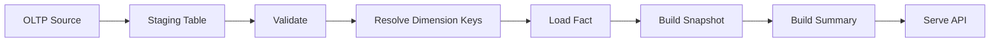

## Staging Table

```sql
create table mart.stg_case_transition (
    source_event_id text not null,
    case_id bigint not null,
    case_number text not null,
    from_status_code text,
    to_status_code text not null,
    office_id bigint not null,
    transition_at timestamptz not null,
    loaded_at timestamptz not null default now()
);
```

## Validation Example

```sql
select s.*
from mart.stg_case_transition s
left join mart.dim_case_status ds
    on ds.status_code = s.to_status_code
where ds.status_key is null;
```

## Load Fact

```sql
insert into mart.fact_case_transition (
    transition_id,
    case_id,
    case_number,
    from_status_key,
    to_status_key,
    office_key,
    transition_at,
    transition_date_key,
    source_event_id,
    source_system
)
select
    nextval('mart.fact_case_transition_seq') as transition_id,
    s.case_id,
    s.case_number,
    fs.status_key as from_status_key,
    ts.status_key as to_status_key,
    o.office_key,
    s.transition_at,
    to_char(s.transition_at::date, 'YYYYMMDD')::integer as transition_date_key,
    s.source_event_id,
    'case-service' as source_system
from mart.stg_case_transition s
left join mart.dim_case_status fs
    on fs.status_code = s.from_status_code
join mart.dim_case_status ts
    on ts.status_code = s.to_status_code
join mart.dim_office o
    on o.office_id = s.office_id
   and s.transition_at::date >= o.effective_from
   and (o.effective_to is null or s.transition_at::date <= o.effective_to);
```

---

# 17. Common Failure Modes

| Failure | Gejala | Root Cause | Fix |
|---|---|---|---|
| Double count | Total case lebih besar dari realita | Grain campur event dan case | Definisikan grain dan deduplicate key |
| Historical report berubah | Angka bulan lalu berubah | Pakai current master data | Gunakan SCD/snapshot |
| Query dashboard lambat | Aggregate scan besar | Tidak ada summary/MV | Precompute |
| Join salah versi dimension | Office masuk region yang salah | Tidak pakai effective date | Resolve dimension key by event date |
| Snapshot inconsistent | Case hilang/muncul salah | Cutoff tidak eksplisit | Simpan `snapshot_date` dan `cutoff_at` |
| Metric beda antar endpoint | Query logic duplikat | Tidak ada metric version | Metric dictionary + shared summary |
| Fact table bloat | Update/delete besar | Fact tidak append-only | Gunakan event fact/snapshot append |
| Partition tidak kepakai | Query full scan partition | Predicate tidak cocok partition key | Query pakai filter waktu eksplisit |

---

# 18. Practical Design Checklist

Sebelum membuat table OLAP, jawab ini dulu:

| Pertanyaan | Harus jelas |
|---|---|
| Satu row mewakili apa? | Grain |
| Apakah data historis harus immutable? | Event fact/snapshot |
| Apakah dimension bisa berubah? | SCD Type 1 atau Type 2 |
| Apakah report butuh cutoff? | Snapshot table |
| Apakah dashboard high traffic? | Summary table/materialized view |
| Apakah query filter by time? | Partition by date/time |
| Apakah report harus diaudit? | Metric version + reconciliation |
| Apakah API butuh response cepat? | Serving table, bukan raw fact |
| Apakah data besar? | Partition, index, load window |
| Apakah user bisa group/filter bebas? | Whitelist dan endpoint-specific query |

---

# 19. Recommended Practical Pattern

Untuk sistem case management/regulatory, pattern default yang saya rekomendasikan:

```text
1. app.enforcement_case
2. app.case_event / audit event
3. mart.dim_date
4. mart.dim_office with SCD Type 2
5. mart.dim_case_status
6. mart.fact_case_transition
7. mart.fact_case_daily_snapshot
8. reporting.summary_case_status_daily
9. reporting.regulatory_case_cutoff_snapshot
10. Jersey API reads summary/snapshot only
```

Diagram:

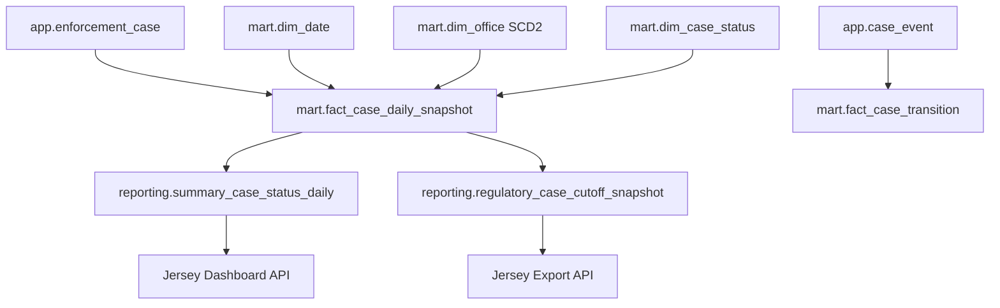

---

# 20. Ringkasan Seri 2

Inti seri ini:

```text
OLAP PostgreSQL yang sehat dimulai dari grain yang benar.
Fact menyimpan kejadian/measurement/snapshot.
Dimension memberi konteks.
SCD menjaga historis.
Snapshot menjaga cutoff.
Summary/materialized view menjaga performa serving.
```

Prinsip praktis:

| Prinsip | Implementasi |
|---|---|
| Jangan report langsung dari OLTP jika query berat | Buat fact/snapshot/summary |
| Jangan abaikan history dimension | Gunakan SCD Type 2 untuk atribut historis penting |
| Jangan hitung metric di banyak tempat | Simpan metric version dan summary |
| Jangan expose raw fact ke dashboard | Serve dari summary/MV |
| Jangan publish report tanpa invariant | Primary key, unique key, reconciliation |

---

# Status

**Seri 2/13 selesai.**

Rekomendasi materi selanjutnya: **Seri 3/13 - Analytical SQL: aggregate, filtered aggregate, window functions, grouping sets**.

---

**Sources:**

- [Documentation: 18: 5.5. Constraints](https://www.postgresql.org/docs/current/ddl-constraints.html?utm_source=chatgpt.com)

## Response:
7/15/2026, 8:00:44 PM

Lanjut ke **Seri 3/13**. Saya fokuskan ke SQL analitis yang paling sering dipakai di PostgreSQL OLAP: aggregate, filtered aggregate, window function, grouping sets, dan pola query production-grade.

# Seri 3/13 - Analytical SQL: Aggregate, Filtered Aggregate, Window Functions, Grouping Sets

Seri ini fokus ke **SQL analitis praktis** di PostgreSQL untuk OLAP. Targetnya bukan sekadar tahu sintaks, tetapi bisa mendesain query reporting yang:

```text id="lvnsd7"
benar secara business metric
stabil secara performa
mudah di-debug
bisa dipakai di summary table / materialized view / API reporting
```

PostgreSQL menyediakan aggregate functions, window functions, dan grouping operations seperti `GROUPING SETS`, `ROLLUP`, dan `CUBE`. Aggregate function menghasilkan satu nilai dari sekumpulan row, sedangkan window function menghitung lintas row yang berhubungan dengan current row tanpa menggabungkan row menjadi satu output row. ([PostgreSQL](https://www.postgresql.org/docs/current/functions-aggregate.html?utm_source=chatgpt.com))

---

# 1. Mental Model Analytical SQL

Dalam OLAP PostgreSQL, query biasanya bergerak dari:

```text id="6qmtql"
raw fact/snapshot
  -> filter scope
  -> join dimension
  -> aggregate/window/grouping
  -> summary result
  -> API response / dashboard / report
```

Diagram:

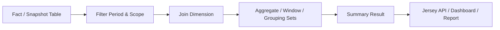

Untuk OLAP, query harus dimulai dari pertanyaan metric:

```text id="melvzv"
Apa grain input?
Apa grain output?
Apa filter wajib?
Apa dimension grouping?
Apa measure?
Apa cutoff/reporting period?
```

Contoh:

| Pertanyaan | Grain input | Grain output |
|---|---|---|
| Total case per status per hari | Case snapshot harian | Date + status |
| SLA breach rate per office | Case snapshot / SLA fact | Office + period |
| Average transition duration | Transition event | From status + to status |
| Running total case created | Case event | Date |
| Top office by backlog | Snapshot | Office |

---

# 2. Dataset Contoh

Agar konkret, kita pakai table dari seri sebelumnya.

## `mart.fact_case_daily_snapshot`

```sql id="vaibf0"
create table mart.fact_case_daily_snapshot (
    snapshot_date date not null,
    snapshot_date_key integer not null,
    case_id bigint not null,
    case_number text not null,
    status_key smallint not null,
    office_key bigint not null,
    officer_key bigint,
    violation_type_key bigint,
    opened_at timestamptz not null,
    closed_at timestamptz,
    age_days integer not null,
    sla_bucket text not null,
    is_sla_breached boolean not null,
    metric_version text not null,
    loaded_at timestamptz not null default now(),
    primary key (snapshot_date, case_id)
) partition by range (snapshot_date);
```

## `mart.fact_case_transition`

```sql id="cqci6h"
create table mart.fact_case_transition (
    transition_id bigint not null,
    case_id bigint not null,
    case_number text not null,
    from_status_key smallint,
    to_status_key smallint not null,
    office_key bigint not null,
    transition_at timestamptz not null,
    transition_date_key integer not null,
    duration_from_previous_seconds bigint,
    is_sla_breached boolean,
    source_event_id text not null,
    source_system text not null,
    loaded_at timestamptz not null default now(),
    primary key (transition_id, transition_at)
) partition by range (transition_at);
```

## Dimension table

```sql id="9xbz6q"
mart.dim_case_status(status_key, status_code, status_name, status_group)
mart.dim_office(office_key, office_id, office_name, region_code, region_name)
mart.dim_date(date_key, calendar_date, year, quarter, month, is_business_day)
```

---

# 3. Basic Aggregate

## 3.1 Count case per status

```sql id="f2tbrf"
select
    s.status_code,
    count(*) as total_cases
from mart.fact_case_daily_snapshot f
join mart.dim_case_status s
    on s.status_key = f.status_key
where f.snapshot_date = date '2026-07-15'
group by s.status_code
order by s.status_code;
```

Output grain:

```text id="7wofei"
satu row = satu status pada satu tanggal snapshot
```

Practical note:

| Bagian | Fungsi |
|---|---|
| `where snapshot_date = ...` | Membatasi partition/range |
| `group by status_code` | Menentukan output grain |
| `count(*)` | Measure |
| `order by` | Stabil untuk API/report |

---

## 3.2 Count case per office + status

```sql id="v0h4b7"
select
    o.office_id,
    o.office_name,
    s.status_code,
    count(*) as total_cases
from mart.fact_case_daily_snapshot f
join mart.dim_office o
    on o.office_key = f.office_key
join mart.dim_case_status s
    on s.status_key = f.status_key
where f.snapshot_date = date '2026-07-15'
group by
    o.office_id,
    o.office_name,
    s.status_code
order by
    o.office_name,
    s.status_code;
```

Output grain:

```text id="nhass2"
satu row = satu office + satu status pada satu snapshot date
```

**Invariant penting:** semua kolom non-aggregate di `select` harus sesuai dengan `group by`, kecuali secara fungsional bisa ditentukan dari grouped columns dalam kondisi tertentu. Untuk query reporting, lebih aman tulis eksplisit agar mudah direview.

---

# 4. Filtered Aggregate

`FILTER` sangat berguna untuk membuat beberapa metric dalam satu pass aggregate.

PostgreSQL mendukung aggregate expression dengan klausa `FILTER (WHERE ...)`, sehingga aggregate tertentu hanya menerima row yang memenuhi kondisi filter tersebut. ([PostgreSQL](https://www.postgresql.org/docs/current/functions-aggregate.html?utm_source=chatgpt.com))

## 4.1 Total case, breached case, active case

```sql id="z4t4bs"
select
    f.snapshot_date,
    o.office_id,
    o.office_name,

    count(*) as total_cases,

    count(*) filter (
        where f.is_sla_breached
    ) as breached_cases,

    count(*) filter (
        where s.status_group = 'ACTIVE'
    ) as active_cases,

    count(*) filter (
        where s.status_group = 'CLOSED'
    ) as closed_cases

from mart.fact_case_daily_snapshot f
join mart.dim_office o
    on o.office_key = f.office_key
join mart.dim_case_status s
    on s.status_key = f.status_key
where f.snapshot_date = date '2026-07-15'
group by
    f.snapshot_date,
    o.office_id,
    o.office_name
order by o.office_name;
```

Kenapa ini bagus?

| Tanpa `FILTER` | Dengan `FILTER` |
|---|---|
| Banyak query/subquery | Satu aggregate pass |
| Lebih sulit dibaca | Metric terlihat eksplisit |
| Risiko logic tidak konsisten | Kondisi metric dekat dengan aggregate |
| Bisa scan table berulang | Lebih efisien untuk banyak KPI sejenis |

---

## 4.2 SLA breach rate

```sql id="h2e3hr"
select
    f.snapshot_date,
    o.office_id,
    o.office_name,

    count(*) as total_cases,

    count(*) filter (
        where f.is_sla_breached
    ) as breached_cases,

    round(
        100.0 * count(*) filter (where f.is_sla_breached)
        / nullif(count(*), 0),
        2
    ) as breach_rate_percent

from mart.fact_case_daily_snapshot f
join mart.dim_office o
    on o.office_key = f.office_key
where f.snapshot_date = date '2026-07-15'
group by
    f.snapshot_date,
    o.office_id,
    o.office_name
order by breach_rate_percent desc;
```

Practical detail:

| Pattern | Alasan |
|---|---|
| `100.0 * ...` | Memaksa numeric calculation, bukan integer division |
| `nullif(count(*), 0)` | Menghindari division by zero |
| `round(..., 2)` | Output dashboard lebih bersih |

---

# 5. Conditional Aggregate dengan `CASE`

`FILTER` biasanya lebih bersih, tetapi `CASE` masih berguna untuk conditional sum atau custom scoring.

```sql id="ozvzly"
select
    o.region_code,

    sum(case when f.sla_bucket = '0-7' then 1 else 0 end) as bucket_0_7,
    sum(case when f.sla_bucket = '8-30' then 1 else 0 end) as bucket_8_30,
    sum(case when f.sla_bucket = '31-90' then 1 else 0 end) as bucket_31_90,
    sum(case when f.sla_bucket = '90+' then 1 else 0 end) as bucket_90_plus

from mart.fact_case_daily_snapshot f
join mart.dim_office o
    on o.office_key = f.office_key
where f.snapshot_date = date '2026-07-15'
group by o.region_code
order by o.region_code;
```

Rule praktis:

| Gunakan | Ketika |
|---|---|
| `FILTER` | Menghitung conditional count/sum sederhana |
| `CASE` | Membuat bucket, scoring, mapping, conditional expression kompleks |
| Dimension table | Bucket/mapping harus reusable dan governed |

---

# 6. Aggregate dengan Time Bucket

## 6.1 Monthly trend

```sql id="t7m3rw"
select
    date_trunc('month', f.snapshot_date)::date as report_month,
    s.status_group,
    count(*) as total_cases
from mart.fact_case_daily_snapshot f
join mart.dim_case_status s
    on s.status_key = f.status_key
where f.snapshot_date >= date '2026-01-01'
  and f.snapshot_date <  date '2026-07-01'
group by
    date_trunc('month', f.snapshot_date)::date,
    s.status_group
order by
    report_month,
    s.status_group;
```

Namun untuk production, lebih baik gunakan `dim_date` jika ada fiscal period, holiday, business day, atau reporting calendar khusus.

```sql id="0tvuo4"
select
    d.year,
    d.month,
    s.status_group,
    count(*) as total_cases
from mart.fact_case_daily_snapshot f
join mart.dim_date d
    on d.date_key = f.snapshot_date_key
join mart.dim_case_status s
    on s.status_key = f.status_key
where d.year = 2026
  and d.month between 1 and 6
group by
    d.year,
    d.month,
    s.status_group
order by
    d.year,
    d.month,
    s.status_group;
```

Practical recommendation:

| Kebutuhan | Pattern |
|---|---|
| Calendar month biasa | `date_trunc` cukup |
| Fiscal period | `dim_date` |
| Business day SLA | `dim_date` |
| Holiday-aware metric | `dim_date` |
| Regulatory reporting period | `dim_date` / `dim_reporting_period` |

---

# 7. `HAVING` untuk Filter Setelah Aggregate

`WHERE` memfilter row sebelum aggregate. `HAVING` memfilter group setelah aggregate.

PostgreSQL menjelaskan `GROUP BY` dan `HAVING` sebagai bagian dari table expression pipeline; `HAVING` digunakan untuk mengeliminasi group yang tidak memenuhi kondisi. ([PostgreSQL](https://www.postgresql.org/docs/current/queries-table-expressions.html?utm_source=chatgpt.com))

Contoh: tampilkan office dengan backlog di atas 1.000.

```sql id="f8kmy7"
select
    o.office_id,
    o.office_name,
    count(*) as backlog_cases
from mart.fact_case_daily_snapshot f
join mart.dim_office o
    on o.office_key = f.office_key
join mart.dim_case_status s
    on s.status_key = f.status_key
where f.snapshot_date = date '2026-07-15'
  and s.status_group = 'ACTIVE'
group by
    o.office_id,
    o.office_name
having count(*) > 1000
order by backlog_cases desc;
```

Rule:

| Clause | Dipakai untuk |
|---|---|
| `WHERE` | Filter row input |
| `GROUP BY` | Bentuk group |
| Aggregate | Hitung measure |
| `HAVING` | Filter hasil group |
| `ORDER BY` | Urutkan hasil akhir |

---

# 8. Window Functions

Window function cocok ketika kita butuh kalkulasi lintas row **tanpa menghilangkan detail row**. PostgreSQL menjelaskan bahwa window function melakukan kalkulasi atas row yang berhubungan dengan current row, tetapi tidak membuat row tergabung menjadi satu seperti aggregate biasa. ([PostgreSQL](https://www.postgresql.org/docs/current/tutorial-window.html?utm_source=chatgpt.com))

## 8.1 Ranking office by backlog

```sql id="wrjyxc"
with office_backlog as (
    select
        o.region_code,
        o.office_id,
        o.office_name,
        count(*) as backlog_cases
    from mart.fact_case_daily_snapshot f
    join mart.dim_office o
        on o.office_key = f.office_key
    join mart.dim_case_status s
        on s.status_key = f.status_key
    where f.snapshot_date = date '2026-07-15'
      and s.status_group = 'ACTIVE'
    group by
        o.region_code,
        o.office_id,
        o.office_name
)
select
    region_code,
    office_id,
    office_name,
    backlog_cases,
    rank() over (
        partition by region_code
        order by backlog_cases desc
    ) as rank_in_region
from office_backlog
order by
    region_code,
    rank_in_region;
```

Output grain:

```text id="etdlkl"
satu row = satu office, dilengkapi ranking di dalam region
```

Window anatomy:

| Bagian | Fungsi |
|---|---|
| `over (...)` | Menandai window function |
| `partition by region_code` | Ranking di-reset per region |
| `order by backlog_cases desc` | Urutan ranking |
| `rank()` | Memberi ranking dengan gap jika tie |

---

## 8.2 Running total daily created cases

```sql id="2ia919"
with daily_created as (
    select
        transition_at::date as event_date,
        count(*) as created_cases
    from mart.fact_case_transition t
    join mart.dim_case_status s
        on s.status_key = t.to_status_key
    where t.transition_at >= timestamptz '2026-01-01 00:00:00+00'
      and t.transition_at <  timestamptz '2026-02-01 00:00:00+00'
      and s.status_code = 'OPEN'
    group by transition_at::date
)
select
    event_date,
    created_cases,
    sum(created_cases) over (
        order by event_date
        rows between unbounded preceding and current row
    ) as running_created_cases
from daily_created
order by event_date;
```

Practical note:

| Window frame | Makna |
|---|---|
| `rows between unbounded preceding and current row` | Running total dari awal sampai current row |
| `order by event_date` | Urutan akumulasi |
| Pre-aggregate CTE | Window bekerja pada daily row, bukan raw event |

---

## 8.3 Moving average

```sql id="lj6yvh"
with daily_backlog as (
    select
        f.snapshot_date,
        count(*) as backlog_cases
    from mart.fact_case_daily_snapshot f
    join mart.dim_case_status s
        on s.status_key = f.status_key
    where f.snapshot_date >= date '2026-01-01'
      and f.snapshot_date <  date '2026-02-01'
      and s.status_group = 'ACTIVE'
    group by f.snapshot_date
)
select
    snapshot_date,
    backlog_cases,
    round(
        avg(backlog_cases) over (
            order by snapshot_date
            rows between 6 preceding and current row
        ),
        2
    ) as moving_avg_7d
from daily_backlog
order by snapshot_date;
```

Gunakan untuk:

```text id="tqw6l7"
trend smoothing
dashboard operational
anomaly detection ringan
capacity monitoring
```

---

## 8.4 `lag` / `lead` untuk perubahan antar periode

```sql id="4hivkf"
with daily_backlog as (
    select
        f.snapshot_date,
        count(*) as backlog_cases
    from mart.fact_case_daily_snapshot f
    join mart.dim_case_status s
        on s.status_key = f.status_key
    where f.snapshot_date >= date '2026-01-01'
      and f.snapshot_date <  date '2026-02-01'
      and s.status_group = 'ACTIVE'
    group by f.snapshot_date
)
select
    snapshot_date,
    backlog_cases,
    lag(backlog_cases) over (
        order by snapshot_date
    ) as previous_day_backlog,
    backlog_cases
        - lag(backlog_cases) over (order by snapshot_date)
        as day_over_day_change
from daily_backlog
order by snapshot_date;
```

Practical use:

| Function | Use case |
|---|---|
| `lag` | Compare dengan previous row |
| `lead` | Compare dengan next row |
| `first_value` | Baseline period |
| `last_value` | Perlu hati-hati dengan frame |
| `rank` / `dense_rank` | Top-N |
| `row_number` | Dedup latest row |

---

# 9. Dedup / Latest Row dengan Window Function

Untuk OLAP pipeline, sering perlu ambil event terakhir per case.

```sql id="4pimqs"
with ranked_event as (
    select
        t.*,
        row_number() over (
            partition by t.case_id
            order by t.transition_at desc, t.transition_id desc
        ) as rn
    from mart.fact_case_transition t
    where t.transition_at < timestamptz '2026-07-16 00:00:00+00'
)
select
    case_id,
    case_number,
    to_status_key,
    office_key,
    transition_at
from ranked_event
where rn = 1;
```

Pola ini berguna untuk:

```text id="7d7lm5"
current state reconstruction
snapshot generation
latest assignment
latest escalation
latest decision
```

Namun jangan terlalu sering menjalankan latest-row reconstruction dari raw event besar untuk dashboard. Untuk high traffic, hasilnya sebaiknya dimaterialisasi ke snapshot/summary.

---

# 10. Top-N per Group

Contoh: top 5 office dengan backlog tertinggi per region.

```sql id="cbirnr"
with office_backlog as (
    select
        o.region_code,
        o.office_id,
        o.office_name,
        count(*) as backlog_cases
    from mart.fact_case_daily_snapshot f
    join mart.dim_office o
        on o.office_key = f.office_key
    join mart.dim_case_status s
        on s.status_key = f.status_key
    where f.snapshot_date = date '2026-07-15'
      and s.status_group = 'ACTIVE'
    group by
        o.region_code,
        o.office_id,
        o.office_name
),
ranked as (
    select
        *,
        dense_rank() over (
            partition by region_code
            order by backlog_cases desc
        ) as region_rank
    from office_backlog
)
select
    region_code,
    office_id,
    office_name,
    backlog_cases,
    region_rank
from ranked
where region_rank <= 5
order by
    region_code,
    region_rank,
    office_name;
```

`rank` vs `dense_rank`:

| Function | Tie behavior |
|---|---|
| `rank()` | Ada gap: 1, 1, 3 |
| `dense_rank()` | Tidak ada gap: 1, 1, 2 |
| `row_number()` | Selalu unik: 1, 2, 3 |

---

# 11. Percentile / Ordered-Set Aggregate

Untuk SLA atau duration analysis, rata-rata sering menipu. Gunakan percentile.

```sql id="0gq5vh"
select
    s_from.status_code as from_status,
    s_to.status_code as to_status,

    count(*) as transition_count,

    percentile_cont(0.50) within group (
        order by t.duration_from_previous_seconds
    ) as p50_duration_seconds,

    percentile_cont(0.90) within group (
        order by t.duration_from_previous_seconds
    ) as p90_duration_seconds,

    percentile_cont(0.95) within group (
        order by t.duration_from_previous_seconds
    ) as p95_duration_seconds

from mart.fact_case_transition t
left join mart.dim_case_status s_from
    on s_from.status_key = t.from_status_key
join mart.dim_case_status s_to
    on s_to.status_key = t.to_status_key
where t.transition_at >= timestamptz '2026-01-01 00:00:00+00'
  and t.transition_at <  timestamptz '2026-02-01 00:00:00+00'
  and t.duration_from_previous_seconds is not null
group by
    s_from.status_code,
    s_to.status_code
order by
    p95_duration_seconds desc;
```

PostgreSQL aggregate documentation mencakup ordered-set aggregate functions, termasuk aggregate yang menggunakan `WITHIN GROUP` untuk operasi berbasis ordering. ([PostgreSQL](https://www.postgresql.org/docs/current/functions-aggregate.html?utm_source=chatgpt.com))

Practical use:

| Metric | Lebih baik untuk |
|---|---|
| `avg` | Beban merata, distribusi normal |
| `p50` | Typical user/case |
| `p90` | Tail behavior |
| `p95` / `p99` | SLA risk / bottleneck |
| `max` | Outlier investigation, bukan KPI utama |

---

# 12. `GROUPING SETS`

`GROUPING SETS` memungkinkan menghasilkan beberapa level aggregate dalam satu query. PostgreSQL documentation menjelaskan bahwa `CUBE` dan `ROLLUP` dapat dipakai langsung di `GROUP BY` atau di dalam `GROUPING SETS`. ([PostgreSQL](https://www.postgresql.org/docs/current/queries-table-expressions.html?utm_source=chatgpt.com))

## 12.1 Multi-level summary

Misal butuh:

```text id="2arifn"
1. total per region + status
2. total per region
3. grand total
```

Query:

```sql id="2v6auz"
select
    o.region_code,
    s.status_group,
    count(*) as total_cases,
    grouping(o.region_code) as is_region_total,
    grouping(s.status_group) as is_status_total
from mart.fact_case_daily_snapshot f
join mart.dim_office o
    on o.office_key = f.office_key
join mart.dim_case_status s
    on s.status_key = f.status_key
where f.snapshot_date = date '2026-07-15'
group by grouping sets (
    (o.region_code, s.status_group),
    (o.region_code),
    ()
)
order by
    o.region_code nulls last,
    s.status_group nulls last;
```

Output concept:

| region | status_group | Makna |
|---|---|---|
| `R1` | `ACTIVE` | Detail region-status |
| `R1` | `NULL` | Total region |
| `NULL` | `NULL` | Grand total |

Gunakan `grouping(...)` untuk membedakan `NULL` asli vs `NULL` karena subtotal.

---

## 12.2 Labeling subtotal

```sql id="k3cciz"
select
    case
        when grouping(o.region_code) = 1 then 'ALL_REGIONS'
        else o.region_code
    end as region_code,

    case
        when grouping(s.status_group) = 1 then 'ALL_STATUS_GROUPS'
        else s.status_group
    end as status_group,

    count(*) as total_cases

from mart.fact_case_daily_snapshot f
join mart.dim_office o
    on o.office_key = f.office_key
join mart.dim_case_status s
    on s.status_key = f.status_key
where f.snapshot_date = date '2026-07-15'
group by grouping sets (
    (o.region_code, s.status_group),
    (o.region_code),
    ()
)
order by
    region_code,
    status_group;
```

---

# 13. `ROLLUP`

`ROLLUP` cocok untuk hierarchical subtotal.

Contoh hierarchy:

```text id="5e6h3c"
region -> office -> status
```

```sql id="09vkng"
select
    o.region_code,
    o.office_name,
    s.status_group,
    count(*) as total_cases
from mart.fact_case_daily_snapshot f
join mart.dim_office o
    on o.office_key = f.office_key
join mart.dim_case_status s
    on s.status_key = f.status_key
where f.snapshot_date = date '2026-07-15'
group by rollup (
    o.region_code,
    o.office_name,
    s.status_group
)
order by
    o.region_code nulls last,
    o.office_name nulls last,
    s.status_group nulls last;
```

ROLLUP menghasilkan:

```text id="erc30e"
region + office + status
region + office subtotal
region subtotal
grand total
```

Practical use:

| Cocok | Tidak cocok |
|---|---|
| Hierarchical report | Dimension tidak punya hierarchy |
| Excel-like subtotal | Dashboard API sederhana |
| Regulatory summary | High-cardinality ad-hoc cube |

---

# 14. `CUBE`

`CUBE` menghasilkan semua kombinasi subtotal dari dimension yang diberikan.

Contoh:

```sql id="qf6flp"
select
    o.region_code,
    s.status_group,
    f.sla_bucket,
    count(*) as total_cases
from mart.fact_case_daily_snapshot f
join mart.dim_office o
    on o.office_key = f.office_key
join mart.dim_case_status s
    on s.status_key = f.status_key
where f.snapshot_date = date '2026-07-15'
group by cube (
    o.region_code,
    s.status_group,
    f.sla_bucket
)
order by
    o.region_code nulls last,
    s.status_group nulls last,
    f.sla_bucket nulls last;
```

Hati-hati: `CUBE` bisa menghasilkan banyak kombinasi. Untuk 3 dimension, jumlah grouping set maksimal adalah 2³ = 8. Untuk 6 dimension, 2⁶ = 64. Itu bisa mahal jika cardinality besar.

Practical rule:

| Jumlah dimension | Rekomendasi |
|---:|---|
| 2-3 | Masih masuk akal |
| 4-5 | Evaluasi cardinality dan kebutuhan |
| >5 | Hindari di API sync; precompute atau batasi |

---

# 15. Cohort / Lifecycle Analysis

Contoh: dari case yang dibuat per bulan, berapa yang closed dalam 7/30/90 hari.

```sql id="2sdnaz"
with case_lifecycle as (
    select
        case_id,
        min(transition_at) filter (
            where to_status_key = (
                select status_key
                from mart.dim_case_status
                where status_code = 'OPEN'
            )
        ) as opened_at,

        min(transition_at) filter (
            where to_status_key = (
                select status_key
                from mart.dim_case_status
                where status_code = 'CLOSED'
            )
        ) as closed_at
    from mart.fact_case_transition
    where transition_at >= timestamptz '2026-01-01 00:00:00+00'
      and transition_at <  timestamptz '2026-07-01 00:00:00+00'
    group by case_id
),
cohort as (
    select
        date_trunc('month', opened_at)::date as opened_month,
        case_id,
        opened_at,
        closed_at,
        extract(epoch from (closed_at - opened_at)) / 86400.0
            as days_to_close
    from case_lifecycle
    where opened_at is not null
)
select
    opened_month,
    count(*) as opened_cases,

    count(*) filter (
        where closed_at is not null
    ) as closed_cases,

    count(*) filter (
        where days_to_close <= 7
    ) as closed_within_7d,

    count(*) filter (
        where days_to_close <= 30
    ) as closed_within_30d,

    count(*) filter (
        where days_to_close <= 90
    ) as closed_within_90d

from cohort
group by opened_month
order by opened_month;
```

Production improvement:

| Masalah | Improvement |
|---|---|
| Subquery status berulang | Pre-resolve status key di app/job |
| Raw transition scan mahal | Buat `fact_case_lifecycle` |
| Banyak dashboard pakai cohort | Buat summary cohort table |
| Historical logic berubah | Simpan `metric_version` |

---

# 16. Funnel / State Transition Analysis

Contoh: hitung jumlah transition antar status.

```sql id="sd0cmh"
select
    coalesce(s_from.status_code, 'START') as from_status,
    s_to.status_code as to_status,
    count(*) as transition_count,
    round(avg(t.duration_from_previous_seconds), 2) as avg_duration_seconds,
    percentile_cont(0.95) within group (
        order by t.duration_from_previous_seconds
    ) as p95_duration_seconds
from mart.fact_case_transition t
left join mart.dim_case_status s_from
    on s_from.status_key = t.from_status_key
join mart.dim_case_status s_to
    on s_to.status_key = t.to_status_key
where t.transition_at >= timestamptz '2026-01-01 00:00:00+00'
  and t.transition_at <  timestamptz '2026-02-01 00:00:00+00'
group by
    coalesce(s_from.status_code, 'START'),
    s_to.status_code
order by transition_count desc;
```

Use case:

```text id="2f5r8r"
bottleneck lifecycle
unexpected transition
escalation pattern
SLA risk by state
process mining ringan
```

---

# 17. Aging Bucket Analysis

```sql id="8lv18y"
select
    o.region_code,
    f.sla_bucket,
    count(*) as total_cases,
    count(*) filter (where f.is_sla_breached) as breached_cases
from mart.fact_case_daily_snapshot f
join mart.dim_office o
    on o.office_key = f.office_key
join mart.dim_case_status s
    on s.status_key = f.status_key
where f.snapshot_date = date '2026-07-15'
  and s.status_group = 'ACTIVE'
group by
    o.region_code,
    f.sla_bucket
order by
    o.region_code,
    case f.sla_bucket
        when '0-7' then 1
        when '8-30' then 2
        when '31-90' then 3
        when '90+' then 4
        else 99
    end;
```

Practical note: ordering bucket pakai `CASE` boleh, tetapi untuk enterprise lebih bagus punya `dim_sla_bucket`:

```text id="cy5ojq"
bucket_code
bucket_label
min_age_days
max_age_days
sort_order
metric_version
```

---

# 18. CTE untuk Query Decomposition

CTE membantu memecah query analitis kompleks menjadi tahap yang bisa dibaca.

```sql id="opaf5k"
with active_snapshot as (
    select
        f.*
    from mart.fact_case_daily_snapshot f
    join mart.dim_case_status s
        on s.status_key = f.status_key
    where f.snapshot_date = date '2026-07-15'
      and s.status_group = 'ACTIVE'
),
office_aggregate as (
    select
        office_key,
        count(*) as active_cases,
        count(*) filter (where is_sla_breached) as breached_cases,
        avg(age_days) as avg_age_days
    from active_snapshot
    group by office_key
),
ranked_office as (
    select
        *,
        rank() over (
            order by breached_cases desc, active_cases desc
        ) as risk_rank
    from office_aggregate
)
select
    o.office_id,
    o.office_name,
    r.active_cases,
    r.breached_cases,
    round(r.avg_age_days, 2) as avg_age_days,
    r.risk_rank
from ranked_office r
join mart.dim_office o
    on o.office_key = r.office_key
where r.risk_rank <= 20
order by r.risk_rank;
```

Practical rule:

| CTE bagus untuk | Hati-hati jika |
|---|---|
| Membagi logic metric | Query jadi terlalu banyak tahap |
| Debugging intermediate result | CTE dipakai tanpa cek plan |
| Reuse hasil aggregate | Data intermediate sangat besar |
| Readability | Predicate pushdown tidak sesuai harapan |

Untuk performa, tetap validasi dengan `EXPLAIN`. PostgreSQL menyatakan `EXPLAIN` digunakan untuk melihat query plan yang dibuat planner, dan pemilihan plan yang tepat sangat penting untuk performa. ([PostgreSQL](https://www.postgresql.org/docs/current/using-explain.html?utm_source=chatgpt.com))

---

# 19. Temporary Table untuk Analytical Staging

Untuk report berat yang punya banyak tahap, temporary table kadang lebih praktis daripada satu SQL raksasa.

```sql id="r4a8x7"
create temporary table tmp_active_case_snapshot
on commit drop
as
select
    f.*
from mart.fact_case_daily_snapshot f
join mart.dim_case_status s
    on s.status_key = f.status_key
where f.snapshot_date = date '2026-07-15'
  and s.status_group = 'ACTIVE';

analyze tmp_active_case_snapshot;
```

Lalu query berikutnya:

```sql id="z4rhbp"
select
    office_key,
    count(*) as active_cases,
    count(*) filter (where is_sla_breached) as breached_cases
from tmp_active_case_snapshot
group by office_key;
```

Gunakan temporary table ketika:

| Kondisi | Alasan |
|---|---|
| Intermediate result dipakai berkali-kali | Menghindari recompute |
| Query sangat kompleks | Debug lebih mudah |
| Butuh index sementara | Bisa buat index temp |
| Report batch/offline | Tidak masalah multi-step |

Jangan gunakan temp table untuk endpoint dashboard sync yang harus sangat cepat kecuali benar-benar terkendali.

---

# 20. Insert Aggregate ke Summary Table

Query analitis sering berakhir sebagai load summary.

```sql id="rco6f5"
insert into reporting.summary_case_status_daily (
    report_date,
    office_key,
    status_key,
    total_cases,
    breached_cases,
    calculated_at,
    metric_version
)
select
    f.snapshot_date as report_date,
    f.office_key,
    f.status_key,
    count(*) as total_cases,
    count(*) filter (where f.is_sla_breached) as breached_cases,
    now() as calculated_at,
    'summary_case_status_daily:v1' as metric_version
from mart.fact_case_daily_snapshot f
where f.snapshot_date = #{snapshotDate}
group by
    f.snapshot_date,
    f.office_key,
    f.status_key
on conflict (report_date, office_key, status_key)
do update set
    total_cases = excluded.total_cases,
    breached_cases = excluded.breached_cases,
    calculated_at = excluded.calculated_at,
    metric_version = excluded.metric_version;
```

Production invariant:

```text id="8zf4i9"
Summary load harus idempotent.
Rerun untuk tanggal yang sama tidak boleh menggandakan angka.
```

---

# 21. Materialized View dengan Analytical SQL

```sql id="xmdbjl"
create materialized view reporting.mv_monthly_case_kpi as
select
    date_trunc('month', f.snapshot_date)::date as report_month,
    o.region_code,
    s.status_group,

    count(*) as total_cases,
    count(*) filter (where f.is_sla_breached) as breached_cases,

    round(
        100.0 * count(*) filter (where f.is_sla_breached)
        / nullif(count(*), 0),
        2
    ) as breach_rate_percent,

    avg(f.age_days) as avg_age_days,
    percentile_cont(0.95) within group (
        order by f.age_days
    ) as p95_age_days

from mart.fact_case_daily_snapshot f
join mart.dim_office o
    on o.office_key = f.office_key
join mart.dim_case_status s
    on s.status_key = f.status_key
group by
    date_trunc('month', f.snapshot_date)::date,
    o.region_code,
    s.status_group;
```

Index:

```sql id="oa6irq"
create index idx_mv_monthly_case_kpi_lookup
on reporting.mv_monthly_case_kpi (
    report_month,
    region_code,
    status_group
);
```

PostgreSQL materialized view menyimpan hasil query dan dapat di-refresh ketika dibutuhkan, sehingga cocok untuk hasil analytical SQL yang mahal tetapi bisa stale dalam batas tertentu. ([PostgreSQL](https://www.postgresql.org/docs/current/functions-aggregate.html?utm_source=chatgpt.com))

---

# 22. Practical Query Performance Notes

## 22.1 Aggregate biasanya butuh memory

Aggregate besar biasanya menggunakan hash aggregate atau sort/group aggregate, bergantung data dan plan. PostgreSQL resource configuration menjelaskan bahwa hash-based operation sensitif terhadap memory, dan batas memory hash table dihitung dari `work_mem` dikalikan `hash_mem_multiplier`. ([PostgreSQL](https://www.postgresql.org/docs/current/runtime-config-resource.html?utm_source=chatgpt.com))

Practical implication:

| Gejala | Kemungkinan |
|---|---|
| Query aggregate lambat | Scan besar, sort/hash spill |
| Temp file besar | `work_mem` tidak cukup untuk sort/hash |
| CPU tinggi | High-cardinality grouping |
| Plan berubah-ubah | Statistik stale / cardinality salah |

---

## 22.2 Selalu cek plan

Gunakan:

```sql id="681p61"
explain (analyze, buffers)
select
    f.snapshot_date,
    f.office_key,
    f.status_key,
    count(*) as total_cases
from mart.fact_case_daily_snapshot f
where f.snapshot_date = date '2026-07-15'
group by
    f.snapshot_date,
    f.office_key,
    f.status_key;
```

Yang dilihat:

| Plan clue | Makna |
|---|---|
| `Seq Scan` | Scan table/partition |
| `Index Scan` | Pakai index |
| `Bitmap Heap Scan` | Gabungan index bitmap + heap fetch |
| `HashAggregate` | Aggregate via hash table |
| `GroupAggregate` | Aggregate via sorted input |
| `Sort Method: external merge` | Sort spill ke disk |
| `Buffers` | I/O/caching behavior |
| `Rows Removed by Filter` | Banyak row dibaca tapi dibuang |
| Estimated vs actual rows | Statistik/planner quality |

---

# 23. Indexing untuk Analytical SQL

## 23.1 Snapshot date + dimensions

```sql id="o7my6g"
create index idx_snapshot_date_office_status
on mart.fact_case_daily_snapshot_2026_07 (
    snapshot_date,
    office_key,
    status_key
);
```

Cocok untuk:

```sql id="nq2yvm"
where snapshot_date = ?
group by office_key, status_key
```

---

## 23.2 Date range + office

```sql id="rhvz7h"
create index idx_snapshot_office_date
on mart.fact_case_daily_snapshot_2026_07 (
    office_key,
    snapshot_date
);
```

Cocok untuk:

```sql id="tslow4"
where office_key = ?
  and snapshot_date >= ?
  and snapshot_date < ?
```

---

## 23.3 Covering index untuk serving query

```sql id="a8as1d"
create index idx_summary_case_status_daily_cover
on reporting.summary_case_status_daily (
    office_key,
    report_date,
    status_key
)
include (
    total_cases,
    breached_cases,
    metric_version,
    calculated_at
);
```

PostgreSQL mendukung multicolumn index dan include columns pada index tertentu; desain index harus mengikuti predicate dan kolom output yang sering dipakai query. ([PostgreSQL](https://www.postgresql.org/docs/current/functions-aggregate.html?utm_source=chatgpt.com))

---

# 24. Anti-pattern Analytical SQL

| Anti-pattern | Masalah | Perbaikan |
|---|---|---|
| `select *` di report | I/O boros, mapping berat | Select kolom eksplisit |
| Filter tanggal optional | Bisa full scan | Date range wajib |
| Aggregate raw OLTP untuk dashboard | Membebani transaksi | Summary/MV |
| `group by` terlalu banyak dimension | Cardinality meledak | Batasi dimension / precompute |
| Window function langsung di raw event besar | Sort besar | Pre-aggregate dulu |
| `cube` banyak dimension | Output combinatorial | `grouping sets` spesifik |
| Dynamic SQL raw dari request | Injection/logical abuse | Whitelist enum |
| Tidak pakai `nullif` untuk rate | Division by zero | `nullif(denominator, 0)` |
| Tidak ada metric version | Angka tidak defensible | Simpan `metric_version` |
| Tidak cek `EXPLAIN ANALYZE` | Tuning asumtif | Validasi plan |

---

# 25. Practical API-Oriented Query Design

Untuk endpoint:

```http id="xy7k6g"
GET /reports/case-kpi?period=2026-07&officeId=10
```

Query sebaiknya baca summary:

```sql id="tmrwb7"
select
    report_date,
    status_key,
    total_cases,
    breached_cases,
    round(
        100.0 * breached_cases / nullif(total_cases, 0),
        2
    ) as breach_rate_percent,
    calculated_at,
    metric_version
from reporting.summary_case_status_daily
where office_key = #{officeKey}
  and report_date >= #{fromDate}
  and report_date < #{toDate}
order by report_date, status_key;
```

Bukan:

```sql id="9m1o7u"
select
    ...
from app.enforcement_case c
join app.case_event e ...
join master.office o ...
join ...
group by ...
```

Service guardrail:

```java id="4x6w0y"
public CaseKpiResponse getCaseKpi(YearMonth period, long officeId) {
    LocalDate from = period.atDay(1);
    LocalDate to = period.plusMonths(1).atDay(1);

    List<CaseKpiRow> rows = mapper.findCaseKpi(from, to, officeId);

    return CaseKpiResponse.from(period, officeId, rows);
}
```

Mapper:

```java id="n5mjuj"
public interface CaseKpiMapper {
    List<CaseKpiRow> findCaseKpi(
        @Param("fromDate") LocalDate fromDate,
        @Param("toDate") LocalDate toDate,
        @Param("officeKey") long officeKey
    );
}
```

---

# 26. MyBatis XML Pattern untuk Analytical SQL

```xml id="l5s0pn"
<select id="findCaseKpi" resultMap="CaseKpiRowMap">
    select
        report_date,
        status_key,
        total_cases,
        breached_cases,
        round(
            100.0 * breached_cases / nullif(total_cases, 0),
            2
        ) as breach_rate_percent,
        calculated_at,
        metric_version
    from reporting.summary_case_status_daily
    where office_key = #{officeKey}
      and report_date >= #{fromDate}
      and report_date < #{toDate}
    order by report_date, status_key
</select>

<resultMap id="CaseKpiRowMap"
           type="com.company.reporting.CaseKpiRow">
    <result property="reportDate" column="report_date"/>
    <result property="statusKey" column="status_key"/>
    <result property="totalCases" column="total_cases"/>
    <result property="breachedCases" column="breached_cases"/>
    <result property="breachRatePercent" column="breach_rate_percent"/>
    <result property="calculatedAt" column="calculated_at"/>
    <result property="metricVersion" column="metric_version"/>
</resultMap>
```

Pattern aman untuk dynamic grouping:

```java id="k6qprl"
public enum CaseKpiGroupBy {
    STATUS,
    OFFICE,
    REGION
}
```

Jangan inject raw column name dari request.

```xml id="9kz3ui"
<choose>
    <when test="groupBy == 'STATUS'">
        s.status_group
    </when>
    <when test="groupBy == 'OFFICE'">
        o.office_id
    </when>
    <when test="groupBy == 'REGION'">
        o.region_code
    </when>
    <otherwise>
        s.status_group
    </otherwise>
</choose>
```

Namun untuk report production, saya lebih menyarankan **endpoint/query spesifik** daripada terlalu banyak dynamic grouping dalam satu mapper.

---

# 27. Testing Analytical SQL

Test minimal:

| Test | Tujuan |
|---|---|
| Empty dataset | Tidak error, rate null/0 sesuai kontrak |
| Single group | Count benar |
| Multiple status | Grouping benar |
| SLA breached + non-breached | Filtered aggregate benar |
| Duplicate source event | Tidak double count |
| Null dimension | Behavior jelas |
| Boundary date | `from inclusive`, `to exclusive` benar |
| Timezone | `timestamptz` tidak geser period |
| Historical dimension | Join SCD sesuai event date |
| Re-run summary | Idempotent |

Contoh boundary date:

```sql id="oo4c5x"
where event_at >= #{fromInclusive}
  and event_at <  #{toExclusive}
```

Hindari:

```sql id="g2upt3"
where event_at between #{fromDate} and #{toDate}
```

Untuk timestamp, `between` sering menimbulkan bug boundary akhir hari.

---

# 28. Decision Table: Query Langsung, Summary, atau MV?

| Kebutuhan | Query langsung | Summary table | Materialized view |
|---|---:|---:|---:|
| Dataset kecil | Baik | Bisa overkill | Bisa overkill |
| Dashboard sering dibuka | Buruk | Sangat baik | Baik |
| Perlu incremental refresh | Kurang cocok | Sangat baik | Kurang fleksibel |
| Query kompleks tapi refresh periodik | Sedang | Baik | Baik |
| Regulatory cutoff | Buruk | Baik | Sedang |
| Auditability tinggi | Sedang | Sangat baik | Sedang |
| Banyak metadata metric | Sedang | Sangat baik | Sedang |
| Full recompute acceptable | Baik | Sedang | Baik |

---

# 29. Mini End-to-End: Daily SLA KPI

## Step 1 - Build daily aggregate

```sql id="bjf6si"
insert into reporting.summary_sla_daily (
    report_date,
    office_key,
    total_cases,
    breached_cases,
    breach_rate_percent,
    p95_age_days,
    calculated_at,
    metric_version
)
select
    f.snapshot_date,
    f.office_key,
    count(*) as total_cases,
    count(*) filter (where f.is_sla_breached) as breached_cases,
    round(
        100.0 * count(*) filter (where f.is_sla_breached)
        / nullif(count(*), 0),
        2
    ) as breach_rate_percent,
    percentile_cont(0.95) within group (
        order by f.age_days
    ) as p95_age_days,
    now(),
    'summary_sla_daily:v1'
from mart.fact_case_daily_snapshot f
where f.snapshot_date = #{snapshotDate}
group by
    f.snapshot_date,
    f.office_key
on conflict (report_date, office_key)
do update set
    total_cases = excluded.total_cases,
    breached_cases = excluded.breached_cases,
    breach_rate_percent = excluded.breach_rate_percent,
    p95_age_days = excluded.p95_age_days,
    calculated_at = excluded.calculated_at,
    metric_version = excluded.metric_version;
```

## Step 2 - Serve trend via API

```sql id="jh57wb"
select
    report_date,
    total_cases,
    breached_cases,
    breach_rate_percent,
    p95_age_days,
    calculated_at,
    metric_version
from reporting.summary_sla_daily
where office_key = #{officeKey}
  and report_date >= #{fromDate}
  and report_date < #{toDate}
order by report_date;
```

## Step 3 - Add running average

```sql id="tr7o9p"
select
    report_date,
    breach_rate_percent,
    round(
        avg(breach_rate_percent) over (
            order by report_date
            rows between 6 preceding and current row
        ),
        2
    ) as breach_rate_7d_avg
from reporting.summary_sla_daily
where office_key = #{officeKey}
  and report_date >= #{fromDate}
  and report_date < #{toDate}
order by report_date;
```

---

# 30. Practical Checklist

Sebelum query analytical dipakai production:

| Checklist | Wajib? |
|---|---|
| Grain input jelas | Ya |
| Grain output jelas | Ya |
| Filter waktu wajib | Ya |
| Metric definition jelas | Ya |
| `nullif` untuk denominator | Ya |
| `EXPLAIN ANALYZE` sudah dicek | Ya |
| Index sesuai filter/grouping | Ya |
| Query tidak langsung menghajar OLTP high traffic | Ya |
| Summary/MV dipakai untuk dashboard | Ya |
| Metric version disimpan | Ya |
| Boundary date tested | Ya |
| Query punya timeout | Ya |
| Row count output masuk akal untuk API | Ya |

---

# 31. Ringkasan Seri 3

Inti seri ini:

```text id="rdafve"
Aggregate = meringkas row menjadi metric.
Filtered aggregate = banyak KPI conditional dalam satu query.
Window function = menghitung lintas row tanpa menghilangkan row detail.
Grouping sets / rollup / cube = multi-level subtotal.
CTE/temp table = query decomposition.
Summary/MV = serving pattern untuk production.
```

Rule praktis paling penting:

| Rule | Maksud |
|---|---|
| Mulai dari grain | Hindari double count |
| Filter period wajib | Hindari full scan |
| Pre-aggregate sebelum window besar | Hindari sort besar |
| Gunakan `FILTER` untuk KPI conditional | Query lebih bersih |
| Gunakan `GROUPING SETS` untuk subtotal spesifik | Lebih terkendali daripada `CUBE` |
| Jangan dashboard langsung ke raw OLTP | Pakai summary/MV |
| Selalu cek `EXPLAIN ANALYZE` | Jangan tuning berdasarkan feeling |

---

# Status

**Seri 3/13 selesai.**

Rekomendasi materi selanjutnya: **Seri 4/13 - Partitioning Strategy for OLAP Fact Tables**.

---

**Sources:**

- [Documentation: 18: 9.21. Aggregate Functions](https://www.postgresql.org/docs/current/functions-aggregate.html?utm_source=chatgpt.com)

## Response:
7/15/2026, 8:03:07 PM

Lanjut ke **Seri 4/13**. Fokusnya praktik desain partitioning untuk fact table OLAP: memilih key, range/list/hash, pruning, rolling partition, index per partition, dan failure mode production.

# Seri 4/13 - Partitioning Strategy for OLAP Fact Tables

Seri ini fokus ke **partitioning PostgreSQL untuk fact table OLAP**: kapan dipakai, cara memilih partition key, desain range/list/hash, pruning, index per partition, rolling partition, retention, dan failure mode production.

Intinya:

```text
Partitioning bukan magic performance booster.
Partitioning adalah physical design untuk membatasi data yang dibaca,
memudahkan retention, mempercepat maintenance, dan membuat fact table besar lebih operasional.
```

PostgreSQL declarative partitioning memungkinkan table dibagi menjadi partitions berdasarkan partition method dan partition key. Parent partitioned table bersifat “virtual” dan tidak menyimpan data sendiri; data tersimpan di child partitions, dan row yang diinsert ke parent akan diarahkan ke partition yang sesuai berdasarkan partition key. ([PostgreSQL](https://www.postgresql.org/docs/current/ddl-partitioning.html))

---

## 1. Mental Model

Untuk OLAP, partitioning paling sering dipakai pada table seperti:

```text
mart.fact_case_transition
mart.fact_case_daily_snapshot
mart.fact_sla_measurement
mart.fact_payment_event
mart.fact_audit_event
reporting.regulatory_case_snapshot
```

Alasan utamanya:

| Tujuan | Penjelasan praktis |
|---|---|
| **Partition pruning** | Query hanya membaca partition yang relevan |
| **Retention cepat** | Drop/detach partition lama, bukan delete jutaan row |
| **Maintenance lebih ringan** | Vacuum/analyze/index dapat dikelola per partition |
| **Load isolation** | Partition baru bisa disiapkan/di-load terpisah lalu attach |
| **Index lebih kecil** | Index per partition lebih manageable |
| **Operational predictability** | Data aktif dan data historis bisa dipisahkan |

Diagram:

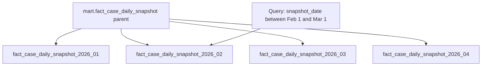

---

# 2. Kapan Partitioning Perlu?

Partitioning biasanya layak dipertimbangkan jika salah satu kondisi ini muncul:

| Kondisi | Sinyal praktis |
|---|---|
| Table tumbuh terus secara waktu | Fact/event/snapshot append-only |
| Query hampir selalu filter by date/time | `snapshot_date`, `event_at`, `report_date` |
| Retention berbasis periode | Simpan 3/5/7 tahun, drop per bulan/quarter |
| Index sudah terlalu besar | Reindex/vacuum lambat |
| Batch load periodik besar | Load harian/bulanan |
| Dashboard membaca periode terbatas | Bulan ini, quarter ini, tahun ini |
| Regulatory archive perlu dipisah | Per report period/cutoff |

Jangan mulai dari partitioning kalau:

| Kondisi | Kenapa |
|---|---|
| Table masih kecil | Kompleksitas belum perlu |
| Query tidak punya filter partition key | Pruning tidak membantu |
| Workload mostly point lookup by ID | B-tree biasa mungkin cukup |
| Banyak update partition key | Row bisa berpindah partition |
| Partition key tidak stabil | Maintenance sulit |
| Terlalu banyak partition kecil | Planning overhead naik |

PostgreSQL mendukung `PARTITION BY RANGE`, `LIST`, dan `HASH`; range/list/hash punya aturan berbeda, dan row yang tidak cocok dengan partition existing akan error kecuali ada default partition. ([PostgreSQL](https://www.postgresql.org/docs/current/sql-createtable.html))

---

# 3. Pilihan Partitioning Method

## 3.1 RANGE Partitioning

Paling umum untuk OLAP.

Cocok untuk:

```text
event_at
snapshot_date
report_date
created_at
transition_at
loaded_at
```

Contoh:

```sql
create table mart.fact_case_daily_snapshot (
    snapshot_date date not null,
    case_id bigint not null,
    office_key bigint not null,
    status_key smallint not null,
    age_days integer not null,
    is_sla_breached boolean not null,
    metric_version text not null,
    loaded_at timestamptz not null default now(),
    primary key (snapshot_date, case_id)
) partition by range (snapshot_date);
```

Partition bulanan:

```sql
create table mart.fact_case_daily_snapshot_2026_01
partition of mart.fact_case_daily_snapshot
for values from ('2026-01-01') to ('2026-02-01');

create table mart.fact_case_daily_snapshot_2026_02
partition of mart.fact_case_daily_snapshot
for values from ('2026-02-01') to ('2026-03-01');
```

Di PostgreSQL range partition, lower bound bersifat inclusive dan upper bound bersifat exclusive. Artinya `from ('2026-01-01') to ('2026-02-01')` menerima `2026-01-01` sampai sebelum `2026-02-01`. ([PostgreSQL](https://www.postgresql.org/docs/current/sql-createtable.html))

---

## 3.2 LIST Partitioning

Cocok untuk segment diskrit.

Contoh:

```text
tenant_id
region_code
source_system
report_type
country_code
```

Contoh:

```sql
create table mart.fact_case_event_by_source (
    source_system text not null,
    event_at timestamptz not null,
    case_id bigint not null,
    event_type text not null,
    payload jsonb,
    loaded_at timestamptz not null default now()
) partition by list (source_system);
```

Partitions:

```sql
create table mart.fact_case_event_by_source_case_service
partition of mart.fact_case_event_by_source
for values in ('case-service');

create table mart.fact_case_event_by_source_workflow_service
partition of mart.fact_case_event_by_source
for values in ('workflow-service');
```

Cocok jika query sering seperti:

```sql
where source_system = 'case-service'
```

Jangan pakai list partition kalau value-nya terlalu banyak dan dinamis, misalnya ribuan office atau jutaan user.

---

## 3.3 HASH Partitioning

Cocok untuk menyebar data ketika tidak ada natural range yang dominan.

Contoh:

```sql
create table mart.fact_large_lookup_event (
    case_id bigint not null,
    event_at timestamptz not null,
    event_type text not null,
    payload jsonb
) partition by hash (case_id);
```

Partitions:

```sql
create table mart.fact_large_lookup_event_p0
partition of mart.fact_large_lookup_event
for values with (modulus 8, remainder 0);

create table mart.fact_large_lookup_event_p1
partition of mart.fact_large_lookup_event
for values with (modulus 8, remainder 1);
```

Use case:

| Cocok | Tidak cocok |
|---|---|
| Distribute write/load by key | Retention by time |
| Point lookup by `case_id` | Monthly reporting |
| Mengurangi hot table/index | Drop old period |
| Sub-partitioning setelah range | Pure time-window dashboard |

Untuk OLAP, **hash biasanya bukan partition utama**, tetapi bisa jadi sub-partition jika data per bulan masih sangat besar.

---

# 4. Strategy Default untuk OLAP

Untuk PostgreSQL OLAP fact table, default saya:

```text
RANGE partition by time first.
LIST/HASH hanya jika ada alasan kuat.
```

Decision table:

| Query utama | Partition key yang disarankan |
|---|---|
| Dashboard harian/bulanan | `snapshot_date` |
| Event lifecycle analysis | `transition_at` |
| SLA measurement | `measured_at` atau `snapshot_date` |
| Regulatory report | `report_period` atau `cutoff_date` |
| Audit/event history | `event_at` |
| Multi-tenant analytics | `event_at`, optional subpartition by tenant group |
| Data lake-ish append load | `loaded_at`, tetapi hati-hati jika query pakai business date |

Rule penting:

```text
Partition key harus muncul di query WHERE.
Kalau tidak, PostgreSQL tetap harus mempertimbangkan banyak partition.
```

Partition pruning dapat mengeliminasi partition dari query plan; `enable_partition_pruning` mengontrol kemampuan planner/executor untuk mengabaikan partition yang tidak relevan dan default-nya aktif. ([PostgreSQL](https://www.postgresql.org/docs/current/runtime-config-query.html))

---

# 5. Memilih Granularity: Daily, Monthly, Quarterly, Yearly

## 5.1 Monthly Partition

Biasanya paling balance untuk OLAP.

```text
fact_case_transition_2026_01
fact_case_transition_2026_02
fact_case_transition_2026_03
```

Cocok untuk:

| Cocok | Alasan |
|---|---|
| Daily/monthly dashboard | Query range umum |
| Retention bulanan | Drop/detach mudah |
| Data sedang-besar | Index partition masih manageable |
| Regulatory period bulanan/quarter | Mudah digabung |

## 5.2 Daily Partition

Cocok jika data sangat besar per hari.

Risiko:

| Risiko | Penjelasan |
|---|---|
| Banyak partition | Planning/maintenance overhead |
| Index kecil tapi banyak | Operasional lebih kompleks |
| DDL harian | Perlu automation kuat |
| Query bulanan scan 30 partition | Masih bisa, tapi plan lebih ramai |

## 5.3 Quarterly/Yearly Partition

Cocok jika data tidak terlalu besar.

Risiko:

| Risiko | Penjelasan |
|---|---|
| Partition terlalu besar | Vacuum/index/scan tetap berat |
| Retention kurang granular | Drop per quarter/year |
| Hot partition besar | Banyak write ke partition yang sama |

Practical heuristic:

| Volume data | Starting point |
|---|---|
| < 1-5 juta row/bulan | Bulanan atau belum partition |
| 5-100 juta row/bulan | Bulanan |
| > 100 juta row/bulan | Bulanan + evaluasi subpartition |
| > 100 juta row/hari | Harian atau range+hash subpartition |

Angka di atas bukan aturan PostgreSQL resmi, melainkan heuristic engineering. Validasi tetap harus memakai ukuran row, index size, query pattern, storage, dan `EXPLAIN ANALYZE`.

---

# 6. Desain Partition untuk `fact_case_transition`

## 6.1 Parent Table

```sql
create table mart.fact_case_transition (
    transition_id bigint not null,
    case_id bigint not null,
    case_number text not null,

    from_status_key smallint,
    to_status_key smallint not null,

    office_key bigint not null,
    officer_key bigint,
    violation_type_key bigint,

    transition_at timestamptz not null,
    transition_date date generated always as (transition_at::date) stored,

    duration_from_previous_seconds bigint,
    is_sla_breached boolean,

    source_event_id text not null,
    source_system text not null,
    loaded_at timestamptz not null default now(),

    primary key (transition_at, transition_id)
) partition by range (transition_at);
```

Catatan penting: pada partitioned table, unique/primary key di parent harus mencakup semua partition key columns agar uniqueness bisa dijamin oleh struktur partition dan index per partition. ([PostgreSQL](https://www.postgresql.org/docs/current/ddl-partitioning.html))

Karena itu, ini aman:

```sql
primary key (transition_at, transition_id)
```

Ini bermasalah untuk parent partitioned table by `transition_at`:

```sql
primary key (transition_id)
```

---

## 6.2 Monthly Partitions

```sql
create table mart.fact_case_transition_2026_07
partition of mart.fact_case_transition
for values from ('2026-07-01 00:00:00+00')
          to ('2026-08-01 00:00:00+00');

create table mart.fact_case_transition_2026_08
partition of mart.fact_case_transition
for values from ('2026-08-01 00:00:00+00')
          to ('2026-09-01 00:00:00+00');
```

Untuk `timestamptz`, gunakan boundary yang eksplisit dan konsisten. Di aplikasi Indonesia/Jakarta, jangan mencampur query lokal tanpa definisi timezone dengan boundary UTC tanpa kesadaran. Tentukan kontrak:

```text
DB stores timestamptz.
API menerima local business date Asia/Jakarta.
Service mengubah period lokal menjadi UTC boundary.
SQL memakai from inclusive, to exclusive.
```

---

# 7. Desain Partition untuk Snapshot

Snapshot biasanya lebih cocok pakai `date`, bukan `timestamptz`.

```sql
create table mart.fact_case_daily_snapshot (
    snapshot_date date not null,
    case_id bigint not null,
    case_number text not null,

    status_key smallint not null,
    office_key bigint not null,
    officer_key bigint,
    violation_type_key bigint,

    opened_at timestamptz not null,
    closed_at timestamptz,
    age_days integer not null,
    sla_bucket text not null,
    is_sla_breached boolean not null,

    metric_version text not null,
    loaded_at timestamptz not null default now(),

    primary key (snapshot_date, case_id)
) partition by range (snapshot_date);
```

Partitions:

```sql
create table mart.fact_case_daily_snapshot_2026_07
partition of mart.fact_case_daily_snapshot
for values from ('2026-07-01') to ('2026-08-01');

create table mart.fact_case_daily_snapshot_2026_08
partition of mart.fact_case_daily_snapshot
for values from ('2026-08-01') to ('2026-09-01');
```

Query yang prune:

```sql
select
    office_key,
    status_key,
    count(*) as total_cases
from mart.fact_case_daily_snapshot
where snapshot_date >= date '2026-07-01'
  and snapshot_date <  date '2026-08-01'
group by office_key, status_key;
```

Query yang buruk untuk pruning:

```sql
select
    office_key,
    status_key,
    count(*) as total_cases
from mart.fact_case_daily_snapshot
where date_trunc('month', snapshot_date) = date '2026-07-01'
group by office_key, status_key;
```

Kenapa buruk? Karena function di atas partition key dapat membuat predicate lebih sulit dimanfaatkan secara optimal. Untuk OLAP API, biasakan bentuk:

```sql
where snapshot_date >= #{fromDate}
  and snapshot_date <  #{toDate}
```

---

# 8. Partition Pruning

## 8.1 Query yang Mendukung Pruning

```sql
select count(*)
from mart.fact_case_transition
where transition_at >= timestamptz '2026-07-01 00:00:00+00'
  and transition_at <  timestamptz '2026-08-01 00:00:00+00';
```

Expected behavior:

```text
Hanya partition Juli 2026 yang dibaca.
```

## 8.2 Query yang Gagal Memanfaatkan Pruning dengan Baik

```sql
select count(*)
from mart.fact_case_transition
where transition_at::date = date '2026-07-15';
```

Lebih baik:

```sql
select count(*)
from mart.fact_case_transition
where transition_at >= timestamptz '2026-07-15 00:00:00+00'
  and transition_at <  timestamptz '2026-07-16 00:00:00+00';
```

## 8.3 Validasi dengan EXPLAIN

```sql
explain (analyze, buffers)
select
    office_key,
    count(*) as total_transition
from mart.fact_case_transition
where transition_at >= timestamptz '2026-07-01 00:00:00+00'
  and transition_at <  timestamptz '2026-08-01 00:00:00+00'
group by office_key;
```

Yang ingin dilihat:

```text
Append atau Parallel Append hanya menyentuh partition relevan.
Partition lama tidak ikut discan.
```

Jika banyak partition ikut discan, cek:

| Kemungkinan | Perbaikan |
|---|---|
| Predicate tidak pakai partition key | Tambahkan filter partition key |
| Function di partition key | Ubah ke range predicate |
| Boundary salah timezone | Normalize di service |
| Query dynamic terlalu bebas | Pakai endpoint-specific query |
| Planner statistik buruk | `ANALYZE` partition terkait |

---

# 9. Indexing pada Partitioned Table

PostgreSQL partitioned table parent bersifat virtual; ketika index dibuat pada parent partitioned table, index yang cocok dibuat pada partition, dan actual data berada di child indexes. ([PostgreSQL](https://www.postgresql.org/docs/current/ddl-partitioning.html))

## 9.1 Buat Index di Parent

```sql
create index idx_fact_case_transition_time_office_status
on mart.fact_case_transition (
    transition_at,
    office_key,
    to_status_key
);
```

Ini akan membuat matching index pada partitions.

## 9.2 Index untuk Snapshot Dashboard

```sql
create index idx_fact_case_snapshot_date_office_status
on mart.fact_case_daily_snapshot (
    snapshot_date,
    office_key,
    status_key
);
```

Cocok untuk:

```sql
where snapshot_date >= ?
  and snapshot_date < ?
  and office_key = ?
group by status_key
```

## 9.3 Index dengan `INCLUDE`

```sql
create index idx_summary_case_status_daily_cover
on reporting.summary_case_status_daily (
    office_key,
    report_date,
    status_key
)
include (
    total_cases,
    breached_cases,
    metric_version,
    calculated_at
);
```

Cocok untuk serving query yang hanya membaca summary dan ingin mengurangi heap access.

---

# 10. BRIN Index untuk Fact Table Besar

Untuk fact table append-only by time, BRIN sering sangat berguna.

```sql
create index brin_fact_case_transition_time
on mart.fact_case_transition
using brin (transition_at);
```

Cocok jika:

| Kondisi | Penjelasan |
|---|---|
| Data mostly append by `transition_at` | Correlation tinggi |
| Query range waktu besar | BRIN membantu block skipping |
| Table sangat besar | BRIN jauh lebih kecil dari B-tree |
| Data tidak sering update acak | Physical locality tetap baik |

Tidak cocok jika:

| Kondisi | Dampak |
|---|---|
| Data masuk acak lintas waktu | BRIN kurang efektif |
| Query point lookup | B-tree lebih cocok |
| Partition sudah kecil | BRIN benefit mungkin kecil |
| Butuh order/unique | BRIN bukan pengganti B-tree |

Pattern umum:

```text
Range partition by month
+ B-tree untuk dimension lookup penting
+ BRIN untuk long time-range scan
```

---

# 11. Default Partition

Default partition bisa mencegah insert gagal ketika partition belum dibuat.

```sql
create table mart.fact_case_transition_default
partition of mart.fact_case_transition
default;
```

Kelebihan:

| Kelebihan | Penjelasan |
|---|---|
| Data tidak langsung gagal insert | Aman untuk partition miss |
| Bisa jadi safety net | Operational fallback |
| Memudahkan alert | Monitor row yang masuk default |

Risiko:

| Risiko | Penjelasan |
|---|---|
| Default partition membesar | Pruning/maintenance kacau |
| Data salah periode tersembunyi | Harus ada monitoring |
| Attach partition baru bisa scan default | Perlu check constraint/exclusion |

Practical rule:

```text
Default partition boleh sebagai safety net,
tetapi harus dipantau dan dikosongkan secara rutin.
```

PostgreSQL juga menyebut bahwa jika ada default partition, attach partition baru bisa memerlukan scan default partition untuk memastikan tidak ada row yang seharusnya masuk partition baru, dan ini dapat memegang lock kuat pada default partition. ([PostgreSQL](https://www.postgresql.org/docs/current/ddl-partitioning.html))

---

# 12. Rolling Partition Maintenance

Untuk OLAP production, partition harus dibuat sebelum data masuk.

## 12.1 Create Next Month Partition

```sql
create table if not exists mart.fact_case_transition_2026_09
partition of mart.fact_case_transition
for values from ('2026-09-01 00:00:00+00')
          to ('2026-10-01 00:00:00+00');
```

## 12.2 Drop Old Partition

Jika data lama tidak perlu disimpan:

```sql
drop table mart.fact_case_transition_2021_01;
```

## 12.3 Detach Old Partition untuk Archive

Jika data lama masih perlu disimpan sebagai table archive:

```sql
alter table mart.fact_case_transition
detach partition mart.fact_case_transition_2021_01;
```

PostgreSQL documentation menyebut salah satu keuntungan partitioning adalah menghapus data lama dengan manipulasi struktur partition, bukan memindahkan/menghapus data dalam jumlah besar; partition lama bisa di-drop atau di-detach agar tetap dapat diakses sebagai table terpisah. ([PostgreSQL](https://www.postgresql.org/docs/current/ddl-partitioning.html))

---

# 13. Safer Attach Pattern untuk Bulk Load

Pattern ini cocok untuk batch OLAP load:

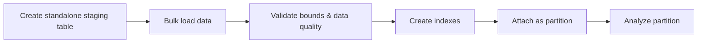

## 13.1 Create Standalone Table

```sql
create table mart.fact_case_transition_2026_09_load
(like mart.fact_case_transition including defaults including constraints);
```

## 13.2 Add Check Constraint Matching Partition Bound

```sql
alter table mart.fact_case_transition_2026_09_load
add constraint chk_fact_case_transition_2026_09_bound
check (
    transition_at >= timestamptz '2026-09-01 00:00:00+00'
    and transition_at < timestamptz '2026-10-01 00:00:00+00'
);
```

## 13.3 Bulk Load

```sql
copy mart.fact_case_transition_2026_09_load (
    transition_id,
    case_id,
    case_number,
    from_status_key,
    to_status_key,
    office_key,
    transition_at,
    duration_from_previous_seconds,
    is_sla_breached,
    source_event_id,
    source_system
)
from '/data/load/fact_case_transition_2026_09.csv'
with (format csv, header true);
```

## 13.4 Validate

```sql
select count(*) as invalid_bound_count
from mart.fact_case_transition_2026_09_load
where transition_at < timestamptz '2026-09-01 00:00:00+00'
   or transition_at >= timestamptz '2026-10-01 00:00:00+00';
```

## 13.5 Attach

```sql
alter table mart.fact_case_transition
attach partition mart.fact_case_transition_2026_09_load
for values from ('2026-09-01 00:00:00+00')
          to ('2026-10-01 00:00:00+00');
```

PostgreSQL documentation menyebut pattern attach partition dari table terpisah dapat berguna karena data bisa di-load, dicek, dan ditransformasi sebelum terlihat sebagai bagian dari partitioned table. ([PostgreSQL](https://www.postgresql.org/docs/current/ddl-partitioning.html))

---

# 14. Partition Naming Convention

Gunakan nama predictable.

```text
<schema>.<table>_<yyyy>_<mm>
<schema>.<table>_<yyyy>_q<q>
<schema>.<table>_<yyyy>
```

Contoh:

```text
mart.fact_case_transition_2026_07
mart.fact_case_transition_2026_08
mart.fact_case_daily_snapshot_2026_07
reporting.regulatory_snapshot_2026_q3
```

Hindari:

```text
partition1
case_fact_old
fact_202607_random
new_table_july
```

Naming convention penting untuk:

| Kebutuhan | Benefit |
|---|---|
| Automation | Generate DDL mudah |
| Monitoring | Pattern query metadata mudah |
| Retention | Drop/detach by name |
| Audit | Period jelas |
| Troubleshooting | DBA/developer cepat paham |

---

# 15. Metadata Table untuk Partition Management

Untuk enterprise production, jangan hanya mengandalkan nama table. Simpan metadata.

```sql
create table admin.partition_registry (
    parent_table regclass not null,
    partition_table regclass not null,
    partition_from timestamptz not null,
    partition_to timestamptz not null,
    status text not null check (
        status in ('PLANNED', 'ACTIVE', 'DETACHED', 'DROPPED', 'ARCHIVED')
    ),
    created_at timestamptz not null default now(),
    detached_at timestamptz,
    archived_at timestamptz,
    note text,
    primary key (parent_table, partition_table)
);
```

Use case:

| Use case | Manfaat |
|---|---|
| Audit partition lifecycle | Tahu kapan dibuat/detach |
| Monitoring missing partition | Compare expected vs actual |
| Retention automation | Drop/detach sesuai status |
| Deployment validation | Pastikan partition bulan depan tersedia |

---

# 16. Auto-create Partition Function

Contoh fungsi sederhana untuk membuat monthly partition.

```sql
create or replace function admin.create_monthly_partition(
    p_parent_table text,
    p_partition_prefix text,
    p_month date
)
returns void
language plpgsql
as $$
declare
    v_from date;
    v_to date;
    v_partition_name text;
    v_sql text;
begin
    v_from := date_trunc('month', p_month)::date;
    v_to := (v_from + interval '1 month')::date;
    v_partition_name := format(
        '%s_%s',
        p_partition_prefix,
        to_char(v_from, 'YYYY_MM')
    );

    v_sql := format(
        'create table if not exists %I partition of %s for values from (%L) to (%L)',
        v_partition_name,
        p_parent_table,
        v_from,
        v_to
    );

    execute v_sql;
end;
$$;
```

Pemakaian:

```sql
select admin.create_monthly_partition(
    'mart.fact_case_daily_snapshot',
    'fact_case_daily_snapshot',
    date '2026-09-01'
);
```

Catatan: untuk production, fungsi ini perlu diperkuat dengan schema-qualified naming, advisory lock, logging ke registry, permission model, dan test idempotency.

---

# 17. Partitioning dan MyBatis Query Shape

Walaupun integrasi Java/Jersey/MyBatis dibahas khusus di seri 13, query shape sudah harus dipikirkan dari sekarang.

## Mapper Query yang Bagus

```xml
<select id="findCaseSnapshotSummary" resultMap="CaseSnapshotSummaryMap">
    select
        snapshot_date,
        office_key,
        status_key,
        count(*) as total_cases,
        count(*) filter (where is_sla_breached) as breached_cases
    from mart.fact_case_daily_snapshot
    where snapshot_date >= #{fromDate}
      and snapshot_date < #{toDate}
      and office_key = #{officeKey}
    group by
        snapshot_date,
        office_key,
        status_key
    order by
        snapshot_date,
        status_key
</select>
```

Kenapa bagus?

| Bagian | Manfaat |
|---|---|
| `snapshot_date >=` dan `<` | Partition pruning |
| `office_key =` | Index selectivity |
| Grouping terbatas | Output predictable |
| No raw dynamic SQL | Aman untuk API |

## Mapper Query yang Buruk

```xml
<select id="findReport" resultMap="ReportMap">
    select *
    from mart.fact_case_daily_snapshot
    where 1 = 1
    <if test="snapshotDate != null">
        and date_trunc('day', snapshot_date) = #{snapshotDate}
    </if>
    <if test="officeName != null">
        and lower(office_name) like concat('%', lower(#{officeName}), '%')
    </if>
</select>
```

Masalah:

| Masalah | Dampak |
|---|---|
| Function pada partition key | Pruning bisa buruk |
| Optional date | Bisa full scan semua partition |
| `select *` | I/O boros |
| Search dimension text di fact | Salah model |
| Tidak ada limit/range | Query tidak bounded |

---

# 18. Constraint dan Uniqueness

## 18.1 Parent PK Harus Include Partition Key

Untuk table partitioned by `snapshot_date`:

```sql
primary key (snapshot_date, case_id)
```

Jangan:

```sql
primary key (case_id)
```

Alasannya: uniqueness pada partitioned table bergantung pada child indexes, sehingga constraint di parent harus mencakup partition key agar tidak ada duplicate di partition berbeda. ([PostgreSQL](https://www.postgresql.org/docs/current/ddl-partitioning.html))

## 18.2 Unique Source Event per Partition

Jika `source_event_id` global unique tetapi table dipartition by time, PostgreSQL tidak bisa menjamin global uniqueness hanya dengan unique index per partition tanpa partition key.

Pilihan desain:

| Pilihan | Kapan |
|---|---|
| Include `transition_at` dalam unique key | Jika source_event_id unik dalam period |
| Simpan dedup registry terpisah | Jika source_event_id harus global unique |
| Gunakan staging validation | Jika load batch |
| Partition by source hash | Jika uniqueness by source lebih penting daripada retention |

Contoh dedup registry:

```sql
create table mart.fact_event_dedup_registry (
    source_event_id text primary key,
    first_seen_at timestamptz not null default now(),
    source_system text not null
);
```

Load pattern:

```sql
insert into mart.fact_event_dedup_registry (
    source_event_id,
    source_system
)
values (
    #{sourceEventId},
    #{sourceSystem}
)
on conflict do nothing;
```

---

# 19. Subpartitioning

Subpartitioning bisa dipakai jika satu partition bulanan masih terlalu besar.

Contoh: range by month, subpartition by hash case_id.

```sql
create table mart.fact_case_transition_2026_07
partition of mart.fact_case_transition
for values from ('2026-07-01 00:00:00+00')
          to ('2026-08-01 00:00:00+00')
partition by hash (case_id);
```

Subpartitions:

```sql
create table mart.fact_case_transition_2026_07_h0
partition of mart.fact_case_transition_2026_07
for values with (modulus 4, remainder 0);

create table mart.fact_case_transition_2026_07_h1
partition of mart.fact_case_transition_2026_07
for values with (modulus 4, remainder 1);

create table mart.fact_case_transition_2026_07_h2
partition of mart.fact_case_transition_2026_07
for values with (modulus 4, remainder 2);

create table mart.fact_case_transition_2026_07_h3
partition of mart.fact_case_transition_2026_07
for values with (modulus 4, remainder 3);
```

Gunakan subpartitioning hanya jika ada alasan kuat.

| Benefit | Cost |
|---|---|
| Partition lebih kecil | DDL lebih kompleks |
| Index lebih manageable | Partition count naik |
| Load bisa tersebar | Monitoring lebih rumit |
| Query by time+case bisa baik | Query by month scan semua hash child |

---

# 20. Partitionwise Join dan Aggregate

PostgreSQL memiliki planner options seperti `enable_partitionwise_join` dan `enable_partitionwise_aggregate`. Partitionwise join berlaku ketika join condition mencakup semua partition keys dengan tipe data sama dan matching child partitions; dokumentasi juga memperingatkan bahwa penggunaan memory dapat meningkat seiring jumlah partition yang discan. ([PostgreSQL](https://www.postgresql.org/docs/current/runtime-config-query.html))

Practical implication:

| Feature | Cocok untuk |
|---|---|
| Partitionwise aggregate | Aggregation per partition, misalnya per month |
| Partitionwise join | Join dua fact/summary table yang partition scheme-nya aligned |
| Parallel append | Scan beberapa partition secara paralel |
| Async append | Akses beberapa child relation lebih efisien dalam kondisi tertentu |

Jangan aktifkan/tuning secara global tanpa pengujian workload. Untuk OLAP berat, test dengan:

```sql
explain (analyze, buffers)
select
    snapshot_date,
    office_key,
    count(*)
from mart.fact_case_daily_snapshot
where snapshot_date >= date '2026-01-01'
  and snapshot_date <  date '2026-07-01'
group by snapshot_date, office_key;
```

---

# 21. Partitioning dan Retention

## 21.1 Retention Policy

Contoh policy:

```text
Hot data: 0-12 bulan di primary OLAP DB
Warm data: 13-36 bulan tetap attached tapi tablespace lebih murah
Cold data: >36 bulan detached/archive
Regulatory data: sesuai aturan retensi, tidak otomatis drop
```

## 21.2 Drop Old Non-Regulatory Data

```sql
drop table if exists mart.fact_case_transition_2021_07;
```

## 21.3 Detach Regulatory Archive

```sql
alter table reporting.regulatory_case_snapshot
detach partition reporting.regulatory_case_snapshot_2021_q3;
```

Lalu backup/archive table tersebut.

Practical warning:

```text
Jangan menyamakan data lama dengan data boleh dihapus.
Untuk regulatory system, retention harus mengikuti policy/legal basis.
```

---

# 22. Partitioning untuk Regulatory Snapshot

Regulatory snapshot biasanya partition by `report_period` atau `cutoff_date`.

```sql
create table reporting.regulatory_case_snapshot (
    report_period text not null,
    cutoff_date date not null,
    case_id bigint not null,
    office_key bigint not null,
    status_key smallint not null,
    age_days integer not null,
    is_sla_breached boolean not null,
    metric_version text not null,
    generated_at timestamptz not null default now(),
    primary key (report_period, case_id)
) partition by list (report_period);
```

Partition:

```sql
create table reporting.regulatory_case_snapshot_2026_q3
partition of reporting.regulatory_case_snapshot
for values in ('2026-Q3');
```

Atau range by cutoff date:

```sql
create table reporting.regulatory_case_snapshot (
    cutoff_date date not null,
    report_period text not null,
    case_id bigint not null,
    office_key bigint not null,
    status_key smallint not null,
    age_days integer not null,
    is_sla_breached boolean not null,
    metric_version text not null,
    generated_at timestamptz not null default now(),
    primary key (cutoff_date, case_id)
) partition by range (cutoff_date);
```

Saya lebih menyarankan `range(cutoff_date)` jika query sering berdasarkan waktu, dan `list(report_period)` jika period report adalah unit utama audit/export.

---

# 23. Observability Partition

Query melihat ukuran partition:

```sql
select
    n.nspname as schema_name,
    c.relname as table_name,
    pg_size_pretty(pg_total_relation_size(c.oid)) as total_size
from pg_class c
join pg_namespace n
    on n.oid = c.relnamespace
where n.nspname = 'mart'
  and c.relname like 'fact_case_transition_%'
order by pg_total_relation_size(c.oid) desc;
```

Cek row estimate:

```sql
select
    schemaname,
    relname,
    n_live_tup,
    n_dead_tup,
    last_vacuum,
    last_autovacuum,
    last_analyze,
    last_autoanalyze
from pg_stat_user_tables
where schemaname = 'mart'
  and relname like 'fact_case_transition_%'
order by relname;
```

Cek partition metadata:

```sql
select
    parent.relname as parent_table,
    child.relname as partition_table
from pg_inherits i
join pg_class parent
    on parent.oid = i.inhparent
join pg_class child
    on child.oid = i.inhrelid
where parent.relname = 'fact_case_transition'
order by child.relname;
```

---

# 24. Maintenance Checklist

## 24.1 Before New Period Starts

| Checklist | SQL/Action |
|---|---|
| Partition bulan depan sudah ada | `create table ... partition of ...` |
| Index sudah tercipta | Cek `pg_indexes` |
| Permission konsisten | Grant pada parent/schema |
| Monitoring registry updated | Insert `admin.partition_registry` |
| Test insert boundary | Insert sample atau validation job |
| Analyze setelah load besar | `analyze partition_name` |

## 24.2 After Batch Load

```sql
analyze mart.fact_case_transition_2026_07;
```

## 24.3 After Detach/Drop

| Checklist | Alasan |
|---|---|
| Confirm backup/archive | Hindari data loss |
| Update registry | Audit lifecycle |
| Recheck dashboard query | Jangan ada query ke period hilang |
| Recheck monitoring | Alert stale partition |

---

# 25. Common Failure Modes

| Failure mode | Gejala | Root cause | Fix |
|---|---|---|---|
| Insert gagal “no partition found” | Load berhenti | Partition belum dibuat | Pre-create partition + default safety |
| Query scan semua partition | Lambat | Tidak filter partition key | Wajibkan date range |
| Partition terlalu banyak | Planning lambat | Daily partition padahal data kecil | Gabung ke monthly/quarterly |
| Partition terlalu besar | Vacuum/index lambat | Yearly partition untuk data besar | Turunkan granularitas |
| PK gagal dibuat | Error DDL | PK tidak include partition key | Include partition key |
| Duplicate source event | Double count | Unique hanya per partition | Dedup registry |
| Default partition membesar | Query/attach lambat | Partition automation gagal | Monitor default + move rows |
| Retention salah hapus | Data audit hilang | Policy tidak jelas | Registry + approval + archive |
| Index tidak sesuai query | Plan lambat | Index parent salah urutan kolom | Redesign berdasarkan query |
| Function di partition key | Pruning buruk | `date_trunc(col)` di WHERE | Gunakan range boundary |

---

# 26. Anti-patterns

| Anti-pattern | Kenapa buruk |
|---|---|
| Partition by `id` untuk dashboard by date | Query period tetap scan banyak partition |
| Partition by `created_at`, query by `business_date` | Pruning tidak sesuai kebutuhan |
| Daily partition untuk table kecil | Operasional berlebihan |
| Yearly partition untuk table ratusan juta row/bulan | Partition terlalu besar |
| Semua query date filter optional | Pruning tidak konsisten |
| `where col::date = ?` pada `timestamptz` partition key | Bisa menghambat pruning/index |
| Default partition tanpa alert | Data nyasar diam-diam |
| Drop partition tanpa registry/approval | Risiko compliance |
| Unique key tidak mempertimbangkan partition key | Constraint gagal atau misleading |
| Partitioning dianggap pengganti indexing | Tetap perlu index |

---

# 27. Production Design Example

## Use Case

> Dashboard menampilkan backlog dan SLA breach harian per office, data disimpan 5 tahun, report paling sering membaca 1 bulan terakhir.

## Recommended design

```text
Parent:
mart.fact_case_daily_snapshot

Partition:
monthly range by snapshot_date

Primary key:
(snapshot_date, case_id)

Index:
(snapshot_date, office_key, status_key)
(office_key, snapshot_date)
BRIN(snapshot_date) optional if partition large

Serving:
reporting.summary_case_status_daily

Retention:
detach/drop partition older than policy
```

## DDL

```sql
create table mart.fact_case_daily_snapshot (
    snapshot_date date not null,
    case_id bigint not null,
    case_number text not null,
    office_key bigint not null,
    status_key smallint not null,
    age_days integer not null,
    sla_bucket text not null,
    is_sla_breached boolean not null,
    metric_version text not null,
    loaded_at timestamptz not null default now(),
    primary key (snapshot_date, case_id)
) partition by range (snapshot_date);

create index idx_fact_case_daily_snapshot_office_date
on mart.fact_case_daily_snapshot (
    office_key,
    snapshot_date
);

create index idx_fact_case_daily_snapshot_date_office_status
on mart.fact_case_daily_snapshot (
    snapshot_date,
    office_key,
    status_key
);
```

## Monthly Partition

```sql
create table mart.fact_case_daily_snapshot_2026_07
partition of mart.fact_case_daily_snapshot
for values from ('2026-07-01') to ('2026-08-01');
```

## Query

```sql
select
    snapshot_date,
    status_key,
    count(*) as total_cases,
    count(*) filter (where is_sla_breached) as breached_cases
from mart.fact_case_daily_snapshot
where office_key = #{officeKey}
  and snapshot_date >= #{fromDate}
  and snapshot_date < #{toDate}
group by
    snapshot_date,
    status_key
order by
    snapshot_date,
    status_key;
```

---

# 28. Practical Rules of Thumb

| Rule | Penjelasan |
|---|---|
| Partition by the most common range filter | Biasanya date/time |
| Use from-inclusive/to-exclusive | Boundary aman untuk date/timestamp |
| Keep partition count reasonable | Hindari terlalu banyak partition kecil |
| Pre-create future partitions | Jangan tunggu insert gagal |
| Monitor default partition | Default hanya safety net |
| Include partition key in PK/unique | Requirement penting |
| Index parent for common query | Actual index ada di child partitions |
| Analyze after bulk load | Planner butuh statistik |
| Use summary/MV for dashboard | Partitioning bukan pengganti precompute |
| Test with `EXPLAIN ANALYZE` | Validasi pruning, bukan asumsi |

---

# 29. Ringkasan Seri 4

Partitioning untuk PostgreSQL OLAP terutama berguna untuk:

```text
membatasi scan data
mempercepat retention
mengelola fact table besar
membuat maintenance lebih aman
menjaga query reporting tetap predictable
```

Default pattern untuk fact table OLAP:

```text
RANGE partition by business/reporting time
monthly granularity
PK includes partition key
indexes aligned with query filter
summary/MV for serving
rolling partition automation
default partition monitored
retention via detach/drop partition
```

Yang paling penting:

```text
Query harus membawa predicate partition key.
Tanpa itu, partitioning tidak banyak membantu.
```

---

# Status

**Seri 4/13 selesai.**

Rekomendasi materi selanjutnya: **Seri 5/13 - Indexing Strategy for OLAP: B-tree, BRIN, GIN, partial, covering index**.

---

**Sources:**

- [PostgreSQL: Documentation: 18: 5.12. Table Partitioning](https://www.postgresql.org/docs/current/ddl-partitioning.html)

## Response:
7/15/2026, 8:07:30 PM

# Seri 5/13 - Indexing Strategy for OLAP: B-tree, BRIN, GIN, Partial, Covering Index

Seri ini fokus ke **strategi indexing PostgreSQL untuk OLAP**, bukan sekadar daftar jenis index. Target praktisnya: tahu **index apa yang dipakai untuk query analytical tertentu**, kapan index justru merugikan, dan bagaimana membaca relasi antara query shape, partitioning, aggregation, dan serving table.

PostgreSQL menyediakan beberapa index type: **B-tree, Hash, GiST, SP-GiST, GIN, BRIN**, serta extension seperti bloom. Secara default, `CREATE INDEX` membuat B-tree index, dan index type lain dipilih eksplisit dengan `USING`. ([PostgreSQL](https://www.postgresql.org/docs/current/indexes-types.html?utm_source=chatgpt.com))

---

# 1. Mental Model Indexing untuk OLAP

Dalam OLTP, index sering dipakai untuk lookup kecil:

```sql
select *
from app.enforcement_case
where case_id = ?;
```

Dalam OLAP, index dipakai untuk hal berbeda:

```text
membatasi scan range waktu
membantu join ke dimension
membantu group/filter dashboard
mempercepat lookup summary table
mendukung index-only scan
menghindari scan partition yang terlalu besar
```

Index OLAP harus mengikuti **query access pattern**, bukan mengikuti semua kolom yang tampak penting.

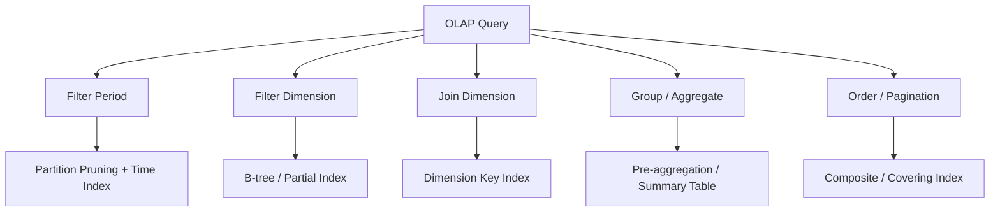

---

# 2. Indexing Decision Table

| Query Pattern | Index yang biasanya cocok | Contoh |
|---|---|---|
| Equality lookup | B-tree | `where office_key = ?` |
| Date/time range besar di table append-only | BRIN atau B-tree | `where event_at >= ? and event_at < ?` |
| Dashboard summary lookup | B-tree composite + `INCLUDE` | `(office_key, report_date, status_key) include (...)` |
| Filter subset tertentu | Partial index | `where is_current = true` |
| JSONB containment/search | GIN | `payload @> '{"type":"X"}'` |
| Full-text search | GIN/GiST | `to_tsvector(...) @@ plainto_tsquery(...)` |
| Geospatial / range / custom operators | GiST/SP-GiST | PostGIS/range queries |
| Low-cardinality boolean alone | Biasanya jangan | `is_active = true` saja |
| High-cardinality grouping | Index bisa membantu filter, bukan selalu aggregate | `group by office,status` |
| Wide export besar | Index mungkin tidak membantu | sequential/parallel scan bisa lebih baik |

---

# 3. B-tree Index

B-tree adalah default dan paling umum. PostgreSQL B-tree cocok untuk data type yang punya linear ordering dan umum dipakai untuk equality/range/order lookup. ([PostgreSQL](https://www.postgresql.org/docs/current/btree.html?utm_source=chatgpt.com))

## 3.1 B-tree untuk Summary Table

Contoh table:

```sql
create table reporting.summary_case_status_daily (
    report_date date not null,
    office_key bigint not null,
    status_key smallint not null,
    total_cases bigint not null,
    breached_cases bigint not null,
    calculated_at timestamptz not null default now(),
    metric_version text not null,
    primary key (report_date, office_key, status_key)
);
```

Endpoint:

```http
GET /reports/case-status?officeId=10&period=2026-07
```

Query:

```sql
select
    report_date,
    status_key,
    total_cases,
    breached_cases,
    calculated_at,
    metric_version
from reporting.summary_case_status_daily
where office_key = #{officeKey}
  and report_date >= #{fromDate}
  and report_date < #{toDate}
order by report_date, status_key;
```

Index yang cocok:

```sql
create index idx_summary_case_status_office_date_status
on reporting.summary_case_status_daily (
    office_key,
    report_date,
    status_key
);
```

Kenapa urutannya begitu?

| Kolom | Alasan |
|---|---|
| `office_key` | Equality filter |
| `report_date` | Range filter |
| `status_key` | Sort/group/detail output |

Rule praktis B-tree composite:

```text
Equality columns dulu,
range column setelahnya,
lalu kolom yang membantu order/grouping.
```

---

# 4. Multicolumn Index

PostgreSQL mendukung multicolumn index. Untuk B-tree, urutan kolom sangat penting. Untuk GIN dan BRIN, dokumentasi PostgreSQL menjelaskan bahwa multicolumn GIN/BRIN dapat digunakan dengan kondisi pada subset kolom, dan efektivitas pencarian tidak bergantung pada urutan kolom seperti B-tree. ([PostgreSQL](https://www.postgresql.org/docs/current/indexes-multicolumn.html?utm_source=chatgpt.com))

## 4.1 Contoh B-tree Composite yang Baik

Query:

```sql
select
    snapshot_date,
    status_key,
    count(*) as total_cases
from mart.fact_case_daily_snapshot
where office_key = #{officeKey}
  and snapshot_date >= #{fromDate}
  and snapshot_date < #{toDate}
group by snapshot_date, status_key
order by snapshot_date, status_key;
```

Index:

```sql
create index idx_snapshot_office_date_status
on mart.fact_case_daily_snapshot (
    office_key,
    snapshot_date,
    status_key
);
```

Cocok karena:

| Predicate / operation | Index support |
|---|---|
| `office_key = ?` | Kolom pertama |
| `snapshot_date >= ? and < ?` | Range setelah equality |
| `status_key` | Membantu grouping/order setelah range |

---

## 4.2 Index yang Kurang Cocok

```sql
create index idx_snapshot_status_date_office
on mart.fact_case_daily_snapshot (
    status_key,
    snapshot_date,
    office_key
);
```

Untuk query yang filter utamanya `office_key` dan `snapshot_date`, index ini kurang ideal karena kolom pertama `status_key` tidak dipakai sebagai filter utama.

---

# 5. Covering Index / `INCLUDE`

Covering index berguna ketika query bisa dilayani dari index tanpa harus membaca heap table. PostgreSQL mendukung **index-only scans**, tetapi efektivitasnya juga bergantung pada visibility map; B-tree selalu mendukung index-only scans, sedangkan GiST/SP-GiST hanya untuk beberapa operator class. ([PostgreSQL](https://www.postgresql.org/docs/current/indexes-index-only-scans.html?utm_source=chatgpt.com))

## 5.1 Contoh Covering Index untuk API Serving

Query:

```sql
select
    report_date,
    status_key,
    total_cases,
    breached_cases,
    calculated_at,
    metric_version
from reporting.summary_case_status_daily
where office_key = #{officeKey}
  and report_date >= #{fromDate}
  and report_date < #{toDate}
order by report_date, status_key;
```

Index:

```sql
create index idx_summary_case_status_cover
on reporting.summary_case_status_daily (
    office_key,
    report_date,
    status_key
)
include (
    total_cases,
    breached_cases,
    calculated_at,
    metric_version
);
```

Kolom di key:

```text
office_key, report_date, status_key
```

Kolom payload:

```text
total_cases, breached_cases, calculated_at, metric_version
```

Practical rule:

| Masukkan ke key | Masukkan ke `INCLUDE` |
|---|---|
| Kolom untuk `WHERE` | Kolom hanya untuk output |
| Kolom untuk `JOIN` | Kolom tidak dipakai filter |
| Kolom untuk `ORDER BY` | Kolom measure/report |
| Kolom untuk uniqueness | Metadata output |

---

## 5.2 Kapan Covering Index Tidak Berguna?

| Kondisi | Kenapa |
|---|---|
| Table sering update | Visibility map sering belum all-visible |
| Query ambil banyak row besar | Index-only tetap besar |
| Include terlalu banyak kolom | Index bloat |
| Kolom text/json besar | Index membengkak |
| Query jarang | Maintenance cost tidak sepadan |

---

# 6. Partial Index

Partial index adalah index atas subset row yang memenuhi predicate tertentu. PostgreSQL menyatakan partial index hanya berisi entry untuk row yang memenuhi predicate tersebut, sehingga berguna untuk situasi khusus. ([PostgreSQL](https://www.postgresql.org/docs/current/indexes-partial.html?utm_source=chatgpt.com))

## 6.1 Current Dimension Lookup

Dimension SCD Type 2:

```sql
create table mart.dim_office (
    office_key bigint generated always as identity primary key,
    office_id bigint not null,
    office_code text not null,
    office_name text not null,
    region_code text not null,
    region_name text not null,
    effective_from date not null,
    effective_to date,
    is_current boolean not null default true
);
```

Index:

```sql
create unique index uq_dim_office_current
on mart.dim_office (office_id)
where is_current = true;
```

Query:

```sql
select office_key
from mart.dim_office
where office_id = #{officeId}
  and is_current = true;
```

Bagus karena hanya current row yang masuk index.

---

## 6.2 Partial Index untuk Active Snapshot

Misal dashboard sering membaca active case:

```sql
create index idx_snapshot_active_office_date
on mart.fact_case_daily_snapshot (
    office_key,
    snapshot_date
)
where is_closed = false;
```

Query harus match predicate:

```sql
select
    snapshot_date,
    count(*) as active_cases
from mart.fact_case_daily_snapshot
where is_closed = false
  and office_key = #{officeKey}
  and snapshot_date >= #{fromDate}
  and snapshot_date < #{toDate}
group by snapshot_date;
```

Practical warning:

```text
Partial index hanya berguna jika query predicate kompatibel dengan predicate index.
```

---

## 6.3 Partial Index untuk Recent Hot Data

Untuk high-traffic dashboard hanya 90 hari terakhir:

```sql
create index idx_snapshot_recent_office_status
on mart.fact_case_daily_snapshot (
    office_key,
    snapshot_date,
    status_key
)
where snapshot_date >= date '2026-05-01';
```

Hati-hati: partial index dengan tanggal statis butuh maintenance. Lebih aman untuk rolling partitioning jika hot data berubah terus.

---

# 7. BRIN Index

BRIN sangat relevan untuk OLAP fact table besar yang append-only dan terurut secara waktu. PostgreSQL menyediakan BRIN sebagai salah satu index type built-in, dan BRIN cocok untuk data yang secara fisik berkorelasi dengan kolom yang diindeks. ([PostgreSQL](https://www.postgresql.org/docs/current/indexes.html?utm_source=chatgpt.com))

## 7.1 Kapan BRIN Cocok?

| Kondisi | Cocok? |
|---|---|
| Table sangat besar | Ya |
| Data append by timestamp | Ya |
| Query range waktu besar | Ya |
| Storage ingin hemat | Ya |
| Query point lookup by ID | Tidak |
| Data masuk acak lintas waktu | Kurang |
| Butuh uniqueness | Tidak |

Contoh:

```sql
create index brin_fact_transition_at
on mart.fact_case_transition
using brin (transition_at);
```

Query:

```sql
select
    date_trunc('day', transition_at)::date as event_date,
    count(*) as total_transition
from mart.fact_case_transition
where transition_at >= timestamptz '2026-07-01 00:00:00+00'
  and transition_at <  timestamptz '2026-08-01 00:00:00+00'
group by date_trunc('day', transition_at)::date;
```

---

## 7.2 BRIN + Partitioning

Pattern yang sering bagus:

```text
Range partition by month
+ BRIN index on timestamp inside each partition
+ B-tree index untuk selective dimension lookup
```

Contoh:

```sql
create table mart.fact_case_transition (
    transition_at timestamptz not null,
    transition_id bigint not null,
    case_id bigint not null,
    office_key bigint not null,
    to_status_key smallint not null,
    duration_from_previous_seconds bigint,
    primary key (transition_at, transition_id)
) partition by range (transition_at);

create index brin_fact_case_transition_at
on mart.fact_case_transition
using brin (transition_at);

create index idx_fact_case_transition_office_time
on mart.fact_case_transition (
    office_key,
    transition_at
);
```

Interpretasi:

| Index | Fungsi |
|---|---|
| BRIN `transition_at` | Range scan waktu besar |
| B-tree `(office_key, transition_at)` | Query office tertentu dalam range waktu |
| PK `(transition_at, transition_id)` | Uniqueness + partition compatibility |

---

# 8. GIN Index

GIN cocok untuk struktur yang memiliki banyak key/item per row, seperti JSONB, array, dan full-text search. PostgreSQL mendokumentasikan GIN sebagai salah satu built-in index access method, termasuk dukungan multicolumn GIN. ([PostgreSQL](https://www.postgresql.org/docs/current/gin.html?utm_source=chatgpt.com))

## 8.1 JSONB Containment

Table event:

```sql
create table mart.fact_case_event (
    event_at timestamptz not null,
    case_id bigint not null,
    event_type text not null,
    payload jsonb not null
) partition by range (event_at);
```

Index:

```sql
create index gin_case_event_payload
on mart.fact_case_event
using gin (payload);
```

Query:

```sql
select
    event_at,
    case_id,
    event_type
from mart.fact_case_event
where event_at >= #{fromTime}
  and event_at < #{toTime}
  and payload @> '{"channel":"ONLINE"}'::jsonb;
```

Practical note:

| Pattern | Rekomendasi |
|---|---|
| Search JSONB flexible | GIN |
| Filter field JSONB sangat sering | Generated column + B-tree |
| Metric penting dari JSONB | Extract ke fact column |
| Dashboard high traffic dari JSONB | Jangan hitung dari raw JSONB terus |

---

## 8.2 Generated Column dari JSONB

Anti-pattern:

```sql
where payload ->> 'caseType' = 'FRAUD'
```

Lebih production-grade:

```sql
alter table mart.fact_case_event
add column case_type_code text
generated always as (payload ->> 'caseType') stored;

create index idx_case_event_type_time
on mart.fact_case_event (
    case_type_code,
    event_at
);
```

Query:

```sql
select count(*)
from mart.fact_case_event
where case_type_code = 'FRAUD'
  and event_at >= #{fromTime}
  and event_at < #{toTime};
```

Kenapa lebih baik?

| JSONB langsung | Generated column |
|---|---|
| Expression repeated | Field eksplisit |
| Sulit distandardisasi | Bisa diberi constraint/index |
| Query logic tersebar | Metric lebih governed |
| Bisa mahal | Lebih predictable |

---

# 9. Index Expression

Expression index berguna ketika query selalu memakai expression tertentu.

Contoh:

```sql
create index idx_case_event_month
on mart.fact_case_event (
    date_trunc('month', event_at)
);
```

Namun untuk partition pruning dan range query, biasanya lebih baik:

```sql
where event_at >= #{fromTime}
  and event_at < #{toTime}
```

Daripada:

```sql
where date_trunc('month', event_at) = #{month}
```

Rule praktis:

| Gunakan expression index | Hindari jika |
|---|---|
| Expression stabil dan sering dipakai | Bisa diganti range predicate |
| Query search case-insensitive | Bisa normalisasi data |
| Derived field sederhana | Lebih baik generated column |
| Tidak mengganggu partition pruning | Expression di partition key mengacaukan pruning |

Contoh case-insensitive lookup dimension:

```sql
create index idx_dim_office_lower_code
on mart.dim_office (lower(office_code));
```

Query:

```sql
select office_key
from mart.dim_office
where lower(office_code) = lower(#{officeCode});
```

---

# 10. Index untuk Join Dimension

OLAP query sering join fact ke dimension.

Fact table:

```sql
mart.fact_case_daily_snapshot(
    snapshot_date,
    office_key,
    status_key,
    violation_type_key
)
```

Dimension:

```sql
mart.dim_office(office_key primary key, region_code, office_name)
mart.dim_case_status(status_key primary key, status_group)
```

Fact-side index:

```sql
create index idx_snapshot_date_office_status
on mart.fact_case_daily_snapshot (
    snapshot_date,
    office_key,
    status_key
);
```

Dimension-side index biasanya sudah ada dari PK:

```sql
alter table mart.dim_office
add primary key (office_key);

alter table mart.dim_case_status
add primary key (status_key);
```

Untuk filter dimension:

```sql
select
    o.region_code,
    s.status_group,
    count(*) as total_cases
from mart.fact_case_daily_snapshot f
join mart.dim_office o
    on o.office_key = f.office_key
join mart.dim_case_status s
    on s.status_key = f.status_key
where f.snapshot_date = #{snapshotDate}
  and o.region_code = #{regionCode}
group by o.region_code, s.status_group;
```

Index tambahan:

```sql
create index idx_dim_office_region
on mart.dim_office (
    region_code,
    office_key
);
```

Practical note:

```text
Untuk dimension kecil, sequential scan dimension bisa lebih murah daripada index scan.
Jangan panik kalau dimension table kecil tidak memakai index.
```

---

# 11. Index untuk GROUP BY dan ORDER BY

Index bisa membantu `ORDER BY`, tetapi tidak otomatis mempercepat semua `GROUP BY`. PostgreSQL dokumentasi memiliki bagian khusus tentang index dan `ORDER BY`, serta penggunaan planner untuk menentukan apakah index scan lebih baik daripada sort. ([PostgreSQL](https://www.postgresql.org/docs/current/indexes.html?utm_source=chatgpt.com))

## 11.1 ORDER BY di Summary Table

Query:

```sql
select
    report_date,
    status_key,
    total_cases
from reporting.summary_case_status_daily
where office_key = #{officeKey}
  and report_date >= #{fromDate}
  and report_date < #{toDate}
order by report_date, status_key;
```

Index:

```sql
create index idx_summary_order
on reporting.summary_case_status_daily (
    office_key,
    report_date,
    status_key
);
```

Index ini bisa membantu filter sekaligus urutan hasil.

---

## 11.2 GROUP BY di Fact Table

Query:

```sql
select
    snapshot_date,
    office_key,
    status_key,
    count(*) as total_cases
from mart.fact_case_daily_snapshot
where snapshot_date >= #{fromDate}
  and snapshot_date < #{toDate}
group by snapshot_date, office_key, status_key;
```

Index:

```sql
create index idx_snapshot_date_office_status
on mart.fact_case_daily_snapshot (
    snapshot_date,
    office_key,
    status_key
);
```

Tetap cek `EXPLAIN`. Untuk aggregate besar, PostgreSQL bisa memilih sequential scan/parallel scan + hash aggregate jika itu lebih murah.

---

# 12. Combining Multiple Indexes

PostgreSQL bisa menggabungkan beberapa index melalui bitmap scan dalam kondisi tertentu. Dokumentasi PostgreSQL menjelaskan bahwa query dengan kondisi yang tidak sepenuhnya cocok untuk satu multicolumn index dapat menggunakan kombinasi beberapa index, misalnya dengan bitmap AND/OR. ([PostgreSQL](https://www.postgresql.org/docs/current/indexes-bitmap-scans.html?utm_source=chatgpt.com))

Contoh index terpisah:

```sql
create index idx_snapshot_office
on mart.fact_case_daily_snapshot (office_key);

create index idx_snapshot_status
on mart.fact_case_daily_snapshot (status_key);
```

Query:

```sql
select count(*)
from mart.fact_case_daily_snapshot
where office_key = #{officeKey}
  and status_key = #{statusKey};
```

Planner bisa memilih bitmap combination.

Namun untuk query OLAP production yang sangat sering, lebih baik buat composite index yang sesuai:

```sql
create index idx_snapshot_office_status_date
on mart.fact_case_daily_snapshot (
    office_key,
    status_key,
    snapshot_date
);
```

Rule:

| Kondisi | Strategi |
|---|---|
| Query jarang/bervariasi | Multiple separate indexes bisa cukup |
| Query high traffic/stabil | Composite index |
| Filter banyak kombinasi bebas | Pertimbangkan summary/serving model |
| Query unpredictable | Read replica + timeout + monitoring |

---

# 13. Index pada Partitioned Table

Untuk fact partitioned table, buat index di parent agar index terbuat di partitions.

```sql
create index idx_fact_snapshot_office_date_status
on mart.fact_case_daily_snapshot (
    office_key,
    snapshot_date,
    status_key
);
```

PostgreSQL `CREATE INDEX` mendukung multicolumn index untuk beberapa index method, dan index dapat memiliki sampai 32 kolom termasuk `INCLUDE` columns. Hanya B-tree yang mendukung unique indexes. ([PostgreSQL](https://www.postgresql.org/docs/current/sql-createindex.html?utm_source=chatgpt.com))

Practical notes:

| Area | Catatan |
|---|---|
| Parent index | Membuat partitioned index |
| Child indexes | Data aktual ada di index child |
| New partition | Pastikan index ikut dibuat |
| Old partition | Bisa drop/reindex per partition |
| Attach partition | Pastikan constraint/index sesuai |
| Analyze | Tetap perlu setelah load besar |

---

# 14. Index untuk Materialized View

Materialized view perlu index seperti table biasa.

```sql
create materialized view reporting.mv_monthly_case_kpi as
select
    date_trunc('month', f.snapshot_date)::date as report_month,
    o.region_code,
    s.status_group,
    count(*) as total_cases,
    count(*) filter (where f.is_sla_breached) as breached_cases
from mart.fact_case_daily_snapshot f
join mart.dim_office o
    on o.office_key = f.office_key
join mart.dim_case_status s
    on s.status_key = f.status_key
group by
    date_trunc('month', f.snapshot_date)::date,
    o.region_code,
    s.status_group;
```

Index:

```sql
create index idx_mv_monthly_case_kpi_lookup
on reporting.mv_monthly_case_kpi (
    report_month,
    region_code,
    status_group
);
```

Serving query:

```sql
select
    report_month,
    status_group,
    total_cases,
    breached_cases
from reporting.mv_monthly_case_kpi
where report_month = #{reportMonth}
  and region_code = #{regionCode}
order by status_group;
```

Practical rule:

```text
Materialized view tanpa index sering hanya memindahkan masalah:
query refresh sudah selesai, tapi query serving tetap lambat.
```

---

# 15. Index untuk Summary Table

Summary table adalah target indexing paling penting untuk API OLAP.

## 15.1 Daily Summary

```sql
create table reporting.summary_sla_daily (
    report_date date not null,
    office_key bigint not null,
    total_cases bigint not null,
    breached_cases bigint not null,
    breach_rate_percent numeric(5,2) not null,
    p95_age_days numeric(10,2),
    calculated_at timestamptz not null,
    metric_version text not null,
    primary key (report_date, office_key)
);
```

API query by office + date range:

```sql
create index idx_summary_sla_daily_office_date_cover
on reporting.summary_sla_daily (
    office_key,
    report_date
)
include (
    total_cases,
    breached_cases,
    breach_rate_percent,
    p95_age_days,
    calculated_at,
    metric_version
);
```

API query by date all offices:

```sql
create index idx_summary_sla_daily_date_office
on reporting.summary_sla_daily (
    report_date,
    office_key
);
```

Kenapa dua index bisa perlu?

| Query | Index |
|---|---|
| Satu office, banyak hari | `(office_key, report_date)` |
| Satu hari, banyak office | `(report_date, office_key)` |

Jangan membuat semua kombinasi. Pilih berdasarkan endpoint yang nyata.

---

# 16. Index untuk Snapshot Table

Snapshot fact table biasanya lebih besar daripada summary table.

Common queries:

| Query | Index |
|---|---|
| One office monthly snapshot | `(office_key, snapshot_date)` |
| One date all office/status | `(snapshot_date, office_key, status_key)` |
| Active cases only | partial index |
| Aging bucket by date | `(snapshot_date, sla_bucket)` |
| Case drilldown | `(case_id, snapshot_date)` |

DDL:

```sql
create index idx_snapshot_office_date
on mart.fact_case_daily_snapshot (
    office_key,
    snapshot_date
);

create index idx_snapshot_date_office_status
on mart.fact_case_daily_snapshot (
    snapshot_date,
    office_key,
    status_key
);

create index idx_snapshot_case_date
on mart.fact_case_daily_snapshot (
    case_id,
    snapshot_date
);
```

Partial active:

```sql
create index idx_snapshot_active_office_date
on mart.fact_case_daily_snapshot (
    office_key,
    snapshot_date
)
where is_closed = false;
```

---

# 17. Index untuk Transition/Event Fact

Transition fact table biasanya append-heavy.

Queries:

| Query | Index |
|---|---|
| Event by time range | BRIN/B-tree `transition_at` |
| Case timeline | `(case_id, transition_at)` |
| Office transition trend | `(office_key, transition_at)` |
| Status transition analysis | `(to_status_key, transition_at)` |
| Dedup source event | registry table atau unique with partition key |

DDL:

```sql
create index brin_transition_at
on mart.fact_case_transition
using brin (transition_at);

create index idx_transition_case_timeline
on mart.fact_case_transition (
    case_id,
    transition_at
);

create index idx_transition_office_time
on mart.fact_case_transition (
    office_key,
    transition_at
);

create index idx_transition_status_time
on mart.fact_case_transition (
    to_status_key,
    transition_at
);
```

Jangan semua dibuat otomatis. Mulai dari query nyata.

---

# 18. Index dan `EXPLAIN`

Selalu validasi index dengan:

```sql
explain (analyze, buffers)
select
    report_date,
    status_key,
    total_cases,
    breached_cases
from reporting.summary_case_status_daily
where office_key = 10
  and report_date >= date '2026-07-01'
  and report_date < date '2026-08-01'
order by report_date, status_key;
```

Yang dicari:

| Plan clue | Artinya |
|---|---|
| `Index Scan` | Pakai index dan heap fetch |
| `Index Only Scan` | Bisa baca dari index mostly |
| `Bitmap Index Scan` | Index dipakai untuk bitmap |
| `Bitmap Heap Scan` | Heap fetch setelah bitmap |
| `Seq Scan` | Planner memilih scan table |
| `Rows Removed by Filter` | Banyak data dibaca lalu dibuang |
| `Heap Fetches` | Untuk index-only scan, semakin kecil semakin baik |
| `Sort Method: external merge` | Sort spill ke disk |
| `Buffers: shared read` | Banyak I/O fisik |
| Estimated vs actual rows jauh | Statistik/index selectivity bermasalah |

PostgreSQL menyediakan planner switch seperti `enable_indexscan` dan `enable_indexonlyscan`, tetapi ini biasanya dipakai untuk eksperimen, bukan solusi permanen production. ([PostgreSQL](https://www.postgresql.org/docs/current/runtime-config-query.html?utm_source=chatgpt.com))

---

# 19. Index Maintenance Cost

Setiap index punya biaya.

| Cost | Dampak |
|---|---|
| Insert lebih lambat | Semua index harus diupdate |
| Update lebih mahal | Index entry bisa berubah |
| Vacuum lebih berat | Lebih banyak struktur dirawat |
| Storage naik | Index bisa sebesar/lebih besar dari table |
| Planner overhead | Banyak index dipertimbangkan |
| Bloat | Index bisa membengkak setelah update/delete |

Rule:

```text
Index untuk OLAP harus dibuktikan oleh query pattern,
bukan dibuat karena kolom “terlihat penting”.
```

---

# 20. Over-indexing Anti-pattern

Anti-pattern:

```sql
create index idx_snapshot_date on mart.fact_case_daily_snapshot(snapshot_date);
create index idx_snapshot_office on mart.fact_case_daily_snapshot(office_key);
create index idx_snapshot_status on mart.fact_case_daily_snapshot(status_key);
create index idx_snapshot_bucket on mart.fact_case_daily_snapshot(sla_bucket);
create index idx_snapshot_breached on mart.fact_case_daily_snapshot(is_sla_breached);
create index idx_snapshot_date_office on mart.fact_case_daily_snapshot(snapshot_date, office_key);
create index idx_snapshot_office_date on mart.fact_case_daily_snapshot(office_key, snapshot_date);
create index idx_snapshot_office_status_date on mart.fact_case_daily_snapshot(office_key, status_key, snapshot_date);
```

Masalah:

| Masalah | Dampak |
|---|---|
| Banyak index overlap | Write/load lambat |
| Storage besar | Backup/restore lebih lama |
| Planner makin kompleks | Plan bisa tidak stabil |
| Maintenance mahal | Vacuum/reindex/analyze lebih berat |
| Tidak jelas ownership | Sulit tahu index mana yang dipakai |

Lebih baik:

```text
1 index utama untuk API by office-date
1 index utama untuk batch by date-office-status
1 index drilldown by case-date jika perlu
BRIN untuk range scan besar jika cocok
```

---

# 21. Low-Cardinality Column Index

Kolom seperti boolean sering tidak cocok diindex sendirian.

Contoh buruk:

```sql
create index idx_snapshot_is_breached
on mart.fact_case_daily_snapshot (is_sla_breached);
```

Jika 40% row `true`, index ini mungkin tidak membantu.

Lebih baik:

```sql
create index idx_snapshot_breached_date_office
on mart.fact_case_daily_snapshot (
    snapshot_date,
    office_key
)
where is_sla_breached = true;
```

Atau:

```sql
create index idx_snapshot_office_date_breached
on mart.fact_case_daily_snapshot (
    office_key,
    snapshot_date,
    is_sla_breached
);
```

Pilih berdasarkan query.

---

# 22. Index untuk Dynamic Filter API

Misal API:

```http
GET /reports/case-search?officeId=10&status=OPEN&from=2026-07-01&to=2026-08-01
```

Query:

```sql
select
    snapshot_date,
    case_id,
    case_number,
    status_key,
    age_days
from mart.fact_case_daily_snapshot
where office_key = #{officeKey}
  and snapshot_date >= #{fromDate}
  and snapshot_date < #{toDate}
  and status_key = #{statusKey}
order by snapshot_date desc, case_id
limit #{limit};
```

Index:

```sql
create index idx_snapshot_search_office_status_date_case
on mart.fact_case_daily_snapshot (
    office_key,
    status_key,
    snapshot_date desc,
    case_id
);
```

Kalau `status` optional, jangan langsung berharap satu index menangani semua variasi. Bisa gunakan:

```sql
create index idx_snapshot_search_office_date_case
on mart.fact_case_daily_snapshot (
    office_key,
    snapshot_date desc,
    case_id
);
```

Practical rule:

| API dynamic | Strategy |
|---|---|
| Filter wajib jelas | Composite index |
| Banyak optional filter | Batasi kombinasi |
| Banyak sort option | Whitelist + endpoint spesifik |
| Search ad-hoc | Read replica + timeout |
| Dashboard | Summary table, bukan dynamic raw search |

---

# 23. Index Naming Convention

Gunakan nama yang menjelaskan table + kolom + tujuan.

```text
idx_<table>_<column1>_<column2>
idx_<table>_<purpose>
brin_<table>_<column>
gin_<table>_<column>
uq_<table>_<business_rule>
```

Contoh:

```sql
create index idx_summary_sla_daily_office_date
on reporting.summary_sla_daily (office_key, report_date);

create index brin_fact_case_transition_transition_at
on mart.fact_case_transition using brin (transition_at);

create unique index uq_dim_office_current
on mart.dim_office (office_id)
where is_current = true;

create index gin_fact_case_event_payload
on mart.fact_case_event using gin (payload);
```

---

# 24. Monitoring Index Usage

Cari index yang jarang dipakai:

```sql
select
    schemaname,
    relname as table_name,
    indexrelname as index_name,
    idx_scan,
    idx_tup_read,
    idx_tup_fetch
from pg_stat_user_indexes
where schemaname in ('mart', 'reporting')
order by idx_scan asc, indexrelname;
```

Cari ukuran index:

```sql
select
    schemaname,
    tablename,
    indexname,
    pg_size_pretty(pg_relation_size(indexrelid)) as index_size
from pg_indexes i
join pg_class c
    on c.relname = i.indexname
where schemaname in ('mart', 'reporting')
order by pg_relation_size(indexrelid) desc;
```

Cek table/index size:

```sql
select
    n.nspname as schema_name,
    c.relname as relation_name,
    pg_size_pretty(pg_total_relation_size(c.oid)) as total_size
from pg_class c
join pg_namespace n
    on n.oid = c.relnamespace
where n.nspname in ('mart', 'reporting')
order by pg_total_relation_size(c.oid) desc;
```

PostgreSQL menyediakan cumulative statistics untuk memonitor aktivitas database, termasuk akses table/index dan informasi runtime lain yang relevan untuk analisis performa. ([PostgreSQL](https://www.postgresql.org/docs/current/indexes.html?utm_source=chatgpt.com))

---

# 25. Practical Index Review Checklist

Sebelum menambah index, jawab:

| Pertanyaan | Jawaban yang harus ada |
|---|---|
| Query mana yang ingin dipercepat? | Nama endpoint/job/report |
| Predicate query apa? | `WHERE` jelas |
| Cardinality kolom bagaimana? | High/low/selective |
| Apakah query baca banyak row? | Kalau ya, index belum tentu membantu |
| Apakah table partitioned? | Index parent/partition |
| Apakah index overlap dengan index lain? | Cek existing |
| Apakah write/load cost acceptable? | Batch load impact |
| Apakah bisa pakai summary/MV? | Jangan index raw fact kalau precompute lebih cocok |
| Apakah sudah diuji `EXPLAIN ANALYZE`? | Wajib |
| Apakah index dipantau setelah deploy? | `pg_stat_user_indexes` |

---

# 26. Practical Patterns

## Pattern A - Dashboard dari Summary Table

```sql
create index idx_summary_case_status_office_date_cover
on reporting.summary_case_status_daily (
    office_key,
    report_date,
    status_key
)
include (
    total_cases,
    breached_cases,
    calculated_at,
    metric_version
);
```

Cocok untuk:

```text
GET /reports/case-status?officeId=10&period=2026-07
```

---

## Pattern B - Monthly Fact Scan

```sql
create index brin_fact_transition_at
on mart.fact_case_transition
using brin (transition_at);
```

Cocok untuk:

```sql
where transition_at >= #{fromTime}
  and transition_at < #{toTime}
```

---

## Pattern C - Case Timeline Drilldown

```sql
create index idx_transition_case_timeline
on mart.fact_case_transition (
    case_id,
    transition_at
);
```

Cocok untuk:

```sql
select *
from mart.fact_case_transition
where case_id = #{caseId}
order by transition_at;
```

---

## Pattern D - Current SCD Dimension

```sql
create unique index uq_dim_office_current
on mart.dim_office (office_id)
where is_current = true;
```

Cocok untuk:

```sql
where office_id = ?
  and is_current = true
```

---

## Pattern E - JSONB Event Search

```sql
create index gin_case_event_payload
on mart.fact_case_event
using gin (payload);
```

Cocok untuk:

```sql
where payload @> '{"source":"workflow"}'::jsonb
```

---

# 27. Failure Modes

| Failure | Gejala | Root Cause | Fix |
|---|---|---|---|
| Index tidak dipakai | `Seq Scan` tetap muncul | Query baca terlalu banyak row / predicate tidak cocok | Cek selectivity, query shape |
| Index-only scan tidak terjadi | Heap fetch tinggi | Visibility map belum mendukung | Vacuum, kurangi update, cek workload |
| Query masih lambat | Index dipakai tapi rows banyak | Output/aggregate besar | Summary/MV |
| Load lambat | Insert/update berat | Terlalu banyak index | Drop/kurangi index non-kritis |
| Storage membengkak | Index size besar | Over-indexing / include terlalu banyak kolom | Review usage |
| Partial index tidak dipakai | Planner pilih index lain | Predicate query tidak imply predicate index | Samakan predicate |
| BRIN tidak efektif | Banyak block dibaca | Data tidak correlated | B-tree/partition redesign |
| Composite index tidak optimal | Index scan mahal | Urutan kolom salah | Equality -> range -> order |
| GIN mahal | Update/insert lambat | JSONB heavy indexing | Extract field penting ke column |
| Duplicate tetap terjadi | Unique per partition saja | Global uniqueness tidak dijamin | Dedup registry |

---

# 28. Anti-patterns

| Anti-pattern | Kenapa buruk |
|---|---|
| Index semua foreign key tanpa melihat query | Bisa over-index |
| Index semua kolom filter optional | Storage dan write cost tinggi |
| Boolean index standalone | Sering tidak selective |
| Composite index asal urutan | Tidak cocok query |
| Covering index dengan terlalu banyak kolom | Index bloat |
| GIN JSONB untuk semua payload | Load/update mahal |
| Mengandalkan index untuk aggregate besar | Precompute lebih tepat |
| Tidak test `EXPLAIN ANALYZE` | Tuning asumtif |
| Tidak monitor `idx_scan` | Index mati tidak ketahuan |
| Index raw fact padahal endpoint baca dashboard | Summary table lebih benar |

---

# 29. End-to-End Indexing Example

## Use Case

Dashboard butuh:

```text
SLA daily trend per office
Case status breakdown per office per month
Case timeline drilldown
Monthly transition trend
```

## Tables

```text
mart.fact_case_daily_snapshot
mart.fact_case_transition
reporting.summary_sla_daily
reporting.summary_case_status_daily
```

## Index Set Minimal

```sql
-- Dashboard SLA trend
create index idx_summary_sla_daily_office_date_cover
on reporting.summary_sla_daily (
    office_key,
    report_date
)
include (
    total_cases,
    breached_cases,
    breach_rate_percent,
    p95_age_days,
    calculated_at,
    metric_version
);

-- Case status breakdown
create index idx_summary_case_status_office_date_status_cover
on reporting.summary_case_status_daily (
    office_key,
    report_date,
    status_key
)
include (
    total_cases,
    breached_cases,
    calculated_at,
    metric_version
);

-- Snapshot fallback query
create index idx_snapshot_office_date_status
on mart.fact_case_daily_snapshot (
    office_key,
    snapshot_date,
    status_key
);

-- Case timeline
create index idx_transition_case_time
on mart.fact_case_transition (
    case_id,
    transition_at
);

-- Monthly transition scan
create index brin_transition_at
on mart.fact_case_transition
using brin (transition_at);
```

## Review

| Query | Source | Index |
|---|---|---|
| SLA trend | `summary_sla_daily` | covering B-tree |
| Status breakdown | `summary_case_status_daily` | covering B-tree |
| Snapshot fallback | `fact_case_daily_snapshot` | B-tree |
| Case timeline | `fact_case_transition` | B-tree |
| Monthly transition trend | `fact_case_transition` | BRIN + partition pruning |

---

# 30. Practical Roadmap Latihan

1. Ambil 5 query reporting nyata.
2. Tulis predicate, join, group, order untuk masing-masing query.
3. Tandai query yang harus baca summary/MV, bukan raw fact.
4. Buat index hanya untuk query yang fixed dan sering.
5. Jalankan `EXPLAIN (ANALYZE, BUFFERS)`.
6. Cek apakah index benar-benar dipakai.
7. Cek apakah query masih baca terlalu banyak row.
8. Monitor `pg_stat_user_indexes`.
9. Hapus/ubah index yang tidak efektif.
10. Dokumentasikan index ownership: query mana yang membutuhkan index itu.

---

# 31. Ringkasan Seri 5

Inti indexing OLAP PostgreSQL:

```text
B-tree untuk equality/range/order lookup.
BRIN untuk fact besar append-only by time.
GIN untuk JSONB/array/full-text search.
Partial index untuk subset penting.
Covering index untuk API serving table.
Composite index harus mengikuti query shape.
Index bukan pengganti summary/materialized view.
```

Rule praktis paling penting:

| Rule | Makna |
|---|---|
| Query dulu, index kemudian | Jangan index berdasarkan feeling |
| Equality -> range -> order | Urutan umum B-tree composite |
| Summary table paling layak diberi covering index | Karena serving API harus cepat |
| BRIN bagus untuk range scan besar | Terutama append-only timestamp |
| Partial index harus match predicate | Kalau tidak, planner tidak pakai |
| GIN JSONB jangan jadi dumping ground | Extract metric penting ke column |
| `EXPLAIN ANALYZE` wajib | Validasi, bukan asumsi |
| Monitor setelah deploy | Index bisa mati/tidak berguna |

---

# Status

**Seri 5/13 selesai.**

Rekomendasi materi selanjutnya: **Seri 6/13 - Materialized Views, Summary Tables, and Incremental Rollup**.

---

**Sources:**

- [Documentation: 18: 11.2. Index Types](https://www.postgresql.org/docs/current/indexes-types.html?utm_source=chatgpt.com)

## Response:
7/15/2026, 8:09:29 PM

Lanjut ke **Seri 6/13**. Bagian ini penting karena di OLAP PostgreSQL, performa dashboard biasanya diselesaikan dengan precompute: materialized view, summary table, dan incremental rollup—not raw aggregate setiap request.

# Seri 6/13 - Materialized Views, Summary Tables, and Incremental Rollup

Seri ini fokus ke **precompute layer** untuk PostgreSQL OLAP: kapan memakai **materialized view**, kapan memakai **summary table**, dan bagaimana membuat **incremental rollup** yang idempotent, audit-friendly, dan aman untuk dashboard/API production.

Intinya:

```text id="dvy591"
Raw fact table cocok untuk analytical foundation.
Materialized view cocok untuk precomputed query yang bisa di-refresh.
Summary table cocok untuk serving API/dashboard yang butuh kontrol penuh.
Incremental rollup cocok untuk data besar dan refresh periodik kecil.
```

PostgreSQL materialized view menyimpan hasil query dalam bentuk relation/table-like; query yang membaca materialized view membaca data yang sudah tersimpan, bukan mengeksekusi ulang query dasarnya setiap kali. Materialized view dapat di-refresh dengan `REFRESH MATERIALIZED VIEW`, tetapi datanya bisa stale sampai refresh berikutnya. ([PostgreSQL](https://www.postgresql.org/docs/current/rules-materializedviews.html))

---

## 1. Mental Model

Dalam OLAP, jangan membuat dashboard menghitung ulang semuanya dari raw data.

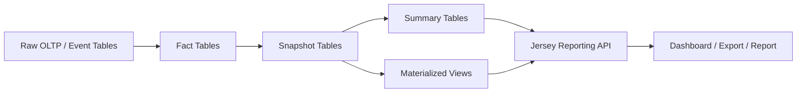

Model praktisnya:

| Layer | Fungsi |
|---|---|
| **Raw OLTP table** | Source transaksi utama |
| **Fact table** | Data analitis dengan grain jelas |
| **Snapshot table** | Kondisi entity pada cutoff/periode |
| **Materialized view** | Precomputed result dari query kompleks |
| **Summary table** | Aggregate table yang dikontrol penuh |
| **API serving** | Query kecil, predictable, guarded |

---

# 2. Materialized View vs Summary Table

## Perbedaan utama

| Aspek | Materialized View | Summary Table |
|---|---|---|
| Definisi | Query disimpan dan hasilnya dipersist | Table biasa yang diisi job/query |
| Refresh | `REFRESH MATERIALIZED VIEW` | `INSERT ... ON CONFLICT`, delete+insert, merge-like flow |
| Incremental control | Terbatas secara native | Penuh |
| Index | Bisa diberi index | Bisa diberi index |
| Metadata metric | Bisa, tapi kurang fleksibel | Sangat fleksibel |
| Audit/reconciliation | Bisa, tapi perlu tambahan table | Lebih natural |
| Serving API | Baik untuk query read-only | Sangat baik |
| Large refresh | Bisa berat karena full replacement | Bisa diproses per period |
| Concurrent read | Bisa pakai `REFRESH ... CONCURRENTLY` dengan syarat | Normal table update/upsert strategy |
| Regulatory snapshot | Kurang ideal sebagai final record | Lebih ideal |

`CREATE MATERIALIZED VIEW` menjalankan query untuk mengisi data saat dibuat, kecuali memakai `WITH NO DATA`, dan query definisinya disimpan agar bisa di-refresh kemudian. `REFRESH MATERIALIZED VIEW` mengganti isi materialized view; opsi `CONCURRENTLY` dapat menghindari blocking select, tetapi memerlukan setidaknya satu unique index yang mencakup semua rows dan hanya memakai nama kolom, bukan expression/partial index. ([PostgreSQL](https://www.postgresql.org/docs/current/sql-creatematerializedview.html))

---

# 3. Decision Matrix

| Kebutuhan | Pilihan utama |
|---|---|
| Query kompleks, refresh harian cukup | Materialized view |
| Dashboard high traffic, hasil kecil | Summary table |
| Perlu incremental per hari/bulan | Summary table |
| Perlu audit metric version/cutoff/source count | Summary table |
| Query refresh full masih murah | Materialized view |
| Query result reusable oleh banyak report | Materialized view atau summary table |
| Report regulatory final | Snapshot/summary table |
| Data berubah late-arriving | Summary table dengan recompute window |
| Perlu concurrent read saat refresh | Materialized view concurrent atau table swap |
| Butuh correction/reversal logic | Summary table |

Rule praktis:

```text id="m0w1js"
Materialized view = good shortcut untuk precompute.
Summary table = production-grade control untuk metric serving.
```

---

# 4. Materialized View Pattern

## 4.1 Use Case

> Dashboard monthly KPI per region dan status group.

Input:

```text id="0brhwx"
mart.fact_case_daily_snapshot
mart.dim_office
mart.dim_case_status
```

Output:

```text id="cb72q5"
report_month + region + status_group + total_cases + breached_cases
```

## 4.2 Create Materialized View

```sql id="iv0vti"
create materialized view reporting.mv_monthly_case_kpi as
select
    date_trunc('month', f.snapshot_date)::date as report_month,
    o.region_code,
    o.region_name,
    s.status_group,

    count(*) as total_cases,
    count(*) filter (where f.is_sla_breached) as breached_cases,

    round(
        100.0 * count(*) filter (where f.is_sla_breached)
        / nullif(count(*), 0),
        2
    ) as breach_rate_percent,

    avg(f.age_days) as avg_age_days,

    percentile_cont(0.95) within group (
        order by f.age_days
    ) as p95_age_days,

    now() as calculated_at,
    'mv_monthly_case_kpi:v1'::text as metric_version

from mart.fact_case_daily_snapshot f
join mart.dim_office o
    on o.office_key = f.office_key
join mart.dim_case_status s
    on s.status_key = f.status_key
group by
    date_trunc('month', f.snapshot_date)::date,
    o.region_code,
    o.region_name,
    s.status_group
with no data;
```

Kenapa `WITH NO DATA`?

| Alasan | Manfaat |
|---|---|
| DDL cepat dibuat | Tidak langsung menjalankan query mahal |
| Bisa buat index dulu | Siap sebelum populate |
| Cocok deployment | Load/refresh bisa dikontrol job |

Materialized view yang dibuat `WITH NO DATA` belum bisa di-scan sampai di-refresh; dokumentasi PostgreSQL menyebutnya sebagai unscannable state. ([PostgreSQL](https://www.postgresql.org/docs/current/sql-creatematerializedview.html))

---

## 4.3 Index Materialized View

Untuk query lookup:

```http id="ingqzq"
GET /reports/monthly-case-kpi?month=2026-07&region=JKT
```

Index:

```sql id="j6qjma"
create unique index uq_mv_monthly_case_kpi
on reporting.mv_monthly_case_kpi (
    report_month,
    region_code,
    status_group
);

create index idx_mv_monthly_case_kpi_region_month
on reporting.mv_monthly_case_kpi (
    region_code,
    report_month
);
```

Unique index penting jika ingin memakai:

```sql id="qyayq3"
refresh materialized view concurrently reporting.mv_monthly_case_kpi;
```

Syarat `CONCURRENTLY` bukan sekadar “ada index”, tetapi harus ada unique index yang mencakup semua row, hanya memakai column names, dan bukan partial/expression index. ([PostgreSQL](https://www.postgresql.org/docs/current/sql-refreshmaterializedview.html))

---

## 4.4 Refresh Materialized View

Initial refresh:

```sql id="9umf9z"
refresh materialized view reporting.mv_monthly_case_kpi;
```

Concurrent refresh setelah MV populated:

```sql id="pahm5e"
refresh materialized view concurrently reporting.mv_monthly_case_kpi;
```

Catatan penting:

| Hal | Penjelasan |
|---|---|
| `CONCURRENTLY` tidak bisa digabung dengan `WITH NO DATA` | PostgreSQL melarang kombinasi itu |
| MV harus sudah populated | Concurrent refresh hanya untuk MV yang sudah berisi data |
| Hanya satu refresh per MV | PostgreSQL membatasi satu refresh berjalan untuk satu MV pada waktu tertentu |
| Order tidak dijamin | `ORDER BY` di definisi MV tidak menjamin order setelah refresh |

Fakta-fakta di atas berasal dari dokumentasi resmi `REFRESH MATERIALIZED VIEW`. ([PostgreSQL](https://www.postgresql.org/docs/current/sql-refreshmaterializedview.html))

---

# 5. Materialized View Anti-pattern

| Anti-pattern | Masalah | Perbaikan |
|---|---|---|
| MV tanpa index | Query serving tetap lambat | Index MV sesuai API |
| MV dianggap selalu fresh | Data stale tidak terlihat | Simpan/tampilkan `calculated_at` |
| Refresh full tiap menit untuk data besar | I/O/CPU berat | Summary incremental |
| `CONCURRENTLY` tanpa unique index valid | Error refresh | Tambah unique index sesuai syarat |
| MV untuk regulatory final report | Kurang audit-friendly | Snapshot/summary final table |
| MV sangat besar tapi query API kecil | Storage dan refresh boros | Summary table by endpoint |
| Banyak MV saling tumpang tindih | Maintenance berat | Consolidate summary layer |

---

# 6. Summary Table Pattern

Summary table adalah table biasa yang menyimpan aggregate result.

## 6.1 Use Case

> Daily SLA KPI per office.

Output grain:

```text id="xmbxf2"
satu row = satu report_date + satu office
```

DDL:

```sql id="0tcovu"
create table reporting.summary_sla_daily (
    report_date date not null,
    office_key bigint not null,

    total_cases bigint not null,
    breached_cases bigint not null,
    breach_rate_percent numeric(7,2) not null,

    avg_age_days numeric(12,2),
    p95_age_days numeric(12,2),

    source_snapshot_date date not null,
    source_row_count bigint not null,

    calculated_at timestamptz not null default now(),
    metric_version text not null,
    job_run_id uuid not null,

    primary key (report_date, office_key)
);
```

Index untuk serving API:

```sql id="w17e02"
create index idx_summary_sla_daily_office_date_cover
on reporting.summary_sla_daily (
    office_key,
    report_date
)
include (
    total_cases,
    breached_cases,
    breach_rate_percent,
    avg_age_days,
    p95_age_days,
    calculated_at,
    metric_version
);
```

---

## 6.2 Load Summary dengan Idempotent Upsert

```sql id="f50p89"
insert into reporting.summary_sla_daily (
    report_date,
    office_key,
    total_cases,
    breached_cases,
    breach_rate_percent,
    avg_age_days,
    p95_age_days,
    source_snapshot_date,
    source_row_count,
    calculated_at,
    metric_version,
    job_run_id
)
select
    f.snapshot_date as report_date,
    f.office_key,

    count(*) as total_cases,
    count(*) filter (where f.is_sla_breached) as breached_cases,

    round(
        100.0 * count(*) filter (where f.is_sla_breached)
        / nullif(count(*), 0),
        2
    ) as breach_rate_percent,

    round(avg(f.age_days), 2) as avg_age_days,

    percentile_cont(0.95) within group (
        order by f.age_days
    ) as p95_age_days,

    f.snapshot_date as source_snapshot_date,
    count(*) as source_row_count,
    now() as calculated_at,
    'summary_sla_daily:v1' as metric_version,
    #{jobRunId}::uuid as job_run_id

from mart.fact_case_daily_snapshot f
where f.snapshot_date = #{snapshotDate}
group by
    f.snapshot_date,
    f.office_key

on conflict (report_date, office_key)
do update set
    total_cases = excluded.total_cases,
    breached_cases = excluded.breached_cases,
    breach_rate_percent = excluded.breach_rate_percent,
    avg_age_days = excluded.avg_age_days,
    p95_age_days = excluded.p95_age_days,
    source_snapshot_date = excluded.source_snapshot_date,
    source_row_count = excluded.source_row_count,
    calculated_at = excluded.calculated_at,
    metric_version = excluded.metric_version,
    job_run_id = excluded.job_run_id;
```

`ON CONFLICT DO UPDATE` di PostgreSQL menjamin outcome atomic insert-or-update untuk conflict target yang valid; dokumentasi menyebut ini sebagai UPSERT. Ini sangat cocok untuk summary load yang harus idempotent. ([PostgreSQL](https://www.postgresql.org/docs/current/sql-insert.html))

---

# 7. Why Idempotency Matters

Incremental rollup job harus aman diulang.

```text id="kpn5rf"
Job gagal setelah 80%.
Job dijalankan ulang.
Hasil akhir harus sama, tidak boleh double count.
```

Bad pattern:

```sql id="48rb9g"
insert into reporting.summary_sla_daily (...)
select ...
```

Jika dijalankan ulang, bisa duplicate atau error.

Better pattern:

```sql id="fxd86t"
insert into reporting.summary_sla_daily (...)
select ...
on conflict (...) do update set ...;
```

Atau untuk batch per period:

```sql id="n6syo1"
begin;

delete from reporting.summary_sla_daily
where report_date = #{snapshotDate};

insert into reporting.summary_sla_daily (...)
select ...
where snapshot_date = #{snapshotDate}
group by ...;

commit;
```

Decision:

| Pattern | Cocok untuk |
|---|---|
| `ON CONFLICT DO UPDATE` | Small-medium rollup, natural key jelas |
| `DELETE + INSERT` per partition/period | Recompute seluruh period |
| Table swap | Large refresh with minimal serving disruption |
| Staging + merge | Complex validation/reconciliation |

---

# 8. Incremental Rollup Model

Incremental rollup menghitung hanya data yang berubah atau periode kecil.

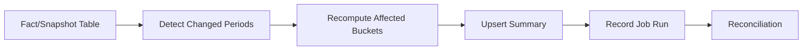

Ada dua pendekatan utama:

| Pendekatan | Cara kerja | Cocok untuk |
|---|---|---|
| **Watermark-based** | Ambil data baru sejak last processed | Append-only event |
| **Period recompute** | Recompute bucket tanggal/bulan terdampak | Snapshot/reporting metric |
| **Hybrid** | Watermark mendeteksi changed periods, lalu recompute periods | Late-arriving/correction-prone data |

Untuk sistem regulatory/case management, saya lebih suka **hybrid**:

```text id="lo7iz0"
detect changed case/event since last watermark
determine affected report_date/report_month
recompute those periods from source of truth
upsert summary
record reconciliation
```

Alasannya: data bisa late-arriving, ada correction, status berubah, dan report harus defensible.

---

# 9. Job Metadata Table

Jangan jalankan rollup tanpa metadata.

```sql id="cz52d7"
create table reporting.rollup_job_run (
    job_run_id uuid primary key,
    job_name text not null,
    target_table text not null,

    period_from date not null,
    period_to date not null,

    status text not null check (
        status in ('STARTED', 'SUCCESS', 'FAILED', 'PARTIAL')
    ),

    started_at timestamptz not null default now(),
    finished_at timestamptz,

    source_row_count bigint,
    target_row_count bigint,

    metric_version text not null,
    error_message text,
    triggered_by text not null default 'scheduler'
);
```

Start job:

```sql id="hjlbua"
insert into reporting.rollup_job_run (
    job_run_id,
    job_name,
    target_table,
    period_from,
    period_to,
    status,
    metric_version,
    triggered_by
)
values (
    #{jobRunId}::uuid,
    'summary_sla_daily_rollup',
    'reporting.summary_sla_daily',
    #{periodFrom},
    #{periodTo},
    'STARTED',
    'summary_sla_daily:v1',
    #{triggeredBy}
);
```

Finish job:

```sql id="2dqngz"
update reporting.rollup_job_run
set
    status = 'SUCCESS',
    finished_at = now(),
    source_row_count = #{sourceRowCount},
    target_row_count = #{targetRowCount}
where job_run_id = #{jobRunId}::uuid;
```

---

# 10. Reconciliation Table

Untuk enterprise/regulatory reporting, simpan reconciliation.

```sql id="86o25w"
create table reporting.rollup_reconciliation (
    reconciliation_id uuid primary key,
    job_run_id uuid not null references reporting.rollup_job_run(job_run_id),

    metric_name text not null,
    report_period text not null,

    source_table text not null,
    target_table text not null,

    source_row_count bigint not null,
    source_distinct_entity_count bigint,
    target_row_count bigint not null,

    total_input_measure numeric,
    total_output_measure numeric,

    is_balanced boolean not null,
    tolerance numeric,
    note text,

    checked_at timestamptz not null default now()
);
```

Example check:

```sql id="e4jcou"
with source_check as (
    select
        count(*) as source_row_count,
        count(distinct case_id) as source_case_count
    from mart.fact_case_daily_snapshot
    where snapshot_date = #{snapshotDate}
),
target_check as (
    select
        count(*) as target_row_count,
        sum(total_cases) as output_case_count
    from reporting.summary_sla_daily
    where report_date = #{snapshotDate}
)
insert into reporting.rollup_reconciliation (
    reconciliation_id,
    job_run_id,
    metric_name,
    report_period,
    source_table,
    target_table,
    source_row_count,
    source_distinct_entity_count,
    target_row_count,
    total_input_measure,
    total_output_measure,
    is_balanced,
    tolerance,
    note
)
select
    gen_random_uuid(),
    #{jobRunId}::uuid,
    'daily_sla_case_count',
    #{snapshotDate}::text,
    'mart.fact_case_daily_snapshot',
    'reporting.summary_sla_daily',
    s.source_row_count,
    s.source_case_count,
    t.target_row_count,
    s.source_case_count,
    t.output_case_count,
    s.source_case_count = t.output_case_count,
    0,
    null
from source_check s
cross join target_check t;
```

---

# 11. Incremental Rollup by Date

## 11.1 Rollup per snapshot date

```sql id="08uzds"
create or replace function reporting.refresh_summary_sla_daily(
    p_snapshot_date date,
    p_job_run_id uuid
)
returns void
language plpgsql
as $$
begin
    insert into reporting.summary_sla_daily (
        report_date,
        office_key,
        total_cases,
        breached_cases,
        breach_rate_percent,
        avg_age_days,
        p95_age_days,
        source_snapshot_date,
        source_row_count,
        calculated_at,
        metric_version,
        job_run_id
    )
    select
        f.snapshot_date,
        f.office_key,
        count(*) as total_cases,
        count(*) filter (where f.is_sla_breached) as breached_cases,
        round(
            100.0 * count(*) filter (where f.is_sla_breached)
            / nullif(count(*), 0),
            2
        ) as breach_rate_percent,
        round(avg(f.age_days), 2) as avg_age_days,
        percentile_cont(0.95) within group (
            order by f.age_days
        ) as p95_age_days,
        f.snapshot_date as source_snapshot_date,
        count(*) as source_row_count,
        now() as calculated_at,
        'summary_sla_daily:v1' as metric_version,
        p_job_run_id
    from mart.fact_case_daily_snapshot f
    where f.snapshot_date = p_snapshot_date
    group by
        f.snapshot_date,
        f.office_key
    on conflict (report_date, office_key)
    do update set
        total_cases = excluded.total_cases,
        breached_cases = excluded.breached_cases,
        breach_rate_percent = excluded.breach_rate_percent,
        avg_age_days = excluded.avg_age_days,
        p95_age_days = excluded.p95_age_days,
        source_snapshot_date = excluded.source_snapshot_date,
        source_row_count = excluded.source_row_count,
        calculated_at = excluded.calculated_at,
        metric_version = excluded.metric_version,
        job_run_id = excluded.job_run_id;
end;
$$;
```

Aggregate `FILTER` berguna untuk menghitung conditional metrics seperti breached count dalam aggregate yang sama; PostgreSQL mendokumentasikan `FILTER` sebagai per-aggregate option yang hanya menghapus row dari input aggregate tertentu, bukan dari semua aggregate di query. ([PostgreSQL](https://www.postgresql.org/docs/current/tutorial-agg.html))

---

## 11.2 Run untuk range tanggal

```sql id="f5v8bu"
do $$
declare
    v_date date;
    v_job_run_id uuid := gen_random_uuid();
begin
    v_date := date '2026-07-01';

    while v_date < date '2026-08-01' loop
        perform reporting.refresh_summary_sla_daily(
            v_date,
            v_job_run_id
        );

        v_date := v_date + interval '1 day';
    end loop;
end;
$$;
```

Untuk production, scheduler lebih baik mengatur `job_run_id`, status, retry, dan alerting dari application/job runner, bukan anonymous `DO` block.

---

# 12. Incremental Rollup by Changed Periods

Jika source adalah event table append-only:

```sql id="u9jdw7"
create table reporting.rollup_watermark (
    job_name text primary key,
    last_processed_at timestamptz not null,
    updated_at timestamptz not null default now()
);
```

Detect changed dates:

```sql id="q7cteg"
with watermark as (
    select last_processed_at
    from reporting.rollup_watermark
    where job_name = 'summary_case_transition_daily'
),
changed_dates as (
    select distinct transition_at::date as affected_date
    from mart.fact_case_transition t
    cross join watermark w
    where t.loaded_at > w.last_processed_at
      and t.loaded_at <= #{currentWatermark}::timestamptz
)
select affected_date
from changed_dates
order by affected_date;
```

Lalu recompute affected dates, bukan hanya append delta.

Kenapa recompute bucket lebih aman?

| Masalah | Delta-only risk | Recompute bucket |
|---|---|---|
| Late event | Bisa kurang hitung | Tanggal terdampak dihitung ulang |
| Correction | Sulit subtract | Source of truth dibaca ulang |
| Dedup berubah | Delta kacau | Output diganti |
| Business rule berubah | Sulit patch | Recompute versi baru |
| Audit | Sulit jelaskan | Lebih defensible |

---

# 13. Monthly Rollup

## 13.1 Summary monthly table

```sql id="0amxxm"
create table reporting.summary_case_status_monthly (
    report_month date not null,
    office_key bigint not null,
    status_key smallint not null,

    total_case_days bigint not null,
    avg_daily_cases numeric(14,2) not null,
    max_daily_cases bigint not null,

    breached_case_days bigint not null,
    breach_rate_percent numeric(7,2) not null,

    calculated_at timestamptz not null default now(),
    metric_version text not null,
    job_run_id uuid not null,

    primary key (report_month, office_key, status_key)
);
```

Catatan penting: dari daily snapshot, `count(*)` selama sebulan berarti **case-days**, bukan unique cases. Ini sering jadi sumber salah metric.

| Metric | Makna |
|---|---|
| `total_case_days` | Total kemunculan case di daily snapshots |
| `avg_daily_cases` | Rata-rata daily backlog |
| `max_daily_cases` | Peak backlog |
| `count(distinct case_id)` | Unique cases seen in month |

Jangan mencampur metric ini.

---

## 13.2 Monthly rollup dari daily summary

```sql id="wby22r"
insert into reporting.summary_case_status_monthly (
    report_month,
    office_key,
    status_key,
    total_case_days,
    avg_daily_cases,
    max_daily_cases,
    breached_case_days,
    breach_rate_percent,
    calculated_at,
    metric_version,
    job_run_id
)
select
    date_trunc('month', report_date)::date as report_month,
    office_key,
    status_key,

    sum(total_cases) as total_case_days,
    round(avg(total_cases), 2) as avg_daily_cases,
    max(total_cases) as max_daily_cases,

    sum(breached_cases) as breached_case_days,

    round(
        100.0 * sum(breached_cases) / nullif(sum(total_cases), 0),
        2
    ) as breach_rate_percent,

    now() as calculated_at,
    'summary_case_status_monthly:v1' as metric_version,
    #{jobRunId}::uuid as job_run_id

from reporting.summary_case_status_daily
where report_date >= #{monthStart}
  and report_date < #{monthEnd}
group by
    date_trunc('month', report_date)::date,
    office_key,
    status_key

on conflict (report_month, office_key, status_key)
do update set
    total_case_days = excluded.total_case_days,
    avg_daily_cases = excluded.avg_daily_cases,
    max_daily_cases = excluded.max_daily_cases,
    breached_case_days = excluded.breached_case_days,
    breach_rate_percent = excluded.breach_rate_percent,
    calculated_at = excluded.calculated_at,
    metric_version = excluded.metric_version,
    job_run_id = excluded.job_run_id;
```

---

# 14. Non-additive Metric Trap

Tidak semua metric bisa di-rollup dengan `sum`.

| Metric | Bisa di-sum? | Cara benar |
|---|---:|---|
| `total_cases` per office/status | Ya, jika grain tidak overlap | `sum(total_cases)` |
| `breached_cases` | Ya, jika denominator sama grain | `sum(breached_cases)` |
| `breach_rate_percent` | Tidak | Recompute dari numerator/denominator |
| `avg_age_days` | Tidak langsung | Weighted average atau recompute |
| `p95_age_days` | Tidak | Recompute dari raw/base distribution |
| `distinct case count` | Tidak sederhana | Recompute atau approximate structure |
| `max_daily_cases` | Bisa `max` dari daily | `max(...)` |
| `case-days` | Bisa | `sum(daily_cases)` |

Anti-pattern:

```sql id="gpwafi"
select avg(breach_rate_percent)
from reporting.summary_sla_daily;
```

Lebih benar:

```sql id="w1cnog"
select
    round(
        100.0 * sum(breached_cases) / nullif(sum(total_cases), 0),
        2
    ) as breach_rate_percent
from reporting.summary_sla_daily;
```

---

# 15. Table Swap Pattern

Untuk refresh besar tanpa mengganggu serving table terlalu lama, gunakan build table baru lalu swap.

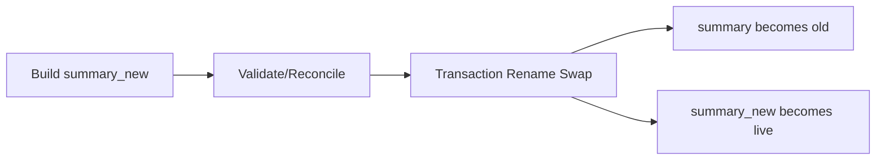

Contoh:

```sql id="kiofcf"
create table reporting.summary_sla_daily_new
(like reporting.summary_sla_daily including all);
```

Load:

```sql id="mujh1h"
insert into reporting.summary_sla_daily_new (...)
select ...
from mart.fact_case_daily_snapshot
where snapshot_date >= date '2026-07-01'
  and snapshot_date < date '2026-08-01'
group by ...;
```

Index:

```sql id="0wppc9"
create index idx_summary_sla_daily_new_office_date
on reporting.summary_sla_daily_new (
    office_key,
    report_date
);
```

Validate, then swap:

```sql id="krgphk"
begin;

alter table reporting.summary_sla_daily
rename to summary_sla_daily_old;

alter table reporting.summary_sla_daily_new
rename to summary_sla_daily;

commit;
```

Caution:

| Hal | Catatan |
|---|---|
| FK/dependency | Rename bisa berdampak ke grants/views/dependencies |
| Privilege | Pastikan grant disalin |
| Index names | Rename/index naming perlu dirapikan |
| Concurrent access | Test lock behavior |
| Rollback | Simpan old table sementara |

Untuk banyak kasus, lebih sederhana memakai partitioned summary table dan swap/detach per partition.

---

# 16. Partitioned Summary Table

Untuk summary besar, partition by report date/month.

```sql id="68v6aw"
create table reporting.summary_case_status_daily (
    report_date date not null,
    office_key bigint not null,
    status_key smallint not null,
    total_cases bigint not null,
    breached_cases bigint not null,
    calculated_at timestamptz not null,
    metric_version text not null,
    job_run_id uuid not null,
    primary key (report_date, office_key, status_key)
) partition by range (report_date);
```

Partition:

```sql id="gnd3qj"
create table reporting.summary_case_status_daily_2026_07
partition of reporting.summary_case_status_daily
for values from ('2026-07-01') to ('2026-08-01');
```

Benefit:

| Benefit | Penjelasan |
|---|---|
| Recompute per month | Drop/reload partition |
| Retention mudah | Drop/detach old partitions |
| Index kecil | Per partition |
| Batch isolation | Load target period saja |

Pattern refresh satu bulan:

```sql id="e97v5z"
begin;

delete from reporting.summary_case_status_daily
where report_date >= date '2026-07-01'
  and report_date < date '2026-08-01';

insert into reporting.summary_case_status_daily (...)
select ...
from mart.fact_case_daily_snapshot
where snapshot_date >= date '2026-07-01'
  and snapshot_date < date '2026-08-01'
group by ...;

commit;
```

Untuk volume sangat besar, lebih baik build standalone partition, validate, lalu attach.

---

# 17. Late-arriving Data Strategy

Late-arriving data adalah data yang masuk terlambat tetapi memengaruhi periode lampau.

Contoh:

```text id="4bonvh"
Event tanggal 2026-07-10 baru masuk pada 2026-07-15.
Correction status case untuk 2026-06.
Office mapping historis diperbaiki.
```

Strategi:

| Strategy | Cocok untuk |
|---|---|
| Recompute rolling window 7 hari | Operational dashboard |
| Recompute rolling window 30/90 hari | SLA/case lifecycle |
| Detect changed periods from `loaded_at` | Event fact append-only |
| Manual backfill job | Regulatory correction |
| Metric version bump | Business logic berubah |

Recommended default:

```text id="4ab36h"
Daily job:
- recompute yesterday
- recompute last 7 days
- recompute changed historical dates
- record reconciliation
```

---

# 18. Refresh Scheduling

| Summary/MV | Refresh cadence |
|---|---|
| Operational dashboard | Every 5-15 minutes, hourly, or near-real-time depending SLA |
| Daily KPI | After daily snapshot complete |
| Monthly report | After month close |
| Regulatory report | Explicit cutoff + approval |
| Ad-hoc MV | Manual/on demand |
| Heavy MV | Off-peak window |

Caution:

```text id="9fxnov"
Refresh cadence harus mengikuti business freshness requirement,
bukan sekadar “semakin sering semakin baik”.
```

---

# 19. API Serving Contract

Endpoint reporting harus menampilkan freshness.

Response example:

```json id="bgza0i"
{
  "period": "2026-07",
  "officeId": 10,
  "metricVersion": "summary_sla_daily:v1",
  "lastCalculatedAt": "2026-07-15T01:30:00Z",
  "freshness": {
    "sourceSnapshotDate": "2026-07-14",
    "isFinal": false
  },
  "data": [
    {
      "date": "2026-07-14",
      "totalCases": 1200,
      "breachedCases": 85,
      "breachRatePercent": 7.08
    }
  ]
}
```

Jersey resource:

```java id="0d73tu"
@Path("/reports/sla-daily")
@Produces(MediaType.APPLICATION_JSON)
public class SlaDailyReportResource {

    private final SlaDailyReportService service;

    @GET
    public Response getSlaDaily(
            @QueryParam("period") String period,
            @QueryParam("officeId") Long officeId
    ) {
        SlaDailyReportResponse response =
                service.getDailySla(period, officeId);

        return Response.ok(response).build();
    }
}
```

Service guardrail:

```java id="u7q2wq"
public SlaDailyReportResponse getDailySla(String period, Long officeId) {
    if (officeId == null) {
        throw new BadRequestException("officeId is required");
    }

    YearMonth ym = YearMonth.parse(period);
    LocalDate from = ym.atDay(1);
    LocalDate to = ym.plusMonths(1).atDay(1);

    List<SlaDailyRow> rows = mapper.findDailySla(officeId, from, to);

    return SlaDailyReportResponse.from(period, officeId, rows);
}
```

Mapper query:

```xml id="zqu74p"
<select id="findDailySla" resultMap="SlaDailyRowMap">
    select
        report_date,
        total_cases,
        breached_cases,
        breach_rate_percent,
        avg_age_days,
        p95_age_days,
        calculated_at,
        metric_version
    from reporting.summary_sla_daily
    where office_key = #{officeKey}
      and report_date >= #{fromDate}
      and report_date < #{toDate}
    order by report_date
</select>
```

---

# 20. Refresh Job from Java/MyBatis

Walaupun seri integrasi lengkap ada di Seri 13, pattern praktisnya:

```java id="3u4lpd"
public interface SlaRollupMapper {

    void startJobRun(@Param("jobRunId") UUID jobRunId,
                     @Param("periodFrom") LocalDate periodFrom,
                     @Param("periodTo") LocalDate periodTo);

    void refreshDailySummary(@Param("snapshotDate") LocalDate snapshotDate,
                             @Param("jobRunId") UUID jobRunId);

    void finishJobRun(@Param("jobRunId") UUID jobRunId,
                      @Param("sourceRowCount") long sourceRowCount,
                      @Param("targetRowCount") long targetRowCount);

    void failJobRun(@Param("jobRunId") UUID jobRunId,
                    @Param("errorMessage") String errorMessage);
}
```

Service:

```java id="7fyvni"
public void refreshDailyRange(LocalDate from, LocalDate to) {
    UUID jobRunId = UUID.randomUUID();

    mapper.startJobRun(jobRunId, from, to);

    try {
        LocalDate d = from;
        while (d.isBefore(to)) {
            mapper.refreshDailySummary(d, jobRunId);
            d = d.plusDays(1);
        }

        RollupCounts counts = mapper.countRollupResult(from, to);
        mapper.finishJobRun(jobRunId, counts.sourceRows(), counts.targetRows());

    } catch (Exception ex) {
        mapper.failJobRun(jobRunId, ex.getMessage());
        throw ex;
    }
}
```

Practical warning:

| Issue | Mitigation |
|---|---|
| Job double-run | Advisory lock/job lock table |
| Partial failure | Job status + idempotent upsert |
| Long transaction | Commit per period if acceptable |
| Huge refresh | Partition/table swap |
| Retry | Safe because idempotent |

---

# 21. Advisory Lock untuk Rollup Job

Supaya dua job sama tidak berjalan bersamaan:

```sql id="rb0ykw"
select pg_try_advisory_lock(hashtext('summary_sla_daily_rollup'));
```

Release:

```sql id="d8aqa7"
select pg_advisory_unlock(hashtext('summary_sla_daily_rollup'));
```

Dalam PL/pgSQL:

```sql id="n8a3mc"
do $$
declare
    v_locked boolean;
begin
    select pg_try_advisory_lock(hashtext('summary_sla_daily_rollup'))
    into v_locked;

    if not v_locked then
        raise exception 'summary_sla_daily_rollup is already running';
    end if;

    -- run job here

    perform pg_advisory_unlock(hashtext('summary_sla_daily_rollup'));
exception
    when others then
        perform pg_advisory_unlock(hashtext('summary_sla_daily_rollup'));
        raise;
end;
$$;
```

---

# 22. Refresh Strategy Comparison

| Strategy | Pros | Cons | Best for |
|---|---|---|---|
| Full MV refresh | Simple | Expensive for large data | Small/medium MV |
| Concurrent MV refresh | Allows reads | Needs valid unique index; more constraints | MV serving dashboard |
| Summary upsert | Idempotent, controlled | More SQL/job logic | Daily/hourly KPI |
| Delete+insert period | Simple recompute | Needs transaction/lock care | Period-level refresh |
| Table swap | Minimal serving disruption | More DDL/dependency complexity | Large full rebuild |
| Partition swap | Clean for period data | Requires partitioned design | Monthly/daily big summary |
| Watermark delta | Efficient | Hard with correction/late data | Append-only clean event |
| Hybrid changed-period recompute | Safer | More metadata logic | Regulatory/case lifecycle |

---

# 23. Freshness and Finalization

Untuk reporting, data punya lifecycle.

```text id="8he3an"
DRAFT -> REFRESHED -> RECONCILED -> FINALIZED -> CORRECTED
```

Table metadata:

```sql id="a4cq5g"
create table reporting.report_period_status (
    report_name text not null,
    report_period text not null,
    status text not null check (
        status in ('DRAFT', 'REFRESHED', 'RECONCILED', 'FINALIZED', 'CORRECTED')
    ),
    last_calculated_at timestamptz,
    finalized_at timestamptz,
    finalized_by text,
    metric_version text not null,
    note text,
    primary key (report_name, report_period)
);
```

Gunakan untuk API:

```json id="gbn3jc"
{
  "period": "2026-07",
  "status": "REFRESHED",
  "isFinal": false,
  "lastCalculatedAt": "2026-07-15T01:30:00Z"
}
```

Ini penting supaya user dashboard tahu apakah angka masih operational estimate atau sudah final.

---

# 24. Metric Versioning

Setiap summary penting perlu `metric_version`.

Contoh perubahan:

```text id="a1jg69"
v1: SLA breach jika age_days > 30
v2: SLA breach jika business_days > 20
```

Jika logic berubah, jangan diam-diam overwrite angka lama tanpa jejak.

Pattern:

| Perubahan | Action |
|---|---|
| Bug fix minor sebelum final | Recompute same version + note |
| Business definition berubah | New metric version |
| Historical restatement | Record correction |
| Regulatory report finalized | Snapshot final immutable |

Metric definition table:

```sql id="m8b90m"
create table reporting.metric_definition (
    metric_version text primary key,
    metric_name text not null,
    description text not null,
    formula text not null,
    effective_from date not null,
    effective_to date,
    owner text not null,
    created_at timestamptz not null default now()
);
```

---

# 25. Data Quality Checks

Minimal check setelah refresh:

| Check | Query idea |
|---|---|
| Source row count | Count input snapshot/fact |
| Target row count | Count summary rows |
| Sum numerator | Sum breached/total |
| Null dimension | Count missing office/status |
| Duplicate key | PK should prevent |
| Negative value | Check measures |
| Rate range | 0-100% |
| Period completeness | All expected dates present |
| Freshness | `calculated_at` valid |
| Metric version consistency | One version per period unless expected |

Contoh completeness check:

```sql id="r7gzz3"
with expected_dates as (
    select d::date as report_date
    from generate_series(
        #{fromDate}::date,
        #{toDate}::date - interval '1 day',
        interval '1 day'
    ) d
),
actual_dates as (
    select distinct report_date
    from reporting.summary_sla_daily
    where report_date >= #{fromDate}
      and report_date < #{toDate}
)
select e.report_date
from expected_dates e
left join actual_dates a
    on a.report_date = e.report_date
where a.report_date is null;
```

---

# 26. Observability

## 26.1 Job duration

```sql id="zibnxp"
select
    job_name,
    status,
    period_from,
    period_to,
    started_at,
    finished_at,
    extract(epoch from (finished_at - started_at)) as duration_seconds,
    source_row_count,
    target_row_count
from reporting.rollup_job_run
order by started_at desc
limit 50;
```

## 26.2 Stale summary

```sql id="r1ptkc"
select
    max(calculated_at) as last_calculated_at,
    now() - max(calculated_at) as age
from reporting.summary_sla_daily
where report_date >= current_date - interval '7 days';
```

## 26.3 Failed jobs

```sql id="jwbfl8"
select
    job_run_id,
    job_name,
    period_from,
    period_to,
    started_at,
    error_message
from reporting.rollup_job_run
where status = 'FAILED'
order by started_at desc;
```

---

# 27. Security and Access

Untuk OLAP serving:

| Object | Recommended access |
|---|---|
| Raw fact table | Restricted |
| Snapshot table | Restricted/internal |
| Summary table | Read for reporting app |
| Materialized view | Read for reporting app |
| Job metadata | Read for admin, write for job |
| Metric definition | Read broadly |
| Regulatory final snapshot | Strict privilege/audit |

Pattern:

```sql id="ftt85c"
grant usage on schema reporting to reporting_app;

grant select on reporting.summary_sla_daily to reporting_app;
grant select on reporting.mv_monthly_case_kpi to reporting_app;

revoke all on mart.fact_case_daily_snapshot from reporting_app;
```

Jangan memberi API user akses langsung ke raw fact kalau governance/security mengharuskan policy via application.

---

# 28. Common Failure Modes

| Failure | Gejala | Root cause | Fix |
|---|---|---|---|
| Dashboard lambat walau ada MV | MV tidak diindex | Buat index sesuai query |
| Refresh MV blocking user | `REFRESH` biasa | Pakai `CONCURRENTLY` jika memenuhi syarat |
| Concurrent refresh error | Unique index tidak valid | Buat unique full-row key |
| Summary double count | Job tidak idempotent | PK + upsert/delete+insert |
| Angka berubah tanpa jejak | Tidak ada metric version/job metadata | Tambah metadata |
| Monthly breach rate salah | Average of percentages | Recompute numerator/denominator |
| Late data tidak masuk | Pure watermark delta | Recompute affected periods |
| Job overlap | Scheduler menjalankan dua instance | Advisory lock/job lock |
| Report final berubah | Summary mutable tanpa finalization | Snapshot final/period status |
| API menampilkan angka stale tanpa info | Tidak expose freshness | Tambah `calculated_at`, status |

---

# 29. Anti-patterns

| Anti-pattern | Kenapa buruk |
|---|---|
| Dashboard query langsung ke raw fact setiap request | Membebani DB dan tidak predictable |
| Materialized view dianggap incremental by default | PostgreSQL refresh MV mengganti isi MV |
| `avg(rate)` untuk rollup | Salah secara metric |
| Summary tanpa primary key | Tidak idempotent |
| Summary tanpa `calculated_at` | Freshness tidak jelas |
| Summary tanpa `metric_version` | Tidak audit-friendly |
| Refresh besar dalam satu transaction panjang | Lock/rollback risk |
| Job tanpa status table | Sulit retry dan audit |
| Tidak ada reconciliation | Angka sulit dipercaya |
| Semua report jadi MV | Banyak full refresh mahal |

---

# 30. End-to-End Practical Design

## Use Case

> Dashboard SLA harian per office dan monthly KPI per region.

Recommended objects:

```text id="4z5co4"
mart.fact_case_daily_snapshot
reporting.summary_sla_daily
reporting.summary_case_status_monthly
reporting.mv_monthly_case_kpi
reporting.rollup_job_run
reporting.rollup_reconciliation
reporting.metric_definition
```

Flow:

```mermaid id="wdqbyv"
flowchart TD
    A[mart.fact_case_daily_snapshot] --> B[Daily SLA Rollup Job]
    B --> C[reporting.summary_sla_daily]
    C --> D[Monthly Rollup Job]
    D --> E[reporting.summary_case_status_monthly]

    A --> F[MV Refresh Job]
    F --> G[reporting.mv_monthly_case_kpi]

    B --> H[rollup_job_run]
    B --> I[rollup_reconciliation]

    C --> J[Jersey API]
    E --> J
    G --> J
```

Minimal index set:

```sql id="d3bz1o"
create index idx_summary_sla_daily_office_date_cover
on reporting.summary_sla_daily (
    office_key,
    report_date
)
include (
    total_cases,
    breached_cases,
    breach_rate_percent,
    p95_age_days,
    calculated_at,
    metric_version
);

create unique index uq_mv_monthly_case_kpi
on reporting.mv_monthly_case_kpi (
    report_month,
    region_code,
    status_group
);

create index idx_summary_case_status_monthly_office_month
on reporting.summary_case_status_monthly (
    office_key,
    report_month,
    status_key
);
```

---

# 31. Practical Checklist

Sebelum precompute layer masuk production:

| Checklist | Wajib? |
|---|---|
| Grain output summary/MV jelas | Ya |
| Primary key/unique key jelas | Ya |
| Query source sudah divalidasi | Ya |
| Summary load idempotent | Ya |
| `metric_version` tersedia | Ya |
| `calculated_at` tersedia | Ya |
| Job metadata tersedia | Ya |
| Reconciliation minimal tersedia | Ya |
| Late-arriving data strategy jelas | Ya |
| Refresh cadence disepakati | Ya |
| Index serving dibuat | Ya |
| API menampilkan freshness | Ya |
| Failure/retry behavior jelas | Ya |
| Regulatory finalization dipisahkan dari dashboard estimate | Ya |

---

# 32. Ringkasan Seri 6

Inti seri ini:

```text id="96b123"
Materialized view menyimpan hasil query dan cocok untuk precompute sederhana.
Summary table memberi kontrol penuh untuk incremental rollup, audit, metadata, dan API serving.
Incremental rollup harus idempotent.
Metric rollup harus menjaga numerator/denominator, bukan sekadar average percentage.
Late-arriving data paling aman ditangani dengan changed-period recompute.
```

Rule praktis paling penting:

| Rule | Makna |
|---|---|
| Jangan dashboard ke raw fact | Pakai summary/MV |
| MV harus diindex | Kalau tidak, serving tetap lambat |
| Concurrent MV refresh punya syarat | Unique full-row column index |
| Summary harus punya PK | Untuk idempotent upsert |
| Simpan freshness | `calculated_at`, source period |
| Simpan lineage | job run, metric version, reconciliation |
| Jangan rollup rate dengan average | Hitung ulang dari numerator/denominator |
| Recompute affected period untuk correction | Lebih aman daripada delta-only |
| Pisahkan dashboard estimate vs regulatory final | Auditability berbeda |

---

# Status

**Seri 6/13 selesai.**

Rekomendasi materi selanjutnya: **Seri 7/13 - Query Planner, EXPLAIN ANALYZE, Statistics, Extended Statistics**.

---

**Sources:**

- [PostgreSQL: Documentation: 18: 39.3. Materialized Views](https://www.postgresql.org/docs/current/rules-materializedviews.html)

## Response:
7/15/2026, 8:12:07 PM

Lanjut ke **Seri 7/13**. Saya akan fokus ke kemampuan diagnosis: membaca `EXPLAIN ANALYZE`, memahami row estimate vs actual, statistics, extended statistics, dan bagaimana itu memengaruhi query OLAP production.

# Seri 7/13 - Query Planner, EXPLAIN ANALYZE, Statistics, Extended Statistics

Seri ini fokus ke kemampuan yang sangat penting untuk PostgreSQL OLAP: **mendiagnosis kenapa query lambat secara evidence-based**, bukan berdasarkan tebakan.

Target praktisnya:

```text id="x3suhm"
bisa membaca EXPLAIN ANALYZE
bisa membedakan estimated rows vs actual rows
bisa melihat I/O, sort spill, join strategy, aggregate strategy
bisa tahu kapan perlu index, statistics, rewrite query, summary table, atau partition redesign
```

PostgreSQL menggunakan planner untuk memilih execution plan. `EXPLAIN` menampilkan plan yang dipilih planner, sedangkan `EXPLAIN ANALYZE` benar-benar menjalankan statement dan menambahkan runtime statistics. Di PostgreSQL 18, `EXPLAIN ANALYZE` secara otomatis menyertakan `BUFFERS`, kecuali dimatikan eksplisit dengan `BUFFERS OFF`. ([PostgreSQL](https://www.postgresql.org/docs/current/using-explain.html?utm_source=chatgpt.com))

---

## 1. Mental Model Planner

PostgreSQL tidak menjalankan SQL “apa adanya”. PostgreSQL akan:

```text id="7f62cz"
parse SQL
rewrite query
estimate cardinality
choose access path
choose join order
choose aggregate/sort strategy
estimate cost
execute selected plan
```

Diagram:

```mermaid id="e973p7"
flowchart TD
    A[SQL Query] --> B[Parser / Rewriter]
    B --> C[Planner / Optimizer]
    C --> D[Statistics / Cost Model]
    D --> E[Execution Plan]
    E --> F[Executor]
    F --> G[Actual Runtime Result]

    H[ANALYZE] --> D
    I[CREATE STATISTICS] --> D
    J[Index / Partitioning] --> C
```

Planner sangat bergantung pada statistik. `ANALYZE` mengumpulkan statistik isi table dan menyimpannya di catalog agar planner bisa menentukan execution plan yang efisien. ([PostgreSQL](https://www.postgresql.org/docs/current/sql-analyze.html?utm_source=chatgpt.com))

---

# 2. Kenapa Ini Penting untuk OLAP?

Query OLAP biasanya mahal karena:

| Karakteristik | Risiko |
|---|---|
| Scan banyak row | I/O tinggi |
| Join fact + dimension | Join order bisa salah |
| Group by banyak dimension | Hash/sort besar |
| Window function | Sort besar |
| Date range panjang | Banyak partition/index dibaca |
| Data skewed | Estimasi planner meleset |
| Filter kolom berkorelasi | Single-column statistics tidak cukup |
| Dashboard sering refresh | Query mahal menjadi beban berulang |

Untuk OLAP, query yang “benar secara hasil” belum tentu “aman secara production”.

---

# 3. Query Contoh

Kita pakai query KPI:

```sql id="cwswp8"
select
    f.snapshot_date,
    o.region_code,
    s.status_group,
    count(*) as total_cases,
    count(*) filter (where f.is_sla_breached) as breached_cases
from mart.fact_case_daily_snapshot f
join mart.dim_office o
    on o.office_key = f.office_key
join mart.dim_case_status s
    on s.status_key = f.status_key
where f.snapshot_date >= date '2026-07-01'
  and f.snapshot_date < date '2026-08-01'
  and o.region_code = 'JKT'
group by
    f.snapshot_date,
    o.region_code,
    s.status_group
order by
    f.snapshot_date,
    s.status_group;
```

Pertanyaan diagnosis:

```text id="eu7wru"
Apakah partition pruning terjadi?
Apakah index dipakai?
Apakah join order masuk akal?
Apakah estimated rows dekat dengan actual rows?
Apakah aggregate spill ke disk?
Apakah sort spill ke disk?
Apakah query ini seharusnya summary table saja?
```

---

# 4. Basic EXPLAIN

```sql id="ylnjbi"
explain
select
    f.snapshot_date,
    o.region_code,
    s.status_group,
    count(*) as total_cases
from mart.fact_case_daily_snapshot f
join mart.dim_office o
    on o.office_key = f.office_key
join mart.dim_case_status s
    on s.status_key = f.status_key
where f.snapshot_date >= date '2026-07-01'
  and f.snapshot_date < date '2026-08-01'
  and o.region_code = 'JKT'
group by
    f.snapshot_date,
    o.region_code,
    s.status_group;
```

`EXPLAIN` tanpa `ANALYZE` hanya menunjukkan rencana, tidak menjalankan query. Ini aman untuk query `INSERT/UPDATE/DELETE`, tetapi tetap hanya estimasi.

Gunakan untuk:

| Situasi | Cocok? |
|---|---|
| Cek plan awal | Ya |
| Query destructive | Ya, tanpa `ANALYZE` |
| Butuh actual runtime | Tidak |
| Butuh actual row count | Tidak |

---

# 5. EXPLAIN ANALYZE

```sql id="pu3mzx"
explain (analyze, buffers)
select
    f.snapshot_date,
    o.region_code,
    s.status_group,
    count(*) as total_cases
from mart.fact_case_daily_snapshot f
join mart.dim_office o
    on o.office_key = f.office_key
join mart.dim_case_status s
    on s.status_key = f.status_key
where f.snapshot_date >= date '2026-07-01'
  and f.snapshot_date < date '2026-08-01'
  and o.region_code = 'JKT'
group by
    f.snapshot_date,
    o.region_code,
    s.status_group;
```

`ANALYZE` menjalankan statement sungguhan. Untuk `SELECT`, aman secara data. Untuk `INSERT/UPDATE/DELETE`, statement benar-benar dieksekusi, jadi gunakan transaction rollback jika perlu testing. Dokumentasi PostgreSQL menyebut `ANALYZE` menyebabkan statement dieksekusi, bukan hanya direncanakan. ([PostgreSQL](https://www.postgresql.org/docs/current/sql-explain.html?utm_source=chatgpt.com))

Pattern aman untuk DML:

```sql id="pdolq1"
begin;

explain (analyze, buffers)
update app.enforcement_case
set status = 'CLOSED'
where case_id = 123;

rollback;
```

---

# 6. EXPLAIN Output: Komponen Penting

Contoh potongan plan:

```text id="u28tpu"
HashAggregate  (cost=18500.00..18700.00 rows=5000 width=48)
               (actual time=420.123..425.800 rows=930 loops=1)
  Group Key: f.snapshot_date, o.region_code, s.status_group
  Buffers: shared hit=18000 read=4200
  -> Hash Join  (cost=120.00..17000.00 rows=150000 width=32)
                (actual time=2.100..350.500 rows=210000 loops=1)
```

Cara baca:

| Field | Makna |
|---|---|
| `cost=startup..total` | Estimasi biaya planner, bukan waktu langsung |
| `rows` sebelum actual | Estimasi jumlah row |
| `width` | Estimasi ukuran row dalam byte |
| `actual time` | Runtime aktual node |
| `actual rows` | Row aktual yang keluar dari node |
| `loops` | Berapa kali node dijalankan |
| `Buffers hit` | Blok dibaca dari shared buffer/cache |
| `Buffers read` | Blok dibaca dari disk/OS path |
| `Group Key` | Kolom aggregate |
| `Sort Method` | Strategi sort dan apakah spill |
| `Hash Batches` | Hash table spill/batching |

---

# 7. Estimated Rows vs Actual Rows

Ini diagnosis paling penting.

```text id="xfmywi"
rows=150000 actual rows=210000  -> masih cukup dekat
rows=100 actual rows=500000     -> planner salah besar
rows=1000000 actual rows=10     -> planner salah besar
```

Kenapa penting?

| Salah estimasi | Dampak |
|---|---|
| Planner kira sedikit, ternyata banyak | Nested loop buruk, index scan berulang |
| Planner kira banyak, ternyata sedikit | Seq scan padahal index lebih cocok |
| Join cardinality salah | Join order salah |
| Group cardinality salah | Memory/hash/sort strategy salah |
| Partition estimate salah | Parallelism/append strategy tidak optimal |

PostgreSQL dokumentasi planner stats menjelaskan bahwa planner menggunakan statistik sistem untuk mengestimasi jumlah row yang akan dikembalikan tiap bagian query; estimasi ini menjadi bahan utama cost calculation. ([PostgreSQL](https://www.postgresql.org/docs/current/planner-stats-details.html?utm_source=chatgpt.com))

---

# 8. Scan Nodes

## 8.1 Sequential Scan

```text id="5pybhz"
Seq Scan on fact_case_daily_snapshot_2026_07
```

Artinya table/partition dibaca secara sequential.

Tidak selalu buruk.

Cocok jika:

| Kondisi | Alasan |
|---|---|
| Membaca sebagian besar partition | Seq scan lebih murah |
| Table kecil | Index overhead tidak perlu |
| Aggregate besar | Scan penuh bisa optimal |
| Parallel seq scan tersedia | Bisa lebih cepat |

Buruk jika:

| Kondisi | Alasan |
|---|---|
| Query seharusnya selective | Index tidak dipakai/missing |
| Banyak rows removed by filter | Predicate tidak didukung index |
| Semua partition discan | Partition pruning gagal |
| Dashboard kecil tapi scan besar | Harus summary/index |

---

## 8.2 Index Scan

```text id="z0vzsx"
Index Scan using idx_summary_sla_daily_office_date on summary_sla_daily
```

Cocok untuk selective query.

Misal:

```sql id="2ncibx"
where office_key = 10
  and report_date >= date '2026-07-01'
  and report_date < date '2026-08-01'
```

---

## 8.3 Index Only Scan

```text id="j4m5r7"
Index Only Scan using idx_summary_sla_daily_office_date_cover
Heap Fetches: 0
```

Ini ideal untuk summary table/API serving.

Namun index-only scan benar-benar efisien jika heap fetch kecil. PostgreSQL menjelaskan index-only scans dapat menjawab query dari index saja, tetapi perlu visibility map untuk memastikan row terlihat tanpa mengecek heap. ([PostgreSQL](https://www.postgresql.org/docs/current/indexes-examine.html?utm_source=chatgpt.com))

---

## 8.4 Bitmap Scan

```text id="0g42eo"
Bitmap Index Scan
Bitmap Heap Scan
```

Biasanya muncul saat query mengambil banyak row tapi masih cukup selective.

Cocok untuk:

```text id="7l7gcd"
kombinasi beberapa predicate
range yang tidak terlalu kecil
OR/AND dari beberapa index
```

PostgreSQL dapat menggabungkan beberapa index lewat bitmap AND/OR untuk query yang tidak sepenuhnya cocok pada satu multicolumn index. ([PostgreSQL](https://www.postgresql.org/docs/current/indexes-examine.html?utm_source=chatgpt.com))

---

# 9. Join Nodes

## 9.1 Nested Loop

```text id="efg4bm"
Nested Loop
```

Baik jika outer rows sedikit dan inner lookup cepat.

Buruk jika:

```text id="qoreeu"
outer actual rows sangat besar
inner index lookup dilakukan ratusan ribu/jutaan kali
```

Gejala:

```text id="739dg9"
loops=500000
actual time total besar
```

Fix:

| Penyebab | Fix |
|---|---|
| Planner kira outer kecil | Update statistics |
| Missing index inner join key | Tambah index |
| Query filter kurang selective | Tambah predicate |
| Join ke raw fact terlalu besar | Summary/precompute |
| Correlated filter salah estimasi | Extended statistics |

---

## 9.2 Hash Join

```text id="zfjz0c"
Hash Join
Hash Cond: f.office_key = o.office_key
```

Baik untuk join banyak row.

Risiko:

| Gejala | Makna |
|---|---|
| `Batches > 1` | Hash table tidak muat memory, spill/batching |
| Temp read/write tinggi | Disk spill |
| Build side besar | Join order mungkin kurang baik |

Fix:

| Penyebab | Fix |
|---|---|
| `work_mem` terlalu kecil untuk query/job | Tune session/job-level |
| Join input terlalu besar | Filter lebih awal/summary |
| Statistik salah | Analyze/extended stats |
| Dimension tidak kecil | Index/filter dimension |

---

## 9.3 Merge Join

```text id="tvztgi"
Merge Join
```

Baik jika input sudah sorted atau index order cocok.

Risiko:

```text id="1d2srb"
Sort besar sebelum merge join
external merge disk spill
```

Fix:

| Penyebab | Fix |
|---|---|
| Sort besar | Index order / work_mem / rewrite |
| Join terlalu besar | Pre-filter/precompute |
| Data tidak sesuai access pattern | Summary table |

---

# 10. Aggregate Nodes

## 10.1 HashAggregate

```text id="iegysi"
HashAggregate
Group Key: snapshot_date, office_key, status_key
```

Cocok jika group bisa muat memory.

Gejala masalah:

```text id="ohvrsn"
Batches: 8
Disk Usage: 120MB
```

Artinya hash aggregate spill.

---

## 10.2 GroupAggregate

```text id="g3pv88"
GroupAggregate
-> Sort
```

Data disortir dulu berdasarkan group key.

Gejala masalah:

```text id="slqdnm"
Sort Method: external merge Disk: 2048MB
```

Artinya sort spill ke disk.

---

## 10.3 Practical Diagnosis Aggregate

| Gejala | Kemungkinan | Fix |
|---|---|---|
| HashAggregate spill | Group cardinality tinggi / memory kurang | Pre-aggregate, summary, tune `work_mem` job-level |
| Sort external merge | Sort besar melebihi memory | Index order, reduce rows, tune memory |
| Group rows jauh lebih banyak dari estimasi | Statistik buruk | Analyze, extended stats |
| Aggregate raw fact untuk dashboard | Desain salah | Summary table |
| `count(distinct)` lambat | High-cardinality dedup | Precompute, approximate strategy, redesign |

---

# 11. Sort Nodes

Contoh:

```text id="cel91d"
Sort
  Sort Key: snapshot_date, status_group
  Sort Method: quicksort  Memory: 1024kB
```

Bagus jika memory cukup.

Buruk:

```text id="5npdqg"
Sort Method: external merge  Disk: 512000kB
```

Artinya sort spill ke disk.

Fix:

| Penyebab | Fix |
|---|---|
| Output terlalu besar | Batasi range/filter |
| Sorting raw fact | Sort summary instead |
| Sort key cocok index | Tambah index di serving table |
| Memory job terlalu kecil | Session-level `work_mem` |
| Banyak sort paralel/concurrent | Jangan naikkan global sembarangan |

---

# 12. Buffers dan I/O

`BUFFERS` menunjukkan buffer hit/read/dirtied/written. PostgreSQL dokumentasi menjelaskan `BUFFERS` memberi detail operasi I/O selama planning/execution, termasuk shared/local/temp block hit/read/dirtied/written. ([PostgreSQL](https://www.postgresql.org/docs/current/using-explain.html?utm_source=chatgpt.com))

Contoh:

```text id="myq6ve"
Buffers: shared hit=18000 read=4200
```

Interpretasi:

| Buffer | Makna |
|---|---|
| `shared hit` | Dibaca dari PostgreSQL shared buffer |
| `shared read` | Dibaca dari storage/OS path ke shared buffer |
| `shared dirtied` | Block dimodifikasi |
| `shared written` | Block ditulis |
| `temp read/write` | Temporary file I/O, biasanya sort/hash spill |

Practical diagnosis:

| Gejala | Kemungkinan |
|---|---|
| Banyak `shared read` | Query I/O-heavy |
| Banyak `shared hit` tapi lambat | CPU-heavy / join/aggregate/sort |
| Banyak `temp read/write` | Sort/hash spill |
| `dirtied/written` tinggi di SELECT? | Mungkin hint bits / visibility effects |

---

# 13. Partition Pruning di EXPLAIN

Query bagus:

```sql id="uyq3po"
explain (analyze, buffers)
select count(*)
from mart.fact_case_daily_snapshot
where snapshot_date >= date '2026-07-01'
  and snapshot_date < date '2026-08-01';
```

Yang diharapkan:

```text id="5vp4n8"
Append
  -> Seq Scan on fact_case_daily_snapshot_2026_07
```

Bukan:

```text id="4q5pw4"
Append
  -> Seq Scan on fact_case_daily_snapshot_2026_01
  -> Seq Scan on fact_case_daily_snapshot_2026_02
  -> Seq Scan on fact_case_daily_snapshot_2026_03
  ...
```

Fix jika pruning gagal:

| Masalah | Fix |
|---|---|
| Predicate tidak pakai partition key | Tambah filter partition key |
| `date_trunc(partition_key)` di WHERE | Ubah ke range predicate |
| Function/cast pada kolom | Hitung boundary di aplikasi |
| Parameter generic plan | Test prepared statement behavior |
| Partition key beda dari query date | Redesign partitioning |

Partition pruning dapat mengeliminasi partition dari plan; `enable_partition_pruning` mengontrol kemampuan planner/executor untuk mengabaikan partition yang tidak relevan dan default-nya aktif. ([PostgreSQL](https://www.postgresql.org/docs/current/runtime-config-query.html?utm_source=chatgpt.com))

---

# 14. Statistics

## 14.1 ANALYZE

```sql id="ff5kf4"
analyze mart.fact_case_daily_snapshot;
```

Per partition:

```sql id="grj98d"
analyze mart.fact_case_daily_snapshot_2026_07;
```

`ANALYZE` mengumpulkan statistik isi table dan menyimpannya di `pg_statistic`; planner menggunakan statistik ini untuk memilih plan yang efisien. ([PostgreSQL](https://www.postgresql.org/docs/current/sql-analyze.html?utm_source=chatgpt.com))

Kapan perlu manual analyze?

| Situasi | Alasan |
|---|---|
| Setelah bulk load besar | Statistik lama tidak representatif |
| Setelah attach partition | Partition baru perlu statistik |
| Setelah refresh summary besar | Serving query butuh estimate benar |
| Setelah distribusi data berubah | Skew berubah |
| Sebelum benchmark query | Plan harus berbasis data terbaru |

---

## 14.2 Statistics Target

Default statistics target PostgreSQL adalah 100; nilai lebih besar bisa meningkatkan kualitas estimasi, tetapi `ANALYZE` menjadi lebih mahal. ([PostgreSQL](https://www.postgresql.org/docs/current/runtime-config-query.html?utm_source=chatgpt.com))

Set per column:

```sql id="gx52y2"
alter table mart.fact_case_daily_snapshot
alter column office_key set statistics 1000;

alter table mart.fact_case_daily_snapshot
alter column status_key set statistics 1000;

analyze mart.fact_case_daily_snapshot;
```

Gunakan untuk kolom:

| Kolom | Kenapa |
|---|---|
| Highly skewed | MCV perlu lebih akurat |
| Banyak distinct value | Histogram/ndistinct lebih baik |
| Sering dipakai filter | Planner butuh estimate |
| Sering dipakai group | Group cardinality estimate |
| Correlated with other columns | Mungkin juga butuh extended stats |

Jangan menaikkan global `default_statistics_target` sembarangan tanpa alasan; lebih aman set kolom yang penting.

---

# 15. Statistik yang Dipakai Planner

Planner memakai informasi seperti:

| Statistik | Makna |
|---|---|
| `reltuples` | Estimasi jumlah row table |
| `relpages` | Estimasi jumlah page/block |
| null fraction | Proporsi NULL |
| n_distinct | Estimasi distinct values |
| most common values | Nilai yang sering muncul |
| histogram bounds | Distribusi range |
| correlation | Korelasi logical value dengan physical order |
| extended stats | Dependency, ndistinct, MCV multi-column |

Lihat statistik via view:

```sql id="f1x5km"
select
    schemaname,
    tablename,
    attname,
    null_frac,
    n_distinct,
    most_common_vals,
    most_common_freqs,
    histogram_bounds,
    correlation
from pg_stats
where schemaname = 'mart'
  and tablename = 'fact_case_daily_snapshot'
  and attname in ('office_key', 'status_key', 'snapshot_date');
```

---

# 16. Data Skew

Data skew umum di OLAP.

Contoh:

```text id="j2hi40"
office JKT punya 60% case
status OPEN punya 70% row
tenant A punya 80% traffic
bulan tertentu punya spike besar
```

Query:

```sql id="6sr9zv"
where office_key = 10
  and status_key = 1
```

Jika `office_key=10` dan `status_key=1` saling berkorelasi kuat, single-column statistics bisa salah estimasi.

Gejala:

```text id="9rj4rk"
estimated rows=1000
actual rows=500000
```

Fix:

```text id="aurwao"
extended statistics
higher statistics target
query rewrite
summary table
partitioning by dominant dimension jika benar-benar perlu
```

---

# 17. Extended Statistics

Extended statistics berguna ketika estimasi multi-kolom dengan single-column stats tidak cukup.

PostgreSQL `CREATE STATISTICS` mendefinisikan extended statistics. Jenis statistik dapat mencakup `ndistinct`, `dependencies`, dan `mcv`; ekspresi juga bisa disertakan. Dokumentasi resmi mencatat bahwa extended statistics saat ini tidak digunakan planner untuk selectivity estimation pada table joins, sehingga kegunaannya terutama untuk estimasi kondisi dalam satu table. ([PostgreSQL](https://www.postgresql.org/docs/current/sql-createstatistics.html?utm_source=chatgpt.com))

## 17.1 Dependency Statistics

Cocok jika kolom saling menentukan.

Contoh:

```text id="j2j73m"
office_key menentukan region_code
status_key berkaitan kuat dengan is_closed
```

```sql id="kccdjb"
create statistics st_snapshot_office_status_dep
(dependencies)
on office_key, status_key
from mart.fact_case_daily_snapshot;

analyze mart.fact_case_daily_snapshot;
```

---

## 17.2 ndistinct Statistics

Cocok untuk estimasi jumlah distinct combination.

```sql id="f03ouh"
create statistics st_snapshot_office_status_ndistinct
(ndistinct)
on office_key, status_key
from mart.fact_case_daily_snapshot;

analyze mart.fact_case_daily_snapshot;
```

Berguna untuk:

```sql id="etgr3e"
group by office_key, status_key
```

---

## 17.3 MCV Multi-column Statistics

Cocok untuk kombinasi nilai yang sering muncul.

```sql id="6daiu9"
create statistics st_snapshot_office_status_mcv
(mcv)
on office_key, status_key, is_sla_breached
from mart.fact_case_daily_snapshot;

analyze mart.fact_case_daily_snapshot;
```

Berguna untuk:

```sql id="82l0qv"
where office_key = 10
  and status_key = 1
  and is_sla_breached = true
```

`ANALYZE` menghitung extended statistics dari sample yang sama dengan single-column statistics; menaikkan statistics target akan memperbesar sample dan biasanya membuat extended stats lebih akurat, dengan biaya analyze lebih tinggi. ([PostgreSQL](https://www.postgresql.org/docs/current/planner-stats.html?utm_source=chatgpt.com))

---

# 18. Extended Statistics pada Partitioned Table

Untuk partitioned table, PostgreSQL memiliki data statistik extended di catalog seperti `pg_statistic_ext_data`, termasuk row yang merepresentasikan statistik untuk inheritance tree/partition hierarchy. ([PostgreSQL](https://www.postgresql.org/docs/current/catalog-pg-statistic-ext-data.html?utm_source=chatgpt.com))

Practical implication:

| Situasi | Action |
|---|---|
| Query ke parent partitioned table | Analyze parent dan partitions |
| Partition baru di-load | Analyze partition |
| Global distribution penting | Pastikan parent stats tersedia |
| Per-partition skew berbeda | Cek plan untuk period tertentu |
| Query period tertentu | Per-partition stats sangat relevan |

Pattern:

```sql id="gk1tkz"
analyze mart.fact_case_daily_snapshot;
analyze mart.fact_case_daily_snapshot_2026_07;
```

---

# 19. Planner Configuration: Jangan Sembarangan

Ada parameter seperti:

```text id="jl02ci"
enable_seqscan
enable_indexscan
enable_bitmapscan
enable_hashjoin
enable_mergejoin
enable_nestloop
enable_partition_pruning
enable_partitionwise_join
enable_partitionwise_aggregate
```

Ini berguna untuk eksperimen, bukan solusi utama.

Contoh eksperimen:

```sql id="a68xke"
set enable_seqscan = off;

explain (analyze, buffers)
select ...
```

Setelah test:

```sql id="se85k4"
reset enable_seqscan;
```

Jangan jadikan `enable_seqscan=off` sebagai fix production. Itu menyembunyikan masalah desain/statistik/query.

PostgreSQL menyediakan parameter query planning untuk mengaktifkan/menonaktifkan berbagai plan type, tetapi tujuannya terutama untuk tuning/diagnosis, bukan menggantikan desain yang benar. ([PostgreSQL](https://www.postgresql.org/docs/current/runtime-config-query.html?utm_source=chatgpt.com))

---

# 20. Cost Parameters

Parameter cost memengaruhi keputusan planner.

Beberapa yang relevan:

| Parameter | Makna praktis |
|---|---|
| `random_page_cost` | Biaya relatif random page access |
| `seq_page_cost` | Biaya sequential page access |
| `cpu_tuple_cost` | Biaya proses row |
| `effective_cache_size` | Estimasi cache tersedia untuk planner |
| `work_mem` | Memory untuk sort/hash per operation |
| `hash_mem_multiplier` | Multiplier memory untuk hash operation |

Untuk OLAP, jangan langsung tuning cost parameter sebelum:

```text id="7fdgyf"
query shape benar
statistics fresh
index sesuai
partition pruning jalan
summary/MV dipertimbangkan
```

Cost parameter salah bisa membuat semua workload berubah plan.

---

# 21. `work_mem` untuk OLAP Query

`work_mem` berdampak pada sort, hash aggregate, hash join. Namun ini per operation, bukan per query total.

Contoh aman untuk batch/job session:

```sql id="b5rloj"
begin;

set local work_mem = '256MB';

insert into reporting.summary_sla_daily (...)
select ...
group by ...;

commit;
```

Jangan langsung:

```sql id="vsvquu"
alter system set work_mem = '256MB';
```

Risiko:

```text id="0p2q9i"
100 koneksi
masing-masing query punya beberapa sort/hash operation
memory bisa meledak
```

PostgreSQL resource configuration menjelaskan `work_mem` dipakai untuk operasi query internal sebelum menulis temporary disk files, dan hash operation dapat memakai batas berdasarkan `work_mem * hash_mem_multiplier`. ([PostgreSQL](https://www.postgresql.org/docs/current/runtime-config-resource.html?utm_source=chatgpt.com))

---

# 22. JSON Format EXPLAIN

Untuk tooling/automation:

```sql id="7ji6xc"
explain (analyze, buffers, format json)
select ...
```

Berguna untuk:

| Use case | Manfaat |
|---|---|
| CI performance regression | Parse plan |
| Store plan baseline | Compare |
| Automated diagnosis | Extract rows/cost/buffers |
| Review PR SQL | Evidence-based |

Contoh simpan plan:

```sql id="iiwbhh"
create table admin.query_plan_audit (
    audit_id bigserial primary key,
    query_name text not null,
    plan_json jsonb not null,
    captured_at timestamptz not null default now(),
    note text
);
```

---

# 23. pg_stat_statements

Untuk production, jangan hanya mengandalkan query yang terlihat manual. Pakai workload evidence.

`pg_stat_statements` melacak planning dan execution statistics untuk semua SQL statement yang dijalankan server. ([PostgreSQL](https://www.postgresql.org/docs/current/pgstatstatements.html?utm_source=chatgpt.com))

Enable biasanya perlu konfigurasi:

```sql id="s88gip"
create extension if not exists pg_stat_statements;
```

Contoh query top total time:

```sql id="ha324w"
select
    queryid,
    calls,
    total_exec_time,
    mean_exec_time,
    rows,
    shared_blks_hit,
    shared_blks_read,
    temp_blks_read,
    temp_blks_written,
    query
from pg_stat_statements
order by total_exec_time desc
limit 20;
```

Top mean latency:

```sql id="5ux0rx"
select
    calls,
    mean_exec_time,
    max_exec_time,
    rows,
    query
from pg_stat_statements
where calls > 10
order by mean_exec_time desc
limit 20;
```

Temp spill suspects:

```sql id="iysmix"
select
    calls,
    total_exec_time,
    temp_blks_read,
    temp_blks_written,
    query
from pg_stat_statements
where temp_blks_written > 0
order by temp_blks_written desc
limit 20;
```

---

# 24. auto_explain

Untuk query lambat yang sulit direproduksi, `auto_explain` bisa log plan otomatis. PostgreSQL menyebut `auto_explain` sebagai modul untuk logging execution plans dari slow statements tanpa menjalankan `EXPLAIN` manual. ([PostgreSQL](https://www.postgresql.org/docs/current/auto-explain.html?utm_source=chatgpt.com))

Contoh konfigurasi session-level untuk debugging:

```sql id="hll4ft"
load 'auto_explain';

set auto_explain.log_min_duration = '2s';
set auto_explain.log_analyze = on;
set auto_explain.log_buffers = on;
set auto_explain.log_verbose = on;
```

Gunakan hati-hati di production:

| Risiko | Mitigasi |
|---|---|
| Log volume besar | Set threshold cukup tinggi |
| Overhead analyze | Aktifkan selektif |
| Sensitive SQL params/log | Review logging policy |
| Noise dari query normal | Sampling/threshold |

---

# 25. Cumulative Statistics

PostgreSQL cumulative statistics system melaporkan aktivitas server, termasuk akses table/index dalam block dan row terms, total row table, serta vacuum/analyze actions. ([PostgreSQL](https://www.postgresql.org/docs/current/monitoring-stats.html?utm_source=chatgpt.com))

Cek table stats:

```sql id="pngi54"
select
    schemaname,
    relname,
    seq_scan,
    seq_tup_read,
    idx_scan,
    idx_tup_fetch,
    n_live_tup,
    n_dead_tup,
    last_vacuum,
    last_autovacuum,
    last_analyze,
    last_autoanalyze
from pg_stat_user_tables
where schemaname in ('mart', 'reporting')
order by seq_tup_read desc;
```

Cek index usage:

```sql id="1ci34w"
select
    schemaname,
    relname as table_name,
    indexrelname as index_name,
    idx_scan,
    idx_tup_read,
    idx_tup_fetch
from pg_stat_user_indexes
where schemaname in ('mart', 'reporting')
order by idx_scan asc, idx_tup_read desc;
```

---

# 26. Diagnosis Playbook

## Case A - Query scan semua partition

Gejala:

```text id="u1qc9s"
Append banyak partition
execution time tinggi
shared read besar
```

Cek:

```sql id="347s8d"
where snapshot_date >= ?
  and snapshot_date < ?
```

Fix:

| Penyebab | Fix |
|---|---|
| Tidak filter partition key | Tambah wajib period filter |
| Function pada partition key | Ubah ke range |
| Query period terlalu panjang | Summary/MV |
| Partition key salah | Redesign future table |

---

## Case B - Nested loop sangat lambat

Gejala:

```text id="ii360n"
Nested Loop
actual rows outer besar
loops ratusan ribu
```

Fix:

| Penyebab | Fix |
|---|---|
| Estimasi outer salah | Analyze / extended stats |
| Inner lookup tidak indexed | Index join key |
| Join raw fact terlalu besar | Pre-aggregate dulu |
| Filter dimension terlambat | Push filter earlier |
| Query dashboard | Summary table |

---

## Case C - Sort spill

Gejala:

```text id="dj4x6e"
Sort Method: external merge Disk: 2048MB
temp read/write tinggi
```

Fix:

| Fix | Kapan |
|---|---|
| Reduce rows | Filter/range/dimension |
| Sort summary not fact | Dashboard |
| Add index order | Serving table |
| Increase `work_mem` session-level | Batch job |
| Precompute ordered/aggregated result | Repeated query |

---

## Case D - Hash aggregate spill

Gejala:

```text id="93sc9l"
HashAggregate
Batches > 1
Disk Usage besar
```

Fix:

| Fix | Kapan |
|---|---|
| Group fewer dimensions | Query terlalu granular |
| Summary table | Repeated dashboard |
| Increase `work_mem` local | Batch |
| Partition-by-period aggregate | Periodic rollup |
| Extended stats | Group cardinality estimate salah |

---

## Case E - Planner salah estimasi filter kombinasi

Query:

```sql id="v488rf"
where office_key = 10
  and status_key = 1
  and is_sla_breached = true
```

Gejala:

```text id="ib67bf"
estimated rows=100
actual rows=50000
```

Fix:

```sql id="iie3ts"
create statistics st_snapshot_office_status_breach
(mcv, dependencies, ndistinct)
on office_key, status_key, is_sla_breached
from mart.fact_case_daily_snapshot;

analyze mart.fact_case_daily_snapshot;
```

---

# 27. Practical EXPLAIN Review Checklist

Saat membaca plan, urutkan begini:

| Urutan | Pertanyaan |
|---:|---|
| 1 | Query menyentuh table/partition yang benar? |
| 2 | Estimated rows vs actual rows dekat? |
| 3 | Node paling mahal ada di mana? |
| 4 | Scan type sesuai harapan? |
| 5 | Join strategy masuk akal? |
| 6 | Ada sort/hash spill? |
| 7 | Buffers read besar atau mostly hit? |
| 8 | Rows removed by filter besar? |
| 9 | Index yang dibuat benar-benar dipakai? |
| 10 | Query ini seharusnya summary/MV saja? |

---

# 28. Query Rewrite Patterns

## 28.1 Hindari function pada filter time

Buruk:

```sql id="4boq09"
where date_trunc('month', snapshot_date) = date '2026-07-01'
```

Baik:

```sql id="va88zd"
where snapshot_date >= date '2026-07-01'
  and snapshot_date < date '2026-08-01'
```

## 28.2 Pre-filter sebelum join besar

Buruk:

```sql id="lsr87p"
select ...
from huge_fact f
join dim_office o on ...
where f.snapshot_date >= ...
  and o.region_code = 'JKT';
```

Kadang lebih jelas:

```sql id="4m9vf5"
with filtered_office as (
    select office_key
    from mart.dim_office
    where region_code = 'JKT'
)
select ...
from mart.fact_case_daily_snapshot f
join filtered_office o
    on o.office_key = f.office_key
where f.snapshot_date >= date '2026-07-01'
  and f.snapshot_date < date '2026-08-01';
```

Tetap cek plan; PostgreSQL bisa inline/rewrite CTE tergantung bentuk query.

## 28.3 Aggregate dulu, join label belakangan

Jika dimension label kecil dan output aggregate jauh lebih kecil:

```sql id="6dc7j0"
with agg as (
    select
        office_key,
        status_key,
        count(*) as total_cases
    from mart.fact_case_daily_snapshot
    where snapshot_date = date '2026-07-15'
    group by office_key, status_key
)
select
    o.office_name,
    s.status_group,
    a.total_cases
from agg a
join mart.dim_office o on o.office_key = a.office_key
join mart.dim_case_status s on s.status_key = a.status_key;
```

Ini bisa mengurangi jumlah row yang ikut join label.

---

# 29. MyBatis/Jersey Practical Implications

Walaupun seri integrasi lengkap ada di Seri 13, dari sisi planner ada aturan penting:

## 29.1 Jangan optional period filter untuk OLAP endpoint

Buruk:

```xml id="stbpp5"
<if test="fromDate != null">
    and snapshot_date &gt;= #{fromDate}
</if>
<if test="toDate != null">
    and snapshot_date &lt; #{toDate}
</if>
```

Lebih baik:

```xml id="1f9jxu"
where snapshot_date &gt;= #{fromDate}
  and snapshot_date &lt; #{toDate}
```

Validasi di service:

```java id="ga76gj"
if (fromDate == null || toDate == null) {
    throw new BadRequestException("fromDate and toDate are required");
}
```

---

## 29.2 Dynamic sorting harus whitelist

Buruk:

```xml id="u98665"
order by ${sortColumn} ${sortDirection}
```

Baik:

```xml id="kqk56l"
<choose>
    <when test="sortBy == 'DATE'">
        order by report_date
    </when>
    <when test="sortBy == 'TOTAL_CASES'">
        order by total_cases
    </when>
    <otherwise>
        order by report_date
    </otherwise>
</choose>
```

Namun untuk OLAP production, endpoint dengan sort/filter terlalu bebas sering lebih baik dipindah ke async export/ad-hoc reporting, bukan dashboard sync.

---

## 29.3 Prepared statement dan generic plan awareness

Query dengan parameter sangat bervariasi bisa punya plan yang kurang optimal antara value kecil dan value besar.

Contoh:

```sql id="r4qtxv"
where office_key = ?
  and snapshot_date >= ?
  and snapshot_date < ?
```

Jika `office_key=JKT` sangat besar tetapi office lain kecil, plan ideal bisa berbeda.

Practical mitigation:

| Masalah | Mitigasi |
|---|---|
| Data skew besar antar office/tenant | Summary table per common dashboard |
| Parameter value sangat memengaruhi plan | Test representative values |
| Query raw fact dynamic | Limit/timeout/read replica |
| Endpoint high traffic | Precompute |

---

# 30. Before/After Example

## Before: slow dashboard query

```sql id="z8pcoq"
select
    o.region_code,
    s.status_group,
    count(*) as total_cases
from mart.fact_case_daily_snapshot f
join mart.dim_office o
    on o.office_key = f.office_key
join mart.dim_case_status s
    on s.status_key = f.status_key
where date_trunc('month', f.snapshot_date) = date '2026-07-01'
  and o.region_code = 'JKT'
group by o.region_code, s.status_group;
```

Problems:

| Problem | Impact |
|---|---|
| Function on date | Partition pruning/index may suffer |
| Aggregate raw snapshot | Heavy for dashboard |
| Join before aggregation | More rows join |
| No summary | Repeated cost |

## After: range predicate + summary table

```sql id="of267c"
select
    region_code,
    status_group,
    total_cases,
    breached_cases,
    calculated_at,
    metric_version
from reporting.summary_case_status_monthly_region
where report_month = date '2026-07-01'
  and region_code = 'JKT'
order by status_group;
```

Index:

```sql id="y0hdv3"
create index idx_summary_monthly_region_lookup
on reporting.summary_case_status_monthly_region (
    report_month,
    region_code,
    status_group
)
include (
    total_cases,
    breached_cases,
    calculated_at,
    metric_version
);
```

---

# 31. Production Guardrails

| Guardrail | Purpose |
|---|---|
| `statement_timeout` for reporting API | Prevent runaway query |
| Separate reporting pool | Protect OLTP workload |
| Required date range | Ensure pruning |
| Max date range | Bound cost |
| Query name tagging | Traceability |
| `pg_stat_statements` review | Find real expensive queries |
| Slow query log / auto_explain | Capture bad plans |
| Analyze after bulk load | Fresh stats |
| Summary/MV for dashboard | Avoid repeated raw aggregate |
| EXPLAIN review before release | Prevent production surprise |

Query tagging example:

```sql id="cvx5qm"
/* report=case_status_monthly endpoint=/reports/case-status-monthly */
select ...
```

This helps identify query sources in logs and `pg_stat_statements`.

---

# 32. Anti-patterns

| Anti-pattern | Kenapa buruk |
|---|---|
| Optimasi tanpa `EXPLAIN ANALYZE` | Berdasarkan asumsi |
| Menambah index setiap query lambat | Bisa salah; masalah mungkin stats/query design |
| Mengubah global `work_mem` besar | Risiko memory explosion |
| `enable_seqscan=off` di production | Menutupi masalah |
| Tidak analyze setelah bulk load | Planner pakai statistik stale |
| Query dashboard ke raw fact besar | Cost berulang |
| Mengabaikan actual vs estimated rows | Root cause sering di situ |
| Function di partition key predicate | Pruning/index buruk |
| Tidak melihat temp read/write | Sort/hash spill tidak ketahuan |
| Melihat cost sebagai milliseconds | Cost bukan waktu aktual |

---

# 33. Practical Lab

Latihan yang disarankan:

## Lab 1 - Baseline plan

```sql id="kabjhi"
explain (analyze, buffers)
select
    snapshot_date,
    office_key,
    status_key,
    count(*) as total_cases
from mart.fact_case_daily_snapshot
where snapshot_date >= date '2026-07-01'
  and snapshot_date < date '2026-08-01'
group by snapshot_date, office_key, status_key;
```

Catat:

```text id="m1n1fh"
execution time
buffers hit/read
scan type
aggregate type
estimated vs actual rows
```

## Lab 2 - Add index / compare

```sql id="3xe3ki"
create index idx_snapshot_date_office_status_lab
on mart.fact_case_daily_snapshot (
    snapshot_date,
    office_key,
    status_key
);
```

Run again and compare.

## Lab 3 - Extended stats

```sql id="suwacb"
create statistics st_snapshot_office_status_lab
(mcv, ndistinct, dependencies)
on office_key, status_key, is_sla_breached
from mart.fact_case_daily_snapshot;

analyze mart.fact_case_daily_snapshot;
```

Run query with combined filters and compare estimated vs actual rows.

## Lab 4 - Summary table

Create summary and compare raw aggregate vs summary lookup.

```text id="6l8sdd"
Expected result:
summary lookup should be much cheaper for dashboard pattern.
```

---

# 34. Ringkasan Seri 7

Inti seri ini:

```text id="vat0r1"
EXPLAIN menunjukkan rencana.
EXPLAIN ANALYZE menunjukkan realita eksekusi.
Planner bergantung pada statistics.
Estimated rows vs actual rows adalah sinyal diagnosis utama.
Extended statistics membantu estimasi multi-kolom dalam satu table.
Buffers dan temp I/O menunjukkan apakah bottleneck I/O atau spill.
Query OLAP production harus dibatasi, diprecompute, dan dimonitor.
```

Rule praktis paling penting:

| Rule | Makna |
|---|---|
| Jangan tuning tanpa plan | Selalu pakai `EXPLAIN ANALYZE` |
| Lihat actual vs estimated rows | Root cause banyak di cardinality estimate |
| Lihat buffers/temp | Bedakan CPU, I/O, spill |
| Analyze setelah bulk load | Stats harus fresh |
| Extended stats untuk kolom berkorelasi | Office/status/breach/tenant umum berkorelasi |
| Jangan naikkan `work_mem` global sembarang | Pakai session/job-level |
| Jangan paksa planner switch di production | Fix desain/statistik/query |
| Dashboard berat harus summary/MV | Planner tuning bukan pengganti arsitektur |
| Gunakan pg_stat_statements | Optimasi berdasarkan workload nyata |

---

# Status

**Seri 7/13 selesai.**

Rekomendasi materi selanjutnya: **Seri 8/13 - Parallel Query, Memory, Sort/Hash Spill, and I/O Tuning**.

---

**Sources:**

- [Documentation: 18: 14.1. Using EXPLAIN](https://www.postgresql.org/docs/current/using-explain.html?utm_source=chatgpt.com)

## Response:
7/15/2026, 8:14:34 PM

# Seri 8/13 - Parallel Query, Memory, Sort/Hash Spill, and I/O Tuning

Seri ini fokus ke tuning OLAP PostgreSQL dari sisi **execution resource**: parallel query, memory, sort/hash spill, temporary files, I/O, dan bagaimana menentukan apakah query perlu tuning, rewrite, index, partitioning, atau precompute.

Target praktisnya:

```text id="ryg2af"
bisa membaca kapan query CPU-bound, I/O-bound, memory-bound, atau spill-bound
bisa memahami parallel query plan
bisa tuning work_mem secara aman
bisa mendeteksi sort/hash spill
bisa mengurangi temp file pressure
bisa mengatur strategi I/O untuk query OLAP besar
```

PostgreSQL mendukung **parallel query**, yaitu planner dapat membuat query plan yang memakai beberapa CPU untuk menjawab query lebih cepat. Namun tidak semua query bisa mendapat manfaat parallel query; ada batasan implementasi dan ada query yang memang tidak lebih cepat jika diparalelkan. ([postgresql.org](https://www.postgresql.org/docs/current/parallel-query.html?utm_source=chatgpt.com))

---

## 1. Mental Model

Query OLAP berat biasanya lambat karena kombinasi ini:

```text id="283hyt"
large scan
large join
large aggregate
large sort
large output
bad estimate
insufficient memory
slow I/O
too much concurrency
```

Diagram diagnosis:

```mermaid id="hglw4c"
flowchart TD
    A[Slow OLAP Query] --> B{Bottleneck?}

    B --> C[CPU-bound]
    B --> D[I/O-bound]
    B --> E[Memory / Spill-bound]
    B --> F[Concurrency-bound]
    B --> G[Bad Plan / Bad Stats]

    C --> C1[Parallel query]
    C --> C2[Pre-aggregation]
    C --> C3[Reduce rows]

    D --> D1[Partition pruning]
    D --> D2[BRIN/B-tree index]
    D --> D3[Storage / cache / tablespace]

    E --> E1[work_mem session-level]
    E --> E2[Reduce group/sort cardinality]
    E --> E3[Summary table]

    F --> F1[Reporting pool limit]
    F --> F2[Statement timeout]
    F --> F3[Read replica]

    G --> G1[ANALYZE]
    G --> G2[Extended statistics]
    G --> G3[Query rewrite]
```

---

# 2. Parallel Query

## 2.1 Cara Kerja Parallel Query

Dalam parallel plan, PostgreSQL memakai **leader process** dan sejumlah **worker process**. Plan biasanya memiliki node seperti:

```text id="02d22p"
Gather
Gather Merge
Parallel Seq Scan
Parallel Bitmap Heap Scan
Partial Aggregate
Finalize Aggregate
Parallel Hash Join
```

PostgreSQL menjelaskan bahwa ketika parallel plan dipilih, akan ada `Gather` atau `Gather Merge` node. Leader process menjalankan bagian non-parallel plan dan mengumpulkan tuple dari worker; `Gather Merge` dipakai ketika hasil worker perlu disatukan dengan urutan tertentu. ([postgresql.org](https://www.postgresql.org/docs/current/how-parallel-query-works.html?utm_source=chatgpt.com))

Contoh bentuk plan:

```text id="n3zzrx"
Finalize GroupAggregate
  Group Key: office_key, status_key
  -> Gather Merge
       Workers Planned: 4
       Workers Launched: 4
       -> Partial GroupAggregate
            -> Parallel Seq Scan on fact_case_daily_snapshot_2026_07
```

Maknanya:

| Node | Makna |
|---|---|
| `Parallel Seq Scan` | Setiap worker scan sebagian data |
| `Partial Aggregate` | Worker menghitung aggregate parsial |
| `Gather` | Leader mengumpulkan hasil worker |
| `Gather Merge` | Leader mengumpulkan hasil yang perlu tetap sorted |
| `Finalize Aggregate` | Leader/final stage menyelesaikan aggregate |

PostgreSQL mendukung parallel aggregation dua tahap: proses yang ikut parallel portion melakukan aggregation parsial, lalu hasil parsial digabungkan di tahap final. ([postgresql.org](https://www.postgresql.org/docs/current/parallel-plans.html?utm_source=chatgpt.com))

---

## 2.2 Query yang Biasanya Cocok untuk Parallelism

| Query | Kenapa cocok |
|---|---|
| Scan fact table besar | Data bisa dibagi antar worker |
| Aggregate besar | Partial aggregate bisa dibagi |
| Hash join besar | Worker bisa membantu join |
| Range scan partition besar | Parallel scan bisa mempercepat |
| Batch rollup | Workload offline bisa memakai resource lebih besar |

Contoh:

```sql id="9h300c"
explain (analyze, buffers)
select
    snapshot_date,
    office_key,
    status_key,
    count(*) as total_cases
from mart.fact_case_daily_snapshot
where snapshot_date >= date '2026-07-01'
  and snapshot_date < date '2026-08-01'
group by
    snapshot_date,
    office_key,
    status_key;
```

Plan yang diharapkan untuk data besar bisa seperti:

```text id="j4x517"
Finalize HashAggregate
  -> Gather
       Workers Planned: 4
       Workers Launched: 4
       -> Partial HashAggregate
            -> Parallel Seq Scan ...
```

---

## 2.3 Query yang Sering Tidak Cocok untuk Parallelism

| Query | Kenapa |
|---|---|
| Point lookup kecil | Overhead parallel lebih mahal |
| Query sangat selective pakai index | Worker tidak perlu |
| Function tidak parallel-safe | Parallel plan bisa dilarang |
| Query dalam parallel query lain | Tidak diparalelkan lagi |
| DML tertentu | Banyak batasan parallel |
| Output sangat kecil dari index | Serial lebih murah |
| Query dengan lock row | Tidak cocok |

PostgreSQL memiliki aturan kapan parallel query dapat digunakan. Misalnya, query tidak akan memakai parallel plan jika query berjalan di dalam query lain yang sudah parallel, dan operasi tertentu atau function yang tidak parallel-safe bisa menghambat parallelism. ([postgresql.org](https://www.postgresql.org/docs/current/when-can-parallel-query-be-used.html?utm_source=chatgpt.com))

---

# 3. Parameter Parallel Query Penting

Parameter yang sering muncul dalam tuning OLAP:

| Parameter | Fungsi praktis |
|---|---|
| `max_worker_processes` | Total background worker process |
| `max_parallel_workers` | Total worker untuk parallel operation |
| `max_parallel_workers_per_gather` | Maks worker per `Gather`/`Gather Merge` |
| `min_parallel_table_scan_size` | Minimum table data agar parallel table scan dipertimbangkan |
| `min_parallel_index_scan_size` | Minimum index scan agar parallel index scan dipertimbangkan |
| `parallel_setup_cost` | Cost startup parallelism |
| `parallel_tuple_cost` | Cost transfer tuple worker ke leader |
| `enable_parallel_append` | Planner boleh memakai parallel-aware append |
| `enable_partitionwise_aggregate` | Planner boleh aggregate per partition jika cocok |
| `enable_partitionwise_join` | Planner boleh join per partition jika cocok |

PostgreSQL query planning config menjelaskan `min_parallel_table_scan_size` sebagai minimum jumlah data table yang harus discan agar parallel scan dipertimbangkan; default yang tercantum adalah `8MB`. ([postgresql.org](https://www.postgresql.org/docs/current/runtime-config-query.html?utm_source=chatgpt.com))

---

## 3.1 Session-Level Experiment

Untuk batch rollup/job, lakukan eksperimen di session, bukan global.

```sql id="hitquc"
begin;

set local max_parallel_workers_per_gather = 4;
set local work_mem = '256MB';

explain (analyze, buffers)
select
    snapshot_date,
    office_key,
    status_key,
    count(*) as total_cases
from mart.fact_case_daily_snapshot
where snapshot_date >= date '2026-07-01'
  and snapshot_date < date '2026-08-01'
group by
    snapshot_date,
    office_key,
    status_key;

rollback;
```

Rule:

```text id="2w0dd3"
Gunakan session-level tuning untuk batch job.
Jangan mengubah parameter global sebelum terbukti aman untuk semua workload.
```

---

# 4. Parallelism Tidak Selalu Lebih Cepat

Parallelism punya overhead:

| Overhead | Penjelasan |
|---|---|
| Worker startup | Butuh proses tambahan |
| Tuple transfer | Worker kirim data ke leader |
| Final aggregation | Hasil parsial perlu digabung |
| Memory per worker | Setiap worker bisa memakai memory sendiri |
| I/O contention | Banyak worker membaca storage bersamaan |
| CPU contention | Bisa mengganggu workload lain |
| Leader bottleneck | Leader tetap mengumpulkan hasil |

Pattern buruk:

```text id="g5f2sd"
Query kecil dipaksa parallel.
Execution time malah naik.
```

Pattern bagus:

```text id="6h0umo"
Batch rollup besar memakai parallelism pada window off-peak.
Dashboard API tetap membaca summary table kecil.
```

---

# 5. Parallel Query dan Partitioning

Partitioned fact table sering menghasilkan plan seperti:

```text id="ka8q8k"
Parallel Append
  -> Parallel Seq Scan on fact_case_daily_snapshot_2026_07
  -> Parallel Seq Scan on fact_case_daily_snapshot_2026_08
```

Practical implication:

| Kondisi | Efek |
|---|---|
| Query range mencakup banyak partition | `Parallel Append` bisa membantu |
| Query hanya 1 partition kecil | Parallelism mungkin tidak muncul |
| Partition pruning gagal | Terlalu banyak partition ikut discan |
| Partition terlalu kecil dan banyak | Planning overhead / poor parallel efficiency |
| Partitionwise aggregate cocok | Bisa aggregate per partition |

PostgreSQL query planner menyediakan `enable_partitionwise_join` dan `enable_partitionwise_aggregate`, tetapi dokumentasi memperingatkan bahwa jumlah node yang memakai memory dapat meningkat secara linear sesuai jumlah partition yang discan; ini bisa meningkatkan memory usage secara signifikan. ([postgresql.org](https://www.postgresql.org/docs/current/runtime-config-query.html?utm_source=chatgpt.com))

---

# 6. Memory Model untuk OLAP Query

Memory PostgreSQL untuk query OLAP terutama dipakai oleh:

```text id="scme7w"
sort
hash join
hash aggregate
materialization
parallel worker operations
temporary table operations
```

Parameter paling penting:

```text id="pxuadn"
work_mem
hash_mem_multiplier
maintenance_work_mem
temp_buffers
shared_buffers
effective_cache_size
```

`work_mem` adalah base amount memory yang dipakai operasi internal query seperti sort dan hash table sebelum menulis temporary disk files. Untuk hash operation, batas memory dihitung dari `work_mem * hash_mem_multiplier`. ([postgresql.org](https://www.postgresql.org/docs/current/runtime-config-resource.html?utm_source=chatgpt.com))

---

## 6.1 `work_mem` Bukan Per Query Total

Ini penting.

```text id="wpugmz"
work_mem berlaku per operation,
bukan total per query,
dan dalam parallel query bisa berlaku per worker.
```

Contoh:

```text id="dzk7yd"
1 query
4 parallel workers
2 hash aggregate
1 sort
work_mem = 256MB
potensi memory bisa jauh lebih besar dari 256MB
```

Jadi jangan asal:

```sql id="v1ee0v"
alter system set work_mem = '512MB';
```

Lebih aman untuk batch job:

```sql id="5oqn4u"
begin;

set local work_mem = '256MB';

-- heavy rollup here

commit;
```

---

## 6.2 Estimasi Risiko Memory

Formula kasar:

```text id="66eqi7"
max concurrent heavy queries
x operations per query
x workers per query
x work_mem
x hash_mem_multiplier for hash operations
```

Contoh:

```text id="zxfkgm"
10 concurrent reporting queries
x 3 memory operations
x 4 workers
x 128MB
= 15GB potential memory
```

Itu belum termasuk shared buffers, application memory, OS cache, dan worker overhead.

Rule praktis:

| Workload | Strategy |
|---|---|
| API sync | `work_mem` konservatif |
| Batch rollup | `set local work_mem` lebih besar |
| Ad-hoc analytics | pool terpisah + timeout |
| Dashboard | summary table, bukan query memory-heavy |
| Export besar | async job |

---

# 7. Sort Spill

Sort spill terjadi ketika sort tidak muat memory dan menulis ke temporary files.

Di `EXPLAIN`:

```text id="dx9tqc"
Sort Method: external merge  Disk: 2048MB
Buffers: temp read=300000 written=300000
```

Ini sinyal kuat bahwa query memory-bound/spill-bound.

## 7.1 Penyebab Sort Spill

| Penyebab | Contoh |
|---|---|
| `ORDER BY` banyak row | Export/report besar |
| `GROUP BY` butuh sorted input | GroupAggregate |
| Window function | `rank`, `lag`, moving average |
| `DISTINCT` besar | Dedup high-cardinality |
| Merge join input sorting | Join besar |
| Under-sized `work_mem` | Memory kurang |
| Output terlalu besar | Query design problem |

---

## 7.2 Fix Sort Spill

| Fix | Cocok ketika |
|---|---|
| Reduce rows earlier | Filter period/dimension |
| Use summary table | Dashboard |
| Add index matching order | Serving table |
| Avoid unnecessary `ORDER BY` | API tidak butuh full sort |
| Use keyset pagination | Drilldown |
| Increase `work_mem` session-level | Batch/report job |
| Split query by period | Monthly/daily chunk |
| Precompute sorted/aggregated output | Repeated report |

Contoh buruk:

```sql id="48ol60"
select *
from mart.fact_case_daily_snapshot
where snapshot_date >= date '2026-01-01'
  and snapshot_date < date '2026-08-01'
order by office_key, status_key, case_id;
```

Lebih baik untuk export besar:

```text id="ltwdnw"
async export job
chunk by month/office
write to file
avoid interactive API full sort
```

---

# 8. Hash Spill

Hash spill terjadi saat hash join atau hash aggregate tidak muat memory.

Plan clue:

```text id="e31et1"
HashAggregate
  Batches: 16
  Disk Usage: 1024MB
```

Atau:

```text id="y18jst"
Hash
  Buckets: ...
  Batches: 8
  Memory Usage: ...
```

## 8.1 Penyebab Hash Spill

| Penyebab | Contoh |
|---|---|
| Group cardinality tinggi | `group by date, office, status, officer, type` |
| Hash join build side besar | Join fact-to-fact |
| Work_mem kecil | Hash table tidak muat |
| Planner underestimate | Memory plan salah |
| Data skew | Satu group dominan |
| Query terlalu mentah | Belum pre-aggregate |

---

## 8.2 Fix Hash Spill

| Fix | Penjelasan |
|---|---|
| Pre-aggregate | Kurangi rows sebelum join |
| Summary table | Hindari repeated heavy aggregation |
| Reduce grouping dimensions | Jangan group terlalu granular |
| Filter lebih awal | Periode/scope wajib |
| Extended statistics | Perbaiki estimasi group/filter |
| Increase `work_mem` session-level | Batch only |
| Use partitioned rollup | Proses per period |
| Rewrite join | Aggregate fact dulu, join dimension belakangan |

Example rewrite:

Buruk:

```sql id="dkeqwj"
select
    o.region_code,
    s.status_group,
    count(*)
from mart.fact_case_daily_snapshot f
join mart.dim_office o on o.office_key = f.office_key
join mart.dim_case_status s on s.status_key = f.status_key
where f.snapshot_date >= date '2026-07-01'
  and f.snapshot_date < date '2026-08-01'
group by o.region_code, s.status_group;
```

Lebih hemat row join jika output cardinality kecil:

```sql id="5vqftr"
with fact_agg as (
    select
        office_key,
        status_key,
        count(*) as total_cases
    from mart.fact_case_daily_snapshot
    where snapshot_date >= date '2026-07-01'
      and snapshot_date < date '2026-08-01'
    group by office_key, status_key
)
select
    o.region_code,
    s.status_group,
    sum(a.total_cases) as total_cases
from fact_agg a
join mart.dim_office o on o.office_key = a.office_key
join mart.dim_case_status s on s.status_key = a.status_key
group by o.region_code, s.status_group;
```

---

# 9. Temporary Files

Temporary files muncul untuk:

```text id="3kr81x"
sort spill
hash spill
temporary tables
materialized CTE/intermediate result
large index creation
```

Cek di `EXPLAIN`:

```text id="8mlhgz"
Buffers: temp read=120000 written=130000
```

Cek dari `pg_stat_statements`:

```sql id="e8e013"
select
    calls,
    total_exec_time,
    mean_exec_time,
    temp_blks_read,
    temp_blks_written,
    query
from pg_stat_statements
where temp_blks_written > 0
order by temp_blks_written desc
limit 20;
```

`pg_stat_statements` melacak statistics planning dan execution untuk SQL statements yang dijalankan server, termasuk informasi blok dan temporary blocks pada view-nya. ([postgresql.org](https://www.postgresql.org/docs/current/pgstatstatements.html?utm_source=chatgpt.com))

---

## 9.1 Logging Temp Files

Parameter berguna:

```sql id="n4suor"
set log_temp_files = 0;
```

Untuk production, biasanya jangan `0` global karena bisa sangat noisy. Gunakan threshold, misalnya:

```text id="r1mped"
log_temp_files = 64MB
```

Purpose:

| Tujuan | Manfaat |
|---|---|
| Temukan query spill | Evidence |
| Ukur besar temporary files | Memory tuning |
| Deteksi report/export liar | Governance |
| Tahu kapan perlu summary/MV | Architecture signal |

---

# 10. I/O Tuning untuk OLAP

OLAP query sering membaca banyak data. I/O tuning dimulai dari query design, bukan storage parameter.

Prioritas:

```text id="q2owwb"
1. jangan baca data yang tidak perlu
2. partition pruning
3. index yang tepat
4. summary/materialized view
5. memory cukup untuk menghindari spill
6. storage/tablespace/I/O config
```

PostgreSQL 18 memperkenalkan asynchronous I/O subsystem yang dapat meningkatkan performa sequential scans, bitmap heap scans, vacuum, dan operasi lain. Ini relevan untuk workload OLAP yang banyak melakukan scan besar, walau hasilnya tetap bergantung pada storage dan query shape. ([postgresql.org](https://www.postgresql.org/docs/release/18.0/?utm_source=chatgpt.com))

---

## 10.1 Sequential Scan Bukan Musuh

Untuk query seperti:

```sql id="gn7b9d"
select
    office_key,
    status_key,
    count(*)
from mart.fact_case_daily_snapshot
where snapshot_date >= date '2026-07-01'
  and snapshot_date < date '2026-08-01'
group by office_key, status_key;
```

Jika query membaca sebagian besar partition Juli, `Seq Scan` atau `Parallel Seq Scan` bisa benar.

Index scan belum tentu lebih cepat jika:

| Kondisi | Penjelasan |
|---|---|
| Banyak row harus dibaca | Random heap access mahal |
| Output aggregate besar | Semua data tetap dibaca |
| Predicate tidak selective | Index tidak banyak memangkas |
| Data ter-cache sequential | Seq scan efisien |

---

## 10.2 I/O-bound Signal

Di `EXPLAIN`:

```text id="gnf4fk"
Buffers: shared read=500000 hit=10000
I/O Timings: shared read=8500.000 ms
```

Sinyal:

| Gejala | Makna |
|---|---|
| `shared read` tinggi | Banyak data dari storage |
| `I/O Timings` tinggi | Storage read dominan |
| CPU rendah tapi query lama | I/O bottleneck |
| Temp read/write tinggi | Spill I/O |
| Repeated same query cepat setelah run pertama | Cache effect |

`EXPLAIN` mendukung opsi untuk menampilkan informasi buffer, timing, WAL, serialization, memory, dan lain-lain; penggunaan `ANALYZE` menjalankan statement dan menampilkan runtime actual. ([postgresql.org](https://www.postgresql.org/docs/current/sql-explain.html?utm_source=chatgpt.com))

---

# 11. Cache Awareness

Query pertama lambat, query kedua cepat bisa karena cache.

```text id="g6vo6z"
cold cache: data dibaca dari storage
warm cache: data sudah di OS cache/shared buffers
```

Jangan benchmark sekali saja.

Benchmark minimal:

```text id="ou1g1h"
run 1: cold-ish
run 2: warm
run 3: warm
compare median/variance
check buffers read vs hit
```

Untuk production, yang penting bukan “tercepat setelah cache”, tetapi:

```text id="oqifhn"
latency under expected cache conditions
impact ke workload lain
temp file generation
I/O saturation
concurrency behavior
```

---

# 12. Tablespace dan Temp I/O

Jika temp files berat, Anda bisa memisahkan temporary files ke storage berbeda dengan `temp_tablespaces`.

Concept:

```sql id="ovp4a3"
set temp_tablespaces = 'fast_temp_ts';
```

Namun ini bukan fix utama. Kalau query menghasilkan ratusan GB temp, kemungkinan desain query/precompute bermasalah.

Use case:

| Use case | Cocok |
|---|---|
| Batch analytics off-peak | Ya |
| Large sort/export | Mungkin |
| Dashboard sync | Tidak ideal |
| Query raw fact high traffic | Harus precompute |

---

# 13. `effective_io_concurrency` dan Tablespace Parameter

PostgreSQL memiliki parameter terkait I/O seperti `effective_io_concurrency` dan `maintenance_io_concurrency`, termasuk bisa di-set per tablespace. Dokumentasi `ALTER TABLESPACE` menyebut parameter tablespace yang tersedia mencakup `seq_page_cost`, `random_page_cost`, `effective_io_concurrency`, dan `maintenance_io_concurrency`. ([postgresql.org](https://www.postgresql.org/docs/current/sql-altertablespace.html?utm_source=chatgpt.com))

Contoh:

```sql id="772p4l"
alter tablespace fast_data
set (
    effective_io_concurrency = 200,
    maintenance_io_concurrency = 100
);
```

Caution:

| Hal | Catatan |
|---|---|
| Storage-specific | Nilai ideal berbeda untuk SSD/NVMe/network storage |
| Cloud/on-prem berbeda | AWS/Azure/on-prem latency berbeda |
| Jangan asal copy | Benchmark |
| Planner cost ikut terpengaruh | Bisa mengubah plan |
| Bukan pengganti query design | Tetap harus pruning/precompute |

---

# 14. Parallel Query dan Memory Explosion

Parallel query bisa mempercepat, tapi juga bisa memperbesar memory dan I/O pressure.

Contoh risk:

```text id="0d26xl"
max_parallel_workers_per_gather = 8
work_mem = 256MB
query punya 3 hash/sort operation
5 query berjalan bersamaan
```

Potensi:

```text id="ftppnj"
8 workers x 3 operations x 256MB x 5 queries
= 30GB+ potential memory pressure
```

Rule:

| Rule | Penjelasan |
|---|---|
| API reporting jangan aggressive parallel | Banyak request concurrent |
| Batch rollup boleh parallel lebih tinggi | Jadwalkan off-peak |
| Pool terpisah | Lindungi OLTP |
| Statement timeout | Hindari runaway |
| Monitor temp files | Deteksi spill |
| Monitor worker availability | Worker bisa habis |

---

# 15. Pooling dan Workload Isolation

PostgreSQL tuning tidak cukup jika semua query lewat pool yang sama.

Anti-pattern:

```text id="3jas7i"
OLTP CRUD
dashboard
export CSV
batch rollup
ad-hoc analyst
semua pakai connection pool sama
```

Risiko:

| Risiko | Dampak |
|---|---|
| Export besar habiskan koneksi | API transaksi gagal |
| Query OLAP saturasi CPU/I/O | OLTP latency naik |
| Work_mem tinggi di pool umum | Memory pressure |
| Long transaction | Vacuum terganggu |
| Lock/contention | App tidak stabil |

Recommended:

```text id="x7wvxy"
pool_oltp: small query, low timeout
pool_reporting_api: summary lookup, bounded range
pool_batch_rollup: controlled concurrency, larger work_mem
pool_ad_hoc: read replica, strict timeout
```

---

# 16. Statement Timeout

Untuk API OLAP sync:

```sql id="y8zr46"
set statement_timeout = '5s';
```

Untuk batch job:

```sql id="adfm1e"
set statement_timeout = '30min';
```

Dalam aplikasi, lebih baik set per connection/session sesuai pool atau transaction.

Pattern:

```java id="dguqq5"
try (SqlSession session = reportingSqlSessionFactory.openSession()) {
    session.getConnection()
           .createStatement()
           .execute("set local statement_timeout = '5s'");

    // reporting query
}
```

Atau set via datasource/pool initialization untuk role/pool tertentu.

---

# 17. Query Patterns yang Mengurangi Memory/I/O

## 17.1 Aggregate Before Join

Jika dimension hanya untuk label final, aggregate fact dulu.

```sql id="gxc5el"
with agg as (
    select
        office_key,
        status_key,
        count(*) as total_cases,
        count(*) filter (where is_sla_breached) as breached_cases
    from mart.fact_case_daily_snapshot
    where snapshot_date >= #{fromDate}
      and snapshot_date < #{toDate}
    group by office_key, status_key
)
select
    o.region_code,
    s.status_group,
    sum(a.total_cases) as total_cases,
    sum(a.breached_cases) as breached_cases
from agg a
join mart.dim_office o on o.office_key = a.office_key
join mart.dim_case_status s on s.status_key = a.status_key
group by o.region_code, s.status_group;
```

---

## 17.2 Chunk by Period

Daripada satu query 1 tahun:

```sql id="699y2p"
where snapshot_date >= date '2026-01-01'
  and snapshot_date < date '2027-01-01'
```

Untuk rollup, proses per bulan:

```text id="4yjz8j"
2026-01
2026-02
...
2026-12
```

Benefit:

| Benefit | Penjelasan |
|---|---|
| Memory lebih kecil | Group/sort per chunk |
| Retry lebih mudah | Per period |
| Reconciliation lebih jelas | Per period |
| Lock/transaction lebih pendek | Operasional aman |
| Temp file lebih terkendali | Spill berkurang |

---

## 17.3 Avoid Wide Rows

Buruk:

```sql id="drmk86"
select *
from mart.fact_case_daily_snapshot
where snapshot_date >= #{fromDate}
  and snapshot_date < #{toDate};
```

Baik:

```sql id="1addvi"
select
    snapshot_date,
    office_key,
    status_key,
    is_sla_breached
from mart.fact_case_daily_snapshot
where snapshot_date >= #{fromDate}
  and snapshot_date < #{toDate};
```

Wide rows memperbesar:

```text id="c5t26w"
I/O
memory
sort/hash payload
network transfer
Java object mapping cost
```

---

## 17.4 Use Summary for API

Raw aggregate:

```sql id="lu4yva"
select office_key, status_key, count(*)
from mart.fact_case_daily_snapshot
where snapshot_date >= ?
  and snapshot_date < ?
group by office_key, status_key;
```

Summary lookup:

```sql id="6ry7gg"
select office_key, status_key, total_cases
from reporting.summary_case_status_monthly
where report_month = ?
  and office_key = ?;
```

Untuk dashboard high traffic, tuning raw aggregate sering kalah dari desain summary.

---

# 18. Window Function Memory Risk

Window functions sering butuh sort berdasarkan `partition by` dan `order by`.

Contoh:

```sql id="p8x85x"
select
    case_id,
    transition_at,
    lag(transition_at) over (
        partition by case_id
        order by transition_at
    ) as previous_transition_at
from mart.fact_case_transition
where transition_at >= date '2026-01-01'
  and transition_at < date '2026-08-01';
```

Risiko:

| Risiko | Penjelasan |
|---|---|
| Sort besar | Banyak case/event |
| Memory besar | Window frame/order |
| Temp spill | Jika sort tidak muat |
| Slow API | Tidak cocok sync jika raw besar |

Mitigasi:

| Mitigasi | Contoh |
|---|---|
| Filter lebih kecil | Per month |
| Index supporting order | `(case_id, transition_at)` |
| Precompute lifecycle fact | `fact_case_lifecycle` |
| Batch materialization | Rollup job |
| Summary transition duration | p50/p95 per state |

---

# 19. DISTINCT dan COUNT DISTINCT

`count(distinct case_id)` bisa mahal.

Contoh:

```sql id="lbw4fq"
select
    office_key,
    count(distinct case_id) as unique_cases
from mart.fact_case_daily_snapshot
where snapshot_date >= date '2026-07-01'
  and snapshot_date < date '2026-08-01'
group by office_key;
```

Masalah:

```text id="ecrko4"
dedup requires memory/sort/hash
distinct across daily snapshot may be semantically tricky
```

Alternatif:

| Kebutuhan | Pattern |
|---|---|
| Unique cases opened in month | Use event fact `case_created` |
| Unique cases active in month | Build monthly snapshot/bridge |
| Dashboard unique count | Precompute |
| Regulatory exact count | Recompute from source + reconcile |
| Approx analytics | Extension/approx method jika disetujui |

Practical warning:

```text id="d2ywyp"
Jangan count distinct dari daily snapshot tanpa memastikan makna metric.
Itu bisa menghitung unique case seen, bukan case-days.
```

---

# 20. Parallel Index Scan

PostgreSQL mendukung parallel btree index scans; parallel index scan biasanya lebih relevan ketika index scan cukup besar. Dokumentasi parallel plans menyebut PostgreSQL mendukung parallel btree index scans, dan tiap worker mengklaim block index lalu scan tuple terkait. ([postgresql.org](https://www.postgresql.org/docs/current/parallel-plans.html?utm_source=chatgpt.com))

Namun untuk OLAP:

| Query | Biasanya |
|---|---|
| Large range by time | Parallel seq scan / bitmap / BRIN bisa lebih baik |
| Selective lookup | Serial index scan cukup |
| Summary table lookup | Index only scan kecil |
| Big ordered export | Index scan bisa membantu order tapi tetap besar |

Jangan memaksa index scan jika planner memilih parallel seq scan untuk membaca mayoritas data.

---

# 21. Parallel Safety Function

Function dalam query dapat menghambat parallelism jika tidak parallel-safe.

Contoh masalah:

```sql id="6t0a7s"
select
    custom_expensive_function(payload),
    count(*)
from mart.fact_case_event
where event_at >= #{fromTime}
  and event_at < #{toTime}
group by custom_expensive_function(payload);
```

Jika function tidak parallel safe, planner tidak bisa memakainya dalam parallel worker.

Practical rule:

| Rule | Penjelasan |
|---|---|
| Hindari function mahal di raw fact query | Extract/generated column |
| Precompute derived fields | Fact load time |
| Pastikan function volatility benar | `IMMUTABLE/STABLE/VOLATILE` sesuai realita |
| Jangan label function safe jika tidak aman | Bisa menyebabkan hasil salah |

PostgreSQL parallel safety menentukan operasi mana yang dapat dijalankan dalam parallel worker; function dan aggregate dapat diberi label safety tertentu, dan operasi yang parallel unsafe mencegah parallel query. ([postgresql.org](https://www.postgresql.org/docs/current/parallel-safety.html?utm_source=chatgpt.com))

---

# 22. Materialized View Refresh Resource

Materialized view refresh besar dapat menyebabkan:

```text id="2rd7sq"
large scan
large sort/hash
index maintenance
I/O spike
temp files
blocking/concurrency effects
```

Pattern aman:

| Pattern | Cocok |
|---|---|
| `REFRESH MATERIALIZED VIEW CONCURRENTLY` | Serving read tetap perlu jalan |
| Refresh off-peak | Query besar |
| Summary incremental | Data sangat besar |
| Table/partition swap | Large rebuild |
| Job-level work_mem | Controlled batch |
| Monitoring temp files | Spill detection |

Jangan refresh MV besar terlalu sering hanya karena dashboard ingin real-time. Lebih baik summary incremental atau event-driven rollup jika freshness wajib.

---

# 23. COPY / Bulk Load and Memory/I/O

Data loading OLAP besar sebaiknya memperhatikan:

| Area | Pattern |
|---|---|
| Load | `COPY` ke staging |
| Validate | Count/check invalid rows |
| Index | Load first, index after untuk standalone partition |
| Analyze | Setelah load |
| Attach partition | Jika partitioned |
| Rollup | Setelah fact load selesai |
| Reconciliation | Simpan hasil check |

Untuk standalone partition load:

```text id="7aa2i1"
create table partition_load
copy data
create indexes
analyze
attach partition
refresh summary
```

Ini mengurangi impact ke parent active table.

---

# 24. Monitoring Resource Bottleneck

## 24.1 pg_stat_statements

CPU/time heavy:

```sql id="126ia5"
select
    calls,
    total_exec_time,
    mean_exec_time,
    rows,
    query
from pg_stat_statements
order by total_exec_time desc
limit 20;
```

Temp-heavy:

```sql id="od2hkv"
select
    calls,
    total_exec_time,
    temp_blks_read,
    temp_blks_written,
    query
from pg_stat_statements
where temp_blks_written > 0
order by temp_blks_written desc
limit 20;
```

I/O-heavy:

```sql id="87s1bd"
select
    calls,
    total_exec_time,
    shared_blks_read,
    shared_blks_hit,
    query
from pg_stat_statements
order by shared_blks_read desc
limit 20;
```

---

## 24.2 pg_stat_activity

Current long-running queries:

```sql id="ve7b4w"
select
    pid,
    usename,
    application_name,
    state,
    wait_event_type,
    wait_event,
    now() - query_start as runtime,
    query
from pg_stat_activity
where state <> 'idle'
order by runtime desc;
```

PostgreSQL cumulative statistics system menyediakan informasi aktivitas server, termasuk current activity dan wait events yang berguna untuk melihat apakah query sedang menunggu I/O, lock, parallel worker, atau event lain. ([postgresql.org](https://www.postgresql.org/docs/current/monitoring-stats.html?utm_source=chatgpt.com))

---

## 24.3 Table Scan Stats

```sql id="kwo40i"
select
    schemaname,
    relname,
    seq_scan,
    seq_tup_read,
    idx_scan,
    idx_tup_fetch,
    n_live_tup,
    n_dead_tup,
    last_analyze,
    last_autoanalyze
from pg_stat_user_tables
where schemaname in ('mart', 'reporting')
order by seq_tup_read desc;
```

---

# 25. EXPLAIN Checklist untuk Resource

Gunakan:

```sql id="trou88"
explain (analyze, buffers, verbose)
select ...;
```

Lihat:

| Clue | Diagnosis |
|---|---|
| `Workers Planned` vs `Workers Launched` | Parallelism benar-benar berjalan? |
| `Parallel Seq Scan` | Scan dibagi worker |
| `Gather` / `Gather Merge` | Leader bottleneck atau merge cost |
| `Partial Aggregate` / `Finalize Aggregate` | Parallel aggregate |
| `Sort Method: external merge` | Sort spill |
| `Disk Usage` di hash/aggregate | Hash spill |
| `Buffers: temp read/write` | Temporary file pressure |
| `shared read` tinggi | I/O-heavy |
| `shared hit` tinggi tapi lambat | CPU/memory-heavy |
| actual rows besar | Query mungkin perlu precompute |
| estimated vs actual jauh | Statistics issue |

---

# 26. Practical Tuning Decision Tree

```mermaid id="y8pqjw"
flowchart TD
    A[Query Lambat] --> B{EXPLAIN ANALYZE}

    B --> C{Scan terlalu besar?}
    C -->|Ya| C1[Partition pruning / index / summary]
    C -->|Tidak| D{Sort/Hash spill?}

    D -->|Ya| D1[Reduce rows / summary / set local work_mem]
    D -->|Tidak| E{Parallelism cocok?}

    E -->|Ya| E1[Test max_parallel_workers_per_gather]
    E -->|Tidak| F{Estimate salah?}

    F -->|Ya| F1[ANALYZE / extended stats]
    F -->|Tidak| G{Repeated dashboard query?}

    G -->|Ya| G1[Summary table / materialized view]
    G -->|Tidak| H[Accept / optimize smaller details]
```

---

# 27. Example: Before/After Resource Tuning

## Before

```sql id="4o6f0y"
select
    date_trunc('month', snapshot_date)::date as report_month,
    office_key,
    status_key,
    count(*) as total_cases,
    count(*) filter (where is_sla_breached) as breached_cases
from mart.fact_case_daily_snapshot
where snapshot_date >= date '2025-01-01'
  and snapshot_date < date '2026-01-01'
group by
    date_trunc('month', snapshot_date)::date,
    office_key,
    status_key
order by
    report_month,
    office_key,
    status_key;
```

Possible symptoms:

```text id="qe98u4"
Parallel Seq Scan many partitions
HashAggregate spill
Sort external merge
temp files huge
long execution
```

## Better for batch monthly rollup

Process per month:

```sql id="op4d22"
insert into reporting.summary_case_status_monthly (
    report_month,
    office_key,
    status_key,
    total_cases,
    breached_cases,
    calculated_at,
    metric_version
)
select
    date '2025-07-01' as report_month,
    office_key,
    status_key,
    count(*) as total_cases,
    count(*) filter (where is_sla_breached) as breached_cases,
    now(),
    'summary_case_status_monthly:v1'
from mart.fact_case_daily_snapshot
where snapshot_date >= date '2025-07-01'
  and snapshot_date < date '2025-08-01'
group by office_key, status_key
on conflict (report_month, office_key, status_key)
do update set
    total_cases = excluded.total_cases,
    breached_cases = excluded.breached_cases,
    calculated_at = excluded.calculated_at,
    metric_version = excluded.metric_version;
```

Session tuning for job:

```sql id="7l6499"
begin;

set local work_mem = '256MB';
set local max_parallel_workers_per_gather = 4;
set local statement_timeout = '30min';

-- monthly rollup query

commit;
```

API then reads:

```sql id="4zb1dy"
select
    report_month,
    office_key,
    status_key,
    total_cases,
    breached_cases,
    calculated_at,
    metric_version
from reporting.summary_case_status_monthly
where report_month = date '2025-07-01'
  and office_key = #{officeKey}
order by status_key;
```

---

# 28. Recommended Defaults by Workload Type

| Workload | Query source | Parallelism | work_mem | Timeout | Notes |
|---|---|---:|---:|---:|---|
| OLTP API | OLTP table | Low/default | Low/default | Low | Avoid heavy report |
| Reporting API | Summary/MV | Low/default | Conservative | 3-10s | Bounded date range |
| Dashboard | Summary table | Low | Conservative | Low | Precompute |
| Batch rollup | Fact/snapshot | Medium/high | Session higher | Long | Controlled concurrency |
| Export | Snapshot/summary | Medium | Session tuned | Long/async | Chunk output |
| Ad-hoc analyst | Read replica | Controlled | Moderate | Strict | Isolation required |
| Regulatory final | Snapshot/fact | Controlled | Session tuned | Long | Reconcile |

---

# 29. Java/Jersey/MyBatis Implications

Walau integrasi lengkap ada di seri 13, resource tuning punya implikasi langsung:

## 29.1 Jangan API sync menjalankan query spill-prone

Buruk:

```java id="1dg81b"
@GET
@Path("/raw-monthly-kpi")
public Response rawMonthlyKpi(...) {
    return Response.ok(mapper.calculateFromRawFact(...)).build();
}
```

Lebih baik:

```java id="8755zy"
@GET
@Path("/monthly-kpi")
public Response monthlyKpi(...) {
    return Response.ok(mapper.findFromSummary(...)).build();
}
```

## 29.2 Pisahkan mapper untuk serving vs job

```text id="7xzemj"
ReportingQueryMapper       -> SELECT summary/MV, small bounded
ReportingRollupMapper      -> INSERT SELECT aggregate, job-only
ReportingExportMapper      -> cursor/page/chunk, async
```

## 29.3 Set query timeout di layer aplikasi

```java id="p0i42c"
@GET
@Path("/reports/sla-daily")
public Response getDailySla(...) {
    // request validation:
    // required officeId
    // max period 31/90 days
    // read from summary table
}
```

## 29.4 Avoid huge object mapping

Raw fact result jutaan row akan membebani:

```text id="5ofm6l"
DB CPU
DB I/O
network
JDBC driver memory
MyBatis mapping
JVM heap
JSON serialization
HTTP response
```

Untuk export besar, gunakan async job + file/object storage pattern, bukan JSON sync response.

---

# 30. Common Failure Modes

| Failure | Gejala | Root cause | Fix |
|---|---|---|---|
| Parallel query tidak muncul | Plan serial | Query kecil, unsafe function, config, cost | Jangan paksa; cek suitability |
| Workers planned tapi not launched | Worker unavailable | Worker pool habis | Kurangi concurrency / config |
| Query parallel tapi lambat | I/O contention / leader bottleneck | Terlalu banyak worker/output besar | Kurangi workers/precompute |
| Sort spill | `external merge Disk` | Sort besar/work_mem kecil | Reduce rows, summary, session work_mem |
| Hash spill | `Batches > 1`, disk usage | Hash table besar | Pre-aggregate, stats, session work_mem |
| Temp files besar | `temp_blks_written` tinggi | Sort/hash/distinct/window | Query redesign |
| OOM risk | Banyak queries + high work_mem | Global work_mem terlalu tinggi | Lower global, tune per job |
| OLTP lambat saat report | Shared pool/resource | No workload isolation | Separate pool/read replica |
| Storage saturated | shared read/temp high | Large scans/spills | Partition, index, summary, storage |
| Dashboard timeout | Raw aggregate per request | No precompute | Summary/MV |

---

# 31. Anti-patterns

| Anti-pattern | Kenapa buruk |
|---|---|
| Naikkan `work_mem` global untuk mempercepat satu query | Bisa membuat memory meledak saat concurrency |
| Paksa parallelism untuk semua query | Overhead dan resource contention |
| Dashboard membaca raw fact besar | Cost berulang dan tidak predictable |
| Export jutaan row via sync REST JSON | DB, JVM, network, client bisa overload |
| Abaikan temp files | Spill bisa menjadi bottleneck utama |
| Tidak pisahkan pool OLTP/reporting | Query berat mengganggu transaksi |
| Sort full result tanpa alasan | Memory/I/O boros |
| `count(distinct)` besar untuk dashboard | Mahal dan sering salah metric |
| Tuning storage sebelum query design | Mengobati gejala |
| Benchmark sekali di warm cache | Tidak representatif |

---

# 32. Practical Lab

## Lab 1 - Detect parallel plan

```sql id="sxjsu5"
explain (analyze, buffers)
select
    office_key,
    status_key,
    count(*) as total_cases
from mart.fact_case_daily_snapshot
where snapshot_date >= date '2026-07-01'
  and snapshot_date < date '2026-08-01'
group by office_key, status_key;
```

Cari:

```text id="8oo0bp"
Gather
Workers Planned
Workers Launched
Partial Aggregate
Parallel Seq Scan
```

## Lab 2 - Detect sort spill

```sql id="dvg0y8"
explain (analyze, buffers)
select
    *
from mart.fact_case_daily_snapshot
where snapshot_date >= date '2026-07-01'
  and snapshot_date < date '2026-08-01'
order by office_key, status_key, case_id;
```

Cari:

```text id="xm63el"
Sort Method: external merge
Buffers: temp read/write
```

## Lab 3 - Compare work_mem session

```sql id="yr4prm"
begin;

set local work_mem = '16MB';

explain (analyze, buffers)
select ... heavy aggregate ...;

rollback;
```

Lalu:

```sql id="hczn7g"
begin;

set local work_mem = '256MB';

explain (analyze, buffers)
select ... heavy aggregate ...;

rollback;
```

Bandingkan:

```text id="ja4o90"
execution time
temp read/write
sort method
hash batches
memory usage
```

## Lab 4 - Summary table comparison

Bandingkan:

```text id="vrf6io"
raw fact aggregate vs summary table lookup
```

Expected:

```text id="b55v91"
Untuk dashboard pattern, summary lookup harus jauh lebih murah.
```

---

# 33. Ringkasan Seri 8

Inti seri ini:

```text id="wng927"
Parallel query membantu scan/aggregate besar, tetapi punya overhead.
work_mem berlaku per operation dan bisa berlipat dalam parallel query.
Sort/hash spill terlihat dari external merge, batches, disk usage, dan temp buffers.
I/O-bound query terlihat dari shared read dan I/O timing tinggi.
Dashboard tidak seharusnya mengandalkan raw aggregate berat.
Batch rollup boleh memakai session-level memory/parallel tuning.
Workload isolation lebih penting daripada tuning parameter tunggal.
```

Rule praktis paling penting:

| Rule | Makna |
|---|---|
| Jangan naikkan `work_mem` global sembarangan | Memory bisa meledak saat concurrency |
| Gunakan `set local work_mem` untuk batch | Scoped dan aman |
| Parallelism untuk query besar, bukan semua query | Hindari overhead |
| Lihat temp read/write | Deteksi spill |
| Lihat workers planned/launched | Pastikan parallelism benar-benar terjadi |
| Summary/MV untuk dashboard | Tuning raw query bukan solusi utama |
| Chunk by period untuk rollup besar | Lebih aman dan retryable |
| Pisahkan pool OLTP/reporting/batch | Lindungi transaksi |
| Query harus bounded | Date range, filter, limit |
| Optimasi berdasarkan `EXPLAIN` dan workload stats | Bukan feeling |

---

# Status

**Seri 8/13 selesai.**

Rekomendasi materi selanjutnya: **Seri 9/13 - Data Loading Pattern: staging, COPY, batch insert, validation, watermark**.

## Response:
7/15/2026, 8:17:21 PM

Lanjut ke **Seri 9/13**. Fokusnya adalah jalur load data OLAP yang aman: staging table, `COPY`, batch insert, validasi, dedup, watermark, retry, dan reconciliation.

# Seri 9/13 - Data Loading Pattern: Staging, COPY, Batch Insert, Validation, Watermark

Seri ini fokus ke **cara memasukkan data ke PostgreSQL OLAP layer secara aman, cepat, idempotent, dan bisa diaudit**.

Target praktis:

```text id="bq2fx2"
source OLTP / event / file / API
  -> staging table
  -> validation
  -> deduplication
  -> dimension key resolution
  -> fact/snapshot load
  -> summary refresh
  -> watermark update
  -> reconciliation
```

Di PostgreSQL, `COPY FROM` digunakan untuk menyalin data dari file/input ke table dan menambahkan row ke table target. Untuk load besar, ini biasanya lebih tepat daripada insert row-by-row. PostgreSQL juga menyediakan `INSERT ... ON CONFLICT` untuk upsert, dan `MERGE` untuk menggabungkan data source ke target dengan logika matched/not matched. ([PostgreSQL](https://www.postgresql.org/docs/current/sql-copy.html?utm_source=chatgpt.com))

---

## 1. Mental Model

Untuk PostgreSQL OLAP, data loading bukan sekadar “insert data”. Data loading harus menjaga:

| Concern | Kenapa penting |
|---|---|
| **Correctness** | Tidak double count, tidak salah dimension, tidak salah period |
| **Idempotency** | Job bisa diulang tanpa menggandakan data |
| **Auditability** | Tahu source, job run, count, error, metric version |
| **Performance** | Load besar tidak memakai row-by-row insert |
| **Isolation** | Staging/load tidak mengganggu OLTP/API |
| **Recoverability** | Bisa retry setelah gagal |
| **Late data handling** | Data terlambat tetap masuk ke periode benar |
| **Validation** | Data buruk tidak diam-diam masuk fact |

Diagram:

```mermaid id="m528rt"
flowchart LR
    A[Source Data] --> B[Raw Landing / File / Event]
    B --> C[Staging Table]
    C --> D[Validation]
    D --> E[Dedup]
    E --> F[Resolve Dimension Keys]
    F --> G[Load Fact / Snapshot]
    G --> H[Refresh Summary / MV]
    H --> I[Reconciliation]
    I --> J[Update Watermark]
```

---

# 2. Data Loading Pattern Overview

| Pattern | Cocok untuk | Jangan dipakai untuk |
|---|---|---|
| `COPY` ke staging | File besar, batch besar, ETL/ELT | Validasi row-by-row kompleks di aplikasi |
| JDBC `CopyManager` | Java streaming ke PostgreSQL | Mapping object kompleks per row |
| MyBatis batch insert | Volume kecil-menengah, data sudah object | Jutaan row besar |
| `INSERT ... SELECT` | Transform staging ke fact/summary | Source dari luar DB langsung |
| `ON CONFLICT` upsert | Idempotent load by natural key | Update kompleks multi-condition |
| `MERGE` | Matched/not matched multi-action | Simple insert-only load |
| Temporary table | Job intermediate | Long-lived audit data |
| Unlogged table | Fast transient staging | Data yang wajib durable saat crash |
| Partition attach | Bulk load per period besar | Load kecil/simple |

---

# 3. Recommended OLAP Loading Architecture

```mermaid id="t75xbs"
flowchart TD
    A[Source: OLTP/Event/File] --> B[stg_raw_case_transition]
    B --> C[Validate Required Fields]
    C --> D[Validate Reference Codes]
    D --> E[Deduplicate Source Event]
    E --> F[Resolve dim keys]
    F --> G[fact_case_transition]
    G --> H[fact_case_daily_snapshot]
    H --> I[summary_case_status_daily]
    I --> J[Jersey Reporting API]

    C --> X[stg_reject_case_transition]
    D --> X
    E --> Y[dedup_registry]
```

Default production pattern:

```text id="kn8naa"
1. Load raw data ke staging.
2. Validasi staging.
3. Simpan bad rows ke reject table.
4. Resolve natural keys menjadi surrogate dimension keys.
5. Insert/upsert ke fact table secara idempotent.
6. Refresh affected summary/snapshot periods.
7. Simpan reconciliation.
8. Update watermark setelah semua sukses.
```

---

# 4. Schema Layout

```sql id="m9q35l"
create schema if not exists landing;
create schema if not exists staging;
create schema if not exists mart;
create schema if not exists reporting;
create schema if not exists admin;
```

| Schema | Fungsi |
|---|---|
| `landing` | Raw copied data, file-like shape |
| `staging` | Validated/intermediate load data |
| `mart` | Fact/dimension/snapshot analytical model |
| `reporting` | Summary/MV/report output |
| `admin` | Job metadata, watermark, registry |

---

# 5. Job Run Metadata

Jangan load data tanpa job metadata.

```sql id="lxwqwx"
create table admin.data_load_job_run (
    job_run_id uuid primary key,
    job_name text not null,
    source_name text not null,
    target_table text not null,

    load_mode text not null check (
        load_mode in ('FULL', 'INCREMENTAL', 'BACKFILL', 'REPROCESS')
    ),

    status text not null check (
        status in ('STARTED', 'VALIDATED', 'LOADED', 'RECONCILED', 'SUCCESS', 'FAILED')
    ),

    source_watermark_from timestamptz,
    source_watermark_to timestamptz,

    period_from date,
    period_to date,

    started_at timestamptz not null default now(),
    finished_at timestamptz,

    source_row_count bigint,
    staging_row_count bigint,
    rejected_row_count bigint,
    inserted_row_count bigint,
    updated_row_count bigint,

    error_message text,
    triggered_by text not null default 'scheduler'
);
```

Start job:

```sql id="w4sjjv"
insert into admin.data_load_job_run (
    job_run_id,
    job_name,
    source_name,
    target_table,
    load_mode,
    status,
    source_watermark_from,
    source_watermark_to,
    triggered_by
)
values (
    #{jobRunId}::uuid,
    'case_transition_load',
    'case-service',
    'mart.fact_case_transition',
    'INCREMENTAL',
    'STARTED',
    #{watermarkFrom},
    #{watermarkTo},
    #{triggeredBy}
);
```

Finish job:

```sql id="iib2rv"
update admin.data_load_job_run
set
    status = 'SUCCESS',
    finished_at = now(),
    source_row_count = #{sourceRowCount},
    staging_row_count = #{stagingRowCount},
    rejected_row_count = #{rejectedRowCount},
    inserted_row_count = #{insertedRowCount},
    updated_row_count = #{updatedRowCount}
where job_run_id = #{jobRunId}::uuid;
```

---

# 6. Watermark Table

Watermark adalah pointer sampai data mana sudah diproses.

```sql id="1xsdwn"
create table admin.data_load_watermark (
    job_name text primary key,
    source_name text not null,

    last_success_watermark timestamptz not null,
    last_job_run_id uuid,
    updated_at timestamptz not null default now(),

    note text
);
```

Contoh initial:

```sql id="kdmgj1"
insert into admin.data_load_watermark (
    job_name,
    source_name,
    last_success_watermark,
    note
)
values (
    'case_transition_load',
    'case-service',
    timestamptz '2026-01-01 00:00:00+00',
    'initial watermark'
)
on conflict (job_name)
do nothing;
```

Read watermark:

```sql id="bmjwg6"
select last_success_watermark
from admin.data_load_watermark
where job_name = 'case_transition_load';
```

Update watermark **hanya setelah load + reconciliation sukses**:

```sql id="wd81oq"
update admin.data_load_watermark
set
    last_success_watermark = #{watermarkTo},
    last_job_run_id = #{jobRunId}::uuid,
    updated_at = now()
where job_name = 'case_transition_load';
```

Rule penting:

```text id="io9zbv"
Watermark tidak boleh dimajukan sebelum data benar-benar masuk target dan reconciliation lolos.
```

---

# 7. Watermark Strategy

## 7.1 Simple loaded_at watermark

Cocok jika source punya `updated_at`/`loaded_at` yang reliable.

```sql id="of4lko"
select *
from source.case_event
where updated_at >  #{lastWatermark}
  and updated_at <= #{currentWatermark}
order by updated_at;
```

Gunakan upper bound tetap:

```text id="khno7o"
currentWatermark = now() captured once at job start
```

Jangan:

```sql id="rdw99n"
where updated_at > #{lastWatermark}
  and updated_at <= now()
```

Jika `now()` berubah antar query atau job panjang, boundary bisa sulit diaudit.

---

## 7.2 Overlap window

Untuk mengantisipasi late-arriving event:

```text id="jq8xa6"
read from last_success_watermark - overlap interval
```

Contoh:

```sql id="71ikn5"
select *
from source.case_event
where updated_at >  (#{lastWatermark}::timestamptz - interval '10 minutes')
  and updated_at <= #{currentWatermark}::timestamptz;
```

Karena ada overlap, target load harus idempotent.

---

## 7.3 Changed-period recompute

Untuk OLAP metric, lebih aman mendeteksi period terdampak lalu recompute summary period itu.

```sql id="ye5z4d"
with changed_events as (
    select distinct transition_at::date as affected_date
    from mart.fact_case_transition
    where loaded_at > #{lastWatermark}
      and loaded_at <= #{currentWatermark}
)
select affected_date
from changed_events
order by affected_date;
```

Lalu:

```text id="afl82n"
refresh snapshot/summary for affected_date
```

Ini lebih aman daripada hanya menambahkan delta ke summary, terutama untuk correction, late event, dan dedup.

---

# 8. Landing Table

Landing table menyimpan data mentah sesuai bentuk input.

```sql id="mduw2o"
create table landing.case_transition_raw (
    job_run_id uuid not null,

    source_event_id text,
    case_id text,
    case_number text,
    from_status_code text,
    to_status_code text,
    office_id text,
    transition_at text,
    source_system text,

    raw_payload jsonb,
    raw_line_number bigint,

    landed_at timestamptz not null default now()
);
```

Kenapa semua banyak `text`?

| Alasan | Penjelasan |
|---|---|
| Landing menerima data mentah | Jangan gagal hanya karena type conversion awal |
| Validasi eksplisit | Error bisa direkam |
| Audit raw input | Bisa trace row bermasalah |
| Transform setelah load | Lebih mudah bulk load |

---

# 9. COPY ke Landing/Staging

## 9.1 Server-side COPY

```sql id="5j4s6m"
copy landing.case_transition_raw (
    job_run_id,
    source_event_id,
    case_id,
    case_number,
    from_status_code,
    to_status_code,
    office_id,
    transition_at,
    source_system
)
from '/data/incoming/case_transition_20260715.csv'
with (
    format csv,
    header true,
    delimiter ',',
    quote '"',
    escape '"',
    null ''
);
```

PostgreSQL `COPY FROM` menyalin data dari file ke table dan meng-append ke data yang sudah ada. Jika memakai nama file server-side, file tersebut dilihat dari sisi server PostgreSQL dan harus dapat diakses oleh proses server, sehingga dalam banyak aplikasi lebih aman memakai client-side streaming atau `\copy`. ([PostgreSQL](https://www.postgresql.org/docs/current/sql-copy.html?utm_source=chatgpt.com))

---

## 9.2 psql `\copy`

```bash id="n6r5hu"
psql "$DATABASE_URL" -c "\copy landing.case_transition_raw (
    job_run_id,
    source_event_id,
    case_id,
    case_number,
    from_status_code,
    to_status_code,
    office_id,
    transition_at,
    source_system
) from '/local/path/case_transition_20260715.csv' with (format csv, header true)"
```

`\copy` adalah meta-command `psql` yang mirip `COPY`, tetapi file dibaca dari sisi client `psql`, bukan langsung oleh server database. Ini sering lebih cocok untuk job runner atau operator script. ([PostgreSQL](https://www.postgresql.org/docs/current/app-psql.html?utm_source=chatgpt.com))

---

## 9.3 Java pgJDBC CopyManager

Untuk Java service/job, gunakan pgJDBC `CopyManager` untuk `COPY FROM STDIN`.

```java id="44b22c"
import org.postgresql.PGConnection;
import org.postgresql.copy.CopyManager;

import java.io.InputStream;
import java.sql.Connection;

public final class PostgresCopyLoader {

    public long copyCaseTransitionRaw(Connection connection, InputStream csvInput)
            throws Exception {

        PGConnection pgConnection = connection.unwrap(PGConnection.class);
        CopyManager copyManager = pgConnection.getCopyAPI();

        String sql = """
            copy landing.case_transition_raw (
                job_run_id,
                source_event_id,
                case_id,
                case_number,
                from_status_code,
                to_status_code,
                office_id,
                transition_at,
                source_system
            )
            from stdin
            with (
                format csv,
                header true,
                delimiter ',',
                quote '"',
                escape '"',
                null ''
            )
            """;

        return copyManager.copyIn(sql, csvInput);
    }
}
```

pgJDBC `CopyManager` menyediakan API untuk bulk transfer PostgreSQL `COPY`; dokumentasinya menyebut `copyIn(String sql, InputStream from)` memakai `COPY FROM STDIN` untuk menyalin data dari `InputStream` ke table. ([pgJDBC](https://jdbc.postgresql.org/documentation/publicapi/org/postgresql/copy/CopyManager.html?utm_source=chatgpt.com))

---

# 10. Staging Typed Table

Setelah landing raw, buat staging typed.

```sql id="pqkeab"
create table staging.case_transition_stg (
    job_run_id uuid not null,

    source_event_id text not null,
    case_id bigint not null,
    case_number text not null,

    from_status_code text,
    to_status_code text not null,
    office_id bigint not null,

    transition_at timestamptz not null,
    transition_date date generated always as (transition_at::date) stored,

    source_system text not null,

    loaded_at timestamptz not null default now(),

    primary key (job_run_id, source_event_id)
);
```

Load typed staging dari landing:

```sql id="u0pbe5"
insert into staging.case_transition_stg (
    job_run_id,
    source_event_id,
    case_id,
    case_number,
    from_status_code,
    to_status_code,
    office_id,
    transition_at,
    source_system
)
select
    job_run_id,
    nullif(source_event_id, '') as source_event_id,
    case_id::bigint,
    nullif(case_number, '') as case_number,
    nullif(from_status_code, '') as from_status_code,
    nullif(to_status_code, '') as to_status_code,
    office_id::bigint,
    transition_at::timestamptz,
    nullif(source_system, '') as source_system
from landing.case_transition_raw
where job_run_id = #{jobRunId}::uuid;
```

Masalah: cast bisa gagal jika data buruk. Karena itu, untuk source yang tidak trusted, validasi dulu dengan regex/safe staging.

---

# 11. Reject Table

Reject table menyimpan row yang gagal validasi.

```sql id="k1ypas"
create table staging.case_transition_reject (
    reject_id bigserial primary key,
    job_run_id uuid not null,

    source_event_id text,
    raw_line_number bigint,
    raw_payload jsonb,

    error_code text not null,
    error_message text not null,

    rejected_at timestamptz not null default now()
);
```

Contoh validasi required field:

```sql id="fe62a2"
insert into staging.case_transition_reject (
    job_run_id,
    source_event_id,
    raw_line_number,
    raw_payload,
    error_code,
    error_message
)
select
    job_run_id,
    source_event_id,
    raw_line_number,
    raw_payload,
    'REQUIRED_FIELD_MISSING',
    'source_event_id, case_id, to_status_code, office_id, transition_at are required'
from landing.case_transition_raw
where job_run_id = #{jobRunId}::uuid
  and (
      nullif(source_event_id, '') is null
      or nullif(case_id, '') is null
      or nullif(to_status_code, '') is null
      or nullif(office_id, '') is null
      or nullif(transition_at, '') is null
  );
```

Load valid rows only:

```sql id="pt2uw7"
insert into staging.case_transition_stg (
    job_run_id,
    source_event_id,
    case_id,
    case_number,
    from_status_code,
    to_status_code,
    office_id,
    transition_at,
    source_system
)
select
    r.job_run_id,
    r.source_event_id,
    r.case_id::bigint,
    r.case_number,
    nullif(r.from_status_code, ''),
    r.to_status_code,
    r.office_id::bigint,
    r.transition_at::timestamptz,
    r.source_system
from landing.case_transition_raw r
where r.job_run_id = #{jobRunId}::uuid
  and not exists (
      select 1
      from staging.case_transition_reject x
      where x.job_run_id = r.job_run_id
        and x.raw_line_number = r.raw_line_number
  );
```

---

# 12. Validation Categories

| Validation | Contoh | Action |
|---|---|---|
| Required field | `source_event_id` null | Reject |
| Type validity | `case_id` bukan number | Reject |
| Timestamp validity | invalid timestamp | Reject |
| Domain code | status code tidak dikenal | Reject/quarantine |
| Referential integrity | office tidak ditemukan | Reject/quarantine |
| Duplicate in file | same source_event_id twice | Reject duplicate |
| Already processed | source_event_id sudah ada | Ignore/upsert |
| Period boundary | transition_at di luar job window | Reject/warn |
| SCD match | office effective date tidak match | Reject/quarantine |
| Business invariant | invalid transition | Reject/quarantine |

Practical rule:

```text id="dt94ul"
Jangan diam-diam membuang bad rows.
Simpan reject reason supaya bisa diaudit dan diperbaiki.
```

---

# 13. Reference Validation

Validasi status code:

```sql id="7dcg6t"
insert into staging.case_transition_reject (
    job_run_id,
    source_event_id,
    error_code,
    error_message
)
select
    s.job_run_id,
    s.source_event_id,
    'UNKNOWN_STATUS_CODE',
    'to_status_code not found in mart.dim_case_status'
from staging.case_transition_stg s
left join mart.dim_case_status ds
    on ds.status_code = s.to_status_code
where s.job_run_id = #{jobRunId}::uuid
  and ds.status_key is null;
```

Validasi office SCD match:

```sql id="2fws8e"
insert into staging.case_transition_reject (
    job_run_id,
    source_event_id,
    error_code,
    error_message
)
select
    s.job_run_id,
    s.source_event_id,
    'OFFICE_DIMENSION_NOT_FOUND',
    'office_id has no effective dim_office row for transition date'
from staging.case_transition_stg s
left join mart.dim_office o
    on o.office_id = s.office_id
   and s.transition_at::date >= o.effective_from
   and (
       o.effective_to is null
       or s.transition_at::date <= o.effective_to
   )
where s.job_run_id = #{jobRunId}::uuid
  and o.office_key is null;
```

---

# 14. Deduplication Registry

Untuk event/fact loading, natural dedup key wajib.

```sql id="e3olv5"
create table mart.source_event_registry (
    source_system text not null,
    source_event_id text not null,

    first_job_run_id uuid not null,
    first_seen_at timestamptz not null default now(),

    primary key (source_system, source_event_id)
);
```

Insert dedup registry:

```sql id="0wge0m"
insert into mart.source_event_registry (
    source_system,
    source_event_id,
    first_job_run_id
)
select distinct
    source_system,
    source_event_id,
    #{jobRunId}::uuid
from staging.case_transition_stg
where job_run_id = #{jobRunId}::uuid
on conflict (source_system, source_event_id)
do nothing;
```

PostgreSQL `ON CONFLICT` dapat menentukan action alternatif saat terjadi unique/exclusion constraint violation, misalnya `DO NOTHING` atau `DO UPDATE`. Ini cocok untuk dedup/upsert idempotent. ([PostgreSQL](https://www.postgresql.org/docs/current/sql-insert.html?utm_source=chatgpt.com))

---

## 14.1 Load hanya event baru

```sql id="dti8dl"
with new_events as (
    select s.*
    from staging.case_transition_stg s
    join mart.source_event_registry r
      on r.source_system = s.source_system
     and r.source_event_id = s.source_event_id
     and r.first_job_run_id = #{jobRunId}::uuid
    where s.job_run_id = #{jobRunId}::uuid
)
select *
from new_events;
```

Catatan: jika event lama perlu correction, gunakan pattern correction versioning, bukan sekadar ignore duplicate.

---

# 15. Resolve Dimension Keys

Load fact sebaiknya pakai surrogate keys.

```sql id="cu6b5c"
create temporary table tmp_case_transition_resolved
on commit drop
as
select
    s.job_run_id,
    s.source_event_id,
    s.source_system,

    s.case_id,
    s.case_number,

    fs.status_key as from_status_key,
    ts.status_key as to_status_key,
    o.office_key,

    s.transition_at,
    s.transition_date
from staging.case_transition_stg s
left join mart.dim_case_status fs
    on fs.status_code = s.from_status_code
join mart.dim_case_status ts
    on ts.status_code = s.to_status_code
join mart.dim_office o
    on o.office_id = s.office_id
   and s.transition_at::date >= o.effective_from
   and (
       o.effective_to is null
       or s.transition_at::date <= o.effective_to
   )
where s.job_run_id = #{jobRunId}::uuid
  and not exists (
      select 1
      from staging.case_transition_reject r
      where r.job_run_id = s.job_run_id
        and r.source_event_id = s.source_event_id
  );
```

Analyze temp table jika besar:

```sql id="cr3v73"
analyze tmp_case_transition_resolved;
```

---

# 16. Insert ke Fact Table

Fact table:

```sql id="h5pblf"
create table mart.fact_case_transition (
    transition_at timestamptz not null,
    transition_id bigint generated always as identity,

    case_id bigint not null,
    case_number text not null,

    from_status_key smallint,
    to_status_key smallint not null,
    office_key bigint not null,

    source_system text not null,
    source_event_id text not null,

    loaded_at timestamptz not null default now(),
    job_run_id uuid not null,

    primary key (transition_at, transition_id)
) partition by range (transition_at);
```

Index dedup per partition or registry already handles global dedup. Load:

```sql id="ct278m"
insert into mart.fact_case_transition (
    transition_at,
    case_id,
    case_number,
    from_status_key,
    to_status_key,
    office_key,
    source_system,
    source_event_id,
    job_run_id
)
select
    r.transition_at,
    r.case_id,
    r.case_number,
    r.from_status_key,
    r.to_status_key,
    r.office_key,
    r.source_system,
    r.source_event_id,
    #{jobRunId}::uuid
from tmp_case_transition_resolved r
where exists (
    select 1
    from mart.source_event_registry reg
    where reg.source_system = r.source_system
      and reg.source_event_id = r.source_event_id
      and reg.first_job_run_id = #{jobRunId}::uuid
);
```

---

# 17. Alternative: Upsert Fact by Natural Key

Jika target fact punya unique natural key yang mencakup partition key:

```sql id="tq8k6q"
create unique index uq_fact_transition_source_event_period
on mart.fact_case_transition (
    transition_at,
    source_system,
    source_event_id
);
```

Upsert:

```sql id="hcivq9"
insert into mart.fact_case_transition (
    transition_at,
    case_id,
    case_number,
    from_status_key,
    to_status_key,
    office_key,
    source_system,
    source_event_id,
    job_run_id
)
select
    transition_at,
    case_id,
    case_number,
    from_status_key,
    to_status_key,
    office_key,
    source_system,
    source_event_id,
    #{jobRunId}::uuid
from tmp_case_transition_resolved
on conflict (transition_at, source_system, source_event_id)
do update set
    case_id = excluded.case_id,
    case_number = excluded.case_number,
    from_status_key = excluded.from_status_key,
    to_status_key = excluded.to_status_key,
    office_key = excluded.office_key,
    job_run_id = excluded.job_run_id,
    loaded_at = now();
```

Caution:

```text id="wi5wtz"
Kalau source_event_id harus global unique lintas partition,
gunakan dedup registry terpisah.
Unique index di partitioned table punya batasan terkait partition key.
```

---

# 18. MERGE Pattern

`MERGE` cocok ketika logic matched/not matched lebih kompleks.

```sql id="aqd7p7"
merge into mart.fact_case_lifecycle target
using (
    select
        case_id,
        case_number,
        office_key,
        min(transition_at) filter (where to_status_key = 1) as opened_at,
        min(transition_at) filter (where to_status_key = 9) as closed_at,
        max(transition_at) as last_event_at
    from tmp_case_transition_resolved
    group by case_id, case_number, office_key
) src
on target.case_id = src.case_id

when matched then
    update set
        case_number = src.case_number,
        office_key = src.office_key,
        opened_at = coalesce(target.opened_at, src.opened_at),
        closed_at = coalesce(src.closed_at, target.closed_at),
        last_event_at = greatest(target.last_event_at, src.last_event_at),
        updated_at = now()

when not matched then
    insert (
        case_id,
        case_number,
        office_key,
        opened_at,
        closed_at,
        last_event_at,
        updated_at
    )
    values (
        src.case_id,
        src.case_number,
        src.office_key,
        src.opened_at,
        src.closed_at,
        src.last_event_at,
        now()
    );
```

PostgreSQL `MERGE` melakukan join antara data source dan target untuk menghasilkan candidate change rows; setiap candidate row diklasifikasikan sebagai matched/not matched, lalu klausa `WHEN` dievaluasi berurutan dan hanya satu clause yang dieksekusi untuk row tersebut. ([PostgreSQL](https://www.postgresql.org/docs/current/sql-merge.html?utm_source=chatgpt.com))

---

# 19. Batch Insert dengan MyBatis

Untuk volume kecil-menengah, MyBatis batch insert bisa cukup.

Mapper:

```java id="j87lne"
public interface CaseTransitionStagingMapper {
    void insertStaging(CaseTransitionStagingRow row);
}
```

XML:

```xml id="e514em"
<insert id="insertStaging">
    insert into staging.case_transition_stg (
        job_run_id,
        source_event_id,
        case_id,
        case_number,
        from_status_code,
        to_status_code,
        office_id,
        transition_at,
        source_system
    )
    values (
        #{jobRunId},
        #{sourceEventId},
        #{caseId},
        #{caseNumber},
        #{fromStatusCode},
        #{toStatusCode},
        #{officeId},
        #{transitionAt},
        #{sourceSystem}
    )
</insert>
```

Java batch session:

```java id="mb4iw9"
try (SqlSession session =
         sqlSessionFactory.openSession(ExecutorType.BATCH, false)) {

    CaseTransitionStagingMapper mapper =
            session.getMapper(CaseTransitionStagingMapper.class);

    int count = 0;

    for (CaseTransitionStagingRow row : rows) {
        mapper.insertStaging(row);
        count++;

        if (count % 1000 == 0) {
            session.flushStatements();
            session.commit();
        }
    }

    session.flushStatements();
    session.commit();
}
```

MyBatis Dynamic SQL documentation menyatakan batch insert penting dijalankan dengan session `ExecutorType.BATCH`; records dikirim saat commit dan commit bisa dilakukan beberapa kali untuk intermediate commits. ([MyBatis](https://mybatis.org/mybatis-dynamic-sql/docs/insert.html?utm_source=chatgpt.com))

Rule praktis:

| Volume | Pattern |
|---:|---|
| < 10k row | MyBatis batch insert boleh |
| 10k-500k row | MyBatis batch masih bisa, ukur |
| > 500k / jutaan row | Prefer `COPY` |
| Streaming file besar | pgJDBC `CopyManager` |
| Transform SQL-heavy | `COPY` staging + `INSERT SELECT` |

---

# 20. COPY vs Batch Insert

| Aspek | COPY | MyBatis Batch |
|---|---|---|
| Throughput | Sangat tinggi | Sedang |
| Object mapping | Minimal | Banyak object |
| Validasi aplikasi per row | Kurang natural | Mudah |
| File/stream load | Sangat cocok | Kurang cocok |
| Error row-level | Perlu staging/reject strategy | Bisa handle per object |
| SQL transform | Setelah staging | Saat mapping/app |
| Best use | Bulk load | Small/medium app-driven batch |

Recommendation:

```text id="d9adhe"
Untuk OLAP data besar:
COPY ke landing/staging,
lalu transform/validate/load via SQL set-based operation.
```

---

# 21. Transaction Boundary

Jangan satu transaksi raksasa untuk semua hal jika load sangat besar.

Pattern aman:

| Step | Transaction |
|---|---|
| Create job run | Small transaction |
| COPY landing | Own transaction |
| Validate/reject | Own transaction |
| Load fact per partition/period | Per period transaction |
| Refresh summary affected period | Per period transaction |
| Reconciliation | Same or separate |
| Update watermark | Final transaction only after success |

Rule:

```text id="pv81c2"
Watermark update harus menjadi final step setelah semua affected data sukses.
```

---

# 22. Reconciliation

Reconciliation memastikan input/output masuk akal.

```sql id="d7qelg"
create table admin.data_load_reconciliation (
    reconciliation_id uuid primary key,
    job_run_id uuid not null,

    check_name text not null,
    source_name text not null,
    target_table text not null,

    source_count bigint,
    landing_count bigint,
    staging_count bigint,
    reject_count bigint,
    target_inserted_count bigint,

    is_passed boolean not null,
    tolerance bigint not null default 0,
    note text,

    checked_at timestamptz not null default now()
);
```

Example:

```sql id="qup1s4"
with counts as (
    select
        (select count(*)
         from landing.case_transition_raw
         where job_run_id = #{jobRunId}::uuid) as landing_count,

        (select count(*)
         from staging.case_transition_stg
         where job_run_id = #{jobRunId}::uuid) as staging_count,

        (select count(*)
         from staging.case_transition_reject
         where job_run_id = #{jobRunId}::uuid) as reject_count,

        (select count(*)
         from mart.fact_case_transition
         where job_run_id = #{jobRunId}::uuid) as target_count
)
insert into admin.data_load_reconciliation (
    reconciliation_id,
    job_run_id,
    check_name,
    source_name,
    target_table,
    landing_count,
    staging_count,
    reject_count,
    target_inserted_count,
    is_passed,
    note
)
select
    gen_random_uuid(),
    #{jobRunId}::uuid,
    'landing_equals_staging_plus_reject',
    'case-service',
    'mart.fact_case_transition',
    landing_count,
    staging_count,
    reject_count,
    target_count,
    landing_count = staging_count + reject_count,
    null
from counts;
```

---

# 23. Affected Period Tracking

Setelah fact load, catat period yang perlu refresh summary.

```sql id="7pd65t"
create table admin.data_load_affected_period (
    job_run_id uuid not null,
    period_type text not null check (period_type in ('DAY', 'MONTH', 'QUARTER')),
    affected_date date not null,
    affected_month date generated always as (date_trunc('month', affected_date)::date) stored,
    created_at timestamptz not null default now(),
    primary key (job_run_id, period_type, affected_date)
);
```

Insert affected dates:

```sql id="kmkydl"
insert into admin.data_load_affected_period (
    job_run_id,
    period_type,
    affected_date
)
select distinct
    #{jobRunId}::uuid,
    'DAY',
    transition_at::date
from mart.fact_case_transition
where job_run_id = #{jobRunId}::uuid
on conflict do nothing;
```

Refresh summary only affected dates:

```sql id="h0ywpw"
select reporting.refresh_summary_sla_daily(
    affected_date,
    #{jobRunId}::uuid
)
from admin.data_load_affected_period
where job_run_id = #{jobRunId}::uuid
  and period_type = 'DAY'
order by affected_date;
```

---

# 24. Partition-aware Bulk Load

Untuk data besar per period, load ke standalone table lalu attach partition.

```mermaid id="ezjhxl"
flowchart LR
    A[Create standalone table] --> B[COPY data]
    B --> C[Validate bounds]
    C --> D[Create indexes]
    D --> E[Analyze]
    E --> F[Attach partition]
```

Create standalone partition load table:

```sql id="ggsmaa"
create table mart.fact_case_transition_2026_07_load
(like mart.fact_case_transition including defaults including constraints);
```

Add bound check:

```sql id="3d4sj9"
alter table mart.fact_case_transition_2026_07_load
add constraint chk_fact_case_transition_2026_07_bound
check (
    transition_at >= timestamptz '2026-07-01 00:00:00+00'
    and transition_at <  timestamptz '2026-08-01 00:00:00+00'
);
```

COPY into standalone table, validate, then attach:

```sql id="b95k4c"
alter table mart.fact_case_transition
attach partition mart.fact_case_transition_2026_07_load
for values from ('2026-07-01 00:00:00+00')
          to ('2026-08-01 00:00:00+00');
```

PostgreSQL declarative partitioning allows loading/checking data in a separate table before attaching it as a partition; this is useful for bulk load workflows where data preparation happens before it becomes part of the partitioned table. ([PostgreSQL](https://www.postgresql.org/docs/current/sql-copy.html?utm_source=chatgpt.com))

---

# 25. Unlogged Staging Table

Unlogged table bisa lebih cepat untuk transient staging, tetapi tidak crash-safe.

```sql id="8p3q4g"
create unlogged table staging.case_transition_stg_unlogged (
    job_run_id uuid not null,
    source_event_id text not null,
    case_id bigint not null,
    transition_at timestamptz not null,
    source_system text not null
);
```

Gunakan untuk:

| Cocok | Tidak cocok |
|---|---|
| Intermediate reloadable data | Audit record |
| Temporary batch staging | Regulatory final snapshot |
| Data bisa diambil ulang dari source | Source tidak bisa diulang |
| Performance-sensitive ETL | Data wajib survive crash |

Untuk auditability, reject table dan job metadata sebaiknya tetap logged.

---

# 26. Error Handling Strategy

| Error | Action |
|---|---|
| File tidak bisa dibaca | Fail job |
| COPY gagal format total | Fail job, simpan error |
| Required field missing | Reject row |
| Invalid type | Reject row |
| Unknown dimension | Reject/quarantine |
| Duplicate source event | Ignore or correction flow |
| Partition missing | Fail fast, alert |
| Summary refresh gagal | Fail job, jangan update watermark |
| Reconciliation gagal | Mark failed/partial, jangan update watermark |
| Late data | Recompute affected period |

---

# 27. Quarantine vs Reject

| Type | Meaning | Action |
|---|---|---|
| Reject | Row invalid dan tidak bisa diproses | Perlu correction source/data |
| Quarantine | Row mungkin valid tapi dependency belum siap | Bisa retry setelah dimension/master data update |

Contoh quarantine table:

```sql id="27fnv2"
create table staging.case_transition_quarantine (
    quarantine_id bigserial primary key,
    job_run_id uuid not null,
    source_system text not null,
    source_event_id text not null,
    reason_code text not null,
    reason_message text not null,
    payload jsonb not null,
    retry_after timestamptz,
    resolved_at timestamptz,
    created_at timestamptz not null default now()
);
```

Use case:

```text id="l9jvoz"
office_id belum ada di dim_office
status code baru belum diregister
case type mapping belum tersedia
```

---

# 28. Backfill Pattern

Backfill adalah load ulang periode historis.

```text id="3cq2hw"
BACKFILL ≠ INCREMENTAL
```

Backfill harus punya isolation lebih kuat.

Pattern:

```text id="4nzzvw"
1. Create backfill job_run_id.
2. Load source period ke staging.
3. Validate.
4. Delete/upsert target fact for period carefully.
5. Refresh affected snapshot/summary.
6. Reconcile.
7. Mark report period corrected if already published.
```

Example delete+reload fact period:

```sql id="rkylhf"
begin;

delete from mart.fact_case_transition
where transition_at >= #{periodFrom}::timestamptz
  and transition_at <  #{periodTo}::timestamptz
  and source_system = 'case-service';

insert into mart.fact_case_transition (...)
select ...
from tmp_case_transition_resolved;

commit;
```

Caution:

```text id="kyyo7v"
Untuk regulatory finalized report, jangan overwrite diam-diam.
Buat correction version atau restatement process.
```

---

# 29. Incremental Load End-to-End Example

## Step 1 - Determine watermark

```sql id="1l6kxl"
select last_success_watermark
from admin.data_load_watermark
where job_name = 'case_transition_load';
```

Application captures:

```text id="xhkx1b"
watermarkFrom = last_success_watermark - overlap
watermarkTo = jobStartTime
```

## Step 2 - Start job

```sql id="7xmyki"
insert into admin.data_load_job_run (...)
values (... status = 'STARTED' ...);
```

## Step 3 - Load raw data

Use:

```text id="in6p7w"
COPY / pgJDBC CopyManager / MyBatis batch
```

## Step 4 - Validate

```sql id="5ti75m"
-- required field validation
-- reference validation
-- SCD match validation
-- duplicate validation
```

## Step 5 - Insert registry

```sql id="qe1204"
insert into mart.source_event_registry (...)
select distinct ...
on conflict do nothing;
```

## Step 6 - Resolve keys and load fact

```sql id="vlkvxq"
insert into mart.fact_case_transition (...)
select ...
from tmp_case_transition_resolved;
```

## Step 7 - Track affected periods

```sql id="fr6sph"
insert into admin.data_load_affected_period (...)
select distinct transition_at::date ...
```

## Step 8 - Refresh summaries

```sql id="weoqko"
select reporting.refresh_summary_sla_daily(affected_date, #{jobRunId})
from admin.data_load_affected_period
where job_run_id = #{jobRunId};
```

## Step 9 - Reconcile

```sql id="m8g9qx"
insert into admin.data_load_reconciliation (...)
select ...
```

## Step 10 - Update watermark

```sql id="kljekb"
update admin.data_load_watermark
set last_success_watermark = #{watermarkTo},
    last_job_run_id = #{jobRunId},
    updated_at = now()
where job_name = 'case_transition_load';
```

---

# 30. Java Job Orchestrator Sketch

```java id="proyh4"
public final class CaseTransitionLoadJob {

    private final DataLoadAdminMapper adminMapper;
    private final CaseTransitionCopyLoader copyLoader;
    private final CaseTransitionLoadMapper loadMapper;
    private final DataSource dataSource;

    public void run(InputStream csvInput, String triggeredBy) throws Exception {
        UUID jobRunId = UUID.randomUUID();

        Instant lastWatermark = adminMapper.findLastWatermark("case_transition_load");
        Instant watermarkTo = Instant.now();
        Instant watermarkFrom = lastWatermark.minus(Duration.ofMinutes(10));

        adminMapper.startJob(
                jobRunId,
                "case_transition_load",
                watermarkFrom,
                watermarkTo,
                triggeredBy
        );

        try (Connection connection = dataSource.getConnection()) {
            connection.setAutoCommit(false);

            copyLoader.copyCaseTransitionRaw(connection, csvInput);

            connection.commit();
        }

        try {
            loadMapper.validateRequiredFields(jobRunId);
            loadMapper.validateReferenceData(jobRunId);
            loadMapper.loadTypedStaging(jobRunId);
            loadMapper.insertDedupRegistry(jobRunId);
            loadMapper.resolveDimensionKeys(jobRunId);
            loadMapper.loadFactTransitions(jobRunId);
            loadMapper.captureAffectedPeriods(jobRunId);
            loadMapper.refreshAffectedSummaries(jobRunId);
            loadMapper.reconcile(jobRunId);

            adminMapper.updateWatermark(
                    "case_transition_load",
                    watermarkTo,
                    jobRunId
            );

            adminMapper.markSuccess(jobRunId);

        } catch (Exception ex) {
            adminMapper.markFailed(jobRunId, ex.getMessage());
            throw ex;
        }
    }
}
```

Practical warning:

```text id="ogqyel"
Jika COPY dan transform berada di transaksi berbeda,
pastikan job_run_id menjadi boundary recovery.
```

---

# 31. MyBatis Mapper untuk Load Step

```java id="z7r7a2"
public interface CaseTransitionLoadMapper {

    void validateRequiredFields(@Param("jobRunId") UUID jobRunId);

    void validateReferenceData(@Param("jobRunId") UUID jobRunId);

    int loadTypedStaging(@Param("jobRunId") UUID jobRunId);

    int insertDedupRegistry(@Param("jobRunId") UUID jobRunId);

    int resolveDimensionKeys(@Param("jobRunId") UUID jobRunId);

    int loadFactTransitions(@Param("jobRunId") UUID jobRunId);

    int captureAffectedPeriods(@Param("jobRunId") UUID jobRunId);

    int refreshAffectedSummaries(@Param("jobRunId") UUID jobRunId);

    int reconcile(@Param("jobRunId") UUID jobRunId);
}
```

Mapper XML untuk set-based operation:

```xml id="njxjpl"
<insert id="insertDedupRegistry">
    insert into mart.source_event_registry (
        source_system,
        source_event_id,
        first_job_run_id
    )
    select distinct
        source_system,
        source_event_id,
        #{jobRunId}::uuid
    from staging.case_transition_stg
    where job_run_id = #{jobRunId}::uuid
    on conflict (source_system, source_event_id)
    do nothing
</insert>
```

Rule:

```text id="6h16ha"
Untuk OLAP load besar, MyBatis sebaiknya menjalankan SQL set-based,
bukan loop row-by-row jika data sudah ada di staging.
```

---

# 32. Performance Checklist

| Area | Checklist |
|---|---|
| Load | Pakai `COPY` untuk bulk besar |
| Staging | Minimal index saat load, tambah index setelah jika perlu |
| Validation | Set-based SQL, bukan row-by-row app loop |
| Fact load | Insert-select dari staging |
| Dedup | Unique key/registry |
| Partition | Pre-create partition |
| Analyze | `ANALYZE` setelah bulk load |
| Summary | Refresh affected periods saja |
| Transaction | Jangan satu transaksi raksasa tanpa alasan |
| Lock | Hindari long lock di serving table |
| Memory | Set local untuk batch jika perlu |
| Concurrency | Advisory lock/job lock |

Analyze setelah load besar:

```sql id="o98uzc"
analyze staging.case_transition_stg;
analyze mart.fact_case_transition_2026_07;
analyze reporting.summary_case_status_daily;
```

---

# 33. Advisory Lock untuk Load Job

Supaya job sama tidak overlap:

```sql id="qz53ne"
select pg_try_advisory_lock(hashtext('case_transition_load'));
```

Dalam application flow:

```sql id="ipfjb3"
select pg_try_advisory_lock(hashtext(#{jobName}));
```

Jika false:

```text id="bcb44i"
job already running -> skip/fail fast
```

Release:

```sql id="xnd20f"
select pg_advisory_unlock(hashtext('case_transition_load'));
```

---

# 34. Observability Queries

## Current failed jobs

```sql id="uugvft"
select
    job_run_id,
    job_name,
    source_name,
    status,
    started_at,
    finished_at,
    error_message
from admin.data_load_job_run
where status = 'FAILED'
order by started_at desc
limit 50;
```

## Reject summary

```sql id="lx3azn"
select
    job_run_id,
    error_code,
    count(*) as rejected_rows
from staging.case_transition_reject
where rejected_at >= now() - interval '7 days'
group by job_run_id, error_code
order by job_run_id, rejected_rows desc;
```

## Watermark age

```sql id="4j1ut4"
select
    job_name,
    source_name,
    last_success_watermark,
    now() - last_success_watermark as watermark_lag
from admin.data_load_watermark
order by watermark_lag desc;
```

## Reconciliation failures

```sql id="dys9ce"
select
    job_run_id,
    check_name,
    source_name,
    target_table,
    is_passed,
    note,
    checked_at
from admin.data_load_reconciliation
where is_passed = false
order by checked_at desc;
```

---

# 35. Security and Privilege

Loading data sering butuh privilege berbeda.

| Role | Privilege |
|---|---|
| `etl_loader` | Insert landing/staging |
| `etl_transformer` | Insert/update mart/reporting |
| `reporting_app` | Select summary/MV only |
| `admin_monitor` | Select job metadata |
| `dba` | Partition attach/drop, DDL |

Example:

```sql id="vn5734"
grant usage on schema landing, staging to etl_loader;
grant insert, select on landing.case_transition_raw to etl_loader;
grant insert, select, update, delete on staging.case_transition_stg to etl_loader;

grant usage on schema mart, reporting to etl_transformer;
grant insert, select, update on mart.fact_case_transition to etl_transformer;
grant insert, select, update on reporting.summary_sla_daily to etl_transformer;

grant select on reporting.summary_sla_daily to reporting_app;
```

Jangan beri reporting API akses write ke staging/fact jika tidak perlu.

---

# 36. Common Failure Modes

| Failure | Gejala | Root cause | Fix |
|---|---|---|---|
| Duplicate fact rows | Count report membengkak | Tidak ada dedup key | Source registry / unique key |
| Watermark maju tapi data gagal load | Missing data permanen | Watermark update terlalu awal | Update watermark final only |
| Late event tidak masuk summary | Dashboard salah periode | Delta-only aggregation | Changed-period recompute |
| COPY gagal total | File format invalid | Tidak ada landing/reject strategy | Validate file / raw landing |
| Bad dimension mapping | Report salah region/status | SCD lookup salah | Join by effective date |
| Reject tidak terlihat | Data hilang diam-diam | No reject table | Store reject reason |
| Load lambat | Row-by-row insert | Tidak pakai COPY/set-based SQL | COPY + insert-select |
| Summary double count | Job rerun tidak idempotent | Plain insert | Upsert/delete+insert |
| Partition missing | Insert gagal | Partition belum dibuat | Pre-create + alert/default |
| Reconciliation gagal tapi job success | Governance lemah | Reconciliation tidak blocking | Fail job on critical check |

---

# 37. Anti-patterns

| Anti-pattern | Kenapa buruk |
|---|---|
| Insert jutaan row via MyBatis loop biasa | Lambat dan berat di JVM/DB |
| Load langsung ke fact tanpa staging | Sulit validasi/retry/audit |
| Bad rows langsung dibuang | Tidak audit-friendly |
| Watermark pakai `now()` di banyak tempat | Boundary tidak reproducible |
| Update watermark sebelum summary selesai | Missing/partial data |
| Summary delta-only untuk data correction-prone | Angka bisa salah |
| Tidak menyimpan job_run_id di target | Sulit trace |
| Tidak ada affected period table | Refresh terlalu luas atau kurang |
| Backfill overwrite report final | Compliance risk |
| Dynamic transform logic di aplikasi tersebar | Sulit audit dan konsistensi |

---

# 38. Practical Decision Table

| Skenario | Pattern |
|---|---|
| File CSV 10 juta row | `COPY` ke landing, validate, insert-select |
| Event stream batch per 5 menit | Staging + dedup registry + affected period |
| Dashboard summary daily | Refresh affected date only |
| Monthly regulatory report | Snapshot final + reconciliation |
| Late event 3 hari lalu | Recompute affected date/month |
| Unknown office code | Quarantine |
| Invalid timestamp | Reject |
| Reprocess 1 bulan | Backfill job mode |
| Java-generated small data | MyBatis batch |
| Java-generated large stream | pgJDBC CopyManager |

---

# 39. End-to-End Minimal Production Blueprint

```text id="hiox2x"
admin.data_load_job_run
admin.data_load_watermark
admin.data_load_reconciliation
admin.data_load_affected_period

landing.case_transition_raw
staging.case_transition_stg
staging.case_transition_reject
staging.case_transition_quarantine

mart.source_event_registry
mart.fact_case_transition
mart.fact_case_daily_snapshot

reporting.summary_sla_daily
reporting.summary_case_status_monthly
```

Flow:

```mermaid id="h4fwed"
sequenceDiagram
    participant Job as Java Load Job
    participant PG as PostgreSQL
    participant Stage as Landing/Staging
    participant Mart as Mart Fact
    participant Rep as Reporting Summary

    Job->>PG: read watermark
    Job->>PG: create job_run STARTED
    Job->>Stage: COPY raw data
    Job->>Stage: validate + reject
    Job->>Mart: dedup registry
    Job->>Mart: resolve dimensions + load fact
    Job->>PG: capture affected periods
    Job->>Rep: refresh summaries
    Job->>PG: reconciliation
    Job->>PG: update watermark
    Job->>PG: mark SUCCESS
```

---

# 40. Ringkasan Seri 9

Inti seri ini:

```text id="zv9b4r"
Bulk load PostgreSQL OLAP sebaiknya masuk staging dulu.
COPY adalah default untuk data besar.
MyBatis batch cocok untuk volume kecil-menengah.
Validasi harus eksplisit dan reject harus disimpan.
Dedup wajib untuk event/fact load.
Watermark hanya maju setelah load, summary, dan reconciliation sukses.
Late-arriving data paling aman ditangani dengan affected-period recompute.
Backfill harus diperlakukan sebagai mode khusus, bukan incremental biasa.
```

Rule praktis paling penting:

| Rule | Makna |
|---|---|
| Staging dulu, fact kemudian | Load bisa divalidasi dan diaudit |
| Gunakan `COPY` untuk bulk besar | Hindari row-by-row overhead |
| Simpan `job_run_id` | Traceability |
| Simpan reject reason | Tidak ada silent data loss |
| Dedup by source event | Hindari double count |
| Resolve SCD by event date | Historical report benar |
| Update watermark paling akhir | Hindari missing data |
| Refresh affected periods | Efisien dan aman untuk late data |
| Reconciliation harus blocking untuk critical metric | Jangan publish angka tidak balance |
| Backfill harus explicit | Hindari overwrite historis tanpa kontrol |

---

# Status

**Seri 9/13 selesai.**

Rekomendasi materi selanjutnya: **Seri 10/13 - Dashboard/API Serving Pattern from PostgreSQL OLAP**.

---

**Sources:**

- [Documentation: 18: COPY](https://www.postgresql.org/docs/current/sql-copy.html?utm_source=chatgpt.com)
- [Class CopyManager](https://jdbc.postgresql.org/documentation/publicapi/org/postgresql/copy/CopyManager.html?utm_source=chatgpt.com)
- [Insert Statements – MyBatis Dynamic SQL](https://mybatis.org/mybatis-dynamic-sql/docs/insert.html?utm_source=chatgpt.com)

## Response:
7/15/2026, 8:20:19 PM

# Seri 10/13 - Dashboard/API Serving Pattern from PostgreSQL OLAP

Seri ini fokus ke **cara menyajikan hasil OLAP PostgreSQL ke aplikasi Jersey/Jakarta REST + MyBatis** secara aman, cepat, dan production-grade.

Target praktis:

```text
PostgreSQL OLAP layer
  -> summary/materialized view/snapshot
  -> bounded query
  -> service guardrail
  -> DTO response
  -> Jersey API
  -> dashboard/export/client
```

Prinsip utamanya: **API dashboard tidak boleh menjadi pintu bebas ke raw analytical query**. Dashboard/API harus membaca dari **summary table, materialized view, snapshot table, atau serving table** yang sudah dirancang untuk access pattern tertentu. Materialized view di PostgreSQL menyimpan hasil query dalam bentuk table-like, sehingga cocok untuk precomputed analytical result; untuk hasil yang perlu kontrol incremental, audit, dan metadata, summary table biasanya lebih fleksibel. ([PostgreSQL](https://www.postgresql.org/docs/current/rules-materializedviews.html?utm_source=chatgpt.com))

---

## 1. Mental Model

```mermaid
flowchart LR
    A[Fact / Snapshot Tables] --> B[Summary Tables]
    A --> C[Materialized Views]
    A --> D[Regulatory Snapshot Tables]

    B --> E[Reporting Query Layer]
    C --> E
    D --> E

    E --> F[Service Guardrail]
    F --> G[Jersey Resource]
    G --> H[Dashboard / Export / Client]
```

API serving harus menjawab:

| Pertanyaan | Harus jelas |
|---|---|
| Endpoint ini membaca source apa? | Summary, MV, snapshot, bukan raw OLTP |
| Filter wajib apa? | Period, office, tenant, region, report type |
| Range maksimal berapa? | 31 hari, 90 hari, 1 tahun, dst |
| Result maksimal berapa row? | Bounded response |
| Freshness bagaimana? | `calculatedAt`, `sourceSnapshotDate`, `isFinal` |
| Metric version apa? | `metricVersion` |
| Security scope apa? | Tenant/office/role/policy |
| Timeout berapa? | API timeout + DB statement timeout |
| Apakah export sync atau async? | JSON kecil sync, file besar async |

---

# 2. Serving Source Classification

| Source | Cocok untuk | Tidak cocok untuk |
|---|---|---|
| **Summary table** | Dashboard KPI, trend, breakdown kecil | Ad-hoc detail bebas |
| **Materialized view** | Query kompleks yang refresh periodik | Incremental correction-heavy metric |
| **Snapshot table** | Regulatory cutoff, daily state, historical state | High-frequency dashboard tanpa aggregate |
| **Fact table** | Drilldown terbatas, investigation, batch job | Dashboard umum high traffic |
| **View biasa** | Standardisasi field/security abstraction | Performance optimization otomatis |
| **Export table/file** | Download besar | API JSON sync |

Rule:

```text
Dashboard = summary/MV.
Detail drilldown = bounded snapshot/fact query.
Export besar = async export job.
Regulatory report = finalized snapshot/report table.
```

---

# 3. Endpoint Taxonomy

## 3.1 KPI Summary Endpoint

Contoh:

```http
GET /reports/sla-daily?period=2026-07&officeId=10
```

Source:

```text
reporting.summary_sla_daily
```

Response kecil, cepat, cocok untuk dashboard.

---

## 3.2 Breakdown Endpoint

Contoh:

```http
GET /reports/case-status-breakdown?date=2026-07-15&officeId=10
```

Source:

```text
reporting.summary_case_status_daily
```

---

## 3.3 Trend Endpoint

Contoh:

```http
GET /reports/backlog-trend?from=2026-07-01&to=2026-07-31&officeId=10
```

Source:

```text
reporting.summary_case_status_daily
```

---

## 3.4 Drilldown Endpoint

Contoh:

```http
GET /reports/cases/drilldown?date=2026-07-15&officeId=10&status=ESCALATED&limit=100
```

Source:

```text
mart.fact_case_daily_snapshot
```

Tapi harus bounded dengan filter wajib dan limit.

---

## 3.5 Export Endpoint

Contoh:

```http
POST /reports/regulatory-export-jobs
GET /reports/export-jobs/{jobId}
GET /reports/export-jobs/{jobId}/download
```

Source:

```text
reporting.regulatory_case_cutoff_snapshot
```

Export besar sebaiknya async, bukan langsung JSON sync.

---

# 4. API Design Principles

| Prinsip | Implementasi |
|---|---|
| **Bounded by default** | Period/range wajib |
| **No arbitrary SQL** | Tidak menerima query/column raw |
| **Whitelist filter/group/sort** | Enum, bukan string bebas |
| **Source precomputed** | Summary/MV untuk dashboard |
| **Expose freshness** | `calculatedAt`, `sourceSnapshotDate` |
| **Expose metric version** | `metricVersion` |
| **Protect DB** | `statement_timeout`, pool terpisah |
| **Avoid huge JSON** | Pagination/async export |
| **Stable contract** | DTO tidak mirror table mentah |
| **Audit-friendly** | report period, cutoff, job run optional |

---

# 5. Example Serving Table

```sql
create table reporting.summary_sla_daily (
    report_date date not null,
    office_key bigint not null,

    total_cases bigint not null,
    breached_cases bigint not null,
    breach_rate_percent numeric(7,2) not null,
    avg_age_days numeric(12,2),
    p95_age_days numeric(12,2),

    source_snapshot_date date not null,
    calculated_at timestamptz not null,
    metric_version text not null,

    primary key (report_date, office_key)
);
```

Index untuk endpoint by office + period:

```sql
create index idx_summary_sla_daily_office_date_cover
on reporting.summary_sla_daily (
    office_key,
    report_date
)
include (
    total_cases,
    breached_cases,
    breach_rate_percent,
    avg_age_days,
    p95_age_days,
    source_snapshot_date,
    calculated_at,
    metric_version
);
```

---

# 6. Query Pattern: Dashboard Summary

Query yang baik:

```sql
select
    report_date,
    total_cases,
    breached_cases,
    breach_rate_percent,
    avg_age_days,
    p95_age_days,
    source_snapshot_date,
    calculated_at,
    metric_version
from reporting.summary_sla_daily
where office_key = #{officeKey}
  and report_date >= #{fromDate}
  and report_date < #{toDate}
order by report_date;
```

Kenapa baik?

| Bagian | Alasan |
|---|---|
| `office_key = ?` | Scope jelas |
| `report_date >= ? and < ?` | Range bounded |
| Summary table | Tidak aggregate raw fact |
| Select kolom eksplisit | Hemat I/O dan mapping |
| `order by report_date` | Response stabil |
| Metadata included | Freshness dan auditability |

---

# 7. MyBatis Mapper XML

```xml
<select id="findSlaDaily" resultMap="SlaDailyRowMap">
    select
        report_date,
        total_cases,
        breached_cases,
        breach_rate_percent,
        avg_age_days,
        p95_age_days,
        source_snapshot_date,
        calculated_at,
        metric_version
    from reporting.summary_sla_daily
    where office_key = #{officeKey}
      and report_date >= #{fromDate}
      and report_date < #{toDate}
    order by report_date
</select>

<resultMap id="SlaDailyRowMap"
           type="com.company.reporting.SlaDailyRow">
    <result property="reportDate" column="report_date"/>
    <result property="totalCases" column="total_cases"/>
    <result property="breachedCases" column="breached_cases"/>
    <result property="breachRatePercent" column="breach_rate_percent"/>
    <result property="avgAgeDays" column="avg_age_days"/>
    <result property="p95AgeDays" column="p95_age_days"/>
    <result property="sourceSnapshotDate" column="source_snapshot_date"/>
    <result property="calculatedAt" column="calculated_at"/>
    <result property="metricVersion" column="metric_version"/>
</resultMap>
```

MyBatis `fetchSize` adalah hint ke driver agar result dikembalikan dalam batch row sejumlah setting tersebut; default-nya driver dependent. Ini relevan untuk query besar/export, tetapi dashboard summary harus tetap kecil sehingga tidak bergantung pada fetch streaming sebagai mekanisme utama. ([MyBatis](https://mybatis.org/mybatis-3/sqlmap-xml.html?utm_source=chatgpt.com))

---

# 8. Java DTO

```java
public record SlaDailyRow(
        LocalDate reportDate,
        long totalCases,
        long breachedCases,
        BigDecimal breachRatePercent,
        BigDecimal avgAgeDays,
        BigDecimal p95AgeDays,
        LocalDate sourceSnapshotDate,
        OffsetDateTime calculatedAt,
        String metricVersion
) {}
```

Response DTO:

```java
public record SlaDailyReportResponse(
        String period,
        long officeId,
        String metricVersion,
        OffsetDateTime lastCalculatedAt,
        LocalDate sourceSnapshotDate,
        boolean finalResult,
        List<SlaDailyPoint> data
) {}

public record SlaDailyPoint(
        LocalDate date,
        long totalCases,
        long breachedCases,
        BigDecimal breachRatePercent,
        BigDecimal avgAgeDays,
        BigDecimal p95AgeDays
) {}
```

---

# 9. Service Guardrail

```java
public final class SlaDailyReportService {

    private static final int MAX_RANGE_DAYS = 92;

    private final SlaReportMapper mapper;
    private final OfficeResolver officeResolver;

    public SlaDailyReportResponse getSlaDaily(String period, Long officeId) {
        if (officeId == null) {
            throw new BadRequestException("officeId is required");
        }

        YearMonth yearMonth = parsePeriod(period);

        LocalDate fromDate = yearMonth.atDay(1);
        LocalDate toDate = yearMonth.plusMonths(1).atDay(1);

        validateRange(fromDate, toDate);

        long officeKey = officeResolver.resolveOfficeKey(officeId);

        List<SlaDailyRow> rows =
                mapper.findSlaDaily(officeKey, fromDate, toDate);

        return toResponse(period, officeId, rows);
    }

    private YearMonth parsePeriod(String period) {
        try {
            return YearMonth.parse(period);
        } catch (DateTimeParseException ex) {
            throw new BadRequestException("period must use yyyy-MM format");
        }
    }

    private void validateRange(LocalDate fromDate, LocalDate toDate) {
        long days = ChronoUnit.DAYS.between(fromDate, toDate);

        if (days <= 0 || days > MAX_RANGE_DAYS) {
            throw new BadRequestException("date range is invalid or too large");
        }
    }

    private SlaDailyReportResponse toResponse(
            String period,
            long officeId,
            List<SlaDailyRow> rows
    ) {
        OffsetDateTime lastCalculatedAt = rows.stream()
                .map(SlaDailyRow::calculatedAt)
                .max(Comparator.naturalOrder())
                .orElse(null);

        LocalDate sourceSnapshotDate = rows.stream()
                .map(SlaDailyRow::sourceSnapshotDate)
                .max(Comparator.naturalOrder())
                .orElse(null);

        String metricVersion = rows.stream()
                .map(SlaDailyRow::metricVersion)
                .distinct()
                .collect(Collectors.joining(","));

        List<SlaDailyPoint> points = rows.stream()
                .map(row -> new SlaDailyPoint(
                        row.reportDate(),
                        row.totalCases(),
                        row.breachedCases(),
                        row.breachRatePercent(),
                        row.avgAgeDays(),
                        row.p95AgeDays()
                ))
                .toList();

        return new SlaDailyReportResponse(
                period,
                officeId,
                metricVersion,
                lastCalculatedAt,
                sourceSnapshotDate,
                false,
                points
        );
    }
}
```

---

# 10. Jersey Resource

```java
@Path("/reports/sla-daily")
@Produces(MediaType.APPLICATION_JSON)
public class SlaDailyReportResource {

    private final SlaDailyReportService service;

    public SlaDailyReportResource(SlaDailyReportService service) {
        this.service = service;
    }

    @GET
    public Response getSlaDaily(
            @QueryParam("period") String period,
            @QueryParam("officeId") Long officeId
    ) {
        SlaDailyReportResponse response =
                service.getSlaDaily(period, officeId);

        return Response.ok(response)
                .cacheControl(noStore())
                .build();
    }

    private CacheControl noStore() {
        CacheControl cacheControl = new CacheControl();
        cacheControl.setNoStore(true);
        cacheControl.setNoCache(true);
        return cacheControl;
    }
}
```

Jersey/Jakarta REST supports normal resource method responses and streaming responses. For large outbound entities, `StreamingOutput` is a low-level JAX-RS API that writes directly to bytes; Jersey documentation notes its `write(OutputStream)` is invoked once per response and blocks until the entity body is written. ([Eclipse EE4J](https://eclipse-ee4j.github.io/jersey.github.io/documentation/latest/sse.html?utm_source=chatgpt.com))

---

# 11. Response Contract

Contoh response:

```json
{
  "period": "2026-07",
  "officeId": 10,
  "metricVersion": "summary_sla_daily:v1",
  "lastCalculatedAt": "2026-07-15T01:30:00Z",
  "sourceSnapshotDate": "2026-07-14",
  "finalResult": false,
  "data": [
    {
      "date": "2026-07-01",
      "totalCases": 1200,
      "breachedCases": 80,
      "breachRatePercent": 6.67,
      "avgAgeDays": 12.4,
      "p95AgeDays": 48.0
    }
  ]
}
```

Kenapa metadata penting?

| Field | Fungsi |
|---|---|
| `metricVersion` | Definisi metric yang dipakai |
| `lastCalculatedAt` | Freshness |
| `sourceSnapshotDate` | Source cutoff |
| `finalResult` | Operational estimate vs finalized report |
| `period` | Boundary query |
| `officeId` | Scope response |

---

# 12. Breakdown Endpoint Pattern

Endpoint:

```http
GET /reports/case-status-breakdown?date=2026-07-15&officeId=10
```

Query:

```sql
select
    s.status_code,
    s.status_name,
    s.status_group,
    d.total_cases,
    d.breached_cases,
    d.calculated_at,
    d.metric_version
from reporting.summary_case_status_daily d
join mart.dim_case_status s
    on s.status_key = d.status_key
where d.report_date = #{reportDate}
  and d.office_key = #{officeKey}
order by s.lifecycle_order;
```

DTO:

```java
public record CaseStatusBreakdownRow(
        String statusCode,
        String statusName,
        String statusGroup,
        long totalCases,
        long breachedCases,
        OffsetDateTime calculatedAt,
        String metricVersion
) {}
```

Response:

```json
{
  "date": "2026-07-15",
  "officeId": 10,
  "metricVersion": "summary_case_status_daily:v1",
  "data": [
    {
      "statusCode": "OPEN",
      "statusName": "Open",
      "statusGroup": "ACTIVE",
      "totalCases": 500,
      "breachedCases": 20
    }
  ]
}
```

---

# 13. Drilldown Endpoint Pattern

Drilldown boleh membaca snapshot/fact, tapi harus **strictly bounded**.

Endpoint:

```http
GET /reports/cases/drilldown?date=2026-07-15&officeId=10&status=ESCALATED&limit=100
```

Query:

```sql
select
    f.case_id,
    f.case_number,
    f.snapshot_date,
    s.status_code,
    o.office_id,
    f.age_days,
    f.sla_bucket,
    f.is_sla_breached
from mart.fact_case_daily_snapshot f
join mart.dim_case_status s
    on s.status_key = f.status_key
join mart.dim_office o
    on o.office_key = f.office_key
where f.snapshot_date = #{snapshotDate}
  and f.office_key = #{officeKey}
  and s.status_code = #{statusCode}
  and f.case_id > #{afterCaseId}
order by f.case_id
limit #{limit}
```

Gunakan **keyset pagination**, bukan offset besar.

PostgreSQL `LIMIT` dan `OFFSET` memang dapat mengambil sebagian row dari hasil query, tetapi output yang konsisten perlu `ORDER BY`; untuk offset besar, query tetap harus melewati row sebelumnya, sehingga untuk drilldown skala besar lebih aman memakai keyset pagination dengan indexed ordered key. ([PostgreSQL](https://www.postgresql.org/docs/current/queries-limit.html?utm_source=chatgpt.com))

---

# 14. Keyset Pagination DTO

Request:

```java
public record CaseDrilldownRequest(
        LocalDate date,
        long officeId,
        String statusCode,
        Long afterCaseId,
        int limit
) {}
```

Response:

```java
public record CaseDrilldownResponse(
        LocalDate date,
        long officeId,
        String statusCode,
        Long nextAfterCaseId,
        List<CaseDrilldownRow> data
) {}
```

Service guardrail:

```java
public CaseDrilldownResponse drilldown(CaseDrilldownRequest request) {
    int limit = Math.min(Math.max(request.limit(), 1), 500);
    long afterCaseId = request.afterCaseId() == null ? 0L : request.afterCaseId();

    long officeKey = officeResolver.resolveOfficeKey(request.officeId());

    List<CaseDrilldownRow> rows = mapper.findCaseDrilldown(
            request.date(),
            officeKey,
            request.statusCode(),
            afterCaseId,
            limit + 1
    );

    boolean hasNext = rows.size() > limit;

    List<CaseDrilldownRow> page = hasNext
            ? rows.subList(0, limit)
            : rows;

    Long nextAfterCaseId = hasNext
            ? page.get(page.size() - 1).caseId()
            : null;

    return new CaseDrilldownResponse(
            request.date(),
            request.officeId(),
            request.statusCode(),
            nextAfterCaseId,
            page
    );
}
```

Index:

```sql
create index idx_snapshot_drilldown_office_date_status_case
on mart.fact_case_daily_snapshot (
    office_key,
    snapshot_date,
    status_key,
    case_id
);
```

---

# 15. Export Pattern: Jangan JSON Sync untuk Data Besar

Anti-pattern:

```http
GET /reports/regulatory-cases?period=2026-Q3
```

Langsung response JSON jutaan row.

Masalah:

| Layer | Risiko |
|---|---|
| DB | Long query, cursor/transaction lama |
| JDBC | ResultSet besar |
| MyBatis | Mapping object besar |
| JVM | Heap pressure |
| Jersey | Serialization lama |
| Network | Timeout |
| Client | Memory besar |
| Audit | Sulit retry/resume |

Pattern yang lebih benar:

```http
POST /reports/regulatory-export-jobs
GET /reports/export-jobs/{jobId}
GET /reports/export-jobs/{jobId}/download
```

---

# 16. Export Job Table

```sql
create table reporting.export_job (
    export_job_id uuid primary key,
    report_name text not null,
    report_period text not null,

    status text not null check (
        status in ('QUEUED', 'RUNNING', 'SUCCESS', 'FAILED', 'EXPIRED')
    ),

    requested_by text not null,
    requested_at timestamptz not null default now(),

    started_at timestamptz,
    finished_at timestamptz,

    source_table text not null,
    source_row_count bigint,
    output_format text not null check (output_format in ('CSV', 'JSONL')),
    file_uri text,
    file_size_bytes bigint,

    error_message text,
    metric_version text
);
```

Create job endpoint:

```java
@Path("/reports/regulatory-export-jobs")
@Produces(MediaType.APPLICATION_JSON)
@Consumes(MediaType.APPLICATION_JSON)
public class RegulatoryExportJobResource {

    private final RegulatoryExportService service;

    @POST
    public Response createExportJob(RegulatoryExportRequest request) {
        ExportJobResponse response = service.createExportJob(request);

        return Response.status(Response.Status.ACCEPTED)
                .entity(response)
                .build();
    }

    @GET
    @Path("/{jobId}")
    public Response getExportJob(@PathParam("jobId") UUID jobId) {
        return Response.ok(service.getExportJob(jobId)).build();
    }
}
```

---

# 17. Streaming CSV for Controlled Export

Untuk export yang masih masuk akal dilakukan sync/admin-only, gunakan streaming, bukan build list besar.

```java
@GET
@Path("/exports/{jobId}/download")
@Produces("text/csv")
public Response downloadCsv(@PathParam("jobId") UUID jobId) {
    StreamingOutput stream = output -> {
        exportService.writeCsv(jobId, output);
    };

    return Response.ok(stream)
            .header("Content-Disposition", "attachment; filename=\"report.csv\"")
            .build();
}
```

PostgreSQL cursor dapat digunakan untuk mengambil sejumlah kecil row dari hasil query besar secara bertahap; `DECLARE` membuat cursor, lalu row diambil menggunakan `FETCH`. Di JDBC PostgreSQL, cursor mode diaktifkan dengan `setFetchSize` non-zero dan autocommit harus off; fetch size kembali 0 berarti default driver akan cache semua row. ([PostgreSQL](https://www.postgresql.org/docs/current/sql-declare.html?utm_source=chatgpt.com))

MyBatis supports `ResultHandler` for processing each row manually instead of building a full list, which can be useful for streaming/export logic; this should be used carefully with simple flat result mappings to avoid object graph accumulation. ([MyBatis](https://mybatis.org/mybatis-3/java-api.html?utm_source=chatgpt.com))

---

# 18. MyBatis Streaming-ish Export Pattern

Mapper:

```java
public interface RegulatoryExportMapper {

    void streamRegulatoryCases(
            @Param("reportPeriod") String reportPeriod,
            ResultHandler<RegulatoryCaseExportRow> handler
    );
}
```

XML:

```xml
<select id="streamRegulatoryCases"
        resultMap="RegulatoryCaseExportRowMap"
        fetchSize="1000"
        resultSetType="FORWARD_ONLY">
    select
        case_id,
        case_number,
        office_code,
        status_code,
        age_days,
        sla_bucket,
        is_sla_breached,
        metric_version
    from reporting.regulatory_case_cutoff_snapshot
    where report_period = #{reportPeriod}
    order by case_id
</select>
```

Service:

```java
public void writeCsv(UUID jobId, OutputStream outputStream) {
    ExportJob job = exportJobMapper.findById(jobId);

    try (Writer writer = new BufferedWriter(
            new OutputStreamWriter(outputStream, StandardCharsets.UTF_8))) {

        writer.write("case_id,case_number,office_code,status_code,age_days,sla_bucket,is_sla_breached,metric_version\n");

        regulatoryExportMapper.streamRegulatoryCases(
                job.reportPeriod(),
                context -> {
                    RegulatoryCaseExportRow row = context.getResultObject();
                    writeCsvRow(writer, row);
                }
        );

        writer.flush();

    } catch (IOException ex) {
        throw new UncheckedIOException(ex);
    }
}
```

Practical warning:

```text
Untuk PostgreSQL JDBC cursor streaming:
- autocommit harus off
- fetchSize non-zero
- mapping harus flat
- jangan kumpulkan row ke List
- jangan transaksi dibiarkan idle
```

---

# 19. API Timeout and DB Timeout

Untuk reporting API, timeout harus ada di beberapa layer:

| Layer | Contoh |
|---|---|
| HTTP server | request timeout |
| Jersey/client | response timeout |
| Service | max range, max limit |
| JDBC/MyBatis | query timeout |
| PostgreSQL | `statement_timeout` |
| Pool | connection acquisition timeout |

PostgreSQL `statement_timeout` membatasi durasi statement; dokumentasi PostgreSQL juga menyarankan tidak mengatur `statement_timeout` di `postgresql.conf` sebagai default umum karena akan memengaruhi semua session. Lebih baik set timeout per role, pool, connection options, atau transaction/session sesuai workload. ([PostgreSQL](https://www.postgresql.org/docs/current/runtime-config-client.html?utm_source=chatgpt.com))

pgJDBC mendukung connection parameter `options`, misalnya `-c statement_timeout=5min`, untuk mengatur parameter session saat koneksi dibuat. ([pgJDBC](https://jdbc.postgresql.org/documentation/use/?utm_source=chatgpt.com))

Contoh session-local:

```sql
set local statement_timeout = '5s';
```

MyBatis mapper statement juga punya `timeout` dalam detik:

```xml
<select id="findSlaDaily"
        resultMap="SlaDailyRowMap"
        timeout="5">
    select ...
</select>
```

---

# 20. Separate Connection Pools

Jangan campur semua workload dalam satu pool.

```text
pool_oltp
pool_reporting_api
pool_export
pool_rollup_job
```

| Pool | Source | Timeout | Limit |
|---|---|---:|---:|
| `oltp` | OLTP tables | rendah | kecil-menengah |
| `reporting_api` | summary/MV | 3-10s | bounded |
| `export` | snapshot/export table | panjang | concurrency kecil |
| `rollup_job` | fact/snapshot | panjang | scheduled |
| `ad_hoc` | read replica | strict | isolated |

Pattern ini melindungi transaksi utama dari query reporting yang berat.

---

# 21. Security Serving Pattern

## 21.1 Scope di Application Layer

Contoh:

```java
public SlaDailyReportResponse getSlaDaily(UserContext user, String period, Long officeId) {
    if (!authorization.canAccessOffice(user, officeId)) {
        throw new ForbiddenException("office is not accessible");
    }

    return getSlaDaily(period, officeId);
}
```

## 21.2 Scope di SQL

```sql
select
    d.report_date,
    d.total_cases,
    d.breached_cases
from reporting.summary_sla_daily d
join security.user_office_access a
    on a.office_key = d.office_key
where a.user_id = #{userId}
  and d.office_key = #{officeKey}
  and d.report_date >= #{fromDate}
  and d.report_date < #{toDate};
```

## 21.3 Row Level Security

PostgreSQL row-level security policies can restrict row visibility per table. `CREATE POLICY` defines row-level security policies, and RLS must be enabled on the table for policies to apply. A `USING` expression controls which existing rows are visible for operations such as `SELECT`. ([PostgreSQL](https://www.postgresql.org/docs/current/sql-createpolicy.html?utm_source=chatgpt.com))

Example:

```sql
alter table reporting.summary_sla_daily
enable row level security;

create policy summary_sla_daily_office_policy
on reporting.summary_sla_daily
for select
using (
    office_key in (
        select office_key
        from security.current_user_office_access
        where db_user = current_user
    )
);
```

Practical note:

```text
Untuk microservice dengan single DB user, RLS perlu desain tambahan:
misalnya SET LOCAL app.user_id atau pakai role-per-service/tenant.
Jangan menganggap RLS otomatis memahami application user.
```

---

# 22. View-Based Security / Serving Views

Buat view khusus serving agar API tidak membaca table mentah.

```sql
create view reporting_api.v_sla_daily as
select
    d.report_date,
    o.office_id,
    o.office_code,
    d.office_key,
    d.total_cases,
    d.breached_cases,
    d.breach_rate_percent,
    d.avg_age_days,
    d.p95_age_days,
    d.source_snapshot_date,
    d.calculated_at,
    d.metric_version
from reporting.summary_sla_daily d
join mart.dim_office o
    on o.office_key = d.office_key;
```

Grant:

```sql
grant usage on schema reporting_api to reporting_app;
grant select on reporting_api.v_sla_daily to reporting_app;

revoke all on reporting.summary_sla_daily from reporting_app;
```

Catatan: view biasa bukan performance optimization otomatis; ia adalah abstraction/security/contract layer. Untuk performance, tetap perlu index pada underlying table atau gunakan materialized view/summary.

---

# 23. Caching Strategy

Cache boleh, tapi jangan menutupi desain query yang buruk.

| Data | Cache strategy |
|---|---|
| Summary KPI harian | Cache 30s-5m jika freshness toleran |
| Final regulatory report | Cache lama / immutable |
| Drilldown | Cache pendek atau tidak |
| Export file | Cache file/object storage |
| Dimension lookup | Cache aplikasi |
| User authorization scope | Cache pendek dengan invalidation |

Response header contoh:

```java
CacheControl cacheControl = new CacheControl();
cacheControl.setMaxAge(60);
cacheControl.setPrivate(true);

return Response.ok(response)
        .cacheControl(cacheControl)
        .tag(EntityTag.valueOf(etagValue))
        .build();
```

ETag bisa dibuat dari:

```text
reportName + period + officeId + metricVersion + lastCalculatedAt
```

---

# 24. Freshness Endpoint

Dashboard sering butuh tahu data terakhir dihitung.

Endpoint:

```http
GET /reports/freshness?reportName=sla-daily&period=2026-07
```

Table:

```sql
create table reporting.report_freshness (
    report_name text not null,
    report_period text not null,
    source_snapshot_date date,
    last_calculated_at timestamptz,
    metric_version text not null,
    status text not null check (
        status in ('EMPTY', 'REFRESHING', 'READY', 'FAILED', 'FINAL')
    ),
    primary key (report_name, report_period)
);
```

Query:

```sql
select
    report_name,
    report_period,
    source_snapshot_date,
    last_calculated_at,
    metric_version,
    status
from reporting.report_freshness
where report_name = #{reportName}
  and report_period = #{reportPeriod};
```

---

# 25. Dashboard Composition Pattern

Jangan satu endpoint raksasa untuk semua widget jika lifecycle dan cost berbeda.

Anti-pattern:

```http
GET /dashboard/everything
```

Masalah:

| Masalah | Dampak |
|---|---|
| Satu widget lambat membuat semua lambat | Bad UX |
| Cache sulit | Semua invalidated bersama |
| Authorization campur | Kompleks |
| Timeout besar | DB risk |
| Response besar | Network/JVM pressure |

Lebih baik:

```http
GET /dashboard/summary-cards
GET /dashboard/sla-trend
GET /dashboard/status-breakdown
GET /dashboard/aging-buckets
GET /dashboard/freshness
```

Tetap batasi jumlah request dengan BFF/composition layer jika perlu, tetapi source query tetap bounded.

---

# 26. Error Contract

Gunakan error response konsisten.

```json
{
  "errorCode": "INVALID_REPORT_PERIOD",
  "message": "period must use yyyy-MM format",
  "details": {
    "field": "period",
    "expectedFormat": "yyyy-MM"
  }
}
```

Common error:

| Error code | HTTP |
|---|---:|
| `INVALID_REPORT_PERIOD` | 400 |
| `DATE_RANGE_TOO_LARGE` | 400 |
| `MISSING_REQUIRED_FILTER` | 400 |
| `UNAUTHORIZED_SCOPE` | 403 |
| `REPORT_NOT_READY` | 409 / 202 |
| `EXPORT_JOB_NOT_FOUND` | 404 |
| `QUERY_TIMEOUT` | 504 / 503 |
| `INTERNAL_REPORT_ERROR` | 500 |

---

# 27. Observability

## 27.1 Application Log Fields

Log setiap report request:

```text
reportName
endpoint
userId / role
officeId / tenantId
period/from/to
sourceTable
rowCount
durationMs
metricVersion
lastCalculatedAt
queryName
```

## 27.2 Query Tagging

```sql
/* report=sla_daily endpoint=/reports/sla-daily */
select ...
```

## 27.3 pg_stat_statements

`pg_stat_statements` tracks planning and execution statistics for SQL statements executed by the server, so it is useful to find expensive reporting queries by total time, mean time, reads, and temp blocks. ([PostgreSQL](https://www.postgresql.org/docs/current/pgstatstatements.html?utm_source=chatgpt.com))

Example:

```sql
select
    calls,
    total_exec_time,
    mean_exec_time,
    rows,
    shared_blks_read,
    temp_blks_written,
    query
from pg_stat_statements
where query like '/* report=%'
order by total_exec_time desc
limit 20;
```

---

# 28. API Contract Checklist

Sebelum endpoint dashboard production:

| Checklist | Wajib? |
|---|---|
| Source bukan raw OLTP | Ya |
| Filter wajib jelas | Ya |
| Max range jelas | Ya |
| Limit/pagination untuk detail | Ya |
| Query pakai index yang sesuai | Ya |
| `EXPLAIN ANALYZE` sudah dicek | Ya |
| Timeout DB/API tersedia | Ya |
| Response punya freshness | Ya |
| Response punya metric version | Ya |
| Authorization scope diterapkan | Ya |
| Error contract stabil | Ya |
| Observability/logging tersedia | Ya |
| Tidak build huge list untuk export | Ya |
| Export besar async/streaming | Ya |

---

# 29. Common Failure Modes

| Failure | Gejala | Root cause | Fix |
|---|---|---|---|
| Dashboard lambat | API timeout | Query raw fact | Summary/MV |
| DB CPU tinggi | Banyak dashboard refresh | Tidak ada cache/precompute | Summary/cache |
| Memory JVM naik | Response list besar | Export sync JSON | Streaming/async export |
| Query scan besar | No required date/office filter | API terlalu bebas | Guardrail |
| Angka dashboard diperdebatkan | Tidak ada metric metadata | Metric version tidak disertakan | Metadata |
| User lihat data salah scope | Authorization hanya UI | Backend tidak enforce | SQL/app security |
| Offset pagination lambat | Page jauh lambat | Offset besar | Keyset pagination |
| Export gagal di tengah | HTTP timeout | Sync download besar | Export job |
| Cache menampilkan data stale | TTL tanpa freshness | Tidak expose calculatedAt | Freshness contract |
| Query kecil tetap lambat | Index serving salah | Index tidak align query | Redesign index |

---

# 30. Anti-patterns

| Anti-pattern | Kenapa buruk |
|---|---|
| `/reports?sql=...` | Security dan performance disaster |
| Semua filter optional | Query tidak bounded |
| Dashboard aggregate dari raw OLTP | Mengganggu transaksi |
| Satu endpoint dashboard raksasa | Timeout dan cache buruk |
| Offset besar untuk drilldown | Makin lambat saat page jauh |
| Export jutaan row JSON sync | JVM/network timeout |
| Tidak ada `metricVersion` | Tidak defensible |
| Tidak ada `calculatedAt` | Freshness tidak jelas |
| Tidak ada query timeout | Runaway query |
| API DB user punya akses semua table | Least privilege gagal |

---

# 31. End-to-End Blueprint

## Use Case

Dashboard enforcement lifecycle:

```text
summary cards
SLA trend
status breakdown
aging bucket
case drilldown
regulatory export
```

## Tables

```text
reporting.summary_sla_daily
reporting.summary_case_status_daily
reporting.summary_aging_bucket_daily
mart.fact_case_daily_snapshot
reporting.regulatory_case_cutoff_snapshot
reporting.export_job
reporting.report_freshness
```

## Endpoint Map

| Endpoint | Source | Pattern |
|---|---|---|
| `/dashboard/summary-cards` | summary table | small JSON |
| `/reports/sla-daily` | summary table | trend |
| `/reports/case-status-breakdown` | summary table + dim | breakdown |
| `/reports/aging-buckets` | summary table | bucket |
| `/reports/cases/drilldown` | snapshot table | keyset pagination |
| `/reports/regulatory-export-jobs` | export job | async |
| `/reports/export-jobs/{id}/download` | file/stream | download |
| `/reports/freshness` | freshness table | metadata |

---

# 32. Ringkasan Seri 10

Inti seri ini:

```text
API OLAP production bukan sekadar expose query.
API harus menjadi controlled serving boundary:
bounded, authorized, observable, fresh, versioned, dan cost-aware.
```

Rule praktis paling penting:

| Rule | Makna |
|---|---|
| Dashboard baca summary/MV | Jangan raw fact |
| Drilldown harus bounded | Date + scope + limit |
| Export besar async/streaming | Jangan JSON sync besar |
| Response wajib punya freshness | `calculatedAt`, source cutoff |
| Response wajib punya metric version | Defensible metric |
| Filter/sort/group harus whitelist | Hindari arbitrary SQL |
| Gunakan keyset pagination | Hindari offset besar |
| Pisahkan connection pool | Lindungi OLTP |
| Set timeout per workload | Jangan runaway query |
| Least privilege DB role | API hanya akses serving objects |

---

# Status

**Seri 10/13 selesai.**

Rekomendasi materi selanjutnya: **Seri 11/13 - Regulatory Reporting: snapshot, cutoff, lineage, reconciliation, auditability**.

---

**Sources:**

- [Documentation: 18: 39.3. Materialized Views](https://www.postgresql.org/docs/current/rules-materializedviews.html?utm_source=chatgpt.com)
- [MyBatis 3 | Mapper XML Files](https://mybatis.org/mybatis-3/sqlmap-xml.html?utm_source=chatgpt.com)
- [Chapter 17. Server-Sent Events (SSE) Support](https://eclipse-ee4j.github.io/jersey.github.io/documentation/latest/sse.html?utm_source=chatgpt.com)
- [Initializing the Driver | pgJDBC](https://jdbc.postgresql.org/documentation/use/?utm_source=chatgpt.com)

## Response:
7/15/2026, 8:22:23 PM

# Seri 11/13 - Regulatory Reporting: Snapshot, Cutoff, Lineage, Reconciliation, Auditability

Seri ini fokus ke **regulatory reporting di PostgreSQL OLAP**: bagaimana membuat report yang bukan hanya cepat, tetapi juga **defensible**, **reproducible**, **traceable**, dan **aman untuk audit**.

Target praktis:

```text id="3d8xkq"
source operational data
  -> cutoff definition
  -> immutable snapshot
  -> metric calculation
  -> reconciliation
  -> approval/finalization
  -> export package
  -> correction/restatement flow
```

Regulatory reporting berbeda dari dashboard. Dashboard boleh bersifat near-real-time dan berubah. Regulatory report harus punya **cutoff**, **versi definisi metric**, **source lineage**, **rekonsiliasi**, dan **status finalisasi**.

---

## 1. Mental Model

```mermaid id="t8lom2"
flowchart LR
    A[OLTP / Fact / Event Source] --> B[Cutoff Definition]
    B --> C[Regulatory Snapshot]
    C --> D[Metric Calculation]
    D --> E[Reconciliation]
    E --> F[Review / Approval]
    F --> G[Finalized Report]
    G --> H[Export Package]
    G --> I[Correction / Restatement if needed]
```

Perbedaan utama:

| Aspek | Dashboard / Operational Report | Regulatory Report |
|---|---|---|
| Freshness | Boleh near-real-time | Harus punya cutoff eksplisit |
| Mutability | Bisa berubah saat data berubah | Final result harus dikontrol |
| Metric definition | Bisa versi aktif | Harus versioned |
| Audit trail | Berguna | Wajib |
| Recompute | Bisa otomatis | Harus tercatat |
| Correction | Update biasa | Correction/restatement flow |
| Export | Optional | Harus traceable |
| Security | Role-based | Role + audit + least privilege |

PostgreSQL mendukung fondasi teknis untuk model ini: constraints, transaction, partitioning, materialized/precomputed relation, row-level security, `COPY`, monitoring statistics, dan optional logical replication. Logical replication dapat mereplikasi perubahan data berdasarkan replication identity, biasanya primary key, sehingga bisa menjadi salah satu pendekatan source capture bila arsitektur membutuhkan perubahan data yang lebih granular. ([PostgreSQL](https://www.postgresql.org/docs/current/logical-replication.html?utm_source=chatgpt.com))

---

# 2. Prinsip Utama Regulatory Reporting

```text id="r00vbj"
Angka final harus bisa dijawab:
dihitung dari data apa,
pada cutoff kapan,
dengan rule versi berapa,
oleh job/run mana,
direkonsiliasi bagaimana,
disetujui siapa,
dan jika berubah, kenapa berubah.
```

| Prinsip | Implementasi teknis |
|---|---|
| **Cutoff explicit** | `cutoff_at`, `report_period`, `source_snapshot_at` |
| **Immutable snapshot** | Snapshot table append/finalized, bukan current mutable query |
| **Metric versioning** | `metric_version`, `formula`, `effective_from` |
| **Lineage** | Source table, source period, source row count, source query version |
| **Reconciliation** | Source count vs snapshot count vs output count |
| **Approval lifecycle** | `DRAFT -> RECONCILED -> APPROVED -> FINALIZED` |
| **Correction flow** | New version/restatement, bukan silent overwrite |
| **Access control** | Least privilege, view/RLS bila perlu |
| **Export traceability** | File hash, generated time, row count, export job id |
| **Operational evidence** | Job run, duration, SQL version/hash, errors |

---

# 3. Regulatory Report Lifecycle

```mermaid id="ob9bsy"
stateDiagram-v2
    [*] --> DRAFT
    DRAFT --> GENERATED
    GENERATED --> RECONCILED
    RECONCILED --> REVIEWED
    REVIEWED --> APPROVED
    APPROVED --> FINALIZED
    FINALIZED --> EXPORTED
    FINALIZED --> CORRECTED
    CORRECTED --> RESTATED
    RESTATED --> FINALIZED

    GENERATED --> FAILED
    RECONCILED --> FAILED
    FAILED --> GENERATED
```

| Status | Makna |
|---|---|
| `DRAFT` | Period/report disiapkan |
| `GENERATED` | Snapshot/report berhasil dibuat |
| `RECONCILED` | Count/check lulus |
| `REVIEWED` | Direview business/data owner |
| `APPROVED` | Siap finalisasi |
| `FINALIZED` | Hasil final; tidak boleh diubah diam-diam |
| `EXPORTED` | File/report package dibuat |
| `CORRECTED` | Ada correction setelah final |
| `RESTATED` | Versi final baru diterbitkan |
| `FAILED` | Job/check gagal |

---

# 4. Core Tables

## 4.1 Report Definition

```sql id="tktqqa"
create table reporting.reg_report_definition (
    report_code text primary key,
    report_name text not null,
    description text not null,

    owner_team text not null,
    business_owner text not null,
    technical_owner text not null,

    default_frequency text not null check (
        default_frequency in ('DAILY', 'MONTHLY', 'QUARTERLY', 'ANNUAL', 'AD_HOC')
    ),

    is_active boolean not null default true,
    created_at timestamptz not null default now(),
    updated_at timestamptz not null default now()
);
```

Contoh:

```sql id="s90pzq"
insert into reporting.reg_report_definition (
    report_code,
    report_name,
    description,
    owner_team,
    business_owner,
    technical_owner,
    default_frequency
)
values (
    'ENFORCEMENT_QTR_CASE_STATUS',
    'Quarterly Enforcement Case Status Report',
    'Quarterly regulatory report of case status, SLA breach, and backlog at cutoff.',
    'Regulatory Operations',
    'Head of Enforcement Reporting',
    'Data Platform Team',
    'QUARTERLY'
);
```

---

## 4.2 Metric Definition

```sql id="evjf54"
create table reporting.metric_definition (
    metric_version text primary key,
    metric_name text not null,
    description text not null,
    formula text not null,

    effective_from date not null,
    effective_to date,

    owner_team text not null,
    approved_by text,
    approved_at timestamptz,

    created_at timestamptz not null default now()
);
```

Contoh:

```sql id="ixov6e"
insert into reporting.metric_definition (
    metric_version,
    metric_name,
    description,
    formula,
    effective_from,
    owner_team
)
values (
    'sla_breach:v1',
    'SLA Breach',
    'Case is considered breached when age_days > 30 at cutoff date.',
    'is_sla_breached = age_days > 30',
    date '2026-01-01',
    'Regulatory Operations'
);
```

Rule:

```text id="p1q1un"
Jika business definition berubah, buat metric_version baru.
Jangan diam-diam mengubah formula lama yang sudah dipakai report final.
```

---

## 4.3 Report Run

```sql id="qf9tjo"
create table reporting.reg_report_run (
    report_run_id uuid primary key,
    report_code text not null references reporting.reg_report_definition(report_code),

    report_period text not null,
    cutoff_at timestamptz not null,

    status text not null check (
        status in (
            'DRAFT',
            'GENERATED',
            'RECONCILED',
            'REVIEWED',
            'APPROVED',
            'FINALIZED',
            'EXPORTED',
            'CORRECTED',
            'RESTATED',
            'FAILED'
        )
    ),

    metric_version text not null references reporting.metric_definition(metric_version),
    source_query_version text not null,

    generated_by text not null,
    generated_at timestamptz not null default now(),

    reviewed_by text,
    reviewed_at timestamptz,

    approved_by text,
    approved_at timestamptz,

    finalized_by text,
    finalized_at timestamptz,

    supersedes_report_run_id uuid references reporting.reg_report_run(report_run_id),
    correction_reason text,

    error_message text,

    unique (report_code, report_period, status)
        deferrable initially immediate
);
```

Catatan desain: unique constraint `report_code + report_period + status` di atas hanya contoh guardrail sederhana dan mungkin perlu disesuaikan. Dalam production, biasanya lebih tepat memakai partial unique index untuk menjamin hanya satu `FINALIZED` aktif per report/period, lalu membiarkan beberapa draft/run historis.

```sql id="cf8lg7"
create unique index uq_reg_report_one_finalized
on reporting.reg_report_run (report_code, report_period)
where status = 'FINALIZED';
```

Partial index berguna karena hanya row yang memenuhi predicate tertentu yang masuk index; ini cocok untuk invariant seperti “hanya satu finalized report per period”. PostgreSQL mendukung partial index dengan predicate `WHERE`. ([PostgreSQL](https://www.postgresql.org/docs/current/ddl-partitioning.html?utm_source=chatgpt.com))

---

# 5. Cutoff Semantics

Cutoff harus jelas. Jangan pakai “data sampai hari ini” tanpa definisi.

| Field | Makna |
|---|---|
| `report_period` | Label business period, misalnya `2026-Q3` |
| `cutoff_at` | Timestamp data dianggap berhenti |
| `business_timezone` | Zona waktu interpretasi period |
| `source_watermark_at` | Sampai mana source ingestion diproses |
| `generated_at` | Kapan report dibuat |
| `finalized_at` | Kapan report dikunci |

Contoh:

```text id="sqjzst"
report_period = 2026-Q3
business_timezone = Asia/Jakarta
period_start = 2026-07-01 00:00 Asia/Jakarta
period_end = 2026-10-01 00:00 Asia/Jakarta
cutoff_at = 2026-10-01 00:00 Asia/Jakarta converted to UTC
```

Query boundary sebaiknya:

```sql id="ffwslh"
where event_at >= #{periodStartInclusive}
  and event_at <  #{periodEndExclusive}
```

Hindari:

```sql id="wsif3d"
where event_at between #{periodStart} and #{periodEnd}
```

Untuk timestamp, `from inclusive / to exclusive` lebih aman karena tidak tergantung presisi akhir hari.

---

# 6. Snapshot Table

Regulatory snapshot menyimpan kondisi final per report run.

```sql id="7z86vi"
create table reporting.reg_case_cutoff_snapshot (
    report_run_id uuid not null references reporting.reg_report_run(report_run_id),

    report_code text not null,
    report_period text not null,
    cutoff_at timestamptz not null,

    case_id bigint not null,
    case_number text not null,

    office_key bigint not null,
    office_id bigint not null,
    office_code text not null,
    office_name text not null,
    region_code text not null,
    region_name text not null,

    status_key smallint not null,
    status_code text not null,
    status_name text not null,
    status_group text not null,

    opened_at timestamptz not null,
    closed_at timestamptz,
    age_days integer not null,

    sla_bucket text not null,
    is_sla_breached boolean not null,

    metric_version text not null,
    source_query_version text not null,

    source_snapshot_date date,
    source_job_run_id uuid,
    generated_at timestamptz not null default now(),

    primary key (report_run_id, case_id)
);
```

Kenapa snapshot menyimpan denormalized dimension label?

| Alasan | Penjelasan |
|---|---|
| Historical reproducibility | Nama office/region/status saat report dibuat tidak berubah diam-diam |
| Export stability | File tetap sama walau dimension berubah |
| Audit simplicity | Auditor tidak harus join ke current dimension |
| Correction clarity | Jika dimension logic salah, report bisa direstate |

Trade-off-nya adalah storage lebih besar. Untuk regulatory report, trade-off ini sering layak.

---

# 7. Generate Snapshot

Contoh dari `mart.fact_case_daily_snapshot`:

```sql id="esyw4q"
insert into reporting.reg_case_cutoff_snapshot (
    report_run_id,
    report_code,
    report_period,
    cutoff_at,

    case_id,
    case_number,

    office_key,
    office_id,
    office_code,
    office_name,
    region_code,
    region_name,

    status_key,
    status_code,
    status_name,
    status_group,

    opened_at,
    closed_at,
    age_days,
    sla_bucket,
    is_sla_breached,

    metric_version,
    source_query_version,
    source_snapshot_date,
    source_job_run_id
)
select
    #{reportRunId}::uuid,
    #{reportCode},
    #{reportPeriod},
    #{cutoffAt}::timestamptz,

    f.case_id,
    f.case_number,

    o.office_key,
    o.office_id,
    o.office_code,
    o.office_name,
    o.region_code,
    o.region_name,

    s.status_key,
    s.status_code,
    s.status_name,
    s.status_group,

    f.opened_at,
    f.closed_at,
    f.age_days,
    f.sla_bucket,
    f.is_sla_breached,

    #{metricVersion},
    #{sourceQueryVersion},
    f.snapshot_date,
    f.job_run_id
from mart.fact_case_daily_snapshot f
join mart.dim_office o
    on o.office_key = f.office_key
join mart.dim_case_status s
    on s.status_key = f.status_key
where f.snapshot_date = #{cutoffDate}::date;
```

Rule:

```text id="j0rjlu"
Regulatory snapshot harus dihasilkan dari source yang sudah stabil:
daily snapshot final, validated fact, atau curated mart layer.
Jangan langsung query OLTP mutable table untuk report final.
```

---

# 8. Snapshot Immutability

Setelah report `FINALIZED`, snapshot tidak boleh diubah langsung.

## 8.1 Trigger Guard

```sql id="p8swd9"
create or replace function reporting.prevent_finalized_snapshot_change()
returns trigger
language plpgsql
as $$
declare
    v_status text;
begin
    select status
    into v_status
    from reporting.reg_report_run
    where report_run_id = coalesce(old.report_run_id, new.report_run_id);

    if v_status in ('FINALIZED', 'EXPORTED') then
        raise exception
            'Cannot modify snapshot for finalized/exported report_run_id=%',
            coalesce(old.report_run_id, new.report_run_id);
    end if;

    return coalesce(new, old);
end;
$$;

create trigger trg_prevent_finalized_snapshot_update
before update or delete on reporting.reg_case_cutoff_snapshot
for each row
execute function reporting.prevent_finalized_snapshot_change();
```

PostgreSQL triggers can execute functions before or after `INSERT`, `UPDATE`, `DELETE`, or `TRUNCATE`; this makes them useful for enforcing database-side invariants such as blocking mutation of finalized regulatory data. ([PostgreSQL](https://www.postgresql.org/docs/current/sql-createtrigger.html?utm_source=chatgpt.com))

## 8.2 Privilege Guard

```sql id="fkryig"
revoke insert, update, delete on reporting.reg_case_cutoff_snapshot from reporting_app;
grant select on reporting.reg_case_cutoff_snapshot to reporting_app;
```

Application job role boleh insert draft/generated snapshots. Reporting API role hanya select.

---

# 9. Report Summary Table

Snapshot detail bisa besar. Summary final disimpan terpisah.

```sql id="93ecc7"
create table reporting.reg_case_status_summary (
    report_run_id uuid not null references reporting.reg_report_run(report_run_id),

    report_code text not null,
    report_period text not null,
    cutoff_at timestamptz not null,

    region_code text not null,
    office_id bigint not null,
    office_code text not null,
    status_code text not null,
    status_group text not null,

    total_cases bigint not null,
    breached_cases bigint not null,
    breach_rate_percent numeric(7,2) not null,

    metric_version text not null,
    generated_at timestamptz not null default now(),

    primary key (
        report_run_id,
        region_code,
        office_id,
        status_code
    )
);
```

Generate summary from snapshot:

```sql id="n4xhk2"
insert into reporting.reg_case_status_summary (
    report_run_id,
    report_code,
    report_period,
    cutoff_at,

    region_code,
    office_id,
    office_code,
    status_code,
    status_group,

    total_cases,
    breached_cases,
    breach_rate_percent,

    metric_version
)
select
    report_run_id,
    report_code,
    report_period,
    cutoff_at,

    region_code,
    office_id,
    office_code,
    status_code,
    status_group,

    count(*) as total_cases,
    count(*) filter (where is_sla_breached) as breached_cases,

    round(
        100.0 * count(*) filter (where is_sla_breached)
        / nullif(count(*), 0),
        2
    ) as breach_rate_percent,

    metric_version
from reporting.reg_case_cutoff_snapshot
where report_run_id = #{reportRunId}::uuid
group by
    report_run_id,
    report_code,
    report_period,
    cutoff_at,
    region_code,
    office_id,
    office_code,
    status_code,
    status_group,
    metric_version;
```

---

# 10. Lineage Table

Lineage menjawab: report ini dihitung dari apa?

```sql id="5314hk"
create table reporting.reg_report_lineage (
    lineage_id uuid primary key,
    report_run_id uuid not null references reporting.reg_report_run(report_run_id),

    source_schema text not null,
    source_table text not null,
    source_filter text not null,

    source_period_from timestamptz,
    source_period_to timestamptz,
    source_cutoff_at timestamptz,

    source_row_count bigint,
    source_distinct_case_count bigint,

    source_query_version text not null,
    source_query_hash text,

    captured_at timestamptz not null default now()
);
```

Insert lineage:

```sql id="zro4io"
insert into reporting.reg_report_lineage (
    lineage_id,
    report_run_id,
    source_schema,
    source_table,
    source_filter,
    source_period_from,
    source_period_to,
    source_cutoff_at,
    source_row_count,
    source_distinct_case_count,
    source_query_version,
    source_query_hash
)
select
    gen_random_uuid(),
    #{reportRunId}::uuid,
    'mart',
    'fact_case_daily_snapshot',
    'snapshot_date = cutoff_date',
    #{periodFrom}::timestamptz,
    #{periodTo}::timestamptz,
    #{cutoffAt}::timestamptz,
    count(*),
    count(distinct case_id),
    #{sourceQueryVersion},
    #{sourceQueryHash}
from mart.fact_case_daily_snapshot
where snapshot_date = #{cutoffDate}::date;
```

`source_query_hash` biasanya dibuat di aplikasi/build pipeline dari canonical SQL file/version, bukan dari string SQL dinamis yang berubah-ubah.

---

# 11. Reconciliation

Reconciliation adalah kontrol kualitas angka.

```sql id="yfe6v4"
create table reporting.reg_report_reconciliation (
    reconciliation_id uuid primary key,
    report_run_id uuid not null references reporting.reg_report_run(report_run_id),

    check_name text not null,
    check_type text not null check (
        check_type in ('COUNT', 'SUM', 'DISTINCT_COUNT', 'RANGE', 'COMPLETENESS', 'REFERENTIAL')
    ),

    source_value numeric,
    target_value numeric,
    difference numeric,

    tolerance numeric not null default 0,
    is_passed boolean not null,

    severity text not null check (
        severity in ('INFO', 'WARNING', 'BLOCKER')
    ),

    note text,
    checked_at timestamptz not null default now()
);
```

## 11.1 Count Reconciliation

```sql id="o8y6zp"
with source_count as (
    select
        count(distinct case_id) as source_case_count
    from mart.fact_case_daily_snapshot
    where snapshot_date = #{cutoffDate}::date
),
snapshot_count as (
    select
        count(distinct case_id) as snapshot_case_count
    from reporting.reg_case_cutoff_snapshot
    where report_run_id = #{reportRunId}::uuid
)
insert into reporting.reg_report_reconciliation (
    reconciliation_id,
    report_run_id,
    check_name,
    check_type,
    source_value,
    target_value,
    difference,
    tolerance,
    is_passed,
    severity,
    note
)
select
    gen_random_uuid(),
    #{reportRunId}::uuid,
    'source_case_count_equals_snapshot_case_count',
    'DISTINCT_COUNT',
    s.source_case_count,
    t.snapshot_case_count,
    t.snapshot_case_count - s.source_case_count,
    0,
    s.source_case_count = t.snapshot_case_count,
    'BLOCKER',
    null
from source_count s
cross join snapshot_count t;
```

## 11.2 Summary Reconciliation

```sql id="4kovhu"
with snapshot_count as (
    select count(*) as snapshot_rows
    from reporting.reg_case_cutoff_snapshot
    where report_run_id = #{reportRunId}::uuid
),
summary_count as (
    select coalesce(sum(total_cases), 0) as summary_total_cases
    from reporting.reg_case_status_summary
    where report_run_id = #{reportRunId}::uuid
)
insert into reporting.reg_report_reconciliation (
    reconciliation_id,
    report_run_id,
    check_name,
    check_type,
    source_value,
    target_value,
    difference,
    tolerance,
    is_passed,
    severity
)
select
    gen_random_uuid(),
    #{reportRunId}::uuid,
    'snapshot_rows_equals_summary_total_cases',
    'COUNT',
    s.snapshot_rows,
    m.summary_total_cases,
    m.summary_total_cases - s.snapshot_rows,
    0,
    s.snapshot_rows = m.summary_total_cases,
    'BLOCKER'
from snapshot_count s
cross join summary_count m;
```

Rule:

```text id="cdyje1"
BLOCKER reconciliation failure tidak boleh masuk FINALIZED.
WARNING boleh lanjut hanya jika ada approval/note eksplisit.
```

---

# 12. Completeness Checks

Contoh: semua office aktif harus muncul di summary.

```sql id="kt1yvr"
with expected_offices as (
    select office_id, office_code
    from mart.dim_office
    where is_current = true
),
actual_offices as (
    select distinct office_id, office_code
    from reporting.reg_case_status_summary
    where report_run_id = #{reportRunId}::uuid
)
select
    e.office_id,
    e.office_code
from expected_offices e
left join actual_offices a
    on a.office_id = e.office_id
where a.office_id is null;
```

Insert reconciliation failure jika missing office ditemukan:

```sql id="pwh7ea"
with missing_offices as (
    select count(*) as missing_count
    from (
        select e.office_id
        from mart.dim_office e
        left join (
            select distinct office_id
            from reporting.reg_case_status_summary
            where report_run_id = #{reportRunId}::uuid
        ) a on a.office_id = e.office_id
        where e.is_current = true
          and a.office_id is null
    ) x
)
insert into reporting.reg_report_reconciliation (
    reconciliation_id,
    report_run_id,
    check_name,
    check_type,
    source_value,
    target_value,
    difference,
    tolerance,
    is_passed,
    severity,
    note
)
select
    gen_random_uuid(),
    #{reportRunId}::uuid,
    'all_active_offices_present',
    'COMPLETENESS',
    0,
    missing_count,
    missing_count,
    0,
    missing_count = 0,
    case when missing_count = 0 then 'INFO' else 'WARNING' end,
    'Missing active office rows in report summary'
from missing_offices;
```

---

# 13. Finalization Guard

Sebelum finalisasi, cek blocker.

```sql id="nnpyc4"
select count(*) as blocker_failures
from reporting.reg_report_reconciliation
where report_run_id = #{reportRunId}::uuid
  and severity = 'BLOCKER'
  and is_passed = false;
```

Finalisasi:

```sql id="br5zql"
update reporting.reg_report_run
set
    status = 'FINALIZED',
    finalized_by = #{finalizedBy},
    finalized_at = now()
where report_run_id = #{reportRunId}::uuid
  and status = 'APPROVED'
  and not exists (
      select 1
      from reporting.reg_report_reconciliation r
      where r.report_run_id = #{reportRunId}::uuid
        and r.severity = 'BLOCKER'
        and r.is_passed = false
  );
```

Pastikan row yang diupdate benar-benar 1. Jika 0 row updated, finalisasi gagal karena status salah atau blocker masih ada.

---

# 14. Export Package

Export bukan hanya file. Export harus punya metadata.

```sql id="ys3pvb"
create table reporting.reg_report_export (
    export_id uuid primary key,
    report_run_id uuid not null references reporting.reg_report_run(report_run_id),

    export_format text not null check (
        export_format in ('CSV', 'JSONL', 'PDF', 'XLSX')
    ),

    file_name text not null,
    file_uri text,
    file_size_bytes bigint,
    file_sha256 text,

    row_count bigint not null,

    generated_by text not null,
    generated_at timestamptz not null default now(),

    status text not null check (
        status in ('GENERATED', 'PUBLISHED', 'FAILED', 'EXPIRED')
    ),

    error_message text
);
```

File hash dihasilkan dari aplikasi setelah file dibuat. Untuk file CSV besar, export bisa dibuat dengan `COPY (SELECT ...) TO STDOUT` via driver atau server-side `COPY TO`, tergantung deployment dan privilege. PostgreSQL `COPY TO` dapat menyalin hasil table atau query ke file/stdout; untuk table dengan row-level security, `COPY TO` mengikuti SELECT policies yang berlaku. ([PostgreSQL](https://www.postgresql.org/docs/current/sql-copy.html?utm_source=chatgpt.com))

Contoh export query:

```sql id="z1570t"
copy (
    select
        case_id,
        case_number,
        office_code,
        office_name,
        region_code,
        status_code,
        age_days,
        sla_bucket,
        is_sla_breached,
        metric_version
    from reporting.reg_case_cutoff_snapshot
    where report_run_id = '00000000-0000-0000-0000-000000000000'
    order by case_id
) to stdout with (
    format csv,
    header true,
    delimiter ',',
    quote '"',
    escape '"'
);
```

---

# 15. Evidence Package

Untuk audit, siapkan evidence package minimal:

| Evidence | Source |
|---|---|
| Report metadata | `reg_report_run` |
| Metric definition | `metric_definition` |
| Snapshot detail | `reg_case_cutoff_snapshot` |
| Summary result | `reg_case_status_summary` |
| Lineage | `reg_report_lineage` |
| Reconciliation result | `reg_report_reconciliation` |
| Export metadata | `reg_report_export` |
| Job logs | application logs / job metadata |
| SQL version/hash | deployment artifact |
| Approval trail | `reviewed_by`, `approved_by`, `finalized_by` |

Contoh metadata endpoint:

```http id="kuxtph"
GET /regulatory-reports/{reportRunId}/evidence
```

Response ringkas:

```json id="s7i1lh"
{
  "reportRunId": "f8f1a8e0-9cc4-4d3a-9f4d-0ab2bff3b111",
  "reportCode": "ENFORCEMENT_QTR_CASE_STATUS",
  "reportPeriod": "2026-Q3",
  "cutoffAt": "2026-10-01T00:00:00+07:00",
  "status": "FINALIZED",
  "metricVersion": "sla_breach:v1",
  "sourceQueryVersion": "case_cutoff_snapshot:v3",
  "reconciliation": {
    "blockerFailed": 0,
    "warningFailed": 1
  },
  "export": {
    "format": "CSV",
    "rowCount": 125000,
    "sha256": "..."
  }
}
```

---

# 16. Correction and Restatement

Regulatory report final tidak boleh diupdate diam-diam.

## 16.1 Correction Reason

```sql id="kg57wm"
create table reporting.reg_report_correction (
    correction_id uuid primary key,

    original_report_run_id uuid not null references reporting.reg_report_run(report_run_id),
    corrected_report_run_id uuid references reporting.reg_report_run(report_run_id),

    correction_type text not null check (
        correction_type in ('DATA_ERROR', 'METRIC_ERROR', 'SOURCE_CORRECTION', 'LATE_DATA', 'MANUAL_RECLASSIFICATION')
    ),

    reason text not null,
    requested_by text not null,
    requested_at timestamptz not null default now(),

    approved_by text,
    approved_at timestamptz,

    status text not null check (
        status in ('REQUESTED', 'APPROVED', 'REJECTED', 'RESTATED')
    )
);
```

## 16.2 Restatement Flow

```text id="ktbawi"
1. Original report remains intact.
2. Create correction request.
3. Generate new report_run_id.
4. New run references supersedes_report_run_id.
5. Recompute snapshot/summary.
6. Reconcile.
7. Review/approve/finalize.
8. Mark correction RESTATED.
```

Create restated run:

```sql id="jmawle"
insert into reporting.reg_report_run (
    report_run_id,
    report_code,
    report_period,
    cutoff_at,
    status,
    metric_version,
    source_query_version,
    generated_by,
    supersedes_report_run_id,
    correction_reason
)
select
    #{newReportRunId}::uuid,
    report_code,
    report_period,
    cutoff_at,
    'DRAFT',
    #{newMetricVersion},
    #{newSourceQueryVersion},
    #{generatedBy},
    report_run_id,
    #{correctionReason}
from reporting.reg_report_run
where report_run_id = #{originalReportRunId}::uuid;
```

---

# 17. Audit Log Table

Tambahkan event log untuk lifecycle report.

```sql id="k8p4ax"
create table reporting.reg_report_audit_event (
    audit_event_id bigserial primary key,
    report_run_id uuid not null references reporting.reg_report_run(report_run_id),

    event_type text not null,
    old_status text,
    new_status text,

    actor text not null,
    event_at timestamptz not null default now(),

    reason text,
    metadata jsonb
);
```

Trigger sederhana untuk status change:

```sql id="1btwfe"
create or replace function reporting.log_report_status_change()
returns trigger
language plpgsql
as $$
begin
    if old.status is distinct from new.status then
        insert into reporting.reg_report_audit_event (
            report_run_id,
            event_type,
            old_status,
            new_status,
            actor,
            reason,
            metadata
        )
        values (
            new.report_run_id,
            'STATUS_CHANGED',
            old.status,
            new.status,
            current_user,
            new.correction_reason,
            jsonb_build_object(
                'report_code', new.report_code,
                'report_period', new.report_period
            )
        );
    end if;

    return new;
end;
$$;

create trigger trg_reg_report_run_status_audit
after update of status on reporting.reg_report_run
for each row
execute function reporting.log_report_status_change();
```

---

# 18. Security Model

## 18.1 Role Separation

| Role | Access |
|---|---|
| `report_generator` | Insert generated snapshot/summary for draft runs |
| `report_reviewer` | Select report/evidence |
| `report_approver` | Update status to approved/finalized |
| `reporting_app` | Select finalized report only |
| `etl_loader` | Load fact/snapshot source |
| `dba_admin` | DDL/maintenance |
| `auditor_readonly` | Read evidence package |

Example:

```sql id="gtolzm"
grant usage on schema reporting to reporting_app;
grant select on reporting.reg_report_run to reporting_app;
grant select on reporting.reg_case_status_summary to reporting_app;
grant select on reporting.reg_report_export to reporting_app;

revoke insert, update, delete on all tables in schema reporting from reporting_app;
```

---

## 18.2 View for Finalized Reports Only

```sql id="j98hp0"
create view reporting_api.v_finalized_case_status_summary as
select
    r.report_run_id,
    r.report_code,
    r.report_period,
    r.cutoff_at,
    s.region_code,
    s.office_id,
    s.office_code,
    s.status_code,
    s.status_group,
    s.total_cases,
    s.breached_cases,
    s.breach_rate_percent,
    s.metric_version,
    r.finalized_at
from reporting.reg_report_run r
join reporting.reg_case_status_summary s
    on s.report_run_id = r.report_run_id
where r.status in ('FINALIZED', 'EXPORTED');
```

Grant only view:

```sql id="273g6e"
grant usage on schema reporting_api to reporting_app;
grant select on reporting_api.v_finalized_case_status_summary to reporting_app;
```

---

## 18.3 Row-Level Security Option

PostgreSQL Row-Level Security restricts which rows are visible or modifiable for normal queries. When RLS is enabled with no policy, PostgreSQL applies a default-deny behavior for normal access. ([PostgreSQL](https://www.postgresql.org/docs/current/ddl-rowsecurity.html?utm_source=chatgpt.com))

Example policy by office access:

```sql id="k7acp1"
alter table reporting.reg_case_cutoff_snapshot
enable row level security;

create policy reg_snapshot_office_policy
on reporting.reg_case_cutoff_snapshot
for select
using (
    office_id in (
        select office_id
        from security.user_office_access
        where app_user_id = current_setting('app.user_id')::bigint
    )
);
```

Application transaction:

```sql id="vj5i0r"
set local app.user_id = '12345';
```

Caution:

```text id="ei6w6e"
RLS dengan microservice single DB user butuh disiplin:
SET LOCAL app.user_id harus selalu dilakukan sebelum query.
Jika tidak, policy bisa gagal atau tidak sesuai ekspektasi.
```

---

# 19. Masking / Sensitive Fields

Jika snapshot berisi data sensitif, jangan expose detail langsung.

Pattern:

| Approach | Contoh |
|---|---|
| Omit sensitive column | Jangan simpan di serving view |
| Masking view | `left(identifier, 4) || '****'` |
| Role-based view | View berbeda untuk auditor vs dashboard |
| Hash/tokenize | Simpan hash untuk dedup tanpa expose identifier |
| Separate secure table | PII table akses terbatas |

Example:

```sql id="rut7ah"
create view reporting_api.v_finalized_case_snapshot_masked as
select
    report_run_id,
    report_code,
    report_period,
    cutoff_at,
    case_id,
    left(case_number, 4) || '****' as masked_case_number,
    office_code,
    region_code,
    status_code,
    age_days,
    sla_bucket,
    is_sla_breached,
    metric_version
from reporting.reg_case_cutoff_snapshot;
```

---

# 20. Partitioning Regulatory Tables

Regulatory snapshots bisa besar. Partition by report period atau cutoff date.

## 20.1 Range by cutoff date

```sql id="bdkwew"
create table reporting.reg_case_cutoff_snapshot_p (
    report_run_id uuid not null,
    report_period text not null,
    cutoff_date date not null,
    case_id bigint not null,
    office_id bigint not null,
    status_code text not null,
    age_days integer not null,
    is_sla_breached boolean not null,
    metric_version text not null,
    primary key (cutoff_date, report_run_id, case_id)
) partition by range (cutoff_date);
```

Partition:

```sql id="r41ysr"
create table reporting.reg_case_cutoff_snapshot_2026_q3
partition of reporting.reg_case_cutoff_snapshot_p
for values from ('2026-07-01') to ('2026-10-01');
```

PostgreSQL declarative partitioning lets large logical tables be divided into smaller physical partitions; this is useful for retention, maintenance, and pruning when queries include partition key predicates. ([PostgreSQL](https://www.postgresql.org/docs/current/ddl-partitioning.html?utm_source=chatgpt.com))

---

# 21. Retention and Archive

Regulatory retention bukan semata teknis. Konfirmasi dengan legal/compliance. Secara teknis:

| Data | Retention strategy |
|---|---|
| Final report run metadata | Long retention |
| Snapshot detail | Sesuai policy |
| Summary | Long retention |
| Export file | Sesuai submission/audit policy |
| Draft failed runs | Shorter retention possible |
| Reject/quarantine | Policy-dependent |
| Audit event | Long retention |

Archive pattern:

```text id="41jvua"
1. Ensure report is finalized/exported.
2. Verify backup/export package.
3. Detach old partition if needed.
4. Archive detached table/file.
5. Record archive metadata.
6. Restrict direct access.
```

---

# 22. API Pattern for Regulatory Reports

## 22.1 List Reports

```http id="ax6j8t"
GET /regulatory-reports?reportCode=ENFORCEMENT_QTR_CASE_STATUS&period=2026-Q3
```

Query:

```sql id="1ssm0p"
select
    report_run_id,
    report_code,
    report_period,
    cutoff_at,
    status,
    metric_version,
    generated_at,
    finalized_at,
    supersedes_report_run_id
from reporting.reg_report_run
where report_code = #{reportCode}
  and report_period = #{reportPeriod}
order by generated_at desc;
```

## 22.2 Get Final Summary

```http id="l2fwzc"
GET /regulatory-reports/{reportRunId}/summary
```

Query:

```sql id="k4akce"
select
    region_code,
    office_id,
    office_code,
    status_code,
    status_group,
    total_cases,
    breached_cases,
    breach_rate_percent,
    metric_version
from reporting.reg_case_status_summary
where report_run_id = #{reportRunId}::uuid
order by region_code, office_code, status_code;
```

## 22.3 Get Evidence

```http id="p76214"
GET /regulatory-reports/{reportRunId}/evidence
```

Query multiple sections:

```text id="5oh6z9"
reg_report_run
metric_definition
reg_report_lineage
reg_report_reconciliation
reg_report_export
reg_report_audit_event
```

---

# 23. Jersey Resource Sketch

```java id="66fchg"
@Path("/regulatory-reports")
@Produces(MediaType.APPLICATION_JSON)
public class RegulatoryReportResource {

    private final RegulatoryReportService service;

    @GET
    public Response listReports(
            @QueryParam("reportCode") String reportCode,
            @QueryParam("period") String period
    ) {
        return Response.ok(service.listReports(reportCode, period)).build();
    }

    @GET
    @Path("/{reportRunId}/summary")
    public Response getSummary(@PathParam("reportRunId") UUID reportRunId) {
        return Response.ok(service.getSummary(reportRunId)).build();
    }

    @GET
    @Path("/{reportRunId}/evidence")
    public Response getEvidence(@PathParam("reportRunId") UUID reportRunId) {
        return Response.ok(service.getEvidence(reportRunId)).build();
    }

    @POST
    @Path("/{reportRunId}/finalize")
    public Response finalizeReport(
            @PathParam("reportRunId") UUID reportRunId,
            FinalizeReportRequest request
    ) {
        return Response.ok(service.finalizeReport(reportRunId, request)).build();
    }
}
```

Service finalization:

```java id="p0kgvt"
public RegulatoryReportRun finalizeReport(
        UUID reportRunId,
        FinalizeReportRequest request
) {
    int blockerFailures = mapper.countBlockerFailures(reportRunId);

    if (blockerFailures > 0) {
        throw new ConflictException(
                "Report cannot be finalized because blocker reconciliation checks failed"
        );
    }

    int updated = mapper.finalizeReport(
            reportRunId,
            request.finalizedBy()
    );

    if (updated != 1) {
        throw new ConflictException(
                "Report status does not allow finalization"
        );
    }

    return mapper.findReportRun(reportRunId);
}
```

---

# 24. MyBatis Mapper Sketch

```java id="eavcx9"
public interface RegulatoryReportMapper {

    List<RegulatoryReportRunRow> listReports(
            @Param("reportCode") String reportCode,
            @Param("period") String period
    );

    List<RegCaseStatusSummaryRow> findSummary(
            @Param("reportRunId") UUID reportRunId
    );

    RegulatoryReportRunRow findReportRun(
            @Param("reportRunId") UUID reportRunId
    );

    int countBlockerFailures(
            @Param("reportRunId") UUID reportRunId
    );

    int finalizeReport(
            @Param("reportRunId") UUID reportRunId,
            @Param("finalizedBy") String finalizedBy
    );

    List<RegReportReconciliationRow> findReconciliation(
            @Param("reportRunId") UUID reportRunId
    );

    List<RegReportLineageRow> findLineage(
            @Param("reportRunId") UUID reportRunId
    );
}
```

Mapper XML:

```xml id="88f8fr"
<select id="countBlockerFailures" resultType="int">
    select count(*)
    from reporting.reg_report_reconciliation
    where report_run_id = #{reportRunId}::uuid
      and severity = 'BLOCKER'
      and is_passed = false
</select>

<update id="finalizeReport">
    update reporting.reg_report_run
    set
        status = 'FINALIZED',
        finalized_by = #{finalizedBy},
        finalized_at = now()
    where report_run_id = #{reportRunId}::uuid
      and status = 'APPROVED'
      and not exists (
          select 1
          from reporting.reg_report_reconciliation r
          where r.report_run_id = #{reportRunId}::uuid
            and r.severity = 'BLOCKER'
            and r.is_passed = false
      )
</update>
```

---

# 25. Monitoring and Audit Queries

## 25.1 Failed reports

```sql id="znu0es"
select
    report_run_id,
    report_code,
    report_period,
    status,
    generated_at,
    error_message
from reporting.reg_report_run
where status = 'FAILED'
order by generated_at desc;
```

## 25.2 Reports not finalized

```sql id="0742v5"
select
    report_run_id,
    report_code,
    report_period,
    status,
    generated_at,
    now() - generated_at as age
from reporting.reg_report_run
where status in ('DRAFT', 'GENERATED', 'RECONCILED', 'REVIEWED', 'APPROVED')
order by generated_at;
```

## 25.3 Reconciliation failures

```sql id="bwrykv"
select
    r.report_run_id,
    rr.report_code,
    rr.report_period,
    r.check_name,
    r.check_type,
    r.source_value,
    r.target_value,
    r.difference,
    r.severity,
    r.note,
    r.checked_at
from reporting.reg_report_reconciliation r
join reporting.reg_report_run rr
    on rr.report_run_id = r.report_run_id
where r.is_passed = false
order by r.checked_at desc;
```

## 25.4 Export file audit

```sql id="nu3e1w"
select
    e.export_id,
    r.report_code,
    r.report_period,
    e.export_format,
    e.file_name,
    e.row_count,
    e.file_size_bytes,
    e.file_sha256,
    e.generated_by,
    e.generated_at,
    e.status
from reporting.reg_report_export e
join reporting.reg_report_run r
    on r.report_run_id = e.report_run_id
order by e.generated_at desc;
```

PostgreSQL cumulative statistics can also help monitor table/index activity, vacuum/analyze timing, and server activity, which is useful to detect whether regulatory report generation is putting unexpected load on OLAP tables. ([PostgreSQL](https://www.postgresql.org/docs/current/monitoring-stats.html?utm_source=chatgpt.com))

---

# 26. Common Failure Modes

| Failure | Gejala | Root cause | Fix |
|---|---|---|---|
| Report historis berubah | Angka lama berubah setelah master data update | Query pakai current dimension | Denormalized cutoff snapshot / SCD |
| Angka tidak bisa dijelaskan | Tidak ada metric definition | Metric tidak versioned | `metric_definition` |
| Data final ter-overwrite | Snapshot mutable | Tidak ada finalization guard | Trigger + privilege + correction flow |
| Count tidak balance | Summary beda dari snapshot | No reconciliation | Blocking reconciliation |
| Cutoff diperdebatkan | Tidak ada `cutoff_at` eksplisit | Period hanya label | Store cutoff/timezone |
| Late data mengubah angka diam-diam | Recompute tanpa audit | No correction flow | Restatement |
| Export tidak traceable | File tidak punya hash/row count | Metadata export kurang | `reg_report_export` |
| User akses data salah scope | API bypass security | Direct table access | View/RLS/authorization |
| SQL berubah tanpa jejak | Query logic tidak versioned | No source query hash | Store source query version/hash |
| Approval tidak jelas | Tidak ada actor/timestamp | Status tanpa audit event | Audit event table |

---

# 27. Anti-patterns

| Anti-pattern | Kenapa buruk |
|---|---|
| Regulatory report langsung query OLTP current table | Tidak reproducible |
| Report final hanya file CSV tanpa snapshot DB | Sulit audit dan rekonsiliasi |
| Update report final in-place | Menghilangkan jejak perubahan |
| Tidak menyimpan cutoff | Angka tidak punya boundary |
| Tidak menyimpan metric version | Definisi angka tidak jelas |
| Tidak menyimpan source count | Tidak bisa reconcile |
| Tidak ada correction/restatement flow | Perubahan historis berbahaya |
| Export besar tanpa file hash | Integrity sulit diverifikasi |
| API role bisa update snapshot final | Least privilege gagal |
| Menyamakan dashboard estimate dengan regulatory final | Governance kacau |

---

# 28. Practical Checklist

Sebelum regulatory report dianggap production-ready:

| Checklist | Wajib? |
|---|---|
| Report definition tersedia | Ya |
| Metric definition versioned | Ya |
| Cutoff eksplisit | Ya |
| Snapshot detail disimpan | Ya |
| Summary final disimpan | Ya |
| Source lineage disimpan | Ya |
| Reconciliation blocking tersedia | Ya |
| Approval/finalization lifecycle tersedia | Ya |
| Finalized snapshot protected | Ya |
| Correction/restatement flow tersedia | Ya |
| Export metadata + hash tersedia | Ya |
| Least privilege access | Ya |
| Evidence endpoint/query tersedia | Ya |
| Monitoring failed/reconciliation/export tersedia | Ya |
| Retention/archive policy jelas | Ya |
| Legal/compliance retention dikonfirmasi | Ya |

---

# 29. End-to-End Blueprint

```text id="rl405k"
reporting.reg_report_definition
reporting.metric_definition
reporting.reg_report_run
reporting.reg_case_cutoff_snapshot
reporting.reg_case_status_summary
reporting.reg_report_lineage
reporting.reg_report_reconciliation
reporting.reg_report_export
reporting.reg_report_correction
reporting.reg_report_audit_event
reporting_api.v_finalized_case_status_summary
```

Flow:

```mermaid id="6a6sf7"
sequenceDiagram
    participant Job as Report Job
    participant DB as PostgreSQL
    participant Reviewer as Reviewer
    participant API as Jersey API
    participant Export as Export Job

    Job->>DB: create reg_report_run DRAFT
    Job->>DB: generate cutoff snapshot
    Job->>DB: generate summary
    Job->>DB: capture lineage
    Job->>DB: run reconciliation
    Job->>DB: mark RECONCILED
    Reviewer->>API: review evidence
    Reviewer->>API: approve report
    API->>DB: mark APPROVED
    API->>DB: finalize if no blockers
    Export->>DB: generate export package
    Export->>DB: store file hash + row count
```

---

# 30. Ringkasan Seri 11

Inti seri ini:

```text id="i3zz56"
Regulatory reporting adalah masalah data defensibility,
bukan hanya query/reporting.
PostgreSQL OLAP harus menyimpan cutoff, snapshot, lineage,
metric version, reconciliation, approval, export metadata,
dan correction/restatement trail.
```

Rule praktis paling penting:

| Rule | Makna |
|---|---|
| Jangan report final dari current OLTP query | Harus snapshot |
| Cutoff harus eksplisit | `cutoff_at`, period boundary, timezone |
| Metric harus versioned | Jangan ubah formula lama diam-diam |
| Snapshot final harus protected | Trigger + privilege + workflow |
| Reconciliation harus blocking | Blocker failure tidak boleh final |
| Export harus traceable | Hash, row count, export id |
| Correction harus restatement | Jangan overwrite final |
| Security harus least privilege | API baca view/finalized objects |
| Evidence package harus siap | Audit tidak boleh reverse-engineering |
| Retention harus policy-backed | Jangan asal drop old data |

---

# Status

**Seri 11/13 selesai.**

Rekomendasi materi selanjutnya: **Seri 12/13 - Production Operations: monitoring, vacuum/analyze, bloat, read replica, workload isolation**.

---

**Sources:**

- [Documentation: 18: Chapter 29. Logical Replication](https://www.postgresql.org/docs/current/logical-replication.html?utm_source=chatgpt.com)

## Response:
7/15/2026, 8:24:53 PM

# Seri 12/13 - Production Operations: Monitoring, Vacuum/Analyze, Bloat, Read Replica, Workload Isolation

Seri ini fokus ke **operasional production PostgreSQL untuk OLAP**: menjaga database tetap sehat, query tetap predictable, dashboard tidak mengganggu transaksi, dan data reporting tetap bisa dipercaya.

Target praktis:

```text id="hfoh44"
PostgreSQL OLAP production
  -> monitoring
  -> query governance
  -> vacuum/analyze
  -> bloat control
  -> partition maintenance
  -> read replica
  -> workload isolation
  -> alerting
  -> incident playbook
```

PostgreSQL memang relatif low-maintenance, tetapi dokumentasi resminya tetap menegaskan bahwa maintenance seperti backup, vacuuming, planner statistics, dan log management harus dilakukan rutin agar sistem tetap sehat. Untuk OLAP, ini makin penting karena workload analytical cenderung membaca banyak row, membuat sort/hash besar, menghasilkan temporary file, dan bisa mengganggu OLTP jika tidak diisolasi. ([PostgreSQL](https://www.postgresql.org/docs/current/maintenance.html?utm_source=chatgpt.com))

---

## 1. Mental Model Production Operations

```mermaid id="me1k6v"
flowchart TD
    A[PostgreSQL OLAP Production] --> B[Monitoring]
    A --> C[Vacuum / Analyze]
    A --> D[Bloat Control]
    A --> E[Workload Isolation]
    A --> F[Read Replica / Hot Standby]
    A --> G[Partition Lifecycle]
    A --> H[Backup / Recovery]
    A --> I[Security / Access]
    A --> J[Incident Playbooks]

    B --> B1[pg_stat_statements]
    B --> B2[pg_stat_activity]
    B --> B3[pg_stat_user_tables]
    B --> B4[Logs / slow query / temp file]

    C --> C1[Autovacuum]
    C --> C2[Manual VACUUM]
    C --> C3[ANALYZE]
    C --> C4[Autovacuum tuning]

    E --> E1[Separate pools]
    E --> E2[Timeouts]
    E --> E3[Resource limits]
    E --> E4[Summary-first API]
```

Operational goal:

| Goal | Praktik |
|---|---|
| Query reporting cepat | Summary/MV, index, bounded API |
| Planner memilih plan benar | `ANALYZE`, statistics, extended stats |
| Table/index tidak membengkak | Vacuum, partitioning, controlled updates |
| OLTP tidak terganggu | Pool isolation, replica, timeout |
| Query berat terdeteksi | `pg_stat_statements`, logs, temp file monitoring |
| Report reliable | reconciliation, freshness, metric version |
| Incident cepat ditangani | runbook, kill query policy, fallback dashboard |

---

# 2. Production Topology

## 2.1 Minimal Topology

```mermaid id="sn1z5b"
flowchart LR
    A[Jersey OLTP API] --> B[(Primary PostgreSQL)]
    C[Jersey Reporting API] --> B
    D[Rollup Job] --> B
```

Cocok untuk:

| Cocok | Tidak cocok |
|---|---|
| Data kecil-menengah | Report query berat |
| Traffic rendah | Dashboard high-frequency |
| Reporting sudah summary-only | Ad-hoc analytics |
| Team kecil | Regulatory/reporting SLA tinggi |

Risiko: semua workload berbagi CPU, I/O, memory, locks, connection, dan autovacuum capacity.

---

## 2.2 Better Topology: Reporting Read Path

```mermaid id="hz8x4b"
flowchart LR
    A[Jersey OLTP API] --> P[(Primary PostgreSQL)]
    B[ETL / Rollup Job] --> P
    P --> R[(Hot Standby / Read Replica)]
    C[Jersey Reporting API] --> R
    D[Analyst / BI Readonly] --> R
```

Hot standby memungkinkan server standby menerima koneksi dan menjalankan query read-only saat dalam recovery/standby mode. Namun data di standby punya delay dari primary, sehingga query yang sama di primary dan standby bisa mengembalikan hasil berbeda jika replika belum mengejar perubahan terbaru. ([PostgreSQL](https://www.postgresql.org/docs/current/hot-standby.html))

---

## 2.3 Recommended Workload Split

| Workload | Database target | Catatan |
|---|---|---|
| OLTP write/read | Primary | Strict low latency |
| Rollup job | Primary atau dedicated reporting DB | Jika perlu write summary, biasanya primary/reporting DB writable |
| Dashboard summary read | Replica jika acceptable lag | Tampilkan freshness |
| Ad-hoc analyst | Replica / separate warehouse | Strict timeout |
| Regulatory final generation | Controlled job window | Biasanya source stable + reconciliation |
| Export besar | Replica/snapshot/export table | Async |

---

# 3. Monitoring Stack: Apa yang Harus Dipantau

## 3.1 Database Activity

```sql id="qhd8rs"
select
    pid,
    usename,
    application_name,
    client_addr,
    state,
    wait_event_type,
    wait_event,
    now() - query_start as runtime,
    query
from pg_stat_activity
where state <> 'idle'
order by runtime desc;
```

Gunakan untuk melihat:

| Field | Makna |
|---|---|
| `state` | active, idle in transaction, idle |
| `wait_event_type` | Lock, IO, LWLock, Client, Timeout |
| `wait_event` | Detail yang sedang ditunggu |
| `runtime` | Durasi query |
| `application_name` | Pool/app/job asal |
| `query` | SQL aktif |

PostgreSQL cumulative statistics system menyediakan informasi aktivitas server dan wait events, sehingga `pg_stat_activity` dan stats views sangat penting untuk membedakan query CPU-bound, I/O-bound, lock-bound, atau idle-in-transaction. ([PostgreSQL](https://www.postgresql.org/docs/current/monitoring-stats.html))

---

## 3.2 Query Workload dengan `pg_stat_statements`

Aktifkan extension:

```sql id="l89a5e"
create extension if not exists pg_stat_statements;
```

Top total time:

```sql id="iqig8t"
select
    queryid,
    calls,
    total_exec_time,
    mean_exec_time,
    max_exec_time,
    rows,
    shared_blks_hit,
    shared_blks_read,
    temp_blks_read,
    temp_blks_written,
    query
from pg_stat_statements
order by total_exec_time desc
limit 20;
```

Top temp file usage:

```sql id="w7vfa7"
select
    calls,
    total_exec_time,
    mean_exec_time,
    temp_blks_read,
    temp_blks_written,
    query
from pg_stat_statements
where temp_blks_written > 0
order by temp_blks_written desc
limit 20;
```

`pg_stat_statements` adalah extension PostgreSQL untuk tracking planning dan execution statistics statement SQL yang dijalankan server. Ini menjadi salah satu sumber utama untuk menemukan query OLAP paling mahal berdasarkan total time, mean time, block read, rows, dan temporary block usage. ([PostgreSQL](https://www.postgresql.org/docs/current/contrib.html?utm_source=chatgpt.com))

---

## 3.3 Table Health

```sql id="onau0q"
select
    schemaname,
    relname,
    n_live_tup,
    n_dead_tup,
    seq_scan,
    seq_tup_read,
    idx_scan,
    idx_tup_fetch,
    last_vacuum,
    last_autovacuum,
    last_analyze,
    last_autoanalyze
from pg_stat_user_tables
where schemaname in ('mart', 'reporting')
order by n_dead_tup desc;
```

Yang dicari:

| Sinyal | Makna |
|---|---|
| `n_dead_tup` tinggi | Banyak dead tuples, perlu vacuum |
| `last_autovacuum` lama | Autovacuum mungkin tidak cukup agresif |
| `last_autoanalyze` lama | Planner stats mungkin stale |
| `seq_tup_read` tinggi | Banyak sequential scan |
| `idx_scan` rendah | Index mungkin tidak dipakai |
| `n_live_tup` jauh dari realita | Stats mungkin stale |

---

## 3.4 Index Usage

```sql id="wj2jga"
select
    schemaname,
    relname as table_name,
    indexrelname as index_name,
    idx_scan,
    idx_tup_read,
    idx_tup_fetch
from pg_stat_user_indexes
where schemaname in ('mart', 'reporting')
order by idx_scan asc, idx_tup_read desc;
```

Interpretasi:

| Sinyal | Kemungkinan |
|---|---|
| `idx_scan = 0` lama | Index tidak dipakai |
| Index besar tapi scan rendah | Kandidat review/drop |
| `idx_tup_read` tinggi, `idx_tup_fetch` tinggi | Banyak heap fetch |
| Summary table index aktif | Serving API mungkin sehat |

Caution: jangan drop index hanya karena `idx_scan` rendah dalam window pendek. Cek period report, batch job musiman, dan regulatory workload.

---

# 4. Logging untuk Production OLAP

## 4.1 Slow Query Logging

Parameter:

```text id="77a8es"
log_min_duration_statement
log_min_duration_sample
log_statement_sample_rate
log_autovacuum_min_duration
log_checkpoints
```

`log_min_duration_statement` menyebabkan statement yang selesai dan durasinya melewati threshold tertentu dicatat di log; PostgreSQL juga menyediakan sampling melalui `log_min_duration_sample` dan `log_statement_sample_rate`, yang berguna untuk traffic tinggi. ([PostgreSQL](https://www.postgresql.org/docs/current/runtime-config-logging.html))

Contoh setting konseptual:

```conf id="gp0ccv"
log_min_duration_statement = '1000ms'
log_autovacuum_min_duration = '30s'
log_checkpoints = on
```

Untuk production traffic tinggi, sampling bisa lebih aman:

```conf id="vb3lqr"
log_min_duration_sample = '250ms'
log_statement_sample_rate = 0.1
```

---

## 4.2 Log Autovacuum

`log_autovacuum_min_duration` mencatat aktivitas autovacuum jika durasinya melewati threshold; nilai `0` mencatat semua autovacuum, `-1` mematikan logging. Dokumentasi juga menyebut parameter ini membantu melacak aktivitas autovacuum dan dapat dioverride per table via storage parameters. ([PostgreSQL](https://www.postgresql.org/docs/current/runtime-config-logging.html))

Gunakan saat diagnosis:

```conf id="mj8vkf"
log_autovacuum_min_duration = '10s'
```

---

## 4.3 Query Tagging dari Aplikasi

Tambahkan comment di SQL:

```sql id="91pyd8"
/* app=reporting-api endpoint=/reports/sla-daily report=sla_daily */
select
    report_date,
    total_cases,
    breached_cases
from reporting.summary_sla_daily
where office_key = #{officeKey}
  and report_date >= #{fromDate}
  and report_date < #{toDate}
order by report_date;
```

Manfaat:

| Manfaat | Penjelasan |
|---|---|
| Trace endpoint | Ketahuan query asal |
| Debug pg_stat_statements/log | Lebih mudah mapping |
| Incident response | Query bisa dikaitkan ke fitur |
| Ownership | Siapa pemilik query jelas |

---

# 5. Vacuum dan Autovacuum

## 5.1 Kenapa Vacuum Penting?

PostgreSQL menggunakan MVCC. Update/delete menghasilkan dead row versions yang harus dibersihkan. Standard `VACUUM` menghapus dead row versions di table dan index serta menandai space agar bisa dipakai ulang, tetapi umumnya tidak mengembalikan space ke operating system kecuali page kosong ada di akhir table. `VACUUM FULL` menulis ulang table agar compact, tetapi lebih berat, lama, butuh extra disk, dan bukan maintenance rutin normal. ([PostgreSQL](https://www.postgresql.org/docs/current/routine-vacuuming.html?utm_source=chatgpt.com))

Untuk OLAP:

| Table type | Vacuum concern |
|---|---|
| Append-only fact | Dead tuple rendah, freeze/analyze tetap penting |
| Snapshot rebuild table | Delete/reload bisa membuat bloat |
| Summary upsert | Update rutin bisa menghasilkan dead tuples |
| Materialized view refresh | Refresh/rewrite/index maintenance |
| Staging table | Truncate/drop lebih baik daripada delete |
| Dimension SCD | Update kecil, tetap analyze |

---

## 5.2 Autovacuum Jangan Dimatikan

Autovacuum menjadwalkan vacuum/analyze secara dinamis berdasarkan aktivitas update/delete/insert. Dokumentasi PostgreSQL menyebut menonaktifkan autovacuum sepenuhnya tidak bijak kecuali workload sangat predictable; autovacuum membantu mencegah table membengkak sampai memerlukan `VACUUM FULL`. ([PostgreSQL](https://www.postgresql.org/docs/current/routine-vacuuming.html?utm_source=chatgpt.com))

Rule:

```text id="cp67pz"
Jangan disable autovacuum global.
Tune per table jika perlu.
```

---

## 5.3 Vacuum vs Analyze

| Operation | Fungsi |
|---|---|
| `VACUUM` | Membersihkan dead tuples, space reuse, visibility map/freeze work |
| `ANALYZE` | Mengumpulkan statistik untuk planner |
| `VACUUM ANALYZE` | Keduanya |
| `VACUUM FULL` | Rewrite table untuk reclaim disk secara agresif |
| `REINDEX` | Rebuild index |
| `TRUNCATE` | Cepat untuk kosongkan staging/period table |

`ANALYZE` mengumpulkan statistik isi table dan menyimpannya untuk planner; planner menggunakan statistik ini untuk memilih execution plan yang efisien. Ini sangat penting setelah bulk load fact/snapshot atau refresh summary besar. ([PostgreSQL](https://www.postgresql.org/docs/current/runtime-config-statistics.html))

---

# 6. Autovacuum Tuning per Table

Untuk table OLAP yang banyak diupdate, tuning per table sering lebih aman daripada global.

Contoh summary table yang sering upsert:

```sql id="es0ci1"
alter table reporting.summary_sla_daily set (
    autovacuum_vacuum_scale_factor = 0.02,
    autovacuum_vacuum_threshold = 1000,
    autovacuum_analyze_scale_factor = 0.01,
    autovacuum_analyze_threshold = 1000
);
```

Contoh fact append-heavy:

```sql id="ltfxbz"
alter table mart.fact_case_transition set (
    autovacuum_analyze_scale_factor = 0.02,
    autovacuum_analyze_threshold = 5000
);
```

Konsep:

| Setting | Makna praktis |
|---|---|
| `autovacuum_vacuum_scale_factor` | Persentase perubahan sebelum vacuum |
| `autovacuum_vacuum_threshold` | Minimum dead tuple threshold |
| `autovacuum_analyze_scale_factor` | Persentase perubahan sebelum analyze |
| `autovacuum_analyze_threshold` | Minimum changed tuple threshold |
| `autovacuum_work_mem` | Memory per autovacuum worker |
| `autovacuum_vacuum_cost_limit` | Batas cost vacuum |
| `autovacuum_vacuum_cost_delay` | Delay untuk mengurangi impact |

Caution: nilai agresif meningkatkan maintenance activity. Test di staging/low-risk period.

---

# 7. Analyze Setelah Bulk Load

Setelah `COPY`, attach partition, atau refresh summary besar:

```sql id="mlmagw"
analyze mart.fact_case_transition_2026_07;
analyze mart.fact_case_daily_snapshot_2026_07;
analyze reporting.summary_sla_daily;
```

Untuk partitioned table:

```sql id="h8jhlm"
analyze mart.fact_case_daily_snapshot;
```

Rule:

```text id="cnf29t"
Bulk load tanpa ANALYZE = planner bisa memilih plan buruk.
```

Cek:

```sql id="verjgi"
select
    schemaname,
    relname,
    last_analyze,
    last_autoanalyze,
    n_live_tup
from pg_stat_user_tables
where schemaname in ('mart', 'reporting')
order by last_analyze nulls first;
```

---

# 8. Bloat Control

## 8.1 Apa Itu Bloat?

Bloat adalah space table/index yang sudah tidak efektif karena dead tuples, page fragmentation, atau churn update/delete.

Gejala:

| Gejala | Kemungkinan |
|---|---|
| Table size besar tidak proporsional | Table bloat |
| Index size sangat besar | Index bloat |
| Query makin lambat | Lebih banyak page dibaca |
| Vacuum lama | Banyak dead tuples |
| Backup/restore lama | Size membengkak |
| Disk pressure | Bloat + temp files |

---

## 8.2 Bloat Prevention Pattern

| Pattern | Penjelasan |
|---|---|
| Append-only fact | Hindari update/delete besar |
| Partition retention | Drop/detach partition, bukan delete massal |
| Summary upsert bounded | Upsert per period, bukan update random besar |
| Staging truncate/drop | Jangan delete row staging jutaan |
| Autovacuum tuned | Dead tuples dibersihkan lebih awal |
| Avoid unnecessary indexes | Semua index ikut bloat |
| Rebuild controlled | `REINDEX CONCURRENTLY` atau maintenance window |

---

## 8.3 Delete vs Partition Drop

Buruk:

```sql id="lfufk3"
delete from mart.fact_case_transition
where transition_at < date '2023-01-01';
```

Lebih baik:

```sql id="lx1fsd"
alter table mart.fact_case_transition
detach partition mart.fact_case_transition_2022_12;

-- archive first if needed
drop table mart.fact_case_transition_2022_12;
```

Partitioning memungkinkan penghapusan data lama dengan drop/detach partition, bukan operasi delete massal yang menghasilkan banyak dead tuples. Ini salah satu manfaat utama partitioning untuk table besar. ([PostgreSQL](https://www.postgresql.org/docs/current/routine-vacuuming.html?utm_source=chatgpt.com))

---

# 9. VACUUM FULL dan REINDEX: Kapan?

## 9.1 `VACUUM FULL`

Gunakan hanya jika:

| Kondisi | Catatan |
|---|---|
| Bloat parah | Table terlalu besar |
| Maintenance window tersedia | Lock berat |
| Extra disk cukup | Rewrite table perlu space |
| Query/backup terganggu karena bloat | Justified |
| Partition tertentu saja | Lebih aman daripada whole table |

Dokumentasi PostgreSQL menjelaskan bahwa `VACUUM FULL` compact table dengan menulis versi baru table file dan butuh waktu serta extra disk sampai operasi selesai. ([PostgreSQL](https://www.postgresql.org/docs/current/routine-vacuuming.html?utm_source=chatgpt.com))

## 9.2 REINDEX

Gunakan jika:

| Kondisi | Catatan |
|---|---|
| Index bloat tinggi | Query/index scan lambat |
| Index corruption suspected | Rare, serius |
| Banyak update/delete churn | Index membengkak |
| Setelah large data churn | Maintenance window |
| Partition-level index | Lebih aman per partition |

Untuk production, prefer:

```sql id="1tjg2j"
reindex index concurrently idx_name;
```

Jika tersedia dan cocok untuk konteks lock/duration. Tetap test karena operasi ini bisa lama dan memakai resource.

---

# 10. Progress Monitoring Vacuum / Analyze

Progress vacuum:

```sql id="svrexh"
select
    pid,
    datname,
    relid::regclass as table_name,
    phase,
    heap_blks_total,
    heap_blks_scanned,
    heap_blks_vacuumed,
    index_vacuum_count,
    max_dead_tuples,
    num_dead_tuples
from pg_stat_progress_vacuum;
```

Progress analyze:

```sql id="thiefi"
select
    pid,
    datname,
    relid::regclass as table_name,
    phase,
    sample_blks_total,
    sample_blks_scanned,
    ext_stats_total,
    ext_stats_computed
from pg_stat_progress_analyze;
```

PostgreSQL exposes progress views such as `pg_stat_progress_vacuum` and `pg_stat_progress_analyze`; runtime statistics settings also mention that vacuum delay timing can appear in these progress views and verbose vacuum/analyze outputs when configured. ([PostgreSQL](https://www.postgresql.org/docs/current/runtime-config-statistics.html))

---

# 11. Partition Lifecycle Operations

## 11.1 Pre-create Partitions

```sql id="s0qp4m"
create table if not exists mart.fact_case_daily_snapshot_2026_08
partition of mart.fact_case_daily_snapshot
for values from ('2026-08-01') to ('2026-09-01');
```

Operational rule:

```text id="63kah7"
Partition untuk periode berikutnya harus ada sebelum data masuk.
```

## 11.2 Partition Registry

```sql id="60v3wl"
create table admin.partition_registry (
    parent_table regclass not null,
    partition_table regclass not null,
    partition_from date not null,
    partition_to date not null,
    status text not null check (
        status in ('PLANNED', 'ACTIVE', 'DETACHED', 'ARCHIVED', 'DROPPED')
    ),
    created_at timestamptz not null default now(),
    updated_at timestamptz not null default now(),
    primary key (parent_table, partition_table)
);
```

## 11.3 Missing Partition Check

```sql id="2vqetz"
select *
from admin.partition_registry
where parent_table = 'mart.fact_case_daily_snapshot'::regclass
  and partition_from <= current_date + interval '1 month'
  and status in ('PLANNED', 'ACTIVE')
order by partition_from;
```

---

# 12. Read Replica / Hot Standby Operations

## 12.1 Apa yang Harus Dipahami?

Standby server menerima WAL dari primary dan menjalankan replay. Dalam streaming replication, standby dapat lebih up-to-date daripada file-based log shipping karena WAL records dikirim saat dibuat, tetapi asynchronous replication tetap memiliki delay kecil antara commit di primary dan visibility di standby. ([PostgreSQL](https://www.postgresql.org/docs/current/warm-standby.html))

Implication untuk OLAP:

| Concern | Dampak |
|---|---|
| Replica lag | Dashboard bisa stale |
| Long query on standby | Bisa conflict dengan WAL replay |
| Read-only | Tidak bisa refresh summary di standby |
| Temp files tetap bisa terjadi | Read-only bukan berarti tanpa disk writes |
| Failover | Connection/session behavior harus dipahami |
| Version alignment | Primary/standby harus compatible |

Hot standby read-only connection bisa menjalankan `SELECT` dan `COPY TO`; koneksi standby bersifat strictly read-only, bahkan temporary table tidak boleh ditulis menurut dokumentasi Hot Standby. ([PostgreSQL](https://www.postgresql.org/docs/current/hot-standby.html))

---

## 12.2 Monitor Replica Lag

Di primary:

```sql id="t01fpp"
select
    application_name,
    client_addr,
    state,
    sent_lsn,
    write_lsn,
    flush_lsn,
    replay_lsn,
    write_lag,
    flush_lag,
    replay_lag,
    sync_state
from pg_stat_replication;
```

Di standby:

```sql id="g5n5kx"
select
    now() - pg_last_xact_replay_timestamp() as replica_delay;
```

Decision:

| Lag | Action |
|---|---|
| < few seconds | Dashboard likely okay |
| minutes | Show stale warning |
| high/increasing | Investigate WAL replay, long query, I/O |
| unknown/null | Standby state issue or no replay timestamp |

---

## 12.3 Query Conflicts on Standby

Long-running read queries on standby can conflict with WAL replay. Operationally, this means ad-hoc/reporting queries on replica need timeout and governance. Hot standby documentation has a section on handling query conflicts, and notes that standby data is eventually consistent with primary. ([PostgreSQL](https://www.postgresql.org/docs/current/hot-standby.html))

Practical guardrail:

```sql id="t4udr0"
set statement_timeout = '30s';
```

For analyst replica:

```sql id="xomg4t"
set statement_timeout = '5min';
```

For dashboard:

```text id="z13eca"
Prefer summary table.
Show freshness/lastCalculatedAt.
Avoid heavy raw fact query on standby.
```

---

# 13. Workload Isolation

## 13.1 Separate Connection Pools

```text id="8y0dfi"
pool_oltp
pool_reporting_api
pool_rollup_job
pool_export
pool_ad_hoc_readonly
```

| Pool | Target | Max concurrency | Timeout | Query source |
|---|---|---:|---:|---|
| OLTP | Primary | Medium | Low | OLTP tables |
| Reporting API | Replica/primary | Medium-low | 3-10s | Summary/MV |
| Rollup job | Primary/reporting DB | Low | Long | Fact/snapshot |
| Export | Replica/export DB | Very low | Long | Snapshot/export table |
| Ad-hoc | Replica | Very low | Strict | Curated mart |

---

## 13.2 Role and Timeout per Pool

PostgreSQL role-level default:

```sql id="72w3fd"
alter role reporting_app set statement_timeout = '5s';
alter role reporting_app set idle_in_transaction_session_timeout = '10s';

alter role report_exporter set statement_timeout = '30min';
alter role rollup_job set statement_timeout = '60min';
```

Per session via JDBC options juga bisa dipakai; pgJDBC mendukung connection parameter `options`, misalnya untuk mengirim `-c statement_timeout=...` saat koneksi dibuat. ([PostgreSQL](https://www.postgresql.org/docs/current/index.html?utm_source=chatgpt.com))

---

# 14. Statement Timeout dan Idle Transaction

## 14.1 Statement Timeout

```sql id="fv5wwl"
set local statement_timeout = '5s';
```

Use:

| Workload | Timeout |
|---|---:|
| Dashboard API | 3-10s |
| Drilldown | 5-15s |
| Export job | 10-60min |
| Rollup job | 30-120min |
| Analyst ad-hoc | 1-5min |
| OLTP | rendah sesuai SLA |

## 14.2 Idle in Transaction

```sql id="et08a3"
set idle_in_transaction_session_timeout = '30s';
```

Kenapa penting:

| Risiko idle transaction | Dampak |
|---|---|
| Holding snapshot | Vacuum cleanup tertahan |
| Holding lock | Query lain block |
| Connection leak | Pool exhausted |
| Long-running transaction | Bloat meningkat |

---

# 15. Application Name Discipline

Set di connection string/pool:

```text id="s0jlst"
application_name=case-service-oltp
application_name=reporting-api
application_name=rollup-job
application_name=export-job
application_name=analyst-readonly
```

Query monitoring:

```sql id="e7nefc"
select
    application_name,
    count(*) as connections,
    count(*) filter (where state = 'active') as active_connections,
    max(now() - query_start) filter (where state = 'active') as max_active_runtime
from pg_stat_activity
group by application_name
order by connections desc;
```

Manfaat:

| Manfaat | Penjelasan |
|---|---|
| Incident cepat | Tahu pool mana bermasalah |
| Capacity planning | Concurrency per workload |
| Kill policy | Bisa target export/ad-hoc dulu |
| Chargeback/ownership | Query owner jelas |

---

# 16. Kill Query Policy

Jangan asal kill backend. Gunakan urutan:

1. Identifikasi query dan application.
2. Cek apakah query block orang lain.
3. Cancel dulu.
4. Terminate hanya jika perlu.

Cancel query:

```sql id="znlt5h"
select pg_cancel_backend(pid)
from pg_stat_activity
where pid = #{pid};
```

Terminate connection:

```sql id="7kmcy4"
select pg_terminate_backend(pid)
from pg_stat_activity
where pid = #{pid};
```

Policy:

| Query type | Action |
|---|---|
| Dashboard runaway | Cancel |
| Export runaway | Cancel/terminate if blocking |
| Rollup job stuck | Cancel, mark job failed |
| OLTP transaction blocking many | Investigate carefully, then terminate if needed |
| Autovacuum | Jangan cancel kecuali sangat paham impact |

---

# 17. Backup and Recovery Awareness

Walau seri ini fokus OLAP ops, backup tetap wajib.

Minimum:

| Object | Backup concern |
|---|---|
| Fact/snapshot | Large, partitioned |
| Regulatory final snapshot | High retention/audit |
| Metric definition | Must preserve |
| Report run metadata | Must preserve |
| Export metadata/hash | Must preserve |
| Staging/reject | Policy-dependent |
| Partition registry | Operational recovery |
| Job metadata | Audit/retry |

PostgreSQL maintenance chapter menegaskan backup sebagai obvious maintenance task; tanpa backup terbaru, recovery setelah catastrophe seperti disk failure atau accidental drop tidak mungkin dilakukan dengan benar. ([PostgreSQL](https://www.postgresql.org/docs/current/maintenance.html?utm_source=chatgpt.com))

Operational questions:

```text id="cs73s2"
RPO berapa?
RTO berapa?
Apakah PITR diuji?
Apakah restore regulatory report bisa diverifikasi?
Apakah backup mencakup large partitions?
Apakah archive retention sesuai compliance?
```

---

# 18. Alerting

## 18.1 Alert Categories

| Category | Alert |
|---|---|
| Availability | DB down, replica down |
| Replication | lag high/increasing |
| Query | long-running query, slow query spike |
| Locks | blocked query > threshold |
| Vacuum | autovacuum not running, dead tuples high |
| Stats | stale analyze |
| Bloat | table/index size abnormal |
| Disk | data disk/temp disk/WAL disk high |
| Rollup | job failed/stale |
| Reporting | freshness stale |
| Security | failed login spike / unexpected role |
| Backup | backup failed / restore test missing |

---

## 18.2 Example Alert Queries

Long-running queries:

```sql id="uchxr5"
select
    pid,
    application_name,
    usename,
    now() - query_start as runtime,
    wait_event_type,
    wait_event,
    query
from pg_stat_activity
where state = 'active'
  and now() - query_start > interval '5 minutes'
order by runtime desc;
```

Blocked sessions:

```sql id="w0jkfx"
select
    blocked.pid as blocked_pid,
    blocked.query as blocked_query,
    blocking.pid as blocking_pid,
    blocking.query as blocking_query
from pg_stat_activity blocked
join pg_locks blocked_locks
    on blocked_locks.pid = blocked.pid
join pg_locks blocking_locks
    on blocking_locks.locktype = blocked_locks.locktype
   and blocking_locks.database is not distinct from blocked_locks.database
   and blocking_locks.relation is not distinct from blocked_locks.relation
   and blocking_locks.page is not distinct from blocked_locks.page
   and blocking_locks.tuple is not distinct from blocked_locks.tuple
   and blocking_locks.virtualxid is not distinct from blocked_locks.virtualxid
   and blocking_locks.transactionid is not distinct from blocked_locks.transactionid
   and blocking_locks.classid is not distinct from blocked_locks.classid
   and blocking_locks.objid is not distinct from blocked_locks.objid
   and blocking_locks.objsubid is not distinct from blocked_locks.objsubid
   and blocking_locks.pid <> blocked_locks.pid
join pg_stat_activity blocking
    on blocking.pid = blocking_locks.pid
where not blocked_locks.granted
  and blocking_locks.granted;
```

Stale summary:

```sql id="f6e13k"
select
    max(calculated_at) as last_calculated_at,
    now() - max(calculated_at) as freshness_lag
from reporting.summary_sla_daily;
```

High dead tuple:

```sql id="z2wr5f"
select
    schemaname,
    relname,
    n_live_tup,
    n_dead_tup,
    round(
        100.0 * n_dead_tup / nullif(n_live_tup + n_dead_tup, 0),
        2
    ) as dead_tuple_percent,
    last_autovacuum,
    last_autoanalyze
from pg_stat_user_tables
where schemaname in ('mart', 'reporting')
order by dead_tuple_percent desc nulls last;
```

---

# 19. Operational Dashboards

Minimum dashboard untuk PostgreSQL OLAP:

| Panel | Metric |
|---|---|
| Query latency | pg_stat_statements mean/max/total |
| Top queries | total time, reads, temp blocks |
| Active sessions | by application_name/state |
| Locks | blocked/blocked-by |
| Replica lag | replay delay |
| Vacuum health | dead tuples, last vacuum/analyze |
| Table size | top relation sizes |
| Index usage | unused/large indexes |
| Temp usage | temp files/temp blocks |
| Rollup freshness | last successful job |
| Report freshness | last calculated |
| Export jobs | failed/running duration |
| Disk/WAL | data/temp/WAL usage |

---

# 20. Staging Table Hygiene

Staging table sering jadi sumber bloat jika dibiarkan.

Anti-pattern:

```sql id="yu1o0w"
delete from staging.case_transition_stg
where job_run_id = #{oldJobRunId};
```

Untuk staging transient:

```sql id="t0say1"
truncate table staging.case_transition_stg;
```

Atau gunakan per-job temporary/unlogged table jika cocok.

Cleanup job:

```sql id="aog4og"
delete from landing.case_transition_raw
where landed_at < now() - interval '30 days';

delete from staging.case_transition_reject
where rejected_at < now() - interval '180 days'
  and job_run_id not in (
      select job_run_id
      from admin.data_load_job_run
      where status in ('FAILED', 'PARTIAL')
  );
```

Caution: untuk reject/audit data, retention harus mengikuti policy.

---

# 21. Summary Table Hygiene

Summary table yang diupdate terus perlu maintenance.

Recommended:

| Pattern | Reason |
|---|---|
| Partition by report_date | Refresh/drop per period |
| Upsert per period | Idempotent |
| Avoid mass update all history | Bloat prevention |
| Recompute period into temp then swap | Stable serving |
| Analyze after refresh | Planner stats |
| Store `calculated_at` | Freshness |
| Store `job_run_id` | Traceability |

Check stale summary:

```sql id="tewy5v"
select
    report_date,
    count(*) as rows,
    max(calculated_at) as last_calculated_at
from reporting.summary_sla_daily
where report_date >= current_date - interval '30 days'
group by report_date
order by report_date desc;
```

---

# 22. Materialized View Operations

## 22.1 Refresh Schedule

```sql id="a4z8ao"
refresh materialized view concurrently reporting.mv_monthly_case_kpi;
```

Operational concerns:

| Concern | Mitigation |
|---|---|
| Full refresh expensive | Schedule off-peak |
| Concurrent refresh requirement | Unique index |
| Stale result | Expose freshness |
| Refresh failure | Monitor job |
| Query still slow | Index MV |
| Many overlapping MVs | Consolidate summary layer |

## 22.2 Monitor MV Freshness

PostgreSQL MV itself tidak otomatis punya freshness metadata. Tambahkan table:

```sql id="m4zzmp"
create table reporting.materialized_view_refresh_log (
    view_name text primary key,
    last_started_at timestamptz,
    last_finished_at timestamptz,
    status text not null,
    error_message text
);
```

---

# 23. Read Replica Caveats untuk OLAP

| Caveat | Penjelasan |
|---|---|
| Replica lag | Data bisa stale |
| Query conflicts | Long query bisa conflict dengan replay |
| Read-only | Tidak bisa refresh summary/MV di standby |
| Temporary writes still happen | Sort/temp files tetap memakai disk |
| Hot standby feedback trade-off | Bisa mengurangi conflict tapi berisiko bloat primary jika salah pakai |
| Failover behavior | App harus reconnect/re-route |
| Capacity | Replica harus sized untuk reporting workload |

Hot standby documentation notes that even though users are read-only, standby may still perform disk writes for hint bits, temporary sort files, and relcache info, so standby is not literally free from write I/O. ([PostgreSQL](https://www.postgresql.org/docs/current/hot-standby.html))

---

# 24. PostgreSQL Role and Privilege Operations

## 24.1 Least Privilege

```sql id="8qgxpl"
grant usage on schema reporting to reporting_app;
grant select on reporting.summary_sla_daily to reporting_app;
grant select on reporting.summary_case_status_daily to reporting_app;

revoke all on schema mart from reporting_app;
revoke all on schema staging from reporting_app;
```

## 24.2 Readonly Analyst Role

```sql id="gmomkw"
create role analyst_readonly;

grant usage on schema mart, reporting to analyst_readonly;
grant select on all tables in schema mart to analyst_readonly;
grant select on all tables in schema reporting to analyst_readonly;

alter role analyst_readonly set statement_timeout = '5min';
alter role analyst_readonly set idle_in_transaction_session_timeout = '30s';
```

## 24.3 Job Role

```sql id="7xvme9"
create role rollup_job;

grant usage on schema mart, reporting, admin to rollup_job;
grant select on all tables in schema mart to rollup_job;
grant select, insert, update, delete on all tables in schema reporting to rollup_job;
grant select, insert, update on all tables in schema admin to rollup_job;
```

---

# 25. On-Prem / AWS / Azure Operational Considerations

Karena stack Anda mencakup on-prem/AWS/Azure, bedakan concern berikut:

| Area | On-Prem | AWS/Azure Managed |
|---|---|---|
| OS/storage tuning | Full control | Terbatas |
| Superuser access | Ada | Sering terbatas |
| Extensions | Bebas sesuai install | Bergantung provider |
| Backup | Harus desain sendiri | Automated backup tersedia tapi perlu test restore |
| Monitoring | Build sendiri | Cloud metrics + DB stats |
| Replica | Manual/streaming | Managed replica |
| Disk resize | Manual/provisioning | Lebih mudah tapi tetap planned |
| Failover | Runbook sendiri | Managed, tapi app harus siap |
| Network latency | Internal controlled | Cross-AZ/region latency |
| Maintenance window | Anda kontrol | Provider window/version policy |

Operational rule:

```text id="bxzmeb"
Managed database tidak menghilangkan kebutuhan query governance,
vacuum/analyze awareness, monitoring, dan restore testing.
```

---

# 26. Kubernetes / Docker Operational Concerns

Untuk aplikasi Jersey/MyBatis di Kubernetes:

| Concern | Praktik |
|---|---|
| Connection pool size | Jangan pool terlalu besar per pod |
| Horizontal scaling | Total connections = pods × pool size |
| Query timeout | Set per pool/workload |
| Readiness/liveness | Jangan liveness bunuh pod karena DB sementara lambat |
| Job concurrency | Gunakan lock/advisory lock |
| Application name | Set per deployment |
| Secrets | DB credentials via secret manager |
| Rollout | Pastikan migration/partition DDL sebelum app query |
| Backpressure | Limit dashboard/export concurrency |

Contoh capacity problem:

```text id="4cg3ui"
20 pods × 30 connections = 600 DB connections
```

Jika PostgreSQL `max_connections` tidak siap, latency naik dan memory usage membengkak. Gunakan pool sizing dan pgbouncer jika sesuai arsitektur.

---

# 27. Incident Playbooks

## 27.1 Dashboard Lambat

Diagnosis:

```sql id="867i6e"
select *
from pg_stat_activity
where application_name = 'reporting-api'
  and state = 'active'
order by query_start;
```

Cek top query:

```sql id="bx5t40"
select
    calls,
    mean_exec_time,
    max_exec_time,
    temp_blks_written,
    query
from pg_stat_statements
where query like '%report=%'
order by max_exec_time desc
limit 10;
```

Actions:

| Step | Action |
|---|---|
| 1 | Check summary freshness |
| 2 | Check if endpoint accidentally queries raw fact |
| 3 | Check slow query/temp spill |
| 4 | Reduce dashboard refresh rate |
| 5 | Cancel runaway query |
| 6 | Roll back app release if query changed |
| 7 | Refresh summary/MV if stale |
| 8 | Add guardrail/index/fix query |

---

## 27.2 Disk Hampir Penuh

Cek relation sizes:

```sql id="pgba2x"
select
    n.nspname as schema_name,
    c.relname as relation_name,
    pg_size_pretty(pg_total_relation_size(c.oid)) as total_size
from pg_class c
join pg_namespace n
    on n.oid = c.relnamespace
where n.nspname in ('mart', 'reporting', 'staging', 'landing')
order by pg_total_relation_size(c.oid) desc
limit 30;
```

Cek temp-heavy queries via `pg_stat_statements`.

Actions:

| Step | Action |
|---|---|
| 1 | Stop/cancel temp-heavy query |
| 2 | Check temp disk vs data disk |
| 3 | Drop/truncate obsolete staging |
| 4 | Detach/archive old partition if allowed |
| 5 | Avoid emergency `VACUUM FULL` unless planned |
| 6 | Increase storage if needed |
| 7 | Post-incident bloat/retention review |

---

## 27.3 Autovacuum Falling Behind

Cek:

```sql id="zbg7y2"
select
    schemaname,
    relname,
    n_live_tup,
    n_dead_tup,
    last_autovacuum,
    last_autoanalyze
from pg_stat_user_tables
where n_dead_tup > 100000
order by n_dead_tup desc;
```

Actions:

| Step | Action |
|---|---|
| 1 | Identify tables with high dead tuples |
| 2 | Check long transactions blocking cleanup |
| 3 | Tune per-table autovacuum |
| 4 | Manual vacuum during lower load |
| 5 | Review update/delete patterns |
| 6 | Partition/truncate staging |
| 7 | Consider reindex if index bloat |

---

## 27.4 Replica Lag Tinggi

Cek primary:

```sql id="ywj4lp"
select
    application_name,
    state,
    write_lag,
    flush_lag,
    replay_lag,
    sent_lsn,
    replay_lsn
from pg_stat_replication;
```

Cek standby:

```sql id="szsgy0"
select now() - pg_last_xact_replay_timestamp() as replica_delay;
```

Actions:

| Step | Action |
|---|---|
| 1 | Check long queries on standby |
| 2 | Check WAL generation spike |
| 3 | Check standby I/O/CPU |
| 4 | Reduce reporting/ad-hoc workload |
| 5 | Cancel conflicting long query if needed |
| 6 | Show dashboard stale warning |
| 7 | Capacity review |

---

# 28. Release / Migration Operational Checklist

Sebelum deploy perubahan OLAP:

| Checklist | Wajib? |
|---|---|
| Migration tested on production-like data | Ya |
| DDL lock impact diketahui | Ya |
| New partitions created | Ya |
| Index build strategy jelas | Ya |
| Backfill strategy jelas | Ya |
| Analyze after bulk load planned | Ya |
| Rollback plan tersedia | Ya |
| Summary/MV refresh planned | Ya |
| API timeout/guardrail tested | Ya |
| pg_stat_statements baseline captured | Ya |
| Dashboard freshness tested | Ya |
| Access grants verified | Ya |
| Monitoring alerts updated | Ya |
| Regulatory evidence impact reviewed | Jika report-related |

---

# 29. Operational SLO / SLI

Contoh SLI:

| SLI | Target contoh |
|---|---|
| Reporting API p95 latency | < 500ms untuk summary endpoint |
| Dashboard freshness lag | < 15 menit |
| Rollup job success | 99% per day |
| Replica lag | < 30 detik normal |
| Failed reconciliation blocker | 0 finalized |
| Query timeout rate | < 1% |
| Disk usage | < 80% warning, < 90% critical |
| Autovacuum lag | No critical table stale |
| Dead tuple percent | < threshold per table |
| Export success | > 99% |
| Backup success | 100% |
| Restore test | Periodic, documented |

---

# 30. Practical Production Baseline

## 30.1 Extensions

```sql id="b824qp"
create extension if not exists pg_stat_statements;
```

Optional depending environment:

```text id="qx1xd3"
auto_explain via shared_preload_libraries/config if allowed
pgstattuple if allowed for bloat inspection
pgcrypto if needed for hash/export integrity
```

Extension installation depends on server configuration and privilege; PostgreSQL supplied modules must be installed with `CREATE EXTENSION`, and privilege/trusted-extension rules depend on the extension. ([PostgreSQL](https://www.postgresql.org/docs/current/contrib.html?utm_source=chatgpt.com))

## 30.2 Baseline Config Concepts

```conf id="m1m0kw"
shared_preload_libraries = 'pg_stat_statements'
pg_stat_statements.track = all

log_min_duration_statement = '1000ms'
log_autovacuum_min_duration = '30s'
log_checkpoints = on

track_io_timing = on
compute_query_id = on
```

`track_io_timing` enables timing of database I/O waits and makes I/O timing visible in places such as `pg_stat_database`, `pg_stat_io`, `EXPLAIN` with `BUFFERS`, autovacuum logs, and `pg_stat_statements`, but PostgreSQL notes it may add overhead because it repeatedly asks the OS for current time. Test before enabling broadly if overhead is a concern. ([PostgreSQL](https://www.postgresql.org/docs/current/runtime-config-statistics.html))

---

# 31. Common Failure Modes

| Failure | Gejala | Root cause | Fix |
|---|---|---|---|
| Dashboard lambat | p95 naik | Query raw fact / summary stale / bad index | Summary-first, index, refresh |
| Planner pilih plan buruk | Sudden slow query | Stats stale after load | `ANALYZE`, extended stats |
| Disk penuh | Data/temp/WAL high | Temp spill, bloat, retention fail | Cancel query, cleanup, partition retention |
| Autovacuum tidak cukup | Dead tuples naik | Update/delete heavy | Tune per table, manual vacuum |
| Report API ganggu OLTP | OLTP latency naik | Shared pool/resource | Pool/replica isolation |
| Replica stale | Dashboard data lama | Lag tinggi | Show freshness, reduce load |
| Export bikin JVM OOM | Large JSON/list | Sync export | Streaming/async job |
| Long transaction block vacuum | Bloat naik | Idle in transaction | Timeout, kill policy |
| Index bloat | Index huge, slow | Update churn | Reindex/partition/design |
| Query tidak teridentifikasi | Logs sulit dibaca | No application_name/query tag | Enforce tagging |

---

# 32. Anti-patterns

| Anti-pattern | Kenapa buruk |
|---|---|
| Semua workload pakai satu DB pool | OLAP bisa mengganggu OLTP |
| Dashboard query raw fact | Cost berulang dan tidak predictable |
| Tidak ada `statement_timeout` | Runaway query |
| Autovacuum dimatikan | Bloat dan wraparound risk |
| Bulk load tanpa `ANALYZE` | Planner stats stale |
| Delete massal data historis | Bloat besar |
| Tidak monitor temp file | Sort/hash spill tidak terlihat |
| Tidak monitor replica lag | Reporting stale diam-diam |
| `VACUUM FULL` sebagai rutinitas | Lock/space berat |
| Drop index tanpa workload review | Bisa merusak batch/report musiman |
| Tidak test restore backup | Backup belum terbukti |
| No application_name | Incident response lambat |

---

# 33. Production Checklist Ringkas

| Area | Checklist |
|---|---|
| Monitoring | `pg_stat_statements`, activity, table/index stats |
| Logging | slow query, autovacuum, checkpoint |
| Vacuum | autovacuum on, table tuning, progress monitoring |
| Analyze | after bulk load, after partition attach, after summary refresh |
| Bloat | prevent with partition/truncate, monitor size |
| Workload | separate pools, timeout, app name |
| Replica | monitor lag, query conflict policy |
| API | summary-first, bounded query, freshness |
| Jobs | job metadata, advisory lock, reconciliation |
| Security | least privilege, read-only roles |
| Backup | backup success + restore test |
| Incident | runbooks for slow query, disk, autovacuum, lag |
| Release | DDL lock review, migration test, rollback |

---

# 34. Ringkasan Seri 12

Inti seri ini:

```text id="lszriz"
PostgreSQL OLAP production bukan hanya query dan schema.
Operasionalnya harus menjaga query governance, vacuum/analyze,
bloat, replica lag, workload isolation, timeout, monitoring,
backup, dan incident response.
```

Rule praktis paling penting:

| Rule | Makna |
|---|---|
| Dashboard harus summary-first | Jangan raw fact high traffic |
| Autovacuum jangan dimatikan | Tune per table jika perlu |
| Analyze setelah bulk load | Planner butuh statistik fresh |
| Delete historis via partition lifecycle | Hindari bloat massal |
| Pisahkan connection pool | Lindungi OLTP |
| Replica read-only tetap punya lag | Expose freshness |
| Monitor temp files | Deteksi sort/hash spill |
| Gunakan application_name/query tag | Incident response cepat |
| Timeout per workload | Hindari runaway query |
| Backup harus diuji restore | Backup tanpa restore test belum cukup |

---

# Status

**Seri 12/13 selesai.**

Rekomendasi materi selanjutnya: **Seri 13/13 - Java/Jersey/MyBatis Integration Pattern for PostgreSQL OLAP**.

---

**Sources:**

- [Chapter 24. Routine Database Maintenance Tasks](https://www.postgresql.org/docs/current/maintenance.html?utm_source=chatgpt.com)

## Response:
7/15/2026, 8:27:43 PM

Sama-sama. Lanjut ke seri terakhir.

# Seri 13/13 - Java/Jersey/MyBatis Integration Pattern for PostgreSQL OLAP

Seri ini menyatukan semua materi PostgreSQL OLAP sebelumnya ke pola implementasi **Java 17+ + Jersey/Jakarta REST + MyBatis + PostgreSQL**.

Target praktis:

```text
Jersey Resource
  -> Request validation
  -> Authorization/scope check
  -> Reporting service
  -> MyBatis mapper
  -> PostgreSQL summary/MV/snapshot
  -> DTO response with freshness + metric version
```

Prinsip utamanya:

```text
API reporting tidak boleh menjadi query builder bebas.
API reporting harus menjadi bounded, secured, observable, timeout-protected,
summary-first access layer.
```

Jakarta REST menggunakan resource/application model untuk mengekspos endpoint HTTP, termasuk konfigurasi root application path melalui `@ApplicationPath`; MyBatis menyediakan SQL mapper berbasis XML/annotation dengan `SqlSession`, mapper interface, `resultMap`, statement timeout, dan `fetchSize`; sedangkan PostgreSQL menyediakan guardrail seperti `statement_timeout` di level session/role untuk membatasi statement yang terlalu lama. ([jakarta.ee](https://jakarta.ee/learn/docs/jakartaee-tutorial/current/websvcs/rest/rest.html?utm_source=chatgpt.com))

---

## 1. Target Architecture

```mermaid
flowchart TD
    A[Dashboard / Client] --> B[Jersey Resource]
    B --> C[Request Validator]
    C --> D[Authorization / Scope Resolver]
    D --> E[Reporting Service]
    E --> F[Reporting Mapper MyBatis]
    F --> G[(PostgreSQL Reporting Schema)]

    G --> G1[Summary Tables]
    G --> G2[Materialized Views]
    G --> G3[Regulatory Snapshots]
    G --> G4[Freshness / Metadata Tables]

    E --> H[DTO Assembler]
    H --> B
```

Rule integrasi:

| Layer | Tanggung jawab |
|---|---|
| Jersey Resource | HTTP boundary, query/path param, response code |
| Validator | Period, date range, limit, enum whitelist |
| Authorization | Tenant/office/role/data scope |
| Service | Business orchestration, freshness, metadata |
| MyBatis Mapper | SQL eksplisit, bounded query |
| PostgreSQL | Summary/MV/snapshot, index, timeout, stats |
| DTO | Stable API contract, tidak mirror table mentah |

---

# 2. Package Structure

Contoh struktur production-style:

```text
com.company.reporting
├── api
│   ├── SlaDailyReportResource.java
│   ├── CaseStatusReportResource.java
│   ├── RegulatoryReportResource.java
│   └── ExportJobResource.java
├── service
│   ├── SlaDailyReportService.java
│   ├── CaseStatusReportService.java
│   ├── RegulatoryReportService.java
│   └── ExportJobService.java
├── mapper
│   ├── SlaReportMapper.java
│   ├── CaseStatusReportMapper.java
│   ├── RegulatoryReportMapper.java
│   └── ExportJobMapper.java
├── dto
│   ├── request
│   ├── response
│   └── row
├── validation
│   ├── ReportPeriodValidator.java
│   ├── DateRangeValidator.java
│   └── EnumWhitelistValidator.java
├── security
│   ├── ReportingAuthorizationService.java
│   └── OfficeScopeResolver.java
├── db
│   ├── ReportingSqlSessionFactoryProvider.java
│   └── ReportingDataSourceProvider.java
└── observability
    ├── QueryTag.java
    └── ReportingLogFields.java
```

Prinsip:

```text
Resource tidak boleh berisi SQL logic.
Mapper tidak boleh berisi authorization logic.
Service tidak boleh menerima filter bebas tanpa validasi.
DTO response tidak boleh expose internal schema sembarangan.
```

---

# 3. PostgreSQL Schema Boundary

Recommended schema boundary:

```text
app          -> OLTP application tables
mart         -> fact, dimension, snapshot
reporting    -> summary, materialized view, regulatory report
reporting_api -> serving views for API
admin        -> job metadata, watermark, reconciliation
security     -> access scope tables
```

API sebaiknya membaca:

```text
reporting.summary_*
reporting.mv_*
reporting.reg_*
reporting_api.v_*
```

API sebaiknya **tidak** membaca langsung:

```text
app.*
staging.*
landing.*
raw fact besar tanpa guardrail
```

---

# 4. Connection Pool Separation

Jangan semua query lewat pool yang sama.

```text
oltpDataSource
reportingApiDataSource
reportingJobDataSource
exportDataSource
```

| Pool | Digunakan untuk | Timeout | Query source |
|---|---|---:|---|
| `oltp` | transaksi aplikasi | rendah | `app.*` |
| `reporting_api` | dashboard/report API | 3-10s | summary/MV |
| `rollup_job` | batch refresh/rollup | panjang | fact/snapshot |
| `export` | CSV/JSONL besar | panjang | finalized snapshot |
| `ad_hoc` | analyst/read replica | strict | curated mart |

Contoh conceptual Hikari config:

```java
public final class ReportingDataSourceProvider {

    public DataSource reportingApiDataSource() {
        HikariConfig config = new HikariConfig();

        config.setJdbcUrl(System.getenv("REPORTING_DB_URL"));
        config.setUsername(System.getenv("REPORTING_DB_USER"));
        config.setPassword(System.getenv("REPORTING_DB_PASSWORD"));

        config.setPoolName("reporting-api-pool");
        config.setMaximumPoolSize(10);
        config.setMinimumIdle(2);
        config.setConnectionTimeout(3_000);
        config.setValidationTimeout(2_000);

        config.addDataSourceProperty(
                "ApplicationName",
                "reporting-api"
        );

        return new HikariDataSource(config);
    }
}
```

Tambahkan timeout di DB role atau connection options. PostgreSQL `statement_timeout` membatasi durasi statement; dokumentasi PostgreSQL menyarankan berhati-hati jika mengaturnya secara global karena berdampak ke semua session, sehingga lebih aman diset per role/session/pool sesuai workload. ([PostgreSQL](https://www.postgresql.org/docs/current/runtime-config-client.html?utm_source=chatgpt.com))

---

# 5. MyBatis Configuration

## 5.1 Reporting SqlSessionFactory

```java
public final class ReportingSqlSessionFactoryProvider {

    public SqlSessionFactory create(DataSource reportingDataSource)
            throws Exception {

        TransactionFactory transactionFactory =
                new JdbcTransactionFactory();

        Environment environment = new Environment(
                "reporting",
                transactionFactory,
                reportingDataSource
        );

        Configuration configuration = new Configuration(environment);

        configuration.setMapUnderscoreToCamelCase(true);
        configuration.setDefaultStatementTimeout(5);
        configuration.setDefaultFetchSize(500);
        configuration.setLazyLoadingEnabled(false);
        configuration.setCacheEnabled(false);

        configuration.addMapper(SlaReportMapper.class);
        configuration.addMapper(CaseStatusReportMapper.class);
        configuration.addMapper(RegulatoryReportMapper.class);
        configuration.addMapper(ExportJobMapper.class);

        return new SqlSessionFactoryBuilder().build(configuration);
    }
}
```

MyBatis `SqlSession` adalah interface utama untuk menjalankan command, mengambil mapper, dan mengelola transaksi; `SqlSessionFactory` membuat instance `SqlSession`. Untuk statement XML, MyBatis mendukung properti seperti `timeout`, `fetchSize`, `statementType`, `resultMap`, dan lain-lain yang berpengaruh langsung ke perilaku query. ([MyBatis](https://mybatis.org/mybatis-3/java-api.html?utm_source=chatgpt.com))

---

## 5.2 Mapper XML Baseline

```xml
<mapper namespace="com.company.reporting.mapper.SlaReportMapper">

    <select id="findSlaDaily"
            resultMap="SlaDailyRowMap"
            timeout="5"
            fetchSize="200">
        /* app=reporting-api report=sla_daily */
        select
            report_date,
            total_cases,
            breached_cases,
            breach_rate_percent,
            avg_age_days,
            p95_age_days,
            source_snapshot_date,
            calculated_at,
            metric_version
        from reporting.summary_sla_daily
        where office_key = #{officeKey}
          and report_date >= #{fromDate}
          and report_date < #{toDate}
        order by report_date
    </select>

    <resultMap id="SlaDailyRowMap"
               type="com.company.reporting.dto.row.SlaDailyRow">
        <result property="reportDate" column="report_date"/>
        <result property="totalCases" column="total_cases"/>
        <result property="breachedCases" column="breached_cases"/>
        <result property="breachRatePercent" column="breach_rate_percent"/>
        <result property="avgAgeDays" column="avg_age_days"/>
        <result property="p95AgeDays" column="p95_age_days"/>
        <result property="sourceSnapshotDate" column="source_snapshot_date"/>
        <result property="calculatedAt" column="calculated_at"/>
        <result property="metricVersion" column="metric_version"/>
    </resultMap>

</mapper>
```

Rule mapper OLAP:

| Rule | Alasan |
|---|---|
| Select kolom eksplisit | Hindari I/O dan DTO bloat |
| Period/range wajib | Partition pruning dan bounded query |
| `timeout` per query penting | Hindari runaway query |
| `resultMap` eksplisit | Mapping stabil |
| No `${}` untuk raw user input | Hindari SQL injection |
| Query tag comment | Observability |
| Summary-first | Hindari raw fact heavy query |

---

# 6. DTO Row dan Response

## 6.1 Row DTO

```java
public record SlaDailyRow(
        LocalDate reportDate,
        long totalCases,
        long breachedCases,
        BigDecimal breachRatePercent,
        BigDecimal avgAgeDays,
        BigDecimal p95AgeDays,
        LocalDate sourceSnapshotDate,
        OffsetDateTime calculatedAt,
        String metricVersion
) {}
```

## 6.2 API Response DTO

```java
public record SlaDailyReportResponse(
        String period,
        long officeId,
        String metricVersion,
        OffsetDateTime lastCalculatedAt,
        LocalDate sourceSnapshotDate,
        boolean finalResult,
        List<SlaDailyPoint> data
) {}

public record SlaDailyPoint(
        LocalDate date,
        long totalCases,
        long breachedCases,
        BigDecimal breachRatePercent,
        BigDecimal avgAgeDays,
        BigDecimal p95AgeDays
) {}
```

Jangan expose langsung struktur table internal seperti `office_key`, `job_run_id`, atau `source_query_version` kecuali memang bagian kontrak API.

---

# 7. Mapper Interface

```java
public interface SlaReportMapper {

    List<SlaDailyRow> findSlaDaily(
            @Param("officeKey") long officeKey,
            @Param("fromDate") LocalDate fromDate,
            @Param("toDate") LocalDate toDate
    );
}
```

Interface harus mencerminkan query yang bounded.

Buruk:

```java
List<Map<String, Object>> findReport(Map<String, Object> filters);
```

Lebih baik:

```java
List<SlaDailyRow> findSlaDaily(long officeKey, LocalDate from, LocalDate to);
List<CaseStatusBreakdownRow> findCaseStatusBreakdown(long officeKey, LocalDate date);
List<CaseDrilldownRow> findCaseDrilldown(...);
```

---

# 8. Jersey Resource

```java
@Path("/reports/sla-daily")
@Produces(MediaType.APPLICATION_JSON)
public class SlaDailyReportResource {

    private final SlaDailyReportService service;

    public SlaDailyReportResource(SlaDailyReportService service) {
        this.service = service;
    }

    @GET
    public Response getSlaDaily(
            @QueryParam("period") String period,
            @QueryParam("officeId") Long officeId
    ) {
        SlaDailyReportResponse response =
                service.getSlaDaily(period, officeId);

        return Response.ok(response)
                .cacheControl(noStore())
                .build();
    }

    private CacheControl noStore() {
        CacheControl cacheControl = new CacheControl();
        cacheControl.setNoStore(true);
        cacheControl.setNoCache(true);
        return cacheControl;
    }
}
```

Jakarta REST resource biasanya diekspos melalui application/resource path dan method-level mapping seperti resource class/method untuk HTTP endpoint; contoh resmi Jakarta EE tutorial menggunakan `@ApplicationPath` untuk menentukan root path aplikasi REST. ([jakarta.ee](https://jakarta.ee/learn/docs/jakartaee-tutorial/current/websvcs/rest/rest.html?utm_source=chatgpt.com))

---

# 9. Service Guardrail

```java
public final class SlaDailyReportService {

    private static final int MAX_RANGE_DAYS = 92;

    private final SlaReportMapper mapper;
    private final OfficeScopeResolver officeScopeResolver;
    private final ReportingAuthorizationService authorizationService;

    public SlaDailyReportResponse getSlaDaily(
            String period,
            Long officeId
    ) {
        if (officeId == null) {
            throw new BadRequestException("officeId is required");
        }

        YearMonth yearMonth = parsePeriod(period);
        LocalDate fromDate = yearMonth.atDay(1);
        LocalDate toDate = yearMonth.plusMonths(1).atDay(1);

        validateRange(fromDate, toDate);

        authorizationService.requireOfficeAccess(officeId);

        long officeKey = officeScopeResolver.resolveOfficeKey(officeId);

        List<SlaDailyRow> rows =
                mapper.findSlaDaily(officeKey, fromDate, toDate);

        return assembleResponse(period, officeId, rows);
    }

    private YearMonth parsePeriod(String period) {
        try {
            return YearMonth.parse(period);
        } catch (RuntimeException ex) {
            throw new BadRequestException("period must use yyyy-MM format");
        }
    }

    private void validateRange(LocalDate fromDate, LocalDate toDate) {
        long days = ChronoUnit.DAYS.between(fromDate, toDate);

        if (days <= 0 || days > MAX_RANGE_DAYS) {
            throw new BadRequestException("date range is invalid or too large");
        }
    }

    private SlaDailyReportResponse assembleResponse(
            String period,
            long officeId,
            List<SlaDailyRow> rows
    ) {
        OffsetDateTime lastCalculatedAt = rows.stream()
                .map(SlaDailyRow::calculatedAt)
                .filter(Objects::nonNull)
                .max(Comparator.naturalOrder())
                .orElse(null);

        LocalDate sourceSnapshotDate = rows.stream()
                .map(SlaDailyRow::sourceSnapshotDate)
                .filter(Objects::nonNull)
                .max(Comparator.naturalOrder())
                .orElse(null);

        String metricVersion = rows.stream()
                .map(SlaDailyRow::metricVersion)
                .filter(Objects::nonNull)
                .distinct()
                .collect(Collectors.joining(","));

        List<SlaDailyPoint> points = rows.stream()
                .map(row -> new SlaDailyPoint(
                        row.reportDate(),
                        row.totalCases(),
                        row.breachedCases(),
                        row.breachRatePercent(),
                        row.avgAgeDays(),
                        row.p95AgeDays()
                ))
                .toList();

        return new SlaDailyReportResponse(
                period,
                officeId,
                metricVersion,
                lastCalculatedAt,
                sourceSnapshotDate,
                false,
                points
        );
    }
}
```

Guardrail wajib:

| Guardrail | Implementasi |
|---|---|
| Required scope | `officeId`, tenant, region |
| Max range | 31/92/366 hari sesuai endpoint |
| Valid period | `YearMonth`, `LocalDate`, quarter parser |
| Enum whitelist | status/group/sort |
| Authorization | scope check sebelum query |
| Timeout | MyBatis + DB |
| Freshness | response metadata |
| No raw SQL | mapper fixed query |

---

# 10. Date/Timezone Boundary

Untuk aplikasi Indonesia:

```text
API menerima business date/period Asia/Jakarta.
Service mengubah menjadi LocalDate / YearMonth.
Query summary berbasis date memakai LocalDate.
Query timestamptz event memakai from-inclusive / to-exclusive boundary.
```

Contoh untuk event timestamp:

```java
ZoneId businessZone = ZoneId.of("Asia/Jakarta");

ZonedDateTime startLocal = fromDate.atStartOfDay(businessZone);
ZonedDateTime endLocal = toDate.atStartOfDay(businessZone);

OffsetDateTime fromInclusive = startLocal.toOffsetDateTime();
OffsetDateTime toExclusive = endLocal.toOffsetDateTime();
```

SQL:

```sql
where event_at >= #{fromInclusive}
  and event_at < #{toExclusive}
```

Hindari:

```sql
where event_at::date = #{date}
```

Karena bisa merusak index/partition pruning dan menimbulkan bug timezone.

---

# 11. Dynamic Filter Aman

## 11.1 Enum Whitelist

```java
public enum CaseStatusGroupFilter {
    ACTIVE,
    CLOSED,
    DECISION
}
```

Mapper XML:

```xml
<select id="findCaseStatusBreakdown" resultMap="CaseStatusBreakdownRowMap">
    select
        s.status_code,
        s.status_name,
        s.status_group,
        d.total_cases,
        d.breached_cases,
        d.calculated_at,
        d.metric_version
    from reporting.summary_case_status_daily d
    join mart.dim_case_status s
        on s.status_key = d.status_key
    where d.report_date = #{reportDate}
      and d.office_key = #{officeKey}

    <if test="statusGroup != null">
      and s.status_group = #{statusGroup}
    </if>

    order by s.lifecycle_order
</select>
```

Aman karena value tetap parameterized.

---

## 11.2 Dynamic Sort Aman

Buruk:

```xml
order by ${sortColumn} ${sortDirection}
```

Baik:

```xml
<choose>
    <when test="sortBy == 'DATE'">
        order by report_date
    </when>
    <when test="sortBy == 'TOTAL_CASES'">
        order by total_cases desc
    </when>
    <otherwise>
        order by report_date
    </otherwise>
</choose>
```

Rule:

```text
#{...} untuk value.
${...} hanya untuk identifier yang 100% controlled/whitelisted.
```

---

# 12. Drilldown Pattern

Drilldown boleh baca snapshot/fact, tetapi wajib bounded.

Endpoint:

```http
GET /reports/cases/drilldown?date=2026-07-15&officeId=10&status=ESCALATED&afterCaseId=1000&limit=100
```

SQL:

```xml
<select id="findCaseDrilldown"
        resultMap="CaseDrilldownRowMap"
        timeout="10"
        fetchSize="200">
    /* app=reporting-api report=case_drilldown */
    select
        f.case_id,
        f.case_number,
        f.snapshot_date,
        s.status_code,
        f.age_days,
        f.sla_bucket,
        f.is_sla_breached
    from mart.fact_case_daily_snapshot f
    join mart.dim_case_status s
        on s.status_key = f.status_key
    where f.snapshot_date = #{snapshotDate}
      and f.office_key = #{officeKey}
      and s.status_code = #{statusCode}
      and f.case_id > #{afterCaseId}
    order by f.case_id
    limit #{limit}
</select>
```

Index:

```sql
create index idx_snapshot_drilldown_office_date_status_case
on mart.fact_case_daily_snapshot (
    office_key,
    snapshot_date,
    status_key,
    case_id
);
```

Guardrail:

| Guardrail | Nilai contoh |
|---|---:|
| `date` required | Ya |
| `officeId` required | Ya |
| `status` whitelist | Ya |
| max `limit` | 500 |
| pagination | keyset |
| timeout | 10s |
| source | snapshot/fact, bukan OLTP |

---

# 13. Export Pattern

Export besar jangan dibuat sebagai JSON sync response.

Recommended:

```text
POST /reports/export-jobs
GET  /reports/export-jobs/{jobId}
GET  /reports/export-jobs/{jobId}/download
```

Untuk streaming dari PostgreSQL via JDBC, pgJDBC cursor mode menggunakan `setFetchSize(...)`; dokumentasi pgJDBC menyebut autocommit harus off, dan `fetchSize` non-zero membuat driver mengambil row bertahap, sedangkan `fetchSize` 0 menyebabkan semua row dicache sebagai default behavior. ([pgJDBC](https://jdbc.postgresql.org/documentation/query/?utm_source=chatgpt.com))

Contoh export service:

```java
public void writeCsv(UUID exportJobId, OutputStream outputStream) {
    try (SqlSession session = sqlSessionFactory.openSession(false)) {
        ExportJobMapper mapper = session.getMapper(ExportJobMapper.class);

        try (Writer writer = new BufferedWriter(
                new OutputStreamWriter(outputStream, StandardCharsets.UTF_8))) {

            writer.write("case_id,case_number,office_code,status_code,age_days\n");

            mapper.streamRegulatoryCases(
                    exportJobId,
                    context -> {
                        RegulatoryCaseExportRow row = context.getResultObject();
                        try {
                            writer.write(toCsv(row));
                        } catch (IOException ex) {
                            throw new UncheckedIOException(ex);
                        }
                    }
            );

            writer.flush();
        } catch (IOException ex) {
            throw new UncheckedIOException(ex);
        }
    }
}
```

Mapper XML:

```xml
<select id="streamRegulatoryCases"
        resultMap="RegulatoryCaseExportRowMap"
        fetchSize="1000"
        resultSetType="FORWARD_ONLY"
        timeout="1800">
    /* app=export-job report=regulatory_case_export */
    select
        case_id,
        case_number,
        office_code,
        status_code,
        age_days,
        sla_bucket,
        is_sla_breached,
        metric_version
    from reporting.reg_case_cutoff_snapshot
    where export_job_id = #{exportJobId}::uuid
    order by case_id
</select>
```

Rule:

```text
Export besar = async job atau streaming.
Jangan mapper mengembalikan List jutaan row.
```

---

# 14. Rollup Job Pattern

Rollup job sebaiknya memakai mapper terpisah dari mapper serving API.

```java
public interface SlaRollupMapper {

    int startJobRun(@Param("jobRunId") UUID jobRunId);

    int refreshDailySummary(
            @Param("snapshotDate") LocalDate snapshotDate,
            @Param("jobRunId") UUID jobRunId
    );

    int reconcile(@Param("jobRunId") UUID jobRunId);

    int markSuccess(@Param("jobRunId") UUID jobRunId);

    int markFailed(
            @Param("jobRunId") UUID jobRunId,
            @Param("errorMessage") String errorMessage
    );
}
```

Service:

```java
public final class SlaRollupJob {

    private final SlaRollupMapper mapper;

    public void refreshRange(LocalDate fromInclusive, LocalDate toExclusive) {
        UUID jobRunId = UUID.randomUUID();

        mapper.startJobRun(jobRunId);

        try {
            LocalDate d = fromInclusive;

            while (d.isBefore(toExclusive)) {
                mapper.refreshDailySummary(d, jobRunId);
                d = d.plusDays(1);
            }

            int failedChecks = mapper.reconcile(jobRunId);

            if (failedChecks > 0) {
                throw new IllegalStateException("reconciliation failed");
            }

            mapper.markSuccess(jobRunId);

        } catch (RuntimeException ex) {
            mapper.markFailed(jobRunId, ex.getMessage());
            throw ex;
        }
    }
}
```

Mapper SQL:

```xml
<insert id="refreshDailySummary" timeout="1800">
    /* app=rollup-job report=summary_sla_daily_rollup */
    insert into reporting.summary_sla_daily (
        report_date,
        office_key,
        total_cases,
        breached_cases,
        breach_rate_percent,
        avg_age_days,
        p95_age_days,
        source_snapshot_date,
        calculated_at,
        metric_version,
        job_run_id
    )
    select
        f.snapshot_date,
        f.office_key,
        count(*) as total_cases,
        count(*) filter (where f.is_sla_breached) as breached_cases,
        round(
            100.0 * count(*) filter (where f.is_sla_breached)
            / nullif(count(*), 0),
            2
        ) as breach_rate_percent,
        round(avg(f.age_days), 2) as avg_age_days,
        percentile_cont(0.95) within group (
            order by f.age_days
        ) as p95_age_days,
        f.snapshot_date,
        now(),
        'summary_sla_daily:v1',
        #{jobRunId}::uuid
    from mart.fact_case_daily_snapshot f
    where f.snapshot_date = #{snapshotDate}
    group by f.snapshot_date, f.office_key
    on conflict (report_date, office_key)
    do update set
        total_cases = excluded.total_cases,
        breached_cases = excluded.breached_cases,
        breach_rate_percent = excluded.breach_rate_percent,
        avg_age_days = excluded.avg_age_days,
        p95_age_days = excluded.p95_age_days,
        source_snapshot_date = excluded.source_snapshot_date,
        calculated_at = excluded.calculated_at,
        metric_version = excluded.metric_version,
        job_run_id = excluded.job_run_id
</insert>
```

---

# 15. Advisory Lock untuk Job

Supaya job tidak overlap:

```xml
<select id="tryAcquireRollupLock" resultType="boolean">
    select pg_try_advisory_lock(hashtext('summary_sla_daily_rollup'))
</select>

<select id="releaseRollupLock" resultType="boolean">
    select pg_advisory_unlock(hashtext('summary_sla_daily_rollup'))
</select>
```

Java:

```java
public void runWithLock() {
    boolean locked = mapper.tryAcquireRollupLock();

    if (!locked) {
        throw new ConflictException("rollup job is already running");
    }

    try {
        refreshRange(...);
    } finally {
        mapper.releaseRollupLock();
    }
}
```

---

# 16. SQL Session Transaction Boundary

Pattern untuk read-only API:

```java
try (SqlSession session = sqlSessionFactory.openSession(true)) {
    SlaReportMapper mapper = session.getMapper(SlaReportMapper.class);
    return mapper.findSlaDaily(officeKey, fromDate, toDate);
}
```

Pattern untuk job:

```java
try (SqlSession session = sqlSessionFactory.openSession(false)) {
    SlaRollupMapper mapper = session.getMapper(SlaRollupMapper.class);

    mapper.refreshDailySummary(snapshotDate, jobRunId);
    mapper.reconcile(jobRunId);

    session.commit();
} catch (RuntimeException ex) {
    session.rollback();
    throw ex;
}
```

Rule:

| Workload | Transaction |
|---|---|
| Summary API read | Short read-only |
| Drilldown | Short bounded |
| Export stream | Controlled, avoid idle |
| Rollup per day | Commit per day/period |
| Regulatory finalization | Transactional with checks |
| Backfill besar | Chunked transaction |

---

# 17. Timeout Layering

Gunakan timeout di beberapa layer:

| Layer | Contoh |
|---|---|
| Jersey/server | request timeout |
| Service validation | max range / max limit |
| MyBatis statement | `timeout="5"` |
| PostgreSQL session | `statement_timeout` |
| Pool | connection acquisition timeout |
| Export job | job-level max duration |

MyBatis statement `timeout` menentukan jumlah detik driver menunggu database mengembalikan hasil sebelum exception; default-nya unset/driver dependent. PostgreSQL `statement_timeout` adalah guardrail database-side untuk mencegah statement berjalan terlalu lama. ([MyBatis](https://mybatis.org/mybatis-3/sqlmap-xml.html?utm_source=chatgpt.com))

Contoh MyBatis:

```xml
<select id="findSlaDaily"
        resultMap="SlaDailyRowMap"
        timeout="5">
    select ...
</select>
```

Contoh PostgreSQL per transaction:

```sql
set local statement_timeout = '5s';
```

---

# 18. Query Tagging

Semua query reporting penting sebaiknya diberi tag.

```sql
/* app=reporting-api endpoint=/reports/sla-daily report=sla_daily */
select ...
```

Untuk job:

```sql
/* app=rollup-job job=summary_sla_daily_rollup */
insert into ...
```

Manfaat:

| Manfaat | Penjelasan |
|---|---|
| `pg_stat_statements` mudah dibaca | Query bisa dipetakan ke endpoint/job |
| Slow query log jelas | Ownership terlihat |
| Incident response cepat | Bisa tahu fitur penyebab |
| Review regression | Query berubah bisa dilacak |

---

# 19. Error Handling

Buat mapper/service error menjadi HTTP error yang stabil.

```java
public record ErrorResponse(
        String errorCode,
        String message,
        Map<String, Object> details
) {}
```

Exception mapper:

```java
@Provider
public class ReportingExceptionMapper
        implements ExceptionMapper<RuntimeException> {

    @Override
    public Response toResponse(RuntimeException exception) {
        if (exception instanceof BadRequestException) {
            return Response.status(Response.Status.BAD_REQUEST)
                    .entity(new ErrorResponse(
                            "BAD_REQUEST",
                            exception.getMessage(),
                            Map.of()
                    ))
                    .build();
        }

        if (exception instanceof ForbiddenException) {
            return Response.status(Response.Status.FORBIDDEN)
                    .entity(new ErrorResponse(
                            "FORBIDDEN",
                            exception.getMessage(),
                            Map.of()
                    ))
                    .build();
        }

        if (exception instanceof ConflictException) {
            return Response.status(Response.Status.CONFLICT)
                    .entity(new ErrorResponse(
                            "REPORT_CONFLICT",
                            exception.getMessage(),
                            Map.of()
                    ))
                    .build();
        }

        return Response.status(Response.Status.INTERNAL_SERVER_ERROR)
                .entity(new ErrorResponse(
                        "INTERNAL_REPORTING_ERROR",
                        "Unexpected reporting error",
                        Map.of()
                ))
                .build();
    }
}
```

Common error:

| Error | HTTP |
|---|---:|
| invalid period | 400 |
| missing officeId | 400 |
| range too large | 400 |
| unauthorized scope | 403 |
| report not ready | 409 / 202 |
| export not found | 404 |
| query timeout | 503 / 504 |
| internal DB error | 500 |

---

# 20. Authorization Pattern

## 20.1 Application-level Scope Check

```java
public final class ReportingAuthorizationService {

    public void requireOfficeAccess(Long officeId) {
        UserContext user = UserContextHolder.current();

        if (!canAccessOffice(user, officeId)) {
            throw new ForbiddenException("office is not accessible");
        }
    }

    private boolean canAccessOffice(UserContext user, Long officeId) {
        return user.allowedOfficeIds().contains(officeId);
    }
}
```

## 20.2 SQL-level Scope Join

```xml
<select id="findSlaDailyWithUserScope" resultMap="SlaDailyRowMap">
    select
        d.report_date,
        d.total_cases,
        d.breached_cases,
        d.breach_rate_percent,
        d.calculated_at,
        d.metric_version
    from reporting.summary_sla_daily d
    join security.user_office_access a
        on a.office_key = d.office_key
    where a.user_id = #{userId}
      and d.office_key = #{officeKey}
      and d.report_date >= #{fromDate}
      and d.report_date < #{toDate}
    order by d.report_date
</select>
```

Production recommendation:

```text
Lakukan authorization di service layer dan, untuk data sensitif,
tambahkan SQL/view/RLS guardrail jika sesuai.
```

---

# 21. Freshness Contract

Buat response selalu menjawab:

```text
Data ini dihitung kapan?
Source snapshot tanggal berapa?
Metric version apa?
Final atau masih operational?
```

Contoh endpoint freshness:

```java
@Path("/reports/freshness")
@Produces(MediaType.APPLICATION_JSON)
public class ReportFreshnessResource {

    private final ReportFreshnessService service;

    @GET
    public Response getFreshness(
            @QueryParam("reportName") String reportName,
            @QueryParam("period") String period
    ) {
        return Response.ok(
                service.getFreshness(reportName, period)
        ).build();
    }
}
```

SQL:

```xml
<select id="findFreshness" resultMap="ReportFreshnessRowMap">
    select
        report_name,
        report_period,
        source_snapshot_date,
        last_calculated_at,
        metric_version,
        status
    from reporting.report_freshness
    where report_name = #{reportName}
      and report_period = #{reportPeriod}
</select>
```

---

# 22. Testing Strategy

## 22.1 Unit Test

Test service guardrail:

```java
@Test
void rejectsInvalidPeriod() {
    assertThrows(
            BadRequestException.class,
            () -> service.getSlaDaily("2026/07", 10L)
    );
}

@Test
void rejectsMissingOfficeId() {
    assertThrows(
            BadRequestException.class,
            () -> service.getSlaDaily("2026-07", null)
    );
}
```

## 22.2 Mapper Integration Test

Gunakan database test/container/staging schema.

Test:

| Test | Tujuan |
|---|---|
| Query returns expected rows | Mapping benar |
| Empty period | Response kosong tapi valid |
| Range boundary | from inclusive / to exclusive |
| Metric version | Metadata terbaca |
| Timeout | Query berat tidak lolos |
| SQL injection attempt | Tidak bisa lewat enum/param |
| Authorization scope | User hanya melihat office allowed |
| Explain plan | Index/summary dipakai |

## 22.3 Golden Dataset

Buat dataset kecil:

```text
3 office
5 status
10 case
2 days snapshot
known SLA breached count
known summary result
```

Gunakan untuk test:

```text
fact -> summary -> API response
```

---

# 23. EXPLAIN Regression Check

Simpan query penting dan cek plan sebelum release.

```sql
explain (analyze, buffers)
select
    report_date,
    total_cases,
    breached_cases
from reporting.summary_sla_daily
where office_key = 10
  and report_date >= date '2026-07-01'
  and report_date < date '2026-08-01'
order by report_date;
```

Expected:

```text
Index Scan / Index Only Scan pada summary table
rows kecil
tidak ada temp spill
tidak scan raw fact
```

Checklist:

| Check | Expected |
|---|---|
| Source table | `reporting.summary_*` |
| Rows | bounded |
| Buffers | kecil |
| Temp read/write | 0 |
| Sort spill | tidak ada |
| Full fact scan | tidak ada |
| Partition pruning | jika partitioned |

---

# 24. Observability di Java

Log structured field:

```java
log.info(
    "report request completed reportName={} officeId={} period={} rowCount={} durationMs={} metricVersion={} lastCalculatedAt={}",
    "sla_daily",
    officeId,
    period,
    rows.size(),
    durationMs,
    metricVersion,
    lastCalculatedAt
);
```

MDC/correlation:

```java
MDC.put("requestId", requestId);
MDC.put("reportName", "sla_daily");
MDC.put("officeId", String.valueOf(officeId));
MDC.put("period", period);
```

Metric yang dikirim ke observability:

| Metric | Label |
|---|---|
| `reporting_api_duration_ms` | endpoint, reportName |
| `reporting_api_rows` | reportName |
| `reporting_api_error_total` | errorCode |
| `reporting_query_timeout_total` | queryName |
| `reporting_freshness_lag_seconds` | reportName |
| `export_job_duration_seconds` | reportName |
| `rollup_job_status_total` | jobName, status |

---

# 25. Security Checklist

| Area | Checklist |
|---|---|
| DB user | Least privilege |
| API role | Select only serving schema |
| Raw fact | Restricted |
| Staging/landing | No reporting access |
| Export | Authorization before download |
| Report final | Only approved/finalized visible |
| Sensitive fields | Mask or omit |
| SQL dynamic | Whitelist only |
| Audit log | Report finalization/export logged |
| Secrets | Not in code/config plain text |

---

# 26. Anti-patterns

| Anti-pattern | Kenapa buruk |
|---|---|
| Resource langsung panggil SQL kompleks | Boundary kacau |
| Mapper menerima `Map<String,Object>` bebas | Tidak aman dan sulit audit |
| `${sortColumn}` dari request | SQL injection risk |
| Semua filter optional | Query bisa full scan |
| Dashboard query raw fact | Lambat dan tidak predictable |
| Export jutaan row sebagai `List` | JVM OOM risk |
| Satu pool untuk OLTP/report/export | Resource contention |
| Tidak ada statement timeout | Runaway query |
| Tidak expose freshness | User tidak tahu data stale |
| Tidak expose metric version | Angka tidak defensible |
| Mengandalkan UI untuk authorization | Backend bisa bocor |
| Tidak test EXPLAIN | Performance regression mudah masuk |

---

# 27. End-to-End Example

## Endpoint

```http
GET /reports/sla-daily?period=2026-07&officeId=10
```

## Flow

```mermaid
sequenceDiagram
    participant C as Client
    participant R as Jersey Resource
    participant S as Service
    participant A as Authorization
    participant M as MyBatis Mapper
    participant DB as PostgreSQL

    C->>R: GET /reports/sla-daily
    R->>S: getSlaDaily(period, officeId)
    S->>S: validate period/range
    S->>A: requireOfficeAccess(officeId)
    S->>S: resolve officeKey
    S->>M: findSlaDaily(officeKey, from, to)
    M->>DB: SELECT from reporting.summary_sla_daily
    DB-->>M: rows
    M-->>S: SlaDailyRow list
    S->>S: assemble response + freshness
    S-->>R: SlaDailyReportResponse
    R-->>C: 200 JSON
```

## SQL

```sql
select
    report_date,
    total_cases,
    breached_cases,
    breach_rate_percent,
    avg_age_days,
    p95_age_days,
    source_snapshot_date,
    calculated_at,
    metric_version
from reporting.summary_sla_daily
where office_key = ?
  and report_date >= ?
  and report_date < ?
order by report_date;
```

## Response

```json
{
  "period": "2026-07",
  "officeId": 10,
  "metricVersion": "summary_sla_daily:v1",
  "lastCalculatedAt": "2026-07-15T01:30:00Z",
  "sourceSnapshotDate": "2026-07-14",
  "finalResult": false,
  "data": [
    {
      "date": "2026-07-14",
      "totalCases": 1200,
      "breachedCases": 85,
      "breachRatePercent": 7.08,
      "avgAgeDays": 12.40,
      "p95AgeDays": 48.00
    }
  ]
}
```

---

# 28. Production Checklist

Sebelum integration pattern dianggap production-ready:

| Checklist | Wajib |
|---|---|
| Resource tipis, service yang orchestrate | Ya |
| Service validasi period/range/limit | Ya |
| Authorization sebelum query | Ya |
| Mapper query fixed dan bounded | Ya |
| Summary/MV sebagai source dashboard | Ya |
| Drilldown pakai keyset pagination | Ya |
| Export besar async/streaming | Ya |
| `timeout` MyBatis diset | Ya |
| `statement_timeout` DB diset | Ya |
| Connection pool dipisah | Ya |
| Query tag tersedia | Ya |
| Response punya freshness | Ya |
| Response punya metric version | Ya |
| Mapper integration test | Ya |
| EXPLAIN regression untuk query utama | Ya |
| Least privilege DB user | Ya |
| Observability/logging | Ya |

---

# 29. Ringkasan Seri 13

Inti seri terakhir:

```text
Java/Jersey/MyBatis untuk PostgreSQL OLAP harus menjadi controlled serving layer,
bukan general-purpose SQL gateway.
```

Rule paling penting:

| Rule | Makna |
|---|---|
| Resource tipis | Jangan taruh SQL/business logic di resource |
| Service memegang guardrail | Validasi, auth, freshness, DTO |
| Mapper SQL eksplisit | Query harus bounded dan reviewable |
| Summary-first | Dashboard jangan raw fact |
| Timeout multilayer | MyBatis + PostgreSQL + HTTP |
| Pool terpisah | Lindungi OLTP |
| Export besar async/streaming | Jangan List jutaan row |
| Dynamic SQL harus whitelist | Jangan `${}` dari request |
| Response versioned/freshness-aware | Metric defensible |
| EXPLAIN sebelum production | Hindari performance surprise |

---

# Status Akhir

**Seri 13/13 selesai.**

Dengan ini, seluruh seri **PostgreSQL OLAP Practical Onboarding** sudah selesai:

1. PostgreSQL OLAP Mental Model  
2. Dimensional Modeling  
3. Analytical SQL  
4. Partitioning Strategy  
5. Indexing Strategy  
6. Materialized Views, Summary Tables, Incremental Rollup  
7. Query Planner, EXPLAIN, Statistics  
8. Parallel Query, Memory, Spill, I/O  
9. Data Loading Pattern  
10. Dashboard/API Serving Pattern  
11. Regulatory Reporting  
12. Production Operations  
13. Java/Jersey/MyBatis Integration Pattern  

Rekomendasi materi berikutnya yang tidak mengulang seri ini: **PostgreSQL Transaction, Locking, Isolation, and Concurrency Control for Java/Jersey/MyBatis applications**.

---

**Sources:**

- [Building RESTful Web Services with Jakarta REST](https://jakarta.ee/learn/docs/jakartaee-tutorial/current/websvcs/rest/rest.html?utm_source=chatgpt.com)
- [Documentation: 18: 19.11. Client Connection Defaults](https://www.postgresql.org/docs/current/runtime-config-client.html?utm_source=chatgpt.com)
- [Java API - MyBatis 3](https://mybatis.org/mybatis-3/java-api.html?utm_source=chatgpt.com)
- [Issuing a Query and Processing the Result](https://jdbc.postgresql.org/documentation/query/?utm_source=chatgpt.com)


---
Powered by [ChatGPT Exporter](https://www.chatgptexporter.com)