# ☑ postgresql

**User:** Anonymous  
**Created:** 7/12/2026 22:43:56  
**Updated:** 7/13/2026 18:54:23  
**Exported:** 7/14/2026 21:19:15  
**Link:** [https://chatgpt.com/g/g-p-6a539ddc858881919467b6da20df4567-cheatsheet/c/6a53b637-0068-83ec-96d1-9fba1139e6bd](https://chatgpt.com/g/g-p-6a539ddc858881919467b6da20df4567-cheatsheet/c/6a53b637-0068-83ec-96d1-9fba1139e6bd)  

## Response:
7/12/2026, 10:43:56 PM

Saya akan susun ini sebagai peta domain PostgreSQL untuk onboarding teknis, bukan tutorial SQL dasar. Saya akan cek rujukan resmi terbaru dulu, lalu memetakan skill tanpa mengulang materi Linux/Docker/Kubernetes yang sudah terpisah.

Iya.

Cheatsheet/decomposition map yang sudah pernah dibuat di project ini:

1. Java SE core dan beberapa subdomain Java: type system, collection, stream, concurrency, I/O, networking, HTTP, crypto, PKI, XML, SQL package, pattern.
2. Java JDK Tooling.
3. Linux.
4. Bash/Shell.
5. Maven.
6. Git.
7. GitHub.
8. GitHub Actions.
9. Docker, Docker Compose, Docker Swarm.
10. Kubernetes.
11. Jakarta Namespace.
12. Jakarta RESTful Web Service Application with Jersey.

# Decomposition Map: PostgreSQL

## Introduction

PostgreSQL adalah **object-relational database management system** yang perlu dipahami bukan hanya sebagai “SQL database”, tetapi sebagai kombinasi dari **query engine, storage engine, transaction engine, security boundary, operational system, replication system, dan extension platform**. Untuk onboarding senior engineer, fokus utamanya bukan menghafal command, tetapi memahami batas tanggung jawab PostgreSQL dalam sistem: data model, consistency, locking, performance, migration, observability, backup, recovery, dan integrasi aplikasi Java.

Rujukan ini memakai dokumentasi PostgreSQL terbaru yang tersedia saat ini: **PostgreSQL 18.4 sebagai current documentation**, sementara **PostgreSQL 19 masih beta per 4 Juni 2026**. Jadi untuk sistem produksi, baseline aman tetap mengacu ke versi stabil/current kecuali perusahaan memang sedang mengevaluasi beta. ([PostgreSQL](https://www.postgresql.org/docs/))

## Diagram

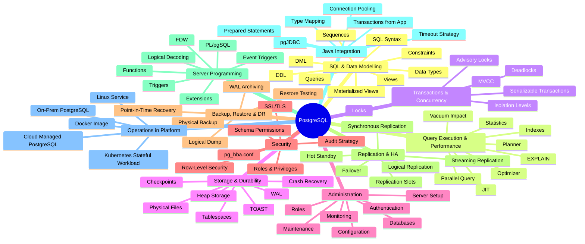
```mermaid
mindmap
  root((PostgreSQL))
    SQL & Data Modelling
      SQL Syntax
      DDL
      DML
      Queries
      Data Types
      Constraints
      Views
      Materialized Views
      Sequences
    Query Execution & Performance
      Planner
      Optimizer
      Statistics
      EXPLAIN
      Indexes
      Parallel Query
      JIT
      Vacuum Impact
    Transactions & Concurrency
      MVCC
      Isolation Levels
      Locks
      Deadlocks
      Serializable Transactions
      Advisory Locks
    Storage & Durability
      Tablespaces
      Heap Storage
      WAL
      Checkpoints
      TOAST
      Physical Files
      Crash Recovery
    Administration
      Server Setup
      Configuration
      Roles
      Authentication
      Databases
      Maintenance
      Monitoring
    Security
      Roles & Privileges
      Schema Permissions
      Row-Level Security
      SSL/TLS
      pg_hba.conf
      Audit Strategy
    Backup, Restore & DR
      Logical Dump
      Physical Backup
      WAL Archiving
      Point-in-Time Recovery
      Restore Testing
    Replication & HA
      Streaming Replication
      Replication Slots
      Hot Standby
      Synchronous Replication
      Logical Replication
      Failover
    Server Programming
      Functions
      PL/pgSQL
      Triggers
      Event Triggers
      Extensions
      FDW
      Logical Decoding
    Java Integration
      pgJDBC
      Connection Pooling
      Transactions from App
      Prepared Statements
      Type Mapping
      Timeout Strategy
    Operations in Platform
      Linux Service
      Docker Image
      Kubernetes Stateful Workload
      Cloud Managed PostgreSQL
      On-Prem PostgreSQL
```

## Tabular Decomposition

| Domain / Skill | Fokus Utama | Kenapa Penting untuk Senior Engineer |
|---|---|---|
| PostgreSQL Versioning & Compatibility | Memahami versi stabil, versi supported, versi beta, release notes, upgrade path. | Salah memilih fitur versi bisa memicu incompatibility di production. Saat ini dokumentasi current mengarah ke PostgreSQL 18, sementara 19 masih beta. ([PostgreSQL](https://www.postgresql.org/docs/)) |
| SQL Language | SQL syntax, DDL, DML, query, data type, function/operator, type conversion. | Ini fondasi semua akses data. Dokumentasi PostgreSQL memisahkan SQL language ke syntax, data definition, manipulation, queries, data types, functions, indexes, concurrency, dan performance. ([PostgreSQL](https://www.postgresql.org/docs/current/index.html)) |
| Data Modelling | Table, schema, primary key, foreign key, constraint, unique, check, enum/domain, normalization/denormalization. | Model data yang buruk akan bocor ke service layer, reporting, migration, dan integritas bisnis. |
| PostgreSQL Data Types | Numeric, text, boolean, temporal, JSON/JSONB, array, UUID, range, network, geometric, custom types. | Banyak bug aplikasi muncul dari mismatch antara tipe DB dan tipe Java/API. |
| Constraints & Integrity | NOT NULL, UNIQUE, FK, CHECK, exclusion constraint, deferrable constraint. | Constraint adalah guardrail terakhir saat aplikasi, job async, atau migration gagal menjaga invariant. |
| Querying | SELECT, JOIN, subquery, CTE, window function, aggregate, grouping, set operation. | Dibutuhkan untuk debugging, reporting, data repair, audit trail, dan validasi workflow. |
| Indexing | B-tree, Hash, GIN, GiST, SP-GiST, BRIN, partial index, expression index, covering index. | Index menentukan latency, write overhead, lock behavior saat migration, dan biaya storage. PostgreSQL secara eksplisit menyediakan bab khusus untuk indexes dan built-in index access methods. ([PostgreSQL](https://www.postgresql.org/docs/current/index.html)) |
| Query Planner & Statistics | EXPLAIN, EXPLAIN ANALYZE, planner statistics, cardinality estimate, join strategy. | Query lambat sering bukan karena SQL “salah”, tetapi karena planner salah estimasi atau statistik tidak sehat. |
| Performance Tuning | work_mem, shared_buffers, effective_cache_size, autovacuum, checkpoint, WAL, query rewrite. | Tuning harus berbasis workload, bukan copy-paste parameter. PostgreSQL docs juga memisahkan performance tips, parallel query, dan JIT sebagai area khusus. ([PostgreSQL](https://www.postgresql.org/docs/current/index.html)) |
| MVCC | Snapshot isolation, row versioning, visibility, transaction snapshot. | Core mental model PostgreSQL. Dokumentasi concurrency menegaskan bahwa developer aplikasi perlu memahami perilaku akses data ketika beberapa session berjalan bersamaan. ([PostgreSQL](https://www.postgresql.org/docs/current/mvcc.html)) |
| Transaction Isolation | Read Committed, Repeatable Read, Serializable, serialization failure. | Penting untuk mencegah lost update, phantom read, race condition, dan bug approval/enforcement lifecycle. |
| Locking | Table lock, row lock, page lock, advisory lock, deadlock. | Locking memengaruhi API latency, migration safety, background job, scheduler, dan batch processing. |
| Deadlock & Contention Handling | Lock ordering, retry policy, timeout, small transaction, SKIP LOCKED. | Sistem workflow dan case management sering punya high-contention rows seperti case status, task queue, assignment, SLA counter. |
| Storage Engine Basics | Heap table, page, tuple, TOAST, tablespace, physical layout. | Tidak perlu menjadi PostgreSQL internals engineer, tetapi perlu cukup paham untuk membaca gejala bloat, vacuum, dan I/O pressure. |
| WAL & Durability | Write-ahead log, checkpoint, crash recovery, archive WAL. | WAL adalah basis durability, replication, backup, PITR, dan recovery. Dokumentasi PostgreSQL menaruh WAL sebagai bagian reliability tersendiri. ([PostgreSQL](https://www.postgresql.org/docs/current/index.html)) |
| Vacuum & Bloat | autovacuum, VACUUM, ANALYZE, dead tuple, freezing, bloat. | PostgreSQL tidak “membersihkan” update/delete seperti naive storage; MVCC membuat vacuum menjadi operasi penting. |
| Server Configuration | postgresql.conf, ALTER SYSTEM, memory, connection, WAL, logging, replication parameters. | Banyak incident berasal dari konfigurasi default yang tidak sesuai workload. |
| Client Authentication | pg_hba.conf, password auth, SCRAM, certificate, host-based rules. | Ini boundary keamanan utama untuk siapa boleh connect dari mana dan dengan metode apa. Dokumentasi admin PostgreSQL mencakup client authentication dan role management sebagai area terpisah. ([PostgreSQL](https://www.postgresql.org/docs/current/index.html)) |
| Roles & Privileges | Role, user, group role, GRANT, REVOKE, default privileges, ownership. | Penting untuk least privilege, auditability, separation of duty, dan environment hardening. |
| Schema Governance | Schema ownership, search_path, naming convention, migration ownership. | search_path dan ownership sering menjadi sumber bug security atau deployment drift. |
| Backup & Restore | pg_dump, pg_restore, pg_basebackup, physical backup, restore rehearsal. | Backup bukan valid sampai restore pernah dites. Dokumentasi PostgreSQL menyediakan area khusus untuk backup dan restore. ([PostgreSQL](https://www.postgresql.org/docs/current/index.html)) |
| Point-in-Time Recovery | WAL archiving, recovery target time, restore command. | Wajib untuk incident data corruption, bad migration, dan accidental delete/update. |
| High Availability | Primary/standby, failover, hot standby, read replica, sync vs async replication. | Dokumentasi HA menekankan bahwa read/write database sulit digabungkan karena perubahan harus disinkronkan; tidak ada satu solusi yang cocok untuk semua workload. ([PostgreSQL](https://www.postgresql.org/docs/current/high-availability.html)) |
| Streaming Replication | WAL sender/receiver, replication slot, standby config, lag. | Penting untuk read scaling, HA, DR, dan zero/low downtime maintenance. PostgreSQL membedakan primary sebagai sender dan standby sebagai receiver pada streaming replication. ([PostgreSQL](https://www.postgresql.org/docs/current/runtime-config-replication.html)) |
| Logical Replication | Publication, subscription, table-level replication, migration, CDC. | Berguna untuk data migration, integration, event-driven architecture, dan selective replication. |
| Monitoring & Observability | pg_stat_activity, pg_stat_statements, logs, slow query, locks, replication lag. | Tanpa observability, tuning hanya tebakan. Dokumentasi PostgreSQL menempatkan monitoring database activity sebagai bab administrasi tersendiri. ([PostgreSQL](https://www.postgresql.org/docs/current/index.html)) |
| Maintenance Operations | REINDEX, VACUUM, ANALYZE, CLUSTER, partition maintenance, statistics refresh. | Menjaga performa jangka panjang, terutama pada workload update-heavy dan partitioned table. |
| Partitioning | Range/list/hash partition, pruning, local index, retention strategy. | Penting untuk data besar, audit log, event log, historical case data, dan lifecycle retention. |
| PL/pgSQL | Function, procedure, control flow, exception, trigger function. | PL/pgSQL adalah layer procedural di server. Dokumentasi PostgreSQL menempatkannya sebagai bagian server programming. ([PostgreSQL](https://www.postgresql.org/docs/current/index.html)) |
| Triggers & Event Triggers | BEFORE/AFTER trigger, row/statement trigger, audit trigger, DDL trigger. | Berguna untuk audit, derived data, enforcement invariant, tetapi bisa menjadi hidden side-effect jika tidak dikelola. |
| Extensions | CREATE EXTENSION, pg_stat_statements, uuid-ossp/pgcrypto, PostGIS, FDW. | PostgreSQL kuat karena extensibility, tetapi extension harus dikontrol dari sisi compatibility, permission, dan deployment. |
| Full Text Search | tsvector, tsquery, dictionary, GIN index. | Berguna untuk search internal tanpa langsung membawa Elasticsearch/OpenSearch. |
| JSON/JSONB | Semi-structured data, GIN indexing, hybrid relational-document model. | Berguna untuk metadata fleksibel, tetapi berbahaya jika dipakai menggantikan model relasional yang seharusnya eksplisit. |
| Migration & Schema Change | Transactional migration, backward-compatible change, lock-aware DDL, rollback strategy. | Critical untuk aplikasi Java microservice yang butuh deployment aman tanpa downtime. |
| Java / pgJDBC Integration | JDBC URL, driver, prepared statement, transaction boundary, batching, timeout, SSL. | pgJDBC adalah driver resmi untuk Java; driver ini memungkinkan program Java connect ke PostgreSQL memakai standard Java database-independent code dan berkomunikasi via native PostgreSQL protocol. ([pgJDBC](https://jdbc.postgresql.org/?utm_source=chatgpt.com)) |
| Connection Pooling | HikariCP/PgBouncer, max_connections, pool sizing, transaction pooling caveat. | Pool salah sizing bisa membuat DB collapse walaupun aplikasi terlihat “scalable”. |
| Application Transaction Design | Unit of work, idempotency, retry serialization failure, optimistic/pessimistic locking. | Sangat relevan untuk workflow/case management: status transition harus atomic dan defensible. |
| Operational Deployment | Linux service, Docker image, Kubernetes StatefulSet/operator, managed cloud DB. | Perlu memahami mana yang tanggung jawab PostgreSQL, mana yang tanggung jawab platform. |
| Cloud / On-Prem Differences | RDS/Aurora, Azure Database for PostgreSQL, self-managed VM/bare metal, backup control, parameter group. | Fitur sama belum tentu operational control-nya sama. Cloud managed mengurangi beban ops, tapi membatasi akses internals tertentu. |

## Roadmap Alur Belajar Singkat

| Urutan | Fokus | Target Pemahaman |
|---:|---|---|
| 1 | SQL & Data Modelling | Bisa membaca schema, constraint, query bisnis, dan relasi antar-entity. |
| 2 | Transaction, MVCC, Locking | Bisa menjelaskan race condition, deadlock, isolation, dan retry strategy. |
| 3 | Index & Query Planner | Bisa membaca `EXPLAIN ANALYZE`, memilih index, dan menghindari query anti-pattern. |
| 4 | Admin Basics | Bisa memahami config, roles, auth, logging, monitoring, dan maintenance. |
| 5 | Backup, Restore, WAL | Bisa membedakan dump, physical backup, WAL archive, dan PITR. |
| 6 | Replication & HA | Bisa memahami primary/standby, sync/async, lag, slot, failover risk. |
| 7 | Java Integration | Bisa mendesain boundary JDBC/pool/transaction/timeouts secara aman. |
| 8 | PL/pgSQL & Triggers | Bisa membaca server-side logic tanpa membuat hidden coupling. |
| 9 | Production Patterns | Migration strategy, partitioning, observability, incident debugging, capacity planning. |

## Rekomendasi Materi Selanjutnya

Lanjut paling tepat: **Cheatsheet PostgreSQL MVCC, Transaction Isolation, Locking, Deadlock, dan Retry Pattern untuk aplikasi Java**. Ini paling berpengaruh untuk sistem regulatory/case management karena langsung terkait correctness, escalation workflow, SLA processing, dan auditability.

---

**Sources:**

- [PostgreSQL: Documentation](https://www.postgresql.org/docs/)
- [Home | pgJDBC - PostgreSQL](https://jdbc.postgresql.org/?utm_source=chatgpt.com)

## Response:
7/12/2026, 11:28:56 PM

# Cheatsheet: PostgreSQL SQL Language

## 1. Scope

**PostgreSQL SQL Language** adalah lapisan bahasa untuk mendefinisikan data, memanipulasi data, membaca data, memakai tipe data, memakai fungsi/operator, mengatur transaksi, dan mengekspresikan query performan. Ini berbeda dari **PL/pgSQL**, yang merupakan procedural language untuk function, procedure, dan trigger. Dokumentasi PostgreSQL current membagi SQL Language ke area: SQL syntax, data definition, data manipulation, queries, data types, functions/operators, type conversion, indexes, full text search, concurrency control, performance tips, dan parallel query. ([PostgreSQL](https://www.postgresql.org/docs/current/sql.html?utm_source=chatgpt.com))

## 2. Mental Model

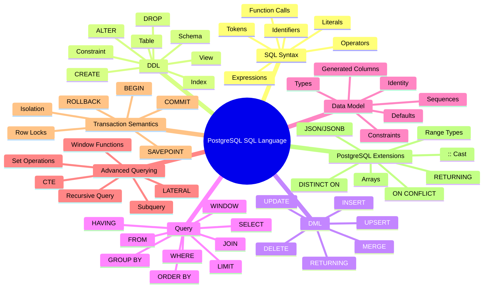
```mermaid
mindmap
  root((PostgreSQL SQL Language))
    SQL Syntax
      Tokens
      Identifiers
      Literals
      Operators
      Expressions
      Function Calls
    DDL
      CREATE
      ALTER
      DROP
      Schema
      Table
      View
      Constraint
      Index
    DML
      INSERT
      UPDATE
      DELETE
      MERGE
      RETURNING
      UPSERT
    Query
      SELECT
      FROM
      JOIN
      WHERE
      GROUP BY
      HAVING
      WINDOW
      ORDER BY
      LIMIT
    Data Model
      Types
      Constraints
      Defaults
      Generated Columns
      Sequences
      Identity
    Advanced Querying
      CTE
      Recursive Query
      Subquery
      LATERAL
      Set Operations
      Window Functions
    Transaction Semantics
      BEGIN
      COMMIT
      ROLLBACK
      SAVEPOINT
      Isolation
      Row Locks
    PostgreSQL Extensions
      RETURNING
      ON CONFLICT
      DISTINCT ON
      JSON/JSONB
      Arrays
      Range Types
      :: Cast
```

---

# 3. SQL Syntax Essentials

PostgreSQL SQL input terdiri dari command yang dibentuk oleh token dan biasanya diakhiri dengan semicolon `;`. Token dapat berupa keyword, identifier, quoted identifier, literal, operator, atau special character. ([PostgreSQL](https://www.postgresql.org/docs/current/sql-syntax-lexical.html?utm_source=chatgpt.com))

## Basic command shape

```sql
SELECT now();

CREATE TABLE app_user (
    id bigint GENERATED ALWAYS AS IDENTITY PRIMARY KEY,
    username text NOT NULL UNIQUE,
    created_at timestamptz NOT NULL DEFAULT now()
);
```

## Identifier rules

| Bentuk | Contoh | Catatan |
|---|---|---|
| Unquoted identifier | `app_user`, `created_at` | Praktik terbaik: lowercase + snake_case. |
| Quoted identifier | `"User"`, `"Created At"` | Case-sensitive, sering menyulitkan query dan migration. |
| Schema-qualified name | `public.app_user` | Aman untuk menghindari ambiguity `search_path`. |

**Praktik senior:** hindari quoted identifier untuk object aplikasi kecuali benar-benar perlu.

```sql
-- Recommended
SELECT created_at FROM app_user;

-- Avoid unless intentionally created this way
SELECT "Created At" FROM "User";
```

## Literals & casting

PostgreSQL mendukung cast SQL-standard `CAST(x AS type)` dan juga syntax historis PostgreSQL `x::type`. Dokumentasi PostgreSQL menyebut `::` sebagai historical PostgreSQL usage. ([PostgreSQL](https://www.postgresql.org/docs/current/sql-syntax-lexical.html?utm_source=chatgpt.com))

```sql
SELECT CAST('2026-07-12' AS date);

SELECT '2026-07-12'::date;

SELECT 42::bigint;
```

---

# 4. DDL: Data Definition Language

DDL dipakai untuk membuat dan mengubah struktur database: table, schema, constraint, view, function, trigger, partition, dan object lain. Dokumentasi PostgreSQL menjelaskan Data Definition sebagai area untuk membuat struktur yang menyimpan data, terutama table, constraint, schema, privilege, inheritance, partitioning, view, function, dan trigger. ([PostgreSQL](https://www.postgresql.org/docs/current/ddl.html?utm_source=chatgpt.com))

## CREATE TABLE

```sql
CREATE TABLE case_file (
    id bigint GENERATED ALWAYS AS IDENTITY PRIMARY KEY,
    case_number text NOT NULL UNIQUE,
    status text NOT NULL,
    priority integer NOT NULL DEFAULT 0,
    created_at timestamptz NOT NULL DEFAULT now(),
    updated_at timestamptz NOT NULL DEFAULT now()
);
```

## ALTER TABLE

`ALTER TABLE` mengubah definisi table. Perlu hati-hati karena beberapa subcommand mengambil lock yang kuat; dokumentasi PostgreSQL menyebut lock level bisa berbeda per subform dan `ACCESS EXCLUSIVE` digunakan kecuali dinyatakan lain. ([PostgreSQL](https://www.postgresql.org/docs/current/sql-altertable.html?utm_source=chatgpt.com))

```sql
ALTER TABLE case_file
ADD COLUMN assigned_user_id bigint;

ALTER TABLE case_file
ADD CONSTRAINT case_file_status_check
CHECK (status IN ('DRAFT', 'OPEN', 'IN_REVIEW', 'CLOSED'));
```

## DROP

```sql
DROP TABLE IF EXISTS temp_import_case;

DROP VIEW IF EXISTS active_case_view;
```

## Schema

```sql
CREATE SCHEMA enforcement;

CREATE TABLE enforcement.case_file (
    id bigint GENERATED ALWAYS AS IDENTITY PRIMARY KEY,
    case_number text NOT NULL UNIQUE
);
```

**Praktik senior:** gunakan schema untuk boundary domain, bukan hanya `public`.

---

# 5. Constraints: Guardrail Invariant

Constraint adalah cara database menjaga invariant ketika aplikasi, batch job, migration, atau service lain gagal menjaga validitas data.

| Constraint | Contoh | Kapan Dipakai |
|---|---|---|
| `PRIMARY KEY` | `id bigint PRIMARY KEY` | Identitas row. |
| `UNIQUE` | `case_number text UNIQUE` | Business key harus unik. |
| `NOT NULL` | `status text NOT NULL` | Field wajib. |
| `CHECK` | `priority >= 0` | Validasi domain sederhana. |
| `FOREIGN KEY` | `user_id REFERENCES app_user(id)` | Referential integrity. |
| `EXCLUDE` | no-overlap range | Constraint lanjutan, misalnya booking/time range. |

```sql
CREATE TABLE task_assignment (
    id bigint GENERATED ALWAYS AS IDENTITY PRIMARY KEY,
    case_id bigint NOT NULL REFERENCES case_file(id),
    assignee_id bigint NOT NULL,
    valid_from timestamptz NOT NULL,
    valid_to timestamptz,
    CHECK (valid_to IS NULL OR valid_to > valid_from)
);
```

---

# 6. DML: Data Manipulation Language

DML dipakai untuk mengisi dan mengubah data: `INSERT`, `UPDATE`, `DELETE`, `MERGE`, dan sering dikombinasikan dengan `RETURNING`. PostgreSQL mendukung `RETURNING` pada `INSERT`, `UPDATE`, `DELETE`, dan `MERGE`, sehingga aplikasi bisa mengambil data hasil mutasi tanpa query tambahan. ([PostgreSQL](https://www.postgresql.org/docs/current/dml-returning.html?utm_source=chatgpt.com))

## INSERT

```sql
INSERT INTO case_file (case_number, status, priority)
VALUES ('CASE-2026-001', 'OPEN', 10)
RETURNING id, created_at;
```

## Multi-row INSERT

```sql
INSERT INTO case_file (case_number, status, priority)
VALUES
    ('CASE-2026-002', 'OPEN', 5),
    ('CASE-2026-003', 'DRAFT', 1)
RETURNING id, case_number;
```

## UPDATE

`UPDATE` mengubah column pada row yang memenuhi kondisi; column yang tidak disebut di `SET` tetap menyimpan nilai lama. ([PostgreSQL](https://www.postgresql.org/docs/current/sql-update.html?utm_source=chatgpt.com))

```sql
UPDATE case_file
SET status = 'IN_REVIEW',
    updated_at = now()
WHERE id = 1001
RETURNING id, status, updated_at;
```

## DELETE

`DELETE` menghapus row yang memenuhi `WHERE`; jika `WHERE` tidak ada, seluruh row table akan dihapus. ([PostgreSQL](https://www.postgresql.org/docs/current/sql-delete.html?utm_source=chatgpt.com))

```sql
DELETE FROM case_file
WHERE status = 'DRAFT'
  AND created_at < now() - interval '90 days'
RETURNING id, case_number;
```

## UPSERT: INSERT ... ON CONFLICT

`ON CONFLICT` dipakai untuk menangani unique/exclusion conflict dengan `DO NOTHING` atau `DO UPDATE`. PostgreSQL mendokumentasikan `ON CONFLICT DO UPDATE` sebagai atomic `INSERT` atau `UPDATE` outcome, sering disebut UPSERT. ([PostgreSQL](https://www.postgresql.org/docs/current/sql-insert.html?utm_source=chatgpt.com))

```sql
INSERT INTO case_file (case_number, status, priority)
VALUES ('CASE-2026-001', 'OPEN', 10)
ON CONFLICT (case_number)
DO UPDATE SET
    status = EXCLUDED.status,
    priority = EXCLUDED.priority,
    updated_at = now()
RETURNING id, case_number, status;
```

## MERGE

```sql
MERGE INTO case_file AS target
USING staging_case_file AS source
ON target.case_number = source.case_number
WHEN MATCHED THEN
    UPDATE SET status = source.status, updated_at = now()
WHEN NOT MATCHED THEN
    INSERT (case_number, status, priority)
    VALUES (source.case_number, source.status, source.priority)
RETURNING target.id, target.case_number;
```

---

# 7. SELECT Query Processing

`SELECT` mengambil row dari nol atau lebih table. Secara konseptual, PostgreSQL memproses `WITH`, `FROM`, `WHERE`, `GROUP BY`, `HAVING`, select list, `DISTINCT`, set operations, `ORDER BY`, `LIMIT/OFFSET`, lalu row locking seperti `FOR UPDATE`. ([PostgreSQL](https://www.postgresql.org/docs/current/sql-select.html?utm_source=chatgpt.com))

## Canonical SELECT shape

```sql
WITH recent_cases AS (
    SELECT *
    FROM case_file
    WHERE created_at >= now() - interval '30 days'
)
SELECT
    status,
    count(*) AS total_cases
FROM recent_cases
WHERE priority >= 5
GROUP BY status
HAVING count(*) > 0
ORDER BY total_cases DESC
LIMIT 10;
```

## Logical query pipeline

| Stage | Clause | Fungsi |
|---:|---|---|
| 1 | `WITH` | Definisikan CTE sementara. |
| 2 | `FROM` | Tentukan sumber data. |
| 3 | `JOIN` / `LATERAL` | Gabungkan sumber data. |
| 4 | `WHERE` | Filter row sebelum grouping. |
| 5 | `GROUP BY` | Bentuk group. |
| 6 | Aggregate | Hitung agregasi. |
| 7 | `HAVING` | Filter hasil group. |
| 8 | `SELECT` | Hitung output expression. |
| 9 | `DISTINCT` | Hilangkan duplicate. |
| 10 | `ORDER BY` | Urutkan hasil. |
| 11 | `LIMIT/OFFSET` | Potong hasil. |
| 12 | `FOR UPDATE` | Lock row terpilih. |

---

# 8. Table Expressions & JOIN

Table expression menghasilkan virtual table dari `FROM`, lalu dapat diproses oleh `WHERE`, `GROUP BY`, dan `HAVING`. PostgreSQL mendokumentasikan `FROM` sebagai sumber table reference, subquery, join construct, atau kombinasi kompleks. ([PostgreSQL](https://www.postgresql.org/docs/current/queries-table-expressions.html?utm_source=chatgpt.com))

## INNER JOIN

```sql
SELECT c.id, c.case_number, a.assignee_id
FROM case_file c
JOIN task_assignment a ON a.case_id = c.id
WHERE c.status = 'OPEN';
```

## LEFT JOIN

```sql
SELECT c.id, c.case_number, a.assignee_id
FROM case_file c
LEFT JOIN task_assignment a ON a.case_id = c.id;
```

## Anti-join pattern

```sql
SELECT c.*
FROM case_file c
WHERE NOT EXISTS (
    SELECT 1
    FROM task_assignment a
    WHERE a.case_id = c.id
);
```

## LATERAL

`LATERAL` berguna ketika subquery di `FROM` perlu mereferensikan row dari table sebelumnya.

```sql
SELECT c.id, c.case_number, latest_event.event_type, latest_event.created_at
FROM case_file c
LEFT JOIN LATERAL (
    SELECT e.event_type, e.created_at
    FROM case_event e
    WHERE e.case_id = c.id
    ORDER BY e.created_at DESC
    LIMIT 1
) latest_event ON true;
```

---

# 9. WHERE, NULL, Boolean Logic

SQL memakai three-valued logic: `TRUE`, `FALSE`, dan `UNKNOWN`. Kesalahan umum: membandingkan `NULL` dengan `=`.

```sql
-- Salah
SELECT * FROM case_file WHERE closed_at = NULL;

-- Benar
SELECT * FROM case_file WHERE closed_at IS NULL;

SELECT * FROM case_file WHERE closed_at IS NOT NULL;
```

## Common predicates

```sql
WHERE status = 'OPEN'

WHERE priority BETWEEN 5 AND 10

WHERE status IN ('OPEN', 'IN_REVIEW')

WHERE case_number LIKE 'CASE-2026-%'

WHERE created_at >= now() - interval '7 days'

WHERE EXISTS (
    SELECT 1
    FROM case_event e
    WHERE e.case_id = case_file.id
)
```

---

# 10. Aggregation

```sql
SELECT
    status,
    count(*) AS total,
    min(created_at) AS oldest_case,
    max(created_at) AS newest_case
FROM case_file
GROUP BY status
ORDER BY total DESC;
```

## Conditional aggregate

```sql
SELECT
    count(*) AS total_cases,
    count(*) FILTER (WHERE status = 'OPEN') AS open_cases,
    count(*) FILTER (WHERE status = 'CLOSED') AS closed_cases
FROM case_file;
```

## GROUPING SETS / ROLLUP / CUBE

```sql
SELECT
    status,
    priority,
    count(*) AS total
FROM case_file
GROUP BY ROLLUP (status, priority);
```

---

# 11. Window Functions

Window function menghitung nilai lintas row tanpa mereduksi jumlah row seperti `GROUP BY`.

```sql
SELECT
    id,
    case_number,
    status,
    created_at,
    row_number() OVER (
        PARTITION BY status
        ORDER BY created_at DESC
    ) AS rank_in_status
FROM case_file;
```

## Common window functions

| Function | Kegunaan |
|---|---|
| `row_number()` | Nomor urut unik dalam window. |
| `rank()` | Ranking dengan gap. |
| `dense_rank()` | Ranking tanpa gap. |
| `lag()` | Ambil nilai row sebelumnya. |
| `lead()` | Ambil nilai row sesudahnya. |
| `first_value()` | Nilai pertama dalam frame. |
| `last_value()` | Nilai terakhir dalam frame, hati-hati frame default. |

```sql
SELECT
    case_id,
    status,
    changed_at,
    lag(status) OVER (
        PARTITION BY case_id
        ORDER BY changed_at
    ) AS previous_status
FROM case_status_history;
```

---

# 12. CTE: WITH Queries

`WITH` menyediakan auxiliary statement untuk query yang lebih besar. PostgreSQL mendokumentasikan CTE sebagai temporary-table-like expression untuk satu query; auxiliary statement bisa berupa `SELECT`, `INSERT`, `UPDATE`, `DELETE`, atau `MERGE`, dan primary statement juga bisa memakai jenis command tersebut. ([PostgreSQL](https://www.postgresql.org/docs/current/queries-with.html?utm_source=chatgpt.com))

## Read CTE

```sql
WITH open_cases AS (
    SELECT *
    FROM case_file
    WHERE status = 'OPEN'
)
SELECT count(*)
FROM open_cases;
```

## Data-modifying CTE

```sql
WITH updated AS (
    UPDATE case_file
    SET status = 'IN_REVIEW',
        updated_at = now()
    WHERE id = 1001
    RETURNING id, status
)
INSERT INTO case_event (case_id, event_type, payload, created_at)
SELECT id, 'STATUS_CHANGED', jsonb_build_object('status', status), now()
FROM updated;
```

## Recursive CTE

```sql
WITH RECURSIVE org_tree AS (
    SELECT id, parent_id, name, 1 AS depth
    FROM organization_unit
    WHERE parent_id IS NULL

    UNION ALL

    SELECT child.id, child.parent_id, child.name, parent.depth + 1
    FROM organization_unit child
    JOIN org_tree parent ON child.parent_id = parent.id
)
SELECT *
FROM org_tree
ORDER BY depth, name;
```

---

# 13. Set Operations

```sql
-- Gabungkan dan hilangkan duplicate
SELECT user_id FROM case_reviewer
UNION
SELECT user_id FROM case_approver;

-- Gabungkan tanpa deduplication
SELECT user_id FROM case_reviewer
UNION ALL
SELECT user_id FROM case_approver;

-- Irisan
SELECT user_id FROM case_reviewer
INTERSECT
SELECT user_id FROM case_approver;

-- Ada di kiri, tidak ada di kanan
SELECT user_id FROM case_reviewer
EXCEPT
SELECT user_id FROM suspended_user;
```

**Praktik senior:** default ke `UNION ALL` jika memang tidak butuh deduplication, karena `UNION` perlu kerja tambahan untuk menghilangkan duplicate.

---

# 14. Data Types yang Paling Sering Dipakai

PostgreSQL punya banyak native data type, termasuk numeric, boolean, character/text, temporal, UUID, JSON, array, range, network, geometric, dan user-defined type. Dokumentasi PostgreSQL juga menyebut user dapat menambahkan type baru dengan `CREATE TYPE`. ([PostgreSQL](https://www.postgresql.org/docs/current/datatype.html?utm_source=chatgpt.com))

| Kategori | Tipe | Catatan |
|---|---|---|
| Integer | `smallint`, `integer`, `bigint` | Gunakan `bigint` untuk ID jangka panjang. |
| Decimal | `numeric(p,s)` | Uang/perhitungan presisi; hindari floating untuk nilai finansial. |
| Floating | `real`, `double precision` | Untuk approximate scientific value. |
| Text | `text`, `varchar(n)` | `text` umum dipakai di PostgreSQL. |
| Boolean | `boolean` | `true`, `false`, `NULL`. |
| Time | `date`, `time`, `timestamp`, `timestamptz`, `interval` | Untuk aplikasi lintas timezone, prefer `timestamptz`. |
| UUID | `uuid` | Cocok untuk distributed ID atau public identifier. |
| JSON | `json`, `jsonb` | Prefer `jsonb` untuk indexing/query. |
| Array | `text[]`, `bigint[]` | Berguna, tapi jangan mengganti relasi jika butuh referential integrity. |
| Range | `tsrange`, `tstzrange`, `int4range` | Cocok untuk validity period, schedule, interval. |
| Network | `inet`, `cidr`, `macaddr` | Berguna untuk audit/security/networking. |

---

# 15. JSON / JSONB Querying

```sql
CREATE TABLE case_payload (
    case_id bigint PRIMARY KEY,
    payload jsonb NOT NULL
);

SELECT payload -> 'subject'
FROM case_payload;

SELECT payload ->> 'status'
FROM case_payload;

SELECT *
FROM case_payload
WHERE payload @> '{"priority": "high"}'::jsonb;
```

PostgreSQL current juga mendukung SQL/JSON capability seperti `JSON_TABLE`, yang dapat digunakan di `FROM` clause untuk `SELECT`, `UPDATE`, `DELETE`, dan sebagai data source dalam `MERGE`. ([PostgreSQL](https://www.postgresql.org/docs/current/functions-json.html?utm_source=chatgpt.com))

```sql
SELECT *
FROM JSON_TABLE(
    '[{"id":1,"status":"OPEN"},{"id":2,"status":"CLOSED"}]'::jsonb,
    '$[*]'
    COLUMNS (
        id integer PATH '$.id',
        status text PATH '$.status'
    )
) AS jt;
```

---

# 16. Text Search

```sql
SELECT *
FROM case_file
WHERE to_tsvector('english', case_number || ' ' || status)
      @@ plainto_tsquery('english', 'open case');
```

Untuk production search sederhana, PostgreSQL full-text search bisa cukup. Untuk ranking, multilingual search, typo tolerance, dan search analytics kompleks, baru pertimbangkan OpenSearch/Elasticsearch.

---

# 17. Index SQL

Index adalah bagian SQL Language di PostgreSQL, bukan sekadar admin concern. Dokumentasi SQL Language memasukkan Indexes sebagai chapter tersendiri dalam Part II. ([PostgreSQL](https://www.postgresql.org/docs/current/index.html?utm_source=chatgpt.com))

## B-tree index

```sql
CREATE INDEX idx_case_file_status
ON case_file (status);
```

## Composite index

```sql
CREATE INDEX idx_case_file_status_created_at
ON case_file (status, created_at DESC);
```

## Partial index

```sql
CREATE INDEX idx_case_file_open_only
ON case_file (created_at DESC)
WHERE status = 'OPEN';
```

## Expression index

```sql
CREATE INDEX idx_case_file_lower_case_number
ON case_file (lower(case_number));
```

## GIN index for JSONB

```sql
CREATE INDEX idx_case_payload_payload_gin
ON case_payload
USING gin (payload);
```

**Rule of thumb:** index harus mengikuti query pattern, bukan sekadar column yang “sering dipakai”.

---

# 18. Transaction SQL

```sql
BEGIN;

UPDATE case_file
SET status = 'IN_REVIEW'
WHERE id = 1001
  AND status = 'OPEN';

INSERT INTO case_event (case_id, event_type, created_at)
VALUES (1001, 'STATUS_CHANGED', now());

COMMIT;
```

## Rollback

```sql
BEGIN;

UPDATE case_file
SET status = 'CLOSED'
WHERE id = 1001;

ROLLBACK;
```

## Savepoint

```sql
BEGIN;

SAVEPOINT before_optional_step;

UPDATE case_file
SET priority = priority + 1
WHERE id = 1001;

ROLLBACK TO SAVEPOINT before_optional_step;

COMMIT;
```

## Row locking

```sql
BEGIN;

SELECT *
FROM case_file
WHERE id = 1001
FOR UPDATE;

UPDATE case_file
SET status = 'IN_REVIEW'
WHERE id = 1001;

COMMIT;
```

`SELECT ... FOR UPDATE`, `FOR NO KEY UPDATE`, `FOR SHARE`, dan `FOR KEY SHARE` adalah bagian akhir dari processing `SELECT` yang mengunci row terhadap concurrent update. ([PostgreSQL](https://www.postgresql.org/docs/current/sql-select.html?utm_source=chatgpt.com))

---

# 19. Common PostgreSQL-Specific Patterns

## Idempotent insert

```sql
INSERT INTO processed_message (message_id, processed_at)
VALUES ('msg-001', now())
ON CONFLICT (message_id) DO NOTHING;
```

## Atomic state transition

```sql
UPDATE case_file
SET status = 'IN_REVIEW',
    updated_at = now()
WHERE id = 1001
  AND status = 'OPEN'
RETURNING id, status;
```

Jika `RETURNING` kosong, berarti transition tidak terjadi. Ini cocok untuk workflow/case lifecycle karena bisa menghindari blind overwrite.

## Claim next work item

```sql
WITH next_task AS (
    SELECT id
    FROM case_task
    WHERE status = 'READY'
    ORDER BY priority DESC, created_at ASC
    FOR UPDATE SKIP LOCKED
    LIMIT 1
)
UPDATE case_task t
SET status = 'CLAIMED',
    claimed_at = now()
FROM next_task
WHERE t.id = next_task.id
RETURNING t.*;
```

## Audit event after mutation

```sql
WITH changed AS (
    UPDATE case_file
    SET status = 'CLOSED',
        updated_at = now()
    WHERE id = 1001
      AND status = 'IN_REVIEW'
    RETURNING id, status
)
INSERT INTO case_event (case_id, event_type, payload, created_at)
SELECT
    id,
    'CASE_CLOSED',
    jsonb_build_object('new_status', status),
    now()
FROM changed;
```

---

# 20. Pitfalls yang Sering Terjadi

| Pitfall | Dampak | Solusi |
|---|---|---|
| `UPDATE` / `DELETE` tanpa `WHERE` | Data massal berubah/hilang. | Biasakan transaction + `RETURNING` / preview `SELECT`. |
| `NULL = NULL` | Query tidak match. | Gunakan `IS NULL` atau `IS NOT DISTINCT FROM`. |
| `ORDER BY` tidak ada tapi berharap urutan stabil | Hasil bisa berubah. | Selalu tulis `ORDER BY` jika urutan penting. |
| `LIMIT/OFFSET` untuk pagination besar | Makin lambat saat offset besar. | Gunakan keyset pagination. |
| Overusing JSONB | Invariant tidak eksplisit. | Pakai column relational untuk field penting. |
| Index asal tambah | Write lambat, storage naik. | Tambah index berdasarkan query + `EXPLAIN`. |
| Quoted identifier | Query/migration ribet. | Gunakan lowercase snake_case. |
| CTE dianggap selalu optimal | Bisa jadi materialization/optimization issue tergantung query. | Cek `EXPLAIN ANALYZE`; gunakan `MATERIALIZED` / `NOT MATERIALIZED` jika perlu. |
| Blind upsert | Bisa overwrite data valid. | Tambahkan `WHERE` di `DO UPDATE` jika ada rule bisnis. |
| Tidak memakai `RETURNING` | Aplikasi perlu query tambahan dan rawan race. | Gunakan `RETURNING` untuk ID/default/state terbaru. |

---

# 21. Mini Reference

## SELECT

```sql
SELECT column_expression
FROM table_expression
WHERE condition
GROUP BY group_expression
HAVING group_condition
ORDER BY sort_expression
LIMIT n OFFSET m;
```

## INSERT

```sql
INSERT INTO table_name (col1, col2)
VALUES (value1, value2)
RETURNING *;
```

## UPDATE

```sql
UPDATE table_name
SET col1 = value1
WHERE condition
RETURNING *;
```

## DELETE

```sql
DELETE FROM table_name
WHERE condition
RETURNING *;
```

## UPSERT

```sql
INSERT INTO table_name (business_key, value)
VALUES ('key-1', 'value-1')
ON CONFLICT (business_key)
DO UPDATE SET value = EXCLUDED.value
RETURNING *;
```

## CTE

```sql
WITH x AS (
    SELECT ...
)
SELECT ...
FROM x;
```

## Transaction

```sql
BEGIN;
-- SQL statements
COMMIT;
```

---

# 22. Roadmap Belajar Singkat

| Urutan | Materi | Target |
|---:|---|---|
| 1 | SQL syntax, identifier, literal, cast | Bisa membaca SQL PostgreSQL tanpa bingung syntax. |
| 2 | DDL: table, schema, constraint | Bisa memahami model data dan invariant. |
| 3 | DML: insert/update/delete/merge/returning | Bisa membuat mutation aman dan observable. |
| 4 | SELECT, JOIN, WHERE, GROUP BY | Bisa membaca dan membuat query bisnis. |
| 5 | CTE, subquery, lateral, window function | Bisa menangani query analitik dan workflow state. |
| 6 | Type system: temporal, JSONB, array, range | Bisa memilih tipe sesuai domain. |
| 7 | Index SQL + EXPLAIN dasar | Bisa menghubungkan query dengan performa. |
| 8 | Transaction SQL + row locking | Bisa membuat state transition aman untuk concurrency. |

## Rekomendasi materi selanjutnya

Lanjut paling tepat: **Cheatsheet PostgreSQL DDL, Schema Design, Constraints, Identity, Sequence, View, Materialized View, dan Index dasar**. Ini akan memperkuat kemampuan membaca struktur database production sebelum masuk ke query tuning dan transaction concurrency.

---

**Sources:**

- [Documentation: 18: Part II. The SQL Language](https://www.postgresql.org/docs/current/sql.html?utm_source=chatgpt.com)

## Response:
7/12/2026, 11:31:53 PM

# Cheatsheet: PostgreSQL DDL, Schema Design, Constraints, Identity, Sequence, View, Materialized View, dan Index Dasar

## 1. Scope

Cheatsheet ini fokus ke **SQL DDL layer**: bagaimana struktur database PostgreSQL dibuat, diubah, diberi constraint, dipisahkan ke schema, diberi identity/sequence, diekspos lewat view/materialized view, dan dipercepat dengan index dasar. Ini bukan pembahasan query SELECT lanjutan, MVCC, PL/pgSQL, atau tuning mendalam.

Secara resmi, dokumentasi PostgreSQL menempatkan **Data Definition** sebagai area untuk membuat struktur penyimpanan data, terutama table, column, schema, privilege, constraint, default value, generated column, partitioning, view, dan objek terkait. PostgreSQL current documentation saat ini berada pada PostgreSQL 18. ([PostgreSQL](https://www.postgresql.org/docs/current/ddl.html?utm_source=chatgpt.com))

---

## 2. Mental Model

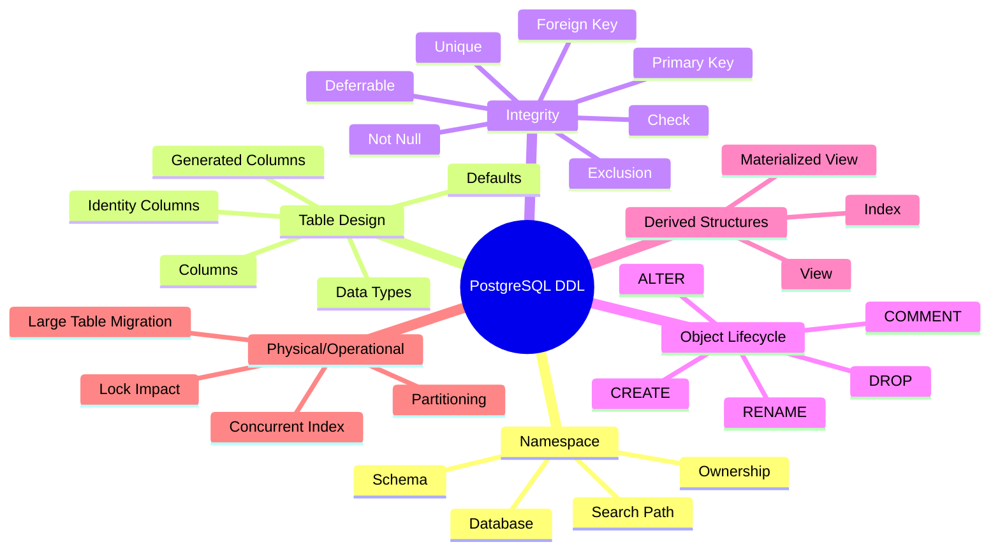
```mermaid id="d7l5zu"
mindmap
  root((PostgreSQL DDL))
    Namespace
      Database
      Schema
      Search Path
      Ownership
    Table Design
      Columns
      Data Types
      Defaults
      Generated Columns
      Identity Columns
    Integrity
      Primary Key
      Foreign Key
      Unique
      Not Null
      Check
      Exclusion
      Deferrable
    Object Lifecycle
      CREATE
      ALTER
      DROP
      RENAME
      COMMENT
    Derived Structures
      View
      Materialized View
      Index
    Physical/Operational
      Lock Impact
      Large Table Migration
      Concurrent Index
      Partitioning
```

---

## 3. DDL Object Map

| Object | Fungsi | Kapan Dipakai |
|---|---|---|
| `SCHEMA` | Namespace untuk table, view, sequence, function, type, index, dan object lain. | Pisahkan domain/module, contoh `case_mgmt`, `audit`, `integration`. |
| `TABLE` | Struktur utama penyimpanan row. | Entity utama, transaction table, audit table, outbox table. |
| `COLUMN` | Field dalam table. | Harus punya tipe, nullability, default, dan semantic jelas. |
| `CONSTRAINT` | Guardrail integritas data. | Menjaga invariant walaupun aplikasi gagal. |
| `IDENTITY` | Auto-generated key berbasis implicit sequence. | Primary key numeric modern. |
| `SEQUENCE` | Generator angka independen. | Nomor dokumen, counter, legacy ID, atau kebutuhan khusus. |
| `VIEW` | Query tersimpan, tidak menyimpan hasil fisik. | Abstraction/read model ringan. |
| `MATERIALIZED VIEW` | Query tersimpan yang hasilnya dipersist seperti table. | Read model/report berat yang boleh stale. |
| `INDEX` | Struktur akses untuk mempercepat lookup/sort/join/filter. | Query performance, uniqueness enforcement, materialized view refresh. |
| `PARTITIONED TABLE` | Table dibagi ke partition berdasarkan key. | Data besar, retention, time-series, audit/event log. |

PostgreSQL schema adalah namespace; satu database dapat berisi banyak schema, dan schema dapat berisi table, type, function, operator, view, materialized view, sequence, index, dan object lain. Dalam satu schema, beberapa object berbagi namespace, sehingga nama table, view, materialized view, sequence, index, dan foreign table tidak boleh saling bentrok. ([PostgreSQL](https://www.postgresql.org/docs/current/ddl-schemas.html?utm_source=chatgpt.com))

---

## 4. Schema Design

### Basic schema

```sql id="9du4gj"
CREATE SCHEMA case_mgmt;
CREATE SCHEMA audit;
CREATE SCHEMA integration;
```

`CREATE SCHEMA` membuat schema baru di database saat ini, dan nama schema harus berbeda dari schema yang sudah ada. ([PostgreSQL](https://www.postgresql.org/docs/current/sql-createschema.html?utm_source=chatgpt.com))

### Table dengan schema-qualified name

```sql id="412x4k"
CREATE TABLE case_mgmt.case_file (
    id bigint GENERATED ALWAYS AS IDENTITY PRIMARY KEY,
    case_number text NOT NULL,
    status text NOT NULL,
    created_at timestamptz NOT NULL DEFAULT now()
);
```

### Rule praktis schema

| Rule | Rekomendasi |
|---|---|
| Jangan taruh semua di `public` | Gunakan schema per bounded context/domain. |
| Selalu tahu `search_path` | Query production dan migration sebaiknya eksplisit: `case_mgmt.case_file`. |
| Pisahkan audit/event | Contoh: `audit.case_event`, `audit.case_status_history`. |
| Pisahkan integration/staging | Contoh: `integration.inbound_message`, `integration.import_batch`. |
| Jangan jadikan schema sebagai tenant kalau belum perlu | Multi-tenant per schema punya overhead migration dan permission. |

---

## 5. Naming Convention

| Object | Pattern | Contoh |
|---|---|---|
| Schema | `snake_case` domain | `case_mgmt`, `audit_log` |
| Table | singular atau plural konsisten | `case_file`, `case_task` |
| PK constraint | `<table>_pkey` default PostgreSQL cukup | `case_file_pkey` |
| FK constraint | `<table>_<column>_fkey` | `case_task_case_id_fkey` |
| Unique constraint | `uq_<table>_<columns>` | `uq_case_file_case_number` |
| Check constraint | `ck_<table>_<rule>` | `ck_case_file_status` |
| Index | `idx_<table>_<columns>` | `idx_case_file_status_created_at` |
| Partial index | `idx_<table>_<purpose>` | `idx_case_task_ready_queue` |
| Materialized view | `mv_<purpose>` | `mv_case_daily_status` |
| View | `v_<purpose>` atau semantic name | `v_open_case` |

**Prinsip:** nama object harus membantu debugging migration, error constraint, deadlock report, dan query plan.

---

## 6. Production-Grade `CREATE TABLE` Template

```sql id="hhi9gz"
CREATE TABLE case_mgmt.case_file (
    id bigint GENERATED ALWAYS AS IDENTITY,
    case_number text NOT NULL,
    status text NOT NULL,
    priority integer NOT NULL DEFAULT 0,
    assigned_user_id bigint,
    created_at timestamptz NOT NULL DEFAULT now(),
    updated_at timestamptz NOT NULL DEFAULT now(),

    CONSTRAINT case_file_pkey
        PRIMARY KEY (id),

    CONSTRAINT uq_case_file_case_number
        UNIQUE (case_number),

    CONSTRAINT ck_case_file_status
        CHECK (status IN ('DRAFT', 'OPEN', 'IN_REVIEW', 'CLOSED')),

    CONSTRAINT ck_case_file_priority_non_negative
        CHECK (priority >= 0)
);
```

### Template decision

| Area | Keputusan |
|---|---|
| `bigint` ID | Aman untuk volume besar. |
| `GENERATED ALWAYS AS IDENTITY` | Prefer modern PostgreSQL dibanding legacy `serial`. |
| `timestamptz` | Simpan timestamp dengan timezone awareness. |
| Explicit constraint name | Memudahkan migration, error tracing, dan rollback. |
| Business key unique | `case_number` dijaga database, bukan hanya aplikasi. |
| Status check | Cocok untuk finite state sederhana; untuk state besar bisa pakai lookup table. |

Identity column adalah column yang nilainya dibuat otomatis dari implicit sequence dan dibuat memakai `GENERATED ... AS IDENTITY`. PostgreSQL mendukung `GENERATED ALWAYS` dan `GENERATED BY DEFAULT`. ([PostgreSQL](https://www.postgresql.org/docs/current/ddl-identity-columns.html?utm_source=chatgpt.com))

---

## 7. Defaults vs Generated Columns vs Identity vs Sequence

| Mechanism | Fungsi | Contoh | Catatan |
|---|---|---|---|
| `DEFAULT` | Isi nilai saat insert jika value tidak diberikan. | `created_at DEFAULT now()` | Dievaluasi saat row pertama kali dibuat. |
| Generated column | Column dihitung dari column lain. | `full_name GENERATED ALWAYS AS (...)` | Bisa stored atau virtual di PostgreSQL current. |
| Identity column | Auto-generated number untuk column. | `id bigint GENERATED ALWAYS AS IDENTITY` | Dibuat dari implicit sequence. |
| Sequence | Generator angka eksplisit. | `CREATE SEQUENCE case_no_seq` | Bisa dipakai manual oleh banyak object. |

PostgreSQL membedakan default dan generated column: default dievaluasi sekali saat row diinsert jika value tidak disediakan, sedangkan generated column diperbarui ketika row berubah dan tidak bisa dioverride seperti column biasa. ([PostgreSQL](https://www.postgresql.org/docs/current/ddl-generated-columns.html?utm_source=chatgpt.com))

### Default value

```sql id="m0vwx3"
CREATE TABLE audit.case_event (
    id bigint GENERATED ALWAYS AS IDENTITY PRIMARY KEY,
    case_id bigint NOT NULL,
    event_type text NOT NULL,
    payload jsonb NOT NULL DEFAULT '{}'::jsonb,
    created_at timestamptz NOT NULL DEFAULT now()
);
```

### Generated column

```sql id="o4tdyi"
CREATE TABLE case_mgmt.person (
    id bigint GENERATED ALWAYS AS IDENTITY PRIMARY KEY,
    first_name text NOT NULL,
    last_name text NOT NULL,
    full_name text GENERATED ALWAYS AS (
        first_name || ' ' || last_name
    ) STORED
);
```

PostgreSQL current mendokumentasikan generated column sebagai column yang selalu dihitung dari column lain, dengan dua jenis: `stored` dan `virtual`. Stored generated column dihitung saat write dan memakai storage, sedangkan virtual generated column dihitung saat read. ([PostgreSQL](https://www.postgresql.org/docs/current/ddl-generated-columns.html?utm_source=chatgpt.com))

### Sequence eksplisit

```sql id="0n9xvc"
CREATE SEQUENCE case_mgmt.case_number_seq
    AS bigint
    START WITH 1
    INCREMENT BY 1
    NO CYCLE;
```

```sql id="ag9bkv"
INSERT INTO case_mgmt.case_file (case_number, status)
VALUES (
    'CASE-' || to_char(now(), 'YYYY') || '-' ||
    lpad(nextval('case_mgmt.case_number_seq')::text, 6, '0'),
    'OPEN'
);
```

`CREATE SEQUENCE` membuat sequence number generator sebagai special single-row table yang diinisialisasi dengan nama tertentu. ([PostgreSQL](https://www.postgresql.org/docs/current/sql-createsequence.html?utm_source=chatgpt.com))

---

## 8. Constraint Cheatsheet

Constraint adalah enforcement layer di database. SQL constraint memberi kontrol atas data di table; jika value melanggar constraint, PostgreSQL akan menolak perubahan data. ([PostgreSQL](https://www.postgresql.org/docs/current/ddl-constraints.html?utm_source=chatgpt.com))

| Constraint | Tujuan | Contoh |
|---|---|---|
| `PRIMARY KEY` | Identitas row unik dan non-null. | `PRIMARY KEY (id)` |
| `UNIQUE` | Business key unik. | `UNIQUE (case_number)` |
| `NOT NULL` | Field wajib. | `status text NOT NULL` |
| `CHECK` | Validasi rule per row. | `CHECK (priority >= 0)` |
| `FOREIGN KEY` | Referential integrity antar table. | `REFERENCES app_user(id)` |
| `EXCLUDE` | Cegah overlap / konflik kompleks. | Time range overlap prevention. |

### Foreign key

```sql id="hmjoo1"
CREATE TABLE case_mgmt.case_task (
    id bigint GENERATED ALWAYS AS IDENTITY PRIMARY KEY,
    case_id bigint NOT NULL,
    task_type text NOT NULL,
    status text NOT NULL,
    created_at timestamptz NOT NULL DEFAULT now(),

    CONSTRAINT case_task_case_id_fkey
        FOREIGN KEY (case_id)
        REFERENCES case_mgmt.case_file (id)
        ON DELETE RESTRICT
);
```

### Check constraint

```sql id="yoj7w7"
ALTER TABLE case_mgmt.case_task
ADD CONSTRAINT ck_case_task_status
CHECK (status IN ('READY', 'CLAIMED', 'DONE', 'CANCELLED'));
```

### Unique composite constraint

```sql id="34v2sj"
ALTER TABLE case_mgmt.case_task
ADD CONSTRAINT uq_case_task_case_task_type
UNIQUE (case_id, task_type);
```

### Deferrable constraint

```sql id="89dd1v"
ALTER TABLE case_mgmt.case_task
ADD CONSTRAINT case_task_case_id_fkey
FOREIGN KEY (case_id)
REFERENCES case_mgmt.case_file (id)
DEFERRABLE INITIALLY IMMEDIATE;
```

**Kapan pakai `DEFERRABLE`:** ketika satu transaction perlu melakukan beberapa perubahan yang sementara tampak melanggar FK/unique, tetapi valid di akhir transaction. Jangan jadikan default karena menambah kompleksitas reasoning.

---

## 9. Safe DDL untuk Table Besar

DDL bukan cuma syntax; DDL juga memengaruhi lock, rewrite, dan availability.

### Tambah column nullable

```sql id="0pfweu"
ALTER TABLE case_mgmt.case_file
ADD COLUMN external_reference text;
```

### Tambah column dengan constant default

```sql id="5b4d2o"
ALTER TABLE case_mgmt.case_file
ADD COLUMN source_system text DEFAULT 'INTERNAL';
```

PostgreSQL mendokumentasikan bahwa menambahkan column dengan constant/non-volatile default tidak harus langsung memperbarui semua row lama; default disimpan di metadata dan diterapkan saat row diakses atau saat table rewrite, sehingga operasi ini cepat bahkan pada table besar. ([PostgreSQL](https://www.postgresql.org/docs/current/ddl-alter.html?utm_source=chatgpt.com))

### Tambah constraint dengan validasi tertunda

```sql id="fs1v05"
ALTER TABLE case_mgmt.case_file
ADD CONSTRAINT ck_case_file_priority_limit
CHECK (priority BETWEEN 0 AND 100)
NOT VALID;

ALTER TABLE case_mgmt.case_file
VALIDATE CONSTRAINT ck_case_file_priority_limit;
```

`NOT VALID` berguna untuk mengurangi dampak penambahan constraint pada table besar karena PostgreSQL tidak perlu langsung scan seluruh table saat constraint ditambahkan; validasi bisa dilakukan belakangan. Pada PostgreSQL current, dokumentasi menyebut ini relevan untuk foreign-key, check, dan not-null constraints. ([PostgreSQL](https://www.postgresql.org/docs/current/sql-altertable.html?utm_source=chatgpt.com))

---

## 10. ALTER TABLE Patterns

| Kebutuhan | Pattern |
|---|---|
| Tambah column baru | `ALTER TABLE ... ADD COLUMN ...` |
| Rename column | `ALTER TABLE ... RENAME COLUMN old TO new` |
| Ubah default | `ALTER TABLE ... ALTER COLUMN ... SET DEFAULT ...` |
| Hapus default | `ALTER TABLE ... ALTER COLUMN ... DROP DEFAULT` |
| Tambah constraint | `ALTER TABLE ... ADD CONSTRAINT ...` |
| Validasi constraint | `ALTER TABLE ... VALIDATE CONSTRAINT ...` |
| Rename constraint | `ALTER TABLE ... RENAME CONSTRAINT ... TO ...` |
| Drop constraint | `ALTER TABLE ... DROP CONSTRAINT ...` |

```sql id="8nqw14"
ALTER TABLE case_mgmt.case_file
RENAME COLUMN external_reference TO external_case_reference;
```

```sql id="ghbspm"
ALTER TABLE case_mgmt.case_file
ALTER COLUMN priority SET DEFAULT 1;
```

```sql id="cw0g9u"
ALTER TABLE case_mgmt.case_file
DROP CONSTRAINT ck_case_file_priority_non_negative;
```

`ALTER TABLE` dapat mengubah nama table, index, sequence, view, materialized view, foreign table, column, dan constraint; ketika constraint yang punya underlying index diganti namanya, index terkait ikut berganti nama. ([PostgreSQL](https://www.postgresql.org/docs/current/sql-altertable.html?utm_source=chatgpt.com))

---

## 11. View

View adalah query yang disimpan sebagai object database. View **tidak menyimpan hasil fisik**; query view dijalankan setiap kali view direferensikan. ([PostgreSQL](https://www.postgresql.org/docs/current/sql-createview.html?utm_source=chatgpt.com))

```sql id="ojj1eu"
CREATE VIEW case_mgmt.v_open_case AS
SELECT
    id,
    case_number,
    status,
    priority,
    assigned_user_id,
    created_at
FROM case_mgmt.case_file
WHERE status = 'OPEN';
```

### View use cases

| Use Case | Cocok? | Catatan |
|---|---|---|
| Abstraction untuk read model sederhana | Ya | Hindari duplikasi query di banyak service/report. |
| Security projection | Ya | Expose column tertentu saja. |
| Complex reporting berat | Kadang | Bisa lambat karena tidak materialized. |
| API contract internal | Hati-hati | Perubahan view bisa memengaruhi consumer diam-diam. |

### Replace view

```sql id="jgv5x1"
CREATE OR REPLACE VIEW case_mgmt.v_open_case AS
SELECT
    id,
    case_number,
    status,
    priority,
    assigned_user_id,
    created_at,
    updated_at
FROM case_mgmt.case_file
WHERE status = 'OPEN';
```

**Praktik senior:** jangan anggap view sebagai boundary versioning yang aman jika banyak consumer. Tetap perlakukan seperti contract.

---

## 12. Materialized View

Materialized view menyimpan hasil query dalam bentuk mirip table, berbeda dari view biasa yang query-nya dieksekusi saat direferensikan. PostgreSQL materialized view memakai rule system seperti view, tetapi hasilnya dipersist. ([PostgreSQL](https://www.postgresql.org/docs/current/rules-materializedviews.html?utm_source=chatgpt.com))

```sql id="8ncd2z"
CREATE MATERIALIZED VIEW case_mgmt.mv_case_daily_status AS
SELECT
    date_trunc('day', created_at)::date AS case_date,
    status,
    count(*) AS total_cases
FROM case_mgmt.case_file
GROUP BY 1, 2
WITH DATA;
```

### Refresh materialized view

```sql id="49owko"
REFRESH MATERIALIZED VIEW case_mgmt.mv_case_daily_status;
```

`REFRESH MATERIALIZED VIEW` mengganti isi materialized view dengan hasil query terbaru; jika memakai `WITH NO DATA`, materialized view menjadi tidak bisa discan sampai dipopulasi ulang. ([PostgreSQL](https://www.postgresql.org/docs/current/sql-refreshmaterializedview.html?utm_source=chatgpt.com))

### Concurrent refresh

```sql id="zfrqaa"
CREATE UNIQUE INDEX uq_mv_case_daily_status
ON case_mgmt.mv_case_daily_status (case_date, status);

REFRESH MATERIALIZED VIEW CONCURRENTLY case_mgmt.mv_case_daily_status;
```

`REFRESH MATERIALIZED VIEW CONCURRENTLY` hanya boleh digunakan jika materialized view sudah populated dan memiliki setidaknya satu unique index yang memakai nama column saja, mencakup semua row, bukan expression index, dan bukan partial index. PostgreSQL juga hanya mengizinkan satu refresh berjalan pada satu materialized view pada satu waktu. ([PostgreSQL](https://www.postgresql.org/docs/current/sql-refreshmaterializedview.html?utm_source=chatgpt.com))

### View vs Materialized View

| Aspek | View | Materialized View |
|---|---|---|
| Menyimpan data fisik | Tidak | Ya |
| Data selalu fresh | Ya, karena query dieksekusi saat read | Tidak, tergantung refresh |
| Bisa di-index langsung | Tidak seperti table biasa | Ya, materialized view bisa diberi index |
| Cocok untuk | Abstraction, security projection | Reporting/read model berat |
| Risiko | Query berat tersembunyi | Data stale, refresh cost |

---

## 13. Index Dasar

`CREATE INDEX` membuat index pada satu atau lebih column atau expression dari table atau materialized view. Index terutama dipakai untuk meningkatkan performa query, tetapi index yang tidak tepat bisa memperlambat write dan menambah storage. ([PostgreSQL](https://www.postgresql.org/docs/current/sql-createindex.html?utm_source=chatgpt.com))

### B-tree index

```sql id="2s2ur5"
CREATE INDEX idx_case_file_status
ON case_mgmt.case_file (status);
```

Cocok untuk equality, range, sort, join key umum.

### Composite index

```sql id="2j5ws2"
CREATE INDEX idx_case_file_status_created_at
ON case_mgmt.case_file (status, created_at DESC);
```

Cocok jika query sering filter `status` lalu sort/filter `created_at`.

### Unique index

```sql id="a19ca4"
CREATE UNIQUE INDEX uq_case_file_case_number_idx
ON case_mgmt.case_file (case_number);
```

Biasanya lebih baik pakai `UNIQUE CONSTRAINT` untuk invariant bisnis, karena semantic-nya lebih jelas. Unique index tetap berguna untuk kasus teknis tertentu.

### Partial index

```sql id="f3bh5a"
CREATE INDEX idx_case_task_ready_queue
ON case_mgmt.case_task (priority DESC, created_at ASC)
WHERE status = 'READY';
```

Cocok untuk queue/work item yang hanya sering query subset tertentu.

### Expression index

```sql id="0z25d4"
CREATE INDEX idx_case_file_lower_case_number
ON case_mgmt.case_file (lower(case_number));
```

Cocok jika query memakai expression yang sama:

```sql id="bguu9u"
SELECT *
FROM case_mgmt.case_file
WHERE lower(case_number) = lower('CASE-2026-0001');
```

### JSONB GIN index

```sql id="c0xd9k"
CREATE INDEX idx_case_event_payload_gin
ON audit.case_event
USING gin (payload);
```

Cocok untuk query containment JSONB, misalnya:

```sql id="wur0ox"
SELECT *
FROM audit.case_event
WHERE payload @> '{"source":"SYSTEM"}'::jsonb;
```

---

## 14. Constraint vs Index

| Kebutuhan | Pakai |
|---|---|
| Menjamin business key unik | `UNIQUE CONSTRAINT` |
| Mempercepat query | `CREATE INDEX` |
| Mempercepat subset query | `PARTIAL INDEX` |
| Mempercepat expression lookup | `EXPRESSION INDEX` |
| Mendukung FK reference target non-PK | `UNIQUE CONSTRAINT` atau suitable unique index |
| Mendukung materialized view concurrent refresh | Unique index pada materialized view |

**Rule:** constraint menyatakan **kebenaran data**; index menyatakan **cara akses data**. Kadang constraint membuat index di balik layar, tetapi niat desainnya tetap berbeda.

---

## 15. Schema Design Patterns untuk Case Management / Regulatory System

### Core entity

```sql id="b7gz4f"
CREATE TABLE case_mgmt.case_file (
    id bigint GENERATED ALWAYS AS IDENTITY PRIMARY KEY,
    case_number text NOT NULL,
    status text NOT NULL,
    severity text NOT NULL,
    opened_at timestamptz NOT NULL DEFAULT now(),
    closed_at timestamptz,

    CONSTRAINT uq_case_file_case_number UNIQUE (case_number),
    CONSTRAINT ck_case_file_status
        CHECK (status IN ('OPEN', 'INVESTIGATING', 'ESCALATED', 'CLOSED')),
    CONSTRAINT ck_case_file_closed_at
        CHECK (
            (status <> 'CLOSED' AND closed_at IS NULL)
            OR
            (status = 'CLOSED' AND closed_at IS NOT NULL)
        )
);
```

### Status history

```sql id="0w0j6w"
CREATE TABLE audit.case_status_history (
    id bigint GENERATED ALWAYS AS IDENTITY PRIMARY KEY,
    case_id bigint NOT NULL REFERENCES case_mgmt.case_file(id),
    old_status text,
    new_status text NOT NULL,
    changed_by text NOT NULL,
    changed_at timestamptz NOT NULL DEFAULT now(),

    CONSTRAINT ck_case_status_changed
        CHECK (old_status IS DISTINCT FROM new_status)
);
```

### Outbox table

```sql id="tbp8zd"
CREATE TABLE integration.outbox_message (
    id bigint GENERATED ALWAYS AS IDENTITY PRIMARY KEY,
    aggregate_type text NOT NULL,
    aggregate_id bigint NOT NULL,
    event_type text NOT NULL,
    payload jsonb NOT NULL,
    status text NOT NULL DEFAULT 'PENDING',
    created_at timestamptz NOT NULL DEFAULT now(),
    published_at timestamptz,

    CONSTRAINT ck_outbox_status
        CHECK (status IN ('PENDING', 'PUBLISHED', 'FAILED'))
);

CREATE INDEX idx_outbox_pending
ON integration.outbox_message (created_at ASC)
WHERE status = 'PENDING';
```

---

## 16. DDL Review Checklist

Sebelum merge migration DDL, cek ini:

| Checklist | Pertanyaan |
|---|---|
| Naming | Apakah nama table/column/constraint/index jelas? |
| Schema | Apakah object berada di schema yang tepat? |
| Nullability | Apakah `NULL` memang valid secara domain? |
| Default | Apakah default aman untuk data lama dan data baru? |
| Constraint | Invariant penting sudah dijaga DB? |
| FK behavior | `ON DELETE RESTRICT`, `CASCADE`, atau `SET NULL` sudah tepat? |
| Index | Index mengikuti query pattern nyata? |
| Write overhead | Apakah index tambahan memperlambat insert/update? |
| Large table | Apakah DDL akan scan/rewrite/lock table besar? |
| Rollback | Apakah migration bisa di-rollback atau forward-fixed? |
| Consumer | Apakah view/materialized view dipakai service/report lain? |
| Ownership | Apakah owner dan privilege sesuai? |

---

## 17. Common Pitfalls

| Pitfall | Dampak | Solusi |
|---|---|---|
| Semua object di `public` | Boundary domain kabur, privilege sulit. | Buat schema per domain. |
| Tidak memberi nama constraint | Error production sulit dipahami. | Beri nama constraint eksplisit. |
| Pakai `serial` untuk desain baru | Legacy style, kurang eksplisit dibanding identity. | Prefer `GENERATED ... AS IDENTITY`. |
| FK selalu `ON DELETE CASCADE` | Data penting bisa hilang berantai. | Default ke `RESTRICT`, pakai cascade hanya jika lifecycle benar-benar parent-owned. |
| JSONB untuk field penting | Constraint dan FK hilang. | Jadikan column normal untuk field penting. |
| View terlalu kompleks | Query berat tersembunyi. | Materialized view atau query eksplisit dengan observability. |
| Materialized view dianggap fresh | Data stale. | Definisikan refresh policy dan freshness SLA. |
| Index semua column | Write lambat, storage naik. | Index berdasarkan query, bukan intuisi. |
| DDL besar tanpa lock analysis | Potensi outage. | Gunakan safe migration pattern dan validasi bertahap. |
| Rename/drop object langsung | Consumer rusak. | Gunakan expand-contract migration. |

---

## 18. Mini Pattern: Expand-Contract Migration

Cocok untuk aplikasi Java/JAX-RS yang deploy rolling di Docker/Kubernetes.

### Phase 1 - Expand

```sql id="0hxvvd"
ALTER TABLE case_mgmt.case_file
ADD COLUMN external_case_reference text;
```

Aplikasi versi baru mulai menulis column baru, tetapi masih membaca column lama.

### Phase 2 - Backfill

```sql id="an2cva"
UPDATE case_mgmt.case_file
SET external_case_reference = case_number
WHERE external_case_reference IS NULL;
```

Untuk table besar, lakukan batch, bukan satu update besar.

### Phase 3 - Validate

```sql id="u74aoe"
ALTER TABLE case_mgmt.case_file
ADD CONSTRAINT ck_case_file_external_ref_present
CHECK (external_case_reference IS NOT NULL)
NOT VALID;

ALTER TABLE case_mgmt.case_file
VALIDATE CONSTRAINT ck_case_file_external_ref_present;
```

### Phase 4 - Contract

Setelah semua aplikasi tidak memakai field lama:

```sql id="93xlgq"
ALTER TABLE case_mgmt.case_file
DROP COLUMN old_external_reference;
```

---

## 19. Roadmap Singkat

| Urutan | Materi | Target |
|---:|---|---|
| 1 | Schema & naming | Bisa membaca struktur database production dengan cepat. |
| 2 | Table, column, type, default | Bisa mendesain entity table yang stabil. |
| 3 | Constraint | Bisa menaruh invariant bisnis di database. |
| 4 | Identity & sequence | Bisa memilih generator ID/nomor yang tepat. |
| 5 | ALTER TABLE safe pattern | Bisa membuat migration minim downtime. |
| 6 | View | Bisa membuat abstraction read model ringan. |
| 7 | Materialized view | Bisa membuat read model/report ter-cache. |
| 8 | Index dasar | Bisa menambah index yang relevan tanpa membebani write path. |
| 9 | Expand-contract migration | Bisa mendukung rolling deployment aplikasi. |

## Rekomendasi Materi Selanjutnya

Lanjut paling tepat: **Cheatsheet PostgreSQL MVCC, Transaction Isolation, Row Locking, Deadlock, `SELECT FOR UPDATE`, `SKIP LOCKED`, dan Retry Pattern untuk aplikasi Java**. Ini penting untuk correctness workflow, case lifecycle, assignment queue, escalation, dan audit trail.

---

**Sources:**

- [PostgreSQL: Documentation: 18: Chapter 5. Data Definition](https://www.postgresql.org/docs/current/ddl.html?utm_source=chatgpt.com)

## Response:
7/12/2026, 11:33:56 PM

Saya lanjutkan ke area correctness/concurrency PostgreSQL: MVCC, isolation, row locking, deadlock, `SKIP LOCKED`, dan retry pattern. Saya akan fokus ke pola yang relevan untuk workflow/case management dan aplikasi Java.

# Cheatsheet: PostgreSQL MVCC, Transaction Isolation, Row Locking, Deadlock, `SKIP LOCKED`, dan Retry Pattern

## 1. Scope

Cheatsheet ini fokus ke **correctness under concurrency**: bagaimana PostgreSQL menjaga konsistensi ketika banyak request, worker, scheduler, batch job, dan service menulis data yang sama. Ini sangat relevan untuk sistem **case management, workflow, assignment queue, escalation, audit trail, dan enforcement lifecycle**.

Dokumentasi PostgreSQL current saat ini mengarah ke **PostgreSQL 18**, dengan PostgreSQL 19 masih berada di development/beta track. Bagian concurrency control di dokumentasi resmi mencakup transaction isolation, explicit locking, data consistency checks at application level, serialization failure handling, caveats, dan locking/index behavior. ([PostgreSQL](https://www.postgresql.org/docs/current/mvcc.html))

---

## 2. Mental Model

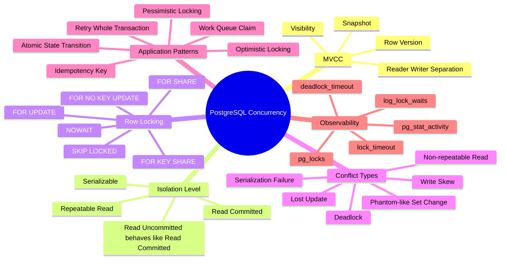
```mermaid id="p6sxov"
mindmap
  root((PostgreSQL Concurrency))
    MVCC
      Snapshot
      Row Version
      Reader Writer Separation
      Visibility
    Isolation Level
      Read Committed
      Repeatable Read
      Serializable
      Read Uncommitted behaves like Read Committed
    Row Locking
      FOR UPDATE
      FOR NO KEY UPDATE
      FOR SHARE
      FOR KEY SHARE
      NOWAIT
      SKIP LOCKED
    Conflict Types
      Lost Update
      Write Skew
      Non-repeatable Read
      Phantom-like Set Change
      Deadlock
      Serialization Failure
    Application Patterns
      Atomic State Transition
      Work Queue Claim
      Optimistic Locking
      Pessimistic Locking
      Idempotency Key
      Retry Whole Transaction
    Observability
      pg_stat_activity
      pg_locks
      lock_timeout
      deadlock_timeout
      log_lock_waits
```

---

## 3. Core Idea: MVCC

PostgreSQL memakai **Multiversion Concurrency Control / MVCC**. Artinya, setiap SQL statement melihat **snapshot** database pada waktu tertentu, bukan selalu kondisi fisik paling baru saat row sedang diubah transaksi lain. Tujuan utamanya adalah menjaga konsistensi data tanpa membuat read dan write saling memblokir secara agresif. Dalam model PostgreSQL, reader tidak memblokir writer dan writer tidak memblokir reader untuk query biasa. ([PostgreSQL](https://www.postgresql.org/docs/current/mvcc-intro.html))

```text
Transaction A                     Transaction B
-------------                     -------------
UPDATE case_file
SET status = 'CLOSED'
WHERE id = 10;
-- belum COMMIT

                                  SELECT status
                                  FROM case_file
                                  WHERE id = 10;
                                  -- melihat versi committed lama

COMMIT;
```

**Implikasi penting:** query `SELECT` biasa tidak otomatis “melihat row yang sedang dikunci” oleh transaksi lain. Untuk koordinasi update, gunakan transaction boundary, conditional update, row lock, atau isolation level yang tepat.

---

## 4. Isolation Level di PostgreSQL

PostgreSQL menerima empat nama isolation level standar SQL, tetapi secara internal hanya ada tiga perilaku berbeda: `READ UNCOMMITTED` berperilaku seperti `READ COMMITTED`. PostgreSQL juga menyatakan bahwa `READ COMMITTED` adalah default isolation level. ([PostgreSQL](https://www.postgresql.org/docs/current/transaction-iso.html))

| Isolation Level | Snapshot Scope | Dirty Read | Non-repeatable Read | Phantom Read | Serialization Anomaly | Kapan Dipakai |
|---|---|---:|---:|---:|---:|---|
| `READ UNCOMMITTED` | Sama seperti `READ COMMITTED` di PostgreSQL | Tidak | Bisa | Bisa | Bisa | Jarang dipakai; jangan andalkan berbeda dari read committed. |
| `READ COMMITTED` | Per statement | Tidak | Bisa | Bisa | Bisa | Default; cocok untuk mayoritas OLTP jika mutation dibuat atomic. |
| `REPEATABLE READ` | Per transaction | Tidak | Tidak | Tidak di PostgreSQL | Bisa | Cocok untuk snapshot stabil, report pendek, proses yang butuh view konsisten. |
| `SERIALIZABLE` | Per transaction + conflict monitoring | Tidak | Tidak | Tidak | Tidak | Untuk invariant lintas row/table yang sulit dilock manual, dengan retry wajib. |

---

## 5. `READ COMMITTED`

Pada `READ COMMITTED`, setiap `SELECT` melihat data yang sudah committed sebelum query tersebut mulai. Dua `SELECT` dalam transaksi yang sama bisa melihat hasil berbeda jika transaksi lain commit di antara dua query itu. Untuk `UPDATE`, `DELETE`, `SELECT FOR UPDATE`, dan `SELECT FOR SHARE`, PostgreSQL mencari target row berdasarkan snapshot awal statement, tetapi jika row target sedang diubah transaksi lain, statement akan menunggu transaksi itu commit/rollback. ([PostgreSQL](https://www.postgresql.org/docs/current/transaction-iso.html))

```sql id="gtoovw"
BEGIN;

SELECT status
FROM case_mgmt.case_file
WHERE id = 1001;

-- transaksi lain commit perubahan status di sini

SELECT status
FROM case_mgmt.case_file
WHERE id = 1001;
-- bisa melihat status berbeda

COMMIT;
```

**Rule praktis:** `READ COMMITTED` aman jika mutation dibuat sebagai **single atomic SQL statement** atau memakai row lock secara eksplisit.

---

## 6. `REPEATABLE READ`

Pada `REPEATABLE READ`, query dalam satu transaction melihat snapshot yang stabil sejak awal transaction, bukan snapshot baru per statement. Jika transaksi mencoba mengubah atau mengunci row yang sudah berubah setelah snapshot transaction dimulai, PostgreSQL bisa membatalkan transaksi dengan error serialization. ([PostgreSQL](https://www.postgresql.org/docs/current/transaction-iso.html))

```sql id="bap4wd"
BEGIN ISOLATION LEVEL REPEATABLE READ;

SELECT status
FROM case_mgmt.case_file
WHERE id = 1001;

-- transaksi lain commit perubahan status

SELECT status
FROM case_mgmt.case_file
WHERE id = 1001;
-- tetap melihat snapshot lama

COMMIT;
```

**Kelemahan utama:** snapshot stabil belum tentu cukup untuk business rule yang bergantung pada “kondisi terkini” lintas row/table. Dokumentasi PostgreSQL memberi peringatan bahwa consistency check berbasis `READ COMMITTED` sulit karena view berubah tiap statement, sedangkan `REPEATABLE READ` punya subtle issue read/write conflict untuk business invariant. ([PostgreSQL](https://www.postgresql.org/docs/current/applevel-consistency.html))

---

## 7. `SERIALIZABLE`

`SERIALIZABLE` adalah isolation paling ketat. PostgreSQL mendeskripsikannya sebagai eksekusi concurrent yang hasil akhirnya setara dengan transaksi dijalankan satu per satu dalam suatu urutan serial. Namun aplikasi **harus siap retry** karena PostgreSQL dapat membatalkan transaksi untuk mencegah serialization anomaly. ([PostgreSQL](https://www.postgresql.org/docs/current/transaction-iso.html))

```sql id="36ojjx"
BEGIN ISOLATION LEVEL SERIALIZABLE;

-- Baca rule global
SELECT count(*)
FROM case_mgmt.case_file
WHERE assigned_user_id = 42
  AND status = 'OPEN';

-- Tulis berdasarkan hasil rule global
INSERT INTO case_mgmt.case_assignment(case_id, assigned_user_id)
VALUES (1001, 42);

COMMIT;
-- bisa gagal dengan SQLSTATE 40001
```

**Gunakan `SERIALIZABLE` ketika:**

| Situasi | Kenapa |
|---|---|
| Rule bergantung pada agregasi lintas row/table | Contoh: “user tidak boleh punya lebih dari N case aktif”. |
| Sulit menentukan row mana yang harus dikunci | Conflict set tidak eksplisit. |
| Correctness lebih penting daripada throughput mentah | Cocok untuk operation penting, bukan semua query panas. |
| Ada framework retry transaction | Tanpa retry, user akan melihat error transient. |

---

## 8. Row Locking: `SELECT ... FOR ...`

PostgreSQL punya locking clause: `FOR UPDATE`, `FOR NO KEY UPDATE`, `FOR SHARE`, dan `FOR KEY SHARE`. Clause ini memengaruhi bagaimana `SELECT` mengunci row ketika row diambil dari table. Format umumnya mendukung `NOWAIT` dan `SKIP LOCKED`. ([PostgreSQL](https://www.postgresql.org/docs/current/sql-select.html))

```sql id="rvc2t6"
SELECT *
FROM case_mgmt.case_file
WHERE id = 1001
FOR UPDATE;
```

| Lock Clause | Intensi | Efek Praktis |
|---|---|---|
| `FOR UPDATE` | Mau update/delete row secara eksklusif. | Mencegah transaksi lain update/delete/lock row yang sama sampai transaksi selesai. |
| `FOR NO KEY UPDATE` | Mau update row tapi tidak mengubah key penting. | Lebih lemah dari `FOR UPDATE`; umum terjadi pada `UPDATE` biasa. |
| `FOR SHARE` | Mau membaca sambil mencegah update/delete. | Shared lock; reader lain dengan share masih bisa masuk. |
| `FOR KEY SHARE` | Mau melindungi key yang direferensikan FK. | Lebih lemah; sering terkait referential integrity. |

Row-level lock tidak memblokir query read biasa; ia memblokir writer atau locker lain pada row yang sama. PostgreSQL juga menyatakan `FOR UPDATE` mencegah row yang diambil dikunci, dimodifikasi, atau dihapus transaksi lain sampai transaksi saat ini selesai. ([PostgreSQL](https://www.postgresql.org/docs/current/explicit-locking.html))

---

## 9. `NOWAIT` vs `SKIP LOCKED`

`NOWAIT` membuat statement langsung error jika row yang dipilih tidak bisa dikunci segera. `SKIP LOCKED` melewati row yang sedang terkunci. PostgreSQL memperingatkan bahwa `SKIP LOCKED` memberi view data yang inkonsisten, sehingga tidak cocok untuk general-purpose query, tetapi cocok untuk pola queue dengan banyak consumer. ([PostgreSQL](https://www.postgresql.org/docs/current/sql-select.html))

| Option | Behavior | Cocok Untuk | Tidak Cocok Untuk |
|---|---|---|---|
| default wait | Menunggu lock dilepas | Operation penting yang boleh menunggu | Request API latency-sensitive tanpa timeout |
| `NOWAIT` | Langsung gagal jika locked | Try-lock, UX “sedang diproses user lain” | Worker queue |
| `SKIP LOCKED` | Lewati row locked | Multi-worker queue claim | Query audit/report/kebenaran bisnis global |

### Try-lock untuk UI/API

```sql id="114k5k"
BEGIN;

SELECT *
FROM case_mgmt.case_file
WHERE id = :case_id
FOR UPDATE NOWAIT;

-- lanjutkan perubahan jika lock berhasil
UPDATE case_mgmt.case_file
SET status = 'IN_REVIEW',
    updated_at = now()
WHERE id = :case_id;

COMMIT;
```

### Claim queue dengan `SKIP LOCKED`

```sql id="hcwkjq"
WITH next_task AS (
    SELECT id
    FROM case_mgmt.case_task
    WHERE status = 'READY'
    ORDER BY priority DESC, created_at ASC, id ASC
    FOR UPDATE SKIP LOCKED
    LIMIT 1
)
UPDATE case_mgmt.case_task t
SET status = 'CLAIMED',
    claimed_at = now(),
    claimed_by = :worker_id
FROM next_task
WHERE t.id = next_task.id
RETURNING t.*;
```

**Kenapa pattern ini bagus:** banyak worker bisa mengambil task berbeda tanpa saling menunggu lama. **Kenapa berbahaya jika salah pakai:** `SKIP LOCKED` tidak memberi “daftar semua row valid”; ia sengaja melewati row yang sedang dikunci.

---

## 10. Atomic State Transition Pattern

Untuk workflow/case lifecycle, sering kali lebih baik memakai **conditional update** daripada `SELECT` lalu `UPDATE`.

```sql id="2b8blg"
UPDATE case_mgmt.case_file
SET status = 'IN_REVIEW',
    updated_at = now(),
    version = version + 1
WHERE id = :case_id
  AND status = 'OPEN'
RETURNING id, status, version;
```

Interpretasi:

| Hasil `RETURNING` | Arti |
|---|---|
| Ada row | Transition berhasil dan atomic. |
| Kosong | Case tidak ditemukan atau status sudah berubah. |
| Error deadlock/serialization | Retry sesuai policy. |

**Invariant:** transition harus dinyatakan di `WHERE`, bukan hanya dicek di aplikasi sebelum update.

---

## 11. Optimistic Locking Pattern

Cocok ketika konflik jarang, API ingin mendeteksi lost update, dan row punya `version`.

```sql id="y9klyq"
UPDATE case_mgmt.case_file
SET title = :new_title,
    version = version + 1,
    updated_at = now()
WHERE id = :case_id
  AND version = :expected_version
RETURNING id, version;
```

| Kondisi | Response Aplikasi |
|---|---|
| `RETURNING` ada row | Update sukses. |
| `RETURNING` kosong | Conflict; client memakai versi lama. |
| SQLSTATE `40001` / `40P01` | Retry transaction jika operation idempotent. |

**Cocok untuk:** edit form, metadata update, case note update.  
**Kurang cocok untuk:** hot queue row, counter sangat panas, global quota.

---

## 12. Pessimistic Locking Pattern

Cocok ketika konflik sering atau operation punya banyak langkah yang harus memakai row terkunci.

```sql id="b2qtxl"
BEGIN;

SELECT id, status, assigned_user_id
FROM case_mgmt.case_file
WHERE id = :case_id
FOR UPDATE;

-- validasi business rule di aplikasi
-- insert audit
-- update state

UPDATE case_mgmt.case_file
SET status = 'ESCALATED',
    updated_at = now()
WHERE id = :case_id;

INSERT INTO audit.case_event(case_id, event_type, created_at)
VALUES (:case_id, 'CASE_ESCALATED', now());

COMMIT;
```

**Rule:** transaksi harus pendek. Jangan tahan lock sambil menunggu input user, memanggil service eksternal, upload file, atau melakukan operasi jaringan lambat.

---

## 13. Deadlock

Deadlock terjadi ketika dua atau lebih transaksi saling menunggu lock yang dipegang satu sama lain. PostgreSQL mendeteksi deadlock dan membatalkan salah satu transaksi; transaksi yang dibatalkan tidak dapat diprediksi dan aplikasi harus siap menangani kegagalan tersebut. Dokumentasi resmi menyarankan lock diambil dalam urutan konsisten sebagai pertahanan utama, dan transaksi yang gagal karena deadlock dapat di-retry. ([PostgreSQL](https://www.postgresql.org/docs/current/explicit-locking.html))

### Contoh deadlock klasik

```text
Transaction A                     Transaction B
-------------                     -------------
UPDATE case_file id=1;

                                  UPDATE case_file id=2;

UPDATE case_file id=2;
-- wait B

                                  UPDATE case_file id=1;
                                  -- wait A
                                  -- deadlock
```

### Fix: lock ordering

```sql id="6izps3"
BEGIN;

SELECT id
FROM case_mgmt.case_file
WHERE id IN (:case_id_1, :case_id_2)
ORDER BY id
FOR UPDATE;

-- update selalu setelah lock diambil dalam urutan stabil

COMMIT;
```

---

## 14. Lock Timeout, Statement Timeout, dan Deadlock Timeout

`deadlock_timeout` adalah durasi PostgreSQL menunggu lock sebelum mengecek deadlock. Default-nya satu detik, dan ketika `log_lock_waits` aktif, parameter ini juga menentukan kapan log lock wait ditulis. PostgreSQL juga menjelaskan bahwa deadlock check relatif mahal, sehingga tidak dijalankan setiap kali proses menunggu lock. ([PostgreSQL](https://www.postgresql.org/docs/current/runtime-config-locks.html))

Di level aplikasi, biasanya lebih penting mengatur:

```sql id="0n706f"
SET LOCAL lock_timeout = '2s';
SET LOCAL statement_timeout = '10s';
```

| Setting | Fungsi | Biasanya Dipakai |
|---|---|---|
| `lock_timeout` | Maksimum menunggu lock. | API request agar tidak menggantung. |
| `statement_timeout` | Maksimum durasi statement. | Mencegah query runaway. |
| `deadlock_timeout` | Kapan PostgreSQL cek deadlock/log lock wait. | Tuning observability server-side. |
| `idle_in_transaction_session_timeout` | Bunuh session yang idle dalam transaction. | Mencegah lock tertahan karena bug aplikasi. |

---

## 15. Serialization Failure dan Retry

PostgreSQL menyatakan aplikasi yang memakai `REPEATABLE READ` dan `SERIALIZABLE` harus siap retry transaksi yang gagal karena serialization error. SQLSTATE untuk serialization failure adalah `40001`; deadlock failure adalah `40P01`; unique violation `23505` dan exclusion violation `23P01` kadang juga bisa diperlakukan sebagai retryable jika secara domain memang akibat race, tetapi harus lebih hati-hati karena bisa juga persistent error. Retry harus mengulang **seluruh transaksi**, termasuk logic yang menentukan SQL dan value yang dipakai. ([PostgreSQL](https://www.postgresql.org/docs/current/mvcc-serialization-failure-handling.html))

### Retryable SQLSTATE

| SQLSTATE | Condition | Retry? | Catatan |
|---|---|---|---|
| `40001` | `serialization_failure` | Ya | Retry whole transaction. |
| `40P01` | `deadlock_detected` | Biasanya ya | Perbaiki lock ordering juga. |
| `55P03` | `lock_not_available` | Tergantung | Biasanya dari `NOWAIT` atau timeout; bisa return conflict ke caller. |
| `23505` | `unique_violation` | Tergantung | Retry hanya jika race-generated value/idempotency case. |
| `23P01` | `exclusion_violation` | Tergantung | Retry jika konflik transient, bukan rule bisnis valid. |

### Java retry skeleton

```java id="5jzj3x"
static final Set<String> RETRYABLE_SQL_STATES = Set.of(
    "40001", // serialization_failure
    "40P01"  // deadlock_detected
);

<T> T runWithTransactionRetry(Supplier<T> transactionalWork) {
    int maxAttempts = 3;
    RuntimeException last = null;

    for (int attempt = 1; attempt <= maxAttempts; attempt++) {
        try {
            return transactionalWork.get();
        } catch (RuntimeException ex) {
            last = ex;

            String sqlState = extractSqlState(ex);
            if (!RETRYABLE_SQL_STATES.contains(sqlState)) {
                throw ex;
            }

            if (attempt == maxAttempts) {
                throw ex;
            }

            sleepWithJitter(attempt);
        }
    }

    throw last;
}
```

**Prinsip penting:** jangan retry hanya statement terakhir. Retry seluruh unit of work dari awal.

---

## 16. Pattern: Case Assignment yang Aman

Problem: dua worker/API mencoba assign case yang sama.

### Pattern aman dengan conditional update

```sql id="v1mnj4"
UPDATE case_mgmt.case_file
SET assigned_user_id = :user_id,
    assigned_at = now(),
    status = 'ASSIGNED',
    updated_at = now()
WHERE id = :case_id
  AND assigned_user_id IS NULL
  AND status = 'OPEN'
RETURNING id, assigned_user_id, status;
```

| Outcome | Meaning |
|---|---|
| 1 row returned | Assignment menang. |
| 0 row returned | Sudah assigned/status berubah/tidak eligible. |
| deadlock/serialization | Retry jika operation idempotent. |

---

## 17. Pattern: Escalation Worker

Problem: banyak worker mencari case overdue dan escalate tanpa double processing.

```sql id="2zo05l"
WITH candidates AS (
    SELECT id
    FROM case_mgmt.case_file
    WHERE status = 'OPEN'
      AND sla_due_at < now()
    ORDER BY sla_due_at ASC, id ASC
    FOR UPDATE SKIP LOCKED
    LIMIT 100
)
UPDATE case_mgmt.case_file c
SET status = 'ESCALATED',
    escalated_at = now(),
    updated_at = now()
FROM candidates
WHERE c.id = candidates.id
RETURNING c.id, c.status, c.escalated_at;
```

**Operational note:** pastikan index mendukung predicate dan ordering.

```sql id="93cj09"
CREATE INDEX idx_case_file_open_sla_due
ON case_mgmt.case_file (sla_due_at ASC, id ASC)
WHERE status = 'OPEN';
```

---

## 18. Pattern: Idempotency Key

Problem: request retry dari client/gateway bisa membuat double insert.

```sql id="m0g6tw"
CREATE TABLE integration.idempotency_key (
    key text PRIMARY KEY,
    request_hash text NOT NULL,
    response_payload jsonb,
    status text NOT NULL,
    created_at timestamptz NOT NULL DEFAULT now()
);
```

```sql id="zqsmtr"
INSERT INTO integration.idempotency_key(key, request_hash, status)
VALUES (:key, :request_hash, 'PROCESSING')
ON CONFLICT (key) DO NOTHING
RETURNING key;
```

| Hasil | Tindakan |
|---|---|
| Insert sukses | Proses request. |
| Conflict key sama + hash sama | Return cached result atau wait/poll. |
| Conflict key sama + hash beda | Reject sebagai idempotency misuse. |

---

## 19. Pattern: Counter / Quota Aman

### Atomic increment

```sql id="qdh5gt"
UPDATE case_mgmt.user_quota
SET active_case_count = active_case_count + 1
WHERE user_id = :user_id
  AND active_case_count < max_active_case
RETURNING user_id, active_case_count;
```

### Jangan lakukan ini

```sql id="3eqi3s"
-- Race-prone
SELECT active_case_count, max_active_case
FROM case_mgmt.user_quota
WHERE user_id = :user_id;

-- aplikasi cek

UPDATE case_mgmt.user_quota
SET active_case_count = active_case_count + 1
WHERE user_id = :user_id;
```

**Rule:** untuk counter/quota, jadikan constraint sebagai bagian dari `UPDATE WHERE`.

---

## 20. Pattern: Global Invariant

Problem: “Tidak boleh ada lebih dari 5 case OPEN per assignee.”

### Option A - counter row + conditional update

```sql id="j0t8im"
BEGIN;

UPDATE case_mgmt.assignee_capacity
SET open_case_count = open_case_count + 1
WHERE assignee_id = :assignee_id
  AND open_case_count < 5
RETURNING assignee_id;

-- kalau kosong, kapasitas penuh

UPDATE case_mgmt.case_file
SET assigned_user_id = :assignee_id,
    status = 'OPEN'
WHERE id = :case_id
  AND assigned_user_id IS NULL;

COMMIT;
```

### Option B - `SERIALIZABLE`

```sql id="ufj7lb"
BEGIN ISOLATION LEVEL SERIALIZABLE;

SELECT count(*)
FROM case_mgmt.case_file
WHERE assigned_user_id = :assignee_id
  AND status = 'OPEN';

-- aplikasi cek count < 5

UPDATE case_mgmt.case_file
SET assigned_user_id = :assignee_id,
    status = 'OPEN'
WHERE id = :case_id;

COMMIT;
```

**Trade-off:** counter row lebih eksplisit dan cepat, tetapi perlu menjaga counter correctness. `SERIALIZABLE` lebih declarative untuk rule kompleks, tetapi butuh retry discipline.

---

## 21. Application Design Rules

| Rule | Kenapa |
|---|---|
| Buat transaksi pendek | Mengurangi lock wait, deadlock, dan bloat pressure. |
| Jangan call service eksternal saat transaction terbuka | Lock bisa tertahan karena network latency. |
| Gunakan conditional update untuk state transition | Menghindari check-then-act race. |
| Lock multiple row dalam urutan stabil | Mengurangi deadlock. |
| Gunakan `SKIP LOCKED` hanya untuk queue-like workload | Karena view yang dihasilkan memang tidak konsisten. |
| Retry whole transaction untuk `40001` dan biasanya `40P01` | PostgreSQL tidak bisa retry otomatis dengan jaminan correctness. |
| Gunakan SQLSTATE, bukan parsing message error | SQLSTATE lebih stabil daripada teks error. |
| Set timeout di API path | Mencegah request menggantung karena lock wait. |
| Observasi lock wait di DB | Lock issue sering terlihat sebagai latency aplikasi. |

---

## 22. Debugging Lock Issue

### Lihat session aktif

```sql id="ojc3gq"
SELECT
    pid,
    usename,
    application_name,
    state,
    wait_event_type,
    wait_event,
    query,
    xact_start,
    query_start
FROM pg_stat_activity
WHERE state <> 'idle'
ORDER BY xact_start NULLS LAST;
```

### Lihat lock

```sql id="2408xi"
SELECT
    locktype,
    relation::regclass AS relation_name,
    mode,
    granted,
    pid
FROM pg_locks
ORDER BY granted, relation_name, mode;
```

### Cari blocker dan blocked

```sql id="49wmte"
SELECT
    blocked.pid AS blocked_pid,
    blocked.query AS blocked_query,
    blocker.pid AS blocker_pid,
    blocker.query AS blocker_query
FROM pg_stat_activity blocked
JOIN pg_locks blocked_locks
    ON blocked_locks.pid = blocked.pid
JOIN pg_locks blocker_locks
    ON blocker_locks.locktype = blocked_locks.locktype
   AND blocker_locks.database IS NOT DISTINCT FROM blocked_locks.database
   AND blocker_locks.relation IS NOT DISTINCT FROM blocked_locks.relation
   AND blocker_locks.page IS NOT DISTINCT FROM blocked_locks.page
   AND blocker_locks.tuple IS NOT DISTINCT FROM blocked_locks.tuple
   AND blocker_locks.virtualxid IS NOT DISTINCT FROM blocked_locks.virtualxid
   AND blocker_locks.transactionid IS NOT DISTINCT FROM blocked_locks.transactionid
   AND blocker_locks.classid IS NOT DISTINCT FROM blocked_locks.classid
   AND blocker_locks.objid IS NOT DISTINCT FROM blocked_locks.objid
   AND blocker_locks.objsubid IS NOT DISTINCT FROM blocked_locks.objsubid
   AND blocker_locks.pid <> blocked_locks.pid
JOIN pg_stat_activity blocker
    ON blocker.pid = blocker_locks.pid
WHERE NOT blocked_locks.granted
  AND blocker_locks.granted;
```

---

## 23. Common Pitfalls

| Pitfall | Dampak | Solusi |
|---|---|---|
| `SELECT` lalu `UPDATE` tanpa condition | Lost update / stale decision. | Pakai conditional `UPDATE ... WHERE current_state ... RETURNING`. |
| Transaksi menunggu input user | Lock tertahan lama. | Pisahkan read/display dan write/commit. |
| Semua worker ambil row pertama tanpa `SKIP LOCKED` | Worker saling tunggu. | Pakai `FOR UPDATE SKIP LOCKED LIMIT n`. |
| `SKIP LOCKED` dipakai untuk report | Data tidak lengkap/inkonsisten. | Jangan pakai untuk report/audit. |
| Retry hanya statement terakhir | Masih salah secara logic. | Retry whole transaction. |
| Tidak membedakan business conflict vs transient conflict | User experience buruk atau data salah. | Map SQLSTATE + domain outcome. |
| Lock banyak row tanpa ordering | Deadlock. | Lock dalam urutan deterministic. |
| Pakai `SERIALIZABLE` tanpa retry | Error production. | Retry framework wajib. |
| Long-running `REPEATABLE READ` | Snapshot lama, conflict/bloat pressure. | Batasi durasi transaksi. |
| Tidak set timeout | API menggantung saat lock wait. | `lock_timeout`, `statement_timeout`, app timeout. |

---

## 24. Decision Matrix

| Problem | Pattern Utama | SQL Tool |
|---|---|---|
| State transition case | Atomic conditional update | `UPDATE ... WHERE old_status ... RETURNING` |
| Claim task queue | Pessimistic queue claim | `FOR UPDATE SKIP LOCKED` |
| Prevent concurrent edit | Optimistic locking | `version` column |
| Prevent two users process same case | Pessimistic lock | `SELECT ... FOR UPDATE NOWAIT` |
| Global quota/invariant | Counter row atau serializable | Conditional update / `SERIALIZABLE` |
| Duplicate API retry | Idempotency table | `INSERT ... ON CONFLICT` |
| Deadlock transient | Retry + lock ordering | SQLSTATE `40P01` |
| Serialization anomaly | Retry whole transaction | SQLSTATE `40001` |
| Lock wait in API | Fail fast | `lock_timeout`, `NOWAIT` |
| Batch worker throughput | Skip locked rows | `SKIP LOCKED` |

---

## 25. Roadmap Singkat

| Urutan | Materi | Target |
|---:|---|---|
| 1 | MVCC snapshot behavior | Paham kenapa read/write tidak selalu saling block. |
| 2 | `READ COMMITTED` | Bisa membuat mutation aman di default isolation. |
| 3 | Conditional update | Bisa menghindari check-then-act race. |
| 4 | Row locking | Bisa memilih `FOR UPDATE`, `NOWAIT`, atau `SKIP LOCKED`. |
| 5 | Deadlock prevention | Bisa mendesain lock ordering stabil. |
| 6 | Retry pattern | Bisa handle `40001` dan `40P01` dengan benar. |
| 7 | Queue pattern | Bisa membuat worker multi-consumer aman. |
| 8 | Serializable transaction | Bisa menjaga invariant kompleks dengan retry. |
| 9 | Lock observability | Bisa debug blocker, blocked session, dan long transaction. |

## Rekomendasi Materi Selanjutnya

Lanjut paling tepat: **Cheatsheet PostgreSQL Indexing, Query Planner, `EXPLAIN / EXPLAIN ANALYZE`, Statistics, dan Query Performance Tuning**. Ini akan melengkapi correctness dengan kemampuan membaca kenapa query lambat, kenapa index tidak dipakai, dan bagaimana memperbaiki query production secara defensible.

---

**Sources:**

- [PostgreSQL: Documentation: 18: Chapter 13. Concurrency Control](https://www.postgresql.org/docs/current/mvcc.html)

## Response:
7/12/2026, 11:36:14 PM

Saya lanjutkan ke performance layer PostgreSQL: index, planner, statistics, `EXPLAIN`, dan tuning query. Fokusnya bukan “tambah index sebanyak mungkin”, tetapi cara membaca evidence sebelum mengubah SQL atau schema.

# Cheatsheet: PostgreSQL Indexing, Query Planner, `EXPLAIN`, Statistics, dan Query Performance Tuning

## 1. Scope

Cheatsheet ini fokus ke **cara mendiagnosis dan memperbaiki query PostgreSQL secara evidence-based**. Targetnya bukan sekadar tahu syntax `CREATE INDEX`, tetapi mampu menjawab:

- Kenapa query lambat?
- Kenapa index tidak dipakai?
- Kenapa planner salah memilih plan?
- Apakah masalahnya di SQL, index, statistics, data distribution, atau workload?
- Bagaimana membuat perubahan yang aman untuk production?

PostgreSQL current documentation saat ini berada pada PostgreSQL 18, dan dokumentasi resmi menempatkan performance/query planning di area `EXPLAIN`, planner statistics, index usage, query planning configuration, dan monitoring statistics. Planner memilih query plan berdasarkan struktur query, data properties, statistics, dan cost model; `EXPLAIN` adalah alat utama untuk melihat plan yang dipilih. ([PostgreSQL](https://www.postgresql.org/docs/current/using-explain.html))

---

## 2. Mental Model

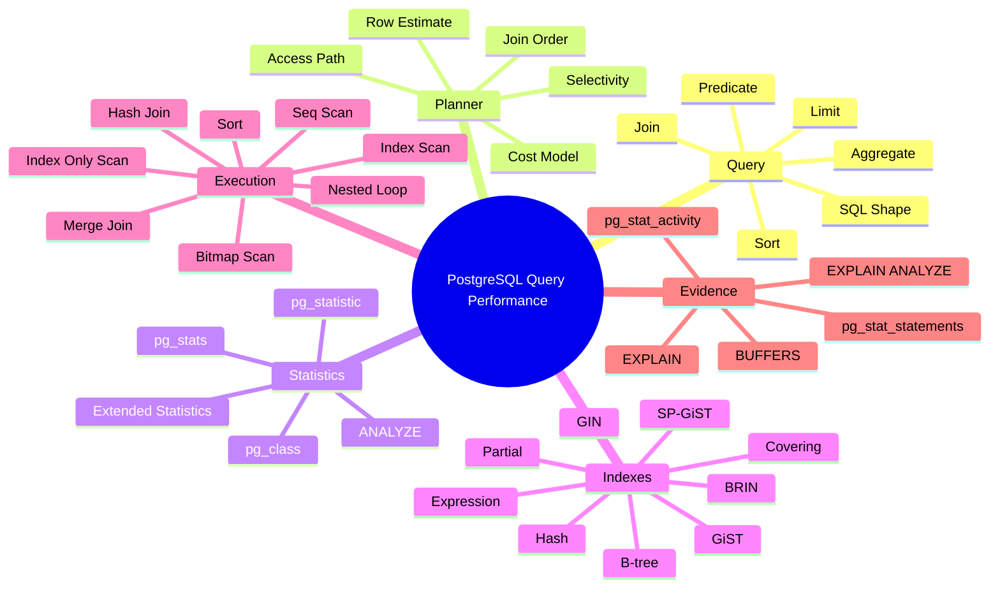
```mermaid id="0gt5uq"
mindmap
  root((PostgreSQL Query Performance))
    Query
      SQL Shape
      Predicate
      Join
      Sort
      Aggregate
      Limit
    Planner
      Cost Model
      Row Estimate
      Selectivity
      Join Order
      Access Path
    Statistics
      pg_class
      pg_statistic
      pg_stats
      ANALYZE
      Extended Statistics
    Indexes
      B-tree
      Hash
      GiST
      SP-GiST
      GIN
      BRIN
      Partial
      Expression
      Covering
    Execution
      Seq Scan
      Index Scan
      Index Only Scan
      Bitmap Scan
      Nested Loop
      Hash Join
      Merge Join
      Sort
    Evidence
      EXPLAIN
      EXPLAIN ANALYZE
      BUFFERS
      pg_stat_statements
      pg_stat_activity
```

**Core model:** query performance adalah hasil dari empat hal: **SQL shape**, **data distribution**, **available access paths**, dan **planner estimates**. Index hanya salah satu access path. Index yang benar untuk satu query bisa menjadi overhead untuk write path dan tidak berguna untuk query lain.

---

## 3. Diagnostic Flow

Gunakan alur ini sebelum mengubah schema/index.

```text id="xz746w"
1. Temukan query bermasalah
   ↓
2. Ambil EXPLAIN (ANALYZE, BUFFERS)
   ↓
3. Bandingkan estimated rows vs actual rows
   ↓
4. Identifikasi node mahal
   ↓
5. Cek access path: Seq Scan / Index Scan / Bitmap / Join / Sort
   ↓
6. Cek statistics: ANALYZE, pg_stats, extended statistics
   ↓
7. Pilih tindakan:
      - rewrite query
      - tambah/ubah index
      - update statistics
      - ubah data model
      - ubah pagination/batching
      - tuning config terbatas
   ↓
8. Validasi ulang dengan EXPLAIN ANALYZE
```

`EXPLAIN ANALYZE` benar-benar menjalankan statement dan menambahkan runtime aktual serta jumlah row aktual. Untuk statement mutasi seperti `INSERT`, `UPDATE`, `DELETE`, `MERGE`, atau `CREATE TABLE AS`, dokumentasi PostgreSQL menyarankan menjalankannya di dalam transaction lalu `ROLLBACK` jika hanya ingin menganalisis tanpa mengubah data. ([PostgreSQL](https://www.postgresql.org/docs/current/sql-explain.html))

---

## 4. Index: Fungsi dan Trade-off

Index mempercepat pencarian row tertentu, tetapi menambah biaya storage dan write. PostgreSQL documentation menyebut index sebagai cara umum meningkatkan performa karena server bisa menemukan row lebih cepat dibanding tanpa index, tetapi index juga menambah overhead sehingga harus dipakai secara bijak. ([PostgreSQL](https://www.postgresql.org/docs/current/indexes.html?utm_source=chatgpt.com))

| Aspek | Efek Positif | Efek Negatif |
|---|---|---|
| Read selective query | Lebih cepat menemukan row kecil dari table besar. | Tidak selalu dipakai jika selectivity buruk. |
| Join | Mempercepat lookup sisi inner join. | Bisa tetap kalah dari hash join untuk data besar. |
| Sort / `ORDER BY` | B-tree bisa menyediakan order. | Index order harus cocok dengan query. |
| Unique enforcement | Menjaga invariant. | Write bisa gagal karena constraint. |
| Write path | - | `INSERT`, `UPDATE`, `DELETE` harus maintain index. |
| Storage | - | Index besar bisa menghabiskan disk dan cache. |
| Vacuum / bloat | - | Index juga bisa bloat dan butuh maintenance. |

**Rule senior:** jangan membuat index dari nama column. Buat index dari **query pattern**: `WHERE`, `JOIN`, `ORDER BY`, `LIMIT`, cardinality, dan frequency.

---

## 5. Index Types

PostgreSQL menyediakan beberapa index type: **B-tree, Hash, GiST, SP-GiST, GIN, BRIN**, dan extension seperti `bloom`. Default `CREATE INDEX` adalah **B-tree**, yang cocok untuk kasus paling umum. ([PostgreSQL](https://www.postgresql.org/docs/current/indexes-types.html))

| Index Type | Cocok Untuk | Contoh |
|---|---|---|
| B-tree | Equality, range, sort, primary key, unique, most OLTP query. | `status = ?`, `created_at >= ?`, `ORDER BY created_at`. |
| Hash | Equality saja. | `col = ?`; jarang jadi pilihan pertama karena B-tree juga menangani equality. |
| GIN | Composite/inverted data: JSONB, array, full-text search. | `payload @> ...`, `tags @> ...`. |
| GiST | Geometric, range, exclusion constraint, extensible search. | range overlap, spatial-like use case. |
| SP-GiST | Partitioned search structure untuk data tertentu. | prefix/tree-like/spatial partitioning. |
| BRIN | Table besar yang datanya berkorelasi dengan physical order. | time-series append-only, audit log, event log. |

B-tree dapat menangani operator `<`, `<=`, `=`, `>=`, `>`, termasuk konstruksi seperti `BETWEEN` dan `IN`; B-tree juga dapat membantu `IS NULL` / `IS NOT NULL`, prefix pattern seperti `LIKE 'foo%'`, dan sorted retrieval. ([PostgreSQL](https://www.postgresql.org/docs/current/indexes-types.html))

---

## 6. B-tree Patterns

### Equality lookup

```sql id="v8wtpr"
CREATE INDEX idx_case_file_case_number
ON case_mgmt.case_file (case_number);

SELECT *
FROM case_mgmt.case_file
WHERE case_number = 'CASE-2026-000123';
```

### Range query

```sql id="y0zr4z"
CREATE INDEX idx_case_file_created_at
ON case_mgmt.case_file (created_at);

SELECT *
FROM case_mgmt.case_file
WHERE created_at >= now() - interval '7 days';
```

### Filter + order + limit

```sql id="n267hn"
CREATE INDEX idx_case_file_status_created_at
ON case_mgmt.case_file (status, created_at DESC, id DESC);

SELECT id, case_number, status, created_at
FROM case_mgmt.case_file
WHERE status = 'OPEN'
ORDER BY created_at DESC, id DESC
LIMIT 50;
```

Index di atas cocok karena query memfilter `status`, lalu butuh order `created_at DESC, id DESC`. Untuk query dengan `ORDER BY`, B-tree bisa membantu menghindari sort terpisah jika urutan index cocok. ([PostgreSQL](https://www.postgresql.org/docs/current/indexes-ordering.html?utm_source=chatgpt.com))

---

## 7. Multicolumn Index

Multicolumn index adalah index di lebih dari satu column. Untuk B-tree, index paling efektif ketika query punya constraint pada **leading / leftmost columns**. Equality pada column kiri, lalu range pada column pertama yang tidak equality, akan membatasi bagian index yang perlu discan. Column di kanan masih bisa difilter di index, tetapi belum tentu mengurangi area scan secara signifikan. ([PostgreSQL](https://www.postgresql.org/docs/current/indexes-multicolumn.html))

```sql id="mvj53m"
CREATE INDEX idx_case_task_status_priority_created
ON case_mgmt.case_task (status, priority DESC, created_at ASC);
```

Cocok untuk:

```sql id="31luot"
SELECT *
FROM case_mgmt.case_task
WHERE status = 'READY'
ORDER BY priority DESC, created_at ASC
LIMIT 100;
```

Kurang ideal untuk:

```sql id="dyi18s"
SELECT *
FROM case_mgmt.case_task
WHERE created_at >= now() - interval '1 day';
```

Karena `created_at` bukan leading column.

## Heuristic urutan column

| Query Pattern | Index Candidate |
|---|---|
| `WHERE tenant_id = ? AND status = ? ORDER BY created_at DESC` | `(tenant_id, status, created_at DESC)` |
| `WHERE case_id = ? ORDER BY changed_at DESC` | `(case_id, changed_at DESC)` |
| `WHERE status = ? AND sla_due_at < ? ORDER BY sla_due_at` | `(status, sla_due_at)` |
| `WHERE assignee_id = ? AND status IN (...) ORDER BY priority DESC` | `(assignee_id, status, priority DESC)` |

**Catatan:** PostgreSQL docs menyarankan multicolumn index dipakai secara hemat; index dengan lebih dari tiga column jarang membantu kecuali workload sangat terstruktur. ([PostgreSQL](https://www.postgresql.org/docs/current/indexes-multicolumn.html))

---

## 8. Partial Index

Partial index hanya mengindeks subset row yang memenuhi predicate. Ini berguna ketika query sering mengakses subset kecil yang penting, misalnya task `READY`, outbox `PENDING`, atau case `OPEN`. PostgreSQL mendefinisikan partial index sebagai index atas subset table yang ditentukan oleh conditional expression/predicate. ([PostgreSQL](https://www.postgresql.org/docs/current/indexes-partial.html?utm_source=chatgpt.com))

```sql id="68h0pk"
CREATE INDEX idx_case_task_ready_queue
ON case_mgmt.case_task (priority DESC, created_at ASC, id ASC)
WHERE status = 'READY';
```

Query yang cocok:

```sql id="uj772n"
SELECT id
FROM case_mgmt.case_task
WHERE status = 'READY'
ORDER BY priority DESC, created_at ASC, id ASC
LIMIT 100;
```

### Pitfall partial index

Parameterized query bisa membuat partial index tidak dipakai jika planner tidak bisa membuktikan bahwa predicate query mengimplikasikan predicate index. Dokumentasi PostgreSQL menyatakan partial index dapat digunakan hanya jika sistem bisa mengenali bahwa `WHERE` query secara matematis mengimplikasikan predicate index, dan matching dilakukan saat planning, bukan runtime. ([PostgreSQL](https://www.postgresql.org/docs/current/indexes-partial.html?utm_source=chatgpt.com))

```sql id="6h7j3r"
-- Partial index:
CREATE INDEX idx_case_task_ready_queue
ON case_mgmt.case_task (created_at)
WHERE status = 'READY';

-- Aman dan jelas:
SELECT *
FROM case_mgmt.case_task
WHERE status = 'READY'
ORDER BY created_at
LIMIT 10;
```

---

## 9. Expression Index

Expression index mengindeks hasil ekspresi, bukan hanya column mentah. PostgreSQL mendukung index column berupa function atau scalar expression, berguna untuk akses cepat berdasarkan hasil komputasi. ([PostgreSQL](https://www.postgresql.org/docs/current/indexes-expressional.html?utm_source=chatgpt.com))

```sql id="2eqk6a"
CREATE INDEX idx_case_file_lower_case_number
ON case_mgmt.case_file (lower(case_number));

SELECT *
FROM case_mgmt.case_file
WHERE lower(case_number) = lower('case-2026-000123');
```

### Common expression index

```sql id="m0fn3i"
CREATE INDEX idx_case_event_payload_source
ON audit.case_event ((payload ->> 'source'));

SELECT *
FROM audit.case_event
WHERE payload ->> 'source' = 'CAMUNDA';
```

**Rule:** expression di query harus cocok dengan expression di index. Kalau sering query `lower(email)`, index `email` biasa tidak cukup.

---

## 10. Covering Index dan Index-Only Scan

Index-only scan bisa menjawab query dari index saja tanpa heap access, tetapi ada syarat: index type harus mendukung index-only scan, query hanya memakai column yang tersimpan di index, dan visibility map harus menunjukkan row cukup lama/visible tanpa perlu cek heap. PostgreSQL menyatakan B-tree selalu mendukung index-only scan, sedangkan GIN tidak karena entry GIN biasanya hanya menyimpan bagian dari nilai asli. ([PostgreSQL](https://www.postgresql.org/docs/current/indexes-index-only-scans.html))

```sql id="z6h5au"
CREATE INDEX idx_case_file_status_created_include
ON case_mgmt.case_file (status, created_at DESC)
INCLUDE (case_number, priority);

SELECT case_number, priority, created_at
FROM case_mgmt.case_file
WHERE status = 'OPEN'
ORDER BY created_at DESC
LIMIT 50;
```

| Column di index | Fungsi |
|---|---|
| Key columns: `(status, created_at DESC)` | Dipakai untuk search/order. |
| Include columns: `(case_number, priority)` | Dibawa agar query bisa satisfied dari index. |

**Pitfall:** covering index memperbesar index. Pakai untuk query hot path yang benar-benar sering dan read-heavy.

---

## 11. Unique Index vs Unique Constraint

PostgreSQL otomatis membuat unique index ketika `PRIMARY KEY` atau `UNIQUE` constraint didefinisikan; index tersebut adalah mekanisme yang menegakkan constraint. ([PostgreSQL](https://www.postgresql.org/docs/current/indexes-unique.html?utm_source=chatgpt.com))

```sql id="q4ixau"
ALTER TABLE case_mgmt.case_file
ADD CONSTRAINT uq_case_file_case_number
UNIQUE (case_number);
```

Gunakan **constraint** untuk invariant bisnis. Gunakan **index** untuk access path performa. Walaupun implementasinya bertemu di index, niat desainnya berbeda.

---

## 12. `CREATE INDEX CONCURRENTLY`

Untuk table production besar, `CREATE INDEX` biasa dapat mengganggu write. `CREATE INDEX CONCURRENTLY` dibuat untuk mengurangi blocking write, tetapi memiliki caveat: tidak boleh dijalankan dalam transaction block, hanya satu concurrent index build per table pada satu waktu, dan jika gagal bisa meninggalkan index invalid yang perlu di-drop atau direbuild. PostgreSQL juga mencatat concurrent builds untuk expression dan partial index didukung. ([PostgreSQL](https://www.postgresql.org/docs/current/sql-createindex.html?utm_source=chatgpt.com))

```sql id="ol9s6p"
CREATE INDEX CONCURRENTLY idx_case_event_case_created
ON audit.case_event (case_id, created_at DESC);
```

Cek invalid index:

```sql id="sb24gq"
SELECT
    schemaname,
    tablename,
    indexname
FROM pg_indexes
WHERE schemaname = 'audit';
```

Atau cek catalog lebih detail:

```sql id="d8e19r"
SELECT
    ns.nspname AS schema_name,
    cls.relname AS index_name,
    idx.indisvalid,
    idx.indisready
FROM pg_index idx
JOIN pg_class cls ON cls.oid = idx.indexrelid
JOIN pg_namespace ns ON ns.oid = cls.relnamespace
WHERE NOT idx.indisvalid OR NOT idx.indisready;
```

---

## 13. `EXPLAIN` Basics

`EXPLAIN` menampilkan query plan sebagai tree. Node bawah biasanya scan node seperti sequential scan, index scan, atau bitmap index scan; node di atasnya bisa join, aggregate, sort, limit, dan operasi lain. Planner berusaha meminimalkan estimated cost total pada plan. ([PostgreSQL](https://www.postgresql.org/docs/current/using-explain.html))

```sql id="ygojp4"
EXPLAIN
SELECT *
FROM case_mgmt.case_file
WHERE status = 'OPEN';
```

Output umum:

```text id="gbhdan"
Seq Scan on case_file  (cost=0.00..1452.00 rows=50000 width=128)
  Filter: (status = 'OPEN'::text)
```

Makna angka:

| Field | Arti |
|---|---|
| `startup cost` | Estimasi biaya sebelum row pertama keluar. |
| `total cost` | Estimasi biaya jika node dijalankan sampai selesai. |
| `rows` | Estimasi jumlah row output dari node. |
| `width` | Estimasi ukuran rata-rata row output dalam byte. |

Cost adalah unit abstrak planner, secara tradisional relatif terhadap disk page fetch; bukan millisecond langsung. ([PostgreSQL](https://www.postgresql.org/docs/current/using-explain.html))

---

## 14. `EXPLAIN ANALYZE, BUFFERS`

Gunakan ini untuk melihat estimasi vs realita.

```sql id="x87uvm"
EXPLAIN (ANALYZE, BUFFERS)
SELECT id, case_number, created_at
FROM case_mgmt.case_file
WHERE status = 'OPEN'
ORDER BY created_at DESC
LIMIT 50;
```

Yang harus diperhatikan:

| Signal | Interpretasi |
|---|---|
| `estimated rows` vs `actual rows` jauh | Statistics atau predicate correlation bermasalah. |
| `actual time` besar di satu node | Node itu bottleneck utama. |
| `Rows Removed by Filter` besar | Banyak row dibaca lalu dibuang. Index/predicate mungkin salah. |
| `Sort Method: external merge Disk` | Sort spill ke disk; bisa butuh index/order atau tuning `work_mem`. |
| `Buffers: shared hit` tinggi | Banyak baca dari cache. |
| `Buffers: shared read` tinggi | Banyak baca dari disk/storage. |
| `Heap Fetches` tinggi pada index-only scan | Visibility map belum cukup; heap masih dikunjungi. |

`EXPLAIN ANALYZE` menambahkan runtime aktual dalam millisecond dan row aktual yang dikembalikan setiap plan node, sehingga berguna untuk melihat apakah estimasi planner dekat dengan realitas. ([PostgreSQL](https://www.postgresql.org/docs/current/sql-explain.html))

---

## 15. Common Plan Nodes

| Plan Node | Artinya | Biasanya Baik Jika | Red Flag Jika |
|---|---|---|---|
| `Seq Scan` | Baca seluruh table. | Table kecil atau query mengambil banyak row. | Table besar, filter selective, latency tinggi. |
| `Index Scan` | Pakai index lalu fetch heap. | Query selective. | Banyak random heap fetch untuk row besar. |
| `Index Only Scan` | Ambil data dari index jika visible. | Query read-heavy dengan covering index. | `Heap Fetches` tinggi. |
| `Bitmap Index Scan` + `Bitmap Heap Scan` | Kumpulkan pointer dari index lalu baca heap lebih teratur. | Banyak row cocok tapi tidak mayoritas table. | Bitmap terlalu besar/lossy. |
| `Nested Loop` | Loop outer row lalu lookup inner. | Outer kecil dan inner indexed. | Outer besar, inner lookup mahal. |
| `Hash Join` | Build hash table lalu probe. | Join besar tanpa useful order. | Hash spill ke disk. |
| `Merge Join` | Join dua input sorted. | Input sudah sorted/indexed. | Sort besar sebelum merge. |
| `Sort` | Urutkan row. | Dataset kecil. | Spill ke disk atau sort besar berulang. |
| `Aggregate` | Hitung agregasi. | Input kecil/terfilter. | Agregasi atas table besar tanpa prefilter. |

---

## 16. Planner Statistics

Planner harus mengestimasi jumlah row yang akan dihasilkan query. Statistik utama mencakup jumlah row dan block untuk table/index di `pg_class.reltuples` dan `pg_class.relpages`, sedangkan selectivity predicate disimpan dalam `pg_statistic` dan terekspos lewat view seperti `pg_stats`. Nilai ini approximate dan di-update oleh `VACUUM`, `ANALYZE`, serta beberapa DDL seperti `CREATE INDEX`. ([PostgreSQL](https://www.postgresql.org/docs/current/planner-stats.html))

```sql id="pgney5"
SELECT
    relname,
    relkind,
    reltuples,
    relpages
FROM pg_class
WHERE relname IN ('case_file', 'case_task', 'case_event');
```

```sql id="3fa4fm"
SELECT
    schemaname,
    tablename,
    attname,
    null_frac,
    n_distinct,
    most_common_vals,
    most_common_freqs,
    histogram_bounds
FROM pg_stats
WHERE schemaname = 'case_mgmt'
  AND tablename = 'case_file';
```

`pg_stats` aman dibaca publik karena hanya menampilkan row statistik untuk table yang boleh dibaca user tersebut. ([PostgreSQL](https://www.postgresql.org/docs/current/view-pg-stats.html?utm_source=chatgpt.com))

---

## 17. `ANALYZE`

`ANALYZE` mengumpulkan statistik table untuk membantu planner memilih plan. Dalam konfigurasi default, autovacuum daemon juga melakukan analyze otomatis saat table baru diisi dan ketika table berubah selama operasi normal. PostgreSQL menyatakan statistik akurat membantu planner memilih plan yang sesuai dan meningkatkan kecepatan query processing. ([PostgreSQL](https://www.postgresql.org/docs/current/sql-analyze.html?utm_source=chatgpt.com))

```sql id="9fem7g"
ANALYZE case_mgmt.case_file;
```

Setelah load data besar, backfill, atau distribusi data berubah drastis:

```sql id="jxp06a"
VACUUM ANALYZE case_mgmt.case_file;
```

### Per-column statistics target

```sql id="p4dq5s"
ALTER TABLE case_mgmt.case_file
ALTER COLUMN status SET STATISTICS 1000;

ANALYZE case_mgmt.case_file;
```

PostgreSQL memungkinkan `SET STATISTICS` per column dengan range 0 sampai 10000 untuk operasi `ANALYZE` berikutnya. ([PostgreSQL](https://www.postgresql.org/docs/current/sql-altertable.html?utm_source=chatgpt.com))

---

## 18. Extended Statistics

Single-column statistics sering gagal ketika ada korelasi antar-column. Contoh: `tenant_id`, `status`, dan `region` tidak independen. `CREATE STATISTICS` membuat extended statistics atas table, foreign table, atau materialized view; PostgreSQL mendukung multivariate statistics seperti `ndistinct`, `dependencies`, dan `mcv`. ([PostgreSQL](https://www.postgresql.org/docs/current/sql-createstatistics.html))

```sql id="h2d15h"
CREATE STATISTICS st_case_file_tenant_status
ON tenant_id, status
FROM case_mgmt.case_file;

ANALYZE case_mgmt.case_file;
```

Untuk expression:

```sql id="lu9mwv"
CREATE STATISTICS st_case_file_lower_case_number
ON (lower(case_number))
FROM case_mgmt.case_file;

ANALYZE case_mgmt.case_file;
```

Gunakan extended statistics ketika `EXPLAIN ANALYZE` menunjukkan estimasi row sangat meleset untuk predicate multi-column.

---

## 19. Kenapa Index Tidak Dipakai?

| Penyebab | Contoh | Solusi |
|---|---|---|
| Query mengambil terlalu banyak row | `status = 'ACTIVE'` pada 80% table | Seq scan mungkin benar. |
| Function di column tanpa expression index | `lower(email) = ?` | Buat expression index. |
| Type mismatch / cast di column | `id::text = ?` | Cast parameter, bukan column. |
| Predicate partial index tidak match | partial `status='READY'`, query pakai parameter ambigu | Pastikan predicate eksplisit. |
| Statistik stale | Baru load/backfill besar | `ANALYZE`. |
| Correlation antar-column tidak diketahui | `tenant_id=? AND status=?` | `CREATE STATISTICS`. |
| Index order tidak cocok | `ORDER BY created_at DESC`, index lain | Buat composite/order-aware index. |
| Table kecil | Planner pilih seq scan | Biarkan, tidak masalah. |
| Generic plan prepared statement | Parameter selectivity bervariasi | Cek prepared statement behavior / force custom plan dengan hati-hati. |
| Collation/operator class | `LIKE` pattern tertentu | Gunakan operator class sesuai kebutuhan. |

**Prinsip:** “Index tidak dipakai” bukan otomatis bug. Planner bisa benar jika index lebih mahal daripada sequential scan.

---

## 20. Query Rewrite Patterns

### 20.1 Hindari function di sisi column jika tidak ada expression index

Kurang ideal:

```sql id="aexjy7"
SELECT *
FROM case_mgmt.case_file
WHERE date(created_at) = date '2026-07-12';
```

Lebih index-friendly:

```sql id="w7i8dy"
SELECT *
FROM case_mgmt.case_file
WHERE created_at >= timestamptz '2026-07-12 00:00:00+07'
  AND created_at <  timestamptz '2026-07-13 00:00:00+07';
```

Index:

```sql id="q24whd"
CREATE INDEX idx_case_file_created_at
ON case_mgmt.case_file (created_at);
```

### 20.2 Keyset pagination, bukan deep offset

Kurang baik untuk halaman jauh:

```sql id="nl7cxn"
SELECT id, case_number, created_at
FROM case_mgmt.case_file
WHERE status = 'OPEN'
ORDER BY created_at DESC, id DESC
LIMIT 50 OFFSET 500000;
```

Lebih baik:

```sql id="t3okdu"
SELECT id, case_number, created_at
FROM case_mgmt.case_file
WHERE status = 'OPEN'
  AND (created_at, id) < (:last_created_at, :last_id)
ORDER BY created_at DESC, id DESC
LIMIT 50;
```

Index:

```sql id="tgrqvl"
CREATE INDEX idx_case_file_open_pagination
ON case_mgmt.case_file (status, created_at DESC, id DESC);
```

### 20.3 Gunakan `EXISTS` untuk existence check

```sql id="x2i5kz"
SELECT EXISTS (
    SELECT 1
    FROM case_mgmt.case_task t
    WHERE t.case_id = :case_id
      AND t.status = 'READY'
);
```

Index:

```sql id="bb7t6e"
CREATE INDEX idx_case_task_case_status
ON case_mgmt.case_task (case_id, status);
```

### 20.4 Ambil column yang perlu saja

Kurang baik:

```sql id="go2mxo"
SELECT *
FROM audit.case_event
WHERE case_id = :case_id
ORDER BY created_at DESC
LIMIT 100;
```

Lebih baik:

```sql id="wgg646"
SELECT id, event_type, created_at
FROM audit.case_event
WHERE case_id = :case_id
ORDER BY created_at DESC
LIMIT 100;
```

Ini membuka peluang covering index dan mengurangi I/O.

---

## 21. Indexing Patterns untuk Case Management

### Case lookup by business key

```sql id="unqdya"
CREATE UNIQUE INDEX uq_case_file_case_number
ON case_mgmt.case_file (case_number);
```

### Open case list

```sql id="66gymw"
CREATE INDEX idx_case_file_open_created
ON case_mgmt.case_file (created_at DESC, id DESC)
WHERE status = 'OPEN';
```

### Assignee worklist

```sql id="cvvyxb"
CREATE INDEX idx_case_file_assignee_status_priority
ON case_mgmt.case_file (assigned_user_id, status, priority DESC, sla_due_at ASC);
```

### SLA escalation candidate

```sql id="zz1347"
CREATE INDEX idx_case_file_open_sla_due
ON case_mgmt.case_file (sla_due_at ASC, id ASC)
WHERE status = 'OPEN';
```

### Case event timeline

```sql id="a224a0"
CREATE INDEX idx_case_event_case_created
ON audit.case_event (case_id, created_at DESC, id DESC);
```

### Outbox pending messages

```sql id="b8z8ce"
CREATE INDEX idx_outbox_pending_created
ON integration.outbox_message (created_at ASC, id ASC)
WHERE status = 'PENDING';
```

### JSONB payload query

```sql id="33s0il"
CREATE INDEX idx_case_event_payload_gin
ON audit.case_event
USING gin (payload);
```

---

## 22. Monitoring: `pg_stat_statements`

`pg_stat_statements` melacak planning dan execution statistics untuk semua SQL statement yang dijalankan server. Modul ini harus dimuat lewat `shared_preload_libraries`, membutuhkan restart untuk ditambah/dihapus, dan extension perlu dibuat di database tertentu agar view tersedia. ([PostgreSQL](https://www.postgresql.org/docs/current/pgstatstatements.html))

```sql id="pmmy57"
CREATE EXTENSION IF NOT EXISTS pg_stat_statements;
```

Query top total time:

```sql id="lj8bhv"
SELECT
    query,
    calls,
    total_exec_time,
    mean_exec_time,
    rows
FROM pg_stat_statements
ORDER BY total_exec_time DESC
LIMIT 20;
```

Query high mean latency:

```sql id="1uq5mp"
SELECT
    query,
    calls,
    mean_exec_time,
    max_exec_time,
    rows
FROM pg_stat_statements
WHERE calls > 100
ORDER BY mean_exec_time DESC
LIMIT 20;
```

**Cara membaca:**

| Metric | Arti |
|---|---|
| `total_exec_time` | Beban total ke server. |
| `mean_exec_time` | Latency rata-rata query. |
| `calls` | Frekuensi. |
| `rows` | Total row yang dikembalikan/diproses. |
| High total + low mean | Query sering; optimasi kecil bisa besar dampaknya. |
| Low total + high mean | Query jarang tapi bisa mengganggu UX/batch. |

---

## 23. Production Tuning Checklist

| Layer | Cek |
|---|---|
| Query shape | Apakah predicate sargable dan tidak membungkus indexed column dengan function? |
| Row estimate | Apakah estimated rows dekat dengan actual rows? |
| Index | Apakah index sesuai `WHERE`, `JOIN`, `ORDER BY`, `LIMIT`? |
| Statistics | Apakah sudah `ANALYZE` setelah data berubah besar? |
| Data distribution | Apakah column skewed, correlated, atau high-cardinality? |
| Join | Apakah join order dan join method masuk akal? |
| Sort | Apakah sort spill ke disk? |
| Pagination | Apakah masih pakai deep `OFFSET`? |
| Select list | Apakah `SELECT *` mengambil column besar yang tidak dibutuhkan? |
| Batching | Apakah batch terlalu besar atau terlalu kecil? |
| Write overhead | Apakah index baru memperlambat insert/update hot path? |
| Concurrency | Apakah query lama menahan transaction/lock? |
| Observability | Apakah query terlihat di `pg_stat_statements`? |

---

## 24. Common Anti-Patterns

| Anti-pattern | Dampak | Perbaikan |
|---|---|---|
| Tambah index tanpa `EXPLAIN` | Index tidak dipakai, write makin lambat. | Validasi dengan `EXPLAIN ANALYZE`. |
| Index semua FK tanpa melihat query | Storage/write overhead. | Index FK yang dipakai join/filter/delete parent. |
| Composite index terlalu banyak column | Besar, jarang optimal. | Fokus leading columns dan hot query. |
| `SELECT *` di endpoint list | I/O tinggi, covering index sulit. | Ambil column yang dibutuhkan. |
| Function pada indexed column | Index biasa tidak dipakai. | Rewrite range atau expression index. |
| `OFFSET` besar | Latency makin naik. | Keyset pagination. |
| JSONB untuk field filter utama | Query sulit dituning, constraint lemah. | Jadikan column normal jika field penting. |
| Partial index dengan predicate tidak match | Planner tidak pakai index. | Pastikan query predicate eksplisit. |
| Statistik stale setelah backfill | Planner salah estimasi. | `ANALYZE`. |
| Percaya cost tanpa actual | Salah diagnosis. | Pakai `EXPLAIN (ANALYZE, BUFFERS)`. |
| Tuning config duluan | Menutupi masalah desain query/index. | Perbaiki SQL/index/statistics dulu. |

---

## 25. Mini Playbook: Query Lambat

### Step 1 - Capture plan

```sql id="rosenf"
EXPLAIN (ANALYZE, BUFFERS)
SELECT ...
```

### Step 2 - Cari mismatch

```text id="g40yag"
Estimated rows: 10
Actual rows:    500000
```

Kemungkinan: statistics stale, correlation tidak diketahui, predicate buruk, atau data skew.

### Step 3 - Cek statistics

```sql id="1xwf01"
ANALYZE case_mgmt.case_file;
```

```sql id="jj9kd8"
SELECT attname, n_distinct, most_common_vals, most_common_freqs
FROM pg_stats
WHERE schemaname = 'case_mgmt'
  AND tablename = 'case_file';
```

### Step 4 - Tambah index kandidat

```sql id="egw1rf"
CREATE INDEX CONCURRENTLY idx_case_file_status_created
ON case_mgmt.case_file (status, created_at DESC);
```

### Step 5 - Validasi ulang

```sql id="ex4hyx"
EXPLAIN (ANALYZE, BUFFERS)
SELECT ...
```

### Step 6 - Monitor workload

```sql id="yy88f3"
SELECT query, calls, mean_exec_time, total_exec_time
FROM pg_stat_statements
ORDER BY total_exec_time DESC
LIMIT 20;
```

---

## 26. Decision Matrix

| Problem | Kemungkinan Penyebab | Tindakan Awal |
|---|---|---|
| Query selective tapi seq scan | Tidak ada index / stats buruk / type mismatch | `EXPLAIN ANALYZE`, cek predicate, tambah index jika valid. |
| Index scan lambat | Banyak heap fetch/random I/O | Covering index, query column reduction, clustering/partitioning jika perlu. |
| Sort mahal | Tidak ada index order / `work_mem` kurang | Composite index sesuai `ORDER BY`, cek spill. |
| Join lambat | Missing index di join key / row estimate salah | Index join key, analyze, extended stats. |
| Query cepat dev tapi lambat prod | Data distribution beda | Ambil plan prod/staging dengan data realistis. |
| Planner salah row estimate | Statistik stale atau correlation | `ANALYZE`, increase stats target, `CREATE STATISTICS`. |
| Write makin lambat setelah index | Index berlebihan | Drop index tidak terpakai, cek `pg_stat_user_indexes`. |
| Queue worker lambat | Index tidak sesuai claim pattern | Partial index pada `status='READY'` + order key. |
| Audit/event table lambat | Data besar append-only | BRIN/time partitioning/index per access pattern. |

---

## 27. Roadmap Singkat

| Urutan | Materi | Target |
|---:|---|---|
| 1 | `EXPLAIN` basics | Bisa membaca plan tree, cost, rows, width. |
| 2 | `EXPLAIN ANALYZE, BUFFERS` | Bisa membandingkan estimasi vs realitas. |
| 3 | B-tree index | Bisa membuat index untuk equality/range/order. |
| 4 | Composite index | Bisa memilih urutan column berdasarkan query pattern. |
| 5 | Partial & expression index | Bisa mengoptimalkan subset dan expression query. |
| 6 | Covering index | Bisa mengurangi heap access untuk hot read path. |
| 7 | Planner statistics | Bisa mendiagnosis row estimate yang salah. |
| 8 | Extended statistics | Bisa menangani correlation antar-column. |
| 9 | `pg_stat_statements` | Bisa menemukan query yang paling mahal di workload nyata. |
| 10 | Production index lifecycle | Bisa create/drop/rebuild index secara aman. |

## Rekomendasi Materi Selanjutnya

Lanjut paling tepat: **Cheatsheet PostgreSQL Data Types, Type Mapping ke Java, Temporal, UUID, JSONB, Array, Range, Numeric Precision, dan Pitfall JDBC**. Ini penting sebelum masuk lebih jauh ke schema production dan integrasi aplikasi Java/JAX-RS karena banyak bug production muncul dari mismatch tipe data, timezone, precision, dan serialization.

---

**Sources:**

- [PostgreSQL: Documentation: 18: 14.1. Using EXPLAIN](https://www.postgresql.org/docs/current/using-explain.html)

## Response:
7/13/2026, 12:48:07 AM

Siap, kita fokus **PostgreSQL murni** di chat ini. Pembahasan Java/JDBC/type mapping saya pisahkan dan tidak akan saya campur di sini.

Rekomendasi materi PostgreSQL-only berikutnya yang paling relevan:

1. **PostgreSQL Data Types Deep Dive**
   - numeric, integer, text, boolean
   - timestamp/date/time/interval
   - UUID
   - JSON/JSONB
   - array
   - range/multirange
   - enum/domain
   - network types
   - precision, casting, collation, NULL semantics

2. **PostgreSQL Storage, WAL, Vacuum, Bloat, dan Autovacuum**
   - heap tuple
   - MVCC storage impact
   - dead tuple
   - TOAST
   - WAL
   - checkpoint
   - vacuum/analyze/autovacuum
   - bloat diagnosis

3. **PostgreSQL Backup, Restore, PITR, dan Disaster Recovery**
   - `pg_dump`
   - `pg_restore`
   - physical backup
   - WAL archiving
   - point-in-time recovery
   - restore drill

4. **PostgreSQL Replication & High Availability**
   - streaming replication
   - logical replication
   - replication slot
   - sync vs async
   - failover
   - read replica
   - replication lag

5. **PostgreSQL Security & Access Control**
   - role
   - privilege
   - schema permission
   - row-level security
   - `pg_hba.conf`
   - SSL/TLS
   - audit posture

Jadi koreksi rekomendasi sebelumnya:

**Lanjut paling tepat:**  
**Cheatsheet PostgreSQL Data Types Deep Dive: Numeric, Text, Temporal, UUID, JSONB, Array, Range, Enum, Domain, Network Types, Casting, NULL, dan Collation.**

## Response:
7/13/2026, 12:48:29 AM

# Cheatsheet: PostgreSQL Data Types Deep Dive

## 1. Scope

Cheatsheet ini fokus **PostgreSQL murni**, khususnya pemilihan dan konsekuensi tipe data di level schema, query, constraint, indexing, storage behavior, dan correctness. Tidak membahas mapping ke Java/JDBC.

Baseline rujukan: dokumentasi current PostgreSQL saat ini adalah **PostgreSQL 18**, dengan PostgreSQL 19 masih berada di development track/beta menurut halaman dokumentasi resmi. PostgreSQL menyediakan banyak native data type dan juga memungkinkan user membuat tipe baru lewat `CREATE TYPE`. ([PostgreSQL](https://www.postgresql.org/docs/current/datatype.html))

---

## 2. Mental Model

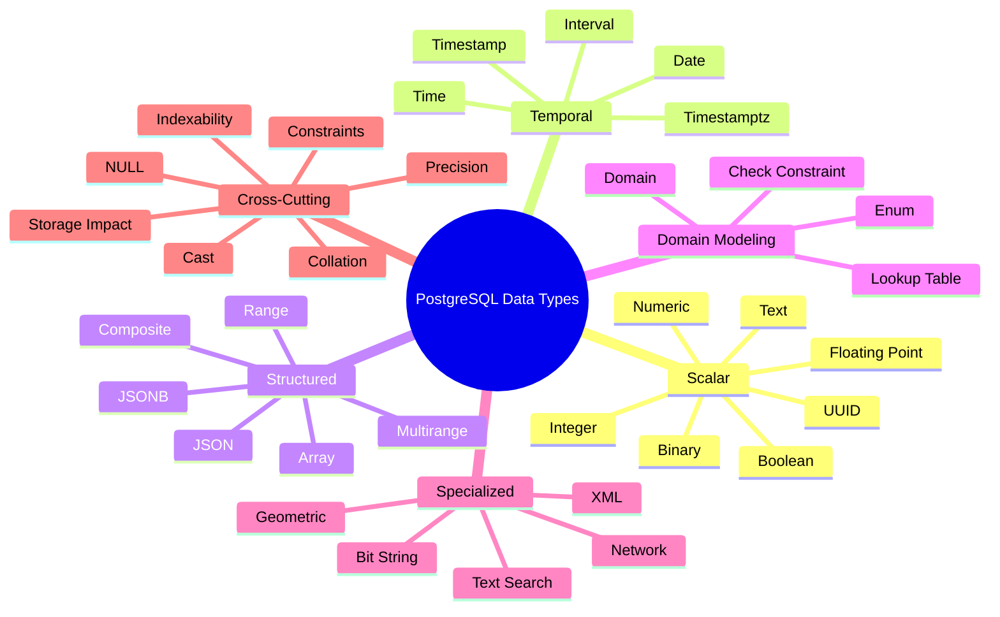
```mermaid id="2z4m5b"
mindmap
  root((PostgreSQL Data Types))
    Scalar
      Boolean
      Integer
      Numeric
      Floating Point
      Text
      Binary
      UUID
    Temporal
      Date
      Time
      Timestamp
      Timestamptz
      Interval
    Structured
      JSON
      JSONB
      Array
      Composite
      Range
      Multirange
    Domain Modeling
      Enum
      Domain
      Check Constraint
      Lookup Table
    Specialized
      Network
      Text Search
      XML
      Geometric
      Bit String
    Cross-Cutting
      NULL
      Cast
      Collation
      Precision
      Indexability
      Constraints
      Storage Impact
```

**Core principle:** tipe data bukan sekadar “format penyimpanan”. Tipe data menentukan validasi input, operator yang tersedia, index strategy, query semantics, storage behavior, dan seberapa kuat database bisa menjaga invariant domain.

---

## 3. Data Type Selection Matrix

| Kebutuhan | Tipe Umum | Rekomendasi |
|---|---|---|
| ID internal numeric | `bigint` + identity | Aman untuk volume jangka panjang. |
| ID distributed/global | `uuid` | Cocok jika ID dibuat di banyak node/sistem. |
| Counter kecil | `integer` | Default praktis untuk hitungan normal. |
| Nominal uang / presisi tinggi | `numeric(p,s)` | Exact; jangan pakai floating point. |
| Ratio/scientific approximate | `double precision` | Cocok jika approximate acceptable. |
| Teks umum | `text` | Native string type PostgreSQL. |
| Teks dengan batas domain | `text` + `CHECK` atau `varchar(n)` | Gunakan batas jika benar-benar invariant. |
| Boolean tri-state | `boolean` nullable | Hati-hati: `NULL` berarti unknown. |
| Timestamp audit/event | `timestamptz` | Simpan titik waktu absolut. |
| Tanggal kalender | `date` | Untuk tanggal tanpa jam. |
| Durasi | `interval` | Untuk rentang waktu relatif. |
| Metadata fleksibel | `jsonb` | Cocok untuk semi-structured data yang perlu query/index. |
| JSON mentah preserving text/order | `json` | Jarang; untuk preserve input literal. |
| List kecil non-relational | `text[]`, `uuid[]`, dll. | Boleh, tapi jangan mengganti relasi many-to-many penting. |
| Validity period | `daterange`, `tstzrange` | Bagus untuk interval validity/overlap constraint. |
| Status finite stabil | `enum` atau `text` + `CHECK` | Pilih berdasarkan lifecycle perubahan status. |
| Reusable validation | `DOMAIN` | Encapsulate constraint sederhana. |
| IP/network | `inet`, `cidr` | Lebih baik daripada `text` untuk address/network. |

---

## 4. Numeric Types

PostgreSQL numeric types mencakup integer 2/4/8 byte, floating-point 4/8 byte, dan decimal dengan precision yang dapat dipilih. `smallint`, `integer`, dan `bigint` menyimpan bilangan bulat dengan range berbeda; `integer` disebut dokumentasi sebagai pilihan umum karena balance antara range, storage, dan performance. ([PostgreSQL](https://www.postgresql.org/docs/current/datatype-numeric.html))

| Type | Storage | Use Case | Catatan |
|---|---:|---|---|
| `smallint` | 2 bytes | Nilai kecil, enum numerik legacy | Jarang perlu kecuali storage sangat sensitif. |
| `integer` | 4 bytes | Counter, jumlah, prioritas | Default praktis. |
| `bigint` | 8 bytes | ID, sequence besar, counter jangka panjang | Prefer untuk identity primary key. |
| `numeric(p,s)` / `decimal(p,s)` | variable | Uang, presisi exact, calculation penting | Lebih lambat dari integer/floating. |
| `real` | 4 bytes | Approximate float | Precision rendah. |
| `double precision` | 8 bytes | Approximate scientific/measurement | Jangan untuk uang. |

`numeric` direkomendasikan untuk monetary amount dan quantity yang butuh exactness; kalkulasi `numeric` exact jika memungkinkan, tetapi lebih lambat dibanding integer atau floating-point. PostgreSQL juga membedakan precision sebagai total digit signifikan dan scale sebagai jumlah digit di kanan decimal point. ([PostgreSQL](https://www.postgresql.org/docs/current/datatype-numeric.html))

```sql id="41wzdl"
CREATE TABLE billing.invoice_amount (
    id bigint GENERATED ALWAYS AS IDENTITY PRIMARY KEY,
    amount numeric(18, 2) NOT NULL,
    tax_amount numeric(18, 2) NOT NULL DEFAULT 0,
    total_amount numeric(18, 2) GENERATED ALWAYS AS (amount + tax_amount) STORED
);
```

### Numeric pitfalls

| Pitfall | Contoh | Dampak |
|---|---|---|
| Pakai `double precision` untuk uang | `amount double precision` | Rounding/precision error. |
| Pakai `integer` untuk ID besar | `id integer` | Bisa kehabisan range. |
| `numeric` tanpa precision/scale | `amount numeric` | Terlalu bebas, invariant kurang jelas. |
| Menganggap `serial` adalah true type | `id serial` | Sebenarnya shorthand sequence; desain baru lebih baik identity. |

`serial`, `smallserial`, dan `bigserial` bukan true data type, melainkan notational convenience yang membuat integer column, sequence, default `nextval`, dan ownership sequence. Dokumentasi PostgreSQL juga menegaskan sequence dapat punya gap, misalnya karena transaksi rollback. ([PostgreSQL](https://www.postgresql.org/docs/current/datatype-numeric.html))

---

## 5. Character / Text Types

PostgreSQL menyediakan `varchar(n)`, `char(n)`, `bpchar`, dan `text`. `varchar(n)` membatasi panjang, `char(n)` fixed-length dan space-padded, sedangkan `text` variable unlimited length. Dokumentasi menyebut `text` sebagai native string data type PostgreSQL, dan banyak built-in string function menerima/mengembalikan `text`. ([PostgreSQL](https://www.postgresql.org/docs/current/datatype-character.html))

| Type | Karakteristik | Rekomendasi |
|---|---|---|
| `text` | Variable unlimited length | Default untuk string umum. |
| `varchar(n)` | Variable dengan batas panjang | Pakai jika batas panjang adalah invariant domain/interface. |
| `char(n)` | Fixed-length, space-padded | Hindari kecuali legacy/protocol fixed-width. |

```sql id="sxfsrx"
CREATE TABLE case_mgmt.case_file (
    id bigint GENERATED ALWAYS AS IDENTITY PRIMARY KEY,
    case_number text NOT NULL,
    title text NOT NULL,
    description text,
    CONSTRAINT uq_case_file_case_number UNIQUE (case_number),
    CONSTRAINT ck_case_file_case_number_not_blank
        CHECK (length(trim(case_number)) > 0)
);
```

### `text` vs `varchar(n)`

| Pertanyaan | Pilihan |
|---|---|
| Apakah batas panjang punya makna bisnis? | `varchar(n)` atau `text` + `CHECK`. |
| Apakah hanya ingin “string biasa”? | `text`. |
| Apakah ingin mencegah blank string? | `CHECK (length(trim(col)) > 0)`. |
| Apakah butuh case-insensitive uniqueness? | Expression index atau collation strategy. |

```sql id="95qfz1"
CREATE UNIQUE INDEX uq_user_email_lower
ON identity.user_account (lower(email));
```

---

## 6. Boolean

PostgreSQL `boolean` punya state `true`, `false`, dan state ketiga “unknown” yang direpresentasikan oleh SQL `NULL`. Input boolean bisa menerima bentuk seperti `true/false`, `yes/no`, `on/off`, dan `1/0`, tetapi output selalu `t` atau `f`. ([PostgreSQL](https://www.postgresql.org/docs/current/datatype-boolean.html))

```sql id="6nd6ko"
CREATE TABLE feature_flag (
    name text PRIMARY KEY,
    enabled boolean NOT NULL DEFAULT false
);
```

### Boolean design rule

| Model | Gunakan |
|---|---|
| Wajib true/false | `boolean NOT NULL DEFAULT false` |
| Belum diketahui / belum dinilai | `boolean NULL` |
| State lebih dari dua | Jangan pakai banyak boolean; pakai status field/enum/check |

Anti-pattern:

```sql id="a9ho4o"
-- Sulit dijaga konsistensinya
is_open boolean,
is_closed boolean,
is_escalated boolean
```

Lebih baik:

```sql id="bl7jpx"
status text NOT NULL CHECK (status IN ('OPEN', 'CLOSED', 'ESCALATED'))
```

---

## 7. Temporal Types

PostgreSQL mendukung SQL date/time types: `timestamp`, `timestamptz`, `date`, `time`, `timetz`, dan `interval`. `timestamp` tanpa qualifier berarti `timestamp without time zone`; `timestamptz` adalah abbreviation PostgreSQL untuk `timestamp with time zone`. Precision fractional seconds yang diizinkan untuk `time`, `timestamp`, dan `interval` adalah 0 sampai 6. ([PostgreSQL](https://www.postgresql.org/docs/current/datatype-datetime.html))

| Type | Makna | Use Case |
|---|---|---|
| `date` | Tanggal kalender | Tanggal lahir, due date kalender, holiday. |
| `time without time zone` | Jam tanpa tanggal/timezone | Jam operasional lokal. |
| `timestamp without time zone` | Date-time tanpa timezone | Local wall-clock; gunakan hati-hati. |
| `timestamp with time zone` / `timestamptz` | Titik waktu absolut | Audit, event, created_at, updated_at. |
| `interval` | Durasi/time span | SLA duration, retention period. |

```sql id="bzfxd4"
CREATE TABLE audit.case_event (
    id bigint GENERATED ALWAYS AS IDENTITY PRIMARY KEY,
    case_id bigint NOT NULL,
    event_type text NOT NULL,
    occurred_at timestamptz NOT NULL DEFAULT now(),
    payload jsonb NOT NULL DEFAULT '{}'::jsonb
);
```

### Temporal rules

| Kebutuhan | Tipe |
|---|---|
| “Kapan event terjadi?” | `timestamptz` |
| “Tanggal jatuh tempo tanpa jam?” | `date` |
| “Jam kerja 09:00-17:00 lokal?” | `time without time zone` |
| “Durasi SLA 48 jam?” | `interval` |
| “Range valid dari-sampai?” | `tstzrange` atau `daterange` |

### Common temporal query pattern

```sql id="i0kkbb"
SELECT *
FROM audit.case_event
WHERE occurred_at >= timestamptz '2026-07-01 00:00:00+07'
  AND occurred_at <  timestamptz '2026-08-01 00:00:00+07';
```

Hindari:

```sql id="7iye67"
-- Bisa membuat index pada occurred_at tidak optimal tanpa expression index
WHERE date(occurred_at) = date '2026-07-01'
```

---

## 8. UUID

`uuid` menyimpan Universally Unique Identifier 128-bit. PostgreSQL 18 menyediakan native support untuk generate UUID memakai UUIDv4 dan UUIDv7; tipe `uuid` tetap bisa menyimpan UUID dari algoritma apa pun. Dokumentasi PostgreSQL juga menyebut UUID lebih cocok daripada sequence untuk distributed systems karena uniqueness guarantee tidak hanya dalam satu database. ([PostgreSQL](https://www.postgresql.org/docs/current/datatype-uuid.html))

```sql id="tmxeq6"
CREATE TABLE public_event (
    id uuid PRIMARY KEY DEFAULT uuidv7(),
    event_type text NOT NULL,
    created_at timestamptz NOT NULL DEFAULT now()
);
```

PostgreSQL 18 menyediakan `gen_random_uuid()` / `uuidv4()` untuk UUID versi 4 random dan `uuidv7()` untuk UUID versi 7 time-ordered; `uuid_extract_timestamp()` dapat mengambil timestamp dari UUID versi 1 atau 7, sedangkan `uuid_extract_version()` mengambil versi UUID. ([PostgreSQL](https://www.postgresql.org/docs/current/functions-uuid.html?utm_source=chatgpt.com))

| UUID Variant | Karakteristik | Use Case |
|---|---|---|
| UUIDv4 | Random | Public/external ID, uniqueness tinggi, tidak ordered. |
| UUIDv7 | Time-ordered | Insert/index locality lebih baik untuk PK/event ID, tetapi mengandung informasi waktu. |
| Generated outside DB | Fleksibel | Cocok untuk multi-system ingestion. |

```sql id="9b3a1f"
SELECT uuidv4();
SELECT uuidv7();
SELECT uuid_extract_version(uuidv7());
```

---

## 9. JSON vs JSONB

PostgreSQL punya dua tipe JSON: `json` dan `jsonb`. Keduanya menerima input hampir sama, tetapi `json` menyimpan salinan teks input, sedangkan `jsonb` menyimpan format binary decomposed. `jsonb` lebih lambat saat input karena konversi, tetapi lebih cepat untuk processing karena tidak perlu reparse dan mendukung indexing. `json` mempertahankan whitespace, urutan key, dan duplicate key; `jsonb` tidak mempertahankan whitespace/order key dan tidak menyimpan duplicate object key. ([PostgreSQL](https://www.postgresql.org/docs/current/datatype-json.html))

| Type | Karakteristik | Gunakan Jika |
|---|---|---|
| `json` | Preserve teks input | Butuh raw JSON fidelity. |
| `jsonb` | Binary decomposed, indexable | Butuh query/filter/index JSON. |

```sql id="z1v64y"
CREATE TABLE audit.case_event (
    id bigint GENERATED ALWAYS AS IDENTITY PRIMARY KEY,
    case_id bigint NOT NULL,
    event_type text NOT NULL,
    payload jsonb NOT NULL DEFAULT '{}'::jsonb,
    created_at timestamptz NOT NULL DEFAULT now()
);
```

### JSONB operators

```sql id="6nsc0k"
-- Ambil field sebagai jsonb
SELECT payload -> 'source'
FROM audit.case_event;

-- Ambil field sebagai text
SELECT payload ->> 'source'
FROM audit.case_event;

-- Containment
SELECT *
FROM audit.case_event
WHERE payload @> '{"source":"SYSTEM"}'::jsonb;
```

### JSONB index

```sql id="um1w5z"
CREATE INDEX idx_case_event_payload_gin
ON audit.case_event
USING gin (payload);
```

Untuk `jsonb`, GIN index mendukung operator JSON/path tertentu. Dokumentasi PostgreSQL menjelaskan bahwa `jsonb_path_ops` biasanya lebih kecil dan lebih spesifik dibanding default `jsonb_ops` untuk query yang didukung seperti `@>`, `@?`, dan `@@`, tetapi tidak cocok untuk pencarian struktur JSON yang tidak mengandung value seperti `{"a": {}}`. ([PostgreSQL](https://www.postgresql.org/docs/current/datatype-json.html))

```sql id="220z5f"
CREATE INDEX idx_case_event_payload_path_ops
ON audit.case_event
USING gin (payload jsonb_path_ops);
```

### JSONB subscripting

```sql id="f9ui0o"
SELECT ('{"a": {"b": {"c": 1}}}'::jsonb)['a']['b']['c'];

UPDATE audit.case_event
SET payload['processed'] = 'true'
WHERE id = 1001;
```

PostgreSQL mendukung subscripting untuk mengambil dan mengubah `jsonb`; assignment harus memakai nilai bertipe `jsonb`, dan update path tertentu bisa membuat nested object/array jika path yang ada masih traversable. ([PostgreSQL](https://www.postgresql.org/docs/current/datatype-json.html))

### JSONB design rule

| Field | Jadikan Column Normal? | Simpan di JSONB? |
|---|---:|---:|
| Status workflow | Ya | Tidak |
| FK/reference penting | Ya | Tidak |
| SLA due date | Ya | Tidak |
| Metadata eksternal berubah-ubah | Bisa | Ya |
| Raw webhook payload | Tidak selalu | Ya |
| Audit context tambahan | Bisa | Ya |

**Rule:** field yang dipakai untuk invariant, join, FK, lifecycle, atau query utama sebaiknya column normal, bukan tersembunyi di JSONB.

---

## 10. Arrays

PostgreSQL mendukung column array variable-length dan multidimensional dari hampir semua tipe: built-in, user-defined, enum, composite, range, atau domain. Array type ditulis dengan menambahkan `[]`, misalnya `integer[]` atau `text[][]`. Namun dokumentasi juga mencatat bahwa ukuran/dimensi array yang ditulis di DDL saat ini tidak enforced; deklarasi itu hanya dokumentasi dan tidak memengaruhi runtime behavior. ([PostgreSQL](https://www.postgresql.org/docs/current/arrays.html))

```sql id="gfkp6l"
CREATE TABLE notification_template (
    id bigint GENERATED ALWAYS AS IDENTITY PRIMARY KEY,
    code text NOT NULL UNIQUE,
    channels text[] NOT NULL DEFAULT '{}',
    tags text[] NOT NULL DEFAULT '{}'
);
```

### Array operators/functions

```sql id="3w8qpq"
-- Search value in array
SELECT *
FROM notification_template
WHERE 'EMAIL' = ANY (channels);

-- Append
UPDATE notification_template
SET tags = array_append(tags, 'urgent')
WHERE code = 'CASE_ESCALATED';

-- Containment-style query, often with GIN index
SELECT *
FROM notification_template
WHERE tags @> ARRAY['urgent'];
```

Dokumentasi menunjukkan `ANY` sebagai cara praktis mencari nilai dalam array ketika ukuran array tidak diketahui. Untuk manipulasi array, PostgreSQL menyediakan function seperti `array_append`, `array_prepend`, dan `array_cat`; penggunaan operator concatenation `||` bisa ambigu untuk literal yang belum bertipe. ([PostgreSQL](https://www.postgresql.org/docs/current/arrays.html))

### Array design rule

| Cocok | Tidak Cocok |
|---|---|
| Tag kecil, channel, list sederhana | Many-to-many domain penting |
| Data snapshot non-relational | Relasi yang butuh FK |
| Search sederhana dengan GIN | Data yang sering di-update per elemen |
| Denormalized read helper | Permission/ACL kompleks |

---

## 11. Range dan Multirange

Range type merepresentasikan rentang nilai dari subtype yang punya total order, misalnya rentang waktu. PostgreSQL menyebut range useful karena bisa mengekspresikan konsep seperti overlap secara jelas; setiap range type juga punya corresponding multirange, yaitu ordered list dari non-contiguous, non-empty, non-null ranges. ([PostgreSQL](https://www.postgresql.org/docs/current/rangetypes.html))

Built-in range/multirange yang umum: `int4range`, `int8range`, `numrange`, `tsrange`, `tstzrange`, dan `daterange`, masing-masing dengan multirange pasangan seperti `tstzmultirange` atau `datemultirange`. ([PostgreSQL](https://www.postgresql.org/docs/current/rangetypes.html))

```sql id="lywo2k"
CREATE TABLE policy_assignment (
    id bigint GENERATED ALWAYS AS IDENTITY PRIMARY KEY,
    subject_id bigint NOT NULL,
    valid_during tstzrange NOT NULL
);
```

### Range examples

```sql id="3396pw"
-- Range timestamp: inclusive lower, exclusive upper
SELECT tstzrange(
    timestamptz '2026-07-01 00:00:00+07',
    timestamptz '2026-08-01 00:00:00+07',
    '[)'
);

-- Overlap
SELECT tstzrange(now(), now() + interval '1 hour') &&
       tstzrange(now() + interval '30 minutes', now() + interval '2 hours');

-- Containment
SELECT daterange(date '2026-07-01', date '2026-08-01', '[)') @> date '2026-07-13';
```

Range text form memakai `[` / `]` untuk inclusive bound dan `(` / `)` untuk exclusive bound. Contoh umum adalah `[)` yang berarti inclusive lower dan exclusive upper. ([PostgreSQL](https://www.postgresql.org/docs/current/rangetypes.html))

### No-overlap constraint

```sql id="r4u0go"
CREATE EXTENSION IF NOT EXISTS btree_gist;

CREATE TABLE room_reservation (
    id bigint GENERATED ALWAYS AS IDENTITY PRIMARY KEY,
    room_id bigint NOT NULL,
    reserved_during tstzrange NOT NULL,
    EXCLUDE USING gist (
        room_id WITH =,
        reserved_during WITH &&
    )
);
```

**Cocok untuk:** booking, validity period, entitlement window, rule effective period, assignment period.  
**Hati-hati:** range semantics harus jelas soal inclusive/exclusive boundary.

---

## 12. Enum Types

Enum adalah tipe dengan static ordered set of values. Nilai enum dibuat lewat `CREATE TYPE ... AS ENUM`, dan ordering enum mengikuti urutan nilai saat type dibuat. PostgreSQL mendukung comparison operator standar untuk enum. ([PostgreSQL](https://www.postgresql.org/docs/current/datatype-enum.html))

```sql id="2o6zuw"
CREATE TYPE case_status AS ENUM (
    'DRAFT',
    'OPEN',
    'IN_REVIEW',
    'ESCALATED',
    'CLOSED'
);

CREATE TABLE case_mgmt.case_file (
    id bigint GENERATED ALWAYS AS IDENTITY PRIMARY KEY,
    status case_status NOT NULL
);
```

### Enum vs `text CHECK` vs lookup table

| Model | Kelebihan | Kekurangan | Cocok Untuk |
|---|---|---|---|
| `ENUM` | Strong type, compact, ordered | Evolusi value lebih rigid | Status stabil dan jarang berubah |
| `text CHECK` | Mudah diubah via migration | Tidak reusable antar table kecuali copy constraint | Status sederhana |
| Lookup table | Bisa punya metadata, ordering, active flag | Join tambahan, governance lebih besar | Status/rule yang dikelola bisnis |

Untuk sistem workflow/regulatory, jangan otomatis memilih enum untuk status yang sering berubah karena perubahan lifecycle bisa lebih mudah dimodelkan dengan lookup/rule table.

---

## 13. Domain Types

Domain adalah user-defined data type berbasis tipe lain, opsional dengan constraint yang membatasi valid value. Jika operator/function underlying type dipakai pada domain value, domain otomatis di-downcast ke underlying type; assignment kembali ke domain akan mengecek constraint domain. ([PostgreSQL](https://www.postgresql.org/docs/current/domains.html))

```sql id="6j4nju"
CREATE DOMAIN non_blank_text AS text
CHECK (length(trim(VALUE)) > 0);

CREATE DOMAIN positive_int AS integer
CHECK (VALUE > 0);

CREATE TABLE case_mgmt.case_file (
    id bigint GENERATED ALWAYS AS IDENTITY PRIMARY KEY,
    case_number non_blank_text NOT NULL,
    priority positive_int NOT NULL DEFAULT 1
);
```

### Domain use cases

| Cocok | Tidak Cocok |
|---|---|
| Constraint reusable sederhana | Rule yang butuh cross-column |
| Non-empty text | Rule yang butuh lookup table |
| Positive numeric | Rule yang sering berubah |
| Email-ish format sederhana | Validasi kompleks/procedural |

**Rule:** domain bagus untuk invariant lokal satu value. Untuk invariant lintas column atau lintas row, gunakan constraint table, FK, exclusion constraint, trigger, atau transaction pattern.

---

## 14. Network Address Types

PostgreSQL menyediakan tipe untuk IPv4, IPv6, dan MAC address: `inet`, `cidr`, `macaddr`, dan `macaddr8`. Dokumentasi menyatakan lebih baik memakai tipe ini daripada plain text untuk alamat jaringan karena ada input error checking serta operator/function khusus. `inet` dapat menyimpan host address plus optional subnet, sedangkan `cidr` dipakai jika hanya ingin menerima network. ([PostgreSQL](https://www.postgresql.org/docs/current/datatype-net-types.html))

```sql id="06spst"
CREATE TABLE security.login_attempt (
    id bigint GENERATED ALWAYS AS IDENTITY PRIMARY KEY,
    username text NOT NULL,
    source_ip inet NOT NULL,
    attempted_at timestamptz NOT NULL DEFAULT now()
);
```

```sql id="8lqssk"
SELECT *
FROM security.login_attempt
WHERE source_ip << inet '10.0.0.0/8';
```

| Type | Gunakan Untuk |
|---|---|
| `inet` | IP host, optional subnet. |
| `cidr` | Network block. |
| `macaddr` | MAC 48-bit. |
| `macaddr8` | EUI-64 MAC. |

---

## 15. Collation

Collation memengaruhi sorting dan comparison untuk tipe text-like. PostgreSQL mendukung provider seperti `libc` dan `icu`; ICU collations bisa dibuat dengan BCP 47 language tag dan dapat dikustomisasi. Collation bisa deterministic atau nondeterministic. Nondeterministic collation dapat membuat string berbeda byte dianggap equal, misalnya case-insensitive atau accent-insensitive, tetapi ada performance penalty dan keterbatasan operasi tertentu. ([PostgreSQL](https://www.postgresql.org/docs/current/collation.html?utm_source=chatgpt.com))

```sql id="akw59w"
CREATE COLLATION case_insensitive (
    provider = icu,
    locale = 'und-u-ks-level2',
    deterministic = false
);
```

```sql id="9vf6k1"
CREATE TABLE person_name (
    id bigint GENERATED ALWAYS AS IDENTITY PRIMARY KEY,
    name text COLLATE case_insensitive NOT NULL
);
```

### Collation design rule

| Kebutuhan | Strategi |
|---|---|
| Sorting default database | Pakai collation database default. |
| Case-insensitive equality untuk satu field | Expression index `lower(col)` atau nondeterministic ICU collation. |
| Accent-insensitive search | ICU collation atau normalized search column. |
| Maximum predictable index behavior | Deterministic collation. |

Nondeterministic collation powerful, tetapi jangan dipakai sembarangan untuk key/constraint penting tanpa memahami efek ke index, uniqueness, dan operasi pattern matching.

---

## 16. NULL Semantics

`NULL` bukan nilai kosong; `NULL` berarti unknown / not applicable / missing. Ini memengaruhi comparison, boolean logic, unique constraint, aggregate, dan indexing.

```sql id="3lsf42"
-- Tidak benar untuk mencari NULL
SELECT * FROM case_mgmt.case_file WHERE closed_at = NULL;

-- Benar
SELECT * FROM case_mgmt.case_file WHERE closed_at IS NULL;
```

### NULL decision table

| Kondisi Domain | Desain |
|---|---|
| Field wajib ada | `NOT NULL` |
| Field opsional secara bisnis | Nullable |
| Field belum diketahui sementara | Nullable + status yang menjelaskan lifecycle |
| Field kosong tidak valid | `CHECK (length(trim(col)) > 0)` |
| Boolean unknown valid | `boolean NULL` |
| Boolean harus eksplisit | `boolean NOT NULL DEFAULT false` |

### `IS DISTINCT FROM`

```sql id="bwm67e"
SELECT *
FROM case_mgmt.case_file
WHERE old_status IS DISTINCT FROM new_status;
```

`IS DISTINCT FROM` berguna karena aman terhadap `NULL`.

---

## 17. Casting dan Type Conversion

PostgreSQL punya cast eksplisit dengan `CAST(x AS type)` dan shorthand `x::type`.

```sql id="g59e6x"
SELECT CAST('2026-07-13' AS date);
SELECT '2026-07-13'::date;
SELECT '42'::integer;
```

### Casting rules for query performance

| Pattern | Risiko | Lebih Baik |
|---|---|---|
| Cast column | `WHERE id::text = '42'` | Cast parameter: `WHERE id = '42'::bigint` |
| Function on indexed column | `WHERE date(created_at) = ...` | Range predicate |
| Ambiguous literal | `'{}'` | `'{}'::jsonb` atau `'{}'::text[]` |
| Mixed numeric types | implicit coercion | Explicit type untuk boundary penting |

```sql id="7vvsu8"
-- Kurang index-friendly
WHERE created_at::date = date '2026-07-13'

-- Lebih baik
WHERE created_at >= timestamptz '2026-07-13 00:00:00+07'
  AND created_at <  timestamptz '2026-07-14 00:00:00+07'
```

---

## 18. Type Design Patterns untuk PostgreSQL

### 18.1 Case lifecycle table

```sql id="d491ss"
CREATE TABLE case_mgmt.case_file (
    id bigint GENERATED ALWAYS AS IDENTITY PRIMARY KEY,
    case_number text NOT NULL,
    status text NOT NULL,
    severity text NOT NULL,
    priority integer NOT NULL DEFAULT 0,
    opened_at timestamptz NOT NULL DEFAULT now(),
    closed_at timestamptz,
    metadata jsonb NOT NULL DEFAULT '{}'::jsonb,

    CONSTRAINT uq_case_file_case_number UNIQUE (case_number),
    CONSTRAINT ck_case_file_case_number_not_blank
        CHECK (length(trim(case_number)) > 0),
    CONSTRAINT ck_case_file_status
        CHECK (status IN ('OPEN', 'IN_REVIEW', 'ESCALATED', 'CLOSED')),
    CONSTRAINT ck_case_file_priority
        CHECK (priority >= 0),
    CONSTRAINT ck_case_file_closed_consistency
        CHECK (
            (status <> 'CLOSED' AND closed_at IS NULL)
            OR
            (status = 'CLOSED' AND closed_at IS NOT NULL)
        )
);
```

### 18.2 Validity-period rule

```sql id="x3xx84"
CREATE TABLE policy.policy_rule_assignment (
    id bigint GENERATED ALWAYS AS IDENTITY PRIMARY KEY,
    rule_id bigint NOT NULL,
    subject_id bigint NOT NULL,
    valid_during tstzrange NOT NULL,
    created_at timestamptz NOT NULL DEFAULT now()
);
```

### 18.3 Network audit

```sql id="36pjn1"
CREATE TABLE audit.access_log (
    id bigint GENERATED ALWAYS AS IDENTITY PRIMARY KEY,
    actor text NOT NULL,
    source_ip inet NOT NULL,
    action text NOT NULL,
    occurred_at timestamptz NOT NULL DEFAULT now()
);
```

### 18.4 Semi-structured payload with promoted fields

```sql id="fcwtmj"
CREATE TABLE integration.inbound_message (
    id uuid PRIMARY KEY DEFAULT uuidv7(),
    source_system text NOT NULL,
    message_type text NOT NULL,
    external_reference text,
    received_at timestamptz NOT NULL DEFAULT now(),
    payload jsonb NOT NULL,

    CONSTRAINT ck_inbound_message_source_not_blank
        CHECK (length(trim(source_system)) > 0)
);

CREATE INDEX idx_inbound_message_source_received
ON integration.inbound_message (source_system, received_at DESC);

CREATE INDEX idx_inbound_message_payload_gin
ON integration.inbound_message
USING gin (payload);
```

---

## 19. Common Pitfalls

| Pitfall | Dampak | Solusi |
|---|---|---|
| Semua string pakai `varchar(255)` | Batas semu, tidak menjelaskan domain | Pakai `text`, atau `CHECK` jika batas bermakna. |
| Pakai `char(n)` | Space-padding mengejutkan | Hindari kecuali fixed-width legacy. |
| Uang pakai `double precision` | Rounding error | Pakai `numeric(p,s)`. |
| ID pakai `integer` di sistem besar | Bisa habis range | Pakai `bigint` identity atau `uuid`. |
| Pakai `serial` untuk desain baru | Legacy shorthand | Prefer identity column. |
| Status terlalu cepat dijadikan enum | Migration status jadi kaku | Pertimbangkan `text CHECK` atau lookup table. |
| Semua metadata masuk `jsonb` | Constraint/FK/query melemah | Promote field penting ke column. |
| Array untuk relasi many-to-many | Tidak ada FK per elemen | Gunakan join table. |
| Nullable tanpa arti domain | Query dan logic ambigu | Bedakan unknown vs optional vs not applicable. |
| Timestamp tanpa timezone untuk event | Interpretasi lintas timezone rawan | Pakai `timestamptz` untuk event/audit. |
| Function/cast pada column di predicate | Index tidak optimal | Cast parameter atau rewrite predicate. |
| Collation tidak dipikirkan | Sorting/equality berbeda antar environment | Tetapkan collation strategy untuk text penting. |

---

## 20. Decision Matrix Cepat

| Pertanyaan | Pilihan Default |
|---|---|
| String biasa? | `text` |
| String wajib tidak kosong? | `text NOT NULL CHECK (length(trim(col)) > 0)` |
| Status finite sederhana? | `text CHECK (...)` |
| Status finite stabil dan jarang berubah? | `ENUM` |
| Status punya metadata/rule/order dinamis? | Lookup table |
| Uang/nominal exact? | `numeric(p,s)` |
| ID auto-increment internal? | `bigint GENERATED ... AS IDENTITY` |
| ID distributed/time-ordered? | `uuid DEFAULT uuidv7()` |
| Event timestamp? | `timestamptz NOT NULL DEFAULT now()` |
| Tanggal kalender? | `date` |
| Valid period/overlap? | `daterange` / `tstzrange` |
| Metadata fleksibel tapi queryable? | `jsonb` |
| Raw JSON preserving formatting/order? | `json` |
| IP address? | `inet` |
| Network block? | `cidr` |
| Reusable single-value validation? | `DOMAIN` |

---

## 21. Roadmap Belajar Singkat

| Urutan | Materi | Target |
|---:|---|---|
| 1 | Scalar types: integer, numeric, text, boolean | Bisa memilih tipe dasar tanpa over/under-modelling. |
| 2 | Temporal: date, timestamp, timestamptz, interval | Bisa membedakan event time, calendar date, dan duration. |
| 3 | UUID dan identity | Bisa memilih ID strategy PostgreSQL-only. |
| 4 | JSONB | Bisa memutuskan field mana JSONB dan mana column normal. |
| 5 | Array | Bisa memakai array tanpa mengganti relasi penting. |
| 6 | Range/multirange | Bisa memodelkan validity period dan overlap constraint. |
| 7 | Enum/domain | Bisa menaruh invariant reusable tanpa membuat evolusi schema sulit. |
| 8 | Collation/NULL/casting | Bisa menghindari bug subtle di equality, sorting, query, dan indexing. |

## Rekomendasi Materi Selanjutnya

Lanjut paling tepat: **Cheatsheet PostgreSQL Storage, TOAST, Heap Tuple, WAL, Checkpoint, Vacuum, Autovacuum, Bloat, dan Analyze**. Ini tetap PostgreSQL-only dan penting untuk memahami kenapa table/index membesar, kenapa update-heavy workload melambat, dan bagaimana maintenance database bekerja.

---

**Sources:**

- [PostgreSQL: Documentation: 18: Chapter 8. Data Types](https://www.postgresql.org/docs/current/datatype.html)

## Response:
7/13/2026, 12:51:02 AM

# Cheatsheet: PostgreSQL Storage, TOAST, Heap Tuple, WAL, Checkpoint, Vacuum, Autovacuum, Bloat, dan Analyze

## 1. Scope

Cheatsheet ini fokus **PostgreSQL-only**: bagaimana PostgreSQL menyimpan data secara fisik, kenapa `UPDATE`/`DELETE` bisa menyebabkan dead tuple dan bloat, bagaimana `VACUUM`/autovacuum bekerja, apa hubungan `ANALYZE` dengan query planner, dan bagaimana WAL/checkpoint memengaruhi durability serta performa.

Baseline rujukan: dokumentasi current PostgreSQL saat ini adalah **PostgreSQL 18**; release notes PostgreSQL 18 juga mencatat adanya asynchronous I/O subsystem yang dapat membantu sequential scan, bitmap heap scan, vacuum, dan operasi lain. ([PostgreSQL](https://www.postgresql.org/docs/current/release-18.html))

---

## 2. Mental Model

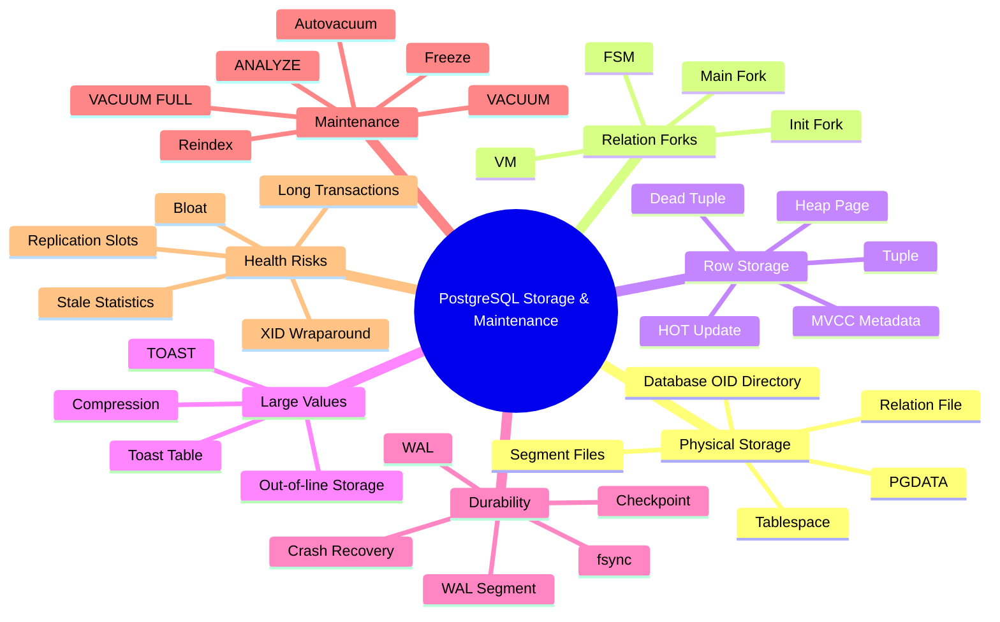
```mermaid
mindmap
  root((PostgreSQL Storage & Maintenance))
    Physical Storage
      PGDATA
      Database OID Directory
      Relation File
      Segment Files
      Tablespace
    Relation Forks
      Main Fork
      FSM
      VM
      Init Fork
    Row Storage
      Heap Page
      Tuple
      MVCC Metadata
      Dead Tuple
      HOT Update
    Large Values
      TOAST
      Compression
      Out-of-line Storage
      Toast Table
    Durability
      WAL
      WAL Segment
      Checkpoint
      fsync
      Crash Recovery
    Maintenance
      VACUUM
      VACUUM FULL
      ANALYZE
      Autovacuum
      Freeze
      Reindex
    Health Risks
      Bloat
      XID Wraparound
      Stale Statistics
      Long Transactions
      Replication Slots
```

**Core idea:** PostgreSQL tidak langsung “menimpa” row lama saat `UPDATE`, dan tidak langsung “menghapus fisik” row saat `DELETE`. Karena MVCC, versi lama tetap ada sampai aman dibersihkan. `VACUUM` adalah mekanisme utama untuk menghapus versi tuple usang dan menjaga storage tetap reusable. ([PostgreSQL](https://www.postgresql.org/docs/current/glossary.html))

---

## 3. Physical Storage: `PGDATA`, Database, Relation

PostgreSQL cluster menyimpan configuration dan data files di data directory yang umum disebut `PGDATA`. Di dalamnya ada subdirectory seperti `base`, `global`, `pg_wal`, `pg_multixact`, `pg_replslot`, dan lainnya. `base` berisi subdirectory per database, sementara `global` berisi table cluster-wide seperti `pg_database`. ([PostgreSQL](https://www.postgresql.org/docs/current/storage-file-layout.html))

```text
PGDATA/
  base/
    <database_oid>/
      <relation_filenode>
      <relation_filenode>_fsm
      <relation_filenode>_vm
      <relation_filenode>.1
  global/
  pg_wal/
  pg_multixact/
  pg_replslot/
  postgresql.conf
  pg_hba.conf
```

| Komponen | Fungsi |
|---|---|
| `PGDATA` | Root data directory PostgreSQL cluster. |
| `base/` | Per-database storage untuk default tablespace. |
| `global/` | Cluster-wide catalogs. |
| `pg_wal/` | Write-ahead log segment files. |
| `pg_multixact/` | Metadata multi-transaction, terutama shared row locks. |
| `pg_replslot/` | Metadata replication slot. |
| Relation filenode | File fisik untuk table/index/materialized relation. |

Table atau index yang melewati ukuran tertentu akan dibagi menjadi segment files; dokumentasi menyebut default segment size adalah 1 GB, dengan file lanjutan bernama seperti `filenode.1`, `filenode.2`, dan seterusnya. Table dengan column besar dapat memiliki TOAST table terkait yang dirujuk dari `pg_class.reltoastrelid`. ([PostgreSQL](https://www.postgresql.org/docs/current/storage-file-layout.html?utm_source=chatgpt.com))

---

## 4. Relation Forks: Main, FSM, VM, Init

Satu relation tidak selalu hanya satu file. PostgreSQL memakai konsep **relation fork**.

| Fork | Nama File | Fungsi |
|---|---|---|
| `main` | `<filenode>` | Data utama table/index. |
| `fsm` | `<filenode>_fsm` | Free Space Map; melacak free space halaman. |
| `vm` | `<filenode>_vm` | Visibility Map; melacak page all-visible/all-frozen. |
| `init` | `<filenode>_init` | Initialization fork untuk unlogged relation. |

Free Space Map ada untuk setiap heap dan index relation kecuali hash indexes, dan melacak available space pada relation. Visibility Map ada untuk heap relation dan melacak page yang semua tuple-nya visible untuk transaksi aktif serta page yang tuple-nya frozen. VM juga membantu index-only scan karena PostgreSQL bisa melewati heap fetch jika page diketahui all-visible. ([PostgreSQL](https://www.postgresql.org/docs/current/storage-fsm.html?utm_source=chatgpt.com))

```sql
SELECT
    pg_relation_size('case_mgmt.case_file', 'main') AS main_size,
    pg_relation_size('case_mgmt.case_file', 'fsm')  AS fsm_size,
    pg_relation_size('case_mgmt.case_file', 'vm')   AS vm_size;
```

Fungsi `pg_relation_size(relation, fork)` bisa memeriksa ukuran fork tertentu, sementara `pg_table_size` mencakup table plus TOAST/FSM/VM, dan `pg_total_relation_size` mencakup table beserta seluruh index. ([PostgreSQL](https://www.postgresql.org/docs/current/functions-admin.html?utm_source=chatgpt.com))

---

## 5. Heap Tuple dan MVCC Storage

PostgreSQL table biasa adalah **heap relation**. Row disimpan sebagai tuple di page. Karena MVCC, perubahan data menghasilkan versi tuple baru, bukan sekadar overwrite versi lama.

```text
UPDATE case_file SET status = 'CLOSED' WHERE id = 10;

Sebelum:
  tuple v1: id=10, status='OPEN'

Sesudah UPDATE:
  tuple v1: id=10, status='OPEN'    -- old version, dead setelah aman
  tuple v2: id=10, status='CLOSED'  -- new version
```

| Istilah | Arti |
|---|---|
| Live tuple | Versi row yang masih visible untuk transaksi tertentu. |
| Dead tuple | Versi row lama yang tidak lagi diperlukan oleh transaksi aktif. |
| Heap page | Page fisik tempat tuple disimpan. |
| Visibility | Apakah tuple boleh dilihat oleh snapshot transaksi. |
| Freeze | Menandai tuple lama agar aman terhadap XID wraparound. |

`VACUUM` membersihkan outdated tuple versions dari table/materialized view dan proses terkait lain yang dibutuhkan MVCC. Autovacuum dapat melakukan proses ini otomatis. ([PostgreSQL](https://www.postgresql.org/docs/current/glossary.html))

---

## 6. TOAST: Large Value Storage

PostgreSQL memakai fixed page size, umumnya 8 kB, dan tuple tidak boleh melewati banyak page. Karena itu, value besar seperti `text`, `jsonb`, `bytea`, atau array besar bisa dikompresi dan/atau dipindah ke TOAST table. TOAST adalah singkatan dari **The Oversized-Attribute Storage Technique**. ([PostgreSQL](https://www.postgresql.org/docs/current/storage-toast.html))

```text
main table row:
  id = 10
  title = 'short'
  payload = <TOAST pointer>

toast table:
  chunk_id
  chunk_seq
  chunk_data
```

| TOAST Behavior | Dampak |
|---|---|
| Large value bisa dikompresi | Storage lebih hemat. |
| Large value bisa out-of-line | Main table row tetap relatif kecil. |
| TOAST table punya chunk rows | Retrieval large field butuh akses tambahan. |
| `SELECT *` menarik large column | Bisa mahal meski query terlihat sederhana. |
| Update field kecil biasanya tidak perlu rewrite TOAST value yang tidak berubah | Mengurangi biaya jika large field tidak disentuh. |

Dokumentasi PostgreSQL menjelaskan bahwa out-of-line TOAST value dibagi menjadi chunk, disimpan sebagai row terpisah di TOAST table, dan pointer on-disk TOAST berukuran tetap menyimpan metadata untuk menemukan value tersebut. ([PostgreSQL](https://www.postgresql.org/docs/current/storage-toast.html))

### Practical rule

```sql
-- Kurang baik untuk endpoint list/report ringan
SELECT *
FROM audit.case_event
WHERE case_id = 1001
ORDER BY created_at DESC
LIMIT 100;

-- Lebih baik
SELECT id, case_id, event_type, created_at
FROM audit.case_event
WHERE case_id = 1001
ORDER BY created_at DESC
LIMIT 100;
```

**Rule:** jangan `SELECT *` dari table yang punya `jsonb`, `text`, `bytea`, atau array besar kecuali memang butuh value besar itu.

---

## 7. WAL: Write-Ahead Log

WAL adalah basis durability PostgreSQL. Perubahan ditulis sebagai WAL record agar bisa di-replay jika crash terjadi sebelum data pages tersimpan permanen ke data files. Glossary PostgreSQL menjelaskan WAL file sebagai sequential files yang menyimpan perubahan; setelah crash, file dibaca berurutan dan perubahan di-replay untuk mengembalikan sistem ke state sebelum crash. ([PostgreSQL](https://www.postgresql.org/docs/current/glossary.html))

```text
Transaction writes data
   ↓
WAL record generated
   ↓
WAL flushed according to durability setting
   ↓
COMMIT acknowledged
   ↓
Later checkpoint writes dirty data pages to data files
```

| Komponen | Fungsi |
|---|---|
| WAL record | Deskripsi low-level perubahan data. |
| WAL segment/file | File sequential di `pg_wal`. |
| WAL archiving | Menyalin WAL segment selesai ke archive storage. |
| Crash recovery | Replay WAL setelah crash. |
| Replication | Standby menerima/replay WAL. |
| PITR | Restore backup lalu replay WAL sampai target time. |

`archive_mode` membuat WAL archiver menyimpan completed WAL segments ke archive storage melalui `archive_command` atau `archive_library`, dan dokumentasi menegaskan `archive_command` harus return zero exit status hanya jika proses archiving berhasil. ([PostgreSQL](https://www.postgresql.org/docs/current/runtime-config-wal.html))

---

## 8. Checkpoint

Checkpoint adalah proses ketika PostgreSQL memastikan dirty data pages ditulis ke storage sehingga recovery tidak perlu replay WAL terlalu jauh. `max_wal_size` adalah soft limit ukuran WAL selama automatic checkpoints; jika WAL sering penuh terlalu cepat dan memicu checkpoint berdekatan, `checkpoint_warning` dapat menulis pesan log yang mengindikasikan `max_wal_size` mungkin perlu dinaikkan. ([PostgreSQL](https://www.postgresql.org/docs/current/runtime-config-wal.html))

```text
Heavy write workload
   ↓
WAL grows
   ↓
Checkpoint triggered
   ↓
Dirty buffers flushed
   ↓
WAL before checkpoint can be recycled/removed if no longer needed
```

| Setting | Makna Praktis |
|---|---|
| `checkpoint_timeout` | Interval maksimum antar checkpoint berbasis waktu. |
| `max_wal_size` | Soft limit WAL growth sebelum checkpoint otomatis. |
| `min_wal_size` | WAL yang dipertahankan untuk reuse. |
| `checkpoint_completion_target` | Menyebarkan write checkpoint agar tidak spike tajam. |
| `checkpoint_warning` | Log jika checkpoint terjadi terlalu sering akibat WAL penuh. |

**Interpretasi senior:** checkpoint terlalu sering bisa menyebabkan write amplification dan latency spike. Tetapi menaikkan `max_wal_size` juga memperpanjang potensi crash recovery time, sehingga harus dipilih berdasarkan workload dan RTO.

---

## 9. `VACUUM` vs `VACUUM FULL` vs `ANALYZE`

| Command | Fungsi | Lock/Impact | Kapan Dipakai |
|---|---|---|---|
| `VACUUM` | Membersihkan dead tuple agar space reusable. | Umumnya tidak rewrite seluruh table. | Maintenance normal. |
| `VACUUM ANALYZE` | Vacuum + update planner statistics. | Maintenance normal. | Setelah banyak perubahan data. |
| `ANALYZE` | Update statistics untuk planner. | Lebih ringan dari vacuum. | Setelah load/backfill atau distribusi berubah. |
| `VACUUM FULL` | Rewrite table untuk mengembalikan space ke OS. | Heavy, perlu lock kuat. | Bloat ekstrem dan maintenance window. |
| `FREEZE` | Aggressive freeze tuple. | Maintenance anti-wraparound. | Kasus khusus/maintenance. |

`VACUUM ANALYZE` memperbarui statistics yang digunakan planner untuk menentukan cara paling efisien menjalankan query. Dokumentasi `VACUUM` juga menjelaskan bahwa PostgreSQL normalnya memakai visibility map untuk melewati page tertentu dan bahwa index cleanup bisa dilewati otomatis saat dead tuple sedikit. ([PostgreSQL](https://www.postgresql.org/docs/current/sql-vacuum.html))

```sql
VACUUM case_mgmt.case_file;

VACUUM ANALYZE case_mgmt.case_file;

ANALYZE case_mgmt.case_file;

VACUUM (VERBOSE, ANALYZE) case_mgmt.case_file;
```

---

## 10. Autovacuum

Autovacuum adalah background maintenance yang menjalankan vacuum dan analyze secara otomatis. Ia penting karena PostgreSQL MVCC menghasilkan dead tuple dari update/delete, dan planner membutuhkan statistics yang cukup fresh.

Autovacuum juga penting untuk mencegah transaction ID wraparound. PostgreSQL menggunakan 32-bit transaction IDs; dokumentasi menyebut cluster yang berjalan lama dapat mengalami wraparound jika table tidak divacuum, sehingga setiap table perlu divacuum setidaknya sekali dalam rentang aman, dan vacuum menandai row lama sebagai frozen. ([PostgreSQL](https://www.postgresql.org/docs/current/routine-vacuuming.html))

| Parameter | Fungsi |
|---|---|
| `autovacuum` | Mengaktifkan autovacuum daemon. |
| `autovacuum_max_workers` | Jumlah worker autovacuum. |
| `autovacuum_naptime` | Interval launcher mengecek pekerjaan. |
| `autovacuum_vacuum_threshold` | Minimum perubahan sebelum vacuum. |
| `autovacuum_vacuum_scale_factor` | Proporsi perubahan table untuk trigger vacuum. |
| `autovacuum_analyze_threshold` | Minimum perubahan sebelum analyze. |
| `autovacuum_analyze_scale_factor` | Proporsi perubahan table untuk trigger analyze. |
| `autovacuum_work_mem` | Memory untuk autovacuum worker. |
| `autovacuum_vacuum_cost_limit` | Cost limit vacuum. |
| `autovacuum_vacuum_cost_delay` | Delay untuk mengurangi impact I/O. |

### Per-table tuning

```sql
ALTER TABLE audit.case_event SET (
    autovacuum_vacuum_scale_factor = 0.02,
    autovacuum_analyze_scale_factor = 0.01,
    autovacuum_vacuum_threshold = 5000,
    autovacuum_analyze_threshold = 5000
);
```

**Rule:** table besar dan update-heavy sering perlu scale factor lebih kecil. Scale factor default bisa terlalu longgar untuk table ratusan juta row karena autovacuum baru aktif setelah perubahan sangat besar.

---

## 11. Bloat

**Bloat** adalah kondisi ketika table/index menyimpan banyak space yang tidak lagi berguna secara efektif. Di PostgreSQL, penyebab umum adalah dead tuple dari MVCC, index dead entries, long-running transaction yang menahan cleanup, autovacuum yang kalah cepat, atau fillfactor/index design yang tidak sesuai.

```text
UPDATE-heavy table
   ↓
Old tuple versions accumulate
   ↓
VACUUM delayed / cannot clean enough
   ↓
Table/index grows
   ↓
More pages scanned
   ↓
Query latency and cache pressure increase
```

`VACUUM` membersihkan outdated tuple versions; jika index cleanup tidak dilakukan secara regular, PostgreSQL documentation menyebut performance bisa menderita karena index mengakumulasi dead tuples dan table mengakumulasi dead line pointers yang belum bisa dihapus. ([PostgreSQL](https://www.postgresql.org/docs/current/sql-vacuum.html))

| Symptom | Kemungkinan |
|---|---|
| Table size naik terus padahal row count stabil | Table bloat. |
| Index size jauh lebih besar dari table | Index bloat atau index terlalu banyak. |
| Vacuum sering jalan tapi dead tuple tidak turun | Long transaction / xmin horizon / replication slot. |
| Query makin lambat walau index ada | Lebih banyak page dibaca karena bloat. |
| Disk pressure di `pg_wal` | WAL retention, replication slot, archive gagal, atau write spike. |

---

## 12. Visibility Map dan Index-Only Scan

Vacuum menjaga Visibility Map. VM mencatat page yang all-visible dan all-frozen. Jika page all-visible, PostgreSQL dapat melakukan index-only scan tanpa fetch heap tuple untuk cek visibility. Ini sangat berguna pada dataset besar karena VM jauh lebih kecil daripada heap dan mudah berada di cache. ([PostgreSQL](https://www.postgresql.org/docs/current/routine-vacuuming.html))

```text
Index Only Scan
   ↓
Check VM bit
   ↓
If all-visible: no heap fetch
   ↓
If not all-visible: fetch heap
```

Praktisnya, query yang seharusnya index-only bisa tetap mahal jika heap fetch tinggi. Penyebab umum: table terlalu sering di-update, vacuum belum sempat menandai page all-visible, atau transaksi lama menahan visibility cleanup.

---

## 13. `ANALYZE` dan Planner Statistics

`ANALYZE` memperbarui statistics yang dipakai planner untuk memilih plan query. Tanpa statistics yang fresh, planner bisa salah estimasi jumlah row, memilih join method buruk, atau mengabaikan index yang seharusnya efektif. `VACUUM ANALYZE` menjalankan vacuum sekaligus update statistics. ([PostgreSQL](https://www.postgresql.org/docs/current/sql-vacuum.html))

```sql
ANALYZE case_mgmt.case_file;

SELECT
    schemaname,
    tablename,
    attname,
    null_frac,
    n_distinct,
    most_common_vals,
    most_common_freqs
FROM pg_stats
WHERE schemaname = 'case_mgmt'
  AND tablename = 'case_file';
```

Khusus partitioned table, dokumentasi PostgreSQL memberi catatan penting: autovacuum daemon tidak menjalankan `ANALYZE` untuk partitioned table parent; parent hanya dianalisis jika parent berubah sendiri, sehingga manual `ANALYZE` pada parent mungkin diperlukan agar statistics parent tetap akurat. ([PostgreSQL](https://www.postgresql.org/docs/current/routine-vacuuming.html))

---

## 14. Monitoring Storage dan Bloat Indicators

### Ukuran table, index, total

```sql
SELECT
    relid::regclass AS relation,
    pg_size_pretty(pg_table_size(relid)) AS table_size,
    pg_size_pretty(pg_indexes_size(relid)) AS indexes_size,
    pg_size_pretty(pg_total_relation_size(relid)) AS total_size
FROM pg_catalog.pg_statio_user_tables
ORDER BY pg_total_relation_size(relid) DESC
LIMIT 20;
```

### Dead tuple dan vacuum/analyze status

```sql
SELECT
    schemaname,
    relname,
    n_live_tup,
    n_dead_tup,
    last_vacuum,
    last_autovacuum,
    last_analyze,
    last_autoanalyze,
    vacuum_count,
    autovacuum_count,
    analyze_count,
    autoanalyze_count
FROM pg_stat_user_tables
ORDER BY n_dead_tup DESC
LIMIT 20;
```

### Long-running transactions

```sql
SELECT
    pid,
    usename,
    application_name,
    state,
    xact_start,
    now() - xact_start AS xact_age,
    wait_event_type,
    wait_event,
    query
FROM pg_stat_activity
WHERE xact_start IS NOT NULL
ORDER BY xact_start ASC;
```

### Table age / wraparound risk

```sql
SELECT
    c.oid::regclass AS relation,
    age(c.relfrozenxid) AS xid_age,
    c.reltuples::bigint AS estimated_rows
FROM pg_class c
WHERE c.relkind IN ('r', 'm')
ORDER BY age(c.relfrozenxid) DESC
LIMIT 20;
```

### Index usage sanity check

```sql
SELECT
    schemaname,
    relname,
    indexrelname,
    idx_scan,
    idx_tup_read,
    idx_tup_fetch,
    pg_size_pretty(pg_relation_size(indexrelid)) AS index_size
FROM pg_stat_user_indexes
ORDER BY pg_relation_size(indexrelid) DESC
LIMIT 30;
```

**Catatan:** angka `n_live_tup` dan `n_dead_tup` adalah estimasi statistik, bukan hitungan presisi real-time. Gunakan sebagai indikator investigasi, bukan satu-satunya bukti.

---

## 15. Vacuum Progress

```sql
SELECT
    pid,
    datname,
    relid::regclass AS relation,
    phase,
    heap_blks_total,
    heap_blks_scanned,
    heap_blks_vacuumed,
    index_vacuum_count,
    max_dead_tuple_bytes,
    dead_tuple_bytes
FROM pg_stat_progress_vacuum;
```

| Phase | Arti Praktis |
|---|---|
| scanning heap | Membaca heap untuk menemukan dead tuple. |
| vacuuming indexes | Membersihkan index entries terkait dead tuple. |
| vacuuming heap | Membersihkan heap. |
| cleaning up indexes | Cleanup akhir index. |
| truncating heap | Mengembalikan trailing empty pages jika memungkinkan. |
| performing final cleanup | Cleanup akhir. |

Jika vacuum lama sekali, cek apakah table sangat besar, index banyak, I/O lambat, cost delay terlalu konservatif, atau ada long transaction yang menahan pembersihan.

---

## 16. Fillfactor dan HOT Update

`fillfactor` menentukan seberapa penuh page diisi saat insert/update tertentu. Table update-heavy kadang diuntungkan dengan fillfactor lebih rendah karena ada ruang untuk versi tuple baru di page yang sama. Ini dapat meningkatkan peluang HOT update, yaitu update yang tidak perlu membuat entry index baru jika indexed column tidak berubah.

```sql
ALTER TABLE case_mgmt.case_file SET (fillfactor = 80);

VACUUM FULL case_mgmt.case_file; -- rewrite dibutuhkan agar efek fisik penuh berlaku ke row lama
```

| Workload | Fillfactor |
|---|---|
| Mostly insert/read | Dekat default biasanya cukup. |
| Update-heavy row kecil | Pertimbangkan 70-90. |
| Banyak indexed column berubah | HOT sulit terjadi; fillfactor tidak cukup. |
| Append-only audit log | Default biasanya cukup. |

**Rule:** fillfactor bukan pengganti index design dan query design. Pakai setelah ada bukti update-heavy dan bloat/page churn.

---

## 17. `VACUUM FULL`, `CLUSTER`, dan `REINDEX`

| Tool | Fungsi | Risiko |
|---|---|---|
| `VACUUM` | Membuat space reusable di table/index. | Tidak selalu mengembalikan disk ke OS. |
| `VACUUM FULL` | Rewrite table untuk mengecilkan file fisik. | Lock kuat, butuh extra disk sementara. |
| `CLUSTER` | Rewrite table mengikuti order index. | Lock kuat, order tidak otomatis dipertahankan. |
| `REINDEX` | Membangun ulang index. | Bisa blocking; gunakan concurrent jika perlu. |
| `REINDEX CONCURRENTLY` | Rebuild index dengan blocking lebih rendah. | Lebih lama dan kompleks. |

```sql
VACUUM (VERBOSE, ANALYZE) audit.case_event;

REINDEX INDEX CONCURRENTLY idx_case_event_case_created;

VACUUM FULL audit.case_event;
```

**Decision rule:** gunakan `VACUUM FULL` hanya saat bloat ekstrem dan ada maintenance window. Untuk index bloat, sering kali `REINDEX CONCURRENTLY` lebih tepat daripada rewrite seluruh table.

---

## 18. Storage Pattern untuk Case/Event/Outbox

### 18.1 Audit/event append-only table

```sql
CREATE TABLE audit.case_event (
    id bigint GENERATED ALWAYS AS IDENTITY PRIMARY KEY,
    case_id bigint NOT NULL,
    event_type text NOT NULL,
    payload jsonb NOT NULL DEFAULT '{}'::jsonb,
    created_at timestamptz NOT NULL DEFAULT now()
);

CREATE INDEX idx_case_event_case_created
ON audit.case_event (case_id, created_at DESC, id DESC);
```

**Storage profile:** mostly insert, low update. Bloat biasanya rendah, tapi table bisa sangat besar. Pertimbangkan partitioning berdasarkan waktu jika retention/reporting butuh.

### 18.2 Work queue table

```sql
CREATE TABLE integration.outbox_message (
    id bigint GENERATED ALWAYS AS IDENTITY PRIMARY KEY,
    aggregate_type text NOT NULL,
    aggregate_id bigint NOT NULL,
    event_type text NOT NULL,
    payload jsonb NOT NULL,
    status text NOT NULL DEFAULT 'PENDING',
    created_at timestamptz NOT NULL DEFAULT now(),
    published_at timestamptz
);

CREATE INDEX idx_outbox_pending
ON integration.outbox_message (created_at ASC, id ASC)
WHERE status = 'PENDING';
```

**Storage profile:** update-heavy pada `status`. Perlu monitor dead tuple, partial index bloat, dan autovacuum yang lebih agresif.

### 18.3 Case table

```sql
CREATE TABLE case_mgmt.case_file (
    id bigint GENERATED ALWAYS AS IDENTITY PRIMARY KEY,
    case_number text NOT NULL UNIQUE,
    status text NOT NULL,
    priority integer NOT NULL DEFAULT 0,
    assigned_user_id bigint,
    created_at timestamptz NOT NULL DEFAULT now(),
    updated_at timestamptz NOT NULL DEFAULT now()
) WITH (fillfactor = 85);
```

**Storage profile:** row bisa sering update karena assignment/status/escalation. Monitor HOT update ratio, index churn, dan bloat.

---

## 19. Autovacuum Tuning by Table Type

| Table Type | Pattern | Tuning Direction |
|---|---|---|
| Append-only audit log | Banyak insert, sedikit update/delete | Fokus analyze, partitioning, retention. |
| Queue/outbox | Banyak update status | Scale factor lebih kecil, monitor dead tuple. |
| Case core table | Update status/assignment berulang | Fillfactor, index minimal, autovacuum lebih responsif. |
| Large JSONB payload table | TOAST heavy | Hindari `SELECT *`, monitor TOAST size. |
| Partitioned parent | Query via parent | Manual `ANALYZE` parent sesuai kebutuhan. |
| Temporary staging table | Bulk load/drop | Manual `ANALYZE` setelah load jika query berat. |

Contoh per-table untuk queue panas:

```sql
ALTER TABLE integration.outbox_message SET (
    autovacuum_vacuum_scale_factor = 0.01,
    autovacuum_analyze_scale_factor = 0.005,
    autovacuum_vacuum_threshold = 1000,
    autovacuum_analyze_threshold = 1000
);
```

---

## 20. Common Pitfalls

| Pitfall | Dampak | Solusi |
|---|---|---|
| Mengira `DELETE` langsung mengecilkan file table | Disk tidak turun, space hanya reusable | Pahami VACUUM vs VACUUM FULL. |
| Autovacuum dimatikan | Dead tuple/bloat/wraparound risk | Jangan matikan kecuali sangat sementara dan paham risiko. |
| Long transaction dibiarkan berjam-jam | Vacuum tidak bisa cleanup tuple lama | Monitor `xact_start`, batasi idle transaction. |
| `SELECT *` dari table TOAST-heavy | Banyak I/O dan detoast tidak perlu | Ambil column spesifik. |
| Index terlalu banyak di table update-heavy | UPDATE mahal dan index bloat | Hapus index tidak berguna, desain index minimal. |
| Tidak `ANALYZE` setelah bulk load | Planner salah pilih plan | Jalankan `ANALYZE`. |
| Partitioned parent tidak dianalisis | Query via parent salah estimasi | Manual `ANALYZE` parent. |
| Menggunakan `VACUUM FULL` sebagai rutinitas | Blocking berat | Gunakan hanya untuk recovery bloat ekstrem. |
| Replication slot tidak dimonitor | WAL tertahan dan disk penuh | Monitor slot lag/retained WAL. |
| Archive command gagal diam-diam | WAL menumpuk / PITR chain rusak | Monitor archive status dan alert. |

---

## 21. Decision Matrix

| Gejala | Kemungkinan Penyebab | Langkah Awal |
|---|---|---|
| Query makin lambat, table size naik | Table/index bloat | Cek `pg_stat_user_tables`, size, vacuum history. |
| Index-only scan masih heap fetch tinggi | VM belum all-visible | Vacuum, cek update frequency dan long transaction. |
| Disk penuh di `pg_wal` | Archive gagal, replication slot lag, checkpoint/WAL spike | Cek archiving, replication slots, WAL size. |
| Dead tuple tinggi | Autovacuum lambat/kalah cepat | Per-table autovacuum tuning, cek blockers. |
| Autovacuum jalan terus | Table sangat besar/update-heavy/wraparound risk | Jangan langsung kill; cek phase dan XID age. |
| Planner salah estimasi | Statistics stale | `ANALYZE`, cek `pg_stats`, extended stats jika perlu. |
| Table tidak mengecil setelah vacuum | Normal vacuum hanya reuse space | `VACUUM FULL`/rewrite hanya jika perlu dan ada window. |
| Update-heavy table membesar | HOT rendah, fillfactor/index terlalu banyak | Cek index, fillfactor, update pattern. |
| Bulk import lalu query lambat | Stats belum ada/fresh | `ANALYZE` setelah load. |

---

## 22. Practical Runbook

### A. Setelah bulk load besar

```sql
ANALYZE staging.import_case;

VACUUM ANALYZE case_mgmt.case_file;
```

### B. Saat table update-heavy mulai lambat

```sql
SELECT
    relname,
    n_live_tup,
    n_dead_tup,
    last_autovacuum,
    last_autoanalyze
FROM pg_stat_user_tables
WHERE relname = 'case_file';
```

Lanjutkan dengan cek long transaction:

```sql
SELECT
    pid,
    state,
    now() - xact_start AS xact_age,
    query
FROM pg_stat_activity
WHERE xact_start IS NOT NULL
ORDER BY xact_start ASC;
```

### C. Saat disk `pg_wal` naik

```sql
SELECT
    slot_name,
    plugin,
    slot_type,
    active,
    restart_lsn,
    confirmed_flush_lsn
FROM pg_replication_slots;
```

Cek archiving:

```sql
SELECT *
FROM pg_stat_archiver;
```

### D. Saat ingin tahu table/index terbesar

```sql
SELECT
    relid::regclass AS relation,
    pg_size_pretty(pg_table_size(relid)) AS table_size,
    pg_size_pretty(pg_indexes_size(relid)) AS indexes_size,
    pg_size_pretty(pg_total_relation_size(relid)) AS total_size
FROM pg_catalog.pg_statio_user_tables
ORDER BY pg_total_relation_size(relid) DESC
LIMIT 20;
```

---

## 23. Roadmap Belajar Singkat

| Urutan | Materi | Target |
|---:|---|---|
| 1 | `PGDATA`, relation files, tablespace | Paham mapping logical object ke storage fisik. |
| 2 | Heap tuple dan MVCC | Paham kenapa update/delete menghasilkan dead tuple. |
| 3 | TOAST | Bisa menghindari I/O besar dari large column. |
| 4 | WAL dan checkpoint | Paham durability, crash recovery, dan WAL growth. |
| 5 | `VACUUM` dan autovacuum | Bisa menjelaskan cleanup, freeze, dan wraparound. |
| 6 | `ANALYZE` | Bisa menjaga planner statistics tetap valid. |
| 7 | Bloat diagnosis | Bisa membaca gejala table/index bloat. |
| 8 | Per-table tuning | Bisa menyesuaikan autovacuum untuk workload berbeda. |
| 9 | Maintenance runbook | Bisa memilih `VACUUM`, `REINDEX`, `VACUUM FULL`, atau partitioning. |

## Rekomendasi Materi Selanjutnya

Lanjut paling tepat: **Cheatsheet PostgreSQL Backup, Restore, WAL Archiving, Base Backup, PITR, Recovery Target, dan Restore Drill**. Ini masih PostgreSQL-only dan sangat penting karena backup belum valid sampai restore pernah diuji.

---

**Sources:**

- [PostgreSQL: Documentation: 18: E.5. Release 18](https://www.postgresql.org/docs/current/release-18.html)

## Response:
7/13/2026, 12:53:31 AM

# Cheatsheet: PostgreSQL Backup, Restore, WAL Archiving, Base Backup, PITR, Recovery Target, dan Restore Drill

## 1. Scope

Cheatsheet ini fokus **PostgreSQL-only**: strategi backup, restore, logical dump, physical backup, WAL archiving, base backup, point-in-time recovery, recovery target, validasi backup, dan restore drill. Pembahasan ini tidak masuk ke Docker/Kubernetes/cloud managed service secara spesifik.

PostgreSQL secara resmi membagi pendekatan backup ke tiga kategori besar: **SQL dump**, **file system level backup**, dan **continuous archiving / point-in-time recovery**. Masing-masing punya trade-off, dan tidak ada satu metode yang selalu paling benar untuk semua kebutuhan. ([PostgreSQL](https://www.postgresql.org/docs/current/backup.html?utm_source=chatgpt.com))

---

## 2. Mental Model

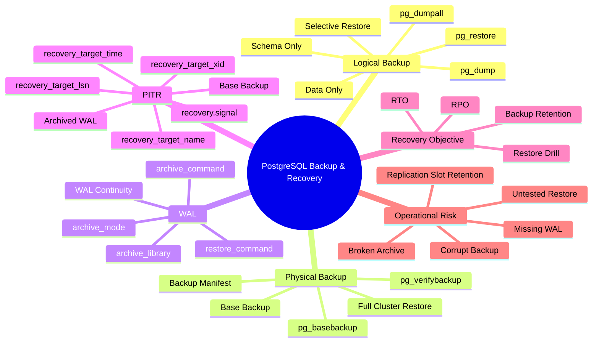
```mermaid id="x8tbku"
mindmap
  root((PostgreSQL Backup & Recovery))
    Logical Backup
      pg_dump
      pg_restore
      pg_dumpall
      Schema Only
      Data Only
      Selective Restore
    Physical Backup
      Base Backup
      pg_basebackup
      Backup Manifest
      pg_verifybackup
      Full Cluster Restore
    WAL
      archive_mode
      archive_command
      archive_library
      restore_command
      WAL Continuity
    PITR
      Base Backup
      Archived WAL
      recovery.signal
      recovery_target_time
      recovery_target_lsn
      recovery_target_name
      recovery_target_xid
    Recovery Objective
      RPO
      RTO
      Restore Drill
      Backup Retention
    Operational Risk
      Broken Archive
      Missing WAL
      Untested Restore
      Replication Slot Retention
      Corrupt Backup
```

**Core principle:** backup belum valid sampai pernah direstore. File backup yang berhasil dibuat hanya membuktikan proses backup berjalan; restore drill membuktikan data benar-benar bisa dipulihkan.

---

## 3. Strategy Matrix

| Kebutuhan | Pilihan Utama | Cocok Untuk | Batasan |
|---|---|---|---|
| Backup satu database portable | `pg_dump` | Migrasi logical, backup per database, selective restore. | Restore bisa lambat untuk database besar. |
| Restore object tertentu | `pg_dump -Fc` + `pg_restore` | Restore table/schema/function tertentu. | Tidak cocok untuk full cluster crash recovery cepat. |
| Backup semua database + global object | `pg_dumpall` | Roles, tablespaces, seluruh cluster secara logical. | Output besar, restore serial, tidak PITR. |
| Full cluster physical backup | `pg_basebackup` | PITR, standby seed, full restore. | Harus satu cluster, bukan selective object restore. |
| Recovery ke waktu tertentu | Base backup + WAL archive | Point-in-time recovery. | Butuh WAL archive lengkap sejak awal base backup. |
| Disaster recovery production | Physical backup + WAL archiving + restore drill | RPO/RTO serius. | Operasional lebih kompleks. |

---

## 4. Logical Backup: `pg_dump`

`pg_dump` menghasilkan backup logical dari satu database. Ide dasarnya adalah membuat file berisi command SQL atau archive yang dapat digunakan untuk membuat ulang database pada state saat dump diambil. PostgreSQL menyediakan utility `pg_dump` untuk kebutuhan ini. ([PostgreSQL](https://www.postgresql.org/docs/current/backup-dump.html?utm_source=chatgpt.com))

### Plain SQL dump

```bash id="et4d98"
pg_dump mydb > mydb.sql
```

Restore:

```bash id="i37g5v"
psql mydb_restored < mydb.sql
```

### Custom format dump

```bash id="kt6jqo"
pg_dump -Fc -f mydb.dump mydb
```

Restore:

```bash id="9kaizo"
createdb mydb_restored
pg_restore -d mydb_restored mydb.dump
```

`pg_restore` dipakai untuk restore database dari archive yang dibuat oleh `pg_dump` dalam format non-plain-text, seperti custom, directory, atau tar format. Ia juga dapat digunakan untuk melihat isi archive dan memilih bagian tertentu untuk direstore. ([PostgreSQL](https://www.postgresql.org/docs/current/app-pgrestore.html?utm_source=chatgpt.com))

---

## 5. `pg_dump` Format

| Format | Option | Restore Tool | Kapan Dipakai |
|---|---|---|---|
| Plain SQL | default | `psql` | Simpel, mudah dibaca, cocok kecil/sedang. |
| Custom | `-Fc` | `pg_restore` | Flexible, compressed, selective restore. |
| Directory | `-Fd` | `pg_restore` | Parallel dump/restore. |
| Tar | `-Ft` | `pg_restore` | Archive tar, kurang fleksibel dari custom/directory. |

### Recommended untuk production logical backup

```bash id="kctdis"
pg_dump \
  -Fc \
  --file=mydb_$(date +%Y%m%d_%H%M%S).dump \
  mydb
```

### Parallel dump untuk database besar

```bash id="9s7oza"
pg_dump \
  -Fd \
  -j 4 \
  -f mydb_dump_dir \
  mydb
```

Directory format cocok ketika butuh parallelism. Plain SQL lebih mudah dibaca, tetapi custom/directory jauh lebih fleksibel untuk restore selektif.

---

## 6. Selective Restore

Custom/directory dump bisa direstore sebagian.

### Lihat daftar isi archive

```bash id="2olcxh"
pg_restore -l mydb.dump > restore.list
```

### Restore hanya schema tertentu

```bash id="nebbzo"
pg_restore \
  -d mydb_restored \
  -n case_mgmt \
  mydb.dump
```

### Restore hanya table tertentu

```bash id="ewddbu"
pg_restore \
  -d mydb_restored \
  -t case_mgmt.case_file \
  mydb.dump
```

### Restore schema only

```bash id="a7qwlw"
pg_restore \
  --schema-only \
  -d mydb_restored \
  mydb.dump
```

### Restore data only

```bash id="qw17o2"
pg_restore \
  --data-only \
  -d mydb_restored \
  mydb.dump
```

**Rule:** untuk backup logical yang mungkin perlu restore selektif, default ke `pg_dump -Fc` atau `pg_dump -Fd`, bukan plain SQL.

---

## 7. `pg_dumpall`

`pg_dump` bekerja per database. Untuk object global seperti role dan tablespace, gunakan `pg_dumpall`, atau dump global object secara terpisah.

```bash id="l927v9"
pg_dumpall --globals-only > globals.sql
```

Restore global object:

```bash id="hykbcu"
psql -f globals.sql postgres
```

Full logical cluster dump:

```bash id="q75g93"
pg_dumpall > cluster.sql
```

Restore:

```bash id="c2qyiz"
psql -f cluster.sql postgres
```

**Praktik senior:** untuk environment production, simpan **database dump** dan **globals dump** secara eksplisit. Banyak restore gagal bukan karena data hilang, tetapi karena role/privilege/tablespace tidak tersedia.

---

## 8. Physical Backup: Base Backup

Physical backup menyalin cluster database pada level file fisik. `pg_basebackup` digunakan untuk mengambil base backup dari PostgreSQL cluster yang sedang berjalan. Backup ini bisa digunakan untuk point-in-time recovery dan juga sebagai starting point untuk log-shipping atau streaming replication standby. ([PostgreSQL](https://www.postgresql.org/docs/current/app-pgbasebackup.html?utm_source=chatgpt.com))

### Basic base backup

```bash id="p661n6"
pg_basebackup \
  -D /backup/base/2026-07-13_010000 \
  -Fp \
  -Xs \
  -P
```

| Option | Arti |
|---|---|
| `-D` | Destination directory. |
| `-Fp` | Plain format. |
| `-Ft` | Tar format. |
| `-Xs` | Stream WAL needed during backup. |
| `-P` | Progress output. |
| `-R` | Tulis config standby/recovery untuk replication use case. |

### Tar format

```bash id="4bcvcp"
pg_basebackup \
  -D /backup/base/2026-07-13_010000 \
  -Ft \
  -Xs \
  -P
```

**Rule:** physical backup cocok untuk restore seluruh cluster, PITR, dan seed standby. Ia bukan alat terbaik untuk restore satu table kecil secara selektif.

---

## 9. Backup Manifest dan `pg_verifybackup`

`pg_basebackup` dapat menghasilkan backup manifest. Manifest ini terutama dimaksudkan agar backup dapat diverifikasi dengan `pg_verifybackup`. ([PostgreSQL](https://www.postgresql.org/docs/current/backup-manifest-format.html?utm_source=chatgpt.com))

```bash id="faz23o"
pg_verifybackup /backup/base/2026-07-13_010000
```

`pg_verifybackup` memeriksa integritas backup cluster yang dibuat oleh `pg_basebackup` terhadap `backup_manifest` yang dibuat server. ([PostgreSQL](https://www.postgresql.org/docs/current/app-pgverifybackup.html?utm_source=chatgpt.com))

**Important:** verifikasi manifest membantu mendeteksi backup rusak atau tidak lengkap, tetapi tetap bukan pengganti restore drill. Backup bisa lolos verifikasi file namun tetap gagal memenuhi kebutuhan bisnis jika prosedur restore, WAL archive, role, config, atau runbook tidak lengkap.

---

## 10. WAL Archiving

Continuous archiving / PITR membutuhkan sequence WAL archive yang lengkap. PostgreSQL menegaskan bahwa untuk recovery dengan continuous archiving, Anda membutuhkan continuous sequence archived WAL files setidaknya sejak awal base backup. Karena itu, prosedur WAL archiving harus dibuat dan diuji sebelum mengambil base backup pertama. ([PostgreSQL](https://www.postgresql.org/docs/current/continuous-archiving.html?utm_source=chatgpt.com))

### Config dasar

```conf id="lpuicd"
wal_level = replica
archive_mode = on
archive_command = 'test ! -f /archive/%f && cp %p /archive/%f'
```

`wal_level = minimal` tidak cukup untuk PITR atau streaming binary replication. PostgreSQL menyatakan `replica` atau lebih tinggi harus dipakai untuk mengaktifkan continuous archiving dan streaming binary replication. ([PostgreSQL](https://www.postgresql.org/docs/current/runtime-config-wal.html?utm_source=chatgpt.com))

### Archive command rule

```conf id="pwwfrd"
archive_command = 'test ! -f /archive/%f && cp %p /archive/%f'
```

| Placeholder | Arti |
|---|---|
| `%p` | Path file WAL sumber. |
| `%f` | Nama file WAL tujuan. |

**Rule kritis:** `archive_command` harus sukses hanya jika WAL benar-benar berhasil disimpan. Jangan return sukses palsu, karena itu akan membuat PostgreSQL menganggap WAL aman padahal chain PITR rusak.

---

## 11. WAL Archive Failure Modes

| Failure | Dampak | Deteksi |
|---|---|---|
| `archive_command` gagal | WAL menumpuk di `pg_wal`. | `pg_stat_archiver`, disk usage. |
| Archive command return sukses palsu | PITR chain rusak diam-diam. | Restore drill gagal. |
| WAL archive tidak immutable | WAL bisa overwritten/corrupt. | Checksum/object lock/policy. |
| WAL retention kurang panjang | Tidak bisa recover ke target lama. | Restore drill + retention audit. |
| Base backup tanpa WAL sejak start backup | Backup tidak usable untuk PITR. | Verify restore sampai consistent. |
| Replication slot menahan WAL | Disk penuh. | `pg_replication_slots`. |

### Cek archiver status

```sql id="czq37o"
SELECT
    archived_count,
    last_archived_wal,
    last_archived_time,
    failed_count,
    last_failed_wal,
    last_failed_time,
    stats_reset
FROM pg_stat_archiver;
```

---

## 12. PITR: Point-in-Time Recovery

PITR membutuhkan dua komponen:

1. **Base backup**
2. **Archived WAL files** yang lengkap sejak awal base backup sampai target recovery

Continuous archiving memungkinkan recovery ke titik waktu tertentu dengan mengambil base backup lalu me-replay WAL sampai target yang diinginkan. PostgreSQL mendokumentasikan continuous archiving dan PITR sebagai satu mekanisme backup/recovery berbasis base backup plus WAL archive. ([PostgreSQL](https://www.postgresql.org/docs/current/continuous-archiving.html?utm_source=chatgpt.com))

```text id="7fmkxq"
Base Backup taken at 01:00
   ↓
WAL archived continuously
   ↓
Bad migration happened at 10:15
   ↓
Restore base backup
   ↓
Replay WAL until 10:14:59
   ↓
Recovered cluster before bad migration
```

---

## 13. PITR Restore Flow

### Step 1 - Stop PostgreSQL target

```bash id="yqheij"
pg_ctl stop -D /var/lib/postgresql/data
```

### Step 2 - Move old/corrupt data directory

```bash id="qevit6"
mv /var/lib/postgresql/data /var/lib/postgresql/data.bad
mkdir -p /var/lib/postgresql/data
```

### Step 3 - Restore base backup

Plain format example:

```bash id="p7zfwx"
cp -a /backup/base/2026-07-13_010000/* /var/lib/postgresql/data/
chown -R postgres:postgres /var/lib/postgresql/data
chmod 700 /var/lib/postgresql/data
```

### Step 4 - Configure recovery

PostgreSQL modern recovery memakai `recovery.signal` untuk masuk recovery mode.

```bash id="8tprmp"
touch /var/lib/postgresql/data/recovery.signal
```

Tambahkan recovery config ke `postgresql.conf` atau `postgresql.auto.conf`:

```conf id="h2d1va"
restore_command = 'cp /archive/%f %p'
recovery_target_time = '2026-07-13 10:14:59+07'
recovery_target_action = 'pause'
```

### Step 5 - Start PostgreSQL

```bash id="3a2ktu"
pg_ctl start -D /var/lib/postgresql/data
```

### Step 6 - Validate

```sql id="eub2yw"
SELECT pg_is_in_recovery();

SELECT now();

SELECT count(*)
FROM case_mgmt.case_file;
```

### Step 7 - Promote jika hasil benar

```sql id="bv5ixs"
SELECT pg_wal_replay_resume();
```

Atau dari CLI:

```bash id="8ii898"
pg_ctl promote -D /var/lib/postgresql/data
```

---

## 14. Recovery Target Options

| Target | Parameter | Use Case |
|---|---|---|
| Waktu | `recovery_target_time` | Recover sebelum bad deployment/delete/migration. |
| LSN | `recovery_target_lsn` | Recover ke WAL location presisi. |
| Transaction ID | `recovery_target_xid` | Recover sebelum/sesudah transaction tertentu. |
| Named restore point | `recovery_target_name` | Recover ke marker yang dibuat sebelum operasi berisiko. |
| Immediate consistency | `recovery_target = 'immediate'` | Recover sampai cluster consistent dari base backup. |

### Named restore point

Sebelum migration berisiko:

```sql id="jvggvy"
SELECT pg_create_restore_point('before_case_status_migration');
```

Recovery config:

```conf id="xai7bi"
restore_command = 'cp /archive/%f %p'
recovery_target_name = 'before_case_status_migration'
recovery_target_action = 'pause'
```

**Rule:** buat restore point sebelum operasi besar seperti mass update, schema migration berisiko, data correction, atau batch cleanup.

---

## 15. `recovery_target_action`

| Action | Behavior | Kapan Dipakai |
|---|---|---|
| `pause` | Recovery berhenti/pause pada target. | Default aman untuk inspeksi sebelum promote. |
| `promote` | Promote otomatis setelah target tercapai. | Automation yang sudah matang. |
| `shutdown` | Shutdown setelah target tercapai. | Workflow validasi offline. |

**Praktik aman:** gunakan `pause` saat restore drill atau incident manual. Setelah validasi data benar, baru resume/promote.

---

## 16. Logical vs Physical Restore

| Aspek | Logical Restore | Physical Restore |
|---|---|---|
| Tool | `psql`, `pg_restore` | file copy, `pg_basebackup`, WAL replay |
| Unit restore | Database/schema/table/object | Seluruh cluster |
| Selective restore | Kuat | Lemah |
| PITR | Tidak | Ya |
| Cross-version flexibility | Lebih fleksibel | Lebih ketat |
| Speed untuk DB besar | Bisa lambat | Biasanya lebih cepat |
| Butuh server running saat restore | Ya | Restore ke data directory |
| Global objects | Perlu `pg_dumpall --globals-only` | Termasuk cluster state fisik |

**Decision rule:** gunakan logical backup untuk portability dan selective restore; gunakan physical backup + WAL untuk disaster recovery dan PITR.

---

## 17. Backup Retention Model

Minimal retention harus menjawab:

| Pertanyaan | Implikasi |
|---|---|
| Berapa jauh ke belakang harus bisa restore? | Menentukan retention base backup + WAL. |
| Berapa banyak data loss yang bisa diterima? | Menentukan RPO dan frekuensi WAL archiving. |
| Berapa lama sistem boleh down? | Menentukan RTO dan restore automation. |
| Apakah perlu restore table/object tertentu? | Butuh logical dump tambahan. |
| Apakah perlu audit/legal hold? | Retention lebih panjang dan immutable storage. |
| Apakah backup terenkripsi? | Key management harus ikut diuji. |

Contoh policy konseptual:

```text id="d9a8o7"
Daily logical dump:
  retain 14 days

Weekly physical base backup:
  retain 5 weeks

WAL archive:
  retain until oldest retained base backup expires

Monthly compliance snapshot:
  retain 12 months
```

**Rule:** jangan hapus WAL archive yang masih dibutuhkan oleh base backup tertua yang masih ingin dipakai untuk PITR.

---

## 18. Restore Drill Checklist

| Area | Checklist |
|---|---|
| Backup discovery | Bisa menemukan base backup dan WAL archive yang benar. |
| Integrity | `pg_verifybackup` berhasil untuk physical backup. |
| Globals | Role, privilege, tablespace, extension tersedia. |
| Config | `restore_command`, `recovery_target_*`, port, path benar. |
| Recovery | Cluster bisa start dan replay WAL. |
| Target validation | Data sebelum/ sesudah target sesuai ekspektasi. |
| Application validation | Query bisnis penting berhasil. |
| Performance | Restore time sesuai RTO. |
| Documentation | Langkah aktual dicatat, bukan asumsi. |
| Access | Operator punya credential dan permission yang diperlukan. |
| Cleanup | Restore environment dibersihkan atau disimpan sesuai audit. |

### Minimal validation SQL

```sql id="4u3qgz"
SELECT current_database();

SELECT pg_is_in_recovery();

SELECT count(*)
FROM case_mgmt.case_file;

SELECT max(created_at)
FROM audit.case_event;

SELECT *
FROM pg_extension
ORDER BY extname;
```

---

## 19. Restore Drill Runbook: Logical Dump

### A. Backup

```bash id="em1fau"
pg_dump -Fc -f mydb_$(date +%Y%m%d_%H%M%S).dump mydb
pg_dumpall --globals-only > globals_$(date +%Y%m%d_%H%M%S).sql
```

### B. Restore to test database

```bash id="f6wz6z"
createdb mydb_restore_test
psql -f globals_20260713_010000.sql postgres
pg_restore -d mydb_restore_test mydb_20260713_010000.dump
```

### C. Validate

```sql id="gx2bdu"
SELECT count(*) FROM case_mgmt.case_file;
SELECT count(*) FROM audit.case_event;
SELECT count(*) FROM integration.outbox_message;
```

### D. Drop test DB after validation

```bash id="1mzslf"
dropdb mydb_restore_test
```

---

## 20. Restore Drill Runbook: Physical + PITR

### A. Preconditions

```text id="1fqi1c"
- Base backup tersedia
- backup_manifest tersedia
- WAL archive lengkap sejak awal base backup
- PostgreSQL binary version compatible
- Target data directory kosong
- Recovery target jelas
```

### B. Verify backup

```bash id="y5ggto"
pg_verifybackup /backup/base/2026-07-13_010000
```

### C. Restore base backup

```bash id="xxydy4"
rsync -a /backup/base/2026-07-13_010000/ /var/lib/postgresql/data/
chown -R postgres:postgres /var/lib/postgresql/data
chmod 700 /var/lib/postgresql/data
```

### D. Configure recovery

```bash id="ya7c15"
touch /var/lib/postgresql/data/recovery.signal
```

```conf id="x8iv3u"
restore_command = 'cp /archive/%f %p'
recovery_target_time = '2026-07-13 10:14:59+07'
recovery_target_action = 'pause'
```

### E. Start and inspect

```bash id="4jv4jy"
pg_ctl start -D /var/lib/postgresql/data
```

```sql id="51kicc"
SELECT pg_is_in_recovery();

SELECT pg_last_wal_replay_lsn();

SELECT now();
```

### F. Promote after validation

```sql id="ui3omq"
SELECT pg_wal_replay_resume();
```

---

## 21. Monitoring Backup Health

### Archiver

```sql id="stz746"
SELECT
    archived_count,
    last_archived_wal,
    last_archived_time,
    failed_count,
    last_failed_wal,
    last_failed_time
FROM pg_stat_archiver;
```

### Replication slot WAL retention

```sql id="ggjefn"
SELECT
    slot_name,
    slot_type,
    active,
    restart_lsn,
    confirmed_flush_lsn,
    wal_status,
    safe_wal_size
FROM pg_replication_slots;
```

### Base backup progress

PostgreSQL progress reporting supports `BASE_BACKUP` among the commands with progress reporting, alongside commands like `ANALYZE`, `CLUSTER`, `CREATE INDEX`, `VACUUM`, and `COPY`. ([PostgreSQL](https://www.postgresql.org/docs/current/progress-reporting.html?utm_source=chatgpt.com))

```sql id="k9rsxr"
SELECT *
FROM pg_stat_progress_basebackup;
```

### Check WAL directory pressure

```sql id="may15x"
SELECT
    name,
    setting,
    unit
FROM pg_settings
WHERE name IN (
    'archive_mode',
    'wal_level',
    'max_wal_size',
    'min_wal_size'
);
```

---

## 22. Backup Security

| Area | Recommendation |
|---|---|
| Backup encryption | Encrypt at rest and in transit. |
| Access control | Restrict who can read backup; backup equals database copy. |
| Credential handling | Jangan simpan password plaintext di script. |
| Immutable storage | Cegah ransomware/operator mistake menghapus backup. |
| Key management | Backup terenkripsi tidak berguna jika key hilang. |
| Audit access | Catat siapa mengambil/menghapus/memulihkan backup. |
| Masking | Restore ke non-prod harus mempertimbangkan data sensitif. |

**Rule:** backup sering punya kontrol akses lebih lemah daripada database production. Itu risk besar karena backup berisi data yang sama.

---

## 23. Common Pitfalls

| Pitfall | Dampak | Solusi |
|---|---|---|
| Hanya punya `pg_dump`, tidak punya PITR | Tidak bisa recover ke detik sebelum insiden. | Tambahkan physical backup + WAL archive. |
| WAL archive tidak diuji | Backup terlihat ada, restore gagal. | Restore drill berkala. |
| `archive_command` return sukses palsu | WAL hilang permanen. | Command harus fail jika copy gagal. |
| Tidak dump global object | Restore gagal karena role/privilege hilang. | `pg_dumpall --globals-only`. |
| Menghapus WAL terlalu cepat | Base backup lama tidak bisa dipakai. | Retention base backup dan WAL harus sinkron. |
| Backup ada di storage yang sama dengan primary | Disaster fisik menghapus semua. | Simpan off-host/offsite. |
| Tidak tahu RTO restore | Saat incident baru sadar restore terlalu lama. | Ukur waktu restore drill. |
| Tidak verifikasi backup manifest | Backup corrupt tidak terdeteksi awal. | `pg_verifybackup`. |
| Restore langsung promote tanpa inspeksi | Bisa recover ke titik yang salah. | Pakai `recovery_target_action = 'pause'`. |
| Tidak punya runbook | Incident chaos. | Dokumentasikan dan latihan. |

---

## 24. Incident Patterns

| Incident | Recovery Strategy |
|---|---|
| Salah `DELETE` / `UPDATE` massal | PITR ke waktu sebelum query; atau logical extract dari restored copy. |
| Bad migration | PITR ke restore point atau waktu sebelum migration. |
| Table corrupt / file missing | Physical restore dari backup; cek root cause storage. |
| Drop table | PITR ke sebelum drop, lalu extract table dari restored copy jika ingin merge. |
| Lost role/privilege | Restore globals atau reapply IaC/migration. |
| Disk penuh karena WAL | Cek archive failure / replication slot; jangan hapus WAL sembarangan. |
| Need one table from yesterday | Restore logical dump atau restore physical backup ke side environment lalu export table. |

**Pattern aman untuk accidental data change:** restore PITR ke environment samping, validasi data, export data yang dibutuhkan, lalu import/merge ke production dengan migration terkontrol. Jangan otomatis rollback seluruh production jika hanya butuh subset data dan ada transaksi valid setelah incident.

---

## 25. Decision Matrix

| Pertanyaan | Jawaban Desain |
|---|---|
| Perlu restore satu table? | `pg_dump -Fc` / restore side environment. |
| Perlu restore seluruh cluster cepat? | Physical base backup. |
| Perlu recovery ke waktu tertentu? | Base backup + WAL archive. |
| Perlu migrate antar versi/platform? | Logical dump lebih fleksibel. |
| Perlu seed standby? | `pg_basebackup`. |
| Perlu validasi file backup? | `pg_verifybackup`. |
| Perlu validasi operasional recovery? | Restore drill. |
| Perlu minimal data loss? | WAL archive/replication strategy sesuai RPO. |
| Perlu recovery cepat? | Ukur restore time dan siapkan automation. |

---

## 26. Roadmap Belajar Singkat

| Urutan | Materi | Target |
|---:|---|---|
| 1 | `pg_dump`, `pg_restore`, `pg_dumpall` | Bisa backup/restore logical dan global object. |
| 2 | Base backup dengan `pg_basebackup` | Bisa mengambil backup fisik cluster. |
| 3 | WAL archiving | Bisa menjaga WAL chain untuk PITR. |
| 4 | PITR restore flow | Bisa restore ke waktu/LSN/restore point tertentu. |
| 5 | Backup verification | Bisa memakai manifest dan `pg_verifybackup`. |
| 6 | Restore drill | Bisa membuktikan backup benar-benar usable. |
| 7 | Retention policy | Bisa menyelaraskan base backup, WAL, RPO, RTO. |
| 8 | Incident recovery pattern | Bisa memilih restore penuh, side restore, atau selective extract. |

## Rekomendasi Materi Selanjutnya

Lanjut paling tepat: **Cheatsheet PostgreSQL Replication & High Availability: Streaming Replication, Replication Slot, Synchronous vs Asynchronous Replication, Hot Standby, Failover, Timeline, dan Replication Lag**. Ini melanjutkan topik WAL/PITR ke availability dan disaster recovery yang lebih operasional.

---

**Sources:**

- [Documentation: 18: Chapter 25. Backup and Restore](https://www.postgresql.org/docs/current/backup.html?utm_source=chatgpt.com)

## Response:
7/13/2026, 12:55:14 AM

# Cheatsheet: PostgreSQL Replication & High Availability

## 1. Scope

Cheatsheet ini fokus **PostgreSQL-only**: physical replication, streaming replication, WAL shipping, replication slot, hot standby, synchronous/asynchronous replication, failover, timeline, `pg_rewind`, replication lag, dan monitoring. Tidak membahas Kubernetes operator, cloud-managed PostgreSQL, PgBouncer, Patroni, repmgr, atau tooling eksternal secara detail.

PostgreSQL HA umumnya berbasis **WAL replication**: primary menghasilkan WAL, standby menerima dan me-replay WAL. PostgreSQL menyediakan log-shipping standby, streaming replication, replication slots, cascading replication, synchronous replication, failover, dan hot standby sebagai bagian dari high availability/load balancing chapter. ([PostgreSQL](https://www.postgresql.org/docs/current/high-availability.html?utm_source=chatgpt.com))

---

## 2. Mental Model

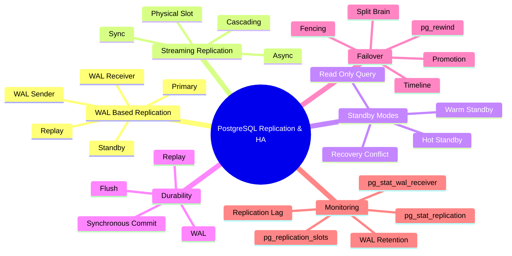
```mermaid
mindmap
  root((PostgreSQL Replication & HA))
    WAL Based Replication
      Primary
      Standby
      WAL Sender
      WAL Receiver
      Replay
    Streaming Replication
      Async
      Sync
      Cascading
      Physical Slot
    Standby Modes
      Warm Standby
      Hot Standby
      Read Only Query
      Recovery Conflict
    Durability
      WAL
      Flush
      Replay
      Synchronous Commit
    Failover
      Promotion
      Timeline
      Split Brain
      Fencing
      pg_rewind
    Monitoring
      pg_stat_replication
      pg_replication_slots
      pg_stat_wal_receiver
      Replication Lag
      WAL Retention
```

**Core idea:** PostgreSQL replication bukan “copy SQL statement”, tetapi umumnya **copy WAL**. Standby menerima perubahan fisik dari primary dan me-replay perubahan tersebut agar cluster standby mengikuti primary.

---

## 3. Replication Strategy Matrix

| Strategy | Level | Data Scope | Read di Standby | Kelebihan | Batasan |
|---|---|---|---|---|---|
| File-based WAL shipping | Physical | Seluruh cluster | Bisa jika hot standby | Simpel, cocok DR/PITR | Lebih lag dibanding streaming karena menunggu WAL segment/archive. |
| Streaming replication | Physical | Seluruh cluster | Ya, dengan hot standby | Lebih near-real-time | Tetap primary-standby, bukan multi-primary. |
| Synchronous streaming replication | Physical | Seluruh cluster | Ya | Bisa mengurangi/meniadakan data loss saat failover | Latency commit naik; availability tergantung standby sync. |
| Cascading replication | Physical | Seluruh cluster | Ya | Mengurangi beban primary | Topologi lebih kompleks. |
| Logical replication | Logical | Object/table tertentu | Subscriber bisa read/write tergantung desain | Selective replication, migration, integration | Bukan HA fisik penuh secara default; DDL tidak otomatis semua ikut. |

PostgreSQL membedakan physical replication yang memakai exact block/WAL-level replication dan logical replication yang mereplikasi perubahan data object berdasarkan replication identity, biasanya primary key. Logical replication memberi kontrol lebih granular atas object dan security, tetapi berbeda dari physical HA standby. ([PostgreSQL](https://www.postgresql.org/docs/current/logical-replication.html?utm_source=chatgpt.com))

---

## 4. Primary, Standby, WAL Sender, WAL Receiver

Dalam streaming replication, server berperan sebagai **primary** atau **standby**. Primary mengirim data, standby menerima data. Dalam cascading replication, standby juga bisa menjadi sender untuk standby lain. ([PostgreSQL](https://www.postgresql.org/docs/current/runtime-config-replication.html?utm_source=chatgpt.com))

```text
Primary
  ├─ WAL generation
  ├─ WAL sender process
  ↓
Standby
  ├─ WAL receiver process
  ├─ WAL replay
  └─ Optional read-only query via hot_standby
```

| Komponen | Fungsi |
|---|---|
| Primary | Server read-write utama. |
| Standby | Server recovery/read-only yang mengikuti WAL primary. |
| WAL sender | Process di primary yang mengirim WAL ke standby. |
| WAL receiver | Process di standby yang menerima WAL dari primary. |
| Startup/replay process | Process di standby yang me-replay WAL. |
| Replication connection | Koneksi khusus dari standby ke primary. |

---

## 5. Streaming Replication

Streaming replication memungkinkan standby lebih up-to-date daripada file-based log shipping karena standby connect ke primary dan menerima WAL record saat dihasilkan, tanpa menunggu WAL file penuh. Streaming replication bersifat asynchronous secara default; biasanya ada delay kecil antara commit di primary dan perubahan terlihat di standby, tergantung kemampuan standby mengikuti load. ([PostgreSQL](https://www.postgresql.org/docs/current/warm-standby.html?utm_source=chatgpt.com))

```text
Transaction commit on primary
   ↓
WAL generated
   ↓
WAL streamed to standby
   ↓
WAL written/flushed/replayed on standby
   ↓
Data visible on standby
```

### Minimal primary-side settings

```conf
wal_level = replica
max_wal_senders = 10
max_replication_slots = 10
hot_standby = on
```

`wal_level = replica` menulis cukup informasi WAL untuk WAL archiving dan replication, termasuk menjalankan read-only query di standby. Level `logical` diperlukan jika ingin logical decoding/logical replication. ([PostgreSQL](https://www.postgresql.org/docs/current/runtime-config-wal.html?utm_source=chatgpt.com))

### Standby-side setting inti

```conf
primary_conninfo = 'host=primary-db port=5432 user=replicator application_name=standby_1'
primary_slot_name = 'standby_1'
hot_standby = on
```

Standby menjadi streaming replication standby ketika `primary_conninfo` menunjuk ke primary. Primary juga perlu `listen_addresses` dan `pg_hba.conf` yang mengizinkan standby connect ke replication pseudo-database. ([PostgreSQL](https://www.postgresql.org/docs/current/warm-standby.html?utm_source=chatgpt.com))

---

## 6. Creating Standby dengan `pg_basebackup`

Physical standby biasanya dibuat dari base backup primary.

```bash
pg_basebackup \
  -h primary-db \
  -D /var/lib/postgresql/data \
  -U replicator \
  -Fp \
  -Xs \
  -P \
  -R
```

| Option | Arti |
|---|---|
| `-D` | Destination data directory. |
| `-Fp` | Plain format. |
| `-Xs` | Stream WAL selama backup. |
| `-P` | Progress. |
| `-R` | Tulis konfigurasi recovery/standby agar backup langsung bisa mengikuti primary. |

`pg_basebackup` dapat mengambil base backup dari primary maupun standby. Jika mengambil backup dari standby, standby harus bisa menerima replication connection, misalnya dengan `max_wal_senders`, `hot_standby`, dan `pg_hba.conf` yang sesuai. ([PostgreSQL](https://www.postgresql.org/docs/current/app-pgbasebackup.html?utm_source=chatgpt.com))

---

## 7. Warm Standby vs Hot Standby

| Mode | Standby Bisa Query? | Fungsi Utama |
|---|---:|---|
| Warm standby | Tidak / tidak untuk read workload aktif | Recovery target / failover standby. |
| Hot standby | Ya, read-only query | Read scaling terbatas, reporting, DR standby. |

PostgreSQL hot standby memungkinkan standby menjalankan query read-only saat tetap dalam recovery. Namun query standby dapat mengalami conflict dengan WAL replay, misalnya saat replay perlu menghapus row version yang masih dibutuhkan query standby. ([PostgreSQL](https://www.postgresql.org/docs/current/high-availability.html?utm_source=chatgpt.com))

### Cek apakah server sedang recovery

```sql
SELECT pg_is_in_recovery();
```

| Result | Makna |
|---|---|
| `false` | Server primary/read-write. |
| `true` | Server standby/recovery. |

---

## 8. Asynchronous vs Synchronous Replication

### Asynchronous replication

```text
Primary COMMIT acknowledged
   ↓
WAL may still be in transit/replay on standby
```

Asynchronous streaming replication adalah default. Ada kemungkinan data loss saat primary gagal setelah commit di primary tetapi sebelum WAL diterima/ditulis/replay di standby. PostgreSQL documentation menyebut streaming replication async memiliki delay kecil, biasanya lebih kecil daripada file-based log shipping jika standby cukup kuat mengikuti load. ([PostgreSQL](https://www.postgresql.org/docs/current/warm-standby.html?utm_source=chatgpt.com))

### Synchronous replication

```text
Primary COMMIT waits
   ↓
Configured synchronous standby confirms WAL state
   ↓
COMMIT acknowledged
```

Synchronous replication berarti transaksi yang memodifikasi data tidak dianggap committed sampai server-server yang disyaratkan juga mengonfirmasi commit sesuai konfigurasi. Dokumentasi PostgreSQL menjelaskan bahwa synchronous solution dapat menjamin failover tanpa data loss untuk transaksi yang sudah committed, tetapi ada trade-off latency/availability. ([PostgreSQL](https://www.postgresql.org/docs/current/high-availability.html?utm_source=chatgpt.com))

### Config example

```conf
synchronous_standby_names = 'FIRST 1 (standby_1, standby_2)'
synchronous_commit = on
```

| Setting | Fungsi |
|---|---|
| `synchronous_standby_names` | Standby mana yang dianggap synchronous candidate. |
| `synchronous_commit` | Seberapa kuat commit menunggu WAL local/remote. |
| `application_name` di `primary_conninfo` | Nama standby yang dicocokkan dengan sync standby config. |

---

## 9. Commit Durability Levels

`synchronous_commit` mengontrol kapan commit dianggap selesai dari perspektif client. Dalam desain HA, ini menentukan trade-off latency vs data safety.

| Value | Intuisi | Risiko |
|---|---|---|
| `off` | Tidak menunggu WAL flush lokal penuh | Commit bisa hilang jika crash segera. |
| `local` | Tunggu WAL flush lokal primary | Standby belum tentu menerima. |
| `remote_write` | Tunggu standby menulis WAL ke OS | Belum tentu flushed/replayed penuh. |
| `on` | Tunggu sesuai sync replication default | Lebih aman, latency lebih tinggi. |
| `remote_apply` | Tunggu standby apply/replay | Read-after-write di standby lebih kuat, latency paling tinggi. |

Gunakan `remote_apply` hanya untuk kebutuhan khusus, misalnya caller harus yakin perubahan sudah visible di synchronous standby sebelum commit dianggap sukses.

---

## 10. Replication Slots

Replication slot membuat primary mempertahankan WAL yang dibutuhkan consumer tertentu agar tidak dihapus terlalu cepat. Slot bisa physical atau logical. Dalam streaming replication fisik, physical replication slot membantu standby yang disconnect sementara agar masih bisa mengejar WAL yang tertinggal. PostgreSQL high availability docs memiliki bagian khusus replication slots dalam log-shipping standby server setup. ([PostgreSQL](https://www.postgresql.org/docs/current/high-availability.html?utm_source=chatgpt.com))

### Create physical slot

```sql
SELECT pg_create_physical_replication_slot('standby_1');
```

### Cek slot

```sql
SELECT
    slot_name,
    slot_type,
    active,
    restart_lsn,
    wal_status,
    safe_wal_size
FROM pg_replication_slots;
```

### Drop slot

```sql
SELECT pg_drop_replication_slot('standby_1');
```

| Benefit | Risk |
|---|---|
| Standby tidak kehilangan WAL saat tertinggal sementara. | Slot orphan/inactive bisa membuat WAL menumpuk sampai disk penuh. |
| Lebih reliable daripada hanya mengandalkan WAL retention default. | Perlu monitoring serius. |

**Rule:** setiap physical replication slot harus punya owner/topologi yang jelas. Slot standby yang sudah tidak dipakai harus di-drop.

---

## 11. WAL Retention dan Slot Risk

```text
Standby disconnects
   ↓
Physical slot remains active/inactive but retained
   ↓
Primary keeps WAL from restart_lsn
   ↓
WAL grows
   ↓
Disk full risk
```

### Monitoring retained WAL risk

```sql
SELECT
    slot_name,
    slot_type,
    active,
    restart_lsn,
    pg_size_pretty(
        pg_wal_lsn_diff(pg_current_wal_lsn(), restart_lsn)
    ) AS retained_wal
FROM pg_replication_slots
WHERE restart_lsn IS NOT NULL;
```

| Signal | Arti |
|---|---|
| `active = false` lama | Standby/consumer tidak connect. |
| `retained_wal` terus naik | WAL tertahan karena slot. |
| `wal_status` tidak normal | Slot mulai bermasalah terhadap WAL availability. |
| `safe_wal_size` kecil/null | Risiko kehilangan WAL atau pressure tergantung config. |

---

## 12. Cascading Replication

Cascading replication berarti standby dapat mengirim WAL ke standby lain. Ini mengurangi fan-out connection dari primary dan bisa berguna untuk topologi regional/DR.

```text
Primary
  ↓
Standby A
  ↓
Standby B
```

Dalam PostgreSQL, ketika cascading replication digunakan, standby bisa menjadi sender dan receiver. ([PostgreSQL](https://www.postgresql.org/docs/current/runtime-config-replication.html?utm_source=chatgpt.com))

| Kelebihan | Risiko |
|---|---|
| Mengurangi beban primary. | Lag bisa bertingkat. |
| Cocok topologi geografis. | Failover/reparenting lebih kompleks. |
| Standby downstream tidak langsung bergantung primary. | Monitoring harus melihat seluruh chain. |

---

## 13. Hot Standby Read Scaling: Batasan Penting

Standby hot standby bisa melayani read-only query, tetapi tidak boleh dianggap sama dengan read replica yang selalu konsisten real-time.

| Risiko | Penjelasan |
|---|---|
| Replication lag | Data standby bisa tertinggal dari primary. |
| Recovery conflict | Query panjang di standby bisa dibatalkan agar WAL replay bisa lanjut. |
| Stale read | Read setelah write ke primary belum tentu terlihat di standby. |
| Query load mengganggu replay | Query berat di standby bisa memperbesar lag. |
| Different execution profile | Cache/statistics/load standby bisa berbeda dari primary. |

**Rule:** standby cocok untuk report/read-heavy yang toleran terhadap lag, bukan untuk transaksi yang butuh read-your-write guarantee kecuali memakai desain khusus seperti synchronous commit `remote_apply`.

---

## 14. Failover

Failover terjadi ketika primary gagal dan standby dipromosikan menjadi primary baru. PostgreSQL menyatakan jika primary gagal, standby harus mulai prosedur failover; jika standby gagal, failover tidak perlu dilakukan, dan standby bisa dibuat ulang jika tidak dapat direstart. ([PostgreSQL](https://www.postgresql.org/docs/current/warm-standby-failover.html?utm_source=chatgpt.com))

```text
Primary fails
   ↓
Choose best standby
   ↓
Stop accepting writes to old primary / fence it
   ↓
Promote standby
   ↓
Redirect clients
   ↓
Rebuild or rewind old primary as standby
```

### Promote standby

```sql
SELECT pg_promote();
```

atau:

```bash
pg_ctl promote -D /var/lib/postgresql/data
```

| Step | Tujuan |
|---|---|
| Detect failure | Pastikan primary benar-benar tidak sehat. |
| Fence old primary | Mencegah split brain. |
| Select candidate standby | Pilih standby dengan WAL paling maju dan sehat. |
| Promote | Standby keluar dari recovery dan menjadi read-write. |
| Reconfigure clients | Arahkan write ke primary baru. |
| Rebuild old primary | Jadikan standby baru, jangan langsung dipakai write. |

---

## 15. Split Brain

**Split brain** adalah kondisi dua node sama-sama menerima write sebagai primary. Ini salah satu risiko terbesar HA.

```text
Network partition
   ↓
Old primary masih hidup tapi tidak terlihat
   ↓
Standby dipromosikan
   ↓
Dua primary menerima write
   ↓
Data diverge
```

### Prevention checklist

| Guardrail | Fungsi |
|---|---|
| Fencing / STONITH | Pastikan old primary tidak bisa menulis. |
| Single writer endpoint | Aplikasi hanya menulis ke endpoint primary terkontrol. |
| Controlled promotion | Jangan promote manual tanpa prosedur. |
| Timeline awareness | Deteksi divergence setelah failover. |
| Rewind/rebuild old primary | Jangan rejoin old primary begitu saja. |

PostgreSQL documentation index/high availability material juga menekankan konsep STONITH/fencing dalam HA context. ([PostgreSQL](https://www.postgresql.org/docs/current/bookindex.html?utm_source=chatgpt.com))

---

## 16. Timeline dan Divergence

Setiap kali standby dipromosikan, PostgreSQL membuat **timeline** baru. Timeline membantu membedakan sejarah WAL setelah failover.

```text
Timeline 1:
  Primary old writes WAL
      ↓
  standby follows

Failover:
  standby promoted

Timeline 2:
  New primary writes new WAL history
```

Jika old primary kembali hidup setelah failover, ia mungkin berada di timeline lama dan datanya diverge dari primary baru. Ia tidak boleh langsung dimasukkan kembali sebagai standby tanpa sinkronisasi.

---

## 17. `pg_rewind`

`pg_rewind` digunakan untuk menyinkronkan kembali cluster PostgreSQL yang timeline-nya sudah diverge, misalnya old primary setelah failover agar bisa mengikuti primary baru sebagai standby. Tool ini menghindari full base backup ulang jika kondisi terpenuhi. ([PostgreSQL](https://www.postgresql.org/docs/current/app-pgrewind.html?utm_source=chatgpt.com))

```bash
pg_rewind \
  --target-pgdata=/var/lib/postgresql/data_old_primary \
  --source-server="host=new-primary port=5432 user=rewind_user dbname=postgres"
```

| Syarat Praktis | Catatan |
|---|---|
| Target dan source berasal dari cluster history yang sama | Bukan untuk cluster unrelated. |
| WAL yang dibutuhkan masih tersedia | Jika hilang, harus base backup ulang. |
| Data directory target tidak sedang running | Jangan rewind server aktif. |
| Setelah rewind, config standby harus benar | `primary_conninfo`, slot, recovery signal. |

**Rule:** setelah failover, old primary harus dianggap unsafe sampai di-rewind atau dibangun ulang.

---

## 18. Replication Lag

Replication lag bisa dilihat dari beberapa dimensi:

| Lag Type | Makna |
|---|---|
| Send lag | WAL belum terkirim dari primary. |
| Write lag | WAL sudah diterima tapi belum ditulis di standby. |
| Flush lag | WAL belum fsync/flushed di standby. |
| Replay lag | WAL belum diaplikasikan ke data files standby. |
| Time lag | Selisih waktu replay terakhir dengan waktu saat ini. |
| Byte lag | Selisih LSN primary dengan LSN standby. |

### Primary-side monitoring

`pg_stat_replication` menampilkan satu row per WAL sender process dan statistics replication ke standby yang tersambung. ([PostgreSQL](https://www.postgresql.org/docs/current/monitoring-stats.html?utm_source=chatgpt.com))

```sql
SELECT
    application_name,
    client_addr,
    state,
    sync_state,
    sent_lsn,
    write_lsn,
    flush_lsn,
    replay_lsn,
    pg_size_pretty(pg_wal_lsn_diff(pg_current_wal_lsn(), replay_lsn)) AS replay_byte_lag,
    write_lag,
    flush_lag,
    replay_lag
FROM pg_stat_replication
ORDER BY application_name;
```

### Standby-side monitoring

```sql
SELECT
    pg_is_in_recovery() AS is_standby,
    pg_last_wal_receive_lsn() AS receive_lsn,
    pg_last_wal_replay_lsn() AS replay_lsn,
    now() - pg_last_xact_replay_timestamp() AS time_since_last_replay;
```

| Signal | Interpretasi |
|---|---|
| `replay_byte_lag` naik | Standby tertinggal dalam apply WAL. |
| `write_lag` tinggi | Network/standby write path bottleneck. |
| `flush_lag` tinggi | Disk/fsync standby bottleneck. |
| `replay_lag` tinggi | Standby replay/query conflict/load bottleneck. |
| `time_since_last_replay` tinggi | Tidak selalu masalah jika primary idle; interpretasi perlu workload context. |

---

## 19. Monitoring Replication Slots

```sql
SELECT
    slot_name,
    slot_type,
    database,
    active,
    restart_lsn,
    confirmed_flush_lsn,
    wal_status,
    safe_wal_size
FROM pg_replication_slots
ORDER BY slot_name;
```

| Column | Makna |
|---|---|
| `slot_type` | `physical` atau `logical`. |
| `active` | Consumer sedang connect atau tidak. |
| `restart_lsn` | WAL tertua yang masih perlu disimpan untuk slot. |
| `confirmed_flush_lsn` | Biasanya relevan untuk logical slot. |
| `wal_status` | Status availability WAL untuk slot. |
| `safe_wal_size` | Estimasi ruang aman sebelum slot berisiko kehilangan WAL, jika applicable. |

---

## 20. Monitoring WAL Receiver di Standby

```sql
SELECT
    status,
    receive_start_lsn,
    written_lsn,
    flushed_lsn,
    received_tli,
    last_msg_send_time,
    last_msg_receipt_time,
    latest_end_lsn,
    latest_end_time,
    conninfo
FROM pg_stat_wal_receiver;
```

| Signal | Arti |
|---|---|
| No row | Standby tidak sedang menerima WAL streaming. |
| `status = streaming` | WAL receiver aktif. |
| `last_msg_receipt_time` tua | Koneksi replication idle/putus atau primary idle; cek context. |
| `latest_end_lsn` tidak bergerak | Tidak ada WAL baru atau receiver stuck. |

---

## 21. Read Routing Decision

| Query Type | Primary | Standby |
|---|---:|---:|
| Write transaction | Ya | Tidak |
| Read-after-write strict | Ya | Hanya jika sync/remote_apply atau lag-aware logic |
| Report toleran lag | Bisa | Ya |
| Long analytical query | Hindari jika mengganggu OLTP | Bisa, tapi monitor replay lag/conflict |
| Admin health check | Ya | Ya |
| Migration DDL | Primary | Tidak langsung ke standby |

**Rule:** jangan route read secara buta ke standby jika business flow butuh data terbaru setelah write.

---

## 22. Recovery Conflict di Hot Standby

Query read-only di standby bisa konflik dengan WAL replay. Contoh: primary melakukan vacuum/drop/cleanup yang harus direplay standby, tetapi standby sedang menjalankan query yang masih membutuhkan versi row lama. PostgreSQL hot standby docs memiliki bagian khusus handling query conflicts. ([PostgreSQL](https://www.postgresql.org/docs/current/high-availability.html?utm_source=chatgpt.com))

| Setting | Fungsi |
|---|---|
| `max_standby_streaming_delay` | Berapa lama standby menunda replay WAL streaming sebelum membatalkan query konflik. |
| `max_standby_archive_delay` | Sama, tetapi untuk WAL dari archive. |
| `hot_standby_feedback` | Standby memberi tahu primary agar primary tidak vacuum row yang masih dibutuhkan standby. |

| Trade-off | Risiko |
|---|---|
| Naikkan delay | Query standby lebih jarang dibatalkan, tapi lag bisa naik. |
| Aktifkan `hot_standby_feedback` | Mengurangi conflict, tapi bisa membuat bloat di primary karena vacuum tertahan. |
| Batasi query panjang di standby | Replay lebih lancar, tapi report berat perlu strategi lain. |

---

## 23. Synchronous Replication Decision Matrix

| Kebutuhan | Rekomendasi |
|---|---|
| Tidak boleh kehilangan committed transaction saat failover | Synchronous replication. |
| Latency commit sangat sensitif | Async atau sync hanya untuk transaksi tertentu. |
| Standby antar-region dengan latency tinggi | Hati-hati sync; latency commit ikut naik. |
| Butuh read-your-write dari standby | Pertimbangkan `remote_apply`, tapi mahal. |
| Banyak transaksi high-throughput | Async + WAL archive + strong RPO mungkin lebih realistis. |
| Regulatory/audit transaction sangat penting | Sync untuk subset workload bisa dipertimbangkan. |

**Prinsip:** synchronous replication meningkatkan data safety, tetapi bisa menurunkan availability: jika synchronous standby tidak tersedia, commit bisa tertahan tergantung konfigurasi.

---

## 24. HA Failure Scenarios

| Scenario | Gejala | Tindakan |
|---|---|---|
| Standby lagging | `replay_lag` / byte lag naik | Cek network, disk, query conflict, standby CPU/I/O. |
| Standby disconnected | `pg_stat_replication` row hilang | Cek network, auth, primary_conninfo, WAL availability. |
| Replication slot inactive | WAL retained naik | Reconnect standby atau drop slot jika obsolete. |
| Primary down | Write gagal | Failover procedure: fence, promote, redirect clients. |
| Old primary returns | Timeline diverged | `pg_rewind` atau rebuild as standby. |
| WAL archive broken | PITR/standby fallback risk | Perbaiki archive; jangan klaim backup sehat. |
| Sync standby unavailable | Commit latency/hang | Cek sync config; decide degrade/failover. |
| Read standby stale | Business inconsistency | Route critical reads ke primary atau lag-aware gating. |

---

## 25. Operational Runbook: Add New Physical Standby

### A. Primary preparation

```conf
wal_level = replica
max_wal_senders = 10
max_replication_slots = 10
```

```sql
CREATE ROLE replicator WITH REPLICATION LOGIN PASSWORD '...';

SELECT pg_create_physical_replication_slot('standby_1');
```

`pg_hba.conf` example:

```conf
host replication replicator 10.0.0.20/32 scram-sha-256
```

Reload:

```sql
SELECT pg_reload_conf();
```

### B. Take base backup

```bash
pg_basebackup \
  -h primary-db \
  -D /var/lib/postgresql/data \
  -U replicator \
  -Fp \
  -Xs \
  -P \
  -R \
  -S standby_1
```

### C. Start standby

```bash
pg_ctl start -D /var/lib/postgresql/data
```

### D. Verify from primary

```sql
SELECT
    application_name,
    state,
    sync_state,
    sent_lsn,
    replay_lsn
FROM pg_stat_replication;
```

### E. Verify from standby

```sql
SELECT pg_is_in_recovery();

SELECT
    pg_last_wal_receive_lsn(),
    pg_last_wal_replay_lsn();
```

---

## 26. Operational Runbook: Manual Failover

### A. Confirm primary failure

```text
- Primary tidak bisa menerima connection
- Storage/node/network status jelas
- Tidak ada kemungkinan primary lama tetap menerima write
```

### B. Fence old primary

```text
- Stop service jika masih reachable
- Disable write endpoint
- Remove from load balancer
- Block storage/network if needed
```

### C. Promote standby

```sql
SELECT pg_promote();
```

### D. Verify new primary

```sql
SELECT pg_is_in_recovery(); -- harus false

CREATE TABLE failover_smoke_test (
    id bigint GENERATED ALWAYS AS IDENTITY PRIMARY KEY,
    checked_at timestamptz NOT NULL DEFAULT now()
);
```

### E. Redirect clients

```text
- Update primary endpoint
- Validate write path
- Validate read path
- Monitor errors and replication topology
```

### F. Rejoin old primary

```text
- Jangan langsung start sebagai primary
- Gunakan pg_rewind jika memungkinkan
- Jika tidak, rebuild via pg_basebackup
```

---

## 27. PostgreSQL HA Anti-Patterns

| Anti-pattern | Dampak | Solusi |
|---|---|---|
| Menganggap replication = backup | Standby ikut menerima bad delete/update. | Tetap punya backup + PITR. |
| Promote standby tanpa fencing | Split brain. | Fence old primary sebelum promote. |
| Tidak monitor replication slot | WAL memenuhi disk. | Alert retained WAL dan inactive slot. |
| Route semua read ke standby | Stale read / inconsistent UX. | Lag-aware routing. |
| Query report panjang di standby tanpa kontrol | Replay lag naik atau query dibatalkan. | Batasi query, tune standby delay, gunakan reporting replica khusus. |
| Synchronous replication antar-region tanpa evaluasi latency | Commit lambat/hang. | Uji latency dan pilih sync scope. |
| Old primary rejoin langsung setelah failover | Data divergence. | `pg_rewind` atau rebuild. |
| Tidak latihan failover | Runbook gagal saat incident. | Failover drill berkala. |
| Tidak tahu RPO/RTO | Desain HA tidak bisa dievaluasi. | Tetapkan target eksplisit. |
| Slot untuk standby obsolete tidak dihapus | WAL retention tak terbatas. | Lifecycle management slot. |

---

## 28. Replication vs Backup vs HA

| Concern | Replication | Backup/PITR | HA Orchestration |
|---|---|---|---|
| Hardware/node failure | Membantu | Membantu restore | Membantu failover cepat |
| Accidental delete/update | Tidak cukup, karena ikut tereplikasi | Ya, PITR/restore | Tidak |
| Read scaling | Ya, hot standby | Tidak | Bisa bantu routing |
| Low RTO | Ya | Tergantung restore speed | Ya |
| Low RPO | Sync replication / frequent WAL archive | WAL archive | Tergantung design |
| Split brain prevention | Tidak otomatis penuh | Tidak | Perlu fencing/orchestration |
| Restore object tertentu | Tidak | Logical/side restore | Tidak |

**Kesimpulan:** replication meningkatkan availability, tetapi bukan pengganti backup. HA tanpa backup tetap rentan terhadap human error, corruption, bad migration, dan application bug.

---

## 29. Health Check Query Pack

### Primary role

```sql
SELECT
    pg_is_in_recovery() AS is_standby,
    pg_current_wal_lsn() AS current_wal_lsn;
```

### Standby role

```sql
SELECT
    pg_is_in_recovery() AS is_standby,
    pg_last_wal_receive_lsn() AS receive_lsn,
    pg_last_wal_replay_lsn() AS replay_lsn,
    now() - pg_last_xact_replay_timestamp() AS replay_time_lag;
```

### Replication status on primary

```sql
SELECT
    application_name,
    client_addr,
    state,
    sync_state,
    sent_lsn,
    write_lsn,
    flush_lsn,
    replay_lsn,
    pg_size_pretty(pg_wal_lsn_diff(pg_current_wal_lsn(), replay_lsn)) AS byte_lag
FROM pg_stat_replication;
```

### Slot retention

```sql
SELECT
    slot_name,
    slot_type,
    active,
    pg_size_pretty(
        pg_wal_lsn_diff(pg_current_wal_lsn(), restart_lsn)
    ) AS retained_wal
FROM pg_replication_slots
WHERE restart_lsn IS NOT NULL;
```

### WAL receiver

```sql
SELECT
    status,
    receive_start_lsn,
    written_lsn,
    flushed_lsn,
    latest_end_lsn,
    latest_end_time
FROM pg_stat_wal_receiver;
```

---

## 30. Roadmap Belajar Singkat

| Urutan | Materi | Target |
|---:|---|---|
| 1 | WAL replication model | Paham bahwa physical replication mengikuti WAL. |
| 2 | Streaming replication setup | Bisa memahami primary/standby, WAL sender/receiver. |
| 3 | Hot standby | Bisa memakai standby untuk read-only workload dengan sadar lag. |
| 4 | Replication slots | Bisa mencegah WAL hilang tanpa membuat disk penuh. |
| 5 | Async vs sync replication | Bisa memilih trade-off data loss vs latency. |
| 6 | Monitoring lag | Bisa membaca `pg_stat_replication`, LSN, dan slot retention. |
| 7 | Failover | Bisa memahami promotion, fencing, dan client redirect. |
| 8 | Timeline dan `pg_rewind` | Bisa menangani old primary setelah failover. |
| 9 | HA drill | Bisa menguji RPO/RTO secara realistis. |

## Rekomendasi Materi Selanjutnya

Lanjut paling tepat: **Cheatsheet PostgreSQL Logical Replication, Publication, Subscription, Replication Identity, Initial Sync, DDL Limitation, Conflict, dan CDC Pattern**. Ini masih PostgreSQL-only dan melengkapi physical replication dengan replikasi granular untuk integrasi, migrasi, reporting, dan event-driven data movement.

---

**Sources:**

- [18: Chapter 26. High Availability, Load Balancing, and ...](https://www.postgresql.org/docs/current/high-availability.html?utm_source=chatgpt.com)

## Response:
7/13/2026, 12:57:42 AM

# Cheatsheet: PostgreSQL Logical Replication, Publication, Subscription, Replication Identity, Initial Sync, Conflict, dan CDC Pattern

## 1. Scope

Cheatsheet ini fokus **PostgreSQL-only** untuk **logical replication**: publication, subscription, replication identity, initial table synchronization, row filtering, column list, conflict, DDL limitation, sequence limitation, logical replication slot, monitoring, dan pola CDC/internal integration.

Logical replication berbeda dari physical replication. Physical replication mereplikasi perubahan level block/WAL secara byte-by-byte untuk seluruh cluster; logical replication mereplikasi perubahan **data object** berdasarkan **replication identity**, biasanya primary key. PostgreSQL mendukung physical dan logical replication secara bersamaan. ([PostgreSQL](https://www.postgresql.org/docs/current/logical-replication.html))

---

## 2. Mental Model

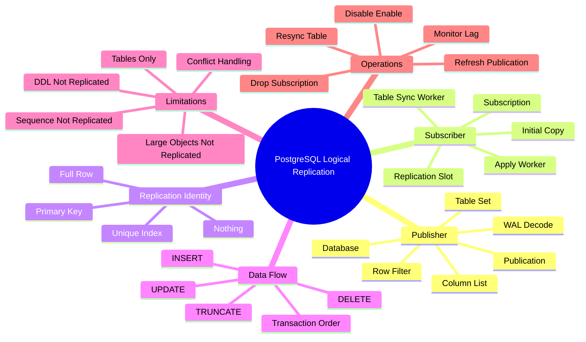
```mermaid id="8h9nrn"
mindmap
  root((PostgreSQL Logical Replication))
    Publisher
      Database
      Publication
      Table Set
      Row Filter
      Column List
      WAL Decode
    Subscriber
      Subscription
      Apply Worker
      Table Sync Worker
      Replication Slot
      Initial Copy
    Replication Identity
      Primary Key
      Unique Index
      Full Row
      Nothing
    Data Flow
      INSERT
      UPDATE
      DELETE
      TRUNCATE
      Transaction Order
    Limitations
      DDL Not Replicated
      Sequence Not Replicated
      Large Objects Not Replicated
      Tables Only
      Conflict Handling
    Operations
      Monitor Lag
      Refresh Publication
      Disable Enable
      Resync Table
      Drop Subscription
```

**Core idea:** logical replication adalah **publish-subscribe data movement**. Publisher mendefinisikan data apa yang diterbitkan; subscriber menarik perubahan dari publication tersebut dan menerapkannya sebagai DML lokal.

---

## 3. Logical vs Physical Replication

| Aspek | Physical Replication | Logical Replication |
|---|---|---|
| Unit replikasi | Seluruh cluster / database files / WAL fisik | Table/data object tertentu |
| Granularity | Kasar | Halus |
| Cross-version | Terbatas | Lebih fleksibel untuk major version tertentu |
| Cross-platform | Terbatas | Bisa antar-platform |
| DDL | Mengikuti physical state | **Tidak direplikasi otomatis** |
| Sequence state | Mengikuti physical state | **Sequence tidak direplikasi sebagai sequence** |
| Read/write subscriber | Standby biasanya read-only | Subscriber adalah database normal; bisa ditulis, tapi rawan conflict |
| Use case utama | HA/DR/read replica | Migrasi, selective replication, consolidation, CDC, reporting |
| Failover readiness | Lebih cocok | Perlu desain tambahan |

PostgreSQL mendeskripsikan logical replication sebagai model publish-subscribe. Subscriber dapat subscribe ke satu atau lebih publication, menarik data dari publisher, lalu bahkan dapat re-publish untuk konfigurasi cascading atau topologi lebih kompleks. ([PostgreSQL](https://www.postgresql.org/docs/current/logical-replication.html))

---

## 4. Use Case yang Cocok

| Use Case | Cocok? | Catatan |
|---|---:|---|
| Replicate subset table ke reporting DB | Ya | Cocok karena granular. |
| Migrasi major version PostgreSQL | Ya | Salah satu use case resmi logical replication. |
| Migrasi antar-platform | Ya | Misalnya OS/platform berbeda. |
| Consolidate beberapa database ke satu analytics DB | Ya | Perlu conflict/key design. |
| CDC internal untuk downstream processor | Ya | Perlu slot/lag monitoring. |
| HA primary-standby penuh | Tidak ideal | Physical replication lebih cocok. |
| Replicate schema changes otomatis | Tidak | DDL tidak direplikasi. |
| Multi-primary write aktif | Sangat hati-hati | PostgreSQL built-in logical replication bukan magic conflict-free multi-master. |

Dokumentasi PostgreSQL menyebut use case logical replication meliputi mengirim incremental changes dari satu database atau subset database, men-trigger perubahan individual di subscriber, consolidation beberapa database untuk analitik, replication antar-major-version, dan replication antar-platform. ([PostgreSQL](https://www.postgresql.org/docs/current/logical-replication.html))

---

## 5. Prerequisites

### Publisher-side config

```conf id="hp8w3l"
wal_level = logical
max_wal_senders = 10
max_replication_slots = 10
```

Untuk logical replication, server yang menjalankan `CREATE PUBLICATION` adalah publisher, dan server yang menjalankan `CREATE SUBSCRIPTION` adalah subscriber. Sebuah server juga bisa menjadi publisher dan subscriber sekaligus. ([PostgreSQL](https://www.postgresql.org/docs/current/runtime-config-replication.html))

### Role replication

```sql id="x6afpw"
CREATE ROLE repl_user WITH LOGIN REPLICATION PASSWORD 'change_me';
```

### `pg_hba.conf`

```conf id="nd7kdr"
host    replication    repl_user    10.0.0.20/32    scram-sha-256
host    mydb           repl_user    10.0.0.20/32    scram-sha-256
```

### Table requirement

Untuk `UPDATE` dan `DELETE` yang direplikasi secara efisien, table sebaiknya punya primary key atau replica identity yang jelas.

```sql id="46g2me"
ALTER TABLE case_mgmt.case_file
ADD CONSTRAINT case_file_pkey PRIMARY KEY (id);
```

---

## 6. Publication

Publication adalah definisi data/change set yang diterbitkan oleh publisher.

### Basic publication untuk table tertentu

```sql id="b21r0r"
CREATE PUBLICATION pub_case_core
FOR TABLE
    case_mgmt.case_file,
    case_mgmt.case_task,
    audit.case_event;
```

### Publication untuk semua table

```sql id="c5cz1d"
CREATE PUBLICATION pub_all_tables
FOR ALL TABLES;
```

### Publication untuk operasi tertentu

```sql id="xgy5mw"
CREATE PUBLICATION pub_case_insert_update
FOR TABLE case_mgmt.case_file
WITH (publish = 'insert, update');
```

| Publish Action | Efek |
|---|---|
| `insert` | Replicate insert. |
| `update` | Replicate update. |
| `delete` | Replicate delete. |
| `truncate` | Replicate truncate, dengan caveat FK/subscription. |

**Rule:** publication harus merepresentasikan contract data movement. Jangan asal `FOR ALL TABLES` kalau downstream hanya butuh subset.

---

## 7. Row Filter

Row filter membatasi row yang dipublish.

```sql id="mbe1j9"
CREATE PUBLICATION pub_open_cases
FOR TABLE case_mgmt.case_file
WHERE (status IN ('OPEN', 'IN_REVIEW', 'ESCALATED'));
```

Contoh untuk outbox:

```sql id="rjknz9"
CREATE PUBLICATION pub_published_outbox
FOR TABLE integration.outbox_message
WHERE (status = 'PUBLISHED');
```

**Catatan penting:** jika table dalam publication punya `WHERE` clause, row yang expression-nya `false` atau `NULL` tidak dipublish. Jika subscriber memakai beberapa publication yang mempublish table sama dengan filter berbeda, row dapat dipublish jika memenuhi salah satu filter; publication tanpa filter atau `FOR ALL TABLES` dapat membuat row selalu dipublish. ([PostgreSQL](https://www.postgresql.org/docs/current/sql-createsubscription.html))

---

## 8. Column List

Column list membatasi column yang dipublish.

```sql id="uvqq42"
CREATE PUBLICATION pub_case_public_projection
FOR TABLE case_mgmt.case_file (
    id,
    case_number,
    status,
    priority,
    updated_at
);
```

Use case:

| Use Case | Kenapa |
|---|---|
| Hide sensitive column | Subscriber tidak menerima data tertentu. |
| Reporting projection | Subscriber hanya butuh field tertentu. |
| Reduce replication volume | Mengurangi payload perubahan. |
| Schema decoupling | Subscriber bisa punya table subset. |

**Trade-off:** column list meningkatkan decoupling, tetapi menambah governance. DDL tetap harus dijaga manual antara publisher dan subscriber.

---

## 9. Subscription

Subscription adalah sisi subscriber yang connect ke publisher dan subscribe ke publication.

```sql id="l1ymg3"
CREATE SUBSCRIPTION sub_case_core
CONNECTION 'host=publisher-db port=5432 dbname=mydb user=repl_user password=change_me'
PUBLICATION pub_case_core;
```

`CREATE SUBSCRIPTION` membuat logical-replication subscription. Secara normal, command ini juga membuat replication slot di publisher, dan logical replication worker akan mulai mereplikasi saat transaction pembuatan subscription commit, kecuali subscription dibuat disabled. ([PostgreSQL](https://www.postgresql.org/docs/current/sql-createsubscription.html))

### Subscription dengan parameter eksplisit

```sql id="wfgbrs"
CREATE SUBSCRIPTION sub_case_core
CONNECTION 'host=publisher-db port=5432 dbname=mydb user=repl_user password=change_me'
PUBLICATION pub_case_core
WITH (
    create_slot = true,
    enabled = true,
    copy_data = true,
    slot_name = 'sub_case_core_slot'
);
```

| Parameter | Fungsi |
|---|---|
| `create_slot` | Buat replication slot di publisher. |
| `enabled` | Subscription langsung aktif atau tidak. |
| `copy_data` | Copy data awal atau hanya perubahan baru. |
| `slot_name` | Nama slot publisher. |
| `connect` | Apakah command connect ke publisher saat create. |
| `disable_on_error` | Disable subscription otomatis jika worker error. |
| `run_as_owner` | Mode execution privilege di subscriber. |
| `origin` | Filter perubahan berdasarkan origin. |
| `failover` | Menandai slot subscription agar bisa disinkronkan ke standby untuk resume setelah failover. |

Beberapa parameter penting punya default: `create_slot` default `true`, `enabled` default `true`, `slot_name` default memakai nama subscription, dan `failover` default `false`. ([PostgreSQL](https://www.postgresql.org/docs/current/sql-createsubscription.html))

---

## 10. Initial Table Synchronization

Saat logical replication table mulai, PostgreSQL biasanya mengambil snapshot data table di publisher, menyalinnya ke subscriber, lalu mengirim perubahan yang terjadi setelah initial copy secara terus-menerus. Subscriber menerapkan data dalam urutan yang sama seperti publisher, sehingga transactional consistency dijamin untuk publication dalam satu subscription. ([PostgreSQL](https://www.postgresql.org/docs/current/logical-replication.html))

```text id="6r7l0x"
CREATE SUBSCRIPTION copy_data=true
   ↓
Subscriber creates table sync worker
   ↓
Snapshot table data copied from publisher
   ↓
WAL changes after snapshot streamed
   ↓
Apply worker keeps subscriber updated
```

### `copy_data = true`

```sql id="nmm5m4"
CREATE SUBSCRIPTION sub_case_core
CONNECTION 'host=publisher-db dbname=mydb user=repl_user password=change_me'
PUBLICATION pub_case_core
WITH (copy_data = true);
```

Cocok jika subscriber kosong dan butuh data awal.

### `copy_data = false`

```sql id="eok6te"
CREATE SUBSCRIPTION sub_case_core
CONNECTION 'host=publisher-db dbname=mydb user=repl_user password=change_me'
PUBLICATION pub_case_core
WITH (copy_data = false);
```

Cocok jika data awal sudah diseed manual, misalnya via dump/restore, dan hanya ingin apply perubahan baru.

---

## 11. Refresh Publication

Jika table baru ditambahkan ke publication, subscriber perlu refresh agar tahu table baru.

```sql id="z0qcks"
ALTER PUBLICATION pub_case_core
ADD TABLE case_mgmt.case_comment;
```

Di subscriber:

```sql id="2w1m8q"
ALTER SUBSCRIPTION sub_case_core
REFRESH PUBLICATION;
```

Jika tidak ingin copy data awal untuk table baru:

```sql id="asjou2"
ALTER SUBSCRIPTION sub_case_core
REFRESH PUBLICATION WITH (copy_data = false);
```

**Rule:** perubahan publication adalah perubahan contract. Treat seperti migration: rencanakan schema subscriber, permission, initial data, dan monitoring.

---

## 12. Replication Identity

Replication identity menentukan informasi lama yang ditulis ke WAL untuk mengidentifikasi row saat `UPDATE` atau `DELETE` pada logical replication.

```sql id="i5r3fs"
ALTER TABLE case_mgmt.case_file REPLICA IDENTITY DEFAULT;
```

PostgreSQL `ALTER TABLE ... REPLICA IDENTITY` mengubah informasi yang ditulis ke WAL untuk mengidentifikasi row yang di-update atau di-delete. Efeknya hanya relevan ketika logical replication digunakan. `DEFAULT` memakai old values dari primary key; jika tidak ada primary key, behavior sama seperti `NOTHING`. `FULL` mencatat old values dari semua column. ([PostgreSQL](https://www.postgresql.org/docs/current/sql-altertable.html))

| Mode | Arti | Kapan Dipakai |
|---|---|---|
| `DEFAULT` | Pakai primary key lama | Default terbaik untuk hampir semua table. |
| `USING INDEX index_name` | Pakai unique index tertentu | Jika tidak ingin primary key atau memakai natural key unique. |
| `FULL` | Catat semua old column values | Table tanpa key, tapi mahal. |
| `NOTHING` | Tidak catat old row identity | `UPDATE`/`DELETE` logical replication bermasalah/tidak berguna. |

### Replica identity using index

Index harus unique, bukan partial, bukan deferrable, dan hanya mencakup column `NOT NULL`. ([PostgreSQL](https://www.postgresql.org/docs/current/sql-altertable.html))

```sql id="j1wkgu"
CREATE UNIQUE INDEX uq_case_file_case_number_not_null
ON case_mgmt.case_file (case_number);

ALTER TABLE case_mgmt.case_file
REPLICA IDENTITY USING INDEX uq_case_file_case_number_not_null;
```

### Replica identity full

```sql id="7fk1a3"
ALTER TABLE audit.case_event
REPLICA IDENTITY FULL;
```

**Hati-hati:** `FULL` bisa membesarkan WAL dan memperlambat replication, terutama jika row besar atau punya TOAST-heavy column seperti `jsonb` besar.

---

## 13. DDL Limitation

Logical replication **tidak mereplikasi schema dan DDL commands**. Initial schema bisa disalin manual dengan `pg_dump --schema-only`, lalu perubahan schema berikutnya harus dijaga manual. Jika data yang direplikasi tidak cocok dengan schema subscriber, replication akan error sampai schema diperbaiki. PostgreSQL menyarankan banyak intermittent error dapat dihindari dengan menerapkan additive schema changes ke subscriber terlebih dahulu. ([PostgreSQL](https://www.postgresql.org/docs/current/logical-replication-restrictions.html))

### Safe schema rollout pattern

```text id="iyd86d"
1. Add column on subscriber first
2. Add column on publisher
3. Update publication column list if needed
4. Deploy writes on publisher
5. Validate replication
6. Remove old column only after subscriber no longer needs it
```

### Schema-only copy

```bash id="23mbhf"
pg_dump --schema-only --schema=case_mgmt mydb > case_mgmt_schema.sql

psql subscriber_db < case_mgmt_schema.sql
```

**Rule:** logical replication requires schema governance. Jangan menganggap subscriber otomatis mengikuti DDL publisher.

---

## 14. Sequence Limitation

Sequence data **tidak direplikasi** sebagai sequence. Nilai dari serial/identity column yang tersimpan di row tentu ikut direplikasi sebagai data table, tetapi object sequence di subscriber tetap pada state sendiri. Jika subscriber hanya read-only, ini biasanya tidak masalah. Jika subscriber akan dipakai untuk switchover/failover/write, sequence harus disesuaikan ke nilai terbaru. ([PostgreSQL](https://www.postgresql.org/docs/current/logical-replication-restrictions.html))

### Sync sequence after cutover

```sql id="t96c6y"
SELECT setval(
    'case_mgmt.case_file_id_seq',
    (SELECT max(id) FROM case_mgmt.case_file),
    true
);
```

Untuk identity column, cek sequence terkait:

```sql id="tiz3am"
SELECT pg_get_serial_sequence('case_mgmt.case_file', 'id');
```

**Rule:** sebelum menjadikan subscriber sebagai writer, audit semua sequence/identity generator.

---

## 15. Object Limitation

Logical replication punya beberapa batasan penting:

| Object / Operation | Status |
|---|---|
| Table | Didukung |
| Partitioned table | Didukung dengan caveat |
| View | Tidak direplikasi sebagai target relation |
| Materialized view | Tidak direplikasi sebagai target relation |
| Foreign table | Tidak direplikasi sebagai target relation |
| Large object | Tidak direplikasi |
| DDL | Tidak direplikasi |
| Sequence state | Tidak direplikasi |
| `TRUNCATE` | Didukung, tetapi hati-hati dengan FK dan table set subscription |

Dokumentasi PostgreSQL menyatakan logical replication hanya didukung oleh table, termasuk partitioned table; attempts mereplikasi view, materialized view, atau foreign table akan error. Large objects juga tidak direplikasi. ([PostgreSQL](https://www.postgresql.org/docs/current/logical-replication-restrictions.html))

---

## 16. Conflict Behavior

Logical replication menerapkan perubahan di subscriber mirip DML normal. Jika incoming data melanggar constraint, replication berhenti; ini disebut conflict. Untuk `UPDATE` atau `DELETE`, row yang hilang di subscriber juga dianggap conflict, tetapi tidak menghasilkan error dan operasi tersebut dilewati. ([PostgreSQL](https://www.postgresql.org/docs/current/logical-replication-conflicts.html))

| Conflict | Contoh | Behavior |
|---|---|---|
| `insert_exists` | INSERT dari publisher melanggar unique constraint di subscriber | Error sampai diperbaiki manual. |
| `update_exists` | UPDATE membuat value melanggar unique constraint | Error sampai diperbaiki manual. |
| `update_missing` | Row yang mau di-update tidak ada di subscriber | Dilewati. |
| `delete_missing` | Row yang mau di-delete tidak ada di subscriber | Dilewati. |
| Exclusion/check/FK conflict | Constraint violation | Bisa menghentikan apply worker. |
| Local writes di subscriber | Bisa ditimpa/menimbulkan conflict | Hindari kecuali desain sadar conflict. |

Conflict statistics dikumpulkan di `pg_stat_subscription_stats`, dan beberapa detail origin/commit timestamp membutuhkan `track_commit_timestamp` aktif di subscriber. ([PostgreSQL](https://www.postgresql.org/docs/current/logical-replication-conflicts.html))

---

## 17. Conflict Prevention Rules

| Rule | Kenapa |
|---|---|
| Subscriber sebaiknya read-only untuk replicated tables | Menghindari conflict dari local writes. |
| Jangan generate ID/sequence lokal di table replicated | Bisa bentrok dengan row publisher. |
| Samakan constraint penting | Agar data invalid tidak diam-diam masuk. |
| Terapkan additive DDL di subscriber dulu | Menghindari apply error saat publisher mulai kirim column baru. |
| Gunakan primary key/replica identity jelas | `UPDATE`/`DELETE` butuh row identity. |
| Pisahkan ownership data per node jika multi-source | Hindari dua publisher menulis key space sama. |
| Monitor subscription stats | Conflict harus cepat terlihat. |

---

## 18. Monitoring Logical Replication

### Subscription status di subscriber

```sql id="g3rsxe"
SELECT
    subid,
    subname,
    pid,
    relid::regclass AS relation,
    received_lsn,
    latest_end_lsn,
    latest_end_time
FROM pg_stat_subscription;
```

### Subscription conflict/error stats

```sql id="xo64yy"
SELECT
    subid,
    subname,
    apply_error_count,
    sync_error_count,
    stats_reset
FROM pg_stat_subscription_stats;
```

### Replication slot di publisher

```sql id="c0a6fe"
SELECT
    slot_name,
    slot_type,
    database,
    active,
    restart_lsn,
    confirmed_flush_lsn,
    wal_status,
    safe_wal_size
FROM pg_replication_slots
ORDER BY slot_name;
```

### WAL retained by logical slot

```sql id="rg3f61"
SELECT
    slot_name,
    active,
    pg_size_pretty(
        pg_wal_lsn_diff(pg_current_wal_lsn(), restart_lsn)
    ) AS retained_wal
FROM pg_replication_slots
WHERE slot_type = 'logical'
  AND restart_lsn IS NOT NULL;
```

**Risk:** logical slot yang tidak dikonsumsi dapat menahan WAL dan membuat disk penuh. Treat logical slot sama seriusnya dengan physical replication slot.

---

## 19. Operational Control

### Disable subscription

```sql id="t1cmyc"
ALTER SUBSCRIPTION sub_case_core DISABLE;
```

### Enable subscription

```sql id="uqobdp"
ALTER SUBSCRIPTION sub_case_core ENABLE;
```

### Change connection

```sql id="clqqd3"
ALTER SUBSCRIPTION sub_case_core
CONNECTION 'host=new-publisher dbname=mydb user=repl_user password=change_me';
```

### Add publication to subscription

```sql id="07892r"
ALTER SUBSCRIPTION sub_case_core
SET PUBLICATION pub_case_core, pub_case_extra;
```

### Drop subscription

```sql id="lmfcl2"
DROP SUBSCRIPTION sub_case_core;
```

**Important:** drop subscription biasanya juga mencoba drop replication slot terkait di publisher jika reachable. Kalau publisher tidak reachable, perlu handling manual agar slot tidak orphan.

---

## 20. Resync Table Pattern

Jika satu table subscriber corrupt/out-of-sync, pendekatan aman biasanya resync table.

```text id="7fqi5f"
1. Disable subscription
2. Stop writes to affected table or define consistency window
3. Truncate/reload table on subscriber
4. Refresh/resync publication/subscription
5. Enable subscription
6. Validate counts/checksums/business queries
```

Contoh sederhana:

```sql id="rk193e"
ALTER SUBSCRIPTION sub_case_core DISABLE;

TRUNCATE TABLE case_mgmt.case_file;

ALTER SUBSCRIPTION sub_case_core ENABLE;

ALTER SUBSCRIPTION sub_case_core REFRESH PUBLICATION WITH (copy_data = true);
```

**Hati-hati:** jangan truncate subscriber table sembarangan jika ada FK atau local-only data. Untuk data kritikal, lakukan side-by-side rebuild lalu swap.

---

## 21. CDC Pattern dengan Logical Replication

Logical replication dapat dipakai sebagai CDC internal PostgreSQL-to-PostgreSQL, terutama untuk reporting, integration, atau downstream processing.

```text id="7ix1ii"
OLTP Publisher
   ↓ publication: integration.outbox_message
Reporting / Integration Subscriber
   ↓ downstream processing/reporting
```

### Pattern A - Replicate business tables

```sql id="sn9lhv"
CREATE PUBLICATION pub_reporting
FOR TABLE
    case_mgmt.case_file,
    case_mgmt.case_task,
    audit.case_event;
```

Cocok untuk read model/reporting. Risiko: schema coupling lebih besar.

### Pattern B - Replicate outbox table

```sql id="z7g3cm"
CREATE PUBLICATION pub_outbox
FOR TABLE integration.outbox_message
WHERE (status = 'PUBLISHED');
```

Cocok untuk event-driven integration. Lebih eksplisit karena yang direplikasi adalah event/outbox, bukan seluruh state table.

### Pattern C - Replicate append-only audit log

```sql id="8yetko"
CREATE PUBLICATION pub_case_event
FOR TABLE audit.case_event
WITH (publish = 'insert');
```

Cocok untuk immutable event stream. Lebih mudah daripada update-heavy table karena conflict dan replica identity lebih sederhana.

---

## 22. Logical Replication untuk Migration / Upgrade

Logical replication sering dipakai untuk migrasi online antar major version:

```text id="zuz15x"
1. Prepare target database schema
2. Create publication on old/source
3. Create subscription on new/target with copy_data=true
4. Wait initial sync complete
5. Monitor lag until near-zero
6. Stop writes on source
7. Let subscriber catch up
8. Validate data
9. Sync sequences
10. Cut application to target
```

### Cutover checklist

| Item | Check |
|---|---|
| Schema target | Sudah compatible dengan publisher. |
| Extensions | Sudah tersedia di target. |
| Publications/subscriptions | Active dan caught up. |
| Lag | Mendekati nol sebelum write freeze. |
| Constraints | Sama atau lebih ketat sesuai desain. |
| Sequences | Di-set ke nilai aman setelah catch-up. |
| Roles/privileges | Sudah dipindah. |
| Application endpoint | Siap cutover. |
| Rollback | Jelas apakah rollback ke source masih mungkin. |

---

## 23. Partitioned Table Notes

Logical replication mendukung table termasuk partitioned table, tetapi ada caveat. Secara default, saat replication antar partitioned tables, perubahan biasanya berasal dari leaf partitions di publisher, sehingga partition di publisher harus juga ada sebagai target valid di subscriber. Publication dapat memakai `publish_via_partition_root` agar perubahan direplikasi memakai identity dan schema partitioned root table. ([PostgreSQL](https://www.postgresql.org/docs/current/logical-replication-restrictions.html))

```sql id="73a3jk"
CREATE PUBLICATION pub_case_event_partitioned
FOR TABLE audit.case_event_partitioned
WITH (publish_via_partition_root = true);
```

**Rule:** untuk partitioned table, dokumentasikan apakah contract replikasi berbasis root table atau leaf partition. Ini memengaruhi schema subscriber dan maintenance partition.

---

## 24. Security Model

| Area | Recommendation |
|---|---|
| Replication user | Pakai role khusus, bukan superuser. |
| Network access | Batasi `pg_hba.conf` hanya dari subscriber. |
| Password/auth | Gunakan SCRAM/certificate sesuai policy. |
| Publication scope | Jangan publish semua table jika tidak perlu. |
| Sensitive columns | Gunakan column list atau projection table. |
| Subscriber writes | Batasi privilege write pada replicated tables. |
| Connection string | Jangan expose password di script/log. |
| Ownership | Hindari `run_as_owner = true` kecuali paham risikonya. |

`CREATE SUBSCRIPTION` membutuhkan privilege `pg_create_subscription` dan `CREATE` privilege pada database saat ini. Parameter `run_as_owner=false` adalah default dan umumnya lebih aman karena worker bertindak sebagai owner table masing-masing, bukan selalu sebagai subscription owner. ([PostgreSQL](https://www.postgresql.org/docs/current/sql-createsubscription.html))

---

## 25. Failure Modes

| Gejala | Kemungkinan | Langkah Awal |
|---|---|---|
| Subscription tidak jalan | Connection/auth/publication/slot error | Cek logs, `pg_stat_subscription`. |
| WAL di publisher membesar | Logical slot tidak aktif/lagging | Cek `pg_replication_slots`. |
| Apply worker error unique violation | `insert_exists`/`update_exists` conflict | Resolve data conflict manual. |
| Table baru tidak tereplikasi | Subscriber belum refresh publication | `ALTER SUBSCRIPTION ... REFRESH PUBLICATION`. |
| DDL publisher bikin subscription error | Schema subscriber belum compatible | Apply DDL di subscriber. |
| DELETE tidak sampai | Replica identity tidak cukup | Set primary key/replica identity. |
| Sequence duplicate setelah cutover | Sequence state tidak disync | `setval()` sequence target. |
| Subscriber data out-of-sync | Local writes/conflict/skipped missing row | Resync table atau rebuild subscriber. |
| Partition replication error | Leaf/root schema mismatch | Review `publish_via_partition_root`. |

---

## 26. Common Pitfalls

| Pitfall | Dampak | Solusi |
|---|---|---|
| Menganggap logical replication mereplikasi DDL | Apply worker error setelah schema berubah | Schema migration manual, subscriber dulu untuk additive change. |
| Menganggap sequence ikut aman untuk failover | Duplicate key saat subscriber jadi writer | Sync sequence sebelum cutover. |
| Table tanpa primary key direplikasi dengan update/delete | Update/delete tidak reliable/mahal | Tambah PK atau replica identity. |
| `REPLICA IDENTITY FULL` di row besar | WAL membesar drastis | Gunakan PK/unique index. |
| Subscriber menerima local writes di replicated table | Conflict atau overwrite | Jadikan replicated table read-only. |
| Slot logical tidak dimonitor | Disk penuh di publisher | Alert retained WAL. |
| Publication terlalu luas | Data sensitif/volume tinggi ikut keluar | Scope table/column/filter. |
| Initial sync dianggap instant | Load besar, lock/resource pressure | Rencanakan window dan monitor sync. |
| Conflict diselesaikan tanpa root cause | Error berulang | Fix ownership/key/schema/proses write. |
| Logical replication dipakai sebagai satu-satunya backup | Bad delete tetap replicated | Tetap butuh backup + PITR. |

---

## 27. Decision Matrix

| Problem | Pattern |
|---|---|
| Need reporting copy subset table | Publication table subset + subscriber read-only |
| Need near-online major upgrade | Logical replication migration pattern |
| Need CDC event stream | Replicate append-only outbox/audit table |
| Need cross-platform data movement | Logical replication |
| Need DR/failover entire cluster | Physical replication + PITR, bukan hanya logical |
| Need selective sensitive data replication | Column list + row filter |
| Need update/delete replication | Primary key / replica identity |
| Need subscriber writable after cutover | Sync sequences + validate constraints + freeze writes during cutover |
| Need avoid conflicts | Single-writer ownership per replicated table/keyspace |

---

## 28. Minimal Setup Example

### Publisher

```sql id="413hkb"
CREATE ROLE repl_user WITH LOGIN REPLICATION PASSWORD 'change_me';

CREATE PUBLICATION pub_case_core
FOR TABLE
    case_mgmt.case_file,
    case_mgmt.case_task,
    audit.case_event;
```

Config:

```conf id="kkz425"
wal_level = logical
max_wal_senders = 10
max_replication_slots = 10
```

### Subscriber

Pastikan schema/table sudah ada.

```bash id="do7f4w"
pg_dump --schema-only --schema=case_mgmt --schema=audit source_db > schema.sql
psql target_db < schema.sql
```

Buat subscription:

```sql id="hiz3si"
CREATE SUBSCRIPTION sub_case_core
CONNECTION 'host=publisher-db port=5432 dbname=source_db user=repl_user password=change_me'
PUBLICATION pub_case_core
WITH (
    copy_data = true,
    create_slot = true,
    enabled = true,
    slot_name = 'sub_case_core_slot'
);
```

Monitor:

```sql id="u6h103"
SELECT * FROM pg_stat_subscription;

SELECT * FROM pg_stat_subscription_stats;
```

---

## 29. Roadmap Belajar Singkat

| Urutan | Materi | Target |
|---:|---|---|
| 1 | Logical vs physical replication | Bisa memilih replication model yang tepat. |
| 2 | Publication | Bisa membatasi table, operation, row, dan column. |
| 3 | Subscription | Bisa membuat subscriber dan memahami slot/initial copy. |
| 4 | Replication identity | Bisa memastikan `UPDATE`/`DELETE` aman. |
| 5 | DDL dan sequence limitation | Bisa membuat migration/cutover plan realistis. |
| 6 | Conflict handling | Bisa mencegah dan menangani apply error. |
| 7 | Monitoring slot dan lag | Bisa mencegah WAL disk penuh dan detect stalled apply. |
| 8 | CDC/outbox pattern | Bisa memakai logical replication untuk integration. |
| 9 | Migration/cutover pattern | Bisa merancang near-online migration antar versi/platform. |

## Rekomendasi Materi Selanjutnya

Lanjut paling tepat: **Cheatsheet PostgreSQL Security & Access Control: Role, User, Group Role, Privilege, Schema Permission, Default Privilege, `pg_hba.conf`, SCRAM, SSL/TLS, Row-Level Security, dan Audit Posture**. Ini tetap PostgreSQL-only dan penting untuk production hardening setelah memahami storage, backup, replication, dan data movement.

---

**Sources:**

- [PostgreSQL: Documentation: 18: Chapter 29. Logical Replication](https://www.postgresql.org/docs/current/logical-replication.html)

## Response:
7/13/2026, 12:59:27 AM

# Cheatsheet: PostgreSQL Security & Access Control

## 1. Scope

Cheatsheet ini fokus **PostgreSQL-only** untuk security layer di database:

- role, user, group role
- privilege dan ownership
- schema permission
- default privilege
- `pg_hba.conf`
- authentication method
- SCRAM password auth
- SSL/TLS
- row-level security
- predefined roles
- audit posture dan hardening checklist

PostgreSQL security perlu dipahami sebagai kombinasi dari **authentication**, **authorization**, **object ownership**, **privilege inheritance**, **network access rule**, dan **row-level policy**. Dokumentasi PostgreSQL menempatkan user/database management dan security sebagai bagian dari server administration yang wajib dipahami untuk production. ([PostgreSQL](https://www.postgresql.org/docs/current/admin.html?utm_source=chatgpt.com))

---

## 2. Mental Model

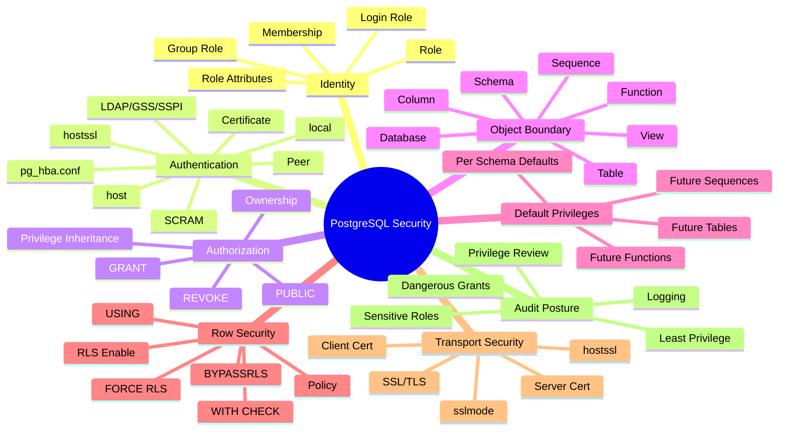
```mermaid id="d4njg7"
mindmap
  root((PostgreSQL Security))
    Identity
      Role
      Login Role
      Group Role
      Role Attributes
      Membership
    Authentication
      pg_hba.conf
      local
      host
      hostssl
      SCRAM
      Certificate
      Peer
      LDAP/GSS/SSPI
    Authorization
      Ownership
      GRANT
      REVOKE
      PUBLIC
      Privilege Inheritance
    Object Boundary
      Database
      Schema
      Table
      Sequence
      Function
      View
      Column
    Default Privileges
      Future Tables
      Future Sequences
      Future Functions
      Per Schema Defaults
    Row Security
      RLS Enable
      Policy
      USING
      WITH CHECK
      FORCE RLS
      BYPASSRLS
    Transport Security
      SSL/TLS
      Server Cert
      Client Cert
      hostssl
      sslmode
    Audit Posture
      Least Privilege
      Privilege Review
      Sensitive Roles
      Dangerous Grants
      Logging
```

**Core idea:** PostgreSQL tidak punya pemisahan keras antara “user” dan “group” seperti beberapa DB lain. Semuanya adalah **role**. Role bisa diberi `LOGIN` sehingga bisa menjadi user login, atau dibuat tanpa `LOGIN` sehingga berfungsi sebagai group role.

---

## 3. Identity Model: Role, User, Group Role

PostgreSQL memakai konsep **role** untuk identity dan authorization. Role dapat memiliki attribute seperti `LOGIN`, `SUPERUSER`, `CREATEDB`, `CREATEROLE`, `REPLICATION`, `BYPASSRLS`, dan membership ke role lain. Secara default, role mewarisi privilege dari role yang menjadi membership-nya, kecuali inheritance diubah. ([PostgreSQL](https://www.postgresql.org/docs/current/role-attributes.html?utm_source=chatgpt.com))

```sql id="jyao3m"
-- Login role / user
CREATE ROLE app_user LOGIN PASSWORD 'change_me';

-- Group role / permission role
CREATE ROLE app_readonly NOLOGIN;

-- Grant membership
GRANT app_readonly TO app_user;
```

| Role Type | Contoh | Fungsi |
|---|---|---|
| Login role | `app_user`, `reporting_user` | Dipakai untuk connect ke database. |
| Group role | `case_reader`, `case_writer` | Mengelompokkan privilege. |
| Owner role | `case_owner` | Memiliki schema/table/function. |
| Admin role | `db_admin_limited` | Operasional terbatas. |
| Replication role | `replicator` | Koneksi replication. |
| Migration role | `schema_migrator` | Membuat/mengubah object schema. |

**Rule senior:** jangan grant privilege langsung ke user individual jika sistem punya banyak account. Grant ke group role, lalu masukkan login role ke group role.

---

## 4. Role Attributes

```sql id="z0a5xa"
CREATE ROLE app_writer
    LOGIN
    PASSWORD 'change_me'
    NOSUPERUSER
    NOCREATEDB
    NOCREATEROLE
    NOREPLICATION
    NOBYPASSRLS;
```

| Attribute | Arti | Risiko |
|---|---|---|
| `LOGIN` | Role bisa connect sebagai user. | Jangan diberikan ke group role murni. |
| `SUPERUSER` | Bypass hampir semua security. | Sangat berbahaya; hindari untuk app. |
| `CREATEDB` | Bisa membuat database. | Tidak perlu untuk app runtime. |
| `CREATEROLE` | Bisa membuat/mengubah role. | Privilege escalation risk. |
| `REPLICATION` | Bisa membuat replication connection. | Bisa membaca WAL/data movement. |
| `BYPASSRLS` | Bisa bypass row-level security. | Jangan untuk app user yang harus dibatasi RLS. |
| `INHERIT` | Mewarisi privilege role membership. | Default; mudah tapi perlu governance. |
| `NOINHERIT` | Tidak otomatis mewarisi privilege. | Bagus untuk privilege elevation eksplisit. |

### Pattern: login role + group role

```sql id="u2f8gr"
CREATE ROLE case_reader NOLOGIN;
CREATE ROLE case_writer NOLOGIN;

CREATE ROLE svc_case_api LOGIN PASSWORD 'change_me';

GRANT case_reader TO svc_case_api;
GRANT case_writer TO svc_case_api;
```

### Pattern: admin role dengan explicit elevation

```sql id="5qgjcg"
CREATE ROLE maintenance_admin NOLOGIN;
CREATE ROLE alice LOGIN PASSWORD 'change_me' NOINHERIT;

GRANT maintenance_admin TO alice;
```

Saat perlu elevate:

```sql id="4h77nh"
SET ROLE maintenance_admin;
```

---

## 5. Ownership vs Privilege

PostgreSQL membedakan **owner** dan **privilege recipient**.

| Konsep | Penjelasan |
|---|---|
| Owner | Role yang memiliki object; bisa `ALTER`, `DROP`, `GRANT`, `REVOKE`. |
| Privilege | Hak tertentu pada object, misalnya `SELECT`, `INSERT`, `UPDATE`. |
| Superuser | Bisa melewati mayoritas boundary. |
| `PUBLIC` | Pseudo-role yang berarti semua role. |

Biasanya hanya owner object atau superuser yang bisa grant/revoke privilege object. PostgreSQL juga mendukung `WITH GRANT OPTION`, yaitu penerima privilege dapat meneruskan privilege tersebut ke role lain. ([PostgreSQL](https://www.postgresql.org/docs/current/ddl-priv.html?utm_source=chatgpt.com))

```sql id="x1j2pr"
CREATE ROLE case_owner NOLOGIN;
CREATE ROLE case_reader NOLOGIN;
CREATE ROLE case_writer NOLOGIN;

ALTER SCHEMA case_mgmt OWNER TO case_owner;
ALTER TABLE case_mgmt.case_file OWNER TO case_owner;
```

**Rule:** owner role sebaiknya **bukan** role runtime aplikasi. Aplikasi tidak perlu memiliki table; aplikasi hanya perlu privilege yang sesuai.

---

## 6. Privilege Model

`GRANT` memberikan privilege pada database object atau membership role. `REVOKE` mencabut privilege. PostgreSQL privilege berlaku pada object tertentu seperti database, schema, table, sequence, function, dan lainnya. ([PostgreSQL](https://www.postgresql.org/docs/current/sql-grant.html?utm_source=chatgpt.com))

### Database privilege

```sql id="jfbkg5"
GRANT CONNECT ON DATABASE appdb TO app_runtime;
GRANT TEMPORARY ON DATABASE appdb TO app_runtime;
```

### Schema privilege

```sql id="uq3l31"
GRANT USAGE ON SCHEMA case_mgmt TO case_reader;
GRANT USAGE ON SCHEMA case_mgmt TO case_writer;
```

### Table privilege

```sql id="vpwyal"
GRANT SELECT ON TABLE case_mgmt.case_file TO case_reader;

GRANT SELECT, INSERT, UPDATE, DELETE
ON TABLE case_mgmt.case_file
TO case_writer;
```

### Sequence privilege

```sql id="yv8eal"
GRANT USAGE, SELECT
ON SEQUENCE case_mgmt.case_file_id_seq
TO case_writer;
```

### Function privilege

```sql id="d6f4dz"
GRANT EXECUTE
ON FUNCTION case_mgmt.close_case(bigint)
TO case_writer;
```

---

## 7. Common Privileges by Object

| Object | Privilege Umum | Catatan |
|---|---|---|
| Database | `CONNECT`, `CREATE`, `TEMPORARY` | `CONNECT` diperlukan untuk masuk database. |
| Schema | `USAGE`, `CREATE` | `USAGE` untuk mengakses object dalam schema; `CREATE` untuk membuat object. |
| Table/View | `SELECT`, `INSERT`, `UPDATE`, `DELETE`, `TRUNCATE`, `REFERENCES`, `TRIGGER` | `TRUNCATE` dan `TRIGGER` sering terlalu kuat untuk app runtime. |
| Sequence | `USAGE`, `SELECT`, `UPDATE` | Identity/sequence insert sering butuh `USAGE`. |
| Function/Procedure | `EXECUTE` | Hati-hati default `EXECUTE` ke `PUBLIC`. |
| Type/Domain | `USAGE` | Dibutuhkan untuk memakai type tertentu. |

PostgreSQL memberi beberapa default privilege ke `PUBLIC`, misalnya `CONNECT` dan `TEMPORARY` pada database, `EXECUTE` pada function/procedure, dan `USAGE` pada language serta data type/domain. Default ini bisa dicabut oleh owner. ([PostgreSQL](https://www.postgresql.org/docs/current/ddl-priv.html?utm_source=chatgpt.com))

---

## 8. Schema Permission

Schema adalah namespace. Untuk memakai object dalam schema yang tidak dimiliki role, role membutuhkan `USAGE` pada schema dan privilege pada object terkait. Secara default, user tidak bisa mengakses object di schema yang tidak mereka miliki; owner schema harus memberikan `USAGE`. PostgreSQL juga mencatat bahwa `public` secara default memberi privilege tertentu ke semua user, sehingga sering perlu di-hardening. ([PostgreSQL](https://www.postgresql.org/docs/current/ddl-schemas.html?utm_source=chatgpt.com))

```sql id="wbab6k"
-- Harden public schema
REVOKE CREATE ON SCHEMA public FROM PUBLIC;

-- Jika perlu, revoke usage juga tergantung policy
-- REVOKE USAGE ON SCHEMA public FROM PUBLIC;
```

### Recommended schema boundary

```sql id="jv91mv"
CREATE SCHEMA case_mgmt AUTHORIZATION case_owner;
CREATE SCHEMA audit AUTHORIZATION audit_owner;
CREATE SCHEMA integration AUTHORIZATION integration_owner;

GRANT USAGE ON SCHEMA case_mgmt TO case_reader, case_writer;
GRANT USAGE ON SCHEMA audit TO audit_reader;
GRANT USAGE ON SCHEMA integration TO integration_worker;
```

**Rule:** `USAGE ON SCHEMA` tidak otomatis memberi akses table. Role tetap butuh `SELECT`, `INSERT`, dan seterusnya pada object.

---

## 9. Default Privileges

`ALTER DEFAULT PRIVILEGES` mengatur privilege untuk object yang dibuat **di masa depan**. Ia tidak memengaruhi object yang sudah ada. Privilege dapat diatur global dalam database saat ini atau hanya untuk schema tertentu. ([PostgreSQL](https://www.postgresql.org/docs/current/sql-alterdefaultprivileges.html?utm_source=chatgpt.com))

### Default privilege untuk future tables

```sql id="p8t7xb"
ALTER DEFAULT PRIVILEGES
FOR ROLE case_owner
IN SCHEMA case_mgmt
GRANT SELECT ON TABLES TO case_reader;
```

```sql id="45n15s"
ALTER DEFAULT PRIVILEGES
FOR ROLE case_owner
IN SCHEMA case_mgmt
GRANT SELECT, INSERT, UPDATE, DELETE ON TABLES TO case_writer;
```

### Default privilege untuk future sequences

```sql id="sbag9p"
ALTER DEFAULT PRIVILEGES
FOR ROLE case_owner
IN SCHEMA case_mgmt
GRANT USAGE, SELECT ON SEQUENCES TO case_writer;
```

### Default privilege untuk future functions

```sql id="070tkq"
ALTER DEFAULT PRIVILEGES
FOR ROLE case_owner
IN SCHEMA case_mgmt
REVOKE EXECUTE ON FUNCTIONS FROM PUBLIC;
```

**Pitfall besar:** default privileges berlaku berdasarkan **role yang membuat object**. Kalau migration kadang dijalankan oleh `postgres`, kadang oleh `schema_migrator`, dan kadang oleh `case_owner`, hasil privilege bisa berbeda.

---

## 10. Existing Object Grants vs Future Object Grants

```sql id="7f5r6d"
-- Existing objects
GRANT SELECT ON ALL TABLES IN SCHEMA case_mgmt TO case_reader;
GRANT USAGE, SELECT ON ALL SEQUENCES IN SCHEMA case_mgmt TO case_writer;

-- Future objects
ALTER DEFAULT PRIVILEGES
FOR ROLE case_owner
IN SCHEMA case_mgmt
GRANT SELECT ON TABLES TO case_reader;
```

| Kebutuhan | Command |
|---|---|
| Grant ke table yang sudah ada | `GRANT ... ON ALL TABLES IN SCHEMA ...` |
| Grant ke sequence yang sudah ada | `GRANT ... ON ALL SEQUENCES IN SCHEMA ...` |
| Grant ke function yang sudah ada | `GRANT ... ON ALL FUNCTIONS IN SCHEMA ...` |
| Grant ke object yang akan dibuat nanti | `ALTER DEFAULT PRIVILEGES` |

**Rule:** setiap setup privilege production biasanya butuh dua bagian: existing objects dan future objects.

---

## 11. `pg_hba.conf`

Client authentication dikontrol oleh file `pg_hba.conf`, biasanya berada di data directory cluster. File ini dibaca saat startup dan saat server menerima reload/SIGHUP; setelah diedit pada sistem aktif, lakukan reload dengan `pg_ctl reload`, `SELECT pg_reload_conf()`, atau mekanisme setara. ([PostgreSQL](https://www.postgresql.org/docs/current/auth-pg-hba-conf.html?utm_source=chatgpt.com))

Format umum:

```conf id="xnvm5r"
# TYPE  DATABASE        USER            ADDRESS             METHOD
local   all             postgres                            peer
host    appdb           svc_case_api    10.10.0.0/16        scram-sha-256
hostssl appdb           reporting_user  10.20.1.10/32       scram-sha-256
```

| Field | Fungsi |
|---|---|
| `TYPE` | Jenis koneksi: `local`, `host`, `hostssl`, `hostnossl`, dll. |
| `DATABASE` | Database target. |
| `USER` | Role/user target. |
| `ADDRESS` | CIDR client address untuk TCP/IP. |
| `METHOD` | Authentication method. |

### Reload config

```sql id="lt4mi3"
SELECT pg_reload_conf();
```

### View parsed HBA

```sql id="fv5hz6"
SELECT *
FROM pg_hba_file_rules
ORDER BY line_number;
```

**Rule:** urutan `pg_hba.conf` penting. PostgreSQL mengevaluasi dari atas ke bawah dan memakai rule pertama yang match.

---

## 12. Authentication Methods

| Method | Kapan Dipakai | Catatan |
|---|---|---|
| `scram-sha-256` | Password auth modern | Prefer untuk password auth. |
| `md5` | Legacy compatibility | Hindari untuk desain baru jika SCRAM tersedia. |
| `password` | Clear-text password | Jangan pakai tanpa TLS; biasanya hindari. |
| `peer` | Local Unix socket mapping OS user | Cocok untuk local admin di Linux. |
| `cert` | Client certificate auth | Cocok untuk mutual TLS / cert-based auth. |
| `gss` / `sspi` | Enterprise SSO/Kerberos/Windows | Sesuai environment. |
| `trust` | No password | Jangan untuk production TCP. |
| `reject` | Explicit deny | Berguna untuk rule blocking. |

`trust` authentication hanya cocok jika semua user dari host yang diizinkan benar-benar dipercaya. Dokumentasi PostgreSQL menyebut `trust` jarang masuk akal untuk TCP/IP selain localhost. ([PostgreSQL](https://www.postgresql.org/docs/current/auth-trust.html?utm_source=chatgpt.com))

---

## 13. SCRAM Password Authentication

Password database PostgreSQL terpisah dari password OS. Password role disimpan di catalog `pg_authid`; jika role tidak punya password, password authentication selalu gagal. Password dapat diatur dengan `CREATE ROLE`, `ALTER ROLE`, atau `\password`. ([PostgreSQL](https://www.postgresql.org/docs/current/auth-password.html?utm_source=chatgpt.com))

### Set password encryption

```conf id="bwdgxd"
password_encryption = 'scram-sha-256'
```

### Create user with password

```sql id="2bsr4h"
CREATE ROLE svc_case_api
LOGIN
PASSWORD 'change_me'
NOSUPERUSER
NOCREATEDB
NOCREATEROLE
NOREPLICATION
NOBYPASSRLS;
```

### Rotate password

```sql id="jwnjgc"
ALTER ROLE svc_case_api PASSWORD 'new_secret';
```

### HBA rule

```conf id="jkelgo"
hostssl appdb svc_case_api 10.10.0.0/16 scram-sha-256
```

**Rule:** gunakan `scram-sha-256` untuk password auth modern, pastikan client library mendukung, dan jangan mengirim password auth lewat koneksi non-TLS pada network tidak tepercaya.

---

## 14. SSL/TLS

PostgreSQL memakai istilah `ssl` untuk transfer encryption, walaupun konteks modernnya adalah TLS; SSL protocol lama sudah deprecated. Parameter `ssl` default-nya `off`, dan file seperti `ssl_cert_file`, `ssl_key_file`, serta `ssl_ca_file` mengatur sertifikat server dan CA untuk verifikasi client certificate. ([PostgreSQL](https://www.postgresql.org/docs/current/runtime-config-connection.html?utm_source=chatgpt.com))

### Server config

```conf id="ecjp2t"
ssl = on
ssl_cert_file = 'server.crt'
ssl_key_file = 'server.key'
ssl_ca_file = 'root.crt'
```

### HBA require TLS

```conf id="9b5lbb"
hostssl appdb svc_case_api 10.10.0.0/16 scram-sha-256
```

### Certificate authentication

```conf id="dq2g9f"
hostssl appdb cert_user 10.10.0.0/16 cert
```

PostgreSQL mendukung dua pendekatan client certificate: memakai `cert` authentication method pada `hostssl`, atau menggabungkan auth method lain dengan verifikasi client certificate melalui `clientcert=verify-ca` atau `clientcert=verify-full`. `verify-full` juga memastikan Common Name certificate cocok dengan username atau mapping yang berlaku. ([PostgreSQL](https://www.postgresql.org/docs/current/ssl-tcp.html?utm_source=chatgpt.com))

---

## 15. `PUBLIC` Hardening

`PUBLIC` adalah pseudo-role yang berarti semua role. Ini sering jadi sumber privilege yang terlalu luas.

### Revoke dangerous defaults

```sql id="83x13w"
REVOKE CREATE ON SCHEMA public FROM PUBLIC;
REVOKE ALL ON DATABASE appdb FROM PUBLIC;
```

Lalu grant eksplisit:

```sql id="qei1pb"
GRANT CONNECT ON DATABASE appdb TO app_runtime;
GRANT TEMPORARY ON DATABASE appdb TO app_runtime;
```

### Revoke execute on functions from public

```sql id="0t29vl"
REVOKE EXECUTE ON ALL FUNCTIONS IN SCHEMA public FROM PUBLIC;
```

Future functions:

```sql id="qb1kis"
ALTER DEFAULT PRIVILEGES
IN SCHEMA public
REVOKE EXECUTE ON FUNCTIONS FROM PUBLIC;
```

**Rule:** review semua privilege `PUBLIC` saat database baru dibuat. Default yang nyaman untuk development sering terlalu longgar untuk production.

---

## 16. Row-Level Security / RLS

Selain privilege SQL standar via `GRANT`, PostgreSQL mendukung **row-level security** untuk membatasi row mana yang bisa dibaca, diinsert, diupdate, atau dihapus oleh user tertentu. Policy RLS bekerja per table dan per user/role. ([PostgreSQL](https://www.postgresql.org/docs/current/ddl-rowsecurity.html?utm_source=chatgpt.com))

### Enable RLS

```sql id="87qa71"
ALTER TABLE case_mgmt.case_file ENABLE ROW LEVEL SECURITY;
```

### Policy untuk tenant isolation

```sql id="f7d0dp"
CREATE POLICY case_file_tenant_policy
ON case_mgmt.case_file
USING (tenant_id = current_setting('app.tenant_id')::bigint)
WITH CHECK (tenant_id = current_setting('app.tenant_id')::bigint);
```

### Set tenant context

```sql id="8naufq"
SET app.tenant_id = '1001';

SELECT *
FROM case_mgmt.case_file;
```

| Clause | Berlaku Untuk | Fungsi |
|---|---|---|
| `USING` | `SELECT`, `UPDATE`, `DELETE` visibility | Row mana yang terlihat/tertarget. |
| `WITH CHECK` | `INSERT`, `UPDATE` new row | Row baru/hasil update boleh atau tidak. |

### Force RLS for owner

```sql id="c0kc9t"
ALTER TABLE case_mgmt.case_file FORCE ROW LEVEL SECURITY;
```

**Important:** table owner dan role dengan `BYPASSRLS` dapat melewati RLS kecuali policy/design memperhitungkan hal ini. Jangan pakai owner role sebagai runtime role aplikasi.

---

## 17. RLS Pattern: Case Assignment Visibility

Contoh: user hanya boleh melihat case yang assigned ke role/subject mereka.

```sql id="0xeob8"
CREATE TABLE case_mgmt.case_file (
    id bigint GENERATED ALWAYS AS IDENTITY PRIMARY KEY,
    case_number text NOT NULL UNIQUE,
    assigned_user text,
    status text NOT NULL,
    created_at timestamptz NOT NULL DEFAULT now()
);

ALTER TABLE case_mgmt.case_file ENABLE ROW LEVEL SECURITY;

CREATE POLICY case_file_assignee_read_policy
ON case_mgmt.case_file
FOR SELECT
USING (
    assigned_user = current_user
    OR pg_has_role(current_user, 'case_supervisor', 'member')
);
```

**Interpretasi:** RLS bagus untuk guardrail data-access di database, tetapi jangan jadikan RLS sebagai satu-satunya tempat business workflow authorization yang kompleks. Untuk workflow state transition, tetap perlu constraint, transaction pattern, dan domain logic.

---

## 18. Column-Level Privilege

PostgreSQL mendukung grant pada column tertentu.

```sql id="wilv53"
GRANT SELECT (id, case_number, status, created_at)
ON case_mgmt.case_file
TO case_reader_limited;
```

```sql id="mrz1pk"
GRANT UPDATE (status, updated_at)
ON case_mgmt.case_file
TO case_status_writer;
```

| Use Case | Column Privilege Cocok? |
|---|---:|
| Hide sensitive column sederhana | Ya |
| Allow update hanya field tertentu | Ya |
| Complex masking / derived projection | Lebih baik view |
| Dynamic per-row masking | RLS/view/function pattern |

---

## 19. View-Based Access Boundary

Untuk read-only projection, view sering lebih mudah diaudit daripada grant langsung ke table penuh.

```sql id="qz1e7y"
CREATE VIEW case_mgmt.v_case_summary AS
SELECT
    id,
    case_number,
    status,
    priority,
    created_at
FROM case_mgmt.case_file;

REVOKE ALL ON case_mgmt.case_file FROM reporting_user;
GRANT SELECT ON case_mgmt.v_case_summary TO reporting_user;
```

### Security barrier view

```sql id="jn1ck8"
CREATE VIEW case_mgmt.v_case_summary_secure
WITH (security_barrier = true)
AS
SELECT
    id,
    case_number,
    status,
    priority
FROM case_mgmt.case_file
WHERE status <> 'SEALED';
```

**Rule:** view bisa menjadi projection/security boundary, tetapi ownership, RLS, function volatility, dan `security_barrier` perlu dipahami jika datanya sensitif.

---

## 20. Function Security: `SECURITY INVOKER` vs `SECURITY DEFINER`

| Mode | Eksekusi Sebagai | Risiko |
|---|---|---|
| `SECURITY INVOKER` | Caller/current user | Default; lebih aman. |
| `SECURITY DEFINER` | Owner function | Bisa menjadi privilege escalation jika salah. |

```sql id="tosv5f"
CREATE FUNCTION case_mgmt.close_case(p_case_id bigint)
RETURNS void
LANGUAGE sql
SECURITY DEFINER
SET search_path = case_mgmt, pg_temp
AS $$
    UPDATE case_file
    SET status = 'CLOSED'
    WHERE id = p_case_id;
$$;
```

**Hardening untuk `SECURITY DEFINER`:**

| Checklist | Kenapa |
|---|---|
| Set `search_path` eksplisit | Mencegah object hijacking. |
| Owner function bukan superuser | Mengurangi blast radius. |
| Grant `EXECUTE` hanya ke role perlu | Jangan biarkan `PUBLIC`. |
| Validasi input | Hindari dynamic SQL injection. |
| Audit function body | Ini boundary privilege escalation. |

---

## 21. Predefined Roles

PostgreSQL menyediakan predefined roles untuk capability umum tertentu. Administrator dapat `GRANT` predefined role ke user/role lain, misalnya `pg_signal_backend`. ([PostgreSQL](https://www.postgresql.org/docs/current/predefined-roles.html?utm_source=chatgpt.com))

Contoh:

```sql id="6rb3au"
GRANT pg_read_all_stats TO monitoring_user;
GRANT pg_signal_backend TO limited_admin;
```

| Predefined Role | Kegunaan Umum | Risiko |
|---|---|---|
| `pg_read_all_stats` | Monitoring statistics semua user. | Bisa melihat metadata/statistik sensitif. |
| `pg_read_all_settings` | Baca semua settings. | Bisa expose config sensitif. |
| `pg_signal_backend` | Signal session lain. | Bisa mengganggu workload. |
| `pg_monitor` | Bundle monitoring privileges. | Jangan beri ke app runtime. |
| `pg_read_server_files` | Baca file server. | Sangat sensitif. |
| `pg_write_server_files` | Tulis file server. | Sangat sensitif. |
| `pg_execute_server_program` | Eksekusi program server. | Sangat berbahaya. |

**Rule:** predefined roles bukan “role biasa”. Treat sebagai privileged capabilities dan review seperti admin access.

---

## 22. Replication Security

Role untuk replication connection harus memiliki `REPLICATION` atau superuser, dan role tersebut harus bisa login serta diizinkan di `pg_hba.conf`. Untuk initial copy logical replication, role juga membutuhkan `SELECT` pada published table jika bukan superuser. ([PostgreSQL](https://www.postgresql.org/docs/current/logical-replication-security.html?utm_source=chatgpt.com))

```sql id="tmij89"
CREATE ROLE repl_user
LOGIN
REPLICATION
PASSWORD 'change_me'
NOSUPERUSER
NOCREATEDB
NOCREATEROLE
NOBYPASSRLS;
```

```conf id="jr7svu"
hostssl replication repl_user 10.20.0.10/32 scram-sha-256
hostssl appdb       repl_user 10.20.0.10/32 scram-sha-256
```

**Security note:** PostgreSQL documentation notes there are currently no privileges on publications; a subscription that can connect may access a publication. If you need to hide data, control publication scope, connection access, and avoid exposing the same data via another publication. ([PostgreSQL](https://www.postgresql.org/docs/current/logical-replication-security.html?utm_source=chatgpt.com))

---

## 23. Audit Posture

PostgreSQL core menyediakan logs, catalog views, role/privilege catalogs, dan extension ecosystem. Untuk audit posture, fokus minimum adalah:

| Area | Yang Diaudit |
|---|---|
| Role inventory | Role mana punya `LOGIN`, `SUPERUSER`, `CREATEROLE`, `BYPASSRLS`, `REPLICATION`. |
| Membership | Siapa member role privileged. |
| Object ownership | Owner schema/table/function bukan app runtime. |
| Grants | Privilege langsung ke user vs group role. |
| `PUBLIC` privilege | Default privilege terlalu luas. |
| HBA rules | Network/method terlalu luas. |
| TLS usage | `hostssl`, cert, cipher policy. |
| RLS | Table sensitif sudah enable/force policy. |
| Function security | `SECURITY DEFINER` review. |
| Replication slots/users | Data exfiltration/retention risk. |

### Role attribute audit

```sql id="cuxr43"
SELECT
    rolname,
    rolcanlogin,
    rolsuper,
    rolcreatedb,
    rolcreaterole,
    rolreplication,
    rolbypassrls,
    rolvaliduntil
FROM pg_roles
ORDER BY rolname;
```

### Role membership audit

```sql id="bzxb92"
SELECT
    member_role.rolname AS member,
    parent_role.rolname AS granted_role,
    admin_option
FROM pg_auth_members m
JOIN pg_roles member_role ON member_role.oid = m.member
JOIN pg_roles parent_role ON parent_role.oid = m.roleid
ORDER BY granted_role, member;
```

### Object owner audit

```sql id="xxrqaa"
SELECT
    n.nspname AS schema_name,
    c.relname AS object_name,
    c.relkind,
    r.rolname AS owner
FROM pg_class c
JOIN pg_namespace n ON n.oid = c.relnamespace
JOIN pg_roles r ON r.oid = c.relowner
WHERE n.nspname NOT IN ('pg_catalog', 'information_schema')
ORDER BY n.nspname, c.relname;
```

---

## 24. Privilege Inspection Queries

### Table privileges

```sql id="l4u7xs"
SELECT
    table_schema,
    table_name,
    grantee,
    privilege_type,
    is_grantable
FROM information_schema.table_privileges
WHERE table_schema NOT IN ('pg_catalog', 'information_schema')
ORDER BY table_schema, table_name, grantee, privilege_type;
```

### Schema privileges

```sql id="o5m82h"
SELECT
    nspname AS schema_name,
    rolname AS role_name,
    has_schema_privilege(rolname, nspname, 'USAGE') AS has_usage,
    has_schema_privilege(rolname, nspname, 'CREATE') AS has_create
FROM pg_namespace
CROSS JOIN pg_roles
WHERE nspname NOT LIKE 'pg_%'
  AND nspname <> 'information_schema'
ORDER BY schema_name, role_name;
```

### Function execute grants

```sql id="fn1jqk"
SELECT
    routine_schema,
    routine_name,
    grantee,
    privilege_type
FROM information_schema.routine_privileges
WHERE routine_schema NOT IN ('pg_catalog', 'information_schema')
ORDER BY routine_schema, routine_name, grantee;
```

### Default privileges

```sql id="ej4dpd"
SELECT
    defaclrole::regrole AS owner_role,
    defaclnamespace::regnamespace AS schema_name,
    defaclobjtype AS object_type,
    defaclacl AS privileges
FROM pg_default_acl
ORDER BY owner_role, schema_name, object_type;
```

---

## 25. Production Role Design Pattern

### Roles

```sql id="k3k4o3"
CREATE ROLE case_owner NOLOGIN;
CREATE ROLE case_reader NOLOGIN;
CREATE ROLE case_writer NOLOGIN;
CREATE ROLE case_migrator LOGIN PASSWORD 'change_me';
CREATE ROLE svc_case_api LOGIN PASSWORD 'change_me';
CREATE ROLE reporting_user LOGIN PASSWORD 'change_me';
```

### Ownership

```sql id="ogqxlg"
CREATE SCHEMA case_mgmt AUTHORIZATION case_owner;

ALTER DEFAULT PRIVILEGES
FOR ROLE case_owner
IN SCHEMA case_mgmt
GRANT SELECT ON TABLES TO case_reader;

ALTER DEFAULT PRIVILEGES
FOR ROLE case_owner
IN SCHEMA case_mgmt
GRANT SELECT, INSERT, UPDATE, DELETE ON TABLES TO case_writer;
```

### Runtime grants

```sql id="1h73b5"
GRANT CONNECT ON DATABASE appdb TO svc_case_api, reporting_user;

GRANT USAGE ON SCHEMA case_mgmt TO case_reader, case_writer;

GRANT case_reader TO reporting_user;
GRANT case_reader, case_writer TO svc_case_api;
```

### Migration ownership control

```sql id="pvtyby"
GRANT case_owner TO case_migrator;
```

Migration session:

```sql id="uf8k7n"
SET ROLE case_owner;

CREATE TABLE case_mgmt.case_file (
    id bigint GENERATED ALWAYS AS IDENTITY PRIMARY KEY,
    case_number text NOT NULL UNIQUE,
    status text NOT NULL
);
```

**Why:** object dibuat dengan owner konsisten, default privileges berjalan konsisten, app runtime bukan owner.

---

## 26. Least Privilege Matrix

| Role | Database | Schema | Table | Sequence | Function | Notes |
|---|---|---|---|---|---|---|
| `case_owner` | As needed | Owner | Owner | Owner | Owner | Tidak dipakai runtime app. |
| `case_reader` | `CONNECT` | `USAGE` | `SELECT` | Usually none | selected `EXECUTE` | Reporting/read-only. |
| `case_writer` | `CONNECT` | `USAGE` | `SELECT, INSERT, UPDATE, DELETE` | `USAGE, SELECT` | selected `EXECUTE` | App write path. |
| `case_migrator` | `CONNECT` | via `SET ROLE case_owner` | DDL via owner role | DDL via owner role | DDL via owner role | Dipakai migration only. |
| `monitoring_user` | `CONNECT` | minimal | stats views | none | none | Bisa diberi `pg_monitor` sesuai risk. |
| `repl_user` | replication/appdb as needed | minimal | `SELECT` for logical copy | none | none | `REPLICATION`, HBA restricted. |

---

## 27. Security Hardening Checklist

| Area | Checklist |
|---|---|
| Superuser | Tidak ada app/runtime user dengan `SUPERUSER`. |
| Role attributes | Review `CREATEROLE`, `REPLICATION`, `BYPASSRLS`. |
| Ownership | App runtime bukan owner table/schema/function. |
| Group roles | Privilege diberikan ke group role, bukan user satu-satu. |
| Public schema | `REVOKE CREATE ON SCHEMA public FROM PUBLIC`. |
| Public database | Review `CONNECT`, `TEMPORARY`, `CREATE`. |
| Functions | Revoke unwanted `EXECUTE` from `PUBLIC`. |
| Default privileges | Set untuk future tables/sequences/functions. |
| HBA | Rule paling sempit: database, user, CIDR, method. |
| TLS | Pakai `hostssl` untuk network tidak tepercaya. |
| Password | Prefer `scram-sha-256`; rotate credential. |
| RLS | Enable/force untuk table yang butuh row isolation. |
| Security definer | Audit owner, search_path, grants. |
| Replication | Restrict `REPLICATION` role dan monitor slot. |
| Monitoring | Audit roles/grants secara berkala. |

---

## 28. Common Pitfalls

| Pitfall | Dampak | Solusi |
|---|---|---|
| App user menjadi owner table | App bisa `DROP/ALTER`, RLS bisa bypass oleh owner | Pisahkan owner role dan runtime role. |
| Grant langsung ke user individual | Sulit audit dan revoke | Pakai group role. |
| Lupa `USAGE ON SCHEMA` | Table grant ada tapi query tetap gagal | Grant schema usage. |
| Lupa sequence privilege | Insert ke identity/sequence gagal | Grant `USAGE` pada sequence. |
| Mengandalkan `ALTER DEFAULT PRIVILEGES` untuk object lama | Object lama tetap tidak berubah | Gunakan `GRANT ... ON ALL ...`. |
| `PUBLIC` dibiarkan default | Access terlalu luas | Revoke dan grant eksplisit. |
| `trust` di TCP production | Semua matching host bisa login tanpa password | Gunakan SCRAM/cert, restrict CIDR. |
| HBA rule luas di atas rule sempit | Rule sempit tidak pernah dipakai | Urutkan dari spesifik ke umum. |
| `SECURITY DEFINER` tanpa `SET search_path` | Privilege escalation via object hijack | Set search_path eksplisit. |
| Role dengan `BYPASSRLS` dipakai aplikasi | RLS tidak efektif | Jangan grant `BYPASSRLS` ke app. |
| Publication terlalu luas | Data sensitif tereplikasi | Batasi publication/table/column/filter. |
| Monitoring user terlalu powerful | Exposure metadata/query | Grant minimum predefined role. |

---

## 29. Incident Response Patterns

| Incident | Tindakan Awal |
|---|---|
| Credential leaked | `ALTER ROLE ... PASSWORD`, revoke sessions, rotate app secret. |
| User diberi privilege salah | `REVOKE`, audit membership, cek grant option chain. |
| App accidentally owns objects | `ALTER ... OWNER TO owner_role`, review grants. |
| RLS leak suspected | Check role attributes, table owner, `BYPASSRLS`, policies. |
| Unauthorized connection | Review `pg_hba.conf`, logs, role password, CIDR rules. |
| Function privilege escalation | Revoke execute, review `SECURITY DEFINER`, fix search_path. |
| Replication role misuse | Disable role, drop suspicious slot, audit publication scope. |
| PUBLIC privilege too broad | Revoke default, re-grant explicit roles, test app behavior. |

### Kill sessions after credential incident

```sql id="v849vd"
SELECT pg_terminate_backend(pid)
FROM pg_stat_activity
WHERE usename = 'svc_case_api'
  AND pid <> pg_backend_pid();
```

### Disable login temporarily

```sql id="26aogq"
ALTER ROLE svc_case_api NOLOGIN;
```

---

## 30. Minimal Secure Setup Example

```sql id="sfhi1u"
-- Owner and permission roles
CREATE ROLE case_owner NOLOGIN;
CREATE ROLE case_reader NOLOGIN;
CREATE ROLE case_writer NOLOGIN;

-- Runtime users
CREATE ROLE svc_case_api LOGIN PASSWORD 'change_me' NOSUPERUSER NOCREATEDB NOCREATEROLE NOREPLICATION NOBYPASSRLS;
CREATE ROLE reporting_user LOGIN PASSWORD 'change_me' NOSUPERUSER NOCREATEDB NOCREATEROLE NOREPLICATION NOBYPASSRLS;

-- Schema
CREATE SCHEMA case_mgmt AUTHORIZATION case_owner;

-- Harden public
REVOKE CREATE ON SCHEMA public FROM PUBLIC;

-- Database access
GRANT CONNECT ON DATABASE appdb TO svc_case_api, reporting_user;

-- Schema access
GRANT USAGE ON SCHEMA case_mgmt TO case_reader, case_writer;

-- Membership
GRANT case_reader TO reporting_user;
GRANT case_reader, case_writer TO svc_case_api;

-- Existing objects, if any
GRANT SELECT ON ALL TABLES IN SCHEMA case_mgmt TO case_reader;
GRANT SELECT, INSERT, UPDATE, DELETE ON ALL TABLES IN SCHEMA case_mgmt TO case_writer;
GRANT USAGE, SELECT ON ALL SEQUENCES IN SCHEMA case_mgmt TO case_writer;

-- Future objects
ALTER DEFAULT PRIVILEGES
FOR ROLE case_owner
IN SCHEMA case_mgmt
GRANT SELECT ON TABLES TO case_reader;

ALTER DEFAULT PRIVILEGES
FOR ROLE case_owner
IN SCHEMA case_mgmt
GRANT SELECT, INSERT, UPDATE, DELETE ON TABLES TO case_writer;

ALTER DEFAULT PRIVILEGES
FOR ROLE case_owner
IN SCHEMA case_mgmt
GRANT USAGE, SELECT ON SEQUENCES TO case_writer;
```

`pg_hba.conf`:

```conf id="ei8fza"
# TYPE    DATABASE    USER             ADDRESS          METHOD
local     all         postgres                          peer
hostssl   appdb       svc_case_api     10.10.0.0/16     scram-sha-256
hostssl   appdb       reporting_user   10.20.1.10/32    scram-sha-256
hostssl   replication repl_user        10.30.1.10/32    scram-sha-256
```

---

## 31. Decision Matrix

| Problem | PostgreSQL Feature |
|---|---|
| Banyak user butuh privilege sama | Group role |
| App perlu connect tapi tidak boleh own object | Login role + group privilege |
| Schema object tidak bisa diakses walau table grant ada | `GRANT USAGE ON SCHEMA` |
| Future tables tidak otomatis accessible | `ALTER DEFAULT PRIVILEGES` |
| Need restrict by source network | `pg_hba.conf` CIDR |
| Need password auth modern | `scram-sha-256` |
| Need encrypted network connection | `ssl=on` + `hostssl` |
| Need client cert auth | `cert` auth or `clientcert=verify-full` |
| Need tenant/row isolation | RLS policy |
| Need hide specific columns | Column grants or view |
| Need controlled privileged operation | Carefully audited `SECURITY DEFINER` function |
| Need monitor database safely | Predefined role such as `pg_monitor` / `pg_read_all_stats` with review |

---

## 32. Roadmap Belajar Singkat

| Urutan | Materi | Target |
|---:|---|---|
| 1 | Role model | Paham user/group/owner sama-sama role. |
| 2 | Object privilege | Bisa membedakan database/schema/table/sequence/function grants. |
| 3 | Ownership | Bisa mencegah app runtime menjadi owner object. |
| 4 | Default privilege | Bisa mengatur privilege object masa depan. |
| 5 | `pg_hba.conf` | Bisa membaca dan harden connection rules. |
| 6 | SCRAM + TLS | Bisa membuat auth dan transport security yang layak production. |
| 7 | RLS | Bisa membuat row-level boundary untuk tenant/assignment. |
| 8 | Function security | Bisa menghindari privilege escalation via `SECURITY DEFINER`. |
| 9 | Audit queries | Bisa review role, grants, ownership, dan risky capability. |

## Rekomendasi Materi Selanjutnya

Lanjut paling tepat: **Cheatsheet PostgreSQL Administration & Operations: Configuration, `postgresql.conf`, `ALTER SYSTEM`, Connection Limits, Memory Settings, Logging, `pg_stat_activity`, Maintenance Commands, dan Operational Runbook**. Ini tetap PostgreSQL-only dan akan melengkapi security dengan kemampuan mengoperasikan database production secara aman.

---

**Sources:**

- [Documentation: 18: Part III. Server Administration](https://www.postgresql.org/docs/current/admin.html?utm_source=chatgpt.com)

## Response:
7/13/2026, 1:02:09 AM

# Cheatsheet: PostgreSQL Administration & Operations

## 1. Scope

Cheatsheet ini fokus **PostgreSQL-only** untuk operasi database production:

- konfigurasi server
- `postgresql.conf`, `postgresql.auto.conf`, `ALTER SYSTEM`
- connection limit
- memory settings
- logging
- session/activity monitoring
- operational commands
- maintenance runbook
- incident triage

PostgreSQL administration bukan hanya “mengubah parameter”, tetapi mengelola **lifecycle cluster, konfigurasi, resource, observability, connection pressure, long-running session, lock, maintenance, dan failure response** secara defensible.

PostgreSQL menyediakan banyak configuration parameter yang mengubah perilaku database system; parameter ini dikelompokkan dalam dokumentasi server configuration, termasuk connection/authentication, resource consumption, WAL, query planning, logging, statistics, autovacuum, dan client defaults. ([PostgreSQL](https://www.postgresql.org/docs/current/runtime-config.html?utm_source=chatgpt.com))

---

## 2. Mental Model

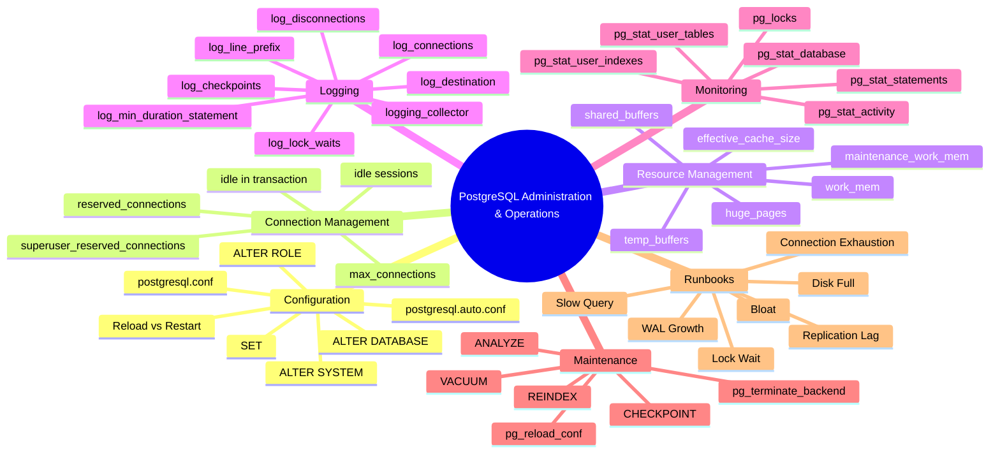
```mermaid id="postgres-admin-ops"
mindmap
  root((PostgreSQL Administration & Operations))
    Configuration
      postgresql.conf
      postgresql.auto.conf
      ALTER SYSTEM
      SET
      ALTER ROLE
      ALTER DATABASE
      Reload vs Restart
    Connection Management
      max_connections
      reserved_connections
      superuser_reserved_connections
      idle sessions
      idle in transaction
    Resource Management
      shared_buffers
      work_mem
      maintenance_work_mem
      temp_buffers
      effective_cache_size
      huge_pages
    Logging
      log_destination
      logging_collector
      log_line_prefix
      log_min_duration_statement
      log_lock_waits
      log_checkpoints
      log_connections
      log_disconnections
    Monitoring
      pg_stat_activity
      pg_stat_database
      pg_stat_user_tables
      pg_stat_user_indexes
      pg_locks
      pg_stat_statements
    Maintenance
      VACUUM
      ANALYZE
      REINDEX
      CHECKPOINT
      pg_reload_conf
      pg_terminate_backend
    Runbooks
      Slow Query
      Lock Wait
      Connection Exhaustion
      Disk Full
      WAL Growth
      Bloat
      Replication Lag
```

**Core idea:** PostgreSQL operation harus dipisahkan menjadi tiga level:

| Level | Contoh | Risiko |
|---|---|---|
| Session-level | `SET work_mem = '64MB'` | Hanya berlaku di session saat ini. |
| Database/role-level | `ALTER DATABASE`, `ALTER ROLE` | Bisa memengaruhi banyak session baru. |
| Cluster-level | `postgresql.conf`, `ALTER SYSTEM` | Memengaruhi seluruh cluster; perlu governance. |

---

## 3. Configuration Sources

PostgreSQL configuration dapat datang dari beberapa sumber. Urutan dan scope penting karena parameter yang sama bisa diset di beberapa tempat.

| Source | Scope | Contoh |
|---|---|---|
| Server command line | Cluster process | `postgres -c shared_buffers=...` |
| `postgresql.conf` | Cluster default | File konfigurasi utama. |
| `postgresql.auto.conf` | Cluster override | Ditulis oleh `ALTER SYSTEM`. |
| `ALTER DATABASE ... SET` | Database default | Berlaku untuk session baru ke database tertentu. |
| `ALTER ROLE ... SET` | Role default | Berlaku untuk session baru role tertentu. |
| `SET` | Current session | Berlaku hanya session saat ini. |
| `SET LOCAL` | Current transaction | Berlaku sampai transaction selesai. |

`ALTER SYSTEM` adalah cara SQL untuk mengubah konfigurasi global cluster; command ini menulis setting ke `postgresql.auto.conf`, yang dibaca bersama `postgresql.conf`. `RESET` atau set ke `DEFAULT` akan menghapus entry dari `postgresql.auto.conf`. ([PostgreSQL](https://www.postgresql.org/docs/current/sql-altersystem.html?utm_source=chatgpt.com))

---

## 4. Inspect Configuration

### Show one parameter

```sql id="show-param"
SHOW max_connections;

SHOW shared_buffers;

SHOW log_min_duration_statement;
```

### Show all parameters

```sql id="show-all"
SHOW ALL;
```

### Query `pg_settings`

```sql id="pg-settings"
SELECT
    name,
    setting,
    unit,
    context,
    vartype,
    source,
    pending_restart,
    short_desc
FROM pg_settings
WHERE name IN (
    'max_connections',
    'shared_buffers',
    'work_mem',
    'maintenance_work_mem',
    'effective_cache_size',
    'log_min_duration_statement',
    'idle_in_transaction_session_timeout'
)
ORDER BY name;
```

| Column | Makna |
|---|---|
| `setting` | Nilai aktif. |
| `unit` | Unit parameter, jika ada. |
| `context` | Kapan parameter bisa berubah. |
| `source` | Dari mana nilai berasal. |
| `pending_restart` | `true` jika butuh restart agar efektif. |

---

## 5. Reload vs Restart

Tidak semua parameter bisa berubah langsung.

| Jenis Perubahan | Contoh | Aksi |
|---|---|---|
| Session-level | `work_mem` | `SET`, tidak perlu reload. |
| SIGHUP/reload | logging tertentu, beberapa timeout | `SELECT pg_reload_conf()` |
| Restart-required | `max_connections`, `shared_buffers` | Restart PostgreSQL |
| Superuser-only / privileged SET | Parameter sensitif | Butuh privilege sesuai |

`SET` mengubah runtime parameter untuk session saat ini saja. Beberapa parameter dapat diubah on-the-fly, tetapi ada juga yang hanya bisa diubah saat server atau session start. ([PostgreSQL](https://www.postgresql.org/docs/current/sql-set.html?utm_source=chatgpt.com))

### Reload config

```sql id="reload-conf"
SELECT pg_reload_conf();
```

### Check pending restart

```sql id="pending-restart"
SELECT
    name,
    setting,
    source,
    pending_restart
FROM pg_settings
WHERE pending_restart;
```

**Rule:** setelah mengubah config, selalu validasi apakah setting aktif atau masih `pending_restart`.

---

## 6. `ALTER SYSTEM` Usage

### Set global parameter

```sql id="alter-system-set"
ALTER SYSTEM SET log_min_duration_statement = '500ms';

SELECT pg_reload_conf();
```

### Reset one parameter

```sql id="alter-system-reset"
ALTER SYSTEM RESET log_min_duration_statement;

SELECT pg_reload_conf();
```

### Reset all `ALTER SYSTEM` overrides

```sql id="alter-system-reset-all"
ALTER SYSTEM RESET ALL;

SELECT pg_reload_conf();
```

### Inspect source

```sql id="config-source"
SELECT
    name,
    setting,
    source,
    sourcefile,
    sourceline
FROM pg_settings
WHERE source IN ('configuration file', 'override');
```

**Operational rule:** `ALTER SYSTEM` nyaman untuk emergency tuning, tetapi untuk production governance, perubahan config sebaiknya tetap terdokumentasi dan versioned. Jangan biarkan `postgresql.auto.conf` menjadi sumber konfigurasi “misterius”.

---

## 7. `ALTER DATABASE` dan `ALTER ROLE` Defaults

### Per-database default

```sql id="alter-db-set"
ALTER DATABASE appdb
SET statement_timeout = '30s';
```

### Per-role default

```sql id="alter-role-set"
ALTER ROLE reporting_user
SET statement_timeout = '5min';

ALTER ROLE reporting_user
SET work_mem = '128MB';
```

### Per-role-per-database default

```sql id="alter-role-db-set"
ALTER ROLE reporting_user
IN DATABASE appdb
SET statement_timeout = '2min';
```

`ALTER DATABASE` dapat mengubah beberapa setting per database, dan hanya database owner atau superuser yang dapat mengubah setting tersebut. ([PostgreSQL](https://www.postgresql.org/docs/current/sql-alterdatabase.html?utm_source=chatgpt.com))

**Rule:** gunakan `ALTER ROLE` / `ALTER DATABASE` untuk workload class yang berbeda, misalnya reporting user boleh `statement_timeout` lebih panjang daripada API user.

---

## 8. Connection Management

`max_connections` menentukan jumlah maksimum concurrent connection ke server. Default biasanya 100, dan parameter ini hanya bisa diubah saat server start. ([PostgreSQL](https://www.postgresql.org/docs/current/runtime-config-connection.html?utm_source=chatgpt.com))

```sql id="conn-settings"
SELECT
    name,
    setting,
    unit,
    context,
    pending_restart
FROM pg_settings
WHERE name IN (
    'max_connections',
    'superuser_reserved_connections',
    'reserved_connections'
);
```

### Current connection usage

```sql id="connection-usage"
SELECT
    count(*) AS total_connections,
    count(*) FILTER (WHERE state = 'active') AS active,
    count(*) FILTER (WHERE state = 'idle') AS idle,
    count(*) FILTER (WHERE state = 'idle in transaction') AS idle_in_transaction
FROM pg_stat_activity;
```

### By database/user/application

```sql id="conn-by-user"
SELECT
    datname,
    usename,
    application_name,
    state,
    count(*) AS connections
FROM pg_stat_activity
GROUP BY datname, usename, application_name, state
ORDER BY connections DESC;
```

### Connection pressure decision

| Gejala | Kemungkinan | Tindakan |
|---|---|---|
| Too many connections | Pool leak / pool terlalu besar / idle connection banyak | Cek `pg_stat_activity`, turunkan pool, terminate idle jika darurat. |
| Banyak `idle in transaction` | Aplikasi membuka transaction tapi tidak commit/rollback | Set timeout, fix aplikasi/proses. |
| Active query banyak dan lambat | Query bottleneck atau lock wait | Cek wait event, locks, query plan. |
| Superuser tidak bisa login | Connection slots penuh | Gunakan reserved connections dengan benar. |

---

## 9. Session State dan Wait Event

`pg_stat_activity` adalah view utama untuk melihat session, query aktif, state, wait event, dan transaction age. PostgreSQL collection untuk currently executing command diaktifkan default, dan informasi ini terlihat ke superuser, role dengan privilege `pg_read_all_stats`, atau owner session terkait. ([PostgreSQL](https://www.postgresql.org/docs/current/runtime-config-statistics.html?utm_source=chatgpt.com))

```sql id="pg-stat-activity"
SELECT
    pid,
    datname,
    usename,
    application_name,
    client_addr,
    state,
    wait_event_type,
    wait_event,
    now() - xact_start AS xact_age,
    now() - query_start AS query_age,
    query
FROM pg_stat_activity
WHERE state <> 'idle'
ORDER BY query_start ASC;
```

| State | Makna |
|---|---|
| `active` | Sedang menjalankan query. |
| `idle` | Koneksi terbuka tapi tidak sedang query. |
| `idle in transaction` | Transaction terbuka tapi tidak sedang query. Berbahaya jika lama. |
| `idle in transaction (aborted)` | Transaction error dan belum rollback. |
| `disabled` | Tracking disabled untuk backend tersebut. |

### Long transactions

```sql id="long-xact"
SELECT
    pid,
    usename,
    application_name,
    state,
    now() - xact_start AS xact_age,
    query
FROM pg_stat_activity
WHERE xact_start IS NOT NULL
ORDER BY xact_start ASC
LIMIT 20;
```

**Operational rule:** long transaction bisa menahan vacuum cleanup, memperbesar bloat, dan membuat lock bertahan lama. Ini salah satu hal pertama yang harus dicek saat storage membesar atau vacuum tidak efektif.

---

## 10. Timeout Settings

Timeout adalah guardrail production. Tanpa timeout, query atau transaction buruk bisa menahan resource terlalu lama.

| Parameter | Fungsi | Rekomendasi Umum |
|---|---|---|
| `statement_timeout` | Maksimum durasi statement | Set untuk API/user role. |
| `lock_timeout` | Maksimum menunggu lock | Pendek untuk request path. |
| `idle_in_transaction_session_timeout` | Maksimum idle dalam transaction | Wajib untuk mencegah zombie transaction. |
| `idle_session_timeout` | Maksimum idle session | Gunakan hati-hati, bisa ganggu pool. |
| `deadlock_timeout` | Waktu sebelum deadlock check/log lock wait | Biasanya server-level tuning. |

```sql id="timeouts-role"
ALTER ROLE svc_api
SET statement_timeout = '15s';

ALTER ROLE svc_api
SET lock_timeout = '2s';

ALTER ROLE svc_api
SET idle_in_transaction_session_timeout = '30s';
```

### Per-transaction override

```sql id="set-local-timeout"
BEGIN;

SET LOCAL statement_timeout = '5min';
SET LOCAL lock_timeout = '5s';

-- maintenance/update terbatas

COMMIT;
```

---

## 11. Memory Settings

`shared_buffers` menentukan jumlah memory yang digunakan PostgreSQL untuk shared memory buffers. Default biasanya 128 MB, tetapi nilai yang jauh lebih tinggi dari minimum biasanya dibutuhkan untuk performa yang baik. ([PostgreSQL](https://www.postgresql.org/docs/current/runtime-config-resource.html?utm_source=chatgpt.com))

| Parameter | Scope | Fungsi | Risiko |
|---|---|---|---|
| `shared_buffers` | Cluster | Cache page PostgreSQL | Butuh restart; terlalu besar bisa mengurangi OS cache. |
| `work_mem` | Per operation | Sort/hash/join memory | Dikalikan per query node dan connection; mudah overcommit. |
| `maintenance_work_mem` | Per maintenance op | VACUUM, CREATE INDEX, ALTER TABLE FK, dll. | Terlalu besar saat banyak maintenance paralel. |
| `autovacuum_work_mem` | Autovacuum worker | Memory autovacuum | Bisa override maintenance memory untuk autovacuum. |
| `temp_buffers` | Per session | Temporary table buffer | Per session. |
| `effective_cache_size` | Planner estimate | Estimasi cache OS+DB | Bukan alokasi memory nyata. |

### Inspect memory settings

```sql id="memory-settings"
SELECT
    name,
    setting,
    unit,
    context,
    source,
    pending_restart
FROM pg_settings
WHERE name IN (
    'shared_buffers',
    'work_mem',
    'maintenance_work_mem',
    'autovacuum_work_mem',
    'temp_buffers',
    'effective_cache_size'
)
ORDER BY name;
```

### `work_mem` warning

```text id="work-mem-warning"
work_mem bukan total memory per connection.
Satu query bisa memakai beberapa sort/hash node.
Banyak concurrent query bisa membuat total memory jauh lebih besar dari nilai work_mem.
```

**Rule:** jangan menaikkan `work_mem` global hanya karena satu report query lambat. Lebih aman set per role, per session, atau per transaction untuk workload tertentu.

---

## 12. WAL dan Checkpoint Operational Settings

| Parameter | Fungsi |
|---|---|
| `wal_level` | Level informasi WAL: minimal/replica/logical. |
| `max_wal_size` | Soft limit WAL sebelum checkpoint otomatis. |
| `min_wal_size` | WAL yang dipertahankan untuk reuse. |
| `checkpoint_timeout` | Interval maksimum antar checkpoint. |
| `checkpoint_completion_target` | Sebaran durasi checkpoint agar tidak spike. |
| `archive_mode` | Enable WAL archiving. |
| `archive_command` / `archive_library` | Mekanisme archive WAL. |
| `synchronous_commit` | Durability/replication commit behavior. |

PostgreSQL WAL configuration mencakup checkpoint, archiving, synchronous commit, dan recovery-related setting. Misalnya `remote_apply` pada `synchronous_commit` menunggu standby menerima, menerapkan WAL, dan membuat perubahan visible di standby, tetapi menyebabkan commit delay lebih besar. ([PostgreSQL](https://www.postgresql.org/docs/current/runtime-config-wal.html?utm_source=chatgpt.com))

### Inspect WAL settings

```sql id="wal-settings"
SELECT
    name,
    setting,
    unit,
    context,
    source,
    pending_restart
FROM pg_settings
WHERE name IN (
    'wal_level',
    'max_wal_size',
    'min_wal_size',
    'checkpoint_timeout',
    'checkpoint_completion_target',
    'archive_mode',
    'archive_command',
    'synchronous_commit'
)
ORDER BY name;
```

---

## 13. Logging

PostgreSQL mendukung beberapa destinasi log: `stderr`, `csvlog`, `jsonlog`, dan `syslog`; di Windows juga ada `eventlog`. Default-nya log ke `stderr`. ([PostgreSQL](https://www.postgresql.org/docs/current/runtime-config-logging.html?utm_source=chatgpt.com))

| Parameter | Fungsi |
|---|---|
| `log_destination` | Tujuan log: `stderr`, `csvlog`, `jsonlog`, `syslog`. |
| `logging_collector` | Capture log `stderr` ke file. |
| `log_directory` | Directory log. |
| `log_filename` | Pattern nama file log. |
| `log_rotation_age` | Rotasi berdasarkan waktu. |
| `log_rotation_size` | Rotasi berdasarkan ukuran. |
| `log_line_prefix` | Prefix log line: timestamp, pid, user, db, app, dll. |
| `log_min_messages` | Level server message yang dicatat. |
| `log_min_duration_statement` | Log statement yang durasinya melewati threshold. |
| `log_lock_waits` | Log session yang menunggu lock lebih lama dari `deadlock_timeout`. |
| `log_checkpoints` | Log checkpoint activity. |
| `log_connections` / `log_disconnections` | Log connect/disconnect. |

### Practical logging baseline

```conf id="logging-baseline"
log_destination = 'stderr'
logging_collector = on
log_directory = 'log'
log_filename = 'postgresql-%Y-%m-%d_%H%M%S.log'

log_line_prefix = '%m [%p] user=%u db=%d app=%a client=%h '
log_min_duration_statement = '500ms'
log_lock_waits = on
log_checkpoints = on
```

### Inspect logging config

```sql id="logging-settings"
SELECT
    name,
    setting,
    unit,
    context,
    source
FROM pg_settings
WHERE name LIKE 'log_%'
ORDER BY name;
```

**Rule:** logging harus cukup detail untuk incident, tetapi tidak boleh membanjiri disk. Log slow query, lock wait, checkpoint, dan connection event sesuai kebutuhan operasional.

---

## 14. Statistics and Monitoring Views

PostgreSQL menyediakan chapter khusus untuk monitoring database activity; dokumentasi menyatakan administrator sering perlu tahu “apa yang sedang dilakukan sistem”, dan PostgreSQL menyediakan beberapa tools untuk memonitor aktivitas serta menganalisis performa. ([PostgreSQL](https://www.postgresql.org/docs/current/monitoring.html?utm_source=chatgpt.com))

| View | Fungsi |
|---|---|
| `pg_stat_activity` | Session/query aktif. |
| `pg_stat_database` | Statistik per database. |
| `pg_stat_user_tables` | Scan, tuple, vacuum/analyze per table. |
| `pg_stat_user_indexes` | Pemakaian index. |
| `pg_locks` | Lock aktif/requested. |
| `pg_stat_bgwriter` | Background writer/checkpoint stats. |
| `pg_stat_wal` | WAL statistics. |
| `pg_stat_replication` | Replication sender status. |
| `pg_stat_archiver` | WAL archiving status. |
| `pg_stat_progress_vacuum` | Progress vacuum. |
| `pg_stat_progress_create_index` | Progress create index. |

### Database-level health

```sql id="db-health"
SELECT
    datname,
    numbackends,
    xact_commit,
    xact_rollback,
    blks_read,
    blks_hit,
    tup_returned,
    tup_fetched,
    tup_inserted,
    tup_updated,
    tup_deleted,
    deadlocks,
    temp_files,
    temp_bytes
FROM pg_stat_database
WHERE datname NOT IN ('template0', 'template1')
ORDER BY datname;
```

### Cache hit ratio approximation

```sql id="cache-hit"
SELECT
    datname,
    blks_hit,
    blks_read,
    round(
        100.0 * blks_hit / NULLIF(blks_hit + blks_read, 0),
        2
    ) AS cache_hit_percent
FROM pg_stat_database
WHERE datname NOT IN ('template0', 'template1')
ORDER BY cache_hit_percent ASC NULLS LAST;
```

**Caution:** cache hit ratio bukan KPI tunggal. Query buruk bisa punya cache hit tinggi tetapi tetap lambat.

---

## 15. `pg_stat_statements`

`pg_stat_statements` melacak planning dan execution statistics untuk SQL statement yang dijalankan server. Modul ini berguna untuk menemukan query dengan total cost tertinggi, latency rata-rata tinggi, atau frekuensi besar. ([PostgreSQL](https://www.postgresql.org/docs/current/pgstatstatements.html?utm_source=chatgpt.com))

### Enable extension

Biasanya perlu:

```conf id="pgss-conf"
shared_preload_libraries = 'pg_stat_statements'
```

Lalu restart PostgreSQL, kemudian:

```sql id="pgss-enable"
CREATE EXTENSION IF NOT EXISTS pg_stat_statements;
```

### Top total time

```sql id="pgss-total"
SELECT
    calls,
    total_exec_time,
    mean_exec_time,
    max_exec_time,
    rows,
    query
FROM pg_stat_statements
ORDER BY total_exec_time DESC
LIMIT 20;
```

### Top mean latency

```sql id="pgss-mean"
SELECT
    calls,
    mean_exec_time,
    max_exec_time,
    rows,
    query
FROM pg_stat_statements
WHERE calls >= 10
ORDER BY mean_exec_time DESC
LIMIT 20;
```

| Metric | Interpretasi |
|---|---|
| `total_exec_time` tinggi | Beban total besar. |
| `mean_exec_time` tinggi | Query individual lambat. |
| `calls` tinggi | Query sering; optimasi kecil berdampak besar. |
| `rows` tinggi | Mungkin over-fetching. |
| `max_exec_time` tinggi | Ada outlier/lock/I/O spike. |

---

## 16. Lock Monitoring

### Current locks

```sql id="locks-current"
SELECT
    locktype,
    relation::regclass AS relation_name,
    mode,
    granted,
    pid
FROM pg_locks
ORDER BY granted, relation_name, mode;
```

### Blocked vs blocker

```sql id="blocked-blocker"
SELECT
    blocked.pid AS blocked_pid,
    blocked.usename AS blocked_user,
    blocked.query AS blocked_query,
    blocker.pid AS blocker_pid,
    blocker.usename AS blocker_user,
    blocker.query AS blocker_query
FROM pg_stat_activity blocked
JOIN pg_locks blocked_locks
    ON blocked_locks.pid = blocked.pid
JOIN pg_locks blocker_locks
    ON blocker_locks.locktype = blocked_locks.locktype
   AND blocker_locks.database IS NOT DISTINCT FROM blocked_locks.database
   AND blocker_locks.relation IS NOT DISTINCT FROM blocked_locks.relation
   AND blocker_locks.page IS NOT DISTINCT FROM blocked_locks.page
   AND blocker_locks.tuple IS NOT DISTINCT FROM blocked_locks.tuple
   AND blocker_locks.virtualxid IS NOT DISTINCT FROM blocked_locks.virtualxid
   AND blocker_locks.transactionid IS NOT DISTINCT FROM blocked_locks.transactionid
   AND blocker_locks.classid IS NOT DISTINCT FROM blocked_locks.classid
   AND blocker_locks.objid IS NOT DISTINCT FROM blocked_locks.objid
   AND blocker_locks.objsubid IS NOT DISTINCT FROM blocked_locks.objsubid
   AND blocker_locks.pid <> blocked_locks.pid
JOIN pg_stat_activity blocker
    ON blocker.pid = blocker_locks.pid
WHERE NOT blocked_locks.granted
  AND blocker_locks.granted;
```

### Safer terminate pattern

```sql id="terminate-blocker"
SELECT pg_terminate_backend(:pid);
```

**Rule:** jangan langsung terminate session hanya karena terlihat blocking. Pahami apakah blocker sedang menjalankan migration, vacuum, batch critical, atau transaction aplikasi yang bisa diulang.

---

## 17. Maintenance Commands

| Command | Fungsi | Risiko |
|---|---|---|
| `VACUUM` | Membersihkan dead tuple agar space reusable. | Bisa I/O heavy. |
| `VACUUM ANALYZE` | Vacuum + update statistics. | I/O + planner stats change. |
| `ANALYZE` | Update planner statistics. | Relatif ringan. |
| `REINDEX` | Rebuild index. | Bisa blocking jika bukan concurrent. |
| `REINDEX CONCURRENTLY` | Rebuild index dengan blocking lebih rendah. | Lebih lama/kompleks. |
| `CHECKPOINT` | Paksa checkpoint. | Bisa I/O spike; jangan rutin sembarangan. |
| `DISCARD` | Reset session state tertentu. | Untuk session/pool management. |

### Common maintenance snippets

```sql id="maintenance-snippets"
VACUUM (VERBOSE, ANALYZE) case_mgmt.case_file;

ANALYZE case_mgmt.case_file;

REINDEX INDEX CONCURRENTLY idx_case_file_status_created;
```

---

## 18. Operational Readiness Queries

### Largest relations

```sql id="largest-relations"
SELECT
    relid::regclass AS relation,
    pg_size_pretty(pg_table_size(relid)) AS table_size,
    pg_size_pretty(pg_indexes_size(relid)) AS indexes_size,
    pg_size_pretty(pg_total_relation_size(relid)) AS total_size
FROM pg_statio_user_tables
ORDER BY pg_total_relation_size(relid) DESC
LIMIT 20;
```

### Dead tuple suspects

```sql id="dead-tuples"
SELECT
    schemaname,
    relname,
    n_live_tup,
    n_dead_tup,
    last_vacuum,
    last_autovacuum,
    last_analyze,
    last_autoanalyze
FROM pg_stat_user_tables
ORDER BY n_dead_tup DESC
LIMIT 20;
```

### Unused / suspicious large indexes

```sql id="index-usage"
SELECT
    schemaname,
    relname,
    indexrelname,
    idx_scan,
    pg_size_pretty(pg_relation_size(indexrelid)) AS index_size
FROM pg_stat_user_indexes
ORDER BY pg_relation_size(indexrelid) DESC
LIMIT 30;
```

### Temporary file pressure

```sql id="temp-pressure"
SELECT
    datname,
    temp_files,
    pg_size_pretty(temp_bytes) AS temp_bytes
FROM pg_stat_database
ORDER BY temp_bytes DESC;
```

High temp file usage sering menunjukkan sort/hash spill, `work_mem` terlalu kecil untuk workload tertentu, query buruk, atau report query yang perlu index/rewrite.

---

## 19. Runbook: Slow Query

### Step 1 - Identify query

```sql id="slow-query-identify"
SELECT
    pid,
    usename,
    application_name,
    now() - query_start AS query_age,
    wait_event_type,
    wait_event,
    query
FROM pg_stat_activity
WHERE state = 'active'
ORDER BY query_start ASC;
```

### Step 2 - Check wait

| Wait Type | Interpretasi |
|---|---|
| `Lock` | Menunggu lock. Cek blocker. |
| `IO` | I/O bottleneck atau baca besar. |
| `Client` | Menunggu client kirim/terima data. |
| `LWLock` | Internal contention; perlu investigasi lebih dalam. |
| null tapi active lama | CPU/query execution. |

### Step 3 - Use `EXPLAIN`

```sql id="explain-slow"
EXPLAIN (ANALYZE, BUFFERS)
SELECT ...;
```

### Step 4 - Decide action

| Temuan | Tindakan |
|---|---|
| Row estimate salah | `ANALYZE`, extended statistics. |
| Seq scan besar tidak selective | Index/rewrite query. |
| Sort spill | Index order atau `work_mem` scoped. |
| Lock wait | Resolve blocker, fix transaction design. |
| Over-fetching | Kurangi select list/pagination. |

---

## 20. Runbook: Connection Exhaustion

### Step 1 - Count by state

```sql id="conn-exhaustion-count"
SELECT
    state,
    count(*)
FROM pg_stat_activity
GROUP BY state
ORDER BY count(*) DESC;
```

### Step 2 - Count by app/user

```sql id="conn-exhaustion-app"
SELECT
    usename,
    application_name,
    client_addr,
    state,
    count(*)
FROM pg_stat_activity
GROUP BY usename, application_name, client_addr, state
ORDER BY count(*) DESC;
```

### Step 3 - Find idle-in-transaction

```sql id="idle-in-xact"
SELECT
    pid,
    usename,
    application_name,
    now() - xact_start AS xact_age,
    query
FROM pg_stat_activity
WHERE state = 'idle in transaction'
ORDER BY xact_start ASC;
```

### Emergency terminate idle-in-transaction older than threshold

```sql id="kill-idle-xact"
SELECT pg_terminate_backend(pid)
FROM pg_stat_activity
WHERE state = 'idle in transaction'
  AND now() - xact_start > interval '10 minutes'
  AND pid <> pg_backend_pid();
```

**Root cause:** biasanya bukan `max_connections` terlalu kecil, melainkan connection pool terlalu besar, connection leak, atau transaction lifecycle buruk.

---

## 21. Runbook: Lock Wait / Migration Stuck

### Step 1 - Find blocked sessions

```sql id="blocked-sessions"
SELECT
    pid,
    usename,
    application_name,
    wait_event_type,
    wait_event,
    now() - query_start AS wait_age,
    query
FROM pg_stat_activity
WHERE wait_event_type = 'Lock'
ORDER BY query_start ASC;
```

### Step 2 - Find blockers

Gunakan query blocked-vs-blocker dari section lock monitoring.

### Step 3 - Decision

| Situation | Action |
|---|---|
| Blocker adalah idle transaction lama | Terminate blocker setelah validasi. |
| Blocker adalah migration penting | Tunggu atau pause traffic, tergantung risk. |
| Banyak API blocked oleh DDL | Rollback DDL jika aman. |
| DDL menunggu lock terlalu lama | Gunakan `lock_timeout` untuk migration berikutnya. |

### Safer migration guardrail

```sql id="migration-guardrail"
BEGIN;

SET LOCAL lock_timeout = '5s';
SET LOCAL statement_timeout = '5min';

ALTER TABLE case_mgmt.case_file
ADD COLUMN external_ref text;

COMMIT;
```

---

## 22. Runbook: Disk Full

### Step 1 - Largest objects

```sql id="disk-largest"
SELECT
    relid::regclass AS relation,
    pg_size_pretty(pg_total_relation_size(relid)) AS total_size
FROM pg_statio_user_tables
ORDER BY pg_total_relation_size(relid) DESC
LIMIT 20;
```

### Step 2 - WAL pressure

```sql id="wal-archiver"
SELECT
    archived_count,
    last_archived_wal,
    last_archived_time,
    failed_count,
    last_failed_wal,
    last_failed_time
FROM pg_stat_archiver;
```

```sql id="slot-wal"
SELECT
    slot_name,
    slot_type,
    active,
    restart_lsn,
    pg_size_pretty(
        pg_wal_lsn_diff(pg_current_wal_lsn(), restart_lsn)
    ) AS retained_wal
FROM pg_replication_slots
WHERE restart_lsn IS NOT NULL;
```

### Step 3 - Temp files

```sql id="temp-files"
SELECT
    datname,
    temp_files,
    pg_size_pretty(temp_bytes) AS temp_bytes
FROM pg_stat_database
ORDER BY temp_bytes DESC;
```

### Emergency decision

| Cause | Action |
|---|---|
| WAL archive failing | Fix archive destination/command; do not delete random WAL manually. |
| Inactive replication slot retaining WAL | Drop obsolete slot only after confirming not needed. |
| Temp file explosion | Cancel offending query, review sort/hash/report. |
| Table/index bloat | Plan maintenance; emergency delete may not free disk immediately. |
| Logs too large | Rotate/compress/delete old logs carefully. |

---

## 23. Runbook: Autovacuum / Bloat Concern

### Table vacuum status

```sql id="autovac-status"
SELECT
    relname,
    n_live_tup,
    n_dead_tup,
    last_autovacuum,
    last_autoanalyze,
    autovacuum_count,
    autoanalyze_count
FROM pg_stat_user_tables
ORDER BY n_dead_tup DESC
LIMIT 20;
```

### Long transaction blocking cleanup

```sql id="vacuum-blocker"
SELECT
    pid,
    usename,
    application_name,
    state,
    now() - xact_start AS xact_age,
    query
FROM pg_stat_activity
WHERE xact_start IS NOT NULL
ORDER BY xact_start ASC;
```

### Vacuum progress

```sql id="vacuum-progress"
SELECT
    pid,
    datname,
    relid::regclass AS relation,
    phase,
    heap_blks_total,
    heap_blks_scanned,
    heap_blks_vacuumed,
    index_vacuum_count
FROM pg_stat_progress_vacuum;
```

**Decision:** jika autovacuum “lama”, jangan langsung kill. Cek apakah ia sedang mencegah wraparound, membersihkan table besar, atau terhambat long transaction.

---

## 24. Runbook: Bad Configuration Change

### Check config sources

```sql id="bad-config-source"
SELECT
    name,
    setting,
    source,
    sourcefile,
    sourceline,
    pending_restart
FROM pg_settings
WHERE source <> 'default'
ORDER BY name;
```

### Reset `ALTER SYSTEM` override

```sql id="reset-bad-config"
ALTER SYSTEM RESET bad_parameter_name;

SELECT pg_reload_conf();
```

### If restart required

```sql id="pending-restart-check"
SELECT
    name,
    setting,
    pending_restart
FROM pg_settings
WHERE pending_restart;
```

**Rule:** setiap emergency config change harus punya rollback command. Jangan hanya mencatat nilai baru; catat nilai lama dan source-nya.

---

## 25. Operational Command Pack

### Reload config

```sql id="cmd-reload"
SELECT pg_reload_conf();
```

### Cancel query, keep connection

```sql id="cmd-cancel"
SELECT pg_cancel_backend(:pid);
```

### Terminate connection

```sql id="cmd-terminate"
SELECT pg_terminate_backend(:pid);
```

### Current WAL LSN

```sql id="cmd-wal-lsn"
SELECT pg_current_wal_lsn();
```

### Check recovery mode

```sql id="cmd-recovery"
SELECT pg_is_in_recovery();
```

### Database size

```sql id="cmd-db-size"
SELECT
    datname,
    pg_size_pretty(pg_database_size(datname)) AS size
FROM pg_database
ORDER BY pg_database_size(datname) DESC;
```

### Relation size

```sql id="cmd-relation-size"
SELECT
    pg_size_pretty(pg_total_relation_size('case_mgmt.case_file')) AS total_size;
```

---

## 26. Operational Baseline Settings

Ini bukan angka final, tetapi kategori setting yang harus diputuskan eksplisit.

| Area | Parameter | Decision |
|---|---|---|
| Connections | `max_connections` | Disesuaikan dengan pooling dan memory. |
| Memory | `shared_buffers` | Cluster-level; butuh restart. |
| Memory | `work_mem` | Jangan terlalu besar global. |
| Maintenance | `maintenance_work_mem` | Untuk index/vacuum/maintenance. |
| Timeout | `statement_timeout` | Berbeda untuk API/reporting/migration. |
| Timeout | `lock_timeout` | Penting untuk API/migration. |
| Timeout | `idle_in_transaction_session_timeout` | Guardrail long transaction. |
| Logging | `log_min_duration_statement` | Slow query visibility. |
| Logging | `log_lock_waits` | Lock wait visibility. |
| Logging | `log_checkpoints` | Checkpoint visibility. |
| Stats | `shared_preload_libraries` | Untuk `pg_stat_statements` jika dipakai. |
| Autovacuum | per-table options | Untuk table besar/update-heavy. |
| WAL | `max_wal_size`, archiving | Disesuaikan backup/PITR/replication. |

---

## 27. Production Review Checklist

| Category | Checklist |
|---|---|
| Config governance | Perubahan `postgresql.conf` / `ALTER SYSTEM` tercatat. |
| Restart awareness | `pending_restart` dicek setelah perubahan. |
| Connection | Connection count, pool sizing, reserved slots jelas. |
| Timeouts | API/reporting/migration punya timeout berbeda. |
| Logging | Slow query, lock wait, checkpoint terlihat. |
| Monitoring | Query pack tersedia untuk activity, locks, size, vacuum, WAL. |
| `pg_stat_statements` | Enabled jika perlu workload visibility. |
| Vacuum | Autovacuum tidak dimatikan; table hot punya tuning jika perlu. |
| Disk | Largest relation, WAL, temp file, log growth dimonitor. |
| Replication | Slot/WAL retention dimonitor jika ada replication. |
| Backup | Backup dan restore drill tetap ada; ops bukan pengganti backup. |
| Runbook | Incident connection/lock/disk/WAL/slow query punya langkah jelas. |

---

## 28. Common Pitfalls

| Pitfall | Dampak | Solusi |
|---|---|---|
| Naikkan `max_connections` tanpa hitung memory | Memory pressure, context switching, OOM risk | Perbaiki pooling dan query lifecycle dulu. |
| `work_mem` dinaikkan global besar | Memory overcommit saat banyak concurrent query | Set scoped per role/session/query. |
| Tidak cek `pending_restart` | Mengira config aktif padahal belum | Query `pg_settings`. |
| `ALTER SYSTEM` dipakai terus tanpa governance | Config drift | Versioned config + audit `postgresql.auto.conf`. |
| Tidak ada `statement_timeout` | Query runaway | Set per role/database. |
| Tidak ada `idle_in_transaction_session_timeout` | Vacuum blocked, lock tertahan | Set untuk app roles. |
| Logging terlalu minim | Incident sulit ditelusuri | Enable slow query/lock/checkpoint logs. |
| Logging terlalu verbose | Disk penuh | Threshold dan retention. |
| Langsung kill session tanpa analisis | Bisa rollback transaksi penting | Identifikasi blocker dan business impact. |
| Menghapus WAL manual saat disk penuh | Corruption/replication/PITR rusak | Cek archiver/slot/root cause. |
| Autovacuum dimatikan | Bloat dan wraparound risk | Tune, jangan disable. |
| Tidak monitor temp files | Sort/hash spill tidak terlihat | Monitor `temp_bytes`. |

---

## 29. Decision Matrix

| Problem | First Place to Look | Likely Action |
|---|---|---|
| Query lambat | `pg_stat_activity`, `pg_stat_statements`, `EXPLAIN` | Rewrite/index/analyze/timeout. |
| Banyak lock wait | `pg_locks`, `pg_stat_activity` | Resolve blocker, fix transaction/migration. |
| Connection habis | `pg_stat_activity` grouped by app/user | Pool tuning, terminate idle-in-xact. |
| Disk membesar | relation size, WAL, temp, logs | Identify source, not random delete. |
| WAL menumpuk | `pg_stat_archiver`, `pg_replication_slots` | Fix archive/slot. |
| Table bloat | `pg_stat_user_tables`, vacuum history | Vacuum/autovacuum tuning/reindex/rewrite. |
| Planner salah | `ANALYZE`, `pg_stats`, explain estimates | Analyze/statistics/index. |
| Config tidak berubah | `pg_settings.pending_restart` | Reload/restart as required. |
| API sering timeout | activity/wait event/logs | Query/lock/pool investigation. |
| Maintenance mengganggu traffic | activity/locks/progress views | Use concurrent ops/window/timeout guardrail. |

---

## 30. Roadmap Belajar Singkat

| Urutan | Materi | Target |
|---:|---|---|
| 1 | Configuration model | Paham `postgresql.conf`, `ALTER SYSTEM`, `SET`, reload vs restart. |
| 2 | Connection management | Bisa membaca connection pressure dan idle transaction. |
| 3 | Memory settings | Bisa membedakan `shared_buffers`, `work_mem`, maintenance memory. |
| 4 | Logging | Bisa membuat log cukup untuk incident tanpa membanjiri disk. |
| 5 | Monitoring views | Bisa membaca `pg_stat_activity`, `pg_locks`, table/index stats. |
| 6 | `pg_stat_statements` | Bisa menemukan workload query terberat. |
| 7 | Maintenance commands | Bisa memilih vacuum/analyze/reindex/checkpoint dengan sadar risiko. |
| 8 | Incident runbooks | Bisa triage slow query, lock, connection exhaustion, disk full, WAL growth. |
| 9 | Operational governance | Bisa menjaga config, access, backup, monitoring, dan runbook tetap konsisten. |

## Rekomendasi Materi Selanjutnya

Lanjut paling tepat: **Cheatsheet PostgreSQL Partitioning, Declarative Partitioning, Range/List/Hash Partition, Partition Pruning, Index Strategy, Retention, dan Maintenance Pattern**. Ini tetap PostgreSQL-only dan penting untuk table besar seperti audit log, event log, outbox, history, dan data case lifecycle jangka panjang.

---

**Sources:**

- [Documentation: 18: Chapter 19. Server Configuration](https://www.postgresql.org/docs/current/runtime-config.html?utm_source=chatgpt.com)

## Response:
7/13/2026, 1:05:42 AM

Saya lanjutkan ke partitioning PostgreSQL. Fokusnya: kapan partitioning benar-benar berguna, bagaimana desain range/list/hash, pruning, index strategy, retention, dan risiko maintenance pada table besar.

# Cheatsheet: PostgreSQL Partitioning, Pruning, Index Strategy, Retention, dan Maintenance Pattern

## 1. Scope

Cheatsheet ini fokus **PostgreSQL-only** untuk table partitioning:

- declarative partitioning
- range, list, hash partition
- default partition
- partition pruning
- partition-wise maintenance
- index strategy
- unique constraint limitation
- retention via detach/drop partition
- operational pitfalls untuk table besar

PostgreSQL partitioning memecah satu logical table menjadi beberapa physical table kecil yang disebut **partitions**. Query tetap diarahkan ke parent table, tetapi PostgreSQL dapat membaca hanya partition yang relevan jika predicate query cocok dengan partition key. PostgreSQL documentation current menjelaskan partitioning sebagai teknik untuk membagi table besar menjadi bagian fisik yang lebih kecil, dan menyebut **partition pruning** sebagai optimisasi query untuk menghindari scan partition yang tidak relevan. ([PostgreSQL](https://www.postgresql.org/docs/current/ddl-partitioning.html?utm_source=chatgpt.com))

---

## 2. Mental Model

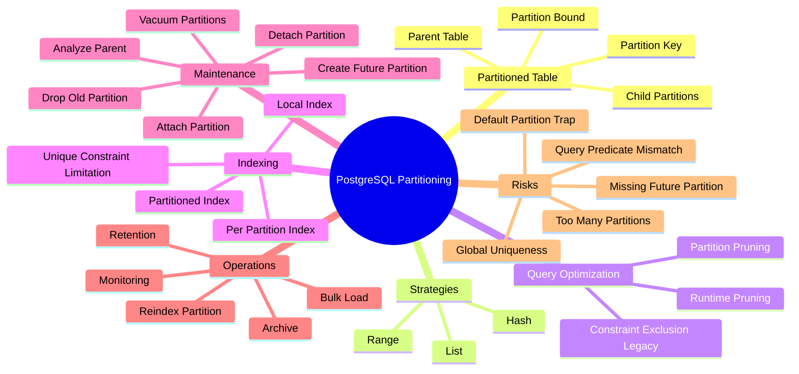
```mermaid
mindmap
  root((PostgreSQL Partitioning))
    Partitioned Table
      Parent Table
      Child Partitions
      Partition Key
      Partition Bound
    Strategies
      Range
      List
      Hash
    Query Optimization
      Partition Pruning
      Constraint Exclusion Legacy
      Runtime Pruning
    Indexing
      Partitioned Index
      Local Index
      Unique Constraint Limitation
      Per Partition Index
    Maintenance
      Create Future Partition
      Attach Partition
      Detach Partition
      Drop Old Partition
      Analyze Parent
      Vacuum Partitions
    Operations
      Retention
      Bulk Load
      Archive
      Reindex Partition
      Monitoring
    Risks
      Too Many Partitions
      Missing Future Partition
      Default Partition Trap
      Query Predicate Mismatch
      Global Uniqueness
```

**Core idea:** partitioning bukan pengganti index. Partitioning terutama membantu ketika data besar bisa dipisahkan secara natural berdasarkan key tertentu, misalnya waktu, tenant, region, atau hash bucket. Index tetap dibutuhkan di dalam partition untuk lookup yang selective.

---

## 3. Kapan Partitioning Layak Dipakai?

| Kondisi | Partitioning Cocok? | Alasan |
|---|---:|---|
| Table sangat besar dan query sering filter berdasarkan waktu | Ya | Partition pruning bisa scan hanya range waktu relevan. |
| Retention period jelas, misalnya hapus data > 2 tahun | Ya | Drop/detach partition jauh lebih murah daripada delete massal. |
| Bulk load data periodik per periode | Ya | Bisa load ke partition terpisah lalu attach. |
| Audit/event log append-only | Ya | Range partition by `created_at` umum. |
| Outbox kecil tapi update-heavy | Belum tentu | Index + autovacuum tuning sering cukup. |
| Query selalu lookup by primary key saja | Belum tentu | B-tree index mungkin lebih efektif. |
| Data kecil/sedang | Tidak | Kompleksitas tidak sebanding. |
| Ingin “mempercepat semua query” | Tidak | Query tanpa partition key tetap bisa scan banyak partition. |
| Butuh global unique constraint tanpa partition key | Hati-hati | PostgreSQL punya batasan unique di partitioned table. |

**Rule:** partitioning valid jika ada **partition key yang muncul konsisten di query dan operasi maintenance**. Tanpa itu, partitioning hanya menambah kompleksitas.

---

## 4. Jenis Partitioning

PostgreSQL declarative partitioning mendukung tiga strategi utama: **range**, **list**, dan **hash**. `CREATE TABLE ... PARTITION BY` mendefinisikan parent partitioned table; partition key dapat berupa column atau expression, dengan batasan khusus untuk setiap strategi. ([Postgres Pro](https://postgrespro.com/docs/postgresql/current/sql-createtable?utm_source=chatgpt.com))

| Strategy | Partition Key | Cocok Untuk | Contoh |
|---|---|---|---|
| `RANGE` | Range nilai berurutan | Time-series, audit log, event log, retention period | per bulan berdasarkan `created_at` |
| `LIST` | Set nilai diskret | Region, country, category, tenant group kecil | per `region_code` |
| `HASH` | Hash modulus/remainder | Distribusi merata jika tidak ada range natural | bucket berdasarkan `tenant_id` |

---

## 5. Range Partitioning

Range partitioning adalah pilihan paling umum untuk data time-based.

### Parent table

```sql
CREATE TABLE audit.case_event (
    id bigint GENERATED ALWAYS AS IDENTITY,
    case_id bigint NOT NULL,
    event_type text NOT NULL,
    payload jsonb NOT NULL DEFAULT '{}'::jsonb,
    created_at timestamptz NOT NULL,
    PRIMARY KEY (created_at, id)
) PARTITION BY RANGE (created_at);
```

### Monthly partitions

```sql
CREATE TABLE audit.case_event_2026_07
PARTITION OF audit.case_event
FOR VALUES FROM ('2026-07-01 00:00:00+07')
TO ('2026-08-01 00:00:00+07');

CREATE TABLE audit.case_event_2026_08
PARTITION OF audit.case_event
FOR VALUES FROM ('2026-08-01 00:00:00+07')
TO ('2026-09-01 00:00:00+07');
```

### Insert

```sql
INSERT INTO audit.case_event (case_id, event_type, payload, created_at)
VALUES (1001, 'CASE_OPENED', '{"source":"SYSTEM"}', now());
```

PostgreSQL routes row ke partition yang cocok berdasarkan partition bound. Jika tidak ada partition yang cocok dan tidak ada default partition, insert akan gagal.

---

## 6. List Partitioning

List partitioning cocok untuk value diskret dengan jumlah manageable.

```sql
CREATE TABLE compliance.case_region (
    id bigint GENERATED ALWAYS AS IDENTITY,
    case_number text NOT NULL,
    region_code text NOT NULL,
    status text NOT NULL,
    created_at timestamptz NOT NULL DEFAULT now()
) PARTITION BY LIST (region_code);
```

```sql
CREATE TABLE compliance.case_region_apac
PARTITION OF compliance.case_region
FOR VALUES IN ('ID', 'SG', 'MY', 'TH', 'VN');

CREATE TABLE compliance.case_region_emea
PARTITION OF compliance.case_region
FOR VALUES IN ('GB', 'DE', 'FR', 'NL');

CREATE TABLE compliance.case_region_amer
PARTITION OF compliance.case_region
FOR VALUES IN ('US', 'CA', 'BR');
```

**Cocok jika:** partition values relatif stabil.  
**Tidak cocok jika:** value terus bertambah liar, misalnya one partition per customer tanpa governance.

---

## 7. Hash Partitioning

Hash partitioning cocok ketika tidak ada range natural, tetapi ingin membagi data besar secara merata.

```sql
CREATE TABLE tenant_event (
    tenant_id bigint NOT NULL,
    event_id bigint GENERATED ALWAYS AS IDENTITY,
    event_type text NOT NULL,
    created_at timestamptz NOT NULL DEFAULT now(),
    payload jsonb NOT NULL DEFAULT '{}'::jsonb,
    PRIMARY KEY (tenant_id, event_id)
) PARTITION BY HASH (tenant_id);
```

```sql
CREATE TABLE tenant_event_p0
PARTITION OF tenant_event
FOR VALUES WITH (MODULUS 4, REMAINDER 0);

CREATE TABLE tenant_event_p1
PARTITION OF tenant_event
FOR VALUES WITH (MODULUS 4, REMAINDER 1);

CREATE TABLE tenant_event_p2
PARTITION OF tenant_event
FOR VALUES WITH (MODULUS 4, REMAINDER 2);

CREATE TABLE tenant_event_p3
PARTITION OF tenant_event
FOR VALUES WITH (MODULUS 4, REMAINDER 3);
```

| Kelebihan | Kekurangan |
|---|---|
| Distribusi data lebih merata. | Retention time-based lebih sulit. |
| Query equality by partition key bisa prune ke partition tertentu. | Query range waktu tanpa hash key tetap scan banyak partition. |
| Mengurangi ukuran index per partition. | Mengubah jumlah bucket tidak trivial. |

---

## 8. Default Partition

Default partition menampung row yang tidak cocok dengan partition bound lain.

```sql
CREATE TABLE audit.case_event_default
PARTITION OF audit.case_event
DEFAULT;
```

| Kelebihan | Risiko |
|---|---|
| Insert tidak gagal saat partition masa depan lupa dibuat. | Data bisa diam-diam masuk default partition. |
| Bisa menjadi safety net operasional. | Default partition bisa membesar dan merusak pruning/performa. |
| Berguna saat key values tidak terduga. | Harus ada monitoring ketat. |

**Rule:** default partition boleh dipakai sebagai guardrail, bukan tempat tinggal permanen. Harus ada alert jika default partition menerima row.

```sql
SELECT count(*)
FROM audit.case_event_default;
```

---

## 9. Partition Pruning

Partition pruning adalah optimisasi PostgreSQL untuk melewati partition yang tidak mungkin berisi row yang dibutuhkan query. Dokumentasi PostgreSQL menyebut partition pruning dapat meningkatkan performa query pada declaratively partitioned table, dan dikontrol oleh `enable_partition_pruning`, yang default-nya aktif. ([PostgreSQL](https://www.postgresql.org/docs/current/ddl-partitioning.html?utm_source=chatgpt.com))

### Query yang bisa prune

```sql
SELECT count(*)
FROM audit.case_event
WHERE created_at >= timestamptz '2026-07-01 00:00:00+07'
  AND created_at <  timestamptz '2026-08-01 00:00:00+07';
```

### Query yang buruk untuk pruning

```sql
SELECT count(*)
FROM audit.case_event
WHERE date(created_at) = date '2026-07-01';
```

Kenapa buruk: predicate membungkus partition key dengan function, sehingga planner lebih sulit membuktikan partition mana yang relevan.

### Cek pruning via `EXPLAIN`

```sql
EXPLAIN
SELECT *
FROM audit.case_event
WHERE created_at >= timestamptz '2026-07-01 00:00:00+07'
  AND created_at <  timestamptz '2026-07-02 00:00:00+07';
```

Yang diharapkan: plan hanya menyentuh partition yang relevan, bukan semua partition.

---

## 10. Predicate Design untuk Partition Pruning

| Partition Key | Predicate Baik | Predicate Kurang Baik |
|---|---|---|
| `created_at` range | `created_at >= ... AND created_at < ...` | `date(created_at) = ...` |
| `tenant_id` hash | `tenant_id = 42` | `tenant_id::text = '42'` |
| `region_code` list | `region_code IN ('ID','SG')` | `lower(region_code) = 'id'` |
| composite range | predicate mencakup leading partition expression | predicate hanya field non-partition |
| monthly partition | half-open interval `[start, next_start)` | `BETWEEN` dengan boundary ambigu |

**Rule:** tulis query dengan predicate langsung pada partition key. Untuk waktu, gunakan half-open interval: `>= start AND < next_start`.

---

## 11. Index Strategy pada Partitioned Table

Partitioned table tidak menyimpan data sendiri; data ada di child partitions. Index pada parent partitioned table membuat **partitioned index**, dan index fisik dibuat/terhubung di masing-masing partition.

### Create index on parent

```sql
CREATE INDEX idx_case_event_case_created
ON audit.case_event (case_id, created_at DESC);
```

Ini membuat index untuk partitions yang ada dan membantu mengatur index di partition baru.

### Per-partition index

```sql
CREATE INDEX idx_case_event_2026_07_case_created
ON audit.case_event_2026_07 (case_id, created_at DESC);
```

| Approach | Kapan Dipakai |
|---|---|
| Index parent | Default pilihan untuk index seragam di semua partition. |
| Index per partition | Saat index berbeda per partition, maintenance khusus, atau attach index manual. |
| Partial index per partition | Untuk subset tertentu di partition tertentu. |
| BRIN per time partition | Untuk append-only besar dengan physical order time-correlated. |

**Rule:** partitioning mengurangi ukuran index per partition, tetapi tidak menghilangkan kebutuhan index.

---

## 12. Unique Constraint dan Primary Key Limitation

Pada partitioned table, unique constraint atau primary key harus mencakup semua partition key. Tujuannya agar PostgreSQL bisa menjamin uniqueness tanpa global index lintas partition.

```sql
-- Valid: partition key created_at termasuk dalam primary key
CREATE TABLE audit.case_event (
    id bigint GENERATED ALWAYS AS IDENTITY,
    created_at timestamptz NOT NULL,
    event_type text NOT NULL,
    PRIMARY KEY (created_at, id)
) PARTITION BY RANGE (created_at);
```

Problem jika ingin global unique `id` saja:

```sql
-- Konsep ini bermasalah untuk partitioned table by created_at
PRIMARY KEY (id)
```

### Design choices

| Kebutuhan | Pilihan |
|---|---|
| Uniqueness cukup dalam partition | Include partition key pada PK/unique. |
| Butuh globally unique ID | Gunakan UUID/random/time-ordered ID dan enforce di aplikasi/generator, atau partition by ID-compatible key. |
| Butuh unique business key global | Pertimbangkan non-partitioned lookup table kecil untuk key registry. |
| Butuh FK ke partitioned table | Desain PK harus realistis untuk FK consumer. |

**Rule:** desain primary key partitioned table harus dipikirkan dari awal. Mengubahnya setelah table besar jauh lebih mahal.

---

## 13. Partition Key Selection

| Candidate Key | Cocok Jika | Risiko |
|---|---|---|
| `created_at` / `event_time` | Data append-only, retention time-based, query by period | Query by ID saja tetap perlu index dan bisa scan partition jika waktu tidak diketahui. |
| `tenant_id` | Tenant isolation dan query selalu membawa tenant | Hot tenant bisa membuat skew. |
| `region_code` | Region-based routing/reporting | Region tidak seimbang. |
| `status` | Hampir tidak pernah cocok | Status sering berubah dan cardinality kecil; menyebabkan row movement/update overhead. |
| Hash of tenant/user | Distribusi merata | Retention natural sulit. |
| Composite `(tenant_id, created_at)` | Query selalu tenant + time | Lebih kompleks; partition count bisa meledak jika salah desain. |

**Anti-pattern:** partition by `status` untuk workflow table. Status berubah, jumlah status kecil, dan query biasanya butuh index + state transition, bukan partition movement.

---

## 14. Partition Count dan Granularity

| Granularity | Cocok Untuk | Risiko |
|---|---|---|
| Daily | Volume harian sangat besar, retention harian | Terlalu banyak partition jika retention panjang. |
| Monthly | Audit/event umum, retention bulanan | Partition bisa terlalu besar jika volume ekstrem. |
| Quarterly | Volume sedang, retention jangka panjang | Query harian tetap scan partition besar. |
| Yearly | Volume rendah/sedang | Maintenance lebih mudah tapi pruning kurang tajam. |
| Hash 8/16/32 buckets | Tenant distribution | Rebalancing sulit. |

**Rule praktis:** pilih partition size yang membuat maintenance nyaman, bukan hanya query cepat. Misalnya partition bulanan untuk audit log sering lebih operasional dibanding partition harian jika volume tidak ekstrem.

---

## 15. Retention Pattern: Drop Old Partition

Untuk data time-series, salah satu keuntungan terbesar partitioning adalah retention.

```sql
DROP TABLE audit.case_event_2024_01;
```

Ini jauh lebih murah daripada:

```sql
DELETE FROM audit.case_event
WHERE created_at < timestamptz '2024-02-01 00:00:00+07';
```

| Delete Massal | Drop Partition |
|---|---|
| Membuat dead tuple. | Menghapus object fisik langsung. |
| Butuh vacuum. | Tidak perlu vacuum untuk row yang hilang. |
| Bisa lama dan lock/IO heavy. | Biasanya jauh lebih cepat. |
| WAL besar untuk row delete. | Lebih ringan secara operasional. |

**Rule:** jika retention adalah requirement utama, desain partitioning harus align dengan retention boundary.

---

## 16. Retention Pattern: Detach lalu Archive

Jika data lama perlu diarsipkan sebelum dihapus:

```sql
ALTER TABLE audit.case_event
DETACH PARTITION audit.case_event_2024_01;
```

Setelah detach, partition menjadi table biasa.

```sql
ALTER TABLE audit.case_event_2024_01
SET SCHEMA archive;
```

Kemudian bisa dump/archive/drop:

```bash
pg_dump -t archive.case_event_2024_01 mydb > case_event_2024_01.sql
```

Lalu drop jika sudah aman:

```sql
DROP TABLE archive.case_event_2024_01;
```

**Pattern:** detach → validate/archive → drop. Ini lebih aman untuk compliance/forensic retention daripada langsung drop.

---

## 17. Creating Future Partitions

Jangan menunggu hari pertama bulan baru baru membuat partition.

```sql
CREATE TABLE audit.case_event_2026_09
PARTITION OF audit.case_event
FOR VALUES FROM ('2026-09-01 00:00:00+07')
TO ('2026-10-01 00:00:00+07');
```

### Checklist future partition

| Item | Check |
|---|---|
| Partition bound benar | Tidak overlap, tidak gap. |
| Timezone boundary konsisten | Gunakan UTC atau policy eksplisit. |
| Index terbentuk | Parent index atau index manual. |
| Privilege/default privilege | Partition owner/grant benar. |
| Autovacuum options | Inherited atau diset sesuai kebutuhan. |
| Monitoring default partition | Pastikan tidak ada row nyasar. |

---

## 18. Attach Existing Table as Partition

Useful untuk bulk load.

### Step 1 - Create staging table

```sql
CREATE TABLE staging.case_event_2026_10
(LIKE audit.case_event INCLUDING DEFAULTS INCLUDING CONSTRAINTS);
```

### Step 2 - Load data

```sql
COPY staging.case_event_2026_10 (case_id, event_type, payload, created_at)
FROM '/tmp/case_event_2026_10.csv'
WITH (FORMAT csv, HEADER true);
```

### Step 3 - Validate bound with check constraint

```sql
ALTER TABLE staging.case_event_2026_10
ADD CONSTRAINT ck_case_event_2026_10_bound
CHECK (
    created_at >= timestamptz '2026-10-01 00:00:00+07'
    AND created_at < timestamptz '2026-11-01 00:00:00+07'
);
```

### Step 4 - Attach

```sql
ALTER TABLE audit.case_event
ATTACH PARTITION staging.case_event_2026_10
FOR VALUES FROM ('2026-10-01 00:00:00+07')
TO ('2026-11-01 00:00:00+07');
```

**Rule:** pre-validate bound dengan check constraint agar attach tidak perlu scan mahal untuk membuktikan semua row cocok.

---

## 19. Partitioned Table dan Foreign Key

Partitioning bisa dipakai dengan FK, tetapi desainnya harus hati-hati:

| Concern | Catatan |
|---|---|
| FK ke partitioned table | Perlu key yang valid dan unik sesuai partitioning limitation. |
| FK dari partitioned table | Umum, tapi index child partitions tetap penting. |
| Dropping old partition | Bisa gagal jika ada FK reference. |
| Cascading delete | Bisa sangat mahal dan berbahaya. |
| Audit/event table | Biasanya hindari FK keras jika retention/archive perlu bebas. |

**Rule:** untuk audit/event log jangka panjang, FK keras ke core table kadang kurang cocok karena retention lifecycle berbeda. Gunakan logical reference jika audit harus tetap hidup setelah parent berubah/hilang.

---

## 20. Partitioning dan Autovacuum/Analyze

Setiap partition adalah table fisik sendiri. Vacuum dan analyze terjadi pada partition, bukan pada parent sebagai data holder. Namun statistics parent tetap penting untuk query yang masuk lewat parent.

```sql
ANALYZE audit.case_event;
```

Untuk partition besar/hot:

```sql
ALTER TABLE audit.case_event_2026_07 SET (
    autovacuum_vacuum_scale_factor = 0.02,
    autovacuum_analyze_scale_factor = 0.01
);
```

| Table Type | Maintenance |
|---|---|
| Append-only historical partition | Vacuum ringan, analyze setelah load. |
| Current hot partition | Autovacuum/analyze lebih aktif. |
| Detached archive partition | Bisa freeze/analyze/dump/drop sesuai policy. |
| Parent partitioned table | Manual analyze kadang penting untuk planner. |

---

## 21. Partitioning dan Query Pattern

### Good: query includes partition key

```sql
SELECT *
FROM audit.case_event
WHERE created_at >= timestamptz '2026-07-01 00:00:00+07'
  AND created_at <  timestamptz '2026-07-08 00:00:00+07'
  AND case_id = 1001
ORDER BY created_at DESC;
```

Index:

```sql
CREATE INDEX idx_case_event_case_created
ON audit.case_event (case_id, created_at DESC);
```

### Risky: query lacks partition key

```sql
SELECT *
FROM audit.case_event
WHERE case_id = 1001
ORDER BY created_at DESC
LIMIT 50;
```

Ini bisa menyentuh banyak partition jika planner tidak bisa prune berdasarkan `created_at`.

### Better if query normally wants recent events

```sql
SELECT *
FROM audit.case_event
WHERE case_id = 1001
  AND created_at >= now() - interval '90 days'
ORDER BY created_at DESC
LIMIT 50;
```

**Rule:** API/query contract untuk table partitioned sebaiknya menyertakan partition key jika memungkinkan.

---

## 22. Timezone dan Boundary

Untuk range partition berbasis waktu, boundary harus konsisten.

```sql
FOR VALUES FROM ('2026-07-01 00:00:00+00')
TO ('2026-08-01 00:00:00+00')
```

atau dengan policy lokal eksplisit:

```sql
FOR VALUES FROM ('2026-07-01 00:00:00+07')
TO ('2026-08-01 00:00:00+07')
```

| Pilihan | Kelebihan | Risiko |
|---|---|---|
| UTC boundary | Konsisten lintas region, umum untuk event time | Reporting lokal butuh konversi. |
| Local timezone boundary | Sesuai kalender bisnis lokal | DST/region multi-timezone bisa rumit. |
| `date` partition key | Boundary sederhana untuk kalender | Kehilangan jam/time precision. |

**Rule:** untuk audit/event, biasanya gunakan `timestamptz` dan boundary UTC atau policy timezone bisnis yang eksplisit.

---

## 23. Multi-Level Partitioning

Partition dapat dipartition lagi.

```sql
CREATE TABLE audit.case_event (
    tenant_id bigint NOT NULL,
    id bigint GENERATED ALWAYS AS IDENTITY,
    event_type text NOT NULL,
    created_at timestamptz NOT NULL,
    payload jsonb NOT NULL DEFAULT '{}'::jsonb
) PARTITION BY RANGE (created_at);
```

Monthly partition yang dipartition lagi by hash tenant:

```sql
CREATE TABLE audit.case_event_2026_07
PARTITION OF audit.case_event
FOR VALUES FROM ('2026-07-01 00:00:00+00')
TO ('2026-08-01 00:00:00+00')
PARTITION BY HASH (tenant_id);
```

```sql
CREATE TABLE audit.case_event_2026_07_p0
PARTITION OF audit.case_event_2026_07
FOR VALUES WITH (MODULUS 4, REMAINDER 0);
```

| Kelebihan | Risiko |
|---|---|
| Bisa gabungkan time retention + tenant distribution. | Partition count cepat meledak. |
| Query tenant+time bisa sangat targeted. | Maintenance lebih kompleks. |
| Mengurangi hot partition size. | DDL/index/monitoring makin rumit. |

**Rule:** multi-level partitioning hanya jika single-level tidak cukup. Jangan mulai dari desain paling kompleks.

---

## 24. Monitoring Partitioned Tables

### List partitions

```sql
SELECT
    parent.relname AS parent,
    child.relname AS partition
FROM pg_inherits
JOIN pg_class parent ON pg_inherits.inhparent = parent.oid
JOIN pg_class child ON pg_inherits.inhrelid = child.oid
WHERE parent.relname = 'case_event'
ORDER BY child.relname;
```

### Partition sizes

```sql
SELECT
    child.oid::regclass AS partition,
    pg_size_pretty(pg_total_relation_size(child.oid)) AS total_size
FROM pg_inherits
JOIN pg_class parent ON pg_inherits.inhparent = parent.oid
JOIN pg_class child ON pg_inherits.inhrelid = child.oid
WHERE parent.oid = 'audit.case_event'::regclass
ORDER BY pg_total_relation_size(child.oid) DESC;
```

### Row estimates per partition

```sql
SELECT
    child.oid::regclass AS partition,
    child.reltuples::bigint AS estimated_rows
FROM pg_inherits
JOIN pg_class parent ON pg_inherits.inhparent = parent.oid
JOIN pg_class child ON pg_inherits.inhrelid = child.oid
WHERE parent.oid = 'audit.case_event'::regclass
ORDER BY child.relname;
```

### Find default partition count

```sql
SELECT count(*)
FROM audit.case_event_default;
```

---

## 25. Maintenance Runbook: Monthly Time Partition

### A. Create next month partition

```sql
CREATE TABLE audit.case_event_2026_09
PARTITION OF audit.case_event
FOR VALUES FROM ('2026-09-01 00:00:00+00')
TO ('2026-10-01 00:00:00+00');
```

### B. Confirm index exists

```sql
SELECT
    schemaname,
    tablename,
    indexname
FROM pg_indexes
WHERE schemaname = 'audit'
  AND tablename = 'case_event_2026_09';
```

### C. Analyze new partition after data arrives

```sql
ANALYZE audit.case_event_2026_09;
```

### D. Retire old partition

```sql
ALTER TABLE audit.case_event
DETACH PARTITION audit.case_event_2024_07;
```

### E. Archive/drop

```bash
pg_dump -t audit.case_event_2024_07 mydb > case_event_2024_07.sql
```

```sql
DROP TABLE audit.case_event_2024_07;
```

---

## 26. Operational Runbook: Missing Partition Incident

### Symptom

```text
ERROR: no partition of relation "case_event" found for row
```

### Immediate actions

1. Identify missing bound.
2. Create correct future/current partition.
3. Re-run failed insert/job if safe.
4. Check whether default partition exists and captured data.
5. Add monitoring to prevent recurrence.

### Create missing partition

```sql
CREATE TABLE audit.case_event_2026_10
PARTITION OF audit.case_event
FOR VALUES FROM ('2026-10-01 00:00:00+00')
TO ('2026-11-01 00:00:00+00');
```

### If rows went to default partition

Move them carefully:

```sql
INSERT INTO audit.case_event
SELECT *
FROM audit.case_event_default
WHERE created_at >= timestamptz '2026-10-01 00:00:00+00'
  AND created_at <  timestamptz '2026-11-01 00:00:00+00';

DELETE FROM audit.case_event_default
WHERE created_at >= timestamptz '2026-10-01 00:00:00+00'
  AND created_at <  timestamptz '2026-11-01 00:00:00+00';
```

**Caution:** lakukan dalam batch jika default partition besar.

---

## 27. Partitioning Pattern untuk Audit/Event Log

```sql
CREATE TABLE audit.case_event (
    created_at timestamptz NOT NULL,
    id bigint GENERATED ALWAYS AS IDENTITY,
    case_id bigint NOT NULL,
    event_type text NOT NULL,
    actor text,
    payload jsonb NOT NULL DEFAULT '{}'::jsonb,
    PRIMARY KEY (created_at, id)
) PARTITION BY RANGE (created_at);
```

```sql
CREATE INDEX idx_case_event_case_created
ON audit.case_event (case_id, created_at DESC);

CREATE INDEX idx_case_event_type_created
ON audit.case_event (event_type, created_at DESC);
```

| Design | Alasan |
|---|---|
| Partition by `created_at` | Retention dan query by time. |
| PK includes `created_at` | Memenuhi uniqueness rule partitioned table. |
| Index `case_id, created_at` | Timeline per case. |
| Index `event_type, created_at` | Query event tertentu per periode. |
| JSONB payload | Flexible audit context. |
| Avoid heavy FK if retention differs | Audit lifecycle sering lebih panjang dari core entity. |

---

## 28. Partitioning Pattern untuk Outbox

Outbox sering update-heavy, jadi partitioning harus hati-hati.

### Option A - no partition, partial index

```sql
CREATE INDEX idx_outbox_pending
ON integration.outbox_message (created_at ASC, id ASC)
WHERE status = 'PENDING';
```

Ini sering cukup.

### Option B - range partition by created_at untuk retention

```sql
CREATE TABLE integration.outbox_message (
    created_at timestamptz NOT NULL,
    id bigint GENERATED ALWAYS AS IDENTITY,
    aggregate_type text NOT NULL,
    aggregate_id bigint NOT NULL,
    event_type text NOT NULL,
    status text NOT NULL DEFAULT 'PENDING',
    payload jsonb NOT NULL,
    published_at timestamptz,
    PRIMARY KEY (created_at, id)
) PARTITION BY RANGE (created_at);
```

**Trade-off:** jika row berpindah status tapi tidak berpindah partition, aman. Jangan partition by `status` karena update status akan menyebabkan row movement antar partition dan menambah overhead.

---

## 29. Partitioning Pattern untuk Case History

```sql
CREATE TABLE case_mgmt.case_status_history (
    changed_at timestamptz NOT NULL,
    id bigint GENERATED ALWAYS AS IDENTITY,
    case_id bigint NOT NULL,
    old_status text,
    new_status text NOT NULL,
    changed_by text NOT NULL,
    reason text,
    PRIMARY KEY (changed_at, id)
) PARTITION BY RANGE (changed_at);
```

```sql
CREATE INDEX idx_case_status_history_case_changed
ON case_mgmt.case_status_history (case_id, changed_at DESC);
```

**Cocok karena:** history append-only, query sering by case dan time, retention bisa periodik.

---

## 30. Common Pitfalls

| Pitfall | Dampak | Solusi |
|---|---|---|
| Partition tanpa query predicate partition key | Query tetap scan banyak partition | Pastikan query membawa partition key. |
| Terlalu banyak partition | Planning/maintenance overhead | Pilih granularity realistis. |
| Lupa create future partition | Insert gagal atau masuk default partition | Automasi dan alert. |
| Default partition dibiarkan membesar | Pruning/performa buruk | Monitor dan kosongkan default. |
| Partition by mutable column seperti `status` | Row movement dan write overhead | Partition by stable key. |
| Mengira partitioning mengganti index | Query tetap lambat | Buat index sesuai query pattern. |
| Global unique key tidak dirancang | PK/unique gagal dibuat | Include partition key atau desain key registry. |
| Drop partition tanpa cek FK/retention | Data hilang/constraint error | Detach-archive-drop runbook. |
| Boundary timezone tidak konsisten | Row masuk partition salah | Standardisasi UTC/policy timezone. |
| Tidak analyze partition/parent | Planner estimate buruk | `ANALYZE` partition dan parent sesuai kebutuhan. |
| Multi-level partition terlalu awal | Kompleksitas tinggi | Mulai single-level kecuali ada bukti. |

---

## 31. Decision Matrix

| Problem | Partitioning Choice |
|---|---|
| Audit/event table besar, retention bulanan | Range partition by `created_at` monthly. |
| Case history besar, query by case and period | Range by `changed_at` + index `(case_id, changed_at)`. |
| Tenant data sangat besar, query selalu tenant | Hash/list by `tenant_id`, atau composite time+tenant jika perlu. |
| Region-isolated reporting | List by `region_code`. |
| Outbox pending query lambat | Coba partial index dulu; partition by time hanya untuk retention. |
| Need delete old data efficiently | Range partition aligned with retention boundary. |
| Need global unique business key | Jangan mengandalkan partition unique kecuali key include partition key; gunakan registry table jika perlu. |
| Need bulk load monthly data | Load staging table, validate check constraint, attach partition. |
| Need archive old data | Detach partition, dump/archive, drop. |

---

## 32. Review Checklist Sebelum Partitioning

| Checklist | Pertanyaan |
|---|---|
| Partition key | Apakah muncul di mayoritas query penting? |
| Retention | Apakah boundary partition align dengan delete/archive policy? |
| Granularity | Berapa partition setelah 1, 3, 5 tahun? |
| Query pattern | Apakah API/report menyertakan partition key? |
| Index | Index apa yang dibutuhkan di setiap partition? |
| PK/Unique | Apakah partition key masuk constraint yang harus unique? |
| FK | Apakah FK lifecycle cocok dengan detach/drop partition? |
| Default partition | Apakah perlu safety net? Bagaimana monitoringnya? |
| Future partition | Siapa/apa yang membuat partition berikutnya? |
| Analyze/Vacuum | Apakah maintenance per partition jelas? |
| Archive | Apakah detach/drop punya approval dan runbook? |
| Observability | Bisa melihat size/row/lag/default partition? |

---

## 33. Roadmap Belajar Singkat

| Urutan | Materi | Target |
|---:|---|---|
| 1 | Declarative partitioning | Paham parent vs child partition. |
| 2 | Range/list/hash | Bisa memilih strategi sesuai data. |
| 3 | Partition pruning | Bisa menulis query yang benar-benar prune. |
| 4 | Index per partition | Bisa mendesain index yang tetap dibutuhkan. |
| 5 | Unique/PK limitation | Bisa mendesain key sejak awal. |
| 6 | Retention via detach/drop | Bisa menghapus/archive data lama tanpa delete massal. |
| 7 | Future partition ops | Bisa mencegah missing partition incident. |
| 8 | Monitoring | Bisa membaca size, row estimate, default partition, dan maintenance state. |
| 9 | Production pattern | Bisa menerapkan ke audit log, event log, outbox, dan history table. |

## Rekomendasi Materi Selanjutnya

Lanjut paling tepat: **Cheatsheet PostgreSQL PL/pgSQL, Functions, Procedures, Triggers, Event Triggers, Exception Handling, Dynamic SQL, dan Server-Side Programming Pattern**. Ini tetap PostgreSQL-only dan penting untuk memahami logic yang hidup di database, terutama audit trigger, validation trigger, maintenance function, dan automation internal.

---

**Sources:**

- [Documentation: 18: 5.12. Table Partitioning](https://www.postgresql.org/docs/current/ddl-partitioning.html?utm_source=chatgpt.com)
- [PostgreSQL : Documentation: 18: CREATE TABLE](https://postgrespro.com/docs/postgresql/current/sql-createtable?utm_source=chatgpt.com)

## Response:
7/13/2026, 1:08:57 AM

Bisa. Untuk fokus **PostgreSQL-only**, materi yang sudah tersaji sejauh ini:

1. PostgreSQL Decomposition Map.
2. PostgreSQL SQL Language.
3. DDL, Schema Design, Constraints, Identity, Sequence, View, Materialized View, Index Dasar.
4. MVCC, Transaction Isolation, Row Locking, Deadlock, `SKIP LOCKED`, Retry Pattern.
5. Indexing, Query Planner, `EXPLAIN`, Statistics, Query Performance Tuning.
6. Data Types Deep Dive.
7. Storage, TOAST, Heap Tuple, WAL, Checkpoint, Vacuum, Autovacuum, Bloat, Analyze.
8. Backup, Restore, WAL Archiving, Base Backup, PITR, Restore Drill.
9. Replication & High Availability.
10. Logical Replication, Publication, Subscription, CDC Pattern.
11. Security & Access Control.
12. Administration & Operations.
13. Partitioning, Pruning, Index Strategy, Retention, Maintenance Pattern.

# Sisa Materi PostgreSQL yang Direkomendasikan

| Urutan | Materi | Fokus |
|---:|---|---|
| 1 | **PL/pgSQL, Functions, Procedures, Triggers, Event Triggers** | Server-side programming, procedural logic, audit trigger, validation trigger, exception handling, dynamic SQL. |
| 2 | **PostgreSQL Advanced SQL Querying** | Window function lanjutan, recursive CTE, `LATERAL`, grouping sets, set-returning functions, advanced aggregation. |
| 3 | **Full Text Search** | `tsvector`, `tsquery`, dictionary, ranking, GIN index, search design tanpa external search engine. |
| 4 | **JSONB Advanced Patterns** | JSON path, indexing strategy, generated column from JSONB, validation, semi-structured schema governance. |
| 5 | **PostgreSQL Extension Ecosystem** | `pg_stat_statements`, `pg_trgm`, `btree_gist`, `uuid-ossp`, `pgcrypto`, FDW, extension governance. |
| 6 | **Foreign Data Wrapper / FDW** | `postgres_fdw`, remote table access, pushdown, cross-database query, security, performance caveat. |
| 7 | **PostgreSQL Import/Export & Bulk Loading** | `COPY`, `\copy`, staging table, validation, batch load, CSV handling, error isolation. |
| 8 | **PostgreSQL Schema Migration Strategy** | Lock-aware DDL, expand-contract, backward-compatible migration, rollback/forward-fix, large table migration. |
| 9 | **PostgreSQL Observability & Incident Debugging** | Slow query, lock wait, deadlock, bloat, WAL growth, replication lag, autovacuum issue, practical runbooks. |
| 10 | **PostgreSQL System Catalogs & Introspection** | `pg_class`, `pg_attribute`, `pg_namespace`, `pg_constraint`, `pg_index`, dependency analysis. |
| 11 | **PostgreSQL Tablespace, Physical Layout, and Capacity Planning** | Tablespace, disk layout, growth estimation, index/table size, capacity risk. |
| 12 | **PostgreSQL High-Volume Data Lifecycle** | Retention, archival, purge, partition lifecycle, audit/history/event table design. |
| 13 | **PostgreSQL HA/DR Operational Playbook** | Failover drill, restore drill, timeline, rewind, RPO/RTO, split-brain prevention. |
| 14 | **PostgreSQL Anti-Patterns & Production Smells** | Over-indexing, long transactions, unbounded JSONB, bad pagination, missing constraints, wrong isolation assumptions. |
| 15 | **PostgreSQL Design Patterns for Case Management / Regulatory Systems** | Case lifecycle, audit trail, state transition, assignment queue, escalation, SLA, outbox, history model. |

# Rekomendasi Urutan Lanjut

Urutan paling natural berikutnya:

1. **PL/pgSQL, Functions, Procedures, Triggers, Event Triggers**
2. **Advanced SQL Querying**
3. **Full Text Search**
4. **JSONB Advanced Patterns**
5. **Extension Ecosystem**
6. **Import/Export & Bulk Loading**
7. **Schema Migration Strategy**
8. **Observability & Incident Debugging**
9. **System Catalogs & Introspection**
10. **PostgreSQL Design Patterns for Case Management / Regulatory Systems**

Materi berikutnya yang paling cocok untuk dilanjutkan sekarang: **PL/pgSQL, Functions, Procedures, Triggers, Event Triggers, Exception Handling, Dynamic SQL, dan Server-Side Programming Pattern**.

## Response:
7/13/2026, 1:10:27 AM

# Cheatsheet: PostgreSQL PL/pgSQL, Functions, Procedures, Triggers, Event Triggers, Dynamic SQL, dan Server-Side Programming Pattern

## 1. Scope

Cheatsheet ini fokus **PostgreSQL-only** untuk logic yang hidup di database:

- SQL functions
- PL/pgSQL functions
- procedures
- anonymous `DO` blocks
- trigger functions
- data-change triggers
- event triggers
- exception handling
- dynamic SQL
- `SECURITY DEFINER`
- audit/validation/automation patterns

PL/pgSQL adalah procedural language bawaan PostgreSQL untuk membuat function, procedure, dan trigger logic. Dokumentasi PostgreSQL current menempatkan PL/pgSQL dalam Chapter 41, mencakup struktur function, statements, control structures, cursors, transaction management, error handling, trigger functions, dan plan caching. ([PostgreSQL](https://www.postgresql.org/docs/current/plpgsql.html?utm_source=chatgpt.com))

---

## 2. Mental Model

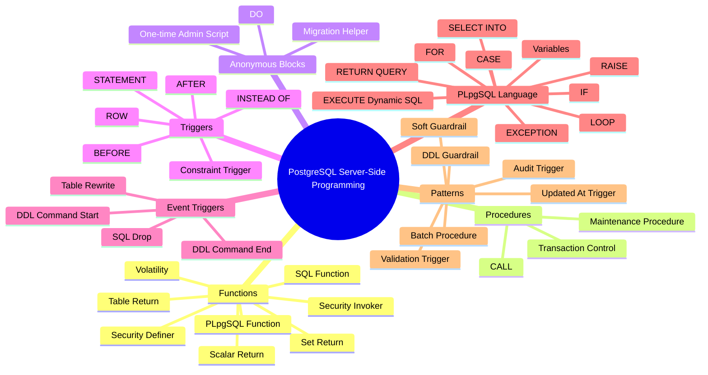
```mermaid id="plpgsql-map"
mindmap
  root((PostgreSQL Server-Side Programming))
    Functions
      SQL Function
      PLpgSQL Function
      Scalar Return
      Table Return
      Set Return
      Volatility
      Security Invoker
      Security Definer
    Procedures
      CALL
      Transaction Control
      Maintenance Procedure
    Anonymous Blocks
      DO
      One-time Admin Script
      Migration Helper
    Triggers
      BEFORE
      AFTER
      INSTEAD OF
      ROW
      STATEMENT
      Constraint Trigger
    Event Triggers
      DDL Command Start
      DDL Command End
      SQL Drop
      Table Rewrite
    PLpgSQL Language
      Variables
      IF
      CASE
      LOOP
      FOR
      SELECT INTO
      RETURN QUERY
      RAISE
      EXCEPTION
      EXECUTE Dynamic SQL
    Patterns
      Audit Trigger
      Validation Trigger
      Updated At Trigger
      Soft Guardrail
      DDL Guardrail
      Batch Procedure
```

**Core idea:** server-side programming di PostgreSQL berguna jika logic harus dekat dengan data, harus atomic dalam transaction yang sama, harus enforce invariant lintas client, atau dipakai untuk operasi internal database. Tetapi jangan memindahkan seluruh application domain logic ke database tanpa alasan kuat, karena trigger/function bisa menjadi hidden coupling.

---

## 3. Function vs Procedure vs Trigger vs Event Trigger

| Bentuk | Dipanggil Dengan | Return | Cocok Untuk | Catatan |
|---|---|---|---|---|
| SQL function | `SELECT func(...)` | Ya | Wrapper query sederhana, computed expression, helper deterministic. | Bisa inline/optimal tergantung bentuk. |
| PL/pgSQL function | `SELECT func(...)` atau dipakai di SQL | Ya | Logic procedural, branching, validation, multi-step query. | Perlu label volatility/security dengan benar. |
| Procedure | `CALL proc(...)` | Tidak seperti function biasa; bisa punya `OUT` | Maintenance/batch operation. | Procedure dibuat dengan `CREATE PROCEDURE`; prosedur dipanggil via `CALL`. ([PostgreSQL](https://www.postgresql.org/docs/current/sql-createprocedure.html?utm_source=chatgpt.com)) |
| `DO` block | `DO $$ ... $$` | Tidak | One-off script, migration helper, admin automation. | `DO` dieksekusi sebagai anonymous code block satu kali; default language adalah `plpgsql`. ([PostgreSQL](https://www.postgresql.org/docs/current/sql-do.html?utm_source=chatgpt.com)) |
| Trigger function | Otomatis oleh DML | `trigger` | Audit, validation, derived column, guardrail. | Trigger function dibuat tanpa argumen dan return `trigger`; argumen dari `CREATE TRIGGER` masuk via `TG_ARGV`. ([PostgreSQL](https://www.postgresql.org/docs/current/plpgsql-trigger.html?utm_source=chatgpt.com)) |
| Event trigger function | Otomatis oleh DDL event | `event_trigger` | DDL audit, DDL guardrail. | Event trigger bersifat global di database dan menangkap DDL events, bukan DML table tertentu. ([PostgreSQL](https://www.postgresql.org/docs/current/event-triggers.html?utm_source=chatgpt.com)) |

---

## 4. SQL Function

SQL function cocok untuk wrapper query sederhana.

```sql id="sql-func-basic"
CREATE FUNCTION case_mgmt.is_terminal_status(p_status text)
RETURNS boolean
LANGUAGE sql
IMMUTABLE
AS $$
    SELECT p_status IN ('CLOSED', 'CANCELLED', 'REJECTED')
$$;
```

Pemakaian:

```sql id="sql-func-use"
SELECT case_mgmt.is_terminal_status('CLOSED');
```

### Kapan pakai SQL function

| Cocok | Tidak Cocok |
|---|---|
| Expression kecil | Branching kompleks |
| Helper deterministic | Banyak statement dengan side effect |
| Wrapper query simple | Error handling kompleks |
| Function untuk index expression/check | Dynamic SQL |

---

## 5. PL/pgSQL Function Basic

Function PL/pgSQL dibuat dengan `CREATE FUNCTION ... LANGUAGE plpgsql`. Dokumentasi PL/pgSQL menunjukkan function didefinisikan ke server melalui `CREATE FUNCTION`, dengan body function ditulis sebagai string literal; dollar-quoting biasanya paling nyaman. ([PostgreSQL](https://www.postgresql.org/docs/current/plpgsql-structure.html?utm_source=chatgpt.com))

```sql id="plpgsql-basic"
CREATE FUNCTION case_mgmt.normalize_case_number(p_case_number text)
RETURNS text
LANGUAGE plpgsql
IMMUTABLE
AS $$
DECLARE
    v_normalized text;
BEGIN
    v_normalized := upper(trim(p_case_number));

    IF v_normalized = '' THEN
        RAISE EXCEPTION 'case_number cannot be blank';
    END IF;

    RETURN v_normalized;
END;
$$;
```

Pemakaian:

```sql id="plpgsql-basic-use"
SELECT case_mgmt.normalize_case_number(' case-2026-001 ');
```

---

## 6. Function Attributes: Volatility, Strictness, Security, Parallel

Function attributes bukan dekorasi; planner dan security model memakai metadata ini.

| Attribute | Arti | Default / Catatan |
|---|---|---|
| `IMMUTABLE` | Hasil selalu sama untuk input sama; tidak membaca state database. | Cocok untuk pure function. |
| `STABLE` | Hasil stabil dalam satu statement/table scan, tetapi bisa berubah antar statement. | Cocok untuk lookup/config/current setting. |
| `VOLATILE` | Bisa berubah kapan saja atau punya side effect. | Default jika tidak ditentukan. |
| `STRICT` / `RETURNS NULL ON NULL INPUT` | Jika argumen ada `NULL`, function tidak dieksekusi dan langsung return `NULL`. | Bagus untuk helper sederhana. |
| `SECURITY INVOKER` | Jalan dengan privilege caller. | Default. |
| `SECURITY DEFINER` | Jalan dengan privilege owner function. | Powerful, berisiko privilege escalation. |
| `PARALLEL SAFE/RESTRICTED/UNSAFE` | Memberi tahu planner apakah function aman di parallel query. | Default `PARALLEL UNSAFE`. |

PostgreSQL menggunakan volatility (`IMMUTABLE`, `STABLE`, `VOLATILE`) untuk memberi tahu optimizer tentang perilaku function; jika tidak ditentukan, default-nya `VOLATILE`. Function dengan side effect harus diklasifikasikan `VOLATILE` agar tidak dioptimasi secara salah. ([PostgreSQL](https://www.postgresql.org/docs/current/sql-createfunction.html?utm_source=chatgpt.com))

### Example: strict immutable helper

```sql id="strict-func"
CREATE FUNCTION case_mgmt.safe_upper(p_value text)
RETURNS text
LANGUAGE sql
IMMUTABLE
STRICT
AS $$
    SELECT upper(trim(p_value))
$$;
```

---

## 7. Return Scalar, Composite, Table, dan Set

### Return scalar

```sql id="return-scalar"
CREATE FUNCTION case_mgmt.priority_label(p_priority integer)
RETURNS text
LANGUAGE sql
IMMUTABLE
AS $$
    SELECT CASE
        WHEN p_priority >= 100 THEN 'CRITICAL'
        WHEN p_priority >= 50 THEN 'HIGH'
        WHEN p_priority >= 10 THEN 'MEDIUM'
        ELSE 'LOW'
    END
$$;
```

### Return table

```sql id="return-table"
CREATE FUNCTION case_mgmt.find_open_cases(p_limit integer DEFAULT 50)
RETURNS TABLE (
    id bigint,
    case_number text,
    priority integer,
    created_at timestamptz
)
LANGUAGE plpgsql
STABLE
AS $$
BEGIN
    RETURN QUERY
    SELECT c.id, c.case_number, c.priority, c.created_at
    FROM case_mgmt.case_file c
    WHERE c.status = 'OPEN'
    ORDER BY c.priority DESC, c.created_at ASC
    LIMIT p_limit;
END;
$$;
```

PL/pgSQL set-returning functions dapat memakai `RETURN NEXT` atau `RETURN QUERY`, lalu final `RETURN` tanpa argumen untuk mengakhiri function. ([PostgreSQL](https://www.postgresql.org/docs/current/plpgsql-control-structures.html?utm_source=chatgpt.com))

---

## 8. `SELECT INTO`, `FOUND`, dan `STRICT`

PL/pgSQL `SELECT ... INTO` memasukkan hasil query ke variable, bukan membuat table seperti `SELECT INTO` SQL biasa.

```sql id="select-into"
CREATE FUNCTION case_mgmt.get_case_status(p_case_id bigint)
RETURNS text
LANGUAGE plpgsql
STABLE
AS $$
DECLARE
    v_status text;
BEGIN
    SELECT status
    INTO v_status
    FROM case_mgmt.case_file
    WHERE id = p_case_id;

    IF NOT FOUND THEN
        RAISE EXCEPTION 'case % not found', p_case_id
            USING ERRCODE = 'P0002';
    END IF;

    RETURN v_status;
END;
$$;
```

### `INTO STRICT`

```sql id="select-into-strict"
CREATE FUNCTION case_mgmt.get_case_number_strict(p_case_id bigint)
RETURNS text
LANGUAGE plpgsql
STABLE
AS $$
DECLARE
    v_case_number text;
BEGIN
    SELECT case_number
    INTO STRICT v_case_number
    FROM case_mgmt.case_file
    WHERE id = p_case_id;

    RETURN v_case_number;
END;
$$;
```

| Pattern | Behavior |
|---|---|
| `SELECT INTO var` | Ambil satu row; jika tidak ada, variable jadi null dan `FOUND = false`. |
| `SELECT INTO STRICT var` | Harus tepat satu row; jika 0 atau >1 akan error. |
| `FOUND` | Boolean status statement PL/pgSQL terakhir yang relevan. |

---

## 9. Control Flow

### `IF`

```sql id="if-example"
IF p_priority >= 100 THEN
    v_label := 'CRITICAL';
ELSIF p_priority >= 50 THEN
    v_label := 'HIGH';
ELSE
    v_label := 'NORMAL';
END IF;
```

### `CASE`

```sql id="case-example"
v_action := CASE p_status
    WHEN 'OPEN' THEN 'PROCESS'
    WHEN 'CLOSED' THEN 'IGNORE'
    ELSE 'REVIEW'
END;
```

### `LOOP`

```sql id="loop-example"
LOOP
    EXIT WHEN v_count >= 10;
    v_count := v_count + 1;
END LOOP;
```

### `FOR record IN SELECT`

```sql id="for-select"
FOR v_row IN
    SELECT id, case_number
    FROM case_mgmt.case_file
    WHERE status = 'OPEN'
LOOP
    RAISE NOTICE 'open case: %, %', v_row.id, v_row.case_number;
END LOOP;
```

PL/pgSQL control structures mencakup conditional, loops, return statement, dan set-returning constructs seperti `RETURN QUERY`. ([PostgreSQL](https://www.postgresql.org/docs/current/plpgsql-control-structures.html?utm_source=chatgpt.com))

---

## 10. Procedures dan Transaction Control

Procedure dibuat dengan `CREATE PROCEDURE` dan dipanggil dengan `CALL`. Berbeda dari function, procedure dirancang untuk operation-oriented command. PostgreSQL juga punya transaction management di PL/pgSQL, tetapi transaction control punya batasan konteks pemanggilan; dokumentasi PL/pgSQL menyebut transaction commands tidak boleh dipakai dalam cursor loop yang digerakkan command non-read-only, misalnya `UPDATE ... RETURNING`. ([PostgreSQL](https://www.postgresql.org/docs/current/sql-createprocedure.html?utm_source=chatgpt.com))

```sql id="procedure-basic"
CREATE PROCEDURE maintenance.close_stale_draft_cases(p_before timestamptz)
LANGUAGE plpgsql
AS $$
DECLARE
    v_updated_count bigint;
BEGIN
    UPDATE case_mgmt.case_file
    SET status = 'CANCELLED',
        updated_at = now()
    WHERE status = 'DRAFT'
      AND created_at < p_before;

    GET DIAGNOSTICS v_updated_count = ROW_COUNT;

    RAISE NOTICE 'cancelled stale draft cases: %', v_updated_count;
END;
$$;
```

Pemakaian:

```sql id="procedure-call"
CALL maintenance.close_stale_draft_cases(now() - interval '90 days');
```

### Function vs Procedure

| Kriteria | Function | Procedure |
|---|---|---|
| Dipakai dalam `SELECT` | Ya | Tidak |
| Return value langsung | Ya | Tidak seperti function biasa |
| Cocok untuk expression/query | Ya | Tidak |
| Cocok untuk maintenance command | Bisa, tapi procedure lebih semantic | Ya |
| Transaction control | Lebih terbatas | Lebih relevan, tetap tergantung konteks `CALL` |

---

## 11. Anonymous `DO` Block

`DO` menjalankan anonymous code block satu kali, seperti transient function tanpa parameter dan return `void`; jika language tidak disebut, default-nya `plpgsql`. Jika `DO` dieksekusi di dalam transaction block, procedural code tidak boleh menjalankan transaction control statement. ([PostgreSQL](https://www.postgresql.org/docs/current/sql-do.html?utm_source=chatgpt.com))

```sql id="do-block"
DO $$
DECLARE
    r record;
BEGIN
    FOR r IN
        SELECT schemaname, tablename
        FROM pg_tables
        WHERE schemaname = 'case_mgmt'
    LOOP
        RAISE NOTICE 'table: %.%', r.schemaname, r.tablename;
    END LOOP;
END;
$$;
```

### Kapan pakai `DO`

| Cocok | Hindari |
|---|---|
| One-off migration helper | Business logic permanen |
| Grant/revoke massal | Logic yang perlu test/reuse |
| Catalog inspection script | API-facing behavior |
| Data repair terkontrol | Trigger tersembunyi |

---

## 12. Dynamic SQL dengan `EXECUTE`

Dynamic SQL dipakai ketika nama table, column, schema, atau command shape harus dibentuk saat runtime. PL/pgSQL menyediakan `EXECUTE` untuk command dinamis; normal plan caching PL/pgSQL tidak bekerja untuk command yang berubah-ubah sehingga dynamic command ditangani oleh `EXECUTE`. ([PostgreSQL](https://www.postgresql.org/docs/current/plpgsql-statements.html?utm_source=chatgpt.com))

```sql id="dynamic-execute-basic"
CREATE FUNCTION maintenance.count_rows(p_schema text, p_table text)
RETURNS bigint
LANGUAGE plpgsql
AS $$
DECLARE
    v_count bigint;
BEGIN
    EXECUTE format('SELECT count(*) FROM %I.%I', p_schema, p_table)
    INTO v_count;

    RETURN v_count;
END;
$$;
```

### Dynamic SQL dengan parameter data

```sql id="dynamic-execute-using"
CREATE FUNCTION maintenance.count_status_rows(
    p_schema text,
    p_table text,
    p_status text
)
RETURNS bigint
LANGUAGE plpgsql
AS $$
DECLARE
    v_count bigint;
BEGIN
    EXECUTE format(
        'SELECT count(*) FROM %I.%I WHERE status = $1',
        p_schema,
        p_table
    )
    INTO v_count
    USING p_status;

    RETURN v_count;
END;
$$;
```

### `format()` specifier penting

| Specifier | Fungsi |
|---|---|
| `%I` | Identifier aman: schema/table/column name. |
| `%L` | Literal SQL aman. |
| `%s` | Raw string; gunakan hati-hati. |
| `USING` | Parameter value aman untuk dynamic query. |

**Rule:** identifier tidak bisa diparameterkan dengan `USING`, jadi pakai `format('%I', identifier)`. Value data sebaiknya pakai `USING`, bukan string concatenation.

---

## 13. Error Handling dan `RAISE`

PL/pgSQL mendukung `RAISE` untuk message dan error. Level umum: `DEBUG`, `LOG`, `INFO`, `NOTICE`, `WARNING`, dan `EXCEPTION`. PL/pgSQL juga mendukung assertion via `ASSERT`, yang mengangkat `ASSERT_FAILURE` jika kondisi false/null. ([PostgreSQL](https://www.postgresql.org/docs/current/plpgsql-errors-and-messages.html?utm_source=chatgpt.com))

```sql id="raise-example"
RAISE NOTICE 'processing case id=%', p_case_id;

RAISE EXCEPTION 'case % not found', p_case_id
    USING ERRCODE = 'P0002',
          HINT = 'Check whether the case was already archived.';
```

### Exception block

```sql id="exception-block"
CREATE FUNCTION case_mgmt.try_close_case(p_case_id bigint)
RETURNS boolean
LANGUAGE plpgsql
AS $$
BEGIN
    UPDATE case_mgmt.case_file
    SET status = 'CLOSED',
        updated_at = now()
    WHERE id = p_case_id
      AND status = 'IN_REVIEW';

    IF NOT FOUND THEN
        RETURN false;
    END IF;

    RETURN true;

EXCEPTION
    WHEN unique_violation THEN
        RAISE EXCEPTION 'unexpected unique conflict while closing case %', p_case_id;
    WHEN others THEN
        RAISE;
END;
$$;
```

### Error handling rule

| Rule | Kenapa |
|---|---|
| Jangan swallow error tanpa alasan | Menyembunyikan data corruption/bug. |
| Gunakan SQLSTATE jika perlu | Lebih stabil dari teks error. |
| Pakai `RAISE EXCEPTION ... USING HINT/DETAIL` | Membantu debugging. |
| `WHEN others` sebaiknya re-raise kecuali benar-benar recoverable | Menghindari false success. |

---

## 14. Trigger Function Basic

Trigger function PL/pgSQL dibuat dengan `CREATE FUNCTION`, tidak punya argumen formal, dan return type `trigger`. Saat dipanggil sebagai trigger, PostgreSQL menyediakan special variables seperti `NEW`, `OLD`, dan `TG_*`. ([PostgreSQL](https://www.postgresql.org/docs/current/plpgsql-trigger.html?utm_source=chatgpt.com))

```sql id="trigger-function-basic"
CREATE FUNCTION case_mgmt.set_updated_at()
RETURNS trigger
LANGUAGE plpgsql
AS $$
BEGIN
    NEW.updated_at := now();
    RETURN NEW;
END;
$$;
```

Trigger:

```sql id="trigger-basic"
CREATE TRIGGER trg_case_file_set_updated_at
BEFORE UPDATE ON case_mgmt.case_file
FOR EACH ROW
EXECUTE FUNCTION case_mgmt.set_updated_at();
```

`CREATE TRIGGER` membuat trigger baru atau, dengan `CREATE OR REPLACE TRIGGER`, mengganti definisi trigger yang ada; trigger diasosiasikan dengan table, view, atau foreign table dan menjalankan function saat operation tertentu terjadi. ([PostgreSQL](https://www.postgresql.org/docs/current/sql-createtrigger.html?utm_source=chatgpt.com))

---

## 15. Trigger Timing dan Level

| Timing | Level | Kapan Dipakai |
|---|---|---|
| `BEFORE` | Row | Ubah/validasi `NEW` sebelum ditulis. |
| `AFTER` | Row | Audit/log setelah perubahan berhasil secara logical. |
| `INSTEAD OF` | Row pada view | Membuat view updatable secara custom. |
| `BEFORE` | Statement | Guardrail sebelum operasi massal. |
| `AFTER` | Statement | Summary/audit sekali per statement. |
| Constraint trigger | Row, biasanya `AFTER` | Constraint yang bisa deferrable. |

### Trigger variable penting

| Variable | Arti |
|---|---|
| `NEW` | Row baru untuk `INSERT`/`UPDATE`. |
| `OLD` | Row lama untuk `UPDATE`/`DELETE`. |
| `TG_OP` | Operation: `INSERT`, `UPDATE`, `DELETE`, `TRUNCATE`. |
| `TG_TABLE_SCHEMA` | Schema table trigger. |
| `TG_TABLE_NAME` | Nama table trigger. |
| `TG_NAME` | Nama trigger. |
| `TG_WHEN` | `BEFORE`, `AFTER`, atau `INSTEAD OF`. |
| `TG_LEVEL` | `ROW` atau `STATEMENT`. |
| `TG_ARGV[]` | Argumen trigger dari `CREATE TRIGGER`. |

---

## 16. Pattern: Updated At Trigger

```sql id="updated-at-table"
CREATE TABLE case_mgmt.case_file (
    id bigint GENERATED ALWAYS AS IDENTITY PRIMARY KEY,
    case_number text NOT NULL UNIQUE,
    status text NOT NULL,
    created_at timestamptz NOT NULL DEFAULT now(),
    updated_at timestamptz NOT NULL DEFAULT now()
);
```

```sql id="updated-at-func"
CREATE FUNCTION case_mgmt.touch_updated_at()
RETURNS trigger
LANGUAGE plpgsql
AS $$
BEGIN
    NEW.updated_at := now();
    RETURN NEW;
END;
$$;
```

```sql id="updated-at-trigger"
CREATE TRIGGER trg_case_file_touch_updated_at
BEFORE UPDATE ON case_mgmt.case_file
FOR EACH ROW
WHEN (OLD IS DISTINCT FROM NEW)
EXECUTE FUNCTION case_mgmt.touch_updated_at();
```

**Catatan:** trigger seperti ini praktis, tetapi bisa mengejutkan saat ada update yang “tidak mengubah data” tetap mengubah `updated_at`. `WHEN (OLD IS DISTINCT FROM NEW)` membantu mengurangi noise.

---

## 17. Pattern: Audit Trigger

### Audit table

```sql id="audit-table"
CREATE TABLE audit.row_change_log (
    id bigint GENERATED ALWAYS AS IDENTITY PRIMARY KEY,
    table_schema text NOT NULL,
    table_name text NOT NULL,
    operation text NOT NULL,
    row_pk jsonb,
    old_row jsonb,
    new_row jsonb,
    changed_at timestamptz NOT NULL DEFAULT now(),
    changed_by text NOT NULL DEFAULT current_user
);
```

### Trigger function

```sql id="audit-func"
CREATE FUNCTION audit.log_row_change()
RETURNS trigger
LANGUAGE plpgsql
AS $$
DECLARE
    v_pk jsonb;
BEGIN
    IF TG_OP IN ('UPDATE', 'DELETE') THEN
        v_pk := jsonb_build_object('id', to_jsonb(OLD)->'id');
    ELSE
        v_pk := jsonb_build_object('id', to_jsonb(NEW)->'id');
    END IF;

    INSERT INTO audit.row_change_log (
        table_schema,
        table_name,
        operation,
        row_pk,
        old_row,
        new_row
    )
    VALUES (
        TG_TABLE_SCHEMA,
        TG_TABLE_NAME,
        TG_OP,
        v_pk,
        CASE WHEN TG_OP IN ('UPDATE', 'DELETE') THEN to_jsonb(OLD) ELSE NULL END,
        CASE WHEN TG_OP IN ('INSERT', 'UPDATE') THEN to_jsonb(NEW) ELSE NULL END
    );

    IF TG_OP = 'DELETE' THEN
        RETURN OLD;
    END IF;

    RETURN NEW;
END;
$$;
```

### Attach trigger

```sql id="audit-trigger"
CREATE TRIGGER trg_case_file_audit
AFTER INSERT OR UPDATE OR DELETE ON case_mgmt.case_file
FOR EACH ROW
EXECUTE FUNCTION audit.log_row_change();
```

### Audit trigger trade-off

| Kelebihan | Risiko |
|---|---|
| Semua client otomatis diaudit. | Write amplification. |
| Atomic dengan perubahan data. | Audit table bisa sangat besar. |
| Sulit dilewati tanpa disable trigger. | Payload JSONB bisa mahal. |
| Cocok untuk forensic trail. | Trigger tersembunyi dari aplikasi. |

---

## 18. Pattern: Validation Trigger

Gunakan trigger jika invariant tidak bisa ditulis dengan `CHECK`, FK, unique, exclusion constraint, atau transaction pattern.

```sql id="validation-func"
CREATE FUNCTION case_mgmt.validate_case_close()
RETURNS trigger
LANGUAGE plpgsql
AS $$
BEGIN
    IF NEW.status = 'CLOSED' AND NEW.closed_at IS NULL THEN
        RAISE EXCEPTION 'closed_at is required when status is CLOSED'
            USING ERRCODE = '23514';
    END IF;

    IF OLD.status = 'CLOSED' AND NEW.status <> 'CLOSED' THEN
        RAISE EXCEPTION 'closed case cannot be reopened by direct update'
            USING ERRCODE = '23514';
    END IF;

    RETURN NEW;
END;
$$;
```

```sql id="validation-trigger"
CREATE TRIGGER trg_case_file_validate_close
BEFORE UPDATE ON case_mgmt.case_file
FOR EACH ROW
EXECUTE FUNCTION case_mgmt.validate_case_close();
```

**Rule:** prefer declarative constraints dulu. Trigger adalah opsi saat rule butuh procedural logic atau cross-table check yang tidak bisa dimodelkan dengan constraint biasa.

---

## 19. Pattern: Prevent Dangerous Delete

```sql id="prevent-delete-func"
CREATE FUNCTION case_mgmt.prevent_closed_case_delete()
RETURNS trigger
LANGUAGE plpgsql
AS $$
BEGIN
    IF OLD.status = 'CLOSED' THEN
        RAISE EXCEPTION 'closed cases cannot be deleted: case_id=%', OLD.id
            USING ERRCODE = '23000';
    END IF;

    RETURN OLD;
END;
$$;
```

```sql id="prevent-delete-trigger"
CREATE TRIGGER trg_case_file_prevent_closed_delete
BEFORE DELETE ON case_mgmt.case_file
FOR EACH ROW
EXECUTE FUNCTION case_mgmt.prevent_closed_case_delete();
```

**Caution:** trigger delete guard bisa mengganggu retention/purge process. Jika ada legal purge/admin path, desain role/procedure khusus daripada disable trigger sembarangan.

---

## 20. Statement-Level Trigger dengan Transition Tables

Untuk audit mass update summary, statement-level trigger bisa lebih murah daripada row-level audit detail.

```sql id="transition-audit-table"
CREATE TABLE audit.case_status_bulk_change (
    id bigint GENERATED ALWAYS AS IDENTITY PRIMARY KEY,
    operation text NOT NULL,
    affected_count bigint NOT NULL,
    changed_at timestamptz NOT NULL DEFAULT now()
);
```

```sql id="transition-func"
CREATE FUNCTION audit.log_case_status_bulk_update()
RETURNS trigger
LANGUAGE plpgsql
AS $$
DECLARE
    v_count bigint;
BEGIN
    SELECT count(*) INTO v_count FROM new_rows;

    INSERT INTO audit.case_status_bulk_change(operation, affected_count)
    VALUES (TG_OP, v_count);

    RETURN NULL;
END;
$$;
```

```sql id="transition-trigger"
CREATE TRIGGER trg_case_file_bulk_update
AFTER UPDATE ON case_mgmt.case_file
REFERENCING NEW TABLE AS new_rows
FOR EACH STATEMENT
EXECUTE FUNCTION audit.log_case_status_bulk_update();
```

**Kapan cocok:** audit agregat, bukan forensic row-by-row.

---

## 21. Event Triggers untuk DDL Audit/Guardrail

Event triggers menangkap DDL events secara database-wide. Berbeda dari regular trigger yang melekat ke table dan menangkap DML, event trigger global pada database dan menangkap DDL event. ([PostgreSQL](https://www.postgresql.org/docs/current/event-triggers.html?utm_source=chatgpt.com))

### Event trigger function

Event trigger function harus return `event_trigger`; return type ini hanya sinyal bahwa function dipanggil sebagai event trigger dan function tidak mengembalikan nilai. Jika beberapa event trigger ada untuk event yang sama, trigger akan fire dalam urutan alfabetis berdasarkan nama trigger. ([PostgreSQL](https://www.postgresql.org/docs/current/event-trigger-definition.html?utm_source=chatgpt.com))

```sql id="event-audit-table"
CREATE TABLE audit.ddl_audit_log (
    id bigint GENERATED ALWAYS AS IDENTITY PRIMARY KEY,
    tag text NOT NULL,
    username text NOT NULL DEFAULT current_user,
    database_name text NOT NULL DEFAULT current_database(),
    occurred_at timestamptz NOT NULL DEFAULT now()
);
```

```sql id="event-trigger-func"
CREATE FUNCTION audit.log_ddl_command()
RETURNS event_trigger
LANGUAGE plpgsql
AS $$
BEGIN
    INSERT INTO audit.ddl_audit_log(tag)
    VALUES (tg_tag);
END;
$$;
```

```sql id="event-trigger"
CREATE EVENT TRIGGER trg_log_ddl_command
ON ddl_command_end
EXECUTE FUNCTION audit.log_ddl_command();
```

`CREATE EVENT TRIGGER` membuat event trigger baru; ketika event yang ditentukan terjadi dan `WHEN` condition terpenuhi, trigger function akan dieksekusi. Filter yang didukung saat ini memakai `TAG` untuk membatasi command tag tertentu. ([PostgreSQL](https://www.postgresql.org/docs/current/sql-createeventtrigger.html?utm_source=chatgpt.com))

---

## 22. Event Trigger: DDL Guardrail

Contoh menolak `DROP TABLE` di database tertentu.

```sql id="ddl-guard-func"
CREATE FUNCTION audit.prevent_drop_table()
RETURNS event_trigger
LANGUAGE plpgsql
AS $$
BEGIN
    IF tg_tag = 'DROP TABLE' THEN
        RAISE EXCEPTION 'DROP TABLE is not allowed in this database';
    END IF;
END;
$$;
```

```sql id="ddl-guard-trigger"
CREATE EVENT TRIGGER trg_prevent_drop_table
ON ddl_command_start
WHEN TAG IN ('DROP TABLE')
EXECUTE FUNCTION audit.prevent_drop_table();
```

### Event trigger use cases

| Cocok | Tidak Cocok |
|---|---|
| Audit DDL | Enforce row-level data rule |
| Prevent dangerous DDL | Business workflow transition |
| Track schema changes | High-frequency DML audit |
| Migration governance | Per-table validation |

---

## 23. `SECURITY DEFINER` Function

`SECURITY DEFINER` membuat function berjalan dengan privilege owner function, bukan caller. Ini powerful untuk controlled privileged operations, tetapi juga salah satu sumber privilege escalation terbesar. PostgreSQL docs secara eksplisit menyarankan `search_path` aman untuk `SECURITY DEFINER`, menaruh trusted schema lalu `pg_temp` terakhir, agar object yang dibuat user tidak dapat menutupi object yang dimaksud function. ([PostgreSQL](https://www.postgresql.org/docs/current/sql-createfunction.html?utm_source=chatgpt.com))

```sql id="security-definer"
CREATE FUNCTION case_mgmt.close_case_as_system(p_case_id bigint)
RETURNS void
LANGUAGE plpgsql
SECURITY DEFINER
SET search_path = case_mgmt, pg_temp
AS $$
BEGIN
    UPDATE case_file
    SET status = 'CLOSED',
        closed_at = now(),
        updated_at = now()
    WHERE id = p_case_id
      AND status = 'IN_REVIEW';

    IF NOT FOUND THEN
        RAISE EXCEPTION 'case % cannot be closed', p_case_id;
    END IF;
END;
$$;
```

Grant minimal:

```sql id="security-definer-grant"
REVOKE ALL ON FUNCTION case_mgmt.close_case_as_system(bigint) FROM PUBLIC;
GRANT EXECUTE ON FUNCTION case_mgmt.close_case_as_system(bigint) TO case_operator;
```

### Security checklist

| Checklist | Wajib? |
|---|---:|
| Owner bukan superuser jika tidak perlu | Ya |
| `SET search_path = trusted_schema, pg_temp` | Ya |
| Revoke `EXECUTE` from `PUBLIC` | Ya |
| Grant ke role spesifik | Ya |
| Hindari dynamic SQL raw | Ya |
| Audit function body | Ya |
| Jangan return data sensitif tidak perlu | Ya |

---

## 24. Plan Caching dan Function Performance

PL/pgSQL dapat cache plans untuk SQL statement statis dalam function. Dynamic SQL via `EXECUTE` tidak memakai plan caching PL/pgSQL yang sama karena command shape bisa berubah. Ini alasan mengapa dynamic SQL perlu dipakai hanya saat memang perlu, misalnya dynamic table/column/schema. ([PostgreSQL](https://www.postgresql.org/docs/current/plpgsql-statements.html?utm_source=chatgpt.com))

| Pattern | Performance Implication |
|---|---|
| Static SQL dalam PL/pgSQL | Bisa mendapat plan caching. |
| Dynamic SQL `EXECUTE` | Direncanakan saat runtime. |
| Function dipanggil per row besar | Bisa mahal jika melakukan query internal berulang. |
| Volatility salah | Planner bisa salah optimasi atau tidak bisa optimasi. |
| Trigger row-level pada table hot | Write amplification. |

**Rule:** jangan memanggil function PL/pgSQL yang query database di setiap row dari query besar tanpa memahami biayanya.

---

## 25. Server-Side Programming Decision Matrix

| Problem | Pilihan Terbaik |
|---|---|
| Field derived sederhana | Generated column atau SQL expression |
| Invariant satu row | `CHECK` constraint |
| Referential integrity | FK |
| Unique business key | Unique constraint |
| No-overlap interval | Exclusion constraint |
| Atomic state transition | Conditional `UPDATE ... WHERE ... RETURNING` |
| Audit semua perubahan table | Row-level `AFTER` trigger |
| Set `updated_at` otomatis | Row-level `BEFORE UPDATE` trigger |
| DDL audit | Event trigger |
| One-off admin loop | `DO` block |
| Maintenance batch reusable | Procedure |
| Controlled privileged operation | `SECURITY DEFINER` function, dengan hardening |
| Complex report query | View/materialized view/function, tergantung freshness/performance |

---

## 26. Anti-Patterns

| Anti-pattern | Dampak | Solusi |
|---|---|---|
| Semua business logic dipindah ke trigger | Hidden coupling, sulit test/debug | Gunakan trigger hanya untuk invariant/audit yang harus dekat data. |
| Trigger melakukan call eksternal | Transaction lambat/fragile | Jangan lakukan network call dari DB trigger. |
| Dynamic SQL dengan string concatenation raw | SQL injection / object hijack | Pakai `format('%I')`, `%L`, dan `USING`. |
| `SECURITY DEFINER` tanpa `search_path` | Privilege escalation | Set trusted schema dan `pg_temp` terakhir. |
| Function side-effect diberi `IMMUTABLE` | Wrong query result/optimizer bug-like behavior | Label `VOLATILE`. |
| Row-level trigger di table high-write tanpa ukuran biaya | Write latency/bloat/audit growth | Benchmark, batch, partition audit. |
| Exception ditelan lalu return sukses | Data corruption tersembunyi | Re-raise kecuali recoverable. |
| Trigger audit menyimpan full JSON row untuk semua update | Storage meledak | Filter column penting atau audit delta. |
| Event trigger terlalu agresif | Migration legitimate gagal | Scope dengan `WHEN TAG`, role check, runbook override. |
| Function/procedure tidak schema-qualified | search_path ambiguity | Gunakan schema-qualified names. |

---

## 27. Catalog Introspection untuk Functions dan Triggers

### List functions

```sql id="list-functions"
SELECT
    n.nspname AS schema_name,
    p.proname AS function_name,
    pg_get_function_identity_arguments(p.oid) AS args,
    l.lanname AS language,
    p.provolatile,
    p.prosecdef AS security_definer
FROM pg_proc p
JOIN pg_namespace n ON n.oid = p.pronamespace
JOIN pg_language l ON l.oid = p.prolang
WHERE n.nspname NOT IN ('pg_catalog', 'information_schema')
ORDER BY n.nspname, p.proname;
```

### List triggers

```sql id="list-triggers"
SELECT
    event_object_schema,
    event_object_table,
    trigger_name,
    action_timing,
    event_manipulation,
    action_orientation,
    action_statement
FROM information_schema.triggers
WHERE trigger_schema NOT IN ('pg_catalog', 'information_schema')
ORDER BY event_object_schema, event_object_table, trigger_name;
```

### Disabled triggers

```sql id="disabled-triggers"
SELECT
    n.nspname AS schema_name,
    c.relname AS table_name,
    t.tgname AS trigger_name,
    t.tgenabled
FROM pg_trigger t
JOIN pg_class c ON c.oid = t.tgrelid
JOIN pg_namespace n ON n.oid = c.relnamespace
WHERE NOT t.tgisinternal
ORDER BY n.nspname, c.relname, t.tgname;
```

---

## 28. Testing Patterns

### Test function behavior in transaction

```sql id="test-transaction"
BEGIN;

SELECT case_mgmt.close_case_as_system(1001);

SELECT *
FROM case_mgmt.case_file
WHERE id = 1001;

ROLLBACK;
```

### Test trigger

```sql id="test-trigger"
BEGIN;

UPDATE case_mgmt.case_file
SET status = 'IN_REVIEW'
WHERE id = 1001;

SELECT *
FROM audit.row_change_log
WHERE row_pk @> '{"id":1001}'::jsonb
ORDER BY changed_at DESC;

ROLLBACK;
```

### Test error path

```sql id="test-error"
BEGIN;

SELECT case_mgmt.close_case_as_system(-1);

ROLLBACK;
```

**Rule:** test successful path, no-op path, conflict path, permission path, and rollback behavior.

---

## 29. Production Review Checklist

| Area | Checklist |
|---|---|
| Function volatility | `IMMUTABLE/STABLE/VOLATILE` sesuai behavior. |
| Security | `SECURITY DEFINER` hardened atau hindari. |
| Search path | Function penting pakai schema-qualified name atau `SET search_path`. |
| Grants | `EXECUTE` tidak terbuka ke `PUBLIC` jika sensitif. |
| Trigger cost | Row-level trigger tidak terlalu mahal untuk hot table. |
| Audit growth | Audit table punya retention/partitioning. |
| Error handling | Tidak swallow error penting. |
| Dynamic SQL | Identifier/value escaped aman. |
| Transaction behavior | Procedure/DO tidak melanggar batasan transaction context. |
| Observability | `RAISE NOTICE` tidak spam production; logging cukup. |
| Migration impact | Trigger/function change kompatibel dengan deployment. |
| Ownership | Owner function/table jelas dan bukan app runtime sembarangan. |

---

## 30. Roadmap Belajar Singkat

| Urutan | Materi | Target |
|---:|---|---|
| 1 | SQL function vs PL/pgSQL function | Bisa memilih bentuk function yang tepat. |
| 2 | Function attributes | Bisa memberi volatility/security/strictness yang benar. |
| 3 | PL/pgSQL basics | Bisa memakai variable, `IF`, loop, `SELECT INTO`, `RETURN QUERY`. |
| 4 | Procedures dan `DO` | Bisa membuat maintenance operation dan one-off script. |
| 5 | Dynamic SQL | Bisa membuat command dinamis yang aman. |
| 6 | Error handling | Bisa membuat error yang jelas tanpa menyembunyikan bug. |
| 7 | Data-change triggers | Bisa membuat audit/validation/timestamp trigger. |
| 8 | Event triggers | Bisa membuat DDL audit/guardrail. |
| 9 | Security definer | Bisa membuat privileged function tanpa membuka privilege escalation. |
| 10 | Production review | Bisa audit function/trigger dari sisi performance, security, dan maintainability. |

## Rekomendasi Materi Selanjutnya

Lanjut paling tepat: **Cheatsheet PostgreSQL Advanced SQL Querying: Window Functions Lanjutan, Recursive CTE, `LATERAL`, Grouping Sets, Set-Returning Functions, Ordered-Set Aggregates, dan Query Pattern untuk Analytics/Workflow**.

---

**Sources:**

- [Chapter 41. PL/pgSQL — SQL Procedural Language](https://www.postgresql.org/docs/current/plpgsql.html?utm_source=chatgpt.com)

## Response:
7/13/2026, 1:13:43 AM

# Cheatsheet: PostgreSQL Advanced SQL Querying

## 1. Scope

Cheatsheet ini fokus **PostgreSQL-only** untuk query SQL lanjutan:

- window functions
- window frame
- recursive CTE
- `LATERAL`
- grouping sets, `ROLLUP`, `CUBE`
- set-returning functions
- ordered-set aggregates
- aggregate `FILTER`
- advanced query pattern untuk workflow, audit, reporting, dan analytics

PostgreSQL menyediakan fitur query lanjutan seperti `WITH`/CTE, recursive query, table expressions, `LATERAL`, window functions, grouping sets, dan ordered-set aggregate sebagai bagian dari SQL language. `WITH` sendiri dapat berisi auxiliary statement berupa `SELECT`, `INSERT`, `UPDATE`, `DELETE`, atau `MERGE`, dan berlaku hanya untuk satu primary statement. ([PostgreSQL](https://www.postgresql.org/docs/current/queries-with.html?utm_source=chatgpt.com))

---

## 2. Mental Model

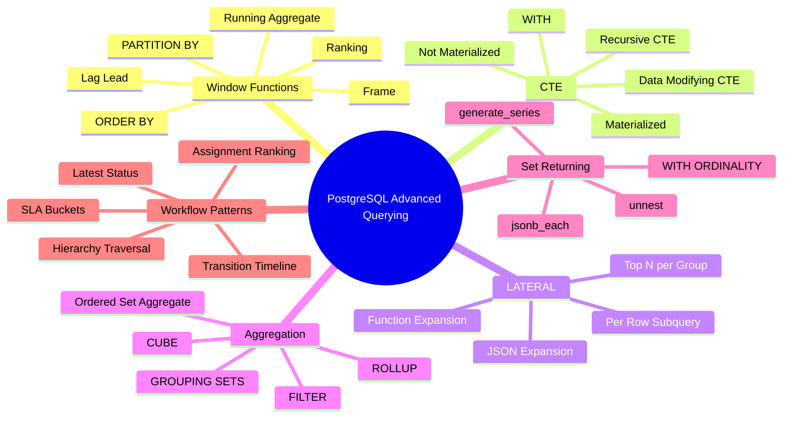
```mermaid
mindmap
  root((PostgreSQL Advanced Querying))
    Window Functions
      PARTITION BY
      ORDER BY
      Frame
      Ranking
      Lag Lead
      Running Aggregate
    CTE
      WITH
      Recursive CTE
      Materialized
      Not Materialized
      Data Modifying CTE
    LATERAL
      Per Row Subquery
      Top N per Group
      JSON Expansion
      Function Expansion
    Aggregation
      FILTER
      GROUPING SETS
      ROLLUP
      CUBE
      Ordered Set Aggregate
    Set Returning
      generate_series
      unnest
      jsonb_each
      WITH ORDINALITY
    Workflow Patterns
      Latest Status
      Transition Timeline
      SLA Buckets
      Assignment Ranking
      Hierarchy Traversal
```

**Core idea:** advanced SQL bukan sekadar “query kompleks”. Tujuannya adalah mengekspresikan pola yang sering muncul di sistem nyata: ranking, latest-state extraction, timeline diff, hierarchy traversal, bucketing, report subtotal, dan per-row expansion tanpa memecah logic menjadi banyak round-trip.

---

## 3. Window Functions

Window function menghitung nilai lintas sekumpulan row yang berhubungan dengan row saat ini, tanpa menggabungkan row menjadi satu seperti `GROUP BY`. PostgreSQL menyatakan window function melakukan kalkulasi atas “virtual table” yang dihasilkan setelah `FROM`, `WHERE`, `GROUP BY`, dan `HAVING`. Window function hanya boleh muncul di select list dan `ORDER BY` query. 

```sql
SELECT
    case_id,
    status,
    changed_at,
    row_number() OVER (
        PARTITION BY case_id
        ORDER BY changed_at DESC
    ) AS status_rank
FROM case_mgmt.case_status_history;
```

| Komponen | Fungsi |
|---|---|
| `OVER (...)` | Menandai function sebagai window function. |
| `PARTITION BY` | Membagi row ke grup logis. |
| `ORDER BY` | Urutan dalam partition. |
| Frame | Subset row sekitar current row yang dipakai function tertentu. |

---

## 4. Ranking Functions

```sql
SELECT
    assignee_id,
    case_id,
    priority,
    created_at,
    row_number() OVER (
        PARTITION BY assignee_id
        ORDER BY priority DESC, created_at ASC
    ) AS queue_position,
    rank() OVER (
        PARTITION BY assignee_id
        ORDER BY priority DESC
    ) AS priority_rank,
    dense_rank() OVER (
        PARTITION BY assignee_id
        ORDER BY priority DESC
    ) AS dense_priority_rank
FROM case_mgmt.case_file
WHERE status = 'OPEN';
```

| Function | Behavior | Use Case |
|---|---|---|
| `row_number()` | Nomor unik per row. | Queue position, dedup pick one row. |
| `rank()` | Ranking dengan gap saat tie. | Competition rank. |
| `dense_rank()` | Ranking tanpa gap. | Bucket rank yang stabil. |
| `percent_rank()` | Posisi relatif 0-1. | Percentile-ish view. |
| `cume_dist()` | Cumulative distribution. | SLA distribution/reporting. |
| `ntile(n)` | Bagi row ke n bucket. | Sampling, prioritization bucket. |

---

## 5. `lag()` dan `lead()` untuk Timeline Diff

`lag()` mengambil nilai dari row sebelumnya dalam window; `lead()` mengambil nilai dari row sesudahnya.

```sql
SELECT
    case_id,
    old_status,
    new_status,
    changed_at,
    lag(new_status) OVER (
        PARTITION BY case_id
        ORDER BY changed_at
    ) AS previous_new_status,
    lag(changed_at) OVER (
        PARTITION BY case_id
        ORDER BY changed_at
    ) AS previous_changed_at,
    changed_at
      - lag(changed_at) OVER (
            PARTITION BY case_id
            ORDER BY changed_at
        ) AS duration_since_previous_change
FROM case_mgmt.case_status_history
ORDER BY case_id, changed_at;
```

**Use case:** menghitung durasi antar status, mendeteksi transisi tidak valid, audit lifecycle, SLA dwell time.

---

## 6. Latest Row per Group

### Pattern A - `row_number()`

```sql
WITH ranked AS (
    SELECT
        h.*,
        row_number() OVER (
            PARTITION BY case_id
            ORDER BY changed_at DESC, id DESC
        ) AS rn
    FROM case_mgmt.case_status_history h
)
SELECT *
FROM ranked
WHERE rn = 1;
```

### Pattern B - PostgreSQL-specific `DISTINCT ON`

```sql
SELECT DISTINCT ON (case_id)
    case_id,
    new_status,
    changed_at
FROM case_mgmt.case_status_history
ORDER BY case_id, changed_at DESC, id DESC;
```

| Pattern | Kelebihan | Catatan |
|---|---|---|
| `row_number()` | Standard-ish, fleksibel. | Bagus untuk top-N juga. |
| `DISTINCT ON` | Ringkas dan sangat praktis di PostgreSQL. | PostgreSQL-specific; `ORDER BY` harus dirancang hati-hati. |

Index yang cocok:

```sql
CREATE INDEX idx_case_status_history_case_changed
ON case_mgmt.case_status_history (case_id, changed_at DESC, id DESC);
```

---

## 7. Running Total dan Running Count

```sql
SELECT
    date_trunc('day', created_at)::date AS event_date,
    count(*) AS daily_events,
    sum(count(*)) OVER (
        ORDER BY date_trunc('day', created_at)::date
    ) AS running_events
FROM audit.case_event
GROUP BY date_trunc('day', created_at)::date
ORDER BY event_date;
```

**Pattern penting:** aggregate biasa (`count(*)`) dipakai dulu per group, lalu window aggregate (`sum(count(*)) OVER`) menghitung running total lintas hasil group.

---

## 8. Window Frame: `ROWS`, `RANGE`, `GROUPS`

Window frame menentukan baris mana yang dihitung relatif terhadap current row.

```sql
SELECT
    case_id,
    changed_at,
    new_status,
    count(*) OVER (
        PARTITION BY case_id
        ORDER BY changed_at
        ROWS BETWEEN UNBOUNDED PRECEDING AND CURRENT ROW
    ) AS transition_number
FROM case_mgmt.case_status_history;
```

| Frame Type | Makna |
|---|---|
| `ROWS` | Berdasarkan jumlah row fisik relatif. |
| `RANGE` | Berdasarkan nilai ordering; peer dengan nilai sama ikut. |
| `GROUPS` | Berdasarkan peer group dalam ordering. |

### Moving average contoh

```sql
SELECT
    event_date,
    daily_count,
    avg(daily_count) OVER (
        ORDER BY event_date
        ROWS BETWEEN 6 PRECEDING AND CURRENT ROW
    ) AS seven_day_avg
FROM audit.daily_case_event_count
ORDER BY event_date;
```

**Pitfall:** `last_value()` sering mengejutkan karena default frame biasanya berakhir di current row, bukan akhir partition. Untuk “nilai terakhir seluruh partition”, tentukan frame eksplisit.

```sql
last_value(new_status) OVER (
    PARTITION BY case_id
    ORDER BY changed_at
    ROWS BETWEEN UNBOUNDED PRECEDING AND UNBOUNDED FOLLOWING
)
```

---

## 9. Aggregate `FILTER`

`FILTER` membuat conditional aggregate lebih bersih daripada banyak `CASE WHEN`.

```sql
SELECT
    count(*) AS total_cases,
    count(*) FILTER (WHERE status = 'OPEN') AS open_cases,
    count(*) FILTER (WHERE status = 'ESCALATED') AS escalated_cases,
    count(*) FILTER (WHERE sla_due_at < now() AND status <> 'CLOSED') AS overdue_cases
FROM case_mgmt.case_file;
```

Untuk reporting per assignee:

```sql
SELECT
    assigned_user_id,
    count(*) AS total,
    count(*) FILTER (WHERE status = 'OPEN') AS open_count,
    count(*) FILTER (WHERE status = 'IN_REVIEW') AS review_count,
    count(*) FILTER (WHERE status = 'ESCALATED') AS escalated_count
FROM case_mgmt.case_file
GROUP BY assigned_user_id;
```

---

## 10. Grouping Sets, `ROLLUP`, dan `CUBE`

PostgreSQL mendukung `GROUPING SETS`, `ROLLUP`, dan `CUBE` dalam `GROUP BY`. Dokumentasi PostgreSQL menjelaskan bahwa `CUBE` dan `ROLLUP` dapat dipakai langsung dalam `GROUP BY` atau nested di dalam `GROUPING SETS`. ([PostgreSQL](https://www.postgresql.org/docs/current/queries-table-expressions.html?utm_source=chatgpt.com))

### `GROUPING SETS`

```sql
SELECT
    status,
    assigned_user_id,
    count(*) AS total
FROM case_mgmt.case_file
GROUP BY GROUPING SETS (
    (status, assigned_user_id),
    (status),
    (assigned_user_id),
    ()
)
ORDER BY status, assigned_user_id;
```

Ini setara dengan membuat beberapa aggregation level dalam satu query.

### `ROLLUP`

`ROLLUP(status, severity)` menghasilkan subtotal hierarkis:

```sql
SELECT
    status,
    severity,
    count(*) AS total
FROM case_mgmt.case_file
GROUP BY ROLLUP (status, severity)
ORDER BY status, severity;
```

Output conceptual:

| status | severity | Meaning |
|---|---|---|
| `OPEN` | `HIGH` | Detail per status + severity |
| `OPEN` | `NULL` | Subtotal per status |
| `NULL` | `NULL` | Grand total |

### `CUBE`

`CUBE(status, severity)` menghasilkan semua kombinasi grouping:

```sql
SELECT
    status,
    severity,
    count(*) AS total
FROM case_mgmt.case_file
GROUP BY CUBE (status, severity)
ORDER BY status, severity;
```

| Construct | Cocok Untuk |
|---|---|
| `GROUPING SETS` | Report level custom. |
| `ROLLUP` | Hierarki natural: year → month → day, status → severity. |
| `CUBE` | Semua kombinasi dimensi kecil. |

---

## 11. `GROUPING()` untuk Membedakan `NULL`

Subtotal dari `ROLLUP`/`CUBE` memakai `NULL`, yang bisa ambigu dengan nilai `NULL` asli. Gunakan `GROUPING()`.

```sql
SELECT
    CASE WHEN GROUPING(status) = 1 THEN 'ALL_STATUS' ELSE status END AS status_label,
    CASE WHEN GROUPING(severity) = 1 THEN 'ALL_SEVERITY' ELSE severity END AS severity_label,
    count(*) AS total
FROM case_mgmt.case_file
GROUP BY ROLLUP (status, severity)
ORDER BY GROUPING(status), status, GROUPING(severity), severity;
```

| `GROUPING(col)` | Makna |
|---:|---|
| `0` | Column ikut grouping normal. |
| `1` | Column di-aggregate sebagai subtotal/all. |

---

## 12. Ordered-Set Aggregates

Ordered-set aggregate memakai `WITHIN GROUP`.

```sql
SELECT
    percentile_cont(0.5) WITHIN GROUP (ORDER BY extract(epoch FROM resolved_at - created_at)) AS median_resolution_seconds,
    percentile_cont(0.95) WITHIN GROUP (ORDER BY extract(epoch FROM resolved_at - created_at)) AS p95_resolution_seconds
FROM case_mgmt.case_file
WHERE status = 'CLOSED'
  AND resolved_at IS NOT NULL;
```

| Function | Use Case |
|---|---|
| `percentile_cont(fraction)` | Continuous percentile/interpolated. |
| `percentile_disc(fraction)` | Discrete percentile dari nilai aktual. |
| `mode()` | Nilai yang paling sering muncul. |

**Use case:** median SLA resolution, p95 queue time, p99 processing duration.

---

## 13. Recursive CTE

Recursive CTE dipakai untuk hierarchy/tree/graph traversal. PostgreSQL recursive query dievaluasi secara iteratif: non-recursive term menghasilkan working table awal, lalu recursive term diulang selama masih menghasilkan row baru. Dokumentasi resmi menjelaskan bahwa `WITH RECURSIVE` memungkinkan self-reference di CTE. ([PostgreSQL](https://www.postgresql.org/docs/current/queries-with.html?utm_source=chatgpt.com))

### Organization hierarchy

```sql
WITH RECURSIVE org_tree AS (
    SELECT
        id,
        parent_id,
        name,
        1 AS depth,
        ARRAY[id] AS path
    FROM org_unit
    WHERE parent_id IS NULL

    UNION ALL

    SELECT
        child.id,
        child.parent_id,
        child.name,
        parent.depth + 1,
        parent.path || child.id
    FROM org_unit child
    JOIN org_tree parent
        ON child.parent_id = parent.id
)
SELECT *
FROM org_tree
ORDER BY path;
```

### Case escalation chain

```sql
WITH RECURSIVE escalation_chain AS (
    SELECT
        id,
        previous_escalation_id,
        case_id,
        escalated_to,
        escalated_at,
        1 AS depth
    FROM case_mgmt.case_escalation
    WHERE id = :starting_escalation_id

    UNION ALL

    SELECT
        e.id,
        e.previous_escalation_id,
        e.case_id,
        e.escalated_to,
        e.escalated_at,
        c.depth + 1
    FROM case_mgmt.case_escalation e
    JOIN escalation_chain c
        ON e.id = c.previous_escalation_id
)
SELECT *
FROM escalation_chain
ORDER BY depth;
```

---

## 14. Recursive CTE Cycle Protection

Recursive query bisa infinite jika ada cycle. Gunakan path tracking.

```sql
WITH RECURSIVE org_tree AS (
    SELECT
        id,
        parent_id,
        name,
        ARRAY[id] AS path,
        false AS is_cycle
    FROM org_unit
    WHERE parent_id IS NULL

    UNION ALL

    SELECT
        child.id,
        child.parent_id,
        child.name,
        parent.path || child.id,
        child.id = ANY(parent.path) AS is_cycle
    FROM org_unit child
    JOIN org_tree parent
        ON child.parent_id = parent.id
    WHERE NOT parent.is_cycle
)
SELECT *
FROM org_tree;
```

**Rule:** recursive CTE untuk graph/hierarchy production harus punya cycle defense, depth limit, atau data constraint yang menjamin acyclic structure.

---

## 15. `LATERAL`

`LATERAL` membuat subquery di `FROM` bisa mereferensikan column dari item `FROM` sebelumnya. PostgreSQL table expression docs membahas `LATERAL` dalam `FROM` sebagai mekanisme agar subquery/function dievaluasi per row dari sumber di sebelah kirinya. ([PostgreSQL](https://www.postgresql.org/docs/current/queries-table-expressions.html?utm_source=chatgpt.com))

### Latest event per case

```sql
SELECT
    c.id,
    c.case_number,
    latest.event_type,
    latest.created_at AS latest_event_at
FROM case_mgmt.case_file c
LEFT JOIN LATERAL (
    SELECT e.event_type, e.created_at
    FROM audit.case_event e
    WHERE e.case_id = c.id
    ORDER BY e.created_at DESC, e.id DESC
    LIMIT 1
) latest ON true
WHERE c.status = 'OPEN';
```

Index:

```sql
CREATE INDEX idx_case_event_case_created
ON audit.case_event (case_id, created_at DESC, id DESC);
```

### Top 3 tasks per assignee

```sql
SELECT
    u.id AS assignee_id,
    u.display_name,
    t.id AS task_id,
    t.priority,
    t.created_at
FROM identity.app_user u
LEFT JOIN LATERAL (
    SELECT id, priority, created_at
    FROM case_mgmt.case_task t
    WHERE t.assignee_id = u.id
      AND t.status = 'READY'
    ORDER BY priority DESC, created_at ASC
    LIMIT 3
) t ON true;
```

**Pattern:** `LATERAL` sangat cocok untuk “top N per parent row” tanpa window ranking seluruh table jika parent set kecil dan index mendukung.

---

## 16. `CROSS JOIN LATERAL` dengan JSONB Expansion

```sql
SELECT
    e.id AS event_id,
    kv.key,
    kv.value
FROM audit.case_event e
CROSS JOIN LATERAL jsonb_each_text(e.payload) AS kv(key, value)
WHERE e.created_at >= now() - interval '1 day';
```

### Array expansion

```sql
SELECT
    c.id AS case_id,
    tag
FROM case_mgmt.case_file c
CROSS JOIN LATERAL unnest(c.tags) AS tag;
```

**Caution:** expansion bisa memperbesar row count drastis. Selalu filter table utama sebelum expand jika memungkinkan.

---

## 17. Set-Returning Functions

Set-returning functions menghasilkan banyak row.

### `generate_series`

```sql
SELECT d::date AS report_date
FROM generate_series(
    date '2026-07-01',
    date '2026-07-31',
    interval '1 day'
) AS d;
```

### Fill missing dates in report

```sql
WITH dates AS (
    SELECT d::date AS report_date
    FROM generate_series(
        date '2026-07-01',
        date '2026-07-31',
        interval '1 day'
    ) AS d
),
daily AS (
    SELECT
        created_at::date AS report_date,
        count(*) AS total_cases
    FROM case_mgmt.case_file
    WHERE created_at >= date '2026-07-01'
      AND created_at <  date '2026-08-01'
    GROUP BY created_at::date
)
SELECT
    dates.report_date,
    coalesce(daily.total_cases, 0) AS total_cases
FROM dates
LEFT JOIN daily USING (report_date)
ORDER BY dates.report_date;
```

### `WITH ORDINALITY`

```sql
SELECT
    value,
    ordinal_position
FROM unnest(ARRAY['OPEN', 'IN_REVIEW', 'ESCALATED', 'CLOSED'])
WITH ORDINALITY AS s(value, ordinal_position);
```

**Use case:** preserve ordering dari array/list literal.

---

## 18. Data-Modifying CTE

CTE bisa dipakai untuk mutation yang hasilnya dipakai statement berikutnya dalam satu statement.

```sql
WITH changed AS (
    UPDATE case_mgmt.case_file
    SET status = 'ESCALATED',
        updated_at = now()
    WHERE id = :case_id
      AND status = 'OPEN'
    RETURNING id, case_number, status
)
INSERT INTO audit.case_event (
    case_id,
    event_type,
    payload,
    created_at
)
SELECT
    id,
    'CASE_ESCALATED',
    jsonb_build_object(
        'case_number', case_number,
        'new_status', status
    ),
    now()
FROM changed
RETURNING case_id;
```

**Pattern:** atomic mutation + audit event dalam satu SQL statement.

---

## 19. CTE Materialization: `MATERIALIZED` dan `NOT MATERIALIZED`

PostgreSQL mendukung kontrol materialisasi CTE dengan `MATERIALIZED` dan `NOT MATERIALIZED`. Ini berguna saat planner behavior penting: materialisasi bisa menghindari recomputation, tetapi bisa juga menghalangi pushdown predicate.

```sql
WITH recent_cases AS MATERIALIZED (
    SELECT *
    FROM case_mgmt.case_file
    WHERE created_at >= now() - interval '30 days'
)
SELECT *
FROM recent_cases
WHERE status = 'OPEN';
```

```sql
WITH recent_cases AS NOT MATERIALIZED (
    SELECT *
    FROM case_mgmt.case_file
    WHERE created_at >= now() - interval '30 days'
)
SELECT *
FROM recent_cases
WHERE status = 'OPEN';
```

| Option | Gunakan Jika |
|---|---|
| `MATERIALIZED` | CTE dipakai berulang atau ingin snapshot intermediate eksplisit. |
| `NOT MATERIALIZED` | Ingin planner bisa inline/push predicate. |
| Default | Biarkan jika tidak punya evidence dari `EXPLAIN`. |

---

## 20. Anti-Join dan Semi-Join Patterns

### `EXISTS`

```sql
SELECT c.*
FROM case_mgmt.case_file c
WHERE EXISTS (
    SELECT 1
    FROM case_mgmt.case_task t
    WHERE t.case_id = c.id
      AND t.status = 'READY'
);
```

### `NOT EXISTS`

```sql
SELECT c.*
FROM case_mgmt.case_file c
WHERE NOT EXISTS (
    SELECT 1
    FROM case_mgmt.case_task t
    WHERE t.case_id = c.id
      AND t.status <> 'DONE'
);
```

**Rule:** prefer `EXISTS`/`NOT EXISTS` untuk existence check. Hindari `NOT IN` jika subquery bisa menghasilkan `NULL`, karena SQL three-valued logic bisa membuat hasil mengejutkan.

---

## 21. Query Pattern: State Transition Timeline

```sql
WITH transitions AS (
    SELECT
        case_id,
        old_status,
        new_status,
        changed_at,
        lag(new_status) OVER (
            PARTITION BY case_id
            ORDER BY changed_at
        ) AS previous_status,
        lead(changed_at) OVER (
            PARTITION BY case_id
            ORDER BY changed_at
        ) AS next_changed_at
    FROM case_mgmt.case_status_history
)
SELECT
    case_id,
    new_status AS status,
    changed_at AS entered_at,
    coalesce(next_changed_at, now()) AS exited_at,
    coalesce(next_changed_at, now()) - changed_at AS dwell_time
FROM transitions
ORDER BY case_id, entered_at;
```

**Use case:** menghitung waktu yang dihabiskan case di setiap status.

---

## 22. Query Pattern: SLA Buckets

```sql
SELECT
    CASE
        WHEN sla_due_at IS NULL THEN 'NO_SLA'
        WHEN status = 'CLOSED' THEN 'CLOSED'
        WHEN sla_due_at < now() THEN 'OVERDUE'
        WHEN sla_due_at < now() + interval '24 hours' THEN 'DUE_24H'
        ELSE 'ON_TRACK'
    END AS sla_bucket,
    count(*) AS total
FROM case_mgmt.case_file
GROUP BY sla_bucket
ORDER BY total DESC;
```

Dengan `FILTER` per assignee:

```sql
SELECT
    assigned_user_id,
    count(*) FILTER (WHERE sla_due_at < now() AND status <> 'CLOSED') AS overdue,
    count(*) FILTER (
        WHERE sla_due_at >= now()
          AND sla_due_at < now() + interval '24 hours'
          AND status <> 'CLOSED'
    ) AS due_24h,
    count(*) FILTER (WHERE status = 'CLOSED') AS closed
FROM case_mgmt.case_file
GROUP BY assigned_user_id;
```

---

## 23. Query Pattern: Dedup Event by Business Key

```sql
WITH ranked AS (
    SELECT
        *,
        row_number() OVER (
            PARTITION BY external_event_id
            ORDER BY received_at DESC, id DESC
        ) AS rn
    FROM integration.inbound_event
)
SELECT *
FROM ranked
WHERE rn = 1;
```

Untuk menandai duplicate:

```sql
WITH ranked AS (
    SELECT
        id,
        row_number() OVER (
            PARTITION BY external_event_id
            ORDER BY received_at ASC, id ASC
        ) AS rn
    FROM integration.inbound_event
)
UPDATE integration.inbound_event e
SET duplicate = true
FROM ranked r
WHERE e.id = r.id
  AND r.rn > 1;
```

---

## 24. Query Pattern: Gap Detection

Cari tanggal tanpa event.

```sql
WITH dates AS (
    SELECT d::date AS event_date
    FROM generate_series(
        current_date - interval '30 days',
        current_date,
        interval '1 day'
    ) AS d
),
actual AS (
    SELECT created_at::date AS event_date, count(*) AS total
    FROM audit.case_event
    WHERE created_at >= current_date - interval '30 days'
    GROUP BY created_at::date
)
SELECT
    dates.event_date,
    coalesce(actual.total, 0) AS total
FROM dates
LEFT JOIN actual USING (event_date)
WHERE coalesce(actual.total, 0) = 0
ORDER BY dates.event_date;
```

**Use case:** monitoring ingestion gap, missing daily batch, audit stream interruption.

---

## 25. Query Pattern: Hierarchical Permission Expansion

```sql
WITH RECURSIVE role_tree AS (
    SELECT
        role_id,
        parent_role_id,
        role_name,
        ARRAY[role_id] AS path
    FROM security.role_hierarchy
    WHERE role_id = :root_role_id

    UNION ALL

    SELECT
        child.role_id,
        child.parent_role_id,
        child.role_name,
        parent.path || child.role_id
    FROM security.role_hierarchy child
    JOIN role_tree parent
        ON child.parent_role_id = parent.role_id
    WHERE NOT child.role_id = ANY(parent.path)
)
SELECT *
FROM role_tree;
```

**Use case:** expand inherited ACL/group role di model authorization internal.

---

## 26. Performance Rules

| Pattern | Risk | Mitigation |
|---|---|---|
| Window function dengan `PARTITION BY` besar | Sort besar/temp file | Index sesuai partition/order, filter lebih awal. |
| Recursive CTE tanpa batas | Infinite/very expensive traversal | Cycle protection, depth limit. |
| `LATERAL` pada parent set besar | Nested loop mahal | Pastikan parent filtered dan inner indexed. |
| JSON/array expansion sebelum filter | Row explosion | Filter base rows dulu. |
| `CUBE` dengan banyak dimensi | Kombinasi grouping meledak | Batasi dimensi; gunakan grouping sets eksplisit. |
| `DISTINCT ON` tanpa order deterministik | Hasil tidak stabil | Tambah tie-breaker seperti `id DESC`. |
| Function di predicate partition/index key | Pruning/index tidak optimal | Rewrite predicate range/equality langsung. |
| CTE materialized tanpa perlu | Predicate pushdown terhambat | Cek `EXPLAIN`, gunakan `NOT MATERIALIZED` jika tepat. |

---

## 27. Common Pitfalls

| Pitfall | Dampak | Solusi |
|---|---|---|
| Menganggap window function mengurangi row seperti `GROUP BY` | Hasil lebih banyak dari perkiraan | Pahami window tidak collapse row. |
| `last_value()` tanpa frame eksplisit | Menghasilkan current row, bukan last partition | Set frame `UNBOUNDED FOLLOWING`. |
| Recursive CTE tanpa cycle check | Query tidak selesai / sangat mahal | Track path atau depth. |
| `LATERAL` dipakai tanpa index inner query | Lambat per-row lookup | Index inner table. |
| `ROLLUP` subtotal `NULL` disalahartikan | Report salah | Gunakan `GROUPING()`. |
| `NOT IN` dengan `NULL` | Hasil kosong/membingungkan | Prefer `NOT EXISTS`. |
| `generate_series` besar tanpa batas | Row explosion | Batasi range. |
| `CUBE` banyak dimension | Output combinatorial | Gunakan `GROUPING SETS` spesifik. |
| `DISTINCT ON` tidak cocok urutan | Ambil row salah | `ORDER BY` harus selaras. |
| Query analytics langsung ke OLTP hot table | Beban produksi | Materialized view/replica/partition/reporting strategy. |

---

## 28. Decision Matrix

| Need | Query Feature |
|---|---|
| Latest row per group | `row_number()` or `DISTINCT ON` |
| Previous/next state | `lag()` / `lead()` |
| Running total | Window aggregate |
| Median/p95 | Ordered-set aggregate |
| Conditional counts | Aggregate `FILTER` |
| Hierarchy traversal | Recursive CTE |
| Top N child rows per parent | `LATERAL` |
| Expand JSON object/array | `jsonb_each`, `jsonb_array_elements`, `LATERAL` |
| Fill missing dates | `generate_series` + `LEFT JOIN` |
| Multi-level subtotal | `ROLLUP` |
| All dimension combinations | `CUBE` |
| Custom subtotal levels | `GROUPING SETS` |
| Atomic update + audit insert | Data-modifying CTE |

---

## 29. Review Checklist

| Checklist | Pertanyaan |
|---|---|
| Correctness | Apakah query menghasilkan row cardinality yang diharapkan? |
| Determinism | Apakah `ORDER BY` punya tie-breaker? |
| NULL semantics | Apakah `NULL` ditangani eksplisit? |
| Index support | Apakah predicate/order/join punya index yang masuk akal? |
| Partition pruning | Jika partitioned, apakah query membawa partition key? |
| Row explosion | Apakah JSON/array expansion dibatasi? |
| Recursive safety | Apakah ada cycle/depth guard? |
| Aggregation level | Apakah subtotal dibedakan dengan `GROUPING()`? |
| Performance evidence | Sudah cek `EXPLAIN (ANALYZE, BUFFERS)`? |
| Operational impact | Apakah query analytics aman dijalankan di OLTP primary? |

---

## 30. Roadmap Belajar Singkat

| Urutan | Materi | Target |
|---:|---|---|
| 1 | Window function basics | Bisa ranking, latest row, previous/next row. |
| 2 | Window frames | Bisa running total dan moving windows dengan benar. |
| 3 | Aggregate `FILTER` | Bisa membuat conditional report ringkas. |
| 4 | `GROUPING SETS`, `ROLLUP`, `CUBE` | Bisa membuat subtotal multi-level. |
| 5 | Ordered-set aggregates | Bisa menghitung median/p95/p99 SLA. |
| 6 | Recursive CTE | Bisa traversal hierarchy dan graph sederhana. |
| 7 | `LATERAL` | Bisa top-N per parent dan per-row expansion. |
| 8 | Set-returning functions | Bisa generate date series, expand arrays/JSON. |
| 9 | Data-modifying CTE | Bisa atomic mutation + audit pattern. |
| 10 | Performance review | Bisa mencegah query advanced menjadi production hazard. |

## Rekomendasi Materi Selanjutnya

Lanjut paling tepat: **Cheatsheet PostgreSQL Full Text Search: `tsvector`, `tsquery`, dictionary, ranking, highlighting, GIN index, generated column, dan search design tanpa external search engine**.

---

**Sources:**

- [18: 7.8. WITH Queries (Common Table Expressions)](https://www.postgresql.org/docs/current/queries-with.html?utm_source=chatgpt.com)

## Response:
7/13/2026, 1:15:49 AM

# Cheatsheet: PostgreSQL Full Text Search

## 1. Scope

Cheatsheet ini fokus **PostgreSQL-only** untuk pencarian teks bawaan PostgreSQL:

- `tsvector`
- `tsquery`
- `to_tsvector`
- `to_tsquery`, `plainto_tsquery`, `phraseto_tsquery`, `websearch_to_tsquery`
- text search configuration
- dictionary, stemming, stop words
- ranking dengan `ts_rank` / `ts_rank_cd`
- highlighting dengan `ts_headline`
- GIN/GiST index
- generated column untuk search vector
- weighted search
- search design untuk case management, audit, document metadata, dan internal search

PostgreSQL Full Text Search berada di Chapter 12 dokumentasi SQL Language. Dokumentasi membagi topik ini ke introduction, table/index, controlling text search, additional features, parsers, dictionaries, configuration, testing/debugging, dan preferred index types. ([PostgreSQL](https://www.postgresql.org/docs/current/textsearch.html))

---

## 2. Mental Model

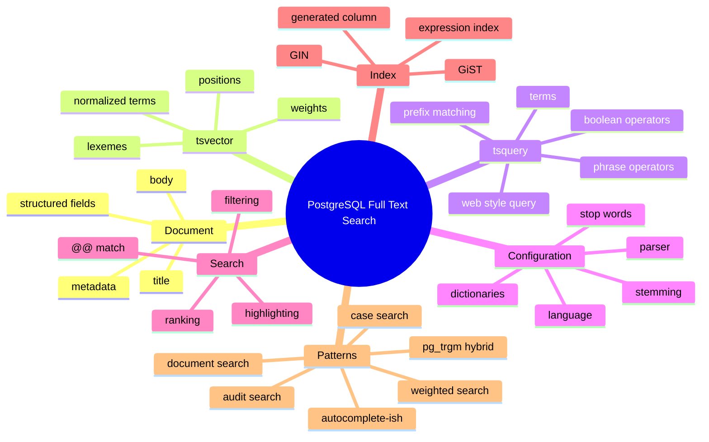
```mermaid id="fts-map"
mindmap
  root((PostgreSQL Full Text Search))
    Document
      title
      body
      metadata
      structured fields
    tsvector
      lexemes
      positions
      weights
      normalized terms
    tsquery
      terms
      boolean operators
      phrase operators
      prefix matching
      web style query
    Configuration
      parser
      dictionaries
      stop words
      stemming
      language
    Search
      @@ match
      ranking
      highlighting
      filtering
    Index
      GIN
      GiST
      expression index
      generated column
    Patterns
      case search
      audit search
      document search
      weighted search
      autocomplete-ish
      pg_trgm hybrid
```

**Core idea:** PostgreSQL Full Text Search tidak mencari string mentah seperti `LIKE '%word%'`. Ia mengubah dokumen menjadi **lexeme vector** (`tsvector`) dan query user menjadi **query expression** (`tsquery`), lalu mencocokkan keduanya dengan operator `@@`.

---

## 3. Basic Concept: Document, Lexeme, Vector, Query

| Konsep | Bentuk | Makna |
|---|---|---|
| Document | `text` atau gabungan beberapa field | Teks yang ingin dicari. |
| Token | kata mentah hasil parsing | Misalnya `running`, `cases`, `closed`. |
| Lexeme | token yang sudah dinormalisasi | Misalnya `cases` → `case`, tergantung dictionary. |
| `tsvector` | daftar lexeme + posisi + optional weight | Representasi dokumen yang searchable. |
| `tsquery` | ekspresi query | Representasi pencarian user. |
| Match operator | `@@` | Apakah vector/text cocok dengan query. |

Untuk implementasi FTS, PostgreSQL membutuhkan fungsi untuk membuat `tsvector` dari dokumen, fungsi untuk membuat `tsquery` dari input user, fungsi ranking untuk mengurutkan hasil, dan fungsi display/highlight agar hasil mudah dibaca. PostgreSQL menyediakan semua fungsi tersebut. ([PostgreSQL](https://www.postgresql.org/docs/current/textsearch-controls.html))

---

## 4. `to_tsvector`: Dokumen → Search Vector

```sql id="to-tsvector-basic"
SELECT to_tsvector(
    'english',
    'A closed case was escalated after repeated violations.'
);
```

Contoh hasil kira-kira:

```text id="to-tsvector-result"
'case':3 'close':2 'escal':5 'repeat':7 'violat':8
```

`to_tsvector` memecah teks menjadi token, mengurangi token menjadi lexeme, membuang stop words, dan mengembalikan `tsvector` yang berisi lexeme beserta posisi dalam dokumen. Dokumentasi PostgreSQL memberi contoh bahwa kata seperti `a`, `on`, dan `it` dapat dibuang sebagai stop words, sedangkan bentuk plural seperti `rats` dapat dinormalisasi menjadi `rat`. ([PostgreSQL](https://www.postgresql.org/docs/current/textsearch-controls.html))

### Dengan bahasa/config berbeda

```sql id="to-tsvector-config"
SELECT to_tsvector('simple', 'closed cases escalated');

SELECT to_tsvector('english', 'closed cases escalated');
```

| Config | Efek Umum |
|---|---|
| `simple` | Minimal stemming; lebih literal. |
| `english` | Stop words dan stemming bahasa Inggris. |
| custom config | Bisa mengatur parser/dictionary sendiri. |

**Rule:** pilih text search configuration sesuai bahasa dokumen. Untuk data multilingual, satu config global sering tidak cukup.

---

## 5. `tsquery`: User Query → Search Expression

PostgreSQL menyediakan beberapa fungsi untuk membuat `tsquery`.

| Function | Input Style | Cocok Untuk |
|---|---|---|
| `to_tsquery` | Syntax tsquery eksplisit | Advanced/internal query. |
| `plainto_tsquery` | Plain words | Search box sederhana. |
| `phraseto_tsquery` | Phrase-like input | Pencarian frasa. |
| `websearch_to_tsquery` | Web-search style | Search box user-facing. |

### `to_tsquery`

```sql id="to-tsquery"
SELECT to_tsquery('english', 'case & escalat');
```

`to_tsquery` cocok jika input sudah memakai operator tsquery seperti `&`, `|`, `!`, `<->`.

### `plainto_tsquery`

```sql id="plainto-tsquery"
SELECT plainto_tsquery('english', 'closed escalated case');
```

Cocok untuk input user polos. Biasanya kata-kata dianggap harus match bersama.

### `phraseto_tsquery`

```sql id="phraseto-tsquery"
SELECT phraseto_tsquery('english', 'closed case');
```

Cocok jika urutan kata penting.

### `websearch_to_tsquery`

```sql id="websearch-tsquery"
SELECT websearch_to_tsquery('english', '"closed case" OR escalation -draft');
```

Cocok untuk search box yang ingin terasa seperti mesin pencari biasa.

---

## 6. Operator Utama

PostgreSQL menyediakan operator text search khusus. Yang paling penting adalah `@@`, yaitu match antara `tsvector` dan `tsquery`. Dokumentasi fungsi/operator text search menjelaskan bahwa `tsvector @@ tsquery` atau `tsquery @@ tsvector` menghasilkan boolean apakah vector cocok dengan query. ([PostgreSQL](https://www.postgresql.org/docs/current/functions-textsearch.html))

```sql id="match-operator"
SELECT
    to_tsvector('english', 'closed case escalated')
    @@
    plainto_tsquery('english', 'closed case') AS matched;
```

| Operator | Fungsi |
|---|---|
| `@@` | Match `tsvector` dengan `tsquery`. |
| `&&` | AND dua `tsquery`. |
| `||` | OR dua `tsquery`. |
| `!!` | NOT / negasi query. |
| `<->` | Phrase / followed-by operator. |
| `@>` | Query containment. |
| `<@` | Query contained-by. |

Contoh:

```sql id="tsquery-operators"
SELECT to_tsquery('english', 'case') && to_tsquery('english', 'closed');

SELECT to_tsquery('english', 'case') || to_tsquery('english', 'complaint');

SELECT to_tsquery('english', 'closed') <-> to_tsquery('english', 'case');
```

---

## 7. Basic Table Search

Misal table:

```sql id="case-doc-table"
CREATE TABLE case_mgmt.case_document (
    id bigint GENERATED ALWAYS AS IDENTITY PRIMARY KEY,
    case_id bigint NOT NULL,
    title text NOT NULL,
    summary text,
    body text,
    created_at timestamptz NOT NULL DEFAULT now()
);
```

Query dasar:

```sql id="basic-table-search"
SELECT
    id,
    case_id,
    title
FROM case_mgmt.case_document
WHERE to_tsvector(
        'english',
        coalesce(title, '') || ' ' ||
        coalesce(summary, '') || ' ' ||
        coalesce(body, '')
      )
      @@ plainto_tsquery('english', 'escalated violation');
```

**Penting:** `to_tsvector(NULL)` menghasilkan `NULL`, sehingga PostgreSQL documentation menyarankan memakai `coalesce` ketika field bisa `NULL`. ([PostgreSQL](https://www.postgresql.org/docs/current/textsearch-controls.html))

---

## 8. Generated Column untuk Search Vector

Untuk production, jangan hitung `to_tsvector(...)` di setiap query besar jika datanya sering dicari. Simpan search vector sebagai generated column.

```sql id="generated-search-vector"
ALTER TABLE case_mgmt.case_document
ADD COLUMN search_vector tsvector
GENERATED ALWAYS AS (
    setweight(to_tsvector('english', coalesce(title, '')), 'A') ||
    setweight(to_tsvector('english', coalesce(summary, '')), 'B') ||
    setweight(to_tsvector('english', coalesce(body, '')), 'D')
) STORED;
```

Index:

```sql id="generated-search-index"
CREATE INDEX idx_case_document_search_vector
ON case_mgmt.case_document
USING gin (search_vector);
```

Search:

```sql id="generated-search-query"
SELECT
    id,
    case_id,
    title
FROM case_mgmt.case_document
WHERE search_vector @@ websearch_to_tsquery('english', 'escalated violation');
```

**Rule:** generated `tsvector` column cocok untuk search field gabungan yang sering dipakai dan perlu index stabil.

---

## 9. Weighted Search

`setweight` memberi bobot `A`, `B`, `C`, atau `D` pada bagian dokumen. Biasanya title lebih penting daripada body.

```sql id="weighted-vector"
SELECT
    setweight(to_tsvector('english', coalesce(title, '')), 'A') ||
    setweight(to_tsvector('english', coalesce(summary, '')), 'B') ||
    setweight(to_tsvector('english', coalesce(body, '')), 'D')
FROM case_mgmt.case_document;
```

Dokumentasi PostgreSQL menjelaskan `setweight` dapat memberi label weight `A`, `B`, `C`, atau `D` pada entry `tsvector`, umumnya untuk membedakan bagian dokumen seperti title versus body; informasi ini kemudian bisa dipakai dalam ranking. ([PostgreSQL](https://www.postgresql.org/docs/current/textsearch-controls.html))

### Ranking dengan bobot

```sql id="weighted-rank"
SELECT
    id,
    title,
    ts_rank(
        ARRAY[0.1, 0.2, 0.4, 1.0],
        search_vector,
        websearch_to_tsquery('english', :q)
    ) AS rank
FROM case_mgmt.case_document
WHERE search_vector @@ websearch_to_tsquery('english', :q)
ORDER BY rank DESC, created_at DESC
LIMIT 20;
```

Array weight urutannya adalah bobot untuk `D`, `C`, `B`, `A`.

---

## 10. Ranking: `ts_rank` dan `ts_rank_cd`

PostgreSQL menyediakan ranking function untuk mengurutkan hasil search berdasarkan relevansi.

```sql id="ts-rank-basic"
SELECT
    id,
    title,
    ts_rank(search_vector, plainto_tsquery('english', 'closed case')) AS rank
FROM case_mgmt.case_document
WHERE search_vector @@ plainto_tsquery('english', 'closed case')
ORDER BY rank DESC;
```

```sql id="ts-rank-cd"
SELECT
    id,
    title,
    ts_rank_cd(search_vector, plainto_tsquery('english', 'closed case')) AS rank
FROM case_mgmt.case_document
WHERE search_vector @@ plainto_tsquery('english', 'closed case')
ORDER BY rank DESC;
```

| Function | Intuisi |
|---|---|
| `ts_rank` | Ranking berbasis frekuensi/weight match. |
| `ts_rank_cd` | Cover density ranking; cenderung mempertimbangkan kedekatan term. |

### Ranking + recency

```sql id="rank-recency"
SELECT
    id,
    title,
    ts_rank(search_vector, q.query) AS text_rank,
    created_at,
    ts_rank(search_vector, q.query)
      + 0.05 / greatest(1, extract(day FROM now() - created_at)) AS final_rank
FROM case_mgmt.case_document
CROSS JOIN websearch_to_tsquery('english', :q) AS q(query)
WHERE search_vector @@ q.query
ORDER BY final_rank DESC
LIMIT 20;
```

**Rule:** ranking PostgreSQL adalah relevansi lexical, bukan semantic relevance. Untuk ranking bisnis, gabungkan dengan recency, status, permission, atau priority jika perlu.

---

## 11. Highlighting: `ts_headline`

`ts_headline` membuat snippet teks dengan term yang match diberi marker.

```sql id="ts-headline-basic"
SELECT
    id,
    title,
    ts_headline(
        'english',
        body,
        websearch_to_tsquery('english', :q),
        'StartSel=<mark>, StopSel=</mark>, MaxFragments=2, MinWords=5, MaxWords=20'
    ) AS snippet
FROM case_mgmt.case_document
WHERE search_vector @@ websearch_to_tsquery('english', :q)
LIMIT 20;
```

**Use case:** hasil search internal yang menunjukkan konteks kenapa dokumen match.

**Caution:** `ts_headline` bekerja pada teks asli, bukan hanya `tsvector`; jangan jalankan pada body sangat besar untuk banyak row tanpa limit/ranking terlebih dahulu.

---

## 12. GIN dan GiST Index

PostgreSQL mendukung dua jenis index untuk FTS: **GIN** dan **GiST**. Index tidak wajib untuk full text search, tetapi jika column sering dicari, index biasanya diinginkan. Dokumentasi PostgreSQL menyatakan GIN adalah preferred text search index type; GIN menyimpan entry per lexeme dengan compressed list lokasi match, sedangkan GiST bersifat lossy dan perlu recheck row aktual untuk menghilangkan false matches. ([PostgreSQL](https://www.postgresql.org/docs/current/textsearch-indexes.html))

### GIN index

```sql id="gin-index"
CREATE INDEX idx_case_document_search_vector
ON case_mgmt.case_document
USING gin (search_vector);
```

### Expression GIN index

```sql id="expression-gin-index"
CREATE INDEX idx_case_document_search_expr
ON case_mgmt.case_document
USING gin (
    to_tsvector(
        'english',
        coalesce(title, '') || ' ' || coalesce(body, '')
    )
);
```

Query harus cocok dengan expression:

```sql id="expression-gin-query"
SELECT *
FROM case_mgmt.case_document
WHERE to_tsvector(
        'english',
        coalesce(title, '') || ' ' || coalesce(body, '')
      )
      @@ plainto_tsquery('english', 'violation');
```

### GiST index

```sql id="gist-index"
CREATE INDEX idx_case_document_search_gist
ON case_mgmt.case_document
USING gist (search_vector);
```

| Index | Kelebihan | Kekurangan |
|---|---|---|
| GIN | Umumnya terbaik untuk FTS lookup, precise inverted index. | Update/index maintenance bisa lebih berat. |
| GiST | Bisa lebih flexible, supports included columns, signature-based. | Lossy, false positive recheck, sering kurang cocok untuk FTS umum. |
| No index | Simple untuk table kecil. | Seq scan untuk search rutin. |

---

## 13. Search Configuration

Text search configuration menentukan parser dan dictionary chain. Efeknya besar terhadap hasil.

```sql id="config-example"
SELECT to_tsvector('english', 'violations were repeatedly reported');

SELECT to_tsvector('simple', 'violations were repeatedly reported');
```

| Area | Dampak |
|---|---|
| Stop words | Kata umum bisa dibuang. |
| Stemming | Bentuk kata dinormalisasi. |
| Dictionary | Menentukan lexeme hasil token. |
| Language | Search bahasa Inggris berbeda dari bahasa lain. |
| Custom config | Bisa menyesuaikan domain-specific vocabulary. |

**Rule:** untuk data campuran Indonesia/Inggris, `english` bisa buruk untuk kata Indonesia. `simple` lebih predictable tetapi tidak punya stemming bahasa. Untuk sistem production multilingual, simpan `language_code` dan buat `tsvector` berdasarkan config yang sesuai, atau gunakan strategi terpisah per bahasa.

---

## 14. Inspect dan Debug Text Search

### Lihat parsing token

```sql id="ts-debug"
SELECT *
FROM ts_debug('english', 'Closed cases were escalated repeatedly.');
```

### Cek dictionary/config

```sql id="ts-configs"
SELECT cfgname
FROM pg_ts_config
ORDER BY cfgname;
```

### Cek dictionaries

```sql id="ts-dicts"
SELECT dictname
FROM pg_ts_dict
ORDER BY dictname;
```

### Statistik lexeme dokumen

```sql id="ts-stat"
SELECT *
FROM ts_stat(
    'SELECT search_vector FROM case_mgmt.case_document'
)
ORDER BY nentry DESC
LIMIT 20;
```

**Use case:** memahami kenapa kata tertentu tidak match, apakah stop word dibuang, apakah stemming sesuai, dan apakah vector terlalu noise-heavy.

---

## 15. Query Builder Pattern: Aman untuk User Input

Untuk search box user-facing, default aman:

```sql id="websearch-safe"
SELECT
    id,
    title,
    ts_rank(search_vector, q.query) AS rank
FROM case_mgmt.case_document
CROSS JOIN websearch_to_tsquery('english', :search_text) AS q(query)
WHERE search_vector @@ q.query
ORDER BY rank DESC
LIMIT 20;
```

Hindari membangun `to_tsquery` langsung dari input user mentah:

```sql id="bad-to-tsquery"
-- risk: user harus tahu syntax tsquery, mudah error
WHERE search_vector @@ to_tsquery('english', :raw_user_input)
```

| Input Type | Function |
|---|---|
| User search box biasa | `websearch_to_tsquery` |
| Plain text internal | `plainto_tsquery` |
| Phrase search | `phraseto_tsquery` |
| Advanced admin syntax | `to_tsquery` |

---

## 16. Prefix Search

PostgreSQL `tsquery` mendukung prefix matching dengan `:*`.

```sql id="prefix-query"
SELECT *
FROM case_mgmt.case_document
WHERE search_vector @@ to_tsquery('english', 'escalat:*');
```

**Use case:** user mengetik awal kata seperti `escal...`.

**Caution:** prefix search bukan full autocomplete system. Untuk substring/fuzzy/autocomplete yang lebih toleran typo, pertimbangkan `pg_trgm`.

---

## 17. Phrase Search

```sql id="phrase-search"
SELECT *
FROM case_mgmt.case_document
WHERE search_vector @@ phraseto_tsquery('english', 'closed case');
```

Atau explicit:

```sql id="phrase-explicit"
SELECT *
FROM case_mgmt.case_document
WHERE search_vector @@ to_tsquery('english', 'closed <-> case');
```

Operator `<->` membentuk phrase query yang match jika dua query cocok pada lexeme berturut-turut. Dokumentasi text search operator menyebut `<->` sebagai phrase query / followed-by operator. ([PostgreSQL](https://www.postgresql.org/docs/current/functions-textsearch.html))

---

## 18. Hybrid Search: FTS + Structured Filter

Search production biasanya tidak hanya text match; harus ada filter status, tenant, date, permission, dan visibility.

```sql id="hybrid-search"
SELECT
    d.id,
    d.case_id,
    d.title,
    ts_rank(d.search_vector, q.query) AS rank
FROM case_mgmt.case_document d
CROSS JOIN websearch_to_tsquery('english', :q) AS q(query)
WHERE d.search_vector @@ q.query
  AND d.created_at >= :from_time
  AND d.created_at <  :to_time
  AND d.visibility = 'INTERNAL'
  AND d.case_id = :case_id
ORDER BY rank DESC, d.created_at DESC
LIMIT 50;
```

Index strategy:

```sql id="hybrid-indexes"
CREATE INDEX idx_case_document_search_vector
ON case_mgmt.case_document
USING gin (search_vector);

CREATE INDEX idx_case_document_case_created
ON case_mgmt.case_document (case_id, created_at DESC);
```

**Rule:** GIN index menyelesaikan text match; B-tree index tetap dibutuhkan untuk structured filters yang penting.

---

## 19. Pattern: Case Search

```sql id="case-search-table"
CREATE TABLE case_mgmt.case_file_search (
    case_id bigint PRIMARY KEY,
    case_number text NOT NULL,
    title text NOT NULL,
    complainant_name text,
    subject_name text,
    status text NOT NULL,
    created_at timestamptz NOT NULL,
    search_vector tsvector GENERATED ALWAYS AS (
        setweight(to_tsvector('simple', coalesce(case_number, '')), 'A') ||
        setweight(to_tsvector('english', coalesce(title, '')), 'A') ||
        setweight(to_tsvector('simple', coalesce(complainant_name, '')), 'B') ||
        setweight(to_tsvector('simple', coalesce(subject_name, '')), 'B')
    ) STORED
);
```

```sql id="case-search-index"
CREATE INDEX idx_case_file_search_vector
ON case_mgmt.case_file_search
USING gin (search_vector);

CREATE INDEX idx_case_file_search_status_created
ON case_mgmt.case_file_search (status, created_at DESC);
```

Query:

```sql id="case-search-query"
SELECT
    case_id,
    case_number,
    title,
    status,
    ts_rank(search_vector, q.query) AS rank
FROM case_mgmt.case_file_search
CROSS JOIN websearch_to_tsquery('english', :q) AS q(query)
WHERE search_vector @@ q.query
  AND status IN ('OPEN', 'IN_REVIEW', 'ESCALATED')
ORDER BY rank DESC, created_at DESC
LIMIT 25;
```

**Design note:** `case_number` dan nama orang sering lebih cocok dengan `simple` atau trigram daripada `english`, karena stemming bahasa Inggris bisa tidak relevan.

---

## 20. Pattern: Audit/Event Search

```sql id="audit-search-table"
CREATE TABLE audit.case_event_search (
    event_id bigint PRIMARY KEY,
    case_id bigint NOT NULL,
    event_type text NOT NULL,
    actor text,
    message text,
    payload jsonb NOT NULL DEFAULT '{}'::jsonb,
    created_at timestamptz NOT NULL,
    search_vector tsvector GENERATED ALWAYS AS (
        setweight(to_tsvector('simple', coalesce(event_type, '')), 'A') ||
        setweight(to_tsvector('simple', coalesce(actor, '')), 'B') ||
        setweight(to_tsvector('english', coalesce(message, '')), 'C') ||
        setweight(to_tsvector('simple', coalesce(payload::text, '')), 'D')
    ) STORED
);
```

```sql id="audit-search-index"
CREATE INDEX idx_case_event_search_vector
ON audit.case_event_search
USING gin (search_vector);

CREATE INDEX idx_case_event_search_case_created
ON audit.case_event_search (case_id, created_at DESC);
```

**Caution:** indexing `payload::text` bisa sangat noisy dan besar. Promote field penting dari JSONB ke column normal jika sering dicari.

---

## 21. Pattern: Document Search with Highlight

```sql id="document-search-highlight"
WITH q AS (
    SELECT websearch_to_tsquery('english', :q) AS query
)
SELECT
    d.id,
    d.title,
    ts_rank(d.search_vector, q.query) AS rank,
    ts_headline(
        'english',
        d.body,
        q.query,
        'StartSel=<mark>, StopSel=</mark>, MaxFragments=3, MinWords=5, MaxWords=25'
    ) AS snippet
FROM case_mgmt.case_document d
CROSS JOIN q
WHERE d.search_vector @@ q.query
ORDER BY rank DESC, d.created_at DESC
LIMIT 20;
```

**Rule:** compute highlight hanya setelah text match + limit/ranking jika body besar. Jika langsung highlight ribuan row, query bisa mahal.

---

## 22. Pattern: Multi-Language Search

### Option A - satu config simple

```sql id="multilang-simple"
search_vector tsvector GENERATED ALWAYS AS (
    to_tsvector('simple', coalesce(title, '') || ' ' || coalesce(body, ''))
) STORED
```

Kelebihan: predictable untuk campuran bahasa.  
Kekurangan: tidak ada stemming/stop word bahasa spesifik.

### Option B - separate columns per language

```sql id="multilang-separate"
ALTER TABLE case_mgmt.case_document
ADD COLUMN search_vector_en tsvector GENERATED ALWAYS AS (
    to_tsvector('english', coalesce(title, '') || ' ' || coalesce(body, ''))
) STORED;

ALTER TABLE case_mgmt.case_document
ADD COLUMN search_vector_simple tsvector GENERATED ALWAYS AS (
    to_tsvector('simple', coalesce(title, '') || ' ' || coalesce(body, ''))
) STORED;
```

### Option C - config driven by `language_code`

Generated column tidak selalu nyaman jika config dinamis kompleks. Bisa gunakan trigger/materialized search table jika perlu.

| Strategy | Cocok Untuk |
|---|---|
| `simple` | Data multilingual ringan, exact-ish search. |
| Per-language vector | Dokumen punya bahasa jelas. |
| Custom config | Domain vocabulary spesifik. |
| External search | Multilingual relevance, typo tolerance, semantic search kompleks. |

---

## 23. `pg_trgm`: Fuzzy/Similarity Companion

Full Text Search bagus untuk word/lexeme search. Untuk typo, substring, partial name, case number, atau similarity search, `pg_trgm` sering lebih cocok. `pg_trgm` menyediakan GiST dan GIN operator class untuk index text column agar similarity search cepat; index ini juga mendukung trigram-based index search untuk `LIKE`, `ILIKE`, regex, dan equality, walau tidak seefisien B-tree untuk equality sederhana. ([PostgreSQL](https://www.postgresql.org/docs/current/pgtrgm.html))

Enable extension:

```sql id="pg-trgm-enable"
CREATE EXTENSION IF NOT EXISTS pg_trgm;
```

Index:

```sql id="pg-trgm-index"
CREATE INDEX idx_case_file_case_number_trgm
ON case_mgmt.case_file
USING gin (case_number gin_trgm_ops);
```

Similarity query:

```sql id="pg-trgm-query"
SELECT
    id,
    case_number,
    similarity(case_number, :q) AS score
FROM case_mgmt.case_file
WHERE case_number % :q
ORDER BY score DESC
LIMIT 20;
```

Substring search:

```sql id="pg-trgm-ilike"
SELECT *
FROM case_mgmt.case_file
WHERE case_number ILIKE '%' || :q || '%';
```

| Need | Better Tool |
|---|---|
| Word search with stemming/ranking | Full Text Search |
| Typo tolerance | `pg_trgm` |
| Substring search | `pg_trgm` |
| Case number/name partial match | `pg_trgm` |
| Phrase/boolean lexical search | Full Text Search |
| Semantic meaning search | Usually external/vector search, not core FTS |

---

## 24. FTS vs `LIKE` vs `pg_trgm`

| Feature | FTS | `LIKE/ILIKE` | `pg_trgm` |
|---|---:|---:|---:|
| Word normalization | Ya | Tidak | Tidak |
| Stop words | Ya | Tidak | Tidak |
| Ranking | Ya | Tidak native | Similarity score |
| Phrase query | Ya | Basic pattern only | Tidak semantic |
| Typo tolerance | Terbatas | Tidak | Ya |
| Substring search | Tidak ideal | Ya, tapi lambat tanpa trigram | Ya |
| Index type | GIN/GiST on `tsvector` | B-tree untuk prefix tertentu | GIN/GiST trigram |
| Best use | Document/search box | Simple pattern | Fuzzy/name/code search |

---

## 25. Performance Rules

| Rule | Kenapa |
|---|---|
| Simpan `tsvector` untuk dokumen yang sering dicari | Menghindari parsing ulang saat query. |
| Pakai GIN index untuk search vector | GIN adalah preferred index type untuk FTS. |
| Gabungkan FTS dengan structured filters | Search production biasanya butuh permission/status/date. |
| Jangan highlight sebelum limit | `ts_headline` bisa mahal. |
| Gunakan `coalesce` saat membangun vector | `NULL` bisa membuat vector gabungan jadi hilang. |
| Hindari indexing JSONB text penuh jika tidak perlu | Noise dan index besar. |
| Cek `EXPLAIN (ANALYZE, BUFFERS)` | Pastikan GIN index dipakai. |
| Gunakan `websearch_to_tsquery` untuk user input | Lebih aman/user-friendly. |
| Gunakan `pg_trgm` untuk typo/substring | FTS bukan fuzzy search engine. |
| Pertimbangkan partitioning untuk corpus sangat besar | FTS index per partition bisa lebih manageable. |

---

## 26. Monitoring dan Introspection

### Index size

```sql id="fts-index-size"
SELECT
    schemaname,
    tablename,
    indexname,
    pg_size_pretty(pg_relation_size(indexname::regclass)) AS index_size
FROM pg_indexes
WHERE schemaname = 'case_mgmt'
  AND indexname LIKE '%search%';
```

### Index usage

```sql id="fts-index-usage"
SELECT
    schemaname,
    relname,
    indexrelname,
    idx_scan,
    idx_tup_read,
    idx_tup_fetch,
    pg_size_pretty(pg_relation_size(indexrelid)) AS index_size
FROM pg_stat_user_indexes
WHERE indexrelname LIKE '%search%'
ORDER BY pg_relation_size(indexrelid) DESC;
```

### Slow search query via `pg_stat_statements`

```sql id="fts-pgss"
SELECT
    calls,
    mean_exec_time,
    max_exec_time,
    rows,
    query
FROM pg_stat_statements
WHERE query ILIKE '%@@%'
ORDER BY total_exec_time DESC
LIMIT 20;
```

### Explain search

```sql id="fts-explain"
EXPLAIN (ANALYZE, BUFFERS)
SELECT id, title
FROM case_mgmt.case_document
WHERE search_vector @@ websearch_to_tsquery('english', 'closed case')
ORDER BY created_at DESC
LIMIT 20;
```

---

## 27. Common Pitfalls

| Pitfall | Dampak | Solusi |
|---|---|---|
| Menggunakan `LIKE '%term%'` untuk document search besar | Seq scan / lambat | FTS atau `pg_trgm` sesuai kebutuhan. |
| Memakai `to_tsquery` untuk input user mentah | Syntax error / UX buruk | `websearch_to_tsquery` atau `plainto_tsquery`. |
| Tidak memakai `coalesce` saat build vector | Field `NULL` membuat hasil tidak lengkap | `coalesce(field, '')`. |
| Search config salah bahasa | Term tidak match sesuai harapan | Pilih config sesuai bahasa/dokumen. |
| Hitung `to_tsvector` terus di query | CPU tinggi | Generated `tsvector` column + GIN index. |
| Tidak ranking hasil | Hasil terasa random | `ts_rank` / `ts_rank_cd` + business sort. |
| Ranking hanya lexical | Hasil bisnis kurang relevan | Gabungkan recency/priority/status. |
| Highlight semua row sebelum limit | Query mahal | Match/rank/limit dulu. |
| Index JSON payload mentah | Index besar/noisy | Promote field penting. |
| Mengharapkan typo tolerance dari FTS | User tidak menemukan hasil | Tambahkan `pg_trgm`. |
| GIN index dianggap cukup untuk semua filter | Structured filter tetap lambat | Tambah B-tree index sesuai filter. |
| Tidak test dengan data realistis | Ranking/index behavior misleading | Gunakan staging data volume realistis. |

---

## 28. Decision Matrix

| Problem | PostgreSQL Feature |
|---|---|
| Search dokumen teks panjang | `tsvector` + GIN + ranking |
| Search title lebih penting dari body | `setweight` |
| Search user-friendly input | `websearch_to_tsquery` |
| Search phrase | `phraseto_tsquery` atau `<->` |
| Search prefix kata | `to_tsquery('term:*')` |
| Highlight matched text | `ts_headline` |
| Search case number typo/partial | `pg_trgm` |
| Search metadata JSON kecil | Promote field atau controlled `jsonb` text vector |
| Search multilingual simple | `simple` config atau per-language vector |
| Search large audit/event corpus | Partition + per-partition GIN + structured filters |
| Need semantic/vector relevance | Pertimbangkan search/vector system lain; FTS lexical |

---

## 29. Review Checklist

| Checklist | Pertanyaan |
|---|---|
| Search target | Field apa saja yang searchable? |
| Language | Config apa yang dipakai: `english`, `simple`, atau custom? |
| Vector storage | Expression index cukup atau butuh generated column? |
| Weight | Title/number/status/body punya bobot berbeda? |
| Query parser | User input pakai `websearch_to_tsquery` atau `plainto_tsquery`? |
| Ranking | Apakah hasil diurutkan dengan `ts_rank` + business sort? |
| Highlight | Apakah highlight hanya dilakukan setelah result dibatasi? |
| Index | Apakah GIN index ada dan dipakai? |
| Structured filters | Apakah status/date/case/permission punya index sendiri? |
| Typos | Apakah butuh `pg_trgm`? |
| Data growth | Apakah corpus perlu partitioning/retention? |
| Observability | Apakah slow search query terlihat di logs/`pg_stat_statements`? |

---

## 30. Minimal Production Pattern

```sql id="minimal-production-fts"
CREATE TABLE case_mgmt.case_document (
    id bigint GENERATED ALWAYS AS IDENTITY PRIMARY KEY,
    case_id bigint NOT NULL,
    title text NOT NULL,
    summary text,
    body text,
    visibility text NOT NULL DEFAULT 'INTERNAL',
    created_at timestamptz NOT NULL DEFAULT now(),

    search_vector tsvector GENERATED ALWAYS AS (
        setweight(to_tsvector('english', coalesce(title, '')), 'A') ||
        setweight(to_tsvector('english', coalesce(summary, '')), 'B') ||
        setweight(to_tsvector('english', coalesce(body, '')), 'D')
    ) STORED
);

CREATE INDEX idx_case_document_search_vector
ON case_mgmt.case_document
USING gin (search_vector);

CREATE INDEX idx_case_document_case_created
ON case_mgmt.case_document (case_id, created_at DESC);
```

```sql id="minimal-production-query"
WITH q AS (
    SELECT websearch_to_tsquery('english', :search_text) AS query
)
SELECT
    d.id,
    d.case_id,
    d.title,
    ts_rank(d.search_vector, q.query) AS rank,
    ts_headline(
        'english',
        coalesce(d.summary, d.body, d.title),
        q.query,
        'StartSel=<mark>, StopSel=</mark>, MaxFragments=2'
    ) AS snippet
FROM case_mgmt.case_document d
CROSS JOIN q
WHERE d.search_vector @@ q.query
  AND d.visibility = 'INTERNAL'
  AND d.case_id = :case_id
ORDER BY rank DESC, d.created_at DESC
LIMIT 20;
```

---

## 31. Roadmap Belajar Singkat

| Urutan | Materi | Target |
|---:|---|---|
| 1 | `tsvector` dan `tsquery` | Paham representasi dokumen dan query. |
| 2 | `to_tsvector`, `plainto_tsquery`, `websearch_to_tsquery` | Bisa membuat search dasar yang aman untuk user input. |
| 3 | Match operator `@@` | Bisa menjalankan pencarian lexical. |
| 4 | Weighted vector | Bisa memberi prioritas title/body/metadata. |
| 5 | GIN index | Bisa membuat search scalable. |
| 6 | Ranking | Bisa mengurutkan hasil berdasarkan relevansi. |
| 7 | Highlighting | Bisa membuat snippet hasil search. |
| 8 | Configuration/dictionary | Bisa debug stemming, stop word, bahasa. |
| 9 | `pg_trgm` hybrid | Bisa menangani typo/substring/name/code search. |
| 10 | Production search design | Bisa menggabungkan FTS, structured filters, ranking, permissions, dan observability. |

## Rekomendasi Materi Selanjutnya

Lanjut paling tepat: **Cheatsheet PostgreSQL JSONB Advanced Patterns: JSONPath, Operators, Indexing Strategy, Generated Columns from JSONB, Validation, Schema Governance, dan Anti-Pattern Semi-Structured Data**.

---

**Sources:**

- [PostgreSQL: Documentation: 18: Chapter 12. Full Text Search](https://www.postgresql.org/docs/current/textsearch.html)

## Response:
7/13/2026, 1:18:35 AM

Saya lanjutkan ke JSONB advanced. Fokusnya: operator/query JSONB, JSONPath, indexing, generated columns, validasi, governance schema semi-terstruktur, dan anti-pattern production.

# Cheatsheet: PostgreSQL JSONB Advanced Patterns

## 1. Scope

Cheatsheet ini fokus **PostgreSQL-only** untuk penggunaan `jsonb` tingkat lanjut:

- `json` vs `jsonb`
- JSON operators
- JSONPath
- `jsonb_path_exists`, `jsonb_path_query`, `jsonb_path_query_array`
- `JSON_TABLE`
- GIN index: `jsonb_ops` vs `jsonb_path_ops`
- expression index
- generated columns dari JSONB
- validation dengan `CHECK`
- schema governance semi-structured data
- anti-pattern JSONB di production

PostgreSQL mendukung tipe `json` dan `jsonb`; `jsonb` adalah bentuk binary yang diproses lebih lanjut sehingga umumnya lebih cocok untuk indexing dan query, sedangkan `json` lebih menjaga teks input asli. Untuk workload query/search, `jsonb` hampir selalu menjadi default pilihan. Dokumentasi PostgreSQL current juga menjelaskan detail operator class GIN untuk `jsonb`, termasuk `jsonb_ops` dan `jsonb_path_ops`. ([PostgreSQL](https://www.postgresql.org/docs/current/datatype-json.html))

---

## 2. Mental Model

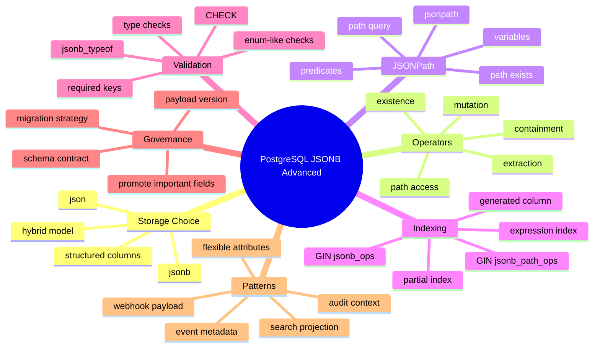
```mermaid
mindmap
  root((PostgreSQL JSONB Advanced))
    Storage Choice
      json
      jsonb
      structured columns
      hybrid model
    Operators
      extraction
      containment
      existence
      path access
      mutation
    JSONPath
      jsonpath
      predicates
      variables
      path query
      path exists
    Indexing
      GIN jsonb_ops
      GIN jsonb_path_ops
      expression index
      partial index
      generated column
    Validation
      jsonb_typeof
      CHECK
      required keys
      type checks
      enum-like checks
    Governance
      promote important fields
      payload version
      schema contract
      migration strategy
    Patterns
      webhook payload
      audit context
      event metadata
      flexible attributes
      search projection
```

**Core idea:** `jsonb` bukan tempat untuk “semua column yang belum sempat didesain”. Gunakan `jsonb` untuk data yang memang semi-terstruktur, bervariasi, jarang dipakai sebagai join key, atau perlu disimpan sebagai payload fleksibel. Field yang sering difilter, di-join, diurutkan, divalidasi, atau menjadi invariant bisnis biasanya lebih sehat dipromosikan menjadi column biasa.

---

## 3. `json` vs `jsonb`

| Aspek | `json` | `jsonb` |
|---|---|---|
| Storage | Menyimpan teks JSON input | Menyimpan bentuk binary terurai |
| Whitespace/order key | Lebih menjaga input asli | Tidak menjaga whitespace dan order object key secara semantik |
| Duplicate key | Lebih dekat ke input asli | Biasanya nilai terakhir yang efektif |
| Query operators | Ada, tapi lebih terbatas untuk indexing | Kaya operator dan indexing |
| Indexing | Tidak sekuat `jsonb` | GIN/B-tree/hash/operator class |
| Use case | Menyimpan raw payload persis | Queryable semi-structured data |

**Rule:** pakai `jsonb` untuk aplikasi yang perlu query payload. Pakai `json` hanya jika alasan utamanya adalah menyimpan dokumen JSON sebagai teks input yang lebih faithful.

---

## 4. Table Contoh

```sql
CREATE TABLE integration.inbound_event (
    id bigint GENERATED ALWAYS AS IDENTITY PRIMARY KEY,
    source_system text NOT NULL,
    external_event_id text NOT NULL,
    event_type text NOT NULL,
    payload jsonb NOT NULL,
    received_at timestamptz NOT NULL DEFAULT now(),

    CONSTRAINT inbound_event_payload_object
        CHECK (jsonb_typeof(payload) = 'object')
);
```

`jsonb_typeof` mengembalikan tipe top-level JSON sebagai teks seperti `object`, `array`, `string`, `number`, `boolean`, atau `null`; ini berguna untuk constraint dasar agar payload tidak berisi bentuk yang salah, misalnya array padahal contract mengharuskan object. ([PostgreSQL](https://www.postgresql.org/docs/current/functions-json.html))

---

## 5. Operator Extraction

| Operator | Return | Contoh | Catatan |
|---|---|---|---|
| `->` | `json/jsonb` | `payload -> 'customer'` | Ambil object/array/value sebagai JSON. |
| `->>` | `text` | `payload ->> 'status'` | Ambil scalar sebagai text. |
| `#>` | `json/jsonb` | `payload #> '{customer,address}'` | Path extraction sebagai JSON. |
| `#>>` | `text` | `payload #>> '{customer,address,city}'` | Path extraction sebagai text. |

```sql
SELECT
    id,
    payload -> 'customer' AS customer_json,
    payload ->> 'status' AS status_text,
    payload #>> '{customer,address,city}' AS city
FROM integration.inbound_event;
```

### Casting hasil extraction

```sql
SELECT
    id,
    (payload ->> 'amount')::numeric(18,2) AS amount,
    (payload ->> 'occurredAt')::timestamptz AS occurred_at
FROM integration.inbound_event
WHERE payload ? 'amount';
```

**Pitfall:** cast bisa gagal jika value tidak sesuai format. Untuk production, validasi dengan `CHECK`, generated column, staging table, atau data cleansing sebelum cast massal.

---

## 6. Existence Operators

| Operator | Arti |
|---|---|
| `?` | Apakah top-level key/string element ada? |
| `?|` | Apakah salah satu key dari array ada? |
| `?&` | Apakah semua key dari array ada? |

```sql
SELECT *
FROM integration.inbound_event
WHERE payload ? 'customerId';
```

```sql
SELECT *
FROM integration.inbound_event
WHERE payload ?| ARRAY['customerId', 'accountId'];
```

```sql
SELECT *
FROM integration.inbound_event
WHERE payload ?& ARRAY['status', 'occurredAt'];
```

Operator existence seperti `?`, `?|`, dan `?&` didukung oleh GIN operator class default `jsonb_ops`, tetapi tidak oleh `jsonb_path_ops`; ini penting saat memilih index. ([PostgreSQL](https://www.postgresql.org/docs/current/gin.html))

---

## 7. Containment: `@>` dan `<@`

Containment adalah operator paling penting untuk query `jsonb`.

```sql
SELECT *
FROM integration.inbound_event
WHERE payload @> '{"status": "PENDING"}'::jsonb;
```

Nested containment:

```sql
SELECT *
FROM integration.inbound_event
WHERE payload @> '{"customer": {"segment": "ENTERPRISE"}}'::jsonb;
```

Array containment:

```sql
SELECT *
FROM integration.inbound_event
WHERE payload @> '{"tags": ["vip"]}'::jsonb;
```

| Pattern | Cocok? | Catatan |
|---|---:|---|
| `payload @> '{"status":"PENDING"}'` | Ya | Sangat cocok dengan GIN. |
| `payload ->> 'status' = 'PENDING'` | Bisa | Biasanya butuh expression index B-tree jika sering. |
| `payload @> '{"customer":{"id":"C001"}}'` | Ya | Cocok untuk nested object. |
| `payload ? 'status'` | Ya dengan `jsonb_ops` | Top-level existence. |

---

## 8. JSONB Mutation Functions

JSONB immutable secara nilai; update berarti membuat value baru.

### `jsonb_set`

```sql
UPDATE integration.inbound_event
SET payload = jsonb_set(
    payload,
    '{processing,status}',
    '"PROCESSED"'::jsonb,
    true
)
WHERE id = 1001;
```

### `jsonb_insert`

```sql
UPDATE integration.inbound_event
SET payload = jsonb_insert(
    payload,
    '{tags,0}',
    '"priority"'::jsonb
)
WHERE id = 1001;
```

### Delete key

```sql
UPDATE integration.inbound_event
SET payload = payload - 'debug'
WHERE payload ? 'debug';
```

### Delete nested path

```sql
UPDATE integration.inbound_event
SET payload = payload #- '{internal,tempToken}'
WHERE payload #> '{internal,tempToken}' IS NOT NULL;
```

**Rule:** update JSONB besar bisa mahal karena row baru ditulis ulang secara MVCC. Jangan sering mutate field kecil di dalam JSONB besar jika field itu sebenarnya state operasional penting.

---

## 9. JSONPath Dasar

PostgreSQL mendukung SQL/JSON path language melalui tipe `jsonpath`. Path expression memakai `$` sebagai context item, lalu accessor seperti `.key`, `[*]`, atau filter predicate. Dokumentasi PostgreSQL menjelaskan JSONPath sebagai bahasa path mirip XPath untuk mengambil item dari JSON value, dan path expression selalu mulai dari `$`. ([PostgreSQL](https://www.postgresql.org/docs/current/functions-json.html))

```sql
SELECT jsonb_path_query(
    '{
       "items": [
         {"sku": "A1", "qty": 2},
         {"sku": "B2", "qty": 5}
       ]
     }'::jsonb,
    '$.items[*] ? (@.qty > 3)'
);
```

Hasil:

```text
{"sku": "B2", "qty": 5}
```

---

## 10. JSONPath Functions

| Function | Return | Use Case |
|---|---|---|
| `jsonb_path_exists` | boolean | Cek apakah ada item match path. |
| `jsonb_path_match` | boolean / null | Cek predicate JSONPath yang menghasilkan boolean tunggal. |
| `jsonb_path_query` | setof jsonb | Ambil semua item yang match. |
| `jsonb_path_query_array` | jsonb array | Ambil semua match sebagai array. |
| `jsonb_path_query_first` | jsonb | Ambil match pertama. |

Dokumentasi PostgreSQL menjelaskan bahwa `jsonb_path_query` mengembalikan semua item JSON yang dipilih oleh path, `jsonb_path_query_array` mengembalikan hasil sebagai JSON array, dan `jsonb_path_query_first` mengembalikan item pertama atau `NULL` jika tidak ada hasil. ([PostgreSQL](https://www.postgresql.org/docs/current/functions-json.html))

### Exists

```sql
SELECT *
FROM integration.inbound_event
WHERE jsonb_path_exists(
    payload,
    '$.items[*] ? (@.qty > 10)'
);
```

### Query array

```sql
SELECT
    id,
    jsonb_path_query_array(payload, '$.items[*].sku') AS skus
FROM integration.inbound_event;
```

### Variables

```sql
SELECT *
FROM integration.inbound_event
WHERE jsonb_path_exists(
    payload,
    '$.items[*] ? (@.qty >= $minQty)',
    jsonb_build_object('minQty', 10)
);
```

---

## 11. JSON Operators vs JSONPath

| Need | Operator Biasa | JSONPath |
|---|---|---|
| Ambil top-level key | `payload -> 'key'` | Bisa, tapi overkill |
| Cek containment sederhana | `@>` | Bisa |
| Cek key exists | `?` | Bisa |
| Filter array nested by condition | Sulit | Cocok |
| Ambil banyak item nested | `jsonb_array_elements` + SQL | Cocok |
| Predicate kompleks di dokumen | Rumit | Cocok |
| Index-friendly containment | Sangat baik | Bisa dengan `@?`/`@@` tergantung pattern/index |

**Rule:** gunakan operator biasa untuk query sederhana dan index-friendly. Gunakan JSONPath saat struktur nested/array membutuhkan predicate yang lebih ekspresif.

---

## 12. `JSON_TABLE`

PostgreSQL current mendukung `JSON_TABLE`, yang membuat hasil JSONPath menjadi bentuk relasional dengan kolom. Dokumentasi menjelaskan bahwa `JSON_TABLE` menggunakan JSON path expression untuk memilih row pattern, lalu `COLUMNS` mendefinisikan schema output. ([PostgreSQL](https://www.postgresql.org/docs/current/functions-json.html))

```sql
SELECT jt.*
FROM integration.inbound_event e,
JSON_TABLE(
    e.payload,
    '$.items[*]'
    COLUMNS (
        sku text PATH '$.sku',
        qty integer PATH '$.qty',
        price numeric PATH '$.price'
    )
) AS jt;
```

**Use case:** eksplode payload JSON menjadi rows dan columns untuk reporting, validation, atau staging transformation.

| Kapan cocok | Kapan hati-hati |
|---|---|
| Transform JSON array ke relational rows | Payload besar dan row explosion |
| Extract banyak field sekaligus | Query OLTP latency-sensitive |
| Staging import pipeline | Schema JSON tidak stabil |
| Report dari nested JSON | Butuh index/filter sebelum expand |

---

## 13. GIN Index untuk JSONB

### Default `jsonb_ops`

```sql
CREATE INDEX idx_inbound_event_payload_gin
ON integration.inbound_event
USING gin (payload);
```

`jsonb_ops` adalah default operator class. Ia mendukung operator `@>`, `@?`, `@@`, `?`, `?|`, dan `?&`. ([PostgreSQL](https://www.postgresql.org/docs/current/gin.html))

### `jsonb_path_ops`

```sql
CREATE INDEX idx_inbound_event_payload_path_gin
ON integration.inbound_event
USING gin (payload jsonb_path_ops);
```

`jsonb_path_ops` mendukung lebih sedikit operator, yaitu `@>`, `@?`, dan `@@`, tetapi dokumentasi PostgreSQL menyatakan operator class ini biasanya jauh lebih kecil dan lebih spesifik untuk pencarian containment/path tertentu dibanding default `jsonb_ops`. ([PostgreSQL](https://www.postgresql.org/docs/current/datatype-json.html))

| Operator Class | Mendukung | Kelebihan | Kekurangan |
|---|---|---|---|
| `jsonb_ops` | `@>`, `@?`, `@@`, `?`, `?|`, `?&` | Fleksibel | Index bisa lebih besar |
| `jsonb_path_ops` | `@>`, `@?`, `@@` | Biasanya lebih kecil/cepat untuk containment/path | Tidak support key existence `?` |

### Decision

| Query Dominan | Index |
|---|---|
| Banyak `payload ? 'key'` | `jsonb_ops` |
| Banyak `payload @> ...` | `jsonb_path_ops` bisa lebih baik |
| Banyak mixed operator | `jsonb_ops` |
| Hanya beberapa key spesifik sering difilter | Expression index / generated column |
| Query equality/range pada scalar extracted | B-tree expression/generated column |

---

## 14. Expression Index pada JSONB

Jika query sering mengambil satu scalar key, B-tree expression index sering lebih tepat daripada GIN besar.

```sql
CREATE INDEX idx_inbound_event_status_expr
ON integration.inbound_event ((payload ->> 'status'));
```

Query:

```sql
SELECT *
FROM integration.inbound_event
WHERE payload ->> 'status' = 'PENDING';
```

Untuk numeric:

```sql
CREATE INDEX idx_inbound_event_amount_expr
ON integration.inbound_event (((payload ->> 'amount')::numeric));
```

Query:

```sql
SELECT *
FROM integration.inbound_event
WHERE (payload ->> 'amount')::numeric >= 100000;
```

**Caution:** expression index harus cocok dengan expression query. Jika cast/query expression berbeda, planner mungkin tidak bisa memakai index.

---

## 15. Partial Index untuk JSONB

Jika hanya subset row penting:

```sql
CREATE INDEX idx_inbound_event_pending_created
ON integration.inbound_event (received_at DESC)
WHERE payload @> '{"status": "PENDING"}'::jsonb;
```

Query:

```sql
SELECT *
FROM integration.inbound_event
WHERE payload @> '{"status": "PENDING"}'::jsonb
ORDER BY received_at DESC
LIMIT 100;
```

Partial expression index:

```sql
CREATE INDEX idx_inbound_event_customer_id
ON integration.inbound_event ((payload ->> 'customerId'))
WHERE payload ? 'customerId';
```

**Rule:** partial index cocok jika predicate sangat sering dipakai dan subset-nya kecil/stabil.

---

## 16. Generated Columns dari JSONB

Generated column adalah column yang selalu dihitung dari column lain. PostgreSQL current mendukung generated column **stored** dan **virtual**; stored dihitung saat write dan menyimpan hasilnya, sedangkan virtual dihitung saat read. Generated expression hanya boleh memakai immutable function dan tidak boleh memakai subquery. ([PostgreSQL](https://www.postgresql.org/docs/current/ddl-generated-columns.html))

```sql
ALTER TABLE integration.inbound_event
ADD COLUMN customer_id text
GENERATED ALWAYS AS (payload ->> 'customerId') STORED;

ALTER TABLE integration.inbound_event
ADD COLUMN payload_status text
GENERATED ALWAYS AS (payload ->> 'status') STORED;
```

Index:

```sql
CREATE INDEX idx_inbound_event_customer_id
ON integration.inbound_event (customer_id);

CREATE INDEX idx_inbound_event_payload_status_received
ON integration.inbound_event (payload_status, received_at DESC);
```

Query:

```sql
SELECT *
FROM integration.inbound_event
WHERE payload_status = 'PENDING'
ORDER BY received_at DESC;
```

### Generated column vs expression index

| Aspek | Generated Column | Expression Index |
|---|---|---|
| Bisa dibaca langsung | Ya | Tidak sebagai column |
| Bisa diberi privilege terpisah | Ya | Tidak |
| Query lebih readable | Ya | Sedang |
| Storage ekstra | Stored: ya | Index storage saja |
| Cocok untuk field penting | Ya | Cocok untuk optimization-only |
| Bisa jadi FK/constraint target | Lebih praktis | Tidak langsung |

PostgreSQL juga mencatat generated columns memiliki privilege terpisah dari base column, sehingga bisa mengizinkan role membaca generated column tanpa membaca base column, dengan catatan keamanan tertentu untuk virtual generated column. ([PostgreSQL](https://www.postgresql.org/docs/current/ddl-generated-columns.html))

---

## 17. Promote Field dari JSONB ke Column

Promote field jika field tersebut:

| Kondisi | Lebih Baik Jadi Column? |
|---|---:|
| Sering dipakai `WHERE` | Ya |
| Sering dipakai `JOIN` | Ya |
| Sering dipakai `ORDER BY` | Ya |
| Perlu FK | Ya |
| Perlu unique constraint | Ya |
| Perlu strict type | Ya |
| Perlu NOT NULL | Ya |
| Hanya metadata display jarang | Tidak harus |
| Struktur berbeda-beda per event type | Bisa tetap JSONB |
| Raw webhook payload | Tetap JSONB + beberapa promoted columns |

Pattern hybrid:

```sql
CREATE TABLE integration.inbound_event (
    id bigint GENERATED ALWAYS AS IDENTITY PRIMARY KEY,
    source_system text NOT NULL,
    external_event_id text NOT NULL,
    event_type text NOT NULL,
    customer_id text GENERATED ALWAYS AS (payload ->> 'customerId') STORED,
    payload_status text GENERATED ALWAYS AS (payload ->> 'status') STORED,
    payload jsonb NOT NULL,
    received_at timestamptz NOT NULL DEFAULT now(),

    CONSTRAINT inbound_event_payload_object
        CHECK (jsonb_typeof(payload) = 'object')
);
```

---

## 18. Validation dengan `CHECK`

### Top-level object

```sql
ALTER TABLE integration.inbound_event
ADD CONSTRAINT ck_payload_is_object
CHECK (jsonb_typeof(payload) = 'object');
```

### Required keys

```sql
ALTER TABLE integration.inbound_event
ADD CONSTRAINT ck_payload_required_keys
CHECK (payload ?& ARRAY['customerId', 'status', 'occurredAt']);
```

### Enum-like value

```sql
ALTER TABLE integration.inbound_event
ADD CONSTRAINT ck_payload_status_valid
CHECK (
    payload ->> 'status' IN ('PENDING', 'PROCESSED', 'FAILED')
);
```

### Type validation

```sql
ALTER TABLE integration.inbound_event
ADD CONSTRAINT ck_payload_customer_id_string
CHECK (
    jsonb_typeof(payload -> 'customerId') = 'string'
);
```

### Numeric validation

```sql
ALTER TABLE integration.inbound_event
ADD CONSTRAINT ck_payload_amount_number
CHECK (
    NOT (payload ? 'amount')
    OR jsonb_typeof(payload -> 'amount') = 'number'
);
```

**Rule:** `CHECK` constraint bagus untuk validasi ringan dan stabil. Untuk validasi schema JSON kompleks, pertimbangkan staging pipeline, domain-specific validation function, atau validasi di layer ingest sebelum insert.

---

## 19. JSON Schema Governance

Tambahkan versi payload agar evolusi schema eksplisit.

```sql
CREATE TABLE integration.partner_payload (
    id bigint GENERATED ALWAYS AS IDENTITY PRIMARY KEY,
    partner_code text NOT NULL,
    payload_version integer NOT NULL,
    payload jsonb NOT NULL,
    received_at timestamptz NOT NULL DEFAULT now(),

    CONSTRAINT payload_is_object
        CHECK (jsonb_typeof(payload) = 'object'),

    CONSTRAINT payload_version_supported
        CHECK (payload_version IN (1, 2, 3))
);
```

Pattern query:

```sql
SELECT *
FROM integration.partner_payload
WHERE partner_code = 'PARTNER_A'
  AND payload_version = 2
  AND payload @> '{"status": "ACTIVE"}'::jsonb;
```

| Governance Need | Pattern |
|---|---|
| Schema berubah antar partner | `partner_code` + `payload_version` |
| Field penting lintas versi | Promote menjadi column |
| Field versi tertentu | Validasi conditional dengan `CHECK` |
| Backward compatibility | Support parser per version |
| Deprecation | Track count per version, migrate/reject old version |
| Debugging | Simpan raw payload immutable |

---

## 20. Conditional Validation by Event Type

```sql
ALTER TABLE integration.inbound_event
ADD CONSTRAINT ck_case_opened_payload
CHECK (
    event_type <> 'CASE_OPENED'
    OR (
        payload ?& ARRAY['caseNumber', 'openedBy']
        AND jsonb_typeof(payload -> 'caseNumber') = 'string'
        AND jsonb_typeof(payload -> 'openedBy') = 'string'
    )
);
```

```sql
ALTER TABLE integration.inbound_event
ADD CONSTRAINT ck_payment_received_payload
CHECK (
    event_type <> 'PAYMENT_RECEIVED'
    OR (
        payload ?& ARRAY['amount', 'currency']
        AND jsonb_typeof(payload -> 'amount') = 'number'
        AND payload ->> 'currency' IN ('IDR', 'USD', 'SGD')
    )
);
```

**Caution:** terlalu banyak conditional check pada JSONB bisa membuat table sulit diubah. Jika rule makin kompleks, pisahkan table per event family atau gunakan staging + validation procedure.

---

## 21. JSONB Array Query Pattern

Table:

```sql
CREATE TABLE case_mgmt.case_file (
    id bigint GENERATED ALWAYS AS IDENTITY PRIMARY KEY,
    case_number text NOT NULL UNIQUE,
    attributes jsonb NOT NULL DEFAULT '{}'::jsonb
);
```

Payload contoh:

```json
{
  "tags": ["vip", "regulatory", "urgent"],
  "risk": {"score": 87, "level": "HIGH"}
}
```

### Contains tag

```sql
SELECT *
FROM case_mgmt.case_file
WHERE attributes @> '{"tags": ["vip"]}'::jsonb;
```

### Expand tags

```sql
SELECT
    c.id,
    tag.value AS tag
FROM case_mgmt.case_file c
CROSS JOIN LATERAL jsonb_array_elements_text(c.attributes -> 'tags') AS tag(value);
```

### Any tag with filter

```sql
SELECT *
FROM case_mgmt.case_file c
WHERE EXISTS (
    SELECT 1
    FROM jsonb_array_elements_text(c.attributes -> 'tags') AS tag(value)
    WHERE tag.value IN ('urgent', 'regulatory')
);
```

**Rule:** jika tag digunakan untuk query high-volume, pertimbangkan normalized join table atau generated/search projection. JSONB array nyaman, tetapi tidak selalu paling baik untuk relational relationship.

---

## 22. JSONB to Relational Projection

### Projection view

```sql
CREATE VIEW integration.v_inbound_event_projected AS
SELECT
    id,
    source_system,
    external_event_id,
    event_type,
    payload ->> 'customerId' AS customer_id,
    payload ->> 'status' AS payload_status,
    (payload ->> 'occurredAt')::timestamptz AS occurred_at,
    received_at
FROM integration.inbound_event;
```

### Materialized projection table pattern

```sql
CREATE TABLE integration.inbound_event_projection (
    inbound_event_id bigint PRIMARY KEY,
    customer_id text,
    payload_status text,
    occurred_at timestamptz,
    source_system text NOT NULL,
    event_type text NOT NULL,
    received_at timestamptz NOT NULL
);
```

```sql
INSERT INTO integration.inbound_event_projection (
    inbound_event_id,
    customer_id,
    payload_status,
    occurred_at,
    source_system,
    event_type,
    received_at
)
SELECT
    id,
    payload ->> 'customerId',
    payload ->> 'status',
    NULLIF(payload ->> 'occurredAt', '')::timestamptz,
    source_system,
    event_type,
    received_at
FROM integration.inbound_event;
```

| Projection Type | Kapan |
|---|---|
| View | Ringan, data kecil/sedang, transform sederhana |
| Generated column | Field penting per row, selalu sinkron |
| Materialized projection table | Reporting/search berat, transform kompleks |
| Normalized child table | Array/object menjadi relational relationship |

---

## 23. JSONB dengan Partitioning

JSONB sering muncul di event/audit table besar. Kombinasi umum:

```sql
CREATE TABLE audit.case_event (
    created_at timestamptz NOT NULL,
    id bigint GENERATED ALWAYS AS IDENTITY,
    case_id bigint NOT NULL,
    event_type text NOT NULL,
    payload jsonb NOT NULL DEFAULT '{}'::jsonb,
    PRIMARY KEY (created_at, id)
) PARTITION BY RANGE (created_at);
```

Index parent:

```sql
CREATE INDEX idx_case_event_case_created
ON audit.case_event (case_id, created_at DESC);

CREATE INDEX idx_case_event_payload_gin
ON audit.case_event
USING gin (payload jsonb_path_ops);
```

**Rule:** untuk table partitioned, pastikan query membawa partition key seperti `created_at`, bukan hanya filter JSONB. GIN index membantu match payload, tetapi pruning partition mengurangi jumlah index/table yang perlu disentuh.

---

## 24. JSONB dan TOAST / Storage Cost

JSONB besar bisa masuk TOAST. Ini membuat row utama tetap lebih kecil, tetapi akses ke field besar bisa memicu I/O tambahan. Pattern yang sehat:

```sql
-- Untuk list/report ringan
SELECT id, source_system, event_type, received_at
FROM integration.inbound_event
WHERE received_at >= now() - interval '1 day'
ORDER BY received_at DESC
LIMIT 100;

-- Ambil payload hanya saat detail view
SELECT id, payload
FROM integration.inbound_event
WHERE id = 1001;
```

**Rule:** hindari `SELECT *` pada table dengan payload JSONB besar. Ambil payload hanya saat dibutuhkan.

---

## 25. JSONB Update dan MVCC Cost

```sql
UPDATE integration.inbound_event
SET payload = jsonb_set(payload, '{processing,retryCount}', '3'::jsonb, true)
WHERE id = 1001;
```

Walaupun hanya satu key berubah, PostgreSQL tetap membuat versi row baru. Pada table update-heavy, JSONB besar bisa menyebabkan:

| Efek | Penjelasan |
|---|---|
| Dead tuple | MVCC membuat row version lama |
| WAL besar | Perubahan JSONB dapat menghasilkan WAL besar |
| TOAST churn | Large value bisa menyebabkan write tambahan |
| Index maintenance | GIN/expression index ikut update |
| Bloat | Jika update sering dan vacuum kalah cepat |

**Design rule:** JSONB cocok untuk payload immutable atau mostly-read. Untuk state yang sering berubah, gunakan column biasa.

---

## 26. JSONB Index Strategy Matrix

| Query | Index yang Cocok |
|---|---|
| `payload @> '{"status":"PENDING"}'` | GIN `jsonb_path_ops` atau `jsonb_ops` |
| `payload ? 'customerId'` | GIN `jsonb_ops` |
| `payload ->> 'status' = 'PENDING'` | B-tree expression/generated column |
| `(payload ->> 'amount')::numeric > 1000` | B-tree expression/generated numeric column |
| `payload @? '$.items[*] ? (@.qty > 10)'` | GIN JSONB, cek `EXPLAIN` |
| Search exact nested object | GIN containment |
| Frequent sort by JSON scalar | Generated column + B-tree |
| Frequent join by JSON scalar | Promote/generated column + B-tree |
| Rare ad-hoc JSON exploration | Maybe no index or broad GIN |
| Many different JSON predicates | Broad GIN `jsonb_ops`, watch size |

---

## 27. Pattern: Webhook Inbox

```sql
CREATE TABLE integration.webhook_inbox (
    id bigint GENERATED ALWAYS AS IDENTITY PRIMARY KEY,
    provider text NOT NULL,
    external_event_id text NOT NULL,
    event_type text NOT NULL,
    payload jsonb NOT NULL,
    payload_version integer NOT NULL DEFAULT 1,
    received_at timestamptz NOT NULL DEFAULT now(),
    processed_at timestamptz,
    processing_status text NOT NULL DEFAULT 'PENDING',

    CONSTRAINT webhook_payload_object
        CHECK (jsonb_typeof(payload) = 'object'),

    CONSTRAINT webhook_unique_event
        UNIQUE (provider, external_event_id)
);
```

Indexes:

```sql
CREATE INDEX idx_webhook_pending
ON integration.webhook_inbox (received_at ASC, id ASC)
WHERE processing_status = 'PENDING';

CREATE INDEX idx_webhook_payload_gin
ON integration.webhook_inbox
USING gin (payload jsonb_path_ops);
```

**Design:** operational status (`processing_status`, `processed_at`) menjadi column biasa karena sering berubah. Raw payload tetap JSONB dan sebaiknya immutable.

---

## 28. Pattern: Flexible Case Attributes

```sql
CREATE TABLE case_mgmt.case_file (
    id bigint GENERATED ALWAYS AS IDENTITY PRIMARY KEY,
    case_number text NOT NULL UNIQUE,
    status text NOT NULL,
    priority integer NOT NULL DEFAULT 0,
    attributes jsonb NOT NULL DEFAULT '{}'::jsonb,

    CONSTRAINT case_attributes_object
        CHECK (jsonb_typeof(attributes) = 'object')
);
```

Index untuk ad-hoc containment:

```sql
CREATE INDEX idx_case_file_attributes_gin
ON case_mgmt.case_file
USING gin (attributes);
```

Expression index untuk attribute penting:

```sql
CREATE INDEX idx_case_file_external_ref
ON case_mgmt.case_file ((attributes ->> 'externalRef'))
WHERE attributes ? 'externalRef';
```

**Rule:** flexible attributes boleh, tetapi jika attribute mulai jadi filter utama, promote ke column atau generated column.

---

## 29. Pattern: Audit Context

```sql
CREATE TABLE audit.case_event (
    id bigint GENERATED ALWAYS AS IDENTITY PRIMARY KEY,
    case_id bigint NOT NULL,
    event_type text NOT NULL,
    actor text,
    context jsonb NOT NULL DEFAULT '{}'::jsonb,
    created_at timestamptz NOT NULL DEFAULT now(),

    CONSTRAINT context_object
        CHECK (jsonb_typeof(context) = 'object')
);
```

Contoh context:

```json
{
  "ip": "10.10.1.20",
  "userAgent": "internal-service",
  "requestId": "req-123",
  "source": "case-api"
}
```

Query:

```sql
SELECT *
FROM audit.case_event
WHERE context @> '{"source": "case-api"}'::jsonb
  AND created_at >= now() - interval '7 days';
```

**Design:** audit context cocok untuk JSONB karena field bisa berubah antar event type dan biasanya tidak semua field perlu schema ketat.

---

## 30. Pattern: JSONB Staging to Typed Table

### Staging raw

```sql
CREATE TABLE staging.raw_partner_case (
    id bigint GENERATED ALWAYS AS IDENTITY PRIMARY KEY,
    partner_code text NOT NULL,
    payload jsonb NOT NULL,
    loaded_at timestamptz NOT NULL DEFAULT now(),

    CHECK (jsonb_typeof(payload) = 'object')
);
```

### Target typed

```sql
CREATE TABLE case_mgmt.partner_case_import (
    id bigint GENERATED ALWAYS AS IDENTITY PRIMARY KEY,
    partner_code text NOT NULL,
    external_case_id text NOT NULL,
    case_number text NOT NULL,
    opened_at timestamptz NOT NULL,
    priority integer NOT NULL,
    raw_payload jsonb NOT NULL
);
```

### Transform

```sql
INSERT INTO case_mgmt.partner_case_import (
    partner_code,
    external_case_id,
    case_number,
    opened_at,
    priority,
    raw_payload
)
SELECT
    partner_code,
    payload ->> 'externalCaseId',
    payload ->> 'caseNumber',
    (payload ->> 'openedAt')::timestamptz,
    (payload ->> 'priority')::integer,
    payload
FROM staging.raw_partner_case
WHERE payload ?& ARRAY['externalCaseId', 'caseNumber', 'openedAt', 'priority'];
```

**Rule:** untuk import/integration, staging JSONB + typed target table sering lebih aman daripada menyimpan semuanya sebagai JSONB di table final.

---

## 31. Monitoring JSONB Index dan Size

### Table/index size

```sql
SELECT
    relid::regclass AS relation,
    pg_size_pretty(pg_table_size(relid)) AS table_size,
    pg_size_pretty(pg_indexes_size(relid)) AS indexes_size,
    pg_size_pretty(pg_total_relation_size(relid)) AS total_size
FROM pg_statio_user_tables
WHERE relid::regclass::text LIKE 'integration.%'
ORDER BY pg_total_relation_size(relid) DESC;
```

### Index usage

```sql
SELECT
    schemaname,
    relname,
    indexrelname,
    idx_scan,
    idx_tup_read,
    idx_tup_fetch,
    pg_size_pretty(pg_relation_size(indexrelid)) AS index_size
FROM pg_stat_user_indexes
WHERE indexrelname ILIKE '%payload%'
   OR indexrelname ILIKE '%json%'
ORDER BY pg_relation_size(indexrelid) DESC;
```

### Slow JSONB queries

```sql
SELECT
    calls,
    mean_exec_time,
    max_exec_time,
    rows,
    query
FROM pg_stat_statements
WHERE query ILIKE '%jsonb%'
   OR query ILIKE '%@>%'
   OR query ILIKE '%->>%'
ORDER BY total_exec_time DESC
LIMIT 20;
```

---

## 32. `EXPLAIN` Checklist untuk JSONB Query

```sql
EXPLAIN (ANALYZE, BUFFERS)
SELECT *
FROM integration.inbound_event
WHERE payload @> '{"status": "PENDING"}'::jsonb;
```

Yang dicek:

| Signal | Interpretasi |
|---|---|
| `Bitmap Index Scan` pada GIN | Index dipakai |
| `Seq Scan` besar | Index tidak ada/tidak cocok/selectivity buruk |
| Rows estimate jauh salah | Statistics/predicate sulit dipahami planner |
| Banyak heap blocks read | Data besar/buffer miss |
| Recheck banyak | Normal untuk beberapa index, tapi bisa mahal |
| Sort besar | Butuh B-tree index untuk sort/filter tambahan |
| Filter setelah index | GIN hanya bantu sebagian predicate |

---

## 33. Common Pitfalls

| Pitfall | Dampak | Solusi |
|---|---|---|
| Semua field disimpan di JSONB | Constraint, join, index, analytics sulit | Promote field penting ke column |
| JSONB dipakai untuk state sering berubah | WAL/bloat/update cost tinggi | Gunakan column biasa |
| GIN broad index dibuat tanpa kebutuhan | Index besar dan write lambat | Gunakan expression/generated/partial index |
| Pakai `jsonb_path_ops` lalu butuh `?` | Index tidak support operator | Pilih `jsonb_ops` |
| Cast JSON scalar langsung tanpa validasi | Query gagal saat data buruk | `CHECK`, staging, generated typed column |
| Query `payload ->> 'x'` tanpa expression index | Seq scan | Buat expression/generated B-tree |
| Index expression tidak sama dengan query | Index tidak dipakai | Samakan expression persis |
| `SELECT *` dari payload besar | I/O dan network besar | Ambil column spesifik |
| JSONB array untuk relational many-to-many | Integrity/query sulit | Normalize child table |
| Tidak versioning payload | Evolusi schema kacau | Tambah `payload_version` |
| GIN index dianggap menyelesaikan semua | Sort/join/range tetap lambat | Gabungkan dengan B-tree/generated columns |
| Tidak monitor index size | Storage membengkak | Review `pg_stat_user_indexes` dan relation size |

---

## 34. Decision Matrix

| Problem | Pattern |
|---|---|
| Raw webhook payload | `jsonb` immutable + operational columns |
| Query status/customer from JSON often | Generated column + B-tree |
| Ad-hoc containment search | GIN `jsonb_ops` |
| Heavy containment search only | GIN `jsonb_path_ops` |
| Need key existence `?` | GIN `jsonb_ops` |
| Need range/sort on JSON number/date | Generated typed column |
| Need validate required keys | `CHECK` with `?&` and `jsonb_typeof` |
| Need nested array filtering | JSONPath or lateral expansion |
| Need report nested JSON as rows | `JSON_TABLE` / `jsonb_array_elements` |
| Need enforce FK/unique on JSON field | Promote/generated column, then constraint |
| Need mutable workflow state | Real columns, not JSONB |
| Need flexible optional metadata | JSONB object |

---

## 35. Review Checklist

| Checklist | Pertanyaan |
|---|---|
| Data ownership | Apakah payload raw, metadata, atau domain state? |
| Query pattern | Field JSON mana yang sering difilter/sort/join? |
| Type safety | Apakah field penting punya type validation? |
| Constraint | Apakah required key dan enum value divalidasi? |
| Index | Apakah operator query cocok dengan index operator class? |
| Generated columns | Apakah scalar penting sudah dipromosikan? |
| Payload size | Apakah payload besar dan sering `SELECT *`? |
| Update pattern | Apakah JSONB sering di-update? |
| Versioning | Apakah ada `payload_version` untuk evolusi schema? |
| Partitioning | Apakah table event besar perlu partition by time? |
| Observability | Apakah size/index usage/slow JSON query dimonitor? |
| Governance | Apakah ada rule kapan field harus keluar dari JSONB? |

---

## 36. Minimal Production Pattern

```sql
CREATE TABLE integration.inbound_event (
    id bigint GENERATED ALWAYS AS IDENTITY PRIMARY KEY,

    source_system text NOT NULL,
    external_event_id text NOT NULL,
    event_type text NOT NULL,

    payload jsonb NOT NULL,
    payload_version integer NOT NULL DEFAULT 1,

    customer_id text GENERATED ALWAYS AS (payload ->> 'customerId') STORED,
    payload_status text GENERATED ALWAYS AS (payload ->> 'status') STORED,

    received_at timestamptz NOT NULL DEFAULT now(),

    CONSTRAINT inbound_event_unique_external
        UNIQUE (source_system, external_event_id),

    CONSTRAINT inbound_event_payload_object
        CHECK (jsonb_typeof(payload) = 'object'),

    CONSTRAINT inbound_event_payload_required
        CHECK (payload ?& ARRAY['customerId', 'status']),

    CONSTRAINT inbound_event_payload_status_valid
        CHECK (payload ->> 'status' IN ('PENDING', 'PROCESSED', 'FAILED'))
);

CREATE INDEX idx_inbound_event_status_received
ON integration.inbound_event (payload_status, received_at DESC);

CREATE INDEX idx_inbound_event_customer_id
ON integration.inbound_event (customer_id);

CREATE INDEX idx_inbound_event_payload_gin
ON integration.inbound_event
USING gin (payload jsonb_path_ops);
```

Query:

```sql
SELECT
    id,
    source_system,
    external_event_id,
    event_type,
    customer_id,
    payload_status,
    received_at
FROM integration.inbound_event
WHERE payload_status = 'PENDING'
  AND customer_id = 'CUST-001'
ORDER BY received_at DESC
LIMIT 50;
```

Detail payload:

```sql
SELECT payload
FROM integration.inbound_event
WHERE id = 1001;
```

---

## 37. Roadmap Belajar Singkat

| Urutan | Materi | Target |
|---:|---|---|
| 1 | `json` vs `jsonb` | Bisa memilih storage type yang tepat. |
| 2 | Extraction operators | Bisa mengambil scalar/object nested. |
| 3 | Containment/existence | Bisa menulis predicate JSONB index-friendly. |
| 4 | JSONPath | Bisa query nested array/object kompleks. |
| 5 | `JSON_TABLE` / lateral expansion | Bisa mengubah JSON menjadi rows/columns. |
| 6 | GIN operator class | Bisa memilih `jsonb_ops` vs `jsonb_path_ops`. |
| 7 | Expression/generated index | Bisa mengoptimalkan scalar JSON penting. |
| 8 | Validation | Bisa enforce minimal schema dengan `CHECK`. |
| 9 | Governance | Bisa menentukan kapan field harus dipromosikan. |
| 10 | Production review | Bisa menghindari bloat, WAL besar, index salah, dan schema drift. |

## Rekomendasi Materi Selanjutnya

Lanjut paling tepat: **Cheatsheet PostgreSQL Extension Ecosystem: `pg_stat_statements`, `pg_trgm`, `btree_gist`, `pgcrypto`, `uuid-ossp`, FDW, Extension Governance, Security, dan Upgrade Strategy**.

---

**Sources:**

- [PostgreSQL: Documentation: 18: 8.14. JSON Types](https://www.postgresql.org/docs/current/datatype-json.html)

## Response:
7/13/2026, 1:22:35 AM

# Cheatsheet: PostgreSQL Extension Ecosystem

## 1. Scope

Cheatsheet ini fokus **PostgreSQL-only** untuk extension ecosystem:

- konsep extension
- `CREATE EXTENSION`, `ALTER EXTENSION`, `DROP EXTENSION`
- trusted vs non-trusted extension
- schema placement
- extension inventory
- `pg_stat_statements`
- `pg_trgm`
- `btree_gist`
- `btree_gin`
- `pgcrypto`
- `uuid-ossp`
- `unaccent`
- `postgres_fdw`
- extension governance, security, backup/restore, dan upgrade strategy

PostgreSQL extension adalah mekanisme packaging untuk menambahkan SQL object seperti function, type, operator, index support method, atau foreign data wrapper ke database. `CREATE EXTENSION` memuat extension ke **database saat ini**, bukan otomatis ke semua database dalam cluster. ([PostgreSQL](https://www.postgresql.org/docs/current/sql-createextension.html))

---

## 2. Mental Model

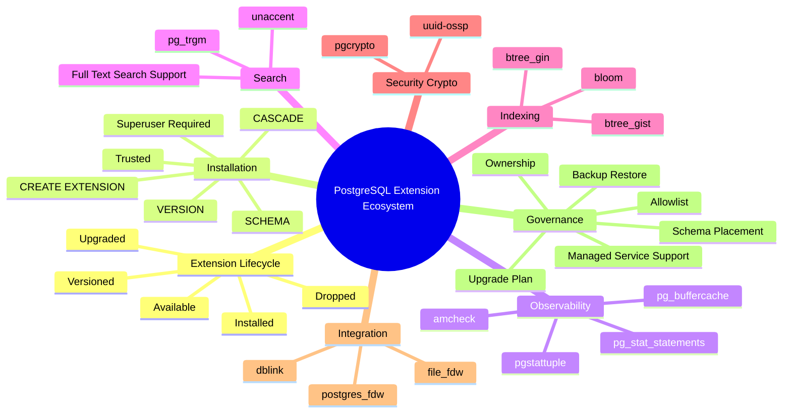
```mermaid
mindmap
  root((PostgreSQL Extension Ecosystem))
    Extension Lifecycle
      Available
      Installed
      Versioned
      Upgraded
      Dropped
    Installation
      CREATE EXTENSION
      SCHEMA
      VERSION
      CASCADE
      Trusted
      Superuser Required
    Observability
      pg_stat_statements
      pgstattuple
      pg_buffercache
      amcheck
    Search
      pg_trgm
      unaccent
      Full Text Search Support
    Indexing
      btree_gist
      btree_gin
      bloom
    Security Crypto
      pgcrypto
      uuid-ossp
    Integration
      postgres_fdw
      file_fdw
      dblink
    Governance
      Allowlist
      Ownership
      Schema Placement
      Upgrade Plan
      Backup Restore
      Managed Service Support
```

**Core idea:** extension memperluas PostgreSQL, tetapi juga memperluas **attack surface, operational dependency, upgrade complexity, dan restore dependency**. Extension harus diperlakukan seperti bagian dari database architecture, bukan sekadar command tambahan.

---

## 3. Extension Lifecycle

| State | Makna | Cara Cek |
|---|---|---|
| Available | Extension files/control script tersedia di server. | `pg_available_extensions` |
| Installed | Extension sudah dibuat dalam database tertentu. | `pg_extension` |
| Versioned | Extension punya installed version. | `pg_extension.extversion` |
| Upgradable | Ada versi baru yang bisa dipakai. | `pg_available_extension_versions` |
| Dropped | Extension dan object member-nya dihapus. | `DROP EXTENSION` |

```sql
SELECT
    name,
    default_version,
    installed_version,
    comment
FROM pg_available_extensions
ORDER BY name;
```

```sql
SELECT
    extname,
    extversion,
    extnamespace::regnamespace AS schema_name,
    extowner::regrole AS owner
FROM pg_extension
ORDER BY extname;
```

PostgreSQL menyediakan view `pg_available_extensions` dan `pg_available_extension_versions` untuk melihat extension yang tersedia untuk dimuat. ([PostgreSQL](https://www.postgresql.org/docs/current/sql-createextension.html))

---

## 4. `CREATE EXTENSION`

Syntax dasar:

```sql
CREATE EXTENSION IF NOT EXISTS pg_trgm;
```

Dengan schema eksplisit:

```sql
CREATE SCHEMA IF NOT EXISTS extensions;

CREATE EXTENSION IF NOT EXISTS pg_trgm
WITH SCHEMA extensions;
```

Dengan versi eksplisit:

```sql
CREATE EXTENSION IF NOT EXISTS hstore
WITH VERSION '1.8';
```

| Clause | Fungsi |
|---|---|
| `IF NOT EXISTS` | Tidak error jika extension sudah ada, tetapi tetap harus dicek apakah extension yang ada sesuai ekspektasi. |
| `SCHEMA` | Meletakkan object extension ke schema tertentu, jika extension tersebut relocatable. |
| `VERSION` | Memilih versi extension tertentu. |
| `CASCADE` | Menginstall extension dependency yang dibutuhkan. |

`CREATE EXTENSION` menjalankan script extension, membuat object seperti function/type/operator/index support method, dan mencatat object mana saja yang menjadi member extension agar bisa di-drop sebagai satu unit. User yang menjalankan command biasanya menjadi owner extension. ([PostgreSQL](https://www.postgresql.org/docs/current/sql-createextension.html))

---

## 5. Trusted vs Non-Trusted Extension

Tidak semua extension boleh diinstall oleh non-superuser. PostgreSQL membedakan extension yang dianggap **trusted** dan extension yang membutuhkan privilege lebih tinggi. Trusted extension dapat diinstall oleh user yang punya `CREATE` privilege pada database saat ini; banyak extension lain tetap membutuhkan superuser atau privilege khusus. ([PostgreSQL](https://www.postgresql.org/docs/current/contrib.html))

| Extension | Trusted? | Catatan |
|---|---:|---|
| `pg_trgm` | Ya | Similarity/fuzzy search berbasis trigram. |
| `pgcrypto` | Ya | Fungsi cryptographic; butuh OpenSSL saat build. |
| `btree_gist` | Ya | GiST operator class dengan behavior B-tree. |
| `btree_gin` | Ya | GIN operator class dengan behavior B-tree. |
| `uuid-ossp` | Ya | UUID generation tambahan. |
| `unaccent` | Ya | Dictionary untuk menghapus accent/diacritic. |
| `postgres_fdw` | Umumnya lebih privileged | FDW untuk akses remote PostgreSQL; setup server/mapping butuh governance ketat. |

**Rule:** buat allowlist extension per environment. Jangan memberi user biasa kemampuan install extension bebas di production.

---

## 6. Schema Placement Strategy

Default object extension sering masuk ke `public` jika schema tidak diatur. Untuk production, schema khusus sering lebih rapi.

```sql
CREATE SCHEMA IF NOT EXISTS extensions;

CREATE EXTENSION IF NOT EXISTS pg_trgm WITH SCHEMA extensions;
CREATE EXTENSION IF NOT EXISTS btree_gist WITH SCHEMA extensions;
CREATE EXTENSION IF NOT EXISTS pgcrypto WITH SCHEMA extensions;
```

| Strategy | Kelebihan | Risiko |
|---|---|---|
| Install di `public` | Simple, umum di banyak tutorial | `public` sering terlalu longgar; search path risk. |
| Install di `extensions` | Lebih rapi dan terkontrol | Beberapa extension tidak relocatable atau object perlu schema-qualified. |
| Install di application schema | Dekat dengan object aplikasi | Bisa mencampur ownership/dependency. |
| Install di `template1` | Otomatis tersedia untuk database baru | Bisa menyebarkan extension yang tidak semua DB butuhkan. |

PostgreSQL memungkinkan extension object diletakkan ke schema pilihan dengan `CREATE EXTENSION ... SCHEMA`, jika extension tersebut mengizinkan relokasi; extension name sendiri tetap unik database-wide dan tidak dianggap berada di schema tertentu. ([PostgreSQL](https://www.postgresql.org/docs/current/sql-createextension.html))

---

## 7. Inventory dan Dependency

### List installed extensions

```sql
SELECT
    extname,
    extversion,
    extnamespace::regnamespace AS schema_name,
    extowner::regrole AS owner
FROM pg_extension
ORDER BY extname;
```

### Object anggota extension

```sql
SELECT
    e.extname,
    d.classid::regclass AS catalog,
    d.objid,
    d.objid::regprocedure AS object_if_function
FROM pg_extension e
JOIN pg_depend d
    ON d.refobjid = e.oid
WHERE e.extname = 'pg_trgm';
```

### Extensions available but not installed

```sql
SELECT
    name,
    default_version,
    comment
FROM pg_available_extensions
WHERE installed_version IS NULL
ORDER BY name;
```

### Extension versions

```sql
SELECT
    name,
    version,
    installed,
    superuser,
    trusted,
    relocatable,
    schema
FROM pg_available_extension_versions
ORDER BY name, version;
```

**Rule:** inventory extension harus masuk production review, sama seperti schema migration dan role grants.

---

## 8. `pg_stat_statements`

`pg_stat_statements` adalah extension observability paling penting untuk workload SQL. Modul ini melacak planning dan execution statistics dari SQL statement yang dijalankan server. ([PostgreSQL](https://www.postgresql.org/docs/current/pgstatstatements.html))

### Enable

Biasanya perlu `shared_preload_libraries`, lalu restart:

```conf
shared_preload_libraries = 'pg_stat_statements'
```

Setelah restart, di database target:

```sql
CREATE EXTENSION IF NOT EXISTS pg_stat_statements;
```

Dokumentasi PostgreSQL menyatakan `pg_stat_statements` harus dimuat lewat `shared_preload_libraries` karena membutuhkan shared memory tambahan, sehingga penambahan atau penghapusan module ini memerlukan restart server. ([PostgreSQL](https://www.postgresql.org/docs/current/pgstatstatements.html))

### Query top total time

```sql
SELECT
    calls,
    round(total_exec_time::numeric, 2) AS total_exec_ms,
    round(mean_exec_time::numeric, 2) AS mean_exec_ms,
    round(max_exec_time::numeric, 2) AS max_exec_ms,
    rows,
    query
FROM pg_stat_statements
ORDER BY total_exec_time DESC
LIMIT 20;
```

### Query top mean latency

```sql
SELECT
    calls,
    round(mean_exec_time::numeric, 2) AS mean_exec_ms,
    round(max_exec_time::numeric, 2) AS max_exec_ms,
    rows,
    query
FROM pg_stat_statements
WHERE calls >= 10
ORDER BY mean_exec_time DESC
LIMIT 20;
```

### Reset stats

```sql
SELECT pg_stat_statements_reset();
```

| Metric | Arti |
|---|---|
| `calls` | Jumlah eksekusi normalized query. |
| `total_exec_time` | Total waktu execution. |
| `mean_exec_time` | Rata-rata latency execution. |
| `max_exec_time` | Worst observed execution latency. |
| `rows` | Total rows yang dikembalikan/diproses. |
| `query` | Representative normalized query text. |

**Rule:** `pg_stat_statements` adalah starting point untuk performance investigation. Setelah menemukan query kandidat, lanjutkan dengan `EXPLAIN (ANALYZE, BUFFERS)`.

---

## 9. `pg_trgm`

`pg_trgm` menyediakan function/operator untuk similarity text berdasarkan trigram, plus operator class index untuk mempercepat pencarian string mirip. Extension ini trusted dan dapat diinstall oleh non-superuser yang punya `CREATE` privilege pada database. ([PostgreSQL](https://www.postgresql.org/docs/current/pgtrgm.html?utm_source=chatgpt.com))

### Enable

```sql
CREATE EXTENSION IF NOT EXISTS pg_trgm;
```

### Similarity search

```sql
SELECT
    id,
    case_number,
    similarity(case_number, 'CASE-2026-001') AS score
FROM case_mgmt.case_file
WHERE case_number % 'CASE-2026-001'
ORDER BY score DESC
LIMIT 20;
```

### Index untuk fuzzy/substring search

```sql
CREATE INDEX idx_case_file_case_number_trgm
ON case_mgmt.case_file
USING gin (case_number gin_trgm_ops);
```

### `ILIKE` dengan trigram

```sql
SELECT *
FROM case_mgmt.case_file
WHERE case_number ILIKE '%2026-001%';
```

| Use Case | Cocok |
|---|---|
| Typo-tolerant search | Ya |
| Partial case number search | Ya |
| Name search | Ya |
| `LIKE '%term%'` skala besar | Ya, dengan GIN/GiST trigram |
| Semantic meaning search | Tidak |
| Full document lexical ranking | Lebih cocok FTS |

**Rule:** gunakan Full Text Search untuk word/lexeme search, gunakan `pg_trgm` untuk typo, substring, case number, name, dan fuzzy matching.

---

## 10. `unaccent`

`unaccent` adalah text search dictionary yang menghapus accent/diacritic dari lexeme. Dictionary ini bersifat filtering dictionary, sehingga output-nya diteruskan ke dictionary berikutnya. Ini berguna untuk accent-insensitive search. ([PostgreSQL](https://www.postgresql.org/docs/current/unaccent.html?utm_source=chatgpt.com))

### Enable

```sql
CREATE EXTENSION IF NOT EXISTS unaccent;
```

### Function usage

```sql
SELECT unaccent('Hôtel déjà vu');
```

### Search pattern

```sql
CREATE INDEX idx_person_name_unaccent_trgm
ON identity.person
USING gin (unaccent(lower(full_name)) gin_trgm_ops);
```

Query:

```sql
SELECT *
FROM identity.person
WHERE unaccent(lower(full_name)) ILIKE unaccent(lower('%jose%'));
```

**Caution:** expression index harus cocok dengan expression di query. Jika index memakai `unaccent(lower(full_name))`, query juga harus memakai bentuk yang sama agar planner bisa memanfaatkan index.

---

## 11. `btree_gist`

`btree_gist` menyediakan GiST operator class yang meniru behavior B-tree untuk banyak tipe data umum, seperti integer, numeric, timestamp, date, text, inet, uuid, bool, dan enum. Extension ini sering dipakai untuk exclusion constraint yang mencampur equality dan range overlap. ([PostgreSQL](https://www.postgresql.org/docs/current/btree-gist.html?utm_source=chatgpt.com))

### Enable

```sql
CREATE EXTENSION IF NOT EXISTS btree_gist;
```

### No-overlap schedule pattern

```sql
CREATE TABLE booking.room_reservation (
    id bigint GENERATED ALWAYS AS IDENTITY PRIMARY KEY,
    room_id bigint NOT NULL,
    reserved_period tstzrange NOT NULL,

    EXCLUDE USING gist (
        room_id WITH =,
        reserved_period WITH &&
    )
);
```

| Use Case | Kenapa `btree_gist` |
|---|---|
| Prevent overlapping booking per resource | Butuh equality pada `room_id` + range overlap. |
| Validity period per entity | `entity_id =` + `valid_period &&`. |
| Assignment period no-overlap | `assignee_id =` + time range overlap. |
| Complex exclusion constraint | GiST dapat menggabungkan operator family berbeda. |

**Rule:** gunakan `btree_gist` saat butuh exclusion constraint dengan scalar equality + range operator. Untuk equality lookup biasa, B-tree normal tetap pilihan default.

---

## 12. `btree_gin`

`btree_gin` menyediakan GIN operator class dengan behavior B-tree untuk berbagai tipe scalar. Ini berguna ketika perlu multicolumn GIN index yang mencampur scalar dan tipe composite/search seperti array/jsonb/tsvector. `btree_gin` bukan pengganti B-tree biasa untuk equality/range query umum. ([PostgreSQL](https://www.postgresql.org/docs/current/btree-gin.html?utm_source=chatgpt.com))

### Enable

```sql
CREATE EXTENSION IF NOT EXISTS btree_gin;
```

### Example: combine scalar + array

```sql
CREATE TABLE case_mgmt.case_label (
    id bigint GENERATED ALWAYS AS IDENTITY PRIMARY KEY,
    tenant_id bigint NOT NULL,
    labels text[] NOT NULL DEFAULT '{}'
);

CREATE INDEX idx_case_label_tenant_labels_gin
ON case_mgmt.case_label
USING gin (tenant_id, labels);
```

| Use Case | Cocok? |
|---|---:|
| Multicolumn GIN dengan scalar + array | Ya |
| Equality lookup scalar biasa | Tidak, gunakan B-tree |
| Range sorting scalar | Tidak |
| Search composite values | Ya, jika operator/query cocok |

---

## 13. `pgcrypto`

`pgcrypto` menyediakan cryptographic functions untuk PostgreSQL. Modul ini trusted, bisa diinstall oleh non-superuser dengan `CREATE` privilege pada database, tetapi membutuhkan OpenSSL saat PostgreSQL dibangun. ([PostgreSQL](https://www.postgresql.org/docs/current/pgcrypto.html))

### Enable

```sql
CREATE EXTENSION IF NOT EXISTS pgcrypto;
```

### Hashing

```sql
SELECT encode(digest('hello', 'sha256'), 'hex');
```

`digest()` mendukung algoritma seperti `md5`, `sha1`, `sha224`, `sha256`, `sha384`, dan `sha512`, serta algoritma lain yang didukung OpenSSL. ([PostgreSQL](https://www.postgresql.org/docs/current/pgcrypto.html))

### HMAC

```sql
SELECT encode(
    hmac('payload', 'secret-key', 'sha256'),
    'hex'
);
```

Dokumentasi menjelaskan `hmac()` mirip `digest()`, tetapi hash hanya bisa dihitung ulang jika key diketahui, sehingga membantu mencegah payload diubah lalu hash-nya ikut dimanipulasi. ([PostgreSQL](https://www.postgresql.org/docs/current/pgcrypto.html))

### Password hashing

```sql
SELECT crypt('my_password', gen_salt('bf'));
```

### Random UUID / bytes

```sql
SELECT gen_random_uuid();

SELECT gen_random_bytes(32);
```

| Use Case | Function |
|---|---|
| Hash data | `digest()` |
| Message authentication | `hmac()` |
| Password hashing | `crypt()` + `gen_salt()` |
| Random bytes | `gen_random_bytes()` |
| Random UUID | `gen_random_uuid()` |

**Security rule:** database crypto tidak otomatis membuat sistem aman. Key management, access control, logging, backup encryption, dan application threat model tetap harus dirancang. Jangan menyimpan secret key di SQL function body atau table yang bisa dibaca banyak role.

---

## 14. `uuid-ossp`

`uuid-ossp` menyediakan function untuk menghasilkan UUID dengan beberapa algoritma standar. Dokumentasi PostgreSQL current menyatakan extension ini hanya diperlukan untuk kebutuhan khusus di luar kemampuan UUID generation bawaan core PostgreSQL. ([PostgreSQL](https://www.postgresql.org/docs/current/uuid-ossp.html?utm_source=chatgpt.com))

### Enable

```sql
CREATE EXTENSION IF NOT EXISTS "uuid-ossp";
```

### Usage

```sql
SELECT uuid_generate_v4();

SELECT uuid_generate_v1();

SELECT uuid_nil();
```

### Built-in UUID functions sebagai default modern

```sql
SELECT gen_random_uuid();

SELECT uuidv4();

SELECT uuidv7();
```

PostgreSQL 18 menyediakan built-in `uuidv7()` untuk UUID timestamp-ordered, dan dokumentasi UUID functions mencatat `uuid-ossp` sebagai penyedia tambahan untuk algoritma UUID lain. ([PostgreSQL](https://www.postgresql.org/docs/current/release-18.html?utm_source=chatgpt.com))

| Need | Recommendation |
|---|---|
| Random UUID sederhana | Built-in `gen_random_uuid()` atau `uuidv4()` |
| Time-ordered UUID | Built-in `uuidv7()` |
| Algoritma khusus dari `uuid-ossp` | `"uuid-ossp"` |
| New schema design PG18+ | Prefer built-in jika cukup |

**Rule:** jangan install `uuid-ossp` hanya karena tutorial lama. Cek dulu apakah built-in UUID functions sudah memenuhi kebutuhan.

---

## 15. `postgres_fdw`

`postgres_fdw` adalah foreign data wrapper untuk mengakses data di server PostgreSQL eksternal. Dibanding `dblink`, `postgres_fdw` memberi syntax lebih transparan dan lebih standards-compliant, serta bisa memberi performa lebih baik dalam banyak kasus. ([PostgreSQL](https://www.postgresql.org/docs/current/postgres-fdw.html?utm_source=chatgpt.com))

### Enable

```sql
CREATE EXTENSION IF NOT EXISTS postgres_fdw;
```

### Create foreign server

```sql
CREATE SERVER remote_core_db
FOREIGN DATA WRAPPER postgres_fdw
OPTIONS (
    host 'remote-db.example.internal',
    port '5432',
    dbname 'coredb'
);
```

`CREATE SERVER` mendefinisikan foreign server yang biasanya berisi connection information untuk foreign data wrapper; user-specific connection information disediakan lewat user mapping. ([PostgreSQL](https://www.postgresql.org/docs/current/sql-createserver.html?utm_source=chatgpt.com))

### User mapping

```sql
CREATE USER MAPPING FOR reporting_user
SERVER remote_core_db
OPTIONS (
    user 'remote_readonly',
    password 'change_me'
);
```

### Import schema

```sql
IMPORT FOREIGN SCHEMA public
LIMIT TO (customer, account)
FROM SERVER remote_core_db
INTO foreign_core;
```

### Query foreign table

```sql
SELECT *
FROM foreign_core.customer
WHERE customer_id = 'CUST-001';
```

| Use Case | Cocok |
|---|---|
| Read data remote PostgreSQL | Ya |
| Lightweight cross-db reporting | Ya |
| Migration bridge | Ya |
| OLTP tight coupling antar DB | Hati-hati |
| Distributed transaction kompleks | Hindari jika tidak benar-benar paham |
| High-volume join remote-local | Hati-hati; cek pushdown dan network cost |

**Rule:** FDW membuat remote database terasa lokal, tetapi latency, transaction semantics, pushdown, security, dan failure mode tetap remote.

---

## 16. Diagnostic / Admin Extensions Worth Knowing

| Extension | Fungsi | Catatan |
|---|---|---|
| `amcheck` | Verifikasi consistency B-tree/table/index tertentu | Berguna untuk corruption investigation. |
| `pgstattuple` | Melihat tuple-level stats dan bloat indikatif | Bisa mahal pada relation besar. |
| `pg_visibility` | Inspect visibility map | Berguna untuk index-only scan/vacuum investigation. |
| `pg_buffercache` | Inspect shared buffer cache | Diagnostic advanced. |
| `pg_prewarm` | Preload relation ke buffer cache / OS cache | Gunakan hati-hati, tidak mengganti tuning/query design. |
| `pg_walinspect` | Inspect WAL records | Advanced WAL debugging. |
| `pgrowlocks` | Lihat row locks pada table | Diagnostic lock advanced. |
| `pageinspect` | Inspect database page low-level | Advanced; risk interpretasi salah. |
| `pg_surgery` | Low-level relation surgery | Last resort; dokumentasi menyebut unsafe dan bisa corrupt database. ([PostgreSQL](https://www.postgresql.org/docs/current/pgsurgery.html?utm_source=chatgpt.com)) |

**Rule:** diagnostic extensions bisa sangat powerful. Batasi akses, dokumentasikan use case, dan jangan menjalankan low-level tools di production tanpa alasan kuat.

---

## 17. Extension Governance Model

### Recommended allowlist

| Category | Extension | Production Justification |
|---|---|---|
| Observability | `pg_stat_statements` | Hampir selalu berguna untuk workload analysis. |
| Search | `pg_trgm`, `unaccent` | Name/code/fuzzy/accent-insensitive search. |
| Constraint/index | `btree_gist` | Exclusion constraint no-overlap. |
| Crypto/utility | `pgcrypto` | Hash/HMAC/random utilities dengan governance. |
| UUID | `uuid-ossp` | Hanya jika built-in UUID functions tidak cukup. |
| Integration | `postgres_fdw` | Cross-PostgreSQL access dengan security review. |
| Diagnostic | `amcheck`, `pgstattuple`, `pg_visibility` | Admin/DBA tooling; not app dependency. |

### Governance checklist

| Area | Checklist |
|---|---|
| Business reason | Kenapa extension diperlukan? |
| Environment support | Tersedia di dev/test/prod/DR? |
| Managed service support | Didukung oleh provider/on-prem package? |
| Privilege | Siapa boleh `CREATE EXTENSION`? |
| Schema | Object extension diletakkan di schema mana? |
| Ownership | Owner extension siapa? |
| Security | Extension membuka file/network/crypto capability? |
| Backup/restore | Extension tersedia sebelum restore? |
| Upgrade | Ada breaking behavior atau reindex requirement? |
| Observability | Apakah extension punya storage/shared memory overhead? |
| Rollback | Bisa drop tanpa menghancurkan object dependency penting? |

---

## 18. Security Posture

| Risk | Contoh | Mitigasi |
|---|---|---|
| Privilege escalation | Extension function powerful dipakai role luas | Batasi grants dan install ownership. |
| Search path attack | Extension object di schema tidak aman | Gunakan schema trusted dan `search_path` eksplisit. |
| Data exfiltration | FDW membuka remote access | Batasi server/user mapping dan network. |
| Secret leakage | Password FDW/user mapping atau crypto key terekspos | Privilege ketat, vault/external secret management bila applicable. |
| Uncontrolled install | User dengan `CREATE` install trusted extension bebas | Revoke `CREATE` pada database/schema dari role umum. |
| Dangerous diagnostic | Low-level page/surgery tools | Admin-only, break-glass process. |

### Revoke broad create

```sql
REVOKE CREATE ON DATABASE appdb FROM PUBLIC;
REVOKE CREATE ON SCHEMA public FROM PUBLIC;
```

### Dedicated extension owner

```sql
CREATE ROLE extension_owner NOLOGIN;

ALTER EXTENSION pg_trgm OWNER TO extension_owner;
ALTER EXTENSION pgcrypto OWNER TO extension_owner;
```

---

## 19. Backup / Restore Considerations

Logical dump biasanya menyertakan `CREATE EXTENSION`, tetapi restore akan gagal jika extension files tidak tersedia di target server. Physical backup membawa cluster files, tetapi target runtime tetap harus compatible dengan extension binary/library jika extension memakai native code.

| Backup/Restore Concern | Mitigasi |
|---|---|
| Extension tidak tersedia di target | Install package/extension files sebelum restore. |
| Version mismatch | Pin/test extension version. |
| Managed service tidak support extension | Cek support matrix sebelum migrasi. |
| Extension installed di `template1` tanpa disadari | Inventory source DB dan target DB. |
| FDW user mapping secret | Review dump/restore handling dan access. |
| `pg_stat_statements` missing preload | Restore schema bisa ada, tetapi module tidak aktif optimal sampai config/restart. |

### Pre-restore check

```sql
SELECT
    name,
    default_version,
    installed_version
FROM pg_available_extensions
WHERE name IN (
    'pg_stat_statements',
    'pg_trgm',
    'btree_gist',
    'pgcrypto',
    'uuid-ossp',
    'postgres_fdw',
    'unaccent'
)
ORDER BY name;
```

---

## 20. Upgrade Strategy

### Extension upgrade inventory

```sql
SELECT
    e.extname,
    e.extversion AS installed_version,
    a.default_version
FROM pg_extension e
JOIN pg_available_extensions a
    ON a.name = e.extname
ORDER BY e.extname;
```

### Upgrade extension

```sql
ALTER EXTENSION pg_trgm UPDATE;
```

Atau ke versi spesifik:

```sql
ALTER EXTENSION hstore UPDATE TO '1.8';
```

### Post-upgrade checks

```sql
SELECT
    extname,
    extversion
FROM pg_extension
ORDER BY extname;
```

PostgreSQL 18 release notes mencatat bahwa cluster yang default collation provider-nya berbeda dari libc dapat mengalami perubahan behavior pada beberapa full-text search function dan `pg_trgm`; saat upgrade dengan `pg_upgrade`, direkomendasikan reindex index terkait full-text search dan `pg_trgm` setelah upgrade. ([PostgreSQL](https://www.postgresql.org/docs/current/release-18.html?utm_source=chatgpt.com))

**Rule:** extension upgrade harus diuji di staging dengan data realistis. Untuk extension yang berhubungan dengan index/operator/collation/search, siapkan rencana `REINDEX`.

---

## 21. Patterns by Problem

### 21.1 Slow query investigation

```sql
CREATE EXTENSION IF NOT EXISTS pg_stat_statements;
```

```sql
SELECT
    calls,
    total_exec_time,
    mean_exec_time,
    query
FROM pg_stat_statements
ORDER BY total_exec_time DESC
LIMIT 20;
```

Use: workload top offenders.

---

### 21.2 Fuzzy case number / name search

```sql
CREATE EXTENSION IF NOT EXISTS pg_trgm;

CREATE INDEX idx_case_file_case_number_trgm
ON case_mgmt.case_file
USING gin (case_number gin_trgm_ops);
```

```sql
SELECT *
FROM case_mgmt.case_file
WHERE case_number % 'CASE-2026-001'
ORDER BY similarity(case_number, 'CASE-2026-001') DESC;
```

Use: typo/partial match.

---

### 21.3 No-overlap assignment period

```sql
CREATE EXTENSION IF NOT EXISTS btree_gist;

CREATE TABLE case_mgmt.case_assignment_period (
    id bigint GENERATED ALWAYS AS IDENTITY PRIMARY KEY,
    case_id bigint NOT NULL,
    assignee_id bigint NOT NULL,
    active_period tstzrange NOT NULL,

    EXCLUDE USING gist (
        case_id WITH =,
        assignee_id WITH =,
        active_period WITH &&
    )
);
```

Use: prevent overlapping active assignment.

---

### 21.4 HMAC signature verification

```sql
CREATE EXTENSION IF NOT EXISTS pgcrypto;

SELECT encode(
    hmac(payload::text, 'secret-key', 'sha256'),
    'hex'
)
FROM integration.webhook_inbox
WHERE id = 1001;
```

Use: verify payload authenticity. Key management tetap harus di luar desain SQL yang mudah terbaca banyak role.

---

### 21.5 Remote reporting with `postgres_fdw`

```sql
CREATE EXTENSION IF NOT EXISTS postgres_fdw;

CREATE SERVER core_readonly
FOREIGN DATA WRAPPER postgres_fdw
OPTIONS (host 'core-db', dbname 'coredb', port '5432');

CREATE USER MAPPING FOR reporting_user
SERVER core_readonly
OPTIONS (user 'reporting_ro', password 'change_me');

IMPORT FOREIGN SCHEMA public
LIMIT TO (case_file)
FROM SERVER core_readonly
INTO foreign_core;
```

Use: reporting/read-only bridge. Jangan jadikan ini tight OLTP dependency tanpa review.

---

## 22. Extension Anti-Patterns

| Anti-Pattern | Dampak | Solusi |
|---|---|---|
| Install extension langsung di production tanpa staging | Restore/upgrade/security risk | Test dan allowlist. |
| Semua extension masuk `public` tanpa governance | Search path dan privilege sprawl | Dedicated `extensions` schema jika cocok. |
| `pg_stat_statements` dibuat tapi lupa `shared_preload_libraries` | Tidak aktif sesuai ekspektasi | Config + restart + verify. |
| `uuid-ossp` dipakai untuk random UUID padahal built-in cukup | Dependency tidak perlu | Prefer built-in `gen_random_uuid()`, `uuidv4()`, `uuidv7()` jika cukup. |
| `pg_trgm` index dibuat pada semua text column | Index bloat/write overhead | Buat hanya untuk query nyata. |
| `btree_gist` dipakai untuk equality biasa | Index kurang tepat | B-tree biasa. |
| `pgcrypto` dipakai menyimpan key di DB | Secret exposure | External key management / privilege ketat. |
| FDW dipakai untuk join besar remote-local | Latency dan plan buruk | ETL/materialized copy/logical replication. |
| Drop extension dengan `CASCADE` tanpa review | Object dependency ikut hilang | Pakai `RESTRICT`, cek dependency. |
| Extension version tidak dicatat dalam migration | Environment drift | Versioned migration/inventory. |

---

## 23. `DROP EXTENSION` Safety

```sql
DROP EXTENSION pg_trgm RESTRICT;
```

`DROP EXTENSION` menghapus extension dari database. Jika ada object yang bergantung secara eksplisit pada extension, `DROP EXTENSION` dapat menyebabkan object tersebut ikut terhapus jika memakai `CASCADE`; command membutuhkan ownership extension. ([PostgreSQL](https://www.postgresql.org/docs/current/sql-dropextension.html?utm_source=chatgpt.com))

### Dependency check before drop

```sql
SELECT
    dependent_ns.nspname AS dependent_schema,
    dependent_view.relname AS dependent_object,
    source_ns.nspname AS source_schema,
    source_proc.proname AS source_function
FROM pg_depend d
JOIN pg_rewrite r
    ON r.oid = d.objid
JOIN pg_class dependent_view
    ON dependent_view.oid = r.ev_class
JOIN pg_namespace dependent_ns
    ON dependent_ns.oid = dependent_view.relnamespace
JOIN pg_proc source_proc
    ON source_proc.oid = d.refobjid
JOIN pg_namespace source_ns
    ON source_ns.oid = source_proc.pronamespace
WHERE source_proc.proname ILIKE '%unaccent%';
```

**Rule:** hindari `DROP EXTENSION ... CASCADE` kecuali sudah tahu object apa yang akan ikut hilang.

---

## 24. Minimal Production Extension Baseline

Untuk banyak PostgreSQL production system, baseline yang realistis:

```sql
CREATE SCHEMA IF NOT EXISTS extensions;

CREATE EXTENSION IF NOT EXISTS pg_stat_statements;
CREATE EXTENSION IF NOT EXISTS pg_trgm WITH SCHEMA extensions;
CREATE EXTENSION IF NOT EXISTS btree_gist WITH SCHEMA extensions;
CREATE EXTENSION IF NOT EXISTS pgcrypto WITH SCHEMA extensions;
```

Tambahan sesuai kebutuhan:

```sql
CREATE EXTENSION IF NOT EXISTS unaccent WITH SCHEMA extensions;
CREATE EXTENSION IF NOT EXISTS postgres_fdw;
CREATE EXTENSION IF NOT EXISTS "uuid-ossp" WITH SCHEMA extensions;
```

| Extension | Default Recommendation |
|---|---|
| `pg_stat_statements` | Hampir selalu berguna untuk observability. |
| `pg_trgm` | Install jika ada fuzzy/substring search. |
| `btree_gist` | Install jika ada exclusion constraint. |
| `pgcrypto` | Install jika butuh hash/HMAC/random utility. |
| `unaccent` | Install jika search perlu accent-insensitive. |
| `postgres_fdw` | Install hanya setelah security/network review. |
| `uuid-ossp` | Install hanya jika built-in UUID functions tidak cukup. |

---

## 25. Operational Checklist

| Area | Query / Action |
|---|---|
| Available extension | `SELECT * FROM pg_available_extensions` |
| Installed extension | `SELECT * FROM pg_extension` |
| Extension versions | `SELECT * FROM pg_available_extension_versions` |
| Shared preload | `SHOW shared_preload_libraries` |
| Extension owner | `SELECT extname, extowner::regrole FROM pg_extension` |
| Extension schema | `SELECT extname, extnamespace::regnamespace FROM pg_extension` |
| Upgrade check | Compare `extversion` vs `default_version` |
| Dependency check | `pg_depend` / `DROP ... RESTRICT` |
| Restore readiness | Verify target has extension available |
| Security review | Check who has `CREATE` on database/schema |

### Review `CREATE` privilege

```sql
SELECT
    datname,
    datacl
FROM pg_database
WHERE datname = current_database();
```

```sql
SELECT
    nspname,
    nspacl
FROM pg_namespace
WHERE nspname IN ('public', 'extensions');
```

---

## 26. Decision Matrix

| Problem | Extension / Feature |
|---|---|
| Find top slow/heavy queries | `pg_stat_statements` |
| Fuzzy search by name/case number | `pg_trgm` |
| Accent-insensitive search | `unaccent` |
| Prevent overlapping time ranges per entity | `btree_gist` + exclusion constraint |
| Hash/HMAC/random bytes | `pgcrypto` |
| Random/time-ordered UUID in PostgreSQL 18+ | Built-in UUID functions first |
| Special UUID algorithms | `uuid-ossp` |
| Query remote PostgreSQL | `postgres_fdw` |
| Cross-database ad-hoc access | `postgres_fdw` or avoid with ETL |
| Inspect bloat / tuple stats | `pgstattuple` |
| Verify index/table consistency | `amcheck` |
| Inspect visibility map | `pg_visibility` |
| Low-level page debugging | `pageinspect`, admin-only |
| Emergency corrupted tuple surgery | `pg_surgery`, last resort only |

---

## 27. Roadmap Belajar Singkat

| Urutan | Materi | Target |
|---:|---|---|
| 1 | `CREATE EXTENSION` lifecycle | Paham extension per database, owner, schema, version. |
| 2 | Trusted extension model | Bisa membatasi siapa boleh install extension. |
| 3 | Extension inventory | Bisa audit installed/available versions. |
| 4 | `pg_stat_statements` | Bisa menemukan query paling mahal. |
| 5 | `pg_trgm` + `unaccent` | Bisa membangun fuzzy/accent-insensitive search. |
| 6 | `btree_gist` / `btree_gin` | Bisa memilih extension index support yang tepat. |
| 7 | `pgcrypto` / UUID | Bisa memakai crypto/UUID utility tanpa dependency berlebihan. |
| 8 | `postgres_fdw` | Bisa memahami remote table access dan risikonya. |
| 9 | Diagnostic extensions | Bisa memilih tool admin tanpa merusak production. |
| 10 | Governance & upgrade | Bisa menjaga extension tetap aman saat backup, restore, dan upgrade. |

## Rekomendasi Materi Selanjutnya

Lanjut paling tepat: **Cheatsheet PostgreSQL Foreign Data Wrapper / FDW Deep Dive: `postgres_fdw`, Foreign Server, User Mapping, Foreign Table, Import Foreign Schema, Pushdown, Transaction Behavior, Security, dan Performance Caveats**.

---

**Sources:**

- [PostgreSQL: Documentation: 18: CREATE EXTENSION](https://www.postgresql.org/docs/current/sql-createextension.html)

## Response:
7/13/2026, 1:26:42 AM

# Cheatsheet: PostgreSQL Foreign Data Wrapper / `postgres_fdw` Deep Dive

## 1. Scope

Cheatsheet ini fokus **PostgreSQL-only** untuk Foreign Data Wrapper, khususnya `postgres_fdw`:

- konsep FDW
- `postgres_fdw`
- foreign server
- user mapping
- foreign table
- `IMPORT FOREIGN SCHEMA`
- read/write foreign table
- query pushdown
- cost estimation
- local statistics
- connection management
- transaction behavior
- security
- performance caveats
- operational runbook

`postgres_fdw` adalah extension PostgreSQL untuk mengakses data yang tersimpan di PostgreSQL server lain. Dibanding `dblink`, `postgres_fdw` menyediakan syntax yang lebih transparan, lebih sesuai SQL/MED, dan dalam banyak kasus dapat memberi performa lebih baik. Setup dasarnya: install extension, buat foreign server, buat user mapping, lalu buat/import foreign table. ([PostgreSQL](https://www.postgresql.org/docs/current/postgres-fdw.html))

---

## 2. Mental Model

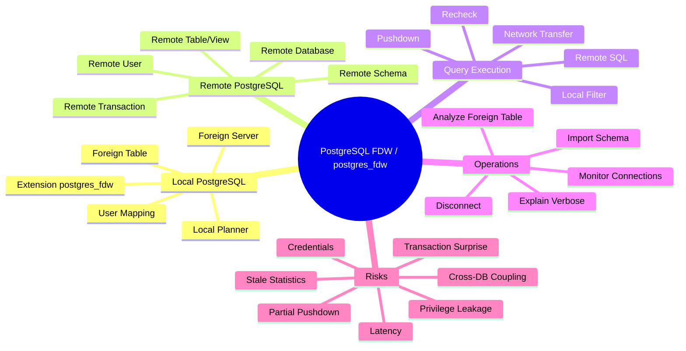
```mermaid
mindmap
  root((PostgreSQL FDW / postgres_fdw))
    Local PostgreSQL
      Extension postgres_fdw
      Foreign Server
      User Mapping
      Foreign Table
      Local Planner
    Remote PostgreSQL
      Remote Database
      Remote Schema
      Remote Table/View
      Remote User
      Remote Transaction
    Query Execution
      Pushdown
      Local Filter
      Remote SQL
      Network Transfer
      Recheck
    Operations
      Import Schema
      Analyze Foreign Table
      Monitor Connections
      Disconnect
      Explain Verbose
    Risks
      Latency
      Credentials
      Privilege Leakage
      Stale Statistics
      Partial Pushdown
      Transaction Surprise
      Cross-DB Coupling
```

**Core idea:** foreign table terlihat seperti table lokal, tetapi execution-nya tetap remote. Planner lokal harus memutuskan bagian query mana yang dikirim ke remote server dan bagian mana yang dieksekusi lokal. Jadi FDW adalah **database federation**, bukan magic local table.

---

## 3. Kapan `postgres_fdw` Cocok?

| Use Case | Cocok? | Catatan |
|---|---:|---|
| Read-only cross-database lookup kecil/sedang | Ya | Misalnya reference data dari DB lain. |
| Reporting ringan dari remote PostgreSQL | Ya | Pastikan filter dipushdown. |
| Migration bridge sementara | Ya | Berguna saat cutover bertahap. |
| Admin/ops data access antar DB | Ya | Dengan role dan mapping terbatas. |
| Cross-database ETL sederhana | Ya | Untuk volume terkendali. |
| High-throughput OLTP antar service DB | Hati-hati | Latency dan coupling tinggi. |
| Join besar remote-local | Hati-hati | Bisa transfer data besar ke lokal. |
| Pengganti replication/CDC | Tidak ideal | Logical replication/ETL sering lebih tepat. |
| Pengganti backup | Tidak | FDW bukan backup/restore strategy. |
| Distributed transaction kuat | Tidak ideal | `postgres_fdw` tidak mendukung prepare remote transaction untuk two-phase commit. ([PostgreSQL](https://www.postgresql.org/docs/current/postgres-fdw.html)) |

---

## 4. Komponen Utama

| Komponen | Dibuat Dengan | Fungsi |
|---|---|---|
| Extension | `CREATE EXTENSION postgres_fdw` | Mengaktifkan wrapper. |
| Foreign server | `CREATE SERVER` | Menyimpan connection info remote, kecuali user/password. |
| User mapping | `CREATE USER MAPPING` | Mapping local role ke remote credential. |
| Foreign table | `CREATE FOREIGN TABLE` | Definisi table lokal yang menunjuk remote table/view. |
| Imported schema | `IMPORT FOREIGN SCHEMA` | Membuat foreign table definitions otomatis dari remote schema. |
| Remote user | `CREATE ROLE` di remote | Role yang benar-benar menjalankan query di remote. |

`CREATE SERVER` mendefinisikan foreign server dan biasanya menyimpan connection information untuk FDW; informasi spesifik user disimpan melalui user mapping. Membuat foreign server membutuhkan `USAGE` privilege pada foreign-data wrapper. ([PostgreSQL](https://www.postgresql.org/docs/current/sql-createserver.html))

---

## 5. Minimal Setup

### 5.1 Remote database: buat role khusus

Di remote PostgreSQL:

```sql
CREATE ROLE fdw_readonly LOGIN PASSWORD 'change_me';

GRANT CONNECT ON DATABASE coredb TO fdw_readonly;
GRANT USAGE ON SCHEMA public TO fdw_readonly;
GRANT SELECT ON TABLE public.customer TO fdw_readonly;
GRANT SELECT ON TABLE public.account TO fdw_readonly;
```

**Rule:** remote user harus least-privilege. Jangan pakai remote superuser untuk FDW.

---

### 5.2 Local database: install extension

```sql
CREATE EXTENSION IF NOT EXISTS postgres_fdw;
```

---

### 5.3 Buat foreign server

```sql
CREATE SERVER coredb_server
FOREIGN DATA WRAPPER postgres_fdw
OPTIONS (
    host 'core-db.internal',
    port '5432',
    dbname 'coredb'
);
```

Pada `postgres_fdw`, connection options foreign server memakai opsi libpq, tetapi `user` dan `password` tidak boleh disimpan di server options; keduanya diletakkan di user mapping. ([PostgreSQL](https://www.postgresql.org/docs/current/postgres-fdw.html))

---

### 5.4 Buat user mapping

```sql
CREATE USER MAPPING FOR reporting_user
SERVER coredb_server
OPTIONS (
    user 'fdw_readonly',
    password 'change_me'
);
```

`CREATE USER MAPPING` memetakan local user ke foreign server dan biasanya menyimpan remote user/password. Owner foreign server bisa membuat mapping untuk user mana pun; user biasa bisa membuat mapping untuk dirinya sendiri jika sudah punya `USAGE` pada foreign server. ([PostgreSQL](https://www.postgresql.org/docs/current/sql-createusermapping.html))

---

### 5.5 Buat schema lokal untuk foreign tables

```sql
CREATE SCHEMA IF NOT EXISTS foreign_core;
```

---

### 5.6 Import foreign schema

```sql
IMPORT FOREIGN SCHEMA public
LIMIT TO (customer, account)
FROM SERVER coredb_server
INTO foreign_core;
```

`IMPORT FOREIGN SCHEMA` membuat foreign table lokal yang merepresentasikan table/view di foreign server. Secara default ia mengimpor semua table dan view pada remote schema, tetapi bisa dibatasi dengan `LIMIT TO` atau `EXCEPT`. User butuh `USAGE` pada foreign server dan `CREATE` pada target schema. ([PostgreSQL](https://www.postgresql.org/docs/current/sql-importforeignschema.html))

---

## 6. Manual `CREATE FOREIGN TABLE`

Jika tidak mau import otomatis:

```sql
CREATE FOREIGN TABLE foreign_core.customer (
    id bigint NOT NULL,
    customer_number text NOT NULL,
    display_name text NOT NULL,
    status text NOT NULL,
    created_at timestamptz NOT NULL
)
SERVER coredb_server
OPTIONS (
    schema_name 'public',
    table_name 'customer'
);
```

Column lokal harus kompatibel dengan remote table. PostgreSQL docs merekomendasikan foreign table column dideklarasikan dengan tipe data dan collation yang sama dengan remote column; mismatch tipe/collation bisa menyebabkan anomali karena kondisi query dapat diinterpretasikan berbeda di remote. ([PostgreSQL](https://www.postgresql.org/docs/current/postgres-fdw.html))

---

## 7. Read Query

```sql
SELECT
    c.id,
    c.customer_number,
    c.display_name
FROM foreign_core.customer c
WHERE c.status = 'ACTIVE'
ORDER BY c.created_at DESC
LIMIT 50;
```

Query ke foreign table dapat terlihat seperti query lokal biasa, tetapi PostgreSQL akan membuat remote SQL dan mengambil hasil dari remote server.

### Cek SQL yang dikirim ke remote

```sql
EXPLAIN (VERBOSE, COSTS)
SELECT
    c.id,
    c.customer_number,
    c.display_name
FROM foreign_core.customer c
WHERE c.status = 'ACTIVE'
ORDER BY c.created_at DESC
LIMIT 50;
```

`EXPLAIN VERBOSE` dapat dipakai untuk melihat query yang benar-benar dikirim ke remote server. ([PostgreSQL](https://www.postgresql.org/docs/current/postgres-fdw.html))

---

## 8. Write Query

`postgres_fdw` bisa memodifikasi remote table dengan `INSERT`, `UPDATE`, `DELETE`, `COPY`, dan `TRUNCATE`, jika remote user dalam user mapping punya privilege yang sesuai. ([PostgreSQL](https://www.postgresql.org/docs/current/postgres-fdw.html))

```sql
INSERT INTO foreign_core.customer (
    id,
    customer_number,
    display_name,
    status,
    created_at
)
VALUES (
    1001,
    'CUST-1001',
    'Acme Corp',
    'ACTIVE',
    now()
);
```

```sql
UPDATE foreign_core.customer
SET status = 'INACTIVE'
WHERE id = 1001;
```

```sql
DELETE FROM foreign_core.customer
WHERE id = 1001;
```

### Caveat `ON CONFLICT`

`postgres_fdw` saat ini tidak mendukung `INSERT ... ON CONFLICT DO UPDATE`; `ON CONFLICT DO NOTHING` didukung jika tidak memakai unique index inference specification. ([PostgreSQL](https://www.postgresql.org/docs/current/postgres-fdw.html))

---

## 9. `IMPORT FOREIGN SCHEMA` Options dan Caveat

```sql
IMPORT FOREIGN SCHEMA public
LIMIT TO (customer, account)
FROM SERVER coredb_server
INTO foreign_core
OPTIONS (
    import_default 'false',
    import_generated 'true',
    import_not_null 'true'
);
```

| Option | Default | Catatan |
|---|---:|---|
| `import_default` | `false` | Hati-hati: default seperti `nextval()` bisa berbeda lokal vs remote. |
| `import_generated` | `true` | Import bisa gagal jika generated expression memakai function/operator yang tidak ada lokal. |
| `import_not_null` | `true` | `NOT NULL` ikut diimpor. |
| Check constraint | Tidak otomatis | Harus dibuat manual jika benar-benar perlu. |

PostgreSQL docs menyatakan constraint selain `NOT NULL` tidak pernah otomatis diimpor, karena constraint expression bisa dievaluasi berbeda di local dan remote sehingga berisiko menghasilkan optimisasi query yang salah. ([PostgreSQL](https://www.postgresql.org/docs/current/postgres-fdw.html))

---

## 10. Query Pushdown

`postgres_fdw` mencoba mengurangi data transfer dengan mengirim predicate/filter dan query operation tertentu ke remote server.

```sql
EXPLAIN (VERBOSE)
SELECT
    c.id,
    c.display_name
FROM foreign_core.customer c
WHERE c.status = 'ACTIVE'
  AND c.created_at >= timestamptz '2026-01-01 00:00:00+00';
```

Yang diinginkan di plan:

```text
Remote SQL: SELECT id, display_name FROM public.customer
            WHERE ((status = 'ACTIVE') AND (created_at >= ...))
```

`postgres_fdw` mengoptimalkan remote query dengan mengirim `WHERE` clause ke remote server dan tidak mengambil column yang tidak diperlukan. Tetapi clause tidak dikirim ke remote kecuali memakai type/operator/function built-in atau extension yang diset pada opsi server `extensions`, dan function/operator harus `IMMUTABLE`. ([PostgreSQL](https://www.postgresql.org/docs/current/postgres-fdw.html))

---

## 11. Join Pushdown

Join antara foreign tables pada **foreign server yang sama** bisa dikirim sebagai join remote.

```sql
EXPLAIN (VERBOSE)
SELECT
    c.customer_number,
    a.account_number
FROM foreign_core.customer c
JOIN foreign_core.account a
    ON a.customer_id = c.id
WHERE c.status = 'ACTIVE';
```

`postgres_fdw` dapat mengirim join antar foreign table pada server yang sama ke remote server, kecuali planner menilai lebih efisien mengambil row secara terpisah atau table terkait memakai user mapping berbeda. ([PostgreSQL](https://www.postgresql.org/docs/current/postgres-fdw.html))

### Remote-local join

```sql
SELECT
    l.case_id,
    c.customer_number
FROM case_mgmt.case_file l
JOIN foreign_core.customer c
    ON c.id = l.customer_id
WHERE l.status = 'OPEN';
```

Ini sering lebih berisiko karena salah satu sisi harus dibawa ke sisi lain secara efektif. Filter local harus dipersempit dulu.

---

## 12. Aggregate, Sort, Limit Pushdown

Pattern yang biasanya ingin dipushdown:

```sql
EXPLAIN (VERBOSE)
SELECT
    status,
    count(*) AS total
FROM foreign_core.customer
GROUP BY status;
```

```sql
EXPLAIN (VERBOSE)
SELECT *
FROM foreign_core.customer
WHERE status = 'ACTIVE'
ORDER BY created_at DESC
LIMIT 20;
```

**Rule:** selalu cek `EXPLAIN VERBOSE`. Jangan mengasumsikan `GROUP BY`, `ORDER BY`, atau `LIMIT` pasti dieksekusi remote dalam semua kondisi.

---

## 13. Cost Estimation

`postgres_fdw` punya opsi estimasi biaya:

```sql
ALTER SERVER coredb_server
OPTIONS (
    ADD use_remote_estimate 'true'
);
```

Atau saat create:

```sql
CREATE SERVER coredb_server
FOREIGN DATA WRAPPER postgres_fdw
OPTIONS (
    host 'core-db.internal',
    dbname 'coredb',
    port '5432',
    use_remote_estimate 'true',
    fdw_startup_cost '100',
    fdw_tuple_cost '0.2'
);
```

| Option | Fungsi |
|---|---|
| `use_remote_estimate` | Jika `true`, local server meminta remote `EXPLAIN` untuk estimasi biaya. |
| `fdw_startup_cost` | Overhead setup remote query. Default `100`. |
| `fdw_tuple_cost` | Extra cost per tuple transfer. Default `0.2`. |

Jika `use_remote_estimate` `true`, `postgres_fdw` meminta remote `EXPLAIN` untuk row count dan cost, lalu menambahkan startup/tuple cost. Jika `false`, estimasi dilakukan lokal dan bisa kurang akurat kecuali ada statistik lokal pada foreign table. ([PostgreSQL](https://www.postgresql.org/docs/current/postgres-fdw.html))

---

## 14. `ANALYZE` Foreign Table

```sql
ANALYZE foreign_core.customer;
```

`ANALYZE` pada foreign table mengambil data remote untuk membangun statistik lokal. Ini bisa mengurangi overhead planning, tetapi statistik lokal bisa cepat stale jika remote table sering berubah. ([PostgreSQL](https://www.postgresql.org/docs/current/postgres-fdw.html))

### Cek statistik

```sql
SELECT
    schemaname,
    tablename,
    attname,
    n_distinct,
    most_common_vals,
    most_common_freqs
FROM pg_stats
WHERE schemaname = 'foreign_core'
  AND tablename = 'customer';
```

| Remote Table Pattern | Strategy |
|---|---|
| Data relatif stabil | `ANALYZE` lokal bisa berguna. |
| Data sering berubah | Pertimbangkan `use_remote_estimate`. |
| Query jarang | Tidak perlu over-tune. |
| Query sering dan latency sensitif | Test `use_remote_estimate` vs local stats. |

---

## 15. Connection Management

`postgres_fdw` membuka koneksi ke foreign server saat query pertama menggunakan foreign table server tersebut. Secara default koneksi ini disimpan dan digunakan ulang dalam session yang sama. Jika beberapa user mapping dipakai, koneksi dibuat per user mapping. ([PostgreSQL](https://www.postgresql.org/docs/current/postgres-fdw.html))

```sql
SELECT *
FROM postgres_fdw_get_connections();
```

```sql
SELECT *
FROM postgres_fdw_get_connections(true);
```

Disconnect server tertentu:

```sql
SELECT postgres_fdw_disconnect('coredb_server');
```

Disconnect semua:

```sql
SELECT postgres_fdw_disconnect_all();
```

### `keep_connections`

```sql
ALTER SERVER coredb_server
OPTIONS (ADD keep_connections 'off');
```

`keep_connections` default-nya `on`; jika `off`, koneksi ke foreign server akan dibuang di akhir transaction. ([PostgreSQL](https://www.postgresql.org/docs/current/postgres-fdw.html))

| Setting | Kapan |
|---|---|
| `keep_connections = on` | Query FDW sering, ingin reuse koneksi. |
| `keep_connections = off` | Ingin mengurangi koneksi idle di remote, dengan biaya reconnect. |

---

## 16. Transaction Behavior

Ketika query lokal menyentuh remote table, `postgres_fdw` membuka remote transaction yang terkait dengan local transaction. Remote transaction commit/abort mengikuti commit/abort local transaction, dan savepoint juga dikelola dengan remote savepoint. ([PostgreSQL](https://www.postgresql.org/docs/current/postgres-fdw.html))

```sql
BEGIN;

SELECT *
FROM foreign_core.customer
WHERE id = 1001;

UPDATE foreign_core.customer
SET status = 'INACTIVE'
WHERE id = 1001;

COMMIT;
```

### Isolation surprise

Jika local transaction bukan `SERIALIZABLE`, remote transaction memakai `REPEATABLE READ`; jika local transaction `SERIALIZABLE`, remote juga memakai `SERIALIZABLE`. Konsekuensinya, successive queries dalam satu local transaction bisa melihat snapshot remote yang sama, bahkan jika local transaction `READ COMMITTED`. Ini bisa mengejutkan karena berbeda dari ekspektasi `READ COMMITTED` lokal. ([PostgreSQL](https://www.postgresql.org/docs/current/postgres-fdw.html))

**Rule:** jangan membuat transaksi FDW panjang. Remote snapshot, remote locks, dan koneksi bisa tertahan lebih lama dari yang disadari.

---

## 17. Two-Phase Commit Caveat

`postgres_fdw` saat ini tidak mendukung prepare remote transaction untuk two-phase commit. ([PostgreSQL](https://www.postgresql.org/docs/current/postgres-fdw.html))

| Implikasi | Penjelasan |
|---|---|
| Tidak ada distributed atomic commit kuat lintas banyak DB | Jangan desain critical workflow seolah-olah FDW = XA transaction. |
| Kegagalan network/remote bisa membuat recovery rumit | Butuh idempotency/reconciliation. |
| Untuk integrasi reliable | Outbox, logical replication, atau ETL terkontrol sering lebih aman. |

---

## 18. Asynchronous Execution

`postgres_fdw` mendukung asynchronous execution untuk menjalankan beberapa bagian dari `Append` node secara concurrent, dikontrol oleh opsi `async_capable`. Default-nya `false`. ([PostgreSQL](https://www.postgresql.org/docs/current/postgres-fdw.html))

```sql
ALTER SERVER shard_server_1
OPTIONS (ADD async_capable 'true');

ALTER SERVER shard_server_2
OPTIONS (ADD async_capable 'true');
```

| Cocok Untuk | Catatan |
|---|---|
| Partitioned foreign tables ke beberapa server | Bisa mengurangi serial waiting. |
| Query union/append dari banyak remote | Bisa membantu jika latency dominan. |
| Banyak table pada server sama dan user mapping sama | Terbatas, karena koneksi ke server sama dijalankan sequential untuk konsistensi. |

---

## 19. Parallel Commit / Abort

Jika satu local transaction menyentuh banyak foreign server, commit/abort remote default-nya dilakukan serial. `parallel_commit` dan `parallel_abort` bisa mempercepat, tetapi juga punya risiko overhead di server dengan banyak remote transaction. ([PostgreSQL](https://www.postgresql.org/docs/current/postgres-fdw.html))

```sql
ALTER SERVER coredb_server
OPTIONS (
    ADD parallel_commit 'true',
    ADD parallel_abort 'true'
);
```

**Rule:** aktifkan hanya setelah ada bukti bottleneck commit/abort multi-server. Jangan default-kan tanpa test.

---

## 20. Updatability dan Truncatability

Secara default, foreign table `postgres_fdw` dianggap updatable dan truncatable. Ini dapat dioverride di server atau table. ([PostgreSQL](https://www.postgresql.org/docs/current/postgres-fdw.html))

```sql
ALTER SERVER coredb_server
OPTIONS (ADD updatable 'false');
```

Per foreign table:

```sql
ALTER FOREIGN TABLE foreign_core.customer
OPTIONS (ADD updatable 'false');
```

Untuk mencegah `TRUNCATE`:

```sql
ALTER SERVER coredb_server
OPTIONS (ADD truncatable 'false');
```

| Pattern | Recommendation |
|---|---|
| Reporting foreign schema | Set `updatable=false`, `truncatable=false`. |
| Migration bridge write | Boleh true, tapi role remote harus minimal. |
| Production critical remote table | Hindari write via FDW kecuali jelas ownership-nya. |

---

## 21. Security Model

### Local privileges

```sql
GRANT USAGE ON FOREIGN SERVER coredb_server TO reporting_user;
GRANT USAGE ON SCHEMA foreign_core TO reporting_user;
GRANT SELECT ON ALL TABLES IN SCHEMA foreign_core TO reporting_user;
```

### Remote privileges

Remote user dalam user mapping harus punya privilege di remote object:

```sql
GRANT SELECT ON TABLE public.customer TO fdw_readonly;
```

### Jangan pakai `PUBLIC` user mapping

```sql
-- Hindari kecuali benar-benar paham risikonya
CREATE USER MAPPING FOR PUBLIC
SERVER coredb_server
OPTIONS (user 'remote_public', password '...');
```

### Credential caveat

Hati-hati dengan opsi `password_required=false`. PostgreSQL docs memperingatkan agar tidak mengaturnya pada role `public`, karena bisa memungkinkan user tak berprivilege mengeksploitasi hak autentikasi user OS yang menjalankan PostgreSQL dan berpotensi eskalasi privilege. ([PostgreSQL](https://www.postgresql.org/docs/current/postgres-fdw.html))

---

## 22. SCRAM Pass-Through

`postgres_fdw` punya opsi `use_scram_passthrough` agar koneksi FDW memakai SCRAM-hashed secrets, bukan menyimpan password plaintext di catalog. Opsi ini mensyaratkan remote meminta `scram-sha-256`, incoming client session juga memakai SCRAM, dan local/remote memiliki SCRAM secret yang identik untuk user terkait. ([PostgreSQL](https://www.postgresql.org/docs/current/postgres-fdw.html))

```sql
ALTER SERVER coredb_server
OPTIONS (ADD use_scram_passthrough 'true');
```

**Rule:** ini menarik untuk mengurangi plaintext password di catalog, tetapi setup-nya ketat. Uji di staging sebelum production.

---

## 23. Remote Execution Environment

Remote session yang dibuka `postgres_fdw` memakai `search_path` terbatas ke `pg_catalog`; parameter seperti `TimeZone` diset ke UTC, `DateStyle` ke ISO, dan `IntervalStyle` ke `postgres`. Ini mengurangi ambiguity, tetapi bisa mengejutkan jika remote view/trigger/function bergantung pada `search_path`. ([PostgreSQL](https://www.postgresql.org/docs/current/postgres-fdw.html))

**Rule:** function yang mungkin dieksekusi remote harus schema-qualified atau punya `SET search_path` eksplisit.

---

## 24. Performance Rules

| Rule | Kenapa |
|---|---|
| Selalu cek `EXPLAIN VERBOSE` | Untuk memastikan filter/join/limit dipushdown. |
| Select column spesifik, jangan `SELECT *` | Mengurangi network transfer. |
| Filter remote table seawal mungkin | Mengurangi row yang dikirim ke lokal. |
| Hindari join besar remote-local | Data transfer bisa meledak. |
| Samakan tipe dan collation | Menghindari semantic anomaly dan pushdown issue. |
| Gunakan `use_remote_estimate` untuk query kompleks | Estimasi remote bisa lebih akurat, tapi ada overhead. |
| `ANALYZE` foreign table untuk stats lokal | Berguna jika remote data relatif stabil. |
| Batasi transaction panjang | Remote transaction/snapshot/koneksi tertahan. |
| Set remote index di remote server | Pushdown tetap membutuhkan index remote agar cepat. |
| Treat FDW sebagai network call | Latency, timeout, failure mode harus dipikirkan. |

---

## 25. Monitoring Query FDW

### Foreign server inventory

```sql
SELECT
    srvname,
    srvowner::regrole AS owner,
    srvfdw::regclass AS fdw_oid,
    srvoptions
FROM pg_foreign_server
ORDER BY srvname;
```

### Foreign tables

```sql
SELECT
    foreign_table_schema,
    foreign_table_name,
    foreign_server_name
FROM information_schema.foreign_tables
ORDER BY foreign_table_schema, foreign_table_name;
```

### User mappings

```sql
SELECT
    srv.srvname,
    um.umuser::regrole AS local_user,
    um.umoptions
FROM pg_user_mapping um
JOIN pg_foreign_server srv
    ON srv.oid = um.umserver
ORDER BY srv.srvname, local_user;
```

**Security note:** user mapping options bisa mengandung credential. Batasi akses catalog dan jangan expose hasil query ini sembarangan.

---

## 26. Monitoring Open FDW Connections

```sql
SELECT *
FROM postgres_fdw_get_connections(true);
```

Kolom penting:

| Column | Makna |
|---|---|
| `server_name` | Foreign server tujuan. |
| `user_name` | User mapping yang dipakai. |
| `valid` | Koneksi masih valid. |
| `used_in_xact` | Sedang dipakai dalam transaction lokal. |
| `closed` | Terdeteksi tertutup. |
| `remote_backend_pid` | PID backend remote. |

Jika `postgres_fdw_get_connections(true)` menemukan connection yang tertutup dan `used_in_xact=true`, transaction lokal sebaiknya di-rollback segera daripada dilanjutkan sampai commit gagal. ([PostgreSQL](https://www.postgresql.org/docs/current/postgres-fdw.html))

---

## 27. Troubleshooting: Query Lambat

### Step 1 - `EXPLAIN VERBOSE`

```sql
EXPLAIN (ANALYZE, VERBOSE, BUFFERS)
SELECT
    c.id,
    c.display_name
FROM foreign_core.customer c
WHERE c.status = 'ACTIVE'
ORDER BY c.created_at DESC
LIMIT 50;
```

### Step 2 - Cek remote SQL

Cari `Remote SQL` di plan.

| Temuan | Interpretasi |
|---|---|
| Predicate muncul di `Remote SQL` | Filter dipushdown. |
| Predicate tidak muncul | Filter dieksekusi lokal; data transfer bisa besar. |
| `SELECT *` remote | Query mengambil terlalu banyak column. |
| Join tidak dipushdown | Mungkin beda server/user mapping atau ada local expression. |
| Limit/order tidak dipushdown | Remote mengirim terlalu banyak row. |

### Step 3 - Cek remote index

Di remote DB:

```sql
EXPLAIN (ANALYZE, BUFFERS)
SELECT id, display_name
FROM public.customer
WHERE status = 'ACTIVE'
ORDER BY created_at DESC
LIMIT 50;
```

Index remote yang mungkin cocok:

```sql
CREATE INDEX idx_customer_status_created
ON public.customer (status, created_at DESC);
```

---

## 28. Troubleshooting: Connection / Auth Error

Checklist:

| Area | Cek |
|---|---|
| Network | Host/port reachable dari local PostgreSQL server. |
| Remote PostgreSQL | `listen_addresses`, firewall, TLS policy. |
| Remote `pg_hba.conf` | Mengizinkan koneksi dari host local DB. |
| User mapping | Remote user/password benar. |
| Local privilege | Local user punya `USAGE ON FOREIGN SERVER`. |
| Remote privilege | Remote user punya `SELECT/INSERT/...` pada remote object. |
| SSL | `sslmode`, cert, CA, hostname verification. |
| Password storage | Plain password vs SCRAM pass-through. |

---

## 29. Troubleshooting: Schema Drift

Remote schema berubah, foreign table lokal bisa stale.

### Cek foreign table definition

```sql
SELECT
    column_name,
    data_type,
    is_nullable
FROM information_schema.columns
WHERE table_schema = 'foreign_core'
  AND table_name = 'customer'
ORDER BY ordinal_position;
```

### Re-import controlled

```sql
DROP FOREIGN TABLE foreign_core.customer;

IMPORT FOREIGN SCHEMA public
LIMIT TO (customer)
FROM SERVER coredb_server
INTO foreign_core;
```

**Rule:** treat remote schema changes like contract changes. Jangan biarkan foreign table silently drift.

---

## 30. Pattern: Read-Only Reference Data

```sql
CREATE SERVER refdata_server
FOREIGN DATA WRAPPER postgres_fdw
OPTIONS (
    host 'refdata-db.internal',
    port '5432',
    dbname 'refdb',
    use_remote_estimate 'true'
);

CREATE USER MAPPING FOR app_reader
SERVER refdata_server
OPTIONS (
    user 'refdata_readonly',
    password 'change_me'
);

CREATE SCHEMA foreign_refdata;

IMPORT FOREIGN SCHEMA public
LIMIT TO (country, currency, product_catalog)
FROM SERVER refdata_server
INTO foreign_refdata;

ALTER SERVER refdata_server
OPTIONS (
    ADD updatable 'false',
    ADD truncatable 'false'
);
```

Use case: reference lookup/reporting. Untuk hot path latency-sensitive, pertimbangkan local cached table atau replication.

---

## 31. Pattern: Migration Bridge

```text
Old DB
  ↓ FDW
New DB
  ↓
Validate data
  ↓
Backfill local tables
  ↓
Cutover
  ↓
Drop FDW dependency
```

Contoh backfill:

```sql
INSERT INTO case_mgmt.customer_snapshot (
    customer_id,
    customer_number,
    display_name,
    status,
    captured_at
)
SELECT
    id,
    customer_number,
    display_name,
    status,
    now()
FROM foreign_core.customer
WHERE status = 'ACTIVE';
```

**Rule:** migration bridge harus sementara. Setelah cutover, hapus dependency FDW jika tidak lagi diperlukan.

---

## 32. Pattern: Remote Reporting Snapshot

Daripada report berat langsung join remote-local setiap saat:

```sql
CREATE TABLE reporting.customer_daily_snapshot AS
SELECT
    c.id AS customer_id,
    c.customer_number,
    c.display_name,
    c.status,
    current_date AS snapshot_date
FROM foreign_core.customer c;
```

Refresh terkontrol:

```sql
TRUNCATE reporting.customer_daily_snapshot;

INSERT INTO reporting.customer_daily_snapshot
SELECT
    c.id,
    c.customer_number,
    c.display_name,
    c.status,
    current_date
FROM foreign_core.customer c;
```

**Rule:** untuk report berat berulang, materialize/snapshot sering lebih stabil daripada live FDW query.

---

## 33. Anti-Patterns

| Anti-Pattern | Dampak | Solusi |
|---|---|---|
| FDW dipakai di request path high-QPS | Latency remote ikut latency API | Cache/snapshot/replication. |
| Join besar remote-local | Data transfer besar | Pushdown, snapshot, ETL. |
| Remote user superuser | Security blast radius besar | Remote least-privilege role. |
| `CREATE USER MAPPING FOR PUBLIC` sembarangan | Credential shared terlalu luas | Per-role mapping. |
| Menganggap FDW = distributed transaction | Inconsistency saat failure | Outbox/retry/reconciliation. |
| Tidak cek `EXPLAIN VERBOSE` | Pushdown tidak diketahui | Review remote SQL. |
| Tidak ada remote index | Pushdown tetap lambat | Index remote sesuai query. |
| Schema drift tidak dimonitor | Query gagal/hasil salah | Contract/migration sync. |
| `SELECT *` dari foreign table | Network transfer besar | Column projection. |
| Long transaction FDW | Remote snapshot/locks/koneksi tertahan | Short transaction. |
| FDW menggantikan replication untuk CDC | Lag/consistency/ownership kabur | Logical replication/CDC pipeline. |

---

## 34. Decision Matrix

| Problem | Recommended Pattern |
|---|---|
| Query small remote reference table | `postgres_fdw` read-only |
| Query remote table occasionally | `postgres_fdw` with strict filter |
| Frequent report from remote data | Snapshot/materialized local table |
| Need near-real-time copy | Logical replication, not FDW |
| Need one-time migration/backfill | FDW migration bridge |
| Need high-QPS lookup | Local copy/cache |
| Need write remote table | FDW only if ownership/transaction semantics clear |
| Need distributed workflow | Outbox/idempotency/reconciliation |
| Need remote join between two remote tables same DB | FDW can pushdown; verify with `EXPLAIN VERBOSE` |
| Need remote-local large join | Avoid; pre-stage one side |

---

## 35. Production Checklist

| Area | Checklist |
|---|---|
| Remote role | Least privilege, no superuser. |
| Local privilege | `USAGE ON FOREIGN SERVER` hanya untuk role perlu. |
| User mapping | Per-role, bukan `PUBLIC` kecuali sangat terkontrol. |
| Credentials | Rotation strategy, avoid plaintext if possible, consider SCRAM pass-through. |
| Network | TLS/firewall/pg_hba jelas. |
| Schema | Foreign table types/collations match remote. |
| Pushdown | `EXPLAIN VERBOSE` disimpan untuk query penting. |
| Remote index | Remote DB punya index untuk pushed predicates/order. |
| Statistics | `ANALYZE` foreign table atau `use_remote_estimate` dievaluasi. |
| Transactions | Tidak ada long transaction FDW. |
| Writes | Updatability/truncatability diset sesuai use case. |
| Monitoring | Foreign connections dan slow FDW queries terlihat. |
| Runbook | Auth error, schema drift, slow query, remote outage punya langkah. |
| Exit strategy | Jika FDW hanya migration bridge, kapan dihapus? |

---

## 36. Roadmap Belajar Singkat

| Urutan | Materi | Target |
|---:|---|---|
| 1 | FDW mental model | Paham foreign table tetap remote. |
| 2 | `postgres_fdw` setup | Bisa membuat extension, server, mapping, foreign table. |
| 3 | `IMPORT FOREIGN SCHEMA` | Bisa mengimpor schema remote secara terkontrol. |
| 4 | Security | Bisa desain remote role dan local mapping yang aman. |
| 5 | Pushdown | Bisa membaca `EXPLAIN VERBOSE` dan remote SQL. |
| 6 | Cost/statistics | Bisa memilih `ANALYZE` foreign table vs `use_remote_estimate`. |
| 7 | Connection/transaction behavior | Bisa menghindari long transaction dan connection surprise. |
| 8 | Performance patterns | Bisa membedakan live FDW, snapshot, cache, dan replication. |
| 9 | Troubleshooting | Bisa debug auth, schema drift, slow query, remote outage. |
| 10 | Governance | Bisa memastikan FDW tidak menjadi hidden distributed monolith. |

## Rekomendasi Materi Selanjutnya

Lanjut paling tepat: **Cheatsheet PostgreSQL Import/Export & Bulk Loading: `COPY`, `\copy`, CSV, staging table, validation, batch load, error isolation, transform pipeline, dan large data movement pattern**.

---

**Sources:**

- [PostgreSQL: Documentation: 18: F.38. postgres_fdw — access data stored in external PostgreSQL servers](https://www.postgresql.org/docs/current/postgres-fdw.html)

## Response:
7/13/2026, 1:32:10 AM

Saya lanjutkan ke import/export dan bulk loading PostgreSQL. Fokusnya: `COPY`, `\copy`, staging table, validasi, transform pipeline, error isolation, performa load besar, dan pola data movement yang aman.

# Cheatsheet: PostgreSQL Import/Export & Bulk Loading

## 1. Scope

Cheatsheet ini fokus **PostgreSQL-only** untuk pemindahan data skala kecil sampai besar:

- `COPY`
- `\copy`
- CSV / text / binary format
- `COPY FROM STDIN` / `COPY TO STDOUT`
- `COPY FROM PROGRAM`
- staging table
- validasi data
- transform pipeline
- batch load
- error isolation
- `ON_ERROR`, `REJECT_LIMIT`
- progress monitoring
- bulk-load performance pattern
- export untuk audit/reporting/migration

PostgreSQL menyediakan `COPY` untuk memindahkan data antara table dan file sistem. `COPY TO` menyalin data table/query ke file, sedangkan `COPY FROM` memuat data dari file ke table dan menambahkan data ke row yang sudah ada. `COPY TO` juga bisa mengekspor hasil `SELECT`. ([PostgreSQL](https://www.postgresql.org/docs/current/sql-copy.html))

---

## 2. Mental Model

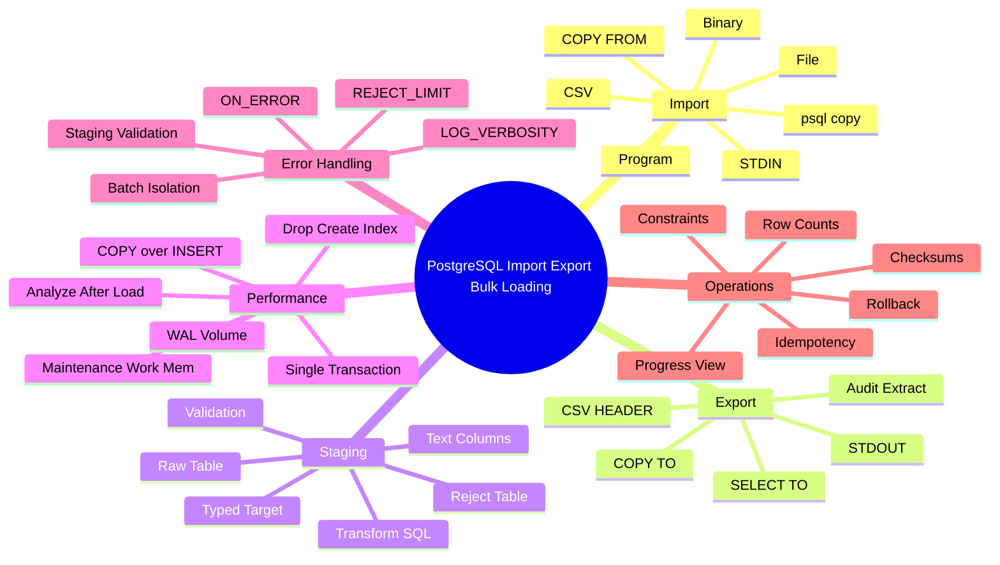
```mermaid id="copy-map"
mindmap
  root((PostgreSQL Import Export Bulk Loading))
    Import
      COPY FROM
      psql copy
      STDIN
      File
      Program
      CSV
      Binary
    Export
      COPY TO
      SELECT TO
      STDOUT
      CSV HEADER
      Audit Extract
    Staging
      Raw Table
      Text Columns
      Validation
      Typed Target
      Reject Table
      Transform SQL
    Performance
      COPY over INSERT
      Single Transaction
      Drop Create Index
      Analyze After Load
      Maintenance Work Mem
      WAL Volume
    Error Handling
      ON_ERROR
      REJECT_LIMIT
      LOG_VERBOSITY
      Staging Validation
      Batch Isolation
    Operations
      Progress View
      Row Counts
      Checksums
      Constraints
      Idempotency
      Rollback
```

**Core idea:** untuk data besar, jangan langsung “insert satu-satu ke final table”. Gunakan alur **raw → staging → validate → transform → target → analyze → verify**. `COPY` adalah mekanisme load cepat; staging dan validasi adalah mekanisme keselamatan.

---

## 3. `COPY` vs `\copy`

| Aspek | `COPY` SQL | `\copy` psql |
|---|---|---|
| Dieksekusi oleh | PostgreSQL server | Client `psql` |
| File path dilihat dari | Server database | Mesin client yang menjalankan `psql` |
| Perlu file accessible oleh | OS user PostgreSQL server | User OS client |
| Cocok untuk | Server-side batch/load terkontrol | Import/export dari laptop/bastion/CI |
| Efisiensi | Bisa lebih efisien untuk file server-side | Data lewat koneksi client-server |
| Syntax | SQL command | Meta-command `psql` |

Jangan bingungkan `COPY` dengan `\copy`. Dokumentasi PostgreSQL menjelaskan bahwa `\copy` menjalankan `COPY FROM STDIN` atau `COPY TO STDOUT`, lalu membaca/menulis file yang accessible dari client `psql`; sedangkan `COPY` dengan nama file membaca/menulis dari sudut pandang server PostgreSQL. ([PostgreSQL](https://www.postgresql.org/docs/current/sql-copy.html))

---

## 4. Basic Import: `COPY FROM`

### CSV dengan header

```sql id="copy-from-csv"
COPY staging.raw_case_import (
    external_case_id,
    case_number,
    opened_at,
    priority,
    status
)
FROM '/data/import/cases.csv'
WITH (
    FORMAT csv,
    HEADER true
);
```

### CSV dengan delimiter custom

```sql id="copy-from-delimiter"
COPY staging.raw_case_import
FROM '/data/import/cases_pipe.csv'
WITH (
    FORMAT csv,
    HEADER true,
    DELIMITER '|',
    QUOTE '"',
    ESCAPE '"'
);
```

### NULL marker

```sql id="copy-null"
COPY staging.raw_case_import
FROM '/data/import/cases.csv'
WITH (
    FORMAT csv,
    HEADER true,
    NULL ''
);
```

Jika column list diberikan pada `COPY FROM`, setiap field input dipetakan sesuai urutan column list tersebut. Column table yang tidak ada di column list akan menerima default value. ([PostgreSQL](https://www.postgresql.org/docs/current/sql-copy.html))

---

## 5. Basic Export: `COPY TO`

### Export table ke CSV

```sql id="copy-to-csv"
COPY case_mgmt.case_file
TO '/data/export/case_file.csv'
WITH (
    FORMAT csv,
    HEADER true
);
```

### Export hasil query

```sql id="copy-to-select"
COPY (
    SELECT
        id,
        case_number,
        status,
        created_at
    FROM case_mgmt.case_file
    WHERE created_at >= timestamptz '2026-01-01 00:00:00+00'
    ORDER BY created_at
)
TO '/data/export/cases_2026.csv'
WITH (
    FORMAT csv,
    HEADER true
);
```

`COPY TO` bisa menyalin isi plain table atau hasil `SELECT`. Untuk relation seperti partitioned table atau view, gunakan bentuk `COPY (SELECT ...) TO` agar hasil query yang diekspor sesuai kebutuhan. ([PostgreSQL](https://www.postgresql.org/docs/current/sql-copy.html))

---

## 6. `\copy` dari Client

### Import dari file client

```bash id="psql-copy-import"
psql -d appdb -c "\copy staging.raw_case_import FROM '/local/path/cases.csv' WITH (FORMAT csv, HEADER true)"
```

### Export ke file client

```bash id="psql-copy-export"
psql -d appdb -c "\copy (SELECT id, case_number, status FROM case_mgmt.case_file) TO '/local/path/cases.csv' WITH (FORMAT csv, HEADER true)"
```

Dalam `psql`, `\copy ... from stdin` membaca data dari input yang sama dengan command sampai menemukan baris `\.` atau EOF. Dokumentasi `psql` juga mencatat bahwa `\copy` mirip syntax SQL `COPY`, tetapi seluruh sisa baris dianggap argumen `\copy`, sehingga parsing-nya berbeda dari meta-command psql biasa. ([PostgreSQL](https://www.postgresql.org/docs/current/app-psql.html))

**Rule:** gunakan `\copy` saat file ada di client machine. Gunakan `COPY` saat file memang ada di server database dan permission/path sudah dikontrol.

---

## 7. Format: Text, CSV, Binary

| Format | Option | Cocok Untuk | Catatan |
|---|---|---|---|
| Text | default / `FORMAT text` | Simple tab-separated internal export | Escape rules berbeda dari CSV. |
| CSV | `FORMAT csv` | Interop dengan spreadsheet, data exchange, ETL | Paling umum untuk import/export manual. |
| Binary | `FORMAT binary` | PostgreSQL-to-PostgreSQL high fidelity | Tidak portable untuk semua tooling. |

### CSV recommended baseline

```sql id="copy-csv-baseline"
COPY staging.raw_case_import
FROM '/data/import/cases.csv'
WITH (
    FORMAT csv,
    HEADER true,
    ENCODING 'UTF8',
    NULL '',
    QUOTE '"',
    ESCAPE '"'
);
```

`COPY` mendukung opsi seperti `FORMAT`, `DELIMITER`, `NULL`, `HEADER`, `QUOTE`, `ESCAPE`, `ENCODING`, `ON_ERROR`, `REJECT_LIMIT`, dan `LOG_VERBOSITY`. ([PostgreSQL](https://www.postgresql.org/docs/current/sql-copy.html))

---

## 8. Server-Side File Security dan Privilege

```sql id="copy-server-file"
COPY staging.raw_case_import
FROM '/var/lib/postgresql/import/cases.csv'
WITH (FORMAT csv, HEADER true);
```

Server-side `COPY` dengan nama file membutuhkan file accessible oleh OS user yang menjalankan PostgreSQL, dan path file dilihat dari sudut pandang server, bukan client. PostgreSQL merekomendasikan nama file `COPY` ditulis sebagai absolute path; untuk `COPY TO`, absolute path bahkan enforced. ([PostgreSQL](https://www.postgresql.org/docs/current/sql-copy.html))

| Risiko | Mitigasi |
|---|---|
| File path salah karena path client/server berbeda | Pakai absolute path dan pahami lokasi eksekusi. |
| Permission OS tidak cukup | Pastikan file readable/writable oleh PostgreSQL server user. |
| Data sensitif diekspor ke lokasi salah | Gunakan directory terkontrol dan audit. |
| `COPY PROGRAM` dieksekusi server-side | Batasi privilege sangat ketat. |

---

## 9. `COPY FROM PROGRAM` / `COPY TO PROGRAM`

### Load dari program output

```sql id="copy-from-program"
COPY staging.raw_case_import
FROM PROGRAM 'gzip -dc /data/import/cases.csv.gz'
WITH (
    FORMAT csv,
    HEADER true
);
```

### Export ke gzip

```sql id="copy-to-program"
COPY (
    SELECT *
    FROM audit.case_event
    WHERE created_at >= timestamptz '2026-07-01 00:00:00+00'
      AND created_at <  timestamptz '2026-08-01 00:00:00+00'
)
TO PROGRAM 'gzip > /data/export/case_event_2026_07.csv.gz'
WITH (
    FORMAT csv,
    HEADER true
);
```

Ketika `PROGRAM` digunakan, PostgreSQL server menjalankan command tersebut dan membaca dari standard output program atau menulis ke standard input program. Command harus executable oleh OS user PostgreSQL dan ditentukan dari sudut pandang server. ([PostgreSQL](https://www.postgresql.org/docs/current/sql-copy.html))

**Security rule:** perlakukan `COPY PROGRAM` seperti kemampuan eksekusi command di server database. Jangan berikan ke role aplikasi.

---

## 10. Staging Table Pattern

Jangan load file eksternal langsung ke table final jika data belum dipercaya.

### Raw staging: semua text

```sql id="staging-raw"
CREATE TABLE staging.raw_case_import (
    load_id uuid NOT NULL,
    line_number bigint GENERATED ALWAYS AS IDENTITY,
    external_case_id text,
    case_number text,
    opened_at_text text,
    priority_text text,
    status_text text,
    raw_loaded_at timestamptz NOT NULL DEFAULT now()
);
```

### Load ke staging

```sql id="load-raw"
COPY staging.raw_case_import (
    load_id,
    external_case_id,
    case_number,
    opened_at_text,
    priority_text,
    status_text
)
FROM '/data/import/cases.csv'
WITH (
    FORMAT csv,
    HEADER true,
    NULL ''
);
```

### Validate sebelum transform

```sql id="validate-staging"
SELECT *
FROM staging.raw_case_import
WHERE load_id = '00000000-0000-0000-0000-000000000001'
  AND (
      case_number IS NULL
      OR opened_at_text IS NULL
      OR priority_text !~ '^[0-9]+$'
      OR status_text NOT IN ('OPEN', 'IN_REVIEW', 'CLOSED')
  );
```

**Rule:** staging dengan text columns membuat data buruk bisa masuk dulu untuk dianalisis. Transform ke tipe final dilakukan setelah validasi eksplisit.

---

## 11. Transform dari Staging ke Target

Target typed table:

```sql id="target-table"
CREATE TABLE case_mgmt.partner_case_import (
    id bigint GENERATED ALWAYS AS IDENTITY PRIMARY KEY,
    external_case_id text NOT NULL,
    case_number text NOT NULL UNIQUE,
    opened_at timestamptz NOT NULL,
    priority integer NOT NULL,
    status text NOT NULL,
    imported_at timestamptz NOT NULL DEFAULT now()
);
```

Transform:

```sql id="transform-staging"
INSERT INTO case_mgmt.partner_case_import (
    external_case_id,
    case_number,
    opened_at,
    priority,
    status
)
SELECT
    external_case_id,
    upper(trim(case_number)),
    opened_at_text::timestamptz,
    priority_text::integer,
    status_text
FROM staging.raw_case_import
WHERE load_id = '00000000-0000-0000-0000-000000000001'
  AND case_number IS NOT NULL
  AND opened_at_text IS NOT NULL
  AND priority_text ~ '^[0-9]+$'
  AND status_text IN ('OPEN', 'IN_REVIEW', 'CLOSED');
```

### Capture rejected rows

```sql id="reject-table"
CREATE TABLE staging.case_import_reject (
    load_id uuid NOT NULL,
    line_number bigint NOT NULL,
    reason text NOT NULL,
    raw_row jsonb NOT NULL,
    rejected_at timestamptz NOT NULL DEFAULT now()
);
```

```sql id="insert-rejects"
INSERT INTO staging.case_import_reject (
    load_id,
    line_number,
    reason,
    raw_row
)
SELECT
    load_id,
    line_number,
    CASE
        WHEN case_number IS NULL THEN 'case_number missing'
        WHEN opened_at_text IS NULL THEN 'opened_at missing'
        WHEN priority_text !~ '^[0-9]+$' THEN 'priority invalid'
        WHEN status_text NOT IN ('OPEN', 'IN_REVIEW', 'CLOSED') THEN 'status invalid'
        ELSE 'unknown validation error'
    END,
    to_jsonb(r)
FROM staging.raw_case_import r
WHERE load_id = '00000000-0000-0000-0000-000000000001'
  AND (
      case_number IS NULL
      OR opened_at_text IS NULL
      OR priority_text !~ '^[0-9]+$'
      OR status_text NOT IN ('OPEN', 'IN_REVIEW', 'CLOSED')
  );
```

---

## 12. Idempotent Load Pattern

Gunakan `load_id`, natural key, dan conflict handling.

```sql id="idempotent-target"
CREATE TABLE case_mgmt.imported_case (
    id bigint GENERATED ALWAYS AS IDENTITY PRIMARY KEY,
    source_system text NOT NULL,
    external_case_id text NOT NULL,
    case_number text NOT NULL,
    opened_at timestamptz NOT NULL,
    status text NOT NULL,
    imported_at timestamptz NOT NULL DEFAULT now(),

    CONSTRAINT uq_imported_case_source_external
        UNIQUE (source_system, external_case_id)
);
```

```sql id="idempotent-upsert"
INSERT INTO case_mgmt.imported_case (
    source_system,
    external_case_id,
    case_number,
    opened_at,
    status
)
SELECT
    'PARTNER_A',
    external_case_id,
    upper(trim(case_number)),
    opened_at_text::timestamptz,
    status_text
FROM staging.raw_case_import
WHERE load_id = :load_id
ON CONFLICT (source_system, external_case_id)
DO UPDATE SET
    case_number = EXCLUDED.case_number,
    opened_at = EXCLUDED.opened_at,
    status = EXCLUDED.status;
```

**Rule:** setiap bulk import production harus bisa dijalankan ulang dengan aman, atau minimal punya prosedur rollback/cleanup yang jelas.

---

## 13. `COPY ON_ERROR` dan `REJECT_LIMIT`

PostgreSQL `COPY` default-nya gagal saat menemukan error. Untuk kasus “best-effort load”, `ON_ERROR` dapat dipakai untuk perilaku lain. PostgreSQL 18 menambahkan `REJECT_LIMIT` untuk membatasi jumlah invalid rows yang boleh diabaikan saat `ON_ERROR = 'ignore'`, dan menambahkan `LOG_VERBOSITY silent` untuk menekan output baris yang diabaikan. ([PostgreSQL](https://www.postgresql.org/docs/current/sql-copy.html))

```sql id="copy-on-error"
COPY staging.raw_case_import
FROM '/data/import/cases.csv'
WITH (
    FORMAT csv,
    HEADER true,
    ON_ERROR ignore,
    REJECT_LIMIT 100,
    LOG_VERBOSITY verbose
);
```

| Option | Fungsi |
|---|---|
| `ON_ERROR stop` | Default; berhenti saat error. |
| `ON_ERROR ignore` | Abaikan row yang error, sesuai dukungan versi. |
| `REJECT_LIMIT n` | Batas jumlah row invalid yang boleh diabaikan. |
| `LOG_VERBOSITY` | Mengatur seberapa detail log untuk row yang diabaikan. |

**Practical rule:** untuk data penting, staging validation masih lebih aman daripada langsung `ON_ERROR ignore`, karena staging memberi audit trail row buruk. Pakai `ON_ERROR ignore` untuk file sangat besar ketika toleransi reject jelas dan monitoring reject count aktif.

---

## 14. Progress Monitoring

PostgreSQL menyediakan `pg_stat_progress_copy` untuk backend yang sedang menjalankan `COPY`. View ini menampilkan command, tipe I/O, bytes processed, total bytes jika tersedia, tuples processed, tuples excluded oleh `WHERE`, dan tuples skipped saat `ON_ERROR` bukan `stop`. ([PostgreSQL](https://www.postgresql.org/docs/current/progress-reporting.html))

```sql id="copy-progress"
SELECT
    pid,
    datname,
    relid::regclass AS relation,
    command,
    type,
    bytes_processed,
    bytes_total,
    round(100.0 * bytes_processed / NULLIF(bytes_total, 0), 2) AS pct,
    tuples_processed,
    tuples_excluded,
    tuples_skipped
FROM pg_stat_progress_copy;
```

| Column | Interpretasi |
|---|---|
| `command` | `COPY FROM` atau `COPY TO`. |
| `type` | `FILE`, `PROGRAM`, `PIPE`, atau `CALLBACK`. |
| `bytes_processed` | Byte yang sudah diproses. |
| `bytes_total` | Ukuran file sumber jika tersedia. |
| `tuples_processed` | Row yang diproses. |
| `tuples_excluded` | Row tidak diproses karena `WHERE` pada `COPY`. |
| `tuples_skipped` | Row malformed yang diskip oleh mode error handling. |

---

## 15. `COPY FROM ... WHERE`

Untuk load sebagian data dari file, `COPY FROM` mendukung filter `WHERE`.

```sql id="copy-where"
COPY staging.raw_case_import (
    external_case_id,
    case_number,
    opened_at_text,
    priority_text,
    status_text
)
FROM '/data/import/cases.csv'
WITH (
    FORMAT csv,
    HEADER true
)
WHERE status_text IS NOT NULL;
```

**Use case:** filtering ringan saat load.  
**Caution:** jangan jadikan `COPY WHERE` sebagai pengganti validasi lengkap jika rules kompleks.

---

## 16. Bulk Load Performance Rules

PostgreSQL documentation untuk populating database menyarankan beberapa prinsip: gunakan `COPY` dibanding banyak `INSERT`, pertimbangkan satu transaction besar untuk atomicity, buat/drop index sesuai kebutuhan, handle foreign key constraints, naikkan `maintenance_work_mem` saat build index, naikkan `max_wal_size`, dan jalankan `ANALYZE` setelah load. Dokumentasi juga menyatakan `COPY` hampir selalu lebih cepat daripada `INSERT` untuk banyak row, bahkan jika `INSERT` memakai prepared statement dan batching. ([PostgreSQL](https://www.postgresql.org/docs/current/populate.html))

| Rule | Penjelasan |
|---|---|
| Gunakan `COPY`, bukan row-by-row `INSERT` | Lebih sedikit overhead parsing/planning/execution. |
| Load ke staging tanpa banyak index | Index maintenance saat load bisa mahal. |
| Build index setelah load besar | Sering lebih cepat daripada maintain index per row. |
| Jalankan `ANALYZE` setelah load | Planner butuh statistics baru. |
| Validasi data sebelum target final | Menghindari partial dirty data. |
| Load dalam transaction jika atomicity penting | Bisa rollback semua jika ada kegagalan. |
| Hindari trigger/FK berat saat raw load jika bisa | Validasi bisa dilakukan setelah staging. |
| Perhatikan WAL volume | Load besar bisa membebani disk/replication/backup. |

---

## 17. Index Strategy saat Bulk Load

### Option A - target kosong: create index setelah load

```sql id="bulk-index-after"
CREATE TABLE staging.big_import (
    id bigint,
    case_number text,
    status text,
    created_at timestamptz
);

COPY staging.big_import
FROM '/data/import/big_import.csv'
WITH (FORMAT csv, HEADER true);

CREATE INDEX idx_big_import_case_number
ON staging.big_import (case_number);

ANALYZE staging.big_import;
```

### Option B - target existing: load staging lalu insert target

```sql id="bulk-stage-insert-target"
COPY staging.raw_case_import
FROM '/data/import/cases.csv'
WITH (FORMAT csv, HEADER true);

INSERT INTO case_mgmt.case_file (...)
SELECT ...
FROM staging.raw_case_import
WHERE ...;
```

`CREATE INDEX` performance dipengaruhi `maintenance_work_mem`; nilai yang lebih besar bisa mengurangi waktu build index selama tidak melebihi memory yang tersedia dan menyebabkan swapping. ([PostgreSQL](https://www.postgresql.org/docs/current/sql-createindex.html?utm_source=chatgpt.com))

---

## 18. Constraint Strategy

| Constraint | Saat Load Raw | Saat Transform ke Target |
|---|---|---|
| `NOT NULL` | Bisa longgar di staging | Tegakkan di target. |
| `CHECK` | Minimal basic format di staging | Tegakkan domain rule di target. |
| FK | Hindari di raw staging | Tegakkan setelah data referensi siap. |
| UNIQUE | Bisa di staging jika perlu dedup | Tegakkan di target dengan `ON CONFLICT`. |
| RLS | Hindari direct `COPY FROM` ke table RLS | Gunakan staging/`INSERT` sesuai policy. |

`COPY FROM` saat ini tidak didukung untuk table dengan row-level security; dokumentasi menyarankan menggunakan equivalent `INSERT` statements jika RLS aktif. `COPY TO` tetap menerapkan relevant `SELECT` policies. ([PostgreSQL](https://www.postgresql.org/docs/current/sql-copy.html))

---

## 19. Transaction Pattern

### Atomic load

```sql id="atomic-load"
BEGIN;

COPY staging.raw_case_import
FROM '/data/import/cases.csv'
WITH (FORMAT csv, HEADER true);

INSERT INTO case_mgmt.partner_case_import (...)
SELECT ...
FROM staging.raw_case_import
WHERE ...;

ANALYZE case_mgmt.partner_case_import;

COMMIT;
```

Kelebihan: jika gagal, rollback semua.

### Stepwise load with audit

```sql id="stepwise-load"
INSERT INTO staging.load_run (
    load_id,
    source_file,
    started_at,
    status
)
VALUES (
    :load_id,
    '/data/import/cases.csv',
    now(),
    'STARTED'
);
```

Lalu `COPY`, validasi, transform, update status.

```sql id="load-run-finish"
UPDATE staging.load_run
SET finished_at = now(),
    status = 'SUCCEEDED'
WHERE load_id = :load_id;
```

**Rule:** untuk file penting, catat metadata load: file name, checksum, row count, started/finished time, status, imported_by, dan error summary.

---

## 20. Load Run Metadata

```sql id="load-run-table"
CREATE TABLE staging.load_run (
    load_id uuid PRIMARY KEY,
    source_system text NOT NULL,
    source_file text NOT NULL,
    file_sha256 text,
    started_at timestamptz NOT NULL DEFAULT now(),
    finished_at timestamptz,
    status text NOT NULL CHECK (status IN ('STARTED', 'VALIDATED', 'FAILED', 'SUCCEEDED')),
    raw_row_count bigint,
    valid_row_count bigint,
    rejected_row_count bigint,
    note text
);
```

### Verify row counts

```sql id="verify-row-counts"
UPDATE staging.load_run lr
SET
    raw_row_count = raw_count.cnt,
    rejected_row_count = reject_count.cnt,
    valid_row_count = raw_count.cnt - reject_count.cnt
FROM
    (
        SELECT load_id, count(*) AS cnt
        FROM staging.raw_case_import
        WHERE load_id = :load_id
        GROUP BY load_id
    ) raw_count,
    (
        SELECT load_id, count(*) AS cnt
        FROM staging.case_import_reject
        WHERE load_id = :load_id
        GROUP BY load_id
    ) reject_count
WHERE lr.load_id = :load_id
  AND raw_count.load_id = lr.load_id
  AND reject_count.load_id = lr.load_id;
```

---

## 21. CSV Edge Cases

| Edge Case | Risiko | Mitigasi |
|---|---|---|
| Delimiter muncul dalam value | Column shift | Gunakan CSV quote benar. |
| Newline dalam quoted field | Row count terlihat aneh di text tools | Gunakan parser CSV, bukan line count biasa. |
| Empty string vs NULL | Data semantics salah | Set `NULL` option eksplisit. |
| Encoding berbeda | Invalid byte sequence | Gunakan `ENCODING` atau konversi file. |
| Date format ambigu | Cast salah/gagal | Load text dulu, parse eksplisit. |
| Decimal separator lokal | Cast numeric gagal | Normalize staging. |
| Header mismatch | Column salah | Gunakan column list dan validasi header di pipeline. |
| Duplicate key | Load target gagal | Staging dedup / `ON CONFLICT`. |
| Extra/missing columns | COPY error | Definisikan format contract. |

---

## 22. Export Pattern: Audit Extract

```sql id="audit-export"
COPY (
    SELECT
        id,
        case_id,
        event_type,
        actor,
        created_at,
        context
    FROM audit.case_event
    WHERE created_at >= timestamptz '2026-07-01 00:00:00+00'
      AND created_at <  timestamptz '2026-08-01 00:00:00+00'
    ORDER BY created_at, id
)
TO '/data/export/audit_case_event_2026_07.csv'
WITH (
    FORMAT csv,
    HEADER true,
    ENCODING 'UTF8'
);
```

### Export compressed

```sql id="audit-export-gzip"
COPY (
    SELECT
        id,
        case_id,
        event_type,
        actor,
        created_at,
        context
    FROM audit.case_event
    WHERE created_at >= timestamptz '2026-07-01 00:00:00+00'
      AND created_at <  timestamptz '2026-08-01 00:00:00+00'
    ORDER BY created_at, id
)
TO PROGRAM 'gzip > /data/export/audit_case_event_2026_07.csv.gz'
WITH (
    FORMAT csv,
    HEADER true
);
```

**Rule:** export untuk audit harus deterministic: filter waktu jelas, timezone eksplisit, order stabil, dan manifest/checksum file disimpan.

---

## 23. Export Pattern: Client-Side Secure Extract

```bash id="client-export"
psql "dbname=appdb sslmode=require" \
  -c "\copy (
        SELECT id, case_number, status, created_at
        FROM case_mgmt.case_file
        WHERE created_at >= timestamp '2026-07-01'
          AND created_at <  timestamp '2026-08-01'
        ORDER BY created_at, id
      ) TO './case_file_2026_07.csv' WITH (FORMAT csv, HEADER true)"
```

**Use case:** analyst/operator tidak punya akses server filesystem, tetapi boleh melakukan export hasil query sesuai privilege DB.

---

## 24. Import Pattern: Compressed CSV dari Client

```bash id="client-gzip-import"
gzip -dc cases.csv.gz | psql -d appdb -c "\copy staging.raw_case_import FROM STDIN WITH (FORMAT csv, HEADER true)"
```

Atau server-side:

```sql id="server-gzip-import"
COPY staging.raw_case_import
FROM PROGRAM 'gzip -dc /data/import/cases.csv.gz'
WITH (
    FORMAT csv,
    HEADER true
);
```

| Pattern | Pilih Jika |
|---|---|
| Client pipe ke `\copy` | File ada di client/bastion/CI. |
| Server `COPY FROM PROGRAM` | File ada di server dan role berhak execute program. |
| Pre-unzip lalu `COPY` | Ingin menghindari `PROGRAM` privilege. |

---

## 25. Import Pattern: Partitioned Table

Untuk table partitioned, load langsung ke parent bisa otomatis route ke partition yang benar.

```sql id="copy-partition-parent"
COPY audit.case_event (
    created_at,
    case_id,
    event_type,
    payload
)
FROM '/data/import/case_event_2026_07.csv'
WITH (
    FORMAT csv,
    HEADER true
);
```

Namun untuk load besar per partition, sering lebih terkontrol load ke staging/partition langsung.

```sql id="copy-partition-child"
COPY audit.case_event_2026_07 (
    created_at,
    case_id,
    event_type,
    payload
)
FROM '/data/import/case_event_2026_07.csv'
WITH (
    FORMAT csv,
    HEADER true
);
```

`COPY FROM` dapat dipakai pada plain, foreign, atau partitioned tables, dan juga pada views yang memiliki `INSTEAD OF INSERT` triggers. ([PostgreSQL](https://www.postgresql.org/docs/current/sql-copy.html))

---

## 26. Import Pattern: Staging + Attach Partition

Untuk batch besar time-series:

```sql id="partition-staging"
CREATE TABLE staging.case_event_2026_07
(LIKE audit.case_event INCLUDING DEFAULTS INCLUDING CONSTRAINTS);
```

```sql id="partition-copy-stage"
COPY staging.case_event_2026_07 (
    created_at,
    case_id,
    event_type,
    payload
)
FROM '/data/import/case_event_2026_07.csv'
WITH (
    FORMAT csv,
    HEADER true
);
```

Validate bound:

```sql id="partition-check-bound"
ALTER TABLE staging.case_event_2026_07
ADD CONSTRAINT ck_case_event_2026_07_bound
CHECK (
    created_at >= timestamptz '2026-07-01 00:00:00+00'
    AND created_at < timestamptz '2026-08-01 00:00:00+00'
);
```

Attach:

```sql id="partition-attach-after-copy"
ALTER TABLE audit.case_event
ATTACH PARTITION staging.case_event_2026_07
FOR VALUES FROM ('2026-07-01 00:00:00+00')
TO ('2026-08-01 00:00:00+00');
```

**Rule:** untuk partition besar, load dan validate di luar parent dulu, lalu attach setelah siap. Ini mengurangi risiko parent table menerima data buruk dan membuat maintenance lebih terkontrol.

---

## 27. Dedup Pattern Setelah Load

```sql id="dedup-row-number"
WITH ranked AS (
    SELECT
        load_id,
        line_number,
        external_case_id,
        row_number() OVER (
            PARTITION BY external_case_id
            ORDER BY line_number
        ) AS rn
    FROM staging.raw_case_import
    WHERE load_id = :load_id
)
INSERT INTO staging.case_import_reject (
    load_id,
    line_number,
    reason,
    raw_row
)
SELECT
    r.load_id,
    r.line_number,
    'duplicate external_case_id in file',
    to_jsonb(raw)
FROM ranked r
JOIN staging.raw_case_import raw
    ON raw.load_id = r.load_id
   AND raw.line_number = r.line_number
WHERE r.rn > 1;
```

Load valid unique rows:

```sql id="load-deduped"
WITH ranked AS (
    SELECT
        raw.*,
        row_number() OVER (
            PARTITION BY external_case_id
            ORDER BY line_number
        ) AS rn
    FROM staging.raw_case_import raw
    WHERE load_id = :load_id
)
INSERT INTO case_mgmt.imported_case (...)
SELECT ...
FROM ranked
WHERE rn = 1;
```

---

## 28. Large Data Movement: `COPY` vs `pg_dump`

| Need | Better Tool |
|---|---|
| Export/import one table/query as CSV | `COPY` / `\copy` |
| Logical backup database/schema/table | `pg_dump` |
| Selective restore object | `pg_dump -Fc` + `pg_restore` |
| Full physical backup/PITR | `pg_basebackup` + WAL archive |
| ETL into staging | `COPY` |
| Audit extract readable by humans | `COPY TO CSV` |
| PostgreSQL-to-PostgreSQL exact logical transfer | `pg_dump` or `COPY binary` depending need |

**Rule:** `COPY` adalah data movement command, bukan backup strategy penuh. Untuk backup/restore gunakan `pg_dump`, physical backup, dan PITR sesuai kebutuhan.

---

## 29. Monitoring dan Verification Pack

### Row count staging

```sql id="count-staging"
SELECT count(*)
FROM staging.raw_case_import
WHERE load_id = :load_id;
```

### Reject count

```sql id="count-rejects"
SELECT reason, count(*)
FROM staging.case_import_reject
WHERE load_id = :load_id
GROUP BY reason
ORDER BY count(*) DESC;
```

### Target count by status

```sql id="target-count"
SELECT status, count(*)
FROM case_mgmt.imported_case
WHERE imported_at >= :load_started_at
GROUP BY status;
```

### Sample checksum-ish aggregate

```sql id="checksum-aggregate"
SELECT
    count(*) AS row_count,
    md5(string_agg(external_case_id, ',' ORDER BY external_case_id)) AS external_id_digest
FROM case_mgmt.imported_case
WHERE source_system = 'PARTNER_A';
```

### Analyze after load

```sql id="analyze-after-load"
ANALYZE case_mgmt.imported_case;
```

Setelah bulk load, jalankan `ANALYZE` agar planner punya statistics baru; dokumentasi populating database secara eksplisit memasukkan “Run ANALYZE Afterwards” sebagai salah satu langkah performa/operasional setelah load besar. ([PostgreSQL](https://www.postgresql.org/docs/current/populate.html))

---

## 30. Error Isolation Strategies

| Strategy | Cocok Untuk | Trade-off |
|---|---|---|
| `COPY` langsung ke target | Data trusted, format bersih, target kecil | Gagal saat row buruk; partial/error handling terbatas. |
| `COPY ON_ERROR ignore` | Best-effort load file besar | Row buruk diskip; perlu reject monitoring. |
| Raw staging text | Data eksternal tidak trusted | Butuh transform/validasi tambahan. |
| Batch split file | File sangat besar dan error perlu isolasi | Orkestrasi lebih kompleks. |
| Load per partition/per period | Time-series besar | Perlu partition lifecycle. |
| `ON CONFLICT` target | Idempotent import | Bisa menyembunyikan data change jika tidak diaudit. |
| Reject table | Audit dan correction loop | Butuh desain reason/raw row. |

---

## 31. Operational Runbook: Import CSV Production

### A. Prepare load metadata

```sql id="runbook-create-load"
INSERT INTO staging.load_run (
    load_id,
    source_system,
    source_file,
    status
)
VALUES (
    :load_id,
    'PARTNER_A',
    '/data/import/cases.csv',
    'STARTED'
);
```

### B. Load raw staging

```sql id="runbook-copy"
COPY staging.raw_case_import (
    load_id,
    external_case_id,
    case_number,
    opened_at_text,
    priority_text,
    status_text
)
FROM '/data/import/cases.csv'
WITH (
    FORMAT csv,
    HEADER true,
    NULL ''
);
```

### C. Validate

```sql id="runbook-validation"
INSERT INTO staging.case_import_reject (
    load_id,
    line_number,
    reason,
    raw_row
)
SELECT
    load_id,
    line_number,
    CASE
        WHEN external_case_id IS NULL THEN 'external_case_id missing'
        WHEN case_number IS NULL THEN 'case_number missing'
        WHEN opened_at_text IS NULL THEN 'opened_at missing'
        WHEN priority_text !~ '^[0-9]+$' THEN 'priority invalid'
        WHEN status_text NOT IN ('OPEN', 'IN_REVIEW', 'CLOSED') THEN 'status invalid'
        ELSE 'unknown'
    END,
    to_jsonb(r)
FROM staging.raw_case_import r
WHERE load_id = :load_id
  AND (
      external_case_id IS NULL
      OR case_number IS NULL
      OR opened_at_text IS NULL
      OR priority_text !~ '^[0-9]+$'
      OR status_text NOT IN ('OPEN', 'IN_REVIEW', 'CLOSED')
  );
```

### D. Stop if reject exceeds threshold

```sql id="runbook-reject-threshold"
DO $$
DECLARE
    v_rejects bigint;
BEGIN
    SELECT count(*)
    INTO v_rejects
    FROM staging.case_import_reject
    WHERE load_id = :load_id;

    IF v_rejects > 100 THEN
        RAISE EXCEPTION 'Reject count too high: %', v_rejects;
    END IF;
END;
$$;
```

### E. Transform to target

```sql id="runbook-transform"
INSERT INTO case_mgmt.imported_case (
    source_system,
    external_case_id,
    case_number,
    opened_at,
    status
)
SELECT
    'PARTNER_A',
    external_case_id,
    upper(trim(case_number)),
    opened_at_text::timestamptz,
    status_text
FROM staging.raw_case_import r
WHERE load_id = :load_id
  AND NOT EXISTS (
      SELECT 1
      FROM staging.case_import_reject rej
      WHERE rej.load_id = r.load_id
        AND rej.line_number = r.line_number
  )
ON CONFLICT (source_system, external_case_id)
DO UPDATE SET
    case_number = EXCLUDED.case_number,
    opened_at = EXCLUDED.opened_at,
    status = EXCLUDED.status;
```

### F. Analyze and finalize

```sql id="runbook-finalize"
ANALYZE case_mgmt.imported_case;

UPDATE staging.load_run
SET
    finished_at = now(),
    status = 'SUCCEEDED'
WHERE load_id = :load_id;
```

---

## 32. Operational Runbook: Export CSV

### A. Define exact extract

```sql id="export-exact"
COPY (
    SELECT
        id,
        case_number,
        status,
        created_at,
        updated_at
    FROM case_mgmt.case_file
    WHERE updated_at >= timestamptz '2026-07-01 00:00:00+00'
      AND updated_at <  timestamptz '2026-08-01 00:00:00+00'
    ORDER BY updated_at, id
)
TO '/data/export/case_file_delta_2026_07.csv'
WITH (
    FORMAT csv,
    HEADER true,
    ENCODING 'UTF8'
);
```

### B. Verify count from same query

```sql id="export-count"
SELECT count(*)
FROM case_mgmt.case_file
WHERE updated_at >= timestamptz '2026-07-01 00:00:00+00'
  AND updated_at <  timestamptz '2026-08-01 00:00:00+00';
```

### C. Store manifest

```sql id="export-manifest"
CREATE TABLE audit.data_export_manifest (
    id bigint GENERATED ALWAYS AS IDENTITY PRIMARY KEY,
    export_name text NOT NULL,
    file_path text NOT NULL,
    query_description text NOT NULL,
    row_count bigint NOT NULL,
    exported_at timestamptz NOT NULL DEFAULT now(),
    exported_by text NOT NULL DEFAULT current_user
);
```

---

## 33. Common Pitfalls

| Pitfall | Dampak | Solusi |
|---|---|---|
| Memakai row-by-row `INSERT` untuk jutaan row | Lambat | Gunakan `COPY`. |
| Load langsung ke final table dari file eksternal tidak trusted | Constraint failure atau data kotor | Raw staging + validation. |
| Tidak pakai column list | Salah mapping saat schema berubah | Selalu tulis column list. |
| Tidak membedakan empty string vs NULL | Data semantics salah | Set `NULL` option eksplisit. |
| Path file dianggap path client padahal server | File not found / permission error | Gunakan `\copy` untuk client file. |
| `COPY PROGRAM` diberikan ke role luas | Server command execution risk | Admin-only. |
| Tidak `ANALYZE` setelah load besar | Planner salah estimasi | Jalankan `ANALYZE`. |
| Banyak index saat load besar ke table kosong | Load lambat | Load dulu, index belakangan. |
| Tidak simpan load metadata | Sulit audit/retry/debug | `load_run` table. |
| Tidak idempotent | Re-run membuat duplicate/corruption | Natural key + `ON CONFLICT`. |
| `ON_ERROR ignore` tanpa reject monitoring | Data hilang diam-diam | `REJECT_LIMIT`, progress/reject audit. |
| Export tanpa order/filter jelas | Hasil tidak reproducible | Query explicit + order stable. |
| Import date langsung tanpa staging | Format ambiguity | Load text lalu parse eksplisit. |

---

## 34. Decision Matrix

| Problem | Pattern |
|---|---|
| Import CSV kecil dari laptop | `\copy ... FROM local.csv CSV HEADER` |
| Import besar dari server directory | `COPY ... FROM '/server/path'` |
| Import compressed file server-side | `COPY FROM PROGRAM 'gzip -dc ...'` |
| Import untrusted partner file | Raw staging text + validation + transform |
| Need skip limited bad rows | `COPY ... ON_ERROR ignore REJECT_LIMIT n` |
| Need audit bad rows | Reject table pattern |
| Need idempotent import | Natural key + `ON CONFLICT` |
| Need fast load into empty table | `COPY`, create indexes after, `ANALYZE` |
| Need export for analyst | `\copy (SELECT ...) TO local.csv` |
| Need export audit file | `COPY (SELECT ...) TO server path CSV HEADER` |
| Need move full schema/db | `pg_dump`, not just `COPY` |
| Need migrate huge partition | Load staging partition, validate, attach |

---

## 35. Review Checklist

| Checklist | Pertanyaan |
|---|---|
| Source trust | Apakah file trusted atau perlu staging text? |
| File location | File ada di server atau client? |
| Format | CSV/text/binary? delimiter/quote/null/header jelas? |
| Encoding | Apakah UTF-8 atau perlu konversi? |
| Column list | Apakah column mapping eksplisit? |
| Validation | Apa required fields, type checks, enum checks? |
| Reject handling | Di mana row buruk dicatat? |
| Idempotency | Apa natural key/import key? |
| Transaction | Apakah perlu all-or-nothing? |
| Constraints | Constraint mana ditegakkan di staging vs target? |
| Index | Apakah load lebih cepat jika index dibuat setelah load? |
| Analyze | Apakah statistics diperbarui setelah load? |
| WAL/disk | Apakah load besar aman untuk WAL/disk/replication? |
| Audit | Apakah load/export punya manifest dan row count? |
| Security | Siapa boleh `COPY`, file access, dan export data? |
| Monitoring | Apakah `pg_stat_progress_copy` dicek untuk load besar? |

---

## 36. Minimal Production Pattern

```sql id="minimal-load-run"
CREATE TABLE staging.load_run (
    load_id uuid PRIMARY KEY,
    source_system text NOT NULL,
    source_file text NOT NULL,
    started_at timestamptz NOT NULL DEFAULT now(),
    finished_at timestamptz,
    status text NOT NULL CHECK (status IN ('STARTED', 'FAILED', 'SUCCEEDED')),
    raw_row_count bigint,
    rejected_row_count bigint
);

CREATE TABLE staging.raw_case_import (
    load_id uuid NOT NULL,
    line_number bigint GENERATED ALWAYS AS IDENTITY,
    external_case_id text,
    case_number text,
    opened_at_text text,
    priority_text text,
    status_text text,
    raw_loaded_at timestamptz NOT NULL DEFAULT now()
);

CREATE TABLE staging.case_import_reject (
    load_id uuid NOT NULL,
    line_number bigint NOT NULL,
    reason text NOT NULL,
    raw_row jsonb NOT NULL,
    rejected_at timestamptz NOT NULL DEFAULT now()
);
```

```sql id="minimal-copy"
COPY staging.raw_case_import (
    load_id,
    external_case_id,
    case_number,
    opened_at_text,
    priority_text,
    status_text
)
FROM '/data/import/cases.csv'
WITH (
    FORMAT csv,
    HEADER true,
    NULL '',
    ENCODING 'UTF8'
);
```

```sql id="minimal-transform"
INSERT INTO case_mgmt.imported_case (
    source_system,
    external_case_id,
    case_number,
    opened_at,
    priority,
    status
)
SELECT
    'PARTNER_A',
    external_case_id,
    upper(trim(case_number)),
    opened_at_text::timestamptz,
    priority_text::integer,
    status_text
FROM staging.raw_case_import r
WHERE load_id = :load_id
  AND priority_text ~ '^[0-9]+$'
  AND status_text IN ('OPEN', 'IN_REVIEW', 'CLOSED')
ON CONFLICT (source_system, external_case_id)
DO UPDATE SET
    case_number = EXCLUDED.case_number,
    opened_at = EXCLUDED.opened_at,
    priority = EXCLUDED.priority,
    status = EXCLUDED.status;

ANALYZE case_mgmt.imported_case;
```

---

## 37. Roadmap Belajar Singkat

| Urutan | Materi | Target |
|---:|---|---|
| 1 | `COPY` vs `\copy` | Paham server-side vs client-side file access. |
| 2 | CSV options | Bisa handle delimiter, header, quote, null, encoding. |
| 3 | Import/export basics | Bisa load dan extract table/query dengan aman. |
| 4 | Staging table | Bisa menerima data eksternal tanpa merusak target. |
| 5 | Validation/reject table | Bisa isolasi row buruk dan audit penyebab. |
| 6 | Idempotent load | Bisa rerun import tanpa duplicate/corruption. |
| 7 | Bulk performance | Bisa memilih index/constraint/analyze strategy. |
| 8 | Error handling modern | Bisa memakai `ON_ERROR`, `REJECT_LIMIT`, dan monitoring. |
| 9 | Partition/batch loading | Bisa load data besar per periode/partition. |
| 10 | Operational runbook | Bisa menjalankan import/export production dengan manifest, counts, dan rollback plan. |

## Rekomendasi Materi Selanjutnya

Lanjut paling tepat: **Cheatsheet PostgreSQL Schema Migration Strategy: Lock-Aware DDL, Expand-Contract, Backward-Compatible Migration, Large Table Migration, Constraint Validation, Rollback vs Forward-Fix, dan Deployment Safety**.

---

**Sources:**

- [PostgreSQL: Documentation: 18: COPY](https://www.postgresql.org/docs/current/sql-copy.html)

## Response:
7/13/2026, 1:37:20 AM

# Cheatsheet: PostgreSQL Schema Migration Strategy

## 1. Scope

Cheatsheet ini fokus **PostgreSQL-only** untuk strategi perubahan schema yang aman di production:

- lock-aware DDL
- expand-contract migration
- backward-compatible migration
- large table migration
- constraint validation
- index migration
- column rename/drop/type change
- partition-aware migration
- rollback vs forward-fix
- deployment safety
- migration review checklist

PostgreSQL schema migration bukan sekadar menjalankan `ALTER TABLE`. Di production, yang paling penting adalah memahami **lock**, **table rewrite**, **scan besar**, **index build**, **transaction duration**, dan **kompatibilitas antar versi aplikasi**.

---

## 2. Mental Model

```mermaid id="schema-migration-map"
mindmap
  root((PostgreSQL Schema Migration))
    Risk Model
      Lock
      Table Rewrite
      Table Scan
      Index Build
      WAL Growth
      Disk Spike
      Replication Lag
    Migration Style
      Expand
      Backfill
      Validate
      Switch
      Contract
    DDL Safety
      Lock Timeout
      Statement Timeout
      Concurrent Index
      Not Valid Constraint
      Validate Constraint
    Large Table
      Batch Update
      Partial Backfill
      Progress Monitoring
      Analyze
    Compatibility
      Old App
      New App
      Dual Write
      Dual Read
      Feature Flag
    Recovery
      Rollback
      Forward Fix
      Idempotent Scripts
      Metadata Tracking
```

**Core idea:** migration production harus didesain agar **aplikasi versi lama dan versi baru bisa berjalan bersamaan sementara waktu**. Ini penting untuk rolling deploy, blue/green, canary, failover, dan rollback aplikasi.

---

## 3. Prinsip Utama

| Prinsip | Makna |
|---|---|
| Expand dulu, contract belakangan | Tambahkan struktur baru tanpa merusak struktur lama. |
| Backward compatible | Schema baru harus masih bisa dipakai aplikasi lama selama transisi. |
| Avoid long exclusive lock | Jangan biarkan DDL menunggu lock lama lalu memblokir traffic. |
| Avoid table rewrite besar | Rewrite table besar bisa butuh waktu, WAL, dan disk besar. |
| Validate async | Tambahkan constraint dengan `NOT VALID`, lalu validasi setelah data siap. |
| Build index concurrently | Untuk table production besar, index build biasa bisa memblokir write. |
| Backfill batch | Jangan update jutaan row dalam satu transaction tanpa alasan kuat. |
| Forward-fix first | Untuk schema production, memperbaiki ke depan sering lebih aman daripada rollback destructive. |
| Verify, then contract | Drop column/constraint/table hanya setelah yakin tidak dipakai lagi. |

---

## 4. Risk Model: Apa yang Bisa Salah?

| Risiko | Contoh | Dampak |
|---|---|---|
| Lock blocking | `ALTER TABLE` menunggu transaction lama | API ikut blocked. |
| Table rewrite | Ubah tipe column besar | WAL/disk spike, replication lag. |
| Full table scan | `SET NOT NULL`, add constraint tanpa `NOT VALID` | Migration lama dan update bisa terkunci. |
| Index build blocking | `CREATE INDEX` biasa | Insert/update/delete blocked. |
| Invalid index | `CREATE INDEX CONCURRENTLY` gagal | Index tidak dipakai tetapi tetap bisa menambah overhead. |
| Schema incompatibility | Drop/rename column saat app lama masih jalan | Runtime error. |
| Backfill besar | `UPDATE` semua row sekaligus | Bloat, lock, WAL, replication lag. |
| Rollback salah | Drop column lalu perlu data kembali | Data loss. |

PostgreSQL otomatis mengambil lock untuk banyak command agar object tidak berubah secara incompatible saat command berjalan. Lock mode berbeda memiliki konflik berbeda, dan `ACCESS EXCLUSIVE` adalah yang paling membatasi karena berkonflik dengan operasi lain termasuk read biasa. ([PostgreSQL](https://www.postgresql.org/docs/current/explicit-locking.html))

---

## 5. Guardrail Wajib untuk Migration

Gunakan timeout pendek agar migration gagal cepat jika tidak bisa mendapat lock, bukan menunggu lama lalu membuat antrean traffic production.

```sql id="migration-guardrail"
BEGIN;

SET LOCAL lock_timeout = '5s';
SET LOCAL statement_timeout = '5min';
SET LOCAL idle_in_transaction_session_timeout = '1min';

-- DDL / metadata change here

COMMIT;
```

`lock_timeout` membatalkan statement jika menunggu lock lebih lama dari batas yang ditentukan; berbeda dari `statement_timeout`, timeout ini hanya terjadi saat menunggu lock. Dokumentasi PostgreSQL juga tidak merekomendasikan setting `lock_timeout` secara global karena akan memengaruhi semua session. ([PostgreSQL](https://www.postgresql.org/docs/current/runtime-config-client.html))

---

## 6. DDL Risk Matrix

| Operation | Risiko | Catatan Aman |
|---|---|---|
| `ADD COLUMN nullable` tanpa default | Rendah | Biasanya metadata-only. |
| `ADD COLUMN` dengan constant non-volatile default | Rendah-menengah | PostgreSQL current menyimpan default di metadata dan tidak rewrite semua row. |
| `ADD COLUMN` dengan volatile default | Tinggi | Bisa rewrite seluruh table. |
| `ADD stored generated column` | Tinggi | Bisa rewrite table. |
| `ALTER COLUMN TYPE` | Tinggi | Umumnya rewrite table dan rebuild index. |
| `SET NOT NULL` langsung | Menengah-tinggi | Perlu verifikasi seluruh table kecuali ada bukti constraint valid. |
| `ADD CHECK/FK NOT VALID` | Rendah-menengah | Skip scan awal, enforce row baru. |
| `VALIDATE CONSTRAINT` | Menengah | Scan table, tapi lock lebih ringan. |
| `CREATE INDEX` biasa | Tinggi di production | Write blocked selama index build. |
| `CREATE INDEX CONCURRENTLY` | Lebih aman untuk write | Lebih lama, tidak boleh dalam transaction block. |
| `DROP INDEX` biasa | Menengah-tinggi | Normal drop mengambil `ACCESS EXCLUSIVE` pada table. |
| `DROP INDEX CONCURRENTLY` | Lebih aman | Ada caveat; tidak boleh transaction block. |
| `TRUNCATE` | Tinggi | Mengambil `ACCESS EXCLUSIVE`, bukan pengganti delete aman. |
| `DROP COLUMN` | Tinggi secara kompatibilitas | Data hilang secara logical dan app lama bisa rusak. |
| `RENAME COLUMN` | Tinggi secara kompatibilitas | App lama langsung error jika masih pakai nama lama. |

PostgreSQL current menyatakan `ADD COLUMN` dengan default non-volatile tidak perlu meng-update setiap row saat `ALTER TABLE` berjalan, sedangkan volatile default, stored generated column, identity column, atau domain dengan constraint dapat menyebabkan table dan index ditulis ulang. Mengubah tipe column juga biasanya menyebabkan rewrite table dan index rebuild, serta bisa membutuhkan disk sementara hingga sekitar dua kali ukuran table/index terkait. ([PostgreSQL](https://www.postgresql.org/docs/current/ddl-alter.html))

---

## 7. Expand-Contract Pattern

```text id="expand-contract-flow"
1. EXPAND
   Tambah column/table/index/constraint baru tanpa menghapus yang lama.

2. BACKFILL
   Isi data lama ke struktur baru secara batch.

3. DUAL READ / DUAL WRITE
   Aplikasi mendukung struktur lama dan baru sementara.

4. SWITCH
   Aplikasi pindah membaca/menulis struktur baru.

5. VALIDATE
   Pastikan data benar, constraint valid, index dipakai.

6. CONTRACT
   Hapus struktur lama setelah tidak ada consumer.
```

### Contoh: memindahkan `customer_name` ke table baru

**Step 1 - expand**

```sql id="expand-customer-ref"
CREATE TABLE case_mgmt.case_customer (
    case_id bigint PRIMARY KEY,
    customer_name text NOT NULL,
    created_at timestamptz NOT NULL DEFAULT now()
);
```

**Step 2 - backfill**

```sql id="backfill-customer-ref"
INSERT INTO case_mgmt.case_customer (
    case_id,
    customer_name
)
SELECT
    id,
    customer_name
FROM case_mgmt.case_file
WHERE customer_name IS NOT NULL
ON CONFLICT (case_id) DO NOTHING;
```

**Step 3 - add FK later, not valid**

```sql id="fk-not-valid"
ALTER TABLE case_mgmt.case_customer
ADD CONSTRAINT fk_case_customer_case
FOREIGN KEY (case_id)
REFERENCES case_mgmt.case_file(id)
NOT VALID;
```

**Step 4 - validate**

```sql id="fk-validate"
ALTER TABLE case_mgmt.case_customer
VALIDATE CONSTRAINT fk_case_customer_case;
```

**Step 5 - contract later**

```sql id="contract-drop-old-column"
ALTER TABLE case_mgmt.case_file
DROP COLUMN customer_name;
```

PostgreSQL `ADD CONSTRAINT ... NOT VALID` melewati scan awal table tetapi tetap menegakkan constraint untuk row baru; constraint baru dianggap sepenuhnya valid setelah `VALIDATE CONSTRAINT`. Untuk FK, `ADD FOREIGN KEY` memakai lock yang lebih ringan daripada banyak bentuk `ADD CONSTRAINT`, dan `VALIDATE CONSTRAINT` memakai `SHARE UPDATE EXCLUSIVE` lock. ([PostgreSQL](https://www.postgresql.org/docs/current/sql-altertable.html))

---

## 8. Pattern: Add Nullable Column Aman

```sql id="add-nullable-column"
BEGIN;

SET LOCAL lock_timeout = '5s';
SET LOCAL statement_timeout = '1min';

ALTER TABLE case_mgmt.case_file
ADD COLUMN external_ref text;

COMMIT;
```

Kemudian aplikasi mulai menulis column baru.

Jika perlu default untuk row baru:

```sql id="set-default-after-add"
ALTER TABLE case_mgmt.case_file
ALTER COLUMN external_ref SET DEFAULT 'UNKNOWN';
```

Default baru hanya berlaku untuk `INSERT`/`UPDATE` berikutnya dan tidak mengubah row existing. ([PostgreSQL](https://www.postgresql.org/docs/current/ddl-alter.html))

---

## 9. Pattern: Add Column dengan Default

### Aman untuk constant default

```sql id="add-column-constant-default"
ALTER TABLE case_mgmt.case_file
ADD COLUMN source_system text NOT NULL DEFAULT 'INTERNAL';
```

Pada PostgreSQL modern, constant default non-volatile tidak harus rewrite seluruh table saat `ALTER TABLE`.

### Hindari volatile default langsung

```sql id="bad-volatile-default"
-- Hindari pada table besar
ALTER TABLE case_mgmt.case_file
ADD COLUMN migrated_at timestamptz NOT NULL DEFAULT clock_timestamp();
```

Lebih aman:

```sql id="safe-volatile-column"
ALTER TABLE case_mgmt.case_file
ADD COLUMN migrated_at timestamptz;

-- backfill batch
UPDATE case_mgmt.case_file
SET migrated_at = now()
WHERE migrated_at IS NULL
  AND id BETWEEN :start_id AND :end_id;

ALTER TABLE case_mgmt.case_file
ALTER COLUMN migrated_at SET DEFAULT now();
```

Volatile default seperti `clock_timestamp()` dapat memaksa update setiap row saat `ALTER TABLE`; dokumentasi menyarankan menambah column tanpa default lalu mengisi nilai dengan `UPDATE` jika ingin menghindari operasi panjang. ([PostgreSQL](https://www.postgresql.org/docs/current/ddl-alter.html))

---

## 10. Pattern: Backfill Batch

Jangan lakukan ini pada table besar:

```sql id="bad-one-shot-backfill"
UPDATE case_mgmt.case_file
SET external_ref = 'UNKNOWN'
WHERE external_ref IS NULL;
```

Lebih aman batch by primary key:

```sql id="batch-backfill"
UPDATE case_mgmt.case_file
SET external_ref = 'UNKNOWN'
WHERE external_ref IS NULL
  AND id >= :start_id
  AND id <  :end_id;
```

### Progress check

```sql id="backfill-progress"
SELECT
    count(*) FILTER (WHERE external_ref IS NULL) AS remaining,
    count(*) AS total
FROM case_mgmt.case_file;
```

### Batch planning

```sql id="batch-ranges"
SELECT
    min(id) AS min_id,
    max(id) AS max_id,
    count(*) AS row_count
FROM case_mgmt.case_file
WHERE external_ref IS NULL;
```

| Batch Strategy | Cocok Untuk |
|---|---|
| By `id` range | Table punya monotonic primary key. |
| By `created_at` range | Time-series / partitioned table. |
| By partition | Audit/history/event table. |
| By `LIMIT ... FOR UPDATE SKIP LOCKED` | Worker paralel controlled. |

---

## 11. Pattern: Backfill Worker dengan `SKIP LOCKED`

```sql id="backfill-skip-locked"
WITH batch AS (
    SELECT id
    FROM case_mgmt.case_file
    WHERE external_ref IS NULL
    ORDER BY id
    FOR UPDATE SKIP LOCKED
    LIMIT 1000
)
UPDATE case_mgmt.case_file c
SET external_ref = 'UNKNOWN'
FROM batch
WHERE c.id = batch.id
RETURNING c.id;
```

**Rule:** gunakan batch kecil, commit sering, dan monitor WAL/replication lag. Backfill besar adalah write workload production.

---

## 12. Pattern: Add `NOT NULL` Aman

### PostgreSQL 18+ direct `NOT VALID` not-null constraint

```sql id="not-null-not-valid-pg18"
ALTER TABLE case_mgmt.case_file
ADD CONSTRAINT nn_case_file_external_ref
NOT NULL external_ref
NOT VALID;

ALTER TABLE case_mgmt.case_file
VALIDATE CONSTRAINT nn_case_file_external_ref;
```

PostgreSQL 18 mendukung not-null constraint sebagai table constraint dan `NOT VALID` untuk foreign-key, `CHECK`, dan not-null constraints; `VALIDATE CONSTRAINT` kemudian memeriksa row existing. ([PostgreSQL](https://www.postgresql.org/docs/current/sql-altertable.html))

### Cross-version pattern: `CHECK` dulu, lalu `SET NOT NULL`

```sql id="not-null-check-pattern"
ALTER TABLE case_mgmt.case_file
ADD CONSTRAINT ck_case_file_external_ref_not_null
CHECK (external_ref IS NOT NULL)
NOT VALID;

ALTER TABLE case_mgmt.case_file
VALIDATE CONSTRAINT ck_case_file_external_ref_not_null;

ALTER TABLE case_mgmt.case_file
ALTER COLUMN external_ref SET NOT NULL;
```

`SET NOT NULL` biasanya memerlukan scan table, tetapi PostgreSQL dapat melewati scan jika ada valid `CHECK` constraint yang membuktikan tidak ada `NULL`. ([PostgreSQL](https://www.postgresql.org/docs/current/sql-altertable.html))

---

## 13. Pattern: Add Check Constraint Aman

Langsung scan table:

```sql id="bad-check-direct"
ALTER TABLE case_mgmt.case_file
ADD CONSTRAINT ck_case_status_valid
CHECK (status IN ('OPEN', 'IN_REVIEW', 'ESCALATED', 'CLOSED'));
```

Lebih aman untuk table besar:

```sql id="check-not-valid"
ALTER TABLE case_mgmt.case_file
ADD CONSTRAINT ck_case_status_valid
CHECK (status IN ('OPEN', 'IN_REVIEW', 'ESCALATED', 'CLOSED'))
NOT VALID;
```

Kemudian:

```sql id="check-validate"
ALTER TABLE case_mgmt.case_file
VALIDATE CONSTRAINT ck_case_status_valid;
```

Dengan `NOT VALID`, PostgreSQL tidak scan table saat menambah constraint, tetapi constraint tetap berlaku untuk row baru atau row yang di-update. ([PostgreSQL](https://www.postgresql.org/docs/current/sql-altertable.html))

---

## 14. Pattern: Add Foreign Key Aman

```sql id="fk-add-not-valid"
ALTER TABLE case_mgmt.case_task
ADD CONSTRAINT fk_case_task_case_file
FOREIGN KEY (case_id)
REFERENCES case_mgmt.case_file(id)
NOT VALID;
```

```sql id="fk-validate-later"
ALTER TABLE case_mgmt.case_task
VALIDATE CONSTRAINT fk_case_task_case_file;
```

Sebelum validasi:

```sql id="fk-orphan-check"
SELECT t.case_id, count(*)
FROM case_mgmt.case_task t
LEFT JOIN case_mgmt.case_file c
    ON c.id = t.case_id
WHERE c.id IS NULL
GROUP BY t.case_id
LIMIT 50;
```

**Rule:** cek orphan rows dulu. Jangan menunggu `VALIDATE CONSTRAINT` gagal setelah scan besar.

---

## 15. Pattern: Add Unique Constraint Aman

Jangan langsung:

```sql id="bad-unique-direct"
ALTER TABLE case_mgmt.case_file
ADD CONSTRAINT uq_case_number UNIQUE (case_number);
```

Lebih aman:

```sql id="unique-index-concurrently"
CREATE UNIQUE INDEX CONCURRENTLY ux_case_file_case_number
ON case_mgmt.case_file (case_number);
```

Kemudian convert ke constraint:

```sql id="unique-using-index"
ALTER TABLE case_mgmt.case_file
ADD CONSTRAINT uq_case_file_case_number
UNIQUE USING INDEX ux_case_file_case_number;
```

PostgreSQL docs menyebut pola `CREATE UNIQUE INDEX CONCURRENTLY` lalu `ALTER TABLE ... ADD CONSTRAINT ... USING INDEX` sebagai cara menambahkan constraint tanpa memblokir update table dalam waktu lama. ([PostgreSQL](https://www.postgresql.org/docs/current/sql-altertable.html))

---

## 16. `CREATE INDEX CONCURRENTLY`

```sql id="create-index-concurrently"
CREATE INDEX CONCURRENTLY idx_case_file_status_created
ON case_mgmt.case_file (status, created_at DESC);
```

**Caveat penting:**

| Caveat | Penjelasan |
|---|---|
| Tidak boleh dalam transaction block | Jalankan sebagai statement terpisah. |
| Lebih lama | Butuh dua scan table dan menunggu transaksi tertentu. |
| Hanya satu concurrent index build per table | Hindari paralel di table sama. |
| Bisa meninggalkan invalid index | Jika gagal, index invalid perlu drop/reindex. |
| Tetap memberi beban CPU/I/O | Tidak memblokir write, tapi bisa memperlambat workload. |

`CREATE INDEX CONCURRENTLY` tidak mengunci table terhadap insert/update/delete, tetapi memerlukan dua scan dan lebih banyak kerja; jika gagal, index invalid bisa tertinggal dan tetap mengonsumsi overhead update. Command ini juga tidak boleh dijalankan dalam transaction block. ([PostgreSQL](https://www.postgresql.org/docs/current/sql-createindex.html))

### Cek invalid index

```sql id="invalid-index-check"
SELECT
    n.nspname AS schema_name,
    c.relname AS index_name,
    i.indisvalid,
    i.indisready,
    i.indislive
FROM pg_index i
JOIN pg_class c ON c.oid = i.indexrelid
JOIN pg_namespace n ON n.oid = c.relnamespace
WHERE NOT i.indisvalid
ORDER BY n.nspname, c.relname;
```

### Recovery

```sql id="drop-invalid-index"
DROP INDEX CONCURRENTLY IF EXISTS case_mgmt.idx_case_file_status_created;
```

---

## 17. Drop Index Aman

```sql id="drop-index-concurrently"
DROP INDEX CONCURRENTLY IF EXISTS case_mgmt.idx_old_case_file_status;
```

Normal `DROP INDEX` mengambil `ACCESS EXCLUSIVE` lock pada table dan memblokir access lain sampai selesai; `DROP INDEX CONCURRENTLY` menghindari blocking concurrent select/insert/update/delete, tetapi hanya bisa satu index per command, tidak mendukung `CASCADE`, tidak bisa dijalankan dalam transaction block, dan tidak berlaku untuk index partitioned table. ([PostgreSQL](https://www.postgresql.org/docs/current/sql-dropindex.html))

---

## 18. Pattern: Rename Column Tanpa Merusak App Lama

`ALTER TABLE ... RENAME COLUMN` terlihat sederhana, tapi tidak backward-compatible.

### Hindari langsung

```sql id="bad-rename-column"
ALTER TABLE case_mgmt.case_file
RENAME COLUMN case_number TO reference_number;
```

### Expand-contract rename

```sql id="rename-expand"
ALTER TABLE case_mgmt.case_file
ADD COLUMN reference_number text;
```

Backfill:

```sql id="rename-backfill"
UPDATE case_mgmt.case_file
SET reference_number = case_number
WHERE reference_number IS NULL;
```

Tambahkan constraint/index baru:

```sql id="rename-new-index"
CREATE UNIQUE INDEX CONCURRENTLY ux_case_file_reference_number
ON case_mgmt.case_file (reference_number);
```

Aplikasi baru dual-write `case_number` dan `reference_number`, lalu setelah semua consumer pindah:

```sql id="rename-contract"
ALTER TABLE case_mgmt.case_file
DROP COLUMN case_number;
```

**Rule:** rename column di production harus dianggap sebagai **drop old + add new**, bukan operasi kosmetik.

---

## 19. Pattern: Change Column Type Aman

Langsung:

```sql id="bad-type-change"
ALTER TABLE case_mgmt.case_file
ALTER COLUMN priority TYPE bigint;
```

Untuk perubahan tipe yang berisiko rewrite besar, gunakan column baru:

```sql id="type-expand"
ALTER TABLE case_mgmt.case_file
ADD COLUMN priority_bigint bigint;
```

Backfill:

```sql id="type-backfill"
UPDATE case_mgmt.case_file
SET priority_bigint = priority::bigint
WHERE priority_bigint IS NULL
  AND id >= :start_id
  AND id <  :end_id;
```

Dual-write aplikasi, lalu switch read ke column baru. Setelah aman:

```sql id="type-contract"
ALTER TABLE case_mgmt.case_file
DROP COLUMN priority;

ALTER TABLE case_mgmt.case_file
RENAME COLUMN priority_bigint TO priority;
```

Mengubah tipe column biasanya menyebabkan table rewrite, kecuali kasus tertentu seperti tipe lama binary-coercible ke tipe baru; index juga dapat dibangun ulang jika PostgreSQL tidak bisa membuktikan index lama tetap equivalent. ([PostgreSQL](https://www.postgresql.org/docs/current/sql-altertable.html))

---

## 20. Pattern: Split Table Besar

Contoh: memindahkan payload besar dari table utama ke detail table.

### Step 1 - create detail table

```sql id="split-table-create"
CREATE TABLE case_mgmt.case_payload (
    case_id bigint PRIMARY KEY,
    payload jsonb NOT NULL,
    created_at timestamptz NOT NULL DEFAULT now()
);
```

### Step 2 - backfill batch

```sql id="split-table-backfill"
INSERT INTO case_mgmt.case_payload (case_id, payload)
SELECT id, payload
FROM case_mgmt.case_file
WHERE payload IS NOT NULL
  AND id >= :start_id
  AND id <  :end_id
ON CONFLICT (case_id) DO NOTHING;
```

### Step 3 - FK not valid

```sql id="split-table-fk"
ALTER TABLE case_mgmt.case_payload
ADD CONSTRAINT fk_case_payload_case
FOREIGN KEY (case_id)
REFERENCES case_mgmt.case_file(id)
NOT VALID;
```

### Step 4 - validate

```sql id="split-table-validate"
ALTER TABLE case_mgmt.case_payload
VALIDATE CONSTRAINT fk_case_payload_case;
```

### Step 5 - application switch, then contract

```sql id="split-table-contract"
ALTER TABLE case_mgmt.case_file
DROP COLUMN payload;
```

---

## 21. Pattern: Partition Migration

### Attach existing table sebagai partition

```sql id="attach-partition-precheck"
ALTER TABLE staging.case_event_2026_07
ADD CONSTRAINT ck_case_event_2026_07_bound
CHECK (
    created_at >= timestamptz '2026-07-01 00:00:00+00'
    AND created_at <  timestamptz '2026-08-01 00:00:00+00'
);
```

```sql id="attach-partition"
ALTER TABLE audit.case_event
ATTACH PARTITION staging.case_event_2026_07
FOR VALUES FROM ('2026-07-01 00:00:00+00')
TO ('2026-08-01 00:00:00+00');
```

Saat attach partition, PostgreSQL dapat melakukan full scan untuk memastikan row cocok dengan partition bound; scan ini bisa dihindari jika table yang akan di-attach sudah memiliki `CHECK` constraint valid yang membuktikan bound tersebut. `ATTACH PARTITION` mengambil `SHARE UPDATE EXCLUSIVE` lock pada parent dan `ACCESS EXCLUSIVE` pada table yang di-attach. ([PostgreSQL](https://www.postgresql.org/docs/current/sql-altertable.html))

### Detach partition concurrently

```sql id="detach-partition-concurrently"
ALTER TABLE audit.case_event
DETACH PARTITION audit.case_event_2024_07 CONCURRENTLY;
```

`DETACH PARTITION CONCURRENTLY` memakai lock level yang lebih rendah untuk mengurangi blocking, tetapi tidak boleh dijalankan dalam transaction block dan tidak diperbolehkan jika partitioned table punya default partition. ([PostgreSQL](https://www.postgresql.org/docs/current/sql-altertable.html))

---

## 22. Pattern: Drop Column Aman

Drop column adalah migration paling sering diremehkan.

### Checklist sebelum drop

```sql id="find-column-dependencies"
SELECT
    dependent_ns.nspname AS dependent_schema,
    dependent_view.relname AS dependent_object
FROM pg_depend d
JOIN pg_rewrite r ON r.oid = d.objid
JOIN pg_class dependent_view ON dependent_view.oid = r.ev_class
JOIN pg_namespace dependent_ns ON dependent_ns.oid = dependent_view.relnamespace
JOIN pg_attribute a ON a.attrelid = d.refobjid AND a.attnum = d.refobjsubid
WHERE d.refobjid = 'case_mgmt.case_file'::regclass
  AND a.attname = 'old_column';
```

### Safer two-step

1. Stop writing old column.
2. Stop reading old column.
3. Monitor query/log usage.
4. Drop in later release.

```sql id="drop-column-safe"
ALTER TABLE case_mgmt.case_file
DROP COLUMN old_column;
```

**Rule:** jangan drop column pada release yang sama dengan release aplikasi pertama yang berhenti menggunakannya. Beri satu atau lebih release gap.

---

## 23. Pattern: Replace Enum / Status Model

Untuk status yang sering berubah, `text + CHECK` atau lookup table sering lebih fleksibel daripada enum. Jika sudah terlanjur enum dan perlu ubah model:

### Add new status column

```sql id="status-expand"
ALTER TABLE case_mgmt.case_file
ADD COLUMN status_v2 text;
```

### Backfill

```sql id="status-backfill"
UPDATE case_mgmt.case_file
SET status_v2 = status::text
WHERE status_v2 IS NULL;
```

### Add check not valid

```sql id="status-check"
ALTER TABLE case_mgmt.case_file
ADD CONSTRAINT ck_case_file_status_v2
CHECK (status_v2 IN ('OPEN', 'IN_REVIEW', 'ESCALATED', 'CLOSED', 'CANCELLED'))
NOT VALID;

ALTER TABLE case_mgmt.case_file
VALIDATE CONSTRAINT ck_case_file_status_v2;
```

### Switch app, then contract

```sql id="status-contract"
ALTER TABLE case_mgmt.case_file
DROP COLUMN status;

ALTER TABLE case_mgmt.case_file
RENAME COLUMN status_v2 TO status;
```

---

## 24. Pattern: Materialized View Migration

### Create new version

```sql id="matview-v2"
CREATE MATERIALIZED VIEW reporting.case_summary_v2 AS
SELECT
    status,
    assigned_user_id,
    count(*) AS total
FROM case_mgmt.case_file
GROUP BY status, assigned_user_id
WITH NO DATA;
```

### Index for concurrent refresh

```sql id="matview-index"
CREATE UNIQUE INDEX reporting_case_summary_v2_key
ON reporting.case_summary_v2 (status, assigned_user_id);
```

### Populate

```sql id="matview-refresh"
REFRESH MATERIALIZED VIEW reporting.case_summary_v2;
```

### Switch view name

Gunakan wrapper view untuk stable interface:

```sql id="view-wrapper"
CREATE OR REPLACE VIEW reporting.v_case_summary AS
SELECT *
FROM reporting.case_summary_v2;
```

**Rule:** jangan jadikan aplikasi bergantung langsung pada nama materialized view internal jika sering berubah. Pakai view wrapper.

---

## 25. Migration Metadata Table

Minimal tracking table:

```sql id="schema-migration-table"
CREATE SCHEMA IF NOT EXISTS migration;

CREATE TABLE migration.schema_migration (
    version text PRIMARY KEY,
    description text NOT NULL,
    applied_at timestamptz NOT NULL DEFAULT now(),
    applied_by text NOT NULL DEFAULT current_user,
    checksum text,
    success boolean NOT NULL DEFAULT true
);
```

Record migration:

```sql id="schema-migration-insert"
INSERT INTO migration.schema_migration (
    version,
    description,
    checksum
)
VALUES (
    '20260713_001',
    'add external_ref to case_file',
    'sha256:...'
);
```

**Rule:** semua schema change harus bisa diaudit: kapan, siapa, apa, checksum script, dan sukses/gagal.

---

## 26. Pre-Migration Inspection Queries

### Long transactions yang bisa menghalangi DDL

```sql id="precheck-long-xact"
SELECT
    pid,
    usename,
    application_name,
    state,
    now() - xact_start AS xact_age,
    query
FROM pg_stat_activity
WHERE xact_start IS NOT NULL
ORDER BY xact_start ASC
LIMIT 20;
```

### Lock wait saat migration

```sql id="precheck-lock-wait"
SELECT
    pid,
    usename,
    application_name,
    wait_event_type,
    wait_event,
    now() - query_start AS query_age,
    query
FROM pg_stat_activity
WHERE wait_event_type = 'Lock'
ORDER BY query_start ASC;
```

### Table size

```sql id="precheck-table-size"
SELECT
    'case_mgmt.case_file'::regclass AS relation,
    pg_size_pretty(pg_table_size('case_mgmt.case_file')) AS table_size,
    pg_size_pretty(pg_indexes_size('case_mgmt.case_file')) AS index_size,
    pg_size_pretty(pg_total_relation_size('case_mgmt.case_file')) AS total_size;
```

### Estimated rows

```sql id="precheck-estimated-rows"
SELECT
    relname,
    reltuples::bigint AS estimated_rows
FROM pg_class
WHERE oid = 'case_mgmt.case_file'::regclass;
```

---

## 27. Migration Lock Debugging

### Blocked vs blocker

```sql id="migration-blocker-query"
SELECT
    blocked.pid AS blocked_pid,
    blocked.query AS blocked_query,
    blocker.pid AS blocker_pid,
    blocker.query AS blocker_query,
    now() - blocker.query_start AS blocker_age
FROM pg_stat_activity blocked
JOIN pg_locks blocked_locks
    ON blocked_locks.pid = blocked.pid
JOIN pg_locks blocker_locks
    ON blocker_locks.locktype = blocked_locks.locktype
   AND blocker_locks.database IS NOT DISTINCT FROM blocked_locks.database
   AND blocker_locks.relation IS NOT DISTINCT FROM blocked_locks.relation
   AND blocker_locks.page IS NOT DISTINCT FROM blocked_locks.page
   AND blocker_locks.tuple IS NOT DISTINCT FROM blocked_locks.tuple
   AND blocker_locks.virtualxid IS NOT DISTINCT FROM blocked_locks.virtualxid
   AND blocker_locks.transactionid IS NOT DISTINCT FROM blocked_locks.transactionid
   AND blocker_locks.classid IS NOT DISTINCT FROM blocked_locks.classid
   AND blocker_locks.objid IS NOT DISTINCT FROM blocked_locks.objid
   AND blocker_locks.objsubid IS NOT DISTINCT FROM blocked_locks.objsubid
   AND blocker_locks.pid <> blocked_locks.pid
JOIN pg_stat_activity blocker
    ON blocker.pid = blocker_locks.pid
WHERE NOT blocked_locks.granted
  AND blocker_locks.granted;
```

### Cancel migration session

```sql id="cancel-migration"
SELECT pg_cancel_backend(:migration_pid);
```

### Terminate blocker hanya setelah validasi

```sql id="terminate-blocker"
SELECT pg_terminate_backend(:blocker_pid);
```

**Rule:** migration harus lebih mudah dibatalkan daripada membatalkan traffic aplikasi.

---

## 28. Transaction Boundary Strategy

| Migration Type | Transaction? | Catatan |
|---|---:|---|
| Add nullable column | Ya | Guardrail timeout. |
| Add check/fk `NOT VALID` | Ya | Cepat commit. |
| Validate constraint | Bisa ya | Bisa lama; monitor. |
| Create normal index | Ya | Tapi bisa block writes. |
| `CREATE INDEX CONCURRENTLY` | Tidak | PostgreSQL melarang di transaction block. |
| `DROP INDEX CONCURRENTLY` | Tidak | PostgreSQL melarang di transaction block. |
| Backfill batch | Ya per batch | Commit kecil. |
| Large type rewrite | Hati-hati | Bisa sangat lama; prefer expand-contract. |

`CREATE INDEX CONCURRENTLY` dan `DROP INDEX CONCURRENTLY` tidak dapat dijalankan dalam transaction block. ([PostgreSQL](https://www.postgresql.org/docs/current/sql-createindex.html))

---

## 29. Rollback vs Forward-Fix

| Situation | Prefer |
|---|---|
| Add column gagal sebelum commit | Rollback transaction. |
| Add index concurrently gagal | Drop invalid index, retry. |
| Backfill salah sebagian | Forward-fix dengan corrective update jika data bisa dihitung ulang. |
| Drop column sudah commit | Restore dari backup/PITR atau forward-fix dari source lain; rollback script tidak cukup. |
| Rename column memecahkan app | Forward-fix tambah compatibility view/column jika mungkin. |
| Constraint baru terlalu ketat | Drop constraint atau add corrected constraint. |
| App rollback setelah schema expand | Seharusnya aman jika expand backward-compatible. |
| App rollback setelah contract | Berisiko; jangan contract sampai rollback window lewat. |

**Rule:** migration destructive harus ditunda sampai tidak ada kebutuhan rollback aplikasi versi lama.

---

## 30. Deployment Sequencing

### Safe sequence untuk breaking schema change

```text id="deployment-sequence"
Release A:
  - Expand schema
  - App masih pakai schema lama

Release B:
  - App dual-write / dual-read
  - Backfill data lama

Release C:
  - App read schema baru
  - Constraint/index baru divalidasi

Release D:
  - Stop writing old schema
  - Monitor

Release E:
  - Contract: drop old column/table/index
```

### Jangan lakukan ini

```text id="bad-deploy"
1. Rename/drop column
2. Deploy app baru
3. Berharap tidak ada app lama yang masih jalan
```

Rolling deploy membuat app lama dan baru bisa overlap. Schema harus tahan overlap itu.

---

## 31. View-Based Compatibility Pattern

Jika perlu mengganti table internal tetapi menjaga interface:

```sql id="compat-view"
CREATE OR REPLACE VIEW case_mgmt.v_case_file AS
SELECT
    id,
    case_number,
    reference_number,
    status,
    created_at,
    updated_at
FROM case_mgmt.case_file;
```

Aplikasi/reporting diarahkan ke view stable.

**Caution:** view membantu read compatibility, tetapi write compatibility melalui view butuh rule/trigger dan bisa menambah kompleksitas.

---

## 32. Trigger-Based Dual Write Pattern

Gunakan hanya jika benar-benar perlu menjaga dua struktur sinkron saat transisi.

```sql id="dual-write-trigger-function"
CREATE FUNCTION case_mgmt.sync_reference_number()
RETURNS trigger
LANGUAGE plpgsql
AS $$
BEGIN
    IF NEW.reference_number IS NULL THEN
        NEW.reference_number := NEW.case_number;
    END IF;

    IF NEW.case_number IS NULL THEN
        NEW.case_number := NEW.reference_number;
    END IF;

    RETURN NEW;
END;
$$;
```

```sql id="dual-write-trigger"
CREATE TRIGGER trg_case_file_sync_reference_number
BEFORE INSERT OR UPDATE ON case_mgmt.case_file
FOR EACH ROW
EXECUTE FUNCTION case_mgmt.sync_reference_number();
```

**Rule:** trigger compatibility harus temporary dan punya tanggal/versi untuk dihapus. Jangan biarkan trigger migrasi menjadi business logic permanen tanpa review.

---

## 33. Large Table Migration Playbook

```text id="large-table-playbook"
1. Measure table size, index size, row count, write rate.
2. Identify operation: metadata-only, scan, rewrite, or index build.
3. Add guardrail: lock_timeout, statement_timeout.
4. Prefer expand-contract over rewrite.
5. Build indexes concurrently.
6. Backfill in batches.
7. Validate constraints after data is clean.
8. Analyze after large data changes.
9. Monitor locks, WAL, replication lag, bloat.
10. Contract only after rollback window.
```

PostgreSQL docs note that table/index rebuilds on large tables can take significant time and temporarily require as much as double disk space. ([PostgreSQL](https://www.postgresql.org/docs/current/sql-altertable.html))

---

## 34. Migration Review Checklist

| Area | Pertanyaan |
|---|---|
| Compatibility | Apakah app lama dan baru bisa berjalan bersamaan? |
| Lock | Lock apa yang mungkin diambil? Berapa lama? |
| Timeout | Apakah ada `lock_timeout` dan `statement_timeout`? |
| Rewrite | Apakah operation rewrite table/index? |
| Scan | Apakah operation scan table besar? |
| Index | Apakah index dibuat `CONCURRENTLY` jika table live? |
| Constraint | Apakah bisa `NOT VALID` lalu validate? |
| Backfill | Apakah batch, idempotent, dan resumable? |
| Disk/WAL | Apakah cukup disk untuk rewrite/index/WAL? |
| Replication | Apakah migration bisa menyebabkan lag? |
| Rollback | Jika app rollback, schema masih kompatibel? |
| Forward-fix | Jika migration commit tapi salah, langkah perbaikannya apa? |
| Observability | Query lock/progress/row count tersedia? |
| Contract | Apakah drop/rename ditunda sampai aman? |

---

## 35. Common Pitfalls

| Pitfall | Dampak | Solusi |
|---|---|---|
| Rename/drop column di release yang sama dengan app change | App lama error | Expand-contract. |
| `ALTER TABLE ... SET NOT NULL` langsung pada table besar | Scan lama, update blocked | Backfill + `NOT VALID`/valid check pattern. |
| `CREATE INDEX` biasa di production hot table | Write blocked | `CREATE INDEX CONCURRENTLY`. |
| `CREATE INDEX CONCURRENTLY` di transaction block | Error | Jalankan terpisah. |
| Tidak cek invalid index | Update overhead diam-diam | Query `pg_index`, drop/retry. |
| Backfill jutaan row sekali jalan | WAL/bloat/lock besar | Batch + commit kecil. |
| Type change langsung pada table besar | Rewrite besar | Add new column + backfill + switch. |
| Drop old column terlalu cepat | Rollback app mustahil | Tunggu rollback window. |
| Constraint langsung validasi saat add | Lock/scan panjang | `NOT VALID`, validate kemudian. |
| Tidak set timeout | Migration menunggu lock dan membuat antrean | `lock_timeout`. |
| Tidak analyze setelah perubahan besar | Planner salah | `ANALYZE`. |
| Menganggap rollback script selalu aman | Data bisa hilang | Forward-fix dan backup strategy. |

---

## 36. Decision Matrix

| Kebutuhan | Pattern |
|---|---|
| Tambah optional field | `ADD COLUMN nullable` |
| Tambah required field | Add nullable → app write → backfill → validate → `NOT NULL` |
| Tambah FK ke table besar | `ADD FOREIGN KEY ... NOT VALID` → validate |
| Tambah unique constraint | `CREATE UNIQUE INDEX CONCURRENTLY` → `ADD CONSTRAINT USING INDEX` |
| Tambah check constraint | `ADD CHECK ... NOT VALID` → validate |
| Rename column | Add new column → dual-write → switch → drop old |
| Change type besar | Add new typed column → backfill → switch → drop old |
| Drop unused index | `DROP INDEX CONCURRENTLY` |
| Hapus data lama time-series | Drop/detach partition, bukan delete massal |
| Move payload besar | New table → backfill → dual read/write → contract |
| Partition attach data besar | Pre-check constraint → attach |
| App rollback possible | Jangan contract dulu |
| Breaking migration | Split menjadi beberapa releases |

---

## 37. Minimal Production Migration Template

```sql id="migration-template"
-- 001_expand_case_file_external_ref.sql

BEGIN;

SET LOCAL lock_timeout = '5s';
SET LOCAL statement_timeout = '1min';
SET LOCAL idle_in_transaction_session_timeout = '1min';

ALTER TABLE case_mgmt.case_file
ADD COLUMN IF NOT EXISTS external_ref text;

COMMIT;
```

```sql id="migration-backfill-template"
-- 002_backfill_case_file_external_ref_batch.sql

UPDATE case_mgmt.case_file
SET external_ref = 'UNKNOWN'
WHERE external_ref IS NULL
  AND id >= :start_id
  AND id <  :end_id;
```

```sql id="migration-constraint-template"
-- 003_validate_external_ref.sql

ALTER TABLE case_mgmt.case_file
ADD CONSTRAINT ck_case_file_external_ref_not_null
CHECK (external_ref IS NOT NULL)
NOT VALID;

ALTER TABLE case_mgmt.case_file
VALIDATE CONSTRAINT ck_case_file_external_ref_not_null;

ALTER TABLE case_mgmt.case_file
ALTER COLUMN external_ref SET NOT NULL;
```

```sql id="migration-index-template"
-- 004_index_external_ref.sql
-- Run outside transaction block.

CREATE INDEX CONCURRENTLY IF NOT EXISTS idx_case_file_external_ref
ON case_mgmt.case_file (external_ref);
```

---

## 38. Roadmap Belajar Singkat

| Urutan | Materi | Target |
|---:|---|---|
| 1 | DDL lock model | Bisa menilai risiko lock tiap migration. |
| 2 | Metadata-only vs scan vs rewrite | Bisa memprediksi dampak migration. |
| 3 | Expand-contract | Bisa membuat schema change backward-compatible. |
| 4 | Constraint `NOT VALID` | Bisa menambah constraint tanpa scan awal besar. |
| 5 | Concurrent index | Bisa membuat/drop index dengan downtime minimal. |
| 6 | Backfill batch | Bisa mengisi data lama tanpa mengganggu workload. |
| 7 | Large table migration | Bisa menghindari rewrite besar dengan column/table baru. |
| 8 | Deployment sequencing | Bisa mendukung rolling deploy dan rollback app. |
| 9 | Forward-fix strategy | Bisa memulihkan migration salah tanpa destructive rollback. |
| 10 | Review checklist | Bisa melakukan migration review seperti senior engineer/DBA. |

## Rekomendasi Materi Selanjutnya

Lanjut paling tepat: **Cheatsheet PostgreSQL Observability & Incident Debugging: slow query, lock wait, deadlock, bloat, WAL growth, replication lag, autovacuum issue, disk pressure, dan practical production runbooks**.

---

**Sources:**

- [PostgreSQL: Documentation: 18: 13.3. Explicit Locking](https://www.postgresql.org/docs/current/explicit-locking.html)


---
Powered by [ChatGPT Exporter](https://www.chatgptexporter.com)