# ☑ scrum

**User:** Anonymous  
**Created:** 7/12/2026 23:42:26  
**Updated:** 7/13/2026 21:10:33  
**Exported:** 7/14/2026 21:32:51  
**Link:** [https://chatgpt.com/g/g-p-6a539ddc858881919467b6da20df4567-cheatsheet/c/6a53c3ee-9ca4-83ec-967c-50f7b7ffd3eb](https://chatgpt.com/g/g-p-6a539ddc858881919467b6da20df4567-cheatsheet/c/6a53c3ee-9ca4-83ec-967c-50f7b7ffd3eb)  

## Response:
7/13/2026, 8:29:53 AM

Saya akan susun ini sebagai peta kompetensi praktis Scrum untuk **Senior Software Engineer**, bukan sekadar hafalan ceremony. Saya akan double-check istilah inti ke sumber resmi Scrum supaya terminologi seperti accountabilities, events, artifacts, dan commitments tidak melenceng.

## Introduction

Scrum untuk **Senior Software Engineer** bukan hanya soal ikut *daily standup*, isi Jira, atau estimasi story point. Fokus utamanya adalah bagaimana engineer senior membantu tim menghasilkan **Increment yang usable, berkualitas, transparan, dan adaptif** dalam siklus Sprint.

Berdasarkan Scrum Guide resmi, Scrum adalah framework ringan untuk menghasilkan value melalui solusi adaptif atas masalah kompleks. Scrum berdiri di atas empiricism dan lean thinking, dengan pilar **transparency, inspection, adaptation**. Scrum Team terdiri dari **Product Owner, Scrum Master, dan Developers**, tanpa sub-team atau hierarki internal; “Developers” di Scrum berarti semua orang yang membuat Increment, bukan hanya programmer. ([Scrum Guides](https://scrumguides.org/scrum-guide.html))

Untuk konteks **Senior Software Engineer**, posisi Anda biasanya masuk dalam accountability **Developer**, tetapi dengan ekspektasi tambahan secara praktis: membantu dekomposisi teknis, menjaga kualitas, mengurangi risiko delivery, membimbing engineer lain, mengangkat impediment teknis, dan memastikan keputusan teknis tetap align dengan Product Goal, Sprint Goal, dan Definition of Done.

---

## Diagram - Decomposition Map Scrum untuk Senior Software Engineer

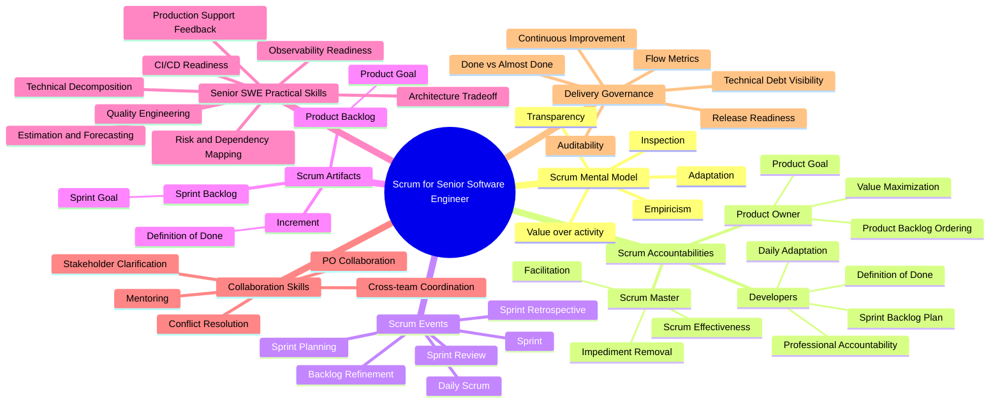

---

## Tabular Decomposition Map

| Area | Practical Skill / Domain | Apa yang perlu dikuasai Senior SWE | Output praktis yang diharapkan |
|---|---|---|---|
| **Scrum Mental Model** | Empiricism | Memahami bahwa keputusan Sprint harus berbasis fakta yang terlihat, bukan asumsi tersembunyi. | Tim punya data/progress nyata untuk inspeksi, bukan “feeling progress”. |
| **Scrum Mental Model** | Transparency | Membuat status teknis terlihat: risiko, blocker, dependency, debt, test gap, release risk. | Sprint Backlog, board, PR, pipeline, dan impediment list mencerminkan kondisi sebenarnya. |
| **Scrum Mental Model** | Inspection | Membantu tim memeriksa progress terhadap Sprint Goal, bukan sekadar menghitung task selesai. | Daily Scrum dan review teknis fokus pada goal, risk, dan next adjustment. |
| **Scrum Mental Model** | Adaptation | Berani mengubah plan ketika fakta berubah: scope, approach, pairing, rollback, atau split story. | Sprint tetap adaptif tanpa mengorbankan quality. |
| **Scrum Accountabilities** | Developer Accountability | Developers accountable untuk membuat Sprint Backlog plan, menjaga quality via Definition of Done, adaptasi harian menuju Sprint Goal, dan saling menjaga akuntabilitas profesional. ([Scrum Guides](https://scrumguides.org/scrum-guide.html)) | Senior SWE menjadi anchor delivery teknis tanpa mengambil alih self-management tim. |
| **Scrum Accountabilities** | Product Owner Collaboration | Membantu PO memecah requirement ambigu menjadi backlog item yang testable dan valuable. | Product Backlog item lebih jelas, ordered, dan siap dibahas saat refinement/planning. |
| **Scrum Accountabilities** | Scrum Master Collaboration | Membantu Scrum Master mengidentifikasi impediment teknis: environment, dependency, pipeline, ownership, akses, atau bottleneck review. | Impediment tidak tersembunyi sebagai “developer problem” individual. |
| **Product Goal** | Product Direction Awareness | Memahami arah produk agar keputusan teknis tidak hanya lokal ke story. | Trade-off teknis lebih mudah dijelaskan dalam konteks business/product value. |
| **Product Backlog** | Backlog Refinement | Membantu breakdown item besar menjadi slice kecil yang tetap menghasilkan value. Scrum Guide menyebut refinement sebagai aktivitas ongoing untuk memecah dan memperjelas item. ([Scrum Guides](https://scrumguides.org/scrum-guide.html)) | Story lebih kecil, punya acceptance criteria, dependency jelas, dan estimasi lebih rasional. |
| **Product Backlog** | Requirement Clarification | Mengidentifikasi missing rule, edge case, state transition, authorization, error path, audit, dan data impact. | Requirement tidak “terlihat simple” tetapi meledak saat development. |
| **Sprint Planning** | Goal-based Planning | Membantu tim memilih pekerjaan berdasarkan Sprint Goal, bukan hanya kapasitas mekanis. | Sprint punya objective tunggal yang koheren, bukan kumpulan tiket acak. |
| **Sprint Planning** | Technical Decomposition | Memecah work menjadi task teknis: API, DB migration, integration, test, observability, rollout, rollback. | Sprint Backlog actionable dan bisa diinspeksi harian. |
| **Sprint Planning** | Estimation & Forecasting | Menggunakan estimasi sebagai alat percakapan risiko, bukan kontrak kepastian. | Estimasi menunjukkan uncertainty, dependency, dan complexity. |
| **Daily Scrum** | Daily Replanning | Daily Scrum bertujuan inspect progress toward Sprint Goal dan adapt Sprint Backlog; ini event 15 menit untuk Developers. ([Scrum Guides](https://scrumguides.org/scrum-guide.html)) | Daily tidak berubah menjadi status report ke lead/manager. |
| **Daily Scrum** | Blocker Surfacing | Mengangkat blocker teknis secara eksplisit: PR stuck, flaky test, schema conflict, unclear contract, infra issue. | Blocker cepat terlihat dan bisa ditangani sebelum akhir Sprint. |
| **Daily Scrum** | Pairing / Swarming Decision | Menentukan kapan tim perlu pairing atau swarming pada item kritikal. | Work in progress turun, flow meningkat, risiko delivery berkurang. |
| **Sprint Review** | Increment Demonstrability | Sprint Review digunakan untuk inspect outcome dan adapt future work, bukan sekadar demo formal. ([Scrum Guides](https://scrumguides.org/scrum-guide.html)) | Stakeholder melihat Increment yang usable dan memberi feedback bermakna. |
| **Sprint Review** | Technical Narrative | Menjelaskan dampak teknis dalam bahasa produk: reliability, latency, auditability, scalability, maintainability. | Stakeholder paham value dari technical work, bukan hanya “refactor internal”. |
| **Sprint Retrospective** | Continuous Improvement | Retrospective bertujuan meningkatkan quality dan effectiveness, termasuk proses, tools, interaction, dan Definition of Done. ([Scrum Guides](https://scrumguides.org/scrum-guide.html)) | Improvement masuk ke tindakan konkret, bukan hanya diskusi berulang. |
| **Sprint Retrospective** | Engineering System Improvement | Mengusulkan improvement pipeline, test strategy, code review flow, local dev setup, observability, dan incident feedback loop. | Masalah sistemik dikurangi, bukan disalahkan ke individu. |
| **Scrum Artifacts** | Product Backlog | Product Backlog adalah ordered list dari hal yang dibutuhkan untuk meningkatkan produk dan menjadi single source of work Scrum Team. ([Scrum Guides](https://scrumguides.org/scrum-guide.html)) | Tidak ada hidden backlog teknis yang diam-diam dikerjakan tanpa visibility. |
| **Scrum Artifacts** | Sprint Backlog | Sprint Backlog berisi Sprint Goal, selected PBIs, dan actionable plan untuk deliver Increment. ([Scrum Guides](https://scrumguides.org/scrum-guide.html)) | Tim punya plan yang berubah secara sadar saat belajar hal baru. |
| **Scrum Artifacts** | Increment | Increment harus usable; work tidak dianggap bagian dari Increment kecuali memenuhi Definition of Done. ([Scrum Guides](https://scrumguides.org/scrum-guide.html)) | “Done” tidak berarti sekadar code merged. |
| **Commitments** | Product Goal | Menjaga agar technical decision punya hubungan ke objective produk jangka lebih panjang. | Architecture dan refactoring tidak kehilangan konteks value. |
| **Commitments** | Sprint Goal | Menggunakan Sprint Goal sebagai filter ketika scope berubah. | Scope bisa dinegosiasikan tanpa mengorbankan objective Sprint. |
| **Commitments** | Definition of Done | Definition of Done adalah deskripsi formal kondisi Increment ketika memenuhi quality measures produk. ([Scrum Guides](https://scrumguides.org/scrum-guide.html)) | Quality gate jelas: test, review, security, migration, docs, observability, deployability. |
| **Engineering Quality** | Done vs Almost Done | Membedakan “coding selesai” dari “usable, tested, reviewed, deployable, observable”. | Mengurangi carry-over dan surprise menjelang Sprint Review. |
| **Engineering Quality** | Test Strategy | Menentukan level test: unit, integration, contract, migration, e2e, regression, performance smoke. | DoD punya bukti teknis, bukan klaim manual. |
| **Engineering Quality** | CI/CD Integration | Memastikan pipeline menjadi bagian dari Sprint reality. | Broken build, flaky test, dan deploy failure terlihat sebagai impediment Sprint. |
| **Architecture in Scrum** | Just-enough Architecture | Mendesain cukup untuk Sprint dan Product Goal, tanpa big design upfront berlebihan. | Architecture decision record, spike, dan vertical slice digunakan secara proporsional. |
| **Architecture in Scrum** | Technical Spike | Memakai spike untuk mengurangi uncertainty sebelum commit delivery besar. | Risiko teknis dipelajari lebih awal. |
| **Architecture in Scrum** | Cross-cutting Concern | Mengangkat concern seperti security, observability, migration, backward compatibility, dan performance sejak refinement. | Story tidak gagal di akhir karena non-functional requirement terlambat. |
| **Flow & Metrics** | WIP Awareness | Melihat terlalu banyak work in progress sebagai risiko delivery. | Tim lebih sering menyelesaikan item daripada membuka banyak item. |
| **Flow & Metrics** | Cycle Time / Lead Time | Menggunakan metrik flow untuk melihat bottleneck, bukan menghukum individu. | Improvement lebih objektif: review bottleneck, test bottleneck, dependency bottleneck. |
| **Flow & Metrics** | Burn-down / Burn-up Caution | Scrum Guide menyebut burn-down, burn-up, dan cumulative flow bisa berguna, tetapi tidak menggantikan empiricism. ([Scrum Guides](https://scrumguides.org/scrum-guide.html)) | Chart dipakai sebagai sinyal, bukan kebenaran tunggal. |
| **Risk Management** | Dependency Mapping | Memetakan dependency lintas service, database, platform, security, infra, dan tim lain. | Risiko eksternal tidak muncul tiba-tiba di akhir Sprint. |
| **Risk Management** | Release Risk | Mengidentifikasi rollback, migration safety, feature flag, compatibility, monitoring, dan support impact. | Increment bisa benar-benar dirilis, bukan hanya selesai secara development. |
| **Stakeholder Collaboration** | Technical-to-Business Translation | Menjelaskan technical debt, refactoring, reliability, dan platform work dalam impact bisnis. | PO dan stakeholder bisa membuat ordering decision yang lebih baik. |
| **Mentoring** | Team Capability Building | Membantu engineer lain memahami domain, codebase, debugging, testing, dan delivery discipline. | Tim makin mandiri, bukan makin bergantung pada senior. |
| **Conflict Handling** | Healthy Technical Debate | Menjaga debat architecture tetap evidence-based dan goal-oriented. | Keputusan teknis lebih cepat, terdokumentasi, dan tidak personal. |
| **Anti-pattern Detection** | Scrum Theater | Mengenali Scrum yang hanya ceremony tetapi tanpa inspect/adapt nyata. | Tim memperbaiki flow kerja, bukan hanya memperbanyak meeting. |
| **Anti-pattern Detection** | Hidden Waterfall | Mendeteksi pola analisis panjang → dev panjang → test akhir → release gagal. | Work dislice lebih kecil dan feedback datang lebih cepat. |
| **Anti-pattern Detection** | Proxy Product Ownership | Menghindari engineer dipaksa menebak prioritas bisnis tanpa PO decision. | PO tetap accountable atas ordering dan value; engineer memberi input teknis. |
| **Senior SWE Leadership** | Technical Stewardship | Menjaga quality, maintainability, operability, dan learning dalam batas Scrum. | Senior SWE menjadi multiplier, bukan bottleneck atau mini-project-manager. |

---

## Mental Model Praktis untuk Senior SWE

Scrum bukan “delivery machine” yang menjamin semua scope selesai. Scrum adalah **risk-reduction loop**:

```text
Product Goal
   ↓
Product Backlog
   ↓ refinement
Sprint Goal
   ↓ planning
Sprint Backlog
   ↓ daily inspection/adaptation
Increment
   ↓ review feedback
Product Backlog adjustment
   ↓
Retrospective improvement
```

Untuk Senior SWE, pertanyaan kuncinya bukan hanya:

> “Task saya apa?”

Tetapi:

> “Apa risiko terbesar terhadap Sprint Goal, kualitas Increment, dan kemampuan tim untuk belajar cepat?”

---

## Roadmap Alur Belajar yang Direkomendasikan

| Urutan | Fokus Belajar | Target Praktis |
|---:|---|---|
| 1 | **Scrum fundamentals** | Pahami accountabilities, events, artifacts, commitments, dan Scrum values. |
| 2 | **Developer accountability** | Kuasai peran Developers dalam Sprint Backlog, Definition of Done, Daily adaptation, dan professional accountability. |
| 3 | **Backlog refinement untuk engineer** | Latih breakdown requirement, acceptance criteria, edge case, dependency, dan technical risk. |
| 4 | **Sprint planning & estimation** | Belajar membuat Sprint Goal-driven plan, bukan hanya capacity filling. |
| 5 | **Definition of Done engineering** | Formalkan quality gate: test, review, security, observability, migration, deployability. |
| 6 | **Daily execution & flow** | Gunakan Daily Scrum untuk replanning, blocker removal, WIP control, dan swarming. |
| 7 | **Review & stakeholder communication** | Latih menjelaskan Increment dan technical work dalam bahasa value. |
| 8 | **Retrospective engineering improvement** | Ubah pain point menjadi improvement backlog: CI/CD, testing, tooling, architecture, ownership. |
| 9 | **Senior SWE leadership in Scrum** | Fokus pada mentoring, technical decision, dependency management, dan risk visibility. |
| 10 | **Advanced Scrum anti-patterns** | Kenali Scrum theater, hidden waterfall, fake velocity, weak DoD, dan overloaded Sprint. |

---

## Rekomendasi Materi Selanjutnya

Materi berikutnya yang paling relevan: **“Scrum Anti-patterns & Failure Modes for Senior Software Engineer”** - fokus pada masalah nyata seperti Scrum theater, fake velocity, weak Definition of Done, carry-over berulang, backlog tidak siap, dan konflik antara delivery pressure vs engineering quality.

---

**Sources:**

- [Scrum Guide | Scrum Guides](https://scrumguides.org/scrum-guide.html)

## Response:
7/13/2026, 8:31:19 AM

Total saya rekomendasikan **12 seri** untuk Scrum for Senior Software Engineer.

| Seri | Topik |
|---:|---|
| 1 | Scrum Mental Model for Senior Software Engineer |
| 2 | Scrum Accountabilities: PO, Scrum Master, Developers |
| 3 | Product Backlog, Product Goal, dan Backlog Refinement |
| 4 | Sprint Planning, Sprint Goal, Estimation, dan Forecasting |
| 5 | Sprint Backlog, Daily Scrum, Flow, dan Replanning |
| 6 | Increment, Definition of Done, dan Engineering Quality Gate |
| 7 | Sprint Review dan Stakeholder Feedback Loop |
| 8 | Sprint Retrospective dan Continuous Improvement |
| 9 | Technical Decomposition, Spike, Dependency, dan Risk Mapping |
| 10 | Scrum Metrics: Velocity, Cycle Time, Lead Time, WIP, Burnup/Burndown |
| 11 | Scrum Anti-patterns & Failure Modes |
| 12 | Senior SWE Leadership in Scrum: Mentoring, Influence, dan Technical Stewardship |

Jadi total: **12 seri**.

Rekomendasi mulai dari **Seri 1 — Scrum Mental Model for Senior Software Engineer**.

## Response:
7/13/2026, 8:31:32 AM

Saya mulai dari **Seri 1/12** dan akan menjaga tiap seri tidak mengulang materi inti yang sama. Untuk seri pertama, fokusnya adalah mental model Scrum sebagai sistem adaptif untuk delivery engineering, bukan daftar meeting.

# Seri 1/12 - Scrum Mental Model for Senior Software Engineer

## 1. Introduction

Scrum paling tepat dipahami sebagai **framework untuk mengelola ketidakpastian**, bukan sekadar kumpulan meeting. Scrum Guide mendefinisikan Scrum sebagai framework ringan untuk membantu orang, tim, dan organisasi menghasilkan value melalui solusi adaptif atas masalah kompleks. Scrum berdiri di atas **empiricism** dan **lean thinking**: keputusan dibuat berdasarkan hal yang teramati, sementara waste dikurangi agar tim fokus pada hal esensial. ([Scrum Guides](https://scrumguides.org/scrum-guide.html?utm_source=chatgpt.com))

Untuk **Senior Software Engineer**, mental model yang penting adalah:

> Scrum bukan sistem untuk “memastikan semua tiket selesai”, tetapi sistem untuk **mendeteksi risiko lebih cepat, membuat progress transparan, dan beradaptasi sebelum terlambat**.

Dalam konteks engineering, Scrum yang sehat membantu tim menjawab:

```text
Apakah kita membangun hal yang benar?
Apakah Increment benar-benar usable?
Apakah risiko teknis terlihat cukup awal?
Apakah Sprint Goal masih realistis?
Apakah kualitas engineering cukup untuk production?
Apa yang harus diadaptasi hari ini?
```

---

## 2. Core Mental Model

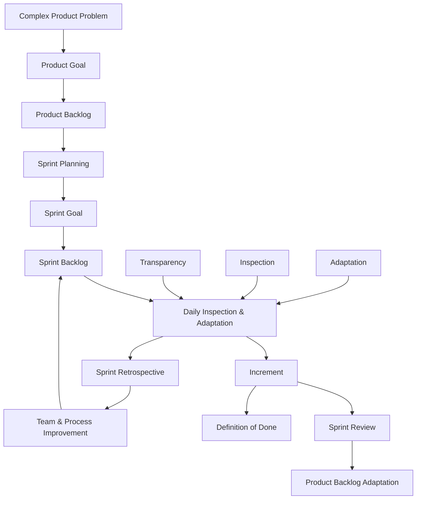

Scrum bekerja sebagai loop:

```text
Goal → Plan → Execute → Inspect → Adapt → Improve
```

Bukan:

```text
Requirement → Estimate → Commit → Code → Demo → Repeat
```

Perbedaannya besar. Model pertama mengakui bahwa realitas berubah. Model kedua cenderung menyembunyikan risiko sampai akhir Sprint.

---

## 3. Scrum sebagai Risk-Reduction System

Scrum Guide menekankan tiga pilar empiricism: **transparency, inspection, dan adaptation**. Ketiganya bekerja bersama; tanpa transparency, inspection menjadi lemah; tanpa inspection, adaptation menjadi asal tebak; tanpa adaptation, Scrum berubah menjadi ritual kosong. ([Scrum Guides](https://scrumguides.org/scrum-guide.html?utm_source=chatgpt.com))

| Pilar | Makna Praktis | Peran Senior SWE |
|---|---|---|
| **Transparency** | Kondisi pekerjaan terlihat apa adanya. | Membuka risiko teknis: blocker, dependency, test gap, code smell, migration risk, flaky pipeline. |
| **Inspection** | Tim memeriksa progress dan realitas secara berkala. | Membantu membaca sinyal: apakah Sprint Goal masih aman, apakah design salah arah, apakah story terlalu besar. |
| **Adaptation** | Tim mengubah plan berdasarkan fakta baru. | Mengusulkan split story, pairing, spike, rollback plan, scope adjustment, atau technical workaround. |

Mental model senior:

```text
Scrum value muncul bukan dari ceremony.
Scrum value muncul dari kualitas inspeksi dan keberanian adaptasi.
```

---

## 4. Scrum Bukan Mini-Waterfall

Banyak tim memakai istilah Scrum tetapi praktiknya masih waterfall kecil:

```text
Day 1-2    Analyze
Day 3-6    Code
Day 7-8    Test
Day 9      Fix
Day 10     Demo panic
```

Ini bukan empiricism yang sehat. Ini hanya waterfall yang dipadatkan ke Sprint.

Model yang lebih sehat:

```text
Day 1      Align Sprint Goal + clarify risk
Day 2-3    Build first vertical slice
Day 4      Integrate + test + inspect feedback
Day 5-7    Expand scope safely
Day 8      Stabilize + observe + prepare review
Day 9-10   Adapt, finish, review, improve
```

Untuk Senior SWE, pertanyaan hariannya:

| Pertanyaan Lemah | Pertanyaan Lebih Baik |
|---|---|
| “Task saya apa?” | “Apa risiko terbesar terhadap Sprint Goal?” |
| “Sudah coding berapa persen?” | “Apa yang sudah usable dan memenuhi DoD?” |
| “Tiket ini selesai kapan?” | “Apa yang menghalangi Increment bisa dipakai?” |
| “Siapa yang telat?” | “Di mana flow tim tersumbat?” |
| “Kenapa velocity turun?” | “Apa yang berubah di complexity, dependency, quality gate, atau capacity?” |

---

## 5. Scrum sebagai Feedback Loop Engineering

Scrum tidak memberikan resep detail engineering seperti branching strategy, test pyramid, CI/CD, observability, database migration, atau release strategy. Scrum adalah framework; praktik engineering harus ditambahkan secara sadar oleh tim. Scrum Guide juga menyatakan Scrum sengaja tidak lengkap dan hanya mendefinisikan bagian yang diperlukan untuk menerapkan teori Scrum. ([Scrum Guides](https://scrumguides.org/scrum-guide.html?utm_source=chatgpt.com))

Untuk stack Anda, feedback loop Scrum harus menyentuh area teknis seperti:

| Area Engineering | Feedback yang Harus Terlihat dalam Scrum |
|---|---|
| **Java/Jersey API** | Contract sudah jelas? Error handling konsisten? Backward compatible? |
| **MyBatis/PostgreSQL** | Query aman? Migration siap? Transaction boundary benar? |
| **Camunda** | Process state jelas? Incident path ada? Retry behavior dipahami? |
| **Docker/Kubernetes** | Deployable? Config benar? Readiness/liveness probe aman? |
| **CI/CD** | Build hijau? Test reliable? Artifact bisa dirilis? |
| **Observability** | Log, metric, trace cukup untuk production support? |
| **Cloud/On-prem** | Environment difference terlihat? Secret/config/network dependency jelas? |

Senior SWE harus membantu membuat hal-hal ini masuk ke:

```text
Backlog refinement
Sprint Planning
Definition of Done
Daily Scrum
Sprint Review
Retrospective
```

Bukan ditemukan setelah release.

---

## 6. Scrum Mental Model untuk Senior SWE

### 6.1 Value over Activity

Scrum bukan menghargai “sibuk”. Scrum menghargai **value yang terinspeksi**.

Contoh:

| Aktivitas | Belum tentu Value | Value Lebih Nyata |
|---|---|---|
| Banyak tiket dipindah ke Done | Bisa saja belum usable | Increment memenuhi Definition of Done |
| Banyak PR dibuat | Bisa menambah WIP | PR kecil, reviewed, tested, merged |
| Banyak meeting refinement | Bisa hanya diskusi | Backlog item lebih kecil dan jelas |
| Banyak estimasi | Bisa pseudo-accuracy | Risiko dan dependency lebih terlihat |
| Banyak dokumentasi | Bisa tidak dipakai | Decision dan operational knowledge mudah dipakai |

---

### 6.2 Increment over Output

Scrum Guide menyatakan Increment adalah langkah konkret menuju Product Goal, dan setiap Increment harus usable. Work tidak dapat dianggap bagian dari Increment kecuali memenuhi Definition of Done. ([Scrum Guides](https://scrumguides.org/scrum-guide.html?utm_source=chatgpt.com))

Untuk Senior SWE:

```text
Output  = code, PR, task, document, migration script
Outcome = capability yang usable, safe, observable, maintainable
```

Contoh praktis:

| Output | Belum Cukup | Increment yang Lebih Valid |
|---|---|---|
| Endpoint dibuat | Belum ada contract test | Endpoint usable, tested, documented, observable |
| DB migration ditulis | Belum diuji rollback/compatibility | Migration aman untuk target environment |
| BPMN process diubah | Incident path belum jelas | Process bisa jalan, gagal, retry, dan diaudit |
| Docker image berhasil build | Belum siap deploy | Image deployable dengan config/probe/secret benar |
| Story moved to Done | Belum demoable | Stakeholder bisa inspect behavior nyata |

---

### 6.3 Goal over Ticket Completion

Sprint Goal adalah komitmen untuk Sprint Backlog. Ia memberi arah dan fleksibilitas kepada tim selama Sprint. ([Scrum Guides](https://scrumguides.org/scrum-guide.html?utm_source=chatgpt.com))

Tanpa Sprint Goal, Sprint menjadi kumpulan tiket. Dengan Sprint Goal, tim punya alat untuk mengambil keputusan ketika realitas berubah.

Contoh:

```text
Sprint Goal:
Enable customers to submit CPQ order amendment request with audit trail.

Ticket A:
Create amendment API.

Ticket B:
Add validation rules.

Ticket C:
Persist amendment history.

Ticket D:
Expose amendment status.
```

Jika waktu tidak cukup, tim bisa bertanya:

```text
Mana scope yang bisa dikurangi tanpa menghancurkan Sprint Goal?
Mana yang wajib agar Increment tetap usable?
Mana yang bisa di-split ke Sprint berikutnya?
```

Ini jauh lebih sehat daripada memaksa semua tiket selesai secara dangkal.

---

## 7. Practical Skills yang Harus Dimiliki Senior SWE

| Skill | Deskripsi Praktis | Contoh Perilaku |
|---|---|---|
| **Risk-first thinking** | Melihat pekerjaan dari risiko terbesar, bukan task termudah. | Mengangkat uncertainty integration lebih awal. |
| **Vertical slicing** | Membantu memecah pekerjaan menjadi slice kecil yang tetap usable. | API + DB + test + minimal UI/consumer path selesai lebih dulu. |
| **Definition of Done discipline** | Menjaga “Done” tidak turun kualitasnya saat tekanan tinggi. | Tidak menganggap story Done tanpa test, review, migration check, dan observability minimal. |
| **Technical transparency** | Membuat kompleksitas terlihat tanpa menakut-nakuti. | Menjelaskan “ini bukan 3-point story karena ada schema compatibility dan retry behavior.” |
| **Adaptive planning** | Mengubah plan ketika fakta baru muncul. | Mengusulkan spike, pairing, scope cut, atau dependency escalation. |
| **Systemic problem solving** | Melihat bottleneck sebagai masalah sistem, bukan individu. | “PR review bottleneck karena ownership tidak jelas”, bukan “developer lambat”. |
| **Stakeholder translation** | Mengubah isu teknis menjadi konsekuensi produk/bisnis. | “Tanpa audit trail, order amendment sulit dipertahankan saat dispute.” |
| **Team enablement** | Membuat engineer lain lebih mampu. | Pairing, review berkualitas, dokumentasi keputusan, knowledge sharing. |

---

## 8. Scrum Smells yang Harus Cepat Dideteksi

| Smell | Gejala | Risiko | Respons Senior SWE |
|---|---|---|---|
| **Daily jadi status report** | Tiap orang lapor ke lead/SM. | Tidak ada replanning nyata. | Arahkan diskusi ke Sprint Goal dan blocker. |
| **Sprint tanpa Sprint Goal** | Hanya daftar tiket. | Scope tidak punya coherence. | Bantu PO/tim merumuskan objective Sprint. |
| **Done berarti code complete** | Test, review, deploy belum selesai. | Carry-over dan bug production. | Perkuat Definition of Done. |
| **Refinement terlalu bisnis-only** | Edge case teknis tidak dibahas. | Requirement meledak saat dev. | Bawa pertanyaan data, state, integration, failure path. |
| **Velocity jadi target performa** | Tim mengejar point. | Gaming estimation, quality turun. | Geser diskusi ke flow, predictability, dan value. |
| **Semua kerja dibuka bersamaan** | Banyak WIP, sedikit selesai. | Sprint tampak sibuk tapi tidak menghasilkan Increment. | Dorong swarming dan WIP control. |
| **Testing di akhir Sprint** | Bug ditemukan terlambat. | Review gagal, carry-over tinggi. | Shift-left testing dan vertical slice. |
| **Tech debt disembunyikan** | Tidak masuk backlog. | Akumulasi risiko diam-diam. | Jadikan debt visible dengan impact dan opsi mitigasi. |

---

## 9. Checklist Harian Senior SWE dalam Scrum

Gunakan checklist ini saat Daily Scrum atau saat mengevaluasi progress Sprint:

```text
[ ] Apakah Sprint Goal masih jelas?
[ ] Apakah ada risiko baru terhadap Sprint Goal?
[ ] Apakah work yang sedang berjalan terlalu banyak?
[ ] Apakah ada item yang perlu di-split?
[ ] Apakah ada blocker teknis yang belum diekspos?
[ ] Apakah ada dependency eksternal yang belum ditindaklanjuti?
[ ] Apakah ada pekerjaan yang “hampir Done” tapi belum memenuhi DoD?
[ ] Apakah pipeline/test/review menghambat flow?
[ ] Apakah Increment sudah bisa diuji secara end-to-end?
[ ] Apakah observability dan operability cukup untuk production?
[ ] Apakah ada keputusan teknis yang perlu dicatat?
[ ] Apakah tim perlu pairing/swarming?
```

---

## 10. Contoh Penerapan di Tim Microservice Java

Misal Sprint Goal:

```text
Allow internal users to create order cancellation request with validation and audit trail.
```

### Cara berpikir junior biasanya:

```text
Saya ambil task API.
Saya selesaikan controller.
Saya push PR.
```

### Cara berpikir senior seharusnya:

```text
Apa state lifecycle cancellation?
Apa validasi bisnisnya?
Apa contract API-nya?
Apa DB impact-nya?
Apa audit requirement-nya?
Apa failure path-nya?
Apakah perlu Camunda process?
Apakah ada idempotency concern?
Bagaimana jika request duplicate?
Bagaimana observability untuk support?
Apa minimum Increment yang bisa direview stakeholder?
```

### Breakdown lebih sehat:

| Slice | Isi | Tujuan |
|---|---|---|
| Slice 1 | Minimal API + validation + persistence | Membuktikan flow utama |
| Slice 2 | Audit trail + status transition | Membuat behavior defensible |
| Slice 3 | Camunda/process integration | Mengelola lifecycle |
| Slice 4 | Error handling + idempotency | Mengurangi failure risk |
| Slice 5 | Observability + support query | Siap production support |

Ini menunjukkan peran Senior SWE: bukan mengambil semua pekerjaan, tetapi membuat **risiko sistem terlihat dan bisa dikelola**.

---

## 11. Mini Decision Framework

Saat Sprint berjalan, gunakan pertanyaan ini:

```text
Jika hanya satu hal bisa selesai minggu ini,
apa yang paling membuktikan Sprint Goal?

Jika ada satu risiko yang harus dibuka hari ini,
risiko apa yang paling berbahaya jika ditunda?

Jika story ini tidak selesai,
apakah Sprint Goal masih bisa tercapai?

Jika code ini masuk production,
apa failure mode yang paling mungkin?

Jika stakeholder melihat Increment hari ini,
apakah mereka bisa memberi feedback nyata?
```

Framework ini membantu Senior SWE menjaga Scrum tetap empiris, bukan administratif.

---

## 12. Ringkasan Seri 1

Scrum untuk Senior Software Engineer adalah sistem untuk:

| Fokus | Makna |
|---|---|
| **Menghasilkan value** | Bukan sekadar menyelesaikan tiket. |
| **Mengelola uncertainty** | Risiko dibuat terlihat lebih awal. |
| **Meningkatkan transparency** | Status teknis tidak disembunyikan. |
| **Melakukan inspection** | Progress dicek terhadap Sprint Goal dan Increment. |
| **Melakukan adaptation** | Plan berubah berdasarkan fakta. |
| **Menjaga quality** | Definition of Done menjadi batas minimal profesional. |
| **Meningkatkan tim** | Retrospective menghasilkan improvement nyata. |

Mental model paling penting:

```text
Scrum bukan kontrol kerja.
Scrum adalah feedback system.

Senior SWE bukan mini project manager.
Senior SWE adalah technical risk reducer, quality steward, dan team multiplier.
```

---

## Status Seri

**Seri 1/12 selesai.**

Sisa seri: **11**.

Seri berikutnya yang direkomendasikan: **Seri 2 - Scrum Accountabilities: Product Owner, Scrum Master, Developers, dan posisi praktis Senior Software Engineer di dalamnya.**

---

**Sources:**

- [The 2020 Scrum Guide TM](https://scrumguides.org/scrum-guide.html?utm_source=chatgpt.com)

## Response:
7/13/2026, 8:45:15 PM

# Seri 2/12 - Scrum Accountabilities: Product Owner, Scrum Master, Developers, dan Posisi Senior Software Engineer

## 1. Introduction

Di Scrum modern, istilah yang dipakai adalah **accountabilities**, bukan “roles” dalam arti jabatan organisasi. Scrum Team terdiri dari **Product Owner, Scrum Master, dan Developers**. Scrum Team bersifat kecil, self-managing, cross-functional, dan tidak memiliki sub-team atau hierarki internal dalam Scrum framework. ([scrumguides.org](https://scrumguides.org/docs/scrumguide/v2020/2020-Scrum-Guide-US.pdf?utm_source=chatgpt.com))

Untuk **Senior Software Engineer**, poin pentingnya:

```text
Anda bukan Scrum Master secara otomatis.
Anda bukan Product Owner secara otomatis.
Anda adalah bagian dari Developers accountability,
tetapi dengan pengaruh teknis yang lebih besar.
```

Artinya, Senior SWE biasanya bertanggung jawab membantu tim membuat **Increment** yang usable, berkualitas, maintainable, dan aman untuk production, tetapi tidak mengambil alih accountability Product Owner atau Scrum Master.

---

## 2. Diagram - Scrum Accountabilities Map

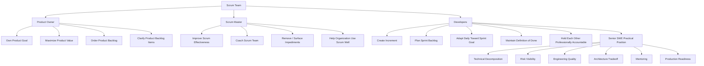

---

## 3. Mental Model: Accountability vs Job Title

Scrum accountabilities tidak selalu sama dengan struktur jabatan perusahaan.

| Scrum Accountability | Bukan Berarti | Makna Praktis |
|---|---|---|
| **Product Owner** | Business analyst biasa | Accountable atas value, Product Goal, dan ordering Product Backlog. |
| **Scrum Master** | Meeting scheduler / admin Jira | Accountable atas efektivitas Scrum dan membantu tim memahami serta menjalankan Scrum dengan baik. |
| **Developers** | Hanya programmer junior/mid/senior | Semua orang di Scrum Team yang committed membuat usable Increment setiap Sprint. |
| **Senior Software Engineer** | Mini project manager | Developer accountability dengan kedalaman teknis, mentoring, risk reduction, dan quality stewardship. |

Scrum Guide menyatakan Developers adalah orang-orang di Scrum Team yang committed membuat aspek apa pun dari usable Increment setiap Sprint. Mereka accountable untuk membuat plan Sprint Backlog, menanamkan quality melalui Definition of Done, mengadaptasi plan harian menuju Sprint Goal, dan menjaga akuntabilitas profesional satu sama lain. ([scrumguides.org](https://scrumguides.org/docs/scrumguide/v2020/2020-Scrum-Guide-US.pdf?utm_source=chatgpt.com))

---

## 4. Product Owner - Apa yang Perlu Dipahami Senior SWE

Product Owner accountable untuk **maximizing value** dari produk yang dihasilkan Scrum Team. PO juga accountable atas Product Backlog management, termasuk mengembangkan dan mengomunikasikan Product Goal, membuat Product Backlog item, ordering, dan memastikan backlog transparan serta dipahami. ([scrumguides.org](https://scrumguides.org/docs/scrumguide/v2020/2020-Scrum-Guide-US.pdf?utm_source=chatgpt.com))

### Yang Bukan Tanggung Jawab Senior SWE

Senior SWE tidak seharusnya diam-diam mengambil keputusan seperti:

```text
"Story ini lebih penting dari story itu."
"Fitur ini tidak perlu karena secara teknis sulit."
"Kita skip requirement ini tanpa diskusi PO."
"Technical debt ini pasti prioritas nomor satu."
```

Keputusan ordering dan value tetap milik PO.

### Yang Harus Dilakukan Senior SWE

Senior SWE memberi **technical input** agar PO bisa mengambil keputusan lebih baik.

| Area | Kontribusi Senior SWE |
|---|---|
| Value tradeoff | Menjelaskan konsekuensi teknis dari pilihan produk. |
| Scope split | Mengusulkan slice kecil yang tetap valuable. |
| Risk | Menjelaskan risiko dependency, data migration, integration, security, performance. |
| Cost of delay | Menjelaskan dampak jika technical debt / platform issue terus ditunda. |
| Feasibility | Memberi opsi teknis: simple path, robust path, temporary path, long-term path. |
| Acceptance clarity | Membantu membuat acceptance criteria lebih testable. |

### Contoh Praktis

PO berkata:

```text
Kita butuh fitur order cancellation di Sprint ini.
```

Senior SWE sebaiknya tidak langsung menjawab:

```text
Tidak bisa, terlalu besar.
```

Lebih baik:

```text
Untuk Sprint ini, kita bisa deliver cancellation request dengan validation dasar,
audit trail, dan status awal. Integrasi penuh ke downstream fulfillment mungkin
perlu slice berikutnya karena ada dependency contract dan retry behavior.
```

Itu membantu PO membuat keputusan scope tanpa kehilangan ownership produk.

---

## 5. Scrum Master - Apa yang Perlu Dipahami Senior SWE

Scrum Master accountable untuk **establishing Scrum as defined in the Scrum Guide** dan membantu efektivitas Scrum Team. Scrum Master melayani Scrum Team, Product Owner, dan organisasi melalui coaching, facilitation, impediment removal, dan membantu organisasi memahami pendekatan empiris. ([scrumguides.org](https://scrumguides.org/docs/scrumguide/v2020/2020-Scrum-Guide-US.pdf?utm_source=chatgpt.com))

### Scrum Master Bukan Sekadar

```text
Meeting organizer
Jira administrator
Notulen retrospective
Penagih update harian
Orang yang memastikan semua orang sibuk
```

### Hubungan Senior SWE dengan Scrum Master

Senior SWE perlu membantu Scrum Master melihat impediment teknis yang sering tidak tampak dari luar.

| Impediment Teknis | Cara Senior SWE Membantu Scrum Master |
|---|---|
| Pipeline sering flaky | Bawa data failure, frekuensi, impact ke flow Sprint. |
| PR review bottleneck | Jelaskan ownership/reviewer constraint. |
| Environment tidak stabil | Bedakan bug aplikasi vs issue infra/config. |
| Dependency lintas tim lambat | Bantu mapping dependency dan escalation path. |
| Requirement sering berubah | Tunjukkan dampak terhadap Sprint Goal dan rework. |
| Technical debt tersembunyi | Buat visible sebagai risiko terhadap quality/release. |

### Contoh Kolaborasi

Scrum Master melihat banyak item carry-over. Senior SWE bisa membantu diagnosis:

```text
Carry-over bukan karena developer kurang effort.
Pola yang terlihat:
1. Story terlalu besar saat masuk Sprint.
2. Integration test baru dilakukan akhir Sprint.
3. DB migration dependency belum clear saat planning.
4. PR review menumpuk di dua orang.
```

Ini mengubah pembicaraan dari menyalahkan individu menjadi memperbaiki sistem kerja.

---

## 6. Developers - Accountability Utama Senior SWE

Dalam Scrum, Senior SWE paling dekat dengan accountability **Developers**.

Developers accountable untuk:

```text
1. Membuat plan untuk Sprint, yaitu Sprint Backlog.
2. Menanamkan quality dengan mematuhi Definition of Done.
3. Mengadaptasi plan setiap hari menuju Sprint Goal.
4. Menjaga akuntabilitas profesional satu sama lain.
```

Poin ini langsung dari Scrum Guide. ([scrumguides.org](https://scrumguides.org/docs/scrumguide/v2020/2020-Scrum-Guide-US.pdf?utm_source=chatgpt.com))

Untuk Senior SWE, accountability ini diterjemahkan menjadi:

| Developer Accountability | Senior SWE Practical Meaning |
|---|---|
| Create Sprint Backlog plan | Membantu dekomposisi teknis yang realistis dan inspectable. |
| Instill quality via DoD | Menjaga test, review, migration, security, observability, dan deployability. |
| Adapt daily toward Sprint Goal | Mengusulkan replanning saat risiko berubah. |
| Hold each other accountable | Menjaga standar profesional tanpa menjadi command-and-control lead. |

---

## 7. Posisi Senior SWE: Antara Developer, Tech Lead, dan Scrum

Di banyak perusahaan, Senior SWE atau Tech Lead punya tanggung jawab teknis lebih besar daripada engineer lain. Namun dalam Scrum, perlu hati-hati agar posisi ini tidak merusak self-management tim.

### Healthy Senior SWE Behavior

```text
Membantu tim melihat risiko.
Membantu tim membuat keputusan teknis.
Membantu engineer lain tumbuh.
Membantu PO memahami tradeoff.
Membantu Scrum Master melihat bottleneck.
Menjaga quality bar.
```

### Unhealthy Senior SWE Behavior

```text
Menjadi satu-satunya pengambil keputusan teknis.
Membagi task secara top-down setiap hari.
Menjadi bottleneck semua PR.
Mengubah Daily Scrum menjadi laporan ke dirinya.
Mengambil keputusan prioritas produk tanpa PO.
Menganggap Scrum Master hanya admin.
```

### Prinsip Praktis

```text
Senior SWE boleh punya influence tinggi.
Tapi jangan membuat tim kehilangan ownership.
```

---

## 8. Decomposition Table - Scrum Accountabilities untuk Senior SWE

| Category | Skill / Domain | Yang Perlu Dipahami | Praktik Senior SWE |
|---|---|---|---|
| **Scrum Team Model** | One Scrum Team | Tidak ada sub-team formal dalam Scrum Team. | Hindari pola “business team vs dev team” atau “PO vs engineer”. |
| **Scrum Team Model** | Self-management | Tim memilih siapa mengerjakan apa, kapan, dan bagaimana dalam batas Sprint Goal. | Jangan membagi task seperti manager; fasilitasi ownership. |
| **Product Owner** | Product Goal | PO accountable mengembangkan dan mengomunikasikan Product Goal. | Hubungkan technical work ke arah produk. |
| **Product Owner** | Product Backlog Ordering | PO accountable atas ordering backlog. | Beri input risk/value/cost, bukan mengambil alih prioritas. |
| **Product Owner** | Backlog Clarity | Product Backlog harus transparan dan dipahami. | Bantu refinement dengan edge case, state, data, integration, NFR. |
| **Product Owner** | Scope Negotiation | Scope bisa disesuaikan selama Sprint dengan tetap menjaga Sprint Goal. | Tawarkan opsi slice, bukan sekadar bilang “tidak bisa”. |
| **Scrum Master** | Scrum Effectiveness | SM accountable atas efektivitas Scrum Team. | Bantu mengangkat masalah sistemik yang menghambat flow. |
| **Scrum Master** | Impediment Handling | SM membantu menghilangkan impediment terhadap progress. | Jelaskan impediment teknis dalam bentuk impact dan evidence. |
| **Scrum Master** | Coaching | SM membantu tim memahami Scrum. | Dukung Scrum yang empiris, bukan ceremony-only. |
| **Developers** | Sprint Backlog Plan | Developers membuat plan untuk Sprint. | Breakdown API, DB, test, deployment, observability, dependency. |
| **Developers** | Daily Adaptation | Developers inspect progress harian menuju Sprint Goal. | Dorong replanning, pairing, swarming, dan WIP control. |
| **Developers** | Definition of Done | Developers menjaga quality dengan mematuhi DoD. | Jangan turunkan standar Done saat Sprint pressure. |
| **Developers** | Professional Accountability | Developers saling menjaga akuntabilitas profesional. | Review berkualitas, feedback jelas, no hidden work, no silent blocker. |
| **Senior SWE** | Technical Risk Reduction | Senior SWE membantu risiko terlihat lebih awal. | Spike, ADR, dependency map, migration check, contract validation. |
| **Senior SWE** | Architecture Stewardship | Menjaga design cukup kuat tanpa over-engineering. | Pilih tradeoff eksplisit: simple now vs scalable later. |
| **Senior SWE** | Engineering Quality | Menjaga quality gate nyata. | Test strategy, CI/CD, review, security, observability. |
| **Senior SWE** | Mentoring | Menaikkan kemampuan tim. | Pairing, review edukatif, docs, debugging session. |
| **Senior SWE** | Stakeholder Translation | Menjelaskan technical issue sebagai product/business risk. | “Tanpa audit trail, dispute order sulit ditelusuri.” |
| **Senior SWE** | Flow Improvement | Melihat bottleneck sebagai sistem. | Kurangi WIP, perbaiki review flow, stabilkan pipeline. |

---

## 9. RACI Praktis dalam Scrum Team

Ini bukan RACI resmi Scrum, tetapi berguna untuk Senior SWE agar tidak salah mengambil peran.

| Aktivitas | Product Owner | Scrum Master | Developers | Senior SWE |
|---|---|---|---|---|
| Menentukan Product Goal | Accountable | Support | Consulted | Consulted secara teknis |
| Ordering Product Backlog | Accountable | Support | Consulted | Consulted untuk risk/cost |
| Refinement | Accountable untuk backlog clarity | Facilitate bila perlu | Active contributor | Strong contributor |
| Sprint Goal | Collaborates | Facilitates bila perlu | Collaborates | Bantu feasibility dan risk |
| Sprint Backlog plan | Consulted | Support | Accountable | Strong contributor |
| Technical design | Consulted bila berdampak value/scope | Support impediment | Accountable | Often leads by influence |
| Definition of Done | Collaborates | Coaches | Accountable | Quality steward |
| Daily adaptation | Aware bila perlu | Ensures event effectiveness | Accountable | Risk/flow driver |
| Sprint Review | Accountable atas value discussion | Facilitates bila perlu | Demonstrate Increment | Explain technical impact |
| Retrospective improvement | Participates | Facilitates | Participates | Identify engineering system improvements |

---

## 10. Common Failure Modes

### 10.1 Senior SWE Menjadi Mini Project Manager

Gejala:

```text
Senior membagi semua task.
Daily Scrum menjadi laporan ke senior.
Semua keputusan menunggu senior.
Engineer lain tidak berani mengambil ownership.
```

Dampak:

```text
Self-management hilang.
Bus factor naik.
Tim menjadi lambat saat senior tidak ada.
Scrum berubah menjadi command-and-control.
```

Perbaikan:

```text
Gunakan pertanyaan, bukan instruksi.
Buat decision criteria, bukan semua keputusan.
Delegasikan ownership per slice.
Pair untuk enablement, bukan mengambil alih.
```

---

### 10.2 Product Owner Menjadi Ticket Writer Saja

Gejala:

```text
PO hanya menulis requirement.
Ordering backlog didikte stakeholder.
Tidak ada Product Goal yang jelas.
Sprint berisi tiket random.
```

Dampak:

```text
Tim kehilangan konteks value.
Engineering sulit membuat tradeoff.
Scope negotiation kacau.
Sprint Goal lemah.
```

Perbaikan dari Senior SWE:

```text
Tanyakan objective produk.
Minta konteks value dan user impact.
Tawarkan opsi slicing.
Jelaskan technical cost dalam bahasa decision.
```

---

### 10.3 Scrum Master Menjadi Admin Ceremony

Gejala:

```text
SM hanya schedule meeting.
Tidak membantu mengangkat impediment.
Tidak challenge Scrum theater.
Tidak membantu organisasi berubah.
```

Dampak:

```text
Masalah sistemik terus berulang.
Daily/retro/review menjadi ritual kosong.
Tim menyalahkan Scrum, padahal implementasinya lemah.
```

Perbaikan dari Senior SWE:

```text
Bawa evidence bottleneck.
Bantu framing impediment sebagai masalah sistem.
Gunakan retrospective untuk improvement konkret.
```

---

### 10.4 Developers Menjadi Ticket Executor

Gejala:

```text
Developer hanya menunggu assignment.
Tidak challenge requirement.
Tidak peduli Sprint Goal.
Tidak menjaga DoD.
```

Dampak:

```text
Quality turun.
Ownership rendah.
Product feedback lambat.
Increment tidak benar-benar usable.
```

Perbaikan dari Senior SWE:

```text
Dorong ownership per outcome.
Ajak engineer ikut refinement.
Buat checklist DoD teknis.
Pairing untuk decision-making, bukan hanya coding.
```

---

## 11. Practical Senior SWE Playbook

### Saat Refinement

Tanyakan:

```text
Apa user/business outcome dari item ini?
Apa acceptance criteria yang bisa diuji?
Apa state transition-nya?
Apa data model impact-nya?
Apa integration dependency-nya?
Apa failure path-nya?
Apa security/authorization concern-nya?
Apa observability yang dibutuhkan?
Apakah bisa di-slice lebih kecil?
```

### Saat Sprint Planning

Tanyakan:

```text
Apa Sprint Goal?
Apa risiko terbesar terhadap Sprint Goal?
Item mana yang wajib agar Increment meaningful?
Apa dependency eksternal?
Apakah DoD realistis untuk semua item?
Apakah ada spike yang perlu dilakukan lebih awal?
Siapa yang paling tepat memulai slice pertama?
```

### Saat Daily Scrum

Tanyakan:

```text
Apakah progress menuju Sprint Goal masih sehat?
Apa yang sudah benar-benar Done?
Apa yang stuck?
Apakah WIP terlalu banyak?
Apakah ada item yang perlu pairing/swarming?
Apakah ada scope yang perlu dinegosiasikan?
```

### Saat Sprint Review

Tanyakan:

```text
Apa Increment yang bisa diinspect stakeholder?
Apa feedback paling penting?
Apa asumsi produk yang terbukti benar/salah?
Apa technical limitation yang perlu transparan?
Apa backlog adjustment berikutnya?
```

### Saat Retrospective

Tanyakan:

```text
Apa bottleneck terbesar Sprint ini?
Apa yang menyebabkan carry-over?
Apa yang membuat testing/review/deploy lambat?
Apa improvement kecil yang bisa langsung diterapkan?
Apa yang perlu masuk backlog sebagai engineering improvement?
```

---

## 12. Senior SWE Boundary Rules

Gunakan aturan berikut supaya peran tetap sehat.

| Situasi | Senior SWE Sebaiknya | Senior SWE Jangan |
|---|---|---|
| PO bingung scope | Beri opsi teknis dan konsekuensi | Memutuskan prioritas bisnis sendiri |
| Tim stuck design | Fasilitasi decision dengan tradeoff | Mengambil semua keputusan sendiri |
| Engineer junior lambat | Pairing dan mentoring | Mengambil alih task diam-diam |
| Sprint Goal terancam | Buka risiko dan opsi adaptasi | Menyembunyikan masalah sampai akhir |
| DoD ditekan | Jelaskan risiko quality | Menurunkan standar tanpa diskusi |
| PR menumpuk | Perbaiki review flow | Menjadi satu-satunya reviewer |
| Stakeholder push deadline | Jelaskan tradeoff scope/quality/risk | Mengiyakan target tidak realistis diam-diam |

---

## 13. Contoh Kasus: Order Management Feature

Misal tim sedang membangun fitur:

```text
Create order amendment workflow for enterprise customers.
```

### Product Owner Accountability

PO harus menjelaskan:

```text
Mengapa fitur ini penting?
Customer pain apa yang diselesaikan?
Apa Product Goal yang didukung?
Apa prioritas dibanding backlog lain?
Acceptance criteria bisnisnya apa?
```

### Scrum Master Accountability

Scrum Master membantu:

```text
Apakah refinement cukup efektif?
Apakah dependency menghambat Sprint?
Apakah tim menjalankan inspection/adaptation?
Apakah ada impediment organisasi?
Apakah Sprint Review menghasilkan feedback?
```

### Developers Accountability

Developers membuat:

```text
API endpoint
Validation rules
DB schema/migration
Camunda workflow
Audit trail
Tests
Deployment readiness
Observability
Increment yang memenuhi DoD
```

### Senior SWE Contribution

Senior SWE membantu melihat risiko:

```text
Apakah amendment request idempotent?
Bagaimana jika workflow gagal di tengah?
Apakah ada compensation path?
Apakah audit trail immutable?
Apakah migration backward-compatible?
Apakah downstream contract stabil?
Apakah user bisa melihat status proses?
Apakah support team bisa trace order amendment?
```

Inilah kontribusi senior: memperjelas risiko dan membuat delivery lebih defensible.

---

## 14. Ringkasan Seri 2

Scrum memiliki tiga accountabilities utama:

| Accountability | Inti Tanggung Jawab |
|---|---|
| **Product Owner** | Memaksimalkan value, mengelola Product Goal dan Product Backlog. |
| **Scrum Master** | Meningkatkan efektivitas Scrum Team dan membantu Scrum dipahami/dijalankan dengan benar. |
| **Developers** | Membuat usable Increment setiap Sprint, menjaga Sprint Backlog, DoD, adaptasi harian, dan akuntabilitas profesional. |

Posisi praktis Senior SWE:

```text
Senior SWE berada dalam Developers accountability,
dengan kontribusi tambahan pada technical leadership,
risk reduction, quality stewardship, mentoring,
dan translation antara technical reality dan product decision.
```

Kalimat kunci:

```text
Senior SWE bukan pemilik produk.
Senior SWE bukan admin Scrum.
Senior SWE bukan command-and-control manager.

Senior SWE adalah technical multiplier
yang membantu Scrum Team menghasilkan Increment berkualitas
dengan risiko yang terlihat dan bisa dikelola.
```

---

## Status Seri

**Seri 2/12 selesai.**

Sisa seri: **10**.

Seri berikutnya: **Seri 3 - Product Backlog, Product Goal, dan Backlog Refinement untuk Senior Software Engineer.**

---

**Sources:**

- [2020 Scrum Guide](https://scrumguides.org/docs/scrumguide/v2020/2020-Scrum-Guide-US.pdf?utm_source=chatgpt.com)

## Response:
7/13/2026, 8:46:54 PM

# Seri 3/12 - Product Backlog, Product Goal, dan Backlog Refinement untuk Senior Software Engineer

## 1. Introduction

Di Scrum, **Product Backlog** bukan sekadar daftar tiket. Product Backlog adalah **ordered list** dari hal-hal yang dibutuhkan untuk meningkatkan produk, dan menjadi satu-satunya sumber pekerjaan yang dilakukan Scrum Team. **Product Goal** adalah komitmen terhadap Product Backlog; ia menggambarkan target masa depan produk yang menjadi arah perencanaan Scrum Team. **Backlog refinement** adalah aktivitas ongoing untuk memecah dan memperjelas Product Backlog item agar siap dipilih dalam Sprint Planning. ([Scrum Guides](https://scrumguides.org/docs/scrumguide/v2020/2020-Scrum-Guide-US.pdf?utm_source=chatgpt.com))

Untuk **Senior Software Engineer**, skill pentingnya adalah membantu backlog menjadi:

```text
valuable
clear
small enough
technically feasible
testable
risk-visible
dependency-aware
aligned with Product Goal
```

Backlog yang buruk akan menciptakan Sprint yang buruk. Sprint yang buruk biasanya terlihat sebagai: banyak carry-over, banyak scope berubah di tengah Sprint, estimasi tidak stabil, bug ditemukan terlambat, dan Increment tidak benar-benar usable.

---

## 2. Diagram - Product Backlog & Refinement Map

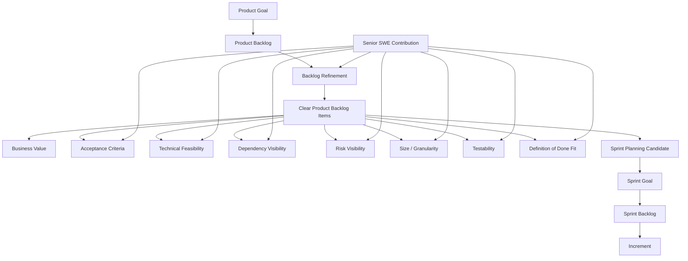

Mental model:

```text
Product Goal memberi arah.
Product Backlog menyimpan opsi pekerjaan.
Refinement mengubah ide besar menjadi item yang bisa dipahami, dipilih, dan dieksekusi.
Sprint Planning memilih item berdasarkan goal, kapasitas, risiko, dan readiness.
```

---

## 3. Product Goal - Kompas Backlog

Product Goal adalah target jangka lebih panjang untuk produk. Dalam Scrum Guide, Product Goal adalah komitmen untuk Product Backlog; Product Backlog muncul untuk mendefinisikan “what” yang akan memenuhi Product Goal. ([Scrum Guides](https://scrumguides.org/docs/scrumguide/v2020/2020-Scrum-Guide-US.pdf?utm_source=chatgpt.com))

Untuk Senior SWE, Product Goal penting karena menjadi filter keputusan teknis.

### Contoh Product Goal Lemah

```text
Improve order management.
```

Masalah:

```text
Terlalu luas.
Tidak memberi arah prioritas.
Sulit dipakai untuk trade-off.
Tidak jelas outcome-nya.
```

### Contoh Product Goal Lebih Baik

```text
Enable enterprise customers to modify submitted orders safely with auditable lifecycle tracking.
```

Lebih berguna karena memberi sinyal:

| Dimensi | Implikasi Teknis |
|---|---|
| Modify submitted orders | Perlu lifecycle, state transition, validation. |
| Safely | Perlu authorization, idempotency, conflict handling, data integrity. |
| Auditable | Perlu audit trail, immutable history, traceability. |
| Enterprise customers | Perlu reliability, supportability, compliance, reporting. |
| Lifecycle tracking | Mungkin butuh Camunda/process state, status API, event log. |

Senior SWE tidak harus menentukan Product Goal, tetapi harus mampu **menerjemahkan Product Goal menjadi technical implications**.

---

## 4. Product Backlog - Bukan Ticket Dump

Product Backlog yang sehat bukan tempat semua permintaan dilempar tanpa struktur. Ia harus cukup transparan sehingga Scrum Team tahu pekerjaan apa yang bernilai, apa yang belum jelas, apa yang berisiko, dan apa yang siap dibawa ke Sprint Planning.

| Backlog Sehat | Backlog Bermasalah |
|---|---|
| Ordered berdasarkan value, risk, learning, dependency. | Diurutkan berdasarkan siapa paling keras meminta. |
| Item punya outcome atau user/business value. | Item berupa task teknis tanpa konteks. |
| Ada acceptance criteria. | “Nanti detailnya menyusul.” |
| Risiko teknis terlihat. | Risiko baru muncul saat coding. |
| Dependency jelas. | Baru sadar perlu tim lain di tengah Sprint. |
| Ukuran cukup kecil. | Story terlalu besar dan selalu carry-over. |
| Testability jelas. | QA/dev bingung cara membuktikan selesai. |
| Relasi ke Product Goal terlihat. | Backlog terasa seperti daftar pekerjaan acak. |

---

## 5. Backlog Refinement - Peran Senior SWE

Scrum Guide menjelaskan refinement sebagai aktivitas memecah dan mendefinisikan Product Backlog item lebih lanjut; ini aktivitas ongoing, bukan event formal wajib seperti Sprint Planning atau Daily Scrum. ([Scrum Guides](https://scrumguides.org/docs/scrumguide/v2020/2020-Scrum-Guide-US.pdf?utm_source=chatgpt.com))

Untuk Senior SWE, refinement adalah tempat paling penting untuk mencegah masalah Sprint.

### Fokus Senior SWE saat Refinement

| Fokus | Pertanyaan Praktis |
|---|---|
| Business clarity | Outcome apa yang diinginkan? Siapa user-nya? |
| Functional behavior | Rule apa yang berlaku? Apa happy path dan edge case? |
| State model | Status apa saja? Transisi mana yang valid/invalid? |
| Data model | Tabel/kolom/index/migration apa yang terdampak? |
| API contract | Endpoint, request/response, error code, compatibility? |
| Security | Siapa boleh melakukan action ini? Permission apa? |
| Integration | Service mana yang dipanggil? Contract sudah stabil? |
| Workflow | Apakah perlu Camunda? Apa retry/failure path-nya? |
| Observability | Log, metric, trace, correlation ID, audit event apa? |
| Testing | Bagaimana item ini dibuktikan selesai? |
| Deployment | Butuh feature flag, migration order, rollback plan? |
| Size | Bisa di-slice menjadi Increment kecil? |

---

## 6. Decomposition Table - Product Backlog & Refinement Skills

| Category | Skill / Domain | Makna Praktis untuk Senior SWE | Output yang Diharapkan |
|---|---|---|---|
| **Product Goal** | Goal interpretation | Memahami arah produk dan implikasi teknisnya. | Technical decision selaras dengan objective produk. |
| **Product Goal** | Outcome mapping | Menghubungkan fitur ke hasil bisnis/user. | Backlog item tidak sekadar task teknis. |
| **Product Backlog** | Backlog transparency | Membuat ketidakjelasan terlihat sebelum Sprint. | Item diberi catatan open question, risk, dependency. |
| **Product Backlog** | Ordering input | Memberi PO informasi cost/risk/dependency. | PO bisa ordering lebih rasional. |
| **Product Backlog** | Value slicing | Memecah fitur besar menjadi slice kecil yang tetap meaningful. | Item bisa selesai dalam Sprint dan tetap memberi feedback. |
| **Refinement** | Requirement interrogation | Menggali rule, exception, edge case, non-functional requirement. | Acceptance criteria lebih jelas dan testable. |
| **Refinement** | Technical decomposition | Mengurai pekerjaan ke API, DB, workflow, test, deploy, observability. | Tim paham kompleksitas sebelum Sprint Planning. |
| **Refinement** | Risk discovery | Mengidentifikasi risiko terbesar lebih awal. | Spike, dependency check, atau desain awal dibuat sebelum commit Sprint. |
| **Refinement** | Dependency mapping | Memetakan dependency internal/eksternal. | Tidak ada surprise dependency saat Sprint berjalan. |
| **Refinement** | Sizing | Membantu estimasi berdasarkan uncertainty, bukan feeling. | Estimasi menjadi diskusi risiko. |
| **Refinement** | Acceptance criteria shaping | Membantu membuat kondisi selesai yang objektif. | Dev/QA/PO punya definisi behavior yang sama. |
| **Refinement** | Testability design | Menentukan cara membuktikan item selesai. | Test case, contract test, integration test, atau demo path jelas. |
| **Refinement** | Data impact analysis | Melihat schema, migration, index, transaction, consistency. | DB change aman dan tidak terlambat dibahas. |
| **Refinement** | API contract analysis | Memastikan contract jelas dan backward-compatible. | Consumer tidak rusak karena asumsi berubah. |
| **Refinement** | Workflow analysis | Memastikan process state, retry, timeout, escalation jelas. | Camunda/workflow tidak menjadi black box. |
| **Refinement** | Operational readiness | Memikirkan logging, metric, trace, alert, support query. | Item siap dioperasikan setelah release. |
| **Refinement** | DoD alignment | Mengecek apakah item realistis memenuhi Definition of Done. | “Ready for Sprint” tidak berarti hanya requirement ditulis. |

---

## 7. Anatomy of a Good Product Backlog Item

Format bisa berbeda-beda antar perusahaan, tetapi backlog item yang sehat minimal menjawab:

```text
Why: value / outcome
Who: user / actor
What: behavior yang dibutuhkan
Rules: business constraints
Acceptance: kondisi bisa diterima
Data: data yang dibuat/diubah/dibaca
Integration: service/system terkait
Security: authorization & permission
Failure: error path / retry / compensation
Observability: log / metric / audit / trace
Delivery: migration / flag / rollout / rollback
```

### Template Praktis

```text
Title:
  Create order amendment request

Outcome:
  Internal user can submit amendment request for an existing order
  so that order changes are tracked before fulfillment.

Actors:
  Internal sales support user
  Order management service
  Workflow engine

Business Rules:
  - Only orders in SUBMITTED or PENDING_REVIEW can be amended.
  - Cancelled or fulfilled orders cannot be amended.
  - Amendment reason is mandatory.
  - Duplicate request for same order is rejected or treated idempotently.

Acceptance Criteria:
  - Given an order in SUBMITTED status,
    when user submits amendment request,
    then request is created with PENDING_APPROVAL status.
  - Given an order in FULFILLED status,
    when user submits amendment request,
    then API returns business validation error.
  - Audit event is recorded for every successful request.
  - Unauthorized user receives 403.
  - Duplicate request behavior is deterministic.

Technical Notes:
  - Add amendment_request table.
  - Add index on order_id and status.
  - Expose POST /orders/{orderId}/amendments.
  - Start Camunda process after persistence succeeds.
  - Emit structured log with correlation_id and amendment_id.

Risks:
  - Downstream workflow contract not yet confirmed.
  - Need decision on duplicate behavior.

Test Notes:
  - Unit test validation rules.
  - Integration test DB persistence.
  - Contract test API error response.
  - Workflow start mocked or tested in integration environment.
```

---

## 8. Refinement Checklist untuk Senior SWE

Gunakan checklist ini sebelum backlog item dianggap layak masuk Sprint Planning.

```text
[ ] Product value jelas.
[ ] Relasi ke Product Goal jelas.
[ ] Actor/user jelas.
[ ] Happy path jelas.
[ ] Edge case utama jelas.
[ ] Business rule eksplisit.
[ ] Acceptance criteria testable.
[ ] API contract jelas.
[ ] Data model impact diketahui.
[ ] Transaction boundary dipahami.
[ ] Security/authorization dibahas.
[ ] Integration dependency terlihat.
[ ] Workflow/state transition dipahami.
[ ] Error/failure path diketahui.
[ ] Observability/audit requirement jelas.
[ ] Migration/deployment concern dibahas.
[ ] Ukuran cukup kecil untuk Sprint.
[ ] Risiko terbesar sudah punya mitigasi.
[ ] Open question tercatat dan owner-nya jelas.
```

---

## 9. Refinement untuk Stack Anda

Karena stack Anda mencakup Java/Jersey, MyBatis, Camunda, PostgreSQL, Docker/Kubernetes, dan cloud/on-prem, refinement sebaiknya tidak berhenti di acceptance criteria bisnis.

| Stack Area | Pertanyaan Refinement |
|---|---|
| **Java SE 17+** | Apakah perlu concurrency handling, immutable model, sealed type, record, virtual thread consideration, atau compatibility runtime? |
| **Jersey/JAX-RS** | Endpoint baru atau existing? Method/status code/error response sudah konsisten? |
| **MyBatis** | Mapper baru? Dynamic SQL? Transaction boundary? N+1 query? Result mapping aman? |
| **PostgreSQL** | Migration? Index? Constraint? Locking? Query plan? Function/procedure/trigger? |
| **PL/pgSQL** | Logic sebaiknya di DB atau service? Error handling? Transaction side effect? |
| **Camunda** | BPMN state apa? Retry policy? Incident handling? Compensation? External task? |
| **Docker** | Config/env var baru? Image dependency? Healthcheck? |
| **Kubernetes** | ConfigMap/Secret? Readiness? Liveness? Resource limit? Rollout strategy? |
| **AWS/Azure/On-prem** | Environment-specific difference? Network/security/secret/storage dependency? |
| **GitHub Actions** | Pipeline change? Test stage? Migration validation? Artifact promotion? |

---

## 10. Splitting Product Backlog Items

Senior SWE harus kuat dalam **vertical slicing**, karena backlog item yang terlalu besar adalah salah satu sumber utama Sprint gagal.

### Bad Split: Layer-based

```text
Story 1: Create database table
Story 2: Create API
Story 3: Create service logic
Story 4: Create UI/consumer integration
Story 5: Add tests
```

Masalah:

```text
Tidak ada Increment usable sampai semua layer selesai.
Feedback stakeholder terlambat.
Testing terdorong ke akhir.
Risk integration tersembunyi.
```

### Better Split: Vertical Slice

```text
Slice 1:
Create minimal amendment request with basic validation and persistence.

Slice 2:
Add audit trail and status transition.

Slice 3:
Integrate with Camunda workflow.

Slice 4:
Add duplicate/idempotency behavior.

Slice 5:
Add support query and observability.
```

Keuntungan:

```text
Setiap slice lebih dekat ke usable behavior.
Feedback lebih cepat.
Risiko integration lebih awal.
Scope bisa dinegosiasikan tanpa menghancurkan goal.
```

---

## 11. Teknik Splitting Praktis

| Teknik | Cara Pakai | Contoh |
|---|---|---|
| **Happy path first** | Mulai dari flow utama paling sederhana. | Submit amendment untuk order valid. |
| **Rule by rule** | Pisahkan business rule kompleks. | Validasi status order di slice terpisah. |
| **Actor by actor** | Pisahkan berdasarkan jenis user. | Internal support dulu, customer portal nanti. |
| **State transition** | Pisahkan berdasarkan lifecycle. | Create request, approve, reject, cancel. |
| **Integration boundary** | Tunda integrasi eksternal jika belum stabil. | Persistence dulu, workflow integration berikutnya. |
| **Read vs write** | Pisahkan command dan query. | Submit request dulu, list/status endpoint berikutnya. |
| **Risk-first spike** | Jalankan spike untuk uncertainty tinggi. | POC Camunda retry + transaction boundary. |
| **Operational slice** | Tambahkan supportability secara eksplisit. | Add audit query, logs, metrics. |
| **Migration slice** | Pisahkan preparatory DB change. | Add nullable column/index sebelum behavior aktif. |
| **Feature flag slice** | Aktifkan behavior bertahap. | Deploy dormant endpoint behind config/flag. |

---

## 12. Ready vs Done

Scrum Guide tidak menjadikan “Definition of Ready” sebagai artefak resmi. Namun secara praktis, banyak tim memakai readiness checklist agar item cukup jelas untuk Sprint Planning. Yang penting: **Ready jangan menjadi gerbang birokratis yang menghambat learning**.

| Konsep | Makna |
|---|---|
| **Ready** | Cukup dipahami untuk dipilih dalam Sprint Planning. |
| **Done** | Sudah memenuhi Definition of Done dan menjadi bagian dari Increment. |

Perbedaan penting:

```text
Ready = layak dimulai.
Done  = layak dianggap Increment.
```

Anti-pattern:

```text
Story dianggap Ready karena sudah ada judul dan estimasi.
Story dianggap Done karena code sudah merged.
```

Healthy pattern:

```text
Ready:
  value, rule, risk, dependency, testability cukup jelas.

Done:
  implementation, test, review, migration, documentation,
  observability, security, and deployability memenuhi DoD.
```

---

## 13. Handling Technical Debt in Product Backlog

Technical debt tidak boleh hidup sebagai backlog rahasia engineer. Jika debt berdampak pada product delivery, reliability, security, atau cost, debt harus dibuat visible dalam Product Backlog agar bisa di-order oleh PO dengan input teknis.

### Cara Buruk Menulis Technical Debt

```text
Refactor order service.
Clean up old code.
Improve performance.
Fix architecture.
```

Terlalu abstrak, sulit di-order.

### Cara Lebih Baik

```text
Reduce order search latency by adding proper index and query rewrite
so support users can retrieve orders under 500ms for common filters.
```

Atau:

```text
Remove duplicated order validation logic between API and workflow layer
to prevent inconsistent amendment approval decisions.
```

### Template Technical Debt Item

```text
Problem:
  Order validation rules are duplicated in REST service and Camunda delegate.

Impact:
  Inconsistent behavior can approve invalid amendment requests.

Evidence:
  Two incidents in last month caused by mismatched validation logic.

Proposed Work:
  Extract shared validation policy and add integration tests.

Acceptance:
  - Single validation source used by API and workflow.
  - Existing scenarios covered by tests.
  - No regression in amendment submission flow.

Risk if Deferred:
  Future rule changes likely create production inconsistency.
```

---

## 14. Backlog Refinement Failure Modes

| Failure Mode | Gejala | Dampak | Respons Senior SWE |
|---|---|---|---|
| **Ticket terlalu besar** | Sering carry-over | Sprint Goal terancam | Split vertical berdasarkan behavior/value. |
| **Acceptance criteria kabur** | Banyak tanya saat coding | Rework tinggi | Buat examples dan testable scenarios. |
| **Dependency tidak terlihat** | Blocker muncul tengah Sprint | Delay dan context switching | Mapping dependency saat refinement. |
| **Technical risk disembunyikan** | “Kelihatannya simple” | Estimasi meleset | Jelaskan risk driver secara eksplisit. |
| **Story layer-based** | DB/API/test terpisah | Tidak ada usable Increment | Ubah ke vertical slice. |
| **PO tidak dapat tradeoff** | Semua dianggap high priority | Sprint overload | Beri opsi scope dan konsekuensi. |
| **Debt tidak masuk backlog** | Engineer diam-diam refactor | Trust turun | Tulis debt dengan impact dan evidence. |
| **NFR terlambat** | Security/performance muncul akhir | Rework besar | Masukkan NFR ke refinement checklist. |
| **No demo path** | Review tidak meaningful | Feedback rendah | Definisikan bagaimana stakeholder inspect Increment. |
| **No operational view** | Production sulit support | Incident lambat diselesaikan | Tambahkan log, metric, trace, audit, support query. |

---

## 15. Contoh Refinement Conversation

### Scenario

PO membawa backlog item:

```text
As an internal user, I want to amend an order so that customer changes can be processed.
```

### Senior SWE Response yang Kurang Baik

```text
Ini butuh 8 point.
```

Masalah:

```text
Langsung estimasi tanpa menggali uncertainty.
Tidak membantu PO memahami risiko.
Tidak memperjelas acceptance.
```

### Senior SWE Response yang Lebih Baik

```text
Sebelum estimasi, saya perlu clarify beberapa hal:
1. Order status apa saja yang boleh diamend?
2. Apakah amendment membuat versi baru atau mengubah order existing?
3. Apakah perlu approval workflow?
4. Apakah user boleh submit amendment lebih dari satu kali?
5. Audit trail seperti apa yang dibutuhkan?
6. Apakah downstream fulfillment perlu langsung diberi tahu?
7. Apa behavior jika workflow gagal setelah data tersimpan?
```

Setelah jawaban PO:

```text
Untuk Sprint ini, saya sarankan slice pertama:
- submit amendment request untuk order SUBMITTED,
- persist request sebagai PENDING_APPROVAL,
- record audit event,
- expose status request,
- belum integrate downstream fulfillment.

Ini memberi Increment yang bisa direview, sambil menunda dependency downstream ke slice berikutnya.
```

Itu contoh kontribusi senior yang sehat.

---

## 16. Practical Backlog Item Quality Score

Gunakan scoring sederhana 1-5:

| Dimensi | 1 - Lemah | 5 - Kuat |
|---|---|---|
| Value clarity | Tidak jelas kenapa perlu | Outcome dan user impact jelas |
| Scope clarity | Judul saja | Behavior dan boundary jelas |
| Acceptance | Tidak ada | Testable dengan examples |
| Size | Terlalu besar | Bisa selesai dalam Sprint |
| Dependency | Tidak diketahui | Terpetakan dan ada owner |
| Technical risk | Disembunyikan | Eksplisit dan ada mitigasi |
| Testability | Sulit dibuktikan | Test/demo path jelas |
| Operability | Tidak dibahas | Log/metric/audit/support jelas |

Interpretasi:

```text
Total 8-16:
  Jangan masuk Sprint kecuali emergency.

Total 17-28:
  Perlu refinement tambahan.

Total 29-40:
  Layak menjadi kandidat Sprint Planning.
```

Ini bukan aturan Scrum resmi, tetapi alat praktis untuk meningkatkan kualitas refinement.

---

## 17. Senior SWE Refinement Output

Setelah refinement yang baik, Senior SWE idealnya membantu menghasilkan:

```text
1. Backlog item yang lebih kecil.
2. Acceptance criteria yang testable.
3. Technical notes yang cukup, tidak berlebihan.
4. Dependency list.
5. Risk list.
6. Open questions beserta owner.
7. Candidate test scenarios.
8. Data/API/workflow impact.
9. Operational concern.
10. Recommendation: ready / needs spike / needs PO decision / blocked.
```

Contoh output ringkas:

```text
Refinement Outcome:
  Item can be split into 3 slices.

Slice 1:
  Create amendment request with validation, persistence, and audit.

Slice 2:
  Add approval workflow with Camunda.

Slice 3:
  Notify downstream fulfillment and expose status history.

Risks:
  Duplicate amendment behavior undecided.
  Downstream contract not confirmed.

Open Questions:
  PO to confirm allowed order statuses.
  Platform team to confirm workflow retry policy.

Recommendation:
  Slice 1 can enter Sprint Planning after duplicate behavior is decided.
```

---

## 18. Ringkasan Seri 3

Product Backlog, Product Goal, dan refinement adalah fondasi kualitas Sprint.

| Konsep | Inti |
|---|---|
| **Product Goal** | Arah jangka lebih panjang produk. |
| **Product Backlog** | Ordered list pekerjaan untuk meningkatkan produk. |
| **Backlog Refinement** | Aktivitas ongoing untuk memecah, memperjelas, dan mengurangi uncertainty backlog item. |
| **Senior SWE Contribution** | Membuat risiko teknis, dependency, quality, testability, dan operability terlihat sebelum Sprint. |

Kalimat kunci:

```text
Backlog yang buruk menghasilkan Sprint yang buruk.

Senior SWE yang kuat tidak hanya bertanya “berapa point?”
Senior SWE yang kuat bertanya:
- Apa value-nya?
- Apa risiko teknisnya?
- Apa dependency-nya?
- Bagaimana membuktikan Done?
- Bagaimana membuat slice kecil yang tetap usable?
```

---

## Status Seri

**Seri 3/12 selesai.**

Sisa seri: **9**.

Seri berikutnya: **Seri 4 - Sprint Planning, Sprint Goal, Estimation, dan Forecasting untuk Senior Software Engineer.**

---

**Sources:**

- [2020 Scrum Guide](https://scrumguides.org/docs/scrumguide/v2020/2020-Scrum-Guide-US.pdf?utm_source=chatgpt.com)

## Response:
7/13/2026, 8:48:36 PM

Saya lanjut ke **Seri 4/12**. Fokusnya: bagaimana Senior SWE membantu Sprint Planning tetap realistis, berbasis Sprint Goal, dan tidak jatuh menjadi “capacity filling” atau janji scope yang rapuh.

# Seri 4/12 - Sprint Planning, Sprint Goal, Estimation, dan Forecasting untuk Senior Software Engineer

## 1. Introduction

**Sprint Planning** adalah titik awal Sprint. Di sini Scrum Team menyusun arah kerja Sprint berdasarkan Product Goal, Product Backlog, kapasitas tim, risiko, dan Definition of Done. Scrum Guide menjelaskan bahwa Sprint Planning membahas tiga topik utama: **why this Sprint is valuable**, **what can be Done this Sprint**, dan **how the chosen work will get Done**. ([Scrum Guides](https://scrumguides.org/scrum-guide.html?utm_source=chatgpt.com))

Untuk **Senior Software Engineer**, Sprint Planning bukan sekadar menjawab:

```text
Story ini berapa point?
Siapa ambil task ini?
Berapa tiket bisa masuk Sprint?
```

Pertanyaan yang lebih penting:

```text
Apa Sprint Goal-nya?
Apa risiko terbesar terhadap Sprint Goal?
Apakah selected items bisa menjadi Increment yang usable?
Apakah Definition of Done realistis dipenuhi?
Apakah ada dependency, migration, integration, atau operational risk?
Apakah forecast tim masuk akal berdasarkan capacity dan uncertainty?
```

Mental model utama:

```text
Sprint Planning bukan kontrak scope.
Sprint Planning adalah forecast berbasis goal, capacity, risk, dan learning.
```

---

## 2. Diagram - Sprint Planning Decomposition Map

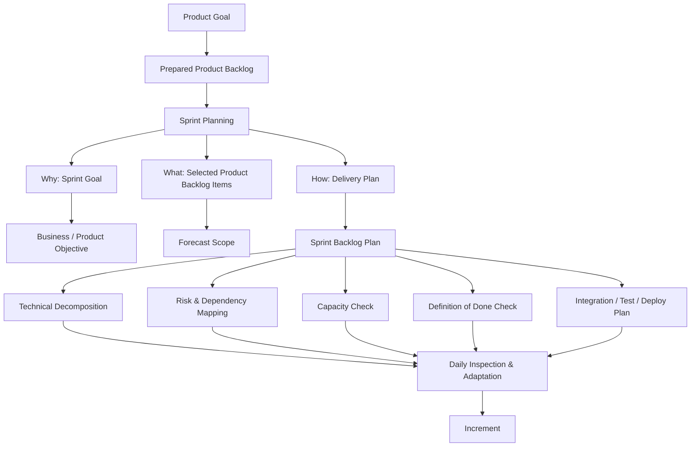

Sprint Planning menghasilkan **Sprint Backlog**, yang terdiri dari **Sprint Goal**, Product Backlog items yang dipilih untuk Sprint, dan plan untuk menyelesaikannya. ([Scrum Guides](https://scrumguides.org/scrum-guide.html?utm_source=chatgpt.com))

---

## 3. Sprint Planning Bukan Capacity Filling

Anti-pattern yang sering terjadi:

```text
Capacity tim = 40 story points
Maka kita masukkan 40 story points
Sprint dianggap aman
```

Masalahnya: capacity bukan satu-satunya variabel. Senior SWE harus membantu tim melihat **risk-adjusted capacity**.

```text
Realistic Sprint Forecast =
  team capacity
  - planned absence
  - support load
  - incident probability
  - PR review bottleneck
  - environment instability
  - dependency uncertainty
  - learning/spike effort
  - testing/deployment overhead
```

Contoh:

| Faktor | Efek terhadap Sprint |
|---|---|
| Ada 2 engineer cuti | Capacity turun |
| Ada production support rotation | Fokus development turun |
| Ada DB migration besar | Risiko testing dan rollback naik |
| Ada integrasi service eksternal | Dependency risk naik |
| Pipeline flaky | Delivery predictability turun |
| Banyak engineer baru onboarding | Pairing/review overhead naik |
| Banyak item cross-service | Coordination cost naik |

Jadi, Sprint Planning sehat tidak hanya bertanya **“berapa point?”**, tetapi juga **“berapa risiko?”**.

---

## 4. Tiga Pertanyaan Sprint Planning

Scrum Guide memecah Sprint Planning menjadi tiga topik: mengapa Sprint bernilai, apa yang bisa Done, dan bagaimana pekerjaan dilakukan. ([Scrum Guides](https://scrumguides.org/scrum-guide.html?utm_source=chatgpt.com))

| Topik | Pertanyaan Scrum | Pertanyaan Senior SWE |
|---|---|---|
| **Why** | Mengapa Sprint ini valuable? | Apa outcome produk yang ingin dibuktikan? |
| **What** | Apa yang bisa Done dalam Sprint? | Scope mana yang realistis memenuhi DoD? |
| **How** | Bagaimana selected work diselesaikan? | Apa technical plan, dependency, test, deploy, dan risk mitigation? |

---

## 5. Sprint Goal

**Sprint Goal** adalah objective tunggal untuk Sprint. Ia memberi fokus dan fleksibilitas. Sprint Goal dibuat selama Sprint Planning dan ditambahkan ke Sprint Backlog. ([Scrum Guides](https://scrumguides.org/scrum-guide.html?utm_source=chatgpt.com))

### Sprint Goal Lemah

```text
Complete ticket OMS-123, OMS-124, OMS-125, OMS-126.
```

Masalah:

```text
Tidak menjelaskan value.
Tidak memberi ruang adaptasi.
Jika satu tiket gagal, arah Sprint ikut kabur.
Tim bekerja per tiket, bukan per outcome.
```

### Sprint Goal Lebih Baik

```text
Enable internal users to create order amendment requests with validation and audit trail.
```

Lebih baik karena:

| Dimensi | Kenapa Berguna |
|---|---|
| Outcome jelas | Create order amendment request |
| User jelas | Internal users |
| Quality expectation jelas | Validation dan audit trail |
| Scope bisa dinegosiasikan | Detail workflow downstream bisa dipisah |
| Bisa di-review | Stakeholder bisa inspect behavior nyata |

---

## 6. Sprint Goal sebagai Decision Filter

Saat Sprint berjalan, Sprint Goal dipakai untuk mengambil keputusan.

```text
Jika scope membesar:
  Apakah tambahan ini wajib untuk Sprint Goal?

Jika dependency gagal:
  Apakah ada slice alternatif untuk tetap mencapai Sprint Goal?

Jika waktu menipis:
  Scope mana yang bisa dikurangi tanpa merusak Increment?

Jika kualitas terancam:
  Apakah lebih baik mengurangi scope daripada menurunkan DoD?
```

Contoh:

```text
Sprint Goal:
Enable order cancellation request submission with basic validation and audit trail.
```

| Item | Wajib untuk Sprint Goal? | Catatan |
|---|---:|---|
| POST cancellation request API | Ya | Core behavior |
| Validate allowed order statuses | Ya | Tanpa ini unsafe |
| Persist cancellation request | Ya | Harus ada state |
| Record audit event | Ya | Bagian eksplisit dari goal |
| Notify downstream fulfillment | Mungkin tidak | Bisa slice berikutnya |
| Admin dashboard analytics | Tidak | Out of Sprint Goal |
| Full approval workflow | Tergantung | Jika goal hanya submission, bisa ditunda |

Senior SWE membantu tim menjaga diskusi tetap berbasis goal, bukan ego scope.

---

## 7. Estimation: Apa Fungsi Sebenarnya?

Estimasi dalam Scrum bukan jaminan. Estimasi adalah alat untuk:

```text
Membuka diskusi kompleksitas.
Mengekspos uncertainty.
Membandingkan ukuran relatif.
Membantu forecasting.
Mendeteksi item terlalu besar.
Mengarahkan refinement tambahan.
```

Estimasi menjadi buruk ketika dipakai sebagai:

```text
Kontrak delivery absolut.
Target performa individu.
Alat pressure dari management.
Cara menghukum tim saat forecast meleset.
```

Untuk Senior SWE, estimasi yang baik bukan berarti selalu akurat. Estimasi yang baik membuat **asumsi dan risiko terlihat**.

---

## 8. Story Point Mental Model

Story point biasanya merepresentasikan kombinasi:

```text
Effort
+ Complexity
+ Uncertainty
+ Risk
```

Bukan hanya waktu.

| Item | Effort | Complexity | Uncertainty | Risk | Estimasi |
|---|---:|---:|---:|---:|---:|
| Tambah field response API | Rendah | Rendah | Rendah | Rendah | Kecil |
| Tambah endpoint dengan validasi sederhana | Sedang | Sedang | Rendah | Sedang | Sedang |
| Ubah workflow Camunda dengan retry dan compensation | Sedang | Tinggi | Tinggi | Tinggi | Besar |
| DB migration pada tabel besar production | Rendah/Sedang | Sedang | Tinggi | Tinggi | Besar |
| Integrasi service eksternal belum stabil | Sedang | Sedang | Tinggi | Tinggi | Besar |

Senior SWE harus mencegah estimasi dangkal seperti:

```text
“Coding-nya cuma sedikit, jadi kecil.”
```

Karena sering kali risiko bukan di jumlah kode, tetapi di:

```text
Backward compatibility
Data migration
Transaction boundary
Concurrency
Idempotency
Security
Observability
Testing environment
Release/rollback
Cross-team dependency
```

---

## 9. Estimation Smells

| Smell | Gejala | Risiko | Respons Senior SWE |
|---|---|---|---|
| **Point hanya berdasarkan coding effort** | “Ini cuma 1 file.” | Risk tersembunyi | Tanyakan data, test, deploy, rollback. |
| **Semua story dipaksa kecil** | Banyak 3-point palsu | Forecast meleset | Buka uncertainty dan dependency. |
| **Estimasi tanpa acceptance criteria** | Banyak asumsi | Rework | Minta contoh behavior/test case. |
| **Estimasi saat item belum clear** | Diskusi cepat tapi rapuh | Sprint kacau | Tandai sebagai needs refinement/spike. |
| **Velocity jadi target** | Tim gaming point | Quality turun | Fokus ke predictability dan Increment. |
| **Senior mendikte point** | Tim pasif | Ownership turun | Gunakan diskusi, bukan otoritas. |
| **Estimasi dipakai menghukum** | Tim defensif | Transparency hilang | Reframe sebagai forecast, bukan janji. |

---

## 10. Forecasting: Komitmen vs Prediksi

Scrum menggunakan empiricism. Forecast harus dipahami sebagai prediksi berdasarkan informasi saat ini, bukan janji mutlak. Scrum Guide juga menyebut burn-down, burn-up, dan cumulative flow dapat berguna untuk forecast progress, tetapi tidak menggantikan empiricism. ([Scrum Guides](https://scrumguides.org/scrum-guide.html?utm_source=chatgpt.com))

### Forecast yang Buruk

```text
Kita commit semua 45 points pasti selesai.
```

### Forecast yang Lebih Sehat

```text
Berdasarkan capacity, historical throughput, support load, dan dependency risk,
kita forecast 5 backlog items bisa Done.

Namun item integration workflow punya risk tinggi.
Jika dependency belum ready sampai hari ke-3, kita split scope dan tetap menjaga Sprint Goal.
```

Forecast yang sehat selalu menyebut:

```text
Scope
Assumption
Risk
Fallback
Definition of Done
```

---

## 11. Capacity Planning untuk Senior SWE

Capacity planning bukan sekadar jumlah orang × hari.

### Input yang Perlu Dihitung

| Faktor | Contoh |
|---|---|
| Hari kerja efektif | Libur, cuti, training, onboarding |
| Support load | Incident, on-call, bugfix urgent |
| Meeting load | Planning, review, retro, refinement, stakeholder sync |
| Review load | PR review, design review, mentoring |
| Environment risk | Test env unstable, shared DB, deployment queue |
| Cross-team dependency | Security, infra, platform, downstream API |
| Technical uncertainty | Spike, unknown library behavior, migration risk |
| Release overhead | Change approval, deployment window, rollback prep |

### Formula Praktis

```text
Nominal Capacity:
  jumlah engineer × hari kerja

Effective Capacity:
  nominal capacity
  - absence
  - support/on-call load
  - planned meetings
  - review/mentoring overhead
  - known operational work

Risk-adjusted Capacity:
  effective capacity
  - dependency buffer
  - uncertainty buffer
```

Senior SWE tidak harus membuat spreadsheet rumit. Yang penting: jangan membuat Sprint seolah semua engineer punya 100% waktu coding.

---

## 12. Technical Decomposition Saat Sprint Planning

Setelah Product Backlog items dipilih, Developers membuat plan. Untuk Senior SWE, ini berarti memecah pekerjaan menjadi langkah teknis yang bisa diinspeksi.

Contoh backlog item:

```text
Create order amendment request.
```

Technical decomposition:

```text
1. Confirm API contract
2. Add request/response DTO
3. Add JAX-RS resource method
4. Add service validation
5. Add MyBatis mapper
6. Add PostgreSQL migration
7. Add transaction boundary
8. Add audit event
9. Add unit tests
10. Add integration tests
11. Add error response mapping
12. Add structured logs
13. Add metric / trace tag
14. Update OpenAPI contract
15. Validate deployment config
```

Tapi decomposition jangan berubah menjadi micro-management. Tujuannya adalah membuat plan terlihat, bukan membagi kerja secara top-down.

---

## 13. Sprint Planning untuk Stack Java/Jersey/MyBatis/Camunda/PostgreSQL

| Area | Planning Question |
|---|---|
| **Java/Jersey** | Endpoint baru atau existing? Error response standard? Validation layer? |
| **OpenAPI / Contract** | Contract-first atau code-first? Consumer impact? Versioning? |
| **MyBatis** | Mapper baru? Dynamic SQL? ResultMap? Query performance? |
| **PostgreSQL** | DDL migration? Index? Lock risk? Constraint? Rollback? |
| **PL/pgSQL** | Function/procedure/trigger terdampak? Exception handling? |
| **Camunda** | BPMN change? Process variable? Retry? Incident? Compensation? |
| **Security** | Role/permission/ACL? Token claim? Audit requirement? |
| **Testing** | Unit, integration, contract, migration, workflow test? |
| **Docker/K8s** | ConfigMap/Secret? Probe? Resource? Deployment strategy? |
| **Observability** | Correlation ID? Log field? Metric? Trace? Alert? |
| **Release** | Feature flag? Backward compatibility? Rollback plan? |

---

## 14. Sprint Planning Output yang Baik

Sprint Planning sehat menghasilkan:

```text
1. Sprint Goal jelas.
2. Selected backlog items masuk akal terhadap Sprint Goal.
3. Forecast scope realistis.
4. Technical plan cukup jelas.
5. Risiko dan dependency terlihat.
6. Definition of Done dipahami.
7. Ada fallback jika dependency gagal.
8. Ada early integration/test strategy.
9. Ada keputusan tentang spike jika uncertainty tinggi.
10. Tim paham bagaimana inspect progress harian.
```

Contoh output:

```text
Sprint Goal:
  Enable internal users to submit order amendment request with validation and audit trail.

Selected Items:
  - Create amendment request API
  - Persist amendment request
  - Add validation by order status
  - Record audit event
  - Expose amendment status

Known Risks:
  - Duplicate amendment behavior needs PO decision.
  - Camunda workflow integration may be deferred.
  - DB migration requires compatibility check.

Plan:
  - Day 1: API contract + DB migration review
  - Day 2-3: Minimal vertical slice API + persistence
  - Day 4: Validation + audit
  - Day 5: Integration tests
  - Day 6-7: Status endpoint + observability
  - Day 8: Hardening + review feedback
  - Day 9-10: Buffer, bugfix, Sprint Review prep

Fallback:
  - If Camunda integration is not ready, deliver request submission and status as Increment;
    workflow automation moves to next Sprint.
```

---

## 15. How to Handle Oversized Sprint Scope

Saat Sprint Planning terlalu penuh, Senior SWE perlu membantu mengurangi scope tanpa merusak Sprint Goal.

### Teknik Scope Cut

| Teknik | Contoh |
|---|---|
| **Cut optional integration** | Simpan request dulu, downstream notification Sprint berikutnya. |
| **Limit actor** | Internal user dulu, customer-facing channel nanti. |
| **Limit status support** | Support `PENDING_APPROVAL` dulu, full lifecycle nanti. |
| **Limit rule complexity** | Validasi status utama dulu, advanced policy nanti. |
| **Defer reporting** | Operational status endpoint dulu, dashboard analytics nanti. |
| **Feature flag** | Deploy hidden behavior dulu, enable setelah hardening. |
| **Spike first** | Jangan commit delivery penuh jika uncertainty terlalu tinggi. |

### Kalimat Praktis

```text
Kalau Sprint Goal-nya adalah submission yang auditable,
maka full downstream fulfillment notification bisa kita keluarkan dari Sprint ini.
Kita tetap menghasilkan Increment yang bisa direview dan aman secara data.
```

Ini jauh lebih baik daripada:

```text
Tidak cukup waktu.
```

---

## 16. Spike dalam Sprint Planning

Spike digunakan untuk mengurangi uncertainty. Spike sebaiknya punya output eksplisit, bukan sekadar “research”.

### Spike Buruk

```text
Research Camunda integration.
```

### Spike Baik

```text
Validate whether amendment workflow can be started transactionally after request persistence,
including retry behavior and incident handling recommendation.
```

Output spike:

```text
1. Findings
2. Recommendation
3. Risk
4. Decision needed
5. Next backlog item breakdown
6. Example implementation or POC if useful
```

Spike cocok jika:

| Kondisi | Contoh |
|---|---|
| Teknologi belum dipahami | Camunda retry/incident behavior belum jelas |
| Dependency belum stabil | Downstream API belum final |
| Data risk tinggi | Migration pada tabel besar |
| Performance unknown | Query baru pada high-volume table |
| Security ambiguity | Authorization model belum jelas |
| Architecture tradeoff besar | Sync API vs async workflow |

---

## 17. Planning Anti-patterns

| Anti-pattern | Gejala | Dampak | Koreksi |
|---|---|---|---|
| **No Sprint Goal** | Sprint = daftar tiket | Tim kehilangan fokus | Buat objective Sprint yang jelas. |
| **Overcommitment** | Semua high priority masuk | Carry-over tinggi | Gunakan risk-adjusted capacity. |
| **Planning by velocity only** | “Biasanya 40 point” | Risiko tidak terlihat | Tambahkan capacity dan dependency review. |
| **Task assignment top-down** | Lead bagi kerja | Ownership turun | Developers self-manage plan. |
| **Ignoring DoD** | Test/deploy tidak dihitung | Done palsu | Include quality work dalam plan. |
| **No fallback plan** | Dependency gagal = Sprint gagal | Tidak adaptif | Definisikan scope fallback. |
| **Big-bang integration** | Integrasi akhir Sprint | Bug terlambat | Plan early vertical slice. |
| **No technical risk discussion** | Planning cepat tapi rapuh | Surprise tengah Sprint | Tanyakan uncertainty dan failure mode. |
| **Point negotiation pressure** | Point diturunkan agar muat | Forecast palsu | Split scope, jangan manipulasi estimasi. |

---

## 18. Practical Sprint Planning Checklist

Gunakan checklist ini saat Sprint Planning.

```text
Sprint Goal
[ ] Sprint Goal jelas sebagai outcome, bukan daftar tiket.
[ ] Sprint Goal align dengan Product Goal.
[ ] Scope bisa dinegosiasikan tanpa menghancurkan goal.

Selected Work
[ ] Item yang dipilih cukup refined.
[ ] Acceptance criteria testable.
[ ] Item cukup kecil untuk Sprint.
[ ] Ada item yang bisa menghasilkan early vertical slice.

Capacity & Forecast
[ ] Cuti/libur/training dihitung.
[ ] Support/on-call load dihitung.
[ ] Review/mentoring overhead realistis.
[ ] Forecast tidak hanya berdasarkan velocity.

Technical Plan
[ ] API/data/workflow impact jelas.
[ ] Migration dan rollback dipikirkan.
[ ] Integration dependency terlihat.
[ ] Security/authorization dibahas.
[ ] Test strategy masuk plan.
[ ] Observability masuk plan.
[ ] Deployment/release concern dibahas.

Risk
[ ] Risiko terbesar disebut eksplisit.
[ ] Ada owner untuk open questions.
[ ] Ada fallback jika dependency gagal.
[ ] Spike dibuat jika uncertainty terlalu tinggi.

Definition of Done
[ ] DoD dipahami semua orang.
[ ] Quality work dihitung dalam plan.
[ ] Tidak ada “Done” yang hanya code complete.
```

---

## 19. Role of Senior SWE During Sprint Planning

| Aktivitas | Peran Senior SWE |
|---|---|
| Sprint Goal discussion | Menguji apakah goal cukup jelas dan feasible. |
| Scope selection | Memberi input risk, dependency, size, technical sequencing. |
| Estimation | Membuka complexity dan uncertainty. |
| Decomposition | Membantu membuat plan teknis inspectable. |
| Capacity review | Mengingatkan overhead support, review, onboarding, release. |
| DoD review | Memastikan quality work tidak dilupakan. |
| Fallback planning | Menawarkan slice alternatif jika scope terlalu besar. |
| Team enablement | Membantu engineer lain memahami work, bukan mengambil alih semua. |

Senior SWE perlu menjaga posisi:

```text
Influence strongly.
Do not dominate.
Make risks visible.
Do not command the team.
Guide decomposition.
Do not convert Sprint Planning into personal task assignment meeting.
```

---

## 20. Contoh Lengkap Sprint Planning

### Context

Product Goal:

```text
Enable enterprise customers to manage order changes safely and audibly.
```

Candidate backlog items:

```text
1. Submit order amendment request
2. Approve amendment request
3. Reject amendment request
4. Notify downstream fulfillment
5. Show amendment history
6. Add audit event
7. Add amendment dashboard
```

### Sprint Goal yang Disepakati

```text
Enable internal users to submit order amendment requests with validation, persistence, and audit trail.
```

### Selected Items

| Item | Masuk Sprint? | Alasan |
|---|---:|---|
| Submit amendment request | Ya | Core goal |
| Validation by order status | Ya | Safety |
| Persist request | Ya | Core state |
| Audit event | Ya | Goal eksplisit |
| Show amendment status | Ya | Minimal user feedback |
| Approve/reject workflow | Tidak | Bisa Sprint berikutnya |
| Downstream notification | Tidak | Dependency eksternal |
| Dashboard | Tidak | Bukan core goal |

### Technical Plan

```text
Day 1:
  Finalize API contract and DB migration design.

Day 2:
  Implement minimal API + service + MyBatis mapper.

Day 3:
  Add validation and transaction handling.

Day 4:
  Add audit event and structured logging.

Day 5:
  Add status endpoint and integration tests.

Day 6:
  Migration testing and error response consistency.

Day 7:
  Observability and support traceability.

Day 8:
  Hardening, code review, fix findings.

Day 9:
  Demo preparation and stakeholder feedback.

Day 10:
  Buffer, final DoD check, Sprint Review.
```

### Risk Register

| Risk | Severity | Mitigation |
|---|---:|---|
| Duplicate amendment behavior unclear | High | PO decision by Day 1 |
| DB migration lock risk | Medium | Test migration on staging-like data |
| Audit schema incomplete | Medium | Align with support/compliance |
| Workflow integration not ready | High | Explicitly out of current Sprint Goal |

### Forecast

```text
Forecast:
  Submit + validate + persist + audit + status endpoint can be Done.

Not forecast:
  Full approval workflow and downstream notification.

Reason:
  Current Sprint Goal focuses on safe request submission, not full lifecycle automation.
```

---

## 21. Ringkasan Seri 4

Sprint Planning yang sehat menghasilkan **goal, forecast, dan plan**, bukan janji scope buta.

| Konsep | Inti |
|---|---|
| **Sprint Goal** | Objective Sprint yang memberi fokus dan fleksibilitas. |
| **Selected PBIs** | Work yang dipilih berdasarkan value, readiness, capacity, dan risk. |
| **Sprint Backlog Plan** | Cara Developers menyelesaikan work menjadi Increment. |
| **Estimation** | Alat diskusi complexity, uncertainty, dan risk. |
| **Forecasting** | Prediksi realistis, bukan kontrak absolut. |
| **Senior SWE Role** | Membuat risiko teknis, dependency, DoD, dan delivery plan terlihat. |

Kalimat kunci:

```text
Planning yang baik bukan yang memasukkan banyak tiket.
Planning yang baik adalah yang membuat Sprint Goal achievable,
risiko terlihat, dan Increment realistis memenuhi Definition of Done.
```

---

## Status Seri

**Seri 4/12 selesai.**

Sisa seri: **8**.

Seri berikutnya: **Seri 5 - Sprint Backlog, Daily Scrum, Flow, dan Replanning untuk Senior Software Engineer.**

---

**Sources:**

- [The 2020 Scrum Guide TM](https://scrumguides.org/scrum-guide.html?utm_source=chatgpt.com)

## Response:
7/13/2026, 8:50:33 PM

# Seri 5/12 - Sprint Backlog, Daily Scrum, Flow, dan Replanning untuk Senior Software Engineer

## 1. Introduction

Setelah Sprint Planning selesai, pekerjaan belum “terkunci mati”. Scrum justru mengharapkan tim melakukan **inspection dan adaptation** selama Sprint. Scrum Guide menjelaskan bahwa Sprint Backlog adalah rencana oleh dan untuk Developers; ia terdiri dari Sprint Goal, Product Backlog items yang dipilih untuk Sprint, dan actionable plan untuk menghasilkan Increment. Daily Scrum digunakan Developers untuk memeriksa progress menuju Sprint Goal dan mengadaptasi Sprint Backlog bila perlu. ([Scrum Guides](https://scrumguides.org/scrum-guide.html?utm_source=chatgpt.com))

Untuk **Senior Software Engineer**, inti Seri 5 adalah:

```text
Jangan melihat Sprint Backlog sebagai daftar task statis.
Lihat Sprint Backlog sebagai living plan untuk mencapai Sprint Goal.
```

Senior SWE perlu membantu tim menjaga flow, membuka blocker, mengurangi WIP, mempercepat feedback, dan melakukan replanning sebelum Sprint gagal.

---

## 2. Diagram - Sprint Execution Flow

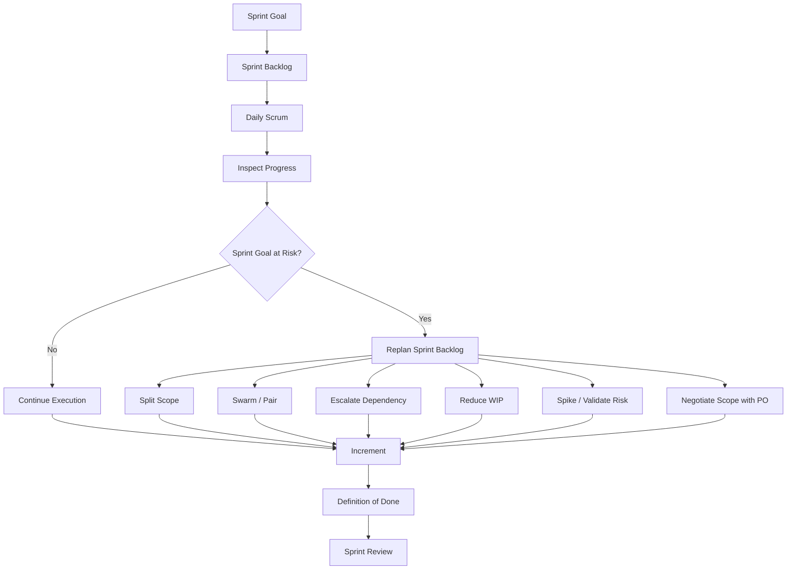

Mental model:

```text
Sprint Backlog = plan hidup.
Daily Scrum = inspection point.
Flow = kemampuan tim mengubah work menjadi Done.
Replanning = adaptasi berbasis fakta.
Increment = bukti nyata progress.
```

---

## 3. Sprint Backlog sebagai Living Plan

Sprint Backlog bukan sekadar copy dari Jira board. Ia harus menjawab:

```text
Apa Sprint Goal?
Item apa yang dipilih untuk mencapai goal?
Plan teknis apa yang sedang dipakai?
Apa yang sudah Done?
Apa yang masih berisiko?
Apa yang perlu diadaptasi hari ini?
```

Scrum Guide menekankan bahwa Sprint Backlog diperbarui sepanjang Sprint saat lebih banyak hal dipelajari. ([Scrum Guides](https://scrumguides.org/scrum-guide.html?utm_source=chatgpt.com))

| Sprint Backlog Sehat | Sprint Backlog Bermasalah |
|---|---|
| Menunjukkan progress terhadap Sprint Goal | Hanya menunjukkan task assignment |
| Berubah saat fakta baru muncul | Dipaksa tetap sesuai planning awal |
| Memuat pekerjaan kualitas: test, review, deploy, observability | Hanya memuat coding task |
| Risiko dan blocker terlihat | Blocker dibahas informal dan hilang |
| WIP terkendali | Banyak item dibuka, sedikit selesai |
| Memudahkan replanning | Membuat tim takut mengubah plan |

---

## 4. Daily Scrum - Bukan Status Report

Daily Scrum adalah event 15 menit untuk Developers. Tujuannya adalah inspect progress toward Sprint Goal dan adapt Sprint Backlog. Struktur pertanyaan bisa bebas selama fokusnya tetap pada progress menuju Sprint Goal. ([Scrum Guides](https://scrumguides.org/scrum-guide.html?utm_source=chatgpt.com))

### Daily Scrum yang Lemah

```text
Kemarin saya coding endpoint.
Hari ini lanjut coding.
Tidak ada blocker.
```

Masalah:

```text
Tidak jelas apakah Sprint Goal makin dekat.
Tidak jelas apakah item sudah Done.
Tidak membuka risiko.
Tidak menghasilkan adaptasi.
```

### Daily Scrum yang Lebih Baik

```text
Vertical slice submit amendment sudah bisa persist ke DB,
tetapi audit event belum jalan karena format event belum dikonfirmasi.

Risiko terhadap Sprint Goal:
audit trail adalah bagian dari goal, jadi perlu keputusan hari ini.

Usulan:
saya pairing dengan engineer yang pegang audit service,
sementara item downstream notification tetap tidak kita tarik ke Sprint ini.
```

Daily yang baik menghasilkan keputusan kecil:

```text
Pairing
Swarming
Scope split
Dependency escalation
Task reorder
Spike
PO clarification
WIP reduction
Testing earlier
```

---

## 5. Fokus Daily Scrum untuk Senior SWE

Senior SWE perlu mengubah daily dari “laporan aktivitas” menjadi “operating checkpoint”.

| Area | Pertanyaan Senior SWE |
|---|---|
| Sprint Goal | Apakah goal masih realistis dicapai? |
| Increment | Apa yang sudah benar-benar usable dan memenuhi DoD? |
| Flow | Apakah terlalu banyak work in progress? |
| Blocker | Blocker mana yang perlu diselesaikan hari ini? |
| Dependency | Apakah ada dependency eksternal yang mengancam Sprint Goal? |
| Integration | Apakah integration/testing terlalu ditunda? |
| Quality | Apakah ada item yang hampir Done tapi belum memenuhi DoD? |
| Risk | Risiko teknis apa yang baru muncul? |
| Replanning | Apa yang harus diubah dari Sprint Backlog? |
| Support load | Apakah incident/on-call mengganggu forecast? |

---

## 6. Flow: Mengubah Work menjadi Done

Flow bukan soal semua orang sibuk. Flow adalah kemampuan tim memindahkan pekerjaan dari ide → implementasi → review → test → deployable → Done.

```text
Good flow:
sedikit WIP, cepat selesai, feedback cepat, blocker terlihat.

Bad flow:
banyak WIP, banyak hampir selesai, feedback terlambat, blocker tersembunyi.
```

### Flow Board Mental Model

```text
Ready
  ↓
In Progress
  ↓
Code Review
  ↓
Testing / Validation
  ↓
Ready for Release
  ↓
Done
```

Senior SWE harus memperhatikan bukan hanya kolom “In Progress”, tetapi juga bottleneck:

| Bottleneck | Gejala | Dampak |
|---|---|---|
| **Code review** | Banyak PR menunggu reviewer | Cycle time naik |
| **Testing** | Bug ditemukan akhir Sprint | Carry-over tinggi |
| **Environment** | Test env sering rusak | Validasi lambat |
| **Dependency** | Menunggu service/tim lain | Work stuck |
| **Migration** | DB change belum tervalidasi | Release risk tinggi |
| **Security review** | Approval terlambat | Done tertunda |
| **Unclear requirement** | Dev bolak-balik tanya PO | Rework |
| **Large PR** | Review lama dan risk tinggi | Merge delay |

---

## 7. WIP Control

WIP, atau work in progress, adalah jumlah pekerjaan yang sedang dikerjakan tetapi belum Done. Terlalu banyak WIP membuat tim terlihat sibuk tetapi lambat menghasilkan Increment.

### Gejala WIP Terlalu Tinggi

```text
Banyak tiket di In Progress.
Banyak branch aktif.
Banyak PR besar.
Banyak context switching.
Banyak item “90% done”.
Testing menumpuk di akhir.
Sprint Review penuh demo parsial.
```

### Dampak

```text
Feedback lambat.
Bug terlambat ditemukan.
Cycle time naik.
Carry-over meningkat.
Review bottleneck.
Developer kehilangan fokus.
Sprint Goal makin sulit dicapai.
```

### Respons Senior SWE

| Situasi | Tindakan |
|---|---|
| Banyak item dibuka | Dorong finish-before-starting |
| PR menumpuk | Swarm review, kecilkan PR berikutnya |
| Story terlalu besar | Split vertical slice |
| Testing tertunda | Tarik testing lebih awal |
| Dependency stuck | Escalate atau ubah sequence |
| Engineer idle karena blocker | Pairing/swarming, bukan buka item baru otomatis |
| Semua orang kerja sendiri-sendiri | Fokus pada item yang paling dekat Done |

Prinsip praktis:

```text
Lebih baik 3 item benar-benar Done
daripada 8 item hampir Done.
```

---

## 8. Replanning Selama Sprint

Replanning bukan tanda gagal. Dalam Scrum, adaptation adalah bagian inti dari empiricism. Jika fakta baru muncul, Sprint Backlog perlu berubah.

### Kapan Replanning Diperlukan?

| Trigger | Contoh |
|---|---|
| Requirement ambiguity | Rule bisnis ternyata belum diputuskan |
| Technical discovery | Migration lebih berisiko dari dugaan |
| Dependency failure | Downstream API belum siap |
| Incident | Production issue mengambil kapasitas tim |
| Quality risk | Test gagal menunjukkan design flaw |
| Scope growth | Stakeholder menambah requirement |
| Environment issue | Staging tidak usable |
| Security concern | Permission model perlu berubah |
| Performance issue | Query terlalu lambat di data besar |

### Opsi Replanning

```text
1. Split item.
2. Reduce scope.
3. Reorder work.
4. Swarm on bottleneck.
5. Pair on risky area.
6. Escalate dependency.
7. Create spike.
8. Defer non-critical integration.
9. Negotiate scope with PO.
10. Protect Definition of Done.
```

---

## 9. Replanning Decision Matrix

| Kondisi | Respons yang Masuk Akal |
|---|---|
| Sprint Goal masih aman, item minor stuck | Reorder work atau pairing |
| Sprint Goal terancam oleh dependency eksternal | Escalate dan siapkan fallback slice |
| Scope terlalu besar | Cut optional scope, jaga core goal |
| Quality risk tinggi | Kurangi scope, jangan turunkan DoD |
| Requirement belum diputuskan | PO decision segera atau split item |
| Technical uncertainty besar | Spike terbatas dengan output jelas |
| Banyak WIP | Stop starting, start finishing |
| Review bottleneck | Swarm review dan kecilkan PR |
| Test env rusak | Escalate impediment, gunakan local/containerized test bila mungkin |
| Production incident masuk | Reforecast Sprint secara transparan |

---

## 10. Contoh Replanning di Tengah Sprint

### Context

Sprint Goal:

```text
Enable internal users to submit order amendment requests with validation and audit trail.
```

Hari ke-4 ditemukan masalah:

```text
Audit service contract belum final.
Camunda workflow integration juga belum siap.
```

### Respons Buruk

```text
Tetap lanjut semua item sesuai planning.
Nanti kita lihat di akhir Sprint.
```

Risiko:

```text
Audit trail tidak Done.
Workflow setengah jadi.
Sprint Review gagal menunjukkan Increment usable.
```

### Respons Senior SWE yang Lebih Baik

```text
Audit trail adalah bagian dari Sprint Goal, jadi harus diselesaikan.
Camunda workflow bukan bagian minimum dari goal Sprint ini, jadi kita defer.

Plan baru:
1. Finalize audit event minimal dengan schema internal.
2. Deliver submit amendment + validation + persistence + audit.
3. Expose status endpoint.
4. Move workflow integration ke backlog berikutnya.
```

Ini adalah adaptation yang sehat.

---

## 11. Daily Scrum Anti-patterns

| Anti-pattern | Gejala | Dampak | Koreksi |
|---|---|---|---|
| **Status to Scrum Master** | Semua bicara ke SM | Developers tidak self-manage | Arahkan diskusi antar Developers |
| **No Sprint Goal reference** | Daily hanya aktivitas | Tidak ada inspect terhadap goal | Mulai dari “apakah Sprint Goal aman?” |
| **No adaptation** | Tidak ada perubahan plan | Daily jadi ritual | Tutup Daily dengan decision/action |
| **Silent blocker** | Semua bilang no blocker | Masalah muncul akhir Sprint | Tanya risiko, bukan hanya blocker |
| **Too much detail** | Diskusi teknis panjang | Timebox rusak | Parkir detail untuk after-daily |
| **No ownership** | Action tidak punya owner | Blocker berulang | Tetapkan owner dan next step |
| **Board tidak akurat** | Jira tidak mencerminkan realita | Transparency lemah | Update board sebagai bagian dari daily |
| **Individual focus** | “Saya kerja apa” | Tim tidak melihat flow | Fokus ke item dan Sprint Goal |
| **Everything in progress** | Banyak task dibuka | Done sedikit | WIP control dan swarming |

---

## 12. Senior SWE sebagai Flow Steward

Senior SWE bukan Scrum Master, tetapi bisa menjadi **flow steward** dari sisi engineering.

| Area | Perilaku Praktis |
|---|---|
| PR flow | Menjaga PR kecil, review cepat, feedback jelas |
| Test flow | Mendorong test lebih awal, bukan akhir Sprint |
| Integration flow | Mendorong vertical slice dan early integration |
| Dependency flow | Membuka dependency dan owner lebih awal |
| Knowledge flow | Pairing dan mentoring agar tidak ada knowledge silo |
| Release flow | Memastikan deployability dan rollback tidak terlupakan |
| Incident feedback | Membawa insight production ke Sprint Backlog/retro |

Kalimat penting:

```text
Senior SWE yang baik tidak hanya menyelesaikan task-nya.
Senior SWE membantu sistem delivery tim mengalir.
```

---

## 13. Sprint Backlog untuk Engineering Work

Pastikan Sprint Backlog memasukkan pekerjaan yang sering dilupakan:

```text
Unit tests
Integration tests
Contract tests
Migration validation
Security check
Error handling
Observability
Documentation minimal
Feature flag
Deployment config
Rollback preparation
Review fixes
Performance smoke test
```

Jika pekerjaan ini tidak terlihat di Sprint Backlog, biasanya akan muncul sebagai “kejutan” di akhir Sprint.

| Hidden Work | Risiko Jika Tidak Terlihat |
|---|---|
| DB migration validation | Release gagal atau lock production |
| Observability | Sulit support setelah deploy |
| Contract test | Consumer rusak |
| Security check | Authorization bug |
| Error mapping | API inconsistent |
| Review fixes | Carry-over |
| Deployment config | App gagal start di env target |
| Rollback plan | Incident recovery lambat |

---

## 14. Flow Metrics yang Berguna Saat Sprint Berjalan

Seri 10 akan membahas metrics lebih dalam. Untuk Sprint execution, cukup pahami sinyal berikut:

| Metric / Signal | Makna |
|---|---|
| **WIP count** | Berapa banyak item sedang dikerjakan |
| **Blocked item age** | Berapa lama item stuck |
| **PR waiting time** | Lama PR menunggu review |
| **Cycle time** | Lama item dari start ke Done |
| **Carry-over trend** | Apakah item sering tidak selesai |
| **Defect arrival timing** | Bug ditemukan awal atau akhir Sprint |
| **Build stability** | Pipeline membantu atau menghambat |
| **Done rate** | Seberapa sering item benar-benar selesai |

Jangan gunakan metrik untuk menyalahkan individu. Gunakan untuk memperbaiki sistem kerja.

---

## 15. Praktik Swarming dan Pairing

### Pairing

Pairing cocok ketika:

```text
Ada area code/domain yang belum dipahami.
Engineer baru onboarding.
Bug sulit direproduksi.
Design decision berisiko.
Knowledge perlu disebarkan.
```

### Swarming

Swarming cocok ketika:

```text
Item kritikal terhadap Sprint Goal stuck.
PR besar harus segera dipecah/review.
Integration issue menghambat banyak item.
Testing bottleneck mengancam Done.
Production issue masuk dan butuh respons tim.
```

| Pola | Tujuan |
|---|---|
| Pairing | Transfer knowledge dan menyelesaikan masalah kompleks |
| Swarming | Menyelesaikan bottleneck tim secara cepat |
| Mob debugging | Memahami failure sulit bersama |
| Review swarm | Mengurangi PR bottleneck |
| Test swarm | Mengubah hampir Done menjadi Done |

Prinsip:

```text
Swarming bukan tanda tim lemah.
Swarming adalah cara mengoptimalkan flow saat bottleneck penting muncul.
```

---

## 16. Daily Scrum dalam Tim Hybrid / Remote

Untuk tim hybrid, Daily Scrum sering gagal karena informasi tersebar di Slack, Jira, PR, meeting, dan percakapan informal.

Praktik sehat:

| Area | Praktik |
|---|---|
| Board | Update sebelum/during Daily |
| PR | Link PR ke backlog item |
| Blocker | Tulis blocker eksplisit, bukan hanya verbal |
| Decision | Catat keputusan singkat |
| After-daily | Diskusi teknis detail dipisah |
| Async update | Gunakan bila timezone sulit, tapi tetap inspect/adapt |
| Working agreement | Sepakati response expectation untuk blocker/PR |

Daily Scrum tidak harus membahas semua detail. Yang penting: tim punya cukup transparency untuk adaptasi harian.

---

## 17. Contoh Daily Scrum Format untuk Senior SWE

Format ini bisa dipakai tanpa jatuh menjadi status report:

```text
1. Sprint Goal health
   - Green / Yellow / Red?
   - Kenapa?

2. Item closest to Done
   - Apa yang perlu diselesaikan hari ini agar Done?

3. Blocked / aging work
   - Item mana yang stuck paling lama?
   - Siapa owner next action?

4. New risk
   - Risiko teknis / dependency / quality apa yang muncul?

5. Replan decision
   - Apakah perlu split, swarm, reorder, atau scope negotiation?
```

Contoh:

```text
Sprint Goal: Yellow.

Submit amendment API sudah integrated dengan DB.
Audit event belum final karena schema masih open.

Item closest to Done:
API + persistence bisa Done hari ini setelah integration test.

Blocked:
Audit schema menunggu PO/support decision.

New risk:
Jika audit belum clear hari ini, Sprint Goal terancam.

Decision:
Pair dengan support platform engineer setelah Daily.
Camunda workflow tetap out of scope Sprint ini.
```

---

## 18. Sprint Backlog Update Example

### Sebelum Adaptasi

```text
In Progress:
- Submit amendment API
- Add amendment DB table
- Add audit event
- Start Camunda workflow
- Add status endpoint
- Notify downstream fulfillment
```

Masalah:

```text
Terlalu banyak WIP.
Core goal belum Done.
Dependency workflow dan downstream membuka risiko.
```

### Setelah Adaptasi

```text
Focus today:
- Finish API + persistence vertical slice.
- Finalize audit event.
- Add status endpoint.

Defer:
- Camunda workflow integration.
- Downstream fulfillment notification.

Swarm:
- Audit schema decision and implementation.

Risk:
- Audit event must be Done to satisfy Sprint Goal.
```

Ini Sprint Backlog yang lebih sehat karena jelas mana core, mana defer, mana risk.

---

## 19. Failure Mode: Semua Orang Sibuk, Tapi Sprint Gagal

Ini pola umum:

```text
Hari 1:
Semua orang ambil task.

Hari 3:
Semua task in progress.

Hari 5:
Banyak PR setengah jadi.

Hari 7:
Testing mulai, bug muncul.

Hari 9:
Integration gagal.

Hari 10:
Demo parsial, banyak carry-over.
```

Penyebab sistemik:

```text
WIP terlalu tinggi.
Tidak ada early vertical slice.
Review dan testing terlambat.
Daily tidak menghasilkan replanning.
Sprint Goal tidak dipakai sebagai decision filter.
DoD tidak dihitung sejak awal.
```

Versi lebih sehat:

```text
Hari 1:
Tentukan slice pertama yang membuktikan Sprint Goal.

Hari 2-3:
Swarm untuk membuat slice API + DB + test minimal.

Hari 4:
Inspect hasil, adjust scope.

Hari 5-7:
Tambah rules dan audit.

Hari 8:
Hardening, observability, review.

Hari 9-10:
Final DoD, review prep, feedback.
```

---

## 20. Practical Checklist: Sprint Execution

```text
Daily Health
[ ] Sprint Goal status jelas: Green / Yellow / Red.
[ ] Board mencerminkan realita.
[ ] Ada item yang bergerak ke Done, bukan hanya In Progress.
[ ] Blocker punya owner dan next action.
[ ] Item yang aging dibahas.
[ ] WIP tidak berlebihan.

Flow
[ ] PR tidak menumpuk.
[ ] Test berjalan lebih awal.
[ ] Integration tidak ditunda sampai akhir.
[ ] Review dilakukan pada PR kecil.
[ ] Dependency eksternal dipantau.
[ ] Work paling dekat Done diprioritaskan.

Quality
[ ] Definition of Done tetap dijaga.
[ ] Test, migration, observability masuk plan.
[ ] Tidak ada “code complete” yang dianggap Done.
[ ] Release/config concern terlihat.

Adaptation
[ ] Sprint Backlog diubah saat fakta baru muncul.
[ ] Scope cut dibahas bila Sprint Goal terancam.
[ ] PO dilibatkan untuk trade-off produk.
[ ] Scrum Master dilibatkan untuk impediment sistemik.
[ ] Spike digunakan untuk uncertainty tinggi.
```

---

## 21. Ringkasan Seri 5

| Konsep | Inti |
|---|---|
| **Sprint Backlog** | Living plan untuk mencapai Sprint Goal, bukan daftar task statis. |
| **Daily Scrum** | Event Developers untuk inspect progress dan adapt Sprint Backlog. |
| **Flow** | Kemampuan tim mengubah work menjadi Done secara stabil. |
| **WIP Control** | Mengurangi pekerjaan setengah jadi agar Increment cepat terbentuk. |
| **Replanning** | Adaptasi Sprint Backlog berdasarkan fakta baru. |
| **Senior SWE Role** | Membuka risiko, menjaga flow, membantu swarming/pairing, dan melindungi Definition of Done. |

Kalimat kunci:

```text
Daily Scrum yang baik tidak bertanya:
“Semua orang sibuk apa?”

Daily Scrum yang baik bertanya:
“Apakah Sprint Goal makin dekat,
apa yang menghalangi Done,
dan apa yang harus kita adaptasi hari ini?”
```

---

## Status Seri

**Seri 5/12 selesai.**

Sisa seri: **7**.

Seri berikutnya: **Seri 6 - Increment, Definition of Done, dan Engineering Quality Gate untuk Senior Software Engineer.**

---

**Sources:**

- [The 2020 Scrum Guide TM](https://scrumguides.org/scrum-guide.html?utm_source=chatgpt.com)

## Response:
7/13/2026, 8:53:33 PM

# Seri 6/12 - Increment, Definition of Done, dan Engineering Quality Gate untuk Senior Software Engineer

## 1. Introduction

Di Scrum, **Increment** adalah hasil kerja yang benar-benar memenuhi standar kualitas produk. Scrum Guide menyatakan bahwa ketika sebuah Product Backlog Item memenuhi **Definition of Done**, sebuah Increment lahir; Definition of Done membuat transparansi dengan memberikan pemahaman bersama tentang pekerjaan apa yang sudah selesai. ([Scrum Guides](https://scrumguides.org/scrum-guide.html?utm_source=chatgpt.com))

Untuk **Senior Software Engineer**, seri ini sangat penting karena banyak kegagalan delivery bukan terjadi karena “tidak ada coding”, tetapi karena tim salah memahami arti **Done**.

```text
Code complete ≠ Done
Merged ≠ Done
Tested locally ≠ Done
Demoable ≠ Done
Done = memenuhi Definition of Done dan layak menjadi bagian dari Increment
```

Dalam konteks Java/Jersey/MyBatis/Camunda/PostgreSQL/Kubernetes, Definition of Done harus mencakup bukan hanya functional correctness, tetapi juga **testability, security, migration safety, observability, deployability, rollback readiness, dan operability**.

---

## 2. Diagram - Increment & Definition of Done Map

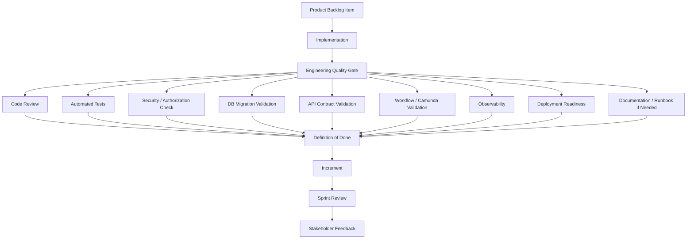

Mental model:

```text
Product Backlog Item
  → implementation
  → quality gates
  → Definition of Done
  → Increment
  → inspectable product progress
```

---

## 3. Increment: Apa yang Sebenarnya Diinspeksi?

Increment bukan “kumpulan task yang selesai”. Increment adalah langkah nyata menuju Product Goal dan harus usable. Scrum Guide menekankan bahwa sebuah Increment hanya valid jika memenuhi Definition of Done; work yang belum memenuhi DoD tidak boleh dianggap sebagai bagian dari Increment. ([Scrum Guides](https://scrumguides.org/scrum-guide.html?utm_source=chatgpt.com))

### Contoh Salah Kaprah

| Klaim | Masalah |
|---|---|
| “Endpoint sudah dibuat.” | Belum tentu tested, secure, documented, observable. |
| “PR sudah merged.” | Belum tentu deployable. |
| “Migration script sudah ada.” | Belum tentu aman untuk data production. |
| “Camunda BPMN sudah diubah.” | Belum tentu retry, incident, dan compensation path valid. |
| “Story sudah demo.” | Belum tentu memenuhi quality measure produk. |

### Increment yang Lebih Valid

```text
Endpoint dibuat
+ contract jelas
+ validation benar
+ authorization benar
+ persistence aman
+ tests jalan
+ migration tervalidasi
+ logs/metrics/traces cukup
+ review selesai
+ deployable
+ memenuhi Definition of Done
```

---

## 4. Definition of Done - Formal Quality Boundary

Definition of Done adalah deskripsi formal keadaan Increment ketika memenuhi quality measures yang dibutuhkan produk. Scrum.org juga menjelaskan bahwa DoD mencakup karakteristik dan standar yang harus dipenuhi Increment agar dapat dirilis. ([Scrum.org](https://www.scrum.org/resources/what-definition-done?utm_source=chatgpt.com))

Untuk Senior SWE, DoD berfungsi sebagai:

| Fungsi DoD | Makna Praktis |
|---|---|
| **Transparency** | Semua orang tahu arti “selesai”. |
| **Quality floor** | Ada batas minimum kualitas yang tidak boleh diturunkan diam-diam. |
| **Forecast control** | Sprint forecast lebih realistis karena quality work dihitung. |
| **Release safety** | Increment tidak hanya code-complete, tetapi siap dirilis. |
| **Team alignment** | PO, Developers, Scrum Master, QA, dan stakeholder punya ekspektasi sama. |
| **Defect prevention** | Bug dicegah lewat gate, bukan ditemukan terlambat. |

Kalimat penting:

```text
Definition of Done bukan checklist administratif.
Definition of Done adalah kontrak kualitas internal tim terhadap produk.
```

---

## 5. Done vs Acceptance Criteria vs Definition of Ready

Ketiganya sering tertukar.

| Konsep | Level | Fungsi |
|---|---|---|
| **Acceptance Criteria** | Per Product Backlog Item | Menjelaskan behavior spesifik yang harus dipenuhi item. |
| **Definition of Done** | Product / team standard | Menjelaskan standar kualitas umum agar item menjadi Increment. |
| **Definition of Ready** | Team working agreement opsional | Menilai apakah item cukup jelas untuk mulai dikerjakan. |

Contoh:

```text
Acceptance Criteria:
  Given order status is SUBMITTED,
  when internal user submits amendment request,
  then amendment request is created with PENDING_APPROVAL status.

Definition of Done:
  Code reviewed, tests passed, API contract updated, migration validated,
  authorization verified, logs/metrics/traces added, deployment config checked.

Definition of Ready:
  Business rules, actor, API boundary, data impact, and dependency are clear enough.
```

Pembedaan praktis:

```text
Acceptance Criteria = apakah behavior benar?
Definition of Done = apakah Increment berkualitas dan layak?
Definition of Ready = apakah item cukup siap untuk dimulai?
```

---

## 6. Engineering Quality Gate untuk Stack Anda

Untuk environment enterprise Java microservice, DoD perlu diterjemahkan menjadi quality gate yang konkret.

| Gate | Pertanyaan Praktis |
|---|---|
| **Code correctness** | Apakah logic sesuai requirement dan edge case? |
| **Code review** | Apakah sudah direview oleh orang yang tepat? |
| **Automated tests** | Apakah unit/integration/contract test relevan sudah ada? |
| **API contract** | Apakah OpenAPI/JAX-RS contract sinkron dengan behavior? |
| **Error handling** | Apakah error response konsisten dan tidak leaking detail internal? |
| **Authorization** | Apakah role/permission/ACL diverifikasi? |
| **Data integrity** | Apakah constraint, transaction, locking, dan consistency benar? |
| **DB migration** | Apakah migration aman, repeatable, backward-compatible? |
| **MyBatis mapping** | Apakah mapper/result mapping/query aman dan efisien? |
| **Camunda workflow** | Apakah process state, retry, incident, compensation jelas? |
| **Observability** | Apakah log, metric, trace, correlation ID cukup? |
| **Security** | Apakah input validation, secret handling, dependency risk dicek? |
| **Performance** | Apakah query/API tidak punya risiko latency besar? |
| **Deployment** | Apakah config, env var, Docker/K8s manifest siap? |
| **Rollback** | Apakah ada strategi rollback atau forward-fix yang jelas? |
| **Documentation** | Apakah keputusan teknis/runbook/API docs cukup untuk maintenance? |

---

## 7. DoD Layering Model

DoD sebaiknya tidak satu checklist datar. Untuk sistem enterprise, lebih baik dipikirkan sebagai beberapa layer.

```text
Layer 1 - Code Quality
Layer 2 - Functional Correctness
Layer 3 - Integration Safety
Layer 4 - Data & Migration Safety
Layer 5 - Security & Compliance
Layer 6 - Operability
Layer 7 - Release Readiness
```

### Layer 1 - Code Quality

```text
[ ] Code readable dan maintainable.
[ ] Tidak ada duplicated logic yang berbahaya.
[ ] Naming dan structure konsisten.
[ ] Static analysis/linter/checkstyle bila ada lulus.
[ ] Tidak ada dead code/debug code.
[ ] Exception handling tidak asal swallow.
```

### Layer 2 - Functional Correctness

```text
[ ] Acceptance criteria terpenuhi.
[ ] Happy path dan edge case utama diuji.
[ ] Business rule eksplisit.
[ ] Error path valid.
[ ] Boundary condition diuji.
```

### Layer 3 - Integration Safety

```text
[ ] API contract sinkron.
[ ] Consumer compatibility dipikirkan.
[ ] Contract test atau integration test tersedia bila relevan.
[ ] Timeout/retry/idempotency behavior jelas.
[ ] Failure dependency tidak membuat data inconsistent.
```

### Layer 4 - Data & Migration Safety

```text
[ ] Migration script reviewed.
[ ] Migration tested di data representatif bila berisiko.
[ ] Backward/forward compatibility dipikirkan.
[ ] Index/constraint tepat.
[ ] Lock risk dipahami.
[ ] Rollback atau remediation path jelas.
```

### Layer 5 - Security & Compliance

```text
[ ] Authentication/authorization benar.
[ ] Sensitive data tidak bocor di log/API response.
[ ] Input validation cukup.
[ ] Audit trail dibuat bila required.
[ ] Permission negative case diuji.
```

### Layer 6 - Operability

```text
[ ] Structured log cukup untuk troubleshooting.
[ ] Correlation ID / trace propagation tersedia.
[ ] Metrics relevan ditambahkan.
[ ] Alerting/runbook diperbarui bila perlu.
[ ] Support team bisa menelusuri state/data.
```

### Layer 7 - Release Readiness

```text
[ ] Docker image/build artifact berhasil.
[ ] ConfigMap/Secret/env var tersedia.
[ ] Readiness/liveness probe tidak rusak.
[ ] Deployment strategy jelas.
[ ] Feature flag/config toggle siap bila dipakai.
[ ] Rollback/forward-fix path dipahami.
```

---

## 8. Definition of Done Template untuk Java/Jersey Microservice

Berikut template praktis yang bisa Anda adaptasi.

```text
Definition of Done - Java/Jersey Microservice

Functional
[ ] Acceptance criteria terpenuhi.
[ ] Business rules dan edge cases utama ter-cover.
[ ] Error behavior sesuai standard API.

Code Quality
[ ] Code reviewed minimal oleh 1 reviewer relevan.
[ ] Tidak ada known critical code smell.
[ ] Static analysis/build checks lulus.
[ ] Tidak ada debug log / temporary code.

Testing
[ ] Unit tests ditambahkan atau diperbarui.
[ ] Integration tests ditambahkan bila menyentuh DB/API/workflow.
[ ] Contract tests diperbarui bila API berubah.
[ ] Regression risk diuji sesuai impact area.
[ ] Pipeline hijau.

API & Contract
[ ] OpenAPI/spec/API docs sinkron.
[ ] Status code dan error response konsisten.
[ ] Backward compatibility dipastikan atau breaking change disetujui.

Database
[ ] Migration script reviewed.
[ ] Migration tested.
[ ] Index/constraint/transaction impact dipahami.
[ ] Rollback/remediation path jelas.
[ ] Query performance wajar.

Security
[ ] Authorization/permission dicek.
[ ] Negative security cases diuji.
[ ] Sensitive data tidak bocor.
[ ] Audit trail tersedia bila required.

Workflow
[ ] Camunda process behavior valid.
[ ] Retry/incident/failure path jelas.
[ ] Process variables dan state transition terdokumentasi.
[ ] Compensation/manual recovery dipahami bila relevan.

Observability
[ ] Structured logs cukup.
[ ] Correlation ID/trace propagation tersedia.
[ ] Metrics ditambahkan bila behavior penting.
[ ] Support/troubleshooting path jelas.

Deployment
[ ] Docker/Kubernetes config dicek.
[ ] Env var/secret/config tersedia.
[ ] Health/readiness behavior aman.
[ ] Feature flag/rollout plan siap bila diperlukan.

Documentation
[ ] Technical decision dicatat bila signifikan.
[ ] API/runbook/support docs diperbarui bila perlu.
```

---

## 9. DoD untuk Jenis Pekerjaan Berbeda

DoD perlu konsisten, tetapi penerapannya bisa berbeda berdasarkan tipe backlog item.

| Jenis Work | DoD Tambahan yang Perlu Diperhatikan |
|---|---|
| **REST API change** | OpenAPI update, status code, error contract, auth test, contract compatibility. |
| **DB migration** | Lock impact, backward compatibility, rollback/remediation, data validation. |
| **MyBatis query** | Query plan, index usage, N+1 risk, result mapping, SQL injection risk. |
| **Camunda workflow** | BPMN versioning, retry, incident, variable schema, state transition, compensation. |
| **Security/permission** | Positive/negative auth test, audit, least privilege, log redaction. |
| **Performance improvement** | Baseline, target, measurement method, regression guard. |
| **Bug fix** | Repro test, root cause understood, regression coverage. |
| **Refactoring** | No behavior regression, tests sufficient, rollback risk low, scope bounded. |
| **Infrastructure/config** | Environment parity, secret/config management, deployment validation. |
| **Observability work** | Logs/metrics/traces actually usable in target environment. |

---

## 10. Done Anti-patterns

| Anti-pattern | Gejala | Risiko | Respons Senior SWE |
|---|---|---|---|
| **Code complete = Done** | Story ditutup setelah coding | Bug/test/deploy terlambat | Tegaskan DoD sebagai quality boundary. |
| **Manual testing only** | Semua validasi bergantung orang | Regression tinggi | Tambahkan automated test penting. |
| **DoD terlalu abstrak** | “Quality good” | Interpretasi beda-beda | Buat checklist konkret. |
| **DoD terlalu berat** | Semua item wajib full checklist tak relevan | Flow lambat, tim menghindar | Buat layered/contextual DoD. |
| **DoD berubah diam-diam** | Saat deadline, test/security dilewati | Trust turun | Scope cut, bukan quality cut. |
| **Observability terlupakan** | Production sulit debug | MTTR tinggi | Masukkan log/metric/trace ke DoD. |
| **Migration tidak dianggap bagian Done** | Script dibuat tapi belum diuji | Release incident | Migration validation wajib. |
| **Review hanya formalitas** | LGTM tanpa pemahaman | Defect lolos | Review berdasarkan risk area. |
| **No rollback thinking** | Deploy dianggap satu arah | Recovery lambat | Tambahkan rollback/remediation path. |
| **Security negative case tidak diuji** | Happy path auth saja | Privilege bug | Test unauthorized/forbidden cases. |

---

## 11. Senior SWE sebagai Quality Steward

Senior SWE bukan “quality police” yang memperlambat semua hal. Perannya adalah menjaga agar kualitas menjadi bagian dari flow delivery.

| Situasi | Respons Senior SWE yang Sehat |
|---|---|
| Deadline menekan | Kurangi scope, jangan turunkan DoD diam-diam. |
| PR besar dan risk tinggi | Pecah PR atau lakukan focused review. |
| Test lambat/flaky | Jadikan impediment, bukan alasan skip test. |
| Migration berisiko | Minta rehearsal / dry run / staged rollout. |
| Requirement berubah | Update acceptance criteria dan risk assessment. |
| Junior belum tahu standar | Pairing dan contoh review yang edukatif. |
| PO ingin cepat rilis | Jelaskan trade-off quality dalam bahasa risiko produk. |
| Bug production muncul | Tambahkan regression test dan update DoD bila perlu. |

Kalimat kunci:

```text
Senior SWE menjaga standar tanpa menjadi bottleneck.
Standar terbaik adalah standar yang dipahami, otomatis, dan terintegrasi ke flow.
```

---

## 12. Quality Gate di Pull Request

PR adalah tempat penting untuk menerapkan DoD, tetapi DoD tidak boleh hanya bergantung pada reviewer manusia.

### PR Checklist Praktis

```text
Functional
[ ] Acceptance criteria terpenuhi.
[ ] Edge case utama ditangani.
[ ] Error path jelas.

Code
[ ] Struktur code mudah dipahami.
[ ] Tidak ada duplicated business rule berbahaya.
[ ] Exception handling benar.
[ ] Naming/domain model konsisten.

Testing
[ ] Unit/integration/contract test relevan ada.
[ ] Test membuktikan bug fix bila PR adalah bug fix.
[ ] Tidak ada flaky/disabled test tanpa alasan.

API
[ ] Contract update bila endpoint berubah.
[ ] Backward compatibility aman.
[ ] Error response konsisten.

DB
[ ] Migration script aman.
[ ] Query performance dipikirkan.
[ ] Transaction boundary benar.

Security
[ ] Authorization dicek.
[ ] Sensitive data tidak bocor.

Operability
[ ] Log/metric/trace cukup.
[ ] Troubleshooting path jelas.

Deployment
[ ] Config/env var/secret impact jelas.
```

### Review Smell

```text
LGTM tanpa membaca context.
Review hanya formatting.
Reviewer tidak cek test.
Reviewer tidak cek data migration.
Reviewer tidak memahami failure mode.
```

Review yang baik bertanya:

```text
Apa yang bisa salah di production?
Apakah test membuktikan behavior penting?
Apakah perubahan ini aman untuk existing consumer/data?
Apakah support bisa men-debug jika gagal?
```

---

## 13. Automated Quality Gate di CI/CD

DoD yang matang sebagian besar harus dibantu otomatisasi.

| Gate Otomatis | Contoh |
|---|---|
| **Build** | Maven build, dependency resolution |
| **Unit test** | JUnit, Mockito |
| **Integration test** | Testcontainers PostgreSQL, service integration |
| **Contract validation** | OpenAPI validation, consumer contract |
| **Static analysis** | Checkstyle, SpotBugs, PMD, Sonar |
| **Security scan** | Dependency vulnerability scan, secret scanning |
| **Migration check** | Liquibase/Flyway validation |
| **Container build** | Docker image build |
| **K8s manifest validation** | Helm/kustomize validation, policy check |
| **Coverage signal** | Coverage trend, bukan target buta |
| **Performance smoke** | Query/API smoke test untuk path kritikal |

Prinsip:

```text
Semakin sering sebuah quality gate penting dilanggar,
semakin layak gate itu diotomatisasi.
```

---

## 14. Definition of Done dan Product Owner

PO tidak menulis semua detail teknis DoD, tetapi PO harus memahami bahwa DoD mempengaruhi scope, forecast, dan release readiness.

### Percakapan yang Sehat

PO:

```text
Bisakah fitur ini masuk Sprint ini?
```

Senior SWE:

```text
Bisa untuk slice submit + validate + audit.
Tapi jika termasuk full workflow approval dan downstream notification,
risikonya tinggi untuk memenuhi DoD di Sprint ini.

Saya sarankan kita deliver Increment pertama yang aman dan auditable,
lalu lanjut approval workflow di Sprint berikutnya.
```

Ini menjaga PO tetap memiliki keputusan value, sambil membuat quality trade-off transparan.

---

## 15. Definition of Done dan Sprint Review

Sprint Review seharusnya menampilkan Increment yang memenuhi DoD, bukan demo sementara. Jika work belum memenuhi DoD, Scrum Guide menyatakan work tersebut tidak dapat dianggap sebagai bagian dari Increment. ([Scrum Guides](https://scrumguides.org/scrum-guide.html?utm_source=chatgpt.com))

### Demo yang Lemah

```text
Endpoint jalan di local.
Data dummy dibuat manual.
Authorization belum aktif.
Audit belum ada.
Test belum lengkap.
```

### Review yang Lebih Sehat

```text
Endpoint tersedia di test environment.
User unauthorized mendapat 403.
Valid order menghasilkan amendment request.
Invalid order mendapat business error.
Audit event terekam.
Status bisa dilihat.
Logs memiliki correlation ID.
Automated tests hijau.
```

Sprint Review bukan panggung untuk “menjual progress palsu”. Ia adalah inspeksi terhadap product progress nyata.

---

## 16. DoD untuk Production Readiness

Untuk enterprise system, “releasable” tidak cukup hanya build berhasil. Production readiness mencakup kemampuan sistem untuk dipakai, dipantau, dan dipulihkan.

```text
Production Readiness Checklist

Runtime
[ ] App start cleanly.
[ ] Config lengkap untuk target environment.
[ ] Secret tidak hardcoded.
[ ] Resource limit/request masuk akal.
[ ] Healthcheck benar.

Data
[ ] Migration aman.
[ ] Backfill strategy ada bila perlu.
[ ] Data validation path tersedia.
[ ] Rollback/remediation jelas.

Security
[ ] Authn/authz benar.
[ ] Sensitive data terlindungi.
[ ] Audit tersedia bila diperlukan.

Operations
[ ] Logs cukup untuk trace request.
[ ] Metrics tersedia untuk behavior kritikal.
[ ] Alert/rule diperbarui bila perlu.
[ ] Runbook/support notes tersedia bila perlu.

Release
[ ] Feature flag atau staged rollout bila berisiko.
[ ] Deployment order jelas.
[ ] Rollback/forward-fix path jelas.
```

---

## 17. Contoh DoD untuk Fitur Order Amendment

### Backlog Item

```text
Create order amendment request with validation and audit trail.
```

### Acceptance Criteria

```text
Given order status is SUBMITTED,
when internal user submits amendment request,
then system creates amendment request with PENDING_APPROVAL status.

Given order status is FULFILLED,
when internal user submits amendment request,
then system rejects request with business validation error.

Given unauthorized user,
when user submits amendment request,
then system returns 403.

Given successful amendment request,
then audit event is recorded.
```

### Definition of Done Application

| DoD Area | Bukti Done |
|---|---|
| Functional | Happy path, invalid status, unauthorized case berhasil. |
| API | POST `/orders/{orderId}/amendments` contract updated. |
| DB | `amendment_request` migration tested. |
| MyBatis | Mapper integration test dengan PostgreSQL. |
| Security | Permission test untuk allowed/forbidden user. |
| Audit | Audit event persisted/emitted. |
| Error | Business error response konsisten. |
| Observability | Log dengan `correlation_id`, `order_id`, `amendment_id`. |
| Tests | Unit + integration tests hijau di CI. |
| Review | PR approved oleh reviewer relevan. |
| Deploy | Config tidak berubah atau sudah tersedia. |

### Hasil

```text
Jika semua terpenuhi:
  Item menjadi bagian dari Increment.

Jika audit belum ada:
  Item belum memenuhi Sprint Goal dan belum Done.

Jika test belum ada:
  Code mungkin selesai, tetapi belum Done.

Jika migration belum diuji:
  Increment belum aman untuk release.
```

---

## 18. DoD Improvement via Retrospective

DoD bukan dokumen mati. Retrospective adalah tempat yang baik untuk memperbaikinya berdasarkan defect, incident, atau bottleneck.

| Kejadian | Improvement DoD |
|---|---|
| Bug auth lolos production | Tambahkan negative authorization test wajib. |
| DB migration menyebabkan lock | Tambahkan migration rehearsal untuk tabel besar. |
| Support sulit trace issue | Tambahkan structured log/correlation ID ke DoD. |
| API consumer rusak | Tambahkan contract compatibility check. |
| Incident karena config missing | Tambahkan deployment/config checklist. |
| Workflow stuck tanpa alert | Tambahkan Camunda incident monitoring requirement. |
| PR terlalu besar | Tambahkan PR size/reviewability guideline. |
| Flaky test sering diabaikan | Tambahkan flaky test handling policy. |

Prinsip:

```text
Setiap incident serius harus meninggalkan perbaikan sistem,
bukan hanya hotfix.
```

---

## 19. DoD Maturity Model

| Level | Karakteristik | Risiko |
|---|---|---|
| **Level 1 - Informal** | Done tergantung interpretasi individu | Banyak misunderstanding |
| **Level 2 - Checklist Manual** | Ada checklist, tapi banyak manual | Konsistensi sedang |
| **Level 3 - CI-assisted** | Build/test/static checks otomatis | Quality lebih stabil |
| **Level 4 - Release-aware** | Deployment, migration, observability masuk DoD | Production readiness meningkat |
| **Level 5 - Learning System** | DoD diperbaiki dari incident/retro/metrics | Continuous improvement nyata |

Target Senior SWE:

```text
Bawa tim minimal ke Level 3,
lalu dorong Level 4 untuk sistem production-critical.
```

---

## 20. Practical Checklist untuk Senior SWE

Gunakan checklist ini sebelum menerima klaim “Done”.

```text
Increment
[ ] Apakah item benar-benar menjadi capability usable?
[ ] Apakah work ini memenuhi Sprint Goal?
[ ] Apakah stakeholder bisa inspect behavior nyata?

Acceptance
[ ] Apakah acceptance criteria terpenuhi?
[ ] Apakah edge case utama sudah diuji?
[ ] Apakah business rule eksplisit?

Quality
[ ] Apakah code reviewed?
[ ] Apakah automated tests cukup?
[ ] Apakah pipeline hijau?
[ ] Apakah error handling konsisten?

Data
[ ] Apakah migration aman?
[ ] Apakah query/transaction/locking dipahami?
[ ] Apakah rollback/remediation path jelas?

Security
[ ] Apakah authorization benar?
[ ] Apakah sensitive data aman?
[ ] Apakah audit requirement terpenuhi?

Operability
[ ] Apakah logs/metrics/traces cukup?
[ ] Apakah support bisa troubleshoot?
[ ] Apakah alert/runbook perlu diperbarui?

Release
[ ] Apakah deployment config siap?
[ ] Apakah feature flag/rollout plan diperlukan?
[ ] Apakah environment target siap?
```

---

## 21. Ringkasan Seri 6

| Konsep | Inti |
|---|---|
| **Increment** | Work yang memenuhi DoD dan menjadi progress nyata menuju Product Goal. |
| **Definition of Done** | Deskripsi formal standar kualitas Increment. |
| **Acceptance Criteria** | Behavior spesifik untuk backlog item. |
| **Engineering Quality Gate** | Mekanisme teknis untuk memastikan DoD terpenuhi. |
| **Senior SWE Role** | Menjaga quality boundary, membuat risk terlihat, dan memastikan Done berarti production-worthy. |

Kalimat kunci:

```text
Definition of Done adalah pagar kualitas.
Kalau pagar itu diturunkan diam-diam,
Scrum kehilangan transparency.

Senior SWE harus membantu tim memilih:
kurangi scope jika perlu,
tetapi jangan memalsukan Done.
```

---

## Status Seri

**Seri 6/12 selesai.**

Sisa seri: **6**.

Seri berikutnya: **Seri 7 - Sprint Review dan Stakeholder Feedback Loop untuk Senior Software Engineer.**

---

**Sources:**

- [The 2020 Scrum Guide TM](https://scrumguides.org/scrum-guide.html?utm_source=chatgpt.com)
- [What is a Definition of Done?](https://www.scrum.org/resources/what-definition-done?utm_source=chatgpt.com)

## Response:
7/13/2026, 8:55:20 PM

# Seri 7/12 - Sprint Review dan Stakeholder Feedback Loop untuk Senior Software Engineer

## 1. Introduction

**Sprint Review** bukan sekadar demo. Sprint Review adalah forum inspeksi terhadap hasil Sprint dan arah produk berikutnya. Scrum Guide menjelaskan bahwa tujuan Sprint Review adalah **inspect outcome of the Sprint** dan **determine future adaptations**; Scrum Team mempresentasikan hasil kerja kepada stakeholder kunci, lalu progress terhadap Product Goal didiskusikan. ([Scrum Guides](https://scrumguides.org/scrum-guide.html?utm_source=chatgpt.com))

Untuk **Senior Software Engineer**, Sprint Review adalah momen penting untuk memastikan stakeholder tidak hanya melihat “fitur jalan”, tetapi juga memahami:

```text id="mtvyo7"
Apa outcome Sprint?
Apa Increment yang benar-benar Done?
Apa feedback stakeholder?
Apa asumsi produk yang terbukti atau gugur?
Apa risiko teknis yang masih tersisa?
Apa implikasi terhadap Product Backlog berikutnya?
```

Mental model:

```text id="cmin85"
Sprint Review bukan panggung demo.
Sprint Review adalah feedback loop untuk produk, delivery, dan risiko.
```

---

## 2. Diagram - Sprint Review Feedback Loop

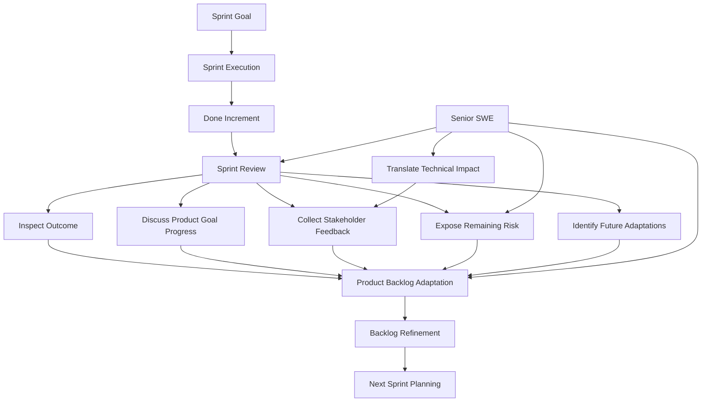

---

## 3. Sprint Review Bukan Gate untuk “Approve Release”

Scrum Guide menyatakan bahwa Sprint Review tidak boleh dianggap sebagai gate untuk merilis value. Work yang memenuhi Definition of Done menjadi Increment; sebuah Increment bisa dibuat selama Sprint, tidak harus menunggu Sprint Review. Scrum Guide juga menegaskan bahwa work yang tidak memenuhi Definition of Done tidak dapat dianggap sebagai bagian dari Increment. ([Scrum Guides](https://scrumguides.org/scrum-guide.html?utm_source=chatgpt.com))

Artinya:

```text id="iqio10"
Sprint Review = inspect outcome dan adapt future work.
Release decision = bisa terjadi sesuai strategi produk/operasional.
DoD = batas apakah work boleh dianggap Increment.
```

### Salah Kaprah

| Salah Kaprah | Koreksi |
|---|---|
| Sprint Review adalah approval meeting | Sprint Review adalah inspection/adaptation event. |
| Semua demo boleh ditampilkan walau belum Done | Yang dibahas sebagai Increment harus memenuhi DoD. |
| Release harus menunggu Sprint Review | Increment bisa releasable kapan pun memenuhi DoD dan strategi release mengizinkan. |
| Sprint Review hanya untuk PO | Stakeholder kunci perlu hadir agar feedback bernilai. |
| Demo teknis = Sprint Review | Demo hanya salah satu cara inspect outcome. |

---

## 4. Apa yang Harus Dibawa ke Sprint Review?

Sprint Review sehat membawa **evidence**, bukan klaim.

| Elemen | Contoh Evidence |
|---|---|
| **Sprint Goal** | Goal yang disepakati saat Sprint Planning. |
| **Done Increment** | Behavior yang memenuhi Definition of Done. |
| **Outcome** | Capability yang sekarang tersedia/tervalidasi. |
| **Acceptance result** | Acceptance criteria yang terpenuhi. |
| **Demo path** | Scenario nyata, bukan sekadar happy path palsu. |
| **Feedback question** | Pertanyaan eksplisit untuk stakeholder. |
| **Known limitation** | Scope yang sengaja belum diselesaikan. |
| **Risk** | Risiko teknis/produk yang masih perlu keputusan. |
| **Backlog implication** | Item yang perlu ditambah, diubah, dihapus, atau di-order ulang. |

---

## 5. Peran Senior SWE di Sprint Review

Senior SWE bukan presenter teknis yang menjelaskan semua class dan tabel. Peran utamanya adalah membantu stakeholder **memahami implikasi teknis terhadap value, risk, dan keputusan berikutnya**.

| Peran | Praktik |
|---|---|
| **Outcome translator** | Menjelaskan hasil teknis sebagai product capability. |
| **Risk explainer** | Membuka risiko yang relevan tanpa membanjiri detail teknis. |
| **Quality steward** | Menjelaskan apa yang benar-benar Done dan apa yang belum. |
| **Feedback shaper** | Membantu stakeholder memberi feedback yang actionable. |
| **Backlog advisor** | Memberi input teknis untuk Product Backlog adaptation. |
| **Operational lens** | Menjelaskan readiness, supportability, auditability, observability. |
| **Learning amplifier** | Menghubungkan feedback Sprint Review ke refinement berikutnya. |

---

## 6. Demo vs Review

Demo adalah bagian yang mungkin ada dalam Sprint Review, tetapi Sprint Review lebih luas dari demo.

| Demo | Sprint Review |
|---|---|
| Menunjukkan fitur | Menginspeksi outcome Sprint |
| Bisa sangat teknis | Harus product/value-oriented |
| Fokus pada apa yang dibangun | Fokus pada apa artinya untuk Product Goal |
| Sering satu arah | Harus kolaboratif |
| Bisa hanya happy path | Harus membuka feedback, limitation, dan next adaptation |
| Bisa dilakukan oleh developer | Melibatkan Scrum Team dan stakeholder |

Kalimat penting:

```text id="uydx65"
Demo menjawab: “apa yang dibuat?”
Sprint Review menjawab: “apa yang kita pelajari dan apa yang perlu diadaptasi?”
```

---

## 7. Struktur Sprint Review yang Sehat

Format praktis:

```text id="dd1q4k"
1. Re-state Sprint Goal
2. Summarize outcome
3. Show Done Increment
4. Discuss what was not Done, if relevant
5. Walk through real user/business scenarios
6. Ask targeted feedback questions
7. Discuss product/market/domain changes
8. Expose relevant technical/operational risks
9. Agree Product Backlog adaptations
10. Capture decisions and follow-up owners
```

Contoh alur:

```text id="5ezs05"
Sprint Goal:
Enable internal users to submit order amendment requests with validation and audit trail.

Outcome:
Users can now submit amendment request for eligible orders.
System validates invalid order states.
Audit trail is recorded.
Status can be checked by support user.

Not included:
Full approval workflow and downstream fulfillment notification.

Feedback needed:
Is the current amendment status vocabulary sufficient for support operations?
Should duplicate amendment requests be rejected or treated idempotently?
```

---

## 8. Review Scenario Design

Senior SWE harus membantu memilih scenario demo yang membuktikan capability penting, bukan hanya flow yang paling mudah.

### Untuk Fitur Order Amendment

| Scenario | Kenapa Penting |
|---|---|
| Submit amendment untuk order valid | Membuktikan happy path. |
| Submit amendment untuk order fulfilled | Membuktikan business validation. |
| Unauthorized user submit amendment | Membuktikan authorization. |
| Duplicate amendment request | Membuka keputusan idempotency/business policy. |
| Audit record setelah submit | Membuktikan defensibility. |
| Status lookup oleh support user | Membuktikan operability. |
| Failure workflow/dependency | Membuka risk/future slice. |

### Demo yang Lemah

```text id="0r6ldh"
Klik submit.
Muncul success.
Selesai.
```

### Demo yang Kuat

```text id="bfb49t"
1. Submit valid amendment.
2. Tunjukkan status tersimpan.
3. Tunjukkan audit event.
4. Tunjukkan invalid state ditolak.
5. Tunjukkan unauthorized user ditolak.
6. Tanyakan keputusan stakeholder untuk duplicate request.
```

---

## 9. Translasi Teknis ke Bahasa Stakeholder

Senior SWE perlu menjelaskan hal teknis sebagai konsekuensi terhadap bisnis, produk, support, atau risiko.

| Detail Teknis | Bahasa Stakeholder |
|---|---|
| Added audit table | Setiap perubahan order bisa ditelusuri saat dispute. |
| Added idempotency key | Submit berulang tidak membuat request ganda. |
| Added DB constraint | Data invalid dicegah masuk ke sistem. |
| Added structured logs | Support bisa trace request lebih cepat saat incident. |
| Deferred downstream integration | Saat ini request bisa dibuat, tetapi fulfillment belum otomatis menerima update. |
| Added authorization check | Hanya user dengan permission tertentu yang bisa mengubah order. |
| Migration is backward-compatible | Release bisa dilakukan tanpa menghentikan versi aplikasi lama. |
| Added status endpoint | Support tidak perlu query database manual untuk cek progress. |
| Camunda retry not finalized | Jika workflow gagal, behavior recovery masih perlu diputuskan. |

Pola kalimat:

```text id="g0r3ts"
Secara teknis kami menambahkan X.
Dampak produknya adalah Y.
Risiko yang tersisa adalah Z.
Keputusan yang kami butuhkan adalah W.
```

---

## 10. Apa yang Tidak Perlu Dibawa Terlalu Dalam

Stakeholder biasanya tidak butuh detail implementasi terlalu rendah kecuali mempengaruhi keputusan.

| Terlalu Detail | Lebih Relevan |
|---|---|
| Nama class/resource/mapper | Capability dan behavior |
| Detail query kecuali berdampak performa | Latency/scale/risk |
| Semua commit/PR | Increment dan outcome |
| Semua test case | Confidence dan coverage area |
| Diagram internal terlalu detail | Risiko, dependency, dan keputusan |
| Semua error stacktrace | Failure behavior dan support path |
| “Kami pakai pattern X” | Kenapa pattern itu mengurangi risiko |

---

## 11. Stakeholder Feedback yang Actionable

Sprint Review gagal jika feedback hanya berupa:

```text id="f0nvev"
Bagus.
Lanjut.
Oke.
Nanti dicek lagi.
```

Feedback harus diarahkan menjadi actionable.

### Pertanyaan Feedback yang Baik

```text id="ti8823"
Apakah status lifecycle ini cukup untuk operasional support?
Apakah rule validasi ini sesuai policy bisnis?
Apakah user perlu melihat alasan rejection?
Apakah audit trail ini cukup untuk dispute handling?
Apakah approval workflow wajib sebelum release pertama?
Apakah duplicate request harus ditolak atau digabung?
Apakah ada exception customer segment tertentu?
```

### Feedback Capture Template

```text id="bmfv22"
Feedback:
  Support needs amendment reason visible in status view.

Impact:
  Status endpoint needs additional field and permission check.

Decision:
  Add to Product Backlog as next slice.

Owner:
  PO to order against approval workflow item.
```

---

## 12. Product Backlog Adaptation

Output penting Sprint Review adalah adaptasi Product Backlog. Ini bisa berupa:

| Adaptasi | Contoh |
|---|---|
| **Add item** | Add duplicate request handling. |
| **Change item** | Approval workflow needs manual override path. |
| **Remove item** | Dashboard not needed for MVP. |
| **Split item** | Separate approval workflow from downstream notification. |
| **Reorder item** | Audit reporting moved before notification. |
| **Clarify item** | Define status vocabulary with support team. |
| **Add spike** | Validate Camunda retry and compensation behavior. |
| **Add risk item** | Performance test amendment search with large dataset. |

Senior SWE memberi input teknis agar Product Backlog adaptation tidak hanya berisi permintaan fitur, tetapi juga pekerjaan enablement yang menjaga kualitas produk.

---

## 13. Handling “Not Done” di Sprint Review

Tidak semua selected Product Backlog item pasti selesai. Transparansi penting.

### Cara Buruk

```text id="z03p4v"
Semuanya hampir selesai.
Tinggal sedikit lagi.
Kita anggap Done saja.
```

Masalah:

```text id="92cnvx"
Mengaburkan Definition of Done.
Stakeholder mendapat progress palsu.
Product Backlog tidak akurat.
Risiko release tersembunyi.
```

### Cara Sehat

```text id="2xp2g7"
Submit amendment, validation, persistence, and audit trail are Done.

Approval workflow is not Done.
Reason:
  Camunda retry behavior needs additional validation.

Impact:
  Users can submit amendment requests,
  but approval automation is not part of this Increment.

Next:
  Add workflow integration as separate backlog item with retry/incident acceptance criteria.
```

Kalimat penting:

```text id="fl9y2t"
Tidak Done bukan dosa.
Menyebut tidak Done sebagai Done adalah masalah transparansi.
```

---

## 14. Review untuk Technical / Platform Work

Tidak semua Increment terlihat sebagai UI. Technical work tetap bisa direview jika dikaitkan dengan outcome.

### Contoh Technical Work

```text id="o41cre"
Improve order search query performance.
```

Sprint Review yang buruk:

```text id="p2xwon"
Kami refactor query dan tambah index.
```

Sprint Review yang lebih baik:

```text id="0dsi9z"
Sebelumnya support search order by customer ID membutuhkan 4-6 detik pada dataset staging.
Setelah perubahan query dan index, common search path turun menjadi sekitar 300-500 ms.
Dampaknya support dapat menemukan order lebih cepat saat menangani amendment/cancellation case.
Risiko berikutnya adalah memvalidasi performa pada production-like dataset yang lebih besar.
```

### Technical Work Review Template

```text id="urjliw"
Problem:
  Apa masalah produk/operasional yang diselesaikan?

Change:
  Apa perubahan teknis secara ringkas?

Evidence:
  Apa bukti sebelum/sesudah?

Impact:
  Apa dampaknya terhadap user, support, reliability, cost, atau risk?

Remaining Risk:
  Apa yang masih perlu diputuskan atau diuji?

Backlog Adaptation:
  Apa next step?
```

---

## 15. Sprint Review untuk Regulatory / Audit-heavy System

Untuk domain enforcement, order management, compliance, atau regulated workflow, Sprint Review harus memperhatikan **defensibility**.

| Area | Pertanyaan Review |
|---|---|
| **Auditability** | Apakah action tercatat lengkap dan bisa ditelusuri? |
| **Authorization** | Apakah hanya role yang benar bisa melakukan action? |
| **State transition** | Apakah transition valid/invalid jelas? |
| **Exception handling** | Apa yang terjadi saat proses gagal? |
| **Manual intervention** | Apakah support/admin bisa recover dengan aman? |
| **Traceability** | Bisakah kita menghubungkan request, workflow, DB row, log, dan audit event? |
| **Data retention** | Apakah data yang dibutuhkan dispute/compliance tersedia? |
| **Decision rationale** | Apakah alasan approval/rejection tercatat? |

Senior SWE harus peka bahwa stakeholder mungkin tidak tahu harus meminta hal-hal ini. Tugas senior adalah membuat konsekuensi teknis terlihat dalam bahasa risiko operasional/regulasi.

---

## 16. Review Checklist untuk Senior SWE

```text id="trwdya"
Before Sprint Review
[ ] Sprint Goal siap dijelaskan.
[ ] Done Increment jelas.
[ ] Item yang tidak Done jelas dan jujur.
[ ] Demo scenario realistis.
[ ] Test/demo data siap.
[ ] Known limitation dicatat.
[ ] Feedback questions disiapkan.
[ ] Risiko teknis yang relevan diringkas.
[ ] Product Backlog adaptation candidate disiapkan.

During Sprint Review
[ ] Mulai dari outcome, bukan ticket list.
[ ] Tunjukkan behavior yang memenuhi DoD.
[ ] Hindari detail implementasi yang tidak mempengaruhi keputusan.
[ ] Jelaskan technical trade-off sebagai product risk/value.
[ ] Minta feedback spesifik.
[ ] Catat keputusan dan open question.
[ ] Jangan menyebut work belum Done sebagai Done.

After Sprint Review
[ ] Feedback masuk Product Backlog.
[ ] Item baru/split/reorder jelas.
[ ] Risiko teknis diterjemahkan menjadi backlog/spike bila perlu.
[ ] Decision disebarkan ke tim.
[ ] Insight review dibawa ke refinement/planning berikutnya.
```

---

## 17. Anti-pattern Sprint Review

| Anti-pattern | Gejala | Dampak | Respons Senior SWE |
|---|---|---|---|
| **Demo theater** | Demo scripted tapi tidak membuka feedback | Feedback rendah | Ajukan pertanyaan keputusan. |
| **Ticket parade** | Semua tiket dibacakan satu per satu | Stakeholder tidak lihat outcome | Strukturkan review berdasarkan Sprint Goal. |
| **Only happy path** | Edge case tidak dibahas | Risiko tersembunyi | Tampilkan invalid/unauthorized/failure case penting. |
| **Not Done dipoles** | “Tinggal sedikit” | Transparency rusak | Bedakan Done, partial, dan deferred. |
| **Too technical** | Bahas class/table terlalu detail | Stakeholder lost | Terjemahkan ke impact. |
| **No backlog adaptation** | Review selesai tanpa action | Feedback loop mati | Tutup dengan next backlog decision. |
| **PO-only review** | Stakeholder kunci tidak hadir | Feedback terlambat | Minta key stakeholder untuk topik penting. |
| **Quality invisible** | DoD tidak dibahas | Done terlihat seperti demo saja | Tampilkan evidence quality singkat. |
| **Surprise risk** | Risiko baru muncul di review | Trust turun | Buka risk lebih awal saat Sprint berjalan. |

---

## 18. Contoh Lengkap Sprint Review

### Sprint Goal

```text id="v7ib1c"
Enable internal users to submit order amendment requests with validation and audit trail.
```

### Review Opening

```text id="084s3a"
Sprint Goal kita adalah memungkinkan internal user submit order amendment request
dengan validasi dan audit trail.

Increment yang Done:
1. Submit amendment request untuk order eligible.
2. Validasi order status.
3. Persistence amendment request.
4. Audit event.
5. Status lookup untuk support.

Tidak termasuk Increment ini:
1. Approval workflow.
2. Downstream fulfillment notification.
```

### Demo Scenario

```text id="swhgcl"
Scenario 1:
Submit amendment untuk order SUBMITTED → request dibuat PENDING_APPROVAL.

Scenario 2:
Submit amendment untuk order FULFILLED → request ditolak dengan business error.

Scenario 3:
Unauthorized user submit amendment → system return 403.

Scenario 4:
Support user lookup status → amendment status dan audit reference terlihat.
```

### Technical Risk Translation

```text id="hts7dv"
Kami sengaja belum memasukkan approval workflow karena retry dan incident behavior
di Camunda masih perlu divalidasi.

Dampaknya:
request sudah bisa dibuat dan diaudit,
tetapi proses approval otomatis belum menjadi bagian dari Increment.

Rekomendasi:
buat backlog item terpisah untuk approval workflow dengan acceptance criteria
terkait retry, incident handling, dan manual recovery.
```

### Feedback Questions

```text id="cl6l4s"
1. Apakah status PENDING_APPROVAL cukup jelas untuk support?
2. Apakah amendment reason perlu visible di status endpoint?
3. Jika user submit duplicate amendment, apakah harus ditolak atau dianggap idempotent?
4. Apakah audit event saat ini cukup untuk dispute handling?
```

### Output Review

```text id="gdg4ac"
Backlog Adaptations:
1. Add amendment reason to status endpoint.
2. Define duplicate amendment behavior.
3. Add approval workflow with Camunda retry and incident acceptance criteria.
4. Add support-facing audit search improvement.
```

---

## 19. How Senior SWE Should Speak in Review

### Hindari

```text id="55pv3s"
Kami ubah mapper, resource class, service layer, dan BPMN delegate.
```

Kecuali stakeholder memang teknis dan butuh detail.

### Gunakan

```text id="3qt8wa"
Kami menambahkan kemampuan submit amendment request yang sekarang:
- memvalidasi status order,
- menyimpan request,
- mencatat audit trail,
- dan bisa ditelusuri oleh support.

Yang belum otomatis adalah approval workflow downstream.
Risikonya bukan di API submission, tetapi di retry/incident handling saat workflow gagal.
```

Lebih ringkas, lebih relevan, dan tetap transparan.

---

## 20. Review Output Record

Gunakan format pendek setelah Sprint Review.

```text id="4txkh0"
Sprint Review Summary

Sprint Goal:
  Enable internal users to submit order amendment requests with validation and audit trail.

Done Increment:
  - Submit amendment request.
  - Validate order status.
  - Persist request.
  - Record audit event.
  - Expose status lookup.

Not Done / Deferred:
  - Approval workflow.
  - Downstream notification.

Stakeholder Feedback:
  - Amendment reason must be visible to support.
  - Duplicate request behavior must be defined.
  - Audit event is sufficient for MVP, but searchability is needed later.

Decisions:
  - Add duplicate handling as next Product Backlog item.
  - Split approval workflow from downstream notification.

Risks:
  - Camunda retry/incident behavior needs spike.

Backlog Adaptations:
  - Add status endpoint enhancement.
  - Add duplicate behavior item.
  - Add Camunda workflow spike.
  - Add support audit search item.
```

---

## 21. Ringkasan Seri 7

| Konsep | Inti |
|---|---|
| **Sprint Review** | Event untuk inspect Sprint outcome dan menentukan future adaptation. |
| **Demo** | Cara menampilkan hasil, tetapi bukan keseluruhan Review. |
| **Stakeholder Feedback** | Harus diarahkan menjadi decision dan Product Backlog adaptation. |
| **Done Increment** | Hanya work yang memenuhi Definition of Done yang boleh dianggap Increment. |
| **Senior SWE Role** | Menerjemahkan technical work/risk menjadi product value, supportability, auditability, dan backlog decision. |

Kalimat kunci:

```text id="nd4mnb"
Sprint Review yang baik tidak berhenti di:
“Ini yang kami buat.”

Sprint Review yang baik menjawab:
“Apa yang sekarang bisa dilakukan produk,
apa yang kita pelajari,
risiko apa yang masih ada,
dan bagaimana Product Backlog harus berubah?”
```

---

## Status Seri

**Seri 7/12 selesai.**

Sisa seri: **5**.

Seri berikutnya: **Seri 8 - Sprint Retrospective dan Continuous Improvement untuk Senior Software Engineer.**

---

**Sources:**

- [The 2020 Scrum Guide TM](https://scrumguides.org/scrum-guide.html?utm_source=chatgpt.com)

## Response:
7/13/2026, 8:57:49 PM

# Seri 8/12 - Sprint Retrospective dan Continuous Improvement untuk Senior Software Engineer

## 1. Introduction

**Sprint Retrospective** adalah event untuk memperbaiki cara kerja Scrum Team. Scrum Guide menyatakan tujuan Sprint Retrospective adalah **merencanakan cara meningkatkan quality dan effectiveness**. Scrum Team menginspeksi Sprint terakhir terkait individuals, interactions, processes, tools, dan Definition of Done; improvement yang paling berdampak dapat ditambahkan ke Sprint Backlog berikutnya. ([scrumguides.org](https://scrumguides.org/docs/scrumguide/v2020/2020-Scrum-Guide-US.pdf?utm_source=chatgpt.com))

Untuk **Senior Software Engineer**, Retrospective adalah tempat untuk mengubah masalah berulang menjadi **engineering improvement yang konkret**, bukan sekadar forum curhat.

Mental model:

```text id="5v9i6f"
Sprint Review:
  Apa yang kita hasilkan dan pelajari tentang produk?

Sprint Retrospective:
  Apa yang kita pelajari tentang cara kerja tim,
  dan apa yang harus kita ubah agar Sprint berikutnya lebih baik?
```

Retrospective yang sehat tidak berhenti di:

```text id="vvrwxl"
Komunikasi perlu ditingkatkan.
Testing perlu lebih baik.
Requirement kurang jelas.
PR review lama.
```

Retrospective yang sehat menghasilkan:

```text id="q6h5ji"
Masalah spesifik
→ akar penyebab
→ eksperimen perbaikan
→ owner
→ target observasi
→ masuk Sprint Backlog bila penting
```

---

## 2. Diagram - Retrospective Continuous Improvement Loop

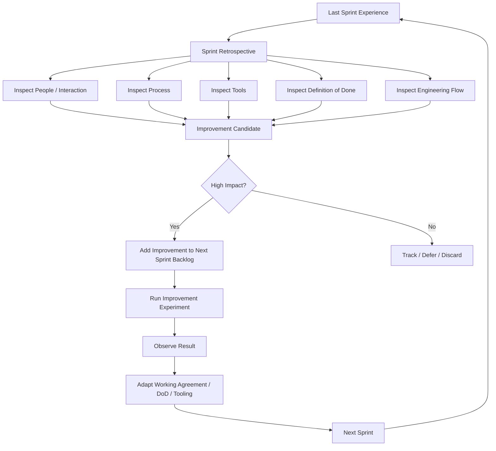

---

## 3. Retrospective Bukan Blame Session

Retrospective yang buruk menyalahkan individu:

```text id="raoa2t"
Developer A lambat.
Reviewer B tidak responsif.
QA telat test.
PO sering berubah pikiran.
```

Retrospective yang sehat mencari **sistem penyebab**:

```text id="c3bibj"
Kenapa PR review bottleneck di satu orang?
Kenapa testing selalu baru mulai akhir Sprint?
Kenapa requirement berubah setelah development?
Kenapa environment sering rusak?
Kenapa Definition of Done tidak realistis?
```

Perbedaan cara pikir:

| Blame Thinking | System Thinking |
|---|---|
| “Siapa yang salah?” | “Kondisi apa yang membuat ini terjadi?” |
| “Dia lambat.” | “Apakah work terlalu besar, unclear, atau blocked?” |
| “Reviewer tidak responsif.” | “Apakah review ownership dan SLA jelas?” |
| “QA telat.” | “Apakah testing baru dilibatkan setelah code complete?” |
| “PO berubah-ubah.” | “Apakah refinement gagal membuka uncertainty?” |

Untuk Senior SWE, ini penting karena technical leadership yang baik memperbaiki **sistem delivery**, bukan hanya menekan individu.

---

## 4. Retrospective Scope untuk Senior SWE

Scrum Guide menyebut Retrospective menginspeksi individuals, interactions, processes, tools, dan Definition of Done. Dalam engineering team, Senior SWE perlu menambahkan lensa praktis: flow, quality, risk, operability, dan production feedback. ([scrumguides.org](https://scrumguides.org/docs/scrumguide/v2020/2020-Scrum-Guide-US.pdf?utm_source=chatgpt.com))

| Scope | Pertanyaan Praktis |
|---|---|
| **Individuals** | Apakah ada engineer overloaded, isolated, atau kurang konteks? |
| **Interactions** | Apakah komunikasi PO-dev-QA-platform-support efektif? |
| **Processes** | Apakah refinement, planning, daily, review, release flow membantu? |
| **Tools** | Apakah CI/CD, Jira, GitHub, environment, observability mendukung flow? |
| **Definition of Done** | Apakah DoD jelas, realistis, dan cukup melindungi kualitas? |
| **Flow** | Di mana pekerjaan paling sering stuck? |
| **Quality** | Bug muncul karena gap apa? Test? Review? Requirement? |
| **Risk** | Risiko apa yang terlambat terlihat? |
| **Operability** | Apakah production/support feedback masuk ke improvement? |

---

## 5. Decomposition Table - Retrospective Skills

| Category | Skill / Domain | Apa yang Dikuasai Senior SWE | Output Praktis |
|---|---|---|---|
| **Facilitative thinking** | Problem framing | Mengubah keluhan umum menjadi problem statement spesifik. | “PR review rata-rata 2 hari karena reviewer ownership tidak jelas.” |
| **System thinking** | Root cause analysis | Mencari penyebab sistemik, bukan menyalahkan individu. | Fishbone, 5 Whys, causal chain. |
| **Engineering flow** | Bottleneck detection | Melihat WIP, PR aging, test delay, blocked item. | Improvement pada review/test/deploy flow. |
| **Quality improvement** | DoD evolution | Memperbaiki DoD berdasarkan defect dan incident. | Checklist DoD diperbarui. |
| **Tooling improvement** | CI/CD friction removal | Mengurangi flaky test, slow build, manual deploy step. | Pipeline lebih reliable. |
| **Collaboration** | Cross-role feedback | Menjembatani PO, QA, DevOps, security, support. | Working agreement lebih jelas. |
| **Risk reduction** | Earlier risk surfacing | Mencegah risiko muncul terlalu akhir. | Refinement checklist, spike policy. |
| **Experiment design** | Improvement experiment | Membuat perbaikan kecil yang bisa diamati. | “Selama 2 Sprint, PR maksimal 400 LOC.” |
| **Measurement** | Improvement signal | Menentukan sinyal sukses/gagal. | PR waiting time turun, carry-over turun. |
| **Operational learning** | Incident feedback loop | Mengubah incident menjadi perbaikan sistem. | Regression test, alert, runbook, DoD update. |

---

## 6. Retrospective Input yang Berkualitas

Retrospective sering gagal karena hanya mengandalkan ingatan. Senior SWE sebaiknya membawa evidence ringan.

| Evidence | Sumber | Insight |
|---|---|---|
| Carry-over item | Jira/Sprint board | Apakah item terlalu besar atau blocked? |
| PR review time | GitHub | Apakah review bottleneck? |
| Build failure | GitHub Actions/CI | Apakah pipeline flaky atau test buruk? |
| Defect count | Bug tracker/support ticket | Apakah quality gate lemah? |
| Incident | On-call/report | Apakah release readiness kurang? |
| Blocked time | Board/Slack | Dependency mana yang paling mahal? |
| Rework | PR/comment/history | Requirement atau design tidak jelas? |
| Deployment failure | CI/CD/K8s events | Config/release process lemah? |
| Test timing | CI history | Testing terlalu akhir? |
| Lead/cycle time | Board metrics | Flow bottleneck umum. |

Contoh framing berbasis evidence:

```text id="xq94l2"
Selama Sprint ini, 5 dari 8 PR menunggu review lebih dari 24 jam.
Tiga PR membutuhkan reviewer yang sama.
Dampaknya integration testing mundur ke dua hari terakhir.

Problem statement:
Review ownership terlalu terkonsentrasi.
```

Ini jauh lebih actionable daripada:

```text id="zq79w6"
Review lama.
```

---

## 7. Root Cause Analysis untuk Retrospective

### 7.1 5 Whys

Masalah:

```text id="z204bd"
Story order amendment carry-over.
```

5 Whys:

```text id="hk8wx0"
Why 1:
  Karena audit trail belum selesai.

Why 2:
  Karena format audit event belum disepakati.

Why 3:
  Karena support/compliance baru dilibatkan saat implementation.

Why 4:
  Karena refinement hanya membahas happy path API.

Why 5:
  Karena checklist refinement belum mencakup auditability/supportability.
```

Improvement:

```text id="1ule7x"
Tambahkan auditability/supportability questions ke refinement checklist
untuk semua item yang mengubah order lifecycle.
```

### 7.2 Fishbone Categories

```text id="x8kuke"
Problem: Sprint carry-over tinggi

People:
  Knowledge hanya di 1 reviewer

Process:
  Refinement kurang membahas dependency

Tools:
  Pipeline flaky

Codebase:
  Test sulit ditulis karena coupling

Requirement:
  Acceptance criteria berubah

Environment:
  Staging tidak stabil

External:
  Downstream API belum siap
```

Fishbone membantu agar tim tidak mengunci masalah ke satu penyebab palsu.

---

## 8. Improvement Harus Kecil, Nyata, dan Terukur

Retrospective sering menghasilkan action terlalu besar:

```text id="m5x70t"
Improve testing.
Improve communication.
Improve code quality.
Improve planning.
```

Ini lemah karena tidak jelas siapa melakukan apa.

Ubah menjadi eksperimen:

| Keluhan Umum | Improvement Action yang Lebih Baik |
|---|---|
| Testing lambat | Untuk 2 Sprint, setiap story dengan DB/API change wajib punya test plan saat planning. |
| PR review lama | Setiap PR critical harus punya reviewer assigned saat PR dibuat. |
| Story terlalu besar | Item >8 point harus di-split atau diberi spike sebelum masuk Sprint. |
| Requirement berubah | Refinement checklist wajib mencakup rule, edge case, actor, data, audit. |
| Pipeline flaky | Top 3 flaky tests diberi owner dan diperbaiki di Sprint berikutnya. |
| Deploy sering gagal | Tambahkan deployment config check sebelum merge. |
| Banyak blocker diam-diam | Daily Scrum wajib membahas blocked item age. |
| Observability kurang | Story production-critical wajib punya log/metric/trace minimal. |

Format action:

```text id="7qpwuu"
Action:
  Apa yang akan diubah?

Owner:
  Siapa yang memastikan ini berjalan?

When:
  Mulai kapan?

Signal:
  Bagaimana kita tahu ini membantu?

Review:
  Kapan kita inspect hasilnya?
```

---

## 9. Retrospective Action Template

```text id="1zjgbr"
Problem:
  PR review bottleneck menyebabkan integration testing mundur.

Evidence:
  5 PR menunggu review lebih dari 24 jam.
  3 PR hanya bisa direview oleh 1 senior engineer.

Root Cause:
  Ownership area terlalu terkonsentrasi dan reviewer tidak ditentukan sejak awal.

Improvement Experiment:
  Untuk Sprint berikutnya:
  - Setiap story critical menetapkan primary dan backup reviewer saat planning.
  - PR harus dibuat kecil, idealnya reviewable dalam 30 menit.
  - Jika PR menunggu >24 jam, dibahas di Daily Scrum.

Owner:
  Senior SWE + Scrum Master.

Success Signal:
  PR waiting time turun.
  Integration testing mulai sebelum 2 hari terakhir Sprint.

Review Date:
  Retrospective Sprint berikutnya.
```

---

## 10. Engineering Improvement Backlog

Tidak semua improvement bisa langsung dikerjakan. Senior SWE perlu membantu membuat **engineering improvement backlog** yang visible dan bisa di-order bersama Product Backlog.

| Improvement | Kenapa Masuk Backlog |
|---|---|
| Stabilkan flaky integration test | Mengurangi false negative CI dan delay merge. |
| Tambah Testcontainers setup PostgreSQL | Membuat integration test lebih reliable. |
| Refactor duplicated validation rule | Mengurangi inconsistent business behavior. |
| Tambah audit log standard | Mempercepat delivery fitur lifecycle berikutnya. |
| Perbaiki deployment config validation | Mengurangi release failure. |
| Tambah contract test OpenAPI | Mencegah breaking change consumer. |
| Buat runbook Camunda incident | Mempercepat recovery workflow stuck. |
| Tambah PR review guideline | Mengurangi review bottleneck. |
| Tambah migration rehearsal process | Mengurangi DB release risk. |

Kalimat penting:

```text id="f3iwxm"
Engineering improvement yang berdampak pada delivery dan quality
bukan pekerjaan sampingan tersembunyi.
Ia harus terlihat, bisa di-order, dan bila penting masuk Sprint Backlog.
```

---

## 11. Continuous Improvement dan Definition of Done

Scrum Guide menyebut Retrospective menginspeksi juga Definition of Done. Ini penting: DoD harus berevolusi berdasarkan pembelajaran tim. ([scrumguides.org](https://scrumguides.org/docs/scrumguide/v2020/2020-Scrum-Guide-US.pdf?utm_source=chatgpt.com))

Contoh:

| Masalah Sprint / Incident | Update DoD |
|---|---|
| Unauthorized user bisa akses endpoint | Tambahkan negative authorization test. |
| Audit event hilang untuk state change tertentu | Tambahkan audit requirement untuk lifecycle-changing action. |
| DB migration lock terlalu lama | Tambahkan migration lock-risk assessment untuk tabel besar. |
| Support tidak bisa trace order request | Tambahkan correlation ID dan structured logging. |
| Consumer rusak karena API response berubah | Tambahkan contract compatibility check. |
| Camunda incident tidak terlihat | Tambahkan workflow incident observability. |
| Rollback sulit | Tambahkan rollback/remediation note untuk high-risk changes. |
| Flaky test diabaikan | Tambahkan policy: flaky test = build health issue, bukan noise. |

Scrum.org menekankan DoD membantu transparansi dengan memberi shared understanding tentang apa yang diperlukan agar Product Backlog Item menjadi usable, valuable, potentially releasable Increment. ([scrum.org](https://www.scrum.org/resources/blog/definition-done-what-it-and-how-it-supports-scrum-events?utm_source=chatgpt.com))

---

## 12. Retrospective Anti-patterns

| Anti-pattern | Gejala | Dampak | Koreksi |
|---|---|---|---|
| **No action retro** | Banyak diskusi, tidak ada perubahan | Tim lelah dan sinis | Maksimal 1-3 action konkret. |
| **Same topic every Sprint** | Masalah sama muncul terus | Improvement tidak dieksekusi | Jadikan action masuk Sprint Backlog. |
| **Blame retro** | Fokus orang, bukan sistem | Psychological safety turun | Gunakan system framing. |
| **Too generic action** | “Improve communication” | Tidak bisa dievaluasi | Buat eksperimen spesifik. |
| **Manager performance review** | Orang takut jujur | Transparency hilang | Pisahkan retro dari evaluasi individu. |
| **Scrum Master only owns action** | Tim pasif | Perbaikan tidak collective | Assign owner sesuai problem. |
| **No evidence** | Semua berdasarkan feeling | Salah diagnosis | Bawa data ringan. |
| **Tool obsession** | Semua diselesaikan dengan tools | Root cause tidak kena | Pisahkan people/process/tools. |
| **DoD never revisited** | Defect berulang | Quality tidak meningkat | Update DoD dari learning. |
| **Action overload** | 10 improvement sekaligus | Tidak ada yang selesai | Pilih improvement paling berdampak. |

---

## 13. Psychological Safety: Fondasi Retrospective

Retrospective hanya bekerja jika orang cukup aman untuk mengatakan realita. Tanpa itu, tim akan menyembunyikan masalah.

| Lingkungan Tidak Aman | Lingkungan Lebih Aman |
|---|---|
| Orang takut disalahkan | Masalah dibahas sebagai sistem |
| Senior mendominasi | Semua suara diberi ruang |
| Manager mencari siapa salah | Tim mencari apa yang perlu diperbaiki |
| Bug dipakai menghukum | Bug dipakai untuk memperbaiki quality gate |
| Kritik personal | Feedback spesifik ke proses/behavior |
| Masalah disimpan | Masalah diangkat cepat |

Perilaku Senior SWE yang mendukung safety:

```text id="8xbiju"
Mengakui kesalahan teknis sendiri.
Tidak mempermalukan engineer lain.
Bertanya sebelum menyimpulkan.
Membedakan intent dan impact.
Membawa evidence tanpa menyerang.
Memberi ruang engineer junior bicara.
Mengubah kritik menjadi improvement.
```

Contoh kalimat:

```text id="8e8dh2"
Saya juga miss risiko migration lock di planning.
Mari kita lihat bagaimana checklist kita bisa menangkap ini lebih awal.
```

Itu jauh lebih sehat daripada:

```text id="9w37to"
Harusnya kamu sudah tahu migration ini berisiko.
```

---

## 14. Retrospective Format yang Cocok untuk Engineering Team

### 14.1 Start / Stop / Continue

Cocok untuk tim baru atau topik umum.

```text id="xr8yqf"
Start:
  Apa yang perlu mulai kita lakukan?

Stop:
  Apa yang perlu kita hentikan?

Continue:
  Apa yang sudah membantu dan perlu dipertahankan?
```

### 14.2 Mad / Sad / Glad

Cocok untuk membuka aspek emosional dan friction.

```text id="fywvop"
Mad:
  Apa yang membuat frustrasi?

Sad:
  Apa yang mengecewakan?

Glad:
  Apa yang berjalan baik?
```

### 14.3 Timeline Retro

Cocok untuk Sprint dengan incident atau banyak perubahan.

```text id="nufv7g"
Day 1-2:
  Planning/refinement issue

Day 3-5:
  Build/review/integration

Day 6-8:
  Testing/dependency

Day 9-10:
  Hardening/review
```

### 14.4 Flow Retro

Cocok untuk tim engineering mature.

```text id="eew68o"
Where did work wait?
Where did work bounce back?
Where did quality fail?
Where did handoff happen?
Where did we learn too late?
```

### 14.5 Incident-driven Retro

Cocok jika ada production issue.

```text id="f54cf1"
What happened?
How did we detect it?
Why did it escape?
How did we recover?
What system change prevents recurrence?
What DoD/runbook/alert/test must change?
```

---

## 15. Senior SWE Retrospective Playbook

### Sebelum Retro

```text id="odgn5m"
[ ] Lihat carry-over item.
[ ] Lihat PR aging.
[ ] Lihat build/test failure.
[ ] Lihat blocker utama.
[ ] Lihat incident/support issue.
[ ] Catat 1-2 problem berbasis evidence.
[ ] Hindari datang dengan solusi final terlalu cepat.
```

### Saat Retro

```text id="ph3hio"
[ ] Mulai dari problem, bukan solusi.
[ ] Tanya “apa yang membuat ini terjadi?”
[ ] Bawa evidence dengan netral.
[ ] Dengarkan PO/QA/SM/platform/support perspective.
[ ] Fokus pada 1-3 improvement paling berdampak.
[ ] Pastikan action punya owner dan signal.
[ ] Jangan biarkan retro menjadi blame session.
```

### Setelah Retro

```text id="rysyui"
[ ] Improvement penting masuk Sprint Backlog atau Product Backlog.
[ ] Working agreement diperbarui bila perlu.
[ ] DoD diperbarui bila perlu.
[ ] Action di-review pada Daily atau Retro berikutnya.
[ ] Jika action gagal, inspect kenapa, bukan langsung abandon.
```

---

## 16. Contoh Retrospective Lengkap

### Context

Sprint Goal:

```text id="0iukqw"
Enable internal users to submit order amendment requests with validation and audit trail.
```

Masalah:

```text id="r6uz9x"
Story selesai, tetapi audit trail baru selesai hari terakhir.
Integration test mundur.
PR review menumpuk.
```

### Evidence

```text id="8fqckr"
- Audit schema decision baru dibuat hari ke-6.
- 4 PR menunggu review >24 jam.
- Integration test pertama baru jalan hari ke-8.
- 1 bug authorization ditemukan hari ke-9.
```

### Root Cause

```text id="w0mb8d"
1. Refinement tidak melibatkan support/compliance untuk audit detail.
2. Planning tidak menentukan reviewer untuk area audit/security.
3. Definition of Done menyebut audit, tapi tidak ada checklist negative authorization test.
```

### Improvement Actions

```text id="4zw0iv"
Action 1:
  Untuk lifecycle-changing story, refinement wajib mencakup auditability question:
  "Apa event yang dicatat, siapa actor-nya, dan siapa consumer audit-nya?"

Owner:
  Senior SWE + PO.

Signal:
  Audit requirement jelas sebelum Sprint Planning.

Action 2:
  Untuk story security-sensitive, tambahkan negative authorization test ke DoD.

Owner:
  Senior SWE.

Signal:
  Unauthorized/forbidden cases muncul di test suite.

Action 3:
  Untuk PR critical, tentukan primary dan backup reviewer saat planning.

Owner:
  Developers.

Signal:
  PR waiting time tidak lebih dari 24 jam tanpa dibahas di Daily.
```

### Backlog Impact

```text id="v3grm8"
- Add support audit search enhancement.
- Add Camunda workflow retry spike.
- Add authorization regression tests for order lifecycle endpoints.
```

---

## 17. Retrospective untuk Stack Anda

| Stack Area | Pertanyaan Retro |
|---|---|
| **Java/Jersey** | Apakah endpoint/error handling/validation konsisten? |
| **MyBatis** | Apakah mapper/query menyebabkan bug/performance issue? |
| **PostgreSQL** | Apakah migration/query/index/lock risk terlihat cukup awal? |
| **PL/pgSQL** | Apakah function/procedure/trigger sulit dites atau menyebabkan side effect? |
| **Camunda** | Apakah process incident/retry/compensation jelas? |
| **Docker/K8s** | Apakah config/probe/resource/deploy issue menghambat Sprint? |
| **GitHub Actions** | Apakah CI membantu atau menghambat? Flaky? Slow? |
| **Cloud/On-prem** | Apakah environment difference menyebabkan surprise? |
| **Observability** | Apakah support bisa trace behavior setelah deploy? |
| **Security** | Apakah authz/audit/privacy issue muncul terlambat? |

---

## 18. Working Agreement sebagai Output Retro

Kadang improvement bukan backlog item, tetapi **working agreement**.

Contoh working agreement:

```text id="mx70bo"
PR Review
- PR diusahakan kecil dan reviewable.
- Primary reviewer ditentukan untuk story critical.
- PR menunggu >24 jam harus dibahas di Daily.

Testing
- Story dengan DB/API change harus punya test plan saat planning.
- Integration test tidak boleh menunggu dua hari terakhir Sprint.

Refinement
- Lifecycle-changing story wajib membahas state transition, audit, authorization, and failure path.

Daily Scrum
- Daily dimulai dengan Sprint Goal health: Green / Yellow / Red.
- Blocked item age harus terlihat.

Definition of Done
- Security-sensitive story wajib punya positive dan negative authorization test.
```

Working agreement harus mudah dipakai. Jika terlalu panjang dan tidak pernah dilihat, ia menjadi dokumentasi mati.

---

## 19. Improvement Prioritization Matrix

Tidak semua problem bisa diselesaikan sekaligus.

| Impact | Effort | Prioritas |
|---|---|---|
| High | Low | Lakukan segera |
| High | High | Masukkan backlog dan rencanakan |
| Low | Low | Lakukan jika tidak mengganggu |
| Low | High | Hindari / defer |

Contoh:

| Improvement | Impact | Effort | Keputusan |
|---|---|---|---|
| Tambah negative auth test ke DoD | High | Low | Lakukan segera |
| Assign backup reviewer untuk critical PR | High | Low | Lakukan segera |
| Bangun full test environment baru | High | High | Backlog/platform initiative |
| Rename semua module lama | Low | High | Defer |
| Tambah PR template | Medium | Low | Lakukan |
| Refactor seluruh workflow engine integration | High | High | Pecah menjadi beberapa backlog item |

---

## 20. Retrospective Action Review

Action retro harus di-review. Jika tidak, tim akan belajar bahwa retro tidak berpengaruh.

Template review:

```text id="k2xaz5"
Action from last Retro:
  Assign primary and backup reviewer for critical stories.

Did we do it?
  Partially.

Observed result:
  PR waiting time turun untuk 2 story,
  tapi 1 PR masih stuck karena reviewer backup tidak punya domain knowledge.

Adaptation:
  Pair reviewer backup saat story implementation,
  bukan baru saat PR ready.
```

Ini membuat continuous improvement benar-benar continuous.

---

## 21. Ringkasan Seri 8

| Konsep | Inti |
|---|---|
| **Sprint Retrospective** | Event untuk meningkatkan quality dan effectiveness. |
| **Continuous Improvement** | Perbaikan kecil, nyata, dan diinspeksi kembali. |
| **System Thinking** | Fokus pada penyebab sistemik, bukan menyalahkan individu. |
| **Engineering Improvement** | CI/CD, test, review, observability, deployment, DoD, dan refinement harus terus diperbaiki. |
| **Senior SWE Role** | Membawa evidence, membantu root cause analysis, menjaga psychological safety, dan mengubah problem menjadi action. |

Kalimat kunci:

```text id="x0c67i"
Retrospective yang baik tidak menghasilkan daftar keluhan.
Retrospective yang baik menghasilkan perubahan sistem kerja.

Senior SWE yang efektif tidak hanya memperbaiki code.
Senior SWE memperbaiki cara tim menghasilkan software.
```

---

## Status Seri

**Seri 8/12 selesai.**

Sisa seri: **4**.

Seri berikutnya: **Seri 9 - Technical Decomposition, Spike, Dependency, dan Risk Mapping untuk Senior Software Engineer.**

---

**Sources:**

- [2020 Scrum Guide](https://scrumguides.org/docs/scrumguide/v2020/2020-Scrum-Guide-US.pdf?utm_source=chatgpt.com)
- [Definition of 'Done': What It Is and How It Supports ...](https://www.scrum.org/resources/blog/definition-done-what-it-and-how-it-supports-scrum-events?utm_source=chatgpt.com)

## Response:
7/13/2026, 9:01:31 PM

# Seri 9/12 - Technical Decomposition, Spike, Dependency, dan Risk Mapping untuk Senior Software Engineer

## 1. Introduction

Seri ini masuk ke bagian yang paling dekat dengan tanggung jawab praktis **Senior Software Engineer**: mengubah backlog item yang masih konseptual menjadi pekerjaan teknis yang bisa dikerjakan, diuji, diintegrasikan, dirilis, dan dioperasikan.

Dalam Scrum, Sprint Backlog terdiri dari **Sprint Goal**, Product Backlog items yang dipilih untuk Sprint, dan **plan** untuk menyelesaikannya. Sprint Backlog adalah rencana oleh dan untuk Developers. ([scrumguides.org](https://scrumguides.org/scrum-guide.html?utm_source=chatgpt.com)) Artinya, technical decomposition bukan pekerjaan administratif; ia adalah bagian dari cara Developers membuat rencana kerja yang nyata.

Mental model seri ini:

```text id="w5mqt3"
Backlog item menjelaskan what dan why.
Technical decomposition menjelaskan how.
Spike mengurangi uncertainty.
Dependency mapping mencegah surprise.
Risk mapping membuat keputusan delivery lebih defensible.
```

Untuk Senior SWE, skill ini penting karena banyak Sprint gagal bukan karena tim tidak bekerja keras, tetapi karena:

```text id="k0w6x7"
Scope terlalu besar
Dependency tidak terlihat
Risk dianggap kecil
Integration terlambat
Testing tidak dihitung
Migration diremehkan
Workflow failure path tidak dipikirkan
Production readiness muncul di akhir
```

---

## 2. Diagram - Technical Decomposition & Risk Mapping

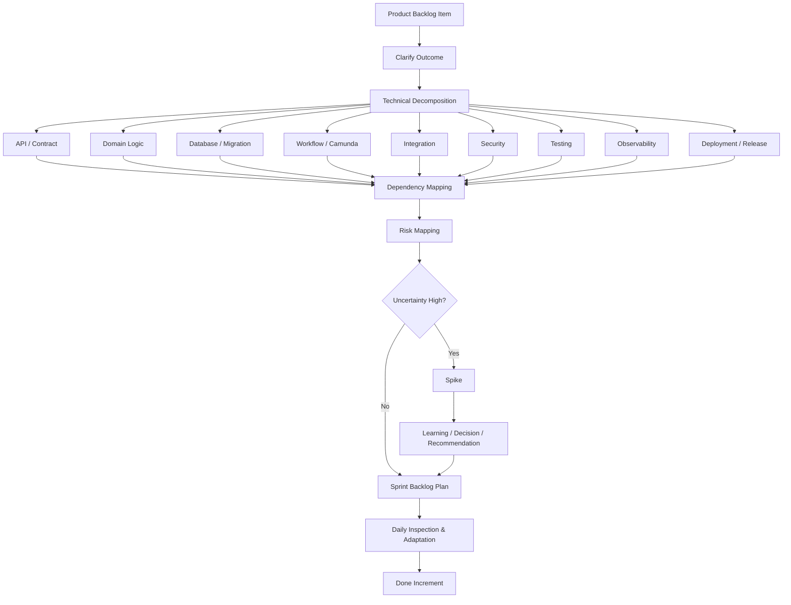

---

## 3. Technical Decomposition: Apa Maksudnya?

Technical decomposition adalah proses memecah backlog item menjadi bagian teknis yang cukup jelas untuk dieksekusi dan diinspeksi.

Namun hati-hati: decomposition bukan berarti memecah story menjadi layer yang tidak punya value.

### Decomposition yang Lemah

```text id="jhnfjp"
Task 1: Create DB table
Task 2: Create API
Task 3: Create service
Task 4: Create tests
Task 5: Add logs
```

Ini bisa berguna sebagai task internal, tetapi jika dijadikan backlog item terpisah, hasilnya mudah menjadi **layer-based delivery** dan tidak menghasilkan Increment usable.

### Decomposition yang Lebih Sehat

```text id="kmecc6"
Vertical Slice 1:
  Submit amendment request with basic validation, persistence, and audit event.

Technical tasks inside slice:
  - Define API contract
  - Add DB migration
  - Implement JAX-RS resource
  - Add service validation
  - Add MyBatis mapper
  - Add audit write
  - Add tests
  - Add logs/trace
```

Prinsip:

```text id="03l0g8"
Backlog item sebaiknya vertical dan value-oriented.
Task teknis di dalam Sprint Backlog boleh detail dan engineering-oriented.
```

---

## 4. Decomposition Table untuk Senior SWE

| Area | Yang Diurai | Pertanyaan Praktis | Output |
|---|---|---|---|
| **Outcome** | Capability yang ingin dicapai | Apa behavior minimum yang usable? | Sprint slice / scope boundary |
| **API Contract** | Endpoint, request, response, error | Apa contract-nya? Backward compatible? | OpenAPI/JAX-RS contract |
| **Domain Logic** | Rule, policy, validation | Rule mana wajib? Edge case apa? | Service/domain design |
| **State Model** | Status dan transisi | State apa saja? Transition valid/invalid? | State diagram / transition matrix |
| **Database** | Schema, query, migration | Tabel/index/constraint apa terdampak? | Migration + data impact notes |
| **MyBatis** | Mapper, SQL, result mapping | Query aman? Mapping benar? N+1? | Mapper design + tests |
| **Camunda** | BPMN, task, retry, incident | Workflow kapan mulai? Bagaimana failure? | Process model / retry strategy |
| **Integration** | Upstream/downstream dependency | Service mana? Contract stabil? Timeout? | Dependency list |
| **Security** | Authn/authz/permission | Siapa boleh action? Negative case? | Permission matrix |
| **Testing** | Test level dan evidence | Bagaimana membuktikan Done? | Test plan |
| **Observability** | Logs, metrics, traces, audit | Bagaimana support trace issue? | Observability checklist |
| **Deployment** | Config, env, rollout | Config baru? Feature flag? Rollback? | Release notes / rollout plan |
| **Risk** | Ketidakpastian dan dampak | Apa yang paling berbahaya jika salah? | Risk register |
| **Spike** | Learning task | Apa yang harus divalidasi sebelum commit? | Decision / recommendation |

---

## 5. Decomposition Berdasarkan Vertical Slice

Senior SWE harus menjaga agar decomposition tidak memecah value menjadi layer mati. Gunakan vertical slice.

### Contoh Feature

```text id="s42nul"
Enable order amendment lifecycle.
```

### Layer-based Split yang Berbahaya

```text id="g2jdzf"
Sprint 1: Database schema
Sprint 2: API
Sprint 3: Workflow
Sprint 4: UI/status
Sprint 5: Audit
```

Risiko:

```text id="zjfrxd"
Stakeholder tidak bisa inspect value sampai akhir.
Integration risk terlambat.
Test terlambat.
Scope sulit dinegosiasikan.
```

### Vertical Slice Split

| Slice | Capability | Value |
|---|---|---|
| **Slice 1** | Submit amendment request dengan validasi dan audit | Request bisa dibuat dan ditelusuri |
| **Slice 2** | Approval/rejection workflow | Lifecycle bisa dikontrol |
| **Slice 3** | Downstream notification | Fulfillment menerima perubahan |
| **Slice 4** | Status history/support lookup | Operasional support lebih mudah |
| **Slice 5** | Exception/manual recovery | Proses lebih defensible saat gagal |

Ini lebih baik karena setiap slice bisa menjadi Increment yang inspectable.

---

## 6. Technical Decomposition Template

Gunakan template ini saat refinement atau Sprint Planning.

```text id="xde5b3"
Backlog Item:
  <nama item>

Outcome:
  <capability/user outcome>

Minimum Usable Slice:
  <scope terkecil yang masih bernilai>

Technical Decomposition:
  API:
    - endpoint/contract/error behavior
  Domain:
    - rule/policy/validation
  Data:
    - schema/query/migration/index/constraint
  Workflow:
    - BPMN/process state/retry/incident
  Integration:
    - upstream/downstream contracts
  Security:
    - role/permission/ACL/audit
  Testing:
    - unit/integration/contract/workflow/migration
  Observability:
    - logs/metrics/traces/correlation ID
  Deployment:
    - config/secret/feature flag/rollback

Dependencies:
  - internal service
  - external team
  - environment
  - data
  - approval

Risks:
  - risk, impact, likelihood, mitigation

Open Questions:
  - question, owner, decision date

Spike Needed?
  - yes/no
  - spike output expected
```

---

## 7. Contoh Technical Decomposition - Order Amendment

### Backlog Item

```text id="l84lwr"
Create order amendment request with validation and audit trail.
```

### Minimum Usable Slice

```text id="zr8cwy"
Internal user can submit amendment request for eligible order.
System validates order status.
System persists amendment request.
System records audit event.
Support can check request status.
```

### Technical Decomposition

| Area | Detail |
|---|---|
| **API** | `POST /orders/{orderId}/amendments`; request body berisi reason dan change summary. |
| **Error Response** | `400/422` untuk business validation, `403` untuk unauthorized, `404` untuk order not found. |
| **Domain Rule** | Hanya order `SUBMITTED` dan `PENDING_REVIEW` bisa diamend. |
| **Idempotency** | Perlu keputusan: duplicate request ditolak atau dianggap idempotent. |
| **Database** | Tabel `order_amendment_request`; index `order_id`, `status`, `created_at`. |
| **MyBatis** | Mapper insert, find by order id, find active amendment. |
| **Transaction** | Persist request dan audit event harus konsisten. |
| **Audit** | Record actor, order id, amendment id, old status, new status, timestamp, reason. |
| **Security** | Permission `ORDER_AMENDMENT_CREATE`; test unauthorized dan forbidden. |
| **Camunda** | Tidak masuk slice pertama, tetapi perlu future integration point. |
| **Testing** | Unit validation, integration DB, API contract, auth negative test. |
| **Observability** | Structured log dengan correlation id, order id, amendment id, actor. |
| **Deployment** | DB migration sebelum app version aktif; no new secret expected. |

---

## 8. Spike: Apa dan Kapan Dipakai?

Spike adalah pekerjaan terarah untuk mengurangi uncertainty. Spike bukan alasan untuk “research bebas” tanpa output.

Scrum Guide tidak mendefinisikan “spike” sebagai event atau artifact resmi; spike adalah praktik engineering/agile yang sering dipakai tim untuk menghasilkan learning sebelum commit delivery besar. Karena Scrum sengaja minimal dan tidak lengkap, praktik seperti spike boleh digunakan selama membantu empiricism dan tidak menggantikan Scrum accountability.

### Spike Cocok Jika

| Kondisi | Contoh |
|---|---|
| Teknologi belum pasti | Belum yakin cara Camunda retry bekerja dengan transaction boundary. |
| Dependency belum stabil | Downstream API contract belum final. |
| Data risk tinggi | Migration pada tabel besar bisa lock lama. |
| Performance unknown | Query baru mungkin lambat di dataset besar. |
| Security model ambigu | ACL/permission inheritance belum jelas. |
| Architecture decision besar | Sync API vs async workflow/event-driven. |
| Operational recovery belum jelas | Incident/manual recovery path belum diketahui. |

### Spike Tidak Cocok Jika

```text id="7n5je5"
Requirement sebenarnya sudah jelas tapi tim menghindari estimasi.
Spike tidak punya pertanyaan spesifik.
Spike tidak punya output.
Spike dijadikan tempat menyembunyikan delivery work.
Spike berlangsung terlalu lama tanpa decision.
```

---

## 9. Spike yang Baik vs Buruk

### Spike Buruk

```text id="xp2jg5"
Research Camunda.
```

Masalah:

```text id="48pcpa"
Terlalu luas.
Tidak ada output spesifik.
Tidak jelas kapan selesai.
Tidak membantu Product Backlog adaptation.
```

### Spike Baik

```text id="77w5cn"
Validate Camunda retry and incident behavior for order amendment approval workflow
when downstream fulfillment call fails after amendment request is persisted.
```

Output spike:

```text id="bmy9m4"
Findings:
  What happens on failure?

Decision:
  Recommended retry/incident pattern.

Risks:
  What remains uncertain?

Prototype:
  Minimal BPMN/delegate test if needed.

Backlog Impact:
  Updated workflow implementation story with acceptance criteria.
```

---

## 10. Spike Template

```text id="kq1cxs"
Spike Title:
  Validate <specific uncertainty>

Question:
  What do we need to learn?

Context:
  Why does this matter to Sprint/Product Goal?

Timebox:
  <duration or Sprint boundary>

Approach:
  - Read docs/code
  - Build minimal POC
  - Run test on staging/local
  - Compare options

Output:
  - Findings
  - Recommendation
  - Decision needed
  - Risks
  - Follow-up backlog items
  - Example code/config if relevant

Done When:
  Team can make a delivery decision.
```

Contoh:

```text id="d0ha7q"
Spike Title:
  Validate DB migration lock risk for order_amendment_request index.

Question:
  Will adding index on existing order lifecycle table cause unacceptable lock time?

Approach:
  Run migration rehearsal on staging-like dataset.

Output:
  Recommended migration strategy:
  - normal index
  - concurrent index
  - phased migration
  - maintenance window
```

---

## 11. Dependency Mapping

Dependency adalah sesuatu yang harus tersedia, diputuskan, diselesaikan, atau stabil agar work bisa Done.

### Jenis Dependency

| Jenis | Contoh |
|---|---|
| **Product decision** | Duplicate amendment behavior belum diputuskan PO. |
| **Business rule** | Status order yang eligible belum final. |
| **Technical contract** | Downstream fulfillment API belum stabil. |
| **Data dependency** | Data migration butuh existing dataset analysis. |
| **Team dependency** | Platform team harus provision secret/config. |
| **Environment dependency** | Staging DB tidak sinkron. |
| **Security dependency** | Permission model harus disetujui security. |
| **Operational dependency** | Support harus menyepakati audit/status fields. |
| **Release dependency** | Deployment window atau change approval. |
| **Infrastructure dependency** | Kubernetes namespace/secret/ingress belum siap. |

---

## 12. Dependency Map Template

```text id="jao63j"
Dependency:
  <nama dependency>

Type:
  Product / Technical / Data / Team / Environment / Security / Release

Needed For:
  <story/slice/Sprint Goal>

Owner:
  <person/team>

Due Date:
  <kapan dibutuhkan>

Current Status:
  Unknown / In progress / Ready / Blocked

Impact if Late:
  <apa dampaknya terhadap Sprint Goal / DoD>

Mitigation:
  <fallback/scope split/spike/mock/manual step>

Escalation:
  <kapan dan ke siapa>
```

Contoh:

```text id="6aqgtw"
Dependency:
  Audit event schema decision

Type:
  Product / Operational

Needed For:
  Order amendment audit trail

Owner:
  PO + Support Lead

Due Date:
  Sprint Day 2

Impact if Late:
  Sprint Goal at risk because audit trail is part of goal.

Mitigation:
  Use minimal internal audit schema and add enhancement backlog item.

Escalation:
  Raise in Daily Scrum if not decided by Day 2 noon.
```

---

## 13. Dependency Graph

Untuk fitur kompleks, gambar dependency sederhana.

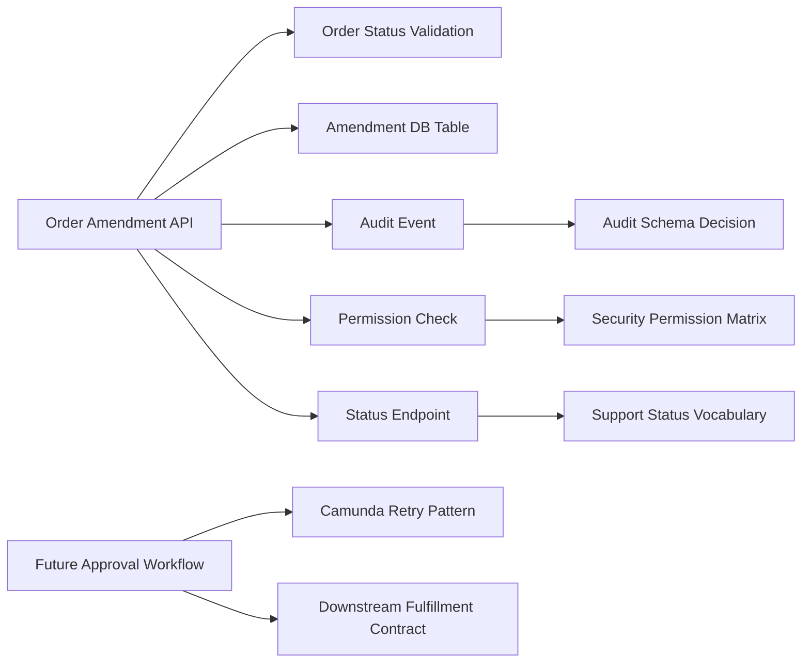

Dari graph ini terlihat:

```text id="ppt7ki"
Audit schema, permission matrix, dan status vocabulary adalah dependency untuk Sprint slice pertama.
Camunda retry dan downstream contract bisa dipisah ke future slice.
```

Ini membantu menjaga Sprint Goal tetap achievable.

---

## 14. Risk Mapping

Risk mapping adalah proses mengidentifikasi risiko, kemungkinan, dampak, sinyal awal, dan mitigasi.

### Risk Bukan Hanya “Kemungkinan Telat”

Risk dalam software delivery bisa berupa:

```text id="9fmy97"
Wrong thing built
Incomplete requirement
Breaking API consumer
Data corruption
Migration lock
Security breach
Workflow stuck
Duplicate processing
Performance regression
Operational blind spot
Release rollback failure
Team bottleneck
Environment instability
```

### Risk Register Sederhana

| Risk | Likelihood | Impact | Signal | Mitigation |
|---|---:|---:|---|---|
| Duplicate amendment creates double request | Medium | High | Existing active request found | Decide idempotency policy; add unique constraint/test |
| DB migration locks table | Low/Med | High | Migration rehearsal slow | Use concurrent index/phased migration |
| Audit event schema unclear | High | Medium | Open question after Day 2 | Decide minimal schema or split |
| Camunda workflow stuck on downstream failure | Medium | High | Incident in test | Spike retry/incident behavior |
| Unauthorized user can submit request | Low | High | Missing negative test | Add permission matrix and auth tests |
| PR review bottleneck | High | Medium | PR waits >24h | Assign backup reviewer |

---

## 15. Risk Matrix

```text id="dbsmnr"
Impact
High    | Mitigate now     | Escalate / redesign
Medium  | Monitor          | Plan mitigation
Low     | Accept           | Monitor
        | Low Likelihood   | High Likelihood
```

Atau lebih praktis:

| Impact / Likelihood | Low Likelihood | Medium Likelihood | High Likelihood |
|---|---|---|---|
| **High Impact** | Monitor + contingency | Mitigate early | Escalate / split / spike |
| **Medium Impact** | Accept or monitor | Plan mitigation | Mitigate |
| **Low Impact** | Accept | Accept / monitor | Monitor |

Senior SWE harus fokus pada **high impact** walau likelihood tidak terlalu tinggi, terutama untuk data integrity, security, compliance, dan production recovery.

---

## 16. Risk-based Decomposition

Risiko harus mempengaruhi urutan kerja.

### Urutan Lemah

```text id="weh2gz"
1. Kerjakan UI/API happy path dulu.
2. Integrasi di akhir.
3. Migration di akhir.
4. Security test di akhir.
5. Observability kalau sempat.
```

### Urutan Lebih Sehat

```text id="eyl85v"
1. Validasi risk terbesar lebih awal.
2. Buat vertical slice minimal.
3. Integrasikan API + DB + test sejak awal.
4. Tangani security dan audit sebagai bagian core.
5. Tambahkan optional scope setelah core Done.
```

Contoh:

| Risk | Decomposition Response |
|---|---|
| DB migration berisiko | Lakukan migration design/rehearsal awal. |
| Downstream contract belum stabil | Buat adapter/mock dan split integration. |
| Authz kompleks | Buat permission matrix dan negative test awal. |
| Workflow retry unknown | Spike sebelum commit full workflow. |
| Query performance unknown | Test explain plan/dataset lebih awal. |
| Audit requirement unclear | Libatkan support/compliance saat refinement. |

---

## 17. Risk-first Daily Inspection

Risk map tidak boleh dibuat lalu dilupakan. Gunakan dalam Daily Scrum.

```text id="oln1ii"
Daily Risk Questions:
[ ] Risiko mana yang berubah sejak kemarin?
[ ] Dependency mana yang makin dekat ke deadline?
[ ] Apakah high-impact risk sudah punya mitigasi?
[ ] Apakah ada risk yang perlu diubah menjadi spike?
[ ] Apakah Sprint Goal terancam?
[ ] Apakah scope perlu displit?
```

Contoh daily update:

```text id="twkjnr"
Risk update:
DB migration rehearsal selesai, lock risk rendah.
Audit schema masih open dan sekarang menjadi risk tertinggi.
Jika belum diputuskan hari ini, Sprint Goal yellow.
Usulan: pakai minimal audit schema dan backlog enhancement untuk field tambahan.
```

---

## 18. Technical Decomposition untuk Stack Anda

### Java/Jersey

```text id="trplxy"
[ ] Resource method baru atau existing?
[ ] Request/response DTO?
[ ] Validation layer?
[ ] Exception mapper?
[ ] Status code convention?
[ ] OpenAPI update?
[ ] Backward compatibility?
```

### MyBatis

```text id="c2s6db"
[ ] Mapper interface?
[ ] XML/dynamic SQL?
[ ] ResultMap?
[ ] Transaction boundary?
[ ] Query plan?
[ ] Index support?
[ ] SQL injection safety?
[ ] Integration test with PostgreSQL?
```

### PostgreSQL / PL/pgSQL

```text id="de4vhg"
[ ] Migration DDL?
[ ] Constraint?
[ ] Index?
[ ] Trigger/function/procedure impact?
[ ] Lock risk?
[ ] Backfill?
[ ] Rollback/remediation?
[ ] Data validation query?
```

### Camunda

```text id="r0q5rm"
[ ] BPMN process affected?
[ ] Start event / message correlation?
[ ] Service task / external task?
[ ] Process variables?
[ ] Retry policy?
[ ] Incident path?
[ ] Compensation/manual recovery?
[ ] Versioning/migration of running instances?
```

### Kubernetes / Deployment

```text id="26h4oz"
[ ] ConfigMap/Secret change?
[ ] Env var?
[ ] Resource request/limit?
[ ] Readiness/liveness impact?
[ ] Deployment order?
[ ] Feature flag?
[ ] Rollback strategy?
[ ] Observability dashboard/alert?
```

---

## 19. Technical Risk Checklist

Gunakan checklist ini saat refinement atau Sprint Planning.

```text id="jr8bg2"
Product / Domain
[ ] Apakah business rule lengkap?
[ ] Apakah state transition jelas?
[ ] Apakah edge case utama diketahui?
[ ] Apakah acceptance criteria testable?

API / Integration
[ ] Apakah contract jelas?
[ ] Apakah ada backward compatibility risk?
[ ] Apakah timeout/retry/idempotency jelas?
[ ] Apakah downstream dependency stabil?

Data
[ ] Apakah migration aman?
[ ] Apakah lock/backfill risk ada?
[ ] Apakah constraint/index cukup?
[ ] Apakah transaction boundary benar?
[ ] Apakah data correction/remediation perlu?

Workflow
[ ] Apakah process failure path jelas?
[ ] Apakah retry/incident behavior valid?
[ ] Apakah manual recovery perlu?
[ ] Apakah running process instance terdampak?

Security
[ ] Apakah permission model jelas?
[ ] Apakah negative authorization case diuji?
[ ] Apakah audit trail dibutuhkan?
[ ] Apakah sensitive data terlindungi?

Testing
[ ] Apakah test level tepat?
[ ] Apakah integration test environment tersedia?
[ ] Apakah contract/migration/workflow test perlu?
[ ] Apakah flaky test risk ada?

Operations
[ ] Apakah logs/metrics/traces cukup?
[ ] Apakah support bisa trace issue?
[ ] Apakah alert/runbook perlu update?

Delivery
[ ] Apakah release order jelas?
[ ] Apakah rollback/forward-fix strategy ada?
[ ] Apakah feature flag/staged rollout perlu?
```

---

## 20. Senior SWE Decision Framework

Saat menghadapi backlog item kompleks, gunakan urutan ini:

```text id="ra5sl0"
1. Clarify outcome
   Apa capability minimum yang harus usable?

2. Identify hard boundaries
   Data, security, workflow, integration, compliance.

3. Find high-impact risks
   Apa yang paling mahal jika salah?

4. Slice vertically
   Apa scope terkecil yang memberi feedback nyata?

5. Map dependencies
   Siapa/apa yang harus tersedia dan kapan?

6. Decide spike vs delivery
   Apakah uncertainty terlalu tinggi untuk commit?

7. Build risk-first plan
   Kerjakan hal berisiko lebih awal.

8. Define evidence
   Test/demo/metric apa yang membuktikan Done?

9. Keep adapting
   Update risk map saat fakta baru muncul.
```

---

## 21. Contoh Lengkap: Risk-first Plan

### Sprint Goal

```text id="rkn90p"
Enable internal users to submit order amendment requests with validation and audit trail.
```

### Key Risks

| Risk | Response |
|---|---|
| Audit schema unclear | Decision by Day 1; fallback minimal schema |
| Duplicate request behavior unclear | PO decision before implementation |
| DB migration risk | Migration reviewed and tested Day 1-2 |
| Authorization bug risk | Permission matrix + negative tests |
| Workflow scope creep | Camunda integration explicitly deferred |

### Plan

```text id="z2e47b"
Day 1:
  - Confirm duplicate behavior.
  - Confirm audit schema.
  - Review migration design.
  - Define permission matrix.

Day 2:
  - Implement API contract + DB migration.
  - Start integration test setup.

Day 3:
  - Implement validation + persistence.
  - Add negative auth tests.

Day 4:
  - Add audit event.
  - Add status endpoint.

Day 5:
  - End-to-end vertical slice validation.

Day 6-7:
  - Hardening, observability, error response consistency.

Day 8:
  - PR review, migration rehearsal, bugfix.

Day 9-10:
  - Sprint Review prep, buffer, final DoD.
```

### Explicit Out of Scope

```text id="bqdb8o"
- Full approval workflow.
- Downstream fulfillment notification.
- Admin dashboard.
```

Ini membuat Sprint lebih defensible karena scope, risk, dependency, dan evidence jelas.

---

## 22. Ringkasan Seri 9

| Konsep | Inti |
|---|---|
| **Technical Decomposition** | Mengubah backlog item menjadi plan teknis yang bisa dieksekusi dan diinspeksi. |
| **Vertical Slice** | Memecah pekerjaan berdasarkan capability usable, bukan layer teknis mati. |
| **Spike** | Timeboxed learning untuk mengurangi uncertainty sebelum commit delivery besar. |
| **Dependency Mapping** | Membuat kebutuhan eksternal/internal terlihat beserta owner dan due date. |
| **Risk Mapping** | Mengidentifikasi kemungkinan, dampak, sinyal, dan mitigasi risiko. |
| **Senior SWE Role** | Membuka kompleksitas lebih awal, membuat risiko eksplisit, dan membantu tim memilih plan yang aman serta adaptif. |

Kalimat kunci:

```text id="7p576t"
Senior SWE yang kuat tidak hanya memecah pekerjaan menjadi task.
Senior SWE memecah uncertainty menjadi keputusan,
dependency menjadi owner,
risk menjadi mitigasi,
dan fitur besar menjadi Increment kecil yang usable.
```

---

## Status Seri

**Seri 9/12 selesai.**

Sisa seri: **3**.

Seri berikutnya: **Seri 10 - Scrum Metrics: Velocity, Cycle Time, Lead Time, WIP, Burnup/Burndown untuk Senior Software Engineer.**

---

**Sources:**

- [The 2020 Scrum Guide TM](https://scrumguides.org/scrum-guide.html?utm_source=chatgpt.com)

## Response:
7/13/2026, 9:03:23 PM

# Seri 10/12 - Scrum Metrics: Velocity, Cycle Time, Lead Time, WIP, Burnup/Burndown untuk Senior Software Engineer

## 1. Introduction

Metrics dalam Scrum harus dipakai sebagai **alat inspeksi dan adaptasi**, bukan alat menghukum individu atau memaksa tim mengejar angka. Scrum Guide menyebut burn-down, burn-up, dan cumulative flow sebagai praktik yang bisa berguna untuk forecasting, tetapi tidak menggantikan pentingnya empiricism. Artinya, chart dan angka hanya sinyal; keputusan tetap harus berbasis realitas yang diinspeksi tim. ([scrumguides.org](https://scrumguides.org/scrum-guide.html?utm_source=chatgpt.com))

Untuk **Senior Software Engineer**, skill utamanya adalah membaca metrics sebagai gejala sistem delivery:

```text id="ow7eb4"
Apakah tim menghasilkan Increment yang Done?
Apakah flow sehat?
Apakah work terlalu banyak dibuka?
Apakah PR/review/testing/deployment menjadi bottleneck?
Apakah velocity dipakai untuk forecasting atau dipakai sebagai pressure?
Apakah metrics mendorong perilaku sehat atau malah gaming?
```

Mental model:

```text id="654mnm"
Metrics are signals, not truth.
Metrics help inspection, not control.
Metrics should improve system flow, not rank people.
```

---

## 2. Diagram - Scrum Metrics Decomposition Map

```mermaid id="z9tyiw"
flowchart TD
    A[Scrum Metrics] --> B[Forecasting Metrics]
    A --> C[Flow Metrics]
    A --> D[Quality Metrics]
    A --> E[Value / Outcome Metrics]
    A --> F[Risk Signals]

    B --> B1[Velocity]
    B --> B2[Burnup]
    B --> B3[Burndown]

    C --> C1[Cycle Time]
    C --> C2[Lead Time]
    C --> C3[WIP]
    C --> C4[Throughput]
    C --> C5[Cumulative Flow]

    D --> D1[Defect Escape]
    D --> D2[Build Stability]
    D --> D3[Flaky Tests]
    D --> D4[Review Rework]
    D --> D5[DoD Compliance]

    E --> E1[Product Goal Progress]
    E --> E2[Customer / User Outcome]
    E --> E3[Support Impact]
    E --> E4[Operational Reliability]

    F --> F1[Blocked Item Age]
    F --> F2[PR Aging]
    F --> F3[Carry-over]
    F --> F4[Integration Delay]
    F --> F5[Release Failure]
```

---

## 3. Decomposition Table - Scrum Metrics untuk Senior SWE

| Metric Area | Metric | Makna Praktis | Dipakai untuk | Jangan Dipakai untuk |
|---|---|---|---|---|
| **Forecasting** | Velocity | Jumlah work yang selesai per Sprint dalam satuan estimasi tim. | Forecast kapasitas relatif tim. | Mengukur produktivitas individu. |
| **Forecasting** | Burnup | Progress work selesai terhadap total scope. | Melihat progress dan scope change. | Menyembunyikan scope creep. |
| **Forecasting** | Burndown | Sisa work terhadap waktu Sprint/release. | Melihat apakah work tersisa turun. | Menyimpulkan penyebab tanpa inspeksi. |
| **Flow** | Cycle Time | Lama dari work dimulai sampai Done. | Melihat bottleneck delivery. | Menekan orang agar “lebih cepat” tanpa analisis. |
| **Flow** | Lead Time | Lama dari request/commitment sampai Done/released. | Melihat waktu tunggu user/business. | Disamakan mentah dengan coding time. |
| **Flow** | WIP | Work yang sedang berjalan tapi belum Done. | Mengontrol context switching dan bottleneck. | Membuat orang terlihat sibuk. |
| **Flow** | Throughput | Jumlah item Done per periode. | Melihat kemampuan delivery aktual. | Membandingkan tim beda konteks secara kasar. |
| **Flow** | Cumulative Flow | Distribusi item di tiap state workflow. | Menemukan bottleneck kolom. | Dipakai tanpa memahami workflow nyata. |
| **Quality** | Defect Escape | Bug yang lolos ke test/staging/production. | Memperbaiki DoD dan test strategy. | Menyalahkan developer tertentu. |
| **Quality** | Build Stability | Seberapa sering pipeline hijau/merah. | Mengukur reliability CI/CD. | Mengabaikan flaky test sebagai “noise”. |
| **Quality** | PR Rework | Banyaknya revisi besar setelah review. | Mengevaluasi clarity, design, review timing. | Menilai kemampuan engineer secara sempit. |
| **Delivery Risk** | Carry-over | Work yang berpindah Sprint. | Mendeteksi overcommitment, item besar, dependency. | Menghukum tim karena tidak “commit”. |
| **Delivery Risk** | Blocked Age | Lama item dalam status blocked. | Escalation dan dependency management. | Menyalahkan owner item. |
| **Value** | Product Goal Progress | Seberapa jauh Increment mendekati goal produk. | Menghubungkan delivery ke outcome. | Mengganti feedback stakeholder dengan angka internal. |

---

## 4. Velocity

Velocity populer, tetapi penting: **velocity bukan bagian eksplisit dari Scrum Guide**. Scrum.org menjelaskan bahwa Scrum Guide tidak menyebut velocity; yang dibahas adalah forecasting, planning, dan sizing. Velocity dapat membantu forecasting, tetapi salah besar jika dipakai sebagai ukuran produktivitas atau target performa. ([scrum.org](https://www.scrum.org/resources/blog/velocity-revolutionary-way-measure-scrum?utm_source=chatgpt.com))

### Cara Pakai yang Sehat

```text id="47oazi"
Velocity membantu menjawab:
Berdasarkan pola Sprint sebelumnya,
kira-kira berapa work yang realistis bisa Done?
```

### Cara Pakai yang Buruk

```text id="u97dqk"
Velocity tim harus naik 20%.
Engineer A hanya menyelesaikan 5 point.
Tim lain velocity-nya lebih tinggi.
Kita turunkan estimasi agar velocity terlihat bagus.
```

Velocity hanya meaningful dalam konteks tim yang sama, dengan cara estimasi yang relatif konsisten, DoD yang konsisten, dan komposisi tim yang tidak berubah drastis.

| Kondisi | Velocity Masih Berguna? |
|---|---|
| Tim sama, DoD sama, estimasi relatif stabil | Ya, untuk forecasting |
| Tim berubah besar | Hati-hati |
| DoD berubah lebih ketat | Velocity bisa turun tetapi quality naik |
| Banyak incident/support work | Velocity turun, bukan berarti tim buruk |
| Tim membandingkan antar tim | Hampir selalu misleading |
| Velocity menjadi target management | Berbahaya |
| Story point diubah agar terlihat tinggi | Metric rusak |

Kalimat penting:

```text id="y159zm"
Velocity is an output signal, not a performance target.
```

---

## 5. Velocity Failure Modes

| Failure Mode | Gejala | Dampak | Respons Senior SWE |
|---|---|---|---|
| **Velocity as productivity** | Point/orang dihitung | Gaming dan fear | Tegaskan velocity untuk forecast tim, bukan individu. |
| **Velocity target** | “Harus 50 point Sprint ini” | Estimasi dimanipulasi | Diskusikan capacity, risk, DoD. |
| **Cross-team comparison** | Tim A vs Tim B | Tidak apples-to-apples | Bandingkan flow improvement internal tim. |
| **Ignoring DoD** | Point selesai tapi quality turun | Defect naik | Done hanya jika DoD terpenuhi. |
| **Point inflation** | Story makin banyak point | Velocity naik palsu | Gunakan throughput/cycle time sebagai cross-check. |
| **Velocity panic** | Velocity turun dianggap failure | Transparency turun | Cari sebab: support, risk, learning, quality, absence. |
| **No value connection** | Banyak point, sedikit outcome | Output theater | Hubungkan ke Product Goal dan Sprint Review feedback. |

Scrum.org juga memperingatkan bahwa velocity adalah ukuran jumlah work, bukan value atau impact; memberi tekanan agar velocity naik dapat mendistorsi estimasi. ([scrum.org](https://www.scrum.org/resources/blog/myth-velocity-productivity?utm_source=chatgpt.com))

---

## 6. Burndown Chart

Burndown menunjukkan **sisa work** terhadap waktu. Biasanya dipakai dalam Sprint atau release.

```text id="6gzypf"
Y-axis: remaining work
X-axis: time
Expected pattern: remaining work turun menuju nol
```

### Burndown Berguna untuk

| Kegunaan | Penjelasan |
|---|---|
| Melihat work tersisa | Apakah Sprint masih realistis? |
| Mendeteksi work tidak bergerak | Bisa ada blocker atau WIP tinggi. |
| Melihat scope masuk tengah Sprint | Remaining work naik. |
| Memantik replanning | Jika trend tidak mendukung Sprint Goal. |

### Burndown Bisa Menipu Jika

| Kondisi | Kenapa Menipu |
|---|---|
| Task baru ditambahkan tanpa visibility | Chart berubah tanpa konteks. |
| Semua work ditutup akhir Sprint | Tampak flat lalu drop. |
| Estimasi task tidak akurat | Garis tidak bermakna. |
| Done tidak sesuai DoD | Burndown turun palsu. |
| Scope berubah besar | Perlu burnup agar scope change terlihat. |

### Interpretasi Senior SWE

```text id="w4sk4c"
Burndown flat selama 4 hari bukan otomatis buruk.
Mungkin tim sedang menyelesaikan vertical slice besar.

Tetapi itu sinyal:
- apakah item terlalu besar?
- apakah ada blocker?
- apakah PR/test tertunda?
- apakah work hampir Done tapi belum memenuhi DoD?
```

---

## 7. Burnup Chart

Burnup menunjukkan **work completed** terhadap **total scope**. Ini sering lebih informatif daripada burndown karena scope change terlihat.

```text id="mq6yaf"
Line 1: completed work
Line 2: total scope
Gap: remaining work
```

### Kenapa Burnup Berguna

| Situasi | Burnup Membantu Karena |
|---|---|
| Scope sering berubah | Total scope line ikut terlihat. |
| Release forecasting | Progress terhadap target terlihat. |
| Stakeholder menambah work | Dampaknya visual dan transparan. |
| Product Backlog berubah | Chart menunjukkan adaptasi scope. |

### Contoh Interpretasi

```text id="bkb0kk"
Completed work naik stabil,
tetapi total scope juga terus naik.
Masalahnya bukan delivery lambat saja,
melainkan scope expansion.
```

Senior SWE bisa memakai burnup untuk bicara sehat dengan PO/stakeholder:

```text id="jon6bu"
Delivery pace stabil.
Namun scope bertambah 30%.
Kalau release date tetap sama,
kita perlu cut scope, tambah capacity realistis, atau ubah target date.
```

---

## 8. Cumulative Flow Diagram

Cumulative Flow Diagram, atau CFD, menunjukkan jumlah work item di tiap status workflow dari waktu ke waktu. Scrum Guide menyebut cumulative flow sebagai salah satu praktik yang bisa berguna untuk forecasting progress. ([scrumguides.org](https://scrumguides.org/scrum-guide.html?utm_source=chatgpt.com))

### Yang Dicari Senior SWE

| Pola CFD | Makna |
|---|---|
| Kolom In Progress melebar | WIP terlalu tinggi. |
| Kolom Code Review melebar | Review bottleneck. |
| Kolom Testing melebar | Testing bottleneck / QA late involvement. |
| Done line datar | Tidak ada Increment selesai. |
| Blocked melebar | Dependency/impediment tidak selesai. |
| Banyak work masuk tapi Done lambat | Intake lebih besar daripada throughput. |

### Contoh Interpretasi

```text id="sfbvks"
Jika Code Review melebar selama 5 hari:
  bukan berarti developer malas.
  Mungkin PR terlalu besar,
  reviewer terlalu sedikit,
  ownership tidak jelas,
  atau review dilakukan terlalu akhir.
```

---

## 9. Cycle Time

**Cycle Time** adalah lama waktu sejak sebuah work item mulai dikerjakan sampai Done.

```text id="8nqihm"
Cycle Time = Done time - Start work time
```

### Kenapa Penting untuk Senior SWE

Cycle time membantu melihat friction dalam engineering flow.

| Cycle Time Tinggi Karena | Kemungkinan Akar Masalah |
|---|---|
| Story terlalu besar | Slicing buruk |
| Banyak waiting | Dependency/review/test bottleneck |
| Banyak rework | Requirement/acceptance/design kurang clear |
| Testing lama | Test environment/tooling lemah |
| Review lama | PR besar atau reviewer bottleneck |
| Deployment lama | Release process berat |
| Banyak context switching | WIP terlalu tinggi |

### Cycle Time Lebih Actionable daripada Velocity

Velocity menjawab:

```text id="plj87b"
Berapa estimasi work yang selesai per Sprint?
```

Cycle time menjawab:

```text id="mmr13x"
Berapa lama satu item mengalir dari start ke Done,
dan di mana ia menunggu?
```

Untuk improvement engineering, cycle time sering lebih berguna karena menunjukkan **flow bottleneck**.

---

## 10. Lead Time

**Lead Time** adalah waktu dari request muncul atau dipilih sampai value tersedia. Definisi bisa berbeda antar organisasi, jadi tim harus menyepakati start/end point.

Contoh definisi:

```text id="zy5f37"
Lead Time for Change:
  waktu dari code commit sampai running di production.

Product Lead Time:
  waktu dari backlog item accepted untuk dikerjakan sampai Done/released.

Customer Lead Time:
  waktu dari customer request sampai capability tersedia.
```

### Bedakan Lead Time dan Cycle Time

| Metric | Start | End | Fokus |
|---|---|---|---|
| **Cycle Time** | Work mulai | Done | Efisiensi flow internal |
| **Lead Time** | Request/commitment masuk | Done/release | Waktu tunggu dari perspektif customer/business |

Contoh:

```text id="l79wco"
Backlog item menunggu refinement 20 hari,
dikerjakan 4 hari,
review/test 2 hari.

Cycle time = 6 hari.
Lead time = 26 hari.
```

Jika lead time tinggi tetapi cycle time rendah, bottleneck mungkin ada di intake, prioritization, refinement, approval, atau release queue.

---

## 11. WIP - Work in Progress

WIP adalah jumlah work yang sedang berjalan tetapi belum Done.

### WIP Tinggi Terlihat Seperti

```text id="jgkllh"
Semua orang sibuk.
Banyak branch aktif.
Banyak PR terbuka.
Banyak item 80-90% selesai.
Testing menumpuk.
Done sedikit.
Sprint Review parsial.
```

### Mengapa WIP Tinggi Berbahaya

| Dampak | Penjelasan |
|---|---|
| Context switching | Engineer kehilangan fokus. |
| Feedback lambat | Bug ditemukan terlambat. |
| Review bottleneck | Banyak PR bersamaan. |
| Integration risk | Merge dan test terlambat. |
| Predictability turun | Banyak hampir selesai, sedikit Done. |
| Sprint Goal terancam | Core Increment tidak selesai. |

### Senior SWE Response

```text id="qd3x8p"
Stop starting, start finishing.
```

Praktiknya:

| Kondisi | Tindakan |
|---|---|
| Banyak item In Progress | Fokus ke item paling dekat Done. |
| PR menumpuk | Swarm review. |
| Story besar | Split. |
| Testing terlambat | Tarik testing lebih awal. |
| Engineer blocked | Pair/swarm, jangan otomatis buka item baru. |
| Banyak handoff | Kurangi dependency antar orang. |

---

## 12. Throughput

Throughput adalah jumlah item Done per periode.

```text id="9z99v5"
Throughput = count of completed work items per time window
```

Throughput berguna karena tidak bergantung pada story point. Tapi ia harus dipakai hati-hati karena item bisa berbeda ukuran.

| Kegunaan | Catatan |
|---|---|
| Forecast kasar | Jika item relatif kecil dan konsisten. |
| Melihat delivery trend | Apakah Done rate stabil? |
| Cross-check velocity | Jika velocity naik tapi throughput turun, mungkin point inflation. |
| Melihat dampak WIP limit | Throughput bisa naik saat WIP turun. |

Throughput lebih sehat jika tim punya kebiasaan slicing backlog item kecil.

---

## 13. Carry-over

Carry-over adalah work yang dipilih dalam Sprint tetapi tidak Done dan berpindah ke Sprint berikutnya.

### Carry-over Bukan Selalu Masalah

Kadang ada incident besar, dependency eksternal, atau perubahan prioritas. Namun carry-over berulang adalah sinyal.

| Pola Carry-over | Kemungkinan Penyebab |
|---|---|
| Item besar selalu carry-over | Slicing/refinement lemah |
| Item integration selalu carry-over | Integration risk terlambat |
| Item testing selalu carry-over | Testing dihitung di akhir |
| Item dependency selalu carry-over | Dependency mapping lemah |
| Item “hampir Done” carry-over | DoD tidak dihitung saat planning |
| Banyak carry-over setelah scope change | Sprint Goal tidak dijaga |

### Respons Senior SWE

```text id="k2kdjx"
Jangan tanya hanya:
Kenapa tidak selesai?

Tanya:
Apa yang membuat work ini tidak bisa menjadi Done?
Apa sinyal yang terlambat kita lihat?
Apa yang harus berubah di refinement/planning/flow/DoD?
```

---

## 14. Quality Metrics

Metrics delivery tanpa quality metrics bisa menyesatkan. Tim bisa terlihat cepat tetapi menghasilkan bug, incident, dan rework.

| Quality Metric | Makna |
|---|---|
| **Defect escape rate** | Bug yang lolos ke tahap lebih akhir atau production. |
| **Regression count** | Bug lama muncul kembali. |
| **Build failure rate** | Seberapa sering CI gagal. |
| **Flaky test count** | Test tidak reliable. |
| **Mean time to detect** | Lama sampai masalah diketahui. |
| **Mean time to recover** | Lama sampai layanan pulih. |
| **Review rework** | Banyak perubahan besar setelah review. |
| **Rollback / failed deployment** | Release readiness buruk. |
| **Incident caused by change** | Change quality / rollout risk. |

Senior SWE harus menjaga keseimbangan:

```text id="1y7lgt"
Fast delivery without quality is delayed failure.
```

---

## 15. Metrics untuk Engineering Flow di Stack Anda

| Stack Area | Metric / Signal yang Berguna |
|---|---|
| **Java/Jersey** | API error rate, latency p95/p99, contract failures, exception mapping defects. |
| **MyBatis/PostgreSQL** | Slow query count, migration duration, lock wait, query regression, connection pool saturation. |
| **PL/pgSQL** | Function error count, trigger side effect defect, execution time, exception frequency. |
| **Camunda** | Incident count, retry exhaustion, stuck process instances, job executor backlog, process duration. |
| **Docker/Kubernetes** | Deployment failure, restart count, readiness failure, resource throttling, rollout duration. |
| **GitHub Actions** | Build duration, failure rate, flaky test frequency, queue time. |
| **Code Review** | PR age, PR size, review waiting time, rework count. |
| **Release** | Deployment frequency, failed change rate, rollback count, lead time for change. |
| **Supportability** | Time to trace issue, missing correlation ID incidents, manual DB query reliance. |

---

## 16. Value Metrics dan Evidence-Based Management

Scrum.org Evidence-Based Management menggunakan empat Key Value Areas: **Unrealized Value, Current Value, Time to Market, dan Ability to Innovate** sebagai lensa untuk evidence-based decision-making. ([scrum.org](https://www.scrum.org/resources/evidence-based-management?utm_source=chatgpt.com))

Untuk Senior SWE, ini berguna karena metrics internal seperti velocity, cycle time, dan WIP harus dikaitkan ke value.

| EBM Area | Pertanyaan Praktis | Engineering Connection |
|---|---|---|
| **Current Value** | Apakah produk memberi value sekarang? | Reliability, usability, support success, defect reduction. |
| **Unrealized Value** | Opportunity apa yang belum ditangkap? | Capability backlog, unmet user need, domain gap. |
| **Time to Market** | Seberapa cepat value bisa dikirim? | Lead time, release friction, CI/CD, environment readiness. |
| **Ability to Innovate** | Apa yang menghambat kemampuan berubah? | Technical debt, flaky tests, coupling, manual release, unclear architecture. |

Kalimat penting:

```text id="c4p5l7"
Velocity bisa naik tetapi value tetap rendah.
Cycle time bisa turun tetapi produk belum menyelesaikan masalah user.
Metrics internal harus selalu dikaitkan ke outcome.
```

---

## 17. Metrics Anti-patterns

| Anti-pattern | Gejala | Dampak | Koreksi |
|---|---|---|---|
| **Metric as target** | Angka jadi tujuan | Gaming | Jadikan metric sebagai signal. |
| **Individual velocity** | Point per developer | Fear dan silo | Ukur flow tim, bukan individu. |
| **Cross-team velocity ranking** | Tim dibandingkan mentah | Tidak fair | Bandingkan improvement internal. |
| **No quality metric** | Delivery terlihat cepat | Bug/incident naik | Tambahkan quality guardrails. |
| **Vanity metrics** | Banyak angka, sedikit keputusan | Noise | Pilih metrics yang memicu action. |
| **Chart without conversation** | Dashboard dilihat tanpa inspeksi | Salah interpretasi | Bahas konteks di retro/planning. |
| **Metrics overload** | Semua diukur | Fokus hilang | Pilih sedikit metric penting. |
| **Lagging metrics only** | Baru tahu setelah gagal | Lambat adaptasi | Tambahkan leading indicators. |
| **No DoD consistency** | Done berubah-ubah | Metric rusak | Stabilkan DoD. |

---

## 18. Leading vs Lagging Indicators

| Type | Contoh | Manfaat |
|---|---|---|
| **Leading Indicator** | WIP tinggi, PR aging, blocked item age, test delay | Memberi sinyal sebelum Sprint gagal. |
| **Lagging Indicator** | Carry-over, defect escape, failed deployment, missed Sprint Goal | Memberi pembelajaran setelah kejadian. |

Senior SWE harus lebih aktif pada leading indicators.

```text id="7pouoa"
Jika PR aging sudah 3 hari,
jangan tunggu carry-over untuk sadar ada masalah.

Jika integration test baru dimulai hari ke-8,
jangan tunggu Sprint Review gagal.
```

---

## 19. Metrics Dashboard Minimal untuk Senior SWE

Tidak perlu dashboard rumit. Untuk tim Scrum engineering, mulai dari ini:

```text id="7kgnxq"
Sprint Health
[ ] Sprint Goal status: Green / Yellow / Red
[ ] Done Increment count
[ ] Carry-over risk

Flow
[ ] WIP count
[ ] Blocked item age
[ ] PR waiting time
[ ] Cycle time trend

Quality
[ ] Build stability
[ ] Flaky tests
[ ] Defect escape
[ ] Failed deployment / rollback

Value / Outcome
[ ] Product Goal progress
[ ] Stakeholder feedback item closed
[ ] Support/user impact signal
```

Jika hanya boleh pilih 5, pilih:

```text id="sgv8dd"
1. Sprint Goal health
2. WIP
3. PR waiting time / blocked age
4. Cycle time
5. Defect escape / build stability
```

---

## 20. How to Read Metrics Together

Satu metric jarang cukup.

| Kombinasi | Interpretasi |
|---|---|
| Velocity naik + defect naik | Tim mungkin mengorbankan quality. |
| Velocity turun + DoD lebih ketat | Bisa jadi quality improvement, bukan regression. |
| WIP tinggi + cycle time tinggi | Terlalu banyak pekerjaan dibuka. |
| PR aging tinggi + carry-over tinggi | Review bottleneck menghambat Done. |
| Burnup completed naik + scope naik lebih cepat | Scope creep. |
| Burndown flat + WIP tinggi | Banyak work belum Done. |
| Throughput stabil + lead time tinggi | Bottleneck sebelum work dimulai atau release queue. |
| Build failure tinggi + cycle time tinggi | CI/CD friction menghambat flow. |
| Defect escape tinggi + test coverage naik | Test mungkin tidak menutup risiko yang benar. |

---

## 21. Metrics dalam Daily, Planning, Review, Retro

| Scrum Event | Metrics yang Berguna | Tujuan |
|---|---|---|
| **Sprint Planning** | Historical throughput, velocity, capacity, carry-over, risk | Forecast realistis. |
| **Daily Scrum** | WIP, blocked age, PR aging, Sprint Goal health | Adaptasi harian. |
| **Sprint Review** | Increment Done, Product Goal progress, user/support feedback | Inspect outcome. |
| **Retrospective** | Cycle time, lead time, defect escape, build stability, bottleneck | Improvement sistem kerja. |
| **Refinement** | Carry-over pattern, sizing error, dependency delay | Meningkatkan readiness backlog. |

---

## 22. Practical Metrics Playbook untuk Senior SWE

### Saat Velocity Turun

Jangan langsung simpulkan tim menurun. Tanyakan:

```text id="52bwqh"
Apakah ada incident/support load?
Apakah DoD berubah?
Apakah item lebih kompleks?
Apakah banyak dependency?
Apakah ada engineer cuti/onboarding?
Apakah banyak work technical/risk reduction?
Apakah story terlalu besar?
```

### Saat Cycle Time Naik

Tanyakan:

```text id="gbo99l"
Di mana work menunggu?
Code review?
Testing?
Dependency?
Environment?
PO clarification?
Deployment?
```

### Saat WIP Tinggi

Tindakan:

```text id="cc5i52"
Stop opening new work.
Swarm item closest to Done.
Split oversized item.
Make blocker explicit.
Reorder Sprint Backlog.
```

### Saat Defect Escape Naik

Tanyakan:

```text id="1p2oyh"
Bug lolos karena acceptance criteria kurang?
Unit test kurang?
Integration test kurang?
Contract test kurang?
Authorization negative case tidak ada?
Migration tidak diuji?
Review tidak menangkap failure mode?
```

### Saat Burnup Menunjukkan Scope Naik

Diskusi dengan PO:

```text id="qg6olc"
Scope bertambah.
Apakah Sprint Goal berubah?
Apa yang harus keluar?
Apa yang wajib tetap Done?
Apa yang bisa menjadi backlog item berikutnya?
```

---

## 23. Metrics untuk Senior SWE Leadership

Senior SWE harus menghindari dua ekstrem:

```text id="qm0m4q"
Ekstrem 1:
Tidak peduli metrics, hanya feeling.

Ekstrem 2:
Terlalu percaya metrics dan mengabaikan konteks.
```

Posisi yang benar:

```text id="j1yjfq"
Gunakan metrics untuk bertanya lebih baik.
Gunakan konteks untuk menafsirkan metrics.
Gunakan retrospective untuk mengubah sistem.
Gunakan Sprint Goal dan Product Goal untuk menjaga value.
```

---

## 24. Ringkasan Seri 10

| Metric | Gunakan untuk | Risiko Penyalahgunaan |
|---|---|---|
| **Velocity** | Forecasting tim | Diubah menjadi target produktivitas |
| **Burndown** | Melihat sisa work | Menyembunyikan scope/DoD issue |
| **Burnup** | Melihat progress + scope change | Tetap butuh interpretasi konteks |
| **Cumulative Flow** | Melihat bottleneck workflow | Salah baca tanpa workflow nyata |
| **Cycle Time** | Mendeteksi friction internal | Menekan individu |
| **Lead Time** | Melihat waktu tunggu business/user | Definisi tidak konsisten |
| **WIP** | Mengurangi context switching | Diabaikan karena semua terlihat sibuk |
| **Throughput** | Melihat Done rate | Menyamakan semua item |
| **Quality Metrics** | Menjaga delivery tidak merusak produk | Diabaikan demi output speed |
| **Value Metrics** | Menghubungkan delivery ke outcome | Sulit jika Product Goal kabur |

Kalimat kunci:

```text id="6uhdbw"
Metrics yang baik tidak membuat tim takut.
Metrics yang baik membuat realita terlihat.

Senior SWE harus memakai metrics untuk memperbaiki sistem delivery,
bukan untuk mencari siapa yang salah.
```

---

## Status Seri

**Seri 10/12 selesai.**

Sisa seri: **2**.

Seri berikutnya: **Seri 11 - Scrum Anti-patterns & Failure Modes untuk Senior Software Engineer.**

---

**Sources:**

- [The 2020 Scrum Guide TM](https://scrumguides.org/scrum-guide.html?utm_source=chatgpt.com)
- [Velocity. The Revolutionary Way to Measure in Scrum](https://www.scrum.org/resources/blog/velocity-revolutionary-way-measure-scrum?utm_source=chatgpt.com)

## Response:
7/13/2026, 9:06:07 PM

# Seri 11/12 - Scrum Anti-patterns & Failure Modes untuk Senior Software Engineer

## 1. Introduction

Scrum anti-pattern adalah praktik yang **kelihatannya agile/Scrum**, tetapi sebenarnya merusak transparency, inspection, adaptation, quality, flow, atau product value. Ini berbahaya karena anti-pattern sering tidak terasa salah di awal. Tim tetap punya Sprint Planning, Daily Scrum, Sprint Review, Retrospective, Jira board, velocity, dan demo - tetapi Scrum berubah menjadi ritual administratif.

Scrum Guide menegaskan bahwa Scrum berdiri di atas empiricism: keputusan dibuat berdasarkan observasi, pengalaman, dan eksperimen; tiga pilarnya adalah transparency, inspection, dan adaptation. Jika salah satu pilar ini rusak, Scrum mudah berubah menjadi “Scrum theater”. ([scrumguides.org](https://scrumguides.org/scrum-guide.html?utm_source=chatgpt.com))

Mental model untuk Senior SWE:

```text
Anti-pattern bukan hanya “cara kerja kurang ideal”.
Anti-pattern adalah failure mode sistem delivery.

Tugas Senior SWE:
mendeteksi gejala lebih awal,
menjelaskan dampaknya,
dan membantu tim mengubah sistem kerja,
bukan menyalahkan individu.
```

---

## 2. Diagram - Scrum Anti-pattern Failure Map

```mermaid
flowchart TD
    A[Scrum Anti-patterns] --> B[Transparency Failure]
    A --> C[Inspection Failure]
    A --> D[Adaptation Failure]
    A --> E[Quality Failure]
    A --> F[Flow Failure]
    A --> G[Value Failure]
    A --> H[Leadership Failure]

    B --> B1[Hidden Work]
    B --> B2[Fake Done]
    B --> B3[Silent Blockers]

    C --> C1[Daily as Status Report]
    C --> C2[Review as Demo Theater]
    C --> C3[Retro without Evidence]

    D --> D1[Plan Frozen]
    D --> D2[No Scope Negotiation]
    D --> D3[No Replanning]

    E --> E1[Weak Definition of Done]
    E --> E2[Testing at End]
    E --> E3[Production Readiness Ignored]

    F --> F1[Too Much WIP]
    F --> F2[PR Bottleneck]
    F --> F3[Carry-over Loop]

    G --> G1[Ticket Factory]
    G --> G2[Velocity Worship]
    G --> G3[No Product Goal]

    H --> H1[Senior as Mini Manager]
    H --> H2[PO as Ticket Writer]
    H --> H3[Scrum Master as Admin]
```

---

## 3. Decomposition Table - Anti-patterns dan Failure Modes

| Area | Anti-pattern | Gejala | Dampak | Respons Senior SWE |
|---|---|---|---|---|
| **Transparency** | Fake Done | Story ditutup walau test/deploy/audit belum selesai. | Increment palsu, risiko release tersembunyi. | Tegaskan DoD; jangan sebut Done jika belum memenuhi DoD. |
| **Transparency** | Hidden Work | Refactor, support, bugfix, migration dikerjakan diam-diam. | Capacity dan forecast tidak realistis. | Buat work visible di Sprint Backlog/Product Backlog. |
| **Transparency** | Silent Blocker | Semua bilang “no blocker”, tapi PR/env/dependency stuck. | Masalah muncul terlambat. | Tanya aging item, PR waiting time, dependency status. |
| **Inspection** | Daily Status Report | Semua lapor ke SM/lead. | Tidak ada replanning. | Arahkan ke Sprint Goal health dan adaptation. |
| **Inspection** | Demo Theater | Review hanya happy path scripted. | Feedback stakeholder rendah. | Tampilkan outcome, limitation, risk, dan feedback question. |
| **Inspection** | Retro Curhat | Banyak keluhan, tidak ada action. | Masalah sama berulang. | Ubah keluhan menjadi experiment kecil dengan owner. |
| **Adaptation** | Frozen Sprint Plan | Plan awal dianggap kontrak. | Tim tidak adaptif saat fakta berubah. | Replan berdasarkan Sprint Goal dan DoD. |
| **Adaptation** | No Scope Negotiation | Semua scope dipaksa masuk. | Quality turun atau carry-over tinggi. | Tawarkan scope cut berbasis goal. |
| **Quality** | Weak DoD | Done = code complete/merged. | Defect, rework, release failure. | Perkuat quality gate. |
| **Quality** | Testing at End | Testing mulai hari terakhir. | Bug terlambat, Sprint gagal. | Shift-left testing dan vertical slice. |
| **Flow** | WIP Explosion | Banyak item In Progress. | Banyak hampir Done, sedikit Done. | Stop starting, start finishing. |
| **Flow** | PR Bottleneck | PR menunggu reviewer lama. | Cycle time naik. | Kecilkan PR, assign reviewer, swarm review. |
| **Value** | Ticket Factory | Tim menyelesaikan tiket tanpa outcome. | Banyak output, value rendah. | Hubungkan work ke Product Goal/Sprint Goal. |
| **Value** | Velocity Worship | Point jadi target. | Gaming estimasi, quality turun. | Pakai velocity sebagai forecast signal, bukan KPI individu. |
| **Leadership** | Senior as Mini Manager | Senior membagi semua task dan semua keputusan. | Self-management mati, bottleneck naik. | Lead by influence, mentor, dan delegasikan ownership. |

---

## 4. Anti-pattern #1 - Scrum Theater

### Gejala

```text
Semua ceremony ada.
Jira board rapi.
Velocity dilaporkan.
Demo dilakukan.
Retro dilakukan.
Tetapi:
- risiko tetap terlambat terlihat,
- stakeholder feedback rendah,
- DoD lemah,
- carry-over berulang,
- tim tidak benar-benar adaptif.
```

### Akar Masalah

Scrum diperlakukan sebagai proses administratif, bukan empirical feedback system.

### Dampak

| Dampak | Penjelasan |
|---|---|
| False confidence | Stakeholder merasa progress aman padahal Increment lemah. |
| Low learning | Sprint tidak menghasilkan pembelajaran bermakna. |
| Hidden risk | Risiko teknis dan produk tetap tertutup. |
| Team cynicism | Engineer merasa Scrum hanya meeting tambahan. |

### Respons Senior SWE

```text
Geser percakapan dari:
“Apakah ceremony dilakukan?”

Ke:
“Apakah ceremony menghasilkan transparency, inspection, dan adaptation?”
```

Checklist:

```text
[ ] Apakah Daily menghasilkan replanning?
[ ] Apakah Review mengubah Product Backlog?
[ ] Apakah Retro menghasilkan improvement nyata?
[ ] Apakah DoD melindungi kualitas?
[ ] Apakah Sprint Goal dipakai sebagai decision filter?
```

---

## 5. Anti-pattern #2 - Daily Scrum Menjadi Status Report

Daily Scrum dalam Scrum Guide adalah event untuk Developers guna memeriksa progress menuju Sprint Goal dan mengadaptasi Sprint Backlog. Ini bukan laporan status ke Scrum Master, tech lead, atau manager. ([scrumguides.org](https://scrumguides.org/scrum-guide.html?utm_source=chatgpt.com))

### Gejala

```text
Setiap orang menjawab:
Kemarin saya...
Hari ini saya...
Tidak ada blocker...

Tetapi tidak ada diskusi:
- Sprint Goal aman atau tidak,
- item mana stuck,
- apa yang harus diubah hari ini,
- siapa perlu pairing/swarming.
```

### Dampak

```text
Daily berjalan, tetapi Sprint tidak dikendalikan.
Masalah baru terlihat saat akhir Sprint.
```

### Koreksi Praktis

Ubah format Daily menjadi:

```text
1. Sprint Goal status: Green / Yellow / Red?
2. Item mana paling dekat Done?
3. Item mana paling lama stuck?
4. Risiko baru apa yang muncul?
5. Apa adaptasi hari ini?
```

Contoh intervensi Senior SWE:

```text
Sebelum kita lanjut update per orang,
saya ingin cek dulu: Sprint Goal sekarang Yellow karena audit event belum final.
Apa keputusan yang perlu kita ambil hari ini agar goal tetap aman?
```

---

## 6. Anti-pattern #3 - Weak Definition of Done

Definition of Done adalah batas transparansi kualitas. Scrum Guide menyatakan work tidak dapat dianggap bagian dari Increment kecuali memenuhi Definition of Done. ([scrumguides.org](https://scrumguides.org/scrum-guide.html?utm_source=chatgpt.com)) Scrum.org juga menekankan DoD membantu tim memahami kapan sebuah Product Backlog Item benar-benar selesai dan dapat menjadi Increment yang usable/releasable. ([scrum.org](https://www.scrum.org/resources/blog/definition-done-what-it-and-how-it-supports-scrum-events?utm_source=chatgpt.com))

### Gejala

```text
Done = code merged.
Done = sudah jalan di local.
Done = sudah demo.
Done = tinggal test sedikit.
Done = tinggal deploy.
```

### Dampak

| Dampak | Contoh |
|---|---|
| Fake progress | Board hijau tapi release tidak siap. |
| Defect escape | Bug muncul di staging/production. |
| Carry-over tersembunyi | Work “Done” masih butuh hardening. |
| Trust turun | Stakeholder melihat demo, tapi fitur belum usable. |

### Respons Senior SWE

```text
Jangan menurunkan DoD diam-diam.
Kalau waktu kurang:
  kurangi scope,
  split item,
  defer optional work,
  tapi jangan memalsukan Done.
```

Practical DoD guardrail:

```text
[ ] Code reviewed
[ ] Tests relevant passed
[ ] API contract updated
[ ] DB migration validated
[ ] Authorization checked
[ ] Observability sufficient
[ ] Deployment config ready
[ ] Meets acceptance criteria
```

---

## 7. Anti-pattern #4 - Velocity Worship

Velocity bisa membantu forecasting, tetapi bukan ukuran produktivitas individu dan bukan target performa. Scrum.org memperingatkan bahwa velocity bukan productivity dan tekanan menaikkan velocity bisa mendistorsi estimasi. ([scrum.org](https://www.scrum.org/?utm_source=chatgpt.com))

### Gejala

```text
Target Sprint = naikkan velocity.
Engineer dibandingkan berdasarkan point.
Story point dinegosiasikan agar scope muat.
Tim takut memberi estimasi besar.
DoD dikompromikan agar point selesai.
```

### Dampak

```text
Estimasi rusak.
Transparency turun.
Quality turun.
Tim belajar gaming metric.
```

### Respons Senior SWE

Alihkan diskusi ke kombinasi metric yang lebih sehat:

```text
Velocity untuk forecast.
Cycle time untuk flow.
WIP untuk fokus.
Defect escape untuk quality.
Product Goal progress untuk value.
```

Kalimat praktis:

```text
Velocity kita turun, tapi DoD juga lebih ketat dan defect turun.
Jadi ini bukan otomatis sinyal buruk.
Mari lihat cycle time, carry-over, support load, dan quality trend.
```

---

## 8. Anti-pattern #5 - Sprint tanpa Sprint Goal

### Gejala

```text
Sprint Goal = selesaikan OMS-123, OMS-124, OMS-125.
Sprint berisi tiket acak.
Tidak ada objective tunggal.
Saat scope berubah, tim tidak tahu apa yang harus dipertahankan.
```

### Dampak

| Dampak | Penjelasan |
|---|---|
| Tidak ada decision filter | Sulit menentukan scope cut. |
| Review lemah | Stakeholder melihat ticket list, bukan outcome. |
| Flow terpecah | Engineer bekerja sendiri-sendiri. |
| Prioritas kabur | Semua tiket terasa sama penting. |

### Koreksi

Sprint Goal harus menjelaskan outcome:

```text
Buruk:
Complete amendment API, audit table, status endpoint.

Lebih baik:
Enable internal users to submit order amendment requests with validation and audit trail.
```

Senior SWE membantu dengan menanyakan:

```text
Jika hanya sebagian scope selesai,
capability minimum apa yang tetap membuat Sprint ini valuable?
```

---

## 9. Anti-pattern #6 - Product Owner Menjadi Ticket Writer

### Gejala

```text
PO hanya menulis requirement.
PO tidak menjelaskan Product Goal.
Ordering backlog didikte stakeholder.
Semua item disebut high priority.
Engineer tidak paham user/business outcome.
```

### Dampak

```text
Tim menjadi ticket factory.
Trade-off teknis sulit dijelaskan.
Backlog tidak punya arah.
Sprint Planning berubah menjadi capacity filling.
```

### Respons Senior SWE

Bukan mengambil alih PO, tetapi memberi input yang membuat keputusan PO lebih baik:

```text
Untuk item ini, ada tiga opsi:
1. Minimal safe slice: submit + validate + audit.
2. Full workflow: lebih valuable, tapi ada Camunda retry risk.
3. Downstream notification: butuh dependency fulfillment contract.

Dari sisi risiko, saya sarankan opsi 1 dulu jika goal Sprint adalah usable submission.
```

---

## 10. Anti-pattern #7 - Scrum Master Menjadi Admin Jira

### Gejala

```text
Scrum Master hanya schedule meeting.
Fokus pada board hygiene.
Tidak challenge Scrum theater.
Tidak membantu impediment removal.
Tidak membantu organisasi memahami Scrum.
```

### Dampak

```text
Scrum menjadi ritual.
Masalah sistemik tidak diangkat.
Tim mengira Scrum = meeting + Jira.
```

### Respons Senior SWE

Bantu Scrum Master dengan evidence:

```text
Carry-over kita bukan karena kurang effort.
Data menunjukkan:
- 4 PR stuck >24 jam,
- integration test mulai hari ke-8,
- audit decision terlambat 5 hari.

Saya rasa impediment sistemiknya ada di refinement dan review ownership.
```

---

## 11. Anti-pattern #8 - Senior SWE Menjadi Mini Project Manager

### Gejala

```text
Senior membagi semua task.
Semua keputusan menunggu senior.
Daily menjadi laporan ke senior.
PR semua harus lewat senior.
Engineer lain tidak berani mengambil ownership.
```

### Dampak

| Dampak | Penjelasan |
|---|---|
| Bottleneck | Semua keputusan/review menunggu satu orang. |
| Low ownership | Tim menjadi executor. |
| Bus factor | Risiko tinggi saat senior tidak tersedia. |
| Self-management rusak | Developers tidak benar-benar accountable. |

### Koreksi

Senior SWE sebaiknya:

```text
Beri decision framework, bukan semua decision.
Delegasikan ownership per slice.
Pair untuk enablement, bukan mengambil alih.
Review untuk menaikkan standar, bukan mengontrol semua.
Gunakan pertanyaan, bukan instruksi.
```

Contoh:

```text
Daripada:
“Kamu kerjakan mapper, kamu kerjakan API.”

Lebih baik:
“Siapa mau ambil ownership vertical slice submit amendment?
Saya bisa pairing di bagian migration dan authz karena risk-nya tinggi.”
```

---

## 12. Anti-pattern #9 - Hidden Waterfall dalam Sprint

### Gejala

```text
Hari 1-3: analisis
Hari 4-7: coding
Hari 8: integration
Hari 9: testing
Hari 10: bugfix/demo panic
```

### Dampak

```text
Feedback terlambat.
Integration risk terlambat.
Testing jadi fase akhir.
Sprint gagal walau semua orang sibuk.
```

### Koreksi

Gunakan vertical slice:

```text
Hari 1:
  clarify core behavior + risk

Hari 2-3:
  API + DB + minimal test vertical slice

Hari 4:
  inspect slice, adapt scope

Hari 5-7:
  add rules, audit, authz

Hari 8:
  hardening, observability, review

Hari 9-10:
  final DoD, review prep, buffer
```

Prinsip:

```text
Integrate early.
Test early.
Review early.
Expose risk early.
```

---

## 13. Anti-pattern #10 - Testing di Akhir Sprint

### Gejala

```text
Testing dimulai setelah semua coding selesai.
QA/test engineer baru dilibatkan akhir Sprint.
Integration test baru jalan hari ke-8/9.
Bug besar ditemukan menjelang Review.
```

### Dampak

| Dampak | Contoh |
|---|---|
| Rework besar | Design salah baru ketahuan akhir. |
| Carry-over | Bugfix tidak sempat Done. |
| Quality pressure | Tim tergoda skip test. |
| Review lemah | Demo hanya happy path. |

### Respons Senior SWE

```text
Masukkan test strategy ke planning.
Buat vertical slice yang bisa diuji awal.
Tambahkan test task sebagai bagian DoD.
Gunakan contract/integration test untuk risk area.
```

Kalimat praktis:

```text
Item ini tidak realistis dianggap kecil jika test environment dan integration path baru tersedia di akhir Sprint.
Mari kita plan test slice dari hari pertama.
```

---

## 14. Anti-pattern #11 - Too Much WIP

### Gejala

```text
Semua developer punya tiket sendiri.
Banyak item In Progress.
Banyak PR terbuka.
Sedikit item Done.
Daily penuh update, tapi Increment tidak bertambah.
```

### Dampak

```text
Cycle time naik.
Review bottleneck.
Context switching.
Testing terlambat.
Sprint Goal terancam.
```

### Koreksi

```text
Stop starting, start finishing.
```

Tindakan:

```text
[ ] Batasi item In Progress.
[ ] Swarm item paling dekat Done.
[ ] Split item besar.
[ ] Review PR yang aging.
[ ] Jangan buka work baru saat core Sprint Goal belum Done.
```

---

## 15. Anti-pattern #12 - Backlog Refinement Terlalu Dangkal

### Gejala

```text
Story masuk Sprint hanya dengan judul.
Acceptance criteria kabur.
Business rule belum final.
Dependency belum dipetakan.
Risiko teknis dianggap “nanti saat coding”.
```

### Dampak

```text
Sprint Planning palsu.
Estimasi tidak bermakna.
Scope berubah di tengah Sprint.
Carry-over naik.
```

### Koreksi Senior SWE

Saat refinement, tanyakan:

```text
[ ] Apa outcome-nya?
[ ] Actor siapa?
[ ] Rule dan edge case apa?
[ ] State transition apa?
[ ] Data model terdampak?
[ ] API contract jelas?
[ ] Authz/audit perlu?
[ ] Integration dependency?
[ ] Failure path?
[ ] Testability?
[ ] Deployment/rollback risk?
```

---

## 16. Anti-pattern #13 - Technical Debt Disembunyikan

### Gejala

```text
Engineer refactor diam-diam.
Debt tidak masuk Product Backlog.
PO tidak tahu impact debt.
Debt hanya disebut “code jelek”.
```

### Dampak

```text
Trust turun.
Capacity sulit diprediksi.
Debt terus menumpuk.
Prioritas teknis tidak defensible.
```

### Koreksi

Tulis debt sebagai backlog item dengan impact:

```text
Buruk:
Refactor order service.

Lebih baik:
Remove duplicated order validation between REST API and Camunda delegate
to prevent inconsistent amendment approval decisions.
```

Template:

```text
Problem:
Impact:
Evidence:
Proposed Work:
Acceptance:
Risk if Deferred:
```

---

## 17. Anti-pattern #14 - Architecture Astronaut dalam Scrum

### Gejala

```text
Design terlalu besar sebelum learning.
Sprint dipakai untuk membuat framework internal.
Fitur kecil harus menunggu architecture sempurna.
Spike tidak timeboxed.
ADR banyak, Increment sedikit.
```

### Dampak

```text
Value terlambat.
Feedback rendah.
Over-engineering.
Stakeholder kehilangan trust.
```

### Koreksi

Senior SWE harus menjaga **just-enough architecture**:

```text
Apa keputusan yang harus dibuat sekarang?
Apa yang bisa ditunda sampai ada evidence?
Apa vertical slice yang bisa memvalidasi design?
Apa risiko jika kita memilih simple path?
Apa exit strategy jika simple path tidak cukup?
```

Prinsip:

```text
Architecture harus mengurangi risiko delivery,
bukan menjadi alasan menunda feedback.
```

---

## 18. Anti-pattern #15 - No Operational Readiness

### Gejala

```text
Feature jalan, tapi:
- log tidak cukup,
- metric tidak ada,
- trace/correlation ID hilang,
- runbook tidak ada,
- support harus query DB manual,
- alert tidak diperbarui.
```

### Dampak

```text
MTTR tinggi.
Incident sulit ditangani.
Support bergantung pada developer.
Production behavior tidak transparan.
```

### Koreksi

Masukkan operability ke DoD:

```text
[ ] Structured logs
[ ] Correlation ID
[ ] Relevant metrics
[ ] Audit trail if lifecycle-changing
[ ] Support query/status endpoint if needed
[ ] Runbook for risky workflow
[ ] Alert/monitoring update if behavior critical
```

---

## 19. Anti-pattern #16 - Ignoring Domain / Regulatory Defensibility

Untuk sistem order management, enforcement lifecycle, compliance, atau audit-heavy workflow, Scrum failure sering terjadi karena tim terlalu fokus pada happy path dan melupakan defensibility.

### Gejala

```text
State transition tidak formal.
Audit trail tidak lengkap.
Authorization hanya happy path.
Manual override tidak jelas.
Exception path tidak terdokumentasi.
Decision rationale tidak tersimpan.
```

### Dampak

```text
Sulit menjelaskan kenapa sistem mengambil keputusan tertentu.
Sulit audit.
Sulit dispute handling.
Production support bergantung pada tribal knowledge.
```

### Respons Senior SWE

Tambahkan pertanyaan defensibility saat refinement/review:

```text
[ ] Siapa actor-nya?
[ ] Apa authority/permission-nya?
[ ] Apa state sebelum dan sesudah?
[ ] Apa alasan keputusan?
[ ] Apa audit event-nya?
[ ] Bagaimana exception/retry/manual recovery?
[ ] Bagaimana trace dari request → workflow → DB → log?
```

---

## 20. Anti-pattern #17 - Retrospective tanpa Perubahan

Retrospective bertujuan merencanakan cara meningkatkan quality dan effectiveness; Scrum Team menginspeksi Sprint terkait individuals, interactions, processes, tools, dan Definition of Done. ([scrumguides.org](https://scrumguides.org/scrum-guide.html?utm_source=chatgpt.com))

### Gejala

```text
Masalah sama muncul setiap Sprint.
Action item tidak punya owner.
Action terlalu abstrak.
Tidak ada follow-up.
Retro berubah menjadi formalitas.
```

### Dampak

```text
Tim sinis terhadap Scrum.
Continuous improvement mati.
Masalah sistemik menetap.
```

### Koreksi

Gunakan action template:

```text
Problem:
Evidence:
Root Cause:
Improvement Experiment:
Owner:
Success Signal:
Review Date:
```

Contoh:

```text
Problem:
PR review bottleneck.

Evidence:
5 PR menunggu >24 jam.

Experiment:
Untuk Sprint berikutnya, setiap story critical punya primary dan backup reviewer saat planning.

Signal:
PR waiting time turun dan integration testing mulai sebelum dua hari terakhir.
```

---

## 21. Anti-pattern #18 - Scope Creep dalam Sprint

### Gejala

```text
Stakeholder menambah requirement di tengah Sprint.
PO memasukkan “sedikit tambahan”.
Sprint Goal tidak berubah secara eksplisit.
Tim mengiyakan agar terlihat kooperatif.
```

### Dampak

```text
Forecast rusak.
DoD terancam.
Core Increment tidak selesai.
Tim merasa selalu gagal.
```

### Koreksi

Gunakan Sprint Goal sebagai filter:

```text
Apakah tambahan ini wajib untuk Sprint Goal?
Jika iya, apa yang keluar?
Jika tidak, masuk Product Backlog untuk di-order.
```

Kalimat praktis:

```text
Requirement ini valid, tapi bukan bagian minimum dari Sprint Goal saat ini.
Kalau harus masuk sekarang, kita perlu mengeluarkan scope lain agar DoD tetap aman.
```

---

## 22. Anti-pattern #19 - Dependency Surprise

### Gejala

```text
Baru sadar butuh tim lain saat Sprint berjalan.
Security approval terlambat.
Downstream contract belum siap.
Environment/config belum tersedia.
```

### Dampak

```text
Blocker mendadak.
Carry-over.
Replanning panik.
Scope cut terlambat.
```

### Koreksi

Buat dependency map sebelum Sprint commit:

```text
Dependency:
Owner:
Needed by:
Impact if late:
Fallback:
Escalation date:
```

Untuk dependency high-risk:

```text
Jangan masukkan full delivery ke Sprint.
Masukkan spike, contract validation, atau fallback slice.
```

---

## 23. Anti-pattern #20 - “Almost Done” Culture

### Gejala

```text
Tinggal test.
Tinggal review.
Tinggal deploy.
Tinggal fix minor.
Tinggal audit.
Tinggal config.
```

### Dampak

```text
Progress terlihat tinggi tapi tidak usable.
Carry-over tinggi.
Sprint Review lemah.
DoD tidak dihormati.
```

### Koreksi

Buat status lebih eksplisit:

```text
Code Complete
Review Pending
Test Pending
Migration Pending
Deploy Pending
DoD Complete
```

Dan hanya satu yang boleh disebut Done:

```text
DoD Complete.
```

Kalimat penting:

```text
Almost Done is not Done.
Jika belum memenuhi DoD, itu belum Increment.
```

---

## 24. Scrum Failure Mode Diagnostic Matrix

| Symptom | Kemungkinan Failure Mode | Cek Pertama | Intervensi |
|---|---|---|---|
| Carry-over tinggi | Overcommitment, item besar, hidden dependency | Refinement quality, WIP, DoD | Split, risk-adjusted planning |
| Velocity naik tapi bug naik | Quality sacrificed | DoD, test, review | Quality gate, defect analysis |
| Daily terasa membosankan | No inspection/adaptation | Sprint Goal health | Ubah format Daily |
| Review tidak menghasilkan feedback | Demo theater | Feedback questions | Review outcome, risk, decisions |
| Retro topik sama terus | No action follow-up | Retro action owner/signal | Action masuk Sprint Backlog |
| PR menumpuk | Review bottleneck | PR age, reviewer load | Small PR, backup reviewer |
| Testing terlambat | Hidden waterfall | Test start date | Vertical slice, shift-left |
| Scope selalu berubah | Weak Product Goal/Sprint Goal | Goal clarity | Scope negotiation |
| Tim sibuk tapi Done sedikit | WIP terlalu tinggi | In Progress count | Stop starting, swarm |
| Production sulit support | Operability tidak masuk DoD | Logs/metrics/audit | Update DoD/runbook |

---

## 25. Senior SWE Anti-pattern Response Playbook

### 1. Jangan langsung menyalahkan

```text
Buruk:
Tim ini tidak disiplin.

Lebih baik:
Sistem kita membuat blocker terlihat terlalu terlambat.
```

### 2. Bawa evidence

```text
Dalam 3 Sprint terakhir:
- carry-over rata-rata 40%,
- PR waiting time >24 jam untuk 60% PR,
- integration test sering mulai hari ke-8.
```

### 3. Hubungkan ke dampak

```text
Dampaknya Sprint Review sering menunjukkan partial Increment,
dan PO sulit membuat keputusan backlog berikutnya.
```

### 4. Usulkan eksperimen kecil

```text
Untuk Sprint berikutnya:
- batasi WIP,
- buat vertical slice pertama sebelum hari ke-3,
- assign backup reviewer untuk story critical.
```

### 5. Review hasilnya

```text
Di Retrospective berikutnya,
cek apakah carry-over dan PR waiting time turun.
```

---

## 26. Ringkasan Seri 11

| Anti-pattern Besar | Inti Masalah |
|---|---|
| **Scrum Theater** | Ceremony ada, empiricism tidak jalan. |
| **Daily Status Report** | Daily tidak menghasilkan adaptation. |
| **Weak DoD** | Done palsu, Increment tidak valid. |
| **Velocity Worship** | Metric menjadi target dan merusak transparency. |
| **No Sprint Goal** | Sprint tidak punya decision filter. |
| **Ticket Factory** | Banyak output, sedikit outcome. |
| **Mini-manager Senior SWE** | Self-management tim rusak. |
| **Hidden Waterfall** | Feedback, testing, integration terlambat. |
| **Too Much WIP** | Tim sibuk tetapi sedikit Done. |
| **No Operational Readiness** | Feature jalan tetapi sulit disupport. |
| **Retro without Change** | Continuous improvement mati. |
| **Almost Done Culture** | Progress palsu dan carry-over tinggi. |

Kalimat kunci:

```text
Anti-pattern Scrum biasanya bukan masalah ceremony.
Masalahnya adalah hilangnya transparency, inspection, adaptation,
quality discipline, dan product value.

Senior SWE harus menjadi early-warning system:
membuat failure mode terlihat sebelum berubah menjadi delivery failure.
```

---

## Status Seri

**Seri 11/12 selesai.**

Sisa seri: **1**.

Seri terakhir: **Seri 12 - Senior SWE Leadership in Scrum: Mentoring, Influence, dan Technical Stewardship.**

---

**Sources:**

- [The 2020 Scrum Guide TM](https://scrumguides.org/scrum-guide.html?utm_source=chatgpt.com)
- [Definition of 'Done': What It Is and How It Supports ...](https://www.scrum.org/resources/blog/definition-done-what-it-and-how-it-supports-scrum-events?utm_source=chatgpt.com)

## Response:
7/13/2026, 9:08:01 PM

Saya lanjut ke **Seri 12/12**, seri penutup. Fokusnya bukan lagi event/artifact, tetapi bagaimana Senior SWE memberi pengaruh teknis tanpa merusak self-management Scrum Team.

# Seri 12/12 - Senior SWE Leadership in Scrum: Mentoring, Influence, dan Technical Stewardship

## 1. Introduction

Seri terakhir ini membahas posisi praktis **Senior Software Engineer** dalam Scrum: bukan hanya sebagai engineer yang lebih kuat secara teknis, tetapi sebagai orang yang membantu tim menghasilkan **Increment yang usable, berkualitas, defensible, dan sustainable**.

Dalam Scrum, Scrum Team terdiri dari **Product Owner, Scrum Master, dan Developers**, tanpa sub-team atau hierarki internal. Scrum Team juga bersifat cross-functional dan self-managing. Artinya, Senior SWE boleh punya pengaruh teknis besar, tetapi tidak seharusnya mengubah Scrum Team menjadi struktur command-and-control. ([scrumguides.org](https://scrumguides.org/scrum-guide.html?utm_source=chatgpt.com))

Mental model utama:

```text id="5k49jy"
Senior SWE dalam Scrum bukan mini manager.
Senior SWE adalah technical multiplier.

Tugasnya:
- memperjelas risiko,
- menaikkan kualitas keputusan teknis,
- membimbing engineer lain,
- menjaga Definition of Done,
- membantu Product Owner memahami trade-off,
- membantu Scrum Master melihat impediment teknis,
- dan membuat tim makin mandiri.
```

---

## 2. Diagram - Senior SWE Leadership Map in Scrum

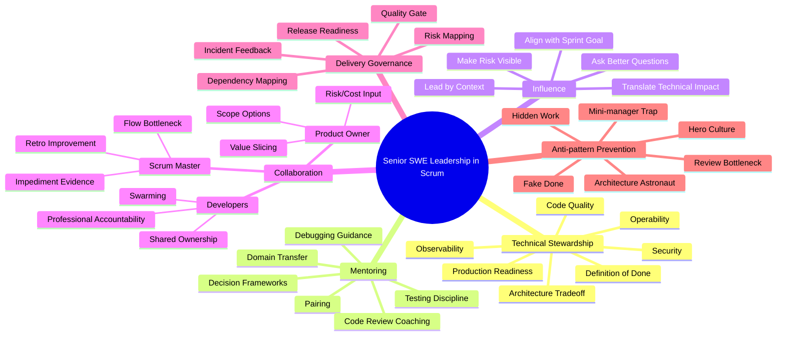

---

## 3. Senior SWE dalam Scrum: Batas Peran yang Sehat

Senior SWE berada dalam accountability **Developers**, yaitu orang-orang di Scrum Team yang committed membuat usable Increment setiap Sprint. Developers accountable untuk membuat Sprint Backlog plan, menjaga quality melalui Definition of Done, mengadaptasi plan harian menuju Sprint Goal, dan menjaga akuntabilitas profesional satu sama lain. ([scrumguides.org](https://scrumguides.org/scrum-guide.html?utm_source=chatgpt.com))

Namun, senioritas teknis memberi ekspektasi tambahan secara praktis.

| Dimensi | Senior SWE Boleh / Perlu | Senior SWE Jangan |
|---|---|---|
| **Technical decision** | Memfasilitasi trade-off dan memberi rekomendasi kuat. | Menjadi satu-satunya pengambil keputusan. |
| **Task ownership** | Membantu tim memilih ownership dan slicing. | Membagi task secara top-down seperti manager. |
| **Code review** | Menjaga standar dan mengajar lewat review. | Menjadi bottleneck semua PR. |
| **Planning** | Membuka risiko teknis, dependency, dan DoD impact. | Mengambil alih prioritas produk dari PO. |
| **Daily Scrum** | Membantu tim inspect Sprint Goal dan flow. | Mengubah Daily menjadi laporan ke senior. |
| **Architecture** | Menjaga keputusan cukup kuat dan defensible. | Over-engineer sampai feedback terlambat. |
| **Mentoring** | Membuat engineer lain makin mandiri. | Membuat tim bergantung pada senior. |
| **Quality** | Melindungi Definition of Done. | Memalsukan Done demi terlihat selesai. |

Kalimat kunci:

```text id="te04vq"
Senior SWE yang efektif menaikkan kapasitas tim.
Senior SWE yang tidak sehat menjadi pusat gravitasi semua keputusan.
```

---

## 4. Decomposition Table - Leadership Skill untuk Senior SWE

| Category | Skill | Makna Praktis | Output yang Diharapkan |
|---|---|---|---|
| **Technical Stewardship** | Architecture trade-off | Memilih solusi yang cukup kuat untuk konteks saat ini. | ADR ringan, trade-off jelas, risiko tercatat. |
| **Technical Stewardship** | Definition of Done ownership | Menjaga kualitas Increment tetap transparan. | DoD dipakai nyata, bukan checklist formalitas. |
| **Technical Stewardship** | Production readiness | Memastikan fitur siap dioperasikan. | Log, metric, trace, alert, runbook, rollback path. |
| **Mentoring** | Pairing | Membantu engineer lain belajar lewat kerja nyata. | Knowledge menyebar, bus factor turun. |
| **Mentoring** | Review coaching | Code review menjadi sarana belajar. | PR feedback jelas, spesifik, dan mendidik. |
| **Mentoring** | Domain transfer | Menjelaskan business/domain model ke engineer lain. | Engineer tidak hanya tahu code, tapi juga rule dan lifecycle. |
| **Influence** | Better questions | Memimpin lewat pertanyaan yang memperjelas risiko. | Diskusi teknis lebih tajam dan tidak personal. |
| **Influence** | Context sharing | Memberi konteks sebelum memberi solusi. | Tim paham alasan keputusan. |
| **Collaboration** | PO alignment | Memberi opsi teknis untuk keputusan value/scope. | PO bisa ordering backlog dengan informasi lebih baik. |
| **Collaboration** | SM alignment | Membantu mengangkat impediment teknis. | Bottleneck sistemik masuk retro/improvement. |
| **Flow** | WIP control | Mendorong finish-before-starting. | Cycle time turun, carry-over berkurang. |
| **Flow** | Swarming | Membantu tim menyelesaikan bottleneck penting. | Item kritikal terhadap Sprint Goal cepat Done. |
| **Risk** | Risk mapping | Membuat risiko terlihat sebelum telat. | Risk register, spike, fallback plan. |
| **Dependency** | Dependency mapping | Menghubungkan dependency ke owner dan deadline. | Tidak ada surprise dependency di tengah Sprint. |
| **Governance** | Decision traceability | Mencatat keputusan teknis penting. | ADR/notes yang bisa dipakai saat audit/debugging. |
| **Culture** | Psychological safety | Mendorong transparansi tanpa blame. | Masalah muncul lebih awal. |
| **Culture** | Professional accountability | Menjaga standar bersama. | Tim saling menjaga quality dan ownership. |

---

## 5. Technical Stewardship

Technical stewardship berarti menjaga agar sistem tetap sehat sambil tetap menghasilkan value. Ini berbeda dari sekadar “membuat architecture bagus”.

```text id="9a48r9"
Technical stewardship =
  kualitas teknis
  + delivery pragmatism
  + risk awareness
  + production readiness
  + long-term maintainability
```

### Fokus Technical Stewardship

| Area | Pertanyaan Senior SWE |
|---|---|
| **Architecture** | Apakah design ini cukup untuk kebutuhan sekarang dan bisa berevolusi? |
| **Code quality** | Apakah code mudah dipahami, dites, dan diubah? |
| **Domain model** | Apakah business rule direpresentasikan dengan jelas? |
| **Data integrity** | Apakah transaksi, constraint, migration, dan consistency aman? |
| **Security** | Apakah authz, audit, dan sensitive data handling benar? |
| **Observability** | Apakah production issue bisa ditelusuri? |
| **Operability** | Apakah support bisa memahami state sistem? |
| **Release safety** | Apakah deploy, rollback, dan compatibility dipikirkan? |
| **Technical debt** | Apakah debt dibuat visible dengan impact yang jelas? |

### Technical Stewardship yang Sehat

```text id="d2nbuz"
Membuat keputusan cukup eksplisit.
Menulis ADR ringan untuk keputusan signifikan.
Membuat trade-off terlihat.
Memilih simplicity jika risk rendah.
Melakukan spike jika uncertainty tinggi.
Mengurangi coupling yang menghambat delivery.
Menghubungkan technical debt ke business/operational impact.
```

### Technical Stewardship yang Buruk

```text id="5oxkg1"
Membuat framework internal tanpa kebutuhan nyata.
Mendesain terlalu jauh sebelum feedback.
Memblokir delivery karena preferensi pribadi.
Menyimpan keputusan penting di kepala sendiri.
Membuat semua PR menunggu approval senior.
```

---

## 6. Influence tanpa Command-and-Control

Senior SWE sering punya pengaruh besar, tetapi pengaruh itu harus menaikkan kualitas tim, bukan menggantikan ownership tim.

### Command-and-Control Style

```text id="vp033m"
"Kamu kerjakan API."
"Kamu kerjakan DB."
"Ikuti design saya."
"Semua PR lewat saya."
"Daily lapor ke saya."
```

Dampaknya:

```text id="uutqdh"
Tim pasif.
Ownership turun.
Engineer tidak belajar mengambil keputusan.
Senior menjadi bottleneck.
Self-management Scrum Team rusak.
```

### Influence Style

```text id="3k5fmr"
"Siapa yang mau ambil ownership vertical slice ini?"
"Risk terbesar ada di migration dan authorization. Bagaimana kita validasi lebih awal?"
"Ada dua opsi design. Mari bandingkan trade-off-nya."
"Saya bisa pairing di bagian workflow supaya knowledge menyebar."
"PR ini besar; apakah bisa kita pecah agar review lebih cepat?"
```

Dampaknya:

```text id="3jc49a"
Tim tetap self-managing.
Keputusan lebih transparan.
Engineer lain tumbuh.
Risiko terlihat lebih cepat.
Senior tetap memberi arah teknis tanpa menjadi bottleneck.
```

---

## 7. Mentoring dalam Scrum

Mentoring Senior SWE paling efektif terjadi di dalam flow kerja, bukan hanya lewat sesi teori.

### Bentuk Mentoring Praktis

| Bentuk | Kapan Dipakai | Output |
|---|---|---|
| **Pair programming** | Area kompleks, engineer baru, bug sulit. | Knowledge transfer langsung. |
| **Mob debugging** | Incident / production bug / race condition. | Shared understanding dan root cause. |
| **Code review coaching** | PR punya design smell atau test gap. | Engineer belajar standar kualitas. |
| **Design walkthrough** | Sebelum implementasi risk tinggi. | Trade-off dipahami bersama. |
| **Refinement coaching** | Story ambigu atau domain kompleks. | Engineer belajar menggali requirement. |
| **Testing coaching** | Test strategy lemah. | Engineer paham unit/integration/contract boundary. |
| **Post-incident learning** | Setelah production issue. | DoD/runbook/test diperbaiki. |
| **Domain walkthrough** | Business lifecycle kompleks. | Engineer memahami state, rule, exception. |

### Mentoring yang Baik

```text id="7onwo5"
Memberi konteks, bukan hanya jawaban.
Menjelaskan alasan, bukan hanya instruksi.
Mendorong engineer mencoba, bukan mengambil alih.
Memberi feedback spesifik.
Menghubungkan code ke domain dan production behavior.
```

### Mentoring yang Kurang Baik

```text id="lev1fu"
Mengambil alih keyboard terlalu cepat.
Memberi solusi tanpa menjelaskan reasoning.
Mengkritik di depan umum dengan cara mempermalukan.
Menjadikan review sebagai adu pintar.
Membuat engineer takut bertanya.
```

---

## 8. Code Review sebagai Leadership Tool

Code review bukan hanya gate. Code review adalah tempat Senior SWE menaikkan standar engineering tim.

### Review Level

| Level | Fokus |
|---|---|
| **Correctness** | Apakah code melakukan hal yang benar? |
| **Domain** | Apakah business rule dan state transition benar? |
| **Data** | Apakah query, transaction, constraint, dan migration aman? |
| **Security** | Apakah authorization dan sensitive data handling benar? |
| **Testability** | Apakah behavior penting terbukti oleh test? |
| **Operability** | Apakah logs/metrics/traces cukup? |
| **Maintainability** | Apakah code mudah diubah dan dipahami? |
| **Release safety** | Apakah deploy/rollback/config dipikirkan? |

### Review Comment yang Lemah

```text id="f5kvdt"
Ini jelek.
Refactor.
Kenapa begini?
```

### Review Comment yang Lebih Baik

```text id="46tnui"
Rule validasi order status muncul di API service dan Camunda delegate.
Risikonya future rule change bisa inconsistent.

Saran:
extract validation policy ke satu komponen,
lalu tambahkan test yang dipakai oleh kedua path.
```

### Prinsip Review Senior SWE

```text id="sk55gc"
Be specific.
Explain risk.
Suggest direction.
Separate preference from requirement.
Teach through comments.
Avoid turning review into personal criticism.
```

---

## 9. Architecture Leadership dalam Sprint

Scrum tidak melarang architecture. Yang berbahaya adalah architecture yang terlalu besar, terlalu terlambat, atau tidak terhubung ke Sprint/Product Goal.

### Just-enough Architecture

```text id="wycn1d"
Keputusan architecture harus cukup untuk:
- mengurangi risiko,
- memungkinkan Increment,
- menjaga evolvability,
- dan tidak menunda feedback terlalu lama.
```

### Architecture Decision Checklist

```text id="loczqd"
[ ] Apa masalah yang diselesaikan?
[ ] Apa opsi yang dipertimbangkan?
[ ] Apa trade-off tiap opsi?
[ ] Apa risiko jika salah?
[ ] Apa keputusan minimum yang harus dibuat sekarang?
[ ] Apa yang bisa ditunda sampai ada evidence?
[ ] Apakah butuh spike?
[ ] Apakah keputusan perlu dicatat sebagai ADR?
[ ] Bagaimana keputusan ini mempengaruhi DoD/release/operability?
```

### Kapan ADR Dibutuhkan?

Gunakan ADR ringan jika keputusan:

```text id="xq0r0h"
mempengaruhi banyak service,
sulit dibalik,
berdampak pada data model,
berdampak pada security/compliance,
berdampak pada workflow lifecycle,
atau akan membingungkan tim baru di masa depan.
```

Template ADR singkat:

```text id="etm742"
Title:
  Use idempotency key for order amendment submission.

Context:
  Users may retry submission due to timeout.

Decision:
  Use client-provided idempotency key scoped by order_id and actor.

Consequences:
  Prevents duplicate amendment requests.
  Requires unique constraint and lookup path.
  Needs clear retention policy.

Alternatives:
  Reject duplicate active amendment.
  Allow duplicates and reconcile later.

Status:
  Accepted.
```

---

## 10. Collaboration dengan Product Owner

Product Owner accountable untuk Product Goal, Product Backlog management, dan value maximization. Senior SWE tidak mengambil alih prioritas, tetapi memberi technical insight agar PO bisa membuat keputusan lebih baik. ([scrumguides.org](https://scrumguides.org/scrum-guide.html?utm_source=chatgpt.com))

### Cara Membantu PO

| PO Butuh | Senior SWE Memberi |
|---|---|
| Memilih scope | Opsi slicing dan trade-off. |
| Memahami cost | Complexity, uncertainty, dependency, risk. |
| Memahami debt | Impact terhadap delivery, reliability, support, compliance. |
| Menentukan urutan | Risk-first sequencing dan dependency order. |
| Menerima feedback stakeholder | Technical implication dan backlog adaptation. |
| Menjaga Product Goal | Architecture dan quality yang mendukung arah produk. |

### Kalimat Praktis

```text id="k7quuq"
Untuk Sprint ini ada tiga opsi:

Opsi A:
Submit + validate + audit.
Paling kecil, bisa menjadi Increment usable.

Opsi B:
Tambah approval workflow.
Value lebih besar, tapi ada risk di Camunda retry/incident.

Opsi C:
Tambah downstream notification.
Butuh dependency fulfillment contract.

Rekomendasi saya:
ambil Opsi A dulu untuk mengurangi risiko dan memberi feedback cepat.
```

Ini membantu PO tanpa mengambil alih ownership PO.

---

## 11. Collaboration dengan Scrum Master

Scrum Master accountable untuk efektivitas Scrum Team dan membantu Scrum dipahami serta dijalankan sesuai Scrum Guide. Senior SWE bisa membantu Scrum Master dengan evidence teknis tentang impediment, flow bottleneck, dan quality issue. ([scrumguides.org](https://scrumguides.org/scrum-guide.html?utm_source=chatgpt.com))

### Area Kolaborasi

| Masalah | Kontribusi Senior SWE |
|---|---|
| Carry-over berulang | Bawa evidence: item size, dependency, DoD gap. |
| Daily tidak adaptif | Dorong Sprint Goal health dan blocker aging. |
| PR review bottleneck | Tunjukkan PR aging/reviewer concentration. |
| Testing terlambat | Bawa data kapan test mulai dan defect ditemukan. |
| Flaky CI | Jadikan impediment, bukan noise. |
| Refinement lemah | Tambahkan checklist teknis/domain. |
| Retro tidak menghasilkan perubahan | Bantu action dibuat spesifik dan terukur. |
| Scope creep | Tunjukkan impact ke Sprint Goal dan DoD. |

### Contoh

```text id="ykyl3y"
Saya lihat carry-over tiga Sprint terakhir bukan karena effort rendah.
Pola teknisnya:
- integration test selalu mulai akhir Sprint,
- PR critical menunggu reviewer yang sama,
- dependency audit/support baru muncul setelah implementation.

Mungkin retro berikutnya bisa fokus pada refinement checklist,
review ownership, dan early integration.
```

---

## 12. Collaboration dengan Developers

Senior SWE paling dekat dengan Developers. Scrum Guide menyebut Developers accountable untuk membuat plan Sprint Backlog, menjaga quality lewat Definition of Done, mengadaptasi plan harian menuju Sprint Goal, dan menjaga akuntabilitas profesional. ([scrumguides.org](https://scrumguides.org/scrum-guide.html?utm_source=chatgpt.com))

### Praktik Kolaborasi

| Area | Praktik Senior SWE |
|---|---|
| **Planning** | Bantu breakdown, jangan dictate semua task. |
| **Daily** | Bantu tim melihat Sprint Goal, WIP, blocker. |
| **Implementation** | Pair di bagian risk tinggi. |
| **Review** | Review untuk transfer knowledge dan menjaga standard. |
| **Testing** | Bantu engineer memilih test level yang tepat. |
| **Debugging** | Ajarkan pendekatan sistematis. |
| **Incident** | Ajak tim belajar dari production behavior. |
| **Retrospective** | Bawa evidence, bukan blame. |

### Professional Accountability

Professional accountability bukan berarti saling menyalahkan. Artinya tim saling menjaga standar.

```text id="k8r72r"
Kita tidak merge ini dulu karena auth negative case belum ada.
Ini bukan untuk menghambat,
tapi karena endpoint ini mengubah order lifecycle dan DoD kita butuh authorization test.
```

---

## 13. Leadership dalam Daily Scrum

Senior SWE tidak harus memimpin Daily Scrum, tetapi bisa membantu menjaga Daily tetap berguna.

### Intervensi Sehat

```text id="9nhygh"
Sprint Goal kita sekarang Yellow karena audit schema belum final.
Apa action hari ini agar tidak jadi Red?
```

```text id="gt3azi"
Ada 5 item In Progress dan belum ada yang Done.
Mungkin hari ini kita swarm item submit amendment dulu sampai memenuhi DoD.
```

```text id="ds97lt"
PR ini sudah aging dua hari.
Apakah kita perlu backup reviewer atau split PR?
```

### Intervensi Tidak Sehat

```text id="yhj7tz"
Kamu kenapa belum selesai?
Hari ini kamu harus selesaikan ini.
Semua update ke saya satu per satu.
```

Perbedaannya: yang sehat fokus ke **flow dan Sprint Goal**, bukan kontrol personal.

---

## 14. Leadership dalam Sprint Planning

Senior SWE harus memastikan planning tidak menjadi janji palsu.

### Kontribusi Senior SWE

```text id="q56xam"
[ ] Menguji kejelasan Sprint Goal.
[ ] Mengidentifikasi risk terbesar.
[ ] Membantu vertical slicing.
[ ] Menjelaskan DoD impact.
[ ] Memastikan test, migration, observability, deployment masuk plan.
[ ] Mengidentifikasi dependency dan owner.
[ ] Menyarankan spike jika uncertainty tinggi.
[ ] Memberi opsi scope/fallback.
```

### Kalimat Praktis

```text id="k36ofd"
Item ini kelihatannya kecil dari sisi coding,
tapi risk-nya tinggi karena menyentuh DB migration, authorization, dan audit.
Saya sarankan kita split:
1. submit + validate + audit,
2. approval workflow,
3. downstream notification.
```

---

## 15. Leadership dalam Sprint Review

Senior SWE membantu Review menjadi feedback loop, bukan demo theater.

### Yang Harus Dijelaskan

```text id="cngfi8"
Apa Increment yang Done?
Apa capability yang sekarang usable?
Apa limitation yang sengaja ditunda?
Apa risiko teknis yang relevan?
Apa feedback/decision yang dibutuhkan?
Apa Product Backlog adaptation berikutnya?
```

### Contoh

```text id="6wg66t"
Increment ini sudah mendukung submit amendment request dengan validation dan audit trail.

Yang belum termasuk:
approval workflow otomatis dan downstream notification.

Risiko teknis berikutnya:
Camunda retry dan incident handling perlu diputuskan sebelum workflow kita aktifkan.

Feedback yang kami butuhkan:
apakah duplicate amendment harus ditolak atau diperlakukan idempotent?
```

---

## 16. Leadership dalam Retrospective

Senior SWE membantu Retro menjadi perbaikan sistem kerja.

### Peran Senior SWE

```text id="1u0lsg"
Bawa evidence.
Hindari blame.
Bantu root cause analysis.
Ubah keluhan menjadi action.
Pastikan action punya owner dan signal.
Bantu update DoD/working agreement bila perlu.
```

### Contoh

```text id="84mfyu"
Problem:
Integration test selalu mulai terlalu akhir.

Evidence:
Dua Sprint terakhir, integration test pertama dimulai hari ke-8.

Root cause sementara:
Vertical slice belum diprioritaskan di awal Sprint.

Experiment:
Sprint berikutnya, setiap Sprint Goal harus punya first vertical slice yang diuji maksimal hari ke-3.

Signal:
Bug integration ditemukan lebih awal dan carry-over turun.
```

---

## 17. Senior SWE sebagai Risk Radar

Senior SWE harus sensitif terhadap risiko yang belum terlihat oleh PO/stakeholder.

### Risk Radar Checklist

```text id="g9pbb1"
Product / Domain
[ ] Rule belum jelas.
[ ] State transition ambigu.
[ ] Exception path belum diputuskan.
[ ] Audit/defensibility belum cukup.

Engineering
[ ] Migration berisiko.
[ ] API breaking change.
[ ] Query performance unknown.
[ ] Transaction boundary lemah.
[ ] Workflow retry/incident belum jelas.

Security
[ ] Permission matrix belum jelas.
[ ] Negative auth case belum diuji.
[ ] Sensitive data bisa bocor.

Delivery
[ ] Dependency eksternal belum siap.
[ ] PR bottleneck.
[ ] Test env tidak stabil.
[ ] Deployment/config belum siap.

Operations
[ ] Logging kurang.
[ ] Metrics tidak ada.
[ ] Support path manual.
[ ] Rollback/remediation belum jelas.
```

Senior SWE yang baik tidak hanya berkata “ini risky”, tetapi menjelaskan:

```text id="6nct7p"
Risk:
  Apa yang bisa salah?

Impact:
  Apa dampaknya ke user/product/support/compliance?

Signal:
  Bagaimana kita tahu risk mulai terjadi?

Mitigation:
  Apa yang bisa kita lakukan sekarang?

Decision:
  Siapa perlu memutuskan apa?
```

---

## 18. Hero Culture vs Team Capability

Senior SWE sering terjebak menjadi “hero”.

### Hero Culture

```text id="zkxsse"
Senior memperbaiki semua bug sulit.
Senior review semua PR.
Senior tahu semua domain.
Senior deploy saat incident.
Senior menjadi escalation default.
```

Terlihat efektif jangka pendek, tetapi berbahaya.

| Risiko | Dampak |
|---|---|
| Bus factor tinggi | Tim lambat saat senior tidak ada. |
| Knowledge silo | Engineer lain tidak berkembang. |
| Burnout | Senior overload. |
| Bottleneck | Semua keputusan menunggu satu orang. |
| Low ownership | Tim menjadi executor. |

### Team Capability Culture

```text id="tlfanu"
Senior pairing untuk transfer knowledge.
Senior membuat runbook.
Senior mendokumentasikan keputusan.
Senior membagi ownership.
Senior menciptakan backup reviewer.
Senior melatih debugging approach.
Senior membuat sistem lebih mudah dipahami.
```

Kalimat kunci:

```text id="rsyc12"
Hero menyelesaikan masalah hari ini.
Leader membuat tim mampu menyelesaikan masalah besok.
```

---

## 19. Technical Stewardship untuk Stack Anda

### Java/Jersey

```text id="zzb41w"
Leadership focus:
- API contract consistency
- exception mapping standard
- validation boundary
- backward compatibility
- testability
- thread/concurrency awareness
```

### MyBatis/PostgreSQL

```text id="0tvyjc"
Leadership focus:
- query correctness
- transaction boundary
- migration safety
- index/constraint design
- SQL readability
- result mapping correctness
- performance regression awareness
```

### PL/pgSQL

```text id="98pxi8"
Leadership focus:
- DB-side logic ownership
- function/procedure side effects
- exception handling
- trigger risk
- testability
- observability of database behavior
```

### Camunda

```text id="a5b82k"
Leadership focus:
- process state clarity
- retry and incident behavior
- compensation/manual recovery
- process variable governance
- versioning/running instance impact
- auditability
```

### Docker/Kubernetes

```text id="m2poc9"
Leadership focus:
- config correctness
- readiness/liveness behavior
- resource limits
- rollout/rollback
- environment parity
- secret handling
- operational diagnosis
```

### AWS/Azure/On-prem

```text id="kbscbp"
Leadership focus:
- environment differences
- networking/security constraints
- deployment pipeline
- secret/config management
- observability integration
- operational ownership
```

---

## 20. Decision Framework untuk Senior SWE

Gunakan framework ini saat tim menghadapi keputusan teknis.

```text id="k383bh"
1. Context
   Apa masalah sebenarnya?

2. Constraint
   Apa batasan product, time, compliance, infra, team capability?

3. Options
   Apa opsi solusi yang realistis?

4. Trade-off
   Apa cost, risk, reversibility, complexity tiap opsi?

5. Recommendation
   Opsi mana yang paling masuk akal sekarang?

6. Evidence
   Apa data/spike/test/experience yang mendukung?

7. Decision
   Siapa yang memutuskan dan kapan?

8. Follow-up
   Apa yang perlu dicatat, diuji, atau dimonitor?
```

### Contoh

```text id="g12y8v"
Decision:
  Duplicate order amendment request handling.

Options:
  A. Reject if active amendment exists.
  B. Use idempotency key.
  C. Allow duplicate and reconcile later.

Trade-off:
  A paling sederhana tapi user retry bisa gagal.
  B lebih robust tapi butuh key, constraint, dan retention policy.
  C paling risky untuk audit dan support.

Recommendation:
  B jika retry behavior penting.
  A jika MVP internal dan retry jarang.

Need PO decision:
  Apakah duplicate submission harus user-friendly atau strictly rejected?
```

---

## 21. Leadership Communication Patterns

### Pattern 1 - Risk Translation

```text id="u9qlti"
Secara teknis, masalahnya ada di <technical issue>.
Dampak produknya adalah <business/user/support impact>.
Risiko jika ditunda adalah <risk>.
Opsi yang saya sarankan adalah <option>.
```

Contoh:

```text id="z2nkbk"
Secara teknis, audit event belum mencatat actor dan reason.
Dampak produknya adalah support sulit menjelaskan perubahan order saat dispute.
Risiko jika ditunda adalah amendment terlihat valid tapi tidak defensible.
Saya sarankan actor, reason, order_id, amendment_id, dan timestamp masuk minimum audit schema.
```

### Pattern 2 - Scope Negotiation

```text id="clskzt"
Jika Sprint Goal tetap <goal>,
maka <scope A> wajib,
sedangkan <scope B> bisa dipindah ke Sprint berikutnya.
```

### Pattern 3 - Quality Boundary

```text id="0ox454"
Saya tidak menyarankan kita menyebut ini Done dulu,
karena <DoD gap>.
Alternatifnya, kita split item:
bagian <done part> menjadi Increment,
bagian <remaining part> masuk backlog berikutnya.
```

### Pattern 4 - Mentoring

```text id="zr5f2k"
Mari kita lihat failure mode-nya.
Kalau request timeout setelah DB commit,
apa yang terjadi saat user retry?
Dari situ kita bisa tentukan apakah idempotency diperlukan.
```

### Pattern 5 - Dependency Escalation

```text id="bqe9v3"
Dependency ini dibutuhkan sebelum hari ke-3.
Jika tidak selesai, Sprint Goal masuk Yellow.
Fallback-nya adalah deliver submit + audit tanpa downstream notification.
```

---

## 22. Failure Modes Senior SWE

| Failure Mode | Gejala | Dampak | Koreksi |
|---|---|---|---|
| **Mini-manager** | Membagi task dan kontrol semua keputusan. | Self-management rusak. | Lead by influence dan ownership delegation. |
| **Hero mode** | Semua masalah sulit diambil sendiri. | Bus factor dan burnout. | Pairing, docs, shared ownership. |
| **Architecture astronaut** | Design terlalu besar sebelum feedback. | Value terlambat. | Just-enough architecture + spike. |
| **Quality police** | Hanya menolak, tidak membantu. | Tim defensif. | Jelaskan risk dan bantu solusi. |
| **PR bottleneck** | Semua review harus senior. | Cycle time naik. | Backup reviewer, review guideline. |
| **Silent expert** | Tahu risiko tapi tidak membuka. | Surprise akhir Sprint. | Risk mapping dan early warning. |
| **Over-correcting** | Semua masalah dibuat proses/checklist. | Bureaucracy. | Pilih guardrail yang benar-benar membantu. |
| **PO replacement** | Mengambil keputusan value/scope. | Accountability kabur. | Beri opsi dan trade-off, PO memutuskan. |
| **SM replacement** | Mengambil alih facilitation Scrum. | Role confusion. | Bantu dengan evidence, jangan ambil semua. |
| **Mentoring by lecturing** | Banyak teori, sedikit enablement. | Engineer tidak berkembang praktis. | Pair, review, debug bersama. |

---

## 23. Senior SWE Leadership Checklist

```text id="yh8xfe"
Sprint Planning
[ ] Apakah Sprint Goal jelas?
[ ] Apakah risk terbesar terlihat?
[ ] Apakah scope bisa di-slice?
[ ] Apakah DoD dihitung dalam forecast?
[ ] Apakah dependency punya owner dan due date?

Daily Scrum
[ ] Apakah Sprint Goal Green/Yellow/Red?
[ ] Apakah WIP terlalu tinggi?
[ ] Apakah PR/blocker aging terlihat?
[ ] Apakah perlu pair/swarm?
[ ] Apakah Sprint Backlog perlu adaptasi?

Development
[ ] Apakah code mudah dites dan dirawat?
[ ] Apakah domain rule jelas?
[ ] Apakah data integrity aman?
[ ] Apakah authz/audit/observability cukup?
[ ] Apakah decision penting dicatat?

Code Review
[ ] Apakah feedback spesifik dan berbasis risk?
[ ] Apakah reviewer bottleneck?
[ ] Apakah review mengajar, bukan mempermalukan?
[ ] Apakah PR terlalu besar?

Sprint Review
[ ] Apakah Increment benar-benar Done?
[ ] Apakah technical work diterjemahkan ke value/risk?
[ ] Apakah stakeholder feedback actionable?
[ ] Apakah backlog adaptation jelas?

Retrospective
[ ] Apakah evidence dibawa?
[ ] Apakah root cause sistemik dicari?
[ ] Apakah action kecil, nyata, dan terukur?
[ ] Apakah DoD/working agreement perlu update?

Team Growth
[ ] Apakah knowledge menyebar?
[ ] Apakah ada backup owner?
[ ] Apakah engineer lain makin mandiri?
[ ] Apakah senior menjadi multiplier, bukan bottleneck?
```

---

## 24. Maturity Model - Senior SWE dalam Scrum

| Level | Karakteristik | Risiko | Target Perbaikan |
|---|---|---|---|
| **Level 1 - Strong Individual Contributor** | Menyelesaikan task sulit sendiri. | Hero mode, knowledge silo. | Mulai pairing dan knowledge sharing. |
| **Level 2 - Local Technical Lead** | Membantu design dan review area tertentu. | Bisa jadi review bottleneck. | Delegasikan ownership dan buat guideline. |
| **Level 3 - Team Multiplier** | Menaikkan kemampuan tim lewat mentoring, review, risk mapping. | Perlu menjaga scope influence. | Bantu PO/SM dengan evidence. |
| **Level 4 - Delivery System Steward** | Memperbaiki flow, DoD, CI/CD, operability, retro action. | Bisa terlalu proses-heavy. | Fokus pada improvement berdampak. |
| **Level 5 - Socio-technical Leader** | Menghubungkan domain, architecture, people, process, production, dan product value. | Butuh alignment lintas stakeholder. | Bangun sistem keputusan dan learning loop. |

Target realistis untuk Senior SWE baru onboarding:

```text id="z6je65"
Bulan 1:
  pahami domain, codebase, flow, DoD, bottleneck.

Bulan 2:
  mulai bantu risk mapping, review quality, pairing.

Bulan 3:
  dorong improvement sistemik kecil:
  refinement checklist, PR flow, test gap, observability, runbook.
```

---

## 25. 30-60-90 Day Scrum Leadership Plan untuk Senior SWE Baru

### 0-30 Hari - Observe dan Build Context

```text id="etavpa"
Fokus:
  memahami cara tim bekerja sebelum mengubah.

Aktivitas:
[ ] Ikuti refinement, planning, daily, review, retro.
[ ] Pelajari Definition of Done.
[ ] Pelajari Product Goal dan backlog ordering.
[ ] Lihat pola carry-over.
[ ] Lihat PR review flow.
[ ] Lihat CI/CD bottleneck.
[ ] Pelajari domain lifecycle utama.
[ ] Pair dengan engineer di area berbeda.
[ ] Catat risk/impediment tanpa langsung menghakimi.

Output:
  peta awal flow, bottleneck, dependency, dan quality gap.
```

### 31-60 Hari - Contribute dan Make Risk Visible

```text id="qes3ny"
Fokus:
  membantu delivery tanpa mengganggu self-management.

Aktivitas:
[ ] Bantu technical decomposition di refinement.
[ ] Bawa risk map ke planning.
[ ] Bantu PR review dengan feedback berkualitas.
[ ] Pair di area kritikal.
[ ] Bantu PO memahami scope trade-off.
[ ] Bantu SM melihat impediment teknis.
[ ] Usulkan 1-2 improvement kecil di retro.

Output:
  risk lebih terlihat, PR/review lebih sehat, DoD lebih jelas.
```

### 61-90 Hari - Improve System

```text id="c2z1cl"
Fokus:
  memperbaiki sistem delivery tim.

Aktivitas:
[ ] Dorong refinement checklist untuk domain kompleks.
[ ] Buat/rapikan technical decision record.
[ ] Perkuat DoD untuk authz, audit, observability, migration.
[ ] Kurangi review bottleneck dengan backup reviewer.
[ ] Identifikasi flaky CI/test gap.
[ ] Bantu membuat runbook untuk flow production-critical.
[ ] Hubungkan incident/support feedback ke backlog/retro.

Output:
  tim lebih predictable, quality gate lebih nyata, knowledge lebih tersebar.
```

---

## 26. Final Synthesis - 12 Seri Scrum untuk Senior SWE

Berikut ringkasan seluruh seri yang sudah selesai:

| Seri | Topik | Inti |
|---:|---|---|
| 1 | Scrum Mental Model | Scrum sebagai feedback system untuk mengelola uncertainty. |
| 2 | Scrum Accountabilities | PO, SM, Developers, dan posisi Senior SWE. |
| 3 | Product Backlog & Refinement | Membuat backlog item clear, small, testable, risk-visible. |
| 4 | Sprint Planning | Goal, forecast, estimation, scope, risk-adjusted planning. |
| 5 | Sprint Backlog & Daily Scrum | Living plan, flow, WIP, replanning. |
| 6 | Increment & Definition of Done | Done sebagai quality boundary, bukan code complete. |
| 7 | Sprint Review | Feedback loop untuk outcome, stakeholder, dan backlog adaptation. |
| 8 | Sprint Retrospective | Continuous improvement berbasis evidence dan system thinking. |
| 9 | Technical Decomposition & Risk Mapping | Slice, spike, dependency, risk, technical plan. |
| 10 | Scrum Metrics | Velocity, cycle time, lead time, WIP, quality/value metrics. |
| 11 | Scrum Anti-patterns | Scrum theater, weak DoD, velocity worship, hidden waterfall. |
| 12 | Senior SWE Leadership | Mentoring, influence, stewardship, team capability. |

---

## 27. Ringkasan Seri 12

| Konsep | Inti |
|---|---|
| **Senior SWE Leadership** | Menaikkan kemampuan tim, bukan mengontrol tim. |
| **Technical Stewardship** | Menjaga architecture, quality, operability, dan maintainability. |
| **Mentoring** | Transfer knowledge lewat pairing, review, debugging, dan domain walkthrough. |
| **Influence** | Memimpin lewat konteks, pertanyaan, evidence, dan trade-off. |
| **Collaboration** | Membantu PO, SM, dan Developers tanpa mengambil alih accountability mereka. |
| **Risk Radar** | Membuat risiko teknis, dependency, dan quality gap terlihat lebih awal. |
| **Team Multiplier** | Mengurangi hero culture dan membangun shared ownership. |

Kalimat kunci:

```text id="ij0xox"
Senior SWE terbaik dalam Scrum bukan orang yang paling banyak mengambil alih.
Senior SWE terbaik adalah orang yang membuat tim lebih mampu,
lebih transparan,
lebih adaptif,
lebih berkualitas,
dan lebih siap menghadapi production reality.
```

---

## Status Seri

**Seri 12/12 selesai.**

Semua seri Scrum untuk Senior Software Engineer sudah selesai.

## Rekomendasi Materi Selanjutnya

Materi paling relevan berikutnya: **“Product Ownership & Backlog Strategy for Senior Software Engineer”** - fokus pada cara engineer senior memahami Product Goal, backlog ordering, value slicing, dependency sequencing, technical debt prioritization, dan stakeholder negotiation tanpa mengambil alih peran Product Owner.

---

**Sources:**

- [The 2020 Scrum Guide TM](https://scrumguides.org/scrum-guide.html?utm_source=chatgpt.com)


---
Powered by [ChatGPT Exporter](https://www.chatgptexporter.com)