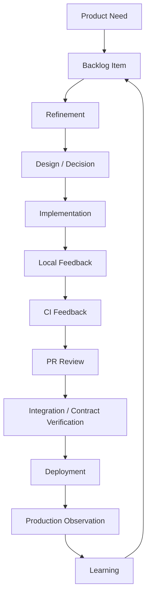
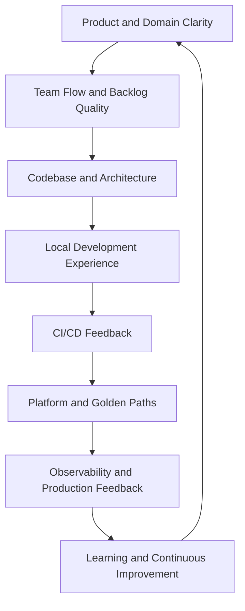
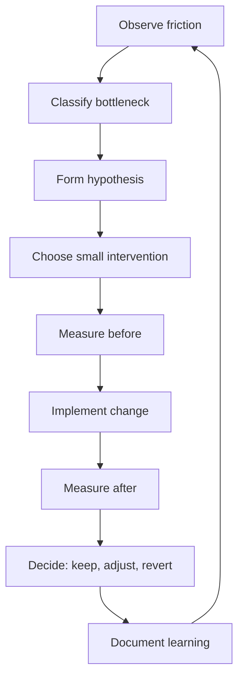

# Part 001 — Engineering Effectiveness as System Design

## 1. Source notes and scope boundary

This part uses public engineering-effectiveness and delivery-performance ideas, especially:

- DORA software delivery performance metrics: deployment frequency, lead time for changes, failed deployment recovery time, change failure/failed deployment rate, and reliability.
- SPACE developer productivity framework: Satisfaction and well-being, Performance, Activity, Communication and collaboration, and Efficiency and flow.
- Team Topologies ideas around team types, cognitive load, and fast flow of change.
- Platform engineering as a product-oriented discipline for reducing friction for stream-aligned product teams.
- OpenTelemetry and observability practices as later parts of the feedback system.

This part does **not** assume how CSG measures engineering effectiveness internally.

Internal details to verify:

- actual team metrics used;
- whether DORA metrics are tracked;
- CI/CD tooling;
- deployment frequency and release governance;
- platform ownership;
- internal developer platform maturity;
- observability stack;
- onboarding and DevEx pain points;
- whether Scrum, Kanban, or mixed flow metrics are used;
- whether productivity metrics are used for team improvement or individual evaluation.

The goal is to build a thinking model, not to prescribe a metric program blindly.

---

## 2. Core thesis

Engineering effectiveness is not the same as individual productivity.

Engineering effectiveness is the design quality of the system that turns engineering effort into reliable product outcomes.

That system includes:

- people;
- teams;
- codebase structure;
- architecture;
- test strategy;
- CI/CD;
- local development environment;
- documentation;
- observability;
- production feedback;
- review process;
- platform tooling;
- backlog quality;
- deployment model;
- support and incident learning.

A senior engineer should learn to see this whole system.

The question is not only:

> How can I personally code faster?

The stronger question is:

> What prevents the team from safely moving valuable changes from idea to production learning?

In enterprise Quote & Order systems, engineering effectiveness is especially important because delivery friction is not only inconvenient. It can hide real production risk:

- unclear backlog item hides pricing approval ambiguity;
- slow CI delays detection of broken order lifecycle tests;
- flaky tests erode trust in deployment confidence;
- poor observability makes support discover order fallout before engineering does;
- manual migration work makes release risk dependent on one expert;
- long PR review queues delay customer commitments;
- weak local development setup makes new engineers afraid to touch critical areas;
- missing platform golden paths cause every service to implement logging, security, health checks, and deployment differently.

Engineering effectiveness is therefore an architecture concern.

---

## 3. Engineering organization as a socio-technical system

A software product team is not merely a group of individuals writing code.

It is a socio-technical system.



Every edge in that graph can become friction.

Every node can hide quality loss.

Examples:

| Stage | Healthy signal | Friction signal |
|---|---|---|
| Product Need | Clear business outcome | Vague request without user/problem |
| Backlog Item | Small, testable, valuable | Large, ambiguous, dependency-heavy |
| Refinement | Risks surfaced early | Unknowns discovered mid-sprint |
| Design | Trade-offs explicit | Hidden assumptions, no rollback path |
| Implementation | Small safe changes | Large branch, unclear ownership |
| Local Feedback | Fast build/test/run | Slow setup, tribal knowledge |
| CI Feedback | Reliable and timely | Flaky, slow, red ignored |
| PR Review | High-quality and timely | Queue, bikeshedding, missing risk |
| Deployment | Repeatable and observable | Manual steps, release anxiety |
| Production Observation | Signals tied to journey | Customer detects failure first |
| Learning | Incident → improvement | Same problem repeats |

Engineering effectiveness improves the whole graph.

---

## 4. Engineering effectiveness is not a department

Some organizations create an Engineering Productivity, Developer Experience, or Platform Engineering team.

That can help.

But effectiveness is not only that team's job.

A senior engineer in a product team still has responsibility to notice and improve friction.

Examples:

- If your PRs wait three days for review, that is not only a process annoyance. It is delivery system friction.
- If tests are flaky, that is not only QA annoyance. It is confidence erosion.
- If local setup takes a week, that is not only onboarding inconvenience. It is future maintenance cost.
- If dashboards do not show quote acceptance failures, that is not only SRE concern. It is product operability risk.
- If every migration requires one expert, that is not only DB ownership. It is bus factor and release risk.

The right model:

> Platform and DevEx teams may build leverage, but product engineers must own the feedback loops of their own work.

---

## 5. The effectiveness equation

A simple way to think about engineering effectiveness:

```text
Engineering Effectiveness = Valuable Change / (Lead Time × Risk × Cognitive Load × Rework)
```

This is not a mathematical formula for dashboards.

It is a thinking aid.

To increase effectiveness, you can:

- increase valuable change;
- reduce lead time;
- reduce production risk;
- reduce cognitive load;
- reduce rework;
- improve feedback quality;
- improve decision quality;
- make the safe path the easy path.

### 5.1 Valuable change

Not all completed work has equal value.

A team can complete many tasks and still not move the product forward.

Valuable change in Quote & Order may mean:

- reducing quote pricing errors;
- improving quote-to-order conversion reliability;
- reducing order fallout detection time;
- enabling a customer-specific integration safely;
- improving catalog publish confidence;
- reducing support effort for stuck orders;
- making a migration safer for on-prem deployments;
- improving tenant isolation tests.

### 5.2 Lead time

Long lead time delays learning.

If a change takes weeks to reach production-like feedback, the team learns too late.

Lead time is affected by:

- backlog clarity;
- story size;
- local setup;
- build speed;
- test speed;
- review delay;
- environment availability;
- deployment friction;
- release governance;
- customer enablement gates.

### 5.3 Risk

A fast unsafe system is not effective.

Risk includes:

- broken domain invariant;
- API incompatibility;
- event replay failure;
- migration lock risk;
- tenant leakage;
- missing audit evidence;
- deployment rollback risk;
- insufficient observability.

### 5.4 Cognitive load

Cognitive load is the amount of mental context required to make a change safely.

High cognitive load looks like:

- many service boundaries;
- unclear ownership;
- inconsistent patterns;
- missing docs;
- tribal knowledge;
- many customer-specific branches;
- fragile test data;
- unclear production behavior;
- generic abstractions that hide domain semantics.

### 5.5 Rework

Rework happens when feedback arrives late or clarity is poor.

Sources:

- poorly refined backlog;
- missing acceptance criteria;
- late architecture review;
- late QA involvement;
- brittle integration tests;
- customer requirement discovered after implementation;
- migration failure in staging;
- production issue after release.

Senior engineers increase effectiveness by attacking rework early.

---

## 6. Engineering effectiveness layers

Think in layers.



### 6.1 Product and domain clarity

If engineers do not understand the domain, they build the wrong thing efficiently.

For CSG Quote & Order, domain clarity includes:

- quote lifecycle;
- catalog versioning;
- pricing snapshots;
- approval authority;
- order conversion;
- fulfillment fallout;
- billing handoff;
- TMF API expectations;
- customer-specific configuration;
- tenant isolation;
- audit defensibility.

### 6.2 Team flow and backlog quality

Flow starts before code.

Backlog quality affects:

- story size;
- estimation accuracy;
- test design;
- PR review quality;
- sprint confidence;
- delivery predictability.

### 6.3 Codebase and architecture

Architecture determines how easy it is to make safe change.

Good architecture for effectiveness:

- exposes domain language;
- localizes change;
- has clear transaction boundaries;
- supports tests;
- makes observability easy;
- avoids hidden coupling;
- makes correct behavior easier than incorrect behavior.

### 6.4 Local development experience

Local development is the first feedback loop.

If developers cannot quickly run, test, debug, and observe locally, every change becomes heavier.

### 6.5 CI/CD feedback

CI/CD is the shared nervous system of engineering.

It should answer quickly:

- did we break compile?
- did we break tests?
- did we break API compatibility?
- did we break migration safety?
- did we break security policy?
- did we build a deployable artifact?

### 6.6 Platform and golden paths

Platform engineering should reduce repeated complexity.

A good platform provides:

- service templates;
- CI defaults;
- deployment defaults;
- logging/metrics/tracing defaults;
- security defaults;
- health check conventions;
- database migration conventions;
- documentation conventions.

A platform is not effective because it exists.

It is effective when product teams use it because it makes the safe path faster.

### 6.7 Observability and production feedback

Production is the final truth.

Observability turns production into a learning system.

For Quote & Order, observability must include business signals, not only CPU and HTTP 500s.

### 6.8 Learning and continuous improvement

Effectiveness improves when incidents, delays, and friction become learning inputs.

Without learning loops, teams repeat the same problems with more process around them.

---

## 7. Internal verification checklist

Use this checklist to map your actual environment.

### 7.1 Delivery flow

- How does work move from idea to production?
- Which tools track backlog, PRs, CI, releases, incidents, and deployments?
- Where does work wait most often?
- What is the typical cycle time for a normal backend change?
- What is the typical cycle time for a DB migration?
- What is the typical cycle time for a customer-specific change?
- What causes carryover across sprints?

### 7.2 Local DevEx

- How long does it take a new engineer to run the service locally?
- Are local dev scripts reliable?
- Are dependencies containerized or mocked?
- Can a developer run relevant tests without special tribal knowledge?
- Can a developer reproduce a production-like quote/order scenario locally?
- Are sample fixtures available?

### 7.3 CI/CD

- How long does CI take?
- Which stage is slowest?
- Which tests are flaky?
- Are failures actionable?
- Are failed pipelines ignored?
- Are deployments automated?
- What manual release steps exist?
- Are rollbacks tested?

### 7.4 Code review

- What is average PR size?
- How long do PRs wait for first review?
- How long from PR open to merge?
- Are reviews ownership-routed?
- Are review comments focused on correctness or style?
- Do senior engineers become bottlenecks?

### 7.5 Production feedback

- What dashboards matter for Quote & Order?
- Can you trace one quote-to-order journey?
- Are business metrics available?
- Are alerts actionable?
- Are incidents linked to backlog improvements?
- Are runbooks current?

### 7.6 Platform

- Is there an internal developer platform?
- Are service templates available?
- Are golden paths documented?
- Are platform users treated as customers?
- Is platform adoption measured?
- Are teams forced onto a path that does not fit their context?

---

## 8. Effectiveness smells in enterprise teams

### 8.1 Everyone is busy, nothing moves

Symptoms:

- many tickets in progress;
- many half-finished branches;
- many blocked stories;
- daily updates sound active;
- Sprint Goal is at risk;
- release output is low.

Likely causes:

- WIP too high;
- unclear slicing;
- review bottleneck;
- hidden dependencies;
- too much interrupt work;
- poor refinement.

### 8.2 CI is red but nobody trusts it

Symptoms:

- flaky failures ignored;
- rerun button overused;
- failing tests quarantined indefinitely;
- people merge despite weak signal.

Likely causes:

- flaky tests unowned;
- slow suite;
- poor diagnostics;
- environment instability;
- tests assert timing instead of business signals.

### 8.3 Review is slow but quality is still weak

Symptoms:

- PRs wait long;
- comments focus on style;
- bugs escape review;
- seniors overloaded;
- authors batch too much work.

Likely causes:

- PR too large;
- ownership unclear;
- review checklist absent;
- late architecture decisions;
- insufficient automated checks.

### 8.4 Release is scary

Symptoms:

- releases delayed;
- manual checklists long;
- rollback unclear;
- hotfix culture;
- stabilization phase grows.

Likely causes:

- weak DoD;
- poor observability;
- fragile migrations;
- customer-specific rollout complexity;
- no staged release strategy.

### 8.5 Only one person knows the system

Symptoms:

- decisions wait for one expert;
- support escalations route to same person;
- reviews blocked by one owner;
- docs outdated;
- onboarding slow.

Likely causes:

- knowledge not codified;
- no pairing/mentoring;
- code too implicit;
- lack of ownership map;
- high cognitive load.

---

## 9. Senior engineer operating stance

A senior engineer should not begin with metrics collection.

Start with observation.

Ask:

1. Where does valuable work wait?
2. Where does feedback arrive too late?
3. Where does quality depend on heroics?
4. Where does cognitive load exceed team capacity?
5. Where does production tell us something our process does not capture?
6. Where does tooling make the unsafe path easier than the safe path?

Then improve one bottleneck at a time.

### 9.1 Small improvement examples

- Add a local fixture for quote acceptance edge case.
- Reduce one integration test from 90 seconds to 20 seconds.
- Add PR template section for migration risk.
- Add owner routing for Kafka schema changes.
- Add dashboard panel for outbox lag.
- Document one confusing state machine.
- Add one Testcontainers integration test for a risky mapper.
- Replace a manual release check with automated evidence.
- Add runbook link to alert.
- Split one giant story into three vertical slices.

Engineering effectiveness improves through many precise improvements, not one grand transformation.

---

## 10. How this applies to CSG Quote & Order

In a Quote & Order context, effectiveness work should focus on the high-friction paths that block safe delivery.

Likely high-leverage areas:

### 10.1 Quote/pricing feedback loops

Questions:

- Can engineers test pricing rules quickly?
- Are pricing fixtures stable?
- Can before/after price diffs be generated?
- Are approval threshold scenarios easy to reproduce?
- Is stale price acceptance tested?

### 10.2 Order lifecycle feedback loops

Questions:

- Can engineers simulate fulfillment callbacks locally?
- Can partial fallout be reproduced?
- Are duplicate callbacks easy to test?
- Is state transition history visible?
- Can support trace an order from quote to fulfillment?

### 10.3 Kafka/event feedback loops

Questions:

- Can engineers run local Kafka scenarios?
- Are event fixtures available?
- Can old events be replayed in test?
- Are schema compatibility checks automated?
- Are DLQ/debug tools usable?

### 10.4 PostgreSQL feedback loops

Questions:

- Are migrations tested against real PostgreSQL?
- Can slow queries be diagnosed locally?
- Is EXPLAIN output captured for risky queries?
- Are backfills chunked and observable?
- Are tenant predicates tested?

### 10.5 Deployment/observability feedback loops

Questions:

- Are service health checks standardized?
- Are logs structured consistently?
- Are traces connected across quote/order services?
- Are business metrics available?
- Are alerts actionable?

---

## 11. Metrics are instruments, not goals

Metrics are useful when they help the team ask better questions.

Bad metric use:

- ranking engineers by commits;
- ranking teams by story points;
- forcing deployment frequency without reducing risk;
- optimizing review speed by weakening review;
- increasing throughput by increasing bug rate;
- making platform adoption mandatory without user value.

Good metric use:

- identifying CI bottleneck;
- finding long review wait time;
- detecting high WIP;
- seeing failed deployment trend;
- discovering flaky tests;
- measuring onboarding friction;
- comparing before/after after a focused improvement.

The rule:

> Use metrics to improve the system, not to pressure individuals into gaming the system.

---

## 12. Engineering effectiveness improvement loop

Use this loop for every effectiveness initiative.



### Example

Observation:

- PRs for order lifecycle changes take four days to merge.

Classification:

- review bottleneck + ownership ambiguity.

Hypothesis:

- PRs are too large and reviewers lack a focused checklist.

Intervention:

- add PR template sections: state transition, audit, outbox, migration, tests;
- route PRs to order lifecycle owner;
- encourage <400-line vertical PRs where possible.

Measure:

- first review time;
- PR open-to-merge time;
- review comments by category;
- escaped order lifecycle bugs.

Learning:

- maybe PRs shrink and review improves;
- maybe the real bottleneck is integration test runtime;
- adapt accordingly.

---

## 13. Anti-patterns

### 13.1 Productivity as individual busyness

Busyness can increase while system throughput decreases.

### 13.2 Tool-first DevEx

Buying/building tools before understanding friction creates unused platform features.

### 13.3 Metrics-first transformation

Metrics without trust become gaming.

### 13.4 Platform as ticket queue

If platform team only fulfills tickets, it may not reduce cognitive load or create reusable leverage.

### 13.5 Observability as dashboard decoration

Dashboards that do not answer production questions create false maturity.

### 13.6 DevEx as convenience only

DevEx is not only comfort. It affects correctness, onboarding, debugging, and delivery risk.

### 13.7 Local optimization

Speeding up one stage while increasing downstream rework is not effectiveness.

### 13.8 Hero dependency

A system that only works because one expert knows everything is not effective.

---

## 14. Practical exercise: create your first effectiveness map

Pick one common change type in your team.

Examples:

- add quote validation rule;
- update pricing behavior;
- add Kafka event field;
- change order state transition;
- add PostgreSQL migration;
- add new REST endpoint;
- update customer-specific configuration.

Map the path:

1. How does the work enter backlog?
2. How is it refined?
3. What unknowns usually appear?
4. How is it implemented?
5. How is it tested locally?
6. How does CI validate it?
7. Who reviews it?
8. How is it deployed?
9. How is production behavior observed?
10. How are incidents/bugs fed back?

Then identify:

- longest wait;
- highest rework point;
- weakest signal;
- highest cognitive load;
- one small improvement.

---

## 15. What good looks like after this part

After this part, you should be able to:

- define engineering effectiveness as a system property;
- distinguish individual busyness from team/product throughput;
- identify friction across value stream stages;
- explain why DevEx, platform, CI/CD, observability, and architecture are connected;
- use metrics as diagnostic instruments;
- avoid metric gaming and local optimization;
- map effectiveness problems in Quote & Order work;
- propose one small, evidence-based improvement.

---

## 16. Final mental model

Engineering effectiveness is the discipline of designing the engineering system so that valuable changes move safely, quickly, and learnably from idea to production.

For a senior engineer, this means the code is not the only system to improve.

The delivery system is also yours to understand, influence, and continuously improve.
