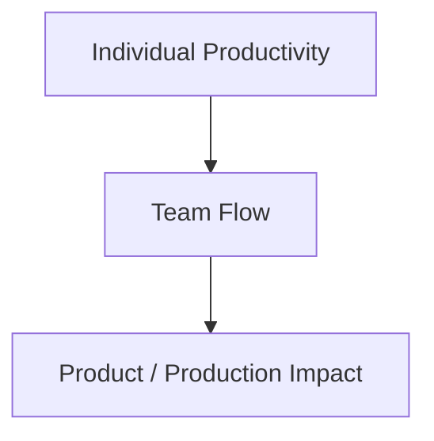

# Part 002 — From Individual Productivity to System Throughput

## 1. Source notes and scope boundary

This part uses public concepts from:

- DORA software delivery metrics, which focus on delivering software safely, quickly, and efficiently.
- SPACE developer productivity framework, which frames productivity across Satisfaction/well-being, Performance, Activity, Communication/collaboration, and Efficiency/flow.
- Flow thinking: WIP, cycle time, throughput, blocked time, queueing, and work item age.
- Team Topologies ideas around cognitive load and fast flow of change.

This part does **not** assume your team uses any specific productivity dashboard, DORA tooling, SPACE survey, Scrum/Kanban board configuration, or internal performance management policy.

Important warning:

> Productivity metrics are dangerous when used to judge individuals. They are useful when used to improve the engineering system.

---

## 2. Core thesis

Individual productivity is easy to over-measure and hard to interpret.

System throughput is harder to measure but more useful.

A team can have many productive individuals and still deliver slowly if the system around them is broken.

Examples:

- Engineers code quickly, but PR review takes five days.
- PRs merge quickly, but CI is flaky and releases are delayed.
- Stories are completed, but production incidents increase.
- Everyone is busy, but Sprint Goal is missed.
- Many tickets close, but customer-visible capability does not improve.
- Local development is slow, so engineers avoid running full tests.
- Platform requires many manual steps, so deployment confidence stays low.

The senior engineer shift is:

```text
from: How much did each developer do?
to:   How effectively does the system turn effort into safe product outcomes?
```

This is a major mindset shift.

It changes what you observe, what you optimize, and how you lead.

---

## 3. Individual activity is not system throughput

Activity is visible.

Throughput is systemic.

Activity examples:

- commits;
- lines changed;
- tickets touched;
- meetings attended;
- comments written;
- tests added;
- pull requests opened.

Throughput examples:

- valuable changes reaching production;
- quote-to-order defects reduced;
- deployment confidence improved;
- production recovery time reduced;
- onboarding time reduced;
- cycle time improved without quality loss;
- review bottleneck removed;
- flaky test rate reduced;
- customer-impacting incidents prevented.

Activity can contribute to throughput.

But activity is not throughput.

### 3.1 The busy team trap

A busy team may show:

- high WIP;
- many PRs open;
- many tickets in progress;
- many Slack threads;
- many context switches;
- many meetings;
- many urgent fixes.

But delivery may be poor because:

- work is blocked;
- feedback is late;
- context switching destroys focus;
- decisions are unclear;
- review queues grow;
- quality issues cause rework;
- deployment is delayed.

A senior engineer must learn to notice when busyness hides low flow.

---

## 4. System throughput in software

System throughput is the rate at which valuable, correct, production-ready change flows through the engineering system.

For Quote & Order, throughput is not simply number of stories.

Better examples:

- number of safe customer-impacting changes delivered;
- number of quote/order lifecycle improvements released;
- number of production incidents prevented through tests/observability;
- number of support issues eliminated;
- number of migrations safely executed;
- number of customer integration changes shipped without regression;
- number of platform improvements adopted by product teams.

System throughput has three constraints:

1. **Value quality** — are we working on the right thing?
2. **Flow quality** — can work move smoothly?
3. **Change safety** — can work land without creating unacceptable risk?

If any one is weak, throughput is weak.

---

## 5. The three-productivity model

Use three levels.



### 5.1 Individual productivity

Question:

> Can a developer make progress effectively?

Signals:

- local setup time;
- build/test runtime;
- debugging ease;
- clarity of task;
- access to docs;
- access to experts;
- cognitive load;
- interruptions;
- tooling quality.

### 5.2 Team flow

Question:

> Can the team move work from start to done without avoidable waiting and rework?

Signals:

- cycle time;
- WIP;
- work item age;
- blocked time;
- PR review latency;
- CI queue time;
- deployment waiting time;
- carryover;
- dependency delay.

### 5.3 Product / production impact

Question:

> Does the completed work create reliable product value?

Signals:

- customer impact;
- reliability;
- incidents;
- change failure;
- support ticket reduction;
- defect escape rate;
- business journey metrics;
- user/customer adoption;
- quote/order outcome quality.

Optimizing only individual productivity can hurt system impact.

Example:

- An engineer opens five PRs quickly.
- Review queue grows.
- Context is fragmented.
- CI runs five times.
- Review quality drops.
- Rework increases.

Individual output rose.

System throughput fell.

---

## 6. Queueing is the hidden enemy

Most engineering time is not active coding time.

It is waiting time.

Common queues:

- waiting for refinement clarity;
- waiting for product answer;
- waiting for architecture decision;
- waiting for environment access;
- waiting for CI;
- waiting for review;
- waiting for QA verification;
- waiting for deployment window;
- waiting for platform/security approval;
- waiting for customer test data;
- waiting for downstream team.

Queues are dangerous because they hide.

A ticket may be “in progress” while nothing is actively happening.

### 6.1 Work item age

Work item age asks:

> How long has this item been in progress?

It is often more useful than status.

A ticket in progress for eight days may indicate:

- scope too large;
- blocker unresolved;
- unclear ownership;
- hidden dependency;
- test issue;
- review delay;
- context switching;
- weak slicing.

Daily Scrum should care about aging work.

### 6.2 Queue time vs work time

Example:

| Stage | Active time | Wait time |
|---|---:|---:|
| refinement | 1 hour | 3 days waiting for answer |
| coding | 1 day | 0 |
| CI | 20 minutes | 2 hours queue/rerun |
| review | 1 hour | 2 days waiting |
| QA verification | 2 hours | 1 day environment wait |
| deployment | 30 minutes | 5 days release window |

Active time: roughly 2 days.

Elapsed time: roughly 12 days.

Optimizing coding speed by 20% barely matters if review/release waiting dominates.

---

## 7. WIP and context switching

High WIP kills throughput.

Work in progress means work has started but not finished.

High WIP creates:

- more context switching;
- slower feedback;
- more merge conflicts;
- more stale assumptions;
- more review load;
- more hidden blockers;
- more partially done work;
- weaker Sprint Goal focus.

### 7.1 WIP in enterprise teams

WIP is not only tickets.

It includes:

- open branches;
- open PRs;
- half-reviewed designs;
- unresolved architecture questions;
- partially done migrations;
- waiting QA verification;
- blocked customer dependencies;
- unmerged contract changes;
- not-yet-released increments;
- production fixes waiting for data repair.

A senior engineer should ask:

> What started work can we finish before starting more?

### 7.2 WIP and Quote & Order risk

High WIP is especially dangerous when work touches stateful domains:

- quote lifecycle changes;
- pricing rule changes;
- order state transitions;
- Kafka event schema changes;
- database migrations;
- feature flags;
- customer-specific configurations.

If many related changes are in progress simultaneously, reasoning about compatibility becomes difficult.

---

## 8. Local optimization vs global optimization

A common failure:

> Each person optimizes their own work, but the system gets worse.

Examples:

### 8.1 Developer opens many PRs

Local optimization:

- developer feels productive.

Global effect:

- review queue grows;
- reviewer context switching increases;
- integration risk rises.

### 8.2 QA receives work late

Local optimization:

- developers maximize coding time.

Global effect:

- QA finds issues late;
- rework spills over;
- Sprint Goal misses.

### 8.3 Platform enforces too much standardization

Local optimization:

- platform reduces support variants.

Global effect:

- product teams struggle with mismatched paved road;
- adoption drops;
- teams bypass platform.

### 8.4 Team increases deployment frequency without quality signals

Local optimization:

- metric improves.

Global effect:

- change failure rises;
- incident load rises;
- trust falls.

The senior engineer asks:

> What happens downstream if we optimize this local stage?

---

## 9. Productivity metrics taxonomy

Use metrics as a portfolio.

No single metric represents productivity.

### 9.1 Flow metrics

| Metric | Question |
|---|---|
| Lead time | How long from request/commit to delivery? |
| Cycle time | How long from work start to done? |
| Throughput | How many work items complete per period? |
| WIP | How much work is in progress? |
| Work item age | How long has current work been active? |
| Blocked time | How long does work wait due to blockers? |
| Review latency | How long until PR gets review? |
| CI duration | How long until automated feedback? |

### 9.2 Delivery performance metrics

| Metric | Question |
|---|---|
| Deployment frequency | How often do we deploy? |
| Change lead time | How long does change take to reach production? |
| Failed deployment/change failure | How often does change degrade service? |
| Recovery time | How quickly do we recover from failed change? |
| Reliability | Are we meeting reliability expectations? |

### 9.3 Quality metrics

| Metric | Question |
|---|---|
| Escaped defects | What issues reach production/customers? |
| Test flakiness | Can we trust automated checks? |
| Regression rate | Are old behaviors breaking? |
| Incident recurrence | Are we learning? |
| Rework rate | How often does work return after review/QA/release? |

### 9.4 DevEx metrics

| Metric | Question |
|---|---|
| Onboarding time | How long to first useful PR? |
| Local setup success | Can new engineers run the service? |
| Build/test time | How fast is local feedback? |
| Documentation usefulness | Can engineers self-serve? |
| Cognitive load survey | Does work require too much context? |
| Tool satisfaction | Do tools support or block work? |

### 9.5 Product/operation metrics

For Quote & Order:

| Metric | Question |
|---|---|
| quote creation success rate | Can users create quotes? |
| pricing latency | Can quotes be priced quickly? |
| quote acceptance failure rate | Are commercial commitments blocked? |
| quote-to-order conversion failure | Are accepted quotes becoming orders? |
| order fallout rate | Are orders failing fulfillment? |
| outbox backlog | Are events stuck? |
| Kafka consumer lag age | Are consumers behind? |
| data repair frequency | Are invariants failing? |

The best productivity model connects engineering flow to product/production outcomes.

---

## 10. What not to measure as productivity

Avoid using these as productivity proxies:

- lines of code;
- commit count;
- number of PR comments;
- number of tickets touched;
- story points per individual;
- hours online;
- meetings attended;
- test count without test quality;
- deployment count without reliability;
- incident count without severity/context;
- raw activity in chat/tooling.

These measures are easy to game and often punish good engineering behavior.

Example:

- Removing 500 lines of risky duplicate code may be more valuable than adding 2,000 lines.
- One review comment that prevents a production migration incident may be more valuable than 30 style comments.
- One design doc that prevents a wrong architecture path may save months.
- One flaky test fix may improve team confidence more than a new feature branch.

---

## 11. SPACE-style thinking

A healthy productivity model should consider multiple dimensions.

### 11.1 Satisfaction and well-being

Questions:

- Are engineers constantly interrupted?
- Is release work stressful?
- Is on-call load sustainable?
- Do engineers trust CI?
- Do developers feel they can improve the system?

### 11.2 Performance

Questions:

- Are customers receiving valuable, reliable outcomes?
- Are quote/order journeys improving?
- Are incidents decreasing?
- Are product goals being met?

### 11.3 Activity

Questions:

- What work is happening?
- Where are PRs, tests, builds, incidents, support tasks?
- Is activity balanced with outcomes?

Activity alone is not enough, but it is not useless.

### 11.4 Communication and collaboration

Questions:

- Do teams coordinate dependencies effectively?
- Are PR reviews timely and useful?
- Are product/engineering decisions clear?
- Are support escalations handled well?

### 11.5 Efficiency and flow

Questions:

- How much waiting exists?
- How much rework exists?
- How quickly does feedback arrive?
- How often is work blocked?

This multidimensional view prevents simplistic productivity management.

---

## 12. Individual productivity still matters — but differently

This part is not saying individual skill is irrelevant.

Strong engineers matter.

But individual productivity is best improved through environment and judgment, not surveillance.

A senior engineer improves individual productivity by:

- reducing ambiguity;
- improving examples and templates;
- making local setup easier;
- writing better tests;
- improving diagnostics;
- mentoring through reviews;
- documenting architecture decisions;
- making safe patterns obvious;
- reducing cognitive load.

### 12.1 Individual leverage examples

| Individual action | System effect |
|---|---|
| writes test fixture helper | many engineers test faster |
| documents state machine | fewer invalid transition bugs |
| improves PR template | reviewers catch risks earlier |
| adds dashboard panel | incidents diagnosed faster |
| simplifies local run script | onboarding time reduced |
| adds migration checklist | release risk reduced |
| removes flaky test | CI trust improved |

The strongest individual productivity increases the productivity of others.

---

## 13. Throughput in Scrum teams

In Scrum, throughput is not simply velocity.

Velocity is often used for forecasting.

It should not be used as a target or individual performance measure.

A Scrum team's real throughput is tied to Done Increment quality.

Ask:

- How often does the team produce usable increments?
- How often does work meet Definition of Done?
- How much work carries over?
- How often does work require rework after Sprint Review?
- How often does release readiness lag behind Sprint completion?
- How often does production reveal gaps in Done?

### 13.1 Sprint Goal vs throughput

High throughput with no Sprint Goal coherence may create scattered output.

A strong team balances:

- flow of work;
- focus on Sprint Goal;
- production readiness;
- sustainable pace;
- learning.

---

## 14. Applying system throughput to Quote & Order

### 14.1 Example: quote approval feature

Individual productivity view:

- developer completed approval endpoint quickly.

System throughput view:

- backlog clarified approval rules;
- story sliced around approval threshold;
- unit tests cover rule;
- integration tests cover DB transaction;
- API contract updated;
- audit event verified;
- authorization negative tests included;
- quote acceptance invalidates stale approval;
- dashboard can show approval failures;
- support can trace approval reason;
- release flag available if needed.

The second view is more valuable.

### 14.2 Example: order fallout fix

Individual productivity view:

- engineer fixed bug in fallout status update.

System throughput view:

- root cause identified;
- state invariant documented;
- duplicate callback test added;
- reconciliation query created;
- runbook updated;
- alert improved;
- support diagnosis time reduced;
- post-incident backlog item closed.

### 14.3 Example: PostgreSQL migration

Individual productivity view:

- migration SQL written.

System throughput view:

- expand-contract plan created;
- old/new app compatibility tested;
- lock behavior analyzed;
- backfill chunked;
- validation query included;
- on-prem upgrade path checked;
- rollback/roll-forward plan documented.

---

## 15. Internal verification checklist

Use this to identify your current measurement and throughput model.

### 15.1 Current metrics

- Does the team track velocity?
- Does the team track cycle time?
- Does the team track work item age?
- Does the team track PR review latency?
- Does the team track CI duration?
- Does the team track flaky tests?
- Does the team track deployment frequency?
- Does the team track failed deployments/change failure?
- Does the team track recovery time?
- Does the team track escaped defects?
- Does the team track onboarding time?

### 15.2 Metric usage

- Are metrics used for learning or judging?
- Are metrics reviewed in retro?
- Are metrics connected to improvement actions?
- Are metrics trusted by engineers?
- Are metrics visible to the team?
- Are there incentives to game metrics?

### 15.3 Flow bottlenecks

- Where does work wait longest?
- Which column on the board accumulates work?
- Which dependency repeats often?
- Which test stage fails most often?
- Which review type waits longest?
- Which release step is most manual?

### 15.4 Quality/impact

- How often does Done work later require rework?
- Which production defects recur?
- Which support issues repeat?
- Which incidents created backlog improvements?
- Which metrics connect to Quote & Order business journeys?

---

## 16. Designing a team throughput dashboard

A useful dashboard should combine flow, quality, and outcome.

### 16.1 Minimum dashboard sections

#### Flow

- WIP by stage;
- cycle time trend;
- work item age;
- blocked work count;
- PR review wait time;
- CI duration.

#### Quality

- flaky test count;
- failed pipeline rate;
- escaped defect count;
- change failure rate;
- reopened work;
- bug source categories.

#### Delivery

- deployment frequency;
- change lead time;
- failed deployment recovery time;
- release waiting time;
- rollback/hotfix count.

#### Product/production

- quote creation success;
- pricing latency;
- quote acceptance failure;
- order conversion failure;
- order fallout;
- outbox lag;
- consumer lag age;
- support escalation count.

### 16.2 Dashboard anti-pattern

Do not build a dashboard that shows everything and guides nothing.

Each panel should answer:

- What decision does this support?
- Who uses it?
- How often?
- What action follows if it changes?

---

## 17. Improvement patterns

### 17.1 If cycle time is high

Investigate:

- story size;
- WIP;
- review wait;
- CI duration;
- dependency wait;
- deployment wait.

Do not assume engineers are slow.

### 17.2 If throughput is low

Investigate:

- work slicing;
- interrupts;
- backlog quality;
- cross-team dependencies;
- review bottlenecks;
- unclear ownership.

### 17.3 If deployment frequency is low

Investigate:

- release governance;
- test confidence;
- migration risk;
- manual steps;
- feature flag strategy;
- environment availability.

### 17.4 If change failure is high

Investigate:

- DoD gaps;
- tests missing;
- architecture complexity;
- observability gaps;
- risky migrations;
- deployment batch size;
- production config drift.

### 17.5 If developers feel slow

Investigate:

- local setup;
- test runtime;
- documentation;
- cognitive load;
- unclear ownership;
- unstable environments;
- interruptions;
- review latency.

---

## 18. Senior engineer behaviors

### 18.1 Stop asking only “who owns this?”

Ask:

> What system condition made this work stuck?

Ownership matters, but stuck work often comes from system design.

### 18.2 Reduce batch size

Smaller changes improve:

- review quality;
- test focus;
- deployment safety;
- rollback options;
- learning speed.

### 18.3 Protect deep work

Context switching reduces individual and team throughput.

Help the team reduce unnecessary interruptions.

### 18.4 Make hidden work visible

Hidden work includes:

- support investigations;
- data repair;
- flaky test triage;
- environment fixes;
- review work;
- mentoring;
- architecture decision work.

If it consumes capacity, make it visible.

### 18.5 Convert friction into backlog

If friction repeats, it is work.

Examples:

- local setup failure;
- repeated CI flake;
- recurring customer data issue;
- manual deployment step;
- missing dashboard;
- unclear migration process.

---

## 19. Practical exercise: throughput diagnosis

Pick one completed work item from the last sprint.

Map:

1. When was it first identified?
2. When was it refined?
3. When did implementation start?
4. When was first PR opened?
5. When was first review received?
6. How many review cycles?
7. How long did CI take?
8. Was QA involved?
9. When was it merged?
10. When was it deployed?
11. When was it enabled?
12. When did production/customer feedback arrive?

Then classify time:

- active work;
- waiting;
- blocked;
- rework;
- deployment/release wait.

Finally answer:

- What was the biggest delay?
- What was the weakest feedback signal?
- What one improvement would reduce future cycle time or risk?

---

## 20. Practical exercise: stop measuring one bad thing

Find one metric or habit that may be creating bad incentives.

Examples:

- individual story point comparison;
- pressure to increase ticket count;
- ignoring PR size;
- celebrating velocity without quality;
- counting deployments without failed deployment recovery;
- counting tests without trust;
- counting incidents without severity/context.

Replace it with a better question.

Example:

Bad:

> Why did developer A complete fewer story points?

Better:

> Which work waited longest, and what system bottleneck caused that wait?

---

## 21. What good looks like after this part

After this part, you should be able to:

- explain why individual productivity is insufficient;
- distinguish activity, flow, quality, and product impact;
- identify queues and waiting time;
- reason about WIP and context switching;
- use SPACE/DORA/flow concepts without metric gaming;
- design a balanced team throughput dashboard;
- diagnose delivery friction without blaming individuals;
- connect engineering flow to Quote & Order production outcomes.

---

## 22. Final mental model

The goal is not to make every developer look busier.

The goal is to make the engineering system produce valuable, safe, observable, and recoverable product change with less friction and less rework.

That is system throughput.

That is the senior engineer lens.
