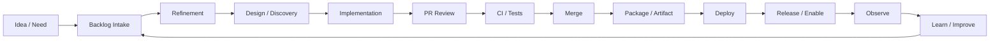

# Part 003 — Value Stream Thinking for Software Teams

## 1. Source notes and scope boundary

This part uses public software delivery concepts, especially:

- DORA guidance on value stream management and software delivery performance.
- Lean value stream mapping as an analysis technique for visualizing work from idea to production and finding bottlenecks.
- Team Topologies concepts around fast flow and cognitive load.
- The previous Scrum and CSG Quote & Order series as context for CPQ, quote management, order management, Kafka, PostgreSQL, Kubernetes, GitOps, and production readiness.

This part does **not** assume CSG uses a specific value stream management platform, Jira workflow, Git provider, CI/CD tool, DevEx telemetry product, platform portal, or organizational topology.

Use the internal verification checklist to map the actual flow in your team.

---

## 2. Core thesis

Engineering effectiveness starts with one question:

> How does valuable product change actually move from idea to safely used production behavior?

Not:

> How busy are engineers?

Not:

> How many tickets were closed?

Not:

> How many story points did the team complete?

A software value stream is the path a change travels through the organization and technical system before it creates verified value.

For a Quote & Order team, a change may begin as:

- a customer request,
- a product roadmap item,
- a production incident,
- a regulatory/compliance requirement,
- a performance problem,
- a platform migration,
- a technical debt item,
- an internal developer friction report.

It becomes valuable only when it is:

1. understood,
2. refined,
3. designed enough,
4. implemented,
5. reviewed,
6. tested,
7. integrated,
8. deployed,
9. observed,
10. learned from.

Value stream thinking helps you see the whole system, not just your local task.

---

## 3. Why senior engineers need value stream thinking

A junior engineer often optimizes the task in front of them.

A senior engineer optimizes the system that produces tasks.

Examples:

| Local view | Value stream view |
|---|---|
| My code is done | Is the change reviewed, tested, deployed, observable, and safe? |
| PR is waiting | Why is review queue a recurring bottleneck? |
| CI is slow | Which jobs dominate feedback time and which are valuable? |
| QA found a bug | Which refinement/test/DoD signal failed earlier? |
| Deployment failed | Which release readiness assumption was false? |
| Incident happened | Which detection, mitigation, and prevention loops failed? |
| Onboarding took long | Which setup/documentation/platform gaps caused delay? |

For enterprise systems, local completion is not enough.

A change to quote approval may sit in backlog for a week, coding for two days, PR review for three days, QA for four days, release for two weeks, and customer enablement for another month.

If you only measure coding time, you miss the system.

---

## 4. A reference software delivery value stream

A simplified software value stream:



For Quote & Order, each stage has domain-specific work.

| Stage | Quote & Order example |
|---|---|
| Idea | customer needs enterprise discount approval for quote |
| Intake | product creates epic/story |
| Refinement | clarify actor, threshold, approval evidence, stale approval behavior |
| Design | decide where approval invalidation lives |
| Implementation | Java domain logic, API, DB, event, audit |
| Review | domain/security/API/migration review |
| CI | unit/integration/contract/security tests |
| Merge | trunk integration |
| Package | container image and deploy artifact |
| Deploy | Kubernetes/GitOps/environment promotion |
| Release | feature flag enabled for tenant/customer |
| Observe | quote approval metrics, errors, audit events |
| Learn | retro, incident learning, backlog adjustment |

The flow is not linear in reality.

There are loops.

But the map helps reveal where work waits, bounces, or loses information.

---

## 5. Flow time vs touch time

Value stream mapping distinguishes waiting from active work.

Example:

| Stage | Touch time | Wait time |
|---|---:|---:|
| Product clarification | 2 hours | 3 days |
| Design discussion | 4 hours | 2 days |
| Coding | 1.5 days | 0 |
| PR review | 1 hour | 2 days |
| CI | 40 minutes | 4 hours queue/retry |
| QA verification | 3 hours | 2 days |
| Release | 1 hour | 6 days |

Total touch time may be about 3 days.

Total elapsed time may be 16+ days.

This is why telling engineers to "code faster" often has little effect.

Most delay may be queueing, waiting, unclear ownership, broken environments, review bottlenecks, or release gating.

Senior engineer focus:

> Find the largest delay with the highest improvement leverage, not the most visible annoyance.

---

## 6. Value stream stages in detail

## 6.1 Idea and intake

Sources of work:

- product roadmap,
- customer commitment,
- sales/field feedback,
- support ticket,
- production incident,
- security finding,
- platform migration,
- technical debt,
- developer friction,
- reliability improvement.

Engineering effectiveness question:

> Does the team have a way to distinguish value, urgency, risk, and uncertainty at intake?

Bad intake signals:

- everything is urgent,
- customer request lacks business context,
- technical debt lacks impact statement,
- production bug lacks severity definition,
- platform work lacks adoption goal,
- observability work lacks detection goal.

Better intake shape:

```md
## Work item intake

### Business/product reason
Why does this matter?

### User/customer impact
Who benefits or is protected?

### Technical surfaces
API, Kafka, PostgreSQL, UI, security, observability, deployment.

### Risk if delayed
Customer impact, operational toil, future delivery delay, compliance, reliability.

### Unknowns
What must be discovered before implementation?
```

## 6.2 Refinement

Refinement turns vague work into executable work.

For Quote & Order, refinement should clarify:

- domain vocabulary,
- actor and permission,
- lifecycle state,
- API contract,
- event contract,
- data model,
- migration path,
- customer-specific behavior,
- testing evidence,
- production readiness.

Engineering effectiveness question:

> How much rework is caused by unclear refinement?

Signals:

- story starts then returns to refinement,
- PR comments reveal acceptance criteria missing,
- QA finds requirement ambiguity,
- feature works but cannot be released,
- design decision made too late in sprint.

## 6.3 Discovery and design

Discovery is needed when uncertainty is high.

Common discovery topics:

- API compatibility,
- Kafka replay behavior,
- PostgreSQL lock risk,
- customer-specific config,
- state machine semantics,
- external system behavior,
- migration/rollback path.

Engineering effectiveness question:

> Does discovery reduce uncertainty and produce a decision, or does it become endless research?

Good discovery output:

- decision,
- options considered,
- trade-offs,
- risk list,
- recommended slice,
- test plan,
- remaining unknowns.

## 6.4 Implementation

Implementation is only one part of the value stream.

DevEx matters here:

- local setup,
- service boot time,
- test speed,
- debugging tools,
- local Kafka/PostgreSQL fixtures,
- documentation,
- codebase architecture,
- dependency clarity.

Engineering effectiveness question:

> How much developer time is spent on accidental complexity instead of product complexity?

Accidental complexity examples:

- local environment breaks weekly,
- fixture setup takes hours,
- tests are slow and flaky,
- service boundaries unclear,
- mapper SQL hard to test,
- logs lack correlation IDs,
- no way to reproduce event-driven scenario locally.

## 6.5 PR review

PR review is a queue and a quality control loop.

Engineering effectiveness question:

> Does review improve quality quickly, or does it become an unpredictable waiting room?

Review health signals:

- time to first review,
- review rounds per PR,
- PR size,
- review ownership clarity,
- review comment quality,
- percentage of PRs waiting over threshold,
- defects found after merge that should have been reviewed.

For Quote & Order, review must cover more than style:

- quote/order invariant,
- tenant isolation,
- authorization,
- audit,
- event compatibility,
- transaction boundary,
- migration safety,
- observability.

## 6.6 CI and verification

CI is the team feedback machine.

Engineering effectiveness question:

> How long does it take to learn whether a change is safe enough to proceed?

CI friction includes:

- queue time,
- slow build,
- slow tests,
- flaky tests,
- unclear failure output,
- environment dependency,
- manual reruns,
- poor test layering,
- unowned failing jobs.

Useful CI telemetry:

- median/p95 pipeline duration,
- queue time,
- test duration by suite,
- flaky job rate,
- rerun rate,
- failure category,
- time to fix broken main,
- failure ownership.

## 6.7 Merge and integration

Merge is where local correctness meets shared reality.

Engineering effectiveness question:

> Does integration happen continuously and safely, or does the team accumulate integration risk?

Signals of integration friction:

- long-lived branches,
- frequent merge conflicts,
- shared branch stabilization,
- test failures after merge,
- integration environment frequently broken,
- incompatible API/event changes discovered late.

## 6.8 Deployment and release

Deployment is not the same as release.

A change can be:

- merged,
- packaged,
- deployed,
- enabled,
- used by customer,
- producing intended outcome.

Engineering effectiveness question:

> Where does work wait after merge before customer value or production learning happens?

Release friction includes:

- approval queue,
- migration window,
- customer-specific release train,
- on-prem packaging,
- feature flag dependency,
- insufficient observability,
- release anxiety,
- manual steps,
- unclear rollback.

## 6.9 Observation and learning

The value stream does not end at deployment.

It ends when the team learns whether the change worked.

For Quote & Order, observe:

- quote creation success,
- pricing latency,
- quote acceptance failure,
- approval rejection/override,
- quote-to-order conversion,
- order fallout,
- outbox backlog,
- Kafka consumer lag,
- API error rate,
- slow query regression,
- audit completeness,
- support tickets.

Engineering effectiveness question:

> Do we learn from production fast enough to improve the backlog and system?

---

## 7. Mapping the Quote & Order value stream

Use this template.

```md
# Value Stream Map: <capability or feature>

## 1. Work source
- Roadmap / customer / incident / tech debt / platform / compliance:

## 2. Entry criteria
- What makes work visible?

## 3. Refinement path
- Who clarifies product/domain?
- Who clarifies architecture?
- Who clarifies test/release/readiness?

## 4. Implementation path
- Repos/services:
- Local setup friction:
- Test suites:

## 5. Review path
- Required reviewers:
- Typical wait:
- Review risks:

## 6. Verification path
- CI:
- QA:
- Contract:
- Migration:
- Security:

## 7. Release path
- Deploy environments:
- Feature flags:
- Customer enablement:
- On-prem/cloud differences:

## 8. Observation path
- Dashboards:
- Alerts:
- Logs/traces:
- Business metrics:

## 9. Learning path
- Sprint Review:
- Retro:
- Incident/postmortem:
- Backlog updates:

## 10. Bottlenecks
- Biggest wait:
- Biggest rework source:
- Biggest risk:
```

---

## 8. Example: value stream for quote approval change

Feature:

> Add approval invalidation when a quote's commercial terms change after approval.

### 8.1 Work source

Customer or product risk:

- accepted quote may use approval evidence for stale price/discount.

### 8.2 Refinement questions

- What quote changes invalidate approval?
- Price change only or all commercial terms?
- Does changing non-commercial note invalidate approval?
- What is the actor experience?
- Is reapproval required immediately or before acceptance?
- What audit evidence is needed?
- What API/event changes occur?
- What happens to already approved quotes?

### 8.3 Design questions

- Is approval tied to quote version?
- Is approval tied to hash of commercial terms?
- Where is invalidation enforced?
- Can quote acceptance check stale approval in one transaction?
- Is the behavior feature-flagged?
- Is migration/backfill needed?

### 8.4 Flow bottleneck candidates

- waiting for product decision on invalidation scope,
- unclear state machine ownership,
- approval service dependency,
- missing test fixture for pricing snapshots,
- slow integration tests,
- unclear audit requirements,
- release blocked by migration window.

### 8.5 Observability

Signals:

- quote approval invalidated count,
- acceptance rejected due to stale approval,
- reapproval success rate,
- approval latency,
- support tickets around approval status.

### 8.6 Learning

Sprint Review should show:

- approved quote modified,
- approval becomes stale,
- acceptance blocked,
- reapproval works,
- audit evidence visible,
- old behavior not broken.

This is value stream thinking: follow the change from idea to verified production behavior.

---

## 9. Waste taxonomy for software value streams

Waste is not moral failure.

Waste is work that consumes capacity without proportional value or learning.

| Waste type | Software example | Quote & Order example |
|---|---|---|
| Waiting | PR waits 3 days | approval logic PR waits for domain owner |
| Handoff loss | requirement passed through many people | customer-specific pricing rule loses context |
| Rework | story returns to refinement | acceptance criteria missed stale approval |
| Overproduction | building unused abstraction | generic workflow engine for one order case |
| Overprocessing | excessive manual approvals | 5 release forms for low-risk config change |
| Inventory | many started stories | half-built Kafka migration work |
| Defects | escaped bug | duplicate order from retry |
| Motion | searching for docs/tools | no guide to run local order service |
| Cognitive overload | too many systems per engineer | one team owns quote, order, catalog, infra, support |

The improvement target is not zero waste.

The target is conscious reduction of waste that slows safe value delivery.

---

## 10. Value stream measurement

Start with lightweight metrics.

### 10.1 Time metrics

- idea age,
- refinement time,
- coding time,
- PR wait time,
- CI time,
- QA verification time,
- merge-to-deploy time,
- deploy-to-enable time,
- incident detection time,
- incident recovery time.

### 10.2 Flow metrics

- WIP,
- throughput,
- cycle time,
- work item age,
- blocked time,
- percent blocked,
- PR size,
- time to first review,
- review rounds.

### 10.3 Quality metrics

- escaped defects,
- change failure,
- rollback/roll-forward events,
- flaky test rate,
- failed pipeline rate,
- incident recurrence,
- bug reopen rate.

### 10.4 Operational metrics

- deployment frequency,
- failed deployment recovery time,
- alert noise,
- MTTR subcomponents,
- runbook coverage,
- dashboard usage during incident.

### 10.5 DevEx metrics

- onboarding time,
- local setup success rate,
- local build time,
- test feedback time,
- documentation findability,
- developer friction survey,
- repeated support questions.

Metrics should guide questions, not replace judgment.

---

## 11. Diagnostic questions by bottleneck

### 11.1 Backlog bottleneck

Ask:

- Are stories entering sprint before enough clarity?
- Are Product Backlog Items too large?
- Are dependencies discovered late?
- Are acceptance criteria missing production readiness?
- Are technical debt items framed as value/risk?

### 11.2 Review bottleneck

Ask:

- Are PRs too large?
- Are reviewers overloaded?
- Is ownership unclear?
- Are review comments late because design was not reviewed earlier?
- Are style issues dominating correctness review?

### 11.3 CI bottleneck

Ask:

- Which jobs dominate time?
- Which failures are flaky?
- Which failures are useful?
- Can tests be layered better?
- Can feedback be split into fast and slow gates?

### 11.4 Release bottleneck

Ask:

- Is release blocked by manual approvals?
- Is migration risk causing delay?
- Is observability insufficient?
- Is rollback unclear?
- Is customer enablement separate from deployment?

### 11.5 Learning bottleneck

Ask:

- Does Sprint Review inspect real evidence?
- Do retros produce action items?
- Do incidents produce backlog improvements?
- Are metrics reviewed regularly?
- Are support signals fed into product/engineering planning?

---

## 12. Internal verification checklist

Verify these inside your CSG/team context.

### 12.1 Work tracking

- What tool tracks work items?
- What statuses exist?
- Which statuses mean active work vs waiting?
- Is blocked work explicitly marked?
- Are dependencies represented?
- Are bug/incident/debt/platform items represented consistently?

### 12.2 Pull request flow

- Which Git provider is used?
- What is typical time to first review?
- Who owns review routing?
- Are CODEOWNERS or equivalent used?
- What PR size is normal?
- What merge policy exists?

### 12.3 CI/CD flow

- What CI system is used?
- What are the pipeline stages?
- Which jobs are slowest?
- Which jobs are flaky?
- Are pipeline metrics visible?
- Is failed main tracked?

### 12.4 Deployment and release

- What is the deploy pipeline?
- Is deployment separate from release enablement?
- How are feature flags managed?
- How do cloud and on-prem release flows differ?
- What manual approvals exist?
- What is average merge-to-production time?

### 12.5 Observability and learning

- Which dashboards show business journey health?
- Are incidents linked to backlog items?
- Are retro actions tracked?
- Are support trends reviewed by engineering?
- Are DORA/flow/DevEx metrics measured today?

---

## 13. Practical exercise: build your first value stream map

Pick one recent feature or bug.

Examples:

- quote approval behavior,
- order cancellation fix,
- Kafka event schema change,
- PostgreSQL migration,
- CI flaky test cleanup,
- dashboard improvement.

Map:

1. when the work was discovered,
2. when it entered backlog,
3. when it became ready,
4. when coding started,
5. when PR opened,
6. when first review happened,
7. when CI passed,
8. when merged,
9. when deployed,
10. when enabled/used,
11. when production signal was observed,
12. what learning happened.

Then calculate:

- total elapsed time,
- active touch time,
- wait time,
- rework loops,
- biggest delay,
- biggest ambiguity,
- improvement candidate.

---

## 14. Senior engineer playbook

When you see slow delivery, do not start with blame.

Use this sequence:

1. Map the flow.
2. Separate active time from wait time.
3. Identify rework loops.
4. Identify ownership gaps.
5. Identify feedback delay.
6. Identify quality escape.
7. Pick one bottleneck.
8. Make one small improvement.
9. Measure whether it helped.
10. Share the learning.

Good improvement examples:

- smaller PR slicing guideline,
- refinement checklist for API/event changes,
- faster local test fixture,
- CI flaky test owner rotation,
- dashboard for work item age,
- runbook for release blocker,
- feature flag checklist,
- OpenAPI diff gate,
- standard service template.

---

## 15. Anti-patterns

### 15.1 Only measuring coding time

Coding time is often not the bottleneck.

Measure the whole value stream.

### 15.2 Treating handoffs as harmless

Every handoff risks information loss.

Reduce handoffs or improve context preservation.

### 15.3 Optimizing one stage while starving another

Faster coding can create bigger review/QA/release queues.

Optimize flow, not local activity.

### 15.4 Using metrics as judgment replacement

Metrics point to questions.

They do not automatically provide answers.

### 15.5 Ignoring production learning

If delivery ends at merge, the value stream is incomplete.

Production outcomes must feed the backlog.

---

## 16. What good looks like

A strong engineering team can answer:

- Where does work wait the longest?
- Which work types have the worst cycle time?
- Which stage creates most rework?
- Which quality escapes are recurring?
- Which release steps are manual and risky?
- Which DevEx frictions slow every engineer?
- Which platform improvements would reduce cognitive load?
- Which production signals show whether changes are successful?

A strong senior engineer uses the answers to make small, durable improvements.

---

## 17. Summary

Value stream thinking turns engineering effectiveness from vague productivity talk into system diagnosis.

For CSG Quote & Order-style enterprise systems, it helps connect:

- backlog clarity,
- domain modelling,
- technical discovery,
- implementation,
- PR review,
- CI/CD,
- release planning,
- observability,
- production learning,
- platform improvement,
- developer experience.

The key mindset:

> Improve the path that valuable change travels, not just the speed of individual engineers.
