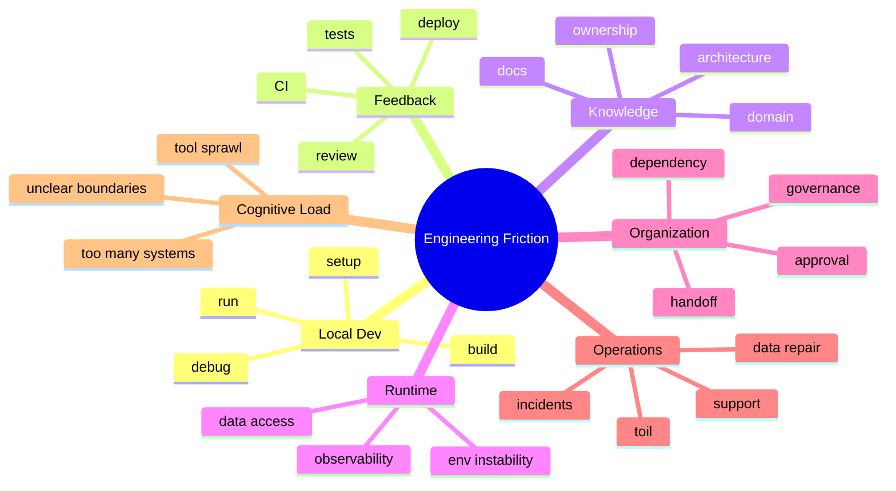

# Part 004 — Engineering Friction Taxonomy

## 1. Source notes and scope boundary

This part uses public engineering effectiveness concepts, especially:

- DORA software delivery metrics and value stream management guidance.
- Team Topologies concepts about fast flow and cognitive load.
- Developer productivity/DevEx research such as SPACE-style multidimensional productivity thinking.
- Platform engineering concepts around paved roads, self-service, and reducing cognitive load.

This part does **not** assume CSG uses a specific developer productivity platform, survey, internal developer portal, platform maturity model, or DevEx measurement system.

The goal is to provide a practical taxonomy you can use during onboarding, retrospectives, technical leadership, and engineering improvement planning.

---

## 2. Core thesis

Engineering friction is any repeated obstacle that slows safe product change, increases cognitive load, reduces confidence, or delays learning.

Friction is not always bad.

Some friction is intentional:

- security review for high-risk changes,
- migration approval for hot database tables,
- production readiness review for customer-impacting release,
- code review for domain-critical logic,
- compliance checks for audit-sensitive behavior.

Bad friction is friction that does not meaningfully reduce risk or improve quality.

Examples:

- unclear ownership,
- stale docs,
- flaky tests,
- slow feedback,
- manual release steps,
- environment instability,
- missing observability,
- repetitive support/debugging tasks,
- hidden dependencies,
- cognitive overload.

A senior engineer should be able to distinguish:

> Is this friction protecting the system, or merely slowing it down?

---

## 3. Why a taxonomy matters

Without taxonomy, every problem sounds the same:

- "process is slow",
- "CI is bad",
- "QA is blocking",
- "platform is slow",
- "requirements are unclear",
- "legacy code is hard",
- "Scrum is overhead".

These statements may contain truth, but they are not actionable.

A taxonomy lets you classify friction precisely:

- local setup friction,
- feedback-loop friction,
- review friction,
- test friction,
- environment friction,
- release friction,
- observability friction,
- domain friction,
- ownership friction,
- cognitive-load friction,
- governance friction,
- support/toil friction.

Each category needs different fixes.

---

## 4. Friction map overview



Use this map during retrospectives and improvement planning.

---

## 5. Local development friction

Local development friction affects the path from idea to first validated change.

### 5.1 Symptoms

- local setup takes days,
- build command differs by engineer,
- service cannot run locally,
- local database fixture missing,
- local Kafka scenario hard to reproduce,
- secrets/config unclear,
- IDE/debug setup undocumented,
- local tests fail depending on environment,
- onboarding requires tribal knowledge.

### 5.2 Quote & Order examples

- new engineer cannot run quote service because catalog/customer dependencies are unclear,
- pricing fixture depends on private data unavailable locally,
- order service needs Kafka topics but no local topic bootstrap exists,
- MyBatis mapper tests require manual database setup,
- no simple way to create approved quote fixture,
- local fulfillment simulator does not exist.

### 5.3 Diagnostic questions

Ask:

- How long from laptop to first successful build?
- How long from clone to running one service?
- How long from code change to local test feedback?
- How many manual steps are required?
- Which steps fail most often?
- Which knowledge is undocumented?

### 5.4 Improvement candidates

- one-command setup,
- local dev container,
- Testcontainers fixtures,
- sample data pack,
- local Kafka bootstrap,
- simulator for external dependencies,
- golden path docs,
- first-PR guide,
- environment health check script.

---

## 6. Build and dependency friction

### 6.1 Symptoms

- build takes too long,
- dependency conflicts are frequent,
- module graph unclear,
- full build required for tiny change,
- generated code stale,
- dependency upgrades risky,
- no clear ownership for shared libraries.

### 6.2 Enterprise Java examples

- Maven multi-module build takes 25 minutes locally,
- one shared DTO change triggers many services,
- OpenAPI-generated code breaks consumers silently,
- internal BOM version unclear,
- dependency scan fails but owner unclear,
- local and CI Java versions differ.

### 6.3 Improvement candidates

- build cache,
- module boundary cleanup,
- targeted test/build commands,
- dependency ownership map,
- automated generated-code validation,
- clear Java/Maven version pinning,
- dependency upgrade playbook.

---

## 7. Test feedback friction

### 7.1 Symptoms

- tests are slow,
- tests are flaky,
- failure output is unclear,
- integration tests require shared environment,
- developers skip tests locally,
- CI failures require repeated reruns,
- no clear owner for failing test,
- test data is brittle.

### 7.2 Quote & Order examples

- quote pricing tests require large catalog fixture,
- order lifecycle tests depend on time and fail intermittently,
- Kafka consumer tests race with asynchronous processing,
- DB migration tests run only late in pipeline,
- UI E2E fails due to shared QA data,
- security tests are manual.

### 7.3 Diagnostic questions

- Which tests provide fastest feedback?
- Which tests fail most often?
- Which tests catch real defects?
- Which tests are ignored?
- Which tests are too slow for PR loop?
- Which work types lack test strategy?

### 7.4 Improvement candidates

- test suite layering,
- test categorization,
- deterministic clocks/IDs,
- stable fixtures,
- quarantine with owner and deadline,
- flaky test dashboard,
- test impact analysis,
- parallelization,
- contract tests to reduce E2E burden.

---

## 8. CI/CD friction

### 8.1 Symptoms

- long queue time,
- long pipeline time,
- low signal failures,
- unclear failure ownership,
- rerun culture,
- manual artifact promotion,
- pipeline differs by branch,
- no metrics on pipeline health.

### 8.2 Pipeline as product

A CI/CD pipeline is an internal product.

Its users are engineers.

Its job is to provide fast, reliable feedback and safe promotion.

Evaluate it like a production system:

- latency,
- reliability,
- error rate,
- observability,
- usability,
- ownership,
- recovery.

### 8.3 Improvement candidates

- pipeline duration dashboard,
- queue time measurement,
- failure category tagging,
- fast/slow lane split,
- flaky test tracking,
- artifact reuse,
- environment isolation,
- clearer failure summaries,
- automatic owner routing.

---

## 9. PR review friction

### 9.1 Symptoms

- time to first review is high,
- PRs are too large,
- reviewers unclear,
- same reviewers overloaded,
- review comments arrive after architecture should have been discussed,
- style comments dominate risk comments,
- PRs bounce many times,
- merge queue is blocked.

### 9.2 Quote & Order examples

- API contract change waits for unknown owner,
- DB migration waits for senior DBA-like reviewer,
- event schema change merges without consumer review,
- security-sensitive change reviewed only by feature team,
- PR contains domain, migration, UI, and refactor in one large diff.

### 9.3 Improvement candidates

- PR size policy,
- reviewer ownership map,
- review checklist by work type,
- pre-review design discussion,
- CODEOWNERS or equivalent,
- review SLA as team agreement,
- review dashboard,
- review comment severity labels.

---

## 10. Environment friction

### 10.1 Symptoms

- shared environment frequently broken,
- test data polluted,
- deployments conflict,
- external dependencies unstable,
- environment ownership unclear,
- hard to reproduce customer config,
- environment differs from production in important ways.

### 10.2 Quote & Order examples

- QA environment catalog data changes during test,
- order fulfillment simulator down,
- Kafka topic config differs from production,
- PostgreSQL extension/version differs,
- feature flag state undocumented,
- customer-specific tenant config not reproducible.

### 10.3 Improvement candidates

- environment ownership map,
- synthetic tenant/test namespace,
- fixture versioning,
- health dashboard,
- environment reset automation,
- simulator contracts,
- ephemeral preview environments,
- config diff visibility.

---

## 11. Deployment and release friction

### 11.1 Symptoms

- merge-to-production delay is high,
- deployment requires many manual steps,
- release windows are scarce,
- rollback is unclear,
- feature flags unmanaged,
- migrations block release,
- on-prem packaging delays feedback,
- release confidence is low.

### 11.2 Quote & Order examples

- quote API change deployed but not customer-enabled for weeks,
- DB migration safe in cloud but not tested for on-prem,
- Kafka consumer deployed before schema compatibility verified,
- feature flag enabled without dashboard,
- manual release checklist depends on one person.

### 11.3 Improvement candidates

- release readiness checklist,
- automated deployment evidence,
- feature flag lifecycle,
- migration dry-run gate,
- rollback/roll-forward playbook,
- progressive rollout,
- release dashboard,
- on-prem upgrade validation path.

---

## 12. Observability friction

### 12.1 Symptoms

- incident diagnosis requires database spelunking,
- logs lack business IDs,
- traces do not cross service boundaries,
- metrics are technical but not business-relevant,
- alerts are noisy,
- dashboard does not answer customer-impact question,
- support cannot self-diagnose common issues.

### 12.2 Quote & Order examples

- cannot trace quote acceptance to order creation,
- pricing latency visible but not by product/customer segment,
- order fallout alert fires but lacks tenant/order IDs,
- Kafka lag alert does not say affected business process,
- audit events exist but are hard to query,
- outbox backlog not visible.

### 12.3 Improvement candidates

- correlation/causation ID standard,
- business metrics,
- journey dashboard,
- runbook-linked alerts,
- trace propagation,
- structured logs,
- audit query helpers,
- support diagnostic view.

---

## 13. Domain friction

### 13.1 Symptoms

- terms mean different things to different teams,
- requirements bounce because domain is unclear,
- implementation chooses wrong lifecycle state,
- tests assert technical behavior but not business invariant,
- customer-specific behavior hidden in code,
- new engineers cannot explain quote-to-order flow.

### 13.2 Quote & Order examples

- confusion between quote item and order item,
- unclear when approval expires,
- “cancel” means different things in quote/order/fulfillment,
- product inventory vs catalog ownership unclear,
- amendment semantics differ by customer,
- TMF status mapping differs from internal state.

### 13.3 Improvement candidates

- domain glossary,
- lifecycle diagrams,
- examples library,
- state transition matrix,
- customer-specific behavior registry,
- ADR for ambiguous semantics,
- acceptance criteria templates.

---

## 14. Ownership friction

### 14.1 Symptoms

- nobody knows who reviews a change,
- bugs bounce between teams,
- dashboards have no owner,
- flaky tests remain unowned,
- shared libraries become dumping ground,
- data repair ownership unclear,
- incident handoff is slow.

### 14.2 Improvement candidates

- service ownership map,
- capability ownership map,
- API/event owner registry,
- dashboard/runbook ownership,
- test ownership,
- dependency owner field,
- escalation path.

Ownership friction is often invisible until something breaks.

Make it explicit before incident pressure.

---

## 15. Cognitive load friction

Cognitive load is the mental effort required to understand and operate the system.

High cognitive load reduces flow because every change requires too much context.

### 15.1 Symptoms

- one story requires understanding too many systems,
- engineers avoid parts of codebase,
- only one person can modify a subsystem,
- product terms, API terms, DB terms, and event terms do not align,
- support/debugging requires tribal knowledge,
- platform requires many tools and manual steps.

### 15.2 Quote & Order examples

A simple approval change requires understanding:

- quote lifecycle,
- pricing snapshot,
- approval authority,
- tenant model,
- audit schema,
- Kafka events,
- REST API,
- DB transaction,
- UI state,
- feature flag,
- support workflow.

Some of this is essential complexity.

But some may be accidental.

### 15.3 Improvement candidates

- better bounded contexts,
- platform golden paths,
- local simulators,
- service templates,
- domain glossary,
- ownership maps,
- architecture diagrams,
- standardized telemetry,
- reducing tool sprawl.

---

## 16. Governance friction

Governance friction appears when standards, approvals, or gates slow delivery.

Some governance is necessary.

The question is whether the gate is risk-calibrated.

### 16.1 Healthy governance

- high-risk DB migration requires review,
- public API breaking change requires approval,
- security-sensitive change requires security review,
- production release requires readiness evidence,
- exception is documented with owner and expiry.

### 16.2 Unhealthy governance

- every tiny change needs same heavy approval,
- approval checks documents but not risk,
- exceptions never expire,
- gates have no owner,
- teams bypass gates because they are slow,
- standards are unclear or undocumented.

### 16.3 Improvement candidates

- risk-tiered governance,
- paved road defaults,
- self-service checks,
- automated evidence collection,
- exception lifecycle,
- standard templates,
- explicit decision rights.

---

## 17. Support and operational toil friction

### 17.1 Symptoms

- recurring manual support tasks,
- engineers repeatedly run diagnostic SQL,
- data repair is common and ad hoc,
- support cannot answer customer questions without engineering,
- on-call handles same alert repeatedly,
- runbooks are missing or stale.

### 17.2 Quote & Order examples

- manually checking stuck orders,
- manually replaying DLQ events,
- manually correcting order state,
- manually extracting quote audit history,
- manually comparing catalog/quote snapshots,
- manually preparing customer-specific release notes.

### 17.3 Improvement candidates

- self-service diagnostic tooling,
- support dashboards,
- reconciliation jobs,
- safe admin actions,
- runbook improvements,
- alert tuning,
- automation with audit,
- incident-derived backlog items.

---

## 18. Friction severity model

Not all friction deserves immediate investment.

Classify severity.

| Severity | Meaning | Example |
|---|---|---|
| Low | Annoying but isolated | setup doc typo |
| Medium | Repeated delay for team | PRs wait 2 days for known reviewer |
| High | Regularly blocks delivery or causes rework | flaky integration suite ignored |
| Critical | Causes production risk or customer impact | missing observability for order fallout |

Also classify frequency:

- one-time,
- occasional,
- recurring,
- systemic.

Investment priority rises when friction is both severe and frequent.

---

## 19. Friction cost model

Estimate cost roughly.

Example:

- 10 engineers,
- each loses 20 minutes/day to local environment friction,
- 5 days/week,
- 10 * 20 * 5 = 1000 minutes/week,
- about 16.7 engineer-hours/week,
- about 2+ engineer-days/week.

That may justify a platform improvement.

But also account for:

- confidence loss,
- defect escape,
- onboarding delay,
- context switching,
- production incident risk,
- opportunity cost.

---

## 20. Friction log template

Use a friction log for 2–4 weeks.

```md
# Engineering Friction Log

## Entry
- Date:
- Person/team:
- Work item:
- Friction category:
- Description:
- Time lost:
- Blocked? yes/no
- Workaround used:
- Root cause guess:
- Impact:
- Suggested improvement:
- Owner candidate:
```

Categories:

- local dev,
- build,
- test,
- CI,
- review,
- environment,
- release,
- observability,
- domain,
- ownership,
- governance,
- support/toil,
- cognitive load.

The log should not be used to shame teams.

Use it to find investment opportunities.

---

## 21. Internal verification checklist

### 21.1 DevEx friction

- How long does onboarding take?
- Can new engineers run services locally?
- What are top repeated setup issues?
- Are local fixtures available?
- Are local simulators available?

### 21.2 Flow friction

- What is average/p95 cycle time?
- What is average time to first PR review?
- What is average CI duration?
- Which board states accumulate WIP?
- Which work type gets stuck most often?

### 21.3 Quality friction

- Which tests are flaky?
- Which bugs escape repeatedly?
- Which work type needs more verification?
- Are defect root causes tagged?
- Are incident learnings converted into backlog?

### 21.4 Operational friction

- Which alerts are noisy?
- Which runbooks are missing?
- Which support tasks are repeated?
- Which data repair tasks recur?
- Which dashboards fail during diagnosis?

### 21.5 Ownership friction

- Which services have unclear owner?
- Which APIs/events lack owner?
- Which dashboards/tests/runbooks lack owner?
- Which dependencies block work often?
- Which decisions require escalation?

---

## 22. Practical exercise: classify last sprint's friction

Take the last Sprint or last 2 weeks.

List 10 moments where work slowed down.

For each, classify:

- category,
- severity,
- frequency,
- time lost,
- root cause hypothesis,
- possible improvement,
- owner.

Then group them.

Example output:

| Category | Count | Total estimated delay | Candidate fix |
|---|---:|---:|---|
| PR review | 6 | 4 days | reviewer routing + smaller PR policy |
| CI flaky | 4 | 1.5 days | flaky test ownership and quarantine |
| Domain ambiguity | 3 | 5 days | refinement checklist + glossary |
| Environment | 5 | 3 days | environment health dashboard |

Pick **one** improvement.

Do not try to fix all friction at once.

---

## 23. Senior engineer playbook

When someone says "delivery is slow", respond with diagnosis:

1. Which work type is slow?
2. Where does it wait?
3. Where does it rework?
4. Is the friction intentional or accidental?
5. What risk does the friction reduce?
6. What would happen if we removed it?
7. Can we automate evidence instead of manual gate?
8. Can platform reduce repeated burden?
9. Can better refinement prevent late rework?
10. Can observability reduce diagnosis time?

This makes improvement evidence-based.

---

## 24. Anti-patterns

### 24.1 Friction denial

Saying "this is just how enterprise works" prevents improvement.

Enterprise constraints are real, but not every slow step is necessary.

### 24.2 Friction removal without risk analysis

Removing review/security/release gates blindly can create production incidents.

Reduce friction by preserving risk control with better automation, clearer criteria, or better defaults.

### 24.3 Tool-first DevEx

Buying a tool before understanding friction often automates confusion.

Map the problem first.

### 24.4 Measuring friction but not acting

A friction survey without visible improvement creates cynicism.

Always close the loop.

### 24.5 Optimizing for loudest pain only

The loudest pain may not be the highest leverage bottleneck.

Balance qualitative pain with flow data.

---

## 25. What good looks like

A high-effectiveness team can say:

- our top three frictions are known,
- their impact is roughly measured,
- each has an owner or explicit decision not to fix yet,
- improvements are prioritized by value/risk/cost,
- platform work reduces repeated team burden,
- governance is risk-calibrated,
- production learning feeds improvement work,
- cognitive load is actively managed.

---

## 26. Summary

Engineering friction is the drag on safe, reliable, satisfying software delivery.

A taxonomy lets senior engineers move from vague frustration to actionable diagnosis.

For enterprise Quote & Order engineering, the most important friction categories are often:

- domain ambiguity,
- PR/review bottlenecks,
- CI/test unreliability,
- environment instability,
- release/migration friction,
- observability gaps,
- ownership gaps,
- operational toil,
- cognitive overload.

The key mindset:

> Do not ask only how to make engineers work harder. Ask what repeated friction prevents the system from flowing safely.
