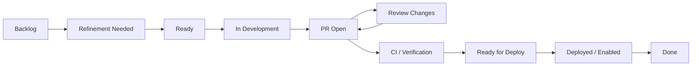

# Part 005 — Flow Metrics Foundation

## 1. Source notes and scope boundary

This part uses public flow and Kanban concepts, especially:

- Kanban flow metrics such as Work in Progress, Cycle Time, Throughput, and Work Item Age.
- Scrum with Kanban guidance that treats Kanban as a strategy for optimizing flow through a visual, WIP-limited pull system.
- DORA-style delivery diagnostics as a complementary way to observe software delivery performance.
- The previous parts of this series on value stream mapping and engineering friction.

This part does **not** assume your CSG team uses Kanban, Scrum with Kanban, a specific Jira workflow, Azure DevOps, Linear, GitHub Projects, or any exact metric dashboard.

The goal is not to force a framework. The goal is to see delivery flow clearly.

---

## 2. Core thesis

Flow metrics answer a simple but powerful question:

> How does work actually move through our engineering system?

Not how busy people are.

Not how many meetings happened.

Not whether a sprint board looks full.

Flow metrics expose where work waits, ages, blocks, batches, bounces, and loses momentum.

In enterprise systems like Quote & Order, this matters because the biggest delivery problems are often hidden in queues:

- backlog item waits for refinement clarity;
- story waits for environment access;
- PR waits for reviewer;
- CI waits in queue;
- test suite waits because flaky tests are retried;
- deployment waits for release window;
- production verification waits for support or QA;
- defect waits because ownership is unclear;
- architecture decision waits because dependency team is not available.

The bottleneck is rarely “developer not typing enough code”.

The bottleneck is usually flow.

---

## 3. Flow is movement of value, not movement of tickets

A ticket moving from `In Progress` to `Done` is not automatically value.

A meaningful flow item should represent something that creates, protects, or validates value.

Examples of valid flow items:

- implement quote approval invalidation;
- add Kafka event compatibility test;
- reduce quote search latency;
- add migration dry-run validation;
- fix escaped production bug;
- add runbook for stuck order decomposition;
- improve CI test split;
- add OpenTelemetry propagation for order journey;
- refactor direct status update behind transition service.

Examples of weak flow items:

- “backend changes”;
- “update code”;
- “investigate” with no expected output;
- “testing” as a separate late phase;
- “review” as a ticket detached from the actual work;
- “deployment” as a manual handoff with no owner.

Flow metrics are useful only when the work item definition is meaningful.

---

## 4. The four basic flow metrics

The most useful starting metrics are:

1. Work in Progress,
2. Cycle Time,
3. Throughput,
4. Work Item Age.

These are simple, but not simplistic.

They are enough to expose most delivery bottlenecks.

## 4.1 Work in Progress

**Work in Progress** is the number of work items started but not finished.

WIP matters because every active item competes for:

- attention;
- context;
- review capacity;
- test capacity;
- environment capacity;
- deployment capacity;
- stakeholder clarification;
- decision bandwidth.

High WIP creates queues.

Queues create delay.

Delay creates context loss.

Context loss creates quality risk.

### Example

A team has 6 engineers and 18 active work items.

The board looks busy.

But the real system may be unhealthy:

- 5 PRs waiting review;
- 3 stories blocked on unclear acceptance criteria;
- 2 stories waiting environment access;
- 4 items half-coded with no tests;
- 2 defects waiting triage;
- 2 design questions unresolved.

Every engineer looks productive.

The system is not flowing.

## 4.2 Cycle Time

**Cycle Time** is how long a work item takes from started to finished.

The exact start/end points must be defined by the team.

Common choices:

- start: when item enters active development;
- finish: when item satisfies Definition of Done;
- or finish: when deployed to production;
- or finish: when customer-enabled.

Be explicit.

A cycle time of “3 days” means nothing unless everyone knows the measurement boundary.

### Useful cycle-time questions

- Which work types have the longest cycle time?
- How much time is active work vs waiting?
- Are large stories causing long cycle time?
- Is PR review the main delay?
- Is CI the main delay?
- Is deployment/release gating the main delay?
- Are security/architecture reviews discovered too late?

## 4.3 Throughput

**Throughput** is the number of work items completed per unit of time.

Throughput is not story points.

Throughput is count of completed work items.

It can be segmented by work type:

- feature items;
- defects;
- technical debt;
- platform improvements;
- support/incident work;
- migration items;
- documentation/runbook work;
- architecture/spike outputs.

Throughput is useful for forecasting if work items are roughly similar enough or grouped by class.

It is dangerous when used to compare individuals.

## 4.4 Work Item Age

**Work Item Age** is how long an active item has been in progress so far.

Cycle Time is a lagging metric: it is known after completion.

Work Item Age is a leading signal: it shows which active items are aging and may become flow problems.

Work Item Age is powerful during Daily Scrum.

Instead of asking:

> What did everyone do yesterday?

Ask:

> Which active item is aging beyond expectation, and what decision or help would move it?

---

## 5. Additional useful flow metrics

## 5.1 Blocked time

Blocked time is how long a work item is explicitly blocked.

Track reason categories:

- requirement ambiguity;
- environment issue;
- dependency team;
- code review;
- CI failure;
- flaky test;
- architecture decision;
- security review;
- data access;
- production incident interrupt;
- deployment window.

Blocked time is often more useful than total cycle time because it points to actionable system improvements.

## 5.2 Queue time

Queue time is time spent waiting between active steps.

Examples:

- ready for dev → developer starts;
- PR opened → first review;
- review approved → merge;
- merge → CI complete;
- CI complete → deployment;
- deployment → verification.

Queue time is where most enterprise delivery delay hides.

## 5.3 Touch time

Touch time is actual human/system work time spent moving the item forward.

A story may have 3 hours of actual development but 8 days of elapsed time due to waiting.

That is a flow problem, not a coding problem.

## 5.4 Flow efficiency

Flow efficiency is roughly:

```txt
active work time / total elapsed time
```

Do not overfit the exact number.

Use it to start a conversation:

> Why does this simple API change spend 70% of its elapsed time waiting?

## 5.5 Rework rate

Rework rate measures how often work returns to an earlier stage.

Examples:

- PR reopened after review because acceptance criteria changed;
- story returns from QA due to missing negative case;
- deployment rolled back due to migration issue;
- bug reopened because root cause was not fixed.

Rework is not automatically bad.

But repeated rework of the same type indicates upstream weakness.

---

## 6. Flow states for enterprise software teams

A simple Scrum board may have:

- To Do,
- In Progress,
- Done.

That is often too coarse for diagnostics.

A more diagnostic flow might be:



Do not add columns for bureaucracy.

Add states only if they expose meaningful queues.

Useful states for Quote & Order work may include:

- refinement waiting product decision;
- architecture review needed;
- security review needed;
- data migration review needed;
- blocked by environment;
- blocked by external dependency;
- PR waiting review;
- PR changes requested;
- CI failing;
- release verification;
- customer enablement pending.

---

## 7. Flow metrics by work type

Not all work behaves the same.

Segment metrics by work type.

| Work type | Flow risk | Useful metric |
|---|---|---|
| Small backend feature | PR/review queue | cycle time, PR wait time |
| Complex CPQ behavior | refinement ambiguity | blocked reason, rework rate |
| DB migration | review/release gate | queue time, migration readiness age |
| Kafka event change | consumer dependency | dependency age, contract review time |
| Security-sensitive change | late security review | review wait time, rework |
| Production bug | triage delay | time to acknowledge, time to mitigate |
| Refactoring | hidden scope growth | WIP, aging, completion criteria |
| Observability improvement | deprioritization | age, throughput by improvement class |

A team can have excellent feature throughput while operational improvements rot for months.

That is not healthy.

---

## 8. Flow diagnostics for Scrum Events

## 8.1 Sprint Planning

Use flow metrics to ask:

- What work is already aging?
- How much WIP are we carrying into the Sprint?
- Which unfinished items are blocked vs actively moving?
- What work type historically gets stuck?
- Which dependencies should be resolved before commitment?
- Is the Sprint Goal realistic given existing WIP?

A common failure:

> The team starts a Sprint by adding new work while old work is still stuck.

A healthier pattern:

> Reduce WIP first. Finish or explicitly stop stale work before starting more.

## 8.2 Daily Scrum

Daily Scrum should inspect active work flow.

Useful prompts:

- Which item is oldest?
- Which PR needs review today?
- Which item is blocked by a decision?
- Which item threatens the Sprint Goal?
- Which item should be swarmed?
- Which item should be split or stopped?

Avoid:

- person-by-person status theater;
- reporting activity with no flow consequence;
- hiding aging work because “I am still working on it”.

## 8.3 Sprint Review

Use flow evidence:

- What reached Done?
- What did not reach Done?
- Which work was delayed and why?
- Which product learning did we gain?
- Which production signals changed?
- What does flow data suggest for next ordering?

Sprint Review is not only demo.

It is product and delivery learning.

## 8.4 Retrospective

Use flow metrics to identify systemic improvement:

- PR review delay increased.
- CI failures consumed 2 days.
- Refinement ambiguity caused rework.
- Migration review was discovered late.
- Too much work started, too little finished.
- Incidents consumed planned capacity.

Then choose one improvement.

Do not retro all problems at once.

---

## 9. Flow anti-patterns

## 9.1 Starting everything

The team starts many items to show progress.

Result:

- WIP rises;
- review queues grow;
- CI contention grows;
- context switching grows;
- completion rate falls.

Senior engineer response:

> What can we finish before starting another item?

## 9.2 Hiding blocked work

A work item is stuck, but nobody marks it blocked.

Result:

- aging work surprises Sprint Review;
- dependencies surface too late;
- PO cannot make trade-offs;
- team loses trust in plan.

Senior engineer response:

> Blocked is not failure. Hidden blocked work is failure.

## 9.3 Optimizing developer utilization

Everyone must always have an assigned ticket.

Result:

- no one reviews quickly;
- no one helps unblock;
- work piles up;
- quality decreases.

Senior engineer response:

> Flow improves when we optimize for finishing, not for everyone being busy.

## 9.4 Treating metrics as targets

Example:

> Every story must finish in 2 days.

Result:

- splitting becomes dishonest;
- quality is hidden;
- complex work is avoided;
- metrics become untrustworthy.

Senior engineer response:

> Metrics are sensors. Do not turn every sensor into a quota.

## 9.5 Ignoring work type

A one-line copy change and a PostgreSQL migration are counted the same.

Result:

- metrics become misleading;
- forecasting is poor;
- risk is hidden.

Senior engineer response:

> Segment by work type before drawing conclusions.

---

## 10. Practical flow dashboard

A useful team dashboard can start with:

- active WIP by state;
- aging active work;
- blocked items by reason;
- cycle time distribution;
- throughput by work type;
- PR review wait time;
- CI duration and failure rate;
- deployment wait time;
- escaped defect count;
- incident interrupt load.

For Quote & Order work, add domain-specific filters:

- quote/pricing work;
- order/fulfillment work;
- Kafka/event work;
- PostgreSQL/migration work;
- security/tenant/audit work;
- customer-specific work;
- platform/tooling work.

A good dashboard should answer:

> Where is value waiting right now?

---

## 11. Flow metrics implementation steps

## Step 1 — Define work item start and finish

Example:

- start = moved to `In Development`;
- finish = meets Definition of Done, merged, deployed to test, or deployed to production.

Choose intentionally.

Document it.

## Step 2 — Clean board states

Remove states that nobody uses.

Add states only where waiting needs visibility.

## Step 3 — Track timestamps automatically

Manual metrics are fragile.

Use your work tracker if possible.

## Step 4 — Segment work types

At minimum:

- feature,
- bug,
- production incident,
- technical debt,
- migration,
- platform/tooling,
- documentation/runbook,
- spike/discovery.

## Step 5 — Review metrics in Scrum Events

Metrics unused in team decisions become vanity data.

## Step 6 — Pick one improvement

Example:

- reduce PR first-review time;
- reduce flaky test retries;
- reduce blocked work due to missing refinement;
- reduce deployment waiting time;
- reduce aging work above threshold.

---

## 12. Internal verification checklist

Verify these in your actual CSG/team context.

### 12.1 Work tracking

- Which tool is used: Jira, Azure DevOps, GitHub, other?
- What workflow states exist?
- Which states are meaningful vs decorative?
- Is start date tracked?
- Is finished date tracked?
- Is blocked status tracked?
- Are blocked reasons categorized?
- Are work types labeled consistently?

### 12.2 Scrum/flow practice

- Does the team discuss WIP?
- Does Daily Scrum inspect aging work?
- Does Sprint Planning consider carryover WIP?
- Does Retrospective use flow evidence?
- Are PR review queues visible?
- Are CI queues visible?
- Are deployment queues visible?

### 12.3 Metrics governance

- Who can see metrics?
- Are metrics used for team improvement or individual evaluation?
- Are metric definitions documented?
- Are metric changes communicated?
- Are metrics segmented by work type?
- Are metrics used together with qualitative context?

### 12.4 Delivery bottlenecks

- What work type ages most often?
- What is the most common blocker?
- Which state has the longest waiting time?
- Where does rework happen most?
- Which queue is invisible today?
- Which flow issue repeatedly appears in retrospectives?

---

## 13. Senior engineer checklist

When looking at team flow, ask:

- Are we starting too much?
- What is the oldest active item?
- Why has it aged?
- Is the bottleneck coding, review, CI, environment, dependency, or decision?
- Which blocked reason is recurring?
- Is a work item too large and should be split?
- Is a work item not actually ready?
- Are we optimizing individual utilization over system throughput?
- Are metrics being used for learning or pressure?
- What single change would improve flow this Sprint?

---

## 14. Practical exercise

For your team, create a one-page flow diagnostic.

Include:

1. Current board states.
2. WIP by state.
3. Oldest 5 active items.
4. Blocked items and reasons.
5. Average/median cycle time for last 30 days.
6. Throughput by work type for last 30 days.
7. PR first-review time.
8. CI average duration and failure rate.
9. One proposed improvement.

Discuss it in a retrospective or engineering sync.

The goal is not to judge people.

The goal is to improve the system.

---

## 15. Part summary

Flow metrics reveal how work moves through the engineering system.

The foundation metrics are:

- WIP,
- Cycle Time,
- Throughput,
- Work Item Age.

Complement them with:

- blocked time,
- queue time,
- touch time,
- flow efficiency,
- rework rate.

For senior engineers, the point is not metric collection.

The point is seeing where value waits, why it waits, and what system improvement would help the team deliver safer software faster.
