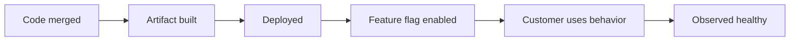

# Part 006 — DORA Metrics for Enterprise Teams

## 1. Source notes and scope boundary

This part uses public DORA guidance and software delivery research concepts.

DORA's current public guidance describes software delivery performance using metrics such as:

- Change Lead Time,
- Deployment Frequency,
- Failed Deployment Recovery Time,
- Change Failure Rate,
- Reliability.

This part does **not** assume your CSG team has DORA metrics implemented, uses a specific deployment analytics product, deploys continuously, releases directly to production, or measures all metrics the same way across cloud and on-prem deployments.

The goal is to use DORA metrics as diagnostic signals, not as team ranking or management theater.

---

## 2. Core thesis

DORA metrics help answer:

> How well can our engineering system deliver changes safely and recover when changes fail?

They do not answer everything.

They do not replace product metrics.

They do not replace flow metrics.

They do not replace customer satisfaction.

They do not replace engineering judgment.

But they are useful because they connect two things that must stay together:

1. speed of change,
2. safety of change.

A team that deploys fast but breaks production often is not effective.

A team that rarely breaks production because it rarely deploys is also not necessarily effective.

High-performing enterprise engineering aims for small, frequent, safe, observable, recoverable change.

---

## 3. The DORA metric set

## 3.1 Change Lead Time

Change Lead Time measures how long it takes a change to move from committed to deployed.

A basic boundary:

```txt
commit merged or committed → deployed to production
```

But enterprise teams must define this carefully.

Possible finish points:

- deployed to development environment;
- deployed to staging;
- deployed to production;
- enabled by feature flag;
- available to customer;
- available to on-prem package;
- consumed by downstream system.

For Quote & Order teams, this distinction matters.

A change may be:

- merged;
- deployed in cloud;
- disabled behind feature flag;
- not enabled for customer;
- not available to on-prem package;
- not safe for old API consumers.

If the finish point is unclear, the metric will mislead.

## 3.2 Deployment Frequency

Deployment Frequency measures how often the team deploys changes.

Possible measurements:

- deployments per day;
- deployments per week;
- deployments per Sprint;
- median time between deployments;
- deployments per service;
- deployments per environment.

For enterprise teams, segment by deployment target:

- development;
- test/QA;
- staging/pre-production;
- production cloud;
- customer-specific environment;
- on-prem package/release;
- hotfix release.

A team may deploy to dev daily but production monthly.

That is useful information, not failure by itself.

## 3.3 Failed Deployment Recovery Time

Failed Deployment Recovery Time measures how long it takes to recover from a failed deployment that needs immediate intervention.

Important: this is about recovery from failed deployment/change, not every incident type.

Recovery may involve:

- rollback;
- roll-forward;
- feature flag disable;
- config revert;
- data repair;
- Kafka consumer pause/replay;
- database migration correction;
- downstream coordination;
- customer communication.

For Quote & Order, recovery is often not merely redeploying old code.

If a failed change created duplicate orders or wrong pricing snapshots, recovery includes data correction and business verification.

## 3.4 Change Failure Rate

Change Failure Rate measures the percentage of changes that cause degraded service or require remediation.

This is the hardest metric to define honestly.

Questions:

- What counts as a change?
- What counts as failure?
- Does feature flag disable count?
- Does hotfix count?
- Does rollback count?
- Does customer-visible bug count?
- Does incident caused by config count?
- Does migration failure before customer impact count?
- Does support-only correction count?

The definition must be explicit.

Otherwise teams will game it unintentionally.

## 3.5 Reliability

Reliability connects delivery performance to service health.

A delivery system that ships frequently but harms reliability is not healthy.

Reliability measures may include:

- SLO attainment;
- error budget burn;
- availability;
- latency objectives;
- incident count/severity;
- customer-impacting defect rate;
- business journey success rate;
- quote acceptance success rate;
- order conversion success rate;
- order fallout rate.

For enterprise product teams, reliability should include technical and business signals.

---

## 4. DORA vs flow metrics

DORA metrics and flow metrics are complementary.

| Question | Better tool |
|---|---|
| How long do active items take? | Cycle Time |
| Which active work is stuck now? | Work Item Age |
| How much work is active? | WIP |
| How many items finish per week? | Throughput |
| How long from commit to production? | Change Lead Time |
| How often do we deploy? | Deployment Frequency |
| How often do changes fail? | Change Failure Rate |
| How fast do we recover failed deployments? | Failed Deployment Recovery Time |
| Is service health acceptable? | Reliability/SLO metrics |

Flow metrics help diagnose the delivery system.

DORA metrics help connect delivery to deployment and reliability outcomes.

Use both.

---

## 5. Enterprise measurement boundaries

DORA metrics are simplest in continuous deployment systems.

Enterprise systems add complexity.

### 5.1 Cloud vs on-prem

A cloud deployment may happen today.

An on-prem release may happen monthly or quarterly.

If you mix both into one metric, the number becomes hard to interpret.

Segment:

- cloud service deployment lead time;
- on-prem package lead time;
- customer upgrade adoption lead time;
- emergency hotfix lead time.

### 5.2 Deploy vs release vs enablement

A change may be deployed but not enabled.

Use separate markers:



Each boundary has a different operational meaning.

### 5.3 Multi-service changes

Quote & Order work may span:

- quote service;
- catalog service;
- pricing service;
- order service;
- fulfillment adapter;
- Kafka schema;
- database migration;
- UI;
- platform config.

A single product change may involve many deployments.

Decide whether you measure:

- per-service deployment performance;
- end-to-end feature delivery performance;
- release train performance;
- customer enablement performance.

Each is valid for a different question.

### 5.4 Database migrations

A code change may be deployed quickly, but the associated migration/backfill may take days.

For data-sensitive work, track:

- migration lead time;
- migration failure rate;
- backfill duration;
- validation duration;
- rollback/roll-forward time;
- production lock/incident impact.

Otherwise DORA metrics may make delivery look healthier than the product actually is.

---

## 6. Metric implementation blueprint

## 6.1 Change Lead Time implementation

Capture timestamps:

- commit time;
- PR opened;
- PR approved;
- merged;
- CI passed;
- artifact published;
- deployed to environment;
- feature enabled;
- verification complete.

Then compute multiple lead times:

| Metric | Boundary |
|---|---|
| Coding lead time | first commit → merge |
| Review lead time | PR opened → merge |
| CI lead time | merge → artifact ready |
| Deployment lead time | artifact ready → production deployed |
| Enablement lead time | deployed → feature enabled |
| Full change lead time | commit → customer-usable |

Do not collapse all of these too early.

The breakdown shows where delay lives.

## 6.2 Deployment Frequency implementation

Count deployments by:

- service;
- environment;
- deployment type;
- regular vs hotfix;
- manual vs automated;
- successful vs failed;
- cloud vs on-prem package.

Avoid counting meaningless redeploys as delivery progress.

If a deployment contains no product or operational change, classify it accordingly.

## 6.3 Failed Deployment Recovery Time implementation

For each failed deployment/change, capture:

- failure detected time;
- mitigation started time;
- user/customer impact ended time;
- full recovery verified time;
- data repair completed time if applicable;
- post-incident prevention item created.

Do not hide long data repair time behind fast rollback time.

For Quote & Order, recovery is not complete until business invariants are restored.

## 6.4 Change Failure Rate implementation

Define denominator:

- production deployments;
- customer-enabled changes;
- release packages;
- feature flag activations;
- config changes;
- migrations.

Define numerator:

- incident caused by change;
- rollback;
- hotfix;
- feature flag emergency disable;
- data repair required;
- customer-impacting regression;
- severe operational degradation.

Then segment.

A migration failure and a UI copy typo should not be interpreted the same way.

---

## 7. DORA metrics for Quote & Order work

## 7.1 Quote/pricing changes

Watch:

- change lead time from merge to customer-enabled;
- failed deployment/release due to pricing regression;
- recovery time including price correction;
- reliability through quote pricing latency/error;
- quote acceptance success rate.

Failure may include:

- quote price changed unexpectedly;
- approval threshold wrong;
- accepted quote snapshot incorrect;
- quote acceptance disabled;
- customer escalation requiring data correction.

## 7.2 Order management changes

Watch:

- deployment frequency for order service;
- change failure due to stuck orders;
- recovery time including repair of in-flight orders;
- order fallout rate;
- order conversion success rate;
- Kafka consumer lag and DLQ.

Failure may include:

- duplicate order;
- order stuck in lifecycle;
- fulfillment callback mismatch;
- cancellation failure;
- missing event.

## 7.3 PostgreSQL migration changes

Watch:

- migration lead time;
- migration failure rate;
- migration rollback/roll-forward time;
- DB lock wait impact;
- slow query regression;
- backfill completion time.

Failure may include:

- deployment blocked;
- application cannot start;
- long lock incident;
- old app incompatible with new schema;
- data repair required.

## 7.4 Kafka/event changes

Watch:

- lead time from schema change to consumer compatibility;
- failed changes due to consumer errors;
- recovery time from replay/DLQ;
- consumer lag age;
- DLQ rate;
- event contract breakage.

Failure may include:

- old consumer cannot deserialize;
- partition key change breaks ordering;
- replay creates duplicate side effects;
- event missing correlation/tenant metadata.

---

## 8. Interpretation patterns

## 8.1 Low deployment frequency + low failure rate

Possible interpretations:

- system is stable and release cadence is intentionally slow;
- team batches risky changes;
- manual release process creates friction;
- failures are undercounted;
- customer impact is delayed to on-prem upgrades;
- feature flags hide deployed-but-not-enabled work.

Ask:

- Are releases large?
- Is release anxiety high?
- Are hotfixes common?
- Does customer enablement lag deployment?

## 8.2 High deployment frequency + high failure rate

Possible interpretations:

- CI/test gates weak;
- observability insufficient;
- changes too risky;
- migrations unsafe;
- flags/config poorly governed;
- review quality low;
- production verification weak.

Ask:

- Which change type fails most?
- Are failures detected quickly?
- Are rollbacks/data repairs safe?

## 8.3 Long change lead time

Possible causes:

- large work items;
- slow review;
- slow CI;
- environment instability;
- manual deployment gates;
- late security/architecture review;
- customer-specific release process;
- on-prem packaging;
- unclear Definition of Done.

Action:

- break lead time into segments;
- attack the largest queue first.

## 8.4 Long recovery time

Possible causes:

- weak observability;
- no rollback plan;
- migrations irreversible;
- data repair manual;
- ownership unclear;
- downstream systems involved;
- runbook missing;
- support escalation slow.

Action:

- improve detection, diagnosis, mitigation, and repair separately.

---

## 9. Anti-gaming principles

## 9.1 Do not compare individuals with DORA metrics

DORA metrics describe delivery system performance.

They are not developer scorecards.

## 9.2 Do not optimize one metric alone

Optimizing deployment frequency alone may increase failure.

Optimizing change failure alone may reduce deployment to near zero.

Use balanced interpretation.

## 9.3 Do not hide failure definitions

If teams redefine failure to look good, metrics become useless.

Document definitions.

Review definitions periodically.

## 9.4 Do not punish transparency

A team that reports failures honestly may look worse than a team that hides them.

Reward learning and prevention.

## 9.5 Segment before judging

Segment by:

- service;
- work type;
- release type;
- environment;
- cloud/on-prem;
- migration vs code;
- feature vs incident/hotfix;
- customer-specific vs general platform.

Raw aggregate numbers often mislead.

---

## 10. DORA metrics and Scrum

DORA metrics can inform Scrum without replacing Scrum.

### Sprint Planning

Use DORA signals to ask:

- Are we carrying release friction into this Sprint?
- Is deployment capacity realistic?
- Are migrations historically risky?
- Do we need a hardening/improvement item?

### Daily Scrum

Use change lead-time segments to ask:

- Is PR review delaying this change?
- Is CI failing repeatedly?
- Is deployment blocked?
- Is feature enablement waiting on stakeholder decision?

### Sprint Review

Show evidence:

- what was merged;
- what was deployed;
- what was enabled;
- what was observed healthy;
- what remains unreleased.

### Retrospective

Use DORA trends to choose system improvements:

- reduce deployment failure;
- reduce recovery time;
- reduce CI lead time;
- reduce release batch size;
- improve observability.

---

## 11. Practical dashboard for enterprise teams

A useful dashboard can include:

### Delivery speed

- change lead time by service;
- change lead time segment breakdown;
- deployment frequency by environment;
- release frequency by customer/on-prem package.

### Delivery safety

- failed deployment count;
- change failure rate by change type;
- emergency rollback count;
- hotfix count;
- feature flag emergency disable count;
- migration failure count.

### Recovery

- failed deployment recovery time;
- time to detect;
- time to mitigate;
- time to data repair;
- time to customer communication/closure.

### Reliability

- SLO attainment;
- incident severity;
- quote/order business journey success;
- error budget burn if used;
- outbox/Kafka lag;
- order fallout rate.

### Context

- work type mix;
- incident interrupt load;
- on-prem release cadence;
- deployment freeze windows;
- customer-specific releases.

---

## 12. Internal verification checklist

Verify these in your team.

### 12.1 Deployment model

- What counts as deployment?
- What counts as release?
- What counts as customer enablement?
- Are cloud and on-prem measured separately?
- Are config changes tracked?
- Are feature flag activations tracked?
- Are database migrations tracked as changes?

### 12.2 Data sources

- Where are commits/PRs tracked?
- Where are builds tracked?
- Where are deployments tracked?
- Where are feature flags tracked?
- Where are incidents tracked?
- Where are rollbacks tracked?
- Where are data repairs tracked?
- Where are customer escalations tracked?

### 12.3 Failure definitions

- What is a failed deployment?
- Does rollback count?
- Does hotfix count?
- Does data repair count?
- Does feature flag disable count?
- Does performance degradation count?
- Does customer-visible defect count?
- Does migration failure before production count?

### 12.4 Reliability linkage

- Which SLOs exist?
- Which business journey metrics exist?
- Are quote/order success rates measured?
- Are fallout rates measured?
- Are Kafka/DLQ/consumer lag metrics connected to delivery changes?
- Can incidents be linked to deployments?

### 12.5 Governance

- Who owns DORA metrics?
- Are metrics used for improvement or ranking?
- Are definitions documented?
- Are teams allowed to challenge metric interpretation?
- Are qualitative reviews paired with quantitative metrics?

---

## 13. Senior engineer checklist

When using DORA metrics, ask:

- What question are we trying to answer?
- Are metric boundaries clear?
- Is the data source reliable?
- Are cloud/on-prem paths mixed incorrectly?
- Are feature flags hiding customer enablement delay?
- Are migrations included?
- Are failed changes undercounted?
- Are we looking at trend, distribution, and segmentation?
- Is this metric driving a useful improvement?
- Could this metric be gamed?
- What qualitative evidence explains the number?

---

## 14. Practical exercise

Create a DORA diagnostic for one service.

Include:

1. Last 30 days deployment frequency.
2. Median change lead time from merge to deployment.
3. Lead-time breakdown: PR, CI, artifact, deploy, enablement.
4. Failed deployments or emergency changes.
5. Recovery time for each failure.
6. Reliability signal: error rate, SLO, or business journey metric.
7. Top bottleneck.
8. One improvement proposal.

Example improvement proposals:

- reduce PR review wait time;
- split slow integration tests;
- automate deployment verification;
- improve rollback runbook;
- add feature flag audit;
- add migration dry-run gate;
- link incidents to deployment SHA.

---

## 15. Part summary

DORA metrics help enterprise teams understand delivery speed and delivery safety together.

The core metrics are:

- Change Lead Time,
- Deployment Frequency,
- Failed Deployment Recovery Time,
- Change Failure Rate,
- Reliability.

For enterprise Quote & Order teams, use them carefully:

- define measurement boundaries;
- separate deploy/release/enablement;
- segment cloud and on-prem;
- include migration and data repair realities;
- connect delivery metrics to business journey reliability;
- avoid individual performance ranking;
- use metrics to improve the system.

The goal is not to become a metrics organization.

The goal is to become a learning engineering system.
