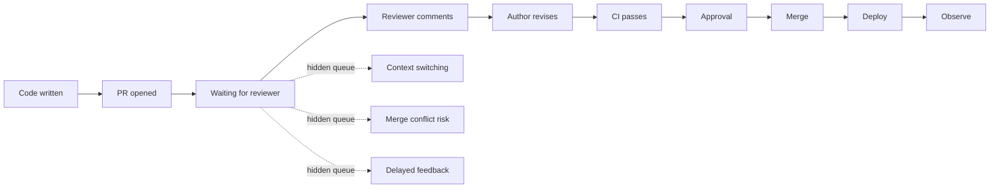

# Part 007 — Code Review Latency and PR Flow

## 1. Source notes and scope boundary

This part uses public engineering-practice references, especially:

- Google Engineering Practices on the standard, speed, and mechanics of code review.
- DORA delivery-performance concepts such as lead time and fast feedback.
- The previous Scrum series material on PR review as sprint quality control.
- The previous Quote & Order series material on domain-aware review, API compatibility, Kafka events, PostgreSQL migrations, security, observability, and production readiness.

This part does **not** assume CSG uses GitHub, GitLab, Bitbucket, Gerrit, Azure DevOps, specific branch policies, mandatory approvals, merge queues, CODEOWNERS, or a specific review SLA.

Use the internal verification checklist to confirm the real tools, norms, and approval rules in your team.

---

## 2. Core thesis

Code review is not only a quality gate.

Code review is a flow system.

A team can have smart engineers and still move slowly if pull requests spend most of their life waiting:

- waiting for first reviewer response;
- waiting for domain owner;
- waiting for security reviewer;
- waiting for CI;
- waiting for author revision;
- waiting for merge queue;
- waiting for release branch approval;
- waiting because the PR is too large to review confidently.

For senior engineers, the goal is not simply to review more PRs.

The goal is to design a review system where:

- important risk is caught early;
- low-risk change flows quickly;
- review comments transfer knowledge;
- ownership is clear;
- PRs are small enough to understand;
- CI supports review instead of replacing judgment;
- merge is boring, safe, and predictable.

In enterprise Quote & Order systems, PR flow is directly connected to production safety because review often catches risk in:

- quote lifecycle invariants;
- pricing and approval evidence;
- product order state transitions;
- Kafka event compatibility;
- PostgreSQL migration safety;
- tenant isolation;
- audit defensibility;
- observability and supportability.

Slow review is expensive.

Low-quality review is more expensive.

The senior engineer challenge is to improve both speed and judgment.

---

## 3. Why PR latency matters

PR latency affects more than delivery date.

It affects engineering quality.

Long-lived PRs create:

- merge conflicts;
- stale context;
- repeated rebasing;
- author context switching;
- reviewer fatigue;
- larger review diffs;
- delayed defect discovery;
- delayed integration;
- hidden WIP;
- sprint spillover;
- delayed feedback to product;
- slower incident fix flow.

A PR waiting three days for review is not neutral. It increases system inventory.

That inventory has carrying cost.



If the team optimizes only coding time but ignores review wait time, delivery remains slow.

---

## 4. The PR lifecycle

Model PR flow as a lifecycle.

| Stage | Question | Common bottleneck |
|---|---|---|
| Pre-PR | Is the change sliced and testable? | story too large, unclear design |
| Opened | Is the PR understandable? | weak description, huge diff |
| First response | Has someone engaged? | reviewer unavailable |
| Review iteration | Are comments converging? | vague comments, design debate too late |
| CI validation | Is automated evidence trustworthy? | slow/flaky pipeline |
| Approval | Is risk accepted by correct owner? | missing domain/security/DB owner |
| Merge | Can it merge safely? | stale branch, merge queue, conflicts |
| Post-merge | Did it deploy/observe cleanly? | no deployment signal |

Improving PR flow requires measuring and improving each stage.

A single metric like "time to merge" is useful but not enough.

Break it down.

---

## 5. PR flow metrics

### 5.1 First response time

Time from PR opened to first meaningful reviewer response.

Why it matters:

- establishes feedback loop;
- prevents author from waiting blindly;
- catches wrong direction early;
- reduces emotional friction.

A first response does not need to be full review.

Useful first responses:

- "I can review this today."
- "This needs the order lifecycle owner too."
- "This PR is too large; can we split migration from behavior?"
- "Before reviewing implementation, can you clarify idempotency expectation?"

### 5.2 Review cycle time

Time from PR opened to approval/merge.

Useful as aggregate flow metric, but interpret carefully.

Long review cycle may mean:

- PR too large;
- unclear requirement;
- missing tests;
- wrong reviewer;
- design issue discovered too late;
- CI bottleneck;
- author unavailable;
- necessary deep review for high-risk change.

Not all long reviews are bad.

Unexplained long reviews are bad.

### 5.3 Time in author state vs reviewer state

Split waiting:

- waiting for reviewer;
- waiting for author revision;
- waiting for CI;
- waiting for merge.

This prevents blame.

If PRs spend most time waiting for CI, adding reviewers will not help.

If PRs spend most time waiting for author revision, PR quality or task slicing may be the issue.

### 5.4 PR size

Track:

- lines changed;
- files changed;
- logical changes;
- number of domains touched;
- number of risk surfaces touched.

Lines changed are imperfect.

A 50-line migration can be riskier than a 500-line generated file.

For Quote & Order, count risk surfaces:

- API contract;
- Kafka event;
- DB migration;
- state machine;
- authorization;
- audit;
- operational dashboard;
- customer-specific config.

### 5.5 Review iteration count

Many iterations may indicate:

- unclear acceptance criteria;
- reviewer discovering design problem too late;
- author not following conventions;
- missing tests;
- ambiguous ownership;
- over-detailed preference comments.

Use as diagnostic, not punishment.

### 5.6 Rework after merge

Track:

- hotfixes caused by reviewed PR;
- reverted PRs;
- escaped defects;
- production incidents linked to review gap;
- follow-up PRs caused by incomplete review.

Fast review with high rework is not healthy.

---

## 6. PR size as the first lever

Large PRs are review poison.

They increase:

- reviewer cognitive load;
- comment delay;
- missed bugs;
- design debate late in the process;
- merge conflict probability;
- author frustration;
- review fatigue.

A senior engineer should help the team slice PRs.

### 6.1 Useful PR slicing patterns

| Pattern | Example |
|---|---|
| Preparatory refactor | Extract transition method before changing behavior |
| Test-first PR | Add characterization tests for current quote acceptance behavior |
| Schema expand PR | Add nullable column before using it |
| Write-path PR | Start writing new field behind compatibility path |
| Read-path PR | Switch reads after backfill validates |
| Contract PR | Add OpenAPI/event schema change separately from behavior |
| Observability PR | Add logs/metrics/dashboard before rollout |
| Cleanup PR | Remove old path after migration window |

### 6.2 Bad PR slicing patterns

Avoid PRs that combine:

- behavior change + migration + API contract + refactor;
- pricing logic + formatting cleanup;
- security model change + unrelated test cleanup;
- generated client update + manual domain change;
- order lifecycle change + database index change + dashboard change;
- massive rename + logic change.

Separate risk surfaces when possible.

---

## 7. PR description as review infrastructure

A good PR description reduces reviewer latency.

### 7.1 Minimum PR description template

```md
## What changed
- 

## Why
- 

## Risk surfaces
- API: yes/no
- Kafka/event: yes/no
- DB/migration: yes/no
- Security/tenant/audit: yes/no
- Observability/runbook: yes/no
- Feature flag/config: yes/no

## How tested
- Unit:
- Integration:
- Contract:
- Manual:

## Rollout/rollback
- 

## Reviewer focus
- Please focus on:
```

### 7.2 Quote & Order reviewer focus examples

For quote acceptance:

```md
Reviewer focus:
- stale price invalidation
- approval evidence preservation
- idempotent accept behavior
- audit event correctness
```

For order decomposition:

```md
Reviewer focus:
- item-to-task mapping
- duplicate callback handling
- fallout state transitions
- outbox event emission
```

For PostgreSQL migration:

```md
Reviewer focus:
- rolling deploy compatibility
- lock behavior
- backfill resumability
- old/new app version safety
```

A reviewer should not have to infer the risk model from diff alone.

---

## 8. Reviewer routing

Wrong reviewer routing creates delay and weak review.

Use reviewer categories.

| Review type | Reviewer needed |
|---|---|
| Domain behavior | capability owner/domain experienced engineer |
| Public API | API owner/consumer representative |
| Kafka event | producer/consumer/event schema owner |
| PostgreSQL migration | DB/data owner or experienced reviewer |
| Security/tenant/audit | security-aware reviewer |
| Platform/deployment | platform/runtime owner |
| Observability/runbook | on-call/operability owner |
| Large refactor | area owner + senior reviewer |

Do not require every specialist for every PR.

But do not let high-risk PRs merge with only generic review.

### 8.1 CODEOWNERS is not enough

CODEOWNERS can route by file path.

Risk is often semantic.

A change in a service class may affect:

- public API;
- pricing behavior;
- audit evidence;
- Kafka event.

Reviewer routing should include semantic labels or risk checklist, not file ownership alone.

---

## 9. Review quality dimensions

A senior review checks more than code style.

### 9.1 Domain correctness

Ask:

- Does this preserve quote/order lifecycle invariants?
- Does this change accepted commercial terms?
- Does this affect approval authority?
- Does this affect fulfillment fallout?
- Does this affect customer-visible state?

### 9.2 Data safety

Ask:

- Is the transaction boundary correct?
- Is optimistic locking needed?
- Is migration safe during rolling deploy?
- Are tenant predicates present?
- Are repair/backfill implications understood?

### 9.3 API/event compatibility

Ask:

- Is OpenAPI/event schema backward compatible?
- Are enum changes safe?
- Are error codes stable?
- Are old consumers tolerated?
- Are correlation/causation IDs preserved?

### 9.4 Security/audit

Ask:

- Is authorization state-aware?
- Is tenant isolation enforced?
- Is privileged action audited?
- Is PII redacted?
- Can a service token bypass user authority?

### 9.5 Operability

Ask:

- Can this be observed in production?
- Are logs/metrics/traces useful?
- Is failure actionable?
- Is there a runbook for new failure mode?
- Can support diagnose this?

### 9.6 Test evidence

Ask:

- Are the tests at the right level?
- Are negative paths covered?
- Is idempotency tested?
- Is concurrency/race condition relevant?
- Are migration/contract tests needed?

---

## 10. Speed without rubber stamping

Review speed does not mean approving quickly without reading.

It means reducing waiting and focusing attention where it matters.

Useful practices:

- first response quickly;
- ask for split early;
- review high-risk parts first;
- label comments by severity;
- avoid style comments that tools can handle;
- use pair review for complex logic;
- use design review before PR for architecture-heavy work;
- use checklists for repeated risk surfaces;
- do not block on nits if correctness is good;
- convert non-blocking ideas to follow-up backlog.

### 10.1 Comment severity

Use explicit severity.

```md
blocking: This migration adds NOT NULL without backfill; unsafe for existing rows.
strong suggestion: This helper would be easier to test if extracted.
question: Should duplicate callbacks be idempotent here?
nit: Typo in variable name.
future: We should later centralize this mapping.
```

This prevents review from becoming negotiation theater.

---

## 11. Handling design debate in PR

Some debates should happen before code review.

Signals that a PR is doing design too late:

- reviewers question the entire approach;
- comments exceed implementation size;
- multiple reviewers propose incompatible architectures;
- PR touches many services;
- no one knows expected behavior;
- acceptance criteria are rewritten during review;
- author says "this is what the ticket said" but no one agrees.

Response:

1. Pause implementation review.
2. Capture design question.
3. Create short decision note/ADR if needed.
4. Align on approach.
5. Resume review or split PR.

Do not bury architecture decisions in comment threads that no one will read later.

---

## 12. Merge queue and post-approval delay

A PR can be approved but still not merged.

Common causes:

- flaky CI rerun;
- branch out of date;
- merge conflict;
- release branch freeze;
- required check unavailable;
- manual approval step;
- deployment queue;
- missing version bump;
- generated artifacts not updated.

Measure approved-to-merged time separately.

If this delay is large, review is not the bottleneck.

The delivery system is.

---

## 13. Review and CI relationship

CI should remove mechanical burden from human reviewers.

CI should check:

- formatting;
- static analysis;
- unit tests;
- integration tests;
- contract diffs;
- schema compatibility;
- migration dry run;
- vulnerability scan;
- container build;
- policy checks.

Human reviewers should focus on:

- intent;
- domain correctness;
- trade-offs;
- failure modes;
- ownership;
- maintainability;
- operability;
- security semantics.

If reviewers routinely comment on formatting, automation is missing.

If automation approves unsafe domain behavior, human review is missing.

---

## 14. Review bottleneck diagnostics

Use a simple diagnostic.

```md
## PR Flow Diagnostic

Time window:

PR count:
Median PR size:
Median first response time:
Median time to merge:
Median CI duration:
Median time waiting after approval:
% PRs with >2 review cycles:
% PRs stale >3 days:
% PRs reverted/hotfixed:

Top bottlenecks:
1.
2.
3.

Top causes:
1.
2.
3.

Improvement experiment:
```

Then choose one experiment.

Examples:

- default PR template;
- review rotation;
- domain reviewer map;
- PR size target;
- auto-format gate;
- flaky test quarantine policy;
- merge queue improvement;
- pair-review for high-risk changes;
- pre-PR design checkpoint.

---

## 15. PR flow for Quote & Order work types

### 15.1 Pricing logic PR

Reviewer checklist:

- price before/after examples included;
- rounding/currency behavior tested;
- approval threshold behavior tested;
- accepted quote snapshot not modified silently;
- audit evidence preserved;
- feature flag considered;
- support explanation available.

### 15.2 Order lifecycle PR

Reviewer checklist:

- legal transition matrix updated;
- illegal transitions tested;
- idempotency tested;
- outbox/event emission in transaction;
- parent/item state consistency;
- fallout path considered;
- audit event present;
- dashboard signal considered.

### 15.3 Kafka event PR

Reviewer checklist:

- schema compatibility checked;
- event envelope metadata present;
- old consumers considered;
- replay safe;
- partition key stable;
- duplicate handling tested;
- DLQ behavior known.

### 15.4 Migration PR

Reviewer checklist:

- expand-contract plan;
- old app/new schema compatible;
- new app/old data compatible;
- lock behavior considered;
- backfill chunked/resumable;
- validation query present;
- rollback/roll-forward known;
- on-prem upgrade considered.

---

## 16. Internal verification checklist

Verify internally:

- Which code hosting/review tool is used?
- What are required reviewers/approval rules?
- Are CODEOWNERS or equivalent rules used?
- Is there a merge queue?
- Are branch protection rules enforced?
- What checks are required before merge?
- What is the expected review response time?
- Are PR templates standardized?
- Are risk labels used?
- Are DB/API/security changes routed specially?
- Are generated files reviewed differently?
- Is there a policy for large PRs?
- Are review metrics available?
- Is first response time measured?
- Is CI duration measured?
- Are flaky tests tracked?
- Who owns review bottlenecks?
- How are review disagreements resolved?
- Are emergency/hotfix PRs handled differently?

---

## 17. Practical exercise

Take the last 20 PRs in your team.

For each PR, record:

- size;
- files changed;
- risk surfaces;
- time to first response;
- time to merge;
- number of review iterations;
- CI duration;
- whether it needed follow-up fix.

Then answer:

1. What is the biggest queue?
2. Which PR types wait longest?
3. Which reviewers are overloaded?
4. Which PRs should have been split?
5. Which review comments could have been automated?
6. Which bugs should review have caught?
7. What one experiment would improve flow without weakening quality?

---

## 18. Summary

PR flow is a delivery system.

Healthy PR flow requires:

- small coherent changes;
- useful PR descriptions;
- correct reviewer routing;
- fast first response;
- automation for mechanical checks;
- human review for domain and production risk;
- clear comment severity;
- design discussions before giant PRs;
- measurement that diagnoses queues, not people.

For senior engineers, the goal is not to approve everything faster.

The goal is to make review fast where risk is low, deep where risk is high, and continuously better as the team learns.
