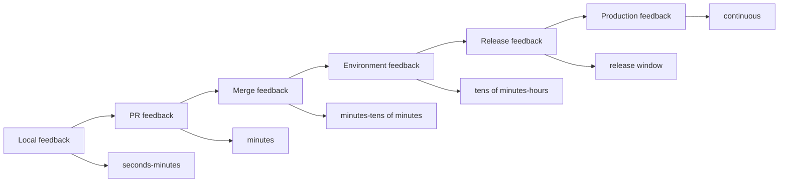
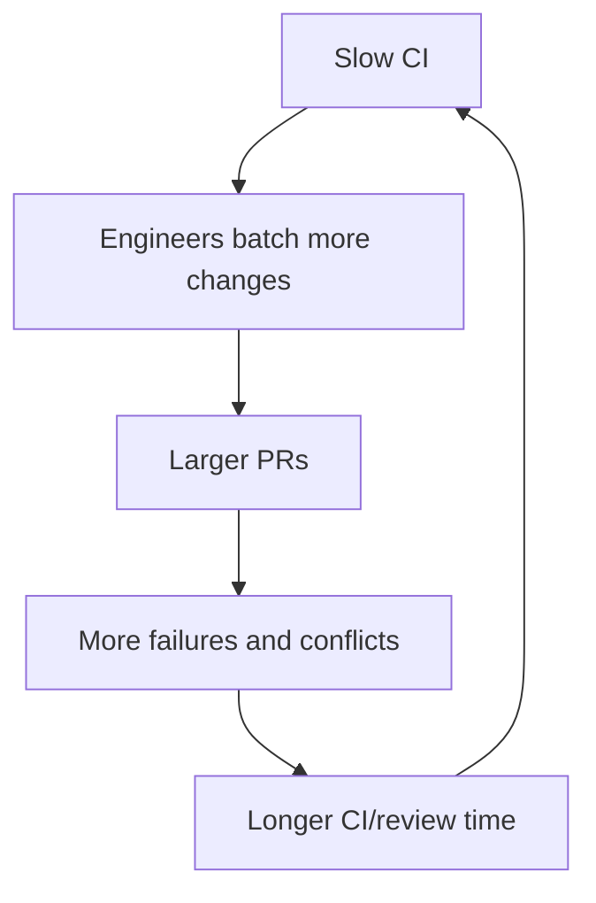

# Part 008 — CI/CD Bottleneck Analysis

## 1. Source notes and scope boundary

This part uses public engineering-practice references, especially:

- DORA material on delivery capabilities and trunk-based development.
- Martin Fowler's Continuous Integration writing.
- The previous CSG Quote & Order material on CI/CD, Kubernetes, GitOps, migrations, testing, and production readiness.

This part does **not** assume CSG uses GitHub Actions, GitLab CI, Jenkins, Azure Pipelines, TeamCity, Argo CD, Flux, Spinnaker, Tekton, or a specific artifact registry.

It also does not assume whether your team practices continuous deployment, continuous delivery, release trains, environment promotion, or customer/on-prem packaging.

Use the internal verification checklist to map the real pipeline.

---

## 2. Core thesis

A CI/CD pipeline is a production system for engineering feedback.

It has:

- users: engineers, reviewers, QA, release managers, platform teams;
- inputs: commits, PRs, configuration, dependencies, test data;
- outputs: artifacts, evidence, deployment state, confidence;
- queues: runner capacity, test stages, approvals, deployment windows;
- failures: flaky tests, infrastructure instability, dependency outages, slow builds;
- SLO-like expectations: fast enough, reliable enough, trustworthy enough.

If the pipeline is slow or unreliable, engineering slows down even when developers are skilled.

For enterprise Quote & Order systems, CI/CD bottlenecks are especially expensive because every change may require evidence for:

- Java build correctness;
- unit/integration/contract tests;
- PostgreSQL migration safety;
- Kafka schema compatibility;
- API compatibility;
- security scans;
- container image scanning;
- Kubernetes manifest validation;
- GitOps promotion;
- deployment verification;
- release readiness.

The solution is not simply "make CI faster".

The solution is to design feedback loops at the right speed and confidence level.

---

## 3. CI/CD as feedback architecture

A pipeline should answer different questions at different speeds.



A healthy pipeline does not run every possible test at every stage.

It runs the fastest useful evidence as early as possible, and deeper evidence where it belongs.

---

## 4. Pipeline value stream map

Map your CI/CD pipeline as a value stream.

Typical stages:

1. Developer local build/test.
2. Push branch.
3. PR checks start.
4. Dependency restore/cache.
5. Compile.
6. Unit tests.
7. Static analysis/lint.
8. Integration tests.
9. Contract tests.
10. Migration tests.
11. Security/dependency scan.
12. Container image build.
13. Image scan/signing.
14. Manifest/render validation.
15. Artifact publish.
16. Merge.
17. Deploy to environment.
18. Smoke tests.
19. Release/enablement.
20. Production observation.

For each stage, measure:

- queue time;
- execution time;
- failure rate;
- rerun rate;
- flakiness;
- ownership;
- usefulness of failure message;
- whether it blocks merge/deploy.

---

## 5. Bottleneck taxonomy

### 5.1 Queue bottleneck

Symptoms:

- pipeline waits before starting;
- runners unavailable;
- shared environment busy;
- deployment queue backed up;
- manual approval queue grows.

Possible causes:

- insufficient runner capacity;
- too many long-running jobs;
- no concurrency policy;
- environment is shared bottleneck;
- release windows too narrow.

### 5.2 Build bottleneck

Symptoms:

- compile/package stage dominates;
- Maven dependencies download repeatedly;
- modules rebuild unnecessarily;
- container build is slow;
- generated code slows each run.

Possible causes:

- poor cache use;
- large monolith/module graph;
- unnecessary full rebuild;
- slow dependency resolution;
- inefficient Dockerfile layering.

### 5.3 Test bottleneck

Symptoms:

- tests dominate pipeline time;
- integration tests run too early or too often;
- test suite cannot be parallelized;
- test data setup slow;
- environment-dependent tests wait on external systems.

Possible causes:

- poor test layering;
- excessive `@SpringBootTest` usage;
- slow container startup;
- no test selection;
- no test fixture reuse;
- E2E tests in PR gate without need.

### 5.4 Flaky bottleneck

Symptoms:

- rerun culture;
- engineers ignore red builds;
- random test failures;
- merge blocked by unrelated failures;
- trust in CI declines.

Possible causes:

- async waits based on sleeps;
- shared mutable test data;
- test order dependency;
- external dependency instability;
- timing races;
- parallel test interference;
- environment resource starvation.

### 5.5 Policy bottleneck

Symptoms:

- required checks do not match risk;
- all PRs run expensive gates;
- manual approval needed for trivial changes;
- security scan blocks with unactionable results;
- no exception policy.

Possible causes:

- governance designed without flow awareness;
- compliance treated as blanket gate;
- no risk classification;
- no ownership of false positives.

### 5.6 Environment bottleneck

Symptoms:

- tests fail only in CI;
- integration environment unavailable;
- deployments conflict;
- shared QA data polluted;
- Kubernetes namespace not clean.

Possible causes:

- shared mutable environment;
- no ephemeral test environment;
- dependency drift;
- config drift;
- inadequate cleanup.

### 5.7 Deployment bottleneck

Symptoms:

- artifact is built but not deployed;
- manual release steps;
- GitOps sync delay;
- migration approval delay;
- smoke tests unreliable;
- rollback manual and slow.

Possible causes:

- deployment not automated;
- environment promotion unclear;
- migration strategy risky;
- release ownership unclear;
- operational readiness separate from pipeline.

---

## 6. CI metrics to collect

Start simple.

| Metric | Why it matters |
|---|---|
| pipeline duration | overall feedback time |
| queue time | runner/environment capacity bottleneck |
| stage duration | which step dominates |
| failure rate by stage | reliability and quality signal |
| rerun rate | flakiness and trust erosion |
| flaky test count | confidence risk |
| cache hit rate | build efficiency |
| test duration distribution | long-tail tests |
| deployment duration | release flow health |
| rollback duration | recovery capability |
| time from merge to deploy | delivery lag |

Do not start with a giant metrics program.

Start by finding the worst queue.

---

## 7. Pipeline stage design

A good pipeline separates evidence by purpose.

### 7.1 Local stage

Goal: immediate feedback.

Should include:

- formatting/lint if fast;
- compile;
- focused unit tests;
- local service run path;
- pre-commit optional checks.

Target: seconds to a few minutes.

If local feedback is slow, developers push broken code and rely on CI.

### 7.2 PR stage

Goal: protect mainline from common failures.

Should include:

- compile;
- unit tests;
- fast integration tests;
- static analysis;
- selected contract checks;
- selected migration smoke tests;
- dependency/security checks with sane severity policy.

Target: fast enough that review iteration is not blocked all day.

### 7.3 Merge/mainline stage

Goal: stronger confidence for trunk/main.

Should include:

- full test suite as needed;
- package artifacts;
- image build;
- artifact signing/scanning;
- publish artifacts;
- environment deployment trigger.

### 7.4 Environment stage

Goal: prove artifact deploys and basic workflows run.

Should include:

- deploy to integration/staging;
- migration execution if relevant;
- smoke tests;
- health checks;
- basic business journey check;
- telemetry verification.

### 7.5 Release stage

Goal: release/cutover confidence.

Should include:

- release notes;
- feature flag state;
- production readiness checks;
- dashboard/runbook links;
- rollback/roll-forward readiness;
- customer/on-prem packaging if relevant.

---

## 8. Build bottleneck analysis for Java services

For Java/Maven/Gradle services, inspect:

- dependency resolution time;
- compilation time;
- test compilation time;
- annotation processing;
- generated sources;
- module graph;
- container image build;
- cache effectiveness;
- repeated packaging;
- static analysis duration.

### 8.1 Common Maven/Java friction

- no dependency cache;
- snapshot dependencies invalidating cache;
- large multi-module build always rebuilt;
- integration tests mixed with unit tests;
- slow Spring context startup repeated many times;
- container image rebuild invalidates layers;
- test fixtures start heavy infra per test class.

### 8.2 Improvement ideas

- cache Maven/Gradle dependencies;
- separate unit and integration test phases;
- avoid full application context where slice test is enough;
- parallelize safe tests;
- use Testcontainers reuse carefully where policy allows;
- optimize Dockerfile layering;
- split generated code validation from every PR when safe;
- identify slowest tests monthly.

---

## 9. Test bottleneck analysis

### 9.1 Test suite inventory

Classify tests:

| Test type | Purpose | Typical speed |
|---|---|---|
| unit | local logic/invariants | fast |
| slice/component | layer behavior | fast-medium |
| integration | DB/Kafka/HTTP infra | medium |
| contract | provider/consumer compatibility | medium |
| migration | schema/data evolution | medium-slow |
| E2E | journey composition | slow |
| performance | capacity/regression | slow/scheduled |
| security/DAST | attack surface checks | slow/scheduled |

If every PR runs everything, PR feedback may be too slow.

If PR runs too little, defects escape.

Use risk-based gating.

### 9.2 Slow test diagnosis

For each slow test, ask:

- what confidence does it provide?
- is it at the right level?
- can it be lower-level?
- does it start application context unnecessarily?
- does it use shared external dependency?
- can setup be reused safely?
- can it be parallelized?
- is it testing multiple behaviors at once?
- is it actually flaky?

### 9.3 Test selection strategy

Possible approaches:

- always run fast unit tests;
- run integration tests for changed module;
- run contract tests when API/event schema changes;
- run migration tests when migration files change;
- run E2E smoke for release branch;
- run full suite nightly;
- run performance/security scans scheduled or risk-triggered.

Be careful: test selection must be trustworthy.

Wrong selection creates false confidence.

---

## 10. Flaky tests as CI disease

A flaky test has two costs:

1. direct wasted time;
2. trust erosion.

Once engineers believe CI red is "probably flaky", real failures are ignored.

### 10.1 Flaky test taxonomy

| Cause | Example |
|---|---|
| time dependency | sleep instead of await condition |
| data collision | shared test IDs |
| environment dependency | external service unstable |
| parallel interference | tests mutate same DB rows |
| order dependency | passes only after another test |
| resource starvation | CI runner too small |
| async race | consumer not finished before assertion |
| timezone/randomness | non-deterministic date/ID |

### 10.2 Flaky test policy

A mature policy includes:

- automatic detection;
- owner assignment;
- quarantine only with deadline;
- visible dashboard;
- root cause classification;
- no infinite rerun culture;
- retro for recurring flakes;
- block release for critical flaky suites.

Quarantine is not forgiveness.

Quarantine is containment.

---

## 11. CI/CD for Quote & Order risk surfaces

### 11.1 API change

Pipeline should consider:

- OpenAPI generation;
- API diff;
- generated client compile;
- contract tests;
- backward compatibility check;
- error model stability.

### 11.2 Kafka event change

Pipeline should consider:

- schema compatibility;
- event fixture validation;
- producer tests;
- consumer tests;
- replay/duplicate behavior;
- DLQ handling.

### 11.3 PostgreSQL migration

Pipeline should consider:

- migration applies to empty DB;
- migration applies to previous release DB;
- migration is backward compatible;
- lock-sensitive SQL detection;
- backfill dry-run where possible;
- rollback/roll-forward note.

### 11.4 Security-sensitive change

Pipeline should consider:

- auth/tenant negative tests;
- dependency scan;
- secret scan;
- SAST where applicable;
- audit event assertions;
- PII/logging checks.

### 11.5 Kubernetes/deployment change

Pipeline should consider:

- manifest rendering;
- schema validation;
- probe correctness;
- resource changes;
- security context;
- config/secret references;
- progressive deployment readiness.

---

## 12. Pipeline reliability model

Treat CI/CD reliability like service reliability.

Questions:

- What percentage of pipeline failures are product failures vs infrastructure failures?
- Which stage has the highest false-failure rate?
- Which checks are trusted by engineers?
- Which checks are ignored?
- How often do engineers rerun without diagnosis?
- How often does pipeline outage block release?
- Who owns pipeline incidents?

If no one owns pipeline reliability, it decays.

---

## 13. CI/CD bottleneck diagnostic template

Use this template.

```md
# CI/CD Bottleneck Diagnostic

Time window:
Repositories/services:
Pipeline types:

## Duration
Median total duration:
P90 total duration:
Slowest stage:
Most variable stage:

## Reliability
Failure rate:
False-failure rate:
Rerun rate:
Top failing checks:
Known flaky tests:

## Queues
Runner queue time:
Environment queue time:
Manual approval wait:
Merge queue wait:

## Risk coverage
API checks:
Kafka checks:
DB migration checks:
Security checks:
Kubernetes checks:
Observability checks:

## Biggest bottleneck

## Hypothesis

## Improvement experiment

## Success metric
```

---

## 14. Improvement experiments

Choose small experiments.

### Experiment A — Split unit and integration tests

Hypothesis:

> PRs wait too long because integration tests block every iteration. Running fast unit checks first will reduce author feedback time.

Measure:

- time to first failure;
- total PR check time;
- defect escape.

### Experiment B — Flaky test burn-down

Hypothesis:

> CI trust is low because top 10 flaky tests cause most reruns.

Measure:

- rerun rate;
- false failure rate;
- average PR time to merge.

### Experiment C — Build cache improvement

Hypothesis:

> Dependency and Docker layer cache misses dominate build time.

Measure:

- cache hit rate;
- compile/package duration;
- image build duration.

### Experiment D — Risk-based contract checks

Hypothesis:

> Contract checks are expensive but only needed for API/event changes.

Measure:

- check duration;
- missed compatibility failures;
- manual rerun requests.

### Experiment E — Ephemeral environment for integration smoke

Hypothesis:

> Shared environment instability causes false failures.

Measure:

- environment-related failure rate;
- smoke test reliability;
- environment setup time.

---

## 15. CI/CD governance without bureaucracy

Quality gates should be risk-aware.

Bad governance:

- every PR runs every heavy check;
- no owner for slow checks;
- security false positives block indefinitely;
- manual approvals exist because nobody trusts automation;
- exceptions happen informally.

Better governance:

- mandatory fast checks for all PRs;
- risk-triggered heavy checks;
- clear owner for each gate;
- severity policy for security findings;
- temporary exceptions with expiration;
- dashboards for gate health;
- periodic review of slow/noisy gates.

A gate that is slow, noisy, and unowned becomes theater.

---

## 16. Continuous Integration behavior

CI is not only a tool.

It is a behavior:

- integrate frequently;
- keep mainline healthy;
- keep tests fast enough to run often;
- fix broken builds quickly;
- avoid long-lived branches;
- automate build and test;
- make failures visible and actionable.

Long-lived branches create delayed integration pain.

A slow pipeline encourages batching.

Batching increases risk.

Risk increases pipeline cost.

This is a feedback loop.



Break the loop by improving feedback speed and reducing batch size.

---

## 17. Internal verification checklist

Verify internally:

- Which CI/CD tools are used?
- Which checks run on PR?
- Which checks run after merge?
- Which checks run nightly/release?
- What is median/P90 pipeline duration?
- Which stage is slowest?
- Which checks are flaky?
- Who owns flaky tests?
- Is runner capacity a bottleneck?
- Are caches effective?
- Are integration environments shared or ephemeral?
- Are database migrations tested in CI?
- Are Kafka schema compatibility checks automated?
- Are OpenAPI diffs automated?
- Are security scans blocking?
- What is the false positive policy?
- Are container images scanned/signed?
- How are artifacts promoted?
- How does GitOps deployment happen?
- What is merge-to-deploy time?
- What release gates are manual?
- Who owns pipeline reliability?

---

## 18. Practical exercise

Analyze one repository pipeline.

Collect for last 30 successful and failed runs:

- total duration;
- stage durations;
- queue time;
- failure stage;
- rerun count;
- flaky failures;
- build cache signal;
- artifact/deploy duration.

Then produce:

1. top three bottlenecks;
2. top three failure sources;
3. one quick win;
4. one structural improvement;
5. one gate that should be moved earlier/later;
6. one check that should be risk-triggered;
7. one flaky test owner assignment.

---

## 19. Summary

CI/CD is not background plumbing.

It is the feedback engine of engineering.

A senior engineer should understand:

- which pipeline stages create confidence;
- which stages create delay;
- which failures are real;
- which failures are noise;
- which checks should run early;
- which checks should run only by risk;
- how pipeline behavior affects PR size, review flow, and release confidence.

For enterprise Java/Kafka/PostgreSQL/Kubernetes systems, CI/CD effectiveness is a production-safety capability.

A fast but shallow pipeline is dangerous.

A deep but slow and flaky pipeline is ignored.

The target is a pipeline that is fast enough to use, deep enough to trust, and reliable enough to become part of the team's engineering reflex.
