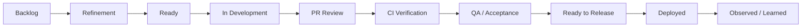

# Part 009 — Work Item Age and Blocked Work

## 1. Source notes and scope boundary

This part uses public flow and Scrum/Kanban guidance plus practical enterprise engineering patterns.

Public references to verify independently:

- The Kanban Guide for Scrum Teams describes Kanban as a strategy to optimize the flow of work in Scrum.
- Scrum.org flow-metrics material commonly discusses Work in Progress, Cycle Time, Work Item Age, and Throughput as useful signals for Scrum Teams using Kanban practices.
- DORA metrics help diagnose delivery performance, but work item age is especially useful before work is finished because it exposes risk while work is still in progress.

This part does **not** assume that CSG uses a specific issue tracker, board workflow, Kanban policy, aging chart, Jira configuration, Azure DevOps configuration, GitHub Projects board, or internal reporting dashboard.

Use the internal verification checklists to map the ideas to your actual team workflow.

---

## 2. Core thesis

Finished work tells you what already happened.

Aging work tells you what is becoming risky right now.

Most teams over-focus on completed metrics:

- throughput last sprint,
- velocity last sprint,
- completed story points,
- deployment frequency,
- release count,
- closed bugs.

Those are useful, but they are lagging signals.

A senior engineer also needs leading signals:

- this story has aged beyond normal expectation,
- this PR is waiting too long,
- this test failure is blocking too many items,
- this dependency is not moving,
- this migration ticket is aging because risk was not discovered in refinement,
- this customer escalation is hiding inside an unowned support queue,
- this work item is not progressing because no one owns the next decision.

In enterprise Quote & Order work, aging matters because many work items have hidden complexity:

- API contract review,
- Kafka schema compatibility,
- PostgreSQL migration risk,
- customer-specific configuration,
- tenant isolation,
- security review,
- test data setup,
- downstream fulfillment dependency,
- on-prem release validation,
- production support approval.

If those hidden risks are discovered late, the sprint does not merely slip. The team loses learning time.

---

## 3. What work item age means

Work Item Age means:

> How long an active work item has been in progress since it entered the team's workflow.

The key word is **active**.

Cycle time measures completed work.

Work item age measures unfinished work.

| Metric | Applies to | Question answered |
|---|---|---|
| Cycle Time | Completed item | How long did this take? |
| Work Item Age | Active item | How long has this been taking so far? |
| Blocked Time | Active or completed item | How long was progress prevented? |
| Queue Time | Active or completed item | How long did it wait between steps? |
| Throughput | Completed items | How many items finished? |
| WIP | Active items | How many items are currently open? |

Work item age is useful because it helps the team ask:

> Which work item is most likely to miss expectation if we do nothing today?

That is exactly the kind of question Daily Scrum should surface.

---

## 4. Why work item age is powerful for senior engineers

A senior engineer often has to detect risk before it becomes visible as a missed sprint, failed release, or customer issue.

Work item age helps because it points to **stuckness**.

Stuckness may mean:

- unclear acceptance criteria,
- missing design decision,
- hidden dependency,
- reviewer unavailable,
- flaky CI,
- environment instability,
- test data problem,
- API contract dispute,
- unclear Product Owner decision,
- migration safety uncertainty,
- security review not scheduled,
- team member overloaded,
- story too large,
- task split incorrectly,
- dependency on another team is not explicit.

Aging work is not a personal failure.

It is a system signal.

The wrong question:

> Why is this engineer taking so long?

The better question:

> What condition in our system is preventing this work from flowing?

---

## 5. Work item age in a Quote & Order value stream

Example workflow:



Work item age can be tracked from different start points.

Common options:

1. Age since item entered Sprint Backlog.
2. Age since development started.
3. Age since first commit.
4. Age since PR opened.
5. Age since item became blocked.
6. Age since ready for QA.
7. Age since ready for release.

Each answers a different question.

For engineering effectiveness, the best default is:

> Track active age from the moment the team starts work, and track queue age for major workflow states.

Example:

| Item | Current state | Active age | Current-state age | Signal |
|---|---:|---:|---:|---|
| Quote stale approval invalidation | In development | 5d | 5d | normal if complex |
| Order callback idempotency | PR review | 7d | 3d | review queue risk |
| Kafka event schema diff | Waiting architecture review | 8d | 6d | decision blocker |
| PostgreSQL migration | CI failed | 4d | 2d | pipeline/test blocker |
| Tenant isolation fix | QA | 10d | 4d | verification/test data risk |

A senior engineer should not wait until sprint end to discuss these.

---

## 6. Blocked work vs slow work

Not all aging work is blocked.

Some work is simply large or complex.

Blocked work means:

> The next meaningful progress step cannot happen without resolving an external condition.

Slow work means:

> Progress is happening, but the work is inherently complex, poorly sliced, or taking longer than expected.

### 6.1 Blocked work examples

- Waiting for Product Owner decision on acceptance criteria.
- Waiting for security review.
- Waiting for architecture approval.
- Waiting for another team to expose API.
- Waiting for test environment access.
- Waiting for customer-specific configuration details.
- Waiting for failed CI infrastructure to recover.
- Waiting for reviewer from owning team.
- Waiting for database migration decision.

### 6.2 Slow work examples

- Understanding legacy order state machine.
- Writing characterization tests.
- Debugging race condition.
- Refactoring mapper query safely.
- Building integration tests with Kafka and PostgreSQL.
- Investigating intermittent downstream callback behavior.

Both need visibility.

But the response differs.

Blocked work needs unblocking.

Slow work needs slicing, pairing, spike, or expectation adjustment.

---

## 7. A practical blocked-work taxonomy

Use this taxonomy in Daily Scrum and retrospectives.

| Blocker type | Example | Primary response |
|---|---|---|
| Product ambiguity | AC unclear for quote expiry behavior | PO/domain clarification |
| Architecture decision | event versioning strategy unresolved | ADR/design review |
| Dependency | fulfillment team API not ready | dependency owner + fallback plan |
| Environment | QA env unstable | platform/support escalation |
| CI/CD | flaky migration test blocks merges | pipeline owner + quarantine/fix |
| Review | PR waits for domain owner | reviewer routing / split PR |
| Security | tenant isolation review pending | security owner scheduling |
| Data | test fixture unavailable | fixture creation / synthetic data |
| Access | engineer lacks logs/DB/dashboard | access request / onboarding fix |
| Capacity | owner overloaded | reassign / pair / reduce WIP |
| Scope | story too large | split / renegotiate Sprint Backlog |
| Unknown | root cause not identified | spike / investigation timebox |

A useful blocked marker should include blocker type.

Bad:

> Blocked.

Better:

> Blocked by architecture decision: whether `OrderItemFalloutResolved` should be a lifecycle event or correction event. Decision needed from order architecture owner by Wednesday, otherwise split fallback to non-publishing internal state fix.

---

## 8. Work item age thresholds

Do not create universal thresholds blindly.

A one-day PR may be too old for a trivial change.

A ten-day migration may be reasonable for a high-risk backfill.

Use expected age by work type.

Example starting point:

| Work type | Expected active age | Review trigger |
|---|---:|---|
| Small doc/test fix | 1–2 days | age > 2 days |
| Small backend bug | 2–4 days | age > 4 days |
| Medium feature slice | 3–7 days | age > 7 days |
| Contract/API change | 4–8 days | age > 8 days or review queue > 2 days |
| DB migration | 5–10 days | any unknown lock/backfill risk after day 3 |
| Cross-team integration | 5–15 days | dependency not confirmed by day 2 |
| Spike | timebox-based | no decision artifact by end of timebox |

The point is not strict punishment.

The point is early conversation.

---

## 9. Service Level Expectation mindset

A Service Level Expectation, or SLE, is a flow expectation, not a promise for every item.

Example:

> 85% of medium-sized Product Backlog Items should complete within 8 working days once started.

This is useful because it helps identify outliers.

But it must not become a weapon.

A good SLE conversation:

> This work item is at day 7 and our normal expectation is 8 days. It is currently waiting on security review. What is the smallest action today to reduce risk?

A bad SLE conversation:

> You have one day left or you failed.

Use SLE to trigger collaboration, not blame.

---

## 10. Aging work review

An aging work review is a short inspection of active work.

It can happen:

- during Daily Scrum,
- after Daily Scrum with relevant people,
- mid-sprint check,
- flow review,
- retro preparation,
- Scrum with Kanban replenishment/refinement discussion.

### 10.1 Review agenda

For each aging item:

1. What is the current state?
2. How old is it?
3. Is it actively progressing?
4. Is it blocked?
5. What is the blocker type?
6. Who owns the next action?
7. Can it be split?
8. Can scope be reduced without violating Sprint Goal?
9. Is pairing needed?
10. Does Product Owner need to renegotiate scope?

### 10.2 Example aging review

Item:

> Add idempotency to quote acceptance.

Current state:

> PR review.

Age:

> 9 days active, 4 days in review.

Signal:

> review queue + domain correctness concern.

Next action:

> split SQL unique constraint into separate migration PR, review command-level idempotency first, schedule 30-minute review with quote owner today.

This is a stronger response than simply saying:

> Still in review.

---

## 11. Blocked work policy

A team should define what `blocked` means.

Without policy, blocked labels become vague.

### 11.1 Minimum blocked policy

A blocked item must include:

- blocker reason,
- blocker type,
- blocking owner or unknown owner,
- date/time blocked,
- next action,
- expected update date,
- escalation path if no movement.

Template:

```md
Blocked since: <date>
Blocker type: <product | architecture | dependency | CI | environment | review | security | data | access | capacity | unknown>
Blocked by: <person/team/system/decision>
Impact: <what cannot progress>
Next action: <specific action>
Owner: <name/team>
Escalate if: <condition/date>
```

### 11.2 Blocked label discipline

If everything is blocked, nothing is blocked.

Do not mark work blocked because it is hard.

Mark work blocked because the team knows a specific external condition prevents progress.

For hard work, use:

- needs pairing,
- needs spike,
- needs split,
- needs design clarification,
- high uncertainty.

---

## 12. Daily Scrum questions for aging work

Replace status-report questions with flow-risk questions.

Weak questions:

- What did you do yesterday?
- What will you do today?
- Are you blocked?

Stronger questions:

- Which item is most at risk of missing the Sprint Goal?
- Which active item has aged beyond expectation?
- Which PR is waiting too long?
- Which item has no clear next action?
- Which blocker needs escalation today?
- Which work should we stop starting so we can finish current work?
- Which item needs pairing or swarm?

Daily Scrum should expose whether the Sprint Backlog is still a credible plan.

---

## 13. Work item age and WIP

High WIP creates aging work.

When a team starts too much work, every item waits more.

Symptoms:

- many open branches,
- many partially complete stories,
- many PRs waiting,
- many context switches,
- repeated “almost done” updates,
- sprint ends with many 80% items,
- QA receives large batch late,
- release hardening becomes painful.

Aging work is often not caused by slow engineers.

It is caused by too much parallel work.

### 13.1 Senior engineer response

When WIP is high, ask:

- Which item must finish first to protect Sprint Goal?
- Which item can be paused safely?
- Which item should be split?
- Which item needs team swarm?
- Which item is blocked and should not consume active attention?
- Which new work should not be started?

The phrase “stop starting, start finishing” is often useful.

---

## 14. Work item age and PR flow

A common pattern:

1. Developer works for several days.
2. Opens large PR.
3. PR waits for reviewer.
4. Reviewer requests changes.
5. CI fails.
6. Merge happens late.
7. QA starts late.
8. Sprint ends with pressure.

Work item age exposes this before sprint end.

### 14.1 PR aging signals

Track:

- age since PR opened,
- time to first review,
- time between reviewer comments and author response,
- number of review rounds,
- CI failure time,
- time from approval to merge,
- PR size,
- files changed,
- risk labels.

### 14.2 Senior engineer interventions

- encourage smaller PRs,
- identify owning reviewer early,
- pre-review risky design before code complete,
- use draft PR for early feedback,
- split mechanical refactor from behavior change,
- use review checklist by risk type,
- pair-review high-risk migration/API/event changes.

---

## 15. Work item age and CI failures

An item can age because CI becomes a queueing system.

Examples:

- Maven build takes too long,
- integration tests are slow,
- Testcontainers suite overloaded,
- flaky tests fail unrelated PRs,
- environment-dependent tests are unstable,
- security scan takes too long,
- merge queue serializes too much,
- artifact promotion is manual.

When a work item ages in CI, do not only rerun.

Ask:

- Is the failure deterministic?
- Is it related to the change?
- How often does this test fail on main?
- Who owns this test?
- Can the failure be quarantined safely?
- Does this indicate a real production risk?
- Is this pipeline step appropriately placed?
- Is feedback too late in the workflow?

---

## 16. Work item age and blocked dependencies

Cross-team dependency often appears as aging work.

Example:

> The team is building order fallout retry, but fulfillment adapter callback contract is not finalized.

Signals:

- story ages in development,
- tests use mock assumptions,
- PR review asks unresolved questions,
- Sprint Review cannot demonstrate end-to-end behavior,
- release is blocked by external team.

Response:

- make dependency explicit,
- create dependency card,
- agree owner and date,
- define fallback slice,
- test against simulator or contract,
- escalate early if Sprint Goal is at risk.

---

## 17. Work item age and domain ambiguity

In domain-heavy systems, aging often means the team has not resolved a business meaning.

Examples:

- What does `cancelled` mean for order header vs order item?
- Does quote approval expire if catalog changes?
- Does discount approval apply to whole quote or item level?
- Is a fulfillment callback authoritative or advisory?
- Is product inventory source-of-truth for amendment eligibility?

Domain ambiguity should not hide inside coding time.

If a work item ages because domain meaning is unclear, the next action is a decision, not more coding.

---

## 18. Aging categories for Quote & Order work

### 18.1 API contract aging

Common causes:

- field semantics unclear,
- OpenAPI diff unresolved,
- consumer compatibility unknown,
- TMF mapping uncertain,
- error model disputed.

Intervention:

- contract review,
- consumer example,
- compatibility matrix,
- Product Owner/domain decision.

### 18.2 Kafka/event aging

Common causes:

- event type unclear,
- schema version unresolved,
- replay semantics unknown,
- consumer list incomplete,
- partition key risk.

Intervention:

- event design note,
- schema compatibility test,
- consumer impact map,
- replay/idempotency decision.

### 18.3 PostgreSQL migration aging

Common causes:

- lock risk unknown,
- backfill strategy unclear,
- rollback path missing,
- on-prem upgrade not validated,
- test data inadequate.

Intervention:

- migration spike,
- expand-contract plan,
- dry run,
- DB owner review.

### 18.4 Security/tenant aging

Common causes:

- authorization rule unclear,
- tenant boundary hidden,
- audit requirement missing,
- security review delayed.

Intervention:

- threat clarification,
- negative tests,
- security review scheduled,
- audit acceptance criteria.

---

## 19. Aging dashboard design

A useful dashboard shows active risk.

Suggested panels:

- Active WIP by state.
- Work item age distribution.
- Oldest active items.
- Blocked items by blocker type.
- Blocked age by item.
- PRs waiting review.
- PRs with failed CI.
- Items in QA/verification too long.
- Items ready for release but not deployed.
- Aging items by work type.

Avoid dashboards that only show completed work.

Completed work cannot be unblocked.

Active work can.

---

## 20. Aging work and Sprint Goal confidence

Work item age should be connected to Sprint Goal.

At any point in the Sprint, ask:

| Question | Purpose |
|---|---|
| Which Sprint Goal item is oldest? | Find goal risk |
| Which non-goal item is consuming attention? | Detect local optimization |
| Which item blocks multiple others? | Find leverage point |
| Which aging item has no owner? | Fix ownership gap |
| Which aging item needs PO decision? | Trigger product collaboration |
| Which aging item needs technical decision? | Trigger senior/architecture support |

This keeps flow metrics connected to product outcome.

---

## 21. Anti-patterns

### 21.1 Aging as blame

Wrong:

> This item is old, so the engineer is slow.

Better:

> This item is old. What condition is preventing flow?

### 21.2 No blocked policy

Blocked labels without next action become decoration.

### 21.3 All blockers wait until Daily Scrum

Some blockers need immediate escalation.

### 21.4 Aging dashboard but no behavior change

Metrics without action create cynicism.

### 21.5 WIP ignored

If the team starts too much work, aging will increase no matter how hard people work.

### 21.6 Treating all aging work the same

A 10-day migration spike and a 10-day typo fix mean different things.

Use work type and risk context.

---

## 22. Internal verification checklist

Verify these inside your team:

- What board states exist?
- When does work item age start?
- Is blocked time tracked?
- Is blocker reason tracked?
- Is PR age tracked separately?
- Is review wait time visible?
- Is CI wait/failure time visible?
- Is QA/verification wait time visible?
- Is release wait time visible?
- Are work types tagged?
- Are high-risk items tagged?
- Are blocked items reviewed daily?
- Who owns unblock escalation?
- Does Product Owner see aging work?
- Does Scrum Master use aging work in facilitation?
- Are aging trends discussed in retrospective?
- Are cross-team dependencies visible?
- Are production incidents represented in the workflow?
- Is on-call/support work included or hidden?

---

## 23. Practical exercise: aging work review

Take the current sprint board.

For every active item, record:

- item title,
- work type,
- current state,
- active age,
- current-state age,
- blocker status,
- blocker type,
- owner,
- next action,
- Sprint Goal relevance.

Then answer:

1. Which item is most at risk?
2. Which item has no clear next action?
3. Which item is blocked by dependency?
4. Which item should be split?
5. Which item needs senior engineer help?
6. Which item should stop consuming active WIP?
7. Which item threatens Sprint Goal?

Create one concrete improvement action for the next Daily Scrum.

---

## 24. Senior engineer operating habit

Every morning, before or during Daily Scrum, ask:

1. What is the oldest active item?
2. What is the oldest PR?
3. What is the oldest blocked item?
4. What item is most important to the Sprint Goal?
5. Are those the same item?
6. What is the one unblock action I can help with today?

This habit turns flow metrics into leadership behavior.

---

## 25. Summary

Work item age and blocked work are early-warning signals.

They help a senior engineer detect delivery risk before the sprint fails.

The key principles:

- use age to trigger conversation, not blame;
- distinguish blocked work from slow complex work;
- classify blocker type;
- make next action explicit;
- connect aging work to Sprint Goal;
- reduce WIP when work is aging;
- use Daily Scrum as a flow-risk inspection loop;
- treat aging as a system signal.

In enterprise Quote & Order engineering, aging often reveals hidden domain, integration, migration, security, or review complexity.

The best teams do not wait for missed deadlines to learn this.

They inspect aging work while there is still time to act.
