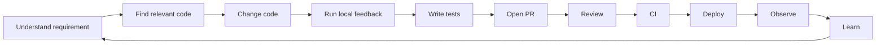

# Part 011 — Developer Experience Fundamentals

## 1. Source notes and scope boundary

This part uses public engineering productivity and organization-design references:

- The SPACE framework describes developer productivity as multidimensional: satisfaction and well-being, performance, activity, communication and collaboration, and efficiency and flow.
- The DX Framework research describes Developer Experience as affected by feedback loops, cognitive load, and flow state.
- Team Topologies uses cognitive load as a central concept for fast flow and team design.
- DORA metrics are useful delivery-performance diagnostics, but they are not sufficient to explain how developers experience work.
- Backstage and internal developer portal literature are useful references for golden paths and developer self-service, but this part does not assume CSG uses Backstage or any specific IDP.

This part does **not** assume the actual CSG developer tools, internal platform, local setup, IDE standard, CI/CD system, developer portal, telemetry stack, or onboarding process.

Use the `Internal verification checklist` sections to verify the real CSG context.

---

## 2. Core thesis

Developer Experience is not about making engineers comfortable in a superficial way.

Developer Experience is the quality of the day-to-day system that allows engineers to understand, change, test, review, deploy, observe, and improve software safely.

For a Senior Java Software Engineer working on an enterprise Quote & Order product, DevEx affects whether the team can:

- understand complex CPQ/order domain behavior;
- run Java services locally;
- reproduce bugs quickly;
- write integration tests without fighting infrastructure;
- inspect Kafka events;
- diagnose PostgreSQL query behavior;
- trace quote/order journeys across services;
- understand tenant/security/audit boundaries;
- make production-safe changes without relying on tribal knowledge.

A weak DevEx system makes every change feel expensive.

A strong DevEx system makes safe change the default path.

The senior-engineer framing is:

> DevEx is part of the architecture of delivery. If the engineering system makes good behavior hard, teams will eventually route around it.

---

## 3. Developer Experience as a system, not a perk

Common weak framing:

> DevEx means nice tools.

Better framing:

> DevEx means the engineering system gives fast, trustworthy, low-cognitive-load feedback while preserving quality and production safety.

A developer's work is a sequence of loops:



DevEx improves when each loop is:

- discoverable;
- repeatable;
- fast enough;
- trustworthy;
- diagnosable when it fails;
- documented;
- aligned with production reality.

DevEx degrades when engineers must guess, wait, ask around, or perform fragile manual steps.

---

## 4. The three DevEx levers

Developer Experience can be analyzed through three core levers.

### 4.1 Feedback loops

Feedback loop questions:

- How long does it take to know whether a change compiles?
- How long does it take to run relevant tests?
- How long does it take to reproduce a bug?
- How long does it take to see whether a deployment worked?
- How long does it take to detect a broken API/event contract?
- How long does it take to debug a failed CI pipeline?

For Quote & Order systems, feedback loops include:

- local unit tests for pricing/approval logic;
- PostgreSQL integration tests;
- Kafka producer/consumer tests;
- OpenAPI/contract compatibility checks;
- migration dry runs;
- Kubernetes smoke tests;
- trace/log analysis for quote-to-order journey.

If feedback is slow, developers batch changes.

Batched changes increase risk.

### 4.2 Cognitive load

Cognitive load is the amount of mental effort needed to understand and safely change the system.

Sources of cognitive load:

- unclear domain language;
- inconsistent package boundaries;
- many hidden side effects;
- undocumented state machines;
- scattered configuration;
- inconsistent local setup;
- ambiguous ownership;
- unclear test strategy;
- too many manual deployment rules;
- noisy dashboards and alerts;
- customer-specific behavior hidden in code paths.

A senior engineer should reduce unnecessary cognitive load while preserving essential domain complexity.

Essential complexity:

- CPQ rules are complex;
- approval authority is complex;
- order lifecycle is complex;
- fulfillment integration is complex.

Accidental complexity:

- nobody knows how to run the service;
- tests require undocumented data;
- event schemas are not discoverable;
- logs lack correlation IDs;
- migration process depends on a person;
- service ownership is unclear.

DevEx should remove accidental complexity.

### 4.3 Flow state and interruption control

Flow is the ability to make progress without constant context switching.

Flow is harmed by:

- slow builds;
- flaky tests;
- unclear review comments;
- frequent environment breakage;
- hidden production interrupts;
- too many meetings without decision output;
- waiting for access;
- waiting for data;
- waiting for reviewers;
- waiting for platform support.

Flow is improved by:

- clear work item scope;
- good first-run docs;
- fast test selection;
- stable local environment;
- useful PR templates;
- ownership map;
- developer portal/golden path;
- async-friendly documentation;
- observability that supports debugging.

---

## 5. DevEx vs engineering effectiveness

Developer Experience and Engineering Effectiveness are related but not identical.

| Concept | Main question | Example |
|---|---|---|
| DevEx | How easy is it for engineers to do good work? | Can a new engineer run quote service locally in one hour? |
| Flow metrics | How smoothly does work move? | How long does a PR wait for review? |
| DORA metrics | How well does delivery perform? | How often do deployments fail? |
| Platform engineering | What reusable capabilities reduce friction? | Service template with CI, logging, OTel, health checks. |
| Observability | Can we understand runtime behavior? | Can we trace quote acceptance to order creation? |
| Engineering effectiveness | Is the whole system producing safe product outcomes efficiently? | Does the team deliver Quote & Order changes with lower risk and faster learning? |

DevEx is one major input into engineering effectiveness.

But good DevEx must be aligned with product and production outcomes.

Fast local development is valuable only if it helps ship correct, operable, secure software.

---

## 6. Why DevEx matters especially in enterprise systems

Enterprise software has unique DevEx challenges.

### 6.1 Domain complexity

Quote & Order is not a simple CRUD product.

Engineers must understand:

- catalog-driven configuration;
- quote versioning;
- pricing snapshots;
- enterprise agreements;
- approval authority;
- order lifecycle;
- decomposition;
- fulfillment callbacks;
- billing/inventory boundaries;
- tenant isolation;
- audit evidence.

If domain concepts are not discoverable, every change becomes risky.

### 6.2 Integration complexity

Enterprise systems integrate with many systems:

- CRM;
- catalog;
- pricing;
- fulfillment;
- inventory;
- billing;
- identity provider;
- customer-specific adapters;
- reporting and data platforms.

DevEx must help engineers simulate, inspect, and debug integration boundaries.

### 6.3 Deployment complexity

CSG-like enterprise products may have cloud and on-prem realities.

That creates friction around:

- version compatibility;
- migration safety;
- configuration management;
- feature enablement;
- customer-specific environments;
- supportability.

DevEx must make these realities visible early.

### 6.4 Production correction complexity

Enterprise systems often require data repair and reconciliation.

Poor DevEx means:

- engineers cannot reproduce inconsistent data;
- repair scripts are hard to test;
- logs lack business identifiers;
- events cannot be replayed safely;
- runbooks are stale.

Good DevEx includes production-debugging ergonomics.

---

## 7. DevEx diagnostic dimensions

Use these dimensions to inspect Developer Experience.

### 7.1 Setup experience

Questions:

- Can a new engineer clone, build, and run a meaningful service quickly?
- Are required tools documented?
- Are versions pinned?
- Are secrets and test credentials handled safely?
- Are common failures documented?
- Is there a first productive PR path?

Signals:

- onboarding time;
- number of setup questions;
- outdated docs;
- inconsistent local environment;
- manual steps;
- missing access.

### 7.2 Change experience

Questions:

- Can an engineer find the right code path?
- Are domain concepts named consistently?
- Are package boundaries clear?
- Are tests near the code?
- Is the state machine explicit?
- Are side effects visible?

Signals:

- code search difficulty;
- large PRs caused by unclear boundaries;
- repeated reviewer confusion;
- duplicate logic;
- inconsistent naming.

### 7.3 Test experience

Questions:

- Can engineers run relevant tests locally?
- Are integration tests reliable?
- Are fixtures understandable?
- Are slow tests isolated?
- Are flaky tests owned?
- Are contract/migration tests part of normal workflow?

Signals:

- tests skipped locally;
- CI-only failures;
- test data drift;
- flaky test reruns;
- slow test feedback.

### 7.4 Review experience

Questions:

- Are PRs easy to review?
- Are risk areas labeled?
- Are reviewers discoverable?
- Are comments actionable?
- Is review latency visible?
- Are review standards shared?

Signals:

- stale PRs;
- late architecture feedback;
- review ping-pong;
- unclear ownership;
- merge fear.

### 7.5 Deployment experience

Questions:

- Can engineers understand what happens after merge?
- Is artifact promotion visible?
- Are release states clear?
- Are feature flags/config changes documented?
- Is rollback/roll-forward known?
- Are deployment failures diagnosable?

Signals:

- deployment anxiety;
- hidden manual steps;
- unclear environment state;
- production surprises;
- release coordination overhead.

### 7.6 Observability experience

Questions:

- Can an engineer trace one quote/order journey?
- Are logs structured?
- Are correlation IDs consistent?
- Are dashboards discoverable?
- Are alerts actionable?
- Can local/staging traces approximate production behavior?

Signals:

- debugging by database spelunking only;
- copy-pasting IDs across tools;
- unclear event causality;
- missing runbook links;
- too many noisy alerts.

---

## 8. DevEx for Quote & Order: critical workflows

Do not measure DevEx only through generic developer happiness.

Measure it around important workflows.

### 8.1 First productive PR workflow

Target:

A new engineer can safely make a small improvement within the first few days.

Workflow:

1. Clone repository.
2. Build project.
3. Run unit tests.
4. Run one service locally.
5. Run one integration test.
6. Understand one feature area.
7. Make a low-risk code/doc/test change.
8. Open PR with correct template.
9. Get review.
10. Merge.

DevEx failure examples:

- build requires undocumented tool version;
- integration test requires unavailable database;
- local service needs secrets nobody knows how to provide;
- PR template is missing risk categories;
- reviewer ownership unclear.

### 8.2 Quote acceptance debugging workflow

Target:

An engineer can diagnose why quote acceptance failed.

Required ergonomics:

- quote ID visible;
- quote version visible;
- customer/account/tenant context visible;
- price snapshot visible;
- approval status visible;
- correlation ID available;
- logs searchable by quote ID/correlation ID;
- audit events available;
- order conversion attempt visible;
- emitted events visible;
- user-facing error code mapped to cause.

If diagnosis requires asking five people and querying six tables manually, DevEx is weak.

### 8.3 Kafka event debugging workflow

Target:

An engineer can understand event production/consumption for one aggregate.

Required ergonomics:

- topic ownership documented;
- schema discoverable;
- event envelope documented;
- key/partition strategy known;
- DLQ/retry path documented;
- local replay possible or simulated;
- consumer logs include event ID and aggregate ID;
- duplicate handling testable.

### 8.4 PostgreSQL migration workflow

Target:

An engineer can design, test, and review a safe migration.

Required ergonomics:

- migration tool documented;
- local DB easy to create;
- production-like fixtures available;
- lock-risk guidance available;
- dry-run process known;
- rollback/roll-forward expectations clear;
- code supports expand-contract;
- migration tests part of CI where relevant.

---

## 9. DevEx measurement without shallow surveys

Developer sentiment matters, but surveys alone are insufficient.

Combine:

- survey data;
- interviews;
- friction logs;
- flow telemetry;
- CI/CD telemetry;
- PR telemetry;
- onboarding outcomes;
- incident/debugging observations.

### 9.1 Example DevEx health dashboard

| Dimension | Example metric | Caution |
|---|---|---|
| Setup | median time to first successful local run | can hide outliers and access issues |
| Build | local build time | avoid optimizing build while tests remain flaky |
| Test | relevant test suite duration | speed must not reduce confidence |
| PR | first review response time | response quality still matters |
| CI | pipeline pass rate | high pass rate can mean weak tests |
| Debug | time to find relevant logs/traces | hard to measure automatically |
| Docs | doc freshness review age | doc quality matters more than quantity |
| Onboarding | time to first merged PR | first PR should be meaningful, not fake |

### 9.2 Friction log template

```md
# DevEx Friction Log

## Date

## Workflow
- local setup / test / PR / CI / deploy / observe / incident / migration

## Friction
- What slowed the engineer down?

## Impact
- Time lost:
- Risk created:
- People blocked:

## Root cause category
- docs / tooling / ownership / environment / test / architecture / dependency / access / domain ambiguity

## Candidate improvement

## Owner

## Evidence
- logs, screenshots, links, repeated occurrences
```

The friction log helps convert complaints into system improvements.

---

## 10. Internal verification checklist

Verify these items in your CSG/team context.

### 10.1 Developer setup

- What is the official local setup guide?
- Are Java/Maven/Gradle/Docker versions pinned?
- Are required internal tools documented?
- Are test credentials/secrets handled safely?
- How long does first setup usually take?
- What are the top onboarding blockers?

### 10.2 Local run and test

- Can key services run locally?
- Are dependencies mocked, containerized, or remotely shared?
- Is Testcontainers used?
- Is local Kafka available?
- Is local PostgreSQL seeded with fixtures?
- Which tests are safe to run locally?
- Which tests are CI-only?

### 10.3 Code navigation

- Is there an architecture map?
- Is there a service ownership map?
- Are domain concepts documented?
- Are state machines documented?
- Are API/event schemas discoverable?
- Are database tables documented?

### 10.4 PR and CI

- What PR template is used?
- Are risk labels used?
- Who reviews what?
- What is average review latency?
- What CI checks are mandatory?
- Which checks are slow/flaky?
- What is the merge policy?

### 10.5 Observability

- Where are logs?
- Where are metrics?
- Where are traces?
- What is the correlation ID convention?
- Are business IDs safe and searchable?
- Are runbooks discoverable?
- Can engineers trace quote-to-order journey?

### 10.6 Platform and tooling

- Is there a developer portal?
- Are service templates available?
- Are golden paths documented?
- Are paved-road exceptions tracked?
- Is platform feedback collected?
- Who owns internal tooling?

---

## 11. Senior engineer DevEx responsibilities

A senior engineer does not need to own every tool.

But they should notice when friction causes risk.

Responsibilities:

- make hidden friction visible;
- distinguish minor annoyance from systemic risk;
- improve local loops when doing related work;
- push for better diagnostics in PRs;
- write docs that reduce repeated questions;
- help platform teams understand product-team pain;
- prevent metrics from becoming blame tools;
- mentor engineers on effective debugging and testing workflows.

### 11.1 Small high-leverage DevEx improvements

Examples:

- add `make test-unit` or equivalent convenience command;
- document first-run failure modes;
- add fixture for approved quote;
- add correlation ID to one critical log path;
- add test data builder for order fallout;
- shorten slow test by isolating integration boundary;
- add PR checklist for Kafka event changes;
- add dashboard link to runbook;
- create architecture map for one service;
- add local replay sample for one event type.

DevEx improvements compound when they remove repeated friction.

---

## 12. DevEx anti-patterns

### 12.1 Tool-first DevEx

Buying or building a tool before understanding workflow pain.

Better:

- observe workflows;
- collect friction evidence;
- improve the highest-friction loop;
- measure adoption and impact.

### 12.2 Happiness-only DevEx

Asking if developers are happy without measuring feedback loops, cognitive load, or delivery friction.

Better:

- combine sentiment with workflow data and interviews.

### 12.3 Platform as mandate

Forcing engineers onto a golden path that does not solve their real constraints.

Better:

- treat platform as product;
- measure adoption;
- support escape hatches;
- learn from exceptions.

### 12.4 DevEx that ignores production

Making local development easy while observability, rollback, and support remain weak.

Better:

- connect DevEx to production correctness.

### 12.5 Automation without ownership

Scripts/tools become stale when no one owns them.

Better:

- every tool has owner, documentation, test, and deprecation path.

---

## 13. Practical exercise: DevEx baseline for one service

Pick one service in the Quote & Order ecosystem.

Measure or document:

1. Time to clone/build.
2. Time to run unit tests.
3. Time to run integration tests.
4. Time to run service locally.
5. Required external dependencies.
6. Required secrets/access.
7. First useful endpoint call.
8. How to inspect logs.
9. How to inspect traces.
10. How to inspect Kafka events.
11. How to inspect database state.
12. How to debug one failed quote/order journey.
13. Top five friction points.
14. One small improvement you can make this sprint.

Then classify friction as:

- setup;
- build;
- test;
- code navigation;
- data;
- observability;
- ownership;
- docs;
- platform;
- domain ambiguity.

---

## 14. Practical exercise: feedback loop map

Create a feedback loop map.

```md
# Feedback Loop Map

## Workflow
Example: change quote acceptance validation

## Loops
1. Code compile: <duration>
2. Unit test: <duration>
3. Integration test: <duration>
4. Contract test: <duration>
5. CI pipeline: <duration>
6. PR review: <duration>
7. Deploy to test env: <duration>
8. Observe behavior: <duration>

## Bottleneck

## Trust level
- Which signal is fast but low confidence?
- Which signal is slow but high confidence?

## Improvement candidate
```

The goal is not to make every loop instant.

The goal is to create the right fast-enough confidence at the right stage.

---

## 15. Part summary

Developer Experience is the quality of the system that lets engineers do good work repeatedly.

In enterprise Quote & Order engineering, DevEx must include:

- domain discoverability;
- local development;
- test speed and reliability;
- code navigation;
- PR/review flow;
- CI/CD diagnostics;
- Kafka/PostgreSQL ergonomics;
- observability;
- production debugging;
- documentation;
- platform self-service.

A senior engineer should treat DevEx as system design.

The best DevEx improvements reduce cognitive load, shorten feedback loops, and make production-safe behavior the easiest path.
