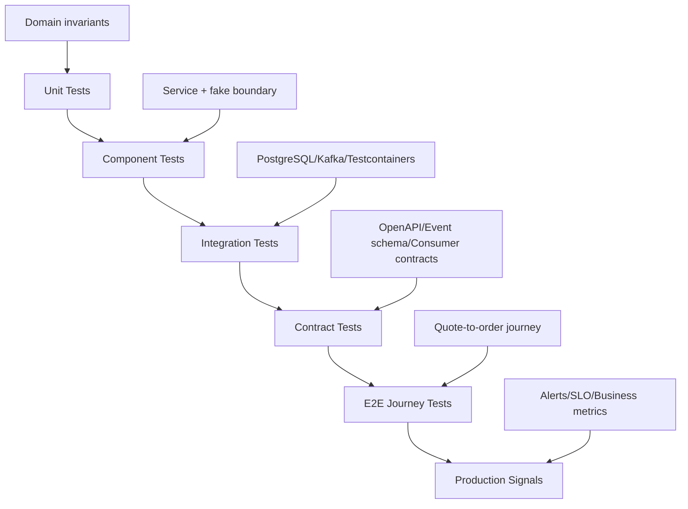
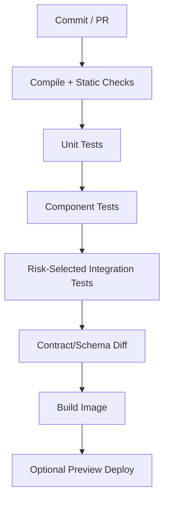
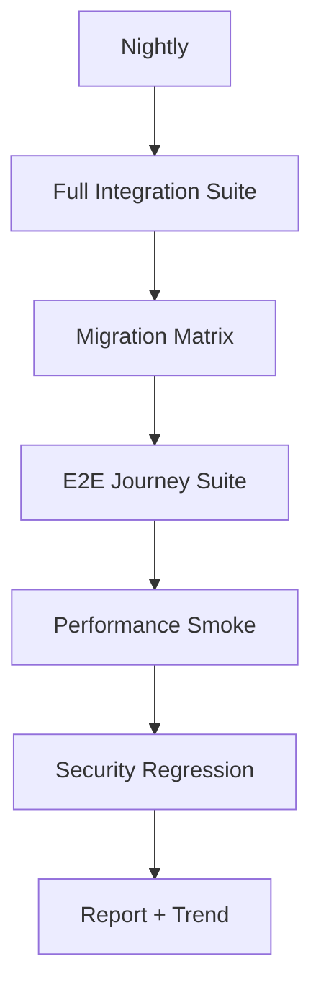

# Part 013 — Test Speed and Feedback Loop Optimization

## 1. Source notes and scope boundary

This part uses public references and engineering practice, especially:

- JUnit documentation for JVM testing concepts such as tagging, filtering, test suites, and execution configuration.
- Testcontainers documentation for running realistic disposable dependencies such as PostgreSQL, Kafka, browsers, and other containerized services in tests.
- Spring Boot testing documentation where Testcontainers integration may apply.
- DORA-style delivery performance thinking: fast feedback is part of high-performing delivery, but speed without reliability is false speed.

This part does **not** assume that CSG uses JUnit 5/6, Testcontainers, Spring Boot Testcontainers service connections, Maven Surefire/Failsafe, Gradle test suites, Bazel, internal test impact analysis, or a specific CI provider.

Use the `Internal verification checklist` sections to map the actual stack.

---

## 2. Core thesis

Slow tests are not just a developer inconvenience.

Slow tests are a delivery-system bottleneck.

But the solution is not simply to delete tests.

A mature engineering organization optimizes test feedback by answering:

> Which signal do we need, how soon do we need it, how reliable is it, and what decision does it support?

For enterprise Quote & Order systems, this matters because different changes need different confidence:

- quote lifecycle change needs invariant tests;
- pricing change needs deterministic commercial examples;
- approval change needs authority and audit tests;
- PostgreSQL migration needs real database tests;
- Kafka event change needs schema and consumer compatibility tests;
- Kubernetes deployment change needs runtime/probe validation;
- security-sensitive change needs negative authorization tests;
- refactoring needs characterization tests.

The goal is not maximum test count.

The goal is minimum time to trustworthy signal.

---

## 3. Feedback loop taxonomy

Testing exists in multiple feedback loops.

| Loop | Typical time target | Primary purpose | Example |
|---|---:|---|---|
| IDE/local micro loop | seconds | prove small logic change | unit test for discount rule |
| Local service loop | seconds–minutes | prove component behavior | mapper test with PostgreSQL container |
| PR fast loop | minutes | prevent obvious regression | unit + selected integration + static checks |
| PR confidence loop | minutes–tens of minutes | validate risky boundaries | API contract, Kafka schema, migration tests |
| Nightly/release loop | longer | broader regression and environment validation | E2E quote-to-order journey |
| Production feedback loop | continuous | detect real-world failure | SLO, alert, business metric |

If every test runs in every loop, CI becomes slow.

If risky tests run only late, defects become expensive.

Test strategy is feedback-loop design.

---

## 4. Test portfolio for enterprise Java services

A Quote & Order team usually needs a portfolio like this.



Each layer has a job.

### 4.1 Unit tests

Best for:

- pricing formulas;
- approval thresholds;
- state transition guards;
- idempotency decision logic;
- validation rules;
- mapper-independent domain behavior;
- error classification.

Optimization target:

- run constantly;
- deterministic;
- no network;
- no database;
- no sleep;
- small fixtures;
- clear failure message.

### 4.2 Component tests

Best for:

- application service behavior with mocked/stubbed edges;
- command handler orchestration;
- error mapping;
- authorization integration within service boundary;
- outbox record creation intent.

Optimization target:

- run in PR fast lane;
- avoid starting full app when not needed;
- avoid mock explosion;
- verify behavior, not internals.

### 4.3 Integration tests

Best for:

- PostgreSQL/MyBatis SQL;
- transaction behavior;
- lock/concurrency behavior;
- migrations;
- Kafka producer/consumer behavior;
- Testcontainers-backed dependencies;
- real serialization/deserialization.

Optimization target:

- run risk-targeted subset on PR;
- broader suite on merge/nightly;
- reuse containers carefully;
- avoid shared mutable state;
- parallelize safely.

### 4.4 Contract tests

Best for:

- OpenAPI compatibility;
- generated client compatibility;
- Kafka schema evolution;
- consumer-driven contract verification;
- callback/webhook compatibility;
- TMF-aligned API behavior.

Optimization target:

- fail early before deployment;
- use artifact diff;
- run provider verification on PR;
- keep fixture states maintainable.

### 4.5 E2E tests

Best for:

- proving that separately tested parts compose;
- validating high-value business journeys;
- release confidence;
- operational readiness.

Optimization target:

- small, valuable, stable;
- never duplicate all lower-level edge cases;
- run in appropriate environment;
- produce rich diagnostics.

---

## 5. Test speed is a product of architecture

Test speed is not only a CI issue.

It is affected by architecture decisions:

- pure domain logic vs framework-bound logic;
- transaction boundaries;
- dependency injection structure;
- static/global state;
- time/clock handling;
- UUID/randomness handling;
- test fixture design;
- database schema complexity;
- service startup time;
- container startup time;
- external dependency simulation;
- event replay determinism.

If the only way to test a pricing rule is to start the whole application, log in, call REST API, hit real PostgreSQL, produce Kafka events, and wait for async projection, the architecture has made fast feedback impossible.

Senior engineers should design code so the fastest useful test is possible.

---

## 6. Fast feedback design principles

### 6.1 Push pure logic down

Keep core rules testable without infrastructure.

Bad:

```java
@Service
class QuotePricingService {
  @Autowired PricingRepository repo;
  @Autowired KafkaTemplate<String, Event> kafka;

  BigDecimal calculatePrice(QuoteRequest req) {
    // pricing logic mixed with DB and Kafka
  }
}
```

Better:

```java
final class QuotePricingPolicy {
  PriceResult calculate(QuoteInput input, Agreement agreement, CatalogSnapshot catalog) {
    // deterministic rule logic
  }
}
```

Then test the policy in milliseconds.

Use integration tests for repository and Kafka wiring separately.

### 6.2 Isolate time

Never let tests depend on wall-clock time unless intentionally testing time.

Inject `Clock`.

```java
class QuoteExpirationPolicy {
  private final Clock clock;

  boolean isExpired(Quote quote) {
    return clock.instant().isAfter(quote.validUntil());
  }
}
```

This avoids slow sleeps and flaky expiration tests.

### 6.3 Make identifiers deterministic

Use controlled ID providers for tests:

- quote ID;
- order ID;
- event ID;
- idempotency key;
- correlation ID;
- causation ID.

Random IDs are acceptable only when the test reports them clearly on failure.

### 6.4 Prefer behavior fixtures over database dumps

A fixture should express business meaning:

- `approvedQuoteWithExpiredPrice()`;
- `enterpriseCustomerWithAgreement()`;
- `orderWithOneFailedFulfillmentItem()`;
- `catalogWithRetiredOffering()`.

Avoid opaque SQL dumps that nobody understands.

---

## 7. Test runtime budget

Define rough budgets.

Example target:

| Suite | Target | Notes |
|---|---:|---|
| Domain unit suite | < 30 seconds | Runs frequently locally and in PR |
| Application/component suite | < 2 minutes | PR fast lane |
| Integration smoke | < 5 minutes | Real DB/Kafka selected tests |
| Contract compatibility | < 5 minutes | OpenAPI/schema/consumer verification |
| Full integration suite | < 20 minutes | Merge/nightly depending on scale |
| E2E journey suite | controlled longer runtime | Nightly/release |

Targets must be realistic and measured.

The point is not universal numbers.

The point is owning feedback-loop expectations.

---

## 8. Test tagging and suite partitioning

Use tags/categories to route tests.

Example taxonomy:

```text
unit
component
integration
contract
migration
security
e2e
slow
flaky-quarantine
requires-docker
requires-kafka
requires-postgres
```

### 8.1 Suggested PR pipeline



### 8.2 Suggested nightly pipeline



### 8.3 Risk-based selection

A change to `QuotePricingPolicy` should run pricing-related tests.

A change to a MyBatis mapper should run mapper integration tests.

A change to OpenAPI should run API contract diff.

A change to Kafka event classes should run schema compatibility and consumer tests.

A change to migration files should run migration tests.

Test impact analysis can be automated later.

Before automation, senior engineers can still manually define risk-triggered gates.

---

## 9. Integration tests and Testcontainers

Testcontainers is useful because it reduces the gap between tests and production-like dependencies.

Typical uses:

- PostgreSQL mapper tests;
- Kafka producer/consumer tests;
- schema registry tests if applicable;
- local integration environment;
- browser-based UI tests if needed;
- external dependency simulation.

### 9.1 What Testcontainers solves

It helps with:

- real database behavior;
- real Kafka protocol behavior;
- disposable clean dependencies;
- reproducibility across machines and CI;
- avoiding shared test environments for integration tests.

### 9.2 What Testcontainers does not solve

It does not automatically solve:

- bad fixture design;
- slow application startup;
- non-deterministic async waits;
- shared mutable global state;
- too many end-to-end tests;
- poor test suite partitioning;
- CI resource starvation;
- production data-volume realities.

Use it as a tool, not a silver bullet.

---

## 10. PostgreSQL test speed patterns

### 10.1 Use schema-per-test or transaction rollback carefully

Options:

| Strategy | Benefit | Risk |
|---|---|---|
| transaction rollback per test | fast cleanup | async/outbox may commit outside transaction model |
| truncate tables | simple | slow if many tables/FKs |
| schema per suite | isolation | setup complexity |
| database per worker | good parallel isolation | resource heavy |
| fixture rebuild | realistic | can be slow |

Pick based on test type.

### 10.2 Avoid testing every mapper through full application

Mapper tests can be focused:

- run migration;
- insert minimal fixture;
- execute mapper method;
- assert rows/objects;
- assert tenant predicate;
- assert query behavior.

Do not start a full web server unless the HTTP boundary matters.

### 10.3 Keep integration fixtures minimal but meaningful

For a quote search query, fixture should include:

- tenant A quote;
- tenant B quote;
- matching quote;
- non-matching quote;
- state filter examples;
- date range example;
- account/customer scope example.

This is better than thousands of random rows.

Use separate performance tests for volume behavior.

---

## 11. Kafka test speed patterns

Kafka tests are prone to slowness if every test starts a broker and waits with sleeps.

### 11.1 Split schema/serialization tests from broker tests

Fast tests:

- serialize event;
- deserialize event;
- validate required metadata;
- validate schema compatibility;
- validate event type mapping.

Broker tests:

- producer sends to topic;
- consumer handles duplicate;
- consumer handles malformed event;
- consumer commits/does not commit appropriately;
- DLQ behavior.

Do not require broker tests for every event field unit change if schema tests provide enough signal.

### 11.2 Use business-key waiting

Bad:

```java
Thread.sleep(5000);
```

Better:

```java
await().atMost(Duration.ofSeconds(30)).untilAsserted(() -> {
  assertThat(orderRepository.findById(orderId).state()).isEqualTo(COMPLETED);
});
```

Even better: poll the exact signal the test needs:

- outbox row processed;
- consumer state updated;
- audit event written;
- DLQ message present;
- metric incremented.

### 11.3 Avoid global topic collisions

Use unique topic names or test namespaces where feasible.

If topic names are fixed, isolate by:

- tenant ID;
- correlation ID;
- test run ID;
- consumer group ID per test;
- deterministic cleanup.

---

## 12. Flaky tests as feedback-loop poison

A flaky test costs more than its runtime.

It damages trust.

Symptoms:

- engineers rerun CI without investigation;
- reviews wait for random green builds;
- real regressions are dismissed;
- teams weaken gates;
- deploy confidence decreases.

### 12.1 Flaky test taxonomy

| Cause | Example | Fix direction |
|---|---|---|
| time dependency | sleeps and race with async consumer | wait for business signal |
| shared state | test depends on previous data | isolate fixtures |
| order dependency | passes only in full suite order | randomize order, remove global state |
| environment dependency | needs shared QA service | use disposable dependency |
| resource starvation | CI CPU/memory saturated | capacity/parallelism tuning |
| external dependency | real network dependency unstable | simulator/contract test |
| assertion too strict | exact timestamp/log order | assert relevant behavior |
| hidden randomness | UUID/random input affects branch | seed/control randomness |

### 12.2 Flaky test policy

A mature policy should define:

- owner;
- severity;
- quarantine rule;
- max quarantine time;
- required investigation artifact;
- re-enable criteria;
- dashboard/trend.

Quarantine is not deletion.

Quarantine is a temporary containment mechanism with ownership.

---

## 13. Test data speed and reliability

Test data is often the hidden cause of slow feedback.

### 13.1 Bad patterns

- giant SQL fixture loaded for every test;
- shared mutable environment data;
- fixtures with unclear business meaning;
- random data without failure diagnostics;
- tests depending on current date/time;
- test user permissions modified by other tests;
- catalog data reused across unrelated scenarios.

### 13.2 Better patterns

- composable builders;
- named domain fixtures;
- minimal rows;
- deterministic clocks/IDs;
- per-test tenant namespace;
- fixture versioning;
- test data cleanup strategy;
- clear failure diagnostics.

### 13.3 Fixture naming examples

Use names like:

- `draftQuoteForEnterpriseCustomer()`;
- `quoteApprovedWithPriceValidUntil(clock.plusDays(2))`;
- `orderWithOneFulfillmentTaskFailed()`;
- `tenantAAndTenantBQuotesWithSameExternalId()`;
- `catalogOfferingRetiredAfterQuoteCreation()`.

The name should teach the domain.

---

## 14. CI parallelism and resource economics

Parallelism can improve feedback time, but only if resources support it.

Measure:

- queue time;
- executor count;
- CPU/memory utilization;
- container startup time;
- test sharding balance;
- slowest test class;
- artifact upload time;
- network dependency time;
- database container count.

### 14.1 Parallelism anti-patterns

- parallel tests sharing same database schema;
- parallel Kafka tests using same consumer group;
- parallel migration tests competing for Docker resources;
- too many containers causing CI host thrashing;
- test order dependency hidden by deterministic order.

Parallelism should be designed, not simply turned on.

---

## 15. Risk-based quality gates

Not every change needs every gate.

But every risky change needs the right gate.

| Change type | Required fast signal |
|---|---|
| pure domain rule | unit + property/parameterized tests |
| REST API contract | OpenAPI diff + provider tests |
| Kafka event schema | schema compatibility + serialization tests |
| MyBatis query | PostgreSQL integration test |
| DB migration | migration test + old/new compatibility if risky |
| auth/tenant change | negative security tests |
| quote/order lifecycle | transition invariant tests + audit/event tests |
| async workflow | idempotency + duplicate/out-of-order tests |
| Kubernetes manifest | deployment/probe/resource validation |

The strongest DevEx is not fewer gates.

It is the right gates running at the right time.

---

## 16. Test speed improvement backlog

A test speed improvement should be treated like product work.

Template:

```md
# Test Feedback Improvement

## Problem
- Which loop is slow?
- Who is affected?
- How often?

## Evidence
- Current runtime:
- Queue time:
- Failure/rerun rate:
- Slowest tests:

## Root cause category
- Fixture / startup / CI capacity / flaky / environment / test design / architecture

## Proposed improvement
- What changes?
- What risk remains?

## Success metric
- Runtime target:
- Flake reduction target:
- Developer impact:

## Rollout
- Local / PR / nightly / release
```

---

## 17. Internal verification checklist

Verify these internally:

- What test framework is used: JUnit 5/6, Spock, TestNG, custom?
- What build tool is used: Maven, Gradle, Bazel, other?
- How are tests categorized?
- Are JUnit tags or build profiles used?
- Are Testcontainers used?
- Are PostgreSQL/Kafka integration tests local or shared-environment based?
- Which tests run on every PR?
- Which tests run on merge/nightly/release?
- What is current PR CI runtime p50/p90?
- What are slowest test classes?
- What is flaky test rate?
- Is there a flaky test owner/quarantine policy?
- Are migration tests included in CI?
- Are contract tests included in CI?
- Are security negative tests included?
- Can developers run a meaningful subset locally?
- Are test failures diagnosable?
- Are artifacts/logs retained?
- Is test runtime visible on dashboard?

---

## 18. Practical exercise

Pick one repository.

Measure:

1. local unit test runtime;
2. local integration test runtime;
3. PR CI queue time;
4. PR CI runtime;
5. top 10 slowest tests;
6. flaky tests in last 30 days;
7. most common rerun reason;
8. tests developers avoid running locally.

Then classify the bottleneck:

- slow code;
- slow test design;
- slow fixture;
- slow dependency startup;
- CI capacity;
- flaky environment;
- poor suite partitioning;
- unclear ownership.

Propose one improvement with a measurable target.

---

## 19. Senior engineer review checklist

When reviewing test strategy for a PR, ask:

- Is the fastest useful test used?
- Are domain invariants tested close to the domain logic?
- Are infrastructure behaviors tested with real dependencies where needed?
- Are async waits deterministic?
- Is test data meaningful and minimal?
- Does the test fail with useful diagnostics?
- Does the PR add slow tests to the right suite?
- Are security/tenant/audit cases covered where relevant?
- Are contract/migration/event compatibility gates triggered when needed?
- Will this test increase or decrease long-term confidence?

---

## 20. Summary

Test speed is not about making CI green faster at any cost.

It is about reducing time to trustworthy signal.

For enterprise Quote & Order systems, the correct test strategy must protect:

- commercial correctness;
- lifecycle invariants;
- tenant isolation;
- API/event compatibility;
- PostgreSQL safety;
- Kafka replay/idempotency;
- operational readiness.

A senior engineer improves test feedback by designing the right test at the right layer, removing accidental slowness, treating flakiness as systemic risk, and measuring feedback loops as part of the delivery system.
