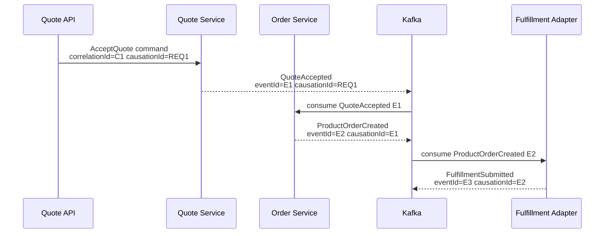
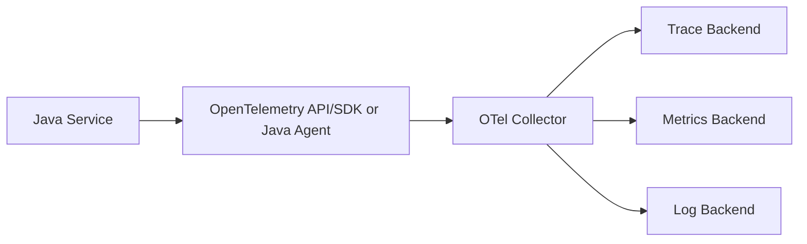

# Part 014 — Debuggability as Productivity

## 1. Source notes and scope boundary

This part uses public references and engineering practice, especially:

- OpenTelemetry documentation for traces, metrics, logs, context propagation, and Java instrumentation concepts.
- Google SRE material on monitoring distributed systems and emergency response.
- Prior series material on observability, incident thinking, logs/metrics/traces, correlation IDs, and production readiness.

This part does **not** assume CSG uses OpenTelemetry, a specific tracing backend, log platform, metrics store, APM vendor, service mesh, standard correlation ID name, or internal debugging tool.

Use the `Internal verification checklist` sections to map the actual tooling and standards.

---

## 2. Core thesis

Debuggability is developer productivity.

A system that is hard to debug makes every change more expensive.

When engineers cannot quickly answer what happened, they spend time on:

- guessing;
- reproducing unclear scenarios;
- reading scattered logs;
- asking tribal-knowledge questions;
- rerunning tests;
- adding temporary log statements;
- waiting for another team;
- manually inspecting database rows;
- correlating events by timestamp.

This is hidden engineering friction.

For Quote & Order systems, debuggability determines how fast engineers can answer questions like:

- Why did this quote require approval?
- Why did this accepted quote fail conversion to order?
- Which catalog version was used?
- Which price snapshot was approved?
- Which Kafka event caused this state change?
- Why did this order enter fallout?
- Did fulfillment callback arrive twice?
- Did tenant context propagate correctly?
- Did this migration leave old rows in partial state?
- Did support/data repair change this record?

A debuggable system is one whose behavior can be reconstructed from evidence.

---

## 3. Debugging cost model

Debugging cost has several parts.

| Cost type | Example |
|---|---|
| discovery cost | finding which service owns the behavior |
| reproduction cost | creating the right quote/order/catalog fixture |
| correlation cost | linking request, event, DB row, log, and trace |
| interpretation cost | understanding state machine and domain meaning |
| access cost | getting logs, traces, DB read access, dashboard access |
| waiting cost | waiting for CI, environment, another team, or support |
| confidence cost | proving the fix really addresses root cause |

Good debuggability reduces all of them.

---

## 4. Debuggability vs observability

Observability is about externalizing useful signals from the system.

Debuggability is about using those signals to answer questions quickly.

You can have telemetry and still be hard to debug if:

- logs lack business IDs;
- traces do not propagate across Kafka;
- metrics are too technical and not journey-aware;
- errors lack cause classification;
- dashboards do not map to business workflows;
- audit events are not linked to request correlation;
- test environments do not preserve diagnostics;
- support tools hide relevant state.

Telemetry is raw material.

Debuggability is developer experience built on that raw material.

---

## 5. The diagnostic data model

A senior engineer should know the diagnostic identity model for a system.

For Quote & Order, important identifiers may include:

- tenant ID;
- customer/account ID;
- quote ID;
- quote version;
- quote item ID;
- product offering ID;
- catalog version;
- price snapshot ID;
- approval ID;
- product order ID;
- order item ID;
- service order ID;
- fulfillment task ID;
- event ID;
- aggregate ID;
- aggregate version;
- correlation ID;
- causation ID;
- idempotency key;
- request ID;
- trace ID;
- span ID;
- deployment version;
- feature flag state.

If these identifiers are not consistently present, debugging becomes archaeology.

---

## 6. Correlation and causation

### 6.1 Correlation ID

A correlation ID groups related work.

Example:

- user submits quote acceptance request;
- quote service validates state;
- order service creates order;
- outbox emits event;
- fulfillment adapter submits task;
- callback updates order.

These should be traceable under a common correlation context.

### 6.2 Causation ID

A causation ID explains why something happened.

Example:

- command `AcceptQuoteCommand` caused `QuoteAccepted`;
- event `QuoteAccepted` caused `ProductOrderCreated`;
- callback `FulfillmentTaskCompleted` caused `OrderItemCompleted`.

Correlation groups.

Causation chains.

Both matter.

### 6.3 Event chain example



A system is easier to debug when this chain is explicit.

---

## 7. Logging for debuggability

Logs should help reconstruct behavior.

### 7.1 What good logs include

For business workflow logs:

- stable event name;
- service name;
- environment;
- deployment version;
- tenant ID if safe;
- business object ID;
- lifecycle state;
- correlation ID;
- causation ID;
- actor or actor type if safe;
- error code/classification;
- retry attempt;
- downstream system name;
- latency where useful.

### 7.2 Bad logs

Bad:

```text
Processing failed
```

Better:

```json
{
  "event": "quote_acceptance_failed",
  "tenantId": "tenant-a",
  "quoteId": "Q-123",
  "quoteVersion": 7,
  "state": "APPROVED",
  "reasonCode": "PRICE_EXPIRED",
  "correlationId": "corr-abc",
  "service": "quote-service"
}
```

### 7.3 Log levels

Use levels consistently:

| Level | Use |
|---|---|
| DEBUG | local/deep diagnostic details, usually off in prod |
| INFO | important lifecycle milestones, not every loop iteration |
| WARN | unexpected but handled condition requiring attention |
| ERROR | failed operation needing investigation or user-visible failure |

Do not log stack traces for expected domain validation errors unless useful and controlled.

### 7.4 Avoid sensitive data leakage

Quote/order systems may contain sensitive commercial or customer data.

Avoid logging:

- PII;
- access tokens;
- credentials;
- full customer addresses unless allowed;
- raw agreement terms;
- internal margin values if restricted;
- full request bodies containing sensitive fields;
- unredacted error payloads from partners.

Debuggability must not violate security.

---

## 8. Metrics for debuggability

Metrics answer aggregate questions.

Examples:

- quote creation failure rate;
- quote pricing latency;
- quote acceptance failure count by reason;
- order conversion failure rate;
- order fallout count by reason;
- outbox backlog age;
- Kafka consumer lag age;
- downstream adapter timeout rate;
- PostgreSQL lock wait count;
- API p95/p99 latency;
- retry attempts;
- DLQ count;
- migration duration;
- data repair count.

### 8.1 Cardinality caution

Do not put high-cardinality or sensitive IDs as metric labels unless your metrics backend and policy support it.

Bad labels:

- `quoteId`;
- `orderId`;
- `customerName`;
- arbitrary error message.

Better labels:

- `operation`;
- `state`;
- `reasonCode`;
- `tenantTier` if safe;
- `downstreamSystem`;
- `result`.

Use logs/traces for specific object IDs.

Use metrics for trends.

---

## 9. Traces for distributed debugging

Traces help answer:

- where time was spent;
- which services participated;
- which downstream call failed;
- whether Kafka/async boundaries propagated context;
- which retry path occurred;
- which database query was slow.

### 9.1 Trace attributes

Useful attributes may include:

- operation name;
- tenant ID if allowed;
- quote/order ID if policy allows or via logs instead;
- state transition;
- downstream system;
- event type;
- event ID;
- command type;
- error code;
- feature flag state.

### 9.2 Trace boundary problem

Distributed systems often lose context at boundaries:

- HTTP to Kafka;
- Kafka to consumer;
- scheduled job;
- database trigger;
- batch job;
- external callback;
- manual support operation.

Debuggability requires explicit propagation strategy.

If trace context cannot be propagated, preserve business correlation IDs.

---

## 10. OpenTelemetry mental model

OpenTelemetry gives a vendor-neutral way to instrument and collect telemetry.

Typical model:



Important concepts:

- trace;
- span;
- metric;
- log;
- context propagation;
- resource attributes;
- collector;
- exporter;
- baggage;
- semantic conventions.

For Java services, instrumentation may be:

- automatic agent instrumentation;
- manual instrumentation using API;
- library/framework instrumentation;
- a combination.

Internal standards matter more than generic examples.

---

## 11. Debugging by question type

Design diagnostics around questions.

### 11.1 Why did this quote require approval?

Need:

- quote ID;
- quote version;
- pricing result;
- discount requested;
- agreement context;
- approval policy version;
- threshold calculation;
- actor authority;
- audit event;
- correlation ID.

Signals:

- structured log from approval evaluation;
- audit event;
- quote snapshot;
- trace for pricing/approval calls;
- metrics for approval-required reason counts.

### 11.2 Why did quote acceptance fail?

Need:

- quote state;
- quote version;
- valid-until timestamp;
- approval status;
- price snapshot status;
- actor permissions;
- idempotency key;
- validation error code.

Signals:

- `quote_acceptance_failed` log;
- domain error code;
- API response correlation ID;
- audit/security event if relevant;
- metric by failure reason.

### 11.3 Why is order stuck?

Need:

- order state;
- item states;
- fulfillment task states;
- last event processed;
- pending outbox/inbox;
- consumer lag;
- downstream callback history;
- fallout reason;
- support action history.

Signals:

- order lifecycle dashboard;
- event chain;
- logs by order ID;
- trace by correlation ID;
- DLQ entries;
- audit/state history.

### 11.4 Did a deployment cause this?

Need:

- service version;
- deployment timestamp;
- config version;
- feature flag state;
- migration version;
- error-rate change;
- latency change;
- business metric change.

Signals:

- deployment markers;
- metrics annotated by version;
- logs include image/version;
- dashboard comparison before/after;
- change log.

---

## 12. Local reproduction ergonomics

Debuggability includes local reproduction.

A good local reproduction flow should support:

- load known fixture;
- run one service;
- run required dependencies;
- call sample API request;
- consume/produce sample Kafka event;
- inspect PostgreSQL state;
- view logs with correlation ID;
- run targeted test;
- attach debugger if needed.

### 12.1 Repro bundle

For a production bug, create a repro bundle when possible:

```text
repro/
  README.md
  request.json
  event.json
  fixture.sql
  expected.md
  actual.md
  trace-link.txt
  log-query.txt
```

Remove sensitive data or use synthetic equivalents.

The goal is to reduce repeated discovery cost.

---

## 13. Diagnostic runbooks for developers

Runbooks are not only for on-call.

Developer runbooks can answer:

- how to trace quote acceptance;
- how to debug order fallout;
- how to inspect outbox lag;
- how to replay a safe test event;
- how to find slow query plan;
- how to check tenant isolation issue;
- how to inspect feature flag state;
- how to compare two deployments.

### 13.1 Developer runbook template

```md
# Debugging Runbook: <workflow>

## Common symptoms
- ...

## Required identifiers
- tenantId
- quoteId/orderId
- correlationId
- eventId

## First checks
- dashboard link
- log query
- trace query
- DB read-only query

## Interpretation
- what good looks like
- common failure modes

## Escalation
- owning service/team
- domain owner
- platform/SRE/contact

## Safe reproduction
- local fixture
- test command
```

---

## 14. Debuggability in code review

A senior reviewer should ask:

- If this fails in production, how will we know?
- What log/event/metric identifies the failure?
- Does the error code classify the cause?
- Does the log include quote/order/correlation context?
- Does this preserve causation across async boundary?
- Does this expose sensitive data?
- Is there a dashboard/runbook update for new failure mode?
- Can support or on-call diagnose it without reading code?

Debuggability should be part of Definition of Done.

---

## 15. Debuggability and error taxonomy

Errors should be classified.

Example categories:

- validation error;
- authorization error;
- tenant-scope error;
- lifecycle conflict;
- idempotency conflict;
- downstream timeout;
- downstream business rejection;
- database conflict;
- migration compatibility error;
- event deserialization error;
- replay duplicate;
- unknown technical error.

A clear error taxonomy enables:

- better logs;
- better metrics;
- better dashboards;
- better support playbooks;
- better bug triage;
- better customer messaging.

---

## 16. Debugging async workflows

Async systems are hard to debug because work is decoupled in time.

For Kafka/outbox workflows, capture:

- command ID;
- outbox row ID;
- event ID;
- topic;
- partition;
- offset if available;
- consumer group;
- aggregate ID;
- aggregate version;
- retry attempt;
- DLQ reason;
- handler result;
- state transition.

### 16.1 Async failure questions

Ask:

- Was the event produced?
- Was it published from outbox?
- Was it consumed?
- Did deserialization succeed?
- Did handler reject it as duplicate?
- Did handler fail before or after side effect?
- Was offset committed?
- Did it go to retry/DLQ?
- Is downstream state updated?

A dashboard should support this investigation.

---

## 17. Debugging database problems

For PostgreSQL-backed services, diagnostics should include:

- slow query logs;
- query plans;
- lock wait metrics;
- deadlock events;
- connection pool saturation;
- migration version;
- row counts for hot tables;
- index usage;
- transaction duration;
- retry/deadlock handling.

### 17.1 Quote/order DB debugging examples

For quote search slow:

- search filters;
- tenant predicate;
- index used;
- rows scanned;
- sort spill;
- pagination behavior;
- query plan before/after deployment.

For order stuck:

- parent state;
- item state;
- history table;
- outbox pending;
- inbox processed messages;
- version/conflict field.

---

## 18. Debuggability and support handoff

Support teams need diagnosable product behavior.

A senior engineer should help create support-level views:

- order timeline;
- quote timeline;
- approval history;
- fulfillment task status;
- downstream correlation IDs;
- customer-safe error reason;
- internal-only diagnostic reason;
- last updated by actor/system;
- pending/retry status.

If every support case requires engineer DB queries, the system lacks operational UX.

---

## 19. Anti-patterns

### 19.1 Temporary logs that become permanent noise

Add structured, meaningful logs.

Do not leave random debug noise.

### 19.2 Metrics without decisions

If nobody knows what action a metric supports, it is probably noise.

### 19.3 Trace without business context

A trace that shows HTTP calls but no quote/order context still requires guesswork.

### 19.4 Error messages without error codes

Human-readable message alone is not enough for reliable triage.

### 19.5 Diagnosing by database first

Direct DB inspection is sometimes necessary, but if every issue starts there, application observability is weak.

### 19.6 Logging sensitive data for convenience

Do not trade security for short-term debugging ease.

---

## 20. Internal verification checklist

Verify these internally:

- What log platform is used?
- What metrics backend is used?
- What tracing backend is used?
- Is OpenTelemetry used?
- Is Java auto-instrumentation used?
- What is the standard correlation ID name?
- Is trace context propagated through Kafka?
- Do logs include service version/deployment version?
- Are quote/order IDs safe to log?
- What PII/commercial data must not be logged?
- Are error codes standardized?
- Are domain failure reasons metricized?
- Are dashboards linked from runbooks?
- Can developers access traces/logs in non-prod and prod?
- Are production diagnostic permissions documented?
- Are support tools available for quote/order timelines?
- Are feature flag states visible in diagnostics?
- Are deployment markers visible on dashboards?
- Are async workflows traceable end-to-end?
- Are DLQ/retry reasons searchable?

---

## 21. Practical exercise

Pick one workflow:

- quote pricing;
- quote acceptance;
- quote-to-order conversion;
- order decomposition;
- fulfillment callback;
- order fallout recovery.

Create a debugging map:

1. required business IDs;
2. API request/response;
3. logs to search;
4. traces to inspect;
5. metrics to check;
6. DB tables to inspect read-only;
7. Kafka topics/events;
8. audit events;
9. common failure reasons;
10. owning team/person.

Then ask:

- Which step requires tribal knowledge?
- Which identifier is missing?
- Which log is unstructured?
- Which failure reason is not metricized?
- Which runbook is missing?

Turn the top gap into a small improvement backlog item.

---

## 22. Senior engineer review checklist

When reviewing a change, ask:

- What new failure mode does this introduce?
- How will a developer diagnose that failure?
- Does the error include a stable code?
- Are logs structured and contextual?
- Are metrics low-cardinality and actionable?
- Is trace context preserved across boundaries?
- Are correlation and causation IDs preserved?
- Are sensitive fields redacted?
- Does support/on-call have a runbook?
- Can the issue be reproduced locally or in a controlled test?

---

## 23. Summary

Debuggability is a multiplier for engineering effectiveness.

It reduces:

- incident diagnosis time;
- developer investigation time;
- support escalation friction;
- onboarding difficulty;
- risk of speculative fixes;
- fear of change.

For enterprise Quote & Order systems, debuggability must be designed around business journeys, not only technical infrastructure.

The strongest systems let engineers reconstruct what happened from request to event to state to audit to customer-visible outcome.
