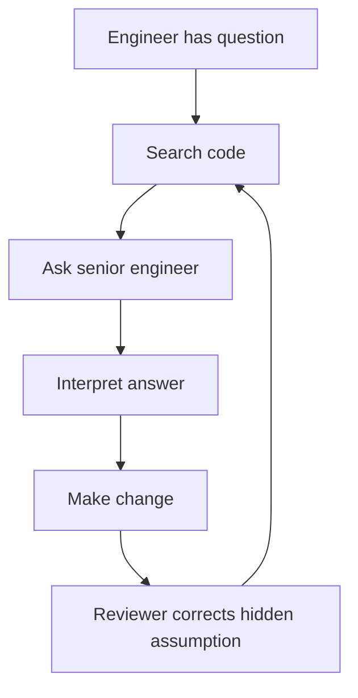
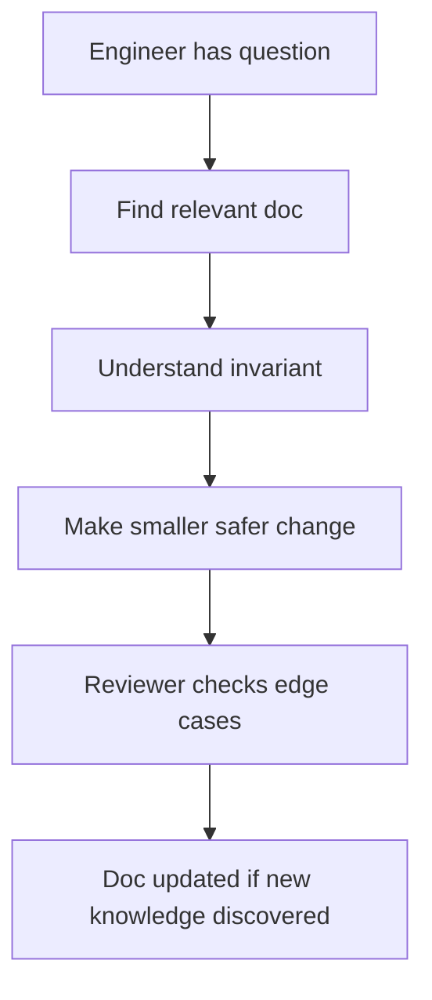
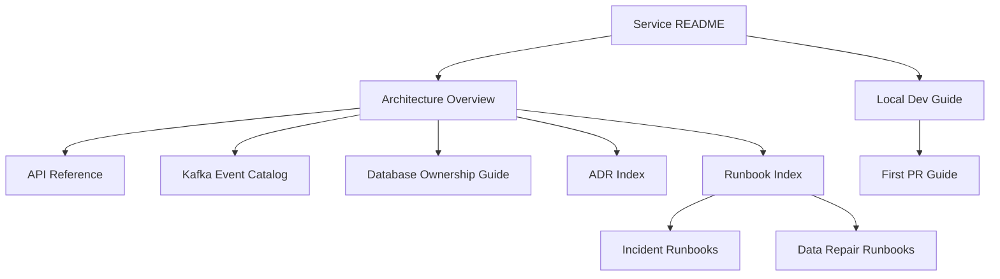

# Part 015 — Documentation as Engineering Infrastructure

## 1. Source notes and scope boundary

This part uses public documentation practice references, especially:

- Diátaxis, which classifies documentation into tutorials, how-to guides, reference, and explanation.
- Google developer documentation style guidance for clear and consistent technical writing.
- The previous parts of this series on DevEx, debugging, local golden path, and engineering friction.

This part does **not** assume CSG has a specific documentation portal, wiki, Backstage instance, ADR repository, runbook tool, knowledge base, or docs-as-code process.

Use the internal verification checklist to validate how documentation actually works in your team.

---

## 2. Core thesis

Documentation is engineering infrastructure.

It is not a side task after real engineering is done.

Documentation is part of the system that determines:

- how fast a new engineer becomes productive;
- how safely a developer can change legacy code;
- how quickly an incident can be diagnosed;
- how reliably a service can be deployed;
- how architecture decisions are remembered;
- how much knowledge is trapped in individual people;
- how much cognitive load every change requires.

Bad documentation creates hidden queues.

A missing runbook adds time to recovery.

A stale local setup guide adds days to onboarding.

An undocumented state machine makes every PR review expensive.

An absent ADR makes the same architecture debate repeat every quarter.

For a complex Quote & Order system, documentation is not merely about explaining code. It protects business and operational knowledge:

- quote lifecycle;
- pricing snapshot semantics;
- approval invalidation rules;
- order state machine;
- fulfillment fallout handling;
- Kafka event replay safety;
- PostgreSQL migration constraints;
- tenant isolation rules;
- customer-specific behavior;
- operational runbooks;
- data repair procedures.

A senior engineer should treat documentation like tests and observability: part of the system's ability to change safely.

---

## 3. Why documentation matters more in enterprise systems

Simple systems can sometimes survive with tribal knowledge.

Enterprise systems cannot.

Quote & Order systems have:

- long-lived customer contracts;
- multiple deployment models;
- customer-specific behavior;
- integration dependencies;
- audit/compliance needs;
- complex data migrations;
- asynchronous event flows;
- operational support paths;
- multiple teams touching the same journey.

When documentation is weak, teams pay the cost through:

- slow onboarding;
- repeated questions;
- inconsistent PR reviews;
- accidental breaking changes;
- support escalation dependency on specific people;
- longer incident recovery;
- unsafe production repair;
- duplicate technical decisions;
- platform adoption failure;
- brittle customer-specific customization.

Documentation is not valuable because it is complete.

Documentation is valuable when it removes friction at the moment of work.

---

## 4. Documentation as feedback-loop compression

A good document compresses a repeated learning loop.

Without documentation:



With useful documentation:



The goal is not to eliminate conversation.

The goal is to make conversations deeper.

Bad documentation answers nothing and still requires tribal knowledge.

Good documentation makes the first 70% of context self-service, so conversations can focus on trade-offs and unknowns.

---

## 5. Documentation types using Diátaxis thinking

A common documentation failure is mixing different user needs into one giant page.

Diátaxis is useful because it separates documentation by user need.

| Type | User need | Example for Quote & Order |
|---|---|---|
| Tutorial | Learn by doing | "Create and run your first local quote service request" |
| How-to guide | Solve a specific task | "How to replay a failed order event in staging" |
| Reference | Look up facts | "Quote state transition table" |
| Explanation | Understand concepts | "Why accepted quotes use immutable pricing snapshots" |

A single wiki page named `Order Service` often tries to be all four and becomes bad at all four.

Senior engineers should help separate docs by purpose.

### 5.1 Tutorial

Use tutorials for onboarding.

Example:

- clone repository;
- start local PostgreSQL/Kafka;
- run one Java service;
- call create quote API;
- inspect logs/traces;
- run tests;
- make first safe PR.

Tutorials should be concrete, sequenced, and beginner-safe.

### 5.2 How-to guide

Use how-to guides for tasks.

Examples:

- how to add a new Kafka event field safely;
- how to create a backward-compatible migration;
- how to add an endpoint to OpenAPI;
- how to debug an order stuck in fallout;
- how to run contract tests locally;
- how to add a dashboard panel.

How-to guides should be action-oriented and assume the reader has basic competence.

### 5.3 Reference

Use reference docs for facts.

Examples:

- API status codes;
- event envelope schema;
- quote/order state transition table;
- database table ownership;
- feature flag catalog;
- environment list;
- service ownership map;
- runbook index.

Reference docs should be precise, complete, and easy to scan.

### 5.4 Explanation

Use explanation docs for reasoning.

Examples:

- why outbox exists;
- why quote pricing snapshot is immutable;
- why order cancellation is asynchronous;
- why some TMF fields diverge from internal models;
- why on-prem upgrades require expand-contract migration;
- why support repair cannot directly update status fields.

Explanation docs help engineers make correct decisions when the exact case is not documented.

---

## 6. Documentation surfaces in enterprise engineering

Documentation is not one thing.

It appears across many surfaces.

| Surface | Purpose | Failure if missing |
|---|---|---|
| README | first orientation | slow setup, repeated questions |
| Local dev guide | run/debug locally | new engineers blocked |
| Architecture map | understand dependencies | unsafe changes |
| ADR | remember decisions | repeated debates |
| API docs | consumer contract | integration failures |
| Event catalog | async contract | replay/consumer breakage |
| DB schema guide | data ownership | unsafe migrations |
| Runbook | incident response | high MTTR |
| Troubleshooting guide | diagnose known issues | escalations to experts |
| Onboarding path | first 30 days | slow ramp |
| Support guide | customer issue handling | inconsistent support |
| Release checklist | production readiness | fragile deployments |
| Data repair runbook | controlled correction | unsafe SQL |
| Glossary | domain language | confused implementation |

A strong team does not need all docs to be perfect.

It needs the most-used and highest-risk docs to be reliable.

---

## 7. Documentation quality dimensions

Documentation quality is not just grammar.

Evaluate docs using these dimensions.

### 7.1 Findability

Can the right person find it at the right moment?

Signals of poor findability:

- docs duplicated across wiki, repo, Slack, ticket comments, and personal notes;
- old docs rank higher than current docs;
- no index;
- unclear owners;
- search returns stale pages;
- people ask the same question repeatedly.

### 7.2 Freshness

Is the doc still true?

Freshness signals:

- last updated timestamp;
- service version/feature flag version;
- owner;
- review date;
- linked code/test artifact;
- automated validation where possible.

### 7.3 Actionability

Can the reader act safely?

A runbook that says "check logs" is weak.

A good runbook says:

- which dashboard;
- which query;
- which correlation ID;
- what normal looks like;
- what abnormal looks like;
- what mitigation is safe;
- when to escalate.

### 7.4 Correct abstraction level

Docs should match the reader's need.

A new engineer needs a tutorial.

A senior reviewer needs invariants and failure modes.

An on-call engineer needs a runbook.

A downstream consumer needs API/event contract reference.

### 7.5 Ownership

Every critical doc needs an owner.

No owner means no freshness.

No freshness means no trust.

No trust means no usage.

---

## 8. The documentation infrastructure map

For one service, map documentation like this:



A senior engineer should be able to answer:

- where does a new engineer start?
- where does a reviewer check invariants?
- where does support diagnose customer issue?
- where does on-call mitigate production incident?
- where does platform know service runtime expectations?
- where does API consumer find contract details?

If the answer is "ask Alice", you have documentation debt.

---

## 9. Documentation for Quote & Order systems

High-leverage docs in Quote & Order include these.

### 9.1 Quote lifecycle reference

Must include:

- states;
- allowed transitions;
- actor/authority per transition;
- invalid transitions;
- audit event per transition;
- Kafka event per transition;
- idempotency behavior;
- terminal state behavior;
- data repair guidance.

### 9.2 Pricing snapshot explanation

Must include:

- when price is calculated;
- when price is frozen;
- what invalidates price;
- what invalidates approval;
- catalog version relationship;
- agreement relationship;
- audit evidence;
- rounding/currency rules;
- customer-specific exceptions.

### 9.3 Order lifecycle and fallout runbook

Must include:

- order states;
- item states;
- fulfillment task states;
- common stuck states;
- dashboards;
- queries;
- safe retry/resume operations;
- unsafe manual operations;
- escalation path;
- customer/support message guidance.

### 9.4 Event catalog

Must include:

- topic name;
- event type;
- producer;
- consumers;
- schema version;
- partition key;
- ordering guarantee;
- replay safety;
- PII classification;
- compatibility rules;
- example payload.

### 9.5 Migration playbook

Must include:

- expand-contract pattern;
- zero-downtime rules;
- PostgreSQL lock guidance;
- backfill pattern;
- validation query;
- rollback/roll-forward expectation;
- on-prem upgrade implications.

---

## 10. Docs-as-code mindset

Docs-as-code means treating docs like code where appropriate:

- versioned;
- reviewed;
- linked to code changes;
- checked by CI where possible;
- owned;
- searchable;
- updated with PRs;
- released with relevant code changes.

Not every doc must live in a repository.

But docs that describe code behavior, API contracts, migrations, runbooks, or operational procedures should usually have strong versioning and review.

### 10.1 Good candidates for docs-as-code

- service README;
- API examples;
- OpenAPI docs;
- event catalog;
- migration playbook;
- runbooks;
- ADRs;
- local setup;
- test strategy;
- architecture maps.

### 10.2 Weak candidates for docs-as-code

- meeting notes;
- brainstorming notes;
- informal roadmap drafts;
- stakeholder alignment notes;
- temporary incident chat summaries.

Even then, important decisions from these notes should be extracted into durable docs.

---

## 11. Documentation and Definition of Done

Docs should be part of Done when the change creates new knowledge others need.

A PR should update documentation if it changes:

- public API behavior;
- Kafka event schema;
- database migration pattern;
- local development setup;
- deployment steps;
- runbook procedure;
- feature flag behavior;
- security/authorization rule;
- audit event;
- customer-facing workflow;
- operational dashboard/alert.

Do not require documentation for every tiny change.

Require documentation when not documenting creates future friction or production risk.

### 11.1 Documentation DoD examples

For a new REST API:

- OpenAPI updated;
- example request/response included;
- error model documented;
- auth/tenant behavior documented;
- compatibility notes added.

For a new Kafka event:

- event catalog updated;
- schema registered;
- producer/consumer ownership documented;
- replay/idempotency semantics documented.

For a new operational alert:

- runbook link exists;
- alert symptom described;
- mitigation/escalation path documented;
- false-positive expectations documented.

---

## 12. Documentation freshness strategy

Documentation decays unless freshness is designed.

Use these tactics.

### 12.1 Ownership metadata

Add to critical docs:

```md
Owner: Quote Service Team
Last verified: 2026-07-09
Verification scope: quote acceptance path, API v3, order conversion event v2
Related code: quote-service/src/main/...
Related dashboards: Quote Acceptance Health
Related runbooks: Quote Acceptance Failure Runbook
```

### 12.2 Review trigger

Docs should be reviewed when:

- code changes relevant behavior;
- incident reveals missing/incorrect doc;
- new engineer fails onboarding step;
- support escalates repeated issue;
- API/event contract changes;
- migration procedure changes;
- owner changes.

### 12.3 Doc tests where possible

Some docs can be tested.

Examples:

- commands in README executed in CI or periodically;
- code snippets compiled;
- OpenAPI examples validated;
- links checked;
- runbook query syntax validated against test schema;
- diagrams generated from source;
- configuration examples linted.

### 12.4 Archive stale docs

Stale docs are worse than missing docs because they create false confidence.

Create an explicit archive process.

If a doc is obsolete:

- mark it obsolete;
- link replacement;
- explain reason;
- avoid deleting historical decision records unless policy requires.

---

## 13. Documentation debt

Documentation debt is accumulated future cost caused by missing, stale, misleading, or inaccessible knowledge.

Classify it.

| Debt type | Example | Cost |
|---|---|---|
| Onboarding debt | local setup guide broken | slow ramp |
| Operational debt | runbook missing for stuck order | high MTTR |
| Architecture debt | no ADR for outbox decision | repeated debate |
| Domain debt | quote states undocumented | invalid changes |
| Contract debt | event schema examples missing | consumer breakage |
| Data debt | table ownership unclear | unsafe migration |
| Support debt | customer issue steps tribal | escalations |

Documentation debt should enter backlog when it causes measurable friction or risk.

Do not create a giant "write docs" epic.

Create targeted documentation PBIs tied to real friction.

Example:

> Create order fallout runbook because support escalations currently require engineering intervention and average diagnosis takes more than 45 minutes.

---

## 14. Documentation anti-patterns

### 14.1 Wiki landfill

Everything is documented somewhere, but nothing is trustworthy.

Fix with ownership, indexing, archival, and doc type separation.

### 14.2 README as dumping ground

The README contains local setup, architecture, release notes, troubleshooting, API reference, and design history.

Split by user need.

### 14.3 Decision hidden in chat

A key architecture decision is buried in Slack/Teams.

Extract into ADR.

### 14.4 Runbook without action

Runbook says "investigate" but gives no signal, query, or mitigation.

Rewrite around symptoms, diagnosis, mitigation, and escalation.

### 14.5 Documentation theater

Docs exist for compliance but nobody uses them.

Measure usage by onboarding success, incident recovery, repeated questions, and support escalation reduction.

### 14.6 Documentation as punishment

"You broke it, now write docs" creates resentment.

Better framing:

> We found a repeated learning loop. Let's compress it into a guide.

---

## 15. Documentation templates

### 15.1 Service README template

```md
# <Service Name>

## Purpose
What business capability does this service provide?

## Ownership
Team, Slack/channel, escalation path.

## Quick start
Build, run, test, debug.

## Main APIs
Links to OpenAPI and examples.

## Main events
Produced and consumed events.

## Data ownership
Main tables and migration notes.

## Observability
Dashboards, logs, traces, metrics.

## Runbooks
Common failures and recovery guides.

## Architecture decisions
ADR index.
```

### 15.2 Runbook template

```md
# Runbook: <Failure Mode>

## Symptoms
What alert/customer report indicates this?

## Impact
Which journey/customer/business process is affected?

## First checks
Dashboard, logs, traces, DB queries, Kafka checks.

## Mitigation
Safe immediate actions.

## Diagnosis
How to find root cause category.

## Data repair
Whether repair may be needed and where process lives.

## Escalation
Who to involve.

## Verification
How to prove recovery.
```

### 15.3 ADR template

```md
# ADR-XXXX: <Decision>

## Status
Proposed / Accepted / Superseded

## Context
What problem and constraints exist?

## Decision
What are we choosing?

## Consequences
What improves? What gets harder?

## Alternatives considered
Why not other options?

## Verification
How will we know this decision works?
```

### 15.4 Troubleshooting guide template

```md
# Troubleshooting: <Symptom>

## Symptom
What the developer/support engineer sees.

## Common causes
Ranked by likelihood.

## Diagnostic steps
Commands, dashboards, queries.

## Known fixes
Safe actions.

## Escalate when
Conditions that require owner/platform/security/support escalation.
```

---

## 16. Documentation metrics without gaming

Use metrics carefully.

Helpful signals:

- time to first successful local run;
- number of repeated setup questions;
- first PR time for new engineers;
- broken link count;
- README command success rate;
- runbook usage during incidents;
- repeated incident categories without runbook update;
- docs with no owner;
- docs not verified in 12 months;
- search terms with no useful result.

Do not reward number of pages written.

Reward friction removed.

---

## 17. Internal verification checklist

Check inside your team:

- Where are docs stored?
- Which docs are source of truth?
- Are docs versioned with code?
- Is there a service catalog?
- Are runbooks centralized?
- Are ADRs used?
- Who owns documentation freshness?
- Is there a documentation standard?
- Are local setup docs tested?
- Are API examples generated or manual?
- Are event schemas documented?
- Are database migration guides documented?
- Are data repair procedures documented?
- Do support engineers have separate KB docs?
- Are customer-facing docs different from internal docs?
- How are stale docs archived?
- What questions are repeatedly asked by new engineers?
- Which incident would have recovered faster with better docs?

---

## 18. Practical exercise

Pick one service involved in Quote & Order.

Create a documentation inventory:

| Doc | Type | Owner | Last verified | Used by | Risk if stale |
|---|---|---|---|---|---|
| README | tutorial/how-to | TBD | TBD | developers | local setup friction |
| State machine | reference/explanation | TBD | TBD | reviewers/support | invalid state changes |
| Runbook | how-to | TBD | TBD | on-call | slow recovery |
| Event catalog | reference | TBD | TBD | consumers | contract breakage |

Then choose one improvement that removes real friction.

Do not start with the largest doc.

Start with the doc that would save the most repeated time or reduce the highest risk.

---

## 19. What good looks like

A strong documentation system makes these true:

- a new engineer can run the service without private help;
- a reviewer can find lifecycle invariants quickly;
- support can diagnose known failures without developer escalation;
- on-call can mitigate incidents using runbooks;
- architecture decisions are discoverable;
- API/event consumers know compatibility rules;
- migration procedures are repeatable;
- data repair is controlled and auditable;
- stale docs are identifiable;
- documentation updates are part of normal engineering flow.

Documentation is not separate from engineering effectiveness.

It is one of its main mechanisms.
