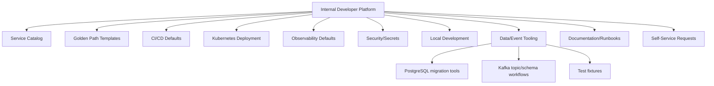

# Part 016 — Platform Engineering Mental Model

## 1. Source notes and scope boundary

This part uses public platform engineering references, especially:

- CNCF platform engineering maturity model and platforms white papers.
- CNCF descriptions of platform engineering as platform-as-a-product for internal developers.
- Team Topologies concepts around stream-aligned teams, platform teams, enabling teams, complicated-subsystem teams, fast flow, and cognitive load.
- Previous parts of this series on DevEx, flow, CI/CD, observability, documentation, and local golden paths.

This part does **not** assume CSG has a specific internal developer platform, Backstage portal, paved road, platform team model, service template, self-service portal, or platform maturity level.

Use internal verification to discover the real platform capabilities and boundaries.

---

## 2. Core thesis

Platform engineering is product engineering for internal developers.

The platform is not merely infrastructure.

The platform is the set of capabilities, golden paths, templates, guardrails, APIs, workflows, and support models that help product teams deliver software safely with less cognitive load.

A good platform helps a Quote & Order team answer:

- How do I create a new Java service safely?
- How do I get CI, Docker, Kubernetes, logging, tracing, metrics, secrets, and health checks by default?
- How do I deploy without becoming a Kubernetes expert?
- How do I add a Kafka consumer with standard retry/DLQ patterns?
- How do I expose an API with standard auth and OpenAPI?
- How do I run local development with PostgreSQL/Kafka?
- How do I find service ownership, dashboards, runbooks, and dependencies?

A bad platform says:

> File a ticket and wait.

A good platform says:

> Here is the paved road. It handles the common case safely. If you need an exception, here is how to request and justify it.

---

## 3. Platform engineering is not just ops automation

Platform engineering overlaps with DevOps, SRE, infrastructure, and internal tooling, but it has a distinct mindset.

| Approach | Typical focus | Failure mode |
|---|---|---|
| Traditional ops | manage infrastructure | ticket queue and handoff delays |
| DevOps | shared responsibility and automation | every team reinvents tooling |
| SRE | reliability, toil, SLOs | product teams may still face high cognitive load |
| Platform engineering | internal product for developer workflows | platform may become bureaucracy if not product-led |

Platform engineering succeeds when product teams can move faster and safer without needing to understand every infrastructure detail.

It fails when it becomes a new centralized bottleneck.

---

## 4. Platform as product

The platform has users.

The users are internal engineering teams.

That means platform work needs product thinking:

- user research;
- personas;
- adoption measurement;
- roadmap;
- documentation;
- support model;
- feedback loop;
- reliability expectations;
- versioning;
- deprecation policy;
- usability testing;
- self-service design.

A platform capability is not successful because it exists.

It is successful when teams use it voluntarily because it makes the right thing easier.

### 4.1 Platform personas

For CSG-like enterprise engineering, platform personas may include:

| Persona | Need |
|---|---|
| Backend engineer | create/run/test/deploy Java service quickly |
| QA engineer | access stable test environments and fixtures |
| SRE/on-call | observe service health and recover incidents |
| Security engineer | enforce auth/secrets/scanning guardrails |
| Architect | ensure standards and compatibility |
| New engineer | onboard and make first PR safely |
| Support engineer | find runbooks and diagnostics |
| Product team | deliver features without infra bottlenecks |

Platform as product starts by understanding these users' jobs-to-be-done.

---

## 5. Cognitive load reduction

A key platform goal is reducing unnecessary cognitive load.

Product teams should understand their domain deeply.

They should not need to repeatedly rediscover:

- how to configure Kubernetes probes;
- how to wire OpenTelemetry;
- how to structure Dockerfiles;
- how to configure log format;
- how to set Maven cache correctly;
- how to set up standard CI stages;
- how to rotate secrets;
- how to configure deployment strategy;
- how to create common dashboards;
- how to add standard security headers.

Those should be platform-provided golden paths.

The product team should spend cognitive energy on Quote & Order complexity:

- pricing correctness;
- approval authority;
- catalog versioning;
- order state machine;
- customer-specific behavior;
- event semantics;
- data safety.

Platform engineering should move common operational complexity out of every product team's head.

---

## 6. Golden path vs cage

A golden path is the recommended, supported, low-friction way to do common work.

A cage is a mandatory path that blocks legitimate needs.

| Golden path | Cage |
|---|---|
| Makes standard service creation easy | Forces all services into wrong abstraction |
| Provides escape hatch | Requires exception for normal domain needs |
| Encodes best practices | Encodes platform team preferences only |
| Has documentation and examples | Has hidden tribal knowledge |
| Evolves from user feedback | Evolves from centralized assumptions |
| Reduces cognitive load | Increases negotiation and workaround load |

A golden path should have an exception model.

For example:

- most Java services use standard template;
- service can override memory/probe settings with documented justification;
- unusual Kafka topology requires architecture review;
- custom deployment strategy requires platform consultation.

The point is not absolute uniformity.

The point is safe default behavior.

---

## 7. Platform capability map

A mature internal platform may include these capabilities.

For a Quote & Order engineering environment, platform capabilities could cover:

- Java service scaffolding;
- Maven/Gradle conventions;
- Dockerfile base images;
- Kubernetes deployment templates;
- health/readiness/liveness probes;
- OpenTelemetry defaults;
- structured logging;
- secret management integration;
- CI pipeline templates;
- dependency scanning;
- SAST/DAST integration;
- OpenAPI generation;
- Kafka topic/schema workflow;
- PostgreSQL migration workflow;
- Testcontainers/local environment helpers;
- dashboards and alert templates;
- runbook templates;
- service catalog metadata;
- ownership mapping.

---

## 8. Platform and stream-aligned teams

Team Topologies distinguishes stream-aligned teams and platform teams.

A stream-aligned product team owns customer/business value flow.

A platform team provides capabilities that help stream-aligned teams deliver faster and safer.

For a Quote & Order team, stream-aligned work might include:

- quote approval feature;
- order fallout improvement;
- catalog integration behavior;
- pricing snapshot fix;
- customer-specific configuration.

Platform work might include:

- standard Java service template;
- CI pipeline base;
- Kubernetes deployment library;
- logging/tracing standard;
- internal developer portal;
- self-service environment provisioning;
- standardized Kafka topic onboarding;
- default dashboards.

A platform team should not own product delivery.

A product team should not repeatedly reinvent platform capabilities.

The boundary must be explicit.

---

## 9. Platform engineering and paved roads

A paved road should encode:

- recommended implementation path;
- security guardrails;
- observability defaults;
- deployment defaults;
- documentation;
- examples;
- support model;
- exception path;
- versioning and upgrades.

Example paved road for a Java microservice:

1. Generate service from template.
2. Get standard package layout.
3. Get Maven dependency baseline.
4. Get Dockerfile.
5. Get Kubernetes manifests.
6. Get CI pipeline.
7. Get health checks.
8. Get OpenTelemetry instrumentation.
9. Get JSON structured logging.
10. Get default dashboard.
11. Get security scanning.
12. Get README and runbook template.
13. Get service catalog entry.

The best paved road makes compliant behavior the easiest behavior.

---

## 10. Platform interfaces

Product teams interact with platform through interfaces.

Good platform interfaces are stable and documented.

Examples:

| Interface | Example |
|---|---|
| CLI | `platform service create quote-adapter` |
| Portal | create service, view ownership, trigger environment |
| Template | Java service golden path |
| API | environment provisioning API |
| GitOps repo | environment desired state |
| Pipeline library | reusable CI stages |
| Documentation | how-to/reference/runbook |
| Support channel | office hours / escalation |

Bad platform interfaces are informal:

- "ask Bob";
- "copy YAML from another service";
- "paste this from old pipeline";
- "open ticket with unclear template";
- "tribal knowledge in chat".

A platform is only as good as its interfaces.

---

## 11. Platform engineering and governance

Platform guardrails should reduce risk without creating bureaucracy.

Examples of useful guardrails:

- standard CI security scan;
- dependency vulnerability gate;
- container image baseline;
- required health probes;
- default resource requests/limits;
- OpenTelemetry instrumentation;
- standard log fields;
- secrets only through approved manager;
- deployment promotion workflow;
- service ownership metadata;
- default alert/runbook link.

Bad governance:

- every small config change needs manual committee approval;
- exception process is unclear;
- platform team blocks teams without explaining risk;
- golden path cannot support legitimate enterprise requirements;
- compliance is checked late after implementation.

Good governance:

- safe defaults;
- automated checks;
- transparent exceptions;
- clear owner;
- review only where risk is real;
- standards evolve from incidents and user feedback.

---

## 12. Platform success metrics

Measure whether platform improves developer and delivery outcomes.

Do not measure only platform activity.

### 12.1 Adoption metrics

- percentage of services using golden path;
- percentage using standard CI template;
- percentage using OTel/logging standard;
- number of teams onboarded;
- number of services in catalog with owner metadata.

### 12.2 Experience metrics

- time to create new service;
- time to first successful local run;
- time to first deployment to dev environment;
- developer satisfaction with platform;
- support ticket volume per capability;
- repeated questions.

### 12.3 Delivery metrics

- CI duration;
- deployment frequency;
- change lead time;
- failed deployment recovery;
- review queue impacts;
- environment provisioning time.

### 12.4 Reliability metrics

- services with dashboards;
- services with runbooks;
- services with working probes;
- services with standard alerts;
- incident categories reduced by platform improvement.

### 12.5 Platform health metrics

- platform uptime;
- self-service success rate;
- template version drift;
- deprecation adoption;
- time to resolve platform bugs.

A platform should prove that it reduces friction and risk.

---

## 13. Platform maturity levels

A practical maturity model:

### Level 0 — Hero scripts

Characteristics:

- setup scripts scattered;
- YAML copy-paste;
- no service catalog;
- manual environment requests;
- docs stale;
- experts required.

Risk:

- inconsistent services;
- slow onboarding;
- high platform dependency;
- fragile deployments.

### Level 1 — Standardized templates

Characteristics:

- common service templates;
- CI examples;
- basic docs;
- some shared libraries;
- manual support still common.

Risk:

- templates drift;
- adoption uneven;
- updates hard.

### Level 2 — Paved road

Characteristics:

- recommended golden paths;
- templates maintained;
- CI/CD defaults;
- observability defaults;
- service ownership metadata;
- documented exception process.

Risk:

- platform can become rigid if not product-led.

### Level 3 — Self-service platform

Characteristics:

- portal/CLI/API;
- environment provisioning;
- service catalog;
- automated guardrails;
- platform telemetry;
- adoption measured.

Risk:

- platform complexity requires strong product management.

### Level 4 — Adaptive platform product

Characteristics:

- platform roadmap based on user research and metrics;
- platform capabilities evolve continuously;
- standards updated automatically where possible;
- platform reduces cognitive load measurably;
- teams mostly self-serve common needs.

Risk:

- over-automation can hide necessary understanding.

Maturity is not a contest.

The useful question is:

> Which maturity gap currently creates the most delivery friction or production risk?

---

## 14. Platform engineering for CSG-like Quote & Order context

Platform work is valuable when it reduces repeated friction for product teams.

High-value platform capabilities for Quote & Order may include:

### 14.1 Java service golden path

- base service template;
- Maven configuration;
- dependency version baseline;
- test setup;
- Spring/profile conventions if applicable;
- logging/tracing defaults;
- Docker/Kubernetes config;
- README/runbook scaffold.

### 14.2 API contract golden path

- OpenAPI generation;
- API lint;
- compatibility diff;
- generated examples;
- auth/tenant docs;
- client generation workflow.

### 14.3 Kafka golden path

- event envelope standard;
- topic request workflow;
- schema compatibility check;
- producer/consumer template;
- retry/DLQ standard;
- replay guidance;
- local Kafka fixture.

### 14.4 PostgreSQL migration golden path

- migration template;
- backward compatibility checklist;
- lock analysis checklist;
- Testcontainers migration test;
- backfill pattern;
- validation query template;
- on-prem upgrade guidance.

### 14.5 Observability golden path

- structured log fields;
- trace propagation;
- standard metrics;
- dashboard template;
- alert/runbook template;
- business journey signal examples.

### 14.6 Security golden path

- authentication integration;
- authorization helper;
- tenant context propagation;
- secrets handling;
- audit event pattern;
- security test examples.

---

## 15. Platform anti-patterns

### 15.1 Ticket factory platform

Every platform action requires a ticket.

Result:

- teams wait;
- product delivery slows;
- platform team overloaded;
- product teams bypass platform.

Fix:

- self-service for common operations;
- ticket only for exceptions or high-risk operations.

### 15.2 Golden path without feedback

Platform team builds what it thinks teams need.

Teams do not adopt it.

Fix:

- user research;
- adoption metrics;
- office hours;
- product roadmap;
- usability testing.

### 15.3 Platform as gatekeeper

Platform enforces standards manually and late.

Fix:

- automated guardrails;
- templates;
- early checks;
- clear exception process.

### 15.4 Abstraction that hides too much

Platform hides important runtime behavior.

Engineers cannot debug production.

Fix:

- self-service plus transparency;
- teach mental model;
- expose logs/metrics/traces;
- document generated artifacts.

### 15.5 One-size-fits-all platform

Platform forces every workload into the same shape.

Fix:

- define supported workload classes;
- allow documented variants;
- track exceptions;
- learn from repeated exceptions.

### 15.6 Platform without ownership metadata

Services exist but ownership is unclear.

Fix:

- service catalog;
- owner metadata;
- escalation path;
- operational readiness fields.

---

## 16. Platform adoption strategy

Adoption cannot rely on announcements.

Use a structured path.

### 16.1 Start with pain

Identify high-friction workflows:

- new service creation takes weeks;
- local setup breaks often;
- CI pipeline copy-paste diverges;
- dashboards inconsistent;
- Kafka schema changes error-prone;
- migration review ad hoc.

### 16.2 Pick narrow golden path

Do not platform everything at once.

Start with one high-value workflow.

Example:

> Golden path for creating a new Java service with CI, Docker, Kubernetes, OTel, logs, health checks, README, and runbook scaffold.

### 16.3 Pilot with one product team

Partner with a real team.

Measure:

- setup time;
- number of manual steps;
- support questions;
- deployment success;
- feedback.

### 16.4 Improve before scaling

Fix rough edges before broad rollout.

### 16.5 Make migration path clear

Existing services need adoption plan:

- new services use template by default;
- existing services migrate when touched;
- high-risk services prioritized;
- template drift tracked.

---

## 17. Platform backlog and prioritization

A platform backlog should be ordered by internal user value and risk reduction.

Useful prioritization dimensions:

- number of teams affected;
- time saved;
- risk reduced;
- incident recurrence prevented;
- onboarding friction removed;
- regulatory/security requirement;
- alignment with product roadmap;
- maintenance cost;
- adoption likelihood.

Bad platform backlog item:

> Build developer portal.

Better:

> Add service ownership, dashboard, runbook, and deployment metadata to service catalog because support and on-call currently spend time discovering owners during incidents.

Even better:

> Pilot service catalog metadata for Quote and Order services, measure time-to-owner during two support scenarios, then expand to adjacent services.

---

## 18. Platform exception model

Exceptions are normal.

The platform should not pretend all workloads are identical.

Exception request should capture:

- why golden path does not fit;
- affected service/team;
- risk introduced;
- alternative proposed;
- duration of exception;
- review owner;
- whether platform should evolve.

Repeated exceptions are product feedback.

If many teams request the same exception, the golden path may be wrong.

---

## 19. Internal verification checklist

Check inside your organization/team:

- Is there a platform team?
- Is there an internal developer portal?
- Is there a service catalog?
- Is there a standard Java service template?
- Are CI/CD pipelines standardized?
- Are Kubernetes manifests templated?
- Are observability defaults provided?
- Are runbook templates provided?
- Are API/Kafka/DB workflows self-service?
- How are environments provisioned?
- How are secrets managed?
- How are platform requests handled?
- What requires a ticket vs self-service?
- What platform capabilities are most loved?
- What platform capabilities are most avoided?
- What are the top repeated platform support requests?
- Is platform adoption measured?
- Are product teams involved in platform roadmap?
- Are exceptions tracked?
- Is platform documentation current?

---

## 20. Practical exercise

Map one developer workflow.

Example: "create a new internal Java API service".

Create this table:

| Step | Current path | Friction | Platform capability needed | Owner | Metric |
|---|---|---|---|---|---|
| Create repo | ask team lead | unclear ownership | service template/self-service | TBD | time to repo |
| Configure CI | copy old pipeline | drift/errors | pipeline template | TBD | CI setup time |
| Add observability | manual | inconsistent | OTel/logging default | TBD | services with standard telemetry |
| Deploy dev | ticket | wait time | self-service deploy | TBD | deployment lead time |
| Add runbook | manual | often skipped | scaffold | TBD | runbook coverage |

Then identify one narrow platform improvement that would reduce repeated friction.

---

## 21. What good looks like

A strong platform engineering model makes these true:

- common developer workflows are self-service;
- safe defaults are easier than unsafe custom work;
- platform reduces cognitive load for product teams;
- golden paths are documented and maintained;
- exceptions are visible and used as feedback;
- platform adoption is measured;
- platform team treats developers as users;
- product teams keep ownership of product behavior;
- platform improves delivery flow and production safety;
- platform avoids becoming a ticket factory.

Platform engineering is not about centralizing all expertise.

It is about packaging common expertise into usable internal products so product teams can focus on customer value.
