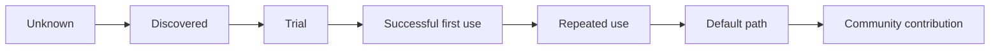
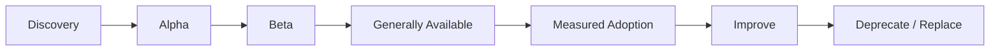

# Part 019 — Platform as Product

## 1. Source notes and scope boundary

This part uses public platform engineering concepts, especially:

- CNCF material on platform engineering and platform maturity.
- Team Topologies concepts such as platform teams, stream-aligned teams, cognitive load, and platform-as-a-product.
- Backstage as a public example of developer portal and software catalog thinking.
- DORA and DevEx ideas from earlier parts as measurement and feedback-loop input.

This part does **not** assume that CSG uses Backstage, a specific Internal Developer Platform, a dedicated platform team, or a particular platform operating model.

Use the internal verification checklist to discover what exists in your organization.

---

## 2. Core thesis

An internal platform is not successful because it exists.

An internal platform is successful when product teams voluntarily use it because it makes the safe path the easiest path.

That is the difference between:

- a platform as a product, and
- a platform as a ticket queue.

In enterprise engineering, the platform should reduce friction around:

- service creation,
- local development,
- CI/CD,
- test infrastructure,
- deployment,
- secrets/config,
- Kubernetes runtime defaults,
- observability,
- API/event contracts,
- security guardrails,
- incident diagnosis,
- production readiness.

For CSG Quote & Order-style systems, the platform should help Java product teams ship safer changes to CPQ, quote, pricing, catalog, order, Kafka, PostgreSQL, and Kubernetes workloads with less accidental complexity.

The platform is not the owner of product outcomes.

The platform is the accelerator and safety rail for teams that own product outcomes.

---

## 3. Platform product mindset

A product mindset means the platform team asks product questions.

| Product question | Platform translation |
|---|---|
| Who are the users? | Java backend teams, QA, SRE, support, platform consumers, new engineers. |
| What job are users trying to do? | Create, run, test, deploy, observe, debug, and operate services. |
| What pain exists today? | Slow setup, flaky CI, unclear ownership, manual deployment, missing telemetry. |
| What value does the product provide? | Faster delivery, lower cognitive load, safer production changes. |
| How do we measure adoption? | Service count, golden path usage, self-service rate, support ticket reduction. |
| How do we get feedback? | Interviews, friction logs, platform metrics, incidents, PR flow diagnostics. |
| How do we evolve it? | Roadmap, discovery, prioritization, migration path, deprecation policy. |

A platform without product thinking often becomes a collection of scripts, dashboards, templates, and undocumented conventions.

A platform with product thinking becomes an internal product with users, onboarding, support, release notes, and success metrics.

---

## 4. Who are platform users?

A platform has multiple users.

Do not design only for the loudest group.

### 4.1 Stream-aligned product teams

They need to:

- create services,
- run services locally,
- test changes,
- deploy safely,
- debug production issues,
- instrument telemetry,
- comply with security standards,
- own production behavior.

For Quote & Order teams, examples include engineers working on:

- quote lifecycle,
- pricing,
- catalog integration,
- order lifecycle,
- fulfillment adapters,
- audit,
- customer-specific configuration,
- Kafka consumers,
- PostgreSQL migrations.

### 4.2 New engineers

They need to become productive quickly.

Important jobs:

- find the right repo,
- understand service ownership,
- run the service,
- run tests,
- inspect logs/traces,
- make first safe PR,
- know who to ask.

If the platform fails new engineers, onboarding becomes dependent on oral tradition.

### 4.3 Senior engineers and tech leads

They need standardization without losing judgment.

Important jobs:

- review service health,
- compare teams/services,
- enforce paved-road standards,
- understand exceptions,
- reduce repeated debate,
- create reusable patterns,
- diagnose delivery friction.

### 4.4 QA and test engineers

They need:

- stable test environments,
- test data management,
- service contracts,
- test execution visibility,
- flaky-test diagnosis,
- integration simulators,
- release evidence.

### 4.5 SRE / operations / support

They need:

- service catalog ownership,
- runbooks,
- dashboards,
- alert routing,
- deployment history,
- incident links,
- operational maturity signals,
- safe repair procedures.

### 4.6 Security and compliance

They need:

- policy defaults,
- secret handling,
- vulnerability scans,
- auditability,
- identity integration,
- RBAC controls,
- exception visibility.

---

## 5. Platform value proposition

A platform product should have a clear value proposition.

Weak statement:

> We provide Kubernetes templates.

Stronger statement:

> We help Java service teams deploy observable, secure, production-ready services in under one day using approved CI, Docker, Kubernetes, OpenTelemetry, health check, secret, and dashboard defaults.

For Quote & Order engineering, platform value could be:

> We reduce the time and risk required for product teams to create, deploy, observe, and operate Java microservices that use REST APIs, Kafka events, PostgreSQL, Kubernetes, and enterprise security standards.

The value proposition should be visible in daily developer workflow.

If developers cannot feel the platform, the platform may not be solving the right problem.

---

## 6. Platform product surfaces

A platform is not one thing.

It has multiple product surfaces.

| Surface | Example |
|---|---|
| Developer portal | Software catalog, ownership, docs, templates, scorecards. |
| Golden paths | Java service template, Kafka consumer template, PostgreSQL migration pattern. |
| CI/CD defaults | Build/test/scan/package/deploy pipeline. |
| Runtime defaults | Kubernetes manifests, probes, resource defaults, service mesh config. |
| Observability defaults | Logs, metrics, traces, dashboards, alerts, correlation IDs. |
| Security defaults | Secret handling, identity integration, vulnerability scans, policy checks. |
| Test infrastructure | Testcontainers patterns, integration envs, contract test harness. |
| Data tooling | Migration validation, safe backfill framework, DB diagnostics. |
| Operations tooling | Runbooks, incident links, deployment history, repair workflows. |
| Support model | Help channels, office hours, issue routing, escalation. |

Each surface needs ownership and lifecycle management.

A platform is unreliable when every surface exists but nobody owns it as a product capability.

---

## 7. Platform roadmap should start from friction

Do not start platform roadmap from tool preference.

Start from user friction.

Example friction inputs:

- new service creation takes two weeks,
- local setup takes three days,
- CI feedback takes 45 minutes,
- flaky tests hide real failures,
- every team writes Kubernetes manifests differently,
- every service has different log fields,
- production dashboards are inconsistent,
- service ownership is unclear,
- security exceptions are handled manually,
- migrations fail late in release cycle,
- Kafka event schemas are hard to test locally.

Convert friction into platform opportunities.

| Friction | Platform product opportunity |
|---|---|
| Slow local setup | Local development golden path and sample data. |
| Inconsistent services | Service template with defaults. |
| Missing observability | Standard OTel/log/metric instrumentation package. |
| CI too slow | Pipeline diagnostics and test suite partitioning defaults. |
| Manual Kubernetes config | Paved-road deployment template. |
| Unknown ownership | Software catalog with service metadata. |
| Repeated support questions | Troubleshooting docs and self-service diagnostics. |
| Unsafe migrations | Migration validation workflow and examples. |

Roadmap priority should be driven by impact and adoption likelihood, not platform team preference.

---

## 8. Adoption beats mandate

Mandates can create compliance.

Adoption creates value.

A platform should be easy enough and valuable enough that teams choose it.

### 8.1 Adoption signals

Good signals:

- new services start from platform template,
- teams migrate voluntarily,
- support tickets decrease,
- onboarding time decreases,
- dashboards are used during incidents,
- teams contribute improvements back,
- exceptions become fewer and more explicit,
- product teams say the platform made work easier.

Weak signals:

- platform launched,
- portal exists,
- documents published,
- team announced standard,
- policy requires usage,
- adoption claimed without data.

### 8.2 Adoption curve



Design for the whole adoption curve.

A platform with poor first-use experience fails before users reach value.

---

## 9. Platform support model

Platform teams need support, but support should not become the product.

### 9.1 Support channels

Common channels:

- Slack/Teams channel,
- issue tracker,
- office hours,
- on-call escalation,
- documentation,
- troubleshooting guide,
- self-service diagnostics.

### 9.2 Support taxonomy

Classify support requests.

| Request type | Example | Product implication |
|---|---|---|
| Usage question | How do I add OTel to this service? | Documentation/golden path may be unclear. |
| Bug | Template generates invalid config. | Platform reliability issue. |
| Missing capability | Need Kafka schema check in CI. | Roadmap candidate. |
| Exception request | Existing service cannot use default deployment path. | Exception governance needed. |
| Incident support | Deployment failed in production. | Runbook/support maturity needed. |
| Migration help | Team wants to adopt golden path. | Enablement package needed. |

Support tickets are product feedback.

Do not only close them.

Analyze them.

---

## 10. Platform roadmap model

A platform roadmap should contain product-style items.

Example roadmap themes:

### 10.1 Service creation

Goal:

- create a production-ready Java service faster.

Capabilities:

- service template,
- CI pipeline,
- Dockerfile,
- Kubernetes baseline,
- health checks,
- logging/tracing defaults,
- test skeleton,
- API docs skeleton.

Metrics:

- time to first successful build,
- time to first deployment,
- template adoption rate,
- number of manual setup steps.

### 10.2 Observability

Goal:

- make every service diagnosable by default.

Capabilities:

- standardized trace propagation,
- structured logs,
- service dashboard template,
- alert template,
- business metric example,
- runbook link convention.

Metrics:

- percentage of services with required telemetry,
- incident diagnosis time,
- dashboard usage,
- alert actionability score.

### 10.3 Delivery flow

Goal:

- reduce time from commit to deployable artifact.

Capabilities:

- faster build cache,
- test suite partitioning,
- flaky test quarantine policy,
- pipeline observability,
- merge queue health.

Metrics:

- CI cycle time,
- pipeline failure rate,
- flaky test rate,
- queue time,
- deployment lead time.

### 10.4 Compliance and security

Goal:

- make secure path the default path.

Capabilities:

- secret scanning,
- dependency scanning,
- RBAC defaults,
- policy checks,
- audit logging defaults,
- vulnerability dashboard.

Metrics:

- vulnerabilities caught pre-merge,
- exception count,
- remediation time,
- services using approved secret pattern.

---

## 11. Platform discovery methods

Platform product discovery should be structured.

Use:

- developer interviews,
- onboarding observation,
- friction logs,
- CI telemetry,
- service maturity assessment,
- incident analysis,
- support ticket classification,
- PR review bottleneck analysis,
- environment failure review,
- platform adoption analytics.

### 11.1 Developer interview prompts

Ask product teams:

- What is the slowest part of your daily workflow?
- What do you avoid changing because it is painful?
- What takes too long to debug?
- Where do you copy/paste from another service?
- Which docs do you trust least?
- Which setup step breaks most often?
- Which production signal do you wish existed?
- Which platform tool do you use only because it is required?
- Which platform feature saves you real time?

### 11.2 Observational discovery

Watch a new engineer:

- clone repo,
- build service,
- run tests,
- start dependencies,
- call endpoint,
- inspect logs,
- create PR.

Write down every friction point.

This often reveals more than surveys.

---

## 12. Platform backlog item quality

A platform backlog item should look like product work.

Weak item:

> Improve CI.

Better item:

> Reduce Java service PR pipeline median duration from 35 minutes to under 20 minutes by splitting slow integration tests, enabling cache reuse, and publishing suite-level timing diagnostics. Success means at least three high-volume services adopt the pattern and developers can identify the slowest test group from pipeline output.

A good platform PBI includes:

- target users,
- problem/friction,
- current baseline,
- desired outcome,
- adoption path,
- compatibility/migration plan,
- support/docs requirement,
- measurement.

---

## 13. Platform product metrics

Platform metrics should measure product value and system health.

### 13.1 Adoption metrics

Examples:

- number of services using golden path,
- percentage of new services created from template,
- number of teams using platform self-service,
- migration completion rate,
- repeated usage rate.

### 13.2 Outcome metrics

Examples:

- time to first service deployment,
- CI median duration,
- PR cycle time reduction,
- incident diagnosis time reduction,
- onboarding time reduction,
- deployment failure reduction,
- manual support ticket reduction.

### 13.3 Quality metrics

Examples:

- pipeline success rate,
- template freshness,
- platform uptime,
- portal search success,
- docs freshness,
- vulnerability baseline compliance,
- required telemetry coverage.

### 13.4 Satisfaction metrics

Examples:

- developer satisfaction survey,
- effort score for common tasks,
- support feedback,
- office-hour recurring themes,
- qualitative interviews.

Metrics should be used for learning, not punishment.

---

## 14. Exception model

A platform with no exceptions becomes unrealistic.

A platform with unlimited exceptions becomes meaningless.

### 14.1 Healthy exception process

An exception should include:

- what standard is not followed,
- why the standard does not fit,
- risk accepted,
- owner,
- expiration or review date,
- migration path if applicable.

### 14.2 Example exception

```md
# Platform Exception

Service: order-fulfillment-adapter
Standard: default deployment template requires HTTP readiness probe.
Reason: service is a Kafka-only worker and readiness must represent consumer assignment plus DB connectivity.
Risk: default dashboard will not show HTTP readiness semantics.
Mitigation: worker-specific readiness indicator and dashboard panel.
Owner: team-name
Review date: 2026-10-01
```

Exceptions should improve the platform over time.

If many teams request the same exception, the platform standard may be wrong.

---

## 15. Platform and governance

Platform engineering should reduce governance friction.

Bad governance:

- many approval gates,
- manual checklist,
- hidden decision makers,
- late security review,
- inconsistent standards,
- exception by relationship.

Better governance:

- defaults embedded in templates,
- automated checks,
- visible scorecards,
- clear ownership,
- explicit exception process,
- self-service documentation,
- standards that explain why.

Governance works best when the platform makes compliant behavior the easiest behavior.

---

## 16. Platform anti-patterns

### 16.1 Portal-first platform

The team launches a portal before solving workflow pain.

Symptom:

- many pages,
- low usage,
- no golden path adoption,
- developers still ask the same questions.

Fix:

- start from top developer jobs and friction points.

### 16.2 Ticket-queue platform

The platform team becomes a centralized ops queue.

Symptom:

- product teams wait for platform tickets,
- platform team becomes bottleneck,
- self-service is weak.

Fix:

- prioritize self-service and reusable capabilities.

### 16.3 Golden path cage

The platform forces one path even when domain constraints differ.

Symptom:

- teams bypass platform,
- exceptions hidden,
- platform blamed for slowing delivery.

Fix:

- use paved road plus explicit exceptions.

### 16.4 Tool showroom

The platform accumulates tools without integration.

Symptom:

- many dashboards/tools,
- unclear workflow,
- no improvement in flow metrics.

Fix:

- optimize user journeys, not tool count.

### 16.5 Platform without support

The platform ships features but no enablement.

Symptom:

- adoption stalls,
- docs stale,
- teams misconfigure features.

Fix:

- docs, examples, office hours, migration guide, support taxonomy.

### 16.6 Platform without measurement

The platform cannot prove value.

Symptom:

- leadership questions investment,
- roadmap driven by opinion,
- improvement hard to prioritize.

Fix:

- measure adoption, outcomes, quality, satisfaction.

---

## 17. Platform product lifecycle

A platform capability has lifecycle stages.



### 17.1 Discovery

Goal:

- validate user problem.

Output:

- problem statement,
- target users,
- baseline metrics,
- prototype plan.

### 17.2 Alpha

Goal:

- test with friendly users.

Output:

- early feedback,
- rough docs,
- known limitations.

### 17.3 Beta

Goal:

- expand usage and harden.

Output:

- migration guide,
- support process,
- telemetry,
- success criteria.

### 17.4 Generally available

Goal:

- make capability safe for broad adoption.

Output:

- documentation,
- support ownership,
- stability commitment,
- compatibility policy.

### 17.5 Deprecation

Goal:

- remove obsolete paths safely.

Output:

- usage inventory,
- migration path,
- timeline,
- communication.

---

## 18. Applying platform-as-product to Quote & Order

### 18.1 Java service golden path

Users:

- backend product teams.

Jobs:

- create a Java service with production defaults.

Capabilities:

- Spring/Java template if applicable,
- Maven/Gradle standard,
- Dockerfile,
- Kubernetes manifests,
- health checks,
- OpenTelemetry,
- structured logging,
- sample tests,
- service catalog registration,
- CI pipeline.

Outcome:

- teams do not reinvent service scaffolding.

### 18.2 Kafka event golden path

Users:

- event producer/consumer teams.

Jobs:

- publish and consume events safely.

Capabilities:

- event envelope,
- schema template,
- compatibility check,
- local Kafka fixture,
- DLQ pattern,
- replay guidance,
- consumer lag dashboard.

Outcome:

- event-driven work becomes safer and easier.

### 18.3 PostgreSQL migration golden path

Users:

- teams changing database schemas.

Jobs:

- migrate without production incidents.

Capabilities:

- migration template,
- expand-contract examples,
- Testcontainers migration test,
- lock-risk checklist,
- backfill pattern,
- validation query examples.

Outcome:

- migration risk shifts left.

### 18.4 Observability golden path

Users:

- product teams and on-call engineers.

Jobs:

- diagnose business and technical issues.

Capabilities:

- logging fields,
- trace propagation,
- metric names,
- dashboard template,
- alert template,
- runbook link standard.

Outcome:

- quote/order journeys are diagnosable by default.

---

## 19. Internal verification checklist

Verify these inside your team or organization:

### 19.1 Platform existence

- Is there an internal developer platform?
- Is there a developer portal?
- Is there a software catalog?
- Is there a platform team?
- Is there an enabling team?
- Are platform capabilities documented?

### 19.2 Platform users

- Which teams use platform capabilities?
- Which teams avoid them?
- Why?
- Who are the primary user personas?
- Who gives feedback?

### 19.3 Golden paths

- Is there a Java service golden path?
- Is there a Kafka golden path?
- Is there a PostgreSQL migration golden path?
- Is there an observability golden path?
- Is there a security/compliance golden path?
- Are exceptions documented?

### 19.4 Support and ownership

- Where do developers ask for platform help?
- Is support ticket volume measured?
- Are recurring questions converted into docs/features?
- Who owns each platform capability?
- How are platform incidents handled?

### 19.5 Roadmap and measurement

- Is there a platform roadmap?
- Is it based on user friction?
- Are adoption metrics tracked?
- Are outcome metrics tracked?
- Are developer satisfaction signals collected?
- Are platform investments connected to business/delivery outcomes?

---

## 20. Senior engineer checklist

When evaluating a platform capability, ask:

- Who is the user?
- What job does it help them do?
- What friction does it remove?
- What unsafe behavior does it make harder?
- What safe behavior does it make easier?
- How does a new engineer discover it?
- How does a team adopt it?
- How does a team migrate from old path?
- What support exists?
- What metric proves it helps?
- What exception path exists?
- Who owns it after launch?
- How will it be deprecated if obsolete?

---

## 21. Practical exercise

Pick one developer workflow in your team:

- creating a service,
- adding a Kafka consumer,
- adding a DB migration,
- adding observability,
- deploying to an environment,
- debugging an incident.

Write a platform product brief:

```md
# Platform Product Brief

## User
Who uses this capability?

## Job to be done
What are they trying to accomplish?

## Current friction
What is painful today?

## Proposed capability
What does the platform provide?

## Golden path
What is the recommended path?

## Exceptions
When can teams deviate?

## Adoption plan
How will teams discover and adopt it?

## Support model
How will users get help?

## Metrics
How will we know it works?
```

Discuss it with one product-team engineer and one platform/ops engineer if possible.

---

## 22. Summary

Platform-as-product means the platform has:

- users,
- jobs to be done,
- value proposition,
- discovery,
- roadmap,
- adoption strategy,
- support model,
- metrics,
- lifecycle management,
- exception process.

For senior engineers, the practical question is:

> Is this platform capability reducing product-team cognitive load and increasing safe delivery flow, or is it adding another system teams must work around?

A good internal platform makes good engineering easier.

A great internal platform makes safe production engineering the default.
