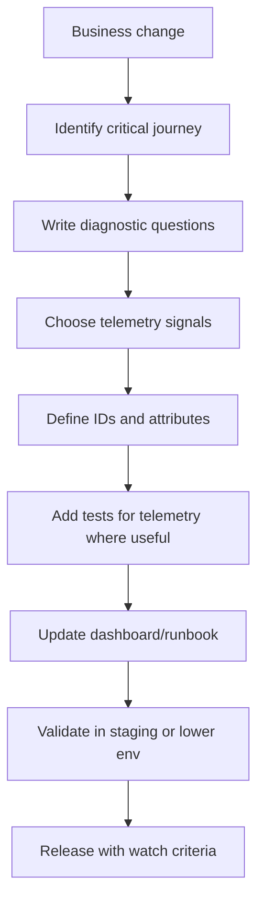

# Part 021 — Observability-Driven Engineering

## 1. Source notes and scope boundary

This part uses public observability and reliability references:

- OpenTelemetry documentation describes OTel as a vendor-neutral open source framework for instrumenting, generating, collecting, and exporting telemetry such as traces, metrics, and logs.
- Google SRE material treats monitoring as essential to understanding distributed systems and deciding when humans should be interrupted.
- CNCF observability material commonly discusses logs, metrics, traces, and events as telemetry signals for understanding cloud-native systems.
- This part does **not** assume the specific observability stack used inside CSG, such as Datadog, Grafana, Prometheus, Splunk, OpenSearch, Honeycomb, New Relic, Dynatrace, Elastic, CloudWatch, Azure Monitor, or a custom platform.

Internal details must be verified in your team:

- telemetry backend,
- log schema,
- trace propagation standard,
- metric naming convention,
- dashboard ownership,
- alert ownership,
- production support workflow,
- data retention,
- PII/commercial sensitivity rules.

---

## 2. Core thesis

Observability is not a dashboard project.

Observability is an engineering design property:

> Can we understand what the system is doing, why it is doing it, and what business effect it has, without deploying new diagnostic code during an incident?

For enterprise Quote & Order systems, this matters because failures are rarely isolated.

A customer-visible issue may involve:

- quote API,
- product catalog lookup,
- pricing calculation,
- approval rules,
- PostgreSQL transactions,
- Kafka outbox relay,
- order conversion,
- fulfillment callback,
- billing handoff,
- tenant-specific configuration,
- Kubernetes runtime behavior,
- support tooling,
- data repair.

If telemetry cannot connect these steps, debugging becomes archaeology.

Observability-driven engineering means designing features with diagnostic questions in mind before production failure happens.

---

## 3. Monitoring vs observability

Monitoring answers known questions.

Examples:

- Is API error rate above threshold?
- Is Kafka consumer lag high?
- Is PostgreSQL CPU high?
- Is pod restart count increasing?

Observability helps answer new questions.

Examples:

- Why are only enterprise discount quotes failing?
- Why are orders for one product family entering fallout?
- Which catalog version caused price recalculation errors?
- Did quote acceptance fail before or after order creation?
- Which service dropped the correlation ID?
- Did duplicate fulfillment callbacks create duplicate state transitions?

Both are needed.

Monitoring without observability tells you something is wrong but not enough about why.

Observability without monitoring may require a human to discover every issue manually.

---

## 4. Observability as Definition of Done

For production-grade backend work, observability should be part of Done.

A change is not truly production-ready if:

- failures are invisible,
- logs lack business identifiers,
- traces stop at service boundary,
- metrics cannot distinguish success/failure modes,
- alerts have no runbook,
- audit/business events cannot reconstruct key decisions,
- support cannot answer customer questions,
- engineers cannot reproduce or diagnose from telemetry.

### 4.1 Minimum observability DoD

For a backend change, ask:

- What should we log?
- What should we measure?
- What should we trace?
- What event or audit evidence should exist?
- What identifiers connect signals?
- What dashboard should change?
- What alert should exist or be intentionally omitted?
- What runbook should explain failure handling?
- What sensitive fields must never be emitted?

---

## 5. Diagnostic questions first

Start observability design by writing questions.

For a quote acceptance feature:

- How many quote accept attempts happened?
- How many succeeded?
- How many failed due to stale price?
- How many failed due to missing approval?
- How many created orders?
- How many duplicate accept attempts were deduplicated?
- What was the latency from accept request to order creation?
- Which tenant/customer/offering/catalog version was affected?
- Which correlation ID connects API request, DB transaction, outbox event, Kafka message, and order service call?

For order fulfillment fallout:

- Which orders are stuck?
- Which item is stuck?
- Which fulfillment task is stuck?
- Which downstream adapter returned error?
- Was the callback missing, duplicate, rejected, or malformed?
- What is the age of stuck work?
- Which support runbook applies?

If telemetry cannot answer the questions, the design is incomplete.

---

## 6. The four signal model

Observability usually involves four signal families.

| Signal | Best for | Weakness |
|---|---|---|
| Logs | Detailed event/context, debugging, audit-like timeline | Expensive/noisy if unstructured |
| Metrics | Aggregates, trends, alerts, SLOs | Can hide high-cardinality detail |
| Traces | Request/workflow path across services | Needs context propagation and sampling strategy |
| Events | Business facts, domain transitions, audit/replay | Can be confused with telemetry if semantics unclear |

A mature system uses all four intentionally.

---

## 7. Observability-driven design workflow

Use this workflow during refinement/design:

This makes observability part of the delivery path, not an afterthought.

---

## 8. Identifiers are the backbone

Without stable identifiers, telemetry is fragmented.

For Quote & Order systems, useful identifiers may include:

- `tenant.id`,
- `customer.id`,
- `account.id`,
- `quote.id`,
- `quote.version`,
- `order.id`,
- `order.item.id`,
- `product.offering.id`,
- `catalog.version`,
- `approval.id`,
- `agreement.id`,
- `correlation.id`,
- `causation.id`,
- `event.id`,
- `idempotency.key`,
- `request.id`,
- `trace.id`,
- `span.id`,
- `deployment.version`,
- `git.sha`,
- `feature.flag.name`.

Not every identifier belongs in every signal.

Some fields may be PII or commercially sensitive.

The design question is:

> Which identifiers are necessary to diagnose the journey safely?

---

## 9. Correlation and causation

Correlation tells us signals are related.

Causation tells us what caused what.

Example:

- Request `R1` accepts quote `Q1`.
- Command `C1` is created from `R1`.
- DB transaction commits quote accepted state.
- Outbox event `E1` is caused by command `C1`.
- Kafka message carries `E1`.
- Order service creates order `O1` due to `E1`.

If the system only carries `trace.id`, asynchronous work may become hard to connect after sampling, retries, or reprocessing.

A robust event-driven system often needs:

- correlation ID for end-to-end journey,
- causation ID for why this event/action happened,
- aggregate ID for business object,
- event ID for idempotency,
- tenant ID for isolation,
- version/sequence for ordering.

---

## 10. Observability for synchronous API paths

For REST API calls, capture:

- endpoint,
- method,
- status code,
- latency,
- tenant,
- authenticated actor type,
- request size class,
- response size class,
- validation failure category,
- domain failure category,
- downstream dependency calls,
- DB query latency,
- trace ID.

For Quote & Order APIs, also capture safe domain attributes:

- operation type: create quote, price quote, accept quote, create order,
- lifecycle state before/after,
- product offering category where safe,
- catalog version where safe,
- approval required or not,
- idempotency outcome: new, duplicate, conflict.

Avoid logging raw request bodies with sensitive price/customer data.

---

## 11. Observability for asynchronous workflows

Async workflows need extra care.

Capture:

- event publication time,
- event consumption time,
- consumer processing latency,
- retry count,
- DLQ count,
- outbox backlog,
- inbox dedupe hit,
- event age,
- aggregate version,
- partition key,
- consumer group,
- replay mode flag,
- side-effect outcome.

For Quote & Order:

- quote accepted event publication,
- order created event consumption,
- fulfillment command dispatch,
- callback receipt,
- order item state update,
- billing handoff event.

The most useful question:

> Where did the journey stop progressing?

---

## 12. Observability for PostgreSQL behavior

Database telemetry should cover:

- slow queries,
- lock waits,
- deadlocks,
- connection pool saturation,
- transaction duration,
- migration duration,
- index usage/regression,
- outbox polling query latency,
- row count/affected rows for backfills,
- replication lag where applicable.

For application-level diagnostics:

- log query category, not raw SQL with sensitive values,
- tag mapper/repository operation,
- capture business operation around DB work,
- connect transaction ID/log context to trace where possible,
- measure retry and optimistic locking conflicts.

Do not wait for production to discover that a query path is unobservable.

---

## 13. Observability for Kubernetes runtime

Runtime signals:

- pod restarts,
- readiness failures,
- liveness failures,
- startup time,
- CPU/memory usage,
- JVM heap and GC,
- thread pool saturation,
- container OOM kills,
- deployment version,
- rollout status,
- configuration version,
- secret reload failures.

Business failures often correlate with runtime failures.

Example:

- quote pricing latency spikes after deployment,
- JVM GC pause increases,
- HTTP timeout increases,
- quote acceptance failures appear,
- support reports customer issue.

Without deployment and runtime attributes in telemetry, root cause takes longer.

---

## 14. Business observability

Technical metrics are not enough.

For Quote & Order, business journey metrics may include:

- quote creation count,
- quote pricing count,
- quote pricing error rate,
- quote acceptance count,
- quote acceptance failure by reason,
- stale price rejection count,
- approval required count,
- approval rejection count,
- quote-to-order conversion count,
- duplicate acceptance dedupe count,
- order creation failure rate,
- order fallout count,
- order completion count,
- order age in each state,
- outbox event backlog age,
- fulfillment callback failure count.

These metrics answer business-impact questions.

But they must be designed carefully to avoid high-cardinality or sensitive labels.

---

## 15. Telemetry and privacy/commercial sensitivity

Quote & Order telemetry may accidentally leak:

- customer names,
- account numbers,
- addresses,
- phone numbers,
- contract terms,
- discounts,
- margin data,
- approval notes,
- internal pricing rules,
- tenant identifiers that are sensitive in some contexts.

Observability design must include:

- allowed fields,
- prohibited fields,
- masking/redaction,
- retention policy,
- access control,
- test data strategy,
- log sampling rules,
- incident export rules.

A system that is easy to debug but leaks customer/commercial data is not well-designed.

---

## 16. Observability testing

Observability can be tested.

Examples:

- unit test that error classification maps to stable metric label,
- integration test that correlation ID is propagated to emitted event,
- contract test that event metadata includes tenant/correlation/causation,
- E2E test that quote acceptance trace links quote and order services,
- log test that sensitive values are redacted,
- dashboard validation script for critical metrics,
- alert dry run for synthetic failure.

Not every log line needs a test.

But critical diagnostic signals should not be accidental.

---

## 17. Observability in PR review

Ask during review:

- What happens when this fails?
- How will we know it failed?
- Which metric changes?
- Which log line identifies the object and failure category?
- Which trace spans are created?
- Does async work preserve correlation context?
- Does the Kafka event include necessary metadata?
- Does this introduce high-cardinality labels?
- Are sensitive fields emitted?
- Is there a dashboard/runbook update?
- Is the alert actionable?

A senior engineer should treat observability gaps as product supportability risk.

---

## 18. Observability anti-patterns

### 18.1 Log everything

This creates cost, noise, and privacy risk.

### 18.2 Metric everything

Too many metrics without ownership make dashboards unreadable.

### 18.3 Trace only HTTP

Async Kafka workflows become invisible.

### 18.4 Alert on every error

This causes alert fatigue.

### 18.5 Business dashboards without technical drilldown

You see quote failures but cannot find the cause.

### 18.6 Technical dashboards without business context

You see CPU and latency but cannot tell customer impact.

### 18.7 Observability after release

The first incident becomes the instrumentation plan.

---

## 19. Internal verification checklist

Verify inside your team:

- What observability backend is used?
- What is the trace propagation standard?
- What Java instrumentation is automatic vs manual?
- Are Kafka producers/consumers traced?
- Are outbox/inbox flows visible?
- What metric naming convention is used?
- What log schema is standard?
- What fields are prohibited in logs/metrics/traces?
- What dashboards matter during incidents?
- Which business metrics exist for quote/order journeys?
- Who owns dashboards?
- Who owns alerts?
- Are runbooks linked from alerts?
- How is telemetry validated in CI/CD?
- How long is telemetry retained?
- How does support access diagnostics?
- How are on-prem/customer-managed deployments observed?

---

## 20. Practical exercise

Pick one Quote & Order journey:

- create quote,
- price quote,
- approve quote,
- accept quote,
- convert quote to order,
- handle fulfillment callback,
- repair stuck order.

Create an observability design note with:

1. diagnostic questions,
2. logs,
3. metrics,
4. traces,
5. business events,
6. identifiers,
7. sensitive fields to avoid,
8. dashboard panel,
9. alert/watch criteria,
10. runbook link,
11. test evidence.

Then ask:

> If this journey fails at 2 AM, could an on-call engineer understand where it stopped and what to do next?

---

## 21. Summary

Observability-driven engineering means designing for diagnosis, not just execution.

For enterprise Quote & Order systems, observability must connect:

- technical runtime,
- business journey,
- API contracts,
- Kafka events,
- PostgreSQL state,
- tenant/security context,
- audit evidence,
- deployment versions,
- support workflow.

The strongest systems are not the ones that never fail.

They are the ones that fail visibly, explainably, and recoverably.
