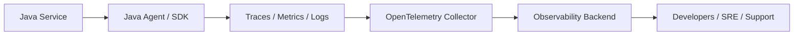
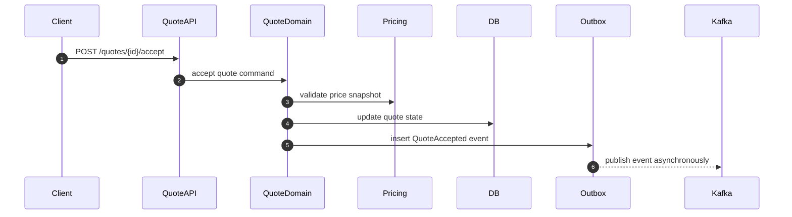
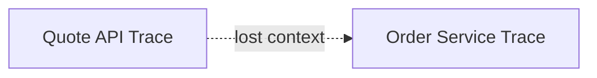
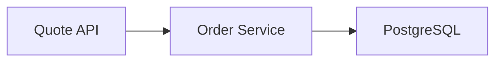
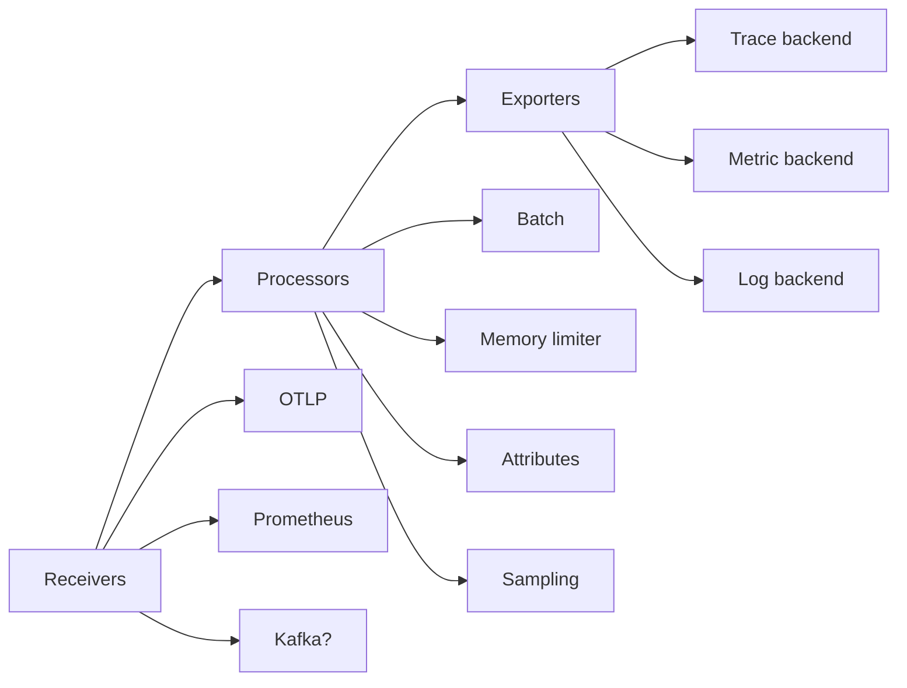
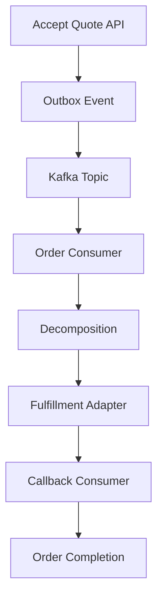

# Part 023 — OpenTelemetry for Java Services

## 1. Source notes and scope boundary

This part uses public OpenTelemetry documentation and general engineering practice.

Public references to verify independently:

- OpenTelemetry Java zero-code instrumentation uses a Java agent attached to the JVM via the `-javaagent` flag.
- OpenTelemetry also supports manual instrumentation through APIs/SDKs when automatic instrumentation is not enough.
- The OpenTelemetry Collector is a vendor-agnostic component for receiving, processing, and exporting telemetry.
- OpenTelemetry Semantic Conventions define common attribute names for operations such as HTTP, messaging, database, and resources.
- Exact CSG instrumentation standards, backend vendors, collectors, agents, sampling policy, dashboard tools, and service naming conventions must be verified internally.

This file does **not** assume CSG uses OpenTelemetry today, or that it uses a specific APM backend such as Grafana Tempo, Jaeger, Zipkin, Datadog, New Relic, Splunk, Honeycomb, Dynatrace, Elastic, or any other vendor.

The goal is to understand how OpenTelemetry should be used in a production Java microservice architecture.

---

## 2. Core thesis

OpenTelemetry is not just a tracing library.

OpenTelemetry is a **telemetry contract** between your service, your runtime platform, your observability pipeline, and the engineers who debug production.

For enterprise Java services, good OpenTelemetry instrumentation should answer:

- Which service handled the request?
- Which version of the service was running?
- Which tenant, quote, order, or correlation ID was involved?
- Which downstream HTTP call happened?
- Which database query class was slow?
- Which Kafka event was produced or consumed?
- Which retry happened?
- Which command changed the lifecycle state?
- Where did latency accumulate?
- What failed first?
- Is this one user request, one async workflow, or one production-wide degradation?

Bad instrumentation only tells you:

> Something was slow somewhere.

Good instrumentation tells you:

> Quote acceptance for tenant A, quote Q-123, version 7, failed during quote-to-order conversion because order service timed out while writing the outbox record after acquiring a database lock, and the failure propagated to the API response with correlation ID C-456.

That is the level of practical usefulness you should aim for.

---

## 3. OpenTelemetry mental model

OpenTelemetry has several moving parts.



A senior engineer should understand each boundary:

| Component | Responsibility |
|---|---|
| Application code | Business context, domain spans, custom metrics, log fields |
| Java agent | Automatic instrumentation for common libraries/frameworks |
| OpenTelemetry API | Manual spans, attributes, metrics, context propagation |
| OpenTelemetry SDK | Runtime implementation of telemetry behavior |
| Collector | Receive, process, sample, batch, enrich, export telemetry |
| Backend | Store, query, visualize, alert |
| Dashboards/runbooks | Turn telemetry into operational decision support |

The Java service is not done when telemetry is emitted.

Telemetry must be queryable, understandable, and actionable.

---

## 4. Automatic vs manual instrumentation

### 4.1 Automatic instrumentation

Automatic instrumentation is usually the fastest starting point.

For Java, the common approach is attaching the OpenTelemetry Java agent:

```bash
java \
  -javaagent:/opt/opentelemetry-javaagent.jar \
  -Dotel.service.name=quote-service \
  -Dotel.exporter.otlp.endpoint=http://otel-collector:4317 \
  -jar quote-service.jar
```

Automatic instrumentation can often capture:

- inbound HTTP server spans;
- outbound HTTP client spans;
- JDBC database spans;
- messaging library spans;
- framework spans;
- JVM/runtime metrics depending on setup.

Automatic instrumentation is valuable because it reduces adoption friction.

But it is not sufficient for domain observability.

It cannot automatically know:

- quote ID;
- order ID;
- tenant ID;
- command name;
- lifecycle state transition;
- approval threshold;
- product offering ID;
- catalog version;
- idempotency key;
- business outcome;
- fallout reason.

Those require domain-aware instrumentation.

### 4.2 Manual instrumentation

Manual instrumentation adds business meaning.

Example pseudocode:

```java
Span span = tracer.spanBuilder("quote.accept")
    .setAttribute("tenant.id", tenantId.value())
    .setAttribute("quote.id", quoteId.value())
    .setAttribute("quote.version", quoteVersion.value())
    .setAttribute("command.name", "AcceptQuote")
    .startSpan();

try (Scope ignored = span.makeCurrent()) {
    Quote quote = quoteService.accept(command);
    span.setAttribute("quote.state", quote.state().name());
    span.setAttribute("order.created", quote.orderCreated());
    span.setStatus(StatusCode.OK);
} catch (QuoteExpiredException ex) {
    span.setAttribute("business.error_code", "QUOTE_EXPIRED");
    span.setStatus(StatusCode.ERROR, "quote expired");
    throw ex;
} finally {
    span.end();
}
```

Do not add manual spans everywhere.

Add them where they improve diagnosis:

- lifecycle commands;
- expensive pricing paths;
- quote-to-order conversion;
- order decomposition;
- external adapter calls;
- retry loops;
- idempotency decisions;
- outbox relay;
- Kafka consumer processing;
- data repair jobs;
- reconciliation jobs.

---

## 5. Service identity and resource attributes

A trace without service identity is weak.

Every service should emit stable resource attributes.

Recommended attributes to verify internally:

| Attribute | Example | Why it matters |
|---|---|---|
| `service.name` | `quote-service` | Primary service identity |
| `service.namespace` | `quote-order` | Product/domain grouping |
| `service.version` | `2026.07.15.3` or Git SHA | Release correlation |
| `deployment.environment.name` | `staging`, `prod` | Environment filtering |
| `k8s.namespace.name` | `quote-order-prod` | Runtime location |
| `k8s.pod.name` | pod name | Pod-level debugging |
| `cloud.provider` | `aws`, `azure`, etc. | Infrastructure context |
| `tenant.id` | only if safe and policy-approved | Business isolation diagnosis |

Be careful with high-cardinality attributes.

Good:

- service version;
- environment;
- endpoint route;
- command name;
- status class.

Risky:

- raw customer name;
- full quote ID as metric label;
- user email;
- large payload field;
- unbounded exception message;
- personal or sensitive information.

High-cardinality attributes may be acceptable in traces/logs but dangerous in metrics.

Verify backend cost and cardinality policy internally.

---

## 6. Trace design for Java services

A trace should tell a story.

For a Quote & Order API call:



Good spans might include:

- `HTTP POST /quotes/{id}/accept`;
- `quote.accept`;
- `pricing.validate_snapshot`;
- `db.transaction.quote_accept`;
- `outbox.insert`;
- `kafka.produce QuoteAccepted`.

Avoid span explosion.

Do not create spans for every tiny getter or internal helper method.

Create spans at useful diagnostic boundaries:

- incoming request;
- command boundary;
- external call;
- database transaction;
- async publish/consume;
- retry boundary;
- expensive computation;
- state transition.

---

## 7. Context propagation

Context propagation is the difference between isolated spans and a useful trace.

### 7.1 HTTP propagation

For synchronous HTTP calls, context should propagate through headers such as W3C Trace Context.

A service should preserve trace context when calling downstream services.

If context is lost, the trace becomes fragmented:



Instead, the trace should show the connected path:



### 7.2 Kafka propagation

Async context propagation is more subtle.

For Kafka:

- producer should inject trace context into message headers if approved;
- consumer should extract trace context from message headers;
- consumer processing should create a consumer span;
- business correlation ID should still exist independent of trace context;
- replay should not rely on trace context as the only business linkage.

Trace context is operational.

Correlation/causation IDs are business/workflow identifiers.

Do not confuse them.

### 7.3 Domain correlation

For Quote & Order, keep these concepts separate:

| Identifier | Purpose |
|---|---|
| trace ID | Observability trace linkage |
| span ID | Specific operation within trace |
| correlation ID | Business/workflow request linkage |
| causation ID | Why this event/command happened |
| event ID | Unique event identity |
| aggregate ID | Quote/order/customer aggregate identity |
| idempotency key | Duplicate command handling |

A trace may be sampled away.

Business identifiers must still exist in logs/events/audit where required.

---

## 8. Metrics design

OpenTelemetry metrics are useful for aggregate behavior.

Do not use metrics for everything.

Metrics are best for:

- rates;
- counts;
- latency distributions;
- saturation;
- queue length;
- error ratios;
- backlog size;
- success/failure trends.

### 8.1 Useful technical metrics

For a Java service:

- request rate;
- request latency;
- request error rate;
- JVM heap usage;
- GC pause;
- thread pool saturation;
- connection pool usage;
- database query latency by operation class;
- Kafka consumer lag age;
- outbox backlog;
- DLQ count;
- retry count;
- circuit breaker state.

### 8.2 Useful business metrics

For Quote & Order:

- quote created count;
- quote pricing success/failure;
- quote acceptance success/failure;
- quote-to-order conversion success/failure;
- order created count;
- order fallout count;
- order completion latency;
- product order cancellation count;
- approval required count;
- approval rejected count;
- stale price acceptance blocked count;
- data repair executed count.

### 8.3 Metric label discipline

Good labels:

- `service`;
- `environment`;
- `operation`;
- `outcome`;
- `error_code`;
- `order_state` if bounded;
- `tenant_tier` if approved;
- `adapter_name` if bounded.

Risky labels:

- raw quote ID;
- raw order ID;
- customer name;
- user email;
- arbitrary exception message;
- unbounded product offering ID if very high cardinality;
- tenant ID if many tenants and backend cost/policy does not allow it.

Use exemplars or trace links when needing per-request detail.

Do not force metrics to carry high-cardinality debugging data.

---

## 9. Logs design with OpenTelemetry

Logs should become more useful when connected to traces.

A structured log should include:

```json
{
  "timestamp": "2026-07-09T10:15:30Z",
  "level": "WARN",
  "service.name": "quote-service",
  "trace_id": "4bf92f3577b34da6a3ce929d0e0e4736",
  "span_id": "00f067aa0ba902b7",
  "correlation_id": "corr-123",
  "tenant_id": "tenant-a",
  "quote_id": "Q-1001",
  "command": "AcceptQuote",
  "error_code": "QUOTE_PRICE_EXPIRED",
  "message": "Quote acceptance rejected because price validity expired"
}
```

Log design principles:

- logs should be structured;
- logs should include correlation ID;
- logs should include trace/span ID when available;
- logs should use stable error codes;
- logs should not contain raw secrets or sensitive PII;
- logs should avoid massive payload dumps;
- logs should distinguish business rejection from technical failure.

### 9.1 Business rejection vs technical failure

Quote expired is not necessarily a system error.

It may be a valid business rejection.

Do not alert on every business rejection.

Instrument separately:

| Case | Signal type |
|---|---|
| User accepts expired quote | Business metric + info/warn log |
| Database deadlock during accept | Technical error metric + error log + trace error |
| Pricing service timeout | Dependency error metric + trace error |
| Unauthorized approval attempt | Security metric/log/audit according to policy |

---

## 10. Collector pipeline mental model

The OpenTelemetry Collector is often where telemetry becomes operable.



A senior engineer does not need to own the collector platform, but should understand how telemetry can be:

- dropped;
- sampled;
- enriched;
- batched;
- transformed;
- routed;
- exported to multiple backends.

Questions to verify internally:

- Is there a central collector?
- Is there a sidecar, daemonset, gateway, or agent model?
- Which OTLP endpoint should services use?
- Is tail sampling used?
- Are traces sampled per service, route, or error?
- Are logs routed through OpenTelemetry or another pipeline?
- Are resource attributes enriched in collector?
- How are secrets/PII filtered?
- What happens when backend is unavailable?

---

## 11. Sampling strategy

Sampling decides which traces survive.

Bad sampling can destroy debugging value.

### 11.1 Head sampling

Decision made early.

Advantages:

- cheaper;
- simple;
- less pipeline load.

Disadvantages:

- may drop traces that later fail;
- weak for rare error debugging.

### 11.2 Tail sampling

Decision made after seeing more of the trace.

Advantages:

- can keep errors and slow traces;
- better diagnostic value.

Disadvantages:

- more collector complexity;
- higher memory/latency requirements.

### 11.3 Practical strategy

For Quote & Order services, consider preserving:

- error traces;
- slow quote acceptance traces;
- slow pricing traces;
- order fallout traces;
- data repair traces;
- migration job traces;
- traces with specific critical error codes;
- low-rate sample of normal traffic.

Do not rely on trace sampling for audit evidence.

Audit must be complete according to policy.

---

## 12. Java service instrumentation checklist

### 12.1 Runtime setup

Verify:

- Java agent version;
- service name;
- service namespace;
- service version;
- environment name;
- OTLP endpoint;
- exporter protocol;
- sampling configuration;
- resource attributes;
- log correlation;
- Kubernetes deployment configuration.

### 12.2 Spring Boot / framework instrumentation

Verify:

- inbound HTTP spans;
- outbound HTTP client spans;
- controller route naming;
- error status mapping;
- actuator/health endpoint treatment;
- management endpoint exclusions;
- security filter visibility;
- request/response body not captured unsafely.

### 12.3 JDBC / PostgreSQL instrumentation

Verify:

- database spans exist;
- SQL statements are not exposing sensitive data;
- parameter capture policy;
- query operation naming;
- connection pool metrics;
- transaction latency visibility;
- lock wait/slow query correlation through database telemetry where available.

### 12.4 Kafka instrumentation

Verify:

- producer spans;
- consumer spans;
- topic name attribute policy;
- message key handling policy;
- trace context in headers if used;
- correlation/causation ID in payload/header;
- consumer group visibility;
- retry/DLQ instrumentation.

### 12.5 Custom business instrumentation

Verify:

- quote lifecycle command spans;
- order lifecycle command spans;
- pricing calculation metrics;
- approval decision metrics;
- order fallout metrics;
- outbox relay metrics;
- data repair metrics;
- reconciliation job metrics;
- business error codes.

---

## 13. Quote & Order trace examples

### 13.1 Quote pricing trace

Useful span tree:

```text
HTTP POST /quotes/{id}/price
  quote.price
    catalog.resolve_snapshot
    pricing.evaluate_rules
    pricing.apply_agreement
    pricing.calculate_totals
    db.quote_price_snapshot.write
```

Useful attributes:

- `tenant.id` if policy allows;
- `quote.id` in traces/logs if policy allows;
- `catalog.version`;
- `pricing.rule_set_version`;
- `agreement.applied`;
- `pricing.outcome`;
- `business.error_code`.

### 13.2 Quote acceptance trace

Useful span tree:

```text
HTTP POST /quotes/{id}/accept
  quote.accept
    quote.validate_state
    quote.validate_price_validity
    quote.validate_approval
    db.transaction.quote_accept
      db.quote.update_state
      db.outbox.insert
    order.create_from_quote
```

Key diagnostic question:

> Did acceptance fail because of business policy, dependency failure, DB contention, or order conversion failure?

### 13.3 Order decomposition trace

Useful span tree:

```text
order.create_from_quote
  order.validate
  order.decompose
    decomposition.resolve_catalog_mapping
    decomposition.create_order_items
    fulfillment.plan_tasks
  db.transaction.order_create
  kafka.produce ProductOrderCreated
```

Key diagnostic question:

> Did the system fail before order persistence, after persistence before event publish, or during async fulfillment?

---

## 14. Instrumenting async workflows

Async workflows need both trace and state visibility.

A single customer journey may span multiple processes:



Telemetry must support:

- linking command to event;
- linking event to consumer processing;
- linking consumer processing to state update;
- linking downstream callback to original order;
- detecting stuck workflow;
- debugging duplicate/replayed events.

Do not assume one trace will perfectly cover a long-running workflow.

Long-running workflows also need:

- business correlation ID;
- state history;
- audit trail;
- workflow metrics;
- reconciliation queries;
- dashboard panels.

---

## 15. OpenTelemetry and audit are different

OpenTelemetry is observability telemetry.

Audit is compliance/business evidence.

Do not use traces as audit.

| Need | Use |
|---|---|
| Debug latency path | Trace |
| Count failures | Metric |
| Diagnose one error | Log + trace |
| Prove who approved quote | Audit event |
| Reconstruct business lifecycle | State history + events + audit |
| Trigger alert | Metric/SLO signal |

Traces are sampled, retained differently, and optimized for debugging.

Audit must meet internal retention, completeness, and defensibility rules.

---

## 16. Privacy and sensitive data

Quote & Order telemetry can accidentally leak sensitive information.

Potentially sensitive:

- customer names;
- user emails;
- contract terms;
- negotiated discounts;
- margin data;
- account identifiers;
- service addresses;
- raw product configuration;
- tokens/secrets;
- downstream payloads.

Telemetry policy should decide:

- what can be logged;
- what can be trace attribute;
- what can be metric label;
- what must be redacted;
- what must be hashed/tokenized;
- who can access telemetry;
- how long telemetry is retained.

Never dump full request/response payloads into spans or logs by default.

---

## 17. OpenTelemetry in Kubernetes

In Kubernetes, verify:

- Java agent is included through base image, sidecar, init container, or startup script;
- OTLP endpoint is reachable;
- service metadata is set consistently;
- pod/container attributes are captured;
- resource limits account for agent overhead;
- collector failure does not crash the service;
- telemetry backpressure behavior is understood;
- collector is deployed with appropriate resources;
- network policy allows telemetry export;
- config/secrets are managed through approved mechanism.

Example environment variables:

```yaml
env:
  - name: OTEL_SERVICE_NAME
    value: quote-service
  - name: OTEL_RESOURCE_ATTRIBUTES
    value: deployment.environment.name=prod,service.namespace=quote-order
  - name: OTEL_EXPORTER_OTLP_ENDPOINT
    value: http://otel-collector.observability:4317
  - name: OTEL_TRACES_SAMPLER
    value: parentbased_traceidratio
  - name: OTEL_TRACES_SAMPLER_ARG
    value: "0.10"
```

Actual values must follow internal platform standards.

---

## 18. Observability as developer experience

Good OTel setup improves DevEx.

A developer should be able to:

1. run a service locally;
2. generate one test request;
3. see logs with correlation ID;
4. see trace spans locally or in test backend;
5. confirm PostgreSQL/Kafka spans exist;
6. add custom business span;
7. add custom metric;
8. validate no sensitive data is emitted;
9. link failure to PR/test case.

If only platform specialists can understand telemetry, DevEx is weak.

Create a local observability golden path:

- local collector config;
- sample dashboard;
- sample trace query;
- sample log query;
- test request scripts;
- troubleshooting section.

---

## 19. Common anti-patterns

### 19.1 Auto-instrumentation only

Automatic spans exist, but no domain context.

You see HTTP and JDBC, but not quote/order business state.

### 19.2 Custom spans everywhere

Too many spans create noise and overhead.

Instrument boundaries, not every method.

### 19.3 High-cardinality metrics

Putting quote ID or user email into metric labels can create backend cost and instability.

### 19.4 No context propagation

Each service has traces, but the journey cannot be connected.

### 19.5 Trace as audit

Traces are sampled and not designed as authoritative business evidence.

### 19.6 No ownership

Telemetry exists but no team owns dashboards, naming, attributes, or quality.

### 19.7 Observability after incident only

Telemetry should be in Definition of Done, not added after production failure.

---

## 20. Internal verification checklist

Verify these inside your organization/team:

### 20.1 Tooling and standards

- Is OpenTelemetry used?
- Which Java agent version is approved?
- Is manual instrumentation allowed/standardized?
- Which backend stores traces?
- Which backend stores metrics?
- Which backend stores logs?
- Is there a central collector?
- Are there collector configuration standards?
- Are there service naming conventions?
- Are there resource attribute conventions?

### 20.2 Java service setup

- How is the Java agent attached?
- Is there a Spring Boot starter or agent preference?
- Are HTTP/JDBC/Kafka instrumentations enabled?
- Are logs correlated with trace IDs?
- How are service versions represented?
- Are actuator/health endpoints filtered?
- Are sampling rules documented?

### 20.3 Domain telemetry

- What business metrics exist for quote/order?
- Are quote/order IDs allowed in traces/logs?
- Are tenant IDs allowed in telemetry?
- Are pricing/discount/margin fields sensitive?
- Are approval actions instrumented?
- Are outbox/inbox metrics instrumented?
- Are data repair jobs instrumented?

### 20.4 Operations

- Which dashboards are official?
- Which alerts depend on OTel data?
- Who owns collector health?
- What happens if collector is down?
- Are runbooks linked to telemetry queries?
- Are telemetry costs monitored?

---

## 21. PR review checklist

When reviewing a Java service change, ask:

- Does this change create a new important operation boundary?
- Does it need a custom span?
- Does it need a custom metric?
- Are existing spans enough to diagnose failure?
- Are error codes visible in logs/metrics/traces?
- Are correlation IDs propagated?
- Are Kafka messages preserving trace/business context?
- Are database operations observable at the right granularity?
- Are high-cardinality fields avoided in metrics?
- Is sensitive data protected?
- Is telemetry included in tests or validation?
- Is dashboard/runbook updated if operationally relevant?

---

## 22. Practical exercise

Pick one service and one important endpoint.

Example:

- `POST /quotes/{id}/accept`
- `POST /productOrders`
- `POST /orders/{id}/cancel`

Create an observability map:

1. Current spans.
2. Missing spans.
3. Current metrics.
4. Missing metrics.
5. Current logs.
6. Missing log fields.
7. Context propagation status.
8. Sensitive data risk.
9. Dashboard query.
10. Runbook diagnosis path.

Then propose the smallest telemetry improvement PR.

---

## 23. Summary

OpenTelemetry is most valuable when it becomes part of the engineering design process.

For Java services, start with automatic instrumentation, then add domain-aware manual instrumentation at important boundaries.

For Quote & Order, useful telemetry must connect:

- HTTP requests;
- Java commands;
- PostgreSQL transactions;
- Kafka events;
- lifecycle states;
- business outcomes;
- error codes;
- correlation/causation IDs;
- service versions;
- deployment environments.

The target is not more telemetry.

The target is faster, safer understanding.
