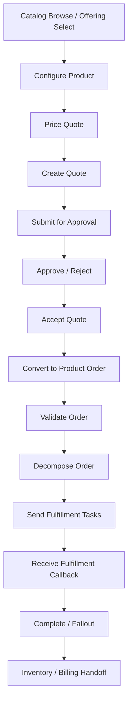

# Part 024 — Business Observability for Quote & Order

## 1. Source notes and scope boundary

This part uses public observability and reliability concepts, especially:

- Google SRE guidance on monitoring distributed systems and the four golden signals: latency, traffic, errors, and saturation.
- OpenTelemetry concepts for traces, metrics, logs, context propagation, and semantic conventions.
- DORA and reliability engineering ideas around delivery/recovery feedback loops.
- The previous CSG Quote & Order learning series for domain context: quote, CPQ, catalog, pricing, approval, order management, Kafka, PostgreSQL, Kubernetes, and production operations.

This part does **not** assume a specific internal CSG dashboard, metric naming standard, APM product, business metric implementation, SLO, alerting policy, or customer-facing reporting model.

All metric names and dashboard examples below are illustrative. Validate internal naming, privacy constraints, and product definitions before implementing.

---

## 2. Core thesis

Technical observability tells you whether systems are running.

Business observability tells you whether the customer journey is working.

For Quote & Order, this is the difference between:

> CPU is normal, HTTP 200s look okay, Kafka lag is low.

and:

> Enterprise quotes over $50k are failing approval conversion after pricing recalculation, causing quote acceptance to drop for two tenants after release 2026.07.09.

A production-grade Quote & Order observability model must connect:

- product journey;
- domain state;
- technical systems;
- integration boundaries;
- customer impact;
- release changes;
- operational response.

If you cannot answer whether quote-to-order is healthy, your observability is incomplete.

---

## 3. Business observability vs technical observability

| Question | Technical observability | Business observability |
|---|---|---|
| Is the service up? | Pod health, HTTP status, CPU | Can users create/accept quotes? |
| Is latency high? | API p95 latency | Which business operation is slow? |
| Are errors increasing? | 5xx rate | Are pricing, approval, or order conversion failures increasing? |
| Is Kafka healthy? | Consumer lag | Are order events being processed into correct lifecycle state? |
| Is DB healthy? | locks, slow queries | Are quote/order journeys blocked by DB contention? |
| Did release break something? | deployment status | Which customer journey regressed after release? |
| Is customer impacted? | service availability | which tenants/accounts/quote types/orders are affected? |

Both are necessary.

Technical observability gives mechanism.

Business observability gives meaning.

---

## 4. Quote-to-order journey map

Business observability starts by mapping the journey.



Each node should have:

- success metric;
- failure metric;
- latency metric;
- state transition metric;
- trace/log linkage;
- owner;
- dashboard panel;
- runbook action.

If a node cannot be observed, it becomes an incident blind spot.

---

## 5. Business signal taxonomy

### 5.1 Volume signals

Volume signals answer: how much business activity is happening?

Examples:

- quote created count;
- quote priced count;
- quote submitted for approval count;
- quote accepted count;
- order created count;
- order completed count;
- cancellation requested count;
- amendment requested count;
- fulfillment callback count.

Volume drops may indicate:

- frontend issue;
- API issue;
- customer integration outage;
- catalog issue;
- release regression;
- tenant-specific configuration issue.

### 5.2 Conversion signals

Conversion signals answer: is the journey progressing?

Examples:

- quote created → quote priced ratio;
- quote priced → submitted for approval ratio;
- submitted → approved ratio;
- approved → accepted ratio;
- accepted quote → order created ratio;
- order created → order completed ratio;
- fulfillment submitted → callback received ratio.

A conversion drop is often more meaningful than raw error count.

### 5.3 Latency signals

Latency signals answer: how long does the business operation take?

Examples:

- quote pricing latency;
- quote acceptance latency;
- quote-to-order conversion latency;
- order decomposition latency;
- fulfillment callback latency;
- order completion end-to-end latency;
- approval wait time;
- outbox publish latency.

Separate technical latency from business elapsed time.

`quote.accept` API latency may be 300ms, while quote-to-order completion may take minutes or hours.

### 5.4 Error/outcome signals

Outcome signals answer: what happened and why?

Examples:

- quote price expired;
- approval required;
- approval rejected;
- unauthorized approval attempt;
- order validation failed;
- fulfillment rejected;
- duplicate command detected;
- Kafka consumer failed;
- outbox relay failed;
- data repair executed.

Use stable error/outcome codes.

Do not rely on free-text messages for metrics.

### 5.5 Stuck-state signals

Stuck-state signals answer: what is not progressing?

Examples:

- quotes pending pricing for too long;
- quotes pending approval beyond expected threshold;
- accepted quotes without product order;
- orders in validating too long;
- orders in decomposition too long;
- orders with fulfillment task timeout;
- orders in fallout;
- outbox rows unpublished too long;
- DLQ records unresolved too long.

Stuck-state metrics are crucial for async systems.

---

## 6. Metric design for Quote & Order

Illustrative metric names:

```text
quote_created_total
quote_priced_total
quote_pricing_duration_seconds
quote_acceptance_total
quote_acceptance_duration_seconds
quote_acceptance_failed_total
quote_to_order_conversion_total
quote_to_order_conversion_duration_seconds
product_order_created_total
product_order_state_transition_total
product_order_completion_duration_seconds
order_fallout_total
outbox_backlog_count
outbox_oldest_unpublished_age_seconds
kafka_consumer_lag_age_seconds
```

### 6.1 Recommended labels

Use bounded labels:

- `service`;
- `environment`;
- `operation`;
- `outcome`;
- `error_code`;
- `order_state`;
- `quote_state`;
- `event_type`;
- `adapter_name`;
- `product_family` if bounded and approved;
- `tenant_tier` if approved.

Avoid high-cardinality labels:

- `quote_id`;
- `order_id`;
- `customer_name`;
- `user_email`;
- unbounded tenant ID if backend/policy cannot support it;
- raw product offering ID if unbounded;
- raw exception message.

Per-entity diagnosis belongs in logs/traces/audit/search, not metric labels.

---

## 7. Dashboard layers

A useful observability system has multiple dashboard layers.

### 7.1 Executive/product journey dashboard

Audience:

- product owner;
- engineering manager;
- senior engineers;
- support lead.

Shows:

- quote volume;
- quote acceptance rate;
- order creation rate;
- order completion rate;
- fallout rate;
- top failure categories;
- tenant/customer impact summary;
- release markers.

Purpose:

- detect business regression;
- support Sprint Review/release review;
- prioritize backlog.

### 7.2 Engineering service dashboard

Audience:

- developers;
- on-call engineers;
- platform/SRE.

Shows:

- API latency;
- API error rate;
- dependency latency;
- DB latency;
- Kafka lag;
- outbox backlog;
- JVM metrics;
- pod restarts;
- slow queries;
- error codes.

Purpose:

- diagnose mechanism.

### 7.3 Workflow operations dashboard

Audience:

- operations;
- support;
- product engineers.

Shows:

- stuck quotes;
- stuck orders;
- fallout queue;
- retry queue;
- DLQ queue;
- reconciliation mismatches;
- data repair count/status;
- oldest blocked workflow.

Purpose:

- manage work that needs human/operator attention.

### 7.4 Release watch dashboard

Audience:

- release owner;
- on-call;
- team lead.

Shows:

- release marker;
- before/after metrics;
- changed services;
- changed API/events/migrations;
- error delta;
- latency delta;
- business conversion delta;
- rollback/feature flag status.

Purpose:

- verify release safety.

---

## 8. SLO-style thinking for business journeys

Not every business metric must become a formal SLO.

But SLO-style thinking is valuable.

Example service-level objectives:

- 99.5% of quote pricing requests complete successfully within 2 seconds for standard catalog paths.
- 99.9% of quote acceptance commands either create an order or return a stable business rejection without duplicate order creation.
- 99% of accepted quotes produce a product order within 1 minute, excluding configured async/manual approval cases.
- 95% of product orders reach terminal state within expected fulfillment window per product type.
- Outbox oldest unpublished event age remains below 2 minutes during normal operation.

These are examples only.

Real SLOs require product/business validation.

### 8.1 SLI design

A service-level indicator should be:

- measurable;
- tied to user/business experience;
- not too noisy;
- not too indirect;
- owned;
- actionable.

Bad SLI:

```text
CPU < 80%
```

Better SLI:

```text
quote_acceptance_success_ratio
```

CPU matters, but it is a mechanism, not the customer journey.

---

## 9. Quote observability

### 9.1 Quote creation

Observe:

- request count;
- validation failure count;
- catalog lookup failure;
- customer/account lookup failure;
- quote persistence latency;
- quote created event/outbox insertion;
- quote state after creation.

Questions:

- Are users able to create quotes?
- Are validation failures expected or spiking?
- Is a catalog/customer dependency causing failures?
- Are created quotes visible in downstream read models?

### 9.2 Quote pricing

Observe:

- pricing request count;
- pricing latency;
- pricing error code;
- pricing rule version;
- catalog version;
- agreement applied count;
- discount threshold crossing;
- stale price/reprice count.

Questions:

- Is pricing slow?
- Are pricing failures concentrated in certain product families?
- Did a catalog release change pricing outcome?
- Are approvals triggered as expected?

### 9.3 Quote approval

Observe:

- approval required count;
- approval submitted count;
- approval approved/rejected count;
- approval wait time;
- unauthorized approval attempts;
- approval invalidated count;
- stale approval reuse blocked count.

Questions:

- Are approvals stuck?
- Are approval rules too aggressive after a release?
- Are unauthorized attempts rising?
- Is approval evidence complete?

### 9.4 Quote acceptance

Observe:

- quote acceptance request count;
- acceptance success count;
- acceptance business rejection count;
- acceptance technical failure count;
- duplicate acceptance detected;
- order created count;
- quote-to-order conversion latency.

Questions:

- Are accepted quotes producing orders?
- Are duplicates prevented?
- Are stale price or approval errors expected?
- Did conversion fail after quote accepted?

---

## 10. Order observability

### 10.1 Order creation

Observe:

- product order created count;
- order validation failure count;
- quote reference missing/invalid count;
- order persistence latency;
- ProductOrderCreated event count;
- idempotent retry count.

Questions:

- Are orders created from accepted quotes?
- Are validation failures due to data, catalog, inventory, or integration?
- Are duplicate create attempts safe?

### 10.2 Order decomposition

Observe:

- decomposition started count;
- decomposition success/failure count;
- generated task count;
- decomposition duration;
- mapping failure count;
- product family/offering family if bounded;
- retry count.

Questions:

- Are orders stuck before decomposition?
- Is a specific product offering mapping broken?
- Did a catalog/config change affect decomposition?

### 10.3 Fulfillment handoff

Observe:

- fulfillment request count;
- fulfillment accepted/rejected count;
- adapter latency;
- adapter error code;
- timeout count;
- unknown outcome count;
- callback received count;
- duplicate callback count.

Questions:

- Is downstream fulfillment available?
- Are requests accepted but callbacks missing?
- Are duplicates handled safely?
- Is the system creating fallout when expected?

### 10.4 Fallout and recovery

Observe:

- order fallout count;
- fallout reason;
- oldest fallout age;
- fallout resume count;
- resume success/failure;
- manual intervention count;
- data repair count;
- orders stuck in non-terminal states.

Questions:

- Is fallout increasing after release?
- Are operators able to recover?
- Are certain failure reasons recurring?
- Does the backlog need product/engineering action?

---

## 11. Kafka and outbox business observability

Technical Kafka health is not enough.

You need business event health.

### 11.1 Outbox metrics

Track:

- outbox backlog count;
- oldest unpublished age;
- outbox publish success/failure;
- publish retry count;
- event type distribution;
- event serialization failure;
- event schema compatibility failure;
- event suppressed/duplicate count.

### 11.2 Consumer metrics

Track:

- event consumed count by type;
- consumer processing success/failure;
- business rejection count;
- idempotent duplicate count;
- DLQ count;
- oldest DLQ age;
- replay count;
- consumer lag age.

### 11.3 Business questions

Ask:

- Are all accepted quotes producing the expected events?
- Are all product order events consumed?
- Are events stuck in outbox?
- Are consumers failing due to schema, data, dependency, or business validation?
- Is replay safe and visible?

---

## 12. PostgreSQL business observability

Database telemetry should connect to business impact.

Track:

- slow query count by operation class;
- lock wait duration;
- deadlock count;
- transaction duration;
- connection pool saturation;
- migration duration;
- backfill progress;
- hot table write latency;
- query plan regression for important operations.

Map to business operations:

| DB issue | Business effect |
|---|---|
| lock wait on quote table | quote acceptance latency/failure |
| slow quote search query | support/sales search degraded |
| outbox table bloat | event publication lag |
| order state update contention | duplicate/retry/fallout risk |
| migration lock | production writes blocked |
| missing index | dashboard/API latency |

A database dashboard without business mapping is only half useful.

---

## 13. Release markers and change correlation

Business observability must show change context.

Add release markers to dashboards:

- service version deployment;
- feature flag enablement;
- catalog publish;
- pricing rule change;
- migration/backfill start/end;
- Kafka schema change;
- customer-specific configuration change;
- downstream adapter change.

Questions:

- Did quote acceptance drop after release?
- Did fallout increase after feature flag enablement?
- Did pricing latency increase after catalog publish?
- Did outbox lag start after migration?

Without release markers, diagnosis becomes guesswork.

---

## 14. Customer and tenant impact analysis

Enterprise products need scoped impact diagnosis.

You should be able to answer:

- Is this global or tenant-specific?
- Which tenants/customers are affected?
- Is this tied to product family/catalog version?
- Is this tied to one integration adapter?
- Is this tied to one release or config change?
- Is this visible to end customers?
- Is data repair required?

Be careful with privacy and cardinality.

Raw tenant/customer identifiers may be sensitive or high cardinality.

Possible strategies:

- use tenant tier/segment in metrics;
- use tenant ID in logs/traces where approved;
- build secure operational queries for tenant impact;
- restrict access to customer-level dashboards;
- provide support-safe views.

---

## 15. Business observability in Sprint work

Business observability should be part of Scrum execution.

### 15.1 During refinement

Ask:

- What business journey does this PBI affect?
- Which metric should change?
- Which existing metric might regress?
- What failure mode needs detection?
- What dashboard/runbook needs update?

### 15.2 During Sprint Planning

Include observability tasks in capacity:

- metric addition;
- dashboard update;
- trace attribute;
- error code standardization;
- runbook update;
- synthetic journey check;
- alert adjustment.

### 15.3 During PR review

Ask:

- Can this feature fail silently?
- Can we distinguish business rejection from technical failure?
- Does telemetry include enough domain context?
- Are sensitive fields protected?
- Are metrics labels bounded?

### 15.4 During Sprint Review

Demo evidence:

- product behavior;
- API/event result;
- dashboard panel;
- trace/log example;
- failure path;
- release readiness signal.

### 15.5 During Retrospective

Ask:

- Which production issue was detected late?
- Which metric was noisy?
- Which dashboard was unused?
- Which support question was hard to answer?
- Which observability gap should become backlog item?

---

## 16. Dashboard design examples

### 16.1 Quote health dashboard

Panels:

- quote creation rate;
- quote pricing p95 latency;
- pricing failure by error code;
- quote acceptance success/failure;
- accepted quote without order count;
- approval pending age;
- stale price rejection count;
- release markers.

### 16.2 Order health dashboard

Panels:

- order creation rate;
- order state distribution;
- order completion latency;
- orders stuck by state/age;
- fallout count by reason;
- fulfillment adapter errors;
- callback missing count;
- duplicate callback count.

### 16.3 Async pipeline dashboard

Panels:

- outbox backlog;
- oldest unpublished event age;
- producer error rate;
- consumer lag age;
- consumer failure by event type;
- DLQ count and age;
- replay job status;
- event processing latency.

### 16.4 Release watch dashboard

Panels:

- release marker;
- API error delta;
- quote acceptance delta;
- order fallout delta;
- outbox lag delta;
- DB lock wait delta;
- downstream adapter error delta;
- top new error codes.

---

## 17. Alert design for business signals

Alert only when action is required.

Good alert:

> Accepted quotes are not producing orders for more than 5 minutes in production. Check quote-to-order conversion dashboard and runbook.

Weak alert:

> Order service error count > 10.

Better alerts are tied to user/business impact.

### 17.1 Example alerts

- quote acceptance technical failure rate above threshold;
- accepted quote without order age exceeds threshold;
- order fallout count spikes after release;
- outbox oldest unpublished age exceeds threshold;
- DLQ age exceeds threshold;
- pricing latency p95 exceeds SLO threshold;
- fulfillment callback missing beyond expected window;
- unauthorized approval attempts spike;
- data repair count exceeds baseline.

### 17.2 Alert metadata

Each alert should include:

- symptom;
- likely impact;
- dashboard link;
- runbook link;
- owner/team;
- recent release/config markers;
- first diagnostic query;
- escalation path.

---

## 18. Business observability and data repair

Good business observability reduces data repair risk.

It helps detect:

- accepted quote without order;
- order parent/child state mismatch;
- fulfillment completed but order not completed;
- outbox event missing;
- duplicate order;
- stale projection;
- audit gap;
- tenant anomaly.

A data repair workflow should have observability before, during, and after repair:

- candidate count;
- dry-run result;
- execution count;
- affected tenants;
- validation pass/fail;
- repair audit event;
- downstream reconciliation;
- post-repair dashboard state.

---

## 19. Common anti-patterns

### 19.1 Service-only dashboard

Dashboards show CPU/HTTP/Kafka but not quote/order journey health.

### 19.2 Metrics without outcome codes

Everything is `failure`, but nobody knows why.

### 19.3 Dashboards nobody uses

Dashboard exists, but incident responders still use ad-hoc queries.

### 19.4 High-cardinality business labels

Every quote/order/customer ID becomes a metric label.

### 19.5 Alerting on cause instead of symptom only

Cause alerts can be useful, but user-impact symptoms must be visible too.

### 19.6 No release markers

Regression is detected, but nobody knows what changed.

### 19.7 No owner

Business metric exists but no team owns correctness or action.

### 19.8 Telemetry not in DoD

Observability is added only after production incidents.

---

## 20. Internal verification checklist

### 20.1 Business metrics

- Which quote metrics exist today?
- Which pricing metrics exist today?
- Which approval metrics exist today?
- Which order lifecycle metrics exist today?
- Which fallout metrics exist today?
- Which outbox/Kafka metrics exist today?
- Which data repair/reconciliation metrics exist today?

### 20.2 Dashboards

- Which dashboard is official for quote health?
- Which dashboard is official for order health?
- Which dashboard is official for async/event pipeline?
- Which dashboard is used during release watch?
- Which dashboard is used by support?
- Which dashboards are stale or unused?

### 20.3 Alerting

- Which alerts page someone?
- Which alerts are noisy?
- Which critical journeys have no alert?
- Do alerts include runbook links?
- Are alert thresholds based on baseline or guesswork?
- Are business rejections separated from technical failures?

### 20.4 Privacy and access

- Are tenant IDs allowed in metrics?
- Are customer IDs allowed in logs/traces?
- Are quote/order IDs sensitive?
- Are discount/margin values restricted?
- Who can access business dashboards?
- How long is telemetry retained?

### 20.5 Scrum integration

- Are observability tasks included in backlog?
- Is observability part of Definition of Done?
- Are dashboards demonstrated in Sprint Review?
- Are observability gaps captured in Retrospective?
- Are incident-derived observability improvements prioritized?

---

## 21. PR review checklist

When reviewing a Quote & Order feature, ask:

- Which business journey is affected?
- What is the success metric?
- What is the failure metric?
- What is the latency metric?
- What business outcome/error code should be emitted?
- Does tracing include quote/order/correlation context where allowed?
- Does logging distinguish business rejection vs technical failure?
- Are metric labels bounded and privacy-safe?
- Does this change require dashboard update?
- Does this change require alert update?
- Does this change require runbook update?
- Can support diagnose customer impact?
- Can release owner detect regression after deployment?

---

## 22. Practical exercise

Create a business observability map for quote acceptance.

Include:

1. User/business action.
2. API endpoint.
3. Domain command.
4. State transitions.
5. Database writes.
6. Outbox events.
7. Kafka events.
8. Downstream order creation.
9. Metrics.
10. Logs.
11. Traces.
12. Audit.
13. Dashboard panels.
14. Alerts.
15. Runbook steps.
16. Missing signals.

Then identify the smallest improvement that would reduce diagnosis time in production.

---

## 23. Summary

Business observability connects telemetry to product reality.

For Quote & Order, it must answer:

- Are users able to create, price, approve, and accept quotes?
- Are accepted quotes producing orders exactly once?
- Are orders progressing through validation, decomposition, fulfillment, and completion?
- Are failures visible by business reason?
- Are stuck workflows visible before customers complain?
- Can support identify impacted tenants/customers safely?
- Can engineering correlate regressions with releases and configuration changes?

The goal is not to create more dashboards.

The goal is to make the most important business journeys visible, diagnosable, and operable.
