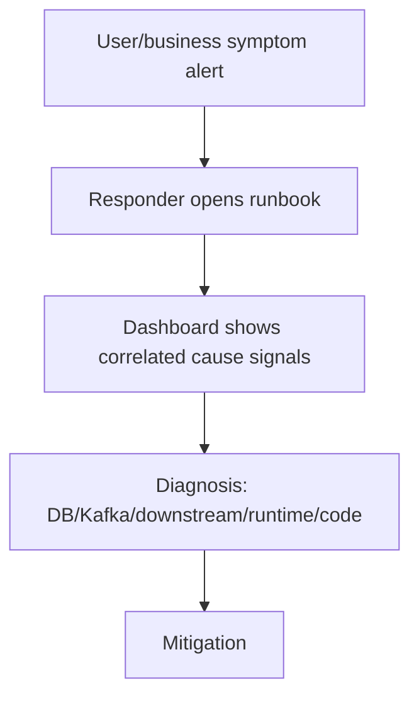

# Part 025 — Alert Quality and Actionability

## 1. Source notes and scope boundary

This part uses public reliability and observability references, especially:

- Google SRE guidance on monitoring distributed systems and alerting on symptoms that matter to users.
- OpenTelemetry concepts for telemetry data: traces, metrics, and logs.
- General incident-management practice around alert fatigue, noise reduction, runbooks, and actionable signals.
- Previous parts of this series on business observability, DORA metrics, flow metrics, DevEx, and Scrum production readiness.

This part does **not** assume CSG uses a specific monitoring stack, paging platform, SLO framework, alert routing tool, incident severity model, on-call model, or runbook repository.

Verify the actual internal setup: Prometheus, Grafana, Datadog, New Relic, Splunk, Elastic, PagerDuty, Opsgenie, ServiceNow, CloudWatch, Azure Monitor, OpenTelemetry Collector, or any internal platform tool may be involved.

---

## 2. Core thesis

An alert is not a graph threshold.

An alert is a request for human attention.

A high-quality alert says:

> Something important is happening, someone specific should act, the impact is meaningful, the signal is trustworthy, and the next diagnostic or mitigation step is known.

A low-quality alert says:

> A number crossed a line. Good luck.

In enterprise Quote & Order systems, bad alerting is expensive because it can cause two opposite failures:

1. **Silent business failure** — quote acceptance, order creation, fulfillment, or billing handoff is broken but nobody notices until customers complain.
2. **Alert fatigue** — engineers are paged for noisy, low-context, non-actionable symptoms until they stop trusting alerts.

The goal is not more alerts.

The goal is better operational signal.

---

## 3. Alert quality model

A strong alert has five properties.

| Property | Question | Bad example | Good example |
|---|---|---|---|
| Impact | Does this matter? | CPU above 75% | Quote-to-order conversion failures above baseline for 10 minutes |
| Actionability | Can someone act? | JVM memory high | Order service pods OOM restarting; rollback or scale according to runbook |
| Ownership | Who responds? | Platform? Backend? QA? | Order service on-call, with platform escalation if node pressure persists |
| Context | What should responder inspect? | Kafka lag high | Consumer group `order-fulfillment-relay` lag age > 15m with topic/runbook links |
| Noise control | Is this trusted? | Fires daily during batch job | Threshold adjusted for expected batch window or replaced with SLO burn alert |

A useful alert should reduce uncertainty.

If an alert only creates confusion, it is an observability bug.

---

## 4. Alert vs notification vs dashboard

Not every signal should page someone.

| Signal type | Purpose | Example |
|---|---|---|
| Page | Immediate human action required | Quote acceptance failing for many tenants |
| Ticket | Needs follow-up but not urgent | Slow increase in quote search latency |
| Slack/Teams notification | Awareness and coordination | Release marker, planned migration started |
| Dashboard | Investigation and context | Order funnel, Kafka lag, DB locks |
| Report | Trend analysis | Weekly flaky test trend |
| Audit event | Evidence | Approval override executed |

A common anti-pattern is turning every dashboard threshold into a page.

A senior engineer asks:

- What happens if nobody sees this for 30 minutes?
- What happens if nobody sees this until tomorrow?
- Is immediate action possible?
- Is the action owned by this team?
- Is the signal stable enough to wake someone?

---

## 5. Symptom alerts vs cause alerts

Google SRE strongly favors alerting on symptoms that matter to users rather than every possible internal cause.

For Quote & Order, symptom alerts include:

- quote creation success rate drops,
- pricing latency breaches user-facing threshold,
- quote acceptance fails,
- quote-to-order conversion fails,
- order fallout rate spikes,
- completed orders stop reaching inventory/billing handoff,
- customer-facing API error rate breaches SLO,
- tenant-specific failure affects high-value customer,
- stuck order age exceeds operational policy.

Cause signals include:

- CPU high,
- GC pause high,
- PostgreSQL lock waits,
- Kafka consumer lag,
- downstream 5xx,
- connection pool exhaustion,
- pod restarts,
- thread pool saturation.

Cause signals are useful for diagnosis.

But if every cause signal pages, alert volume explodes.

A good design is:



The page should usually be on the symptom.

The dashboard should carry the causes.

---

## 6. Business-impact alerting for Quote & Order

Infrastructure alerts are not enough.

A Quote & Order team needs business-impact alerts around the commercial journey.

### 6.1 Quote alerts

Examples:

- quote creation error rate above threshold,
- quote pricing latency p95/p99 breach,
- pricing engine error spike,
- quote submit-for-approval failures,
- quote acceptance failures,
- stale-price acceptance rejects spike,
- quote API 5xx by tenant,
- quote search latency high,
- quote transition invalid-state errors spike.

### 6.2 Approval alerts

Examples:

- approval workflow integration unavailable,
- approval decisions not persisted,
- approval audit missing rate,
- approvals stuck pending beyond threshold,
- privileged override attempts spike,
- maker-checker violation detected.

### 6.3 Order alerts

Examples:

- quote-to-order conversion failures,
- duplicate order prevention triggered above baseline,
- orders stuck in validating/fulfilling/fallout,
- order decomposition errors,
- fulfillment callback rejection spike,
- order completion event missing,
- order item state inconsistent with parent state.

### 6.4 Kafka/outbox alerts

Examples:

- outbox backlog age,
- outbox relay error rate,
- Kafka producer failures,
- consumer lag age,
- DLQ growth,
- replay job unexpected side effects,
- event schema compatibility failure in pipeline.

### 6.5 PostgreSQL alerts

Examples:

- transaction deadlocks,
- lock wait time,
- slow queries on hot quote/order paths,
- connection pool exhaustion,
- migration lock timeout,
- replication lag if relevant,
- disk saturation,
- index bloat or vacuum pressure if monitored.

### 6.6 Security/tenant/audit alerts

Examples:

- cross-tenant access denial spike,
- missing tenant context in request,
- invalid JWT issuer/audience spike,
- privileged action without audit record,
- data export anomaly,
- admin/data repair execution.

---

## 7. Alert design template

Every important alert should have a small design record.

```md
# Alert: <name>

## What it detects
- Symptom:
- Impacted user/business journey:

## Why it matters
- Business impact:
- Customer impact:
- Operational impact:

## Trigger logic
- Metric/log/event:
- Filter:
- Threshold:
- Window:
- Burn rate if SLO-based:

## Ownership
- Primary team:
- Escalation:
- Severity:

## Expected action
- Immediate mitigation:
- Diagnosis dashboard:
- Runbook:

## Noise controls
- Known maintenance windows:
- Expected batch behavior:
- Suppression rules:
- Related alerts:

## Validation
- How tested:
- Last reviewed:
```

If the team cannot fill this template, the alert is probably not ready to page.

---

## 8. Actionability checklist

An alert is actionable when the responder can answer these questions quickly:

1. What is broken?
2. Who is impacted?
3. How severe is it?
4. Is it ongoing?
5. What changed recently?
6. Which dashboard should I open?
7. Which runbook should I follow?
8. What is the first safe mitigation?
9. Who owns escalation?
10. How do I verify recovery?

If any answer requires tribal knowledge, improve the alert or runbook.

---

## 9. Alert payload quality

A good alert payload should include:

- service,
- environment,
- region/cluster if relevant,
- tenant/customer scope if safe,
- impacted journey,
- metric value,
- threshold,
- duration/window,
- recent deployment marker,
- dashboard link,
- trace/log query link if available,
- runbook link,
- escalation owner,
- severity,
- suggested first diagnostic step.

Bad alert title:

```txt
High error rate
```

Better alert title:

```txt
Quote acceptance API 5xx > 5% for 10m in prod-us-east; runbook: quote-acceptance-failures
```

Best alert context:

```txt
Impact: quote acceptance may fail for tenant group A.
Current: 8.4% 5xx over 10m, baseline <0.5%.
Recent change: order-service deploy 2026.07.09-1842.
Check: quote acceptance dashboard, order conversion errors, PostgreSQL lock waits, outbox backlog.
Mitigation: consider disabling new acceptance feature flag or rollback according to runbook.
```

---

## 10. Alert severity model

Severity should reflect impact and urgency.

Example model:

| Severity | Meaning | Example |
|---|---|---|
| SEV1 | Broad customer/business impact, immediate action | Quote/order creation unavailable across production |
| SEV2 | Significant impact, urgent | One major tenant cannot submit orders |
| SEV3 | Limited impact or degraded function | Order search latency high for support users |
| SEV4 | Follow-up needed, not urgent | Slow trend in CI build time or flaky test rate |

Severity should not be based only on technical component.

A PostgreSQL lock can be SEV1 if it blocks order creation.

A pod restart can be non-paging if users are not affected and redundancy works.

---

## 11. Alert fatigue taxonomy

Alert fatigue comes from multiple sources.

| Cause | Example | Fix |
|---|---|---|
| Non-actionable alert | CPU high but no action needed | Move to dashboard or ticket |
| Duplicate alerts | API error, pod restart, DB connection alert all page separately | Alert grouping/correlation |
| Bad threshold | Fires during expected batch job | Adjust threshold/window or suppress during planned job |
| Wrong owner | Platform pages app team for app symptom | Ownership routing |
| Missing context | Responder has to search everything | Add runbook/dashboard links |
| Cause-only paging | Many internal metrics page | Page on user/business symptoms |
| No review process | Old alerts never cleaned | Alert review cadence |
| Broken runbook | Alert says act but runbook stale | Runbook freshness owner |

Alert fatigue is not merely an on-call problem.

It is an engineering effectiveness problem because it destroys trust in operational signal.

---

## 12. Alert review cadence

Alerts need lifecycle management.

Recommended review schedule:

- **After every incident:** did the right alert fire? did it fire early enough? did it include context?
- **Monthly:** top noisy alerts, unactioned alerts, false positives, duplicate alerts.
- **Quarterly:** alert ownership, severity mapping, stale runbooks, SLO alignment.
- **After major architecture change:** update dashboards and alerts.

Review questions:

- Which alerts paged most often?
- Which pages led to no action?
- Which incidents had no alert?
- Which alerts fired too late?
- Which alerts had wrong owner?
- Which runbooks were missing/stale?
- Which metrics had wrong cardinality or broken labels?

---

## 13. Alert testing

Alerts should be tested.

Testing options:

- synthetic transaction failure,
- staging game day,
- alert rule unit tests if tooling supports it,
- dashboard query validation,
- runbook drill,
- canary release watch,
- chaos experiment for non-dangerous failure modes,
- manual threshold simulation in lower environment.

For Quote & Order, useful alert tests:

- simulate quote pricing 5xx,
- simulate outbox relay stop,
- simulate Kafka consumer lag,
- simulate fulfillment callback failure,
- simulate PostgreSQL lock wait,
- simulate order stuck state,
- simulate invalid tenant context spike.

The question is not only “does alert fire?”

The better question is:

> Does the alert lead a responder to correct diagnosis and safe mitigation quickly?

---

## 14. SLO-based alerting

SLO-based alerting is often better than raw threshold alerting when user journey reliability matters.

Example SLO:

> 99.5% of quote acceptance requests for eligible quotes complete successfully within 2 seconds over 28 days.

Related alerts:

- fast-burn alert: error budget burning quickly, page now,
- slow-burn alert: trend problem, ticket/follow-up,
- dashboard: error budget remaining,
- release marker: compare after deploy.

For Quote & Order, candidate SLOs:

- quote creation availability,
- pricing calculation latency,
- quote acceptance success,
- order creation success,
- order status retrieval latency,
- fulfillment callback processing latency,
- outbox relay freshness,
- API availability by critical endpoint.

SLO-based alerting forces the team to define what customer-relevant reliability means.

---

## 15. Alerting for async workflows

Async systems are tricky because failures may not appear as immediate API errors.

For Kafka/outbox workflows, alert on freshness and stuckness:

- oldest unprocessed outbox age,
- event publication delay,
- consumer lag age, not only message count,
- DLQ rate,
- stuck saga/process age,
- workflow state age,
- missing expected event after transition,
- duplicate event suppression rate,
- retry exhaustion.

Example:

```txt
Alert: ProductOrderCreated events not consumed within 15 minutes
Impact: fulfillment may not start for new orders.
Action: check order fulfillment consumer lag, DLQ, consumer pod health, downstream fulfillment adapter health.
```

In enterprise order workflows, “eventually consistent” should not mean “eventually noticed by a customer”.

---

## 16. Alerting for data correctness

Some critical failures are data-invariant failures.

Examples:

- accepted quote without pricing snapshot,
- approved quote without approval audit,
- order parent completed while child item active,
- duplicate order for same quote version,
- product order completed without completion event,
- outbox event missing for committed state transition,
- tenant ID missing in aggregate row,
- cross-tenant row count anomaly.

These may be detected by reconciliation jobs or invariant-check queries.

When an invariant check fails:

- alert if customer/business impact is urgent,
- create ticket if follow-up is needed,
- include repair runbook,
- include affected aggregate IDs in secure location,
- avoid leaking sensitive data in alert payload.

---

## 17. Alerting and privacy/commercial sensitivity

Alerts often go to broad channels.

Do not put sensitive data in alert text.

Avoid:

- customer PII,
- full account names if not allowed,
- commercial discount/margin details,
- raw JWT/token/header values,
- service addresses,
- customer secrets,
- SQL with literal sensitive values,
- raw audit payload.

Use safe references:

- tenant alias if approved,
- internal incident ID,
- aggregate IDs if policy allows,
- secure dashboard link with access control,
- redacted samples.

Alert quality includes information safety.

---

## 18. Alert ownership and routing

Every alert needs an owner.

Ownership dimensions:

- service owner,
- business capability owner,
- platform owner,
- database owner,
- security owner,
- support owner,
- customer-specific owner.

Misrouted alerts create delay and resentment.

Routing rules should consider:

- symptom ownership,
- current on-call schedule,
- escalation path,
- environment,
- severity,
- tenant/customer impact,
- recent deployment owner if relevant.

Example:

| Alert | Primary owner | Escalation |
|---|---|---|
| Quote acceptance error rate | Quote service team | Platform if infra saturation |
| Kafka cluster unavailable | Platform/SRE | Product team for business mitigation |
| Order stuck in fallout | Order service team | Fulfillment/integration owner |
| Cross-tenant access anomaly | Owning service + security | Incident commander/compliance |

---

## 19. Alert runbook requirements

A runbook should be linked from the alert.

Minimum structure:

```md
# Runbook: <alert name>

## Meaning
What this alert means.

## Impact
Which users/business journeys are impacted.

## First checks
- dashboard link
- log query
- trace query
- recent deployment
- known dependencies

## Mitigation
- safe immediate actions
- feature flag
- rollback
- scaling
- pause consumer
- contact downstream owner

## Verification
How to know the issue is resolved.

## Escalation
Who to contact and when.

## Follow-up
What backlog/prevention items to create.
```

If the runbook says “ask Alice”, the system depends on Alice.

Improve the runbook.

---

## 20. Senior PR review checklist for alerts

When reviewing a PR that adds or changes alerts, ask:

- What user/business symptom does this alert represent?
- Is immediate human action required?
- Is severity correct?
- Is owner/routing correct?
- Is threshold based on baseline or guess?
- Is there a runbook link?
- Does payload include enough context?
- Does payload avoid sensitive data?
- Does this duplicate another alert?
- Does it fire during expected batch/maintenance windows?
- Is dashboard available for diagnosis?
- Is alert tested?
- Is there a lower-severity ticket/report alternative?
- Is this tied to SLO/error budget where appropriate?

Alert PR review is production design review.

---

## 21. Internal verification checklist

Verify these inside your CSG/team context:

- What monitoring stack is used?
- What alerting/paging tool is used?
- What is the severity model?
- Who is on call?
- Are product teams or platform teams primary responders?
- Where are dashboards stored?
- Where are runbooks stored?
- What is the required alert payload format?
- Are SLOs defined for Quote & Order journeys?
- Are business metrics available?
- Are alerts reviewed after incidents?
- Are noisy alerts tracked?
- Is there an alert ownership registry?
- Are tenant/customer IDs safe in alert payloads?
- Are security-sensitive alerts handled differently?
- Is there a data repair escalation path?
- Are release markers visible in dashboards?
- Are alert changes part of Definition of Done?

---

## 22. Practical exercise: improve one noisy alert

Pick one alert that fired recently.

Answer:

1. What triggered it?
2. Was user/business impact real?
3. Who responded?
4. What action was taken?
5. Was the alert payload useful?
6. Was there a runbook?
7. Did it duplicate another alert?
8. Should it page, notify, ticket, or only dashboard?
9. What threshold/window would reduce noise?
10. What symptom alert would be better?

Create a small improvement PR or backlog item.

---

## 23. Summary

Alert quality is an engineering effectiveness multiplier.

Good alerts:

- protect customer/business journeys,
- reduce detection time,
- guide responders,
- preserve on-call trust,
- produce learning,
- connect observability to action.

Bad alerts:

- create fatigue,
- hide real incidents in noise,
- waste engineering attention,
- erode confidence in monitoring,
- make production support depend on tribal knowledge.

For Quote & Order systems, the best alerts are not just infrastructure alerts.

They are business-journey alerts tied to quote, pricing, approval, order, fulfillment, Kafka, data correctness, tenant isolation, and audit evidence.

The senior engineer standard is simple:

> Do not add an alert unless it has impact, owner, action, context, and lifecycle review.
