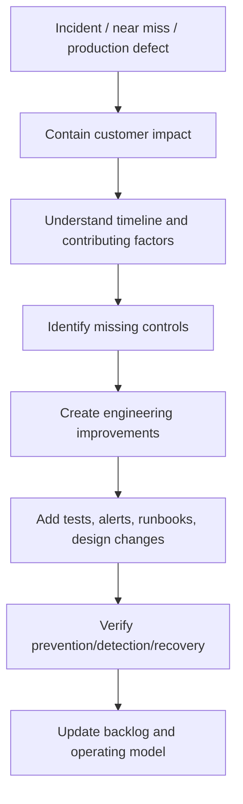

# Part 026 — Incident Learning as Engineering Input

## 1. Source notes and scope boundary

This part uses public reliability engineering concepts, especially:

- Google SRE postmortem culture and incident management practices.
- Google SRE monitoring guidance.
- General DevOps/SRE practice around blameless learning, action item quality, operational resilience, and feedback loops.
- Previous parts of this series on alert quality, observability, flow metrics, Scrum production readiness, and data repair.

This part does **not** assume CSG has a specific incident process, severity model, postmortem template, root-cause analysis method, action item workflow, on-call structure, or incident tool.

Verify internal incident processes, customer-communication rules, support escalation paths, compliance obligations, and postmortem expectations.

---

## 2. Core thesis

An incident is not only an interruption.

An incident is production feedback.

A mature engineering organization converts incidents into improved system design.

The incident loop should be:



If an incident ends with “fixed the bug”, the organization learned too little.

The question is:

> What did the incident reveal about our design, tests, observability, deployment, ownership, documentation, platform, or process?

---

## 3. Incident learning vs incident blame

Blame asks:

- Who made the mistake?
- Who approved the PR?
- Who missed the alert?
- Who should have known?

Learning asks:

- Why did the system allow this mistake to reach production?
- Why was the risk not visible earlier?
- Why did tests not catch it?
- Why did alerting detect it late or not at all?
- Why was diagnosis slow?
- Why was mitigation unclear?
- Why was repair manual or risky?
- Why did the team have to rely on one person's memory?

Blame produces fear.

Learning produces stronger systems.

Blameless does not mean consequence-free or accountability-free.

It means the post-incident analysis focuses on system conditions and improvement, not personal shame.

---

## 4. What counts as an incident input?

Not every learning input is a SEV1 outage.

Use a broad signal set:

| Input | Example | Learning potential |
|---|---|---|
| Major incident | Quote creation unavailable | Reliability, rollback, alerting |
| Minor incident | One tenant order conversion failing | Customer-specific config safety |
| Near miss | Migration almost locked hot table | ORR/migration review improvement |
| Production defect | Accepted quote missing audit event | Test gap, lifecycle invariant |
| Support escalation | Stuck order requires manual SQL | Data repair/runbook/tooling gap |
| Alert noise | On-call ignored repeated non-actionable alert | Alert quality gap |
| Flaky test | Release blocked by nondeterministic E2E | Test architecture gap |
| Slow diagnosis | Engineers could not trace quote journey | Observability/debuggability gap |
| Manual toil | Same repair done repeatedly | Automation/platform gap |

Near misses are especially valuable because they teach before customer impact occurs.

---

## 5. Incident taxonomy for Quote & Order

Classifying incidents helps convert them into backlog correctly.

### 5.1 Domain correctness incidents

Examples:

- quote accepted after price expiry,
- approval evidence missing,
- discount threshold miscalculated,
- order parent/child state inconsistent,
- cancellation allowed after terminal state.

Likely improvements:

- invariant tests,
- domain model centralization,
- characterization tests,
- state machine documentation,
- acceptance criteria update.

### 5.2 API/contract incidents

Examples:

- consumer breaks after enum addition,
- OpenAPI spec differs from implementation,
- error code changed semantically,
- pagination/filter behavior changed.

Likely improvements:

- contract tests,
- OpenAPI diff gate,
- consumer-driven contract,
- deprecation policy,
- generated client compile check.

### 5.3 Kafka/event incidents

Examples:

- event not emitted,
- duplicate event causes duplicate downstream action,
- consumer not replay-safe,
- schema compatibility failure,
- DLQ grows silently.

Likely improvements:

- outbox invariant test,
- idempotency guard,
- event contract test,
- DLQ alert/runbook,
- replay drill.

### 5.4 PostgreSQL/data incidents

Examples:

- migration locks hot table,
- slow query causes API outage,
- deadlocks increase,
- data repair updates wrong scope,
- missing index causes order search degradation.

Likely improvements:

- migration dry-run gate,
- lock analysis checklist,
- query plan review,
- Testcontainers integration tests,
- repair runbook guard clauses.

### 5.5 Platform/runtime incidents

Examples:

- Kubernetes readiness probe wrong,
- JVM OOM restarts,
- connection pool exhaustion,
- resource limits too low,
- deployment rollout stalls.

Likely improvements:

- golden path defaults,
- resource dashboard,
- deployment checklist,
- load test,
- platform template improvement.

### 5.6 Observability/operability incidents

Examples:

- alert did not fire,
- alert fired too late,
- runbook stale,
- trace missing correlation ID,
- support cannot reconstruct journey.

Likely improvements:

- alert redesign,
- telemetry DoD,
- runbook update,
- business dashboard,
- correlation ID propagation.

---

## 6. Post-incident artifact quality

A good post-incident artifact is factual, useful, and actionable.

Minimum sections:

```md
# Incident Review: <title>

## Summary
- What happened?
- Who/what was impacted?
- Current status?

## Impact
- Customer impact:
- Business impact:
- Internal/support impact:
- Duration:

## Timeline
- Detection:
- Triage:
- Mitigation:
- Recovery:
- Verification:

## Contributing factors
- Technical:
- Process:
- Observability:
- Ownership:
- Testing:
- Deployment:

## What went well
- Existing controls that helped.

## What went poorly
- Gaps that increased impact or duration.

## Where we got lucky
- Risks that did not materialize but could have.

## Action items
- Prevention:
- Detection:
- Mitigation:
- Recovery:
- Documentation:
```

A postmortem is not a novel.

It is a reusable engineering input.

---

## 7. Timeline discipline

The timeline should separate facts from interpretation.

Good timeline entries:

```txt
10:03 UTC — Order service deploy 2026.07.09-1842 completed in prod-us-east.
10:08 UTC — Quote-to-order conversion 5xx rate increased from 0.2% to 6.7%.
10:12 UTC — Alert fired: quote-to-order conversion failures.
10:17 UTC — On-call identified PostgreSQL lock waits on order table migration.
10:24 UTC — Migration job stopped.
10:31 UTC — Conversion error rate returned to baseline.
```

Weak timeline entries:

```txt
Engineer deployed bad migration.
On-call was slow.
DB got angry.
```

Avoid emotional or judgmental language.

The goal is reconstruction.

---

## 8. Root cause vs contributing factors

Many incidents do not have one root cause.

They have contributing factors.

Example incident:

> Quote acceptance failed for 30 minutes after pricing service deployment.

Possible contributing factors:

- pricing service changed error response contract,
- quote service parsed old error model only,
- contract test did not cover error response,
- canary did not include price-expired journey,
- alert fired only after API 5xx, not business conversion failure,
- runbook did not include pricing dependency dashboard,
- feature flag rollback was unclear.

Calling the root cause “pricing bug” misses the system learning.

A better conclusion:

> The incident occurred because an error contract change reached production without provider/consumer verification, and detection/mitigation paths were slower because the quote acceptance runbook did not include pricing dependency diagnostics.

---

## 9. Action item taxonomy

Good incident action items target a missing control.

| Category | Example |
|---|---|
| Prevention | Add contract test for pricing error response |
| Detection | Alert on quote acceptance business failure rate |
| Diagnosis | Add pricing dependency panel to quote dashboard |
| Mitigation | Add feature flag rollback step to runbook |
| Recovery | Add data repair script for stuck accepted quotes |
| Documentation | Update quote acceptance runbook |
| Platform | Add golden path for dependency error contract tests |
| Process | Require ORR for pricing contract changes |
| Training | Run incident drill for quote-to-order failure |

Action items should not all be “add more monitoring” or “be careful”.

---

## 10. Action item quality bar

A strong action item has:

- clear owner,
- clear expected outcome,
- acceptance criteria,
- priority/severity,
- due date or target planning window,
- measurable verification,
- link to incident,
- appropriate work type,
- no vague verbs.

Weak:

```txt
Improve monitoring.
```

Better:

```txt
Add alert for quote acceptance success rate below 99% over 10 minutes, grouped by environment and excluding synthetic traffic. Include dashboard and runbook links. Validate in staging by forcing pricing dependency failure.
```

Weak:

```txt
Add tests.
```

Better:

```txt
Add provider/consumer contract test covering pricing service error code `PRICE_EXPIRED` and quote service mapping to `409 QUOTE_PRICE_EXPIRED`.
```

---

## 11. Incident-to-backlog conversion

Incidents should produce Product Backlog Items when they require product/team work.

But not every action item should be a tiny disconnected ticket.

Group them by outcome.

Example incident outcome:

> Reduce risk of quote acceptance failures caused by pricing dependency contract changes.

Backlog items:

1. Add contract tests for pricing error model.
2. Add quote acceptance business metric and alert.
3. Update quote acceptance runbook with pricing dependency diagnostics.
4. Add staging synthetic journey for price-expired quote acceptance.
5. Review pricing API deprecation policy.

This connects technical tasks to risk reduction.

---

## 12. Incident learning in Scrum

Incident learning must enter normal Scrum flow.

### 12.1 Product Backlog

Incident prevention work should become visible Product Backlog Items.

The Product Owner needs impact framing:

- customer impact,
- recurrence probability,
- engineering risk,
- support cost,
- compliance/security impact,
- delivery friction.

### 12.2 Sprint Planning

Plan incident action items according to risk.

Do not automatically push all prevention work into the next Sprint.

But do not let high-risk actions rot.

### 12.3 Daily Scrum

Use Daily Scrum to surface:

- stuck action items,
- dependency on platform/security/support,
- production risk while fix is not complete.

### 12.4 Sprint Review

Demo prevention evidence:

- new alert firing in test,
- new contract test failing on old bug,
- runbook walkthrough,
- dashboard showing business metric,
- data repair dry-run.

### 12.5 Retrospective

Inspect process/system learning:

- why risk was missed,
- how backlog/refinement/DoD should change,
- which team habit needs improvement.

---

## 13. Near misses

Near misses are learning gold.

Examples:

- migration was caught in review before locking large table,
- contract test caught breaking API change before release,
- canary caught order conversion failure before full rollout,
- noisy alert nearly hid a real incident,
- support noticed data inconsistency before customer did,
- staging replay found non-idempotent consumer.

Near-miss review can be lighter than postmortem.

Template:

```md
# Near Miss Review

## What almost happened?
## How was it caught?
## What existing control worked?
## What control was missing or too weak?
## What small improvement will make this less likely?
```

Celebrate near misses when controls work.

That reinforces good engineering behavior.

---

## 14. Incident learning by work type

### 14.1 API incidents

Add/improve:

- OpenAPI diff gate,
- contract tests,
- backward compatibility checklist,
- error model tests,
- consumer examples,
- generated client test.

### 14.2 Kafka incidents

Add/improve:

- idempotency tests,
- replay test,
- DLQ runbook,
- consumer lag alert,
- schema compatibility gate,
- outbox invariant test.

### 14.3 Database incidents

Add/improve:

- migration risk checklist,
- production-like dry run,
- lock timeout,
- query plan review,
- backfill chunking,
- data repair template.

### 14.4 Security incidents

Add/improve:

- cross-tenant negative tests,
- audit completeness tests,
- token validation tests,
- admin tool approval,
- sensitive log redaction,
- incident escalation policy.

### 14.5 Observability incidents

Add/improve:

- correlation ID propagation,
- business metric,
- dashboard panel,
- alert payload,
- runbook,
- tracing coverage.

---

## 15. Measuring incident learning effectiveness

Do not measure only incident count.

Useful learning metrics:

- percentage of incidents with completed review,
- action item completion rate,
- repeat incident rate,
- detection time trend,
- diagnosis time trend,
- mitigation time trend,
- alerts that fired vs should have fired,
- incidents caused by known unresolved debt,
- number of post-incident tests added,
- runbook coverage for recurring failure modes,
- data repair recurrence count.

Be careful: metrics can be gamed.

The goal is learning, not making numbers look good.

---

## 16. Repeat incident analysis

A repeat incident is a strong signal.

Ask:

- Was the previous action item incomplete?
- Was the action item too weak?
- Did the owner lack time/priority?
- Was the root cause misunderstood?
- Did detection improve but prevention not?
- Did the architecture still allow the failure?
- Was the issue customer-specific or general?
- Did the team accept risk explicitly or accidentally?

Repeat incidents often reveal prioritization failure, not just technical failure.

---

## 17. Incident learning and DevEx

Incidents often reveal developer experience gaps.

Examples:

| Incident symptom | DevEx/system improvement |
|---|---|
| Debugging took too long | Better local reproduction + trace/log queries |
| Wrong migration reached prod | Migration template + automated risk checks |
| Flaky tests hid failure | Flaky test ownership and quarantine policy |
| Reviewer missed risk | PR checklist for domain/API/event/data safety |
| On-call used tribal query | Runbook + safe diagnostic script |
| Feature flag rollback unclear | Feature flag registry and rollout docs |
| Local environment did not reproduce | Better local golden path or staging fixture |

Incident learning should improve how engineers work, not just how production runs.

---

## 18. Incident learning and platform engineering

When multiple teams hit similar incidents, platform may be the right intervention.

Examples:

- every Java service misses correlation ID → platform logging starter,
- each team writes own health check incorrectly → service template,
- migrations repeatedly lock tables → migration linter/golden path,
- Kafka consumers handle idempotency inconsistently → consumer framework/helper,
- alert payloads inconsistent → alert template library,
- runbooks scattered → developer portal/service catalog integration.

Platform should convert repeated pain into paved roads.

But platform should avoid over-centralizing product-specific domain decisions.

---

## 19. Incident learning anti-patterns

### 19.1 The bug-fix-only postmortem

Only fixes the immediate defect.

Misses missing tests, alerting, runbook, and design controls.

### 19.2 The blame document

Names people more than system conditions.

Creates fear and reduces transparency.

### 19.3 The action item graveyard

Postmortem creates many items that nobody prioritizes.

Better: fewer, stronger, owned action items.

### 19.4 The monitoring reflex

Every incident action item becomes “add alert”.

Sometimes the right fix is design, test, contract, migration, or platform improvement.

### 19.5 The giant rewrite conclusion

A real incident becomes justification for a huge rewrite without incremental safety plan.

Better: identify smallest durable risk-reduction path.

### 19.6 The secret postmortem

Incident learning is not shared with teams who could prevent similar issues.

Sensitive details may need redaction, but learning should travel.

---

## 20. Incident review facilitation

A senior engineer can help facilitate without dominating.

Good facilitator behavior:

- keeps discussion factual,
- separates timeline from interpretation,
- invites multiple perspectives,
- prevents blame language,
- asks about missing controls,
- keeps customer impact visible,
- pushes for high-quality action items,
- distinguishes immediate fix from systemic fix,
- captures unknowns honestly.

Useful questions:

- What signal first showed the problem?
- What signal should have shown it earlier?
- Which assumption was wrong?
- Which test would have caught this?
- Which runbook step was missing?
- Which dashboard reduced diagnosis time?
- Which manual operation was risky?
- Which dependency was hidden?
- What is the smallest change that prevents recurrence?

---

## 21. Internal verification checklist

Verify these inside your CSG/team context:

- What is the incident severity model?
- Who declares incidents?
- Who leads incidents?
- Where are incident records stored?
- When is a postmortem required?
- Is the culture explicitly blameless?
- Who owns action item tracking?
- How do incident actions enter the Product Backlog?
- Are incident actions reviewed in Sprint Planning?
- Are near misses tracked?
- Are customer/support escalations linked to engineering backlog?
- Are postmortems shared across teams?
- Are security/compliance incidents handled differently?
- Are data repair incidents handled with special process?
- Are runbooks linked to services in a catalog?
- Are incident metrics reviewed quarterly?

---

## 22. Practical exercise: convert an incident into engineering input

Pick a real or hypothetical incident:

> Quote acceptance failed after pricing API error contract changed.

Create:

1. Impact statement.
2. Timeline.
3. Contributing factors.
4. Missing controls.
5. Action items by category:
   - prevention,
   - detection,
   - diagnosis,
   - mitigation,
   - recovery,
   - documentation.
6. Backlog items with acceptance criteria.
7. Sprint Review evidence for completion.

Strong answer:

- includes contract test,
- includes business alert,
- includes runbook update,
- includes staging validation,
- includes ownership,
- avoids blaming one team.

---

## 23. Summary

Incident learning is one of the strongest engineering effectiveness loops.

A mature team does not only restore service.

It improves the system that allowed the incident.

For Quote & Order, incidents should feed improvements into:

- domain invariants,
- API contracts,
- Kafka replay/idempotency,
- PostgreSQL migration safety,
- tenant/security/audit controls,
- observability and alerting,
- runbooks and data repair,
- platform golden paths,
- Scrum backlog and Definition of Done.

The senior engineer standard is:

> Every meaningful incident should leave the system easier to detect, diagnose, mitigate, recover, or prevent next time.
