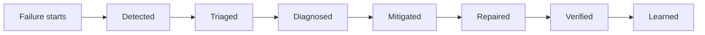
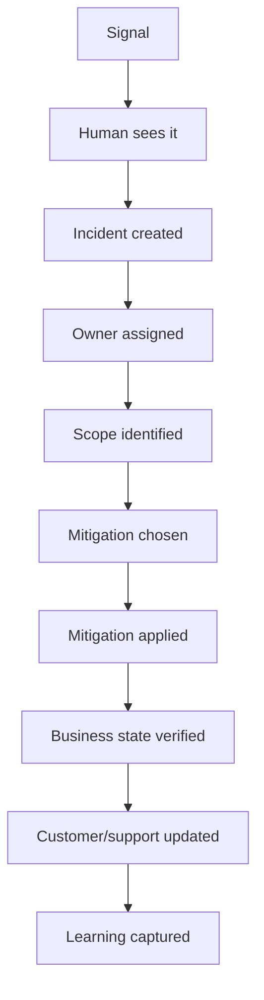

# Part 027 — MTTD, MTTR, and Recovery Diagnostics

## 1. Source notes and scope boundary

Public references to verify independently:

- DORA uses software delivery metrics including failed deployment recovery time, deployment frequency, change lead time, and reliability as diagnostic signals for delivery performance.
- Google SRE material emphasizes monitoring, incident management, alerting, SLOs, and post-incident learning as reliability practices.
- Google SRE's four golden signals are latency, traffic, errors, and saturation.
- Internal CSG incident severity, SLA/SLO, on-call, escalation, customer communication, data repair, and postmortem policy must be verified internally.

This part does **not** assume the actual CSG incident taxonomy, on-call model, PagerDuty/Opsgenie tooling, SLO definitions, support workflow, or customer-impact reporting format.

---

## 2. Core thesis

MTTR is not one thing.

When teams say:

> We need to reduce MTTR.

They often hide several different bottlenecks inside one number.

A production issue can be slow because the team was slow to:

- detect the issue,
- understand whether it was real,
- determine blast radius,
- find the owner,
- diagnose root cause,
- choose mitigation,
- execute mitigation,
- repair data,
- verify recovery,
- communicate status,
- prevent recurrence.

Each bottleneck needs a different improvement.

A better model is:



Engineering effectiveness improves when you can measure and improve each segment, not just the final total.

---

## 3. Recovery timeline vocabulary

Use precise terms.

| Term | Meaning | Typical signal |
|---|---|---|
| Time to impact | Time between faulty change/event and customer/business impact | deployment marker, release flag, first bad event |
| Time to detect | Time between impact and detection | alert, support ticket, customer report, dashboard anomaly |
| Time to acknowledge | Time from alert to human ownership | paging/incident tool |
| Time to triage | Time to classify severity and scope | incident channel/ticket |
| Time to diagnose | Time to identify likely cause or failing component | logs/traces/dashboards |
| Time to mitigate | Time to stop active harm | rollback, flag disable, traffic shift, pause consumer |
| Time to repair | Time to restore incorrect data/state/downstream side effects | data repair/replay/reconciliation |
| Time to verify | Time to prove service/business journey is healthy | dashboard, synthetic check, support confirmation |
| Time to learn | Time to convert incident into prevention backlog | postmortem/action items |

DORA's failed deployment recovery time is useful, but enterprise systems often need this richer decomposition because a Quote & Order failure may leave persistent business state behind even after the service is technically healthy.

---

## 4. Why recovery is harder in Quote & Order

A stateless service failure may recover after rollback.

A Quote & Order failure may require business correction.

Examples:

- A pricing bug creates accepted quotes with wrong discount.
- A Kafka consumer duplicates order creation.
- A fulfillment callback updates the wrong order item.
- A database migration leaves old quotes unreadable.
- A tenant predicate bug leaks search results.
- An approval authority bug allows unauthorized approval.
- A catalog versioning bug makes accepted quotes ambiguous.

In these cases, recovery means more than restoring HTTP 200.

Recovery means restoring:

- commercial correctness,
- lifecycle invariants,
- downstream state,
- audit evidence,
- customer trust,
- support clarity,
- future prevention.

---

## 5. Incident recovery as a value stream

Treat incident response as a value stream.



Common bottlenecks:

- alert did not fire,
- alert fired but was noisy,
- alert lacked business context,
- no owner knew the service,
- dashboards did not include quote/order IDs,
- traces did not cross Kafka boundary,
- logs lacked correlation ID,
- runbook was stale,
- rollback was unsafe due to migration,
- data repair required manual SQL discovery,
- support had no customer-ready status.

Each bottleneck becomes engineering backlog.

---

## 6. Detection diagnostics

Detection asks:

> How did we know something was wrong?

Detection signals include:

- SLO burn alert,
- API error rate,
- API latency,
- Kafka consumer lag age,
- outbox backlog,
- DLQ growth,
- order stuck-state count,
- quote acceptance failure rate,
- pricing error rate,
- fallout spike,
- support ticket,
- customer complaint,
- synthetic journey failure,
- release canary check.

### 6.1 Strong detection

Strong detection is:

- early,
- specific,
- business-relevant,
- actionable,
- low-noise,
- owned,
- linked to a runbook.

Example strong alert:

> Quote-to-order conversion failures for tenant group X exceeded baseline by 5x after release version `2026.07.09-abc123`; 38 failed conversions in 15 minutes; top error code `QUOTE_PRICE_SNAPSHOT_MISSING`; runbook link attached.

Example weak alert:

> Error rate high.

### 6.2 Detection quality questions

Ask after every incident:

- Did an automated alert fire?
- Did support/customer report before telemetry?
- Was the signal business-relevant?
- Was the alert too late?
- Was the alert too noisy?
- Did the alert identify affected tenant/customer/journey?
- Did the alert point to a runbook?
- Was there a dashboard for confirmation?

---

## 7. Triage diagnostics

Triage asks:

> How quickly did we know severity, scope, and owner?

Triage needs:

- severity model,
- customer impact model,
- service ownership map,
- escalation path,
- incident commander role if applicable,
- technical lead role,
- communication lead role,
- affected tenant/customer list,
- current mitigation status.

### 7.1 Triage template

```md
# Triage Snapshot

## What is failing?
- Journey:
- Service/component:
- Error/symptom:

## Who is affected?
- Tenant(s):
- Customer(s):
- Deployment(s): cloud/on-prem:
- Business process:

## Severity
- Proposed severity:
- Reason:

## Active harm
- Is harm ongoing?
- Can we stop it?

## Owner
- Incident lead:
- Technical owner:
- Product/support owner:

## Current mitigation
- Rollback:
- Feature flag:
- Pause consumer/job:
- Customer workaround:
```

---

## 8. Diagnosis diagnostics

Diagnosis asks:

> Why is this happening?

Diagnosis quality depends on observability.

For Quote & Order, diagnosis should usually follow the business journey:

1. incoming API request,
2. auth/tenant context,
3. command handler,
4. validation/domain rule,
5. DB transaction,
6. outbox write,
7. Kafka publish,
8. downstream consumer,
9. projection/read model,
10. audit/support view.

### 8.1 Quote acceptance diagnosis checklist

- Which quote ID?
- Which quote version?
- Which tenant?
- Which customer/account?
- Which catalog version?
- Which pricing snapshot?
- Which approval evidence?
- Which actor/role?
- Which idempotency key?
- Which correlation ID?
- Was order created?
- Was `ProductOrderCreated` emitted?
- Did downstream consumer receive it?
- Is audit complete?

### 8.2 Diagnosis anti-patterns

- jumping to code blame before scope,
- debugging from memory instead of evidence,
- focusing on infrastructure metrics when domain invariant broke,
- ignoring recent deployments/config changes,
- ignoring customer-specific configuration,
- assuming rollback is safe,
- diagnosing only source service while downstream side effects continue.

---

## 9. Mitigation diagnostics

Mitigation asks:

> How do we stop active harm fastest and safest?

Mitigation options:

- rollback code,
- roll forward fix,
- disable feature flag,
- pause Kafka consumer,
- pause scheduler,
- block risky command path,
- rate limit traffic,
- fail closed for unsafe operation,
- switch to fallback adapter,
- route affected tenants to manual handling,
- disable customer-specific config,
- stop outbox relay temporarily.

### 9.1 Mitigation decision matrix

| Option | Fast? | Safe? | Reversible? | Data impact? | When useful |
|---|---:|---:|---:|---:|---|
| Rollback code | Often | Depends | Usually | May not undo writes | Runtime regression without incompatible data change |
| Feature flag off | Fast | Depends | Yes | Depends | Behavior isolated behind flag |
| Pause consumer | Fast | Usually | Yes | Backlog grows | Prevent duplicate/wrong side effects |
| Roll forward | Slower | Depends | Depends | Depends | Root cause understood and rollback unsafe |
| Data repair | Slow | Risky | Depends | Direct | Bad state already persisted |

### 9.2 Mitigation is not recovery

If you disable quote acceptance to stop bad orders, the active harm is contained.

But recovery still requires:

- identifying affected quotes,
- repairing or cancelling bad orders,
- notifying support/customers,
- validating no new bad state,
- adding prevention.

---

## 10. Repair diagnostics

Repair asks:

> What persisted business state must be corrected?

Repair may involve:

- DB update through approved tool,
- admin command,
- outbox event insertion,
- Kafka replay,
- projection rebuild,
- downstream reconciliation,
- support/customer correction,
- audit evidence addition.

### 10.1 Repair checklist

- Is source of truth identified?
- Is repair tenant-scoped?
- Is affected set known?
- Is dry-run output reviewed?
- Is repair idempotent?
- Is audit record required?
- Are events/downstream effects required?
- Is rollback/compensation defined?
- Is validation query ready?
- Is approval recorded?

Repair often dominates total recovery time for enterprise systems.

Reducing repair time usually requires prior engineering investment:

- reconciliation jobs,
- admin repair commands,
- idempotency keys,
- repair audit tables,
- event replay tooling,
- runbooks,
- domain invariant checks.

---

## 11. Verification diagnostics

Verification asks:

> How do we know recovery is complete?

Verification should include both technical and business signals.

Technical verification:

- error rate normal,
- latency normal,
- DB locks normal,
- Kafka lag normal,
- DLQ stable,
- pods healthy,
- no restart storm.

Business verification:

- quotes can be created/priced/accepted,
- orders can be created/decomposed/completed,
- fallout rate normal,
- support view correct,
- audit present,
- affected tenant/customer confirmed,
- synthetic journey passes,
- data repair validation passes.

### 11.1 Recovery closure statement

```md
# Recovery Closure

## Mitigation
- What stopped active harm:

## Repair
- What data/state was corrected:

## Verification
- Technical signals:
- Business signals:
- Customer/support confirmation:

## Remaining risk
- Known residual issue:
- Follow-up owner:
```

---

## 12. Recovery metrics dashboard

A mature recovery dashboard may include:

- incident count by severity,
- detection source distribution,
- alert vs customer-reported ratio,
- time to acknowledge,
- time to triage,
- time to mitigation,
- time to repair,
- time to verification,
- recurrence rate,
- postmortem action completion,
- alert quality trend,
- runbook coverage,
- data repair frequency,
- top incident-contributing components.

Avoid using these metrics to shame teams.

Use them to find system bottlenecks.

---

## 13. Recovery improvement patterns

### 13.1 Reduce time to detect

Invest in:

- business journey metrics,
- SLO-based alerting,
- synthetic transactions,
- release markers,
- anomaly-aware dashboards,
- customer-impact alerts.

### 13.2 Reduce time to diagnose

Invest in:

- correlation IDs,
- distributed tracing,
- structured logs,
- service ownership metadata,
- event causation IDs,
- dashboard drill-downs,
- diagnostic runbooks.

### 13.3 Reduce time to mitigate

Invest in:

- feature flags,
- safe rollback,
- consumer pause controls,
- traffic shaping,
- kill switches,
- configuration rollback,
- clear escalation ownership.

### 13.4 Reduce time to repair

Invest in:

- admin repair commands,
- reconciliation jobs,
- idempotent workflows,
- data repair runbooks,
- audit-safe correction tooling,
- projection rebuild tooling.

### 13.5 Reduce recurrence

Invest in:

- root-cause action items,
- regression tests,
- architecture changes,
- migration safety,
- observability improvements,
- better refinement/DoD.

---

## 14. Internal verification checklist

Verify internally:

- What incident tool is used?
- What severity levels exist?
- What counts as customer impact?
- What are expected response times?
- Is there an incident commander role?
- Who communicates to support/customer-facing teams?
- Where are runbooks stored?
- Where are dashboards stored?
- Are SLOs defined for Quote & Order journeys?
- Are business metrics available?
- Are data repairs tracked separately?
- How is failed deployment recovery time measured?
- How are on-prem incidents handled?
- How are postmortem actions tracked?
- Which incidents recently took longest to detect?
- Which incidents recently took longest to repair?

---

## 15. PR review checklist

When reviewing changes that affect recovery:

- Does the change add or preserve correlation IDs?
- Are new failure modes observable?
- Are new alerts actionable?
- Is there a runbook for new async workflow?
- Can risky behavior be disabled quickly?
- Does rollback remain safe?
- Are data repair implications understood?
- Can support identify affected tenant/customer/order/quote?
- Are business metrics updated?
- Is audit evidence preserved?

---

## 16. Practical exercise

Pick one recent incident or production bug.

Create a recovery timeline:

| Segment | Start | End | Duration | Bottleneck | Improvement idea |
|---|---|---|---:|---|---|
| Impact → detect | | | | | |
| Detect → acknowledge | | | | | |
| Acknowledge → triage | | | | | |
| Triage → diagnose | | | | | |
| Diagnose → mitigate | | | | | |
| Mitigate → repair | | | | | |
| Repair → verify | | | | | |

Then choose exactly one improvement for the next sprint.

Good candidates:

- add missing business metric,
- improve alert payload,
- add runbook link,
- add trace attribute,
- add data repair validation query,
- add regression test,
- add owner metadata.

---

## 17. Summary

MTTR is too broad to be useful by itself.

Decompose recovery into:

- detect,
- acknowledge,
- triage,
- diagnose,
- mitigate,
- repair,
- verify,
- learn.

For Quote & Order systems, recovery often includes persistent business-state correction, not only service restoration.

Engineering effectiveness improves when every incident teaches the team which segment of recovery is weak and which small system change will make the next incident easier.
