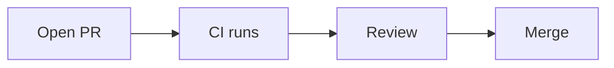
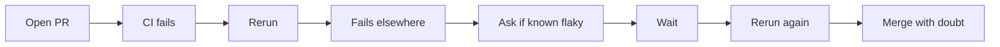
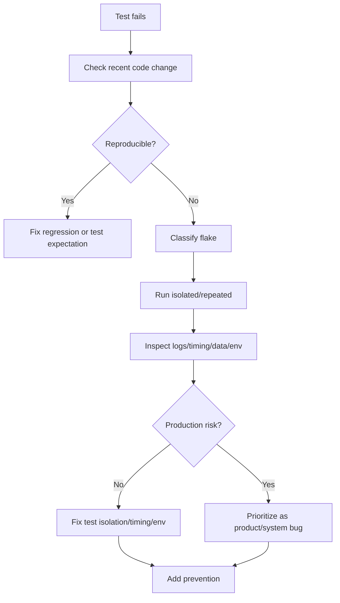

# Part 028 — Flaky Tests as Systemic Risk

## 1. Source notes and scope boundary

Public references to verify independently:

- Google Testing Blog defines a flaky test as a test that exhibits both passing and failing results with the same code.
- Martin Fowler defines non-deterministic tests as tests that sometimes pass and sometimes fail without noticeable changes in code, tests, or environment.
- JUnit 5 provides tagging, lifecycle, parameterized tests, and execution features that can help organize deterministic suites.
- Testcontainers can improve integration-test realism, but misuse can also introduce startup/timing/resource flakiness.

This part does **not** assume CSG's actual test framework, CI provider, quarantine policy, ownership model, or flaky-test dashboard.

---

## 2. Core thesis

A flaky test is not a minor annoyance.

A flaky test is a trust failure in the engineering system.

When tests are flaky:

- developers rerun instead of investigate,
- CI becomes slower,
- PR review queues grow,
- releases feel risky,
- real regressions hide inside noise,
- teams normalize uncertainty,
- Definition of Done weakens.

In an enterprise Quote & Order system, flaky tests are especially dangerous because the test suite protects:

- pricing correctness,
- approval authority,
- order lifecycle safety,
- Kafka event compatibility,
- PostgreSQL migration safety,
- tenant isolation,
- audit evidence,
- production readiness.

A flaky test is a broken safety instrument.

---

## 3. Why flaky tests hurt flow

Flaky tests increase queue time.

A normal PR flow:



A flaky PR flow:



The cost is not only the failed test time.

The cost includes:

- context switching,
- reviewer delay,
- lost confidence,
- delayed integration,
- accidental merge of real bugs,
- emergency hardening later.

---

## 4. Flaky test taxonomy

### 4.1 Time and clock flakiness

Symptoms:

- tests fail near midnight/time zone boundary,
- expiry tests fail based on wall clock,
- async wait times out randomly,
- CI machine slower than local.

Causes:

- use of `Instant.now()` directly,
- fixed sleeps,
- time-zone assumptions,
- race with scheduled job,
- insufficient timeout margin.

Fixes:

- inject `Clock`,
- freeze time in tests,
- use event/state-based waiting,
- avoid exact timestamp equality unless required,
- isolate scheduler behavior.

### 4.2 Order dependency

Symptoms:

- test passes alone but fails in suite,
- suite order changes failure,
- parallel execution creates nondeterminism.

Causes:

- shared static state,
- shared database rows,
- test modifies global config,
- cached singleton not reset,
- Kafka topic not isolated.

Fixes:

- isolate fixtures,
- randomize test order to reveal dependencies,
- reset state explicitly,
- unique tenant/test run IDs,
- avoid mutable global state.

### 4.3 Data dependency

Symptoms:

- test fails when fixture changes,
- shared QA/test environment breaks test,
- database has unexpected rows.

Causes:

- tests depend on pre-existing mutable data,
- non-unique business keys,
- cleanup incomplete,
- test data reused across tenants.

Fixes:

- create data per test,
- use deterministic builders,
- use unique IDs,
- isolate tenant/test namespace,
- prefer ephemeral DB for integration tests.

### 4.4 Async and eventually consistent flakiness

Symptoms:

- event-driven tests fail intermittently,
- consumer sometimes not caught up,
- projection stale,
- fixed sleep works on local but fails in CI.

Causes:

- arbitrary sleeps,
- no deterministic completion signal,
- topic offset not controlled,
- consumer group reuse,
- outbox relay timing.

Fixes:

- wait for business condition,
- use bounded polling with diagnostics,
- isolate topic/consumer group,
- assert by correlation ID,
- expose test hooks only if safe.

### 4.5 Environment/resource flakiness

Symptoms:

- failures under high CI load,
- container startup timeout,
- port conflicts,
- memory-related failures,
- test suite passes after rerun.

Causes:

- insufficient CPU/memory,
- too much parallelism,
- unstable external dependency,
- Testcontainers reuse issue,
- network assumptions.

Fixes:

- right-size CI resources,
- cap parallelism,
- use health checks,
- remove external dependency from PR suite,
- separate slow/heavy tests.

### 4.6 Concurrency flakiness

Symptoms:

- rare race failures,
- optimistic lock failures unexpected,
- duplicate event occasionally processed,
- deadlocks only sometimes.

Causes:

- real concurrency bug,
- test expects deterministic interleaving,
- insufficient synchronization,
- transaction isolation misunderstanding.

Fixes:

- treat as possible production bug first,
- use deterministic concurrency test harness,
- assert invariants, not timing,
- add DB constraint/idempotency guard.

### 4.7 External dependency flakiness

Symptoms:

- API test fails due to external system,
- auth/token service unavailable,
- third-party sandbox unstable.

Causes:

- PR suite depends on non-owned system,
- no contract test boundary,
- network dependency not isolated.

Fixes:

- use contract tests,
- use local simulator/fake,
- run true external E2E in separate suite,
- fail with explicit dependency reason.

---

## 5. Flaky tests are signals

Do not ask only:

> How do we make the test pass?

Ask:

> What system weakness does this flake reveal?

Examples:

| Flake | Possible system weakness |
|---|---|
| quote expiry test fails around time boundary | domain code uses wall clock directly |
| Kafka consumer test sometimes misses event | no deterministic event completion signal |
| DB integration test deadlocks | production code may have transaction-order risk |
| cross-tenant test fails when run after another test | fixture isolation or tenant scoping weak |
| migration test sometimes times out | migration may be too lock-heavy |
| E2E fallout test intermittently passes | async process lacks observable terminal state |

Some flaky tests are bad tests.

Some flaky tests reveal real production risk.

Investigate before dismissing.

---

## 6. Flaky test policy

A team needs an explicit policy.

### 6.1 Suggested policy

1. A flaky test cannot be ignored silently.
2. Every flaky test must have an owner.
3. Every flaky test must be classified.
4. Quarantine is allowed only with tracking and expiry.
5. Rerun is a diagnostic tool, not a solution.
6. Repeated flake in critical path becomes sprint work.
7. If flake may represent production race, treat it as product risk.
8. Flaky test rate is a team/system metric, not individual blame.

### 6.2 Quarantine rules

Quarantine may be acceptable when:

- failure is confirmed nondeterministic,
- no immediate production regression is suspected,
- owner assigned,
- issue tracked,
- suite impact severe,
- expiry date set,
- risk accepted explicitly.

Quarantine is not acceptable when:

- test protects security/tenant isolation,
- test protects quote/order lifecycle invariant,
- test may reveal production race,
- no owner exists,
- team has normalized the flake.

---

## 7. Flaky test investigation workflow



### 7.1 Evidence to collect

- failing test name,
- commit SHA,
- CI node/resource,
- test duration,
- failure stack trace,
- seed/order if randomized,
- previous pass/fail history,
- logs around failure,
- database/test fixture state,
- Kafka topic/consumer group state,
- container startup logs,
- parallelism settings.

---

## 8. Deterministic test design principles

### 8.1 Control time

Bad:

```java
assertThat(order.expiresAt()).isAfter(Instant.now());
```

Better:

```java
Clock fixedClock = Clock.fixed(Instant.parse("2026-07-09T10:00:00Z"), ZoneOffset.UTC);
OrderService service = new OrderService(fixedClock);
```

### 8.2 Control IDs

Use deterministic IDs when testing correlation:

- quote ID,
- order ID,
- event ID,
- idempotency key,
- correlation ID.

### 8.3 Control data

Use builders:

```java
QuoteFixture.approvedQuote()
    .tenant("tenant-test-123")
    .catalogVersion("cat-v1")
    .priceValidUntil(fixedInstant.plus(Duration.ofDays(1)))
    .build();
```

### 8.4 Control async completion

Bad:

```java
Thread.sleep(5000);
```

Better:

```java
await().atMost(Duration.ofSeconds(30)).untilAsserted(() -> {
    OrderView order = orderClient.get(orderId);
    assertThat(order.state()).isEqualTo("COMPLETED");
});
```

### 8.5 Control external dependencies

Prefer:

- contract tests,
- local fake/simulator,
- Testcontainers dependency,
- explicit test environment readiness check.

Avoid hidden dependency on shared mutable QA systems in PR suites.

---

## 9. Flaky tests in Quote & Order domains

### 9.1 Pricing tests

Risks:

- time-based price validity,
- rounding/currency assumptions,
- catalog effective date,
- agreement fixtures.

Controls:

- fixed clock,
- explicit currency/scale,
- deterministic catalog version,
- known agreement fixture.

### 9.2 Approval tests

Risks:

- role/authority fixture drift,
- maker-checker assumptions,
- approval expiry,
- audit timing.

Controls:

- explicit actor/role setup,
- fixed approval policy,
- audit assertion helper,
- deterministic quote version.

### 9.3 Order lifecycle tests

Risks:

- async transition timing,
- duplicate command processing,
- parent/item state aggregation,
- race between cancel and fulfill.

Controls:

- invariant-based assertions,
- idempotency keys,
- deterministic task simulator,
- concurrency harness for critical races.

### 9.4 Kafka tests

Risks:

- topic reuse,
- offset reuse,
- consumer not ready,
- event order assumptions,
- duplicate event timing.

Controls:

- unique topic/consumer group per run where feasible,
- wait for consumer readiness,
- correlation ID filtering,
- bounded polling,
- explicit replay/duplicate tests.

### 9.5 PostgreSQL tests

Risks:

- shared DB state,
- transaction leakage,
- lock timing,
- migration ordering,
- sequence assumptions.

Controls:

- ephemeral DB,
- transaction cleanup,
- stable migration baseline,
- explicit unique keys,
- test isolation.

---

## 10. Flaky test metrics

Useful metrics:

- flaky test count,
- flaky test rate,
- top flaky tests,
- rerun count,
- CI minutes lost to flakes,
- PRs delayed by flakes,
- quarantined tests by age,
- flaky tests by category,
- time to fix flaky test,
- regression hidden by flaky test count.

Avoid:

- blaming authors without context,
- optimizing only count while hiding flakes,
- rewarding deletion of useful tests,
- quarantining without expiry.

---

## 11. Flaky test backlog template

```md
# Flaky Test Issue

## Test
- Name:
- Suite:
- Owner:

## Failure pattern
- Frequency:
- First observed:
- Reproducible locally:
- CI links:

## Classification
- Time/order/data/async/env/concurrency/external:

## Risk
- Product risk:
- Safety-critical area:
- Can it hide real regression?

## Evidence
- Logs:
- Stack trace:
- Test history:

## Proposed fix
- Test-only fix:
- Product/system fix:
- Infra fix:

## Quarantine decision
- Quarantined? yes/no
- Expiry:
- Risk accepted by:
```

---

## 12. Internal verification checklist

Verify internally:

- Which CI tool runs tests?
- Are test retries enabled?
- Are retries visible?
- Is there a flaky-test dashboard?
- Is quarantine allowed?
- Who owns quarantined tests?
- Are tests tagged by type?
- Are slow tests separated?
- Are integration tests isolated?
- Are Kafka topics/consumer groups isolated?
- Are Testcontainers tests stable in CI?
- Are shared QA environments used by automated tests?
- What are the top 10 flaky tests?
- How many CI minutes are lost to flakes?
- How often are real bugs hidden by flaky tests?

---

## 13. PR review checklist

When reviewing tests:

- Does the test control time?
- Does it use deterministic data?
- Does it avoid shared mutable state?
- Does it avoid arbitrary sleeps?
- Does it wait on business condition?
- Does it isolate tenant/customer/test run?
- Does it include diagnostic output on failure?
- Does it avoid relying on external unstable systems?
- Does it avoid order dependency?
- Does it prove the intended invariant?

---

## 14. Practical exercise

Pick the most annoying flaky test in the team.

Do not immediately fix it.

First classify it:

| Field | Answer |
|---|---|
| Test name | |
| Failure frequency | |
| Suite | |
| Category | time/order/data/async/env/concurrency/external |
| Product area | |
| Protected invariant | |
| Could be production risk? | |
| Evidence needed | |
| Fix strategy | |

Then propose one small improvement:

- inject clock,
- isolate fixture,
- replace sleep with await,
- isolate Kafka consumer group,
- make test data unique,
- improve diagnostics,
- split suite,
- fix underlying race.

---

## 15. Summary

Flaky tests are not merely test problems.

They are engineering system problems because they damage:

- flow,
- confidence,
- release safety,
- review efficiency,
- incident prevention,
- team trust.

A senior engineer treats flaky tests as a first-class improvement area:

1. classify,
2. measure,
3. own,
4. fix root causes,
5. quarantine only with expiry,
6. prevent recurrence.

The goal is not a perfect test suite.

The goal is a trustworthy feedback system.
