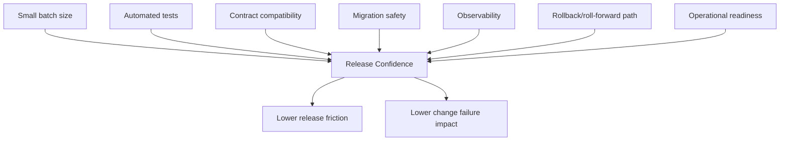

# Part 029 — Release Friction and Change Failure

## 1. Source notes and scope boundary

This part uses public engineering effectiveness and reliability references, especially:

- DORA software delivery metrics: deployment frequency, change lead time, change failure/failed deployment recovery, and reliability.
- DORA continuous delivery capabilities such as deployment automation and reliable automated tests.
- Google SRE release engineering guidance about treating release as an engineered system.
- The previous parts of this series on flow metrics, CI/CD bottleneck analysis, observability, and incident learning.

This part does **not** assume CSG uses a specific deployment tool, release train, GitOps implementation, feature flag system, cloud/on-prem packaging model, or incident taxonomy.

Use the internal verification checklist to map these ideas to your team’s real release process.

---

## 2. Core thesis

Release friction is not just a deployment problem.

Release friction is a signal that the software delivery system lacks one or more of these properties:

- confidence,
- reversibility,
- observability,
- automation,
- compatibility,
- ownership,
- environment parity,
- operational readiness,
- small batch size,
- reliable feedback.

When engineers fear deployment, the organization often responds by adding more meetings, approvals, manual checks, and release gates. Sometimes that is necessary temporarily. But if the root cause is weak engineering feedback, more process can make the system slower without making it safer.

The senior engineer question is:

> What exactly makes this release scary, and what system improvement would make the next release less scary?

For Quote & Order systems, release fear is understandable. A release can affect pricing, quote acceptance, approval authority, order conversion, fulfillment callbacks, billing handoff, tenant isolation, audit evidence, Kafka consumers, PostgreSQL migrations, and customer-specific integrations.

The answer is not reckless deployment.

The answer is engineered release confidence.

---

## 3. Release vocabulary

Teams often confuse related terms.

| Term | Meaning |
|---|---|
| Build | Code compiled/tested into an artifact. |
| Package | Artifact prepared as image/chart/package/installer. |
| Deploy | Artifact installed into an environment. |
| Release | Capability made available for use. |
| Enable | Feature flag/customer/tenant activation. |
| Rollout | Progressive expansion of deployment or enablement scope. |
| Rollback | Return code/config/deployment to previous known state. |
| Roll-forward | Deploy a corrective change instead of returning to old state. |
| Recovery | Restore customer/business health, not merely restart pods. |
| Change failure | Deployment/release causes degraded service or requires intervention. |

For enterprise systems, **deployed** does not always mean **released**.

A service version may be deployed but hidden behind:

- feature flag,
- tenant flag,
- customer rollout plan,
- API version negotiation,
- on-prem package availability,
- license/entitlement configuration,
- product catalog activation,
- support readiness.

DORA-style metrics must be interpreted with this distinction in mind.

---

## 4. Release friction taxonomy

Release friction appears in different places.

### 4.1 Pre-release friction

Examples:

- branch lives too long,
- PR review queue is slow,
- CI is unreliable,
- tests take too long,
- manual QA queue is overloaded,
- environment is broken,
- acceptance criteria incomplete,
- release note unclear,
- security approval pending,
- migration dry-run missing,
- API/event compatibility unclear.

Typical symptom:

> The team says the feature is done, but cannot confidently promote it.

### 4.2 Deployment friction

Examples:

- manual deployment steps,
- unclear deployment order,
- migration and app version sequencing risk,
- feature flags manually changed without audit,
- Helm/GitOps drift,
- secrets/config missing,
- readiness probes wrong,
- rollout status unclear,
- rollback command undocumented.

Typical symptom:

> Deployment requires a specific person and a long checklist.

### 4.3 Runtime friction

Examples:

- slow startup,
- pod crash loop,
- DB connection pressure,
- Kafka consumer rebalance issue,
- outbox backlog,
- downstream adapter instability,
- cache warmup issue,
- resource limits misconfigured,
- unexpected latency after release.

Typical symptom:

> Deployment succeeds technically, but production health is uncertain.

### 4.4 Business enablement friction

Examples:

- feature deployed but no customer can use it,
- tenant config unclear,
- catalog activation required,
- sales/support not prepared,
- documentation missing,
- customer-specific toggle not verified,
- on-prem upgrade package delayed.

Typical symptom:

> Engineering says released; product/customer teams say not usable.

### 4.5 Recovery friction

Examples:

- rollback unsafe due to DB migration,
- old code cannot read new data,
- Kafka events already consumed,
- customer-visible state already changed,
- manual data repair required,
- no runbook,
- no dashboard to verify recovery.

Typical symptom:

> The team can deploy forward but cannot safely recover backward.

---

## 5. Change failure is not only outage

A change failure in Quote & Order may not look like total downtime.

Examples:

- quote pricing is wrong for one customer segment,
- quote approval threshold is bypassed,
- accepted quote cannot convert to order,
- duplicate order is created after retry,
- order item gets stuck in fulfillment,
- Kafka consumer drops one event type,
- PostgreSQL migration causes lock wait spikes,
- tenant B can see tenant A search result,
- billing handoff silently misses one charge,
- audit event is missing for privileged override,
- on-prem upgrade fails from version N-2.

These may not trigger a generic HTTP 5xx alert.

A mature release system measures business degradation, not only infrastructure failure.

---

## 6. Release confidence model

Release confidence comes from several independent evidence layers.



No single layer is enough.

A release with excellent tests but no observability is still risky.
A release with observability but no rollback path is still risky.
A release with rollback path but unsafe migration is still risky.
A release with all of those but huge batch size is still risky.

---

## 7. Diagnostic questions for release fear

When a team says “we are not comfortable releasing”, ask precise questions.

### 7.1 Confidence questions

- Which behavior are we least confident about?
- Which test evidence is missing?
- Which environment has not seen this path?
- Which customer/tenant configuration is untested?
- Which integration is most uncertain?
- Which manual QA result are we waiting for?

### 7.2 Reversibility questions

- Can we roll back code safely?
- Can old code read data written by new code?
- Can we disable the behavior with a feature flag?
- Has any irreversible external side effect occurred?
- Are Kafka events backward-compatible?
- Does DB migration follow expand-contract?

### 7.3 Observability questions

- How will we know this release is healthy?
- Which metric changes first if the release fails?
- Which dashboard will the release captain watch?
- Do logs contain correlation ID, tenant ID, quote ID, order ID?
- Can we trace one quote-to-order journey?
- Is there an alert or manual watch criterion?

### 7.4 Ownership questions

- Who owns go/no-go?
- Who can disable the flag?
- Who can execute rollback?
- Who owns data repair if needed?
- Who contacts support/customer-facing teams?
- Who writes post-release learning?

Release fear becomes actionable when it is decomposed.

---

## 8. DORA-style interpretation for enterprise products

DORA metrics are useful, but require careful boundaries.

### 8.1 Deployment frequency

Question:

> How often can the team safely put changes into production-like or production environments?

Enterprise interpretation:

- cloud service deployments may be frequent,
- on-prem packages may be less frequent,
- feature enablement may be tenant/customer-specific,
- database migrations may have separate cadence,
- customer-visible release may lag deployment.

Do not compare teams blindly.

### 8.2 Change lead time

Question:

> How long does a change take from committed code to production availability?

Break it down:

- coding time,
- PR waiting time,
- CI queue/build/test time,
- deployment waiting time,
- release approval time,
- feature flag enablement time,
- customer enablement time.

The bottleneck may not be code.

### 8.3 Change failure rate

Question:

> What percentage of changes require intervention after deployment/release?

For Quote & Order, count interventions such as:

- rollback,
- hotfix,
- feature flag disable,
- migration repair,
- data repair,
- manual replay,
- DLQ bulk reprocess,
- customer-specific config rollback,
- emergency support runbook execution.

### 8.4 Failed deployment recovery time

Question:

> Once a change causes failure, how quickly does the team recover customer/business health?

Break recovery into:

- detect,
- acknowledge,
- diagnose,
- mitigate,
- repair,
- verify,
- learn.

This connects directly to Part 027.

---

## 9. Release friction indicators

Track these as diagnostic signals.

| Signal | What it may indicate |
|---|---|
| Many PRs waiting for release | release batch size too large |
| Deployment needs a war room | automation/confidence weak |
| Frequent manual checklist edits | process unstable |
| Rollback rarely practiced | recovery confidence weak |
| Feature flags never removed | release complexity accumulating |
| Migrations delayed | database change process unsafe |
| QA queue grows before release | testing not inside development flow |
| Hotfixes common after release | quality gates not catching release risk |
| Support unclear on new behavior | enablement gap |
| Dashboards created after incident | observability late in lifecycle |

Use indicators to guide improvement, not blame.

---

## 10. Release batch size

Large releases are dangerous because they increase:

- change surface,
- debugging complexity,
- rollback ambiguity,
- test matrix,
- stakeholder coordination,
- customer communication effort,
- support confusion.

A small release can still fail, but the failure is easier to isolate.

### 10.1 Quote & Order examples

Large risky batch:

- new pricing rule,
- approval workflow change,
- order decomposition change,
- Kafka schema change,
- DB migration,
- UI changes,
- support dashboard change,
- customer configuration change.

Better sliced release:

1. Add schema fields expand-only.
2. Deploy code writing old and new fields.
3. Add metrics/dashboard.
4. Enable new pricing rule for test tenant.
5. Enable for one internal/customer pilot scope.
6. Expand rollout.
7. Remove old path after evidence.

Smaller batches improve diagnosis.

---

## 11. Feature flags and release friction

Feature flags reduce release friction only if governed.

Good flags:

- have owner,
- have expiry/removal plan,
- are observable,
- are audited when changed,
- have safe default,
- support tenant/customer rollout if needed,
- do not create incompatible data silently,
- are tested in both states.

Bad flags:

- permanent,
- undocumented,
- nested with other flags,
- changed manually without audit,
- hide incomplete work forever,
- create untested combinatorial explosion,
- write data old code cannot read.

### 11.1 Flag readiness checklist

Before release:

- Is the flag default safe?
- Who can change it?
- Where is change audited?
- What metric tells us flag behavior is failing?
- Can we disable it without data repair?
- How will we remove it?

---

## 12. Rollback vs roll-forward friction

Rollback is not a strategy unless tested.

### 12.1 Code rollback is usually easy when

- DB schema is backward compatible,
- API/event contracts remain compatible,
- config is reversible,
- old code can read new rows,
- no irreversible side effect occurred.

### 12.2 Code rollback is dangerous when

- migration dropped old column,
- new state enum is persisted,
- old code cannot deserialize event,
- new Kafka event already triggered downstream work,
- accepted quote pricing changed,
- customer-visible order state changed,
- billing/fulfillment side effects occurred.

### 12.3 Roll-forward is safer when

- root cause is clear,
- fix is small,
- rollback would corrupt or strand data,
- mitigation is already in place,
- test evidence exists.

### 12.4 Data repair is required when

- persisted data is wrong,
- workflow state is stuck,
- duplicate side effects occurred,
- missing event must be reconstructed,
- audit evidence needs correction.

Release readiness should include all three paths:

- rollback,
- roll-forward,
- repair.

---

## 13. Release engineering for database changes

Database changes are a major release-friction source.

Release questions:

- Is the migration backward compatible?
- Does old code work with new schema?
- Does new code tolerate old data?
- Is the migration lock-safe?
- Is backfill chunked and resumable?
- Can on-prem customers upgrade from supported old versions?
- Can rollback happen without restore?
- What validation query proves success?

### 13.1 Release friction smells

- DB migration requires long maintenance window by default.
- Nobody knows row count of affected table.
- Migration dry-run only ran on empty DB.
- Rollback plan says “restore backup” without restore test.
- Feature code and destructive migration ship together.
- New app assumes backfill complete immediately.

### 13.2 Improvement patterns

- expand-contract migration,
- migration test suite,
- production-like fixture,
- lock timeout,
- validation query,
- backfill progress metric,
- old/new app compatibility tests,
- on-prem upgrade matrix.

---

## 14. Release engineering for Kafka changes

Kafka changes are risky because consumers may be asynchronous, invisible, or slow to upgrade.

Release questions:

- Are event changes backward compatible?
- Is partition key unchanged?
- Can old consumers ignore new fields?
- Can new consumers process old events?
- Is replay safe?
- Is DLQ monitored?
- Are event semantics documented?
- Are correction events distinguishable?

### 14.1 Release friction smells

- Consumers are unknown.
- Schema compatibility check is manual.
- Replay has never been tested.
- DLQ reprocessing needs manual tribal knowledge.
- Event version field exists but semantics are unclear.
- Release needs exact ordering of producer/consumer deploys.

### 14.2 Improvement patterns

- schema registry compatibility gate,
- consumer contract tests,
- replay test fixtures,
- event catalog,
- DLQ runbook,
- topic ownership map,
- event deprecation policy.

---

## 15. Release engineering for Kubernetes services

Kubernetes makes deployment easier, but not automatically safe.

Release questions:

- Do readiness probes represent true readiness?
- Does graceful shutdown prevent duplicate unsafe work?
- Are Kafka consumers stopped safely?
- Are resource limits aligned with JVM memory?
- Is rollout strategy compatible with database migration?
- Can pods start under cold cache or dependency delay?
- Is config/secrets change synchronized?

### 15.1 Friction smells

- Pod is ready before DB/Kafka dependencies are usable.
- Rollout causes consumer group rebalance storm.
- Liveness probe kills slow-starting JVM.
- Resource limit causes OOM after release.
- Rollback is manual kubectl command from memory.
- GitOps drift makes runtime not match repo.

### 15.2 Improvement patterns

- readiness/liveness/startup probe review,
- deployment smoke tests,
- GitOps diff visibility,
- graceful shutdown tests,
- release markers in dashboards,
- resource baseline per service,
- canary or progressive rollout where feasible.

---

## 16. Release friction and customer/on-prem reality

Enterprise delivery often includes customer-managed or on-prem variants.

Release questions:

- Which supported old versions can upgrade?
- Does customer DBA run migration manually?
- Are environment assumptions documented?
- Are external dependencies available?
- Are configs backwards compatible?
- Is rollback customer-operable?
- Are logs/support bundles sufficient without direct access?

On-prem releases often amplify friction because diagnosis and recovery are less controllable.

Improvement patterns:

- upgrade matrix,
- installer validation,
- preflight checks,
- health check command,
- support bundle generator,
- customer-safe runbook,
- migration validation script,
- version compatibility documentation.

---

## 17. Release friction backlog

Treat release friction as backlog-worthy work.

### 17.1 Bad backlog item

> Improve deployment.

### 17.2 Better backlog item

> Reduce order service deployment verification time from 45 minutes to 15 minutes by adding release dashboard panels for API error rate, quote-to-order conversion failures, Kafka consumer lag age, outbox backlog, and DB lock wait, plus a one-command smoke check for quote acceptance and order creation.

### 17.3 Best backlog item includes

- current friction,
- evidence,
- business impact,
- proposed improvement,
- measurable outcome,
- owner,
- rollout plan.

---

## 18. Release friction metrics

Track a small balanced set.

### 18.1 Delivery metrics

- deployment frequency,
- change lead time,
- release queue time,
- release batch size,
- deployment duration,
- manual steps count.

### 18.2 Stability metrics

- change failure rate,
- failed deployment recovery time,
- rollback frequency,
- hotfix frequency,
- feature flag disable frequency,
- post-release data repair count.

### 18.3 Confidence metrics

- release readiness checklist pass rate,
- migration dry-run coverage,
- contract compatibility failures caught pre-release,
- flaky test rate,
- observability coverage for high-risk release,
- time to verify release health.

### 18.4 Human metrics

- release anxiety survey,
- after-hours release load,
- release war room frequency,
- number of people required for deployment,
- support confusion reports.

Human friction matters because it predicts sustainability.

---

## 19. Release review template

Use for high-risk releases.

```md
# Release Friction Review

## Release summary
- What changed?
- Which customers/tenants/environments are affected?

## Change surfaces
- API:
- Kafka:
- PostgreSQL:
- Kubernetes/runtime:
- Security/tenant/audit:
- Customer/on-prem:

## Confidence evidence
- Tests:
- Contract checks:
- Migration dry-run:
- Observability:
- Support readiness:

## Friction observed
- Waiting time:
- Manual steps:
- Failed checks:
- Unclear ownership:
- Recovery uncertainty:

## Failure/recovery
- What would failure look like?
- How would we detect it?
- How would we mitigate it?
- Rollback:
- Roll-forward:
- Data repair:

## Improvement backlog
- Improvement:
- Owner:
- Expected friction reduction:
```

---

## 20. Internal verification checklist

Verify these in your CSG/team context.

### Release process

- What counts as deployment?
- What counts as release?
- What counts as customer enablement?
- Is there a release train?
- Is release continuous, scheduled, or customer-driven?
- How are cloud and on-prem releases different?

### Tooling

- CI/CD system.
- GitOps/IaC system.
- Feature flag system.
- Artifact registry.
- Deployment dashboard.
- Release notes process.
- Change management process.

### Metrics

- Deployment frequency.
- Change lead time.
- Failed deployment recovery time.
- Change failure rate.
- Release queue time.
- Hotfix count.
- Rollback count.
- Data repair count after release.

### Recovery

- Rollback procedure.
- Roll-forward procedure.
- DB migration recovery.
- Feature flag disable path.
- Kafka replay/DLQ recovery.
- Support/customer communication path.

### Friction

- Top three recurring release blockers.
- Most fragile service release.
- Most manual release step.
- Slowest verification step.
- Riskiest customer/on-prem path.

---

## 21. Practical exercise

Pick the last 5 releases.

For each release, record:

- change type,
- deployment duration,
- release queue time,
- manual steps,
- failed checks,
- rollback/hotfix/data repair needed,
- time to verify health,
- highest-friction moment,
- one improvement that would reduce next release friction.

Then classify the top friction source:

- confidence,
- reversibility,
- observability,
- automation,
- compatibility,
- ownership,
- customer/on-prem readiness.

Choose one improvement small enough to complete in the next sprint.

---

## 22. Final mental model

Release friction is not weakness.

It is information.

A senior engineer uses that information to improve the delivery system:

- smaller changes,
- better tests,
- safer migrations,
- clearer contracts,
- better observability,
- stronger rollback/roll-forward paths,
- fewer manual steps,
- better support readiness.

The goal is not reckless deployment.

The goal is to make production change boring, observable, reversible when possible, and recoverable when not.
