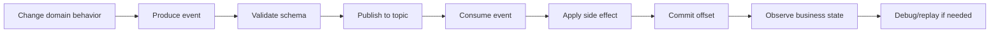

# Part 033 — Kafka Developer Experience

## 1. Source notes and scope boundary

This part uses public Kafka and developer tooling concepts, especially:

- Apache Kafka documentation for producer, consumer, topic, broker, and event-streaming concepts.
- Testcontainers Kafka module documentation for running disposable Kafka dependencies in tests.
- General event-driven architecture practices from previous CSG Quote & Order learning series: outbox, inbox, idempotency, replay, schema evolution, ordering, and observability.

This part does **not** assume the exact Kafka distribution, cloud provider, managed Kafka service, schema registry, serialization format, topic naming standard, or internal tooling used by CSG.

Use the internal verification checklist sections to adapt this material to your actual team.

---

## 2. Core thesis

Kafka Developer Experience is not just the ability to start Kafka locally.

Kafka DevEx is the ability for an engineer to answer and test these questions quickly:

- What event did my service produce?
- Which topic did it go to?
- What key was used?
- What schema/version was used?
- Which consumer processed it?
- Did the consumer commit the offset?
- Was the event duplicated?
- Was it out of order?
- Did it go to a retry topic or DLQ?
- Can I replay it safely?
- Can I reproduce the workflow locally?
- Can I trace one quote/order journey from API request to Kafka event to database state?

If engineers cannot answer these questions cheaply, event-driven architecture becomes slow and scary.

For Quote & Order systems, that fear is expensive because Kafka may carry critical business facts:

- quote created,
- quote priced,
- quote accepted,
- product order created,
- order item state changed,
- fulfillment callback received,
- order completed,
- fallout raised,
- catalog published,
- product inventory updated.

A good Kafka DevEx turns these workflows from invisible distributed behavior into observable, testable, repeatable engineering work.

---

## 3. Why Kafka DevEx matters

Event-driven systems fail differently from request/response systems.

A REST API failure is often visible immediately.

A Kafka workflow failure may appear as:

- a missing downstream update,
- a delayed projection,
- a stuck order,
- a growing consumer lag,
- a DLQ entry,
- a duplicate side effect,
- a billing mismatch,
- a customer-visible stale status,
- an incident hours after the original command.

Developer friction compounds because the source of failure may be distributed across:

- API command handler,
- PostgreSQL transaction,
- outbox table,
- outbox relay,
- Kafka topic,
- broker configuration,
- schema registry,
- consumer group,
- retry handler,
- idempotency store,
- projection database,
- downstream adapter,
- observability pipeline.

Kafka DevEx reduces the cost of working with this chain.

---

## 4. Kafka workflow as developer value stream

A Kafka change has its own value stream.



Developer friction can appear at every stage.

| Stage | Common friction | DevEx improvement |
|---|---|---|
| Produce event | unclear envelope, missing key | event builder, envelope standard |
| Validate schema | schema registry only in shared env | local/schema test harness |
| Publish | no local Kafka, hard credentials | Testcontainers/local profile |
| Consume | consumer hard to run in isolation | fixture topics + focused consumers |
| Side effect | non-idempotent handler | inbox/idempotency helper |
| Commit offset | offset state invisible | consumer group tooling/runbook |
| Observe | no correlation ID | trace/log/event search standard |
| Replay | replay is dangerous/manual | replay tool with guardrails |

---

## 5. Local Kafka golden path

A local Kafka golden path should answer:

> How can an engineer run the smallest realistic event workflow on their machine?

Minimum local workflow:

1. Start service dependencies.
2. Start Kafka.
3. Create required topics.
4. Run producer service.
5. Run consumer service.
6. Trigger command that writes outbox event.
7. Confirm event is published.
8. Confirm consumer processes event.
9. Confirm resulting DB/read model state.
10. View logs/traces with correlation ID.

### 5.1 Local setup options

| Option | Good for | Weakness |
|---|---|---|
| Docker Compose | developer local stack | can drift, startup time |
| Testcontainers | integration tests, repeatability | test runtime cost |
| Shared dev Kafka | cross-service testing | shared state, noise, credentials |
| Managed lower environment | realistic integration | slower feedback, harder isolation |
| Mock/fake broker | fast unit tests | can miss real Kafka behavior |

Use multiple layers.

Do not make every test require a full shared environment.

Do not rely only on mocks for event behavior.

---

## 6. Testcontainers Kafka pattern

Testcontainers is useful for integration tests that need real Kafka semantics without depending on a shared broker.

Example test shape:

```java
@Testcontainers
class OrderEventPublisherIT {

    @Container
    static KafkaContainer kafka = new KafkaContainer(
        DockerImageName.parse("apache/kafka-native:3.8.0")
    );

    @Test
    void publishesProductOrderCreatedEvent() {
        String bootstrapServers = kafka.getBootstrapServers();

        // Start producer with bootstrapServers.
        // Trigger order creation command.
        // Consume from expected topic.
        // Assert event envelope, key, aggregate ID, tenant ID, correlation ID.
    }
}
```

Do not only assert that a message exists.

Assert the event contract:

- topic,
- key,
- event type,
- event version,
- tenant ID,
- aggregate ID,
- aggregate version,
- correlation ID,
- causation ID,
- occurred time,
- schema version,
- payload semantics.

### 6.1 Test categories

| Test | Purpose |
|---|---|
| producer integration test | verify event emitted correctly |
| consumer integration test | verify event consumed idempotently |
| producer-consumer component test | verify one event flow locally |
| schema compatibility test | verify old/new schema compatibility |
| replay test | verify old events still process |
| duplicate event test | verify idempotency |
| DLQ test | verify invalid event handling |

---

## 7. Event fixture discipline

Event-driven systems need event fixtures just like API tests need request fixtures.

A good fixture set includes:

- minimal valid event,
- full valid event,
- old schema event,
- new schema event,
- missing optional field event,
- unknown enum event,
- duplicate event,
- out-of-order event,
- invalid tenant event,
- malformed payload,
- event from unsupported producer version,
- event with stale aggregate version,
- replayed historical event.

Fixture names should be business-readable:

```txt
product-order-created.v1.valid.json
product-order-created.v1.missing-optional-field.json
product-order-created.v2.additional-field.json
product-order-state-changed.completed.valid.json
product-order-state-changed.duplicate-event-id.json
quote-accepted.old-schema.2025-10.json
```

Avoid meaningless names like:

```txt
test-event-1.json
sample.json
payload.json
```

Event fixtures become living compatibility documentation.

---

## 8. Event schema compatibility DevEx

Schema compatibility should be cheap to check.

A developer changing an event should know:

- where the schema lives,
- how to validate it locally,
- how to diff old vs new schema,
- which consumers are affected,
- which compatibility mode applies,
- how to test replay of old events,
- how to update examples and docs.

### 8.1 Compatibility checklist

Before changing event schema, verify:

- Is the event externally consumed?
- Are all consumers known?
- Is the change additive?
- Does it change required fields?
- Does it rename/remove fields?
- Does it change enum values?
- Does it change semantics without shape change?
- Does it change partition key?
- Does it change event type/version?
- Can old consumers ignore new fields?
- Can new consumers read old events?
- Are test fixtures updated?
- Are replay tests updated?

### 8.2 Semantic compatibility matters

A schema can be compatible while behavior is breaking.

Example:

```json
{
  "eventType": "ProductOrderStateChanged",
  "payload": {
    "previousState": "IN_PROGRESS",
    "currentState": "COMPLETED"
  }
}
```

If the meaning of `COMPLETED` changes from:

- all order items completed,

to:

- parent order workflow completed but child items may still reconcile,

then the schema may not break, but consumers may.

Kafka DevEx must include semantic documentation.

---

## 9. Topic and consumer discoverability

A strong developer experience makes topic ownership visible.

For each topic, engineers should know:

- topic name,
- owning team/service,
- producer service,
- consumer groups,
- schema location,
- retention,
- partition count,
- key strategy,
- DLQ/retry topics,
- PII/commercial sensitivity,
- replay policy,
- dashboard link,
- runbook link.

### 9.1 Topic catalog example

```yaml
topic: product-order.events.v1
owner: order-team
producer: order-service
consumers:
  - fulfillment-adapter
  - product-inventory-projector
  - billing-handoff-service
key: tenantId + productOrderId
schema: schemas/product-order-events
retention: verify-internally
retryPolicy: verify-internally
dlq: product-order.events.dlq
containsPII: false
containsCommercialTerms: possible
replaySafe: conditional
runbook: docs/runbooks/product-order-events.md
```

This can live in Backstage, service catalog, docs repository, or internal platform metadata.

The specific tool matters less than discoverability.

---

## 10. DLQ debugging experience

A DLQ is not a graveyard.

It is an operational signal.

A good DLQ developer experience should answer:

- Why did this event fail?
- Which consumer failed?
- Which exception category occurred?
- Is this poison data, schema mismatch, transient dependency failure, or code bug?
- Is reprocessing safe?
- Has this event already produced side effects?
- Which tenant/customer/order is affected?
- What runbook should be followed?

### 10.1 DLQ entry metadata

Include or attach:

- original topic,
- original partition,
- original offset,
- consumer group,
- failure timestamp,
- error category,
- exception class/message,
- retry count,
- event ID,
- aggregate ID,
- tenant ID,
- correlation ID,
- causation ID,
- payload hash,
- schema version,
- handler version if available.

### 10.2 DLQ taxonomy

| Category | Meaning | Typical action |
|---|---|---|
| transient dependency | downstream temporarily unavailable | retry after dependency recovers |
| schema incompatible | consumer cannot parse event | deploy compatibility fix or transform |
| poison data | payload violates invariant | data repair or producer fix |
| authorization/tenant issue | event scope invalid | security/domain investigation |
| duplicate/replay issue | handler not idempotent | fix consumer idempotency before replay |
| unknown bug | handler exception unexpected | incident/debug path |

---

## 11. Replay tooling and guardrails

Replay is powerful and dangerous.

Replay can fix projections.

Replay can also duplicate side effects.

A replay tool should require explicit answers:

- Which topic?
- Which partition/offset/time range?
- Which consumer or handler?
- Which tenant/customer/aggregate scope?
- Are side effects enabled or suppressed?
- Is the consumer idempotent?
- Is schema compatibility verified?
- What validation proves success?
- What abort condition exists?

### 11.1 Replay modes

| Mode | Use case | Risk |
|---|---|---|
| dry-run parse | validate events can be read | low |
| projection rebuild | rebuild read model | medium |
| side-effect replay suppressed | diagnose handler behavior | medium |
| side-effect replay enabled | re-drive real workflow | high |
| DLQ reprocess | recover failed events | high if not classified |

For Quote & Order, never replay order/fulfillment/billing events blindly.

---

## 12. Outbox/inbox DevEx

Many enterprise systems use outbox/inbox patterns to avoid dual-write problems and deduplicate consumers.

A good developer experience makes these visible.

### 12.1 Outbox diagnostic questions

- Was the outbox row created?
- Was it created in the same transaction as business state?
- Was it picked up by relay?
- Was it published to Kafka?
- Was publish confirmed?
- Was it marked sent?
- Was it retried?
- Is it stuck?
- What is the age of oldest unsent event?

### 12.2 Inbox diagnostic questions

- Was this event already processed?
- Which event ID was used for dedupe?
- Which consumer group/handler owns the inbox row?
- Did processing complete?
- Did it fail after partial side effect?
- Is reprocessing safe?

### 12.3 Useful dashboards

For outbox/inbox:

- unsent outbox count,
- oldest unsent outbox age,
- outbox relay publish failures,
- retry count,
- DLQ count,
- consumer lag age,
- inbox duplicate count,
- handler processing latency,
- per-event-type failure rate.

---

## 13. Kafka DevEx for Quote & Order journeys

### 13.1 Quote accepted event

A developer changing quote acceptance should be able to verify:

- accepted quote version,
- pricing snapshot ID,
- approval evidence ID,
- event ID,
- tenant ID,
- quote ID,
- quote version,
- event key,
- outbox row,
- published Kafka event,
- consuming order service behavior,
- idempotent duplicate handling.

### 13.2 Product order created event

A developer changing order creation should verify:

- order aggregate ID,
- order item hierarchy,
- source quote reference,
- tenant ID,
- correlation ID,
- product offering/catalog reference,
- consumer projection update,
- fulfillment adapter behavior,
- duplicate command behavior.

### 13.3 Order state changed event

A developer changing order lifecycle should verify:

- previous and new state,
- state transition reason,
- item-level state consistency,
- aggregate version,
- event ordering,
- replay safety,
- consumer tolerance of unknown states.

---

## 14. Developer tools checklist

A healthy Kafka DevEx usually has these tools:

- local Kafka startup command,
- topic creation script,
- event fixture repository,
- schema validation command,
- event producer CLI or script,
- event consumer CLI or script,
- event search by correlation ID,
- topic catalog,
- DLQ viewer,
- DLQ reprocess tool with guardrails,
- replay tool with dry-run,
- outbox dashboard,
- consumer lag dashboard,
- runbooks for common failures,
- test utilities for producing/consuming events,
- event envelope builder.

Do not build all tools at once.

Start with the highest-friction workflow.

---

## 15. Anti-patterns

### 15.1 Shared environment as only test path

If every Kafka test needs shared QA, feedback is slow and flaky.

### 15.2 Unknown consumers

If producers do not know consumers, schema changes become risky.

### 15.3 Event payload snapshots without semantics

JSON examples without business meaning do not prevent semantic breakage.

### 15.4 DLQ as parking lot

A DLQ without owner, classification, and reprocess policy becomes technical debt.

### 15.5 Replay without idempotency

Replay is unsafe if handlers are not explicitly idempotent.

### 15.6 No correlation ID

Without correlation ID, debugging event chains becomes manual archaeology.

### 15.7 Topic naming without ownership

A topic with no owner becomes a production liability.

---

## 16. Internal verification checklist

Verify internally:

- Which Kafka distribution/service is used?
- How are topics created and governed?
- Where are topic names documented?
- Who owns each topic?
- Is there a schema registry?
- What serialization format is used?
- What compatibility mode is enforced?
- Are event schemas versioned?
- Are event fixtures stored in Git?
- What local Kafka option is supported?
- Are Testcontainers Kafka tests used?
- Is there an outbox pattern?
- Is there an inbox/dedupe pattern?
- How are retry and DLQ implemented?
- Who can reprocess DLQ messages?
- Is replay tooling available?
- Are business events traced with correlation/causation IDs?
- Are Kafka dashboards available?
- Is consumer lag measured by offset, time, or both?
- How is PII/commercial data handled in event payloads?
- How are cloud/on-prem differences handled?

---

## 17. PR review checklist

For Kafka-related PRs, review:

- event semantics,
- topic/key selection,
- schema compatibility,
- required metadata,
- tenant/correlation/causation IDs,
- transaction boundary,
- outbox/inbox behavior,
- idempotency,
- ordering assumptions,
- replay safety,
- DLQ handling,
- observability,
- tests with old/new fixtures,
- consumer impact,
- documentation/topic catalog update.

A Kafka PR is not done because a message was published.

It is done when the event can be understood, consumed, debugged, and recovered safely.

---

## 18. Practical exercise

Choose one event in your team.

Create an event DevEx card:

```md
# Event DevEx Card

## Event
- Name:
- Topic:
- Producer:
- Consumers:
- Owner:

## Contract
- Schema location:
- Event key:
- Required metadata:
- Compatibility mode:

## Local workflow
- How to produce locally:
- How to consume locally:
- Testcontainers support:

## Debugging
- How to find by correlation ID:
- Dashboard:
- DLQ:
- Runbook:

## Replay
- Replay safe? yes/no/conditional
- Guardrails:
- Validation:

## Gaps
- Missing docs:
- Missing tests:
- Missing tooling:
```

Review it with an owner.

---

## 19. Summary

Kafka DevEx is about making asynchronous behavior visible, testable, and recoverable.

For Quote & Order, strong Kafka DevEx means engineers can safely work with:

- event contracts,
- schema evolution,
- local tests,
- outbox/inbox diagnostics,
- DLQ classification,
- replay tooling,
- consumer lag,
- business observability,
- quote/order journey tracing.

Event-driven architecture without developer experience becomes distributed confusion.

Event-driven architecture with strong DevEx becomes a reliable product capability.
