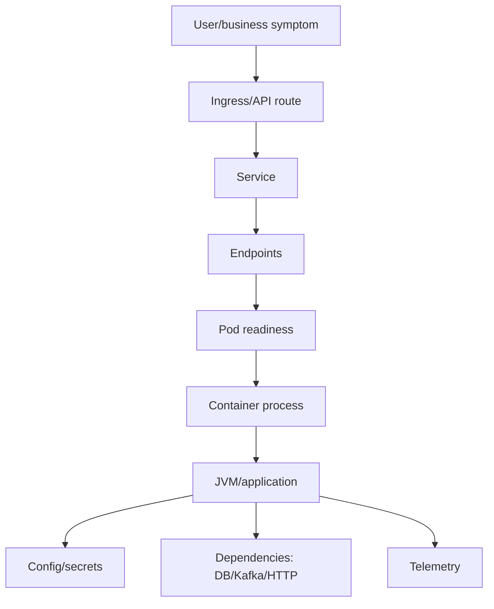

# Part 034 — Kubernetes DevEx and Runtime Debugging

## 1. Source notes and scope boundary

This part uses public Kubernetes documentation and production debugging practice, especially:

- Kubernetes documentation on debugging applications, pods, services, and clusters.
- Kubernetes documentation on liveness, readiness, and startup probes.
- Previous parts of this series on observability, logs/metrics/traces, Java service productivity, release friction, and platform engineering.

This part does **not** assume the exact Kubernetes distribution, cloud provider, GitOps tool, service mesh, policy engine, ingress controller, logging backend, APM vendor, or platform setup used by CSG.

Use the internal verification checklist sections to adapt this material to the actual platform.

---

## 2. Core thesis

Kubernetes DevEx is not memorizing `kubectl` commands.

Kubernetes DevEx is the ability for a product engineer to understand and debug the runtime behavior of their service without turning every issue into a platform escalation.

A senior engineer should be able to answer:

- Is my service deployed?
- Which version is running?
- Are pods ready?
- Why is a pod restarting?
- Is traffic reaching the pod?
- Is the service endpoint populated?
- Are probes correct?
- Did a rollout fail?
- Is the JVM memory limit safe?
- Is CPU throttling happening?
- Are logs/traces connected to the request?
- Did config/secrets change?
- Is this an application bug, Kubernetes config bug, platform issue, or dependency issue?

For Quote & Order systems, runtime debugging matters because failures can appear as:

- quote API latency,
- pricing timeout,
- order conversion error,
- Kafka consumer not processing,
- outbox relay stuck,
- downstream adapter unavailable,
- order workflow delayed,
- rollout causing partial behavior difference across pods.

Kubernetes is part of the product delivery system.

---

## 3. Runtime debugging mental model

When a service fails in Kubernetes, reason by layers.



Debug from symptom to runtime layer.

Do not jump directly to restarting pods.

Restart is a mitigation, not a diagnosis.

---

## 4. Kubernetes objects a product engineer should understand

You do not need to be a cluster admin to debug product services.

But you should understand these objects:

| Object | Why it matters |
|---|---|
| Pod | actual runtime unit for containerized service |
| Deployment | manages replicated pods and rollout strategy |
| ReplicaSet | versioned set of pods behind Deployment |
| Service | stable network abstraction for pods |
| EndpointSlice/Endpoints | actual pod targets behind Service |
| ConfigMap | non-secret configuration |
| Secret | sensitive configuration reference |
| Ingress/Gateway | external routing into cluster |
| Job/CronJob | batch/migration/backfill/scheduled work |
| HPA | autoscaling behavior |
| PodDisruptionBudget | availability during voluntary disruptions |
| ServiceAccount | workload identity/RBAC |
| Namespace | logical boundary for environment/team/system |

For Quote & Order, also identify:

- API services,
- Kafka consumers,
- outbox relays,
- scheduled reconciliation jobs,
- migration jobs,
- adapter services,
- background processors.

---

## 5. Debugging workflow: first 10 minutes

Use a consistent first-pass workflow.

### 5.1 Identify the symptom

Examples:

- API 5xx increased,
- quote creation latency high,
- consumer lag growing,
- order completion stuck,
- new pod CrashLoopBackOff,
- rollout stalled,
- readiness failing,
- service returns no endpoints.

### 5.2 Identify the affected scope

Ask:

- Which environment?
- Which namespace?
- Which service?
- Which version/image?
- Which tenant/customer?
- Which API path/topic/job?
- When did it start?
- Was there a recent deploy/config/migration?

### 5.3 Check deployment and pods

Typical commands:

```bash
kubectl get deploy -n <namespace>
kubectl get pods -n <namespace> -l app=<service-name>
kubectl describe pod <pod-name> -n <namespace>
kubectl logs <pod-name> -n <namespace> --previous
kubectl logs <pod-name> -n <namespace>
```

Use internal wrappers or platform-approved commands if your organization provides them.

### 5.4 Check service routing

```bash
kubectl get svc -n <namespace>
kubectl get endpoints -n <namespace>
kubectl describe svc <service-name> -n <namespace>
```

If Service has no endpoints, usually pods are not ready or selectors do not match.

### 5.5 Check recent events

```bash
kubectl get events -n <namespace> --sort-by=.lastTimestamp
```

Kubernetes events often reveal:

- image pull errors,
- scheduling failures,
- probe failures,
- OOM kills,
- failed mounts,
- policy denials,
- node pressure.

---

## 6. Pod states and what they mean

| State | Meaning | Common causes |
|---|---|---|
| Pending | Pod not scheduled/running yet | resources unavailable, PVC issue, image pull waiting |
| Running not Ready | container running but readiness false | app not ready, dependency failure, wrong probe |
| CrashLoopBackOff | container repeatedly crashes | startup exception, bad config, OOM, migration failure |
| ImagePullBackOff | image cannot be pulled | tag missing, registry auth, network |
| OOMKilled | container exceeded memory limit | JVM heap/container mismatch, memory leak, load spike |
| Completed | normal for Job | expected for migration/backfill job |
| Error | failed execution | job/application failure |

Do not treat all non-ready states the same.

The fix for ImagePullBackOff is not the fix for OOMKilled.

---

## 7. Probes: liveness, readiness, startup

Probes are part of runtime correctness.

### 7.1 Readiness probe

Readiness answers:

> Should this pod receive traffic now?

Readiness should fail when the service cannot safely serve traffic.

Examples:

- application not initialized,
- critical dependency unavailable during startup,
- migration lock not ready,
- service has not joined required consumer/leader role if applicable.

Be careful.

A readiness probe that depends too aggressively on downstream services can remove all pods during dependency blips.

### 7.2 Liveness probe

Liveness answers:

> Should Kubernetes restart this container?

Use liveness for unrecoverable stuck states, not ordinary dependency failures.

Bad liveness design can create restart storms.

### 7.3 Startup probe

Startup probe protects slow-starting applications from premature liveness failure.

Useful for:

- large Java apps,
- slow classpath initialization,
- warmup,
- migration validation,
- cold cache startup.

### 7.4 Probe review checklist

Check:

- Is readiness different from liveness?
- Does liveness depend on external DB/Kafka unnecessarily?
- Is startup probe configured for slow Java startup?
- Are timeout/period/failure thresholds realistic?
- Are probe endpoints cheap?
- Do probes reveal dependency health in logs/metrics?
- Does readiness drain traffic before shutdown?

---

## 8. Java runtime debugging in Kubernetes

Java services have specific runtime concerns.

### 8.1 JVM memory vs container limits

If container memory limit is too close to heap size, non-heap memory can trigger OOM.

Consider:

- heap,
- metaspace,
- thread stacks,
- direct buffers,
- JIT/code cache,
- native memory,
- agent overhead,
- TLS/network buffers.

Debug signals:

- OOMKilled in pod status,
- JVM OutOfMemoryError in logs,
- GC pause spikes,
- increasing memory RSS,
- restarts after traffic spikes.

### 8.2 Thread and connection pool issues

Symptoms:

- latency spike,
- request timeout,
- readiness failing,
- CPU low but requests stuck,
- DB pool exhausted,
- Kafka consumer processing stuck.

Check:

- thread dump if safe and approved,
- connection pool metrics,
- executor queue size,
- Kafka consumer poll loop,
- deadlocks,
- blocked HTTP clients.

### 8.3 Graceful shutdown

For Java services handling requests or Kafka consumers, shutdown should:

- stop accepting new traffic,
- drain in-flight requests,
- finish or safely stop consumer processing,
- commit offsets only after successful processing,
- release DB connections,
- flush telemetry,
- exit before termination grace expires.

Kubernetes DevEx should include a local/staging way to test graceful shutdown.

---

## 9. Rollout debugging

A failed rollout is a product delivery problem.

Check:

```bash
kubectl rollout status deploy/<deployment> -n <namespace>
kubectl rollout history deploy/<deployment> -n <namespace>
kubectl describe deploy/<deployment> -n <namespace>
```

Common rollout failures:

- new image not found,
- readiness never passes,
- app startup exception,
- config missing,
- secret missing,
- incompatible migration,
- resource limit too low,
- probe too strict,
- policy admission failure,
- service mesh sidecar issue,
- dependency unavailable.

### 9.1 Rollout checklist

For each rollout, product engineers should know:

- image tag/digest,
- commit SHA,
- config version,
- database migration version,
- feature flag state,
- replica count,
- old/new pod mix,
- readiness status,
- error budget/SLO impact,
- rollback command/process,
- post-rollout smoke checks.

---

## 10. Service debugging

A Service issue often appears as:

- API unreachable,
- 503 from ingress,
- no traffic to pods,
- traffic to wrong pods,
- service works internally but not externally.

Debug sequence:

1. Confirm pods exist.
2. Confirm pods are Ready.
3. Confirm Service selector matches pod labels.
4. Confirm Endpoints/EndpointSlice populated.
5. Confirm target port/container port correct.
6. Confirm ingress/gateway route correct.
7. Confirm network policy/service mesh policy if used.
8. Confirm app listens on expected port.
9. Confirm TLS/cert/auth if relevant.

A common bug: Deployment labels changed but Service selector did not.

Another common bug: readiness never passes, so endpoints are empty.

---

## 11. Config and secrets debugging

Runtime failures often come from configuration drift.

Check:

- ConfigMap name/version,
- Secret name/version,
- environment variables,
- mounted files,
- active Spring profile,
- feature flag values,
- connection strings,
- Kafka bootstrap servers,
- schema registry URL,
- database credentials,
- certificate truststore/keystore,
- service account/RBAC.

### 11.1 Config drift questions

Ask:

- Did config change without code change?
- Did code expect new config but deployment lacks it?
- Are cloud/on-prem config keys different?
- Is secret rotation complete?
- Are old pods still using old config?
- Does rollout require restart to pick config?
- Is config visible in safe diagnostic endpoint without leaking secrets?

---

## 12. Kafka consumer debugging in Kubernetes

Kafka consumers have Kubernetes-specific failure modes.

Symptoms:

- consumer lag growing,
- pods ready but no processing,
- frequent rebalance,
- duplicate processing,
- DLQ growth,
- processing latency high,
- pod restarts during handler execution.

Check:

- consumer pod logs,
- consumer group lag,
- partition assignment,
- rebalance frequency,
- handler errors,
- DB connection pool,
- retry/DLQ metrics,
- graceful shutdown behavior,
- resource throttling,
- readiness design.

### 12.1 Consumer shutdown concern

If pod receives SIGTERM during event handling:

- Was the event side effect committed?
- Was Kafka offset committed?
- Is handler idempotent?
- Will event reprocess safely?

Kubernetes shutdown behavior must align with Kafka processing semantics.

---

## 13. Database dependency debugging

PostgreSQL-related runtime symptoms:

- API latency,
- connection timeout,
- pool exhaustion,
- slow queries,
- lock waits,
- deadlocks,
- migration blocked,
- readiness false,
- pod thread exhaustion.

Kubernetes signals alone are not enough.

Correlate:

- pod logs,
- app metrics,
- DB pool metrics,
- PostgreSQL slow query/lock metrics,
- deployment time,
- migration job status,
- traffic spike,
- feature flag activation.

Avoid solving DB issues by scaling pods blindly.

More pods can increase DB pressure.

---

## 14. Resource debugging

Kubernetes resource settings affect DevEx and production behavior.

### 14.1 CPU

Symptoms of CPU issues:

- latency spike,
- throttling,
- slow startup,
- GC timing changes,
- timeouts under load.

Check:

- CPU requests,
- CPU limits,
- throttling metrics,
- HPA configuration,
- pod placement,
- load pattern.

### 14.2 Memory

Symptoms:

- OOMKilled,
- frequent restarts,
- GC pressure,
- high RSS,
- native memory growth.

Check:

- memory request/limit,
- JVM heap settings,
- container-aware JVM configuration,
- memory dashboard,
- heap dump policy if approved,
- recent traffic/config changes.

### 14.3 Ephemeral storage

Symptoms:

- pod evicted,
- logs too large,
- temp files fill disk,
- crash dumps filling storage.

Check:

- log volume,
- temp file cleanup,
- heap dump location,
- ephemeral storage limits.

---

## 15. Kubernetes events as debugging signal

Kubernetes events are often underused.

They can reveal:

- scheduling failures,
- failed image pulls,
- probe failures,
- container restarts,
- volume mount failures,
- node pressure,
- evictions,
- policy denials.

But events are not long-term observability.

They are short-lived diagnostic hints.

Capture important signals into your logging/monitoring system where needed.

---

## 16. Runtime debugging for Quote & Order scenarios

### 16.1 Quote API latency spike

Check:

- API pod readiness/restarts,
- request latency metrics,
- DB pool metrics,
- pricing dependency latency,
- catalog cache hit/miss,
- CPU throttling,
- recent rollout,
- config change,
- trace spans for pricing/catalog calls.

### 16.2 Order consumer lag growing

Check:

- consumer pods running/ready,
- consumer group lag age,
- DB lock/connection pool,
- handler exceptions,
- DLQ growth,
- pod restarts,
- rebalance frequency,
- downstream fulfillment latency,
- rollout/config change.

### 16.3 Migration job failed

Check:

- Job logs,
- exit code,
- DB lock waits,
- migration version,
- statement timeout,
- Kubernetes restart policy,
- config/secret access,
- whether app pods depend on migration completion.

### 16.4 Readiness failing after deploy

Check:

- probe endpoint logs,
- startup time,
- dependency health check,
- config changes,
- migration dependency,
- resource throttling,
- service mesh sidecar readiness,
- app exception.

### 16.5 Pod CrashLoopBackOff

Check:

- previous logs,
- container exit reason,
- config/secret missing,
- JVM exception,
- OOMKilled,
- startup probe absence,
- image compatibility,
- migration-at-startup failure.

---

## 17. Platform golden path for Kubernetes DevEx

A platform team can improve Kubernetes DevEx by providing:

- standard service template,
- default probes,
- recommended resource settings,
- logging/metrics/tracing defaults,
- deployment labels/annotations,
- safe rollout strategy,
- local-to-cluster workflow,
- debugging command guide,
- dashboard templates,
- alert templates,
- runbook templates,
- policy guardrails,
- service catalog integration.

Golden path should be a paved road, not a cage.

Product teams still need ownership of application correctness.

---

## 18. Debugging command reference

Common commands:

```bash
# Overview
kubectl get deploy,rs,pod,svc -n <namespace>

# Pod details
kubectl describe pod <pod> -n <namespace>
kubectl logs <pod> -n <namespace>
kubectl logs <pod> -n <namespace> --previous

# Events
kubectl get events -n <namespace> --sort-by=.lastTimestamp

# Rollout
kubectl rollout status deploy/<deploy> -n <namespace>
kubectl rollout history deploy/<deploy> -n <namespace>

# Service routing
kubectl get svc <svc> -n <namespace>
kubectl get endpoints <svc> -n <namespace>
kubectl describe svc <svc> -n <namespace>

# Exec/debug only if approved by policy
kubectl exec -it <pod> -n <namespace> -- sh
```

Always follow internal access and security policy.

Production `exec` may be restricted or audited.

---

## 19. Internal verification checklist

Verify internally:

- Which Kubernetes distribution/platform is used?
- Which namespaces map to environments?
- Which deployment/GitOps tool is used?
- How are rollbacks performed?
- Are product engineers allowed to run `kubectl` in production?
- What access is read-only vs break-glass?
- Where are Kubernetes dashboards?
- Where are pod logs?
- Where are events retained?
- Which labels/annotations are required?
- What probe standard exists?
- What resource request/limit standard exists?
- What Java memory guidance exists?
- Is service mesh used?
- Are NetworkPolicies used?
- How are secrets managed?
- Are migration jobs separate from app startup?
- How are on-prem Kubernetes deployments different?
- What runbooks exist for CrashLoopBackOff, OOMKilled, readiness failure, rollout failure, and consumer lag?

---

## 20. PR review checklist

For Kubernetes/runtime-related PRs, review:

- Deployment manifest changes,
- image tag/digest strategy,
- config/secret changes,
- probes,
- resource requests/limits,
- environment variables,
- ports/service selectors,
- rollout strategy,
- graceful shutdown,
- Kafka consumer shutdown,
- DB connection pool impact,
- OpenTelemetry/logging labels,
- security context,
- service account/RBAC,
- NetworkPolicy/service mesh impact,
- runbook/dashboard updates,
- rollback implications.

Runtime config is product code.

Review it seriously.

---

## 21. Anti-patterns

### 21.1 Restart as diagnosis

Restart may mitigate symptoms, but it does not explain failure.

### 21.2 Liveness probes as dependency checks

This can create restart storms during downstream dependency issues.

### 21.3 No startup probe for slow Java services

Slow startup can be misdiagnosed as broken app.

### 21.4 Pod logs without correlation ID

Logs are much less useful if they cannot connect to quote/order/request/event.

### 21.5 Scaling pods to fix DB bottleneck

More pods can make database pressure worse.

### 21.6 Product team blind to runtime

If only platform can debug runtime symptoms, product delivery slows down.

### 21.7 Manifest changes treated as YAML chores

Kubernetes config changes can cause production incidents.

---

## 22. Practical exercise

Pick one service and create a runtime debugging card.

```md
# Runtime Debugging Card

## Service
- Name:
- Namespace:
- Owner:
- Dashboard:
- Runbook:

## Deployment
- Deployment name:
- Image source:
- Rollback path:

## Probes
- Readiness:
- Liveness:
- Startup:

## Runtime
- CPU request/limit:
- Memory request/limit:
- JVM heap guidance:

## Dependencies
- PostgreSQL:
- Kafka:
- HTTP dependencies:
- Secrets/config:

## Debug commands
- Pods:
- Logs:
- Events:
- Service endpoints:

## Common failures
- CrashLoopBackOff:
- Readiness failure:
- OOMKilled:
- Consumer lag:
```

Validate with platform and service owners.

---

## 23. Summary

Kubernetes DevEx is the ability for engineers to reason about runtime behavior without guessing.

For enterprise Java/Quote & Order systems, this includes:

- pod and deployment status,
- service routing,
- probes,
- rollout behavior,
- resource pressure,
- Java runtime characteristics,
- Kafka consumer behavior,
- DB dependency symptoms,
- config/secret drift,
- observability correlation,
- platform guardrails.

Kubernetes is not merely deployment infrastructure.

It is part of the feedback loop that determines how fast engineers can diagnose and safely operate production software.
