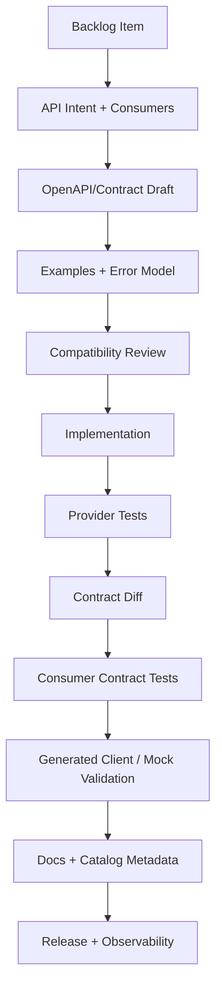
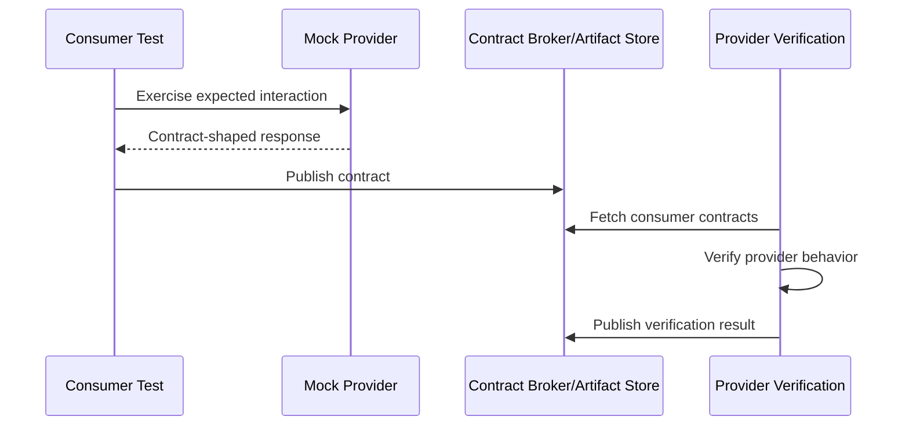
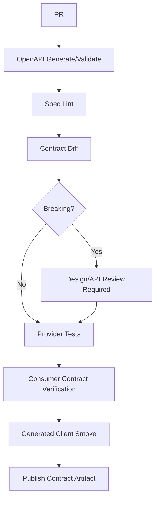

# Part 035 — API Contract Developer Experience

## 1. Source notes and scope boundary

This part uses public API and contract-testing practices, especially:

- OpenAPI Specification as a language-agnostic interface description standard for HTTP APIs.
- Pact documentation for consumer-driven contract testing.
- Backstage Software Catalog and TechDocs as public examples of developer portal and docs-as-code patterns.
- Previous parts of this series on flow metrics, PR review, CI/CD, DevEx, platform engineering, observability, and Quote & Order business journeys.

This part does **not** assume CSG Quote & Order uses a specific OpenAPI generation tool, contract testing framework, API gateway, API portal, service catalog, schema registry, or client generation process.

Use the `Internal verification checklist` sections to validate the real internal tooling, API governance, TMF alignment, and customer integration expectations.

---

## 2. Core thesis

API contract developer experience is the difference between:

> "I changed an endpoint and hope consumers are okay."

and:

> "I changed a contract, saw the diff, verified compatibility, generated examples, validated consumers, updated docs, and shipped with evidence."

For enterprise Quote & Order systems, APIs are not just technical boundaries. They encode commercial workflows:

- creating quotes,
- configuring products,
- pricing offers,
- requesting approvals,
- accepting quotes,
- creating product orders,
- checking order state,
- handling cancellation,
- exposing catalog and inventory information,
- integrating CRM, billing, fulfillment, and partner systems.

A poor API DevEx creates slow delivery because every change requires manual interpretation, Slack clarification, outdated docs, and fragile integration testing.

A strong API DevEx makes the contract visible, testable, versioned, discoverable, and safe to evolve.

---

## 3. What API Contract DevEx means

API Contract DevEx is the developer experience of designing, changing, testing, publishing, consuming, and debugging APIs.

It includes:

| Surface | DevEx question |
|---|---|
| API design | Can engineers understand the expected behavior before coding? |
| OpenAPI/spec | Is the API contract machine-readable and current? |
| Examples | Are valid/invalid examples available? |
| Mocking | Can consumers develop without waiting for provider availability? |
| Contract diff | Can breaking changes be detected automatically? |
| Contract tests | Can provider/consumer compatibility be verified? |
| Generated clients | Can consumers use stable generated SDKs if appropriate? |
| Docs | Can engineers discover ownership, lifecycle, errors, and examples? |
| Observability | Can API calls be traced through business journeys? |
| Governance | Are exceptions and breaking changes explicit? |

The goal is not to add process for its own sake.

The goal is to remove uncertainty from API work.

---

## 4. Contract surfaces in Quote & Order

Quote & Order API contract work can include:

### 4.1 Customer-facing or partner-facing REST APIs

Examples:

- create quote,
- update quote item,
- submit quote for approval,
- accept quote,
- retrieve quote,
- create product order,
- retrieve product order,
- cancel product order,
- search catalog offering,
- retrieve product inventory.

### 4.2 Internal service APIs

Examples:

- pricing service API,
- catalog service API,
- approval service API,
- order decomposition service API,
- fulfillment adapter API,
- customer/account lookup API.

Internal does not mean unimportant.

Internal APIs are often the fastest way to create cascading failures.

### 4.3 TMF-aligned APIs

If the team exposes TMF-aligned APIs, contract DevEx must include:

- versioned TMF mapping,
- extension fields,
- lifecycle state mapping,
- examples,
- conformance expectations,
- consumer-specific deviations.

Do not assume TMF shape equals internal domain truth.

### 4.4 Error contracts

Error responses are contracts.

Consumers may depend on:

- HTTP status,
- error code,
- error category,
- retryability,
- field-level validation details,
- correlation ID,
- user-actionable message,
- support-actionable message.

A change from `QUOTE_EXPIRED` to `VALIDATION_FAILED` can break automation even if both are HTTP 409.

### 4.5 Operational contracts

API work also changes operational contracts:

- metrics,
- logs,
- trace names,
- dashboard panels,
- runbook steps,
- support search fields,
- audit records.

If support depends on `quoteId` in logs, removing that field is a contract change.

---

## 5. The ideal API change workflow

A healthy workflow looks like this:



The earlier the contract becomes visible, the cheaper the change becomes.

Bad workflow:

1. Implement endpoint.
2. Manually update docs later.
3. Discover consumer breakage in integration environment.
4. Patch behavior under release pressure.

Good workflow:

1. Draft contract.
2. Review compatibility.
3. Implement with tests.
4. Verify diff.
5. Publish docs and examples.
6. Release with evidence.

---

## 6. OpenAPI as a contract artifact

OpenAPI is valuable when it is treated as an executable artifact, not a decorative document.

An OpenAPI file should answer:

- What endpoint exists?
- What method is supported?
- What request body is valid?
- What response body is returned?
- What status codes are meaningful?
- What authentication is required?
- What error shape exists?
- What examples are canonical?
- What fields are nullable?
- What fields are required?
- What enums exist?
- What pagination/filtering/sorting semantics exist?

### 6.1 Spec-first vs code-first

Both can work.

| Approach | Strength | Risk |
|---|---|---|
| Spec-first | Consumers can review before implementation | Spec may drift if not tested |
| Code-first | Spec follows implementation | API design may be accidental |
| Hybrid | Draft spec, implement, verify generated spec | Needs discipline and tooling |

For enterprise systems, the important rule is:

> The published contract must match runtime behavior.

The method is secondary.

### 6.2 OpenAPI quality checklist

For each API contract, verify:

- required vs optional fields are intentional,
- nullable fields are explicit,
- enum values are documented,
- examples exist for happy path and failure path,
- error model is consistent,
- pagination/filtering documented,
- security schemes documented,
- idempotency headers documented if supported,
- versioning/deprecation documented,
- tenant boundary documented where relevant,
- correlation ID behavior documented.

---

## 7. Contract diff as a feedback loop

API DevEx improves dramatically when engineers can see contract diffs automatically.

A useful API diff should classify:

- additive change,
- potentially breaking change,
- definitely breaking change,
- documentation-only change,
- behavior change not represented in schema.

### 7.1 Common breaking changes

Examples:

- remove endpoint,
- remove response field,
- rename field,
- change type,
- make optional request field required,
- remove enum value,
- change error code,
- change auth requirement,
- change pagination default,
- change idempotency semantics.

### 7.2 Additive changes can still break consumers

Even additive changes can be risky:

- strict consumers may reject unknown fields,
- enum expansion may break exhaustive switches,
- larger payload may affect latency,
- new validation error may break workflow,
- new `required` response field may not exist for old data,
- new business state may be unknown to dashboards.

Contract diff is necessary.

It is not sufficient.

Senior engineers must review semantic compatibility.

---

## 8. API examples as developer infrastructure

Examples are not documentation decoration.

They are test fixtures, onboarding assets, and debugging tools.

Useful examples:

- minimal valid request,
- realistic enterprise request,
- invalid request,
- authorization failure,
- validation failure,
- state conflict,
- stale quote/price failure,
- idempotent retry,
- pagination example,
- tenant boundary example.

Example: quote acceptance conflict:

```json
{
  "error": {
    "code": "QUOTE_PRICE_EXPIRED",
    "category": "BUSINESS_CONFLICT",
    "message": "The quote price is no longer valid and must be recalculated.",
    "correlationId": "corr-01H...",
    "details": [
      {
        "field": "quoteId",
        "reason": "priceValidityExpired"
      }
    ]
  }
}
```

This example teaches consumers:

- not to retry blindly,
- to trigger reprice workflow,
- to use correlation ID for support,
- to distinguish business conflict from technical failure.

---

## 9. Mock servers and sandbox APIs

Mock servers improve DevEx when:

- provider service is not ready,
- consumer team needs early integration,
- examples are realistic,
- failure cases are available,
- behavior is versioned with contract.

Mock servers become harmful when:

- they drift from real provider behavior,
- they only support happy path,
- they hide latency/error behavior,
- they become the de facto contract while OpenAPI is stale.

A mock should be generated from or validated against the same contract artifact used by provider tests.

---

## 10. Generated clients

Generated clients can reduce repetitive integration code.

They can also create false safety.

### 10.1 Good use cases

Generated clients are useful for:

- internal service-to-service APIs,
- stable customer APIs,
- typed request/response models,
- consistent authentication/header handling,
- standard error handling,
- quick consumer onboarding.

### 10.2 Risks

Risks include:

- leaking provider model into consumer domain,
- strict generated enums breaking on expansion,
- weak error semantics,
- generated client update friction,
- consumers depending on accidental fields,
- generated clients hiding idempotency/retry concerns.

### 10.3 Generated client DoD

If using generated clients, verify:

- client compiles,
- representative consumer code compiles,
- unknown fields tolerated if policy requires,
- enum expansion behavior understood,
- error handling tested,
- retry/idempotency behavior documented,
- versioning strategy clear.

---

## 11. Consumer-driven contract testing

Consumer-driven contract testing is useful when known consumers depend on provider behavior.

A healthy CDC flow:



Use CDC when:

- consumer teams are known,
- APIs evolve independently,
- integration environments are expensive,
- breaking consumers is costly,
- only part of a large API is used.

Do not rely only on CDC when:

- unknown external customers consume APIs,
- formal standard conformance matters,
- behavior is too broad for known contracts,
- consumers do not publish contracts,
- security/authorization semantics are not represented.

For Quote & Order, CDC can protect:

- quote creation client,
- pricing client,
- order creation consumer,
- fulfillment adapter client,
- support tool consumer,
- generated internal SDKs.

---

## 12. API contract DevEx in CI/CD

A strong CI/CD API gate includes:

1. Generate or validate OpenAPI.
2. Lint spec.
3. Validate examples.
4. Diff against released spec.
5. Run provider API tests.
6. Run consumer contract tests.
7. Compile generated clients if used.
8. Publish contract artifact.
9. Update service catalog metadata.
10. Link docs in PR/release notes.

### 12.1 Pipeline stages



### 12.2 Evidence to attach to PR

- OpenAPI diff link,
- breaking/non-breaking classification,
- affected consumers,
- examples added/updated,
- provider test results,
- consumer contract test results,
- generated client result,
- documentation link,
- release note/deprecation note if needed.

---

## 13. API catalog and discoverability

API DevEx fails if engineers cannot find:

- service owner,
- API docs,
- OpenAPI spec,
- examples,
- runbook,
- dashboard,
- dependency consumers,
- lifecycle/deprecation policy.

A service catalog should answer:

| Metadata | Example |
|---|---|
| Service name | quote-service |
| Owner | Quote & Order team / capability owner |
| API spec | OpenAPI artifact link |
| Runtime env | dev/staging/prod service endpoints |
| Docs | TechDocs / README / API guide |
| Observability | dashboard + trace query |
| Events | produced/consumed topics |
| Dependencies | catalog, pricing, order, customer |
| Support | runbook + escalation |

Backstage-style catalog metadata is valuable not because Backstage is magic, but because ownership and discovery become explicit.

---

## 14. API contract PR review checklist

When reviewing API changes, ask:

### 14.1 Consumer impact

- Who consumes this API?
- Are consumers internal, external, customer, partner, UI, or support tools?
- Are unknown consumers possible?
- Is this TMF-aligned or standard-facing?
- Are generated clients affected?

### 14.2 Compatibility

- Is the change structurally backward compatible?
- Is it semantically backward compatible?
- Are enum additions safe?
- Are nullable/required changes safe?
- Are error code changes safe?
- Are pagination/filtering/sorting semantics unchanged?
- Is auth/tenant behavior unchanged?

### 14.3 Evidence

- Is OpenAPI updated?
- Does the diff show breaking changes?
- Are examples updated?
- Are provider tests updated?
- Are consumer contracts updated?
- Are generated clients tested?
- Are docs published?

### 14.4 Operations

- Are metrics/logs/traces/audit fields updated?
- Is support/runbook updated if behavior changes?
- Is correlation ID behavior preserved?
- Is release/deprecation plan clear?

---

## 15. API contract anti-patterns

### 15.1 Docs after implementation

If docs are updated only after implementation, API design becomes accidental.

### 15.2 Spec drift

OpenAPI exists but does not match runtime behavior.

This is worse than no spec because it creates false confidence.

### 15.3 Consumer discovery through Slack

If consumers must ask around to find examples, owners, or compatibility policy, the API platform is weak.

### 15.4 Breaking changes hidden as refactors

A Java DTO rename can become a public API break if serialization is not controlled.

### 15.5 Error model inconsistency

Every service invents its own error shape and retry semantics.

Consumers suffer.

### 15.6 Generated clients without compatibility discipline

Generated code does not solve semantic compatibility.

### 15.7 Mock server as fantasy

Mock supports only happy path and never reflects real provider behavior.

---

## 16. Internal verification checklist

Verify these internally:

### 16.1 API ownership

- Where are OpenAPI specs stored?
- Are specs code-first, spec-first, or hybrid?
- Who approves public/customer-facing API changes?
- Which APIs are TMF-aligned?
- Is there an API style guide?
- Is there a versioning/deprecation policy?

### 16.2 Tooling

- Is OpenAPI generated in CI?
- Is contract diff automated?
- Is spec linting automated?
- Are examples validated?
- Are mock servers used?
- Are generated clients used?
- Are Pact or other contract tests used?
- Are API docs published to a portal/catalog?

### 16.3 Consumers

- How are consumers identified?
- Is there a consumer registry?
- Are external customers/partners included?
- Are support tools considered consumers?
- Are old client versions supported?

### 16.4 Operations

- Do API docs link to dashboards/runbooks?
- Are API metrics standardized?
- Are correlation IDs standardized?
- Are error codes tracked?
- Are API deprecations visible to support/customer-facing teams?

---

## 17. Practical exercise

Choose one existing Quote & Order API.

Create an API DevEx card:

```md
# API DevEx Card: <API name>

## Ownership
- Service:
- Owner:
- Consumers:

## Contract
- OpenAPI location:
- Current version:
- Examples:
- Error model:

## Compatibility
- Last breaking change:
- Diff tooling:
- Consumer contract tests:
- Generated client:

## Discoverability
- Catalog entry:
- Docs:
- Dashboard:
- Runbook:

## DevEx gaps
- Gap:
- Friction:
- Impact:
- Candidate improvement:
```

Review it with one teammate and one consumer if possible.

---

## 18. Summary

API Contract DevEx turns APIs from tribal knowledge into reliable engineering infrastructure.

For enterprise Quote & Order systems, good API DevEx should make it easy to:

- discover APIs,
- understand ownership,
- see examples,
- change contracts safely,
- detect breaking changes,
- verify consumers,
- generate clients if useful,
- publish docs,
- trace production behavior.

The senior engineer mindset:

> Every API change is a contract negotiation with current and future consumers. The better the contract DevEx, the cheaper and safer the negotiation becomes.
