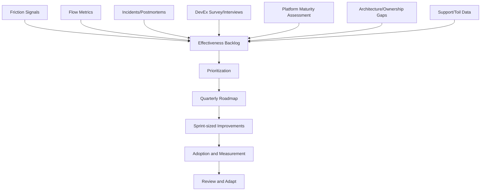

# Part 038 — Engineering Effectiveness Roadmap

## 1. Source notes and scope boundary

This part uses public engineering effectiveness ideas from DORA, Team Topologies, CNCF platform engineering maturity work, SPACE, and the earlier parts of this series.

Public references to verify independently:

- DORA is a long-running research program focused on software delivery and operations performance capabilities.
- DORA's continuous delivery capability notes that deploying more often without improving process and architecture can increase failure and burnout.
- CNCF Platform Engineering Maturity Model is intended as a framework for reflection and identifying improvement opportunities.
- SPACE frames developer productivity as multidimensional, including satisfaction, performance, activity, communication/collaboration, and efficiency/flow.

This part does **not** assume your CSG team already has an engineering effectiveness function, platform roadmap, DevEx survey, DORA dashboard, or formal productivity program.

Use the templates here as a practical starting point.

---

## 2. Core thesis

Engineering effectiveness improvements fail when they are treated as random side quests.

Examples:

- "Let's improve CI."
- "Let's reduce technical debt."
- "Let's make docs better."
- "Let's build an internal platform."
- "Let's improve observability."

These are good intentions, but not yet a roadmap.

A roadmap requires:

1. a clear friction or risk;
2. evidence that the friction matters;
3. a target outcome;
4. a prioritized sequence of improvements;
5. owners;
6. measures;
7. review cadence;
8. adoption plan;
9. explicit trade-offs.

The operating question is:

> Which engineering system improvement will most increase safe delivery flow for the least organizational cost?

---

## 3. Roadmap principles

### 3.1 Start from friction, not tools

Weak roadmap item:

> Adopt a developer portal.

Stronger roadmap item:

> Reduce new-service bootstrap time from days to hours by creating a Java service golden path with CI, Docker, Kubernetes, OpenTelemetry, health checks, logging, and starter tests.

Tooling is a means.

Friction reduction is the outcome.

### 3.2 Use multiple evidence sources

Do not rely on one metric.

Combine:

- flow metrics;
- DORA metrics;
- DevEx survey;
- friction log;
- incident review;
- CI data;
- PR review data;
- onboarding feedback;
- support/toil analysis;
- architecture review findings;
- retrospective themes.

If all evidence points to the same bottleneck, improvement priority becomes clearer.

### 3.3 Avoid metric-first improvement

Bad:

> Improve deployment frequency.

Better:

> Reduce release friction by making database migration validation, rollback readiness, and feature flag governance safer, so teams can release smaller changes with less anxiety.

The metric should confirm improvement.

It should not replace thinking.

### 3.4 Prefer small durable systems over hero projects

One giant DevEx transformation is risky.

A better roadmap creates small durable capabilities:

- faster test partitioning;
- owned service README template;
- golden path service template;
- PR risk labels;
- runbook standard;
- OpenTelemetry default config;
- contract diff CI gate;
- migration dry-run template;
- local environment bootstrap script.

Small durable improvements compound.

---

## 4. Roadmap input model

Create a funnel.



The roadmap is not separate from product delivery.

It improves the delivery system that produces the product.

---

## 5. Improvement categories

### 5.1 Flow improvements

Examples:

- reduce PR review latency;
- reduce CI queue time;
- reduce work item age;
- reduce blocked time;
- reduce release batch size;
- improve dependency visibility.

Useful signals:

- cycle time;
- work item age;
- throughput;
- blocked time;
- PR first-response time;
- pipeline duration;
- deploy wait time.

### 5.2 Quality improvements

Examples:

- reduce flaky tests;
- add contract tests;
- add migration tests;
- improve defect triage;
- add state machine invariant tests;
- improve test fixture quality.

Useful signals:

- escaped defects;
- flaky test rate;
- test rerun count;
- change failure rate;
- bug recurrence;
- incident-derived defect categories.

### 5.3 DevEx improvements

Examples:

- local setup automation;
- faster local run;
- sample data fixture;
- debug guide;
- service README standard;
- onboarding path;
- local observability.

Useful signals:

- time to first successful build;
- time to first local run;
- time to first PR;
- developer survey;
- friction log themes;
- repeated support questions.

### 5.4 Platform improvements

Examples:

- Java service golden path;
- CI template;
- deployment template;
- observability defaults;
- secrets/config pattern;
- OpenAPI contract gate;
- migration test template;
- self-service environment creation.

Useful signals:

- adoption rate;
- number of teams using paved road;
- support ticket reduction;
- setup time reduction;
- drift reduction;
- exception count.

### 5.5 Observability improvements

Examples:

- trace context propagation;
- business metrics;
- dashboard cleanup;
- actionable alerts;
- runbook links;
- incident diagnostic bundle;
- quote-to-order journey tracing.

Useful signals:

- MTTD;
- diagnosis time;
- alert noise;
- percentage alerts with runbook;
- incident "missing signal" count;
- customer-detected incidents.

### 5.6 Ownership/governance improvements

Examples:

- service catalog ownership;
- topic owner registry;
- architecture decision log;
- exception process;
- review routing;
- support escalation map;
- customer-specific configuration ownership.

Useful signals:

- PR waiting for owner;
- incidents waiting for expert;
- repeated ownership confusion;
- support bounce count;
- stale docs count.

---

## 6. Prioritization model

Use a scoring model that balances impact and cost.

| Factor | Question | Score |
|---|---|---:|
| Flow impact | Will this reduce cycle time, blocked time, or review/deploy wait? | 1–5 |
| Quality impact | Will this reduce defects, incidents, or flaky confidence? | 1–5 |
| Cognitive load impact | Will this reduce context needed for safe change? | 1–5 |
| Adoption feasibility | Can teams realistically use it? | 1–5 |
| Implementation cost | How expensive is it? Reverse score if high. | 1–5 |
| Time to value | Can it show value within 1–2 Sprints? | 1–5 |
| Strategic alignment | Does it support product/platform/architecture goals? | 1–5 |

Priority score:

```txt
(flow + quality + cognitive_load + adoption + cost + time_to_value + alignment)
```

Do not let the formula make the decision.

Use it to structure discussion.

---

## 7. Roadmap levels

### 7.1 Sprint-level improvement

Duration: 1 Sprint or less.

Examples:

- add PR template with risk checklist;
- add runbook link to alert;
- split slow tests into tag groups;
- document local run path for one service;
- add one dashboard panel;
- add owner metadata to one service.

### 7.2 Monthly improvement

Duration: 2–4 Sprints.

Examples:

- reduce CI pipeline duration by 30%;
- create Java service golden path v1;
- create quote-to-order observability dashboard;
- reduce flaky tests in top suite;
- implement contract diff gate for public APIs.

### 7.3 Quarterly improvement

Duration: one quarter.

Examples:

- standardize OpenTelemetry across key services;
- establish platform golden paths with adoption tracking;
- reduce release friction across cloud/on-prem pipeline;
- build ownership catalog for services/APIs/topics/runbooks;
- improve migration safety workflow across teams.

### 7.4 Annual capability

Duration: multiple quarters.

Examples:

- internal developer platform maturity increase;
- enterprise observability model;
- release engineering modernization;
- service ownership and architecture governance overhaul;
- DevEx measurement program.

Most teams should start at Sprint/monthly level.

Annual ambition without quarterly delivery becomes slideware.

---

## 8. Roadmap artifact template

Use this structure.

```md
# Engineering Effectiveness Roadmap: <quarter/team/capability>

## 1. Context
- Team:
- Product area:
- Current delivery pain:
- Business impact:

## 2. Evidence
- Flow metrics:
- DORA/release metrics:
- DevEx survey/interviews:
- Incident/postmortem themes:
- Retrospective themes:
- Platform maturity findings:

## 3. Top friction themes
1. Theme:
   - Evidence:
   - Impact:
2. Theme:
   - Evidence:
   - Impact:

## 4. Roadmap bets
### Bet 1: <name>
- Outcome:
- Scope:
- Owner:
- Users:
- Success signal:
- Risks:
- Rollout/adoption:

### Bet 2: <name>
...

## 5. What we are not doing
- Non-goal:
- Reason:

## 6. Review cadence
- Weekly check:
- Monthly review:
- Quarter-end review:
```

The roadmap should be short enough to stay alive.

---

## 9. Example roadmap for a Quote & Order team

### 9.1 Situation

Signals:

- PR cycle time high for order lifecycle changes.
- CI pipeline often fails on flaky Kafka integration tests.
- New engineers take too long to run services locally.
- Incidents around order fallout require one senior engineer.
- Dashboard lacks business-level order stuck-state metrics.

### 9.2 Roadmap bets

#### Bet 1 — Order lifecycle ownership map

Outcome:

- reduce review confusion and incident dependency.

Actions:

- document order lifecycle states;
- map owning modules/tables/events;
- define review routing;
- add runbook owner;
- add state transition checklist to PR template.

Success signals:

- fewer PRs waiting for unclear reviewer;
- on-call can diagnose common stuck order without expert;
- lifecycle docs linked from service README.

#### Bet 2 — Kafka integration test stabilization

Outcome:

- restore confidence in CI.

Actions:

- classify top flaky tests;
- remove arbitrary sleeps;
- use deterministic event IDs;
- isolate topics/groups;
- add await helpers;
- quarantine only with owner and deadline.

Success signals:

- flaky rerun count reduced;
- PR pipeline pass rate increases;
- fewer manual reruns.

#### Bet 3 — Quote/order business observability dashboard

Outcome:

- reduce diagnosis time and customer-detected issues.

Actions:

- define key journey metrics;
- add correlation ID coverage;
- create dashboard panels;
- link alerts to runbooks;
- test dashboard during release.

Success signals:

- incidents have fewer "missing signal" findings;
- order stuck state detected earlier;
- support can share business IDs with engineering.

#### Bet 4 — Local development golden path v1

Outcome:

- reduce onboarding and local debugging friction.

Actions:

- document clone/build/run/test;
- provide sample fixtures;
- define local PostgreSQL/Kafka path;
- add smoke command;
- create troubleshooting section.

Success signals:

- new engineer time-to-first-run decreases;
- fewer environment questions;
- first PR time improves.

---

## 10. Adoption strategy

Effectiveness improvements fail when nobody adopts them.

### 10.1 Adoption questions

For every improvement, ask:

- Who is the user?
- What workflow changes?
- What pain does it remove?
- What new burden does it add?
- Is the improvement discoverable?
- Is there documentation?
- Is there migration path from old workflow?
- Is there support?
- How will we know it is used?

### 10.2 Adoption patterns

Good patterns:

- start with one team;
- pair with early adopters;
- create examples;
- build migration guide;
- measure friction reduction;
- adjust based on feedback;
- make the paved road easier than the old path.

Bad patterns:

- announce a new standard with no tooling;
- mandate a platform before it works;
- measure compliance only;
- ignore edge cases;
- remove old path too early;
- build for hypothetical users.

---

## 11. Measuring roadmap success

Use leading and lagging signals.

### 11.1 Leading signals

- adoption rate;
- usage count;
- PRs using new template;
- services instrumented;
- tests migrated;
- docs viewed/updated;
- questions reduced;
- support tickets reduced.

### 11.2 Lagging signals

- cycle time reduction;
- PR latency reduction;
- flaky test rate reduction;
- change failure reduction;
- MTTD/MTTR improvement;
- onboarding time reduction;
- incident recurrence reduction;
- release friction reduction.

### 11.3 Qualitative signals

- engineers report less confusion;
- support can self-serve diagnosis;
- onboarding feels smoother;
- reviews focus more on domain risk than setup issues;
- teams trust the CI pipeline again;
- fewer Slack questions repeat.

Do not over-optimize for metrics that are easy to measure but weakly connected to real improvement.

---

## 12. Common roadmap anti-patterns

### 12.1 Tool-first roadmap

Starts with buying/building tools before understanding friction.

Correction:

- start with value stream and friction evidence.

### 12.2 Metric theater

Roadmap promises metric improvement without changing underlying capability.

Correction:

- connect metric to behavior/process/tooling change.

### 12.3 Platform vanity project

Platform becomes impressive but not used.

Correction:

- treat product teams as users;
- measure adoption and friction reduction.

### 12.4 Everything is priority

Roadmap has too many themes.

Correction:

- choose 2–4 bets per quarter.

### 12.5 No owner

Improvement is desired but nobody owns execution.

Correction:

- assign owner and review cadence.

### 12.6 No maintenance plan

Initial improvement lands, then decays.

Correction:

- define ownership and lifecycle.

### 12.7 Governance without support

Standards are created without paved road.

Correction:

- pair standards with tools/templates/examples.

---

## 13. Scrum integration

### 13.1 Product Backlog

Effectiveness work should be visible in the Product Backlog when it affects product delivery capability.

Examples:

- CI stability;
- observability improvement;
- test fixture improvement;
- platform template;
- migration safety;
- service ownership documentation.

### 13.2 Sprint Planning

Plan effectiveness work as real work.

It consumes capacity.

It needs acceptance criteria.

It should support Sprint Goal or future delivery.

### 13.3 Sprint Review

Demo effectiveness work with evidence.

Examples:

- pipeline duration before/after;
- flaky test reduction;
- dashboard showing real journey;
- new service created from template;
- local setup completed in minutes;
- runbook used in incident simulation.

### 13.4 Retrospective

Use retro to inspect roadmap progress.

Questions:

- Did the improvement reduce friction?
- Did adoption happen?
- What new friction appeared?
- What should be refined next?

---

## 14. Internal verification checklist

### 14.1 Current measurement

- Do we track flow metrics?
- Do we track DORA metrics?
- Do we track PR latency?
- Do we track CI duration/failure causes?
- Do we track flaky tests?
- Do we track deployment friction?
- Do we track incident detection/recovery time?
- Do we track onboarding time?

### 14.2 Current friction

- What are the top repeated developer complaints?
- What are the top support/toil tasks?
- Which pipelines are slow or unreliable?
- Which services are hard to run locally?
- Which areas require expert-only knowledge?
- Which alerts are noisy or missing?

### 14.3 Current platform maturity

- What golden paths exist?
- Are they adopted?
- Who owns them?
- How are they updated?
- What exceptions exist?
- What platform gaps create product-team friction?

### 14.4 Roadmap governance

- Who owns engineering effectiveness improvements?
- How are improvements prioritized?
- Are they part of Product Backlog?
- Is there a quarterly review?
- How do teams request platform/DevEx improvements?
- How are successful improvements maintained?

---

## 15. Practical exercise: build a 30-day effectiveness roadmap

Pick one team or service.

Create a 30-day plan with three improvements:

1. one flow improvement;
2. one DevEx improvement;
3. one observability/quality improvement.

For each:

- define current pain;
- provide evidence;
- define target outcome;
- identify owner;
- create Sprint-sized tasks;
- define success signal;
- identify adoption plan.

Example:

```md
## Improvement: Reduce Kafka integration test flakiness

Current pain:
- CI reruns delay PRs and reduce trust.

Evidence:
- 18 reruns last two weeks, mostly event timing failures.

Target outcome:
- Reduce reruns by 70% for affected suite.

Actions:
- Replace sleeps with await helper.
- Isolate consumer groups per test.
- Add deterministic event IDs.
- Add owner and deadline for quarantined tests.

Success signal:
- rerun count below 5 in next two weeks.
```

---

## 16. Practical exercise: quarterly roadmap review

Review one quarter of engineering effectiveness work.

Ask:

- Which improvements shipped?
- Which were adopted?
- Which reduced measurable friction?
- Which created new complexity?
- Which had no visible effect?
- Which should be stopped?
- Which should become platform standard?
- Which should become team habit?
- Which should be revisited next quarter?

Do not celebrate only output.

Celebrate reduced friction, improved safety, and better flow.

---

## 17. Summary

An engineering effectiveness roadmap is a product roadmap for the engineering system.

It should be driven by:

- value stream evidence;
- flow metrics;
- DORA-style delivery signals;
- DevEx friction;
- platform maturity;
- incident learning;
- cognitive load;
- product-team needs.

A strong roadmap does not ask:

> What tools should we add?

It asks:

> What friction prevents safe, fast, sustainable delivery, and what small durable capability will reduce that friction?

For a senior engineer, this roadmap is one of the highest-leverage ways to move from solving local problems to improving the system that produces software.
