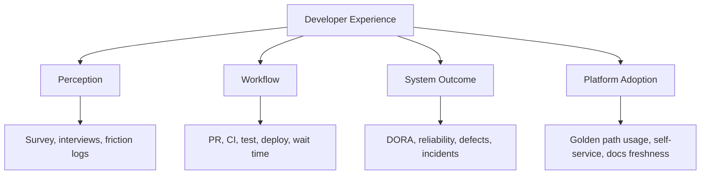

# Part 039 — Measuring Developer Experience

## 1. Source notes and scope boundary

This part uses public research and practice references, especially:

- SPACE framework for developer productivity: Satisfaction and well-being, Performance, Activity, Communication and collaboration, Efficiency and flow.
- DORA software delivery performance metrics.
- DevEx measurement practices such as surveys, friction logs, interviews, workflow telemetry, and platform adoption signals.
- Team Topologies concepts of cognitive load and fast flow.

This part does **not** assume CSG has a specific DevEx platform, survey tool, developer productivity dashboard, engineering intelligence product, internal developer portal, or formal DevEx team.

Use the internal verification checklists to adapt the measurement model to your actual team, repositories, tooling, Scrum workflow, and CSG operating constraints.

---

## 2. Core thesis

Developer Experience is not a vibe.

Developer Experience is the quality of the developer's interaction with the engineering system.

That system includes:

- backlog clarity,
- domain knowledge,
- local setup,
- build speed,
- test speed,
- code review,
- CI/CD,
- deployment,
- observability,
- documentation,
- platform support,
- ownership clarity,
- incident learning,
- production debugging,
- cross-team dependencies.

Measuring DevEx is not about ranking engineers.

It is about finding friction that prevents skilled engineers from producing safe product outcomes.

A senior engineer should ask:

> Where does engineering energy turn into waiting, rework, confusion, fear, or manual toil — and what evidence tells us this is improving?

---

## 3. Measurement principles

### 3.1 Measure systems, not people

Bad measurement question:

> Which developer is productive?

Better measurement question:

> Which part of our engineering system makes productive work harder than it needs to be?

The first creates fear and gaming.

The second creates improvement.

### 3.2 Combine perception and telemetry

Perception-only measurement can be biased.

Telemetry-only measurement misses human experience.

Use both.

| Signal type | Example | Strength | Weakness |
|---|---|---|---|
| Survey | "CI feedback is fast enough" | Captures lived experience | Subjective |
| Interview | Engineer explains debugging friction | Rich context | Hard to scale |
| Friction log | Repeated local setup failures | Concrete pain | Needs discipline |
| Workflow telemetry | PR review latency, CI duration | Objective trend | Can miss why |
| Production telemetry | incident recovery time | Outcome signal | Far from root cause |
| Platform metrics | golden path adoption | Adoption signal | Can become vanity metric |

### 3.3 Avoid single-number productivity

Developer productivity is multidimensional.

A single score hides trade-offs.

Example:

- PR throughput increases,
- but change failure increases,
- flaky tests increase,
- developer stress increases,
- observability debt grows.

This is not healthy productivity.

Use a balanced model.

---

## 4. DevEx measurement model

Use four layers.



### 4.1 Perception metrics

Examples:

- local setup confidence,
- clarity of ownership,
- ease of debugging,
- confidence in tests,
- usefulness of documentation,
- quality of PR feedback,
- psychological safety to raise risks,
- cognitive load,
- perceived deployment confidence,
- perceived support burden.

### 4.2 Workflow metrics

Examples:

- time to first local build,
- time to run relevant tests,
- CI queue time,
- CI execution time,
- flaky failure rate,
- PR first response time,
- PR review cycle time,
- blocked work age,
- deployment lead time,
- environment availability.

### 4.3 Outcome metrics

Examples:

- change lead time,
- deployment frequency,
- failed deployment recovery time,
- change failure rate,
- escaped defects,
- incident recurrence,
- production data repair count,
- customer-impacting defects.

### 4.4 Platform metrics

Examples:

- golden path adoption,
- service template usage,
- self-service success rate,
- support ticket volume,
- time to scaffold service,
- documentation page freshness,
- developer portal search success,
- platform NPS/satisfaction,
- paved-road exception count.

---

## 5. DevEx survey design

A survey should be short enough to answer and specific enough to act on.

### 5.1 Bad survey question

> Are you productive?

Problems:

- vague,
- emotionally loaded,
- not actionable,
- easy to interpret differently.

### 5.2 Better survey questions

Use statements with a 1–5 scale and optional comments.

Examples:

#### Local development

- I can set up the local development environment without relying on undocumented help.
- I can run the relevant service locally with realistic dependencies.
- I can reproduce common failures locally or in a controlled test environment.

#### Testing

- I can run a fast test suite that gives useful confidence before pushing.
- Test failures usually point me toward the real issue.
- Flaky tests rarely block my work.

#### PR review

- My PRs receive timely review from the right reviewers.
- Review comments usually improve correctness, maintainability, or operability.
- Review expectations are clear.

#### CI/CD

- CI failures are usually understandable and actionable.
- CI feedback time is acceptable for the size/risk of the change.
- Deployment and release status are easy to understand.

#### Observability/debugging

- I can trace a quote/order journey across services using correlation IDs.
- Logs, metrics, and traces help me diagnose production-like issues.
- Runbooks are sufficient for common failure modes.

#### Cognitive load and ownership

- I know who owns the systems I depend on.
- I understand the domain concepts needed for my current work.
- The number of tools/processes I need to know is manageable.

### 5.3 Survey cadence

Recommended:

- lightweight monthly pulse survey,
- deeper quarterly DevEx survey,
- targeted survey after major platform change,
- onboarding survey after first 30/60/90 days.

Avoid survey fatigue.

If you ask repeatedly and never act, trust declines.

---

## 6. Friction logs

A friction log is a lightweight record of moments where work slowed unnecessarily.

### 6.1 Friction log template

```md
# Friction Log Entry

Date:
Engineer/team:
Workflow stage:
Repository/service:
What I was trying to do:
What slowed me down:
How long it cost:
Was there a workaround:
Root cause guess:
Evidence link:
Suggested improvement:
```

### 6.2 Friction categories

- setup,
- build,
- test,
- CI,
- PR review,
- environment,
- deployment,
- observability,
- documentation,
- domain ambiguity,
- ownership,
- dependency,
- platform support,
- production debugging,
- security/compliance workflow.

### 6.3 How to use friction logs

Do not treat every friction entry as a ticket.

Cluster them.

Ask:

- Which friction repeats?
- Which friction blocks new engineers?
- Which friction causes production risk?
- Which friction causes rework?
- Which friction is easy to fix?
- Which friction belongs to platform vs product team?
- Which friction needs enablement rather than automation?

---

## 7. Workflow telemetry

DevEx should connect to actual workflow data.

### 7.1 PR telemetry

Track:

- PR size,
- first response time,
- review cycle time,
- number of review rounds,
- time from approval to merge,
- rework after review,
- stale PR count,
- reviewer distribution,
- high-risk PR label coverage.

Interpretation examples:

- Long first response time indicates review queue issue.
- Many review rounds may indicate unclear standards or oversized PRs.
- Long approval-to-merge delay may indicate CI/merge queue/dependency friction.
- One reviewer overloaded means ownership bottleneck.

### 7.2 CI telemetry

Track:

- queue time,
- build time,
- test time,
- test failure type,
- flaky failure count,
- retry count,
- artifact publish time,
- deployment pipeline time,
- failed stage distribution.

Interpretation examples:

- Long queue time is capacity/tooling issue.
- Long test time may require suite partitioning.
- High retry count hides instability.
- Frequent environment failures reduce trust in CI.

### 7.3 Deployment telemetry

Track:

- deploy frequency,
- deploy lead time,
- rollback count,
- failed deployment recovery time,
- manual approval wait time,
- environment promotion time,
- config drift incidents,
- release enablement delay.

For CSG-style enterprise work, distinguish:

- merged,
- built,
- deployed,
- released,
- tenant-enabled,
- customer-used,
- on-prem packaged.

---

## 8. Onboarding metrics

Onboarding is one of the best DevEx tests.

A new engineer experiences every gap:

- docs gap,
- setup gap,
- access gap,
- domain gap,
- ownership gap,
- test gap,
- environment gap,
- observability gap.

### 8.1 Useful onboarding metrics

Track:

- time to access required systems,
- time to first successful build,
- time to run service locally,
- time to run relevant tests,
- time to understand one domain journey,
- time to first PR,
- time to first reviewed PR,
- time to first production trace/debug exercise,
- onboarding satisfaction,
- number of undocumented steps discovered.

### 8.2 First productive PR metric

A good first productive PR is not necessarily feature work.

It can be:

- documentation fix,
- small test improvement,
- log/diagnostic improvement,
- fixture improvement,
- local script fix,
- runbook clarification.

The metric should not pressure new engineers into risky premature changes.

---

## 9. Quote & Order DevEx measurement examples

### 9.1 Quote pricing work

Measure friction around:

- finding pricing rule owner,
- running pricing tests,
- creating catalog fixture,
- understanding agreement overlay,
- debugging price mismatch,
- verifying approval threshold,
- tracing quote price calculation in logs/traces.

Potential metrics:

- time to create deterministic pricing fixture,
- number of pricing test failures due to fixture ambiguity,
- PR cycle time for pricing changes,
- escaped pricing defects,
- quote pricing trace completeness.

### 9.2 Order lifecycle work

Measure friction around:

- understanding state machine,
- creating order/item fixture,
- simulating fulfillment callback,
- tracing async state change,
- reproducing fallout scenario,
- identifying stuck order root cause.

Potential metrics:

- time to reproduce stuck order scenario,
- number of manual DB steps needed,
- completeness of order journey trace,
- runbook usage success,
- test coverage for lifecycle transitions.

### 9.3 Kafka event work

Measure friction around:

- discovering topic/schema owner,
- creating event fixture,
- running local Kafka,
- testing replay,
- inspecting DLQ,
- verifying schema compatibility.

Potential metrics:

- time to run local event integration test,
- DLQ diagnosis time,
- event schema compatibility failures caught before merge,
- replay test availability.

---

## 10. DevEx dashboard design

A DevEx dashboard should not be a wall of numbers.

It should answer diagnostic questions.

### 10.1 Dashboard sections

#### Flow health

- work item age distribution,
- cycle time distribution,
- WIP by stage,
- blocked work count,
- throughput trend.

#### Review health

- PR first response time,
- PR review duration,
- stale PRs,
- review load by owner/team,
- high-risk PRs without required reviewers.

#### CI health

- pipeline duration,
- queue time,
- flaky failure trend,
- top failing stages,
- retry count.

#### Dev loop health

- local setup issues,
- test suite duration,
- docs freshness,
- onboarding time,
- developer survey pulse.

#### Production feedback

- change failure,
- failed deployment recovery time,
- escaped defects,
- incident recurrence,
- data repair frequency.

### 10.2 Dashboard interpretation

Do not ask:

> Is this number good or bad?

Ask:

> What changed, what hypothesis explains it, and what improvement should we try next?

---

## 11. DevEx measurement anti-patterns

### 11.1 Ranking engineers

This destroys trust and creates gaming.

### 11.2 Measuring only activity

Activity metrics like commits, lines of code, or PR count are easy to collect but weak indicators of value.

### 11.3 Survey with no action

Repeated surveys without visible improvements teach engineers not to answer honestly.

### 11.4 Dashboard without owner

A metric without an owner becomes wallpaper.

### 11.5 Platform vanity metrics

Portal visits and template count are not enough.

Ask whether the platform reduced friction and improved outcomes.

### 11.6 Ignoring qualitative context

A spike in cycle time may be good if the team intentionally handled high-risk migration work.

Numbers need narrative.

---

## 12. Internal verification checklist

Verify internally:

- Is there an existing DevEx survey?
- Is there an engineering effectiveness dashboard?
- What workflow data is available from Jira/Azure/GitHub/GitLab/CI?
- Are PR timestamps accessible?
- Are CI stage durations available?
- Are flaky tests tracked?
- Are incident and deployment records linkable to code changes?
- Is onboarding time measured?
- Are internal developer platform metrics available?
- Who owns DevEx improvements?
- Is measurement used for learning or performance management?
- What data privacy/HR constraints apply?
- Can teams see their own metrics?
- Are metrics discussed in retrospectives or quarterly planning?

---

## 13. Practical exercise

Create a DevEx measurement plan for one team.

Use this template:

```md
# DevEx Measurement Plan

## Team/context
- Team:
- Main services:
- Current pain:

## Hypotheses
- H1:
- H2:
- H3:

## Perception signals
- Survey questions:
- Interview topics:
- Friction log categories:

## Workflow telemetry
- PR metrics:
- CI metrics:
- Deployment metrics:
- Incident metrics:

## Platform/adoption signals
- Golden path usage:
- Support tickets:
- Docs freshness:

## Improvement loop
- Review cadence:
- Owners:
- First improvement experiments:
- Success criteria:
```

---

## 14. Summary

Measuring Developer Experience is about improving the engineering system.

The strongest measurement model combines:

- developer perception,
- workflow telemetry,
- delivery outcomes,
- platform adoption,
- qualitative context.

The goal is not to prove that engineers are busy.

The goal is to reveal where the system makes good engineering unnecessarily difficult.

A senior engineer uses DevEx measurement to turn friction into roadmap, roadmap into experiments, and experiments into safer, faster delivery.
