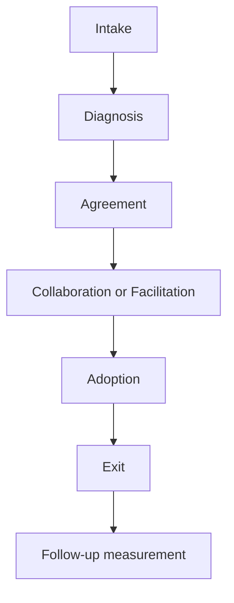

# Part 040 — Enabling Teams and Internal Consulting

## 1. Source notes and scope boundary

This part uses public references and practice concepts, especially:

- Team Topologies concepts: stream-aligned teams, platform teams, enabling teams, complicated-subsystem teams, and interaction modes such as collaboration, X-as-a-Service, and facilitation.
- Platform engineering as platform-as-product.
- DevEx and engineering effectiveness measurement practices.
- Scrum and agile coaching ideas around self-management, inspection, adaptation, and continuous improvement.

This part does **not** assume CSG has a formal enabling team, internal consulting group, platform team, architecture guild, DevEx team, or defined internal coaching model.

Use the internal verification checklist to adapt the model to your actual organization.

---

## 2. Core thesis

Enablement is not doing other teams' work for them.

Enablement is temporarily increasing another team's capability so they can own the work themselves.

A healthy enabling relationship says:

> We will help you learn, adopt, and stabilize this capability, then we will step back.

An unhealthy enabling relationship says:

> Send us a ticket whenever you need this kind of work.

For a senior engineer, enabling work is high-leverage because it improves multiple teams' ability to deliver safely.

But it is dangerous if it becomes:

- hidden dependency,
- architecture police,
- platform ticket queue,
- shadow management,
- hero consulting,
- permanent hand-holding.

---

## 3. Enablement vs support vs ownership

These are different.

| Mode | Purpose | Healthy when | Unhealthy when |
|---|---|---|---|
| Support | Help with immediate issue | Restores flow quickly | Repeats forever without root cause |
| Enablement | Build team capability | Time-bounded and learning-oriented | Becomes dependency |
| Platform | Provide reusable product/service | Self-service and reliable | Requires custom ticket for everything |
| Consulting | Diagnose and advise | Creates clear decision/action | Leaves no adoption path |
| Ownership | Team is accountable for outcome | Boundaries clear | Work bounces between teams |

A senior engineer should make the mode explicit.

Example:

> This week we are in collaboration mode to design the Kafka replay strategy. After the design is stable, platform will provide a self-service template, and the product team will own consumer behavior.

---

## 4. Team Topologies lens

### 4.1 Stream-aligned teams

These teams own a flow of value.

For CSG Quote & Order, this could mean teams aligned around:

- quote capabilities,
- order capabilities,
- catalog/pricing capabilities,
- fulfillment integration,
- customer configuration,
- platform/runtime capabilities.

### 4.2 Platform teams

Platform teams reduce cognitive load by providing reliable internal products.

Examples:

- Java service template,
- CI/CD golden path,
- Kubernetes deployment defaults,
- observability instrumentation defaults,
- database migration workflow,
- Kafka topic/schema workflow,
- developer portal,
- secrets/config management.

### 4.3 Enabling teams

Enabling teams help other teams acquire capability.

Examples:

- helping a team adopt OpenTelemetry,
- helping a team improve integration testing,
- helping a team reduce flaky tests,
- coaching a team through safe DB migration pattern,
- helping define API contract workflow,
- teaching event replay safety.

### 4.4 Complicated-subsystem teams

These teams own highly specialized domains.

Examples might include:

- pricing engine,
- catalog rule engine,
- fulfillment orchestration engine,
- identity/security platform,
- complex rating/billing integration.

The goal is not to make every team know every detail.

The goal is to design interaction boundaries that support fast flow.

---

## 5. Interaction modes

Use explicit interaction modes.

### 5.1 Collaboration

Use when uncertainty is high.

Examples:

- designing new quote-to-order observability model,
- introducing a new Kafka event contract pattern,
- migrating order lifecycle state model,
- creating a new Java service golden path.

Collaboration requires high bandwidth.

It should be time-bounded.

### 5.2 X-as-a-Service

Use when the interface is stable.

Examples:

- platform provides CI template,
- platform provides observability starter,
- platform provides service scaffold,
- database platform provides migration validation job,
- security platform provides token validation library.

X-as-a-Service should have clear documentation, support model, and SLA/SLO expectations where appropriate.

### 5.3 Facilitation

Use when a team needs capability uplift.

Examples:

- enabling team teaches contract testing,
- senior engineer facilitates failure-mode review,
- architect helps with ADR practice,
- platform engineer teaches Kubernetes debugging.

Facilitation should leave the receiving team more capable.

---

## 6. Internal consulting engagement model

A good internal consulting engagement has phases.



### 6.1 Intake

Clarify:

- who is asking,
- what problem they see,
- why it matters,
- urgency,
- affected systems,
- expected outcome,
- current evidence,
- constraints.

### 6.2 Diagnosis

Look for root friction.

The visible request may be wrong.

Example request:

> Please build us a dashboard.

Possible real problem:

- no correlation ID,
- no business metric,
- no trace propagation,
- unclear order state model,
- no runbook,
- dashboard may only expose confusion.

### 6.3 Agreement

Define:

- engagement goal,
- responsibilities,
- timeline,
- expected artifacts,
- success criteria,
- exit criteria.

### 6.4 Execution

Choose mode:

- collaboration,
- facilitation,
- X-as-a-Service,
- support,
- architecture review.

### 6.5 Adoption

Make sure the receiving team can actually use and own the result.

Adoption artifacts:

- examples,
- templates,
- docs,
- paired implementation,
- PR review support,
- runbook,
- training session,
- checklist.

### 6.6 Exit

Exit is not abandonment.

Exit means ownership has transferred.

Healthy exit criteria:

- team can use the practice independently,
- docs exist,
- examples exist,
- owners are named,
- support path is clear,
- metrics show adoption or remaining gaps.

---

## 7. Enablement engagement template

```md
# Enablement Engagement

## Problem
- What team is blocked or slowed?
- What capability is missing?
- What evidence shows this matters?

## Desired outcome
- What should the team be able to do independently after this?

## Scope
- In scope:
- Out of scope:

## Interaction mode
- Collaboration / Facilitation / X-as-a-Service / Support
- Why this mode?

## Plan
- Session 1:
- Pairing/implementation:
- Artifact:
- Review:

## Success criteria
- Capability outcome:
- Flow/DevEx metric:
- Quality/reliability metric:

## Exit criteria
- Documentation:
- Owner:
- Examples:
- Follow-up date:
```

---

## 8. Enablement examples for Quote & Order

### 8.1 Observability enablement

Problem:

- team cannot trace quote-to-order journey across services.

Enablement actions:

- map journey spans,
- define correlation/causation ID convention,
- pair on Java instrumentation,
- add Kafka context propagation example,
- create dashboard starter,
- add PR checklist,
- run one debugging exercise.

Exit criteria:

- team can trace one quote acceptance to order creation,
- docs/runbook updated,
- dashboard owned by team,
- future PRs include telemetry checklist.

### 8.2 Contract testing enablement

Problem:

- API changes break downstream consumers.

Enablement actions:

- explain OpenAPI diff workflow,
- identify consumers,
- create one provider contract test,
- create examples for error response contract,
- add CI gate prototype,
- document compatibility rules.

Exit criteria:

- team owns contract test suite,
- consumer impact checklist added to refinement,
- breaking changes require explicit review.

### 8.3 PostgreSQL migration enablement

Problem:

- team is unsure how to migrate hot order table safely.

Enablement actions:

- run migration risk review,
- design expand-contract plan,
- add Testcontainers migration test,
- add lock timeout guidance,
- create dry-run template,
- review first migration PR.

Exit criteria:

- team can run migration checklist,
- migration PR template updated,
- rollback/roll-forward documented.

### 8.4 Flaky test reduction enablement

Problem:

- CI trust is low due to flaky integration tests.

Enablement actions:

- categorize flaky failures,
- identify async/time/data isolation causes,
- pair on deterministic fixtures,
- add quarantine policy,
- create ownership dashboard,
- teach await patterns.

Exit criteria:

- top flaky tests owned,
- suite stability metric improves,
- new tests follow deterministic pattern.

---

## 9. Enablement backlog

Enabling work should be visible.

Backlog item examples:

- Facilitate OpenTelemetry adoption for order service.
- Build Java service golden path example with PostgreSQL and Kafka.
- Create migration dry-run template and pair with order team.
- Teach contract testing for quote API changes.
- Reduce flaky Testcontainers suite with product team.
- Create first-PR onboarding path for new backend engineer.

Each item should include:

- target team,
- capability gap,
- desired outcome,
- interaction mode,
- exit criteria,
- measurement.

---

## 10. Enablement metrics

Measure enablement carefully.

### 10.1 Good metrics

- receiving team can perform capability independently,
- repeat support requests decrease,
- golden path adoption increases,
- CI/test/review/deployment friction decreases,
- incident recurrence decreases,
- onboarding time improves,
- documentation usage improves,
- platform support ticket category shrinks.

### 10.2 Weak metrics

- number of workshops delivered,
- number of documents written,
- number of tickets closed by enabling team,
- platform features shipped but unused,
- attendance count without adoption.

Enablement success is capability transfer, not activity.

---

## 11. Anti-patterns

### 11.1 Ticket queue enablement

The enabling team becomes the team that does special work for everyone.

Symptom:

- product teams never learn capability,
- enabling team overloaded,
- dependencies increase.

Fix:

- clarify exit criteria,
- build self-service/golden path,
- pair instead of doing silently.

### 11.2 Architecture police

The enabling group only says no.

Symptom:

- teams avoid review,
- standards become resentment,
- exceptions become political.

Fix:

- provide templates,
- explain risks,
- offer safer alternatives,
- help teams succeed.

### 11.3 Workshop theater

Many trainings, little adoption.

Fix:

- tie workshops to real work,
- pair on PRs,
- create examples,
- measure adoption after 30 days.

### 11.4 Platform cage

Golden path becomes mandatory even when unsuitable.

Fix:

- define exception process,
- measure escape hatches,
- keep platform user feedback loop.

### 11.5 Hero consultant

One expert solves everything but leaves no system improvement.

Fix:

- require docs,
- require owner transfer,
- require follow-up metric,
- avoid one-off hero fixes.

---

## 12. Senior engineer as internal consultant

A senior engineer can use this model even without a formal enabling team.

When helping another team:

1. clarify the real problem,
2. state the interaction mode,
3. avoid becoming permanent owner,
4. create reusable artifact,
5. transfer judgment,
6. define exit.

Example:

> I can pair with you on the first Kafka replay test and help create the fixture pattern. After that, your team should own replay test coverage for this consumer. I'll review the next two PRs to help stabilize the pattern.

This is healthy enablement.

---

## 13. Internal verification checklist

Verify internally:

- Are there formal platform/enabling teams?
- Which teams are stream-aligned/product teams?
- Which teams own complicated subsystems?
- Is there a developer platform or portal?
- How do teams request platform help?
- Is support ticket volume tracked?
- Are golden paths documented?
- Are adoption metrics tracked?
- Are internal training/workshops measured by adoption?
- Are architecture/security/platform reviews facilitative or gate-only?
- Who owns engineering standards?
- How are exceptions handled?
- What enablement is most needed: observability, CI, testing, Kafka, DB migration, security, onboarding?

---

## 14. Practical exercise

Design an enablement engagement for one real friction.

Choose one:

- teams struggle with OpenTelemetry instrumentation,
- PR reviews are bottlenecked by one expert,
- DB migrations require too much manual review,
- Kafka event tests are inconsistent,
- local setup takes too long,
- new engineers cannot trace quote/order journeys.

Create:

1. problem statement,
2. target team,
3. interaction mode,
4. artifacts to create,
5. pairing/workshop plan,
6. success metric,
7. exit criteria,
8. follow-up date.

---

## 15. Summary

Enablement is a leverage mechanism.

It helps teams become more capable without taking ownership away from them.

Healthy enablement is:

- explicit in mode,
- time-bounded,
- artifact-producing,
- adoption-focused,
- measured by capability transfer,
- respectful of team autonomy,
- connected to platform and DevEx strategy.

A senior engineer who can enable other teams without becoming a bottleneck becomes a force multiplier for the whole engineering organization.
