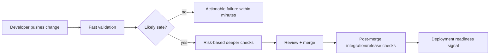
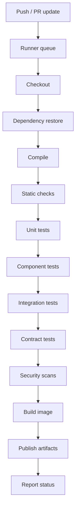
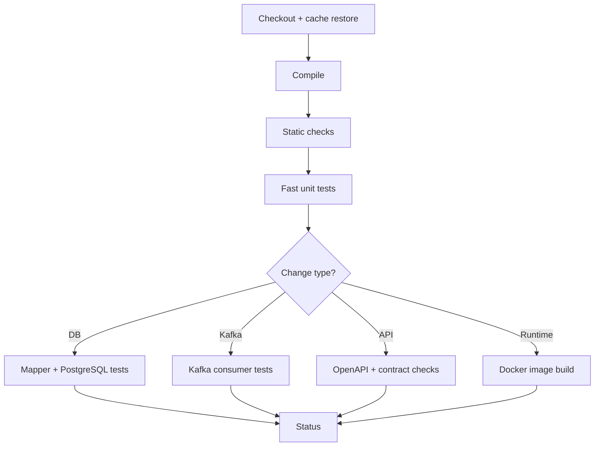
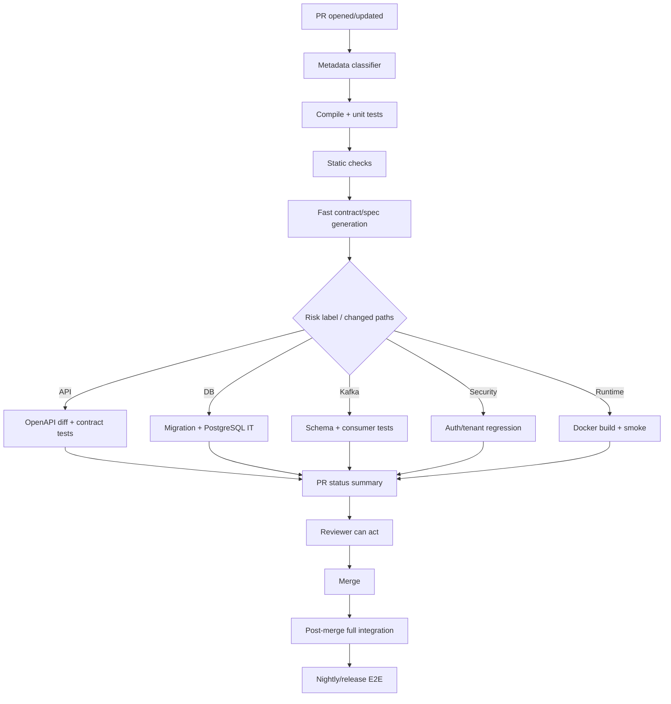

# Part 041 — Capstone 1: Improving CI Feedback Loop

## 1. Source notes and scope boundary

This capstone uses public engineering-effectiveness references and prior parts of this series.

Public references to verify independently:

- DORA describes trunk-based development as a required practice for continuous integration and emphasizes fast automated tests after commits to trunk.
- GitHub Actions documentation provides examples for building/testing Java with Maven and dependency caching, but your real CI platform may be GitHub Actions, GitLab CI, Jenkins, Azure DevOps, Buildkite, CircleCI, or an internal platform.
- Testcontainers, JUnit, Maven, Spring Boot, PostgreSQL, Kafka, and Kubernetes all provide official documentation that can be used to design better CI feedback loops.
- This part does not assume the actual CSG CI/CD stack, branching strategy, pipeline stages, test taxonomy, artifact registry, scanner, deployment system, or quality gates.

Use the internal verification checklist before applying this playbook inside a real team.

---

## 2. Core thesis

CI is not just a build server.

CI is the team's fastest shared truth mechanism.

A healthy CI feedback loop answers:

> Can this change integrate safely with the current system, and can the engineer learn the answer quickly enough to act before context is lost?

A weak CI loop creates hidden costs:

- engineers wait and context-switch;
- PRs age;
- reviewers delay because CI is slow;
- flaky tests erode trust;
- failures are retried instead of understood;
- risky changes are batched;
- release confidence drops;
- local productivity decays;
- teams normalize broken pipelines.

For Quote & Order teams, CI feedback is especially important because a single change may touch:

- Java service behavior;
- REST API contract;
- Kafka event compatibility;
- PostgreSQL migration;
- Testcontainers-based integration tests;
- security/tenant tests;
- audit behavior;
- Kubernetes packaging;
- Docker image scanning;
- on-prem or customer-specific deployment assumptions.

The goal is not merely to make CI faster.

The goal is to make the right feedback fast, reliable, actionable, and trusted.

---

## 3. Capstone scenario

Assume a team working on Quote & Order has these symptoms:

- PRs wait 45–90 minutes for CI.
- Test failures are often flaky.
- Full integration suite runs on every small change.
- Maven dependency downloads are repeated frequently.
- Developers rerun CI without understanding failures.
- Reviewers wait for green CI before reviewing.
- Pipeline failure messages do not identify likely owner.
- Kafka/PostgreSQL integration tests are slow and sometimes nondeterministic.
- Release confidence remains low even though CI is expensive.

You are a senior engineer asked to improve the CI feedback loop.

Do not begin by changing YAML randomly.

Treat this as a system design problem.

---

## 4. Desired outcome

A successful improvement should produce:

1. Faster first useful feedback.
2. More reliable test results.
3. Clearer failure diagnostics.
4. Better suite routing by risk.
5. Reduced wasted CI compute.
6. Lower PR cycle time.
7. Better developer trust.
8. Stronger release confidence.

Target state:



The design principle:

> Optimize the pipeline for fast learning first, then complete confidence before release.

---

## 5. Step 1 — Establish the current-state baseline

Before improvement, measure reality.

### 5.1 Pipeline timeline

Capture at least 2–4 weeks of pipeline runs.

For each run, record:

- trigger type: PR, push, merge, nightly, release candidate;
- branch;
- commit SHA;
- author/team;
- changed files/modules;
- total duration;
- queue time;
- build time;
- unit test time;
- integration test time;
- contract test time;
- security scan time;
- image build/push time;
- artifact publication time;
- failure stage;
- rerun count;
- flaky classification if known.

### 5.2 PR-level feedback timeline

For PRs, capture:

- PR opened time;
- first CI result time;
- first reviewer response time;
- first failure diagnosis time;
- first green time;
- approval time;
- merge time;
- post-merge failure if any.

This tells you whether CI is the bottleneck or one of several bottlenecks.

### 5.3 Failure taxonomy

Classify failures.

| Failure type | Example | Action |
|---|---|---|
| Compile failure | Java compilation error | local/pre-push validation |
| Unit test failure | broken domain invariant | keep fast and visible |
| Integration test failure | PostgreSQL/Kafka behavior | isolate suite + diagnostics |
| Flaky test | pass on rerun with same code | quarantine/investigate |
| Environment failure | runner/network/container pull | platform fix |
| Test data failure | shared fixture changed | deterministic fixture design |
| Security scan failure | vulnerable dependency | dependency policy |
| Packaging failure | Docker image build problem | build cache and reproducibility |
| Deployment smoke failure | Kubernetes/config issue | release-stage signal |

Never optimize all failures as if they are equal.

---

## 6. Step 2 — Map the CI value stream

Create a value stream map for CI.



For each stage, record:

- average duration;
- p50/p90/p95 duration;
- failure rate;
- rerun rate;
- owner;
- value of feedback;
- whether it must run on every PR.

A slow stage is not automatically waste.

A slow stage that rarely fails and does not need every-PR execution may be moved, split, cached, or triggered conditionally.

A fast stage that frequently catches important bugs should remain early.

---

## 7. Step 3 — Define feedback tiers

Do not put every check in the same tier.

### 7.1 Tier 0 — Local fast loop

Goal:

- catch obvious mistakes before CI.

Examples:

- compile module;
- run focused unit tests;
- format/lint;
- run mapper test for touched query;
- run generated code check if local support exists.

Expected duration:

- seconds to a few minutes.

### 7.2 Tier 1 — PR fast signal

Goal:

- give first useful CI feedback quickly.

Examples:

- compile affected modules;
- unit tests;
- static checks;
- API/spec generation check;
- lightweight security/secret scan;
- changed-module tests.

Expected duration:

- ideally under 10–15 minutes for normal PRs.

### 7.3 Tier 2 — PR risk-based deep checks

Goal:

- run deeper checks when change type demands it.

Examples:

- PostgreSQL integration tests for mapper/migration changes;
- Kafka integration tests for event changes;
- contract tests for API changes;
- tenant/security tests for auth changes;
- Docker build for runtime changes;
- Testcontainers suites for affected modules.

Expected duration:

- longer but justified.

### 7.4 Tier 3 — Post-merge integration confidence

Goal:

- validate integrated trunk/mainline state.

Examples:

- full integration suite;
- broader contract matrix;
- image build/publish;
- environment smoke;
- cross-service checks.

### 7.5 Tier 4 — Nightly/release candidate confidence

Goal:

- catch broader regressions and release readiness issues.

Examples:

- E2E journeys;
- performance smoke;
- migration upgrade matrix;
- security scan depth;
- large fixture tests;
- cloud/on-prem packaging validation.

The senior decision is not “run less tests”.

The senior decision is “run the right tests at the right time with the right diagnostic quality”.

---

## 8. Step 4 — Classify tests by confidence and cost

Build a test portfolio matrix.

| Test suite | Confidence provided | Cost | Trigger |
|---|---|---:|---|
| Domain unit tests | business invariant | low | every PR |
| Mapper tests | SQL mapping correctness | medium | mapper/DB changes |
| PostgreSQL integration | transaction/migration behavior | medium/high | DB-related PR + nightly |
| Kafka consumer tests | event/idempotency behavior | medium | event-related PR |
| Contract tests | API/event compatibility | medium | API/event PR |
| E2E journey | full composition | high | nightly/release |
| Performance smoke | regression signal | high | release/high-risk |
| Security regression | boundary protection | medium/high | security/API changes |

This exposes suites that cost much but provide little early feedback.

---

## 9. Step 5 — Reduce unnecessary work before parallelizing

Parallelization helps, but first remove waste.

Common waste:

- full repo build for doc-only change;
- full integration suite for frontend-only or README change;
- repeated dependency download;
- repeated Docker image build for non-runtime change;
- tests loading full Spring context unnecessarily;
- E2E tests used to validate unit-level behavior;
- unstable environment dependency;
- tests depending on shared mutable QA data;
- hidden sleep-based async waits.

Use path/module detection carefully.

Bad optimization:

> Skip too much and miss real risk.

Good optimization:

> Trigger deeper checks based on changed files, dependency graph, declared risk labels, and periodic full validation.

---

## 10. Step 6 — Improve Maven/Java feedback loop

For enterprise Java services, CI speed often depends on Maven structure.

### 10.1 Common Maven bottlenecks

- multi-module build recompiles too much;
- tests not separated by category;
- dependency downloads repeated;
- annotation processors slow all modules;
- integration tests run in unit-test phase;
- Docker image build runs before tests identify simple failures;
- generated sources invalidate cache unexpectedly.

### 10.2 Improvement patterns

- use dependency caching carefully;
- split unit and integration phases;
- use Maven profiles for test categories;
- avoid full `@SpringBootTest` when slice/unit test is enough;
- run affected module tests first;
- produce test timing reports;
- identify top 20 slow tests;
- separate deterministic fast tests from environment-heavy tests;
- fail fast on compile/static check before expensive integration tests.

### 10.3 Example stage order



---

## 11. Step 7 — Fix flaky tests as product risk

Never treat flakiness as a cosmetic CI problem.

Flaky CI causes:

- wasted reruns;
- delayed PRs;
- mistrust in tests;
- normalized red builds;
- unsafe merges;
- release anxiety.

### 11.1 Flaky test workflow

1. Detect repeated non-determinism.
2. Label the test.
3. Capture failure logs/artifacts.
4. Assign owner.
5. Decide quarantine vs block.
6. Fix root cause.
7. Add prevention pattern.
8. Track flake rate.

### 11.2 Flaky test categories in Quote & Order

| Category | Example | Fix direction |
|---|---|---|
| Time-based | quote expiry test depends on wall clock | inject clock |
| Async wait | Kafka consumer uses sleep | await business condition |
| Shared DB data | test reuses same quote ID | isolated fixture/run ID |
| Container race | Kafka not ready | readiness wait strategy |
| Ordering assumption | event order across partitions | key/partition-aware assertions |
| Concurrency | double acceptance test nondeterministic | deterministic barrier/latch |
| External dependency | test calls shared QA service | simulator/Testcontainers |

Flaky tests should appear on the engineering effectiveness roadmap.

---

## 12. Step 8 — Improve diagnostics before enforcing gates

A failing gate should tell the engineer what to do next.

Weak failure:

```txt
Integration tests failed.
```

Better failure:

```txt
Suite: quote-postgres-integration
Likely area: QuoteMapper / migration V20260708_01
Failed test: shouldPreserveQuotePriceSnapshotDuringApproval
Database container logs attached: yes
Migration log attached: yes
Test fixture ID: quote-approval-fixture-v3
Owner: quote-service team
Suggested local command: ./mvnw -pl quote-service -Ppostgres-it test -Dtest=QuoteMapperIT
```

### 12.1 Diagnostic artifacts

Attach:

- test reports;
- slow test report;
- container logs;
- database migration logs;
- Kafka topic dump for failed test;
- generated OpenAPI diff;
- dependency scan report;
- Docker build logs;
- failed command reproduction snippet.

Diagnostics are DevEx.

---

## 13. Step 9 — Redesign CI status reporting

A single red/green status hides too much.

Better status categories:

- compile;
- unit tests;
- static checks;
- API contract;
- DB integration;
- Kafka integration;
- security;
- packaging;
- deployment smoke;
- release readiness.

This helps reviewers decide whether to review now.

A PR with compile and unit green but slow release suite pending may still be reviewable.

---

## 14. Step 10 — Define improvement metrics

Avoid optimizing only total pipeline duration.

Use balanced metrics.

### 14.1 Speed metrics

- time to first useful failure;
- time to first green;
- p50/p90 PR validation duration;
- queue time;
- slowest stage duration;
- slowest test list.

### 14.2 Reliability metrics

- pipeline pass rate;
- failure rate by stage;
- rerun rate;
- flaky test rate;
- infrastructure failure rate;
- cache hit rate if available.

### 14.3 Flow metrics

- PR cycle time;
- PR waiting-for-CI time;
- review-after-CI delay;
- work item age;
- deployment lead time.

### 14.4 Confidence metrics

- escaped defect rate;
- failed deployment rate;
- release rollback/hotfix count;
- post-merge failure rate;
- tests catching real defects by suite.

A fast pipeline that misses defects is not good.

A complete pipeline that nobody trusts is also not good.

---

## 15. Step 11 — Design the rollout

Do not rewrite CI for all services at once.

### 15.1 Pilot selection

Pick a service/module where:

- pain is visible;
- owner is available;
- pipeline is representative;
- risk is manageable;
- improvement can be measured;
- team is willing to provide feedback.

### 15.2 Rollout phases

1. Baseline current metrics.
2. Add visibility/reporting.
3. Split fast vs slow suites.
4. Add path/risk-based routing for one or two categories.
5. Fix top flaky tests.
6. Improve failure diagnostics.
7. Measure impact.
8. Document golden path.
9. Expand to other services.

### 15.3 Adoption principle

CI improvement succeeds when engineers feel:

- faster feedback;
- less confusion;
- fewer false failures;
- clearer local reproduction;
- no loss of safety.

---

## 16. Example target pipeline for Quote & Order Java service



---

## 17. Example improvement backlog

| Item | Impact | Effort | Owner | Success measure |
|---|---:|---:|---|---|
| Add test timing report | medium | low | platform/devex | top slow tests visible |
| Split unit/integration test profiles | high | medium | service owners | PR fast suite under target |
| Quarantine/fix top 5 flaky tests | high | medium | module owners | rerun rate down |
| Cache Maven dependencies | medium | low | platform | dependency restore time down |
| Add PostgreSQL Testcontainers reuse strategy where safe | medium | medium | service team | DB IT p90 down |
| Add CI failure summary comment | high | medium | platform | diagnosis time down |
| Add changed-path test routing | high | high | platform+service | unnecessary deep checks down |
| Move E2E to nightly/release | medium | medium | QA+engineering | PR time down, release confidence preserved |

---

## 18. Internal verification checklist

Verify these before proposing changes.

### 18.1 CI platform

- Which CI system is used?
- Which runners are used?
- Is there a shared runner queue?
- Is caching enabled?
- Are runners ephemeral or persistent?
- Are self-hosted runners used?
- What is the cost model?
- Who owns pipeline templates?

### 18.2 Build/test structure

- Java version.
- Maven/Gradle usage.
- Module structure.
- Test naming conventions.
- Unit/integration/E2E separation.
- Testcontainers usage.
- Kafka/PostgreSQL test approach.
- Code generation steps.
- Contract test tooling.

### 18.3 Governance

- Required quality gates.
- Security scans.
- License/dependency checks.
- Release gates.
- Branch protection rules.
- Merge queue rules.
- Approval policy.
- Exception process.

### 18.4 Measurement

- Pipeline duration history.
- Failure rate by stage.
- Rerun rate.
- Top slow tests.
- Flaky test list.
- PR waiting time.
- Developer feedback from survey/interviews.

---

## 19. PR review checklist for CI improvement changes

When reviewing CI improvements, ask:

- Does this reduce feedback time without reducing required confidence?
- Are skipped checks justified by change type?
- Is there a fallback full validation?
- Are failures more actionable after this change?
- Are flaky tests handled or hidden?
- Does this increase pipeline complexity too much?
- Is ownership clear?
- Is the change measured before and after?
- Does it work for forked/branch builds if relevant?
- Does it preserve security/license/compliance gates?
- Does it support on-prem/customer release realities if needed?
- Is the golden path documented?

---

## 20. Anti-patterns

### 20.1 Blind parallelization

Parallelization without suite design can increase cost and still leave feedback unclear.

### 20.2 Hiding failures

Quarantine can be useful, but hidden flaky tests become permanent risk.

### 20.3 CI as bureaucracy

If every tiny PR runs every expensive suite, developers learn to batch changes, which worsens flow.

### 20.4 Fast but shallow

A fast pipeline that misses API, event, migration, or security regressions creates false confidence.

### 20.5 Platform-only solution

Pipeline YAML cannot solve unclear test ownership, poor fixtures, or domain ambiguity alone.

### 20.6 Metrics as punishment

If CI metrics are used to shame teams, they will be gamed or ignored.

---

## 21. Practical 30-day improvement plan

### Week 1 — Baseline

- Collect CI duration and failure data.
- Interview developers about CI pain.
- Identify top slow suites and flaky failures.
- Map pipeline stages.

### Week 2 — Visibility

- Add test timing report.
- Add failure taxonomy dashboard.
- Add PR status summary if missing.
- Identify top 5 quick wins.

### Week 3 — Pilot optimization

- Split one suite.
- Improve caching if missing.
- Fix or quarantine top flaky tests with owner.
- Improve diagnostics for one failing stage.

### Week 4 — Measure and expand

- Compare before/after metrics.
- Gather developer feedback.
- Document golden path.
- Propose next pilot.

---

## 22. Capstone deliverable template

```md
# CI Feedback Loop Improvement Proposal

## Problem
- Current CI pain:
- Business/team impact:

## Baseline
- PR p50/p90 validation time:
- Failure rate:
- Rerun rate:
- Top slow stages:
- Top flaky tests:

## Target outcome
- First useful feedback target:
- Reliability target:
- Developer experience target:

## Proposed changes
- Stage split:
- Test routing:
- Caching:
- Diagnostics:
- Flaky test policy:

## Risk management
- What checks might be skipped?
- How is full validation preserved?
- Security/compliance impact:

## Rollout
- Pilot service:
- Timeline:
- Owners:

## Measurement
- Metrics before/after:
- Developer feedback:
- Next iteration:
```

---

## 23. Final summary

Improving CI feedback loop is not a tooling cleanup.

It is engineering effectiveness work.

For enterprise Quote & Order systems, the CI system must be:

- fast enough to preserve developer context;
- reliable enough to be trusted;
- complete enough to protect production;
- diagnostic enough to shorten failure analysis;
- flexible enough to route checks by risk;
- governed enough to preserve security and compliance;
- measured enough to improve over time.

The senior engineer's job is to turn CI from a slow gate into a fast learning system.
