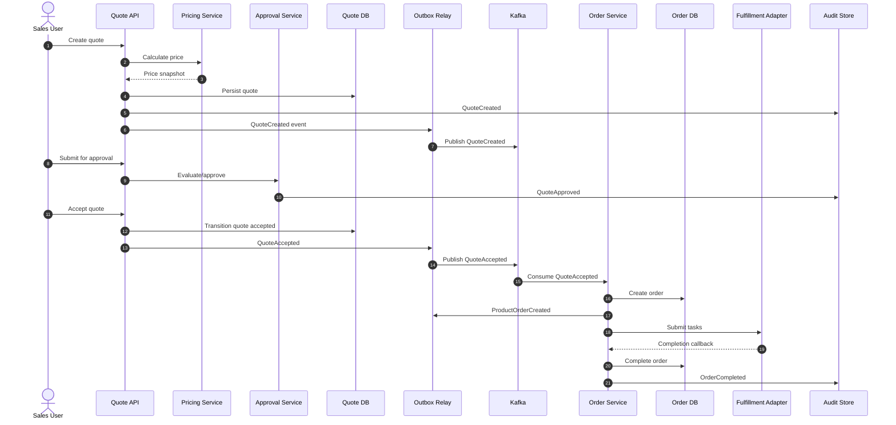

# Part 042 — Capstone 2: Observability for Quote-to-Order Journey

## 1. Source notes and scope boundary

This capstone uses public observability and reliability references and previous parts of this series.

Public references to verify independently:

- OpenTelemetry provides vendor-neutral APIs, SDKs, and tools for telemetry such as traces, metrics, and logs.
- OpenTelemetry Java instrumentation can be applied through the Java agent and manual instrumentation.
- Google SRE's four golden signals are latency, traffic, errors, and saturation.
- Messaging, HTTP, database, and runtime telemetry should follow standard semantic conventions when possible.

This part does **not** assume the actual CSG observability vendor, dashboard tool, logging platform, tracing backend, metric system, OpenTelemetry deployment mode, or internal naming convention.

Use the internal verification checklist before implementing.

---

## 2. Core thesis

Observability for Quote & Order must answer business journey questions, not only service health questions.

A service dashboard can say all pods are healthy while customers cannot convert quotes into orders.

A JVM dashboard can say memory is stable while order fallout is rising.

A Kafka consumer dashboard can show lag near zero while the wrong event semantics are being processed.

A PostgreSQL dashboard can show normal CPU while a quote approval query returns stale or incomplete evidence.

The capstone goal is to design observability that answers:

> For a given quote-to-order journey, what happened, where is it now, who/what is affected, and what should we do next?

---

## 3. Capstone scenario

Assume the critical journey is:

1. Sales user creates a quote.
2. Quote is priced.
3. Quote requires approval.
4. Approver approves.
5. Sales user accepts quote.
6. Quote converts to product order.
7. Order decomposes into fulfillment tasks.
8. Fulfillment callback completes tasks.
9. Order is completed.
10. Events/audit/read models are updated.

Production symptoms:

- Support reports some accepted quotes do not create orders.
- Some orders are stuck in `IN_PROGRESS`.
- Developers must inspect logs, database rows, and Kafka manually.
- There is no single dashboard showing quote-to-order conversion health.
- Alerts are service-level, not journey-level.
- Correlation IDs are inconsistent across HTTP, Kafka, and callbacks.

Your goal:

Design and roll out observability for this journey.

---

## 4. Journey map



Observability should connect these steps with consistent identifiers.

---

## 5. Diagnostic questions

A good observability design starts with questions.

### 5.1 Customer/support questions

- Where is this quote/order now?
- Did the quote get priced?
- Was approval required?
- Who approved it?
- Was the quote accepted?
- Was an order created?
- Did fulfillment receive the tasks?
- Which item is stuck?
- Is this a customer-specific issue?
- Is this affecting many tenants or one account?

### 5.2 Engineer questions

- Which service failed?
- Which request caused the state transition?
- Which event was produced?
- Which consumer processed it?
- Was the DB transaction committed?
- Was the outbox event published?
- Was the callback duplicate or out of order?
- Is this data, event, integration, or code problem?

### 5.3 Product/business questions

- How many quotes were created?
- How many reached approval?
- How many were accepted?
- How many accepted quotes converted to orders?
- How long does quote-to-order conversion take?
- Which product offerings cause most fallout?
- Which tenants/customers have high failure rates?

### 5.4 On-call questions

- Is customer impact active?
- Is the issue growing?
- What is the blast radius?
- Is there an immediate mitigation?
- Is data repair needed?
- Which runbook applies?

---

## 6. Telemetry model

Define standard identifiers.

### 6.1 Required correlation fields

| Field | Purpose |
|---|---|
| `correlation_id` | Connects the whole journey/request chain |
| `causation_id` | Identifies what caused a specific event/action |
| `tenant_id` | Tenant/business boundary |
| `customer_id` | Customer impact scope, handled carefully |
| `account_id` | Account-level scoping where safe |
| `quote_id` | Quote aggregate |
| `quote_version` | Immutable commercial version |
| `order_id` | Product order aggregate |
| `order_item_id` | Item-level fallout/debugging |
| `event_id` | Event identity |
| `event_type` | Event classification |
| `idempotency_key` | Duplicate/retry diagnostics |
| `external_correlation_id` | Downstream/partner correlation |

Be careful with PII and commercial sensitivity.

Not every field belongs in every telemetry signal or label.

### 6.2 Metric label discipline

Low-cardinality labels are safe for metrics:

- service;
- endpoint/route pattern;
- operation;
- status category;
- tenant tier if allowed;
- product family if bounded;
- error class;
- event type;
- order state.

High-cardinality or sensitive data usually should not be metric labels:

- quote ID;
- order ID;
- customer name;
- free-text error;
- email;
- address;
- idempotency key;
- raw external ID.

Use logs/traces for high-cardinality diagnostics.

---

## 7. Trace design

A trace should show the journey of a command/request across services.

### 7.1 Span hierarchy example

```txt
POST /quotes/{id}/accept
  QuoteService.acceptQuote
    QuoteRepository.lockQuote
    ApprovalClient.validateApproval
    QuoteRepository.updateState
    OutboxRepository.insertEvent QuoteAccepted
  HTTP response 202/200

Kafka publish QuoteAccepted

Kafka consume QuoteAccepted
  OrderService.createOrderFromQuote
    QuoteSnapshotClient.getQuoteVersion
    OrderRepository.insertOrder
    DecompositionService.planTasks
    OutboxRepository.insertEvent ProductOrderCreated

POST /fulfillment/callback
  FulfillmentCallbackHandler.handleCompletion
    OrderTaskRepository.markCompleted
    OrderLifecycleService.recalculateParentState
    OutboxRepository.insertEvent ProductOrderCompleted
```

### 7.2 Manual instrumentation candidates

Auto-instrumentation catches framework edges.

Manual spans should capture domain operations:

- `quote.create`;
- `quote.price`;
- `quote.submit_for_approval`;
- `quote.approve`;
- `quote.accept`;
- `order.create_from_quote`;
- `order.decompose`;
- `fulfillment.submit_task`;
- `fulfillment.handle_callback`;
- `order.complete`;
- `outbox.publish`;
- `data_repair.execute`.

Domain spans should include safe attributes:

- tenant scope;
- aggregate type;
- operation;
- state before/after;
- item count bucket;
- error category;
- product family if safe.

Do not put sensitive payloads into span attributes.

---

## 8. Metrics design

Metrics should answer health and trend questions.

### 8.1 Quote metrics

Examples:

- `quote_created_total`;
- `quote_pricing_requested_total`;
- `quote_pricing_failed_total`;
- `quote_pricing_duration_seconds`;
- `quote_approval_required_total`;
- `quote_approved_total`;
- `quote_accept_requested_total`;
- `quote_accept_failed_total`;
- `quote_accept_duration_seconds`;
- `quote_accept_idempotency_conflict_total`.

### 8.2 Order metrics

Examples:

- `order_created_from_quote_total`;
- `quote_to_order_conversion_failed_total`;
- `quote_to_order_conversion_duration_seconds`;
- `order_decomposition_failed_total`;
- `order_fallout_total`;
- `order_stuck_age_seconds`;
- `order_completed_total`;
- `order_completion_duration_seconds`.

### 8.3 Outbox/Kafka metrics

Examples:

- `outbox_pending_records`;
- `outbox_oldest_pending_age_seconds`;
- `outbox_publish_failed_total`;
- `kafka_consumer_lag_records`;
- `kafka_consumer_lag_age_seconds`;
- `kafka_event_processing_failed_total`;
- `dlq_events_total`.

### 8.4 Database metrics

Examples:

- quote/order query latency;
- slow query count;
- lock wait duration;
- transaction retry count;
- connection pool saturation;
- migration duration;
- backfill progress.

### 8.5 Golden signals applied to journey

| Golden signal | Quote-to-order interpretation |
|---|---|
| Latency | time to price, accept, convert, decompose, complete |
| Traffic | quote create rate, accept rate, order create rate, callback rate |
| Errors | validation, pricing, approval, conversion, fulfillment, DB, Kafka failures |
| Saturation | DB pool, Kafka lag age, outbox backlog, worker queue, pod CPU/memory |

---

## 9. Log design

Logs are for narrative and high-cardinality investigation.

### 9.1 Required structured log fields

- timestamp;
- level;
- service;
- environment;
- operation;
- correlation ID;
- causation ID;
- tenant ID if safe;
- quote ID/order ID where safe;
- event ID/event type;
- state before/after;
- error category;
- retry count;
- downstream system;
- elapsed time.

### 9.2 Log event examples

Good log:

```json
{
  "level": "INFO",
  "service": "quote-service",
  "operation": "quote.accept",
  "tenant_id": "tenant-a",
  "quote_id": "Q-123",
  "quote_version": 7,
  "previous_state": "APPROVED",
  "new_state": "ACCEPTED",
  "correlation_id": "corr-abc",
  "causation_id": "cmd-accept-123",
  "idempotency_result": "created",
  "duration_ms": 184
}
```

Weak log:

```txt
accepted quote
```

### 9.3 Error logs

An error log should include:

- what operation failed;
- why it failed at category level;
- whether retry is safe;
- whether customer action is required;
- whether downstream system was involved;
- correlation ID;
- runbook/error code if available.

Avoid raw stack traces without context.

---

## 10. Event and audit observability

Business events and audit records are not the same.

### 10.1 Business event observability

For events:

- event ID;
- event type;
- event version;
- aggregate ID;
- aggregate version;
- tenant;
- correlation ID;
- causation ID;
- producer;
- schema version;
- processing result.

Dashboard questions:

- Are expected events being produced?
- Are consumers processing them?
- Are events stuck in outbox?
- Are events landing in DLQ?
- Are duplicate events handled?

### 10.2 Audit observability

Audit should answer evidence questions:

- who did what;
- when;
- under which authority;
- before/after state;
- reason;
- business object;
- tenant;
- correlation ID.

Audit missing for privileged actions should be detectable.

---

## 11. Dashboard design

Do not create one giant dashboard.

Create layers.

### 11.1 Executive/product journey dashboard

Audience:

- product owner;
- engineering lead;
- support lead.

Shows:

- quote create volume;
- quote accept rate;
- quote-to-order conversion rate;
- order completion rate;
- fallout rate;
- p50/p95 conversion duration;
- impacted tenants/customers if allowed;
- release markers.

### 11.2 Engineering service dashboard

Audience:

- service owners;
- on-call;
- senior engineers.

Shows:

- API latency/error;
- DB query latency;
- Kafka lag;
- outbox backlog;
- pod restarts;
- JVM memory/GC;
- downstream adapter errors;
- slow operations.

### 11.3 Workflow debugging dashboard

Audience:

- incident responders;
- support escalation engineers.

Supports filtering by:

- correlation ID;
- quote ID;
- order ID;
- tenant;
- event ID.

Shows:

- journey timeline;
- state history;
- emitted events;
- consumer results;
- audit records;
- downstream callbacks;
- data repair markers.

---

## 12. Alert design

Alert on customer/business-impact symptoms, not every internal warning.

### 12.1 Candidate alerts

| Alert | Trigger | Action |
|---|---|---|
| Quote acceptance error spike | error rate above threshold | inspect quote-service, pricing/approval dependencies |
| Quote-to-order conversion drop | accepted quotes not becoming orders | inspect outbox/Kafka/order consumer |
| Outbox oldest age high | pending outbox too old | inspect relay/Kafka availability |
| Order stuck age high | orders in nonterminal state too long | inspect fulfillment/decomposition |
| DLQ event spike | event processing failures | inspect event schema/consumer errors |
| Fallout rate spike | fulfillment failures rising | inspect fulfillment adapter/downstream |
| Audit missing anomaly | privileged action without audit | security/compliance investigation |

### 12.2 Alert payload requirements

Include:

- what is wrong;
- business impact;
- time window;
- affected service/journey;
- top tenants/product families if safe;
- dashboard link;
- runbook link;
- recent release marker;
- suggested first diagnostic query.

---

## 13. Runbook design

Create runbooks by symptom.

### 13.1 Runbook: accepted quote did not create order

Questions:

1. Was quote state changed to accepted?
2. Was QuoteAccepted event inserted into outbox?
3. Was event published to Kafka?
4. Did order consumer receive/process event?
5. Was order insert committed?
6. Did duplicate/idempotency guard reject it?
7. Is event in DLQ?
8. Is this isolated to tenant/product/customer?
9. Is data repair needed?

Diagnostics:

- trace by correlation ID;
- quote state/history query;
- outbox query;
- Kafka event search;
- order lookup by quote ID;
- consumer error logs;
- DLQ dashboard;
- audit trail.

### 13.2 Runbook: order stuck in progress

Questions:

1. Which item is stuck?
2. Was fulfillment task submitted?
3. Was callback received?
4. Was callback duplicate/out-of-order?
5. Is parent state aggregation correct?
6. Are there failed tasks/fallout records?
7. Is downstream unavailable?
8. Is reconciliation job running?

---

## 14. Implementation plan

### 14.1 Phase 1 — Map and standardize identifiers

- Identify existing correlation ID handling.
- Standardize request/event/callback propagation.
- Add missing fields to logs/traces/events where safe.
- Document privacy rules.

### 14.2 Phase 2 — Instrument critical operations

- Add domain spans for quote accept and order create.
- Add metrics for conversion rate and duration.
- Add outbox and consumer lag age metrics.
- Add structured logs for state transitions.

### 14.3 Phase 3 — Build dashboards

- Journey dashboard.
- Service dashboard.
- Debugging dashboard.

### 14.4 Phase 4 — Add alerts and runbooks

- Start with 2–3 high-value alerts.
- Attach runbooks.
- Test alert payload with simulated issue.

### 14.5 Phase 5 — Validate through game day

Run scenarios:

- outbox relay stopped;
- order consumer failing;
- fulfillment callback delayed;
- quote acceptance validation bug;
- Kafka DLQ spike;
- DB lock causing conversion latency.

Measure:

- time to detect;
- time to diagnose;
- time to mitigate;
- quality of telemetry;
- missing data.

---

## 15. Observability acceptance criteria

For a quote-to-order observability improvement, acceptance criteria should include:

- Given a quote ID, engineer can find related order ID.
- Given a correlation ID, engineer can view trace/logs/events across quote and order services.
- Quote accept rate and error rate are visible.
- Quote-to-order conversion duration is visible.
- Outbox backlog and oldest age are visible.
- Kafka consumer failure/DLQ count is visible.
- Order stuck age is visible.
- Alerts link to runbooks.
- Telemetry does not expose forbidden PII/commercial data.
- At least one game-day scenario validates the dashboard/runbook.

---

## 16. Internal verification checklist

### 16.1 Observability stack

- Logging platform.
- Metrics backend.
- Tracing backend.
- Dashboard tool.
- Alerting tool.
- OpenTelemetry usage.
- Collector topology.
- Sampling policy.
- Retention policy.

### 16.2 Existing standards

- Correlation ID standard.
- Log field naming standard.
- Metric naming standard.
- Trace attribute standard.
- PII/commercial data policy.
- Audit requirements.
- Dashboard ownership.
- Runbook location.

### 16.3 Quote/order journey

- Actual services involved.
- Actual API endpoints.
- Actual event types/topics.
- Actual database tables.
- Actual state names.
- Actual fulfillment/billing boundaries.
- Actual support workflow.

### 16.4 Operational process

- On-call owner.
- Incident severity model.
- Alert routing.
- Support escalation.
- Data repair process.
- Postmortem process.

---

## 17. PR review checklist for observability changes

Ask:

- Does this telemetry answer a real diagnostic question?
- Are correlation/causation IDs propagated?
- Are metric labels low-cardinality and safe?
- Are logs structured and actionable?
- Are traces meaningful at domain operation level?
- Is Kafka context propagated?
- Are database operations visible where needed?
- Are errors classified?
- Are runbooks updated?
- Are alerts actionable?
- Is PII/commercial sensitivity respected?
- Is telemetry tested or validated?
- Is ownership clear?

---

## 18. Anti-patterns

### 18.1 Service-only observability

Service health dashboards do not prove business journey health.

### 18.2 Trace everything, understand nothing

High-volume traces without domain attributes create expensive noise.

### 18.3 Metrics with high-cardinality IDs

Putting quote/order/customer IDs in metric labels can break metric systems and leak sensitive data.

### 18.4 Logs without correlation

Logs that cannot be linked across services are weak during incidents.

### 18.5 Alerts without runbooks

An alert that says something is wrong but provides no action creates toil.

### 18.6 Observability after release

Telemetry added only after an incident means the first incident is a blind incident.

---

## 19. Capstone deliverable template

```md
# Observability Proposal: Quote-to-Order Journey

## Journey scope
- Start:
- End:
- Services:
- Events:
- DB tables:
- Downstream systems:

## Diagnostic questions
- Customer/support:
- Engineering:
- Product/business:
- On-call:

## Identifier model
- Correlation ID:
- Causation ID:
- Quote/order IDs:
- Tenant/customer fields:

## Telemetry plan
- Logs:
- Metrics:
- Traces:
- Events:
- Audit:

## Dashboards
- Journey dashboard:
- Service dashboard:
- Debugging dashboard:

## Alerts
- Alert 1:
- Alert 2:
- Alert 3:

## Runbooks
- Symptom:
- Diagnosis steps:
- Mitigation:
- Data repair:

## Validation
- Game day scenario:
- MTTD target:
- MTTR diagnostic target:
- Missing telemetry found:
```

---

## 20. Final summary

Observability for Quote & Order should make the business journey visible.

The target is not to collect more telemetry.

The target is to reduce uncertainty when something goes wrong.

A good quote-to-order observability system lets the team answer:

- Was the quote created?
- Was it priced?
- Was it approved?
- Was it accepted?
- Was an order created?
- Was it decomposed?
- Did fulfillment complete?
- Did events and audit records exist?
- Who is affected?
- What should we do now?

That is observability-driven engineering.
