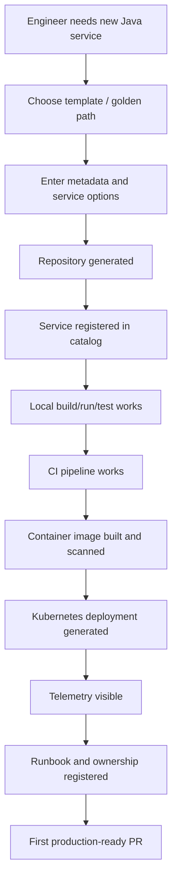
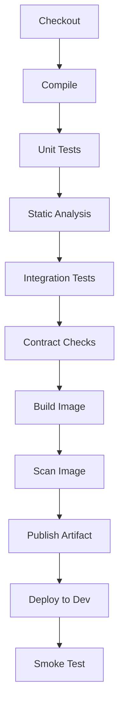

# Part 043 — Capstone 3: Platform Golden Path for Java Service

## 1. Source notes and scope boundary

This capstone uses public practices and tooling concepts from:

- Backstage Software Templates and software catalog concepts.
- Spring Boot development-time services, Docker Compose, and Testcontainers support.
- Testcontainers for repeatable integration testing with real dependencies.
- OpenTelemetry Java zero-code instrumentation and Collector concepts.
- Kubernetes workload health, probes, resources, rollout, and runtime debugging concepts.
- DORA, Team Topologies, and CNCF platform engineering maturity concepts discussed earlier in this series.

This part does **not** assume CSG uses Backstage, Spring Boot, Testcontainers, OpenTelemetry Collector, Helm, Argo CD, GitHub Actions, Jenkins, or any specific internal developer platform.

Treat every implementation detail below as a reference model. Replace it with the actual CSG tooling, standards, CI/CD, Kubernetes, security, and platform conventions after internal verification.

---

## 2. Core thesis

A golden path is not a template repository.

A golden path is the fastest supported path from **idea** to **safe production ownership**.

For a Java service, a serious golden path should answer:

> If a product team needs a new service or capability, how can they create, test, deploy, observe, operate, secure, and evolve it without rediscovering the same engineering decisions from scratch?

A weak golden path gives engineers a skeleton project.

A strong golden path gives engineers a full production posture:

- project structure,
- local development loop,
- test strategy,
- database pattern,
- Kafka pattern,
- API contract workflow,
- Docker image standard,
- Kubernetes deployment standard,
- secrets/config standard,
- OpenTelemetry instrumentation,
- logging/metrics/tracing defaults,
- health/readiness behavior,
- CI/CD quality gates,
- security scanning,
- runbook template,
- ownership metadata,
- service catalog registration,
- documented escape hatches.

The goal is not standardization for its own sake.

The goal is to reduce cognitive load and repeated decision cost for product teams while preserving local ownership and autonomy.

---

## 3. Golden path vs framework cage

A golden path should be opinionated enough to create speed, but flexible enough to avoid trapping teams.

| Dimension | Healthy golden path | Unhealthy cage |
|---|---|---|
| Purpose | Accelerates common work | Forces all work into one pattern |
| Adoption | Product teams choose it because it helps | Teams use it because governance forces them |
| Evolution | Updated based on friction feedback | Becomes stale and sacred |
| Exceptions | Explicit and reviewed | Forbidden or hidden |
| Ownership | Platform owns path; teams own services | Platform owns too much production behavior |
| Documentation | Explains why defaults exist | Only exposes generated files |
| Metrics | Measures flow and adoption | Measures only number of created services |

For Quote & Order systems, some services may need custom behavior:

- high-throughput Kafka consumer,
- stateful process manager,
- PostgreSQL-heavy service,
- customer/on-prem adapter,
- low-latency pricing component,
- security-sensitive audit service,
- complicated catalog processing service.

A golden path should make the default easy and the exception explicit.

---

## 4. Golden path user journey

Design the golden path from the user perspective.



The golden path should optimize the time from service idea to first safe production increment, not merely the time to create a repository.

---

## 5. Inputs to the service template

A production-grade service template needs enough metadata to configure defaults correctly.

Example metadata:

```yaml
service:
  name: quote-approval-policy-service
  description: Evaluates approval requirement for quote commercial conditions
  domain: quote-order
  ownerTeam: quote-order-engineering
  lifecycle: experimental
  criticality: medium
  runtime: java
  framework: spring-boot
  javaVersion: 21
  exposesRestApi: true
  consumesKafka: false
  producesKafka: true
  usesPostgreSQL: true
  requiresTenantContext: true
  containsPII: false
  containsCommercialSensitiveData: true
  deploymentModel:
    cloud: true
    onPrem: verify-internally
  observability:
    tracing: true
    metrics: true
    structuredLogging: true
```

The specific fields should match internal standards.

Important principle:

> The template should ask for product-relevant decisions, not expose platform internals unnecessarily.

A product engineer should not need to understand every Kubernetes YAML knob to create a basic Java service.

---

## 6. Generated repository shape

A useful Java service repository should be immediately navigable.

Reference structure:

```text
quote-approval-policy-service/
  README.md
  catalog-info.yaml
  pom.xml
  src/
    main/
      java/
        com/example/quoteapproval/
          QuoteApprovalApplication.java
          api/
          application/
          domain/
          persistence/
          messaging/
          config/
          observability/
      resources/
        application.yml
        application-local.yml
        db/migration/
    test/
      java/
        unit/
        integration/
        contract/
        support/
  docker/
    Dockerfile
  k8s/
    base/
    overlays/
      dev/
      staging/
      prod/
  scripts/
    local-run.sh
    local-test.sh
    diagnostics.sh
  docs/
    architecture.md
    runbook.md
    adr/
    api/
    operations/
  .github/ or .gitlab/ or ci/
    pipeline.yml
```

Internal conventions may differ.

The important property is that a new engineer can answer:

- where API code lives,
- where domain logic lives,
- where database mappings live,
- where Kafka code lives,
- where tests live,
- where migrations live,
- where runtime manifests live,
- where docs/runbook/ownership live.

---

## 7. Java service defaults

The golden path should generate high-quality defaults.

### 7.1 Application structure defaults

Recommended boundaries:

- `api` for REST DTOs/controllers,
- `application` for use cases/commands,
- `domain` for business rules/invariants,
- `persistence` for repository/mapper implementation,
- `messaging` for Kafka producers/consumers,
- `config` for wiring,
- `observability` for telemetry helpers,
- `support` for test fixtures and diagnostic utilities.

Avoid generating a project that encourages all logic in controllers or database mappers.

### 7.2 Runtime configuration defaults

Generate profiles for:

- local,
- test,
- dev,
- staging,
- production.

Make configuration explicit for:

- server port,
- health endpoints,
- database connection,
- Kafka bootstrap,
- logging format,
- OpenTelemetry exporter,
- feature flags,
- timeout/retry defaults,
- tenant context handling,
- security configuration.

### 7.3 Error model defaults

Generate an error model that supports:

- stable machine-readable error codes,
- correlation ID,
- validation details,
- no stack trace leakage,
- safe unauthorized/not-found semantics,
- domain-specific exceptions.

For Quote & Order systems, error codes should be designed for support and customer integration, not only developers.

---

## 8. Local development golden path

A platform golden path must make local feedback fast.

Minimum local command set:

```bash
./scripts/local-test.sh
./scripts/local-run.sh
./scripts/diagnostics.sh
```

Expected local loop:

1. clone repository,
2. install prerequisites or use dev container,
3. run database/Kafka dependencies,
4. run migrations,
5. start service,
6. call sample API,
7. run unit tests,
8. run integration tests,
9. inspect logs/traces locally.

### 8.1 Local dependency options

Possible approaches:

- Docker Compose,
- Testcontainers,
- dev containers,
- shared development environment,
- cloud dev environment.

A good golden path can support more than one option, but should clearly identify the default.

### 8.2 Local sample workflow

Include sample requests:

```http
POST /quote-approval/evaluate
Content-Type: application/json
X-Correlation-Id: local-demo-001

{
  "tenantId": "tenant-demo",
  "quoteId": "Q-DEMO-001",
  "requestedDiscountPercent": 20,
  "marginPercent": 8,
  "customerSegment": "ENTERPRISE"
}
```

Expected output should be documented.

The service should be testable without reading source code first.

---

## 9. Testing defaults

The golden path should generate test structure and examples.

### 9.1 Unit test defaults

Generate a simple domain test:

```java
class ApprovalPolicyTest {

  @Test
  void discountAboveThresholdRequiresApproval() {
    ApprovalDecision decision = policy.evaluate(new QuoteCommercialContext(
        DiscountPercent.of(20),
        MarginPercent.of(8),
        CustomerSegment.ENTERPRISE
    ));

    assertThat(decision.requiresApproval()).isTrue();
    assertThat(decision.reasonCode()).isEqualTo("DISCOUNT_ABOVE_THRESHOLD");
  }
}
```

### 9.2 Integration test defaults

Generate Testcontainers examples for:

- PostgreSQL,
- Kafka if used,
- service dependencies where practical.

### 9.3 Contract test defaults

If service exposes REST API:

- generate OpenAPI artifact,
- validate examples,
- add compatibility diff gate where internal tooling exists.

If service produces events:

- generate event schema fixture,
- validate required envelope fields,
- test compatibility rules.

### 9.4 Test categories

Recommended tags:

- `unit`,
- `integration`,
- `contract`,
- `migration`,
- `e2e`,
- `slow`,
- `security`.

CI should run appropriate suites at the appropriate stage.

---

## 10. Database defaults

If the service uses PostgreSQL, generate:

- migration folder,
- baseline migration example,
- local database setup,
- integration test example,
- transaction boundary example,
- tenant predicate example,
- migration checklist.

### 10.1 Migration default

Do not generate destructive example migrations.

Generate an additive example:

```sql
CREATE TABLE quote_approval_decision (
  tenant_id text NOT NULL,
  decision_id text NOT NULL,
  quote_id text NOT NULL,
  decision_status text NOT NULL,
  reason_code text NOT NULL,
  created_at timestamptz NOT NULL,
  PRIMARY KEY (tenant_id, decision_id)
);

CREATE INDEX idx_quote_approval_decision_quote
  ON quote_approval_decision (tenant_id, quote_id);
```

### 10.2 Safety defaults

Every generated DB example should reinforce:

- tenant in primary keys or required predicates,
- immutable audit-sensitive records where needed,
- explicit timestamps,
- safe indexes,
- migration test coverage,
- no large table rewrite by default,
- no application startup migration surprise unless approved internally.

---

## 11. Kafka defaults

If the service produces or consumes Kafka events, generate:

- topic ownership metadata,
- event envelope type,
- producer example,
- consumer example,
- idempotency example,
- DLQ/retry policy placeholder,
- local Kafka test example,
- schema compatibility hook.

### 11.1 Event envelope default

Example:

```json
{
  "eventId": "evt-demo-001",
  "eventType": "QuoteApprovalDecisionCreated",
  "eventVersion": 1,
  "tenantId": "tenant-demo",
  "aggregateType": "Quote",
  "aggregateId": "Q-DEMO-001",
  "occurredAt": "2026-07-09T10:15:30Z",
  "correlationId": "corr-demo-001",
  "causationId": "cmd-demo-001",
  "producer": "quote-approval-policy-service",
  "payload": {
    "decisionStatus": "APPROVAL_REQUIRED",
    "reasonCode": "DISCOUNT_ABOVE_THRESHOLD"
  }
}
```

### 11.2 Kafka safety defaults

Generated code should demonstrate:

- deterministic event ID when appropriate,
- tenant context preservation,
- correlation/causation propagation,
- idempotent consumer behavior,
- outbox pattern where dual-write risk exists,
- safe logging of event metadata without leaking sensitive payload.

---

## 12. OpenTelemetry defaults

The golden path should make telemetry available from the first run.

Generated defaults:

- service name,
- service version,
- deployment environment,
- trace propagation,
- HTTP server spans,
- HTTP client spans,
- JDBC spans,
- Kafka producer/consumer spans where supported,
- structured log correlation,
- metrics endpoint or exporter,
- sample dashboard.

### 12.1 Resource attributes

Example configuration:

```yaml
otel:
  service:
    name: quote-approval-policy-service
  resource:
    attributes:
      service.namespace: quote-order
      deployment.environment: local
      team: quote-order-engineering
```

Internal standards may use different names.

The principle is that telemetry must be attributable to owner, service, version, environment, and business journey.

---

## 13. Docker and Kubernetes defaults

Generate safe runtime defaults.

### 13.1 Docker image defaults

The Dockerfile should:

- use approved base images,
- avoid root user if internal standard requires,
- expose the correct port,
- set JVM memory behavior correctly,
- include health endpoint assumptions,
- avoid embedding secrets,
- support image scanning.

### 13.2 Kubernetes defaults

Generate manifests or Helm/Kustomize templates for:

- Deployment,
- Service,
- ConfigMap/Secret reference,
- readiness/liveness/startup probes,
- resource requests/limits,
- service account,
- network policy placeholder if used,
- horizontal scaling placeholder if appropriate,
- PodDisruptionBudget if required by criticality.

### 13.3 Probe defaults

Readiness should mean the service can safely serve traffic.

Liveness should not restart the service for transient dependency failures.

Startup probe should handle slow Java startup where needed.

Bad default probes create production instability.

---

## 14. CI/CD defaults

A golden path must generate CI/CD that is fast, trustworthy, and consistent.

Recommended stages:



Stage set should adapt to internal tooling.

### 14.1 CI ergonomics

The pipeline should:

- fail with clear messages,
- upload test reports,
- upload logs for failed integration tests,
- cache dependencies safely,
- separate fast and slow suites,
- avoid flaky gates,
- publish artifacts with traceable version metadata.

### 14.2 Service versioning

Every artifact should be traceable to:

- commit SHA,
- build number,
- image digest,
- service version,
- migration version,
- OpenAPI/event schema version.

---

## 15. Security defaults

Golden path should generate secure-by-default patterns.

Examples:

- authentication filter placeholder,
- authorization example,
- tenant context helper,
- input validation example,
- safe error model,
- dependency vulnerability scan,
- secret scanning,
- no secrets in repository,
- audit event example for privileged action,
- PII/commercial data logging warning.

### 15.1 Tenant context default

For Quote & Order services, tenant scoping should be visible in generated examples.

Bad template:

```java
repository.findById(id);
```

Better template:

```java
repository.findByTenantAndId(tenantContext.tenantId(), id);
```

This is not just code style. It is safety posture.

---

## 16. Service catalog metadata

A generated service should register itself in a software catalog.

Example catalog metadata:

```yaml
apiVersion: backstage.io/v1alpha1
kind: Component
metadata:
  name: quote-approval-policy-service
  description: Evaluates quote approval policy decisions
  tags:
    - java
    - quote-order
    - backend
spec:
  type: service
  lifecycle: experimental
  owner: quote-order-engineering
  system: quote-order
```

Actual fields depend on internal catalog tooling.

Metadata should answer:

- who owns this service,
- what domain it belongs to,
- what lifecycle stage it is in,
- where docs live,
- where dashboards live,
- where runbooks live,
- what APIs/events it exposes,
- what dependencies it has.

A service that cannot be discovered cannot be operated well.

---

## 17. Documentation generated by default

Generate documentation that accelerates first productive work.

Minimum docs:

- README,
- local development guide,
- API examples,
- test guide,
- deployment guide,
- runbook,
- architecture notes,
- ADR folder,
- troubleshooting guide.

### 17.1 README template

```md
# <service-name>

## Purpose
What business capability does this service provide?

## Ownership
Team, Slack/channel, escalation, service catalog.

## Local development
Commands to build, run, test, debug.

## APIs and events
Links to OpenAPI, event schemas, examples.

## Data
Tables, migrations, local DB setup.

## Observability
Dashboards, logs, traces, key metrics.

## Operations
Runbook, deployment, rollback, known failure modes.
```

Docs should be created at service birth, not after first incident.

---

## 18. Golden path acceptance criteria

A Java service golden path is ready when:

- an engineer can generate a service from template,
- local build/test/run works from documented commands,
- service has catalog metadata,
- service has CI pipeline,
- container image builds,
- Kubernetes deployment template exists,
- readiness/liveness behavior is sane,
- OpenTelemetry is configured,
- structured logging includes correlation ID,
- test structure exists,
- DB/Kafka examples are included where selected,
- docs/runbook exist,
- generated service passes its own pipeline,
- product team validates usefulness,
- exception path is documented,
- ownership is clear.

Do not call the golden path complete because a repository was generated.

---

## 19. Rollout strategy

Do not launch golden path as a big announcement only.

### 19.1 Pilot

Choose one real service or feature team.

Pilot goals:

- generate service,
- run local workflow,
- run CI,
- deploy to dev,
- validate observability,
- collect friction.

### 19.2 Feedback loop

Collect:

- setup time,
- first successful build time,
- first successful local run time,
- first successful deploy time,
- missing docs,
- confusing template fields,
- generated code changes teams immediately make,
- platform support questions.

### 19.3 Adoption

Adoption should be product-led:

- show value,
- measure friction reduction,
- make docs clear,
- provide support office hours,
- collect feedback,
- improve template.

Mandates without value create bypass behavior.

---

## 20. Metrics

Useful golden path metrics:

- time to create service,
- time to first local run,
- time to first successful CI,
- time to first deploy,
- number of generated services,
- percentage following supported path,
- setup support requests,
- template-related PR fixes,
- CI failure rate for generated services,
- missing telemetry incidents,
- developer satisfaction score,
- time to first productive PR.

Avoid vanity-only metrics:

- number of templates,
- portal visits,
- generated repos without adoption,
- compliance percentage without developer value.

---

## 21. Internal verification checklist

Before applying this internally, verify:

- Is there an internal developer portal?
- Is Backstage or another catalog/scaffolder used?
- What Java framework is approved?
- What build tool/version standards exist?
- What CI/CD tooling is used?
- What artifact registry is used?
- What container base images are approved?
- What Kubernetes deployment mechanism is used?
- Is Helm, Kustomize, raw YAML, or another tool standard?
- What observability stack is used?
- Is OpenTelemetry required or optional?
- What logging format is required?
- What security scanning gates are mandatory?
- What secrets manager is used?
- What database migration tool is used?
- What Kafka/schema registry standards exist?
- What API contract workflow exists?
- What service catalog metadata is mandatory?
- Who owns golden path maintenance?
- How are exceptions approved?
- How is platform feedback collected?

---

## 22. Capstone implementation plan

### Step 1 — Identify golden path scope

Choose one target:

- simple REST Java service,
- REST + PostgreSQL service,
- REST + Kafka producer service,
- Kafka consumer worker,
- full service with REST + PostgreSQL + Kafka + OTel.

Start narrower than your ambition.

### Step 2 — Gather current friction

Interview engineers:

- what takes longest when creating a service?
- what breaks in local setup?
- what do they copy-paste?
- what standards are unclear?
- what review comments repeat?
- what production issues repeat for new services?

### Step 3 — Build template v0.1

Include only high-value defaults.

### Step 4 — Pilot with one team

Do not generalize before real use.

### Step 5 — Measure and improve

Use pilot feedback to prioritize next iteration.

### Step 6 — Publish docs and support model

A golden path without support becomes stale.

### Step 7 — Make adoption visible

Show before/after friction reduction.

---

## 23. Anti-patterns

### 23.1 Template without ownership

A generated template quickly becomes obsolete if nobody maintains it.

### 23.2 Portal-first platform

A portal can expose platform capability, but it is not the platform itself.

### 23.3 Golden path without escape hatch

Teams will bypass it when it does not fit real use cases.

### 23.4 Security bolted on later

Security defaults must be generated from day one.

### 23.5 Observability missing from template

Every service starts life blind.

### 23.6 Too many options

If the template asks 60 questions, it increases cognitive load.

### 23.7 No feedback loop

A platform that does not learn from users becomes bureaucracy.

---

## 24. Final summary

A Java service golden path should help product teams move faster by reducing repeated decisions and unsafe defaults.

The best golden path is not the one that generates the most files.

It is the one that makes the safest path the easiest path:

- local development works,
- tests are structured,
- CI is ready,
- Docker/Kubernetes defaults are sane,
- telemetry is present,
- security and tenant context are visible,
- API/event contracts are discoverable,
- ownership and runbooks exist,
- teams can still make justified exceptions.

For enterprise Quote & Order work, this is a major DevEx and production-safety multiplier.
