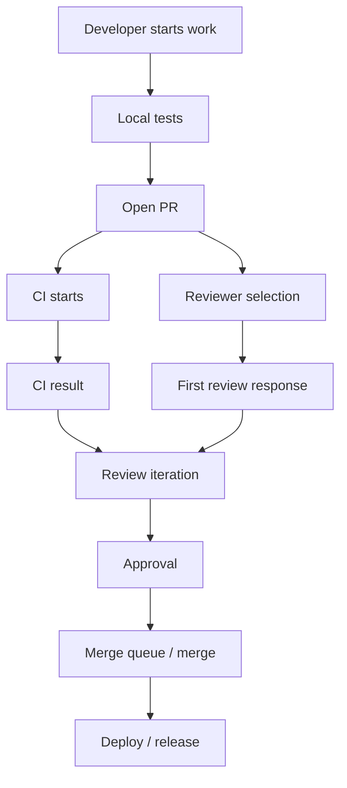

# Part 044 — Capstone 4: Reducing PR Review Bottleneck

## 1. Source notes and scope boundary

This capstone uses public practices and concepts from:

- Google Engineering Practices on code review standards, reviewer response, comments, and code health.
- Flow metrics and Scrum with Kanban concepts such as WIP, cycle time, work item age, and blocked work.
- DORA-style delivery diagnostics.
- Team Topologies concepts around cognitive load and ownership boundaries.
- Previous parts of this series on PR flow, engineering governance, DevEx measurement, and system throughput.

This part does **not** assume CSG uses GitHub, GitLab, Bitbucket, Gerrit, Azure DevOps, CODEOWNERS, merge queues, stacked PRs, or any specific branch strategy.

Adapt this playbook to the actual internal tooling, compliance requirements, approval policies, release gates, and ownership model.

---

## 2. Core thesis

PR review bottleneck is not solved by telling reviewers to review faster.

A PR review bottleneck is a system problem.

It may be caused by:

- PRs too large,
- unclear ownership,
- too few reviewers,
- too many required reviewers,
- low-quality PR descriptions,
- weak tests,
- slow CI,
- unclear standards,
- architecture uncertainty,
- domain ambiguity,
- review comments that create rework,
- governance rules that do not match risk,
- overloaded senior engineers,
- context scattered across tickets, docs, and Slack.

The goal is not to reduce review time by lowering quality.

The goal is to reduce waiting, rework, and ambiguity while preserving or increasing:

- code health,
- domain correctness,
- production safety,
- knowledge sharing,
- maintainability,
- security and data safety.

---

## 3. PR review as value stream

A PR is not just a diff.

A PR is a work item moving through a quality-control and knowledge-transfer system.



Bottlenecks can occur at any stage.

Do not assume the bottleneck is human review until you measure the whole path.

---

## 4. Diagnostic metrics

Measure a small set of PR flow metrics.

| Metric | Meaning | Diagnostic use |
|---|---|---|
| PR open count | Current WIP in review | Review system load |
| PR age | Time since opened | Aging risk |
| Time to first review | Queue/wait time | Reviewer availability/routing |
| Review iteration count | Number of back-and-forth cycles | PR clarity/rework |
| Time from approval to merge | Merge/deployment queue friction | CI/branch/merge friction |
| PR size | Lines/files/semantic scope | Review complexity |
| CI failure count | Test/build friction | Author/pipeline quality |
| Reopened/reverted PRs | Quality/release confidence | Review/test gaps |

Do not use these metrics to rank individuals.

Use them to find bottlenecks.

---

## 5. Baseline collection

Collect baseline for at least 2–4 weeks, or several sprints.

Segment by:

- team,
- repository,
- work type,
- PR size,
- reviewer group,
- domain area,
- risk label,
- CI status,
- urgent vs planned work.

Work type labels:

- feature,
- bug,
- test,
- refactor,
- migration,
- API contract,
- Kafka event,
- security,
- observability,
- documentation,
- build/CI,
- operational fix.

Quote & Order risk labels:

- pricing,
- approval,
- quote lifecycle,
- order lifecycle,
- fulfillment,
- tenant isolation,
- audit,
- PostgreSQL migration,
- Kafka schema,
- public/customer API.

The same PR size can have different review complexity depending on risk.

---

## 6. Bottleneck taxonomy

### 6.1 Author-side bottleneck

Symptoms:

- PR opened before local tests,
- weak description,
- huge diff,
- mixed unrelated changes,
- CI repeatedly fails,
- missing context,
- missing screenshots/API examples,
- reviewer has to infer risk.

Improvement options:

- PR template,
- author checklist,
- smaller PR slicing,
- pre-push checks,
- draft PR discipline,
- test evidence requirement,
- semantic PR labels.

### 6.2 Reviewer-side bottleneck

Symptoms:

- long time to first response,
- same senior engineer reviews everything,
- unclear reviewer responsibility,
- bystander effect with many reviewers,
- no review queue visibility,
- review interrupts deep work randomly.

Improvement options:

- reviewer routing,
- primary reviewer assignment,
- ownership map,
- review office hours,
- review rotation,
- WIP limit for reviewer queue,
- risk-based reviewer requirements.

### 6.3 CI-side bottleneck

Symptoms:

- reviewers wait for CI,
- CI is flaky,
- tests take too long,
- failures are hard to diagnose,
- merge queue repeatedly fails.

Improvement options:

- faster feedback stages,
- flaky test policy,
- better failure artifacts,
- test suite tiering,
- CI status dashboard,
- merge queue diagnostics.

### 6.4 Governance-side bottleneck

Symptoms:

- too many blanket approval rules,
- every PR needs architecture/security/platform review,
- low-risk docs PR blocked by same process as high-risk migration,
- exception process unclear.

Improvement options:

- risk-based approval matrix,
- automatic low-risk fast path,
- explicit high-risk checklist,
- CODEOWNERS or internal equivalent by domain,
- documented exception process.

### 6.5 Knowledge-side bottleneck

Symptoms:

- only one person understands area,
- reviewers ask basic context repeatedly,
- old design decisions not documented,
- domain terms ambiguous,
- tests do not explain expected behavior.

Improvement options:

- architecture map,
- domain glossary,
- ADRs,
- ownership docs,
- example PRs,
- mentoring/pairing,
- review comment snippets.

---

## 7. PR size strategy

Small PRs reduce review latency, but tiny PRs can hide context.

Aim for semantically small PRs.

### 7.1 Good small PR

A good small PR has:

- one purpose,
- clear risk boundary,
- enough tests,
- easy rollback,
- readable diff,
- clear reviewer expectations.

Examples:

- add a new validation rule with tests,
- add one metric/log field,
- add migration for one nullable column,
- add event envelope field with compatibility test,
- refactor one code path behind characterization tests.

### 7.2 Bad small PR

A bad small PR is artificially split but not independently understandable.

Examples:

- PR 1 adds unused abstractions,
- PR 2 wires half behavior,
- PR 3 updates tests later,
- PR 4 makes it work.

This creates review burden because each PR cannot be judged safely.

### 7.3 Large PR exception

Sometimes large PRs are unavoidable:

- generated code update,
- broad dependency upgrade,
- mechanical rename,
- migration with generated artifacts,
- large test fixture change.

When large PRs happen, make them reviewable:

- separate mechanical changes from semantic changes,
- provide reviewer guide,
- provide test evidence,
- identify high-risk files,
- invite early design review before final diff.

---

## 8. PR template for enterprise backend

A good PR template reduces reviewer cognitive load.

```md
## Summary
What changed and why?

## Work type
- [ ] Feature
- [ ] Bug fix
- [ ] Refactor
- [ ] Test
- [ ] DB migration
- [ ] API contract
- [ ] Kafka event
- [ ] Security/tenant/audit
- [ ] Observability
- [ ] Documentation

## Risk areas
- Quote lifecycle:
- Pricing/approval:
- Order lifecycle:
- API contract:
- Kafka events:
- PostgreSQL/migration:
- Security/tenant:
- Audit:
- Observability:
- Deployment/rollback:

## Testing evidence
- Unit:
- Integration:
- Contract:
- Migration:
- E2E/manual:

## Operational evidence
- Logs/metrics/traces:
- Dashboard/runbook:
- Feature flag:
- Rollback/roll-forward:

## Reviewer notes
Which files/decisions need attention?
```

Do not make every field mandatory for every PR.

Use conditional expectations by risk.

---

## 9. Reviewer routing

Reviewer routing should optimize for ownership, knowledge sharing, and speed.

### 9.1 Routing dimensions

Route by:

- code ownership,
- domain ownership,
- API/event ownership,
- database ownership,
- security sensitivity,
- operational criticality,
- mentoring opportunity,
- reviewer load.

### 9.2 Primary reviewer

Avoid bystander effect.

If multiple reviewers are requested, assign a primary reviewer.

Primary reviewer owns:

- first response,
- review coordination,
- deciding when others are needed,
- ensuring critical risk areas are reviewed.

### 9.3 Specialist reviewers

Specialist review should be risk-based.

Examples:

- security reviewer for tenant isolation/auth/audit changes,
- database reviewer for migrations/hot queries,
- Kafka/event reviewer for schema/partition/replay changes,
- architecture reviewer for cross-service design,
- platform reviewer for Kubernetes/CI/CD/golden path changes.

Do not route every small PR through every specialist.

That creates governance drag.

---

## 10. Review quality standard

Review faster does not mean review shallower.

A high-quality review checks:

- correctness,
- maintainability,
- testability,
- domain invariants,
- data safety,
- API/event compatibility,
- security/tenant isolation,
- audit evidence,
- observability,
- operational readiness.

### 10.1 Severity vocabulary

Use explicit severity:

- `blocking`: correctness/security/production risk,
- `strong suggestion`: should change unless justified,
- `question`: clarification needed,
- `nit`: optional polish,
- `future`: should be tracked later.

This reduces conflict and ambiguity.

### 10.2 Review comment pattern

Good comment structure:

```text
Risk: what could go wrong?
Evidence: where in the diff?
Principle: why does it matter?
Suggestion: what to do next?
Severity: blocking/suggestion/question/nit/future
```

Example:

> Blocking: this mapper query filters by `quote_id` but not `tenant_id`. That can create cross-tenant read risk if quote IDs are not globally unique. Please use the tenant-scoped repository method and add a cross-tenant negative test.

---

## 11. Risk-based approval matrix

Create a review matrix.

| PR type | Minimum review | Extra review trigger |
|---|---|---|
| Docs only | 1 reviewer or fast path | Public/customer-facing docs |
| Unit test only | 1 reviewer | Changes test fixture semantics |
| Java internal refactor | area owner | Broad lifecycle behavior |
| REST API change | area owner | Public/customer contract |
| Kafka event change | event owner | Schema/partition/replay impact |
| DB migration | DB-aware reviewer | Hot table/destructive/backfill |
| Security/tenant/audit | security/domain reviewer | Cross-tenant/admin/PII impact |
| Kubernetes/CI/CD | platform reviewer | Production rollout/resource/probe impact |
| Pricing/approval/order lifecycle | domain owner | Customer/commercial impact |

This matrix should be lightweight and internal.

The purpose is clarity, not bureaucracy.

---

## 12. Review WIP and queue policy

If review queue is invisible, it will grow silently.

Recommended policy:

- each team has visible PR review queue,
- PRs older than threshold are discussed daily,
- reviewer WIP is limited,
- authors mark PRs as ready/draft clearly,
- urgent PRs have explicit reason,
- reviewers can request smaller PR or better context.

Example thresholds:

- first response target: same business day,
- high-risk PR: reviewer assigned explicitly,
- PR age > 2 days: discuss in Daily Scrum,
- PR age > 5 days: treat as blocked work,
- PR > agreed size threshold: require reviewer guide.

Use internal norms, not universal numbers.

---

## 13. CI integration with review

Review and CI should complement each other.

CI should catch:

- compile errors,
- unit test failures,
- integration test failures,
- formatting/lint,
- dependency vulnerability,
- container build failure,
- contract diff,
- migration test failure,
- known policy checks.

Human reviewers should focus on:

- correctness beyond tests,
- domain semantics,
- maintainability,
- production risk,
- hidden coupling,
- missing tests,
- observability quality,
- architecture trade-offs.

If reviewers repeatedly comment on formatting, automate it.

If CI repeatedly passes risky changes, improve gates or review checklist.

---

## 14. Scrum integration

### 14.1 Refinement

Detect review risk before implementation:

- cross-team reviewer needed?
- security review needed?
- migration review needed?
- API/event contract owner needed?
- design doc needed?

### 14.2 Sprint Planning

Plan review capacity.

A Sprint with many high-risk PRs needs reviewer time.

Do not fill capacity only with coding tasks.

### 14.3 Daily Scrum

Ask:

- Which PRs are aging?
- Which PRs need specialist review?
- Which PRs are blocked by CI?
- Which review comments indicate unclear requirements?
- Which work can be split to reduce risk?

### 14.4 Sprint Retrospective

Inspect:

- review latency,
- PR rework,
- CI failures,
- escaped defects,
- review bottleneck causes,
- reviewer load balance.

---

## 15. Improvement experiment design

Do not attempt all improvements at once.

Run small experiments.

### Experiment 1 — PR template pilot

Hypothesis:

> A better PR template reduces reviewer clarification questions and review iteration count.

Measure:

- time to first meaningful review,
- review cycles,
- reviewer satisfaction,
- percentage of PRs with test evidence.

### Experiment 2 — Primary reviewer assignment

Hypothesis:

> Explicit primary reviewer reduces time to first review and bystander effect.

Measure:

- time to first response,
- PR age,
- reviewer load.

### Experiment 3 — PR size guideline

Hypothesis:

> Semantically smaller PRs reduce review time without increasing defect rate.

Measure:

- PR size,
- cycle time,
- review cycles,
- escaped defects/reverts.

### Experiment 4 — CI diagnostic improvement

Hypothesis:

> Better failure artifacts reduce time from CI failure to fix.

Measure:

- failed pipeline recovery time,
- author-retry count,
- flaky test classification.

---

## 16. Example improvement roadmap

### Week 1 — Baseline

- collect PR metrics,
- interview authors/reviewers,
- categorize bottlenecks,
- inspect 10 slow PRs,
- inspect 10 fast PRs.

### Week 2 — Quick wins

- add/adjust PR template,
- create risk labels,
- define primary reviewer convention,
- make PR queue visible.

### Week 3 — Review routing

- map ownership,
- define specialist review triggers,
- reduce unnecessary blanket approvals,
- create reviewer office hours if useful.

### Week 4 — CI/rework

- identify top CI failure causes,
- improve failure artifacts,
- create flaky test workflow,
- document author checklist.

### Week 5+ — Sustain

- review metrics in retro,
- adjust policies,
- document lessons,
- expand to other teams if useful.

---

## 17. Quote & Order review checklist

For CSG-like Quote & Order work, review should include domain-specific questions.

### Quote/pricing/approval

- Does this preserve quote version semantics?
- Does this affect pricing snapshot?
- Does this affect approval requirement?
- Can stale approval be reused?
- Is audit evidence complete?

### Order lifecycle

- Is state transition legal?
- Are parent/item states consistent?
- Is command idempotent?
- Are fulfillment callbacks duplicate-safe?
- Is fallout/retry behavior observable?

### API/event

- Is the API backward compatible?
- Are error codes stable?
- Is event schema compatible?
- Are partition/replay semantics preserved?
- Are correlation/causation IDs present?

### Data/security/operations

- Is tenant scope enforced?
- Is migration safe?
- Are indexes/query plans considered?
- Are logs/metrics/traces adequate?
- Is data repair/rollback understood?

---

## 18. Anti-patterns

### 18.1 Review everything by the same senior engineer

This creates bottleneck and knowledge concentration.

### 18.2 Require many reviewers without primary owner

This creates bystander effect.

### 18.3 Optimize only time to merge

This can lower quality and increase downstream failures.

### 18.4 Use metrics to shame reviewers

This destroys trust and encourages gaming.

### 18.5 Ignore PR size

Huge PRs produce slow and shallow review.

### 18.6 Turn review into architecture review too late

Architecture uncertainty should be discovered during refinement/design, not at final diff.

### 18.7 Automate judgment away

Tools can assist review, but domain/security/production judgment remains human responsibility.

---

## 19. Internal verification checklist

Verify:

- What PR tool is used?
- What branch strategy is used?
- Are draft PRs common?
- Are CODEOWNERS or equivalent rules used?
- What approval rules exist?
- Are merge queues used?
- Are PR metrics available?
- Who owns review SLAs?
- Which reviews require security/database/architecture specialists?
- Are review comments categorized?
- Are PR templates standardized?
- Are review bottlenecks discussed in Daily Scrum or retro?
- Are CI failures visible with good diagnostics?
- Are flaky tests tracked?
- Are reverted PRs analyzed?
- Is review load balanced?
- Are junior/mid engineers included in review learning?

---

## 20. Capstone execution template

```md
# PR Review Bottleneck Improvement Plan

## Problem
- Current symptoms:
- Affected teams/repos:
- Business impact:

## Baseline metrics
- Time to first review:
- PR age:
- Review cycles:
- PR size:
- CI failure rate:

## Bottleneck hypothesis
- Author-side:
- Reviewer-side:
- CI-side:
- Governance-side:
- Knowledge-side:

## Experiment
- Change:
- Scope:
- Duration:
- Success measure:
- Guardrail metric:

## Rollout
- Pilot team:
- Communication:
- Docs/templates:
- Feedback channel:

## Review
- Result:
- What improved:
- What got worse:
- Next iteration:
```

---

## 21. Final summary

Reducing PR review bottleneck is not about pressuring reviewers.

It is about designing a better review system:

- smaller and clearer PRs,
- better author evidence,
- explicit reviewer ownership,
- risk-based review routing,
- faster CI feedback,
- visible queues,
- clear severity language,
- review standards that protect production,
- metrics used for learning, not blame.

For enterprise Quote & Order systems, the review system protects more than code style.

It protects commercial correctness, lifecycle integrity, tenant isolation, audit defensibility, API/event compatibility, and production operability.
