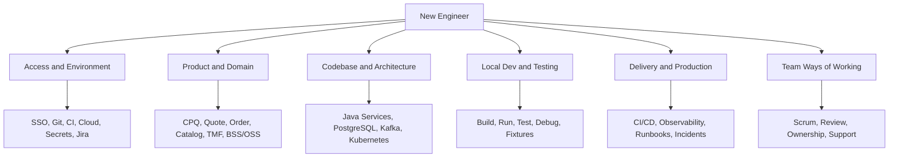

# Part 045 — Capstone 5: Developer Onboarding Improvement

## 1. Source notes and scope boundary

This part uses public engineering effectiveness and DevEx references, especially:

- DORA material on software delivery performance, platform engineering, and value stream thinking.
- SPACE framework as a multidimensional model for developer productivity: satisfaction/well-being, performance, activity, communication/collaboration, and efficiency/flow.
- Backstage concepts such as software catalog and software templates as public examples of developer portal/golden path tooling.
- Earlier parts of this series on DevEx fundamentals, documentation, local golden paths, platform engineering, cognitive load, and measurement.

This part does **not** assume CSG uses Backstage, a specific developer portal, a specific onboarding workflow, or a specific internal platform.

Use the internal verification checklist to adapt the playbook to the actual CSG Quote & Order team, repositories, CI/CD, environments, access model, security constraints, and onboarding practices.

---

## 2. Core thesis

Developer onboarding is not an HR formality.

For an enterprise product team, onboarding is a production-quality system.

A new engineer who cannot build, run, test, debug, understand, or safely change the system creates hidden cost:

- repeated questions to senior engineers;
- slow first contribution;
- copy-paste setup mistakes;
- unsafe PRs;
- shallow domain understanding;
- local environment drift;
- low confidence during debugging;
- dependency on tribal knowledge;
- longer time before the engineer can review, support, or own work.

A mature onboarding system reduces time-to-first-productive-change **without** lowering quality.

The goal is not simply:

> New hire can run the service.

The better goal is:

> New hire can make one small, safe, reviewed, tested, domain-aware change and explain how it moves from code to production.

---

## 3. What developer onboarding must cover

For CSG Quote & Order-like enterprise backend systems, onboarding should cover six layers.



A broken onboarding process usually optimizes only access setup and ignores domain, observability, production, and first PR safety.

---

## 4. Success metrics

Measure onboarding as a flow system.

### 4.1 Time-based metrics

Useful signals:

- time to required access;
- time to local build success;
- time to run one service locally;
- time to run unit tests;
- time to run integration tests;
- time to debug a representative failure;
- time to first merged PR;
- time to first meaningful PR review;
- time to first on-call shadowing or production walkthrough;
- time to confidence in one bounded area.

Do not use these as pressure on the new engineer.

Use them to find friction in the system.

### 4.2 Quality-based metrics

Useful signals:

- first PR had adequate test coverage;
- first PR followed team conventions;
- first PR was not blocked by missing docs;
- new engineer can explain deployment flow;
- new engineer can trace a quote/order by correlation ID;
- new engineer can identify the owner of a service/API/topic;
- new engineer can find relevant runbook/dashboard;
- new engineer can explain one domain invariant.

### 4.3 Experience-based metrics

Ask the engineer:

- What took longer than expected?
- What did you need to ask twice?
- Which docs were wrong?
- Which docs were missing?
- Which setup step felt risky?
- Which concept was most confusing?
- Which command/script gave poor error messages?
- Where did you depend on one specific person?

A good onboarding improvement program captures these answers before the memory fades.

---

## 5. Baseline the current onboarding value stream

Before improving onboarding, map it.

### 5.1 Onboarding value stream


For each step, record:

- expected duration;
- actual duration;
- owner;
- waiting time;
- failure modes;
- documentation link;
- support channel;
- automation opportunity.

### 5.2 Typical friction points

| Step | Friction | Example |
|---|---|---|
| Access | approval delay | missing Git/CI/cloud/Jira permission |
| Clone/build | missing prerequisite | wrong Java/Maven/Node/Docker version |
| Run service | dependency complexity | local DB/Kafka/service config unclear |
| Test | slow/flaky suite | unclear which tests to run first |
| Domain | vocabulary gap | quote/order/catalog terms undefined |
| First PR | unclear good first issue | new engineer picks risky work |
| Review | no reviewer routing | PR waits because ownership unclear |
| Production | no dashboard map | engineer cannot trace runtime behavior |

---

## 6. Define onboarding personas

Not every new joiner needs the same path.

### 6.1 Senior Java backend engineer

Needs fast path to:

- build/run Java services;
- understand domain invariants;
- understand PostgreSQL/Kafka boundaries;
- participate in PR review;
- own production-safety concerns;
- contribute design/architecture judgment.

### 6.2 QA/test engineer

Needs fast path to:

- domain scenarios;
- test data;
- API workflows;
- E2E fixtures;
- environment health;
- defect triage;
- acceptance criteria patterns.

### 6.3 Platform/SRE engineer

Needs fast path to:

- deployment topology;
- Kubernetes resources;
- observability;
- CI/CD;
- service ownership;
- incident runbooks;
- database/Kafka operational signals.

### 6.4 Product owner/business analyst

Needs fast path to:

- domain glossary;
- lifecycle states;
- backlog patterns;
- acceptance criteria;
- dependency model;
- release readiness terms.

This capstone focuses on senior Java/product engineering onboarding, but the same method applies to other personas.

---

## 7. Minimum viable onboarding system

A strong onboarding system needs a few durable artifacts.

### 7.1 Onboarding index

One entry point.

It should answer:

- where to start;
- what to do on day 1;
- what to do in week 1;
- what to read;
- what to run;
- who to ask;
- where to find product docs;
- where to find architecture docs;
- where to find runbooks;
- what first PR looks like.

### 7.2 Access checklist

Include:

- identity/SSO;
- Git repositories;
- CI/CD;
- artifact registry;
- Jira/board;
- documentation/wiki;
- Slack/Teams channels;
- observability tools;
- cloud/Kubernetes access;
- database/Kafka read-only access if allowed;
- VPN/proxy/certificate setup;
- secret manager access.

### 7.3 Local golden path

Must include:

- required tool versions;
- bootstrap command;
- build command;
- run command;
- test command;
- sample API call;
- sample Kafka event if relevant;
- sample DB migration/test;
- debugging instructions;
- common errors and fixes.

### 7.4 Domain quickstart

Must include:

- quote-to-cash overview;
- CPQ glossary;
- quote lifecycle;
- order lifecycle;
- catalog and product offering concepts;
- approval and audit concepts;
- high-risk invariants;
- links to deeper materials.

### 7.5 First contribution guide

Must include:

- good first issue types;
- unsafe first issue types;
- PR expectations;
- test expectations;
- review routing;
- example successful small PR;
- Definition of Done.

---

## 8. Design the first productive PR path

A good first PR is a learning path with real value.

### 8.1 Good first PR characteristics

It should be:

- small;
- safe;
- testable;
- reviewed by area owner;
- aligned with conventions;
- connected to domain or DevEx;
- mergeable within a few days;
- not dependent on broad architecture decisions.

Examples:

- add missing unit test for invalid state transition;
- add integration test for MyBatis mapper tenant predicate;
- improve service README setup step;
- add missing structured log field;
- fix flaky test root cause;
- add sample API request for quote creation;
- improve error message for validation failure;
- add runbook link to alert description.

### 8.2 Bad first PR characteristics

Avoid:

- public API redesign;
- large refactor;
- pricing behavior change;
- order lifecycle change;
- hot-table migration;
- security boundary change;
- new framework introduction;
- cross-team dependency-heavy feature.

### 8.3 First PR template

```md
# First PR Candidate

## Goal
What small value does this change provide?

## Learning target
What part of the system does the new engineer learn?

## Risk
Why is this safe as a first PR?

## Expected tests
Which test proves correctness?

## Reviewer
Who owns this area?

## Done means
- build passes
- relevant tests pass
- docs updated if needed
- reviewer understands intent
```

---

## 9. Build an onboarding dashboard

The dashboard does not need to be fancy.

It should answer:

- Are new engineers blocked?
- Which setup step fails most often?
- Are docs stale?
- Is first PR path clear?
- Are reviewers responsive?
- Is local development reliable?
- Are test suites too slow for new joiners?

### 9.1 Candidate metrics

| Metric | Interpretation |
|---|---|
| time to access complete | access process friction |
| time to build success | toolchain/setup friction |
| time to run service locally | local platform maturity |
| time to first test run | feedback loop quality |
| time to first merged PR | onboarding flow health |
| number of setup help requests | doc/tooling gaps |
| repeated questions | missing conceptual docs |
| first PR review latency | reviewer routing and team capacity |
| onboarding doc corrections | doc freshness signal |

### 9.2 Safety principles

Do not compare new engineers competitively.

Compare onboarding cohorts to find system friction.

The question is not:

> Why did this engineer take 8 days?

The question is:

> What made the path take 8 days, and can we make it 4 days for the next person without lowering quality?

---

## 10. Onboarding improvement backlog

Create PBIs for onboarding improvements.

Examples:

### 10.1 Local build improvement

```md
As a new backend engineer,
I want one documented bootstrap command for Java service dependencies,
so that I can build and test locally without relying on tribal setup instructions.

Acceptance criteria:
- supported Java/Maven/Docker versions documented
- bootstrap command validates prerequisites
- common errors documented
- command tested on clean machine/container if possible
- docs linked from onboarding index
```

### 10.2 Service map improvement

```md
As a new engineer,
I want a one-page map of the Quote service,
so that I can understand API, domain, DB, Kafka, and deployment boundaries before making changes.

Acceptance criteria:
- REST endpoints listed
- key tables listed
- Kafka topics produced/consumed listed
- key domain invariants listed
- dashboards/runbooks linked
- owner/reviewer group listed
```

### 10.3 First PR path improvement

```md
As a new engineer,
I want a curated list of safe first PR candidates,
so that I can contribute value while learning team conventions.

Acceptance criteria:
- at least 5 first PR candidates identified
- each has owner/reviewer
- each has test expectation
- risky areas explicitly excluded
- list reviewed monthly
```

---

## 11. Onboarding quality gates

By the end of onboarding phase, a senior engineer should be able to demonstrate a few capabilities.

### 11.1 Week 1 gate

Can:

- access repositories/tools;
- build project;
- run basic tests;
- find team board;
- find product docs;
- explain what the team owns.

### 11.2 Week 2 gate

Can:

- explain core domain terms;
- trace one API request through code at high level;
- understand local run path;
- identify service owner/reviewer;
- ask precise domain questions.

### 11.3 Week 4 gate

Can:

- open and merge a safe PR;
- run relevant tests;
- understand CI result;
- explain one domain invariant;
- find dashboard/runbook for one service;
- provide feedback on onboarding friction.

### 11.4 Day 60 gate

Can:

- review small PRs in one area;
- contribute a medium change with tests;
- understand one service from API to DB/Kafka;
- trace one quote/order journey;
- identify one improvement opportunity.

---

## 12. Role of senior engineer in onboarding improvement

A senior engineer can improve onboarding without becoming the onboarding coordinator.

High-leverage actions:

- write missing service map;
- fix broken setup command;
- create sample fixture;
- curate first PR candidates;
- document domain invariant;
- improve test speed;
- add local debugging guide;
- pair on first PR;
- create PR review checklist;
- add observability walkthrough.

Senior engineers should capture what they explain repeatedly.

Repeated explanation is usually missing infrastructure.

---

## 13. Internal verification checklist

Verify:

- official onboarding owner;
- current onboarding checklist;
- access provisioning workflow;
- required tools;
- local dev strategy;
- service ownership map;
- domain glossary location;
- first PR expectations;
- buddy/mentor process;
- review routing;
- CI/CD access;
- observability access;
- runbook access;
- incident archive access;
- customer/security restrictions;
- whether production data access is allowed;
- whether on-call shadowing is expected;
- expected 30/60/90 outcomes.

---

## 14. Capstone execution plan

### Step 1 — Baseline

Interview 3–5 engineers:

- one new engineer;
- one senior engineer;
- one QA/test engineer;
- one platform/SRE engineer;
- one manager/team lead.

Ask:

- what slowed onboarding most?
- what was missing?
- what was wrong?
- what was confusing?
- what should be automated?
- what should be documented?

### Step 2 — Map onboarding value stream

Create a visual map from access to first PR.

Mark:

- wait time;
- failure points;
- owner;
- documentation;
- automation opportunity.

### Step 3 — Pick one measurable improvement

Examples:

- reduce local setup from 2 days to 4 hours;
- reduce first PR review wait from 3 days to 1 day;
- reduce repeated setup questions by 50%;
- create first service map for Quote service;
- create a curated first PR backlog.

### Step 4 — Implement as product improvement

Treat onboarding as internal product work.

Create:

- PBI;
- acceptance criteria;
- owner;
- reviewer;
- rollout plan;
- measurement.

### Step 5 — Validate with next onboarder

The next new engineer is your integration test.

Do not declare success until someone else uses the improved path.

---

## 15. Anti-patterns

### 15.1 Wiki dump onboarding

Giving 50 links is not onboarding.

A path is better than a pile.

### 15.2 Tribal knowledge dependency

If onboarding requires one specific person, the system is fragile.

### 15.3 Tooling without explanation

A script that works but cannot be understood creates dependency.

### 15.4 Documentation without ownership

Docs rot unless owned and reviewed.

### 15.5 First PR roulette

Letting a new engineer pick randomly from backlog can cause unsafe early work.

### 15.6 Ignoring production

A backend engineer is not onboarded until they can understand how code behaves in production.

---

## 16. Practical exercise

Create an onboarding improvement proposal for your team.

Template:

```md
# Onboarding Improvement Proposal

## Current friction
What slows new engineers?

## Evidence
Survey/interview/metric/examples.

## Target user
Senior Java engineer / QA / platform / PO.

## Proposed improvement
What will change?

## Acceptance criteria
How do we know it works?

## Measurement
What metric or qualitative signal improves?

## Owner
Who maintains it?

## Rollout
How will it be tested with the next onboarder?
```

---

## 17. Summary

Developer onboarding is a DevEx product.

A good onboarding system reduces cognitive load, shortens feedback loops, exposes ownership, teaches domain invariants, and produces safe early contribution.

For enterprise Quote & Order engineering, onboarding must cover more than local setup:

- domain;
- codebase;
- data;
- events;
- deployment;
- observability;
- production support;
- Scrum/team workflow;
- first PR safety.

The strongest onboarding improvement is one that helps the next engineer become productive without needing the same explanations repeated again.
