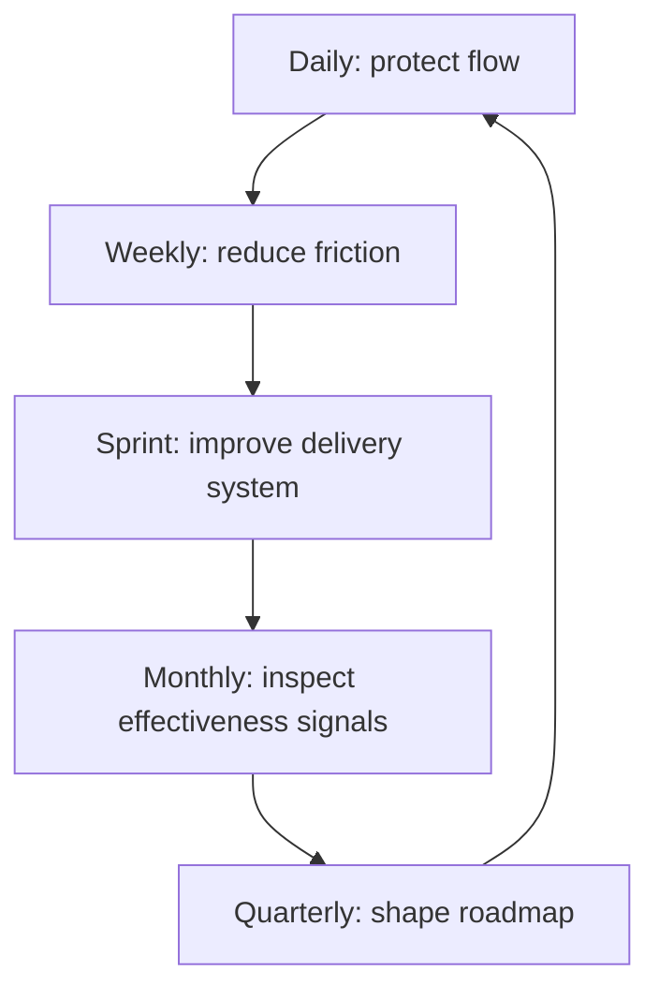

# Part 046 — Senior Engineer Effectiveness Operating Rhythm

## 1. Source notes and scope boundary

This part uses public engineering effectiveness references, especially:

- DORA metrics and capabilities for software delivery performance.
- SPACE framework for multidimensional developer productivity.
- Google Engineering Practices for code review speed and quality principles.
- Platform engineering and internal developer platform concepts from public DORA/CNCF/Backstage/Team Topologies material.
- Previous parts of this series on flow metrics, DevEx, observability, platform engineering, governance, onboarding, and Scrum execution.

This part does **not** assume your exact role boundaries at CSG, whether you are an official tech lead, staff engineer, principal engineer, Scrum Master, platform engineer, or team lead.

Adapt the operating rhythm to your actual team expectations, sprint cadence, on-call model, and leadership scope.

---

## 2. Core thesis

Senior engineering effectiveness is not random helpfulness.

It is a repeatable operating rhythm that continuously improves:

- delivery flow;
- code review quality;
- CI/CD reliability;
- local developer experience;
- test feedback loops;
- observability;
- platform adoption;
- production recovery;
- onboarding;
- team learning;
- architecture decision quality.

A senior engineer should not merely ask:

> What ticket should I pick next?

A stronger question is:

> What is the most valuable constraint I can reduce this week without becoming a bottleneck?

---

## 3. The operating rhythm model



Each cadence has a purpose.

| Cadence | Purpose | Output |
|---|---|---|
| Daily | Detect flow risk early | unblock, review, clarify, route |
| Weekly | Convert friction into improvement | small fixes, docs, tests, dashboards |
| Sprint | Tie improvement to Scrum delivery | Definition of Done, retro action, risk control |
| Monthly | Review system health | metrics review, top bottlenecks, roadmap update |
| Quarterly | Invest in systemic leverage | platform/DevEx/effectiveness initiatives |

---

## 4. Daily rhythm: protect flow

Daily work should prevent small delays from becoming sprint failure.

### 4.1 Daily questions

Ask yourself:

- Which work item is aging dangerously?
- Which PR needs review or reviewer routing?
- Which CI failure is blocking flow?
- Which story has hidden ambiguity?
- Which teammate is blocked but not escalating?
- Which production issue needs engineering follow-up?
- Which decision is waiting for me?
- Which dependency needs clarification?

### 4.2 Daily actions

High-leverage daily actions:

- review one aging PR;
- unblock one teammate;
- clarify one ambiguous acceptance criterion;
- route a question to the correct owner;
- fix one small friction;
- update one doc you just used;
- add one diagnostic log/metric while context is fresh;
- convert one repeated question into a reference link.

### 4.3 What not to do daily

Avoid:

- joining every discussion;
- reviewing every PR;
- solving every blocker personally;
- replacing team ownership;
- interrupting focused work constantly;
- optimizing only your own ticket throughput.

Senior leverage is selective.

---

## 5. Weekly rhythm: reduce friction

Once a week, inspect your local engineering system.

### 5.1 Weekly flow review

Look at:

- oldest work item;
- oldest PR;
- blocked tickets;
- CI failures;
- flaky test occurrences;
- production interruptions;
- review bottlenecks;
- repeated questions;
- slow local workflow;
- unclear ownership.

### 5.2 Weekly improvement budget

Reserve small time for improvement.

Examples:

- 30 minutes fixing docs;
- 1 hour improving a test fixture;
- 1 hour reducing flaky test cause;
- 30 minutes reviewing dashboard health;
- 1 hour creating a small script;
- 30 minutes cleaning stale onboarding information.

The improvement budget must be realistic.

Do not create a parallel secret roadmap that conflicts with Sprint commitments.

### 5.3 Weekly artifact

Try to produce one durable artifact per week or two:

- service map;
- troubleshooting note;
- ADR draft;
- test helper;
- dashboard panel;
- runbook improvement;
- first PR candidate;
- review checklist;
- dependency map.

Small artifacts compound.

---

## 6. Sprint rhythm: connect effectiveness to Scrum

Engineering effectiveness should appear inside Scrum work, not outside it.

### 6.1 During refinement

Ask:

- Is this PBI vertically sliced?
- Is acceptance criteria production-grade?
- Is test strategy clear?
- Is migration/API/event/security impact known?
- Is observability included?
- Is the work too large because discovery is missing?
- Is a spike needed?

### 6.2 During Sprint Planning

Ask:

- Is Sprint Goal clear?
- Is capacity realistic?
- Is interrupt load considered?
- Is technical debt visible?
- Is the riskiest work started early?
- Are dependencies explicit?
- Is review capacity available?
- Is production readiness included in Done?

### 6.3 During Daily Scrum

Ask:

- Are we still confident in Sprint Goal?
- Which work item is aging?
- Which review or CI bottleneck needs action?
- Which assumption changed?
- Which production incident affects plan?

### 6.4 During Sprint Review

Show evidence:

- working behavior;
- API/event compatibility;
- dashboard/metric;
- trace/log example;
- test result;
- deployment readiness;
- support/runbook note.

### 6.5 During Retrospective

Turn pain into system improvement.

Weak retro action:

> Be better at reviews.

Strong retro action:

> Add CODEOWNERS/reviewer routing for order lifecycle PRs and track time-to-first-review for two sprints.

---

## 7. Monthly rhythm: inspect system health

Once a month, review engineering effectiveness signals.

### 7.1 Metric set

Use a balanced set.

Flow:

- cycle time;
- work item age;
- throughput;
- blocked time;
- WIP;
- PR review latency.

Delivery:

- deployment frequency;
- change lead time;
- change failure or failed deployment rate;
- recovery time.

Quality:

- escaped defects;
- flaky test rate;
- regression rate;
- incident-derived backlog.

DevEx:

- local setup time;
- build/test time;
- onboarding friction;
- developer survey signals;
- repeated support questions.

Observability:

- alert actionability;
- dashboard coverage;
- trace coverage;
- runbook freshness.

### 7.2 Monthly review questions

- What got faster?
- What got slower?
- Where did WIP accumulate?
- Which queue hurt the team most?
- Which incident taught us something?
- Which flaky tests eroded confidence?
- Which platform/golden path was not adopted?
- Which onboarding friction repeated?
- Which metric might be gamed or misleading?
- Which improvement should be next?

### 7.3 Monthly output

Produce one of:

- effectiveness report;
- top 5 friction list;
- improvement proposal;
- platform adoption report;
- observability gap list;
- test reliability report;
- onboarding improvement update.

Keep it short.

The purpose is action, not reporting theater.

---

## 8. Quarterly rhythm: shape effectiveness roadmap

Quarterly review should connect engineering friction to product delivery.

### 8.1 Quarterly roadmap inputs

Collect:

- DORA/flow metrics;
- incident themes;
- DevEx survey;
- platform maturity assessment;
- on-call/toil analysis;
- support escalation themes;
- technical debt risk;
- product roadmap dependency;
- architecture constraints.

### 8.2 Prioritization model

Score improvements by:

- impact on product delivery;
- impact on reliability;
- impact on developer experience;
- number of teams affected;
- effort;
- reversibility;
- adoption complexity;
- ownership clarity.

### 8.3 Example quarterly initiatives

- Reduce CI feedback from 35 minutes to 15 minutes.
- Cut PR time-to-first-review by 40%.
- Create quote/order service golden path.
- Add end-to-end quote-to-order observability dashboard.
- Reduce flaky test failures by 70%.
- Create migration safety checklist and Testcontainers examples.
- Improve onboarding time-to-first-PR.
- Create Kafka replay/DLQ debugging guide.

### 8.4 Quarterly outcome statement

Good outcome statement:

> By end of quarter, Quote & Order engineers can create, test, and deploy a standard Java service change with reliable CI feedback under 20 minutes, clear reviewer routing, and baseline observability signals in place.

Bad outcome statement:

> Improve DevEx.

---

## 9. Personal dashboard for senior engineers

A senior engineer can maintain a lightweight dashboard.

### 9.1 Questions it answers

- Where is the team stuck?
- Where am I a bottleneck?
- Which area has no owner?
- Which recurring friction should become platform work?
- Which production risk is not represented in backlog?
- Which teammate needs enablement?
- Which doc/runbook is now stale?

### 9.2 Personal signals

Track lightly:

- PRs waiting on you;
- decisions waiting on you;
- mentoring commitments;
- docs you promised;
- design reviews due;
- incidents requiring follow-up;
- improvement backlog items;
- ownership gaps noticed.

Do not over-measure yourself.

Use this to avoid becoming a hidden queue.

---

## 10. The senior engineer as bottleneck prevention

Senior engineers often accidentally become bottlenecks.

### 10.1 Bottleneck symptoms

- every PR needs you;
- every design waits for your opinion;
- every incident requires your memory;
- every onboarding question comes to you;
- every production repair needs you;
- team avoids decisions when you are unavailable.

### 10.2 Bottleneck reduction tactics

- document repeated answers;
- create reviewer map;
- mentor backup owners;
- write decision criteria;
- create runbooks;
- create golden path examples;
- move knowledge into tests;
- delegate with support;
- use ADRs for durable decisions.

Your goal is not to be indispensable.

Your goal is to make the system safer when you are not in the room.

---

## 11. Operating rhythm by work type

### 11.1 API work

Daily:

- check contract ambiguity;
- route review to API owner.

Sprint:

- include OpenAPI diff;
- validate consumer impact;
- define examples.

Monthly:

- review API compatibility incidents;
- improve contract DevEx.

### 11.2 Kafka/event work

Daily:

- check event schema/replay concerns;
- ensure consumer ownership known.

Sprint:

- include contract/replay tests;
- assert DLQ/runbook readiness.

Monthly:

- review DLQ/replay friction;
- improve event fixture catalog.

### 11.3 PostgreSQL/migration work

Daily:

- expose lock/backfill uncertainty early.

Sprint:

- include migration dry run;
- include rollback/roll-forward plan.

Monthly:

- review migration failures;
- improve local DB/migration tooling.

### 11.4 Observability work

Daily:

- add diagnostic fields while implementing.

Sprint:

- include metrics/logs/traces in DoD.

Monthly:

- review alert actionability and dashboard gaps.

### 11.5 Platform/DevEx work

Daily:

- capture friction.

Sprint:

- deliver one small golden path improvement.

Monthly:

- measure adoption and satisfaction.

---

## 12. Communication rhythm

### 12.1 Daily communication

Keep it specific:

- blocker;
- decision needed;
- owner;
- deadline;
- risk if not resolved.

Example:

> Order fallout story is blocked by unclear terminal state semantics. Need domain owner decision today; otherwise PR may implement behavior that conflicts with support workflow.

### 12.2 Weekly communication

Share patterns:

> Three PRs this week waited more than two days for mapper review. Suggest adding DB reviewer rotation or risk labels for SQL changes.

### 12.3 Monthly communication

Share system-level insight:

> CI time increased from 18 to 32 minutes after integration test growth. Top contributors are PostgreSQL container startup and duplicate full-context tests. Proposal: split integration test stages and add shared fixture strategy.

### 12.4 Quarterly communication

Share roadmap:

> Our top delivery bottleneck is not coding time but review + CI queue. Recommended Q3 initiative: PR flow improvement plus CI feedback loop reduction.

---

## 13. Anti-patterns

### 13.1 Random acts of improvement

Improvement without measurement or adoption plan creates scattered effort.

### 13.2 Metrics obsession

Metrics are signals, not the mission.

### 13.3 Hero operating rhythm

If your rhythm depends on personal heroics, it is not scalable.

### 13.4 Platform without product thinking

A tool nobody adopts is not leverage.

### 13.5 Documentation as dumping ground

Docs must be findable, owned, and connected to workflow.

### 13.6 Review as gatekeeping

Review should improve quality and learning, not assert status.

---

## 14. Internal verification checklist

Verify:

- your formal role expectations;
- whether you are expected to lead technical direction;
- team Scrum cadence;
- PR review policy;
- on-call/support expectations;
- ownership boundaries;
- metrics available;
- DevEx survey/process;
- platform team relationship;
- architecture governance;
- incident follow-up process;
- quarterly planning process;
- allowed time for engineering improvement;
- manager/team lead expectations for effectiveness work.

---

## 15. Practical exercise

Build your personal senior engineer operating rhythm.

Template:

```md
# Senior Engineer Operating Rhythm

## Daily
- Flow risk I check:
- PR/review habit:
- Blocker escalation habit:

## Weekly
- Metrics/signals I inspect:
- Improvement timebox:
- Artifact I maintain:

## Sprint
- Refinement contribution:
- Planning contribution:
- Review/retro contribution:

## Monthly
- Effectiveness review:
- Top friction list:
- Improvement proposal:

## Quarterly
- Roadmap input:
- Ownership area:
- Enablement goal:
```

Then review it with your manager or tech lead.

---

## 16. Summary

A senior engineer's effectiveness operating rhythm turns observation into leverage.

The rhythm is simple:

- daily: protect flow;
- weekly: reduce friction;
- sprint: connect quality to delivery;
- monthly: inspect system health;
- quarterly: invest in systemic improvement.

The goal is not to do more work.

The goal is to make important work move through the system with less waste, less risk, better feedback, and stronger ownership.

For enterprise Quote & Order engineering, that means improving not only code, but the delivery system around code: DevEx, platform, CI/CD, observability, review flow, onboarding, and production recovery.
