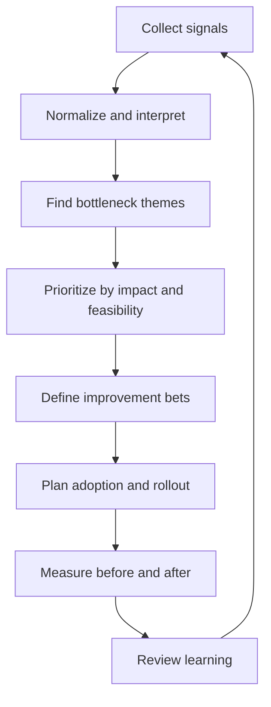

# Part 047 — Effectiveness Review and Quarterly Planning

## 1. Source notes and scope boundary

This part uses public engineering-effectiveness references and general practice:

- DORA software delivery metrics for delivery performance signals.
- SPACE framework for multi-dimensional developer productivity thinking.
- Scrum empirical process control as a cadence for inspection and adaptation.
- Previous parts in this series on value stream thinking, flow metrics, DevEx measurement, incident learning, and platform maturity.

This part does **not** assume CSG has a specific quarterly planning format, engineering effectiveness office, platform roadmap process, DORA dashboard, SPACE survey, product operating model, or internal metrics platform.

Use the internal verification checklist to adapt the playbook to your actual team, tools, and product area.

---

## 2. Core thesis

Engineering effectiveness improvement should not be random.

A mature senior engineer does not simply notice friction and complain about it. They convert evidence into a focused improvement plan.

The quarterly effectiveness review answers:

> What is slowing down safe delivery, how do we know, which bottleneck matters most, what is the smallest improvement that will move the system, and how will we know it worked?

For enterprise Quote & Order teams, effectiveness planning matters because delivery bottlenecks often hide behind normal activity:

- PRs are open, but review latency is high.
- CI runs, but feedback is too slow to shape behavior.
- Tests exist, but flaky failures erode trust.
- Deployments happen, but releases still feel risky.
- Observability exists, but quote/order incidents still require manual archaeology.
- Documentation exists, but new engineers still need tribal knowledge.
- Platform tooling exists, but teams still file tickets for routine tasks.

Quarterly effectiveness planning makes these system issues visible and actionable.

---

## 3. Why quarterly planning?

Daily work finds symptoms.

Sprint retrospectives find recent patterns.

Quarterly effectiveness planning finds structural bottlenecks.

Different cadence, different question:

| Cadence | Primary question |
|---|---|
| Daily | What is blocking the Sprint Goal today? |
| Sprint retrospective | What should we improve from this Sprint? |
| Monthly review | What friction pattern is recurring? |
| Quarterly planning | Which system-level improvement deserves sustained investment? |

Some improvements need more than one sprint:

- CI pipeline restructuring.
- Test suite reliability program.
- Observability for quote-to-order journey.
- Developer onboarding rewrite.
- Platform golden path rollout.
- PR review routing model.
- Migration safety framework.
- Kafka replay tooling.

If these are handled only as ad hoc side tasks, they usually lose to urgent feature work.

Quarterly planning gives them shape, ownership, and measurement.

---

## 4. The effectiveness review loop

A practical quarterly review follows this loop:



The loop is intentionally empirical.

Do not start with a preferred solution.

Start with evidence.

---

## 5. Signal collection

A strong review combines quantitative and qualitative evidence.

### 5.1 Quantitative signals

Useful signals include:

- lead time for changes;
- deployment frequency;
- change failure rate;
- failed deployment recovery time;
- reliability/SLO signals;
- cycle time;
- work item age;
- WIP;
- blocked time;
- PR time to first review;
- PR cycle time;
- CI queue time;
- CI execution time;
- flaky test rate;
- local setup time;
- time to first productive PR;
- incident detection time;
- incident diagnosis time;
- alert noise rate;
- rollback frequency;
- manual support task count;
- platform adoption rate;
- documentation freshness.

### 5.2 Qualitative signals

Useful qualitative signals include:

- developer interviews;
- onboarding feedback;
- friction logs;
- retro notes;
- incident postmortems;
- support escalation summaries;
- architecture review pain points;
- PR review comments;
- customer escalation patterns;
- platform support requests;
- recurring Slack/Teams questions.

Numbers tell you where to look.

Stories tell you why it hurts.

---

## 6. Normalize metrics before interpreting them

Raw metrics can mislead.

Before making conclusions, ask:

- What is the measurement boundary?
- Does the metric include only merged PRs or abandoned work too?
- Does lead time start from first commit, ticket creation, or development start?
- Does deployment frequency measure deploys to production, staging, or all environments?
- Does change failure include rollback, hotfix, incident, data repair, or all of them?
- Are on-prem releases measured differently from cloud releases?
- Are urgent incidents mixed with planned feature work?
- Are support tasks represented in the same workflow?
- Are customer-specific changes skewing results?

Example:

A team may have low deployment frequency not because engineering is slow, but because customer/on-prem release governance batches releases.

That is not a reason to ignore the metric.

It means the metric must be interpreted with context.

---

## 7. Engineering effectiveness dimensions

Use several dimensions together.

### 7.1 Delivery flow

Questions:

- How long does work take from ready to released?
- Where does work wait?
- Are PRs too large?
- Is review queue the bottleneck?
- Is CI slow or flaky?
- Is deployment blocked by manual gates?

Signals:

- cycle time;
- work item age;
- PR review latency;
- CI duration;
- deployment queue time;
- WIP.

### 7.2 Quality and reliability

Questions:

- How often do changes create incidents?
- Are defects found early or late?
- Are flaky tests reducing confidence?
- Are releases reversible?
- Are production signals actionable?

Signals:

- change failure rate;
- escaped defects;
- flaky test rate;
- incident count;
- failed deployment recovery time;
- alert noise ratio.

### 7.3 Developer experience

Questions:

- Can developers run the system locally?
- Is debugging cheap?
- Is documentation findable and current?
- Are platform paths self-service?
- Is cognitive load excessive?

Signals:

- local setup time;
- time to first PR;
- developer survey;
- friction log;
- support questions;
- platform ticket count.

### 7.4 Product and business impact

Questions:

- Are improvements helping Quote & Order delivery?
- Do they reduce production risk?
- Do they improve customer-impacting flow?
- Do they reduce support load?

Signals:

- quote-to-order release lead time;
- fallout issue resolution time;
- customer escalation frequency;
- production repair count;
- feature adoption speed.

---

## 8. The quarterly review agenda

Use a structured review.

```md
# Quarterly Engineering Effectiveness Review

## 1. Scope
- Team/service/capability:
- Time window:
- Releases included:
- Major incidents:
- Major customer commitments:

## 2. Signal summary
- Delivery flow:
- Quality/reliability:
- DevEx:
- Platform:
- Observability:
- Support/toil:

## 3. Top friction themes
1.
2.
3.

## 4. Root cause hypotheses
- Hypothesis:
- Evidence:
- Counter-evidence:

## 5. Candidate improvement bets
- Bet:
- Expected impact:
- Effort:
- Risk:
- Owner:

## 6. Selected roadmap
- Improvement 1:
- Improvement 2:
- Improvement 3:

## 7. Measurement plan
- Baseline:
- Target direction:
- Leading indicators:
- Lagging indicators:

## 8. Adoption plan
- Pilot:
- Stakeholders:
- Communication:
- Training/docs:

## 9. Review date
- Mid-quarter check:
- End-quarter review:
```

This keeps the conversation evidence-based.

---

## 9. Choosing improvement bets

An improvement bet is a focused, measurable change to the engineering system.

Examples:

- Reduce CI p95 feedback time for backend PRs from 45 minutes to under 20 minutes.
- Reduce PR time-to-first-review for Quote service changes by introducing ownership-based reviewer routing.
- Improve order lifecycle debugging by adding correlation IDs and dashboard panels for stuck orders.
- Reduce flaky integration test failures by isolating Kafka/Testcontainers test data.
- Cut onboarding time-to-first-productive-PR by improving golden path documentation and setup scripts.
- Reduce release friction by automating migration dry-run evidence generation.

A good bet has:

- evidence;
- clear users;
- owner;
- bounded scope;
- measurable outcome;
- adoption path;
- review date.

A bad bet is vague:

> Improve developer productivity.

A better bet:

> Reduce local run setup time for order-service from multiple days to under 2 hours by documenting required dependencies, providing a Docker Compose/Testcontainers profile, and adding smoke-test verification.

---

## 10. Prioritization model

Use a simple scoring model.

| Dimension | Question | Score 1–5 |
|---|---|---|
| Impact | How much does this improve delivery, quality, reliability, or DevEx? |  |
| Frequency | How often does the pain occur? |  |
| Breadth | How many engineers/teams are affected? |  |
| Risk reduction | Does it reduce production/customer risk? |  |
| Feasibility | Can we make meaningful progress this quarter? |  |
| Adoption likelihood | Will teams actually use the improvement? |  |
| Strategic alignment | Does it support roadmap/product goals? |  |

Total score is not the decision.

It starts the discussion.

Always ask:

- Is this a team-local improvement or cross-team/platform improvement?
- Does this require authority we do not have?
- Is adoption harder than implementation?
- Is the problem painful enough to change behavior?
- What is the smallest pilot?

---

## 11. Roadmap structure

A quarterly effectiveness roadmap should be small.

Do not choose ten major improvements.

Choose one to three.

Example roadmap:

| Improvement | Owner | Target users | Baseline | Target direction | Review date |
|---|---|---|---|---|---|
| CI feedback loop reduction | Senior engineer + platform partner | Backend devs | p95 48m | p95 under 25m | Mid-quarter |
| PR review routing | Service owners | Quote/order PR authors | p50 first review 18h | p50 under 8h | Sprint 3 |
| Quote-to-order dashboard | Observability owner | On-call/support/devs | no end-to-end view | dashboard + runbook | End-quarter |

Each improvement should produce artifacts:

- baseline report;
- design/plan;
- implementation PRs;
- adoption notes;
- measurement after rollout;
- lessons learned.

---

## 12. Measurement without target fixation

Metrics should guide learning, not become weapons.

Use directional targets where possible.

Better:

- reduce CI p95 feedback time;
- reduce PR aging above 2 days;
- reduce repeated onboarding questions;
- reduce alert pages without action;
- increase successful self-service deployments.

Risky:

- every engineer must merge N PRs;
- every PR must be reviewed in 1 hour regardless of complexity;
- deployment frequency must increase even if release governance does not support it;
- all incidents must have MTTR under X without considering severity.

A safe metric review asks:

- What behavior might this metric incentivize?
- Could teams game it?
- What balancing metric prevents gaming?
- What qualitative review complements it?
- Are we measuring teams or systems?

---

## 13. Quarterly review examples for Quote & Order

### 13.1 Example: slow quote approval delivery

Signals:

- quote approval stories frequently carry over;
- PRs touch many modules;
- approval rules are duplicated;
- tests require full E2E suite;
- product questions emerge mid-sprint.

Hypothesis:

- domain rule ownership and test layering are unclear.

Improvement bets:

- document approval decision table;
- add unit-level approval rule test harness;
- create refinement checklist for approval changes;
- add ADR for stale approval invalidation.

Metrics:

- lower carryover for approval stories;
- fewer mid-sprint requirement questions;
- faster test feedback for approval logic;
- fewer approval-related defects.

### 13.2 Example: order incident recovery is slow

Signals:

- incidents require manual DB/Kafka investigation;
- support cannot see stuck order reason;
- traces do not connect quote to order to fulfillment;
- data repair scripts are ad hoc.

Hypothesis:

- observability and runbook gaps dominate recovery time.

Improvement bets:

- add order lifecycle dashboard;
- add correlation/causation ID propagation;
- add stuck-state alert with runbook;
- add repair dry-run template.

Metrics:

- lower diagnosis time;
- fewer engineer handoffs;
- clearer support escalation;
- fewer manual one-off queries.

### 13.3 Example: CI is slowing every team

Signals:

- p95 CI duration over 45 minutes;
- flaky integration tests create reruns;
- backend PRs wait in CI queue;
- developers batch changes to avoid repeated waiting.

Hypothesis:

- slow feedback is causing larger PRs and higher review risk.

Improvement bets:

- split fast/slow test suites;
- quarantine and fix top flaky tests;
- cache dependencies safely;
- parallelize independent modules;
- publish PR feedback summary.

Metrics:

- lower CI p95;
- fewer reruns;
- smaller PRs;
- lower PR age.

---

## 14. Stakeholder map for effectiveness planning

Effectiveness work often crosses boundaries.

| Stakeholder | Why they matter |
|---|---|
| Product Owner | prioritization, roadmap alignment, customer impact |
| Scrum Master | flow, facilitation, impediment removal |
| Engineering Manager | staffing, goals, organizational support |
| Senior/Principal Engineer | technical direction and risk model |
| QA/Test Engineer | test strategy, flakiness, quality gates |
| Platform Team | CI/CD, golden paths, self-service |
| SRE/Ops | observability, incident response, runbooks |
| Security | auth, audit, vulnerability gates |
| Support | customer pain, repeated manual work |
| Architects | cross-system design and standards |

A roadmap without stakeholder alignment becomes a wish list.

---

## 15. Mid-quarter check

Do not wait until the end of quarter to discover no progress happened.

Mid-quarter review asks:

- Are we still solving the right problem?
- Did baseline measurement reveal a different bottleneck?
- Is adoption happening?
- Are stakeholders engaged?
- Is scope too broad?
- Are we improving the metric but worsening developer experience?
- Should we continue, pivot, or stop?

Stopping a weak improvement bet is not failure.

Continuing a weak bet because it was planned is failure.

---

## 16. Effectiveness review anti-patterns

### 16.1 Metric theater

Dashboards exist but nobody changes behavior.

### 16.2 Productivity policing

Metrics are used to rank people instead of improving systems.

### 16.3 Platform wish lists

Teams ask for tools without adoption plan or problem statement.

### 16.4 Improvement overload

The roadmap contains too many initiatives and none receives enough focus.

### 16.5 No baseline

Teams declare improvement without knowing the starting point.

### 16.6 No qualitative evidence

Metrics are interpreted without talking to engineers or support.

### 16.7 No ownership

Everyone agrees the problem is real, but nobody owns the improvement.

### 16.8 No sunset criteria

Temporary processes, feature flags, dashboards, or scripts live forever.

---

## 17. Internal verification checklist

Verify inside your actual team:

- Which metrics are already collected?
- Are DORA metrics available and trustworthy?
- How is deployment frequency defined?
- How is change failure defined?
- Is lead time measured from ticket, commit, PR, or deployment?
- Are flow metrics available from Jira/Azure/GitHub/GitLab?
- Is PR review latency visible?
- Is CI duration visible by stage?
- Are flaky tests tracked?
- Is onboarding friction tracked?
- Is developer survey data available?
- Are platform support requests tracked?
- Are production incidents categorized?
- Are repeated support issues tied to backlog items?
- Who owns engineering effectiveness improvements?
- How does quarterly planning work internally?
- Can effectiveness work be represented in Product Backlog?
- How are cross-team/platform improvements prioritized?
- What does management expect from senior engineers in this space?

---

## 18. Practical exercise: run a lightweight effectiveness review

Choose one service or capability area.

Collect:

1. last 10 completed work items;
2. last 10 PRs;
3. last 5 CI failures;
4. last 3 production/support issues;
5. top repeated developer complaint;
6. onboarding pain point;
7. one platform friction;
8. one observability gap.

Then answer:

- Where does work wait most?
- Which issue repeats?
- Which improvement would reduce the most friction?
- Can it be piloted in one sprint?
- What metric or signal would show improvement?

Deliverable:

```md
# Lightweight Effectiveness Review

## Scope

## Observed signals

## Top friction themes

## Selected improvement bet

## Baseline

## Proposed action

## Measurement plan

## Owner and review date
```

---

## 19. What good looks like

After a strong quarterly effectiveness review, the team should have:

- a small number of improvement bets;
- clear baseline signals;
- named owners;
- stakeholder alignment;
- measurable outcomes;
- adoption plan;
- mid-quarter check;
- end-quarter learning review;
- backlog items tied to real friction;
- no illusion that metrics alone explain everything.

The outcome is not a pretty dashboard.

The outcome is a better engineering system.

---

## 20. Final mental model

Quarterly engineering effectiveness planning is system stewardship.

A senior engineer should be able to look beyond individual tasks and ask:

> What part of our delivery system is making good engineering harder than it should be, and what small, evidence-based improvement can we make this quarter?

That is how DevEx becomes operational strategy instead of sentiment.
