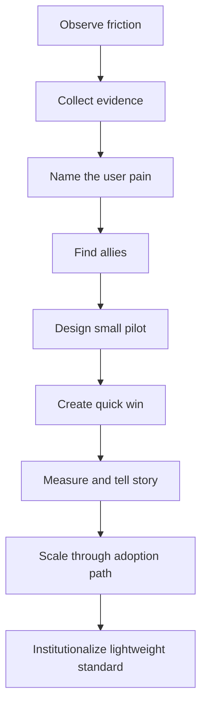

# Part 048 — Leading DevEx Change Without Authority

## 1. Source notes and scope boundary

This part uses public ideas from:

- Team Topologies: team interaction modes such as collaboration, X-as-a-Service, and facilitation.
- Platform-as-a-product thinking from Team Topologies and platform engineering practice.
- DORA and SPACE as measurement lenses for software delivery performance and developer productivity.
- General change leadership concepts such as urgency, guiding coalition, short-term wins, and barrier removal.

This part does **not** assume CSG has a specific internal change management framework, platform team mandate, engineering effectiveness function, or senior-engineer authority model.

Use the internal verification checklist to adapt the playbook to your actual management structure and team norms.

---

## 2. Core thesis

Most DevEx improvements require influence, not authority.

You may not own:

- CI/CD platform;
- developer portal;
- service templates;
- Kubernetes clusters;
- observability stack;
- backlog priority;
- engineering standards;
- architecture governance;
- team workflow.

But as a senior engineer, you can still lead change by creating evidence, reducing risk, building trust, piloting small improvements, and helping teams adopt better paths.

The goal is not to win an argument.

The goal is to make the better engineering path easier, safer, and more attractive than the current path.

---

## 3. Why DevEx change is hard

DevEx problems are often obvious, but fixing them is hard because:

- the pain is distributed;
- ownership is unclear;
- the solution crosses teams;
- benefits are delayed;
- feature work competes for priority;
- metrics are incomplete;
- teams fear governance creep;
- local workarounds are easier than systemic fixes;
- platform teams may be overloaded;
- product teams may not trust platform changes;
- the current friction is normalized.

Example:

Everyone knows CI is slow, but fixing CI may require:

- build system knowledge;
- test ownership;
- platform support;
- team agreement;
- pipeline changes;
- flaky test triage;
- temporary disruption;
- adoption discipline.

No single engineer can command this into existence.

But a senior engineer can make progress possible.

---

## 4. Influence model

Use this model:



Influence is earned through useful progress.

---

## 5. Start with user pain, not solution preference

Bad start:

> We need Backstage.

Better start:

> New backend engineers need three days to find services, owners, local run instructions, dashboards, and APIs. A small software catalog or curated service index could reduce onboarding and incident lookup friction.

Bad start:

> We need to rewrite CI.

Better start:

> Backend PRs wait 45 minutes for feedback, and 30% of failures are flaky integration tests. This encourages large PRs and slows Sprint flow. Let's pilot suite partitioning and flaky test ownership for order-service.

People adopt solutions when they recognize their own pain.

---

## 6. Stakeholder mapping

For each DevEx change, map stakeholders.

| Stakeholder | Interest | Concern | What they need |
|---|---|---|---|
| Product engineers | Faster, safer delivery | New process burden | Clear benefit and low setup cost |
| Platform team | Standardization and operability | Support overload | Narrow pilot and ownership model |
| QA/test engineers | Confidence and traceability | Reduced quality gates | Risk-based quality design |
| Product Owner | Predictable delivery | Tech work displacing features | Business risk framing |
| Scrum Master | Flow and impediment removal | Team disruption | Clear flow benefit |
| Engineering Manager | Team effectiveness | Unbounded initiative | Scope and measurable outcome |
| Security/Architecture | Guardrails | Standards bypass | Explicit risk controls |
| Support/Ops | Fewer escalations | More tools to learn | Runbook and diagnostic benefit |

Do not communicate the same message to everyone.

Translate the change into each stakeholder's concern.

---

## 7. The adoption equation

A DevEx change is adopted when perceived benefit exceeds adoption cost.

```txt
Adoption likelihood = perceived value - migration cost - cognitive cost - trust gap
```

### 7.1 Increase perceived value

Show:

- time saved;
- incidents avoided;
- debugging improved;
- onboarding made easier;
- PR flow improved;
- release risk reduced;
- toil removed.

### 7.2 Reduce migration cost

Provide:

- templates;
- examples;
- scripts;
- migration guide;
- compatibility path;
- pilot support;
- fallback plan.

### 7.3 Reduce cognitive cost

Keep:

- small API;
- clear docs;
- one recommended path;
- few decisions required;
- obvious defaults;
- searchable examples.

### 7.4 Reduce trust gap

Build:

- proof from pilot;
- visible ownership;
- support channel;
- fast fix response;
- no surprise breaking changes;
- transparent limitations.

---

## 8. Pilot strategy

Never start broad if trust is low.

Choose a pilot that is:

- painful enough to matter;
- bounded enough to finish;
- representative enough to generalize;
- owned by a willing team;
- measurable before and after;
- safe to roll back.

Examples:

| Change | Good pilot |
|---|---|
| CI speed improvement | one backend service with clear test bottleneck |
| API contract workflow | one public/internal API with active consumers |
| observability golden path | quote-to-order journey across two services |
| onboarding improvement | one new engineer path through first PR |
| service template | one new internal service or test service |
| PR review routing | one repository with known review bottleneck |

A pilot is not a toy.

It is a controlled adoption experiment.

---

## 9. Build a guiding coalition

For cross-team DevEx change, one enthusiastic engineer is not enough.

You need a small coalition:

- one product engineer who feels the pain;
- one platform/SRE person who understands the tooling;
- one manager/team lead who can protect time;
- one QA/test person if quality gates are involved;
- one senior/principal engineer who can validate architecture;
- one support/on-call person if production diagnostics are involved.

The coalition does not need to be formal.

It needs to be committed enough to unblock the pilot.

---

## 10. Make the change legible

People resist unclear changes.

Create a one-page change brief.

```md
# DevEx Change Brief: <title>

## Pain
- What is currently hard?
- Who feels it?
- How often?

## Evidence
- Metrics:
- Examples:
- Incidents/friction logs:

## Proposal
- What will change?
- What will not change?

## Pilot
- Scope:
- Users:
- Duration:

## Success indicators
- Leading indicators:
- Lagging indicators:

## Adoption cost
- Setup:
- Migration:
- Support:

## Risks and mitigations
- Risk:
- Mitigation:

## Owners
- Driver:
- Reviewers:
- Support:
```

This reduces rumor and ambiguity.

---

## 11. Change types and influence tactics

### 11.1 Tooling change

Example:

- new service template;
- new CI workflow;
- new local dev script;
- new observability helper.

Influence tactic:

- demo working path;
- provide migration guide;
- make opt-in pilot easy;
- collect before/after data;
- keep support loop tight.

### 11.2 Process change

Example:

- PR review routing;
- flaky test ownership;
- release readiness checklist;
- incident action item review.

Influence tactic:

- connect to existing pain;
- pilot with one team;
- avoid adding ceremony;
- automate where possible;
- review outcome after two sprints.

### 11.3 Standard change

Example:

- required correlation ID;
- API compatibility gate;
- migration dry-run evidence;
- service ownership metadata.

Influence tactic:

- explain risk prevented;
- provide paved road;
- define exception process;
- ensure tooling supports compliance;
- avoid manual gate if automation possible.

### 11.4 Cultural change

Example:

- metrics without gaming;
- smaller PRs;
- blameless flaky test handling;
- production readiness mindset.

Influence tactic:

- model behavior;
- celebrate examples;
- use retrospectives;
- avoid blame;
- create reinforcing artifacts.

---

## 12. Leading change through Scrum events

### 12.1 Refinement

Use refinement to surface friction early:

- missing test fixture;
- unclear API contract;
- migration risk;
- observability gap;
- platform dependency;
- release friction.

Ask:

> What would make this work easier and safer next time?

### 12.2 Sprint Planning

Protect improvement work by connecting it to Sprint Goal or risk reduction.

Weak framing:

> Let's do some DevEx cleanup.

Better framing:

> The team cannot safely ship order fallout changes because integration tests are flaky and take 45 minutes. This Sprint includes a targeted test stabilization item to unblock the next two order lifecycle stories.

### 12.3 Daily Scrum

Look for repeated blockers.

Repeated blockers are candidates for DevEx improvement.

### 12.4 Sprint Review

Demo improvement evidence.

Examples:

- before/after CI time;
- new dashboard reducing diagnosis steps;
- local setup script running smoke test;
- service template generating telemetry defaults.

### 12.5 Retrospective

Turn repeated frustration into an action item with owner and measurement.

Avoid retro actions like:

> Improve communication.

Prefer:

> Add owner field and escalation channel to the PR template for cross-service changes; review impact after two sprints.

---

## 13. Handling resistance

Resistance is information.

Do not treat it as disloyalty.

### 13.1 Common resistance types

| Resistance | Possible meaning |
|---|---|
| "We tried this before" | Past attempt failed; learn why |
| "We do not have time" | Benefit not clear or priority conflict |
| "This adds process" | Change may increase cognitive load |
| "Platform never supports us" | Trust gap exists |
| "This will not work for on-prem" | Deployment constraint may be real |
| "Our service is special" | Could be valid complexity or local exceptionalism |
| "Metrics will be used against us" | Psychological safety problem |

### 13.2 Response pattern

1. Acknowledge the concern.
2. Ask for history or example.
3. Identify constraint.
4. Narrow the pilot.
5. Add guardrail or exception path.
6. Reframe around shared goal.

Example:

> I hear the concern that a standard template may not fit order-service because of legacy migration constraints. Let's not force adoption. We can pilot only the observability/logging defaults in a new small service and document which parts do not fit legacy services yet.

---

## 14. Communication patterns

### 14.1 To engineers

Emphasize:

- less waiting;
- faster feedback;
- fewer flaky failures;
- easier debugging;
- fewer manual steps;
- fewer repeated questions;
- less cognitive load.

### 14.2 To Product Owner

Emphasize:

- predictable delivery;
- reduced carryover;
- fewer escaped defects;
- faster recovery from incidents;
- reduced release risk;
- less support interruption.

### 14.3 To platform/SRE

Emphasize:

- reduced ticket load;
- better self-service;
- standardized defaults;
- clearer ownership;
- fewer bespoke workarounds;
- measurable adoption.

### 14.4 To managers

Emphasize:

- team capacity recovered;
- risk reduced;
- onboarding improved;
- flow improved;
- measurable outcomes;
- bounded investment.

---

## 15. Make the better path the easier path

A DevEx improvement wins when it reduces effort.

Bad standard:

> Every service must manually add 15 telemetry attributes and update a spreadsheet.

Better platform path:

> The service template includes default OTel instrumentation, standard resource attributes, dashboard registration, and ownership metadata.

Bad governance:

> All migrations require manual architecture meeting.

Better governance:

> Low-risk additive migrations use an automated checklist; high-risk migrations trigger review based on table size, lock risk, destructive change, or tenant/security impact.

Governance should be risk-based and platform-supported.

---

## 16. Adoption metrics

Measure adoption carefully.

Useful metrics:

- number of services using golden path;
- number of PRs using new template;
- CI feedback improvement for pilot services;
- reduction in platform support tickets;
- local setup success rate;
- documentation page usefulness feedback;
- dashboard usage during incidents;
- service metadata completeness;
- time to first productive PR;
- review latency reduction.

But ask:

- Did adoption improve outcomes?
- Are teams happier or just compliant?
- Did cognitive load decrease?
- Did support load shift somewhere else?
- Did quality stay stable?

Adoption is not success if the adopted tool does not help.

---

## 17. DevEx change anti-patterns

### 17.1 Mandate without empathy

Forces a new process without understanding team pain.

### 17.2 Tool-first change

Starts with a product/tool instead of a workflow problem.

### 17.3 Big rollout before pilot

Creates organization-wide resistance from unproven change.

### 17.4 Invisible migration cost

Underestimates effort needed to move existing services.

### 17.5 No owner after launch

The change ships, then becomes stale.

### 17.6 Golden path as cage

The standard path blocks legitimate product/team needs.

### 17.7 Governance without paved road

Adds rules without giving teams tools to follow them easily.

### 17.8 Metrics as coercion

Turns improvement into fear.

### 17.9 Enabling as ticket queue

The enabling person/team becomes a dependency rather than increasing autonomy.

---

## 18. Internal verification checklist

Verify inside your actual CSG/team context:

- Who can approve DevEx/platform changes?
- Is there a platform team or enabling team?
- Who owns CI/CD templates?
- Who owns service scaffolding?
- Who owns observability standards?
- Who owns developer portal/catalog metadata?
- How are cross-team engineering standards decided?
- Are improvement initiatives tracked in Product Backlog?
- Can teams allocate capacity to effectiveness work?
- What change management norms exist?
- How are exceptions handled?
- Are platform teams overloaded?
- What past DevEx initiatives succeeded or failed?
- What caused adoption or resistance?
- Are metrics trusted by engineers?
- Are senior engineers expected to lead cross-team improvement?
- Which stakeholders must be engaged early?

---

## 19. Practical exercise: lead one small DevEx change

Choose one friction:

- slow CI;
- flaky test;
- poor onboarding doc;
- missing dashboard;
- unclear service ownership;
- repeated PR review delay;
- local setup failure;
- missing API contract example.

Create a change brief:

1. pain;
2. evidence;
3. user;
4. current workaround;
5. proposed small change;
6. pilot scope;
7. stakeholders;
8. success signal;
9. adoption cost;
10. review date.

Then run a pilot in one team/service before scaling.

---

## 20. Example: leading CI improvement without authority

Pain:

- backend PRs wait too long;
- developers context-switch;
- PRs become larger;
- flaky tests create reruns.

Evidence:

- p95 CI time 48 minutes;
- 30% of failures due to top 5 flaky tests;
- PR age increases when CI fails once.

Coalition:

- one backend engineer;
- one QA/test engineer;
- one platform engineer;
- one team lead;
- one Scrum Master.

Pilot:

- one repo/service;
- split fast and slow suites;
- mark top flaky tests with owner;
- add CI summary to PR;
- review after two sprints.

Success signals:

- p95 CI time down;
- reruns down;
- PR age down;
- developer sentiment improves;
- no increase in escaped defects.

Scale path:

- document pattern;
- share dashboard;
- create template;
- invite another service to adopt;
- keep exception path for unusual modules.

---

## 21. Example: leading observability golden path

Pain:

- incidents require manual log searching;
- trace context breaks across Kafka;
- order lifecycle support is slow.

Evidence:

- recent incidents had long diagnosis phase;
- support repeatedly asks engineering for DB queries;
- no end-to-end quote-to-order trace.

Pilot:

- instrument quote acceptance and order creation path;
- add correlation/causation ID;
- add dashboard panel;
- add runbook;
- validate with game day.

Success:

- fewer manual diagnosis steps;
- faster incident triage;
- on-call can answer "where is this order stuck?";
- support has safer escalation path.

Scale:

- create observability checklist;
- add service template defaults;
- add PR review checks;
- make dashboard pattern reusable.

---

## 22. What good looks like

A senior engineer leading DevEx change without authority:

- starts with evidence;
- names the user pain;
- builds a small coalition;
- pilots before scaling;
- communicates differently to different stakeholders;
- measures both outcome and adoption;
- reduces cognitive load;
- provides paved road and exception path;
- avoids coercive metrics;
- turns improvement into durable infrastructure;
- leaves teams more autonomous than before.

---

## 23. Final mental model

DevEx change is not persuasion theater.

It is product thinking applied to internal engineering systems.

Your users are engineers, QA, support, platform, SRE, product teams, and future maintainers.

Your product is the path of least resistance for safe, fast, observable, high-quality delivery.

A senior engineer without formal authority can still lead by making the better path obvious, useful, measured, and trusted.
