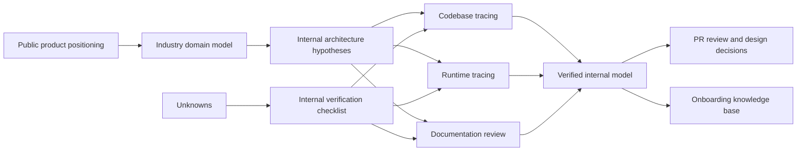
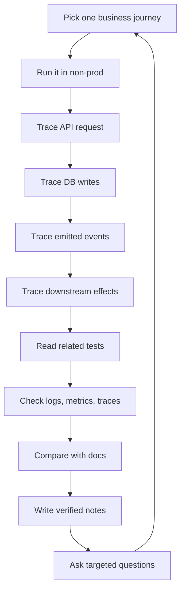

# Part 001 — Onboarding Map: Public Facts, Internal Unknowns, and Engineering Boundaries

## 1. Tujuan Part Ini

Part ini bukan membahas implementasi internal CSG Quote & Order. Tujuan utamanya adalah membangun **cara berpikir onboarding yang aman, tajam, dan defensible**.

Ketika engineer baru masuk ke produk enterprise mission-critical, kesalahan terbesar biasanya bukan kurang tahu framework. Kesalahan terbesar adalah **terlalu cepat menyimpulkan arsitektur dari kata-kata umum** seperti CPQ, microservices, Kafka, Kubernetes, catalog-driven, TM Forum, atau quote-to-cash.

Kata-kata itu memberi arah, tetapi belum memberi fakta implementasi.

Seorang senior engineer harus bisa membedakan:

1. **Public facts** — informasi yang tersedia secara publik dari website, dokumentasi vendor, standard industri, atau materi resmi.
2. **Industry concepts** — konsep umum yang lazim di CPQ, quote-to-cash, telco BSS/OSS, microservices, Kafka, PostgreSQL, Kubernetes, dan enterprise integration.
3. **Internal facts** — detail yang hanya benar setelah diverifikasi di codebase, dokumentasi internal, pipeline, environment, observability, incident history, atau diskusi dengan engineer/team lead.

Part ini membentuk fondasi agar seluruh seri berikutnya tidak berubah menjadi spekulasi.

---

## 2. Mental Model Utama: Jangan Langsung Percaya Nama Sistem

Nama sistem sering menyesatkan.

Sebuah service bernama `order-service` belum tentu hanya mengelola order. Ia mungkin juga:

- melakukan validation,
- menyimpan snapshot pricing,
- publish event,
- memanggil downstream fulfillment,
- menyimpan audit,
- menjalankan retry,
- mengelola fallout,
- atau hanya menjadi façade ke sistem lain.

Sebuah sistem yang disebut **microservices-based** belum tentu memiliki boundary domain yang bersih. Ia bisa saja memiliki shared database, shared library yang terlalu besar, coupling event yang kuat, deployment dependency, atau distributed monolith behavior.

Sebuah API yang disebut **TMF-compatible** belum tentu memakai TM Forum model secara internal. Bisa jadi API publik memakai shape TMF, tetapi domain internal menggunakan canonical model sendiri dan membutuhkan anti-corruption layer.

Sebuah sistem yang menggunakan Kafka belum tentu event-driven secara sehat. Kafka bisa dipakai untuk:

- event notification,
- async command dispatch,
- read-model projection,
- audit pipeline,
- integration transport,
- retry queue,
- batch-like ingestion,
- atau sekadar adapter ke legacy systems.

Prinsip onboarding pertama:

> Treat every technical label as a hypothesis until you trace the runtime behavior.

---

## 3. Public Facts yang Aman Dipakai

Bagian ini berisi fakta publik yang bisa dipakai sebagai konteks awal, bukan sebagai bukti arsitektur internal.

### 3.1 CSG Quote & Order sebagai CPQ dan Order Management Platform

Dari materi publik CSG, CSG Quote & Order diposisikan sebagai platform **CPQ dan order management** untuk enterprise, terutama konteks B2B telco, financial services, dan complex enterprises. Materi publik CSG menyebut kemampuan seperti complex quotes, tailored pricing, seamless order management, multi-line/multi-site/multi-partner deals, enterprise agreements, catalog-driven tools/APIs, visibility ke costs/margins/profitability, issue detection, interoperability dengan standard APIs, dan secure cloud deployments.

Sumber publik:

- [CSG Quote & Order product page](https://www.csgi.com/products/quote-and-order)
- [CSG Quote & Order resource page](https://www.csgi.com/resources/csg-quote-and-order)
- [CSG Configure, Price, Quote page](https://www.csgi.com/solutions/quote-to-cash/configure-price-quote)

Yang aman disimpulkan:

- Produk berada di domain CPQ dan order management.
- Produk berhubungan dengan quote-to-cash.
- Produk relevan untuk complex enterprise/telco selling.
- Catalog-driven behavior adalah konsep penting.
- Pricing, margin, agreement, configuration, order management, and integration adalah area domain yang relevan.

Yang **tidak boleh** disimpulkan tanpa verifikasi internal:

- Nama service internal.
- Database schema.
- Kafka topic design.
- State machine aktual.
- Framework Java yang dipakai.
- Deployment topology.
- Multi-tenancy model.
- Exact TM Forum conformance level.
- Internal architecture boundaries.

---

### 3.2 Quote-to-Cash sebagai Connected Workflow

Materi publik CSG menjelaskan quote-to-cash sebagai alur yang menghubungkan CPQ, order management, billing, revenue recognition, approval, provisioning, invoicing, dan workflow lain untuk mengurangi manual handoff dan revenue leakage. Materi publik yang sama juga menyebut langkah configure, price, quote, contract, order, orchestrate/automate, fulfill, dan bill. Shared catalog dijelaskan sebagai mekanisme untuk menjaga konsistensi produk, services, bundles, dan prices across quotes, orders, delivery, dan billing.

Sumber publik:

- [CSG Quote to Cash Software for Enterprise Deals](https://www.csgi.com/solutions/quote-to-cash)

Yang aman disimpulkan:

- Quote-to-cash adalah lifecycle lintas fungsi, bukan satu service.
- CPQ hanya salah satu tahap.
- Order management harus konsisten dengan quote, contract, fulfillment, dan billing.
- Catalog consistency penting untuk mengurangi rework dan error.

Yang harus diverifikasi internal:

- Apakah billing berada di produk yang sama atau external integration.
- Apakah revenue recognition ditangani langsung atau hanya downstream concern.
- Apakah fulfillment orchestration internal atau external.
- Apakah shared catalog benar-benar shared runtime data source atau logical concept.
- Apakah quote/order/billing memakai satu canonical customer/account model.

---

### 3.3 TM Forum sebagai Industry Reference, Bukan Bukti Implementasi Internal

TM Forum menjelaskan ODA sebagai arsitektur modular/component-based untuk interoperable software, standardized data, dan orchestration melalui common canvas. SID menyediakan information/data reference model dan common vocabulary untuk business entities CSP. eTOM membantu organisasi memahami, mendesain, mengembangkan, dan mengelola IT/network applications berdasarkan business process requirements. TM Forum Open APIs memakai shared API data model yang berbasis SID.

Sumber publik:

- [TM Forum About ODA](https://www.tmforum.org/oda/about-oda)
- [TM Forum Information Framework SID](https://www.tmforum.org/open-digital-architecture/information-framework-sid/)
- [TM Forum Process Framework eTOM](https://www.tmforum.org/open-digital-architecture/process-framework-etom/)
- [TM Forum Open APIs](https://www.tmforum.org/oda/open-apis)

Yang aman disimpulkan:

- TM Forum adalah vocabulary dan reference model penting untuk telco BSS/OSS.
- ODA, SID, eTOM, dan Open APIs membantu alignment antar domain dan integrasi.
- TMF APIs dapat menjadi contract reference untuk catalog, quote, product order, customer, inventory, dan service order.

Yang tidak boleh disimpulkan tanpa verifikasi internal:

- Semua internal entity mengikuti SID.
- Semua API persis mengikuti TMF Open API.
- Semua lifecycle state mengikuti TMF sample state.
- Tidak ada extension/custom field.
- Tidak ada customer-specific mapping.
- Tidak ada anti-corruption layer.

---

## 4. Taxonomy: Public, Industry, Internal

Gunakan taxonomy berikut selama onboarding.

| Area | Public fact | Industry concept | Internal fact yang harus diverifikasi |
|---|---|---|---|
| Product | CSG Quote & Order adalah CPQ/order management product | CPQ handles configure-price-quote; order management handles capture-to-fulfillment | Actual module/service boundary |
| Quote-to-cash | CSG memosisikan Q2C sebagai connected workflow | Quote, contract, order, fulfill, bill membentuk revenue lifecycle | Apakah billing/fulfillment internal atau external |
| Catalog | Public material menyebut shared catalog/catalog-driven tools | Catalog defines offerings, prices, rules, eligibility | Runtime catalog versioning, publish flow, cache |
| TM Forum | ODA/SID/eTOM/Open APIs adalah reference industry | TMF APIs dapat menjadi integration vocabulary | TMF version, conformance level, extensions |
| Java | User role adalah Senior Java Software Engineer | Java service biasanya punya domain/application/infrastructure layer | Framework, package standard, dependency policy |
| Kafka | Kafka relevan dalam system context user | Event-driven system butuh idempotency, ordering, replay handling | Topic names, partition keys, outbox, schema registry |
| PostgreSQL | PostgreSQL relevan dalam system context user | Transactions, locking, indexing, migrations matter | Schema, isolation level, migration tooling |
| Kubernetes | Kubernetes relevan dalam system context user | Probes, resources, rollout, config, secrets matter | Helm/Kustomize/GitOps topology |
| Security | OAuth2/JWT/RBAC/tenant isolation relevan | AuthN/AuthZ/audit are separate concerns | Actual IDP, claim model, permission model |
| Observability | Mission-critical product needs observability | Logs/metrics/traces/correlation are operational tools | Dashboard, tracing standard, alert routes |

---

## 5. Core Onboarding Principle: Trace Before You Trust

Dalam sistem enterprise, dokumentasi sering tertinggal dari implementasi. Codebase sendiri juga tidak selalu cukup karena runtime behavior bisa bergantung pada config, deployment, feature flag, customer-specific extension, database data, atau external system.

Karena itu, setiap pemahaman penting harus ditelusuri melalui minimal tiga jalur:

1. **Design/documentation path** — docs, ADR, architecture diagrams, onboarding materials.
2. **Implementation path** — code, tests, migration, API spec, Kafka schema, pipeline.
3. **Runtime/operation path** — logs, dashboards, traces, alerts, incidents, runbooks, support tickets.

Kalau ketiganya tidak selaras, jangan langsung pilih salah satu. Catat gap-nya.

Contoh:

- Docs mengatakan order state `COMPLETED` berarti seluruh fulfillment selesai.
- Code menunjukkan order bisa `COMPLETED` saat semua order item terminal.
- Dashboard menunjukkan masih ada downstream callback setelah `COMPLETED`.

Di titik ini, pertanyaan senior bukan “mana yang benar?” tetapi:

> What does `COMPLETED` mean operationally, contractually, and technically?

---

## 6. First-Principles Model: Quote & Order sebagai Sistem Pengendali Revenue

Jangan melihat Quote & Order sebagai aplikasi form-based. Lihat sebagai **revenue control system**.

Sistem ini menjaga agar proses berikut berjalan benar:

1. Customer memilih atau dinegosiasikan solusi.
2. Product/offering yang dipilih valid terhadap catalog.
3. Price dan discount sesuai rule, agreement, dan approval authority.
4. Quote merekam commercial intent yang bisa diaudit.
5. Quote yang disetujui dikonversi menjadi order tanpa kehilangan semantics.
6. Order divalidasi, didekomposisi, dan dikirim ke fulfillment/billing/inventory downstream.
7. Failure dapat dideteksi, diretry, diresume, atau dieskalasi.
8. Semua perubahan penting memiliki audit trail.
9. Sistem dapat menjelaskan keputusan bisnis setelah kejadian.

Dari perspektif engineering, sistem seperti ini memiliki sifat:

- lifecycle-heavy,
- stateful,
- integration-heavy,
- data-sensitive,
- audit-sensitive,
- latency-sensitive di beberapa path,
- correctness-sensitive di hampir semua path,
- highly configurable,
- often customer-specific,
- hard to repair if wrong data escapes downstream.

---

## 7. Diagram Mental Model Awal

Interpretasi diagram:

- Public positioning memberi konteks, bukan jawaban final.
- Industry model memberi vocabulary dan expected shape.
- Internal model harus diverifikasi melalui code, runtime, dan dokumentasi.
- Hasil verifikasi menjadi dasar PR review, design decision, dan kontribusi teknis.

---

## 8. Apa yang Harus Dilacak Saat Onboarding

### 8.1 Product and Domain Lane

Pertanyaan utama:

- Apa journey utama user?
- Siapa persona yang membuat quote?
- Siapa yang menyetujui quote?
- Kapan quote berubah menjadi order?
- Kapan order dianggap valid?
- Kapan order dianggap completed?
- Apa arti fallout?
- Apa arti amend?
- Apa arti cancel?
- Apa arti retry?
- Apa yang customer anggap sebagai “data benar”?

Artifact yang perlu dicari:

- product demo,
- product requirement document,
- user journey map,
- domain glossary,
- customer-facing API docs,
- support playbooks.

### 8.2 Architecture Lane

Pertanyaan utama:

- Service apa saja yang terlibat dalam quote-to-order path?
- Apakah boundary-nya berdasarkan domain, deployment, team, atau historical accident?
- Apakah ada shared database?
- Apakah ada shared library yang membawa domain coupling?
- Apakah service synchronous, asynchronous, atau hybrid?
- Apa yang terjadi kalau downstream lambat?
- Apa yang terjadi kalau event terlambat?

Artifact yang perlu dicari:

- architecture diagram,
- sequence diagram,
- service catalog,
- dependency graph,
- API gateway config,
- Kafka topic inventory,
- deployment manifest.

### 8.3 Data Lane

Pertanyaan utama:

- Apa source of truth untuk quote?
- Apa source of truth untuk order?
- Apa source of truth untuk catalog?
- Apakah quote menyimpan snapshot price/catalog?
- Apakah order menyimpan snapshot quote?
- Apakah event dapat direplay untuk membangun state?
- Apakah audit table append-only?
- Apakah ada soft delete?
- Bagaimana tenant dipisahkan?

Artifact yang perlu dicari:

- database schema,
- migration files,
- entity/mapper classes,
- ERD,
- slow query dashboard,
- data repair scripts,
- reconciliation jobs.

### 8.4 Integration Lane

Pertanyaan utama:

- Sistem eksternal apa yang terhubung?
- Mana CRM, billing, fulfillment, inventory, identity, document generation, notification, partner system?
- Apakah integrasi synchronous API, async event, file, batch, atau mixed?
- Bagaimana retry dilakukan?
- Bagaimana duplicate request ditangani?
- Bagaimana reconciliation dilakukan?

Artifact yang perlu dicari:

- adapter code,
- API clients,
- external contract docs,
- mock/stub,
- integration test,
- support runbook,
- customer-specific integration notes.

### 8.5 Deployment and Operations Lane

Pertanyaan utama:

- Apakah deployment cloud, on-prem, hybrid, atau customer-specific?
- Apakah semua customer berada di shared environment?
- Bagaimana upgrade dilakukan?
- Apakah rolling deployment aman?
- Apakah migration bisa berjalan zero-downtime?
- Bagaimana rollback dilakukan?
- Apa alert utama?
- Siapa on-call?

Artifact yang perlu dicari:

- Kubernetes manifests,
- Helm/Kustomize charts,
- GitOps repo,
- CI/CD pipeline,
- runbook,
- dashboards,
- incident reports,
- release checklist.

---

## 9. Internal Verification Checklist Utama

Gunakan checklist ini sebagai peta onboarding awal.

### Product and Domain

- [ ] Domain glossary internal untuk quote, order, catalog, agreement, customer, account, inventory, fulfillment, fallout.
- [ ] Demo end-to-end quote-to-order.
- [ ] Journey utama untuk B2B telco complex deal.
- [ ] Perbedaan simple quote, complex quote, multi-site quote, multi-partner quote.
- [ ] Definition of done untuk quote dan order.
- [ ] Lifecycle state dan allowed transitions.
- [ ] Manual override path dan approval authority.

### Architecture

- [ ] Diagram service/module terbaru.
- [ ] Repository ownership map.
- [ ] Service dependency graph.
- [ ] Synchronous API call graph.
- [ ] Kafka topic inventory.
- [ ] Shared library inventory.
- [ ] Shared database atau schema coupling.
- [ ] Anti-corruption layer terhadap TMF/external APIs.

### Data

- [ ] PostgreSQL schema utama.
- [ ] Migration tool dan conventions.
- [ ] Tenant isolation model.
- [ ] Quote/order audit model.
- [ ] Snapshot strategy untuk price/catalog/customer/agreement.
- [ ] Optimistic/pessimistic locking strategy.
- [ ] Data repair/reconciliation jobs.
- [ ] Archival/retention policy.

### Runtime

- [ ] Local development setup.
- [ ] Non-production environment map.
- [ ] Kubernetes deployment topology.
- [ ] Config/secrets management.
- [ ] Feature flag system.
- [ ] CI/CD gates.
- [ ] Rollback procedure.
- [ ] On-prem upgrade constraint.

### Observability

- [ ] Standard structured log fields.
- [ ] Correlation ID propagation.
- [ ] Causation ID/event metadata.
- [ ] Trace coverage.
- [ ] Business dashboards.
- [ ] Kafka lag dashboards.
- [ ] DB dashboards.
- [ ] Alert routing and escalation.

### Testing

- [ ] Unit test conventions.
- [ ] Integration test setup with PostgreSQL/Kafka.
- [ ] Contract tests.
- [ ] Migration tests.
- [ ] E2E quote-to-cash tests.
- [ ] Security/tenant isolation tests.
- [ ] Known flaky tests.
- [ ] Test data strategy.

### Delivery and Team Process

- [ ] PR template.
- [ ] Required reviewers.
- [ ] Architecture review process.
- [ ] ADR repository.
- [ ] Release process.
- [ ] On-call expectation.
- [ ] Incident/postmortem archive.
- [ ] Support escalation path.

---

## 10. How to Read the Codebase Without Getting Lost

Jangan mulai dari semua package sekaligus. Mulai dari satu journey.

Recommended tracing sequence:

1. Pilih satu journey: `create quote -> price quote -> submit quote -> approve quote -> convert to order`.
2. Temukan entrypoint API.
3. Ikuti request DTO ke application service.
4. Identifikasi domain object atau command handler.
5. Cari validation dan transition guard.
6. Cari transaction boundary.
7. Cari DB mapper/repository.
8. Cari event yang dipublish.
9. Cari consumer yang bereaksi terhadap event itu.
10. Cari log fields dan trace ID.
11. Cari test yang membuktikan behavior tersebut.
12. Cari dashboard atau runbook untuk journey yang sama.

Setiap kali menemukan object penting, catat:

- name,
- responsibility,
- owner,
- source of truth,
- lifecycle,
- failure mode,
- audit behavior,
- tests,
- operational signal.

---

## 11. Runtime Truth: Apa yang Sebenarnya Terjadi Saat Production

Code menunjukkan intended behavior. Production menunjukkan actual behavior.

Contoh hal yang hanya bisa dipahami dari runtime:

- endpoint mana yang paling panas,
- query mana yang paling mahal,
- event mana yang paling sering tertunda,
- integration mana yang paling sering timeout,
- order state mana yang sering stuck,
- customer configuration mana yang sering menyebabkan edge case,
- release mana yang paling berisiko,
- alert mana yang noisy,
- dashboard mana yang benar-benar dipakai saat incident.

Untuk setiap domain penting, cari jawaban operasional:

- Bagaimana kita tahu sistem sehat?
- Bagaimana kita tahu quote gagal diproses?
- Bagaimana kita tahu price salah?
- Bagaimana kita tahu order duplicate?
- Bagaimana kita tahu fulfillment stuck?
- Bagaimana kita tahu tenant boundary dilanggar?
- Bagaimana kita repair data?
- Siapa yang diberi tahu?

---

## 12. Anti-Pattern Onboarding yang Harus Dihindari

### 12.1 Menganggap Dokumentasi Selalu Benar

Dokumentasi adalah starting point. Verifikasi dengan code dan runtime.

### 12.2 Menganggap Code Selalu Mewakili Intent

Code bisa menyimpan workaround historis. Tanyakan kenapa logic itu ada sebelum refactor.

### 12.3 Menganggap Standard Sama dengan Implementation

TM Forum adalah reference. Internal system bisa memiliki mapping, extension, dan constraint customer-specific.

### 12.4 Menganggap Kafka Menghapus Masalah Consistency

Kafka memindahkan masalah consistency ke event ordering, replay, duplicate handling, schema evolution, dan consumer idempotency.

### 12.5 Menganggap Kubernetes Menghapus Masalah Runtime

Kubernetes membantu scheduling dan orchestration. Ia tidak otomatis membuat service resilient, observable, atau safe to upgrade.

### 12.6 Menganggap Approval Workflow Hanya UI Concern

Approval adalah business control. Guard harus ada di backend, state transition, authorization, audit, dan tests.

### 12.7 Menganggap Delete/Cancel Sama

Di sistem order enterprise, cancel biasanya adalah lifecycle transition dengan audit dan downstream consequence, bukan delete row.

---

## 13. Pertanyaan Onboarding yang Berkualitas

Gunakan pertanyaan yang memaksa fakta keluar.

### Product Questions

- Journey apa yang paling business-critical?
- Customer paling sering komplain di bagian mana?
- Apa arti “quote valid” secara bisnis?
- Apa arti “order completed” secara operasional?
- Apa yang menyebabkan revenue leakage?
- Apa skenario yang paling mahal jika gagal?

### Architecture Questions

- Apa source of truth untuk setiap major entity?
- Apakah service boundary mengikuti bounded context atau deployment concern?
- Apa operasi yang harus atomic?
- Apa operasi yang intentionally eventually consistent?
- Apa event yang boleh direplay?
- Apa downstream yang paling unreliable?

### Data Questions

- Apakah quote menyimpan price snapshot?
- Apakah order menyimpan catalog version?
- Apakah ada optimistic locking?
- Apakah audit append-only?
- Bagaimana repair script di-review?
- Bagaimana migration besar dilakukan untuk customer on-prem?

### Operational Questions

- Apa alert yang membangunkan on-call?
- Apa dashboard pertama saat incident order stuck?
- Apa rollback terakhir yang pernah terjadi?
- Apa postmortem paling penting tahun ini?
- Apa manual intervention paling sering?
- Apa runbook yang paling sering dipakai support?

---

## 14. Red Flags Saat Onboarding

Perhatikan sinyal berikut:

- Tidak ada definisi jelas untuk state terminal.
- Status quote/order direpresentasikan sebagai string bebas.
- State transition tersebar di banyak class tanpa guard sentral.
- Approval hanya dicek di UI.
- Audit log tidak memiliki before/after atau actor.
- Event tidak punya stable event ID.
- Consumer tidak idempotent.
- Migration tidak punya rollback/expand-contract plan.
- API enum sering berubah tanpa compatibility review.
- Tenant ID optional di query path.
- Correlation ID tidak konsisten across service.
- Retry tidak punya batas atau jitter.
- Dashboard hanya technical, tidak ada business health metric.
- Runbook tidak pernah diuji.
- Customer-specific behavior tersebar sebagai `if customer == X`.

Red flag bukan berarti sistem buruk. Red flag berarti ada area yang harus dipahami sebelum melakukan perubahan.

---

## 15. First Two Weeks: Practical Learning Loop

Gunakan loop berikut.

Target praktis dalam dua minggu:

- Satu journey quote-to-order bisa dijelaskan end-to-end.
- Satu aggregate penting bisa dijelaskan lifecycle-nya.
- Satu API penting bisa dijelaskan contract dan compatibility risk-nya.
- Satu Kafka event penting bisa dijelaskan producer, consumer, schema, retry, dan replay behavior-nya.
- Satu query PostgreSQL penting bisa dijelaskan plan dan index-nya.
- Satu dashboard production bisa dijelaskan metrik dan alert-nya.

---

## 16. Output Onboarding yang Harus Kamu Buat Sendiri

Jangan hanya membaca. Hasilkan artifact kecil yang membantu team.

Rekomendasi artifact:

1. **Verified glossary**
   - Istilah domain.
   - Definisi internal.
   - Sumber verifikasi.
   - Owner.

2. **Journey trace note**
   - API entrypoint.
   - Service involved.
   - DB writes.
   - Events.
   - Downstream calls.
   - Observability signals.

3. **State machine map**
   - States.
   - Transitions.
   - Guards.
   - Actors.
   - Audit events.
   - Failure states.

4. **Source-of-truth map**
   - Entity.
   - Owning service.
   - Owning database.
   - External reference.
   - Cache/read model.
   - Reconciliation path.

5. **Risk register**
   - Unknowns.
   - Potential failure.
   - Impact.
   - Detection.
   - Mitigation.
   - Owner.

Artifact ini tidak perlu sempurna. Yang penting verified, useful, dan mudah direview.

---

## 17. Senior Engineer Lens: Cara Membaca Sistem Enterprise

Saat melihat feature atau bug, jangan berhenti di “bagaimana implementasinya”. Tanyakan lapisan berikut:

### 17.1 Domain Correctness

- Apakah behavior sesuai lifecycle bisnis?
- Apakah invariant dijaga?
- Apakah approval/permission benar?
- Apakah edge case multi-site/multi-line/multi-partner dipertimbangkan?

### 17.2 Data Correctness

- Apakah transaction boundary benar?
- Apakah snapshot diperlukan?
- Apakah concurrent update aman?
- Apakah migration aman untuk data existing?

### 17.3 Integration Correctness

- Apakah downstream menerima command/event yang valid?
- Apakah retry idempotent?
- Apakah duplicate event aman?
- Apakah timeout menyebabkan state stuck?

### 17.4 Operational Correctness

- Apakah behavior terlihat di logs/metrics/traces?
- Apakah alert mendeteksi failure?
- Apakah runbook ada?
- Apakah rollback mungkin?

### 17.5 Security and Audit Correctness

- Apakah user/action authorized?
- Apakah tenant boundary aman?
- Apakah audit cukup untuk investigasi?
- Apakah PII terlindungi?

---

## 18. Mini Exercise

Pilih satu endpoint atau screen yang terkait quote/order.

Jawab pertanyaan berikut:

1. Apa business capability yang endpoint/screen ini wakili?
2. Siapa actor-nya?
3. Entity apa yang berubah?
4. Invariant apa yang harus dijaga?
5. State transition apa yang terjadi?
6. Data apa yang harus atomic?
7. Event apa yang dipublish?
8. Apa yang terjadi kalau request diulang?
9. Apa yang terjadi kalau downstream timeout?
10. Di log/dashboard mana behavior ini terlihat?
11. Audit record apa yang harus muncul?
12. Test apa yang membuktikan behavior ini?

Kalau kamu tidak bisa menjawab sebagian besar pertanyaan ini, itu bukan kegagalan. Itu daftar onboarding task yang valid.

---

## 19. Internal Verification Checklist untuk Part Ini

- [ ] Temukan official onboarding docs.
- [ ] Temukan architecture overview terbaru.
- [ ] Temukan product glossary internal.
- [ ] Temukan repository utama dan ownership map.
- [ ] Temukan API specification atau OpenAPI docs.
- [ ] Temukan DB migration folder.
- [ ] Temukan Kafka topic/schema inventory.
- [ ] Temukan Kubernetes/GitOps deployment config.
- [ ] Temukan dashboard utama Quote & Order.
- [ ] Temukan incident/postmortem archive.
- [ ] Jalankan satu quote-to-order happy path di non-prod.
- [ ] Trace satu request dari API sampai DB/event/log.
- [ ] Validasi minimal lima asumsi publik dengan engineer internal.

---

## 20. Learning Outcome

Setelah menyelesaikan Part 001, kamu harus mampu:

- membedakan public facts, industry concepts, dan internal facts;
- membaca materi publik CSG tanpa mengarang arsitektur internal;
- memakai TM Forum sebagai reference model tanpa menganggapnya sebagai implementation truth;
- membuat checklist verifikasi onboarding yang konkret;
- menelusuri satu journey dari product behavior ke code, DB, event, dan observability;
- mengidentifikasi red flags awal di sistem CPQ/order enterprise;
- bertanya dengan cara yang menghasilkan fakta, bukan opini umum;
- mulai berpikir sebagai engineer yang menjaga correctness, operability, dan defensibility.

---

## 21. Referensi Publik

- CSG Quote & Order product page: https://www.csgi.com/products/quote-and-order
- CSG Quote-to-Cash solution page: https://www.csgi.com/solutions/quote-to-cash
- CSG Quote & Order resource page: https://www.csgi.com/resources/csg-quote-and-order
- CSG Configure, Price, Quote page: https://www.csgi.com/solutions/quote-to-cash/configure-price-quote
- TM Forum About ODA: https://www.tmforum.org/oda/about-oda
- TM Forum Information Framework SID: https://www.tmforum.org/open-digital-architecture/information-framework-sid/
- TM Forum Process Framework eTOM: https://www.tmforum.org/open-digital-architecture/process-framework-etom/
- TM Forum Open APIs: https://www.tmforum.org/oda/open-apis

---

## 22. Penutup

Part ini sengaja tidak masuk ke CPQ detail dulu. Dalam sistem enterprise, pondasi terpenting adalah **cara membedakan fakta dari asumsi**.

Mulai Part 002, kita akan memperdalam konteks produk CSG Quote & Order dari sudut pandang engineer: siapa user-nya, apa business capability-nya, mengapa kompleksitasnya tinggi, dan bagaimana cara melihatnya sebagai sistem quote-to-cash mission-critical.
