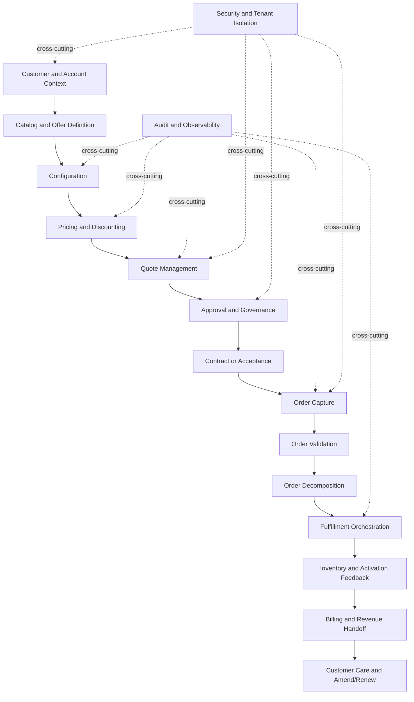
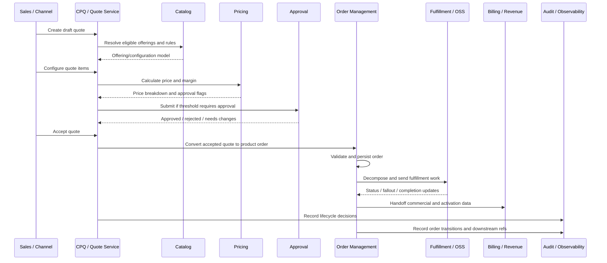
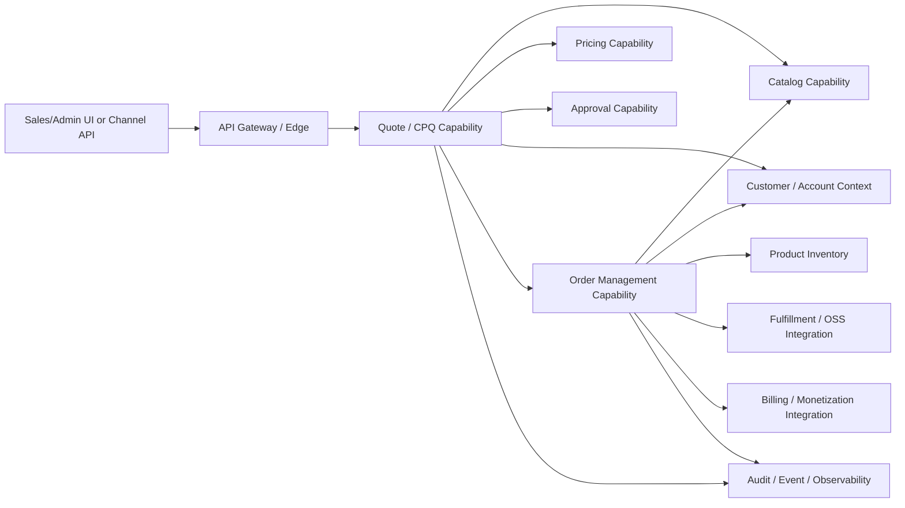

# Part 002 — CSG Quote & Order Product Context for Engineers

## 1. Tujuan Part Ini

Part ini membangun pemahaman produk dari sudut pandang engineer.

Targetnya bukan menghafal slogan produk, tetapi memahami **kenapa produk seperti CSG Quote & Order sulit dibangun dan sulit dioperasikan**.

Dari sumber publik, CSG memosisikan Quote & Order sebagai platform CPQ dan order management untuk complex enterprise/telco selling. Materi publik CSG menyebut kapabilitas seperti complex quote, tailored pricing, seamless order management, enterprise agreement, catalog-driven tools/APIs, margin visibility, proactive issue detection, interoperability through standard APIs, dan secure cloud deployment.

Tetapi sebagai engineer, kita harus menerjemahkan pernyataan produk itu menjadi pertanyaan teknis:

- Entity apa yang harus dimodelkan?
- Lifecycle apa yang harus dijaga?
- State mana yang terminal?
- Data mana yang harus snapshot?
- Apa yang boleh eventually consistent?
- Apa yang tidak boleh salah karena berdampak revenue?
- Apa yang harus terlihat di observability?
- Apa yang harus bisa diaudit setelah kejadian?
- Apa yang harus diverifikasi secara internal?

---

## 2. Product Context: Quote & Order Bukan Sekadar CPQ Screen

Sistem CPQ/order management enterprise sering terlihat seperti aplikasi untuk membuat quote dan order. Itu tampilan permukaan.

Di baliknya, sistem ini adalah coordination layer antara:

- sales,
- product/catalog team,
- pricing team,
- deal desk,
- finance,
- legal/contract,
- fulfillment,
- billing,
- customer care,
- partner ecosystem,
- enterprise integration,
- support/SRE/operations.

Quote bukan hanya dokumen harga. Quote adalah **commercial proposal** yang mengikat kombinasi customer, agreement, product offering, configuration, price, discount, margin, approval, expiry, dan future order intent.

Order bukan hanya request fulfillment. Order adalah **execution commitment** yang mengubah commercial intent menjadi work items, downstream integration, provisioning, inventory update, billing handoff, dan customer-visible lifecycle.

Kalau quote salah, dampaknya bisa berupa:

- harga salah,
- margin bocor,
- customer menerima produk yang tidak valid,
- approval dilewati,
- kontrak tidak konsisten,
- order downstream gagal,
- billing salah,
- revenue recognition terganggu,
- support tidak bisa menjelaskan kejadian,
- audit tidak defensible.

Karena itu, CSG Quote & Order harus dipahami sebagai **mission-critical enterprise workflow system**, bukan hanya backend CRUD.

---

## 3. Public Product Signals yang Relevan untuk Engineer

Bagian ini memetakan pernyataan publik ke implikasi engineering. Ini bukan klaim arsitektur internal.

### 3.1 Complex Selling

Materi publik CSG menyebut dukungan untuk multi-line, multi-site, dan multi-partner deals dalam satu quote, bundling product components, tailored pricing, enterprise agreements, dan kemampuan update quote/order seiring kebutuhan customer berubah.

Engineering implication:

- Quote item kemungkinan hierarchical atau graph-like.
- Product offering bisa memiliki relationship, dependency, dan compatibility rules.
- Pricing tidak selalu flat; bisa tergantung customer, agreement, site, term, volume, bundle, dan discount.
- Quote lifecycle butuh versioning, expiry, reprice, approval, dan audit.
- Multi-site order bisa menyebabkan decomposition dan fulfillment berbeda per location.
- Multi-partner deal bisa membutuhkan external partner integration atau settlement logic.

Internal verification checklist:

- [ ] Apakah quote item direpresentasikan sebagai tree, graph, flat list dengan relationship, atau hybrid?
- [ ] Bagaimana multi-site dimodelkan?
- [ ] Bagaimana multi-partner deal dimodelkan?
- [ ] Apakah bundle decomposition terjadi saat quote, order, atau fulfillment?
- [ ] Apakah enterprise agreement memengaruhi eligibility, pricing, atau approval?
- [ ] Apakah quote/order amendment didukung sebagai lifecycle resmi?

---

### 3.2 Catalog-Driven Tools and APIs

Materi publik CSG menyebut kemampuan design/deploy product dengan catalog-driven tools dan APIs, serta shared catalog yang memberi definisi konsisten untuk products, services, bundles, prices, quotes, orders, delivery, dan billing.

Engineering implication:

- Catalog bukan sekadar reference table.
- Catalog adalah control plane untuk commercial product behavior.
- Catalog versioning, effective dating, publish workflow, compatibility, and backward compatibility menjadi penting.
- Quote dan order kemungkinan perlu menyimpan snapshot dari catalog version agar keputusan historis bisa dijelaskan.
- Runtime performance mungkin sangat dipengaruhi oleh catalog cache dan rule evaluation.

Internal verification checklist:

- [ ] Apa source of truth catalog?
- [ ] Apakah catalog versioned?
- [ ] Apakah catalog punya publish lifecycle?
- [ ] Apakah quote menyimpan catalog snapshot?
- [ ] Apakah pricing rule berada di catalog, pricing engine, atau hybrid?
- [ ] Apakah catalog dapat diubah customer/admin tanpa deploy code?

---

### 3.3 Pricing, Margin, and Profitability Visibility

Materi publik CSG menekankan tailored pricing, enterprise agreements, costs, margins, profitability, faster approvals, and financial control across deal lifecycle.

Engineering implication:

- Pricing harus explainable.
- Discount stacking harus deterministik.
- Margin calculation harus punya source of truth yang jelas.
- Approval workflow harus terhubung ke pricing/margin thresholds.
- Reprice behavior harus eksplisit ketika catalog/agreement berubah.
- Audit harus bisa menjawab kenapa harga tertentu muncul.

Internal verification checklist:

- [ ] Di mana pricing calculation terjadi?
- [ ] Apakah pricing deterministic untuk input yang sama?
- [ ] Apakah discount rule explainable?
- [ ] Bagaimana margin dihitung dan dari mana cost berasal?
- [ ] Apa trigger approval?
- [ ] Apakah price dapat di-override? Siapa yang boleh?

---

### 3.4 Industry-Standard APIs and Interoperability

Materi publik CSG menyebut integrasi dengan existing systems using industry-standard APIs. Dalam konteks telco, TM Forum Open APIs menjadi referensi penting untuk product catalog, quote, product ordering, customer, inventory, dan service ordering.

Engineering implication:

- API external kemungkinan harus stabil dalam jangka panjang.
- Internal domain model bisa berbeda dari API model.
- Anti-corruption layer mungkin dibutuhkan untuk mapping TMF/external contract ke internal model.
- Backward compatibility menjadi non-negotiable untuk customer enterprise.
- API versioning harus mempertimbangkan customer upgrade cycle.

Internal verification checklist:

- [ ] API mana yang exposed ke customer/partner?
- [ ] Apakah API mengikuti TMF Open API? Version berapa?
- [ ] Field mana yang extension/custom?
- [ ] Apakah ada canonical internal model?
- [ ] Bagaimana breaking change dicegah?
- [ ] Apakah contract tests ada?

---

### 3.5 Secure Cloud Deployment and Enterprise Trust

Materi publik CSG menyebut secure cloud deployments dan built-in trust. Ini memberi sinyal bahwa security, tenant isolation, auditability, and operational control adalah area penting.

Engineering implication:

- Authentication dan authorization tidak boleh dianggap plumbing.
- Tenant isolation harus jelas di API, service, database, logs, dan background jobs.
- Audit log harus memadai untuk approval, pricing, order lifecycle, dan manual override.
- Secrets/configuration harus aman untuk cloud dan kemungkinan on-prem/customer-specific deployment.
- Observability harus tidak membocorkan PII atau cross-tenant data.

Internal verification checklist:

- [ ] Identity provider dan auth model.
- [ ] Tenant isolation model.
- [ ] RBAC/permission model.
- [ ] Audit event schema.
- [ ] PII masking/redaction.
- [ ] Security review dan vulnerability scanning pipeline.

---

## 4. Product as Business Capability Map

Lihat Quote & Order sebagai kumpulan business capability, bukan sebagai daftar service.



Cara membaca diagram:

- Catalog mengontrol apa yang bisa dijual.
- Pricing mengontrol apakah deal financially valid.
- Quote merekam proposal.
- Approval mengontrol risk.
- Order mengubah proposal menjadi execution.
- Fulfillment dan billing adalah downstream consequences.
- Audit, security, and observability bukan fitur tambahan; mereka lintas semua capability.

---

## 5. Persona yang Harus Dipahami Engineer

### 5.1 Sales User

Goal:

- Membuat quote cepat.
- Mengurangi error konfigurasi.
- Menjawab kebutuhan customer.
- Mendapat harga yang kompetitif.

Risk jika sistem buruk:

- Quote lambat.
- Pricing tidak dipercaya.
- Sales membuat workaround di spreadsheet.
- Customer experience turun.

Engineering focus:

- UX/API latency.
- Clear validation error.
- Deterministic pricing.
- Draft/versioning.
- Recoverability.

### 5.2 Deal Desk / Pricing Team

Goal:

- Menjaga margin.
- Mengontrol discount.
- Menyetujui exception.
- Memastikan pricing sesuai agreement.

Risk jika sistem buruk:

- Approval bypass.
- Discount stacking salah.
- Margin leakage.
- Manual review overload.

Engineering focus:

- Rule explainability.
- Approval threshold.
- Audit trail.
- Override control.
- Negative tests.

### 5.3 Product/Catalog Manager

Goal:

- Meluncurkan offering baru.
- Mengatur bundle, pricing, eligibility.
- Menjaga lifecycle offering.
- Menghindari impact downstream.

Risk jika sistem buruk:

- Catalog change merusak quote existing.
- Product tidak bisa dikonfigurasi.
- Compatibility rule ambigu.
- Launch membutuhkan code change terlalu banyak.

Engineering focus:

- Catalog versioning.
- Effective dating.
- Publish validation.
- Impact analysis.
- Backward compatibility.

### 5.4 Fulfillment / Operations

Goal:

- Menerima order bersih.
- Menjalankan fulfillment tepat.
- Menangani fallout.
- Melihat status yang akurat.

Risk jika sistem buruk:

- Order tidak lengkap.
- Decomposition salah.
- Retry menyebabkan duplicate work.
- Stuck order tidak terlihat.

Engineering focus:

- Order validation.
- Decomposition correctness.
- Idempotency.
- State machine.
- Operational dashboard.

### 5.5 Finance / Billing

Goal:

- Menerima data komersial yang benar.
- Menghindari invoice salah.
- Mendukung revenue recognition.
- Mengurangi revenue leakage.

Risk jika sistem buruk:

- Billing mismatch.
- Harga quote tidak sama dengan harga order/billing.
- Contract term hilang.
- Usage/subscription model salah.

Engineering focus:

- Price snapshot.
- Billing handoff contract.
- Reconciliation.
- Auditability.
- Data quality.

### 5.6 Customer Care / Support

Goal:

- Menjawab status quote/order.
- Memahami kenapa order gagal.
- Melakukan correction atau escalation.

Risk jika sistem buruk:

- Tidak ada trace.
- Status membingungkan.
- Error tidak actionable.
- Manual repair tidak aman.

Engineering focus:

- Searchability.
- Correlation ID.
- Business error taxonomy.
- Runbook.
- Repair workflow.

### 5.7 Platform/SRE/Operations Engineer

Goal:

- Menjaga availability.
- Mendeteksi degradation.
- Menangani incident.
- Melakukan rollout/rollback aman.

Risk jika sistem buruk:

- Alert noisy.
- Dashboard tidak menjawab root cause.
- Retry storm.
- DB lock storm.
- Kafka lag tidak terlihat.

Engineering focus:

- SLO.
- Metrics.
- Tracing.
- Resource limits.
- Capacity model.
- Resilience policy.

---

## 6. Core Domain Objects yang Akan Muncul Berulang

Bagian ini bukan definisi final internal. Ini vocabulary awal yang perlu dicari padanannya di codebase.

### 6.1 Customer

Pihak yang membeli atau menerima layanan. Dalam enterprise, customer bisa memiliki hierarchy, related parties, billing accounts, service accounts, dan multiple contacts.

Engineering risk:

- Salah customer context menyebabkan pricing, eligibility, atau tenant data leak.

Internal verification:

- [ ] Customer source of truth.
- [ ] Customer/account hierarchy.
- [ ] External customer ID mapping.
- [ ] PII boundary.

### 6.2 Account

Commercial/billing/service grouping yang menghubungkan customer ke contract, quote, order, invoice, atau installed product.

Engineering risk:

- Quote dibuat di account yang salah.
- Billing handoff menggunakan billing account yang tidak valid.

Internal verification:

- [ ] Account type yang didukung.
- [ ] Account relationship.
- [ ] Billing account mapping.

### 6.3 Agreement / Contract

Commercial constraint yang menentukan price, discount, term, entitlement, renewal, dan approval context.

Engineering risk:

- Pricing tidak mengikuti agreement.
- Expired agreement masih dipakai.
- Term tidak masuk billing handoff.

Internal verification:

- [ ] Agreement model.
- [ ] Effective date.
- [ ] Contract term.
- [ ] Agreement-specific pricing.

### 6.4 Product Specification

Definisi teknis/komersial dasar tentang apa produk itu.

Engineering risk:

- Specification berubah dan quote lama kehilangan interpretasi.

Internal verification:

- [ ] Product spec versioning.
- [ ] Characteristic model.
- [ ] Compatibility rules.

### 6.5 Product Offering

Produk yang dijual ke customer, biasanya terkait price, eligibility, lifecycle, channel, region, segment, dan bundle.

Engineering risk:

- Offering tidak valid untuk customer tetapi tetap bisa di-quote.

Internal verification:

- [ ] Offering lifecycle.
- [ ] Eligibility rule.
- [ ] Channel/region support.
- [ ] Bundle support.

### 6.6 Price / Charge

Representasi commercial amount: recurring charge, one-time charge, usage charge, discount, tax-related amount, atau custom price.

Engineering risk:

- Price calculation tidak reproducible.
- Discount stacking tidak jelas.
- Currency/rounding salah.

Internal verification:

- [ ] Price component model.
- [ ] Currency handling.
- [ ] Rounding policy.
- [ ] Discount application order.

### 6.7 Quote

Commercial proposal yang berisi customer context, quote items, prices, terms, approval status, expiry, and conversion intent.

Engineering risk:

- Quote accepted dengan stale price.
- Quote converted dua kali.
- Quote item berubah setelah approval tanpa reapproval.

Internal verification:

- [ ] Quote state machine.
- [ ] Versioning.
- [ ] Locking.
- [ ] Expiry.
- [ ] Conversion guard.

### 6.8 Product Order

Eksekusi terhadap commercial intent. Biasanya berisi order items, actions, dependencies, state, external references, and fulfillment handoff.

Engineering risk:

- Duplicate order.
- Partial fulfillment tidak tercermin.
- Cancel/amend semantics salah.

Internal verification:

- [ ] Order state machine.
- [ ] Order item action.
- [ ] Decomposition model.
- [ ] External order references.

### 6.9 Fulfillment Task / Service Order

Work item downstream untuk provisioning, activation, installation, partner action, atau service orchestration.

Engineering risk:

- Product order state tidak sinkron dengan fulfillment state.
- Retry menghasilkan duplicate provisioning.

Internal verification:

- [ ] Fulfillment owner.
- [ ] Service order mapping.
- [ ] Retry/resume strategy.
- [ ] Fallout process.

### 6.10 Audit Event

Record defensible untuk menjawab siapa melakukan apa, kapan, atas dasar apa, dan dampaknya apa.

Engineering risk:

- Tidak bisa membuktikan approval.
- Tidak bisa menjelaskan price override.
- Tidak bisa investigasi tenant/security issue.

Internal verification:

- [ ] Audit event schema.
- [ ] Before/after data.
- [ ] Actor attribution.
- [ ] Retention.

---

## 7. End-to-End Product Journey

Berikut model journey generik. Ini bukan klaim implementasi internal.



Hal yang harus diperhatikan:

- Catalog dipakai sebelum quote valid.
- Pricing harus terjadi sebelum quote dapat dipercaya.
- Approval harus terkait dengan pricing/margin/risk, bukan sekadar tombol UI.
- Conversion quote-to-order harus guarded.
- Order fulfillment bisa asynchronous dan partial.
- Billing handoff harus memakai data komersial yang konsisten.
- Audit harus mencatat keputusan penting, bukan hanya error teknis.

---

## 8. Mengapa Complexity Tinggi

### 8.1 Product Complexity

Telco/enterprise product sering memiliki:

- recurring charge,
- one-time installation charge,
- usage charge,
- contract term,
- commitment period,
- discount by volume,
- site/location dependency,
- bandwidth/capacity characteristic,
- device/resource dependency,
- partner-provided component,
- regulatory/geographic eligibility,
- bundled offering,
- migration path dari installed base.

Implikasi engineering:

- Product cannot be represented safely as `productId + quantity`.
- Quote item membutuhkan characteristic dan relationship.
- Validation harus mempertimbangkan context.
- Catalog version matters.

### 8.2 Commercial Complexity

Enterprise deal sering melibatkan:

- customer-specific agreement,
- negotiated pricing,
- special discount,
- margin approval,
- legal term,
- renewal condition,
- multi-year contract,
- phased rollout,
- partner cost,
- tax/billing consideration.

Implikasi engineering:

- Price harus explainable.
- Approval harus traceable.
- Override harus controlled.
- Quote version harus preserved.
- Billing handoff harus consistent.

### 8.3 Operational Complexity

Order bisa gagal karena:

- downstream unavailable,
- invalid service address,
- missing resource,
- inventory conflict,
- partner delay,
- provisioning timeout,
- duplicate request,
- stale catalog,
- customer data mismatch,
- network activation failure.

Implikasi engineering:

- Order state machine harus eksplisit.
- Failure state harus actionable.
- Retry harus idempotent.
- Fallout harus visible.
- Manual correction harus audited.

### 8.4 Deployment Complexity

Enterprise product bisa berjalan dalam kombinasi:

- SaaS cloud,
- customer-dedicated environment,
- hybrid integration,
- on-prem deployment,
- restricted network,
- customer-managed identity,
- customer-specific integration,
- customer-specific upgrade cadence.

Implikasi engineering:

- Feature rollout harus hati-hati.
- Migration harus backward-compatible.
- Configuration drift harus dikontrol.
- Observability harus portable.
- Supportability harus dipikirkan sejak desain.

---

## 9. Why This Is Not CRUD

CRUD berpikir:

- create quote,
- update quote,
- delete quote,
- create order,
- update order status.

Enterprise quote/order berpikir:

- Apakah actor boleh melakukan transition ini?
- Apakah quote masih berlaku?
- Apakah price masih valid?
- Apakah catalog version masih aktif?
- Apakah perubahan membutuhkan reapproval?
- Apakah conversion sudah pernah terjadi?
- Apakah order item dependency terpenuhi?
- Apakah downstream command idempotent?
- Apakah state terminal benar?
- Apakah audit cukup untuk dispute?
- Apakah customer-specific rule aktif?
- Apakah event duplicate aman?
- Apakah API change backward-compatible?
- Apakah rollback bisa dilakukan?

CRUD menyimpan data. Quote/order system menjaga **business correctness over time**.

---

## 10. Product Context to Architecture Context

Sebagai engineer, terjemahkan product capability menjadi architecture concern.

| Product capability | Architecture concern | Failure mode |
|---|---|---|
| Complex configuration | Rule engine, catalog model, validation pipeline | Invalid product sold |
| Tailored pricing | Pricing service/model, agreement lookup, margin calculation | Revenue leakage |
| Enterprise approval | State machine, authorization, audit | Approval bypass |
| Quote versioning | Snapshot, immutable revision, lock | Accepted quote differs from approved quote |
| Catalog-driven launch | Catalog publish/version, cache invalidation | Stale or broken offering |
| Order conversion | Idempotency, transaction, order uniqueness | Duplicate order |
| Order decomposition | Dependency graph, orchestration state | Wrong fulfillment work |
| External integration | Adapter, retry, timeout, reconciliation | Silent downstream failure |
| Multi-tenancy | Tenant propagation, data partitioning | Cross-tenant data exposure |
| Secure deployment | Secrets, auth, network policy, audit | Security incident |
| Operational support | Logs, metrics, traces, runbook | Incident cannot be diagnosed |

---

## 11. Expected System Boundaries to Investigate

Jangan menganggap boundary ini benar. Gunakan sebagai investigation map.



Investigation questions:

- Apakah tiap capability di atas service terpisah, module dalam monolith, atau logical boundary saja?
- Apakah Quote langsung memanggil Pricing atau lewat event?
- Apakah Catalog synchronous dependency di hot path?
- Apakah Order memanggil Fulfillment langsung atau via Kafka?
- Apakah Inventory external source atau local read model?
- Apakah Audit synchronous write atau async stream?

---

## 12. Failure Model Awal untuk Product Context

Sebelum membaca implementasi, bentuk daftar failure yang masuk akal.

### 12.1 Pricing Failure

Scenario:

- Price calculation salah.
- Discount diterapkan dua kali.
- Agreement expired masih dipakai.
- Currency rounding salah.
- Margin threshold tidak memicu approval.

Detection:

- Price variance dashboard.
- Approval anomaly.
- Billing mismatch.
- Customer dispute.
- Audit reconstruction.

Engineering controls:

- Deterministic calculation.
- Price breakdown.
- Snapshot.
- Approval tests.
- Reconciliation.

### 12.2 Catalog Failure

Scenario:

- Offering tidak valid tetap bisa dijual.
- Catalog publish merusak quote existing.
- Cache stale menyebabkan configuration salah.
- Bundle decomposition tidak cocok dengan fulfillment.

Detection:

- Quote validation errors spike.
- Order fallout increase.
- Catalog publish alert.
- Support tickets.

Engineering controls:

- Catalog versioning.
- Publish validation.
- Compatibility tests.
- Effective dating.
- Impact analysis.

### 12.3 Quote Lifecycle Failure

Scenario:

- Accepted quote expired.
- Quote converted twice.
- Quote modified after approval without reapproval.
- User unauthorized melakukan override.

Detection:

- Lifecycle invariant violation.
- Duplicate order references.
- Audit gap.
- Approval dashboard anomaly.

Engineering controls:

- State machine guard.
- Optimistic locking.
- Idempotency key.
- Permission check.
- Audit event.

### 12.4 Order Fulfillment Failure

Scenario:

- Order decomposition salah.
- Downstream timeout.
- Retry duplicate.
- Partial fulfillment tidak tercermin.
- Cancel tidak sampai downstream.

Detection:

- Stuck order dashboard.
- Kafka lag.
- Fallout queue.
- Downstream error rate.
- Customer care escalation.

Engineering controls:

- Explicit order item state.
- Retry idempotency.
- Correlation ID.
- Fallout workflow.
- Reconciliation.

### 12.5 Tenant/Security Failure

Scenario:

- User melihat quote tenant lain.
- Background job tidak filter tenant.
- Audit log menyimpan PII tanpa masking.
- JWT claim dipercaya tanpa validation cukup.

Detection:

- Security audit.
- Access anomaly.
- Pen-test.
- Data exposure report.

Engineering controls:

- Tenant guard at repository/API.
- Negative security tests.
- Token audience/issuer validation.
- PII redaction.
- Audit access controls.

---

## 13. Cara Belajar Product dari Dalam Sistem

Urutan belajar yang efektif:

### Step 1 — Watch or Run a Product Demo

Jangan mulai dari Kafka topic. Mulai dari user journey.

Catat:

- actor,
- screen/API,
- domain terms,
- required input,
- validation errors,
- state changes,
- downstream impact.

### Step 2 — Trace One Quote

Cari satu quote di non-prod atau sample dataset.

Trace:

- quote header,
- quote item,
- price item,
- customer/account,
- agreement,
- approval,
- state history,
- audit event.

### Step 3 — Convert to Order

Trace:

- conversion command,
- order creation,
- quote reference,
- order item mapping,
- idempotency guard,
- emitted events,
- audit.

### Step 4 — Follow Fulfillment

Trace:

- decomposition,
- downstream request,
- state update,
- failure handling,
- retry/fallout,
- completion.

### Step 5 — Compare with Docs

Tulis gap:

- docs say X,
- code does Y,
- runtime shows Z,
- open question.

### Step 6 — Validate with Team

Bawa pertanyaan yang spesifik:

- “Saya melihat quote bisa state A -> C tanpa B di path ini. Apakah ini intentional untuk imported quote?”
- “Saya melihat price snapshot disimpan di table ini tetapi tax tidak. Apakah tax downstream-only?”
- “Saya melihat retry consumer memakai order ID sebagai key. Apakah downstream idempotent terhadap order ID?”

Pertanyaan seperti ini menunjukkan kamu sudah tracing, bukan meminta penjelasan umum.

---

## 14. Internal Verification Checklist untuk Part Ini

### Product Understanding

- [ ] Tonton demo Quote & Order internal.
- [ ] Buat satu quote sendiri di environment non-prod.
- [ ] Jalankan flow configure-price-submit-approve-accept-convert.
- [ ] Catat semua state yang muncul.
- [ ] Catat semua error validation yang muncul.
- [ ] Catat difference antara UI terms dan backend terms.

### Domain Object Mapping

- [ ] Temukan object/class/table untuk Customer.
- [ ] Temukan object/class/table untuk Account.
- [ ] Temukan object/class/table untuk Agreement.
- [ ] Temukan object/class/table untuk Product Offering.
- [ ] Temukan object/class/table untuk Quote.
- [ ] Temukan object/class/table untuk Quote Item.
- [ ] Temukan object/class/table untuk Price.
- [ ] Temukan object/class/table untuk Approval.
- [ ] Temukan object/class/table untuk Product Order.
- [ ] Temukan object/class/table untuk Order Item.
- [ ] Temukan object/class/table untuk Audit Event.

### Architecture Mapping

- [ ] Mapping capability ke repository/service/module.
- [ ] API entrypoint untuk quote creation.
- [ ] API entrypoint untuk quote pricing.
- [ ] API entrypoint untuk quote approval.
- [ ] API entrypoint untuk quote-to-order conversion.
- [ ] Event yang dipublish selama quote lifecycle.
- [ ] Event yang dipublish selama order lifecycle.
- [ ] Downstream system yang menerima order.

### Operational Mapping

- [ ] Dashboard quote volume/error.
- [ ] Dashboard order volume/error.
- [ ] Dashboard order fallout/stuck.
- [ ] Kafka lag dashboard.
- [ ] DB slow query dashboard.
- [ ] Alert untuk critical quote/order path.
- [ ] Runbook untuk stuck order.
- [ ] Runbook untuk failed integration.

### Team and Ownership

- [ ] Product owner untuk Quote.
- [ ] Product owner untuk Order.
- [ ] Technical owner untuk Catalog integration.
- [ ] Technical owner untuk Pricing.
- [ ] Technical owner untuk Kafka/event platform.
- [ ] Technical owner untuk PostgreSQL/migrations.
- [ ] Technical owner untuk deployment/GitOps.
- [ ] Support/on-call escalation path.

---

## 15. Practical Exercise: Build Your Product Context Map

Buat file internal pribadi bernama `quote-order-product-context-notes.md`.

Isi minimal:

```md
# Quote & Order Product Context Notes

## Main user journeys
- ...

## Core domain objects
- ...

## Quote lifecycle observed
- ...

## Order lifecycle observed
- ...

## Source of truth map
| Entity | Source of truth | Cache/read model | Owner | Notes |
|---|---|---|---|---|

## Integration map
| Integration | Direction | Protocol | Owner | Failure handling |
|---|---|---|---|---|

## Open questions
- ...

## Verified facts
| Fact | Verified from | Date | Confidence |
|---|---|---|---|

## Risks / red flags
- ...
```

Jangan menunggu dokumen sempurna. Buat versi pertama dalam minggu pertama, lalu update ketika menemukan fakta baru.

---

## 16. PR Review Lens untuk Part Ini

Saat mereview PR awal di area Quote & Order, gunakan pertanyaan berikut:

### Product Semantics

- Apakah perubahan ini sesuai arti domain sebenarnya?
- Apakah istilah UI, API, DB, dan event konsisten?
- Apakah perubahan ini memengaruhi quote-to-cash journey lebih jauh dari yang terlihat?

### Lifecycle

- Apakah state transition baru valid?
- Apakah actor yang menjalankan transition authorized?
- Apakah terminal state tetap terminal?
- Apakah amendment/cancel/retry dipertimbangkan?

### Data

- Apakah data baru perlu snapshot?
- Apakah migration aman untuk existing data?
- Apakah field nullable/default compatible?
- Apakah tenant filter tetap enforced?

### Integration

- Apakah API/event contract berubah?
- Apakah consumer existing tetap aman?
- Apakah downstream menerima data dengan semantics yang sama?
- Apakah retry/duplicate behavior aman?

### Operations

- Apakah behavior baru observable?
- Apakah error message actionable?
- Apakah alert/dashboard perlu update?
- Apakah support bisa menjelaskan failure ini?

---

## 17. What Good Looks Like

Setelah memahami product context, kamu seharusnya bisa menjelaskan sistem seperti ini:

> “Quote & Order adalah control point untuk commercial intent dan execution intent. Catalog menentukan apa yang bisa dijual. Pricing menentukan apakah deal financially valid. Approval mengontrol exception. Quote menyimpan proposal yang bisa diaudit. Order mengubah proposal menjadi execution plan. Fulfillment dan billing adalah downstream consequences. Karena lifecycle panjang dan integrasi banyak, correctness bukan hanya validasi field, tetapi consistency, idempotency, auditability, observability, and recovery.”

Kalimat itu jauh lebih berguna daripada “ini sistem CPQ dengan microservices”.

---

## 18. Learning Outcome

Setelah menyelesaikan Part 002, kamu harus mampu:

- menjelaskan CSG Quote & Order sebagai CPQ/order management product tanpa mengarang detail internal;
- menerjemahkan product capability ke architecture concern;
- memahami persona utama dan failure impact untuk masing-masing persona;
- mengenali core domain objects yang harus dicari di codebase;
- menjelaskan kenapa quote/order system bukan CRUD;
- membuat product context map internal berbasis fakta;
- menghubungkan public product positioning dengan verification checklist;
- mereview PR dengan sensitivitas terhadap product semantics, lifecycle, integration, data, security, dan operations.

---

## 19. Referensi Publik

- CSG Quote & Order product page: https://www.csgi.com/products/quote-and-order
- CSG Quote-to-Cash solution page: https://www.csgi.com/solutions/quote-to-cash
- CSG Quote & Order resource page: https://www.csgi.com/resources/csg-quote-and-order
- CSG Configure, Price, Quote page: https://www.csgi.com/solutions/quote-to-cash/configure-price-quote
- TM Forum Open APIs: https://www.tmforum.org/oda/open-apis
- TM Forum About ODA: https://www.tmforum.org/oda/about-oda

---

## 20. Penutup

Part ini membangun konteks produk. Mulai Part 003, kita akan masuk ke quote-to-cash lifecycle dari first principles: configure, price, quote, contract, order, orchestrate, fulfill, bill, renew, amend, cancel, dan bagaimana semua tahap itu membentuk revenue lifecycle yang harus dijaga oleh sistem engineering.
