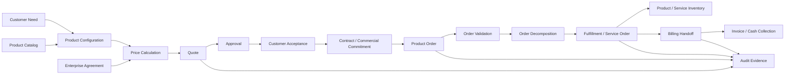
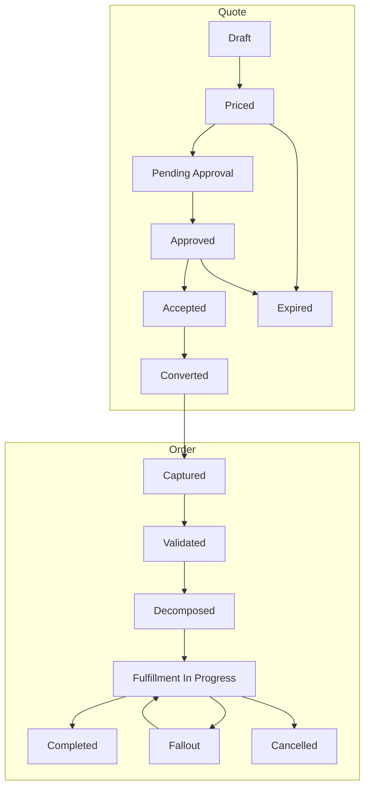
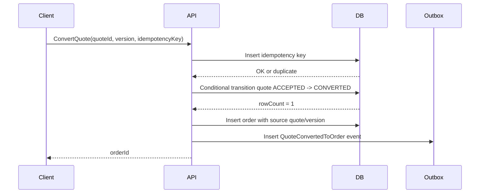
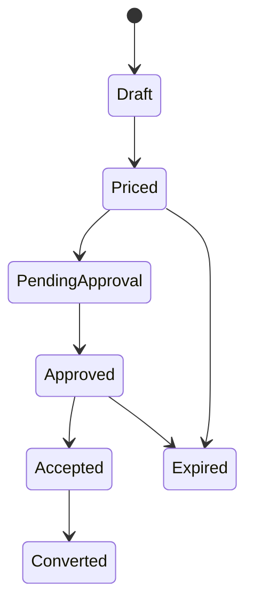

# Part 003 — Quote-to-Cash Lifecycle from First Principles

## 1. Tujuan Part Ini

Part ini membangun mental model **quote-to-cash** dari first principles.

Targetnya bukan menghafal diagram sales process. Targetnya adalah memahami quote-to-cash sebagai **lifecycle revenue** yang menghubungkan commercial intent, product definition, pricing, approval, order execution, fulfillment, billing handoff, dan post-sale change.

Dalam sistem enterprise, quote-to-cash bukan satu halaman UI, bukan satu microservice, dan bukan satu API. Ia adalah rangkaian keputusan dan state transition yang harus tetap benar walaupun:

- catalog berubah,
- customer memiliki agreement khusus,
- sales melakukan revisi quote,
- discount perlu approval,
- order dikirim ke downstream system yang lambat,
- fulfillment sebagian gagal,
- event Kafka terduplikasi,
- database migration sedang rolling,
- deployment customer berbeda antara cloud dan on-prem,
- data harus bisa diaudit berbulan-bulan setelah transaksi terjadi.

Dari sumber publik CSG, quote-to-cash diposisikan sebagai workflow yang menghubungkan CPQ, order management, billing, revenue recognition, approval, provisioning, dan invoicing untuk mengurangi manual handoff dan revenue leakage. CSG juga menjelaskan tahap seperti configure, price, quote, contract, order, orchestrate/automate, fulfill, dan bill. Itu adalah konteks publik yang aman dipakai sebagai framing. Detail implementasi internal tetap harus diverifikasi di CSG.

Prinsip utama part ini:

> Quote-to-cash is not a sequence of screens. It is a controlled transformation from commercial intent into operational and financial commitment.

---

## 2. Mental Model: Dari Intent ke Commitment

Bayangkan customer enterprise ingin membeli layanan kompleks. Pada awalnya, yang ada hanyalah intent:

- customer ingin sesuatu,
- sales ingin menawarkan sesuatu,
- catalog mendefinisikan apa yang boleh dijual,
- pricing menentukan berapa biayanya,
- finance ingin margin tetap sehat,
- legal/contract ingin terms benar,
- operations ingin order bisa dipenuhi,
- billing ingin charge bisa ditagihkan,
- support ingin transaksi bisa dijelaskan.

Quote-to-cash mengubah intent tersebut menjadi commitment yang semakin kuat.

Urutan konseptualnya:

1. **Commercial exploration** — customer dan sales mengeksplor kebutuhan.
2. **Configuration** — produk/offering dipilih dan dikonfigurasi.
3. **Pricing** — harga dihitung berdasarkan catalog, agreement, discount, dan rule.
4. **Quote creation** — proposal formal dibuat.
5. **Approval** — risiko komersial diperiksa.
6. **Acceptance/contracting** — customer menyetujui atau masuk ke agreement.
7. **Order capture** — quote dikonversi menjadi order intent.
8. **Validation** — order diperiksa ulang sebelum execution.
9. **Decomposition** — order dipecah menjadi pekerjaan fulfillment.
10. **Fulfillment** — downstream system menjalankan provisioning/delivery.
11. **Billing handoff** — data commercial/fulfillment disiapkan untuk charging/invoicing.
12. **Inventory update** — produk/layanan yang aktif direkam.
13. **Post-sale change** — amend, cancel, suspend, resume, renew, disconnect.

Semakin jauh lifecycle berjalan, semakin mahal biaya koreksi.

| Stage | Commitment strength | Correction cost | Typical risk |
|---|---:|---:|---|
| Exploration | Low | Low | Wrong assumptions |
| Configuration | Medium | Medium | Invalid combination |
| Pricing | Medium/High | Medium/High | Margin leakage |
| Quote approval | High | High | Approval bypass |
| Order capture | Very high | High | Wrong execution intent |
| Fulfillment | Very high | Very high | Partial failure |
| Billing | Financially binding | Very high | Revenue/billing error |

Senior engineer tidak hanya bertanya “apakah endpoint ini berhasil?”. Senior engineer bertanya:

> Pada titik lifecycle ini, commitment apa yang sedang dibuat, siapa yang bisa mengubahnya, apa yang harus disnapshot, dan bagaimana kita membuktikan kebenarannya setelah terjadi incident?

---

## 3. Public Context vs Internal Implementation

Sebelum masuk detail, penting untuk menjaga batas antara konteks publik dan fakta internal.

### 3.1 Yang Aman dari Sumber Publik

Dari materi publik CSG dan konsep industri CPQ/Q2C:

- Quote-to-cash menghubungkan CPQ, order management, billing, revenue recognition, approval, provisioning, dan invoicing.
- CPQ menangani configure, price, quote untuk complex deals.
- Order management menghubungkan quote/order dengan fulfillment.
- Shared/catalog-driven architecture penting untuk menjaga konsistensi antara quote, order, delivery, dan billing.
- Dalam telco B2B, kompleksitas datang dari product bundle, site, partner, agreement, network/service dependency, dan downstream system.

### 3.2 Yang Tidak Boleh Diasumsikan

Tanpa verifikasi internal, jangan menyimpulkan:

- apakah CSG Quote & Order memakai service boundary tertentu,
- apakah quote dan order berada di database yang sama,
- apakah Kafka dipakai untuk semua transition,
- apakah TM Forum API adalah public contract atau internal mapping,
- apakah catalog runtime selalu read-through cache atau snapshot,
- apakah pricing engine embedded atau service terpisah,
- apakah approval workflow custom, rule-based, atau external,
- apakah billing handoff synchronous, asynchronous, batch, atau event-driven.

Dalam seri ini, kita akan memakai first principles dan standard industri sebagai lensa. Namun setiap keputusan final harus dikonfirmasi melalui codebase, docs, production telemetry, dan diskusi team.

---

## 4. Quote-to-Cash sebagai Causal Chain

Quote-to-cash harus dipahami sebagai causal chain, bukan sekadar ordered list.



Hal penting dari diagram ini: **sebagian node adalah decision point, sebagian node adalah artifact, sebagian node adalah execution step, dan sebagian node adalah evidence**.

Contoh:

- Catalog adalah source of possible offerings.
- Configuration adalah selected and constrained possibility.
- Pricing adalah computed commercial value.
- Quote adalah proposed commercial commitment.
- Approval adalah governance decision.
- Order adalah execution commitment.
- Fulfillment adalah operational execution.
- Billing handoff adalah financial execution input.
- Audit adalah evidence layer lintas lifecycle.

Jika semua diperlakukan sebagai “record yang di-update”, sistem akan rapuh. Lifecycle seperti ini perlu dibangun dengan event, state, invariant, snapshot, dan audit trail.

---

## 5. Core Question: Apa yang Berubah di Setiap Stage?

Cara terbaik memahami quote-to-cash adalah menanyakan empat hal di setiap stage:

1. **Artifact apa yang dibuat atau diubah?**
2. **State/invariant apa yang harus dijaga?**
3. **Decision apa yang dibuat?**
4. **Evidence apa yang harus tersimpan?**

### 5.1 Configuration Stage

Artifact utama:

- selected product offering,
- quote item,
- characteristic values,
- site/location data,
- bundle structure,
- dependency relationship,
- eligibility result,
- validation result.

Decision:

- Apakah customer eligible?
- Apakah offering tersedia untuk market/segment/channel ini?
- Apakah kombinasi produk valid?
- Apakah dependency terpenuhi?
- Apakah configuration complete?

Invariant:

- Quote item tidak boleh mereferensi offering yang tidak valid pada catalog/effective date terkait.
- Required characteristic harus terisi sebelum quote bisa diajukan.
- Bundle cardinality harus terpenuhi.
- Mutually exclusive products tidak boleh ada dalam konfigurasi yang sama.

Evidence:

- catalog version,
- rule version,
- validation output,
- actor,
- timestamp,
- input characteristic.

### 5.2 Pricing Stage

Artifact utama:

- item price,
- recurring charge,
- non-recurring charge,
- discount,
- tax approximation jika relevan,
- margin indicator,
- price override,
- price breakdown,
- total quote value.

Decision:

- Price mana yang berlaku?
- Agreement apa yang memengaruhi price?
- Discount mana yang boleh digabung?
- Override apakah legal?
- Apakah margin masih aman?
- Apakah approval dibutuhkan?

Invariant:

- Total price harus bisa direkonstruksi dari breakdown.
- Discount tidak boleh melanggar guardrail.
- Price yang diterima customer harus snapshot, bukan hanya pointer ke current price.
- Repricing harus eksplisit, bukan side effect tersembunyi.

Evidence:

- pricing input,
- price list/catalog version,
- agreement reference,
- discount rule,
- override reason,
- approval reason,
- computed breakdown.

### 5.3 Quote Stage

Artifact utama:

- quote header,
- quote version,
- quote items,
- total price,
- terms,
- expiry,
- status,
- approval state,
- related party/customer,
- attachments/documents jika ada.

Decision:

- Apakah quote bisa dikirim?
- Apakah quote harus approved?
- Apakah quote masih valid?
- Apakah quote bisa diubah?
- Apakah quote bisa dikonversi ke order?

Invariant:

- Approved quote tidak boleh berubah tanpa membuat versi baru atau reset approval.
- Expired quote tidak boleh accepted tanpa revalidation/reprice sesuai policy.
- Quote yang sudah converted tidak boleh dikonversi ulang.
- Quote acceptance harus mereferensi versi quote yang tepat.

Evidence:

- quote version history,
- before/after changes,
- approval decision,
- acceptance timestamp,
- actor/role,
- generated document if relevant.

### 5.4 Order Capture Stage

Artifact utama:

- product order,
- order item,
- action per item,
- related quote reference,
- customer/account,
- requested date,
- delivery/site data,
- order price snapshot,
- fulfillment hints.

Decision:

- Apakah quote dapat dikonversi?
- Apakah order harus fully derived dari quote atau boleh tambahan input?
- Apakah order adalah new, change, disconnect, suspend, resume?
- Apakah order perlu decomposition?

Invariant:

- Order dari quote harus preserve commercial commitment.
- Order item harus traceable ke quote item atau valid explicit addition.
- Order creation harus idempotent.
- Status awal order harus jelas.

Evidence:

- quote-to-order mapping,
- actor,
- idempotency key,
- conversion event,
- payload snapshot,
- validation result.

### 5.5 Fulfillment Stage

Artifact utama:

- fulfillment plan,
- service order,
- work item,
- downstream request,
- task status,
- retry record,
- fallout record,
- completion record.

Decision:

- Work item apa yang harus dibuat?
- Mana yang bisa paralel?
- Mana yang harus menunggu dependency?
- Failure mana yang retryable?
- Failure mana yang perlu human intervention?
- Kapan order boleh marked completed?

Invariant:

- Work item dependency harus dihormati.
- Retry tidak boleh menciptakan duplicate provisioning.
- Partial completion harus tercermin di order item state.
- Completed order harus memiliki evidence fulfillment yang cukup.

Evidence:

- downstream request/response,
- retry attempts,
- error code,
- operator action,
- completion event,
- reconciliation result.

### 5.6 Billing Handoff Stage

Artifact utama:

- billing account reference,
- charge item,
- billing start date,
- one-time charge,
- recurring charge,
- discount term,
- product instance reference,
- fulfillment completion evidence.

Decision:

- Kapan billing dimulai?
- Apakah charge harus menunggu activation?
- Apakah partial fulfillment menghasilkan partial billing?
- Bagaimana cancellation atau amendment memengaruhi billing?

Invariant:

- Billing handoff tidak boleh terjadi untuk item yang belum memenuhi billing trigger.
- Charge harus traceable ke quote/order/product instance.
- Duplicate billing handoff harus dicegah atau idempotent.
- Billing correction harus auditable.

Evidence:

- billing event,
- fulfillment completion,
- charge breakdown,
- effective date,
- cancellation/amendment reference,
- reconciliation report.

---

## 6. Lifecycle State: Jangan Campur Artifact State dan Process State

Salah satu sumber bug besar di quote-to-cash adalah mencampur beberapa jenis state ke dalam satu kolom `status`.

Contoh status yang sering tercampur:

- Quote commercial status: `Draft`, `Approved`, `Accepted`, `Expired`.
- Quote document status: `Generated`, `Sent`, `Downloaded`.
- Approval status: `NotRequired`, `Pending`, `Approved`, `Rejected`.
- Order capture status: `Submitted`, `Validated`, `Rejected`.
- Fulfillment status: `InProgress`, `Failed`, `Completed`.
- Billing handoff status: `Pending`, `Sent`, `Acknowledged`, `Failed`.
- Operational task status: `Queued`, `Retrying`, `Fallout`, `ManuallyResolved`.

Jika semuanya digabung menjadi satu `status`, transition matrix menjadi tidak jelas.

Model yang lebih sehat adalah memisahkan state machine berdasarkan concern:



Dalam implementasi nyata, state machine bisa lebih kompleks. Tetapi prinsipnya tetap:

- Pisahkan lifecycle artifact dari lifecycle process.
- Definisikan transition legal secara eksplisit.
- Simpan actor dan reason untuk transition penting.
- Jangan membuat transition implisit dari background job tanpa audit.
- Jangan mengandalkan UI untuk mencegah illegal transition; backend harus menjaga invariant.

---

## 7. Snapshot adalah Benteng Melawan Time Travel Bug

Quote-to-cash banyak berurusan dengan data yang berubah dari waktu ke waktu:

- catalog berubah,
- price list berubah,
- agreement berubah,
- discount policy berubah,
- customer data berubah,
- tax rule berubah,
- fulfillment capability berubah,
- inventory berubah.

Kalau quote hanya menyimpan reference ke current catalog/current price, maka quote lama bisa berubah makna saat catalog berubah. Ini disebut time travel bug.

Contoh sederhana:

1. Pada 1 Januari, customer menerima quote untuk Product A seharga 100.
2. Pada 10 Januari, price Product A berubah menjadi 120.
3. Pada 11 Januari, order dibuat dari quote lama.
4. Jika order membaca current price, customer bisa dikenai 120 padahal quote approved 100.

Untuk sistem enterprise, ini bukan bug kecil. Ini bisa menjadi dispute komersial.

Karena itu, quote biasanya membutuhkan snapshot atau versioned reference:

- catalog version,
- product offering version,
- price version,
- agreement version,
- discount computation result,
- quote line price breakdown,
- approval basis.

Namun snapshot juga punya trade-off:

| Approach | Benefit | Cost/Risk |
|---|---|---|
| Store only reference | Data kecil, selalu current | Quote lama bisa berubah makna |
| Full snapshot | Rekonstruksi kuat | Payload besar, duplication, migration cost |
| Versioned reference | Balance antara traceability dan size | Membutuhkan version lifecycle kuat |
| Hybrid snapshot | Critical fields frozen, non-critical referenced | Perlu definisi field yang jelas |

Senior engineer harus mencari jawaban:

> Field mana yang harus frozen karena menjadi commercial commitment, dan field mana yang boleh tetap dynamic karena hanya metadata/display?

---

## 8. Source of Truth Map

Quote-to-cash harus memiliki peta source of truth. Tanpa itu, reconciliation menjadi perang opini antar sistem.

Contoh conceptual source-of-truth map:

| Data | Candidate source of truth | Why it matters |
|---|---|---|
| Product offering definition | Catalog | Menentukan apa yang boleh dijual |
| Customer profile | Customer/CRM system | Menentukan party/account identity |
| Agreement terms | Agreement/contract system | Menentukan entitlement/pricing/term |
| Quote price | Quote/CPQ system | Menjadi commercial proposal |
| Product order | Order management | Menjadi execution commitment |
| Fulfillment status | Fulfillment/SOM/OSS | Menentukan delivery progress |
| Product instance | Product inventory | Menunjukkan installed base |
| Billing charge | Billing system | Menentukan invoice/cash |
| Audit evidence | Audit/event store/log archive | Menentukan defensibility |

Yang perlu diperhatikan: source of truth bukan berarti semua service boleh query langsung ke sana kapan saja. Source of truth berarti **tempat authoritative untuk keputusan tertentu**. Akses bisa melalui API, event, snapshot, cache, atau replicated read model.

Internal implementation harus diverifikasi.

---

## 9. Quote-to-Cash Failure Modes

Sistem yang mature tidak hanya mendesain happy path. Ia mendesain failure path.

### 9.1 Configuration Failure

Contoh:

- selected offering tidak tersedia untuk customer segment,
- required characteristic hilang,
- bundle cardinality invalid,
- dependency product tidak ikut dipilih,
- eligibility check timeout,
- catalog cache stale.

Signal yang harus terlihat:

- validation error code,
- affected quote item,
- catalog version,
- rule version,
- correlation ID,
- whether retry may help.

Mitigation:

- deterministic validation,
- explainable errors,
- cache invalidation strategy,
- fallback policy,
- user-visible remediation.

### 9.2 Pricing Failure

Contoh:

- price list missing,
- duplicate discount applied,
- discount stacking salah,
- price override tidak diaudit,
- currency/term mismatch,
- margin threshold tidak trigger approval,
- repricing silently changes accepted quote.

Signal:

- price calculation trace,
- pricing input snapshot,
- discount breakdown,
- margin value,
- approval requirement decision,
- pricing engine latency.

Mitigation:

- immutable price snapshot,
- calculation explanation,
- approval guard,
- golden pricing tests,
- reconciliation with billing.

### 9.3 Quote Failure

Contoh:

- quote expired tetapi tetap accepted,
- quote approved kemudian item diubah tanpa reset approval,
- quote dikonversi dua kali,
- customer accepts old version,
- PDF/document tidak sesuai data final,
- concurrent edit lost update.

Signal:

- quote version,
- optimistic lock failure,
- state transition rejection,
- duplicate conversion attempt,
- audit diff.

Mitigation:

- versioned quote,
- transition guard,
- idempotency key,
- backend authorization,
- audit trail.

### 9.4 Order Failure

Contoh:

- order created from stale quote,
- order item mapping hilang,
- downstream rejects payload,
- duplicate Kafka event creates duplicate work,
- partial fulfillment not reflected,
- cancellation races with completion,
- retry creates duplicate provisioning.

Signal:

- order state,
- order item state,
- downstream correlation,
- Kafka offset/event ID,
- retry attempt,
- fallout reason.

Mitigation:

- idempotent order creation,
- outbox pattern,
- deterministic decomposition,
- stateful process manager,
- manual fallout workflow,
- reconciliation job.

### 9.5 Billing Handoff Failure

Contoh:

- billing event sent before activation,
- duplicate charge event,
- wrong effective date,
- missing discount term,
- failed billing acknowledgement,
- cancellation not propagated.

Signal:

- billing event ID,
- product instance ID,
- charge reference,
- acknowledgement status,
- reconciliation mismatch.

Mitigation:

- billing trigger invariant,
- idempotent event key,
- reconciliation with billing,
- repair workflow,
- audit evidence.

---

## 10. Implementation Lens: Java Backend

Dalam Java backend, quote-to-cash lifecycle biasanya muncul sebagai beberapa tipe komponen. Nama aktual harus diverifikasi, tetapi pattern konseptualnya penting.

### 10.1 Domain Objects

Contoh conceptual objects:

```java
record QuoteId(String value) {}
record QuoteVersion(int value) {}
record CatalogVersion(String value) {}
record Money(BigDecimal amount, String currency) {}

final class Quote {
    private QuoteId id;
    private QuoteVersion version;
    private QuoteStatus status;
    private List<QuoteItem> items;
    private PriceSummary priceSummary;
    private ApprovalState approvalState;
    private Instant expiresAt;

    void submitForApproval(Actor actor, Instant now) {
        requireStatus(QuoteStatus.PRICED);
        requireNotExpired(now);
        requireAllItemsValid();
        this.status = QuoteStatus.PENDING_APPROVAL;
        recordDomainEvent(new QuoteSubmittedForApproval(id, version, actor.id(), now));
    }
}
```

Yang penting bukan class-nya persis seperti ini. Yang penting adalah intent:

- transition dijaga di domain/application layer,
- invariant tidak tersebar di controller/UI,
- event dibuat dari state transition yang sah,
- audit bisa dibangun dari transition.

### 10.2 Application Services

Application service mengorkestrasi use case:

```java
class ConvertQuoteToOrderUseCase {
    OrderId execute(ConvertQuoteCommand command) {
        // 1. Validate idempotency key
        // 2. Load quote with lock/version check
        // 3. Validate quote state and expiry
        // 4. Create order from quote snapshot
        // 5. Persist order and transition quote
        // 6. Write outbox event in same transaction
        // 7. Return stable order id
        throw new UnsupportedOperationException("conceptual example");
    }
}
```

Hal yang harus dicari saat review:

- Apakah use case transactional?
- Apakah idempotency dicek sebelum side effect?
- Apakah quote version dicek?
- Apakah quote transition dan order creation atomic?
- Apakah event publish menggunakan outbox?
- Apakah audit tercatat?

### 10.3 Error Model

Quote-to-cash membutuhkan error taxonomy yang jelas.

Contoh category:

| Category | Example | Retryable? | User action? |
|---|---|---:|---:|
| Validation | Missing required characteristic | No | Yes |
| Business rule | Discount exceeds authority | No | Yes |
| State conflict | Quote already converted | No/Idempotent | Maybe |
| Concurrency | Optimistic lock failure | Yes | Retry request |
| External dependency | Fulfillment timeout | Yes | Usually no |
| System | DB unavailable | Yes | No |
| Security | Missing permission | No | No |

Tanpa taxonomy, UI dan integration client akan memperlakukan semua error sebagai generic failure. Itu buruk untuk operasi enterprise.

---

## 11. Implementation Lens: PostgreSQL

Quote-to-cash system sangat bergantung pada data correctness. PostgreSQL tidak hanya menyimpan data, tetapi juga membantu menjaga invariant.

### 11.1 Transaction Boundary

Contoh operation yang idealnya atomic:

- quote item update + quote version increment,
- quote approval decision + audit record,
- quote-to-order conversion + quote transition + order insert + outbox event,
- order state transition + order item transition + audit event,
- retry attempt record + downstream command outbox.

Pertanyaan review:

- Apakah operation ini harus atomic?
- Apakah ada side effect sebelum commit DB?
- Apakah event bisa publish tanpa data committed?
- Apakah rollback meninggalkan external side effect?

### 11.2 Locking and Concurrency

Quote-to-cash rawan race:

- dua user mengedit quote bersamaan,
- approval terjadi saat quote berubah,
- acceptance terjadi saat quote expired,
- order conversion diklik dua kali,
- cancellation datang saat fulfillment completion,
- retry worker berjalan paralel.

Tools yang mungkin dipakai:

- optimistic locking dengan version column,
- pessimistic lock untuk transition kritikal,
- unique constraint untuk idempotency key,
- unique constraint untuk quote-to-order mapping,
- state transition check di query/update condition,
- transaction isolation sesuai kebutuhan.

Contoh pattern:

```sql
UPDATE quote
SET status = 'CONVERTED', updated_at = now()
WHERE id = :quote_id
  AND version = :expected_version
  AND status = 'ACCEPTED';
```

Jika row count 0, artinya ada conflict atau illegal transition. Itu harus diperlakukan sebagai business/concurrency signal, bukan generic DB failure.

---

## 12. Implementation Lens: Kafka and Events

Quote-to-cash sering memakai event untuk menghubungkan bounded context.

Contoh conceptual events:

- `QuoteCreated`
- `QuotePriced`
- `QuoteApprovalRequested`
- `QuoteApproved`
- `QuoteAccepted`
- `QuoteConvertedToOrder`
- `ProductOrderCreated`
- `ProductOrderValidated`
- `ProductOrderDecomposed`
- `FulfillmentStarted`
- `FulfillmentFailed`
- `ProductOrderCompleted`
- `BillingHandoffRequested`

Pertanyaan penting:

- Event ini merepresentasikan fakta yang sudah terjadi atau command untuk melakukan sesuatu?
- Event dikirim setelah transaction commit atau sebelum?
- Event punya stable ID?
- Event punya aggregate ID?
- Event punya version/sequence?
- Consumer idempotent?
- Bisa replay tanpa menciptakan side effect eksternal?
- Event schema backward-compatible?

Event bukan pengganti domain model. Event adalah evidence/integration mechanism. Jika event digunakan untuk menutupi lifecycle yang tidak jelas, sistem akan sulit di-debug.

---

## 13. Internal Verification Checklist

Gunakan checklist ini saat onboarding ke real system.

### 13.1 Product and Domain

- Apa definisi internal quote-to-cash untuk CSG Quote & Order?
- Stage mana yang benar-benar dimiliki Quote & Order?
- Stage mana yang dimiliki external/adjacent system?
- Apakah ada glossary resmi untuk quote, order, product, service, agreement, fulfillment, fallout?
- Apakah ada perbedaan istilah antar customer/deployment?

### 13.2 Quote Lifecycle

- Apa state quote aktual?
- Apa transition matrix quote?
- State mana terminal?
- Kapan quote expired?
- Kapan quote harus reprice?
- Apakah approved quote immutable?
- Bagaimana quote versioning bekerja?
- Bagaimana quote-to-order conversion dicegah dari double submit?

### 13.3 Order Lifecycle

- Apa state order aktual?
- Apa state order item aktual?
- Bagaimana partial fulfillment dimodelkan?
- Bagaimana cancellation dimodelkan?
- Bagaimana amendment dimodelkan?
- Bagaimana retry/resume/fallout bekerja?
- Apa completion criteria?

### 13.4 Catalog and Pricing

- Apakah quote menyimpan catalog version?
- Apakah quote menyimpan price snapshot?
- Apakah pricing bisa direkonstruksi?
- Apakah agreement/discount rule disnapshot?
- Apa behavior saat catalog berubah di tengah quote/order?

### 13.5 Integration

- Sistem apa saja yang terlibat dalam quote-to-cash?
- Apakah integrasi sync, async, batch, file, atau event?
- Apa source of truth setiap data?
- Apa reconciliation mechanism?
- Apa retry policy per downstream?

### 13.6 Production

- Dashboard apa yang menunjukkan quote-to-cash health?
- Alert apa yang trigger saat order stuck?
- Di mana fallout queue terlihat?
- Bagaimana incident terkait quote/order ditangani?
- Apakah ada runbook data repair?
- Apakah ada postmortem terkait pricing/order/billing incident?

---

## 14. PR Review Questions for Quote-to-Cash Changes

Saat mereview PR di area quote-to-cash, gunakan pertanyaan berikut.

### 14.1 Domain Correctness

- Artifact lifecycle mana yang berubah?
- Apakah invariant baru/berubah sudah eksplisit?
- Apakah state transition legal?
- Apakah terminal state terlindungi?
- Apakah quote/order version diperhatikan?

### 14.2 Commercial Safety

- Apakah perubahan ini bisa mengubah harga?
- Apakah perubahan ini bisa melewati approval?
- Apakah price/discount/margin tetap auditable?
- Apakah customer-specific agreement terdampak?
- Apakah expired/stale quote behavior aman?

### 14.3 Data Safety

- Apakah migration backward-compatible?
- Apakah transaction boundary benar?
- Apakah concurrency ditangani?
- Apakah idempotency ada untuk operation yang bisa retry?
- Apakah data lama tetap bisa dibaca?

### 14.4 Integration Safety

- Apakah API/event contract berubah?
- Apakah consumer lama tetap aman?
- Apakah event duplicate/replay aman?
- Apakah downstream timeout/retry behavior jelas?
- Apakah correlation ID diteruskan?

### 14.5 Operational Safety

- Apakah ada metric/log/trace untuk behavior baru?
- Apakah failure bisa dideteksi?
- Apakah rollback aman?
- Apakah support bisa menjelaskan kondisi baru?
- Apakah runbook perlu diperbarui?

---

## 15. Mini Case Study: Double Quote Conversion

### 15.1 Scenario

User membuka quote accepted di dua tab. Ia klik “Convert to Order” dua kali. Atau integration client mengirim request yang sama dua kali karena timeout.

Naive implementation:

1. Load quote.
2. Check status is `ACCEPTED`.
3. Create order.
4. Update quote to `CONVERTED`.
5. Publish event.

Race:

- Request A dan B sama-sama melihat quote `ACCEPTED`.
- Keduanya membuat order.
- Quote akhirnya `CONVERTED`, tetapi ada dua order.

### 15.2 Better Design

Defensive design:

- Client mengirim idempotency key.
- Backend punya unique constraint untuk idempotency key.
- Quote transition dilakukan secara conditional update.
- Quote-to-order mapping punya unique constraint per quote version.
- Order creation dan quote transition dalam satu transaction.
- Outbox event ditulis dalam transaction yang sama.

Conceptual DB constraints:

```sql
CREATE UNIQUE INDEX uq_order_from_quote_version
ON product_order(source_quote_id, source_quote_version)
WHERE source_quote_id IS NOT NULL;

CREATE UNIQUE INDEX uq_idempotency_key
ON idempotency_record(client_id, idempotency_key);
```

Conceptual flow:



### 15.3 Detection

Dashboard/log signals:

- duplicate conversion attempts,
- unique constraint violations on quote-to-order mapping,
- idempotency replay count,
- quote transition conflicts,
- orders created per quote.

### 15.4 Review Lesson

Double submit bukan UI problem. Ini lifecycle correctness problem.

---

## 16. Mini Case Study: Stale Catalog at Order Creation

### 16.1 Scenario

Quote dibuat dengan catalog version `v10`. Sebelum customer accepts, catalog berubah ke `v11`. Product offering lama masih valid untuk quote existing tetapi tidak untuk new sales.

Pertanyaan:

- Apakah quote lama masih boleh accepted?
- Apakah harus revalidate dengan catalog baru?
- Apakah order harus memakai `v10` snapshot atau `v11`?
- Apakah fulfillment system masih bisa menerima product definition lama?

Tidak ada jawaban universal. Yang penting adalah policy eksplisit.

### 16.2 Possible Policies

| Policy | Behavior | Trade-off |
|---|---|---|
| Strict current catalog | Semua order harus valid terhadap catalog terbaru | Aman untuk ops, tetapi bisa membatalkan quote yang sudah dinegosiasikan |
| Quote catalog snapshot | Order mengikuti catalog version saat quote dibuat | Aman secara komersial, tetapi perlu support old definitions |
| Revalidate on accept | Saat accept, validasi ulang dengan current catalog | Balance, tetapi user experience lebih kompleks |
| Grace period | Catalog lama masih valid sampai tanggal tertentu | Realistis, tetapi butuh governance |

### 16.3 Senior Engineering Question

Jangan hanya bertanya “mana yang benar?”. Tanyakan:

- Apa contractual expectation?
- Apa operational capability?
- Apa billing compatibility?
- Apa customer communication?
- Apa audit evidence?
- Apa migration path?

---

## 17. Practical Exercises

### Exercise 1 — Build a Source-of-Truth Map

Ambil satu journey quote-to-order di environment internal. Buat tabel:

| Data | Read by | Written by | Source of truth | Cached? | Snapshot? | Risk |
|---|---|---|---|---|---|---|

Minimal data:

- customer,
- account,
- agreement,
- product offering,
- price,
- quote item,
- order item,
- fulfillment status,
- billing trigger.

### Exercise 2 — Draw Actual Lifecycle

Gambarkan state machine aktual untuk quote dan order berdasarkan codebase.

Gunakan Mermaid:



Lalu tandai:

- transition yang dibuat user,
- transition yang dibuat background job,
- transition yang dibuat downstream event,
- transition yang membutuhkan permission,
- transition yang membutuhkan audit reason.

### Exercise 3 — Trace One Order

Pilih satu order di non-production environment. Trace:

1. API request.
2. DB records.
3. Kafka events.
4. Downstream calls.
5. Logs/traces.
6. Final status.
7. Audit record.

Catat gap observability.

### Exercise 4 — Identify One Hidden Assumption

Cari satu area di mana code mengasumsikan sesuatu secara implisit, misalnya:

- quote selalu punya price,
- order selalu punya quote,
- customer selalu ada di local DB,
- catalog reference selalu valid,
- retry selalu aman,
- status string selalu dikenal.

Ubah asumsi itu menjadi invariant/test/checklist.

---

## 18. Common Anti-Patterns

### 18.1 Quote as Mutable Bag of Fields

Jika quote bisa berubah bebas di semua state, approval dan audit kehilangan makna.

Lebih baik:

- state-specific mutability,
- versioning,
- approval reset rules,
- audit diff.

### 18.2 Order as Synchronous CRUD

Order enterprise tidak selesai saat record dibuat. Order adalah long-running workflow.

Lebih baik:

- explicit lifecycle,
- order item state,
- async processing,
- fallout handling,
- reconciliation.

### 18.3 Pricing as a Final Number Only

Jika hanya total price yang disimpan, dispute sulit dijelaskan.

Lebih baik:

- price breakdown,
- input snapshot,
- rule version,
- discount explanation,
- approval basis.

### 18.4 Kafka as Magic Consistency Layer

Kafka tidak menyelesaikan idempotency, ordering, replay, atau schema evolution secara otomatis.

Lebih baik:

- event contract,
- outbox,
- idempotent consumer,
- replay-safe design,
- correlation/causation metadata.

### 18.5 No Operational Model

Jika lifecycle tidak terlihat di dashboard, production incident akan menjadi forensic exercise manual.

Lebih baik:

- business metrics,
- stuck order alert,
- fallout queue,
- traceable identifiers,
- runbook.

---

## 19. Summary

Quote-to-cash adalah lifecycle revenue yang mengubah customer intent menjadi commercial, operational, dan financial commitment.

Key takeaways:

- Quote-to-cash bukan satu service; ia adalah causal chain lintas domain.
- Setiap stage membuat artifact, decision, invariant, dan evidence.
- Quote dan order harus dipahami sebagai lifecycle/state machine, bukan record mutable biasa.
- Snapshot/versioning penting untuk mencegah time travel bug.
- Failure modes harus didesain, bukan diperlakukan sebagai exception tak terduga.
- Senior engineer harus selalu menanyakan commitment, source of truth, invariant, idempotency, auditability, dan operability.

Jika Part 001 membangun batas fakta dan Part 002 membangun konteks produk, Part 003 memberi fondasi lifecycle. Part berikutnya akan masuk lebih dalam ke CPQ: bagaimana configure, price, quote bekerja sebagai domain engine yang menggabungkan catalog, rule, pricing, agreement, validation, approval, dan commercial defensibility.

---

## 20. References

Sumber berikut dipakai sebagai konteks publik/industri, bukan sebagai bukti detail implementasi internal CSG:

- CSG Quote to Cash Software for Enterprise Deals: https://www.csgi.com/solutions/quote-to-cash
- CSG Configure, Price, Quote: https://www.csgi.com/solutions/quote-to-cash/configure-price-quote
- CSG Quote & Order: https://www.csgi.com/products/quote-and-order
- CSG Quote to Cash vs CPQ: https://www.csgi.com/insights/quote-to-cash-vs-cpq
- TM Forum Open APIs Directory: https://www.tmforum.org/open-digital-architecture/open-apis
- TMF648 Quote Management API: https://www.tmforum.org/open-digital-architecture/open-apis/quote-management-api-TMF648/v4.0
- TMF622 Product Ordering Management API: https://www.tmforum.org/open-digital-architecture/open-apis/product-ordering-management-api-TMF622/v5.0
