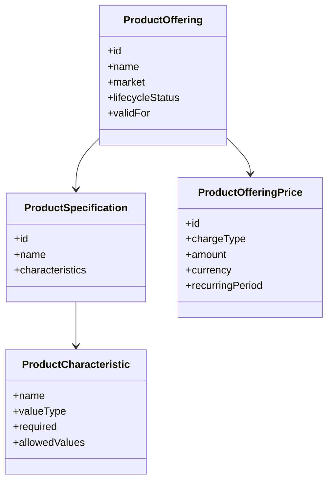
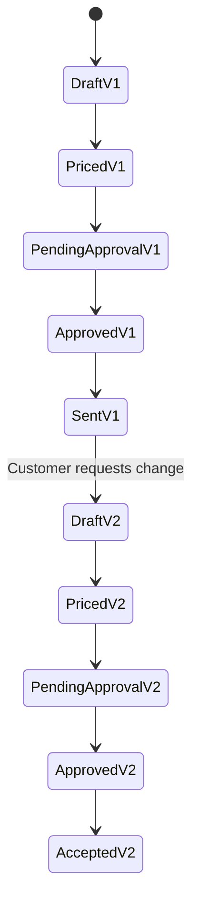
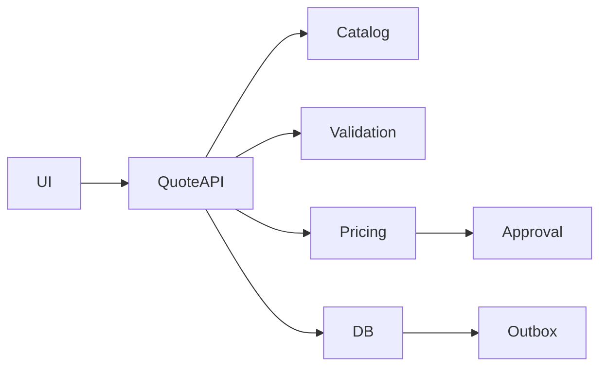

# Part 004 — CPQ Fundamentals: Configure, Price, Quote

## 1. Tujuan Part Ini

Part ini membahas CPQ dari sudut pandang engineer yang harus membangun, membaca, memperbaiki, dan mereview sistem enterprise nyata.

CPQ adalah singkatan dari **Configure, Price, Quote**. Secara sederhana, CPQ membantu sales membuat quote yang akurat untuk produk/layanan yang kompleks. Namun dalam sistem enterprise telco/B2B, CPQ bukan sekadar wizard UI untuk memilih produk dan menghitung harga.

CPQ adalah gabungan dari beberapa engine:

- configuration engine,
- eligibility engine,
- validation engine,
- pricing engine,
- discount engine,
- agreement/entitlement evaluator,
- approval trigger,
- quote lifecycle manager,
- audit/evidence generator,
- order-readiness gate.

Dari sumber publik CSG, CPQ untuk enterprise/telco ditekankan pada kemampuan configure, price, and quote complex deals faster dengan accuracy, scale, margin visibility, AI-driven intelligence, dan konteks telecom B2B. Itu memberi konteks domain. Tetapi detail internal seperti rule engine, service boundary, data model, dan deployment harus diverifikasi di CSG.

Prinsip utama part ini:

> CPQ is a decision system. The hardest part is not calculating a number; it is proving that the proposed commercial commitment is valid, explainable, approvable, and executable.

---

## 2. CPQ dari First Principles

Untuk memahami CPQ, jangan mulai dari layar. Mulai dari problem bisnis.

Customer enterprise jarang membeli satu produk sederhana. Mereka bisa membeli kombinasi layanan seperti:

- connectivity untuk banyak site,
- add-on security,
- bandwidth tier,
- SLA berbeda,
- managed service,
- installation service,
- device/equipment,
- partner-provided component,
- recurring service,
- one-time setup,
- contract term multi-year,
- customer-specific discount,
- agreement-specific entitlement.

Pertanyaan CPQ:

1. Apa yang boleh dijual ke customer ini?
2. Kombinasi apa yang valid?
3. Data konfigurasi apa yang wajib?
4. Harga mana yang berlaku?
5. Discount mana yang boleh?
6. Margin masih aman atau perlu approval?
7. Quote bisa dikirim atau masih incomplete?
8. Kalau accepted, apakah quote bisa dieksekusi sebagai order?

CPQ yang baik tidak hanya menjawab “berapa harga total?”. CPQ yang baik menjawab:

- kenapa offering ini valid,
- kenapa offering lain tidak valid,
- bagaimana harga dihitung,
- rule mana yang dipakai,
- siapa yang override,
- approval apa yang dibutuhkan,
- apa yang akan terjadi saat quote menjadi order.

---

## 3. The Three Verbs: Configure, Price, Quote

### 3.1 Configure

Configure adalah proses membentuk **valid product intent**.

Input umum:

- customer/account,
- market/region,
- channel,
- product catalog,
- product offering,
- product specification,
- characteristic values,
- site/location,
- installed base,
- agreement/contract,
- eligibility rules,
- compatibility rules.

Output ideal:

- quote item hierarchy,
- selected offering,
- characteristic values,
- dependency relationship,
- validation result,
- configuration explanation,
- configuration snapshot/version.

Configure menjawab:

> Can this customer buy this combination of offerings with these characteristics under these conditions?

### 3.2 Price

Price adalah proses membentuk **commercial value**.

Input umum:

- configured quote items,
- price list,
- product offering price,
- charge type,
- contract term,
- quantity,
- usage tier,
- customer agreement,
- discount rule,
- override,
- currency,
- tax approximation if relevant,
- margin/cost reference.

Output ideal:

- line item price,
- recurring charge,
- non-recurring charge,
- discount breakdown,
- total price,
- margin indicator,
- approval requirement,
- pricing explanation,
- pricing snapshot/version.

Price menjawab:

> Given a valid configuration, what is the commercial proposal and is it financially acceptable?

### 3.3 Quote

Quote adalah proses membentuk **formal commercial proposal**.

Input umum:

- configured items,
- price result,
- customer/account,
- agreement terms,
- expiry,
- legal/commercial notes,
- approval result,
- attachments/documents,
- sales context.

Output ideal:

- quote entity,
- quote version,
- quote document/payload,
- approval state,
- expiry,
- audit trail,
- quote-to-order readiness.

Quote menjawab:

> Is this proposal complete, approved, valid for acceptance, and safe to convert into an order?

---

## 4. CPQ as a Pipeline, Not a Single Function

Naive CPQ implementation sering terlihat seperti ini:

```java
BigDecimal price = pricingService.calculate(request);
```

Itu terlalu sederhana. CPQ enterprise lebih mirip pipeline decision:

```mermaid
flowchart LR
    Input[Sales / Customer Input] --> Context[Build Context]
    Context --> Eligibility[Eligibility]
    Eligibility --> Configuration[Configuration Rules]
    Configuration --> Validation[Validation]
    Validation --> Pricing[Pricing]
    Pricing --> Discount[Discount and Override]
    Discount --> Margin[Margin Check]
    Margin --> Approval[Approval Decision]
    Approval --> Quote[Quote Version]
    Quote --> OrderReady[Order Readiness]
```



Setiap step bisa menghasilkan:

- success,
- warning,
- blocking error,
- required action,
- approval requirement,
- recalculation need,
- audit event.

Pipeline ini harus deterministic, explainable, and observable.

Deterministic berarti input yang sama pada version context yang sama menghasilkan output yang sama.

Explainable berarti sistem bisa menjawab mengapa sebuah produk eligible, kenapa harga berubah, atau kenapa approval dibutuhkan.

Observable berarti engineer bisa melihat latency, failure, rule hit, pricing error, stale catalog, dan high-risk discount behavior.

---

## 5. Configure: Product Model and Constraint Thinking

### 5.1 Product Offering vs Product Specification

Dalam catalog-driven architecture, perlu membedakan:

- **Product specification**: definisi teknis/komersial dasar dari produk.
- **Product offering**: cara produk tersebut dijual ke market/customer tertentu.
- **Product offering price**: harga untuk offering tersebut.
- **Characteristic**: atribut yang bisa dikonfigurasi.
- **Bundle**: komposisi beberapa offering/specification.

Contoh konseptual:



Why it matters:

- Specification menjelaskan apa produk itu.
- Offering menjelaskan bagaimana produk dijual.
- Price menjelaskan nilai komersial.
- Quote item menyimpan pilihan customer pada waktu tertentu.

Jika semua dicampur dalam satu object besar, konfigurasi sulit divalidasi dan catalog sulit berevolusi.

### 5.2 Characteristic Values

Characteristic adalah pusat konfigurasi produk kompleks.

Contoh:

- bandwidth: `100Mbps`, `1Gbps`, `10Gbps`,
- contractTerm: `12`, `24`, `36` months,
- installType: `standard`, `expedited`,
- managedRouter: `yes/no`,
- SLA: `bronze`, `silver`, `gold`,
- siteCount,
- region,
- accessTechnology.

Setiap characteristic perlu definisi:

- type,
- required/optional,
- allowed values,
- default value,
- validation rule,
- dependency,
- display behavior,
- pricing impact,
- fulfillment impact.

Anti-pattern umum:

```json
{
  "characteristics": {
    "bandwidth": "1Gbps",
    "term": "36",
    "router": "true"
  }
}
```

Bentuk ini fleksibel tetapi rawan karena type, allowed values, version, dan semantic tidak jelas.

Lebih defensible jika ada metadata:

```json
{
  "characteristics": [
    {
      "name": "bandwidth",
      "value": "1Gbps",
      "valueType": "enum",
      "source": "catalog",
      "catalogVersion": "2026.01",
      "affectsPricing": true,
      "affectsFulfillment": true
    }
  ]
}
```

Dalam implementation, tidak semua metadata harus disimpan di setiap payload. Tetapi system harus bisa merekonstruksi meaning-nya.

### 5.3 Constraint Types

Configuration rules biasanya terdiri dari beberapa jenis constraint:

| Constraint | Example | Risk if wrong |
|---|---|---|
| Eligibility | Product only available for enterprise customers | Invalid sales |
| Availability | Product available only in specific region/site | Fulfillment failure |
| Compatibility | Product A cannot be combined with Product B | Invalid bundle |
| Dependency | Managed router requires connectivity product | Incomplete order |
| Cardinality | Bundle must contain 1 primary access product | Invalid configuration |
| Characteristic rule | 10Gbps requires fiber access | Fulfillment failure |
| Agreement rule | Customer agreement allows special add-on | Revenue/contract mismatch |
| Installed-base rule | Upgrade requires existing active product | Invalid amendment |

Senior engineer harus bertanya:

- Rule ini berasal dari catalog, agreement, hardcoded code, external service, atau customer config?
- Rule ini versioned?
- Rule ini explainable?
- Rule ini tested?
- Rule ini berubah seberapa sering?
- Rule ini memengaruhi price, fulfillment, atau billing?

---

## 6. Eligibility is Not Validation

Eligibility dan validation sering tercampur, padahal berbeda.

### 6.1 Eligibility

Eligibility menjawab:

> Apakah customer/context ini boleh membeli offering ini?

Contoh:

- customer segment harus enterprise,
- market harus supported,
- agreement harus include entitlement,
- channel harus allowed,
- product hanya untuk customer dengan existing service tertentu.

### 6.2 Validation

Validation menjawab:

> Apakah konfigurasi yang dibuat lengkap dan konsisten?

Contoh:

- required field belum diisi,
- bandwidth value invalid,
- bundle kurang item wajib,
- incompatible add-on dipilih,
- contract term di luar allowed range.

### 6.3 Why the Distinction Matters

Eligibility failure biasanya berarti user tidak boleh memilih offering tersebut sejak awal.

Validation failure bisa berarti user boleh memilih offering, tetapi konfigurasi belum lengkap atau belum valid.

Dari sisi UX/API:

- Eligibility bisa dipakai untuk filtering available offerings.
- Validation bisa dipakai untuk memberi error/warning setelah user memilih/mengubah konfigurasi.

Dari sisi audit:

- Eligibility decision menunjukkan apakah sistem menjual sesuatu yang boleh dijual.
- Validation decision menunjukkan apakah proposal siap diproses.

Dari sisi testing:

- Eligibility test butuh context customer/market/agreement.
- Validation test butuh configuration input.

---

## 7. Pricing: More Than `quantity * unitPrice`

Pricing enterprise jarang sederhana. Pricing bisa melibatkan:

- recurring charge,
- non-recurring charge,
- usage-based charge,
- tiered pricing,
- volume discount,
- term discount,
- bundle discount,
- promotional discount,
- agreement-specific price,
- customer-specific override,
- region/site adjustment,
- currency,
- tax approximation,
- margin/cost guardrail,
- approval threshold.

### 7.1 Charge Types

| Charge type | Meaning | Engineering concern |
|---|---|---|
| NRC / one-time | Setup/install/activation fee | Billing trigger and one-time duplication |
| MRC / recurring | Monthly recurring charge | Term, proration, billing start |
| Usage | Based on consumption | Rating/billing dependency |
| Discount | Reduction on charge | Stacking and approval |
| Credit | Negative adjustment | Audit and authority |
| Penalty/fee | Contractual fee | Legal/contract basis |

Quote should not only store total price. It should preserve enough breakdown to explain the result.

### 7.2 Price Calculation Trace

A defensible pricing output should be explainable:

```json
{
  "lineItemId": "QI-1001",
  "basePrice": { "amount": 1000, "currency": "USD", "period": "month" },
  "adjustments": [
    {
      "type": "TERM_DISCOUNT",
      "ruleId": "TERM-36M-10PCT",
      "amount": -100,
      "reason": "36-month contract"
    },
    {
      "type": "AGREEMENT_DISCOUNT",
      "agreementId": "AGR-123",
      "amount": -50,
      "reason": "Enterprise agreement"
    }
  ],
  "finalPrice": { "amount": 850, "currency": "USD", "period": "month" },
  "approvalRequired": true,
  "approvalReasons": ["Discount exceeds sales authority"]
}
```

Ini bukan rekomendasi schema internal. Ini adalah mental model: harga harus bisa dijelaskan.

### 7.3 Pricing Determinism

Pricing harus deterministic untuk konteks yang sama.

Input penting:

- quote item configuration,
- catalog version,
- price list version,
- agreement version,
- customer/account,
- currency,
- effective date,
- quantity,
- term,
- override,
- discount rule version.

Jika salah satu input tidak disnapshot atau tidak versioned, pricing bisa berubah tanpa jejak.

### 7.4 Repricing Policy

Pertanyaan besar:

- Kapan quote otomatis direprice?
- Kapan reprice harus manual?
- Apakah approved quote boleh direprice?
- Apakah accepted quote boleh direprice?
- Apakah catalog change memaksa reprice?
- Apakah agreement change memaksa reprice?
- Apakah user harus melihat price delta?

Tidak ada jawaban universal. Yang penting policy eksplisit dan teruji.

---

## 8. Discounting and Approval

Discounting adalah area high-risk karena langsung memengaruhi revenue dan margin.

### 8.1 Discount Types

| Discount type | Example | Risk |
|---|---|---|
| Product discount | 10% off specific product | Misapplied scope |
| Bundle discount | Discount if products sold together | Dependency bug |
| Volume discount | Higher quantity gets lower price | Tier boundary bug |
| Term discount | Longer contract gets discount | Term mismatch |
| Agreement discount | Customer-specific negotiated discount | Wrong customer/account |
| Manual override | Sales-entered discount | Approval bypass |
| Promotion | Time-bound discount | Expiry bug |

### 8.2 Discount Stacking

Discount stacking is dangerous.

Example:

- Base price: 1000
- Term discount: 10%
- Agreement discount: 15%
- Manual discount: 5%

Pertanyaan:

- Apakah diskon diterapkan sequential atau additive?
- Apakah manual discount dihitung dari base atau after discount?
- Apakah ada max discount cap?
- Apakah agreement discount boleh digabung dengan promotion?
- Apakah approval threshold berdasarkan total discount atau margin?

Small implementation detail can create large margin leakage.

### 8.3 Approval Trigger

Approval bukan UI checkbox. Approval adalah governance control.

Approval bisa dipicu oleh:

- discount percentage,
- margin below threshold,
- contract term unusual,
- non-standard product,
- manual price override,
- high deal value,
- customer risk,
- legal term deviation,
- product not generally available.

Approval output harus jelas:

- required approver role,
- reason,
- threshold exceeded,
- data basis,
- quote version,
- approval timestamp,
- approver identity,
- decision,
- comment/reason.

Invariant penting:

> Approval applies to a specific quote version and commercial state. If the quote changes materially, approval may need to reset.

---

## 9. Quote as a Commercial Artifact

Quote bukan hanya hasil akhir dari CPQ. Quote adalah artifact bisnis yang harus bisa dipertahankan.

Quote harus menjawab:

- siapa customer/account,
- produk apa yang ditawarkan,
- konfigurasi apa,
- harga apa,
- discount apa,
- term apa,
- validity sampai kapan,
- approval apa,
- versi berapa,
- siapa yang membuat/mengubah/menyetujui,
- apakah bisa dikonversi ke order.

### 9.1 Quote Versioning

Versioning diperlukan karena quote berubah selama negosiasi.

Contoh:



Pertanyaan design:

- Apakah setiap edit menciptakan version?
- Apakah version hanya dibuat saat submit/sent?
- Apakah approval melekat ke version?
- Apakah quote document melekat ke version?
- Apakah previous version tetap readable?
- Apakah diff antar version tersedia?

### 9.2 Quote Expiry

Quote expiry bukan field kosmetik.

Jika quote expired:

- customer acceptance mungkin harus ditolak,
- price mungkin harus recalculated,
- approval mungkin perlu ulang,
- catalog availability mungkin perlu recheck,
- sales mungkin perlu regenerate quote.

Pertanyaan review:

- Apakah expiry dicek di backend saat accept/convert?
- Apakah timezone jelas?
- Apakah expiry berdasarkan quote version?
- Apakah extension expiry diaudit?
- Apakah expired quote masih visible?

### 9.3 Quote-to-Order Readiness

Tidak semua quote yang terlihat “complete” siap menjadi order.

Order-readiness membutuhkan:

- quote accepted,
- quote not expired,
- quote approved if required,
- required fulfillment data present,
- customer/account valid,
- site/location valid,
- product configuration executable,
- price snapshot present,
- catalog version supported,
- no blocking validation errors,
- idempotent conversion path.

---

## 10. API Design for CPQ Operations

CPQ API harus mendukung use case interactive, integration, dan asynchronous calculation.

### 10.1 Typical Operations

Conceptual operations:

- create quote,
- add quote item,
- update configuration,
- validate quote,
- calculate price,
- submit for approval,
- approve/reject,
- accept quote,
- convert quote to order,
- retrieve quote,
- retrieve quote version,
- retrieve quote price explanation.

### 10.2 Command vs Resource Update

Tidak semua operasi cocok sebagai generic `PATCH /quote/{id}`.

Contoh command-like operations:

- `POST /quotes/{id}/actions/price`
- `POST /quotes/{id}/actions/submit-for-approval`
- `POST /quotes/{id}/actions/approve`
- `POST /quotes/{id}/actions/accept`
- `POST /quotes/{id}/actions/convert-to-order`

Kenapa?

Karena operasi tersebut bukan sekadar mengubah field. Mereka menjalankan transition dengan invariant, permission, audit, dan side effect.

### 10.3 Error Response

Error response CPQ harus actionable.

Bad:

```json
{
  "error": "Invalid quote"
}
```

Better:

```json
{
  "code": "QUOTE_ITEM_MISSING_REQUIRED_CHARACTERISTIC",
  "message": "Quote item requires bandwidth selection before pricing.",
  "target": "quote.items[3].characteristics.bandwidth",
  "severity": "BLOCKING",
  "retryable": false,
  "correlationId": "..."
}
```

For enterprise integration, precise errors reduce support load and manual debugging.

---

## 11. Implementation-Oriented Domain Structure

Berikut struktur konseptual. Jangan menganggap ini struktur internal CSG.

```text
quote/
  domain/
    Quote.java
    QuoteItem.java
    QuoteStatus.java
    QuoteVersion.java
    QuoteInvariant.java
  application/
    CreateQuoteUseCase.java
    ConfigureQuoteItemUseCase.java
    CalculateQuotePriceUseCase.java
    SubmitQuoteForApprovalUseCase.java
    ConvertQuoteToOrderUseCase.java
  infrastructure/
    QuoteRepository.java
    QuoteMapper.xml
    PricingClient.java
    CatalogClient.java
    OutboxPublisher.java
  api/
    QuoteController.java
    QuoteRequestDto.java
    QuoteResponseDto.java
```

Layering principle:

- Controller handles transport concerns.
- Application service coordinates use case.
- Domain model protects invariant.
- Repository persists aggregate/state.
- Infrastructure integrates catalog/pricing/approval/event systems.

Anti-pattern:

- validation split randomly between UI, controller, mapper, and DB trigger,
- pricing calculation hidden in DTO assembler,
- state transition by setting `status` string directly,
- audit emitted without transaction guarantee,
- approval checked only in UI.

---

## 12. CPQ Correctness Invariants

A CPQ system should define invariants explicitly. Examples:

### 12.1 Configuration Invariants

- Quote item must reference a valid product offering for the relevant catalog/effective date.
- Required characteristics must be provided before pricing.
- Characteristic values must match allowed values and type.
- Bundle cardinality must be satisfied.
- Dependencies must be satisfied.
- Mutually exclusive offerings cannot be selected together.

### 12.2 Pricing Invariants

- Price calculation must use a known price context/version.
- Total price must equal sum of line items and adjustments according to defined formula.
- Manual override requires actor, reason, and permission.
- Discount cannot exceed configured threshold without approval.
- Approved price must not change without reapproval or versioning.

### 12.3 Quote Invariants

- Quote cannot be accepted if expired.
- Quote cannot be converted to order unless accepted and valid.
- Quote cannot be converted more than once for the same version.
- Material change after approval resets or invalidates approval according to policy.
- Quote document must match the quote version it represents.

### 12.4 Audit Invariants

- Approval decision must include actor, timestamp, quote version, and reason/context.
- Price override must be auditable.
- Quote-to-order conversion must be traceable.
- Reprice event must be traceable.

---

## 13. Failure Modes in CPQ

### 13.1 Stale Catalog Cache

Symptom:

- UI allows offering that is no longer active.
- Pricing fails because price not found.
- Order fails because downstream does not support offering.

Detection:

- catalog version mismatch metric,
- validation failures grouped by catalog version,
- pricing error `PRICE_NOT_FOUND`,
- cache refresh lag.

Mitigation:

- versioned catalog references,
- cache invalidation event,
- defensive validation at submit/price/convert,
- graceful user error.

### 13.2 Hidden Rule Change

Symptom:

- same quote input produces different result after deployment.
- approval suddenly required for many quotes.
- price deltas appear without clear explanation.

Detection:

- rule version in pricing trace,
- golden quote regression tests,
- distribution shift in approval count,
- pricing diff dashboard.

Mitigation:

- rule versioning,
- rule change review,
- canary evaluation,
- calculation explanation.

### 13.3 Discount Leakage

Symptom:

- customers receive unintended combined discounts.
- margin lower than expected.
- approval not triggered.

Detection:

- margin outlier dashboard,
- discount stacking audit,
- approval bypass report,
- billing vs quote reconciliation.

Mitigation:

- explicit discount precedence,
- cap enforcement,
- approval guard,
- tests at tier boundaries.

### 13.4 Quote Version Confusion

Symptom:

- customer accepts old quote version.
- PDF does not match current quote.
- approval applies to old version.

Detection:

- quote version mismatch logs,
- acceptance version validation,
- document version metadata,
- approval version check.

Mitigation:

- immutable quote version artifact,
- version-specific approval,
- version-specific document,
- backend enforcement.

### 13.5 Non-Idempotent Recalculation

Symptom:

- retry pricing creates duplicate adjustments.
- repeated API call changes quote state.
- calculation mutates data unexpectedly.

Detection:

- adjustment count drift,
- idempotency replay metric,
- unexpected version increments,
- audit event duplicates.

Mitigation:

- separate calculation preview from commit,
- idempotent command handling,
- replace adjustment set instead of append blindly,
- deterministic calculation inputs.

---

## 14. Testing Strategy for CPQ

CPQ needs multiple test layers.

### 14.1 Unit Tests

Focus:

- eligibility rules,
- validation rules,
- pricing formula,
- discount stacking,
- approval trigger,
- state transition.

Example test names:

```text
shouldRejectQuoteItemWhenRequiredBandwidthMissing
shouldApplyAgreementDiscountBeforeManualDiscount
shouldRequireApprovalWhenMarginBelowThreshold
shouldResetApprovalWhenMaterialPriceChangeOccurs
shouldRejectConversionWhenQuoteExpired
```

### 14.2 Golden Quote Tests

Golden quote tests preserve expected pricing/configuration output for representative scenarios.

Good for:

- detecting unintended pricing changes,
- validating rule changes,
- regression testing customer-specific agreements,
- catalog migration confidence.

Risk:

- tests become brittle if not versioned with catalog/rule context.

### 14.3 Integration Tests

Focus:

- PostgreSQL transaction and locking,
- MyBatis mapper correctness,
- catalog/pricing service integration,
- outbox event generation,
- idempotency behavior.

### 14.4 Contract Tests

Focus:

- API response compatibility,
- error model compatibility,
- OpenAPI schema,
- TMF-style payload mapping if exposed,
- consumer expectations.

### 14.5 E2E Tests

Focus:

- configure -> price -> approval -> accept -> convert-to-order,
- failure path,
- customer-specific scenario,
- quote expiry,
- discount approval.

Use sparingly. E2E tests are valuable but expensive and fragile if overused.

---

## 15. Observability for CPQ

CPQ must be observable as business system, not only HTTP service.

### 15.1 Metrics

Useful metrics:

- quote creation count,
- pricing latency,
- validation failure rate,
- approval required rate,
- approval rejection rate,
- quote conversion rate,
- expired quote count,
- price calculation error count,
- catalog version mismatch count,
- discount override count,
- margin threshold breach count.

### 15.2 Logs

Structured logs should include:

- quote ID,
- quote version,
- customer/account ID,
- catalog version,
- pricing context/version,
- actor,
- correlation ID,
- causation ID,
- rule ID where safe,
- error code.

Avoid logging sensitive data or full commercial payload unnecessarily.

### 15.3 Traces

A CPQ trace should show:

- API request,
- catalog lookup,
- eligibility evaluation,
- validation,
- pricing call,
- approval decision,
- DB persistence,
- event/outbox write.

### 15.4 Business Dashboards

Business dashboards answer:

- Are quotes being created normally?
- Are pricing calculations slowing down?
- Are validation failures spiking?
- Are approvals stuck?
- Are quote conversions dropping?
- Are margin exceptions increasing?
- Are catalog changes causing failures?

---

## 16. Internal Verification Checklist

### 16.1 CPQ Ownership

- Service/module mana yang owns CPQ flow?
- Apakah configure, price, quote berada di satu service atau terpisah?
- Apakah pricing engine internal atau external?
- Apakah approval workflow internal atau external?
- Apakah catalog query local/cache/external?

### 16.2 Catalog and Configuration

- Bagaimana product offering/specification dimodelkan?
- Bagaimana characteristic values disimpan?
- Apakah catalog version disimpan di quote?
- Apakah eligibility rules ada di catalog, code, config, atau external service?
- Apakah validation errors punya taxonomy?

### 16.3 Pricing and Discount

- Di mana pricing calculation berada?
- Apakah price breakdown disimpan?
- Apakah pricing input disnapshot?
- Bagaimana discount stacking diimplementasikan?
- Apakah manual override diaudit?
- Apakah margin tersedia di runtime?
- Bagaimana approval threshold dikonfigurasi?

### 16.4 Quote Lifecycle

- Apa state quote aktual?
- Apa arti setiap state?
- Apakah quote versioning ada?
- Apa policy edit setelah approval?
- Bagaimana quote expiry dicek?
- Bagaimana quote accepted?
- Bagaimana quote converted ke order?

### 16.5 API and Integration

- API mana yang digunakan UI?
- API mana yang digunakan external consumer?
- Apakah ada TMF648 mapping?
- Apakah error response standard?
- Apakah idempotency key didukung?
- Apakah large quote payload menjadi issue?

### 16.6 Testing and Production

- Ada golden pricing tests?
- Ada test customer/customer agreement fixtures?
- Ada dashboard pricing latency?
- Ada alert approval stuck?
- Ada runbook pricing issue?
- Ada incident historis terkait quote/pricing/approval?

---

## 17. PR Review Checklist for CPQ Changes

Gunakan checklist ini saat mereview perubahan CPQ.

### 17.1 Configure

- Apakah rule baru punya owner dan source?
- Apakah rule versioned atau at least traceable?
- Apakah error message actionable?
- Apakah validation dijalankan di backend?
- Apakah rule memengaruhi fulfillment/order readiness?

### 17.2 Price

- Apakah perubahan memengaruhi price calculation?
- Apakah price breakdown masih konsisten?
- Apakah discount stacking berubah?
- Apakah approval trigger berubah?
- Apakah golden tests diperbarui?
- Apakah price snapshot/migration aman?

### 17.3 Quote

- Apakah quote state transition aman?
- Apakah quote version diperhatikan?
- Apakah approved/accepted quote terlindungi?
- Apakah expiry dicek?
- Apakah conversion idempotent?
- Apakah audit tercatat?

### 17.4 API

- Apakah response contract berubah?
- Apakah field baru backward-compatible?
- Apakah enum expansion aman untuk consumer?
- Apakah error code baru documented?
- Apakah payload size berubah signifikan?

### 17.5 Production

- Apakah ada metric/log untuk behavior baru?
- Apakah failure mode bisa didiagnosis?
- Apakah rollout bisa dikendalikan dengan flag/config?
- Apakah rollback aman?
- Apakah support/runbook perlu update?

---

## 18. Mini Case Study: Approval Bypass After Quote Edit

### 18.1 Scenario

Quote version 1 mendapatkan approval karena discount 20%. Setelah approval, sales mengubah configuration atau menambahkan manual discount kecil. Sistem tidak reset approval. Quote kemudian accepted dan converted.

Problem:

- Approval diberikan untuk commercial state lama.
- Commercial state baru belum disetujui.
- Audit menunjukkan quote approved, tetapi approval basis tidak cocok.

### 18.2 Root Cause Pattern

Approval disimpan sebagai boolean:

```text
quote.approved = true
```

Tanpa mengikat approval ke:

- quote version,
- price summary hash,
- discount breakdown,
- approver authority,
- approval reason.

### 18.3 Better Model

Approval should reference a specific approval basis:

```json
{
  "approvalId": "APR-123",
  "quoteId": "Q-1001",
  "quoteVersion": 3,
  "basisHash": "sha256:...",
  "approvalReasons": ["DISCOUNT_ABOVE_THRESHOLD"],
  "approver": "user-456",
  "approvedAt": "2026-07-08T10:30:00Z"
}
```

If material quote data changes, basis hash changes and approval becomes invalid or requires reapproval.

### 18.4 Review Lesson

Approval is not a status. Approval is evidence that a specific commercial proposal passed governance.

---

## 19. Mini Case Study: Pricing Preview vs Committed Pricing

### 19.1 Scenario

UI calls pricing API many times while user edits characteristics. Each call writes pricing adjustment rows. After multiple edits, quote contains stale adjustment rows from old configuration.

Problem:

- Price result accumulates stale data.
- Quote total becomes inconsistent.
- Audit cannot tell which calculation is final.

### 19.2 Better Separation

Separate:

- **pricing preview**: stateless or temporary calculation for UI feedback,
- **pricing commit**: persisted calculation attached to quote version/state.

Conceptual API:

```text
POST /pricing/preview
POST /quotes/{id}/actions/calculate-price
```

Preview can be transient. Commit must be transactional, versioned, and auditable.

### 19.3 Review Lesson

Do not let interactive recalculation pollute committed quote state.

---

## 20. Practical Exercises

### Exercise 1 — Draw CPQ Pipeline

Ambil satu real quote flow. Gambar pipeline aktual:



Tandai:

- synchronous call,
- async event,
- DB transaction,
- external dependency,
- cache,
- failure point.

### Exercise 2 — Catalog Version Trace

Pilih satu quote dan cari:

- product offering reference,
- catalog version,
- price version,
- characteristic metadata,
- pricing output,
- approval basis.

Jika tidak bisa ditemukan, catat sebagai observability/audit gap.

### Exercise 3 — Discount Boundary Tests

Buat test matrix konseptual:

| Base price | Term | Agreement discount | Manual discount | Expected approval |
|---:|---:|---:|---:|---|
| 1000 | 12m | 0% | 5% | No |
| 1000 | 36m | 10% | 5% | Maybe |
| 1000 | 36m | 15% | 20% | Yes |
| 1000 | 12m | 20% | 20% | Yes |

Adaptasikan dengan rule internal setelah diverifikasi.

### Exercise 4 — Approval Basis Audit

Cari satu quote approved. Jawab:

- Approved untuk quote version berapa?
- Price/margin/discount apa yang menjadi basis approval?
- Siapa approver?
- Apa authority approver?
- Apakah quote berubah setelah approval?
- Jika berubah, apakah approval reset?

---

## 21. Summary

CPQ adalah decision system untuk mengubah product possibility menjadi commercial proposal yang valid, priced, approved, auditable, dan executable.

Key takeaways:

- Configure membentuk valid product intent.
- Price membentuk commercial value yang harus explainable.
- Quote membentuk formal commercial proposal dengan lifecycle, versioning, expiry, dan approval.
- Eligibility berbeda dari validation.
- Pricing bukan hanya total number; pricing harus punya breakdown, input context, dan audit trail.
- Approval harus melekat ke quote version/commercial basis, bukan boolean global.
- CPQ harus didesain untuk determinism, explainability, observability, and order-readiness.

Part berikutnya akan masuk ke **Enterprise Quote Management: Draft, Versioning, Negotiation, and Approval**. Fokusnya adalah quote sebagai artifact yang berubah selama negosiasi, bagaimana versioning bekerja, bagaimana lock/immutability/approval reset harus dipikirkan, dan bagaimana menghindari lifecycle bug yang mahal di sistem enterprise.

---

## 22. References

Sumber berikut dipakai sebagai konteks publik/industri, bukan sebagai bukti detail implementasi internal CSG:

- CSG Configure, Price, Quote: https://www.csgi.com/solutions/quote-to-cash/configure-price-quote
- CSG Quote & Order: https://www.csgi.com/products/quote-and-order
- CSG Quote to Cash Software for Enterprise Deals: https://www.csgi.com/solutions/quote-to-cash
- CSG Quote to Cash vs CPQ: https://www.csgi.com/insights/quote-to-cash-vs-cpq
- TM Forum Open APIs Directory: https://www.tmforum.org/open-digital-architecture/open-apis
- TMF648 Quote Management API: https://www.tmforum.org/open-digital-architecture/open-apis/quote-management-api-TMF648/v4.0
- TMF622 Product Ordering Management API: https://www.tmforum.org/open-digital-architecture/open-apis/product-ordering-management-api-TMF622/v5.0
