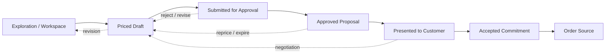
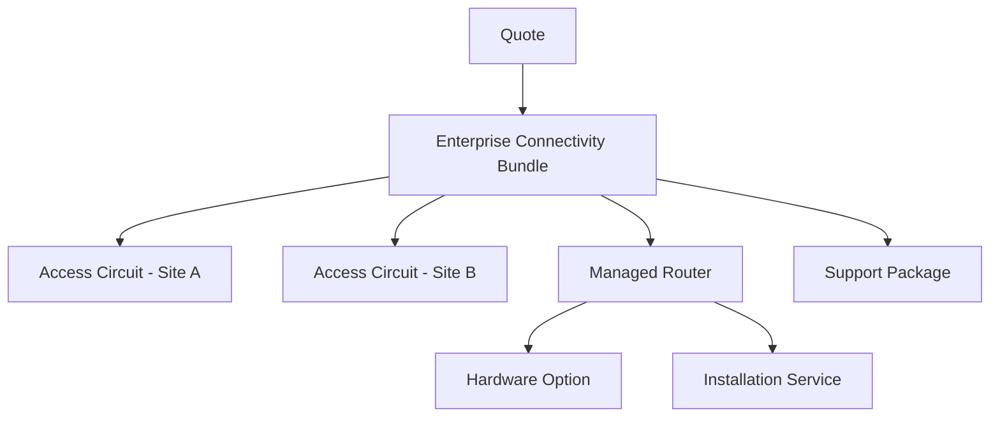
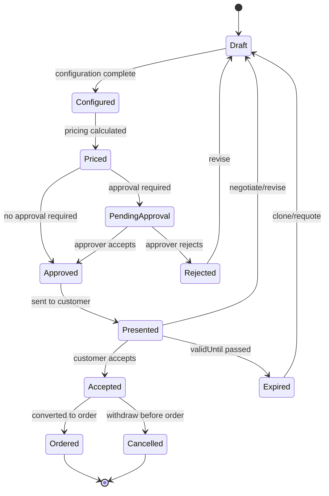
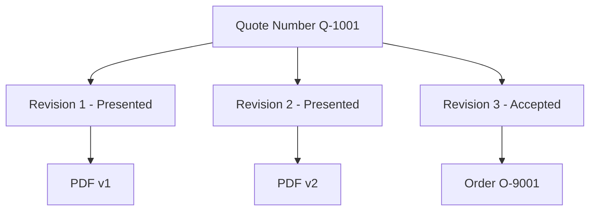
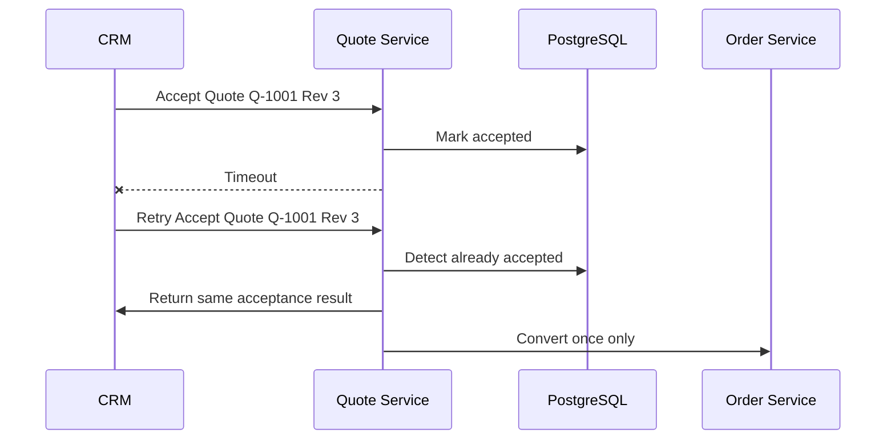

# Part 005 — Enterprise Quote Management: Draft, Versioning, Negotiation, and Approval

## 1. Tujuan Part Ini

Part ini membahas **quote management** sebagai sistem enterprise, bukan sebagai halaman “buat penawaran”.

Dalam CPQ sederhana, quote sering terlihat seperti cart berisi line item dan total harga. Di sistem enterprise quote-to-cash, quote adalah artifact bisnis yang memiliki konsekuensi operasional, finansial, legal, dan audit. Quote bisa menjadi dasar order, kontrak, provisioning, billing, revenue recognition, dispute resolution, dan customer commitment.

Tujuan part ini:

- memahami quote sebagai **commercial commitment artifact**;
- membedakan draft quote, quoted proposal, approved quote, accepted quote, dan order-source quote;
- memahami versioning, revision, clone, amend, expiry, dan acceptance;
- memahami approval sebagai risk control, bukan sekadar workflow UI;
- memahami invariant yang harus dipertahankan sebelum quote dapat dikonversi menjadi order;
- membangun cara review PR/architecture decision yang menyentuh quote lifecycle.

Dari informasi publik CSG, CSG Quote & Order diposisikan sebagai CPQ dan order management platform untuk B2B telecom/complex enterprise, dengan kemampuan quote, tailored pricing, enterprise agreements, margin control, product configuration, order management, dan quote-to-cash integration. Itu hanya framing publik. Detail state, table, workflow engine, approval engine, dan implementation boundary harus diverifikasi internal.

TMF648 Quote Management menyediakan referensi industri untuk quote management API: quote adalah pre-ordering management resource yang membawa parameter quote yang diperlukan. Tetapi TMF648 bukan bukti bahwa internal model sama persis dengan resource model TMF. Dalam produk enterprise nyata, sering ada anti-corruption layer, extension fields, internal command model, dan customer-specific integration behavior.

Prinsip utama part ini:

> A quote is not a temporary shopping cart. A quote is a controlled business artifact that gradually hardens into a legally, financially, and operationally meaningful commitment.

---

## 2. Public Facts vs Internal Facts

### 2.1 Yang aman dianggap sebagai fakta publik

Berdasarkan sumber publik:

- CSG Quote & Order adalah CPQ dan order management platform untuk B2B telecom dan complex enterprise.
- CSG memosisikan quote-to-cash sebagai workflow yang menghubungkan configure, price, quote, contract, order, orchestrate/automate, fulfill, dan bill.
- CSG menyebut kebutuhan complex quoting, tailored pricing, enterprise agreements, margin control, dan integration dengan ordering/billing/fulfillment sebagai konteks bisnis produk.
- TMF648 adalah Quote Management API dalam keluarga TM Forum Open APIs untuk pre-ordering management.

### 2.2 Yang tidak boleh diasumsikan tanpa verifikasi internal

Jangan mengasumsikan hal-hal berikut:

- Quote state internal sama dengan TMF648 state.
- Quote disimpan dalam satu service tertentu.
- Approval engine berdiri sendiri atau embedded di quote service.
- Versioning memakai immutable snapshot.
- Pricing selalu dihitung synchronously.
- Quote conversion menjadi order selalu atomic dalam satu database transaction.
- Setiap customer memakai lifecycle yang sama.
- Semua integration menggunakan TMF API secara langsung.
- UI adalah source of truth lifecycle.

### 2.3 Cara berpikir aman

Gunakan tiga label berikut saat membaca codebase:

| Label | Makna | Contoh |
|---|---|---|
| Public product claim | Informasi dari website/dokumen publik | “Quote & Order mendukung CPQ/order management” |
| Industry reference | Konsep standar umum | “TMF648 memodelkan quote management API” |
| Internal fact | Terbukti dari code/doc/pipeline/observability | “Service X menyimpan quote version di table Y” |

Jika sesuatu belum masuk kategori **Internal fact**, jangan jadikan dasar desain final.

---

## 3. Mental Model: Quote sebagai Artifact yang Mengeras

Quote bergerak dari informal ke formal.

Pada awalnya, quote adalah workspace:

- sales memilih customer;
- offering ditambahkan;
- configuration dicoba;
- beberapa price scenario dibandingkan;
- discount disimulasikan;
- item ditambah/dihapus;
- customer meminta perubahan.

Di fase ini, perubahan relatif murah.

Setelah quote dihitung, dikirim, dan dinegosiasikan, ia mulai menjadi proposal formal. Perubahan mulai berdampak:

- harga perlu dijelaskan;
- terms perlu konsisten;
- approval mungkin diperlukan;
- expiry date mulai penting;
- quote PDF atau document output mungkin sudah dibagikan;
- customer expectation terbentuk.

Setelah approval dan acceptance, quote menjadi commitment source. Pada titik ini, quote tidak boleh berubah sembarangan karena order, contract, audit, dan billing bisa mengacu pada versi quote tersebut.

Model konseptualnya:



Kunci mental model:

> Semakin dekat quote ke order, semakin immutable ia harus diperlakukan.

---

## 4. Quote Bukan Cart

Salah satu kesalahan desain paling umum adalah memperlakukan quote seperti shopping cart.

Cart biasanya:

- transient;
- user-centric;
- boleh berubah kapan saja;
- tidak selalu perlu audit detail;
- tidak punya approval formal;
- tidak menjadi dasar legal/fulfillment yang kuat.

Enterprise quote berbeda:

- memiliki customer/account/agreement context;
- memiliki quote number dan revision;
- membawa price snapshot;
- membawa catalog version/effective date;
- bisa memiliki approval trail;
- bisa memiliki expiration;
- bisa dikirim sebagai dokumen formal;
- bisa menjadi dasar order;
- harus dapat direkonstruksi untuk audit.

Perbedaan ini mengubah desain:

| Aspek | Cart | Enterprise Quote |
|---|---|---|
| Mutability | Bebas berubah | Dikendalikan state dan version |
| Price | Bisa recalculated kapan saja | Harus jelas apakah snapshot atau live |
| Audit | Minimal | Wajib defensible |
| Approval | Jarang | Core control |
| Conversion | Checkout sederhana | Order-source handoff |
| Legal meaning | Rendah | Bisa tinggi |
| Expiry | Opsional | Penting |
| Actor | User individual | Sales, approver, customer, system |

Rule praktis:

> Jika artifact bisa dikirim ke customer atau menjadi dasar order, perlakukan ia sebagai quote, bukan cart.

---

## 5. Core Domain Objects

Model internal bisa berbeda, tetapi secara domain quote management biasanya membutuhkan konsep berikut.

### 5.1 Quote

Quote adalah aggregate atau business document utama.

Fields umum:

- quote id;
- quote number;
- revision/version;
- customer/account reference;
- related party;
- opportunity/reference external;
- state;
- status reason;
- currency;
- valid from / valid until;
- requested date;
- expected order date;
- total recurring charge;
- total non-recurring charge;
- total discount;
- margin indicator;
- approval status;
- owner/sales rep;
- tenant/customer deployment context;
- created/updated metadata.

Yang perlu diperhatikan:

- `quoteId` adalah technical identity.
- `quoteNumber` sering menjadi business identity.
- `revision` membuat quote number bisa punya banyak versi.
- `state` mewakili lifecycle.
- `statusReason` menjelaskan kenapa state terjadi.

### 5.2 Quote Item

Quote item merepresentasikan line item atau hierarchy item dalam quote.

Fields umum:

- quote item id;
- parent item id;
- product offering reference;
- product specification reference;
- action: add / modify / delete / noChange;
- quantity;
- characteristics;
- price components;
- discount;
- validation status;
- dependency relation;
- site/location;
- service address;
- existing product reference;
- intended order item reference.

Quote item jarang flat. Untuk telco/enterprise, item bisa multi-level:



Kesalahan umum: memaksa semua item menjadi list sederhana, lalu dependency disembunyikan dalam JSON/string field. Ini membuat validation, approval, decomposition, dan audit sulit.

### 5.3 Price Component

Quote item biasanya memiliki banyak price component:

- recurring charge;
- non-recurring charge;
- usage-based charge;
- one-time installation fee;
- discount;
- tax placeholder;
- promotion;
- agreement-specific adjustment;
- partner cost;
- margin component.

Pertanyaan review:

- Apakah total price hanya calculated view atau disimpan sebagai snapshot?
- Apakah price component bisa dijelaskan ke customer?
- Apakah discount stacking terlihat?
- Apakah currency dan rounding deterministic?
- Apakah price berubah jika catalog berubah setelah quote dibuat?

### 5.4 Approval Record

Approval record bukan sekadar boolean `approved=true`.

Minimal harus menjawab:

- siapa mengajukan approval;
- kapan diajukan;
- rule apa yang memicu approval;
- siapa approver;
- apakah approver punya authority saat itu;
- keputusan apa yang diambil;
- komentar/reason;
- apakah approval masih valid setelah quote berubah;
- apakah approval terkait revision tertentu.

Approval harus terikat pada **snapshot** yang disetujui. Jika quote berubah material setelah approval, approval lama bisa tidak valid.

### 5.5 Quote Document / Presentation Artifact

Enterprise quote sering menghasilkan artifact eksternal:

- PDF proposal;
- contract draft;
- summary sheet;
- customer-facing offer;
- internal margin report.

Hal ini menimbulkan requirement:

- document version harus sesuai quote revision;
- generated document perlu reproducible atau archived;
- perubahan setelah document dikirim harus menciptakan revision baru;
- template version perlu dicatat.

---

## 6. Quote Lifecycle State Machine

State machine harus eksplisit. Tanpa state machine, lifecycle tersebar sebagai if-else di controller, service, UI, job, dan integration adapter.

Contoh lifecycle konseptual:



Ini bukan klaim state internal. Ini reference model untuk berpikir.

Setiap transition harus punya:

- source state;
- target state;
- actor;
- command;
- guard condition;
- side effect;
- audit event;
- failure mode;
- authorization rule.

Contoh transition matrix:

| Transition | Actor | Guard | Side effect | Audit |
|---|---|---|---|---|
| Draft → Priced | Sales/System | Valid configuration | Price snapshot saved | PriceCalculated |
| Priced → PendingApproval | Sales/System | Discount/margin threshold breached | Approval task created | ApprovalRequested |
| PendingApproval → Approved | Approver | Authority valid | Approval record saved | QuoteApproved |
| Presented → Accepted | Sales/Customer/System | Not expired, latest approved revision | Acceptance saved | QuoteAccepted |
| Accepted → Ordered | Sales/System | Not already converted | Order created | QuoteConvertedToOrder |

Review smell:

- transition dilakukan dengan update state langsung tanpa domain method;
- state bisa diubah oleh SQL manual tanpa audit;
- UI menyembunyikan button tapi API tidak enforce;
- approval state dan quote state tidak sinkron;
- order bisa dibuat dari quote expired;
- accepted quote masih bisa diedit.

---

## 7. Lifecycle Invariants

Invariant adalah aturan yang harus selalu benar, bukan hanya saat happy path.

### 7.1 Quote identity invariant

Contoh invariant:

- quote id immutable;
- quote number stable secara business;
- revision meningkat monotonik;
- satu quote number tidak boleh memiliki dua “latest active revision” yang ambigu.

Risiko jika dilanggar:

- customer support melihat revision salah;
- order dibuat dari revision lama;
- audit tidak bisa membuktikan proposal yang diterima customer.

### 7.2 Pricing invariant

Contoh invariant:

- accepted quote harus memiliki price snapshot;
- snapshot harus mencatat currency;
- rounding harus deterministic;
- total quote harus sama dengan agregasi price component yang berlaku;
- price yang disetujui approval harus sama dengan price yang diterima customer, kecuali ada revision baru.

Risiko:

- revenue leakage;
- customer dispute;
- billing mismatch;
- approval bypass.

### 7.3 Approval invariant

Contoh invariant:

- quote yang membutuhkan approval tidak boleh accepted sebelum approved;
- approval harus terkait revision tertentu;
- material change setelah approval harus invalidate approval atau memicu re-approval;
- approver tidak boleh sama dengan submitter jika segregation of duties diterapkan.

Risiko:

- margin control gagal;
- audit finding;
- unauthorized discount.

### 7.4 Conversion invariant

Contoh invariant:

- quote hanya boleh dikonversi sekali untuk order yang sama, kecuali business model mendukung split order secara eksplisit;
- order harus menyimpan reference ke quote revision;
- accepted quote tidak boleh expired pada saat conversion kecuali override terotorisasi;
- converted quote tidak boleh diedit secara material.

Risiko:

- duplicate order;
- double provisioning;
- billing duplikat;
- data reconciliation sulit.

---

## 8. Versioning and Revision Strategy

Quote versioning adalah salah satu area paling rawan.

### 8.1 Mutable draft, immutable revision

Strategi yang sering sehat:

- draft revision boleh mutable;
- published/presented/accepted revision harus immutable;
- perubahan material setelah presentation menciptakan revision baru;
- revision memiliki snapshot catalog, price, agreement, approval, dan document.

Model:



Pertanyaan desain:

- Apakah revision adalah row baru atau event history?
- Apakah quote item copied penuh per revision?
- Apakah price snapshot copied penuh?
- Apakah document generated ulang atau archived?
- Bagaimana query “latest quote” dijawab?
- Bagaimana external reference melihat revision?

### 8.2 Snapshot vs reference

Quote harus menyeimbangkan dua kebutuhan:

- tetap terhubung ke catalog/customer/agreement;
- tetap bisa membuktikan apa yang ditawarkan saat itu.

Karena itu quote sering menyimpan gabungan:

- reference: `productOfferingId`, `customerId`, `agreementId`;
- snapshot: offering name, characteristic value, price amount, catalog version, agreement term summary.

Rule praktis:

> Store references for traceability. Store snapshots for defensibility.

### 8.3 Material vs non-material change

Tidak semua perubahan harus membuat revision baru.

Material change biasanya:

- product/offering berubah;
- quantity berubah;
- price berubah;
- discount berubah;
- term berubah;
- customer/account berubah;
- validity berubah;
- approval-relevant attribute berubah.

Non-material change bisa:

- internal note;
- typo di description internal;
- sales owner reassignment;
- tag/label;
- attachment internal yang tidak memengaruhi proposal.

Tetapi definisi material harus berdasarkan aturan bisnis internal.

### 8.4 Approval invalidation

Jika quote berubah setelah approval, sistem harus memutuskan:

1. approval tetap valid;
2. approval invalid;
3. approval partially valid;
4. approval perlu re-evaluation otomatis.

Contoh:

| Change | Bias default |
|---|---|
| Internal note changed | Approval tetap valid |
| Discount increased | Re-approval |
| Quantity changed | Reprice + mungkin approval |
| Validity extended | Bisa approval jika risk policy |
| Product removed | Re-evaluate |
| Customer changed | Approval invalid |

PR review question:

> Does this change alter the business substance of the quote? If yes, what happens to approval, document, and order conversion eligibility?

---

## 9. Negotiation Model

Enterprise quote sering melewati negotiation loop.

Negosiasi bisa menghasilkan:

- line item dihapus;
- price diturunkan;
- term diperpanjang;
- bundle diganti;
- installation date berubah;
- customer-specific exception;
- approval tambahan;
- contract clause berubah.

Jangan desain negotiation hanya sebagai “update quote”. Negotiation perlu history dan reason.

### 9.1 Negotiation event

Event yang berguna:

- QuotePresented;
- CustomerRequestedChange;
- QuoteRevised;
- PriceRecalculated;
- ApprovalRequested;
- ApprovalGranted;
- QuoteAccepted;
- QuoteWithdrawn.

Event ini berguna untuk audit, analytics, dan support.

### 9.2 Multiple alternatives

Kadang sales ingin membandingkan scenario:

- option A: cheaper, lower bandwidth;
- option B: premium bundle;
- option C: phased rollout.

Desain harus jelas apakah alternatif ini:

- satu quote dengan multiple solution option;
- beberapa quote sibling;
- beberapa revision;
- draft scenario yang tidak customer-facing.

Kesalahan umum: memakai revision untuk scenario alternatif. Revision seharusnya menunjukkan evolusi proposal yang sama, bukan pilihan paralel, kecuali domain internal mendefinisikan demikian.

---

## 10. Approval as Risk Control

Approval bukan flow UI. Approval adalah risk control.

Approval melindungi organisasi dari:

- discount terlalu besar;
- margin negatif;
- contract term tidak standar;
- customer credit risk;
- product combination tidak supported;
- delivery date tidak realistis;
- legal/compliance exception;
- manual override yang tidak punya dasar.

### 10.1 Approval trigger

Trigger approval bisa berasal dari:

- discount percentage;
- absolute discount amount;
- margin threshold;
- non-standard term;
- product category;
- strategic account;
- revenue value;
- contract duration;
- manual override;
- risk flag;
- customer segment.

Trigger harus explainable.

Bad design:

```text
approvalRequired = true
```

Better design:

```text
approvalRequired = true
reasons = [
  "DISCOUNT_EXCEEDS_20_PERCENT",
  "MARGIN_BELOW_THRESHOLD",
  "NON_STANDARD_CONTRACT_TERM"
]
```

### 10.2 Approval authority

Approver harus memiliki authority yang sesuai.

Authority bisa berdasarkan:

- role;
- region;
- product line;
- deal size;
- margin threshold;
- customer segment;
- escalation tier.

Pertanyaan penting:

- Authority dievaluasi saat submit atau saat approve?
- Jika role approver berubah setelah approval, apakah approval tetap valid?
- Apakah delegation didukung?
- Apakah emergency override ada?
- Apakah override perlu second approval?

### 10.3 Segregation of duties

Untuk quote bernilai tinggi, bisa ada maker-checker rule:

- submitter tidak boleh approve quote sendiri;
- sales manager hanya boleh approve sampai threshold tertentu;
- finance approval wajib untuk margin risk;
- legal approval wajib untuk non-standard term.

Security smell:

- approval endpoint hanya memeriksa user login, bukan authority;
- UI menyembunyikan approve button tetapi API tidak enforce;
- approver bisa approve revision yang sudah berubah;
- approval comment optional untuk rejection;
- audit tidak mencatat rule yang memicu approval.

---

## 11. Pricing Recalculation Policy

Quote yang hidup lama akan menghadapi perubahan catalog, price list, tax rule, agreement, currency, dan promotion.

Sistem harus jelas:

- kapan price dihitung;
- kapan price disimpan;
- kapan price dianggap stale;
- kapan reprice wajib;
- siapa boleh override;
- apakah accepted quote price frozen.

### 11.1 Live price vs frozen price

| Strategy | Kelebihan | Risiko |
|---|---|---|
| Always live pricing | Selalu mengikuti catalog/price terbaru | Quote berubah diam-diam, customer dispute |
| Frozen snapshot | Defensible dan audit-friendly | Bisa menjual harga lama jika quote terlalu lama |
| Reprice on transition | Balance antara kontrol dan freshness | Transition logic kompleks |

Enterprise quote biasanya membutuhkan frozen snapshot pada milestone tertentu, misalnya saat presented/approved/accepted.

### 11.2 Stale price detection

Sistem perlu mendeteksi stale price:

- catalog version berbeda;
- price list updated;
- agreement expired;
- promotion ended;
- currency rate changed;
- quote validUntil exceeded.

Stale detection harus menghasilkan action jelas:

- block acceptance;
- require reprice;
- require approval;
- allow override with audit;
- notify sales.

### 11.3 Rounding and currency

Pricing bug sering berasal dari detail kecil:

- rounding per item vs per total;
- tax-exclusive vs tax-inclusive;
- monthly vs annual normalization;
- currency minor unit;
- precision BigDecimal;
- discount before/after bundle adjustment;
- proration.

Review rule:

> Never approve monetary logic without explicit rounding, currency, and aggregation rules.

---

## 12. Quote Acceptance

Acceptance adalah boundary besar. Setelah acceptance, quote biasanya boleh dikonversi ke order atau contract/order process.

Acceptance harus memvalidasi:

- quote tidak expired;
- quote revision adalah latest accepted candidate;
- required approval sudah complete;
- price snapshot valid;
- customer/account valid;
- required terms tersedia;
- quote belum converted;
- actor punya permission;
- external acceptance evidence dicatat jika perlu.

Acceptance event harus mencatat:

- acceptedBy;
- acceptedAt;
- acceptance channel;
- accepted revision;
- acceptance evidence/reference;
- terms accepted;
- document version.

Jika acceptance terjadi dari external system, idempotency menjadi wajib.

Contoh failure:



Tanpa idempotency, retry acceptance bisa membuat duplicate conversion.

---

## 13. Quote-to-Order Conversion

Conversion adalah saat quote berubah dari commercial proposal menjadi operational order intent.

Pertanyaan desain:

- Apakah conversion synchronous atau asynchronous?
- Apakah order dibuat oleh quote service atau order service?
- Apakah conversion command idempotent?
- Apakah quote item ID dipertahankan sebagai reference di order item?
- Apakah price snapshot ikut disalin ke order?
- Apakah catalog version ikut disalin?
- Apakah approval evidence ikut disalin?
- Apakah conversion bisa partial?
- Bagaimana jika order creation berhasil tapi response timeout?

### 13.1 Conversion invariants

Sebelum conversion:

- quote state harus `Accepted` atau equivalent;
- quote revision harus immutable;
- approval valid;
- price snapshot complete;
- required customer/account/agreement valid;
- quote tidak expired atau override tercatat;
- conversion idempotency key ada.

Setelah conversion:

- order menyimpan reference ke quote revision;
- quote mencatat order reference;
- duplicate conversion dicegah;
- audit event tercipta;
- downstream event/notification aman terhadap retry.

### 13.2 Synchronous vs asynchronous conversion

| Mode | Kelebihan | Risiko |
|---|---|---|
| Synchronous | User langsung dapat order ID | Timeout dan coupling tinggi |
| Asynchronous | Lebih resilient, cocok long-running validation | UX perlu pending state, observability wajib |
| Hybrid | Return accepted command + later order event | Kompleks tapi sering realistis |

Senior engineer harus menilai berdasarkan failure mode, bukan preferensi.

---

## 14. Expiry, Withdrawal, and Requote

Quote expiry bukan cosmetic date.

Expiry melindungi dari:

- harga lama;
- promotion lama;
- catalog lama;
- agreement yang berubah;
- risk policy berubah;
- capacity/delivery promise yang tidak lagi valid.

Expiry behavior harus jelas:

- Apakah expired quote bisa accepted?
- Apakah expired quote bisa cloned?
- Apakah approval masih valid setelah expiry extension?
- Apakah expiry job mengubah state?
- Apakah timezone diperhatikan?
- Apakah customer notification dikirim?

Withdrawal berbeda dari expiry.

- Expiry: quote tidak valid karena waktu.
- Withdrawal: organisasi menarik quote secara aktif.
- Rejection: customer atau approver menolak.
- Cancellation: quote dihentikan sebelum order.

Jangan gabungkan semua menjadi `Cancelled` tanpa reason.

---

## 15. Data Model Sketch

Ini bukan rekomendasi final, hanya sketch untuk membantu membaca codebase.

```text
quote
- id
- quote_number
- current_revision_id
- customer_id
- account_id
- state
- status_reason
- currency
- valid_from
- valid_until
- created_by
- created_at
- updated_at

quote_revision
- id
- quote_id
- revision_number
- state
- catalog_version
- price_snapshot_version
- agreement_snapshot_id
- presented_at
- accepted_at
- immutable_after
- created_at

quote_item
- id
- quote_revision_id
- parent_item_id
- product_offering_id
- product_offering_version
- action
- quantity
- site_id
- existing_product_id
- configuration_json
- validation_status

quote_price_component
- id
- quote_item_id
- price_type
- amount
- currency
- recurring_period
- discount_reason
- source_rule_id

quote_approval
- id
- quote_revision_id
- trigger_code
- submitted_by
- approver_id
- authority_snapshot
- decision
- decision_reason
- decided_at

quote_audit_event
- id
- quote_id
- quote_revision_id
- event_type
- actor_id
- correlation_id
- causation_id
- before_snapshot
- after_snapshot
- created_at
```

Important design questions:

- Apakah `quote_revision` immutable?
- Apakah `quote_item` copied per revision?
- Apakah audit snapshot terlalu besar?
- Apakah approval mengacu ke revision atau quote global?
- Apakah current revision bisa race?
- Apakah order mengacu ke quote revision ID?

---

## 16. API Design Considerations

Quote API harus merepresentasikan lifecycle command, bukan hanya CRUD.

Contoh endpoint konseptual:

```http
POST /quotes
PATCH /quotes/{quoteId}/draft
POST /quotes/{quoteId}/price
POST /quotes/{quoteId}/submit-approval
POST /quotes/{quoteId}/approve
POST /quotes/{quoteId}/reject
POST /quotes/{quoteId}/present
POST /quotes/{quoteId}/accept
POST /quotes/{quoteId}/convert-to-order
POST /quotes/{quoteId}/clone
GET  /quotes/{quoteId}
GET  /quotes/{quoteId}/revisions
```

Tidak semua harus endpoint action; beberapa bisa resource transition. Yang penting command semantic jelas.

### 16.1 Idempotency

Endpoint berikut harus dipikirkan idempotency-nya:

- quote create dari external request;
- submit approval;
- approve/reject;
- accept quote;
- convert to order;
- generate document;
- send quote;
- clone/requote.

Idempotency key harus scoped dengan benar:

```text
tenantId + externalRequestId + commandType
```

atau business key lain yang sesuai.

### 16.2 Error model

Error harus business-actionable:

Bad:

```json
{
  "error": "Invalid state"
}
```

Better:

```json
{
  "code": "QUOTE_APPROVAL_REQUIRED",
  "message": "Quote cannot be accepted because approval is required.",
  "details": {
    "quoteId": "Q-1001",
    "revision": 3,
    "requiredApprovals": ["FINANCE_MARGIN_APPROVAL"]
  }
}
```

Enterprise integrator perlu tahu apakah error bisa diperbaiki, diretry, atau harus eskalasi manual.

---

## 17. Observability for Quote Management

Quote lifecycle harus observable sebagai business process.

### 17.1 Logs

Structured log minimal:

- quoteId;
- quoteNumber;
- revision;
- customerId;
- tenantId;
- stateFrom;
- stateTo;
- command;
- actor;
- correlationId;
- causationId;
- idempotencyKey;
- approvalId jika relevan.

### 17.2 Metrics

Metrics berguna:

- quote creation rate;
- quote pricing latency;
- approval pending count;
- approval SLA breach;
- quote acceptance rate;
- quote expiry rate;
- quote-to-order conversion failures;
- duplicate conversion prevented;
- stale quote blocked;
- invalid state transition count.

### 17.3 Traces

Trace penting untuk flow:

- create quote;
- price quote;
- submit approval;
- accept quote;
- convert to order.

Trace harus membawa business identifiers. Tanpa itu, incident response akan bergantung pada log grep manual.

---

## 18. Testing Strategy

### 18.1 State transition tests

Gunakan transition matrix sebagai test source.

Contoh test cases:

- Draft can be priced if configuration valid.
- Priced quote requiring approval cannot be accepted.
- Approved quote becomes approval-invalid after material price change.
- Expired quote cannot be accepted.
- Accepted quote cannot be edited.
- Converted quote cannot be converted again.

### 18.2 Concurrency tests

Test skenario:

- dua user update quote draft bersamaan;
- approver approve saat sales merevisi quote;
- customer accept saat quote expire job berjalan;
- convert-to-order retry setelah timeout;
- duplicate external acceptance event.

### 18.3 Approval tests

Test harus mencakup:

- trigger rule;
- authority rule;
- maker-checker;
- re-approval after material change;
- audit completeness;
- unauthorized approval rejected.

### 18.4 Snapshot tests

Test harus membuktikan:

- price snapshot tidak berubah saat catalog berubah;
- quote document sesuai revision;
- order dibuat dari accepted revision;
- expired quote clone membuat revision/quote baru sesuai rule.

---

## 19. Failure Modes

### 19.1 Double conversion

Symptom:

- satu quote menghasilkan dua order;
- downstream provisioning duplikat;
- billing double.

Root causes:

- missing idempotency;
- retry setelah timeout;
- race antara UI dan integration;
- no unique constraint pada quote-to-order mapping.

Controls:

- unique constraint on quote revision conversion;
- idempotency key;
- transactional state transition;
- audit and alert.

### 19.2 Approval bypass

Symptom:

- quote accepted tanpa approval required;
- discount besar masuk order;
- audit tidak lengkap.

Root causes:

- approval hanya UI-level;
- material change tidak invalidate approval;
- role check tidak benar;
- endpoint accept tidak mengecek approval state.

Controls:

- domain-level guard;
- approval tied to revision;
- negative authorization tests;
- audit event mandatory.

### 19.3 Stale price acceptance

Symptom:

- customer menerima quote dengan price lama;
- billing mismatch;
- margin loss.

Root causes:

- no validity check;
- catalog price changed after quote;
- reprice not required before acceptance;
- expiry timezone bug.

Controls:

- price snapshot version;
- stale detection;
- acceptance guard;
- expiry job and alert.

### 19.4 Lost update in draft

Symptom:

- perubahan user A tertimpa user B;
- line item hilang;
- approval rule salah karena quote state tidak sesuai.

Root causes:

- no optimistic locking;
- full object replace;
- frontend stale state;
- patch semantics buruk.

Controls:

- version field;
- ETag/If-Match;
- command-level update;
- conflict response.

---

## 20. Senior PR Review Checklist

Saat mereview PR quote management, tanyakan:

### Domain correctness

- State transition apa yang berubah?
- Invariant apa yang ditambah/dilemahkan?
- Apakah quote accepted/approved/converted masih immutable?
- Apakah approval tetap valid setelah perubahan ini?
- Apakah order conversion terdampak?

### Data correctness

- Apakah migration backward-compatible?
- Apakah unique constraint diperlukan?
- Apakah optimistic locking diperlukan?
- Apakah audit data lengkap?
- Apakah snapshot/reference strategy jelas?

### API compatibility

- Apakah field baru additive?
- Apakah enum baru mematahkan consumer?
- Apakah error code berubah?
- Apakah command idempotent?
- Apakah external integration perlu update?

### Security and audit

- Apakah authorization transition enforce di backend?
- Apakah actor dicatat?
- Apakah approval authority dicek?
- Apakah tenant boundary aman?
- Apakah PII dalam log aman?

### Observability and operations

- Apakah ada metric untuk failure baru?
- Apakah log membawa quoteId/revision/correlationId?
- Apakah retry behavior aman?
- Apakah runbook perlu update?
- Apakah data repair/reconciliation terdampak?

---

## 21. Internal Verification Checklist

Gunakan checklist ini saat onboarding internal.

### Quote model

- Cari entity/class/table utama untuk quote.
- Identifikasi quote ID vs quote number vs external ID.
- Identifikasi quote revision/version model.
- Identifikasi apakah quote item hierarchical.
- Identifikasi price snapshot representation.

### State machine

- Temukan semua possible quote states.
- Temukan transition guard.
- Temukan actor/permission per transition.
- Temukan status reason taxonomy.
- Cari direct DB update atau admin override path.

### Versioning

- Apakah revision immutable?
- Kapan revision baru dibuat?
- Apa yang terjadi saat customer negotiation?
- Apakah document tied to revision?
- Apakah order tied to revision?

### Approval

- Di mana approval rule dievaluasi?
- Apakah approval tied to quote atau revision?
- Apa trigger approval?
- Bagaimana authority dicek?
- Apa yang membuat approval invalid?

### Conversion

- Service mana membuat order dari quote?
- Apakah conversion synchronous/asynchronous?
- Apakah ada idempotency?
- Apakah duplicate conversion dicegah DB constraint?
- Bagaimana failure conversion direcovery?

### Observability

- Dashboard quote lifecycle apa yang tersedia?
- Metric approval pending ada atau tidak?
- Metric conversion failure ada atau tidak?
- Apakah trace bisa mengikuti quote ke order?
- Apakah audit bisa reconstruct perubahan quote?

---

## 22. Hands-on Exercises

### Exercise 1 — Build quote lifecycle map

Ambil satu quote dari environment non-prod. Buat peta:

- state awal;
- command yang dilakukan;
- state akhir;
- table/record berubah;
- event/log muncul;
- actor;
- audit entry.

Output:

```text
Quote lifecycle map for Q-xxxxx
```

### Exercise 2 — Identify approval invalidation rule

Cari satu rule approval. Jawab:

- apa trigger-nya;
- siapa approver-nya;
- quote change apa yang meng-invalidasi approval;
- test apa yang membuktikannya.

### Exercise 3 — Conversion failure scenario

Simulasikan mental model:

- quote accepted;
- convert-to-order request timeout;
- caller retry;
- order service menerima request dua kali.

Tulis desain idempotency yang mencegah duplicate order.

### Exercise 4 — PR review drill

Bayangkan PR menambahkan field `specialDiscountReason` dan memperbolehkan edit setelah approval. Review:

- apakah material change;
- apakah approval invalid;
- apakah audit berubah;
- apakah API contract berubah;
- apakah test perlu ditambah.

---

## 23. Key Takeaways

- Quote enterprise bukan cart; quote adalah artifact bisnis yang dapat menjadi commitment.
- Versioning dan immutability adalah fondasi audit dan order correctness.
- Approval harus diperlakukan sebagai risk control, bukan dekorasi workflow.
- Price snapshot dan catalog version penting untuk defensibility.
- Quote acceptance dan conversion harus idempotent.
- State machine harus eksplisit dan diuji.
- Senior engineer harus mereview quote change dari sisi lifecycle, approval, audit, conversion, data safety, dan operations.

---

## 24. References and Further Reading

- CSG Quote & Order public product page: `https://www.csgi.com/products/quote-and-order`
- CSG Quote-to-Cash solution page: `https://www.csgi.com/solutions/quote-to-cash`
- TM Forum Quote Management API TMF648: `https://www.tmforum.org/open-digital-architecture/open-apis/quote-management-api-TMF648/v4.0`
- TM Forum Product Ordering Management API TMF622: `https://www.tmforum.org/resources/specifications/tmf622-product-ordering-management-api-user-guide-v5-0-0/`

---

## 25. Next Part

Part berikutnya membahas **Product Catalog and Catalog-Driven Architecture**: bagaimana catalog menjadi control plane bisnis untuk CPQ, quote, order, pricing, validation, fulfillment, dan billing consistency.
