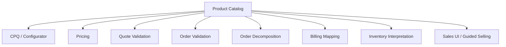
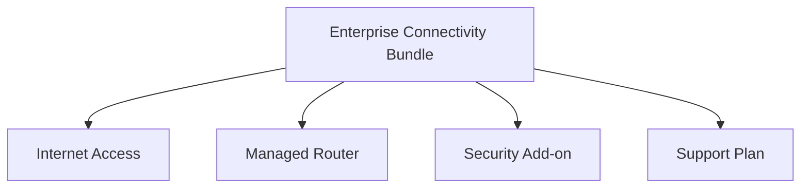
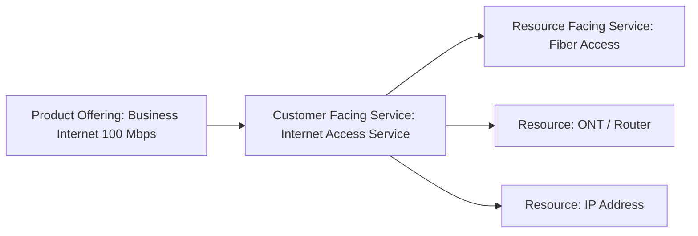
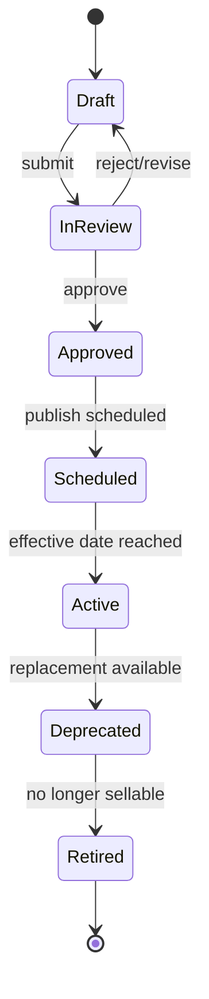
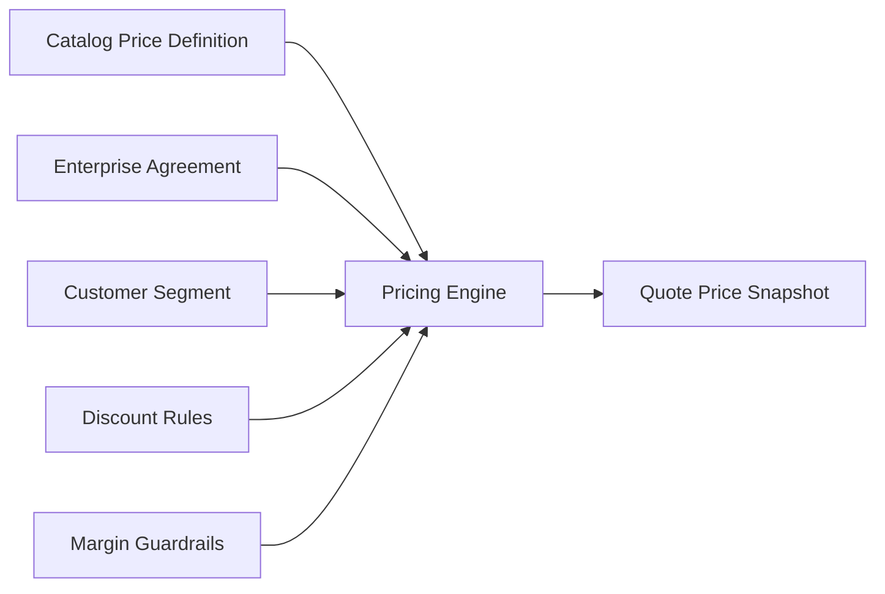
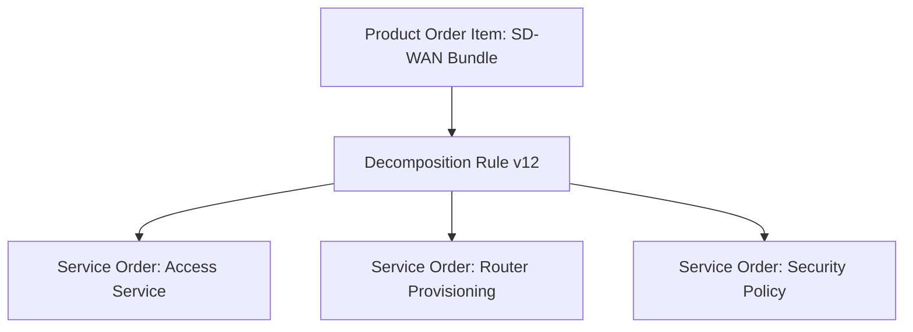
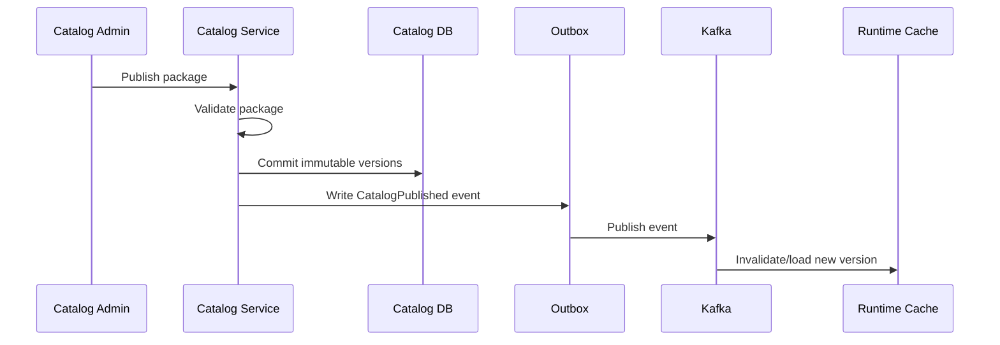

# Part 006 — Product Catalog and Catalog-Driven Architecture

## 1. Tujuan Part Ini

Part ini membahas **product catalog** sebagai fondasi CPQ dan quote-to-cash.

Dalam sistem enterprise, catalog bukan sekadar daftar produk. Catalog adalah **business control plane** yang menentukan:

- apa yang boleh dijual;
- ke siapa produk boleh dijual;
- bagaimana produk dikonfigurasi;
- bagaimana bundle dibentuk;
- price mana yang berlaku;
- dependency apa yang harus dipenuhi;
- order seperti apa yang valid;
- fulfillment apa yang perlu dijalankan;
- billing charge apa yang harus muncul;
- kapan produk/offering aktif, berubah, atau retired.

Tujuan part ini:

- membangun mental model catalog-driven architecture;
- memahami product specification, product offering, characteristic, product offering price, bundle, category, dan lifecycle;
- memahami trade-off snapshot vs live lookup;
- memahami catalog versioning dan effective dating;
- memahami impact catalog terhadap quote, order, fulfillment, billing, dan inventory;
- memahami failure mode catalog yang sering menyebabkan revenue leakage atau order fallout;
- menyiapkan cara membaca dan mereview code catalog dalam produk enterprise.

Dari sumber publik CSG, quote-to-cash diposisikan sebagai proses yang menggunakan catalog-driven platform agar product dan pricing information konsisten di setiap tahap quote, order, delivery/fulfillment, dan billing. Dari TM Forum, TMF620 Product Catalog Management API adalah referensi industri untuk management lifecycle elemen catalog dan konsultasi catalog dalam proses ordering, campaign management, dan sales management. Ini adalah konteks publik/industri, bukan bukti desain internal CSG.

Prinsip utama part ini:

> In CPQ and order management, catalog is not reference data. Catalog is executable business policy.

---

## 2. Public Facts vs Internal Facts

### 2.1 Public facts yang aman dipakai

- CSG memosisikan Quote & Order sebagai CPQ/order management platform untuk complex quoting, tailored pricing, enterprise agreements, dan quote-to-cash.
- CSG menyebut catalog-driven platform sebagai cara menjaga konsistensi product dan pricing information di sepanjang quote-to-cash process.
- TMF620 Product Catalog Management API menyediakan reference untuk management lifecycle catalog elements dan konsultasi catalog dalam proses ordering, sales, dan campaign.
- TMF622 Product Ordering menghubungkan product order dengan product offer yang didefinisikan dalam catalog.

### 2.2 Hal yang wajib diverifikasi internal

Jangan mengasumsikan:

- internal catalog model mengikuti TMF620 satu-satu;
- catalog service adalah source of truth tunggal;
- catalog runtime lookup selalu synchronous;
- catalog versioning sudah immutable;
- pricing berada di catalog service;
- catalog publish event tersedia di Kafka;
- semua customer memakai catalog sama;
- catalog customization dilakukan dengan feature flag;
- product catalog dan service catalog berada dalam service yang sama.

### 2.3 Pertanyaan pembuka saat onboarding

Sebelum mengubah logic catalog, jawab:

- Catalog mana yang menjadi source of truth?
- Apa unit versioning-nya: catalog, offering, spec, price list, atau rule set?
- Apakah quote menyimpan catalog snapshot?
- Apakah order menyimpan catalog snapshot?
- Apakah catalog publish atomic?
- Apakah catalog bisa customer-specific?
- Apakah downstream billing/fulfillment membaca catalog yang sama?

---

## 3. Mental Model: Catalog sebagai Control Plane

Catalog mengendalikan behavior runtime tanpa harus mengubah code untuk setiap product baru.

Tanpa catalog-driven architecture, setiap product baru cenderung membutuhkan:

- kode baru di configurator;
- kode baru di pricing;
- kode baru di validation;
- kode baru di order decomposition;
- kode baru di billing mapping;
- kode baru di UI;
- kode baru di integration adapter.

Ini tidak scalable untuk telco/enterprise karena product combination, customer-specific agreement, market, geography, partner, dan price model bisa sangat banyak.

Catalog-driven architecture mencoba memindahkan definisi variasi bisnis ke model data/rule yang versioned, validated, dan publishable.



Tetapi catalog-driven bukan berarti semua logic harus menjadi data. Ada trade-off:

- terlalu banyak hardcoded logic membuat product launch lambat;
- terlalu banyak dynamic rule membuat sistem sulit dipahami dan diuji.

Senior engineer harus menjaga batas:

> Make product variation configurable. Keep critical invariants explicit in code and tests.

---

## 4. Core Catalog Concepts

Terminologi bisa berbeda internal, tetapi konsep berikut umum dalam CPQ/telco.

### 4.1 Product Specification

Product specification mendefinisikan jenis produk secara konseptual.

Contoh:

- Business Internet Access;
- Managed Router;
- SD-WAN Site;
- Mobile Plan;
- Security Add-on.

Specification menjawab:

- produk ini apa;
- characteristic apa yang dimiliki;
- value apa yang valid;
- relationship apa yang bisa ada;
- service/resource apa yang mungkin dibutuhkan.

### 4.2 Product Offering

Product offering adalah cara product specification dijual ke market/customer.

Contoh:

- Business Internet 100 Mbps - Jakarta;
- Managed Router Premium Bundle;
- SD-WAN Enterprise Gold;
- Promotional Fiber Access 12-month contract.

Offering bisa memiliki:

- market/channel eligibility;
- customer segment;
- price;
- commercial term;
- valid date;
- bundled components;
- configurable characteristics;
- agreement constraints.

Mental model:

```text
Product Specification = what the product is
Product Offering      = how/where/to whom it is sold
```

### 4.3 Product Offering Price

Product offering price mendefinisikan commercial charge.

Jenis price:

- recurring charge;
- non-recurring charge;
- usage charge;
- installation fee;
- cancellation fee;
- discountable price;
- promotional price;
- customer-specific price;
- partner cost.

Price harus memiliki:

- currency;
- unit;
- recurrence period;
- effective date;
- tax treatment jika relevan;
- rounding rule;
- eligibility rule;
- source/version.

### 4.4 Characteristic

Characteristic adalah parameter konfigurasi.

Contoh:

- bandwidth: 100 Mbps, 500 Mbps, 1 Gbps;
- contract term: 12/24/36 months;
- installation type;
- router model;
- static IP count;
- service address;
- SLA tier.

Characteristic bisa memiliki:

- type;
- allowed values;
- default value;
- cardinality;
- dependency;
- validation rule;
- price impact;
- fulfillment impact.

### 4.5 Bundle

Bundle menggabungkan beberapa offering/specification menjadi commercial package.

Contoh:



Bundle harus mendefinisikan:

- mandatory vs optional component;
- min/max cardinality;
- compatibility;
- price rollup;
- discount behavior;
- decomposition rule;
- cancellation/amendment behavior.

### 4.6 Category

Category membantu browsing/guided selling.

Jangan samakan category dengan product semantics. Category bisa berubah untuk marketing tanpa mengubah product definition.

### 4.7 Catalog

Catalog adalah container/versioned publication dari offering/specification/price/rules.

Pertanyaan penting:

- Apakah satu global catalog?
- Apakah per market?
- Apakah per customer?
- Apakah per tenant?
- Apakah per channel?
- Apakah catalog punya lifecycle publish?

---

## 5. Product Catalog vs Service Catalog vs Resource Catalog

Dalam telco BSS/OSS, product tidak selalu sama dengan service/resource.

- Product: apa yang dijual ke customer.
- Service: capability yang diprovision untuk memenuhi product.
- Resource: physical/logical asset yang digunakan service.

Contoh:



Kesalahan umum:

- product catalog memuat terlalu banyak detail resource;
- order system harus tahu detail teknis yang seharusnya milik OSS;
- billing membaca service technical attributes yang tidak stabil;
- fulfillment bergantung pada commercial description yang bisa berubah.

Batas sehat:

- CPQ butuh product/offering/price/eligibility;
- order management butuh product order, action, dependency, decomposition intent;
- service ordering butuh service-level fulfillment instruction;
- resource management butuh inventory/resource allocation.

---

## 6. Catalog Lifecycle

Catalog element harus punya lifecycle.

Contoh state:



State internal bisa berbeda. Yang penting lifecycle menjawab:

- kapan offering bisa dikonfigurasi;
- kapan offering bisa dijual;
- kapan offering hanya valid untuk existing customer;
- kapan offering tidak boleh dipakai untuk quote baru;
- kapan offering masih boleh dipakai untuk amendment;
- kapan offering aman dihapus dari UI tapi tidak dari history.

### 6.1 Effective dating

Effective date penting karena quote bisa dibuat di satu tanggal dan accepted di tanggal lain.

Pertanyaan:

- Apakah offering valid berdasarkan quote creation date atau acceptance date?
- Apakah price valid berdasarkan pricing date atau order date?
- Apakah renewal memakai current catalog atau original catalog?
- Apakah amendment memakai installed product version atau current offering version?

Tidak ada jawaban universal. Jawaban harus eksplisit.

### 6.2 Retirement bukan deletion

Product/offering yang sudah pernah dipakai tidak boleh dihapus begitu saja.

Retirement harus mempertimbangkan:

- quote lama;
- order lama;
- product inventory;
- billing;
- support;
- audit;
- reporting;
- renewal/amendment.

Rule praktis:

> Catalog element can stop being sellable long before it can stop being understandable.

---

## 7. Catalog Versioning Strategy

Versioning adalah inti catalog defensibility.

### 7.1 What can be versioned?

Unit versioning bisa:

- entire catalog;
- product offering;
- product specification;
- price list;
- characteristic set;
- eligibility rule;
- bundle definition;
- decomposition rule;
- publish package.

Jika versioning terlalu coarse:

- perubahan kecil membuat banyak artifact berubah;
- cache invalidation besar;
- quote diff sulit.

Jika versioning terlalu fine-grained:

- dependency graph kompleks;
- compatibility sulit;
- snapshot berat.

### 7.2 Immutable published version

Desain yang aman:

- draft bisa diedit;
- published version immutable;
- correction membuat version baru;
- quote/order mengacu ke published version;
- retired version tetap readable.

Anti-pattern:

- update in-place offering active;
- price lama tertimpa;
- quote lama berubah tampilan/harga saat dibuka;
- no audit of catalog change.

### 7.3 Semantic compatibility

Perubahan catalog bisa breaking atau non-breaking.

| Change | Risiko |
|---|---|
| Menambah optional characteristic | Biasanya additive |
| Menghapus characteristic | Breaking untuk quote/order lama |
| Mengubah default value | Bisa silently change quote |
| Mengubah price | Material commercial impact |
| Mengubah cardinality | Bisa invalidasi configuration lama |
| Mengubah bundle mandatory component | Bisa ubah fulfillment dan billing |
| Mengubah offering ID | Breaking reference |

Senior review question:

> Will an existing draft quote, accepted quote, active product, or pending order still be understandable and valid after this catalog change?

---

## 8. Snapshot vs Live Lookup

CPQ/order system harus memilih kapan menggunakan live catalog dan kapan snapshot.

### 8.1 Live lookup

Live lookup cocok untuk:

- browsing current offerings;
- guided selling;
- validating draft against current rules;
- discovering available options;
- showing latest catalog to sales.

Risiko:

- quote lama berubah diam-diam;
- accepted quote sulit direkonstruksi;
- cache stale menyebabkan beda hasil antar service;
- catalog downtime memblokir workflow.

### 8.2 Snapshot

Snapshot cocok untuk:

- quote presented to customer;
- approved quote;
- accepted quote;
- order source;
- audit evidence;
- billing handoff.

Risiko:

- snapshot besar;
- duplication data;
- migration model lebih kompleks;
- correction lebih sulit.

### 8.3 Hybrid model

Model sehat sering hybrid:

- simpan reference untuk traceability;
- simpan snapshot untuk defensibility;
- simpan version untuk compatibility;
- validasi freshness pada transition tertentu.

```text
quote_item.productOfferingId       = live/reference identity
quote_item.productOfferingVersion  = catalog version used
quote_item.offeringNameSnapshot    = display/audit snapshot
quote_item.characteristicsSnapshot = configuration at that time
quote_item.priceSnapshot           = commercial commitment
```

---

## 9. Catalog-Driven CPQ

CPQ menggunakan catalog untuk menjawab:

- offering apa yang tersedia;
- characteristic apa yang harus diisi;
- value apa yang valid;
- item apa yang mandatory;
- item apa yang optional;
- kombinasi apa yang tidak valid;
- price apa yang berlaku;
- approval apa yang mungkin dibutuhkan.

### 9.1 Guided selling

Catalog bisa menggerakkan UI:

- category browsing;
- recommended bundles;
- configuration forms;
- dependency fields;
- validation messages;
- eligible add-ons;
- product comparison.

Tetapi UI-driven catalog tidak boleh menjadi satu-satunya enforcement. Backend tetap harus validate.

### 9.2 Configuration validation

Validation harus mencakup:

- required characteristic;
- value type;
- allowed value;
- cardinality;
- cross-field dependency;
- product compatibility;
- customer eligibility;
- market/geography availability;
- agreement restriction;
- lifecycle status.

### 9.3 Explainability

Validation harus explainable.

Bad:

```text
Invalid product configuration
```

Better:

```text
STATIC_IP_COUNT_NOT_ALLOWED_FOR_SELECTED_BANDWIDTH
Selected bandwidth tier does not support 32 static IP addresses.
Allowed maximum: 8.
```

This matters because sales/support need to resolve the quote, not debug source code.

---

## 10. Catalog-Driven Pricing

Pricing bisa berada di catalog, pricing service, rules engine, agreement module, atau kombinasi. Yang penting adalah dependency-nya jelas.

Catalog biasanya mendefinisikan:

- base price;
- recurring/non-recurring charge;
- charge period;
- price component;
- price condition;
- product offering price relation;
- discount eligibility;
- promotion;
- price list association.

Pricing engine kemudian menerapkan:

- customer agreement;
- volume discount;
- negotiated discount;
- margin guardrail;
- tax/proration;
- currency conversion jika relevan;
- approval threshold.



Failure mode umum:

- catalog price changed after quote approval;
- discount rule tidak versioned;
- price list effective date salah;
- currency precision beda antara quote dan billing;
- promotion expired tapi quote masih accepted;
- price displayed in UI berbeda dari backend snapshot.

---

## 11. Catalog-Driven Order Validation and Decomposition

Order tidak boleh hanya percaya quote. Order perlu validasi terhadap snapshot dan lifecycle.

Order validation bisa memeriksa:

- quote accepted;
- offering masih orderable untuk accepted quote;
- action add/modify/delete valid;
- existing product reference valid;
- required fulfillment attributes tersedia;
- site/location valid;
- dependency graph valid.

Decomposition bisa menggunakan catalog untuk memetakan product order ke service/resource work.

Contoh:



Risiko:

- decomposition rule berubah setelah quote/order dibuat;
- pending order diproses dengan rule versi baru;
- catalog tidak menyimpan technical mapping yang dibutuhkan;
- circular dependency membuat orchestration stuck;
- bundle optional component tidak dimapping ke fulfillment.

Prinsip:

> The order should know which catalog/decomposition version made it executable.

---

## 12. Catalog and Product Inventory

Product inventory adalah installed base: produk yang sudah dimiliki/aktif.

Catalog memengaruhi inventory dalam beberapa cara:

- menentukan jenis product instance;
- mendefinisikan characteristic yang disimpan;
- menentukan amendment path;
- menentukan compatibility add-on;
- menentukan renewal/cancel behavior;
- membantu interpretasi historical product.

Critical distinction:

```text
Catalog: what can be sold / what product means
Inventory: what customer actually has
```

Untuk amendment, CPQ perlu membaca inventory:

- customer sudah punya product apa;
- product version apa;
- characteristic apa saat ini;
- add-on apa yang compatible;
- upgrade/downgrade path apa yang valid.

Jika catalog version lama sudah retired, system tetap harus bisa memahami inventory lama.

---

## 13. Data Modelling Choices

Catalog model sering kompleks. Ada beberapa pilihan representasi.

### 13.1 Relational normalized model

Kelebihan:

- referential integrity;
- queryable;
- clear lifecycle;
- good for reporting/impact analysis;
- easier constraints.

Risiko:

- banyak table;
- model change lambat;
- dynamic characteristic sulit;
- join kompleks.

### 13.2 JSON/JSONB-heavy model

Kelebihan:

- flexible;
- cocok untuk variable product attributes;
- schema evolution lebih cepat;
- dapat menyimpan snapshot mudah.

Risiko:

- validation pindah ke application;
- index strategy sulit;
- query impact analysis sulit;
- hidden coupling;
- data quality drift.

### 13.3 Graph-like model

Catalog bundle/dependency sering graph.

Kelebihan:

- natural untuk relationship;
- cocok untuk dependency traversal;
- membantu impact analysis.

Risiko:

- cycle detection wajib;
- query performance perlu hati-hati;
- harder transactional update;
- harder operational debugging.

### 13.4 Hybrid model

Enterprise catalog sering hybrid:

- relational untuk identity/lifecycle/reference;
- JSONB untuk characteristic snapshot;
- graph relation table untuk dependency;
- search index untuk browsing;
- cache/read model untuk runtime CPQ.

Sketch:

```text
catalog
- id
- name
- version
- lifecycle_status
- valid_from
- valid_to

product_specification
- id
- version
- name
- lifecycle_status

product_offering
- id
- version
- catalog_id
- product_specification_id
- name
- lifecycle_status
- valid_from
- valid_to
- sellable

product_characteristic
- id
- owner_type
- owner_id
- name
- value_type
- cardinality_min
- cardinality_max
- allowed_values_json

product_offering_price
- id
- offering_id
- version
- price_type
- amount
- currency
- recurring_period
- valid_from
- valid_to

product_relationship
- id
- source_id
- target_id
- relationship_type
- min_cardinality
- max_cardinality
```

---

## 14. Catalog Publish Architecture

Catalog publish harus diperlakukan sebagai release process.

### 14.1 Publish package

Daripada mengubah offering satu per satu di production, sistem bisa menggunakan publish package:

- offering changes;
- price changes;
- rule changes;
- dependency changes;
- effective date;
- validation result;
- approval metadata.

Publish package memungkinkan review dan rollback strategy lebih baik.

### 14.2 Validation before publish

Validation publish harus menangkap:

- missing price;
- missing mandatory characteristic;
- invalid cardinality;
- circular dependency;
- orphan offering;
- conflicting effective date;
- duplicate external ID;
- incompatible price currency;
- missing decomposition mapping;
- missing billing mapping.

### 14.3 Atomicity

Catalog publish harus menjawab:

- Apakah publish atomic?
- Apakah partial publish bisa terjadi?
- Jika publish gagal di tengah, apa state-nya?
- Apakah cache invalidation terjadi setelah commit?
- Apakah event dikirim via outbox?

Ideal flow:



---

## 15. Runtime Catalog Access

CPQ and order path bisa sangat sensitif latency.

### 15.1 Direct DB lookup

Kelebihan:

- simple;
- strongly consistent with DB;
- easier transaction.

Risiko:

- high latency if graph traversal complex;
- DB load tinggi;
- coupling kuat;
- sulit scale read.

### 15.2 Service API lookup

Kelebihan:

- encapsulation;
- clear ownership;
- reuse across services.

Risiko:

- network dependency;
- timeout;
- cache needed;
- version lookup must be explicit.

### 15.3 Local cache/read model

Kelebihan:

- fast CPQ;
- resilient to catalog service outage;
- better UX.

Risiko:

- stale data;
- invalidation complexity;
- memory footprint;
- inconsistent cache across pods.

### 15.4 Recommendation framing

Tidak ada satu jawaban. Pilihan harus berdasarkan:

- frequency read;
- freshness requirement;
- catalog size;
- publish frequency;
- latency target;
- consistency risk;
- deployment model;
- on-prem constraints.

---

## 16. TMF620 Practical Use

TMF620 berguna sebagai reference model dan integration contract, tetapi jangan diperlakukan sebagai internal domain model wajib.

Cara sehat memakai TMF620:

- gunakan vocabulary untuk alignment;
- gunakan API shape untuk external integration jika dibutuhkan;
- map internal model ke TMF resource melalui adapter;
- dokumentasikan extension;
- tulis conformance/compatibility tests;
- jangan bocorkan semua internal complexity ke external API.

Pertanyaan mapping:

- Internal “offering” setara `ProductOffering` atau custom aggregate?
- Internal price model setara `ProductOfferingPrice` atau butuh extension?
- Characteristic model compatible dengan TMF characteristic pattern?
- Lifecycle state map ke TMF lifecycle status?
- Relationship model bisa diekspresikan dengan TMF relationship?
- Apakah external ID stable?

Anti-pattern:

- menggunakan TMF object langsung sebagai database entity;
- membiarkan extension field tidak terdokumentasi;
- mengubah TMF-compatible API mengikuti internal refactor;
- memaksakan internal rule engine masuk ke response API besar;
- tidak melakukan versioning saat upgrade TMF version.

---

## 17. Failure Modes Catalog-Driven Systems

### 17.1 Stale catalog cache

Symptom:

- UI menampilkan offering lama;
- backend menolak configuration;
- quote price berbeda antar pod;
- sales melihat options inconsistent.

Controls:

- versioned cache key;
- event-based invalidation;
- cache freshness metric;
- force reload endpoint/runbook;
- publish-after-commit only.

### 17.2 Partial publish

Symptom:

- offering active tanpa price;
- bundle component missing;
- decomposition mapping belum ada;
- order fallout setelah product launch.

Controls:

- publish package transaction;
- pre-publish validation;
- dependency completeness check;
- canary catalog publish;
- rollback/disable offering.

### 17.3 Catalog-price drift

Symptom:

- quote price tidak sama dengan billing;
- discount basis salah;
- customer dispute.

Controls:

- shared price source or explicit mapping;
- price snapshot;
- catalog-billing reconciliation;
- versioned price list;
- contract test with billing handoff.

### 17.4 Incompatible amendment path

Symptom:

- existing product tidak bisa dimodifikasi karena catalog lama retired;
- upgrade/downgrade path hilang;
- customer care perlu manual workaround.

Controls:

- installed-base compatibility tests;
- retired-but-readable catalog;
- amendment catalog rules;
- migration path for old products.

### 17.5 Circular dependency

Symptom:

- configurator loop;
- decomposition stuck;
- validation timeout.

Controls:

- graph cycle detection;
- max traversal depth;
- publish validation;
- dependency graph visualization.

---

## 18. Observability for Catalog

Catalog observability harus menjawab:

- version mana sedang aktif;
- kapan publish terakhir;
- berapa banyak quote memakai version lama;
- apakah cache stale;
- apakah validation error meningkat setelah publish;
- apakah order fallout meningkat setelah catalog release;
- product/offering mana paling sering error.

### 18.1 Metrics

Metrics yang berguna:

- catalog publish count;
- catalog publish failure count;
- catalog validation failure count;
- active offering count;
- retired offering referenced by active quote count;
- cache hit/miss;
- cache age;
- pricing lookup latency;
- configuration validation latency;
- post-publish quote error rate.

### 18.2 Logs

Log catalog-sensitive operation harus membawa:

- catalogId;
- catalogVersion;
- productOfferingId;
- productOfferingVersion;
- priceListId;
- ruleSetVersion;
- quoteId jika dipakai CPQ;
- orderId jika dipakai order validation;
- correlationId.

### 18.3 Dashboards

Dashboard ideal:

- current active catalog versions;
- publish timeline;
- publish validation failures;
- cache freshness per service;
- top invalid product configurations;
- fallout correlated with catalog changes.

---

## 19. Testing Catalog-Driven Behavior

### 19.1 Catalog unit tests

Test:

- characteristic validation;
- allowed values;
- cardinality;
- compatibility;
- bundle mandatory/optional;
- lifecycle state transition;
- effective date behavior.

### 19.2 Catalog publish tests

Test:

- missing price blocked;
- circular dependency blocked;
- orphan component blocked;
- invalid date range blocked;
- duplicate external ID blocked;
- missing fulfillment mapping flagged.

### 19.3 CPQ integration tests

Test:

- offering appears in guided selling;
- required fields generated;
- invalid config rejected;
- price calculated;
- quote snapshot stores version;
- approval triggered after discount.

### 19.4 Backward compatibility tests

Test:

- old quote still opens after catalog change;
- accepted quote still converts;
- retired offering still readable;
- amendment path works for old product;
- order history still reconstructable.

### 19.5 Contract tests

Jika catalog exposed via TMF620/OpenAPI:

- response schema compatibility;
- enum compatibility;
- extension fields documented;
- pagination/filtering stable;
- version upgrade tested.

---

## 20. Senior PR Review Checklist

Saat mereview catalog change, tanyakan:

### Domain impact

- Offering/spec/price apa yang berubah?
- Apakah change material?
- Apakah existing quote/order/inventory terdampak?
- Apakah amendment path terdampak?
- Apakah lifecycle state benar?

### Versioning

- Apakah published artifact immutable?
- Apakah version baru dibuat?
- Apakah old version tetap readable?
- Apakah quote/order snapshot cukup?
- Apakah effective date benar?

### Runtime behavior

- Apakah cache invalidation aman?
- Apakah publish atomic?
- Apakah CPQ validation berubah?
- Apakah pricing berubah?
- Apakah order decomposition berubah?

### Integration

- Apakah TMF620/API contract berubah?
- Apakah billing mapping berubah?
- Apakah fulfillment mapping berubah?
- Apakah partner/customer integration terdampak?
- Apakah backward compatibility diuji?

### Operations

- Apakah ada dashboard post-publish?
- Apakah rollback/disable path tersedia?
- Apakah runbook perlu update?
- Apakah migration/backfill diperlukan?
- Apakah support team perlu diberi tahu?

---

## 21. Internal Verification Checklist

### Catalog ownership

- Service/module mana source of truth catalog?
- Team mana owner catalog model?
- Apakah catalog dikelola via UI/admin/import/API?
- Apakah customer bisa mengelola catalog sendiri?
- Apakah ada approval untuk catalog publish?

### Model

- Temukan entity product specification.
- Temukan entity product offering.
- Temukan product offering price.
- Temukan characteristic model.
- Temukan bundle/relationship model.
- Temukan lifecycle field.

### Versioning

- Apa unit versioning?
- Apakah version immutable setelah publish?
- Apakah validFrom/validTo dipakai?
- Apakah quote menyimpan offering version?
- Apakah order menyimpan catalog version?
- Apakah price list versioned?

### Runtime

- Bagaimana CPQ membaca catalog?
- Apakah ada cache?
- Bagaimana cache invalidation?
- Apakah catalog service outage memblokir quote?
- Bagaimana on-prem deployment menangani catalog updates?

### Integration

- Apakah TMF620 exposed?
- Version TMF620 apa yang dipakai?
- Apakah extension documented?
- Apakah billing membaca catalog sama?
- Apakah fulfillment/decomposition membaca catalog sama?
- Apakah product inventory mengacu catalog version?

### Operations

- Apakah ada catalog publish dashboard?
- Apakah ada catalog validation report?
- Apakah ada impact analysis tool?
- Apakah ada rollback/disable offering?
- Apakah ada incident historis terkait catalog?

---

## 22. Hands-on Exercises

### Exercise 1 — Trace one product offering

Pilih satu offering di environment internal/non-prod. Trace:

- product offering ID;
- product specification;
- characteristics;
- price components;
- lifecycle status;
- validFrom/validTo;
- bundle relationships;
- quote usage;
- order/decomposition mapping;
- billing mapping jika tersedia.

Output:

```text
Product Offering Trace: <offering-id>
```

### Exercise 2 — Catalog snapshot audit

Ambil satu quote lama. Jawab:

- offering version apa yang dipakai;
- price snapshot apa yang disimpan;
- apakah offering masih active;
- apakah quote masih bisa dibuka dengan makna yang sama;
- apakah accepted quote masih bisa dikonversi.

### Exercise 3 — Failure scenario: stale cache

Desain skenario:

- catalog price updated;
- cache service A refresh;
- cache service B stale;
- quote dibuat di service B;
- order validation di service A.

Jawab:

- apa yang bisa salah;
- metric apa mendeteksi;
- guard apa mencegah;
- runbook apa diperlukan.

### Exercise 4 — PR review drill

Bayangkan PR mengubah default contract term dari 12 ke 24 bulan untuk offering aktif.

Review:

- apakah ini breaking;
- quote draft apa terdampak;
- accepted quote apa terdampak;
- approval/pricing apa berubah;
- test apa wajib ditambah;
- release note apa diperlukan.

---

## 23. Key Takeaways

- Catalog adalah control plane bisnis CPQ/order, bukan sekadar reference table.
- Product specification dan product offering harus dibedakan.
- Published catalog version sebaiknya immutable atau setidaknya defensible.
- Quote/order membutuhkan reference dan snapshot.
- Effective date, lifecycle, dan retirement menentukan correctness jangka panjang.
- Catalog-driven architecture mengurangi hardcoding tetapi menambah kebutuhan validation, versioning, observability, dan testing.
- Senior engineer harus mereview catalog change dari sisi quote, order, pricing, fulfillment, billing, inventory, cache, compatibility, dan operations.

---

## 24. References and Further Reading

- CSG Quote & Order public product page: `https://www.csgi.com/products/quote-and-order`
- CSG Quote-to-Cash solution page: `https://www.csgi.com/solutions/quote-to-cash`
- TM Forum Product Catalog Management API TMF620 v5.0: `https://www.tmforum.org/open-digital-architecture/open-apis/product-catalog-management-api-TMF620/v5.0`
- TM Forum Product Catalog Management API User Guide v5.0.0: `https://www.tmforum.org/resources/specifications/tmf620-product-catalog-management-api-user-guide-v5-0-0/`
- TM Forum Product Ordering Management API TMF622 User Guide v5.0.0: `https://www.tmforum.org/resources/specifications/tmf622-product-ordering-management-api-user-guide-v5-0-0/`

---

## 25. Next Part

Part berikutnya membahas **Pricing, Discounting, Margin, and Financial Governance**: bagaimana price calculation, discount stacking, margin protection, approval threshold, enterprise agreement, dan revenue leakage prevention harus didesain dan direview.
